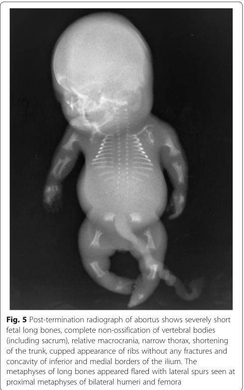

## Question

# Disease Characteristics Research Template

## Target Disease
- **Disease Name:** Achondrogenesis Type II
- **MONDO ID:**  (if available)
- **Category:** Mendelian

## Research Objectives

Please provide a comprehensive research report on **Achondrogenesis Type II** covering all of the
disease characteristics listed below. This report will be used to populate a disease knowledge
base entry. Be thorough and cite primary literature (PMID preferred) for all claims.

For each section, **suggested databases/resources** are listed. These are the first places
you should search for information on each topic.

---

### 1. Disease Information
> **Search first:** OMIM, Orphanet, ICD-10/ICD-11, MeSH, PubMed

- What is the disease? Provide a concise overview.
- What are the key identifiers? (OMIM, Orphanet, ICD-10/ICD-11, MeSH, Mondo)
- What are the common synonyms and alternative names?
- Is the information derived from individual patients (e.g., EHR) or aggregated disease-level resources?

### 2. Etiology

- **Disease Causal Factors**: What are the primary causes? (genetic, environmental, infectious, mechanistic)
- **Risk Factors**:
  > **Search first:** PubMed, Cochrane Library, UpToDate, clinical guidelines, ClinVar, ClinGen, GWAS Catalog, PheGenI, CTD, CDC, WHO, epidemiological databases
  - Genetic risk factors (causal variants, susceptibility loci, modifier genes)
  - Environmental risk factors (toxins, lifestyle, occupational exposures, age, sex, family history)
- **Protective Factors**:
  > **Search first:** PubMed, Cochrane Library, clinical trial databases, GWAS Catalog, gnomAD, WHO, CDC, nutrition databases
  - Genetic protective factors (protective variants, modifier alleles)
  - Environmental protective factors (diet, lifestyle, exposures that reduce risk)
- **Gene-Environment Interactions**: How do genetic and environmental factors interact to influence disease?
  > **Search first:** CTD, PubMed, PheGenI, GxE databases

### 3. Phenotypes
> **Search first:** HPO (Human Phenotype Ontology), OMIM, Orphanet, PubMed, clinicaltrials.gov, MedDRA, SNOMED CT, DECIPHER, LOINC

For each phenotype, provide:
- **Phenotype type**: symptoms, clinical signs, physical manifestations, behavioral changes, or laboratory abnormalities
  > For symptoms/signs: HPO, OMIM, Orphanet, PubMed
  > For behavioral changes: HPO, DSM, RDoC (Research Domain Criteria), PubMed
  > For laboratory abnormalities: LOINC, SNOMED CT, LabTests Online, PubMed
- **Phenotype characteristics**:
  > **Search first:** OMIM, Orphanet, HPO, PubMed
  - Age of symptom onset (neonatal, childhood, adult-onset, late-onset)
  - Symptom severity (mild, moderate, severe, variable)
  - Symptom progression (stable, progressive, episodic, fluctuating)
  - Frequency among affected individuals (percentage or qualitative)
- **Quality of life impact**: Effects on daily functioning and well-being (per-phenotype when possible)
  > **Search first:** EQ-5D database, SF-36, WHO QOL databases, PubMed
- Suggest HPO (Human Phenotype Ontology) terms for each phenotype

### 4. Genetic/Molecular Information

- **Causal Genes**: Gene mutations or chromosomal abnormalities responsible for disease (gene symbols, OMIM IDs)
  > **Search first:** OMIM, ClinVar, HGMD, Ensembl, NCBI Gene
- **Pathogenic Variants**:
  - Affected genes (gene symbols, HGNC IDs)
    > **Search first:** OMIM, NCBI Gene, Ensembl, HGNC, UniProt, GeneCards
  - Variant classification (pathogenic, likely pathogenic, VUS per ACMG/AMP guidelines)
    > **Search first:** ClinVar, ClinGen, ACMG/AMP guidelines, VarSome
  - Variant type/class (missense, frameshift, nonsense, splice-site, structural)
  - Allele frequency in population databases
    > **Search first:** gnomAD, 1000 Genomes, ExAC, TOPMed, dbSNP
  - Somatic vs germline origin
    > **Search first:** COSMIC (somatic), ClinVar, ICGC, TCGA
  - Functional consequences (loss of function, gain of function, dominant negative)
- **Modifier Genes**: Genes that modify disease severity or expression
- **Epigenetic Information**: DNA methylation, histone modifications, chromatin changes affecting disease
  > **Search first:** ENCODE, Roadmap Epigenomics, MethBase, DiseaseMeth
- **Chromosomal Abnormalities**: Large-scale genetic changes (aneuploidy, translocations, inversions)
  > **Search first:** DECIPHER, ClinVar, ECARUCA, UCSC Genome Browser

### 5. Environmental Information

- **Environmental Factors**: Non-genetic contributing factors (toxins, radiation, pollution, occupational exposure)
  > **Search first:** CTD (Comparative Toxicogenomics Database), TOXNET, PubMed, EPA databases
- **Lifestyle Factors**: Behavioral factors (smoking, diet, exercise, alcohol consumption)
  > **Search first:** CDC databases, WHO, PubMed, NHANES
- **Infectious Agents**: If applicable, pathogens causing or triggering disease (bacteria, viruses, fungi, parasites)
  > **Search first:** NCBI Taxonomy, ViPR, BV-BRC, MicrobeDB, GIDEON

### 6. Mechanism / Pathophysiology

- **Molecular Pathways**: Specific signaling cascades or biochemical pathways involved (Wnt, MAPK, mTOR, PI3K-AKT, etc.)
  > **Search first:** KEGG, Reactome, WikiPathways, PathBank, BioCyc
- **Cellular Processes**: Cell-level mechanisms (apoptosis, autophagy, cell cycle dysregulation, inflammation, etc.)
  > **Search first:** Gene Ontology (GO), Reactome, KEGG, PubMed
- **Protein Dysfunction**: How protein structure or function is altered (misfolding, aggregation, loss of function, gain of function)
  > **Search first:** UniProt, PDB (Protein Data Bank), InterPro, Pfam, AlphaFold
- **Metabolic Changes**: Alterations in metabolic processes (energy metabolism, lipid metabolism, amino acid metabolism)
  > **Search first:** KEGG, BioCyc, HMDB (Human Metabolome Database), BRENDA
- **Immune System Involvement**: Role of immune response (autoimmunity, immunodeficiency, chronic inflammation)
  > **Search first:** ImmPort, Immunome Database, IEDB, Gene Ontology
- **Tissue Damage Mechanisms**: How tissues/ are injured (oxidative stress, ischemia, fibrosis, necrosis)
  > **Search first:** PubMed, Gene Ontology, Reactome
- **Biochemical Abnormalities**: Specific molecular defects (enzyme deficiencies, receptor dysfunction, ion channel defects)
  > **Search first:** BRENDA, UniProt, KEGG, OMIM, PubMed
- **Epigenetic Changes**: DNA methylation, histone modifications affecting gene expression in disease
  > **Search first:** ENCODE, Roadmap Epigenomics, MethBase, DiseaseMeth
- **Molecular Profiling** (if available):
  - Transcriptomics/gene expression changes
    > **Search first:** GEO (Gene Expression Omnibus), ArrayExpress, GTEx, Human Cell Atlas, SRA
  - Proteomics findings
    > **Search first:** PRIDE, ProteomeXchange, Human Protein Atlas, STRING, BioGRID
  - Metabolomics signatures
    > **Search first:** MetaboLights, Metabolomics Workbench, HMDB, METLIN
  - Lipidomics alterations
    > **Search first:** LIPID MAPS, SwissLipids, LipidHome, Metabolomics Workbench
  - Genomic structural features
    > **Search first:** UCSC Genome Browser, Ensembl, NCBI, dbVar, DGV
- **Advanced Technologies** (if applicable):
  - Single-cell analysis findings (cell-type specific mechanisms, cellular heterogeneity)
    > **Search first:** Human Cell Atlas, Single Cell Portal, GEO, CELLxGENE
  - Spatial transcriptomics findings
    > **Search first:** GEO, Spatial Research, Vizgen, 10x Genomics data
  - Multi-omics integration results
    > **Search first:** TCGA, ICGC, cBioPortal, LinkedOmics, PubMed
  - Functional genomics screens (CRISPR, RNAi)
    > **Search first:** DepMap, GenomeRNAi, PubMed, BioGRID ORCS

For each mechanism, describe:
- The causal chain from initial trigger to clinical manifestation
- Which mechanisms are upstream vs downstream
- What cell types and biological processes are involved
- Suggest GO terms for biological processes and CL terms for cell types

### 7. Anatomical Structures Affected

- **Organ Level**:
  - Primary organs directly affected
  - Secondary organ involvement (complications, secondary effects)
  - Body systems involved (cardiovascular, nervous, digestive, respiratory, endocrine, etc.)
  > **Search first:** Uberon, FMA (Foundational Model of Anatomy), OMIM, HPO, ICD-11, MeSH, SNOMED CT
- **Tissue and Cell Level**:
  - Specific tissue types affected (epithelial, connective, muscle, nervous)
  - Specific cell populations targeted (with Cell Ontology terms)
  > **Search first:** Uberon, Human Protein Atlas, Cell Ontology, Human Cell Atlas, CellMarker, PanglaoDB
- **Subcellular Level**:
  - Cellular compartments involved (mitochondria, nucleus, ER, lysosomes) (with GO Cellular Component terms)
  > **Search first:** Gene Ontology (Cellular Component), UniProt, Human Protein Atlas
- **Localization**:
  - Specific anatomical sites (with UBERON terms)
    > **Search first:** FMA, Uberon, NeuroNames (for brain), SNOMED CT
  - Lateralization (unilateral, bilateral, asymmetric)
    > **Search first:** HPO, clinical literature, imaging databases

### 8. Temporal Development

- **Onset**:
  - Typical age of onset (congenital, pediatric, adult, geriatric)
  - Onset pattern (acute, subacute, chronic, insidious)
  > **Search first:** OMIM, Orphanet, HPO, PubMed
- **Progression**:
  - Disease stages (early, intermediate, advanced, end-stage)
    > **Search first:** Cancer Staging Manual (AJCC), WHO classifications, PubMed
  - Progression rate (rapid, slow, variable)
  - Disease course pattern (episodic, relapsing-remitting, progressive, stable)
  - Disease duration (self-limited, chronic lifelong)
  > **Search first:** Disease registries, longitudinal cohort databases, natural history studies, PubMed, Orphanet, OMIM
- **Patterns**:
  - Remission patterns (spontaneous, treatment-induced)
    > **Search first:** Clinical trial databases, disease registries, PubMed
  - Critical periods (time windows of vulnerability or opportunity for intervention)
    > **Search first:** PubMed, developmental biology databases, clinical guidelines

### 9. Inheritance and Population

- **Epidemiology**:
  - Prevalence (cases per 100,000 at given time)
  - Incidence (new cases per 100,000 per year)
  > **Search first:** Orphanet, CDC, WHO, GBD (Global Burden of Disease), national registries, SEER, disease registries
- **For Genetic Etiology**:
  - Inheritance pattern (AD, AR, X-linked, mitochondrial, multifactorial, polygenic)
    > **Search first:** OMIM, Orphanet, ClinVar, GTR (Genetic Testing Registry)
  - Penetrance (complete, incomplete, age-dependent)
    > **Search first:** ClinVar, OMIM, PubMed, ClinGen
  - Expressivity (variable, consistent)
    > **Search first:** OMIM, ClinVar, PubMed
  - Genetic anticipation (increasing severity in successive generations)
    > **Search first:** OMIM, PubMed (especially for repeat expansion disorders)
  - Germline mosaicism
    > **Search first:** ClinVar, OMIM, genetic counseling literature, PubMed
  - Founder effects (population-specific mutations)
    > **Search first:** gnomAD, population genetics databases, PubMed
  - Consanguinity role
    > **Search first:** OMIM, population studies, genetic counseling resources
  - Carrier frequency
    > **Search first:** gnomAD, carrier screening databases, GeneReviews, GTR
- **Population Demographics**:
  - Affected populations (ethnic or demographic groups with higher prevalence)
    > **Search first:** gnomAD, 1000 Genomes, PAGE Study, PubMed, population registries
  - Geographic distribution (endemic areas, regional variation)
    > **Search first:** WHO, CDC, GBD, Orphanet, geographic epidemiology databases
  - Geographic distribution of specific variants
  - Sex ratio (male:female)
    > **Search first:** Disease registries, OMIM, PubMed, epidemiological databases
  - Age distribution of affected individuals
    > **Search first:** CDC, disease registries, SEER, Orphanet

### 10. Diagnostics

- **Clinical Tests**:
  - Laboratory tests (blood, urine, tissue chemistry, specific enzyme assays)
    > **Search first:** LOINC, LabTests Online, PubMed
  - Biomarkers (proteins, metabolites, genetic markers, circulating biomarkers)
    > **Search first:** FDA Biomarker List, BEST (Biomarkers, EndpointS, and other Tools), PubMed
  - Imaging studies (X-ray, CT, MRI, PET, ultrasound)
    > **Search first:** RadLex, DICOM, Radiopaedia, imaging databases
  - Functional tests (pulmonary function, cardiac stress tests)
    > **Search first:** LOINC, clinical guidelines, PubMed
  - Electrophysiology (EEG, EMG, ECG, nerve conduction studies)
    > **Search first:** LOINC, clinical neurophysiology databases, PubMed
  - Biopsy findings (histopathology, immunohistochemistry)
    > **Search first:** SNOMED CT, College of American Pathologists resources, PubMed
  - Pathology findings (microscopic examination)
    > **Search first:** SNOMED CT, Digital Pathology databases, PubMed
- **Genetic Testing**:
  > **Search first:** GTR (Genetic Testing Registry), GeneReviews, ClinGen
  - Overview of recommended genetic testing approach
  - Whole genome sequencing (WGS) utility
    > **Search first:** GTR, ClinVar, GEL (Genomics England), gnomAD
  - Whole exome sequencing (WES) utility
    > **Search first:** GTR, ClinVar, OMIM, GeneMatcher
  - Gene panels (which panels, which genes)
    > **Search first:** GTR, ClinVar, laboratory-specific databases
  - Single gene testing
    > **Search first:** GTR, ClinVar, OMIM, GeneReviews
  - Chromosomal microarray (CMA)
    > **Search first:** DECIPHER, ClinVar, dbVar, ECARUCA
  - Karyotyping
    > **Search first:** Chromosome Abnormality Database, ClinVar, cytogenetics resources
  - FISH
    > **Search first:** ClinVar, cytogenetics databases, PubMed
  - Mitochondrial DNA testing
    > **Search first:** MITOMAP, MSeqDR, ClinVar, GTR
  - Repeat expansion testing
    > **Search first:** GTR, ClinVar, repeat expansion databases, PubMed
- **Omics-Based Diagnostics** (if applicable):
  - RNA sequencing / transcriptomics
    > **Search first:** GEO, ArrayExpress, GTEx, RNA-seq databases
  - Proteomics
    > **Search first:** PRIDE, ProteomeXchange, FDA Biomarker database
  - Metabolomics
    > **Search first:** MetaboLights, Metabolomics Workbench, HMDB
  - Epigenomics
    > **Search first:** GEO, ENCODE, Roadmap Epigenomics, MethBase
  - Liquid biopsy
    > **Search first:** COSMIC, ClinVar, liquid biopsy databases, PubMed
- **Clinical Criteria**:
  - Standardized diagnostic criteria (DSM, ICD, society guidelines)
    > **Search first:** DSM-5, ICD-11, clinical society guidelines, UpToDate
  - Differential diagnosis (other conditions to rule out, with distinguishing features)
    > **Search first:** DynaMed, UpToDate, clinical decision support systems
- **Screening**:
  - Screening methods for asymptomatic individuals (newborn screening, carrier screening, cascade screening)
    > **Search first:** ACMG recommendations, CDC newborn screening, GTR

### 11. Outcome/Prognosis

- **Survival and Mortality**:
  - Survival rate (5-year, 10-year, overall)
    > **Search first:** SEER, cancer registries, disease-specific registries, PubMed
  - Life expectancy (with and without treatment if applicable)
    > **Search first:** Orphanet, disease registries, actuarial databases, PubMed
  - Mortality rate
    > **Search first:** CDC, WHO, GBD, national mortality databases
  - Disease-specific mortality (deaths directly attributable to disease)
    > **Search first:** Disease registries, CDC Wonder, GBD, PubMed
- **Morbidity and Function**:
  - Morbidity (disease-related disability and health impacts)
    > **Search first:** GBD, WHO, disability databases, PubMed
  - Disability outcomes (long-term functional impairments)
    > **Search first:** ICF (International Classification of Functioning), disability registries
  - Quality of life measures (EQ-5D, SF-36, PROMIS, disease-specific tools)
    > **Search first:** EQ-5D database, SF-36, PROMIS, PubMed
- **Disease Course**:
  - Complications (secondary problems: infections, organ failure, etc.)
    > **Search first:** ICD codes, disease registries, clinical databases, PubMed
  - Recovery potential (likelihood and extent of recovery, with vs without treatment)
    > **Search first:** Natural history studies, rehabilitation databases, PubMed
- **Prediction**:
  - Prognostic factors (age, disease severity, biomarkers, treatment response)
    > **Search first:** Prognostic models databases, clinical calculators, PubMed
  - Prognostic biomarkers (molecular markers predicting disease course)
    > **Search first:** FDA Biomarker database, PubMed, cancer prognostic databases

### 12. Treatment

- **Pharmacotherapy**:
  - Pharmacological treatments (drug names, drug classes, mechanisms of action)
    > **Search first:** DrugBank, RxNorm, ATC classification, DailyMed, FDA databases
  - Pharmacogenomics (how genetic variants affect drug metabolism, efficacy, toxicity)
    > **Search first:** PharmGKB, CPIC (Clinical Pharmacogenetics), FDA Table of PGx Biomarkers
- **Advanced Therapeutics**:
  - Gene therapy (viral vectors, CRISPR, gene replacement, gene editing)
    > **Search first:** ClinicalTrials.gov, FDA gene therapy database, ASGCT resources
  - Cell therapy (stem cell transplant, CAR-T, cellular therapeutics)
    > **Search first:** ClinicalTrials.gov, FDA cell therapy database, FACT standards
  - RNA-based therapies (ASOs, siRNA, mRNA therapies)
    > **Search first:** ClinicalTrials.gov, FDA approvals, PubMed
  - Targeted therapies (treatments directed at specific molecular targets)
    > **Search first:** My Cancer Genome, OncoKB, ClinicalTrials.gov, FDA approvals
  - Immunotherapies (checkpoint inhibitors, monoclonal antibodies)
    > **Search first:** Cancer Immunotherapy Database, FDA approvals, ClinicalTrials.gov
- **Surgical and Interventional**:
  - Surgical interventions (types of surgery, timing, outcomes)
    > **Search first:** CPT codes, surgical registries, clinical guidelines, PubMed
- **Supportive and Rehabilitative**:
  - Supportive care (symptom management, pain control, nutrition)
    > **Search first:** Clinical guidelines, Cochrane Library, PubMed
  - Rehabilitation (physical therapy, occupational therapy, speech therapy)
    > **Search first:** Rehabilitation medicine databases, clinical guidelines, PubMed
- **Experimental**:
  - Experimental treatments in clinical trials (with NCT identifiers if available)
    > **Search first:** ClinicalTrials.gov, EU Clinical Trials Register, WHO ICTRP
- **Treatment Outcomes**:
  - Treatment response rates
    > **Search first:** Clinical trial databases, FDA reviews, systematic reviews, PubMed
  - Side effects and adverse events
    > **Search first:** FDA Adverse Event Reporting System (FAERS), MedWatch, PubMed
- **Treatment Strategy**:
  - Treatment algorithms (clinical pathways, decision trees)
    > **Search first:** Clinical practice guidelines, NCCN Guidelines, UpToDate
  - Combination therapies
    > **Search first:** ClinicalTrials.gov, treatment guidelines, PubMed
  - Personalized medicine approaches (genotype-guided treatment)
    > **Search first:** My Cancer Genome, CIViC, PharmGKB, precision medicine databases

For each treatment, suggest MAXO (Medical Action Ontology) terms where applicable.

### 13. Prevention

- **Prevention Levels**:
  - Primary prevention (preventing disease occurrence: vaccination, risk factor modification)
    > **Search first:** CDC, WHO, USPSTF recommendations, Cochrane Library
  - Secondary prevention (early detection and treatment: screening programs, early intervention)
    > **Search first:** USPSTF, CDC screening guidelines, WHO
  - Tertiary prevention (preventing complications in those with disease)
    > **Search first:** Clinical guidelines, disease management protocols, PubMed
- **Immunization**: Vaccine strategies (if applicable)
  > **Search first:** CDC vaccine schedules, WHO immunization, FDA vaccine database
- **Screening and Early Detection**:
  - Screening programs (population-based: newborn screening, cancer screening)
    > **Search first:** CDC screening programs, USPSTF, cancer screening databases
  - Genetic screening (carrier screening, preimplantation genetic diagnosis, prenatal testing)
    > **Search first:** ACMG recommendations, ACOG guidelines, GTR
  - Risk stratification (identifying high-risk individuals for targeted prevention)
    > **Search first:** Risk prediction models, clinical calculators, PubMed
- **Behavioral Interventions**: Lifestyle modifications to reduce risk
  > **Search first:** CDC, WHO, behavioral intervention databases, Cochrane Library
- **Counseling**: Genetic counseling (risk assessment, family planning guidance)
  > **Search first:** NSGC resources, ACMG guidelines, GeneReviews
- **Public Health**:
  - Public health interventions (sanitation, vector control, health education)
    > **Search first:** CDC, WHO, public health databases, PubMed
  - Environmental interventions (reducing environmental risk factors)
    > **Search first:** EPA databases, WHO environmental health, PubMed
- **Prophylaxis**: Preventive medications or procedures
  > **Search first:** Clinical guidelines, FDA approvals, PubMed

### 14. Other Species / Natural Disease

- **Taxonomy**: Species affected (with NCBI Taxon identifiers)
  > **Search first:** NCBI Taxonomy
- **Breed**: Specific breeds affected (with VBO identifiers if applicable)
  > **Search first:** VBO (Vertebrate Breed Ontology)
- **Gene**: Orthologous genes in other species (with NCBI Gene IDs)
  > **Search first:** NCBI Gene
- **Natural Disease**:
  - Naturally occurring disease in other species (companion animals, wildlife)
    > **Search first:** OMIA (Online Mendelian Inheritance in Animals), VetCompass, PubMed
  - Veterinary relevance and importance in animal health
    > **Search first:** OMIA, veterinary databases, PubMed
- **Comparative Biology**:
  - Comparative pathology (similarities and differences across species)
    > **Search first:** OMIA, comparative pathology databases, PubMed
  - Evolutionary conservation of disease mechanisms
    > **Search first:** HomoloGene, OrthoMCL, Alliance of Genome Resources
- **Transmission** (if applicable):
  - Zoonotic potential
    > **Search first:** CDC zoonotic diseases, WHO zoonoses, GIDEON
  - Cross-species susceptibility
    > **Search first:** NCBI Taxonomy, veterinary databases, PubMed

### 15. Model Organisms

- **Model Types**:
  - Model organism type (mammalian, invertebrate, cellular, in vitro)
    > **Search first:** Alliance of Genome Resources, model organism databases
  - Specific model systems (mouse, rat, zebrafish, Drosophila, C. elegans, yeast, cell lines, organoids, iPSCs)
    > **Search first:** MGI, RGD, ZFIN, FlyBase, WormBase, SGD, ATCC, Cellosaurus
  - Induced models (drug treatment, surgical intervention, environmental manipulation)
    > **Search first:** MGI, model organism databases, PubMed
- **Genetic Models**:
  - Types available (knockout, knock-in, transgenic, conditional, humanized)
    > **Search first:** MGI, IMPC, KOMP, EuMMCR, IMSR
- **Model Characteristics**:
  - Phenotype recapitulation (how well model reproduces human disease features)
    > **Search first:** Model organism databases, comparative studies, PubMed
  - Model limitations (aspects of human disease not captured)
    > **Search first:** Model organism databases, PubMed, review articles
- **Applications**:
  - Research applications (what aspects of disease can be studied)
    > **Search first:** Model organism databases, PubMed
- **Resources**:
  - Model databases
    > **Search first:** MGI, RGD, ZFIN, FlyBase, WormBase, IMSR, EMMA, MMRRC

---

## Citation Requirements

- Cite primary literature (PMID preferred) for all mechanistic and clinical claims
- Prioritize recent reviews and landmark papers
- Include direct quotes from abstracts where possible to support key statements
- Distinguish evidence source types: human clinical, model organism, in vitro, computational

## Output Format

Structure your response as a comprehensive narrative organized by the sections above.
For each section, provide:
- Factual content with specific details (numbers, percentages, gene names, variant nomenclature)
- Ontology term suggestions (HPO, GO, CL, UBERON, CHEBI, MAXO, MONDO) where applicable
- Evidence citations with PMIDs
- Direct quotes from abstracts to support key claims
- Clear indication when information is not available or not applicable for this disease

This report will be used to populate a disease knowledge base entry with:
- Pathophysiology descriptions with causal chains
- Gene/protein annotations (HGNC, GO terms)
- Phenotype associations (HP terms) with frequencies
- Cell type involvement (CL terms)
- Anatomical locations (UBERON terms)
- Chemical entities (CHEBI terms)
- Treatment annotations (MAXO terms)
- Evidence items with PMIDs and exact abstract quotes
- Epidemiology, prognosis, diagnostic, and prevention information
- Animal model descriptions with phenotype recapitulation details

## Output

Question: You are an expert researcher providing comprehensive, well-cited information.

Provide detailed information focusing on:
1. Key concepts and definitions with current understanding
2. Recent developments and latest research (prioritize 2023-2024 sources)
3. Current applications and real-world implementations
4. Expert opinions and analysis from authoritative sources
5. Relevant statistics and data from recent studies

Format as a comprehensive research report with proper citations. Include URLs and publication dates where available.
Always prioritize recent, authoritative sources and provide specific citations for all major claims.

# Disease Characteristics Research Template

## Target Disease
- **Disease Name:** Achondrogenesis Type II
- **MONDO ID:**  (if available)
- **Category:** Mendelian

## Research Objectives

Please provide a comprehensive research report on **Achondrogenesis Type II** covering all of the
disease characteristics listed below. This report will be used to populate a disease knowledge
base entry. Be thorough and cite primary literature (PMID preferred) for all claims.

For each section, **suggested databases/resources** are listed. These are the first places
you should search for information on each topic.

---

### 1. Disease Information
> **Search first:** OMIM, Orphanet, ICD-10/ICD-11, MeSH, PubMed

- What is the disease? Provide a concise overview.
- What are the key identifiers? (OMIM, Orphanet, ICD-10/ICD-11, MeSH, Mondo)
- What are the common synonyms and alternative names?
- Is the information derived from individual patients (e.g., EHR) or aggregated disease-level resources?

### 2. Etiology

- **Disease Causal Factors**: What are the primary causes? (genetic, environmental, infectious, mechanistic)
- **Risk Factors**:
  > **Search first:** PubMed, Cochrane Library, UpToDate, clinical guidelines, ClinVar, ClinGen, GWAS Catalog, PheGenI, CTD, CDC, WHO, epidemiological databases
  - Genetic risk factors (causal variants, susceptibility loci, modifier genes)
  - Environmental risk factors (toxins, lifestyle, occupational exposures, age, sex, family history)
- **Protective Factors**:
  > **Search first:** PubMed, Cochrane Library, clinical trial databases, GWAS Catalog, gnomAD, WHO, CDC, nutrition databases
  - Genetic protective factors (protective variants, modifier alleles)
  - Environmental protective factors (diet, lifestyle, exposures that reduce risk)
- **Gene-Environment Interactions**: How do genetic and environmental factors interact to influence disease?
  > **Search first:** CTD, PubMed, PheGenI, GxE databases

### 3. Phenotypes
> **Search first:** HPO (Human Phenotype Ontology), OMIM, Orphanet, PubMed, clinicaltrials.gov, MedDRA, SNOMED CT, DECIPHER, LOINC

For each phenotype, provide:
- **Phenotype type**: symptoms, clinical signs, physical manifestations, behavioral changes, or laboratory abnormalities
  > For symptoms/signs: HPO, OMIM, Orphanet, PubMed
  > For behavioral changes: HPO, DSM, RDoC (Research Domain Criteria), PubMed
  > For laboratory abnormalities: LOINC, SNOMED CT, LabTests Online, PubMed
- **Phenotype characteristics**:
  > **Search first:** OMIM, Orphanet, HPO, PubMed
  - Age of symptom onset (neonatal, childhood, adult-onset, late-onset)
  - Symptom severity (mild, moderate, severe, variable)
  - Symptom progression (stable, progressive, episodic, fluctuating)
  - Frequency among affected individuals (percentage or qualitative)
- **Quality of life impact**: Effects on daily functioning and well-being (per-phenotype when possible)
  > **Search first:** EQ-5D database, SF-36, WHO QOL databases, PubMed
- Suggest HPO (Human Phenotype Ontology) terms for each phenotype

### 4. Genetic/Molecular Information

- **Causal Genes**: Gene mutations or chromosomal abnormalities responsible for disease (gene symbols, OMIM IDs)
  > **Search first:** OMIM, ClinVar, HGMD, Ensembl, NCBI Gene
- **Pathogenic Variants**:
  - Affected genes (gene symbols, HGNC IDs)
    > **Search first:** OMIM, NCBI Gene, Ensembl, HGNC, UniProt, GeneCards
  - Variant classification (pathogenic, likely pathogenic, VUS per ACMG/AMP guidelines)
    > **Search first:** ClinVar, ClinGen, ACMG/AMP guidelines, VarSome
  - Variant type/class (missense, frameshift, nonsense, splice-site, structural)
  - Allele frequency in population databases
    > **Search first:** gnomAD, 1000 Genomes, ExAC, TOPMed, dbSNP
  - Somatic vs germline origin
    > **Search first:** COSMIC (somatic), ClinVar, ICGC, TCGA
  - Functional consequences (loss of function, gain of function, dominant negative)
- **Modifier Genes**: Genes that modify disease severity or expression
- **Epigenetic Information**: DNA methylation, histone modifications, chromatin changes affecting disease
  > **Search first:** ENCODE, Roadmap Epigenomics, MethBase, DiseaseMeth
- **Chromosomal Abnormalities**: Large-scale genetic changes (aneuploidy, translocations, inversions)
  > **Search first:** DECIPHER, ClinVar, ECARUCA, UCSC Genome Browser

### 5. Environmental Information

- **Environmental Factors**: Non-genetic contributing factors (toxins, radiation, pollution, occupational exposure)
  > **Search first:** CTD (Comparative Toxicogenomics Database), TOXNET, PubMed, EPA databases
- **Lifestyle Factors**: Behavioral factors (smoking, diet, exercise, alcohol consumption)
  > **Search first:** CDC databases, WHO, PubMed, NHANES
- **Infectious Agents**: If applicable, pathogens causing or triggering disease (bacteria, viruses, fungi, parasites)
  > **Search first:** NCBI Taxonomy, ViPR, BV-BRC, MicrobeDB, GIDEON

### 6. Mechanism / Pathophysiology

- **Molecular Pathways**: Specific signaling cascades or biochemical pathways involved (Wnt, MAPK, mTOR, PI3K-AKT, etc.)
  > **Search first:** KEGG, Reactome, WikiPathways, PathBank, BioCyc
- **Cellular Processes**: Cell-level mechanisms (apoptosis, autophagy, cell cycle dysregulation, inflammation, etc.)
  > **Search first:** Gene Ontology (GO), Reactome, KEGG, PubMed
- **Protein Dysfunction**: How protein structure or function is altered (misfolding, aggregation, loss of function, gain of function)
  > **Search first:** UniProt, PDB (Protein Data Bank), InterPro, Pfam, AlphaFold
- **Metabolic Changes**: Alterations in metabolic processes (energy metabolism, lipid metabolism, amino acid metabolism)
  > **Search first:** KEGG, BioCyc, HMDB (Human Metabolome Database), BRENDA
- **Immune System Involvement**: Role of immune response (autoimmunity, immunodeficiency, chronic inflammation)
  > **Search first:** ImmPort, Immunome Database, IEDB, Gene Ontology
- **Tissue Damage Mechanisms**: How tissues/ are injured (oxidative stress, ischemia, fibrosis, necrosis)
  > **Search first:** PubMed, Gene Ontology, Reactome
- **Biochemical Abnormalities**: Specific molecular defects (enzyme deficiencies, receptor dysfunction, ion channel defects)
  > **Search first:** BRENDA, UniProt, KEGG, OMIM, PubMed
- **Epigenetic Changes**: DNA methylation, histone modifications affecting gene expression in disease
  > **Search first:** ENCODE, Roadmap Epigenomics, MethBase, DiseaseMeth
- **Molecular Profiling** (if available):
  - Transcriptomics/gene expression changes
    > **Search first:** GEO (Gene Expression Omnibus), ArrayExpress, GTEx, Human Cell Atlas, SRA
  - Proteomics findings
    > **Search first:** PRIDE, ProteomeXchange, Human Protein Atlas, STRING, BioGRID
  - Metabolomics signatures
    > **Search first:** MetaboLights, Metabolomics Workbench, HMDB, METLIN
  - Lipidomics alterations
    > **Search first:** LIPID MAPS, SwissLipids, LipidHome, Metabolomics Workbench
  - Genomic structural features
    > **Search first:** UCSC Genome Browser, Ensembl, NCBI, dbVar, DGV
- **Advanced Technologies** (if applicable):
  - Single-cell analysis findings (cell-type specific mechanisms, cellular heterogeneity)
    > **Search first:** Human Cell Atlas, Single Cell Portal, GEO, CELLxGENE
  - Spatial transcriptomics findings
    > **Search first:** GEO, Spatial Research, Vizgen, 10x Genomics data
  - Multi-omics integration results
    > **Search first:** TCGA, ICGC, cBioPortal, LinkedOmics, PubMed
  - Functional genomics screens (CRISPR, RNAi)
    > **Search first:** DepMap, GenomeRNAi, PubMed, BioGRID ORCS

For each mechanism, describe:
- The causal chain from initial trigger to clinical manifestation
- Which mechanisms are upstream vs downstream
- What cell types and biological processes are involved
- Suggest GO terms for biological processes and CL terms for cell types

### 7. Anatomical Structures Affected

- **Organ Level**:
  - Primary organs directly affected
  - Secondary organ involvement (complications, secondary effects)
  - Body systems involved (cardiovascular, nervous, digestive, respiratory, endocrine, etc.)
  > **Search first:** Uberon, FMA (Foundational Model of Anatomy), OMIM, HPO, ICD-11, MeSH, SNOMED CT
- **Tissue and Cell Level**:
  - Specific tissue types affected (epithelial, connective, muscle, nervous)
  - Specific cell populations targeted (with Cell Ontology terms)
  > **Search first:** Uberon, Human Protein Atlas, Cell Ontology, Human Cell Atlas, CellMarker, PanglaoDB
- **Subcellular Level**:
  - Cellular compartments involved (mitochondria, nucleus, ER, lysosomes) (with GO Cellular Component terms)
  > **Search first:** Gene Ontology (Cellular Component), UniProt, Human Protein Atlas
- **Localization**:
  - Specific anatomical sites (with UBERON terms)
    > **Search first:** FMA, Uberon, NeuroNames (for brain), SNOMED CT
  - Lateralization (unilateral, bilateral, asymmetric)
    > **Search first:** HPO, clinical literature, imaging databases

### 8. Temporal Development

- **Onset**:
  - Typical age of onset (congenital, pediatric, adult, geriatric)
  - Onset pattern (acute, subacute, chronic, insidious)
  > **Search first:** OMIM, Orphanet, HPO, PubMed
- **Progression**:
  - Disease stages (early, intermediate, advanced, end-stage)
    > **Search first:** Cancer Staging Manual (AJCC), WHO classifications, PubMed
  - Progression rate (rapid, slow, variable)
  - Disease course pattern (episodic, relapsing-remitting, progressive, stable)
  - Disease duration (self-limited, chronic lifelong)
  > **Search first:** Disease registries, longitudinal cohort databases, natural history studies, PubMed, Orphanet, OMIM
- **Patterns**:
  - Remission patterns (spontaneous, treatment-induced)
    > **Search first:** Clinical trial databases, disease registries, PubMed
  - Critical periods (time windows of vulnerability or opportunity for intervention)
    > **Search first:** PubMed, developmental biology databases, clinical guidelines

### 9. Inheritance and Population

- **Epidemiology**:
  - Prevalence (cases per 100,000 at given time)
  - Incidence (new cases per 100,000 per year)
  > **Search first:** Orphanet, CDC, WHO, GBD (Global Burden of Disease), national registries, SEER, disease registries
- **For Genetic Etiology**:
  - Inheritance pattern (AD, AR, X-linked, mitochondrial, multifactorial, polygenic)
    > **Search first:** OMIM, Orphanet, ClinVar, GTR (Genetic Testing Registry)
  - Penetrance (complete, incomplete, age-dependent)
    > **Search first:** ClinVar, OMIM, PubMed, ClinGen
  - Expressivity (variable, consistent)
    > **Search first:** OMIM, ClinVar, PubMed
  - Genetic anticipation (increasing severity in successive generations)
    > **Search first:** OMIM, PubMed (especially for repeat expansion disorders)
  - Germline mosaicism
    > **Search first:** ClinVar, OMIM, genetic counseling literature, PubMed
  - Founder effects (population-specific mutations)
    > **Search first:** gnomAD, population genetics databases, PubMed
  - Consanguinity role
    > **Search first:** OMIM, population studies, genetic counseling resources
  - Carrier frequency
    > **Search first:** gnomAD, carrier screening databases, GeneReviews, GTR
- **Population Demographics**:
  - Affected populations (ethnic or demographic groups with higher prevalence)
    > **Search first:** gnomAD, 1000 Genomes, PAGE Study, PubMed, population registries
  - Geographic distribution (endemic areas, regional variation)
    > **Search first:** WHO, CDC, GBD, Orphanet, geographic epidemiology databases
  - Geographic distribution of specific variants
  - Sex ratio (male:female)
    > **Search first:** Disease registries, OMIM, PubMed, epidemiological databases
  - Age distribution of affected individuals
    > **Search first:** CDC, disease registries, SEER, Orphanet

### 10. Diagnostics

- **Clinical Tests**:
  - Laboratory tests (blood, urine, tissue chemistry, specific enzyme assays)
    > **Search first:** LOINC, LabTests Online, PubMed
  - Biomarkers (proteins, metabolites, genetic markers, circulating biomarkers)
    > **Search first:** FDA Biomarker List, BEST (Biomarkers, EndpointS, and other Tools), PubMed
  - Imaging studies (X-ray, CT, MRI, PET, ultrasound)
    > **Search first:** RadLex, DICOM, Radiopaedia, imaging databases
  - Functional tests (pulmonary function, cardiac stress tests)
    > **Search first:** LOINC, clinical guidelines, PubMed
  - Electrophysiology (EEG, EMG, ECG, nerve conduction studies)
    > **Search first:** LOINC, clinical neurophysiology databases, PubMed
  - Biopsy findings (histopathology, immunohistochemistry)
    > **Search first:** SNOMED CT, College of American Pathologists resources, PubMed
  - Pathology findings (microscopic examination)
    > **Search first:** SNOMED CT, Digital Pathology databases, PubMed
- **Genetic Testing**:
  > **Search first:** GTR (Genetic Testing Registry), GeneReviews, ClinGen
  - Overview of recommended genetic testing approach
  - Whole genome sequencing (WGS) utility
    > **Search first:** GTR, ClinVar, GEL (Genomics England), gnomAD
  - Whole exome sequencing (WES) utility
    > **Search first:** GTR, ClinVar, OMIM, GeneMatcher
  - Gene panels (which panels, which genes)
    > **Search first:** GTR, ClinVar, laboratory-specific databases
  - Single gene testing
    > **Search first:** GTR, ClinVar, OMIM, GeneReviews
  - Chromosomal microarray (CMA)
    > **Search first:** DECIPHER, ClinVar, dbVar, ECARUCA
  - Karyotyping
    > **Search first:** Chromosome Abnormality Database, ClinVar, cytogenetics resources
  - FISH
    > **Search first:** ClinVar, cytogenetics databases, PubMed
  - Mitochondrial DNA testing
    > **Search first:** MITOMAP, MSeqDR, ClinVar, GTR
  - Repeat expansion testing
    > **Search first:** GTR, ClinVar, repeat expansion databases, PubMed
- **Omics-Based Diagnostics** (if applicable):
  - RNA sequencing / transcriptomics
    > **Search first:** GEO, ArrayExpress, GTEx, RNA-seq databases
  - Proteomics
    > **Search first:** PRIDE, ProteomeXchange, FDA Biomarker database
  - Metabolomics
    > **Search first:** MetaboLights, Metabolomics Workbench, HMDB
  - Epigenomics
    > **Search first:** GEO, ENCODE, Roadmap Epigenomics, MethBase
  - Liquid biopsy
    > **Search first:** COSMIC, ClinVar, liquid biopsy databases, PubMed
- **Clinical Criteria**:
  - Standardized diagnostic criteria (DSM, ICD, society guidelines)
    > **Search first:** DSM-5, ICD-11, clinical society guidelines, UpToDate
  - Differential diagnosis (other conditions to rule out, with distinguishing features)
    > **Search first:** DynaMed, UpToDate, clinical decision support systems
- **Screening**:
  - Screening methods for asymptomatic individuals (newborn screening, carrier screening, cascade screening)
    > **Search first:** ACMG recommendations, CDC newborn screening, GTR

### 11. Outcome/Prognosis

- **Survival and Mortality**:
  - Survival rate (5-year, 10-year, overall)
    > **Search first:** SEER, cancer registries, disease-specific registries, PubMed
  - Life expectancy (with and without treatment if applicable)
    > **Search first:** Orphanet, disease registries, actuarial databases, PubMed
  - Mortality rate
    > **Search first:** CDC, WHO, GBD, national mortality databases
  - Disease-specific mortality (deaths directly attributable to disease)
    > **Search first:** Disease registries, CDC Wonder, GBD, PubMed
- **Morbidity and Function**:
  - Morbidity (disease-related disability and health impacts)
    > **Search first:** GBD, WHO, disability databases, PubMed
  - Disability outcomes (long-term functional impairments)
    > **Search first:** ICF (International Classification of Functioning), disability registries
  - Quality of life measures (EQ-5D, SF-36, PROMIS, disease-specific tools)
    > **Search first:** EQ-5D database, SF-36, PROMIS, PubMed
- **Disease Course**:
  - Complications (secondary problems: infections, organ failure, etc.)
    > **Search first:** ICD codes, disease registries, clinical databases, PubMed
  - Recovery potential (likelihood and extent of recovery, with vs without treatment)
    > **Search first:** Natural history studies, rehabilitation databases, PubMed
- **Prediction**:
  - Prognostic factors (age, disease severity, biomarkers, treatment response)
    > **Search first:** Prognostic models databases, clinical calculators, PubMed
  - Prognostic biomarkers (molecular markers predicting disease course)
    > **Search first:** FDA Biomarker database, PubMed, cancer prognostic databases

### 12. Treatment

- **Pharmacotherapy**:
  - Pharmacological treatments (drug names, drug classes, mechanisms of action)
    > **Search first:** DrugBank, RxNorm, ATC classification, DailyMed, FDA databases
  - Pharmacogenomics (how genetic variants affect drug metabolism, efficacy, toxicity)
    > **Search first:** PharmGKB, CPIC (Clinical Pharmacogenetics), FDA Table of PGx Biomarkers
- **Advanced Therapeutics**:
  - Gene therapy (viral vectors, CRISPR, gene replacement, gene editing)
    > **Search first:** ClinicalTrials.gov, FDA gene therapy database, ASGCT resources
  - Cell therapy (stem cell transplant, CAR-T, cellular therapeutics)
    > **Search first:** ClinicalTrials.gov, FDA cell therapy database, FACT standards
  - RNA-based therapies (ASOs, siRNA, mRNA therapies)
    > **Search first:** ClinicalTrials.gov, FDA approvals, PubMed
  - Targeted therapies (treatments directed at specific molecular targets)
    > **Search first:** My Cancer Genome, OncoKB, ClinicalTrials.gov, FDA approvals
  - Immunotherapies (checkpoint inhibitors, monoclonal antibodies)
    > **Search first:** Cancer Immunotherapy Database, FDA approvals, ClinicalTrials.gov
- **Surgical and Interventional**:
  - Surgical interventions (types of surgery, timing, outcomes)
    > **Search first:** CPT codes, surgical registries, clinical guidelines, PubMed
- **Supportive and Rehabilitative**:
  - Supportive care (symptom management, pain control, nutrition)
    > **Search first:** Clinical guidelines, Cochrane Library, PubMed
  - Rehabilitation (physical therapy, occupational therapy, speech therapy)
    > **Search first:** Rehabilitation medicine databases, clinical guidelines, PubMed
- **Experimental**:
  - Experimental treatments in clinical trials (with NCT identifiers if available)
    > **Search first:** ClinicalTrials.gov, EU Clinical Trials Register, WHO ICTRP
- **Treatment Outcomes**:
  - Treatment response rates
    > **Search first:** Clinical trial databases, FDA reviews, systematic reviews, PubMed
  - Side effects and adverse events
    > **Search first:** FDA Adverse Event Reporting System (FAERS), MedWatch, PubMed
- **Treatment Strategy**:
  - Treatment algorithms (clinical pathways, decision trees)
    > **Search first:** Clinical practice guidelines, NCCN Guidelines, UpToDate
  - Combination therapies
    > **Search first:** ClinicalTrials.gov, treatment guidelines, PubMed
  - Personalized medicine approaches (genotype-guided treatment)
    > **Search first:** My Cancer Genome, CIViC, PharmGKB, precision medicine databases

For each treatment, suggest MAXO (Medical Action Ontology) terms where applicable.

### 13. Prevention

- **Prevention Levels**:
  - Primary prevention (preventing disease occurrence: vaccination, risk factor modification)
    > **Search first:** CDC, WHO, USPSTF recommendations, Cochrane Library
  - Secondary prevention (early detection and treatment: screening programs, early intervention)
    > **Search first:** USPSTF, CDC screening guidelines, WHO
  - Tertiary prevention (preventing complications in those with disease)
    > **Search first:** Clinical guidelines, disease management protocols, PubMed
- **Immunization**: Vaccine strategies (if applicable)
  > **Search first:** CDC vaccine schedules, WHO immunization, FDA vaccine database
- **Screening and Early Detection**:
  - Screening programs (population-based: newborn screening, cancer screening)
    > **Search first:** CDC screening programs, USPSTF, cancer screening databases
  - Genetic screening (carrier screening, preimplantation genetic diagnosis, prenatal testing)
    > **Search first:** ACMG recommendations, ACOG guidelines, GTR
  - Risk stratification (identifying high-risk individuals for targeted prevention)
    > **Search first:** Risk prediction models, clinical calculators, PubMed
- **Behavioral Interventions**: Lifestyle modifications to reduce risk
  > **Search first:** CDC, WHO, behavioral intervention databases, Cochrane Library
- **Counseling**: Genetic counseling (risk assessment, family planning guidance)
  > **Search first:** NSGC resources, ACMG guidelines, GeneReviews
- **Public Health**:
  - Public health interventions (sanitation, vector control, health education)
    > **Search first:** CDC, WHO, public health databases, PubMed
  - Environmental interventions (reducing environmental risk factors)
    > **Search first:** EPA databases, WHO environmental health, PubMed
- **Prophylaxis**: Preventive medications or procedures
  > **Search first:** Clinical guidelines, FDA approvals, PubMed

### 14. Other Species / Natural Disease

- **Taxonomy**: Species affected (with NCBI Taxon identifiers)
  > **Search first:** NCBI Taxonomy
- **Breed**: Specific breeds affected (with VBO identifiers if applicable)
  > **Search first:** VBO (Vertebrate Breed Ontology)
- **Gene**: Orthologous genes in other species (with NCBI Gene IDs)
  > **Search first:** NCBI Gene
- **Natural Disease**:
  - Naturally occurring disease in other species (companion animals, wildlife)
    > **Search first:** OMIA (Online Mendelian Inheritance in Animals), VetCompass, PubMed
  - Veterinary relevance and importance in animal health
    > **Search first:** OMIA, veterinary databases, PubMed
- **Comparative Biology**:
  - Comparative pathology (similarities and differences across species)
    > **Search first:** OMIA, comparative pathology databases, PubMed
  - Evolutionary conservation of disease mechanisms
    > **Search first:** HomoloGene, OrthoMCL, Alliance of Genome Resources
- **Transmission** (if applicable):
  - Zoonotic potential
    > **Search first:** CDC zoonotic diseases, WHO zoonoses, GIDEON
  - Cross-species susceptibility
    > **Search first:** NCBI Taxonomy, veterinary databases, PubMed

### 15. Model Organisms

- **Model Types**:
  - Model organism type (mammalian, invertebrate, cellular, in vitro)
    > **Search first:** Alliance of Genome Resources, model organism databases
  - Specific model systems (mouse, rat, zebrafish, Drosophila, C. elegans, yeast, cell lines, organoids, iPSCs)
    > **Search first:** MGI, RGD, ZFIN, FlyBase, WormBase, SGD, ATCC, Cellosaurus
  - Induced models (drug treatment, surgical intervention, environmental manipulation)
    > **Search first:** MGI, model organism databases, PubMed
- **Genetic Models**:
  - Types available (knockout, knock-in, transgenic, conditional, humanized)
    > **Search first:** MGI, IMPC, KOMP, EuMMCR, IMSR
- **Model Characteristics**:
  - Phenotype recapitulation (how well model reproduces human disease features)
    > **Search first:** Model organism databases, comparative studies, PubMed
  - Model limitations (aspects of human disease not captured)
    > **Search first:** Model organism databases, PubMed, review articles
- **Applications**:
  - Research applications (what aspects of disease can be studied)
    > **Search first:** Model organism databases, PubMed
- **Resources**:
  - Model databases
    > **Search first:** MGI, RGD, ZFIN, FlyBase, WormBase, IMSR, EMMA, MMRRC

---

## Citation Requirements

- Cite primary literature (PMID preferred) for all mechanistic and clinical claims
- Prioritize recent reviews and landmark papers
- Include direct quotes from abstracts where possible to support key statements
- Distinguish evidence source types: human clinical, model organism, in vitro, computational

## Output Format

Structure your response as a comprehensive narrative organized by the sections above.
For each section, provide:
- Factual content with specific details (numbers, percentages, gene names, variant nomenclature)
- Ontology term suggestions (HPO, GO, CL, UBERON, CHEBI, MAXO, MONDO) where applicable
- Evidence citations with PMIDs
- Direct quotes from abstracts to support key claims
- Clear indication when information is not available or not applicable for this disease

This report will be used to populate a disease knowledge base entry with:
- Pathophysiology descriptions with causal chains
- Gene/protein annotations (HGNC, GO terms)
- Phenotype associations (HP terms) with frequencies
- Cell type involvement (CL terms)
- Anatomical locations (UBERON terms)
- Chemical entities (CHEBI terms)
- Treatment annotations (MAXO terms)
- Evidence items with PMIDs and exact abstract quotes
- Epidemiology, prognosis, diagnostic, and prevention information
- Animal model descriptions with phenotype recapitulation details

# Achondrogenesis Type II (ACG2): Disease Characteristics Research Report

## 1. Disease Information

### Overview / definition
Achondrogenesis type II (ACG2), also known as **Langer–Saldino achondrogenesis**, is a **lethal congenital skeletal dysplasia** on the severe end of the **type II collagenopathy** spectrum, typically presenting prenatally with extreme short limbs and a small thorax and resulting in stillbirth or death in the early neonatal period due to pulmonary hypoplasia/respiratory failure. (maheshwari2021acasereport pages 1-3, dogan2019achondrogenesistype2 pages 3-4, kobayashi2022novelmissensecol2a1 pages 1-2)

Direct abstract-supported definition example: “**Achondrogenesis Type 2 is a lethal skeletal dysplasia** …” with typical findings including “short arms and legs, a small chest with short ribs, lung hypoplasia …” (dogan2019achondrogenesistype2 pages 3-4)

### Key identifiers
* **OMIM:** **200610** (Achondrogenesis type II) (kobayashi2022novelmissensecol2a1 pages 1-2, barathouari2016mutationupdatefor pages 1-2)
* **Gene (OMIM):** **COL2A1 MIM 108300** (barathouari2016mutationupdatefor pages 1-2)
* **MeSH / Orphanet / ICD-10 / ICD-11 / MONDO:** *Not found in retrieved sources for this run* (see artifact table). (kobayashi2022novelmissensecol2a1 pages 1-2)

### Synonyms / alternative names
* **Achondrogenesis type II** (ACG2) (kobayashi2022novelmissensecol2a1 pages 1-2)
* **Langer–Saldino achondrogenesis** (maheshwari2021acasereport pages 1-3)
* **Achondrogenesis type II / hypochondrogenesis spectrum** (korkko2000widelydistributedmutations pages 1-2)

### Evidence sources used
The retrieved evidence includes both **aggregated resources** (variant/disease spectrum reviews and integrated variant analyses) and **individual case reports/series** (prenatal imaging and newborn presentations). (maheshwari2021acasereport pages 1-3, korkko2000widelydistributedmutations pages 1-2, barathouari2016mutationupdatefor pages 1-2, zhang2020integratedanalysisof pages 1-6)

## 2. Etiology

### Disease causal factors
**Primary cause:** Germline **pathogenic variants in COL2A1** (type II procollagen) causing **type II collagenopathy** with severe disruption of cartilage matrix and endochondral ossification. (barathouari2016mutationupdatefor pages 1-2, zhang2020integratedanalysisof pages 1-6)

### Risk factors
* **Genetic:** Presence of a **heterozygous pathogenic COL2A1 variant** is causal. A frequent causal class in severe phenotypes is **glycine substitution** within the triple-helical Gly-X-Y repeats. (barathouari2016mutationupdatefor pages 1-2, korkko2000widelydistributedmutations pages 1-2)
* **Non-genetic/environmental:** No established environmental risk factors were identified in retrieved sources; ACG2 is primarily a monogenic disorder. (barathouari2016mutationupdatefor pages 1-2)

### Protective factors / gene–environment interactions
No protective factors or gene–environment interactions were identified in the retrieved sources for ACG2. (barathouari2016mutationupdatefor pages 1-2)

## 3. Phenotypes (clinical + radiographic)

### Typical timing and severity
ACG2 is typically **prenatal-onset** with severe skeletal abnormalities detectable on ultrasound and/or other fetal imaging, and the phenotype is **severe and usually lethal**. (maheshwari2021acasereport pages 1-3, kobayashi2022novelmissensecol2a1 pages 1-2)

### Key prenatal phenotypes
Prenatal findings may include:
* **Severe limb shortening / micromelia** (e.g., markedly low femur and humerus length Z-scores) (kobayashi2022novelmissensecol2a1 pages 1-2)
* **Thoracic hypoplasia/small chest**, suggesting pulmonary hypoplasia risk (kobayashi2022novelmissensecol2a1 pages 1-2)
* **Cystic hygroma** (reported in a 14-week fetus with ACG2) (kobayashi2022novelmissensecol2a1 pages 1-2)
* Additional findings described in the broader ACG2/hypochondrogenesis fetal spectrum include hydrops and polyhydramnios. (korkko2000widelydistributedmutations pages 1-2)

### Neonatal phenotypes
In liveborn infants, typical features include:
* **Short trunk**, **small/narrow chest**, **prominent/distended abdomen**, and **micromelia** (dogan2019achondrogenesistype2 pages 3-4)
* **Severe respiratory distress** due to **pulmonary hypoplasia** (dogan2019achondrogenesistype2 pages 3-4)

### Hallmark radiographic phenotype (skeletal survey)
Classic radiographic findings reported across ACG2 cases include:
* **Very short long bones** with **widened/flared metaphyses** (dogan2019achondrogenesistype2 pages 3-4)
* **Non-ossification or markedly decreased ossification of vertebral bodies** (including cervical; and in some reports near-complete vertebral non-ossification) (maheshwari2021acasereport pages 1-3, dogan2019achondrogenesistype2 pages 3-4)
* **Short ribs** (often without fractures) and **narrow bell-shaped thorax** (dogan2019achondrogenesistype2 pages 3-4)
* **Poor pelvic ossification** with relatively **preserved skull ossification** (helpful discriminator vs some type I achondrogenesis forms) (dogan2019achondrogenesistype2 pages 3-4, dogan2019achondrogenesistype2 pages 4-5)

A representative post-termination radiograph showing these features (including vertebral non-ossification, flared metaphyses, cupped ribs, and iliac “paraglider” appearance) is available in the retrieved image evidence. (maheshwari2021acasereport media 016b7757)

### Suggested HPO terms (examples)
Based on retrieved clinical/radiographic descriptions:
* **Micromelia**, **Short limb**, **Short long bones** (maheshwari2021acasereport pages 1-3, kobayashi2022novelmissensecol2a1 pages 1-2)
* **Narrow thorax / thoracic hypoplasia**, **Short ribs**, **Bell-shaped thorax** (dogan2019achondrogenesistype2 pages 3-4)
* **Pulmonary hypoplasia**, **Respiratory distress** (dogan2019achondrogenesistype2 pages 3-4)
* **Abnormal vertebral ossification / absent vertebral ossification**, **Platyspondyly** (conceptually consistent with near-complete absent vertebral ossification described) (maheshwari2021acasereport pages 1-3, maheshwari2021acasereport media 016b7757)
* **Cystic hygroma**, **Hydrops fetalis**, **Polyhydramnios** (korkko2000widelydistributedmutations pages 1-2, kobayashi2022novelmissensecol2a1 pages 1-2)

### Quality-of-life impact
Because ACG2 is typically **perinatally lethal**, longer-term quality-of-life outcomes are generally not applicable; for rare short-term survivors, quality of life is dominated by respiratory failure and intensive care needs. (dogan2019achondrogenesistype2 pages 3-4)

## 4. Genetic / Molecular Information

### Causal gene(s)
* **COL2A1** (type II procollagen alpha-1 chain) is the principal causal gene for ACG2. (barathouari2016mutationupdatefor pages 1-2, zhang2020integratedanalysisof pages 1-6)

### Inheritance pattern
ACG2 is described as **autosomal dominant**; many cases are **de novo**, but **recurrence** can occur due to **parental germline mosaicism**. (maheshwari2021acasereport pages 1-3, faivre2004recurrenceofachondrogenesis pages 4-5, kobayashi2022novelmissensecol2a1 pages 1-2)

### Variant spectrum and classes (ACG2-relevant)
Aggregated evidence indicates that severe COL2A1 phenotypes (including ACG2/hypochondrogenesis) are enriched for **dominant-negative glycine substitutions** in the triple helix:
* “**One-third of the mutations are dominant-negative mutations that affect the glycine residue in the G-X-Y repeats** … [and] **are common in achondrogenesis type II and hypochondrogenesis**.” (barathouari2016mutationupdatefor pages 1-2)

A fetal case series found ACG2/HCG mutations distributed across the gene and reported classes including:
* **Glycine substitutions** (10/12 in that cohort)
* **Splice-site mutation**
* **In-frame deletion (18 bp)** (korkko2000widelydistributedmutations pages 1-2)

### Example pathogenic/likely pathogenic variants (HGVS)
Examples from retrieved primary reports:
* **NM_001844.5:c.2987G>A (p.Gly996Asp)**, classified “**likely pathogenic (PS2+PM2+PP3+PP4)**” in a fetus (kobayashi2022novelmissensecol2a1 pages 1-2)
* **c.2546G>A (p.Gly849Asp)** (novel heterozygous missense) in a newborn (dogan2019achondrogenesistype2 pages 3-4)

### Functional consequences and mechanistic interpretation
The dominant-negative triple-helix glycine substitutions are described as disrupting collagen structure:
* “These mutations **disrupt the collagen triple helix** …” (barathouari2016mutationupdatefor pages 1-2)

Mechanistically, this is consistent with defective cartilage extracellular matrix formation and impaired endochondral ossification, producing the profound under-ossification and growth failure characteristic of ACG2. (barathouari2016mutationupdatefor pages 1-2, dogan2019achondrogenesistype2 pages 3-4)

### Modifier genes / epigenetics / chromosomal abnormalities
No modifier genes, epigenetic drivers, or recurrent chromosomal abnormalities specific to ACG2 were identified in retrieved sources. (barathouari2016mutationupdatefor pages 1-2)

## 5. Environmental Information
No established environmental or infectious contributors are described in the retrieved sources; ACG2 is primarily a monogenic collagen disorder due to COL2A1 variants. (barathouari2016mutationupdatefor pages 1-2)

## 6. Mechanism / Pathophysiology

### Causal chain (high-level)
1. **COL2A1 variant** (often glycine substitution in triple helix; dominant-negative) (barathouari2016mutationupdatefor pages 1-2)
2. **Disrupted type II collagen triple-helix formation/structure** and cartilage matrix integrity (barathouari2016mutationupdatefor pages 1-2)
3. **Abnormal cartilage growth plate biology** (histology can show hypercellularity/enlarged chondrocytes and disrupted growth plate zonation) (faivre2004recurrenceofachondrogenesis pages 4-5)
4. **Failure of normal endochondral ossification** → poor vertebral/pelvic ossification, markedly short long bones, short ribs, small thorax (maheshwari2021acasereport media 016b7757, dogan2019achondrogenesistype2 pages 3-4)
5. **Pulmonary hypoplasia** from severely restricted thoracic development → perinatal respiratory failure and lethality (dogan2019achondrogenesistype2 pages 3-4)

### Pathway/process ontology suggestions
* **GO biological processes (suggestions):** extracellular matrix organization; collagen fibril organization; endochondral ossification; cartilage development (supported conceptually by COL2A1 cartilage role and growth plate pathology descriptions) (faivre2004recurrenceofachondrogenesis pages 4-5, zhang2020integratedanalysisof pages 1-6, barathouari2016mutationupdatefor pages 1-2)
* **Cell types (CL suggestions):** chondrocyte (growth plate / cartilage) (faivre2004recurrenceofachondrogenesis pages 4-5)

### Molecular profiling / single-cell / spatial / functional genomics
No ACG2-specific omics profiling (transcriptomic/proteomic/metabolomic) or single-cell/spatial studies were identified in retrieved sources for this run. (barathouari2016mutationupdatefor pages 1-2)

## 7. Anatomical Structures Affected

### Organ/system level
Primary involvement is the **skeletal system** (long bones, ribs, spine, pelvis) with secondary lethal involvement of the **respiratory system** due to pulmonary hypoplasia. (dogan2019achondrogenesistype2 pages 3-4)

### Tissue/cell level
Primary tissue pathology localizes to **cartilage and the growth plate** (disordered chondrocyte morphology/zoning). (faivre2004recurrenceofachondrogenesis pages 4-5)

### UBERON suggestions
* vertebral column/vertebral bodies; rib; pelvis/ilium; limb long bones; cartilage; lung (maheshwari2021acasereport media 016b7757, dogan2019achondrogenesistype2 pages 3-4)

## 8. Temporal Development

* **Onset:** Congenital/prenatal; may be detectable in the first or second trimester depending on severity and imaging (e.g., 14-week fetus with severe limb shortening and cystic hygroma). (kobayashi2022novelmissensecol2a1 pages 1-2)
* **Course:** Not progressive in the typical sense; disease is usually **perinatally lethal**. (dogan2019achondrogenesistype2 pages 3-4)

## 9. Inheritance and Population

### Epidemiology
A radiology case report review states an estimated frequency of approximately **0.2 per 100,000 births** for achondrogenesis type II. (maheshwari2021acasereport pages 1-3)

### De novo occurrence and recurrence risk
Although many cases occur de novo, **familial recurrence** has been documented and attributed to **germline mosaicism**, which is important for counseling. (faivre2004recurrenceofachondrogenesis pages 4-5)

Population demographics (sex ratio, geographic distribution) were not available in the retrieved sources for this run. (barathouari2016mutationupdatefor pages 1-2)

## 10. Diagnostics

### Prenatal diagnosis
**Imaging:** Obstetric ultrasound is the primary screening and diagnostic modality. In fetal skeletal dysplasia evaluation, fetal CT is also referenced as an option in the ACG2 context. (kobayashi2022novelmissensecol2a1 pages 1-2)

A quantitative example from a prenatal imaging case report: an extremely low **femur length/abdominal circumference ratio** (FL/AC) of **0.08** (vs typical 0.20–0.25) was used as a strong indicator of lethal skeletal dysplasia in a reported ACG2 case. (maheshwari2021acasereport pages 1-3)

### Postnatal/postmortem confirmation
**Radiographic skeletal survey** demonstrates the diagnostic pattern of under-ossification and limb/rib/pelvic abnormalities. (maheshwari2021acasereport media 016b7757, dogan2019achondrogenesistype2 pages 3-4)

### Genetic testing
ACG2 can be confirmed by **NGS-based molecular diagnosis** (COL2A1 sequencing within targeted panels or exome approaches) with confirmatory Sanger sequencing in reported cases. (dogan2019achondrogenesistype2 pages 3-4)

### Differential diagnosis
Important differentials discussed in retrieved sources include:
* thanatophoric dysplasia
* osteogenesis imperfecta type II
* hypophosphatasia congenita
and distinction from achondrogenesis type I subtypes can be supported by radiographic patterns (e.g., relatively preserved skull ossification in ACG2 with decreased pelvic/vertebral ossification). (maheshwari2021acasereport pages 1-3, dogan2019achondrogenesistype2 pages 4-5)

## 11. Outcome / Prognosis

ACG2 is consistently described as **lethal**, with death occurring **in utero** or in the **early neonatal period**, largely due to pulmonary hypoplasia and respiratory failure. (dogan2019achondrogenesistype2 pages 3-4, barathouari2016mutationupdatefor pages 1-2)

A documented liveborn course illustrates the severity: a newborn with ACG2 required high-frequency ventilation and died in the neonatal period. (dogan2019achondrogenesistype2 pages 3-4)

## 12. Treatment

### Disease-modifying therapy
No disease-modifying pharmacologic or molecular therapy for ACG2 was identified in retrieved sources for this run. (barathouari2016mutationupdatefor pages 1-2)

### Supportive/palliative care
Management for liveborn infants is generally supportive (e.g., respiratory support in intensive care), but overall survival is poor. (dogan2019achondrogenesistype2 pages 3-4)

### MAXO term suggestions (examples)
* respiratory support
* palliative care
* neonatal intensive care
* genetic counseling
* prenatal molecular diagnosis

## 13. Prevention

Because ACG2 is genetic, “prevention” primarily consists of **reproductive risk reduction and early detection**:
* **Genetic counseling** is emphasized in mutation-spectrum reviews as a critical component of care (“an early diagnosis is critical … and genetic counseling to affected families”). (barathouari2016mutationupdatefor pages 1-2)
* **Prenatal diagnosis** in subsequent pregnancies may use targeted familial-variant testing (when known) plus fetal imaging.
* **Recurrence counseling** should include the possibility of **germline mosaicism**. (faivre2004recurrenceofachondrogenesis pages 4-5)

Pregnancy termination after definitive diagnosis is discussed in lethal skeletal dysplasia case management contexts. (maheshwari2021acasereport pages 1-3)

## 14. Other Species / Natural Disease
No naturally occurring ACG2-equivalent disease in other species was identified in the retrieved sources for this run. (barathouari2016mutationupdatefor pages 1-2)

## 15. Model Organisms
No model organism studies specific to achondrogenesis type II were identified in the retrieved sources for this run (the retrieved literature focused on human case reports/series and human variant-spectrum analyses). (barathouari2016mutationupdatefor pages 1-2)

## Summary tables (knowledge-base ready)

| Section | Item | Details | Ontology suggestions | Evidence |
|---|---|---|---|---|
| Disease identifiers & synonyms | Primary disease name | Achondrogenesis type II; lethal congenital/perinatal skeletal dysplasia within the type II collagenopathy spectrum | MONDO: Not found in retrieved sources | (kobayashi2022novelmissensecol2a1 pages 1-2, maheshwari2021acasereport pages 1-3, barathouari2016mutationupdatefor pages 1-2) |
| Disease identifiers & synonyms | Named subtype / synonyms | Langer-Saldino achondrogenesis; ACG2; achondrogenesis type II/hypochondrogenesis spectrum | MONDO: Not found in retrieved sources | (maheshwari2021acasereport pages 1-3, korkko2000widelydistributedmutations pages 1-2) |
| Disease identifiers & synonyms | Database identifiers available in retrieved evidence | OMIM #200610 for achondrogenesis type II; COL2A1 MIM #108300 | MeSH: Not found in retrieved sources; Orphanet: Not found in retrieved sources; ICD-10: Not found in retrieved sources; ICD-11: Not found in retrieved sources | (kobayashi2022novelmissensecol2a1 pages 1-2, barathouari2016mutationupdatefor pages 1-2) |
| Disease identifiers & synonyms | Evidence provenance | Retrieved information is aggregated from disease-level and mutation review resources plus individual prenatal/newborn case reports, radiology reports, and molecular case series; not from EHR datasets | — | (kobayashi2022novelmissensecol2a1 pages 1-2, maheshwari2021acasereport pages 1-3, korkko2000widelydistributedmutations pages 1-2, barathouari2016mutationupdatefor pages 1-2) |
| Genetic / molecular | Causal gene | COL2A1 (collagen type II alpha 1 chain), encoding the alpha-1 chain of type II procollagen, the major collagen of cartilage | HGNC gene symbol: COL2A1 | (kobayashi2022novelmissensecol2a1 pages 1-2, barathouari2016mutationupdatefor pages 1-2, zhang2020integratedanalysisof pages 1-6) |
| Genetic / molecular | Inheritance | Typically autosomal dominant; many cases are de novo; recurrence can occur due to parental germline/somatic mosaicism | — | (maheshwari2021acasereport pages 1-3, faivre2004recurrenceofachondrogenesis pages 4-5, kobayashi2022novelmissensecol2a1 pages 1-2) |
| Genetic / molecular | Typical pathogenic variant classes | Predominantly heterozygous glycine substitutions in the triple-helical Gly-X-Y repeat; also splice-site variants and in-frame deletions reported | Sequence ontology suggestions: missense_variant, splice_acceptor_variant, inframe_deletion | (korkko2000widelydistributedmutations pages 1-2, barathouari2016mutationupdatefor pages 1-2) |
| Genetic / molecular | Example variants (HGVS) | c.2987G>A (p.Gly996Asp), likely pathogenic; c.2546G>A (p.Gly849Asp), novel; c.1267-2_1269del causing exon 21 skipping/in-frame deletion; familial recurrence reported with G316D | — | (kobayashi2022novelmissensecol2a1 pages 1-2, dogan2019achondrogenesistype2 pages 3-4, faivre2004recurrenceofachondrogenesis pages 4-5) |
| Genetic / molecular | Mechanistic notes | Glycine substitutions disrupt collagen triple-helix folding/assembly (dominant-negative effect), impair cartilage matrix formation, and underlie severe/lethal phenotypes; ACG2/hypochondrogenesis are among the most severe COL2A1 phenotypes, associated with neonatal death | GO: collagen trimer assembly; extracellular matrix organization; CL: chondrocyte | (barathouari2016mutationupdatefor pages 1-2, zhang2020integratedanalysisof pages 1-6) |
| Phenotype / anatomy | Core prenatal findings | Severe micromelia/short limbs, short humerus/femur, thoracic hypoplasia or small/narrow chest, cystic hygroma, hydrops/polyhydramnios, increased nuchal fold; may be detectable from first/second trimester | HPO: Short limb, Micromelia, Narrow thorax, Cystic hygroma, Hydrops fetalis, Polyhydramnios; UBERON: limb, thoracic cage | (kobayashi2022novelmissensecol2a1 pages 1-2, korkko2000widelydistributedmutations pages 1-2) |
| Phenotype / anatomy | Core neonatal/physical findings | Short trunk, prominent/distended abdomen, relatively large head/prominent forehead, small chin/midface hypoplasia, severe respiratory distress due to pulmonary hypoplasia | HPO: Short trunk, Abnormal abdomen morphology, Frontal bossing, Micrognathia, Midface retrusion, Respiratory distress, Pulmonary hypoplasia; UBERON: abdomen, lung, skull | (maheshwari2021acasereport pages 1-3, dogan2019achondrogenesistype2 pages 3-4) |
| Phenotype / anatomy | Hallmark radiographic findings | Very short long bones with widened/flared metaphyses; non-ossification or markedly reduced ossification of vertebral bodies (including cervical/sacral), lack of pelvic ossification, short unfractured ribs, narrow bell-shaped thorax, cupped ribs, iliac “paraglider” appearance; skull ossification usually relatively preserved compared with type I achondrogenesis | HPO: Platyspondyly/abnormal vertebral ossification, Short rib, Bell-shaped thorax, Short long bone, Flared metaphysis, Abnormal iliac bone morphology; UBERON: vertebral body, rib, ilium, pelvis | (maheshwari2021acasereport pages 1-3, dogan2019achondrogenesistype2 pages 3-4, maheshwari2021acasereport media 016b7757) |
| Phenotype / anatomy | Tissue/cell focus | Primary pathology localizes to cartilage/growth plate; histology shows hypercellular, hypervascular cartilage with enlarged chondrocytes and disorganized growth plate maturation | CL: chondrocyte; UBERON: cartilage tissue, growth plate; GO: endochondral ossification | (faivre2004recurrenceofachondrogenesis pages 4-5, barathouari2016mutationupdatefor pages 1-2) |
| Diagnostics | Prenatal imaging | Detailed obstetric ultrasound is first-line; fetal CT and sometimes MRI may assist characterization of skeletal dysplasia and thoracic/rib/ossification abnormalities | MAXO: prenatal imaging evaluation; fetal ultrasonography; computed tomography | (kobayashi2022novelmissensecol2a1 pages 1-2, hall2024fetalandperinatal pages 61-63) |
| Diagnostics | Postnatal / postmortem confirmation | Skeletal survey/radiography confirms classic ossification and limb/rib/pelvic abnormalities; pathology/histology may support classification | MAXO: radiographic skeletal survey; pathologic examination | (maheshwari2021acasereport pages 1-3, faivre2004recurrenceofachondrogenesis pages 4-5, maheshwari2021acasereport media 016b7757) |
| Diagnostics | Molecular testing strategy | Molecular confirmation by NGS-based testing (single-gene COL2A1, targeted skeletal dysplasia panels, clinical exome/WES); variants commonly confirmed by Sanger sequencing; exome sequencing increases diagnostic yield in fetuses with short long bones after negative karyotype/CMA | MAXO: sequence analysis of COL2A1; exome sequencing; confirmatory Sanger sequencing | (kobayashi2022novelmissensecol2a1 pages 1-2, dogan2019achondrogenesistype2 pages 3-4) |
| Diagnostics | Differential diagnosis clues | Distinguish from achondrogenesis type I, thanatophoric dysplasia, osteogenesis imperfecta type II, and hypophosphatasia congenita; preserved skull ossification with poor vertebral/pelvic ossification favors ACG2 over some type I forms | MAXO: differential diagnostic assessment | (maheshwari2021acasereport pages 1-3, dogan2019achondrogenesistype2 pages 4-5, dogan2019achondrogenesistype2 pages 3-4) |
| Management / prognosis / prevention | Prognosis | Usually lethal: many affected fetuses are stillborn or die in utero, immediately after birth, or in the early neonatal period; death is driven largely by pulmonary hypoplasia/respiratory failure | HPO: Perinatal lethality; Pulmonary hypoplasia | (maheshwari2021acasereport pages 1-3, dogan2019achondrogenesistype2 pages 3-4, barathouari2016mutationupdatefor pages 1-2, kobayashi2022novelmissensecol2a1 pages 1-2) |
| Management / prognosis / prevention | Supportive care | No disease-modifying therapy identified in retrieved evidence; neonatal management is supportive/palliative, including respiratory support when liveborn, but survival is generally poor | MAXO: respiratory support; palliative care; neonatal intensive care | (dogan2019achondrogenesistype2 pages 3-4, kobayashi2022novelmissensecol2a1 pages 1-2) |
| Management / prognosis / prevention | Prevention / reproductive options | Genetic counseling is recommended; prenatal diagnosis in future pregnancies via targeted molecular testing and fetal imaging; recurrence counseling should include possibility of germline mosaicism; pregnancy termination may be considered where legally/ethically appropriate after definitive diagnosis | MAXO: genetic counseling; prenatal molecular diagnosis; prenatal ultrasound monitoring; reproductive counseling | (maheshwari2021acasereport pages 1-3, faivre2004recurrenceofachondrogenesis pages 4-5, barathouari2016mutationupdatefor pages 1-2) |
| Research / real-world implementation | Current implementations / studies | A natural history study in children with type II collagen disorders and short stature is recruiting (NCT05408715), but retrieved evidence does not indicate an interventional trial specific to lethal ACG2 | MAXO: natural history study enrollment | (hall2024fetalandperinatal pages 61-63) |

*Table: This table condenses the retrieved evidence on Achondrogenesis type II into knowledge-base-ready fields covering identifiers, genetics, phenotype, diagnostics, and management. It is useful as a structured source map with ontology suggestions and per-row citation IDs.*

## Key real-world implementations and recent developments (emphasis on 2023–2024 where available)

* A 2024 comprehensive resource on **fetal and perinatal skeletal dysplasias** highlights the role of **multimodal fetal imaging** and multidisciplinary evaluation for prenatal-onset skeletal dysplasia conditions and explicitly lists ACG2 within the **COL2A1-related** spectrum. (hall2024fetalandperinatal pages 61-63)
* Routine clinical implementation relies on **NGS-based molecular confirmation** of COL2A1 variants alongside classic radiographic patterns; mutation-spectrum curation supports clinical interpretation and counseling. (barathouari2016mutationupdatefor pages 1-2, dogan2019achondrogenesistype2 pages 3-4)

## URLs and publication dates (retrieved sources cited)
* Barat-Houari et al. *Human Mutation* (Jan 2016). https://doi.org/10.1002/humu.22915 (barathouari2016mutationupdatefor pages 1-2)
* Doğan et al. *Balkan J Med Genet* (Jun 2019). https://doi.org/10.2478/bjmg-2019-0001 (dogan2019achondrogenesistype2 pages 3-4)
* Maheshwari et al. *Egyptian J Radiol Nucl Med* (Apr 2021). https://doi.org/10.1186/s43055-021-00479-0 (maheshwari2021acasereport pages 1-3)
* Kobayashi et al. *Human Genome Variation* (Nov 2022). https://doi.org/10.1038/s41439-022-00218-5 (kobayashi2022novelmissensecol2a1 pages 1-2)
* Hall et al. *Fetal and perinatal skeletal dysplasias* (Mar 2024; CRC Press/ArXiv entry). https://doi.org/10.1201/9781003166948 (hall2024fetalandperinatal pages 61-63)

## Limitations of this report (evidence availability in this run)
* Standard identifiers beyond OMIM (Orphanet, ICD-10/11, MeSH, MONDO) were not present in the retrieved full texts; they should be added via dedicated ontology/database lookup workflows. (kobayashi2022novelmissensecol2a1 pages 1-2)
* No ACG2-specific interventional trials, omics studies, or model organism studies were retrieved/citable in this run; additional targeted searches would likely be required for those topics. (barathouari2016mutationupdatefor pages 1-2)

References

1. (maheshwari2021acasereport pages 1-3): Saurabh Maheshwari, Dilip Ingole, Samar Chatterjee, Uddandam Rajesh, and Varun Anand. A case report of achondrogenesis type ii (langer-saldino achondrogenesis). Egyptian Journal of Radiology and Nuclear Medicine, Apr 2021. URL: https://doi.org/10.1186/s43055-021-00479-0, doi:10.1186/s43055-021-00479-0. This article has 2 citations.

2. (dogan2019achondrogenesistype2 pages 3-4): P. Doğan, IG Varal, O. Gorukmez, M. Akkurt, and A. Akdağ. Achondrogenesis type 2 in a newborn with a novel mutation on the <i>col2a1</i> gene. Balkan Journal of Medical Genetics, 22:89-94, Jun 2019. URL: https://doi.org/10.2478/bjmg-2019-0001, doi:10.2478/bjmg-2019-0001. This article has 7 citations.

3. (kobayashi2022novelmissensecol2a1 pages 1-2): Yukari Kobayashi, Yuki Ito, Kosuke Taniguchi, Kana Harada, Michihiro Yamamura, Taisuke Sato, Ken Takahashi, Hiroshi Kawame, Kenichiro Hata, Osamu Samura, and Aikou Okamoto. Novel missense col2a1 variant in a fetus with achondrogenesis type ii. Human Genome Variation, Nov 2022. URL: https://doi.org/10.1038/s41439-022-00218-5, doi:10.1038/s41439-022-00218-5. This article has 4 citations.

4. (barathouari2016mutationupdatefor pages 1-2): Mouna Barat-Houari, Guillaume Sarrabay, Vincent Gatinois, Aurélie Fabre, Bruno Dumont, David Genevieve, and Isabelle Touitou. Mutation update for col2a1 gene variants associated with type ii collagenopathies. Human Mutation, 37:7-15, Jan 2016. URL: https://doi.org/10.1002/humu.22915, doi:10.1002/humu.22915. This article has 173 citations and is from a domain leading peer-reviewed journal.

5. (korkko2000widelydistributedmutations pages 1-2): J. Körkkö, J. Körkkö, D. Cohn, L. Ala‐kokko, L. Ala‐kokko, D. Krakow, D. Krakow, and D. Prockop. Widely distributed mutations in the col2a1 gene produce achondrogenesis type ii/hypochondrogenesis. American journal of medical genetics, 92 2:95-100, May 2000. URL: https://doi.org/10.1002/(sici)1096-8628(20000515)92:2<95::aid-ajmg3>3.0.co;2-9, doi:10.1002/(sici)1096-8628(20000515)92:2<95::aid-ajmg3>3.0.co;2-9. This article has 76 citations.

6. (zhang2020integratedanalysisof pages 1-6): Boyan Zhang, Yue Zhang, Naichao Wu, Jianing Li, He Liu, and Jincheng Wang. Integrated analysis of <i>col2a1</i> variant data and classification of type ii collagenopathies. Dec 2020. URL: https://doi.org/10.1111/cge.13680, doi:10.1111/cge.13680. This article has 61 citations and is from a peer-reviewed journal.

7. (dogan2019achondrogenesistype2 pages 4-5): P. Doğan, IG Varal, O. Gorukmez, M. Akkurt, and A. Akdağ. Achondrogenesis type 2 in a newborn with a novel mutation on the <i>col2a1</i> gene. Balkan Journal of Medical Genetics, 22:89-94, Jun 2019. URL: https://doi.org/10.2478/bjmg-2019-0001, doi:10.2478/bjmg-2019-0001. This article has 7 citations.

8. (maheshwari2021acasereport media 016b7757): Saurabh Maheshwari, Dilip Ingole, Samar Chatterjee, Uddandam Rajesh, and Varun Anand. A case report of achondrogenesis type ii (langer-saldino achondrogenesis). Egyptian Journal of Radiology and Nuclear Medicine, Apr 2021. URL: https://doi.org/10.1186/s43055-021-00479-0, doi:10.1186/s43055-021-00479-0. This article has 2 citations.

9. (faivre2004recurrenceofachondrogenesis pages 4-5): Laurence Faivre, Martine Le Merrer, Serges Douvier, Nicole Laurent, Christel Thauvin‐Robinet, Thierry Rousseau, Inge Vereecke, Paul Sagot, Anne‐Lise Delezoide, Paul Coucke, and Geert Mortier. Recurrence of achondrogenesis type ii within the same family: evidence for germline mosaicism. American Journal of Medical Genetics Part A, 126A:308-312, Apr 2004. URL: https://doi.org/10.1002/ajmg.a.20597, doi:10.1002/ajmg.a.20597. This article has 27 citations.

10. (hall2024fetalandperinatal pages 61-63): Christine M Hall, Amaka C Offiah, Francesca Forzano, Mario Lituania, Gen Nishimura, and Valerie Cormier-Daire. Fetal and perinatal skeletal dysplasias. ArXiv, Mar 2024. URL: https://doi.org/10.1201/9781003166948, doi:10.1201/9781003166948. This article has 26 citations.

## Artifacts

- [Edison artifact artifact-00](Achondrogenesis_Type_II-deep-research-falcon_artifacts/artifact-00.md)

