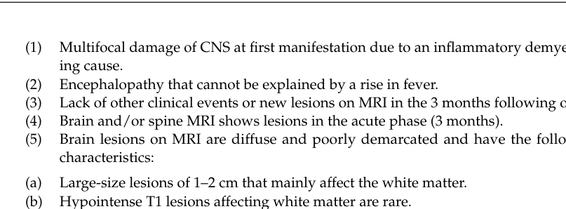

## Question

# Disease Characteristics Research Template

## Target Disease
- **Disease Name:** Acute Disseminated Encephalomyelitis
- **MONDO ID:**  (if available)
- **Category:** Neurological Disorder

## Research Objectives

Please provide a comprehensive research report on **Acute Disseminated Encephalomyelitis** covering all of the
disease characteristics listed below. This report will be used to populate a disease knowledge
base entry. Be thorough and cite primary literature (PMID preferred) for all claims.

For each section, **suggested databases/resources** are listed. These are the first places
you should search for information on each topic.

---

### 1. Disease Information
> **Search first:** OMIM, Orphanet, ICD-10/ICD-11, MeSH, PubMed

- What is the disease? Provide a concise overview.
- What are the key identifiers? (OMIM, Orphanet, ICD-10/ICD-11, MeSH, Mondo)
- What are the common synonyms and alternative names?
- Is the information derived from individual patients (e.g., EHR) or aggregated disease-level resources?

### 2. Etiology

- **Disease Causal Factors**: What are the primary causes? (genetic, environmental, infectious, mechanistic)
- **Risk Factors**:
  > **Search first:** PubMed, Cochrane Library, UpToDate, clinical guidelines, ClinVar, ClinGen, GWAS Catalog, PheGenI, CTD, CDC, WHO, epidemiological databases
  - Genetic risk factors (causal variants, susceptibility loci, modifier genes)
  - Environmental risk factors (toxins, lifestyle, occupational exposures, age, sex, family history)
- **Protective Factors**:
  > **Search first:** PubMed, Cochrane Library, clinical trial databases, GWAS Catalog, gnomAD, WHO, CDC, nutrition databases
  - Genetic protective factors (protective variants, modifier alleles)
  - Environmental protective factors (diet, lifestyle, exposures that reduce risk)
- **Gene-Environment Interactions**: How do genetic and environmental factors interact to influence disease?
  > **Search first:** CTD, PubMed, PheGenI, GxE databases

### 3. Phenotypes
> **Search first:** HPO (Human Phenotype Ontology), OMIM, Orphanet, PubMed, clinicaltrials.gov, MedDRA, SNOMED CT, DECIPHER, LOINC

For each phenotype, provide:
- **Phenotype type**: symptoms, clinical signs, physical manifestations, behavioral changes, or laboratory abnormalities
  > For symptoms/signs: HPO, OMIM, Orphanet, PubMed
  > For behavioral changes: HPO, DSM, RDoC (Research Domain Criteria), PubMed
  > For laboratory abnormalities: LOINC, SNOMED CT, LabTests Online, PubMed
- **Phenotype characteristics**:
  > **Search first:** OMIM, Orphanet, HPO, PubMed
  - Age of symptom onset (neonatal, childhood, adult-onset, late-onset)
  - Symptom severity (mild, moderate, severe, variable)
  - Symptom progression (stable, progressive, episodic, fluctuating)
  - Frequency among affected individuals (percentage or qualitative)
- **Quality of life impact**: Effects on daily functioning and well-being (per-phenotype when possible)
  > **Search first:** EQ-5D database, SF-36, WHO QOL databases, PubMed
- Suggest HPO (Human Phenotype Ontology) terms for each phenotype

### 4. Genetic/Molecular Information

- **Causal Genes**: Gene mutations or chromosomal abnormalities responsible for disease (gene symbols, OMIM IDs)
  > **Search first:** OMIM, ClinVar, HGMD, Ensembl, NCBI Gene
- **Pathogenic Variants**:
  - Affected genes (gene symbols, HGNC IDs)
    > **Search first:** OMIM, NCBI Gene, Ensembl, HGNC, UniProt, GeneCards
  - Variant classification (pathogenic, likely pathogenic, VUS per ACMG/AMP guidelines)
    > **Search first:** ClinVar, ClinGen, ACMG/AMP guidelines, VarSome
  - Variant type/class (missense, frameshift, nonsense, splice-site, structural)
  - Allele frequency in population databases
    > **Search first:** gnomAD, 1000 Genomes, ExAC, TOPMed, dbSNP
  - Somatic vs germline origin
    > **Search first:** COSMIC (somatic), ClinVar, ICGC, TCGA
  - Functional consequences (loss of function, gain of function, dominant negative)
- **Modifier Genes**: Genes that modify disease severity or expression
- **Epigenetic Information**: DNA methylation, histone modifications, chromatin changes affecting disease
  > **Search first:** ENCODE, Roadmap Epigenomics, MethBase, DiseaseMeth
- **Chromosomal Abnormalities**: Large-scale genetic changes (aneuploidy, translocations, inversions)
  > **Search first:** DECIPHER, ClinVar, ECARUCA, UCSC Genome Browser

### 5. Environmental Information

- **Environmental Factors**: Non-genetic contributing factors (toxins, radiation, pollution, occupational exposure)
  > **Search first:** CTD (Comparative Toxicogenomics Database), TOXNET, PubMed, EPA databases
- **Lifestyle Factors**: Behavioral factors (smoking, diet, exercise, alcohol consumption)
  > **Search first:** CDC databases, WHO, PubMed, NHANES
- **Infectious Agents**: If applicable, pathogens causing or triggering disease (bacteria, viruses, fungi, parasites)
  > **Search first:** NCBI Taxonomy, ViPR, BV-BRC, MicrobeDB, GIDEON

### 6. Mechanism / Pathophysiology

- **Molecular Pathways**: Specific signaling cascades or biochemical pathways involved (Wnt, MAPK, mTOR, PI3K-AKT, etc.)
  > **Search first:** KEGG, Reactome, WikiPathways, PathBank, BioCyc
- **Cellular Processes**: Cell-level mechanisms (apoptosis, autophagy, cell cycle dysregulation, inflammation, etc.)
  > **Search first:** Gene Ontology (GO), Reactome, KEGG, PubMed
- **Protein Dysfunction**: How protein structure or function is altered (misfolding, aggregation, loss of function, gain of function)
  > **Search first:** UniProt, PDB (Protein Data Bank), InterPro, Pfam, AlphaFold
- **Metabolic Changes**: Alterations in metabolic processes (energy metabolism, lipid metabolism, amino acid metabolism)
  > **Search first:** KEGG, BioCyc, HMDB (Human Metabolome Database), BRENDA
- **Immune System Involvement**: Role of immune response (autoimmunity, immunodeficiency, chronic inflammation)
  > **Search first:** ImmPort, Immunome Database, IEDB, Gene Ontology
- **Tissue Damage Mechanisms**: How tissues/ are injured (oxidative stress, ischemia, fibrosis, necrosis)
  > **Search first:** PubMed, Gene Ontology, Reactome
- **Biochemical Abnormalities**: Specific molecular defects (enzyme deficiencies, receptor dysfunction, ion channel defects)
  > **Search first:** BRENDA, UniProt, KEGG, OMIM, PubMed
- **Epigenetic Changes**: DNA methylation, histone modifications affecting gene expression in disease
  > **Search first:** ENCODE, Roadmap Epigenomics, MethBase, DiseaseMeth
- **Molecular Profiling** (if available):
  - Transcriptomics/gene expression changes
    > **Search first:** GEO (Gene Expression Omnibus), ArrayExpress, GTEx, Human Cell Atlas, SRA
  - Proteomics findings
    > **Search first:** PRIDE, ProteomeXchange, Human Protein Atlas, STRING, BioGRID
  - Metabolomics signatures
    > **Search first:** MetaboLights, Metabolomics Workbench, HMDB, METLIN
  - Lipidomics alterations
    > **Search first:** LIPID MAPS, SwissLipids, LipidHome, Metabolomics Workbench
  - Genomic structural features
    > **Search first:** UCSC Genome Browser, Ensembl, NCBI, dbVar, DGV
- **Advanced Technologies** (if applicable):
  - Single-cell analysis findings (cell-type specific mechanisms, cellular heterogeneity)
    > **Search first:** Human Cell Atlas, Single Cell Portal, GEO, CELLxGENE
  - Spatial transcriptomics findings
    > **Search first:** GEO, Spatial Research, Vizgen, 10x Genomics data
  - Multi-omics integration results
    > **Search first:** TCGA, ICGC, cBioPortal, LinkedOmics, PubMed
  - Functional genomics screens (CRISPR, RNAi)
    > **Search first:** DepMap, GenomeRNAi, PubMed, BioGRID ORCS

For each mechanism, describe:
- The causal chain from initial trigger to clinical manifestation
- Which mechanisms are upstream vs downstream
- What cell types and biological processes are involved
- Suggest GO terms for biological processes and CL terms for cell types

### 7. Anatomical Structures Affected

- **Organ Level**:
  - Primary organs directly affected
  - Secondary organ involvement (complications, secondary effects)
  - Body systems involved (cardiovascular, nervous, digestive, respiratory, endocrine, etc.)
  > **Search first:** Uberon, FMA (Foundational Model of Anatomy), OMIM, HPO, ICD-11, MeSH, SNOMED CT
- **Tissue and Cell Level**:
  - Specific tissue types affected (epithelial, connective, muscle, nervous)
  - Specific cell populations targeted (with Cell Ontology terms)
  > **Search first:** Uberon, Human Protein Atlas, Cell Ontology, Human Cell Atlas, CellMarker, PanglaoDB
- **Subcellular Level**:
  - Cellular compartments involved (mitochondria, nucleus, ER, lysosomes) (with GO Cellular Component terms)
  > **Search first:** Gene Ontology (Cellular Component), UniProt, Human Protein Atlas
- **Localization**:
  - Specific anatomical sites (with UBERON terms)
    > **Search first:** FMA, Uberon, NeuroNames (for brain), SNOMED CT
  - Lateralization (unilateral, bilateral, asymmetric)
    > **Search first:** HPO, clinical literature, imaging databases

### 8. Temporal Development

- **Onset**:
  - Typical age of onset (congenital, pediatric, adult, geriatric)
  - Onset pattern (acute, subacute, chronic, insidious)
  > **Search first:** OMIM, Orphanet, HPO, PubMed
- **Progression**:
  - Disease stages (early, intermediate, advanced, end-stage)
    > **Search first:** Cancer Staging Manual (AJCC), WHO classifications, PubMed
  - Progression rate (rapid, slow, variable)
  - Disease course pattern (episodic, relapsing-remitting, progressive, stable)
  - Disease duration (self-limited, chronic lifelong)
  > **Search first:** Disease registries, longitudinal cohort databases, natural history studies, PubMed, Orphanet, OMIM
- **Patterns**:
  - Remission patterns (spontaneous, treatment-induced)
    > **Search first:** Clinical trial databases, disease registries, PubMed
  - Critical periods (time windows of vulnerability or opportunity for intervention)
    > **Search first:** PubMed, developmental biology databases, clinical guidelines

### 9. Inheritance and Population

- **Epidemiology**:
  - Prevalence (cases per 100,000 at given time)
  - Incidence (new cases per 100,000 per year)
  > **Search first:** Orphanet, CDC, WHO, GBD (Global Burden of Disease), national registries, SEER, disease registries
- **For Genetic Etiology**:
  - Inheritance pattern (AD, AR, X-linked, mitochondrial, multifactorial, polygenic)
    > **Search first:** OMIM, Orphanet, ClinVar, GTR (Genetic Testing Registry)
  - Penetrance (complete, incomplete, age-dependent)
    > **Search first:** ClinVar, OMIM, PubMed, ClinGen
  - Expressivity (variable, consistent)
    > **Search first:** OMIM, ClinVar, PubMed
  - Genetic anticipation (increasing severity in successive generations)
    > **Search first:** OMIM, PubMed (especially for repeat expansion disorders)
  - Germline mosaicism
    > **Search first:** ClinVar, OMIM, genetic counseling literature, PubMed
  - Founder effects (population-specific mutations)
    > **Search first:** gnomAD, population genetics databases, PubMed
  - Consanguinity role
    > **Search first:** OMIM, population studies, genetic counseling resources
  - Carrier frequency
    > **Search first:** gnomAD, carrier screening databases, GeneReviews, GTR
- **Population Demographics**:
  - Affected populations (ethnic or demographic groups with higher prevalence)
    > **Search first:** gnomAD, 1000 Genomes, PAGE Study, PubMed, population registries
  - Geographic distribution (endemic areas, regional variation)
    > **Search first:** WHO, CDC, GBD, Orphanet, geographic epidemiology databases
  - Geographic distribution of specific variants
  - Sex ratio (male:female)
    > **Search first:** Disease registries, OMIM, PubMed, epidemiological databases
  - Age distribution of affected individuals
    > **Search first:** CDC, disease registries, SEER, Orphanet

### 10. Diagnostics

- **Clinical Tests**:
  - Laboratory tests (blood, urine, tissue chemistry, specific enzyme assays)
    > **Search first:** LOINC, LabTests Online, PubMed
  - Biomarkers (proteins, metabolites, genetic markers, circulating biomarkers)
    > **Search first:** FDA Biomarker List, BEST (Biomarkers, EndpointS, and other Tools), PubMed
  - Imaging studies (X-ray, CT, MRI, PET, ultrasound)
    > **Search first:** RadLex, DICOM, Radiopaedia, imaging databases
  - Functional tests (pulmonary function, cardiac stress tests)
    > **Search first:** LOINC, clinical guidelines, PubMed
  - Electrophysiology (EEG, EMG, ECG, nerve conduction studies)
    > **Search first:** LOINC, clinical neurophysiology databases, PubMed
  - Biopsy findings (histopathology, immunohistochemistry)
    > **Search first:** SNOMED CT, College of American Pathologists resources, PubMed
  - Pathology findings (microscopic examination)
    > **Search first:** SNOMED CT, Digital Pathology databases, PubMed
- **Genetic Testing**:
  > **Search first:** GTR (Genetic Testing Registry), GeneReviews, ClinGen
  - Overview of recommended genetic testing approach
  - Whole genome sequencing (WGS) utility
    > **Search first:** GTR, ClinVar, GEL (Genomics England), gnomAD
  - Whole exome sequencing (WES) utility
    > **Search first:** GTR, ClinVar, OMIM, GeneMatcher
  - Gene panels (which panels, which genes)
    > **Search first:** GTR, ClinVar, laboratory-specific databases
  - Single gene testing
    > **Search first:** GTR, ClinVar, OMIM, GeneReviews
  - Chromosomal microarray (CMA)
    > **Search first:** DECIPHER, ClinVar, dbVar, ECARUCA
  - Karyotyping
    > **Search first:** Chromosome Abnormality Database, ClinVar, cytogenetics resources
  - FISH
    > **Search first:** ClinVar, cytogenetics databases, PubMed
  - Mitochondrial DNA testing
    > **Search first:** MITOMAP, MSeqDR, ClinVar, GTR
  - Repeat expansion testing
    > **Search first:** GTR, ClinVar, repeat expansion databases, PubMed
- **Omics-Based Diagnostics** (if applicable):
  - RNA sequencing / transcriptomics
    > **Search first:** GEO, ArrayExpress, GTEx, RNA-seq databases
  - Proteomics
    > **Search first:** PRIDE, ProteomeXchange, FDA Biomarker database
  - Metabolomics
    > **Search first:** MetaboLights, Metabolomics Workbench, HMDB
  - Epigenomics
    > **Search first:** GEO, ENCODE, Roadmap Epigenomics, MethBase
  - Liquid biopsy
    > **Search first:** COSMIC, ClinVar, liquid biopsy databases, PubMed
- **Clinical Criteria**:
  - Standardized diagnostic criteria (DSM, ICD, society guidelines)
    > **Search first:** DSM-5, ICD-11, clinical society guidelines, UpToDate
  - Differential diagnosis (other conditions to rule out, with distinguishing features)
    > **Search first:** DynaMed, UpToDate, clinical decision support systems
- **Screening**:
  - Screening methods for asymptomatic individuals (newborn screening, carrier screening, cascade screening)
    > **Search first:** ACMG recommendations, CDC newborn screening, GTR

### 11. Outcome/Prognosis

- **Survival and Mortality**:
  - Survival rate (5-year, 10-year, overall)
    > **Search first:** SEER, cancer registries, disease-specific registries, PubMed
  - Life expectancy (with and without treatment if applicable)
    > **Search first:** Orphanet, disease registries, actuarial databases, PubMed
  - Mortality rate
    > **Search first:** CDC, WHO, GBD, national mortality databases
  - Disease-specific mortality (deaths directly attributable to disease)
    > **Search first:** Disease registries, CDC Wonder, GBD, PubMed
- **Morbidity and Function**:
  - Morbidity (disease-related disability and health impacts)
    > **Search first:** GBD, WHO, disability databases, PubMed
  - Disability outcomes (long-term functional impairments)
    > **Search first:** ICF (International Classification of Functioning), disability registries
  - Quality of life measures (EQ-5D, SF-36, PROMIS, disease-specific tools)
    > **Search first:** EQ-5D database, SF-36, PROMIS, PubMed
- **Disease Course**:
  - Complications (secondary problems: infections, organ failure, etc.)
    > **Search first:** ICD codes, disease registries, clinical databases, PubMed
  - Recovery potential (likelihood and extent of recovery, with vs without treatment)
    > **Search first:** Natural history studies, rehabilitation databases, PubMed
- **Prediction**:
  - Prognostic factors (age, disease severity, biomarkers, treatment response)
    > **Search first:** Prognostic models databases, clinical calculators, PubMed
  - Prognostic biomarkers (molecular markers predicting disease course)
    > **Search first:** FDA Biomarker database, PubMed, cancer prognostic databases

### 12. Treatment

- **Pharmacotherapy**:
  - Pharmacological treatments (drug names, drug classes, mechanisms of action)
    > **Search first:** DrugBank, RxNorm, ATC classification, DailyMed, FDA databases
  - Pharmacogenomics (how genetic variants affect drug metabolism, efficacy, toxicity)
    > **Search first:** PharmGKB, CPIC (Clinical Pharmacogenetics), FDA Table of PGx Biomarkers
- **Advanced Therapeutics**:
  - Gene therapy (viral vectors, CRISPR, gene replacement, gene editing)
    > **Search first:** ClinicalTrials.gov, FDA gene therapy database, ASGCT resources
  - Cell therapy (stem cell transplant, CAR-T, cellular therapeutics)
    > **Search first:** ClinicalTrials.gov, FDA cell therapy database, FACT standards
  - RNA-based therapies (ASOs, siRNA, mRNA therapies)
    > **Search first:** ClinicalTrials.gov, FDA approvals, PubMed
  - Targeted therapies (treatments directed at specific molecular targets)
    > **Search first:** My Cancer Genome, OncoKB, ClinicalTrials.gov, FDA approvals
  - Immunotherapies (checkpoint inhibitors, monoclonal antibodies)
    > **Search first:** Cancer Immunotherapy Database, FDA approvals, ClinicalTrials.gov
- **Surgical and Interventional**:
  - Surgical interventions (types of surgery, timing, outcomes)
    > **Search first:** CPT codes, surgical registries, clinical guidelines, PubMed
- **Supportive and Rehabilitative**:
  - Supportive care (symptom management, pain control, nutrition)
    > **Search first:** Clinical guidelines, Cochrane Library, PubMed
  - Rehabilitation (physical therapy, occupational therapy, speech therapy)
    > **Search first:** Rehabilitation medicine databases, clinical guidelines, PubMed
- **Experimental**:
  - Experimental treatments in clinical trials (with NCT identifiers if available)
    > **Search first:** ClinicalTrials.gov, EU Clinical Trials Register, WHO ICTRP
- **Treatment Outcomes**:
  - Treatment response rates
    > **Search first:** Clinical trial databases, FDA reviews, systematic reviews, PubMed
  - Side effects and adverse events
    > **Search first:** FDA Adverse Event Reporting System (FAERS), MedWatch, PubMed
- **Treatment Strategy**:
  - Treatment algorithms (clinical pathways, decision trees)
    > **Search first:** Clinical practice guidelines, NCCN Guidelines, UpToDate
  - Combination therapies
    > **Search first:** ClinicalTrials.gov, treatment guidelines, PubMed
  - Personalized medicine approaches (genotype-guided treatment)
    > **Search first:** My Cancer Genome, CIViC, PharmGKB, precision medicine databases

For each treatment, suggest MAXO (Medical Action Ontology) terms where applicable.

### 13. Prevention

- **Prevention Levels**:
  - Primary prevention (preventing disease occurrence: vaccination, risk factor modification)
    > **Search first:** CDC, WHO, USPSTF recommendations, Cochrane Library
  - Secondary prevention (early detection and treatment: screening programs, early intervention)
    > **Search first:** USPSTF, CDC screening guidelines, WHO
  - Tertiary prevention (preventing complications in those with disease)
    > **Search first:** Clinical guidelines, disease management protocols, PubMed
- **Immunization**: Vaccine strategies (if applicable)
  > **Search first:** CDC vaccine schedules, WHO immunization, FDA vaccine database
- **Screening and Early Detection**:
  - Screening programs (population-based: newborn screening, cancer screening)
    > **Search first:** CDC screening programs, USPSTF, cancer screening databases
  - Genetic screening (carrier screening, preimplantation genetic diagnosis, prenatal testing)
    > **Search first:** ACMG recommendations, ACOG guidelines, GTR
  - Risk stratification (identifying high-risk individuals for targeted prevention)
    > **Search first:** Risk prediction models, clinical calculators, PubMed
- **Behavioral Interventions**: Lifestyle modifications to reduce risk
  > **Search first:** CDC, WHO, behavioral intervention databases, Cochrane Library
- **Counseling**: Genetic counseling (risk assessment, family planning guidance)
  > **Search first:** NSGC resources, ACMG guidelines, GeneReviews
- **Public Health**:
  - Public health interventions (sanitation, vector control, health education)
    > **Search first:** CDC, WHO, public health databases, PubMed
  - Environmental interventions (reducing environmental risk factors)
    > **Search first:** EPA databases, WHO environmental health, PubMed
- **Prophylaxis**: Preventive medications or procedures
  > **Search first:** Clinical guidelines, FDA approvals, PubMed

### 14. Other Species / Natural Disease

- **Taxonomy**: Species affected (with NCBI Taxon identifiers)
  > **Search first:** NCBI Taxonomy
- **Breed**: Specific breeds affected (with VBO identifiers if applicable)
  > **Search first:** VBO (Vertebrate Breed Ontology)
- **Gene**: Orthologous genes in other species (with NCBI Gene IDs)
  > **Search first:** NCBI Gene
- **Natural Disease**:
  - Naturally occurring disease in other species (companion animals, wildlife)
    > **Search first:** OMIA (Online Mendelian Inheritance in Animals), VetCompass, PubMed
  - Veterinary relevance and importance in animal health
    > **Search first:** OMIA, veterinary databases, PubMed
- **Comparative Biology**:
  - Comparative pathology (similarities and differences across species)
    > **Search first:** OMIA, comparative pathology databases, PubMed
  - Evolutionary conservation of disease mechanisms
    > **Search first:** HomoloGene, OrthoMCL, Alliance of Genome Resources
- **Transmission** (if applicable):
  - Zoonotic potential
    > **Search first:** CDC zoonotic diseases, WHO zoonoses, GIDEON
  - Cross-species susceptibility
    > **Search first:** NCBI Taxonomy, veterinary databases, PubMed

### 15. Model Organisms

- **Model Types**:
  - Model organism type (mammalian, invertebrate, cellular, in vitro)
    > **Search first:** Alliance of Genome Resources, model organism databases
  - Specific model systems (mouse, rat, zebrafish, Drosophila, C. elegans, yeast, cell lines, organoids, iPSCs)
    > **Search first:** MGI, RGD, ZFIN, FlyBase, WormBase, SGD, ATCC, Cellosaurus
  - Induced models (drug treatment, surgical intervention, environmental manipulation)
    > **Search first:** MGI, model organism databases, PubMed
- **Genetic Models**:
  - Types available (knockout, knock-in, transgenic, conditional, humanized)
    > **Search first:** MGI, IMPC, KOMP, EuMMCR, IMSR
- **Model Characteristics**:
  - Phenotype recapitulation (how well model reproduces human disease features)
    > **Search first:** Model organism databases, comparative studies, PubMed
  - Model limitations (aspects of human disease not captured)
    > **Search first:** Model organism databases, PubMed, review articles
- **Applications**:
  - Research applications (what aspects of disease can be studied)
    > **Search first:** Model organism databases, PubMed
- **Resources**:
  - Model databases
    > **Search first:** MGI, RGD, ZFIN, FlyBase, WormBase, IMSR, EMMA, MMRRC

---

## Citation Requirements

- Cite primary literature (PMID preferred) for all mechanistic and clinical claims
- Prioritize recent reviews and landmark papers
- Include direct quotes from abstracts where possible to support key statements
- Distinguish evidence source types: human clinical, model organism, in vitro, computational

## Output Format

Structure your response as a comprehensive narrative organized by the sections above.
For each section, provide:
- Factual content with specific details (numbers, percentages, gene names, variant nomenclature)
- Ontology term suggestions (HPO, GO, CL, UBERON, CHEBI, MAXO, MONDO) where applicable
- Evidence citations with PMIDs
- Direct quotes from abstracts to support key claims
- Clear indication when information is not available or not applicable for this disease

This report will be used to populate a disease knowledge base entry with:
- Pathophysiology descriptions with causal chains
- Gene/protein annotations (HGNC, GO terms)
- Phenotype associations (HP terms) with frequencies
- Cell type involvement (CL terms)
- Anatomical locations (UBERON terms)
- Chemical entities (CHEBI terms)
- Treatment annotations (MAXO terms)
- Evidence items with PMIDs and exact abstract quotes
- Epidemiology, prognosis, diagnostic, and prevention information
- Animal model descriptions with phenotype recapitulation details

## Output

Question: You are an expert researcher providing comprehensive, well-cited information.

Provide detailed information focusing on:
1. Key concepts and definitions with current understanding
2. Recent developments and latest research (prioritize 2023-2024 sources)
3. Current applications and real-world implementations
4. Expert opinions and analysis from authoritative sources
5. Relevant statistics and data from recent studies

Format as a comprehensive research report with proper citations. Include URLs and publication dates where available.
Always prioritize recent, authoritative sources and provide specific citations for all major claims.

# Disease Characteristics Research Template

## Target Disease
- **Disease Name:** Acute Disseminated Encephalomyelitis
- **MONDO ID:**  (if available)
- **Category:** Neurological Disorder

## Research Objectives

Please provide a comprehensive research report on **Acute Disseminated Encephalomyelitis** covering all of the
disease characteristics listed below. This report will be used to populate a disease knowledge
base entry. Be thorough and cite primary literature (PMID preferred) for all claims.

For each section, **suggested databases/resources** are listed. These are the first places
you should search for information on each topic.

---

### 1. Disease Information
> **Search first:** OMIM, Orphanet, ICD-10/ICD-11, MeSH, PubMed

- What is the disease? Provide a concise overview.
- What are the key identifiers? (OMIM, Orphanet, ICD-10/ICD-11, MeSH, Mondo)
- What are the common synonyms and alternative names?
- Is the information derived from individual patients (e.g., EHR) or aggregated disease-level resources?

### 2. Etiology

- **Disease Causal Factors**: What are the primary causes? (genetic, environmental, infectious, mechanistic)
- **Risk Factors**:
  > **Search first:** PubMed, Cochrane Library, UpToDate, clinical guidelines, ClinVar, ClinGen, GWAS Catalog, PheGenI, CTD, CDC, WHO, epidemiological databases
  - Genetic risk factors (causal variants, susceptibility loci, modifier genes)
  - Environmental risk factors (toxins, lifestyle, occupational exposures, age, sex, family history)
- **Protective Factors**:
  > **Search first:** PubMed, Cochrane Library, clinical trial databases, GWAS Catalog, gnomAD, WHO, CDC, nutrition databases
  - Genetic protective factors (protective variants, modifier alleles)
  - Environmental protective factors (diet, lifestyle, exposures that reduce risk)
- **Gene-Environment Interactions**: How do genetic and environmental factors interact to influence disease?
  > **Search first:** CTD, PubMed, PheGenI, GxE databases

### 3. Phenotypes
> **Search first:** HPO (Human Phenotype Ontology), OMIM, Orphanet, PubMed, clinicaltrials.gov, MedDRA, SNOMED CT, DECIPHER, LOINC

For each phenotype, provide:
- **Phenotype type**: symptoms, clinical signs, physical manifestations, behavioral changes, or laboratory abnormalities
  > For symptoms/signs: HPO, OMIM, Orphanet, PubMed
  > For behavioral changes: HPO, DSM, RDoC (Research Domain Criteria), PubMed
  > For laboratory abnormalities: LOINC, SNOMED CT, LabTests Online, PubMed
- **Phenotype characteristics**:
  > **Search first:** OMIM, Orphanet, HPO, PubMed
  - Age of symptom onset (neonatal, childhood, adult-onset, late-onset)
  - Symptom severity (mild, moderate, severe, variable)
  - Symptom progression (stable, progressive, episodic, fluctuating)
  - Frequency among affected individuals (percentage or qualitative)
- **Quality of life impact**: Effects on daily functioning and well-being (per-phenotype when possible)
  > **Search first:** EQ-5D database, SF-36, WHO QOL databases, PubMed
- Suggest HPO (Human Phenotype Ontology) terms for each phenotype

### 4. Genetic/Molecular Information

- **Causal Genes**: Gene mutations or chromosomal abnormalities responsible for disease (gene symbols, OMIM IDs)
  > **Search first:** OMIM, ClinVar, HGMD, Ensembl, NCBI Gene
- **Pathogenic Variants**:
  - Affected genes (gene symbols, HGNC IDs)
    > **Search first:** OMIM, NCBI Gene, Ensembl, HGNC, UniProt, GeneCards
  - Variant classification (pathogenic, likely pathogenic, VUS per ACMG/AMP guidelines)
    > **Search first:** ClinVar, ClinGen, ACMG/AMP guidelines, VarSome
  - Variant type/class (missense, frameshift, nonsense, splice-site, structural)
  - Allele frequency in population databases
    > **Search first:** gnomAD, 1000 Genomes, ExAC, TOPMed, dbSNP
  - Somatic vs germline origin
    > **Search first:** COSMIC (somatic), ClinVar, ICGC, TCGA
  - Functional consequences (loss of function, gain of function, dominant negative)
- **Modifier Genes**: Genes that modify disease severity or expression
- **Epigenetic Information**: DNA methylation, histone modifications, chromatin changes affecting disease
  > **Search first:** ENCODE, Roadmap Epigenomics, MethBase, DiseaseMeth
- **Chromosomal Abnormalities**: Large-scale genetic changes (aneuploidy, translocations, inversions)
  > **Search first:** DECIPHER, ClinVar, ECARUCA, UCSC Genome Browser

### 5. Environmental Information

- **Environmental Factors**: Non-genetic contributing factors (toxins, radiation, pollution, occupational exposure)
  > **Search first:** CTD (Comparative Toxicogenomics Database), TOXNET, PubMed, EPA databases
- **Lifestyle Factors**: Behavioral factors (smoking, diet, exercise, alcohol consumption)
  > **Search first:** CDC databases, WHO, PubMed, NHANES
- **Infectious Agents**: If applicable, pathogens causing or triggering disease (bacteria, viruses, fungi, parasites)
  > **Search first:** NCBI Taxonomy, ViPR, BV-BRC, MicrobeDB, GIDEON

### 6. Mechanism / Pathophysiology

- **Molecular Pathways**: Specific signaling cascades or biochemical pathways involved (Wnt, MAPK, mTOR, PI3K-AKT, etc.)
  > **Search first:** KEGG, Reactome, WikiPathways, PathBank, BioCyc
- **Cellular Processes**: Cell-level mechanisms (apoptosis, autophagy, cell cycle dysregulation, inflammation, etc.)
  > **Search first:** Gene Ontology (GO), Reactome, KEGG, PubMed
- **Protein Dysfunction**: How protein structure or function is altered (misfolding, aggregation, loss of function, gain of function)
  > **Search first:** UniProt, PDB (Protein Data Bank), InterPro, Pfam, AlphaFold
- **Metabolic Changes**: Alterations in metabolic processes (energy metabolism, lipid metabolism, amino acid metabolism)
  > **Search first:** KEGG, BioCyc, HMDB (Human Metabolome Database), BRENDA
- **Immune System Involvement**: Role of immune response (autoimmunity, immunodeficiency, chronic inflammation)
  > **Search first:** ImmPort, Immunome Database, IEDB, Gene Ontology
- **Tissue Damage Mechanisms**: How tissues/ are injured (oxidative stress, ischemia, fibrosis, necrosis)
  > **Search first:** PubMed, Gene Ontology, Reactome
- **Biochemical Abnormalities**: Specific molecular defects (enzyme deficiencies, receptor dysfunction, ion channel defects)
  > **Search first:** BRENDA, UniProt, KEGG, OMIM, PubMed
- **Epigenetic Changes**: DNA methylation, histone modifications affecting gene expression in disease
  > **Search first:** ENCODE, Roadmap Epigenomics, MethBase, DiseaseMeth
- **Molecular Profiling** (if available):
  - Transcriptomics/gene expression changes
    > **Search first:** GEO (Gene Expression Omnibus), ArrayExpress, GTEx, Human Cell Atlas, SRA
  - Proteomics findings
    > **Search first:** PRIDE, ProteomeXchange, Human Protein Atlas, STRING, BioGRID
  - Metabolomics signatures
    > **Search first:** MetaboLights, Metabolomics Workbench, HMDB, METLIN
  - Lipidomics alterations
    > **Search first:** LIPID MAPS, SwissLipids, LipidHome, Metabolomics Workbench
  - Genomic structural features
    > **Search first:** UCSC Genome Browser, Ensembl, NCBI, dbVar, DGV
- **Advanced Technologies** (if applicable):
  - Single-cell analysis findings (cell-type specific mechanisms, cellular heterogeneity)
    > **Search first:** Human Cell Atlas, Single Cell Portal, GEO, CELLxGENE
  - Spatial transcriptomics findings
    > **Search first:** GEO, Spatial Research, Vizgen, 10x Genomics data
  - Multi-omics integration results
    > **Search first:** TCGA, ICGC, cBioPortal, LinkedOmics, PubMed
  - Functional genomics screens (CRISPR, RNAi)
    > **Search first:** DepMap, GenomeRNAi, PubMed, BioGRID ORCS

For each mechanism, describe:
- The causal chain from initial trigger to clinical manifestation
- Which mechanisms are upstream vs downstream
- What cell types and biological processes are involved
- Suggest GO terms for biological processes and CL terms for cell types

### 7. Anatomical Structures Affected

- **Organ Level**:
  - Primary organs directly affected
  - Secondary organ involvement (complications, secondary effects)
  - Body systems involved (cardiovascular, nervous, digestive, respiratory, endocrine, etc.)
  > **Search first:** Uberon, FMA (Foundational Model of Anatomy), OMIM, HPO, ICD-11, MeSH, SNOMED CT
- **Tissue and Cell Level**:
  - Specific tissue types affected (epithelial, connective, muscle, nervous)
  - Specific cell populations targeted (with Cell Ontology terms)
  > **Search first:** Uberon, Human Protein Atlas, Cell Ontology, Human Cell Atlas, CellMarker, PanglaoDB
- **Subcellular Level**:
  - Cellular compartments involved (mitochondria, nucleus, ER, lysosomes) (with GO Cellular Component terms)
  > **Search first:** Gene Ontology (Cellular Component), UniProt, Human Protein Atlas
- **Localization**:
  - Specific anatomical sites (with UBERON terms)
    > **Search first:** FMA, Uberon, NeuroNames (for brain), SNOMED CT
  - Lateralization (unilateral, bilateral, asymmetric)
    > **Search first:** HPO, clinical literature, imaging databases

### 8. Temporal Development

- **Onset**:
  - Typical age of onset (congenital, pediatric, adult, geriatric)
  - Onset pattern (acute, subacute, chronic, insidious)
  > **Search first:** OMIM, Orphanet, HPO, PubMed
- **Progression**:
  - Disease stages (early, intermediate, advanced, end-stage)
    > **Search first:** Cancer Staging Manual (AJCC), WHO classifications, PubMed
  - Progression rate (rapid, slow, variable)
  - Disease course pattern (episodic, relapsing-remitting, progressive, stable)
  - Disease duration (self-limited, chronic lifelong)
  > **Search first:** Disease registries, longitudinal cohort databases, natural history studies, PubMed, Orphanet, OMIM
- **Patterns**:
  - Remission patterns (spontaneous, treatment-induced)
    > **Search first:** Clinical trial databases, disease registries, PubMed
  - Critical periods (time windows of vulnerability or opportunity for intervention)
    > **Search first:** PubMed, developmental biology databases, clinical guidelines

### 9. Inheritance and Population

- **Epidemiology**:
  - Prevalence (cases per 100,000 at given time)
  - Incidence (new cases per 100,000 per year)
  > **Search first:** Orphanet, CDC, WHO, GBD (Global Burden of Disease), national registries, SEER, disease registries
- **For Genetic Etiology**:
  - Inheritance pattern (AD, AR, X-linked, mitochondrial, multifactorial, polygenic)
    > **Search first:** OMIM, Orphanet, ClinVar, GTR (Genetic Testing Registry)
  - Penetrance (complete, incomplete, age-dependent)
    > **Search first:** ClinVar, OMIM, PubMed, ClinGen
  - Expressivity (variable, consistent)
    > **Search first:** OMIM, ClinVar, PubMed
  - Genetic anticipation (increasing severity in successive generations)
    > **Search first:** OMIM, PubMed (especially for repeat expansion disorders)
  - Germline mosaicism
    > **Search first:** ClinVar, OMIM, genetic counseling literature, PubMed
  - Founder effects (population-specific mutations)
    > **Search first:** gnomAD, population genetics databases, PubMed
  - Consanguinity role
    > **Search first:** OMIM, population studies, genetic counseling resources
  - Carrier frequency
    > **Search first:** gnomAD, carrier screening databases, GeneReviews, GTR
- **Population Demographics**:
  - Affected populations (ethnic or demographic groups with higher prevalence)
    > **Search first:** gnomAD, 1000 Genomes, PAGE Study, PubMed, population registries
  - Geographic distribution (endemic areas, regional variation)
    > **Search first:** WHO, CDC, GBD, Orphanet, geographic epidemiology databases
  - Geographic distribution of specific variants
  - Sex ratio (male:female)
    > **Search first:** Disease registries, OMIM, PubMed, epidemiological databases
  - Age distribution of affected individuals
    > **Search first:** CDC, disease registries, SEER, Orphanet

### 10. Diagnostics

- **Clinical Tests**:
  - Laboratory tests (blood, urine, tissue chemistry, specific enzyme assays)
    > **Search first:** LOINC, LabTests Online, PubMed
  - Biomarkers (proteins, metabolites, genetic markers, circulating biomarkers)
    > **Search first:** FDA Biomarker List, BEST (Biomarkers, EndpointS, and other Tools), PubMed
  - Imaging studies (X-ray, CT, MRI, PET, ultrasound)
    > **Search first:** RadLex, DICOM, Radiopaedia, imaging databases
  - Functional tests (pulmonary function, cardiac stress tests)
    > **Search first:** LOINC, clinical guidelines, PubMed
  - Electrophysiology (EEG, EMG, ECG, nerve conduction studies)
    > **Search first:** LOINC, clinical neurophysiology databases, PubMed
  - Biopsy findings (histopathology, immunohistochemistry)
    > **Search first:** SNOMED CT, College of American Pathologists resources, PubMed
  - Pathology findings (microscopic examination)
    > **Search first:** SNOMED CT, Digital Pathology databases, PubMed
- **Genetic Testing**:
  > **Search first:** GTR (Genetic Testing Registry), GeneReviews, ClinGen
  - Overview of recommended genetic testing approach
  - Whole genome sequencing (WGS) utility
    > **Search first:** GTR, ClinVar, GEL (Genomics England), gnomAD
  - Whole exome sequencing (WES) utility
    > **Search first:** GTR, ClinVar, OMIM, GeneMatcher
  - Gene panels (which panels, which genes)
    > **Search first:** GTR, ClinVar, laboratory-specific databases
  - Single gene testing
    > **Search first:** GTR, ClinVar, OMIM, GeneReviews
  - Chromosomal microarray (CMA)
    > **Search first:** DECIPHER, ClinVar, dbVar, ECARUCA
  - Karyotyping
    > **Search first:** Chromosome Abnormality Database, ClinVar, cytogenetics resources
  - FISH
    > **Search first:** ClinVar, cytogenetics databases, PubMed
  - Mitochondrial DNA testing
    > **Search first:** MITOMAP, MSeqDR, ClinVar, GTR
  - Repeat expansion testing
    > **Search first:** GTR, ClinVar, repeat expansion databases, PubMed
- **Omics-Based Diagnostics** (if applicable):
  - RNA sequencing / transcriptomics
    > **Search first:** GEO, ArrayExpress, GTEx, RNA-seq databases
  - Proteomics
    > **Search first:** PRIDE, ProteomeXchange, FDA Biomarker database
  - Metabolomics
    > **Search first:** MetaboLights, Metabolomics Workbench, HMDB
  - Epigenomics
    > **Search first:** GEO, ENCODE, Roadmap Epigenomics, MethBase
  - Liquid biopsy
    > **Search first:** COSMIC, ClinVar, liquid biopsy databases, PubMed
- **Clinical Criteria**:
  - Standardized diagnostic criteria (DSM, ICD, society guidelines)
    > **Search first:** DSM-5, ICD-11, clinical society guidelines, UpToDate
  - Differential diagnosis (other conditions to rule out, with distinguishing features)
    > **Search first:** DynaMed, UpToDate, clinical decision support systems
- **Screening**:
  - Screening methods for asymptomatic individuals (newborn screening, carrier screening, cascade screening)
    > **Search first:** ACMG recommendations, CDC newborn screening, GTR

### 11. Outcome/Prognosis

- **Survival and Mortality**:
  - Survival rate (5-year, 10-year, overall)
    > **Search first:** SEER, cancer registries, disease-specific registries, PubMed
  - Life expectancy (with and without treatment if applicable)
    > **Search first:** Orphanet, disease registries, actuarial databases, PubMed
  - Mortality rate
    > **Search first:** CDC, WHO, GBD, national mortality databases
  - Disease-specific mortality (deaths directly attributable to disease)
    > **Search first:** Disease registries, CDC Wonder, GBD, PubMed
- **Morbidity and Function**:
  - Morbidity (disease-related disability and health impacts)
    > **Search first:** GBD, WHO, disability databases, PubMed
  - Disability outcomes (long-term functional impairments)
    > **Search first:** ICF (International Classification of Functioning), disability registries
  - Quality of life measures (EQ-5D, SF-36, PROMIS, disease-specific tools)
    > **Search first:** EQ-5D database, SF-36, PROMIS, PubMed
- **Disease Course**:
  - Complications (secondary problems: infections, organ failure, etc.)
    > **Search first:** ICD codes, disease registries, clinical databases, PubMed
  - Recovery potential (likelihood and extent of recovery, with vs without treatment)
    > **Search first:** Natural history studies, rehabilitation databases, PubMed
- **Prediction**:
  - Prognostic factors (age, disease severity, biomarkers, treatment response)
    > **Search first:** Prognostic models databases, clinical calculators, PubMed
  - Prognostic biomarkers (molecular markers predicting disease course)
    > **Search first:** FDA Biomarker database, PubMed, cancer prognostic databases

### 12. Treatment

- **Pharmacotherapy**:
  - Pharmacological treatments (drug names, drug classes, mechanisms of action)
    > **Search first:** DrugBank, RxNorm, ATC classification, DailyMed, FDA databases
  - Pharmacogenomics (how genetic variants affect drug metabolism, efficacy, toxicity)
    > **Search first:** PharmGKB, CPIC (Clinical Pharmacogenetics), FDA Table of PGx Biomarkers
- **Advanced Therapeutics**:
  - Gene therapy (viral vectors, CRISPR, gene replacement, gene editing)
    > **Search first:** ClinicalTrials.gov, FDA gene therapy database, ASGCT resources
  - Cell therapy (stem cell transplant, CAR-T, cellular therapeutics)
    > **Search first:** ClinicalTrials.gov, FDA cell therapy database, FACT standards
  - RNA-based therapies (ASOs, siRNA, mRNA therapies)
    > **Search first:** ClinicalTrials.gov, FDA approvals, PubMed
  - Targeted therapies (treatments directed at specific molecular targets)
    > **Search first:** My Cancer Genome, OncoKB, ClinicalTrials.gov, FDA approvals
  - Immunotherapies (checkpoint inhibitors, monoclonal antibodies)
    > **Search first:** Cancer Immunotherapy Database, FDA approvals, ClinicalTrials.gov
- **Surgical and Interventional**:
  - Surgical interventions (types of surgery, timing, outcomes)
    > **Search first:** CPT codes, surgical registries, clinical guidelines, PubMed
- **Supportive and Rehabilitative**:
  - Supportive care (symptom management, pain control, nutrition)
    > **Search first:** Clinical guidelines, Cochrane Library, PubMed
  - Rehabilitation (physical therapy, occupational therapy, speech therapy)
    > **Search first:** Rehabilitation medicine databases, clinical guidelines, PubMed
- **Experimental**:
  - Experimental treatments in clinical trials (with NCT identifiers if available)
    > **Search first:** ClinicalTrials.gov, EU Clinical Trials Register, WHO ICTRP
- **Treatment Outcomes**:
  - Treatment response rates
    > **Search first:** Clinical trial databases, FDA reviews, systematic reviews, PubMed
  - Side effects and adverse events
    > **Search first:** FDA Adverse Event Reporting System (FAERS), MedWatch, PubMed
- **Treatment Strategy**:
  - Treatment algorithms (clinical pathways, decision trees)
    > **Search first:** Clinical practice guidelines, NCCN Guidelines, UpToDate
  - Combination therapies
    > **Search first:** ClinicalTrials.gov, treatment guidelines, PubMed
  - Personalized medicine approaches (genotype-guided treatment)
    > **Search first:** My Cancer Genome, CIViC, PharmGKB, precision medicine databases

For each treatment, suggest MAXO (Medical Action Ontology) terms where applicable.

### 13. Prevention

- **Prevention Levels**:
  - Primary prevention (preventing disease occurrence: vaccination, risk factor modification)
    > **Search first:** CDC, WHO, USPSTF recommendations, Cochrane Library
  - Secondary prevention (early detection and treatment: screening programs, early intervention)
    > **Search first:** USPSTF, CDC screening guidelines, WHO
  - Tertiary prevention (preventing complications in those with disease)
    > **Search first:** Clinical guidelines, disease management protocols, PubMed
- **Immunization**: Vaccine strategies (if applicable)
  > **Search first:** CDC vaccine schedules, WHO immunization, FDA vaccine database
- **Screening and Early Detection**:
  - Screening programs (population-based: newborn screening, cancer screening)
    > **Search first:** CDC screening programs, USPSTF, cancer screening databases
  - Genetic screening (carrier screening, preimplantation genetic diagnosis, prenatal testing)
    > **Search first:** ACMG recommendations, ACOG guidelines, GTR
  - Risk stratification (identifying high-risk individuals for targeted prevention)
    > **Search first:** Risk prediction models, clinical calculators, PubMed
- **Behavioral Interventions**: Lifestyle modifications to reduce risk
  > **Search first:** CDC, WHO, behavioral intervention databases, Cochrane Library
- **Counseling**: Genetic counseling (risk assessment, family planning guidance)
  > **Search first:** NSGC resources, ACMG guidelines, GeneReviews
- **Public Health**:
  - Public health interventions (sanitation, vector control, health education)
    > **Search first:** CDC, WHO, public health databases, PubMed
  - Environmental interventions (reducing environmental risk factors)
    > **Search first:** EPA databases, WHO environmental health, PubMed
- **Prophylaxis**: Preventive medications or procedures
  > **Search first:** Clinical guidelines, FDA approvals, PubMed

### 14. Other Species / Natural Disease

- **Taxonomy**: Species affected (with NCBI Taxon identifiers)
  > **Search first:** NCBI Taxonomy
- **Breed**: Specific breeds affected (with VBO identifiers if applicable)
  > **Search first:** VBO (Vertebrate Breed Ontology)
- **Gene**: Orthologous genes in other species (with NCBI Gene IDs)
  > **Search first:** NCBI Gene
- **Natural Disease**:
  - Naturally occurring disease in other species (companion animals, wildlife)
    > **Search first:** OMIA (Online Mendelian Inheritance in Animals), VetCompass, PubMed
  - Veterinary relevance and importance in animal health
    > **Search first:** OMIA, veterinary databases, PubMed
- **Comparative Biology**:
  - Comparative pathology (similarities and differences across species)
    > **Search first:** OMIA, comparative pathology databases, PubMed
  - Evolutionary conservation of disease mechanisms
    > **Search first:** HomoloGene, OrthoMCL, Alliance of Genome Resources
- **Transmission** (if applicable):
  - Zoonotic potential
    > **Search first:** CDC zoonotic diseases, WHO zoonoses, GIDEON
  - Cross-species susceptibility
    > **Search first:** NCBI Taxonomy, veterinary databases, PubMed

### 15. Model Organisms

- **Model Types**:
  - Model organism type (mammalian, invertebrate, cellular, in vitro)
    > **Search first:** Alliance of Genome Resources, model organism databases
  - Specific model systems (mouse, rat, zebrafish, Drosophila, C. elegans, yeast, cell lines, organoids, iPSCs)
    > **Search first:** MGI, RGD, ZFIN, FlyBase, WormBase, SGD, ATCC, Cellosaurus
  - Induced models (drug treatment, surgical intervention, environmental manipulation)
    > **Search first:** MGI, model organism databases, PubMed
- **Genetic Models**:
  - Types available (knockout, knock-in, transgenic, conditional, humanized)
    > **Search first:** MGI, IMPC, KOMP, EuMMCR, IMSR
- **Model Characteristics**:
  - Phenotype recapitulation (how well model reproduces human disease features)
    > **Search first:** Model organism databases, comparative studies, PubMed
  - Model limitations (aspects of human disease not captured)
    > **Search first:** Model organism databases, PubMed, review articles
- **Applications**:
  - Research applications (what aspects of disease can be studied)
    > **Search first:** Model organism databases, PubMed
- **Resources**:
  - Model databases
    > **Search first:** MGI, RGD, ZFIN, FlyBase, WormBase, IMSR, EMMA, MMRRC

---

## Citation Requirements

- Cite primary literature (PMID preferred) for all mechanistic and clinical claims
- Prioritize recent reviews and landmark papers
- Include direct quotes from abstracts where possible to support key statements
- Distinguish evidence source types: human clinical, model organism, in vitro, computational

## Output Format

Structure your response as a comprehensive narrative organized by the sections above.
For each section, provide:
- Factual content with specific details (numbers, percentages, gene names, variant nomenclature)
- Ontology term suggestions (HPO, GO, CL, UBERON, CHEBI, MAXO, MONDO) where applicable
- Evidence citations with PMIDs
- Direct quotes from abstracts to support key claims
- Clear indication when information is not available or not applicable for this disease

This report will be used to populate a disease knowledge base entry with:
- Pathophysiology descriptions with causal chains
- Gene/protein annotations (HGNC, GO terms)
- Phenotype associations (HP terms) with frequencies
- Cell type involvement (CL terms)
- Anatomical locations (UBERON terms)
- Chemical entities (CHEBI terms)
- Treatment annotations (MAXO terms)
- Evidence items with PMIDs and exact abstract quotes
- Epidemiology, prognosis, diagnostic, and prevention information
- Animal model descriptions with phenotype recapitulation details

# Acute Disseminated Encephalomyelitis (ADEM): Comprehensive Disease Characteristics Report

## Executive summary (current understanding)
Acute disseminated encephalomyelitis (ADEM) is an immune-mediated inflammatory demyelinating disorder of the central nervous system (CNS) classically presenting as a first, polyfocal demyelinating event with encephalopathy and characteristic MRI abnormalities, most often in children. Operational pediatric definitions (International Pediatric Multiple Sclerosis Study Group; IPMSSG) emphasize encephalopathy “that cannot be explained by fever” and typical large, poorly demarcated white-matter lesions on MRI (krupp2013internationalpediatricmultiple pages 2-3). The modern landscape of “ADEM” is increasingly shaped by antibody-defined subgroups—especially myelin oligodendrocyte glycoprotein antibodies (MOG-IgG), which are detected in >50% of pediatric ADEM cohorts and are associated with higher relapse risk (dong2023clinicalradiologicaltherapeutic pages 1-2).

## Evidence inventory and limitations
This report is based on the retrieved peer-reviewed literature and ClinicalTrials.gov records contained in the tool context (2023–2024 prioritized where available). **Important limitation:** using the available tools and retrieved corpus, I could not reliably extract **MONDO ID**, **Orphanet ID**, or **MeSH unique ID** for ADEM; therefore, this report emphasizes ICD-based identifiers and consensus clinical criteria (boesen2018implicationsofthe pages 3-4, xiu2021incidenceandmortality pages 1-2).

---

## 1. Disease information

### 1.1 Disease overview / definition
- ADEM is an immune-mediated inflammatory/demyelinating CNS disorder. In a nationwide Chinese registry-based study, ADEM is defined as “an immune-mediated demyelinating disorder characterized by a widespread attack of inflammation in the brain and spinal cord that damages myelin” (xiu2021incidenceandmortality pages 1-2).
- In the SARS-CoV-2 infection/vaccination context, ADEM is described as “an acute-onset demyelinating disease that involves a rapid evolution and multifocal neurological deficits” (stoian2023theoccurrenceof pages 1-2).

### 1.2 Key identifiers and classification systems (available in retrieved evidence)
The most consistently retrievable identifiers in the current evidence are **ICD-10 codes** used for registry ascertainment and **IPMSSG 2013 clinical criteria** used for case definition.

| Identifier system | Code/term | Notes/definition snippet | Primary supporting source (with URL and year) |
|---|---|---|---|
| ICD-10 | G04.0 | Used as the core discharge/registry code for ADEM ascertainment in nationwide studies; one study identified ADEM-related hospitalizations using ICD-10 code “G04.0” and defined ADEM as “an immune-mediated demyelinating disorder characterized by a widespread attack of inflammation in the brain and spinal cord that damages myelin” (xiu2021incidenceandmortality pages 1-2) | Xiu Y et al. *Incidence and Mortality of Acute Disseminated Encephalomyelitis in China: A Nationwide Population-Based Study*. 2021. https://doi.org/10.1007/s12264-021-00642-7 |
| ICD-10 | G04.0, G04.8, G04.9 | Danish pediatric registry validation study used ADEM-related ICD-10 codes “G04.0, G04.8, G04.9” for case finding; unspecified encephalitis codes G04.0/G04.8/G04.9 were included in capture before record-level validation against clinical/IPMSSG criteria (boesen2018implicationsofthe pages 3-4, boesen2018implicationsofthe pages 2-2) | Boesen MS et al. *Implications of the International Paediatric Multiple Sclerosis Study Group consensus criteria for paediatric acute disseminated encephalomyelitis: a nationwide validation study*. 2018. https://doi.org/10.1111/dmcn.13798 |
| IPMSSG 2013 pediatric criteria | Pediatric ADEM | IPMSSG operational definition requires “A first polyfocal, clinical CNS event with presumed inflammatory demyelinating cause” plus “Encephalopathy that cannot be explained by fever,” no new clinical/MRI findings for at least 3 months, and acute-phase abnormal brain MRI (krupp2013internationalpediatricmultiple pages 2-3) | Krupp LB et al. *International Pediatric Multiple Sclerosis Study Group criteria for pediatric multiple sclerosis and immune-mediated central nervous system demyelinating disorders: revisions to the 2007 definitions*. 2013. https://doi.org/10.1177/1352458513484547 |
| IPMSSG 2013 MRI characterization | Typical pediatric ADEM MRI | Typical MRI lesions are described as “diffuse, poorly demarcated, large (>1–2 cm) lesions involving predominantly the cerebral white matter”; “T1 hypointense lesions in the white matter are rare,” and deep gray matter lesions may occur (krupp2013internationalpediatricmultiple pages 2-3, krupp2013internationalpediatricmultiple pages 6-7) | Krupp LB et al. *International Pediatric Multiple Sclerosis Study Group criteria for pediatric multiple sclerosis and immune-mediated central nervous system demyelinating disorders: revisions to the 2007 definitions*. 2013. https://doi.org/10.1177/1352458513484547 |
| Registry/clinical classification label | Clinical ADEM vs IPMSSG ADEM | Registry validation work distinguishes physician-diagnosed “Clinical ADEM” from stricter “IPMSSG ADEM,” highlighting that many coded/clinical ADEM cases do not fulfill mandatory encephalopathy/polyfocal-deficit criteria (boesen2018implicationsofthe pages 4-4, boesen2018implicationsofthe pages 1-2, boesen2018implicationsofthe pages 6-7) | Boesen MS et al. *Implications of the International Paediatric Multiple Sclerosis Study Group consensus criteria for paediatric acute disseminated encephalomyelitis: a nationwide validation study*. 2018. https://doi.org/10.1111/dmcn.13798 |
| Abbreviation / disease term | ADEM = acute disseminated encephalomyelitis | Standard expansion used in registry and clinical studies; defined as an immune-mediated inflammatory/demyelinating CNS disorder, often characterized by encephalopathy, multifocal deficits, and large poorly demarcated white-matter MRI lesions (boesen2018implicationsofthe pages 1-2, xiu2021incidenceandmortality pages 1-2) | Boesen MS et al. 2018. https://doi.org/10.1111/dmcn.13798 ; Xiu Y et al. 2021. https://doi.org/10.1007/s12264-021-00642-7 |

*Table: This table summarizes the key coding and classification systems used for ADEM in the available evidence, highlighting ICD-10 codes used in registry studies and the defining IPMSSG 2013 pediatric criteria. It is useful for mapping disease terminology across clinical, epidemiologic, and knowledge-base contexts.*

**Interpretation note (registry vs clinical definitions):** Danish validation work highlights that physician-diagnosed “Clinical ADEM” can diverge substantially from IPMSSG ADEM because encephalopathy/polyfocal deficits may not be enforced in routine practice; this is critical for building EHR/claims phenotypes (boesen2018implicationsofthe pages 1-2).

### 1.3 Common synonyms / alternative names (within retrieved corpus)
- ADEM: “acute disseminated encephalomyelitis” (standard abbreviation used across cohorts/registries) (boesen2018implicationsofthe pages 4-4).
- Hemorrhagic variant: “acute hemorrhagic leukoencephalitis (AHLE)” (also called hemorrhagic ADEM variant) (stoian2023theoccurrenceof pages 1-2).

### 1.4 Evidence sources: individual vs aggregated
- **Aggregated resources:** systematic reviews/meta-analyses (e.g., adults worldwide meta-analysis; COVID-associated ADEM reviews) (li2022clinicalpresentationand pages 1-2, wang2022sarscov2associatedacutedisseminated pages 18-19).
- **Registry/EHR-like aggregated:** national administrative datasets using ICD-10 plus adjudication (China HQMS; Denmark NPR) (xiu2021incidenceandmortality pages 1-2, boesen2018implicationsofthe pages 3-4).
- **Individual patient reports/case series:** post-vaccine ADEM and COVID-associated ADEM are often case-report driven in systematic reviews (nabizadeh2023acutedisseminatedencephalomyelitis pages 1-3, stoian2023theoccurrenceof pages 1-2).

---

## 2. Etiology

### 2.1 Primary causal factors / triggers
ADEM is widely conceptualized as a **post-infectious or post-immunization immune-mediated demyelinating syndrome**.
- Pediatric cohort/review descriptions: ADEM “typically occurs after a viral infection or recent vaccination” (mukhtiar2024clinicalpatternneuroimaging pages 1-2).
- COVID context review: ADEM usually develops following viral/bacterial infection and “less frequently” after vaccination; historical vaccine associations listed include influenza, varicella, measles, mumps, rabies, hepatitis B, diphtheria, and tetanus (stoian2023theoccurrenceof pages 2-4).

### 2.2 Risk factors
**Age:** ADEM is predominantly pediatric, with median onset often cited around **5–8 years** (pediatric cohort/review) (mukhtiar2024clinicalpatternneuroimaging pages 1-2, paolilo2020acutedisseminatedencephalomyelitis pages 3-5).

**Antecedent infections:** A preceding infection/illness is frequently reported (review-level estimates 70–80%) with neurologic onset often **2–21 days** after infection (paolilo2020acutedisseminatedencephalomyelitis pages 3-5).

**SARS-CoV-2 infection/vaccination:** Systematic reviews catalog ADEM cases after infection and vaccination; in one review cohort of 74 ADEM cases, **60.81%** followed SARS-CoV-2 infection and **39.19%** followed vaccination (stoian2023theoccurrenceof pages 23-26).

### 2.3 Protective factors
No robust protective genetic variants or environmental protective exposures were extractable from the retrieved evidence.

### 2.4 Gene–environment interactions
The strongest “molecular-by-exposure” interaction in the retrieved corpus is the **MOG-IgG-defined subgroup** interacting with common immune triggers (infection/vaccination) in shaping relapse risk and phenotype (pediatric ADEM >50% MOG-IgG positivity; relapse associations) (dong2023clinicalradiologicaltherapeutic pages 1-2).

---

## 3. Phenotypes (clinical presentation) and suggested HPO terms
ADEM typically presents as an acute/subacute encephalopathic illness with polyfocal deficits.

| Feature | Type (symptom/sign/lab/imaging) | Suggested HPO term | Evidence summary with numbers | Source (URL, year) |
|---|---|---|---|---|
| Encephalopathy / Altered consciousness | Symptom/Sign | HP:0002243, HP:0004372 | Requisite for pediatric ADEM per IPMSSG (not explained by fever); includes irritability, lethargy, or coma. Reported as the most frequent presenting feature (18.5% to >50% depending on cohort). (nabizadeh2023acutedisseminatedencephalomyelitis pages 1-3, mukhtiar2024clinicalpatternneuroimaging pages 1-2, krupp2013internationalpediatricmultiple pages 2-3) | Krupp et al., 2013 (https://doi.org/10.1177/1352458513484547); Mukhtiar et al., 2024 (https://doi.org/10.12669/pjms.40.7.8015) |
| Pyramidal signs / Motor deficit | Sign | HP:0002493, HP:0003470 | Observed in 68.7% of adult ADEM cases; 53.5% of pediatric cases in a single-center cohort. Often presents as polyfocal weakness or paresis. (mukhtiar2024clinicalpatternneuroimaging pages 1-2, li2022clinicalpresentationand pages 1-2) | Li et al., 2022 (https://doi.org/10.3389/fimmu.2022.870867); Mukhtiar et al., 2024 (https://doi.org/10.12669/pjms.40.7.8015) |
| Fever and Headache | Symptom | HP:0001945, HP:0002315 | Very common prodromal and presenting features; typically lasting 3-4 days before progressing to encephalopathy. (mukhtiar2024clinicalpatternneuroimaging pages 1-2) | Mukhtiar et al., 2024 (https://doi.org/10.12669/pjms.40.7.8015) |
| Seizures | Sign | HP:0001250 | Reported in ~9.2% of post-vaccine cases; observed at a significantly lower frequency in MOG-seropositive pediatric ADEM compared to MOG-seronegative cases. (nabizadeh2023acutedisseminatedencephalomyelitis pages 1-3, dong2023clinicalradiologicaltherapeutic pages 1-2) | Nabizadeh et al., 2023 (https://doi.org/10.1016/j.jocn.2023.03.008); Dong et al., 2023 (https://doi.org/10.3389/fnins.2023.1128422) |
| Large, diffuse white matter lesions | Imaging | HP:0002500, HP:0011036 | Abnormal brain MRI in 91.6% of adults (87.1% show white matter lesions). Lesions are typically bilateral, asymmetrical, poorly demarcated, >1-2 cm, and hyperintense on T2/FLAIR. T1 hypointensity is rare (unlike in MS). (krupp2013internationalpediatricmultiple pages 2-3, stoian2023theoccurrenceof media 322d56fe, li2022clinicalpresentationand pages 4-5) | Krupp et al., 2013 (https://doi.org/10.1177/1352458513484547); Li et al., 2022 (https://doi.org/10.3389/fimmu.2022.870867) |
| Deep gray matter involvement | Imaging | HP:0012750 | Frequent involvement of the thalamus and basal ganglia; the corpus callosum is typically spared and Dawson fingers are absent (helpful to differentiate from MS). (krupp2013internationalpediatricmultiple pages 2-3, stoian2023theoccurrenceof media 322d56fe) | Krupp et al., 2013 (https://doi.org/10.1177/1352458513484547); Stoian et al., 2023 (https://doi.org/10.3390/vaccines11071225) |
| CSF pleocytosis and elevated protein | Lab | HP:0002128, HP:0002922 | Abnormal CSF found in 46.6% to 80% of cases. In adults, pleocytosis occurs in 51.8% and elevated protein in 39.1%. (mukhtiar2024clinicalpatternneuroimaging pages 1-2, li2022clinicalpresentationand pages 4-5, stoian2023theoccurrenceof pages 31-32) | Li et al., 2022 (https://doi.org/10.3389/fimmu.2022.870867); Mukhtiar et al., 2024 (https://doi.org/10.12669/pjms.40.7.8015) |
| Oligoclonal bands (OCB) absence | Lab | HP:0003261 | OCB positivity is low in ADEM (~20% to 23.9% in adults) compared to MS (>80%), serving as a key diagnostic differentiator. (li2022clinicalpresentationand pages 6-7, li2022clinicalpresentationand pages 4-5) | Li et al., 2022 (https://doi.org/10.3389/fimmu.2022.870867) |
| MOG-IgG Seropositivity | Lab | N/A | Detectable in >50% of pediatric ADEM cases; strongly associated with multiphasic disease and higher relapse risk, though onset disability is often milder. (dong2023clinicalradiologicaltherapeutic pages 1-2) | Dong et al., 2023 (https://doi.org/10.3389/fnins.2023.1128422) |

*Table: A summary of the core clinical symptoms, imaging findings, and laboratory test results characteristic of ADEM, including differences from MS and corresponding HPO terms.*

### 3.1 Common clinical features and frequencies (examples from recent/large cohorts)
- Pediatric single-center cohort (Pakistan, 2018–2022): fever, headache, altered consciousness were most common; motor deficits occurred in **53.5%**; CSF abnormal in **46.6%**; bilateral/multifocal MRI lesions in **78.6%**; brainstem involvement **25%**; improvement **89.3%**; residual weakness at discharge **26%**; one death (mukhtiar2024clinicalpatternneuroimaging pages 1-2).
- Post-COVID vaccination ADEM case review (54 cases): muscle weakness **22.2%**, unconsciousness **18.5%**, urinary complaints **16.6%**, visual impairment **16.6%**, seizures **9.2%**; clinical improvement **85.1%**; deaths reported (4 cases per excerpt) (nabizadeh2023acutedisseminatedencephalomyelitis pages 1-3).

### 3.2 Quality of life impact
Direct standardized QoL instruments (EQ-5D, PROMIS) were not extractable from the retrieved cohort texts. However, pediatric cohorts report long-term issues such as poor scholastic performance and behavioral problems (functional outcomes consistent with QoL impact) (mukhtiar2024clinicalpatternneuroimaging pages 1-2).

---

## 4. Genetic / molecular information

### 4.1 Causal genes
ADEM is generally not a monogenic disease; no causal gene list (OMIM-style) was supported by the retrieved evidence.

### 4.2 Key molecular biomarkers: MOG-IgG and antibody-defined disease boundaries
A major development in “ADEM” classification is overlap with **MOG antibody-associated disease (MOGAD)**.
- Pediatric ADEM cohort: MOG antibodies can be detected in **>50%** of children with ADEM; in one cohort, **35/62 (≈56%)** were MOG-seropositive (dong2023clinicalradiologicaltherapeutic pages 1-2).
- Prognosis: in this cohort, MOG-seropositive children were **more likely to relapse** (P=0.017) (dong2023clinicalradiologicaltherapeutic pages 1-2).

### 4.3 Diagnostic interpretation (2023 MOGAD criteria context; 2024 evidence)
A clinically actionable 2024 test-performance study quantified how MOG-IgG positivity predicts “true MOGAD” under 2023 criteria:
- Overall PPV **78.3%** for MOG-IgG seropositivity.
- PPV by titer: **52.6%** for low titer vs **90.1%** for high titer.
- PPV in children vs adults: **93.9% vs 67.2%**.
- PPV without a core clinical demyelinating attack: **6.3%**. (nguyen2024thepositivepredictive pages 1-2)
These findings support expert recommendations to interpret low-titer MOG-IgG cautiously, especially when a core demyelinating attack phenotype is absent (nguyen2024thepositivepredictive pages 1-2).

### 4.4 Modifier genes / HLA
No ADEM-specific modifier gene or HLA association statistics were extractable from the retrieved evidence.

---

## 5. Environmental information

### 5.1 Infectious agents (triggers)
Multiple viral infections are cited as antecedent triggers in reviews of ADEM, including influenza and Epstein–Barr virus (EBV) among others (stoian2023theoccurrenceof pages 2-4).

### 5.2 Vaccination and immune stimulation
The post-vaccination ADEM literature remains dominated by case reports/series; a 2023 systematic review identified **54 cases** after COVID-19 vaccination and concluded that causality is not established (“it is not clear that ADEM could be a potential complication of COVID-19 vaccination based on the current evidence”) (nabizadeh2023acutedisseminatedencephalomyelitis pages 1-3).

### 5.3 Other environmental/lifestyle factors
No reproducible toxin, occupational, dietary, or lifestyle exposures were extractable from the retrieved evidence.

---

## 6. Mechanism / pathophysiology

### 6.1 Causal chain (conceptual model)
1. **Triggering immune event** (often viral infection; less commonly vaccination) → (stoian2023theoccurrenceof pages 2-4)
2. **Aberrant immune activation** (molecular mimicry and immune cross-reactivity hypothesized in SARS-CoV-2 settings) → BBB dysfunction/neuroinflammation (stoian2023theoccurrenceof pages 30-31, stoian2023theoccurrenceof pages 1-2)
3. **CNS demyelinating inflammation** with perivenous/perivascular pathology and multifocal lesions → MRI T2/FLAIR hyperintensities, encephalopathy, polyfocal deficits (krupp2013internationalpediatricmultiple pages 2-3, stoian2023theoccurrenceof pages 31-32)
4. In a subset, **antibody-mediated disease biology** (MOG-IgG) is associated with relapse propensity and overlapping phenotypes (ADEM, optic neuritis, myelitis, cortical encephalitis) (dong2023clinicalradiologicaltherapeutic pages 1-2, kim2024pediatricmogab–associatedencephalitis pages 1-2).

### 6.2 Immune system involvement and candidate pathways
- Immune-mediated demyelination is central (definition-level) (xiu2021incidenceandmortality pages 1-2).
- In severe COVID-associated ADEM/AHLE, hemorrhagic lesions and severe systemic illness correlate with worse outcomes (wang2022sarscov2associatedacutedisseminated pages 18-19).

**Ontology suggestions (mechanism):**
- GO Biological Process (examples):
  - “immune system process” (GO:0002376)
  - “inflammatory response” (GO:0006954)
  - “demyelination” (GO:0042552)
  - “leukocyte migration” (GO:0050900)
- Cell Ontology (examples):
  - microglia (CL:0000129)
  - T cell (CL:0000084)
  - B cell (CL:0000236)
  - macrophage (CL:0000235)
- UBERON anatomy (examples):
  - brain (UBERON:0000955)
  - spinal cord (UBERON:0002240)
  - cerebral white matter (UBERON:0006120)

### 6.3 Molecular profiling / omics
Direct transcriptomic/proteomic datasets were not present in the retrieved literature; however, a 2025 recruiting interventional study explicitly aims to identify relapse-predictive biomarkers using high-throughput omics in PBMCs across ADEM-MOGAD and control demyelinating phenotypes (NCT06863974) (NCT06863974 chunk 1).

---

## 7. Anatomical structures affected

### 7.1 Organ/system level
- Primary: CNS (brain and spinal cord) (xiu2021incidenceandmortality pages 1-2).

### 7.2 Tissue/cell level
- Predominant injury: white matter demyelination; deep gray matter (thalamus/basal ganglia) can be involved (krupp2013internationalpediatricmultiple pages 2-3).

### 7.3 MRI localization patterns (key differentiators)
Typical ADEM MRI lesions are diffuse, poorly demarcated, large (>1–2 cm) and predominantly in cerebral white matter; deep gray matter lesions may occur and T1 hypointense “black holes” are rare (krupp2013internationalpediatricmultiple pages 2-3). Lesion patterns can aid differential diagnosis vs MS (periventricular lesions, black holes, lack of bilateral diffuse pattern) (krupp2013internationalpediatricmultiple pages 2-3, stoian2023theoccurrenceof pages 31-32).

**Visual evidence (diagnostic criteria and MRI features):** key figure/table regions summarizing diagnostic criteria and MRI lesion distributions were retrieved from a 2023 systematic review (stoian2023theoccurrenceof media 322d56fe, stoian2023theoccurrenceof media df3808bd, stoian2023theoccurrenceof media ee7112b9).

---

## 8. Temporal development

### 8.1 Onset
- Pediatric ADEM often follows a short prodrome (e.g., fever/malaise/headache) and then progresses to encephalopathy and deficits (mukhtiar2024clinicalpatternneuroimaging pages 1-2).

### 8.2 Course and progression
- IPMSSG defines a monophasic course operationally by absence of new clinical/MRI findings after **≥3 months** from onset (krupp2013internationalpediatricmultiple pages 2-3).
- Relapse risk exists, particularly in MOG-seropositive subgroups (dong2023clinicalradiologicaltherapeutic pages 1-2).

---

## 9. Inheritance and population

### 9.1 Epidemiology (incidence, mortality, outcomes)

| Population/setting | Study type (cohort/meta-analysis/systematic review) | N | Incidence (with units) | Mortality | Residual deficits/long-term sequelae | Notes | Source (URL, year) |
|---|---|---:|---|---|---|---|---|
| Children, general/pediatric ADEM (global estimates cited in reviews) | Narrative review / review of epidemiology | NR | 0.07–0.9 per 100,000 children/year | NR | ICU needed in ~15% of pediatric cases; recovery usually over weeks; multiphasic course or later MS can occur in a minority | Median onset 5–8 years; male:female reported from 1:0.8 to 2.3:1; identifiable trigger in up to 50–85%, preceding infection/illness in 70–80% (paolilo2020acutedisseminatedencephalomyelitis pages 3-5) | Paolilo R et al. https://doi.org/10.3390/children7110210 (2020) |
| Children, single-center Pakistan cohort | Retrospective cohort | 30 | Background estimate cited: 0.07–0.9 per 100,000 children/year | 1/30 (3.3%) | Residual weakness at discharge 8/30 (26%); long-term sequelae included motor deficits, seizures, poor scholastic performance, behavioral problems | Mean age 6.43 years; immediate clinical improvement in 25/28 evaluable or 89.3% as reported (mukhtiar2024clinicalpatternneuroimaging pages 1-2) | Mukhtiar K et al. https://doi.org/10.12669/pjms.40.7.8015 (2024) |
| Adults worldwide | Systematic review and meta-analysis | 437 | NR | 7.8% (95% CI 3.3–13.5) | Residual deficits 47.5% (95% CI 31.8–63.4) | Pooled adult features included white matter lesions 87.1%, polyfocal onset 80.5%, pyramidal signs 68.7%; adults had worse outcomes than children (li2022clinicalpresentationand pages 1-2) | Li K et al. https://doi.org/10.3389/fimmu.2022.870867 (2022) |
| Adults worldwide | Systematic review and meta-analysis | 437 | NR | 7.8% overall; 4.3% within 3 months; 11.0% after >3 months; Asia subgroup 14.5% | Nearly half had residual deficits at mean follow-up 2.8 ± 3.6 years | Recurrence 7.2%; mean hospital stay 23.1 days; ICU 39.7%; preceding infection ~25.7%, vaccination ~2.9% (li2022clinicalpresentationand pages 4-5, li2022clinicalpresentationand pages 5-6) | Li K et al. https://doi.org/10.3389/fimmu.2022.870867 (2022) |
| Nationwide China, tertiary hospitals | Population-based cohort / registry study | 2,265 newly diagnosed cases; 3,101 total patients; 6,978 hospitalizations | Provincial annual incidence examples: Beijing 0.066 per 100,000 person-years (95% CI 0.046–0.086); Heilongjiang 0.027 per 100,000 person-years (95% CI 0.018–0.037) | NR in excerpt | NR in excerpt | Cases identified with ICD-10 G04.0 across 1,665 tertiary hospitals; study also cited prior pediatric incidences: Europe 0.07–0.51, North America 0.2–0.6, Japan ~0.4 per 100,000 (xiu2021incidenceandmortality pages 1-2) | Xiu Y et al. https://doi.org/10.1007/s12264-021-00642-7 (2021) |
| Denmark, pediatric registry validation | Nationwide validation cohort | NR for full national cohort; incidence analysis reported for clinical/IPMSSG subsets | Clinical ADEM 0.54 per 100,000 person-years; IPMSSG ADEM 0.19 per 100,000 person-years | NR | NR | Shows how stricter IPMSSG criteria reduce estimated incidence; registry pull used ICD-10 G04.0/G04.8/G04.9 among others (boesen2018implicationsofthe pages 3-4) | Boesen MS et al. https://doi.org/10.1111/dmcn.13798 (2018) |
| SARS-CoV-2-associated ADEM/AHLE | Systematic review | 48 | NR | 5/48 (10%) died in hospital | Poor outcome on discharge in 31/48 (64%); only 15% full recovery | Median age 44 years; 19% were children; outcomes worse than classic ADEM (wang2022sarscov2associatedacutedisseminated pages 18-19) | Wang Y et al. https://doi.org/10.1007/s00415-021-10771-8 (2022) |
| COVID-19 infection or vaccination-associated ADEM | Systematic review | 74 | NR | 8 deaths reported across review cohort | Average recovery 1–6 months in treated cases; permanent neurological disability can occur | 45 followed infection, 29 vaccination; 13/74 (17.33%) AHLE; poor outcome linked to coma/AHLE, extensive lesions, brainstem involvement, ICU admission (stoian2023theoccurrenceof pages 1-2, stoian2023theoccurrenceof pages 31-32) | Stoian A et al. https://doi.org/10.3390/vaccines11071225 (2023) |
| Post-COVID-19 vaccination ADEM | Systematic review of case reports | 54 | NR | 4 deaths (reported as 13.8% in excerpt) | Clinical improvement in 46 cases (85.1%); MRI improvement in 44 cases (81.4%) | Median interval from vaccination to neurologic symptoms 14 days; most cases after first dose (45/54, 85.1%) (nabizadeh2023acutedisseminatedencephalomyelitis pages 1-3) | Nabizadeh F et al. https://doi.org/10.1016/j.jocn.2023.03.008 (2023) |

*Table: This table compiles the main epidemiology and outcomes statistics for acute disseminated encephalomyelitis from the retrieved cohort studies, meta-analyses, and systematic reviews. It is useful for quickly comparing pediatric, adult, and COVID-associated ADEM burden, mortality, and sequelae across settings.*

Key epidemiologic statistics from the retrieved evidence:
- **Pediatric incidence (general estimates):** 0.07–0.9 per 100,000 children/year (pediatric cohort/review) (mukhtiar2024clinicalpatternneuroimaging pages 1-2, paolilo2020acutedisseminatedencephalomyelitis pages 3-5).
- **Population-based incidence (China, tertiary hospitals):** provincial annual incidence examples include Beijing **0.066 per 100,000 person-years** and Heilongjiang **0.027 per 100,000 person-years** (xiu2021incidenceandmortality pages 1-2).
- **Adults (meta-analysis):** mortality **7.8%** (95% CI 3.3–13.5) and residual deficits **47.5%** (95% CI 31.8–63.4) (li2022clinicalpresentationand pages 1-2).

### 9.2 Sex ratio
Male predominance is suggested in pediatric reviews (range reported male:female 1:0.8 to 2.3:1) (paolilo2020acutedisseminatedencephalomyelitis pages 3-5).

### 9.3 Geographic distribution
Incidence varies geographically and has been reported to be higher with increasing distance from the equator (review summary) (paolilo2020acutedisseminatedencephalomyelitis pages 3-5).

---

## 10. Diagnostics

### 10.1 Clinical criteria (IPMSSG 2013 pediatric ADEM)
The IPMSSG operational definition requires all of:
- “A first polyfocal, clinical CNS event with presumed inflammatory demyelinating cause”
- “Encephalopathy that cannot be explained by fever”
- No new clinical and MRI findings for ≥3 months
- Abnormal brain MRI in the acute (3-month) phase
and typical MRI lesions described as “diffuse, poorly demarcated, large (>1–2 cm) lesions involving predominantly the cerebral white matter” (krupp2013internationalpediatricmultiple pages 2-3).

### 10.2 Imaging
MRI is central:
- Lesions commonly appear as multifocal, bilateral T2/FLAIR hyperintensities, often involving white matter with possible deep gray involvement; contrast enhancement varies (e.g., 36.48% in a COVID-associated systematic review cohort) (stoian2023theoccurrenceof pages 23-26).

### 10.3 CSF and laboratory
- CSF abnormalities can occur (pleocytosis, elevated protein), but may be absent in a subset; OCBs are generally less common than in MS (adult meta-analysis OCB ~23.9%) (li2022clinicalpresentationand pages 4-5).

### 10.4 Differential diagnosis
- Key differentials include pediatric MS, NMOSD, MOGAD, infectious encephalitis. MRI and CSF features help distinguish ADEM vs MS (periventricular lesions, black holes, absence of bilateral diffuse pattern) (krupp2013internationalpediatricmultiple pages 2-3, stoian2023theoccurrenceof pages 31-32).

---

## 11. Outcome / prognosis

### 11.1 Pediatric outcomes
Pediatric cohorts often report favorable short-term outcomes but nontrivial residual deficits:
- Improvement 89.3% with residual weakness 26% at discharge in one cohort (mukhtiar2024clinicalpatternneuroimaging pages 1-2).

### 11.2 Adult outcomes
Adults have worse prognosis:
- Mortality 7.8% and residual deficits 47.5% in meta-analysis (li2022clinicalpresentationand pages 1-2).

### 11.3 COVID-associated outcomes
COVID-associated ADEM/AHLE series show notably worse outcomes than “classic” pediatric ADEM:
- Poor outcome 64%, death 10%, only 15% full recovery in one systematic review cohort (wang2022sarscov2associatedacutedisseminated pages 18-19).

---

## 12. Treatment

| Intervention | Indication/setting | Mechanism/class | Typical regimen/dose (as available) | Evidence/outcomes | Trial identifiers/status (if any) | Source (URL, year) with pqac citations |
|---|---|---|---|---|---|---|
| IV methylprednisolone (IVMP) | First-line acute treatment for ADEM; also used in MOGAD/MOG-related ADEM attacks | High-dose corticosteroid; broad anti-inflammatory and immunosuppressive therapy | 1–2 g/day for 3–5 days then oral taper in adults/reviews; pediatric dosing commonly 30 mg/kg/day (max 1000 mg) for 3–5 days, followed by oral prednisone taper over 4–6 weeks (stoian2023theoccurrenceof pages 31-32, paolilo2020acutedisseminatedencephalomyelitis pages 7-9, mahapure2021covid19associatedacutedisseminated pages 10-11, vempati2023acutedisseminatedencephalomyelitis pages 4-8) | Favorable response in about two-thirds of cases; steroids shorten disease duration and halt progression; early treatment associated with better outcomes; rapid taper/early discontinuation may increase relapse risk in MOGAD/ADEM-spectrum disease (stoian2023theoccurrenceof pages 31-32, paolilo2020acutedisseminatedencephalomyelitis pages 7-9, mahapure2021covid19associatedacutedisseminated pages 10-11, misu2025myelinoligodendrocyteglycoprotein pages 7-8) | Standard of care; no dedicated ADEM RCT retrieved | Stoian et al. https://doi.org/10.3390/vaccines11071225 (2023); Paolilo et al. https://doi.org/10.3390/children7110210 (2020); Mahapure et al. https://doi.org/10.4103/ajns.ajns_406_20 (2021); Vempati et al. https://doi.org/10.7759/cureus.42070 (2023) (stoian2023theoccurrenceof pages 31-32, paolilo2020acutedisseminatedencephalomyelitis pages 7-9, mahapure2021covid19associatedacutedisseminated pages 10-11, vempati2023acutedisseminatedencephalomyelitis pages 4-8) |
| Oral corticosteroid taper after IVMP | Post-acute ADEM and MOGAD-related ADEM to reduce rebound/relapse | Corticosteroid continuation/taper | Prednisone taper over 4–6 weeks commonly recommended; in one MOGAD-related source, relapse trends noted when prednisolone dropped below 10 mg/day within 2 months (paolilo2020acutedisseminatedencephalomyelitis pages 7-9, misu2025myelinoligodendrocyteglycoprotein pages 7-8) | Used routinely in practice; slower taper in MOG-seropositive pediatric ADEM was observed, but relapse risk remained higher in that group (dong2023clinicalradiologicaltherapeutic pages 1-2) | Standard practice; no dedicated trial retrieved | Paolilo et al. https://doi.org/10.3390/children7110210 (2020); Misu https://doi.org/10.3390/ijms26178538 (2025); Dong et al. https://doi.org/10.3389/fnins.2023.1128422 (2023) (paolilo2020acutedisseminatedencephalomyelitis pages 7-9, misu2025myelinoligodendrocyteglycoprotein pages 7-8, dong2023clinicalradiologicaltherapeutic pages 1-2) |
| IVIG | Second-line or adjunctive therapy for steroid-unresponsive ADEM; part of first-line immunotherapy set in suspected immune-mediated MOG-Ab encephalitis | Pooled immunoglobulin; immunomodulatory | Total dose 2 g/kg over 2–5 days in review guidance; COVID-ADEM reviews also describe IVIG as next-line after steroids (paolilo2020acutedisseminatedencephalomyelitis pages 7-9, mahapure2021covid19associatedacutedisseminated pages 10-11) | Generally well tolerated; used for steroid-unresponsive, recurrent, or steroid-dependent disease; in pediatric MOG-Ab encephalitis, should not be delayed once infections are reasonably excluded and immune-mediated disease suspected (paolilo2020acutedisseminatedencephalomyelitis pages 7-9, mahapure2021covid19associatedacutedisseminated pages 10-11, kim2024pediatricmogab–associatedencephalitis pages 1-2) | Standard practice; no dedicated ADEM IVIG trial retrieved | Paolilo et al. https://doi.org/10.3390/children7110210 (2020); Mahapure et al. https://doi.org/10.4103/ajns.ajns_406_20 (2021); Kim et al. https://doi.org/10.1212/nxi.0000000000200323 (2024) (paolilo2020acutedisseminatedencephalomyelitis pages 7-9, mahapure2021covid19associatedacutedisseminated pages 10-11, kim2024pediatricmogab–associatedencephalitis pages 1-2) |
| Plasma exchange / therapeutic plasma exchange (PLEX/TPE) | Escalation therapy for severe or steroid-refractory ADEM; also considered in severe MOGAD attacks | Apheresis; removal of pathogenic antibodies, immune complexes, cytokines | In classic RCT, exchanges every 2 days for 7 exchanges; pediatric series often 4–5 sessions after steroid/IVIG failure (bhardwaj2024evaluatingtherapeuticplasma pages 4-5, NCT00004645 chunk 1) | Recommended when inadequate response to steroids/IVIG; mixed neuroimmunology series reported immediate improvement in 95% and sustained significant improvement in 78% at follow-up; small pediatric ADEM series showed progressive clinical improvement in all patients, though some retained deficits (bhardwaj2024evaluatingtherapeuticplasma pages 4-5, bhardwaj2024evaluatingtherapeuticplasma pages 5-6) | NCT00004645, Phase 3, randomized double-blind sham-controlled, status unknown/previously active-not-recruiting; included ADEM among acute severe inflammatory demyelinating attacks refractory to IVMP (NCT00004645 chunk 1) | Bhardwaj et al. https://doi.org/10.7759/cureus.64190 (2024); ClinicalTrials.gov NCT00004645 (1995) (bhardwaj2024evaluatingtherapeuticplasma pages 4-5, bhardwaj2024evaluatingtherapeuticplasma pages 5-6, NCT00004645 chunk 1) |
| Early first-line immunotherapy bundle (steroids, IVIG, plasma exchange) | Pediatric suspected MOG-Ab encephalitis/ADEM spectrum, including initially normal MRI | Acute immunosuppression strategy | No single fixed regimen; recommendation is to start first-line immunotherapy once HSV PCR/Gram stain are negative and infection no longer explains presentation (kim2024pediatricmogab–associatedencephalitis pages 1-2) | Real-world implication: many children were initially misdiagnosed as infective meningoencephalitis (67%); delayed steroids were associated with encephalitis phenotype compared with ADEM phenotype (median 16.6 vs 9.6 days) (kim2024pediatricmogab–associatedencephalitis pages 1-2) | Not a trial; practice recommendation from multicenter cohort | Kim et al. https://doi.org/10.1212/nxi.0000000000200323 (2024) (kim2024pediatricmogab–associatedencephalitis pages 1-2) |
| Azathioprine | Relapse prevention after first MOGAD attack / recurrent MOGAD including MOG-related ADEM phenotypes | Purine antimetabolite immunosuppressant | Trial dosing: 100 mg/day if ≤50 kg and 150 mg/day if >50 kg, orally, plus associated prednisone taper over 6 months (NCT05349006 chunk 1) | Trial aims to determine whether early azathioprine prevents relapse and disability accrual; secondary outcomes include EDSS, visual outcomes, MRI lesions, QoL, and MOG-Ab titers (NCT05349006 chunk 1) | NCT05349006, Phase 3, RECRUITING, estimated enrollment 126 (NCT05349006 chunk 1) | ClinicalTrials.gov NCT05349006 (2023) (NCT05349006 chunk 1) |
| Satralizumab | MOGAD relapse prevention in adolescents/adults, relevant to relapsing MOG-related ADEM phenotypes | Anti-IL-6 receptor monoclonal antibody | Subcutaneous loading at weeks 0, 2, 4, then every 4 weeks; monotherapy or add-on to baseline therapy (NCT05271409 chunk 1) | Primary outcome is time to first adjudicated MOGAD relapse; key secondary outcomes include ARR, active MRI lesions, rescue therapy use, and hospitalization rate (NCT05271409 chunk 1) | NCT05271409 (Meteoroid), Phase 3, RECRUITING, estimated enrollment 152 (NCT05271409 chunk 1) | ClinicalTrials.gov NCT05271409 (2022) (NCT05271409 chunk 1) |
| Rozanolixizumab | Adult MOGAD relapse prevention, applicable to relapsing MOG-related ADEM spectrum | FcRn inhibitor reducing pathogenic IgG | Subcutaneous infusion/administration in randomized placebo-controlled design; exact dose not given in retrieved chunk (NCT05063162 chunk 1) | Primary endpoint is time to first centrally adjudicated relapse; secondary measures include EDSS, low-contrast visual acuity, hospitalizations, ARR, and TEAEs (NCT05063162 chunk 1) | NCT05063162 (cosMOG), Phase 3, ACTIVE_NOT_RECRUITING, enrollment 113 (NCT05063162 chunk 1) | ClinicalTrials.gov NCT05063162 (2022) (NCT05063162 chunk 1) |
| Tocilizumab | MOGAD patients, generally for relapse prevention or refractory disease | Anti-IL-6 receptor monoclonal antibody | Regimen not available in retrieved chunk | Trial listed as evaluating safety and efficacy in MOGAD; detailed endpoints not retrieved in current context (from clinical trial search summary) | NCT06452537, Phase 2/3, ACTIVE_NOT_RECRUITING, enrollment 102 | ClinicalTrials.gov NCT06452537 (trial registry summary from search results) () |
| High-throughput omics biomarker study (blood/PBMC profiling) | First demyelinating attack in children to predict relapse in ADEM/MOGAD network | Biomarker discovery / immune-cell multi-omics | Serial blood collection at inclusion, 6 months, and 24 months; PBMC sampling before immunomodulatory treatment for retrospective inclusions (NCT06863974 chunk 1) | Objective is early identification of biomarkers predicting MOGAD recurrence after first attack; outcomes include EDSS and number/type of demyelinating relapses (NCT06863974 chunk 1) | NCT06863974 (HOT-BRAIN), interventional, RECRUITING, enrollment 20 (NCT06863974 chunk 1) | ClinicalTrials.gov NCT06863974 (2025) (NCT06863974 chunk 1) |

*Table: This table summarizes acute real-world treatment strategies for ADEM and MOGAD-related ADEM, including escalation approaches and selected ongoing or recent clinical trials. It is useful for connecting current standard care with emerging targeted and biomarker-driven interventions.*

### 12.1 Current standard acute management (real-world implementation)
- **First-line:** high-dose IV corticosteroids (e.g., IV methylprednisolone 30 mg/kg/day [max 1 g] for 3–5 days; or 1–2 g/day for 3–5 days in adult-oriented review descriptions) followed by oral taper (paolilo2020acutedisseminatedencephalomyelitis pages 7-9, stoian2023theoccurrenceof pages 31-32).
- **Escalation:** IVIG and/or plasma exchange (PLEX/TPE) for steroid-refractory cases (mahapure2021covid19associatedacutedisseminated pages 10-11, stoian2023theoccurrenceof pages 31-32).
- ADEM-specific RCT evidence is limited; one sham-controlled plasma exchange trial included ADEM among steroid-refractory acute severe demyelinating attacks (NCT00004645) (NCT00004645 chunk 1).

### 12.2 MAXO (Medical Action Ontology) suggestions
(Exact MAXO IDs are not available in the retrieved evidence; terms below are suggested action concepts.)
- High-dose intravenous corticosteroid therapy
- Intravenous immunoglobulin therapy
- Therapeutic plasma exchange
- Immunosuppressive therapy (azathioprine)
- Anti–IL-6 receptor monoclonal antibody therapy (satralizumab/tocilizumab in MOGAD trials)

---

## 13. Prevention
No established primary prevention exists beyond reducing risk of triggering infections through general public health measures. The retrieved evidence does not support definitive causal attribution of routine vaccination to ADEM and includes systematic-review caution on causality in COVID vaccine-associated case reports (nabizadeh2023acutedisseminatedencephalomyelitis pages 1-3).

---

## 14. Other species / natural disease
Not addressed in retrieved evidence.

---

## 15. Model organisms
Not directly addressed in retrieved evidence. (Historically, experimental autoimmune encephalomyelitis is often discussed as a demyelinating model, but model-organism specifics were not extractable from the retrieved ADEM-focused corpus.)

---

## Recent developments and latest research highlights (2023–2024 priority)
1. **Case-aggregated safety signal characterization**: systematic reviews of ADEM after COVID-19 infection and vaccination have provided aggregate clinical, imaging, and outcome summaries, including proportions of ADEM vs hemorrhagic variants and treatment patterns (stoian2023theoccurrenceof pages 23-26, stoian2023theoccurrenceof pages 1-2).
2. **Post-vaccination case aggregation with outcome statistics**: 2023 systematic review of 54 post-COVID vaccination ADEM cases reported 85.1% clinical improvement and deaths among reported cases, while emphasizing causality uncertainty (nabizadeh2023acutedisseminatedencephalomyelitis pages 1-3).
3. **Operationalization of MOG antibody testing interpretation under 2023 MOGAD criteria**: 2024 multi-center analysis quantified PPV and demonstrated strong dependence on titer and presence of a core demyelinating attack—critical for avoiding false-positive MOGAD labeling in ADEM-spectrum presentations (nguyen2024thepositivepredictive pages 1-2).
4. **Expanding phenotypic boundaries (MOG-Ab encephalitis phenotype)**: 2024 multicenter pediatric cohort argues for broad MOG-Ab testing in suspected encephalitis even with initially normal MRI and for timely immunotherapy initiation once key infectious tests are negative (kim2024pediatricmogab–associatedencephalitis pages 1-2).

---

## Reference URLs and publication dates (selected key sources)
- Krupp LB et al. IPMSSG pediatric demyelinating criteria revisions. *Mult Scler J*. Apr 2013. https://doi.org/10.1177/1352458513484547 (krupp2013internationalpediatricmultiple pages 2-3)
- Stoian A et al. ADEM after SARS-CoV-2 infection/vaccination systematic review. *Vaccines*. Jul 2023. https://doi.org/10.3390/vaccines11071225 (stoian2023theoccurrenceof pages 1-2)
- Nabizadeh F et al. ADEM after COVID-19 vaccination systematic review. *J Clin Neurosci*. May 2023. https://doi.org/10.1016/j.jocn.2023.03.008 (nabizadeh2023acutedisseminatedencephalomyelitis pages 1-3)
- Mukhtiar K et al. Pediatric ADEM cohort. *Pakistan J Med Sci*. Jun 2024. https://doi.org/10.12669/pjms.40.7.8015 (mukhtiar2024clinicalpatternneuroimaging pages 1-2)
- Nguyen L et al. PPV of MOG-IgG based on 2023 MOGAD criteria. *MSJ-ETC*. Jul 2024. https://doi.org/10.1177/20552173241274610 (nguyen2024thepositivepredictive pages 1-2)
- Dong X et al. MOG+ vs MOG− pediatric ADEM cohort. *Front Neurosci*. May 2023. https://doi.org/10.3389/fnins.2023.1128422 (dong2023clinicalradiologicaltherapeutic pages 1-2)
- Li K et al. Adult ADEM meta-analysis. *Front Immunol*. Jun 2022. https://doi.org/10.3389/fimmu.2022.870867 (li2022clinicalpresentationand pages 1-2)
- Xiu Y et al. China nationwide incidence study using ICD-10 G04.0. *Neurosci Bull*. Mar 2021. https://doi.org/10.1007/s12264-021-00642-7 (xiu2021incidenceandmortality pages 1-2)

References

1. (krupp2013internationalpediatricmultiple pages 2-3): Lauren B Krupp, Marc Tardieu, Maria Pia Amato, Brenda Banwell, Tanuja Chitnis, Russell C Dale, Angelo Ghezzi, Rogier Hintzen, Andrew Kornberg, Daniela Pohl, Kevin Rostasy, Silvia Tenembaum, and Evangeline Wassmer. International pediatric multiple sclerosis study group criteria for pediatric multiple sclerosis and immune-mediated central nervous system demyelinating disorders: revisions to the 2007 definitions. Multiple Sclerosis Journal, 19:1261-1267, Apr 2013. URL: https://doi.org/10.1177/1352458513484547, doi:10.1177/1352458513484547. This article has 1386 citations.

2. (dong2023clinicalradiologicaltherapeutic pages 1-2): Xue-yan Dong, Yan-yan Jiang, Ping Yuan, Xiaoming Fan, Jiannan Ma, Peng Wu, Li Jiang, and Xiu-juan Li. Clinical, radiological, therapeutic and prognostic differences between mog-seropositive and mog-seronegative pediatric acute disseminated encephalomyelitis patients: a retrospective cohort study. Frontiers in Neuroscience, May 2023. URL: https://doi.org/10.3389/fnins.2023.1128422, doi:10.3389/fnins.2023.1128422. This article has 9 citations and is from a peer-reviewed journal.

3. (boesen2018implicationsofthe pages 3-4): Magnus S Boesen, Morten Blinkenberg, Nils Koch‐Henriksen, Lau C Thygesen, Peter V Uldall, Melinda Magyari, and Alfred P Born. Implications of the international paediatric multiple sclerosis study group consensus criteria for paediatric acute disseminated encephalomyelitis: a nationwide validation study. Developmental Medicine & Child Neurology, 60:1123-1131, Nov 2018. URL: https://doi.org/10.1111/dmcn.13798, doi:10.1111/dmcn.13798. This article has 53 citations and is from a highest quality peer-reviewed journal.

4. (xiu2021incidenceandmortality pages 1-2): Yuwen Xiu, Hongqiu Gu, Xindi Li, Zixiao Li, Wei-Na Jin, Qiang Liu, and Fu-Dong Shi. Incidence and mortality of acute disseminated encephalomyelitis in china: a nationwide population-based study. Neuroscience Bulletin, 37:804-808, Mar 2021. URL: https://doi.org/10.1007/s12264-021-00642-7, doi:10.1007/s12264-021-00642-7. This article has 6 citations and is from a peer-reviewed journal.

5. (stoian2023theoccurrenceof pages 1-2): Adina Stoian, Zoltan Bajko, Mircea Stoian, Roxana Adriana Cioflinc, Raluca Niculescu, Emil Marian Arbănași, Eliza Russu, Marian Botoncea, and Rodica Bălașa. The occurrence of acute disseminated encephalomyelitis in sars-cov-2 infection/vaccination: our experience and a systematic review of the literature. Vaccines, 11:1225, Jul 2023. URL: https://doi.org/10.3390/vaccines11071225, doi:10.3390/vaccines11071225. This article has 36 citations.

6. (boesen2018implicationsofthe pages 2-2): Magnus S Boesen, Morten Blinkenberg, Nils Koch‐Henriksen, Lau C Thygesen, Peter V Uldall, Melinda Magyari, and Alfred P Born. Implications of the international paediatric multiple sclerosis study group consensus criteria for paediatric acute disseminated encephalomyelitis: a nationwide validation study. Developmental Medicine & Child Neurology, 60:1123-1131, Nov 2018. URL: https://doi.org/10.1111/dmcn.13798, doi:10.1111/dmcn.13798. This article has 53 citations and is from a highest quality peer-reviewed journal.

7. (krupp2013internationalpediatricmultiple pages 6-7): Lauren B Krupp, Marc Tardieu, Maria Pia Amato, Brenda Banwell, Tanuja Chitnis, Russell C Dale, Angelo Ghezzi, Rogier Hintzen, Andrew Kornberg, Daniela Pohl, Kevin Rostasy, Silvia Tenembaum, and Evangeline Wassmer. International pediatric multiple sclerosis study group criteria for pediatric multiple sclerosis and immune-mediated central nervous system demyelinating disorders: revisions to the 2007 definitions. Multiple Sclerosis Journal, 19:1261-1267, Apr 2013. URL: https://doi.org/10.1177/1352458513484547, doi:10.1177/1352458513484547. This article has 1386 citations.

8. (boesen2018implicationsofthe pages 4-4): Magnus S Boesen, Morten Blinkenberg, Nils Koch‐Henriksen, Lau C Thygesen, Peter V Uldall, Melinda Magyari, and Alfred P Born. Implications of the international paediatric multiple sclerosis study group consensus criteria for paediatric acute disseminated encephalomyelitis: a nationwide validation study. Developmental Medicine & Child Neurology, 60:1123-1131, Nov 2018. URL: https://doi.org/10.1111/dmcn.13798, doi:10.1111/dmcn.13798. This article has 53 citations and is from a highest quality peer-reviewed journal.

9. (boesen2018implicationsofthe pages 1-2): Magnus S Boesen, Morten Blinkenberg, Nils Koch‐Henriksen, Lau C Thygesen, Peter V Uldall, Melinda Magyari, and Alfred P Born. Implications of the international paediatric multiple sclerosis study group consensus criteria for paediatric acute disseminated encephalomyelitis: a nationwide validation study. Developmental Medicine & Child Neurology, 60:1123-1131, Nov 2018. URL: https://doi.org/10.1111/dmcn.13798, doi:10.1111/dmcn.13798. This article has 53 citations and is from a highest quality peer-reviewed journal.

10. (boesen2018implicationsofthe pages 6-7): Magnus S Boesen, Morten Blinkenberg, Nils Koch‐Henriksen, Lau C Thygesen, Peter V Uldall, Melinda Magyari, and Alfred P Born. Implications of the international paediatric multiple sclerosis study group consensus criteria for paediatric acute disseminated encephalomyelitis: a nationwide validation study. Developmental Medicine & Child Neurology, 60:1123-1131, Nov 2018. URL: https://doi.org/10.1111/dmcn.13798, doi:10.1111/dmcn.13798. This article has 53 citations and is from a highest quality peer-reviewed journal.

11. (li2022clinicalpresentationand pages 1-2): Kunyi Li, Mao-zhong Li, L. Wen, Qiancheng Wang, Xin Ding, and Jian Wang. Clinical presentation and outcomes of acute disseminated encephalomyelitis in adults worldwide: systematic review and meta-analysis. Frontiers in Immunology, Jun 2022. URL: https://doi.org/10.3389/fimmu.2022.870867, doi:10.3389/fimmu.2022.870867. This article has 43 citations and is from a peer-reviewed journal.

12. (wang2022sarscov2associatedacutedisseminated pages 18-19): Yumin Wang, Yanchao Wang, Liang Huo, Qiang Li, Jichao Chen, and Hongquan Wang. Sars-cov-2-associated acute disseminated encephalomyelitis: a systematic review of the literature. Journal of Neurology, 269:1071-1092, Aug 2022. URL: https://doi.org/10.1007/s00415-021-10771-8, doi:10.1007/s00415-021-10771-8. This article has 64 citations and is from a domain leading peer-reviewed journal.

13. (nabizadeh2023acutedisseminatedencephalomyelitis pages 1-3): Fardin Nabizadeh, Maryam Noori, Shayan Rahmani, and Helia Hosseini. Acute disseminated encephalomyelitis (adem) following covid-19 vaccination: a systematic review. Journal of Clinical Neuroscience, 111:57-70, May 2023. URL: https://doi.org/10.1016/j.jocn.2023.03.008, doi:10.1016/j.jocn.2023.03.008. This article has 40 citations and is from a peer-reviewed journal.

14. (mukhtiar2024clinicalpatternneuroimaging pages 1-2): Khairunnisa Mukhtiar, Mohammad Raza, Sidra Ishaque, Quratulain Maha, and Ayesha Noor. Clinical pattern, neuroimaging findings and outcome of acute disseminated encephalomyelitis in children: a retrospective study. Pakistan Journal of Medical Sciences, 40:1479-1484, Jun 2024. URL: https://doi.org/10.12669/pjms.40.7.8015, doi:10.12669/pjms.40.7.8015. This article has 10 citations and is from a peer-reviewed journal.

15. (stoian2023theoccurrenceof pages 2-4): Adina Stoian, Zoltan Bajko, Mircea Stoian, Roxana Adriana Cioflinc, Raluca Niculescu, Emil Marian Arbănași, Eliza Russu, Marian Botoncea, and Rodica Bălașa. The occurrence of acute disseminated encephalomyelitis in sars-cov-2 infection/vaccination: our experience and a systematic review of the literature. Vaccines, 11:1225, Jul 2023. URL: https://doi.org/10.3390/vaccines11071225, doi:10.3390/vaccines11071225. This article has 36 citations.

16. (paolilo2020acutedisseminatedencephalomyelitis pages 3-5): Renata Barbosa Paolilo, Kumaran Deiva, Rinze Neuteboom, Kevin Rostásy, and Ming Lim. Acute disseminated encephalomyelitis: current perspectives. Children, 7:210, Nov 2020. URL: https://doi.org/10.3390/children7110210, doi:10.3390/children7110210. This article has 118 citations.

17. (stoian2023theoccurrenceof pages 23-26): Adina Stoian, Zoltan Bajko, Mircea Stoian, Roxana Adriana Cioflinc, Raluca Niculescu, Emil Marian Arbănași, Eliza Russu, Marian Botoncea, and Rodica Bălașa. The occurrence of acute disseminated encephalomyelitis in sars-cov-2 infection/vaccination: our experience and a systematic review of the literature. Vaccines, 11:1225, Jul 2023. URL: https://doi.org/10.3390/vaccines11071225, doi:10.3390/vaccines11071225. This article has 36 citations.

18. (stoian2023theoccurrenceof media 322d56fe): Adina Stoian, Zoltan Bajko, Mircea Stoian, Roxana Adriana Cioflinc, Raluca Niculescu, Emil Marian Arbănași, Eliza Russu, Marian Botoncea, and Rodica Bălașa. The occurrence of acute disseminated encephalomyelitis in sars-cov-2 infection/vaccination: our experience and a systematic review of the literature. Vaccines, 11:1225, Jul 2023. URL: https://doi.org/10.3390/vaccines11071225, doi:10.3390/vaccines11071225. This article has 36 citations.

19. (li2022clinicalpresentationand pages 4-5): Kunyi Li, Mao-zhong Li, L. Wen, Qiancheng Wang, Xin Ding, and Jian Wang. Clinical presentation and outcomes of acute disseminated encephalomyelitis in adults worldwide: systematic review and meta-analysis. Frontiers in Immunology, Jun 2022. URL: https://doi.org/10.3389/fimmu.2022.870867, doi:10.3389/fimmu.2022.870867. This article has 43 citations and is from a peer-reviewed journal.

20. (stoian2023theoccurrenceof pages 31-32): Adina Stoian, Zoltan Bajko, Mircea Stoian, Roxana Adriana Cioflinc, Raluca Niculescu, Emil Marian Arbănași, Eliza Russu, Marian Botoncea, and Rodica Bălașa. The occurrence of acute disseminated encephalomyelitis in sars-cov-2 infection/vaccination: our experience and a systematic review of the literature. Vaccines, 11:1225, Jul 2023. URL: https://doi.org/10.3390/vaccines11071225, doi:10.3390/vaccines11071225. This article has 36 citations.

21. (li2022clinicalpresentationand pages 6-7): Kunyi Li, Mao-zhong Li, L. Wen, Qiancheng Wang, Xin Ding, and Jian Wang. Clinical presentation and outcomes of acute disseminated encephalomyelitis in adults worldwide: systematic review and meta-analysis. Frontiers in Immunology, Jun 2022. URL: https://doi.org/10.3389/fimmu.2022.870867, doi:10.3389/fimmu.2022.870867. This article has 43 citations and is from a peer-reviewed journal.

22. (nguyen2024thepositivepredictive pages 1-2): Linda Nguyen, Sumit Singh, Fabricio S Feltrin, Lauren M Tardo, Rebekah L Clarke, Cynthia X Wang, and Benjamin M Greenberg. The positive predictive value of mog-igg testing based on the 2023 diagnostic criteria for mogad. Multiple Sclerosis Journal - Experimental, Translational and Clinical, Jul 2024. URL: https://doi.org/10.1177/20552173241274610, doi:10.1177/20552173241274610. This article has 7 citations.

23. (stoian2023theoccurrenceof pages 30-31): Adina Stoian, Zoltan Bajko, Mircea Stoian, Roxana Adriana Cioflinc, Raluca Niculescu, Emil Marian Arbănași, Eliza Russu, Marian Botoncea, and Rodica Bălașa. The occurrence of acute disseminated encephalomyelitis in sars-cov-2 infection/vaccination: our experience and a systematic review of the literature. Vaccines, 11:1225, Jul 2023. URL: https://doi.org/10.3390/vaccines11071225, doi:10.3390/vaccines11071225. This article has 36 citations.

24. (kim2024pediatricmogab–associatedencephalitis pages 1-2): Nee Na Kim, Dimitrios Champsas, Michael Eyre, Omar Abdel-Mannan, Vanessa Lee, Alison Skippen, Manali V. Chitre, Rob Forsyth, Cheryl Hemingway, Rachel Kneen, Ming Lim, Dipak Ram, Sithara Ramdas, Evangeline Wassmer, Siobhan West, Sukhvir Wright, Asthik Biswas, Kshitij Mankad, Eoin P. Flanagan, Jacqueline Palace, Thomas Rossor, Olga Ciccarelli, and Yael Hacohen. Pediatric mog-ab–associated encephalitis. Neurology Neuroimmunology &amp; Neuroinflammation, Nov 2024. URL: https://doi.org/10.1212/nxi.0000000000200323, doi:10.1212/nxi.0000000000200323. This article has 21 citations.

25. (NCT06863974 chunk 1):  High-throughput Omic Technology for Identification of Biomarkers of Relapsing Acute Disseminated Encephalomyelitis in Immune Cell Network. University Hospital, Angers. 2025. ClinicalTrials.gov Identifier: NCT06863974

26. (stoian2023theoccurrenceof media df3808bd): Adina Stoian, Zoltan Bajko, Mircea Stoian, Roxana Adriana Cioflinc, Raluca Niculescu, Emil Marian Arbănași, Eliza Russu, Marian Botoncea, and Rodica Bălașa. The occurrence of acute disseminated encephalomyelitis in sars-cov-2 infection/vaccination: our experience and a systematic review of the literature. Vaccines, 11:1225, Jul 2023. URL: https://doi.org/10.3390/vaccines11071225, doi:10.3390/vaccines11071225. This article has 36 citations.

27. (stoian2023theoccurrenceof media ee7112b9): Adina Stoian, Zoltan Bajko, Mircea Stoian, Roxana Adriana Cioflinc, Raluca Niculescu, Emil Marian Arbănași, Eliza Russu, Marian Botoncea, and Rodica Bălașa. The occurrence of acute disseminated encephalomyelitis in sars-cov-2 infection/vaccination: our experience and a systematic review of the literature. Vaccines, 11:1225, Jul 2023. URL: https://doi.org/10.3390/vaccines11071225, doi:10.3390/vaccines11071225. This article has 36 citations.

28. (li2022clinicalpresentationand pages 5-6): Kunyi Li, Mao-zhong Li, L. Wen, Qiancheng Wang, Xin Ding, and Jian Wang. Clinical presentation and outcomes of acute disseminated encephalomyelitis in adults worldwide: systematic review and meta-analysis. Frontiers in Immunology, Jun 2022. URL: https://doi.org/10.3389/fimmu.2022.870867, doi:10.3389/fimmu.2022.870867. This article has 43 citations and is from a peer-reviewed journal.

29. (paolilo2020acutedisseminatedencephalomyelitis pages 7-9): Renata Barbosa Paolilo, Kumaran Deiva, Rinze Neuteboom, Kevin Rostásy, and Ming Lim. Acute disseminated encephalomyelitis: current perspectives. Children, 7:210, Nov 2020. URL: https://doi.org/10.3390/children7110210, doi:10.3390/children7110210. This article has 118 citations.

30. (mahapure2021covid19associatedacutedisseminated pages 10-11): Kiran Mahapure, Anagha Prabhune, and Aradhana Chouvhan. Covid-19-associated acute disseminated encephalomyelitis: a systematic review. Asian Journal of Neurosurgery, 16:457-469, Sep 2021. URL: https://doi.org/10.4103/ajns.ajns\_406\_20, doi:10.4103/ajns.ajns\_406\_20. This article has 17 citations.

31. (vempati2023acutedisseminatedencephalomyelitis pages 4-8): Roopeessh Vempati, Sri Harsha Narayana, Ritik Kathal, Juhi Chandra, Gazala Khan, Kritika Bhakoo, and Praveena Sunkara. Acute disseminated encephalomyelitis in a six-year-old child: a case report. Cureus, Jul 2023. URL: https://doi.org/10.7759/cureus.42070, doi:10.7759/cureus.42070. This article has 2 citations.

32. (misu2025myelinoligodendrocyteglycoprotein pages 7-8): Tatsuro Misu. Myelin oligodendrocyte glycoprotein antibody-associated disease: pathophysiology, clinical patterns, and therapeutic challenges of intractable and severe forms. International Journal of Molecular Sciences, 26:8538, Sep 2025. URL: https://doi.org/10.3390/ijms26178538, doi:10.3390/ijms26178538. This article has 5 citations.

33. (bhardwaj2024evaluatingtherapeuticplasma pages 4-5): Tanvi Bhardwaj, Sunil Kumar, Neha Parashar, Gyaneshwar Tiwari, and K. M. Hiwale. Evaluating therapeutic plasma exchange in pediatric acute disseminated encephalomyelitis: a comprehensive review. Cureus, Jul 2024. URL: https://doi.org/10.7759/cureus.64190, doi:10.7759/cureus.64190. This article has 5 citations.

34. (NCT00004645 chunk 1):  Phase III Randomized, Double-Blind, Sham-Controlled Study of Plasma Exchange for Acute Severe Attacks of Inflammatory Demyelinating Disease Refractory to Intravenous Methylprednisolone. National Institute of Neurological Disorders and Stroke (NINDS). 1995. ClinicalTrials.gov Identifier: NCT00004645

35. (bhardwaj2024evaluatingtherapeuticplasma pages 5-6): Tanvi Bhardwaj, Sunil Kumar, Neha Parashar, Gyaneshwar Tiwari, and K. M. Hiwale. Evaluating therapeutic plasma exchange in pediatric acute disseminated encephalomyelitis: a comprehensive review. Cureus, Jul 2024. URL: https://doi.org/10.7759/cureus.64190, doi:10.7759/cureus.64190. This article has 5 citations.

36. (NCT05349006 chunk 1):  Azathioprine in MOGAD. Hospices Civils de Lyon. 2023. ClinicalTrials.gov Identifier: NCT05349006

37. (NCT05271409 chunk 1):  A Study to Evaluate the Efficacy, Safety, Pharmacokinetics, and Pharmacodynamics of Satralizumab in Participants With Myelin Oligodendrocyte Glycoprotein Antibody-associated Disease. Hoffmann-La Roche. 2022. ClinicalTrials.gov Identifier: NCT05271409

38. (NCT05063162 chunk 1):  A Study to Evaluate the Efficacy and Safety of Rozanolixizumab in Adult Participants With Myelin Oligodendrocyte Glycoprotein (MOG) Antibody-associated Disease (MOGAD). UCB Biopharma SRL. 2022. ClinicalTrials.gov Identifier: NCT05063162

## Artifacts

- [Edison artifact artifact-00](Acute_Disseminated_Encephalomyelitis-deep-research-falcon_artifacts/artifact-00.md)
- [Edison artifact artifact-01](Acute_Disseminated_Encephalomyelitis-deep-research-falcon_artifacts/artifact-01.md)
- [Edison artifact artifact-02](Acute_Disseminated_Encephalomyelitis-deep-research-falcon_artifacts/artifact-02.md)
- [Edison artifact artifact-03](Acute_Disseminated_Encephalomyelitis-deep-research-falcon_artifacts/artifact-03.md)
