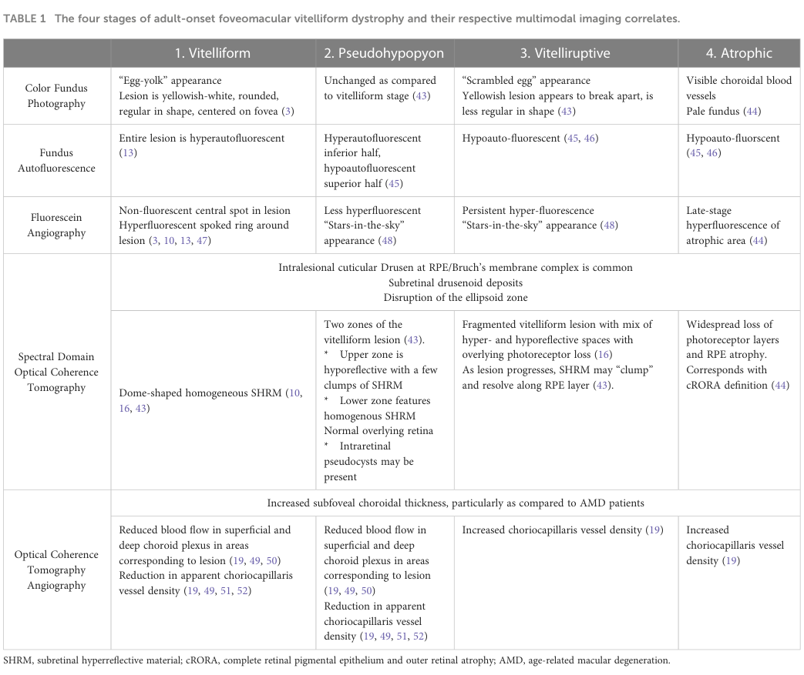

## Question

# Disease Characteristics Research Template

## Target Disease
- **Disease Name:** Adult-Onset Foveomacular Vitelliform Dystrophy
- **MONDO ID:**  (if available)
- **Category:** Mendelian

## Research Objectives

Please provide a comprehensive research report on **Adult-Onset Foveomacular Vitelliform Dystrophy** covering all of the
disease characteristics listed below. This report will be used to populate a disease knowledge
base entry. Be thorough and cite primary literature (PMID preferred) for all claims.

For each section, **suggested databases/resources** are listed. These are the first places
you should search for information on each topic.

---

### 1. Disease Information
> **Search first:** OMIM, Orphanet, ICD-10/ICD-11, MeSH, PubMed

- What is the disease? Provide a concise overview.
- What are the key identifiers? (OMIM, Orphanet, ICD-10/ICD-11, MeSH, Mondo)
- What are the common synonyms and alternative names?
- Is the information derived from individual patients (e.g., EHR) or aggregated disease-level resources?

### 2. Etiology

- **Disease Causal Factors**: What are the primary causes? (genetic, environmental, infectious, mechanistic)
- **Risk Factors**:
  > **Search first:** PubMed, Cochrane Library, UpToDate, clinical guidelines, ClinVar, ClinGen, GWAS Catalog, PheGenI, CTD, CDC, WHO, epidemiological databases
  - Genetic risk factors (causal variants, susceptibility loci, modifier genes)
  - Environmental risk factors (toxins, lifestyle, occupational exposures, age, sex, family history)
- **Protective Factors**:
  > **Search first:** PubMed, Cochrane Library, clinical trial databases, GWAS Catalog, gnomAD, WHO, CDC, nutrition databases
  - Genetic protective factors (protective variants, modifier alleles)
  - Environmental protective factors (diet, lifestyle, exposures that reduce risk)
- **Gene-Environment Interactions**: How do genetic and environmental factors interact to influence disease?
  > **Search first:** CTD, PubMed, PheGenI, GxE databases

### 3. Phenotypes
> **Search first:** HPO (Human Phenotype Ontology), OMIM, Orphanet, PubMed, clinicaltrials.gov, MedDRA, SNOMED CT, DECIPHER, LOINC

For each phenotype, provide:
- **Phenotype type**: symptoms, clinical signs, physical manifestations, behavioral changes, or laboratory abnormalities
  > For symptoms/signs: HPO, OMIM, Orphanet, PubMed
  > For behavioral changes: HPO, DSM, RDoC (Research Domain Criteria), PubMed
  > For laboratory abnormalities: LOINC, SNOMED CT, LabTests Online, PubMed
- **Phenotype characteristics**:
  > **Search first:** OMIM, Orphanet, HPO, PubMed
  - Age of symptom onset (neonatal, childhood, adult-onset, late-onset)
  - Symptom severity (mild, moderate, severe, variable)
  - Symptom progression (stable, progressive, episodic, fluctuating)
  - Frequency among affected individuals (percentage or qualitative)
- **Quality of life impact**: Effects on daily functioning and well-being (per-phenotype when possible)
  > **Search first:** EQ-5D database, SF-36, WHO QOL databases, PubMed
- Suggest HPO (Human Phenotype Ontology) terms for each phenotype

### 4. Genetic/Molecular Information

- **Causal Genes**: Gene mutations or chromosomal abnormalities responsible for disease (gene symbols, OMIM IDs)
  > **Search first:** OMIM, ClinVar, HGMD, Ensembl, NCBI Gene
- **Pathogenic Variants**:
  - Affected genes (gene symbols, HGNC IDs)
    > **Search first:** OMIM, NCBI Gene, Ensembl, HGNC, UniProt, GeneCards
  - Variant classification (pathogenic, likely pathogenic, VUS per ACMG/AMP guidelines)
    > **Search first:** ClinVar, ClinGen, ACMG/AMP guidelines, VarSome
  - Variant type/class (missense, frameshift, nonsense, splice-site, structural)
  - Allele frequency in population databases
    > **Search first:** gnomAD, 1000 Genomes, ExAC, TOPMed, dbSNP
  - Somatic vs germline origin
    > **Search first:** COSMIC (somatic), ClinVar, ICGC, TCGA
  - Functional consequences (loss of function, gain of function, dominant negative)
- **Modifier Genes**: Genes that modify disease severity or expression
- **Epigenetic Information**: DNA methylation, histone modifications, chromatin changes affecting disease
  > **Search first:** ENCODE, Roadmap Epigenomics, MethBase, DiseaseMeth
- **Chromosomal Abnormalities**: Large-scale genetic changes (aneuploidy, translocations, inversions)
  > **Search first:** DECIPHER, ClinVar, ECARUCA, UCSC Genome Browser

### 5. Environmental Information

- **Environmental Factors**: Non-genetic contributing factors (toxins, radiation, pollution, occupational exposure)
  > **Search first:** CTD (Comparative Toxicogenomics Database), TOXNET, PubMed, EPA databases
- **Lifestyle Factors**: Behavioral factors (smoking, diet, exercise, alcohol consumption)
  > **Search first:** CDC databases, WHO, PubMed, NHANES
- **Infectious Agents**: If applicable, pathogens causing or triggering disease (bacteria, viruses, fungi, parasites)
  > **Search first:** NCBI Taxonomy, ViPR, BV-BRC, MicrobeDB, GIDEON

### 6. Mechanism / Pathophysiology

- **Molecular Pathways**: Specific signaling cascades or biochemical pathways involved (Wnt, MAPK, mTOR, PI3K-AKT, etc.)
  > **Search first:** KEGG, Reactome, WikiPathways, PathBank, BioCyc
- **Cellular Processes**: Cell-level mechanisms (apoptosis, autophagy, cell cycle dysregulation, inflammation, etc.)
  > **Search first:** Gene Ontology (GO), Reactome, KEGG, PubMed
- **Protein Dysfunction**: How protein structure or function is altered (misfolding, aggregation, loss of function, gain of function)
  > **Search first:** UniProt, PDB (Protein Data Bank), InterPro, Pfam, AlphaFold
- **Metabolic Changes**: Alterations in metabolic processes (energy metabolism, lipid metabolism, amino acid metabolism)
  > **Search first:** KEGG, BioCyc, HMDB (Human Metabolome Database), BRENDA
- **Immune System Involvement**: Role of immune response (autoimmunity, immunodeficiency, chronic inflammation)
  > **Search first:** ImmPort, Immunome Database, IEDB, Gene Ontology
- **Tissue Damage Mechanisms**: How tissues/ are injured (oxidative stress, ischemia, fibrosis, necrosis)
  > **Search first:** PubMed, Gene Ontology, Reactome
- **Biochemical Abnormalities**: Specific molecular defects (enzyme deficiencies, receptor dysfunction, ion channel defects)
  > **Search first:** BRENDA, UniProt, KEGG, OMIM, PubMed
- **Epigenetic Changes**: DNA methylation, histone modifications affecting gene expression in disease
  > **Search first:** ENCODE, Roadmap Epigenomics, MethBase, DiseaseMeth
- **Molecular Profiling** (if available):
  - Transcriptomics/gene expression changes
    > **Search first:** GEO (Gene Expression Omnibus), ArrayExpress, GTEx, Human Cell Atlas, SRA
  - Proteomics findings
    > **Search first:** PRIDE, ProteomeXchange, Human Protein Atlas, STRING, BioGRID
  - Metabolomics signatures
    > **Search first:** MetaboLights, Metabolomics Workbench, HMDB, METLIN
  - Lipidomics alterations
    > **Search first:** LIPID MAPS, SwissLipids, LipidHome, Metabolomics Workbench
  - Genomic structural features
    > **Search first:** UCSC Genome Browser, Ensembl, NCBI, dbVar, DGV
- **Advanced Technologies** (if applicable):
  - Single-cell analysis findings (cell-type specific mechanisms, cellular heterogeneity)
    > **Search first:** Human Cell Atlas, Single Cell Portal, GEO, CELLxGENE
  - Spatial transcriptomics findings
    > **Search first:** GEO, Spatial Research, Vizgen, 10x Genomics data
  - Multi-omics integration results
    > **Search first:** TCGA, ICGC, cBioPortal, LinkedOmics, PubMed
  - Functional genomics screens (CRISPR, RNAi)
    > **Search first:** DepMap, GenomeRNAi, PubMed, BioGRID ORCS

For each mechanism, describe:
- The causal chain from initial trigger to clinical manifestation
- Which mechanisms are upstream vs downstream
- What cell types and biological processes are involved
- Suggest GO terms for biological processes and CL terms for cell types

### 7. Anatomical Structures Affected

- **Organ Level**:
  - Primary organs directly affected
  - Secondary organ involvement (complications, secondary effects)
  - Body systems involved (cardiovascular, nervous, digestive, respiratory, endocrine, etc.)
  > **Search first:** Uberon, FMA (Foundational Model of Anatomy), OMIM, HPO, ICD-11, MeSH, SNOMED CT
- **Tissue and Cell Level**:
  - Specific tissue types affected (epithelial, connective, muscle, nervous)
  - Specific cell populations targeted (with Cell Ontology terms)
  > **Search first:** Uberon, Human Protein Atlas, Cell Ontology, Human Cell Atlas, CellMarker, PanglaoDB
- **Subcellular Level**:
  - Cellular compartments involved (mitochondria, nucleus, ER, lysosomes) (with GO Cellular Component terms)
  > **Search first:** Gene Ontology (Cellular Component), UniProt, Human Protein Atlas
- **Localization**:
  - Specific anatomical sites (with UBERON terms)
    > **Search first:** FMA, Uberon, NeuroNames (for brain), SNOMED CT
  - Lateralization (unilateral, bilateral, asymmetric)
    > **Search first:** HPO, clinical literature, imaging databases

### 8. Temporal Development

- **Onset**:
  - Typical age of onset (congenital, pediatric, adult, geriatric)
  - Onset pattern (acute, subacute, chronic, insidious)
  > **Search first:** OMIM, Orphanet, HPO, PubMed
- **Progression**:
  - Disease stages (early, intermediate, advanced, end-stage)
    > **Search first:** Cancer Staging Manual (AJCC), WHO classifications, PubMed
  - Progression rate (rapid, slow, variable)
  - Disease course pattern (episodic, relapsing-remitting, progressive, stable)
  - Disease duration (self-limited, chronic lifelong)
  > **Search first:** Disease registries, longitudinal cohort databases, natural history studies, PubMed, Orphanet, OMIM
- **Patterns**:
  - Remission patterns (spontaneous, treatment-induced)
    > **Search first:** Clinical trial databases, disease registries, PubMed
  - Critical periods (time windows of vulnerability or opportunity for intervention)
    > **Search first:** PubMed, developmental biology databases, clinical guidelines

### 9. Inheritance and Population

- **Epidemiology**:
  - Prevalence (cases per 100,000 at given time)
  - Incidence (new cases per 100,000 per year)
  > **Search first:** Orphanet, CDC, WHO, GBD (Global Burden of Disease), national registries, SEER, disease registries
- **For Genetic Etiology**:
  - Inheritance pattern (AD, AR, X-linked, mitochondrial, multifactorial, polygenic)
    > **Search first:** OMIM, Orphanet, ClinVar, GTR (Genetic Testing Registry)
  - Penetrance (complete, incomplete, age-dependent)
    > **Search first:** ClinVar, OMIM, PubMed, ClinGen
  - Expressivity (variable, consistent)
    > **Search first:** OMIM, ClinVar, PubMed
  - Genetic anticipation (increasing severity in successive generations)
    > **Search first:** OMIM, PubMed (especially for repeat expansion disorders)
  - Germline mosaicism
    > **Search first:** ClinVar, OMIM, genetic counseling literature, PubMed
  - Founder effects (population-specific mutations)
    > **Search first:** gnomAD, population genetics databases, PubMed
  - Consanguinity role
    > **Search first:** OMIM, population studies, genetic counseling resources
  - Carrier frequency
    > **Search first:** gnomAD, carrier screening databases, GeneReviews, GTR
- **Population Demographics**:
  - Affected populations (ethnic or demographic groups with higher prevalence)
    > **Search first:** gnomAD, 1000 Genomes, PAGE Study, PubMed, population registries
  - Geographic distribution (endemic areas, regional variation)
    > **Search first:** WHO, CDC, GBD, Orphanet, geographic epidemiology databases
  - Geographic distribution of specific variants
  - Sex ratio (male:female)
    > **Search first:** Disease registries, OMIM, PubMed, epidemiological databases
  - Age distribution of affected individuals
    > **Search first:** CDC, disease registries, SEER, Orphanet

### 10. Diagnostics

- **Clinical Tests**:
  - Laboratory tests (blood, urine, tissue chemistry, specific enzyme assays)
    > **Search first:** LOINC, LabTests Online, PubMed
  - Biomarkers (proteins, metabolites, genetic markers, circulating biomarkers)
    > **Search first:** FDA Biomarker List, BEST (Biomarkers, EndpointS, and other Tools), PubMed
  - Imaging studies (X-ray, CT, MRI, PET, ultrasound)
    > **Search first:** RadLex, DICOM, Radiopaedia, imaging databases
  - Functional tests (pulmonary function, cardiac stress tests)
    > **Search first:** LOINC, clinical guidelines, PubMed
  - Electrophysiology (EEG, EMG, ECG, nerve conduction studies)
    > **Search first:** LOINC, clinical neurophysiology databases, PubMed
  - Biopsy findings (histopathology, immunohistochemistry)
    > **Search first:** SNOMED CT, College of American Pathologists resources, PubMed
  - Pathology findings (microscopic examination)
    > **Search first:** SNOMED CT, Digital Pathology databases, PubMed
- **Genetic Testing**:
  > **Search first:** GTR (Genetic Testing Registry), GeneReviews, ClinGen
  - Overview of recommended genetic testing approach
  - Whole genome sequencing (WGS) utility
    > **Search first:** GTR, ClinVar, GEL (Genomics England), gnomAD
  - Whole exome sequencing (WES) utility
    > **Search first:** GTR, ClinVar, OMIM, GeneMatcher
  - Gene panels (which panels, which genes)
    > **Search first:** GTR, ClinVar, laboratory-specific databases
  - Single gene testing
    > **Search first:** GTR, ClinVar, OMIM, GeneReviews
  - Chromosomal microarray (CMA)
    > **Search first:** DECIPHER, ClinVar, dbVar, ECARUCA
  - Karyotyping
    > **Search first:** Chromosome Abnormality Database, ClinVar, cytogenetics resources
  - FISH
    > **Search first:** ClinVar, cytogenetics databases, PubMed
  - Mitochondrial DNA testing
    > **Search first:** MITOMAP, MSeqDR, ClinVar, GTR
  - Repeat expansion testing
    > **Search first:** GTR, ClinVar, repeat expansion databases, PubMed
- **Omics-Based Diagnostics** (if applicable):
  - RNA sequencing / transcriptomics
    > **Search first:** GEO, ArrayExpress, GTEx, RNA-seq databases
  - Proteomics
    > **Search first:** PRIDE, ProteomeXchange, FDA Biomarker database
  - Metabolomics
    > **Search first:** MetaboLights, Metabolomics Workbench, HMDB
  - Epigenomics
    > **Search first:** GEO, ENCODE, Roadmap Epigenomics, MethBase
  - Liquid biopsy
    > **Search first:** COSMIC, ClinVar, liquid biopsy databases, PubMed
- **Clinical Criteria**:
  - Standardized diagnostic criteria (DSM, ICD, society guidelines)
    > **Search first:** DSM-5, ICD-11, clinical society guidelines, UpToDate
  - Differential diagnosis (other conditions to rule out, with distinguishing features)
    > **Search first:** DynaMed, UpToDate, clinical decision support systems
- **Screening**:
  - Screening methods for asymptomatic individuals (newborn screening, carrier screening, cascade screening)
    > **Search first:** ACMG recommendations, CDC newborn screening, GTR

### 11. Outcome/Prognosis

- **Survival and Mortality**:
  - Survival rate (5-year, 10-year, overall)
    > **Search first:** SEER, cancer registries, disease-specific registries, PubMed
  - Life expectancy (with and without treatment if applicable)
    > **Search first:** Orphanet, disease registries, actuarial databases, PubMed
  - Mortality rate
    > **Search first:** CDC, WHO, GBD, national mortality databases
  - Disease-specific mortality (deaths directly attributable to disease)
    > **Search first:** Disease registries, CDC Wonder, GBD, PubMed
- **Morbidity and Function**:
  - Morbidity (disease-related disability and health impacts)
    > **Search first:** GBD, WHO, disability databases, PubMed
  - Disability outcomes (long-term functional impairments)
    > **Search first:** ICF (International Classification of Functioning), disability registries
  - Quality of life measures (EQ-5D, SF-36, PROMIS, disease-specific tools)
    > **Search first:** EQ-5D database, SF-36, PROMIS, PubMed
- **Disease Course**:
  - Complications (secondary problems: infections, organ failure, etc.)
    > **Search first:** ICD codes, disease registries, clinical databases, PubMed
  - Recovery potential (likelihood and extent of recovery, with vs without treatment)
    > **Search first:** Natural history studies, rehabilitation databases, PubMed
- **Prediction**:
  - Prognostic factors (age, disease severity, biomarkers, treatment response)
    > **Search first:** Prognostic models databases, clinical calculators, PubMed
  - Prognostic biomarkers (molecular markers predicting disease course)
    > **Search first:** FDA Biomarker database, PubMed, cancer prognostic databases

### 12. Treatment

- **Pharmacotherapy**:
  - Pharmacological treatments (drug names, drug classes, mechanisms of action)
    > **Search first:** DrugBank, RxNorm, ATC classification, DailyMed, FDA databases
  - Pharmacogenomics (how genetic variants affect drug metabolism, efficacy, toxicity)
    > **Search first:** PharmGKB, CPIC (Clinical Pharmacogenetics), FDA Table of PGx Biomarkers
- **Advanced Therapeutics**:
  - Gene therapy (viral vectors, CRISPR, gene replacement, gene editing)
    > **Search first:** ClinicalTrials.gov, FDA gene therapy database, ASGCT resources
  - Cell therapy (stem cell transplant, CAR-T, cellular therapeutics)
    > **Search first:** ClinicalTrials.gov, FDA cell therapy database, FACT standards
  - RNA-based therapies (ASOs, siRNA, mRNA therapies)
    > **Search first:** ClinicalTrials.gov, FDA approvals, PubMed
  - Targeted therapies (treatments directed at specific molecular targets)
    > **Search first:** My Cancer Genome, OncoKB, ClinicalTrials.gov, FDA approvals
  - Immunotherapies (checkpoint inhibitors, monoclonal antibodies)
    > **Search first:** Cancer Immunotherapy Database, FDA approvals, ClinicalTrials.gov
- **Surgical and Interventional**:
  - Surgical interventions (types of surgery, timing, outcomes)
    > **Search first:** CPT codes, surgical registries, clinical guidelines, PubMed
- **Supportive and Rehabilitative**:
  - Supportive care (symptom management, pain control, nutrition)
    > **Search first:** Clinical guidelines, Cochrane Library, PubMed
  - Rehabilitation (physical therapy, occupational therapy, speech therapy)
    > **Search first:** Rehabilitation medicine databases, clinical guidelines, PubMed
- **Experimental**:
  - Experimental treatments in clinical trials (with NCT identifiers if available)
    > **Search first:** ClinicalTrials.gov, EU Clinical Trials Register, WHO ICTRP
- **Treatment Outcomes**:
  - Treatment response rates
    > **Search first:** Clinical trial databases, FDA reviews, systematic reviews, PubMed
  - Side effects and adverse events
    > **Search first:** FDA Adverse Event Reporting System (FAERS), MedWatch, PubMed
- **Treatment Strategy**:
  - Treatment algorithms (clinical pathways, decision trees)
    > **Search first:** Clinical practice guidelines, NCCN Guidelines, UpToDate
  - Combination therapies
    > **Search first:** ClinicalTrials.gov, treatment guidelines, PubMed
  - Personalized medicine approaches (genotype-guided treatment)
    > **Search first:** My Cancer Genome, CIViC, PharmGKB, precision medicine databases

For each treatment, suggest MAXO (Medical Action Ontology) terms where applicable.

### 13. Prevention

- **Prevention Levels**:
  - Primary prevention (preventing disease occurrence: vaccination, risk factor modification)
    > **Search first:** CDC, WHO, USPSTF recommendations, Cochrane Library
  - Secondary prevention (early detection and treatment: screening programs, early intervention)
    > **Search first:** USPSTF, CDC screening guidelines, WHO
  - Tertiary prevention (preventing complications in those with disease)
    > **Search first:** Clinical guidelines, disease management protocols, PubMed
- **Immunization**: Vaccine strategies (if applicable)
  > **Search first:** CDC vaccine schedules, WHO immunization, FDA vaccine database
- **Screening and Early Detection**:
  - Screening programs (population-based: newborn screening, cancer screening)
    > **Search first:** CDC screening programs, USPSTF, cancer screening databases
  - Genetic screening (carrier screening, preimplantation genetic diagnosis, prenatal testing)
    > **Search first:** ACMG recommendations, ACOG guidelines, GTR
  - Risk stratification (identifying high-risk individuals for targeted prevention)
    > **Search first:** Risk prediction models, clinical calculators, PubMed
- **Behavioral Interventions**: Lifestyle modifications to reduce risk
  > **Search first:** CDC, WHO, behavioral intervention databases, Cochrane Library
- **Counseling**: Genetic counseling (risk assessment, family planning guidance)
  > **Search first:** NSGC resources, ACMG guidelines, GeneReviews
- **Public Health**:
  - Public health interventions (sanitation, vector control, health education)
    > **Search first:** CDC, WHO, public health databases, PubMed
  - Environmental interventions (reducing environmental risk factors)
    > **Search first:** EPA databases, WHO environmental health, PubMed
- **Prophylaxis**: Preventive medications or procedures
  > **Search first:** Clinical guidelines, FDA approvals, PubMed

### 14. Other Species / Natural Disease

- **Taxonomy**: Species affected (with NCBI Taxon identifiers)
  > **Search first:** NCBI Taxonomy
- **Breed**: Specific breeds affected (with VBO identifiers if applicable)
  > **Search first:** VBO (Vertebrate Breed Ontology)
- **Gene**: Orthologous genes in other species (with NCBI Gene IDs)
  > **Search first:** NCBI Gene
- **Natural Disease**:
  - Naturally occurring disease in other species (companion animals, wildlife)
    > **Search first:** OMIA (Online Mendelian Inheritance in Animals), VetCompass, PubMed
  - Veterinary relevance and importance in animal health
    > **Search first:** OMIA, veterinary databases, PubMed
- **Comparative Biology**:
  - Comparative pathology (similarities and differences across species)
    > **Search first:** OMIA, comparative pathology databases, PubMed
  - Evolutionary conservation of disease mechanisms
    > **Search first:** HomoloGene, OrthoMCL, Alliance of Genome Resources
- **Transmission** (if applicable):
  - Zoonotic potential
    > **Search first:** CDC zoonotic diseases, WHO zoonoses, GIDEON
  - Cross-species susceptibility
    > **Search first:** NCBI Taxonomy, veterinary databases, PubMed

### 15. Model Organisms

- **Model Types**:
  - Model organism type (mammalian, invertebrate, cellular, in vitro)
    > **Search first:** Alliance of Genome Resources, model organism databases
  - Specific model systems (mouse, rat, zebrafish, Drosophila, C. elegans, yeast, cell lines, organoids, iPSCs)
    > **Search first:** MGI, RGD, ZFIN, FlyBase, WormBase, SGD, ATCC, Cellosaurus
  - Induced models (drug treatment, surgical intervention, environmental manipulation)
    > **Search first:** MGI, model organism databases, PubMed
- **Genetic Models**:
  - Types available (knockout, knock-in, transgenic, conditional, humanized)
    > **Search first:** MGI, IMPC, KOMP, EuMMCR, IMSR
- **Model Characteristics**:
  - Phenotype recapitulation (how well model reproduces human disease features)
    > **Search first:** Model organism databases, comparative studies, PubMed
  - Model limitations (aspects of human disease not captured)
    > **Search first:** Model organism databases, PubMed, review articles
- **Applications**:
  - Research applications (what aspects of disease can be studied)
    > **Search first:** Model organism databases, PubMed
- **Resources**:
  - Model databases
    > **Search first:** MGI, RGD, ZFIN, FlyBase, WormBase, IMSR, EMMA, MMRRC

---

## Citation Requirements

- Cite primary literature (PMID preferred) for all mechanistic and clinical claims
- Prioritize recent reviews and landmark papers
- Include direct quotes from abstracts where possible to support key statements
- Distinguish evidence source types: human clinical, model organism, in vitro, computational

## Output Format

Structure your response as a comprehensive narrative organized by the sections above.
For each section, provide:
- Factual content with specific details (numbers, percentages, gene names, variant nomenclature)
- Ontology term suggestions (HPO, GO, CL, UBERON, CHEBI, MAXO, MONDO) where applicable
- Evidence citations with PMIDs
- Direct quotes from abstracts to support key claims
- Clear indication when information is not available or not applicable for this disease

This report will be used to populate a disease knowledge base entry with:
- Pathophysiology descriptions with causal chains
- Gene/protein annotations (HGNC, GO terms)
- Phenotype associations (HP terms) with frequencies
- Cell type involvement (CL terms)
- Anatomical locations (UBERON terms)
- Chemical entities (CHEBI terms)
- Treatment annotations (MAXO terms)
- Evidence items with PMIDs and exact abstract quotes
- Epidemiology, prognosis, diagnostic, and prevention information
- Animal model descriptions with phenotype recapitulation details

## Output

Question: You are an expert researcher providing comprehensive, well-cited information.

Provide detailed information focusing on:
1. Key concepts and definitions with current understanding
2. Recent developments and latest research (prioritize 2023-2024 sources)
3. Current applications and real-world implementations
4. Expert opinions and analysis from authoritative sources
5. Relevant statistics and data from recent studies

Format as a comprehensive research report with proper citations. Include URLs and publication dates where available.
Always prioritize recent, authoritative sources and provide specific citations for all major claims.

# Disease Characteristics Research Template

## Target Disease
- **Disease Name:** Adult-Onset Foveomacular Vitelliform Dystrophy
- **MONDO ID:**  (if available)
- **Category:** Mendelian

## Research Objectives

Please provide a comprehensive research report on **Adult-Onset Foveomacular Vitelliform Dystrophy** covering all of the
disease characteristics listed below. This report will be used to populate a disease knowledge
base entry. Be thorough and cite primary literature (PMID preferred) for all claims.

For each section, **suggested databases/resources** are listed. These are the first places
you should search for information on each topic.

---

### 1. Disease Information
> **Search first:** OMIM, Orphanet, ICD-10/ICD-11, MeSH, PubMed

- What is the disease? Provide a concise overview.
- What are the key identifiers? (OMIM, Orphanet, ICD-10/ICD-11, MeSH, Mondo)
- What are the common synonyms and alternative names?
- Is the information derived from individual patients (e.g., EHR) or aggregated disease-level resources?

### 2. Etiology

- **Disease Causal Factors**: What are the primary causes? (genetic, environmental, infectious, mechanistic)
- **Risk Factors**:
  > **Search first:** PubMed, Cochrane Library, UpToDate, clinical guidelines, ClinVar, ClinGen, GWAS Catalog, PheGenI, CTD, CDC, WHO, epidemiological databases
  - Genetic risk factors (causal variants, susceptibility loci, modifier genes)
  - Environmental risk factors (toxins, lifestyle, occupational exposures, age, sex, family history)
- **Protective Factors**:
  > **Search first:** PubMed, Cochrane Library, clinical trial databases, GWAS Catalog, gnomAD, WHO, CDC, nutrition databases
  - Genetic protective factors (protective variants, modifier alleles)
  - Environmental protective factors (diet, lifestyle, exposures that reduce risk)
- **Gene-Environment Interactions**: How do genetic and environmental factors interact to influence disease?
  > **Search first:** CTD, PubMed, PheGenI, GxE databases

### 3. Phenotypes
> **Search first:** HPO (Human Phenotype Ontology), OMIM, Orphanet, PubMed, clinicaltrials.gov, MedDRA, SNOMED CT, DECIPHER, LOINC

For each phenotype, provide:
- **Phenotype type**: symptoms, clinical signs, physical manifestations, behavioral changes, or laboratory abnormalities
  > For symptoms/signs: HPO, OMIM, Orphanet, PubMed
  > For behavioral changes: HPO, DSM, RDoC (Research Domain Criteria), PubMed
  > For laboratory abnormalities: LOINC, SNOMED CT, LabTests Online, PubMed
- **Phenotype characteristics**:
  > **Search first:** OMIM, Orphanet, HPO, PubMed
  - Age of symptom onset (neonatal, childhood, adult-onset, late-onset)
  - Symptom severity (mild, moderate, severe, variable)
  - Symptom progression (stable, progressive, episodic, fluctuating)
  - Frequency among affected individuals (percentage or qualitative)
- **Quality of life impact**: Effects on daily functioning and well-being (per-phenotype when possible)
  > **Search first:** EQ-5D database, SF-36, WHO QOL databases, PubMed
- Suggest HPO (Human Phenotype Ontology) terms for each phenotype

### 4. Genetic/Molecular Information

- **Causal Genes**: Gene mutations or chromosomal abnormalities responsible for disease (gene symbols, OMIM IDs)
  > **Search first:** OMIM, ClinVar, HGMD, Ensembl, NCBI Gene
- **Pathogenic Variants**:
  - Affected genes (gene symbols, HGNC IDs)
    > **Search first:** OMIM, NCBI Gene, Ensembl, HGNC, UniProt, GeneCards
  - Variant classification (pathogenic, likely pathogenic, VUS per ACMG/AMP guidelines)
    > **Search first:** ClinVar, ClinGen, ACMG/AMP guidelines, VarSome
  - Variant type/class (missense, frameshift, nonsense, splice-site, structural)
  - Allele frequency in population databases
    > **Search first:** gnomAD, 1000 Genomes, ExAC, TOPMed, dbSNP
  - Somatic vs germline origin
    > **Search first:** COSMIC (somatic), ClinVar, ICGC, TCGA
  - Functional consequences (loss of function, gain of function, dominant negative)
- **Modifier Genes**: Genes that modify disease severity or expression
- **Epigenetic Information**: DNA methylation, histone modifications, chromatin changes affecting disease
  > **Search first:** ENCODE, Roadmap Epigenomics, MethBase, DiseaseMeth
- **Chromosomal Abnormalities**: Large-scale genetic changes (aneuploidy, translocations, inversions)
  > **Search first:** DECIPHER, ClinVar, ECARUCA, UCSC Genome Browser

### 5. Environmental Information

- **Environmental Factors**: Non-genetic contributing factors (toxins, radiation, pollution, occupational exposure)
  > **Search first:** CTD (Comparative Toxicogenomics Database), TOXNET, PubMed, EPA databases
- **Lifestyle Factors**: Behavioral factors (smoking, diet, exercise, alcohol consumption)
  > **Search first:** CDC databases, WHO, PubMed, NHANES
- **Infectious Agents**: If applicable, pathogens causing or triggering disease (bacteria, viruses, fungi, parasites)
  > **Search first:** NCBI Taxonomy, ViPR, BV-BRC, MicrobeDB, GIDEON

### 6. Mechanism / Pathophysiology

- **Molecular Pathways**: Specific signaling cascades or biochemical pathways involved (Wnt, MAPK, mTOR, PI3K-AKT, etc.)
  > **Search first:** KEGG, Reactome, WikiPathways, PathBank, BioCyc
- **Cellular Processes**: Cell-level mechanisms (apoptosis, autophagy, cell cycle dysregulation, inflammation, etc.)
  > **Search first:** Gene Ontology (GO), Reactome, KEGG, PubMed
- **Protein Dysfunction**: How protein structure or function is altered (misfolding, aggregation, loss of function, gain of function)
  > **Search first:** UniProt, PDB (Protein Data Bank), InterPro, Pfam, AlphaFold
- **Metabolic Changes**: Alterations in metabolic processes (energy metabolism, lipid metabolism, amino acid metabolism)
  > **Search first:** KEGG, BioCyc, HMDB (Human Metabolome Database), BRENDA
- **Immune System Involvement**: Role of immune response (autoimmunity, immunodeficiency, chronic inflammation)
  > **Search first:** ImmPort, Immunome Database, IEDB, Gene Ontology
- **Tissue Damage Mechanisms**: How tissues/ are injured (oxidative stress, ischemia, fibrosis, necrosis)
  > **Search first:** PubMed, Gene Ontology, Reactome
- **Biochemical Abnormalities**: Specific molecular defects (enzyme deficiencies, receptor dysfunction, ion channel defects)
  > **Search first:** BRENDA, UniProt, KEGG, OMIM, PubMed
- **Epigenetic Changes**: DNA methylation, histone modifications affecting gene expression in disease
  > **Search first:** ENCODE, Roadmap Epigenomics, MethBase, DiseaseMeth
- **Molecular Profiling** (if available):
  - Transcriptomics/gene expression changes
    > **Search first:** GEO (Gene Expression Omnibus), ArrayExpress, GTEx, Human Cell Atlas, SRA
  - Proteomics findings
    > **Search first:** PRIDE, ProteomeXchange, Human Protein Atlas, STRING, BioGRID
  - Metabolomics signatures
    > **Search first:** MetaboLights, Metabolomics Workbench, HMDB, METLIN
  - Lipidomics alterations
    > **Search first:** LIPID MAPS, SwissLipids, LipidHome, Metabolomics Workbench
  - Genomic structural features
    > **Search first:** UCSC Genome Browser, Ensembl, NCBI, dbVar, DGV
- **Advanced Technologies** (if applicable):
  - Single-cell analysis findings (cell-type specific mechanisms, cellular heterogeneity)
    > **Search first:** Human Cell Atlas, Single Cell Portal, GEO, CELLxGENE
  - Spatial transcriptomics findings
    > **Search first:** GEO, Spatial Research, Vizgen, 10x Genomics data
  - Multi-omics integration results
    > **Search first:** TCGA, ICGC, cBioPortal, LinkedOmics, PubMed
  - Functional genomics screens (CRISPR, RNAi)
    > **Search first:** DepMap, GenomeRNAi, PubMed, BioGRID ORCS

For each mechanism, describe:
- The causal chain from initial trigger to clinical manifestation
- Which mechanisms are upstream vs downstream
- What cell types and biological processes are involved
- Suggest GO terms for biological processes and CL terms for cell types

### 7. Anatomical Structures Affected

- **Organ Level**:
  - Primary organs directly affected
  - Secondary organ involvement (complications, secondary effects)
  - Body systems involved (cardiovascular, nervous, digestive, respiratory, endocrine, etc.)
  > **Search first:** Uberon, FMA (Foundational Model of Anatomy), OMIM, HPO, ICD-11, MeSH, SNOMED CT
- **Tissue and Cell Level**:
  - Specific tissue types affected (epithelial, connective, muscle, nervous)
  - Specific cell populations targeted (with Cell Ontology terms)
  > **Search first:** Uberon, Human Protein Atlas, Cell Ontology, Human Cell Atlas, CellMarker, PanglaoDB
- **Subcellular Level**:
  - Cellular compartments involved (mitochondria, nucleus, ER, lysosomes) (with GO Cellular Component terms)
  > **Search first:** Gene Ontology (Cellular Component), UniProt, Human Protein Atlas
- **Localization**:
  - Specific anatomical sites (with UBERON terms)
    > **Search first:** FMA, Uberon, NeuroNames (for brain), SNOMED CT
  - Lateralization (unilateral, bilateral, asymmetric)
    > **Search first:** HPO, clinical literature, imaging databases

### 8. Temporal Development

- **Onset**:
  - Typical age of onset (congenital, pediatric, adult, geriatric)
  - Onset pattern (acute, subacute, chronic, insidious)
  > **Search first:** OMIM, Orphanet, HPO, PubMed
- **Progression**:
  - Disease stages (early, intermediate, advanced, end-stage)
    > **Search first:** Cancer Staging Manual (AJCC), WHO classifications, PubMed
  - Progression rate (rapid, slow, variable)
  - Disease course pattern (episodic, relapsing-remitting, progressive, stable)
  - Disease duration (self-limited, chronic lifelong)
  > **Search first:** Disease registries, longitudinal cohort databases, natural history studies, PubMed, Orphanet, OMIM
- **Patterns**:
  - Remission patterns (spontaneous, treatment-induced)
    > **Search first:** Clinical trial databases, disease registries, PubMed
  - Critical periods (time windows of vulnerability or opportunity for intervention)
    > **Search first:** PubMed, developmental biology databases, clinical guidelines

### 9. Inheritance and Population

- **Epidemiology**:
  - Prevalence (cases per 100,000 at given time)
  - Incidence (new cases per 100,000 per year)
  > **Search first:** Orphanet, CDC, WHO, GBD (Global Burden of Disease), national registries, SEER, disease registries
- **For Genetic Etiology**:
  - Inheritance pattern (AD, AR, X-linked, mitochondrial, multifactorial, polygenic)
    > **Search first:** OMIM, Orphanet, ClinVar, GTR (Genetic Testing Registry)
  - Penetrance (complete, incomplete, age-dependent)
    > **Search first:** ClinVar, OMIM, PubMed, ClinGen
  - Expressivity (variable, consistent)
    > **Search first:** OMIM, ClinVar, PubMed
  - Genetic anticipation (increasing severity in successive generations)
    > **Search first:** OMIM, PubMed (especially for repeat expansion disorders)
  - Germline mosaicism
    > **Search first:** ClinVar, OMIM, genetic counseling literature, PubMed
  - Founder effects (population-specific mutations)
    > **Search first:** gnomAD, population genetics databases, PubMed
  - Consanguinity role
    > **Search first:** OMIM, population studies, genetic counseling resources
  - Carrier frequency
    > **Search first:** gnomAD, carrier screening databases, GeneReviews, GTR
- **Population Demographics**:
  - Affected populations (ethnic or demographic groups with higher prevalence)
    > **Search first:** gnomAD, 1000 Genomes, PAGE Study, PubMed, population registries
  - Geographic distribution (endemic areas, regional variation)
    > **Search first:** WHO, CDC, GBD, Orphanet, geographic epidemiology databases
  - Geographic distribution of specific variants
  - Sex ratio (male:female)
    > **Search first:** Disease registries, OMIM, PubMed, epidemiological databases
  - Age distribution of affected individuals
    > **Search first:** CDC, disease registries, SEER, Orphanet

### 10. Diagnostics

- **Clinical Tests**:
  - Laboratory tests (blood, urine, tissue chemistry, specific enzyme assays)
    > **Search first:** LOINC, LabTests Online, PubMed
  - Biomarkers (proteins, metabolites, genetic markers, circulating biomarkers)
    > **Search first:** FDA Biomarker List, BEST (Biomarkers, EndpointS, and other Tools), PubMed
  - Imaging studies (X-ray, CT, MRI, PET, ultrasound)
    > **Search first:** RadLex, DICOM, Radiopaedia, imaging databases
  - Functional tests (pulmonary function, cardiac stress tests)
    > **Search first:** LOINC, clinical guidelines, PubMed
  - Electrophysiology (EEG, EMG, ECG, nerve conduction studies)
    > **Search first:** LOINC, clinical neurophysiology databases, PubMed
  - Biopsy findings (histopathology, immunohistochemistry)
    > **Search first:** SNOMED CT, College of American Pathologists resources, PubMed
  - Pathology findings (microscopic examination)
    > **Search first:** SNOMED CT, Digital Pathology databases, PubMed
- **Genetic Testing**:
  > **Search first:** GTR (Genetic Testing Registry), GeneReviews, ClinGen
  - Overview of recommended genetic testing approach
  - Whole genome sequencing (WGS) utility
    > **Search first:** GTR, ClinVar, GEL (Genomics England), gnomAD
  - Whole exome sequencing (WES) utility
    > **Search first:** GTR, ClinVar, OMIM, GeneMatcher
  - Gene panels (which panels, which genes)
    > **Search first:** GTR, ClinVar, laboratory-specific databases
  - Single gene testing
    > **Search first:** GTR, ClinVar, OMIM, GeneReviews
  - Chromosomal microarray (CMA)
    > **Search first:** DECIPHER, ClinVar, dbVar, ECARUCA
  - Karyotyping
    > **Search first:** Chromosome Abnormality Database, ClinVar, cytogenetics resources
  - FISH
    > **Search first:** ClinVar, cytogenetics databases, PubMed
  - Mitochondrial DNA testing
    > **Search first:** MITOMAP, MSeqDR, ClinVar, GTR
  - Repeat expansion testing
    > **Search first:** GTR, ClinVar, repeat expansion databases, PubMed
- **Omics-Based Diagnostics** (if applicable):
  - RNA sequencing / transcriptomics
    > **Search first:** GEO, ArrayExpress, GTEx, RNA-seq databases
  - Proteomics
    > **Search first:** PRIDE, ProteomeXchange, FDA Biomarker database
  - Metabolomics
    > **Search first:** MetaboLights, Metabolomics Workbench, HMDB
  - Epigenomics
    > **Search first:** GEO, ENCODE, Roadmap Epigenomics, MethBase
  - Liquid biopsy
    > **Search first:** COSMIC, ClinVar, liquid biopsy databases, PubMed
- **Clinical Criteria**:
  - Standardized diagnostic criteria (DSM, ICD, society guidelines)
    > **Search first:** DSM-5, ICD-11, clinical society guidelines, UpToDate
  - Differential diagnosis (other conditions to rule out, with distinguishing features)
    > **Search first:** DynaMed, UpToDate, clinical decision support systems
- **Screening**:
  - Screening methods for asymptomatic individuals (newborn screening, carrier screening, cascade screening)
    > **Search first:** ACMG recommendations, CDC newborn screening, GTR

### 11. Outcome/Prognosis

- **Survival and Mortality**:
  - Survival rate (5-year, 10-year, overall)
    > **Search first:** SEER, cancer registries, disease-specific registries, PubMed
  - Life expectancy (with and without treatment if applicable)
    > **Search first:** Orphanet, disease registries, actuarial databases, PubMed
  - Mortality rate
    > **Search first:** CDC, WHO, GBD, national mortality databases
  - Disease-specific mortality (deaths directly attributable to disease)
    > **Search first:** Disease registries, CDC Wonder, GBD, PubMed
- **Morbidity and Function**:
  - Morbidity (disease-related disability and health impacts)
    > **Search first:** GBD, WHO, disability databases, PubMed
  - Disability outcomes (long-term functional impairments)
    > **Search first:** ICF (International Classification of Functioning), disability registries
  - Quality of life measures (EQ-5D, SF-36, PROMIS, disease-specific tools)
    > **Search first:** EQ-5D database, SF-36, PROMIS, PubMed
- **Disease Course**:
  - Complications (secondary problems: infections, organ failure, etc.)
    > **Search first:** ICD codes, disease registries, clinical databases, PubMed
  - Recovery potential (likelihood and extent of recovery, with vs without treatment)
    > **Search first:** Natural history studies, rehabilitation databases, PubMed
- **Prediction**:
  - Prognostic factors (age, disease severity, biomarkers, treatment response)
    > **Search first:** Prognostic models databases, clinical calculators, PubMed
  - Prognostic biomarkers (molecular markers predicting disease course)
    > **Search first:** FDA Biomarker database, PubMed, cancer prognostic databases

### 12. Treatment

- **Pharmacotherapy**:
  - Pharmacological treatments (drug names, drug classes, mechanisms of action)
    > **Search first:** DrugBank, RxNorm, ATC classification, DailyMed, FDA databases
  - Pharmacogenomics (how genetic variants affect drug metabolism, efficacy, toxicity)
    > **Search first:** PharmGKB, CPIC (Clinical Pharmacogenetics), FDA Table of PGx Biomarkers
- **Advanced Therapeutics**:
  - Gene therapy (viral vectors, CRISPR, gene replacement, gene editing)
    > **Search first:** ClinicalTrials.gov, FDA gene therapy database, ASGCT resources
  - Cell therapy (stem cell transplant, CAR-T, cellular therapeutics)
    > **Search first:** ClinicalTrials.gov, FDA cell therapy database, FACT standards
  - RNA-based therapies (ASOs, siRNA, mRNA therapies)
    > **Search first:** ClinicalTrials.gov, FDA approvals, PubMed
  - Targeted therapies (treatments directed at specific molecular targets)
    > **Search first:** My Cancer Genome, OncoKB, ClinicalTrials.gov, FDA approvals
  - Immunotherapies (checkpoint inhibitors, monoclonal antibodies)
    > **Search first:** Cancer Immunotherapy Database, FDA approvals, ClinicalTrials.gov
- **Surgical and Interventional**:
  - Surgical interventions (types of surgery, timing, outcomes)
    > **Search first:** CPT codes, surgical registries, clinical guidelines, PubMed
- **Supportive and Rehabilitative**:
  - Supportive care (symptom management, pain control, nutrition)
    > **Search first:** Clinical guidelines, Cochrane Library, PubMed
  - Rehabilitation (physical therapy, occupational therapy, speech therapy)
    > **Search first:** Rehabilitation medicine databases, clinical guidelines, PubMed
- **Experimental**:
  - Experimental treatments in clinical trials (with NCT identifiers if available)
    > **Search first:** ClinicalTrials.gov, EU Clinical Trials Register, WHO ICTRP
- **Treatment Outcomes**:
  - Treatment response rates
    > **Search first:** Clinical trial databases, FDA reviews, systematic reviews, PubMed
  - Side effects and adverse events
    > **Search first:** FDA Adverse Event Reporting System (FAERS), MedWatch, PubMed
- **Treatment Strategy**:
  - Treatment algorithms (clinical pathways, decision trees)
    > **Search first:** Clinical practice guidelines, NCCN Guidelines, UpToDate
  - Combination therapies
    > **Search first:** ClinicalTrials.gov, treatment guidelines, PubMed
  - Personalized medicine approaches (genotype-guided treatment)
    > **Search first:** My Cancer Genome, CIViC, PharmGKB, precision medicine databases

For each treatment, suggest MAXO (Medical Action Ontology) terms where applicable.

### 13. Prevention

- **Prevention Levels**:
  - Primary prevention (preventing disease occurrence: vaccination, risk factor modification)
    > **Search first:** CDC, WHO, USPSTF recommendations, Cochrane Library
  - Secondary prevention (early detection and treatment: screening programs, early intervention)
    > **Search first:** USPSTF, CDC screening guidelines, WHO
  - Tertiary prevention (preventing complications in those with disease)
    > **Search first:** Clinical guidelines, disease management protocols, PubMed
- **Immunization**: Vaccine strategies (if applicable)
  > **Search first:** CDC vaccine schedules, WHO immunization, FDA vaccine database
- **Screening and Early Detection**:
  - Screening programs (population-based: newborn screening, cancer screening)
    > **Search first:** CDC screening programs, USPSTF, cancer screening databases
  - Genetic screening (carrier screening, preimplantation genetic diagnosis, prenatal testing)
    > **Search first:** ACMG recommendations, ACOG guidelines, GTR
  - Risk stratification (identifying high-risk individuals for targeted prevention)
    > **Search first:** Risk prediction models, clinical calculators, PubMed
- **Behavioral Interventions**: Lifestyle modifications to reduce risk
  > **Search first:** CDC, WHO, behavioral intervention databases, Cochrane Library
- **Counseling**: Genetic counseling (risk assessment, family planning guidance)
  > **Search first:** NSGC resources, ACMG guidelines, GeneReviews
- **Public Health**:
  - Public health interventions (sanitation, vector control, health education)
    > **Search first:** CDC, WHO, public health databases, PubMed
  - Environmental interventions (reducing environmental risk factors)
    > **Search first:** EPA databases, WHO environmental health, PubMed
- **Prophylaxis**: Preventive medications or procedures
  > **Search first:** Clinical guidelines, FDA approvals, PubMed

### 14. Other Species / Natural Disease

- **Taxonomy**: Species affected (with NCBI Taxon identifiers)
  > **Search first:** NCBI Taxonomy
- **Breed**: Specific breeds affected (with VBO identifiers if applicable)
  > **Search first:** VBO (Vertebrate Breed Ontology)
- **Gene**: Orthologous genes in other species (with NCBI Gene IDs)
  > **Search first:** NCBI Gene
- **Natural Disease**:
  - Naturally occurring disease in other species (companion animals, wildlife)
    > **Search first:** OMIA (Online Mendelian Inheritance in Animals), VetCompass, PubMed
  - Veterinary relevance and importance in animal health
    > **Search first:** OMIA, veterinary databases, PubMed
- **Comparative Biology**:
  - Comparative pathology (similarities and differences across species)
    > **Search first:** OMIA, comparative pathology databases, PubMed
  - Evolutionary conservation of disease mechanisms
    > **Search first:** HomoloGene, OrthoMCL, Alliance of Genome Resources
- **Transmission** (if applicable):
  - Zoonotic potential
    > **Search first:** CDC zoonotic diseases, WHO zoonoses, GIDEON
  - Cross-species susceptibility
    > **Search first:** NCBI Taxonomy, veterinary databases, PubMed

### 15. Model Organisms

- **Model Types**:
  - Model organism type (mammalian, invertebrate, cellular, in vitro)
    > **Search first:** Alliance of Genome Resources, model organism databases
  - Specific model systems (mouse, rat, zebrafish, Drosophila, C. elegans, yeast, cell lines, organoids, iPSCs)
    > **Search first:** MGI, RGD, ZFIN, FlyBase, WormBase, SGD, ATCC, Cellosaurus
  - Induced models (drug treatment, surgical intervention, environmental manipulation)
    > **Search first:** MGI, model organism databases, PubMed
- **Genetic Models**:
  - Types available (knockout, knock-in, transgenic, conditional, humanized)
    > **Search first:** MGI, IMPC, KOMP, EuMMCR, IMSR
- **Model Characteristics**:
  - Phenotype recapitulation (how well model reproduces human disease features)
    > **Search first:** Model organism databases, comparative studies, PubMed
  - Model limitations (aspects of human disease not captured)
    > **Search first:** Model organism databases, PubMed, review articles
- **Applications**:
  - Research applications (what aspects of disease can be studied)
    > **Search first:** Model organism databases, PubMed
- **Resources**:
  - Model databases
    > **Search first:** MGI, RGD, ZFIN, FlyBase, WormBase, IMSR, EMMA, MMRRC

---

## Citation Requirements

- Cite primary literature (PMID preferred) for all mechanistic and clinical claims
- Prioritize recent reviews and landmark papers
- Include direct quotes from abstracts where possible to support key statements
- Distinguish evidence source types: human clinical, model organism, in vitro, computational

## Output Format

Structure your response as a comprehensive narrative organized by the sections above.
For each section, provide:
- Factual content with specific details (numbers, percentages, gene names, variant nomenclature)
- Ontology term suggestions (HPO, GO, CL, UBERON, CHEBI, MAXO, MONDO) where applicable
- Evidence citations with PMIDs
- Direct quotes from abstracts to support key claims
- Clear indication when information is not available or not applicable for this disease

This report will be used to populate a disease knowledge base entry with:
- Pathophysiology descriptions with causal chains
- Gene/protein annotations (HGNC, GO terms)
- Phenotype associations (HP terms) with frequencies
- Cell type involvement (CL terms)
- Anatomical locations (UBERON terms)
- Chemical entities (CHEBI terms)
- Treatment annotations (MAXO terms)
- Evidence items with PMIDs and exact abstract quotes
- Epidemiology, prognosis, diagnostic, and prevention information
- Animal model descriptions with phenotype recapitulation details

# Adult-Onset Foveomacular Vitelliform Dystrophy (AOFVD/AFVD) — Disease Characteristics Research Report

## Executive summary (current understanding; 2023–2024 emphasis)
Adult-onset foveomacular vitelliform dystrophy (AOFVD; also AFVD/AVMD in parts of the literature) is a macular *pattern dystrophy* characterized by subfoveal “vitelliform” material in the subretinal space, typically presenting in mid-to-late adulthood and progressing through four imaging-defined stages (vitelliform → pseudohypopyon → vitelliruptive → atrophic). It is frequently misdiagnosed as age-related macular degeneration (AMD), but management differs because AOFVD itself has no proven disease-modifying therapy; treatment is directed mainly at complications such as macular neovascularization/choroidal neovascularization (CNV/MNV). (nipp2023adultonsetfoveomacularvitelliform pages 1-2, nipp2023adultonsetfoveomacularvitelliform pages 2-3, tesfaw2023clinicalandoptical pages 1-2)

Genetically, AOFVD is heterogeneous and often sporadic; reported monogenic contributors include PRPH2, BEST1, IMPG1, and IMPG2, but known genes explain a minority of cases in many cohorts. (nipp2023adultonsetfoveomacularvitelliform pages 2-3) A major 2024 development is evidence that *non-monogenic AFVD* is enriched for AMD complement-pathway risk alleles (e.g., CFH; C2/CFB/SKIV2L), suggesting a polygenic overlap with AMD and raising complement inhibition as a potential future therapeutic avenue. (jaskoll2024adultonsetfoveomacular pages 1-2)

## Target disease metadata
- **Disease name:** Adult-Onset Foveomacular Vitelliform Dystrophy
- **Category:** Mendelian (genetically heterogeneous; many cases non-monogenic/sporadic)
- **MONDO ID:** Not found in the retrieved sources (requires targeted ontology lookup beyond current evidence).

---

## 1. Disease information
### 1.1 Definition/overview
AOFVD is described as a “retinal pattern dystrophy” that “may affect up to 1 in 7,400 individuals,” with improved characterization enabled by modern imaging (SD-OCT, OCTA). (nipp2023adultonsetfoveomacularvitelliform pages 1-2)

A mechanistic definition used in a 2023 review: AOFVD is “a clinical spectrum of disease that results from the disordered metabolism of RPE cells, resulting in the accumulation of material in the subretinal space.” (nipp2023adultonsetfoveomacularvitelliform pages 2-3)

### 1.2 Common synonyms / alternative names
Historical and still-used labels include “adult vitelliform macular degeneration,” “pseudovitelliform macular degeneration,” and “adult-onset foveomacular pigment epithelial dystrophy,” among others; the term “adult-onset foveomacular vitelliform dystrophy” was first used in 1996 and became widely accepted later. (nipp2023adultonsetfoveomacularvitelliform pages 1-2)

The lesion is also referred to as an **acquired vitelliform lesion (AVL)** in parts of the staging literature. (nipp2023adultonsetfoveomacularvitelliform pages 2-3)

### 1.3 Key identifiers (availability in retrieved sources)
- **OMIM/Orphanet/ICD/MeSH/MONDO:** Not explicitly provided in the retrieved excerpts.
- **Gene-level OMIM references were present in a pattern-dystrophy genetic testing report** (e.g., PRPH2 OMIM gene 179605; BEST1 OMIM gene 607854; IMPG1 OMIM gene 602870; IMPG2 OMIM gene 607056). (abeshi2017genetictestingfor pages 1-2)

### 1.4 Evidence sources: individual vs aggregated
- **Aggregated disease-level resource:** 2023 review in *Frontiers in Ophthalmology* synthesizing epidemiology, imaging, pathophysiology, and management. (nipp2023adultonsetfoveomacularvitelliform pages 1-2)
- **Human clinical cohorts/case series:** 2023 retrospective cohort with multimodal imaging and stage counts (12 patients/19 eyes). (tesfaw2023clinicalandoptical pages 1-2)
- **Human genetic association study (2024):** AFVD (n=50) vs AMD (n=917) vs controls (n=432), targeted genotyping and pathway genetic risk scores. (jaskoll2024adultonsetfoveomacular pages 1-2)

---

## 2. Etiology
### 2.1 Disease causal factors (genetic/mechanistic)
AOFVD is linked to genes involved in photoreceptor outer segment structure (PRPH2), RPE ion channel function (BEST1), and interphotoreceptor matrix/extracellular matrix adhesion (IMPG1/IMPG2). (nipp2023adultonsetfoveomacularvitelliform pages 2-3)

AOFVD is often sporadic rather than clearly autosomal dominant. (nipp2023adultonsetfoveomacularvitelliform pages 1-2)

#### Primary-gene evidence example (IMPG1)
A landmark human genetics study concluded: “IMPG1 mutations cause both autosomal-dominant and -recessive forms of VMD, thus indicating that impairment of the interphotoreceptor matrix might be a general cause of VMD.” (manes2013mutationsinimpg1 pages 1-2)

This paper identified multiple pathogenic variant classes (missense, splice-site, nonsense) including c.713T>G (p.Leu238Arg) and additional recessive variants. (manes2013mutationsinimpg1 pages 1-2)

### 2.2 Risk factors
#### Genetic risk factors
- **PRPH2:** encodes peripherin-2; mutations are the “most common gene mutations identified in AOFVD patients” but explain “only 2–18% of all patients.” (nipp2023adultonsetfoveomacularvitelliform pages 2-3)
- **IMPG1/IMPG2:** in one summary, frequency among *familial* AOFVD patients lacking PRPH2/BEST1 mutations was “4 in 49, or approximately 8%,” and likely <8% among all AOFVD. (nipp2023adultonsetfoveomacularvitelliform pages 2-3)
- **2024 polygenic/complement risk:** AFVD (non-monogenic) associated with AMD complement alleles including **CFH rs570618** and **C2/CFB/SKIV2L rs116503776, rs114254831**, with a positive association for a complement genetic risk score (GRS). (jaskoll2024adultonsetfoveomacular pages 1-2)

#### Environmental/other risk factors
The 2023 review highlights that much remains unknown about “risk factors for development,” and misdiagnosis/coding issues complicate epidemiology. (nipp2023adultonsetfoveomacularvitelliform pages 1-2)

### 2.3 Protective factors
No specific protective factors (genetic or environmental) were identified in the retrieved sources.

### 2.4 Gene–environment interactions
Not identified in the retrieved sources.

---

## 3. Phenotypes
### 3.1 Core symptom/sign phenotype spectrum
Typical presentation includes mild blurred central vision and/or metamorphopsia; lesions are classically small, yellow, subretinal, centered at or near the fovea, often with central pigmentation. (tesfaw2023clinicalandoptical pages 1-2)

A 2023 cohort reported presenting visual acuity “ranged from 20/100 to 20/20.” (tesfaw2023clinicalandoptical pages 1-2)

### 3.2 Age of onset, severity, progression
- **Age range:** Gass proposed onset in “3rd to 5th decades,” but later studies suggest many are diagnosed at **50–70 years**, with reported ranges up to ~80. (nipp2023adultonsetfoveomacularvitelliform pages 2-3)
- **Disease stages:** AOFVD “progresses through four clinical stages” described by Querques et al. using SD-OCT. (nipp2023adultonsetfoveomacularvitelliform pages 2-3)

### 3.3 Stage-specific phenotypes and frequencies (example cohort)
In a 2023 retrospective cohort (12 patients; 19 eyes):
- Stage distribution: **vitelliform 10/19; pseudohypopyon 5/19; vitelliruptive 4/19**; no atrophic stage in that cohort. (tesfaw2023clinicalandoptical pages 2-4, tesfaw2023clinicalandoptical pages 1-2)
- OCT: IS/OS (ellipsoid zone) disruption in **8/19 eyes**; “optically clear (non-reflective) subretinal lesions” in **6/19 eyes**, mainly pseudohypopyon. (tesfaw2023clinicalandoptical pages 1-2)

### 3.4 Quality-of-life impact
Direct QoL instruments (EQ-5D/SF-36/PROMIS) were not present in the retrieved sources. Functionally, significant impairment is tied to CNV and macular atrophy rather than early stages. (nipp2023adultonsetfoveomacularvitelliform pages 7-8)

### 3.5 Suggested HPO terms (curated suggestions)
(These are ontology mapping suggestions for KB use; not claims of exact ontology IDs from the cited papers.)
- Decreased visual acuity; Metamorphopsia; Central scotoma; Abnormal fundus autofluorescence; Macular dystrophy; Subretinal deposits; Choroidal neovascularization; Retinal pigment epithelium atrophy; Abnormal color vision.

---

## 4. Genetic / molecular information
### 4.1 Causal/associated genes (human)
- **PRPH2**: peripherin-2, photoreceptor outer segment disc morphogenesis/stability. (nipp2023adultonsetfoveomacularvitelliform pages 2-3)
- **BEST1**: bestrophin-1, RPE-expressed transmembrane protein; ion channel/calcium signaling role; implicated in Best disease and some AOFVD cases. (nipp2023adultonsetfoveomacularvitelliform pages 2-3)
- **IMPG1 / IMPG2**: secreted extracellular matrix/interphotoreceptor matrix proteins involved in retinal adhesion. (nipp2023adultonsetfoveomacularvitelliform pages 2-3)

### 4.2 Pathogenic variant types and examples
- **IMPG1 (primary evidence, 2013):** c.713T>G (p.Leu238Arg) (dominant); c.807+1G>T (splice-site; recessive); c.461T>C (p.Leu154Pro) + c.1519C>T (p.Arg507*) (compound heterozygous). (manes2013mutationsinimpg1 pages 1-2)

### 4.3 Variant classification / allele frequency
ACMG-style variant classification and population allele frequencies were not provided in the retrieved excerpts.

### 4.4 Modifier genes
Not established in the retrieved sources.

### 4.5 Epigenetics / chromosomal abnormalities
Not established in the retrieved sources.

---

## 5. Environmental information
No AOFVD-specific environmental toxins/exposures or infectious triggers were identified in the retrieved sources.

---

## 6. Mechanism / pathophysiology
### 6.1 Proposed causal chain (integrated from 2023–2024 evidence)
1) **Primary tissue dysfunction:** AOFVD is framed as disordered **RPE metabolism** leading to accumulation of material in the subretinal space. (nipp2023adultonsetfoveomacularvitelliform pages 2-3)
2) **Material composition (clinicopathologic):** Subretinal material includes “pigment-laden cells, lipofuscin granules, photoreceptor debris, and RPE cells,” consistent with impaired outer segment handling and RPE/photoreceptor interface stress. (tesfaw2023clinicalandoptical pages 1-2)
3) **Structural progression:** Stage-specific OCT/FAF/FA changes reflect lesion maturation, sedimentation (pseudohypopyon), fragmentation (vitelliruptive), and in some eyes eventual photoreceptor and RPE atrophy. (nipp2023adultonsetfoveomacularvitelliform pages 7-8)
4) **Complications:** CNV/MNV and macular atrophy drive major visual decline. (nipp2023adultonsetfoveomacularvitelliform pages 7-8)
5) **Genetic contributors:** 
   - PRPH2 variants may predispose by disrupting outer segment disc structure. (nipp2023adultonsetfoveomacularvitelliform pages 2-3)
   - IMPG1/IMPG2 variants implicate the interphotoreceptor matrix; the IMPG1 genetics paper highlights interphotoreceptor matrix impairment as a general causal mechanism in vitelliform macular dystrophy. (manes2013mutationsinimpg1 pages 1-2)
6) **2024 complement-genetics hypothesis:** Non-monogenic AFVD shows association with AMD complement risk alleles and complement GRS, supporting a potential role for complement biology in some AFVD cases (even though systemic complement activation did not differ by plasma assays in that study). (jaskoll2024adultonsetfoveomacular pages 1-2, jaskoll2024adultonsetfoveomacular pages 6-8)

### 6.2 Suggested GO biological process terms (curated suggestions)
- Phagocytosis of photoreceptor outer segments; Visual perception; Extracellular matrix organization; Complement activation (alternative pathway); Retina development/maintenance.

### 6.3 Suggested Cell Ontology (CL) terms (curated suggestions)
- Retinal pigment epithelial cell; Rod photoreceptor cell; Cone photoreceptor cell; (optional for lesion biology) macrophage/mononuclear phagocyte.

### 6.4 Omics / single-cell / spatial / screens
No AOFVD-specific omics or single-cell/spatial transcriptomics evidence was present in the retrieved sources.

---

## 7. Anatomical structures affected
### 7.1 Organ/system level
- **Primary:** Eye—retina, particularly the **macula/fovea**. (tesfaw2023clinicalandoptical pages 1-2)

### 7.2 Tissue/cell level
- **Key tissues/cells:** RPE and photoreceptors; lesion material resides in the **subretinal space**. (nipp2023adultonsetfoveomacularvitelliform pages 2-3, tesfaw2023clinicalandoptical pages 1-2)

### 7.3 Subcellular level (inferred from mechanisms)
- Outer segment disc morphogenesis (PRPH2) and ion-channel/calcium signaling in RPE (BEST1) are implicated in genetic subsets. (nipp2023adultonsetfoveomacularvitelliform pages 2-3)

### 7.4 Localization and laterality
AOFVD is commonly bilateral, though unilateral/asymmetric cases occur. (tesfaw2023clinicalandoptical pages 1-2)

### Suggested UBERON terms (curated suggestions)
- Retina; Macula; Fovea centralis; Retinal pigment epithelium; Subretinal space.

---

## 8. Temporal development
### 8.1 Onset pattern
Typically insidious, adult-onset; many are diagnosed at 50–70 years. (nipp2023adultonsetfoveomacularvitelliform pages 2-3)

### 8.2 Progression / stages
Four-stage progression is widely used (vitelliform, pseudohypopyon, vitelliruptive, atrophic), originally described using SD-OCT. (nipp2023adultonsetfoveomacularvitelliform pages 2-3)

### 8.3 Remission patterns
Not established. Lesion material may be reabsorbed; not all eyes with resorption become atrophic. (nipp2023adultonsetfoveomacularvitelliform pages 2-3)

---

## 9. Inheritance and population
### 9.1 Epidemiology
- Prevalence estimates reported: **~1:7,400 to 1:8,200** in a local population estimate cited in the 2023 review; prevalence otherwise “remains undescribed” and is confounded by misdiagnosis/miscoding as AMD. (nipp2023adultonsetfoveomacularvitelliform pages 1-2)

### 9.2 Inheritance
Early articles suggested autosomal dominant inheritance, but “most cases of AOFVD are sporadic and do not follow a clear inheritance pattern,” despite multiple associated genes. (nipp2023adultonsetfoveomacularvitelliform pages 1-2)

### 9.3 Population demographics
No robust race/ethnicity/sex ratio data were available in the retrieved excerpts; the 2023 review notes many studies do not report race/ethnicity and that cohorts are geographically diverse. (nipp2023adultonsetfoveomacularvitelliform pages 1-2)

---

## 10. Diagnostics
### 10.1 Clinical criteria (practical)
Diagnosis is strongly imaging-based: a subfoveal round yellow lesion with subretinal hyperreflective material on OCT was used as inclusion in a 2023 case series. (tesfaw2023clinicalandoptical pages 1-2)

A differential diagnosis rule summarized in the 2023 review: patients with vitelliform lesions and drusen **not meeting** consensus AMD criteria should be diagnosed as AOFVD rather than AMD. (nipp2023adultonsetfoveomacularvitelliform pages 8-9)

### 10.2 Imaging
A central reference for staging-by-imaging is Table 1 from the 2023 review (color fundus photography, FAF, FA, SD-OCT, OCTA), including hallmark “egg-yolk” and “scrambled egg” appearances and stage-specific FAF/FA/OCT patterns. (nipp2023adultonsetfoveomacularvitelliform media 8bbaddb3)

An example of complication evolution (progression to CNV with OCT/FAF and response to anti-VEGF) is shown in Figure 4. (nipp2023adultonsetfoveomacularvitelliform media 7d1bcfc8)

Key modality notes:
- **FAF:** vitelliform lesions typically hyperautofluorescent; later stages increasingly hypoautofluorescent. (nipp2023adultonsetfoveomacularvitelliform pages 7-8)
- **FA:** can show a “non-fluorescent central spot” with a “hyperfluorescent spoked ring” in vitelliform stage; late staining can mimic CNV. (nipp2023adultonsetfoveomacularvitelliform pages 7-8)
- **SD-OCT:** dome-shaped subretinal hyperreflective material is typical; pseudohypopyon may show an “optically clear” space superiorly, distinguishing it from neovascular AMD fluid patterns in some cases. (tesfaw2023clinicalandoptical pages 1-2)
- **OCTA:** can be more sensitive for CNV detection; one cited report detected CNV on OCTA not seen on FA (1/8 eyes). (nipp2023adultonsetfoveomacularvitelliform pages 7-8)

### 10.3 Functional testing
A practical differentiator vs Best disease: Best disease typically shows abnormal EOG with reduced Arden ratio, whereas EOG is normal in the majority of AOFVD patients. (nipp2023adultonsetfoveomacularvitelliform pages 8-9)

### 10.4 Genetic testing strategy
A 2017 pattern-dystrophy genetic testing report describes a targeted multi-gene approach:
- NGS panel of coding exons/splice regions of **BEST1, CTNNA1, IMPG1, IMPG2, PRPH2, OTX2**, with Sanger confirmation and segregation testing; MLPA for BEST1/PRPH2 copy-number changes. Reported NGS analytical sensitivity >99% (≥10×) and specificity 99.99%. (abeshi2017genetictestingfor pages 2-3)

The 2023 review notes “no formal guidelines for genetic testing” in AOFVD and suggests considering testing when multiple family members are affected. (nipp2023adultonsetfoveomacularvitelliform pages 9-10)

---

## 11. Outcome / prognosis
AOFVD “generally progresses slowly,” with severe loss typically linked to CNV or macular atrophy. (nipp2023adultonsetfoveomacularvitelliform pages 1-2)

Quantitative examples summarized in the 2023 review:
- In 28 eyes followed 1–5 years: 10 stable, 11 worse, 4 improved. (nipp2023adultonsetfoveomacularvitelliform pages 7-8)
- Stabilization at vitelliform stage corresponded to BCVA change from 20/36 → 20/39, whereas progression to vitelliruptive/atrophic stages corresponded to 20/50 → 20/104. (nipp2023adultonsetfoveomacularvitelliform pages 7-8)

Mortality/survival impacts are not applicable (ocular disease) and not reported.

---

## 12. Treatment
### 12.1 Standard of care / real-world management
- **No disease-modifying therapy**: “no therapies currently slow disease progression,” so management focuses on complications. (nipp2023adultonsetfoveomacularvitelliform pages 9-10)

### 12.2 Treatment of CNV/MNV
- **Anti-VEGF (bevacizumab, ranibizumab)**: cited as standard of care for CNV secondary to AOFVD and associated with stabilization in most eyes. In one study summarized in the 2023 review, **87.5%** lost fewer than three lines of vision at one year. (nipp2023adultonsetfoveomacularvitelliform pages 9-10)
- **Photodynamic therapy (PDT)**: “has shown no benefit in AOFVD and may worsen BCVA.” (nipp2023adultonsetfoveomacularvitelliform pages 9-10)

### 12.3 Surgical/interventional
- **Macular translocation** has been reported but had high surgical risk and no distance-vision improvement; risks considered to outweigh benefits. (nipp2023adultonsetfoveomacularvitelliform pages 9-10)

### 12.4 Clinical trials / experimental development (selected)
- **NCT01965041 (2013; Manhattan Eye, Ear & Throat Hospital)**: intravitreal aflibercept for pattern dystrophy–associated adult-onset vitelliform detachments; **withdrawn, enrollment=0**, no results. (NCT01965041 chunk 1)
- **NCT01432847 (NEI; recruiting; last update 2026-06-05)**: biospecimen collection for inherited retinal diseases (including Best disease) to generate iPSC-derived RPE/retinal models and enable drug screening. (NCT01432847 chunk 1)
- **NCT02162953 (Mayo Clinic; completed; Feb 2014–Dec 31, 2022)**: stem-cell models of Best disease/bestrophinopathies; skin + blood to derive iPSC-RPE models (enrolled 48). (NCT02162953 chunk 1)
- **NCT05809635 (Columbia; recruiting; published record; started 2021-03-30)**: BEST1 vitelliform macular dystrophy natural history to develop endpoints for future trials (OCT, FAF, ERG/EOG, etc.). (NCT05809635 chunk 1)
- **NCT05258032 (Barcelona Macula Foundation; primary completion estimated 2024-11-24)**: structural/functional characterization of rare ocular diseases including Best disease/pattern dystrophy; endpoints include BCVA, microperimetry, OCT thickness. (NCT05258032 chunk 1)

### 12.5 MAXO term suggestions (curated)
- Anti-VEGF therapy; Optical coherence tomography monitoring; Genetic testing; Low-vision rehabilitation; Intravitreal injection; Fluorescein angiography; OCT angiography.

---

## 13. Prevention
No primary-prevention strategies were identified (genetic/degenerative macular disease). Secondary prevention is primarily **monitoring for CNV and atrophy** using multimodal imaging and treating CNV when present. (nipp2023adultonsetfoveomacularvitelliform pages 9-10, nipp2023adultonsetfoveomacularvitelliform pages 7-8)

Genetic counseling/cascade testing may be considered in families with multiple affected members, but formal testing guidelines are not established for AOFVD. (nipp2023adultonsetfoveomacularvitelliform pages 9-10)

---

## 14. Other species / natural disease
No naturally occurring AOFVD in other species was identified in the retrieved sources.

---

## 15. Model organisms / experimental systems
While classical animal-model papers were not retrieved, active translational modeling relies on **patient-derived iPSC** systems:
- NEI biospecimen repository to generate iPSC lines differentiated into RPE and neural retina for mechanistic studies and drug screening (NCT01432847). (NCT01432847 chunk 1)
- Mayo Clinic iPSC-RPE disease models for bestrophinopathies (NCT02162953). (NCT02162953 chunk 1)

---

## Key recent developments (2023–2024) and expert interpretation
1) **2023 consolidation of staging and imaging-driven differential diagnosis**: the 2023 open-access review emphasizes improved characterization and differentiation from AMD/Best disease using SD-OCT and OCTA, alongside a four-stage framework with modality-specific signatures. (nipp2023adultonsetfoveomacularvitelliform pages 1-2, nipp2023adultonsetfoveomacularvitelliform media 8bbaddb3)
2) **2024 genetic overlap with AMD complement cascade**: a 2024 IOVS study reports AFVD association with complement-pathway variants and a complement GRS (e.g., CFH rs570618 OR 2.73; complement GRS OR 1.42), concluding: “Non-monogenic AFVD is associated with AMD risk alleles in the complement cascade… Further research is needed to explore complement inhibition for AFVD.” (jaskoll2024adultonsetfoveomacular pages 1-2)

---

## High-density summary table
The following table compiles the most directly evidenced identifiers, genetics, staging/imaging hallmarks, and 2024 developments.

| Domain | Key points | Quantitative data | Key source (include DOI/URL + year) |
|---|---|---|---|
| Definition / classification | AOFVD/AFVD is a retinal pattern dystrophy characterized by subfoveal vitelliform material on fundus exam and multimodal imaging; often bilateral; slow progression but can lead to vision loss from CNV or macular atrophy. Debate persists about strict inclusion among pattern dystrophies because inheritance is often not clearly autosomal dominant. Synonyms used in the literature include adult vitelliform macular degeneration, adult macular vitelliform degeneration, pseudovitelliform macular degeneration, adult-onset foveomacular pigment epithelial dystrophy, adult foveomacular vitelliform dystrophy, and adult vitelliform macular dystrophy. (nipp2023adultonsetfoveomacularvitelliform pages 1-2, jabłonski2026adultonsetfoveomacularvitelliform pages 1-2) | Approximate prevalence reported as 1:7,400 to 1:8,200; AFVD described as the common phenotype among pattern dystrophies. (nipp2023adultonsetfoveomacularvitelliform pages 1-2, jabłonski2026adultonsetfoveomacularvitelliform pages 1-2, jaskoll2024adultonsetfoveomacular pages 1-2) | Nipp et al., 2023, Front. Ophthalmol., DOI: 10.3389/fopht.2023.1237788, https://doi.org/10.3389/fopht.2023.1237788; Jaskoll et al., 2024, IOVS, DOI: 10.1167/iovs.65.13.53, https://doi.org/10.1167/iovs.65.13.53 |
| Epidemiology / onset | Most patients are diagnosed between ages 50–70, although reported onset ranges extend from ~30 to 80 years; AFVD is frequently misdiagnosed as AMD. (nipp2023adultonsetfoveomacularvitelliform pages 2-3) | Mean age in one 2023 case series: 62.75 years (12 patients, 19 eyes). In the 2024 genetics cohort: AFVD mean age 73 ± 10 years (n=50). (tesfaw2023clinicalandoptical pages 1-2, jaskoll2024adultonsetfoveomacular pages 1-2) | Tesfaw & Bernstein, 2023, JOECSA, DOI: 10.64666/joecsa.2023.81, https://doi.org/10.64666/joecsa.2023.81; Jaskoll et al., 2024, https://doi.org/10.1167/iovs.65.13.53 |
| Gene evidence: PRPH2 | PRPH2 encodes peripherin-2, important for rod/cone outer segment disc formation and stabilization. It is the most commonly reported mutated gene in AOFVD but is not present in most cases; some authors consider it more of a predisposing factor in many patients than a universal monogenic cause. Pattern dystrophies are mainly autosomal dominant, and PRPH2 is associated with almost all pattern dystrophies. (nipp2023adultonsetfoveomacularvitelliform pages 2-3, abeshi2017genetictestingfor pages 1-2) | Reported to account for only 2%–18% of AOFVD patients. (nipp2023adultonsetfoveomacularvitelliform pages 2-3) | Nipp et al., 2023, https://doi.org/10.3389/fopht.2023.1237788; Abeshi et al., 2017, DOI: 10.24190/issn2564-615x/2017/s1.27, https://doi.org/10.24190/issn2564-615x/2017/s1.27 |
| Gene evidence: BEST1 | BEST1 (formerly VMD2) encodes bestrophin-1, an RPE-predominant transmembrane protein involved in ion channel function and intracellular calcium signaling. BEST1 mutations are classic for Best disease and have also been reported in some AOFVD/AVMD cases; some late-onset mild cases may represent mild Best disease. However, BEST1 mutations are absent in most AOFVD patients, so AFVD remains largely a clinical diagnosis with no formal genetic-testing guideline. (nipp2023adultonsetfoveomacularvitelliform pages 2-3, nipp2023adultonsetfoveomacularvitelliform pages 9-10, abeshi2017genetictestingfor pages 1-2) | In a testing-focused review, BEST1 variants were reported as common in AVMD: 96% with positive family history and 50%–70% of sporadic cases, but this estimate comes from the testing review context and not all clinically defined AOFVD cohorts. (abeshi2017genetictestingfor pages 2-3) | Nipp et al., 2023, https://doi.org/10.3389/fopht.2023.1237788; Abeshi et al., 2017, https://doi.org/10.24190/issn2564-615x/2017/s1.27 |
| Gene evidence: IMPG1 | IMPG1 and IMPG2 encode extracellular/interphotoreceptor matrix proteins involved in retinal adhesion. Primary genetic evidence shows IMPG1 mutations cause vitelliform macular dystrophies, including both autosomal dominant and autosomal recessive forms. Reported IMPG1 variants include missense, splice-site, and nonsense changes; disease mechanism implicates impaired interphotoreceptor matrix biology. (manes2013mutationsinimpg1 pages 1-2, manes2013mutationsinimpg1 pages 4-5, manes2013mutationsinimpg1 pages 7-8) | In familial AOFVD patients lacking PRPH2/BEST1 mutations, IMPG1/2 mutations were found in 4/49 (~8%); likely <8% among all AOFVD. Primary IMPG1 report identified recurrent p.Leu238Arg and additional c.807+1G>T, p.Leu154Pro, p.Arg507*. (nipp2023adultonsetfoveomacularvitelliform pages 2-3, manes2013mutationsinimpg1 pages 1-2) | Manes et al., 2013, Am J Hum Genet, DOI: 10.1016/j.ajhg.2013.07.018, https://doi.org/10.1016/j.ajhg.2013.07.018; Nipp et al., 2023, https://doi.org/10.3389/fopht.2023.1237788 |
| Gene evidence: IMPG2 | IMPG2 is also implicated in AOFVD/AVMD and, like IMPG1, encodes an extracellular matrix protein important for retinal adhesion/interphotoreceptor matrix structure. Evidence supports its contribution in a minority of cases and in familial disease lacking PRPH2/BEST1 mutations. (nipp2023adultonsetfoveomacularvitelliform pages 2-3, abeshi2017genetictestingfor pages 1-2, nipp2023adultonsetfoveomacularvitelliform pages 11-12) | Combined IMPG1/IMPG2 frequency in familial AOFVD without PRPH2/BEST1 mutations: 4/49 (~8%). (nipp2023adultonsetfoveomacularvitelliform pages 2-3) | Nipp et al., 2023, https://doi.org/10.3389/fopht.2023.1237788; Abeshi et al., 2017, https://doi.org/10.24190/issn2564-615x/2017/s1.27 |
| Clinical stage 1: Vitelliform | Classic “egg-yolk” lesion: yellowish-white, rounded, centered on the fovea. OCT shows dome-shaped homogeneous subretinal hyperreflective material between RPE and neurosensory retina. FAF is hyperautofluorescent. FA shows a non-fluorescent central spot with a hyperfluorescent spoked ring and no leakage. (nipp2023adultonsetfoveomacularvitelliform pages 7-8, nipp2023adultonsetfoveomacularvitelliform pages 3-5, gomezbenlloch2024opticalcoherencetomography pages 10-11) | In one 2023 series, 10/19 eyes were stage I. (tesfaw2023clinicalandoptical pages 1-2) | Nipp et al., 2023, https://doi.org/10.3389/fopht.2023.1237788; Tesfaw & Bernstein, 2023, https://doi.org/10.64666/joecsa.2023.81 |
| Clinical stage 2: Pseudohypopyon | Layering of vitelliform material within the lesion. OCT shows two zones: upper hyporeflective/optically clear space and lower homogeneous hyperreflective material; intraretinal pseudocysts may occur. FAF shows hyperautofluorescent inferior half and hypoautofluorescent superior half. FA may show a “stars-in-the-sky” appearance. The optically clear space may help distinguish AFVD from neovascular AMD. (nipp2023adultonsetfoveomacularvitelliform pages 7-8, tesfaw2023clinicalandoptical pages 1-2) | In one 2023 series, 5/19 eyes were stage II; optically clear subretinal spaces were seen in 6/19 eyes overall, including 5 pseudohypopyon eyes; 4/5 pseudohypopyon eyes had intact IS/OS interfaces. (tesfaw2023clinicalandoptical pages 1-2) | Nipp et al., 2023, https://doi.org/10.3389/fopht.2023.1237788; Tesfaw & Bernstein, 2023, https://doi.org/10.64666/joecsa.2023.81 |
| Clinical stage 3: Vitelliruptive | “Scrambled egg” stage with breakup and reabsorption of the lesion. OCT shows fragmented vitelliform material with mixed hyper-/hyporeflective spaces, hyperreflective clumps, and increasing photoreceptor loss/ellipsoid zone disruption. FAF becomes hypoautofluorescent; FA may retain a “stars-in-the-sky” pattern. (nipp2023adultonsetfoveomacularvitelliform pages 7-8, nipp2023adultonsetfoveomacularvitelliform pages 3-5, gomezbenlloch2024opticalcoherencetomography pages 10-11) | In one 2023 series, 4/19 eyes were stage III; IS/OS disruption was seen in 8/19 eyes total, including 4 stage III eyes. (tesfaw2023clinicalandoptical pages 1-2) | Nipp et al., 2023, https://doi.org/10.3389/fopht.2023.1237788; Tesfaw & Bernstein, 2023, https://doi.org/10.64666/joecsa.2023.81 |
| Clinical stage 4: Atrophic | Final stage after lesion resorption; not all eyes with lesion resorption become atrophic. OCT shows widespread photoreceptor-layer loss and RPE atrophy/cRORA. FAF is hypoautofluorescent. FA shows late hyperfluorescence of the atrophic area; color photography may show pale fundus/visible choroidal vessels. (nipp2023adultonsetfoveomacularvitelliform pages 7-8, nipp2023adultonsetfoveomacularvitelliform pages 2-3) | No atrophic eyes were present in the 19-eye 2023 Ethiopian series. (tesfaw2023clinicalandoptical pages 2-4, tesfaw2023clinicalandoptical pages 1-2) | Nipp et al., 2023, https://doi.org/10.3389/fopht.2023.1237788; Tesfaw & Bernstein, 2023, https://doi.org/10.64666/joecsa.2023.81 |
| Imaging / differential diagnosis | SD-OCT and OCTA are central for diagnosis and for distinguishing AFVD from AMD and Best disease. OCTA may detect CNV not seen on FA; one cited example detected CNV in 1/8 eyes on OCTA not seen on FA. EOG and full-field ERG are often normal or only mildly abnormal, supporting focal rather than generalized dysfunction. (nipp2023adultonsetfoveomacularvitelliform pages 7-8, nipp2023adultonsetfoveomacularvitelliform pages 9-10, jabłonski2026adultonsetfoveomacularvitelliform pages 1-2) | OCTA-detected CNV missed by FA: 1/8 eyes in one cited report. In the 2023 19-eye series, presenting VA ranged from 20/100 to 20/20. (nipp2023adultonsetfoveomacularvitelliform pages 7-8, tesfaw2023clinicalandoptical pages 1-2) | Nipp et al., 2023, https://doi.org/10.3389/fopht.2023.1237788; Tesfaw & Bernstein, 2023, https://doi.org/10.64666/joecsa.2023.81 |
| Prognosis / complications | Visual course is often relatively benign, but decline is greater with stage progression, CNV, or macular atrophy. Reported complications include CNV, macular atrophy, PED, retinal folds, macular coloboma, and RPE aperture. (nipp2023adultonsetfoveomacularvitelliform pages 7-8) | Example natural-history data: in 28 eyes followed 1–5 years, 10 stable, 11 worse, 4 improved; progression to vitelliruptive/atrophic stages reduced BCVA from 20/50 to 20/104 versus minimal change when stable at vitelliform stage (20/36 to 20/39). CNV prevalence around 15% is reported in review summaries. (nipp2023adultonsetfoveomacularvitelliform pages 7-8, jabłonski2026adultonsetfoveomacularvitelliform pages 1-2) | Nipp et al., 2023, https://doi.org/10.3389/fopht.2023.1237788; Jabłoński & Mackiewicz, 2026, https://doi.org/10.5114/oku/215545 |
| 2024 development: AFVD genetic overlap with AMD/complement | A 2024 IOVS study examined non-monogenic AFVD and found partial genetic overlap with AMD, especially in complement-related loci, while major AMD loci such as ARMS2/HTRA1 were not similarly associated with AFVD. The study suggests complement dysregulation may contribute to a subset of AFVD and raises complement inhibition as a future research direction. (jaskoll2024adultonsetfoveomacular pages 1-2, jaskoll2024adultonsetfoveomacular pages 6-8, jaskoll2024adultonsetfoveomacular pages 8-10) | Cohort: 50 AFVD, 917 AMD, 432 controls; 52 AMD-linked SNPs tested. AFVD-associated loci vs controls: CFH rs570618 OR 2.73 (95% CI 1.32–5.73; P=0.01); C2/CFB/SKIV2L rs116503776 OR 0.31 (0.14–0.71; P=0.0036); rs114254831 OR 0.41 (0.22–0.74; P=0.0025); MIR6130/RORB rs10781182 OR 0.13 (0.06–0.25; P<0.0001) vs controls and OR 0.19 (0.10–0.34; P<0.0001) vs AMD. Complement GRS OR 1.42 (1.04–1.95; P=0.03); other-pathways GRS OR 0.46 (0.21–0.98; P=0.04). Plasma complement activation did not differ significantly among AFVD, AMD, and controls. (jaskoll2024adultonsetfoveomacular pages 1-2, jaskoll2024adultonsetfoveomacular pages 6-8, jaskoll2024adultonsetfoveomacular pages 8-10) | Jaskoll et al., 2024, Invest. Ophthalmol. Vis. Sci., DOI: 10.1167/iovs.65.13.53, https://doi.org/10.1167/iovs.65.13.53 |

*Table: This table condenses the most evidence-supported findings on adult-onset foveomacular vitelliform dystrophy, including nomenclature, genetics, multimodal imaging stages, prognosis, and the major 2024 complement-genetics development. It is useful as a high-density reference for disease knowledge-base curation.*

---

## Notes on evidence limitations vs requested template
- **MONDO/MeSH/ICD/Orphanet IDs** were not present in retrieved excerpts; a targeted ontology lookup is required.
- **PMIDs:** Some papers in the evidence set did not include PMIDs in the retrieved text. One cited PMID available in excerpts is Meunier et al. Ophthalmology 2014 (PMID: 25085631) referenced in the genetic testing report; additional primary sources would be needed to populate complete PMID coverage. (abeshi2017genetictestingfor pages 3-3)
- **Protective factors, GxE, epigenetics, omics**: not identified in the retrieved sources.

References

1. (nipp2023adultonsetfoveomacularvitelliform pages 1-2): Grace E. Nipp, Terry Lee, Kubra Sarici, Goldis Malek, and Majda Hadziahmetovic. Adult-onset foveomacular vitelliform dystrophy: epidemiology, pathophysiology, imaging, and prognosis. Frontiers in Ophthalmology, Aug 2023. URL: https://doi.org/10.3389/fopht.2023.1237788, doi:10.3389/fopht.2023.1237788. This article has 14 citations.

2. (nipp2023adultonsetfoveomacularvitelliform pages 2-3): Grace E. Nipp, Terry Lee, Kubra Sarici, Goldis Malek, and Majda Hadziahmetovic. Adult-onset foveomacular vitelliform dystrophy: epidemiology, pathophysiology, imaging, and prognosis. Frontiers in Ophthalmology, Aug 2023. URL: https://doi.org/10.3389/fopht.2023.1237788, doi:10.3389/fopht.2023.1237788. This article has 14 citations.

3. (tesfaw2023clinicalandoptical pages 1-2): Alemu Kerie Tesfaw and Paul S. Bernstein. Clinical and optical coherence tomography features of adult-onset foveo-macular vitelliform dystrophy mimicking age-related macular degeneration. Journal of Ophthalmology of Eastern, Central and Southern Africa (JOECSA), Jul 2023. URL: https://doi.org/10.64666/joecsa.2023.81, doi:10.64666/joecsa.2023.81. This article has 0 citations.

4. (jaskoll2024adultonsetfoveomacular pages 1-2): Shlomit Jaskoll, Adi Kramer, Sarah Elbaz-Hayoun, Batya Rinsky, Chiara M. Eandi, Michelle Grunin, Yahel Shwartz, Liran Tiosano, Iris M. Heid, Thomas Winkler, and Itay Chowers. Adult onset foveomacular vitelliform dystrophy shows genetic overlap with age-related macular degeneration. Investigative Ophthalmology &amp; Visual Science, 65:53, Nov 2024. URL: https://doi.org/10.1167/iovs.65.13.53, doi:10.1167/iovs.65.13.53. This article has 4 citations and is from a domain leading peer-reviewed journal.

5. (abeshi2017genetictestingfor pages 1-2): Andi Abeshi, Pamela Coppola, Tommaso Beccari, Munis Dundar, Maura Di Nicola, Francesco Viola, Leonardo Colombo, and Matteo Bertelli. Genetic testing for pattern dystrophies. The EuroBiotech Journal, 1:86-88, Oct 2017. URL: https://doi.org/10.24190/issn2564-615x/2017/s1.27, doi:10.24190/issn2564-615x/2017/s1.27. This article has 2 citations.

6. (manes2013mutationsinimpg1 pages 1-2): Gaël Manes, Isabelle Meunier, Almudena Avila-Fernández, Sandro Banfi, Guylène Le Meur, Xavier Zanlonghi, Marta Corton, Francesca Simonelli, Philippe Brabet, Gilles Labesse, Isabelle Audo, Saddek Mohand-Said, Christina Zeitz, José-Alain Sahel, Michel Weber, Hélène Dollfus, Claire-Marie Dhaenens, Delphine Allorge, Elfride De Baere, Robert K. Koenekoop, Susanne Kohl, Frans P.M. Cremers, Joe G. Hollyfield, Audrey Sénéchal, Maxime Hebrard, Béatrice Bocquet, Carmen Ayuso García, and Christian P. Hamel. Mutations in impg1 cause vitelliform macular dystrophies. American journal of human genetics, 93 3:571-8, Sep 2013. URL: https://doi.org/10.1016/j.ajhg.2013.07.018, doi:10.1016/j.ajhg.2013.07.018. This article has 95 citations and is from a highest quality peer-reviewed journal.

7. (tesfaw2023clinicalandoptical pages 2-4): Alemu Kerie Tesfaw and Paul S. Bernstein. Clinical and optical coherence tomography features of adult-onset foveo-macular vitelliform dystrophy mimicking age-related macular degeneration. Journal of Ophthalmology of Eastern, Central and Southern Africa (JOECSA), Jul 2023. URL: https://doi.org/10.64666/joecsa.2023.81, doi:10.64666/joecsa.2023.81. This article has 0 citations.

8. (nipp2023adultonsetfoveomacularvitelliform pages 7-8): Grace E. Nipp, Terry Lee, Kubra Sarici, Goldis Malek, and Majda Hadziahmetovic. Adult-onset foveomacular vitelliform dystrophy: epidemiology, pathophysiology, imaging, and prognosis. Frontiers in Ophthalmology, Aug 2023. URL: https://doi.org/10.3389/fopht.2023.1237788, doi:10.3389/fopht.2023.1237788. This article has 14 citations.

9. (jaskoll2024adultonsetfoveomacular pages 6-8): Shlomit Jaskoll, Adi Kramer, Sarah Elbaz-Hayoun, Batya Rinsky, Chiara M. Eandi, Michelle Grunin, Yahel Shwartz, Liran Tiosano, Iris M. Heid, Thomas Winkler, and Itay Chowers. Adult onset foveomacular vitelliform dystrophy shows genetic overlap with age-related macular degeneration. Investigative Ophthalmology &amp; Visual Science, 65:53, Nov 2024. URL: https://doi.org/10.1167/iovs.65.13.53, doi:10.1167/iovs.65.13.53. This article has 4 citations and is from a domain leading peer-reviewed journal.

10. (nipp2023adultonsetfoveomacularvitelliform pages 8-9): Grace E. Nipp, Terry Lee, Kubra Sarici, Goldis Malek, and Majda Hadziahmetovic. Adult-onset foveomacular vitelliform dystrophy: epidemiology, pathophysiology, imaging, and prognosis. Frontiers in Ophthalmology, Aug 2023. URL: https://doi.org/10.3389/fopht.2023.1237788, doi:10.3389/fopht.2023.1237788. This article has 14 citations.

11. (nipp2023adultonsetfoveomacularvitelliform media 8bbaddb3): Grace E. Nipp, Terry Lee, Kubra Sarici, Goldis Malek, and Majda Hadziahmetovic. Adult-onset foveomacular vitelliform dystrophy: epidemiology, pathophysiology, imaging, and prognosis. Frontiers in Ophthalmology, Aug 2023. URL: https://doi.org/10.3389/fopht.2023.1237788, doi:10.3389/fopht.2023.1237788. This article has 14 citations.

12. (nipp2023adultonsetfoveomacularvitelliform media 7d1bcfc8): Grace E. Nipp, Terry Lee, Kubra Sarici, Goldis Malek, and Majda Hadziahmetovic. Adult-onset foveomacular vitelliform dystrophy: epidemiology, pathophysiology, imaging, and prognosis. Frontiers in Ophthalmology, Aug 2023. URL: https://doi.org/10.3389/fopht.2023.1237788, doi:10.3389/fopht.2023.1237788. This article has 14 citations.

13. (abeshi2017genetictestingfor pages 2-3): Andi Abeshi, Pamela Coppola, Tommaso Beccari, Munis Dundar, Maura Di Nicola, Francesco Viola, Leonardo Colombo, and Matteo Bertelli. Genetic testing for pattern dystrophies. The EuroBiotech Journal, 1:86-88, Oct 2017. URL: https://doi.org/10.24190/issn2564-615x/2017/s1.27, doi:10.24190/issn2564-615x/2017/s1.27. This article has 2 citations.

14. (nipp2023adultonsetfoveomacularvitelliform pages 9-10): Grace E. Nipp, Terry Lee, Kubra Sarici, Goldis Malek, and Majda Hadziahmetovic. Adult-onset foveomacular vitelliform dystrophy: epidemiology, pathophysiology, imaging, and prognosis. Frontiers in Ophthalmology, Aug 2023. URL: https://doi.org/10.3389/fopht.2023.1237788, doi:10.3389/fopht.2023.1237788. This article has 14 citations.

15. (NCT01965041 chunk 1):  Intravitreal Aflibercept Injections In The Treatment Of Pattern Dystrophy. Manhattan Eye, Ear & Throat Hospital. 2013. ClinicalTrials.gov Identifier: NCT01965041

16. (NCT01432847 chunk 1):  Cell Collection to Study Eye Diseases. National Eye Institute (NEI). 2011. ClinicalTrials.gov Identifier: NCT01432847

17. (NCT02162953 chunk 1): Alan D. Marmorstein, Ph.D.. Stem Cell Models of Best Disease and Other Retinal Degenerative Diseases.. Mayo Clinic. 2014. ClinicalTrials.gov Identifier: NCT02162953

18. (NCT05809635 chunk 1): Stephen H. Tsang. Study of BEST1 Vitelliform Macular Dystrophy. Columbia University. 2021. ClinicalTrials.gov Identifier: NCT05809635

19. (NCT05258032 chunk 1): Marc Biarnes Perez. Structural and Functional Characterization of Rare Ocular Diseases. Barcelona Macula Foundation. 2021. ClinicalTrials.gov Identifier: NCT05258032

20. (jabłonski2026adultonsetfoveomacularvitelliform pages 1-2): Michał Jabłoński and Jerzy Mackiewicz. Adult-onset foveomacular vitelliform dystrophy. Ophthalmology, 28:14-18, Jan 2026. URL: https://doi.org/10.5114/oku/215545, doi:10.5114/oku/215545. This article has 0 citations and is from a highest quality peer-reviewed journal.

21. (manes2013mutationsinimpg1 pages 4-5): Gaël Manes, Isabelle Meunier, Almudena Avila-Fernández, Sandro Banfi, Guylène Le Meur, Xavier Zanlonghi, Marta Corton, Francesca Simonelli, Philippe Brabet, Gilles Labesse, Isabelle Audo, Saddek Mohand-Said, Christina Zeitz, José-Alain Sahel, Michel Weber, Hélène Dollfus, Claire-Marie Dhaenens, Delphine Allorge, Elfride De Baere, Robert K. Koenekoop, Susanne Kohl, Frans P.M. Cremers, Joe G. Hollyfield, Audrey Sénéchal, Maxime Hebrard, Béatrice Bocquet, Carmen Ayuso García, and Christian P. Hamel. Mutations in impg1 cause vitelliform macular dystrophies. American journal of human genetics, 93 3:571-8, Sep 2013. URL: https://doi.org/10.1016/j.ajhg.2013.07.018, doi:10.1016/j.ajhg.2013.07.018. This article has 95 citations and is from a highest quality peer-reviewed journal.

22. (manes2013mutationsinimpg1 pages 7-8): Gaël Manes, Isabelle Meunier, Almudena Avila-Fernández, Sandro Banfi, Guylène Le Meur, Xavier Zanlonghi, Marta Corton, Francesca Simonelli, Philippe Brabet, Gilles Labesse, Isabelle Audo, Saddek Mohand-Said, Christina Zeitz, José-Alain Sahel, Michel Weber, Hélène Dollfus, Claire-Marie Dhaenens, Delphine Allorge, Elfride De Baere, Robert K. Koenekoop, Susanne Kohl, Frans P.M. Cremers, Joe G. Hollyfield, Audrey Sénéchal, Maxime Hebrard, Béatrice Bocquet, Carmen Ayuso García, and Christian P. Hamel. Mutations in impg1 cause vitelliform macular dystrophies. American journal of human genetics, 93 3:571-8, Sep 2013. URL: https://doi.org/10.1016/j.ajhg.2013.07.018, doi:10.1016/j.ajhg.2013.07.018. This article has 95 citations and is from a highest quality peer-reviewed journal.

23. (nipp2023adultonsetfoveomacularvitelliform pages 11-12): Grace E. Nipp, Terry Lee, Kubra Sarici, Goldis Malek, and Majda Hadziahmetovic. Adult-onset foveomacular vitelliform dystrophy: epidemiology, pathophysiology, imaging, and prognosis. Frontiers in Ophthalmology, Aug 2023. URL: https://doi.org/10.3389/fopht.2023.1237788, doi:10.3389/fopht.2023.1237788. This article has 14 citations.

24. (nipp2023adultonsetfoveomacularvitelliform pages 3-5): Grace E. Nipp, Terry Lee, Kubra Sarici, Goldis Malek, and Majda Hadziahmetovic. Adult-onset foveomacular vitelliform dystrophy: epidemiology, pathophysiology, imaging, and prognosis. Frontiers in Ophthalmology, Aug 2023. URL: https://doi.org/10.3389/fopht.2023.1237788, doi:10.3389/fopht.2023.1237788. This article has 14 citations.

25. (gomezbenlloch2024opticalcoherencetomography pages 10-11): Alba Gómez-Benlloch, Xavier Garrell-Salat, Estefanía Cobos, Elena López, Anna Esteve-Garcia, Sergi Ruiz, Meritxell Vázquez, Laura Sararols, and Marc Biarnés. Optical coherence tomography in inherited macular dystrophies: a review. Diagnostics, 14:878, Apr 2024. URL: https://doi.org/10.3390/diagnostics14090878, doi:10.3390/diagnostics14090878. This article has 10 citations.

26. (jaskoll2024adultonsetfoveomacular pages 8-10): Shlomit Jaskoll, Adi Kramer, Sarah Elbaz-Hayoun, Batya Rinsky, Chiara M. Eandi, Michelle Grunin, Yahel Shwartz, Liran Tiosano, Iris M. Heid, Thomas Winkler, and Itay Chowers. Adult onset foveomacular vitelliform dystrophy shows genetic overlap with age-related macular degeneration. Investigative Ophthalmology &amp; Visual Science, 65:53, Nov 2024. URL: https://doi.org/10.1167/iovs.65.13.53, doi:10.1167/iovs.65.13.53. This article has 4 citations and is from a domain leading peer-reviewed journal.

27. (abeshi2017genetictestingfor pages 3-3): Andi Abeshi, Pamela Coppola, Tommaso Beccari, Munis Dundar, Maura Di Nicola, Francesco Viola, Leonardo Colombo, and Matteo Bertelli. Genetic testing for pattern dystrophies. The EuroBiotech Journal, 1:86-88, Oct 2017. URL: https://doi.org/10.24190/issn2564-615x/2017/s1.27, doi:10.24190/issn2564-615x/2017/s1.27. This article has 2 citations.

## Artifacts

- [Edison artifact artifact-00](Adult_Onset_Foveomacular_Vitelliform_Dystrophy-deep-research-falcon_artifacts/artifact-00.md)
