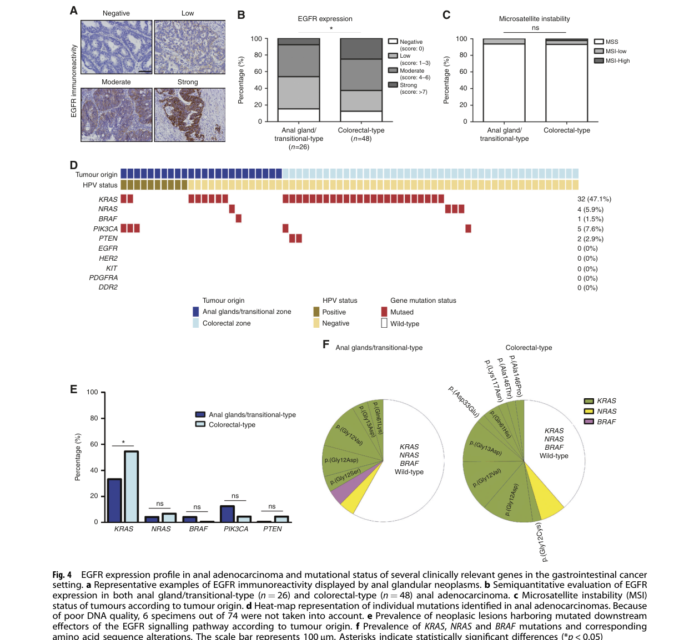

## Question

# Disease Characteristics Research Template

## Target Disease
- **Disease Name:** Anal Canal Adenocarcinoma
- **MONDO ID:**  (if available)
- **Category:** 

## Research Objectives

Please provide a comprehensive research report on **Anal Canal Adenocarcinoma** covering all of the
disease characteristics listed below. This report will be used to populate a disease knowledge
base entry. Be thorough and cite primary literature (PMID preferred) for all claims.

For each section, **suggested databases/resources** are listed. These are the first places
you should search for information on each topic.

---

### 1. Disease Information
> **Search first:** OMIM, Orphanet, ICD-10/ICD-11, MeSH, PubMed

- What is the disease? Provide a concise overview.
- What are the key identifiers? (OMIM, Orphanet, ICD-10/ICD-11, MeSH, Mondo)
- What are the common synonyms and alternative names?
- Is the information derived from individual patients (e.g., EHR) or aggregated disease-level resources?

### 2. Etiology

- **Disease Causal Factors**: What are the primary causes? (genetic, environmental, infectious, mechanistic)
- **Risk Factors**:
  > **Search first:** PubMed, Cochrane Library, UpToDate, clinical guidelines, ClinVar, ClinGen, GWAS Catalog, PheGenI, CTD, CDC, WHO, epidemiological databases
  - Genetic risk factors (causal variants, susceptibility loci, modifier genes)
  - Environmental risk factors (toxins, lifestyle, occupational exposures, age, sex, family history)
- **Protective Factors**:
  > **Search first:** PubMed, Cochrane Library, clinical trial databases, GWAS Catalog, gnomAD, WHO, CDC, nutrition databases
  - Genetic protective factors (protective variants, modifier alleles)
  - Environmental protective factors (diet, lifestyle, exposures that reduce risk)
- **Gene-Environment Interactions**: How do genetic and environmental factors interact to influence disease?
  > **Search first:** CTD, PubMed, PheGenI, GxE databases

### 3. Phenotypes
> **Search first:** HPO (Human Phenotype Ontology), OMIM, Orphanet, PubMed, clinicaltrials.gov, MedDRA, SNOMED CT, DECIPHER, LOINC

For each phenotype, provide:
- **Phenotype type**: symptoms, clinical signs, physical manifestations, behavioral changes, or laboratory abnormalities
  > For symptoms/signs: HPO, OMIM, Orphanet, PubMed
  > For behavioral changes: HPO, DSM, RDoC (Research Domain Criteria), PubMed
  > For laboratory abnormalities: LOINC, SNOMED CT, LabTests Online, PubMed
- **Phenotype characteristics**:
  > **Search first:** OMIM, Orphanet, HPO, PubMed
  - Age of symptom onset (neonatal, childhood, adult-onset, late-onset)
  - Symptom severity (mild, moderate, severe, variable)
  - Symptom progression (stable, progressive, episodic, fluctuating)
  - Frequency among affected individuals (percentage or qualitative)
- **Quality of life impact**: Effects on daily functioning and well-being (per-phenotype when possible)
  > **Search first:** EQ-5D database, SF-36, WHO QOL databases, PubMed
- Suggest HPO (Human Phenotype Ontology) terms for each phenotype

### 4. Genetic/Molecular Information

- **Causal Genes**: Gene mutations or chromosomal abnormalities responsible for disease (gene symbols, OMIM IDs)
  > **Search first:** OMIM, ClinVar, HGMD, Ensembl, NCBI Gene
- **Pathogenic Variants**:
  - Affected genes (gene symbols, HGNC IDs)
    > **Search first:** OMIM, NCBI Gene, Ensembl, HGNC, UniProt, GeneCards
  - Variant classification (pathogenic, likely pathogenic, VUS per ACMG/AMP guidelines)
    > **Search first:** ClinVar, ClinGen, ACMG/AMP guidelines, VarSome
  - Variant type/class (missense, frameshift, nonsense, splice-site, structural)
  - Allele frequency in population databases
    > **Search first:** gnomAD, 1000 Genomes, ExAC, TOPMed, dbSNP
  - Somatic vs germline origin
    > **Search first:** COSMIC (somatic), ClinVar, ICGC, TCGA
  - Functional consequences (loss of function, gain of function, dominant negative)
- **Modifier Genes**: Genes that modify disease severity or expression
- **Epigenetic Information**: DNA methylation, histone modifications, chromatin changes affecting disease
  > **Search first:** ENCODE, Roadmap Epigenomics, MethBase, DiseaseMeth
- **Chromosomal Abnormalities**: Large-scale genetic changes (aneuploidy, translocations, inversions)
  > **Search first:** DECIPHER, ClinVar, ECARUCA, UCSC Genome Browser

### 5. Environmental Information

- **Environmental Factors**: Non-genetic contributing factors (toxins, radiation, pollution, occupational exposure)
  > **Search first:** CTD (Comparative Toxicogenomics Database), TOXNET, PubMed, EPA databases
- **Lifestyle Factors**: Behavioral factors (smoking, diet, exercise, alcohol consumption)
  > **Search first:** CDC databases, WHO, PubMed, NHANES
- **Infectious Agents**: If applicable, pathogens causing or triggering disease (bacteria, viruses, fungi, parasites)
  > **Search first:** NCBI Taxonomy, ViPR, BV-BRC, MicrobeDB, GIDEON

### 6. Mechanism / Pathophysiology

- **Molecular Pathways**: Specific signaling cascades or biochemical pathways involved (Wnt, MAPK, mTOR, PI3K-AKT, etc.)
  > **Search first:** KEGG, Reactome, WikiPathways, PathBank, BioCyc
- **Cellular Processes**: Cell-level mechanisms (apoptosis, autophagy, cell cycle dysregulation, inflammation, etc.)
  > **Search first:** Gene Ontology (GO), Reactome, KEGG, PubMed
- **Protein Dysfunction**: How protein structure or function is altered (misfolding, aggregation, loss of function, gain of function)
  > **Search first:** UniProt, PDB (Protein Data Bank), InterPro, Pfam, AlphaFold
- **Metabolic Changes**: Alterations in metabolic processes (energy metabolism, lipid metabolism, amino acid metabolism)
  > **Search first:** KEGG, BioCyc, HMDB (Human Metabolome Database), BRENDA
- **Immune System Involvement**: Role of immune response (autoimmunity, immunodeficiency, chronic inflammation)
  > **Search first:** ImmPort, Immunome Database, IEDB, Gene Ontology
- **Tissue Damage Mechanisms**: How tissues/ are injured (oxidative stress, ischemia, fibrosis, necrosis)
  > **Search first:** PubMed, Gene Ontology, Reactome
- **Biochemical Abnormalities**: Specific molecular defects (enzyme deficiencies, receptor dysfunction, ion channel defects)
  > **Search first:** BRENDA, UniProt, KEGG, OMIM, PubMed
- **Epigenetic Changes**: DNA methylation, histone modifications affecting gene expression in disease
  > **Search first:** ENCODE, Roadmap Epigenomics, MethBase, DiseaseMeth
- **Molecular Profiling** (if available):
  - Transcriptomics/gene expression changes
    > **Search first:** GEO (Gene Expression Omnibus), ArrayExpress, GTEx, Human Cell Atlas, SRA
  - Proteomics findings
    > **Search first:** PRIDE, ProteomeXchange, Human Protein Atlas, STRING, BioGRID
  - Metabolomics signatures
    > **Search first:** MetaboLights, Metabolomics Workbench, HMDB, METLIN
  - Lipidomics alterations
    > **Search first:** LIPID MAPS, SwissLipids, LipidHome, Metabolomics Workbench
  - Genomic structural features
    > **Search first:** UCSC Genome Browser, Ensembl, NCBI, dbVar, DGV
- **Advanced Technologies** (if applicable):
  - Single-cell analysis findings (cell-type specific mechanisms, cellular heterogeneity)
    > **Search first:** Human Cell Atlas, Single Cell Portal, GEO, CELLxGENE
  - Spatial transcriptomics findings
    > **Search first:** GEO, Spatial Research, Vizgen, 10x Genomics data
  - Multi-omics integration results
    > **Search first:** TCGA, ICGC, cBioPortal, LinkedOmics, PubMed
  - Functional genomics screens (CRISPR, RNAi)
    > **Search first:** DepMap, GenomeRNAi, PubMed, BioGRID ORCS

For each mechanism, describe:
- The causal chain from initial trigger to clinical manifestation
- Which mechanisms are upstream vs downstream
- What cell types and biological processes are involved
- Suggest GO terms for biological processes and CL terms for cell types

### 7. Anatomical Structures Affected

- **Organ Level**:
  - Primary organs directly affected
  - Secondary organ involvement (complications, secondary effects)
  - Body systems involved (cardiovascular, nervous, digestive, respiratory, endocrine, etc.)
  > **Search first:** Uberon, FMA (Foundational Model of Anatomy), OMIM, HPO, ICD-11, MeSH, SNOMED CT
- **Tissue and Cell Level**:
  - Specific tissue types affected (epithelial, connective, muscle, nervous)
  - Specific cell populations targeted (with Cell Ontology terms)
  > **Search first:** Uberon, Human Protein Atlas, Cell Ontology, Human Cell Atlas, CellMarker, PanglaoDB
- **Subcellular Level**:
  - Cellular compartments involved (mitochondria, nucleus, ER, lysosomes) (with GO Cellular Component terms)
  > **Search first:** Gene Ontology (Cellular Component), UniProt, Human Protein Atlas
- **Localization**:
  - Specific anatomical sites (with UBERON terms)
    > **Search first:** FMA, Uberon, NeuroNames (for brain), SNOMED CT
  - Lateralization (unilateral, bilateral, asymmetric)
    > **Search first:** HPO, clinical literature, imaging databases

### 8. Temporal Development

- **Onset**:
  - Typical age of onset (congenital, pediatric, adult, geriatric)
  - Onset pattern (acute, subacute, chronic, insidious)
  > **Search first:** OMIM, Orphanet, HPO, PubMed
- **Progression**:
  - Disease stages (early, intermediate, advanced, end-stage)
    > **Search first:** Cancer Staging Manual (AJCC), WHO classifications, PubMed
  - Progression rate (rapid, slow, variable)
  - Disease course pattern (episodic, relapsing-remitting, progressive, stable)
  - Disease duration (self-limited, chronic lifelong)
  > **Search first:** Disease registries, longitudinal cohort databases, natural history studies, PubMed, Orphanet, OMIM
- **Patterns**:
  - Remission patterns (spontaneous, treatment-induced)
    > **Search first:** Clinical trial databases, disease registries, PubMed
  - Critical periods (time windows of vulnerability or opportunity for intervention)
    > **Search first:** PubMed, developmental biology databases, clinical guidelines

### 9. Inheritance and Population

- **Epidemiology**:
  - Prevalence (cases per 100,000 at given time)
  - Incidence (new cases per 100,000 per year)
  > **Search first:** Orphanet, CDC, WHO, GBD (Global Burden of Disease), national registries, SEER, disease registries
- **For Genetic Etiology**:
  - Inheritance pattern (AD, AR, X-linked, mitochondrial, multifactorial, polygenic)
    > **Search first:** OMIM, Orphanet, ClinVar, GTR (Genetic Testing Registry)
  - Penetrance (complete, incomplete, age-dependent)
    > **Search first:** ClinVar, OMIM, PubMed, ClinGen
  - Expressivity (variable, consistent)
    > **Search first:** OMIM, ClinVar, PubMed
  - Genetic anticipation (increasing severity in successive generations)
    > **Search first:** OMIM, PubMed (especially for repeat expansion disorders)
  - Germline mosaicism
    > **Search first:** ClinVar, OMIM, genetic counseling literature, PubMed
  - Founder effects (population-specific mutations)
    > **Search first:** gnomAD, population genetics databases, PubMed
  - Consanguinity role
    > **Search first:** OMIM, population studies, genetic counseling resources
  - Carrier frequency
    > **Search first:** gnomAD, carrier screening databases, GeneReviews, GTR
- **Population Demographics**:
  - Affected populations (ethnic or demographic groups with higher prevalence)
    > **Search first:** gnomAD, 1000 Genomes, PAGE Study, PubMed, population registries
  - Geographic distribution (endemic areas, regional variation)
    > **Search first:** WHO, CDC, GBD, Orphanet, geographic epidemiology databases
  - Geographic distribution of specific variants
  - Sex ratio (male:female)
    > **Search first:** Disease registries, OMIM, PubMed, epidemiological databases
  - Age distribution of affected individuals
    > **Search first:** CDC, disease registries, SEER, Orphanet

### 10. Diagnostics

- **Clinical Tests**:
  - Laboratory tests (blood, urine, tissue chemistry, specific enzyme assays)
    > **Search first:** LOINC, LabTests Online, PubMed
  - Biomarkers (proteins, metabolites, genetic markers, circulating biomarkers)
    > **Search first:** FDA Biomarker List, BEST (Biomarkers, EndpointS, and other Tools), PubMed
  - Imaging studies (X-ray, CT, MRI, PET, ultrasound)
    > **Search first:** RadLex, DICOM, Radiopaedia, imaging databases
  - Functional tests (pulmonary function, cardiac stress tests)
    > **Search first:** LOINC, clinical guidelines, PubMed
  - Electrophysiology (EEG, EMG, ECG, nerve conduction studies)
    > **Search first:** LOINC, clinical neurophysiology databases, PubMed
  - Biopsy findings (histopathology, immunohistochemistry)
    > **Search first:** SNOMED CT, College of American Pathologists resources, PubMed
  - Pathology findings (microscopic examination)
    > **Search first:** SNOMED CT, Digital Pathology databases, PubMed
- **Genetic Testing**:
  > **Search first:** GTR (Genetic Testing Registry), GeneReviews, ClinGen
  - Overview of recommended genetic testing approach
  - Whole genome sequencing (WGS) utility
    > **Search first:** GTR, ClinVar, GEL (Genomics England), gnomAD
  - Whole exome sequencing (WES) utility
    > **Search first:** GTR, ClinVar, OMIM, GeneMatcher
  - Gene panels (which panels, which genes)
    > **Search first:** GTR, ClinVar, laboratory-specific databases
  - Single gene testing
    > **Search first:** GTR, ClinVar, OMIM, GeneReviews
  - Chromosomal microarray (CMA)
    > **Search first:** DECIPHER, ClinVar, dbVar, ECARUCA
  - Karyotyping
    > **Search first:** Chromosome Abnormality Database, ClinVar, cytogenetics resources
  - FISH
    > **Search first:** ClinVar, cytogenetics databases, PubMed
  - Mitochondrial DNA testing
    > **Search first:** MITOMAP, MSeqDR, ClinVar, GTR
  - Repeat expansion testing
    > **Search first:** GTR, ClinVar, repeat expansion databases, PubMed
- **Omics-Based Diagnostics** (if applicable):
  - RNA sequencing / transcriptomics
    > **Search first:** GEO, ArrayExpress, GTEx, RNA-seq databases
  - Proteomics
    > **Search first:** PRIDE, ProteomeXchange, FDA Biomarker database
  - Metabolomics
    > **Search first:** MetaboLights, Metabolomics Workbench, HMDB
  - Epigenomics
    > **Search first:** GEO, ENCODE, Roadmap Epigenomics, MethBase
  - Liquid biopsy
    > **Search first:** COSMIC, ClinVar, liquid biopsy databases, PubMed
- **Clinical Criteria**:
  - Standardized diagnostic criteria (DSM, ICD, society guidelines)
    > **Search first:** DSM-5, ICD-11, clinical society guidelines, UpToDate
  - Differential diagnosis (other conditions to rule out, with distinguishing features)
    > **Search first:** DynaMed, UpToDate, clinical decision support systems
- **Screening**:
  - Screening methods for asymptomatic individuals (newborn screening, carrier screening, cascade screening)
    > **Search first:** ACMG recommendations, CDC newborn screening, GTR

### 11. Outcome/Prognosis

- **Survival and Mortality**:
  - Survival rate (5-year, 10-year, overall)
    > **Search first:** SEER, cancer registries, disease-specific registries, PubMed
  - Life expectancy (with and without treatment if applicable)
    > **Search first:** Orphanet, disease registries, actuarial databases, PubMed
  - Mortality rate
    > **Search first:** CDC, WHO, GBD, national mortality databases
  - Disease-specific mortality (deaths directly attributable to disease)
    > **Search first:** Disease registries, CDC Wonder, GBD, PubMed
- **Morbidity and Function**:
  - Morbidity (disease-related disability and health impacts)
    > **Search first:** GBD, WHO, disability databases, PubMed
  - Disability outcomes (long-term functional impairments)
    > **Search first:** ICF (International Classification of Functioning), disability registries
  - Quality of life measures (EQ-5D, SF-36, PROMIS, disease-specific tools)
    > **Search first:** EQ-5D database, SF-36, PROMIS, PubMed
- **Disease Course**:
  - Complications (secondary problems: infections, organ failure, etc.)
    > **Search first:** ICD codes, disease registries, clinical databases, PubMed
  - Recovery potential (likelihood and extent of recovery, with vs without treatment)
    > **Search first:** Natural history studies, rehabilitation databases, PubMed
- **Prediction**:
  - Prognostic factors (age, disease severity, biomarkers, treatment response)
    > **Search first:** Prognostic models databases, clinical calculators, PubMed
  - Prognostic biomarkers (molecular markers predicting disease course)
    > **Search first:** FDA Biomarker database, PubMed, cancer prognostic databases

### 12. Treatment

- **Pharmacotherapy**:
  - Pharmacological treatments (drug names, drug classes, mechanisms of action)
    > **Search first:** DrugBank, RxNorm, ATC classification, DailyMed, FDA databases
  - Pharmacogenomics (how genetic variants affect drug metabolism, efficacy, toxicity)
    > **Search first:** PharmGKB, CPIC (Clinical Pharmacogenetics), FDA Table of PGx Biomarkers
- **Advanced Therapeutics**:
  - Gene therapy (viral vectors, CRISPR, gene replacement, gene editing)
    > **Search first:** ClinicalTrials.gov, FDA gene therapy database, ASGCT resources
  - Cell therapy (stem cell transplant, CAR-T, cellular therapeutics)
    > **Search first:** ClinicalTrials.gov, FDA cell therapy database, FACT standards
  - RNA-based therapies (ASOs, siRNA, mRNA therapies)
    > **Search first:** ClinicalTrials.gov, FDA approvals, PubMed
  - Targeted therapies (treatments directed at specific molecular targets)
    > **Search first:** My Cancer Genome, OncoKB, ClinicalTrials.gov, FDA approvals
  - Immunotherapies (checkpoint inhibitors, monoclonal antibodies)
    > **Search first:** Cancer Immunotherapy Database, FDA approvals, ClinicalTrials.gov
- **Surgical and Interventional**:
  - Surgical interventions (types of surgery, timing, outcomes)
    > **Search first:** CPT codes, surgical registries, clinical guidelines, PubMed
- **Supportive and Rehabilitative**:
  - Supportive care (symptom management, pain control, nutrition)
    > **Search first:** Clinical guidelines, Cochrane Library, PubMed
  - Rehabilitation (physical therapy, occupational therapy, speech therapy)
    > **Search first:** Rehabilitation medicine databases, clinical guidelines, PubMed
- **Experimental**:
  - Experimental treatments in clinical trials (with NCT identifiers if available)
    > **Search first:** ClinicalTrials.gov, EU Clinical Trials Register, WHO ICTRP
- **Treatment Outcomes**:
  - Treatment response rates
    > **Search first:** Clinical trial databases, FDA reviews, systematic reviews, PubMed
  - Side effects and adverse events
    > **Search first:** FDA Adverse Event Reporting System (FAERS), MedWatch, PubMed
- **Treatment Strategy**:
  - Treatment algorithms (clinical pathways, decision trees)
    > **Search first:** Clinical practice guidelines, NCCN Guidelines, UpToDate
  - Combination therapies
    > **Search first:** ClinicalTrials.gov, treatment guidelines, PubMed
  - Personalized medicine approaches (genotype-guided treatment)
    > **Search first:** My Cancer Genome, CIViC, PharmGKB, precision medicine databases

For each treatment, suggest MAXO (Medical Action Ontology) terms where applicable.

### 13. Prevention

- **Prevention Levels**:
  - Primary prevention (preventing disease occurrence: vaccination, risk factor modification)
    > **Search first:** CDC, WHO, USPSTF recommendations, Cochrane Library
  - Secondary prevention (early detection and treatment: screening programs, early intervention)
    > **Search first:** USPSTF, CDC screening guidelines, WHO
  - Tertiary prevention (preventing complications in those with disease)
    > **Search first:** Clinical guidelines, disease management protocols, PubMed
- **Immunization**: Vaccine strategies (if applicable)
  > **Search first:** CDC vaccine schedules, WHO immunization, FDA vaccine database
- **Screening and Early Detection**:
  - Screening programs (population-based: newborn screening, cancer screening)
    > **Search first:** CDC screening programs, USPSTF, cancer screening databases
  - Genetic screening (carrier screening, preimplantation genetic diagnosis, prenatal testing)
    > **Search first:** ACMG recommendations, ACOG guidelines, GTR
  - Risk stratification (identifying high-risk individuals for targeted prevention)
    > **Search first:** Risk prediction models, clinical calculators, PubMed
- **Behavioral Interventions**: Lifestyle modifications to reduce risk
  > **Search first:** CDC, WHO, behavioral intervention databases, Cochrane Library
- **Counseling**: Genetic counseling (risk assessment, family planning guidance)
  > **Search first:** NSGC resources, ACMG guidelines, GeneReviews
- **Public Health**:
  - Public health interventions (sanitation, vector control, health education)
    > **Search first:** CDC, WHO, public health databases, PubMed
  - Environmental interventions (reducing environmental risk factors)
    > **Search first:** EPA databases, WHO environmental health, PubMed
- **Prophylaxis**: Preventive medications or procedures
  > **Search first:** Clinical guidelines, FDA approvals, PubMed

### 14. Other Species / Natural Disease

- **Taxonomy**: Species affected (with NCBI Taxon identifiers)
  > **Search first:** NCBI Taxonomy
- **Breed**: Specific breeds affected (with VBO identifiers if applicable)
  > **Search first:** VBO (Vertebrate Breed Ontology)
- **Gene**: Orthologous genes in other species (with NCBI Gene IDs)
  > **Search first:** NCBI Gene
- **Natural Disease**:
  - Naturally occurring disease in other species (companion animals, wildlife)
    > **Search first:** OMIA (Online Mendelian Inheritance in Animals), VetCompass, PubMed
  - Veterinary relevance and importance in animal health
    > **Search first:** OMIA, veterinary databases, PubMed
- **Comparative Biology**:
  - Comparative pathology (similarities and differences across species)
    > **Search first:** OMIA, comparative pathology databases, PubMed
  - Evolutionary conservation of disease mechanisms
    > **Search first:** HomoloGene, OrthoMCL, Alliance of Genome Resources
- **Transmission** (if applicable):
  - Zoonotic potential
    > **Search first:** CDC zoonotic diseases, WHO zoonoses, GIDEON
  - Cross-species susceptibility
    > **Search first:** NCBI Taxonomy, veterinary databases, PubMed

### 15. Model Organisms

- **Model Types**:
  - Model organism type (mammalian, invertebrate, cellular, in vitro)
    > **Search first:** Alliance of Genome Resources, model organism databases
  - Specific model systems (mouse, rat, zebrafish, Drosophila, C. elegans, yeast, cell lines, organoids, iPSCs)
    > **Search first:** MGI, RGD, ZFIN, FlyBase, WormBase, SGD, ATCC, Cellosaurus
  - Induced models (drug treatment, surgical intervention, environmental manipulation)
    > **Search first:** MGI, model organism databases, PubMed
- **Genetic Models**:
  - Types available (knockout, knock-in, transgenic, conditional, humanized)
    > **Search first:** MGI, IMPC, KOMP, EuMMCR, IMSR
- **Model Characteristics**:
  - Phenotype recapitulation (how well model reproduces human disease features)
    > **Search first:** Model organism databases, comparative studies, PubMed
  - Model limitations (aspects of human disease not captured)
    > **Search first:** Model organism databases, PubMed, review articles
- **Applications**:
  - Research applications (what aspects of disease can be studied)
    > **Search first:** Model organism databases, PubMed
- **Resources**:
  - Model databases
    > **Search first:** MGI, RGD, ZFIN, FlyBase, WormBase, IMSR, EMMA, MMRRC

---

## Citation Requirements

- Cite primary literature (PMID preferred) for all mechanistic and clinical claims
- Prioritize recent reviews and landmark papers
- Include direct quotes from abstracts where possible to support key statements
- Distinguish evidence source types: human clinical, model organism, in vitro, computational

## Output Format

Structure your response as a comprehensive narrative organized by the sections above.
For each section, provide:
- Factual content with specific details (numbers, percentages, gene names, variant nomenclature)
- Ontology term suggestions (HPO, GO, CL, UBERON, CHEBI, MAXO, MONDO) where applicable
- Evidence citations with PMIDs
- Direct quotes from abstracts to support key claims
- Clear indication when information is not available or not applicable for this disease

This report will be used to populate a disease knowledge base entry with:
- Pathophysiology descriptions with causal chains
- Gene/protein annotations (HGNC, GO terms)
- Phenotype associations (HP terms) with frequencies
- Cell type involvement (CL terms)
- Anatomical locations (UBERON terms)
- Chemical entities (CHEBI terms)
- Treatment annotations (MAXO terms)
- Evidence items with PMIDs and exact abstract quotes
- Epidemiology, prognosis, diagnostic, and prevention information
- Animal model descriptions with phenotype recapitulation details

## Output

Question: You are an expert researcher providing comprehensive, well-cited information.

Provide detailed information focusing on:
1. Key concepts and definitions with current understanding
2. Recent developments and latest research (prioritize 2023-2024 sources)
3. Current applications and real-world implementations
4. Expert opinions and analysis from authoritative sources
5. Relevant statistics and data from recent studies

Format as a comprehensive research report with proper citations. Include URLs and publication dates where available.
Always prioritize recent, authoritative sources and provide specific citations for all major claims.

# Disease Characteristics Research Template

## Target Disease
- **Disease Name:** Anal Canal Adenocarcinoma
- **MONDO ID:**  (if available)
- **Category:** 

## Research Objectives

Please provide a comprehensive research report on **Anal Canal Adenocarcinoma** covering all of the
disease characteristics listed below. This report will be used to populate a disease knowledge
base entry. Be thorough and cite primary literature (PMID preferred) for all claims.

For each section, **suggested databases/resources** are listed. These are the first places
you should search for information on each topic.

---

### 1. Disease Information
> **Search first:** OMIM, Orphanet, ICD-10/ICD-11, MeSH, PubMed

- What is the disease? Provide a concise overview.
- What are the key identifiers? (OMIM, Orphanet, ICD-10/ICD-11, MeSH, Mondo)
- What are the common synonyms and alternative names?
- Is the information derived from individual patients (e.g., EHR) or aggregated disease-level resources?

### 2. Etiology

- **Disease Causal Factors**: What are the primary causes? (genetic, environmental, infectious, mechanistic)
- **Risk Factors**:
  > **Search first:** PubMed, Cochrane Library, UpToDate, clinical guidelines, ClinVar, ClinGen, GWAS Catalog, PheGenI, CTD, CDC, WHO, epidemiological databases
  - Genetic risk factors (causal variants, susceptibility loci, modifier genes)
  - Environmental risk factors (toxins, lifestyle, occupational exposures, age, sex, family history)
- **Protective Factors**:
  > **Search first:** PubMed, Cochrane Library, clinical trial databases, GWAS Catalog, gnomAD, WHO, CDC, nutrition databases
  - Genetic protective factors (protective variants, modifier alleles)
  - Environmental protective factors (diet, lifestyle, exposures that reduce risk)
- **Gene-Environment Interactions**: How do genetic and environmental factors interact to influence disease?
  > **Search first:** CTD, PubMed, PheGenI, GxE databases

### 3. Phenotypes
> **Search first:** HPO (Human Phenotype Ontology), OMIM, Orphanet, PubMed, clinicaltrials.gov, MedDRA, SNOMED CT, DECIPHER, LOINC

For each phenotype, provide:
- **Phenotype type**: symptoms, clinical signs, physical manifestations, behavioral changes, or laboratory abnormalities
  > For symptoms/signs: HPO, OMIM, Orphanet, PubMed
  > For behavioral changes: HPO, DSM, RDoC (Research Domain Criteria), PubMed
  > For laboratory abnormalities: LOINC, SNOMED CT, LabTests Online, PubMed
- **Phenotype characteristics**:
  > **Search first:** OMIM, Orphanet, HPO, PubMed
  - Age of symptom onset (neonatal, childhood, adult-onset, late-onset)
  - Symptom severity (mild, moderate, severe, variable)
  - Symptom progression (stable, progressive, episodic, fluctuating)
  - Frequency among affected individuals (percentage or qualitative)
- **Quality of life impact**: Effects on daily functioning and well-being (per-phenotype when possible)
  > **Search first:** EQ-5D database, SF-36, WHO QOL databases, PubMed
- Suggest HPO (Human Phenotype Ontology) terms for each phenotype

### 4. Genetic/Molecular Information

- **Causal Genes**: Gene mutations or chromosomal abnormalities responsible for disease (gene symbols, OMIM IDs)
  > **Search first:** OMIM, ClinVar, HGMD, Ensembl, NCBI Gene
- **Pathogenic Variants**:
  - Affected genes (gene symbols, HGNC IDs)
    > **Search first:** OMIM, NCBI Gene, Ensembl, HGNC, UniProt, GeneCards
  - Variant classification (pathogenic, likely pathogenic, VUS per ACMG/AMP guidelines)
    > **Search first:** ClinVar, ClinGen, ACMG/AMP guidelines, VarSome
  - Variant type/class (missense, frameshift, nonsense, splice-site, structural)
  - Allele frequency in population databases
    > **Search first:** gnomAD, 1000 Genomes, ExAC, TOPMed, dbSNP
  - Somatic vs germline origin
    > **Search first:** COSMIC (somatic), ClinVar, ICGC, TCGA
  - Functional consequences (loss of function, gain of function, dominant negative)
- **Modifier Genes**: Genes that modify disease severity or expression
- **Epigenetic Information**: DNA methylation, histone modifications, chromatin changes affecting disease
  > **Search first:** ENCODE, Roadmap Epigenomics, MethBase, DiseaseMeth
- **Chromosomal Abnormalities**: Large-scale genetic changes (aneuploidy, translocations, inversions)
  > **Search first:** DECIPHER, ClinVar, ECARUCA, UCSC Genome Browser

### 5. Environmental Information

- **Environmental Factors**: Non-genetic contributing factors (toxins, radiation, pollution, occupational exposure)
  > **Search first:** CTD (Comparative Toxicogenomics Database), TOXNET, PubMed, EPA databases
- **Lifestyle Factors**: Behavioral factors (smoking, diet, exercise, alcohol consumption)
  > **Search first:** CDC databases, WHO, PubMed, NHANES
- **Infectious Agents**: If applicable, pathogens causing or triggering disease (bacteria, viruses, fungi, parasites)
  > **Search first:** NCBI Taxonomy, ViPR, BV-BRC, MicrobeDB, GIDEON

### 6. Mechanism / Pathophysiology

- **Molecular Pathways**: Specific signaling cascades or biochemical pathways involved (Wnt, MAPK, mTOR, PI3K-AKT, etc.)
  > **Search first:** KEGG, Reactome, WikiPathways, PathBank, BioCyc
- **Cellular Processes**: Cell-level mechanisms (apoptosis, autophagy, cell cycle dysregulation, inflammation, etc.)
  > **Search first:** Gene Ontology (GO), Reactome, KEGG, PubMed
- **Protein Dysfunction**: How protein structure or function is altered (misfolding, aggregation, loss of function, gain of function)
  > **Search first:** UniProt, PDB (Protein Data Bank), InterPro, Pfam, AlphaFold
- **Metabolic Changes**: Alterations in metabolic processes (energy metabolism, lipid metabolism, amino acid metabolism)
  > **Search first:** KEGG, BioCyc, HMDB (Human Metabolome Database), BRENDA
- **Immune System Involvement**: Role of immune response (autoimmunity, immunodeficiency, chronic inflammation)
  > **Search first:** ImmPort, Immunome Database, IEDB, Gene Ontology
- **Tissue Damage Mechanisms**: How tissues/ are injured (oxidative stress, ischemia, fibrosis, necrosis)
  > **Search first:** PubMed, Gene Ontology, Reactome
- **Biochemical Abnormalities**: Specific molecular defects (enzyme deficiencies, receptor dysfunction, ion channel defects)
  > **Search first:** BRENDA, UniProt, KEGG, OMIM, PubMed
- **Epigenetic Changes**: DNA methylation, histone modifications affecting gene expression in disease
  > **Search first:** ENCODE, Roadmap Epigenomics, MethBase, DiseaseMeth
- **Molecular Profiling** (if available):
  - Transcriptomics/gene expression changes
    > **Search first:** GEO (Gene Expression Omnibus), ArrayExpress, GTEx, Human Cell Atlas, SRA
  - Proteomics findings
    > **Search first:** PRIDE, ProteomeXchange, Human Protein Atlas, STRING, BioGRID
  - Metabolomics signatures
    > **Search first:** MetaboLights, Metabolomics Workbench, HMDB, METLIN
  - Lipidomics alterations
    > **Search first:** LIPID MAPS, SwissLipids, LipidHome, Metabolomics Workbench
  - Genomic structural features
    > **Search first:** UCSC Genome Browser, Ensembl, NCBI, dbVar, DGV
- **Advanced Technologies** (if applicable):
  - Single-cell analysis findings (cell-type specific mechanisms, cellular heterogeneity)
    > **Search first:** Human Cell Atlas, Single Cell Portal, GEO, CELLxGENE
  - Spatial transcriptomics findings
    > **Search first:** GEO, Spatial Research, Vizgen, 10x Genomics data
  - Multi-omics integration results
    > **Search first:** TCGA, ICGC, cBioPortal, LinkedOmics, PubMed
  - Functional genomics screens (CRISPR, RNAi)
    > **Search first:** DepMap, GenomeRNAi, PubMed, BioGRID ORCS

For each mechanism, describe:
- The causal chain from initial trigger to clinical manifestation
- Which mechanisms are upstream vs downstream
- What cell types and biological processes are involved
- Suggest GO terms for biological processes and CL terms for cell types

### 7. Anatomical Structures Affected

- **Organ Level**:
  - Primary organs directly affected
  - Secondary organ involvement (complications, secondary effects)
  - Body systems involved (cardiovascular, nervous, digestive, respiratory, endocrine, etc.)
  > **Search first:** Uberon, FMA (Foundational Model of Anatomy), OMIM, HPO, ICD-11, MeSH, SNOMED CT
- **Tissue and Cell Level**:
  - Specific tissue types affected (epithelial, connective, muscle, nervous)
  - Specific cell populations targeted (with Cell Ontology terms)
  > **Search first:** Uberon, Human Protein Atlas, Cell Ontology, Human Cell Atlas, CellMarker, PanglaoDB
- **Subcellular Level**:
  - Cellular compartments involved (mitochondria, nucleus, ER, lysosomes) (with GO Cellular Component terms)
  > **Search first:** Gene Ontology (Cellular Component), UniProt, Human Protein Atlas
- **Localization**:
  - Specific anatomical sites (with UBERON terms)
    > **Search first:** FMA, Uberon, NeuroNames (for brain), SNOMED CT
  - Lateralization (unilateral, bilateral, asymmetric)
    > **Search first:** HPO, clinical literature, imaging databases

### 8. Temporal Development

- **Onset**:
  - Typical age of onset (congenital, pediatric, adult, geriatric)
  - Onset pattern (acute, subacute, chronic, insidious)
  > **Search first:** OMIM, Orphanet, HPO, PubMed
- **Progression**:
  - Disease stages (early, intermediate, advanced, end-stage)
    > **Search first:** Cancer Staging Manual (AJCC), WHO classifications, PubMed
  - Progression rate (rapid, slow, variable)
  - Disease course pattern (episodic, relapsing-remitting, progressive, stable)
  - Disease duration (self-limited, chronic lifelong)
  > **Search first:** Disease registries, longitudinal cohort databases, natural history studies, PubMed, Orphanet, OMIM
- **Patterns**:
  - Remission patterns (spontaneous, treatment-induced)
    > **Search first:** Clinical trial databases, disease registries, PubMed
  - Critical periods (time windows of vulnerability or opportunity for intervention)
    > **Search first:** PubMed, developmental biology databases, clinical guidelines

### 9. Inheritance and Population

- **Epidemiology**:
  - Prevalence (cases per 100,000 at given time)
  - Incidence (new cases per 100,000 per year)
  > **Search first:** Orphanet, CDC, WHO, GBD (Global Burden of Disease), national registries, SEER, disease registries
- **For Genetic Etiology**:
  - Inheritance pattern (AD, AR, X-linked, mitochondrial, multifactorial, polygenic)
    > **Search first:** OMIM, Orphanet, ClinVar, GTR (Genetic Testing Registry)
  - Penetrance (complete, incomplete, age-dependent)
    > **Search first:** ClinVar, OMIM, PubMed, ClinGen
  - Expressivity (variable, consistent)
    > **Search first:** OMIM, ClinVar, PubMed
  - Genetic anticipation (increasing severity in successive generations)
    > **Search first:** OMIM, PubMed (especially for repeat expansion disorders)
  - Germline mosaicism
    > **Search first:** ClinVar, OMIM, genetic counseling literature, PubMed
  - Founder effects (population-specific mutations)
    > **Search first:** gnomAD, population genetics databases, PubMed
  - Consanguinity role
    > **Search first:** OMIM, population studies, genetic counseling resources
  - Carrier frequency
    > **Search first:** gnomAD, carrier screening databases, GeneReviews, GTR
- **Population Demographics**:
  - Affected populations (ethnic or demographic groups with higher prevalence)
    > **Search first:** gnomAD, 1000 Genomes, PAGE Study, PubMed, population registries
  - Geographic distribution (endemic areas, regional variation)
    > **Search first:** WHO, CDC, GBD, Orphanet, geographic epidemiology databases
  - Geographic distribution of specific variants
  - Sex ratio (male:female)
    > **Search first:** Disease registries, OMIM, PubMed, epidemiological databases
  - Age distribution of affected individuals
    > **Search first:** CDC, disease registries, SEER, Orphanet

### 10. Diagnostics

- **Clinical Tests**:
  - Laboratory tests (blood, urine, tissue chemistry, specific enzyme assays)
    > **Search first:** LOINC, LabTests Online, PubMed
  - Biomarkers (proteins, metabolites, genetic markers, circulating biomarkers)
    > **Search first:** FDA Biomarker List, BEST (Biomarkers, EndpointS, and other Tools), PubMed
  - Imaging studies (X-ray, CT, MRI, PET, ultrasound)
    > **Search first:** RadLex, DICOM, Radiopaedia, imaging databases
  - Functional tests (pulmonary function, cardiac stress tests)
    > **Search first:** LOINC, clinical guidelines, PubMed
  - Electrophysiology (EEG, EMG, ECG, nerve conduction studies)
    > **Search first:** LOINC, clinical neurophysiology databases, PubMed
  - Biopsy findings (histopathology, immunohistochemistry)
    > **Search first:** SNOMED CT, College of American Pathologists resources, PubMed
  - Pathology findings (microscopic examination)
    > **Search first:** SNOMED CT, Digital Pathology databases, PubMed
- **Genetic Testing**:
  > **Search first:** GTR (Genetic Testing Registry), GeneReviews, ClinGen
  - Overview of recommended genetic testing approach
  - Whole genome sequencing (WGS) utility
    > **Search first:** GTR, ClinVar, GEL (Genomics England), gnomAD
  - Whole exome sequencing (WES) utility
    > **Search first:** GTR, ClinVar, OMIM, GeneMatcher
  - Gene panels (which panels, which genes)
    > **Search first:** GTR, ClinVar, laboratory-specific databases
  - Single gene testing
    > **Search first:** GTR, ClinVar, OMIM, GeneReviews
  - Chromosomal microarray (CMA)
    > **Search first:** DECIPHER, ClinVar, dbVar, ECARUCA
  - Karyotyping
    > **Search first:** Chromosome Abnormality Database, ClinVar, cytogenetics resources
  - FISH
    > **Search first:** ClinVar, cytogenetics databases, PubMed
  - Mitochondrial DNA testing
    > **Search first:** MITOMAP, MSeqDR, ClinVar, GTR
  - Repeat expansion testing
    > **Search first:** GTR, ClinVar, repeat expansion databases, PubMed
- **Omics-Based Diagnostics** (if applicable):
  - RNA sequencing / transcriptomics
    > **Search first:** GEO, ArrayExpress, GTEx, RNA-seq databases
  - Proteomics
    > **Search first:** PRIDE, ProteomeXchange, FDA Biomarker database
  - Metabolomics
    > **Search first:** MetaboLights, Metabolomics Workbench, HMDB
  - Epigenomics
    > **Search first:** GEO, ENCODE, Roadmap Epigenomics, MethBase
  - Liquid biopsy
    > **Search first:** COSMIC, ClinVar, liquid biopsy databases, PubMed
- **Clinical Criteria**:
  - Standardized diagnostic criteria (DSM, ICD, society guidelines)
    > **Search first:** DSM-5, ICD-11, clinical society guidelines, UpToDate
  - Differential diagnosis (other conditions to rule out, with distinguishing features)
    > **Search first:** DynaMed, UpToDate, clinical decision support systems
- **Screening**:
  - Screening methods for asymptomatic individuals (newborn screening, carrier screening, cascade screening)
    > **Search first:** ACMG recommendations, CDC newborn screening, GTR

### 11. Outcome/Prognosis

- **Survival and Mortality**:
  - Survival rate (5-year, 10-year, overall)
    > **Search first:** SEER, cancer registries, disease-specific registries, PubMed
  - Life expectancy (with and without treatment if applicable)
    > **Search first:** Orphanet, disease registries, actuarial databases, PubMed
  - Mortality rate
    > **Search first:** CDC, WHO, GBD, national mortality databases
  - Disease-specific mortality (deaths directly attributable to disease)
    > **Search first:** Disease registries, CDC Wonder, GBD, PubMed
- **Morbidity and Function**:
  - Morbidity (disease-related disability and health impacts)
    > **Search first:** GBD, WHO, disability databases, PubMed
  - Disability outcomes (long-term functional impairments)
    > **Search first:** ICF (International Classification of Functioning), disability registries
  - Quality of life measures (EQ-5D, SF-36, PROMIS, disease-specific tools)
    > **Search first:** EQ-5D database, SF-36, PROMIS, PubMed
- **Disease Course**:
  - Complications (secondary problems: infections, organ failure, etc.)
    > **Search first:** ICD codes, disease registries, clinical databases, PubMed
  - Recovery potential (likelihood and extent of recovery, with vs without treatment)
    > **Search first:** Natural history studies, rehabilitation databases, PubMed
- **Prediction**:
  - Prognostic factors (age, disease severity, biomarkers, treatment response)
    > **Search first:** Prognostic models databases, clinical calculators, PubMed
  - Prognostic biomarkers (molecular markers predicting disease course)
    > **Search first:** FDA Biomarker database, PubMed, cancer prognostic databases

### 12. Treatment

- **Pharmacotherapy**:
  - Pharmacological treatments (drug names, drug classes, mechanisms of action)
    > **Search first:** DrugBank, RxNorm, ATC classification, DailyMed, FDA databases
  - Pharmacogenomics (how genetic variants affect drug metabolism, efficacy, toxicity)
    > **Search first:** PharmGKB, CPIC (Clinical Pharmacogenetics), FDA Table of PGx Biomarkers
- **Advanced Therapeutics**:
  - Gene therapy (viral vectors, CRISPR, gene replacement, gene editing)
    > **Search first:** ClinicalTrials.gov, FDA gene therapy database, ASGCT resources
  - Cell therapy (stem cell transplant, CAR-T, cellular therapeutics)
    > **Search first:** ClinicalTrials.gov, FDA cell therapy database, FACT standards
  - RNA-based therapies (ASOs, siRNA, mRNA therapies)
    > **Search first:** ClinicalTrials.gov, FDA approvals, PubMed
  - Targeted therapies (treatments directed at specific molecular targets)
    > **Search first:** My Cancer Genome, OncoKB, ClinicalTrials.gov, FDA approvals
  - Immunotherapies (checkpoint inhibitors, monoclonal antibodies)
    > **Search first:** Cancer Immunotherapy Database, FDA approvals, ClinicalTrials.gov
- **Surgical and Interventional**:
  - Surgical interventions (types of surgery, timing, outcomes)
    > **Search first:** CPT codes, surgical registries, clinical guidelines, PubMed
- **Supportive and Rehabilitative**:
  - Supportive care (symptom management, pain control, nutrition)
    > **Search first:** Clinical guidelines, Cochrane Library, PubMed
  - Rehabilitation (physical therapy, occupational therapy, speech therapy)
    > **Search first:** Rehabilitation medicine databases, clinical guidelines, PubMed
- **Experimental**:
  - Experimental treatments in clinical trials (with NCT identifiers if available)
    > **Search first:** ClinicalTrials.gov, EU Clinical Trials Register, WHO ICTRP
- **Treatment Outcomes**:
  - Treatment response rates
    > **Search first:** Clinical trial databases, FDA reviews, systematic reviews, PubMed
  - Side effects and adverse events
    > **Search first:** FDA Adverse Event Reporting System (FAERS), MedWatch, PubMed
- **Treatment Strategy**:
  - Treatment algorithms (clinical pathways, decision trees)
    > **Search first:** Clinical practice guidelines, NCCN Guidelines, UpToDate
  - Combination therapies
    > **Search first:** ClinicalTrials.gov, treatment guidelines, PubMed
  - Personalized medicine approaches (genotype-guided treatment)
    > **Search first:** My Cancer Genome, CIViC, PharmGKB, precision medicine databases

For each treatment, suggest MAXO (Medical Action Ontology) terms where applicable.

### 13. Prevention

- **Prevention Levels**:
  - Primary prevention (preventing disease occurrence: vaccination, risk factor modification)
    > **Search first:** CDC, WHO, USPSTF recommendations, Cochrane Library
  - Secondary prevention (early detection and treatment: screening programs, early intervention)
    > **Search first:** USPSTF, CDC screening guidelines, WHO
  - Tertiary prevention (preventing complications in those with disease)
    > **Search first:** Clinical guidelines, disease management protocols, PubMed
- **Immunization**: Vaccine strategies (if applicable)
  > **Search first:** CDC vaccine schedules, WHO immunization, FDA vaccine database
- **Screening and Early Detection**:
  - Screening programs (population-based: newborn screening, cancer screening)
    > **Search first:** CDC screening programs, USPSTF, cancer screening databases
  - Genetic screening (carrier screening, preimplantation genetic diagnosis, prenatal testing)
    > **Search first:** ACMG recommendations, ACOG guidelines, GTR
  - Risk stratification (identifying high-risk individuals for targeted prevention)
    > **Search first:** Risk prediction models, clinical calculators, PubMed
- **Behavioral Interventions**: Lifestyle modifications to reduce risk
  > **Search first:** CDC, WHO, behavioral intervention databases, Cochrane Library
- **Counseling**: Genetic counseling (risk assessment, family planning guidance)
  > **Search first:** NSGC resources, ACMG guidelines, GeneReviews
- **Public Health**:
  - Public health interventions (sanitation, vector control, health education)
    > **Search first:** CDC, WHO, public health databases, PubMed
  - Environmental interventions (reducing environmental risk factors)
    > **Search first:** EPA databases, WHO environmental health, PubMed
- **Prophylaxis**: Preventive medications or procedures
  > **Search first:** Clinical guidelines, FDA approvals, PubMed

### 14. Other Species / Natural Disease

- **Taxonomy**: Species affected (with NCBI Taxon identifiers)
  > **Search first:** NCBI Taxonomy
- **Breed**: Specific breeds affected (with VBO identifiers if applicable)
  > **Search first:** VBO (Vertebrate Breed Ontology)
- **Gene**: Orthologous genes in other species (with NCBI Gene IDs)
  > **Search first:** NCBI Gene
- **Natural Disease**:
  - Naturally occurring disease in other species (companion animals, wildlife)
    > **Search first:** OMIA (Online Mendelian Inheritance in Animals), VetCompass, PubMed
  - Veterinary relevance and importance in animal health
    > **Search first:** OMIA, veterinary databases, PubMed
- **Comparative Biology**:
  - Comparative pathology (similarities and differences across species)
    > **Search first:** OMIA, comparative pathology databases, PubMed
  - Evolutionary conservation of disease mechanisms
    > **Search first:** HomoloGene, OrthoMCL, Alliance of Genome Resources
- **Transmission** (if applicable):
  - Zoonotic potential
    > **Search first:** CDC zoonotic diseases, WHO zoonoses, GIDEON
  - Cross-species susceptibility
    > **Search first:** NCBI Taxonomy, veterinary databases, PubMed

### 15. Model Organisms

- **Model Types**:
  - Model organism type (mammalian, invertebrate, cellular, in vitro)
    > **Search first:** Alliance of Genome Resources, model organism databases
  - Specific model systems (mouse, rat, zebrafish, Drosophila, C. elegans, yeast, cell lines, organoids, iPSCs)
    > **Search first:** MGI, RGD, ZFIN, FlyBase, WormBase, SGD, ATCC, Cellosaurus
  - Induced models (drug treatment, surgical intervention, environmental manipulation)
    > **Search first:** MGI, model organism databases, PubMed
- **Genetic Models**:
  - Types available (knockout, knock-in, transgenic, conditional, humanized)
    > **Search first:** MGI, IMPC, KOMP, EuMMCR, IMSR
- **Model Characteristics**:
  - Phenotype recapitulation (how well model reproduces human disease features)
    > **Search first:** Model organism databases, comparative studies, PubMed
  - Model limitations (aspects of human disease not captured)
    > **Search first:** Model organism databases, PubMed, review articles
- **Applications**:
  - Research applications (what aspects of disease can be studied)
    > **Search first:** Model organism databases, PubMed
- **Resources**:
  - Model databases
    > **Search first:** MGI, RGD, ZFIN, FlyBase, WormBase, IMSR, EMMA, MMRRC

---

## Citation Requirements

- Cite primary literature (PMID preferred) for all mechanistic and clinical claims
- Prioritize recent reviews and landmark papers
- Include direct quotes from abstracts where possible to support key statements
- Distinguish evidence source types: human clinical, model organism, in vitro, computational

## Output Format

Structure your response as a comprehensive narrative organized by the sections above.
For each section, provide:
- Factual content with specific details (numbers, percentages, gene names, variant nomenclature)
- Ontology term suggestions (HPO, GO, CL, UBERON, CHEBI, MAXO, MONDO) where applicable
- Evidence citations with PMIDs
- Direct quotes from abstracts to support key claims
- Clear indication when information is not available or not applicable for this disease

This report will be used to populate a disease knowledge base entry with:
- Pathophysiology descriptions with causal chains
- Gene/protein annotations (HGNC, GO terms)
- Phenotype associations (HP terms) with frequencies
- Cell type involvement (CL terms)
- Anatomical locations (UBERON terms)
- Chemical entities (CHEBI terms)
- Treatment annotations (MAXO terms)
- Evidence items with PMIDs and exact abstract quotes
- Epidemiology, prognosis, diagnostic, and prevention information
- Animal model descriptions with phenotype recapitulation details

# Disease Characteristics Research Report: Anal Canal Adenocarcinoma

## Target Disease
- **Disease name:** Anal canal adenocarcinoma (AA)
- **Category:** Malignant neoplasm (gastrointestinal cancer; non-squamous anal cancer)
- **MONDO ID / Orphanet / OMIM / MeSH / ICD-10/ICD-11:** Not retrievable from the current tool corpus; below, ICD-O-3 site coding used in population registries is provided (limitation explicitly noted). (gogna2020clinicopathologicfeaturesand pages 2-3)

---

## 1. Disease Information

### Overview (definition; current understanding)
Anal canal adenocarcinoma is a rare malignant epithelial tumor with gland-forming histology arising in the anal canal region and/or adjacent transitional zone, with heterogeneous biology and clinical behavior. Registry-based studies emphasize its rarity and historically limited evidence base for guidelines. (gogna2020clinicopathologicfeaturesand pages 1-2, park2020survivaloutcomesafter pages 1-2)

### Key identifiers and coding (available from retrieved sources)
SEER-based studies identify anal canal adenocarcinoma using **ICD-O-3 site codes** for the anal canal region—**C21.0 (anus, NOS), C21.1 (anal canal), C21.2 (cloacogenic zone)**—and exclude “overlapping lesion of rectum, anus and anal canal” (**C21.8**) to avoid misclassification with rectal primaries. (gogna2020clinicopathologicfeaturesand pages 2-3)

### Synonyms / alternative names (from literature)
- Anal adenocarcinoma (used interchangeably in case series and registry studies) (tsay2021analadenocarcinomacase pages 2-3, park2020survivaloutcomesafter pages 1-2)
- **Fistula-associated mucinous adenocarcinoma** (subset arising in chronic anorectal fistula tracts) (koizumi2023acasereport pages 1-3, inoue2023resectionofanorectal pages 1-3)
- Extramucosal anal adenocarcinoma (from anal glands or fistulae) vs colorectal-type (above dentate line) (tsay2021analadenocarcinomacase pages 2-3)

### Evidence source type
Most available evidence is **aggregated** (SEER population registry) and **case-based**/observational literature due to rarity; prospective randomized data are minimal. (gogna2020clinicopathologicfeaturesand pages 1-2, park2020survivaloutcomesafter pages 1-2, NCT05605873 chunk 1)

---

## 2. Etiology

### Disease causal factors / mechanistic contexts
Anal canal adenocarcinoma is etiologically heterogeneous and can arise through distinct pathways depending on subtype.

**Chronic inflammation and fistula-associated carcinogenesis (mucinous subtype)**
- A 2023 fistula-associated mucinous adenocarcinoma case report states: **“Chronic inflammation in organs is one of the causes of cancer development and proliferation.”** (Koizumi et al., *Surgical Case Reports*, published 2023-09; https://doi.org/10.1186/s40792-023-01743-3). (koizumi2023acasereport pages 1-3)
- The same report emphasizes that **“A long-standing (over 10 years) anal fistula is considered an etiology of fistula-associated mucinous adenocarcinoma (FAMC)”** and notes that malignant transformation may occur faster than expected: **“FAMC can develop within fewer than 3 years after the development of a perianal abscess and anal fistula.”** (koizumi2023acasereport pages 1-3)

**Crohn’s disease and anorectal fistula cancer context**
A 2023 Crohn’s disease-associated case report highlights diagnostic difficulty and late presentation in anorectal fistula cancers, commonly mucinous histology, and reports that symptom changes (mucus discharge, bleeding, stricture) often trigger diagnosis. (Inoue et al., *Surgical Case Reports*, published 2023-11; https://doi.org/10.1186/s40792-023-01778-6). (inoue2023resectionofanorectal pages 1-3)

### Infectious agents (HPV) and current evidence
Evidence for HPV differs by subtype:
- A 2021 literature review/case report states that, unlike anal squamous cell carcinoma, **“no such association with anal adenocarcinoma has been established”** for HPV. (Tsay et al., *BMJ Open Gastroenterology*, 2021-07; https://doi.org/10.1136/bmjgast-2021-000661). (tsay2021analadenocarcinomacase pages 2-3)
- In contrast, molecular profiling of primary anal canal adenocarcinoma supports **HPV-dependent and HPV-independent pathways** and reports HPV16/18 restricted to an anal gland/transitional-type subset (see Molecular section). (herfs2018adualisticmodel pages 1-2, herfs2018adualisticmodel pages 8-9)

### Risk factors (human clinical evidence)
- **Immunosuppression, perianal Crohn’s disease, and older age** are proposed/recognized risk factors, though “poorly studied” due to small sample sizes. (tsay2021analadenocarcinomacase pages 2-3)
- **Chronic anal fistula / perianal abscess → fistula-associated mucinous adenocarcinoma** is supported by case-based evidence and recognized as an etiologic substrate in reviews of extramucosal tumors. (koizumi2023acasereport pages 1-3, tsay2021analadenocarcinomacase pages 2-3, inoue2023resectionofanorectal pages 1-3)

### Protective factors / gene–environment interactions
No protective factors or gene–environment interaction evidence specific to anal canal adenocarcinoma were retrievable in the current corpus.

---

## 3. Phenotypes

### Common clinical presentation (symptoms/signs)
Case reports and fistula-associated cancer reports describe symptomatic presentation including:
- Anal pain and palpable perianal/anal mass (koizumi2023acasereport pages 1-3)
- Mucus discharge, anal bleeding, and stricturing/stenosis in fistula-cancer contexts (inoue2023resectionofanorectal pages 1-3)
- Perianal nodules/papules and chronic anal drainage in an anal adenocarcinoma case report (tsay2021analadenocarcinomacase pages 1-1)

### Stage at presentation / temporal development
In a SEER population analysis (1973–2015), anal canal adenocarcinoma presented as:
- **In situ 6.7%**, **localized 44.4%**, **regional 25.8%**, **distant 13.5%** (gogna2020clinicopathologicfeaturesand pages 1-2)
This distribution supports a substantial proportion diagnosed beyond localized disease, consistent with diagnostic delay in fistula-associated forms. (inoue2023resectionofanorectal pages 1-3)

### Phenotype characteristics and frequencies
Beyond SEER stage distributions, robust phenotype frequency estimates (e.g., percent with bleeding/pain) were not available in retrieved texts.

### Suggested HPO terms (non-exhaustive)
- Anal pain — **HP:0002043** (mapping suggestion; not validated from retrieved text)
- Hematochezia/rectal bleeding — **HP:0002240** (mapping suggestion)
- Tenesmus — **HP:0031052** (mapping suggestion)
- Anal fistula — **HP:0001930** (mapping suggestion)
- Anal mass — could map to **HP:0031976** (mass) with anatomic qualifier (mapping suggestion)

### Quality of life impact
Crohn’s-related perianal disease and fistulizing disease is described as disabling with significant quality-of-life impairment in contemporary reviews of perianal IBD, but disease-specific QoL quantification for anal adenocarcinoma itself was not retrievable. (inoue2023resectionofanorectal pages 1-3)

---

## 4. Genetic / Molecular Information

### Molecular subtypes and lineage markers (primary human tumor profiling)
A multi-institutional cohort study (n=74 primary anal canal adenocarcinomas) supports a **dualistic model** with two region-specific entities:
- **Anal gland/transitional-type:** **26/74 (35.1%)**, characterized by diffuse **Krt7** expression and absence of **Krt20/CDX2** (herfs2018adualisticmodel pages 4-5)
- **Colorectal-type:** **48/74 (64.9%)**, characterized by **Krt20/CDX2** positivity and not Krt7 (herfs2018adualisticmodel pages 4-5)

### HPV status and p16INK4a
- HPV16/18 infection was detected in an anal gland/transitional subset: **11/26 (42.3%)** (herfs2018adualisticmodel pages 8-9)
- Among HPV-infected tumors, **5/11 (45.5%)** had patches of p16 negativity and some showed **CDKN2A promoter hypermethylation** (herfs2018adualisticmodel pages 9-10, herfs2018adualisticmodel pages 8-9)

### Mismatch repair deficiency / MSI
Mismatch repair deficiency/MSI-high appears rare in this tumor type: **1/74 (1.4%)** MSI-high reported in the dualistic cohort. (herfs2018adualisticmodel pages 8-9)

### Immune microenvironment and checkpoints
Anal gland/transitional-type tumors show greater immune infiltration and higher checkpoint expression; the study highlights higher PD-1/PD-L1 expression and T-cell infiltration relative to colorectal-type tumors. Visual summary of immune-marker differences (PD-L1 tumor cell scoring; PD-1+ immune infiltration) is provided in the retrieved figures. (herfs2018adualisticmodel pages 9-10, herfs2018adualisticmodel media 4416b428)

### Actionable alterations and pathway context
In the 74-case dualistic cohort:
- **EGFR protein** detected by IHC in **64/74 (86.5%)** tumors (herfs2018adualisticmodel pages 7-8)
- Somatic mutation frequencies included **KRAS 47.1%**, **NRAS 5.9%**, **PIK3CA 7.6%**, **PTEN 2.9%**, **BRAF 1.5%**; **EGFR, HER2, KIT, PDGFRA, DDR2 mutations were absent** in this dataset (herfs2018adualisticmodel pages 7-8)
- The subtype comparison and mutation landscape are summarized visually in retrieved figures (heatmap and prevalence plots). (herfs2018adualisticmodel media 502e33fe)

### Example case molecular features
A 2021 case report described **MSI-high** status and **KRAS/NRAS/BRAF wild type** tumor profiling in an individual patient. (tsay2021analadenocarcinomacase pages 1-2)

### Suggested gene/pathway ontologies
- HGNC gene symbols: **KRAS, NRAS, PIK3CA, PTEN, BRAF, EGFR, CDKN2A** (herfs2018adualisticmodel pages 7-8, herfs2018adualisticmodel pages 8-9)
- Suggested GO biological process terms (mapping suggestions):
  - **GO:0008285 negative regulation of cell proliferation** (cancer hallmark)
  - **GO:0007169 transmembrane receptor protein tyrosine kinase signaling pathway** (EGFR axis)
  - **GO:0045087 innate immune response** / **GO:0006955 immune response** (immune infiltration/checkpoints)

### Suggested CL (cell types) for mechanism annotation (mapping suggestions)
- **CD8+ T cell** — CL:0000625 (supported conceptually by T-cell infiltration measures) (herfs2018adualisticmodel pages 9-10)
- **Regulatory T cell (Foxp3+)** — CL:0000815 (herfs2018adualisticmodel pages 9-10)
- **Epithelial cell (glandular)** — CL:0000066 (tumor origin) (herfs2018adualisticmodel pages 4-5)

---

## 5. Environmental Information
Direct environmental toxin/radiation/lifestyle risk factor quantification specific to anal canal adenocarcinoma was not retrievable in the current corpus. The most consistently described non-genetic drivers relate to chronic inflammation (fistula, IBD) rather than classic environmental exposures. (koizumi2023acasereport pages 1-3, inoue2023resectionofanorectal pages 1-3)

---

## 6. Mechanism / Pathophysiology

### Causal chains (current evidence-supported models)

**Pathway A: Chronic fistula/inflammation → mucinous adenocarcinoma**
Perianal abscess and fistula represent chronic infectious/inflammatory processes; persistent inflammation and epithelial dysplasia within fistula tracts can progress to mucinous adenocarcinoma, often recognized only after symptom change or mass formation. (koizumi2023acasereport pages 1-3, inoue2023resectionofanorectal pages 1-3)

**Pathway B: Dualistic anal canal adenocarcinoma model (HPV-dependent vs independent)**
Primary anal canal adenocarcinoma comprises at least two lineages with distinct etiologies and immune/mutational features. Anal gland/transitional tumors can be HPV16/18-associated and show increased PD-1/PD-L1 and T-cell infiltration, while colorectal-type tumors more closely resemble colorectal mucosal cancers and show different mutation patterns. (herfs2018adualisticmodel pages 1-2, herfs2018adualisticmodel pages 8-9)

### Upstream vs downstream processes
- Upstream: chronic inflammation (fistula/IBD), HPV infection in a subset (koizumi2023acasereport pages 1-3, herfs2018adualisticmodel pages 8-9)
- Downstream: oncogenic signaling alterations (KRAS/PI3K axis), immune evasion via PD-1/PD-L1, invasion and metastatic spread (herfs2018adualisticmodel pages 7-8, herfs2018adualisticmodel media 4416b428)

---

## 7. Anatomical Structures Affected

### Primary site
- Anal canal / cloacogenic/transitional zone region (ICD-O-3 C21.1/C21.2 context; anal canal strict localization in molecular cohort) (gogna2020clinicopathologicfeaturesand pages 2-3, herfs2018adualisticmodel pages 7-8)

### Suggested UBERON terms (mapping suggestions)
- Anal canal — **UBERON:0001052** (mapping suggestion)
- Anus — **UBERON:0001245** (mapping suggestion)
- Rectum (lower rectum interface) — **UBERON:0001052**? (rectum has separate UBERON ID; mapping suggestion)

### Local invasion patterns (case evidence)
Advanced fistula-associated tumors may infiltrate adjacent pelvic structures (e.g., prostate/levator ani/internal obturator described in Crohn’s-associated fistula cancer report). (inoue2023resectionofanorectal pages 1-3)

---

## 8. Temporal Development

### Typical age of onset
Mean age at diagnosis in a SEER analysis was **68.12 ± 14.02 years**. (gogna2020clinicopathologicfeaturesand pages 1-2)

### Course/progression patterns
- Fistula-associated cancers can emerge after long-standing disease (>10 years) but may also develop within a few years after perianal abscess/fistula in some cases, emphasizing variable latency. (koizumi2023acasereport pages 1-3)

---

## 9. Inheritance and Population

### Epidemiology (registry-based)
A SEER population-based study (1973–2015; n=2,090) reports:
- Estimated **prevalence 0.0011%** (gogna2020clinicopathologicfeaturesand pages 1-2)
- Incidence trend: **+4.03%/year (1973–1985)** followed by **−0.32%/year (1986–2015)** (gogna2020clinicopathologicfeaturesand pages 2-3)
- Sex distribution: **54.8% male**, 45.2% female (gogna2020clinicopathologicfeaturesand pages 1-2)

No Mendelian inheritance pattern is established; this is primarily a sporadic malignancy with somatic alterations and inflammatory/viral etiologies in subsets. (herfs2018adualisticmodel pages 1-2, herfs2018adualisticmodel pages 7-8)

---

## 10. Diagnostics

### Clinical and pathology diagnosis
Diagnosis typically relies on anorectal exam, endoscopic evaluation, and biopsy with histopathology and immunohistochemistry to distinguish anal gland/transitional vs colorectal-type tumors.

**Histopathology / IHC (subtype assignment)**
- The dualistic model uses keratin/CDX2 patterns: **Krt7** (anal gland/transitional) vs **Krt20/CDX2** (colorectal-type). (herfs2018adualisticmodel pages 4-5)

**Imaging**
Case reports use cross-sectional imaging and/or PET for staging and metastatic evaluation. (tsay2021analadenocarcinomacase pages 1-1)

**Molecular testing**
Somatic profiling may include KRAS/NRAS/BRAF testing and MSI/MMR assessment (MSI-high is rare but clinically actionable for immunotherapy in many GI cancers). (tsay2021analadenocarcinomacase pages 1-2, herfs2018adualisticmodel pages 8-9)

### Differential diagnosis
A recurring challenge is distinguishing primary anal canal adenocarcinoma from distal rectal adenocarcinoma extending into the anal canal and from fistula-associated extramucosal lesions. (tsay2021analadenocarcinomacase pages 2-3)

---

## 11. Outcome / Prognosis

### Survival statistics (SEER population data)
In SEER (n=2,090), overall survival at:
- **1 year 76.1%**, **2 years 63.4%**, **3 years 52.6%**, **4 years 47.9%**, **5 years 39.6%** (gogna2020clinicopathologicfeaturesand pages 2-3)
Prognosis varies strongly by stage and grade; metastatic disease showed markedly higher mortality (HR ~6). (gogna2020clinicopathologicfeaturesand pages 2-3)

### Prognostic factors
- Older age strongly predicts worse survival (e.g., age >81 mean survival **30.14 ± 1.84 months**, HR **3.79**). (gogna2020clinicopathologicfeaturesand pages 2-3)
- Localized disease is associated with better survival than distant disease. (gogna2020clinicopathologicfeaturesand pages 2-3)
- In the dualistic molecular cohort, anal gland/transitional-type tumors tended toward worse 5-year DFS/OS than colorectal-type tumors (5-year OS **27.8% vs 50.4%**). (herfs2018adualisticmodel pages 7-8)

---

## 12. Treatment

### Current applications / real-world implementations (population-based evidence)
Because of limited disease-specific guidelines, management often extrapolates from rectal adenocarcinoma paradigms and/or multimodality strategies.

**Surgery**
In a SEER analysis, surgery was associated with longer survival (**116.7 months vs 42.7 months**, p<0.01). (gogna2020clinicopathologicfeaturesand pages 1-2)

**Chemoradiation and combined modality**
In a SEER cohort of stage I–III patients (2010–2016; n=393), 3-year cause-specific survival differed by initial approach:
- RT+CTx **63.9%**
- RT or CTx **35.7%**
- Surgery alone **77.7%**
- **Preoperative RT/CTx + surgery 80.3%**
- Postoperative RT/CTx + surgery **65.8%**
(P<.001). (Park 2020; https://doi.org/10.1016/j.clcc.2020.04.001). (park2020survivaloutcomesafter pages 1-2)
Preoperative RT/CTx plus surgery remained associated with improved cause-specific survival (multivariable P=0.024). (park2020survivaloutcomesafter pages 1-2)

**Immunotherapy (evidence level: case-based; biomarker-driven)**
A 2021 case report described pembrolizumab use in an MSI-high anal adenocarcinoma patient with >1-year survival in follow-up narrative. (tsay2021analadenocarcinomacase pages 1-2)
For anal adenocarcinoma overall, immune checkpoint relevance is biologically supported by elevated PD-1/PD-L1 in anal gland/transitional tumors, but prospective efficacy data are not established in the retrieved corpus. (herfs2018adualisticmodel pages 9-10, herfs2018adualisticmodel media 4416b428)

### Ongoing / recent clinical research (clinicaltrials.gov)
- **NCT05605873 (ProCHADA)**: Retrospective observational cohort (France), enrollment 46; aims to classify forms of anal adenocarcinoma and estimate prognosis; endpoints include **1-year and 5-year mortality**; start date **2022-09-16**, estimated completion **2023-12-31**. (ClinicalTrials.gov record). (NCT05605873 chunk 1)

### Suggested MAXO terms (mapping suggestions)
- Abdominoperineal resection — **MAXO:0000445** (mapping suggestion)
- Chemoradiotherapy — **MAXO:0000602** (mapping suggestion)
- External beam radiotherapy — **MAXO:0000014** (mapping suggestion)
- Immune checkpoint inhibitor therapy — **MAXO:0001025** (mapping suggestion)

---

## 13. Prevention
Evidence specific to adenocarcinoma prevention is limited in retrieved sources.
- For fistula-associated cancers, case literature suggests heightened clinical suspicion and early biopsy when chronic fistula symptoms change or masses develop, as delayed diagnosis contributes to advanced presentation. (koizumi2023acasereport pages 1-3, inoue2023resectionofanorectal pages 1-3)
- HPV vaccination and anal cancer screening guidelines are largely developed for **anal squamous cell carcinoma** risk contexts and cannot be directly assumed for adenocarcinoma, especially given mixed HPV evidence by subtype. (tsay2021analadenocarcinomacase pages 2-3, herfs2018adualisticmodel pages 8-9)

---

## 14. Other Species / Natural Disease
No directly analogous naturally occurring non-human disease models of *anal canal adenocarcinoma* were identified in the retrieved evidence. A canine condition, **apocrine gland anal sac adenocarcinoma**, is anatomically and biologically distinct (anal sac origin) and should not be treated as a direct model for human anal canal adenocarcinoma. (gogna2020clinicopathologicfeaturesand pages 1-2)

---

## 15. Model Organisms
No validated, disease-specific model organism systems (mouse, zebrafish, organoid platforms uniquely representing anal canal adenocarcinoma subtypes) were retrieved from the current corpus.

---

## Key quantitative evidence map
The table below compiles the most actionable numeric findings for knowledge-base fields (epidemiology, stage distribution, survival, subtype proportions, HPV/MMR, and mutation frequencies).

| Domain | Key finding (with numbers) | Population/cohort | Study (first author year) | Publication date | URL/DOI | Evidence citation ID |
|---|---|---|---|---|---|---|
| Epidemiology | Estimated prevalence in SEER: **0.0011%**; incidence increased **4.03%/year (1973-1985)**, then declined **0.32%/year (1986-2015)** | **2,090** anal canal adenocarcinoma cases from SEER (1973-2015) | Gogna 2020 | 2020-05-13 | https://doi.org/10.1155/2020/5139236 | (gogna2020clinicopathologicfeaturesand pages 1-2, gogna2020clinicopathologicfeaturesand pages 2-3) |
| Epidemiology | Mean age at diagnosis **68.12 ± 14.02 years**; **54.8% male**; presentation: **44.4% localized**, **25.8% regional**, **13.5% distant**, **6.7% in situ** | **2,090** SEER cases | Gogna 2020 | 2020-05-13 | https://doi.org/10.1155/2020/5139236 | (gogna2020clinicopathologicfeaturesand pages 1-2, gogna2020clinicopathologicfeaturesand pages 2-3) |
| Survival | Overall survival rates at **1, 2, 3, 4, 5 years: 76.1%, 63.4%, 52.6%, 47.9%, 39.6%** | **2,090** SEER cases | Gogna 2020 | 2020-05-13 | https://doi.org/10.1155/2020/5139236 | (gogna2020clinicopathologicfeaturesand pages 2-3) |
| Survival | Surgery associated with markedly longer survival: **116.7 months vs 42.7 months** without surgery (**p < 0.01**) | **2,090** SEER cases | Gogna 2020 | 2020-05-13 | https://doi.org/10.1155/2020/5139236 | (gogna2020clinicopathologicfeaturesand pages 1-2) |
| Survival | Age >81 years associated with poorer outcome: mean survival **30.14 ± 1.84 months**; **HR 3.79** (95% CI 2.65-5.41) | **2,090** SEER cases | Gogna 2020 | 2020-05-13 | https://doi.org/10.1155/2020/5139236 | (gogna2020clinicopathologicfeaturesand pages 2-3) |
| Survival | Metastatic disease associated with ~**6-fold** higher mortality: **HR 6.02** (95% CI 4.55-7.99) | **2,090** SEER cases | Gogna 2020 | 2020-05-13 | https://doi.org/10.1155/2020/5139236 | (gogna2020clinicopathologicfeaturesand pages 2-3) |
| Treatment | 3-year cause-specific survival by initial treatment: **63.9%** (RT+CTx), **35.7%** (RT or CTx), **77.7%** (surgery alone), **80.3%** (preop RT/CTx + surgery), **65.8%** (postop RT/CTx + surgery); **P < .001** | **393** stage I-III cases in SEER (2010-2016) | Park 2020 | 2020-09 | https://doi.org/10.1016/j.clcc.2020.04.001 | (park2020survivaloutcomesafter pages 1-2) |
| Treatment | Preoperative RT/CTx plus surgery associated with improved cause-specific survival on multivariable analysis (**P = .024**) | **393** stage I-III SEER cases | Park 2020 | 2020-09 | https://doi.org/10.1016/j.clcc.2020.04.001 | (park2020survivaloutcomesafter pages 1-2) |
| Molecular subtype | Two subtypes identified: anal gland/transitional-type **26/74 (35.1%)** vs colorectal-type **48/74 (64.9%)** | **74** primary anal canal adenocarcinomas | Herfs 2018 | 2018 | Not available in retrieved metadata | (herfs2018adualisticmodel pages 4-5) |
| HPV/MMR | HPV16/18 detected only in anal gland/transitional tumors: **11/26 (42.3%)**; p16 strong/diffuse staining in **12/26 (46.2%)** Krt7-positive tumors | **74** tumors; subtype analysis within **26** gland/transitional tumors | Herfs 2018 | 2018 | Not available in retrieved metadata | (herfs2018adualisticmodel pages 8-9, herfs2018adualisticmodel pages 4-5) |
| HPV/MMR | Among HPV-infected tumors, **5/11 (45.5%)** showed patches of p16 negativity; MSI-high/MMR-deficient phenotype observed in only **1/74 (1.4%)** tumors | **74** tumors | Herfs 2018 | 2018 | Not available in retrieved metadata | (herfs2018adualisticmodel pages 9-10, herfs2018adualisticmodel pages 8-9) |
| Mutations | EGFR protein detected in **64/74 (86.5%)** cancers | **74** tumors | Herfs 2018 | 2018 | Not available in retrieved metadata | (herfs2018adualisticmodel pages 9-10, herfs2018adualisticmodel pages 7-8) |
| Mutations | Mutation frequencies: **KRAS 47.1%**, **NRAS 5.9%**, **PIK3CA 7.6%**, **PTEN 2.9%**, **BRAF 1.5%**; **EGFR, HER2, KIT, PDGFRA, DDR2 mutations absent** | **74** tumors | Herfs 2018 | 2018 | Not available in retrieved metadata | (herfs2018adualisticmodel pages 7-8, herfs2018adualisticmodel media 502e33fe) |
| Immune microenvironment | Anal gland/transitional-type tumors showed higher PD-1/PD-L1 expression and more prominent T-cell infiltration than colorectal-type counterparts | **74** tumors | Herfs 2018 | 2018 | Not available in retrieved metadata | (herfs2018adualisticmodel pages 9-10, herfs2018adualisticmodel pages 1-2, herfs2018adualisticmodel media 4416b428) |
| Prognosis by subtype | In survival subset, **65/74 (87.8%)** evaluable; **9/74 (12.2%)** metastatic at diagnosis; recurrence **10/24 (41.7%)** in anal gland/transitional vs **13/41 (31.7%)** in colorectal-type; 5-year DFS **33.1% vs 52.6%** and 5-year OS **27.8% vs 50.4%** | **65** evaluable for OS/DFS within a **74**-case cohort | Herfs 2018 | 2018 | Not available in retrieved metadata | (herfs2018adualisticmodel pages 7-8) |
| Comparative prognosis | Anal adenocarcinoma represented **5%-10%** of anal canal malignancies and had worse prognosis than rectal adenocarcinoma and anal squamous carcinoma in comparative SEER analysis | SEER comparative cohort; anal adenocarcinoma subset noted as **1,660** in excerpted review | Tsay 2021 | 2021-07 | https://doi.org/10.1136/bmjgast-2021-000661 | (tsay2021analadenocarcinomacase pages 2-3, tsay2021analadenocarcinomacase pages 1-1) |

*Table: This table compiles key numeric findings for anal canal adenocarcinoma across epidemiology, survival, molecular subtype, HPV/MMR status, mutations, and treatment outcomes. It is useful as a quick-reference evidence map for populating structured disease knowledge base fields.*

---

## Visual evidence (molecular landscape)
Figures from the dualistic model cohort summarize mutation prevalence by subtype and PD-1/PD-L1/T-cell infiltration patterns.
- Mutation/subtype overview: (herfs2018adualisticmodel media 502e33fe)
- PD-L1 and immune infiltration overview: (herfs2018adualisticmodel media 4416b428)

---

## Expert synthesis and analysis (authoritative interpretation)
1. **Anal canal adenocarcinoma is not a single entity**: evidence supports at least two biologically distinct subtypes (anal gland/transitional vs colorectal-type) with different HPV associations, immune contexture, and mutational landscapes, which implies that “one-size-fits-all” extrapolation from rectal adenocarcinoma or anal squamous carcinoma is likely suboptimal. (herfs2018adualisticmodel pages 1-2, herfs2018adualisticmodel pages 4-5)
2. **Inflammation-associated disease contexts (Crohn’s/fistula) are clinically important** for a subset of tumors (often mucinous), with notable diagnostic delay; surveillance strategies for high-risk fistulizing disease remain an evidence gap requiring prospective evaluation. (koizumi2023acasereport pages 1-3, inoue2023resectionofanorectal pages 1-3)
3. **Precision oncology opportunities exist but are constrained by KRAS prevalence** (~47% in one cohort), which may limit anti-EGFR strategies in many patients; conversely, PD-1/PD-L1–high immune phenotypes in anal gland/transitional tumors provide a biologic rationale for immunotherapy trials, though MSI-high appears rare (~1.4%). (herfs2018adualisticmodel pages 7-8, herfs2018adualisticmodel pages 8-9, herfs2018adualisticmodel media 4416b428)

---

## Limitations of this report (evidence availability)
- Ontology identifiers (MONDO/MeSH/ICD-10/ICD-11/Orphanet) were not retrievable using available tools and texts; only ICD-O-3 site codes used in SEER studies are provided. (gogna2020clinicopathologicfeaturesand pages 2-3)
- Most adenocarcinoma-specific clinical guidance is based on retrospective cohorts and case reports; several potentially relevant 2024 adenocarcinoma studies were listed as unobtainable in tool search results and thus could not be cited.

References

1. (gogna2020clinicopathologicfeaturesand pages 2-3): Shekhar Gogna, Roberto Bergamaschi, Agon Kajmolli, Mahir Gachabayov, Aram Rojas, David Samson, Rifat Latifi, and Xiang Da Dong. Clinicopathologic features and outcome of adenocarcinoma of the anal canal: a population-based study. International Journal of Surgical Oncology, 2020:1-6, May 2020. URL: https://doi.org/10.1155/2020/5139236, doi:10.1155/2020/5139236. This article has 7 citations.

2. (gogna2020clinicopathologicfeaturesand pages 1-2): Shekhar Gogna, Roberto Bergamaschi, Agon Kajmolli, Mahir Gachabayov, Aram Rojas, David Samson, Rifat Latifi, and Xiang Da Dong. Clinicopathologic features and outcome of adenocarcinoma of the anal canal: a population-based study. International Journal of Surgical Oncology, 2020:1-6, May 2020. URL: https://doi.org/10.1155/2020/5139236, doi:10.1155/2020/5139236. This article has 7 citations.

3. (park2020survivaloutcomesafter pages 1-2): Hyojung Park. Survival outcomes after initial treatment for anal adenocarcinoma: a population-based cohort study. Clinical Colorectal Cancer, 19:e75-e82, Sep 2020. URL: https://doi.org/10.1016/j.clcc.2020.04.001, doi:10.1016/j.clcc.2020.04.001. This article has 6 citations and is from a peer-reviewed journal.

4. (tsay2021analadenocarcinomacase pages 2-3): Cynthia J Tsay, Thomas Pointer, Jocelyn B Chandler, Anil B Nagar, and Petr Protiva. Anal adenocarcinoma: case report, literature review and comparative survival analysis. BMJ Open Gastroenterology, 8:e000661, Jul 2021. URL: https://doi.org/10.1136/bmjgast-2021-000661, doi:10.1136/bmjgast-2021-000661. This article has 6 citations and is from a peer-reviewed journal.

5. (koizumi2023acasereport pages 1-3): Michihiro Koizumi, Akihisa Matsuda, Takeshi Yamada, Koji Morimoto, Itaru Kubota, Yawara Kubota, Shuzo Tamura, Kenta Tominaga, Takashi Sakatani, and Hiroshi Yoshida. A case report of anal fistula-associated mucinous adenocarcinoma developing 3 years after treatment of perianal abscess. Surgical Case Reports, Sep 2023. URL: https://doi.org/10.1186/s40792-023-01743-3, doi:10.1186/s40792-023-01743-3. This article has 15 citations.

6. (inoue2023resectionofanorectal pages 1-3): Takuya Inoue, Yuki Sekido, Takayuki Ogino, Tsuyoshi Hata, Norikatsu Miyoshi, Hidekazu Takahashi, Mamoru Uemura, Tsunekazu Mizushima, Yuichiro Doki, and Hidetoshi Eguchi. Resection of anorectal fistula cancer associated with crohn’s disease after preoperative chemoradiotherapy: a case report. Surgical Case Reports, Nov 2023. URL: https://doi.org/10.1186/s40792-023-01778-6, doi:10.1186/s40792-023-01778-6. This article has 10 citations.

7. (NCT05605873 chunk 1):  Clinical, Histological and Prognostic Forms of Adenocarcinoma of the Anus. Fondation Hôpital Saint-Joseph. 2022. ClinicalTrials.gov Identifier: NCT05605873

8. (herfs2018adualisticmodel pages 1-2): M Herfs, P Roncarati, B Koopmansch, O Peulen, D Bruyere, A Lebeau, E Hendrick, and P Hubert. A dualistic model of primary anal canal adenocarcinoma with distinct cellular origins, etiologies, inflammatory microenvironments and mutational signatures …. Unknown journal, 2018.

9. (herfs2018adualisticmodel pages 8-9): M Herfs, P Roncarati, B Koopmansch, O Peulen, D Bruyere, A Lebeau, E Hendrick, and P Hubert. A dualistic model of primary anal canal adenocarcinoma with distinct cellular origins, etiologies, inflammatory microenvironments and mutational signatures …. Unknown journal, 2018.

10. (tsay2021analadenocarcinomacase pages 1-1): Cynthia J Tsay, Thomas Pointer, Jocelyn B Chandler, Anil B Nagar, and Petr Protiva. Anal adenocarcinoma: case report, literature review and comparative survival analysis. BMJ Open Gastroenterology, 8:e000661, Jul 2021. URL: https://doi.org/10.1136/bmjgast-2021-000661, doi:10.1136/bmjgast-2021-000661. This article has 6 citations and is from a peer-reviewed journal.

11. (herfs2018adualisticmodel pages 4-5): M Herfs, P Roncarati, B Koopmansch, O Peulen, D Bruyere, A Lebeau, E Hendrick, and P Hubert. A dualistic model of primary anal canal adenocarcinoma with distinct cellular origins, etiologies, inflammatory microenvironments and mutational signatures …. Unknown journal, 2018.

12. (herfs2018adualisticmodel pages 9-10): M Herfs, P Roncarati, B Koopmansch, O Peulen, D Bruyere, A Lebeau, E Hendrick, and P Hubert. A dualistic model of primary anal canal adenocarcinoma with distinct cellular origins, etiologies, inflammatory microenvironments and mutational signatures …. Unknown journal, 2018.

13. (herfs2018adualisticmodel media 4416b428): M Herfs, P Roncarati, B Koopmansch, O Peulen, D Bruyere, A Lebeau, E Hendrick, and P Hubert. A dualistic model of primary anal canal adenocarcinoma with distinct cellular origins, etiologies, inflammatory microenvironments and mutational signatures …. Unknown journal, 2018.

14. (herfs2018adualisticmodel pages 7-8): M Herfs, P Roncarati, B Koopmansch, O Peulen, D Bruyere, A Lebeau, E Hendrick, and P Hubert. A dualistic model of primary anal canal adenocarcinoma with distinct cellular origins, etiologies, inflammatory microenvironments and mutational signatures …. Unknown journal, 2018.

15. (herfs2018adualisticmodel media 502e33fe): M Herfs, P Roncarati, B Koopmansch, O Peulen, D Bruyere, A Lebeau, E Hendrick, and P Hubert. A dualistic model of primary anal canal adenocarcinoma with distinct cellular origins, etiologies, inflammatory microenvironments and mutational signatures …. Unknown journal, 2018.

16. (tsay2021analadenocarcinomacase pages 1-2): Cynthia J Tsay, Thomas Pointer, Jocelyn B Chandler, Anil B Nagar, and Petr Protiva. Anal adenocarcinoma: case report, literature review and comparative survival analysis. BMJ Open Gastroenterology, 8:e000661, Jul 2021. URL: https://doi.org/10.1136/bmjgast-2021-000661, doi:10.1136/bmjgast-2021-000661. This article has 6 citations and is from a peer-reviewed journal.

## Artifacts

- [Edison artifact artifact-00](Anal_Canal_Adenocarcinoma-deep-research-falcon_artifacts/artifact-00.md)
