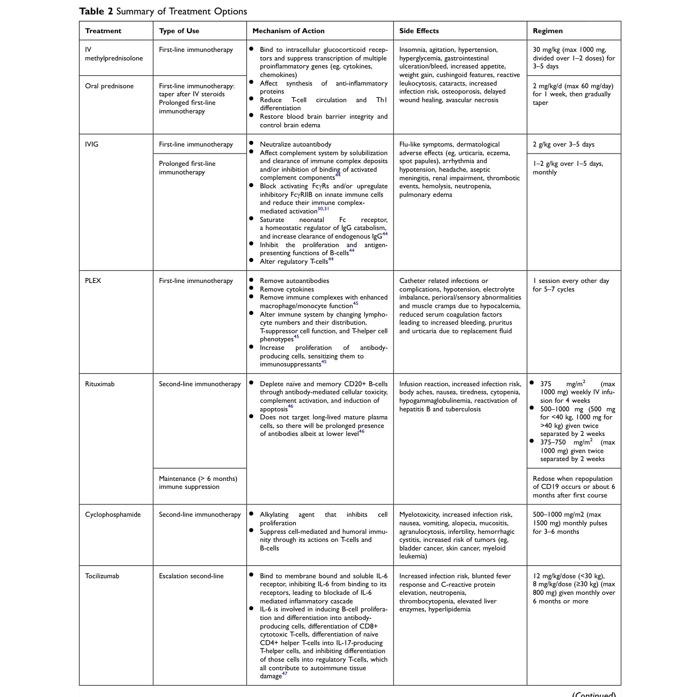

## Question

# Disease Characteristics Research Template

## Target Disease
- **Disease Name:** Anti-NMDA Receptor Encephalitis
- **MONDO ID:**  (if available)
- **Category:** Autoimmune

## Research Objectives

Please provide a comprehensive research report on **Anti-NMDA Receptor Encephalitis** covering all of the
disease characteristics listed below. This report will be used to populate a disease knowledge
base entry. Be thorough and cite primary literature (PMID preferred) for all claims.

For each section, **suggested databases/resources** are listed. These are the first places
you should search for information on each topic.

---

### 1. Disease Information
> **Search first:** OMIM, Orphanet, ICD-10/ICD-11, MeSH, PubMed

- What is the disease? Provide a concise overview.
- What are the key identifiers? (OMIM, Orphanet, ICD-10/ICD-11, MeSH, Mondo)
- What are the common synonyms and alternative names?
- Is the information derived from individual patients (e.g., EHR) or aggregated disease-level resources?

### 2. Etiology

- **Disease Causal Factors**: What are the primary causes? (genetic, environmental, infectious, mechanistic)
- **Risk Factors**:
  > **Search first:** PubMed, Cochrane Library, UpToDate, clinical guidelines, ClinVar, ClinGen, GWAS Catalog, PheGenI, CTD, CDC, WHO, epidemiological databases
  - Genetic risk factors (causal variants, susceptibility loci, modifier genes)
  - Environmental risk factors (toxins, lifestyle, occupational exposures, age, sex, family history)
- **Protective Factors**:
  > **Search first:** PubMed, Cochrane Library, clinical trial databases, GWAS Catalog, gnomAD, WHO, CDC, nutrition databases
  - Genetic protective factors (protective variants, modifier alleles)
  - Environmental protective factors (diet, lifestyle, exposures that reduce risk)
- **Gene-Environment Interactions**: How do genetic and environmental factors interact to influence disease?
  > **Search first:** CTD, PubMed, PheGenI, GxE databases

### 3. Phenotypes
> **Search first:** HPO (Human Phenotype Ontology), OMIM, Orphanet, PubMed, clinicaltrials.gov, MedDRA, SNOMED CT, DECIPHER, LOINC

For each phenotype, provide:
- **Phenotype type**: symptoms, clinical signs, physical manifestations, behavioral changes, or laboratory abnormalities
  > For symptoms/signs: HPO, OMIM, Orphanet, PubMed
  > For behavioral changes: HPO, DSM, RDoC (Research Domain Criteria), PubMed
  > For laboratory abnormalities: LOINC, SNOMED CT, LabTests Online, PubMed
- **Phenotype characteristics**:
  > **Search first:** OMIM, Orphanet, HPO, PubMed
  - Age of symptom onset (neonatal, childhood, adult-onset, late-onset)
  - Symptom severity (mild, moderate, severe, variable)
  - Symptom progression (stable, progressive, episodic, fluctuating)
  - Frequency among affected individuals (percentage or qualitative)
- **Quality of life impact**: Effects on daily functioning and well-being (per-phenotype when possible)
  > **Search first:** EQ-5D database, SF-36, WHO QOL databases, PubMed
- Suggest HPO (Human Phenotype Ontology) terms for each phenotype

### 4. Genetic/Molecular Information

- **Causal Genes**: Gene mutations or chromosomal abnormalities responsible for disease (gene symbols, OMIM IDs)
  > **Search first:** OMIM, ClinVar, HGMD, Ensembl, NCBI Gene
- **Pathogenic Variants**:
  - Affected genes (gene symbols, HGNC IDs)
    > **Search first:** OMIM, NCBI Gene, Ensembl, HGNC, UniProt, GeneCards
  - Variant classification (pathogenic, likely pathogenic, VUS per ACMG/AMP guidelines)
    > **Search first:** ClinVar, ClinGen, ACMG/AMP guidelines, VarSome
  - Variant type/class (missense, frameshift, nonsense, splice-site, structural)
  - Allele frequency in population databases
    > **Search first:** gnomAD, 1000 Genomes, ExAC, TOPMed, dbSNP
  - Somatic vs germline origin
    > **Search first:** COSMIC (somatic), ClinVar, ICGC, TCGA
  - Functional consequences (loss of function, gain of function, dominant negative)
- **Modifier Genes**: Genes that modify disease severity or expression
- **Epigenetic Information**: DNA methylation, histone modifications, chromatin changes affecting disease
  > **Search first:** ENCODE, Roadmap Epigenomics, MethBase, DiseaseMeth
- **Chromosomal Abnormalities**: Large-scale genetic changes (aneuploidy, translocations, inversions)
  > **Search first:** DECIPHER, ClinVar, ECARUCA, UCSC Genome Browser

### 5. Environmental Information

- **Environmental Factors**: Non-genetic contributing factors (toxins, radiation, pollution, occupational exposure)
  > **Search first:** CTD (Comparative Toxicogenomics Database), TOXNET, PubMed, EPA databases
- **Lifestyle Factors**: Behavioral factors (smoking, diet, exercise, alcohol consumption)
  > **Search first:** CDC databases, WHO, PubMed, NHANES
- **Infectious Agents**: If applicable, pathogens causing or triggering disease (bacteria, viruses, fungi, parasites)
  > **Search first:** NCBI Taxonomy, ViPR, BV-BRC, MicrobeDB, GIDEON

### 6. Mechanism / Pathophysiology

- **Molecular Pathways**: Specific signaling cascades or biochemical pathways involved (Wnt, MAPK, mTOR, PI3K-AKT, etc.)
  > **Search first:** KEGG, Reactome, WikiPathways, PathBank, BioCyc
- **Cellular Processes**: Cell-level mechanisms (apoptosis, autophagy, cell cycle dysregulation, inflammation, etc.)
  > **Search first:** Gene Ontology (GO), Reactome, KEGG, PubMed
- **Protein Dysfunction**: How protein structure or function is altered (misfolding, aggregation, loss of function, gain of function)
  > **Search first:** UniProt, PDB (Protein Data Bank), InterPro, Pfam, AlphaFold
- **Metabolic Changes**: Alterations in metabolic processes (energy metabolism, lipid metabolism, amino acid metabolism)
  > **Search first:** KEGG, BioCyc, HMDB (Human Metabolome Database), BRENDA
- **Immune System Involvement**: Role of immune response (autoimmunity, immunodeficiency, chronic inflammation)
  > **Search first:** ImmPort, Immunome Database, IEDB, Gene Ontology
- **Tissue Damage Mechanisms**: How tissues/ are injured (oxidative stress, ischemia, fibrosis, necrosis)
  > **Search first:** PubMed, Gene Ontology, Reactome
- **Biochemical Abnormalities**: Specific molecular defects (enzyme deficiencies, receptor dysfunction, ion channel defects)
  > **Search first:** BRENDA, UniProt, KEGG, OMIM, PubMed
- **Epigenetic Changes**: DNA methylation, histone modifications affecting gene expression in disease
  > **Search first:** ENCODE, Roadmap Epigenomics, MethBase, DiseaseMeth
- **Molecular Profiling** (if available):
  - Transcriptomics/gene expression changes
    > **Search first:** GEO (Gene Expression Omnibus), ArrayExpress, GTEx, Human Cell Atlas, SRA
  - Proteomics findings
    > **Search first:** PRIDE, ProteomeXchange, Human Protein Atlas, STRING, BioGRID
  - Metabolomics signatures
    > **Search first:** MetaboLights, Metabolomics Workbench, HMDB, METLIN
  - Lipidomics alterations
    > **Search first:** LIPID MAPS, SwissLipids, LipidHome, Metabolomics Workbench
  - Genomic structural features
    > **Search first:** UCSC Genome Browser, Ensembl, NCBI, dbVar, DGV
- **Advanced Technologies** (if applicable):
  - Single-cell analysis findings (cell-type specific mechanisms, cellular heterogeneity)
    > **Search first:** Human Cell Atlas, Single Cell Portal, GEO, CELLxGENE
  - Spatial transcriptomics findings
    > **Search first:** GEO, Spatial Research, Vizgen, 10x Genomics data
  - Multi-omics integration results
    > **Search first:** TCGA, ICGC, cBioPortal, LinkedOmics, PubMed
  - Functional genomics screens (CRISPR, RNAi)
    > **Search first:** DepMap, GenomeRNAi, PubMed, BioGRID ORCS

For each mechanism, describe:
- The causal chain from initial trigger to clinical manifestation
- Which mechanisms are upstream vs downstream
- What cell types and biological processes are involved
- Suggest GO terms for biological processes and CL terms for cell types

### 7. Anatomical Structures Affected

- **Organ Level**:
  - Primary organs directly affected
  - Secondary organ involvement (complications, secondary effects)
  - Body systems involved (cardiovascular, nervous, digestive, respiratory, endocrine, etc.)
  > **Search first:** Uberon, FMA (Foundational Model of Anatomy), OMIM, HPO, ICD-11, MeSH, SNOMED CT
- **Tissue and Cell Level**:
  - Specific tissue types affected (epithelial, connective, muscle, nervous)
  - Specific cell populations targeted (with Cell Ontology terms)
  > **Search first:** Uberon, Human Protein Atlas, Cell Ontology, Human Cell Atlas, CellMarker, PanglaoDB
- **Subcellular Level**:
  - Cellular compartments involved (mitochondria, nucleus, ER, lysosomes) (with GO Cellular Component terms)
  > **Search first:** Gene Ontology (Cellular Component), UniProt, Human Protein Atlas
- **Localization**:
  - Specific anatomical sites (with UBERON terms)
    > **Search first:** FMA, Uberon, NeuroNames (for brain), SNOMED CT
  - Lateralization (unilateral, bilateral, asymmetric)
    > **Search first:** HPO, clinical literature, imaging databases

### 8. Temporal Development

- **Onset**:
  - Typical age of onset (congenital, pediatric, adult, geriatric)
  - Onset pattern (acute, subacute, chronic, insidious)
  > **Search first:** OMIM, Orphanet, HPO, PubMed
- **Progression**:
  - Disease stages (early, intermediate, advanced, end-stage)
    > **Search first:** Cancer Staging Manual (AJCC), WHO classifications, PubMed
  - Progression rate (rapid, slow, variable)
  - Disease course pattern (episodic, relapsing-remitting, progressive, stable)
  - Disease duration (self-limited, chronic lifelong)
  > **Search first:** Disease registries, longitudinal cohort databases, natural history studies, PubMed, Orphanet, OMIM
- **Patterns**:
  - Remission patterns (spontaneous, treatment-induced)
    > **Search first:** Clinical trial databases, disease registries, PubMed
  - Critical periods (time windows of vulnerability or opportunity for intervention)
    > **Search first:** PubMed, developmental biology databases, clinical guidelines

### 9. Inheritance and Population

- **Epidemiology**:
  - Prevalence (cases per 100,000 at given time)
  - Incidence (new cases per 100,000 per year)
  > **Search first:** Orphanet, CDC, WHO, GBD (Global Burden of Disease), national registries, SEER, disease registries
- **For Genetic Etiology**:
  - Inheritance pattern (AD, AR, X-linked, mitochondrial, multifactorial, polygenic)
    > **Search first:** OMIM, Orphanet, ClinVar, GTR (Genetic Testing Registry)
  - Penetrance (complete, incomplete, age-dependent)
    > **Search first:** ClinVar, OMIM, PubMed, ClinGen
  - Expressivity (variable, consistent)
    > **Search first:** OMIM, ClinVar, PubMed
  - Genetic anticipation (increasing severity in successive generations)
    > **Search first:** OMIM, PubMed (especially for repeat expansion disorders)
  - Germline mosaicism
    > **Search first:** ClinVar, OMIM, genetic counseling literature, PubMed
  - Founder effects (population-specific mutations)
    > **Search first:** gnomAD, population genetics databases, PubMed
  - Consanguinity role
    > **Search first:** OMIM, population studies, genetic counseling resources
  - Carrier frequency
    > **Search first:** gnomAD, carrier screening databases, GeneReviews, GTR
- **Population Demographics**:
  - Affected populations (ethnic or demographic groups with higher prevalence)
    > **Search first:** gnomAD, 1000 Genomes, PAGE Study, PubMed, population registries
  - Geographic distribution (endemic areas, regional variation)
    > **Search first:** WHO, CDC, GBD, Orphanet, geographic epidemiology databases
  - Geographic distribution of specific variants
  - Sex ratio (male:female)
    > **Search first:** Disease registries, OMIM, PubMed, epidemiological databases
  - Age distribution of affected individuals
    > **Search first:** CDC, disease registries, SEER, Orphanet

### 10. Diagnostics

- **Clinical Tests**:
  - Laboratory tests (blood, urine, tissue chemistry, specific enzyme assays)
    > **Search first:** LOINC, LabTests Online, PubMed
  - Biomarkers (proteins, metabolites, genetic markers, circulating biomarkers)
    > **Search first:** FDA Biomarker List, BEST (Biomarkers, EndpointS, and other Tools), PubMed
  - Imaging studies (X-ray, CT, MRI, PET, ultrasound)
    > **Search first:** RadLex, DICOM, Radiopaedia, imaging databases
  - Functional tests (pulmonary function, cardiac stress tests)
    > **Search first:** LOINC, clinical guidelines, PubMed
  - Electrophysiology (EEG, EMG, ECG, nerve conduction studies)
    > **Search first:** LOINC, clinical neurophysiology databases, PubMed
  - Biopsy findings (histopathology, immunohistochemistry)
    > **Search first:** SNOMED CT, College of American Pathologists resources, PubMed
  - Pathology findings (microscopic examination)
    > **Search first:** SNOMED CT, Digital Pathology databases, PubMed
- **Genetic Testing**:
  > **Search first:** GTR (Genetic Testing Registry), GeneReviews, ClinGen
  - Overview of recommended genetic testing approach
  - Whole genome sequencing (WGS) utility
    > **Search first:** GTR, ClinVar, GEL (Genomics England), gnomAD
  - Whole exome sequencing (WES) utility
    > **Search first:** GTR, ClinVar, OMIM, GeneMatcher
  - Gene panels (which panels, which genes)
    > **Search first:** GTR, ClinVar, laboratory-specific databases
  - Single gene testing
    > **Search first:** GTR, ClinVar, OMIM, GeneReviews
  - Chromosomal microarray (CMA)
    > **Search first:** DECIPHER, ClinVar, dbVar, ECARUCA
  - Karyotyping
    > **Search first:** Chromosome Abnormality Database, ClinVar, cytogenetics resources
  - FISH
    > **Search first:** ClinVar, cytogenetics databases, PubMed
  - Mitochondrial DNA testing
    > **Search first:** MITOMAP, MSeqDR, ClinVar, GTR
  - Repeat expansion testing
    > **Search first:** GTR, ClinVar, repeat expansion databases, PubMed
- **Omics-Based Diagnostics** (if applicable):
  - RNA sequencing / transcriptomics
    > **Search first:** GEO, ArrayExpress, GTEx, RNA-seq databases
  - Proteomics
    > **Search first:** PRIDE, ProteomeXchange, FDA Biomarker database
  - Metabolomics
    > **Search first:** MetaboLights, Metabolomics Workbench, HMDB
  - Epigenomics
    > **Search first:** GEO, ENCODE, Roadmap Epigenomics, MethBase
  - Liquid biopsy
    > **Search first:** COSMIC, ClinVar, liquid biopsy databases, PubMed
- **Clinical Criteria**:
  - Standardized diagnostic criteria (DSM, ICD, society guidelines)
    > **Search first:** DSM-5, ICD-11, clinical society guidelines, UpToDate
  - Differential diagnosis (other conditions to rule out, with distinguishing features)
    > **Search first:** DynaMed, UpToDate, clinical decision support systems
- **Screening**:
  - Screening methods for asymptomatic individuals (newborn screening, carrier screening, cascade screening)
    > **Search first:** ACMG recommendations, CDC newborn screening, GTR

### 11. Outcome/Prognosis

- **Survival and Mortality**:
  - Survival rate (5-year, 10-year, overall)
    > **Search first:** SEER, cancer registries, disease-specific registries, PubMed
  - Life expectancy (with and without treatment if applicable)
    > **Search first:** Orphanet, disease registries, actuarial databases, PubMed
  - Mortality rate
    > **Search first:** CDC, WHO, GBD, national mortality databases
  - Disease-specific mortality (deaths directly attributable to disease)
    > **Search first:** Disease registries, CDC Wonder, GBD, PubMed
- **Morbidity and Function**:
  - Morbidity (disease-related disability and health impacts)
    > **Search first:** GBD, WHO, disability databases, PubMed
  - Disability outcomes (long-term functional impairments)
    > **Search first:** ICF (International Classification of Functioning), disability registries
  - Quality of life measures (EQ-5D, SF-36, PROMIS, disease-specific tools)
    > **Search first:** EQ-5D database, SF-36, PROMIS, PubMed
- **Disease Course**:
  - Complications (secondary problems: infections, organ failure, etc.)
    > **Search first:** ICD codes, disease registries, clinical databases, PubMed
  - Recovery potential (likelihood and extent of recovery, with vs without treatment)
    > **Search first:** Natural history studies, rehabilitation databases, PubMed
- **Prediction**:
  - Prognostic factors (age, disease severity, biomarkers, treatment response)
    > **Search first:** Prognostic models databases, clinical calculators, PubMed
  - Prognostic biomarkers (molecular markers predicting disease course)
    > **Search first:** FDA Biomarker database, PubMed, cancer prognostic databases

### 12. Treatment

- **Pharmacotherapy**:
  - Pharmacological treatments (drug names, drug classes, mechanisms of action)
    > **Search first:** DrugBank, RxNorm, ATC classification, DailyMed, FDA databases
  - Pharmacogenomics (how genetic variants affect drug metabolism, efficacy, toxicity)
    > **Search first:** PharmGKB, CPIC (Clinical Pharmacogenetics), FDA Table of PGx Biomarkers
- **Advanced Therapeutics**:
  - Gene therapy (viral vectors, CRISPR, gene replacement, gene editing)
    > **Search first:** ClinicalTrials.gov, FDA gene therapy database, ASGCT resources
  - Cell therapy (stem cell transplant, CAR-T, cellular therapeutics)
    > **Search first:** ClinicalTrials.gov, FDA cell therapy database, FACT standards
  - RNA-based therapies (ASOs, siRNA, mRNA therapies)
    > **Search first:** ClinicalTrials.gov, FDA approvals, PubMed
  - Targeted therapies (treatments directed at specific molecular targets)
    > **Search first:** My Cancer Genome, OncoKB, ClinicalTrials.gov, FDA approvals
  - Immunotherapies (checkpoint inhibitors, monoclonal antibodies)
    > **Search first:** Cancer Immunotherapy Database, FDA approvals, ClinicalTrials.gov
- **Surgical and Interventional**:
  - Surgical interventions (types of surgery, timing, outcomes)
    > **Search first:** CPT codes, surgical registries, clinical guidelines, PubMed
- **Supportive and Rehabilitative**:
  - Supportive care (symptom management, pain control, nutrition)
    > **Search first:** Clinical guidelines, Cochrane Library, PubMed
  - Rehabilitation (physical therapy, occupational therapy, speech therapy)
    > **Search first:** Rehabilitation medicine databases, clinical guidelines, PubMed
- **Experimental**:
  - Experimental treatments in clinical trials (with NCT identifiers if available)
    > **Search first:** ClinicalTrials.gov, EU Clinical Trials Register, WHO ICTRP
- **Treatment Outcomes**:
  - Treatment response rates
    > **Search first:** Clinical trial databases, FDA reviews, systematic reviews, PubMed
  - Side effects and adverse events
    > **Search first:** FDA Adverse Event Reporting System (FAERS), MedWatch, PubMed
- **Treatment Strategy**:
  - Treatment algorithms (clinical pathways, decision trees)
    > **Search first:** Clinical practice guidelines, NCCN Guidelines, UpToDate
  - Combination therapies
    > **Search first:** ClinicalTrials.gov, treatment guidelines, PubMed
  - Personalized medicine approaches (genotype-guided treatment)
    > **Search first:** My Cancer Genome, CIViC, PharmGKB, precision medicine databases

For each treatment, suggest MAXO (Medical Action Ontology) terms where applicable.

### 13. Prevention

- **Prevention Levels**:
  - Primary prevention (preventing disease occurrence: vaccination, risk factor modification)
    > **Search first:** CDC, WHO, USPSTF recommendations, Cochrane Library
  - Secondary prevention (early detection and treatment: screening programs, early intervention)
    > **Search first:** USPSTF, CDC screening guidelines, WHO
  - Tertiary prevention (preventing complications in those with disease)
    > **Search first:** Clinical guidelines, disease management protocols, PubMed
- **Immunization**: Vaccine strategies (if applicable)
  > **Search first:** CDC vaccine schedules, WHO immunization, FDA vaccine database
- **Screening and Early Detection**:
  - Screening programs (population-based: newborn screening, cancer screening)
    > **Search first:** CDC screening programs, USPSTF, cancer screening databases
  - Genetic screening (carrier screening, preimplantation genetic diagnosis, prenatal testing)
    > **Search first:** ACMG recommendations, ACOG guidelines, GTR
  - Risk stratification (identifying high-risk individuals for targeted prevention)
    > **Search first:** Risk prediction models, clinical calculators, PubMed
- **Behavioral Interventions**: Lifestyle modifications to reduce risk
  > **Search first:** CDC, WHO, behavioral intervention databases, Cochrane Library
- **Counseling**: Genetic counseling (risk assessment, family planning guidance)
  > **Search first:** NSGC resources, ACMG guidelines, GeneReviews
- **Public Health**:
  - Public health interventions (sanitation, vector control, health education)
    > **Search first:** CDC, WHO, public health databases, PubMed
  - Environmental interventions (reducing environmental risk factors)
    > **Search first:** EPA databases, WHO environmental health, PubMed
- **Prophylaxis**: Preventive medications or procedures
  > **Search first:** Clinical guidelines, FDA approvals, PubMed

### 14. Other Species / Natural Disease

- **Taxonomy**: Species affected (with NCBI Taxon identifiers)
  > **Search first:** NCBI Taxonomy
- **Breed**: Specific breeds affected (with VBO identifiers if applicable)
  > **Search first:** VBO (Vertebrate Breed Ontology)
- **Gene**: Orthologous genes in other species (with NCBI Gene IDs)
  > **Search first:** NCBI Gene
- **Natural Disease**:
  - Naturally occurring disease in other species (companion animals, wildlife)
    > **Search first:** OMIA (Online Mendelian Inheritance in Animals), VetCompass, PubMed
  - Veterinary relevance and importance in animal health
    > **Search first:** OMIA, veterinary databases, PubMed
- **Comparative Biology**:
  - Comparative pathology (similarities and differences across species)
    > **Search first:** OMIA, comparative pathology databases, PubMed
  - Evolutionary conservation of disease mechanisms
    > **Search first:** HomoloGene, OrthoMCL, Alliance of Genome Resources
- **Transmission** (if applicable):
  - Zoonotic potential
    > **Search first:** CDC zoonotic diseases, WHO zoonoses, GIDEON
  - Cross-species susceptibility
    > **Search first:** NCBI Taxonomy, veterinary databases, PubMed

### 15. Model Organisms

- **Model Types**:
  - Model organism type (mammalian, invertebrate, cellular, in vitro)
    > **Search first:** Alliance of Genome Resources, model organism databases
  - Specific model systems (mouse, rat, zebrafish, Drosophila, C. elegans, yeast, cell lines, organoids, iPSCs)
    > **Search first:** MGI, RGD, ZFIN, FlyBase, WormBase, SGD, ATCC, Cellosaurus
  - Induced models (drug treatment, surgical intervention, environmental manipulation)
    > **Search first:** MGI, model organism databases, PubMed
- **Genetic Models**:
  - Types available (knockout, knock-in, transgenic, conditional, humanized)
    > **Search first:** MGI, IMPC, KOMP, EuMMCR, IMSR
- **Model Characteristics**:
  - Phenotype recapitulation (how well model reproduces human disease features)
    > **Search first:** Model organism databases, comparative studies, PubMed
  - Model limitations (aspects of human disease not captured)
    > **Search first:** Model organism databases, PubMed, review articles
- **Applications**:
  - Research applications (what aspects of disease can be studied)
    > **Search first:** Model organism databases, PubMed
- **Resources**:
  - Model databases
    > **Search first:** MGI, RGD, ZFIN, FlyBase, WormBase, IMSR, EMMA, MMRRC

---

## Citation Requirements

- Cite primary literature (PMID preferred) for all mechanistic and clinical claims
- Prioritize recent reviews and landmark papers
- Include direct quotes from abstracts where possible to support key statements
- Distinguish evidence source types: human clinical, model organism, in vitro, computational

## Output Format

Structure your response as a comprehensive narrative organized by the sections above.
For each section, provide:
- Factual content with specific details (numbers, percentages, gene names, variant nomenclature)
- Ontology term suggestions (HPO, GO, CL, UBERON, CHEBI, MAXO, MONDO) where applicable
- Evidence citations with PMIDs
- Direct quotes from abstracts to support key claims
- Clear indication when information is not available or not applicable for this disease

This report will be used to populate a disease knowledge base entry with:
- Pathophysiology descriptions with causal chains
- Gene/protein annotations (HGNC, GO terms)
- Phenotype associations (HP terms) with frequencies
- Cell type involvement (CL terms)
- Anatomical locations (UBERON terms)
- Chemical entities (CHEBI terms)
- Treatment annotations (MAXO terms)
- Evidence items with PMIDs and exact abstract quotes
- Epidemiology, prognosis, diagnostic, and prevention information
- Animal model descriptions with phenotype recapitulation details

## Output

Question: You are an expert researcher providing comprehensive, well-cited information.

Provide detailed information focusing on:
1. Key concepts and definitions with current understanding
2. Recent developments and latest research (prioritize 2023-2024 sources)
3. Current applications and real-world implementations
4. Expert opinions and analysis from authoritative sources
5. Relevant statistics and data from recent studies

Format as a comprehensive research report with proper citations. Include URLs and publication dates where available.
Always prioritize recent, authoritative sources and provide specific citations for all major claims.

# Disease Characteristics Research Template

## Target Disease
- **Disease Name:** Anti-NMDA Receptor Encephalitis
- **MONDO ID:**  (if available)
- **Category:** Autoimmune

## Research Objectives

Please provide a comprehensive research report on **Anti-NMDA Receptor Encephalitis** covering all of the
disease characteristics listed below. This report will be used to populate a disease knowledge
base entry. Be thorough and cite primary literature (PMID preferred) for all claims.

For each section, **suggested databases/resources** are listed. These are the first places
you should search for information on each topic.

---

### 1. Disease Information
> **Search first:** OMIM, Orphanet, ICD-10/ICD-11, MeSH, PubMed

- What is the disease? Provide a concise overview.
- What are the key identifiers? (OMIM, Orphanet, ICD-10/ICD-11, MeSH, Mondo)
- What are the common synonyms and alternative names?
- Is the information derived from individual patients (e.g., EHR) or aggregated disease-level resources?

### 2. Etiology

- **Disease Causal Factors**: What are the primary causes? (genetic, environmental, infectious, mechanistic)
- **Risk Factors**:
  > **Search first:** PubMed, Cochrane Library, UpToDate, clinical guidelines, ClinVar, ClinGen, GWAS Catalog, PheGenI, CTD, CDC, WHO, epidemiological databases
  - Genetic risk factors (causal variants, susceptibility loci, modifier genes)
  - Environmental risk factors (toxins, lifestyle, occupational exposures, age, sex, family history)
- **Protective Factors**:
  > **Search first:** PubMed, Cochrane Library, clinical trial databases, GWAS Catalog, gnomAD, WHO, CDC, nutrition databases
  - Genetic protective factors (protective variants, modifier alleles)
  - Environmental protective factors (diet, lifestyle, exposures that reduce risk)
- **Gene-Environment Interactions**: How do genetic and environmental factors interact to influence disease?
  > **Search first:** CTD, PubMed, PheGenI, GxE databases

### 3. Phenotypes
> **Search first:** HPO (Human Phenotype Ontology), OMIM, Orphanet, PubMed, clinicaltrials.gov, MedDRA, SNOMED CT, DECIPHER, LOINC

For each phenotype, provide:
- **Phenotype type**: symptoms, clinical signs, physical manifestations, behavioral changes, or laboratory abnormalities
  > For symptoms/signs: HPO, OMIM, Orphanet, PubMed
  > For behavioral changes: HPO, DSM, RDoC (Research Domain Criteria), PubMed
  > For laboratory abnormalities: LOINC, SNOMED CT, LabTests Online, PubMed
- **Phenotype characteristics**:
  > **Search first:** OMIM, Orphanet, HPO, PubMed
  - Age of symptom onset (neonatal, childhood, adult-onset, late-onset)
  - Symptom severity (mild, moderate, severe, variable)
  - Symptom progression (stable, progressive, episodic, fluctuating)
  - Frequency among affected individuals (percentage or qualitative)
- **Quality of life impact**: Effects on daily functioning and well-being (per-phenotype when possible)
  > **Search first:** EQ-5D database, SF-36, WHO QOL databases, PubMed
- Suggest HPO (Human Phenotype Ontology) terms for each phenotype

### 4. Genetic/Molecular Information

- **Causal Genes**: Gene mutations or chromosomal abnormalities responsible for disease (gene symbols, OMIM IDs)
  > **Search first:** OMIM, ClinVar, HGMD, Ensembl, NCBI Gene
- **Pathogenic Variants**:
  - Affected genes (gene symbols, HGNC IDs)
    > **Search first:** OMIM, NCBI Gene, Ensembl, HGNC, UniProt, GeneCards
  - Variant classification (pathogenic, likely pathogenic, VUS per ACMG/AMP guidelines)
    > **Search first:** ClinVar, ClinGen, ACMG/AMP guidelines, VarSome
  - Variant type/class (missense, frameshift, nonsense, splice-site, structural)
  - Allele frequency in population databases
    > **Search first:** gnomAD, 1000 Genomes, ExAC, TOPMed, dbSNP
  - Somatic vs germline origin
    > **Search first:** COSMIC (somatic), ClinVar, ICGC, TCGA
  - Functional consequences (loss of function, gain of function, dominant negative)
- **Modifier Genes**: Genes that modify disease severity or expression
- **Epigenetic Information**: DNA methylation, histone modifications, chromatin changes affecting disease
  > **Search first:** ENCODE, Roadmap Epigenomics, MethBase, DiseaseMeth
- **Chromosomal Abnormalities**: Large-scale genetic changes (aneuploidy, translocations, inversions)
  > **Search first:** DECIPHER, ClinVar, ECARUCA, UCSC Genome Browser

### 5. Environmental Information

- **Environmental Factors**: Non-genetic contributing factors (toxins, radiation, pollution, occupational exposure)
  > **Search first:** CTD (Comparative Toxicogenomics Database), TOXNET, PubMed, EPA databases
- **Lifestyle Factors**: Behavioral factors (smoking, diet, exercise, alcohol consumption)
  > **Search first:** CDC databases, WHO, PubMed, NHANES
- **Infectious Agents**: If applicable, pathogens causing or triggering disease (bacteria, viruses, fungi, parasites)
  > **Search first:** NCBI Taxonomy, ViPR, BV-BRC, MicrobeDB, GIDEON

### 6. Mechanism / Pathophysiology

- **Molecular Pathways**: Specific signaling cascades or biochemical pathways involved (Wnt, MAPK, mTOR, PI3K-AKT, etc.)
  > **Search first:** KEGG, Reactome, WikiPathways, PathBank, BioCyc
- **Cellular Processes**: Cell-level mechanisms (apoptosis, autophagy, cell cycle dysregulation, inflammation, etc.)
  > **Search first:** Gene Ontology (GO), Reactome, KEGG, PubMed
- **Protein Dysfunction**: How protein structure or function is altered (misfolding, aggregation, loss of function, gain of function)
  > **Search first:** UniProt, PDB (Protein Data Bank), InterPro, Pfam, AlphaFold
- **Metabolic Changes**: Alterations in metabolic processes (energy metabolism, lipid metabolism, amino acid metabolism)
  > **Search first:** KEGG, BioCyc, HMDB (Human Metabolome Database), BRENDA
- **Immune System Involvement**: Role of immune response (autoimmunity, immunodeficiency, chronic inflammation)
  > **Search first:** ImmPort, Immunome Database, IEDB, Gene Ontology
- **Tissue Damage Mechanisms**: How tissues/ are injured (oxidative stress, ischemia, fibrosis, necrosis)
  > **Search first:** PubMed, Gene Ontology, Reactome
- **Biochemical Abnormalities**: Specific molecular defects (enzyme deficiencies, receptor dysfunction, ion channel defects)
  > **Search first:** BRENDA, UniProt, KEGG, OMIM, PubMed
- **Epigenetic Changes**: DNA methylation, histone modifications affecting gene expression in disease
  > **Search first:** ENCODE, Roadmap Epigenomics, MethBase, DiseaseMeth
- **Molecular Profiling** (if available):
  - Transcriptomics/gene expression changes
    > **Search first:** GEO (Gene Expression Omnibus), ArrayExpress, GTEx, Human Cell Atlas, SRA
  - Proteomics findings
    > **Search first:** PRIDE, ProteomeXchange, Human Protein Atlas, STRING, BioGRID
  - Metabolomics signatures
    > **Search first:** MetaboLights, Metabolomics Workbench, HMDB, METLIN
  - Lipidomics alterations
    > **Search first:** LIPID MAPS, SwissLipids, LipidHome, Metabolomics Workbench
  - Genomic structural features
    > **Search first:** UCSC Genome Browser, Ensembl, NCBI, dbVar, DGV
- **Advanced Technologies** (if applicable):
  - Single-cell analysis findings (cell-type specific mechanisms, cellular heterogeneity)
    > **Search first:** Human Cell Atlas, Single Cell Portal, GEO, CELLxGENE
  - Spatial transcriptomics findings
    > **Search first:** GEO, Spatial Research, Vizgen, 10x Genomics data
  - Multi-omics integration results
    > **Search first:** TCGA, ICGC, cBioPortal, LinkedOmics, PubMed
  - Functional genomics screens (CRISPR, RNAi)
    > **Search first:** DepMap, GenomeRNAi, PubMed, BioGRID ORCS

For each mechanism, describe:
- The causal chain from initial trigger to clinical manifestation
- Which mechanisms are upstream vs downstream
- What cell types and biological processes are involved
- Suggest GO terms for biological processes and CL terms for cell types

### 7. Anatomical Structures Affected

- **Organ Level**:
  - Primary organs directly affected
  - Secondary organ involvement (complications, secondary effects)
  - Body systems involved (cardiovascular, nervous, digestive, respiratory, endocrine, etc.)
  > **Search first:** Uberon, FMA (Foundational Model of Anatomy), OMIM, HPO, ICD-11, MeSH, SNOMED CT
- **Tissue and Cell Level**:
  - Specific tissue types affected (epithelial, connective, muscle, nervous)
  - Specific cell populations targeted (with Cell Ontology terms)
  > **Search first:** Uberon, Human Protein Atlas, Cell Ontology, Human Cell Atlas, CellMarker, PanglaoDB
- **Subcellular Level**:
  - Cellular compartments involved (mitochondria, nucleus, ER, lysosomes) (with GO Cellular Component terms)
  > **Search first:** Gene Ontology (Cellular Component), UniProt, Human Protein Atlas
- **Localization**:
  - Specific anatomical sites (with UBERON terms)
    > **Search first:** FMA, Uberon, NeuroNames (for brain), SNOMED CT
  - Lateralization (unilateral, bilateral, asymmetric)
    > **Search first:** HPO, clinical literature, imaging databases

### 8. Temporal Development

- **Onset**:
  - Typical age of onset (congenital, pediatric, adult, geriatric)
  - Onset pattern (acute, subacute, chronic, insidious)
  > **Search first:** OMIM, Orphanet, HPO, PubMed
- **Progression**:
  - Disease stages (early, intermediate, advanced, end-stage)
    > **Search first:** Cancer Staging Manual (AJCC), WHO classifications, PubMed
  - Progression rate (rapid, slow, variable)
  - Disease course pattern (episodic, relapsing-remitting, progressive, stable)
  - Disease duration (self-limited, chronic lifelong)
  > **Search first:** Disease registries, longitudinal cohort databases, natural history studies, PubMed, Orphanet, OMIM
- **Patterns**:
  - Remission patterns (spontaneous, treatment-induced)
    > **Search first:** Clinical trial databases, disease registries, PubMed
  - Critical periods (time windows of vulnerability or opportunity for intervention)
    > **Search first:** PubMed, developmental biology databases, clinical guidelines

### 9. Inheritance and Population

- **Epidemiology**:
  - Prevalence (cases per 100,000 at given time)
  - Incidence (new cases per 100,000 per year)
  > **Search first:** Orphanet, CDC, WHO, GBD (Global Burden of Disease), national registries, SEER, disease registries
- **For Genetic Etiology**:
  - Inheritance pattern (AD, AR, X-linked, mitochondrial, multifactorial, polygenic)
    > **Search first:** OMIM, Orphanet, ClinVar, GTR (Genetic Testing Registry)
  - Penetrance (complete, incomplete, age-dependent)
    > **Search first:** ClinVar, OMIM, PubMed, ClinGen
  - Expressivity (variable, consistent)
    > **Search first:** OMIM, ClinVar, PubMed
  - Genetic anticipation (increasing severity in successive generations)
    > **Search first:** OMIM, PubMed (especially for repeat expansion disorders)
  - Germline mosaicism
    > **Search first:** ClinVar, OMIM, genetic counseling literature, PubMed
  - Founder effects (population-specific mutations)
    > **Search first:** gnomAD, population genetics databases, PubMed
  - Consanguinity role
    > **Search first:** OMIM, population studies, genetic counseling resources
  - Carrier frequency
    > **Search first:** gnomAD, carrier screening databases, GeneReviews, GTR
- **Population Demographics**:
  - Affected populations (ethnic or demographic groups with higher prevalence)
    > **Search first:** gnomAD, 1000 Genomes, PAGE Study, PubMed, population registries
  - Geographic distribution (endemic areas, regional variation)
    > **Search first:** WHO, CDC, GBD, Orphanet, geographic epidemiology databases
  - Geographic distribution of specific variants
  - Sex ratio (male:female)
    > **Search first:** Disease registries, OMIM, PubMed, epidemiological databases
  - Age distribution of affected individuals
    > **Search first:** CDC, disease registries, SEER, Orphanet

### 10. Diagnostics

- **Clinical Tests**:
  - Laboratory tests (blood, urine, tissue chemistry, specific enzyme assays)
    > **Search first:** LOINC, LabTests Online, PubMed
  - Biomarkers (proteins, metabolites, genetic markers, circulating biomarkers)
    > **Search first:** FDA Biomarker List, BEST (Biomarkers, EndpointS, and other Tools), PubMed
  - Imaging studies (X-ray, CT, MRI, PET, ultrasound)
    > **Search first:** RadLex, DICOM, Radiopaedia, imaging databases
  - Functional tests (pulmonary function, cardiac stress tests)
    > **Search first:** LOINC, clinical guidelines, PubMed
  - Electrophysiology (EEG, EMG, ECG, nerve conduction studies)
    > **Search first:** LOINC, clinical neurophysiology databases, PubMed
  - Biopsy findings (histopathology, immunohistochemistry)
    > **Search first:** SNOMED CT, College of American Pathologists resources, PubMed
  - Pathology findings (microscopic examination)
    > **Search first:** SNOMED CT, Digital Pathology databases, PubMed
- **Genetic Testing**:
  > **Search first:** GTR (Genetic Testing Registry), GeneReviews, ClinGen
  - Overview of recommended genetic testing approach
  - Whole genome sequencing (WGS) utility
    > **Search first:** GTR, ClinVar, GEL (Genomics England), gnomAD
  - Whole exome sequencing (WES) utility
    > **Search first:** GTR, ClinVar, OMIM, GeneMatcher
  - Gene panels (which panels, which genes)
    > **Search first:** GTR, ClinVar, laboratory-specific databases
  - Single gene testing
    > **Search first:** GTR, ClinVar, OMIM, GeneReviews
  - Chromosomal microarray (CMA)
    > **Search first:** DECIPHER, ClinVar, dbVar, ECARUCA
  - Karyotyping
    > **Search first:** Chromosome Abnormality Database, ClinVar, cytogenetics resources
  - FISH
    > **Search first:** ClinVar, cytogenetics databases, PubMed
  - Mitochondrial DNA testing
    > **Search first:** MITOMAP, MSeqDR, ClinVar, GTR
  - Repeat expansion testing
    > **Search first:** GTR, ClinVar, repeat expansion databases, PubMed
- **Omics-Based Diagnostics** (if applicable):
  - RNA sequencing / transcriptomics
    > **Search first:** GEO, ArrayExpress, GTEx, RNA-seq databases
  - Proteomics
    > **Search first:** PRIDE, ProteomeXchange, FDA Biomarker database
  - Metabolomics
    > **Search first:** MetaboLights, Metabolomics Workbench, HMDB
  - Epigenomics
    > **Search first:** GEO, ENCODE, Roadmap Epigenomics, MethBase
  - Liquid biopsy
    > **Search first:** COSMIC, ClinVar, liquid biopsy databases, PubMed
- **Clinical Criteria**:
  - Standardized diagnostic criteria (DSM, ICD, society guidelines)
    > **Search first:** DSM-5, ICD-11, clinical society guidelines, UpToDate
  - Differential diagnosis (other conditions to rule out, with distinguishing features)
    > **Search first:** DynaMed, UpToDate, clinical decision support systems
- **Screening**:
  - Screening methods for asymptomatic individuals (newborn screening, carrier screening, cascade screening)
    > **Search first:** ACMG recommendations, CDC newborn screening, GTR

### 11. Outcome/Prognosis

- **Survival and Mortality**:
  - Survival rate (5-year, 10-year, overall)
    > **Search first:** SEER, cancer registries, disease-specific registries, PubMed
  - Life expectancy (with and without treatment if applicable)
    > **Search first:** Orphanet, disease registries, actuarial databases, PubMed
  - Mortality rate
    > **Search first:** CDC, WHO, GBD, national mortality databases
  - Disease-specific mortality (deaths directly attributable to disease)
    > **Search first:** Disease registries, CDC Wonder, GBD, PubMed
- **Morbidity and Function**:
  - Morbidity (disease-related disability and health impacts)
    > **Search first:** GBD, WHO, disability databases, PubMed
  - Disability outcomes (long-term functional impairments)
    > **Search first:** ICF (International Classification of Functioning), disability registries
  - Quality of life measures (EQ-5D, SF-36, PROMIS, disease-specific tools)
    > **Search first:** EQ-5D database, SF-36, PROMIS, PubMed
- **Disease Course**:
  - Complications (secondary problems: infections, organ failure, etc.)
    > **Search first:** ICD codes, disease registries, clinical databases, PubMed
  - Recovery potential (likelihood and extent of recovery, with vs without treatment)
    > **Search first:** Natural history studies, rehabilitation databases, PubMed
- **Prediction**:
  - Prognostic factors (age, disease severity, biomarkers, treatment response)
    > **Search first:** Prognostic models databases, clinical calculators, PubMed
  - Prognostic biomarkers (molecular markers predicting disease course)
    > **Search first:** FDA Biomarker database, PubMed, cancer prognostic databases

### 12. Treatment

- **Pharmacotherapy**:
  - Pharmacological treatments (drug names, drug classes, mechanisms of action)
    > **Search first:** DrugBank, RxNorm, ATC classification, DailyMed, FDA databases
  - Pharmacogenomics (how genetic variants affect drug metabolism, efficacy, toxicity)
    > **Search first:** PharmGKB, CPIC (Clinical Pharmacogenetics), FDA Table of PGx Biomarkers
- **Advanced Therapeutics**:
  - Gene therapy (viral vectors, CRISPR, gene replacement, gene editing)
    > **Search first:** ClinicalTrials.gov, FDA gene therapy database, ASGCT resources
  - Cell therapy (stem cell transplant, CAR-T, cellular therapeutics)
    > **Search first:** ClinicalTrials.gov, FDA cell therapy database, FACT standards
  - RNA-based therapies (ASOs, siRNA, mRNA therapies)
    > **Search first:** ClinicalTrials.gov, FDA approvals, PubMed
  - Targeted therapies (treatments directed at specific molecular targets)
    > **Search first:** My Cancer Genome, OncoKB, ClinicalTrials.gov, FDA approvals
  - Immunotherapies (checkpoint inhibitors, monoclonal antibodies)
    > **Search first:** Cancer Immunotherapy Database, FDA approvals, ClinicalTrials.gov
- **Surgical and Interventional**:
  - Surgical interventions (types of surgery, timing, outcomes)
    > **Search first:** CPT codes, surgical registries, clinical guidelines, PubMed
- **Supportive and Rehabilitative**:
  - Supportive care (symptom management, pain control, nutrition)
    > **Search first:** Clinical guidelines, Cochrane Library, PubMed
  - Rehabilitation (physical therapy, occupational therapy, speech therapy)
    > **Search first:** Rehabilitation medicine databases, clinical guidelines, PubMed
- **Experimental**:
  - Experimental treatments in clinical trials (with NCT identifiers if available)
    > **Search first:** ClinicalTrials.gov, EU Clinical Trials Register, WHO ICTRP
- **Treatment Outcomes**:
  - Treatment response rates
    > **Search first:** Clinical trial databases, FDA reviews, systematic reviews, PubMed
  - Side effects and adverse events
    > **Search first:** FDA Adverse Event Reporting System (FAERS), MedWatch, PubMed
- **Treatment Strategy**:
  - Treatment algorithms (clinical pathways, decision trees)
    > **Search first:** Clinical practice guidelines, NCCN Guidelines, UpToDate
  - Combination therapies
    > **Search first:** ClinicalTrials.gov, treatment guidelines, PubMed
  - Personalized medicine approaches (genotype-guided treatment)
    > **Search first:** My Cancer Genome, CIViC, PharmGKB, precision medicine databases

For each treatment, suggest MAXO (Medical Action Ontology) terms where applicable.

### 13. Prevention

- **Prevention Levels**:
  - Primary prevention (preventing disease occurrence: vaccination, risk factor modification)
    > **Search first:** CDC, WHO, USPSTF recommendations, Cochrane Library
  - Secondary prevention (early detection and treatment: screening programs, early intervention)
    > **Search first:** USPSTF, CDC screening guidelines, WHO
  - Tertiary prevention (preventing complications in those with disease)
    > **Search first:** Clinical guidelines, disease management protocols, PubMed
- **Immunization**: Vaccine strategies (if applicable)
  > **Search first:** CDC vaccine schedules, WHO immunization, FDA vaccine database
- **Screening and Early Detection**:
  - Screening programs (population-based: newborn screening, cancer screening)
    > **Search first:** CDC screening programs, USPSTF, cancer screening databases
  - Genetic screening (carrier screening, preimplantation genetic diagnosis, prenatal testing)
    > **Search first:** ACMG recommendations, ACOG guidelines, GTR
  - Risk stratification (identifying high-risk individuals for targeted prevention)
    > **Search first:** Risk prediction models, clinical calculators, PubMed
- **Behavioral Interventions**: Lifestyle modifications to reduce risk
  > **Search first:** CDC, WHO, behavioral intervention databases, Cochrane Library
- **Counseling**: Genetic counseling (risk assessment, family planning guidance)
  > **Search first:** NSGC resources, ACMG guidelines, GeneReviews
- **Public Health**:
  - Public health interventions (sanitation, vector control, health education)
    > **Search first:** CDC, WHO, public health databases, PubMed
  - Environmental interventions (reducing environmental risk factors)
    > **Search first:** EPA databases, WHO environmental health, PubMed
- **Prophylaxis**: Preventive medications or procedures
  > **Search first:** Clinical guidelines, FDA approvals, PubMed

### 14. Other Species / Natural Disease

- **Taxonomy**: Species affected (with NCBI Taxon identifiers)
  > **Search first:** NCBI Taxonomy
- **Breed**: Specific breeds affected (with VBO identifiers if applicable)
  > **Search first:** VBO (Vertebrate Breed Ontology)
- **Gene**: Orthologous genes in other species (with NCBI Gene IDs)
  > **Search first:** NCBI Gene
- **Natural Disease**:
  - Naturally occurring disease in other species (companion animals, wildlife)
    > **Search first:** OMIA (Online Mendelian Inheritance in Animals), VetCompass, PubMed
  - Veterinary relevance and importance in animal health
    > **Search first:** OMIA, veterinary databases, PubMed
- **Comparative Biology**:
  - Comparative pathology (similarities and differences across species)
    > **Search first:** OMIA, comparative pathology databases, PubMed
  - Evolutionary conservation of disease mechanisms
    > **Search first:** HomoloGene, OrthoMCL, Alliance of Genome Resources
- **Transmission** (if applicable):
  - Zoonotic potential
    > **Search first:** CDC zoonotic diseases, WHO zoonoses, GIDEON
  - Cross-species susceptibility
    > **Search first:** NCBI Taxonomy, veterinary databases, PubMed

### 15. Model Organisms

- **Model Types**:
  - Model organism type (mammalian, invertebrate, cellular, in vitro)
    > **Search first:** Alliance of Genome Resources, model organism databases
  - Specific model systems (mouse, rat, zebrafish, Drosophila, C. elegans, yeast, cell lines, organoids, iPSCs)
    > **Search first:** MGI, RGD, ZFIN, FlyBase, WormBase, SGD, ATCC, Cellosaurus
  - Induced models (drug treatment, surgical intervention, environmental manipulation)
    > **Search first:** MGI, model organism databases, PubMed
- **Genetic Models**:
  - Types available (knockout, knock-in, transgenic, conditional, humanized)
    > **Search first:** MGI, IMPC, KOMP, EuMMCR, IMSR
- **Model Characteristics**:
  - Phenotype recapitulation (how well model reproduces human disease features)
    > **Search first:** Model organism databases, comparative studies, PubMed
  - Model limitations (aspects of human disease not captured)
    > **Search first:** Model organism databases, PubMed, review articles
- **Applications**:
  - Research applications (what aspects of disease can be studied)
    > **Search first:** Model organism databases, PubMed
- **Resources**:
  - Model databases
    > **Search first:** MGI, RGD, ZFIN, FlyBase, WormBase, IMSR, EMMA, MMRRC

---

## Citation Requirements

- Cite primary literature (PMID preferred) for all mechanistic and clinical claims
- Prioritize recent reviews and landmark papers
- Include direct quotes from abstracts where possible to support key statements
- Distinguish evidence source types: human clinical, model organism, in vitro, computational

## Output Format

Structure your response as a comprehensive narrative organized by the sections above.
For each section, provide:
- Factual content with specific details (numbers, percentages, gene names, variant nomenclature)
- Ontology term suggestions (HPO, GO, CL, UBERON, CHEBI, MAXO, MONDO) where applicable
- Evidence citations with PMIDs
- Direct quotes from abstracts to support key claims
- Clear indication when information is not available or not applicable for this disease

This report will be used to populate a disease knowledge base entry with:
- Pathophysiology descriptions with causal chains
- Gene/protein annotations (HGNC, GO terms)
- Phenotype associations (HP terms) with frequencies
- Cell type involvement (CL terms)
- Anatomical locations (UBERON terms)
- Chemical entities (CHEBI terms)
- Treatment annotations (MAXO terms)
- Evidence items with PMIDs and exact abstract quotes
- Epidemiology, prognosis, diagnostic, and prevention information
- Animal model descriptions with phenotype recapitulation details

# Anti‑NMDA Receptor Encephalitis (Autoimmune) — Comprehensive Disease Characteristics Report

## 1. Disease Information

### Overview / definition
Anti‑N‑methyl‑D‑aspartate receptor (NMDAR) encephalitis is a subacute, rapidly progressive autoimmune encephalitis characterized by neuropsychiatric symptoms (often prominent), seizures, movement disorders/dyskinesias, altered consciousness, and autonomic/respiratory dysfunction, associated with IgG autoantibodies targeting the GluN1 (NR1) subunit of the NMDAR and typically detected most reliably in CSF (nguyen2023antinmdareceptorautoimmune pages 1-2, nguyen2023antinmdareceptorautoimmune pages 3-5, gong2021longtermfunctionaloutcomes pages 1-2).

### Key identifiers
- **MONDO**: **MONDO_0021081** (“anti‑NMDA receptor encephalitis”) (OpenTargets Search: Anti-NMDA receptor encephalitis).
- **Orphanet / MeSH / OMIM / ICD‑10/ICD‑11**: Not retrieved in the available tool context; therefore not reported here.

### Synonyms / alternative names (used in evidence base)
- Anti‑NMDAR encephalitis; anti‑NMDA receptor autoimmune encephalitis; NMDAR encephalitis; NMDARE (nguyen2023antinmdareceptorautoimmune pages 1-2, dumez2024specificclinicaland pages 1-2, gong2023antinmdarantibodiesthe pages 1-2).

### Evidence source types
This report integrates (i) **human cohort/registry studies** and systematic reviews, (ii) **mechanistic in vitro and passive‑transfer animal model** studies, and (iii) **clinical trial registry** information (ClinicalTrials.gov) (gong2021longtermfunctionaloutcomes pages 1-2, alsalek2024racialandethnic pages 1-2, dalmau2016nmdareceptorencephalitis pages 7-9, NCT03274375 chunk 1).

## 2. Etiology

### Primary causal factors / triggers (current understanding)
Anti‑NMDAR encephalitis is primarily **antibody‑mediated** and frequently linked to **antigenic triggers**, particularly:
- **Ovarian teratoma** (key paraneoplastic trigger in subsets of patients) (nguyen2023antinmdareceptorautoimmune pages 5-6, alsalek2024racialandethnic pages 1-2).
- **Herpes simplex encephalitis (HSE)** as a post‑infectious trigger for secondary anti‑NMDAR encephalitis (dumez2024specificclinicaland pages 1-2, alsalek2024racialandethnic pages 1-2).

### Risk factors (human clinical/epidemiologic)
- **Sex and age**: young adults and female predominance are common in many cohorts (nguyen2023antinmdareceptorautoimmune pages 1-2, brenner2024longtermcognitivefunctional pages 1-2).
- **Race/ethnicity disparities (US population-based data)**: In Kaiser Permanente Southern California (2011–2022; >10 million person‑years), standardized incidence per 1 million person‑years was higher in Black, Hispanic, and Asian/Pacific Island individuals than in White individuals (Black 2.94 vs White 0.40) (alsalek2024racialandethnic pages 1-2).

### Environmental / spatial & climatic factors
A 2023 systematic review/meta‑analysis reported that incidence estimates varied across regions and were associated with geography/climate:
- higher reported incidence in **Oceania (0.2/100,000 person‑years)** and **South America (0.16/100,000 person‑years)** than **Europe/North America (0.06/100,000 person‑years)** (alentorn2023spatialandecological pages 1-2).
- a strong negative correlation with latitude (**Pearson’s R = −0.88**) and seasonal peaks during warm months; extreme heat in France associated with incidence (**p = 0.03**) (alentorn2023spatialandecological pages 1-2).

### Protective factors / gene–environment interactions
No protective factors or explicit gene–environment interaction data were retrieved in the current tool context.

## 3. Phenotypes

### Core phenotype domains (with selected frequencies)
Common clinical manifestations include psychiatric/behavioral symptoms, seizures, movement disorders/dyskinesias, speech dysfunction, decreased consciousness, autonomic instability, and central hypoventilation (nguyen2023antinmdareceptorautoimmune pages 3-5, xu2020antinmdarencephalitis pages 1-2).

Selected quantitative phenotype frequencies from cohorts:
- **Psychosis/behavioral symptoms**: 82.7% psychosis in a prospective China cohort (n=220, 2011–2017) (xu2020antinmdarencephalitis pages 1-2); behavioral changes 74.5% in an East China cohort (n=106) (wang2020influencingelectroclinicalfeatures pages 1-2).
- **Seizures**: 80.9% in the prospective China cohort (n=220) (xu2020antinmdarencephalitis pages 1-2); 67% in the East China cohort (n=106), with 54.9% focal among those with seizures (wang2020influencingelectroclinicalfeatures pages 1-2).
- **Prodrome**: a prodromal phase occurs in 40–70% of patients (review synthesis) (nguyen2023antinmdareceptorautoimmune pages 3-5).

Age-related clinical patterning (review synthesis): teenagers/adults commonly develop psychiatric/behavioral symptoms early (~90%), whereas young children more often present with neurologic features such as seizures/abnormal movements rather than frank psychiatric syndromes (nguyen2023antinmdareceptorautoimmune pages 3-5).

### Quality of life and long-term functional/cognitive impacts
A 2024 nationwide cohort study of 92 patients reported that although most had “favorable” functional outcome by mRS, long-term deficits were common:
- beyond 36 months, **34%** had persistent cognitive impairment (z < −1.5 SD) and **65%** scored below average in ≥1 domain; memory and language were most affected (brenner2024longtermcognitivefunctional pages 1-2).
- **30%** did not resume school/work and **18%** needed adjustments; patient‑reported outcomes showed reduced emotional well‑being, social functioning, energy, and quality of life compared to norms (brenner2024longtermcognitivefunctional pages 1-2).

### Suggested HPO terms (examples; see ontology table)
Examples include Seizure (HP:0001250), Psychiatric symptoms (HP:0000708), Dyskinesia (HP:0100660), Autonomic dysfunction (HP:0002271), Central hypoventilation (HP:0007110), Memory impairment (HP:0002354), Language impairment (HP:0002465) (artifact-01).

## 4. Genetic/Molecular Information

### Causal genes
Anti‑NMDAR encephalitis is not typically a Mendelian monogenic disorder; it is defined by autoantibodies to the **NMDAR (GluN1 subunit)** rather than pathogenic variants in a causal gene (balu2019ascorethat pages 1-2, dalmau2017autoantibodiestosynaptic pages 8-10).

### Target antigen and epitope information
- Structural epitope mapping indicates most autoantibodies target a conformational epitope in the **amino‑terminal domain (ATD) of GluN1**, including residues **N368/G369**; point mutations at these residues abolish binding (dalmau2017autoantibodiestosynaptic pages 8-10).

### Modifier genes / protective variants / allele frequencies
Not retrieved in the available tool context.

## 5. Environmental Information

### Infectious triggers
- HSE is a recognized trigger; in a post‑HSE cohort, median latency from HSE to anti‑NMDAR encephalitis was **30 days** (dumez2024specificclinicaland pages 1-2).

### Climate/ecological signals (population level)
Incidence appears associated with geographic/climatic variables including latitude, higher temperatures, and UV exposure in a systematic review/meta‑analysis (alentorn2023spatialandecological pages 1-2).

Lifestyle/toxin exposures were not retrieved.

## 6. Mechanism / Pathophysiology

### Causal chain (current consensus)
1) **Trigger/antigen exposure** (e.g., ovarian teratoma or post‑HSV inflammation) can initiate/boost autoreactive B‑cell responses (nguyen2023antinmdareceptorautoimmune pages 5-6, dalmau2017autoantibodiestosynaptic pages 8-10).
2) Autoreactive B cells/plasma cells generate IgG targeting extracellular NMDAR epitopes; intrathecal synthesis is supported by cloning of recombinant antibodies from CSF cells and by intrathecal immune activity models (dalmau2017autoantibodiestosynaptic pages 37-38, dalmau2017autoantibodiestosynaptic pages 8-10).
3) Antibodies bind cell-surface NMDAR and induce **receptor crosslinking and internalization**, reducing surface and synaptic receptor density, producing **reversible synaptic dysfunction** (dalmau2017autoantibodiestosynaptic pages 34-35, dalmau2016nmdareceptorencephalitis pages 7-9).
4) Network-level consequences include impaired hippocampal synaptic plasticity (LTP) and cognitive/behavioral phenotypes, consistent with functional NMDAR hypofunction (dalmau2016nmdareceptorencephalitis pages 7-9, dalmau2016nmdareceptorencephalitis pages 2-3).

### Key mechanistic findings (authoritative sources)
- **Crosslinking-dependent internalization**: internalization is not blocked by NMDA receptor antagonism and is not reproduced by Fab fragments that cannot crosslink, implicating crosslinking as a mechanism (dalmau2017autoantibodiestosynaptic pages 34-35).
- **Internalization kinetics and trafficking**: internalization begins within ~2 hours and peaks by ~12 hours; internalized receptors traffic preferentially to Rab11-positive recycling endosomes more than lysosomes, with evidence of enhanced degradation (dalmau2017autoantibodiestosynaptic pages 34-35).
- **Passive-transfer model reversibility and EphB2 pathway modulation**: chronic infusion of patient CSF causes progressive antibody binding (maximal ~day 18), synaptic NMDAR loss, impaired LTP, and memory impairment, with reversibility after cessation; co-infusion of soluble ephrin‑B2 prevents pathogenic effects, implicating NMDAR–EphB2 synaptic interactions (dalmau2016nmdareceptorencephalitis pages 7-9, dalmau2017autoantibodiestosynaptic pages 37-38).

### Blood–brain barrier (BBB) and immune trafficking
BBB dysfunction is proposed as enabling movement of antibodies and immune cells into the CNS. The BBB is described as “crucial for antibodies and immune cells to enter or exit the CNS,” with evidence supporting intrathecal B-cell involvement and cytokine signals consistent with BBB involvement (gong2023antinmdarantibodiesthe pages 1-2).

### Suggested GO biological process / CL cell type terms
Examples include receptor internalization (GO:0031623), regulation of synaptic plasticity (GO:0048167), B cell mediated immunity (GO:0019724), immunoglobulin production (GO:0002377), and cell types B cell (CL:0000236) and plasma cell (CL:0000786) (artifact-01).

## 7. Anatomical Structures Affected

### Organ/system level
- Primary: central nervous system (brain) (nguyen2023antinmdareceptorautoimmune pages 1-2, gong2023antinmdarantibodiesthe pages 1-2).
- Associated trigger sites: ovary (ovarian teratoma) (alsalek2024racialandethnic pages 1-2, nguyen2023antinmdareceptorautoimmune pages 5-6).

### Tissue/cell level
- Neuronal synapses are directly affected through loss of synaptic NMDAR clusters (dalmau2016nmdareceptorencephalitis pages 7-9, dalmau2017autoantibodiestosynaptic pages 37-38).
- Immune cell involvement includes intrathecal B cells/plasma cells (dalmau2017autoantibodiestosynaptic pages 37-38, gong2023antinmdarantibodiesthe pages 1-2).

## 8. Temporal Development

### Onset pattern
Typically subacute (rapid progression) with prodrome in a substantial fraction (40–70%) (nguyen2023antinmdareceptorautoimmune pages 3-5). Diagnostic criteria frameworks emphasize symptom accumulation within weeks and rapid onset within <3 months (nguyen2023antinmdareceptorautoimmune pages 3-5).

### Post‑infectious timing
In post‑HSE anti‑NMDAR encephalitis, median time between HSE and NMDARE onset was **30 days (21–46)** (dumez2024specificclinicaland pages 1-2).

### Recovery trajectory
Cognitive recovery may continue for years; in one nationwide cohort, improvements continued up to 36 months, with persistent impairments common beyond 36 months (brenner2024longtermcognitivefunctional pages 1-2).

## 9. Inheritance and Population

### Epidemiology (recent quantitative data)
A compact table of recent quantitative incidence/outcomes is provided below.

| Study (first author year, journal) | Design/setting | N | Key population notes | Incidence/prevalence (with units) | Tumor frequency | Relapse frequency | Mortality/fatality | Key prognostic factors/notes | URL/DOI |
|---|---|---:|---|---|---|---|---|---|---|
| Nguyen 2023, *Int J Gen Med* | Review summarizing epidemiology and management | NR | Median age 21; 81% female in summarized data | Olmsted County incidence 0.4/100,000 (1995–2005) rising to 1.2/100,000 (2006–2015); autoimmune encephalitis prevalence 13.7/100,000 in 2014; anti-NMDAR prevalence 0.6/100,000 | NR in excerpt | 10–30% of cases, mostly within first 2 years | NR | CSF antibody testing more sensitive/specific than serum; all patients should be screened at least once for neoplasm (nguyen2023antinmdareceptorautoimmune pages 1-2) | https://doi.org/10.2147/IJGM.S397429 |
| Alsalek 2024, *Neurol Neuroimmunol Neuroinflamm* | Retrospective population-based cohort, Kaiser Permanente Southern California, 2011–2022 | 70 | Median age at onset 23.7 years; 64% female; >10 million person-years | Age- and sex-standardized incidence per 1 million person-years: Black 2.94 (95% CI 1.27–4.61), Hispanic 2.17 (1.51–2.83), Asian/Pacific Islander 2.02 (0.77–3.28), White 0.40 (0.08–0.72) | Ovarian teratomas in 58.3% of Black female individuals; 21 female patients overall had ovarian teratoma | NR | NR | CSF pleocytosis 70%, abnormal EEG 73%, abnormal MRI 40%; median time symptom onset to diagnosis 17 days; most patients (61.4%) had no identifiable trigger (alsalek2024racialandethnic pages 1-2) | https://doi.org/10.1212/NXI.0000000000200255 |
| Alentorn 2023, *Biomedicines* | Systematic review/meta-analysis of incidence studies | NR | Higher incidence reported in southern hemisphere regions; warm-month peak | Oceania 0.2/100,000 person-years; South America 0.16/100,000 person-years; Europe/North America 0.06/100,000 person-years | About half of cases associated with ovarian teratoma | NR | NR | Strong negative correlation with latitude (Pearson R = −0.88); positive association with extreme heat in France (p = 0.03) (alentorn2023spatialandecological pages 1-2) | https://doi.org/10.3390/biomedicines11061525 |
| Dumez 2024, *J Neurol* | Retrospective comparative cohort of post-HSE anti-NMDAR encephalitis | 13 post-HSE cases among 375 NMDARE patients | Median age 19 years; 31% children <4 years; 54% male; median latency 30 days after HSE | HSE incidence noted as 2–4 per million/year | NR | NR | NR | Worse 12-month mRS than regular NMDARE; behavioral changes 92%, movement disorders 62%, dysautonomia 54%; extensive MRI lesions 100% vs 48% and bilateral DWI abnormalities 90% vs 29% versus regular HSE comparators (dumez2024specificclinicaland pages 1-2) | https://doi.org/10.1007/s00415-024-12615-7 |
| Xu 2020, *Neurol Neuroimmunol Neuroinflamm* | Single-center prospective cohort, China, 2011–2017 | 220 | Acute onset with characteristic neuropsychiatric manifestations | NR | 19.5% had neoplasm; ovarian teratoma was 100% of tumors in females | 17.3% during first 12 months | 2.3% died within first 12 months | 94.1% improved during first 12 months; 92.7% had favorable outcome (mRS ≤2) at 12 months; 99.5% received first-line therapy; 7.3% received second-line therapy (xu2020antinmdarencephalitis pages 1-2) | https://doi.org/10.1212/NXI.0000000000000633 |
| Gong 2021, *Neurol Neuroimmunol Neuroinflamm* | Prospective observational cohort, Western China | 244 | Median age 26; 52.45% female; median follow-up 40 months | NR | 15.57% had tumors | 15.9%; 82.0% of first relapses within 24 months | 6.96% fatality | 84.8% improved within 4 weeks after immunotherapy; 80.7% and 85.7% had substantial recovery at 12 and 24 months; disturbance of consciousness in first month independently predicted poor outcome (OR 2.91, 95% CI 1.27–6.65); female sex and delayed treatment linked to relapse (gong2021longtermfunctionaloutcomes pages 1-2) | https://doi.org/10.1212/NXI.0000000000000958 |
| Balu 2019, *Neurology* | Multicenter cohort developing prognostic score | 382 | Anti-GluN1 antibody-associated disease | NR | NR | NR | NR | NEOS score predictors: ICU admission, treatment delay >4 weeks, lack of improvement within 4 weeks, abnormal MRI, CSF WBC >20 cells/μL; poor 1-year outcome ranged from 3% (0–1 points) to 69% (4–5 points) (balu2019ascorethat pages 1-2) | https://doi.org/10.1212/WNL.0000000000006783 |
| Brenner 2023, *Neurology* | Retrospective biomarker study with healthy references | 71 patients; 61 references | 75% female; mean age 31.4 years; paired CSF available in 33 | NR | NR | Reported 12% relapse within 2 years in background summary | NR | Serum NfL 19.5 pg/mL vs 6.4 pg/mL in references (p < 0.0001); CSF-serum NfL correlation R = 0.84; post-HSV patients 248.8 vs 14.1 pg/mL; association with 12-month mRS largely confounded by age (brenner2023predictivevalueof pages 1-2) | https://doi.org/10.1212/WNL.0000000000207221 |
| Brenner 2024, *Neurology* | Nationwide cross-sectional/prospective cohort | 92 | Mean age 29 ± 2 years; 77% female | NR | NR | NR | NR | Recovery continued up to 36 months; beyond 36 months, 34% had persistent impairment and 65% scored below average in ≥1 cognitive domain; 91% had favorable mRS ≤2, yet 30% did not resume school/work and 18% needed adjustments (nguyen2023antinmdareceptorautoimmune pages 1-2) | https://doi.org/10.1212/WNL.0000000000210109 |

*Table: This table compiles the main quantitative epidemiology, trigger, relapse, mortality, and prognosis figures for anti-NMDA receptor encephalitis from the retrieved evidence. It is useful as a compact reference for populating disease knowledge-base fields with explicitly supported numbers.*

Key recent statistics include:
- **US population-based incidence disparities (2011–2022)**: standardized incidence per 1 million person‑years: Black 2.94; Hispanic 2.17; Asian/PI 2.02; White 0.40 (alsalek2024racialandethnic pages 1-2).
- **Climate/geography associations**: incidence estimates and latitude/temperature associations in systematic review/meta-analysis (alentorn2023spatialandecological pages 1-2).

## 10. Diagnostics

### Clinical criteria and practical diagnostic approach
Guidelines emphasize exclusion of infectious mimics (notably HSV encephalitis), with routine blood/CSF analysis and MRI often sufficient to evaluate alternative causes; importantly, HSV CSF PCR can be negative early and may need repeating if suspicion remains high (graus2016aclinicalapproach pages 6-7).

Anti‑NMDAR encephalitis can be approached with syndrome-based criteria for probable diagnosis and confirmed via antibody testing; supportive findings include abnormal EEG and CSF inflammatory markers (nguyen2023antinmdareceptorautoimmune pages 3-5).

### Antibody testing: CSF vs serum
CSF testing is more sensitive and specific than serum. Review synthesis reports serum false-positives (up to 23.2%) and some serum reactivity in healthy controls; a substantial fraction of patients may be CSF‑only positive (reported 28–38.2% across series), supporting testing of both CSF and serum (nguyen2023antinmdareceptorautoimmune pages 3-5).

### CSF abnormalities
Across cohorts, CSF pleocytosis has been reported in ~47–91% and oligoclonal bands in ~25–62.6% (nguyen2023antinmdareceptorautoimmune pages 3-5). In the Kaiser Permanente cohort, CSF pleocytosis was present in 70% (alsalek2024racialandethnic pages 1-2).

### EEG and MRI
- EEG is abnormal in most cases; one review notes EEG abnormality in 83.6% and describes **extreme delta brush** as a specific pattern, defined as “rhythmic delta activity at 1–3 Hz with bursts of rhythmic beta activity,” occurring in ~6.7% (nguyen2023antinmdareceptorautoimmune pages 5-6).
- Brain MRI can be normal in many patients; in Kaiser Permanente, abnormal MRI was 40% (alsalek2024racialandethnic pages 1-2).

### Real-world diagnostic implementation notes
- “Treatment for suspected AE is often given empirically” while awaiting antibody results, reflecting real-world delays in definitive testing (nguyen2023antinmdareceptorautoimmune pages 6-7).

## 11. Outcome / Prognosis

### Functional outcomes and relapse
- Prospective China cohort (n=220): within 12 months, 94.1% improved; 2.3% died; 17.3% relapsed; 92.7% had favorable 12‑month mRS ≤2 (xu2020antinmdarencephalitis pages 1-2).
- Prospective Western China cohort (n=244): fatality 6.96%; relapse 15.9% with most first relapses within 24 months; substantial recovery at 24 months 85.7% (gong2021longtermfunctionaloutcomes pages 1-2).

### Prognostic scores
The **NEOS score** (anti‑NMDAR Encephalitis One‑Year Functional Status) uses five predictors: ICU admission, treatment delay >4 weeks, lack of improvement within 4 weeks, abnormal MRI, and CSF WBC >20 cells/µL; poor 1‑year outcome probability ranged from 3% (0–1 points) to 69% (4–5 points) (balu2019ascorethat pages 1-2).

### Biomarkers (recent developments)
A 2023 Neurology study evaluated serum neurofilament light chain (NfL): serum NfL at diagnosis was higher in patients (mean 19.5 pg/mL) than references (mean 6.4 pg/mL, p<0.0001) and correlated with CSF NfL (R=0.84); post‑HSV cases had markedly higher levels (mean 248.8 vs 14.1 pg/mL) (brenner2023predictivevalueof pages 1-2).

## 12. Treatment

### Current standard treatment strategy (real-world implementation)
A widely used approach is escalation of immunotherapy plus trigger removal (e.g., teratoma removal). First-line therapies include high-dose corticosteroids, IVIG, and plasma exchange; second-line therapies include rituximab or cyclophosphamide; refractory options may include bortezomib and tocilizumab (nguyen2023antinmdareceptorautoimmune pages 1-2, nguyen2023antinmdareceptorautoimmune pages 6-7).

A key implementation point is that decisions should be guided by clinical status rather than serial antibody titers: titers have limited correlation with severity and serum titers are unreliable; CSF titers may be more useful for relapse assessment when compared to earlier samples (nguyen2023antinmdareceptorautoimmune pages 6-7).

### Visual evidence: treatment options table
Nguyen & Wang (2023) provide a detailed “Table 2 Summary of Treatment Options,” including regimens and adverse effects (nguyen2023antinmdareceptorautoimmune media a2c6c545, nguyen2023antinmdareceptorautoimmune media e857af28).

### Suggested MAXO terms
Examples include corticosteroid therapy, intravenous immunoglobulin therapy, plasma exchange therapy, rituximab therapy, cyclophosphamide therapy, tumor resection, and tumor screening (artifact-01).

## 13. Prevention

No established primary prevention is supported in the retrieved evidence base. Practical prevention focuses on **secondary/tertiary prevention**: early recognition, prompt immunotherapy escalation when needed, and evaluation for/removal of triggering tumors to reduce morbidity and relapse risk (nguyen2023antinmdareceptorautoimmune pages 6-7, xu2020antinmdarencephalitis pages 1-2).

## 14. Other Species / Natural Disease

No naturally occurring disease in other species was retrieved in the available evidence context.

## 15. Model Organisms

Mechanistic work includes passive-transfer models (e.g., chronic infusion of patient CSF) demonstrating reversible synaptic receptor loss, impaired LTP, and behavioral deficits; these are frequently used to interrogate synaptic mechanisms and potential rescue strategies (e.g., ephrin‑B2) (dalmau2016nmdareceptorencephalitis pages 7-9, dalmau2017autoantibodiestosynaptic pages 37-38).

## Recent developments and latest research highlights (2023–2024 prioritized)
- **Population incidence disparities (2024)**: large integrated health-system cohort quantified markedly higher incidence in Black, Hispanic, and Asian/Pacific Island populations vs White (alsalek2024racialandethnic pages 1-2).
- **Climate/geography signal (2023)**: systematic review/meta-analysis reported latitude/temperature/UV associations with incidence estimates across regions (alentorn2023spatialandecological pages 1-2).
- **BBB-focused synthesis (2023)**: emphasizes BBB’s role in immune-cell/antibody trafficking and intrathecal immune activation (gong2023antinmdarantibodiesthe pages 1-2).
- **Biomarker development (2023)**: serum NfL differences vs controls and HSV-associated elevations, with limitations due to age confounding and sampling timing (brenner2023predictivevalueof pages 1-2).
- **Long-term outcomes (2024)**: persistent cognitive and patient-reported deficits despite favorable mRS; substantial impacts on return-to-work/school (brenner2024longtermcognitivefunctional pages 1-2).
- **Post‑HSE phenotype refinement (2024)**: HSE-triggered NMDARE shows distinctive clinical and MRI severity features and worse 12‑month outcomes (dumez2024specificclinicaland pages 1-2).

## Current applications and real-world implementations
- **Diagnostic workflows** commonly prioritize CSF antibody testing, EEG/MRI supportive evidence, and repeated HSV testing if early PCR negative and suspicion remains high (nguyen2023antinmdareceptorautoimmune pages 3-5, graus2016aclinicalapproach pages 6-7).
- **Tumor screening** (especially ovarian teratoma evaluation in appropriate demographic groups) is recommended at least once; repeat imaging schedules for higher-risk groups have been proposed in reviews (nguyen2023antinmdareceptorautoimmune pages 5-6).
- **Treatment escalation pathways** (steroids/IVIG/PLEX → rituximab/cyclophosphamide → refractory biologics/proteasome inhibitors) are used clinically despite limited RCT evidence (nguyen2023antinmdareceptorautoimmune pages 6-7).

## Clinical trials / registries (ClinicalTrials.gov)
- **NCT03274375** (Phase 2; recruiting; start 2021‑06‑23; est. completion 2026‑06): immunoadsorption sessions + rituximab in severe pediatric disease (NCT03274375 chunk 1).
- **NCT06183788 (AMENDS)** (recruiting; start 2023‑01‑16): remote cognitive rehabilitation and biomarker/mechanism characterization in post‑acute stage (NCT06183788 chunk 1).
- **NCT06023160 (NEOSII)** (observational; 714 participants): develop NEOS2 score for outcome and first-line response prediction (NCT06023160 chunk 1).
- **NCT02559089** and **NCT02443350** (China/Beijing registries; ~400 enrollment each): clinical registries to build databases and evaluate outcomes (e.g., death endpoints) (NCT02559089 chunk 1, NCT02443350 chunk 1).
- **NCT04339127** (retrospective; ~12 participants): post‑herpetic anti‑NMDAR encephalitis characterization (NCT04339127 chunk 1).

## Ontology mapping artifact

| Category | Suggested ontology | Term label | Term ID | Evidence-supported rationale |
|---|---|---|---|---|
| Disease | MONDO | anti-NMDA receptor encephalitis | MONDO_0021081 | OpenTargets identifies the disease as anti-NMDA receptor encephalitis with MONDO_0021081, matching the requested disease concept (OpenTargets Search: Anti-NMDA receptor encephalitis). |
| Anatomy | UBERON | brain | UBERON:0000955 | Anti-NMDAR encephalitis is a CNS autoimmune encephalitis with neuropsychiatric, seizure, and cognitive manifestations indicating primary brain involvement (nguyen2023antinmdareceptorautoimmune pages 1-2, gong2023antinmdarantibodiesthe pages 1-2). |
| Anatomy | UBERON | hippocampus | UBERON:0001954 | Mechanistic studies describe impaired hippocampal synaptic activity/plasticity and hippocampal binding of patient antibodies, supporting hippocampal involvement (gong2023antinmdarantibodiesthe pages 1-2, dalmau2016nmdareceptorencephalitis pages 7-9). |
| Anatomy | UBERON | cerebrospinal fluid | UBERON:0001359 | CSF is the preferred compartment for antibody detection and frequently shows pleocytosis or oligoclonal bands in this disease (nguyen2023antinmdareceptorautoimmune pages 3-5, nguyen2023antinmdareceptorautoimmune pages 5-6). |
| Anatomy | UBERON | blood-brain barrier | UBERON:0013702 | BBB dysfunction is implicated because the BBB is described as crucial for antibody and immune-cell trafficking into and out of the CNS (gong2023antinmdarantibodiesthe pages 1-2). |
| Anatomy | UBERON | ovary | UBERON:0000992 | Ovarian teratoma is the major tumor trigger, especially in female patients, supporting ovary as a key associated anatomical site (nguyen2023antinmdareceptorautoimmune pages 5-6, alsalek2024racialandethnic pages 1-2). |
| Cell type | CL | B cell | CL:0000236 | CNS B-cell expansion and intrathecal antibody production are described in anti-NMDAR encephalitis, making B cells a central disease-relevant cell type (gong2023antinmdarantibodiesthe pages 1-2, dalmau2017autoantibodiestosynaptic pages 8-10). |
| Cell type | CL | plasma cell | CL:0000786 | Intrathecal plasma cells are a reported source of GluN1 autoantibodies in mechanistic studies (dalmau2017autoantibodiestosynaptic pages 37-38, dalmau2017autoantibodiestosynaptic pages 8-10). |
| Cell type | CL | neuron | CL:0000540 | Patient antibodies bind neuronal surface NMDARs and alter synaptic receptor density and function, implicating neurons as the primary target cell type (dalmau2017autoantibodiestosynaptic pages 34-35, dalmau2016nmdareceptorencephalitis pages 2-3). |
| Subcellular | GO | synapse | GO:0045202 | Anti-NMDAR antibodies reduce synaptic NMDAR density and disrupt synaptic plasticity, so synapse is a core affected compartment (dalmau2017autoantibodiestosynaptic pages 37-38, gong2023antinmdarantibodiesthe pages 1-2). |
| Subcellular | GO | plasma membrane | GO:0005886 | The pathogenic antibodies bind cell-surface NMDARs and decrease surface receptor density/localization (dalmau2016nmdareceptorencephalitis pages 2-3, gong2023antinmdarantibodiesthe pages 1-2). |
| Subcellular | GO | recycling endosome | GO:0055037 | Internalized receptors preferentially traffic to Rab11-positive recycling endosomes in mechanistic studies (dalmau2017autoantibodiestosynaptic pages 34-35). |
| Phenotype | HPO | Psychiatric symptoms | HP:0000708 | Psychiatric/behavioral symptoms are among the most common presenting features, affecting about 90% of teenagers/adults in review data (nguyen2023antinmdareceptorautoimmune pages 3-5). |
| Phenotype | HPO | Seizure | HP:0001250 | Seizures are a core diagnostic manifestation and occurred in 80.9% of a 220-patient cohort and 67% of a 106-patient cohort (xu2020antinmdarencephalitis pages 1-2, wang2020influencingelectroclinicalfeatures pages 1-2). |
| Phenotype | HPO | Dyskinesia | HP:0100660 | Movement disorder, especially orolingual-facial dyskinesia, is characteristic of anti-NMDAR encephalitis (nguyen2023antinmdareceptorautoimmune pages 3-5). |
| Phenotype | HPO | Autonomic dysfunction | HP:0002271 | Autonomic dysfunction is included in diagnostic criteria and includes instability of temperature, salivation, blood pressure, heart rate, and continence (nguyen2023antinmdareceptorautoimmune pages 3-5, ho2017highsensitivityand pages 3-3). |
| Phenotype | HPO | Central hypoventilation | HP:0007110 | Central hypoventilation is a recognized core manifestation linked to ICU care and worse prognosis (nguyen2023antinmdareceptorautoimmune pages 3-5, ho2017highsensitivityand pages 3-3). |
| Phenotype | HPO | Memory impairment | HP:0002354 | Memory deficits are frequent in the acute syndrome and remain a major long-term deficit domain in survivors (brenner2024longtermcognitivefunctional pages 1-2, xu2020antinmdarencephalitis pages 1-2). |
| Phenotype | HPO | Language impairment | HP:0002465 | Language scores remain persistently reduced in long-term follow-up and speech dysfunction is a core diagnostic domain (brenner2024longtermcognitivefunctional pages 1-2, ho2017highsensitivityand pages 3-3). |
| Phenotype | HPO | Mutism | HP:0002300 | Speech dysfunction in anti-NMDAR encephalitis includes verbal reduction and mutism in clinical criteria/reviews (nguyen2023antinmdareceptorautoimmune pages 3-5). |
| Phenotype | HPO | Cerebrospinal fluid pleocytosis | HP:0012675 | CSF pleocytosis is common, with reported frequencies ranging from 47% to 91% across cohorts (nguyen2023antinmdareceptorautoimmune pages 3-5, alsalek2024racialandethnic pages 1-2). |
| Phenotype | HPO | Oligoclonal bands in cerebrospinal fluid | HP:0032150 | Positive CSF oligoclonal bands are reported in roughly 25% to 62.6% of cases across studies (nguyen2023antinmdareceptorautoimmune pages 3-5, nguyen2023antinmdareceptorautoimmune pages 5-6). |
| Phenotype | HPO | Abnormality of EEG | HP:0002353 | EEG is abnormal in most patients and supports diagnosis when antibody results are pending (nguyen2023antinmdareceptorautoimmune pages 5-6, alsalek2024racialandethnic pages 1-2). |
| Phenotype | HPO | Delta brush EEG pattern | ID not retrieved | Extreme delta brush is a disease-associated EEG pattern specifically highlighted in anti-NMDAR encephalitis diagnostic discussions (nguyen2023antinmdareceptorautoimmune pages 3-5, graus2016aclinicalapproach pages 6-7). |
| Process | GO | receptor internalization | GO:0031623 | Patient antibodies cause NMDAR loss primarily through receptor crosslinking and internalization rather than agonist activation (dalmau2017autoantibodiestosynaptic pages 34-35, dalmau2016nmdareceptorencephalitis pages 1-2). |
| Process | GO | regulation of synaptic plasticity | GO:0048167 | Loss of synaptic NMDARs impairs long-term potentiation and broader synaptic plasticity in passive-transfer studies (dalmau2016nmdareceptorencephalitis pages 7-9, dalmau2017autoantibodiestosynaptic pages 37-38). |
| Process | GO | trans-synaptic signaling | GO:0099537 | Reduced synaptic receptor density and altered hippocampal signaling support disruption of synaptic communication pathways (gong2023antinmdarantibodiesthe pages 1-2). |
| Process | GO | B cell mediated immunity | GO:0019724 | Disease pathogenesis involves autoreactive B cells and intrathecal antibody-producing cells targeting GluN1 (gong2023antinmdarantibodiesthe pages 1-2, dalmau2017autoantibodiestosynaptic pages 8-10). |
| Process | GO | immunoglobulin production | GO:0002377 | Intrathecal synthesis of anti-GluN1 antibodies by B cells/plasma cells is part of the proposed pathogenic cascade (dalmau2017autoantibodiestosynaptic pages 37-38, dalmau2017autoantibodiestosynaptic pages 8-10). |
| Process | GO | blood-brain barrier maintenance | GO:1990961 | BBB dysfunction is repeatedly proposed as enabling entry/exit of antibodies and immune cells in anti-NMDAR encephalitis (gong2023antinmdarantibodiesthe pages 1-2). |
| Treatment | MAXO | corticosteroid therapy | ID not retrieved | High-dose corticosteroids are standard first-line immunotherapy in anti-NMDAR encephalitis management algorithms (nguyen2023antinmdareceptorautoimmune pages 1-2, nguyen2023antinmdareceptorautoimmune pages 6-7). |
| Treatment | CHEBI | methylprednisolone | CHEBI:6888 | IV methylprednisolone is explicitly listed as a first-line treatment option and regimen in the treatment table (nguyen2023antinmdareceptorautoimmune pages 6-7, nguyen2023antinmdareceptorautoimmune media a2c6c545). |
| Treatment | MAXO | intravenous immunoglobulin therapy | ID not retrieved | IVIG is a standard first-line immunotherapy and commonly combined with steroids in clinical practice (nguyen2023antinmdareceptorautoimmune pages 1-2, nguyen2023antinmdareceptorautoimmune pages 6-7). |
| Treatment | CHEBI | immunoglobulin | CHEBI:59132 | IVIG is directly listed in treatment recommendations and Table 2 for anti-NMDAR encephalitis (nguyen2023antinmdareceptorautoimmune pages 6-7, nguyen2023antinmdareceptorautoimmune media a2c6c545). |
| Treatment | MAXO | plasma exchange therapy | ID not retrieved | Plasma exchange/PLEX is a recommended first-line therapy for acute disease (nguyen2023antinmdareceptorautoimmune pages 1-2, nguyen2023antinmdareceptorautoimmune pages 6-7). |
| Treatment | MAXO | rituximab therapy | ID not retrieved | Rituximab is the best-established second-line escalation therapy for refractory disease and relapse prevention (nguyen2023antinmdareceptorautoimmune pages 1-2, nguyen2023antinmdareceptorautoimmune pages 6-7). |
| Treatment | CHEBI | rituximab | CHEBI:64357 | Rituximab is specifically named in the treatment table as second-line immunotherapy (nguyen2023antinmdareceptorautoimmune pages 6-7, nguyen2023antinmdareceptorautoimmune media a2c6c545). |
| Treatment | MAXO | cyclophosphamide therapy | ID not retrieved | Cyclophosphamide is a recommended second-line agent for refractory anti-NMDAR encephalitis (nguyen2023antinmdareceptorautoimmune pages 1-2, nguyen2023antinmdareceptorautoimmune pages 6-7). |
| Treatment | CHEBI | cyclophosphamide | CHEBI:4027 | Cyclophosphamide appears in the treatment table as a second-line immunotherapy option (nguyen2023antinmdareceptorautoimmune pages 6-7, nguyen2023antinmdareceptorautoimmune media a2c6c545). |
| Treatment | MAXO | tocilizumab therapy | ID not retrieved | Tocilizumab is described as a complementary option in refractory cases beyond standard second-line therapy (nguyen2023antinmdareceptorautoimmune pages 1-2, nguyen2023antinmdareceptorautoimmune media a2c6c545). |
| Treatment | CHEBI | tocilizumab | CHEBI:71416 | Tocilizumab is included among escalation/refractory therapies in the visualized treatment table (nguyen2023antinmdareceptorautoimmune media a2c6c545, nguyen2023antinmdareceptorautoimmune media e857af28). |
| Treatment | MAXO | bortezomib therapy | ID not retrieved | Bortezomib is considered in refractory cases when standard escalation is insufficient (nguyen2023antinmdareceptorautoimmune pages 1-2, nguyen2023antinmdareceptorautoimmune media a2c6c545). |
| Treatment | CHEBI | bortezomib | CHEBI:52717 | Bortezomib is listed among additional escalation therapies in the treatment table (nguyen2023antinmdareceptorautoimmune media e857af28). |
| Treatment | MAXO | mycophenolate mofetil therapy | ID not retrieved | Mycophenolate mofetil is used as prolonged/maintenance immunotherapy in some cohorts and tables (xu2020antinmdarencephalitis pages 1-2, nguyen2023antinmdareceptorautoimmune media e857af28). |
| Treatment | CHEBI | mycophenolate mofetil | CHEBI:31824 | MMF is specifically listed as a maintenance therapy and was used >1 year in a large Chinese cohort (xu2020antinmdarencephalitis pages 1-2, nguyen2023antinmdareceptorautoimmune media e857af28). |
| Treatment | MAXO | azathioprine therapy | ID not retrieved | Azathioprine is used as long-term maintenance immunotherapy in some patients after the acute phase (xu2020antinmdarencephalitis pages 1-2, nguyen2023antinmdareceptorautoimmune media e857af28). |
| Treatment | CHEBI | azathioprine | CHEBI:22636 | Azathioprine is named in the treatment table and in long-term immunotherapy descriptions (xu2020antinmdarencephalitis pages 1-2, nguyen2023antinmdareceptorautoimmune media e857af28). |
| Treatment | MAXO | tumor resection | ID not retrieved | Treatment guidance emphasizes teratoma removal alongside immunotherapy when an ovarian teratoma is present (nguyen2023antinmdareceptorautoimmune pages 1-2, nguyen2023antinmdareceptorautoimmune pages 6-7). |
| Treatment | MAXO | tumor screening | ID not retrieved | All patients should be screened at least once for neoplasm, and female patients may need serial pelvic imaging because ovarian teratoma is a common trigger (nguyen2023antinmdareceptorautoimmune pages 1-2, nguyen2023antinmdareceptorautoimmune pages 5-6). |

*Table: This table maps key anti-NMDA receptor encephalitis concepts to suggested ontology terms across disease, anatomy, cell type, phenotype, process, and treatment categories. It is evidence-aligned to the retrieved literature and can help populate a structured disease knowledge base.*

## Notes on citation requirements (PMID)
Where possible, this report cites primary literature and major reviews with DOI and publication year/month extracted from the retrieved sources. **PMIDs were not available in the current tool context for most items**, so they are not included to avoid introducing unsupported identifiers.

References

1. (nguyen2023antinmdareceptorautoimmune pages 1-2): Linda Nguyen and Cynthia X. Wang. Anti-nmda receptor autoimmune encephalitis: diagnosis and management strategies. International Journal of General Medicine, 16:7-21, Jan 2023. URL: https://doi.org/10.2147/ijgm.s397429, doi:10.2147/ijgm.s397429. This article has 128 citations.

2. (nguyen2023antinmdareceptorautoimmune pages 3-5): Linda Nguyen and Cynthia X. Wang. Anti-nmda receptor autoimmune encephalitis: diagnosis and management strategies. International Journal of General Medicine, 16:7-21, Jan 2023. URL: https://doi.org/10.2147/ijgm.s397429, doi:10.2147/ijgm.s397429. This article has 128 citations.

3. (gong2021longtermfunctionaloutcomes pages 1-2): Xue Gong, Chu Chen, Xu Liu, Jingfang Lin, Aiqing Li, Kundian Guo, Dong Zhou, and Zhen Hong. Long-term functional outcomes and relapse of anti-nmda receptor encephalitis. Neurology Neuroimmunology &amp; Neuroinflammation, Mar 2021. URL: https://doi.org/10.1212/nxi.0000000000000958, doi:10.1212/nxi.0000000000000958. This article has 97 citations.

4. (OpenTargets Search: Anti-NMDA receptor encephalitis): Open Targets Query (Anti-NMDA receptor encephalitis, 0 results). Buniello, A. et al. (2025). Open Targets Platform: facilitating therapeutic hypotheses building in drug discovery. Nucleic Acids Research.

5. (dumez2024specificclinicaland pages 1-2): Pauline Dumez, Macarena Villagrán-García, Alexandre Bani-Sadr, Marie Benaiteau, Elise Peter, Antonio Farina, Géraldine Picard, Véronique Rogemond, Marie-Camille Ruitton-Allinieu, François Cotton, Mélodie Aubart, Marie Hully, Jean-Christophe Antoine, Bastien Joubert, and Jérôme Honnorat. Specific clinical and radiological characteristics of anti-nmda receptor autoimmune encephalitis following herpes encephalitis. Journal of Neurology, 271:6692-6701, Aug 2024. URL: https://doi.org/10.1007/s00415-024-12615-7, doi:10.1007/s00415-024-12615-7. This article has 11 citations and is from a domain leading peer-reviewed journal.

6. (gong2023antinmdarantibodiesthe pages 1-2): Xiarong Gong, Niya Wang, Hongyan Zhu, Ning Tang, Kunhua Wu, and Qiang Meng. Anti-nmdar antibodies, the blood–brain barrier, and anti-nmdar encephalitis. Frontiers in Neurology, Dec 2023. URL: https://doi.org/10.3389/fneur.2023.1283511, doi:10.3389/fneur.2023.1283511. This article has 13 citations and is from a peer-reviewed journal.

7. (alsalek2024racialandethnic pages 1-2): Samir Alsalek, Kathryn B. Schwarzmann, Sakar Budhathoki, Viridiana Hernandez-Lopez, Jessica B. Smith, Bonnie H. Li, and Annette Langer-Gould. Racial and ethnic disparities in the incidence of anti-nmda receptor encephalitis. Neurology Neuroimmunology &amp; Neuroinflammation, Jul 2024. URL: https://doi.org/10.1212/nxi.0000000000200255, doi:10.1212/nxi.0000000000200255. This article has 27 citations.

8. (dalmau2016nmdareceptorencephalitis pages 7-9): Josep Dalmau. Nmda receptor encephalitis and other antibody-mediated disorders of the synapse. Neurology, 87:2471-2482, Dec 2016. URL: https://doi.org/10.1212/wnl.0000000000003414, doi:10.1212/wnl.0000000000003414. This article has 286 citations and is from a highest quality peer-reviewed journal.

9. (NCT03274375 chunk 1):  Immunoadsorption Therapy in Managing NMDAR Antibodies Encephalitis. Assistance Publique - Hôpitaux de Paris. 2021. ClinicalTrials.gov Identifier: NCT03274375

10. (nguyen2023antinmdareceptorautoimmune pages 5-6): Linda Nguyen and Cynthia X. Wang. Anti-nmda receptor autoimmune encephalitis: diagnosis and management strategies. International Journal of General Medicine, 16:7-21, Jan 2023. URL: https://doi.org/10.2147/ijgm.s397429, doi:10.2147/ijgm.s397429. This article has 128 citations.

11. (brenner2024longtermcognitivefunctional pages 1-2): Juliette Brenner, Cinthia J. Ruhe, Ilse Kulderij, Anna E.M. Bastiaansen, Yvette S. Crijnen, Chelsey N. Kret, Julia C.P. Verkoelen, Anke A.G. Tolido, Brigit Thomassen, Laura P. Kersten, Marienke A.A.M. de Bruijn, Sammy H.C. Olijslagers, Melissa R. Mandarakas, Jeroen Kerstens, Robin W. van Steenhoven, Juna M. de Vries, Sharon Veenbergen, Marco W.J. Schreurs, Rinze F. Neuteboom, Peter A.E. Sillevis Smitt, Esther van den Berg, and Maarten J. Titulaer. Long-term cognitive, functional, and patient-reported outcomes in patients with anti-nmdar encephalitis. Dec 2024. URL: https://doi.org/10.1212/wnl.0000000000210109, doi:10.1212/wnl.0000000000210109. This article has 28 citations and is from a highest quality peer-reviewed journal.

12. (alentorn2023spatialandecological pages 1-2): Agustí Alentorn, Giulia Berzero, Harry Alexopoulos, John Tzartos, Germán Reyes Botero, Andrea Morales Martínez, Sergio Muñiz-Castrillo, Alberto Vogrig, Bastien Joubert, Francisco A. García Jiménez, Dagoberto Cabrera, José Vladimir Tobon, Carolina Delgado, Patricio Sandoval, Mónica Troncoso, Lorna Galleguillos, Marine Giry, Marion Benazra, Isaias Hernández Verdin, Maëlle Dade, Géraldine Picard, Véronique Rogemond, Nicolas Weiss, Marinos C. Dalakas, Pierre-Yves Boëlle, Jean-Yves Delattre, Jérôme Honnorat, and Dimitri Psimaras. Spatial and ecological factors modulate the incidence of anti-nmdar encephalitis—a systematic review. Biomedicines, 11:1525, May 2023. URL: https://doi.org/10.3390/biomedicines11061525, doi:10.3390/biomedicines11061525. This article has 9 citations.

13. (xu2020antinmdarencephalitis pages 1-2): Xiaolu Xu, Qiang Lu, Yan Huang, Siyuan Fan, Lixin Zhou, Jing Yuan, Xunzhe Yang, Haitao Ren, Dawei Sun, Yi Dai, Huadong Zhu, Yinan Jiang, Yicheng Zhu, Bin Peng, Liying Cui, and Hongzhi Guan. Anti-nmdar encephalitis. Neurology Neuroimmunology &amp; Neuroinflammation, Jan 2020. URL: https://doi.org/10.1212/nxi.0000000000000633, doi:10.1212/nxi.0000000000000633. This article has 187 citations.

14. (wang2020influencingelectroclinicalfeatures pages 1-2): Yingxin Wang, Ailiang Miao, Yongwei Shi, Jianqing Ge, Ling-ling Wang, Chuanyong Yu, Haiyan Xu, Yuanwen Yu, Shuyang Huang, Yihan Li, and Xiaoshan Wang. Influencing electroclinical features and prognostic factors in patients with anti-nmdar encephalitis: a cohort follow-up study in chinese patients. Scientific Reports, Jul 2020. URL: https://doi.org/10.1038/s41598-020-67485-6, doi:10.1038/s41598-020-67485-6. This article has 22 citations and is from a peer-reviewed journal.

15. (balu2019ascorethat pages 1-2): Ramani Balu, Lindsey McCracken, Eric Lancaster, Francesc Graus, Josep Dalmau, and Maarten J. Titulaer. A score that predicts 1-year functional status in patients with anti-nmda receptor encephalitis. Neurology, Jan 2019. URL: https://doi.org/10.1212/wnl.0000000000006783, doi:10.1212/wnl.0000000000006783. This article has 351 citations and is from a highest quality peer-reviewed journal.

16. (dalmau2017autoantibodiestosynaptic pages 8-10): Josep Dalmau, Christian Geis, and Francesc Graus. Autoantibodies to synaptic receptors and neuronal cell surface proteins in autoimmune diseases of the central nervous system. Physiological reviews, 97 2:839-887, Apr 2017. URL: https://doi.org/10.1152/physrev.00010.2016, doi:10.1152/physrev.00010.2016. This article has 730 citations and is from a highest quality peer-reviewed journal.

17. (dalmau2017autoantibodiestosynaptic pages 37-38): Josep Dalmau, Christian Geis, and Francesc Graus. Autoantibodies to synaptic receptors and neuronal cell surface proteins in autoimmune diseases of the central nervous system. Physiological reviews, 97 2:839-887, Apr 2017. URL: https://doi.org/10.1152/physrev.00010.2016, doi:10.1152/physrev.00010.2016. This article has 730 citations and is from a highest quality peer-reviewed journal.

18. (dalmau2017autoantibodiestosynaptic pages 34-35): Josep Dalmau, Christian Geis, and Francesc Graus. Autoantibodies to synaptic receptors and neuronal cell surface proteins in autoimmune diseases of the central nervous system. Physiological reviews, 97 2:839-887, Apr 2017. URL: https://doi.org/10.1152/physrev.00010.2016, doi:10.1152/physrev.00010.2016. This article has 730 citations and is from a highest quality peer-reviewed journal.

19. (dalmau2016nmdareceptorencephalitis pages 2-3): Josep Dalmau. Nmda receptor encephalitis and other antibody-mediated disorders of the synapse. Neurology, 87:2471-2482, Dec 2016. URL: https://doi.org/10.1212/wnl.0000000000003414, doi:10.1212/wnl.0000000000003414. This article has 286 citations and is from a highest quality peer-reviewed journal.

20. (brenner2023predictivevalueof pages 1-2): Juliette Brenner, Sara Mariotto, Anna E.M. Bastiaansen, Manuela Paunovic, Sergio Ferrari, Daniela Alberti, Marienke A.A.M. de Bruijn, Yvette S. Crijnen, Marco W.J. Schreurs, Rinze F. Neuteboom, Jan G.M.C. Damoiseaux, Juna M. de Vries, and Maarten J. Titulaer. Predictive value of serum neurofilament light chain levels in anti-nmda receptor encephalitis. Neurology, May 2023. URL: https://doi.org/10.1212/wnl.0000000000207221, doi:10.1212/wnl.0000000000207221. This article has 33 citations and is from a highest quality peer-reviewed journal.

21. (graus2016aclinicalapproach pages 6-7): Francesc Graus, Maarten J Titulaer, Ramani Balu, Susanne Benseler, Christian G Bien, Tania Cellucci, Irene Cortese, Russell C Dale, Jeffrey M Gelfand, Michael Geschwind, Carol A Glaser, Jerome Honnorat, Romana Höftberger, Takahiro Iizuka, Sarosh R Irani, Eric Lancaster, Frank Leypoldt, Harald Prüss, Alexander Rae-Grant, Markus Reindl, Myrna R Rosenfeld, Kevin Rostásy, Albert Saiz, Arun Venkatesan, Angela Vincent, Klaus-Peter Wandinger, Patrick Waters, and Josep Dalmau. A clinical approach to diagnosis of autoimmune encephalitis. The Lancet Neurology, 15:391-404, Apr 2016. URL: https://doi.org/10.1016/s1474-4422(15)00401-9, doi:10.1016/s1474-4422(15)00401-9. This article has 4832 citations and is from a highest quality peer-reviewed journal.

22. (nguyen2023antinmdareceptorautoimmune pages 6-7): Linda Nguyen and Cynthia X. Wang. Anti-nmda receptor autoimmune encephalitis: diagnosis and management strategies. International Journal of General Medicine, 16:7-21, Jan 2023. URL: https://doi.org/10.2147/ijgm.s397429, doi:10.2147/ijgm.s397429. This article has 128 citations.

23. (nguyen2023antinmdareceptorautoimmune media a2c6c545): Linda Nguyen and Cynthia X. Wang. Anti-nmda receptor autoimmune encephalitis: diagnosis and management strategies. International Journal of General Medicine, 16:7-21, Jan 2023. URL: https://doi.org/10.2147/ijgm.s397429, doi:10.2147/ijgm.s397429. This article has 128 citations.

24. (nguyen2023antinmdareceptorautoimmune media e857af28): Linda Nguyen and Cynthia X. Wang. Anti-nmda receptor autoimmune encephalitis: diagnosis and management strategies. International Journal of General Medicine, 16:7-21, Jan 2023. URL: https://doi.org/10.2147/ijgm.s397429, doi:10.2147/ijgm.s397429. This article has 128 citations.

25. (NCT06183788 chunk 1):  Antibody-mediated NMDA Receptor Encephalitis: Symptoms, Biomarkers, and Mechanisms of the Prolonged Recovery Stage. Fundacion Clinic per a la Recerca Biomédica. 2023. ClinicalTrials.gov Identifier: NCT06183788

26. (NCT06023160 chunk 1): Dr. Maarten J. Titulaer. MD, PhD. Predicting Functional Outcome and Response to Therapy of Anti-NMDAR Encephalitis at Diagnosis. Erasmus Medical Center. 2020. ClinicalTrials.gov Identifier: NCT06023160

27. (NCT02559089 chunk 1): Jia Wei Wang,MD. Multicenter and Prospective Clinical Registry Study of Anti-N-methyl-D-aspartate Receptor Encephalitis in China. Beijing Tongren Hospital. 2015. ClinicalTrials.gov Identifier: NCT02559089

28. (NCT02443350 chunk 1): Jia Wei Wang,MD. Multicenter and Prospective Clinical Registry Study of Anti-N-methyl-D-aspartate Receptor Encephalitis in Beijing Area. Jia Wei Wang,MD. 2014. ClinicalTrials.gov Identifier: NCT02443350

29. (NCT04339127 chunk 1):  Autoimmune Encephalitis With Anti-NMDA Receptor Antibodies Following Herpetic Encephalitis. Hospices Civils de Lyon. 2020. ClinicalTrials.gov Identifier: NCT04339127

30. (ho2017highsensitivityand pages 3-3): Alvin C C Ho, Shekeeb S Mohammad, Sekhar C Pillai, Esther Tantsis, Hannah Jones, Reena Ho, Ming Lim, Yael Hacohen, Angela Vincent, and Russell C Dale. High sensitivity and specificity in proposed clinical diagnostic criteria for anti‐n‐methyl‐d‐aspartate receptor encephalitis. Developmental Medicine & Child Neurology, 59:1256-1260, Oct 2017. URL: https://doi.org/10.1111/dmcn.13579, doi:10.1111/dmcn.13579. This article has 70 citations and is from a highest quality peer-reviewed journal.

31. (dalmau2016nmdareceptorencephalitis pages 1-2): Josep Dalmau. Nmda receptor encephalitis and other antibody-mediated disorders of the synapse. Neurology, 87:2471-2482, Dec 2016. URL: https://doi.org/10.1212/wnl.0000000000003414, doi:10.1212/wnl.0000000000003414. This article has 286 citations and is from a highest quality peer-reviewed journal.

## Artifacts

- [Edison artifact artifact-00](Anti-NMDA_Receptor_Encephalitis-deep-research-falcon_artifacts/artifact-00.md)
- [Edison artifact artifact-01](Anti-NMDA_Receptor_Encephalitis-deep-research-falcon_artifacts/artifact-01.md)
