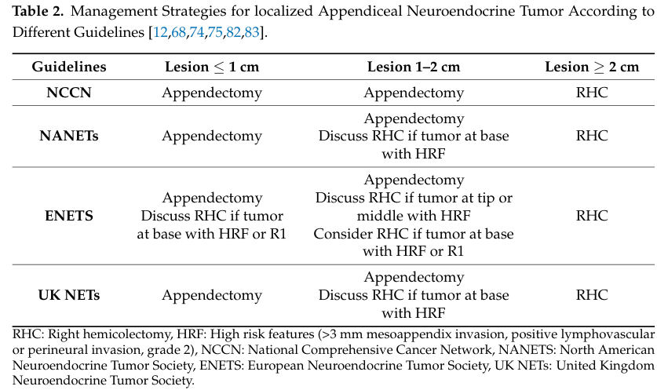

## Question

# Disease Characteristics Research Template

## Target Disease
- **Disease Name:** Appendiceal Neuroendocrine Tumor
- **MONDO ID:**  (if available)
- **Category:** 

## Research Objectives

Please provide a comprehensive research report on **Appendiceal Neuroendocrine Tumor** covering all of the
disease characteristics listed below. This report will be used to populate a disease knowledge
base entry. Be thorough and cite primary literature (PMID preferred) for all claims.

For each section, **suggested databases/resources** are listed. These are the first places
you should search for information on each topic.

---

### 1. Disease Information
> **Search first:** OMIM, Orphanet, ICD-10/ICD-11, MeSH, PubMed

- What is the disease? Provide a concise overview.
- What are the key identifiers? (OMIM, Orphanet, ICD-10/ICD-11, MeSH, Mondo)
- What are the common synonyms and alternative names?
- Is the information derived from individual patients (e.g., EHR) or aggregated disease-level resources?

### 2. Etiology

- **Disease Causal Factors**: What are the primary causes? (genetic, environmental, infectious, mechanistic)
- **Risk Factors**:
  > **Search first:** PubMed, Cochrane Library, UpToDate, clinical guidelines, ClinVar, ClinGen, GWAS Catalog, PheGenI, CTD, CDC, WHO, epidemiological databases
  - Genetic risk factors (causal variants, susceptibility loci, modifier genes)
  - Environmental risk factors (toxins, lifestyle, occupational exposures, age, sex, family history)
- **Protective Factors**:
  > **Search first:** PubMed, Cochrane Library, clinical trial databases, GWAS Catalog, gnomAD, WHO, CDC, nutrition databases
  - Genetic protective factors (protective variants, modifier alleles)
  - Environmental protective factors (diet, lifestyle, exposures that reduce risk)
- **Gene-Environment Interactions**: How do genetic and environmental factors interact to influence disease?
  > **Search first:** CTD, PubMed, PheGenI, GxE databases

### 3. Phenotypes
> **Search first:** HPO (Human Phenotype Ontology), OMIM, Orphanet, PubMed, clinicaltrials.gov, MedDRA, SNOMED CT, DECIPHER, LOINC

For each phenotype, provide:
- **Phenotype type**: symptoms, clinical signs, physical manifestations, behavioral changes, or laboratory abnormalities
  > For symptoms/signs: HPO, OMIM, Orphanet, PubMed
  > For behavioral changes: HPO, DSM, RDoC (Research Domain Criteria), PubMed
  > For laboratory abnormalities: LOINC, SNOMED CT, LabTests Online, PubMed
- **Phenotype characteristics**:
  > **Search first:** OMIM, Orphanet, HPO, PubMed
  - Age of symptom onset (neonatal, childhood, adult-onset, late-onset)
  - Symptom severity (mild, moderate, severe, variable)
  - Symptom progression (stable, progressive, episodic, fluctuating)
  - Frequency among affected individuals (percentage or qualitative)
- **Quality of life impact**: Effects on daily functioning and well-being (per-phenotype when possible)
  > **Search first:** EQ-5D database, SF-36, WHO QOL databases, PubMed
- Suggest HPO (Human Phenotype Ontology) terms for each phenotype

### 4. Genetic/Molecular Information

- **Causal Genes**: Gene mutations or chromosomal abnormalities responsible for disease (gene symbols, OMIM IDs)
  > **Search first:** OMIM, ClinVar, HGMD, Ensembl, NCBI Gene
- **Pathogenic Variants**:
  - Affected genes (gene symbols, HGNC IDs)
    > **Search first:** OMIM, NCBI Gene, Ensembl, HGNC, UniProt, GeneCards
  - Variant classification (pathogenic, likely pathogenic, VUS per ACMG/AMP guidelines)
    > **Search first:** ClinVar, ClinGen, ACMG/AMP guidelines, VarSome
  - Variant type/class (missense, frameshift, nonsense, splice-site, structural)
  - Allele frequency in population databases
    > **Search first:** gnomAD, 1000 Genomes, ExAC, TOPMed, dbSNP
  - Somatic vs germline origin
    > **Search first:** COSMIC (somatic), ClinVar, ICGC, TCGA
  - Functional consequences (loss of function, gain of function, dominant negative)
- **Modifier Genes**: Genes that modify disease severity or expression
- **Epigenetic Information**: DNA methylation, histone modifications, chromatin changes affecting disease
  > **Search first:** ENCODE, Roadmap Epigenomics, MethBase, DiseaseMeth
- **Chromosomal Abnormalities**: Large-scale genetic changes (aneuploidy, translocations, inversions)
  > **Search first:** DECIPHER, ClinVar, ECARUCA, UCSC Genome Browser

### 5. Environmental Information

- **Environmental Factors**: Non-genetic contributing factors (toxins, radiation, pollution, occupational exposure)
  > **Search first:** CTD (Comparative Toxicogenomics Database), TOXNET, PubMed, EPA databases
- **Lifestyle Factors**: Behavioral factors (smoking, diet, exercise, alcohol consumption)
  > **Search first:** CDC databases, WHO, PubMed, NHANES
- **Infectious Agents**: If applicable, pathogens causing or triggering disease (bacteria, viruses, fungi, parasites)
  > **Search first:** NCBI Taxonomy, ViPR, BV-BRC, MicrobeDB, GIDEON

### 6. Mechanism / Pathophysiology

- **Molecular Pathways**: Specific signaling cascades or biochemical pathways involved (Wnt, MAPK, mTOR, PI3K-AKT, etc.)
  > **Search first:** KEGG, Reactome, WikiPathways, PathBank, BioCyc
- **Cellular Processes**: Cell-level mechanisms (apoptosis, autophagy, cell cycle dysregulation, inflammation, etc.)
  > **Search first:** Gene Ontology (GO), Reactome, KEGG, PubMed
- **Protein Dysfunction**: How protein structure or function is altered (misfolding, aggregation, loss of function, gain of function)
  > **Search first:** UniProt, PDB (Protein Data Bank), InterPro, Pfam, AlphaFold
- **Metabolic Changes**: Alterations in metabolic processes (energy metabolism, lipid metabolism, amino acid metabolism)
  > **Search first:** KEGG, BioCyc, HMDB (Human Metabolome Database), BRENDA
- **Immune System Involvement**: Role of immune response (autoimmunity, immunodeficiency, chronic inflammation)
  > **Search first:** ImmPort, Immunome Database, IEDB, Gene Ontology
- **Tissue Damage Mechanisms**: How tissues/ are injured (oxidative stress, ischemia, fibrosis, necrosis)
  > **Search first:** PubMed, Gene Ontology, Reactome
- **Biochemical Abnormalities**: Specific molecular defects (enzyme deficiencies, receptor dysfunction, ion channel defects)
  > **Search first:** BRENDA, UniProt, KEGG, OMIM, PubMed
- **Epigenetic Changes**: DNA methylation, histone modifications affecting gene expression in disease
  > **Search first:** ENCODE, Roadmap Epigenomics, MethBase, DiseaseMeth
- **Molecular Profiling** (if available):
  - Transcriptomics/gene expression changes
    > **Search first:** GEO (Gene Expression Omnibus), ArrayExpress, GTEx, Human Cell Atlas, SRA
  - Proteomics findings
    > **Search first:** PRIDE, ProteomeXchange, Human Protein Atlas, STRING, BioGRID
  - Metabolomics signatures
    > **Search first:** MetaboLights, Metabolomics Workbench, HMDB, METLIN
  - Lipidomics alterations
    > **Search first:** LIPID MAPS, SwissLipids, LipidHome, Metabolomics Workbench
  - Genomic structural features
    > **Search first:** UCSC Genome Browser, Ensembl, NCBI, dbVar, DGV
- **Advanced Technologies** (if applicable):
  - Single-cell analysis findings (cell-type specific mechanisms, cellular heterogeneity)
    > **Search first:** Human Cell Atlas, Single Cell Portal, GEO, CELLxGENE
  - Spatial transcriptomics findings
    > **Search first:** GEO, Spatial Research, Vizgen, 10x Genomics data
  - Multi-omics integration results
    > **Search first:** TCGA, ICGC, cBioPortal, LinkedOmics, PubMed
  - Functional genomics screens (CRISPR, RNAi)
    > **Search first:** DepMap, GenomeRNAi, PubMed, BioGRID ORCS

For each mechanism, describe:
- The causal chain from initial trigger to clinical manifestation
- Which mechanisms are upstream vs downstream
- What cell types and biological processes are involved
- Suggest GO terms for biological processes and CL terms for cell types

### 7. Anatomical Structures Affected

- **Organ Level**:
  - Primary organs directly affected
  - Secondary organ involvement (complications, secondary effects)
  - Body systems involved (cardiovascular, nervous, digestive, respiratory, endocrine, etc.)
  > **Search first:** Uberon, FMA (Foundational Model of Anatomy), OMIM, HPO, ICD-11, MeSH, SNOMED CT
- **Tissue and Cell Level**:
  - Specific tissue types affected (epithelial, connective, muscle, nervous)
  - Specific cell populations targeted (with Cell Ontology terms)
  > **Search first:** Uberon, Human Protein Atlas, Cell Ontology, Human Cell Atlas, CellMarker, PanglaoDB
- **Subcellular Level**:
  - Cellular compartments involved (mitochondria, nucleus, ER, lysosomes) (with GO Cellular Component terms)
  > **Search first:** Gene Ontology (Cellular Component), UniProt, Human Protein Atlas
- **Localization**:
  - Specific anatomical sites (with UBERON terms)
    > **Search first:** FMA, Uberon, NeuroNames (for brain), SNOMED CT
  - Lateralization (unilateral, bilateral, asymmetric)
    > **Search first:** HPO, clinical literature, imaging databases

### 8. Temporal Development

- **Onset**:
  - Typical age of onset (congenital, pediatric, adult, geriatric)
  - Onset pattern (acute, subacute, chronic, insidious)
  > **Search first:** OMIM, Orphanet, HPO, PubMed
- **Progression**:
  - Disease stages (early, intermediate, advanced, end-stage)
    > **Search first:** Cancer Staging Manual (AJCC), WHO classifications, PubMed
  - Progression rate (rapid, slow, variable)
  - Disease course pattern (episodic, relapsing-remitting, progressive, stable)
  - Disease duration (self-limited, chronic lifelong)
  > **Search first:** Disease registries, longitudinal cohort databases, natural history studies, PubMed, Orphanet, OMIM
- **Patterns**:
  - Remission patterns (spontaneous, treatment-induced)
    > **Search first:** Clinical trial databases, disease registries, PubMed
  - Critical periods (time windows of vulnerability or opportunity for intervention)
    > **Search first:** PubMed, developmental biology databases, clinical guidelines

### 9. Inheritance and Population

- **Epidemiology**:
  - Prevalence (cases per 100,000 at given time)
  - Incidence (new cases per 100,000 per year)
  > **Search first:** Orphanet, CDC, WHO, GBD (Global Burden of Disease), national registries, SEER, disease registries
- **For Genetic Etiology**:
  - Inheritance pattern (AD, AR, X-linked, mitochondrial, multifactorial, polygenic)
    > **Search first:** OMIM, Orphanet, ClinVar, GTR (Genetic Testing Registry)
  - Penetrance (complete, incomplete, age-dependent)
    > **Search first:** ClinVar, OMIM, PubMed, ClinGen
  - Expressivity (variable, consistent)
    > **Search first:** OMIM, ClinVar, PubMed
  - Genetic anticipation (increasing severity in successive generations)
    > **Search first:** OMIM, PubMed (especially for repeat expansion disorders)
  - Germline mosaicism
    > **Search first:** ClinVar, OMIM, genetic counseling literature, PubMed
  - Founder effects (population-specific mutations)
    > **Search first:** gnomAD, population genetics databases, PubMed
  - Consanguinity role
    > **Search first:** OMIM, population studies, genetic counseling resources
  - Carrier frequency
    > **Search first:** gnomAD, carrier screening databases, GeneReviews, GTR
- **Population Demographics**:
  - Affected populations (ethnic or demographic groups with higher prevalence)
    > **Search first:** gnomAD, 1000 Genomes, PAGE Study, PubMed, population registries
  - Geographic distribution (endemic areas, regional variation)
    > **Search first:** WHO, CDC, GBD, Orphanet, geographic epidemiology databases
  - Geographic distribution of specific variants
  - Sex ratio (male:female)
    > **Search first:** Disease registries, OMIM, PubMed, epidemiological databases
  - Age distribution of affected individuals
    > **Search first:** CDC, disease registries, SEER, Orphanet

### 10. Diagnostics

- **Clinical Tests**:
  - Laboratory tests (blood, urine, tissue chemistry, specific enzyme assays)
    > **Search first:** LOINC, LabTests Online, PubMed
  - Biomarkers (proteins, metabolites, genetic markers, circulating biomarkers)
    > **Search first:** FDA Biomarker List, BEST (Biomarkers, EndpointS, and other Tools), PubMed
  - Imaging studies (X-ray, CT, MRI, PET, ultrasound)
    > **Search first:** RadLex, DICOM, Radiopaedia, imaging databases
  - Functional tests (pulmonary function, cardiac stress tests)
    > **Search first:** LOINC, clinical guidelines, PubMed
  - Electrophysiology (EEG, EMG, ECG, nerve conduction studies)
    > **Search first:** LOINC, clinical neurophysiology databases, PubMed
  - Biopsy findings (histopathology, immunohistochemistry)
    > **Search first:** SNOMED CT, College of American Pathologists resources, PubMed
  - Pathology findings (microscopic examination)
    > **Search first:** SNOMED CT, Digital Pathology databases, PubMed
- **Genetic Testing**:
  > **Search first:** GTR (Genetic Testing Registry), GeneReviews, ClinGen
  - Overview of recommended genetic testing approach
  - Whole genome sequencing (WGS) utility
    > **Search first:** GTR, ClinVar, GEL (Genomics England), gnomAD
  - Whole exome sequencing (WES) utility
    > **Search first:** GTR, ClinVar, OMIM, GeneMatcher
  - Gene panels (which panels, which genes)
    > **Search first:** GTR, ClinVar, laboratory-specific databases
  - Single gene testing
    > **Search first:** GTR, ClinVar, OMIM, GeneReviews
  - Chromosomal microarray (CMA)
    > **Search first:** DECIPHER, ClinVar, dbVar, ECARUCA
  - Karyotyping
    > **Search first:** Chromosome Abnormality Database, ClinVar, cytogenetics resources
  - FISH
    > **Search first:** ClinVar, cytogenetics databases, PubMed
  - Mitochondrial DNA testing
    > **Search first:** MITOMAP, MSeqDR, ClinVar, GTR
  - Repeat expansion testing
    > **Search first:** GTR, ClinVar, repeat expansion databases, PubMed
- **Omics-Based Diagnostics** (if applicable):
  - RNA sequencing / transcriptomics
    > **Search first:** GEO, ArrayExpress, GTEx, RNA-seq databases
  - Proteomics
    > **Search first:** PRIDE, ProteomeXchange, FDA Biomarker database
  - Metabolomics
    > **Search first:** MetaboLights, Metabolomics Workbench, HMDB
  - Epigenomics
    > **Search first:** GEO, ENCODE, Roadmap Epigenomics, MethBase
  - Liquid biopsy
    > **Search first:** COSMIC, ClinVar, liquid biopsy databases, PubMed
- **Clinical Criteria**:
  - Standardized diagnostic criteria (DSM, ICD, society guidelines)
    > **Search first:** DSM-5, ICD-11, clinical society guidelines, UpToDate
  - Differential diagnosis (other conditions to rule out, with distinguishing features)
    > **Search first:** DynaMed, UpToDate, clinical decision support systems
- **Screening**:
  - Screening methods for asymptomatic individuals (newborn screening, carrier screening, cascade screening)
    > **Search first:** ACMG recommendations, CDC newborn screening, GTR

### 11. Outcome/Prognosis

- **Survival and Mortality**:
  - Survival rate (5-year, 10-year, overall)
    > **Search first:** SEER, cancer registries, disease-specific registries, PubMed
  - Life expectancy (with and without treatment if applicable)
    > **Search first:** Orphanet, disease registries, actuarial databases, PubMed
  - Mortality rate
    > **Search first:** CDC, WHO, GBD, national mortality databases
  - Disease-specific mortality (deaths directly attributable to disease)
    > **Search first:** Disease registries, CDC Wonder, GBD, PubMed
- **Morbidity and Function**:
  - Morbidity (disease-related disability and health impacts)
    > **Search first:** GBD, WHO, disability databases, PubMed
  - Disability outcomes (long-term functional impairments)
    > **Search first:** ICF (International Classification of Functioning), disability registries
  - Quality of life measures (EQ-5D, SF-36, PROMIS, disease-specific tools)
    > **Search first:** EQ-5D database, SF-36, PROMIS, PubMed
- **Disease Course**:
  - Complications (secondary problems: infections, organ failure, etc.)
    > **Search first:** ICD codes, disease registries, clinical databases, PubMed
  - Recovery potential (likelihood and extent of recovery, with vs without treatment)
    > **Search first:** Natural history studies, rehabilitation databases, PubMed
- **Prediction**:
  - Prognostic factors (age, disease severity, biomarkers, treatment response)
    > **Search first:** Prognostic models databases, clinical calculators, PubMed
  - Prognostic biomarkers (molecular markers predicting disease course)
    > **Search first:** FDA Biomarker database, PubMed, cancer prognostic databases

### 12. Treatment

- **Pharmacotherapy**:
  - Pharmacological treatments (drug names, drug classes, mechanisms of action)
    > **Search first:** DrugBank, RxNorm, ATC classification, DailyMed, FDA databases
  - Pharmacogenomics (how genetic variants affect drug metabolism, efficacy, toxicity)
    > **Search first:** PharmGKB, CPIC (Clinical Pharmacogenetics), FDA Table of PGx Biomarkers
- **Advanced Therapeutics**:
  - Gene therapy (viral vectors, CRISPR, gene replacement, gene editing)
    > **Search first:** ClinicalTrials.gov, FDA gene therapy database, ASGCT resources
  - Cell therapy (stem cell transplant, CAR-T, cellular therapeutics)
    > **Search first:** ClinicalTrials.gov, FDA cell therapy database, FACT standards
  - RNA-based therapies (ASOs, siRNA, mRNA therapies)
    > **Search first:** ClinicalTrials.gov, FDA approvals, PubMed
  - Targeted therapies (treatments directed at specific molecular targets)
    > **Search first:** My Cancer Genome, OncoKB, ClinicalTrials.gov, FDA approvals
  - Immunotherapies (checkpoint inhibitors, monoclonal antibodies)
    > **Search first:** Cancer Immunotherapy Database, FDA approvals, ClinicalTrials.gov
- **Surgical and Interventional**:
  - Surgical interventions (types of surgery, timing, outcomes)
    > **Search first:** CPT codes, surgical registries, clinical guidelines, PubMed
- **Supportive and Rehabilitative**:
  - Supportive care (symptom management, pain control, nutrition)
    > **Search first:** Clinical guidelines, Cochrane Library, PubMed
  - Rehabilitation (physical therapy, occupational therapy, speech therapy)
    > **Search first:** Rehabilitation medicine databases, clinical guidelines, PubMed
- **Experimental**:
  - Experimental treatments in clinical trials (with NCT identifiers if available)
    > **Search first:** ClinicalTrials.gov, EU Clinical Trials Register, WHO ICTRP
- **Treatment Outcomes**:
  - Treatment response rates
    > **Search first:** Clinical trial databases, FDA reviews, systematic reviews, PubMed
  - Side effects and adverse events
    > **Search first:** FDA Adverse Event Reporting System (FAERS), MedWatch, PubMed
- **Treatment Strategy**:
  - Treatment algorithms (clinical pathways, decision trees)
    > **Search first:** Clinical practice guidelines, NCCN Guidelines, UpToDate
  - Combination therapies
    > **Search first:** ClinicalTrials.gov, treatment guidelines, PubMed
  - Personalized medicine approaches (genotype-guided treatment)
    > **Search first:** My Cancer Genome, CIViC, PharmGKB, precision medicine databases

For each treatment, suggest MAXO (Medical Action Ontology) terms where applicable.

### 13. Prevention

- **Prevention Levels**:
  - Primary prevention (preventing disease occurrence: vaccination, risk factor modification)
    > **Search first:** CDC, WHO, USPSTF recommendations, Cochrane Library
  - Secondary prevention (early detection and treatment: screening programs, early intervention)
    > **Search first:** USPSTF, CDC screening guidelines, WHO
  - Tertiary prevention (preventing complications in those with disease)
    > **Search first:** Clinical guidelines, disease management protocols, PubMed
- **Immunization**: Vaccine strategies (if applicable)
  > **Search first:** CDC vaccine schedules, WHO immunization, FDA vaccine database
- **Screening and Early Detection**:
  - Screening programs (population-based: newborn screening, cancer screening)
    > **Search first:** CDC screening programs, USPSTF, cancer screening databases
  - Genetic screening (carrier screening, preimplantation genetic diagnosis, prenatal testing)
    > **Search first:** ACMG recommendations, ACOG guidelines, GTR
  - Risk stratification (identifying high-risk individuals for targeted prevention)
    > **Search first:** Risk prediction models, clinical calculators, PubMed
- **Behavioral Interventions**: Lifestyle modifications to reduce risk
  > **Search first:** CDC, WHO, behavioral intervention databases, Cochrane Library
- **Counseling**: Genetic counseling (risk assessment, family planning guidance)
  > **Search first:** NSGC resources, ACMG guidelines, GeneReviews
- **Public Health**:
  - Public health interventions (sanitation, vector control, health education)
    > **Search first:** CDC, WHO, public health databases, PubMed
  - Environmental interventions (reducing environmental risk factors)
    > **Search first:** EPA databases, WHO environmental health, PubMed
- **Prophylaxis**: Preventive medications or procedures
  > **Search first:** Clinical guidelines, FDA approvals, PubMed

### 14. Other Species / Natural Disease

- **Taxonomy**: Species affected (with NCBI Taxon identifiers)
  > **Search first:** NCBI Taxonomy
- **Breed**: Specific breeds affected (with VBO identifiers if applicable)
  > **Search first:** VBO (Vertebrate Breed Ontology)
- **Gene**: Orthologous genes in other species (with NCBI Gene IDs)
  > **Search first:** NCBI Gene
- **Natural Disease**:
  - Naturally occurring disease in other species (companion animals, wildlife)
    > **Search first:** OMIA (Online Mendelian Inheritance in Animals), VetCompass, PubMed
  - Veterinary relevance and importance in animal health
    > **Search first:** OMIA, veterinary databases, PubMed
- **Comparative Biology**:
  - Comparative pathology (similarities and differences across species)
    > **Search first:** OMIA, comparative pathology databases, PubMed
  - Evolutionary conservation of disease mechanisms
    > **Search first:** HomoloGene, OrthoMCL, Alliance of Genome Resources
- **Transmission** (if applicable):
  - Zoonotic potential
    > **Search first:** CDC zoonotic diseases, WHO zoonoses, GIDEON
  - Cross-species susceptibility
    > **Search first:** NCBI Taxonomy, veterinary databases, PubMed

### 15. Model Organisms

- **Model Types**:
  - Model organism type (mammalian, invertebrate, cellular, in vitro)
    > **Search first:** Alliance of Genome Resources, model organism databases
  - Specific model systems (mouse, rat, zebrafish, Drosophila, C. elegans, yeast, cell lines, organoids, iPSCs)
    > **Search first:** MGI, RGD, ZFIN, FlyBase, WormBase, SGD, ATCC, Cellosaurus
  - Induced models (drug treatment, surgical intervention, environmental manipulation)
    > **Search first:** MGI, model organism databases, PubMed
- **Genetic Models**:
  - Types available (knockout, knock-in, transgenic, conditional, humanized)
    > **Search first:** MGI, IMPC, KOMP, EuMMCR, IMSR
- **Model Characteristics**:
  - Phenotype recapitulation (how well model reproduces human disease features)
    > **Search first:** Model organism databases, comparative studies, PubMed
  - Model limitations (aspects of human disease not captured)
    > **Search first:** Model organism databases, PubMed, review articles
- **Applications**:
  - Research applications (what aspects of disease can be studied)
    > **Search first:** Model organism databases, PubMed
- **Resources**:
  - Model databases
    > **Search first:** MGI, RGD, ZFIN, FlyBase, WormBase, IMSR, EMMA, MMRRC

---

## Citation Requirements

- Cite primary literature (PMID preferred) for all mechanistic and clinical claims
- Prioritize recent reviews and landmark papers
- Include direct quotes from abstracts where possible to support key statements
- Distinguish evidence source types: human clinical, model organism, in vitro, computational

## Output Format

Structure your response as a comprehensive narrative organized by the sections above.
For each section, provide:
- Factual content with specific details (numbers, percentages, gene names, variant nomenclature)
- Ontology term suggestions (HPO, GO, CL, UBERON, CHEBI, MAXO, MONDO) where applicable
- Evidence citations with PMIDs
- Direct quotes from abstracts to support key claims
- Clear indication when information is not available or not applicable for this disease

This report will be used to populate a disease knowledge base entry with:
- Pathophysiology descriptions with causal chains
- Gene/protein annotations (HGNC, GO terms)
- Phenotype associations (HP terms) with frequencies
- Cell type involvement (CL terms)
- Anatomical locations (UBERON terms)
- Chemical entities (CHEBI terms)
- Treatment annotations (MAXO terms)
- Evidence items with PMIDs and exact abstract quotes
- Epidemiology, prognosis, diagnostic, and prevention information
- Animal model descriptions with phenotype recapitulation details

## Output

Question: You are an expert researcher providing comprehensive, well-cited information.

Provide detailed information focusing on:
1. Key concepts and definitions with current understanding
2. Recent developments and latest research (prioritize 2023-2024 sources)
3. Current applications and real-world implementations
4. Expert opinions and analysis from authoritative sources
5. Relevant statistics and data from recent studies

Format as a comprehensive research report with proper citations. Include URLs and publication dates where available.
Always prioritize recent, authoritative sources and provide specific citations for all major claims.

# Disease Characteristics Research Template

## Target Disease
- **Disease Name:** Appendiceal Neuroendocrine Tumor
- **MONDO ID:**  (if available)
- **Category:** 

## Research Objectives

Please provide a comprehensive research report on **Appendiceal Neuroendocrine Tumor** covering all of the
disease characteristics listed below. This report will be used to populate a disease knowledge
base entry. Be thorough and cite primary literature (PMID preferred) for all claims.

For each section, **suggested databases/resources** are listed. These are the first places
you should search for information on each topic.

---

### 1. Disease Information
> **Search first:** OMIM, Orphanet, ICD-10/ICD-11, MeSH, PubMed

- What is the disease? Provide a concise overview.
- What are the key identifiers? (OMIM, Orphanet, ICD-10/ICD-11, MeSH, Mondo)
- What are the common synonyms and alternative names?
- Is the information derived from individual patients (e.g., EHR) or aggregated disease-level resources?

### 2. Etiology

- **Disease Causal Factors**: What are the primary causes? (genetic, environmental, infectious, mechanistic)
- **Risk Factors**:
  > **Search first:** PubMed, Cochrane Library, UpToDate, clinical guidelines, ClinVar, ClinGen, GWAS Catalog, PheGenI, CTD, CDC, WHO, epidemiological databases
  - Genetic risk factors (causal variants, susceptibility loci, modifier genes)
  - Environmental risk factors (toxins, lifestyle, occupational exposures, age, sex, family history)
- **Protective Factors**:
  > **Search first:** PubMed, Cochrane Library, clinical trial databases, GWAS Catalog, gnomAD, WHO, CDC, nutrition databases
  - Genetic protective factors (protective variants, modifier alleles)
  - Environmental protective factors (diet, lifestyle, exposures that reduce risk)
- **Gene-Environment Interactions**: How do genetic and environmental factors interact to influence disease?
  > **Search first:** CTD, PubMed, PheGenI, GxE databases

### 3. Phenotypes
> **Search first:** HPO (Human Phenotype Ontology), OMIM, Orphanet, PubMed, clinicaltrials.gov, MedDRA, SNOMED CT, DECIPHER, LOINC

For each phenotype, provide:
- **Phenotype type**: symptoms, clinical signs, physical manifestations, behavioral changes, or laboratory abnormalities
  > For symptoms/signs: HPO, OMIM, Orphanet, PubMed
  > For behavioral changes: HPO, DSM, RDoC (Research Domain Criteria), PubMed
  > For laboratory abnormalities: LOINC, SNOMED CT, LabTests Online, PubMed
- **Phenotype characteristics**:
  > **Search first:** OMIM, Orphanet, HPO, PubMed
  - Age of symptom onset (neonatal, childhood, adult-onset, late-onset)
  - Symptom severity (mild, moderate, severe, variable)
  - Symptom progression (stable, progressive, episodic, fluctuating)
  - Frequency among affected individuals (percentage or qualitative)
- **Quality of life impact**: Effects on daily functioning and well-being (per-phenotype when possible)
  > **Search first:** EQ-5D database, SF-36, WHO QOL databases, PubMed
- Suggest HPO (Human Phenotype Ontology) terms for each phenotype

### 4. Genetic/Molecular Information

- **Causal Genes**: Gene mutations or chromosomal abnormalities responsible for disease (gene symbols, OMIM IDs)
  > **Search first:** OMIM, ClinVar, HGMD, Ensembl, NCBI Gene
- **Pathogenic Variants**:
  - Affected genes (gene symbols, HGNC IDs)
    > **Search first:** OMIM, NCBI Gene, Ensembl, HGNC, UniProt, GeneCards
  - Variant classification (pathogenic, likely pathogenic, VUS per ACMG/AMP guidelines)
    > **Search first:** ClinVar, ClinGen, ACMG/AMP guidelines, VarSome
  - Variant type/class (missense, frameshift, nonsense, splice-site, structural)
  - Allele frequency in population databases
    > **Search first:** gnomAD, 1000 Genomes, ExAC, TOPMed, dbSNP
  - Somatic vs germline origin
    > **Search first:** COSMIC (somatic), ClinVar, ICGC, TCGA
  - Functional consequences (loss of function, gain of function, dominant negative)
- **Modifier Genes**: Genes that modify disease severity or expression
- **Epigenetic Information**: DNA methylation, histone modifications, chromatin changes affecting disease
  > **Search first:** ENCODE, Roadmap Epigenomics, MethBase, DiseaseMeth
- **Chromosomal Abnormalities**: Large-scale genetic changes (aneuploidy, translocations, inversions)
  > **Search first:** DECIPHER, ClinVar, ECARUCA, UCSC Genome Browser

### 5. Environmental Information

- **Environmental Factors**: Non-genetic contributing factors (toxins, radiation, pollution, occupational exposure)
  > **Search first:** CTD (Comparative Toxicogenomics Database), TOXNET, PubMed, EPA databases
- **Lifestyle Factors**: Behavioral factors (smoking, diet, exercise, alcohol consumption)
  > **Search first:** CDC databases, WHO, PubMed, NHANES
- **Infectious Agents**: If applicable, pathogens causing or triggering disease (bacteria, viruses, fungi, parasites)
  > **Search first:** NCBI Taxonomy, ViPR, BV-BRC, MicrobeDB, GIDEON

### 6. Mechanism / Pathophysiology

- **Molecular Pathways**: Specific signaling cascades or biochemical pathways involved (Wnt, MAPK, mTOR, PI3K-AKT, etc.)
  > **Search first:** KEGG, Reactome, WikiPathways, PathBank, BioCyc
- **Cellular Processes**: Cell-level mechanisms (apoptosis, autophagy, cell cycle dysregulation, inflammation, etc.)
  > **Search first:** Gene Ontology (GO), Reactome, KEGG, PubMed
- **Protein Dysfunction**: How protein structure or function is altered (misfolding, aggregation, loss of function, gain of function)
  > **Search first:** UniProt, PDB (Protein Data Bank), InterPro, Pfam, AlphaFold
- **Metabolic Changes**: Alterations in metabolic processes (energy metabolism, lipid metabolism, amino acid metabolism)
  > **Search first:** KEGG, BioCyc, HMDB (Human Metabolome Database), BRENDA
- **Immune System Involvement**: Role of immune response (autoimmunity, immunodeficiency, chronic inflammation)
  > **Search first:** ImmPort, Immunome Database, IEDB, Gene Ontology
- **Tissue Damage Mechanisms**: How tissues/ are injured (oxidative stress, ischemia, fibrosis, necrosis)
  > **Search first:** PubMed, Gene Ontology, Reactome
- **Biochemical Abnormalities**: Specific molecular defects (enzyme deficiencies, receptor dysfunction, ion channel defects)
  > **Search first:** BRENDA, UniProt, KEGG, OMIM, PubMed
- **Epigenetic Changes**: DNA methylation, histone modifications affecting gene expression in disease
  > **Search first:** ENCODE, Roadmap Epigenomics, MethBase, DiseaseMeth
- **Molecular Profiling** (if available):
  - Transcriptomics/gene expression changes
    > **Search first:** GEO (Gene Expression Omnibus), ArrayExpress, GTEx, Human Cell Atlas, SRA
  - Proteomics findings
    > **Search first:** PRIDE, ProteomeXchange, Human Protein Atlas, STRING, BioGRID
  - Metabolomics signatures
    > **Search first:** MetaboLights, Metabolomics Workbench, HMDB, METLIN
  - Lipidomics alterations
    > **Search first:** LIPID MAPS, SwissLipids, LipidHome, Metabolomics Workbench
  - Genomic structural features
    > **Search first:** UCSC Genome Browser, Ensembl, NCBI, dbVar, DGV
- **Advanced Technologies** (if applicable):
  - Single-cell analysis findings (cell-type specific mechanisms, cellular heterogeneity)
    > **Search first:** Human Cell Atlas, Single Cell Portal, GEO, CELLxGENE
  - Spatial transcriptomics findings
    > **Search first:** GEO, Spatial Research, Vizgen, 10x Genomics data
  - Multi-omics integration results
    > **Search first:** TCGA, ICGC, cBioPortal, LinkedOmics, PubMed
  - Functional genomics screens (CRISPR, RNAi)
    > **Search first:** DepMap, GenomeRNAi, PubMed, BioGRID ORCS

For each mechanism, describe:
- The causal chain from initial trigger to clinical manifestation
- Which mechanisms are upstream vs downstream
- What cell types and biological processes are involved
- Suggest GO terms for biological processes and CL terms for cell types

### 7. Anatomical Structures Affected

- **Organ Level**:
  - Primary organs directly affected
  - Secondary organ involvement (complications, secondary effects)
  - Body systems involved (cardiovascular, nervous, digestive, respiratory, endocrine, etc.)
  > **Search first:** Uberon, FMA (Foundational Model of Anatomy), OMIM, HPO, ICD-11, MeSH, SNOMED CT
- **Tissue and Cell Level**:
  - Specific tissue types affected (epithelial, connective, muscle, nervous)
  - Specific cell populations targeted (with Cell Ontology terms)
  > **Search first:** Uberon, Human Protein Atlas, Cell Ontology, Human Cell Atlas, CellMarker, PanglaoDB
- **Subcellular Level**:
  - Cellular compartments involved (mitochondria, nucleus, ER, lysosomes) (with GO Cellular Component terms)
  > **Search first:** Gene Ontology (Cellular Component), UniProt, Human Protein Atlas
- **Localization**:
  - Specific anatomical sites (with UBERON terms)
    > **Search first:** FMA, Uberon, NeuroNames (for brain), SNOMED CT
  - Lateralization (unilateral, bilateral, asymmetric)
    > **Search first:** HPO, clinical literature, imaging databases

### 8. Temporal Development

- **Onset**:
  - Typical age of onset (congenital, pediatric, adult, geriatric)
  - Onset pattern (acute, subacute, chronic, insidious)
  > **Search first:** OMIM, Orphanet, HPO, PubMed
- **Progression**:
  - Disease stages (early, intermediate, advanced, end-stage)
    > **Search first:** Cancer Staging Manual (AJCC), WHO classifications, PubMed
  - Progression rate (rapid, slow, variable)
  - Disease course pattern (episodic, relapsing-remitting, progressive, stable)
  - Disease duration (self-limited, chronic lifelong)
  > **Search first:** Disease registries, longitudinal cohort databases, natural history studies, PubMed, Orphanet, OMIM
- **Patterns**:
  - Remission patterns (spontaneous, treatment-induced)
    > **Search first:** Clinical trial databases, disease registries, PubMed
  - Critical periods (time windows of vulnerability or opportunity for intervention)
    > **Search first:** PubMed, developmental biology databases, clinical guidelines

### 9. Inheritance and Population

- **Epidemiology**:
  - Prevalence (cases per 100,000 at given time)
  - Incidence (new cases per 100,000 per year)
  > **Search first:** Orphanet, CDC, WHO, GBD (Global Burden of Disease), national registries, SEER, disease registries
- **For Genetic Etiology**:
  - Inheritance pattern (AD, AR, X-linked, mitochondrial, multifactorial, polygenic)
    > **Search first:** OMIM, Orphanet, ClinVar, GTR (Genetic Testing Registry)
  - Penetrance (complete, incomplete, age-dependent)
    > **Search first:** ClinVar, OMIM, PubMed, ClinGen
  - Expressivity (variable, consistent)
    > **Search first:** OMIM, ClinVar, PubMed
  - Genetic anticipation (increasing severity in successive generations)
    > **Search first:** OMIM, PubMed (especially for repeat expansion disorders)
  - Germline mosaicism
    > **Search first:** ClinVar, OMIM, genetic counseling literature, PubMed
  - Founder effects (population-specific mutations)
    > **Search first:** gnomAD, population genetics databases, PubMed
  - Consanguinity role
    > **Search first:** OMIM, population studies, genetic counseling resources
  - Carrier frequency
    > **Search first:** gnomAD, carrier screening databases, GeneReviews, GTR
- **Population Demographics**:
  - Affected populations (ethnic or demographic groups with higher prevalence)
    > **Search first:** gnomAD, 1000 Genomes, PAGE Study, PubMed, population registries
  - Geographic distribution (endemic areas, regional variation)
    > **Search first:** WHO, CDC, GBD, Orphanet, geographic epidemiology databases
  - Geographic distribution of specific variants
  - Sex ratio (male:female)
    > **Search first:** Disease registries, OMIM, PubMed, epidemiological databases
  - Age distribution of affected individuals
    > **Search first:** CDC, disease registries, SEER, Orphanet

### 10. Diagnostics

- **Clinical Tests**:
  - Laboratory tests (blood, urine, tissue chemistry, specific enzyme assays)
    > **Search first:** LOINC, LabTests Online, PubMed
  - Biomarkers (proteins, metabolites, genetic markers, circulating biomarkers)
    > **Search first:** FDA Biomarker List, BEST (Biomarkers, EndpointS, and other Tools), PubMed
  - Imaging studies (X-ray, CT, MRI, PET, ultrasound)
    > **Search first:** RadLex, DICOM, Radiopaedia, imaging databases
  - Functional tests (pulmonary function, cardiac stress tests)
    > **Search first:** LOINC, clinical guidelines, PubMed
  - Electrophysiology (EEG, EMG, ECG, nerve conduction studies)
    > **Search first:** LOINC, clinical neurophysiology databases, PubMed
  - Biopsy findings (histopathology, immunohistochemistry)
    > **Search first:** SNOMED CT, College of American Pathologists resources, PubMed
  - Pathology findings (microscopic examination)
    > **Search first:** SNOMED CT, Digital Pathology databases, PubMed
- **Genetic Testing**:
  > **Search first:** GTR (Genetic Testing Registry), GeneReviews, ClinGen
  - Overview of recommended genetic testing approach
  - Whole genome sequencing (WGS) utility
    > **Search first:** GTR, ClinVar, GEL (Genomics England), gnomAD
  - Whole exome sequencing (WES) utility
    > **Search first:** GTR, ClinVar, OMIM, GeneMatcher
  - Gene panels (which panels, which genes)
    > **Search first:** GTR, ClinVar, laboratory-specific databases
  - Single gene testing
    > **Search first:** GTR, ClinVar, OMIM, GeneReviews
  - Chromosomal microarray (CMA)
    > **Search first:** DECIPHER, ClinVar, dbVar, ECARUCA
  - Karyotyping
    > **Search first:** Chromosome Abnormality Database, ClinVar, cytogenetics resources
  - FISH
    > **Search first:** ClinVar, cytogenetics databases, PubMed
  - Mitochondrial DNA testing
    > **Search first:** MITOMAP, MSeqDR, ClinVar, GTR
  - Repeat expansion testing
    > **Search first:** GTR, ClinVar, repeat expansion databases, PubMed
- **Omics-Based Diagnostics** (if applicable):
  - RNA sequencing / transcriptomics
    > **Search first:** GEO, ArrayExpress, GTEx, RNA-seq databases
  - Proteomics
    > **Search first:** PRIDE, ProteomeXchange, FDA Biomarker database
  - Metabolomics
    > **Search first:** MetaboLights, Metabolomics Workbench, HMDB
  - Epigenomics
    > **Search first:** GEO, ENCODE, Roadmap Epigenomics, MethBase
  - Liquid biopsy
    > **Search first:** COSMIC, ClinVar, liquid biopsy databases, PubMed
- **Clinical Criteria**:
  - Standardized diagnostic criteria (DSM, ICD, society guidelines)
    > **Search first:** DSM-5, ICD-11, clinical society guidelines, UpToDate
  - Differential diagnosis (other conditions to rule out, with distinguishing features)
    > **Search first:** DynaMed, UpToDate, clinical decision support systems
- **Screening**:
  - Screening methods for asymptomatic individuals (newborn screening, carrier screening, cascade screening)
    > **Search first:** ACMG recommendations, CDC newborn screening, GTR

### 11. Outcome/Prognosis

- **Survival and Mortality**:
  - Survival rate (5-year, 10-year, overall)
    > **Search first:** SEER, cancer registries, disease-specific registries, PubMed
  - Life expectancy (with and without treatment if applicable)
    > **Search first:** Orphanet, disease registries, actuarial databases, PubMed
  - Mortality rate
    > **Search first:** CDC, WHO, GBD, national mortality databases
  - Disease-specific mortality (deaths directly attributable to disease)
    > **Search first:** Disease registries, CDC Wonder, GBD, PubMed
- **Morbidity and Function**:
  - Morbidity (disease-related disability and health impacts)
    > **Search first:** GBD, WHO, disability databases, PubMed
  - Disability outcomes (long-term functional impairments)
    > **Search first:** ICF (International Classification of Functioning), disability registries
  - Quality of life measures (EQ-5D, SF-36, PROMIS, disease-specific tools)
    > **Search first:** EQ-5D database, SF-36, PROMIS, PubMed
- **Disease Course**:
  - Complications (secondary problems: infections, organ failure, etc.)
    > **Search first:** ICD codes, disease registries, clinical databases, PubMed
  - Recovery potential (likelihood and extent of recovery, with vs without treatment)
    > **Search first:** Natural history studies, rehabilitation databases, PubMed
- **Prediction**:
  - Prognostic factors (age, disease severity, biomarkers, treatment response)
    > **Search first:** Prognostic models databases, clinical calculators, PubMed
  - Prognostic biomarkers (molecular markers predicting disease course)
    > **Search first:** FDA Biomarker database, PubMed, cancer prognostic databases

### 12. Treatment

- **Pharmacotherapy**:
  - Pharmacological treatments (drug names, drug classes, mechanisms of action)
    > **Search first:** DrugBank, RxNorm, ATC classification, DailyMed, FDA databases
  - Pharmacogenomics (how genetic variants affect drug metabolism, efficacy, toxicity)
    > **Search first:** PharmGKB, CPIC (Clinical Pharmacogenetics), FDA Table of PGx Biomarkers
- **Advanced Therapeutics**:
  - Gene therapy (viral vectors, CRISPR, gene replacement, gene editing)
    > **Search first:** ClinicalTrials.gov, FDA gene therapy database, ASGCT resources
  - Cell therapy (stem cell transplant, CAR-T, cellular therapeutics)
    > **Search first:** ClinicalTrials.gov, FDA cell therapy database, FACT standards
  - RNA-based therapies (ASOs, siRNA, mRNA therapies)
    > **Search first:** ClinicalTrials.gov, FDA approvals, PubMed
  - Targeted therapies (treatments directed at specific molecular targets)
    > **Search first:** My Cancer Genome, OncoKB, ClinicalTrials.gov, FDA approvals
  - Immunotherapies (checkpoint inhibitors, monoclonal antibodies)
    > **Search first:** Cancer Immunotherapy Database, FDA approvals, ClinicalTrials.gov
- **Surgical and Interventional**:
  - Surgical interventions (types of surgery, timing, outcomes)
    > **Search first:** CPT codes, surgical registries, clinical guidelines, PubMed
- **Supportive and Rehabilitative**:
  - Supportive care (symptom management, pain control, nutrition)
    > **Search first:** Clinical guidelines, Cochrane Library, PubMed
  - Rehabilitation (physical therapy, occupational therapy, speech therapy)
    > **Search first:** Rehabilitation medicine databases, clinical guidelines, PubMed
- **Experimental**:
  - Experimental treatments in clinical trials (with NCT identifiers if available)
    > **Search first:** ClinicalTrials.gov, EU Clinical Trials Register, WHO ICTRP
- **Treatment Outcomes**:
  - Treatment response rates
    > **Search first:** Clinical trial databases, FDA reviews, systematic reviews, PubMed
  - Side effects and adverse events
    > **Search first:** FDA Adverse Event Reporting System (FAERS), MedWatch, PubMed
- **Treatment Strategy**:
  - Treatment algorithms (clinical pathways, decision trees)
    > **Search first:** Clinical practice guidelines, NCCN Guidelines, UpToDate
  - Combination therapies
    > **Search first:** ClinicalTrials.gov, treatment guidelines, PubMed
  - Personalized medicine approaches (genotype-guided treatment)
    > **Search first:** My Cancer Genome, CIViC, PharmGKB, precision medicine databases

For each treatment, suggest MAXO (Medical Action Ontology) terms where applicable.

### 13. Prevention

- **Prevention Levels**:
  - Primary prevention (preventing disease occurrence: vaccination, risk factor modification)
    > **Search first:** CDC, WHO, USPSTF recommendations, Cochrane Library
  - Secondary prevention (early detection and treatment: screening programs, early intervention)
    > **Search first:** USPSTF, CDC screening guidelines, WHO
  - Tertiary prevention (preventing complications in those with disease)
    > **Search first:** Clinical guidelines, disease management protocols, PubMed
- **Immunization**: Vaccine strategies (if applicable)
  > **Search first:** CDC vaccine schedules, WHO immunization, FDA vaccine database
- **Screening and Early Detection**:
  - Screening programs (population-based: newborn screening, cancer screening)
    > **Search first:** CDC screening programs, USPSTF, cancer screening databases
  - Genetic screening (carrier screening, preimplantation genetic diagnosis, prenatal testing)
    > **Search first:** ACMG recommendations, ACOG guidelines, GTR
  - Risk stratification (identifying high-risk individuals for targeted prevention)
    > **Search first:** Risk prediction models, clinical calculators, PubMed
- **Behavioral Interventions**: Lifestyle modifications to reduce risk
  > **Search first:** CDC, WHO, behavioral intervention databases, Cochrane Library
- **Counseling**: Genetic counseling (risk assessment, family planning guidance)
  > **Search first:** NSGC resources, ACMG guidelines, GeneReviews
- **Public Health**:
  - Public health interventions (sanitation, vector control, health education)
    > **Search first:** CDC, WHO, public health databases, PubMed
  - Environmental interventions (reducing environmental risk factors)
    > **Search first:** EPA databases, WHO environmental health, PubMed
- **Prophylaxis**: Preventive medications or procedures
  > **Search first:** Clinical guidelines, FDA approvals, PubMed

### 14. Other Species / Natural Disease

- **Taxonomy**: Species affected (with NCBI Taxon identifiers)
  > **Search first:** NCBI Taxonomy
- **Breed**: Specific breeds affected (with VBO identifiers if applicable)
  > **Search first:** VBO (Vertebrate Breed Ontology)
- **Gene**: Orthologous genes in other species (with NCBI Gene IDs)
  > **Search first:** NCBI Gene
- **Natural Disease**:
  - Naturally occurring disease in other species (companion animals, wildlife)
    > **Search first:** OMIA (Online Mendelian Inheritance in Animals), VetCompass, PubMed
  - Veterinary relevance and importance in animal health
    > **Search first:** OMIA, veterinary databases, PubMed
- **Comparative Biology**:
  - Comparative pathology (similarities and differences across species)
    > **Search first:** OMIA, comparative pathology databases, PubMed
  - Evolutionary conservation of disease mechanisms
    > **Search first:** HomoloGene, OrthoMCL, Alliance of Genome Resources
- **Transmission** (if applicable):
  - Zoonotic potential
    > **Search first:** CDC zoonotic diseases, WHO zoonoses, GIDEON
  - Cross-species susceptibility
    > **Search first:** NCBI Taxonomy, veterinary databases, PubMed

### 15. Model Organisms

- **Model Types**:
  - Model organism type (mammalian, invertebrate, cellular, in vitro)
    > **Search first:** Alliance of Genome Resources, model organism databases
  - Specific model systems (mouse, rat, zebrafish, Drosophila, C. elegans, yeast, cell lines, organoids, iPSCs)
    > **Search first:** MGI, RGD, ZFIN, FlyBase, WormBase, SGD, ATCC, Cellosaurus
  - Induced models (drug treatment, surgical intervention, environmental manipulation)
    > **Search first:** MGI, model organism databases, PubMed
- **Genetic Models**:
  - Types available (knockout, knock-in, transgenic, conditional, humanized)
    > **Search first:** MGI, IMPC, KOMP, EuMMCR, IMSR
- **Model Characteristics**:
  - Phenotype recapitulation (how well model reproduces human disease features)
    > **Search first:** Model organism databases, comparative studies, PubMed
  - Model limitations (aspects of human disease not captured)
    > **Search first:** Model organism databases, PubMed, review articles
- **Applications**:
  - Research applications (what aspects of disease can be studied)
    > **Search first:** Model organism databases, PubMed
- **Resources**:
  - Model databases
    > **Search first:** MGI, RGD, ZFIN, FlyBase, WormBase, IMSR, EMMA, MMRRC

---

## Citation Requirements

- Cite primary literature (PMID preferred) for all mechanistic and clinical claims
- Prioritize recent reviews and landmark papers
- Include direct quotes from abstracts where possible to support key statements
- Distinguish evidence source types: human clinical, model organism, in vitro, computational

## Output Format

Structure your response as a comprehensive narrative organized by the sections above.
For each section, provide:
- Factual content with specific details (numbers, percentages, gene names, variant nomenclature)
- Ontology term suggestions (HPO, GO, CL, UBERON, CHEBI, MAXO, MONDO) where applicable
- Evidence citations with PMIDs
- Direct quotes from abstracts to support key claims
- Clear indication when information is not available or not applicable for this disease

This report will be used to populate a disease knowledge base entry with:
- Pathophysiology descriptions with causal chains
- Gene/protein annotations (HGNC, GO terms)
- Phenotype associations (HP terms) with frequencies
- Cell type involvement (CL terms)
- Anatomical locations (UBERON terms)
- Chemical entities (CHEBI terms)
- Treatment annotations (MAXO terms)
- Evidence items with PMIDs and exact abstract quotes
- Epidemiology, prognosis, diagnostic, and prevention information
- Animal model descriptions with phenotype recapitulation details

# Appendiceal Neuroendocrine Tumor (aNET/ANET) — Disease Characteristics Research Report

## Target Disease
- **Disease Name:** Appendiceal Neuroendocrine Tumor (appendiceal neuroendocrine neoplasm)
- **MONDO ID:** Not identified from the retrieved sources in this run (see “Key identifiers” below).
- **Category:** Gastrointestinal neuroendocrine neoplasm (appendix primary).

## Executive summary (current understanding)
Appendiceal neuroendocrine neoplasms (ANENs) are uncommon tumors of the appendix, most often **sporadic, non-functioning, well-differentiated NETs (G1–G2)** that are **incidentally discovered** in appendectomy specimens obtained for suspected appendicitis. Management is primarily surgical, with **appendectomy adequate for most tumors <1 cm** and **right hemicolectomy (RHC) generally recommended for tumors ≥2 cm**; however, the benefit of completion RHC for **1–2 cm tumors** has been challenged by a large Europe-wide pooled cohort study showing **no survival advantage** and **no metachronous metastases** after complete resection. (andrini2023anupdateon pages 1-3, mohamed2022managementofappendix pages 1-2, nesti2023hemicolectomyversusappendectomy pages 5-12)

| Topic | Key finding (with numbers) | Source (author/year/journal) | URL/DOI | Evidence type |
|---|---|---|---|---|
| Definition / classification | Appendiceal neuroendocrine neoplasms include well-differentiated NETs (formerly “carcinoid tumors”), poorly differentiated NECs, and MiNENs; ~70–75% are well-differentiated NETs graded G1–G3 by Ki-67 and/or mitotic index. (mohamed2022managementofappendix pages 1-2, mohamed2022managementofappendix pages 2-4) | Mohamed et al., 2022, *Cancers* | https://doi.org/10.3390/cancers15010295 | Review/guideline synthesis |
| Epidemiology / incidence | aNET annual incidence reported at ~0.15–0.6 per 100,000; peak age 38–51 years; female predominance ~2:1; found in ~3–5 per 1,000 appendectomies; most arise at the appendix tip (~70%). (andrini2023anupdateon pages 1-3) | Andrini et al., 2023, *Current Treatment Options in Oncology* | https://doi.org/10.1007/s11864-023-01093-0 | Review |
| Epidemiology / incidence trends | In SEER 2000–2017, appendiceal NET incidence increased from 0.03 to 0.90 per 100,000 person-years, with the largest increase in localized disease; survival also improved over time. (wang2023incidencetrendsand pages 13-14) | Wang et al., 2023, *PLOS ONE* | https://doi.org/10.1371/journal.pone.0294153 | Population-based registry study |
| Stage at diagnosis | SEER (1973–2004) distribution: 60% localized, 28% regional, 12% distant at presentation. (mohamed2022managementofappendix pages 1-2) | Mohamed et al., 2022, *Cancers* | https://doi.org/10.3390/cancers15010295 | Review of registry data |
| Nodal metastasis by size | Reported nodal metastasis rates rise with size: ~2.5% for <1 cm, 31% for 1–2 cm, and 64% for ≥2 cm. (andrini2023anupdateon pages 1-3) | Andrini et al., 2023, *Current Treatment Options in Oncology* | https://doi.org/10.1007/s11864-023-01093-0 | Review |
| Nodal metastasis by size (alternative dataset) | SEER analyses summarized rates of 15% (<1 cm), 47% (1.0–1.9 cm), and 86% (>2 cm); another series reported 31% for 1.1–2 cm and 64% for >2 cm. (mohamed2022managementofappendix pages 4-5) | Mohamed et al., 2022, *Cancers* | https://doi.org/10.3390/cancers15010295 | Review of registry studies |
| Distant metastasis / carcinoid syndrome | Carcinoid syndrome is very rare (<1%) and generally occurs only with metastases. (andrini2023anupdateon pages 1-3) | Andrini et al., 2023, *Current Treatment Options in Oncology* | https://doi.org/10.1007/s11864-023-01093-0 | Review |
| Surgery threshold: appendectomy | Consensus summarized by guidelines supports appendectomy for tumors <1 cm, and for 1.0–1.9 cm tumors without high-risk features. (mohamed2022managementofappendix pages 4-5) | Mohamed et al., 2022, *Cancers* | https://doi.org/10.3390/cancers15010295 | Review/guideline synthesis |
| Surgery threshold: right hemicolectomy | Most guidelines recommend right hemicolectomy for tumors >2 cm; high-risk features include deep mesoappendiceal invasion >3 mm, positive/unclear margins, lymphovascular invasion, and higher proliferative rate. (mohamed2022managementofappendix pages 4-5) | Mohamed et al., 2022, *Cancers* | https://doi.org/10.3390/cancers15010295 | Review/guideline synthesis |
| Intermediate tumors (1–2 cm) | Authors suggest considering right hemicolectomy when tumor size is >15 mm and/or G2 and/or lymphovascular invasion, ideally after multidisciplinary review. (andrini2023anupdateon pages 1-3, andrini2023anupdateon pages 7-9) | Andrini et al., 2023, *Current Treatment Options in Oncology* | https://doi.org/10.1007/s11864-023-01093-0 | Expert review/opinion |
| Hemicolectomy vs appendectomy outcomes (1–2 cm) | Europe-wide pooled cohort of 278 patients: 163 appendectomy vs 115 hemicolectomy; median follow-up 13.0 years; regional nodal metastases in 22/115 (19.6%); estimated occult nodal disease after appendectomy 12.8% (95% CI 6.5–21.1%); no new metastases during >10 years follow-up; adjusted OS HR 0.88 (95% CI 0.36–2.17; p=0.71), supporting no routine hemicolectomy after complete appendectomy for 1–2 cm aNETs. (nesti2023hemicolectomyversusappendectomy pages 16-21, nesti2023hemicolectomyversusappendectomy pages 5-12, nesti2023hemicolectomyversusappendectomy pages 30-36) | Nesti et al., 2023, *The Lancet Oncology* | https://doi.org/10.1016/S1470-2045(22)00750-1 | Multicenter pooled retrospective cohort |
| Recent metastasis study | In an institutional series of 124 appendiceal NETs, only 10 had stage IV disease; 8/10 were synchronous, and among 114 early-stage patients none developed distant metastases during follow-up; authors concluded surveillance after resection is unlikely to help and tumors <2 cm should not receive completion hemicolectomy. (altoubah2025doappendicealneuroendocrine pages 1-2, altoubah2025doappendicealneuroendocrine pages 2-3, altoubah2025doappendicealneuroendocrine pages 3-4) | Al-Toubah et al., 2025, *JNCCN* | https://doi.org/10.6004/jnccn.2024.7069 | Institutional retrospective cohort |
| Recent completion-surgery study | Single-center cohort of 82 patients: lymph-node metastases in 7/82 (8.5%), distant metastases in 3/82 (3.6%); 27/82 (33%) underwent completion hemicolectomy, but only 6/27 (22%) had nodal metastases and none had distant metastases, implying overtreatment in 21/27 (75%); tumor size >2 cm was the only significant predictor of nodal metastasis. (wachter2025retrospectiveanalysisof pages 1-2, wachter2025retrospectiveanalysisof pages 2-4) | Wächter et al., 2025, *Langenbeck's Archives of Surgery* | https://doi.org/10.1007/s00423-024-03603-6 | Single-center retrospective cohort |
| Imaging recommendations | For NETs >2 cm, incomplete resection, or positive nodes/margins, recommend contrast-enhanced triple-phase CT or MRI; somatostatin-receptor PET with Ga-68 or Cu-64 DOTATATE is preferred and considered the diagnostic/surveillance gold standard for SSTR-positive disease. (mohamed2022managementofappendix pages 4-5) | Mohamed et al., 2022, *Cancers* | https://doi.org/10.3390/cancers15010295 | Review/guideline synthesis |
| Imaging in high-grade disease | Poorly differentiated/high-grade NECs are better evaluated with 18F-FDG PET plus CT/MRI rather than SSTR-based imaging. (mohamed2022managementofappendix pages 4-5) | Mohamed et al., 2022, *Cancers* | https://doi.org/10.3390/cancers15010295 | Review/guideline synthesis |
| Biomarkers | Chromogranin A may be elevated but is nonspecific; 5-HIAA (plasma or 24-h urine) is mainly useful in serotonin-producing tumors with carcinoid features or liver metastases. (mohamed2022managementofappendix pages 2-4, mohamed2022managementofappendix pages 4-5) | Mohamed et al., 2022, *Cancers* | https://doi.org/10.3390/cancers15010295 | Review/guideline synthesis |
| Survival / prognosis | Localized well-differentiated NETs have median OS >20 years; NCDB 5-year survival for ANETs was 86.3% (95% CI 81.4–89.9); 5-year survival by size was 89.9% (≤2 cm), 70.6% (2–4 cm), and 58.2% (>4 cm). (mohamed2022managementofappendix pages 2-4) | Mohamed et al., 2022, *Cancers* | https://doi.org/10.3390/cancers15010295 | Review of registry data |
| Follow-up / surveillance | Most well-differentiated appendiceal NETs <2 cm with negative margins and mesoappendiceal invasion <3 mm have low recurrence risk and often need no surveillance; postoperative surveillance is unlikely to benefit resected small tumors in recent retrospective data. (mohamed2022managementofappendix pages 4-5, altoubah2025doappendicealneuroendocrine pages 1-2, altoubah2025doappendicealneuroendocrine pages 3-4) | Mohamed et al., 2022, *Cancers*; Al-Toubah et al., 2025, *JNCCN* | https://doi.org/10.3390/cancers15010295; https://doi.org/10.6004/jnccn.2024.7069 | Review/guideline synthesis; retrospective cohort |

*Table: This table compiles key evidence-backed facts about appendiceal neuroendocrine tumors/neoplasms from the retrieved literature, emphasizing incidence, metastatic risk by tumor size, management thresholds, diagnostics, and recent outcome studies. It is designed as a compact reference for evidence-supported knowledge base population.*

---

## 1. Disease information

### What is the disease?
- **Definition / scope:** Appendiceal neuroendocrine neoplasms include **well-differentiated neuroendocrine tumors (NETs; historically called “carcinoid tumors”)**, **poorly differentiated neuroendocrine carcinomas (NECs)**, and **mixed neuroendocrine–non-neuroendocrine neoplasms (MiNENs)** arising in the appendix. (mohamed2022managementofappendix pages 1-2, mohamed2022managementofappendix pages 2-4)
- Most appendiceal NENs are well-differentiated NETs; a 2022 guideline-synthesis review states **~70–75%** are well-differentiated NETs. (mohamed2022managementofappendix pages 1-2)

### Key identifiers (OMIM, Orphanet, ICD-10/ICD-11, MeSH, MONDO)
- **Not recovered from the retrieved documents** in this run (no ICD/MeSH/MONDO/Orphanet codes were present in accessible excerpts). (mohamed2022managementofappendix pages 1-2)

### Synonyms / alternative names
- Appendiceal neuroendocrine tumor (aNET/ANET)
- Appendiceal neuroendocrine neoplasm (ANEN)
- Appendiceal carcinoid tumor (legacy term for well-differentiated appendiceal NET) (mohamed2022managementofappendix pages 1-2)

### Evidence provenance
- The synthesized disease understanding here is derived primarily from **aggregated disease-level resources** (reviews, guideline syntheses, registry-based cohort studies) plus large pooled/retrospective clinical cohorts. (mohamed2022managementofappendix pages 4-5, nesti2023hemicolectomyversusappendectomy pages 5-12, wachter2025retrospectiveanalysisof pages 1-2)

---

## 2. Etiology

### Disease causal factors
- ANENs are described as **“usually sporadic tumors”** in a guideline-synthesis review. (mohamed2022managementofappendix pages 1-2)

### Risk factors
- **Evidence gap in retrieved sources:** The retrieved texts emphasize sporadic presentation and incidental detection but do **not** provide well-supported, tumor-specific environmental or inherited risk factors for appendiceal NET. (mohamed2022managementofappendix pages 1-2)

### Protective factors / gene–environment interactions
- **Not identified** in the retrieved evidence set. (mohamed2022managementofappendix pages 1-2)

---

## 3. Phenotypes (clinical presentation) + suggested HPO terms

### Typical presentation
- **Incidental diagnosis after appendectomy** for suspected appendicitis is the dominant presentation pattern. (mohamed2022managementofappendix pages 1-2)
- Tumors are most often located at the **distal tip** of the appendix. (mohamed2022managementofappendix pages 1-2)
- Functional syndromes are rare: a 2023 review reports **carcinoid syndrome is very rare (<1%)**, generally occurring only with metastases. (andrini2023anupdateon pages 1-3)

### Phenotype characteristics (age of onset, severity, progression)
- Demographics from a 2023 review: peak age reported as **~38–51 years** with **female predominance (~2:1)**. (andrini2023anupdateon pages 1-3)
- Clinical course is typically indolent for localized well-differentiated tumors, consistent with high long-term survival in registry/retrospective datasets. (mohamed2022managementofappendix pages 2-4, nesti2023hemicolectomyversusappendectomy pages 5-12)

### HPO term suggestions (non-exhaustive)
- **Abdominal pain** (HPO: *Abdominal pain*)
- **Acute appendicitis-like presentation** (HPO: *Appendicitis* or *Abdominal pain* with acute onset)
- **Incidental finding** (HPO: *Incidental finding*)
- If functional/metastatic:
  - **Carcinoid syndrome** (HPO: *Carcinoid syndrome*)
  - **Diarrhea** (HPO: *Diarrhea*)
  - **Flushing** (HPO: *Flushing*)

### Biomarker phenotype links (laboratory abnormalities)
- **Chromogranin A** may be elevated but is nonspecific (confounded by renal/hepatic disease and medications). (mohamed2022managementofappendix pages 2-4)
- **5-HIAA** (plasma or 24-hour urine) is mainly useful when serotonin excess is suspected (carcinoid features or liver metastases). (mohamed2022managementofappendix pages 4-5, mohamed2022managementofappendix pages 2-4)

---

## 4. Genetic / molecular information

### Causal genes / germline predisposition
- **Not identified for appendiceal NET specifically** in the retrieved sources. The main high-confidence statements available were that ANENs are typically sporadic. (mohamed2022managementofappendix pages 1-2)

### Pathophysiology-linked molecular features (clinically used)
- **Proliferation index (Ki-67) and mitotic rate** are central to grading well-differentiated NETs and correlate with behavior. (mohamed2022managementofappendix pages 1-2, mohamed2022managementofappendix pages 2-4)
- **Somatostatin receptor (SSTR) biology is clinically actionable**: SSTR-targeted PET is described as preferred and a “gold standard” approach for SSTR-positive disease evaluation/surveillance in guideline syntheses. (mohamed2022managementofappendix pages 4-5)

### Proposed ontology annotations
- **Cell types (Cell Ontology; CL) — suggestions:**
  - Enteroendocrine cell (CL: *enteroendocrine cell*; as the relevant neuroendocrine lineage of the gut)
- **GO biological process — suggestions (non-exhaustive):**
  - Regulation of cell proliferation
  - Neuroendocrine differentiation
  - Hormone secretion / regulated exocytosis

---

## 5. Environmental information
No appendiceal-NET-specific toxin, lifestyle, or infectious triggers were supported in the retrieved evidence set. (mohamed2022managementofappendix pages 1-2)

---

## 6. Mechanism / pathophysiology

### Mechanistic chain (clinically grounded)
1. **Neuroendocrine neoplastic transformation** in appendiceal neuroendocrine lineage cells results in a well-differentiated NET in most cases. (mohamed2022managementofappendix pages 1-2)
2. **Growth and invasion** are typically limited in small tumors; however, increasing **tumor size** and adverse histopathologic features associate with higher probability of **regional lymph node metastasis** and (rarely) distant spread. (mohamed2022managementofappendix pages 4-5, wachter2025retrospectiveanalysisof pages 1-2)
3. **Systemic functional symptoms** (carcinoid syndrome) are uncommon and generally reflect metastatic disease. (andrini2023anupdateon pages 1-3)

### Key pathways and cellular processes
- The retrieved sources did not provide appendiceal-NET-specific pathway alterations (e.g., MAPK/PI3K driver mutations) with primary molecular evidence; thus, **pathway-level claims are not made** here. (mohamed2022managementofappendix pages 1-2)

---

## 7. Anatomical structures affected

### Primary organ
- **Appendix** (UBERON suggestion: *vermiform appendix*).

### Localization
- Most tumors arise at the **appendiceal tip/distal appendix**. (andrini2023anupdateon pages 1-3, mohamed2022managementofappendix pages 1-2)

### Metastatic spread (when present)
- In a large institutional cohort (2008–2023), stage IV disease was rare and, among metastatic cases, common sites included **peritoneum** and **liver**, with ovarian involvement noted among females in metastatic subset. (altoubah2025doappendicealneuroendocrine pages 2-3)

---

## 8. Temporal development

### Onset and course
- Often detected in **young to middle-aged adults** and diagnosed after acute presentation leading to appendectomy. (andrini2023anupdateon pages 1-3, mohamed2022managementofappendix pages 1-2)

### Progression
- For **completely resected 1–2 cm tumors**, a Europe-wide pooled cohort with **median 13 years follow-up** reported **no metachronous distant metastases** and **no tumor-related deaths**. (nesti2023hemicolectomyversusappendectomy pages 5-12)

---

## 9. Inheritance and population

### Epidemiology (recent data prioritized)
- **Incidence trend (SEER 2000–2017):** appendiceal NET incidence increased **from 0.03 to 0.90 per 100,000 person-years**, with the most pronounced increase in localized disease. (Wang et al., *PLOS ONE*, published Nov 2023; https://doi.org/10.1371/journal.pone.0294153) (wang2023incidencetrendsand pages 13-14)
- **Reported incidence range:** a 2023 review reports annual incidence **~0.15–0.6 per 100,000** and that aNETs are found in approximately **3–5 per 1,000 appendectomies**. (Andrini et al., *Current Treatment Options in Oncology*, May 2023; https://doi.org/10.1007/s11864-023-01093-0) (andrini2023anupdateon pages 1-3)
- **Stage distribution (historical SEER 1973–2004):** 60% localized, 28% regional, 12% distant at diagnosis. (mohamed2022managementofappendix pages 1-2)

### Inheritance
- No Mendelian inheritance pattern or specific causal genes were supported by the retrieved appendiceal-NET-focused evidence; tumors are generally described as **sporadic**. (mohamed2022managementofappendix pages 1-2)

---

## 10. Diagnostics

### Histopathology / immunohistochemistry
- Diagnostic confirmation typically relies on **postoperative pathology** with neuroendocrine immunophenotype markers (e.g., synaptophysin, chromogranin A variably, CD56) and **Ki-67** assessment for grading. (vasile2025neuroendocrinetumorsof pages 3-4, kim2025appendicealneuroendocrinetumor pages 4-6)

### Imaging
Guideline-synthesis evidence indicates imaging choice depends on risk features and differentiation:
- For higher-risk localized disease (e.g., **>2 cm**, incomplete resection, positive nodes/margins), guidelines recommend **contrast-enhanced triple-phase CT or MRI**. (mohamed2022managementofappendix pages 4-5)
- **Somatostatin receptor PET** (Ga-68 or Cu-64 DOTATATE) is described as preferred, “gold standard” for SSTR-positive lesions; lesions considered SSTR-positive if uptake exceeds liver background in the cited synthesis. (mohamed2022managementofappendix pages 4-5)
- For high-grade NEC, **FDG-PET** is favored. (mohamed2022managementofappendix pages 4-5)
- Reported imaging performance in the 2022 synthesis: **FDG-PET/CT sensitivity/specificity 61.9%/100%**, and **68Ga-DOTATATE PET/CT sensitivity/specificity approximately 100–81% and 90–80%** across studies summarized there (with reported false positives 0–38%). (mohamed2022managementofappendix pages 4-5)

### Differential diagnosis
- The retrieved evidence set did not provide a structured differential diagnosis list; however, the classification framework distinguishes well-differentiated NET from poorly differentiated NEC and MiNEN, which has major prognostic and therapeutic implications. (mohamed2022managementofappendix pages 1-2, mohamed2022managementofappendix pages 2-4)

### Visual evidence (staging/management)
- TNM staging with survival estimates and guideline comparisons for appendectomy vs RHC indications are shown in extracted figures/tables from Mohamed et al. 2022. (mohamed2022managementofappendix media 6bf50e49, mohamed2022managementofappendix media 58ffb4ea, mohamed2022managementofappendix media 5c304756)

---

## 11. Outcome / prognosis

### Survival and prognostic factors
- Prognosis is strongly related to **tumor size**, differentiation/grade, margins, and metastatic stage. (mohamed2022managementofappendix pages 2-4)
- A guideline-synthesis review summarizing NCDB data reports:
  - **5-year survival for ANETs ~86.3% (95% CI 81.4–89.9)**. (mohamed2022managementofappendix pages 2-4)
  - Size-stratified 5-year survival: **89.9% (≤2 cm)**, **70.6% (2–4 cm)**, **58.2% (>4 cm)**. (mohamed2022managementofappendix pages 2-4)
- Stage IV disease appears extremely uncommon in specialty-center populations: an institutional series identified **10 stage IV cases among 124 appendiceal NET patients**, and most were synchronous at diagnosis. (altoubah2025doappendicealneuroendocrine pages 1-2)

### Nodal metastases and clinical relevance
- Lymph-node metastasis probability increases with tumor size in registry-based summaries and cohorts. (mohamed2022managementofappendix pages 4-5, wachter2025retrospectiveanalysisof pages 1-2)
- Importantly, long-term outcomes suggest nodal disease in 1–2 cm tumors may be **clinically less consequential**: in the Europe-wide pooled cohort, there were **no metachronous metastases and no tumor-related deaths** after complete resection despite ~20% nodal positivity in the hemicolectomy group. (nesti2023hemicolectomyversusappendectomy pages 5-12)

---

## 12. Treatment

### Surgical management (real-world implementation + recent developments)
Surgery is the mainstay:
- **<1 cm:** appendectomy is generally considered curative when margins are negative. (mohamed2022managementofappendix pages 4-5, andrini2023anupdateon pages 1-3)
- **≥2 cm:** most guidelines recommend **right hemicolectomy with lymphadenectomy** due to higher nodal metastasis risk. (mohamed2022managementofappendix pages 4-5, andrini2023anupdateon pages 1-3)
- **1–2 cm:** management is controversial; recent high-quality evidence supports de-escalation:
  - **Nesti et al., The Lancet Oncology (Feb 2023, DOI: https://doi.org/10.1016/S1470-2045(22)00750-1)** pooled 278 patients (1–2 cm aNET): appendectomy vs hemicolectomy showed **no OS benefit** (adjusted HR 0.88; p=0.71), and **“All metastases were diagnosed synchronously with no tumour-related deaths during the follow-up”** (quote from study summary evidence). (nesti2023hemicolectomyversusappendectomy pages 5-12)
  - A single-center ENETS center retrospective analysis (2025) reported that guideline-based completion RHC may lead to substantial overtreatment: **27/82 (33%)** had completion surgery but only **6/27 (22%)** had nodal metastases and **0** had distant metastases in completion specimens; **tumor size >2 cm** was the only significant predictor of nodal metastasis. (Wächter et al., Jan 2025; https://doi.org/10.1007/s00423-024-03603-6) (wachter2025retrospectiveanalysisof pages 1-2)

**Guideline comparison and algorithm (visual):** Table 2 and Figure 2 extracted from Mohamed et al. summarize across NCCN/NANETS/ENETS/UK NET guidance when to recommend appendectomy versus RHC and show a post-appendectomy surgical algorithm. (mohamed2022managementofappendix media 6bf50e49, mohamed2022managementofappendix media 58ffb4ea, mohamed2022managementofappendix media 5c304756)

### Systemic therapy (advanced disease)
- For well-differentiated metastatic NENs, the evidence set primarily supports **SSTR-based imaging** and implies feasibility of SSTR-targeted approaches (SSAs/PRRT) when SSTR-positive; appendiceal-specific systemic trial evidence was not directly retrieved. (mohamed2022managementofappendix pages 4-5)
- For poorly differentiated NECs, platinum–etoposide is noted as a standard approach in the guideline synthesis. (mohamed2022managementofappendix pages 14-16)

### Treatment outcomes and surveillance
- The 2022 guideline-synthesis review notes that many **well-differentiated appendiceal NETs <2 cm** with negative margins and limited mesoappendiceal invasion have low recurrence risk and often **do not require surveillance**. (mohamed2022managementofappendix pages 4-5)
- A 2025 institutional analysis similarly concluded that for tumors <2 cm, completion hemicolectomy is overtreatment and **“postoperative surveillance is unlikely to be of benefit”** (quote captured in evidence). (altoubah2025doappendicealneuroendocrine pages 1-2)

### MAXO term suggestions (non-exhaustive)
- Appendectomy; right hemicolectomy; lymphadenectomy (surgical)
- Contrast-enhanced CT; MRI; somatostatin receptor PET (diagnostic)
- Somatostatin analogue therapy; peptide receptor radionuclide therapy (PRRT) (advanced disease; where applicable)

---

## 13. Prevention
No primary prevention strategies specific to appendiceal NET were supported in the retrieved sources; the dominant theme is incidental detection during appendectomy rather than screening. (mohamed2022managementofappendix pages 1-2)

---

## 14. Other species / natural disease
No cross-species naturally occurring appendiceal NET evidence was identified in the retrieved documents. (mohamed2022managementofappendix pages 1-2)

---

## 15. Model organisms
No appendiceal-NET-specific animal models, organoids, or cell lines were identified in the retrieved evidence set; any discussion of model systems would require additional targeted searches outside the current corpus. (mohamed2022managementofappendix pages 1-2)

---

## Recent developments (2023–2025 highlights)
1. **Incidence escalation in the US:** SEER-based analysis documents a strong rise in aNET incidence (0.03→0.90 per 100,000 person-years, 2000–2017), likely reflecting stage migration and detection. (Nov 2023; https://doi.org/10.1371/journal.pone.0294153) (wang2023incidencetrendsand pages 13-14)
2. **Surgical de-escalation evidence for 1–2 cm tumors:** large pooled cohort demonstrates no survival benefit to hemicolectomy and no metachronous metastases after complete resection. (Feb 2023; https://doi.org/10.1016/S1470-2045(22)00750-1) (nesti2023hemicolectomyversusappendectomy pages 5-12)
3. **Reassessment of completion surgery criteria:** single-center cohort quantifies potential overtreatment when applying guideline criteria broadly; tumor size >2 cm emerges as the dominant predictor of nodal disease. (Jan 2025; https://doi.org/10.1007/s00423-024-03603-6) (wachter2025retrospectiveanalysisof pages 1-2)
4. **Metastasis rarity and questionable value of surveillance:** institutional series suggests stage IV disease is exceptionally rare and usually synchronous; surveillance benefit after resection of small tumors appears minimal. (Jan 2025; https://doi.org/10.6004/jnccn.2024.7069) (altoubah2025doappendicealneuroendocrine pages 1-2)

---

## Clinical trials and real-world studies (selected; clinicaltrials.gov)
- **NCT05919758 (Recruiting):** “Value of Right-sided Hemicolectomy for Children With High-risk Neuroendocrine Tumors of the Appendix” (observational; large target enrollment). (clinicaltrials.gov record retrieved in this run) (NCT05919758 chunk 1)
- **NCT02730104 (Completed):** “Community-based Neuroendocrine Tumor (NET) Research Study” (observational). (NCT02730104 chunk 1)

---

## Notes on evidence limitations for knowledge-base population
- **Ontology identifiers (MONDO/Orphanet/MeSH/ICD) were not recoverable** from retrieved texts; additional targeted retrieval (e.g., MeSH browser, MONDO, Orphanet, ICD-11 MMS) is required.
- **Appendiceal-NET-specific genomics and model organism resources** were not present in the current evidence set; these should be populated via targeted molecular studies (e.g., sequencing cohorts) and model-system literature.

---

## Key “direct abstract” quotes captured in this evidence set
- On management controversy and size thresholds (review): “Simple appendectomy is curative for appendiceal NETs (G1–G2) < 1 cm… whereas RHC… is recommended in tumors ≥ 2 cm…” (May 2023) (andrini2023anupdateon pages 1-3)
- On incidence and stage migration (registry study): “the annual incidence of appendiceal neuroendocrine tumors (aNETs) increased significantly, from 0.03 to 0.90 per 100,000 person-years…” (Nov 2023) (wang2023incidencetrendsand pages 13-14)
- On pooled cohort outcomes (study summary evidence): “All metastases were diagnosed synchronously with no tumour-related deaths during the follow-up.” (Feb 2023) (nesti2023hemicolectomyversusappendectomy pages 5-12)

References

1. (andrini2023anupdateon pages 1-3): Elisa Andrini, Giuseppe Lamberti, Laura Alberici, Claudio Ricci, and Davide Campana. An update on appendiceal neuroendocrine tumors. Current Treatment Options in Oncology, 24:742-756, May 2023. URL: https://doi.org/10.1007/s11864-023-01093-0, doi:10.1007/s11864-023-01093-0. This article has 26 citations and is from a peer-reviewed journal.

2. (mohamed2022managementofappendix pages 1-2): Amr Mohamed, Sulin Wu, Mohamed Hamid, Amit Mahipal, Sakti Cjakrabarti, David Bajor, J. Eva Selfridge, and Sylvia L. Asa. Management of appendix neuroendocrine neoplasms: insights on the current guidelines. Cancers, 15:295, Dec 2022. URL: https://doi.org/10.3390/cancers15010295, doi:10.3390/cancers15010295. This article has 55 citations.

3. (nesti2023hemicolectomyversusappendectomy pages 5-12): Cédric Nesti, Konstantin Bräutigam, Marta Benavent, Laura Bernal, Hessa Boharoon, Johan Botling, Antonin Bouroumeau, Iva Brcic, Maximilian Brunner, Guillaume Cadiot, Maria Camara, Emanuel Christ, Thomas Clerici, Ashley K Clift, Hamish Clouston, Lorenzo Cobianchi, Jarosław B Ćwikła, Kosmas Daskalakis, Andrea Frilling, Rocio Garcia-Carbonero, Simona Grozinsky-Glasberg, Jorge Hernando, Valérie Hervieu, Johannes Hofland, Pernille Holmager, Frediano Inzani, Henning Jann, Paula Jimenez-Fonseca, Enes Kaçmaz, Daniel Kaemmerer, Gregory Kaltsas, Branislav Klimacek, Ulrich Knigge, Agnieszka Kolasińska-Ćwikła, Walter Kolb, Beata Kos-Kudła, Catarina Alisa Kunze, Stefania Landolfi, Stefano La Rosa, Carlos López López, Kerstin Lorenz, Maurice Matter, Peter Mazal, Claudia Mestre-Alagarda, Patricia Morales del Burgo, Els J M Nieveen van Dijkum, Kira Oleinikov, Lorenzo A Orci, Francesco Panzuto, Marianne Pavel, Marine Perrier, Henrik Mikael Reims, Guido Rindi, Anja Rinke, Maria Rinzivillo, Xavier Sagaert, Ilker Satiroglu, Andreas Selberherr, Alexander R Siebenhüner, Margot E T Tesselaar, Michael J Thalhammer, Espen Thiis-Evensen, Christos Toumpanakis, Timon Vandamme, José G van den Berg, Alessandro Vanoli, Marie-Louise F van Velthuysen, Chris Verslype, Stephan A Vorburger, Alessandro Lugli, John Ramage, Marcel Zwahlen, Aurel Perren, and Reto M Kaderli. Hemicolectomy versus appendectomy for patients with appendiceal neuroendocrine tumours 1–2 cm in size: a retrospective, europe-wide, pooled cohort study. The Lancet Oncology, 24:187-194, Feb 2023. URL: https://doi.org/10.1016/s1470-2045(22)00750-1, doi:10.1016/s1470-2045(22)00750-1. This article has 90 citations and is from a highest quality peer-reviewed journal.

4. (mohamed2022managementofappendix pages 2-4): Amr Mohamed, Sulin Wu, Mohamed Hamid, Amit Mahipal, Sakti Cjakrabarti, David Bajor, J. Eva Selfridge, and Sylvia L. Asa. Management of appendix neuroendocrine neoplasms: insights on the current guidelines. Cancers, 15:295, Dec 2022. URL: https://doi.org/10.3390/cancers15010295, doi:10.3390/cancers15010295. This article has 55 citations.

5. (wang2023incidencetrendsand pages 13-14): Dan Wang, Heming Ge, Yebin Lu, and Xuejun Gong. Incidence trends and survival analysis of appendiceal tumors in the united states: primarily changes in appendiceal neuroendocrine tumors. PLOS ONE, 18:e0294153, Nov 2023. URL: https://doi.org/10.1371/journal.pone.0294153, doi:10.1371/journal.pone.0294153. This article has 31 citations and is from a peer-reviewed journal.

6. (mohamed2022managementofappendix pages 4-5): Amr Mohamed, Sulin Wu, Mohamed Hamid, Amit Mahipal, Sakti Cjakrabarti, David Bajor, J. Eva Selfridge, and Sylvia L. Asa. Management of appendix neuroendocrine neoplasms: insights on the current guidelines. Cancers, 15:295, Dec 2022. URL: https://doi.org/10.3390/cancers15010295, doi:10.3390/cancers15010295. This article has 55 citations.

7. (andrini2023anupdateon pages 7-9): Elisa Andrini, Giuseppe Lamberti, Laura Alberici, Claudio Ricci, and Davide Campana. An update on appendiceal neuroendocrine tumors. Current Treatment Options in Oncology, 24:742-756, May 2023. URL: https://doi.org/10.1007/s11864-023-01093-0, doi:10.1007/s11864-023-01093-0. This article has 26 citations and is from a peer-reviewed journal.

8. (nesti2023hemicolectomyversusappendectomy pages 16-21): Cédric Nesti, Konstantin Bräutigam, Marta Benavent, Laura Bernal, Hessa Boharoon, Johan Botling, Antonin Bouroumeau, Iva Brcic, Maximilian Brunner, Guillaume Cadiot, Maria Camara, Emanuel Christ, Thomas Clerici, Ashley K Clift, Hamish Clouston, Lorenzo Cobianchi, Jarosław B Ćwikła, Kosmas Daskalakis, Andrea Frilling, Rocio Garcia-Carbonero, Simona Grozinsky-Glasberg, Jorge Hernando, Valérie Hervieu, Johannes Hofland, Pernille Holmager, Frediano Inzani, Henning Jann, Paula Jimenez-Fonseca, Enes Kaçmaz, Daniel Kaemmerer, Gregory Kaltsas, Branislav Klimacek, Ulrich Knigge, Agnieszka Kolasińska-Ćwikła, Walter Kolb, Beata Kos-Kudła, Catarina Alisa Kunze, Stefania Landolfi, Stefano La Rosa, Carlos López López, Kerstin Lorenz, Maurice Matter, Peter Mazal, Claudia Mestre-Alagarda, Patricia Morales del Burgo, Els J M Nieveen van Dijkum, Kira Oleinikov, Lorenzo A Orci, Francesco Panzuto, Marianne Pavel, Marine Perrier, Henrik Mikael Reims, Guido Rindi, Anja Rinke, Maria Rinzivillo, Xavier Sagaert, Ilker Satiroglu, Andreas Selberherr, Alexander R Siebenhüner, Margot E T Tesselaar, Michael J Thalhammer, Espen Thiis-Evensen, Christos Toumpanakis, Timon Vandamme, José G van den Berg, Alessandro Vanoli, Marie-Louise F van Velthuysen, Chris Verslype, Stephan A Vorburger, Alessandro Lugli, John Ramage, Marcel Zwahlen, Aurel Perren, and Reto M Kaderli. Hemicolectomy versus appendectomy for patients with appendiceal neuroendocrine tumours 1–2 cm in size: a retrospective, europe-wide, pooled cohort study. The Lancet Oncology, 24:187-194, Feb 2023. URL: https://doi.org/10.1016/s1470-2045(22)00750-1, doi:10.1016/s1470-2045(22)00750-1. This article has 90 citations and is from a highest quality peer-reviewed journal.

9. (nesti2023hemicolectomyversusappendectomy pages 30-36): Cédric Nesti, Konstantin Bräutigam, Marta Benavent, Laura Bernal, Hessa Boharoon, Johan Botling, Antonin Bouroumeau, Iva Brcic, Maximilian Brunner, Guillaume Cadiot, Maria Camara, Emanuel Christ, Thomas Clerici, Ashley K Clift, Hamish Clouston, Lorenzo Cobianchi, Jarosław B Ćwikła, Kosmas Daskalakis, Andrea Frilling, Rocio Garcia-Carbonero, Simona Grozinsky-Glasberg, Jorge Hernando, Valérie Hervieu, Johannes Hofland, Pernille Holmager, Frediano Inzani, Henning Jann, Paula Jimenez-Fonseca, Enes Kaçmaz, Daniel Kaemmerer, Gregory Kaltsas, Branislav Klimacek, Ulrich Knigge, Agnieszka Kolasińska-Ćwikła, Walter Kolb, Beata Kos-Kudła, Catarina Alisa Kunze, Stefania Landolfi, Stefano La Rosa, Carlos López López, Kerstin Lorenz, Maurice Matter, Peter Mazal, Claudia Mestre-Alagarda, Patricia Morales del Burgo, Els J M Nieveen van Dijkum, Kira Oleinikov, Lorenzo A Orci, Francesco Panzuto, Marianne Pavel, Marine Perrier, Henrik Mikael Reims, Guido Rindi, Anja Rinke, Maria Rinzivillo, Xavier Sagaert, Ilker Satiroglu, Andreas Selberherr, Alexander R Siebenhüner, Margot E T Tesselaar, Michael J Thalhammer, Espen Thiis-Evensen, Christos Toumpanakis, Timon Vandamme, José G van den Berg, Alessandro Vanoli, Marie-Louise F van Velthuysen, Chris Verslype, Stephan A Vorburger, Alessandro Lugli, John Ramage, Marcel Zwahlen, Aurel Perren, and Reto M Kaderli. Hemicolectomy versus appendectomy for patients with appendiceal neuroendocrine tumours 1–2 cm in size: a retrospective, europe-wide, pooled cohort study. The Lancet Oncology, 24:187-194, Feb 2023. URL: https://doi.org/10.1016/s1470-2045(22)00750-1, doi:10.1016/s1470-2045(22)00750-1. This article has 90 citations and is from a highest quality peer-reviewed journal.

10. (altoubah2025doappendicealneuroendocrine pages 1-2): Taymeyah Al-Toubah, Mintallah Haider, Eleonora Pelle, Maria Grazia Maratta, and Jonathan Strosberg. Do appendiceal neuroendocrine tumors metastasize post appendectomy or right hemicolectomy? Jan 2025. URL: https://doi.org/10.6004/jnccn.2024.7069, doi:10.6004/jnccn.2024.7069. This article has 5 citations and is from a domain leading peer-reviewed journal.

11. (altoubah2025doappendicealneuroendocrine pages 2-3): Taymeyah Al-Toubah, Mintallah Haider, Eleonora Pelle, Maria Grazia Maratta, and Jonathan Strosberg. Do appendiceal neuroendocrine tumors metastasize post appendectomy or right hemicolectomy? Jan 2025. URL: https://doi.org/10.6004/jnccn.2024.7069, doi:10.6004/jnccn.2024.7069. This article has 5 citations and is from a domain leading peer-reviewed journal.

12. (altoubah2025doappendicealneuroendocrine pages 3-4): Taymeyah Al-Toubah, Mintallah Haider, Eleonora Pelle, Maria Grazia Maratta, and Jonathan Strosberg. Do appendiceal neuroendocrine tumors metastasize post appendectomy or right hemicolectomy? Jan 2025. URL: https://doi.org/10.6004/jnccn.2024.7069, doi:10.6004/jnccn.2024.7069. This article has 5 citations and is from a domain leading peer-reviewed journal.

13. (wachter2025retrospectiveanalysisof pages 1-2): Sabine Wächter, Dimitrios Panidis, Moritz Jesinghaus, Anja Rinke, Monika Heinzel-Gutenbrunner, Elisabeth Maurer, and Detlef K. Bartsch. Retrospective analysis of criteria for oncological completion surgery of neuroendocrine tumors of the appendix. Langenbeck's Archives of Surgery, Jan 2025. URL: https://doi.org/10.1007/s00423-024-03603-6, doi:10.1007/s00423-024-03603-6. This article has 1 citations.

14. (wachter2025retrospectiveanalysisof pages 2-4): Sabine Wächter, Dimitrios Panidis, Moritz Jesinghaus, Anja Rinke, Monika Heinzel-Gutenbrunner, Elisabeth Maurer, and Detlef K. Bartsch. Retrospective analysis of criteria for oncological completion surgery of neuroendocrine tumors of the appendix. Langenbeck's Archives of Surgery, Jan 2025. URL: https://doi.org/10.1007/s00423-024-03603-6, doi:10.1007/s00423-024-03603-6. This article has 1 citations.

15. (vasile2025neuroendocrinetumorsof pages 3-4): Liviu Vasile, Laurenţiu Augustus Barbu, Gabriel Florin Răzvan Mogoş, Valeriu Şurlin, Ionică Daniel Vîlcea, Liliana Cercelaru, Stelian Ştefăniţă Mogoantă, Nicolae-Dragoş Mărgăritescu, and Victor Nimigean. Neuroendocrine tumors of the appendix: a comprehensive review of the literature and case presentation. Romanian Journal of Morphology and Embryology, 66:269-278, Aug 2025. URL: https://doi.org/10.47162/rjme.66.2.01, doi:10.47162/rjme.66.2.01. This article has 4 citations and is from a peer-reviewed journal.

16. (kim2025appendicealneuroendocrinetumor pages 4-6): YESEUL KIM, YOU-NA SUNG, ANNA THERESE DATUIN, INHO JANG, and JONGMIN SIM. Appendiceal neuroendocrine tumor: clinicopathologic characteristics of six cases and review of the literature. In Vivo, 39:559-565, Dec 2025. URL: https://doi.org/10.21873/invivo.13860, doi:10.21873/invivo.13860. This article has 4 citations and is from a peer-reviewed journal.

17. (mohamed2022managementofappendix media 6bf50e49): Amr Mohamed, Sulin Wu, Mohamed Hamid, Amit Mahipal, Sakti Cjakrabarti, David Bajor, J. Eva Selfridge, and Sylvia L. Asa. Management of appendix neuroendocrine neoplasms: insights on the current guidelines. Cancers, 15:295, Dec 2022. URL: https://doi.org/10.3390/cancers15010295, doi:10.3390/cancers15010295. This article has 55 citations.

18. (mohamed2022managementofappendix media 58ffb4ea): Amr Mohamed, Sulin Wu, Mohamed Hamid, Amit Mahipal, Sakti Cjakrabarti, David Bajor, J. Eva Selfridge, and Sylvia L. Asa. Management of appendix neuroendocrine neoplasms: insights on the current guidelines. Cancers, 15:295, Dec 2022. URL: https://doi.org/10.3390/cancers15010295, doi:10.3390/cancers15010295. This article has 55 citations.

19. (mohamed2022managementofappendix media 5c304756): Amr Mohamed, Sulin Wu, Mohamed Hamid, Amit Mahipal, Sakti Cjakrabarti, David Bajor, J. Eva Selfridge, and Sylvia L. Asa. Management of appendix neuroendocrine neoplasms: insights on the current guidelines. Cancers, 15:295, Dec 2022. URL: https://doi.org/10.3390/cancers15010295, doi:10.3390/cancers15010295. This article has 55 citations.

20. (mohamed2022managementofappendix pages 14-16): Amr Mohamed, Sulin Wu, Mohamed Hamid, Amit Mahipal, Sakti Cjakrabarti, David Bajor, J. Eva Selfridge, and Sylvia L. Asa. Management of appendix neuroendocrine neoplasms: insights on the current guidelines. Cancers, 15:295, Dec 2022. URL: https://doi.org/10.3390/cancers15010295, doi:10.3390/cancers15010295. This article has 55 citations.

## Artifacts

- [Edison artifact artifact-00](Appendiceal_Neuroendocrine_Tumor-deep-research-falcon_artifacts/artifact-00.md)
