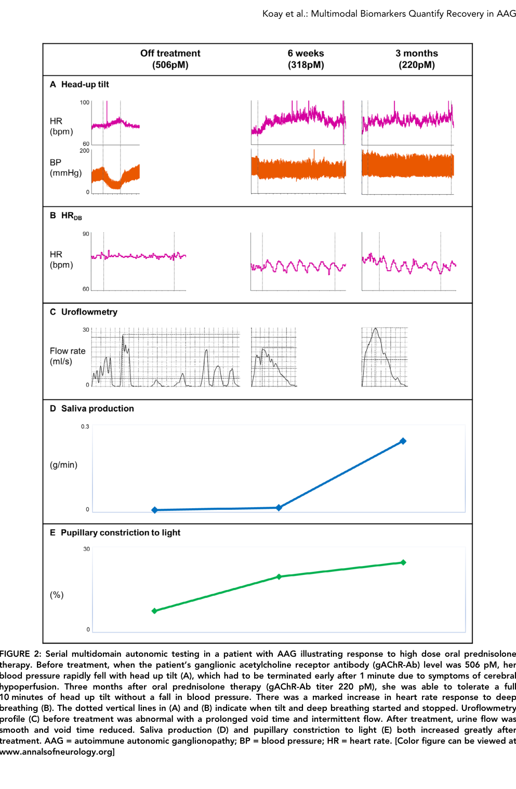

## Question

# Disease Characteristics Research Template

## Target Disease
- **Disease Name:** Autoimmune Autonomic Ganglionopathy
- **MONDO ID:**  (if available)
- **Category:** Autoimmune

## Research Objectives

Please provide a comprehensive research report on **Autoimmune Autonomic Ganglionopathy** covering all of the
disease characteristics listed below. This report will be used to populate a disease knowledge
base entry. Be thorough and cite primary literature (PMID preferred) for all claims.

For each section, **suggested databases/resources** are listed. These are the first places
you should search for information on each topic.

---

### 1. Disease Information
> **Search first:** OMIM, Orphanet, ICD-10/ICD-11, MeSH, PubMed

- What is the disease? Provide a concise overview.
- What are the key identifiers? (OMIM, Orphanet, ICD-10/ICD-11, MeSH, Mondo)
- What are the common synonyms and alternative names?
- Is the information derived from individual patients (e.g., EHR) or aggregated disease-level resources?

### 2. Etiology

- **Disease Causal Factors**: What are the primary causes? (genetic, environmental, infectious, mechanistic)
- **Risk Factors**:
  > **Search first:** PubMed, Cochrane Library, UpToDate, clinical guidelines, ClinVar, ClinGen, GWAS Catalog, PheGenI, CTD, CDC, WHO, epidemiological databases
  - Genetic risk factors (causal variants, susceptibility loci, modifier genes)
  - Environmental risk factors (toxins, lifestyle, occupational exposures, age, sex, family history)
- **Protective Factors**:
  > **Search first:** PubMed, Cochrane Library, clinical trial databases, GWAS Catalog, gnomAD, WHO, CDC, nutrition databases
  - Genetic protective factors (protective variants, modifier alleles)
  - Environmental protective factors (diet, lifestyle, exposures that reduce risk)
- **Gene-Environment Interactions**: How do genetic and environmental factors interact to influence disease?
  > **Search first:** CTD, PubMed, PheGenI, GxE databases

### 3. Phenotypes
> **Search first:** HPO (Human Phenotype Ontology), OMIM, Orphanet, PubMed, clinicaltrials.gov, MedDRA, SNOMED CT, DECIPHER, LOINC

For each phenotype, provide:
- **Phenotype type**: symptoms, clinical signs, physical manifestations, behavioral changes, or laboratory abnormalities
  > For symptoms/signs: HPO, OMIM, Orphanet, PubMed
  > For behavioral changes: HPO, DSM, RDoC (Research Domain Criteria), PubMed
  > For laboratory abnormalities: LOINC, SNOMED CT, LabTests Online, PubMed
- **Phenotype characteristics**:
  > **Search first:** OMIM, Orphanet, HPO, PubMed
  - Age of symptom onset (neonatal, childhood, adult-onset, late-onset)
  - Symptom severity (mild, moderate, severe, variable)
  - Symptom progression (stable, progressive, episodic, fluctuating)
  - Frequency among affected individuals (percentage or qualitative)
- **Quality of life impact**: Effects on daily functioning and well-being (per-phenotype when possible)
  > **Search first:** EQ-5D database, SF-36, WHO QOL databases, PubMed
- Suggest HPO (Human Phenotype Ontology) terms for each phenotype

### 4. Genetic/Molecular Information

- **Causal Genes**: Gene mutations or chromosomal abnormalities responsible for disease (gene symbols, OMIM IDs)
  > **Search first:** OMIM, ClinVar, HGMD, Ensembl, NCBI Gene
- **Pathogenic Variants**:
  - Affected genes (gene symbols, HGNC IDs)
    > **Search first:** OMIM, NCBI Gene, Ensembl, HGNC, UniProt, GeneCards
  - Variant classification (pathogenic, likely pathogenic, VUS per ACMG/AMP guidelines)
    > **Search first:** ClinVar, ClinGen, ACMG/AMP guidelines, VarSome
  - Variant type/class (missense, frameshift, nonsense, splice-site, structural)
  - Allele frequency in population databases
    > **Search first:** gnomAD, 1000 Genomes, ExAC, TOPMed, dbSNP
  - Somatic vs germline origin
    > **Search first:** COSMIC (somatic), ClinVar, ICGC, TCGA
  - Functional consequences (loss of function, gain of function, dominant negative)
- **Modifier Genes**: Genes that modify disease severity or expression
- **Epigenetic Information**: DNA methylation, histone modifications, chromatin changes affecting disease
  > **Search first:** ENCODE, Roadmap Epigenomics, MethBase, DiseaseMeth
- **Chromosomal Abnormalities**: Large-scale genetic changes (aneuploidy, translocations, inversions)
  > **Search first:** DECIPHER, ClinVar, ECARUCA, UCSC Genome Browser

### 5. Environmental Information

- **Environmental Factors**: Non-genetic contributing factors (toxins, radiation, pollution, occupational exposure)
  > **Search first:** CTD (Comparative Toxicogenomics Database), TOXNET, PubMed, EPA databases
- **Lifestyle Factors**: Behavioral factors (smoking, diet, exercise, alcohol consumption)
  > **Search first:** CDC databases, WHO, PubMed, NHANES
- **Infectious Agents**: If applicable, pathogens causing or triggering disease (bacteria, viruses, fungi, parasites)
  > **Search first:** NCBI Taxonomy, ViPR, BV-BRC, MicrobeDB, GIDEON

### 6. Mechanism / Pathophysiology

- **Molecular Pathways**: Specific signaling cascades or biochemical pathways involved (Wnt, MAPK, mTOR, PI3K-AKT, etc.)
  > **Search first:** KEGG, Reactome, WikiPathways, PathBank, BioCyc
- **Cellular Processes**: Cell-level mechanisms (apoptosis, autophagy, cell cycle dysregulation, inflammation, etc.)
  > **Search first:** Gene Ontology (GO), Reactome, KEGG, PubMed
- **Protein Dysfunction**: How protein structure or function is altered (misfolding, aggregation, loss of function, gain of function)
  > **Search first:** UniProt, PDB (Protein Data Bank), InterPro, Pfam, AlphaFold
- **Metabolic Changes**: Alterations in metabolic processes (energy metabolism, lipid metabolism, amino acid metabolism)
  > **Search first:** KEGG, BioCyc, HMDB (Human Metabolome Database), BRENDA
- **Immune System Involvement**: Role of immune response (autoimmunity, immunodeficiency, chronic inflammation)
  > **Search first:** ImmPort, Immunome Database, IEDB, Gene Ontology
- **Tissue Damage Mechanisms**: How tissues/ are injured (oxidative stress, ischemia, fibrosis, necrosis)
  > **Search first:** PubMed, Gene Ontology, Reactome
- **Biochemical Abnormalities**: Specific molecular defects (enzyme deficiencies, receptor dysfunction, ion channel defects)
  > **Search first:** BRENDA, UniProt, KEGG, OMIM, PubMed
- **Epigenetic Changes**: DNA methylation, histone modifications affecting gene expression in disease
  > **Search first:** ENCODE, Roadmap Epigenomics, MethBase, DiseaseMeth
- **Molecular Profiling** (if available):
  - Transcriptomics/gene expression changes
    > **Search first:** GEO (Gene Expression Omnibus), ArrayExpress, GTEx, Human Cell Atlas, SRA
  - Proteomics findings
    > **Search first:** PRIDE, ProteomeXchange, Human Protein Atlas, STRING, BioGRID
  - Metabolomics signatures
    > **Search first:** MetaboLights, Metabolomics Workbench, HMDB, METLIN
  - Lipidomics alterations
    > **Search first:** LIPID MAPS, SwissLipids, LipidHome, Metabolomics Workbench
  - Genomic structural features
    > **Search first:** UCSC Genome Browser, Ensembl, NCBI, dbVar, DGV
- **Advanced Technologies** (if applicable):
  - Single-cell analysis findings (cell-type specific mechanisms, cellular heterogeneity)
    > **Search first:** Human Cell Atlas, Single Cell Portal, GEO, CELLxGENE
  - Spatial transcriptomics findings
    > **Search first:** GEO, Spatial Research, Vizgen, 10x Genomics data
  - Multi-omics integration results
    > **Search first:** TCGA, ICGC, cBioPortal, LinkedOmics, PubMed
  - Functional genomics screens (CRISPR, RNAi)
    > **Search first:** DepMap, GenomeRNAi, PubMed, BioGRID ORCS

For each mechanism, describe:
- The causal chain from initial trigger to clinical manifestation
- Which mechanisms are upstream vs downstream
- What cell types and biological processes are involved
- Suggest GO terms for biological processes and CL terms for cell types

### 7. Anatomical Structures Affected

- **Organ Level**:
  - Primary organs directly affected
  - Secondary organ involvement (complications, secondary effects)
  - Body systems involved (cardiovascular, nervous, digestive, respiratory, endocrine, etc.)
  > **Search first:** Uberon, FMA (Foundational Model of Anatomy), OMIM, HPO, ICD-11, MeSH, SNOMED CT
- **Tissue and Cell Level**:
  - Specific tissue types affected (epithelial, connective, muscle, nervous)
  - Specific cell populations targeted (with Cell Ontology terms)
  > **Search first:** Uberon, Human Protein Atlas, Cell Ontology, Human Cell Atlas, CellMarker, PanglaoDB
- **Subcellular Level**:
  - Cellular compartments involved (mitochondria, nucleus, ER, lysosomes) (with GO Cellular Component terms)
  > **Search first:** Gene Ontology (Cellular Component), UniProt, Human Protein Atlas
- **Localization**:
  - Specific anatomical sites (with UBERON terms)
    > **Search first:** FMA, Uberon, NeuroNames (for brain), SNOMED CT
  - Lateralization (unilateral, bilateral, asymmetric)
    > **Search first:** HPO, clinical literature, imaging databases

### 8. Temporal Development

- **Onset**:
  - Typical age of onset (congenital, pediatric, adult, geriatric)
  - Onset pattern (acute, subacute, chronic, insidious)
  > **Search first:** OMIM, Orphanet, HPO, PubMed
- **Progression**:
  - Disease stages (early, intermediate, advanced, end-stage)
    > **Search first:** Cancer Staging Manual (AJCC), WHO classifications, PubMed
  - Progression rate (rapid, slow, variable)
  - Disease course pattern (episodic, relapsing-remitting, progressive, stable)
  - Disease duration (self-limited, chronic lifelong)
  > **Search first:** Disease registries, longitudinal cohort databases, natural history studies, PubMed, Orphanet, OMIM
- **Patterns**:
  - Remission patterns (spontaneous, treatment-induced)
    > **Search first:** Clinical trial databases, disease registries, PubMed
  - Critical periods (time windows of vulnerability or opportunity for intervention)
    > **Search first:** PubMed, developmental biology databases, clinical guidelines

### 9. Inheritance and Population

- **Epidemiology**:
  - Prevalence (cases per 100,000 at given time)
  - Incidence (new cases per 100,000 per year)
  > **Search first:** Orphanet, CDC, WHO, GBD (Global Burden of Disease), national registries, SEER, disease registries
- **For Genetic Etiology**:
  - Inheritance pattern (AD, AR, X-linked, mitochondrial, multifactorial, polygenic)
    > **Search first:** OMIM, Orphanet, ClinVar, GTR (Genetic Testing Registry)
  - Penetrance (complete, incomplete, age-dependent)
    > **Search first:** ClinVar, OMIM, PubMed, ClinGen
  - Expressivity (variable, consistent)
    > **Search first:** OMIM, ClinVar, PubMed
  - Genetic anticipation (increasing severity in successive generations)
    > **Search first:** OMIM, PubMed (especially for repeat expansion disorders)
  - Germline mosaicism
    > **Search first:** ClinVar, OMIM, genetic counseling literature, PubMed
  - Founder effects (population-specific mutations)
    > **Search first:** gnomAD, population genetics databases, PubMed
  - Consanguinity role
    > **Search first:** OMIM, population studies, genetic counseling resources
  - Carrier frequency
    > **Search first:** gnomAD, carrier screening databases, GeneReviews, GTR
- **Population Demographics**:
  - Affected populations (ethnic or demographic groups with higher prevalence)
    > **Search first:** gnomAD, 1000 Genomes, PAGE Study, PubMed, population registries
  - Geographic distribution (endemic areas, regional variation)
    > **Search first:** WHO, CDC, GBD, Orphanet, geographic epidemiology databases
  - Geographic distribution of specific variants
  - Sex ratio (male:female)
    > **Search first:** Disease registries, OMIM, PubMed, epidemiological databases
  - Age distribution of affected individuals
    > **Search first:** CDC, disease registries, SEER, Orphanet

### 10. Diagnostics

- **Clinical Tests**:
  - Laboratory tests (blood, urine, tissue chemistry, specific enzyme assays)
    > **Search first:** LOINC, LabTests Online, PubMed
  - Biomarkers (proteins, metabolites, genetic markers, circulating biomarkers)
    > **Search first:** FDA Biomarker List, BEST (Biomarkers, EndpointS, and other Tools), PubMed
  - Imaging studies (X-ray, CT, MRI, PET, ultrasound)
    > **Search first:** RadLex, DICOM, Radiopaedia, imaging databases
  - Functional tests (pulmonary function, cardiac stress tests)
    > **Search first:** LOINC, clinical guidelines, PubMed
  - Electrophysiology (EEG, EMG, ECG, nerve conduction studies)
    > **Search first:** LOINC, clinical neurophysiology databases, PubMed
  - Biopsy findings (histopathology, immunohistochemistry)
    > **Search first:** SNOMED CT, College of American Pathologists resources, PubMed
  - Pathology findings (microscopic examination)
    > **Search first:** SNOMED CT, Digital Pathology databases, PubMed
- **Genetic Testing**:
  > **Search first:** GTR (Genetic Testing Registry), GeneReviews, ClinGen
  - Overview of recommended genetic testing approach
  - Whole genome sequencing (WGS) utility
    > **Search first:** GTR, ClinVar, GEL (Genomics England), gnomAD
  - Whole exome sequencing (WES) utility
    > **Search first:** GTR, ClinVar, OMIM, GeneMatcher
  - Gene panels (which panels, which genes)
    > **Search first:** GTR, ClinVar, laboratory-specific databases
  - Single gene testing
    > **Search first:** GTR, ClinVar, OMIM, GeneReviews
  - Chromosomal microarray (CMA)
    > **Search first:** DECIPHER, ClinVar, dbVar, ECARUCA
  - Karyotyping
    > **Search first:** Chromosome Abnormality Database, ClinVar, cytogenetics resources
  - FISH
    > **Search first:** ClinVar, cytogenetics databases, PubMed
  - Mitochondrial DNA testing
    > **Search first:** MITOMAP, MSeqDR, ClinVar, GTR
  - Repeat expansion testing
    > **Search first:** GTR, ClinVar, repeat expansion databases, PubMed
- **Omics-Based Diagnostics** (if applicable):
  - RNA sequencing / transcriptomics
    > **Search first:** GEO, ArrayExpress, GTEx, RNA-seq databases
  - Proteomics
    > **Search first:** PRIDE, ProteomeXchange, FDA Biomarker database
  - Metabolomics
    > **Search first:** MetaboLights, Metabolomics Workbench, HMDB
  - Epigenomics
    > **Search first:** GEO, ENCODE, Roadmap Epigenomics, MethBase
  - Liquid biopsy
    > **Search first:** COSMIC, ClinVar, liquid biopsy databases, PubMed
- **Clinical Criteria**:
  - Standardized diagnostic criteria (DSM, ICD, society guidelines)
    > **Search first:** DSM-5, ICD-11, clinical society guidelines, UpToDate
  - Differential diagnosis (other conditions to rule out, with distinguishing features)
    > **Search first:** DynaMed, UpToDate, clinical decision support systems
- **Screening**:
  - Screening methods for asymptomatic individuals (newborn screening, carrier screening, cascade screening)
    > **Search first:** ACMG recommendations, CDC newborn screening, GTR

### 11. Outcome/Prognosis

- **Survival and Mortality**:
  - Survival rate (5-year, 10-year, overall)
    > **Search first:** SEER, cancer registries, disease-specific registries, PubMed
  - Life expectancy (with and without treatment if applicable)
    > **Search first:** Orphanet, disease registries, actuarial databases, PubMed
  - Mortality rate
    > **Search first:** CDC, WHO, GBD, national mortality databases
  - Disease-specific mortality (deaths directly attributable to disease)
    > **Search first:** Disease registries, CDC Wonder, GBD, PubMed
- **Morbidity and Function**:
  - Morbidity (disease-related disability and health impacts)
    > **Search first:** GBD, WHO, disability databases, PubMed
  - Disability outcomes (long-term functional impairments)
    > **Search first:** ICF (International Classification of Functioning), disability registries
  - Quality of life measures (EQ-5D, SF-36, PROMIS, disease-specific tools)
    > **Search first:** EQ-5D database, SF-36, PROMIS, PubMed
- **Disease Course**:
  - Complications (secondary problems: infections, organ failure, etc.)
    > **Search first:** ICD codes, disease registries, clinical databases, PubMed
  - Recovery potential (likelihood and extent of recovery, with vs without treatment)
    > **Search first:** Natural history studies, rehabilitation databases, PubMed
- **Prediction**:
  - Prognostic factors (age, disease severity, biomarkers, treatment response)
    > **Search first:** Prognostic models databases, clinical calculators, PubMed
  - Prognostic biomarkers (molecular markers predicting disease course)
    > **Search first:** FDA Biomarker database, PubMed, cancer prognostic databases

### 12. Treatment

- **Pharmacotherapy**:
  - Pharmacological treatments (drug names, drug classes, mechanisms of action)
    > **Search first:** DrugBank, RxNorm, ATC classification, DailyMed, FDA databases
  - Pharmacogenomics (how genetic variants affect drug metabolism, efficacy, toxicity)
    > **Search first:** PharmGKB, CPIC (Clinical Pharmacogenetics), FDA Table of PGx Biomarkers
- **Advanced Therapeutics**:
  - Gene therapy (viral vectors, CRISPR, gene replacement, gene editing)
    > **Search first:** ClinicalTrials.gov, FDA gene therapy database, ASGCT resources
  - Cell therapy (stem cell transplant, CAR-T, cellular therapeutics)
    > **Search first:** ClinicalTrials.gov, FDA cell therapy database, FACT standards
  - RNA-based therapies (ASOs, siRNA, mRNA therapies)
    > **Search first:** ClinicalTrials.gov, FDA approvals, PubMed
  - Targeted therapies (treatments directed at specific molecular targets)
    > **Search first:** My Cancer Genome, OncoKB, ClinicalTrials.gov, FDA approvals
  - Immunotherapies (checkpoint inhibitors, monoclonal antibodies)
    > **Search first:** Cancer Immunotherapy Database, FDA approvals, ClinicalTrials.gov
- **Surgical and Interventional**:
  - Surgical interventions (types of surgery, timing, outcomes)
    > **Search first:** CPT codes, surgical registries, clinical guidelines, PubMed
- **Supportive and Rehabilitative**:
  - Supportive care (symptom management, pain control, nutrition)
    > **Search first:** Clinical guidelines, Cochrane Library, PubMed
  - Rehabilitation (physical therapy, occupational therapy, speech therapy)
    > **Search first:** Rehabilitation medicine databases, clinical guidelines, PubMed
- **Experimental**:
  - Experimental treatments in clinical trials (with NCT identifiers if available)
    > **Search first:** ClinicalTrials.gov, EU Clinical Trials Register, WHO ICTRP
- **Treatment Outcomes**:
  - Treatment response rates
    > **Search first:** Clinical trial databases, FDA reviews, systematic reviews, PubMed
  - Side effects and adverse events
    > **Search first:** FDA Adverse Event Reporting System (FAERS), MedWatch, PubMed
- **Treatment Strategy**:
  - Treatment algorithms (clinical pathways, decision trees)
    > **Search first:** Clinical practice guidelines, NCCN Guidelines, UpToDate
  - Combination therapies
    > **Search first:** ClinicalTrials.gov, treatment guidelines, PubMed
  - Personalized medicine approaches (genotype-guided treatment)
    > **Search first:** My Cancer Genome, CIViC, PharmGKB, precision medicine databases

For each treatment, suggest MAXO (Medical Action Ontology) terms where applicable.

### 13. Prevention

- **Prevention Levels**:
  - Primary prevention (preventing disease occurrence: vaccination, risk factor modification)
    > **Search first:** CDC, WHO, USPSTF recommendations, Cochrane Library
  - Secondary prevention (early detection and treatment: screening programs, early intervention)
    > **Search first:** USPSTF, CDC screening guidelines, WHO
  - Tertiary prevention (preventing complications in those with disease)
    > **Search first:** Clinical guidelines, disease management protocols, PubMed
- **Immunization**: Vaccine strategies (if applicable)
  > **Search first:** CDC vaccine schedules, WHO immunization, FDA vaccine database
- **Screening and Early Detection**:
  - Screening programs (population-based: newborn screening, cancer screening)
    > **Search first:** CDC screening programs, USPSTF, cancer screening databases
  - Genetic screening (carrier screening, preimplantation genetic diagnosis, prenatal testing)
    > **Search first:** ACMG recommendations, ACOG guidelines, GTR
  - Risk stratification (identifying high-risk individuals for targeted prevention)
    > **Search first:** Risk prediction models, clinical calculators, PubMed
- **Behavioral Interventions**: Lifestyle modifications to reduce risk
  > **Search first:** CDC, WHO, behavioral intervention databases, Cochrane Library
- **Counseling**: Genetic counseling (risk assessment, family planning guidance)
  > **Search first:** NSGC resources, ACMG guidelines, GeneReviews
- **Public Health**:
  - Public health interventions (sanitation, vector control, health education)
    > **Search first:** CDC, WHO, public health databases, PubMed
  - Environmental interventions (reducing environmental risk factors)
    > **Search first:** EPA databases, WHO environmental health, PubMed
- **Prophylaxis**: Preventive medications or procedures
  > **Search first:** Clinical guidelines, FDA approvals, PubMed

### 14. Other Species / Natural Disease

- **Taxonomy**: Species affected (with NCBI Taxon identifiers)
  > **Search first:** NCBI Taxonomy
- **Breed**: Specific breeds affected (with VBO identifiers if applicable)
  > **Search first:** VBO (Vertebrate Breed Ontology)
- **Gene**: Orthologous genes in other species (with NCBI Gene IDs)
  > **Search first:** NCBI Gene
- **Natural Disease**:
  - Naturally occurring disease in other species (companion animals, wildlife)
    > **Search first:** OMIA (Online Mendelian Inheritance in Animals), VetCompass, PubMed
  - Veterinary relevance and importance in animal health
    > **Search first:** OMIA, veterinary databases, PubMed
- **Comparative Biology**:
  - Comparative pathology (similarities and differences across species)
    > **Search first:** OMIA, comparative pathology databases, PubMed
  - Evolutionary conservation of disease mechanisms
    > **Search first:** HomoloGene, OrthoMCL, Alliance of Genome Resources
- **Transmission** (if applicable):
  - Zoonotic potential
    > **Search first:** CDC zoonotic diseases, WHO zoonoses, GIDEON
  - Cross-species susceptibility
    > **Search first:** NCBI Taxonomy, veterinary databases, PubMed

### 15. Model Organisms

- **Model Types**:
  - Model organism type (mammalian, invertebrate, cellular, in vitro)
    > **Search first:** Alliance of Genome Resources, model organism databases
  - Specific model systems (mouse, rat, zebrafish, Drosophila, C. elegans, yeast, cell lines, organoids, iPSCs)
    > **Search first:** MGI, RGD, ZFIN, FlyBase, WormBase, SGD, ATCC, Cellosaurus
  - Induced models (drug treatment, surgical intervention, environmental manipulation)
    > **Search first:** MGI, model organism databases, PubMed
- **Genetic Models**:
  - Types available (knockout, knock-in, transgenic, conditional, humanized)
    > **Search first:** MGI, IMPC, KOMP, EuMMCR, IMSR
- **Model Characteristics**:
  - Phenotype recapitulation (how well model reproduces human disease features)
    > **Search first:** Model organism databases, comparative studies, PubMed
  - Model limitations (aspects of human disease not captured)
    > **Search first:** Model organism databases, PubMed, review articles
- **Applications**:
  - Research applications (what aspects of disease can be studied)
    > **Search first:** Model organism databases, PubMed
- **Resources**:
  - Model databases
    > **Search first:** MGI, RGD, ZFIN, FlyBase, WormBase, IMSR, EMMA, MMRRC

---

## Citation Requirements

- Cite primary literature (PMID preferred) for all mechanistic and clinical claims
- Prioritize recent reviews and landmark papers
- Include direct quotes from abstracts where possible to support key statements
- Distinguish evidence source types: human clinical, model organism, in vitro, computational

## Output Format

Structure your response as a comprehensive narrative organized by the sections above.
For each section, provide:
- Factual content with specific details (numbers, percentages, gene names, variant nomenclature)
- Ontology term suggestions (HPO, GO, CL, UBERON, CHEBI, MAXO, MONDO) where applicable
- Evidence citations with PMIDs
- Direct quotes from abstracts to support key claims
- Clear indication when information is not available or not applicable for this disease

This report will be used to populate a disease knowledge base entry with:
- Pathophysiology descriptions with causal chains
- Gene/protein annotations (HGNC, GO terms)
- Phenotype associations (HP terms) with frequencies
- Cell type involvement (CL terms)
- Anatomical locations (UBERON terms)
- Chemical entities (CHEBI terms)
- Treatment annotations (MAXO terms)
- Evidence items with PMIDs and exact abstract quotes
- Epidemiology, prognosis, diagnostic, and prevention information
- Animal model descriptions with phenotype recapitulation details

## Output

Question: You are an expert researcher providing comprehensive, well-cited information.

Provide detailed information focusing on:
1. Key concepts and definitions with current understanding
2. Recent developments and latest research (prioritize 2023-2024 sources)
3. Current applications and real-world implementations
4. Expert opinions and analysis from authoritative sources
5. Relevant statistics and data from recent studies

Format as a comprehensive research report with proper citations. Include URLs and publication dates where available.
Always prioritize recent, authoritative sources and provide specific citations for all major claims.

# Disease Characteristics Research Template

## Target Disease
- **Disease Name:** Autoimmune Autonomic Ganglionopathy
- **MONDO ID:**  (if available)
- **Category:** Autoimmune

## Research Objectives

Please provide a comprehensive research report on **Autoimmune Autonomic Ganglionopathy** covering all of the
disease characteristics listed below. This report will be used to populate a disease knowledge
base entry. Be thorough and cite primary literature (PMID preferred) for all claims.

For each section, **suggested databases/resources** are listed. These are the first places
you should search for information on each topic.

---

### 1. Disease Information
> **Search first:** OMIM, Orphanet, ICD-10/ICD-11, MeSH, PubMed

- What is the disease? Provide a concise overview.
- What are the key identifiers? (OMIM, Orphanet, ICD-10/ICD-11, MeSH, Mondo)
- What are the common synonyms and alternative names?
- Is the information derived from individual patients (e.g., EHR) or aggregated disease-level resources?

### 2. Etiology

- **Disease Causal Factors**: What are the primary causes? (genetic, environmental, infectious, mechanistic)
- **Risk Factors**:
  > **Search first:** PubMed, Cochrane Library, UpToDate, clinical guidelines, ClinVar, ClinGen, GWAS Catalog, PheGenI, CTD, CDC, WHO, epidemiological databases
  - Genetic risk factors (causal variants, susceptibility loci, modifier genes)
  - Environmental risk factors (toxins, lifestyle, occupational exposures, age, sex, family history)
- **Protective Factors**:
  > **Search first:** PubMed, Cochrane Library, clinical trial databases, GWAS Catalog, gnomAD, WHO, CDC, nutrition databases
  - Genetic protective factors (protective variants, modifier alleles)
  - Environmental protective factors (diet, lifestyle, exposures that reduce risk)
- **Gene-Environment Interactions**: How do genetic and environmental factors interact to influence disease?
  > **Search first:** CTD, PubMed, PheGenI, GxE databases

### 3. Phenotypes
> **Search first:** HPO (Human Phenotype Ontology), OMIM, Orphanet, PubMed, clinicaltrials.gov, MedDRA, SNOMED CT, DECIPHER, LOINC

For each phenotype, provide:
- **Phenotype type**: symptoms, clinical signs, physical manifestations, behavioral changes, or laboratory abnormalities
  > For symptoms/signs: HPO, OMIM, Orphanet, PubMed
  > For behavioral changes: HPO, DSM, RDoC (Research Domain Criteria), PubMed
  > For laboratory abnormalities: LOINC, SNOMED CT, LabTests Online, PubMed
- **Phenotype characteristics**:
  > **Search first:** OMIM, Orphanet, HPO, PubMed
  - Age of symptom onset (neonatal, childhood, adult-onset, late-onset)
  - Symptom severity (mild, moderate, severe, variable)
  - Symptom progression (stable, progressive, episodic, fluctuating)
  - Frequency among affected individuals (percentage or qualitative)
- **Quality of life impact**: Effects on daily functioning and well-being (per-phenotype when possible)
  > **Search first:** EQ-5D database, SF-36, WHO QOL databases, PubMed
- Suggest HPO (Human Phenotype Ontology) terms for each phenotype

### 4. Genetic/Molecular Information

- **Causal Genes**: Gene mutations or chromosomal abnormalities responsible for disease (gene symbols, OMIM IDs)
  > **Search first:** OMIM, ClinVar, HGMD, Ensembl, NCBI Gene
- **Pathogenic Variants**:
  - Affected genes (gene symbols, HGNC IDs)
    > **Search first:** OMIM, NCBI Gene, Ensembl, HGNC, UniProt, GeneCards
  - Variant classification (pathogenic, likely pathogenic, VUS per ACMG/AMP guidelines)
    > **Search first:** ClinVar, ClinGen, ACMG/AMP guidelines, VarSome
  - Variant type/class (missense, frameshift, nonsense, splice-site, structural)
  - Allele frequency in population databases
    > **Search first:** gnomAD, 1000 Genomes, ExAC, TOPMed, dbSNP
  - Somatic vs germline origin
    > **Search first:** COSMIC (somatic), ClinVar, ICGC, TCGA
  - Functional consequences (loss of function, gain of function, dominant negative)
- **Modifier Genes**: Genes that modify disease severity or expression
- **Epigenetic Information**: DNA methylation, histone modifications, chromatin changes affecting disease
  > **Search first:** ENCODE, Roadmap Epigenomics, MethBase, DiseaseMeth
- **Chromosomal Abnormalities**: Large-scale genetic changes (aneuploidy, translocations, inversions)
  > **Search first:** DECIPHER, ClinVar, ECARUCA, UCSC Genome Browser

### 5. Environmental Information

- **Environmental Factors**: Non-genetic contributing factors (toxins, radiation, pollution, occupational exposure)
  > **Search first:** CTD (Comparative Toxicogenomics Database), TOXNET, PubMed, EPA databases
- **Lifestyle Factors**: Behavioral factors (smoking, diet, exercise, alcohol consumption)
  > **Search first:** CDC databases, WHO, PubMed, NHANES
- **Infectious Agents**: If applicable, pathogens causing or triggering disease (bacteria, viruses, fungi, parasites)
  > **Search first:** NCBI Taxonomy, ViPR, BV-BRC, MicrobeDB, GIDEON

### 6. Mechanism / Pathophysiology

- **Molecular Pathways**: Specific signaling cascades or biochemical pathways involved (Wnt, MAPK, mTOR, PI3K-AKT, etc.)
  > **Search first:** KEGG, Reactome, WikiPathways, PathBank, BioCyc
- **Cellular Processes**: Cell-level mechanisms (apoptosis, autophagy, cell cycle dysregulation, inflammation, etc.)
  > **Search first:** Gene Ontology (GO), Reactome, KEGG, PubMed
- **Protein Dysfunction**: How protein structure or function is altered (misfolding, aggregation, loss of function, gain of function)
  > **Search first:** UniProt, PDB (Protein Data Bank), InterPro, Pfam, AlphaFold
- **Metabolic Changes**: Alterations in metabolic processes (energy metabolism, lipid metabolism, amino acid metabolism)
  > **Search first:** KEGG, BioCyc, HMDB (Human Metabolome Database), BRENDA
- **Immune System Involvement**: Role of immune response (autoimmunity, immunodeficiency, chronic inflammation)
  > **Search first:** ImmPort, Immunome Database, IEDB, Gene Ontology
- **Tissue Damage Mechanisms**: How tissues/ are injured (oxidative stress, ischemia, fibrosis, necrosis)
  > **Search first:** PubMed, Gene Ontology, Reactome
- **Biochemical Abnormalities**: Specific molecular defects (enzyme deficiencies, receptor dysfunction, ion channel defects)
  > **Search first:** BRENDA, UniProt, KEGG, OMIM, PubMed
- **Epigenetic Changes**: DNA methylation, histone modifications affecting gene expression in disease
  > **Search first:** ENCODE, Roadmap Epigenomics, MethBase, DiseaseMeth
- **Molecular Profiling** (if available):
  - Transcriptomics/gene expression changes
    > **Search first:** GEO (Gene Expression Omnibus), ArrayExpress, GTEx, Human Cell Atlas, SRA
  - Proteomics findings
    > **Search first:** PRIDE, ProteomeXchange, Human Protein Atlas, STRING, BioGRID
  - Metabolomics signatures
    > **Search first:** MetaboLights, Metabolomics Workbench, HMDB, METLIN
  - Lipidomics alterations
    > **Search first:** LIPID MAPS, SwissLipids, LipidHome, Metabolomics Workbench
  - Genomic structural features
    > **Search first:** UCSC Genome Browser, Ensembl, NCBI, dbVar, DGV
- **Advanced Technologies** (if applicable):
  - Single-cell analysis findings (cell-type specific mechanisms, cellular heterogeneity)
    > **Search first:** Human Cell Atlas, Single Cell Portal, GEO, CELLxGENE
  - Spatial transcriptomics findings
    > **Search first:** GEO, Spatial Research, Vizgen, 10x Genomics data
  - Multi-omics integration results
    > **Search first:** TCGA, ICGC, cBioPortal, LinkedOmics, PubMed
  - Functional genomics screens (CRISPR, RNAi)
    > **Search first:** DepMap, GenomeRNAi, PubMed, BioGRID ORCS

For each mechanism, describe:
- The causal chain from initial trigger to clinical manifestation
- Which mechanisms are upstream vs downstream
- What cell types and biological processes are involved
- Suggest GO terms for biological processes and CL terms for cell types

### 7. Anatomical Structures Affected

- **Organ Level**:
  - Primary organs directly affected
  - Secondary organ involvement (complications, secondary effects)
  - Body systems involved (cardiovascular, nervous, digestive, respiratory, endocrine, etc.)
  > **Search first:** Uberon, FMA (Foundational Model of Anatomy), OMIM, HPO, ICD-11, MeSH, SNOMED CT
- **Tissue and Cell Level**:
  - Specific tissue types affected (epithelial, connective, muscle, nervous)
  - Specific cell populations targeted (with Cell Ontology terms)
  > **Search first:** Uberon, Human Protein Atlas, Cell Ontology, Human Cell Atlas, CellMarker, PanglaoDB
- **Subcellular Level**:
  - Cellular compartments involved (mitochondria, nucleus, ER, lysosomes) (with GO Cellular Component terms)
  > **Search first:** Gene Ontology (Cellular Component), UniProt, Human Protein Atlas
- **Localization**:
  - Specific anatomical sites (with UBERON terms)
    > **Search first:** FMA, Uberon, NeuroNames (for brain), SNOMED CT
  - Lateralization (unilateral, bilateral, asymmetric)
    > **Search first:** HPO, clinical literature, imaging databases

### 8. Temporal Development

- **Onset**:
  - Typical age of onset (congenital, pediatric, adult, geriatric)
  - Onset pattern (acute, subacute, chronic, insidious)
  > **Search first:** OMIM, Orphanet, HPO, PubMed
- **Progression**:
  - Disease stages (early, intermediate, advanced, end-stage)
    > **Search first:** Cancer Staging Manual (AJCC), WHO classifications, PubMed
  - Progression rate (rapid, slow, variable)
  - Disease course pattern (episodic, relapsing-remitting, progressive, stable)
  - Disease duration (self-limited, chronic lifelong)
  > **Search first:** Disease registries, longitudinal cohort databases, natural history studies, PubMed, Orphanet, OMIM
- **Patterns**:
  - Remission patterns (spontaneous, treatment-induced)
    > **Search first:** Clinical trial databases, disease registries, PubMed
  - Critical periods (time windows of vulnerability or opportunity for intervention)
    > **Search first:** PubMed, developmental biology databases, clinical guidelines

### 9. Inheritance and Population

- **Epidemiology**:
  - Prevalence (cases per 100,000 at given time)
  - Incidence (new cases per 100,000 per year)
  > **Search first:** Orphanet, CDC, WHO, GBD (Global Burden of Disease), national registries, SEER, disease registries
- **For Genetic Etiology**:
  - Inheritance pattern (AD, AR, X-linked, mitochondrial, multifactorial, polygenic)
    > **Search first:** OMIM, Orphanet, ClinVar, GTR (Genetic Testing Registry)
  - Penetrance (complete, incomplete, age-dependent)
    > **Search first:** ClinVar, OMIM, PubMed, ClinGen
  - Expressivity (variable, consistent)
    > **Search first:** OMIM, ClinVar, PubMed
  - Genetic anticipation (increasing severity in successive generations)
    > **Search first:** OMIM, PubMed (especially for repeat expansion disorders)
  - Germline mosaicism
    > **Search first:** ClinVar, OMIM, genetic counseling literature, PubMed
  - Founder effects (population-specific mutations)
    > **Search first:** gnomAD, population genetics databases, PubMed
  - Consanguinity role
    > **Search first:** OMIM, population studies, genetic counseling resources
  - Carrier frequency
    > **Search first:** gnomAD, carrier screening databases, GeneReviews, GTR
- **Population Demographics**:
  - Affected populations (ethnic or demographic groups with higher prevalence)
    > **Search first:** gnomAD, 1000 Genomes, PAGE Study, PubMed, population registries
  - Geographic distribution (endemic areas, regional variation)
    > **Search first:** WHO, CDC, GBD, Orphanet, geographic epidemiology databases
  - Geographic distribution of specific variants
  - Sex ratio (male:female)
    > **Search first:** Disease registries, OMIM, PubMed, epidemiological databases
  - Age distribution of affected individuals
    > **Search first:** CDC, disease registries, SEER, Orphanet

### 10. Diagnostics

- **Clinical Tests**:
  - Laboratory tests (blood, urine, tissue chemistry, specific enzyme assays)
    > **Search first:** LOINC, LabTests Online, PubMed
  - Biomarkers (proteins, metabolites, genetic markers, circulating biomarkers)
    > **Search first:** FDA Biomarker List, BEST (Biomarkers, EndpointS, and other Tools), PubMed
  - Imaging studies (X-ray, CT, MRI, PET, ultrasound)
    > **Search first:** RadLex, DICOM, Radiopaedia, imaging databases
  - Functional tests (pulmonary function, cardiac stress tests)
    > **Search first:** LOINC, clinical guidelines, PubMed
  - Electrophysiology (EEG, EMG, ECG, nerve conduction studies)
    > **Search first:** LOINC, clinical neurophysiology databases, PubMed
  - Biopsy findings (histopathology, immunohistochemistry)
    > **Search first:** SNOMED CT, College of American Pathologists resources, PubMed
  - Pathology findings (microscopic examination)
    > **Search first:** SNOMED CT, Digital Pathology databases, PubMed
- **Genetic Testing**:
  > **Search first:** GTR (Genetic Testing Registry), GeneReviews, ClinGen
  - Overview of recommended genetic testing approach
  - Whole genome sequencing (WGS) utility
    > **Search first:** GTR, ClinVar, GEL (Genomics England), gnomAD
  - Whole exome sequencing (WES) utility
    > **Search first:** GTR, ClinVar, OMIM, GeneMatcher
  - Gene panels (which panels, which genes)
    > **Search first:** GTR, ClinVar, laboratory-specific databases
  - Single gene testing
    > **Search first:** GTR, ClinVar, OMIM, GeneReviews
  - Chromosomal microarray (CMA)
    > **Search first:** DECIPHER, ClinVar, dbVar, ECARUCA
  - Karyotyping
    > **Search first:** Chromosome Abnormality Database, ClinVar, cytogenetics resources
  - FISH
    > **Search first:** ClinVar, cytogenetics databases, PubMed
  - Mitochondrial DNA testing
    > **Search first:** MITOMAP, MSeqDR, ClinVar, GTR
  - Repeat expansion testing
    > **Search first:** GTR, ClinVar, repeat expansion databases, PubMed
- **Omics-Based Diagnostics** (if applicable):
  - RNA sequencing / transcriptomics
    > **Search first:** GEO, ArrayExpress, GTEx, RNA-seq databases
  - Proteomics
    > **Search first:** PRIDE, ProteomeXchange, FDA Biomarker database
  - Metabolomics
    > **Search first:** MetaboLights, Metabolomics Workbench, HMDB
  - Epigenomics
    > **Search first:** GEO, ENCODE, Roadmap Epigenomics, MethBase
  - Liquid biopsy
    > **Search first:** COSMIC, ClinVar, liquid biopsy databases, PubMed
- **Clinical Criteria**:
  - Standardized diagnostic criteria (DSM, ICD, society guidelines)
    > **Search first:** DSM-5, ICD-11, clinical society guidelines, UpToDate
  - Differential diagnosis (other conditions to rule out, with distinguishing features)
    > **Search first:** DynaMed, UpToDate, clinical decision support systems
- **Screening**:
  - Screening methods for asymptomatic individuals (newborn screening, carrier screening, cascade screening)
    > **Search first:** ACMG recommendations, CDC newborn screening, GTR

### 11. Outcome/Prognosis

- **Survival and Mortality**:
  - Survival rate (5-year, 10-year, overall)
    > **Search first:** SEER, cancer registries, disease-specific registries, PubMed
  - Life expectancy (with and without treatment if applicable)
    > **Search first:** Orphanet, disease registries, actuarial databases, PubMed
  - Mortality rate
    > **Search first:** CDC, WHO, GBD, national mortality databases
  - Disease-specific mortality (deaths directly attributable to disease)
    > **Search first:** Disease registries, CDC Wonder, GBD, PubMed
- **Morbidity and Function**:
  - Morbidity (disease-related disability and health impacts)
    > **Search first:** GBD, WHO, disability databases, PubMed
  - Disability outcomes (long-term functional impairments)
    > **Search first:** ICF (International Classification of Functioning), disability registries
  - Quality of life measures (EQ-5D, SF-36, PROMIS, disease-specific tools)
    > **Search first:** EQ-5D database, SF-36, PROMIS, PubMed
- **Disease Course**:
  - Complications (secondary problems: infections, organ failure, etc.)
    > **Search first:** ICD codes, disease registries, clinical databases, PubMed
  - Recovery potential (likelihood and extent of recovery, with vs without treatment)
    > **Search first:** Natural history studies, rehabilitation databases, PubMed
- **Prediction**:
  - Prognostic factors (age, disease severity, biomarkers, treatment response)
    > **Search first:** Prognostic models databases, clinical calculators, PubMed
  - Prognostic biomarkers (molecular markers predicting disease course)
    > **Search first:** FDA Biomarker database, PubMed, cancer prognostic databases

### 12. Treatment

- **Pharmacotherapy**:
  - Pharmacological treatments (drug names, drug classes, mechanisms of action)
    > **Search first:** DrugBank, RxNorm, ATC classification, DailyMed, FDA databases
  - Pharmacogenomics (how genetic variants affect drug metabolism, efficacy, toxicity)
    > **Search first:** PharmGKB, CPIC (Clinical Pharmacogenetics), FDA Table of PGx Biomarkers
- **Advanced Therapeutics**:
  - Gene therapy (viral vectors, CRISPR, gene replacement, gene editing)
    > **Search first:** ClinicalTrials.gov, FDA gene therapy database, ASGCT resources
  - Cell therapy (stem cell transplant, CAR-T, cellular therapeutics)
    > **Search first:** ClinicalTrials.gov, FDA cell therapy database, FACT standards
  - RNA-based therapies (ASOs, siRNA, mRNA therapies)
    > **Search first:** ClinicalTrials.gov, FDA approvals, PubMed
  - Targeted therapies (treatments directed at specific molecular targets)
    > **Search first:** My Cancer Genome, OncoKB, ClinicalTrials.gov, FDA approvals
  - Immunotherapies (checkpoint inhibitors, monoclonal antibodies)
    > **Search first:** Cancer Immunotherapy Database, FDA approvals, ClinicalTrials.gov
- **Surgical and Interventional**:
  - Surgical interventions (types of surgery, timing, outcomes)
    > **Search first:** CPT codes, surgical registries, clinical guidelines, PubMed
- **Supportive and Rehabilitative**:
  - Supportive care (symptom management, pain control, nutrition)
    > **Search first:** Clinical guidelines, Cochrane Library, PubMed
  - Rehabilitation (physical therapy, occupational therapy, speech therapy)
    > **Search first:** Rehabilitation medicine databases, clinical guidelines, PubMed
- **Experimental**:
  - Experimental treatments in clinical trials (with NCT identifiers if available)
    > **Search first:** ClinicalTrials.gov, EU Clinical Trials Register, WHO ICTRP
- **Treatment Outcomes**:
  - Treatment response rates
    > **Search first:** Clinical trial databases, FDA reviews, systematic reviews, PubMed
  - Side effects and adverse events
    > **Search first:** FDA Adverse Event Reporting System (FAERS), MedWatch, PubMed
- **Treatment Strategy**:
  - Treatment algorithms (clinical pathways, decision trees)
    > **Search first:** Clinical practice guidelines, NCCN Guidelines, UpToDate
  - Combination therapies
    > **Search first:** ClinicalTrials.gov, treatment guidelines, PubMed
  - Personalized medicine approaches (genotype-guided treatment)
    > **Search first:** My Cancer Genome, CIViC, PharmGKB, precision medicine databases

For each treatment, suggest MAXO (Medical Action Ontology) terms where applicable.

### 13. Prevention

- **Prevention Levels**:
  - Primary prevention (preventing disease occurrence: vaccination, risk factor modification)
    > **Search first:** CDC, WHO, USPSTF recommendations, Cochrane Library
  - Secondary prevention (early detection and treatment: screening programs, early intervention)
    > **Search first:** USPSTF, CDC screening guidelines, WHO
  - Tertiary prevention (preventing complications in those with disease)
    > **Search first:** Clinical guidelines, disease management protocols, PubMed
- **Immunization**: Vaccine strategies (if applicable)
  > **Search first:** CDC vaccine schedules, WHO immunization, FDA vaccine database
- **Screening and Early Detection**:
  - Screening programs (population-based: newborn screening, cancer screening)
    > **Search first:** CDC screening programs, USPSTF, cancer screening databases
  - Genetic screening (carrier screening, preimplantation genetic diagnosis, prenatal testing)
    > **Search first:** ACMG recommendations, ACOG guidelines, GTR
  - Risk stratification (identifying high-risk individuals for targeted prevention)
    > **Search first:** Risk prediction models, clinical calculators, PubMed
- **Behavioral Interventions**: Lifestyle modifications to reduce risk
  > **Search first:** CDC, WHO, behavioral intervention databases, Cochrane Library
- **Counseling**: Genetic counseling (risk assessment, family planning guidance)
  > **Search first:** NSGC resources, ACMG guidelines, GeneReviews
- **Public Health**:
  - Public health interventions (sanitation, vector control, health education)
    > **Search first:** CDC, WHO, public health databases, PubMed
  - Environmental interventions (reducing environmental risk factors)
    > **Search first:** EPA databases, WHO environmental health, PubMed
- **Prophylaxis**: Preventive medications or procedures
  > **Search first:** Clinical guidelines, FDA approvals, PubMed

### 14. Other Species / Natural Disease

- **Taxonomy**: Species affected (with NCBI Taxon identifiers)
  > **Search first:** NCBI Taxonomy
- **Breed**: Specific breeds affected (with VBO identifiers if applicable)
  > **Search first:** VBO (Vertebrate Breed Ontology)
- **Gene**: Orthologous genes in other species (with NCBI Gene IDs)
  > **Search first:** NCBI Gene
- **Natural Disease**:
  - Naturally occurring disease in other species (companion animals, wildlife)
    > **Search first:** OMIA (Online Mendelian Inheritance in Animals), VetCompass, PubMed
  - Veterinary relevance and importance in animal health
    > **Search first:** OMIA, veterinary databases, PubMed
- **Comparative Biology**:
  - Comparative pathology (similarities and differences across species)
    > **Search first:** OMIA, comparative pathology databases, PubMed
  - Evolutionary conservation of disease mechanisms
    > **Search first:** HomoloGene, OrthoMCL, Alliance of Genome Resources
- **Transmission** (if applicable):
  - Zoonotic potential
    > **Search first:** CDC zoonotic diseases, WHO zoonoses, GIDEON
  - Cross-species susceptibility
    > **Search first:** NCBI Taxonomy, veterinary databases, PubMed

### 15. Model Organisms

- **Model Types**:
  - Model organism type (mammalian, invertebrate, cellular, in vitro)
    > **Search first:** Alliance of Genome Resources, model organism databases
  - Specific model systems (mouse, rat, zebrafish, Drosophila, C. elegans, yeast, cell lines, organoids, iPSCs)
    > **Search first:** MGI, RGD, ZFIN, FlyBase, WormBase, SGD, ATCC, Cellosaurus
  - Induced models (drug treatment, surgical intervention, environmental manipulation)
    > **Search first:** MGI, model organism databases, PubMed
- **Genetic Models**:
  - Types available (knockout, knock-in, transgenic, conditional, humanized)
    > **Search first:** MGI, IMPC, KOMP, EuMMCR, IMSR
- **Model Characteristics**:
  - Phenotype recapitulation (how well model reproduces human disease features)
    > **Search first:** Model organism databases, comparative studies, PubMed
  - Model limitations (aspects of human disease not captured)
    > **Search first:** Model organism databases, PubMed, review articles
- **Applications**:
  - Research applications (what aspects of disease can be studied)
    > **Search first:** Model organism databases, PubMed
- **Resources**:
  - Model databases
    > **Search first:** MGI, RGD, ZFIN, FlyBase, WormBase, IMSR, EMMA, MMRRC

---

## Citation Requirements

- Cite primary literature (PMID preferred) for all mechanistic and clinical claims
- Prioritize recent reviews and landmark papers
- Include direct quotes from abstracts where possible to support key statements
- Distinguish evidence source types: human clinical, model organism, in vitro, computational

## Output Format

Structure your response as a comprehensive narrative organized by the sections above.
For each section, provide:
- Factual content with specific details (numbers, percentages, gene names, variant nomenclature)
- Ontology term suggestions (HPO, GO, CL, UBERON, CHEBI, MAXO, MONDO) where applicable
- Evidence citations with PMIDs
- Direct quotes from abstracts to support key claims
- Clear indication when information is not available or not applicable for this disease

This report will be used to populate a disease knowledge base entry with:
- Pathophysiology descriptions with causal chains
- Gene/protein annotations (HGNC, GO terms)
- Phenotype associations (HP terms) with frequencies
- Cell type involvement (CL terms)
- Anatomical locations (UBERON terms)
- Chemical entities (CHEBI terms)
- Treatment annotations (MAXO terms)
- Evidence items with PMIDs and exact abstract quotes
- Epidemiology, prognosis, diagnostic, and prevention information
- Animal model descriptions with phenotype recapitulation details

# Autoimmune Autonomic Ganglionopathy (AAG) — Comprehensive Disease Characteristics Report

## Executive summary
Autoimmune autonomic ganglionopathy (AAG) is a rare, immune-mediated disorder of peripheral autonomic failure affecting sympathetic, parasympathetic, and enteric systems, classically presenting with subacute-onset diffuse dysautonomia (e.g., orthostatic hypotension, anhidrosis, severe gastrointestinal and bladder dysfunction). Roughly half of clinically suspected cases have serum autoantibodies against the ganglionic nicotinic acetylcholine receptor (gAChR; typically α3-containing receptors), and antibody titers correlate with autonomic severity; immunotherapy (plasma exchange, IVIg, corticosteroids and steroid-sparing immunosuppression) can lead to objective improvement in many patients, though controlled trial data remain very limited. (iodice2009efficacyofimmunotherapy pages 1-3, golden2019autoimmuneautonomicneuropathies pages 1-2, nakane2024autoimmuneautonomicneuropathy pages 2-3, koay2021multimodalbiomarkersquantify pages 1-8)

## 1. Disease information
### 1.1 Definition and current understanding
- AAG is an immune-mediated disorder with prominent/selective involvement of the peripheral autonomic nervous system, producing generalized autonomic failure and often orthostatic hypotension, anhidrosis, and parasympathetic dysfunction. (iodice2009efficacyofimmunotherapy pages 1-3)
- AAG is commonly described as “a disease of autonomic failure caused by ganglionic acetylcholine receptor (gAChR) autoantibodies” (direct abstract statement). (nakane2024autoimmuneautonomicneuropathy pages 11-12)

### 1.2 Synonyms / alternative names
Commonly used terms in the literature include:
- Autoimmune autonomic ganglionopathy (AAG) (nakane2024autoimmuneautonomicneuropathy pages 11-12, iodice2009efficacyofimmunotherapy pages 1-3)
- Autoimmune autonomic neuropathy (umbrella term often including AAG) (nakane2024autoimmuneautonomicneuropathy pages 11-12)
- Subacute panautonomic failure / subacute autonomic neuropathy (historical discovery context for ganglionic nAChR antibodies) (vernino1998neuronalnicotinicach pages 4-6, vernino1998neuronalnicotinicach pages 3-4)

### 1.3 Key identifiers (OMIM/Orphanet/ICD/MeSH/MONDO)
- In the evidence retrieved for this run, explicit OMIM/Orphanet/ICD-10/ICD-11/MeSH/MONDO identifiers were not present in accessible full text excerpts; this entry should be completed by querying those dedicated ontology resources directly. (iodice2009efficacyofimmunotherapy pages 1-3, golden2019autoimmuneautonomicneuropathies pages 1-2)

### 1.4 Evidence sources
The characterization below is derived from:
- Aggregated disease-level clinical cohorts and reviews (e.g., Japanese cohort n=80; seropositive cohort n=13) (nakane2018autoimmuneautonomicganglionopathy pages 6-8, koay2021multimodalbiomarkersquantify pages 1-8)
- Primary discovery and pathophysiology studies (Neurology 1998 discovery of neuronal/ganglionic nAChR antibodies) (vernino1998neuronalnicotinicach pages 1-2, vernino1998neuronalnicotinicach pages 3-4)
- Interventional/observational clinical evidence and trial registry information (Neurology 2009 immunotherapy case series; ClinicalTrials.gov NCT01522235) (iodice2009efficacyofimmunotherapy pages 1-3, NCT01522235 chunk 1)

## 2. Etiology
### 2.1 Primary causal factors (mechanistic)
**Autoantibody-mediated ganglionic synaptic failure**
- The principal autoantigen is the **ganglionic nicotinic acetylcholine receptor (gAChR)**, typically α3-containing receptors (often α3β4). Patient antibodies bind α3 and can reduce receptor currents in vitro, supporting pathogenicity. (golden2019autoimmuneautonomicneuropathies pages 1-2, nakane2024autoimmuneautonomicneuropathy pages 2-3)
- A 2024 mechanistic synthesis proposes a three-step pathogenic model: **(1) antibody binding, (2) antibody-driven internalization/degradation reducing receptor number, and (3) functional blockade**. (nakane2024autoimmuneautonomicneuropathy pages 2-3)
- In a 2024 clinical utility review, AAG antibodies are described as acting “by preventing post‑synaptic depolarization, thereby blocking autonomic neurotransmission.” (loser2024autoantibodiesinneuromuscular pages 13-15)

**Seronegative disease and heterogeneity**
- About **~50% of suspected AAG** may be seronegative, and some evidence suggests possible antibody- vs cell-mediated subtypes, including steroid-responsive but IVIg/PLEX/rituximab-poorly responsive subsets. (mohapatra2024decodingautoimmuneautonomic pages 4-5, golden2019autoimmuneautonomicneuropathies pages 3-5)

### 2.2 Risk factors
- Robust genetic susceptibility loci or causal germline variants were not identified in the retrieved evidence; AAG is primarily treated as an acquired autoimmune condition. (golden2019autoimmuneautonomicneuropathies pages 1-2)
- **Autoimmune comorbidity** is common. In a seropositive cohort (n=13), **8/13 (62%)** had other autoimmune diseases (e.g., hypothyroidism, inflammatory bowel disease, Addison’s, pernicious anemia). (koay2021multimodalbiomarkersquantify pages 8-13)
- Antecedent infection or events are reported in subsets (see Temporal Development). (nakane2018autoimmuneautonomicganglionopathy pages 6-8, koay2021multimodalbiomarkersquantify pages 8-13)

### 2.3 Protective factors / gene–environment interactions
- No protective genetic variants or specific gene–environment interaction evidence was present in the retrieved set; this remains a knowledge gap. (golden2019autoimmuneautonomicneuropathies pages 1-2)

## 3. Phenotypes
### 3.1 Core clinical phenotype (multi-domain autonomic failure)
AAG reflects diffuse autonomic failure across sympathetic, parasympathetic, and enteric domains. (iodice2009efficacyofimmunotherapy pages 1-3, golden2019autoimmuneautonomicneuropathies pages 1-2)

**Common features and frequencies (cohort evidence)**
- Japanese seropositive cohort (n=80):
  - Orthostatic hypotension: **64/80 (80%)**
  - Lower GI symptoms: **59/80 (74%)**
  - Pupillary dysfunction: **21/80 (26%)**
  - Sensory disturbance (dysesthesia/numbness): **37/80 (46%)**
  - Extra-autonomic involvement overall: **67/80 (84%)**
  - Gradual onset predominant: **62/80 (78%)**
  - Antecedent events: **13/80 (16%)**
  (nakane2018autoimmuneautonomicganglionopathy pages 6-8)

- Seropositive multimodal cohort (n=13):
  - Impaired pupillary light constriction: **12/13 (92%)**; cholinergic supersensitivity in tested patients
  - Postganglionic sudomotor dysfunction: **7/8 (88%)**
  - Urinary retention: **9/11 (82%)**; catheterisation needed **5/13 (38%)**
  - Xerophthalmia (reduced lacrimation): **9/11 (82%)**; xerostomia: **6/8 (75%)**
  - 31% had antecedent infections; 15% antecedent surgery
  (koay2021multimodalbiomarkersquantify pages 13-17, koay2021multimodalbiomarkersquantify pages 8-13, koay2021multimodalbiomarkersquantify pages 1-8)

### 3.2 Suggested HPO terms (non-exhaustive; map to patient-level data when available)
- Orthostatic hypotension (HP:0001278)
- Autonomic dysfunction (HP:0004398)
- Anhidrosis / hypohidrosis (HP:0000970 / HP:0000966)
- Urinary retention / neurogenic bladder (HP:0000016 / HP:0000010)
- Gastrointestinal dysmotility / constipation (HP:0002574 / HP:0002019)
- Xerostomia / keratoconjunctivitis sicca (HP:0000217 / HP:0001097)
- Abnormal pupillary light reflex / mydriasis (HP:0000615 / HP:0000611)
- Sensory neuropathy / paresthesia (HP:0000763 / HP:0003401)

(nakane2018autoimmuneautonomicganglionopathy pages 6-8, koay2021multimodalbiomarkersquantify pages 1-8)

### 3.3 Quality of life impact
Quantitative symptom and QoL instruments are used in AAG cohorts, including COMPASS-31 and SF-36. In one seropositive cohort (n=13), immunotherapy improved COMPASS-31 scores (total **52 → 17**, P=.03) and SF-36 physical function (example data in figures), consistent with clinically meaningful functional improvement. (koay2021multimodalbiomarkersquantify pages 1-8, koay2021multimodalbiomarkersquantify pages 17-21)

## 4. Genetic / molecular information
### 4.1 Causal genes
- AAG is not primarily described as a Mendelian genetic disorder in retrieved evidence. However, the **target receptor** comprises subunits including **α3** and typically β4; these correspond to receptor subunit genes (e.g., CHRNA3, CHRNB4), but the disease mechanism is autoimmune rather than inherited mutation-based in the cited cohorts/reviews. (golden2019autoimmuneautonomicneuropathies pages 1-2, nakane2024autoimmuneautonomicneuropathy pages 2-3)

### 4.2 Pathogenic “variants”
- Not applicable as germline pathogenic variants were not implicated as causal in the retrieved clinical literature. (golden2019autoimmuneautonomicneuropathies pages 1-2)

### 4.3 Epigenetics / modifiers
- Not addressed in retrieved evidence.

## 5. Environmental information
### 5.1 Infectious or other triggers
- Antecedent infections/events are reported in subsets of cohorts (e.g., 31% antecedent infections in a seropositive cohort; 16% antecedent events in a Japanese cohort). (koay2021multimodalbiomarkersquantify pages 8-13, nakane2018autoimmuneautonomicganglionopathy pages 6-8)

## 6. Mechanism / pathophysiology
### 6.1 Causal chain (antibody-mediated archetype)
1) Immune tolerance break (often idiopathic; sometimes paraneoplastic context in early discovery cohorts) with production of antibodies to ganglionic nAChR (α3-containing receptor). (vernino1998neuronalnicotinicach pages 4-6, golden2019autoimmuneautonomicneuropathies pages 1-2)
2) Antibody binding to extracellular receptor epitopes, with receptor internalization/degradation and functional blockade, reducing ganglionic synaptic transmission. (nakane2024autoimmuneautonomicneuropathy pages 2-3, nakane2018autoimmuneautonomicganglionopathy pages 3-5)
3) Downstream failure of autonomic output across multiple organs (cardiovascular, sudomotor, secretomotor, GI, bladder, pupillary systems), producing “pandysautonomia.” (iodice2009efficacyofimmunotherapy pages 1-3, koay2021multimodalbiomarkersquantify pages 1-8)

### 6.2 Upstream vs downstream processes
- Upstream: autoantibody generation; in some patients, possibly alternative immune effector mechanisms (cell-mediated) in seronegative disease. (mohapatra2024decodingautoimmuneautonomic pages 4-5, golden2019autoimmuneautonomicneuropathies pages 3-5)
- Downstream: postganglionic sympathetic and parasympathetic failure; reduced catecholamine release; end-organ dysfunction (e.g., impaired sweating, impaired lacrimation). (nakane2024autoimmuneautonomicneuropathy pages 11-12, koay2021multimodalbiomarkersquantify pages 1-8)

### 6.3 Cell types and GO / CL suggestions
**Cell types (CL) – suggested:**
- Autonomic neuron (sympathetic neuron; parasympathetic neuron)
- Postganglionic sympathetic neuron
- Postganglionic parasympathetic neuron

**Biological processes (GO) – suggested:**
- Chemical synaptic transmission, cholinergic
- Autonomic nervous system development / regulation of autonomic nervous system
- Regulation of blood pressure
- Regulation of gastrointestinal motility
- Regulation of sweating

(These align with receptor localization and physiological deficits described in cohorts and mechanistic studies.) (golden2019autoimmuneautonomicneuropathies pages 1-2, koay2021multimodalbiomarkersquantify pages 1-8)

### 6.4 Molecular profiling / multi-omics
- No transcriptomic/proteomic/metabolomic signatures were reported in the retrieved evidence.

## 7. Anatomical structures affected
### 7.1 Organ and system level
Primary system: peripheral autonomic nervous system (autonomic ganglia and postganglionic fibers). (golden2019autoimmuneautonomicneuropathies pages 1-2, nakane2024autoimmuneautonomicneuropathy pages 11-12)
Secondary/target organs include:
- Cardiovascular system (orthostatic hypotension) (nakane2018autoimmuneautonomicganglionopathy pages 6-8)
- Sweat glands (anhidrosis/hypohidrosis) (koay2021multimodalbiomarkersquantify pages 1-8)
- Exocrine glands (lacrimal/salivary; sicca) (koay2021multimodalbiomarkersquantify pages 1-8, golden2019autoimmuneautonomicneuropathies pages 1-2)
- GI tract (dysmotility) (nakane2018autoimmuneautonomicganglionopathy pages 6-8)
- Urinary tract (neurogenic bladder/retention) (koay2021multimodalbiomarkersquantify pages 13-17)
- Eye (pupil dysfunction) (koay2021multimodalbiomarkersquantify pages 13-17)

**UBERON suggestions:**
- Autonomic ganglion; sympathetic ganglion; parasympathetic ganglion
- Heart; gastrointestinal tract; urinary bladder; sweat gland; lacrimal gland; salivary gland; iris/pupil

### 7.2 Subcellular / receptor localization
- Key molecular site: postsynaptic ganglionic nicotinic ACh receptor at autonomic ganglionic synapses. (vernino1998neuronalnicotinicach pages 4-6, loser2024autoantibodiesinneuromuscular pages 13-15)

## 8. Temporal development
### 8.1 Onset
- Onset can be acute/subacute or gradual; one cohort defined subacute as peak within 3 months and found gradual onset predominated in seropositive patients. (nakane2018autoimmuneautonomicganglionopathy pages 6-8)

### 8.2 Course and progression
- Spontaneous improvement occurs in ~one-third of patients but is often incomplete. (iodice2009efficacyofimmunotherapy pages 1-3, golden2019autoimmuneautonomicneuropathies pages 1-2)
- Chronic phenotypes may resemble pure autonomic failure and can represent about half of seropositive patients in review-level synthesis. (golden2019autoimmuneautonomicneuropathies pages 1-2)

## 9. Inheritance and population
### 9.1 Epidemiology
- AAG is consistently described as rare; specific population prevalence/incidence rates were not identified in the retrieved evidence. (golden2019autoimmuneautonomicneuropathies pages 1-2)

### 9.2 Demographics
- Review synthesis: mean ages ~45–61 with ~2:1 female predominance. (golden2019autoimmuneautonomicneuropathies pages 1-2)
- Seropositive multimodal cohort: median age at onset 54 (IQR 31–63), 54% female. (koay2021multimodalbiomarkersquantify pages 8-13)

## 10. Diagnostics
### 10.1 Core diagnostic concept
Diagnosis is a combination of:
1) compatible clinical syndrome (diffuse autonomic failure) and
2) objective autonomic testing and
3) supportive biomarkers, especially gAChR antibodies, recognizing limited sensitivity and potential nonspecific low titers. (iodice2009efficacyofimmunotherapy pages 1-3, nakane2024autoimmuneautonomicneuropathy pages 11-12)

### 10.2 Antibody testing: assays and interpretation
- 2024 synthesis: gAChR antibody testing is “essential” but detection frequency “is not high,” and CBA or RIPA are recommended as the most accurate assays. (nakane2024autoimmuneautonomicneuropathy pages 11-12)
- Threshold interpretation (RIA/RIPA): >1.0 nmol/L high specificity; 0.2–1.0 nmol/L moderate specificity; <0.2 nmol/L nonspecific; low-level positivity can occur in 2–4% of healthy individuals. (loser2024autoantibodiesinneuromuscular pages 12-13, mohapatra2024decodingautoimmuneautonomic pages 4-5)
- Assay landscape includes RIPA/RIA, luciferase immunoprecipitation (LIPS), cell-based assays, immunomodulation assays, and flow cytometry; a 2024 review notes “there are no studies directly comparing the performance metrices of these antibody assays.” (mohapatra2024decodingautoimmuneautonomic pages 4-5)

### 10.3 Autonomic testing and ancillary diagnostics
Commonly used tests in cohorts/reviews include:
- Head-up tilt / orthostatic vitals; Valsalva; heart-rate response to deep breathing
- QSART / thermoregulatory sweat testing; plasma catecholamines (resting often reduced)
- Schirmer (lacrimation) and Saxon (salivation) tests
- Pupillometry / pharmacologic testing (pilocarpine supersensitivity)
- Uroflowmetry and post-void residuals
- CSF (protein elevation / albuminocytologic dissociation in a substantial minority)
- Cardiac 123I-MIBG myocardial scintigraphy (often reduced uptake; may improve after immunotherapy)
- Skin biopsy for small-fiber/autonomic denervation and recovery biomarkers
(iodice2009efficacyofimmunotherapy pages 3-4, nakane2024autoimmuneautonomicneuropathy pages 11-12, koay2021multimodalbiomarkersquantify pages 1-8, nakane2018autoimmuneautonomicganglionopathy pages 9-10)

### 10.4 Differential diagnosis
- Differentiation from acute autonomic sensory neuropathy (AASN), pure autonomic failure (PAF), POTS, chronic fatigue syndrome, and long COVID is emphasized, using nerve conduction studies/biopsy, MRI in selected cases, catecholamine patterns, and multimodal autonomic testing. (nakane2024autoimmuneautonomicneuropathy pages 11-12)

## 11. Outcome / prognosis
- Spontaneous (often incomplete) improvement in ~one-third is described in clinical synthesis. (iodice2009efficacyofimmunotherapy pages 1-3, golden2019autoimmuneautonomicneuropathies pages 1-2)
- Long-term recovery can be quantified by biomarker improvement; in a seropositive cohort (n=13) immunotherapy significantly improved orthostatic intolerance ratio, HRDB, pupillary constriction, saliva production and COMPASS-31. (koay2021multimodalbiomarkersquantify pages 1-8, koay2021multimodalbiomarkersquantify media 639533be)
- Mortality rates and life expectancy are not defined in the retrieved evidence; this remains a data gap.

## 12. Treatment
### 12.1 Immunotherapy (disease-modifying)
**First-line approaches**
- Reviews commonly describe **IVIg and plasma exchange (PLEX)** as first-line antibody-directed therapies; corticosteroids are often used in combination. (golden2019autoimmuneautonomicneuropathies pages 5-6, mohapatra2024decodingautoimmuneautonomic pages 4-5, golden2019autoimmuneautonomicneuropathies pages 3-5)
- In a Neurology case series (n=6; 4 seropositive, 2 seronegative), **all 6 patients improved clinically** after immunotherapy; sudomotor measures improved in 4. (iodice2009efficacyofimmunotherapy pages 1-3)

**Evidence of objective biomarker response**
- In a seropositive multimodal cohort (n=13; 11 treated), immunotherapy improved key outcomes, e.g. orthostatic intolerance ratio **33.3 → 5.2 (P=.007)**, COMPASS-31 **52 → 17 (P=.03)**, and pupillary constriction and salivary measures (cohort-level pre/post comparisons), supported by Figure 2 and Table 5. (koay2021multimodalbiomarkersquantify pages 1-8, koay2021multimodalbiomarkersquantify media 639533be)

**Maintenance / refractory therapy**
- Steroid-sparing agents (e.g., mycophenolate, azathioprine) and B-cell depletion (rituximab) have case-based/series-level support and are used for relapsing or refractory disease. (golden2019autoimmuneautonomicneuropathies pages 5-6, nakane2018autoimmuneautonomicganglionopathy pages 9-10)
- A 2024 review notes heterogeneity: a subset can show strong steroid responses with poorer response to IVIg/PLEX/rituximab, consistent with possible cell-mediated forms. (mohapatra2024decodingautoimmuneautonomic pages 4-5)

### 12.2 Symptomatic/supportive care (real-world implementations)
- Pressor/orthostatic therapies (e.g., midodrine, droxidopa) are used to manage neurogenic orthostatic hypotension in AAG-focused reviews. (nakane2018autoimmuneautonomicganglionopathy pages 9-10)
- Organ-specific supportive care is routinely required (bowel regimen and prokinetic strategies for dysmotility; catheterization/urodynamic-guided care for retention; ocular/oral sicca management). (golden2019autoimmuneautonomicneuropathies pages 1-2, koay2021multimodalbiomarkersquantify pages 13-17)

### 12.3 Clinical trials
- **NCT01522235** (ClinicalTrials.gov): randomized, double-blind, placebo-controlled Phase 2/3 IVIg vs 5% albumin in seropositive AAG; enrollment **6**; started Feb 2012; primary completion May 2014; completion Sep 2015; results first posted Jul 2, 2017. Primary endpoint: change in systolic BP during 60° tilt (ΔSBP) at 6 weeks; secondary endpoints included COMPASS, CASS, EQ-5D, orthostatic symptom questionnaire. Outcome numbers were not present in the retrieved excerpts. (NCT01522235 chunk 1, NCT01522235 chunk 2)
  - URL: https://clinicaltrials.gov/study/NCT01522235 (trial registry; dates from record in evidence). (NCT01522235 chunk 1)

### 12.4 Suggested MAXO terms (non-exhaustive)
- Plasma exchange therapy
- Intravenous immunoglobulin therapy
- Systemic glucocorticoid therapy
- B-cell depletion therapy (rituximab)
- Mycophenolate mofetil therapy
- Vasopressor therapy (for neurogenic orthostatic hypotension)

## 13. Prevention
- No established primary prevention strategies were identified in the retrieved evidence; prevention is largely secondary/tertiary (early recognition and treatment to prevent complications of severe autonomic failure). (nakane2024autoimmuneautonomicneuropathy pages 11-12)

## 14. Other species / natural disease
- Naturally occurring veterinary analogs were not identified in the retrieved evidence. (golden2019autoimmuneautonomicneuropathies pages 1-2)

## 15. Model organisms
Multiple experimental systems support the antibody-mediated model:
- **α3 nAChR subunit knockout mice**: profound autonomic failure (bladder distention, GI dysmotility, absent pupillary reflexes; urinary retention and increased mortality in review synthesis). (golden2019autoimmuneautonomicneuropathies pages 1-2, nakane2018autoimmuneautonomicganglionopathy pages 3-5)
- **Passive transfer models**: transfer of patient IgG to mice reduces evoked EPSP amplitudes in autonomic ganglia; EPSPs can recover despite persistent antibodies (suggesting homeostatic plasticity). (nakane2024autoimmuneautonomicneuropathy pages 2-3)
- **Active immunization models**: immunization against ganglionic AChR (including α3 subunit strategies) induces experimental autoimmune dysautonomia/autonomic neuropathy in rabbits and mice. (vernino2009autoimmuneautonomicneuropathy pages 2-4, nakane2024autoimmuneautonomicneuropathy pages 12-14)

## Recent developments (prioritizing 2023–2024)
### Diagnostics and assay technology
- 2024 review-level consensus: CBA and/or RIPA are preferred for gAChR antibody detection; low sensitivity and limited access motivate new assays and expansion to other autonomic receptor targets. (nakane2024autoimmuneautonomicneuropathy pages 11-12)
- 2024 assay landscape and evidence gap: multiple assay modalities exist, but head-to-head performance comparisons are lacking (“no studies directly comparing…”). (mohapatra2024decodingautoimmuneautonomic pages 4-5)

### Phenotyping and biomarkers for treatment response
- Multidomain quantitative biomarker panels (tilt-derived orthostatic intolerance ratio, pupillometry, sweat testing, secretomotor measures, COMPASS-31) are used to quantify response, with significant pre/post immunotherapy changes in seropositive cohorts, and are highlighted as practical tools for monitoring. (koay2021multimodalbiomarkersquantify pages 1-8, koay2021multimodalbiomarkersquantify media 639533be)

## Expert opinions / authoritative analysis (from reviews)
- AAG is described as “rare” and clinically heterogeneous, with antibody titers and phenotypic distribution supporting a spectrum ranging from severe pan-dysautonomia to limited phenotypes, and with recognition of potentially distinct seronegative mechanisms. (golden2019autoimmuneautonomicneuropathies pages 1-2, mohapatra2024decodingautoimmuneautonomic pages 4-5)
- Clinical interpretation of autoantibody tests should be contextualized because low titers can be nonspecific, and assay characteristics vary across platforms and laboratories. (loser2024autoantibodiesinneuromuscular pages 12-13, loser2024autoantibodiesinneuromuscular pages 13-15)

## Key quantitative statistics (selected)
- Seropositivity: ~50% of suspected AAG cases seropositive for gAChR antibodies. (iodice2009efficacyofimmunotherapy pages 1-3, golden2019autoimmuneautonomicneuropathies pages 1-2)
- Low-titer nonspecificity: <0.2 nmol/L can be nonspecific and seen in ~2–4% of healthy individuals. (mohapatra2024decodingautoimmuneautonomic pages 4-5)
- Japanese cohort symptom frequencies: orthostatic hypotension 80%; lower GI 74%; sensory disturbance 46%; extra-autonomic features 84%. (nakane2018autoimmuneautonomicganglionopathy pages 6-8)
- Seropositive cohort (n=13) domain frequencies: urinary retention 82% (9/11); impaired pupillary constriction 92% (12/13); reduced lacrimation 82% (9/11); postganglionic sudomotor dysfunction 88% (7/8). (koay2021multimodalbiomarkersquantify pages 13-17, koay2021multimodalbiomarkersquantify pages 1-8)
- Immunotherapy response (seropositive cohort): orthostatic intolerance ratio 33.3→5.2 (P=.007); COMPASS-31 52→17 (P=.03). (koay2021multimodalbiomarkersquantify pages 1-8, koay2021multimodalbiomarkersquantify media 639533be)

---

## Evidence table (compact)
| Item | Evidence/Numbers | Source (with DOI/URL when available) | Pub year |
|---|---|---|---|
| Definition | Rare immune-mediated disorder causing diffuse autonomic failure involving sympathetic, parasympathetic, and enteric systems; often considered an antibody-mediated autonomic ganglionopathy/ganglionopathy phenotype (iodice2009efficacyofimmunotherapy pages 1-3, golden2019autoimmuneautonomicneuropathies pages 1-2, nakane2024autoimmuneautonomicneuropathy pages 2-3) | Iodice et al., *Neurology* doi:10.1212/WNL.0b013e3181a92b52 https://doi.org/10.1212/WNL.0b013e3181a92b52; Golden & Vernino, *Clin Auton Res* doi:10.1007/s10286-019-00611-1 https://doi.org/10.1007/s10286-019-00611-1; Nakane et al., *Int J Mol Sci* doi:10.3390/ijms25042296 https://doi.org/10.3390/ijms25042296 | 2009; 2019; 2024 |
| Core autoantigen / autoantibody | Ganglionic nicotinic acetylcholine receptor (gAChR), especially α3-containing receptor; antibodies bind mainly α3 subunit, usually in α3β4 receptor complex (golden2019autoimmuneautonomicneuropathies pages 1-2, nakane2024autoimmuneautonomicneuropathy pages 2-3, vernino1998neuronalnicotinicach pages 1-2) | Golden & Vernino, https://doi.org/10.1007/s10286-019-00611-1; Nakane et al., https://doi.org/10.3390/ijms25042296; Vernino et al., *Neurology* doi:10.1212/WNL.50.6.1806 https://doi.org/10.1212/WNL.50.6.1806 | 2019; 2024; 1998 |
| Pathogenic mechanism | Proposed 3-step model: antibody binding → receptor internalization/degradation → functional blockade; patient IgG reduces ganglionic AChR currents; passive transfer in mice reduces EPSPs (nakane2024autoimmuneautonomicneuropathy pages 2-3, golden2019autoimmuneautonomicneuropathies pages 1-2) | Nakane et al., https://doi.org/10.3390/ijms25042296; Golden & Vernino, https://doi.org/10.1007/s10286-019-00611-1 | 2024; 2019 |
| Seropositivity rate | About 50% of clinically suspected AAG patients are seropositive for gAChR antibodies; seronegative disease remains recognized (mohapatra2024decodingautoimmuneautonomic pages 4-5, iodice2009efficacyofimmunotherapy pages 1-3, golden2019autoimmuneautonomicneuropathies pages 1-2, nakane2018autoimmuneautonomicganglionopathy pages 1-3) | Mohapatra et al., *Ann Indian Acad Neurol* doi:10.4103/aian.aian_394_24 https://doi.org/10.4103/aian.aian_394_24; Iodice et al., https://doi.org/10.1212/WNL.0b013e3181a92b52; Golden & Vernino, https://doi.org/10.1007/s10286-019-00611-1; Nakane et al., https://doi.org/10.1080/14737175.2018.1540304 | 2024; 2009; 2019; 2018 |
| Antibody threshold: classic RIPA positivity | Upper lab limit reported as 0.05 nmol/L in one major clinical series; antibody-positive AAG defined at or above this threshold (iodice2009efficacyofimmunotherapy pages 3-4, golden2019autoimmuneautonomicneuropathies pages 3-5) | Iodice et al., https://doi.org/10.1212/WNL.0b013e3181a92b52; Golden & Vernino, https://doi.org/10.1007/s10286-019-00611-1 | 2009; 2019 |
| Antibody titer interpretation | >0.20 nmol/L fairly specific for AAG; high titers correlate with more severe dysautonomia/cholinergic failure; ≥1.0 nmol/L associated with severe pan-dysautonomia; <0.2 nmol/L often nonspecific and seen in ~2%–4% of healthy people (golden2019autoimmuneautonomicneuropathies pages 3-5, mohapatra2024decodingautoimmuneautonomic pages 4-5) | Golden & Vernino, https://doi.org/10.1007/s10286-019-00611-1; Mohapatra et al., https://doi.org/10.4103/aian.aian_394_24 | 2019; 2024 |
| LIPS assay thresholds | Anti-gAChRα3 A.I. cutoff 1.0: sensitivity 50.0%, specificity 100%; anti-gAChRβ4 A.I. cutoff 1.0: sensitivity 10.0%, specificity 100% (nakane2018autoimmuneautonomicganglionopathy pages 5-6) | Nakane et al., *Expert Rev Neurother* doi:10.1080/14737175.2018.1540304 https://doi.org/10.1080/14737175.2018.1540304 | 2018 |
| Typical demographics | Middle age predominance; mean ages reported ~45–61 years with ~2:1 female predominance; in Koay cohort median onset 54 years, 54% female; in Japanese cohort mean age 60±18 years (43M/37F) (golden2019autoimmuneautonomicneuropathies pages 1-2, koay2021multimodalbiomarkersquantify pages 8-13, nakane2018autoimmuneautonomicganglionopathy pages 5-6) | Golden & Vernino, https://doi.org/10.1007/s10286-019-00611-1; Koay et al., *Ann Neurol* doi:10.1002/ana.26018 https://doi.org/10.1002/ana.26018; Nakane et al., https://doi.org/10.1080/14737175.2018.1540304 | 2019; 2021; 2018 |
| Onset / course | Often acute or subacute; spontaneous but usually incomplete recovery in ~one-third; in seropositive Japanese cohort gradual onset predominated 62/80 (78%), antecedent events 13/80 (16%) (iodice2009efficacyofimmunotherapy pages 1-3, golden2019autoimmuneautonomicneuropathies pages 1-2, nakane2018autoimmuneautonomicganglionopathy pages 6-8, nakane2018autoimmuneautonomicganglionopathy pages 1-3) | Iodice et al., https://doi.org/10.1212/WNL.0b013e3181a92b52; Golden & Vernino, https://doi.org/10.1007/s10286-019-00611-1; Nakane et al., https://doi.org/10.1080/14737175.2018.1540304 | 2009; 2019; 2018 |
| Common feature: orthostatic hypotension / intolerance | Most common presenting/autonomic feature; 64/80 (80%) in seropositive Japanese cohort; initial symptom in 50/80 (62.5%); all 13/13 in Koay cohort had cardiovascular autonomic failure with orthostatic hypotension (nakane2018autoimmuneautonomicganglionopathy pages 6-8, koay2021multimodalbiomarkersquantify pages 8-13) | Nakane et al., https://doi.org/10.1080/14737175.2018.1540304; Koay et al., https://doi.org/10.1002/ana.26018 | 2018; 2021 |
| Common feature: lower GI dysmotility | Lower GI symptoms in 59/80 (74%) seropositive cases; GI dysfunction is a core cholinergic manifestation (nakane2018autoimmuneautonomicganglionopathy pages 6-8, golden2019autoimmuneautonomicneuropathies pages 1-2, nakane2018autoimmuneautonomicganglionopathy pages 9-10) | Nakane et al., https://doi.org/10.1080/14737175.2018.1540304; Golden & Vernino, https://doi.org/10.1007/s10286-019-00611-1 | 2018; 2019 |
| Common feature: urinary dysfunction | Urinary retention 9/11 (82%); catheterisation required in 5/13 (38%); abnormal uroflowmetry in 6/8 (75%) in Koay cohort (koay2021multimodalbiomarkersquantify pages 13-17, koay2021multimodalbiomarkersquantify pages 1-8) | Koay et al., https://doi.org/10.1002/ana.26018 | 2021 |
| Common feature: pupillary dysfunction | Pupillary dysfunction 21/80 (26%) in Japanese cohort; in Koay cohort impaired pupillary constriction 12/13 (92%), cholinergic supersensitivity in 5/5 tested, ptosis 4/13 (31%) (nakane2018autoimmuneautonomicganglionopathy pages 6-8, koay2021multimodalbiomarkersquantify pages 13-17, koay2021multimodalbiomarkersquantify pages 8-13) | Nakane et al., https://doi.org/10.1080/14737175.2018.1540304; Koay et al., https://doi.org/10.1002/ana.26018 | 2018; 2021 |
| Common feature: secretomotor dysfunction | Reduced lacrimation 9/11 (82%), reduced salivary production 6/8 (75%), impaired sweat production 7/8 (88%) in Koay cohort; sicca/anhidrosis also emphasized in reviews (koay2021multimodalbiomarkersquantify pages 13-17, koay2021multimodalbiomarkersquantify pages 1-8, golden2019autoimmuneautonomicneuropathies pages 1-2) | Koay et al., https://doi.org/10.1002/ana.26018; Golden & Vernino, https://doi.org/10.1007/s10286-019-00611-1 | 2021; 2019 |
| Extra-autonomic manifestations | Extra-autonomic involvement common: 67/80 (84%) in seropositive Japanese cohort; sensory disturbance/numbness 37/80 (46%); concurrent autoimmune disease in 25/80 (31%); tumors in 11/80 (14%); in Koay cohort other autoimmune diseases in 8/13 (62%) (nakane2018autoimmuneautonomicganglionopathy pages 6-8, nakane2018autoimmuneautonomicganglionopathy pages 8-9, koay2021multimodalbiomarkersquantify pages 8-13) | Nakane et al., https://doi.org/10.1080/14737175.2018.1540304; Koay et al., https://doi.org/10.1002/ana.26018 | 2018; 2021 |
| Catecholamine / imaging biomarkers | Resting plasma catecholamines often low; in Koay cohort plasma noradrenaline mostly 100–200 pg/ml with absent tilt rise; reduced cardiac 123I-MIBG uptake in ~80% of Japanese AAG cohort, and uptake may improve after immunotherapy (nakane2024autoimmuneautonomicneuropathy pages 11-12, koay2021multimodalbiomarkersquantify pages 8-13, nakane2018autoimmuneautonomicganglionopathy pages 9-10) | Nakane et al., https://doi.org/10.3390/ijms25042296; Koay et al., https://doi.org/10.1002/ana.26018; Nakane et al., https://doi.org/10.1080/14737175.2018.1540304 | 2024; 2021; 2018 |
| CSF findings | Elevated CSF protein in 48% and albuminocytologic dissociation in 37% in review summary; another review cites albuminocytologic dissociation in ~40% (nakane2024autoimmuneautonomicneuropathy pages 11-12, mohapatra2024decodingautoimmuneautonomic pages 4-5) | Nakane et al., https://doi.org/10.3390/ijms25042296; Mohapatra et al., https://doi.org/10.4103/aian.aian_394_24 | 2024; 2024 |
| Core diagnostic tests | History and time-course; autonomic reflex screen; head-up tilt; Valsalva; HR response to deep breathing; QSART/TST/sweat testing; plasma catecholamines; Schirmer/Saxon tests; pupillometry; uroflowmetry; GI motility studies; skin biopsy; 123I-MIBG scintigraphy; gAChR antibody testing by RIPA/CBA/LIPS (iodice2009efficacyofimmunotherapy pages 3-4, nakane2024autoimmuneautonomicneuropathy pages 11-12, nakane2018autoimmuneautonomicganglionopathy pages 9-10, koay2021multimodalbiomarkersquantify pages 8-13) | Iodice et al., https://doi.org/10.1212/WNL.0b013e3181a92b52; Nakane et al., https://doi.org/10.3390/ijms25042296; Nakane et al., https://doi.org/10.1080/14737175.2018.1540304; Koay et al., https://doi.org/10.1002/ana.26018 | 2009; 2024; 2018; 2021 |
| Preferred antibody assays | RIPA or live cell-based assay considered most accurate in recent review; LIPS also used with high specificity in Japanese studies (nakane2024autoimmuneautonomicneuropathy pages 11-12, nakane2018autoimmuneautonomicganglionopathy pages 5-6) | Nakane et al., https://doi.org/10.3390/ijms25042296; Nakane et al., https://doi.org/10.1080/14737175.2018.1540304 | 2024; 2018 |
| First-line immunotherapy | IVIG and plasma exchange generally regarded as first-line; corticosteroids commonly added/used in pulse regimens (golden2019autoimmuneautonomicneuropathies pages 5-6, nakane2018autoimmuneautonomicganglionopathy pages 9-10, nakane2018autoimmuneautonomicganglionopathy pages 1-3) | Golden & Vernino, https://doi.org/10.1007/s10286-019-00611-1; Nakane et al., https://doi.org/10.1080/14737175.2018.1540304 | 2019; 2018 |
| Maintenance / refractory treatment | Prednisolone, azathioprine, mycophenolate mofetil, rituximab used for sustained control or refractory disease; evidence mainly case reports/series (golden2019autoimmuneautonomicneuropathies pages 5-6, nakane2018autoimmuneautonomicganglionopathy pages 9-10, golden2019autoimmuneautonomicneuropathies pages 3-5) | Golden & Vernino, https://doi.org/10.1007/s10286-019-00611-1; Nakane et al., https://doi.org/10.1080/14737175.2018.1540304 | 2019; 2018 |
| Quantitative response biomarkers after immunotherapy | In Koay cohort, orthostatic intolerance ratio improved 33.3 [17.8–61.3] → 5.2 [1.4–8.2] (P=.007); HR response to deep breathing 1.5 → 4.5 (P=.02); pupillary constriction 12.0% → 19.0% (P=.02); saliva 0.01 → 0.08 g/min (P=.03); COMPASS-31 52 → 17 (P=.03) (koay2021multimodalbiomarkersquantify pages 1-8, koay2021multimodalbiomarkersquantify media 639533be) | Koay et al., https://doi.org/10.1002/ana.26018 | 2021 |
| Clinical trial landscape | Very limited prospective evidence; one identified interventional IVIG study: NCT01522235, completed, phase 2/3, enrollment 6 (clinicaltrials.gov result in tool output) (iodice2009efficacyofimmunotherapy pages 1-3) | Beth Israel Deaconess Medical Center trial listing: NCT01522235 | — |

*Table: This table compiles high-yield clinical and mechanistic facts about autoimmune autonomic ganglionopathy, including antibody biology, phenotype frequencies, diagnostics, and treatment patterns. It is designed as a compact evidence summary for rapid knowledge-base ingestion.*

## Visual evidence from Koay et al. 2021
- Figure and tables demonstrating biomarker improvements and immunotherapy regimens are available from the Koay et al. cohort (Figure 2; Tables 4–5). (koay2021multimodalbiomarkersquantify media 639533be, koay2021multimodalbiomarkersquantify media 2579079a, koay2021multimodalbiomarkersquantify media 172ee738)

## Notes on evidence limitations
AAG is rare, and much of the treatment evidence base remains small case series or uncontrolled cohorts; even the registered randomized trial (NCT01522235) enrolled only six participants, and outcome numbers were not available in the excerpts retrieved in this run. Population prevalence/incidence and mortality statistics were not found in the retrieved primary sources and should be filled via rare-disease registries/Orphanet or epidemiologic databases if needed for the knowledge base. (NCT01522235 chunk 1, golden2019autoimmuneautonomicneuropathies pages 1-2)

References

1. (iodice2009efficacyofimmunotherapy pages 1-3): Valeria Iodice, K. Kimpinski, S. Vernino, Paola Sandroni, R. Fealey, and Philip Low. Efficacy of immunotherapy in seropositive and seronegative putative autoimmune autonomic ganglionopathy. Neurology, 72:2002-2008, Jun 2009. URL: https://doi.org/10.1212/wnl.0b013e3181a92b52, doi:10.1212/wnl.0b013e3181a92b52. This article has 107 citations and is from a highest quality peer-reviewed journal.

2. (golden2019autoimmuneautonomicneuropathies pages 1-2): Elisabeth P. Golden and Steven Vernino. Autoimmune autonomic neuropathies and ganglionopathies: epidemiology, pathophysiology, and therapeutic advances. Clinical Autonomic Research, 29:277-288, May 2019. URL: https://doi.org/10.1007/s10286-019-00611-1, doi:10.1007/s10286-019-00611-1. This article has 77 citations and is from a peer-reviewed journal.

3. (nakane2024autoimmuneautonomicneuropathy pages 2-3): Shunya Nakane, Haruki Koike, Tomohiro Hayashi, and Yuji Nakatsuji. Autoimmune autonomic neuropathy: from pathogenesis to diagnosis. International Journal of Molecular Sciences, 25:2296, Feb 2024. URL: https://doi.org/10.3390/ijms25042296, doi:10.3390/ijms25042296. This article has 17 citations.

4. (koay2021multimodalbiomarkersquantify pages 1-8): Shiwen Koay, Ekawat Vichayanrat, Fion Bremner, Jalesh N. Panicker, Bethan Lang, Michael P. Lunn, Laura Watson, Gordon T. Ingle, Ellen Merete Hagen, Patricia McNamara, Leslie Jacobson, Vincenzo Provitera, Maria Nolano, Angela Vincent, Christopher J. Mathias, and Valeria Iodice. Multimodal biomarkers quantify recovery in autoimmune autonomic ganglionopathy. Annals of Neurology, 89:753-768, Feb 2021. URL: https://doi.org/10.1002/ana.26018, doi:10.1002/ana.26018. This article has 30 citations and is from a highest quality peer-reviewed journal.

5. (nakane2024autoimmuneautonomicneuropathy pages 11-12): Shunya Nakane, Haruki Koike, Tomohiro Hayashi, and Yuji Nakatsuji. Autoimmune autonomic neuropathy: from pathogenesis to diagnosis. International Journal of Molecular Sciences, 25:2296, Feb 2024. URL: https://doi.org/10.3390/ijms25042296, doi:10.3390/ijms25042296. This article has 17 citations.

6. (vernino1998neuronalnicotinicach pages 4-6): Steven Vernino, Jill Adamski, Thomas J. Kryzer, Robert D. Fealey, and Vanda A. Lennon. Neuronal nicotinic ach receptor antibody in subacute autonomic neuropathy and cancer‐related syndromes. Neurology, 50:1806-1813, Jun 1998. URL: https://doi.org/10.1212/wnl.50.6.1806, doi:10.1212/wnl.50.6.1806. This article has 277 citations and is from a highest quality peer-reviewed journal.

7. (vernino1998neuronalnicotinicach pages 3-4): Steven Vernino, Jill Adamski, Thomas J. Kryzer, Robert D. Fealey, and Vanda A. Lennon. Neuronal nicotinic ach receptor antibody in subacute autonomic neuropathy and cancer‐related syndromes. Neurology, 50:1806-1813, Jun 1998. URL: https://doi.org/10.1212/wnl.50.6.1806, doi:10.1212/wnl.50.6.1806. This article has 277 citations and is from a highest quality peer-reviewed journal.

8. (nakane2018autoimmuneautonomicganglionopathy pages 6-8): Shunya Nakane, Akihiro Mukaino, Osamu Higuchi, Mari Watari, Yasuhiro Maeda, Makoto Yamakawa, Keiichi Nakahara, Koutaro Takamatsu, Hidenori Matsuo, and Yukio Ando. Autoimmune autonomic ganglionopathy: an update on diagnosis and treatment. Expert Review of Neurotherapeutics, 18:953-965, Nov 2018. URL: https://doi.org/10.1080/14737175.2018.1540304, doi:10.1080/14737175.2018.1540304. This article has 42 citations and is from a peer-reviewed journal.

9. (vernino1998neuronalnicotinicach pages 1-2): Steven Vernino, Jill Adamski, Thomas J. Kryzer, Robert D. Fealey, and Vanda A. Lennon. Neuronal nicotinic ach receptor antibody in subacute autonomic neuropathy and cancer‐related syndromes. Neurology, 50:1806-1813, Jun 1998. URL: https://doi.org/10.1212/wnl.50.6.1806, doi:10.1212/wnl.50.6.1806. This article has 277 citations and is from a highest quality peer-reviewed journal.

10. (NCT01522235 chunk 1): Roy Freeman, MD. Evaluating the Effectiveness of Intravenous Immunoglobulin Therapy in Autoimmune Autonomic Ganglionopathy. Beth Israel Deaconess Medical Center. 2012. ClinicalTrials.gov Identifier: NCT01522235

11. (loser2024autoantibodiesinneuromuscular pages 13-15): Valentin Loser, Alex Vicino, and Marie Théaudin. Autoantibodies in neuromuscular disorders: a review of their utility in clinical practice. Frontiers in Neurology, Nov 2024. URL: https://doi.org/10.3389/fneur.2024.1495205, doi:10.3389/fneur.2024.1495205. This article has 10 citations and is from a peer-reviewed journal.

12. (mohapatra2024decodingautoimmuneautonomic pages 4-5): Prachi Mohapatra, Ayush Agarwal, Divya M Radhakrishnan, Achal Kumar Srivastava, and Divyani Garg. Decoding autoimmune autonomic disorders: a less-recognized overlap. Annals of Indian Academy of Neurology, 27:482-492, Oct 2024. URL: https://doi.org/10.4103/aian.aian\_394\_24, doi:10.4103/aian.aian\_394\_24. This article has 1 citations and is from a peer-reviewed journal.

13. (golden2019autoimmuneautonomicneuropathies pages 3-5): Elisabeth P. Golden and Steven Vernino. Autoimmune autonomic neuropathies and ganglionopathies: epidemiology, pathophysiology, and therapeutic advances. Clinical Autonomic Research, 29:277-288, May 2019. URL: https://doi.org/10.1007/s10286-019-00611-1, doi:10.1007/s10286-019-00611-1. This article has 77 citations and is from a peer-reviewed journal.

14. (koay2021multimodalbiomarkersquantify pages 8-13): Shiwen Koay, Ekawat Vichayanrat, Fion Bremner, Jalesh N. Panicker, Bethan Lang, Michael P. Lunn, Laura Watson, Gordon T. Ingle, Ellen Merete Hagen, Patricia McNamara, Leslie Jacobson, Vincenzo Provitera, Maria Nolano, Angela Vincent, Christopher J. Mathias, and Valeria Iodice. Multimodal biomarkers quantify recovery in autoimmune autonomic ganglionopathy. Annals of Neurology, 89:753-768, Feb 2021. URL: https://doi.org/10.1002/ana.26018, doi:10.1002/ana.26018. This article has 30 citations and is from a highest quality peer-reviewed journal.

15. (koay2021multimodalbiomarkersquantify pages 13-17): Shiwen Koay, Ekawat Vichayanrat, Fion Bremner, Jalesh N. Panicker, Bethan Lang, Michael P. Lunn, Laura Watson, Gordon T. Ingle, Ellen Merete Hagen, Patricia McNamara, Leslie Jacobson, Vincenzo Provitera, Maria Nolano, Angela Vincent, Christopher J. Mathias, and Valeria Iodice. Multimodal biomarkers quantify recovery in autoimmune autonomic ganglionopathy. Annals of Neurology, 89:753-768, Feb 2021. URL: https://doi.org/10.1002/ana.26018, doi:10.1002/ana.26018. This article has 30 citations and is from a highest quality peer-reviewed journal.

16. (koay2021multimodalbiomarkersquantify pages 17-21): Shiwen Koay, Ekawat Vichayanrat, Fion Bremner, Jalesh N. Panicker, Bethan Lang, Michael P. Lunn, Laura Watson, Gordon T. Ingle, Ellen Merete Hagen, Patricia McNamara, Leslie Jacobson, Vincenzo Provitera, Maria Nolano, Angela Vincent, Christopher J. Mathias, and Valeria Iodice. Multimodal biomarkers quantify recovery in autoimmune autonomic ganglionopathy. Annals of Neurology, 89:753-768, Feb 2021. URL: https://doi.org/10.1002/ana.26018, doi:10.1002/ana.26018. This article has 30 citations and is from a highest quality peer-reviewed journal.

17. (nakane2018autoimmuneautonomicganglionopathy pages 3-5): Shunya Nakane, Akihiro Mukaino, Osamu Higuchi, Mari Watari, Yasuhiro Maeda, Makoto Yamakawa, Keiichi Nakahara, Koutaro Takamatsu, Hidenori Matsuo, and Yukio Ando. Autoimmune autonomic ganglionopathy: an update on diagnosis and treatment. Expert Review of Neurotherapeutics, 18:953-965, Nov 2018. URL: https://doi.org/10.1080/14737175.2018.1540304, doi:10.1080/14737175.2018.1540304. This article has 42 citations and is from a peer-reviewed journal.

18. (loser2024autoantibodiesinneuromuscular pages 12-13): Valentin Loser, Alex Vicino, and Marie Théaudin. Autoantibodies in neuromuscular disorders: a review of their utility in clinical practice. Frontiers in Neurology, Nov 2024. URL: https://doi.org/10.3389/fneur.2024.1495205, doi:10.3389/fneur.2024.1495205. This article has 10 citations and is from a peer-reviewed journal.

19. (iodice2009efficacyofimmunotherapy pages 3-4): Valeria Iodice, K. Kimpinski, S. Vernino, Paola Sandroni, R. Fealey, and Philip Low. Efficacy of immunotherapy in seropositive and seronegative putative autoimmune autonomic ganglionopathy. Neurology, 72:2002-2008, Jun 2009. URL: https://doi.org/10.1212/wnl.0b013e3181a92b52, doi:10.1212/wnl.0b013e3181a92b52. This article has 107 citations and is from a highest quality peer-reviewed journal.

20. (nakane2018autoimmuneautonomicganglionopathy pages 9-10): Shunya Nakane, Akihiro Mukaino, Osamu Higuchi, Mari Watari, Yasuhiro Maeda, Makoto Yamakawa, Keiichi Nakahara, Koutaro Takamatsu, Hidenori Matsuo, and Yukio Ando. Autoimmune autonomic ganglionopathy: an update on diagnosis and treatment. Expert Review of Neurotherapeutics, 18:953-965, Nov 2018. URL: https://doi.org/10.1080/14737175.2018.1540304, doi:10.1080/14737175.2018.1540304. This article has 42 citations and is from a peer-reviewed journal.

21. (koay2021multimodalbiomarkersquantify media 639533be): Shiwen Koay, Ekawat Vichayanrat, Fion Bremner, Jalesh N. Panicker, Bethan Lang, Michael P. Lunn, Laura Watson, Gordon T. Ingle, Ellen Merete Hagen, Patricia McNamara, Leslie Jacobson, Vincenzo Provitera, Maria Nolano, Angela Vincent, Christopher J. Mathias, and Valeria Iodice. Multimodal biomarkers quantify recovery in autoimmune autonomic ganglionopathy. Annals of Neurology, 89:753-768, Feb 2021. URL: https://doi.org/10.1002/ana.26018, doi:10.1002/ana.26018. This article has 30 citations and is from a highest quality peer-reviewed journal.

22. (golden2019autoimmuneautonomicneuropathies pages 5-6): Elisabeth P. Golden and Steven Vernino. Autoimmune autonomic neuropathies and ganglionopathies: epidemiology, pathophysiology, and therapeutic advances. Clinical Autonomic Research, 29:277-288, May 2019. URL: https://doi.org/10.1007/s10286-019-00611-1, doi:10.1007/s10286-019-00611-1. This article has 77 citations and is from a peer-reviewed journal.

23. (NCT01522235 chunk 2): Roy Freeman, MD. Evaluating the Effectiveness of Intravenous Immunoglobulin Therapy in Autoimmune Autonomic Ganglionopathy. Beth Israel Deaconess Medical Center. 2012. ClinicalTrials.gov Identifier: NCT01522235

24. (vernino2009autoimmuneautonomicneuropathy pages 2-4): S Vernino, PA Low, and VA Lennon. Autoimmune autonomic neuropathy. Encyclopedia of Neuroscience, pages 785-789, Jan 2009. URL: https://doi.org/10.1016/b978-008045046-9.00625-2, doi:10.1016/b978-008045046-9.00625-2. This article has 1 citations.

25. (nakane2024autoimmuneautonomicneuropathy pages 12-14): Shunya Nakane, Haruki Koike, Tomohiro Hayashi, and Yuji Nakatsuji. Autoimmune autonomic neuropathy: from pathogenesis to diagnosis. International Journal of Molecular Sciences, 25:2296, Feb 2024. URL: https://doi.org/10.3390/ijms25042296, doi:10.3390/ijms25042296. This article has 17 citations.

26. (nakane2018autoimmuneautonomicganglionopathy pages 1-3): Shunya Nakane, Akihiro Mukaino, Osamu Higuchi, Mari Watari, Yasuhiro Maeda, Makoto Yamakawa, Keiichi Nakahara, Koutaro Takamatsu, Hidenori Matsuo, and Yukio Ando. Autoimmune autonomic ganglionopathy: an update on diagnosis and treatment. Expert Review of Neurotherapeutics, 18:953-965, Nov 2018. URL: https://doi.org/10.1080/14737175.2018.1540304, doi:10.1080/14737175.2018.1540304. This article has 42 citations and is from a peer-reviewed journal.

27. (nakane2018autoimmuneautonomicganglionopathy pages 5-6): Shunya Nakane, Akihiro Mukaino, Osamu Higuchi, Mari Watari, Yasuhiro Maeda, Makoto Yamakawa, Keiichi Nakahara, Koutaro Takamatsu, Hidenori Matsuo, and Yukio Ando. Autoimmune autonomic ganglionopathy: an update on diagnosis and treatment. Expert Review of Neurotherapeutics, 18:953-965, Nov 2018. URL: https://doi.org/10.1080/14737175.2018.1540304, doi:10.1080/14737175.2018.1540304. This article has 42 citations and is from a peer-reviewed journal.

28. (nakane2018autoimmuneautonomicganglionopathy pages 8-9): Shunya Nakane, Akihiro Mukaino, Osamu Higuchi, Mari Watari, Yasuhiro Maeda, Makoto Yamakawa, Keiichi Nakahara, Koutaro Takamatsu, Hidenori Matsuo, and Yukio Ando. Autoimmune autonomic ganglionopathy: an update on diagnosis and treatment. Expert Review of Neurotherapeutics, 18:953-965, Nov 2018. URL: https://doi.org/10.1080/14737175.2018.1540304, doi:10.1080/14737175.2018.1540304. This article has 42 citations and is from a peer-reviewed journal.

29. (koay2021multimodalbiomarkersquantify media 2579079a): Shiwen Koay, Ekawat Vichayanrat, Fion Bremner, Jalesh N. Panicker, Bethan Lang, Michael P. Lunn, Laura Watson, Gordon T. Ingle, Ellen Merete Hagen, Patricia McNamara, Leslie Jacobson, Vincenzo Provitera, Maria Nolano, Angela Vincent, Christopher J. Mathias, and Valeria Iodice. Multimodal biomarkers quantify recovery in autoimmune autonomic ganglionopathy. Annals of Neurology, 89:753-768, Feb 2021. URL: https://doi.org/10.1002/ana.26018, doi:10.1002/ana.26018. This article has 30 citations and is from a highest quality peer-reviewed journal.

30. (koay2021multimodalbiomarkersquantify media 172ee738): Shiwen Koay, Ekawat Vichayanrat, Fion Bremner, Jalesh N. Panicker, Bethan Lang, Michael P. Lunn, Laura Watson, Gordon T. Ingle, Ellen Merete Hagen, Patricia McNamara, Leslie Jacobson, Vincenzo Provitera, Maria Nolano, Angela Vincent, Christopher J. Mathias, and Valeria Iodice. Multimodal biomarkers quantify recovery in autoimmune autonomic ganglionopathy. Annals of Neurology, 89:753-768, Feb 2021. URL: https://doi.org/10.1002/ana.26018, doi:10.1002/ana.26018. This article has 30 citations and is from a highest quality peer-reviewed journal.

## Artifacts

- [Edison artifact artifact-00](Autoimmune_Autonomic_Ganglionopathy-deep-research-falcon_artifacts/artifact-00.md)
