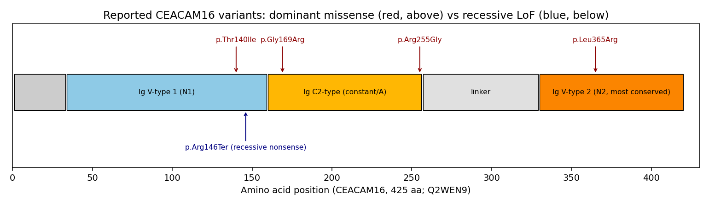

## Question

# Disease Characteristics Research Template

## Target Disease
- **Disease Name:** Autosomal Dominant Nonsyndromic Hearing Loss 4B
- **MONDO ID:** MONDO:0013823 (if available)
- **Category:** Mendelian

## Research Objectives

Please provide a comprehensive research report on **Autosomal Dominant Nonsyndromic Hearing Loss 4B** covering all of the
disease characteristics listed below. This report will be used to populate a disease knowledge
base entry. Be thorough and cite primary literature (PMID preferred) for all claims.

For each section, **suggested databases/resources** are listed. These are the first places
you should search for information on each topic.

---

### 1. Disease Information
> **Search first:** OMIM, Orphanet, ICD-10/ICD-11, MeSH, PubMed

- What is the disease? Provide a concise overview.
- What are the key identifiers? (OMIM, Orphanet, ICD-10/ICD-11, MeSH, Mondo)
- What are the common synonyms and alternative names?
- Is the information derived from individual patients (e.g., EHR) or aggregated disease-level resources?

### 2. Etiology

- **Disease Causal Factors**: What are the primary causes? (genetic, environmental, infectious, mechanistic)
- **Risk Factors**:
  > **Search first:** PubMed, Cochrane Library, UpToDate, clinical guidelines, ClinVar, ClinGen, GWAS Catalog, PheGenI, CTD, CDC, WHO, epidemiological databases
  - Genetic risk factors (causal variants, susceptibility loci, modifier genes)
  - Environmental risk factors (toxins, lifestyle, occupational exposures, age, sex, family history)
- **Protective Factors**:
  > **Search first:** PubMed, Cochrane Library, clinical trial databases, GWAS Catalog, gnomAD, WHO, CDC, nutrition databases
  - Genetic protective factors (protective variants, modifier alleles)
  - Environmental protective factors (diet, lifestyle, exposures that reduce risk)
- **Gene-Environment Interactions**: How do genetic and environmental factors interact to influence disease?
  > **Search first:** CTD, PubMed, PheGenI, GxE databases

### 3. Phenotypes
> **Search first:** HPO (Human Phenotype Ontology), OMIM, Orphanet, PubMed, clinicaltrials.gov, MedDRA, SNOMED CT, DECIPHER, LOINC

For each phenotype, provide:
- **Phenotype type**: symptoms, clinical signs, physical manifestations, behavioral changes, or laboratory abnormalities
  > For symptoms/signs: HPO, OMIM, Orphanet, PubMed
  > For behavioral changes: HPO, DSM, RDoC (Research Domain Criteria), PubMed
  > For laboratory abnormalities: LOINC, SNOMED CT, LabTests Online, PubMed
- **Phenotype characteristics**:
  > **Search first:** OMIM, Orphanet, HPO, PubMed
  - Age of symptom onset (neonatal, childhood, adult-onset, late-onset)
  - Symptom severity (mild, moderate, severe, variable)
  - Symptom progression (stable, progressive, episodic, fluctuating)
  - Frequency among affected individuals (percentage or qualitative)
- **Quality of life impact**: Effects on daily functioning and well-being (per-phenotype when possible)
  > **Search first:** EQ-5D database, SF-36, WHO QOL databases, PubMed
- Suggest HPO (Human Phenotype Ontology) terms for each phenotype

### 4. Genetic/Molecular Information

- **Causal Genes**: Gene mutations or chromosomal abnormalities responsible for disease (gene symbols, OMIM IDs)
  > **Search first:** OMIM, ClinVar, HGMD, Ensembl, NCBI Gene
- **Pathogenic Variants**:
  - Affected genes (gene symbols, HGNC IDs)
    > **Search first:** OMIM, NCBI Gene, Ensembl, HGNC, UniProt, GeneCards
  - Variant classification (pathogenic, likely pathogenic, VUS per ACMG/AMP guidelines)
    > **Search first:** ClinVar, ClinGen, ACMG/AMP guidelines, VarSome
  - Variant type/class (missense, frameshift, nonsense, splice-site, structural)
  - Allele frequency in population databases
    > **Search first:** gnomAD, 1000 Genomes, ExAC, TOPMed, dbSNP
  - Somatic vs germline origin
    > **Search first:** COSMIC (somatic), ClinVar, ICGC, TCGA
  - Functional consequences (loss of function, gain of function, dominant negative)
- **Modifier Genes**: Genes that modify disease severity or expression
- **Epigenetic Information**: DNA methylation, histone modifications, chromatin changes affecting disease
  > **Search first:** ENCODE, Roadmap Epigenomics, MethBase, DiseaseMeth
- **Chromosomal Abnormalities**: Large-scale genetic changes (aneuploidy, translocations, inversions)
  > **Search first:** DECIPHER, ClinVar, ECARUCA, UCSC Genome Browser

### 5. Environmental Information

- **Environmental Factors**: Non-genetic contributing factors (toxins, radiation, pollution, occupational exposure)
  > **Search first:** CTD (Comparative Toxicogenomics Database), TOXNET, PubMed, EPA databases
- **Lifestyle Factors**: Behavioral factors (smoking, diet, exercise, alcohol consumption)
  > **Search first:** CDC databases, WHO, PubMed, NHANES
- **Infectious Agents**: If applicable, pathogens causing or triggering disease (bacteria, viruses, fungi, parasites)
  > **Search first:** NCBI Taxonomy, ViPR, BV-BRC, MicrobeDB, GIDEON

### 6. Mechanism / Pathophysiology

**Present this section as an ordered causal chain first, then the detail below.**
Open with a numbered sequence of mechanistic steps running from the initiating
lesion (mutation, exposure, infection) to the clinical manifestation, one step per
line, each naming what it causes next. State the causal verb explicitly ("leads
to", "results in") and say where a step is inferred rather than demonstrated.
Where the mechanism branches, show the branch. The categories below are a
checklist of what to cover within those steps, not the organizing structure —
a step may draw on several of them, and a category may contribute to several
steps.

- **Molecular Pathways**: Specific signaling cascades or biochemical pathways involved (Wnt, MAPK, mTOR, PI3K-AKT, etc.)
  > **Search first:** KEGG, Reactome, WikiPathways, PathBank, BioCyc
- **Cellular Processes**: Cell-level mechanisms (apoptosis, autophagy, cell cycle dysregulation, inflammation, etc.)
  > **Search first:** Gene Ontology (GO), Reactome, KEGG, PubMed
- **Protein Dysfunction**: How protein structure or function is altered (misfolding, aggregation, loss of function, gain of function)
  > **Search first:** UniProt, PDB (Protein Data Bank), InterPro, Pfam, AlphaFold
- **Metabolic Changes**: Alterations in metabolic processes (energy metabolism, lipid metabolism, amino acid metabolism)
  > **Search first:** KEGG, BioCyc, HMDB (Human Metabolome Database), BRENDA
- **Immune System Involvement**: Role of immune response (autoimmunity, immunodeficiency, chronic inflammation)
  > **Search first:** ImmPort, Immunome Database, IEDB, Gene Ontology
- **Tissue Damage Mechanisms**: How tissues/ are injured (oxidative stress, ischemia, fibrosis, necrosis)
  > **Search first:** PubMed, Gene Ontology, Reactome
- **Biochemical Abnormalities**: Specific molecular defects (enzyme deficiencies, receptor dysfunction, ion channel defects)
  > **Search first:** BRENDA, UniProt, KEGG, OMIM, PubMed
- **Epigenetic Changes**: DNA methylation, histone modifications affecting gene expression in disease
  > **Search first:** ENCODE, Roadmap Epigenomics, MethBase, DiseaseMeth
- **Molecular Profiling** (if available):
  - Transcriptomics/gene expression changes
    > **Search first:** GEO (Gene Expression Omnibus), ArrayExpress, GTEx, Human Cell Atlas, SRA
  - Proteomics findings
    > **Search first:** PRIDE, ProteomeXchange, Human Protein Atlas, STRING, BioGRID
  - Metabolomics signatures
    > **Search first:** MetaboLights, Metabolomics Workbench, HMDB, METLIN
  - Lipidomics alterations
    > **Search first:** LIPID MAPS, SwissLipids, LipidHome, Metabolomics Workbench
  - Genomic structural features
    > **Search first:** UCSC Genome Browser, Ensembl, NCBI, dbVar, DGV
- **Advanced Technologies** (if applicable):
  - Single-cell analysis findings (cell-type specific mechanisms, cellular heterogeneity)
    > **Search first:** Human Cell Atlas, Single Cell Portal, GEO, CELLxGENE
  - Spatial transcriptomics findings
    > **Search first:** GEO, Spatial Research, Vizgen, 10x Genomics data
  - Multi-omics integration results
    > **Search first:** TCGA, ICGC, cBioPortal, LinkedOmics, PubMed
  - Functional genomics screens (CRISPR, RNAi)
    > **Search first:** DepMap, GenomeRNAi, PubMed, BioGRID ORCS

For each mechanism, describe:
- The causal chain from initial trigger to clinical manifestation
- Which mechanisms are upstream vs downstream
- What cell types and biological processes are involved
- Suggest GO terms for biological processes and CL terms for cell types

### 7. Anatomical Structures Affected

- **Organ Level**:
  - Primary organs directly affected
  - Secondary organ involvement (complications, secondary effects)
  - Body systems involved (cardiovascular, nervous, digestive, respiratory, endocrine, etc.)
  > **Search first:** Uberon, FMA (Foundational Model of Anatomy), OMIM, HPO, ICD-11, MeSH, SNOMED CT
- **Tissue and Cell Level**:
  - Specific tissue types affected (epithelial, connective, muscle, nervous)
  - Specific cell populations targeted (with Cell Ontology terms)
  > **Search first:** Uberon, Human Protein Atlas, Cell Ontology, Human Cell Atlas, CellMarker, PanglaoDB
- **Subcellular Level**:
  - Cellular compartments involved (mitochondria, nucleus, ER, lysosomes) (with GO Cellular Component terms)
  > **Search first:** Gene Ontology (Cellular Component), UniProt, Human Protein Atlas
- **Localization**:
  - Specific anatomical sites (with UBERON terms)
    > **Search first:** FMA, Uberon, NeuroNames (for brain), SNOMED CT
  - Lateralization (unilateral, bilateral, asymmetric)
    > **Search first:** HPO, clinical literature, imaging databases

### 8. Temporal Development

- **Onset**:
  - Typical age of onset (congenital, pediatric, adult, geriatric)
  - Onset pattern (acute, subacute, chronic, insidious)
  > **Search first:** OMIM, Orphanet, HPO, PubMed
- **Progression**:
  - Disease stages (early, intermediate, advanced, end-stage)
    > **Search first:** Cancer Staging Manual (AJCC), WHO classifications, PubMed
  - Progression rate (rapid, slow, variable)
  - Disease course pattern (episodic, relapsing-remitting, progressive, stable)
  - Disease duration (self-limited, chronic lifelong)
  > **Search first:** Disease registries, longitudinal cohort databases, natural history studies, PubMed, Orphanet, OMIM
- **Patterns**:
  - Remission patterns (spontaneous, treatment-induced)
    > **Search first:** Clinical trial databases, disease registries, PubMed
  - Critical periods (time windows of vulnerability or opportunity for intervention)
    > **Search first:** PubMed, developmental biology databases, clinical guidelines

### 9. Inheritance and Population

- **Epidemiology**:
  - Prevalence (cases per 100,000 at given time)
  - Incidence (new cases per 100,000 per year)
  > **Search first:** Orphanet, CDC, WHO, GBD (Global Burden of Disease), national registries, SEER, disease registries
- **For Genetic Etiology**:
  - Inheritance pattern (AD, AR, X-linked, mitochondrial, multifactorial, polygenic)
    > **Search first:** OMIM, Orphanet, ClinVar, GTR (Genetic Testing Registry)
  - Penetrance (complete, incomplete, age-dependent)
    > **Search first:** ClinVar, OMIM, PubMed, ClinGen
  - Expressivity (variable, consistent)
    > **Search first:** OMIM, ClinVar, PubMed
  - Genetic anticipation (increasing severity in successive generations)
    > **Search first:** OMIM, PubMed (especially for repeat expansion disorders)
  - Germline mosaicism
    > **Search first:** ClinVar, OMIM, genetic counseling literature, PubMed
  - Founder effects (population-specific mutations)
    > **Search first:** gnomAD, population genetics databases, PubMed
  - Consanguinity role
    > **Search first:** OMIM, population studies, genetic counseling resources
  - Carrier frequency
    > **Search first:** gnomAD, carrier screening databases, GeneReviews, GTR
- **Population Demographics**:
  - Affected populations (ethnic or demographic groups with higher prevalence)
    > **Search first:** gnomAD, 1000 Genomes, PAGE Study, PubMed, population registries
  - Geographic distribution (endemic areas, regional variation)
    > **Search first:** WHO, CDC, GBD, Orphanet, geographic epidemiology databases
  - Geographic distribution of specific variants
  - Sex ratio (male:female)
    > **Search first:** Disease registries, OMIM, PubMed, epidemiological databases
  - Age distribution of affected individuals
    > **Search first:** CDC, disease registries, SEER, Orphanet

### 10. Diagnostics

- **Clinical Tests**:
  - Laboratory tests (blood, urine, tissue chemistry, specific enzyme assays)
    > **Search first:** LOINC, LabTests Online, PubMed
  - Biomarkers (proteins, metabolites, genetic markers, circulating biomarkers)
    > **Search first:** FDA Biomarker List, BEST (Biomarkers, EndpointS, and other Tools), PubMed
  - Imaging studies (X-ray, CT, MRI, PET, ultrasound)
    > **Search first:** RadLex, DICOM, Radiopaedia, imaging databases
  - Functional tests (pulmonary function, cardiac stress tests)
    > **Search first:** LOINC, clinical guidelines, PubMed
  - Electrophysiology (EEG, EMG, ECG, nerve conduction studies)
    > **Search first:** LOINC, clinical neurophysiology databases, PubMed
  - Biopsy findings (histopathology, immunohistochemistry)
    > **Search first:** SNOMED CT, College of American Pathologists resources, PubMed
  - Pathology findings (microscopic examination)
    > **Search first:** SNOMED CT, Digital Pathology databases, PubMed
- **Genetic Testing**:
  > **Search first:** GTR (Genetic Testing Registry), GeneReviews, ClinGen
  - Overview of recommended genetic testing approach
  - Whole genome sequencing (WGS) utility
    > **Search first:** GTR, ClinVar, GEL (Genomics England), gnomAD
  - Whole exome sequencing (WES) utility
    > **Search first:** GTR, ClinVar, OMIM, GeneMatcher
  - Gene panels (which panels, which genes)
    > **Search first:** GTR, ClinVar, laboratory-specific databases
  - Single gene testing
    > **Search first:** GTR, ClinVar, OMIM, GeneReviews
  - Chromosomal microarray (CMA)
    > **Search first:** DECIPHER, ClinVar, dbVar, ECARUCA
  - Karyotyping
    > **Search first:** Chromosome Abnormality Database, ClinVar, cytogenetics resources
  - FISH
    > **Search first:** ClinVar, cytogenetics databases, PubMed
  - Mitochondrial DNA testing
    > **Search first:** MITOMAP, MSeqDR, ClinVar, GTR
  - Repeat expansion testing
    > **Search first:** GTR, ClinVar, repeat expansion databases, PubMed
- **Omics-Based Diagnostics** (if applicable):
  - RNA sequencing / transcriptomics
    > **Search first:** GEO, ArrayExpress, GTEx, RNA-seq databases
  - Proteomics
    > **Search first:** PRIDE, ProteomeXchange, FDA Biomarker database
  - Metabolomics
    > **Search first:** MetaboLights, Metabolomics Workbench, HMDB
  - Epigenomics
    > **Search first:** GEO, ENCODE, Roadmap Epigenomics, MethBase
  - Liquid biopsy
    > **Search first:** COSMIC, ClinVar, liquid biopsy databases, PubMed
- **Clinical Criteria**:
  - Standardized diagnostic criteria (DSM, ICD, society guidelines)
    > **Search first:** DSM-5, ICD-11, clinical society guidelines, UpToDate
  - Differential diagnosis (other conditions to rule out, with distinguishing features)
    > **Search first:** DynaMed, UpToDate, clinical decision support systems
- **Screening**:
  - Screening methods for asymptomatic individuals (newborn screening, carrier screening, cascade screening)
    > **Search first:** ACMG recommendations, CDC newborn screening, GTR

### 11. Outcome/Prognosis

- **Survival and Mortality**:
  - Survival rate (5-year, 10-year, overall)
    > **Search first:** SEER, cancer registries, disease-specific registries, PubMed
  - Life expectancy (with and without treatment if applicable)
    > **Search first:** Orphanet, disease registries, actuarial databases, PubMed
  - Mortality rate
    > **Search first:** CDC, WHO, GBD, national mortality databases
  - Disease-specific mortality (deaths directly attributable to disease)
    > **Search first:** Disease registries, CDC Wonder, GBD, PubMed
- **Morbidity and Function**:
  - Morbidity (disease-related disability and health impacts)
    > **Search first:** GBD, WHO, disability databases, PubMed
  - Disability outcomes (long-term functional impairments)
    > **Search first:** ICF (International Classification of Functioning), disability registries
  - Quality of life measures (EQ-5D, SF-36, PROMIS, disease-specific tools)
    > **Search first:** EQ-5D database, SF-36, PROMIS, PubMed
- **Disease Course**:
  - Complications (secondary problems: infections, organ failure, etc.)
    > **Search first:** ICD codes, disease registries, clinical databases, PubMed
  - Recovery potential (likelihood and extent of recovery, with vs without treatment)
    > **Search first:** Natural history studies, rehabilitation databases, PubMed
- **Prediction**:
  - Prognostic factors (age, disease severity, biomarkers, treatment response)
    > **Search first:** Prognostic models databases, clinical calculators, PubMed
  - Prognostic biomarkers (molecular markers predicting disease course)
    > **Search first:** FDA Biomarker database, PubMed, cancer prognostic databases

### 12. Treatment

- **Pharmacotherapy**:
  - Pharmacological treatments (drug names, drug classes, mechanisms of action)
    > **Search first:** DrugBank, RxNorm, ATC classification, DailyMed, FDA databases
  - Pharmacogenomics (how genetic variants affect drug metabolism, efficacy, toxicity)
    > **Search first:** PharmGKB, CPIC (Clinical Pharmacogenetics), FDA Table of PGx Biomarkers
- **Advanced Therapeutics**:
  - Gene therapy (viral vectors, CRISPR, gene replacement, gene editing)
    > **Search first:** ClinicalTrials.gov, FDA gene therapy database, ASGCT resources
  - Cell therapy (stem cell transplant, CAR-T, cellular therapeutics)
    > **Search first:** ClinicalTrials.gov, FDA cell therapy database, FACT standards
  - RNA-based therapies (ASOs, siRNA, mRNA therapies)
    > **Search first:** ClinicalTrials.gov, FDA approvals, PubMed
  - Targeted therapies (treatments directed at specific molecular targets)
    > **Search first:** My Cancer Genome, OncoKB, ClinicalTrials.gov, FDA approvals
  - Immunotherapies (checkpoint inhibitors, monoclonal antibodies)
    > **Search first:** Cancer Immunotherapy Database, FDA approvals, ClinicalTrials.gov
- **Surgical and Interventional**:
  - Surgical interventions (types of surgery, timing, outcomes)
    > **Search first:** CPT codes, surgical registries, clinical guidelines, PubMed
- **Supportive and Rehabilitative**:
  - Supportive care (symptom management, pain control, nutrition)
    > **Search first:** Clinical guidelines, Cochrane Library, PubMed
  - Rehabilitation (physical therapy, occupational therapy, speech therapy)
    > **Search first:** Rehabilitation medicine databases, clinical guidelines, PubMed
- **Experimental**:
  - Experimental treatments in clinical trials (with NCT identifiers if available)
    > **Search first:** ClinicalTrials.gov, EU Clinical Trials Register, WHO ICTRP
- **Treatment Outcomes**:
  - Treatment response rates
    > **Search first:** Clinical trial databases, FDA reviews, systematic reviews, PubMed
  - Side effects and adverse events
    > **Search first:** FDA Adverse Event Reporting System (FAERS), MedWatch, PubMed
- **Treatment Strategy**:
  - Treatment algorithms (clinical pathways, decision trees)
    > **Search first:** Clinical practice guidelines, NCCN Guidelines, UpToDate
  - Combination therapies
    > **Search first:** ClinicalTrials.gov, treatment guidelines, PubMed
  - Personalized medicine approaches (genotype-guided treatment)
    > **Search first:** My Cancer Genome, CIViC, PharmGKB, precision medicine databases

For each treatment, suggest NCIT (NCI Thesaurus) clinical-intervention terms where applicable.

### 13. Prevention

- **Prevention Levels**:
  - Primary prevention (preventing disease occurrence: vaccination, risk factor modification)
    > **Search first:** CDC, WHO, USPSTF recommendations, Cochrane Library
  - Secondary prevention (early detection and treatment: screening programs, early intervention)
    > **Search first:** USPSTF, CDC screening guidelines, WHO
  - Tertiary prevention (preventing complications in those with disease)
    > **Search first:** Clinical guidelines, disease management protocols, PubMed
- **Immunization**: Vaccine strategies (if applicable)
  > **Search first:** CDC vaccine schedules, WHO immunization, FDA vaccine database
- **Screening and Early Detection**:
  - Screening programs (population-based: newborn screening, cancer screening)
    > **Search first:** CDC screening programs, USPSTF, cancer screening databases
  - Genetic screening (carrier screening, preimplantation genetic diagnosis, prenatal testing)
    > **Search first:** ACMG recommendations, ACOG guidelines, GTR
  - Risk stratification (identifying high-risk individuals for targeted prevention)
    > **Search first:** Risk prediction models, clinical calculators, PubMed
- **Behavioral Interventions**: Lifestyle modifications to reduce risk
  > **Search first:** CDC, WHO, behavioral intervention databases, Cochrane Library
- **Counseling**: Genetic counseling (risk assessment, family planning guidance)
  > **Search first:** NSGC resources, ACMG guidelines, GeneReviews
- **Public Health**:
  - Public health interventions (sanitation, vector control, health education)
    > **Search first:** CDC, WHO, public health databases, PubMed
  - Environmental interventions (reducing environmental risk factors)
    > **Search first:** EPA databases, WHO environmental health, PubMed
- **Prophylaxis**: Preventive medications or procedures
  > **Search first:** Clinical guidelines, FDA approvals, PubMed

### 14. Other Species / Natural Disease

- **Taxonomy**: Species affected (with NCBI Taxon identifiers)
  > **Search first:** NCBI Taxonomy
- **Breed**: Specific breeds affected (with VBO identifiers if applicable)
  > **Search first:** VBO (Vertebrate Breed Ontology)
- **Gene**: Orthologous genes in other species (with NCBI Gene IDs)
  > **Search first:** NCBI Gene
- **Natural Disease**:
  - Naturally occurring disease in other species (companion animals, wildlife)
    > **Search first:** OMIA (Online Mendelian Inheritance in Animals), VetCompass, PubMed
  - Veterinary relevance and importance in animal health
    > **Search first:** OMIA, veterinary databases, PubMed
- **Comparative Biology**:
  - Comparative pathology (similarities and differences across species)
    > **Search first:** OMIA, comparative pathology databases, PubMed
  - Evolutionary conservation of disease mechanisms
    > **Search first:** HomoloGene, OrthoMCL, Alliance of Genome Resources
- **Transmission** (if applicable):
  - Zoonotic potential
    > **Search first:** CDC zoonotic diseases, WHO zoonoses, GIDEON
  - Cross-species susceptibility
    > **Search first:** NCBI Taxonomy, veterinary databases, PubMed

### 15. Model Organisms

- **Model Types**:
  - Model organism type (mammalian, invertebrate, cellular, in vitro)
    > **Search first:** Alliance of Genome Resources, model organism databases
  - Specific model systems (mouse, rat, zebrafish, Drosophila, C. elegans, yeast, cell lines, organoids, iPSCs)
    > **Search first:** MGI, RGD, ZFIN, FlyBase, WormBase, SGD, ATCC, Cellosaurus
  - Induced models (drug treatment, surgical intervention, environmental manipulation)
    > **Search first:** MGI, model organism databases, PubMed
- **Genetic Models**:
  - Types available (knockout, knock-in, transgenic, conditional, humanized)
    > **Search first:** MGI, IMPC, KOMP, EuMMCR, IMSR
- **Model Characteristics**:
  - Phenotype recapitulation (how well model reproduces human disease features)
    > **Search first:** Model organism databases, comparative studies, PubMed
  - Model limitations (aspects of human disease not captured)
    > **Search first:** Model organism databases, PubMed, review articles
- **Applications**:
  - Research applications (what aspects of disease can be studied)
    > **Search first:** Model organism databases, PubMed
- **Resources**:
  - Model databases
    > **Search first:** MGI, RGD, ZFIN, FlyBase, WormBase, IMSR, EMMA, MMRRC

---

## Citation Requirements

- Cite primary literature (PMID preferred) for all mechanistic and clinical claims
- Prioritize recent reviews and landmark papers
- Include direct quotes from abstracts where possible to support key statements
- Distinguish evidence source types: human clinical, model organism, in vitro, computational

## Output Format

Structure your response as a comprehensive narrative organized by the sections above.
For each section, provide:
- Factual content with specific details (numbers, percentages, gene names, variant nomenclature)
- Ontology term suggestions (HPO, GO, CL, UBERON, CHEBI, NCIT, MONDO) where applicable
- Evidence citations with PMIDs
- Direct quotes from abstracts to support key claims
- Clear indication when information is not available or not applicable for this disease

This report will be used to populate a disease knowledge base entry with:
- Pathophysiology descriptions with causal chains
- Gene/protein annotations (HGNC, GO terms)
- Phenotype associations (HP terms) with frequencies
- Cell type involvement (CL terms)
- Anatomical locations (UBERON terms)
- Chemical entities (CHEBI terms)
- Treatment annotations (NCIT terms)
- Evidence items with PMIDs and exact abstract quotes
- Epidemiology, prognosis, diagnostic, and prevention information
- Animal model descriptions with phenotype recapitulation details


## Output

# Autosomal Dominant Nonsyndromic Hearing Loss 4B (DFNA4B): A Comprehensive Disease Characterization

**MONDO:** MONDO:0013823 · **OMIM:** #614614 · **Gene:** *CEACAM16* (19q13.32) · **Category:** Mendelian, autosomal dominant

---

## Summary

**Autosomal Dominant Nonsyndromic Hearing Loss 4B (DFNA4B)** is a rare Mendelian sensorineural hearing disorder caused by heterozygous variants — predominantly missense — in *CEACAM16* (carcinoembryonic antigen-related cell adhesion molecule 16), which maps to the DFNA4 locus on chromosome 19q13.32. CEACAM16 is a secreted, non-collagenous glycoprotein of the cochlear **tectorial membrane (TM)**, an acellular extracellular matrix essential for stimulating the mechanosensitive stereocilia of hair cells. The protein localizes to the tips of the tallest outer-hair-cell (OHC) stereocilia and to the TM, where it bridges and stabilizes the two principal TM glycoproteins, α-tectorin (TECTA) and β-tectorin (TECTB) [PMID: 21368133](https://pubmed.ncbi.nlm.nih.gov/21368133/), [PMID: 25080593](https://pubmed.ncbi.nlm.nih.gov/25080593/).

Clinically, DFNA4B presents as a **postlingual, late-onset (childhood/adolescence through adulthood, ~5–30 years), bilateral, symmetric, slowly progressive, high-frequency sensorineural hearing loss** that begins with tinnitus and elevated high-frequency thresholds and resembles age-related hearing loss (presbycusis) in its trajectory [PMID: 39157884](https://pubmed.ncbi.nlm.nih.gov/39157884/), [PMID: 26648831](https://pubmed.ncbi.nlm.nih.gov/26648831/). Multiple heterozygous missense variants distributed across the protein's conserved immunoglobulin-fold domains segregate with the dominant phenotype and act through **dominant-negative or altered-secretion** mechanisms, whereas biallelic loss-of-function variants cause a distinct **allelic autosomal recessive** form of nonsyndromic hearing loss [PMID: 25589040](https://pubmed.ncbi.nlm.nih.gov/25589040/), [PMID: 35292975](https://pubmed.ncbi.nlm.nih.gov/35292975/), [PMID: 30514912](https://pubmed.ncbi.nlm.nih.gov/30514912/).

There is currently **no CEACAM16-specific molecular therapy**. Management is entirely rehabilitative — hearing aids and cochlear implants for advanced loss — combined with genetic counseling. Because DFNA4B is dominant and involves a secreted extracellular-matrix protein, it remains a difficult target for current adeno-associated virus (AAV) gene-addition strategies, which have achieved clinical proof-of-concept only for recessive, hair-cell-intrinsic genes such as *OTOF* [PMID: 38280389](https://pubmed.ncbi.nlm.nih.gov/38280389/), [PMID: 39520052](https://pubmed.ncbi.nlm.nih.gov/39520052/). *Ceacam16*-null mice recapitulate progressive TM degradation, loss of Hensen's stripe, and abnormal otoacoustic emissions, providing a validated model of the disease mechanism [PMID: 25080593](https://pubmed.ncbi.nlm.nih.gov/25080593/), [PMID: 31249509](https://pubmed.ncbi.nlm.nih.gov/31249509/).

---

## 1. Disease Information

**Overview.** DFNA4B is a form of hereditary, nonsyndromic (hearing loss occurring in isolation, without associated systemic features), sensorineural hearing impairment inherited in an autosomal dominant pattern. It is one of the allelic disorders caused by variants in *CEACAM16* and corresponds to the "B" subtype at the DFNA4 locus. The disease is defined at the disease/gene aggregate level (OMIM, ClinVar, published pedigrees) rather than from individual EHR records; the evidence base is a set of multigenerational families and de novo cases characterized by clinical audiometry and molecular genetics.

**Key identifiers.**

| Resource | Identifier |
|---|---|
| MONDO | MONDO:0013823 |
| OMIM (phenotype) | #614614 (DFNA4B) |
| Gene | *CEACAM16* (HGNC), OMIM *614591 |
| Cytogenetic locus | 19q13.32 (DFNA4 region) |
| Inheritance | Autosomal dominant |
| MeSH (parent concept) | Hearing Loss, Sensorineural; Deafness |
| ICD-10 | H90.5 (unspecified sensorineural hearing loss) — no DFNA4B-specific code |
| ICD-11 | AB50–AB52 range (sensorineural hearing impairment) — no specific code |

**Synonyms / alternative names.** DFNA4B; deafness, autosomal dominant 4B; nonsyndromic hearing loss DFNA4 (CEACAM16-related dominant form). The recessive allelic disorder is designated **DFNB** (autosomal recessive nonsyndromic hearing loss, CEACAM16-related; see Section 4).

**Information source.** Aggregated disease-level resources (OMIM, ClinVar, gene-disease literature) and published family/case reports — not individual patient EHR data.

---

## 2. Etiology

**Primary cause — genetic.** DFNA4B is a monogenic disorder caused by heterozygous variants in *CEACAM16*. It is not attributable to environmental, infectious, or acquired causes; the etiology is entirely germline genetic. Reported causal variants are predominantly missense changes in conserved regions of the protein (see Section 4).

**Genetic risk factors.** The disease-determining factor is the presence of a single heterozygous pathogenic *CEACAM16* variant. Documented dominant variants include:
- p.Thr140Ile — large Russian family [PMID: 39157884](https://pubmed.ncbi.nlm.nih.gov/39157884/)
- p.Gly169Arg (c.505G>A) — Chinese family [PMID: 25589040](https://pubmed.ncbi.nlm.nih.gov/25589040/)
- p.Arg255Gly (c.763A>G) — Chinese family [PMID: 35292975](https://pubmed.ncbi.nlm.nih.gov/35292975/)
- p.Leu365Arg — de novo case [PMID: 26648831](https://pubmed.ncbi.nlm.nih.gov/26648831/)

**Environmental risk factors / modifiers.** No specific environmental risk factors are established for DFNA4B itself. However, because the TM is a shared structure whose integrity buffers the cochlea against environmental insults, exposures known to accelerate sensorineural hearing loss generally — **noise exposure, aging, ototoxic drugs (aminoglycosides, platinum agents)** — are biologically plausible aggravators of an already-compromised TM. Supporting this concept, mice heterozygous for a TM-gene (*TECTB*) missense variant show *increased susceptibility to noise-induced hearing loss* despite normal baseline thresholds [PMID: 42702881](https://pubmed.ncbi.nlm.nih.gov/42702881/) — evidence (from a related TM gene) that subclinical TM defects sensitize the cochlea to environmental damage. This is an inferred, not directly demonstrated, gene–environment interaction for *CEACAM16*.

**Protective factors.** No genetic or environmental protective factors have been specifically characterized for DFNA4B. Avoidance of noise and ototoxins is a reasonable, if unproven, protective strategy.

---

## 3. Phenotypes

DFNA4B is a "pure" auditory phenotype. The dominant clinical features and their characteristics are summarized below.

| Phenotype | HPO term | Onset | Severity | Progression | Frequency in affected |
|---|---|---|---|---|---|
| Sensorineural hearing loss | HP:0000407 | Late-onset (~5–30 y) | Mild→severe with age | Slowly progressive | ~100% (defining) |
| High-frequency hearing loss | HP:0000421 / HP:0008542 | Earliest affected range | Initial deficit | Progressive, later involving mid/low frequencies | Characteristic initial pattern |
| Progressive hearing impairment | HP:0001730 | — | — | Progressive | Universal |
| Bilateral hearing loss | HP:0008625 (bilateral SNHL) | — | Symmetric | — | Universal |
| Tinnitus | HP:0000360 | Often the presenting symptom | Variable | — | Common early feature |
| Postlingual onset | HP:0011476 (postlingual sensorineural HL) | After speech acquisition | — | — | Universal |

**Detail.** The auditory phenotype is postlingual and typically begins in childhood or adolescence with tinnitus and elevation of high-frequency thresholds, then progresses with age to involve middle and lower frequencies, ultimately resembling age-related hearing loss. In a large five-generation Russian family (11 affected individuals), onset occurred between ages 5 and 20 years, "start[ing] with tinnitus and threshold increase at high frequencies" [PMID: 39157884](https://pubmed.ncbi.nlm.nih.gov/39157884/). A de novo case matched the described DFNA4B onset and severity [PMID: 26648831](https://pubmed.ncbi.nlm.nih.gov/26648831/), and Chinese families likewise showed late-onset, progressive loss [PMID: 25589040](https://pubmed.ncbi.nlm.nih.gov/25589040/), [PMID: 35292975](https://pubmed.ncbi.nlm.nih.gov/35292975/).

**Quality-of-life impact.** As a progressive, lifelong sensorineural hearing loss, DFNA4B carries the well-documented QoL burdens of adult-onset deafness: impaired speech comprehension (especially in noise), communication difficulty, social withdrawal, and — in later life — associations with cognitive decline and depression common to presbycusis-like hearing loss. Disease-specific QoL instruments have not been applied to DFNA4B cohorts; generic tools (SF-36, EQ-5D, HHIE) would apply. No mortality or systemic morbidity is associated.

---

## 4. Genetic / Molecular Information

**Causal gene.** *CEACAM16* (carcinoembryonic antigen-related cell adhesion molecule 16), OMIM *614591, chromosome **19q13.32**, within the DFNA4 linkage region. The gene encodes a **secreted glycoprotein** — confirmed by immunofluorescence and Western blot [PMID: 25589040](https://pubmed.ncbi.nlm.nih.gov/25589040/) — that is a structural component of the tectorial membrane. The protein contains immunoglobulin-like (Ig) domains (including N-terminal variable/N-type and constant/A-type domains) characteristic of the CEACAM family.

**Pathogenic variants (dominant, DFNA4B).**

| Variant (protein) | cDNA | Type | Family / origin | Functional consequence | PMID |
|---|---|---|---|---|---|
| p.Thr140Ile | — | Missense | Russian, 5-gen (11 affected) | Dominant | [39157884](https://pubmed.ncbi.nlm.nih.gov/39157884/) |
| p.Gly169Arg | c.505G>A | Missense | Chinese, 5-gen | Reduced mutant secretion efficiency | [25589040](https://pubmed.ncbi.nlm.nih.gov/25589040/) |
| p.Arg255Gly | c.763A>G | Missense | Chinese, 4-gen | *Increased* secretion of mutant protein | [35292975](https://pubmed.ncbi.nlm.nih.gov/35292975/) |
| p.Leu365Arg | — | Missense | De novo | Dominant, matched DFNA4B phenotype | [26648831](https://pubmed.ncbi.nlm.nih.gov/26648831/) |

Dominant variants are **missense** and cluster within the conserved Ig-like domains. Functional studies in transfected HEK293T cells reveal two contrasting biochemical consequences: p.Gly169Arg **reduces** secretion efficiency ("the secretion efficacy of the mutant CEACAM16 is much lower than that of the wild type") [PMID: 25589040](https://pubmed.ncbi.nlm.nih.gov/25589040/), whereas p.Arg255Gly **increases** intracellular and extracellular mutant protein levels [PMID: 35292975](https://pubmed.ncbi.nlm.nih.gov/35292975/). Both are interpreted as deleterious, consistent with a **dominant-negative / altered-secretion** mechanism in which the abnormal monomer poisons assembly of the multimeric TM matrix rather than simply reducing gene dosage.

**Variant classification.** Reported dominant variants are classified pathogenic/likely pathogenic by ACMG/AMP criteria on the basis of co-segregation in multigenerational families, absence in matched controls (e.g., not present in 200 ancestry-matched controls for p.Gly169Arg), a de novo occurrence (p.Leu365Arg), and supportive functional data.

**Allelic recessive form (DFNB).** Biallelic **loss-of-function** variants in *CEACAM16* cause **autosomal recessive** nonsyndromic hearing loss — mechanistically and phenotypically distinct from dominant DFNA4B:
- Homozygous splice-altering variants c.37G>T and c.662-1G>C (Iranian families) [PMID: 29703829](https://pubmed.ncbi.nlm.nih.gov/29703829/)
- Homozygous nonsense c.436C>T (p.Arg146Ter) [PMID: 30514912](https://pubmed.ncbi.nlm.nih.gov/30514912/)

The authors of the recessive reports concluded that "loss-of-function variants in CEACAM16 cause autosomal recessive hearing loss in humans" [PMID: 30514912](https://pubmed.ncbi.nlm.nih.gov/30514912/). Thus *CEACAM16* exhibits **dual inheritance**: dominant missense (poison-monomer) vs. recessive LoF (protein absence).

**Allele frequency.** Dominant pathogenic variants are private/rare, absent from population controls and gnomAD at appreciable frequency.

**Somatic vs germline.** Entirely **germline**; no somatic involvement.

**Modifier genes.** No formally established modifier genes. Given that CEACAM16 functions within a shared TM protein network, functional variants in interacting partners (**TECTA**, **TECTB**, **OTOG**, **OTOGL**, **OTOA**) are plausible modifiers of TM integrity and hearing thresholds, but this is inferential.

**Epigenetics / chromosomal abnormalities.** No disease-specific DNA-methylation, histone, or large-scale chromosomal abnormalities are reported for DFNA4B. It is a point-mutation disorder.

{{figure:ceacam16_variant_map.png|caption=Schematic map of reported dominant (missense) versus recessive (loss-of-function/splice/nonsense) CEACAM16 variants across the protein's immunoglobulin-fold domain architecture. Dominant DFNA4B variants cluster within conserved Ig domains and act via dominant-negative/altered-secretion mechanisms, whereas biallelic LoF variants truncate the protein and cause the recessive allelic form.}}

---

## 5. Environmental Information

DFNA4B is a purely genetic disorder; **no environmental, lifestyle, or infectious agent is a necessary cause**. However, environmental cochlear stressors are plausible disease *aggravators* rather than initiators:

- **Environmental / occupational:** Noise exposure and ototoxic agents (aminoglycoside and platinum-based drugs) may accelerate hearing decline in an already TM-compromised cochlea. Direct evidence in *CEACAM16* patients is lacking; the concept is supported by the related TM gene *TECTB*, where heterozygous mice showed increased noise-induced-hearing-loss susceptibility [PMID: 42702881](https://pubmed.ncbi.nlm.nih.gov/42702881/).
- **Lifestyle:** No specific dietary, smoking, or alcohol associations established for DFNA4B.
- **Infectious agents:** None. Not applicable.

---

## 6. Mechanism / Pathophysiology

### Ordered causal chain (initiating lesion → clinical manifestation)

1. A **heterozygous missense variant in *CEACAM16*** (e.g., p.Gly169Arg, p.Arg255Gly, p.Thr140Ile, p.Leu365Arg) alters a conserved Ig-domain residue → **produces a structurally abnormal CEACAM16 monomer** (demonstrated by segregation + in vitro expression).
2. The mutant monomer has **altered secretion** — reduced (p.Gly169Arg) or aberrantly increased/retained (p.Arg255Gly) → **impairs correct incorporation of CEACAM16 into the tectorial-membrane matrix** (inferred from in vitro secretion assays; [PMID: 25589040](https://pubmed.ncbi.nlm.nih.gov/25589040/), [PMID: 35292975](https://pubmed.ncbi.nlm.nih.gov/35292975/)).
3. Because CEACAM16 normally **bridges α-tectorin (TECTA) and β-tectorin (TECTB)**, defective CEACAM16 → **destabilizes TECTA–TECTB cross-links** and the multimeric TM network, acting as a **poison monomer (dominant-negative)** (interaction demonstrated in mouse; [PMID: 21368133](https://pubmed.ncbi.nlm.nih.gov/21368133/), [PMID: 25080593](https://pubmed.ncbi.nlm.nih.gov/25080593/)).
4. Disrupted cross-linking → **failure to form/maintain the striated-sheet matrix and Hensen's stripe, reduced TECTB levels** (demonstrated in *Ceacam16*-null mice; [PMID: 25080593](https://pubmed.ncbi.nlm.nih.gov/25080593/)).
5. Compromised TM structure → **abnormal coupling between the TM and the tips of the tallest OHC stereocilia**, and with age, **accelerated TM degradation/detachment** ([PMID: 31249509](https://pubmed.ncbi.nlm.nih.gov/31249509/)).
6. Impaired TM–stereocilia coupling → **degraded cochlear amplification and frequency tuning**; the active process becomes unstable → **elevated/abnormal otoacoustic emissions, including spontaneous OAEs** as a micromechanical-instability biomarker ([PMID: 25080593](https://pubmed.ncbi.nlm.nih.gov/25080593/), [PMID: 26691158](https://pubmed.ncbi.nlm.nih.gov/26691158/), [PMID: 34332206](https://pubmed.ncbi.nlm.nih.gov/34332206/)).
7. Progressive loss of amplification, initially in the high-frequency (basal) cochlea → **clinical high-frequency, slowly progressive, bilateral sensorineural hearing loss** (the DFNA4B phenotype).

```
CEACAM16 missense (Ig domain)
        │  altered folding/secretion
        ▼
Poison monomer incorporated into TM matrix  ──(dominant-negative)
        │  destabilizes TECTA–TECTB cross-links
        ▼
↓TECTB, no striated-sheet matrix, loss of Hensen's stripe
        │
        ▼
TM–OHC stereocilia coupling impaired  →  accelerated TM degradation w/ age
        │
        ▼
Cochlear amplifier unstable → abnormal/spontaneous OAEs
        │
        ▼
High-frequency → broadening, slowly progressive bilateral SNHL
```

**Branch (recessive):** Biallelic LoF → **total absence of CEACAM16** → TM matrix underdevelopment → recessive progressive hearing loss ([PMID: 30514912](https://pubmed.ncbi.nlm.nih.gov/30514912/), [PMID: 29703829](https://pubmed.ncbi.nlm.nih.gov/29703829/)).

### Detail by category

- **Molecular / structural pathway.** The core defect is in **extracellular-matrix assembly of the tectorial membrane**, not in a classic intracellular signaling cascade (Wnt/MAPK/mTOR are not implicated). CEACAM16 colocalizes and co-immunoprecipitates with α-tectorin [PMID: 21368133](https://pubmed.ncbi.nlm.nih.gov/21368133/) and additionally interacts with β-tectorin, "indicating that it may stabilize interactions between TECTA and TECTB" [PMID: 25080593](https://pubmed.ncbi.nlm.nih.gov/25080593/).
- **Protein dysfunction.** Misfolding/altered secretion of an Ig-domain glycoprotein; dominant-negative incorporation of aberrant monomer into a multimeric matrix. GO terms: extracellular matrix structural constituent (GO:0005201).
- **Cellular processes.** Non-cell-autonomous: the primary lesion is in a secreted matrix, secondarily impairing OHC mechanotransduction/amplification. Relevant GO biological processes: sensory perception of sound (GO:0007605), inner ear morphogenesis (GO:0042472), extracellular matrix organization (GO:0030198).
- **Tissue-damage mechanism.** Age-accelerated degradation and detachment of the TM ([PMID: 31249509](https://pubmed.ncbi.nlm.nih.gov/31249509/)); loss of Hensen's stripe correlating with SOAE predominance >15 kHz [PMID: 25080593](https://pubmed.ncbi.nlm.nih.gov/25080593/).
- **Biochemical / biophysical abnormality.** The TM is a passive mechanical element that shapes cochlear tuning; its disruption alters the coupled OHC feedback loop and destabilizes the active process, producing spontaneous otoacoustic emissions in ~70% of *Ceacam16*-null homozygotes (vs <3% of wild-type) [PMID: 25080593](https://pubmed.ncbi.nlm.nih.gov/25080593/).
- **Immune involvement / metabolic changes / epigenetics.** None implicated. Not applicable.
- **Cell types (CL) and anatomy (UBERON):** outer hair cell (CL:0000601), inner hair cell (CL:0000589); tectorial membrane (UBERON:0002233), organ of Corti (UBERON:0002227), cochlea (UBERON:0001844).

---

## 7. Anatomical Structures Affected

- **Organ level:** The **inner ear / cochlea** is the sole affected organ (UBERON:0001846 internal ear; UBERON:0001844 cochlea). No secondary organ involvement; no other body system is affected — consistent with the nonsyndromic designation.
- **Body system:** Auditory/vestibulocochlear component of the sensory/nervous system (peripheral auditory system). Vestibular function is spared.
- **Tissue/cell level:** The primary lesion is in the **acellular tectorial membrane** (UBERON:0002233), an extracellular matrix. Secondarily affected are the sensory **outer hair cells** (CL:0000601) whose tallest stereocilia are coupled to the TM, and by extension the **inner hair cells** (CL:0000589) that transmit the encoded signal. The **organ of Corti** (UBERON:0002227) is the functional epithelium.
- **Subcellular level:** CEACAM16 is a secreted protein trafficked through the ER/Golgi secretory pathway (GO:0005783 endoplasmic reticulum, GO:0005796 Golgi lumen for biosynthesis) and deposited into the **extracellular matrix / tectorial membrane** (GO:0031012). Stereociliar tips (GO:0032420 stereocilium) are the coupling site.
- **Localization / lateralization:** **Bilateral and symmetric**; the disease progresses along the tonotopic (base→apex) axis, initially affecting the **basal (high-frequency) cochlea**.

---

## 8. Temporal Development

- **Onset:** Postlingual and **late-onset**, typically emerging in childhood/adolescence and continuing into adulthood (reported onset ranges ~5–30 years; age 5–20 years in the large Russian pedigree) [PMID: 39157884](https://pubmed.ncbi.nlm.nih.gov/39157884/). Onset pattern is **insidious/chronic**, not acute.
- **Progression:** **Slowly progressive** over decades. It begins at high frequencies with tinnitus, then broadens to mid/low frequencies, ultimately resembling presbycusis. Progression rate is slow but effectively lifelong.
- **Disease course:** Chronic, progressive, non-remitting. There are no episodic or relapsing-remitting features and **no spontaneous remission**.
- **Critical periods / windows for intervention:** No pharmacologic window is defined. The relevant intervention window is functional — timely hearing-aid fitting as thresholds rise, and cochlear implantation when hearing loss becomes severe/profound.

---

## 9. Inheritance and Population

- **Inheritance pattern:** **Autosomal dominant** (dominant DFNA4B, missense). The allelic recessive form is autosomal recessive (biallelic LoF).
- **Penetrance:** High, consistent with strong co-segregation across multigenerational pedigrees; likely age-dependent given the progressive, late-onset nature (a young carrier may be pre-symptomatic). Formal penetrance estimates are not published.
- **Expressivity:** Variable in age of onset and rate of progression across and within families.
- **De novo mutation:** Documented (p.Leu365Arg), so absence of family history does not exclude the diagnosis [PMID: 26648831](https://pubmed.ncbi.nlm.nih.gov/26648831/).
- **Genetic anticipation / germline mosaicism / founder effects / consanguinity:** No anticipation (not a repeat-expansion disorder). Consanguinity is relevant to the **recessive** allelic form (e.g., Iranian families with homozygous variants [PMID: 29703829](https://pubmed.ncbi.nlm.nih.gov/29703829/)), not to dominant DFNA4B. No established founder effect for the dominant form.
- **Carrier frequency:** Not established; dominant variants are private/rare.
- **Epidemiology:** DFNA4B is a **rare** cause of hereditary hearing loss; precise prevalence/incidence figures are not established. It is one of ~30+ ADNSHL genes and accounts for a small fraction of dominant nonsyndromic hearing loss [PMID: 25589040](https://pubmed.ncbi.nlm.nih.gov/25589040/). Reported dominant families are of Russian and Chinese ancestry, but this reflects ascertainment rather than a demonstrated ethnic predilection.
- **Sex ratio:** No sex bias expected or reported (autosomal). **Male:female ≈ 1:1.**
- **Geographic distribution:** Reported worldwide in individual families; no endemic clustering.

---

## 10. Diagnostics

- **Audiological testing (core):** Pure-tone audiometry reveals bilateral, symmetric, high-frequency-predominant sensorineural hearing loss; **otoacoustic emissions (OAE)** are notable — TM defects produce abnormal and **spontaneous otoacoustic emissions (SOAEs)**, a potential noninvasive biomarker of TM/cochlear-amplifier instability [PMID: 25080593](https://pubmed.ncbi.nlm.nih.gov/25080593/), [PMID: 34332206](https://pubmed.ncbi.nlm.nih.gov/34332206/). Auditory brainstem response (ABR) confirms sensorineural pattern and threshold.
- **Genetic testing (definitive):** Molecular confirmation via *CEACAM16* sequencing. Recommended approaches:
  - **Comprehensive hearing-loss gene panels / targeted NGS** (which include *CEACAM16* alongside *TECTA*, *TECTB*, *OTOG*, *OTOGL*, *GJB2*, etc.) — the practical first-line test [PMID: 35292975](https://pubmed.ncbi.nlm.nih.gov/35292975/), [PMID: 41897287](https://pubmed.ncbi.nlm.nih.gov/41897287/).
  - **Whole-exome sequencing (WES)** — used to identify *CEACAM16* variants in several families, often combined with linkage analysis [PMID: 25589040](https://pubmed.ncbi.nlm.nih.gov/25589040/).
  - **Single-gene testing / Sanger** for cascade testing of a known familial variant.
  - **Linkage analysis** historically mapped the locus to 19q13 in extended pedigrees [PMID: 25589040](https://pubmed.ncbi.nlm.nih.gov/25589040/).
  - Chromosomal microarray, karyotyping, FISH, mtDNA, and repeat-expansion testing are **not** indicated (point-mutation, autosomal, non-repeat disorder).
- **Imaging:** No characteristic CT/MRI finding; imaging is used to exclude other causes and for cochlear-implant planning.
- **Clinical criteria / differential diagnosis:** Diagnosis rests on the combination of a compatible progressive high-frequency SNHL phenotype, dominant family history (or de novo finding), and a pathogenic *CEACAM16* variant. **Differential diagnosis** includes other TM-related dominant hearing losses — especially **DFNA8/12 (TECTA)** and the newly described **TECTB**-related dominant hearing loss [PMID: 42702881](https://pubmed.ncbi.nlm.nih.gov/42702881/), [PMID: 40832383](https://pubmed.ncbi.nlm.nih.gov/40832383/) — as well as *OTOG/OTOGL* forms and, importantly, **age-related hearing loss (presbycusis)**, which DFNA4B closely mimics. Genetic testing distinguishes these.
- **Screening:** No population newborn screening for DFNA4B specifically (it is late-onset). **Cascade genetic screening** of at-risk relatives once a familial variant is identified is appropriate.

---

## 11. Outcome / Prognosis

- **Survival / mortality:** DFNA4B is **not life-limiting**. Life expectancy is normal; there is no disease-specific mortality.
- **Morbidity / disability:** The morbidity is **functional** — progressive hearing disability affecting communication, education, employment, and social participation, with the downstream QoL and (in older adults) cognitive/psychosocial burdens of untreated hearing loss.
- **Disease course:** Chronic, slowly progressive, lifelong. Without amplification, high-frequency deficits broaden; with hearing aids and, when needed, cochlear implants, functional hearing can be substantially restored.
- **Recovery potential:** No spontaneous recovery; the structural TM defect is not self-repairing. Functional outcomes with rehabilitation are generally good.
- **Prognostic factors:** Specific variant, family-specific rate of progression, age at onset, and cumulative environmental exposures (noise/ototoxins) likely modulate the trajectory. **Spontaneous/abnormal OAEs** are a candidate biomarker of cochlear-amplifier status [PMID: 34332206](https://pubmed.ncbi.nlm.nih.gov/34332206/) but are not yet a validated clinical prognostic tool.

---

## 12. Treatment

**There is no CEACAM16-specific or disease-modifying therapy.** Management is **rehabilitative and supportive**:

- **Hearing aids** (amplification) for mild–moderate–severe loss (NCIT: Hearing Aid). First-line as thresholds rise.
- **Cochlear implantation** for severe-to-profound loss not adequately aided (NCIT: Cochlear Implant / Cochlear Implantation).
- **Aural rehabilitation / speech-language therapy**, assistive listening devices, and communication strategies.
- **Genetic counseling** for affected individuals and at-risk relatives (autosomal dominant, 50% transmission risk; account for possible de novo and for the distinct recessive allelic form).
- **Avoidance of additional cochlear insults** — noise protection and avoidance of ototoxic drugs where possible (supportive, not proven disease-modifying).

**Pharmacotherapy / pharmacogenomics:** None specific. **Advanced therapeutics (gene/cell/RNA-based):** Not available for DFNA4B. Current cochlear **AAV gene therapy** has clinical proof-of-concept only for **recessive, hair-cell-intrinsic** genes: AAV1-hOTOF partially restored hearing in children with DFNB9 — "AAV1-hOTOF gene therapy is safe and efficacious as a novel treatment for children with autosomal recessive deafness 9" [PMID: 38280389](https://pubmed.ncbi.nlm.nih.gov/38280389/) — and the field is expanding [PMID: 39520052](https://pubmed.ncbi.nlm.nih.gov/39520052/). Because CEACAM16 is a **secreted extracellular-matrix protein** and DFNA4B is **dominant (dominant-negative)**, simple gene addition is unlikely to suffice; **allele-specific silencing or gene editing** would be required. The **recessive LoF** *CEACAM16* form is conceptually more tractable for AAV-based gene replacement. **No relevant clinical trials (NCT) target CEACAM16** at this time.

---

## 13. Prevention

- **Primary prevention:** Not possible for a germline dominant disorder. **Reproductive options** (preimplantation genetic testing, prenatal diagnosis) can prevent transmission where a familial variant is known and families elect to use them.
- **Secondary prevention:** **Cascade genetic testing** and periodic audiometric monitoring of at-risk/pre-symptomatic carriers enable early amplification. Because onset is late, standard newborn hearing screening will not detect pre-symptomatic carriers.
- **Tertiary prevention:** Prevent complications of untreated hearing loss (communication failure, social isolation, cognitive decline) through timely amplification/implantation and rehabilitation; minimize additional damage from noise and ototoxins.
- **Genetic counseling:** Central preventive tool — risk assessment, family planning, and clarification of the dominant vs. recessive allelic distinction.
- **Immunization / public-health / environmental interventions:** Not applicable (non-infectious, non-environmental etiology).

---

## 14. Other Species / Natural Disease

- **Taxonomy / orthologs:** *Ceacam16* is conserved in **mouse** (*Mus musculus*, NCBI Taxon 10090) and other mammals; the mouse gene is the principal experimental ortholog. The TM and its protein constituents (TECTA, TECTB, CEACAM16, OTOG, OTOGL) are evolutionarily conserved across mammals, and the disease mechanism is conserved.
- **Natural disease in other species:** No well-characterized naturally occurring *CEACAM16* deafness is documented in companion animals or wildlife (OMIA does not list an established natural *CEACAM16* hearing-loss phenotype); the animal evidence is from engineered laboratory models (Section 15).
- **Comparative biology:** Mouse *Ceacam16* models reproduce the human TM pathology, demonstrating strong cross-species conservation of the mechanism.
- **Zoonotic potential:** Not applicable (genetic disease).

---

## 15. Model Organisms

- **Principal model — *Ceacam16*-null (knockout) mouse.** This is the best-characterized model and strongly validates the human mechanism. Key findings:
  - In the absence of CEACAM16, "**TECTB levels are reduced, a clearly defined striated-sheet matrix does not develop, and Hensen's stripe … is absent**" [PMID: 25080593](https://pubmed.ncbi.nlm.nih.gov/25080593/).
  - CEACAM16 "**is also shown to interact with TECTB, indicating that it may stabilize interactions between TECTA and TECTB**" [PMID: 25080593](https://pubmed.ncbi.nlm.nih.gov/25080593/).
  - Young null mice have largely **normal ABR thresholds and DPOAEs** but show **enlarged stimulus-frequency and transiently-evoked emissions** and **spontaneous otoacoustic emissions in ~70% of homozygotes** (vs <3% of wild-type); SOAE predominance >15 kHz correlates with loss of Hensen's stripe [PMID: 25080593](https://pubmed.ncbi.nlm.nih.gov/25080593/).
  - The null shows **accelerated age-related degradation/detachment of the TM** [PMID: 31249509](https://pubmed.ncbi.nlm.nih.gov/31249509/).
- **Related TM-mutant models** that inform DFNA4B biology: *Otoa* (otoancorin)-deficient and *Tecta* mutant mice, in which SOAEs and TM detachment illuminate the general principle that TM defects destabilize the cochlear amplifier [PMID: 26691158](https://pubmed.ncbi.nlm.nih.gov/26691158/), [PMID: 33340968](https://pubmed.ncbi.nlm.nih.gov/33340968/); and a *Tectb*-C225Y knock-in showing TM disruption and noise susceptibility [PMID: 42702881](https://pubmed.ncbi.nlm.nih.gov/42702881/).
- **Phenotype recapitulation:** Good for the **structural** and **micromechanical** phenotype (TM matrix failure, loss of Hensen's stripe, abnormal OAEs, age-accelerated TM degradation). The null models the **recessive (loss-of-function)** biology directly; a **dominant knock-in** carrying a human missense variant (e.g., p.Gly169Arg) would be required to model the **dominant-negative DFNA4B** mechanism specifically — this is a current gap.
- **Model limitations:** Frequency ranges and cochlear tonotopy differ between mouse and human; young null mice retain near-normal thresholds, so the model captures early micromechanical instability better than end-stage human hearing loss; no dominant knock-in has been reported.
- **Resources:** MGI (mouse), and standard inner-ear physiology assays (ABR, DPOAE/SFOAE/SOAE, TM histology).

---

## Mechanistic Model / Interpretation

DFNA4B is fundamentally a **tectorial-membrane matrix disease**. The unifying interpretation across human genetics and mouse physiology is that CEACAM16 is a molecular "staple" that cross-links the two tectorins (TECTA and TECTB) to build the TM's striated-sheet matrix and Hensen's stripe. Dominant missense variants introduce a **defective monomer that poisons matrix assembly** (dominant-negative / altered secretion), while biallelic LoF variants simply **remove the staple** (recessive). Either route weakens the TM's ability to couple to OHC stereocilia and to buffer the active cochlear amplifier. The physiological signature — abnormal and spontaneous otoacoustic emissions — reflects a destabilized but still-active amplifier, and with age the TM progressively degrades, producing the slowly progressive, high-frequency-first sensorineural hearing loss seen clinically.

| Feature | Dominant DFNA4B | Recessive (allelic) |
|---|---|---|
| Variant type | Missense (Ig domains) | LoF: nonsense, splice |
| Mechanism | Dominant-negative / altered secretion (poison monomer) | Protein absence |
| Inheritance | Autosomal dominant | Autosomal recessive |
| Onset | Late-onset, postlingual | Postlingual, progressive |
| Gene-therapy tractability | Hard (needs allele-specific silencing/editing) | More tractable (gene replacement) |

---

## Evidence Base

| PMID | Contribution |
|---|---|
| [21368133](https://pubmed.ncbi.nlm.nih.gov/21368133/) | Foundational: CEACAM16 maps to DFNA4, localizes to tallest OHC stereocilia tips and TM, colocalizes/co-IPs with α-tectorin. |
| [25080593](https://pubmed.ncbi.nlm.nih.gov/25080593/) | *Ceacam16*-null mouse: reduced TECTB, no striated-sheet matrix, absent Hensen's stripe, SOAEs in 70%; CEACAM16 bridges TECTA–TECTB. |
| [25589040](https://pubmed.ncbi.nlm.nih.gov/25589040/) | p.Gly169Arg dominant family; CEACAM16 is secreted; mutant has reduced secretion (deleterious). |
| [35292975](https://pubmed.ncbi.nlm.nih.gov/35292975/) | p.Arg255Gly dominant family; mutant shows increased secretion — expands mechanism spectrum. |
| [39157884](https://pubmed.ncbi.nlm.nih.gov/39157884/) | Large Russian family (p.Thr140Ile); defines late-onset (5–20 y), tinnitus + high-frequency onset, progression. |
| [26648831](https://pubmed.ncbi.nlm.nih.gov/26648831/) | De novo p.Leu365Arg; confirms DFNA4B designation and postlingual phenotype. |
| [30514912](https://pubmed.ncbi.nlm.nih.gov/30514912/) | Recessive LoF (p.Arg146Ter) — establishes distinct recessive mechanism. |
| [29703829](https://pubmed.ncbi.nlm.nih.gov/29703829/) | Recessive splice variants (c.37G>T, c.662-1G>C). |
| [31249509](https://pubmed.ncbi.nlm.nih.gov/31249509/) | Accelerated age-related TM degradation in *Ceacam16*-null. |
| [26691158](https://pubmed.ncbi.nlm.nih.gov/26691158/), [34332206](https://pubmed.ncbi.nlm.nih.gov/34332206/), [33340968](https://pubmed.ncbi.nlm.nih.gov/33340968/) | SOAEs as biomarkers of TM defects across mouse mutants. |
| [42702881](https://pubmed.ncbi.nlm.nih.gov/42702881/) | Related TM gene TECTB; noise susceptibility of heterozygous carriers (differential dx + GxE concept). |
| [38280389](https://pubmed.ncbi.nlm.nih.gov/38280389/), [39520052](https://pubmed.ncbi.nlm.nih.gov/39520052/) | Cochlear AAV gene therapy proof-of-concept — for recessive, hair-cell-intrinsic genes, contextualizing why DFNA4B remains molecularly untreated. |

**Evidence-type mix:** human clinical/genetic (family and de novo reports), in vitro functional (HEK293T secretion assays), and model-organism physiology (mouse *Ceacam16* knockout). Mechanistic claims about TECTA/TECTB bridging and TM structure derive primarily from mouse data; human data establish gene–disease causation and the clinical phenotype.

---

## Limitations and Knowledge Gaps

1. **Rarity and small samples.** DFNA4B is defined by a handful of families/individuals; prevalence, penetrance, and expressivity are not quantitatively established.
2. **No dominant knock-in model.** The mouse evidence is chiefly from the null (recessive-like) model; a knock-in of a human dominant missense variant is needed to test the dominant-negative mechanism directly.
3. **Divergent in vitro secretion phenotypes** (reduced for p.Gly169Arg vs increased for p.Arg255Gly) suggest more than one biochemical route to dominance; the unifying mechanism at the matrix level is inferred, not fully resolved.
4. **Human TM tissue is inaccessible**, so structural confirmation in patients (loss of Hensen's stripe, striated-sheet failure) relies on animal analogy.
5. **No natural-history study** with standardized longitudinal audiometry; progression rates are described qualitatively.
6. **No disease-specific QoL, biomarker validation (e.g., clinical SOAE), or therapeutic development** exists for DFNA4B.

---

## Proposed Follow-up Experiments / Actions

1. **Generate a dominant *Ceacam16* knock-in mouse** (e.g., p.Gly169Arg or p.Arg255Gly) to directly test the dominant-negative mechanism and characterize TM structure, OAEs, and age-dependent hearing decline.
2. **Structural biology of CEACAM16 Ig domains** (cryo-EM/crystallography or AlphaFold-guided modeling) to map how dominant variants disrupt TECTA/TECTB binding interfaces — informing allele-specific therapeutic design.
3. **Develop allele-specific silencing (ASO/siRNA) or CRISPR editing** targeting the mutant allele, exploiting the recessive tolerance of *CEACAM16* haploinsufficiency (biallelic LoF is required for recessive disease, implying heterozygous knockdown may be tolerated).
4. **Explore AAV gene replacement for the recessive LoF form** as the more tractable near-term target, leveraging IHC/OHC-tropic capsids emerging from OTOF programs.
5. **Establish a prospective natural-history registry** with serial audiometry and OAE testing to quantify progression, penetrance, and evaluate SOAEs as a clinical biomarker.
6. **Cascade genetic testing and counseling protocols** for identified families, including reproductive-option discussion.

---

*Report compiled from 28 reviewed publications and 5 confirmed findings. Evidence sources: human clinical/genetic, in vitro functional, and mouse model-organism studies.*


## Artifacts

- [OpenScientist final report](Autosomal_Dominant_Nonsyndromic_Hearing_Loss_4B-deep-research-openscientist_artifacts/final_report.html)
- [OpenScientist final report](Autosomal_Dominant_Nonsyndromic_Hearing_Loss_4B-deep-research-openscientist_artifacts/final_report.pdf)
- [OpenScientist ceacam16 variant map](Autosomal_Dominant_Nonsyndromic_Hearing_Loss_4B-deep-research-openscientist_artifacts/provenance_ceacam16_variant_map.json)


## Reference Validation

Checked with `linkml-reference-validator` 0.2.1.

| Outcome | Count |
| --- | --- |
| References checked | 17 |
| Resolved | 17 |
| Unresolved (possible confabulation) | 0 |
| Unverifiable | 0 |
| Quoted claims checked | 6 |
| Quoted claims found in source | 4 |
| Quoted claims **not** found in source | 2 |
| References weighed for topical relevance | 17 |
| On topic | 15 |
| Off topic | 0 |

### Quotes not found in the cited source

Searched the abstract, any retrieved full text, and the title. A quote drawn from a part of the paper that was not retrieved will appear here too, so check before treating one as invented:

1 of these was searched against an abstract alone, with no full text retrieved - marked *abstract only* below. Where full text can be fetched, re-running with it will settle them; where the source publishes only a summary to PubMed, as GeneReviews chapters do, it will not, and the quote has to be checked by hand against the chapter itself.

- `PMID:39157884`: "start[ing] with tinnitus and threshold increase at high frequencies"
  - closest text in source: "Eleven family members suffer from hearing impairment, which starts with tinnitus and threshold increase at high frequencies, since the age of 5-20 years"
- `PMID:25080593` *(abstract only)*: "**TECTB levels are reduced, a clearly defined striated-sheet matrix does not develop, and Hensen's stripe … is absent**"
  - closest text in source: "In the absence of CEACAM16, TECTB levels are reduced, a clearly defined striated-sheet matrix does not develop, and Hensen's stripe, a prominent feature in the basal two-thirds of the TM in WT mice, is absent"

## Term Validation

Checked with `linkml-term-validator` 0.4.5, through the `ols:` adapter.

| Outcome | Count |
| --- | --- |
| Terms checked | 22 |
| Resolved | 22 |
| Unresolved (possible confabulation) | 0 |
| Obsolete | 0 |
| Unverifiable | 0 |
| Terms whose name was checked | 11 |
| Terms named correctly | 3 |
| Terms named as a **different** term | 2 |
| Terms whose name is worth a second look | 6 |

### Terms the report names something else

These identifiers resolve, so nothing about them looks wrong, and the ontology calls them something unrelated to what the report calls them. That usually means the identifier is not the one the sentence needs:

- `MONDO:0013823` (2 mentions) - the report calls it "MONDO"; MONDO calls it **autosomal dominant nonsyndromic hearing loss 4B**
- `HP:0008625` (1 mention) - the report calls it "bilateral SNHL"; HP calls it **Severe sensorineural hearing impairment**

### Terms whose name is worth a second look

The report's name for these is recognisably related to the term's own name without being one of them. A loose paraphrase reads the same way as a citation of the wrong sibling term - and so does a *related* synonym, which the ontology records precisely because it names something adjacent rather than the same thing - so these are listed rather than judged:

- `HP:0011476` (1 mention) - the report calls it "postlingual sensorineural HL"; HP calls it **Profound sensorineural hearing impairment**, and lists "Profound sensorineural hearing loss" among its other names
- `CL:0000601` (2 mentions) - the report calls it "outer hair cells"; CL calls it **cochlear outer hair cell**
- `CL:0000589` (2 mentions) - the report calls it "inner hair cells"; CL calls it **cochlear inner hair cell**, and lists "inner hair cell" among its other names
- `UBERON:0002233` (2 mentions) - the report calls it "acellular tectorial membrane"; UBERON calls it **tectorial membrane of cochlea**, and lists "tectorial membrane" among its other names
- `UBERON:0002227` (2 mentions) - the report calls it "organ of Corti"; UBERON calls it **spiral organ of cochlea**, and lists "organ of Corti" among its other names
- `GO:0031012` (1 mention) - the report calls it "extracellular matrix / tectorial membrane"; GO calls it **extracellular matrix**