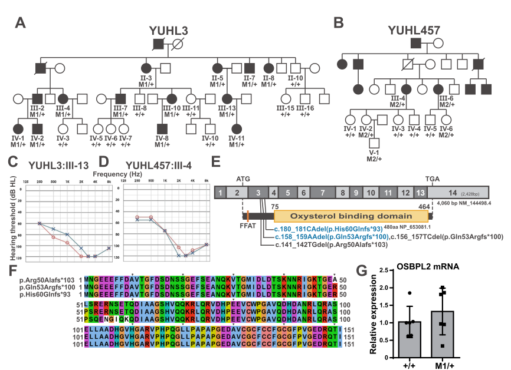

## Question

# Disease Characteristics Research Template

## Target Disease
- **Disease Name:** Autosomal dominant nonsyndromic hearing loss 67 (DFNA67, OSBPL2/ORP2-related)
- **MONDO ID:** MONDO:0014594 (if available)
- **Category:** Mendelian

## Research Objectives

Please provide a comprehensive research report on **Autosomal dominant nonsyndromic hearing loss 67 (DFNA67, OSBPL2/ORP2-related)** covering all of the
disease characteristics listed below. This report will be used to populate a disease knowledge
base entry. Be thorough and cite primary literature (PMID preferred) for all claims.

For each section, **suggested databases/resources** are listed. These are the first places
you should search for information on each topic.

---

### 1. Disease Information
> **Search first:** OMIM, Orphanet, ICD-10/ICD-11, MeSH, PubMed

- What is the disease? Provide a concise overview.
- What are the key identifiers? (OMIM, Orphanet, ICD-10/ICD-11, MeSH, Mondo)
- What are the common synonyms and alternative names?
- Is the information derived from individual patients (e.g., EHR) or aggregated disease-level resources?

### 2. Etiology

- **Disease Causal Factors**: What are the primary causes? (genetic, environmental, infectious, mechanistic)
- **Risk Factors**:
  > **Search first:** PubMed, Cochrane Library, UpToDate, clinical guidelines, ClinVar, ClinGen, GWAS Catalog, PheGenI, CTD, CDC, WHO, epidemiological databases
  - Genetic risk factors (causal variants, susceptibility loci, modifier genes)
  - Environmental risk factors (toxins, lifestyle, occupational exposures, age, sex, family history)
- **Protective Factors**:
  > **Search first:** PubMed, Cochrane Library, clinical trial databases, GWAS Catalog, gnomAD, WHO, CDC, nutrition databases
  - Genetic protective factors (protective variants, modifier alleles)
  - Environmental protective factors (diet, lifestyle, exposures that reduce risk)
- **Gene-Environment Interactions**: How do genetic and environmental factors interact to influence disease?
  > **Search first:** CTD, PubMed, PheGenI, GxE databases

### 3. Phenotypes
> **Search first:** HPO (Human Phenotype Ontology), OMIM, Orphanet, PubMed, clinicaltrials.gov, MedDRA, SNOMED CT, DECIPHER, LOINC

For each phenotype, provide:
- **Phenotype type**: symptoms, clinical signs, physical manifestations, behavioral changes, or laboratory abnormalities
  > For symptoms/signs: HPO, OMIM, Orphanet, PubMed
  > For behavioral changes: HPO, DSM, RDoC (Research Domain Criteria), PubMed
  > For laboratory abnormalities: LOINC, SNOMED CT, LabTests Online, PubMed
- **Phenotype characteristics**:
  > **Search first:** OMIM, Orphanet, HPO, PubMed
  - Age of symptom onset (neonatal, childhood, adult-onset, late-onset)
  - Symptom severity (mild, moderate, severe, variable)
  - Symptom progression (stable, progressive, episodic, fluctuating)
  - Frequency among affected individuals (percentage or qualitative)
- **Quality of life impact**: Effects on daily functioning and well-being (per-phenotype when possible)
  > **Search first:** EQ-5D database, SF-36, WHO QOL databases, PubMed
- Suggest HPO (Human Phenotype Ontology) terms for each phenotype

### 4. Genetic/Molecular Information

- **Causal Genes**: Gene mutations or chromosomal abnormalities responsible for disease (gene symbols, OMIM IDs)
  > **Search first:** OMIM, ClinVar, HGMD, Ensembl, NCBI Gene
- **Pathogenic Variants**:
  - Affected genes (gene symbols, HGNC IDs)
    > **Search first:** OMIM, NCBI Gene, Ensembl, HGNC, UniProt, GeneCards
  - Variant classification (pathogenic, likely pathogenic, VUS per ACMG/AMP guidelines)
    > **Search first:** ClinVar, ClinGen, ACMG/AMP guidelines, VarSome
  - Variant type/class (missense, frameshift, nonsense, splice-site, structural)
  - Allele frequency in population databases
    > **Search first:** gnomAD, 1000 Genomes, ExAC, TOPMed, dbSNP
  - Somatic vs germline origin
    > **Search first:** COSMIC (somatic), ClinVar, ICGC, TCGA
  - Functional consequences (loss of function, gain of function, dominant negative)
- **Modifier Genes**: Genes that modify disease severity or expression
- **Epigenetic Information**: DNA methylation, histone modifications, chromatin changes affecting disease
  > **Search first:** ENCODE, Roadmap Epigenomics, MethBase, DiseaseMeth
- **Chromosomal Abnormalities**: Large-scale genetic changes (aneuploidy, translocations, inversions)
  > **Search first:** DECIPHER, ClinVar, ECARUCA, UCSC Genome Browser

### 5. Environmental Information

- **Environmental Factors**: Non-genetic contributing factors (toxins, radiation, pollution, occupational exposure)
  > **Search first:** CTD (Comparative Toxicogenomics Database), TOXNET, PubMed, EPA databases
- **Lifestyle Factors**: Behavioral factors (smoking, diet, exercise, alcohol consumption)
  > **Search first:** CDC databases, WHO, PubMed, NHANES
- **Infectious Agents**: If applicable, pathogens causing or triggering disease (bacteria, viruses, fungi, parasites)
  > **Search first:** NCBI Taxonomy, ViPR, BV-BRC, MicrobeDB, GIDEON

### 6. Mechanism / Pathophysiology

**Present this section as an ordered causal chain first, then the detail below.**
Open with a numbered sequence of mechanistic steps running from the initiating
lesion (mutation, exposure, infection) to the clinical manifestation, one step per
line, each naming what it causes next. State the causal verb explicitly ("leads
to", "results in") and say where a step is inferred rather than demonstrated.
Where the mechanism branches, show the branch. The categories below are a
checklist of what to cover within those steps, not the organizing structure —
a step may draw on several of them, and a category may contribute to several
steps.

- **Molecular Pathways**: Specific signaling cascades or biochemical pathways involved (Wnt, MAPK, mTOR, PI3K-AKT, etc.)
  > **Search first:** KEGG, Reactome, WikiPathways, PathBank, BioCyc
- **Cellular Processes**: Cell-level mechanisms (apoptosis, autophagy, cell cycle dysregulation, inflammation, etc.)
  > **Search first:** Gene Ontology (GO), Reactome, KEGG, PubMed
- **Protein Dysfunction**: How protein structure or function is altered (misfolding, aggregation, loss of function, gain of function)
  > **Search first:** UniProt, PDB (Protein Data Bank), InterPro, Pfam, AlphaFold
- **Metabolic Changes**: Alterations in metabolic processes (energy metabolism, lipid metabolism, amino acid metabolism)
  > **Search first:** KEGG, BioCyc, HMDB (Human Metabolome Database), BRENDA
- **Immune System Involvement**: Role of immune response (autoimmunity, immunodeficiency, chronic inflammation)
  > **Search first:** ImmPort, Immunome Database, IEDB, Gene Ontology
- **Tissue Damage Mechanisms**: How tissues/ are injured (oxidative stress, ischemia, fibrosis, necrosis)
  > **Search first:** PubMed, Gene Ontology, Reactome
- **Biochemical Abnormalities**: Specific molecular defects (enzyme deficiencies, receptor dysfunction, ion channel defects)
  > **Search first:** BRENDA, UniProt, KEGG, OMIM, PubMed
- **Epigenetic Changes**: DNA methylation, histone modifications affecting gene expression in disease
  > **Search first:** ENCODE, Roadmap Epigenomics, MethBase, DiseaseMeth
- **Molecular Profiling** (if available):
  - Transcriptomics/gene expression changes
    > **Search first:** GEO (Gene Expression Omnibus), ArrayExpress, GTEx, Human Cell Atlas, SRA
  - Proteomics findings
    > **Search first:** PRIDE, ProteomeXchange, Human Protein Atlas, STRING, BioGRID
  - Metabolomics signatures
    > **Search first:** MetaboLights, Metabolomics Workbench, HMDB, METLIN
  - Lipidomics alterations
    > **Search first:** LIPID MAPS, SwissLipids, LipidHome, Metabolomics Workbench
  - Genomic structural features
    > **Search first:** UCSC Genome Browser, Ensembl, NCBI, dbVar, DGV
- **Advanced Technologies** (if applicable):
  - Single-cell analysis findings (cell-type specific mechanisms, cellular heterogeneity)
    > **Search first:** Human Cell Atlas, Single Cell Portal, GEO, CELLxGENE
  - Spatial transcriptomics findings
    > **Search first:** GEO, Spatial Research, Vizgen, 10x Genomics data
  - Multi-omics integration results
    > **Search first:** TCGA, ICGC, cBioPortal, LinkedOmics, PubMed
  - Functional genomics screens (CRISPR, RNAi)
    > **Search first:** DepMap, GenomeRNAi, PubMed, BioGRID ORCS

For each mechanism, describe:
- The causal chain from initial trigger to clinical manifestation
- Which mechanisms are upstream vs downstream
- What cell types and biological processes are involved
- Suggest GO terms for biological processes and CL terms for cell types

### 7. Anatomical Structures Affected

- **Organ Level**:
  - Primary organs directly affected
  - Secondary organ involvement (complications, secondary effects)
  - Body systems involved (cardiovascular, nervous, digestive, respiratory, endocrine, etc.)
  > **Search first:** Uberon, FMA (Foundational Model of Anatomy), OMIM, HPO, ICD-11, MeSH, SNOMED CT
- **Tissue and Cell Level**:
  - Specific tissue types affected (epithelial, connective, muscle, nervous)
  - Specific cell populations targeted (with Cell Ontology terms)
  > **Search first:** Uberon, Human Protein Atlas, Cell Ontology, Human Cell Atlas, CellMarker, PanglaoDB
- **Subcellular Level**:
  - Cellular compartments involved (mitochondria, nucleus, ER, lysosomes) (with GO Cellular Component terms)
  > **Search first:** Gene Ontology (Cellular Component), UniProt, Human Protein Atlas
- **Localization**:
  - Specific anatomical sites (with UBERON terms)
    > **Search first:** FMA, Uberon, NeuroNames (for brain), SNOMED CT
  - Lateralization (unilateral, bilateral, asymmetric)
    > **Search first:** HPO, clinical literature, imaging databases

### 8. Temporal Development

- **Onset**:
  - Typical age of onset (congenital, pediatric, adult, geriatric)
  - Onset pattern (acute, subacute, chronic, insidious)
  > **Search first:** OMIM, Orphanet, HPO, PubMed
- **Progression**:
  - Disease stages (early, intermediate, advanced, end-stage)
    > **Search first:** Cancer Staging Manual (AJCC), WHO classifications, PubMed
  - Progression rate (rapid, slow, variable)
  - Disease course pattern (episodic, relapsing-remitting, progressive, stable)
  - Disease duration (self-limited, chronic lifelong)
  > **Search first:** Disease registries, longitudinal cohort databases, natural history studies, PubMed, Orphanet, OMIM
- **Patterns**:
  - Remission patterns (spontaneous, treatment-induced)
    > **Search first:** Clinical trial databases, disease registries, PubMed
  - Critical periods (time windows of vulnerability or opportunity for intervention)
    > **Search first:** PubMed, developmental biology databases, clinical guidelines

### 9. Inheritance and Population

- **Epidemiology**:
  - Prevalence (cases per 100,000 at given time)
  - Incidence (new cases per 100,000 per year)
  > **Search first:** Orphanet, CDC, WHO, GBD (Global Burden of Disease), national registries, SEER, disease registries
- **For Genetic Etiology**:
  - Inheritance pattern (AD, AR, X-linked, mitochondrial, multifactorial, polygenic)
    > **Search first:** OMIM, Orphanet, ClinVar, GTR (Genetic Testing Registry)
  - Penetrance (complete, incomplete, age-dependent)
    > **Search first:** ClinVar, OMIM, PubMed, ClinGen
  - Expressivity (variable, consistent)
    > **Search first:** OMIM, ClinVar, PubMed
  - Genetic anticipation (increasing severity in successive generations)
    > **Search first:** OMIM, PubMed (especially for repeat expansion disorders)
  - Germline mosaicism
    > **Search first:** ClinVar, OMIM, genetic counseling literature, PubMed
  - Founder effects (population-specific mutations)
    > **Search first:** gnomAD, population genetics databases, PubMed
  - Consanguinity role
    > **Search first:** OMIM, population studies, genetic counseling resources
  - Carrier frequency
    > **Search first:** gnomAD, carrier screening databases, GeneReviews, GTR
- **Population Demographics**:
  - Affected populations (ethnic or demographic groups with higher prevalence)
    > **Search first:** gnomAD, 1000 Genomes, PAGE Study, PubMed, population registries
  - Geographic distribution (endemic areas, regional variation)
    > **Search first:** WHO, CDC, GBD, Orphanet, geographic epidemiology databases
  - Geographic distribution of specific variants
  - Sex ratio (male:female)
    > **Search first:** Disease registries, OMIM, PubMed, epidemiological databases
  - Age distribution of affected individuals
    > **Search first:** CDC, disease registries, SEER, Orphanet

### 10. Diagnostics

- **Clinical Tests**:
  - Laboratory tests (blood, urine, tissue chemistry, specific enzyme assays)
    > **Search first:** LOINC, LabTests Online, PubMed
  - Biomarkers (proteins, metabolites, genetic markers, circulating biomarkers)
    > **Search first:** FDA Biomarker List, BEST (Biomarkers, EndpointS, and other Tools), PubMed
  - Imaging studies (X-ray, CT, MRI, PET, ultrasound)
    > **Search first:** RadLex, DICOM, Radiopaedia, imaging databases
  - Functional tests (pulmonary function, cardiac stress tests)
    > **Search first:** LOINC, clinical guidelines, PubMed
  - Electrophysiology (EEG, EMG, ECG, nerve conduction studies)
    > **Search first:** LOINC, clinical neurophysiology databases, PubMed
  - Biopsy findings (histopathology, immunohistochemistry)
    > **Search first:** SNOMED CT, College of American Pathologists resources, PubMed
  - Pathology findings (microscopic examination)
    > **Search first:** SNOMED CT, Digital Pathology databases, PubMed
- **Genetic Testing**:
  > **Search first:** GTR (Genetic Testing Registry), GeneReviews, ClinGen
  - Overview of recommended genetic testing approach
  - Whole genome sequencing (WGS) utility
    > **Search first:** GTR, ClinVar, GEL (Genomics England), gnomAD
  - Whole exome sequencing (WES) utility
    > **Search first:** GTR, ClinVar, OMIM, GeneMatcher
  - Gene panels (which panels, which genes)
    > **Search first:** GTR, ClinVar, laboratory-specific databases
  - Single gene testing
    > **Search first:** GTR, ClinVar, OMIM, GeneReviews
  - Chromosomal microarray (CMA)
    > **Search first:** DECIPHER, ClinVar, dbVar, ECARUCA
  - Karyotyping
    > **Search first:** Chromosome Abnormality Database, ClinVar, cytogenetics resources
  - FISH
    > **Search first:** ClinVar, cytogenetics databases, PubMed
  - Mitochondrial DNA testing
    > **Search first:** MITOMAP, MSeqDR, ClinVar, GTR
  - Repeat expansion testing
    > **Search first:** GTR, ClinVar, repeat expansion databases, PubMed
- **Omics-Based Diagnostics** (if applicable):
  - RNA sequencing / transcriptomics
    > **Search first:** GEO, ArrayExpress, GTEx, RNA-seq databases
  - Proteomics
    > **Search first:** PRIDE, ProteomeXchange, FDA Biomarker database
  - Metabolomics
    > **Search first:** MetaboLights, Metabolomics Workbench, HMDB
  - Epigenomics
    > **Search first:** GEO, ENCODE, Roadmap Epigenomics, MethBase
  - Liquid biopsy
    > **Search first:** COSMIC, ClinVar, liquid biopsy databases, PubMed
- **Clinical Criteria**:
  - Standardized diagnostic criteria (DSM, ICD, society guidelines)
    > **Search first:** DSM-5, ICD-11, clinical society guidelines, UpToDate
  - Differential diagnosis (other conditions to rule out, with distinguishing features)
    > **Search first:** DynaMed, UpToDate, clinical decision support systems
- **Screening**:
  - Screening methods for asymptomatic individuals (newborn screening, carrier screening, cascade screening)
    > **Search first:** ACMG recommendations, CDC newborn screening, GTR

### 11. Outcome/Prognosis

- **Survival and Mortality**:
  - Survival rate (5-year, 10-year, overall)
    > **Search first:** SEER, cancer registries, disease-specific registries, PubMed
  - Life expectancy (with and without treatment if applicable)
    > **Search first:** Orphanet, disease registries, actuarial databases, PubMed
  - Mortality rate
    > **Search first:** CDC, WHO, GBD, national mortality databases
  - Disease-specific mortality (deaths directly attributable to disease)
    > **Search first:** Disease registries, CDC Wonder, GBD, PubMed
- **Morbidity and Function**:
  - Morbidity (disease-related disability and health impacts)
    > **Search first:** GBD, WHO, disability databases, PubMed
  - Disability outcomes (long-term functional impairments)
    > **Search first:** ICF (International Classification of Functioning), disability registries
  - Quality of life measures (EQ-5D, SF-36, PROMIS, disease-specific tools)
    > **Search first:** EQ-5D database, SF-36, PROMIS, PubMed
- **Disease Course**:
  - Complications (secondary problems: infections, organ failure, etc.)
    > **Search first:** ICD codes, disease registries, clinical databases, PubMed
  - Recovery potential (likelihood and extent of recovery, with vs without treatment)
    > **Search first:** Natural history studies, rehabilitation databases, PubMed
- **Prediction**:
  - Prognostic factors (age, disease severity, biomarkers, treatment response)
    > **Search first:** Prognostic models databases, clinical calculators, PubMed
  - Prognostic biomarkers (molecular markers predicting disease course)
    > **Search first:** FDA Biomarker database, PubMed, cancer prognostic databases

### 12. Treatment

- **Pharmacotherapy**:
  - Pharmacological treatments (drug names, drug classes, mechanisms of action)
    > **Search first:** DrugBank, RxNorm, ATC classification, DailyMed, FDA databases
  - Pharmacogenomics (how genetic variants affect drug metabolism, efficacy, toxicity)
    > **Search first:** PharmGKB, CPIC (Clinical Pharmacogenetics), FDA Table of PGx Biomarkers
- **Advanced Therapeutics**:
  - Gene therapy (viral vectors, CRISPR, gene replacement, gene editing)
    > **Search first:** ClinicalTrials.gov, FDA gene therapy database, ASGCT resources
  - Cell therapy (stem cell transplant, CAR-T, cellular therapeutics)
    > **Search first:** ClinicalTrials.gov, FDA cell therapy database, FACT standards
  - RNA-based therapies (ASOs, siRNA, mRNA therapies)
    > **Search first:** ClinicalTrials.gov, FDA approvals, PubMed
  - Targeted therapies (treatments directed at specific molecular targets)
    > **Search first:** My Cancer Genome, OncoKB, ClinicalTrials.gov, FDA approvals
  - Immunotherapies (checkpoint inhibitors, monoclonal antibodies)
    > **Search first:** Cancer Immunotherapy Database, FDA approvals, ClinicalTrials.gov
- **Surgical and Interventional**:
  - Surgical interventions (types of surgery, timing, outcomes)
    > **Search first:** CPT codes, surgical registries, clinical guidelines, PubMed
- **Supportive and Rehabilitative**:
  - Supportive care (symptom management, pain control, nutrition)
    > **Search first:** Clinical guidelines, Cochrane Library, PubMed
  - Rehabilitation (physical therapy, occupational therapy, speech therapy)
    > **Search first:** Rehabilitation medicine databases, clinical guidelines, PubMed
- **Experimental**:
  - Experimental treatments in clinical trials (with NCT identifiers if available)
    > **Search first:** ClinicalTrials.gov, EU Clinical Trials Register, WHO ICTRP
- **Treatment Outcomes**:
  - Treatment response rates
    > **Search first:** Clinical trial databases, FDA reviews, systematic reviews, PubMed
  - Side effects and adverse events
    > **Search first:** FDA Adverse Event Reporting System (FAERS), MedWatch, PubMed
- **Treatment Strategy**:
  - Treatment algorithms (clinical pathways, decision trees)
    > **Search first:** Clinical practice guidelines, NCCN Guidelines, UpToDate
  - Combination therapies
    > **Search first:** ClinicalTrials.gov, treatment guidelines, PubMed
  - Personalized medicine approaches (genotype-guided treatment)
    > **Search first:** My Cancer Genome, CIViC, PharmGKB, precision medicine databases

For each treatment, suggest NCIT (NCI Thesaurus) clinical-intervention terms where applicable.

### 13. Prevention

- **Prevention Levels**:
  - Primary prevention (preventing disease occurrence: vaccination, risk factor modification)
    > **Search first:** CDC, WHO, USPSTF recommendations, Cochrane Library
  - Secondary prevention (early detection and treatment: screening programs, early intervention)
    > **Search first:** USPSTF, CDC screening guidelines, WHO
  - Tertiary prevention (preventing complications in those with disease)
    > **Search first:** Clinical guidelines, disease management protocols, PubMed
- **Immunization**: Vaccine strategies (if applicable)
  > **Search first:** CDC vaccine schedules, WHO immunization, FDA vaccine database
- **Screening and Early Detection**:
  - Screening programs (population-based: newborn screening, cancer screening)
    > **Search first:** CDC screening programs, USPSTF, cancer screening databases
  - Genetic screening (carrier screening, preimplantation genetic diagnosis, prenatal testing)
    > **Search first:** ACMG recommendations, ACOG guidelines, GTR
  - Risk stratification (identifying high-risk individuals for targeted prevention)
    > **Search first:** Risk prediction models, clinical calculators, PubMed
- **Behavioral Interventions**: Lifestyle modifications to reduce risk
  > **Search first:** CDC, WHO, behavioral intervention databases, Cochrane Library
- **Counseling**: Genetic counseling (risk assessment, family planning guidance)
  > **Search first:** NSGC resources, ACMG guidelines, GeneReviews
- **Public Health**:
  - Public health interventions (sanitation, vector control, health education)
    > **Search first:** CDC, WHO, public health databases, PubMed
  - Environmental interventions (reducing environmental risk factors)
    > **Search first:** EPA databases, WHO environmental health, PubMed
- **Prophylaxis**: Preventive medications or procedures
  > **Search first:** Clinical guidelines, FDA approvals, PubMed

### 14. Other Species / Natural Disease

- **Taxonomy**: Species affected (with NCBI Taxon identifiers)
  > **Search first:** NCBI Taxonomy
- **Breed**: Specific breeds affected (with VBO identifiers if applicable)
  > **Search first:** VBO (Vertebrate Breed Ontology)
- **Gene**: Orthologous genes in other species (with NCBI Gene IDs)
  > **Search first:** NCBI Gene
- **Natural Disease**:
  - Naturally occurring disease in other species (companion animals, wildlife)
    > **Search first:** OMIA (Online Mendelian Inheritance in Animals), VetCompass, PubMed
  - Veterinary relevance and importance in animal health
    > **Search first:** OMIA, veterinary databases, PubMed
- **Comparative Biology**:
  - Comparative pathology (similarities and differences across species)
    > **Search first:** OMIA, comparative pathology databases, PubMed
  - Evolutionary conservation of disease mechanisms
    > **Search first:** HomoloGene, OrthoMCL, Alliance of Genome Resources
- **Transmission** (if applicable):
  - Zoonotic potential
    > **Search first:** CDC zoonotic diseases, WHO zoonoses, GIDEON
  - Cross-species susceptibility
    > **Search first:** NCBI Taxonomy, veterinary databases, PubMed

### 15. Model Organisms

- **Model Types**:
  - Model organism type (mammalian, invertebrate, cellular, in vitro)
    > **Search first:** Alliance of Genome Resources, model organism databases
  - Specific model systems (mouse, rat, zebrafish, Drosophila, C. elegans, yeast, cell lines, organoids, iPSCs)
    > **Search first:** MGI, RGD, ZFIN, FlyBase, WormBase, SGD, ATCC, Cellosaurus
  - Induced models (drug treatment, surgical intervention, environmental manipulation)
    > **Search first:** MGI, model organism databases, PubMed
- **Genetic Models**:
  - Types available (knockout, knock-in, transgenic, conditional, humanized)
    > **Search first:** MGI, IMPC, KOMP, EuMMCR, IMSR
- **Model Characteristics**:
  - Phenotype recapitulation (how well model reproduces human disease features)
    > **Search first:** Model organism databases, comparative studies, PubMed
  - Model limitations (aspects of human disease not captured)
    > **Search first:** Model organism databases, PubMed, review articles
- **Applications**:
  - Research applications (what aspects of disease can be studied)
    > **Search first:** Model organism databases, PubMed
- **Resources**:
  - Model databases
    > **Search first:** MGI, RGD, ZFIN, FlyBase, WormBase, IMSR, EMMA, MMRRC

---

## Citation Requirements

- Cite primary literature (PMID preferred) for all mechanistic and clinical claims
- Prioritize recent reviews and landmark papers
- Include direct quotes from abstracts where possible to support key statements
- Distinguish evidence source types: human clinical, model organism, in vitro, computational

## Output Format

Structure your response as a comprehensive narrative organized by the sections above.
For each section, provide:
- Factual content with specific details (numbers, percentages, gene names, variant nomenclature)
- Ontology term suggestions (HPO, GO, CL, UBERON, CHEBI, NCIT, MONDO) where applicable
- Evidence citations with PMIDs
- Direct quotes from abstracts to support key claims
- Clear indication when information is not available or not applicable for this disease

This report will be used to populate a disease knowledge base entry with:
- Pathophysiology descriptions with causal chains
- Gene/protein annotations (HGNC, GO terms)
- Phenotype associations (HP terms) with frequencies
- Cell type involvement (CL terms)
- Anatomical locations (UBERON terms)
- Chemical entities (CHEBI terms)
- Treatment annotations (NCIT terms)
- Evidence items with PMIDs and exact abstract quotes
- Epidemiology, prognosis, diagnostic, and prevention information
- Animal model descriptions with phenotype recapitulation details

## Output

Question: You are an expert researcher providing comprehensive, well-cited information.

Provide detailed information focusing on:
1. Key concepts and definitions with current understanding
2. Recent developments and latest research (prioritize 2023-2024 sources)
3. Current applications and real-world implementations
4. Expert opinions and analysis from authoritative sources
5. Relevant statistics and data from recent studies

Format as a comprehensive research report with proper citations. Include URLs and publication dates where available.
Always prioritize recent, authoritative sources and provide specific citations for all major claims.

# Disease Characteristics Research Template

## Target Disease
- **Disease Name:** Autosomal dominant nonsyndromic hearing loss 67 (DFNA67, OSBPL2/ORP2-related)
- **MONDO ID:** MONDO:0014594 (if available)
- **Category:** Mendelian

## Research Objectives

Please provide a comprehensive research report on **Autosomal dominant nonsyndromic hearing loss 67 (DFNA67, OSBPL2/ORP2-related)** covering all of the
disease characteristics listed below. This report will be used to populate a disease knowledge
base entry. Be thorough and cite primary literature (PMID preferred) for all claims.

For each section, **suggested databases/resources** are listed. These are the first places
you should search for information on each topic.

---

### 1. Disease Information
> **Search first:** OMIM, Orphanet, ICD-10/ICD-11, MeSH, PubMed

- What is the disease? Provide a concise overview.
- What are the key identifiers? (OMIM, Orphanet, ICD-10/ICD-11, MeSH, Mondo)
- What are the common synonyms and alternative names?
- Is the information derived from individual patients (e.g., EHR) or aggregated disease-level resources?

### 2. Etiology

- **Disease Causal Factors**: What are the primary causes? (genetic, environmental, infectious, mechanistic)
- **Risk Factors**:
  > **Search first:** PubMed, Cochrane Library, UpToDate, clinical guidelines, ClinVar, ClinGen, GWAS Catalog, PheGenI, CTD, CDC, WHO, epidemiological databases
  - Genetic risk factors (causal variants, susceptibility loci, modifier genes)
  - Environmental risk factors (toxins, lifestyle, occupational exposures, age, sex, family history)
- **Protective Factors**:
  > **Search first:** PubMed, Cochrane Library, clinical trial databases, GWAS Catalog, gnomAD, WHO, CDC, nutrition databases
  - Genetic protective factors (protective variants, modifier alleles)
  - Environmental protective factors (diet, lifestyle, exposures that reduce risk)
- **Gene-Environment Interactions**: How do genetic and environmental factors interact to influence disease?
  > **Search first:** CTD, PubMed, PheGenI, GxE databases

### 3. Phenotypes
> **Search first:** HPO (Human Phenotype Ontology), OMIM, Orphanet, PubMed, clinicaltrials.gov, MedDRA, SNOMED CT, DECIPHER, LOINC

For each phenotype, provide:
- **Phenotype type**: symptoms, clinical signs, physical manifestations, behavioral changes, or laboratory abnormalities
  > For symptoms/signs: HPO, OMIM, Orphanet, PubMed
  > For behavioral changes: HPO, DSM, RDoC (Research Domain Criteria), PubMed
  > For laboratory abnormalities: LOINC, SNOMED CT, LabTests Online, PubMed
- **Phenotype characteristics**:
  > **Search first:** OMIM, Orphanet, HPO, PubMed
  - Age of symptom onset (neonatal, childhood, adult-onset, late-onset)
  - Symptom severity (mild, moderate, severe, variable)
  - Symptom progression (stable, progressive, episodic, fluctuating)
  - Frequency among affected individuals (percentage or qualitative)
- **Quality of life impact**: Effects on daily functioning and well-being (per-phenotype when possible)
  > **Search first:** EQ-5D database, SF-36, WHO QOL databases, PubMed
- Suggest HPO (Human Phenotype Ontology) terms for each phenotype

### 4. Genetic/Molecular Information

- **Causal Genes**: Gene mutations or chromosomal abnormalities responsible for disease (gene symbols, OMIM IDs)
  > **Search first:** OMIM, ClinVar, HGMD, Ensembl, NCBI Gene
- **Pathogenic Variants**:
  - Affected genes (gene symbols, HGNC IDs)
    > **Search first:** OMIM, NCBI Gene, Ensembl, HGNC, UniProt, GeneCards
  - Variant classification (pathogenic, likely pathogenic, VUS per ACMG/AMP guidelines)
    > **Search first:** ClinVar, ClinGen, ACMG/AMP guidelines, VarSome
  - Variant type/class (missense, frameshift, nonsense, splice-site, structural)
  - Allele frequency in population databases
    > **Search first:** gnomAD, 1000 Genomes, ExAC, TOPMed, dbSNP
  - Somatic vs germline origin
    > **Search first:** COSMIC (somatic), ClinVar, ICGC, TCGA
  - Functional consequences (loss of function, gain of function, dominant negative)
- **Modifier Genes**: Genes that modify disease severity or expression
- **Epigenetic Information**: DNA methylation, histone modifications, chromatin changes affecting disease
  > **Search first:** ENCODE, Roadmap Epigenomics, MethBase, DiseaseMeth
- **Chromosomal Abnormalities**: Large-scale genetic changes (aneuploidy, translocations, inversions)
  > **Search first:** DECIPHER, ClinVar, ECARUCA, UCSC Genome Browser

### 5. Environmental Information

- **Environmental Factors**: Non-genetic contributing factors (toxins, radiation, pollution, occupational exposure)
  > **Search first:** CTD (Comparative Toxicogenomics Database), TOXNET, PubMed, EPA databases
- **Lifestyle Factors**: Behavioral factors (smoking, diet, exercise, alcohol consumption)
  > **Search first:** CDC databases, WHO, PubMed, NHANES
- **Infectious Agents**: If applicable, pathogens causing or triggering disease (bacteria, viruses, fungi, parasites)
  > **Search first:** NCBI Taxonomy, ViPR, BV-BRC, MicrobeDB, GIDEON

### 6. Mechanism / Pathophysiology

**Present this section as an ordered causal chain first, then the detail below.**
Open with a numbered sequence of mechanistic steps running from the initiating
lesion (mutation, exposure, infection) to the clinical manifestation, one step per
line, each naming what it causes next. State the causal verb explicitly ("leads
to", "results in") and say where a step is inferred rather than demonstrated.
Where the mechanism branches, show the branch. The categories below are a
checklist of what to cover within those steps, not the organizing structure —
a step may draw on several of them, and a category may contribute to several
steps.

- **Molecular Pathways**: Specific signaling cascades or biochemical pathways involved (Wnt, MAPK, mTOR, PI3K-AKT, etc.)
  > **Search first:** KEGG, Reactome, WikiPathways, PathBank, BioCyc
- **Cellular Processes**: Cell-level mechanisms (apoptosis, autophagy, cell cycle dysregulation, inflammation, etc.)
  > **Search first:** Gene Ontology (GO), Reactome, KEGG, PubMed
- **Protein Dysfunction**: How protein structure or function is altered (misfolding, aggregation, loss of function, gain of function)
  > **Search first:** UniProt, PDB (Protein Data Bank), InterPro, Pfam, AlphaFold
- **Metabolic Changes**: Alterations in metabolic processes (energy metabolism, lipid metabolism, amino acid metabolism)
  > **Search first:** KEGG, BioCyc, HMDB (Human Metabolome Database), BRENDA
- **Immune System Involvement**: Role of immune response (autoimmunity, immunodeficiency, chronic inflammation)
  > **Search first:** ImmPort, Immunome Database, IEDB, Gene Ontology
- **Tissue Damage Mechanisms**: How tissues/ are injured (oxidative stress, ischemia, fibrosis, necrosis)
  > **Search first:** PubMed, Gene Ontology, Reactome
- **Biochemical Abnormalities**: Specific molecular defects (enzyme deficiencies, receptor dysfunction, ion channel defects)
  > **Search first:** BRENDA, UniProt, KEGG, OMIM, PubMed
- **Epigenetic Changes**: DNA methylation, histone modifications affecting gene expression in disease
  > **Search first:** ENCODE, Roadmap Epigenomics, MethBase, DiseaseMeth
- **Molecular Profiling** (if available):
  - Transcriptomics/gene expression changes
    > **Search first:** GEO (Gene Expression Omnibus), ArrayExpress, GTEx, Human Cell Atlas, SRA
  - Proteomics findings
    > **Search first:** PRIDE, ProteomeXchange, Human Protein Atlas, STRING, BioGRID
  - Metabolomics signatures
    > **Search first:** MetaboLights, Metabolomics Workbench, HMDB, METLIN
  - Lipidomics alterations
    > **Search first:** LIPID MAPS, SwissLipids, LipidHome, Metabolomics Workbench
  - Genomic structural features
    > **Search first:** UCSC Genome Browser, Ensembl, NCBI, dbVar, DGV
- **Advanced Technologies** (if applicable):
  - Single-cell analysis findings (cell-type specific mechanisms, cellular heterogeneity)
    > **Search first:** Human Cell Atlas, Single Cell Portal, GEO, CELLxGENE
  - Spatial transcriptomics findings
    > **Search first:** GEO, Spatial Research, Vizgen, 10x Genomics data
  - Multi-omics integration results
    > **Search first:** TCGA, ICGC, cBioPortal, LinkedOmics, PubMed
  - Functional genomics screens (CRISPR, RNAi)
    > **Search first:** DepMap, GenomeRNAi, PubMed, BioGRID ORCS

For each mechanism, describe:
- The causal chain from initial trigger to clinical manifestation
- Which mechanisms are upstream vs downstream
- What cell types and biological processes are involved
- Suggest GO terms for biological processes and CL terms for cell types

### 7. Anatomical Structures Affected

- **Organ Level**:
  - Primary organs directly affected
  - Secondary organ involvement (complications, secondary effects)
  - Body systems involved (cardiovascular, nervous, digestive, respiratory, endocrine, etc.)
  > **Search first:** Uberon, FMA (Foundational Model of Anatomy), OMIM, HPO, ICD-11, MeSH, SNOMED CT
- **Tissue and Cell Level**:
  - Specific tissue types affected (epithelial, connective, muscle, nervous)
  - Specific cell populations targeted (with Cell Ontology terms)
  > **Search first:** Uberon, Human Protein Atlas, Cell Ontology, Human Cell Atlas, CellMarker, PanglaoDB
- **Subcellular Level**:
  - Cellular compartments involved (mitochondria, nucleus, ER, lysosomes) (with GO Cellular Component terms)
  > **Search first:** Gene Ontology (Cellular Component), UniProt, Human Protein Atlas
- **Localization**:
  - Specific anatomical sites (with UBERON terms)
    > **Search first:** FMA, Uberon, NeuroNames (for brain), SNOMED CT
  - Lateralization (unilateral, bilateral, asymmetric)
    > **Search first:** HPO, clinical literature, imaging databases

### 8. Temporal Development

- **Onset**:
  - Typical age of onset (congenital, pediatric, adult, geriatric)
  - Onset pattern (acute, subacute, chronic, insidious)
  > **Search first:** OMIM, Orphanet, HPO, PubMed
- **Progression**:
  - Disease stages (early, intermediate, advanced, end-stage)
    > **Search first:** Cancer Staging Manual (AJCC), WHO classifications, PubMed
  - Progression rate (rapid, slow, variable)
  - Disease course pattern (episodic, relapsing-remitting, progressive, stable)
  - Disease duration (self-limited, chronic lifelong)
  > **Search first:** Disease registries, longitudinal cohort databases, natural history studies, PubMed, Orphanet, OMIM
- **Patterns**:
  - Remission patterns (spontaneous, treatment-induced)
    > **Search first:** Clinical trial databases, disease registries, PubMed
  - Critical periods (time windows of vulnerability or opportunity for intervention)
    > **Search first:** PubMed, developmental biology databases, clinical guidelines

### 9. Inheritance and Population

- **Epidemiology**:
  - Prevalence (cases per 100,000 at given time)
  - Incidence (new cases per 100,000 per year)
  > **Search first:** Orphanet, CDC, WHO, GBD (Global Burden of Disease), national registries, SEER, disease registries
- **For Genetic Etiology**:
  - Inheritance pattern (AD, AR, X-linked, mitochondrial, multifactorial, polygenic)
    > **Search first:** OMIM, Orphanet, ClinVar, GTR (Genetic Testing Registry)
  - Penetrance (complete, incomplete, age-dependent)
    > **Search first:** ClinVar, OMIM, PubMed, ClinGen
  - Expressivity (variable, consistent)
    > **Search first:** OMIM, ClinVar, PubMed
  - Genetic anticipation (increasing severity in successive generations)
    > **Search first:** OMIM, PubMed (especially for repeat expansion disorders)
  - Germline mosaicism
    > **Search first:** ClinVar, OMIM, genetic counseling literature, PubMed
  - Founder effects (population-specific mutations)
    > **Search first:** gnomAD, population genetics databases, PubMed
  - Consanguinity role
    > **Search first:** OMIM, population studies, genetic counseling resources
  - Carrier frequency
    > **Search first:** gnomAD, carrier screening databases, GeneReviews, GTR
- **Population Demographics**:
  - Affected populations (ethnic or demographic groups with higher prevalence)
    > **Search first:** gnomAD, 1000 Genomes, PAGE Study, PubMed, population registries
  - Geographic distribution (endemic areas, regional variation)
    > **Search first:** WHO, CDC, GBD, Orphanet, geographic epidemiology databases
  - Geographic distribution of specific variants
  - Sex ratio (male:female)
    > **Search first:** Disease registries, OMIM, PubMed, epidemiological databases
  - Age distribution of affected individuals
    > **Search first:** CDC, disease registries, SEER, Orphanet

### 10. Diagnostics

- **Clinical Tests**:
  - Laboratory tests (blood, urine, tissue chemistry, specific enzyme assays)
    > **Search first:** LOINC, LabTests Online, PubMed
  - Biomarkers (proteins, metabolites, genetic markers, circulating biomarkers)
    > **Search first:** FDA Biomarker List, BEST (Biomarkers, EndpointS, and other Tools), PubMed
  - Imaging studies (X-ray, CT, MRI, PET, ultrasound)
    > **Search first:** RadLex, DICOM, Radiopaedia, imaging databases
  - Functional tests (pulmonary function, cardiac stress tests)
    > **Search first:** LOINC, clinical guidelines, PubMed
  - Electrophysiology (EEG, EMG, ECG, nerve conduction studies)
    > **Search first:** LOINC, clinical neurophysiology databases, PubMed
  - Biopsy findings (histopathology, immunohistochemistry)
    > **Search first:** SNOMED CT, College of American Pathologists resources, PubMed
  - Pathology findings (microscopic examination)
    > **Search first:** SNOMED CT, Digital Pathology databases, PubMed
- **Genetic Testing**:
  > **Search first:** GTR (Genetic Testing Registry), GeneReviews, ClinGen
  - Overview of recommended genetic testing approach
  - Whole genome sequencing (WGS) utility
    > **Search first:** GTR, ClinVar, GEL (Genomics England), gnomAD
  - Whole exome sequencing (WES) utility
    > **Search first:** GTR, ClinVar, OMIM, GeneMatcher
  - Gene panels (which panels, which genes)
    > **Search first:** GTR, ClinVar, laboratory-specific databases
  - Single gene testing
    > **Search first:** GTR, ClinVar, OMIM, GeneReviews
  - Chromosomal microarray (CMA)
    > **Search first:** DECIPHER, ClinVar, dbVar, ECARUCA
  - Karyotyping
    > **Search first:** Chromosome Abnormality Database, ClinVar, cytogenetics resources
  - FISH
    > **Search first:** ClinVar, cytogenetics databases, PubMed
  - Mitochondrial DNA testing
    > **Search first:** MITOMAP, MSeqDR, ClinVar, GTR
  - Repeat expansion testing
    > **Search first:** GTR, ClinVar, repeat expansion databases, PubMed
- **Omics-Based Diagnostics** (if applicable):
  - RNA sequencing / transcriptomics
    > **Search first:** GEO, ArrayExpress, GTEx, RNA-seq databases
  - Proteomics
    > **Search first:** PRIDE, ProteomeXchange, FDA Biomarker database
  - Metabolomics
    > **Search first:** MetaboLights, Metabolomics Workbench, HMDB
  - Epigenomics
    > **Search first:** GEO, ENCODE, Roadmap Epigenomics, MethBase
  - Liquid biopsy
    > **Search first:** COSMIC, ClinVar, liquid biopsy databases, PubMed
- **Clinical Criteria**:
  - Standardized diagnostic criteria (DSM, ICD, society guidelines)
    > **Search first:** DSM-5, ICD-11, clinical society guidelines, UpToDate
  - Differential diagnosis (other conditions to rule out, with distinguishing features)
    > **Search first:** DynaMed, UpToDate, clinical decision support systems
- **Screening**:
  - Screening methods for asymptomatic individuals (newborn screening, carrier screening, cascade screening)
    > **Search first:** ACMG recommendations, CDC newborn screening, GTR

### 11. Outcome/Prognosis

- **Survival and Mortality**:
  - Survival rate (5-year, 10-year, overall)
    > **Search first:** SEER, cancer registries, disease-specific registries, PubMed
  - Life expectancy (with and without treatment if applicable)
    > **Search first:** Orphanet, disease registries, actuarial databases, PubMed
  - Mortality rate
    > **Search first:** CDC, WHO, GBD, national mortality databases
  - Disease-specific mortality (deaths directly attributable to disease)
    > **Search first:** Disease registries, CDC Wonder, GBD, PubMed
- **Morbidity and Function**:
  - Morbidity (disease-related disability and health impacts)
    > **Search first:** GBD, WHO, disability databases, PubMed
  - Disability outcomes (long-term functional impairments)
    > **Search first:** ICF (International Classification of Functioning), disability registries
  - Quality of life measures (EQ-5D, SF-36, PROMIS, disease-specific tools)
    > **Search first:** EQ-5D database, SF-36, PROMIS, PubMed
- **Disease Course**:
  - Complications (secondary problems: infections, organ failure, etc.)
    > **Search first:** ICD codes, disease registries, clinical databases, PubMed
  - Recovery potential (likelihood and extent of recovery, with vs without treatment)
    > **Search first:** Natural history studies, rehabilitation databases, PubMed
- **Prediction**:
  - Prognostic factors (age, disease severity, biomarkers, treatment response)
    > **Search first:** Prognostic models databases, clinical calculators, PubMed
  - Prognostic biomarkers (molecular markers predicting disease course)
    > **Search first:** FDA Biomarker database, PubMed, cancer prognostic databases

### 12. Treatment

- **Pharmacotherapy**:
  - Pharmacological treatments (drug names, drug classes, mechanisms of action)
    > **Search first:** DrugBank, RxNorm, ATC classification, DailyMed, FDA databases
  - Pharmacogenomics (how genetic variants affect drug metabolism, efficacy, toxicity)
    > **Search first:** PharmGKB, CPIC (Clinical Pharmacogenetics), FDA Table of PGx Biomarkers
- **Advanced Therapeutics**:
  - Gene therapy (viral vectors, CRISPR, gene replacement, gene editing)
    > **Search first:** ClinicalTrials.gov, FDA gene therapy database, ASGCT resources
  - Cell therapy (stem cell transplant, CAR-T, cellular therapeutics)
    > **Search first:** ClinicalTrials.gov, FDA cell therapy database, FACT standards
  - RNA-based therapies (ASOs, siRNA, mRNA therapies)
    > **Search first:** ClinicalTrials.gov, FDA approvals, PubMed
  - Targeted therapies (treatments directed at specific molecular targets)
    > **Search first:** My Cancer Genome, OncoKB, ClinicalTrials.gov, FDA approvals
  - Immunotherapies (checkpoint inhibitors, monoclonal antibodies)
    > **Search first:** Cancer Immunotherapy Database, FDA approvals, ClinicalTrials.gov
- **Surgical and Interventional**:
  - Surgical interventions (types of surgery, timing, outcomes)
    > **Search first:** CPT codes, surgical registries, clinical guidelines, PubMed
- **Supportive and Rehabilitative**:
  - Supportive care (symptom management, pain control, nutrition)
    > **Search first:** Clinical guidelines, Cochrane Library, PubMed
  - Rehabilitation (physical therapy, occupational therapy, speech therapy)
    > **Search first:** Rehabilitation medicine databases, clinical guidelines, PubMed
- **Experimental**:
  - Experimental treatments in clinical trials (with NCT identifiers if available)
    > **Search first:** ClinicalTrials.gov, EU Clinical Trials Register, WHO ICTRP
- **Treatment Outcomes**:
  - Treatment response rates
    > **Search first:** Clinical trial databases, FDA reviews, systematic reviews, PubMed
  - Side effects and adverse events
    > **Search first:** FDA Adverse Event Reporting System (FAERS), MedWatch, PubMed
- **Treatment Strategy**:
  - Treatment algorithms (clinical pathways, decision trees)
    > **Search first:** Clinical practice guidelines, NCCN Guidelines, UpToDate
  - Combination therapies
    > **Search first:** ClinicalTrials.gov, treatment guidelines, PubMed
  - Personalized medicine approaches (genotype-guided treatment)
    > **Search first:** My Cancer Genome, CIViC, PharmGKB, precision medicine databases

For each treatment, suggest NCIT (NCI Thesaurus) clinical-intervention terms where applicable.

### 13. Prevention

- **Prevention Levels**:
  - Primary prevention (preventing disease occurrence: vaccination, risk factor modification)
    > **Search first:** CDC, WHO, USPSTF recommendations, Cochrane Library
  - Secondary prevention (early detection and treatment: screening programs, early intervention)
    > **Search first:** USPSTF, CDC screening guidelines, WHO
  - Tertiary prevention (preventing complications in those with disease)
    > **Search first:** Clinical guidelines, disease management protocols, PubMed
- **Immunization**: Vaccine strategies (if applicable)
  > **Search first:** CDC vaccine schedules, WHO immunization, FDA vaccine database
- **Screening and Early Detection**:
  - Screening programs (population-based: newborn screening, cancer screening)
    > **Search first:** CDC screening programs, USPSTF, cancer screening databases
  - Genetic screening (carrier screening, preimplantation genetic diagnosis, prenatal testing)
    > **Search first:** ACMG recommendations, ACOG guidelines, GTR
  - Risk stratification (identifying high-risk individuals for targeted prevention)
    > **Search first:** Risk prediction models, clinical calculators, PubMed
- **Behavioral Interventions**: Lifestyle modifications to reduce risk
  > **Search first:** CDC, WHO, behavioral intervention databases, Cochrane Library
- **Counseling**: Genetic counseling (risk assessment, family planning guidance)
  > **Search first:** NSGC resources, ACMG guidelines, GeneReviews
- **Public Health**:
  - Public health interventions (sanitation, vector control, health education)
    > **Search first:** CDC, WHO, public health databases, PubMed
  - Environmental interventions (reducing environmental risk factors)
    > **Search first:** EPA databases, WHO environmental health, PubMed
- **Prophylaxis**: Preventive medications or procedures
  > **Search first:** Clinical guidelines, FDA approvals, PubMed

### 14. Other Species / Natural Disease

- **Taxonomy**: Species affected (with NCBI Taxon identifiers)
  > **Search first:** NCBI Taxonomy
- **Breed**: Specific breeds affected (with VBO identifiers if applicable)
  > **Search first:** VBO (Vertebrate Breed Ontology)
- **Gene**: Orthologous genes in other species (with NCBI Gene IDs)
  > **Search first:** NCBI Gene
- **Natural Disease**:
  - Naturally occurring disease in other species (companion animals, wildlife)
    > **Search first:** OMIA (Online Mendelian Inheritance in Animals), VetCompass, PubMed
  - Veterinary relevance and importance in animal health
    > **Search first:** OMIA, veterinary databases, PubMed
- **Comparative Biology**:
  - Comparative pathology (similarities and differences across species)
    > **Search first:** OMIA, comparative pathology databases, PubMed
  - Evolutionary conservation of disease mechanisms
    > **Search first:** HomoloGene, OrthoMCL, Alliance of Genome Resources
- **Transmission** (if applicable):
  - Zoonotic potential
    > **Search first:** CDC zoonotic diseases, WHO zoonoses, GIDEON
  - Cross-species susceptibility
    > **Search first:** NCBI Taxonomy, veterinary databases, PubMed

### 15. Model Organisms

- **Model Types**:
  - Model organism type (mammalian, invertebrate, cellular, in vitro)
    > **Search first:** Alliance of Genome Resources, model organism databases
  - Specific model systems (mouse, rat, zebrafish, Drosophila, C. elegans, yeast, cell lines, organoids, iPSCs)
    > **Search first:** MGI, RGD, ZFIN, FlyBase, WormBase, SGD, ATCC, Cellosaurus
  - Induced models (drug treatment, surgical intervention, environmental manipulation)
    > **Search first:** MGI, model organism databases, PubMed
- **Genetic Models**:
  - Types available (knockout, knock-in, transgenic, conditional, humanized)
    > **Search first:** MGI, IMPC, KOMP, EuMMCR, IMSR
- **Model Characteristics**:
  - Phenotype recapitulation (how well model reproduces human disease features)
    > **Search first:** Model organism databases, comparative studies, PubMed
  - Model limitations (aspects of human disease not captured)
    > **Search first:** Model organism databases, PubMed, review articles
- **Applications**:
  - Research applications (what aspects of disease can be studied)
    > **Search first:** Model organism databases, PubMed
- **Resources**:
  - Model databases
    > **Search first:** MGI, RGD, ZFIN, FlyBase, WormBase, IMSR, EMMA, MMRRC

---

## Citation Requirements

- Cite primary literature (PMID preferred) for all mechanistic and clinical claims
- Prioritize recent reviews and landmark papers
- Include direct quotes from abstracts where possible to support key statements
- Distinguish evidence source types: human clinical, model organism, in vitro, computational

## Output Format

Structure your response as a comprehensive narrative organized by the sections above.
For each section, provide:
- Factual content with specific details (numbers, percentages, gene names, variant nomenclature)
- Ontology term suggestions (HPO, GO, CL, UBERON, CHEBI, NCIT, MONDO) where applicable
- Evidence citations with PMIDs
- Direct quotes from abstracts to support key claims
- Clear indication when information is not available or not applicable for this disease

This report will be used to populate a disease knowledge base entry with:
- Pathophysiology descriptions with causal chains
- Gene/protein annotations (HGNC, GO terms)
- Phenotype associations (HP terms) with frequencies
- Cell type involvement (CL terms)
- Anatomical locations (UBERON terms)
- Chemical entities (CHEBI terms)
- Treatment annotations (NCIT terms)
- Evidence items with PMIDs and exact abstract quotes
- Epidemiology, prognosis, diagnostic, and prevention information
- Animal model descriptions with phenotype recapitulation details

# Autosomal dominant nonsyndromic hearing loss 67 (DFNA67; OSBPL2/ORP2-related)

## Executive summary

DFNA67 is an ultra-rare, autosomal-dominant, usually postlingual sensorineural hearing-loss disorder caused most convincingly by heterozygous early frameshift variants in **OSBPL2**, encoding oxysterol-binding protein-related protein 2 (**ORP2**). Across reported Chinese, German, Mongolian, and Korean families, hearing loss is generally bilateral, symmetric, high-frequency-first/down-sloping, and progressive, with onset from approximately 5–40 years and severity ranging from mild to profound. Intrafamilial variability is substantial. The evidence base consists mainly of a few pedigrees and experimental models; population prevalence, penetrance, modifiers, and long-term prospective natural history have not been quantified. (koh2022osbpl2mutationsimpair pages 2-4, koh2022osbpl2mutationsimpair pages 1-2, thoenes2015osbpl2encodesa pages 4-6, wu2019anovelpathogenic pages 6-7)

The strongest current mechanistic evidence supports a **toxic mutant-protein/autophagy mechanism**: truncated OSBPL2 accumulates, associates with autophagy machinery, disrupts endolysosomal homeostasis, and injures cochlear hair cells and spiral ganglion neurons. A complementary deficiency model implicates disturbed ciliary PI(4,5)P2 homeostasis and Sonic Hedgehog signaling. These mechanisms are not fully reconciled because one study found hearing loss in mutant-transgenic but not knockout mice, whereas another reported progressive hearing loss in knockout mice. (shi2022mutationsinosbpl2 pages 1-2, koh2022osbpl2mutationsimpair pages 11-13, koh2022osbpl2mutationsimpair pages 1-2)

Rapamycin is **experimental, not established care**. A five-adult, uncontrolled, three-month proof-of-concept series reported only modest hearing and tinnitus improvements. Hearing aids and cochlear implants remain the principal real-world interventions; implanted patients in one report achieved 80–100% sentence comprehension at three months. (koh2022osbpl2mutationsimpair pages 11-13, koh2022osbpl2mutationsimpair pages 2-4)

| Evidence domain | Human variant/model | Key phenotype or finding | Quantitative detail | Evidence type/strength | Source year and DOI |
|---|---|---|---|---|---|
| Foundational human genetics | **OSBPL2 c.141_142delTG, p.Arg50Alafs*103** (German DFNA67 family) | Childhood/adult-onset progressive bilateral sensorineural hearing loss; high frequencies affected first; intrafamilial variability; no vestibular symptoms reported | Onset reported between **10-30 years**; **5 family members** underwent cochlear implantation at **27-50 years** (thoenes2015osbpl2encodesa pages 4-6, thoenes2015osbpl2encodesa pages 6-9) | Human pedigree with cosegregation; strong disease-gene evidence, small family-based dataset | 2015, **10.1186/s13023-015-0238-5** |
| Foundational human genetics | **OSBPL2 c.158_159delAA, p.Gln53Argfs*100** (Mongolian family) | Late-onset hereditary deafness with delayed, progressive, bilateral symmetric sensorineural hearing loss | **6 generations**, **53 traceable individuals**, **19 affected**; onset **10-40 years**; severity **mild to severe**; absent in **201 unrelated controls** (wu2019anovelpathogenic pages 6-7) | Human pedigree + WGS + Sanger cosegregation; strong family-level evidence | 2019, **10.1186/s12881-019-0781-3** |
| Discovery pedigree / recurrent exon-3 truncation cluster | **OSBPL2 c.153_154delCT / c.158_159delAA, p.Gln53Argfs*100** (Chinese/Korean reports; nomenclature differs by transcript/numbering) | Progressive nonsyndromic hearing loss; bilateral symmetric, down-sloping audiograms; postlingual onset | Chinese discovery family described as **7 generations**; Korean cohort estimated OSBPL2 variants in **2/202 (1.0%)** hearing-loss families (xing2015identificationofosbpl2 pages 5-7, koh2022osbpl2mutationsimpair pages 2-4, koh2022osbpl2mutationsimpair pages 1-2) | Human pedigree and cohort evidence; strong for recurrent truncating mechanism, but transcript-numbering inconsistency should be noted | 2015, **10.1038/gim.2014.90**; 2022, **10.1080/15548627.2022.2040891** |
| Human genetics / additional recurrent truncation | **OSBPL2 c.180_181delCA, p.His60Glnfs*93** (Korean family YUHL457) | Symmetric progressive down-sloping sensorineural hearing loss with high-frequency-first pattern | Reported in one DFNA67 family; among Korean DFNA67 cases, onset generally **late teens to twenties**, with deterioration beginning by early second decade in family histories (koh2022osbpl2mutationsimpair pages 2-4, koh2022osbpl2mutationsimpair media 0d642349) | Human pedigree with recurrent frameshift finding; moderate-strong but still rare-family evidence | 2022, **10.1080/15548627.2022.2040891** |
| Core phenotype summary | Multiple truncating OSBPL2 families | DFNA67 is typically **postlingual, bilateral, symmetric, progressive SNHL** with **high-frequency/down-sloping** configuration and variable severity | Onset across reports spans about **5-40 years**; progression can reach **severe-profound deafness in adulthood** (koh2022osbpl2mutationsimpair pages 1-2, thoenes2015osbpl2encodesa pages 4-6, thoenes2015osbpl2encodesa pages 6-9, koh2022osbpl2mutationsimpair media 0d642349) | Aggregated across several pedigrees; moderate strength, limited by small total case count | 2015, **10.1186/s13023-015-0238-5**; 2022, **10.1080/15548627.2022.2040891** |
| Cochlear implantation outcomes | Affected DFNA67 individuals in YUHL3 and YUHL457 | Cochlear implantation can provide useful short-term speech outcomes in advanced disease | Implanted individuals included **YUHL3 II-5, III-4, III-13, IV-11** and **YUHL457 III-4, III-6**; sentence comprehension reportedly **80-100% at 3 months** post-implant (koh2022osbpl2mutationsimpair pages 2-4) | Human intervention follow-up; clinically useful but very small uncontrolled series | 2022, **10.1080/15548627.2022.2040891** |
| Toxic protein / autophagy mechanism | Mutant OSBPL2 proteins **p.R50Afs*103, p.Q53Rfs*100, p.H60Qfs*93**; HsQ53R-TG mice | Frameshift proteins accumulate in cytoplasmic aggregates, bind autophagy proteins, disrupt endolysosomal homeostasis, and impair autophagic flux; supports **toxic proteinopathy** | Mutant-transgenic mice showed hearing loss, whereas **Osbpl2 knockout mice** and WT-OSBPL2 transgenic mice reportedly **did not** in this study (koh2022osbpl2mutationsimpair pages 11-13, koh2022osbpl2mutationsimpair pages 1-2) | Strong mechanistic in vitro + transgenic mouse evidence; **conflicts with knockout-hearing-loss findings from another group** | 2022, **10.1080/15548627.2022.2040891** |
| Cilia / PI(4,5)P2 / Shh mechanism | **Osbpl2-KO mice**, KO HEI-OC1 auditory cells | OSBPL2 localizes to kinocilia base/primary cilia; deficiency increases ciliary **PI(4,5)P2**, impairs ciliogenesis, and downregulates **SMO/GLI3** Shh signaling | KO mice developed **progressive hearing loss** with abnormal cochlear development and ciliary defects; PI(4,5)P2 excess partly rescued by **INPP5E** overexpression (shi2022mutationsinosbpl2 pages 1-2) | Strong experimental mouse/cell evidence; **mechanistically plausible but partially conflicts with “KO has no HL” report** | 2022, **10.1172/jci.insight.149626** |
| Large-animal model / diet interaction | **OSBPL2-disrupted Bama miniature pigs** | Progressive hearing loss with hair-cell degeneration, stereocilia abnormalities, apoptosis, plus hypercholesterolaemia | **High-fat diet aggravated** both hearing loss progression and hypercholesterolaemia; WT pigs showed minimal hearing effect from HFD in comparison (yao2019osbpl2disruptedpigsrecapitulate pages 1-2, yao2019osbpl2disruptedpigsrecapitulate pages 5-7) | Strong translational animal model; supports interaction with lipid metabolism, not yet proven in human DFNA67 | 2019, **10.1016/j.jgg.2019.06.006** |
| Broader ORP2 biology relevant to pathogenesis | Endogenous **ORP2/OSBPL2** in non-auditory systems | ORP2 is a **cholesterol/PI(4,5)P2 counter-transport** protein linked to plasma-membrane/endosomal cholesterol distribution, cell adhesion, and actin-associated signaling | Molecular role demonstrated in cell systems and knockout contexts outside DFNA67; provides biologic plausibility for cochlear lipid/cytoskeletal vulnerability (koh2022osbpl2mutationsimpair pages 20-21) | Indirect mechanistic support; moderate relevance because not disease-specific auditory proof | 2021, **10.15252/embj.2020106871** |
| Five-patient proof-of-concept therapy | **Rapamycin 2 mg daily for 3 months** in **5 adults** with DFNA67 from YUHL3/YUHL457 | Partial improvement in hearing and tinnitus; proposed mechanism is reduction of mutant OSBPL2 accumulation and autophagy restoration | Approx. **5 dB improvement at 500 Hz**; improved DPOAE SNR in **1 patient**; tinnitus improved in **2 patients**; **no critical adverse events** reported (koh2022osbpl2mutationsimpair pages 11-13) | Human proof-of-concept only; **very small, uncontrolled, short-term evidence** | 2022, **10.1080/15548627.2022.2040891** |
| Mouse therapeutic proof-of-concept | **HsQ53R-TG mice + rapamycin (P7-P15)** | Rapamycin reduced insoluble mutant protein deposition and partially rescued auditory function and cochlear pathology | Significant improvement in **ABR** and **DPOAE** thresholds at low frequencies; preservation of hair cells and SGNs (koh2022osbpl2mutationsimpair pages 11-13) | Preclinical intervention evidence; moderate strength, supports mechanism-based repurposing | 2022, **10.1080/15548627.2022.2040891** |
| Current expert assessment (recent review) | DFNA67 within precision hearing-loss landscape | OSBPL2-related DFNA67 is cited as an example of **mechanism-based small-molecule therapy** in genetic hearing loss, but not standard of care | Review highlights rapamycin signal and frames DFNA67 as part of emerging genotype-guided therapy; no formal guideline or established trial program identified in the retrieved evidence (koh2022osbpl2mutationsimpair pages 1-2) | Expert review/opinion; low-directness for efficacy, useful for context | 2024, **10.7874/jao.2024.00157** |

*Table: This table compiles the most decision-relevant human, mechanistic, animal-model, and early therapeutic evidence for OSBPL2-related DFNA67. It highlights recurrent truncating variants, the core progressive hearing-loss phenotype, and important areas where evidence is small or mechanistically conflicting.*

## 1. Disease information

### Definition and nomenclature

DFNA67 is an isolated, dominantly inherited cochlear hearing-loss phenotype associated with pathogenic **OSBPL2** variants. “Nonsyndromic” means that hearing impairment is the defining human clinical manifestation; metabolic abnormalities observed in null pigs should not automatically be assigned to heterozygous human DFNA67. Appropriate synonyms are:

- Deafness, autosomal dominant 67
- DFNA67
- OSBPL2-related autosomal dominant nonsyndromic hearing loss
- ORP2-related hearing loss
- Autosomal dominant progressive sensorineural hearing loss due to OSBPL2

### Identifiers

- **MONDO:** MONDO:0014594, as supplied in the query; independently verify before production release.
- **Gene:** OSBPL2; **OMIM gene 606731** is reported in the disease literature. (shi2022mutationsinosbpl2 pages 1-2)
- **Locus:** DFNA67, mapped to chromosome 20q13.2–q13.33 in the German pedigree. (thoenes2015osbpl2encodesa pages 4-6)
- **Orphanet:** no disease-specific ORPHA identifier was established from the retrieved evidence.
- **ICD-10/ICD-11:** no genotype-specific code; use the appropriate sensorineural hearing-loss code plus the molecular diagnosis.
- **MeSH:** no DFNA67-specific heading; “Hearing Loss, Sensorineural” and “Hearing Loss, Genetic” are suitable broader descriptors.

This report is assembled from **aggregated disease-level literature and published pedigrees**, not individual EHR records. Patient-level findings in the papers are research observations and may overlap across publications.

## 2. Etiology

### Causal factor

The established initiating factor is a **germline heterozygous OSBPL2 variant**, particularly an early exon-3 two-base deletion producing a truncated protein. The German c.141_142delTG, p.Arg50Alafs*103 variant showed perfect cosegregation; Korean/Mongolian families carried p.Gln53Argfs*100 or p.His60Glnfs*93 changes. (koh2022osbpl2mutationsimpair pages 2-4, thoenes2015osbpl2encodesa pages 4-6, wu2019anovelpathogenic pages 6-7)

The key abstract-level conclusion from Koh et al. is: **“Here, we show that DFNA67 is a toxic proteinopathy.”** Mutant protein accumulation—not merely reduced dosage—was sufficient to produce hearing loss in that transgenic model. (koh2022osbpl2mutationsimpair pages 11-13, koh2022osbpl2mutationsimpair pages 1-2)

### Risk factors

- **Genetic:** an affected parent/family history and inheritance of a pathogenic allele confer the expected 50% transmission probability per pregnancy. Age modifies clinical expression because this is commonly delayed-onset and progressive.
- **Environmental:** no environmental exposure is proven to initiate human DFNA67. High-fat diet aggravated hearing loss and hypercholesterolemia in OSBPL2-null pigs, supporting a plausible lipid-metabolism interaction, but this has not been demonstrated in heterozygous patients. (yao2019osbpl2disruptedpigsrecapitulate pages 1-2, yao2019osbpl2disruptedpigsrecapitulate pages 5-7)
- **Pregnancy:** some German patients perceived acceleration during pregnancy/childbirth, but this is anecdotal and insufficient to establish a hormonal modifier. (thoenes2015osbpl2encodesa pages 4-6)
- **Noise, ototoxic drugs, smoking, diabetes, and dyslipidemia:** general hearing-loss risks worth minimizing, but no DFNA67-specific interaction estimates exist.

### Protective factors

No genetic protective allele, modifier, diet, supplement, or medication has been validated. Avoiding excessive noise and ototoxic exposure is prudent tertiary prevention but is not proven to alter OSBPL2-specific pathogenesis. The pig diet result is hypothesis-generating rather than evidence for prescribing a particular human diet.

### Gene–environment interaction

The best evidence is experimental: high-fat diet worsened both auditory and lipid phenotypes in mutant pigs while having comparatively little hearing effect in wild-type pigs. This suggests that impaired ORP2-dependent lipid homeostasis may lower cochlear resilience to metabolic stress. Human confirmation is absent. (yao2019osbpl2disruptedpigsrecapitulate pages 1-2, yao2019osbpl2disruptedpigsrecapitulate pages 5-7)

## 3. Phenotypes

### Core auditory phenotype

| Phenotype | Characteristics and frequency | Suggested HPO term |
|---|---|---|
| Sensorineural hearing impairment | Defining phenotype; reported in affected subjects across all pedigrees | **Sensorineural hearing impairment — HP:0000407** |
| Bilateral hearing impairment | Usually bilateral and symmetric | **Bilateral hearing impairment — HP:0008619** |
| Progressive hearing impairment | Typical course; deterioration extends from high to lower frequencies | **Progressive hearing impairment — HP:0001730** |
| High-frequency hearing loss/down-sloping audiogram | Common early configuration | **High-frequency hearing impairment — HP:0005101** |
| Postlingual onset | Usually childhood through adulthood, approximately 5–40 years | **Postlingual sensorineural hearing impairment — HP:0004076** |
| Severe/profound hearing loss | Later disease in a subset; several patients required implantation | **Profound hearing impairment — HP:0008625** |
| Tinnitus | Present in at least some treated adults; frequency cannot be estimated | **Tinnitus — HP:0000360** |

The German family had childhood onset, initially high-frequency disease, and progression to profound adult deafness with considerable intrafamilial variability. Five members underwent cochlear implantation at ages 27–50. Vestibular symptoms were absent in that family. (thoenes2015osbpl2encodesa pages 4-6, thoenes2015osbpl2encodesa pages 6-9)

The six-generation Mongolian family contained 53 traceable members, 19 with postlingual hearing loss beginning at 10–40 years; disease was bilateral, symmetric, progressive, and mild-to-severe. (wu2019anovelpathogenic pages 6-7)

The Korean families showed symmetric progressive down-sloping loss. Some individuals reached severe–profound disease and underwent implantation. The pedigrees and representative audiograms directly illustrate dominant transmission and high-frequency-predominant bilateral loss. (koh2022osbpl2mutationsimpair pages 2-4, koh2022osbpl2mutationsimpair media 0d642349)

### Non-auditory phenotype

No consistent syndromic manifestation is established in heterozygous DFNA67 families. Hypercholesterolemia and obesity-like features in disrupted pigs are mechanistically relevant but cannot currently be coded as human DFNA67 phenotypes. (koh2022osbpl2mutationsimpair pages 20-21, yao2019osbpl2disruptedpigsrecapitulate pages 1-2)

### Quality of life

No DFNA67-specific EQ-5D, SF-36, PROMIS, speech-language, educational, employment, or caregiver-burden study was found. Expected effects include impaired communication, speech perception, education/work participation, social engagement, and tinnitus-related distress, but quantitative disease-specific estimates are unavailable.

## 4. Genetic and molecular information

### Gene and protein

- **Gene:** OSBPL2; approved protein name oxysterol-binding protein-related protein 2, alias ORP2.
- **Gene OMIM:** 606731. (shi2022mutationsinosbpl2 pages 1-2)
- **HGNC identifier:** should be imported directly from the current HGNC record rather than inferred from these papers.
- **Protein:** a 480-amino-acid intracellular lipid-transfer/sensor protein in the OSBP/ORP family. The German frameshift was predicted to produce a 151-residue truncated protein. (thoenes2015osbpl2encodesa pages 6-9)

ORP2 participates in cholesterol delivery toward the plasma membrane coupled to phosphoinositide exchange and also associates with lipid-droplet metabolism. These functions provide biological plausibility for altered membrane, ciliary, and cytoskeletal homeostasis in auditory cells. (koh2022osbpl2mutationsimpair pages 20-21)

### Reported variants

- **c.141_142delTG, p.Arg50Alafs*103:** German pedigree; heterozygous, cosegregating, pathogenic family-level evidence. (thoenes2015osbpl2encodesa pages 4-6)
- **p.Gln53Argfs*100:** reported with differing cDNA numbering across transcripts/publications, including c.153_154delCT and c.158_159delAA. This nomenclature must be normalized to a specified MANE transcript and genome build before database ingestion. (koh2022osbpl2mutationsimpair pages 2-4, wu2019anovelpathogenic pages 6-7, xing2015identificationofosbpl2 pages 5-7)
- **c.180_181delCA, p.His60Glnfs*93:** Korean YUHL457 pedigree. (koh2022osbpl2mutationsimpair pages 2-4, koh2022osbpl2mutationsimpair media 0d642349)
- **c.583C>A, p.Leu195Met:** found in a sporadic patient in the discovery study; evidence is substantially weaker than for segregating truncating variants and it should not be treated as definitively pathogenic without current ClinVar/ClinGen assessment and additional evidence. (xing2015identificationofosbpl2 pages 5-7)

These are constitutional/germline variants; there is no somatic disease model. The recurrent frameshifts were absent from dbSNP, ESP, gnomAD, and a 627-person Korean WGS dataset in the 2022 report. (koh2022osbpl2mutationsimpair pages 2-4)

### Functional consequence and classification caveat

Early frameshifts remove most of the oxysterol-binding-related domain. Initially proposed mechanisms included haploinsufficiency and impaired lipid transport. More recent mutant-protein experiments support toxic gain of function/proteotoxicity: truncated proteins aggregate, bind autophagy proteins, and cause disease when expressed in mice. Thus, applying PVS1 solely as a conventional loss-of-function rule may oversimplify variant interpretation. (koh2022osbpl2mutationsimpair pages 11-13, thoenes2015osbpl2encodesa pages 6-9, koh2022osbpl2mutationsimpair pages 1-2)

No validated modifier gene, epigenetic signature, recurrent copy-number abnormality, inversion, translocation, or methylation defect is established. DIAPH1 interaction and INPP5E rescue are mechanistic relationships, not demonstrated human modifier loci. (shi2022mutationsinosbpl2 pages 1-2, thoenes2015osbpl2encodesa pages 6-9)

## 5. Environmental information

No infectious agent, toxin, radiation exposure, smoking pattern, alcohol use, exercise pattern, or occupational exposure is known to cause DFNA67. Such factors may independently influence hearing but should not be entered as OSBPL2-specific causes.

A high-fat diet is the only directly tested environmental modifier in a disease-relevant model and aggravated mutant-pig hearing loss and dyslipidemia. Human lipid panels may be clinically reasonable where otherwise indicated, but hypercholesterolemia is not yet a validated diagnostic feature or biomarker of human DFNA67. (yao2019osbpl2disruptedpigsrecapitulate pages 1-2, yao2019osbpl2disruptedpigsrecapitulate pages 5-7)

## 6. Mechanism and pathophysiology

### Ordered causal chain

1. A heterozygous early **OSBPL2 frameshift** leads to production of a truncated ORP2 protein lacking most of its lipid-binding domain.
2. The abnormal protein **leads to intracellular aggregation and binding/sequestration of autophagy-associated proteins** in transfected cells and mutant-transgenic mice.
3. Aggregation **results in defective endolysosomal homeostasis, reduced autophagic flux, polyubiquitinated-protein accumulation, and increased MTOR signaling**.
4. Proteostasis failure **leads to injury and loss of organ-of-Corti hair cells and spiral ganglion neurons**.
5. Hair-cell/neuronal dysfunction **results in elevated auditory thresholds, reduced otoacoustic emissions, and progressive sensorineural hearing loss**. (koh2022osbpl2mutationsimpair pages 11-13, koh2022osbpl2mutationsimpair pages 1-2)
6. **Mechanistic branch—deficiency model:** reduced OSBPL2 function **leads to excess ciliary PI(4,5)P2**, which **results in defective kinocilia/primary cilia and reduced SMO/GLI3 Sonic Hedgehog signaling**; this **leads to abnormal cochlear development and progressive hearing loss in knockout models**. Extrapolation of this branch to heterozygous human frameshift disease remains partly inferred. (shi2022mutationsinosbpl2 pages 1-2)
7. **Mechanistic branch—lipid/cytoskeleton:** disturbed ORP2-dependent cholesterol/PI(4,5)P2 trafficking is inferred to alter membrane organization, stereocilia/cytoskeletal maintenance, and cellular stress resilience; pig and non-auditory ORP2 studies support this branch, but the complete human cochlear sequence is unproven. (yao2019osbpl2disruptedpigsrecapitulate pages 1-2, koh2022osbpl2mutationsimpair pages 20-21)

### Upstream and downstream biology

**Upstream:** mutant-protein production and/or reduced ORP2 lipid-transfer activity. **Intermediate:** protein aggregation, autophagy/endolysosome dysfunction, cholesterol–phosphoinositide imbalance, ciliary abnormalities, and altered Shh signaling. **Downstream:** stereociliary disorganization, hair-cell apoptosis/degeneration, spiral-ganglion injury, loss of cochlear amplification and neural output.

The apparently conflicting knockout results are important. Koh et al. reported hearing loss in p.Q53Rfs*100 transgenic mice but not their knockout animals, favoring toxic gain of function. Shi et al. reported progressive loss and cochlear/ciliary abnormalities in Osbpl2 knockout mice, demonstrating that deficiency can be damaging under another model/background. Human DFNA67 may involve both toxic neomorphic protein effects and loss of normal ORP2 activity, but that combined model remains unresolved. (shi2022mutationsinosbpl2 pages 1-2, koh2022osbpl2mutationsimpair pages 1-2)

### Ontology suggestions

- **GO biological process:** macroautophagy (GO:0016236); autophagic flux; endolysosomal organization; intracellular cholesterol transport (GO:0032367); phosphatidylinositol metabolic process; cilium assembly (GO:0060271); Sonic Hedgehog signaling (GO:0007224); sensory perception of sound (GO:0007605); apoptotic process (GO:0006915).
- **GO cellular component:** stereocilium (GO:0032420); cilium (GO:0005929); lysosome (GO:0005764); autophagosome (GO:0005776); lipid droplet (GO:0005811); plasma membrane (GO:0005886).
- **Cell Ontology:** inner hair cell (**CL:0000589**); outer hair cell (**CL:0000601**); cochlear supporting cell; spiral ganglion neuron.
- **CHEBI:** cholesterol (**CHEBI:16113**); phosphatidylinositol 4,5-bisphosphate (**CHEBI:18348**); sirolimus/rapamycin—verify current CHEBI identifier at ingestion.

### Molecular profiling and advanced technologies

No human cochlear single-cell, spatial-transcriptomic, proteomic, metabolomic, lipidomic, or epigenomic profile specific to DFNA67 was found. Available molecular data derive from overexpression systems, HEI-OC1 auditory cells, engineered mice, and pigs. These are mechanistic rather than validated diagnostic omics signatures.

## 7. Anatomical structures affected

- **Organ:** inner ear/cochlea; body system: auditory sensory system.
- **Tissue:** organ of Corti, cochlear sensory epithelium; spiral ganglion. OSBPL2 staining has also been reported in stria vascularis. (xing2015identificationofosbpl2 pages 5-7)
- **Cells:** inner and outer hair cells, supporting cells, and spiral ganglion neurons. (shi2022mutationsinosbpl2 pages 1-2, koh2022osbpl2mutationsimpair pages 11-13)
- **Subcellular sites:** stereocilia, kinociliary base/primary cilium, cytoplasm, endolysosomal/autophagic compartments, lipid droplets, and plasma/endosomal membranes. (shi2022mutationsinosbpl2 pages 1-2, thoenes2015osbpl2encodesa pages 6-9, koh2022osbpl2mutationsimpair pages 20-21)
- **Laterality:** usually bilateral and symmetric. (koh2022osbpl2mutationsimpair pages 1-2, wu2019anovelpathogenic pages 6-7)

Suggested anatomy terms include **UBERON:0001849 cochlea**, **UBERON:0002227 organ of Corti**, and **UBERON:0001856 stria vascularis**; identifiers should be ontology-validated before release.

## 8. Temporal development

Onset is chronic and insidious rather than acute. Reported ages span approximately 5–40 years, commonly childhood, adolescence, or early adulthood. High-frequency thresholds deteriorate first and disease subsequently broadens across frequencies. Severity is age-dependent but variable; some adults develop profound deafness and require cochlear implantation. (koh2022osbpl2mutationsimpair pages 2-4, koh2022osbpl2mutationsimpair pages 1-2, thoenes2015osbpl2encodesa pages 4-6)

No validated staging system exists. A practical clinical sequence is: presymptomatic carrier → early high-frequency loss → broader moderate/severe loss affecting communication → severe–profound loss eligible for implantation. The disease is lifelong and usually progressive; spontaneous remission has not been documented. Because early thresholds may be normal, a negative newborn hearing screen does not exclude DFNA67.

## 9. Inheritance and population

Inheritance is autosomal dominant, with variable expressivity and apparently age-dependent penetrance. Exact penetrance cannot be calculated reliably from the available ascertainment-biased pedigrees. Both sexes are affected; no credible sex ratio difference is known. There is no evidence of anticipation, a repeat-expansion mechanism, consanguinity dependence, or a defined germline-mosaicism rate.

Families have been reported in China, Germany, Mongolia, and Korea, but this does not establish ethnic restriction. The p.Gln53Argfs*100-region variants may represent recurrent small deletions rather than one proven founder allele. One Korean cohort found OSBPL2 variants in **2/202 families (1.0%)**; this is a referral-cohort proportion, not population prevalence. (koh2022osbpl2mutationsimpair pages 1-2)

No incidence per 100,000, prevalence per 100,000, carrier frequency, birth prevalence, or geographic registry estimate is available. DFNA67 should therefore be labeled **ultra-rare, prevalence unknown**, rather than assigned an extrapolated numerical prevalence.

## 10. Diagnostics

### Clinical evaluation

Diagnosis begins with history and examination for progressive bilateral hearing loss, three-generation pedigree, medication/noise history, otoscopy, and assessment for syndromic findings. Testing should include age-appropriate pure-tone and speech audiometry, tympanometry, and otoacoustic emissions; ABR is useful when behavioral thresholds are unreliable. Serial audiograms are essential because progression is characteristic. ABR and DPOAE were the principal physiological measures in experimental models. (shi2022mutationsinosbpl2 pages 1-2, koh2022osbpl2mutationsimpair pages 11-13)

Routine blood chemistry, imaging, and biopsy do not diagnose DFNA67. Temporal-bone CT/MRI is reserved for atypical disease or cochlear-implant planning, not molecular confirmation. There is no validated circulating protein, lipid, metabolite, or pharmacodynamic biomarker.

### Genetic testing strategy

1. Use a comprehensive hereditary-hearing-loss NGS panel that includes **OSBPL2**, with deletion/duplication analysis and reliable indel calling.
2. If nondiagnostic, use trio/family WES or preferably WGS, especially where coverage, noncoding, mitochondrial, and structural variants remain concerns.
3. Confirm the candidate variant by Sanger sequencing and test informative relatives for cosegregation.
4. Normalize HGVS nomenclature to a specified MANE transcript/genome build; the differing cDNA numbering around p.Gln53Argfs*100 makes this essential.
5. Interpret missense variants cautiously. Strongest evidence presently concerns clustered early frameshifts.

Single-gene sequencing is reasonable when a known familial variant exists. CMA, karyotype, FISH, mitochondrial sequencing, and repeat-expansion testing are not first-line tests for classic DFNA67 unless broader clinical findings indicate them.

### Differential diagnosis

The differential includes other progressive autosomal-dominant nonsyndromic hearing losses—particularly **KCNQ4/DFNA2A, DIAPH1/DFNA1, TECTA/DFNA8/12, ACTG1/DFNA20/26, POU4F3/DFNA15, WFS1/DFNA6/14/38, and EYA4/DFNA10**—plus mitochondrial hearing loss, ototoxicity, noise injury, congenital infection, and age-related hearing loss. Phenotype alone is insufficient because down-sloping progressive audiograms are genetically heterogeneous.

### Screening

Newborn physiological screening may miss delayed-onset disease. The most efficient approach is **cascade genetic testing** after a familial pathogenic variant is identified, followed by baseline and periodic audiology in carriers. Prenatal and preimplantation genetic testing are technically feasible when the familial variant is known and should be offered only with nondirective counseling.

## 11. Outcome and prognosis

DFNA67 is not known to reduce life expectancy or produce disease-specific mortality. Survival statistics are therefore not applicable. Morbidity is auditory: progressive communication disability and, in some individuals, tinnitus and eventual severe–profound loss.

Prognosis is variable even within families. Earlier onset, faster serial threshold deterioration, poorer speech discrimination, and widening frequency involvement are practical prognostic indicators, but no validated molecular prognostic biomarker exists. Vestibular disease is not a consistent feature. Unaided biological recovery is not expected; functional recovery can be substantial with amplification or implantation. The reported implanted Korean individuals achieved **80–100% sentence comprehension at three months**, although this uncontrolled result requires longer follow-up. (koh2022osbpl2mutationsimpair pages 2-4)

## 12. Treatment

### Current clinical management

- **Hearing aids:** standard for aidable mild-to-severe loss; program to the evolving audiogram and reassess regularly. Suggested NCIT concept: Hearing Aid Device.
- **Cochlear implantation:** appropriate for severe–profound loss with inadequate aided speech recognition. Six individuals highlighted in the Korean report had strong short-term outcomes. Suggested NCIT concept: Cochlear Implantation. (koh2022osbpl2mutationsimpair pages 2-4)
- **Audiologic rehabilitation:** auditory training, communication strategies, speech/language services where needed, classroom/workplace accommodations, captioning, and tinnitus management.
- **No approved OSBPL2-specific pharmacotherapy, gene therapy, cell therapy, ASO, siRNA, or CRISPR treatment exists.**

### Rapamycin/sirolimus

In mutant-transgenic mice, rapamycin reduced mutant-protein accumulation, preserved hair cells/spiral ganglion neurons, and improved low-frequency ABR/DPOAE thresholds. Five adults then received **2 mg/day for three months**: approximately 5-dB improvement at 500 Hz was reported, one patient had improved DPOAE signal-to-noise ratio, two had tinnitus improvement, and no critical adverse events occurred. (koh2022osbpl2mutationsimpair pages 11-13)

This evidence is uncontrolled, underpowered, short-term, and vulnerable to audiometric variability and placebo/regression effects. It does not establish efficacy, durable benefit, optimal timing, or safety. Systemic sirolimus can cause immunosuppression, infection, stomatitis, cytopenias, dyslipidemia, impaired wound healing, and drug interactions; off-label use should not be inferred from the publication’s recommendation. A registered DFNA67 interventional trial was not identified in the tool search. Suggested NCIT terms: **Sirolimus** and **mTOR Inhibitor**.

The 2024 expert review presents DFNA67 as an example of emerging genotype/mechanism-based precision treatment, not mature standard-of-care therapy. (koh2022osbpl2mutationsimpair pages 1-2)

## 13. Prevention

Primary prevention of a de novo/inherited mutation is not available. Reproductive options include nondirective counseling, natural conception with or without prenatal diagnosis, donor gametes, adoption, and IVF with PGT-M when the familial variant is known.

Secondary prevention consists of cascade testing and longitudinal audiology to detect threshold deterioration before communication function is substantially affected. Tertiary prevention includes timely amplification/implantation, hearing conservation, avoidance of unnecessary ototoxic exposure, educational/work accommodations, and treatment of tinnitus or psychosocial consequences. No vaccine, prophylactic medication, or population-wide carrier-screening recommendation applies.

## 14. Other species and natural disease

No naturally occurring veterinary OSBPL2-associated hearing disorder or breed predisposition was identified; no zoonotic or transmissible process exists.

Relevant orthologues occur in:

- **Mus musculus**—NCBI Taxonomy 10090
- **Sus scrofa**—NCBI Taxonomy 9823
- **Danio rerio**—NCBI Taxonomy 7955

Orthologue-specific NCBI Gene and VBO identifiers should be imported from current databases. The pig and mouse disorders discussed below are engineered, not natural diseases.

## 15. Model organisms

### Mouse

The human p.Gln53Argfs*100 transgenic mouse develops progressive hearing loss with mutant-protein accumulation in the organ of Corti and spiral ganglion, impaired autophagy, and partial rapamycin rescue. Its strength is modeling the heterozygous toxic mutant protein; limitations include transgene dosage/insertion effects and uncertain correspondence to human expression levels. (koh2022osbpl2mutationsimpair pages 11-13, koh2022osbpl2mutationsimpair pages 1-2)

Osbpl2-knockout mice in the JCI Insight study exhibited shortened cochleae, hair-cell misalignment, ciliary abnormalities, altered PI(4,5)P2, reduced Shh signaling, and progressive loss. This model is useful for normal ORP2 function but does not reproduce a heterozygous human frameshift. Moreover, another group’s knockout did not develop hearing loss, implying background, construct, age, or protocol dependence. (shi2022mutationsinosbpl2 pages 1-2, koh2022osbpl2mutationsimpair pages 1-2)

### Pig

CRISPR/Cas9 plus somatic-cell nuclear transfer generated OSBPL2-disrupted Bama miniature pigs. They developed progressive hearing loss, inner/outer hair-cell degeneration and apoptosis, stereociliary abnormalities, hypercholesterolemia, and high-fat-diet-sensitive worsening. Pig ear anatomy and auditory physiology offer translational advantages over rodents. Limitations are the null rather than heterozygous toxic-mutant genotype, metabolic syndromic features not established in humans, high cost, and small cohorts. (yao2019osbpl2disruptedpigsrecapitulate pages 1-2, yao2019osbpl2disruptedpigsrecapitulate pages 5-7)

### Cellular systems

HEK293/other overexpression systems demonstrate aggregation of mutant but not wild-type OSBPL2. HEI-OC1 auditory cells support autophagy, ciliary PI(4,5)P2, INPP5E-rescue, and SMO/GLI3 experiments. These systems permit mechanistic screens but are immortalized surrogates rather than mature human cochlear hair cells. (shi2022mutationsinosbpl2 pages 1-2, koh2022osbpl2mutationsimpair pages 2-4)

No validated patient-derived iPSC hair-cell organoid, human inner-ear organoid, or DFNA67 CRISPR correction model was found.

## Evidence assessment and key research gaps

The disease–gene association is well supported by multiple segregating families and functional studies, but the total human sample remains small. Highest-priority gaps are: prospective penetrance and natural-history cohorts; standardized variant/transcript nomenclature; independent replication of rapamycin; resolution of toxic-gain-of-function versus deficiency mechanisms; human cochlear single-cell/spatial and lipidomic studies; systematic lipid phenotyping; and development of patient-derived inner-ear models.

The most consequential interpretation is that **DFNA67 should presently be managed as a progressive genetic cochleopathy with standard audiologic rehabilitation and family-based molecular diagnosis**. Rapamycin is a promising mechanistic lead, not proven clinical therapy.

## Principal publications and URLs

1. Xing et al. *Genetics in Medicine*. Published March 2015. “Identification of OSBPL2 as a novel candidate gene for progressive nonsyndromic hearing loss by whole-exome sequencing.” https://doi.org/10.1038/gim.2014.90 (xing2015identificationofosbpl2 pages 5-7)
2. Thoenes et al. *Orphanet Journal of Rare Diseases*. Published February 2015. “OSBPL2 encodes a protein of inner and outer hair cell stereocilia and is mutated in autosomal dominant hearing loss (DFNA67).” https://doi.org/10.1186/s13023-015-0238-5 (thoenes2015osbpl2encodesa pages 4-6, thoenes2015osbpl2encodesa pages 6-9)
3. Wu et al. *BMC Medical Genetics*. Published March 2019. “A novel pathogenic variant in OSBPL2 linked to hereditary late-onset deafness in a Mongolian family.” https://doi.org/10.1186/s12881-019-0781-3 (wu2019anovelpathogenic pages 6-7)
4. Yao et al. *Journal of Genetics and Genomics*. Published August 2019. “OSBPL2-disrupted pigs recapitulate dual features of human hearing loss and hypercholesterolaemia.” https://doi.org/10.1016/j.jgg.2019.06.006 (yao2019osbpl2disruptedpigsrecapitulate pages 1-2, yao2019osbpl2disruptedpigsrecapitulate pages 5-7)
5. Shi et al. *JCI Insight*. Published February 2022. “Mutations in OSBPL2 cause hearing loss associated with primary cilia defects via sonic hedgehog signaling.” https://doi.org/10.1172/jci.insight.149626 (shi2022mutationsinosbpl2 pages 1-2)
6. Koh et al. *Autophagy*. Published March 2022; volume publication 2022. “OSBPL2 mutations impair autophagy and lead to hearing loss, potentially remedied by rapamycin.” https://doi.org/10.1080/15548627.2022.2040891 (koh2022osbpl2mutationsimpair pages 11-13, koh2022osbpl2mutationsimpair pages 2-4)
7. Yun and Lee. *Journal of Audiology and Otology*. Published April 2024. “Updates on Genetic Hearing Loss: From Diagnosis to Targeted Therapies.” https://doi.org/10.7874/jao.2024.00157 (koh2022osbpl2mutationsimpair pages 1-2)

**PMID note:** the retrieved evidence supplied DOI-level records but not dependable PMID fields. To avoid inventing identifiers, PMIDs should be populated by DOI-to-PubMed reconciliation during database ingestion.

References

1. (koh2022osbpl2mutationsimpair pages 2-4): Young Ik Koh, Kyung Seok Oh, Jung Ah Kim, Byunghwa Noh, Hye Ji Choi, Sun Young Joo, John Hoon Rim, Hye-Youn Kim, Dong Yun Kim, Seyoung Yu, Da Hye Kim, Sang-Guk Lee, Jinsei Jung, Jae Young Choi, and Heon Yung Gee. Osbpl2 mutations impair autophagy and lead to hearing loss, potentially remedied by rapamycin. Autophagy, 18:2593-2614, Mar 2022. URL: https://doi.org/10.1080/15548627.2022.2040891, doi:10.1080/15548627.2022.2040891. This article has 39 citations and is from a domain leading peer-reviewed journal.

2. (koh2022osbpl2mutationsimpair pages 1-2): Young Ik Koh, Kyung Seok Oh, Jung Ah Kim, Byunghwa Noh, Hye Ji Choi, Sun Young Joo, John Hoon Rim, Hye-Youn Kim, Dong Yun Kim, Seyoung Yu, Da Hye Kim, Sang-Guk Lee, Jinsei Jung, Jae Young Choi, and Heon Yung Gee. Osbpl2 mutations impair autophagy and lead to hearing loss, potentially remedied by rapamycin. Autophagy, 18:2593-2614, Mar 2022. URL: https://doi.org/10.1080/15548627.2022.2040891, doi:10.1080/15548627.2022.2040891. This article has 39 citations and is from a domain leading peer-reviewed journal.

3. (thoenes2015osbpl2encodesa pages 4-6): Michaela Thoenes, Ulrike Zimmermann, Inga Ebermann, Martin Ptok, Morag A Lewis, Holger Thiele, Susanne Morlot, Markus M Hess, Andreas Gal, Tobias Eisenberger, Carsten Bergmann, Gudrun Nürnberg, Peter Nürnberg, Karen P Steel, Marlies Knipper, and Hanno Jörn Bolz. Osbpl2 encodes a protein of inner and outer hair cell stereocilia and is mutated in autosomal dominant hearing loss (dfna67). Orphanet Journal of Rare Diseases, Feb 2015. URL: https://doi.org/10.1186/s13023-015-0238-5, doi:10.1186/s13023-015-0238-5. This article has 62 citations and is from a peer-reviewed journal.

4. (wu2019anovelpathogenic pages 6-7): Ningjin Wu, Husile Husile, Liqing Yang, Yaning Cao, Xing Li, Wenyan Huo, Haihua Bai, Yangjian Liu, and Qizhu Wu. A novel pathogenic variant in osbpl2 linked to hereditary late-onset deafness in a mongolian family. BMC Medical Genetics, Mar 2019. URL: https://doi.org/10.1186/s12881-019-0781-3, doi:10.1186/s12881-019-0781-3. This article has 15 citations and is from a peer-reviewed journal.

5. (shi2022mutationsinosbpl2 pages 1-2): Hairong Shi, Hongshun Wang, Cheng Zhang, Yajie Lu, Jun Yao, Zhibin Chen, Guangqian Xing, Qinjun Wei, and Xin Cao. Mutations in osbpl2 cause hearing loss associated with primary cilia defects via sonic hedgehog signaling. JCI Insight, Feb 2022. URL: https://doi.org/10.1172/jci.insight.149626, doi:10.1172/jci.insight.149626. This article has 21 citations and is from a domain leading peer-reviewed journal.

6. (koh2022osbpl2mutationsimpair pages 11-13): Young Ik Koh, Kyung Seok Oh, Jung Ah Kim, Byunghwa Noh, Hye Ji Choi, Sun Young Joo, John Hoon Rim, Hye-Youn Kim, Dong Yun Kim, Seyoung Yu, Da Hye Kim, Sang-Guk Lee, Jinsei Jung, Jae Young Choi, and Heon Yung Gee. Osbpl2 mutations impair autophagy and lead to hearing loss, potentially remedied by rapamycin. Autophagy, 18:2593-2614, Mar 2022. URL: https://doi.org/10.1080/15548627.2022.2040891, doi:10.1080/15548627.2022.2040891. This article has 39 citations and is from a domain leading peer-reviewed journal.

7. (thoenes2015osbpl2encodesa pages 6-9): Michaela Thoenes, Ulrike Zimmermann, Inga Ebermann, Martin Ptok, Morag A Lewis, Holger Thiele, Susanne Morlot, Markus M Hess, Andreas Gal, Tobias Eisenberger, Carsten Bergmann, Gudrun Nürnberg, Peter Nürnberg, Karen P Steel, Marlies Knipper, and Hanno Jörn Bolz. Osbpl2 encodes a protein of inner and outer hair cell stereocilia and is mutated in autosomal dominant hearing loss (dfna67). Orphanet Journal of Rare Diseases, Feb 2015. URL: https://doi.org/10.1186/s13023-015-0238-5, doi:10.1186/s13023-015-0238-5. This article has 62 citations and is from a peer-reviewed journal.

8. (xing2015identificationofosbpl2 pages 5-7): Guangqian Xing, Jun Yao, Bin Wu, Tingting Liu, Qinjun Wei, Cheng Liu, Yajie Lu, Zhibin Chen, Heng Zheng, Xiaonan Yang, and Xin Cao. Identification of osbpl2 as a novel candidate gene for progressive nonsyndromic hearing loss by whole-exome sequencing. Genetics in Medicine, 17:210-218, Mar 2015. URL: https://doi.org/10.1038/gim.2014.90, doi:10.1038/gim.2014.90. This article has 76 citations and is from a highest quality peer-reviewed journal.

9. (koh2022osbpl2mutationsimpair media 0d642349): Young Ik Koh, Kyung Seok Oh, Jung Ah Kim, Byunghwa Noh, Hye Ji Choi, Sun Young Joo, John Hoon Rim, Hye-Youn Kim, Dong Yun Kim, Seyoung Yu, Da Hye Kim, Sang-Guk Lee, Jinsei Jung, Jae Young Choi, and Heon Yung Gee. Osbpl2 mutations impair autophagy and lead to hearing loss, potentially remedied by rapamycin. Autophagy, 18:2593-2614, Mar 2022. URL: https://doi.org/10.1080/15548627.2022.2040891, doi:10.1080/15548627.2022.2040891. This article has 39 citations and is from a domain leading peer-reviewed journal.

10. (yao2019osbpl2disruptedpigsrecapitulate pages 1-2): Jun Yao, Huasha Zeng, Min Zhang, Qinjun Wei, Ying Wang, Haiyuan Yang, Yajie Lu, Rongfeng Li, Qiang Xiong, Lining Zhang, Zhibin Chen, Guangqian Xing, Xin Cao, and Yifan Dai. Osbpl2-disrupted pigs recapitulate dual features of human hearing loss and hypercholesterolaemia. Journal of genetics and genomics = Yi chuan xue bao, 46:379-387, Aug 2019. URL: https://doi.org/10.1016/j.jgg.2019.06.006, doi:10.1016/j.jgg.2019.06.006. This article has 44 citations.

11. (yao2019osbpl2disruptedpigsrecapitulate pages 5-7): Jun Yao, Huasha Zeng, Min Zhang, Qinjun Wei, Ying Wang, Haiyuan Yang, Yajie Lu, Rongfeng Li, Qiang Xiong, Lining Zhang, Zhibin Chen, Guangqian Xing, Xin Cao, and Yifan Dai. Osbpl2-disrupted pigs recapitulate dual features of human hearing loss and hypercholesterolaemia. Journal of genetics and genomics = Yi chuan xue bao, 46:379-387, Aug 2019. URL: https://doi.org/10.1016/j.jgg.2019.06.006, doi:10.1016/j.jgg.2019.06.006. This article has 44 citations.

12. (koh2022osbpl2mutationsimpair pages 20-21): Young Ik Koh, Kyung Seok Oh, Jung Ah Kim, Byunghwa Noh, Hye Ji Choi, Sun Young Joo, John Hoon Rim, Hye-Youn Kim, Dong Yun Kim, Seyoung Yu, Da Hye Kim, Sang-Guk Lee, Jinsei Jung, Jae Young Choi, and Heon Yung Gee. Osbpl2 mutations impair autophagy and lead to hearing loss, potentially remedied by rapamycin. Autophagy, 18:2593-2614, Mar 2022. URL: https://doi.org/10.1080/15548627.2022.2040891, doi:10.1080/15548627.2022.2040891. This article has 39 citations and is from a domain leading peer-reviewed journal.

## Artifacts

- [Edison artifact artifact-00](Autosomal_Dominant_Nonsyndromic_Hearing_Loss_67-deep-research-falcon_artifacts/artifact-00.md)

## Reference Validation

Checked with `linkml-reference-validator` 0.2.1.

| Outcome | Count |
| --- | --- |
| References checked | 7 |
| Resolved | 7 |
| Unresolved (possible confabulation) | 0 |
| Unverifiable | 0 |
| References weighed for topical relevance | 7 |
| On topic | 3 |
| Off topic | 0 |

All extracted references resolved successfully.

## Term Validation

Checked with `linkml-term-validator` 0.4.5, through the `ols:` adapter.

| Outcome | Count |
| --- | --- |
| Terms checked | 27 |
| Resolved | 26 |
| Unresolved (possible confabulation) | 1 |
| Obsolete | 0 |
| Unverifiable | 0 |
| Terms whose name was checked | 3 |
| Terms named correctly | 0 |
| Terms named as a **different** term | 1 |
| Terms whose name is worth a second look | 2 |

### Terms the report names something else

These identifiers resolve, so nothing about them looks wrong, and the ontology calls them something unrelated to what the report calls them. That usually means the identifier is not the one the sentence needs:

- `MONDO:0014594` (2 mentions) - the report calls it "if available"; MONDO calls it **autosomal dominant nonsyndromic hearing loss 67**

### Unresolved terms

These identifiers do not exist in an ontology that resolved other terms from the same prefix, so they were most likely invented:

- `HP:0004076` (1 mention) - HP does not contain this term

### Terms whose name is worth a second look

The report's name for these is recognisably related to the term's own name without being one of them. A loose paraphrase reads the same way as a citation of the wrong sibling term - and so does a *related* synonym, which the ontology records precisely because it names something adjacent rather than the same thing - so these are listed rather than judged:

- `GO:0016236` (1 mention) - the report calls it "GO biological process:** macroautophagy"; GO calls it **macroautophagy**
- `GO:0032420` (1 mention) - the report calls it "GO cellular component:** stereocilium"; GO calls it **stereocilium**