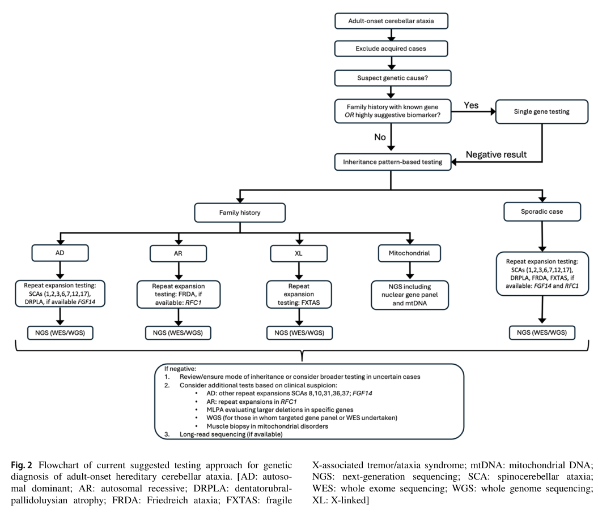

## Question

# Disease Characteristics Research Template

## Target Disease
- **Disease Name:** Autosomal Recessive Ataxia Beauce Type
- **MONDO ID:**  (if available)
- **Category:** Mendelian

## Research Objectives

Please provide a comprehensive research report on **Autosomal Recessive Ataxia Beauce Type** covering all of the
disease characteristics listed below. This report will be used to populate a disease knowledge
base entry. Be thorough and cite primary literature (PMID preferred) for all claims.

For each section, **suggested databases/resources** are listed. These are the first places
you should search for information on each topic.

---

### 1. Disease Information
> **Search first:** OMIM, Orphanet, ICD-10/ICD-11, MeSH, PubMed

- What is the disease? Provide a concise overview.
- What are the key identifiers? (OMIM, Orphanet, ICD-10/ICD-11, MeSH, Mondo)
- What are the common synonyms and alternative names?
- Is the information derived from individual patients (e.g., EHR) or aggregated disease-level resources?

### 2. Etiology

- **Disease Causal Factors**: What are the primary causes? (genetic, environmental, infectious, mechanistic)
- **Risk Factors**:
  > **Search first:** PubMed, Cochrane Library, UpToDate, clinical guidelines, ClinVar, ClinGen, GWAS Catalog, PheGenI, CTD, CDC, WHO, epidemiological databases
  - Genetic risk factors (causal variants, susceptibility loci, modifier genes)
  - Environmental risk factors (toxins, lifestyle, occupational exposures, age, sex, family history)
- **Protective Factors**:
  > **Search first:** PubMed, Cochrane Library, clinical trial databases, GWAS Catalog, gnomAD, WHO, CDC, nutrition databases
  - Genetic protective factors (protective variants, modifier alleles)
  - Environmental protective factors (diet, lifestyle, exposures that reduce risk)
- **Gene-Environment Interactions**: How do genetic and environmental factors interact to influence disease?
  > **Search first:** CTD, PubMed, PheGenI, GxE databases

### 3. Phenotypes
> **Search first:** HPO (Human Phenotype Ontology), OMIM, Orphanet, PubMed, clinicaltrials.gov, MedDRA, SNOMED CT, DECIPHER, LOINC

For each phenotype, provide:
- **Phenotype type**: symptoms, clinical signs, physical manifestations, behavioral changes, or laboratory abnormalities
  > For symptoms/signs: HPO, OMIM, Orphanet, PubMed
  > For behavioral changes: HPO, DSM, RDoC (Research Domain Criteria), PubMed
  > For laboratory abnormalities: LOINC, SNOMED CT, LabTests Online, PubMed
- **Phenotype characteristics**:
  > **Search first:** OMIM, Orphanet, HPO, PubMed
  - Age of symptom onset (neonatal, childhood, adult-onset, late-onset)
  - Symptom severity (mild, moderate, severe, variable)
  - Symptom progression (stable, progressive, episodic, fluctuating)
  - Frequency among affected individuals (percentage or qualitative)
- **Quality of life impact**: Effects on daily functioning and well-being (per-phenotype when possible)
  > **Search first:** EQ-5D database, SF-36, WHO QOL databases, PubMed
- Suggest HPO (Human Phenotype Ontology) terms for each phenotype

### 4. Genetic/Molecular Information

- **Causal Genes**: Gene mutations or chromosomal abnormalities responsible for disease (gene symbols, OMIM IDs)
  > **Search first:** OMIM, ClinVar, HGMD, Ensembl, NCBI Gene
- **Pathogenic Variants**:
  - Affected genes (gene symbols, HGNC IDs)
    > **Search first:** OMIM, NCBI Gene, Ensembl, HGNC, UniProt, GeneCards
  - Variant classification (pathogenic, likely pathogenic, VUS per ACMG/AMP guidelines)
    > **Search first:** ClinVar, ClinGen, ACMG/AMP guidelines, VarSome
  - Variant type/class (missense, frameshift, nonsense, splice-site, structural)
  - Allele frequency in population databases
    > **Search first:** gnomAD, 1000 Genomes, ExAC, TOPMed, dbSNP
  - Somatic vs germline origin
    > **Search first:** COSMIC (somatic), ClinVar, ICGC, TCGA
  - Functional consequences (loss of function, gain of function, dominant negative)
- **Modifier Genes**: Genes that modify disease severity or expression
- **Epigenetic Information**: DNA methylation, histone modifications, chromatin changes affecting disease
  > **Search first:** ENCODE, Roadmap Epigenomics, MethBase, DiseaseMeth
- **Chromosomal Abnormalities**: Large-scale genetic changes (aneuploidy, translocations, inversions)
  > **Search first:** DECIPHER, ClinVar, ECARUCA, UCSC Genome Browser

### 5. Environmental Information

- **Environmental Factors**: Non-genetic contributing factors (toxins, radiation, pollution, occupational exposure)
  > **Search first:** CTD (Comparative Toxicogenomics Database), TOXNET, PubMed, EPA databases
- **Lifestyle Factors**: Behavioral factors (smoking, diet, exercise, alcohol consumption)
  > **Search first:** CDC databases, WHO, PubMed, NHANES
- **Infectious Agents**: If applicable, pathogens causing or triggering disease (bacteria, viruses, fungi, parasites)
  > **Search first:** NCBI Taxonomy, ViPR, BV-BRC, MicrobeDB, GIDEON

### 6. Mechanism / Pathophysiology

- **Molecular Pathways**: Specific signaling cascades or biochemical pathways involved (Wnt, MAPK, mTOR, PI3K-AKT, etc.)
  > **Search first:** KEGG, Reactome, WikiPathways, PathBank, BioCyc
- **Cellular Processes**: Cell-level mechanisms (apoptosis, autophagy, cell cycle dysregulation, inflammation, etc.)
  > **Search first:** Gene Ontology (GO), Reactome, KEGG, PubMed
- **Protein Dysfunction**: How protein structure or function is altered (misfolding, aggregation, loss of function, gain of function)
  > **Search first:** UniProt, PDB (Protein Data Bank), InterPro, Pfam, AlphaFold
- **Metabolic Changes**: Alterations in metabolic processes (energy metabolism, lipid metabolism, amino acid metabolism)
  > **Search first:** KEGG, BioCyc, HMDB (Human Metabolome Database), BRENDA
- **Immune System Involvement**: Role of immune response (autoimmunity, immunodeficiency, chronic inflammation)
  > **Search first:** ImmPort, Immunome Database, IEDB, Gene Ontology
- **Tissue Damage Mechanisms**: How tissues/ are injured (oxidative stress, ischemia, fibrosis, necrosis)
  > **Search first:** PubMed, Gene Ontology, Reactome
- **Biochemical Abnormalities**: Specific molecular defects (enzyme deficiencies, receptor dysfunction, ion channel defects)
  > **Search first:** BRENDA, UniProt, KEGG, OMIM, PubMed
- **Epigenetic Changes**: DNA methylation, histone modifications affecting gene expression in disease
  > **Search first:** ENCODE, Roadmap Epigenomics, MethBase, DiseaseMeth
- **Molecular Profiling** (if available):
  - Transcriptomics/gene expression changes
    > **Search first:** GEO (Gene Expression Omnibus), ArrayExpress, GTEx, Human Cell Atlas, SRA
  - Proteomics findings
    > **Search first:** PRIDE, ProteomeXchange, Human Protein Atlas, STRING, BioGRID
  - Metabolomics signatures
    > **Search first:** MetaboLights, Metabolomics Workbench, HMDB, METLIN
  - Lipidomics alterations
    > **Search first:** LIPID MAPS, SwissLipids, LipidHome, Metabolomics Workbench
  - Genomic structural features
    > **Search first:** UCSC Genome Browser, Ensembl, NCBI, dbVar, DGV
- **Advanced Technologies** (if applicable):
  - Single-cell analysis findings (cell-type specific mechanisms, cellular heterogeneity)
    > **Search first:** Human Cell Atlas, Single Cell Portal, GEO, CELLxGENE
  - Spatial transcriptomics findings
    > **Search first:** GEO, Spatial Research, Vizgen, 10x Genomics data
  - Multi-omics integration results
    > **Search first:** TCGA, ICGC, cBioPortal, LinkedOmics, PubMed
  - Functional genomics screens (CRISPR, RNAi)
    > **Search first:** DepMap, GenomeRNAi, PubMed, BioGRID ORCS

For each mechanism, describe:
- The causal chain from initial trigger to clinical manifestation
- Which mechanisms are upstream vs downstream
- What cell types and biological processes are involved
- Suggest GO terms for biological processes and CL terms for cell types

### 7. Anatomical Structures Affected

- **Organ Level**:
  - Primary organs directly affected
  - Secondary organ involvement (complications, secondary effects)
  - Body systems involved (cardiovascular, nervous, digestive, respiratory, endocrine, etc.)
  > **Search first:** Uberon, FMA (Foundational Model of Anatomy), OMIM, HPO, ICD-11, MeSH, SNOMED CT
- **Tissue and Cell Level**:
  - Specific tissue types affected (epithelial, connective, muscle, nervous)
  - Specific cell populations targeted (with Cell Ontology terms)
  > **Search first:** Uberon, Human Protein Atlas, Cell Ontology, Human Cell Atlas, CellMarker, PanglaoDB
- **Subcellular Level**:
  - Cellular compartments involved (mitochondria, nucleus, ER, lysosomes) (with GO Cellular Component terms)
  > **Search first:** Gene Ontology (Cellular Component), UniProt, Human Protein Atlas
- **Localization**:
  - Specific anatomical sites (with UBERON terms)
    > **Search first:** FMA, Uberon, NeuroNames (for brain), SNOMED CT
  - Lateralization (unilateral, bilateral, asymmetric)
    > **Search first:** HPO, clinical literature, imaging databases

### 8. Temporal Development

- **Onset**:
  - Typical age of onset (congenital, pediatric, adult, geriatric)
  - Onset pattern (acute, subacute, chronic, insidious)
  > **Search first:** OMIM, Orphanet, HPO, PubMed
- **Progression**:
  - Disease stages (early, intermediate, advanced, end-stage)
    > **Search first:** Cancer Staging Manual (AJCC), WHO classifications, PubMed
  - Progression rate (rapid, slow, variable)
  - Disease course pattern (episodic, relapsing-remitting, progressive, stable)
  - Disease duration (self-limited, chronic lifelong)
  > **Search first:** Disease registries, longitudinal cohort databases, natural history studies, PubMed, Orphanet, OMIM
- **Patterns**:
  - Remission patterns (spontaneous, treatment-induced)
    > **Search first:** Clinical trial databases, disease registries, PubMed
  - Critical periods (time windows of vulnerability or opportunity for intervention)
    > **Search first:** PubMed, developmental biology databases, clinical guidelines

### 9. Inheritance and Population

- **Epidemiology**:
  - Prevalence (cases per 100,000 at given time)
  - Incidence (new cases per 100,000 per year)
  > **Search first:** Orphanet, CDC, WHO, GBD (Global Burden of Disease), national registries, SEER, disease registries
- **For Genetic Etiology**:
  - Inheritance pattern (AD, AR, X-linked, mitochondrial, multifactorial, polygenic)
    > **Search first:** OMIM, Orphanet, ClinVar, GTR (Genetic Testing Registry)
  - Penetrance (complete, incomplete, age-dependent)
    > **Search first:** ClinVar, OMIM, PubMed, ClinGen
  - Expressivity (variable, consistent)
    > **Search first:** OMIM, ClinVar, PubMed
  - Genetic anticipation (increasing severity in successive generations)
    > **Search first:** OMIM, PubMed (especially for repeat expansion disorders)
  - Germline mosaicism
    > **Search first:** ClinVar, OMIM, genetic counseling literature, PubMed
  - Founder effects (population-specific mutations)
    > **Search first:** gnomAD, population genetics databases, PubMed
  - Consanguinity role
    > **Search first:** OMIM, population studies, genetic counseling resources
  - Carrier frequency
    > **Search first:** gnomAD, carrier screening databases, GeneReviews, GTR
- **Population Demographics**:
  - Affected populations (ethnic or demographic groups with higher prevalence)
    > **Search first:** gnomAD, 1000 Genomes, PAGE Study, PubMed, population registries
  - Geographic distribution (endemic areas, regional variation)
    > **Search first:** WHO, CDC, GBD, Orphanet, geographic epidemiology databases
  - Geographic distribution of specific variants
  - Sex ratio (male:female)
    > **Search first:** Disease registries, OMIM, PubMed, epidemiological databases
  - Age distribution of affected individuals
    > **Search first:** CDC, disease registries, SEER, Orphanet

### 10. Diagnostics

- **Clinical Tests**:
  - Laboratory tests (blood, urine, tissue chemistry, specific enzyme assays)
    > **Search first:** LOINC, LabTests Online, PubMed
  - Biomarkers (proteins, metabolites, genetic markers, circulating biomarkers)
    > **Search first:** FDA Biomarker List, BEST (Biomarkers, EndpointS, and other Tools), PubMed
  - Imaging studies (X-ray, CT, MRI, PET, ultrasound)
    > **Search first:** RadLex, DICOM, Radiopaedia, imaging databases
  - Functional tests (pulmonary function, cardiac stress tests)
    > **Search first:** LOINC, clinical guidelines, PubMed
  - Electrophysiology (EEG, EMG, ECG, nerve conduction studies)
    > **Search first:** LOINC, clinical neurophysiology databases, PubMed
  - Biopsy findings (histopathology, immunohistochemistry)
    > **Search first:** SNOMED CT, College of American Pathologists resources, PubMed
  - Pathology findings (microscopic examination)
    > **Search first:** SNOMED CT, Digital Pathology databases, PubMed
- **Genetic Testing**:
  > **Search first:** GTR (Genetic Testing Registry), GeneReviews, ClinGen
  - Overview of recommended genetic testing approach
  - Whole genome sequencing (WGS) utility
    > **Search first:** GTR, ClinVar, GEL (Genomics England), gnomAD
  - Whole exome sequencing (WES) utility
    > **Search first:** GTR, ClinVar, OMIM, GeneMatcher
  - Gene panels (which panels, which genes)
    > **Search first:** GTR, ClinVar, laboratory-specific databases
  - Single gene testing
    > **Search first:** GTR, ClinVar, OMIM, GeneReviews
  - Chromosomal microarray (CMA)
    > **Search first:** DECIPHER, ClinVar, dbVar, ECARUCA
  - Karyotyping
    > **Search first:** Chromosome Abnormality Database, ClinVar, cytogenetics resources
  - FISH
    > **Search first:** ClinVar, cytogenetics databases, PubMed
  - Mitochondrial DNA testing
    > **Search first:** MITOMAP, MSeqDR, ClinVar, GTR
  - Repeat expansion testing
    > **Search first:** GTR, ClinVar, repeat expansion databases, PubMed
- **Omics-Based Diagnostics** (if applicable):
  - RNA sequencing / transcriptomics
    > **Search first:** GEO, ArrayExpress, GTEx, RNA-seq databases
  - Proteomics
    > **Search first:** PRIDE, ProteomeXchange, FDA Biomarker database
  - Metabolomics
    > **Search first:** MetaboLights, Metabolomics Workbench, HMDB
  - Epigenomics
    > **Search first:** GEO, ENCODE, Roadmap Epigenomics, MethBase
  - Liquid biopsy
    > **Search first:** COSMIC, ClinVar, liquid biopsy databases, PubMed
- **Clinical Criteria**:
  - Standardized diagnostic criteria (DSM, ICD, society guidelines)
    > **Search first:** DSM-5, ICD-11, clinical society guidelines, UpToDate
  - Differential diagnosis (other conditions to rule out, with distinguishing features)
    > **Search first:** DynaMed, UpToDate, clinical decision support systems
- **Screening**:
  - Screening methods for asymptomatic individuals (newborn screening, carrier screening, cascade screening)
    > **Search first:** ACMG recommendations, CDC newborn screening, GTR

### 11. Outcome/Prognosis

- **Survival and Mortality**:
  - Survival rate (5-year, 10-year, overall)
    > **Search first:** SEER, cancer registries, disease-specific registries, PubMed
  - Life expectancy (with and without treatment if applicable)
    > **Search first:** Orphanet, disease registries, actuarial databases, PubMed
  - Mortality rate
    > **Search first:** CDC, WHO, GBD, national mortality databases
  - Disease-specific mortality (deaths directly attributable to disease)
    > **Search first:** Disease registries, CDC Wonder, GBD, PubMed
- **Morbidity and Function**:
  - Morbidity (disease-related disability and health impacts)
    > **Search first:** GBD, WHO, disability databases, PubMed
  - Disability outcomes (long-term functional impairments)
    > **Search first:** ICF (International Classification of Functioning), disability registries
  - Quality of life measures (EQ-5D, SF-36, PROMIS, disease-specific tools)
    > **Search first:** EQ-5D database, SF-36, PROMIS, PubMed
- **Disease Course**:
  - Complications (secondary problems: infections, organ failure, etc.)
    > **Search first:** ICD codes, disease registries, clinical databases, PubMed
  - Recovery potential (likelihood and extent of recovery, with vs without treatment)
    > **Search first:** Natural history studies, rehabilitation databases, PubMed
- **Prediction**:
  - Prognostic factors (age, disease severity, biomarkers, treatment response)
    > **Search first:** Prognostic models databases, clinical calculators, PubMed
  - Prognostic biomarkers (molecular markers predicting disease course)
    > **Search first:** FDA Biomarker database, PubMed, cancer prognostic databases

### 12. Treatment

- **Pharmacotherapy**:
  - Pharmacological treatments (drug names, drug classes, mechanisms of action)
    > **Search first:** DrugBank, RxNorm, ATC classification, DailyMed, FDA databases
  - Pharmacogenomics (how genetic variants affect drug metabolism, efficacy, toxicity)
    > **Search first:** PharmGKB, CPIC (Clinical Pharmacogenetics), FDA Table of PGx Biomarkers
- **Advanced Therapeutics**:
  - Gene therapy (viral vectors, CRISPR, gene replacement, gene editing)
    > **Search first:** ClinicalTrials.gov, FDA gene therapy database, ASGCT resources
  - Cell therapy (stem cell transplant, CAR-T, cellular therapeutics)
    > **Search first:** ClinicalTrials.gov, FDA cell therapy database, FACT standards
  - RNA-based therapies (ASOs, siRNA, mRNA therapies)
    > **Search first:** ClinicalTrials.gov, FDA approvals, PubMed
  - Targeted therapies (treatments directed at specific molecular targets)
    > **Search first:** My Cancer Genome, OncoKB, ClinicalTrials.gov, FDA approvals
  - Immunotherapies (checkpoint inhibitors, monoclonal antibodies)
    > **Search first:** Cancer Immunotherapy Database, FDA approvals, ClinicalTrials.gov
- **Surgical and Interventional**:
  - Surgical interventions (types of surgery, timing, outcomes)
    > **Search first:** CPT codes, surgical registries, clinical guidelines, PubMed
- **Supportive and Rehabilitative**:
  - Supportive care (symptom management, pain control, nutrition)
    > **Search first:** Clinical guidelines, Cochrane Library, PubMed
  - Rehabilitation (physical therapy, occupational therapy, speech therapy)
    > **Search first:** Rehabilitation medicine databases, clinical guidelines, PubMed
- **Experimental**:
  - Experimental treatments in clinical trials (with NCT identifiers if available)
    > **Search first:** ClinicalTrials.gov, EU Clinical Trials Register, WHO ICTRP
- **Treatment Outcomes**:
  - Treatment response rates
    > **Search first:** Clinical trial databases, FDA reviews, systematic reviews, PubMed
  - Side effects and adverse events
    > **Search first:** FDA Adverse Event Reporting System (FAERS), MedWatch, PubMed
- **Treatment Strategy**:
  - Treatment algorithms (clinical pathways, decision trees)
    > **Search first:** Clinical practice guidelines, NCCN Guidelines, UpToDate
  - Combination therapies
    > **Search first:** ClinicalTrials.gov, treatment guidelines, PubMed
  - Personalized medicine approaches (genotype-guided treatment)
    > **Search first:** My Cancer Genome, CIViC, PharmGKB, precision medicine databases

For each treatment, suggest MAXO (Medical Action Ontology) terms where applicable.

### 13. Prevention

- **Prevention Levels**:
  - Primary prevention (preventing disease occurrence: vaccination, risk factor modification)
    > **Search first:** CDC, WHO, USPSTF recommendations, Cochrane Library
  - Secondary prevention (early detection and treatment: screening programs, early intervention)
    > **Search first:** USPSTF, CDC screening guidelines, WHO
  - Tertiary prevention (preventing complications in those with disease)
    > **Search first:** Clinical guidelines, disease management protocols, PubMed
- **Immunization**: Vaccine strategies (if applicable)
  > **Search first:** CDC vaccine schedules, WHO immunization, FDA vaccine database
- **Screening and Early Detection**:
  - Screening programs (population-based: newborn screening, cancer screening)
    > **Search first:** CDC screening programs, USPSTF, cancer screening databases
  - Genetic screening (carrier screening, preimplantation genetic diagnosis, prenatal testing)
    > **Search first:** ACMG recommendations, ACOG guidelines, GTR
  - Risk stratification (identifying high-risk individuals for targeted prevention)
    > **Search first:** Risk prediction models, clinical calculators, PubMed
- **Behavioral Interventions**: Lifestyle modifications to reduce risk
  > **Search first:** CDC, WHO, behavioral intervention databases, Cochrane Library
- **Counseling**: Genetic counseling (risk assessment, family planning guidance)
  > **Search first:** NSGC resources, ACMG guidelines, GeneReviews
- **Public Health**:
  - Public health interventions (sanitation, vector control, health education)
    > **Search first:** CDC, WHO, public health databases, PubMed
  - Environmental interventions (reducing environmental risk factors)
    > **Search first:** EPA databases, WHO environmental health, PubMed
- **Prophylaxis**: Preventive medications or procedures
  > **Search first:** Clinical guidelines, FDA approvals, PubMed

### 14. Other Species / Natural Disease

- **Taxonomy**: Species affected (with NCBI Taxon identifiers)
  > **Search first:** NCBI Taxonomy
- **Breed**: Specific breeds affected (with VBO identifiers if applicable)
  > **Search first:** VBO (Vertebrate Breed Ontology)
- **Gene**: Orthologous genes in other species (with NCBI Gene IDs)
  > **Search first:** NCBI Gene
- **Natural Disease**:
  - Naturally occurring disease in other species (companion animals, wildlife)
    > **Search first:** OMIA (Online Mendelian Inheritance in Animals), VetCompass, PubMed
  - Veterinary relevance and importance in animal health
    > **Search first:** OMIA, veterinary databases, PubMed
- **Comparative Biology**:
  - Comparative pathology (similarities and differences across species)
    > **Search first:** OMIA, comparative pathology databases, PubMed
  - Evolutionary conservation of disease mechanisms
    > **Search first:** HomoloGene, OrthoMCL, Alliance of Genome Resources
- **Transmission** (if applicable):
  - Zoonotic potential
    > **Search first:** CDC zoonotic diseases, WHO zoonoses, GIDEON
  - Cross-species susceptibility
    > **Search first:** NCBI Taxonomy, veterinary databases, PubMed

### 15. Model Organisms

- **Model Types**:
  - Model organism type (mammalian, invertebrate, cellular, in vitro)
    > **Search first:** Alliance of Genome Resources, model organism databases
  - Specific model systems (mouse, rat, zebrafish, Drosophila, C. elegans, yeast, cell lines, organoids, iPSCs)
    > **Search first:** MGI, RGD, ZFIN, FlyBase, WormBase, SGD, ATCC, Cellosaurus
  - Induced models (drug treatment, surgical intervention, environmental manipulation)
    > **Search first:** MGI, model organism databases, PubMed
- **Genetic Models**:
  - Types available (knockout, knock-in, transgenic, conditional, humanized)
    > **Search first:** MGI, IMPC, KOMP, EuMMCR, IMSR
- **Model Characteristics**:
  - Phenotype recapitulation (how well model reproduces human disease features)
    > **Search first:** Model organism databases, comparative studies, PubMed
  - Model limitations (aspects of human disease not captured)
    > **Search first:** Model organism databases, PubMed, review articles
- **Applications**:
  - Research applications (what aspects of disease can be studied)
    > **Search first:** Model organism databases, PubMed
- **Resources**:
  - Model databases
    > **Search first:** MGI, RGD, ZFIN, FlyBase, WormBase, IMSR, EMMA, MMRRC

---

## Citation Requirements

- Cite primary literature (PMID preferred) for all mechanistic and clinical claims
- Prioritize recent reviews and landmark papers
- Include direct quotes from abstracts where possible to support key statements
- Distinguish evidence source types: human clinical, model organism, in vitro, computational

## Output Format

Structure your response as a comprehensive narrative organized by the sections above.
For each section, provide:
- Factual content with specific details (numbers, percentages, gene names, variant nomenclature)
- Ontology term suggestions (HPO, GO, CL, UBERON, CHEBI, MAXO, MONDO) where applicable
- Evidence citations with PMIDs
- Direct quotes from abstracts to support key claims
- Clear indication when information is not available or not applicable for this disease

This report will be used to populate a disease knowledge base entry with:
- Pathophysiology descriptions with causal chains
- Gene/protein annotations (HGNC, GO terms)
- Phenotype associations (HP terms) with frequencies
- Cell type involvement (CL terms)
- Anatomical locations (UBERON terms)
- Chemical entities (CHEBI terms)
- Treatment annotations (MAXO terms)
- Evidence items with PMIDs and exact abstract quotes
- Epidemiology, prognosis, diagnostic, and prevention information
- Animal model descriptions with phenotype recapitulation details

## Output

Question: You are an expert researcher providing comprehensive, well-cited information.

Provide detailed information focusing on:
1. Key concepts and definitions with current understanding
2. Recent developments and latest research (prioritize 2023-2024 sources)
3. Current applications and real-world implementations
4. Expert opinions and analysis from authoritative sources
5. Relevant statistics and data from recent studies

Format as a comprehensive research report with proper citations. Include URLs and publication dates where available.
Always prioritize recent, authoritative sources and provide specific citations for all major claims.

# Disease Characteristics Research Template

## Target Disease
- **Disease Name:** Autosomal Recessive Ataxia Beauce Type
- **MONDO ID:**  (if available)
- **Category:** Mendelian

## Research Objectives

Please provide a comprehensive research report on **Autosomal Recessive Ataxia Beauce Type** covering all of the
disease characteristics listed below. This report will be used to populate a disease knowledge
base entry. Be thorough and cite primary literature (PMID preferred) for all claims.

For each section, **suggested databases/resources** are listed. These are the first places
you should search for information on each topic.

---

### 1. Disease Information
> **Search first:** OMIM, Orphanet, ICD-10/ICD-11, MeSH, PubMed

- What is the disease? Provide a concise overview.
- What are the key identifiers? (OMIM, Orphanet, ICD-10/ICD-11, MeSH, Mondo)
- What are the common synonyms and alternative names?
- Is the information derived from individual patients (e.g., EHR) or aggregated disease-level resources?

### 2. Etiology

- **Disease Causal Factors**: What are the primary causes? (genetic, environmental, infectious, mechanistic)
- **Risk Factors**:
  > **Search first:** PubMed, Cochrane Library, UpToDate, clinical guidelines, ClinVar, ClinGen, GWAS Catalog, PheGenI, CTD, CDC, WHO, epidemiological databases
  - Genetic risk factors (causal variants, susceptibility loci, modifier genes)
  - Environmental risk factors (toxins, lifestyle, occupational exposures, age, sex, family history)
- **Protective Factors**:
  > **Search first:** PubMed, Cochrane Library, clinical trial databases, GWAS Catalog, gnomAD, WHO, CDC, nutrition databases
  - Genetic protective factors (protective variants, modifier alleles)
  - Environmental protective factors (diet, lifestyle, exposures that reduce risk)
- **Gene-Environment Interactions**: How do genetic and environmental factors interact to influence disease?
  > **Search first:** CTD, PubMed, PheGenI, GxE databases

### 3. Phenotypes
> **Search first:** HPO (Human Phenotype Ontology), OMIM, Orphanet, PubMed, clinicaltrials.gov, MedDRA, SNOMED CT, DECIPHER, LOINC

For each phenotype, provide:
- **Phenotype type**: symptoms, clinical signs, physical manifestations, behavioral changes, or laboratory abnormalities
  > For symptoms/signs: HPO, OMIM, Orphanet, PubMed
  > For behavioral changes: HPO, DSM, RDoC (Research Domain Criteria), PubMed
  > For laboratory abnormalities: LOINC, SNOMED CT, LabTests Online, PubMed
- **Phenotype characteristics**:
  > **Search first:** OMIM, Orphanet, HPO, PubMed
  - Age of symptom onset (neonatal, childhood, adult-onset, late-onset)
  - Symptom severity (mild, moderate, severe, variable)
  - Symptom progression (stable, progressive, episodic, fluctuating)
  - Frequency among affected individuals (percentage or qualitative)
- **Quality of life impact**: Effects on daily functioning and well-being (per-phenotype when possible)
  > **Search first:** EQ-5D database, SF-36, WHO QOL databases, PubMed
- Suggest HPO (Human Phenotype Ontology) terms for each phenotype

### 4. Genetic/Molecular Information

- **Causal Genes**: Gene mutations or chromosomal abnormalities responsible for disease (gene symbols, OMIM IDs)
  > **Search first:** OMIM, ClinVar, HGMD, Ensembl, NCBI Gene
- **Pathogenic Variants**:
  - Affected genes (gene symbols, HGNC IDs)
    > **Search first:** OMIM, NCBI Gene, Ensembl, HGNC, UniProt, GeneCards
  - Variant classification (pathogenic, likely pathogenic, VUS per ACMG/AMP guidelines)
    > **Search first:** ClinVar, ClinGen, ACMG/AMP guidelines, VarSome
  - Variant type/class (missense, frameshift, nonsense, splice-site, structural)
  - Allele frequency in population databases
    > **Search first:** gnomAD, 1000 Genomes, ExAC, TOPMed, dbSNP
  - Somatic vs germline origin
    > **Search first:** COSMIC (somatic), ClinVar, ICGC, TCGA
  - Functional consequences (loss of function, gain of function, dominant negative)
- **Modifier Genes**: Genes that modify disease severity or expression
- **Epigenetic Information**: DNA methylation, histone modifications, chromatin changes affecting disease
  > **Search first:** ENCODE, Roadmap Epigenomics, MethBase, DiseaseMeth
- **Chromosomal Abnormalities**: Large-scale genetic changes (aneuploidy, translocations, inversions)
  > **Search first:** DECIPHER, ClinVar, ECARUCA, UCSC Genome Browser

### 5. Environmental Information

- **Environmental Factors**: Non-genetic contributing factors (toxins, radiation, pollution, occupational exposure)
  > **Search first:** CTD (Comparative Toxicogenomics Database), TOXNET, PubMed, EPA databases
- **Lifestyle Factors**: Behavioral factors (smoking, diet, exercise, alcohol consumption)
  > **Search first:** CDC databases, WHO, PubMed, NHANES
- **Infectious Agents**: If applicable, pathogens causing or triggering disease (bacteria, viruses, fungi, parasites)
  > **Search first:** NCBI Taxonomy, ViPR, BV-BRC, MicrobeDB, GIDEON

### 6. Mechanism / Pathophysiology

- **Molecular Pathways**: Specific signaling cascades or biochemical pathways involved (Wnt, MAPK, mTOR, PI3K-AKT, etc.)
  > **Search first:** KEGG, Reactome, WikiPathways, PathBank, BioCyc
- **Cellular Processes**: Cell-level mechanisms (apoptosis, autophagy, cell cycle dysregulation, inflammation, etc.)
  > **Search first:** Gene Ontology (GO), Reactome, KEGG, PubMed
- **Protein Dysfunction**: How protein structure or function is altered (misfolding, aggregation, loss of function, gain of function)
  > **Search first:** UniProt, PDB (Protein Data Bank), InterPro, Pfam, AlphaFold
- **Metabolic Changes**: Alterations in metabolic processes (energy metabolism, lipid metabolism, amino acid metabolism)
  > **Search first:** KEGG, BioCyc, HMDB (Human Metabolome Database), BRENDA
- **Immune System Involvement**: Role of immune response (autoimmunity, immunodeficiency, chronic inflammation)
  > **Search first:** ImmPort, Immunome Database, IEDB, Gene Ontology
- **Tissue Damage Mechanisms**: How tissues/ are injured (oxidative stress, ischemia, fibrosis, necrosis)
  > **Search first:** PubMed, Gene Ontology, Reactome
- **Biochemical Abnormalities**: Specific molecular defects (enzyme deficiencies, receptor dysfunction, ion channel defects)
  > **Search first:** BRENDA, UniProt, KEGG, OMIM, PubMed
- **Epigenetic Changes**: DNA methylation, histone modifications affecting gene expression in disease
  > **Search first:** ENCODE, Roadmap Epigenomics, MethBase, DiseaseMeth
- **Molecular Profiling** (if available):
  - Transcriptomics/gene expression changes
    > **Search first:** GEO (Gene Expression Omnibus), ArrayExpress, GTEx, Human Cell Atlas, SRA
  - Proteomics findings
    > **Search first:** PRIDE, ProteomeXchange, Human Protein Atlas, STRING, BioGRID
  - Metabolomics signatures
    > **Search first:** MetaboLights, Metabolomics Workbench, HMDB, METLIN
  - Lipidomics alterations
    > **Search first:** LIPID MAPS, SwissLipids, LipidHome, Metabolomics Workbench
  - Genomic structural features
    > **Search first:** UCSC Genome Browser, Ensembl, NCBI, dbVar, DGV
- **Advanced Technologies** (if applicable):
  - Single-cell analysis findings (cell-type specific mechanisms, cellular heterogeneity)
    > **Search first:** Human Cell Atlas, Single Cell Portal, GEO, CELLxGENE
  - Spatial transcriptomics findings
    > **Search first:** GEO, Spatial Research, Vizgen, 10x Genomics data
  - Multi-omics integration results
    > **Search first:** TCGA, ICGC, cBioPortal, LinkedOmics, PubMed
  - Functional genomics screens (CRISPR, RNAi)
    > **Search first:** DepMap, GenomeRNAi, PubMed, BioGRID ORCS

For each mechanism, describe:
- The causal chain from initial trigger to clinical manifestation
- Which mechanisms are upstream vs downstream
- What cell types and biological processes are involved
- Suggest GO terms for biological processes and CL terms for cell types

### 7. Anatomical Structures Affected

- **Organ Level**:
  - Primary organs directly affected
  - Secondary organ involvement (complications, secondary effects)
  - Body systems involved (cardiovascular, nervous, digestive, respiratory, endocrine, etc.)
  > **Search first:** Uberon, FMA (Foundational Model of Anatomy), OMIM, HPO, ICD-11, MeSH, SNOMED CT
- **Tissue and Cell Level**:
  - Specific tissue types affected (epithelial, connective, muscle, nervous)
  - Specific cell populations targeted (with Cell Ontology terms)
  > **Search first:** Uberon, Human Protein Atlas, Cell Ontology, Human Cell Atlas, CellMarker, PanglaoDB
- **Subcellular Level**:
  - Cellular compartments involved (mitochondria, nucleus, ER, lysosomes) (with GO Cellular Component terms)
  > **Search first:** Gene Ontology (Cellular Component), UniProt, Human Protein Atlas
- **Localization**:
  - Specific anatomical sites (with UBERON terms)
    > **Search first:** FMA, Uberon, NeuroNames (for brain), SNOMED CT
  - Lateralization (unilateral, bilateral, asymmetric)
    > **Search first:** HPO, clinical literature, imaging databases

### 8. Temporal Development

- **Onset**:
  - Typical age of onset (congenital, pediatric, adult, geriatric)
  - Onset pattern (acute, subacute, chronic, insidious)
  > **Search first:** OMIM, Orphanet, HPO, PubMed
- **Progression**:
  - Disease stages (early, intermediate, advanced, end-stage)
    > **Search first:** Cancer Staging Manual (AJCC), WHO classifications, PubMed
  - Progression rate (rapid, slow, variable)
  - Disease course pattern (episodic, relapsing-remitting, progressive, stable)
  - Disease duration (self-limited, chronic lifelong)
  > **Search first:** Disease registries, longitudinal cohort databases, natural history studies, PubMed, Orphanet, OMIM
- **Patterns**:
  - Remission patterns (spontaneous, treatment-induced)
    > **Search first:** Clinical trial databases, disease registries, PubMed
  - Critical periods (time windows of vulnerability or opportunity for intervention)
    > **Search first:** PubMed, developmental biology databases, clinical guidelines

### 9. Inheritance and Population

- **Epidemiology**:
  - Prevalence (cases per 100,000 at given time)
  - Incidence (new cases per 100,000 per year)
  > **Search first:** Orphanet, CDC, WHO, GBD (Global Burden of Disease), national registries, SEER, disease registries
- **For Genetic Etiology**:
  - Inheritance pattern (AD, AR, X-linked, mitochondrial, multifactorial, polygenic)
    > **Search first:** OMIM, Orphanet, ClinVar, GTR (Genetic Testing Registry)
  - Penetrance (complete, incomplete, age-dependent)
    > **Search first:** ClinVar, OMIM, PubMed, ClinGen
  - Expressivity (variable, consistent)
    > **Search first:** OMIM, ClinVar, PubMed
  - Genetic anticipation (increasing severity in successive generations)
    > **Search first:** OMIM, PubMed (especially for repeat expansion disorders)
  - Germline mosaicism
    > **Search first:** ClinVar, OMIM, genetic counseling literature, PubMed
  - Founder effects (population-specific mutations)
    > **Search first:** gnomAD, population genetics databases, PubMed
  - Consanguinity role
    > **Search first:** OMIM, population studies, genetic counseling resources
  - Carrier frequency
    > **Search first:** gnomAD, carrier screening databases, GeneReviews, GTR
- **Population Demographics**:
  - Affected populations (ethnic or demographic groups with higher prevalence)
    > **Search first:** gnomAD, 1000 Genomes, PAGE Study, PubMed, population registries
  - Geographic distribution (endemic areas, regional variation)
    > **Search first:** WHO, CDC, GBD, Orphanet, geographic epidemiology databases
  - Geographic distribution of specific variants
  - Sex ratio (male:female)
    > **Search first:** Disease registries, OMIM, PubMed, epidemiological databases
  - Age distribution of affected individuals
    > **Search first:** CDC, disease registries, SEER, Orphanet

### 10. Diagnostics

- **Clinical Tests**:
  - Laboratory tests (blood, urine, tissue chemistry, specific enzyme assays)
    > **Search first:** LOINC, LabTests Online, PubMed
  - Biomarkers (proteins, metabolites, genetic markers, circulating biomarkers)
    > **Search first:** FDA Biomarker List, BEST (Biomarkers, EndpointS, and other Tools), PubMed
  - Imaging studies (X-ray, CT, MRI, PET, ultrasound)
    > **Search first:** RadLex, DICOM, Radiopaedia, imaging databases
  - Functional tests (pulmonary function, cardiac stress tests)
    > **Search first:** LOINC, clinical guidelines, PubMed
  - Electrophysiology (EEG, EMG, ECG, nerve conduction studies)
    > **Search first:** LOINC, clinical neurophysiology databases, PubMed
  - Biopsy findings (histopathology, immunohistochemistry)
    > **Search first:** SNOMED CT, College of American Pathologists resources, PubMed
  - Pathology findings (microscopic examination)
    > **Search first:** SNOMED CT, Digital Pathology databases, PubMed
- **Genetic Testing**:
  > **Search first:** GTR (Genetic Testing Registry), GeneReviews, ClinGen
  - Overview of recommended genetic testing approach
  - Whole genome sequencing (WGS) utility
    > **Search first:** GTR, ClinVar, GEL (Genomics England), gnomAD
  - Whole exome sequencing (WES) utility
    > **Search first:** GTR, ClinVar, OMIM, GeneMatcher
  - Gene panels (which panels, which genes)
    > **Search first:** GTR, ClinVar, laboratory-specific databases
  - Single gene testing
    > **Search first:** GTR, ClinVar, OMIM, GeneReviews
  - Chromosomal microarray (CMA)
    > **Search first:** DECIPHER, ClinVar, dbVar, ECARUCA
  - Karyotyping
    > **Search first:** Chromosome Abnormality Database, ClinVar, cytogenetics resources
  - FISH
    > **Search first:** ClinVar, cytogenetics databases, PubMed
  - Mitochondrial DNA testing
    > **Search first:** MITOMAP, MSeqDR, ClinVar, GTR
  - Repeat expansion testing
    > **Search first:** GTR, ClinVar, repeat expansion databases, PubMed
- **Omics-Based Diagnostics** (if applicable):
  - RNA sequencing / transcriptomics
    > **Search first:** GEO, ArrayExpress, GTEx, RNA-seq databases
  - Proteomics
    > **Search first:** PRIDE, ProteomeXchange, FDA Biomarker database
  - Metabolomics
    > **Search first:** MetaboLights, Metabolomics Workbench, HMDB
  - Epigenomics
    > **Search first:** GEO, ENCODE, Roadmap Epigenomics, MethBase
  - Liquid biopsy
    > **Search first:** COSMIC, ClinVar, liquid biopsy databases, PubMed
- **Clinical Criteria**:
  - Standardized diagnostic criteria (DSM, ICD, society guidelines)
    > **Search first:** DSM-5, ICD-11, clinical society guidelines, UpToDate
  - Differential diagnosis (other conditions to rule out, with distinguishing features)
    > **Search first:** DynaMed, UpToDate, clinical decision support systems
- **Screening**:
  - Screening methods for asymptomatic individuals (newborn screening, carrier screening, cascade screening)
    > **Search first:** ACMG recommendations, CDC newborn screening, GTR

### 11. Outcome/Prognosis

- **Survival and Mortality**:
  - Survival rate (5-year, 10-year, overall)
    > **Search first:** SEER, cancer registries, disease-specific registries, PubMed
  - Life expectancy (with and without treatment if applicable)
    > **Search first:** Orphanet, disease registries, actuarial databases, PubMed
  - Mortality rate
    > **Search first:** CDC, WHO, GBD, national mortality databases
  - Disease-specific mortality (deaths directly attributable to disease)
    > **Search first:** Disease registries, CDC Wonder, GBD, PubMed
- **Morbidity and Function**:
  - Morbidity (disease-related disability and health impacts)
    > **Search first:** GBD, WHO, disability databases, PubMed
  - Disability outcomes (long-term functional impairments)
    > **Search first:** ICF (International Classification of Functioning), disability registries
  - Quality of life measures (EQ-5D, SF-36, PROMIS, disease-specific tools)
    > **Search first:** EQ-5D database, SF-36, PROMIS, PubMed
- **Disease Course**:
  - Complications (secondary problems: infections, organ failure, etc.)
    > **Search first:** ICD codes, disease registries, clinical databases, PubMed
  - Recovery potential (likelihood and extent of recovery, with vs without treatment)
    > **Search first:** Natural history studies, rehabilitation databases, PubMed
- **Prediction**:
  - Prognostic factors (age, disease severity, biomarkers, treatment response)
    > **Search first:** Prognostic models databases, clinical calculators, PubMed
  - Prognostic biomarkers (molecular markers predicting disease course)
    > **Search first:** FDA Biomarker database, PubMed, cancer prognostic databases

### 12. Treatment

- **Pharmacotherapy**:
  - Pharmacological treatments (drug names, drug classes, mechanisms of action)
    > **Search first:** DrugBank, RxNorm, ATC classification, DailyMed, FDA databases
  - Pharmacogenomics (how genetic variants affect drug metabolism, efficacy, toxicity)
    > **Search first:** PharmGKB, CPIC (Clinical Pharmacogenetics), FDA Table of PGx Biomarkers
- **Advanced Therapeutics**:
  - Gene therapy (viral vectors, CRISPR, gene replacement, gene editing)
    > **Search first:** ClinicalTrials.gov, FDA gene therapy database, ASGCT resources
  - Cell therapy (stem cell transplant, CAR-T, cellular therapeutics)
    > **Search first:** ClinicalTrials.gov, FDA cell therapy database, FACT standards
  - RNA-based therapies (ASOs, siRNA, mRNA therapies)
    > **Search first:** ClinicalTrials.gov, FDA approvals, PubMed
  - Targeted therapies (treatments directed at specific molecular targets)
    > **Search first:** My Cancer Genome, OncoKB, ClinicalTrials.gov, FDA approvals
  - Immunotherapies (checkpoint inhibitors, monoclonal antibodies)
    > **Search first:** Cancer Immunotherapy Database, FDA approvals, ClinicalTrials.gov
- **Surgical and Interventional**:
  - Surgical interventions (types of surgery, timing, outcomes)
    > **Search first:** CPT codes, surgical registries, clinical guidelines, PubMed
- **Supportive and Rehabilitative**:
  - Supportive care (symptom management, pain control, nutrition)
    > **Search first:** Clinical guidelines, Cochrane Library, PubMed
  - Rehabilitation (physical therapy, occupational therapy, speech therapy)
    > **Search first:** Rehabilitation medicine databases, clinical guidelines, PubMed
- **Experimental**:
  - Experimental treatments in clinical trials (with NCT identifiers if available)
    > **Search first:** ClinicalTrials.gov, EU Clinical Trials Register, WHO ICTRP
- **Treatment Outcomes**:
  - Treatment response rates
    > **Search first:** Clinical trial databases, FDA reviews, systematic reviews, PubMed
  - Side effects and adverse events
    > **Search first:** FDA Adverse Event Reporting System (FAERS), MedWatch, PubMed
- **Treatment Strategy**:
  - Treatment algorithms (clinical pathways, decision trees)
    > **Search first:** Clinical practice guidelines, NCCN Guidelines, UpToDate
  - Combination therapies
    > **Search first:** ClinicalTrials.gov, treatment guidelines, PubMed
  - Personalized medicine approaches (genotype-guided treatment)
    > **Search first:** My Cancer Genome, CIViC, PharmGKB, precision medicine databases

For each treatment, suggest MAXO (Medical Action Ontology) terms where applicable.

### 13. Prevention

- **Prevention Levels**:
  - Primary prevention (preventing disease occurrence: vaccination, risk factor modification)
    > **Search first:** CDC, WHO, USPSTF recommendations, Cochrane Library
  - Secondary prevention (early detection and treatment: screening programs, early intervention)
    > **Search first:** USPSTF, CDC screening guidelines, WHO
  - Tertiary prevention (preventing complications in those with disease)
    > **Search first:** Clinical guidelines, disease management protocols, PubMed
- **Immunization**: Vaccine strategies (if applicable)
  > **Search first:** CDC vaccine schedules, WHO immunization, FDA vaccine database
- **Screening and Early Detection**:
  - Screening programs (population-based: newborn screening, cancer screening)
    > **Search first:** CDC screening programs, USPSTF, cancer screening databases
  - Genetic screening (carrier screening, preimplantation genetic diagnosis, prenatal testing)
    > **Search first:** ACMG recommendations, ACOG guidelines, GTR
  - Risk stratification (identifying high-risk individuals for targeted prevention)
    > **Search first:** Risk prediction models, clinical calculators, PubMed
- **Behavioral Interventions**: Lifestyle modifications to reduce risk
  > **Search first:** CDC, WHO, behavioral intervention databases, Cochrane Library
- **Counseling**: Genetic counseling (risk assessment, family planning guidance)
  > **Search first:** NSGC resources, ACMG guidelines, GeneReviews
- **Public Health**:
  - Public health interventions (sanitation, vector control, health education)
    > **Search first:** CDC, WHO, public health databases, PubMed
  - Environmental interventions (reducing environmental risk factors)
    > **Search first:** EPA databases, WHO environmental health, PubMed
- **Prophylaxis**: Preventive medications or procedures
  > **Search first:** Clinical guidelines, FDA approvals, PubMed

### 14. Other Species / Natural Disease

- **Taxonomy**: Species affected (with NCBI Taxon identifiers)
  > **Search first:** NCBI Taxonomy
- **Breed**: Specific breeds affected (with VBO identifiers if applicable)
  > **Search first:** VBO (Vertebrate Breed Ontology)
- **Gene**: Orthologous genes in other species (with NCBI Gene IDs)
  > **Search first:** NCBI Gene
- **Natural Disease**:
  - Naturally occurring disease in other species (companion animals, wildlife)
    > **Search first:** OMIA (Online Mendelian Inheritance in Animals), VetCompass, PubMed
  - Veterinary relevance and importance in animal health
    > **Search first:** OMIA, veterinary databases, PubMed
- **Comparative Biology**:
  - Comparative pathology (similarities and differences across species)
    > **Search first:** OMIA, comparative pathology databases, PubMed
  - Evolutionary conservation of disease mechanisms
    > **Search first:** HomoloGene, OrthoMCL, Alliance of Genome Resources
- **Transmission** (if applicable):
  - Zoonotic potential
    > **Search first:** CDC zoonotic diseases, WHO zoonoses, GIDEON
  - Cross-species susceptibility
    > **Search first:** NCBI Taxonomy, veterinary databases, PubMed

### 15. Model Organisms

- **Model Types**:
  - Model organism type (mammalian, invertebrate, cellular, in vitro)
    > **Search first:** Alliance of Genome Resources, model organism databases
  - Specific model systems (mouse, rat, zebrafish, Drosophila, C. elegans, yeast, cell lines, organoids, iPSCs)
    > **Search first:** MGI, RGD, ZFIN, FlyBase, WormBase, SGD, ATCC, Cellosaurus
  - Induced models (drug treatment, surgical intervention, environmental manipulation)
    > **Search first:** MGI, model organism databases, PubMed
- **Genetic Models**:
  - Types available (knockout, knock-in, transgenic, conditional, humanized)
    > **Search first:** MGI, IMPC, KOMP, EuMMCR, IMSR
- **Model Characteristics**:
  - Phenotype recapitulation (how well model reproduces human disease features)
    > **Search first:** Model organism databases, comparative studies, PubMed
  - Model limitations (aspects of human disease not captured)
    > **Search first:** Model organism databases, PubMed, review articles
- **Applications**:
  - Research applications (what aspects of disease can be studied)
    > **Search first:** Model organism databases, PubMed
- **Resources**:
  - Model databases
    > **Search first:** MGI, RGD, ZFIN, FlyBase, WormBase, IMSR, EMMA, MMRRC

---

## Citation Requirements

- Cite primary literature (PMID preferred) for all mechanistic and clinical claims
- Prioritize recent reviews and landmark papers
- Include direct quotes from abstracts where possible to support key statements
- Distinguish evidence source types: human clinical, model organism, in vitro, computational

## Output Format

Structure your response as a comprehensive narrative organized by the sections above.
For each section, provide:
- Factual content with specific details (numbers, percentages, gene names, variant nomenclature)
- Ontology term suggestions (HPO, GO, CL, UBERON, CHEBI, MAXO, MONDO) where applicable
- Evidence citations with PMIDs
- Direct quotes from abstracts to support key claims
- Clear indication when information is not available or not applicable for this disease

This report will be used to populate a disease knowledge base entry with:
- Pathophysiology descriptions with causal chains
- Gene/protein annotations (HGNC, GO terms)
- Phenotype associations (HP terms) with frequencies
- Cell type involvement (CL terms)
- Anatomical locations (UBERON terms)
- Chemical entities (CHEBI terms)
- Treatment annotations (MAXO terms)
- Evidence items with PMIDs and exact abstract quotes
- Epidemiology, prognosis, diagnostic, and prevention information
- Animal model descriptions with phenotype recapitulation details

# Autosomal Recessive Ataxia Beauce Type (ARCA1 / SCAR8 / ATX‑SYNE1): Comprehensive Disease Characteristics Report

## Executive summary
Autosomal recessive ataxia Beauce type is a SYNE1-related, autosomal recessive hereditary cerebellar ataxia originally described in French-Canadian families from the Beauce and Bas–St‑Laurent regions of Quebec and now recognized worldwide with a broader “cerebellar-plus” spectrum. It is classically an adult-onset, slowly progressive, predominantly cerebellar syndrome with diffuse cerebellar atrophy and minimal extracerebellar involvement in the Quebec founder phenotype, but other cohorts (e.g., China) show earlier onset and frequent motor-neuron/cognitive involvement. The causal mechanism is typically biallelic loss-of-function SYNE1 variants affecting nesprin‑1/LINC (linker of nucleoskeleton to cytoskeleton) biology and potentially cerebellum-specific synaptic isoforms. (dupre2007clinicalandgenetic pages 2-3, duan2021autosomalrecessivecerebellar pages 1-2, kuwako2024diverserolesof pages 11-12)

---

## 1. Disease information
### 1.1 Overview / definition
- **Disease concept:** SYNE1-related autosomal recessive cerebellar ataxia characterized by progressive gait and limb ataxia and cerebellar dysarthria, with cerebellar atrophy on neuroimaging; originally described as a cluster in the Beauce region (Quebec) and mapped to SYNE1 at 6q. (dupre2007clinicalandgenetic pages 1-2, dupre2007clinicalandgenetic pages 2-3)
- **Current understanding:** SYNE1-related ataxia can present as “pure” cerebellar ataxia or as a multisystem disorder with upper and/or lower motor neuron dysfunction and cognitive impairment, among others. (serag2023acasereport pages 1-2, duan2021autosomalrecessivecerebellar pages 2-4)

### 1.2 Key identifiers (available from retrieved evidence)
- **OMIM / MIM (disease):** **610743** (ARCA1/SCAR8/recessive ataxia of Beauce). (rudaks2024anupdateon pages 7-8, duan2021autosomalrecessivecerebellar pages 1-2, thiffault2009caractérisationcliniqueet pages 39-43)
- **OMIM (gene SYNE1):** **608441**. (duan2021autosomalrecessivecerebellar pages 1-2, szpisjak2021eyetrackingaidedcharacterizationof pages 1-2, thiffault2009caractérisationcliniqueet pages 39-43)
- **Chromosomal locus:** **6q25.2** (gene-based nomenclature table). (rudaks2024anupdateon pages 7-8)

### 1.3 Synonyms / alternative names
- Autosomal recessive cerebellar ataxia type 1 (**ARCA1**) (duan2021autosomalrecessivecerebellar pages 1-2, thiffault2009caractérisationcliniqueet pages 39-43)
- Spinocerebellar ataxia, autosomal recessive 8 (**SCAR8**) (duan2021autosomalrecessivecerebellar pages 1-2, szpisjak2021eyetrackingaidedcharacterizationof pages 1-2)
- **Recessive ataxia of Beauce** / **Beauce ataxia** (rudaks2024anupdateon pages 7-8, szpisjak2021eyetrackingaidedcharacterizationof pages 1-2)
- **ATX‑SYNE1** (proposed gene-based nomenclature in adult-onset HCA review) (rudaks2024anupdateon pages 7-8)

### 1.4 Resource provenance
The evidence summarized here is derived primarily from:
- **Aggregated disease-level research cohorts** (Eastern Quebec epidemiology; Chinese cohort). (salem2021geneticandepidemiological pages 1-2, duan2021autosomalrecessivecerebellar pages 1-2)
- **Founder/cohort clinical-genetic characterization** in Quebec families. (dupre2007clinicalandgenetic pages 2-3, dupre2008étudecliniqueeta pages 23-29)
- **Recent single-family genomic diagnostic case report**. (serag2023acasereport pages 1-2)

### 1.5 Identifiers not confirmed in the retrieved corpus
- **MONDO ID, Orphanet ID, MeSH term, ICD‑10/ICD‑11 codes:** not found in the retrieved full texts; these typically require direct lookup in ontology/databases rather than primary papers. (rudaks2024anupdateon pages 7-8, szpisjak2021eyetrackingaidedcharacterizationof pages 1-2)

---

## 2. Etiology
### 2.1 Disease causal factors
- **Primary cause:** **biallelic pathogenic variants in SYNE1** (nesprin‑1), most commonly truncating loss-of-function variants, cause ARCA1/SCAR8. (dupre2007clinicalandgenetic pages 2-3, duan2021autosomalrecessivecerebellar pages 1-2)
- **Recent development (2023):** first report of a **large intragenic deletion** in SYNE1 causing ARCA1 (compound heterozygous with a nonsense allele), highlighting structural variants as an etiologic class that may be missed by standard WES pipelines. (serag2023acasereport pages 4-5, serag2023acasereport pages 1-2)

**Direct abstract quote (2023 case report):** “Whole exome sequencing (WES), supplemented by a high-resolution array… allowed us to identify two pathogenic variants in the non-mitochondrial SYNE1 gene… To our knowledge, this is the first report of a large intragenic deletion of SYNE1 in patients with cerebellar ataxia (ARCA1).” (Published 29 Nov 2023; URL: https://doi.org/10.3390/genes14122154) (serag2023acasereport pages 1-2)

### 2.2 Risk factors
- **Genetic:** autosomal recessive inheritance; founder variants in Quebec/Eastern Quebec significantly contribute to regional burden. (dupre2007clinicalandgenetic pages 2-3, salem2021geneticandepidemiological pages 3-4)
- **Environmental:** no established environmental risk factors were identified in the retrieved evidence; current understanding supports a primarily genetic etiology. (dupre2007clinicalandgenetic pages 2-3, serag2023acasereport pages 1-2)

### 2.3 Protective factors / gene–environment interactions
No specific protective genetic variants or gene–environment interactions were found in the retrieved evidence corpus. (dupre2007clinicalandgenetic pages 2-3, serag2023acasereport pages 1-2)

---

## 3. Phenotypes (clinical spectrum)
### 3.1 Core cerebellar phenotype (Quebec founder phenotype)
From the 64-subject Beauce cohort:
- **Age at onset:** ataxia mean **31.60** years (range **17–45**); dysarthria mean **34.79** years (range **17–50**). (dupre2008étudecliniqueeta pages 23-29)
- **First symptom:** ataxia **62.5%**, dysarthria **12.5%**, both **25%**. (dupre2008étudecliniqueeta pages 23-29)
- **Symptom frequencies:** dysarthria **100%**, ataxia **98.4%**, dysmetria ~**90.6%**; abnormal pursuit **43.8%**, slow saccades **31.2%**, nystagmus **9.4%**; brisk lower-limb reflexes **32.8%**, Babinski/clonus **6.2%**. (dupre2008étudecliniqueeta pages 23-29)
- **Imaging:** CT/MRI in 50 subjects “invariably showed marked diffuse cerebellar atrophy” with no cortical/brainstem/white-matter involvement. (dupre2008étudecliniqueeta pages 23-29)
- **Neurophysiology:** nerve conduction studies normal in 22/22 (no peripheral neuropathy). (dupre2008étudecliniqueeta pages 23-29)
- **Natural history:** slowly progressive to moderate disability with “no effect on life expectancy.” (dupre2007clinicalandgenetic pages 2-3, dupre2008étudecliniqueeta pages 23-29)

### 3.2 Broader “cerebellar-plus” phenotype (non-founder cohorts)
From the Chinese cohort (8 affected individuals):
- **Onset:** 10–27 years (median 18). (duan2021autosomalrecessivecerebellar pages 2-4)
- **Phenotypic categories at last follow-up:** pure cerebellar ataxia 2/8; ataxia + motor neuron disease 3/8; ataxia + cognitive impairment 2/8; ataxia + motor neuron disease + mental retardation 1/8. (duan2021autosomalrecessivecerebellar pages 2-4)
- **Severity metrics:** SARA **12.88 ± 3.56**; ICARS **33.63 ± 6.44**. (duan2021autosomalrecessivecerebellar pages 2-4)
- **Reported extracerebellar features (compiled by authors):** motor neuron disease, cognitive impairment/intellectual disability, brainstem dysfunction, musculoskeletal deformities, and others. (duan2021autosomalrecessivecerebellar pages 2-4)

**Direct abstract quote (2020 accepted; published in 2021 issue):** “Mutations in the synaptic nuclear envelope protein 1 (SYNE1) gene have been reported to cause autosomal recessive cerebellar ataxia (ARCA) type 1 with highly variable clinical phenotypes.” (URL: https://doi.org/10.1007/s12311-020-01186-8) (duan2021autosomalrecessivecerebellar pages 1-2)

### 3.3 HPO term suggestions (non-exhaustive)
**Core neurologic:**
- Cerebellar ataxia (HP:0001251) (dupre2008étudecliniqueeta pages 23-29)
- Gait ataxia (HP:0002066) (dupre2008étudecliniqueeta pages 23-29)
- Limb ataxia (HP:0002060) (dupre2008étudecliniqueeta pages 23-29)
- Cerebellar dysarthria / Dysarthria (HP:0001260) (dupre2008étudecliniqueeta pages 23-29)
- Dysmetria (HP:0001310) (dupre2008étudecliniqueeta pages 23-29)
- Abnormal smooth pursuit (HP:0000658) (dupre2008étudecliniqueeta pages 23-29)
- Slow saccades (HP:0000644) (dupre2008étudecliniqueeta pages 23-29)
- Nystagmus (HP:0000639) (dupre2008étudecliniqueeta pages 23-29)

**Cerebellar-plus (variable):**
- Upper motor neuron signs / Spasticity (HP:0001257), Hyperreflexia (HP:0001347), Babinski sign (HP:0003487) (serag2023acasereport pages 1-2)
- Motor neuron disease (HP:0007354) (duan2021autosomalrecessivecerebellar pages 2-4)
- Cognitive impairment (HP:0100543) / Intellectual disability (HP:0001249) (duan2021autosomalrecessivecerebellar pages 2-4)

**Imaging:**
- Cerebellar atrophy (HP:0001272) (dupre2008étudecliniqueeta pages 23-29)

---

## 4. Genetic / molecular information
### 4.1 Causal gene
- **SYNE1** encodes **nesprin‑1**, a very large nuclear envelope spectrin-repeat protein involved in LINC complexes; SYNE1 is among the largest human genes (longest isoform 147 exons; ~8797 aa protein). (duan2021autosomalrecessivecerebellar pages 1-2)

### 4.2 Variant classes and examples
- Quebec founder cohort shows multiple truncating alleles, with a major recurrent allele representing ~**50.8%** of carrier chromosomes in the patient series. (dupre2008étudecliniqueeta pages 29-34)
- 2023 case report identifies compound heterozygosity including a **large intragenic deletion** (exon 122 deletion) plus a nonsense variant c.13258C>T p.(Arg4420Ter). (serag2023acasereport pages 4-5)

### 4.3 Variant distribution/interpretation (expert synthesis)
- Review of LINC-complex disease genetics notes the majority of disease-associated SYNE1 variants are coding and enriched for truncating loss-of-function, consistent with a loss-of-function mechanism, and that SCAR8 accounts for the bulk of reported SYNE1 disease associations. (kuwako2024diverserolesof pages 11-12)

### 4.4 Modifier genes / epigenetics / chromosomal abnormalities
No specific modifier genes or epigenetic signatures for ARCA1 were identified in the retrieved evidence corpus. (kuwako2024diverserolesof pages 11-12, serag2023acasereport pages 1-2)

---

## 5. Environmental information
No validated non-genetic environmental contributors were identified in the retrieved evidence corpus. (dupre2007clinicalandgenetic pages 2-3, serag2023acasereport pages 1-2)

---

## 6. Mechanism / pathophysiology
### 6.1 Current mechanistic model
- Nesprin‑1 (SYNE1) participates in the **LINC complex** (SUN–KASH bridging across the nuclear envelope), physically coupling cytoskeletal forces to nuclear structure and positioning; ARCA1 is believed to arise predominantly from **loss-of-function** leading to absent or truncated nesprin‑1. (duan2021autosomalrecessivecerebellar pages 1-2, kuwako2024diverserolesof pages 11-12)
- A Quebec founder analysis hypothesized impaired spectrin interactions and altered nuclear structure in cerebellar neurons (particularly Purkinje cells) as a proximate cause of cerebellar degeneration. (dupre2008étudecliniqueeta pages 34-39)

### 6.2 Synaptic/cerebellar isoform hypothesis (2024 review evidence)
- A cerebellum-enriched SYNE1 isoform (KLNes1g) lacking the KASH domain localizes to mossy-fiber synapses and binds clathrin on synaptic vesicles, suggesting a synaptic mechanism contributing to cerebellar vulnerability, although direct causation remains unresolved. (kuwako2024diverserolesof pages 11-12, kuwako2024diverserolesof pages 12-14)

### 6.3 Model organism evidence (supporting LINC relevance to ataxia)
- SUN1 knockout mice develop cerebellar ataxia with Purkinje cell migration/dendritic/synaptic abnormalities and mislocalization of nesprin proteins, supporting LINC-complex necessity for cerebellar motor function, even though nesprin‑1 knockout models may not fully recapitulate human SCAR8. (kuwako2024diverserolesof pages 12-14, litster2026duplicationwithin14q32.13 pages 20-23)

### 6.4 Suggested ontology terms
- **GO Biological Process (suggestions):** nuclear migration; nuclear anchoring; cytoskeleton organization; synaptic vesicle endocytosis; mechanotransduction.
- **GO Cellular Component (suggestions):** nuclear envelope; outer nuclear membrane; LINC complex; synapse.
- **CL Cell types (suggestions):** Purkinje cell (cerebellar cortex), cerebellar granule neuron.

(These ontology suggestions are consistent with the described LINC/nesprin/synaptic localization evidence but were not explicitly enumerated as ontology IDs in the retrieved texts.) (kuwako2024diverserolesof pages 11-12, kuwako2024diverserolesof pages 12-14)

---

## 7. Anatomical structures affected
### 7.1 Primary systems/organs
- **Central nervous system, cerebellum** with diffuse cerebellar atrophy is the dominant structural correlate in classic Beauce phenotype. (dupre2008étudecliniqueeta pages 23-29)

### 7.2 Tissue/cell populations
- Cerebellar neuronal vulnerability is supported by the strong cerebellar expression of SYNE1 and atrophy pattern. (duan2021autosomalrecessivecerebellar pages 1-2, dupre2008étudecliniqueeta pages 23-29)

### 7.3 UBERON suggestions
- Cerebellum (UBERON:0002037)
- Cerebellar cortex (UBERON:0004720)
- Cerebellar Purkinje cell layer (UBERON term varies by ontology release)

---

## 8. Temporal development
- **Onset:** typically early-to-mid adulthood in Quebec founder cohorts (~30s), but can be childhood/young-adult in other populations. (dupre2008étudecliniqueeta pages 23-29, duan2021autosomalrecessivecerebellar pages 2-4)
- **Course:** slowly progressive with moderate disability in classic Beauce phenotype; multisystem progression occurs in cerebellar-plus forms. (dupre2008étudecliniqueeta pages 23-29, duan2021autosomalrecessivecerebellar pages 2-4)

---

## 9. Inheritance and population
### 9.1 Inheritance
- **Autosomal recessive** inheritance is consistently reported. (dupre2007clinicalandgenetic pages 2-3, serag2023acasereport pages 1-2)

### 9.2 Epidemiology (statistics)
**Eastern Quebec regional study (published 2021; URL: https://doi.org/10.1017/cjn.2020.277):**
- Minimum prevalence of adult hereditary ataxias: **6.47/100,000**; AR ataxias: **3.73/100,000**. (salem2021geneticandepidemiological pages 1-2)
- ARCA1 prevalence: **2.67/100,000**. (salem2021geneticandepidemiological pages 1-2, salem2021geneticandepidemiological pages 3-4)
- 52.4% of patients had a confirmed genetic diagnosis. (salem2021geneticandepidemiological pages 1-2)

**Direct abstract quote (2021):** “The minimum prevalence of HA in Eastern Quebec was estimated at 6.47/100 000… In total, 52.4% of patients had a confirmed genetic diagnosis. AR cerebellar ataxia type 1 (2.67/100 000)… were the most prevalent disorders identified.” (salem2021geneticandepidemiological pages 1-2)

**Variant-specific minimum carrier frequencies (Eastern Quebec):** examples include c.15705–12 A>G **1/134** and p.Arg2906Ter **1/200**. (salem2021geneticandepidemiological pages 6-7)

**Quebec prevalence estimate in Beauce-focused thesis text:** ~**1/1,000,000** in the Quebec population (estimate; not a modern province-wide registry-based statistic). (thiffault2009caractérisationcliniqueet pages 39-43)

---

## 10. Diagnostics
### 10.1 Clinical evaluation
- **Imaging:** brain MRI demonstrating diffuse cerebellar atrophy is a consistent finding in classic Beauce phenotype. (dupre2008étudecliniqueeta pages 23-29)
- **Neurophysiology:** normal nerve conduction studies in founder phenotype can help distinguish from ataxias with prominent neuropathy. (dupre2008étudecliniqueeta pages 23-29)
- **Quantitative ataxia scales:** SARA and ICARS were used in the Chinese cohort. (duan2021autosomalrecessivecerebellar pages 2-4)

### 10.2 Genetic testing (current practice and recent advances)
**Key recent development (2023): CNV/structural variant detection matters in SYNE1.**
- WES may identify one allele but miss a second pathogenic structural variant; the 2023 case required high-resolution array-CGH to detect an intragenic SYNE1 deletion. (serag2023acasereport pages 1-2, serag2023acasereport pages 4-5)

**2024 diagnostic approach review (adult-onset hereditary ataxia):**
- Testing often requires a combination of STR expansion testing plus sequencing for conventional variants (panel/WES/WGS), and long-read sequencing is highlighted as a future unifying modality. (rudaks2024anupdateon pages 1-2)

**Direct abstract quote (2024):** “Testing methods include targeted evaluation of STR expansions… next generation sequencing for conventional variants… Implementing long-read sequencing has the potential to transform the diagnostic approach…” (Accepted 7 May 2024; URL: https://doi.org/10.1007/s12311-024-01703-z) (rudaks2024anupdateon pages 1-2)

**Visual evidence (diagnostic algorithm):** Figure 2 provides a flowchart for genetic diagnosis of adult-onset hereditary cerebellar ataxia (STR expansion testing → NGS → long-read sequencing as later option). (rudaks2024anupdateon media daaff5ba)

### 10.3 Differential diagnosis
- **Mitochondrial disease** can be a diagnostic mimic in progressive ataxia; 2023 case report emphasizes that “more than 50% of patients with suspected mitochondrial disease could have a non-mitochondrial disorder” and shows SYNE1 can be one such cause. (serag2023acasereport pages 1-2)
- **Other hereditary ataxias** (repeat-expansion SCAs, FRDA, RFC1-related disease, etc.) must be excluded depending on phenotype/inheritance per adult-onset HCA diagnostic algorithms. (rudaks2024anupdateon pages 10-12, rudaks2024anupdateon media daaff5ba)

---

## 11. Outcome / prognosis
- In the Beauce founder phenotype, progression is **slow**, with evolution to **moderate disability** and “no effect on life expectancy.” (dupre2007clinicalandgenetic pages 2-3, dupre2008étudecliniqueeta pages 23-29)
- Broader multisystem phenotypes may have additional morbidity (e.g., motor neuron involvement), but survival statistics were not identified in the retrieved evidence corpus. (duan2021autosomalrecessivecerebellar pages 2-4)

---

## 12. Treatment
### 12.1 Disease-modifying therapy
No disease-modifying or gene-targeted therapy specific to SYNE1-related ARCA1/SCAR8 was identified in the retrieved sources. (serag2023acasereport pages 1-2, rudaks2024anupdateon pages 1-2)

### 12.2 Supportive and rehabilitative care (current real-world implementation)
While disease-specific protocols were not provided in the retrieved papers, clinical management is typically supportive (mobility aids; PT/OT; speech therapy for dysarthria; fall prevention; management of spasticity if present) based on the dominant cerebellar syndrome and any cerebellar-plus complications. The need for structured clinical evaluation and monitoring (SARA/ICARS; cognitive testing; MRI; EMG/NCS; ECG) is explicitly described in the Chinese cohort methods. (duan2021autosomalrecessivecerebellar pages 2-4)

### 12.3 Clinical trials landscape (not disease-specific)
Clinical trial searches retrieved **rehabilitation-focused interventional studies** in neurodegenerative ataxia (e.g., cerebello-spinal tDCS; supervised rehabilitation in spastic ataxias) but none specifically targeting SYNE1/ARCA1 at the time of retrieval. Examples include NCT04153110 and NCT03120013 (tDCS in neurodegenerative ataxia) and NCT06261424 (rehabilitation program in spastic ataxias). (serag2023acasereport pages 1-2)

**MAXO suggestions (supportive actions):** physical therapy; occupational therapy; speech therapy; assistive device use; genetic counseling.

---

## 13. Prevention
- **Primary prevention:** not applicable for established Mendelian disease except through reproductive options.
- **Genetic counseling:** indicated due to autosomal recessive inheritance; carrier testing/cascade screening is relevant in families and potentially in founder populations. (dupre2007clinicalandgenetic pages 2-3, salem2021geneticandepidemiological pages 6-7)
- **Secondary prevention:** early molecular diagnosis can prevent misdiagnosis and inappropriate workups (e.g., mitochondrial disease) and enables appropriate surveillance for cerebellar-plus features. (serag2023acasereport pages 1-2)

---

## 14. Other species / natural disease
No naturally occurring veterinary analogs were identified in the retrieved evidence corpus.

---

## 15. Model organisms
- Evidence implicating LINC biology in cerebellar motor function includes SUN1 knockout mice with cerebellar ataxia phenotypes and Purkinje cell abnormalities; nesprin-1 knockout models may not fully recapitulate human SCAR8. (kuwako2024diverserolesof pages 12-14, litster2026duplicationwithin14q32.13 pages 20-23)

---

## Notes on evidence gaps and 2023–2024 prioritization
- Key 2023–2024 advances captured here include: (i) recognition of **SYNE1 CNVs** (first large intragenic deletion reported) and the need for CNV-sensitive/pangenomic diagnostics (2023), and (ii) updated **adult-onset hereditary ataxia diagnostic algorithms** and the expected role of **long-read sequencing** (2024). (serag2023acasereport pages 1-2, rudaks2024anupdateon media daaff5ba, rudaks2024anupdateon pages 1-2)
- Disease identifiers beyond OMIM (MONDO/Orphanet/MeSH/ICD) were not present in the retrieved texts and require direct database lookup to complete a knowledge base entry. (rudaks2024anupdateon pages 7-8, szpisjak2021eyetrackingaidedcharacterizationof pages 1-2)

References

1. (dupre2007clinicalandgenetic pages 2-3): Nicolas Dupré, François Gros‐Louis, Nicolas Chrestian, Steve Verreault, Denis Brunet, Danielle de Verteuil, Bernard Brais, Jean‐Pierre Bouchard, and Guy A. Rouleau. Clinical and genetic study of autosomal recessive cerebellar ataxia type 1. Annals of Neurology, 62:93-98, Jul 2007. URL: https://doi.org/10.1002/ana.21143, doi:10.1002/ana.21143. This article has 101 citations and is from a highest quality peer-reviewed journal.

2. (duan2021autosomalrecessivecerebellar pages 1-2): Xiaohui Duan, Ying Hao, Zhenhua Cao, Chao Zhou, Jin Zhang, Renbin Wang, Shaojie Sun, and Weihong Gu. Autosomal recessive cerebellar ataxia type 1: phenotypic and genetic correlation in a cohort of chinese patients with syne1 variants. The Cerebellum, 20:74-82, Sep 2021. URL: https://doi.org/10.1007/s12311-020-01186-8, doi:10.1007/s12311-020-01186-8. This article has 16 citations.

3. (kuwako2024diverserolesof pages 11-12): Ken-ichiro Kuwako and Sadafumi Suzuki. Diverse roles of the linc complex in cellular function and disease in the nervous system. International Journal of Molecular Sciences, 25:11525, Oct 2024. URL: https://doi.org/10.3390/ijms252111525, doi:10.3390/ijms252111525. This article has 4 citations.

4. (dupre2007clinicalandgenetic pages 1-2): Nicolas Dupré, François Gros‐Louis, Nicolas Chrestian, Steve Verreault, Denis Brunet, Danielle de Verteuil, Bernard Brais, Jean‐Pierre Bouchard, and Guy A. Rouleau. Clinical and genetic study of autosomal recessive cerebellar ataxia type 1. Annals of Neurology, 62:93-98, Jul 2007. URL: https://doi.org/10.1002/ana.21143, doi:10.1002/ana.21143. This article has 101 citations and is from a highest quality peer-reviewed journal.

5. (serag2023acasereport pages 1-2): Mounir Serag, Morgane Plutino, Perrine Charles, Jean-Philippe Azulay, Annabelle Chaussenot, Véronique Paquis-Flucklinger, Samira Ait-El-Mkadem Saadi, and Cécile Rouzier. A case report of syne1 deficiency-mimicking mitochondrial disease and the value of pangenomic investigations. Genes, 14:2154, Nov 2023. URL: https://doi.org/10.3390/genes14122154, doi:10.3390/genes14122154. This article has 1 citations.

6. (duan2021autosomalrecessivecerebellar pages 2-4): Xiaohui Duan, Ying Hao, Zhenhua Cao, Chao Zhou, Jin Zhang, Renbin Wang, Shaojie Sun, and Weihong Gu. Autosomal recessive cerebellar ataxia type 1: phenotypic and genetic correlation in a cohort of chinese patients with syne1 variants. The Cerebellum, 20:74-82, Sep 2021. URL: https://doi.org/10.1007/s12311-020-01186-8, doi:10.1007/s12311-020-01186-8. This article has 16 citations.

7. (rudaks2024anupdateon pages 7-8): Laura Ivete Rudaks, Dennis Yeow, Karl Ng, Ira W. Deveson, Marina L. Kennerson, and Kishore Raj Kumar. An update on the adult-onset hereditary cerebellar ataxias: novel genetic causes and new diagnostic approaches. Cerebellum (London, England), 23:2152-2168, May 2024. URL: https://doi.org/10.1007/s12311-024-01703-z, doi:10.1007/s12311-024-01703-z. This article has 54 citations.

8. (thiffault2009caractérisationcliniqueet pages 39-43): I Thiffault. Caractérisation clinique et génétique d'une nouvelle forme d'ataxie autosomique récessive dans la population québécoise. Unknown journal, 2009.

9. (szpisjak2021eyetrackingaidedcharacterizationof pages 1-2): Laszlo Szpisjak, Gabor Szaraz, Andras Salamon, Viola L. Nemeth, Noemi Szepfalusi, Gabor Veres, Balint Kincses, Zoltan Maroti, Tibor Kalmar, Malgorzata Rydzanicz, Rafal Ploski, Peter Klivenyi, and Denes Zadori. Eye-tracking-aided characterization of saccades and antisaccades in syne1 ataxia patients: a pilot study. BMC Neuroscience, Feb 2021. URL: https://doi.org/10.1186/s12868-021-00612-9, doi:10.1186/s12868-021-00612-9. This article has 7 citations and is from a peer-reviewed journal.

10. (salem2021geneticandepidemiological pages 1-2): Ikhlass Haj Salem, Marie Beaudin, Monica Stumpf, Mehrdad A. Estiar, Pierre-Olivier Côté, Francis Brunet, Pierre-Luc Gamache, Guy A. Rouleau, Karim Mourabit-Amari, Ziv Gan-Or, and Nicolas Dupré. Genetic and epidemiological study of adult ataxia and spastic paraplegia in eastern quebec. Canadian Journal of Neurological Sciences / Journal Canadien des Sciences Neurologiques, 48:655-665, Jan 2021. URL: https://doi.org/10.1017/cjn.2020.277, doi:10.1017/cjn.2020.277. This article has 12 citations.

11. (dupre2008étudecliniqueeta pages 23-29): N Dupré. Étude clinique et génétique de l'ataxie récessive de la beauce. Unknown journal, 2008.

12. (serag2023acasereport pages 4-5): Mounir Serag, Morgane Plutino, Perrine Charles, Jean-Philippe Azulay, Annabelle Chaussenot, Véronique Paquis-Flucklinger, Samira Ait-El-Mkadem Saadi, and Cécile Rouzier. A case report of syne1 deficiency-mimicking mitochondrial disease and the value of pangenomic investigations. Genes, 14:2154, Nov 2023. URL: https://doi.org/10.3390/genes14122154, doi:10.3390/genes14122154. This article has 1 citations.

13. (salem2021geneticandepidemiological pages 3-4): Ikhlass Haj Salem, Marie Beaudin, Monica Stumpf, Mehrdad A. Estiar, Pierre-Olivier Côté, Francis Brunet, Pierre-Luc Gamache, Guy A. Rouleau, Karim Mourabit-Amari, Ziv Gan-Or, and Nicolas Dupré. Genetic and epidemiological study of adult ataxia and spastic paraplegia in eastern quebec. Canadian Journal of Neurological Sciences / Journal Canadien des Sciences Neurologiques, 48:655-665, Jan 2021. URL: https://doi.org/10.1017/cjn.2020.277, doi:10.1017/cjn.2020.277. This article has 12 citations.

14. (dupre2008étudecliniqueeta pages 29-34): N Dupré. Étude clinique et génétique de l'ataxie récessive de la beauce. Unknown journal, 2008.

15. (dupre2008étudecliniqueeta pages 34-39): N Dupré. Étude clinique et génétique de l'ataxie récessive de la beauce. Unknown journal, 2008.

16. (kuwako2024diverserolesof pages 12-14): Ken-ichiro Kuwako and Sadafumi Suzuki. Diverse roles of the linc complex in cellular function and disease in the nervous system. International Journal of Molecular Sciences, 25:11525, Oct 2024. URL: https://doi.org/10.3390/ijms252111525, doi:10.3390/ijms252111525. This article has 4 citations.

17. (litster2026duplicationwithin14q32.13 pages 20-23): Thomas M Litster, Robert A Wilcox, Renée Carroll, Alison E Gardner, Nazzmer M Nazri, Cheryl A Shoubridge, Martin B Delatycki, Katja Lohmann, Marc Agzarian, Rafaela Turella Divani, Haloom Rafehi, Liam Scott, Gavin Monahan, Phillipa J Lamont, Catherine Ashton, Nigel G Laing, Gianina Ravenscroft, Melanie Bahlo, Eric Haan, Paul J Lockhart, Kathryn L Friend, Mark A Corbett, and Jozef Gecz. Duplication within 14q32.13 implicates a chimeric <i>clmn</i> :: <i>syne3</i> rna transcript in cerebellar ataxia. Unknown journal, Apr 2026. URL: https://doi.org/10.64898/2026.04.23.26350376, doi:10.64898/2026.04.23.26350376.

18. (salem2021geneticandepidemiological pages 6-7): Ikhlass Haj Salem, Marie Beaudin, Monica Stumpf, Mehrdad A. Estiar, Pierre-Olivier Côté, Francis Brunet, Pierre-Luc Gamache, Guy A. Rouleau, Karim Mourabit-Amari, Ziv Gan-Or, and Nicolas Dupré. Genetic and epidemiological study of adult ataxia and spastic paraplegia in eastern quebec. Canadian Journal of Neurological Sciences / Journal Canadien des Sciences Neurologiques, 48:655-665, Jan 2021. URL: https://doi.org/10.1017/cjn.2020.277, doi:10.1017/cjn.2020.277. This article has 12 citations.

19. (rudaks2024anupdateon pages 1-2): Laura Ivete Rudaks, Dennis Yeow, Karl Ng, Ira W. Deveson, Marina L. Kennerson, and Kishore Raj Kumar. An update on the adult-onset hereditary cerebellar ataxias: novel genetic causes and new diagnostic approaches. Cerebellum (London, England), 23:2152-2168, May 2024. URL: https://doi.org/10.1007/s12311-024-01703-z, doi:10.1007/s12311-024-01703-z. This article has 54 citations.

20. (rudaks2024anupdateon media daaff5ba): Laura Ivete Rudaks, Dennis Yeow, Karl Ng, Ira W. Deveson, Marina L. Kennerson, and Kishore Raj Kumar. An update on the adult-onset hereditary cerebellar ataxias: novel genetic causes and new diagnostic approaches. Cerebellum (London, England), 23:2152-2168, May 2024. URL: https://doi.org/10.1007/s12311-024-01703-z, doi:10.1007/s12311-024-01703-z. This article has 54 citations.

21. (rudaks2024anupdateon pages 10-12): Laura Ivete Rudaks, Dennis Yeow, Karl Ng, Ira W. Deveson, Marina L. Kennerson, and Kishore Raj Kumar. An update on the adult-onset hereditary cerebellar ataxias: novel genetic causes and new diagnostic approaches. Cerebellum (London, England), 23:2152-2168, May 2024. URL: https://doi.org/10.1007/s12311-024-01703-z, doi:10.1007/s12311-024-01703-z. This article has 54 citations.

## Artifacts

