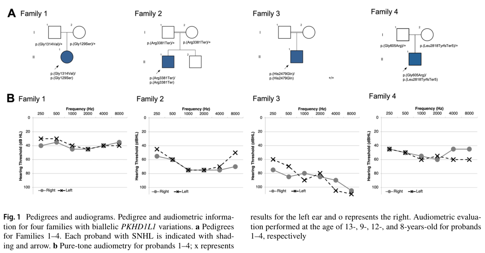

## Question

# Disease Characteristics Research Template

## Target Disease
- **Disease Name:** Autosomal Recessive Nonsyndromic Hearing Loss 124 (DFNB124, PKHD1L1-related deafness)
- **MONDO ID:** MONDO:0968981 (if available)
- **Category:** Mendelian

## Research Objectives

Please provide a comprehensive research report on **Autosomal Recessive Nonsyndromic Hearing Loss 124 (DFNB124, PKHD1L1-related deafness)** covering all of the
disease characteristics listed below. This report will be used to populate a disease knowledge
base entry. Be thorough and cite primary literature (PMID preferred) for all claims.

For each section, **suggested databases/resources** are listed. These are the first places
you should search for information on each topic.

---

### 1. Disease Information
> **Search first:** OMIM, Orphanet, ICD-10/ICD-11, MeSH, PubMed

- What is the disease? Provide a concise overview.
- What are the key identifiers? (OMIM, Orphanet, ICD-10/ICD-11, MeSH, Mondo)
- What are the common synonyms and alternative names?
- Is the information derived from individual patients (e.g., EHR) or aggregated disease-level resources?

### 2. Etiology

- **Disease Causal Factors**: What are the primary causes? (genetic, environmental, infectious, mechanistic)
- **Risk Factors**:
  > **Search first:** PubMed, Cochrane Library, UpToDate, clinical guidelines, ClinVar, ClinGen, GWAS Catalog, PheGenI, CTD, CDC, WHO, epidemiological databases
  - Genetic risk factors (causal variants, susceptibility loci, modifier genes)
  - Environmental risk factors (toxins, lifestyle, occupational exposures, age, sex, family history)
- **Protective Factors**:
  > **Search first:** PubMed, Cochrane Library, clinical trial databases, GWAS Catalog, gnomAD, WHO, CDC, nutrition databases
  - Genetic protective factors (protective variants, modifier alleles)
  - Environmental protective factors (diet, lifestyle, exposures that reduce risk)
- **Gene-Environment Interactions**: How do genetic and environmental factors interact to influence disease?
  > **Search first:** CTD, PubMed, PheGenI, GxE databases

### 3. Phenotypes
> **Search first:** HPO (Human Phenotype Ontology), OMIM, Orphanet, PubMed, clinicaltrials.gov, MedDRA, SNOMED CT, DECIPHER, LOINC

For each phenotype, provide:
- **Phenotype type**: symptoms, clinical signs, physical manifestations, behavioral changes, or laboratory abnormalities
  > For symptoms/signs: HPO, OMIM, Orphanet, PubMed
  > For behavioral changes: HPO, DSM, RDoC (Research Domain Criteria), PubMed
  > For laboratory abnormalities: LOINC, SNOMED CT, LabTests Online, PubMed
- **Phenotype characteristics**:
  > **Search first:** OMIM, Orphanet, HPO, PubMed
  - Age of symptom onset (neonatal, childhood, adult-onset, late-onset)
  - Symptom severity (mild, moderate, severe, variable)
  - Symptom progression (stable, progressive, episodic, fluctuating)
  - Frequency among affected individuals (percentage or qualitative)
- **Quality of life impact**: Effects on daily functioning and well-being (per-phenotype when possible)
  > **Search first:** EQ-5D database, SF-36, WHO QOL databases, PubMed
- Suggest HPO (Human Phenotype Ontology) terms for each phenotype

### 4. Genetic/Molecular Information

- **Causal Genes**: Gene mutations or chromosomal abnormalities responsible for disease (gene symbols, OMIM IDs)
  > **Search first:** OMIM, ClinVar, HGMD, Ensembl, NCBI Gene
- **Pathogenic Variants**:
  - Affected genes (gene symbols, HGNC IDs)
    > **Search first:** OMIM, NCBI Gene, Ensembl, HGNC, UniProt, GeneCards
  - Variant classification (pathogenic, likely pathogenic, VUS per ACMG/AMP guidelines)
    > **Search first:** ClinVar, ClinGen, ACMG/AMP guidelines, VarSome
  - Variant type/class (missense, frameshift, nonsense, splice-site, structural)
  - Allele frequency in population databases
    > **Search first:** gnomAD, 1000 Genomes, ExAC, TOPMed, dbSNP
  - Somatic vs germline origin
    > **Search first:** COSMIC (somatic), ClinVar, ICGC, TCGA
  - Functional consequences (loss of function, gain of function, dominant negative)
- **Modifier Genes**: Genes that modify disease severity or expression
- **Epigenetic Information**: DNA methylation, histone modifications, chromatin changes affecting disease
  > **Search first:** ENCODE, Roadmap Epigenomics, MethBase, DiseaseMeth
- **Chromosomal Abnormalities**: Large-scale genetic changes (aneuploidy, translocations, inversions)
  > **Search first:** DECIPHER, ClinVar, ECARUCA, UCSC Genome Browser

### 5. Environmental Information

- **Environmental Factors**: Non-genetic contributing factors (toxins, radiation, pollution, occupational exposure)
  > **Search first:** CTD (Comparative Toxicogenomics Database), TOXNET, PubMed, EPA databases
- **Lifestyle Factors**: Behavioral factors (smoking, diet, exercise, alcohol consumption)
  > **Search first:** CDC databases, WHO, PubMed, NHANES
- **Infectious Agents**: If applicable, pathogens causing or triggering disease (bacteria, viruses, fungi, parasites)
  > **Search first:** NCBI Taxonomy, ViPR, BV-BRC, MicrobeDB, GIDEON

### 6. Mechanism / Pathophysiology

**Present this section as an ordered causal chain first, then the detail below.**
Open with a numbered sequence of mechanistic steps running from the initiating
lesion (mutation, exposure, infection) to the clinical manifestation, one step per
line, each naming what it causes next. State the causal verb explicitly ("leads
to", "results in") and say where a step is inferred rather than demonstrated.
Where the mechanism branches, show the branch. The categories below are a
checklist of what to cover within those steps, not the organizing structure —
a step may draw on several of them, and a category may contribute to several
steps.

- **Molecular Pathways**: Specific signaling cascades or biochemical pathways involved (Wnt, MAPK, mTOR, PI3K-AKT, etc.)
  > **Search first:** KEGG, Reactome, WikiPathways, PathBank, BioCyc
- **Cellular Processes**: Cell-level mechanisms (apoptosis, autophagy, cell cycle dysregulation, inflammation, etc.)
  > **Search first:** Gene Ontology (GO), Reactome, KEGG, PubMed
- **Protein Dysfunction**: How protein structure or function is altered (misfolding, aggregation, loss of function, gain of function)
  > **Search first:** UniProt, PDB (Protein Data Bank), InterPro, Pfam, AlphaFold
- **Metabolic Changes**: Alterations in metabolic processes (energy metabolism, lipid metabolism, amino acid metabolism)
  > **Search first:** KEGG, BioCyc, HMDB (Human Metabolome Database), BRENDA
- **Immune System Involvement**: Role of immune response (autoimmunity, immunodeficiency, chronic inflammation)
  > **Search first:** ImmPort, Immunome Database, IEDB, Gene Ontology
- **Tissue Damage Mechanisms**: How tissues/ are injured (oxidative stress, ischemia, fibrosis, necrosis)
  > **Search first:** PubMed, Gene Ontology, Reactome
- **Biochemical Abnormalities**: Specific molecular defects (enzyme deficiencies, receptor dysfunction, ion channel defects)
  > **Search first:** BRENDA, UniProt, KEGG, OMIM, PubMed
- **Epigenetic Changes**: DNA methylation, histone modifications affecting gene expression in disease
  > **Search first:** ENCODE, Roadmap Epigenomics, MethBase, DiseaseMeth
- **Molecular Profiling** (if available):
  - Transcriptomics/gene expression changes
    > **Search first:** GEO (Gene Expression Omnibus), ArrayExpress, GTEx, Human Cell Atlas, SRA
  - Proteomics findings
    > **Search first:** PRIDE, ProteomeXchange, Human Protein Atlas, STRING, BioGRID
  - Metabolomics signatures
    > **Search first:** MetaboLights, Metabolomics Workbench, HMDB, METLIN
  - Lipidomics alterations
    > **Search first:** LIPID MAPS, SwissLipids, LipidHome, Metabolomics Workbench
  - Genomic structural features
    > **Search first:** UCSC Genome Browser, Ensembl, NCBI, dbVar, DGV
- **Advanced Technologies** (if applicable):
  - Single-cell analysis findings (cell-type specific mechanisms, cellular heterogeneity)
    > **Search first:** Human Cell Atlas, Single Cell Portal, GEO, CELLxGENE
  - Spatial transcriptomics findings
    > **Search first:** GEO, Spatial Research, Vizgen, 10x Genomics data
  - Multi-omics integration results
    > **Search first:** TCGA, ICGC, cBioPortal, LinkedOmics, PubMed
  - Functional genomics screens (CRISPR, RNAi)
    > **Search first:** DepMap, GenomeRNAi, PubMed, BioGRID ORCS

For each mechanism, describe:
- The causal chain from initial trigger to clinical manifestation
- Which mechanisms are upstream vs downstream
- What cell types and biological processes are involved
- Suggest GO terms for biological processes and CL terms for cell types

### 7. Anatomical Structures Affected

- **Organ Level**:
  - Primary organs directly affected
  - Secondary organ involvement (complications, secondary effects)
  - Body systems involved (cardiovascular, nervous, digestive, respiratory, endocrine, etc.)
  > **Search first:** Uberon, FMA (Foundational Model of Anatomy), OMIM, HPO, ICD-11, MeSH, SNOMED CT
- **Tissue and Cell Level**:
  - Specific tissue types affected (epithelial, connective, muscle, nervous)
  - Specific cell populations targeted (with Cell Ontology terms)
  > **Search first:** Uberon, Human Protein Atlas, Cell Ontology, Human Cell Atlas, CellMarker, PanglaoDB
- **Subcellular Level**:
  - Cellular compartments involved (mitochondria, nucleus, ER, lysosomes) (with GO Cellular Component terms)
  > **Search first:** Gene Ontology (Cellular Component), UniProt, Human Protein Atlas
- **Localization**:
  - Specific anatomical sites (with UBERON terms)
    > **Search first:** FMA, Uberon, NeuroNames (for brain), SNOMED CT
  - Lateralization (unilateral, bilateral, asymmetric)
    > **Search first:** HPO, clinical literature, imaging databases

### 8. Temporal Development

- **Onset**:
  - Typical age of onset (congenital, pediatric, adult, geriatric)
  - Onset pattern (acute, subacute, chronic, insidious)
  > **Search first:** OMIM, Orphanet, HPO, PubMed
- **Progression**:
  - Disease stages (early, intermediate, advanced, end-stage)
    > **Search first:** Cancer Staging Manual (AJCC), WHO classifications, PubMed
  - Progression rate (rapid, slow, variable)
  - Disease course pattern (episodic, relapsing-remitting, progressive, stable)
  - Disease duration (self-limited, chronic lifelong)
  > **Search first:** Disease registries, longitudinal cohort databases, natural history studies, PubMed, Orphanet, OMIM
- **Patterns**:
  - Remission patterns (spontaneous, treatment-induced)
    > **Search first:** Clinical trial databases, disease registries, PubMed
  - Critical periods (time windows of vulnerability or opportunity for intervention)
    > **Search first:** PubMed, developmental biology databases, clinical guidelines

### 9. Inheritance and Population

- **Epidemiology**:
  - Prevalence (cases per 100,000 at given time)
  - Incidence (new cases per 100,000 per year)
  > **Search first:** Orphanet, CDC, WHO, GBD (Global Burden of Disease), national registries, SEER, disease registries
- **For Genetic Etiology**:
  - Inheritance pattern (AD, AR, X-linked, mitochondrial, multifactorial, polygenic)
    > **Search first:** OMIM, Orphanet, ClinVar, GTR (Genetic Testing Registry)
  - Penetrance (complete, incomplete, age-dependent)
    > **Search first:** ClinVar, OMIM, PubMed, ClinGen
  - Expressivity (variable, consistent)
    > **Search first:** OMIM, ClinVar, PubMed
  - Genetic anticipation (increasing severity in successive generations)
    > **Search first:** OMIM, PubMed (especially for repeat expansion disorders)
  - Germline mosaicism
    > **Search first:** ClinVar, OMIM, genetic counseling literature, PubMed
  - Founder effects (population-specific mutations)
    > **Search first:** gnomAD, population genetics databases, PubMed
  - Consanguinity role
    > **Search first:** OMIM, population studies, genetic counseling resources
  - Carrier frequency
    > **Search first:** gnomAD, carrier screening databases, GeneReviews, GTR
- **Population Demographics**:
  - Affected populations (ethnic or demographic groups with higher prevalence)
    > **Search first:** gnomAD, 1000 Genomes, PAGE Study, PubMed, population registries
  - Geographic distribution (endemic areas, regional variation)
    > **Search first:** WHO, CDC, GBD, Orphanet, geographic epidemiology databases
  - Geographic distribution of specific variants
  - Sex ratio (male:female)
    > **Search first:** Disease registries, OMIM, PubMed, epidemiological databases
  - Age distribution of affected individuals
    > **Search first:** CDC, disease registries, SEER, Orphanet

### 10. Diagnostics

- **Clinical Tests**:
  - Laboratory tests (blood, urine, tissue chemistry, specific enzyme assays)
    > **Search first:** LOINC, LabTests Online, PubMed
  - Biomarkers (proteins, metabolites, genetic markers, circulating biomarkers)
    > **Search first:** FDA Biomarker List, BEST (Biomarkers, EndpointS, and other Tools), PubMed
  - Imaging studies (X-ray, CT, MRI, PET, ultrasound)
    > **Search first:** RadLex, DICOM, Radiopaedia, imaging databases
  - Functional tests (pulmonary function, cardiac stress tests)
    > **Search first:** LOINC, clinical guidelines, PubMed
  - Electrophysiology (EEG, EMG, ECG, nerve conduction studies)
    > **Search first:** LOINC, clinical neurophysiology databases, PubMed
  - Biopsy findings (histopathology, immunohistochemistry)
    > **Search first:** SNOMED CT, College of American Pathologists resources, PubMed
  - Pathology findings (microscopic examination)
    > **Search first:** SNOMED CT, Digital Pathology databases, PubMed
- **Genetic Testing**:
  > **Search first:** GTR (Genetic Testing Registry), GeneReviews, ClinGen
  - Overview of recommended genetic testing approach
  - Whole genome sequencing (WGS) utility
    > **Search first:** GTR, ClinVar, GEL (Genomics England), gnomAD
  - Whole exome sequencing (WES) utility
    > **Search first:** GTR, ClinVar, OMIM, GeneMatcher
  - Gene panels (which panels, which genes)
    > **Search first:** GTR, ClinVar, laboratory-specific databases
  - Single gene testing
    > **Search first:** GTR, ClinVar, OMIM, GeneReviews
  - Chromosomal microarray (CMA)
    > **Search first:** DECIPHER, ClinVar, dbVar, ECARUCA
  - Karyotyping
    > **Search first:** Chromosome Abnormality Database, ClinVar, cytogenetics resources
  - FISH
    > **Search first:** ClinVar, cytogenetics databases, PubMed
  - Mitochondrial DNA testing
    > **Search first:** MITOMAP, MSeqDR, ClinVar, GTR
  - Repeat expansion testing
    > **Search first:** GTR, ClinVar, repeat expansion databases, PubMed
- **Omics-Based Diagnostics** (if applicable):
  - RNA sequencing / transcriptomics
    > **Search first:** GEO, ArrayExpress, GTEx, RNA-seq databases
  - Proteomics
    > **Search first:** PRIDE, ProteomeXchange, FDA Biomarker database
  - Metabolomics
    > **Search first:** MetaboLights, Metabolomics Workbench, HMDB
  - Epigenomics
    > **Search first:** GEO, ENCODE, Roadmap Epigenomics, MethBase
  - Liquid biopsy
    > **Search first:** COSMIC, ClinVar, liquid biopsy databases, PubMed
- **Clinical Criteria**:
  - Standardized diagnostic criteria (DSM, ICD, society guidelines)
    > **Search first:** DSM-5, ICD-11, clinical society guidelines, UpToDate
  - Differential diagnosis (other conditions to rule out, with distinguishing features)
    > **Search first:** DynaMed, UpToDate, clinical decision support systems
- **Screening**:
  - Screening methods for asymptomatic individuals (newborn screening, carrier screening, cascade screening)
    > **Search first:** ACMG recommendations, CDC newborn screening, GTR

### 11. Outcome/Prognosis

- **Survival and Mortality**:
  - Survival rate (5-year, 10-year, overall)
    > **Search first:** SEER, cancer registries, disease-specific registries, PubMed
  - Life expectancy (with and without treatment if applicable)
    > **Search first:** Orphanet, disease registries, actuarial databases, PubMed
  - Mortality rate
    > **Search first:** CDC, WHO, GBD, national mortality databases
  - Disease-specific mortality (deaths directly attributable to disease)
    > **Search first:** Disease registries, CDC Wonder, GBD, PubMed
- **Morbidity and Function**:
  - Morbidity (disease-related disability and health impacts)
    > **Search first:** GBD, WHO, disability databases, PubMed
  - Disability outcomes (long-term functional impairments)
    > **Search first:** ICF (International Classification of Functioning), disability registries
  - Quality of life measures (EQ-5D, SF-36, PROMIS, disease-specific tools)
    > **Search first:** EQ-5D database, SF-36, PROMIS, PubMed
- **Disease Course**:
  - Complications (secondary problems: infections, organ failure, etc.)
    > **Search first:** ICD codes, disease registries, clinical databases, PubMed
  - Recovery potential (likelihood and extent of recovery, with vs without treatment)
    > **Search first:** Natural history studies, rehabilitation databases, PubMed
- **Prediction**:
  - Prognostic factors (age, disease severity, biomarkers, treatment response)
    > **Search first:** Prognostic models databases, clinical calculators, PubMed
  - Prognostic biomarkers (molecular markers predicting disease course)
    > **Search first:** FDA Biomarker database, PubMed, cancer prognostic databases

### 12. Treatment

- **Pharmacotherapy**:
  - Pharmacological treatments (drug names, drug classes, mechanisms of action)
    > **Search first:** DrugBank, RxNorm, ATC classification, DailyMed, FDA databases
  - Pharmacogenomics (how genetic variants affect drug metabolism, efficacy, toxicity)
    > **Search first:** PharmGKB, CPIC (Clinical Pharmacogenetics), FDA Table of PGx Biomarkers
- **Advanced Therapeutics**:
  - Gene therapy (viral vectors, CRISPR, gene replacement, gene editing)
    > **Search first:** ClinicalTrials.gov, FDA gene therapy database, ASGCT resources
  - Cell therapy (stem cell transplant, CAR-T, cellular therapeutics)
    > **Search first:** ClinicalTrials.gov, FDA cell therapy database, FACT standards
  - RNA-based therapies (ASOs, siRNA, mRNA therapies)
    > **Search first:** ClinicalTrials.gov, FDA approvals, PubMed
  - Targeted therapies (treatments directed at specific molecular targets)
    > **Search first:** My Cancer Genome, OncoKB, ClinicalTrials.gov, FDA approvals
  - Immunotherapies (checkpoint inhibitors, monoclonal antibodies)
    > **Search first:** Cancer Immunotherapy Database, FDA approvals, ClinicalTrials.gov
- **Surgical and Interventional**:
  - Surgical interventions (types of surgery, timing, outcomes)
    > **Search first:** CPT codes, surgical registries, clinical guidelines, PubMed
- **Supportive and Rehabilitative**:
  - Supportive care (symptom management, pain control, nutrition)
    > **Search first:** Clinical guidelines, Cochrane Library, PubMed
  - Rehabilitation (physical therapy, occupational therapy, speech therapy)
    > **Search first:** Rehabilitation medicine databases, clinical guidelines, PubMed
- **Experimental**:
  - Experimental treatments in clinical trials (with NCT identifiers if available)
    > **Search first:** ClinicalTrials.gov, EU Clinical Trials Register, WHO ICTRP
- **Treatment Outcomes**:
  - Treatment response rates
    > **Search first:** Clinical trial databases, FDA reviews, systematic reviews, PubMed
  - Side effects and adverse events
    > **Search first:** FDA Adverse Event Reporting System (FAERS), MedWatch, PubMed
- **Treatment Strategy**:
  - Treatment algorithms (clinical pathways, decision trees)
    > **Search first:** Clinical practice guidelines, NCCN Guidelines, UpToDate
  - Combination therapies
    > **Search first:** ClinicalTrials.gov, treatment guidelines, PubMed
  - Personalized medicine approaches (genotype-guided treatment)
    > **Search first:** My Cancer Genome, CIViC, PharmGKB, precision medicine databases

For each treatment, suggest NCIT (NCI Thesaurus) clinical-intervention terms where applicable.

### 13. Prevention

- **Prevention Levels**:
  - Primary prevention (preventing disease occurrence: vaccination, risk factor modification)
    > **Search first:** CDC, WHO, USPSTF recommendations, Cochrane Library
  - Secondary prevention (early detection and treatment: screening programs, early intervention)
    > **Search first:** USPSTF, CDC screening guidelines, WHO
  - Tertiary prevention (preventing complications in those with disease)
    > **Search first:** Clinical guidelines, disease management protocols, PubMed
- **Immunization**: Vaccine strategies (if applicable)
  > **Search first:** CDC vaccine schedules, WHO immunization, FDA vaccine database
- **Screening and Early Detection**:
  - Screening programs (population-based: newborn screening, cancer screening)
    > **Search first:** CDC screening programs, USPSTF, cancer screening databases
  - Genetic screening (carrier screening, preimplantation genetic diagnosis, prenatal testing)
    > **Search first:** ACMG recommendations, ACOG guidelines, GTR
  - Risk stratification (identifying high-risk individuals for targeted prevention)
    > **Search first:** Risk prediction models, clinical calculators, PubMed
- **Behavioral Interventions**: Lifestyle modifications to reduce risk
  > **Search first:** CDC, WHO, behavioral intervention databases, Cochrane Library
- **Counseling**: Genetic counseling (risk assessment, family planning guidance)
  > **Search first:** NSGC resources, ACMG guidelines, GeneReviews
- **Public Health**:
  - Public health interventions (sanitation, vector control, health education)
    > **Search first:** CDC, WHO, public health databases, PubMed
  - Environmental interventions (reducing environmental risk factors)
    > **Search first:** EPA databases, WHO environmental health, PubMed
- **Prophylaxis**: Preventive medications or procedures
  > **Search first:** Clinical guidelines, FDA approvals, PubMed

### 14. Other Species / Natural Disease

- **Taxonomy**: Species affected (with NCBI Taxon identifiers)
  > **Search first:** NCBI Taxonomy
- **Breed**: Specific breeds affected (with VBO identifiers if applicable)
  > **Search first:** VBO (Vertebrate Breed Ontology)
- **Gene**: Orthologous genes in other species (with NCBI Gene IDs)
  > **Search first:** NCBI Gene
- **Natural Disease**:
  - Naturally occurring disease in other species (companion animals, wildlife)
    > **Search first:** OMIA (Online Mendelian Inheritance in Animals), VetCompass, PubMed
  - Veterinary relevance and importance in animal health
    > **Search first:** OMIA, veterinary databases, PubMed
- **Comparative Biology**:
  - Comparative pathology (similarities and differences across species)
    > **Search first:** OMIA, comparative pathology databases, PubMed
  - Evolutionary conservation of disease mechanisms
    > **Search first:** HomoloGene, OrthoMCL, Alliance of Genome Resources
- **Transmission** (if applicable):
  - Zoonotic potential
    > **Search first:** CDC zoonotic diseases, WHO zoonoses, GIDEON
  - Cross-species susceptibility
    > **Search first:** NCBI Taxonomy, veterinary databases, PubMed

### 15. Model Organisms

- **Model Types**:
  - Model organism type (mammalian, invertebrate, cellular, in vitro)
    > **Search first:** Alliance of Genome Resources, model organism databases
  - Specific model systems (mouse, rat, zebrafish, Drosophila, C. elegans, yeast, cell lines, organoids, iPSCs)
    > **Search first:** MGI, RGD, ZFIN, FlyBase, WormBase, SGD, ATCC, Cellosaurus
  - Induced models (drug treatment, surgical intervention, environmental manipulation)
    > **Search first:** MGI, model organism databases, PubMed
- **Genetic Models**:
  - Types available (knockout, knock-in, transgenic, conditional, humanized)
    > **Search first:** MGI, IMPC, KOMP, EuMMCR, IMSR
- **Model Characteristics**:
  - Phenotype recapitulation (how well model reproduces human disease features)
    > **Search first:** Model organism databases, comparative studies, PubMed
  - Model limitations (aspects of human disease not captured)
    > **Search first:** Model organism databases, PubMed, review articles
- **Applications**:
  - Research applications (what aspects of disease can be studied)
    > **Search first:** Model organism databases, PubMed
- **Resources**:
  - Model databases
    > **Search first:** MGI, RGD, ZFIN, FlyBase, WormBase, IMSR, EMMA, MMRRC

---

## Citation Requirements

- Cite primary literature (PMID preferred) for all mechanistic and clinical claims
- Prioritize recent reviews and landmark papers
- Include direct quotes from abstracts where possible to support key statements
- Distinguish evidence source types: human clinical, model organism, in vitro, computational

## Output Format

Structure your response as a comprehensive narrative organized by the sections above.
For each section, provide:
- Factual content with specific details (numbers, percentages, gene names, variant nomenclature)
- Ontology term suggestions (HPO, GO, CL, UBERON, CHEBI, NCIT, MONDO) where applicable
- Evidence citations with PMIDs
- Direct quotes from abstracts to support key claims
- Clear indication when information is not available or not applicable for this disease

This report will be used to populate a disease knowledge base entry with:
- Pathophysiology descriptions with causal chains
- Gene/protein annotations (HGNC, GO terms)
- Phenotype associations (HP terms) with frequencies
- Cell type involvement (CL terms)
- Anatomical locations (UBERON terms)
- Chemical entities (CHEBI terms)
- Treatment annotations (NCIT terms)
- Evidence items with PMIDs and exact abstract quotes
- Epidemiology, prognosis, diagnostic, and prevention information
- Animal model descriptions with phenotype recapitulation details

## Output

Question: You are an expert researcher providing comprehensive, well-cited information.

Provide detailed information focusing on:
1. Key concepts and definitions with current understanding
2. Recent developments and latest research (prioritize 2023-2024 sources)
3. Current applications and real-world implementations
4. Expert opinions and analysis from authoritative sources
5. Relevant statistics and data from recent studies

Format as a comprehensive research report with proper citations. Include URLs and publication dates where available.
Always prioritize recent, authoritative sources and provide specific citations for all major claims.

# Disease Characteristics Research Template

## Target Disease
- **Disease Name:** Autosomal Recessive Nonsyndromic Hearing Loss 124 (DFNB124, PKHD1L1-related deafness)
- **MONDO ID:** MONDO:0968981 (if available)
- **Category:** Mendelian

## Research Objectives

Please provide a comprehensive research report on **Autosomal Recessive Nonsyndromic Hearing Loss 124 (DFNB124, PKHD1L1-related deafness)** covering all of the
disease characteristics listed below. This report will be used to populate a disease knowledge
base entry. Be thorough and cite primary literature (PMID preferred) for all claims.

For each section, **suggested databases/resources** are listed. These are the first places
you should search for information on each topic.

---

### 1. Disease Information
> **Search first:** OMIM, Orphanet, ICD-10/ICD-11, MeSH, PubMed

- What is the disease? Provide a concise overview.
- What are the key identifiers? (OMIM, Orphanet, ICD-10/ICD-11, MeSH, Mondo)
- What are the common synonyms and alternative names?
- Is the information derived from individual patients (e.g., EHR) or aggregated disease-level resources?

### 2. Etiology

- **Disease Causal Factors**: What are the primary causes? (genetic, environmental, infectious, mechanistic)
- **Risk Factors**:
  > **Search first:** PubMed, Cochrane Library, UpToDate, clinical guidelines, ClinVar, ClinGen, GWAS Catalog, PheGenI, CTD, CDC, WHO, epidemiological databases
  - Genetic risk factors (causal variants, susceptibility loci, modifier genes)
  - Environmental risk factors (toxins, lifestyle, occupational exposures, age, sex, family history)
- **Protective Factors**:
  > **Search first:** PubMed, Cochrane Library, clinical trial databases, GWAS Catalog, gnomAD, WHO, CDC, nutrition databases
  - Genetic protective factors (protective variants, modifier alleles)
  - Environmental protective factors (diet, lifestyle, exposures that reduce risk)
- **Gene-Environment Interactions**: How do genetic and environmental factors interact to influence disease?
  > **Search first:** CTD, PubMed, PheGenI, GxE databases

### 3. Phenotypes
> **Search first:** HPO (Human Phenotype Ontology), OMIM, Orphanet, PubMed, clinicaltrials.gov, MedDRA, SNOMED CT, DECIPHER, LOINC

For each phenotype, provide:
- **Phenotype type**: symptoms, clinical signs, physical manifestations, behavioral changes, or laboratory abnormalities
  > For symptoms/signs: HPO, OMIM, Orphanet, PubMed
  > For behavioral changes: HPO, DSM, RDoC (Research Domain Criteria), PubMed
  > For laboratory abnormalities: LOINC, SNOMED CT, LabTests Online, PubMed
- **Phenotype characteristics**:
  > **Search first:** OMIM, Orphanet, HPO, PubMed
  - Age of symptom onset (neonatal, childhood, adult-onset, late-onset)
  - Symptom severity (mild, moderate, severe, variable)
  - Symptom progression (stable, progressive, episodic, fluctuating)
  - Frequency among affected individuals (percentage or qualitative)
- **Quality of life impact**: Effects on daily functioning and well-being (per-phenotype when possible)
  > **Search first:** EQ-5D database, SF-36, WHO QOL databases, PubMed
- Suggest HPO (Human Phenotype Ontology) terms for each phenotype

### 4. Genetic/Molecular Information

- **Causal Genes**: Gene mutations or chromosomal abnormalities responsible for disease (gene symbols, OMIM IDs)
  > **Search first:** OMIM, ClinVar, HGMD, Ensembl, NCBI Gene
- **Pathogenic Variants**:
  - Affected genes (gene symbols, HGNC IDs)
    > **Search first:** OMIM, NCBI Gene, Ensembl, HGNC, UniProt, GeneCards
  - Variant classification (pathogenic, likely pathogenic, VUS per ACMG/AMP guidelines)
    > **Search first:** ClinVar, ClinGen, ACMG/AMP guidelines, VarSome
  - Variant type/class (missense, frameshift, nonsense, splice-site, structural)
  - Allele frequency in population databases
    > **Search first:** gnomAD, 1000 Genomes, ExAC, TOPMed, dbSNP
  - Somatic vs germline origin
    > **Search first:** COSMIC (somatic), ClinVar, ICGC, TCGA
  - Functional consequences (loss of function, gain of function, dominant negative)
- **Modifier Genes**: Genes that modify disease severity or expression
- **Epigenetic Information**: DNA methylation, histone modifications, chromatin changes affecting disease
  > **Search first:** ENCODE, Roadmap Epigenomics, MethBase, DiseaseMeth
- **Chromosomal Abnormalities**: Large-scale genetic changes (aneuploidy, translocations, inversions)
  > **Search first:** DECIPHER, ClinVar, ECARUCA, UCSC Genome Browser

### 5. Environmental Information

- **Environmental Factors**: Non-genetic contributing factors (toxins, radiation, pollution, occupational exposure)
  > **Search first:** CTD (Comparative Toxicogenomics Database), TOXNET, PubMed, EPA databases
- **Lifestyle Factors**: Behavioral factors (smoking, diet, exercise, alcohol consumption)
  > **Search first:** CDC databases, WHO, PubMed, NHANES
- **Infectious Agents**: If applicable, pathogens causing or triggering disease (bacteria, viruses, fungi, parasites)
  > **Search first:** NCBI Taxonomy, ViPR, BV-BRC, MicrobeDB, GIDEON

### 6. Mechanism / Pathophysiology

**Present this section as an ordered causal chain first, then the detail below.**
Open with a numbered sequence of mechanistic steps running from the initiating
lesion (mutation, exposure, infection) to the clinical manifestation, one step per
line, each naming what it causes next. State the causal verb explicitly ("leads
to", "results in") and say where a step is inferred rather than demonstrated.
Where the mechanism branches, show the branch. The categories below are a
checklist of what to cover within those steps, not the organizing structure —
a step may draw on several of them, and a category may contribute to several
steps.

- **Molecular Pathways**: Specific signaling cascades or biochemical pathways involved (Wnt, MAPK, mTOR, PI3K-AKT, etc.)
  > **Search first:** KEGG, Reactome, WikiPathways, PathBank, BioCyc
- **Cellular Processes**: Cell-level mechanisms (apoptosis, autophagy, cell cycle dysregulation, inflammation, etc.)
  > **Search first:** Gene Ontology (GO), Reactome, KEGG, PubMed
- **Protein Dysfunction**: How protein structure or function is altered (misfolding, aggregation, loss of function, gain of function)
  > **Search first:** UniProt, PDB (Protein Data Bank), InterPro, Pfam, AlphaFold
- **Metabolic Changes**: Alterations in metabolic processes (energy metabolism, lipid metabolism, amino acid metabolism)
  > **Search first:** KEGG, BioCyc, HMDB (Human Metabolome Database), BRENDA
- **Immune System Involvement**: Role of immune response (autoimmunity, immunodeficiency, chronic inflammation)
  > **Search first:** ImmPort, Immunome Database, IEDB, Gene Ontology
- **Tissue Damage Mechanisms**: How tissues/ are injured (oxidative stress, ischemia, fibrosis, necrosis)
  > **Search first:** PubMed, Gene Ontology, Reactome
- **Biochemical Abnormalities**: Specific molecular defects (enzyme deficiencies, receptor dysfunction, ion channel defects)
  > **Search first:** BRENDA, UniProt, KEGG, OMIM, PubMed
- **Epigenetic Changes**: DNA methylation, histone modifications affecting gene expression in disease
  > **Search first:** ENCODE, Roadmap Epigenomics, MethBase, DiseaseMeth
- **Molecular Profiling** (if available):
  - Transcriptomics/gene expression changes
    > **Search first:** GEO (Gene Expression Omnibus), ArrayExpress, GTEx, Human Cell Atlas, SRA
  - Proteomics findings
    > **Search first:** PRIDE, ProteomeXchange, Human Protein Atlas, STRING, BioGRID
  - Metabolomics signatures
    > **Search first:** MetaboLights, Metabolomics Workbench, HMDB, METLIN
  - Lipidomics alterations
    > **Search first:** LIPID MAPS, SwissLipids, LipidHome, Metabolomics Workbench
  - Genomic structural features
    > **Search first:** UCSC Genome Browser, Ensembl, NCBI, dbVar, DGV
- **Advanced Technologies** (if applicable):
  - Single-cell analysis findings (cell-type specific mechanisms, cellular heterogeneity)
    > **Search first:** Human Cell Atlas, Single Cell Portal, GEO, CELLxGENE
  - Spatial transcriptomics findings
    > **Search first:** GEO, Spatial Research, Vizgen, 10x Genomics data
  - Multi-omics integration results
    > **Search first:** TCGA, ICGC, cBioPortal, LinkedOmics, PubMed
  - Functional genomics screens (CRISPR, RNAi)
    > **Search first:** DepMap, GenomeRNAi, PubMed, BioGRID ORCS

For each mechanism, describe:
- The causal chain from initial trigger to clinical manifestation
- Which mechanisms are upstream vs downstream
- What cell types and biological processes are involved
- Suggest GO terms for biological processes and CL terms for cell types

### 7. Anatomical Structures Affected

- **Organ Level**:
  - Primary organs directly affected
  - Secondary organ involvement (complications, secondary effects)
  - Body systems involved (cardiovascular, nervous, digestive, respiratory, endocrine, etc.)
  > **Search first:** Uberon, FMA (Foundational Model of Anatomy), OMIM, HPO, ICD-11, MeSH, SNOMED CT
- **Tissue and Cell Level**:
  - Specific tissue types affected (epithelial, connective, muscle, nervous)
  - Specific cell populations targeted (with Cell Ontology terms)
  > **Search first:** Uberon, Human Protein Atlas, Cell Ontology, Human Cell Atlas, CellMarker, PanglaoDB
- **Subcellular Level**:
  - Cellular compartments involved (mitochondria, nucleus, ER, lysosomes) (with GO Cellular Component terms)
  > **Search first:** Gene Ontology (Cellular Component), UniProt, Human Protein Atlas
- **Localization**:
  - Specific anatomical sites (with UBERON terms)
    > **Search first:** FMA, Uberon, NeuroNames (for brain), SNOMED CT
  - Lateralization (unilateral, bilateral, asymmetric)
    > **Search first:** HPO, clinical literature, imaging databases

### 8. Temporal Development

- **Onset**:
  - Typical age of onset (congenital, pediatric, adult, geriatric)
  - Onset pattern (acute, subacute, chronic, insidious)
  > **Search first:** OMIM, Orphanet, HPO, PubMed
- **Progression**:
  - Disease stages (early, intermediate, advanced, end-stage)
    > **Search first:** Cancer Staging Manual (AJCC), WHO classifications, PubMed
  - Progression rate (rapid, slow, variable)
  - Disease course pattern (episodic, relapsing-remitting, progressive, stable)
  - Disease duration (self-limited, chronic lifelong)
  > **Search first:** Disease registries, longitudinal cohort databases, natural history studies, PubMed, Orphanet, OMIM
- **Patterns**:
  - Remission patterns (spontaneous, treatment-induced)
    > **Search first:** Clinical trial databases, disease registries, PubMed
  - Critical periods (time windows of vulnerability or opportunity for intervention)
    > **Search first:** PubMed, developmental biology databases, clinical guidelines

### 9. Inheritance and Population

- **Epidemiology**:
  - Prevalence (cases per 100,000 at given time)
  - Incidence (new cases per 100,000 per year)
  > **Search first:** Orphanet, CDC, WHO, GBD (Global Burden of Disease), national registries, SEER, disease registries
- **For Genetic Etiology**:
  - Inheritance pattern (AD, AR, X-linked, mitochondrial, multifactorial, polygenic)
    > **Search first:** OMIM, Orphanet, ClinVar, GTR (Genetic Testing Registry)
  - Penetrance (complete, incomplete, age-dependent)
    > **Search first:** ClinVar, OMIM, PubMed, ClinGen
  - Expressivity (variable, consistent)
    > **Search first:** OMIM, ClinVar, PubMed
  - Genetic anticipation (increasing severity in successive generations)
    > **Search first:** OMIM, PubMed (especially for repeat expansion disorders)
  - Germline mosaicism
    > **Search first:** ClinVar, OMIM, genetic counseling literature, PubMed
  - Founder effects (population-specific mutations)
    > **Search first:** gnomAD, population genetics databases, PubMed
  - Consanguinity role
    > **Search first:** OMIM, population studies, genetic counseling resources
  - Carrier frequency
    > **Search first:** gnomAD, carrier screening databases, GeneReviews, GTR
- **Population Demographics**:
  - Affected populations (ethnic or demographic groups with higher prevalence)
    > **Search first:** gnomAD, 1000 Genomes, PAGE Study, PubMed, population registries
  - Geographic distribution (endemic areas, regional variation)
    > **Search first:** WHO, CDC, GBD, Orphanet, geographic epidemiology databases
  - Geographic distribution of specific variants
  - Sex ratio (male:female)
    > **Search first:** Disease registries, OMIM, PubMed, epidemiological databases
  - Age distribution of affected individuals
    > **Search first:** CDC, disease registries, SEER, Orphanet

### 10. Diagnostics

- **Clinical Tests**:
  - Laboratory tests (blood, urine, tissue chemistry, specific enzyme assays)
    > **Search first:** LOINC, LabTests Online, PubMed
  - Biomarkers (proteins, metabolites, genetic markers, circulating biomarkers)
    > **Search first:** FDA Biomarker List, BEST (Biomarkers, EndpointS, and other Tools), PubMed
  - Imaging studies (X-ray, CT, MRI, PET, ultrasound)
    > **Search first:** RadLex, DICOM, Radiopaedia, imaging databases
  - Functional tests (pulmonary function, cardiac stress tests)
    > **Search first:** LOINC, clinical guidelines, PubMed
  - Electrophysiology (EEG, EMG, ECG, nerve conduction studies)
    > **Search first:** LOINC, clinical neurophysiology databases, PubMed
  - Biopsy findings (histopathology, immunohistochemistry)
    > **Search first:** SNOMED CT, College of American Pathologists resources, PubMed
  - Pathology findings (microscopic examination)
    > **Search first:** SNOMED CT, Digital Pathology databases, PubMed
- **Genetic Testing**:
  > **Search first:** GTR (Genetic Testing Registry), GeneReviews, ClinGen
  - Overview of recommended genetic testing approach
  - Whole genome sequencing (WGS) utility
    > **Search first:** GTR, ClinVar, GEL (Genomics England), gnomAD
  - Whole exome sequencing (WES) utility
    > **Search first:** GTR, ClinVar, OMIM, GeneMatcher
  - Gene panels (which panels, which genes)
    > **Search first:** GTR, ClinVar, laboratory-specific databases
  - Single gene testing
    > **Search first:** GTR, ClinVar, OMIM, GeneReviews
  - Chromosomal microarray (CMA)
    > **Search first:** DECIPHER, ClinVar, dbVar, ECARUCA
  - Karyotyping
    > **Search first:** Chromosome Abnormality Database, ClinVar, cytogenetics resources
  - FISH
    > **Search first:** ClinVar, cytogenetics databases, PubMed
  - Mitochondrial DNA testing
    > **Search first:** MITOMAP, MSeqDR, ClinVar, GTR
  - Repeat expansion testing
    > **Search first:** GTR, ClinVar, repeat expansion databases, PubMed
- **Omics-Based Diagnostics** (if applicable):
  - RNA sequencing / transcriptomics
    > **Search first:** GEO, ArrayExpress, GTEx, RNA-seq databases
  - Proteomics
    > **Search first:** PRIDE, ProteomeXchange, FDA Biomarker database
  - Metabolomics
    > **Search first:** MetaboLights, Metabolomics Workbench, HMDB
  - Epigenomics
    > **Search first:** GEO, ENCODE, Roadmap Epigenomics, MethBase
  - Liquid biopsy
    > **Search first:** COSMIC, ClinVar, liquid biopsy databases, PubMed
- **Clinical Criteria**:
  - Standardized diagnostic criteria (DSM, ICD, society guidelines)
    > **Search first:** DSM-5, ICD-11, clinical society guidelines, UpToDate
  - Differential diagnosis (other conditions to rule out, with distinguishing features)
    > **Search first:** DynaMed, UpToDate, clinical decision support systems
- **Screening**:
  - Screening methods for asymptomatic individuals (newborn screening, carrier screening, cascade screening)
    > **Search first:** ACMG recommendations, CDC newborn screening, GTR

### 11. Outcome/Prognosis

- **Survival and Mortality**:
  - Survival rate (5-year, 10-year, overall)
    > **Search first:** SEER, cancer registries, disease-specific registries, PubMed
  - Life expectancy (with and without treatment if applicable)
    > **Search first:** Orphanet, disease registries, actuarial databases, PubMed
  - Mortality rate
    > **Search first:** CDC, WHO, GBD, national mortality databases
  - Disease-specific mortality (deaths directly attributable to disease)
    > **Search first:** Disease registries, CDC Wonder, GBD, PubMed
- **Morbidity and Function**:
  - Morbidity (disease-related disability and health impacts)
    > **Search first:** GBD, WHO, disability databases, PubMed
  - Disability outcomes (long-term functional impairments)
    > **Search first:** ICF (International Classification of Functioning), disability registries
  - Quality of life measures (EQ-5D, SF-36, PROMIS, disease-specific tools)
    > **Search first:** EQ-5D database, SF-36, PROMIS, PubMed
- **Disease Course**:
  - Complications (secondary problems: infections, organ failure, etc.)
    > **Search first:** ICD codes, disease registries, clinical databases, PubMed
  - Recovery potential (likelihood and extent of recovery, with vs without treatment)
    > **Search first:** Natural history studies, rehabilitation databases, PubMed
- **Prediction**:
  - Prognostic factors (age, disease severity, biomarkers, treatment response)
    > **Search first:** Prognostic models databases, clinical calculators, PubMed
  - Prognostic biomarkers (molecular markers predicting disease course)
    > **Search first:** FDA Biomarker database, PubMed, cancer prognostic databases

### 12. Treatment

- **Pharmacotherapy**:
  - Pharmacological treatments (drug names, drug classes, mechanisms of action)
    > **Search first:** DrugBank, RxNorm, ATC classification, DailyMed, FDA databases
  - Pharmacogenomics (how genetic variants affect drug metabolism, efficacy, toxicity)
    > **Search first:** PharmGKB, CPIC (Clinical Pharmacogenetics), FDA Table of PGx Biomarkers
- **Advanced Therapeutics**:
  - Gene therapy (viral vectors, CRISPR, gene replacement, gene editing)
    > **Search first:** ClinicalTrials.gov, FDA gene therapy database, ASGCT resources
  - Cell therapy (stem cell transplant, CAR-T, cellular therapeutics)
    > **Search first:** ClinicalTrials.gov, FDA cell therapy database, FACT standards
  - RNA-based therapies (ASOs, siRNA, mRNA therapies)
    > **Search first:** ClinicalTrials.gov, FDA approvals, PubMed
  - Targeted therapies (treatments directed at specific molecular targets)
    > **Search first:** My Cancer Genome, OncoKB, ClinicalTrials.gov, FDA approvals
  - Immunotherapies (checkpoint inhibitors, monoclonal antibodies)
    > **Search first:** Cancer Immunotherapy Database, FDA approvals, ClinicalTrials.gov
- **Surgical and Interventional**:
  - Surgical interventions (types of surgery, timing, outcomes)
    > **Search first:** CPT codes, surgical registries, clinical guidelines, PubMed
- **Supportive and Rehabilitative**:
  - Supportive care (symptom management, pain control, nutrition)
    > **Search first:** Clinical guidelines, Cochrane Library, PubMed
  - Rehabilitation (physical therapy, occupational therapy, speech therapy)
    > **Search first:** Rehabilitation medicine databases, clinical guidelines, PubMed
- **Experimental**:
  - Experimental treatments in clinical trials (with NCT identifiers if available)
    > **Search first:** ClinicalTrials.gov, EU Clinical Trials Register, WHO ICTRP
- **Treatment Outcomes**:
  - Treatment response rates
    > **Search first:** Clinical trial databases, FDA reviews, systematic reviews, PubMed
  - Side effects and adverse events
    > **Search first:** FDA Adverse Event Reporting System (FAERS), MedWatch, PubMed
- **Treatment Strategy**:
  - Treatment algorithms (clinical pathways, decision trees)
    > **Search first:** Clinical practice guidelines, NCCN Guidelines, UpToDate
  - Combination therapies
    > **Search first:** ClinicalTrials.gov, treatment guidelines, PubMed
  - Personalized medicine approaches (genotype-guided treatment)
    > **Search first:** My Cancer Genome, CIViC, PharmGKB, precision medicine databases

For each treatment, suggest NCIT (NCI Thesaurus) clinical-intervention terms where applicable.

### 13. Prevention

- **Prevention Levels**:
  - Primary prevention (preventing disease occurrence: vaccination, risk factor modification)
    > **Search first:** CDC, WHO, USPSTF recommendations, Cochrane Library
  - Secondary prevention (early detection and treatment: screening programs, early intervention)
    > **Search first:** USPSTF, CDC screening guidelines, WHO
  - Tertiary prevention (preventing complications in those with disease)
    > **Search first:** Clinical guidelines, disease management protocols, PubMed
- **Immunization**: Vaccine strategies (if applicable)
  > **Search first:** CDC vaccine schedules, WHO immunization, FDA vaccine database
- **Screening and Early Detection**:
  - Screening programs (population-based: newborn screening, cancer screening)
    > **Search first:** CDC screening programs, USPSTF, cancer screening databases
  - Genetic screening (carrier screening, preimplantation genetic diagnosis, prenatal testing)
    > **Search first:** ACMG recommendations, ACOG guidelines, GTR
  - Risk stratification (identifying high-risk individuals for targeted prevention)
    > **Search first:** Risk prediction models, clinical calculators, PubMed
- **Behavioral Interventions**: Lifestyle modifications to reduce risk
  > **Search first:** CDC, WHO, behavioral intervention databases, Cochrane Library
- **Counseling**: Genetic counseling (risk assessment, family planning guidance)
  > **Search first:** NSGC resources, ACMG guidelines, GeneReviews
- **Public Health**:
  - Public health interventions (sanitation, vector control, health education)
    > **Search first:** CDC, WHO, public health databases, PubMed
  - Environmental interventions (reducing environmental risk factors)
    > **Search first:** EPA databases, WHO environmental health, PubMed
- **Prophylaxis**: Preventive medications or procedures
  > **Search first:** Clinical guidelines, FDA approvals, PubMed

### 14. Other Species / Natural Disease

- **Taxonomy**: Species affected (with NCBI Taxon identifiers)
  > **Search first:** NCBI Taxonomy
- **Breed**: Specific breeds affected (with VBO identifiers if applicable)
  > **Search first:** VBO (Vertebrate Breed Ontology)
- **Gene**: Orthologous genes in other species (with NCBI Gene IDs)
  > **Search first:** NCBI Gene
- **Natural Disease**:
  - Naturally occurring disease in other species (companion animals, wildlife)
    > **Search first:** OMIA (Online Mendelian Inheritance in Animals), VetCompass, PubMed
  - Veterinary relevance and importance in animal health
    > **Search first:** OMIA, veterinary databases, PubMed
- **Comparative Biology**:
  - Comparative pathology (similarities and differences across species)
    > **Search first:** OMIA, comparative pathology databases, PubMed
  - Evolutionary conservation of disease mechanisms
    > **Search first:** HomoloGene, OrthoMCL, Alliance of Genome Resources
- **Transmission** (if applicable):
  - Zoonotic potential
    > **Search first:** CDC zoonotic diseases, WHO zoonoses, GIDEON
  - Cross-species susceptibility
    > **Search first:** NCBI Taxonomy, veterinary databases, PubMed

### 15. Model Organisms

- **Model Types**:
  - Model organism type (mammalian, invertebrate, cellular, in vitro)
    > **Search first:** Alliance of Genome Resources, model organism databases
  - Specific model systems (mouse, rat, zebrafish, Drosophila, C. elegans, yeast, cell lines, organoids, iPSCs)
    > **Search first:** MGI, RGD, ZFIN, FlyBase, WormBase, SGD, ATCC, Cellosaurus
  - Induced models (drug treatment, surgical intervention, environmental manipulation)
    > **Search first:** MGI, model organism databases, PubMed
- **Genetic Models**:
  - Types available (knockout, knock-in, transgenic, conditional, humanized)
    > **Search first:** MGI, IMPC, KOMP, EuMMCR, IMSR
- **Model Characteristics**:
  - Phenotype recapitulation (how well model reproduces human disease features)
    > **Search first:** Model organism databases, comparative studies, PubMed
  - Model limitations (aspects of human disease not captured)
    > **Search first:** Model organism databases, PubMed, review articles
- **Applications**:
  - Research applications (what aspects of disease can be studied)
    > **Search first:** Model organism databases, PubMed
- **Resources**:
  - Model databases
    > **Search first:** MGI, RGD, ZFIN, FlyBase, WormBase, IMSR, EMMA, MMRRC

---

## Citation Requirements

- Cite primary literature (PMID preferred) for all mechanistic and clinical claims
- Prioritize recent reviews and landmark papers
- Include direct quotes from abstracts where possible to support key statements
- Distinguish evidence source types: human clinical, model organism, in vitro, computational

## Output Format

Structure your response as a comprehensive narrative organized by the sections above.
For each section, provide:
- Factual content with specific details (numbers, percentages, gene names, variant nomenclature)
- Ontology term suggestions (HPO, GO, CL, UBERON, CHEBI, NCIT, MONDO) where applicable
- Evidence citations with PMIDs
- Direct quotes from abstracts to support key claims
- Clear indication when information is not available or not applicable for this disease

This report will be used to populate a disease knowledge base entry with:
- Pathophysiology descriptions with causal chains
- Gene/protein annotations (HGNC, GO terms)
- Phenotype associations (HP terms) with frequencies
- Cell type involvement (CL terms)
- Anatomical locations (UBERON terms)
- Chemical entities (CHEBI terms)
- Treatment annotations (NCIT terms)
- Evidence items with PMIDs and exact abstract quotes
- Epidemiology, prognosis, diagnostic, and prevention information
- Animal model descriptions with phenotype recapitulation details

# Autosomal Recessive Nonsyndromic Hearing Loss 124 (DFNB124)
## PKHD1L1-related deafness: disease-characteristics research report

**Evidence cutoff and scope.** DFNB124 is a newly delineated, exceptionally rare Mendelian hearing disorder. The disease-specific human literature located for this report consists principally of a 2024 four-family report; consequently, percentages derived from those four probands must not be treated as population frequencies. Mechanistic support comes mainly from in-vitro studies and mouse and zebrafish models. General congenital sensorineural-hearing-loss (SNHL) evidence is explicitly labeled as such.

| Domain | Established finding | Evidence type/sample | Quantitative detail | Confidence/limitation |
|---|---|---|---|---|
| Disease identity | Autosomal recessive nonsyndromic hearing loss 124; PKHD1L1-related deafness; DFNB124 | Curated disease-resource and peer-reviewed evidence | MONDO:0968981; OMIM phenotype 620794 | Exact identifiers supported; no disease-specific Orphanet, ICD, or MeSH identifier was established in the retrieved sources. (strelkova2024pkhd1l1isrequired pages 1-2, OpenTargets Search: autosomal recessive nonsyndromic hearing loss 124-PKHD1L1) |
| Human phenotype | Bilateral congenital or early-onset sensorineural hearing loss ranging from mild–moderate to severe | Human series of four unrelated probands | Audiometry reported at ages 13, 9, 12, and 8 years | Foundational but very small cohort; population-level phenotype frequencies cannot be estimated. (redfield2024pkhd1l1agene pages 1-2, redfield2024pkhd1l1agene pages 5-8, redfield2024pkhd1l1agene pages 8-9) |
| Family 1 | Slowly progressive bilateral mild–moderate SNHL in a White American female who failed newborn screening | Human longitudinal audiology | PTA increased 5 dB right and 8 dB left from ages 4.3–13.3 years; latest PTA 45.00/48.75 dB; word recognition 90%; SRT 45 dB bilaterally | Best longitudinal human evidence; episodic BPPV resolved with Epley maneuver, but association with DFNB124 is uncertain. (redfield2024pkhd1l1agene pages 5-8) |
| Families 2–4 | Family 2: Iranian Lur boy with progressive moderate–severe SNHL; Family 3: Pakistani boy with severe SNHL; Family 4: Chinese boy with moderate SNHL | Human cases in the four-family series | Family 2: diagnosed at 2.5 months, SRT 60 dB, SDS 100% at 80 dB; Family 3: PTA 85 dB HL; Family 4: absent DPOAEs with normal tympanograms | Follow-up was limited; Family 3 also had a homozygous MYO7A variant, weakening attribution of severity solely to PKHD1L1. (redfield2024pkhd1l1agene pages 8-9, redfield2024pkhd1l1agene pages 11-13) |
| Reported genotypes | Six alleles occur in four biallelic genotypes: p.[Gly129Ser];[Gly1314Val], homozygous p.Arg3381Ter, homozygous p.His2479Gln, and p.[Gly605Arg];[Leu2818TyrfsTer5] | Human exome sequencing and segregation | Alleles: c.385G>A, c.3941G>T, c.10141C>T, c.7437C>A, c.1813G>A, and c.8452_8468del; protein reference NP_803875.2 | Only four disease-associated genotypes were reported; current ClinVar and laboratory ACMG classifications should be checked before clinical use. (redfield2024pkhd1l1agene pages 1-2, redfield2024pkhd1l1agene pages 5-8, redfield2024pkhd1l1agene pages 8-9) |
| Population frequency | Reported alleles are rare but not uniformly ultra-rare | gnomAD frequencies reported in the discovery study | Gly129Ser 0.001471%; Gly1314Val 0.07204%; Arg3381Ter 0.02067%; His2479Gln 0.3107% | Frequencies vary by database version and ancestry; the higher His2479Gln frequency and competing MYO7A finding require caution. (redfield2024pkhd1l1agene pages 5-8, redfield2024pkhd1l1agene pages 8-9) |
| Functional assays | Gly129Ser and Gly1314Val destabilize recombinant PKHD1L1 fragments; Gly605Arg alters splicing | In-vitro NanoDSF and HEK293/HeLa minigene assays | Gly129Ser reduced unfolding onset by about 6 °C and melting transitions by about 4 °C; Gly1314Val reduced onset by about 7 °C and melting temperature by 9.1 °C; Gly605Arg caused exon 17 skipping and p.Val557_Arg604del | Direct molecular effects were demonstrated in protein fragments or cultured cells, not full-length protein in human cochlear tissue. (redfield2024pkhd1l1agene pages 9-11, redfield2024pkhd1l1agene pages 11-13, redfield2024pkhd1l1agene pages 13-15) |
| Protein mechanism | PKHD1L1 is a large, predominantly extracellular, single-pass membrane component of the transient stereocilia surface coat | Mouse immunolocalization, immunogold SEM, and structural modeling | Approximately 4,249 amino acids; 14 predicted IPT repeats; enriched near stereocilia tips, especially in high-frequency cochlear regions | Coat localization is demonstrated in mice; binding partners and precise biochemical function remain unknown. (wu2019pkhd1l1isa pages 1-2, strelkova2024pkhd1l1isrequired pages 1-2, redfield2024pkhd1l1agene pages 9-11) |
| Mouse models | Hair-cell-specific and constitutive Pkhd1l1 loss causes progressive stereocilia loss, bundle disorganization, and hearing impairment | Conditional Pkhd1l1 floxed/Atoh1-Cre-positive and constitutive knockout mice | High-frequency ABR and DPOAE deficits were evident by about 6 weeks and extended toward lower frequencies with age; stereocilia loss was assessed at 6 weeks, 14 weeks, and 9 months | Strong causal animal evidence, although mouse onset is delayed relative to congenital hearing loss in humans. (strelkova2024pkhd1l1isrequired pages 10-11, strelkova2024pkhd1l1isrequired pages 1-2, strelkova2024pkhd1l1isrequired pages 12-13) |
| Zebrafish model | Combined loss of the pkhd1l1 paralogs impairs auditory behavior in larvae | pkhd1l1a/pkhd1l1b double-mutant zebrafish | Reduced auditory-evoked startle at 6 days post-fertilization | Supports conserved auditory function, but startle behavior is an indirect hearing measure. (strelkova2024pkhd1l1isrequired pages 1-2, redfield2024pkhd1l1agene pages 11-13, redfield2024pkhd1l1agene pages 1-2) |
| Gene–environment interaction | PKHD1L1 deficiency increases susceptibility to acoustic overexposure | Controlled mouse noise-exposure experiment | Moderate octave-band exposure caused permanent threshold shifts in deficient mice but temporary shifts in controls; follow-up extended from 1 day to 8 weeks | Compelling preclinical interaction; increased human noise susceptibility remains unproven. (strelkova2024pkhd1l1isrequired pages 1-2, strelkova2024pkhd1l1isrequired pages 12-13, strelkova2024pkhd1l1isrequireda pages 19-21, strelkova2024pkhd1l1isrequired pages 10-11) |
| Diagnostics | Diagnosis requires confirmation of bilateral SNHL and biallelic PKHD1L1 variants with segregation and careful variant interpretation | Human audiology and exome sequencing; general congenital-SNHL practice | Relevant tests include newborn screening, ABR or behavioral audiometry, tympanometry, OAEs, speech testing, and panel/WES/WGS analysis with CNV detection | No DFNB124-specific clinical criteria or biomarker exists; exome reanalysis identified Family 4, showing the value of periodic reinterpretation. (redfield2024pkhd1l1agene pages 5-8, redfield2024pkhd1l1agene pages 8-9, redfield2024pkhd1l1agene pages 1-2) |
| Management | Care is phenotype-directed: hearing aids, speech-language and communication intervention, educational accommodations, serial audiology, and cochlear-implant evaluation when indicated | General congenital-SNHL care; one DFNB124 proband used bilateral hearing aids | Family 2 used bilateral hearing aids; no disease-specific response rate is available | No evidence shows that standard hearing devices perform differently in DFNB124; no therapy currently corrects PKHD1L1 dysfunction. (redfield2024pkhd1l1agene pages 8-9, fan2026internationalexpertconsensus pages 1-3, redfield2024pkhd1l1agene pages 1-2) |
| Epidemiology | Disease-specific prevalence, incidence, penetrance, carrier frequency, sex ratio, founder effects, and geographic distribution are unknown | Four unrelated families from the United States, Iran, Pakistan, and China | Four published probands in the founding series; two came from consanguineous families | Geographic diversity suggests the disease is not confined to one population, but the sample cannot establish demographic risks or prevalence. (redfield2024pkhd1l1agene pages 1-2, redfield2024pkhd1l1agene pages 8-9) |
| Clinical trials | No PKHD1L1/DFNB124-specific interventional trial or targeted therapy was identified | ClinicalTrials.gov and literature searches | Zero relevant disease-specific trials among retrieved records | A search-negative finding is not proof that no unregistered or newly initiated study exists; current hereditary-hearing-loss gene-therapy trials chiefly target other genes such as OTOF. (fan2026internationalexpertconsensus pages 1-3, li2024advancedmanagementof pages 3-4, redfield2024pkhd1l1agene pages 1-2) |

*Table: Compact evidence map for PKHD1L1-related deafness, separating human, in-vitro, animal, and inferred findings. It also highlights the major epidemiologic, diagnostic, therapeutic, and clinical-trial evidence gaps.*

## 1. Disease information

### Definition
DFNB124 is an **autosomal-recessive, nonsyndromic, usually congenital or very-early-onset bilateral sensorineural hearing loss** caused by biallelic variants in **PKHD1L1**. In the founding series, severity ranged from mild–moderate to severe. The disorder was established through segregation of biallelic variants in four unrelated families, functional testing of selected alleles, and concordant animal models (PMID **38459354**; published online **9 March 2024**; DOI/URL: https://doi.org/10.1007/s00439-024-02649-2). (redfield2024pkhd1l1agene pages 1-2)

A key abstract conclusion was: **“Multiple lines of evidence collectively associate PKHD1L1 with nonsyndromic mild–moderate to severe sensorineural hearing loss.”** (redfield2024pkhd1l1agene pages 2-4)

### Identifiers and synonyms
- **Preferred name:** autosomal recessive nonsyndromic hearing loss 124.
- **Synonyms:** DFNB124; PKHD1L1-related deafness; PKHD1L1-related autosomal-recessive nonsyndromic hearing loss.
- **MONDO:** **MONDO:0968981**.
- **OMIM phenotype:** **#620794**, cited in the November 2024 mechanistic paper.
- **Gene:** **PKHD1L1**, approved name *PKHD1 like 1*; Ensembl **ENSG00000205038**. Protein aliases include **fibrocystin-L/FPC-L**. (strelkova2024pkhd1l1isrequired pages 1-2, OpenTargets Search: autosomal recessive nonsyndromic hearing loss 124-PKHD1L1)
- **Orphanet:** no disease-specific entry was established in the retrieved evidence.
- **ICD-10/ICD-11 and MeSH:** no DFNB124-specific code or descriptor was established. Broader congenital/bilateral SNHL codes should not be represented as uniquely identifying DFNB124.

The source data are **aggregated disease-level resources plus published individual research participants**, not routine EHR-derived evidence. Open Targets records one PKHD1L1–DFNB124 association, supported by PMID 38459354 and variant-condition records. (OpenTargets Search: autosomal recessive nonsyndromic hearing loss 124-PKHD1L1)

## 2. Etiology

### Causal factor
The primary cause is **germline biallelic PKHD1L1 variation**, consistent with loss or impairment of PKHD1L1 function. Reported allele classes include missense, nonsense, frameshift, and a missense substitution that disrupts splicing. No infectious or purely environmental cause defines DFNB124. (redfield2024pkhd1l1agene pages 1-2, redfield2024pkhd1l1agene pages 8-9)

### Genetic risk factors
Risk is determined chiefly by inheriting pathogenic or likely pathogenic alleles in trans. Consanguinity increases the probability that both parents carry the same rare allele: two of four founding probands had consanguineous parents. Family history can be absent because heterozygous parents have normal hearing. (redfield2024pkhd1l1agene pages 1-2, redfield2024pkhd1l1agene pages 8-9)

No validated susceptibility loci, modifier genes, protective variants, founder mutations, or epigenetic risk factors are known. Family 3 also carried homozygous **MYO7A p.(Leu375Val)**; its possible contribution makes that proband’s severe phenotype less securely attributable solely to PKHD1L1. (redfield2024pkhd1l1agene pages 11-13)

### Environmental and protective factors
No human environmental risk or protective factor has been demonstrated specifically for DFNB124. Mouse evidence shows a plausible **gene–noise interaction**: moderate acoustic overexposure caused permanent threshold loss in deficient mice but only temporary shifts in controls. Thus, avoiding hazardous noise is prudent, but a human PKHD1L1-specific benefit has not been measured. No diet, exercise, medication, or genetic protective allele is known. (strelkova2024pkhd1l1isrequired pages 1-2, strelkova2024pkhd1l1isrequireda pages 19-21)

## 3. Phenotypes

### Core auditory phenotype
All four reported probands had bilateral congenital or presumed-congenital SNHL. On this ascertainment-limited sample, bilateral SNHL was 4/4, but this is a study inclusion characteristic rather than a reliable population frequency. Severity was mild–moderate in Family 1, moderate–severe in Family 2, severe in Family 3, and moderate in Family 4. Their pedigrees and audiograms demonstrate bilateral but variable configurations. (redfield2024pkhd1l1agene pages 1-2, redfield2024pkhd1l1agene pages 8-9, redfield2024pkhd1l1agene media e885a2a5)

**Suggested HPO terms:**
- Sensorineural hearing impairment — **HP:0000407**.
- Bilateral sensorineural hearing impairment — **HP:0008619**.
- Congenital hearing impairment — **HP:0008527**.
- Progressive hearing impairment — **HP:0001730**, where longitudinally demonstrated.
- Moderate hearing impairment — **HP:0012712**; severe hearing impairment — **HP:0012714**.
- Absent otoacoustic emissions — use the current HPO term after ontology validation.

### Case-level characteristics
- **Family 1:** 13-year-old White American female; failed bilateral newborn screening. Mild–moderate bilateral SNHL progressed slowly: PTA rose 5 dB right and 8 dB left between ages 4.3 and 13.3 years. Latest PTAs were 45.00/48.75 dB; word recognition was 90%, and SRT 45 dB bilaterally. Episodic benign paroxysmal positional vertigo resolved with an Epley maneuver. Normal ECG and ophthalmology; no dysmorphism, neurologic, or developmental abnormality. The vertigo cannot presently be assigned to DFNB124. (redfield2024pkhd1l1agene pages 5-8)
- **Family 2:** 9-year-old Iranian Lur male; congenital loss clinically diagnosed at 2.5 months and progressing to bilateral moderate–severe SNHL across frequencies. SRT was 60 dB; speech discrimination 100% at 80 dB; OAEs were present bilaterally. No vestibular abnormality or motor delay; bilateral hearing-aid use was reported. (redfield2024pkhd1l1agene pages 8-9)
- **Family 3:** 12-year-old Pakistani male with congenital bilateral severe SNHL; PTA 85 dB HL. Follow-up was unavailable, and interpretation is complicated by the additional MYO7A variant. (redfield2024pkhd1l1agene pages 8-9, redfield2024pkhd1l1agene pages 11-13)
- **Family 4:** 8-year-old boy from Henan, China; presumed congenital bilateral moderate SNHL. DPOAEs were absent and tympanograms normal, supporting outer-hair-cell dysfunction; newborn screening had not been performed. (redfield2024pkhd1l1agene pages 8-9)

### Non-auditory manifestations and quality of life
The four probands lacked consistent syndromic involvement; no human evidence currently links PKHD1L1 variants to seizures. No disease-specific behavioral, laboratory, renal, hepatic, ophthalmic, or neurodevelopmental phenotype is established despite the gene’s name. (redfield2024pkhd1l1agene pages 15-16, redfield2024pkhd1l1agene pages 13-15)

DFNB124-specific quality-of-life instruments have not been reported. By extrapolation from pediatric hearing loss, consequences can include impaired speech perception, communication, education, psychosocial well-being, and participation, depending on severity, access to language, and intervention. These are anticipated consequences of hearing impairment, not additional PKHD1L1 manifestations.

## 4. Genetic and molecular information

### Gene and protein
**PKHD1L1** encodes a very large, predominantly extracellular, single-pass membrane protein of approximately 4,243–4,249 amino acids, depending on reference annotation. The human protein contains a signal peptide, approximately 14 predicted extracellular IPT/plexin-like repeats, a TMEM2-like region, one transmembrane segment, and a very short cytoplasmic tail. Protein numbering in the 2024 human study used **NP_803875.2**. (redfield2024pkhd1l1agene pages 1-2, wu2019pkhd1l1isa pages 1-2, strelkova2024pkhd1l1isrequired pages 1-2, redfield2024pkhd1l1agene pages 9-11)

### Reported biallelic genotypes
1. **c.385G>A, p.(Gly129Ser)** in trans with **c.3941G>T, p.(Gly1314Val)**.
2. Homozygous **c.10141C>T, p.(Arg3381Ter)**.
3. Homozygous **c.7437C>A, p.(His2479Gln)**.
4. **c.1813G>A, p.(Gly605Arg)** in trans with **c.8452_8468del, p.(Leu2818TyrfsTer5)**. (redfield2024pkhd1l1agene pages 1-2, redfield2024pkhd1l1agene pages 8-9)

Reported gnomAD maximum allele frequencies were 0.001471% for Gly129Ser, 0.07204% for Gly1314Val, 0.02067% for Arg3381Ter, and 0.3107% for His2479Gln. Frequencies are database-version and ancestry dependent and should be refreshed directly before clinical interpretation. The comparatively high His2479Gln frequency and the competing MYO7A finding warrant particular caution. (redfield2024pkhd1l1agene pages 5-8, redfield2024pkhd1l1agene pages 8-9)

These are **germline** variants. No somatic DFNB124 mechanism is recognized. The retrieved text did not provide definitive current ClinVar classifications for every allele; laboratories should apply current ACMG/AMP criteria rather than treating all six alleles as equivalently established.

### Functional consequences
- Gly129Ser reduced recombinant-fragment unfolding onset by approximately 6°C and shifted melting transitions by about 4°C.
- Gly1314Val reduced unfolding onset by about 7°C and melting temperature by **9.1°C**.
- Gly605Arg, at an exon boundary, caused exon 17 skipping in HEK293 and HeLa minigene assays, yielding **r.1670_1813del; p.Val557_Arg604del**, an in-frame 48-residue deletion.
- Arg3381Ter is predicted to trigger nonsense-mediated decay; any escaping truncated protein would lack about 882 residues, including the transmembrane domain, impairing membrane insertion or causing abnormal secretion.
- Leu2818TyrfsTer5 is a truncating frameshift and presumptive loss-of-function allele.
- His2479Gln affects a conserved residue in a modeled TMEM2-like, possible cation-binding region; this consequence remains computational rather than experimentally proven. (redfield2024pkhd1l1agene pages 13-15, redfield2024pkhd1l1agene pages 9-11, redfield2024pkhd1l1agene pages 11-13)

No validated modifier gene, disease-specific methylation signature, chromatin abnormality, recurrent CNV, inversion, translocation, or aneuploidy has been reported.

## 5. Environmental information

No toxin, infection, smoking pattern, diet, alcohol exposure, occupation, or lifestyle factor causes this Mendelian disorder. Standard acquired-hearing-loss exposures can independently worsen auditory function and confound phenotype assessment. Mouse data specifically support enhanced vulnerability to acoustic overexposure, whereas human noise susceptibility is untested. Ototoxic medications and infections should therefore be recorded as potential competing or additive causes, not labeled established DFNB124 modifiers. (strelkova2024pkhd1l1isrequired pages 1-2, strelkova2024pkhd1l1isrequireda pages 19-21)

## 6. Mechanism and pathophysiology

### Ordered causal chain
1. **Biallelic PKHD1L1 variants lead to** absent, truncated, misspliced, destabilized, or otherwise dysfunctional PKHD1L1 protein.
2. **PKHD1L1 dysfunction leads to** deficient formation or altered material properties of the transient developmental stereocilia surface coat in cochlear hair cells; direct demonstration exists in knockout mice, while extrapolation to human cochlea is inferred.
3. **An abnormal developmental coat leads to** hair bundles that initially form and transduce relatively normally but are less mechanically durable; this durability step is inferred from the temporal mouse phenotype.
4. **Reduced bundle durability leads to** progressive loss or shortening of stereocilia and loss of bundle coherence, first prominent in basal/high-frequency outer hair cells in mice.
5. **Outer-hair-cell bundle damage leads to** reduced cochlear amplification, reflected by elevated DPOAE thresholds.
6. **Reduced amplification and hair-bundle function lead to** elevated auditory thresholds and bilateral SNHL.
7. **Branch—aging leads to** extension of high-frequency deficits toward lower frequencies in mice.
8. **Branch—moderate noise exposure leads to** disproportionately persistent stereocilia damage and permanent threshold shift in deficient mice; the corresponding human interaction remains unproven. (wu2019pkhd1l1isa pages 1-2, strelkova2024pkhd1l1isrequired pages 10-11, strelkova2024pkhd1l1isrequired pages 1-2)

### Molecular and cellular detail
Mouse immunogold SEM localized PKHD1L1 over the stereocilia surface, especially near tips and in high-frequency cochlear regions. Knockout removed the upper stereociliary coat but did not abolish the lower coating. Early planar polarity, FM1-43 uptake, gross cochlear anatomy, STRC localization, and tectorial-membrane attachment-crown formation were largely preserved. Thus, PKHD1L1 is not established as a MET-channel component or canonical signaling-pathway protein; no Wnt, MAPK, mTOR, PI3K–AKT, metabolic, immune, inflammatory, apoptotic, or autophagic pathway has been causally implicated in DFNB124. (wu2019pkhd1l1isa pages 1-2, strelkova2024pkhd1l1isrequired pages 5-6, wu2019pkhd1l1isa pages 8-9)

In 2024 mice, Pkhd1l1 mRNA was detected in inner and outer hair cells. Protein was prominent on bundles during P4–P8, mostly gone by P10, and undetectable by P21, although later structural failure began around six weeks. This temporal separation supports a developmental “build quality” or resilience function rather than a requirement for continuous abundant adult protein. (strelkova2024pkhd1l1isrequired pages 3-4, strelkova2024pkhd1l1isrequireda pages 3-5)

**Suggested GO biological processes:** sensory perception of sound (**GO:0007605**); inner-ear development (**GO:0048839**); stereocilium organization (**GO:0032429**); actin-filament-based process (**GO:0030029**); mechanosensory behavior (**GO:0007638**). Use “maintenance of stereocilia bundle” only if available in the ontology release.

**Suggested cellular components:** stereocilium (**GO:0032420**); stereocilium tip (**GO:0032426**); plasma membrane (**GO:0005886**); extracellular region (**GO:0005576**); cell projection membrane (**GO:0031253**).

**Suggested cell types:** auditory hair cell (**CL:0000202**, verify current label); cochlear inner hair cell and cochlear outer hair cell using current CL terms. The strongest evidence points to outer hair cells, but inner-hair-cell expression is also documented.

No human DFNB124 transcriptomic, proteomic, metabolomic, lipidomic, epigenomic, spatial-transcriptomic, organoid, iPSC, or CRISPR-screen signature has been reported. Single-cell auditory datasets provide context for hair-cell regulation but do not constitute a disease profile.

## 7. Anatomical structures affected

- **Organ:** inner ear, specifically the cochlea; no consistent secondary-organ disease.
- **Tissue:** organ of Corti sensory epithelium.
- **Cells:** inner and outer cochlear hair cells, with especially strong protein localization and physiological evidence in outer hair cells.
- **Subcellular site:** apical actin-rich stereocilia bundles, their extracellular surface coat, and plasma membrane anchoring of PKHD1L1.
- **Tonotopic localization:** mouse damage and hearing loss begin preferentially in basal/high-frequency regions and spread toward lower-frequency regions with age.
- **Lateralization:** bilateral in all four reported humans. (wu2019pkhd1l1isa pages 1-2, strelkova2024pkhd1l1isrequired pages 10-11, redfield2024pkhd1l1agene pages 8-9)

**Suggested UBERON terms:** inner ear (**UBERON:0001846**); cochlea (**UBERON:0001844**); organ of Corti (**UBERON:0002227**, verify); cochlear duct (**UBERON:0002292**, verify); tectorial membrane using the current UBERON term. No structural imaging abnormality is established.

## 8. Temporal development

Human onset was congenital or presumed congenital. Family 1 failed newborn screening, Family 2 was diagnosed at 2.5 months, and Families 3–4 were described as congenital/presumed congenital. The course may be stable or progressive, but only Family 1 had quantitative longitudinal data; Family 2 was described as progressive. Disease stages have not been formally defined. (redfield2024pkhd1l1agene pages 5-8, redfield2024pkhd1l1agene pages 8-9)

The disorder is expected to be lifelong because mammalian auditory hair cells do not regenerate. There is no evidence for episodic remission. The critical clinical period is early childhood, when hearing access supports language development; this is a general congenital-SNHL principle rather than a PKHD1L1-specific trial result. The critical biological period in mice is early postnatal stereocilia-coat formation. (strelkova2024pkhd1l1isrequired pages 1-2, rajanbabu2024earlyhearingdetection pages 5-6)

## 9. Inheritance and population

### Inheritance
Inheritance is **autosomal recessive**. For two carrier parents, each pregnancy has a theoretical 25% affected, 50% carrier, and 25% unaffected/non-carrier probability. Heterozygous parents in reported pedigrees had normal or subjectively normal hearing. (redfield2024pkhd1l1agene pages 8-9, redfield2024pkhd1l1agene media e885a2a5)

Penetrance cannot be estimated from four ascertained probands. Expressivity is variable, spanning mild–moderate to severe hearing loss. There is no evidence of anticipation, parent-of-origin effect, germline mosaicism, or sex linkage.

### Epidemiology
No reliable disease-specific prevalence, incidence, carrier frequency, sex ratio, founder effect, or geographic distribution is available. Four probands were reported from the United States, Iran, Pakistan, and China; this diversity argues against confinement to one population but cannot establish relative risk. Two of four families were consanguineous. (redfield2024pkhd1l1agene pages 1-2, redfield2024pkhd1l1agene pages 8-9)

For context only, GBD 2021 estimated **97.83 million** people under 20 had hearing loss in 2021, producing **3.91 million YLDs**; prevalence was 3,711 per 100,000 and 62.1% of cases were mild. These figures cover hearing loss of all causes and must not be assigned to DFNB124. (guo2024globalregionaland pages 11-11)

## 10. Diagnostics

### Clinical evaluation
There are no disease-specific clinical criteria. Evaluation should document congenital/early bilateral SNHL with:
- universal newborn screening using OAE and/or automated ABR;
- diagnostic ABR in infants or developmentally appropriate pure-tone audiometry;
- air- and bone-conduction thresholds, tympanometry, OAEs, speech-reception and word-recognition testing;
- serial audiograms to detect progression;
- otologic, vestibular, developmental, ophthalmologic, and family-history assessment;
- MRI/CT only when clinically indicated to assess anatomy or implantation planning, not to diagnose DFNB124.

European programs reviewed in 2024 generally exceeded 90% coverage and commonly used staged TEOAE/automated ABR followed by diagnostic ABR, illustrating real-world screening implementation rather than a DFNB124-specific protocol. (hatzopoulos2024theotoacousticemissions pages 4-5)

### Genetic testing
A contemporary comprehensive hearing-loss panel that includes **PKHD1L1**, with sequence and exon-level CNV analysis, is a practical first-line test. Trio WES or WGS is appropriate when panel testing is negative, the phenotype is atypical, or novel/splice/structural variants are suspected. Family 4’s initially negative exome was solved after reanalysis, demonstrating the value of periodic reinterpretation as gene–disease knowledge changes. Sanger or equivalent orthogonal confirmation and segregation testing are advisable for reportable biallelic variants. (redfield2024pkhd1l1agene pages 8-9, redfield2024pkhd1l1agene pages 1-2)

Single-gene sequencing can be used for known familial variants but is inefficient for an unsolved proband because hereditary hearing loss is highly heterogeneous. CMA, karyotyping, FISH, mitochondrial testing, and repeat-expansion assays are not primary DFNB124 tests unless other findings suggest those etiologies. RNA studies may resolve suspected splice variants, but patient cochlear tissue is inaccessible; minigene assays remain research-level evidence.

### Differential diagnosis
The differential includes other autosomal-recessive nonsyndromic deafness genes—particularly **GJB2, STRC, OTOF, SLC26A4, MYO7A, TMC1, PCDH15, LOXHD1**, and many others—plus congenital CMV, ototoxic exposure, inner-ear malformation, auditory neuropathy, and syndromic hearing loss. Distinguishing DFNB124 requires a convincing biallelic genotype and phenotype compatibility, not audiometry alone. Family 3 illustrates the need to evaluate competing variants. (redfield2024pkhd1l1agene pages 5-8, redfield2024pkhd1l1agene pages 11-13)

Screen relatives by cascade testing after a molecular diagnosis. Newborn screening detects hearing loss but not genotype and may miss mild or delayed/progressive cases.

## 11. Outcome and prognosis

No mortality or shortened-life-expectancy signal exists; DFNB124 is not known to affect survival. The major morbidity is lifelong auditory disability with possible communication, educational, psychosocial, and occupational effects. No DFNB124-specific EQ-5D, SF-36, PROMIS, language, academic, or cochlear-implant outcome data exist.

Residual hearing and speech discrimination can be substantial: Family 1 had 90% word recognition, and Family 2 had 100% speech discrimination at 80 dB. Prognosis is nevertheless uncertain because only one individual had detailed decade-long audiometric follow-up. Potential adverse prognostic factors—severe initial thresholds, truncating genotypes, aging, and noise—remain hypotheses rather than validated human predictors. (redfield2024pkhd1l1agene pages 5-8, redfield2024pkhd1l1agene pages 8-9, redfield2024pkhd1l1agene pages 11-13)

## 12. Treatment

### Current management
There is no PKHD1L1-directed drug, approved gene therapy, pharmacogenomic recommendation, enzyme replacement, cell therapy, ASO, siRNA, immunotherapy, or disease-modifying surgery. Management follows general bilateral pediatric SNHL practice:

1. Prompt audiologic confirmation and serial monitoring.
2. Appropriately fitted **hearing aids** for aidable loss; Family 2 used bilateral aids.
3. Speech-language, listening, sign-language/total-communication, family-centered, and educational support according to family goals.
4. Remote-microphone systems and classroom accommodations.
5. Cochlear-implant candidacy evaluation when optimized hearing aids provide inadequate access, based on severity, speech perception, anatomy, development, and local criteria.
6. Vestibular therapy for independently documented vestibular disorders; Family 1’s BPPV responded to Epley repositioning. (redfield2024pkhd1l1agene pages 5-8, redfield2024pkhd1l1agene pages 8-9, fan2026internationalexpertconsensus pages 1-3)

Suggested **NCIT** intervention concepts, with identifiers verified against the current release before ingestion: hearing-aid device; cochlear implantation; audiologic rehabilitation; speech therapy; genetic counseling; preimplantation genetic testing; prenatal diagnosis.

### Experimental treatments and recent developments
No PKHD1L1/DFNB124-specific interventional trial was found in ClinicalTrials.gov or the retrieved literature. Hereditary-hearing-loss gene-therapy trials showing early benefit chiefly target **OTOF/DFNB9**, not PKHD1L1, and cannot be generalized to this gene. PKHD1L1’s approximately 13-kb coding sequence and large extracellular protein would complicate conventional single-AAV replacement; no validated dual-vector, editing, or RNA strategy has been reported for DFNB124. (fan2026internationalexpertconsensus pages 1-3, li2024advancedmanagementof pages 3-4, redfield2024pkhd1l1agene pages 1-2)

## 13. Prevention

### Primary prevention
Because the causal alleles are inherited, ordinary lifestyle changes cannot prevent genotype occurrence. Reproductive options after familial-variant confirmation include genetic counseling, partner testing when appropriate, prenatal diagnosis, and IVF with preimplantation genetic testing. These require nondirective counseling.

Avoidance of damaging noise and unnecessary ototoxic exposure is sensible tertiary risk reduction. The noise recommendation is biologically strengthened by mice but is not backed by human DFNB124 outcomes. Vaccination and infection prevention reduce some acquired hearing loss but do not prevent PKHD1L1-related disease. (strelkova2024pkhd1l1isrequired pages 1-2, strelkova2024pkhd1l1isrequireda pages 19-21)

### Secondary and tertiary prevention
Universal newborn hearing screening, prompt diagnostic testing, early amplification/communication access, cascade testing, and regular audiometry can reduce delayed detection and functional complications. They do not reverse the genetic lesion. Hearing-conservation counseling, device optimization, educational accommodations, and speech-language support aim to preserve participation and development. A 2024 review of low- and middle-income programs found heterogeneous implementation and limited long-term intervention-outcome reporting, emphasizing access gaps. (hatzopoulos2024theotoacousticemissions pages 4-5, rajanbabu2024earlyhearingdetection pages 5-6)

## 14. Other species and natural disease

No naturally occurring veterinary PKHD1L1 deafness syndrome, breed predisposition, zoonotic transmission, or cross-species infectious risk was identified. DFNB124 is not transmissible.

Orthologous auditory function is conserved in **Mus musculus** (NCBI Taxonomy **10090**) and duplicated paralogs occur in **Danio rerio** (**7955**). Human and mouse PKHD1L1 proteins share approximately 81.8% amino-acid identity excluding signal peptide, supporting comparative modeling. Exact NCBI Gene IDs and VBO terms should be imported from authoritative current database records rather than inferred here. (redfield2024pkhd1l1agene pages 8-9, redfield2024pkhd1l1agene pages 13-15)

## 15. Model organisms

### Mouse
Two principal models are available:
- hair-cell-enriched conditional knockout **Pkhd1l1fl/fl;Atoh1-Cre+**;
- constitutive **Pkhd1l1−/−** knockout generated by germline Cre deletion.

The conditional allele deletes exon 10, producing a frameshift/premature stop. Both models develop progressive hearing loss. At early stages, planar polarity, gross anatomy, and FM1-43 uptake are relatively preserved. By about six weeks, basal outer-hair-cell bundles exhibit missing stereocilia and disorganization; ABR and DPOAE deficits begin at high frequencies and extend lower with age. Noise exposure produces persistent deficits not seen in controls. These models reproduce auditory dysfunction and progressive bundle pathology but differ from the mostly congenital human presentation and do not model individual human missense alleles. (strelkova2024pkhd1l1isrequired pages 12-13, wu2019pkhd1l1isa pages 8-9, strelkova2024pkhd1l1isrequired pages 10-11)

The 2019 abstract stated: **“PKHD1L1-deficient mice lack the surface coat at the upper but not lower regions of stereocilia, and they develop progressive hearing loss.”** DOI/URL: https://doi.org/10.1038/s41467-019-11712-w. (wu2019pkhd1l1isa pages 1-2)

The peer-reviewed November 2024 study concluded that deficient mice develop high-frequency loss progressing to lower frequencies and are unusually susceptible to permanent loss after moderate acoustic overexposure (Communications Biology 7:1423; DOI/URL: https://doi.org/10.1038/s42003-024-07121-5). (strelkova2024pkhd1l1isrequired pages 1-2)

### Zebrafish
Combined disruption of **pkhd1l1a** and **pkhd1l1b** reduces auditory-evoked startle at six days post-fertilization, supporting evolutionarily conserved auditory function. Limitations include paralog redundancy and use of a behavioral surrogate rather than mammalian audiometry. The report was published in *Journal of Neurogenetics* in March 2023; DOI/URL: https://doi.org/10.1080/01677063.2023.2187792. (redfield2024pkhd1l1agene pages 11-13, redfield2024pkhd1l1agene pages 1-2)

### In-vitro and computational systems
Recombinant mouse PKHD1L1 fragments enabled NanoDSF stability testing; HEK293 and HeLa minigene systems demonstrated Gly605Arg-associated exon skipping; AlphaFold2 supported structural hypotheses. These systems establish allele-level molecular effects but do not reproduce full-length protein trafficking, human hair-cell biomechanics, or clinical severity. (redfield2024pkhd1l1agene pages 9-11, redfield2024pkhd1l1agene pages 13-15)

## Overall expert assessment

The disease–gene relationship is supported by **moderate but still early evidence**: four unrelated human families with recessive segregation, multiple variant classes, functional confirmation for selected variants, and concordant loss-of-function phenotypes in two vertebrate models. The strongest established phenotype is bilateral congenital/early-onset SNHL with variable severity. The strongest mechanistic model is failure of a developmentally transient stereocilia surface-coat protein to establish mechanically durable cochlear hair bundles. Major unresolved questions are penetrance, full allelic spectrum, genotype–phenotype correlation, human progression and noise susceptibility, binding partners and coat biochemistry, population prevalence, and suitability for molecular therapy. Extended case series, longitudinal audiology, variant-specific knock-in models, and full-length protein or human hair-cell systems are priorities. (redfield2024pkhd1l1agene pages 11-13, strelkova2024pkhd1l1isrequired pages 1-2, redfield2024pkhd1l1agene pages 1-2)

References

1. (strelkova2024pkhd1l1isrequired pages 1-2): Olga S. Strelkova, Richard T. Osgood, Chunjie J. Tian, Xinyuan Zhang, Evan Hale, Pedro De-la-Torre, Daniel M. Hathaway, and Artur A. Indzhykulian. Pkhd1l1 is required for stereocilia bundle maintenance, durable hearing function and resilience to noise exposure. Communications Biology, Nov 2024. URL: https://doi.org/10.1038/s42003-024-07121-5, doi:10.1038/s42003-024-07121-5. This article has 7 citations and is from a peer-reviewed journal.

2. (OpenTargets Search: autosomal recessive nonsyndromic hearing loss 124-PKHD1L1): Open Targets Query (autosomal recessive nonsyndromic hearing loss 124-PKHD1L1, 1 results). Buniello, A. et al. (2025). Open Targets Platform: facilitating therapeutic hypotheses building in drug discovery. Nucleic Acids Research.

3. (redfield2024pkhd1l1agene pages 1-2): Shelby E. Redfield, Pedro De-la-Torre, Mina Zamani, Hanjun Wang, Hina Khan, Tyler Morris, Gholamreza Shariati, Majid Karimi, Margaret A. Kenna, Go Hun Seo, Hongen Xu, Wei Lu, Sadaf Naz, Hamid Galehdari, Artur A. Indzhykulian, A. Eliot Shearer, and Barbara Vona. Pkhd1l1, a gene involved in the stereocilia coat, causes autosomal recessive nonsyndromic hearing loss. Human Genetics, 143:311-329, Mar 2024. URL: https://doi.org/10.1007/s00439-024-02649-2, doi:10.1007/s00439-024-02649-2. This article has 8 citations and is from a peer-reviewed journal.

4. (redfield2024pkhd1l1agene pages 5-8): Shelby E. Redfield, Pedro De-la-Torre, Mina Zamani, Hanjun Wang, Hina Khan, Tyler Morris, Gholamreza Shariati, Majid Karimi, Margaret A. Kenna, Go Hun Seo, Hongen Xu, Wei Lu, Sadaf Naz, Hamid Galehdari, Artur A. Indzhykulian, A. Eliot Shearer, and Barbara Vona. Pkhd1l1, a gene involved in the stereocilia coat, causes autosomal recessive nonsyndromic hearing loss. Human Genetics, 143:311-329, Mar 2024. URL: https://doi.org/10.1007/s00439-024-02649-2, doi:10.1007/s00439-024-02649-2. This article has 8 citations and is from a peer-reviewed journal.

5. (redfield2024pkhd1l1agene pages 8-9): Shelby E. Redfield, Pedro De-la-Torre, Mina Zamani, Hanjun Wang, Hina Khan, Tyler Morris, Gholamreza Shariati, Majid Karimi, Margaret A. Kenna, Go Hun Seo, Hongen Xu, Wei Lu, Sadaf Naz, Hamid Galehdari, Artur A. Indzhykulian, A. Eliot Shearer, and Barbara Vona. Pkhd1l1, a gene involved in the stereocilia coat, causes autosomal recessive nonsyndromic hearing loss. Human Genetics, 143:311-329, Mar 2024. URL: https://doi.org/10.1007/s00439-024-02649-2, doi:10.1007/s00439-024-02649-2. This article has 8 citations and is from a peer-reviewed journal.

6. (redfield2024pkhd1l1agene pages 11-13): Shelby E. Redfield, Pedro De-la-Torre, Mina Zamani, Hanjun Wang, Hina Khan, Tyler Morris, Gholamreza Shariati, Majid Karimi, Margaret A. Kenna, Go Hun Seo, Hongen Xu, Wei Lu, Sadaf Naz, Hamid Galehdari, Artur A. Indzhykulian, A. Eliot Shearer, and Barbara Vona. Pkhd1l1, a gene involved in the stereocilia coat, causes autosomal recessive nonsyndromic hearing loss. Human Genetics, 143:311-329, Mar 2024. URL: https://doi.org/10.1007/s00439-024-02649-2, doi:10.1007/s00439-024-02649-2. This article has 8 citations and is from a peer-reviewed journal.

7. (redfield2024pkhd1l1agene pages 9-11): Shelby E. Redfield, Pedro De-la-Torre, Mina Zamani, Hanjun Wang, Hina Khan, Tyler Morris, Gholamreza Shariati, Majid Karimi, Margaret A. Kenna, Go Hun Seo, Hongen Xu, Wei Lu, Sadaf Naz, Hamid Galehdari, Artur A. Indzhykulian, A. Eliot Shearer, and Barbara Vona. Pkhd1l1, a gene involved in the stereocilia coat, causes autosomal recessive nonsyndromic hearing loss. Human Genetics, 143:311-329, Mar 2024. URL: https://doi.org/10.1007/s00439-024-02649-2, doi:10.1007/s00439-024-02649-2. This article has 8 citations and is from a peer-reviewed journal.

8. (redfield2024pkhd1l1agene pages 13-15): Shelby E. Redfield, Pedro De-la-Torre, Mina Zamani, Hanjun Wang, Hina Khan, Tyler Morris, Gholamreza Shariati, Majid Karimi, Margaret A. Kenna, Go Hun Seo, Hongen Xu, Wei Lu, Sadaf Naz, Hamid Galehdari, Artur A. Indzhykulian, A. Eliot Shearer, and Barbara Vona. Pkhd1l1, a gene involved in the stereocilia coat, causes autosomal recessive nonsyndromic hearing loss. Human Genetics, 143:311-329, Mar 2024. URL: https://doi.org/10.1007/s00439-024-02649-2, doi:10.1007/s00439-024-02649-2. This article has 8 citations and is from a peer-reviewed journal.

9. (wu2019pkhd1l1isa pages 1-2): Xudong Wu, Maryna V. Ivanchenko, Hoor Al Jandal, Marcelo Cicconet, Artur A. Indzhykulian, and David P. Corey. Pkhd1l1 is a coat protein of hair-cell stereocilia and is required for normal hearing. Nature Communications, Aug 2019. URL: https://doi.org/10.1038/s41467-019-11712-w, doi:10.1038/s41467-019-11712-w. This article has 50 citations and is from a highest quality peer-reviewed journal.

10. (strelkova2024pkhd1l1isrequired pages 10-11): Olga S. Strelkova, Richard T. Osgood, Chunjie J. Tian, Xinyuan Zhang, Evan Hale, Pedro De-la-Torre, Daniel M. Hathaway, and Artur A. Indzhykulian. Pkhd1l1 is required for stereocilia bundle maintenance, durable hearing function and resilience to noise exposure. Communications Biology, Nov 2024. URL: https://doi.org/10.1038/s42003-024-07121-5, doi:10.1038/s42003-024-07121-5. This article has 7 citations and is from a peer-reviewed journal.

11. (strelkova2024pkhd1l1isrequired pages 12-13): Olga S. Strelkova, Richard T. Osgood, Chunjie J. Tian, Xinyuan Zhang, Evan Hale, Pedro De-la-Torre, Daniel M. Hathaway, and Artur A. Indzhykulian. Pkhd1l1 is required for stereocilia bundle maintenance, durable hearing function and resilience to noise exposure. Communications Biology, Nov 2024. URL: https://doi.org/10.1038/s42003-024-07121-5, doi:10.1038/s42003-024-07121-5. This article has 7 citations and is from a peer-reviewed journal.

12. (strelkova2024pkhd1l1isrequireda pages 19-21): Olga S. Strelkova, Richard T. Osgood, Chunjie J. Tian, Xinyuan Zhang, Evan Hale, Pedro De-la-Torre, Daniel M. Hathaway, and Artur A. Indzhykulian. Pkhd1l1 is required for stereocilia bundle maintenance, durable hearing function and resilience to noise exposure. bioRxiv, Mar 2024. URL: https://doi.org/10.1101/2024.02.29.582786, doi:10.1101/2024.02.29.582786. This article has 0 citations.

13. (fan2026internationalexpertconsensus pages 1-3): Xintai Fan, Ziwen Gao, Jiake Zhong, Yuxin Chen, Xiaoyun Chen, Lukas D. Landegger, Tobias Moser, Fan-Gang Zeng, Yu Sun, Xin Jin, Robert Nash, Wade W. Chien, Dan Jiang, John H. Greinwald, Manohar Bance, Manuel Manrique Rodríguez, Sang-Yeon Lee, Guodong Feng, Haidi Yang, Chen-Chi Wu, Lei Xu, Wei Yuan, Yong Feng, Yu Zhao, Barbara Vona, Nicola Strenzke, Dirk Beutner, Nikul Amin, James Arwyn-Jones, Deepak Chandrasekeharan, Dazhi Shi, Di Zhang, Jianming Yang, Jieyu Qi, Qin Wang, Yanbo Yin, Yen-Fu Cheng, Yong Tao, Yongfu Yu, Daqi Wang, Luoying Jiang, Luo Guo, Liheng Chen, Xiaoting Cheng, Chong Cui, Jun Lv, Shuang Han, Wuqing Wang, Yongxin Li, Xia Gao, Xue Zhong Liu, Dingjun Zha, Haibo Shi, Bing Chen, Qiuju Wang, Huijun Yuan, Shiming Yang, Shankai Yin, Hao Wu, Zhengmin Wang, Huawei Li, Jay T. Rubinstein, Lawrence R. Lustig, Renjie Chai, Zheng-Yi Chen, and Yilai Shu. International expert consensus on gene therapy for hereditary hearing loss: based on clinical trials. Med, 7(1):100886, Jan 2026. URL: https://doi.org/10.1016/j.medj.2025.100886, doi:10.1016/j.medj.2025.100886. This article has 13 citations and is from a domain leading peer-reviewed journal.

14. (li2024advancedmanagementof pages 3-4): Shuna Li, Ling Lu, Jun Yang, and Maoli Duan. Advanced management of hearing loss: a comprehensive review of the special issue. Dec 2024. URL: https://doi.org/10.3390/jcm13237409, doi:10.3390/jcm13237409. This article has 2 citations.

15. (redfield2024pkhd1l1agene pages 2-4): Shelby E. Redfield, Pedro De-la-Torre, Mina Zamani, Hanjun Wang, Hina Khan, Tyler Morris, Gholamreza Shariati, Majid Karimi, Margaret A. Kenna, Go Hun Seo, Hongen Xu, Wei Lu, Sadaf Naz, Hamid Galehdari, Artur A. Indzhykulian, A. Eliot Shearer, and Barbara Vona. Pkhd1l1, a gene involved in the stereocilia coat, causes autosomal recessive nonsyndromic hearing loss. Human Genetics, 143:311-329, Mar 2024. URL: https://doi.org/10.1007/s00439-024-02649-2, doi:10.1007/s00439-024-02649-2. This article has 8 citations and is from a peer-reviewed journal.

16. (redfield2024pkhd1l1agene media e885a2a5): Shelby E. Redfield, Pedro De-la-Torre, Mina Zamani, Hanjun Wang, Hina Khan, Tyler Morris, Gholamreza Shariati, Majid Karimi, Margaret A. Kenna, Go Hun Seo, Hongen Xu, Wei Lu, Sadaf Naz, Hamid Galehdari, Artur A. Indzhykulian, A. Eliot Shearer, and Barbara Vona. Pkhd1l1, a gene involved in the stereocilia coat, causes autosomal recessive nonsyndromic hearing loss. Human Genetics, 143:311-329, Mar 2024. URL: https://doi.org/10.1007/s00439-024-02649-2, doi:10.1007/s00439-024-02649-2. This article has 8 citations and is from a peer-reviewed journal.

17. (redfield2024pkhd1l1agene pages 15-16): Shelby E. Redfield, Pedro De-la-Torre, Mina Zamani, Hanjun Wang, Hina Khan, Tyler Morris, Gholamreza Shariati, Majid Karimi, Margaret A. Kenna, Go Hun Seo, Hongen Xu, Wei Lu, Sadaf Naz, Hamid Galehdari, Artur A. Indzhykulian, A. Eliot Shearer, and Barbara Vona. Pkhd1l1, a gene involved in the stereocilia coat, causes autosomal recessive nonsyndromic hearing loss. Human Genetics, 143:311-329, Mar 2024. URL: https://doi.org/10.1007/s00439-024-02649-2, doi:10.1007/s00439-024-02649-2. This article has 8 citations and is from a peer-reviewed journal.

18. (strelkova2024pkhd1l1isrequired pages 5-6): Olga S. Strelkova, Richard T. Osgood, Chunjie J. Tian, Xinyuan Zhang, Evan Hale, Pedro De-la-Torre, Daniel M. Hathaway, and Artur A. Indzhykulian. Pkhd1l1 is required for stereocilia bundle maintenance, durable hearing function and resilience to noise exposure. Communications Biology, Nov 2024. URL: https://doi.org/10.1038/s42003-024-07121-5, doi:10.1038/s42003-024-07121-5. This article has 7 citations and is from a peer-reviewed journal.

19. (wu2019pkhd1l1isa pages 8-9): Xudong Wu, Maryna V. Ivanchenko, Hoor Al Jandal, Marcelo Cicconet, Artur A. Indzhykulian, and David P. Corey. Pkhd1l1 is a coat protein of hair-cell stereocilia and is required for normal hearing. Nature Communications, Aug 2019. URL: https://doi.org/10.1038/s41467-019-11712-w, doi:10.1038/s41467-019-11712-w. This article has 50 citations and is from a highest quality peer-reviewed journal.

20. (strelkova2024pkhd1l1isrequired pages 3-4): Olga S. Strelkova, Richard T. Osgood, Chunjie J. Tian, Xinyuan Zhang, Evan Hale, Pedro De-la-Torre, Daniel M. Hathaway, and Artur A. Indzhykulian. Pkhd1l1 is required for stereocilia bundle maintenance, durable hearing function and resilience to noise exposure. Communications Biology, Nov 2024. URL: https://doi.org/10.1038/s42003-024-07121-5, doi:10.1038/s42003-024-07121-5. This article has 7 citations and is from a peer-reviewed journal.

21. (strelkova2024pkhd1l1isrequireda pages 3-5): Olga S. Strelkova, Richard T. Osgood, Chunjie J. Tian, Xinyuan Zhang, Evan Hale, Pedro De-la-Torre, Daniel M. Hathaway, and Artur A. Indzhykulian. Pkhd1l1 is required for stereocilia bundle maintenance, durable hearing function and resilience to noise exposure. bioRxiv, Mar 2024. URL: https://doi.org/10.1101/2024.02.29.582786, doi:10.1101/2024.02.29.582786. This article has 0 citations.

22. (rajanbabu2024earlyhearingdetection pages 5-6): Keerthana Rajanbabu, Deepashree Joshi B, Vidya Ramkumar, Hannah Kuper, and Ramya Vaidyanath. Early hearing detection and intervention programmes for neonates, infants and children in non-asian low-income and middle-income countries: a systematic review. BMJ Paediatrics Open, 8(1):e002794, Nov 2024. URL: https://doi.org/10.1136/bmjpo-2024-002794, doi:10.1136/bmjpo-2024-002794. This article has 14 citations and is from a peer-reviewed journal.

23. (guo2024globalregionaland pages 11-11): Zhifeng Guo, Wangquan Ji, Ping Song, Jingli Zhao, Mengqing Yan, Xianan Zou, Fanghui Bai, Yu Wu, Zhe Guo, and Linlin Song. Global, regional, and national burden of hearing loss in children and adolescents, 1990–2021: a systematic analysis from the global burden of disease study 2021. BMC Public Health, Sep 2024. URL: https://doi.org/10.1186/s12889-024-20010-0, doi:10.1186/s12889-024-20010-0. This article has 70 citations and is from a peer-reviewed journal.

24. (hatzopoulos2024theotoacousticemissions pages 4-5): Stavros Hatzopoulos, Ludovica Cardinali, Piotr Henryk Skarżyński, and Giovanna Zimatore. The otoacoustic emissions in the universal neonatal hearing screening: an update on the european data (2004 to 2024). Children, 11:1276, Oct 2024. URL: https://doi.org/10.3390/children11111276, doi:10.3390/children11111276. This article has 12 citations.

## Artifacts

- [Edison artifact artifact-00](Autosomal_Recessive_Nonsyndromic_Hearing_Loss_124-deep-research-falcon_artifacts/artifact-00.md)

## Reference Validation

Checked with `linkml-reference-validator` 0.2.1.

| Outcome | Count |
| --- | --- |
| References checked | 11 |
| Resolved | 11 |
| Unresolved (possible confabulation) | 0 |
| Unverifiable | 0 |
| References weighed for topical relevance | 11 |
| On topic | 4 |
| Off topic | 0 |

All extracted references resolved successfully.

## Term Validation

Checked with `linkml-term-validator` 0.4.5, through the `ols:` adapter.

| Outcome | Count |
| --- | --- |
| Terms checked | 22 |
| Resolved | 21 |
| Unresolved (possible confabulation) | 0 |
| Obsolete | 1 |
| Unverifiable | 0 |
| Terms whose name was checked | 1 |
| Terms named correctly | 0 |
| Terms named as a **different** term | 1 |

### Terms the report names something else

These identifiers resolve, so nothing about them looks wrong, and the ontology calls them something unrelated to what the report calls them. That usually means the identifier is not the one the sentence needs:

- `MONDO:0968981` (3 mentions) - the report calls it "if available"; MONDO calls it **autosomal recessive nonsyndromic hearing loss 124**

### Obsolete terms

These terms are real but deprecated. Citing one is not a fabrication; it does mean the report is naming something the ontology has retired:

- `GO:0032429` (obsolete regulation of phospholipase A2 activity) (1 mention)