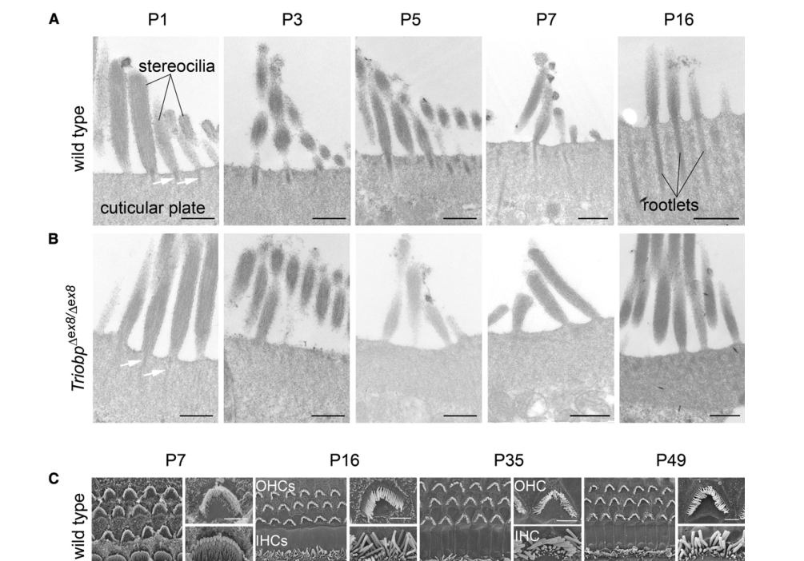

## Question

# Disease Characteristics Research Template

## Target Disease
- **Disease Name:** Autosomal Recessive Nonsyndromic Hearing Loss 28
- **MONDO ID:** MONDO:0012355 (if available)
- **Category:** Mendelian

## Research Objectives

Please provide a comprehensive research report on **Autosomal Recessive Nonsyndromic Hearing Loss 28** covering all of the
disease characteristics listed below. This report will be used to populate a disease knowledge
base entry. Be thorough and cite primary literature (PMID preferred) for all claims.

For each section, **suggested databases/resources** are listed. These are the first places
you should search for information on each topic.

---

### 1. Disease Information
> **Search first:** OMIM, Orphanet, ICD-10/ICD-11, MeSH, PubMed

- What is the disease? Provide a concise overview.
- What are the key identifiers? (OMIM, Orphanet, ICD-10/ICD-11, MeSH, Mondo)
- What are the common synonyms and alternative names?
- Is the information derived from individual patients (e.g., EHR) or aggregated disease-level resources?

### 2. Etiology

- **Disease Causal Factors**: What are the primary causes? (genetic, environmental, infectious, mechanistic)
- **Risk Factors**:
  > **Search first:** PubMed, Cochrane Library, UpToDate, clinical guidelines, ClinVar, ClinGen, GWAS Catalog, PheGenI, CTD, CDC, WHO, epidemiological databases
  - Genetic risk factors (causal variants, susceptibility loci, modifier genes)
  - Environmental risk factors (toxins, lifestyle, occupational exposures, age, sex, family history)
- **Protective Factors**:
  > **Search first:** PubMed, Cochrane Library, clinical trial databases, GWAS Catalog, gnomAD, WHO, CDC, nutrition databases
  - Genetic protective factors (protective variants, modifier alleles)
  - Environmental protective factors (diet, lifestyle, exposures that reduce risk)
- **Gene-Environment Interactions**: How do genetic and environmental factors interact to influence disease?
  > **Search first:** CTD, PubMed, PheGenI, GxE databases

### 3. Phenotypes
> **Search first:** HPO (Human Phenotype Ontology), OMIM, Orphanet, PubMed, clinicaltrials.gov, MedDRA, SNOMED CT, DECIPHER, LOINC

For each phenotype, provide:
- **Phenotype type**: symptoms, clinical signs, physical manifestations, behavioral changes, or laboratory abnormalities
  > For symptoms/signs: HPO, OMIM, Orphanet, PubMed
  > For behavioral changes: HPO, DSM, RDoC (Research Domain Criteria), PubMed
  > For laboratory abnormalities: LOINC, SNOMED CT, LabTests Online, PubMed
- **Phenotype characteristics**:
  > **Search first:** OMIM, Orphanet, HPO, PubMed
  - Age of symptom onset (neonatal, childhood, adult-onset, late-onset)
  - Symptom severity (mild, moderate, severe, variable)
  - Symptom progression (stable, progressive, episodic, fluctuating)
  - Frequency among affected individuals (percentage or qualitative)
- **Quality of life impact**: Effects on daily functioning and well-being (per-phenotype when possible)
  > **Search first:** EQ-5D database, SF-36, WHO QOL databases, PubMed
- Suggest HPO (Human Phenotype Ontology) terms for each phenotype

### 4. Genetic/Molecular Information

- **Causal Genes**: Gene mutations or chromosomal abnormalities responsible for disease (gene symbols, OMIM IDs)
  > **Search first:** OMIM, ClinVar, HGMD, Ensembl, NCBI Gene
- **Pathogenic Variants**:
  - Affected genes (gene symbols, HGNC IDs)
    > **Search first:** OMIM, NCBI Gene, Ensembl, HGNC, UniProt, GeneCards
  - Variant classification (pathogenic, likely pathogenic, VUS per ACMG/AMP guidelines)
    > **Search first:** ClinVar, ClinGen, ACMG/AMP guidelines, VarSome
  - Variant type/class (missense, frameshift, nonsense, splice-site, structural)
  - Allele frequency in population databases
    > **Search first:** gnomAD, 1000 Genomes, ExAC, TOPMed, dbSNP
  - Somatic vs germline origin
    > **Search first:** COSMIC (somatic), ClinVar, ICGC, TCGA
  - Functional consequences (loss of function, gain of function, dominant negative)
- **Modifier Genes**: Genes that modify disease severity or expression
- **Epigenetic Information**: DNA methylation, histone modifications, chromatin changes affecting disease
  > **Search first:** ENCODE, Roadmap Epigenomics, MethBase, DiseaseMeth
- **Chromosomal Abnormalities**: Large-scale genetic changes (aneuploidy, translocations, inversions)
  > **Search first:** DECIPHER, ClinVar, ECARUCA, UCSC Genome Browser

### 5. Environmental Information

- **Environmental Factors**: Non-genetic contributing factors (toxins, radiation, pollution, occupational exposure)
  > **Search first:** CTD (Comparative Toxicogenomics Database), TOXNET, PubMed, EPA databases
- **Lifestyle Factors**: Behavioral factors (smoking, diet, exercise, alcohol consumption)
  > **Search first:** CDC databases, WHO, PubMed, NHANES
- **Infectious Agents**: If applicable, pathogens causing or triggering disease (bacteria, viruses, fungi, parasites)
  > **Search first:** NCBI Taxonomy, ViPR, BV-BRC, MicrobeDB, GIDEON

### 6. Mechanism / Pathophysiology

**Present this section as an ordered causal chain first, then the detail below.**
Open with a numbered sequence of mechanistic steps running from the initiating
lesion (mutation, exposure, infection) to the clinical manifestation, one step per
line, each naming what it causes next. State the causal verb explicitly ("leads
to", "results in") and say where a step is inferred rather than demonstrated.
Where the mechanism branches, show the branch. The categories below are a
checklist of what to cover within those steps, not the organizing structure —
a step may draw on several of them, and a category may contribute to several
steps.

- **Molecular Pathways**: Specific signaling cascades or biochemical pathways involved (Wnt, MAPK, mTOR, PI3K-AKT, etc.)
  > **Search first:** KEGG, Reactome, WikiPathways, PathBank, BioCyc
- **Cellular Processes**: Cell-level mechanisms (apoptosis, autophagy, cell cycle dysregulation, inflammation, etc.)
  > **Search first:** Gene Ontology (GO), Reactome, KEGG, PubMed
- **Protein Dysfunction**: How protein structure or function is altered (misfolding, aggregation, loss of function, gain of function)
  > **Search first:** UniProt, PDB (Protein Data Bank), InterPro, Pfam, AlphaFold
- **Metabolic Changes**: Alterations in metabolic processes (energy metabolism, lipid metabolism, amino acid metabolism)
  > **Search first:** KEGG, BioCyc, HMDB (Human Metabolome Database), BRENDA
- **Immune System Involvement**: Role of immune response (autoimmunity, immunodeficiency, chronic inflammation)
  > **Search first:** ImmPort, Immunome Database, IEDB, Gene Ontology
- **Tissue Damage Mechanisms**: How tissues/ are injured (oxidative stress, ischemia, fibrosis, necrosis)
  > **Search first:** PubMed, Gene Ontology, Reactome
- **Biochemical Abnormalities**: Specific molecular defects (enzyme deficiencies, receptor dysfunction, ion channel defects)
  > **Search first:** BRENDA, UniProt, KEGG, OMIM, PubMed
- **Epigenetic Changes**: DNA methylation, histone modifications affecting gene expression in disease
  > **Search first:** ENCODE, Roadmap Epigenomics, MethBase, DiseaseMeth
- **Molecular Profiling** (if available):
  - Transcriptomics/gene expression changes
    > **Search first:** GEO (Gene Expression Omnibus), ArrayExpress, GTEx, Human Cell Atlas, SRA
  - Proteomics findings
    > **Search first:** PRIDE, ProteomeXchange, Human Protein Atlas, STRING, BioGRID
  - Metabolomics signatures
    > **Search first:** MetaboLights, Metabolomics Workbench, HMDB, METLIN
  - Lipidomics alterations
    > **Search first:** LIPID MAPS, SwissLipids, LipidHome, Metabolomics Workbench
  - Genomic structural features
    > **Search first:** UCSC Genome Browser, Ensembl, NCBI, dbVar, DGV
- **Advanced Technologies** (if applicable):
  - Single-cell analysis findings (cell-type specific mechanisms, cellular heterogeneity)
    > **Search first:** Human Cell Atlas, Single Cell Portal, GEO, CELLxGENE
  - Spatial transcriptomics findings
    > **Search first:** GEO, Spatial Research, Vizgen, 10x Genomics data
  - Multi-omics integration results
    > **Search first:** TCGA, ICGC, cBioPortal, LinkedOmics, PubMed
  - Functional genomics screens (CRISPR, RNAi)
    > **Search first:** DepMap, GenomeRNAi, PubMed, BioGRID ORCS

For each mechanism, describe:
- The causal chain from initial trigger to clinical manifestation
- Which mechanisms are upstream vs downstream
- What cell types and biological processes are involved
- Suggest GO terms for biological processes and CL terms for cell types

### 7. Anatomical Structures Affected

- **Organ Level**:
  - Primary organs directly affected
  - Secondary organ involvement (complications, secondary effects)
  - Body systems involved (cardiovascular, nervous, digestive, respiratory, endocrine, etc.)
  > **Search first:** Uberon, FMA (Foundational Model of Anatomy), OMIM, HPO, ICD-11, MeSH, SNOMED CT
- **Tissue and Cell Level**:
  - Specific tissue types affected (epithelial, connective, muscle, nervous)
  - Specific cell populations targeted (with Cell Ontology terms)
  > **Search first:** Uberon, Human Protein Atlas, Cell Ontology, Human Cell Atlas, CellMarker, PanglaoDB
- **Subcellular Level**:
  - Cellular compartments involved (mitochondria, nucleus, ER, lysosomes) (with GO Cellular Component terms)
  > **Search first:** Gene Ontology (Cellular Component), UniProt, Human Protein Atlas
- **Localization**:
  - Specific anatomical sites (with UBERON terms)
    > **Search first:** FMA, Uberon, NeuroNames (for brain), SNOMED CT
  - Lateralization (unilateral, bilateral, asymmetric)
    > **Search first:** HPO, clinical literature, imaging databases

### 8. Temporal Development

- **Onset**:
  - Typical age of onset (congenital, pediatric, adult, geriatric)
  - Onset pattern (acute, subacute, chronic, insidious)
  > **Search first:** OMIM, Orphanet, HPO, PubMed
- **Progression**:
  - Disease stages (early, intermediate, advanced, end-stage)
    > **Search first:** Cancer Staging Manual (AJCC), WHO classifications, PubMed
  - Progression rate (rapid, slow, variable)
  - Disease course pattern (episodic, relapsing-remitting, progressive, stable)
  - Disease duration (self-limited, chronic lifelong)
  > **Search first:** Disease registries, longitudinal cohort databases, natural history studies, PubMed, Orphanet, OMIM
- **Patterns**:
  - Remission patterns (spontaneous, treatment-induced)
    > **Search first:** Clinical trial databases, disease registries, PubMed
  - Critical periods (time windows of vulnerability or opportunity for intervention)
    > **Search first:** PubMed, developmental biology databases, clinical guidelines

### 9. Inheritance and Population

- **Epidemiology**:
  - Prevalence (cases per 100,000 at given time)
  - Incidence (new cases per 100,000 per year)
  > **Search first:** Orphanet, CDC, WHO, GBD (Global Burden of Disease), national registries, SEER, disease registries
- **For Genetic Etiology**:
  - Inheritance pattern (AD, AR, X-linked, mitochondrial, multifactorial, polygenic)
    > **Search first:** OMIM, Orphanet, ClinVar, GTR (Genetic Testing Registry)
  - Penetrance (complete, incomplete, age-dependent)
    > **Search first:** ClinVar, OMIM, PubMed, ClinGen
  - Expressivity (variable, consistent)
    > **Search first:** OMIM, ClinVar, PubMed
  - Genetic anticipation (increasing severity in successive generations)
    > **Search first:** OMIM, PubMed (especially for repeat expansion disorders)
  - Germline mosaicism
    > **Search first:** ClinVar, OMIM, genetic counseling literature, PubMed
  - Founder effects (population-specific mutations)
    > **Search first:** gnomAD, population genetics databases, PubMed
  - Consanguinity role
    > **Search first:** OMIM, population studies, genetic counseling resources
  - Carrier frequency
    > **Search first:** gnomAD, carrier screening databases, GeneReviews, GTR
- **Population Demographics**:
  - Affected populations (ethnic or demographic groups with higher prevalence)
    > **Search first:** gnomAD, 1000 Genomes, PAGE Study, PubMed, population registries
  - Geographic distribution (endemic areas, regional variation)
    > **Search first:** WHO, CDC, GBD, Orphanet, geographic epidemiology databases
  - Geographic distribution of specific variants
  - Sex ratio (male:female)
    > **Search first:** Disease registries, OMIM, PubMed, epidemiological databases
  - Age distribution of affected individuals
    > **Search first:** CDC, disease registries, SEER, Orphanet

### 10. Diagnostics

- **Clinical Tests**:
  - Laboratory tests (blood, urine, tissue chemistry, specific enzyme assays)
    > **Search first:** LOINC, LabTests Online, PubMed
  - Biomarkers (proteins, metabolites, genetic markers, circulating biomarkers)
    > **Search first:** FDA Biomarker List, BEST (Biomarkers, EndpointS, and other Tools), PubMed
  - Imaging studies (X-ray, CT, MRI, PET, ultrasound)
    > **Search first:** RadLex, DICOM, Radiopaedia, imaging databases
  - Functional tests (pulmonary function, cardiac stress tests)
    > **Search first:** LOINC, clinical guidelines, PubMed
  - Electrophysiology (EEG, EMG, ECG, nerve conduction studies)
    > **Search first:** LOINC, clinical neurophysiology databases, PubMed
  - Biopsy findings (histopathology, immunohistochemistry)
    > **Search first:** SNOMED CT, College of American Pathologists resources, PubMed
  - Pathology findings (microscopic examination)
    > **Search first:** SNOMED CT, Digital Pathology databases, PubMed
- **Genetic Testing**:
  > **Search first:** GTR (Genetic Testing Registry), GeneReviews, ClinGen
  - Overview of recommended genetic testing approach
  - Whole genome sequencing (WGS) utility
    > **Search first:** GTR, ClinVar, GEL (Genomics England), gnomAD
  - Whole exome sequencing (WES) utility
    > **Search first:** GTR, ClinVar, OMIM, GeneMatcher
  - Gene panels (which panels, which genes)
    > **Search first:** GTR, ClinVar, laboratory-specific databases
  - Single gene testing
    > **Search first:** GTR, ClinVar, OMIM, GeneReviews
  - Chromosomal microarray (CMA)
    > **Search first:** DECIPHER, ClinVar, dbVar, ECARUCA
  - Karyotyping
    > **Search first:** Chromosome Abnormality Database, ClinVar, cytogenetics resources
  - FISH
    > **Search first:** ClinVar, cytogenetics databases, PubMed
  - Mitochondrial DNA testing
    > **Search first:** MITOMAP, MSeqDR, ClinVar, GTR
  - Repeat expansion testing
    > **Search first:** GTR, ClinVar, repeat expansion databases, PubMed
- **Omics-Based Diagnostics** (if applicable):
  - RNA sequencing / transcriptomics
    > **Search first:** GEO, ArrayExpress, GTEx, RNA-seq databases
  - Proteomics
    > **Search first:** PRIDE, ProteomeXchange, FDA Biomarker database
  - Metabolomics
    > **Search first:** MetaboLights, Metabolomics Workbench, HMDB
  - Epigenomics
    > **Search first:** GEO, ENCODE, Roadmap Epigenomics, MethBase
  - Liquid biopsy
    > **Search first:** COSMIC, ClinVar, liquid biopsy databases, PubMed
- **Clinical Criteria**:
  - Standardized diagnostic criteria (DSM, ICD, society guidelines)
    > **Search first:** DSM-5, ICD-11, clinical society guidelines, UpToDate
  - Differential diagnosis (other conditions to rule out, with distinguishing features)
    > **Search first:** DynaMed, UpToDate, clinical decision support systems
- **Screening**:
  - Screening methods for asymptomatic individuals (newborn screening, carrier screening, cascade screening)
    > **Search first:** ACMG recommendations, CDC newborn screening, GTR

### 11. Outcome/Prognosis

- **Survival and Mortality**:
  - Survival rate (5-year, 10-year, overall)
    > **Search first:** SEER, cancer registries, disease-specific registries, PubMed
  - Life expectancy (with and without treatment if applicable)
    > **Search first:** Orphanet, disease registries, actuarial databases, PubMed
  - Mortality rate
    > **Search first:** CDC, WHO, GBD, national mortality databases
  - Disease-specific mortality (deaths directly attributable to disease)
    > **Search first:** Disease registries, CDC Wonder, GBD, PubMed
- **Morbidity and Function**:
  - Morbidity (disease-related disability and health impacts)
    > **Search first:** GBD, WHO, disability databases, PubMed
  - Disability outcomes (long-term functional impairments)
    > **Search first:** ICF (International Classification of Functioning), disability registries
  - Quality of life measures (EQ-5D, SF-36, PROMIS, disease-specific tools)
    > **Search first:** EQ-5D database, SF-36, PROMIS, PubMed
- **Disease Course**:
  - Complications (secondary problems: infections, organ failure, etc.)
    > **Search first:** ICD codes, disease registries, clinical databases, PubMed
  - Recovery potential (likelihood and extent of recovery, with vs without treatment)
    > **Search first:** Natural history studies, rehabilitation databases, PubMed
- **Prediction**:
  - Prognostic factors (age, disease severity, biomarkers, treatment response)
    > **Search first:** Prognostic models databases, clinical calculators, PubMed
  - Prognostic biomarkers (molecular markers predicting disease course)
    > **Search first:** FDA Biomarker database, PubMed, cancer prognostic databases

### 12. Treatment

- **Pharmacotherapy**:
  - Pharmacological treatments (drug names, drug classes, mechanisms of action)
    > **Search first:** DrugBank, RxNorm, ATC classification, DailyMed, FDA databases
  - Pharmacogenomics (how genetic variants affect drug metabolism, efficacy, toxicity)
    > **Search first:** PharmGKB, CPIC (Clinical Pharmacogenetics), FDA Table of PGx Biomarkers
- **Advanced Therapeutics**:
  - Gene therapy (viral vectors, CRISPR, gene replacement, gene editing)
    > **Search first:** ClinicalTrials.gov, FDA gene therapy database, ASGCT resources
  - Cell therapy (stem cell transplant, CAR-T, cellular therapeutics)
    > **Search first:** ClinicalTrials.gov, FDA cell therapy database, FACT standards
  - RNA-based therapies (ASOs, siRNA, mRNA therapies)
    > **Search first:** ClinicalTrials.gov, FDA approvals, PubMed
  - Targeted therapies (treatments directed at specific molecular targets)
    > **Search first:** My Cancer Genome, OncoKB, ClinicalTrials.gov, FDA approvals
  - Immunotherapies (checkpoint inhibitors, monoclonal antibodies)
    > **Search first:** Cancer Immunotherapy Database, FDA approvals, ClinicalTrials.gov
- **Surgical and Interventional**:
  - Surgical interventions (types of surgery, timing, outcomes)
    > **Search first:** CPT codes, surgical registries, clinical guidelines, PubMed
- **Supportive and Rehabilitative**:
  - Supportive care (symptom management, pain control, nutrition)
    > **Search first:** Clinical guidelines, Cochrane Library, PubMed
  - Rehabilitation (physical therapy, occupational therapy, speech therapy)
    > **Search first:** Rehabilitation medicine databases, clinical guidelines, PubMed
- **Experimental**:
  - Experimental treatments in clinical trials (with NCT identifiers if available)
    > **Search first:** ClinicalTrials.gov, EU Clinical Trials Register, WHO ICTRP
- **Treatment Outcomes**:
  - Treatment response rates
    > **Search first:** Clinical trial databases, FDA reviews, systematic reviews, PubMed
  - Side effects and adverse events
    > **Search first:** FDA Adverse Event Reporting System (FAERS), MedWatch, PubMed
- **Treatment Strategy**:
  - Treatment algorithms (clinical pathways, decision trees)
    > **Search first:** Clinical practice guidelines, NCCN Guidelines, UpToDate
  - Combination therapies
    > **Search first:** ClinicalTrials.gov, treatment guidelines, PubMed
  - Personalized medicine approaches (genotype-guided treatment)
    > **Search first:** My Cancer Genome, CIViC, PharmGKB, precision medicine databases

For each treatment, suggest NCIT (NCI Thesaurus) clinical-intervention terms where applicable.

### 13. Prevention

- **Prevention Levels**:
  - Primary prevention (preventing disease occurrence: vaccination, risk factor modification)
    > **Search first:** CDC, WHO, USPSTF recommendations, Cochrane Library
  - Secondary prevention (early detection and treatment: screening programs, early intervention)
    > **Search first:** USPSTF, CDC screening guidelines, WHO
  - Tertiary prevention (preventing complications in those with disease)
    > **Search first:** Clinical guidelines, disease management protocols, PubMed
- **Immunization**: Vaccine strategies (if applicable)
  > **Search first:** CDC vaccine schedules, WHO immunization, FDA vaccine database
- **Screening and Early Detection**:
  - Screening programs (population-based: newborn screening, cancer screening)
    > **Search first:** CDC screening programs, USPSTF, cancer screening databases
  - Genetic screening (carrier screening, preimplantation genetic diagnosis, prenatal testing)
    > **Search first:** ACMG recommendations, ACOG guidelines, GTR
  - Risk stratification (identifying high-risk individuals for targeted prevention)
    > **Search first:** Risk prediction models, clinical calculators, PubMed
- **Behavioral Interventions**: Lifestyle modifications to reduce risk
  > **Search first:** CDC, WHO, behavioral intervention databases, Cochrane Library
- **Counseling**: Genetic counseling (risk assessment, family planning guidance)
  > **Search first:** NSGC resources, ACMG guidelines, GeneReviews
- **Public Health**:
  - Public health interventions (sanitation, vector control, health education)
    > **Search first:** CDC, WHO, public health databases, PubMed
  - Environmental interventions (reducing environmental risk factors)
    > **Search first:** EPA databases, WHO environmental health, PubMed
- **Prophylaxis**: Preventive medications or procedures
  > **Search first:** Clinical guidelines, FDA approvals, PubMed

### 14. Other Species / Natural Disease

- **Taxonomy**: Species affected (with NCBI Taxon identifiers)
  > **Search first:** NCBI Taxonomy
- **Breed**: Specific breeds affected (with VBO identifiers if applicable)
  > **Search first:** VBO (Vertebrate Breed Ontology)
- **Gene**: Orthologous genes in other species (with NCBI Gene IDs)
  > **Search first:** NCBI Gene
- **Natural Disease**:
  - Naturally occurring disease in other species (companion animals, wildlife)
    > **Search first:** OMIA (Online Mendelian Inheritance in Animals), VetCompass, PubMed
  - Veterinary relevance and importance in animal health
    > **Search first:** OMIA, veterinary databases, PubMed
- **Comparative Biology**:
  - Comparative pathology (similarities and differences across species)
    > **Search first:** OMIA, comparative pathology databases, PubMed
  - Evolutionary conservation of disease mechanisms
    > **Search first:** HomoloGene, OrthoMCL, Alliance of Genome Resources
- **Transmission** (if applicable):
  - Zoonotic potential
    > **Search first:** CDC zoonotic diseases, WHO zoonoses, GIDEON
  - Cross-species susceptibility
    > **Search first:** NCBI Taxonomy, veterinary databases, PubMed

### 15. Model Organisms

- **Model Types**:
  - Model organism type (mammalian, invertebrate, cellular, in vitro)
    > **Search first:** Alliance of Genome Resources, model organism databases
  - Specific model systems (mouse, rat, zebrafish, Drosophila, C. elegans, yeast, cell lines, organoids, iPSCs)
    > **Search first:** MGI, RGD, ZFIN, FlyBase, WormBase, SGD, ATCC, Cellosaurus
  - Induced models (drug treatment, surgical intervention, environmental manipulation)
    > **Search first:** MGI, model organism databases, PubMed
- **Genetic Models**:
  - Types available (knockout, knock-in, transgenic, conditional, humanized)
    > **Search first:** MGI, IMPC, KOMP, EuMMCR, IMSR
- **Model Characteristics**:
  - Phenotype recapitulation (how well model reproduces human disease features)
    > **Search first:** Model organism databases, comparative studies, PubMed
  - Model limitations (aspects of human disease not captured)
    > **Search first:** Model organism databases, PubMed, review articles
- **Applications**:
  - Research applications (what aspects of disease can be studied)
    > **Search first:** Model organism databases, PubMed
- **Resources**:
  - Model databases
    > **Search first:** MGI, RGD, ZFIN, FlyBase, WormBase, IMSR, EMMA, MMRRC

---

## Citation Requirements

- Cite primary literature (PMID preferred) for all mechanistic and clinical claims
- Prioritize recent reviews and landmark papers
- Include direct quotes from abstracts where possible to support key statements
- Distinguish evidence source types: human clinical, model organism, in vitro, computational

## Output Format

Structure your response as a comprehensive narrative organized by the sections above.
For each section, provide:
- Factual content with specific details (numbers, percentages, gene names, variant nomenclature)
- Ontology term suggestions (HPO, GO, CL, UBERON, CHEBI, NCIT, MONDO) where applicable
- Evidence citations with PMIDs
- Direct quotes from abstracts to support key claims
- Clear indication when information is not available or not applicable for this disease

This report will be used to populate a disease knowledge base entry with:
- Pathophysiology descriptions with causal chains
- Gene/protein annotations (HGNC, GO terms)
- Phenotype associations (HP terms) with frequencies
- Cell type involvement (CL terms)
- Anatomical locations (UBERON terms)
- Chemical entities (CHEBI terms)
- Treatment annotations (NCIT terms)
- Evidence items with PMIDs and exact abstract quotes
- Epidemiology, prognosis, diagnostic, and prevention information
- Animal model descriptions with phenotype recapitulation details

## Output

Question: You are an expert researcher providing comprehensive, well-cited information.

Provide detailed information focusing on:
1. Key concepts and definitions with current understanding
2. Recent developments and latest research (prioritize 2023-2024 sources)
3. Current applications and real-world implementations
4. Expert opinions and analysis from authoritative sources
5. Relevant statistics and data from recent studies

Format as a comprehensive research report with proper citations. Include URLs and publication dates where available.
Always prioritize recent, authoritative sources and provide specific citations for all major claims.

# Disease Characteristics Research Template

## Target Disease
- **Disease Name:** Autosomal Recessive Nonsyndromic Hearing Loss 28
- **MONDO ID:** MONDO:0012355 (if available)
- **Category:** Mendelian

## Research Objectives

Please provide a comprehensive research report on **Autosomal Recessive Nonsyndromic Hearing Loss 28** covering all of the
disease characteristics listed below. This report will be used to populate a disease knowledge
base entry. Be thorough and cite primary literature (PMID preferred) for all claims.

For each section, **suggested databases/resources** are listed. These are the first places
you should search for information on each topic.

---

### 1. Disease Information
> **Search first:** OMIM, Orphanet, ICD-10/ICD-11, MeSH, PubMed

- What is the disease? Provide a concise overview.
- What are the key identifiers? (OMIM, Orphanet, ICD-10/ICD-11, MeSH, Mondo)
- What are the common synonyms and alternative names?
- Is the information derived from individual patients (e.g., EHR) or aggregated disease-level resources?

### 2. Etiology

- **Disease Causal Factors**: What are the primary causes? (genetic, environmental, infectious, mechanistic)
- **Risk Factors**:
  > **Search first:** PubMed, Cochrane Library, UpToDate, clinical guidelines, ClinVar, ClinGen, GWAS Catalog, PheGenI, CTD, CDC, WHO, epidemiological databases
  - Genetic risk factors (causal variants, susceptibility loci, modifier genes)
  - Environmental risk factors (toxins, lifestyle, occupational exposures, age, sex, family history)
- **Protective Factors**:
  > **Search first:** PubMed, Cochrane Library, clinical trial databases, GWAS Catalog, gnomAD, WHO, CDC, nutrition databases
  - Genetic protective factors (protective variants, modifier alleles)
  - Environmental protective factors (diet, lifestyle, exposures that reduce risk)
- **Gene-Environment Interactions**: How do genetic and environmental factors interact to influence disease?
  > **Search first:** CTD, PubMed, PheGenI, GxE databases

### 3. Phenotypes
> **Search first:** HPO (Human Phenotype Ontology), OMIM, Orphanet, PubMed, clinicaltrials.gov, MedDRA, SNOMED CT, DECIPHER, LOINC

For each phenotype, provide:
- **Phenotype type**: symptoms, clinical signs, physical manifestations, behavioral changes, or laboratory abnormalities
  > For symptoms/signs: HPO, OMIM, Orphanet, PubMed
  > For behavioral changes: HPO, DSM, RDoC (Research Domain Criteria), PubMed
  > For laboratory abnormalities: LOINC, SNOMED CT, LabTests Online, PubMed
- **Phenotype characteristics**:
  > **Search first:** OMIM, Orphanet, HPO, PubMed
  - Age of symptom onset (neonatal, childhood, adult-onset, late-onset)
  - Symptom severity (mild, moderate, severe, variable)
  - Symptom progression (stable, progressive, episodic, fluctuating)
  - Frequency among affected individuals (percentage or qualitative)
- **Quality of life impact**: Effects on daily functioning and well-being (per-phenotype when possible)
  > **Search first:** EQ-5D database, SF-36, WHO QOL databases, PubMed
- Suggest HPO (Human Phenotype Ontology) terms for each phenotype

### 4. Genetic/Molecular Information

- **Causal Genes**: Gene mutations or chromosomal abnormalities responsible for disease (gene symbols, OMIM IDs)
  > **Search first:** OMIM, ClinVar, HGMD, Ensembl, NCBI Gene
- **Pathogenic Variants**:
  - Affected genes (gene symbols, HGNC IDs)
    > **Search first:** OMIM, NCBI Gene, Ensembl, HGNC, UniProt, GeneCards
  - Variant classification (pathogenic, likely pathogenic, VUS per ACMG/AMP guidelines)
    > **Search first:** ClinVar, ClinGen, ACMG/AMP guidelines, VarSome
  - Variant type/class (missense, frameshift, nonsense, splice-site, structural)
  - Allele frequency in population databases
    > **Search first:** gnomAD, 1000 Genomes, ExAC, TOPMed, dbSNP
  - Somatic vs germline origin
    > **Search first:** COSMIC (somatic), ClinVar, ICGC, TCGA
  - Functional consequences (loss of function, gain of function, dominant negative)
- **Modifier Genes**: Genes that modify disease severity or expression
- **Epigenetic Information**: DNA methylation, histone modifications, chromatin changes affecting disease
  > **Search first:** ENCODE, Roadmap Epigenomics, MethBase, DiseaseMeth
- **Chromosomal Abnormalities**: Large-scale genetic changes (aneuploidy, translocations, inversions)
  > **Search first:** DECIPHER, ClinVar, ECARUCA, UCSC Genome Browser

### 5. Environmental Information

- **Environmental Factors**: Non-genetic contributing factors (toxins, radiation, pollution, occupational exposure)
  > **Search first:** CTD (Comparative Toxicogenomics Database), TOXNET, PubMed, EPA databases
- **Lifestyle Factors**: Behavioral factors (smoking, diet, exercise, alcohol consumption)
  > **Search first:** CDC databases, WHO, PubMed, NHANES
- **Infectious Agents**: If applicable, pathogens causing or triggering disease (bacteria, viruses, fungi, parasites)
  > **Search first:** NCBI Taxonomy, ViPR, BV-BRC, MicrobeDB, GIDEON

### 6. Mechanism / Pathophysiology

**Present this section as an ordered causal chain first, then the detail below.**
Open with a numbered sequence of mechanistic steps running from the initiating
lesion (mutation, exposure, infection) to the clinical manifestation, one step per
line, each naming what it causes next. State the causal verb explicitly ("leads
to", "results in") and say where a step is inferred rather than demonstrated.
Where the mechanism branches, show the branch. The categories below are a
checklist of what to cover within those steps, not the organizing structure —
a step may draw on several of them, and a category may contribute to several
steps.

- **Molecular Pathways**: Specific signaling cascades or biochemical pathways involved (Wnt, MAPK, mTOR, PI3K-AKT, etc.)
  > **Search first:** KEGG, Reactome, WikiPathways, PathBank, BioCyc
- **Cellular Processes**: Cell-level mechanisms (apoptosis, autophagy, cell cycle dysregulation, inflammation, etc.)
  > **Search first:** Gene Ontology (GO), Reactome, KEGG, PubMed
- **Protein Dysfunction**: How protein structure or function is altered (misfolding, aggregation, loss of function, gain of function)
  > **Search first:** UniProt, PDB (Protein Data Bank), InterPro, Pfam, AlphaFold
- **Metabolic Changes**: Alterations in metabolic processes (energy metabolism, lipid metabolism, amino acid metabolism)
  > **Search first:** KEGG, BioCyc, HMDB (Human Metabolome Database), BRENDA
- **Immune System Involvement**: Role of immune response (autoimmunity, immunodeficiency, chronic inflammation)
  > **Search first:** ImmPort, Immunome Database, IEDB, Gene Ontology
- **Tissue Damage Mechanisms**: How tissues/ are injured (oxidative stress, ischemia, fibrosis, necrosis)
  > **Search first:** PubMed, Gene Ontology, Reactome
- **Biochemical Abnormalities**: Specific molecular defects (enzyme deficiencies, receptor dysfunction, ion channel defects)
  > **Search first:** BRENDA, UniProt, KEGG, OMIM, PubMed
- **Epigenetic Changes**: DNA methylation, histone modifications affecting gene expression in disease
  > **Search first:** ENCODE, Roadmap Epigenomics, MethBase, DiseaseMeth
- **Molecular Profiling** (if available):
  - Transcriptomics/gene expression changes
    > **Search first:** GEO (Gene Expression Omnibus), ArrayExpress, GTEx, Human Cell Atlas, SRA
  - Proteomics findings
    > **Search first:** PRIDE, ProteomeXchange, Human Protein Atlas, STRING, BioGRID
  - Metabolomics signatures
    > **Search first:** MetaboLights, Metabolomics Workbench, HMDB, METLIN
  - Lipidomics alterations
    > **Search first:** LIPID MAPS, SwissLipids, LipidHome, Metabolomics Workbench
  - Genomic structural features
    > **Search first:** UCSC Genome Browser, Ensembl, NCBI, dbVar, DGV
- **Advanced Technologies** (if applicable):
  - Single-cell analysis findings (cell-type specific mechanisms, cellular heterogeneity)
    > **Search first:** Human Cell Atlas, Single Cell Portal, GEO, CELLxGENE
  - Spatial transcriptomics findings
    > **Search first:** GEO, Spatial Research, Vizgen, 10x Genomics data
  - Multi-omics integration results
    > **Search first:** TCGA, ICGC, cBioPortal, LinkedOmics, PubMed
  - Functional genomics screens (CRISPR, RNAi)
    > **Search first:** DepMap, GenomeRNAi, PubMed, BioGRID ORCS

For each mechanism, describe:
- The causal chain from initial trigger to clinical manifestation
- Which mechanisms are upstream vs downstream
- What cell types and biological processes are involved
- Suggest GO terms for biological processes and CL terms for cell types

### 7. Anatomical Structures Affected

- **Organ Level**:
  - Primary organs directly affected
  - Secondary organ involvement (complications, secondary effects)
  - Body systems involved (cardiovascular, nervous, digestive, respiratory, endocrine, etc.)
  > **Search first:** Uberon, FMA (Foundational Model of Anatomy), OMIM, HPO, ICD-11, MeSH, SNOMED CT
- **Tissue and Cell Level**:
  - Specific tissue types affected (epithelial, connective, muscle, nervous)
  - Specific cell populations targeted (with Cell Ontology terms)
  > **Search first:** Uberon, Human Protein Atlas, Cell Ontology, Human Cell Atlas, CellMarker, PanglaoDB
- **Subcellular Level**:
  - Cellular compartments involved (mitochondria, nucleus, ER, lysosomes) (with GO Cellular Component terms)
  > **Search first:** Gene Ontology (Cellular Component), UniProt, Human Protein Atlas
- **Localization**:
  - Specific anatomical sites (with UBERON terms)
    > **Search first:** FMA, Uberon, NeuroNames (for brain), SNOMED CT
  - Lateralization (unilateral, bilateral, asymmetric)
    > **Search first:** HPO, clinical literature, imaging databases

### 8. Temporal Development

- **Onset**:
  - Typical age of onset (congenital, pediatric, adult, geriatric)
  - Onset pattern (acute, subacute, chronic, insidious)
  > **Search first:** OMIM, Orphanet, HPO, PubMed
- **Progression**:
  - Disease stages (early, intermediate, advanced, end-stage)
    > **Search first:** Cancer Staging Manual (AJCC), WHO classifications, PubMed
  - Progression rate (rapid, slow, variable)
  - Disease course pattern (episodic, relapsing-remitting, progressive, stable)
  - Disease duration (self-limited, chronic lifelong)
  > **Search first:** Disease registries, longitudinal cohort databases, natural history studies, PubMed, Orphanet, OMIM
- **Patterns**:
  - Remission patterns (spontaneous, treatment-induced)
    > **Search first:** Clinical trial databases, disease registries, PubMed
  - Critical periods (time windows of vulnerability or opportunity for intervention)
    > **Search first:** PubMed, developmental biology databases, clinical guidelines

### 9. Inheritance and Population

- **Epidemiology**:
  - Prevalence (cases per 100,000 at given time)
  - Incidence (new cases per 100,000 per year)
  > **Search first:** Orphanet, CDC, WHO, GBD (Global Burden of Disease), national registries, SEER, disease registries
- **For Genetic Etiology**:
  - Inheritance pattern (AD, AR, X-linked, mitochondrial, multifactorial, polygenic)
    > **Search first:** OMIM, Orphanet, ClinVar, GTR (Genetic Testing Registry)
  - Penetrance (complete, incomplete, age-dependent)
    > **Search first:** ClinVar, OMIM, PubMed, ClinGen
  - Expressivity (variable, consistent)
    > **Search first:** OMIM, ClinVar, PubMed
  - Genetic anticipation (increasing severity in successive generations)
    > **Search first:** OMIM, PubMed (especially for repeat expansion disorders)
  - Germline mosaicism
    > **Search first:** ClinVar, OMIM, genetic counseling literature, PubMed
  - Founder effects (population-specific mutations)
    > **Search first:** gnomAD, population genetics databases, PubMed
  - Consanguinity role
    > **Search first:** OMIM, population studies, genetic counseling resources
  - Carrier frequency
    > **Search first:** gnomAD, carrier screening databases, GeneReviews, GTR
- **Population Demographics**:
  - Affected populations (ethnic or demographic groups with higher prevalence)
    > **Search first:** gnomAD, 1000 Genomes, PAGE Study, PubMed, population registries
  - Geographic distribution (endemic areas, regional variation)
    > **Search first:** WHO, CDC, GBD, Orphanet, geographic epidemiology databases
  - Geographic distribution of specific variants
  - Sex ratio (male:female)
    > **Search first:** Disease registries, OMIM, PubMed, epidemiological databases
  - Age distribution of affected individuals
    > **Search first:** CDC, disease registries, SEER, Orphanet

### 10. Diagnostics

- **Clinical Tests**:
  - Laboratory tests (blood, urine, tissue chemistry, specific enzyme assays)
    > **Search first:** LOINC, LabTests Online, PubMed
  - Biomarkers (proteins, metabolites, genetic markers, circulating biomarkers)
    > **Search first:** FDA Biomarker List, BEST (Biomarkers, EndpointS, and other Tools), PubMed
  - Imaging studies (X-ray, CT, MRI, PET, ultrasound)
    > **Search first:** RadLex, DICOM, Radiopaedia, imaging databases
  - Functional tests (pulmonary function, cardiac stress tests)
    > **Search first:** LOINC, clinical guidelines, PubMed
  - Electrophysiology (EEG, EMG, ECG, nerve conduction studies)
    > **Search first:** LOINC, clinical neurophysiology databases, PubMed
  - Biopsy findings (histopathology, immunohistochemistry)
    > **Search first:** SNOMED CT, College of American Pathologists resources, PubMed
  - Pathology findings (microscopic examination)
    > **Search first:** SNOMED CT, Digital Pathology databases, PubMed
- **Genetic Testing**:
  > **Search first:** GTR (Genetic Testing Registry), GeneReviews, ClinGen
  - Overview of recommended genetic testing approach
  - Whole genome sequencing (WGS) utility
    > **Search first:** GTR, ClinVar, GEL (Genomics England), gnomAD
  - Whole exome sequencing (WES) utility
    > **Search first:** GTR, ClinVar, OMIM, GeneMatcher
  - Gene panels (which panels, which genes)
    > **Search first:** GTR, ClinVar, laboratory-specific databases
  - Single gene testing
    > **Search first:** GTR, ClinVar, OMIM, GeneReviews
  - Chromosomal microarray (CMA)
    > **Search first:** DECIPHER, ClinVar, dbVar, ECARUCA
  - Karyotyping
    > **Search first:** Chromosome Abnormality Database, ClinVar, cytogenetics resources
  - FISH
    > **Search first:** ClinVar, cytogenetics databases, PubMed
  - Mitochondrial DNA testing
    > **Search first:** MITOMAP, MSeqDR, ClinVar, GTR
  - Repeat expansion testing
    > **Search first:** GTR, ClinVar, repeat expansion databases, PubMed
- **Omics-Based Diagnostics** (if applicable):
  - RNA sequencing / transcriptomics
    > **Search first:** GEO, ArrayExpress, GTEx, RNA-seq databases
  - Proteomics
    > **Search first:** PRIDE, ProteomeXchange, FDA Biomarker database
  - Metabolomics
    > **Search first:** MetaboLights, Metabolomics Workbench, HMDB
  - Epigenomics
    > **Search first:** GEO, ENCODE, Roadmap Epigenomics, MethBase
  - Liquid biopsy
    > **Search first:** COSMIC, ClinVar, liquid biopsy databases, PubMed
- **Clinical Criteria**:
  - Standardized diagnostic criteria (DSM, ICD, society guidelines)
    > **Search first:** DSM-5, ICD-11, clinical society guidelines, UpToDate
  - Differential diagnosis (other conditions to rule out, with distinguishing features)
    > **Search first:** DynaMed, UpToDate, clinical decision support systems
- **Screening**:
  - Screening methods for asymptomatic individuals (newborn screening, carrier screening, cascade screening)
    > **Search first:** ACMG recommendations, CDC newborn screening, GTR

### 11. Outcome/Prognosis

- **Survival and Mortality**:
  - Survival rate (5-year, 10-year, overall)
    > **Search first:** SEER, cancer registries, disease-specific registries, PubMed
  - Life expectancy (with and without treatment if applicable)
    > **Search first:** Orphanet, disease registries, actuarial databases, PubMed
  - Mortality rate
    > **Search first:** CDC, WHO, GBD, national mortality databases
  - Disease-specific mortality (deaths directly attributable to disease)
    > **Search first:** Disease registries, CDC Wonder, GBD, PubMed
- **Morbidity and Function**:
  - Morbidity (disease-related disability and health impacts)
    > **Search first:** GBD, WHO, disability databases, PubMed
  - Disability outcomes (long-term functional impairments)
    > **Search first:** ICF (International Classification of Functioning), disability registries
  - Quality of life measures (EQ-5D, SF-36, PROMIS, disease-specific tools)
    > **Search first:** EQ-5D database, SF-36, PROMIS, PubMed
- **Disease Course**:
  - Complications (secondary problems: infections, organ failure, etc.)
    > **Search first:** ICD codes, disease registries, clinical databases, PubMed
  - Recovery potential (likelihood and extent of recovery, with vs without treatment)
    > **Search first:** Natural history studies, rehabilitation databases, PubMed
- **Prediction**:
  - Prognostic factors (age, disease severity, biomarkers, treatment response)
    > **Search first:** Prognostic models databases, clinical calculators, PubMed
  - Prognostic biomarkers (molecular markers predicting disease course)
    > **Search first:** FDA Biomarker database, PubMed, cancer prognostic databases

### 12. Treatment

- **Pharmacotherapy**:
  - Pharmacological treatments (drug names, drug classes, mechanisms of action)
    > **Search first:** DrugBank, RxNorm, ATC classification, DailyMed, FDA databases
  - Pharmacogenomics (how genetic variants affect drug metabolism, efficacy, toxicity)
    > **Search first:** PharmGKB, CPIC (Clinical Pharmacogenetics), FDA Table of PGx Biomarkers
- **Advanced Therapeutics**:
  - Gene therapy (viral vectors, CRISPR, gene replacement, gene editing)
    > **Search first:** ClinicalTrials.gov, FDA gene therapy database, ASGCT resources
  - Cell therapy (stem cell transplant, CAR-T, cellular therapeutics)
    > **Search first:** ClinicalTrials.gov, FDA cell therapy database, FACT standards
  - RNA-based therapies (ASOs, siRNA, mRNA therapies)
    > **Search first:** ClinicalTrials.gov, FDA approvals, PubMed
  - Targeted therapies (treatments directed at specific molecular targets)
    > **Search first:** My Cancer Genome, OncoKB, ClinicalTrials.gov, FDA approvals
  - Immunotherapies (checkpoint inhibitors, monoclonal antibodies)
    > **Search first:** Cancer Immunotherapy Database, FDA approvals, ClinicalTrials.gov
- **Surgical and Interventional**:
  - Surgical interventions (types of surgery, timing, outcomes)
    > **Search first:** CPT codes, surgical registries, clinical guidelines, PubMed
- **Supportive and Rehabilitative**:
  - Supportive care (symptom management, pain control, nutrition)
    > **Search first:** Clinical guidelines, Cochrane Library, PubMed
  - Rehabilitation (physical therapy, occupational therapy, speech therapy)
    > **Search first:** Rehabilitation medicine databases, clinical guidelines, PubMed
- **Experimental**:
  - Experimental treatments in clinical trials (with NCT identifiers if available)
    > **Search first:** ClinicalTrials.gov, EU Clinical Trials Register, WHO ICTRP
- **Treatment Outcomes**:
  - Treatment response rates
    > **Search first:** Clinical trial databases, FDA reviews, systematic reviews, PubMed
  - Side effects and adverse events
    > **Search first:** FDA Adverse Event Reporting System (FAERS), MedWatch, PubMed
- **Treatment Strategy**:
  - Treatment algorithms (clinical pathways, decision trees)
    > **Search first:** Clinical practice guidelines, NCCN Guidelines, UpToDate
  - Combination therapies
    > **Search first:** ClinicalTrials.gov, treatment guidelines, PubMed
  - Personalized medicine approaches (genotype-guided treatment)
    > **Search first:** My Cancer Genome, CIViC, PharmGKB, precision medicine databases

For each treatment, suggest NCIT (NCI Thesaurus) clinical-intervention terms where applicable.

### 13. Prevention

- **Prevention Levels**:
  - Primary prevention (preventing disease occurrence: vaccination, risk factor modification)
    > **Search first:** CDC, WHO, USPSTF recommendations, Cochrane Library
  - Secondary prevention (early detection and treatment: screening programs, early intervention)
    > **Search first:** USPSTF, CDC screening guidelines, WHO
  - Tertiary prevention (preventing complications in those with disease)
    > **Search first:** Clinical guidelines, disease management protocols, PubMed
- **Immunization**: Vaccine strategies (if applicable)
  > **Search first:** CDC vaccine schedules, WHO immunization, FDA vaccine database
- **Screening and Early Detection**:
  - Screening programs (population-based: newborn screening, cancer screening)
    > **Search first:** CDC screening programs, USPSTF, cancer screening databases
  - Genetic screening (carrier screening, preimplantation genetic diagnosis, prenatal testing)
    > **Search first:** ACMG recommendations, ACOG guidelines, GTR
  - Risk stratification (identifying high-risk individuals for targeted prevention)
    > **Search first:** Risk prediction models, clinical calculators, PubMed
- **Behavioral Interventions**: Lifestyle modifications to reduce risk
  > **Search first:** CDC, WHO, behavioral intervention databases, Cochrane Library
- **Counseling**: Genetic counseling (risk assessment, family planning guidance)
  > **Search first:** NSGC resources, ACMG guidelines, GeneReviews
- **Public Health**:
  - Public health interventions (sanitation, vector control, health education)
    > **Search first:** CDC, WHO, public health databases, PubMed
  - Environmental interventions (reducing environmental risk factors)
    > **Search first:** EPA databases, WHO environmental health, PubMed
- **Prophylaxis**: Preventive medications or procedures
  > **Search first:** Clinical guidelines, FDA approvals, PubMed

### 14. Other Species / Natural Disease

- **Taxonomy**: Species affected (with NCBI Taxon identifiers)
  > **Search first:** NCBI Taxonomy
- **Breed**: Specific breeds affected (with VBO identifiers if applicable)
  > **Search first:** VBO (Vertebrate Breed Ontology)
- **Gene**: Orthologous genes in other species (with NCBI Gene IDs)
  > **Search first:** NCBI Gene
- **Natural Disease**:
  - Naturally occurring disease in other species (companion animals, wildlife)
    > **Search first:** OMIA (Online Mendelian Inheritance in Animals), VetCompass, PubMed
  - Veterinary relevance and importance in animal health
    > **Search first:** OMIA, veterinary databases, PubMed
- **Comparative Biology**:
  - Comparative pathology (similarities and differences across species)
    > **Search first:** OMIA, comparative pathology databases, PubMed
  - Evolutionary conservation of disease mechanisms
    > **Search first:** HomoloGene, OrthoMCL, Alliance of Genome Resources
- **Transmission** (if applicable):
  - Zoonotic potential
    > **Search first:** CDC zoonotic diseases, WHO zoonoses, GIDEON
  - Cross-species susceptibility
    > **Search first:** NCBI Taxonomy, veterinary databases, PubMed

### 15. Model Organisms

- **Model Types**:
  - Model organism type (mammalian, invertebrate, cellular, in vitro)
    > **Search first:** Alliance of Genome Resources, model organism databases
  - Specific model systems (mouse, rat, zebrafish, Drosophila, C. elegans, yeast, cell lines, organoids, iPSCs)
    > **Search first:** MGI, RGD, ZFIN, FlyBase, WormBase, SGD, ATCC, Cellosaurus
  - Induced models (drug treatment, surgical intervention, environmental manipulation)
    > **Search first:** MGI, model organism databases, PubMed
- **Genetic Models**:
  - Types available (knockout, knock-in, transgenic, conditional, humanized)
    > **Search first:** MGI, IMPC, KOMP, EuMMCR, IMSR
- **Model Characteristics**:
  - Phenotype recapitulation (how well model reproduces human disease features)
    > **Search first:** Model organism databases, comparative studies, PubMed
  - Model limitations (aspects of human disease not captured)
    > **Search first:** Model organism databases, PubMed, review articles
- **Applications**:
  - Research applications (what aspects of disease can be studied)
    > **Search first:** Model organism databases, PubMed
- **Resources**:
  - Model databases
    > **Search first:** MGI, RGD, ZFIN, FlyBase, WormBase, IMSR, EMMA, MMRRC

---

## Citation Requirements

- Cite primary literature (PMID preferred) for all mechanistic and clinical claims
- Prioritize recent reviews and landmark papers
- Include direct quotes from abstracts where possible to support key statements
- Distinguish evidence source types: human clinical, model organism, in vitro, computational

## Output Format

Structure your response as a comprehensive narrative organized by the sections above.
For each section, provide:
- Factual content with specific details (numbers, percentages, gene names, variant nomenclature)
- Ontology term suggestions (HPO, GO, CL, UBERON, CHEBI, NCIT, MONDO) where applicable
- Evidence citations with PMIDs
- Direct quotes from abstracts to support key claims
- Clear indication when information is not available or not applicable for this disease

This report will be used to populate a disease knowledge base entry with:
- Pathophysiology descriptions with causal chains
- Gene/protein annotations (HGNC, GO terms)
- Phenotype associations (HP terms) with frequencies
- Cell type involvement (CL terms)
- Anatomical locations (UBERON terms)
- Chemical entities (CHEBI terms)
- Treatment annotations (NCIT terms)
- Evidence items with PMIDs and exact abstract quotes
- Epidemiology, prognosis, diagnostic, and prevention information
- Animal model descriptions with phenotype recapitulation details

# Autosomal recessive nonsyndromic hearing loss 28 (DFNB28): disease-characteristics report

**Scope and evidence.** DFNB28 is a rare, inherited form of predominantly bilateral sensorineural hearing loss caused by **biallelic pathogenic variants in TRIOBP**. The characteristic presentation is congenital or prelingual severe-to-profound loss, but independently documented families establish a milder, childhood-onset spectrum. The strongest disease-specific evidence comprises human segregation studies, biochemical experiments, genetically engineered mice, and a small cochlear-implant case series. Findings from general hearing-loss cohorts are identified below as such and are **not** DFNB28 prevalence or outcome estimates. (riazuddin2006mutationsintriobp pages 1-3, shahin2006mutationsina pages 1-2, pollak2017wholeexomesequencing pages 1-2, tekin2021anewpathogenic pages 1-2)

## 1. Disease information and identifiers

- **Preferred name and synonyms:** deafness, autosomal recessive 28; DFNB28; TRIOBP-related nonsyndromic hearing loss. “Nonsyndromic” denotes hearing impairment without a consistently associated extra-auditory syndrome; it does not exclude an unrelated additional diagnosis in an individual patient. DFNB28 is **not** autosomal *dominant* deafness 28 (DFNA28). (riazuddin2006mutationsintriobp pages 1-3, shahin2006mutationsina pages 1-2, margret2024unravelingthegenetic pages 1-2)
- **Identifiers:** phenotype **OMIM 609823**; causal gene **TRIOBP, OMIM 609761**; locus **22q13.1**. The requested **MONDO:0012355** is supplied by the question but could not be independently cross-checked in the retrieved material; retain it as a *provisional mapping pending MONDO verification*. No DFNB28-specific Orphanet, ICD-10/ICD-11 or MeSH identifier was verified; general hearing-loss codes should not be misrepresented as unique disease identifiers. Links: https://omim.org/entry/609823 ; https://omim.org/entry/609761 ; https://mondo.monarchinitiative.org/ . (kitajiri2010actinbundlingproteintriobp pages 1-3, zhou2021casereportnovel pages 1-2, pollak2017wholeexomesequencing pages 1-2)
- **Data provenance:** the evidence is published, aggregated disease-level research based on consenting pedigrees and experimental models, **not** a patient-specific electronic health record. The original studies reported seven TRIOBP-segregating Indian/Pakistani families and, separately, nine Palestinian families comprising **30 affected individuals**. These ascertainment-based counts are not population frequencies. (riazuddin2006mutationsintriobp pages 1-3, shahin2006mutationsina pages 1-2)

## 2. Etiology and risk or protective factors

**Established cause:** two disease-causing *germline* TRIOBP alleles, either homozygous or compound heterozygous, usually disrupt inner-ear-relevant TRIOBP-4 and/or TRIOBP-5 isoforms. Reported classes include nonsense, frameshift and some missense variants; molecular interpretation is **transcript-dependent**. The original Pakistani/Indian families had four nonsense and two frameshift alleles, whereas the Palestinian study identified nonsense p.Arg347* and p.Gln581* and a candidate missense p.Gly1019Arg in a compound-heterozygous affected child. The older studies’ exon numbers and protein coordinates should not be silently converted to a modern reference transcript. (riazuddin2006mutationsintriobp pages 3-5, shahin2006mutationsina pages 1-2, shahin2006mutationsina pages 4-8)

**Family history and ancestry:** parental carrier status creates the Mendelian risk; consanguinity increases the chance that both parents share a rare allele but is **not required**, as compound-heterozygous cases show. Distinct Palestinian endogamous communities carried different recurrent alleles; shared haplotypes support ancestral enrichment in the sampled communities, **not** a measured population-wide founder frequency. Neither sex-specific risk nor anticipation is established. (shahin2006mutationsina pages 2-4, zhou2021casereportnovel pages 2-5, shahin2006mutationsina pages 4-8)

**Environmental factors and modifiers:** loud noise and ototoxic exposures can independently injure hearing, so minimizing them is prudent; a **DFNB28-specific human gene–environment interaction, protective diet, protective variant, or validated severity-modifier gene has not been established**. In an *Ankrd24*-null mouse, auditory recovery after noise was diminished; ANKRD24 physically organizes TRIOBP-5, but this does not demonstrate that human ANKRD24 alleles modify DFNB28. A 2025 noise-exposure/TRIOBP report concerns **Ménière disease**, not proven recessive DFNB28, and should not be used to assign DFNB28 environmental penetrance. (cruzgranados2025ararevariant pages 13-17, krey2022ankrd24organizestriobp pages 2-2)

## 3. Phenotypes

| Phenotype and type | Onset, severity, course and frequency | Functional impact and suggested HPO concept |
|---|---|---|
| **Bilateral sensorineural hearing loss** — cardinal clinical sign/audiometric abnormality | Usually congenital/prelingual and severe-to-profound in the originally ascertained families. The Palestinian index family had bilateral, symmetrical, profound loss. Bilaterality is well supported but a rigorous disease-wide percentage is unavailable. | Impaired access to sound and spoken communication; suggest HPO concepts **sensorineural hearing impairment**, **bilateral hearing impairment**. (riazuddin2006mutationsintriobp pages 1-3, shahin2006mutationsina pages 1-2) |
| **Moderate-to-severe childhood-onset hearing loss** — variant expression of the cardinal sign | Three Polish siblings had onset at **3, 4.5 and 12 years**; two had no measured worsening over **two years**, while one passed newborn hearing screening. Thus congenital onset and inevitable progression should **not** be encoded as universal. Frequency is unknown. | Potential delayed recognition and educational/communication effects; suggest HPO concepts **childhood-onset hearing impairment** and **moderate hearing impairment**, where clinically appropriate. (pollak2017wholeexomesequencing pages 1-2) |
| **Speech/language difficulty secondary to reduced hearing** — functional/behavioral consequence, **not a separate primary TRIOBP phenotype** | Depends strongly on detection and access to communication and rehabilitation. Three affected siblings referred for implantation relied on gestures before intervention; this does not establish universal absence of speech. | Individualized spoken-language, sign-language and educational support; consider an HPO **delayed speech and language development** term only when actually observed. (tekin2021anewpathogenic pages 3-4) |

No consistent vestibular, retinal, cardiac, renal, metabolic or intellectual phenotype is established **for DFNB28**. In the original Indian/Pakistani report, retinitis pigmentosa in one family segregated **independently** from deafness; the Palestinian index family had normal vision. An affected child can nevertheless have unrelated conductive disease: one Polish sibling additionally had otitis media and an air–bone gap. Absence of reported abnormalities is not proof that every affected individual has normal vestibular function. Disease-specific EQ-5D, SF-36 and phenotype-percentage data were not found. **HPO identifiers above are concept suggestions, not database-verified HP accession numbers.** (riazuddin2006mutationsintriobp pages 1-3, shahin2006mutationsina pages 1-2, pollak2017wholeexomesequencing pages 1-2)

## 4. Genetic and molecular information

**Causal gene annotation:** **TRIOBP**, encoding TRIO- and F-actin-binding protein, is a chromosome-22 gene with alternatively initiated and spliced transcripts. TRIOBP-4 binds/bundles actin; TRIOBP-5 encompasses its actin-binding region plus additional domains needed for mature rootlet structure. TRIOBP-1 has distinct sequence/expression and is retained in a deaf mouse lacking TRIOBP-4/5. The **HGNC accession number was not verified** and should be resolved against https://www.genenames.org/ before knowledge-base import. No disease-causing constitutional aneuploidy, translocation or inversion, somatic driver, validated epigenetic lesion or clinically established TRIOBP dosage syndrome was identified for DFNB28. (kitajiri2010actinbundlingproteintriobp pages 1-3, kitajiri2010actinbundlingproteintriobp pages 6-9, katsuno2019triobp5sculptsstereocilia pages 1-2)

The following compact evidence register distinguishes established alleles from unvalidated candidates. **Allele frequencies are historic study/database snapshots, not current pan-ancestry carrier frequencies.** (riazuddin2006mutationsintriobp pages 3-5, pollak2017wholeexomesequencing pages 2-4, zhou2020anovelmutation pages 2-5, tlili2024geneticanalysisof pages 2-4)

| Study/year | Variant(s) and transcript nomenclature | Zygosity and patient count | Hearing phenotype | Evidence caveat |
|---|---|---|---|---|
| Shahin et al., 2006 (Palestinian families) | Legacy: **R347X**, **Q581X**, **G1019R**; reported as c.1039C>T, c.1741C>T, and c.3055G>A in the newly described long isoform; do not translate directly to current NM_001039141.2/.3 HGVS without transcript normalization | 27 affected people in 7 families homozygous for R347X or Q581X; 3 affected people in 2 families compound heterozygous (R347X/Q581X or Q581X/G1019R) | Prelingual, bilateral, symmetric, profound sensorineural hearing loss; normal vision reported | Strong segregation evidence. R347X and Q581X occurred in different endogamous Palestinian communities; ancestral relationships were suggested, but population-wide founder status and prevalence were not established. G1019R was found heterozygously in 1/300 hearing controls (shahin2006mutationsina pages 1-2, shahin2006mutationsina pages 4-8, shahin2006mutationsina pages 2-4) |
| Riazuddin et al., 2006 (Pakistani and Indian families) | Legacy exon-6 alleles: **Q297X, R788X, R1068X, R1117X, D1069fsX1082, R1078fsX1083**; original numbering used the first coding ATG of TRIOBP-6 and should not be presented as current NM_001039141.2/.3 HGVS without remapping | Six truncating alleles cosegregated in **7 consanguineous families**; affected individuals were homozygous and obligate carriers heterozygous | Congenital/prelingual severe-to-profound nonsyndromic hearing loss in 11/12 studied linked families; heterozygous carriers had normal hearing | Strong familial segregation and absence from approximately 300 control DNA samples. Five additional linked families lacked detected TRIOBP mutations, indicating possible missed variants or locus heterogeneity (riazuddin2006mutationsintriobp pages 1-3, riazuddin2006mutationsintriobp pages 5-7, riazuddin2006mutationsintriobp pages 3-5) |
| Pollak et al., 2017 (Polish family) | NM_001039141.2:**c.802_805delCAGG**, p.(Gln268Leufs*610), affecting TRIOBP-4/5; and **c.5014G>T**, p.(Gly1672*), affecting TRIOBP-5 | Compound heterozygous in trans in **3 affected siblings**; each parent was a heterozygous carrier | Bilateral moderate-to-severe sensorineural hearing loss; onset at **3, 4.5, and 12 years**; two siblings showed no deterioration over 2 years; youngest passed newborn screening | Strong segregation but single family. Historical ExAC frequencies were 0.000008 and 0.0006, respectively; proposed residual-isoform explanation for milder disease remains a genotype–phenotype hypothesis (pollak2017wholeexomesequencing pages 1-2, pollak2017wholeexomesequencing pages 2-4) |
| Zhou et al., 2020 (Chinese family) | NM_001039141.2:**c.1342C>T**, p.(Arg448*) | Homozygous in **2 affected siblings**; both consanguineous parents heterozygous | Congenital severe-to-profound, symmetric hearing loss; no additional symptoms reported | Classified **likely pathogenic** by the authors; historical ExAC allele frequency 0.00002 and South Asian gnomAD frequency reported as 0.0000. HOMER2 and TMC2 findings were VUS and should not be treated as causal (zhou2020anovelmutation pages 1-2, zhou2020anovelmutation pages 2-5) |
| Tekin et al., 2021 (Afghan family) | NM_001039141.2:**c.1342C>T**, p.(Arg448*) | Homozygous in **3 affected siblings** | Profound sensorineural hearing loss; after unilateral cochlear implantation, aided pure-tone averages were 23–30 dBHL at 1 month; two younger recipients reached up to 77% phoneme identification at 10 months | Independent Afghan family—not the Zhou 2020 Chinese pedigree despite the same allele. Useful treatment evidence is limited to three siblings; earlier implantation appeared more favorable (tekin2021anewpathogenic pages 1-2, tekin2021anewpathogenic pages 6-7) |
| Zhou et al., 2021 (Chinese family) | NM_001039141.2:**c.1170delC**, p.(Ser391Profs*488), and **c.3764C>G**, p.(Ser1255*) | Compound heterozygous in **1 affected 33-year-old woman**; each healthy parent carried one allele | Isolated bilateral prelingual/congenital profound hearing loss | Both variants were novel and absent from the population databases queried at publication; truncating effects and segregation support causality, but evidence derives from one family and detailed audiometry was unavailable (zhou2021casereportnovel pages 1-2, zhou2021casereportnovel pages 2-5) |
| Margret et al., 2024 (South Indian cohort) | NM_001039141.3:**c.2320C>T**, p.(Arg774Ter) | Homozygous in **1 male proband** with hearing loss and infertility | Hearing loss attributed to TRIOBP; severity details were limited in the extracted report | Ultra-rare in gnomAD (MAF <0.0004%) and predicted deleterious. A separate homozygous **LRGUK** variant was assigned to male infertility; the authors concluded hearing loss and infertility were independent events, not a TRIOBP syndrome (margret2024unravelingthegenetic pages 1-2, margret2024unravelingthegenetic pages 2-3, margret2024unravelingthegenetic pages 5-6) |
| Tlili et al., 2024 (UAE cohort) | **c.3133C>T**, p.(Arg1045Cys); transcript not sufficiently specified in the extracted table for safe NM_001039141.2/.3 normalization | Homozygous in **1 sporadic case** | Moderate-to-severe hearing loss | **Candidate missense finding only**: previously unreported, gnomAD frequency 0.0004364, computationally “possibly damaging/deleterious”; no family segregation or functional validation was reported, so it should not be labeled pathogenic or definitive DFNB28 (tlili2024geneticanalysisof pages 4-5, tlili2024geneticanalysisof pages 2-4) |

*Table: Human TRIOBP findings underlying or proposed for DFNB28, with transcript-nomenclature cautions and evidence strength. The table separates well-segregated pathogenic truncating alleles from recent candidate missense findings lacking validation.*

Additional ascertainment details: the original six Indian/Pakistani truncating alleles were each absent from approximately **608–662 control chromosomes**, depending on allele; this cannot establish zero frequency. In 2024, a South Indian proband had homozygous **NM_001039141.3:c.2320C>T, p.(Arg774Ter)**, reported at gnomAD MAF **<0.0004%**; a separate homozygous **LRGUK** variant was assigned to his infertility. In a 2024 UAE hearing-loss cohort, homozygous **TRIOBP c.3133C>T, p.(Arg1045Cys)** occurred in one person with moderate-to-severe hearing loss, with reported gnomAD frequency **0.0004364**; computational prediction and a single case are insufficient to classify it as a proven pathogenic DFNB28 allele. Consult current ClinVar/ClinGen assessments and transcript-specific ACMG/AMP criteria before assigning an operational variant class. (riazuddin2006mutationsintriobp pages 3-5, margret2024unravelingthegenetic pages 2-3, margret2024unravelingthegenetic pages 5-6, tlili2024geneticanalysisof pages 2-4)

## 5. Environmental information

There is **no pathogen, infection, dietary exposure, smoking pattern, occupational chemical or radiation exposure known to initiate this Mendelian condition**. Congenital cytomegalovirus, meningitis, noise and drugs remain possible *alternative or additional* causes of hearing impairment and belong in an individual diagnostic history, not the DFNB28 causal definition. For exposure annotation, relevant general concepts include noise and ototoxic drugs, but **no DFNB28-specific ChEBI chemical entity or exposure-response estimate is established**. The presence of unrelated male infertility in one 2024 study must not be entered as a TRIOBP syndrome. (margret2024unravelingthegenetic pages 1-2, margret2024unravelingthegenetic pages 5-6, riazuddin2006mutationsintriobp pages 1-3)

## 6. Mechanism and pathophysiology

**Ordered causal chain — direct observations distinguished from inference:** (kitajiri2010actinbundlingproteintriobp pages 1-3, kitajiri2010actinbundlingproteintriobp pages 6-9, kitajiri2010actinbundlingproteintriobp pages 9-11, katsuno2019triobp5sculptsstereocilia pages 1-2)

1. **Biallelic pathogenic TRIOBP variants lead to** loss or alteration of the cochlear TRIOBP-4/5 proteins; this is genetically supported in human families, although allele-specific protein loss is not measured for every patient variant. (riazuddin2006mutationsintriobp pages 1-3, shahin2006mutationsina pages 1-2, zhou2021casereportnovel pages 2-5)
2. **Insufficient TRIOBP-4 F-actin bundling and/or TRIOBP-5-dependent sculpting leads to** absent rootlets when both isoforms are removed, or misshapen rootlets when TRIOBP-5 alone is lost; demonstrated in purified-protein experiments and isoform-specific mice. (kitajiri2010actinbundlingproteintriobp pages 1-3, kitajiri2010actinbundlingproteintriobp pages 6-9, katsuno2019triobp5sculptsstereocilia pages 1-2)
3. **Defective rootlets at stereocilia insertion points lead to** reduced hair-bundle pivot stiffness and mechanical durability; directly measured in mutant mouse hair cells. **Branch A:** initially intact stereocilia retain near-normal mechanically evoked transduction currents *in vitro*, so primary loss of the MET channel is **not** the demonstrated initial defect. **Branch B:** repeated deflection and maturation lead to fusion and degeneration of stereocilia in the combined-isoform mouse; extrapolation of its exact time course to human patients is **inferred**. (kitajiri2010actinbundlingproteintriobp pages 9-11, kitajiri2010actinbundlingproteintriobp pages 6-9)
4. **Altered hair-bundle mechanics and subsequent structural damage lead to** impaired cochlear sound detection/amplification and profound mouse auditory-brainstem-response deficits; applying the complete mouse cellular sequence to each human DFNB28 genotype is **inferred** from convergent human segregation and mouse findings. (kitajiri2010actinbundlingproteintriobp pages 6-9, shahin2006mutationsina pages 1-2)
5. **Reduced auditory input leads to** bilateral sensorineural hearing loss and, without timely access to appropriate communication and intervention, potential secondary language/participation difficulties. The degree of language impact is not a fixed genetic phenotype. (shahin2006mutationsina pages 1-2, tekin2021anewpathogenic pages 1-2)

**Quantitative mechanistic results:** purified TRIOBP-4 packed actin at **8.2 ± 1.4 nm** interfilament distance versus **11.9 ± 2.1 nm** with espin 3A in the assay. In *Triobp* exon-8-deletion mice, no mature rootlets formed, stereocilia fusion/degeneration was widespread by postnatal day **16**, and adults showed no auditory response to **100-dB SPL** clicks or 8–32-kHz tones. Early maximum MET currents were approximately preserved; mutant bundles were approximately **twofold to fourfold more compliant** under different fluid-jet stimulus sequences, with about **64% reduced stiffness** after removal of extracellular links. These values are **mouse/in-vitro**, not patient hearing thresholds. Cropped primary-paper microscopy/measurement panels support the rootlet and bundle observations. (kitajiri2010actinbundlingproteintriobp pages 5-6, kitajiri2010actinbundlingproteintriobp pages 6-9, kitajiri2010actinbundlingproteintriobp pages 9-11, kitajiri2010actinbundlingproteintriobp media 11bbc05c, kitajiri2010actinbundlingproteintriobp media 5b8af6d1)

**Anatomical and molecular branches:** TRIOBP-5 also stiffens cochlear supporting cells; its isoform-specific mouse deficiency causes *dysmorphic*, rather than entirely absent, rootlets and progressive hearing loss. ANKRD24 binds and spatially organizes TRIOBP-5 at insertion points, shown by microscopy and knockout/rescue work; this is a mechanistic partner **not an established human DFNB28 modifier**. A **September 2024 bioRxiv preprint**, integrating single-cell transcriptomics, ChIP-seq and ATAC-seq, proposed Rfx3 control of an intronic *Triobp* enhancer during mouse outer-hair-cell development. It is regulatory research, **not** evidence that RFX3 mutations or altered DNA methylation cause DFNB28. Specific pathogenic Wnt, MAPK, mTOR, PI3K–AKT, immune, mitochondrial, metabolic, lipidomic or proteomic signatures have not been demonstrated for DFNB28; do not import unrelated TRIOBP signaling from other diseases. (katsuno2019triobp5sculptsstereocilia pages 1-2, krey2022ankrd24organizestriobp pages 2-2, zhang2024rfx3controlsouter pages 1-6)

**Suggested ontology annotations, subject to accession verification:** GO biological processes *actin filament bundle assembly/organization*, *stereocilium organization*, *sensory perception of sound*; GO components *stereocilium*, *stereocilium rootlet*, *actin cytoskeleton*; CL cell types *cochlear inner hair cell*, *cochlear outer hair cell*, and, for TRIOBP-5 mouse findings, *cochlear supporting cell*. These are **biologically motivated term labels**, not verified GO/CL identifiers. An actin chemical annotation should distinguish **F-actin polymer** from a small-molecule ChEBI exposure. (kitajiri2010actinbundlingproteintriobp pages 1-3, katsuno2019triobp5sculptsstereocilia pages 1-2, krey2022ankrd24organizestriobp pages 2-2)

## 7. Anatomical structures affected

The **primary organ is the inner ear**, particularly the **cochlea/organ of Corti**. At tissue level, inner and outer sensory hair cells and their **apical F-actin-filled stereocilia** are implicated; rootlets extend into each hair cell’s **cuticular plate**. Supporting-cell mechanical involvement is demonstrated in an isoform-specific mouse model. Cochlear hair cells are the directly demonstrated disease-relevant cell population; mouse expression in vestibular sensory tissue or spiral ganglion does **not**, by itself, establish clinical vestibular or neural degeneration in DFNB28. The auditory nervous system is functionally downstream of reduced cochlear input. **Suggested UBERON labels:** *inner ear*, *cochlea*, *organ of Corti*, *cuticular plate* where an appropriate ontology class exists; **lateralization:** typically bilateral. Exact UBERON and GO-cellular-component accessions require ontology lookup. (kitajiri2010actinbundlingproteintriobp pages 1-3, kitajiri2010actinbundlingproteintriobp pages 6-9, shahin2006mutationsina pages 1-2, katsuno2019triobp5sculptsstereocilia pages 1-2)

## 8. Temporal development

The classical phenotype is **congenital or prelingual and lifelong**; it is neither episodic nor known to remit spontaneously. Nonetheless, the Polish family demonstrates **later recognition/onset at 3–12 years** and stability in two siblings during a two-year observation period. In the combined-isoform mouse, stereocilia initially develop, then degenerate around hearing onset; in the TRIOBP-5-specific mouse, hearing worsens progressively. These distinct experimental courses should not be collapsed into a single human progression rate or a formal staged classification. Newborn-to-early-childhood auditory and language development is the principal intervention window; passing one newborn screen does not exclude later DFNB28 hearing loss. (riazuddin2006mutationsintriobp pages 1-3, pollak2017wholeexomesequencing pages 1-2, kitajiri2010actinbundlingproteintriobp pages 6-9, katsuno2019triobp5sculptsstereocilia pages 1-2)

## 9. Inheritance and population characteristics

**Inheritance:** autosomal recessive; an affected person generally carries two pathogenic TRIOBP alleles in trans. If **both parents are confirmed heterozygous carriers for pathogenic variants in the same gene**, the theoretical risk per pregnancy is **25% affected, 50% carrier and 25% inheriting neither familial variant**; this is Mendelian counseling, **not a measured DFNB28 penetrance estimate**. Healthy heterozygous parents and affected siblings support this pattern; complete, age-specific penetrance, germline-mosaicism rate and anticipation have not been established. Clinical expressivity ranges from congenital profound to later-onset moderate impairment. (shahin2006mutationsina pages 1-2, zhou2021casereportnovel pages 2-5, pollak2017wholeexomesequencing pages 1-2)

**Epidemiology:** no reliable **DFNB28-specific prevalence per 100,000, annual incidence, population carrier frequency, sex ratio or geographic distribution estimate** was identified. Reports document families from Palestine, Pakistan, India, Poland, China and Afghanistan, among others; ascertainment and consanguinity mean these cannot be compared as population rates. In the original Palestinian study, **one of 300 unrelated hearing controls** carried p.Gly1019Arg, while the sampled endogamous hearing-loss pedigrees showed recurrent p.Arg347* or p.Gln581*; neither denominator estimates a global DFNB28 carrier rate. Broad congenital hearing-loss incidence figures **must not** be substituted for the subtype’s incidence. (shahin2006mutationsina pages 1-2, shahin2006mutationsina pages 4-8, shahin2006mutationsina pages 2-4, pollak2017wholeexomesequencing pages 1-2, zhou2020anovelmutation pages 1-2)

## 10. Diagnostics

**Clinical work-up:** universal newborn physiologic hearing screening followed, when indicated, by diagnostic **auditory brainstem response**, age-appropriate **air- and bone-conduction pure-tone audiometry**, tympanometry/otoscopy for conductive disease, and assessment of speech perception and communication needs. Otoacoustic emissions can characterize cochlear outer-hair-cell function but do **not** determine genotype. Examine for retinal, vestibular, renal or other findings if the history suggests a syndromic alternative; investigate infectious or acquired causes as appropriate. MRI/CT is selective—particularly for cochlear-implant planning or suspected malformation—not a diagnostic biomarker for TRIOBP, and biopsy is not indicated routinely. (tekin2021anewpathogenic pages 3-4, zhou2020anovelmutation pages 2-5, riazuddin2006mutationsintriobp pages 1-3)

**Molecular confirmation:** use a validated comprehensive **hearing-loss multigene panel including TRIOBP**, with coverage of its hearing-relevant exons/isoforms and suitable variant/copy-number analysis; consider **exome or genome sequencing** when panel testing is unrevealing or the phenotype is atypical. Interpret variants against a specified transcript, phenotype, population frequency, current ClinVar/ClinGen evidence and ACMG/AMP criteria; verify suspected biallelic variants **in trans** by parental/family testing. A VUS or unvalidated computational missense finding alone is not a molecular DFNB28 diagnosis. Single-gene TRIOBP testing is most useful when familial pathogenic alleles are already known. Chromosomal microarray, karyotype, FISH, mitochondrial sequencing or repeat-expansion testing are **not routine DFNB28 confirmation tests**; order for other differential diagnoses when indicated. No validated DFNB28-specific blood chemistry, RNA-seq, proteomic, metabolomic, epigenomic or liquid-biopsy assay was found. (zhou2021casereportnovel pages 2-5, pollak2017wholeexomesequencing pages 1-2, tekin2021anewpathogenic pages 3-4, tlili2024geneticanalysisof pages 2-4)

**Contextual—not subtype-specific—diagnostic yields:** a **2023** Spanish 155-person hearing-loss panel study reported **52/155 (34%)** molecular diagnoses using 171 nuclear and eight mitochondrial genes. A **2023** Taiwanese bilateral-hearing-impairment cohort reported **52%** diagnostic yield in 350 tested patients. These percentages describe heterogeneous hearing loss and **must not** be entered as TRIOBP test sensitivity or DFNB28 prevalence. Differential diagnoses include *GJB2*, *STRC*, *OTOF*, *SLC26A4*, Usher-spectrum genes, congenital infection and acquired conductive loss; their distinguishing features require audiology, examination and genotype. (lee2023revisitinggeneticepidemiology pages 9-10, pollak2017wholeexomesequencing pages 1-2, tekin2021anewpathogenic pages 3-4)

## 11. Outcome and prognosis

DFNB28 is predominantly a **chronic sensory disability**, with risks to communication, language acquisition, schooling and social participation when hearing and communication needs are unmet. There is **no established disease-specific excess mortality or reduced life expectancy**, and no legitimate DFNB28 five-year survival or fatality statistic. Severity and trajectory vary by allele/isoform and individual circumstance; an exact prognostic algorithm or validated blood biomarker does not exist. The Polish two-year stability observation cannot guarantee lifelong stability. Implant performance is individualized and affected by implantation age, residual hearing, auditory anatomy and rehabilitation. DFNB28-specific EQ-5D/SF-36 scores were not located. (pollak2017wholeexomesequencing pages 1-2, katsuno2019triobp5sculptsstereocilia pages 1-2, tekin2021anewpathogenic pages 1-2)

## 12. Treatment and current applications

**Current strategy:** prompt audiological characterization and family-centered communication support; trial **hearing aids** when residual hearing makes amplification useful; consider **cochlear implantation** when severe-to-profound loss and limited amplification benefit meet local criteria; provide sustained audiology, speech/language and educational services and access to sign language according to family preference. Implants bypass damaged cochlear hair-cell transduction rather than repairing TRIOBP or stereocilia. Suggested NCIT intervention labels for mapping—**hearing aid**, **cochlear implantation**, **speech and language therapy**, **genetic counseling**—require verification of exact NCIT codes before import. (tekin2021anewpathogenic pages 1-2, tekin2021anewpathogenic pages 3-4, katsuno2019triobp5sculptsstereocilia pages 1-2)

**Disease-specific human outcome:** three Afghan siblings homozygous for **NM_001039141.2:c.1342C>T, p.(Arg448*)** received **unilateral cochlear implants**. Their aided pure-tone averages were **23–30 dB HL at one month**. At ten months, the two younger recipients attained **up to 77% correct phonemes**; the older brother was not yet able to perform open-set speech testing. These are outcomes for **three people in one family**, not a general DFNB28 response rate. The same named allele also occurred in an independently reported Chinese family. Implant surgery entails ordinary device/anesthesia/surgical risks, but **variant-specific adverse-event rates were not reported**. (tekin2021anewpathogenic pages 1-2, tekin2021anewpathogenic pages 6-7, zhou2020anovelmutation pages 1-2)

**Experimental interventions:** no **TRIOBP/DFNB28-specific approved drug, pharmacogenomic regimen, RNA therapy, cellular therapy, gene therapy or confirmed interventional trial/NCT identifier** was found in the searches. The important **2024** bilateral AAV-**OTOF** trial treated **five children with DFNB9**, all reporting bilateral hearing restoration in its interim analysis; it is **a different genetic disease and not an efficacy result for TRIOBP**. No supported claim can be made that DFNB28 is currently reversible by AAV, CRISPR or anti-inflammatory drugs. (katsuno2019triobp5sculptsstereocilia pages 1-2, tekin2021anewpathogenic pages 1-2)

## 13. Prevention

**Primary genetic prevention:** a person’s inherited TRIOBP genotype is not changed by diet, vaccination or ordinary exposure avoidance. Offer nondirective **carrier/cascade testing and reproductive counseling** when familial pathogenic alleles are known; prenatal or preimplantation genetic testing may be discussed according to preferences and local practice. Consanguinity raises shared-allele probability, but counseling should avoid stigmatization. Hearing protection and careful use of potentially ototoxic medication address **additional avoidable auditory injury**, not proven prevention of DFNB28 itself. There is no DFNB28-specific vaccine or drug prophylaxis. (shahin2006mutationsina pages 2-4, zhou2020anovelmutation pages 1-2, zhou2021casereportnovel pages 2-5)

**Secondary/tertiary prevention:** screen hearing in newborns and monitor children with familial risk even after a passed screen; arrange early audiological diagnosis and timely access to amplification, implants when appropriate, and communication/language services. General early-hearing-detection benchmarks target screening by **one month**, diagnostic assessment by **three months**, and early intervention by **six months**; these are **general program targets, not DFNB28-specific trial outcomes**. A **2024** expert consensus identified screening, audiologic management, amplification, medical care, early intervention, family support, Deaf/hard-of-hearing leadership and data management as components of integrated care. (pollak2017wholeexomesequencing pages 1-2, tekin2021anewpathogenic pages 1-2)

## 14. Other species and natural disease

The established natural human disease is in **Homo sapiens** (NCBI Taxon **9606**). Mouse *Triobp* is the experimentally validated ortholog in **Mus musculus** (NCBI Taxon **10090**); animal gene-accession numbers and breed-ontology identifiers were **not verified**. A naturally occurring TRIOBP-defined counterpart in a companion-animal breed or wildlife population, veterinary incidence and cross-species transmission were not established. DFNB28 is **noninfectious and nonzoonotic**. Conservation of TRIOBP-related actin/rootlet function is supported by the human–mouse comparison, while exon/transcript structure and expression differ between species. (riazuddin2006mutationsintriobp pages 3-5, kitajiri2010actinbundlingproteintriobp pages 6-9, katsuno2019triobp5sculptsstereocilia pages 1-2)

## 15. Model organisms and research resources

- **Combined-isoform mouse knockout, *Triobp* exon-8 deletion:** removes TRIOBP-4/5 while preserving TRIOBP-1; models rootlet absence, reduced hair-bundle stiffness, stereocilia degeneration and profound deafness, closely reproducing the classical severe auditory phenotype. Its postnatal developmental timing should not be assumed to equal human timing. Applications include ultrastructural electron microscopy, ABR testing, MET electrophysiology and hair-bundle mechanics. (kitajiri2010actinbundlingproteintriobp pages 6-9, kitajiri2010actinbundlingproteintriobp pages 9-11, kitajiri2010actinbundlingproteintriobp media 11bbc05c)
- **TRIOBP-5-specific genetically engineered mice:** show dysmorphic rootlets, changed supporting-cell stiffness and progressive hearing loss; especially informative for isoform-specific and milder human presentations, **not** proof that a particular human allele will progress at the same rate. Combined TRIOBP-1/-5 loss produced embryonic lethality in earlier mouse work, restricting its use for hearing studies. (katsuno2019triobp5sculptsstereocilia pages 1-2, kitajiri2010actinbundlingproteintriobp pages 6-9)
- **Complementary systems:** purified TRIOBP-4 plus F-actin establishes bundling *in vitro*; *Ankrd24* knockout and exogenous TRIOBP-5 rescue probe rootlet organization. Mouse single-cell transcriptomics/epigenomic regulatory profiling in the 2024 **unreviewed preprint** are discovery tools, not diagnostic signatures. Model-resource search points include **MGI**, **IMPC** and **IMSR**; precise strain accessions should be checked there. No validated DFNB28-specific zebrafish, fly, patient-iPSC, organoid, spatial-transcriptomic or multi-omics clinical model was established in the consulted evidence. (kitajiri2010actinbundlingproteintriobp pages 5-6, krey2022ankrd24organizestriobp pages 2-2, zhang2024rfx3controlsouter pages 1-6)

### Selected primary-source links and verbatim abstract evidence

1. **Shahin et al., January 2006**, *American Journal of Human Genetics*, https://doi.org/10.1086/499495 — “In seven families, 27 deaf individuals are homozygous for one of the nonsense mutations”; this is familial human evidence, not a prevalence estimate. (shahin2006mutationsina pages 1-2)
2. **Riazuddin et al., January 2006**, *American Journal of Human Genetics*, https://doi.org/10.1086/499164 — “In seven families, six different mutant alleles of TRIOBP on chromosome 22q13 cosegregate with autosomal recessive nonsyndromic deafness.” (riazuddin2006mutationsintriobp pages 1-3)
3. **Kitajiri et al., May 2010**, *Cell*, https://doi.org/10.1016/j.cell.2010.03.049 — “Stereocilia of TriobpDex8/Dex8 mice develop normally but fail to form rootlets and are easier to deflect and damage.” This is mouse/in-vitro mechanism, not human histopathology. (kitajiri2010actinbundlingproteintriobp pages 1-3)
4. **Pollak et al., December 2017**, *BMC Medical Genetics*, https://doi.org/10.1186/s12881-017-0499-z — “nonsyndromic, peri- to postlingual, moderate-to-severe hearing loss in three siblings”; this establishes the expanded human spectrum. (pollak2017wholeexomesequencing pages 1-2)
5. **Katsuno et al., June 2019**, *JCI Insight*, https://doi.org/10.1172/jci.insight.128561 — “TRIOBP-5 is essential for thickening bundles of F-actin in rootlets”; isoform-specific mouse evidence. (katsuno2019triobp5sculptsstereocilia pages 1-2)
6. **Zhou et al., June 2020**, *BMC Medical Genetics*, https://doi.org/10.1186/s12881-020-01055-5 — “severe to profound symmetric hearing loss” in two siblings carrying p.Arg448*. (zhou2020anovelmutation pages 1-2)
7. **Tekin et al., 2021**, *Audiology and Neurotology*, https://doi.org/10.1159/000508434 — “One month after activation, the pure-tone averages with the CI processor were between 30 and 23 dBHL.” Human, three-sibling treatment report. (tekin2021anewpathogenic pages 1-2)
8. **Krey et al., February 2022**, *Journal of Cell Biology*, https://doi.org/10.1083/jcb.202109134 — “TRIOBP-5 is mislocalized in Ankrd24KO/KO hair cells”; mouse protein-network evidence, not a human modifier association. (krey2022ankrd24organizestriobp pages 2-2)
9. **Margret et al., May 2024**, *Advanced Genetics*, https://doi.org/10.1002/ggn2.202300206 — “deafness and infertility are independent events”; human sequencing evidence against conflating these phenotypes. (margret2024unravelingthegenetic pages 1-2, margret2024unravelingthegenetic pages 2-3)
10. **Tlili et al., June 2024**, *Human Genomics*, https://doi.org/10.1186/s40246-024-00630-8 — a candidate homozygous p.Arg1045Cys in one UAE hearing-loss case; **segregation and functional confirmation are lacking**. (tlili2024geneticanalysisof pages 2-4)
11. **Zhang et al., posted September 2024**, *bioRxiv* **preprint**, https://doi.org/10.1101/2024.09.24.614849 — “Rfx3 regulates the spatiotemporal expression of hair bundle gene Triobp”; proposed mouse regulatory biology, **not peer-reviewed evidence of a new DFNB28 cause**. (zhang2024rfx3controlsouter pages 1-6)

**Knowledge-base limitation:** precise PMID numbers, HGNC accession, most requested HP/GO/CL/UBERON/ChEBI/NCIT accession numbers, Orphanet cross-reference and the question-supplied MONDO mapping were **not independently verified from the retrieved sources**. DOI URLs above identify the underlying publications; resolve accession-level ontology and PMID fields against their issuing databases rather than fabricating values. (kitajiri2010actinbundlingproteintriobp pages 1-3, zhou2021casereportnovel pages 1-2, OpenTargets Search: autosomal recessive nonsyndromic hearing loss 28-TRIOBP)

References

1. (riazuddin2006mutationsintriobp pages 1-3): Saima Riazuddin, Shaheen N. Khan, Zubair M. Ahmed, Manju Ghosh, Kyle Caution, Sabiha Nazli, Madhulika Kabra, Ahmad U. Zafar, Kevin Chen, Sadaf Naz, Anthony Antonellis, William J. Pavan, Eric D. Green, Edward R. Wilcox, Penelope L. Friedman, Robert J. Morell, Sheikh Riazuddin, and Thomas B. Friedman. Mutations in triobp, which encodes a putative cytoskeletal-organizing protein, are associated with nonsyndromic recessive deafness. American journal of human genetics, 78 1:137-43, Jan 2006. URL: https://doi.org/10.1086/499164, doi:10.1086/499164. This article has 141 citations and is from a highest quality peer-reviewed journal.

2. (shahin2006mutationsina pages 1-2): Hashem Shahin, Tom Walsh, Tama Sobe, Judeh Abu Sa’ed, Amal Abu Rayan, Eric D. Lynch, Ming K. Lee, Karen B. Avraham, Mary-Claire King, and Moein Kanaan. Mutations in a novel isoform of triobp that encodes a filamentous-actin binding protein are responsible for dfnb28 recessive nonsyndromic hearing loss. American journal of human genetics, 78 1:144-52, Jan 2006. URL: https://doi.org/10.1086/499495, doi:10.1086/499495. This article has 147 citations and is from a highest quality peer-reviewed journal.

3. (pollak2017wholeexomesequencing pages 1-2): Agnieszka Pollak, Urszula Lechowicz, Victor Abel Murcia Pieńkowski, Piotr Stawiński, Joanna Kosińska, Henryk Skarżyński, Monika Ołdak, and Rafał Płoski. Whole exome sequencing identifies triobp pathogenic variants as a cause of post-lingual bilateral moderate-to-severe sensorineural hearing loss. BMC Medical Genetics, Dec 2017. URL: https://doi.org/10.1186/s12881-017-0499-z, doi:10.1186/s12881-017-0499-z. This article has 26 citations and is from a peer-reviewed journal.

4. (tekin2021anewpathogenic pages 1-2): Ahmet M. Tekin, Geert de Ceulaer, Paul Govaerts, Yıldırım Bayazit, Wim Wuyts, Paul Van de Heyning, and Vedat Topsakal. A new pathogenic variant in the triobp associated with profound deafness is remediable with cochlear implantation. Sep 2021. URL: https://doi.org/10.1159/000508434, doi:10.1159/000508434. This article has 5 citations.

5. (margret2024unravelingthegenetic pages 1-2): Jeffrey Justin Margret, Chandru Jayasankaran, Pavithra Amritkumar, Hela Azaiez, and C. R. Srikumari Srisailapathy. Unraveling the genetic basis of combined deafness and male infertility phenotypes through high‐throughput sequencing in a unique cohort from south india. Advanced Genetics, May 2024. URL: https://doi.org/10.1002/ggn2.202300206, doi:10.1002/ggn2.202300206. This article has 5 citations.

6. (kitajiri2010actinbundlingproteintriobp pages 1-3): Shin-ichiro Kitajiri, Takeshi Sakamoto, Inna A. Belyantseva, Richard J. Goodyear, Ruben Stepanyan, Ikuko Fujiwara, Jonathan E. Bird, Saima Riazuddin, Sheikh Riazuddin, Zubair M. Ahmed, Jenny E. Hinshaw, James Sellers, James R. Bartles, John A. Hammer, Guy P. Richardson, Andrew J. Griffith, Gregory I. Frolenkov, and Thomas B. Friedman. Actin-bundling protein triobp forms resilient rootlets of hair cell stereocilia essential for hearing. Cell, 141:786-798, May 2010. URL: https://doi.org/10.1016/j.cell.2010.03.049, doi:10.1016/j.cell.2010.03.049. This article has 234 citations and is from a highest quality peer-reviewed journal.

7. (zhou2021casereportnovel pages 1-2): Cong Zhou, Yuanyuan Xiao, Hanbing Xie, Jing Wang, and Shanling Liu. Case report: novel compound heterozygous variants in triobp associated with congenital deafness in a chinese family. Frontiers in Genetics, Nov 2021. URL: https://doi.org/10.3389/fgene.2021.766973, doi:10.3389/fgene.2021.766973. This article has 2 citations and is from a peer-reviewed journal.

8. (riazuddin2006mutationsintriobp pages 3-5): Saima Riazuddin, Shaheen N. Khan, Zubair M. Ahmed, Manju Ghosh, Kyle Caution, Sabiha Nazli, Madhulika Kabra, Ahmad U. Zafar, Kevin Chen, Sadaf Naz, Anthony Antonellis, William J. Pavan, Eric D. Green, Edward R. Wilcox, Penelope L. Friedman, Robert J. Morell, Sheikh Riazuddin, and Thomas B. Friedman. Mutations in triobp, which encodes a putative cytoskeletal-organizing protein, are associated with nonsyndromic recessive deafness. American journal of human genetics, 78 1:137-43, Jan 2006. URL: https://doi.org/10.1086/499164, doi:10.1086/499164. This article has 141 citations and is from a highest quality peer-reviewed journal.

9. (shahin2006mutationsina pages 4-8): Hashem Shahin, Tom Walsh, Tama Sobe, Judeh Abu Sa’ed, Amal Abu Rayan, Eric D. Lynch, Ming K. Lee, Karen B. Avraham, Mary-Claire King, and Moein Kanaan. Mutations in a novel isoform of triobp that encodes a filamentous-actin binding protein are responsible for dfnb28 recessive nonsyndromic hearing loss. American journal of human genetics, 78 1:144-52, Jan 2006. URL: https://doi.org/10.1086/499495, doi:10.1086/499495. This article has 147 citations and is from a highest quality peer-reviewed journal.

10. (shahin2006mutationsina pages 2-4): Hashem Shahin, Tom Walsh, Tama Sobe, Judeh Abu Sa’ed, Amal Abu Rayan, Eric D. Lynch, Ming K. Lee, Karen B. Avraham, Mary-Claire King, and Moein Kanaan. Mutations in a novel isoform of triobp that encodes a filamentous-actin binding protein are responsible for dfnb28 recessive nonsyndromic hearing loss. American journal of human genetics, 78 1:144-52, Jan 2006. URL: https://doi.org/10.1086/499495, doi:10.1086/499495. This article has 147 citations and is from a highest quality peer-reviewed journal.

11. (zhou2021casereportnovel pages 2-5): Cong Zhou, Yuanyuan Xiao, Hanbing Xie, Jing Wang, and Shanling Liu. Case report: novel compound heterozygous variants in triobp associated with congenital deafness in a chinese family. Frontiers in Genetics, Nov 2021. URL: https://doi.org/10.3389/fgene.2021.766973, doi:10.3389/fgene.2021.766973. This article has 2 citations and is from a peer-reviewed journal.

12. (cruzgranados2025ararevariant pages 13-17): Pablo Cruz-Granados, Giselle Bianco-Bortoletto, Yuzhong Zhang, Prathamesh T Nadar-Ponniah, Kiana Bagheri-Loftabad, Edi Lúcia Sartorato, Inés Sánchez-Sellero, Andrés Soto-Varela, J. A. Lopez-Escamez, A. Prof.Jose, and Lopez-Escamez. A rare variant in triobp linked to occupational noise exposure in meniere disease. MedRxiv, Jul 2025. URL: https://doi.org/10.1101/2025.07.23.25332035, doi:10.1101/2025.07.23.25332035. This article has 2 citations.

13. (krey2022ankrd24organizestriobp pages 2-2): Jocelyn F. Krey, Chang Liu, Inna A. Belyantseva, Michael Bateschell, Rachel A. Dumont, Jennifer Goldsmith, Paroma Chatterjee, Rachel S. Morrill, Lev M. Fedorov, Sarah Foster, Jinkyung Kim, Alfred L. Nuttall, Sherri M. Jones, Dongseok Choi, Thomas B. Friedman, Anthony J. Ricci, Bo Zhao, and Peter G. Barr-Gillespie. Ankrd24 organizes triobp to reinforce stereocilia insertion points. The Journal of Cell Biology, Feb 2022. URL: https://doi.org/10.1083/jcb.202109134, doi:10.1083/jcb.202109134. This article has 19 citations.

14. (tekin2021anewpathogenic pages 3-4): Ahmet M. Tekin, Geert de Ceulaer, Paul Govaerts, Yıldırım Bayazit, Wim Wuyts, Paul Van de Heyning, and Vedat Topsakal. A new pathogenic variant in the triobp associated with profound deafness is remediable with cochlear implantation. Sep 2021. URL: https://doi.org/10.1159/000508434, doi:10.1159/000508434. This article has 5 citations.

15. (kitajiri2010actinbundlingproteintriobp pages 6-9): Shin-ichiro Kitajiri, Takeshi Sakamoto, Inna A. Belyantseva, Richard J. Goodyear, Ruben Stepanyan, Ikuko Fujiwara, Jonathan E. Bird, Saima Riazuddin, Sheikh Riazuddin, Zubair M. Ahmed, Jenny E. Hinshaw, James Sellers, James R. Bartles, John A. Hammer, Guy P. Richardson, Andrew J. Griffith, Gregory I. Frolenkov, and Thomas B. Friedman. Actin-bundling protein triobp forms resilient rootlets of hair cell stereocilia essential for hearing. Cell, 141:786-798, May 2010. URL: https://doi.org/10.1016/j.cell.2010.03.049, doi:10.1016/j.cell.2010.03.049. This article has 234 citations and is from a highest quality peer-reviewed journal.

16. (katsuno2019triobp5sculptsstereocilia pages 1-2): Tatsuya Katsuno, I. A. Belyantseva, Alexander X. Cartagena-Rivera, Keisuke Ohta, S. Crump, R. Petralia, Kazuya Ono, R. Tona, A. Imtiaz, A. Rehman, H. Kiyonari, Mari Kaneko, Ya-Xian Wang, T. Abe, M. Ikeya, C. Fenollar-Ferrer, G. Riordan, Elizabeth Wilson, Tracy S. Fitzgerald, Kohei Segawa, K. Omori, J. Ito, G. Frolenkov, T. Friedman, and S. Kitajiri. Triobp-5 sculpts stereocilia rootlets and stiffens supporting cells enabling hearing. JCI insight, Jun 2019. URL: https://doi.org/10.1172/jci.insight.128561, doi:10.1172/jci.insight.128561. This article has 40 citations and is from a domain leading peer-reviewed journal.

17. (pollak2017wholeexomesequencing pages 2-4): Agnieszka Pollak, Urszula Lechowicz, Victor Abel Murcia Pieńkowski, Piotr Stawiński, Joanna Kosińska, Henryk Skarżyński, Monika Ołdak, and Rafał Płoski. Whole exome sequencing identifies triobp pathogenic variants as a cause of post-lingual bilateral moderate-to-severe sensorineural hearing loss. BMC Medical Genetics, Dec 2017. URL: https://doi.org/10.1186/s12881-017-0499-z, doi:10.1186/s12881-017-0499-z. This article has 26 citations and is from a peer-reviewed journal.

18. (zhou2020anovelmutation pages 2-5): Bingxin Zhou, Lili Yu, Yan Wang, Wenjing Shang, Yi Xie, Xiong Wang, and Fengchan Han. A novel mutation in triobp gene leading to congenital deafness in a chinese family. BMC Medical Genetics, Jun 2020. URL: https://doi.org/10.1186/s12881-020-01055-5, doi:10.1186/s12881-020-01055-5. This article has 8 citations and is from a peer-reviewed journal.

19. (tlili2024geneticanalysisof pages 2-4): Abdelaziz Tlili, Mona Mahfood, Abdullah Al Mutery, and Jihen Chouchen. Genetic analysis of 106 sporadic cases with hearing loss in the uae population. Human Genomics, Jun 2024. URL: https://doi.org/10.1186/s40246-024-00630-8, doi:10.1186/s40246-024-00630-8. This article has 11 citations and is from a peer-reviewed journal.

20. (riazuddin2006mutationsintriobp pages 5-7): Saima Riazuddin, Shaheen N. Khan, Zubair M. Ahmed, Manju Ghosh, Kyle Caution, Sabiha Nazli, Madhulika Kabra, Ahmad U. Zafar, Kevin Chen, Sadaf Naz, Anthony Antonellis, William J. Pavan, Eric D. Green, Edward R. Wilcox, Penelope L. Friedman, Robert J. Morell, Sheikh Riazuddin, and Thomas B. Friedman. Mutations in triobp, which encodes a putative cytoskeletal-organizing protein, are associated with nonsyndromic recessive deafness. American journal of human genetics, 78 1:137-43, Jan 2006. URL: https://doi.org/10.1086/499164, doi:10.1086/499164. This article has 141 citations and is from a highest quality peer-reviewed journal.

21. (zhou2020anovelmutation pages 1-2): Bingxin Zhou, Lili Yu, Yan Wang, Wenjing Shang, Yi Xie, Xiong Wang, and Fengchan Han. A novel mutation in triobp gene leading to congenital deafness in a chinese family. BMC Medical Genetics, Jun 2020. URL: https://doi.org/10.1186/s12881-020-01055-5, doi:10.1186/s12881-020-01055-5. This article has 8 citations and is from a peer-reviewed journal.

22. (tekin2021anewpathogenic pages 6-7): Ahmet M. Tekin, Geert de Ceulaer, Paul Govaerts, Yıldırım Bayazit, Wim Wuyts, Paul Van de Heyning, and Vedat Topsakal. A new pathogenic variant in the triobp associated with profound deafness is remediable with cochlear implantation. Sep 2021. URL: https://doi.org/10.1159/000508434, doi:10.1159/000508434. This article has 5 citations.

23. (margret2024unravelingthegenetic pages 2-3): Jeffrey Justin Margret, Chandru Jayasankaran, Pavithra Amritkumar, Hela Azaiez, and C. R. Srikumari Srisailapathy. Unraveling the genetic basis of combined deafness and male infertility phenotypes through high‐throughput sequencing in a unique cohort from south india. Advanced Genetics, May 2024. URL: https://doi.org/10.1002/ggn2.202300206, doi:10.1002/ggn2.202300206. This article has 5 citations.

24. (margret2024unravelingthegenetic pages 5-6): Jeffrey Justin Margret, Chandru Jayasankaran, Pavithra Amritkumar, Hela Azaiez, and C. R. Srikumari Srisailapathy. Unraveling the genetic basis of combined deafness and male infertility phenotypes through high‐throughput sequencing in a unique cohort from south india. Advanced Genetics, May 2024. URL: https://doi.org/10.1002/ggn2.202300206, doi:10.1002/ggn2.202300206. This article has 5 citations.

25. (tlili2024geneticanalysisof pages 4-5): Abdelaziz Tlili, Mona Mahfood, Abdullah Al Mutery, and Jihen Chouchen. Genetic analysis of 106 sporadic cases with hearing loss in the uae population. Human Genomics, Jun 2024. URL: https://doi.org/10.1186/s40246-024-00630-8, doi:10.1186/s40246-024-00630-8. This article has 11 citations and is from a peer-reviewed journal.

26. (kitajiri2010actinbundlingproteintriobp pages 9-11): Shin-ichiro Kitajiri, Takeshi Sakamoto, Inna A. Belyantseva, Richard J. Goodyear, Ruben Stepanyan, Ikuko Fujiwara, Jonathan E. Bird, Saima Riazuddin, Sheikh Riazuddin, Zubair M. Ahmed, Jenny E. Hinshaw, James Sellers, James R. Bartles, John A. Hammer, Guy P. Richardson, Andrew J. Griffith, Gregory I. Frolenkov, and Thomas B. Friedman. Actin-bundling protein triobp forms resilient rootlets of hair cell stereocilia essential for hearing. Cell, 141:786-798, May 2010. URL: https://doi.org/10.1016/j.cell.2010.03.049, doi:10.1016/j.cell.2010.03.049. This article has 234 citations and is from a highest quality peer-reviewed journal.

27. (kitajiri2010actinbundlingproteintriobp pages 5-6): Shin-ichiro Kitajiri, Takeshi Sakamoto, Inna A. Belyantseva, Richard J. Goodyear, Ruben Stepanyan, Ikuko Fujiwara, Jonathan E. Bird, Saima Riazuddin, Sheikh Riazuddin, Zubair M. Ahmed, Jenny E. Hinshaw, James Sellers, James R. Bartles, John A. Hammer, Guy P. Richardson, Andrew J. Griffith, Gregory I. Frolenkov, and Thomas B. Friedman. Actin-bundling protein triobp forms resilient rootlets of hair cell stereocilia essential for hearing. Cell, 141:786-798, May 2010. URL: https://doi.org/10.1016/j.cell.2010.03.049, doi:10.1016/j.cell.2010.03.049. This article has 234 citations and is from a highest quality peer-reviewed journal.

28. (kitajiri2010actinbundlingproteintriobp media 11bbc05c): Shin-ichiro Kitajiri, Takeshi Sakamoto, Inna A. Belyantseva, Richard J. Goodyear, Ruben Stepanyan, Ikuko Fujiwara, Jonathan E. Bird, Saima Riazuddin, Sheikh Riazuddin, Zubair M. Ahmed, Jenny E. Hinshaw, James Sellers, James R. Bartles, John A. Hammer, Guy P. Richardson, Andrew J. Griffith, Gregory I. Frolenkov, and Thomas B. Friedman. Actin-bundling protein triobp forms resilient rootlets of hair cell stereocilia essential for hearing. Cell, 141:786-798, May 2010. URL: https://doi.org/10.1016/j.cell.2010.03.049, doi:10.1016/j.cell.2010.03.049. This article has 234 citations and is from a highest quality peer-reviewed journal.

29. (kitajiri2010actinbundlingproteintriobp media 5b8af6d1): Shin-ichiro Kitajiri, Takeshi Sakamoto, Inna A. Belyantseva, Richard J. Goodyear, Ruben Stepanyan, Ikuko Fujiwara, Jonathan E. Bird, Saima Riazuddin, Sheikh Riazuddin, Zubair M. Ahmed, Jenny E. Hinshaw, James Sellers, James R. Bartles, John A. Hammer, Guy P. Richardson, Andrew J. Griffith, Gregory I. Frolenkov, and Thomas B. Friedman. Actin-bundling protein triobp forms resilient rootlets of hair cell stereocilia essential for hearing. Cell, 141:786-798, May 2010. URL: https://doi.org/10.1016/j.cell.2010.03.049, doi:10.1016/j.cell.2010.03.049. This article has 234 citations and is from a highest quality peer-reviewed journal.

30. (zhang2024rfx3controlsouter pages 1-6): Penghui Zhang, Yafan Wang, Xiang Guo, Lu Ma, Xiangyao Zeng, Zhili Feng, Jinlei Liu, Mengzhen Yan, Yushan Gao, Jieran Dong, Junhong Li, Jie Ling, Hong Wu, Qianchen Jing, Yong Feng, and Jun Li. Rfx3 controls outer hair cell differentiation, maintenance, and hair bundle formation by regulating the expression of insm1, ikzf2, and triobp genes. bioRxiv, Sep 2024. URL: https://doi.org/10.1101/2024.09.24.614849, doi:10.1101/2024.09.24.614849. This article has 1 citations.

31. (lee2023revisitinggeneticepidemiology pages 9-10): Yen-Hui Lee, Cheng-Yu Tsai, Yue-Sheng Lu, Pei-Hsuan Lin, Yu-Ting Chiang, Ting-Hua Yang, Jacob Shu-Jui Hsu, Chuan-Jen Hsu, Pei-Lung Chen, Tien-Chen Liu, and Chen-Chi Wu. Revisiting genetic epidemiology with a refined targeted gene panel for hereditary hearing impairment in the taiwanese population. Genes, 14:880, Apr 2023. URL: https://doi.org/10.3390/genes14040880, doi:10.3390/genes14040880. This article has 10 citations.

32. (OpenTargets Search: autosomal recessive nonsyndromic hearing loss 28-TRIOBP): Open Targets Query (autosomal recessive nonsyndromic hearing loss 28-TRIOBP, 0 results). Buniello, A. et al. (2025). Open Targets Platform: facilitating therapeutic hypotheses building in drug discovery. Nucleic Acids Research.

## Artifacts

- [Edison artifact artifact-00](Autosomal_Recessive_Nonsyndromic_Hearing_Loss_28-deep-research-falcon_artifacts/artifact-00.md)

## Reference Validation

Checked with `linkml-reference-validator` 0.3.0rc3.

| Outcome | Count |
| --- | --- |
| References checked | 14 |
| Resolved | 14 |
| Unresolved (possible confabulation) | 0 |
| Unverifiable | 0 |
| References weighed for topical relevance | 14 |
| On topic | 9 |
| Off topic | 0 |

All extracted references resolved successfully.

## Term Validation

Checked with `linkml-term-validator` 0.4.5, through the `ols:` adapter.

| Outcome | Count |
| --- | --- |
| Terms checked | 1 |
| Resolved | 1 |
| Unresolved (possible confabulation) | 0 |
| Obsolete | 0 |
| Unverifiable | 0 |
| Terms whose name was checked | 1 |
| Terms named correctly | 0 |
| Terms named as a **different** term | 1 |

### Terms the report names something else

These identifiers resolve, so nothing about them looks wrong, and the ontology calls them something unrelated to what the report calls them. That usually means the identifier is not the one the sentence needs:

- `MONDO:0012355` (2 mentions) - the report calls it "if available"; MONDO calls it **autosomal recessive nonsyndromic hearing loss 28**