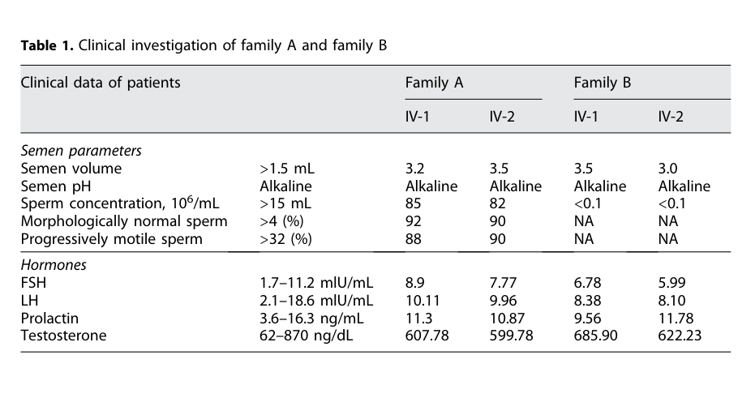

## Question

# Disease Characteristics Research Template

## Target Disease
- **Disease Name:** Autosomal Recessive Nonsyndromic Hearing Loss 32
- **MONDO ID:** MONDO:0012091 (if available)
- **Category:** Mendelian

## Research Objectives

Please provide a comprehensive research report on **Autosomal Recessive Nonsyndromic Hearing Loss 32** covering all of the
disease characteristics listed below. This report will be used to populate a disease knowledge
base entry. Be thorough and cite primary literature (PMID preferred) for all claims.

For each section, **suggested databases/resources** are listed. These are the first places
you should search for information on each topic.

---

### 1. Disease Information
> **Search first:** OMIM, Orphanet, ICD-10/ICD-11, MeSH, PubMed

- What is the disease? Provide a concise overview.
- What are the key identifiers? (OMIM, Orphanet, ICD-10/ICD-11, MeSH, Mondo)
- What are the common synonyms and alternative names?
- Is the information derived from individual patients (e.g., EHR) or aggregated disease-level resources?

### 2. Etiology

- **Disease Causal Factors**: What are the primary causes? (genetic, environmental, infectious, mechanistic)
- **Risk Factors**:
  > **Search first:** PubMed, Cochrane Library, UpToDate, clinical guidelines, ClinVar, ClinGen, GWAS Catalog, PheGenI, CTD, CDC, WHO, epidemiological databases
  - Genetic risk factors (causal variants, susceptibility loci, modifier genes)
  - Environmental risk factors (toxins, lifestyle, occupational exposures, age, sex, family history)
- **Protective Factors**:
  > **Search first:** PubMed, Cochrane Library, clinical trial databases, GWAS Catalog, gnomAD, WHO, CDC, nutrition databases
  - Genetic protective factors (protective variants, modifier alleles)
  - Environmental protective factors (diet, lifestyle, exposures that reduce risk)
- **Gene-Environment Interactions**: How do genetic and environmental factors interact to influence disease?
  > **Search first:** CTD, PubMed, PheGenI, GxE databases

### 3. Phenotypes
> **Search first:** HPO (Human Phenotype Ontology), OMIM, Orphanet, PubMed, clinicaltrials.gov, MedDRA, SNOMED CT, DECIPHER, LOINC

For each phenotype, provide:
- **Phenotype type**: symptoms, clinical signs, physical manifestations, behavioral changes, or laboratory abnormalities
  > For symptoms/signs: HPO, OMIM, Orphanet, PubMed
  > For behavioral changes: HPO, DSM, RDoC (Research Domain Criteria), PubMed
  > For laboratory abnormalities: LOINC, SNOMED CT, LabTests Online, PubMed
- **Phenotype characteristics**:
  > **Search first:** OMIM, Orphanet, HPO, PubMed
  - Age of symptom onset (neonatal, childhood, adult-onset, late-onset)
  - Symptom severity (mild, moderate, severe, variable)
  - Symptom progression (stable, progressive, episodic, fluctuating)
  - Frequency among affected individuals (percentage or qualitative)
- **Quality of life impact**: Effects on daily functioning and well-being (per-phenotype when possible)
  > **Search first:** EQ-5D database, SF-36, WHO QOL databases, PubMed
- Suggest HPO (Human Phenotype Ontology) terms for each phenotype

### 4. Genetic/Molecular Information

- **Causal Genes**: Gene mutations or chromosomal abnormalities responsible for disease (gene symbols, OMIM IDs)
  > **Search first:** OMIM, ClinVar, HGMD, Ensembl, NCBI Gene
- **Pathogenic Variants**:
  - Affected genes (gene symbols, HGNC IDs)
    > **Search first:** OMIM, NCBI Gene, Ensembl, HGNC, UniProt, GeneCards
  - Variant classification (pathogenic, likely pathogenic, VUS per ACMG/AMP guidelines)
    > **Search first:** ClinVar, ClinGen, ACMG/AMP guidelines, VarSome
  - Variant type/class (missense, frameshift, nonsense, splice-site, structural)
  - Allele frequency in population databases
    > **Search first:** gnomAD, 1000 Genomes, ExAC, TOPMed, dbSNP
  - Somatic vs germline origin
    > **Search first:** COSMIC (somatic), ClinVar, ICGC, TCGA
  - Functional consequences (loss of function, gain of function, dominant negative)
- **Modifier Genes**: Genes that modify disease severity or expression
- **Epigenetic Information**: DNA methylation, histone modifications, chromatin changes affecting disease
  > **Search first:** ENCODE, Roadmap Epigenomics, MethBase, DiseaseMeth
- **Chromosomal Abnormalities**: Large-scale genetic changes (aneuploidy, translocations, inversions)
  > **Search first:** DECIPHER, ClinVar, ECARUCA, UCSC Genome Browser

### 5. Environmental Information

- **Environmental Factors**: Non-genetic contributing factors (toxins, radiation, pollution, occupational exposure)
  > **Search first:** CTD (Comparative Toxicogenomics Database), TOXNET, PubMed, EPA databases
- **Lifestyle Factors**: Behavioral factors (smoking, diet, exercise, alcohol consumption)
  > **Search first:** CDC databases, WHO, PubMed, NHANES
- **Infectious Agents**: If applicable, pathogens causing or triggering disease (bacteria, viruses, fungi, parasites)
  > **Search first:** NCBI Taxonomy, ViPR, BV-BRC, MicrobeDB, GIDEON

### 6. Mechanism / Pathophysiology

**Present this section as an ordered causal chain first, then the detail below.**
Open with a numbered sequence of mechanistic steps running from the initiating
lesion (mutation, exposure, infection) to the clinical manifestation, one step per
line, each naming what it causes next. State the causal verb explicitly ("leads
to", "results in") and say where a step is inferred rather than demonstrated.
Where the mechanism branches, show the branch. The categories below are a
checklist of what to cover within those steps, not the organizing structure —
a step may draw on several of them, and a category may contribute to several
steps.

- **Molecular Pathways**: Specific signaling cascades or biochemical pathways involved (Wnt, MAPK, mTOR, PI3K-AKT, etc.)
  > **Search first:** KEGG, Reactome, WikiPathways, PathBank, BioCyc
- **Cellular Processes**: Cell-level mechanisms (apoptosis, autophagy, cell cycle dysregulation, inflammation, etc.)
  > **Search first:** Gene Ontology (GO), Reactome, KEGG, PubMed
- **Protein Dysfunction**: How protein structure or function is altered (misfolding, aggregation, loss of function, gain of function)
  > **Search first:** UniProt, PDB (Protein Data Bank), InterPro, Pfam, AlphaFold
- **Metabolic Changes**: Alterations in metabolic processes (energy metabolism, lipid metabolism, amino acid metabolism)
  > **Search first:** KEGG, BioCyc, HMDB (Human Metabolome Database), BRENDA
- **Immune System Involvement**: Role of immune response (autoimmunity, immunodeficiency, chronic inflammation)
  > **Search first:** ImmPort, Immunome Database, IEDB, Gene Ontology
- **Tissue Damage Mechanisms**: How tissues/ are injured (oxidative stress, ischemia, fibrosis, necrosis)
  > **Search first:** PubMed, Gene Ontology, Reactome
- **Biochemical Abnormalities**: Specific molecular defects (enzyme deficiencies, receptor dysfunction, ion channel defects)
  > **Search first:** BRENDA, UniProt, KEGG, OMIM, PubMed
- **Epigenetic Changes**: DNA methylation, histone modifications affecting gene expression in disease
  > **Search first:** ENCODE, Roadmap Epigenomics, MethBase, DiseaseMeth
- **Molecular Profiling** (if available):
  - Transcriptomics/gene expression changes
    > **Search first:** GEO (Gene Expression Omnibus), ArrayExpress, GTEx, Human Cell Atlas, SRA
  - Proteomics findings
    > **Search first:** PRIDE, ProteomeXchange, Human Protein Atlas, STRING, BioGRID
  - Metabolomics signatures
    > **Search first:** MetaboLights, Metabolomics Workbench, HMDB, METLIN
  - Lipidomics alterations
    > **Search first:** LIPID MAPS, SwissLipids, LipidHome, Metabolomics Workbench
  - Genomic structural features
    > **Search first:** UCSC Genome Browser, Ensembl, NCBI, dbVar, DGV
- **Advanced Technologies** (if applicable):
  - Single-cell analysis findings (cell-type specific mechanisms, cellular heterogeneity)
    > **Search first:** Human Cell Atlas, Single Cell Portal, GEO, CELLxGENE
  - Spatial transcriptomics findings
    > **Search first:** GEO, Spatial Research, Vizgen, 10x Genomics data
  - Multi-omics integration results
    > **Search first:** TCGA, ICGC, cBioPortal, LinkedOmics, PubMed
  - Functional genomics screens (CRISPR, RNAi)
    > **Search first:** DepMap, GenomeRNAi, PubMed, BioGRID ORCS

For each mechanism, describe:
- The causal chain from initial trigger to clinical manifestation
- Which mechanisms are upstream vs downstream
- What cell types and biological processes are involved
- Suggest GO terms for biological processes and CL terms for cell types

### 7. Anatomical Structures Affected

- **Organ Level**:
  - Primary organs directly affected
  - Secondary organ involvement (complications, secondary effects)
  - Body systems involved (cardiovascular, nervous, digestive, respiratory, endocrine, etc.)
  > **Search first:** Uberon, FMA (Foundational Model of Anatomy), OMIM, HPO, ICD-11, MeSH, SNOMED CT
- **Tissue and Cell Level**:
  - Specific tissue types affected (epithelial, connective, muscle, nervous)
  - Specific cell populations targeted (with Cell Ontology terms)
  > **Search first:** Uberon, Human Protein Atlas, Cell Ontology, Human Cell Atlas, CellMarker, PanglaoDB
- **Subcellular Level**:
  - Cellular compartments involved (mitochondria, nucleus, ER, lysosomes) (with GO Cellular Component terms)
  > **Search first:** Gene Ontology (Cellular Component), UniProt, Human Protein Atlas
- **Localization**:
  - Specific anatomical sites (with UBERON terms)
    > **Search first:** FMA, Uberon, NeuroNames (for brain), SNOMED CT
  - Lateralization (unilateral, bilateral, asymmetric)
    > **Search first:** HPO, clinical literature, imaging databases

### 8. Temporal Development

- **Onset**:
  - Typical age of onset (congenital, pediatric, adult, geriatric)
  - Onset pattern (acute, subacute, chronic, insidious)
  > **Search first:** OMIM, Orphanet, HPO, PubMed
- **Progression**:
  - Disease stages (early, intermediate, advanced, end-stage)
    > **Search first:** Cancer Staging Manual (AJCC), WHO classifications, PubMed
  - Progression rate (rapid, slow, variable)
  - Disease course pattern (episodic, relapsing-remitting, progressive, stable)
  - Disease duration (self-limited, chronic lifelong)
  > **Search first:** Disease registries, longitudinal cohort databases, natural history studies, PubMed, Orphanet, OMIM
- **Patterns**:
  - Remission patterns (spontaneous, treatment-induced)
    > **Search first:** Clinical trial databases, disease registries, PubMed
  - Critical periods (time windows of vulnerability or opportunity for intervention)
    > **Search first:** PubMed, developmental biology databases, clinical guidelines

### 9. Inheritance and Population

- **Epidemiology**:
  - Prevalence (cases per 100,000 at given time)
  - Incidence (new cases per 100,000 per year)
  > **Search first:** Orphanet, CDC, WHO, GBD (Global Burden of Disease), national registries, SEER, disease registries
- **For Genetic Etiology**:
  - Inheritance pattern (AD, AR, X-linked, mitochondrial, multifactorial, polygenic)
    > **Search first:** OMIM, Orphanet, ClinVar, GTR (Genetic Testing Registry)
  - Penetrance (complete, incomplete, age-dependent)
    > **Search first:** ClinVar, OMIM, PubMed, ClinGen
  - Expressivity (variable, consistent)
    > **Search first:** OMIM, ClinVar, PubMed
  - Genetic anticipation (increasing severity in successive generations)
    > **Search first:** OMIM, PubMed (especially for repeat expansion disorders)
  - Germline mosaicism
    > **Search first:** ClinVar, OMIM, genetic counseling literature, PubMed
  - Founder effects (population-specific mutations)
    > **Search first:** gnomAD, population genetics databases, PubMed
  - Consanguinity role
    > **Search first:** OMIM, population studies, genetic counseling resources
  - Carrier frequency
    > **Search first:** gnomAD, carrier screening databases, GeneReviews, GTR
- **Population Demographics**:
  - Affected populations (ethnic or demographic groups with higher prevalence)
    > **Search first:** gnomAD, 1000 Genomes, PAGE Study, PubMed, population registries
  - Geographic distribution (endemic areas, regional variation)
    > **Search first:** WHO, CDC, GBD, Orphanet, geographic epidemiology databases
  - Geographic distribution of specific variants
  - Sex ratio (male:female)
    > **Search first:** Disease registries, OMIM, PubMed, epidemiological databases
  - Age distribution of affected individuals
    > **Search first:** CDC, disease registries, SEER, Orphanet

### 10. Diagnostics

- **Clinical Tests**:
  - Laboratory tests (blood, urine, tissue chemistry, specific enzyme assays)
    > **Search first:** LOINC, LabTests Online, PubMed
  - Biomarkers (proteins, metabolites, genetic markers, circulating biomarkers)
    > **Search first:** FDA Biomarker List, BEST (Biomarkers, EndpointS, and other Tools), PubMed
  - Imaging studies (X-ray, CT, MRI, PET, ultrasound)
    > **Search first:** RadLex, DICOM, Radiopaedia, imaging databases
  - Functional tests (pulmonary function, cardiac stress tests)
    > **Search first:** LOINC, clinical guidelines, PubMed
  - Electrophysiology (EEG, EMG, ECG, nerve conduction studies)
    > **Search first:** LOINC, clinical neurophysiology databases, PubMed
  - Biopsy findings (histopathology, immunohistochemistry)
    > **Search first:** SNOMED CT, College of American Pathologists resources, PubMed
  - Pathology findings (microscopic examination)
    > **Search first:** SNOMED CT, Digital Pathology databases, PubMed
- **Genetic Testing**:
  > **Search first:** GTR (Genetic Testing Registry), GeneReviews, ClinGen
  - Overview of recommended genetic testing approach
  - Whole genome sequencing (WGS) utility
    > **Search first:** GTR, ClinVar, GEL (Genomics England), gnomAD
  - Whole exome sequencing (WES) utility
    > **Search first:** GTR, ClinVar, OMIM, GeneMatcher
  - Gene panels (which panels, which genes)
    > **Search first:** GTR, ClinVar, laboratory-specific databases
  - Single gene testing
    > **Search first:** GTR, ClinVar, OMIM, GeneReviews
  - Chromosomal microarray (CMA)
    > **Search first:** DECIPHER, ClinVar, dbVar, ECARUCA
  - Karyotyping
    > **Search first:** Chromosome Abnormality Database, ClinVar, cytogenetics resources
  - FISH
    > **Search first:** ClinVar, cytogenetics databases, PubMed
  - Mitochondrial DNA testing
    > **Search first:** MITOMAP, MSeqDR, ClinVar, GTR
  - Repeat expansion testing
    > **Search first:** GTR, ClinVar, repeat expansion databases, PubMed
- **Omics-Based Diagnostics** (if applicable):
  - RNA sequencing / transcriptomics
    > **Search first:** GEO, ArrayExpress, GTEx, RNA-seq databases
  - Proteomics
    > **Search first:** PRIDE, ProteomeXchange, FDA Biomarker database
  - Metabolomics
    > **Search first:** MetaboLights, Metabolomics Workbench, HMDB
  - Epigenomics
    > **Search first:** GEO, ENCODE, Roadmap Epigenomics, MethBase
  - Liquid biopsy
    > **Search first:** COSMIC, ClinVar, liquid biopsy databases, PubMed
- **Clinical Criteria**:
  - Standardized diagnostic criteria (DSM, ICD, society guidelines)
    > **Search first:** DSM-5, ICD-11, clinical society guidelines, UpToDate
  - Differential diagnosis (other conditions to rule out, with distinguishing features)
    > **Search first:** DynaMed, UpToDate, clinical decision support systems
- **Screening**:
  - Screening methods for asymptomatic individuals (newborn screening, carrier screening, cascade screening)
    > **Search first:** ACMG recommendations, CDC newborn screening, GTR

### 11. Outcome/Prognosis

- **Survival and Mortality**:
  - Survival rate (5-year, 10-year, overall)
    > **Search first:** SEER, cancer registries, disease-specific registries, PubMed
  - Life expectancy (with and without treatment if applicable)
    > **Search first:** Orphanet, disease registries, actuarial databases, PubMed
  - Mortality rate
    > **Search first:** CDC, WHO, GBD, national mortality databases
  - Disease-specific mortality (deaths directly attributable to disease)
    > **Search first:** Disease registries, CDC Wonder, GBD, PubMed
- **Morbidity and Function**:
  - Morbidity (disease-related disability and health impacts)
    > **Search first:** GBD, WHO, disability databases, PubMed
  - Disability outcomes (long-term functional impairments)
    > **Search first:** ICF (International Classification of Functioning), disability registries
  - Quality of life measures (EQ-5D, SF-36, PROMIS, disease-specific tools)
    > **Search first:** EQ-5D database, SF-36, PROMIS, PubMed
- **Disease Course**:
  - Complications (secondary problems: infections, organ failure, etc.)
    > **Search first:** ICD codes, disease registries, clinical databases, PubMed
  - Recovery potential (likelihood and extent of recovery, with vs without treatment)
    > **Search first:** Natural history studies, rehabilitation databases, PubMed
- **Prediction**:
  - Prognostic factors (age, disease severity, biomarkers, treatment response)
    > **Search first:** Prognostic models databases, clinical calculators, PubMed
  - Prognostic biomarkers (molecular markers predicting disease course)
    > **Search first:** FDA Biomarker database, PubMed, cancer prognostic databases

### 12. Treatment

- **Pharmacotherapy**:
  - Pharmacological treatments (drug names, drug classes, mechanisms of action)
    > **Search first:** DrugBank, RxNorm, ATC classification, DailyMed, FDA databases
  - Pharmacogenomics (how genetic variants affect drug metabolism, efficacy, toxicity)
    > **Search first:** PharmGKB, CPIC (Clinical Pharmacogenetics), FDA Table of PGx Biomarkers
- **Advanced Therapeutics**:
  - Gene therapy (viral vectors, CRISPR, gene replacement, gene editing)
    > **Search first:** ClinicalTrials.gov, FDA gene therapy database, ASGCT resources
  - Cell therapy (stem cell transplant, CAR-T, cellular therapeutics)
    > **Search first:** ClinicalTrials.gov, FDA cell therapy database, FACT standards
  - RNA-based therapies (ASOs, siRNA, mRNA therapies)
    > **Search first:** ClinicalTrials.gov, FDA approvals, PubMed
  - Targeted therapies (treatments directed at specific molecular targets)
    > **Search first:** My Cancer Genome, OncoKB, ClinicalTrials.gov, FDA approvals
  - Immunotherapies (checkpoint inhibitors, monoclonal antibodies)
    > **Search first:** Cancer Immunotherapy Database, FDA approvals, ClinicalTrials.gov
- **Surgical and Interventional**:
  - Surgical interventions (types of surgery, timing, outcomes)
    > **Search first:** CPT codes, surgical registries, clinical guidelines, PubMed
- **Supportive and Rehabilitative**:
  - Supportive care (symptom management, pain control, nutrition)
    > **Search first:** Clinical guidelines, Cochrane Library, PubMed
  - Rehabilitation (physical therapy, occupational therapy, speech therapy)
    > **Search first:** Rehabilitation medicine databases, clinical guidelines, PubMed
- **Experimental**:
  - Experimental treatments in clinical trials (with NCT identifiers if available)
    > **Search first:** ClinicalTrials.gov, EU Clinical Trials Register, WHO ICTRP
- **Treatment Outcomes**:
  - Treatment response rates
    > **Search first:** Clinical trial databases, FDA reviews, systematic reviews, PubMed
  - Side effects and adverse events
    > **Search first:** FDA Adverse Event Reporting System (FAERS), MedWatch, PubMed
- **Treatment Strategy**:
  - Treatment algorithms (clinical pathways, decision trees)
    > **Search first:** Clinical practice guidelines, NCCN Guidelines, UpToDate
  - Combination therapies
    > **Search first:** ClinicalTrials.gov, treatment guidelines, PubMed
  - Personalized medicine approaches (genotype-guided treatment)
    > **Search first:** My Cancer Genome, CIViC, PharmGKB, precision medicine databases

For each treatment, suggest NCIT (NCI Thesaurus) clinical-intervention terms where applicable.

### 13. Prevention

- **Prevention Levels**:
  - Primary prevention (preventing disease occurrence: vaccination, risk factor modification)
    > **Search first:** CDC, WHO, USPSTF recommendations, Cochrane Library
  - Secondary prevention (early detection and treatment: screening programs, early intervention)
    > **Search first:** USPSTF, CDC screening guidelines, WHO
  - Tertiary prevention (preventing complications in those with disease)
    > **Search first:** Clinical guidelines, disease management protocols, PubMed
- **Immunization**: Vaccine strategies (if applicable)
  > **Search first:** CDC vaccine schedules, WHO immunization, FDA vaccine database
- **Screening and Early Detection**:
  - Screening programs (population-based: newborn screening, cancer screening)
    > **Search first:** CDC screening programs, USPSTF, cancer screening databases
  - Genetic screening (carrier screening, preimplantation genetic diagnosis, prenatal testing)
    > **Search first:** ACMG recommendations, ACOG guidelines, GTR
  - Risk stratification (identifying high-risk individuals for targeted prevention)
    > **Search first:** Risk prediction models, clinical calculators, PubMed
- **Behavioral Interventions**: Lifestyle modifications to reduce risk
  > **Search first:** CDC, WHO, behavioral intervention databases, Cochrane Library
- **Counseling**: Genetic counseling (risk assessment, family planning guidance)
  > **Search first:** NSGC resources, ACMG guidelines, GeneReviews
- **Public Health**:
  - Public health interventions (sanitation, vector control, health education)
    > **Search first:** CDC, WHO, public health databases, PubMed
  - Environmental interventions (reducing environmental risk factors)
    > **Search first:** EPA databases, WHO environmental health, PubMed
- **Prophylaxis**: Preventive medications or procedures
  > **Search first:** Clinical guidelines, FDA approvals, PubMed

### 14. Other Species / Natural Disease

- **Taxonomy**: Species affected (with NCBI Taxon identifiers)
  > **Search first:** NCBI Taxonomy
- **Breed**: Specific breeds affected (with VBO identifiers if applicable)
  > **Search first:** VBO (Vertebrate Breed Ontology)
- **Gene**: Orthologous genes in other species (with NCBI Gene IDs)
  > **Search first:** NCBI Gene
- **Natural Disease**:
  - Naturally occurring disease in other species (companion animals, wildlife)
    > **Search first:** OMIA (Online Mendelian Inheritance in Animals), VetCompass, PubMed
  - Veterinary relevance and importance in animal health
    > **Search first:** OMIA, veterinary databases, PubMed
- **Comparative Biology**:
  - Comparative pathology (similarities and differences across species)
    > **Search first:** OMIA, comparative pathology databases, PubMed
  - Evolutionary conservation of disease mechanisms
    > **Search first:** HomoloGene, OrthoMCL, Alliance of Genome Resources
- **Transmission** (if applicable):
  - Zoonotic potential
    > **Search first:** CDC zoonotic diseases, WHO zoonoses, GIDEON
  - Cross-species susceptibility
    > **Search first:** NCBI Taxonomy, veterinary databases, PubMed

### 15. Model Organisms

- **Model Types**:
  - Model organism type (mammalian, invertebrate, cellular, in vitro)
    > **Search first:** Alliance of Genome Resources, model organism databases
  - Specific model systems (mouse, rat, zebrafish, Drosophila, C. elegans, yeast, cell lines, organoids, iPSCs)
    > **Search first:** MGI, RGD, ZFIN, FlyBase, WormBase, SGD, ATCC, Cellosaurus
  - Induced models (drug treatment, surgical intervention, environmental manipulation)
    > **Search first:** MGI, model organism databases, PubMed
- **Genetic Models**:
  - Types available (knockout, knock-in, transgenic, conditional, humanized)
    > **Search first:** MGI, IMPC, KOMP, EuMMCR, IMSR
- **Model Characteristics**:
  - Phenotype recapitulation (how well model reproduces human disease features)
    > **Search first:** Model organism databases, comparative studies, PubMed
  - Model limitations (aspects of human disease not captured)
    > **Search first:** Model organism databases, PubMed, review articles
- **Applications**:
  - Research applications (what aspects of disease can be studied)
    > **Search first:** Model organism databases, PubMed
- **Resources**:
  - Model databases
    > **Search first:** MGI, RGD, ZFIN, FlyBase, WormBase, IMSR, EMMA, MMRRC

---

## Citation Requirements

- Cite primary literature (PMID preferred) for all mechanistic and clinical claims
- Prioritize recent reviews and landmark papers
- Include direct quotes from abstracts where possible to support key statements
- Distinguish evidence source types: human clinical, model organism, in vitro, computational

## Output Format

Structure your response as a comprehensive narrative organized by the sections above.
For each section, provide:
- Factual content with specific details (numbers, percentages, gene names, variant nomenclature)
- Ontology term suggestions (HPO, GO, CL, UBERON, CHEBI, NCIT, MONDO) where applicable
- Evidence citations with PMIDs
- Direct quotes from abstracts to support key claims
- Clear indication when information is not available or not applicable for this disease

This report will be used to populate a disease knowledge base entry with:
- Pathophysiology descriptions with causal chains
- Gene/protein annotations (HGNC, GO terms)
- Phenotype associations (HP terms) with frequencies
- Cell type involvement (CL terms)
- Anatomical locations (UBERON terms)
- Chemical entities (CHEBI terms)
- Treatment annotations (NCIT terms)
- Evidence items with PMIDs and exact abstract quotes
- Epidemiology, prognosis, diagnostic, and prevention information
- Animal model descriptions with phenotype recapitulation details

## Output

Question: You are an expert researcher providing comprehensive, well-cited information.

Provide detailed information focusing on:
1. Key concepts and definitions with current understanding
2. Recent developments and latest research (prioritize 2023-2024 sources)
3. Current applications and real-world implementations
4. Expert opinions and analysis from authoritative sources
5. Relevant statistics and data from recent studies

Format as a comprehensive research report with proper citations. Include URLs and publication dates where available.
Always prioritize recent, authoritative sources and provide specific citations for all major claims.

# Disease Characteristics Research Template

## Target Disease
- **Disease Name:** Autosomal Recessive Nonsyndromic Hearing Loss 32
- **MONDO ID:** MONDO:0012091 (if available)
- **Category:** Mendelian

## Research Objectives

Please provide a comprehensive research report on **Autosomal Recessive Nonsyndromic Hearing Loss 32** covering all of the
disease characteristics listed below. This report will be used to populate a disease knowledge
base entry. Be thorough and cite primary literature (PMID preferred) for all claims.

For each section, **suggested databases/resources** are listed. These are the first places
you should search for information on each topic.

---

### 1. Disease Information
> **Search first:** OMIM, Orphanet, ICD-10/ICD-11, MeSH, PubMed

- What is the disease? Provide a concise overview.
- What are the key identifiers? (OMIM, Orphanet, ICD-10/ICD-11, MeSH, Mondo)
- What are the common synonyms and alternative names?
- Is the information derived from individual patients (e.g., EHR) or aggregated disease-level resources?

### 2. Etiology

- **Disease Causal Factors**: What are the primary causes? (genetic, environmental, infectious, mechanistic)
- **Risk Factors**:
  > **Search first:** PubMed, Cochrane Library, UpToDate, clinical guidelines, ClinVar, ClinGen, GWAS Catalog, PheGenI, CTD, CDC, WHO, epidemiological databases
  - Genetic risk factors (causal variants, susceptibility loci, modifier genes)
  - Environmental risk factors (toxins, lifestyle, occupational exposures, age, sex, family history)
- **Protective Factors**:
  > **Search first:** PubMed, Cochrane Library, clinical trial databases, GWAS Catalog, gnomAD, WHO, CDC, nutrition databases
  - Genetic protective factors (protective variants, modifier alleles)
  - Environmental protective factors (diet, lifestyle, exposures that reduce risk)
- **Gene-Environment Interactions**: How do genetic and environmental factors interact to influence disease?
  > **Search first:** CTD, PubMed, PheGenI, GxE databases

### 3. Phenotypes
> **Search first:** HPO (Human Phenotype Ontology), OMIM, Orphanet, PubMed, clinicaltrials.gov, MedDRA, SNOMED CT, DECIPHER, LOINC

For each phenotype, provide:
- **Phenotype type**: symptoms, clinical signs, physical manifestations, behavioral changes, or laboratory abnormalities
  > For symptoms/signs: HPO, OMIM, Orphanet, PubMed
  > For behavioral changes: HPO, DSM, RDoC (Research Domain Criteria), PubMed
  > For laboratory abnormalities: LOINC, SNOMED CT, LabTests Online, PubMed
- **Phenotype characteristics**:
  > **Search first:** OMIM, Orphanet, HPO, PubMed
  - Age of symptom onset (neonatal, childhood, adult-onset, late-onset)
  - Symptom severity (mild, moderate, severe, variable)
  - Symptom progression (stable, progressive, episodic, fluctuating)
  - Frequency among affected individuals (percentage or qualitative)
- **Quality of life impact**: Effects on daily functioning and well-being (per-phenotype when possible)
  > **Search first:** EQ-5D database, SF-36, WHO QOL databases, PubMed
- Suggest HPO (Human Phenotype Ontology) terms for each phenotype

### 4. Genetic/Molecular Information

- **Causal Genes**: Gene mutations or chromosomal abnormalities responsible for disease (gene symbols, OMIM IDs)
  > **Search first:** OMIM, ClinVar, HGMD, Ensembl, NCBI Gene
- **Pathogenic Variants**:
  - Affected genes (gene symbols, HGNC IDs)
    > **Search first:** OMIM, NCBI Gene, Ensembl, HGNC, UniProt, GeneCards
  - Variant classification (pathogenic, likely pathogenic, VUS per ACMG/AMP guidelines)
    > **Search first:** ClinVar, ClinGen, ACMG/AMP guidelines, VarSome
  - Variant type/class (missense, frameshift, nonsense, splice-site, structural)
  - Allele frequency in population databases
    > **Search first:** gnomAD, 1000 Genomes, ExAC, TOPMed, dbSNP
  - Somatic vs germline origin
    > **Search first:** COSMIC (somatic), ClinVar, ICGC, TCGA
  - Functional consequences (loss of function, gain of function, dominant negative)
- **Modifier Genes**: Genes that modify disease severity or expression
- **Epigenetic Information**: DNA methylation, histone modifications, chromatin changes affecting disease
  > **Search first:** ENCODE, Roadmap Epigenomics, MethBase, DiseaseMeth
- **Chromosomal Abnormalities**: Large-scale genetic changes (aneuploidy, translocations, inversions)
  > **Search first:** DECIPHER, ClinVar, ECARUCA, UCSC Genome Browser

### 5. Environmental Information

- **Environmental Factors**: Non-genetic contributing factors (toxins, radiation, pollution, occupational exposure)
  > **Search first:** CTD (Comparative Toxicogenomics Database), TOXNET, PubMed, EPA databases
- **Lifestyle Factors**: Behavioral factors (smoking, diet, exercise, alcohol consumption)
  > **Search first:** CDC databases, WHO, PubMed, NHANES
- **Infectious Agents**: If applicable, pathogens causing or triggering disease (bacteria, viruses, fungi, parasites)
  > **Search first:** NCBI Taxonomy, ViPR, BV-BRC, MicrobeDB, GIDEON

### 6. Mechanism / Pathophysiology

**Present this section as an ordered causal chain first, then the detail below.**
Open with a numbered sequence of mechanistic steps running from the initiating
lesion (mutation, exposure, infection) to the clinical manifestation, one step per
line, each naming what it causes next. State the causal verb explicitly ("leads
to", "results in") and say where a step is inferred rather than demonstrated.
Where the mechanism branches, show the branch. The categories below are a
checklist of what to cover within those steps, not the organizing structure —
a step may draw on several of them, and a category may contribute to several
steps.

- **Molecular Pathways**: Specific signaling cascades or biochemical pathways involved (Wnt, MAPK, mTOR, PI3K-AKT, etc.)
  > **Search first:** KEGG, Reactome, WikiPathways, PathBank, BioCyc
- **Cellular Processes**: Cell-level mechanisms (apoptosis, autophagy, cell cycle dysregulation, inflammation, etc.)
  > **Search first:** Gene Ontology (GO), Reactome, KEGG, PubMed
- **Protein Dysfunction**: How protein structure or function is altered (misfolding, aggregation, loss of function, gain of function)
  > **Search first:** UniProt, PDB (Protein Data Bank), InterPro, Pfam, AlphaFold
- **Metabolic Changes**: Alterations in metabolic processes (energy metabolism, lipid metabolism, amino acid metabolism)
  > **Search first:** KEGG, BioCyc, HMDB (Human Metabolome Database), BRENDA
- **Immune System Involvement**: Role of immune response (autoimmunity, immunodeficiency, chronic inflammation)
  > **Search first:** ImmPort, Immunome Database, IEDB, Gene Ontology
- **Tissue Damage Mechanisms**: How tissues/ are injured (oxidative stress, ischemia, fibrosis, necrosis)
  > **Search first:** PubMed, Gene Ontology, Reactome
- **Biochemical Abnormalities**: Specific molecular defects (enzyme deficiencies, receptor dysfunction, ion channel defects)
  > **Search first:** BRENDA, UniProt, KEGG, OMIM, PubMed
- **Epigenetic Changes**: DNA methylation, histone modifications affecting gene expression in disease
  > **Search first:** ENCODE, Roadmap Epigenomics, MethBase, DiseaseMeth
- **Molecular Profiling** (if available):
  - Transcriptomics/gene expression changes
    > **Search first:** GEO (Gene Expression Omnibus), ArrayExpress, GTEx, Human Cell Atlas, SRA
  - Proteomics findings
    > **Search first:** PRIDE, ProteomeXchange, Human Protein Atlas, STRING, BioGRID
  - Metabolomics signatures
    > **Search first:** MetaboLights, Metabolomics Workbench, HMDB, METLIN
  - Lipidomics alterations
    > **Search first:** LIPID MAPS, SwissLipids, LipidHome, Metabolomics Workbench
  - Genomic structural features
    > **Search first:** UCSC Genome Browser, Ensembl, NCBI, dbVar, DGV
- **Advanced Technologies** (if applicable):
  - Single-cell analysis findings (cell-type specific mechanisms, cellular heterogeneity)
    > **Search first:** Human Cell Atlas, Single Cell Portal, GEO, CELLxGENE
  - Spatial transcriptomics findings
    > **Search first:** GEO, Spatial Research, Vizgen, 10x Genomics data
  - Multi-omics integration results
    > **Search first:** TCGA, ICGC, cBioPortal, LinkedOmics, PubMed
  - Functional genomics screens (CRISPR, RNAi)
    > **Search first:** DepMap, GenomeRNAi, PubMed, BioGRID ORCS

For each mechanism, describe:
- The causal chain from initial trigger to clinical manifestation
- Which mechanisms are upstream vs downstream
- What cell types and biological processes are involved
- Suggest GO terms for biological processes and CL terms for cell types

### 7. Anatomical Structures Affected

- **Organ Level**:
  - Primary organs directly affected
  - Secondary organ involvement (complications, secondary effects)
  - Body systems involved (cardiovascular, nervous, digestive, respiratory, endocrine, etc.)
  > **Search first:** Uberon, FMA (Foundational Model of Anatomy), OMIM, HPO, ICD-11, MeSH, SNOMED CT
- **Tissue and Cell Level**:
  - Specific tissue types affected (epithelial, connective, muscle, nervous)
  - Specific cell populations targeted (with Cell Ontology terms)
  > **Search first:** Uberon, Human Protein Atlas, Cell Ontology, Human Cell Atlas, CellMarker, PanglaoDB
- **Subcellular Level**:
  - Cellular compartments involved (mitochondria, nucleus, ER, lysosomes) (with GO Cellular Component terms)
  > **Search first:** Gene Ontology (Cellular Component), UniProt, Human Protein Atlas
- **Localization**:
  - Specific anatomical sites (with UBERON terms)
    > **Search first:** FMA, Uberon, NeuroNames (for brain), SNOMED CT
  - Lateralization (unilateral, bilateral, asymmetric)
    > **Search first:** HPO, clinical literature, imaging databases

### 8. Temporal Development

- **Onset**:
  - Typical age of onset (congenital, pediatric, adult, geriatric)
  - Onset pattern (acute, subacute, chronic, insidious)
  > **Search first:** OMIM, Orphanet, HPO, PubMed
- **Progression**:
  - Disease stages (early, intermediate, advanced, end-stage)
    > **Search first:** Cancer Staging Manual (AJCC), WHO classifications, PubMed
  - Progression rate (rapid, slow, variable)
  - Disease course pattern (episodic, relapsing-remitting, progressive, stable)
  - Disease duration (self-limited, chronic lifelong)
  > **Search first:** Disease registries, longitudinal cohort databases, natural history studies, PubMed, Orphanet, OMIM
- **Patterns**:
  - Remission patterns (spontaneous, treatment-induced)
    > **Search first:** Clinical trial databases, disease registries, PubMed
  - Critical periods (time windows of vulnerability or opportunity for intervention)
    > **Search first:** PubMed, developmental biology databases, clinical guidelines

### 9. Inheritance and Population

- **Epidemiology**:
  - Prevalence (cases per 100,000 at given time)
  - Incidence (new cases per 100,000 per year)
  > **Search first:** Orphanet, CDC, WHO, GBD (Global Burden of Disease), national registries, SEER, disease registries
- **For Genetic Etiology**:
  - Inheritance pattern (AD, AR, X-linked, mitochondrial, multifactorial, polygenic)
    > **Search first:** OMIM, Orphanet, ClinVar, GTR (Genetic Testing Registry)
  - Penetrance (complete, incomplete, age-dependent)
    > **Search first:** ClinVar, OMIM, PubMed, ClinGen
  - Expressivity (variable, consistent)
    > **Search first:** OMIM, ClinVar, PubMed
  - Genetic anticipation (increasing severity in successive generations)
    > **Search first:** OMIM, PubMed (especially for repeat expansion disorders)
  - Germline mosaicism
    > **Search first:** ClinVar, OMIM, genetic counseling literature, PubMed
  - Founder effects (population-specific mutations)
    > **Search first:** gnomAD, population genetics databases, PubMed
  - Consanguinity role
    > **Search first:** OMIM, population studies, genetic counseling resources
  - Carrier frequency
    > **Search first:** gnomAD, carrier screening databases, GeneReviews, GTR
- **Population Demographics**:
  - Affected populations (ethnic or demographic groups with higher prevalence)
    > **Search first:** gnomAD, 1000 Genomes, PAGE Study, PubMed, population registries
  - Geographic distribution (endemic areas, regional variation)
    > **Search first:** WHO, CDC, GBD, Orphanet, geographic epidemiology databases
  - Geographic distribution of specific variants
  - Sex ratio (male:female)
    > **Search first:** Disease registries, OMIM, PubMed, epidemiological databases
  - Age distribution of affected individuals
    > **Search first:** CDC, disease registries, SEER, Orphanet

### 10. Diagnostics

- **Clinical Tests**:
  - Laboratory tests (blood, urine, tissue chemistry, specific enzyme assays)
    > **Search first:** LOINC, LabTests Online, PubMed
  - Biomarkers (proteins, metabolites, genetic markers, circulating biomarkers)
    > **Search first:** FDA Biomarker List, BEST (Biomarkers, EndpointS, and other Tools), PubMed
  - Imaging studies (X-ray, CT, MRI, PET, ultrasound)
    > **Search first:** RadLex, DICOM, Radiopaedia, imaging databases
  - Functional tests (pulmonary function, cardiac stress tests)
    > **Search first:** LOINC, clinical guidelines, PubMed
  - Electrophysiology (EEG, EMG, ECG, nerve conduction studies)
    > **Search first:** LOINC, clinical neurophysiology databases, PubMed
  - Biopsy findings (histopathology, immunohistochemistry)
    > **Search first:** SNOMED CT, College of American Pathologists resources, PubMed
  - Pathology findings (microscopic examination)
    > **Search first:** SNOMED CT, Digital Pathology databases, PubMed
- **Genetic Testing**:
  > **Search first:** GTR (Genetic Testing Registry), GeneReviews, ClinGen
  - Overview of recommended genetic testing approach
  - Whole genome sequencing (WGS) utility
    > **Search first:** GTR, ClinVar, GEL (Genomics England), gnomAD
  - Whole exome sequencing (WES) utility
    > **Search first:** GTR, ClinVar, OMIM, GeneMatcher
  - Gene panels (which panels, which genes)
    > **Search first:** GTR, ClinVar, laboratory-specific databases
  - Single gene testing
    > **Search first:** GTR, ClinVar, OMIM, GeneReviews
  - Chromosomal microarray (CMA)
    > **Search first:** DECIPHER, ClinVar, dbVar, ECARUCA
  - Karyotyping
    > **Search first:** Chromosome Abnormality Database, ClinVar, cytogenetics resources
  - FISH
    > **Search first:** ClinVar, cytogenetics databases, PubMed
  - Mitochondrial DNA testing
    > **Search first:** MITOMAP, MSeqDR, ClinVar, GTR
  - Repeat expansion testing
    > **Search first:** GTR, ClinVar, repeat expansion databases, PubMed
- **Omics-Based Diagnostics** (if applicable):
  - RNA sequencing / transcriptomics
    > **Search first:** GEO, ArrayExpress, GTEx, RNA-seq databases
  - Proteomics
    > **Search first:** PRIDE, ProteomeXchange, FDA Biomarker database
  - Metabolomics
    > **Search first:** MetaboLights, Metabolomics Workbench, HMDB
  - Epigenomics
    > **Search first:** GEO, ENCODE, Roadmap Epigenomics, MethBase
  - Liquid biopsy
    > **Search first:** COSMIC, ClinVar, liquid biopsy databases, PubMed
- **Clinical Criteria**:
  - Standardized diagnostic criteria (DSM, ICD, society guidelines)
    > **Search first:** DSM-5, ICD-11, clinical society guidelines, UpToDate
  - Differential diagnosis (other conditions to rule out, with distinguishing features)
    > **Search first:** DynaMed, UpToDate, clinical decision support systems
- **Screening**:
  - Screening methods for asymptomatic individuals (newborn screening, carrier screening, cascade screening)
    > **Search first:** ACMG recommendations, CDC newborn screening, GTR

### 11. Outcome/Prognosis

- **Survival and Mortality**:
  - Survival rate (5-year, 10-year, overall)
    > **Search first:** SEER, cancer registries, disease-specific registries, PubMed
  - Life expectancy (with and without treatment if applicable)
    > **Search first:** Orphanet, disease registries, actuarial databases, PubMed
  - Mortality rate
    > **Search first:** CDC, WHO, GBD, national mortality databases
  - Disease-specific mortality (deaths directly attributable to disease)
    > **Search first:** Disease registries, CDC Wonder, GBD, PubMed
- **Morbidity and Function**:
  - Morbidity (disease-related disability and health impacts)
    > **Search first:** GBD, WHO, disability databases, PubMed
  - Disability outcomes (long-term functional impairments)
    > **Search first:** ICF (International Classification of Functioning), disability registries
  - Quality of life measures (EQ-5D, SF-36, PROMIS, disease-specific tools)
    > **Search first:** EQ-5D database, SF-36, PROMIS, PubMed
- **Disease Course**:
  - Complications (secondary problems: infections, organ failure, etc.)
    > **Search first:** ICD codes, disease registries, clinical databases, PubMed
  - Recovery potential (likelihood and extent of recovery, with vs without treatment)
    > **Search first:** Natural history studies, rehabilitation databases, PubMed
- **Prediction**:
  - Prognostic factors (age, disease severity, biomarkers, treatment response)
    > **Search first:** Prognostic models databases, clinical calculators, PubMed
  - Prognostic biomarkers (molecular markers predicting disease course)
    > **Search first:** FDA Biomarker database, PubMed, cancer prognostic databases

### 12. Treatment

- **Pharmacotherapy**:
  - Pharmacological treatments (drug names, drug classes, mechanisms of action)
    > **Search first:** DrugBank, RxNorm, ATC classification, DailyMed, FDA databases
  - Pharmacogenomics (how genetic variants affect drug metabolism, efficacy, toxicity)
    > **Search first:** PharmGKB, CPIC (Clinical Pharmacogenetics), FDA Table of PGx Biomarkers
- **Advanced Therapeutics**:
  - Gene therapy (viral vectors, CRISPR, gene replacement, gene editing)
    > **Search first:** ClinicalTrials.gov, FDA gene therapy database, ASGCT resources
  - Cell therapy (stem cell transplant, CAR-T, cellular therapeutics)
    > **Search first:** ClinicalTrials.gov, FDA cell therapy database, FACT standards
  - RNA-based therapies (ASOs, siRNA, mRNA therapies)
    > **Search first:** ClinicalTrials.gov, FDA approvals, PubMed
  - Targeted therapies (treatments directed at specific molecular targets)
    > **Search first:** My Cancer Genome, OncoKB, ClinicalTrials.gov, FDA approvals
  - Immunotherapies (checkpoint inhibitors, monoclonal antibodies)
    > **Search first:** Cancer Immunotherapy Database, FDA approvals, ClinicalTrials.gov
- **Surgical and Interventional**:
  - Surgical interventions (types of surgery, timing, outcomes)
    > **Search first:** CPT codes, surgical registries, clinical guidelines, PubMed
- **Supportive and Rehabilitative**:
  - Supportive care (symptom management, pain control, nutrition)
    > **Search first:** Clinical guidelines, Cochrane Library, PubMed
  - Rehabilitation (physical therapy, occupational therapy, speech therapy)
    > **Search first:** Rehabilitation medicine databases, clinical guidelines, PubMed
- **Experimental**:
  - Experimental treatments in clinical trials (with NCT identifiers if available)
    > **Search first:** ClinicalTrials.gov, EU Clinical Trials Register, WHO ICTRP
- **Treatment Outcomes**:
  - Treatment response rates
    > **Search first:** Clinical trial databases, FDA reviews, systematic reviews, PubMed
  - Side effects and adverse events
    > **Search first:** FDA Adverse Event Reporting System (FAERS), MedWatch, PubMed
- **Treatment Strategy**:
  - Treatment algorithms (clinical pathways, decision trees)
    > **Search first:** Clinical practice guidelines, NCCN Guidelines, UpToDate
  - Combination therapies
    > **Search first:** ClinicalTrials.gov, treatment guidelines, PubMed
  - Personalized medicine approaches (genotype-guided treatment)
    > **Search first:** My Cancer Genome, CIViC, PharmGKB, precision medicine databases

For each treatment, suggest NCIT (NCI Thesaurus) clinical-intervention terms where applicable.

### 13. Prevention

- **Prevention Levels**:
  - Primary prevention (preventing disease occurrence: vaccination, risk factor modification)
    > **Search first:** CDC, WHO, USPSTF recommendations, Cochrane Library
  - Secondary prevention (early detection and treatment: screening programs, early intervention)
    > **Search first:** USPSTF, CDC screening guidelines, WHO
  - Tertiary prevention (preventing complications in those with disease)
    > **Search first:** Clinical guidelines, disease management protocols, PubMed
- **Immunization**: Vaccine strategies (if applicable)
  > **Search first:** CDC vaccine schedules, WHO immunization, FDA vaccine database
- **Screening and Early Detection**:
  - Screening programs (population-based: newborn screening, cancer screening)
    > **Search first:** CDC screening programs, USPSTF, cancer screening databases
  - Genetic screening (carrier screening, preimplantation genetic diagnosis, prenatal testing)
    > **Search first:** ACMG recommendations, ACOG guidelines, GTR
  - Risk stratification (identifying high-risk individuals for targeted prevention)
    > **Search first:** Risk prediction models, clinical calculators, PubMed
- **Behavioral Interventions**: Lifestyle modifications to reduce risk
  > **Search first:** CDC, WHO, behavioral intervention databases, Cochrane Library
- **Counseling**: Genetic counseling (risk assessment, family planning guidance)
  > **Search first:** NSGC resources, ACMG guidelines, GeneReviews
- **Public Health**:
  - Public health interventions (sanitation, vector control, health education)
    > **Search first:** CDC, WHO, public health databases, PubMed
  - Environmental interventions (reducing environmental risk factors)
    > **Search first:** EPA databases, WHO environmental health, PubMed
- **Prophylaxis**: Preventive medications or procedures
  > **Search first:** Clinical guidelines, FDA approvals, PubMed

### 14. Other Species / Natural Disease

- **Taxonomy**: Species affected (with NCBI Taxon identifiers)
  > **Search first:** NCBI Taxonomy
- **Breed**: Specific breeds affected (with VBO identifiers if applicable)
  > **Search first:** VBO (Vertebrate Breed Ontology)
- **Gene**: Orthologous genes in other species (with NCBI Gene IDs)
  > **Search first:** NCBI Gene
- **Natural Disease**:
  - Naturally occurring disease in other species (companion animals, wildlife)
    > **Search first:** OMIA (Online Mendelian Inheritance in Animals), VetCompass, PubMed
  - Veterinary relevance and importance in animal health
    > **Search first:** OMIA, veterinary databases, PubMed
- **Comparative Biology**:
  - Comparative pathology (similarities and differences across species)
    > **Search first:** OMIA, comparative pathology databases, PubMed
  - Evolutionary conservation of disease mechanisms
    > **Search first:** HomoloGene, OrthoMCL, Alliance of Genome Resources
- **Transmission** (if applicable):
  - Zoonotic potential
    > **Search first:** CDC zoonotic diseases, WHO zoonoses, GIDEON
  - Cross-species susceptibility
    > **Search first:** NCBI Taxonomy, veterinary databases, PubMed

### 15. Model Organisms

- **Model Types**:
  - Model organism type (mammalian, invertebrate, cellular, in vitro)
    > **Search first:** Alliance of Genome Resources, model organism databases
  - Specific model systems (mouse, rat, zebrafish, Drosophila, C. elegans, yeast, cell lines, organoids, iPSCs)
    > **Search first:** MGI, RGD, ZFIN, FlyBase, WormBase, SGD, ATCC, Cellosaurus
  - Induced models (drug treatment, surgical intervention, environmental manipulation)
    > **Search first:** MGI, model organism databases, PubMed
- **Genetic Models**:
  - Types available (knockout, knock-in, transgenic, conditional, humanized)
    > **Search first:** MGI, IMPC, KOMP, EuMMCR, IMSR
- **Model Characteristics**:
  - Phenotype recapitulation (how well model reproduces human disease features)
    > **Search first:** Model organism databases, comparative studies, PubMed
  - Model limitations (aspects of human disease not captured)
    > **Search first:** Model organism databases, PubMed, review articles
- **Applications**:
  - Research applications (what aspects of disease can be studied)
    > **Search first:** Model organism databases, PubMed
- **Resources**:
  - Model databases
    > **Search first:** MGI, RGD, ZFIN, FlyBase, WormBase, IMSR, EMMA, MMRRC

---

## Citation Requirements

- Cite primary literature (PMID preferred) for all mechanistic and clinical claims
- Prioritize recent reviews and landmark papers
- Include direct quotes from abstracts where possible to support key statements
- Distinguish evidence source types: human clinical, model organism, in vitro, computational

## Output Format

Structure your response as a comprehensive narrative organized by the sections above.
For each section, provide:
- Factual content with specific details (numbers, percentages, gene names, variant nomenclature)
- Ontology term suggestions (HPO, GO, CL, UBERON, CHEBI, NCIT, MONDO) where applicable
- Evidence citations with PMIDs
- Direct quotes from abstracts to support key claims
- Clear indication when information is not available or not applicable for this disease

This report will be used to populate a disease knowledge base entry with:
- Pathophysiology descriptions with causal chains
- Gene/protein annotations (HGNC, GO terms)
- Phenotype associations (HP terms) with frequencies
- Cell type involvement (CL terms)
- Anatomical locations (UBERON terms)
- Chemical entities (CHEBI terms)
- Treatment annotations (NCIT terms)
- Evidence items with PMIDs and exact abstract quotes
- Epidemiology, prognosis, diagnostic, and prevention information
- Animal model descriptions with phenotype recapitulation details

# Autosomal recessive nonsyndromic hearing loss 32 (DFNB32): disease-characteristics report

**Scope and evidence.** DFNB32 denotes CDC14A-associated recessive hearing loss *without an established extra-auditory phenotype*. Some biallelic CDC14A genotypes instead cause hearing impairment–infertile male syndrome (**HIIMS**). The distinction matters when annotating individual variants and counseling males. Evidence below is labeled **human**, **mouse**, **zebrafish**, **in vitro**, or **inference** where the distinction affects interpretation. Most disease-specific clinical evidence comes from small families, not registries. (doll2020novellossoffunctionvariants pages 1-3, imtiaz2018cdc14aphosphataseis pages 1-2, mohseni2020whentranscriptsmatter pages 1-2)

## 1. Disease information and identifiers

DFNB32 is a rare Mendelian form of bilateral, usually early-onset sensorineural hearing loss (SNHL), attributable to biallelic variants in **CDC14A**, encoding cell division cycle 14A phosphatase. Names used in the literature include *autosomal recessive nonsyndromic deafness 32*, *nonsyndromic hearing loss DFNB32*, and *CDC14A-related hearing loss*. **HIIMS is a related but clinically distinct CDC14A-associated phenotype**, not a synonym for isolated DFNB32. The original linkage region was described as chromosome **1p13.3–p22.1**; subsequent mapping places CDC14A at **1p21.2**. (imtiaz2018cdc14aphosphataseis pages 2-3, doll2020novellossoffunctionvariants pages 1-3, delmaghani2016mutationsincdc14a pages 1-3)

**Identifiers:** disease **OMIM #608653**, which must be interpreted alongside the later HIIMS phenotype descriptions; gene **OMIM *603504** and Ensembl **ENSG00000079335**. The requested **MONDO:0012091** is retained as a *user-supplied candidate identifier*: its current preferred label and cross-references were **not independently verified** in the material retrieved. A distinct DFNB32-specific Orphanet number, MeSH descriptor, or ICD-10/ICD-11 code was likewise not verified; broad hearing-loss billing codes should not be represented as disease-specific. Sources here are published **aggregate disease-level studies and consented family investigations**, not an EHR-derived individual-patient record. (doll2020novellossoffunctionvariants pages 1-3, OpenTargets Search: autosomal recessive nonsyndromic hearing loss 32-CDC14A, delmaghani2016mutationsincdc14a pages 1-3)

## 2. Etiology, risk, protection, and gene–environment effects

**Established cause:** inherited biallelic CDC14A variants, including nonsense, frameshift, splice-altering, and some missense alleles. Genotype, affected transcript, and retained protein activity influence whether hearing loss is isolated or accompanies male infertility. Consanguinity increases the probability of inheriting the same rare allele from both parents; it does not itself change the molecular mechanism. Family history, including affected siblings and unaffected carrier parents, is clinically informative. (imtiaz2018cdc14aphosphataseis pages 3-4, doll2020novellossoffunctionvariants pages 1-3, mohseni2020whentranscriptsmatter pages 1-2, zehri2024delineatingthedisease pages 3-4)

No **DFNB32-specific** protective allele, independently established modifier gene, diet, medication, infectious trigger, occupational exposure, or quantified gene–environment interaction was identified. Avoiding hazardous noise and ototoxic drugs is prudent hearing conservation **in general**, not demonstrated prevention of CDC14A-mediated disease. A putative compensating paralog, **CDC14B**, and zebrafish **cdc14ab** are hypotheses, not proven human protective modifiers. (imtiaz2018cdc14aphosphataseis pages 12-13, imtiaz2018cdc14aphosphataseis pages 8-9)

## 3. Phenotypes and proposed HPO annotation

| Feature and phenotype type | Onset, severity, course, and available frequency | Proposed HPO term; evidence qualification |
|---|---|---|
| **Bilateral SNHL**; clinical sign and audiometric abnormality | Core observed feature of published affected individuals, generally congenital/prelingual or noticed in childhood; moderate–profound, commonly severe–profound. These selected families do **not** support a population-level percentage. | Sensorineural hearing impairment **HP:0000407**; bilateral hearing impairment **HP:0008619**. Confirm exact ontology labels against the HPO release used for ingestion. (delmaghani2016mutationsincdc14a pages 1-3, mohseni2020whentranscriptsmatter pages 2-4, doll2020novellossoffunctionvariants pages 1-3, zehri2024delineatingthedisease pages 3-4) |
| **Progressive hearing loss**; longitudinal clinical sign | Documented in several original families; other families reported nonprogressive loss, and progression was simply *unreported* in some. One Iranian family had postlingual, school-age progressive loss. | Progressive hearing impairment **HP:0001730** is a **candidate requiring release verification**; do not assert it in every case. (imtiaz2018cdc14aphosphataseis pages 6-8, mohseni2020whentranscriptsmatter pages 2-4, doll2020novellossoffunctionvariants pages 6-8) |
| **Severe/profound hearing impairment or deafness**; clinical sign | Both affected members in each of the two 2024 Pakistani families had congenital bilateral profound SNHL. Other alleles/families had moderate-to-severe loss. | Severe hearing impairment **HP:0012715** / profound hearing impairment **HP:0012714** are *candidate terms*: verify labels and IDs before importing. (zehri2024delineatingthedisease pages 3-4, imtiaz2018cdc14aphosphataseis pages 6-8) |
| **Speech/language or communication difficulties**; functional consequence | Plausible consequence of early severe hearing loss; **no CDC14A-specific frequency, standardized language score, or quality-of-life estimate** was reported in the reviewed cohorts. Some previously affected individuals used hearing aids for oral communication. | Annotate delayed speech/language **only if directly observed in a case**, rather than assigning an unverified DFNB32 frequency. (imtiaz2018cdc14aphosphataseis pages 6-8, hatzopoulos2024theotoacousticemissions pages 1-2) |
| **Infertility/severe oligozoospermia in males**; reproductive symptom and semen-test abnormality | **HIIMS branch, not a required DFNB32 feature.** In the 2024 family B, two affected males each had sperm concentration **<0.1 × 10⁶/mL**; family A's two affected males had **85 and 82 × 10⁶/mL**. Both groups had bilateral profound SNHL. | Male infertility **HP:0003251** and oligozoospermia **HP:0000798** are *candidate HPO annotations* requiring term verification; apply to **HIIMS or explicitly phenotyped individuals**, never automatically to DFNB32. (zehri2024delineatingthedisease pages 3-4, zehri2024delineatingthedisease media 37c2e9b5) |

Affected people in the original discovery families had no reported major additional ciliopathy features; 2018 investigators reported no obvious vestibular complaints or balance abnormalities. **Absence of an observation in a small family is not proof of universal absence.** No per-phenotype EQ-5D, SF-36, or DFNB32-specific quality-of-life estimates were identified. Childhood hearing loss generally affects communication and developmental opportunities, which motivates early, accessible language and hearing support. (delmaghani2016mutationsincdc14a pages 4-5, imtiaz2018cdc14aphosphataseis pages 6-8, hatzopoulos2024theotoacousticemissions pages 1-2)

## 4. Genetic and molecular information

**Causal gene:** **CDC14A**, chromosome 1p21.2, protein phosphatase with a conserved dual-specificity catalytic region. Record the HGNC-approved *symbol* CDC14A; a numeric HGNC identifier was not verified and should not be guessed. Report all variants with their **reference transcript/version**: CDC14A has multiple alternatively spliced isoforms, and the same genomic variant can have different exon and protein-level interpretations. Variants studied in patients are **inherited/germline**, not tumor-somatic mutations. (doll2020novellossoffunctionvariants pages 1-3, mohseni2020whentranscriptsmatter pages 5-6, zehri2024delineatingthedisease pages 4-5)

The following comparison separates segregation, experimental function, and uncertain classifications. (delmaghani2016mutationsincdc14a pages 1-3, imtiaz2018cdc14aphosphataseis pages 1-2, doll2020novellossoffunctionvariants pages 6-8, zehri2024delineatingthedisease pages 4-5)

| Study | Representative human variant(s) and transcript | Patient phenotype | Evidence and uncertainty |
|---|---|---|---|
| Delmaghani et al., 2016 | **CDC14A** c.1126C>T, p.Arg376\*; c.1015C>T, p.Arg339\*. Exact RefSeq version was not confirmed in the retrieved text. | c.1126C>T segregated in a consanguineous Iranian family with 11 individuals affected by congenital/prelingual severe-to-profound cochlear hearing loss; c.1015C>T was homozygous in one Mauritanian patient with severe/profound congenital deafness. No major extra-auditory features were reported. | Linkage defined a 2.8-Mb interval at 1p21.2–p21.1. Segregation, rarity, predicted truncation/NMD, mouse kinocilium localization, and zebrafish morpholino data supported causality. The proposed short-kinocilium mechanism was later challenged by germline mouse and zebrafish mutants with normal-length kinocilia. (delmaghani2016mutationsincdc14a pages 1-3, delmaghani2016mutationsincdc14a pages 3-4, imtiaz2018cdc14aphosphataseis pages 12-13) |
| Imtiaz et al., 2018 | c.376delT, p.Tyr126Ilefs\*64; c.417C>G, p.Tyr139\*; c.934C>G, p.Arg312Gly; c.959A>C, p.Gln320Pro. Exact RefSeq version was not confirmed in the retrieved text. | Homozygous variants segregated with progressive moderate-to-profound or severe-to-profound hearing loss in Pakistani and Iranian families. Deaf males in several families were infertile, whereas deaf females remained fertile; the p.Gln320Pro family had profound deafness. | Human segregation plus mouse null and phosphatase-dead p.Cys278Ser models supported a recessive phosphatase-loss mechanism. Mice developed normally patterned hair bundles followed by hair-cell degeneration. Individual variant effects and residual activity were not uniformly assayed. (imtiaz2018cdc14aphosphataseis pages 3-4, imtiaz2018cdc14aphosphataseis pages 1-2, imtiaz2018cdc14aphosphataseis pages 6-8, imtiaz2018cdc14aphosphataseis pages 9-10) |
| Mohseni et al., 2020 | **NM_033313.2:** c.1033C>T, p.Arg345\*; c.1126C>T, p.Arg376\*. **NM_033312.2:** c.1351_1352del, p.Ala451Thrfs\*43. | Six Iranian families had isolated bilateral moderate-to-profound hearing loss, usually beginning at ages 1–3 years; p.Arg345\* produced postlingual progressive loss and p.Ala451Thrfs\*43 prelingual severe-to-profound loss. Evaluated males had preserved fertility, although two p.Arg376\* homozygotes had borderline sperm morphology. | Segregation, rarity, founder-haplotype evidence for p.Arg376\*, and semen analyses supported DFNB32 rather than HIIMS. Transcript-specific preservation of NM_033313.2 was proposed to maintain fertility, but direct protein-function assays were not reported for every allele. (mohseni2020whentranscriptsmatter pages 6-7, mohseni2020whentranscriptsmatter pages 2-4, mohseni2020whentranscriptsmatter pages 4-5) |
| Doll et al., 2020 | **NM_033312.2:** c.1421+2T>C, producing c.1414_1421del and p.Val472Leufs\*20; c.1041dup, p.Ser348Glnfs\*2. | Two consanguineous families—one Iranian and one Pakistani—each included two individuals with congenital bilateral sensorineural hearing loss ranging from severe-to-profound to profound; progression was not reported. | A minigene assay demonstrated cryptic splice-site activation for c.1421+2T>C. Blood RT-qPCR showed approximately 99% lower CDC14A expression in a c.1041dup homozygote, consistent with NMD. Reproductive phenotyping was insufficient to define DFNB32 versus HIIMS for every affected male. (doll2020novellossoffunctionvariants pages 1-3, doll2020novellossoffunctionvariants pages 6-8) |
| Zehri et al., 2024 | **NM_003672.4:** c.1000C>T, p.Gln334\*; c.684C>A, p.Asn228Lys. | p.Gln334\* segregated in family A with congenital bilateral profound sensorineural hearing loss and normal semen parameters (85 and 82 million sperm/mL). p.Asn228Lys segregated in family B with the same hearing phenotype plus severe oligozoospermia (below 0.1 million sperm/mL) and normal hormone profiles. | Both variants were absent from the queried population resources and matched controls and segregated in consanguineous families, but **both were classified as ACMG VUS** (PP1, PM2, PP3). No variant-specific functional assay was performed; p.Gln334\* should not automatically be treated as proven loss-of-function, and p.Asn228Lys/HIIMS causality remains provisional. (zehri2024delineatingthedisease pages 1-2, zehri2024delineatingthedisease pages 3-4, zehri2024delineatingthedisease media 37c2e9b5, zehri2024delineatingthedisease pages 4-5, zehri2024delineatingthedisease pages 5-6) |

*Table: Disease-specific human CDC14A variants reported in DFNB32 and HIIMS, with transcript information, associated phenotypes, and the strength or limitations of supporting evidence. The table preserves the 2024 authors’ VUS classifications and avoids treating untested variants as definitively pathogenic.*

**Variant interpretation safeguards.** A 2020 study demonstrated that **c.1421+2T>C** activated a cryptic donor, generating **c.1414_1421del, p.Val472Leufs*20** in an assayed transcript; a **c.1041dup, p.Ser348Glnfs*2** homozygote showed approximately **99% lower CDC14A RNA expression in blood** than controls, consistent with nonsense-mediated decay. These functional findings cannot automatically be assigned to every missense or stop-gain allele. The **2024 authors explicitly classified both their reported variants as VUS**, despite family segregation and computational predictions. Their c.1000C>T, p.Gln334* is described as an *exon-11* DFNB32 allele on **NM_003672.4**; protein residue number alone is not a reliable way to apply an exon-position rule across transcripts. ClinVar classifications and current gnomAD frequencies should be rechecked for the precise genome build/transcript before clinical reporting. (doll2020novellossoffunctionvariants pages 6-8, zehri2024delineatingthedisease pages 4-5)

A 2020 report recorded **p.Arg376Ter frequency 0.0004% in gnomAD and 0.06% in Iranome** at the time analyzed; it proposed a shared Iranian founder haplotype. The p.Ala451Thrfs*43 allele was absent from the authors’ queried gnomAD release and **800 Iranian control samples**. Database absence is **not** an exact modern population-frequency estimate. No large-scale aneuploidy, recurrent translocation, repeat expansion, established somatic mutation, disease-specific methylation signature, or confirmed modifier was found for DFNB32. (mohseni2020whentranscriptsmatter pages 2-4, mohseni2020whentranscriptsmatter pages 4-5, imtiaz2018cdc14aphosphataseis pages 12-13)

## 5. Environmental, lifestyle, and infectious information

**Not established as etiologies of DFNB32:** infection, toxin, radiation, air pollution, smoking, diet, alcohol, or occupational exposure. Clinical evaluation should nevertheless consider common *alternative or superimposed* causes of SNHL, such as acquired infection or noise/ototoxic exposure, without conflating them with inheritance of CDC14A disease. No pathogen, vaccine-targetable causal infection, or disease-specific environmental protective factor was identified. (doll2020novellossoffunctionvariants pages 1-3, rosa2024hearinglossgenetic pages 2-4)

## 6. Mechanism and pathophysiology

### Ordered causal chain

1. **Biallelic CDC14A sequence changes lead to** loss, altered localization, or reduced activity of particular CDC14A phosphatase isoforms; the precise consequence is **variant-dependent** and must be experimentally demonstrated when uncertain. (imtiaz2018cdc14aphosphataseis pages 1-2, doll2020novellossoffunctionvariants pages 6-8, imtiaz2018cdc14aphosphataseis pages 6-8)
2. **Reduced CDC14A function in auditory sensory cells leads to** impaired maintenance of normally initially formed cochlear hair cells and their stereocilia; which critical phosphoprotein substrate and subcellular event act first **remain unidentified**. (imtiaz2018cdc14aphosphataseis pages 12-13, imtiaz2018cdc14aphosphataseis pages 6-8)
3. **Hair-cell dysfunction leads to** lost outer-hair-cell-generated otoacoustic emissions and progressive hair-bundle fusion/hair-cell degeneration in mutant mice; an additional early auditory defect is **inferred**, because some mice are profoundly deaf while many hair cells remain. (imtiaz2018cdc14aphosphataseis pages 9-10, imtiaz2018cdc14aphosphataseis pages 8-8)
4. **Diminished cochlear sound encoding results in** bilateral sensorineural hearing impairment in affected humans; mapping the exact mouse cellular sequence onto each human allele is **inferred**, not directly demonstrated in patient inner-ear tissue. (delmaghani2016mutationsincdc14a pages 1-3, imtiaz2018cdc14aphosphataseis pages 1-2)
5. **Branch—if residual CDC14A activity/isoform expression preserves spermatogenesis, this leads to** isolated DFNB32; **if activity is insufficient in male reproductive tissue, this results in** seminiferous-tubule/spermiation defects and male infertility (**HIIMS**). Transcript-based preservation of fertility is supported by human semen measurements but its exact biochemical threshold is **inferred**. (mohseni2020whentranscriptsmatter pages 1-2, zehri2024delineatingthedisease pages 3-4, imtiaz2018cdc14aphosphataseis pages 1-2)

**Direct mechanistic observations and limits.** Endogenous mouse CDC14A labels auditory/vestibular hair-cell **kinocilia, basal bodies, and stereocilia**, with expression also in supporting cells and spiral-ganglion regions. Null/compound-mutant mouse hair bundles appeared normal at **P7–P9**; approximately **5%** of apical inner/outer hair cells had degenerated by **P17**, versus roughly **50% missing at P90** in the apical turn, compared with approximately **0.5% in wild-type littermates**. Auditory responses worsened to profound loss by P90. Mutant-mouse endocochlear potentials were reported **within the normal range**, whereas distortion-product otoacoustic emissions were absent: this argues against making strial voltage failure the primary established mechanism. Direct cochlear transduction-current measurements were not identified. (imtiaz2018cdc14aphosphataseis pages 6-8, imtiaz2018cdc14aphosphataseis pages 9-10, imtiaz2018cdc14aphosphataseis pages 8-8)

**Important revision to an earlier model.** The 2016 original paper's *zebrafish morpholino knockdown* found mean kinocilia lengths approximately **4.89 versus 6.31 μm** in controls and proposed defective ciliogenesis. The 2018 **germline mutant zebrafish and mouse** instead had **normal-length kinocilia**, while mouse sensory cells subsequently degenerated. Morpholino effects, genetic compensation, or paralog redundancy remain possible explanations; a primary human kinocilium-shortening defect must **not** be represented as settled fact. Zebrafish germline mutants also retained FM1–43 hair-cell labeling, which does not establish normal function of mammalian cochlear hair cells. (delmaghani2016mutationsincdc14a pages 3-4, imtiaz2018cdc14aphosphataseis pages 12-13, imtiaz2018cdc14aphosphataseis pages 8-9)

**Pathway/omics checklist:** CDC14A can dephosphorylate serine, threonine, and tyrosine residues; generic cell-cycle/CDK1, centrosomal, cytoskeletal, and ciliogenesis functions are known, but **no Wnt/MAPK/mTOR/PI3K–AKT cascade or critical CDC14A substrate has been validated as the DFNB32 causal pathway**. A proposed relationship with **EPS8/RN-tre/Rab5** is a hypothesis, not proven EPS8 dephosphorylation in affected ears. Reported RNA-level work concerns *individual variant function*, not a validated diagnostic transcriptomic signature. Disease-specific proteomic, metabolomic, lipidomic, epigenomic, spatial-transcriptomic, single-cell, or genome-wide CRISPR-screen signatures were not established by the retrieved evidence. **Suggested GO concepts, subject to ontology-version verification:** protein dephosphorylation, auditory receptor cell maintenance, sensory perception of sound, cilium organization, and stereocilium organization; annotate apoptosis, immune inflammation, oxidative stress, and metabolism only if subsequently demonstrated. (imtiaz2018cdc14aphosphataseis pages 1-2, imtiaz2018cdc14aphosphataseis pages 12-13, doll2020novellossoffunctionvariants pages 6-8)

## 7. Anatomical localization

**Primary organ/system:** auditory inner ear, especially cochlea and organ of Corti (**sensory/auditory system**). **Tissue/cell candidates:** sensory epithelium; inner and outer cochlear hair cells (**proposed CL concepts**: auditory inner hair cell and auditory outer hair cell); supporting cells and spiral ganglion are *expression sites*, but their causal contributions are not established. **Subcellular GO cellular-component candidates:** kinocilium/cilium, basal body, stereocilium, cytoplasm, and nucleus; use validated release-specific IDs when importing. **UBERON concepts to resolve in the target ontology release:** inner ear, cochlea, organ of Corti, stereocilium bundle, and testis/seminiferous tubule for **HIIMS only**. Human loss is predominantly **bilateral**; one patient had asymmetric audiometric thresholds. No consistent secondary visceral involvement or laterality-specific lesion is established. (imtiaz2018cdc14aphosphataseis pages 6-8, mohseni2020whentranscriptsmatter pages 2-4, imtiaz2018cdc14aphosphataseis pages 1-2, zehri2024delineatingthedisease pages 3-4)

## 8. Temporal development

**Onset:** often congenital or prelingual; one six-family series reported recognition around **1–3 years**, with one **postlingual, school-age** presentation. **Course:** lifelong hearing impairment with variable progression—some families show worsening from childhood to adolescence/adulthood, one reported nonprogressive loss, and other small reports lack sufficient longitudinal assessment. There is no validated DFNB32-specific stage classification, annual threshold-decline estimate, or spontaneous-remission rate. Early childhood is an important **general hearing/language intervention window**, not a proven CDC14A-specific reversal window. (delmaghani2016mutationsincdc14a pages 1-3, mohseni2020whentranscriptsmatter pages 2-4, imtiaz2018cdc14aphosphataseis pages 6-8, hatzopoulos2024theotoacousticemissions pages 1-2)

## 9. Inheritance and population

**Autosomal recessive:** two disease-causing alleles are expected in affected individuals; when *both parents are confirmed heterozygous carriers of the same recessive condition*, the conventional risk **per pregnancy** is 25% affected, 50% carrier, and 25% inheriting neither familial allele. **Penetrance has not been quantified**; expressivity varies by allele, transcript, age, and, for infertility, sex. Anticipation and germline mosaicism have not been demonstrated. Consanguineous Iranian, Pakistani, Tunisian, and Mauritanian families have been published; this indicates ascertainment and autozygosity, **not** disease restricted to these ancestries. A shared Iranian **p.Arg376Ter** haplotype suggests a founder effect. No defensible **DFNB32-specific prevalence, annual incidence, sex ratio, global geographic distribution, or overall CDC14A carrier frequency** was identified. The general figure **1–2 per 1,000 newborns with hearing loss** must not be assigned to DFNB32. (delmaghani2016mutationsincdc14a pages 1-3, doll2020novellossoffunctionvariants pages 1-3, mohseni2020whentranscriptsmatter pages 6-7, imtiaz2018cdc14aphosphataseis pages 3-4)

## 10. Diagnostic assessment

**Audiology and clinical examination.** Record laterality, air/bone-conduction thresholds, serial age-appropriate audiograms, speech perception, and development; use otoacoustic emissions and diagnostic auditory brainstem response (**ABR**) where appropriate, especially in infants. Ask about progression, vestibular complaints, family history, and alternative causes. An **OAE newborn-screen pass does not exclude later-recognized hereditary hearing loss**: in a 2024 Russian *mixed-genotype* cohort, **21%** of genetically diagnosed children had passed newborn screening; that percentage is **not** a CDC14A-specific false-negative rate. Normal endocochlear potential is a *research mouse observation*, not a proposed clinical test. (chibisova2024towardscomprehensivenewborn pages 1-2, hatzopoulos2024theotoacousticemissions pages 1-2, imtiaz2018cdc14aphosphataseis pages 8-8)

**Molecular approach.** Use a contemporary comprehensive hearing-loss gene panel including **CDC14A** and common alternative genes, with sequencing and clinically appropriate deletion/duplication assessment; consider exome or genome sequencing and segregation testing when panel results are unresolved. Assess coverage, splice sites, structural variants, allele phase, reference sequence, and transcript-specific consequences; variant of uncertain significance **is not a stand-alone molecular diagnosis**. WES found CDC14A mutations in consanguineous families, and patient RNA/minigene assays resolved splice and frameshift effects. Broader 2025 hearing-loss WGS research identified a cause in **37/140 families (26%)**, including classes overlooked by exome sequencing: this is a *mixed-etiology* yield, not a DFNB32 test sensitivity. Karyotype, FISH, chromosomal microarray, mitochondrial sequencing, repeat-expansion testing, biochemical assays, and biopsy are **not routine confirmatory tests for an established biallelic CDC14A sequence variant**; use them for a specific differential indication. CT/MRI may be considered according to general otologic or implant-planning indications, not to visualize a CDC14A-specific lesion. (delmaghani2016mutationsincdc14a pages 1-3, doll2020novellossoffunctionvariants pages 6-8, zehri2024delineatingthedisease pages 4-5, rosa2024hearinglossgenetic pages 2-4)

**Differentiate HIIMS and alternatives.** In appropriately counseled, consenting postpubertal/adult males with relevant CDC14A alleles, discuss reproductive history and offer semen analysis/fertility referral when indicated; do not diagnose infertility from variant position alone. Distinguish isolated DFNB32 from **STRC/CATSPER2 contiguous-deletion deafness–infertility syndrome**, other nonsyndromic genes such as **GJB2** or **OTOF**, and syndromic hearing disorders when examination suggests them. The 2024 comparative families illustrate why the semen measurement changes phenotype assignment. There are **no validated CDC14A-specific protein/metabolite biomarkers**, standalone imaging signs, diagnostic liquid biopsy, or omics assay. (zehri2024delineatingthedisease pages 3-4, zehri2024delineatingthedisease media 37c2e9b5, zehri2024delineatingthedisease pages 1-2, rosa2024hearinglossgenetic pages 2-4)

## 11. Outcomes and prognosis

Hearing impairment is generally persistent and may progress; communication and educational effects depend strongly on severity, age at recognition, access to language, and rehabilitation. No DFNB32-specific mortality excess, five-/ten-year survival estimate, reduction in life expectancy, hearing-aid response rate, cochlear-implant response rate, formal quality-of-life score, or validated prognostic biomarker was found. Mouse **perinatal lethality** with some engineered null alleles should **not** be extrapolated to human DFNB32 survival. Fertility is often preserved in well-characterized isolated DFNB32 males but can be seriously impaired in HIIMS. (imtiaz2018cdc14aphosphataseis pages 6-8, mohseni2020whentranscriptsmatter pages 1-2, zehri2024delineatingthedisease media 37c2e9b5)

## 12. Treatment and current implementation

**Current care is supportive and individualized:** prompt audiologic follow-up, appropriately fitted **hearing aids**, accessible early language/communication support and speech-language services where desired, educational accommodations, and **cochlear implant assessment** for sufficiently severe loss or inadequate aided benefit. At least some genetically affected patients used hearing aids for oral communication; the 2024 two-family report specifically states its affected individuals had **not** used hearing aids or cochlear implantation—so their measurements are **not** evidence that these treatments failed. A 2024 international hearing-care guidance document emphasizes integrated screening, audiology, amplification, medical assessment, early intervention, and family support. **NCIT clinical-intervention term suggestions, with IDs to verify:** hearing aid therapy, cochlear implantation, auditory rehabilitation, speech-language therapy, genetic counseling, and semen analysis/fertility evaluation. (imtiaz2018cdc14aphosphataseis pages 6-8, zehri2024delineatingthedisease pages 1-2, hatzopoulos2024theotoacousticemissions pages 1-2, chibisova2024towardscomprehensivenewborn pages 1-2)

**No CDC14A-correcting drug, approved gene therapy, proven cell/RNA therapy, established phosphatase-directed medication, disease-specific pharmacogenomic intervention, or DFNB32-specific response rate** was identified. Searches of ClinicalTrials.gov for *CDC14A* and *DFNB32* did not identify a relevant targeted therapeutic trial or NCT identifier; registry searches are not proof that no unregistered research exists. Notably, the 2024 bilateral **OTOF/DFNB9**, *not CDC14A/DFNB32*, AAV trial reported restored bilateral hearing in **five children**, **36 adverse events**, and no dose-limiting toxicity or serious adverse event in its interim analysis. This demonstrates feasibility of therapy **for another genotype**, **not** treatment efficacy, safety, or trial eligibility in DFNB32. Avoid assigning its adverse-event or response statistics to CDC14A. (wang2024bilateralgenetherapy pages 1-2, rosa2024hearinglossgenetic pages 2-4)

## 13. Prevention and screening

**Primary prevention of inherited occurrence:** voluntary carrier testing in at-risk families, reproductive genetic counseling, and discussion of prenatal testing or preimplantation genetic testing when familial **pathogenic/likely pathogenic** alleles are established and consistent with family preferences and local practice. **Do not base reproductive decisions on an unresolved VUS alone.** **Secondary prevention:** universal newborn physiologic hearing screening, reassessment despite an early screen pass if concern arises, and targeted testing of relatives with an established familial variant. **Tertiary prevention:** serial audiology, hearing technology when beneficial, and early accessible language/educational support. Reducing noise and avoidable ototoxic exposures may protect *residual hearing generally*, but has not been shown to prevent DFNB32. No vaccine or prophylactic drug prevents biallelic CDC14A inheritance. (zehri2024delineatingthedisease pages 4-5, chibisova2024towardscomprehensivenewborn pages 1-2, hatzopoulos2024theotoacousticemissions pages 1-2, rosa2024hearinglossgenetic pages 2-4)

## 14. Naturally occurring disease in other species

The human disorder is **not infectious or zoonotic** and has no cross-species transmission. The experimentally demonstrated orthologous phenotype is in **Mus musculus** (**NCBI Taxon 10090**) with *Cdc14a* disruption; **Danio rerio** (**NCBI Taxon 7955**) has the studied *cdc14aa* paralog. These are **engineered models**, not evidence for a naturally occurring breed-associated veterinary DFNB32 equivalent. No affected animal breed, VBO breed ID, spontaneous OMIA case series, or independently verified ortholog NCBI Gene numerical IDs were identified. Human taxon: **Homo sapiens, NCBI Taxon 9606**. (imtiaz2018cdc14aphosphataseis pages 1-2, imtiaz2018cdc14aphosphataseis pages 8-9, imtiaz2018cdc14aphosphataseis pages 12-13)

## 15. Model organisms and research applications

**Mouse—strongest disease model:** *Cdc14a* knockout-first/**tm1a**, exon-trap or exon-3-deletion **tm1b/tm1d**, compound-mutant, and CRISPR phosphatase-dead **p.Cys278Ser** lines. In surviving homozygous animals, ABR/DPOAE deficits, later stereocilia/hair-cell degeneration, and male infertility reproduce important human phenotypes. A striking **12/436 (2.8%)** homozygous mutant offspring survived to weaning in one cross, versus **25%** expected under simple Mendelian viability; **5/153** p.Cys278Ser homozygotes survived another cross. These are **mouse-genotype-specific**, not human epidemiological estimates. Mouse models may interrogate catalytic dependence, hair-cell maintenance, fertility, and candidate rescue windows, but do not resolve human transcript-specific fertility or establish human infant treatment efficacy. Resources for model lookup include **MGI/IMPC/IMSR**; exact stock IDs need independent verification. (imtiaz2018cdc14aphosphataseis pages 8-9, imtiaz2018cdc14aphosphataseis pages 6-8, imtiaz2018cdc14aphosphataseis pages 9-10)

**Zebrafish—important limitation:** *cdc14aa* morpholino knockdown initially suggested shorter kinocilia; a later germline phosphatase-domain frameshift **p.Gly284fs*4** did **not** reproduce shorter kinocilia, apparent mechanotransduction loss, or male infertility. Fish paralogs and knockdown-versus-mutant compensation limit extrapolation. **In vitro:** HEK293T minigene splicing and patient-blood RT-qPCR establish consequences of two *specific* human variants; cell models cannot reproduce the full cochlear and reproductive phenotype. No validated DFNB32-specific human iPSC organoid, single-cell/spatial atlas result, natural-disease animal breed, or restorative gene-editing model with demonstrated clinical efficacy was identified. **Suggested model resource:** ZFIN for zebrafish alleles; confirm each accession before database ingestion. (delmaghani2016mutationsincdc14a pages 3-4, imtiaz2018cdc14aphosphataseis pages 8-9, doll2020novellossoffunctionvariants pages 6-8, imtiaz2018cdc14aphosphataseis pages 12-13)

### Key primary publications and exact abstract excerpts

- **Delmaghani et al., published June 2016**, *American Journal of Human Genetics* 98:1266–1270, DOI **[10.1016/j.ajhg.2016.04.015](https://doi.org/10.1016/j.ajhg.2016.04.015)**. Original human genetic discovery; the abstract reports “**eleven individuals affected by severe to profound congenital deafness**” and a “**2.8 Mb critical interval**.” Its proposed kinocilium mechanism derives partly from morpholino experiments subsequently challenged by germline mutants. **PMID not independently verified from the retrieved text.** (delmaghani2016mutationsincdc14a pages 1-3, delmaghani2016mutationsincdc14a pages 3-4, imtiaz2018cdc14aphosphataseis pages 12-13)
- **Imtiaz et al., online 23 December 2017; 2018 journal issue**, *Human Molecular Genetics* 27:780–798, DOI **[10.1093/hmg/ddx440](https://doi.org/10.1093/hmg/ddx440)**; **PMID 29293958** is listed in retrieved Open Targets literature metadata. Its abstract states “**Auditory hair cells of postnatal Cdc14a mutants develop normally, but subsequently degenerate causing deafness.**” These are human familial plus mouse/zebrafish experimental data. (imtiaz2018cdc14aphosphataseis pages 1-2, OpenTargets Search: autosomal recessive nonsyndromic hearing loss 32-CDC14A)
- **Doll et al., published 2 January 2020**, *International Journal of Molecular Sciences* 21:311, DOI **[10.3390/ijms21010311](https://doi.org/10.3390/ijms21010311)**. Its abstract reports that “**the c.1421+2T>C variant activates a cryptic splice site**”; evidence includes patient sequencing and in-vitro functional testing. PMID was not independently verified. (doll2020novellossoffunctionvariants pages 1-3, doll2020novellossoffunctionvariants pages 6-8)
- **Mohseni et al., published 2020**, *Journal of Human Genetics* 65:609–617, DOI **[10.1038/s10038-020-0740-z](https://doi.org/10.1038/s10038-020-0740-z)**; **PMID 32679235** appears in the retrieved Open Targets literature metadata, but its mapping to this paper was **not independently confirmed**, so use its DOI as the dependable link. Human fertility assessment supports transcript-dependent distinction between DFNB32 and HIIMS. (mohseni2020whentranscriptsmatter pages 1-2, mohseni2020whentranscriptsmatter pages 6-7, OpenTargets Search: autosomal recessive nonsyndromic hearing loss 32-CDC14A)
- **Zehri et al., published February 2024**, *Molecular Syndromology* 15:269–274, DOI **[10.1159/000536016](https://doi.org/10.1159/000536016)**. Its abstract says: “**family B also had infertility**” and describes c.1000C>T versus c.684C>A. Importantly, the article's results **classify both as VUS**, and its Table 1 provides the directly measured sperm concentrations; PMID was not independently verified. (zehri2024delineatingthedisease pages 1-2, zehri2024delineatingthedisease media 37c2e9b5, zehri2024delineatingthedisease pages 4-5)

**Knowledge-base confidence summary:** High for the CDC14A–recessive hearing-loss association and mouse hair-cell-maintenance phenotype; moderate for allele/transcript-specific prediction of isolated DFNB32 versus HIIMS; low or unavailable for precise DFNB32 epidemiology, intervention-specific outcomes, molecular substrates, human modifier effects, and unverified ontology cross-references. Preserve these distinctions rather than imputing values from hearing loss as a whole. (delmaghani2016mutationsincdc14a pages 1-3, imtiaz2018cdc14aphosphataseis pages 1-2, mohseni2020whentranscriptsmatter pages 1-2, zehri2024delineatingthedisease pages 4-5)

References

1. (doll2020novellossoffunctionvariants pages 1-3): Julia Doll, Susanne Kolb, Linda Schnapp, Aboulfazl Rad, Franz Rüschendorf, Imran Khan, Abolfazl Adli, Atefeh Hasanzadeh, Daniel Liedtke, Sabine Knaup, Michaela AH Hofrichter, Tobias Müller, Marcus Dittrich, Il-Keun Kong, Hyung-Goo Kim, Thomas Haaf, and Barbara Vona. Novel loss-of-function variants in cdc14a are associated with recessive sensorineural hearing loss in iranian and pakistani patients. International Journal of Molecular Sciences, 21:311, Jan 2020. URL: https://doi.org/10.3390/ijms21010311, doi:10.3390/ijms21010311. This article has 19 citations.

2. (imtiaz2018cdc14aphosphataseis pages 1-2): Ayesha Imtiaz, Inna A Belyantseva, Alisha J Beirl, Cristina Fenollar-Ferrer, Rasheeda Bashir, Ihtisham Bukhari, Amal Bouzid, Uzma Shaukat, Hela Azaiez, Kevin T Booth, Kimia Kahrizi, Hossein Najmabadi, Azra Maqsood, Elizabeth A Wilson, Tracy S Fitzgerald, Abdelaziz Tlili, Rafal Olszewski, Merete Lund, Taimur Chaudhry, Atteeq U Rehman, Matthew F Starost, Ali M Waryah, Michael Hoa, Lijin Dong, Robert J Morell, Richard J H Smith, Sheikh Riazuddin, Saber Masmoudi, Katie S Kindt, Sadaf Naz, and Thomas B Friedman. Cdc14a phosphatase is essential for hearing and male fertility in mouse and human. Human Molecular Genetics, 27:780–798, Mar 2018. URL: https://doi.org/10.1093/hmg/ddx440, doi:10.1093/hmg/ddx440. This article has 72 citations and is from a domain leading peer-reviewed journal.

3. (mohseni2020whentranscriptsmatter pages 1-2): Marzieh Mohseni, Mojdeh Akbari, Kevin T. Booth, Mojgan Babanejad, Hela Azaiez, Fariba Ardalani, Sanaz Arzhangi, Khadijeh Jalalvand, Nooshin Nikzat, Fatemeh Ghodratpour, Payman Jamali, Omid Ali Adeli, Haleh Habibi, Kimia Kahrizi, and Hossein Najmabadi. When transcripts matter: delineating between non-syndromic hearing loss dfnb32 and hearing impairment infertile male syndrome (hiims). Journal of Human Genetics, 65:609-617, Mar 2020. URL: https://doi.org/10.1038/s10038-020-0740-z, doi:10.1038/s10038-020-0740-z. This article has 10 citations and is from a peer-reviewed journal.

4. (imtiaz2018cdc14aphosphataseis pages 2-3): Ayesha Imtiaz, Inna A Belyantseva, Alisha J Beirl, Cristina Fenollar-Ferrer, Rasheeda Bashir, Ihtisham Bukhari, Amal Bouzid, Uzma Shaukat, Hela Azaiez, Kevin T Booth, Kimia Kahrizi, Hossein Najmabadi, Azra Maqsood, Elizabeth A Wilson, Tracy S Fitzgerald, Abdelaziz Tlili, Rafal Olszewski, Merete Lund, Taimur Chaudhry, Atteeq U Rehman, Matthew F Starost, Ali M Waryah, Michael Hoa, Lijin Dong, Robert J Morell, Richard J H Smith, Sheikh Riazuddin, Saber Masmoudi, Katie S Kindt, Sadaf Naz, and Thomas B Friedman. Cdc14a phosphatase is essential for hearing and male fertility in mouse and human. Human Molecular Genetics, 27:780–798, Mar 2018. URL: https://doi.org/10.1093/hmg/ddx440, doi:10.1093/hmg/ddx440. This article has 72 citations and is from a domain leading peer-reviewed journal.

5. (delmaghani2016mutationsincdc14a pages 1-3): Sedigheh Delmaghani, Asadollah Aghaie, Yosra Bouyacoub, Hala El Hachmi, Crystel Bonnet, Zied Riahi, Sebastien Chardenoux, Isabelle Perfettini, Jean-Pierre Hardelin, Ahmed Houmeida, Philippe Herbomel, and Christine Petit. Mutations in cdc14a, encoding a protein phosphatase involved in hair cell ciliogenesis, cause autosomal-recessive severe to profound deafness. American journal of human genetics, 98 6:1266-1270, Jun 2016. URL: https://doi.org/10.1016/j.ajhg.2016.04.015, doi:10.1016/j.ajhg.2016.04.015. This article has 51 citations and is from a highest quality peer-reviewed journal.

6. (OpenTargets Search: autosomal recessive nonsyndromic hearing loss 32-CDC14A): Open Targets Query (autosomal recessive nonsyndromic hearing loss 32-CDC14A, 2 results). Buniello, A. et al. (2025). Open Targets Platform: facilitating therapeutic hypotheses building in drug discovery. Nucleic Acids Research.

7. (imtiaz2018cdc14aphosphataseis pages 3-4): Ayesha Imtiaz, Inna A Belyantseva, Alisha J Beirl, Cristina Fenollar-Ferrer, Rasheeda Bashir, Ihtisham Bukhari, Amal Bouzid, Uzma Shaukat, Hela Azaiez, Kevin T Booth, Kimia Kahrizi, Hossein Najmabadi, Azra Maqsood, Elizabeth A Wilson, Tracy S Fitzgerald, Abdelaziz Tlili, Rafal Olszewski, Merete Lund, Taimur Chaudhry, Atteeq U Rehman, Matthew F Starost, Ali M Waryah, Michael Hoa, Lijin Dong, Robert J Morell, Richard J H Smith, Sheikh Riazuddin, Saber Masmoudi, Katie S Kindt, Sadaf Naz, and Thomas B Friedman. Cdc14a phosphatase is essential for hearing and male fertility in mouse and human. Human Molecular Genetics, 27:780–798, Mar 2018. URL: https://doi.org/10.1093/hmg/ddx440, doi:10.1093/hmg/ddx440. This article has 72 citations and is from a domain leading peer-reviewed journal.

8. (zehri2024delineatingthedisease pages 3-4): Zamrud Zehri, Hammal Khan, Sohail Ahmed, Muhammad Javed Khan, Nisar Ahmed Shahwani, Shoaib Nawaz, and Muhammad Umair. Delineating the disease boundaries: homozygous cdc14a variants underlying nonsyndromic hearing loss and hearing impairment infertile male syndrome. Molecular Syndromology, 15:269-274, Feb 2024. URL: https://doi.org/10.1159/000536016, doi:10.1159/000536016. This article has 2 citations and is from a peer-reviewed journal.

9. (imtiaz2018cdc14aphosphataseis pages 12-13): Ayesha Imtiaz, Inna A Belyantseva, Alisha J Beirl, Cristina Fenollar-Ferrer, Rasheeda Bashir, Ihtisham Bukhari, Amal Bouzid, Uzma Shaukat, Hela Azaiez, Kevin T Booth, Kimia Kahrizi, Hossein Najmabadi, Azra Maqsood, Elizabeth A Wilson, Tracy S Fitzgerald, Abdelaziz Tlili, Rafal Olszewski, Merete Lund, Taimur Chaudhry, Atteeq U Rehman, Matthew F Starost, Ali M Waryah, Michael Hoa, Lijin Dong, Robert J Morell, Richard J H Smith, Sheikh Riazuddin, Saber Masmoudi, Katie S Kindt, Sadaf Naz, and Thomas B Friedman. Cdc14a phosphatase is essential for hearing and male fertility in mouse and human. Human Molecular Genetics, 27:780–798, Mar 2018. URL: https://doi.org/10.1093/hmg/ddx440, doi:10.1093/hmg/ddx440. This article has 72 citations and is from a domain leading peer-reviewed journal.

10. (imtiaz2018cdc14aphosphataseis pages 8-9): Ayesha Imtiaz, Inna A Belyantseva, Alisha J Beirl, Cristina Fenollar-Ferrer, Rasheeda Bashir, Ihtisham Bukhari, Amal Bouzid, Uzma Shaukat, Hela Azaiez, Kevin T Booth, Kimia Kahrizi, Hossein Najmabadi, Azra Maqsood, Elizabeth A Wilson, Tracy S Fitzgerald, Abdelaziz Tlili, Rafal Olszewski, Merete Lund, Taimur Chaudhry, Atteeq U Rehman, Matthew F Starost, Ali M Waryah, Michael Hoa, Lijin Dong, Robert J Morell, Richard J H Smith, Sheikh Riazuddin, Saber Masmoudi, Katie S Kindt, Sadaf Naz, and Thomas B Friedman. Cdc14a phosphatase is essential for hearing and male fertility in mouse and human. Human Molecular Genetics, 27:780–798, Mar 2018. URL: https://doi.org/10.1093/hmg/ddx440, doi:10.1093/hmg/ddx440. This article has 72 citations and is from a domain leading peer-reviewed journal.

11. (mohseni2020whentranscriptsmatter pages 2-4): Marzieh Mohseni, Mojdeh Akbari, Kevin T. Booth, Mojgan Babanejad, Hela Azaiez, Fariba Ardalani, Sanaz Arzhangi, Khadijeh Jalalvand, Nooshin Nikzat, Fatemeh Ghodratpour, Payman Jamali, Omid Ali Adeli, Haleh Habibi, Kimia Kahrizi, and Hossein Najmabadi. When transcripts matter: delineating between non-syndromic hearing loss dfnb32 and hearing impairment infertile male syndrome (hiims). Journal of Human Genetics, 65:609-617, Mar 2020. URL: https://doi.org/10.1038/s10038-020-0740-z, doi:10.1038/s10038-020-0740-z. This article has 10 citations and is from a peer-reviewed journal.

12. (imtiaz2018cdc14aphosphataseis pages 6-8): Ayesha Imtiaz, Inna A Belyantseva, Alisha J Beirl, Cristina Fenollar-Ferrer, Rasheeda Bashir, Ihtisham Bukhari, Amal Bouzid, Uzma Shaukat, Hela Azaiez, Kevin T Booth, Kimia Kahrizi, Hossein Najmabadi, Azra Maqsood, Elizabeth A Wilson, Tracy S Fitzgerald, Abdelaziz Tlili, Rafal Olszewski, Merete Lund, Taimur Chaudhry, Atteeq U Rehman, Matthew F Starost, Ali M Waryah, Michael Hoa, Lijin Dong, Robert J Morell, Richard J H Smith, Sheikh Riazuddin, Saber Masmoudi, Katie S Kindt, Sadaf Naz, and Thomas B Friedman. Cdc14a phosphatase is essential for hearing and male fertility in mouse and human. Human Molecular Genetics, 27:780–798, Mar 2018. URL: https://doi.org/10.1093/hmg/ddx440, doi:10.1093/hmg/ddx440. This article has 72 citations and is from a domain leading peer-reviewed journal.

13. (doll2020novellossoffunctionvariants pages 6-8): Julia Doll, Susanne Kolb, Linda Schnapp, Aboulfazl Rad, Franz Rüschendorf, Imran Khan, Abolfazl Adli, Atefeh Hasanzadeh, Daniel Liedtke, Sabine Knaup, Michaela AH Hofrichter, Tobias Müller, Marcus Dittrich, Il-Keun Kong, Hyung-Goo Kim, Thomas Haaf, and Barbara Vona. Novel loss-of-function variants in cdc14a are associated with recessive sensorineural hearing loss in iranian and pakistani patients. International Journal of Molecular Sciences, 21:311, Jan 2020. URL: https://doi.org/10.3390/ijms21010311, doi:10.3390/ijms21010311. This article has 19 citations.

14. (hatzopoulos2024theotoacousticemissions pages 1-2): Stavros Hatzopoulos, Ludovica Cardinali, Piotr Henryk Skarżyński, and Giovanna Zimatore. The otoacoustic emissions in the universal neonatal hearing screening: an update on the european data (2004 to 2024). Children, 11:1276, Oct 2024. URL: https://doi.org/10.3390/children11111276, doi:10.3390/children11111276. This article has 12 citations.

15. (zehri2024delineatingthedisease media 37c2e9b5): Zamrud Zehri, Hammal Khan, Sohail Ahmed, Muhammad Javed Khan, Nisar Ahmed Shahwani, Shoaib Nawaz, and Muhammad Umair. Delineating the disease boundaries: homozygous cdc14a variants underlying nonsyndromic hearing loss and hearing impairment infertile male syndrome. Molecular Syndromology, 15:269-274, Feb 2024. URL: https://doi.org/10.1159/000536016, doi:10.1159/000536016. This article has 2 citations and is from a peer-reviewed journal.

16. (delmaghani2016mutationsincdc14a pages 4-5): Sedigheh Delmaghani, Asadollah Aghaie, Yosra Bouyacoub, Hala El Hachmi, Crystel Bonnet, Zied Riahi, Sebastien Chardenoux, Isabelle Perfettini, Jean-Pierre Hardelin, Ahmed Houmeida, Philippe Herbomel, and Christine Petit. Mutations in cdc14a, encoding a protein phosphatase involved in hair cell ciliogenesis, cause autosomal-recessive severe to profound deafness. American journal of human genetics, 98 6:1266-1270, Jun 2016. URL: https://doi.org/10.1016/j.ajhg.2016.04.015, doi:10.1016/j.ajhg.2016.04.015. This article has 51 citations and is from a highest quality peer-reviewed journal.

17. (mohseni2020whentranscriptsmatter pages 5-6): Marzieh Mohseni, Mojdeh Akbari, Kevin T. Booth, Mojgan Babanejad, Hela Azaiez, Fariba Ardalani, Sanaz Arzhangi, Khadijeh Jalalvand, Nooshin Nikzat, Fatemeh Ghodratpour, Payman Jamali, Omid Ali Adeli, Haleh Habibi, Kimia Kahrizi, and Hossein Najmabadi. When transcripts matter: delineating between non-syndromic hearing loss dfnb32 and hearing impairment infertile male syndrome (hiims). Journal of Human Genetics, 65:609-617, Mar 2020. URL: https://doi.org/10.1038/s10038-020-0740-z, doi:10.1038/s10038-020-0740-z. This article has 10 citations and is from a peer-reviewed journal.

18. (zehri2024delineatingthedisease pages 4-5): Zamrud Zehri, Hammal Khan, Sohail Ahmed, Muhammad Javed Khan, Nisar Ahmed Shahwani, Shoaib Nawaz, and Muhammad Umair. Delineating the disease boundaries: homozygous cdc14a variants underlying nonsyndromic hearing loss and hearing impairment infertile male syndrome. Molecular Syndromology, 15:269-274, Feb 2024. URL: https://doi.org/10.1159/000536016, doi:10.1159/000536016. This article has 2 citations and is from a peer-reviewed journal.

19. (delmaghani2016mutationsincdc14a pages 3-4): Sedigheh Delmaghani, Asadollah Aghaie, Yosra Bouyacoub, Hala El Hachmi, Crystel Bonnet, Zied Riahi, Sebastien Chardenoux, Isabelle Perfettini, Jean-Pierre Hardelin, Ahmed Houmeida, Philippe Herbomel, and Christine Petit. Mutations in cdc14a, encoding a protein phosphatase involved in hair cell ciliogenesis, cause autosomal-recessive severe to profound deafness. American journal of human genetics, 98 6:1266-1270, Jun 2016. URL: https://doi.org/10.1016/j.ajhg.2016.04.015, doi:10.1016/j.ajhg.2016.04.015. This article has 51 citations and is from a highest quality peer-reviewed journal.

20. (imtiaz2018cdc14aphosphataseis pages 9-10): Ayesha Imtiaz, Inna A Belyantseva, Alisha J Beirl, Cristina Fenollar-Ferrer, Rasheeda Bashir, Ihtisham Bukhari, Amal Bouzid, Uzma Shaukat, Hela Azaiez, Kevin T Booth, Kimia Kahrizi, Hossein Najmabadi, Azra Maqsood, Elizabeth A Wilson, Tracy S Fitzgerald, Abdelaziz Tlili, Rafal Olszewski, Merete Lund, Taimur Chaudhry, Atteeq U Rehman, Matthew F Starost, Ali M Waryah, Michael Hoa, Lijin Dong, Robert J Morell, Richard J H Smith, Sheikh Riazuddin, Saber Masmoudi, Katie S Kindt, Sadaf Naz, and Thomas B Friedman. Cdc14a phosphatase is essential for hearing and male fertility in mouse and human. Human Molecular Genetics, 27:780–798, Mar 2018. URL: https://doi.org/10.1093/hmg/ddx440, doi:10.1093/hmg/ddx440. This article has 72 citations and is from a domain leading peer-reviewed journal.

21. (mohseni2020whentranscriptsmatter pages 6-7): Marzieh Mohseni, Mojdeh Akbari, Kevin T. Booth, Mojgan Babanejad, Hela Azaiez, Fariba Ardalani, Sanaz Arzhangi, Khadijeh Jalalvand, Nooshin Nikzat, Fatemeh Ghodratpour, Payman Jamali, Omid Ali Adeli, Haleh Habibi, Kimia Kahrizi, and Hossein Najmabadi. When transcripts matter: delineating between non-syndromic hearing loss dfnb32 and hearing impairment infertile male syndrome (hiims). Journal of Human Genetics, 65:609-617, Mar 2020. URL: https://doi.org/10.1038/s10038-020-0740-z, doi:10.1038/s10038-020-0740-z. This article has 10 citations and is from a peer-reviewed journal.

22. (mohseni2020whentranscriptsmatter pages 4-5): Marzieh Mohseni, Mojdeh Akbari, Kevin T. Booth, Mojgan Babanejad, Hela Azaiez, Fariba Ardalani, Sanaz Arzhangi, Khadijeh Jalalvand, Nooshin Nikzat, Fatemeh Ghodratpour, Payman Jamali, Omid Ali Adeli, Haleh Habibi, Kimia Kahrizi, and Hossein Najmabadi. When transcripts matter: delineating between non-syndromic hearing loss dfnb32 and hearing impairment infertile male syndrome (hiims). Journal of Human Genetics, 65:609-617, Mar 2020. URL: https://doi.org/10.1038/s10038-020-0740-z, doi:10.1038/s10038-020-0740-z. This article has 10 citations and is from a peer-reviewed journal.

23. (zehri2024delineatingthedisease pages 1-2): Zamrud Zehri, Hammal Khan, Sohail Ahmed, Muhammad Javed Khan, Nisar Ahmed Shahwani, Shoaib Nawaz, and Muhammad Umair. Delineating the disease boundaries: homozygous cdc14a variants underlying nonsyndromic hearing loss and hearing impairment infertile male syndrome. Molecular Syndromology, 15:269-274, Feb 2024. URL: https://doi.org/10.1159/000536016, doi:10.1159/000536016. This article has 2 citations and is from a peer-reviewed journal.

24. (zehri2024delineatingthedisease pages 5-6): Zamrud Zehri, Hammal Khan, Sohail Ahmed, Muhammad Javed Khan, Nisar Ahmed Shahwani, Shoaib Nawaz, and Muhammad Umair. Delineating the disease boundaries: homozygous cdc14a variants underlying nonsyndromic hearing loss and hearing impairment infertile male syndrome. Molecular Syndromology, 15:269-274, Feb 2024. URL: https://doi.org/10.1159/000536016, doi:10.1159/000536016. This article has 2 citations and is from a peer-reviewed journal.

25. (rosa2024hearinglossgenetic pages 2-4): Maria Agustina De Rosa, Maria T. Bernardi, Soledad Kleppe, and Katherina Walz. Hearing loss: genetic testing, current advances and the situation in latin america. Genes, 15:178, Jan 2024. URL: https://doi.org/10.3390/genes15020178, doi:10.3390/genes15020178. This article has 14 citations.

26. (imtiaz2018cdc14aphosphataseis pages 8-8): Ayesha Imtiaz, Inna A Belyantseva, Alisha J Beirl, Cristina Fenollar-Ferrer, Rasheeda Bashir, Ihtisham Bukhari, Amal Bouzid, Uzma Shaukat, Hela Azaiez, Kevin T Booth, Kimia Kahrizi, Hossein Najmabadi, Azra Maqsood, Elizabeth A Wilson, Tracy S Fitzgerald, Abdelaziz Tlili, Rafal Olszewski, Merete Lund, Taimur Chaudhry, Atteeq U Rehman, Matthew F Starost, Ali M Waryah, Michael Hoa, Lijin Dong, Robert J Morell, Richard J H Smith, Sheikh Riazuddin, Saber Masmoudi, Katie S Kindt, Sadaf Naz, and Thomas B Friedman. Cdc14a phosphatase is essential for hearing and male fertility in mouse and human. Human Molecular Genetics, 27:780–798, Mar 2018. URL: https://doi.org/10.1093/hmg/ddx440, doi:10.1093/hmg/ddx440. This article has 72 citations and is from a domain leading peer-reviewed journal.

27. (chibisova2024towardscomprehensivenewborn pages 1-2): Svetlana Chibisova, Tatiana Markova, Evgenia Tsigankova, and George Tavartkiladze. Towards comprehensive newborn hearing and genetic screening in russia: perspectives of implementation. Journal of Otorhinolaryngology, Hearing and Balance Medicine, 5:6, May 2024. URL: https://doi.org/10.3390/ohbm5010006, doi:10.3390/ohbm5010006. This article has 2 citations.

28. (wang2024bilateralgenetherapy pages 1-2): Hui Wang, Yuxin Chen, Jun Lv, Xiaoting Cheng, Qi Cao, Daqi Wang, Longlong Zhang, Biyun Zhu, Min Shen, Chunxin Xu, Mengzhao Xun, Zijing Wang, Honghai Tang, Shaowei Hu, Chong Cui, Luoying Jiang, Yanbo Yin, Luo Guo, Yi Zhou, Lei Han, Ziwen Gao, Jiajia Zhang, Sha Yu, Kaiyu Gao, Jinghan Wang, Bing Chen, Wuqing Wang, Zheng-Yi Chen, Huawei Li, and Yilai Shu. Bilateral gene therapy in children with autosomal recessive deafness 9: single-arm trial results. Nature Medicine, 30:1898-1904, Jun 2024. URL: https://doi.org/10.1038/s41591-024-03023-5, doi:10.1038/s41591-024-03023-5. This article has 182 citations and is from a highest quality peer-reviewed journal.

## Artifacts

- [Edison artifact artifact-00](Autosomal_Recessive_Nonsyndromic_Hearing_Loss_32-deep-research-falcon_artifacts/artifact-00.md)

## Reference Validation

Checked with `linkml-reference-validator` 0.3.0rc3.

| Outcome | Count |
| --- | --- |
| References checked | 11 |
| Resolved | 11 |
| Unresolved (possible confabulation) | 0 |
| Unverifiable | 0 |
| References weighed for topical relevance | 11 |
| On topic | 4 |
| Off topic | 0 |

All extracted references resolved successfully.

## Term Validation

Checked with `linkml-term-validator` 0.4.5, through the `ols:` adapter.

| Outcome | Count |
| --- | --- |
| Terms checked | 8 |
| Resolved | 8 |
| Unresolved (possible confabulation) | 0 |
| Obsolete | 0 |
| Unverifiable | 0 |
| Terms whose name was checked | 1 |
| Terms named correctly | 0 |
| Terms named as a **different** term | 1 |

### Terms the report names something else

These identifiers resolve, so nothing about them looks wrong, and the ontology calls them something unrelated to what the report calls them. That usually means the identifier is not the one the sentence needs:

- `MONDO:0012091` (2 mentions) - the report calls it "if available"; MONDO calls it **autosomal recessive nonsyndromic hearing loss 32**