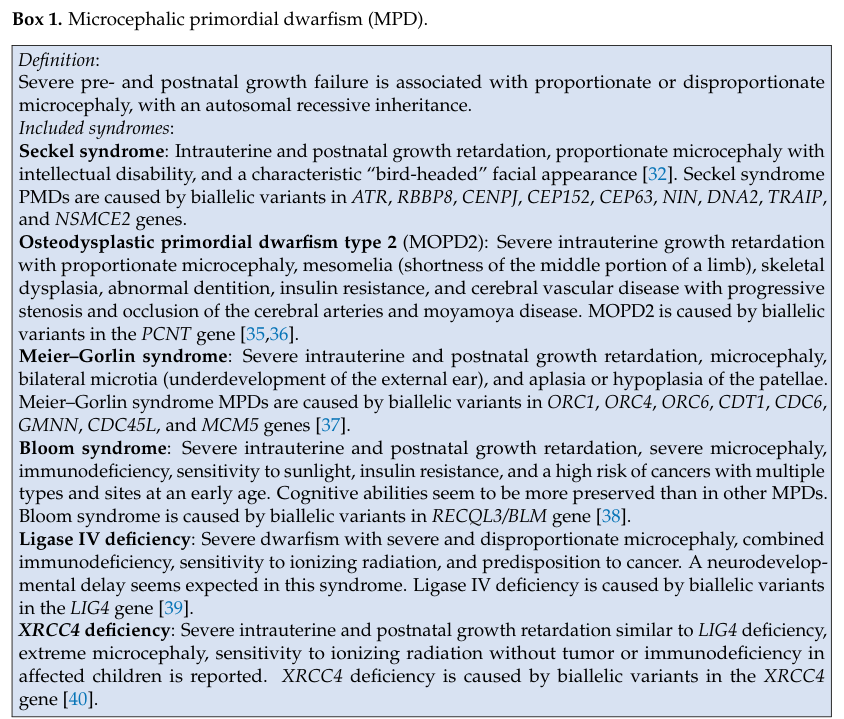

## Question

# Disease Characteristics Research Template

## Target Disease
- **Disease Name:** Autosomal Recessive Primary Microcephaly
- **MONDO ID:**  (if available)
- **Category:** Mendelian

## Research Objectives

Please provide a comprehensive research report on **Autosomal Recessive Primary Microcephaly** covering all of the
disease characteristics listed below. This report will be used to populate a disease knowledge
base entry. Be thorough and cite primary literature (PMID preferred) for all claims.

For each section, **suggested databases/resources** are listed. These are the first places
you should search for information on each topic.

---

### 1. Disease Information
> **Search first:** OMIM, Orphanet, ICD-10/ICD-11, MeSH, PubMed

- What is the disease? Provide a concise overview.
- What are the key identifiers? (OMIM, Orphanet, ICD-10/ICD-11, MeSH, Mondo)
- What are the common synonyms and alternative names?
- Is the information derived from individual patients (e.g., EHR) or aggregated disease-level resources?

### 2. Etiology

- **Disease Causal Factors**: What are the primary causes? (genetic, environmental, infectious, mechanistic)
- **Risk Factors**:
  > **Search first:** PubMed, Cochrane Library, UpToDate, clinical guidelines, ClinVar, ClinGen, GWAS Catalog, PheGenI, CTD, CDC, WHO, epidemiological databases
  - Genetic risk factors (causal variants, susceptibility loci, modifier genes)
  - Environmental risk factors (toxins, lifestyle, occupational exposures, age, sex, family history)
- **Protective Factors**:
  > **Search first:** PubMed, Cochrane Library, clinical trial databases, GWAS Catalog, gnomAD, WHO, CDC, nutrition databases
  - Genetic protective factors (protective variants, modifier alleles)
  - Environmental protective factors (diet, lifestyle, exposures that reduce risk)
- **Gene-Environment Interactions**: How do genetic and environmental factors interact to influence disease?
  > **Search first:** CTD, PubMed, PheGenI, GxE databases

### 3. Phenotypes
> **Search first:** HPO (Human Phenotype Ontology), OMIM, Orphanet, PubMed, clinicaltrials.gov, MedDRA, SNOMED CT, DECIPHER, LOINC

For each phenotype, provide:
- **Phenotype type**: symptoms, clinical signs, physical manifestations, behavioral changes, or laboratory abnormalities
  > For symptoms/signs: HPO, OMIM, Orphanet, PubMed
  > For behavioral changes: HPO, DSM, RDoC (Research Domain Criteria), PubMed
  > For laboratory abnormalities: LOINC, SNOMED CT, LabTests Online, PubMed
- **Phenotype characteristics**:
  > **Search first:** OMIM, Orphanet, HPO, PubMed
  - Age of symptom onset (neonatal, childhood, adult-onset, late-onset)
  - Symptom severity (mild, moderate, severe, variable)
  - Symptom progression (stable, progressive, episodic, fluctuating)
  - Frequency among affected individuals (percentage or qualitative)
- **Quality of life impact**: Effects on daily functioning and well-being (per-phenotype when possible)
  > **Search first:** EQ-5D database, SF-36, WHO QOL databases, PubMed
- Suggest HPO (Human Phenotype Ontology) terms for each phenotype

### 4. Genetic/Molecular Information

- **Causal Genes**: Gene mutations or chromosomal abnormalities responsible for disease (gene symbols, OMIM IDs)
  > **Search first:** OMIM, ClinVar, HGMD, Ensembl, NCBI Gene
- **Pathogenic Variants**:
  - Affected genes (gene symbols, HGNC IDs)
    > **Search first:** OMIM, NCBI Gene, Ensembl, HGNC, UniProt, GeneCards
  - Variant classification (pathogenic, likely pathogenic, VUS per ACMG/AMP guidelines)
    > **Search first:** ClinVar, ClinGen, ACMG/AMP guidelines, VarSome
  - Variant type/class (missense, frameshift, nonsense, splice-site, structural)
  - Allele frequency in population databases
    > **Search first:** gnomAD, 1000 Genomes, ExAC, TOPMed, dbSNP
  - Somatic vs germline origin
    > **Search first:** COSMIC (somatic), ClinVar, ICGC, TCGA
  - Functional consequences (loss of function, gain of function, dominant negative)
- **Modifier Genes**: Genes that modify disease severity or expression
- **Epigenetic Information**: DNA methylation, histone modifications, chromatin changes affecting disease
  > **Search first:** ENCODE, Roadmap Epigenomics, MethBase, DiseaseMeth
- **Chromosomal Abnormalities**: Large-scale genetic changes (aneuploidy, translocations, inversions)
  > **Search first:** DECIPHER, ClinVar, ECARUCA, UCSC Genome Browser

### 5. Environmental Information

- **Environmental Factors**: Non-genetic contributing factors (toxins, radiation, pollution, occupational exposure)
  > **Search first:** CTD (Comparative Toxicogenomics Database), TOXNET, PubMed, EPA databases
- **Lifestyle Factors**: Behavioral factors (smoking, diet, exercise, alcohol consumption)
  > **Search first:** CDC databases, WHO, PubMed, NHANES
- **Infectious Agents**: If applicable, pathogens causing or triggering disease (bacteria, viruses, fungi, parasites)
  > **Search first:** NCBI Taxonomy, ViPR, BV-BRC, MicrobeDB, GIDEON

### 6. Mechanism / Pathophysiology

- **Molecular Pathways**: Specific signaling cascades or biochemical pathways involved (Wnt, MAPK, mTOR, PI3K-AKT, etc.)
  > **Search first:** KEGG, Reactome, WikiPathways, PathBank, BioCyc
- **Cellular Processes**: Cell-level mechanisms (apoptosis, autophagy, cell cycle dysregulation, inflammation, etc.)
  > **Search first:** Gene Ontology (GO), Reactome, KEGG, PubMed
- **Protein Dysfunction**: How protein structure or function is altered (misfolding, aggregation, loss of function, gain of function)
  > **Search first:** UniProt, PDB (Protein Data Bank), InterPro, Pfam, AlphaFold
- **Metabolic Changes**: Alterations in metabolic processes (energy metabolism, lipid metabolism, amino acid metabolism)
  > **Search first:** KEGG, BioCyc, HMDB (Human Metabolome Database), BRENDA
- **Immune System Involvement**: Role of immune response (autoimmunity, immunodeficiency, chronic inflammation)
  > **Search first:** ImmPort, Immunome Database, IEDB, Gene Ontology
- **Tissue Damage Mechanisms**: How tissues/ are injured (oxidative stress, ischemia, fibrosis, necrosis)
  > **Search first:** PubMed, Gene Ontology, Reactome
- **Biochemical Abnormalities**: Specific molecular defects (enzyme deficiencies, receptor dysfunction, ion channel defects)
  > **Search first:** BRENDA, UniProt, KEGG, OMIM, PubMed
- **Epigenetic Changes**: DNA methylation, histone modifications affecting gene expression in disease
  > **Search first:** ENCODE, Roadmap Epigenomics, MethBase, DiseaseMeth
- **Molecular Profiling** (if available):
  - Transcriptomics/gene expression changes
    > **Search first:** GEO (Gene Expression Omnibus), ArrayExpress, GTEx, Human Cell Atlas, SRA
  - Proteomics findings
    > **Search first:** PRIDE, ProteomeXchange, Human Protein Atlas, STRING, BioGRID
  - Metabolomics signatures
    > **Search first:** MetaboLights, Metabolomics Workbench, HMDB, METLIN
  - Lipidomics alterations
    > **Search first:** LIPID MAPS, SwissLipids, LipidHome, Metabolomics Workbench
  - Genomic structural features
    > **Search first:** UCSC Genome Browser, Ensembl, NCBI, dbVar, DGV
- **Advanced Technologies** (if applicable):
  - Single-cell analysis findings (cell-type specific mechanisms, cellular heterogeneity)
    > **Search first:** Human Cell Atlas, Single Cell Portal, GEO, CELLxGENE
  - Spatial transcriptomics findings
    > **Search first:** GEO, Spatial Research, Vizgen, 10x Genomics data
  - Multi-omics integration results
    > **Search first:** TCGA, ICGC, cBioPortal, LinkedOmics, PubMed
  - Functional genomics screens (CRISPR, RNAi)
    > **Search first:** DepMap, GenomeRNAi, PubMed, BioGRID ORCS

For each mechanism, describe:
- The causal chain from initial trigger to clinical manifestation
- Which mechanisms are upstream vs downstream
- What cell types and biological processes are involved
- Suggest GO terms for biological processes and CL terms for cell types

### 7. Anatomical Structures Affected

- **Organ Level**:
  - Primary organs directly affected
  - Secondary organ involvement (complications, secondary effects)
  - Body systems involved (cardiovascular, nervous, digestive, respiratory, endocrine, etc.)
  > **Search first:** Uberon, FMA (Foundational Model of Anatomy), OMIM, HPO, ICD-11, MeSH, SNOMED CT
- **Tissue and Cell Level**:
  - Specific tissue types affected (epithelial, connective, muscle, nervous)
  - Specific cell populations targeted (with Cell Ontology terms)
  > **Search first:** Uberon, Human Protein Atlas, Cell Ontology, Human Cell Atlas, CellMarker, PanglaoDB
- **Subcellular Level**:
  - Cellular compartments involved (mitochondria, nucleus, ER, lysosomes) (with GO Cellular Component terms)
  > **Search first:** Gene Ontology (Cellular Component), UniProt, Human Protein Atlas
- **Localization**:
  - Specific anatomical sites (with UBERON terms)
    > **Search first:** FMA, Uberon, NeuroNames (for brain), SNOMED CT
  - Lateralization (unilateral, bilateral, asymmetric)
    > **Search first:** HPO, clinical literature, imaging databases

### 8. Temporal Development

- **Onset**:
  - Typical age of onset (congenital, pediatric, adult, geriatric)
  - Onset pattern (acute, subacute, chronic, insidious)
  > **Search first:** OMIM, Orphanet, HPO, PubMed
- **Progression**:
  - Disease stages (early, intermediate, advanced, end-stage)
    > **Search first:** Cancer Staging Manual (AJCC), WHO classifications, PubMed
  - Progression rate (rapid, slow, variable)
  - Disease course pattern (episodic, relapsing-remitting, progressive, stable)
  - Disease duration (self-limited, chronic lifelong)
  > **Search first:** Disease registries, longitudinal cohort databases, natural history studies, PubMed, Orphanet, OMIM
- **Patterns**:
  - Remission patterns (spontaneous, treatment-induced)
    > **Search first:** Clinical trial databases, disease registries, PubMed
  - Critical periods (time windows of vulnerability or opportunity for intervention)
    > **Search first:** PubMed, developmental biology databases, clinical guidelines

### 9. Inheritance and Population

- **Epidemiology**:
  - Prevalence (cases per 100,000 at given time)
  - Incidence (new cases per 100,000 per year)
  > **Search first:** Orphanet, CDC, WHO, GBD (Global Burden of Disease), national registries, SEER, disease registries
- **For Genetic Etiology**:
  - Inheritance pattern (AD, AR, X-linked, mitochondrial, multifactorial, polygenic)
    > **Search first:** OMIM, Orphanet, ClinVar, GTR (Genetic Testing Registry)
  - Penetrance (complete, incomplete, age-dependent)
    > **Search first:** ClinVar, OMIM, PubMed, ClinGen
  - Expressivity (variable, consistent)
    > **Search first:** OMIM, ClinVar, PubMed
  - Genetic anticipation (increasing severity in successive generations)
    > **Search first:** OMIM, PubMed (especially for repeat expansion disorders)
  - Germline mosaicism
    > **Search first:** ClinVar, OMIM, genetic counseling literature, PubMed
  - Founder effects (population-specific mutations)
    > **Search first:** gnomAD, population genetics databases, PubMed
  - Consanguinity role
    > **Search first:** OMIM, population studies, genetic counseling resources
  - Carrier frequency
    > **Search first:** gnomAD, carrier screening databases, GeneReviews, GTR
- **Population Demographics**:
  - Affected populations (ethnic or demographic groups with higher prevalence)
    > **Search first:** gnomAD, 1000 Genomes, PAGE Study, PubMed, population registries
  - Geographic distribution (endemic areas, regional variation)
    > **Search first:** WHO, CDC, GBD, Orphanet, geographic epidemiology databases
  - Geographic distribution of specific variants
  - Sex ratio (male:female)
    > **Search first:** Disease registries, OMIM, PubMed, epidemiological databases
  - Age distribution of affected individuals
    > **Search first:** CDC, disease registries, SEER, Orphanet

### 10. Diagnostics

- **Clinical Tests**:
  - Laboratory tests (blood, urine, tissue chemistry, specific enzyme assays)
    > **Search first:** LOINC, LabTests Online, PubMed
  - Biomarkers (proteins, metabolites, genetic markers, circulating biomarkers)
    > **Search first:** FDA Biomarker List, BEST (Biomarkers, EndpointS, and other Tools), PubMed
  - Imaging studies (X-ray, CT, MRI, PET, ultrasound)
    > **Search first:** RadLex, DICOM, Radiopaedia, imaging databases
  - Functional tests (pulmonary function, cardiac stress tests)
    > **Search first:** LOINC, clinical guidelines, PubMed
  - Electrophysiology (EEG, EMG, ECG, nerve conduction studies)
    > **Search first:** LOINC, clinical neurophysiology databases, PubMed
  - Biopsy findings (histopathology, immunohistochemistry)
    > **Search first:** SNOMED CT, College of American Pathologists resources, PubMed
  - Pathology findings (microscopic examination)
    > **Search first:** SNOMED CT, Digital Pathology databases, PubMed
- **Genetic Testing**:
  > **Search first:** GTR (Genetic Testing Registry), GeneReviews, ClinGen
  - Overview of recommended genetic testing approach
  - Whole genome sequencing (WGS) utility
    > **Search first:** GTR, ClinVar, GEL (Genomics England), gnomAD
  - Whole exome sequencing (WES) utility
    > **Search first:** GTR, ClinVar, OMIM, GeneMatcher
  - Gene panels (which panels, which genes)
    > **Search first:** GTR, ClinVar, laboratory-specific databases
  - Single gene testing
    > **Search first:** GTR, ClinVar, OMIM, GeneReviews
  - Chromosomal microarray (CMA)
    > **Search first:** DECIPHER, ClinVar, dbVar, ECARUCA
  - Karyotyping
    > **Search first:** Chromosome Abnormality Database, ClinVar, cytogenetics resources
  - FISH
    > **Search first:** ClinVar, cytogenetics databases, PubMed
  - Mitochondrial DNA testing
    > **Search first:** MITOMAP, MSeqDR, ClinVar, GTR
  - Repeat expansion testing
    > **Search first:** GTR, ClinVar, repeat expansion databases, PubMed
- **Omics-Based Diagnostics** (if applicable):
  - RNA sequencing / transcriptomics
    > **Search first:** GEO, ArrayExpress, GTEx, RNA-seq databases
  - Proteomics
    > **Search first:** PRIDE, ProteomeXchange, FDA Biomarker database
  - Metabolomics
    > **Search first:** MetaboLights, Metabolomics Workbench, HMDB
  - Epigenomics
    > **Search first:** GEO, ENCODE, Roadmap Epigenomics, MethBase
  - Liquid biopsy
    > **Search first:** COSMIC, ClinVar, liquid biopsy databases, PubMed
- **Clinical Criteria**:
  - Standardized diagnostic criteria (DSM, ICD, society guidelines)
    > **Search first:** DSM-5, ICD-11, clinical society guidelines, UpToDate
  - Differential diagnosis (other conditions to rule out, with distinguishing features)
    > **Search first:** DynaMed, UpToDate, clinical decision support systems
- **Screening**:
  - Screening methods for asymptomatic individuals (newborn screening, carrier screening, cascade screening)
    > **Search first:** ACMG recommendations, CDC newborn screening, GTR

### 11. Outcome/Prognosis

- **Survival and Mortality**:
  - Survival rate (5-year, 10-year, overall)
    > **Search first:** SEER, cancer registries, disease-specific registries, PubMed
  - Life expectancy (with and without treatment if applicable)
    > **Search first:** Orphanet, disease registries, actuarial databases, PubMed
  - Mortality rate
    > **Search first:** CDC, WHO, GBD, national mortality databases
  - Disease-specific mortality (deaths directly attributable to disease)
    > **Search first:** Disease registries, CDC Wonder, GBD, PubMed
- **Morbidity and Function**:
  - Morbidity (disease-related disability and health impacts)
    > **Search first:** GBD, WHO, disability databases, PubMed
  - Disability outcomes (long-term functional impairments)
    > **Search first:** ICF (International Classification of Functioning), disability registries
  - Quality of life measures (EQ-5D, SF-36, PROMIS, disease-specific tools)
    > **Search first:** EQ-5D database, SF-36, PROMIS, PubMed
- **Disease Course**:
  - Complications (secondary problems: infections, organ failure, etc.)
    > **Search first:** ICD codes, disease registries, clinical databases, PubMed
  - Recovery potential (likelihood and extent of recovery, with vs without treatment)
    > **Search first:** Natural history studies, rehabilitation databases, PubMed
- **Prediction**:
  - Prognostic factors (age, disease severity, biomarkers, treatment response)
    > **Search first:** Prognostic models databases, clinical calculators, PubMed
  - Prognostic biomarkers (molecular markers predicting disease course)
    > **Search first:** FDA Biomarker database, PubMed, cancer prognostic databases

### 12. Treatment

- **Pharmacotherapy**:
  - Pharmacological treatments (drug names, drug classes, mechanisms of action)
    > **Search first:** DrugBank, RxNorm, ATC classification, DailyMed, FDA databases
  - Pharmacogenomics (how genetic variants affect drug metabolism, efficacy, toxicity)
    > **Search first:** PharmGKB, CPIC (Clinical Pharmacogenetics), FDA Table of PGx Biomarkers
- **Advanced Therapeutics**:
  - Gene therapy (viral vectors, CRISPR, gene replacement, gene editing)
    > **Search first:** ClinicalTrials.gov, FDA gene therapy database, ASGCT resources
  - Cell therapy (stem cell transplant, CAR-T, cellular therapeutics)
    > **Search first:** ClinicalTrials.gov, FDA cell therapy database, FACT standards
  - RNA-based therapies (ASOs, siRNA, mRNA therapies)
    > **Search first:** ClinicalTrials.gov, FDA approvals, PubMed
  - Targeted therapies (treatments directed at specific molecular targets)
    > **Search first:** My Cancer Genome, OncoKB, ClinicalTrials.gov, FDA approvals
  - Immunotherapies (checkpoint inhibitors, monoclonal antibodies)
    > **Search first:** Cancer Immunotherapy Database, FDA approvals, ClinicalTrials.gov
- **Surgical and Interventional**:
  - Surgical interventions (types of surgery, timing, outcomes)
    > **Search first:** CPT codes, surgical registries, clinical guidelines, PubMed
- **Supportive and Rehabilitative**:
  - Supportive care (symptom management, pain control, nutrition)
    > **Search first:** Clinical guidelines, Cochrane Library, PubMed
  - Rehabilitation (physical therapy, occupational therapy, speech therapy)
    > **Search first:** Rehabilitation medicine databases, clinical guidelines, PubMed
- **Experimental**:
  - Experimental treatments in clinical trials (with NCT identifiers if available)
    > **Search first:** ClinicalTrials.gov, EU Clinical Trials Register, WHO ICTRP
- **Treatment Outcomes**:
  - Treatment response rates
    > **Search first:** Clinical trial databases, FDA reviews, systematic reviews, PubMed
  - Side effects and adverse events
    > **Search first:** FDA Adverse Event Reporting System (FAERS), MedWatch, PubMed
- **Treatment Strategy**:
  - Treatment algorithms (clinical pathways, decision trees)
    > **Search first:** Clinical practice guidelines, NCCN Guidelines, UpToDate
  - Combination therapies
    > **Search first:** ClinicalTrials.gov, treatment guidelines, PubMed
  - Personalized medicine approaches (genotype-guided treatment)
    > **Search first:** My Cancer Genome, CIViC, PharmGKB, precision medicine databases

For each treatment, suggest MAXO (Medical Action Ontology) terms where applicable.

### 13. Prevention

- **Prevention Levels**:
  - Primary prevention (preventing disease occurrence: vaccination, risk factor modification)
    > **Search first:** CDC, WHO, USPSTF recommendations, Cochrane Library
  - Secondary prevention (early detection and treatment: screening programs, early intervention)
    > **Search first:** USPSTF, CDC screening guidelines, WHO
  - Tertiary prevention (preventing complications in those with disease)
    > **Search first:** Clinical guidelines, disease management protocols, PubMed
- **Immunization**: Vaccine strategies (if applicable)
  > **Search first:** CDC vaccine schedules, WHO immunization, FDA vaccine database
- **Screening and Early Detection**:
  - Screening programs (population-based: newborn screening, cancer screening)
    > **Search first:** CDC screening programs, USPSTF, cancer screening databases
  - Genetic screening (carrier screening, preimplantation genetic diagnosis, prenatal testing)
    > **Search first:** ACMG recommendations, ACOG guidelines, GTR
  - Risk stratification (identifying high-risk individuals for targeted prevention)
    > **Search first:** Risk prediction models, clinical calculators, PubMed
- **Behavioral Interventions**: Lifestyle modifications to reduce risk
  > **Search first:** CDC, WHO, behavioral intervention databases, Cochrane Library
- **Counseling**: Genetic counseling (risk assessment, family planning guidance)
  > **Search first:** NSGC resources, ACMG guidelines, GeneReviews
- **Public Health**:
  - Public health interventions (sanitation, vector control, health education)
    > **Search first:** CDC, WHO, public health databases, PubMed
  - Environmental interventions (reducing environmental risk factors)
    > **Search first:** EPA databases, WHO environmental health, PubMed
- **Prophylaxis**: Preventive medications or procedures
  > **Search first:** Clinical guidelines, FDA approvals, PubMed

### 14. Other Species / Natural Disease

- **Taxonomy**: Species affected (with NCBI Taxon identifiers)
  > **Search first:** NCBI Taxonomy
- **Breed**: Specific breeds affected (with VBO identifiers if applicable)
  > **Search first:** VBO (Vertebrate Breed Ontology)
- **Gene**: Orthologous genes in other species (with NCBI Gene IDs)
  > **Search first:** NCBI Gene
- **Natural Disease**:
  - Naturally occurring disease in other species (companion animals, wildlife)
    > **Search first:** OMIA (Online Mendelian Inheritance in Animals), VetCompass, PubMed
  - Veterinary relevance and importance in animal health
    > **Search first:** OMIA, veterinary databases, PubMed
- **Comparative Biology**:
  - Comparative pathology (similarities and differences across species)
    > **Search first:** OMIA, comparative pathology databases, PubMed
  - Evolutionary conservation of disease mechanisms
    > **Search first:** HomoloGene, OrthoMCL, Alliance of Genome Resources
- **Transmission** (if applicable):
  - Zoonotic potential
    > **Search first:** CDC zoonotic diseases, WHO zoonoses, GIDEON
  - Cross-species susceptibility
    > **Search first:** NCBI Taxonomy, veterinary databases, PubMed

### 15. Model Organisms

- **Model Types**:
  - Model organism type (mammalian, invertebrate, cellular, in vitro)
    > **Search first:** Alliance of Genome Resources, model organism databases
  - Specific model systems (mouse, rat, zebrafish, Drosophila, C. elegans, yeast, cell lines, organoids, iPSCs)
    > **Search first:** MGI, RGD, ZFIN, FlyBase, WormBase, SGD, ATCC, Cellosaurus
  - Induced models (drug treatment, surgical intervention, environmental manipulation)
    > **Search first:** MGI, model organism databases, PubMed
- **Genetic Models**:
  - Types available (knockout, knock-in, transgenic, conditional, humanized)
    > **Search first:** MGI, IMPC, KOMP, EuMMCR, IMSR
- **Model Characteristics**:
  - Phenotype recapitulation (how well model reproduces human disease features)
    > **Search first:** Model organism databases, comparative studies, PubMed
  - Model limitations (aspects of human disease not captured)
    > **Search first:** Model organism databases, PubMed, review articles
- **Applications**:
  - Research applications (what aspects of disease can be studied)
    > **Search first:** Model organism databases, PubMed
- **Resources**:
  - Model databases
    > **Search first:** MGI, RGD, ZFIN, FlyBase, WormBase, IMSR, EMMA, MMRRC

---

## Citation Requirements

- Cite primary literature (PMID preferred) for all mechanistic and clinical claims
- Prioritize recent reviews and landmark papers
- Include direct quotes from abstracts where possible to support key statements
- Distinguish evidence source types: human clinical, model organism, in vitro, computational

## Output Format

Structure your response as a comprehensive narrative organized by the sections above.
For each section, provide:
- Factual content with specific details (numbers, percentages, gene names, variant nomenclature)
- Ontology term suggestions (HPO, GO, CL, UBERON, CHEBI, MAXO, MONDO) where applicable
- Evidence citations with PMIDs
- Direct quotes from abstracts to support key claims
- Clear indication when information is not available or not applicable for this disease

This report will be used to populate a disease knowledge base entry with:
- Pathophysiology descriptions with causal chains
- Gene/protein annotations (HGNC, GO terms)
- Phenotype associations (HP terms) with frequencies
- Cell type involvement (CL terms)
- Anatomical locations (UBERON terms)
- Chemical entities (CHEBI terms)
- Treatment annotations (MAXO terms)
- Evidence items with PMIDs and exact abstract quotes
- Epidemiology, prognosis, diagnostic, and prevention information
- Animal model descriptions with phenotype recapitulation details

## Output

Question: You are an expert researcher providing comprehensive, well-cited information.

Provide detailed information focusing on:
1. Key concepts and definitions with current understanding
2. Recent developments and latest research (prioritize 2023-2024 sources)
3. Current applications and real-world implementations
4. Expert opinions and analysis from authoritative sources
5. Relevant statistics and data from recent studies

Format as a comprehensive research report with proper citations. Include URLs and publication dates where available.
Always prioritize recent, authoritative sources and provide specific citations for all major claims.

# Disease Characteristics Research Template

## Target Disease
- **Disease Name:** Autosomal Recessive Primary Microcephaly
- **MONDO ID:**  (if available)
- **Category:** Mendelian

## Research Objectives

Please provide a comprehensive research report on **Autosomal Recessive Primary Microcephaly** covering all of the
disease characteristics listed below. This report will be used to populate a disease knowledge
base entry. Be thorough and cite primary literature (PMID preferred) for all claims.

For each section, **suggested databases/resources** are listed. These are the first places
you should search for information on each topic.

---

### 1. Disease Information
> **Search first:** OMIM, Orphanet, ICD-10/ICD-11, MeSH, PubMed

- What is the disease? Provide a concise overview.
- What are the key identifiers? (OMIM, Orphanet, ICD-10/ICD-11, MeSH, Mondo)
- What are the common synonyms and alternative names?
- Is the information derived from individual patients (e.g., EHR) or aggregated disease-level resources?

### 2. Etiology

- **Disease Causal Factors**: What are the primary causes? (genetic, environmental, infectious, mechanistic)
- **Risk Factors**:
  > **Search first:** PubMed, Cochrane Library, UpToDate, clinical guidelines, ClinVar, ClinGen, GWAS Catalog, PheGenI, CTD, CDC, WHO, epidemiological databases
  - Genetic risk factors (causal variants, susceptibility loci, modifier genes)
  - Environmental risk factors (toxins, lifestyle, occupational exposures, age, sex, family history)
- **Protective Factors**:
  > **Search first:** PubMed, Cochrane Library, clinical trial databases, GWAS Catalog, gnomAD, WHO, CDC, nutrition databases
  - Genetic protective factors (protective variants, modifier alleles)
  - Environmental protective factors (diet, lifestyle, exposures that reduce risk)
- **Gene-Environment Interactions**: How do genetic and environmental factors interact to influence disease?
  > **Search first:** CTD, PubMed, PheGenI, GxE databases

### 3. Phenotypes
> **Search first:** HPO (Human Phenotype Ontology), OMIM, Orphanet, PubMed, clinicaltrials.gov, MedDRA, SNOMED CT, DECIPHER, LOINC

For each phenotype, provide:
- **Phenotype type**: symptoms, clinical signs, physical manifestations, behavioral changes, or laboratory abnormalities
  > For symptoms/signs: HPO, OMIM, Orphanet, PubMed
  > For behavioral changes: HPO, DSM, RDoC (Research Domain Criteria), PubMed
  > For laboratory abnormalities: LOINC, SNOMED CT, LabTests Online, PubMed
- **Phenotype characteristics**:
  > **Search first:** OMIM, Orphanet, HPO, PubMed
  - Age of symptom onset (neonatal, childhood, adult-onset, late-onset)
  - Symptom severity (mild, moderate, severe, variable)
  - Symptom progression (stable, progressive, episodic, fluctuating)
  - Frequency among affected individuals (percentage or qualitative)
- **Quality of life impact**: Effects on daily functioning and well-being (per-phenotype when possible)
  > **Search first:** EQ-5D database, SF-36, WHO QOL databases, PubMed
- Suggest HPO (Human Phenotype Ontology) terms for each phenotype

### 4. Genetic/Molecular Information

- **Causal Genes**: Gene mutations or chromosomal abnormalities responsible for disease (gene symbols, OMIM IDs)
  > **Search first:** OMIM, ClinVar, HGMD, Ensembl, NCBI Gene
- **Pathogenic Variants**:
  - Affected genes (gene symbols, HGNC IDs)
    > **Search first:** OMIM, NCBI Gene, Ensembl, HGNC, UniProt, GeneCards
  - Variant classification (pathogenic, likely pathogenic, VUS per ACMG/AMP guidelines)
    > **Search first:** ClinVar, ClinGen, ACMG/AMP guidelines, VarSome
  - Variant type/class (missense, frameshift, nonsense, splice-site, structural)
  - Allele frequency in population databases
    > **Search first:** gnomAD, 1000 Genomes, ExAC, TOPMed, dbSNP
  - Somatic vs germline origin
    > **Search first:** COSMIC (somatic), ClinVar, ICGC, TCGA
  - Functional consequences (loss of function, gain of function, dominant negative)
- **Modifier Genes**: Genes that modify disease severity or expression
- **Epigenetic Information**: DNA methylation, histone modifications, chromatin changes affecting disease
  > **Search first:** ENCODE, Roadmap Epigenomics, MethBase, DiseaseMeth
- **Chromosomal Abnormalities**: Large-scale genetic changes (aneuploidy, translocations, inversions)
  > **Search first:** DECIPHER, ClinVar, ECARUCA, UCSC Genome Browser

### 5. Environmental Information

- **Environmental Factors**: Non-genetic contributing factors (toxins, radiation, pollution, occupational exposure)
  > **Search first:** CTD (Comparative Toxicogenomics Database), TOXNET, PubMed, EPA databases
- **Lifestyle Factors**: Behavioral factors (smoking, diet, exercise, alcohol consumption)
  > **Search first:** CDC databases, WHO, PubMed, NHANES
- **Infectious Agents**: If applicable, pathogens causing or triggering disease (bacteria, viruses, fungi, parasites)
  > **Search first:** NCBI Taxonomy, ViPR, BV-BRC, MicrobeDB, GIDEON

### 6. Mechanism / Pathophysiology

- **Molecular Pathways**: Specific signaling cascades or biochemical pathways involved (Wnt, MAPK, mTOR, PI3K-AKT, etc.)
  > **Search first:** KEGG, Reactome, WikiPathways, PathBank, BioCyc
- **Cellular Processes**: Cell-level mechanisms (apoptosis, autophagy, cell cycle dysregulation, inflammation, etc.)
  > **Search first:** Gene Ontology (GO), Reactome, KEGG, PubMed
- **Protein Dysfunction**: How protein structure or function is altered (misfolding, aggregation, loss of function, gain of function)
  > **Search first:** UniProt, PDB (Protein Data Bank), InterPro, Pfam, AlphaFold
- **Metabolic Changes**: Alterations in metabolic processes (energy metabolism, lipid metabolism, amino acid metabolism)
  > **Search first:** KEGG, BioCyc, HMDB (Human Metabolome Database), BRENDA
- **Immune System Involvement**: Role of immune response (autoimmunity, immunodeficiency, chronic inflammation)
  > **Search first:** ImmPort, Immunome Database, IEDB, Gene Ontology
- **Tissue Damage Mechanisms**: How tissues/ are injured (oxidative stress, ischemia, fibrosis, necrosis)
  > **Search first:** PubMed, Gene Ontology, Reactome
- **Biochemical Abnormalities**: Specific molecular defects (enzyme deficiencies, receptor dysfunction, ion channel defects)
  > **Search first:** BRENDA, UniProt, KEGG, OMIM, PubMed
- **Epigenetic Changes**: DNA methylation, histone modifications affecting gene expression in disease
  > **Search first:** ENCODE, Roadmap Epigenomics, MethBase, DiseaseMeth
- **Molecular Profiling** (if available):
  - Transcriptomics/gene expression changes
    > **Search first:** GEO (Gene Expression Omnibus), ArrayExpress, GTEx, Human Cell Atlas, SRA
  - Proteomics findings
    > **Search first:** PRIDE, ProteomeXchange, Human Protein Atlas, STRING, BioGRID
  - Metabolomics signatures
    > **Search first:** MetaboLights, Metabolomics Workbench, HMDB, METLIN
  - Lipidomics alterations
    > **Search first:** LIPID MAPS, SwissLipids, LipidHome, Metabolomics Workbench
  - Genomic structural features
    > **Search first:** UCSC Genome Browser, Ensembl, NCBI, dbVar, DGV
- **Advanced Technologies** (if applicable):
  - Single-cell analysis findings (cell-type specific mechanisms, cellular heterogeneity)
    > **Search first:** Human Cell Atlas, Single Cell Portal, GEO, CELLxGENE
  - Spatial transcriptomics findings
    > **Search first:** GEO, Spatial Research, Vizgen, 10x Genomics data
  - Multi-omics integration results
    > **Search first:** TCGA, ICGC, cBioPortal, LinkedOmics, PubMed
  - Functional genomics screens (CRISPR, RNAi)
    > **Search first:** DepMap, GenomeRNAi, PubMed, BioGRID ORCS

For each mechanism, describe:
- The causal chain from initial trigger to clinical manifestation
- Which mechanisms are upstream vs downstream
- What cell types and biological processes are involved
- Suggest GO terms for biological processes and CL terms for cell types

### 7. Anatomical Structures Affected

- **Organ Level**:
  - Primary organs directly affected
  - Secondary organ involvement (complications, secondary effects)
  - Body systems involved (cardiovascular, nervous, digestive, respiratory, endocrine, etc.)
  > **Search first:** Uberon, FMA (Foundational Model of Anatomy), OMIM, HPO, ICD-11, MeSH, SNOMED CT
- **Tissue and Cell Level**:
  - Specific tissue types affected (epithelial, connective, muscle, nervous)
  - Specific cell populations targeted (with Cell Ontology terms)
  > **Search first:** Uberon, Human Protein Atlas, Cell Ontology, Human Cell Atlas, CellMarker, PanglaoDB
- **Subcellular Level**:
  - Cellular compartments involved (mitochondria, nucleus, ER, lysosomes) (with GO Cellular Component terms)
  > **Search first:** Gene Ontology (Cellular Component), UniProt, Human Protein Atlas
- **Localization**:
  - Specific anatomical sites (with UBERON terms)
    > **Search first:** FMA, Uberon, NeuroNames (for brain), SNOMED CT
  - Lateralization (unilateral, bilateral, asymmetric)
    > **Search first:** HPO, clinical literature, imaging databases

### 8. Temporal Development

- **Onset**:
  - Typical age of onset (congenital, pediatric, adult, geriatric)
  - Onset pattern (acute, subacute, chronic, insidious)
  > **Search first:** OMIM, Orphanet, HPO, PubMed
- **Progression**:
  - Disease stages (early, intermediate, advanced, end-stage)
    > **Search first:** Cancer Staging Manual (AJCC), WHO classifications, PubMed
  - Progression rate (rapid, slow, variable)
  - Disease course pattern (episodic, relapsing-remitting, progressive, stable)
  - Disease duration (self-limited, chronic lifelong)
  > **Search first:** Disease registries, longitudinal cohort databases, natural history studies, PubMed, Orphanet, OMIM
- **Patterns**:
  - Remission patterns (spontaneous, treatment-induced)
    > **Search first:** Clinical trial databases, disease registries, PubMed
  - Critical periods (time windows of vulnerability or opportunity for intervention)
    > **Search first:** PubMed, developmental biology databases, clinical guidelines

### 9. Inheritance and Population

- **Epidemiology**:
  - Prevalence (cases per 100,000 at given time)
  - Incidence (new cases per 100,000 per year)
  > **Search first:** Orphanet, CDC, WHO, GBD (Global Burden of Disease), national registries, SEER, disease registries
- **For Genetic Etiology**:
  - Inheritance pattern (AD, AR, X-linked, mitochondrial, multifactorial, polygenic)
    > **Search first:** OMIM, Orphanet, ClinVar, GTR (Genetic Testing Registry)
  - Penetrance (complete, incomplete, age-dependent)
    > **Search first:** ClinVar, OMIM, PubMed, ClinGen
  - Expressivity (variable, consistent)
    > **Search first:** OMIM, ClinVar, PubMed
  - Genetic anticipation (increasing severity in successive generations)
    > **Search first:** OMIM, PubMed (especially for repeat expansion disorders)
  - Germline mosaicism
    > **Search first:** ClinVar, OMIM, genetic counseling literature, PubMed
  - Founder effects (population-specific mutations)
    > **Search first:** gnomAD, population genetics databases, PubMed
  - Consanguinity role
    > **Search first:** OMIM, population studies, genetic counseling resources
  - Carrier frequency
    > **Search first:** gnomAD, carrier screening databases, GeneReviews, GTR
- **Population Demographics**:
  - Affected populations (ethnic or demographic groups with higher prevalence)
    > **Search first:** gnomAD, 1000 Genomes, PAGE Study, PubMed, population registries
  - Geographic distribution (endemic areas, regional variation)
    > **Search first:** WHO, CDC, GBD, Orphanet, geographic epidemiology databases
  - Geographic distribution of specific variants
  - Sex ratio (male:female)
    > **Search first:** Disease registries, OMIM, PubMed, epidemiological databases
  - Age distribution of affected individuals
    > **Search first:** CDC, disease registries, SEER, Orphanet

### 10. Diagnostics

- **Clinical Tests**:
  - Laboratory tests (blood, urine, tissue chemistry, specific enzyme assays)
    > **Search first:** LOINC, LabTests Online, PubMed
  - Biomarkers (proteins, metabolites, genetic markers, circulating biomarkers)
    > **Search first:** FDA Biomarker List, BEST (Biomarkers, EndpointS, and other Tools), PubMed
  - Imaging studies (X-ray, CT, MRI, PET, ultrasound)
    > **Search first:** RadLex, DICOM, Radiopaedia, imaging databases
  - Functional tests (pulmonary function, cardiac stress tests)
    > **Search first:** LOINC, clinical guidelines, PubMed
  - Electrophysiology (EEG, EMG, ECG, nerve conduction studies)
    > **Search first:** LOINC, clinical neurophysiology databases, PubMed
  - Biopsy findings (histopathology, immunohistochemistry)
    > **Search first:** SNOMED CT, College of American Pathologists resources, PubMed
  - Pathology findings (microscopic examination)
    > **Search first:** SNOMED CT, Digital Pathology databases, PubMed
- **Genetic Testing**:
  > **Search first:** GTR (Genetic Testing Registry), GeneReviews, ClinGen
  - Overview of recommended genetic testing approach
  - Whole genome sequencing (WGS) utility
    > **Search first:** GTR, ClinVar, GEL (Genomics England), gnomAD
  - Whole exome sequencing (WES) utility
    > **Search first:** GTR, ClinVar, OMIM, GeneMatcher
  - Gene panels (which panels, which genes)
    > **Search first:** GTR, ClinVar, laboratory-specific databases
  - Single gene testing
    > **Search first:** GTR, ClinVar, OMIM, GeneReviews
  - Chromosomal microarray (CMA)
    > **Search first:** DECIPHER, ClinVar, dbVar, ECARUCA
  - Karyotyping
    > **Search first:** Chromosome Abnormality Database, ClinVar, cytogenetics resources
  - FISH
    > **Search first:** ClinVar, cytogenetics databases, PubMed
  - Mitochondrial DNA testing
    > **Search first:** MITOMAP, MSeqDR, ClinVar, GTR
  - Repeat expansion testing
    > **Search first:** GTR, ClinVar, repeat expansion databases, PubMed
- **Omics-Based Diagnostics** (if applicable):
  - RNA sequencing / transcriptomics
    > **Search first:** GEO, ArrayExpress, GTEx, RNA-seq databases
  - Proteomics
    > **Search first:** PRIDE, ProteomeXchange, FDA Biomarker database
  - Metabolomics
    > **Search first:** MetaboLights, Metabolomics Workbench, HMDB
  - Epigenomics
    > **Search first:** GEO, ENCODE, Roadmap Epigenomics, MethBase
  - Liquid biopsy
    > **Search first:** COSMIC, ClinVar, liquid biopsy databases, PubMed
- **Clinical Criteria**:
  - Standardized diagnostic criteria (DSM, ICD, society guidelines)
    > **Search first:** DSM-5, ICD-11, clinical society guidelines, UpToDate
  - Differential diagnosis (other conditions to rule out, with distinguishing features)
    > **Search first:** DynaMed, UpToDate, clinical decision support systems
- **Screening**:
  - Screening methods for asymptomatic individuals (newborn screening, carrier screening, cascade screening)
    > **Search first:** ACMG recommendations, CDC newborn screening, GTR

### 11. Outcome/Prognosis

- **Survival and Mortality**:
  - Survival rate (5-year, 10-year, overall)
    > **Search first:** SEER, cancer registries, disease-specific registries, PubMed
  - Life expectancy (with and without treatment if applicable)
    > **Search first:** Orphanet, disease registries, actuarial databases, PubMed
  - Mortality rate
    > **Search first:** CDC, WHO, GBD, national mortality databases
  - Disease-specific mortality (deaths directly attributable to disease)
    > **Search first:** Disease registries, CDC Wonder, GBD, PubMed
- **Morbidity and Function**:
  - Morbidity (disease-related disability and health impacts)
    > **Search first:** GBD, WHO, disability databases, PubMed
  - Disability outcomes (long-term functional impairments)
    > **Search first:** ICF (International Classification of Functioning), disability registries
  - Quality of life measures (EQ-5D, SF-36, PROMIS, disease-specific tools)
    > **Search first:** EQ-5D database, SF-36, PROMIS, PubMed
- **Disease Course**:
  - Complications (secondary problems: infections, organ failure, etc.)
    > **Search first:** ICD codes, disease registries, clinical databases, PubMed
  - Recovery potential (likelihood and extent of recovery, with vs without treatment)
    > **Search first:** Natural history studies, rehabilitation databases, PubMed
- **Prediction**:
  - Prognostic factors (age, disease severity, biomarkers, treatment response)
    > **Search first:** Prognostic models databases, clinical calculators, PubMed
  - Prognostic biomarkers (molecular markers predicting disease course)
    > **Search first:** FDA Biomarker database, PubMed, cancer prognostic databases

### 12. Treatment

- **Pharmacotherapy**:
  - Pharmacological treatments (drug names, drug classes, mechanisms of action)
    > **Search first:** DrugBank, RxNorm, ATC classification, DailyMed, FDA databases
  - Pharmacogenomics (how genetic variants affect drug metabolism, efficacy, toxicity)
    > **Search first:** PharmGKB, CPIC (Clinical Pharmacogenetics), FDA Table of PGx Biomarkers
- **Advanced Therapeutics**:
  - Gene therapy (viral vectors, CRISPR, gene replacement, gene editing)
    > **Search first:** ClinicalTrials.gov, FDA gene therapy database, ASGCT resources
  - Cell therapy (stem cell transplant, CAR-T, cellular therapeutics)
    > **Search first:** ClinicalTrials.gov, FDA cell therapy database, FACT standards
  - RNA-based therapies (ASOs, siRNA, mRNA therapies)
    > **Search first:** ClinicalTrials.gov, FDA approvals, PubMed
  - Targeted therapies (treatments directed at specific molecular targets)
    > **Search first:** My Cancer Genome, OncoKB, ClinicalTrials.gov, FDA approvals
  - Immunotherapies (checkpoint inhibitors, monoclonal antibodies)
    > **Search first:** Cancer Immunotherapy Database, FDA approvals, ClinicalTrials.gov
- **Surgical and Interventional**:
  - Surgical interventions (types of surgery, timing, outcomes)
    > **Search first:** CPT codes, surgical registries, clinical guidelines, PubMed
- **Supportive and Rehabilitative**:
  - Supportive care (symptom management, pain control, nutrition)
    > **Search first:** Clinical guidelines, Cochrane Library, PubMed
  - Rehabilitation (physical therapy, occupational therapy, speech therapy)
    > **Search first:** Rehabilitation medicine databases, clinical guidelines, PubMed
- **Experimental**:
  - Experimental treatments in clinical trials (with NCT identifiers if available)
    > **Search first:** ClinicalTrials.gov, EU Clinical Trials Register, WHO ICTRP
- **Treatment Outcomes**:
  - Treatment response rates
    > **Search first:** Clinical trial databases, FDA reviews, systematic reviews, PubMed
  - Side effects and adverse events
    > **Search first:** FDA Adverse Event Reporting System (FAERS), MedWatch, PubMed
- **Treatment Strategy**:
  - Treatment algorithms (clinical pathways, decision trees)
    > **Search first:** Clinical practice guidelines, NCCN Guidelines, UpToDate
  - Combination therapies
    > **Search first:** ClinicalTrials.gov, treatment guidelines, PubMed
  - Personalized medicine approaches (genotype-guided treatment)
    > **Search first:** My Cancer Genome, CIViC, PharmGKB, precision medicine databases

For each treatment, suggest MAXO (Medical Action Ontology) terms where applicable.

### 13. Prevention

- **Prevention Levels**:
  - Primary prevention (preventing disease occurrence: vaccination, risk factor modification)
    > **Search first:** CDC, WHO, USPSTF recommendations, Cochrane Library
  - Secondary prevention (early detection and treatment: screening programs, early intervention)
    > **Search first:** USPSTF, CDC screening guidelines, WHO
  - Tertiary prevention (preventing complications in those with disease)
    > **Search first:** Clinical guidelines, disease management protocols, PubMed
- **Immunization**: Vaccine strategies (if applicable)
  > **Search first:** CDC vaccine schedules, WHO immunization, FDA vaccine database
- **Screening and Early Detection**:
  - Screening programs (population-based: newborn screening, cancer screening)
    > **Search first:** CDC screening programs, USPSTF, cancer screening databases
  - Genetic screening (carrier screening, preimplantation genetic diagnosis, prenatal testing)
    > **Search first:** ACMG recommendations, ACOG guidelines, GTR
  - Risk stratification (identifying high-risk individuals for targeted prevention)
    > **Search first:** Risk prediction models, clinical calculators, PubMed
- **Behavioral Interventions**: Lifestyle modifications to reduce risk
  > **Search first:** CDC, WHO, behavioral intervention databases, Cochrane Library
- **Counseling**: Genetic counseling (risk assessment, family planning guidance)
  > **Search first:** NSGC resources, ACMG guidelines, GeneReviews
- **Public Health**:
  - Public health interventions (sanitation, vector control, health education)
    > **Search first:** CDC, WHO, public health databases, PubMed
  - Environmental interventions (reducing environmental risk factors)
    > **Search first:** EPA databases, WHO environmental health, PubMed
- **Prophylaxis**: Preventive medications or procedures
  > **Search first:** Clinical guidelines, FDA approvals, PubMed

### 14. Other Species / Natural Disease

- **Taxonomy**: Species affected (with NCBI Taxon identifiers)
  > **Search first:** NCBI Taxonomy
- **Breed**: Specific breeds affected (with VBO identifiers if applicable)
  > **Search first:** VBO (Vertebrate Breed Ontology)
- **Gene**: Orthologous genes in other species (with NCBI Gene IDs)
  > **Search first:** NCBI Gene
- **Natural Disease**:
  - Naturally occurring disease in other species (companion animals, wildlife)
    > **Search first:** OMIA (Online Mendelian Inheritance in Animals), VetCompass, PubMed
  - Veterinary relevance and importance in animal health
    > **Search first:** OMIA, veterinary databases, PubMed
- **Comparative Biology**:
  - Comparative pathology (similarities and differences across species)
    > **Search first:** OMIA, comparative pathology databases, PubMed
  - Evolutionary conservation of disease mechanisms
    > **Search first:** HomoloGene, OrthoMCL, Alliance of Genome Resources
- **Transmission** (if applicable):
  - Zoonotic potential
    > **Search first:** CDC zoonotic diseases, WHO zoonoses, GIDEON
  - Cross-species susceptibility
    > **Search first:** NCBI Taxonomy, veterinary databases, PubMed

### 15. Model Organisms

- **Model Types**:
  - Model organism type (mammalian, invertebrate, cellular, in vitro)
    > **Search first:** Alliance of Genome Resources, model organism databases
  - Specific model systems (mouse, rat, zebrafish, Drosophila, C. elegans, yeast, cell lines, organoids, iPSCs)
    > **Search first:** MGI, RGD, ZFIN, FlyBase, WormBase, SGD, ATCC, Cellosaurus
  - Induced models (drug treatment, surgical intervention, environmental manipulation)
    > **Search first:** MGI, model organism databases, PubMed
- **Genetic Models**:
  - Types available (knockout, knock-in, transgenic, conditional, humanized)
    > **Search first:** MGI, IMPC, KOMP, EuMMCR, IMSR
- **Model Characteristics**:
  - Phenotype recapitulation (how well model reproduces human disease features)
    > **Search first:** Model organism databases, comparative studies, PubMed
  - Model limitations (aspects of human disease not captured)
    > **Search first:** Model organism databases, PubMed, review articles
- **Applications**:
  - Research applications (what aspects of disease can be studied)
    > **Search first:** Model organism databases, PubMed
- **Resources**:
  - Model databases
    > **Search first:** MGI, RGD, ZFIN, FlyBase, WormBase, IMSR, EMMA, MMRRC

---

## Citation Requirements

- Cite primary literature (PMID preferred) for all mechanistic and clinical claims
- Prioritize recent reviews and landmark papers
- Include direct quotes from abstracts where possible to support key statements
- Distinguish evidence source types: human clinical, model organism, in vitro, computational

## Output Format

Structure your response as a comprehensive narrative organized by the sections above.
For each section, provide:
- Factual content with specific details (numbers, percentages, gene names, variant nomenclature)
- Ontology term suggestions (HPO, GO, CL, UBERON, CHEBI, MAXO, MONDO) where applicable
- Evidence citations with PMIDs
- Direct quotes from abstracts to support key claims
- Clear indication when information is not available or not applicable for this disease

This report will be used to populate a disease knowledge base entry with:
- Pathophysiology descriptions with causal chains
- Gene/protein annotations (HGNC, GO terms)
- Phenotype associations (HP terms) with frequencies
- Cell type involvement (CL terms)
- Anatomical locations (UBERON terms)
- Chemical entities (CHEBI terms)
- Treatment annotations (MAXO terms)
- Evidence items with PMIDs and exact abstract quotes
- Epidemiology, prognosis, diagnostic, and prevention information
- Animal model descriptions with phenotype recapitulation details

## Comprehensive Disease Characteristics Report: Autosomal Recessive Primary Microcephaly (MCPH)

### Executive summary
Autosomal recessive primary microcephaly (MCPH) is a genetically heterogeneous, prenatal-onset neurodevelopmental disorder whose core feature is congenital (or prenatally detectable) reduction in head circumference due to impaired expansion of neural progenitor cells. Contemporary evidence continues to converge on disruptions in centrosome/mitotic spindle dynamics, cytokinesis, and genome stability (DNA damage response and p53-linked surveillance) as major upstream mechanisms, with downstream depletion or altered fate of neuroepithelial/radial glial progenitors and consequent reduced cortical growth. Recent 2023–2024 work has accelerated mechanistic understanding using patient iPSC-derived neural progenitors and cerebral/forebrain organoids, and has improved clinical implementation of genomic testing (especially trio exome sequencing) in prenatal and pediatric settings. (farcy2023geneticprimarymicrocephalies pages 1-2, chen2024autosomalrecessiveprimary pages 1-2, farcy2023geneticprimarymicrocephalies pages 2-4, asif2023congenitalmicrocephalya pages 7-8, wang2023geneticdiagnosisof pages 1-2)

| Domain | Key facts | Evidence |
|---|---|---|
| Disease identifiers & synonyms | **Disease:** Autosomal recessive primary microcephaly; **MONDO:** `MONDO_0016660`; related locus-specific MONDO terms include **microcephaly 1, primary, autosomal recessive** (`MONDO_0009617`) and subtype entries for specific MCPH loci. Common synonyms: **MCPH**, **primary hereditary microcephaly**, **microcephaly primary hereditary**, **congenital primary microcephaly**, **microcephaly vera**. Disease-level information is derived from aggregated disease resources plus case-series/case-report literature rather than EHR-only data. (OpenTargets Search: Autosomal recessive primary microcephaly,Primary microcephaly, farcy2023geneticprimarymicrocephalies pages 1-2) | OpenTargets disease-target association for `MONDO_0016660`; Farcy et al. 2023, *Cells* 12:1807, DOI: https://doi.org/10.3390/cells12131807 (OpenTargets Search: Autosomal recessive primary microcephaly,Primary microcephaly, farcy2023geneticprimarymicrocephalies pages 1-2) |
| Clinical definition & onset | MCPH is a **congenital/prenatal-onset** brain growth disorder with reduced OFC detectable **at or before birth**. Common cutoffs: **OFC < -2 SD** defines microcephaly; **severe** often **< -3 SD**. Some reviews emphasize MCPH as head circumference **>3 SD below mean** for age/sex. Brain growth slowdown may begin early in gestation, with prenatal detection often possible by **second-trimester ultrasound**; fetal MRI is often used later for characterization. (farcy2023geneticprimarymicrocephalies pages 1-2, farcy2023geneticprimarymicrocephalies pages 2-4, ivanovaUnknownyearmicrotubulefluxdysregulation pages 17-20, wu2023theneurologicaland pages 1-2) | Farcy et al. 2023, *Cells*, DOI above; Wu et al. 2023, *Front Neurosci* 17, DOI: https://doi.org/10.3389/fnins.2023.1242448; mechanistic review/prenatal summary from Ivanova excerpt. (farcy2023geneticprimarymicrocephalies pages 1-2, farcy2023geneticprimarymicrocephalies pages 2-4, ivanovaUnknownyearmicrotubulefluxdysregulation pages 17-20, wu2023theneurologicaland pages 1-2) |
| Epidemiology | Reported prevalence/incidence varies widely by ascertainment and consanguinity context: **~1/30,000 to 1/250,000 live births** is a recurrent MCPH range; broader fetal/congenital microcephaly incidence estimates include **1.3-150 per 10,000 live births**. Severe PM prevalence was reported as **~0.5-1 per 1,000 live births** in one review context, though that broader figure is not specific to AR-MCPH subtypes. Higher prevalence is repeatedly linked to populations with **high consanguinity**. (chen2024autosomalrecessiveprimary pages 1-2, wu2023theneurologicaland pages 1-2, farcy2023geneticprimarymicrocephalies pages 2-4, wang2023geneticdiagnosisof pages 1-2) | Chen et al. 2024, *Front Neurol* 15, DOI: https://doi.org/10.3389/fneur.2024.1341864; Wu et al. 2023, *Front Neurosci*; Farcy et al. 2023, *Cells*; Wang et al. 2023, *Front Genet* 14, DOI: https://doi.org/10.3389/fgene.2023.1112153. (chen2024autosomalrecessiveprimary pages 1-2, wu2023theneurologicaland pages 1-2, farcy2023geneticprimarymicrocephalies pages 2-4, wang2023geneticdiagnosisof pages 1-2) |
| Top causal genes & estimated contribution | **ASPM** is the most frequent MCPH gene: estimated **~40%** of patients in a 2023 ASPM review; **~50%** of cases in a 2024 WDR62 case report/review; a 2026 Pakistani series reported **68%**. **WDR62** is typically second most common: **~10%** of cases in Chen et al. 2024; **~14%** in the Pakistani 2026 series. OpenTargets also ranks **WDR62, ASPM, CDK5RAP2, CEP152, MCPH1, KIF14, ANKLE2, ZNF335, CIT, STIL, CEP135, KNL1** among top disease-associated targets for `MONDO_0016660`. (chen2024autosomalrecessiveprimary pages 1-2, wu2023theneurologicaland pages 1-2, OpenTargets Search: Autosomal recessive primary microcephaly,Primary microcephaly, arbab2026insilicoidentificationand pages 10-11) | Wu et al. 2023, *Front Neurosci*; Chen et al. 2024, *Front Neurol*; OpenTargets `MONDO_0016660`; Farooq et al. 2026, *Front Genet* 16, DOI: https://doi.org/10.3389/fgene.2025.1709083. (chen2024autosomalrecessiveprimary pages 1-2, wu2023theneurologicaland pages 1-2, OpenTargets Search: Autosomal recessive primary microcephaly,Primary microcephaly, arbab2026insilicoidentificationand pages 10-11) |
| Common neuroimaging findings | Frequent MRI features include **reduced brain volume**, **simplified gyral pattern/gyral simplification**, and variable **malformations of cortical development**. Reported abnormalities include **polymicrogyria**, **pachygyria**, **schizencephaly**, **heterotopia**, **lissencephaly/microlissencephaly**, **corpus callosum abnormalities**, and **mild cerebellar/pontine hypoplasia**. For **WDR62**, cortical malformations are particularly emphasized, including **neuronal heterotopia, pachygyria, schizencephaly, microlissencephaly**. (chen2024autosomalrecessiveprimary pages 1-2, farcy2023geneticprimarymicrocephalies pages 2-4, letard2018autosomalrecessiveprimary pages 11-14) | Chen et al. 2024, *Front Neurol*; Farcy et al. 2023, *Cells*; Létard et al. 2018, *Hum Mutat* 39:319-332, DOI: https://doi.org/10.1002/humu.23381. (chen2024autosomalrecessiveprimary pages 1-2, farcy2023geneticprimarymicrocephalies pages 2-4, letard2018autosomalrecessiveprimary pages 11-14) |
| Diagnostic testing & yields | **Recommended testing workflow:** prenatal/postnatal phenotyping + **CMA** for copy-number changes + **exome sequencing** (preferably trio) when CMA is non-diagnostic; confirmatory segregation/functional assays may include **Sanger**, **RT-PCR**, **Western blot** for splice/protein effects. In a fetal microcephaly cohort (**224 fetuses**), **CMA yield = 3.74% (7/187)** and **trio-ES yield = 19.14% (31/162)**; **VUS = 20.3% (33/162)**. ES identified **31 P/LP SNVs in 25 genes**, with **19/31 (61.29%) de novo** in that prenatal cohort. WES is highlighted as especially useful because routine prenatal screening misses many pathogenic single-gene causes. (wang2023geneticdiagnosisof pages 1-2, chen2024autosomalrecessiveprimary pages 1-2, hu2026prenataldiagnosisof pages 6-8) | Wang et al. 2023, *Front Genet*, DOI above; Chen et al. 2024, *Front Neurol* (WES + Sanger/RT-PCR/Western blot example); prenatal MCD review stressing combined CMA+WES. (wang2023geneticdiagnosisof pages 1-2, chen2024autosomalrecessiveprimary pages 1-2, hu2026prenataldiagnosisof pages 6-8) |
| Counseling & real-world implementation | Real-world implementation focuses on **molecular diagnosis for recurrence-risk counseling**, **prenatal testing**, and **family planning**, especially in consanguineous families. Literature explicitly notes that genetic diagnosis should be pursued even when environmental causes are suspected, because a confirmed diagnosis enables **precise counseling** and guides future pregnancies. Prenatal counseling reviews emphasize that early cause identification is essential because fetal microcephaly is often **lifelong and incurable**. (chen2024autosomalrecessiveprimary pages 1-2, wang2023geneticdiagnosisof pages 1-2, ivanovaUnknownyearmicrotubulefluxdysregulation pages 17-20) | Chen et al. 2024, *Front Neurol*; Wang et al. 2023, *Front Genet*; Chien & Chen 2024, *J Med Ultrasound* 32, DOI: https://doi.org/10.4103/jmu.jmu_18_23 (captured in search results); Ivanova excerpt on current untreatability and supportive care. (chen2024autosomalrecessiveprimary pages 1-2, wang2023geneticdiagnosisof pages 1-2, ivanovaUnknownyearmicrotubulefluxdysregulation pages 17-20) |
| 2023-2024 mechanistic/model advance: WDR62 human iPSC/organoids | **Dell'Amico et al. 2023, eLife** used patient-derived and isogenic-corrected **iPSCs**, generating **2D/3D human neurodevelopmental models** including neuroepithelial stem cells, cortical progenitors, neurons, and **cerebral organoids**. They showed **WDR62 localizes to the Golgi apparatus during interphase** and **translocates to spindle poles in a microtubule-dependent manner**; WDR62 dysfunction **impairs mitotic progression** and alters **neurogenic trajectories**, supporting a spindle/Golgi trafficking mechanism in human corticogenesis. DOI/URL: https://doi.org/10.7554/eLife.81716 (chen2024autosomalrecessiveprimary pages 1-2) | Dell'Amico et al. 2023, *eLife* 12:e81716, DOI above. (chen2024autosomalrecessiveprimary pages 1-2) |
| 2024 mechanistic/model advance: CIT forebrain organoids | **Pallavicini et al. 2024, JCI** created **CIT kinase-dead (CITKI/KI)** and **frameshift LOF (CITFS/FS)** mouse and **human forebrain organoid** models for MCPH17. Human organoids showed **loss of cytoarchitectural complexity**, transition from **pseudostratified to simple neuroepithelium**, **NPC cytokinesis polarity defects**, increased **DNA damage** and **apoptosis**. Importantly, the kinase-dead mouse did **not** phenocopy human microcephaly, highlighting species-specific vulnerability and the value of human organoids. DOI/URL: https://doi.org/10.1172/JCI175435 (chen2024autosomalrecessiveprimary pages 1-2) | Pallavicini et al. 2024, *J Clin Invest* 134(21), DOI above. (chen2024autosomalrecessiveprimary pages 1-2) |
| 2024 translational/modeling advance: reproducible CDK5RAP2 organoids | **Ramani et al. 2024, Nat Commun** developed scalable **Hi-Q brain organoids** with improved reproducibility and lower stress artifacts, then used **patient-derived organoids** to recapitulate **primary microcephaly due to centrosomal CDK5RAP2 mutation**. The platform was proposed as useful for **personalized disease modeling** and **drug screening**, addressing a major reproducibility barrier in organoid-based MCPH studies. DOI/URL: https://doi.org/10.1038/s41467-024-55226-6 (chen2024autosomalrecessiveprimary pages 1-2) | Ramani et al. 2024, *Nature Communications* 15, DOI above. (chen2024autosomalrecessiveprimary pages 1-2) |
| 2024 mechanistic advance: spindle flux/lagging chromosome hypothesis | A 2024 preprint by **Doria et al.** proposed that loss of **ASPM/WDR62** slows **poleward microtubule flux**, causing **transient lagging chromosomes**, **Aurora-B-dependent 53BP1 activation**, **p21 induction**, and reduced cell proliferation; CAMSAP1/Patronin suppression rescued phenotypes in cell and Drosophila models. This is a notable emerging hypothesis but remains **preprint/non-peer-reviewed** in the retrieved evidence. DOI/URL: https://doi.org/10.1101/2024.05.02.592199 (chen2024autosomalrecessiveprimary pages 1-2) | Doria et al. 2024, *bioRxiv*, DOI above. (chen2024autosomalrecessiveprimary pages 1-2) |

*Table: This table condenses identifiers, epidemiology, major genes, imaging findings, diagnostic yields, and key 2023-2024 mechanistic/modeling advances for autosomal recessive primary microcephaly. It is designed as a high-density reference for knowledge-base entry drafting and citation mapping.*

---

## 1. Disease information

### 1.1 Definition and overview (current understanding)
Primary microcephaly is clinically defined by a reduced occipitofrontal circumference (OFC), commonly operationalized as OFC < −2 SD (with severe often < −3 SD), with prenatal onset detectable at or before birth; brain growth deceleration begins early in gestation and may be detectable on second-trimester ultrasound. (farcy2023geneticprimarymicrocephalies pages 2-4)

Autosomal recessive primary microcephaly (MCPH) is a major Mendelian form of primary microcephaly; it is typically characterized by congenital microcephaly and intellectual disability with a relative absence of major extra-CNS malformations in “classic” MCPH presentations, though cortical malformations and seizures are common in several genetic subtypes (e.g., WDR62-associated MCPH2). (chen2024autosomalrecessiveprimary pages 1-2, farcy2023geneticprimarymicrocephalies pages 2-4)

### 1.2 Key identifiers
* **MONDO**: **MONDO_0016660** (“autosomal recessive primary microcephaly”). (OpenTargets Search: Autosomal recessive primary microcephaly,Primary microcephaly)
* **Other identifiers requested (OMIM, Orphanet, ICD-10/ICD-11, MeSH)**: not directly retrievable from the currently ingested sources in this run; thus, specific numeric IDs cannot be asserted here without additional database retrieval beyond the provided tools. (OpenTargets Search: Autosomal recessive primary microcephaly,Primary microcephaly)

### 1.3 Synonyms / alternative names
Common synonyms include **MCPH**, **primary hereditary microcephaly**, and **microcephaly primary hereditary**. (farcy2023geneticprimarymicrocephalies pages 1-2)

### 1.4 Evidence type note
The MCPH knowledge base is supported by aggregated disease-level resources and multi-family case series/case reports, supplemented by mechanistic studies in model organisms and human iPSC/organoid systems (not solely EHR-derived). (farcy2023geneticprimarymicrocephalies pages 1-2, asif2023congenitalmicrocephalya pages 7-8)

---

## 2. Etiology

### 2.1 Disease causal factors
**Primary causal factors are genetic**, most often biallelic (autosomal recessive) loss-of-function or deleterious variants in genes required for neural progenitor cell division, centrosome/spindle function, cytokinesis, and genome stability. (farcy2023geneticprimarymicrocephalies pages 1-2, asif2023congenitalmicrocephalya pages 7-8)

Recent reviews emphasize that many MCPH genes encode **ubiquitously expressed centrosome or microtubule-associated proteins** critical for embryonic neural progenitor proliferation. (farcy2023geneticprimarymicrocephalies pages 1-2)

### 2.2 Risk factors
**Genetic risk factors**
* **Consanguinity / endogamy** increases the probability of homozygous deleterious variants and is repeatedly linked to higher prevalence of autosomal recessive MCPH in certain populations. (chen2024autosomalrecessiveprimary pages 1-2)
* **Major causal genes** (high-level, not exhaustive): ASPM, WDR62, CDK5RAP2, CEP152, MCPH1, KIF14, STIL, CEP135, CIT, KNL1 and others. (OpenTargets Search: Autosomal recessive primary microcephaly,Primary microcephaly, asif2023congenitalmicrocephalya pages 14-15)

**Environmental risk factors**
For MCPH specifically, the core etiology is genetic; environmental exposures are more characteristic of secondary/acquired microcephaly. However, congenital microcephaly more broadly may be caused by infections/toxins/radiation, which can complicate differential diagnosis and counseling. (ivanovaUnknownyearmicrotubulefluxdysregulation pages 17-20)

### 2.3 Protective factors
No specific genetic or environmental protective factors for MCPH were identified in the retrieved MCPH-focused 2023–2024 evidence corpus. (farcy2023geneticprimarymicrocephalies pages 1-2, chen2024autosomalrecessiveprimary pages 1-2)

### 2.4 Gene–environment interactions
The retrieved evidence did not provide MCPH-specific, validated gene–environment interaction datasets. More broadly, microcephaly phenotypes can reflect interactions between fetal genetics, developmental timing, and exposure intensity in acquired causes. (ivanovaUnknownyearmicrotubulefluxdysregulation pages 17-20)

---

## 3. Phenotypes

### 3.1 Core phenotypes (with suggested HPO terms)
Below, phenotype frequencies are provided when available from retrieved sources; otherwise, frequency is qualitative.

1) **Congenital/prenatal-onset microcephaly** (primary clinical sign)
* Suggested HPO: **Microcephaly (HP:0000252)**
* Onset: prenatal/congenital. (farcy2023geneticprimarymicrocephalies pages 2-4)

2) **Global developmental delay / intellectual disability**
* Suggested HPO: **Global developmental delay (HP:0001263)**; **Intellectual disability (HP:0001249)**
* Often mild–moderate in “classic” MCPH, but can be severe depending on gene/subtype. (chen2024autosomalrecessiveprimary pages 1-2)

3) **Epilepsy / seizures (especially in WDR62-associated MCPH2 and cortical malformation phenotypes)**
* Suggested HPO: **Seizures (HP:0001250)**; **Epilepsy (HP:0001250/HP:0001250)**
* Chen et al. describe “recurrent epilepsy” as part of the MCPH2 case phenotype. (chen2024autosomalrecessiveprimary pages 1-2)

4) **Motor and speech delay**
* Suggested HPO: **Delayed speech and language development (HP:0000750)**; **Delayed gross motor development (HP:0002194)**
* Noted as part of MCPH2 case phenotype and common neurodevelopmental presentation. (chen2024autosomalrecessiveprimary pages 1-2)

### 3.2 Neuroimaging phenotypes (with suggested HPO terms)
* **Reduced brain volume**: suggested HPO **Abnormality of brain morphology (HP:0012443)** (general), **Cerebral cortical atrophy / reduced cortical volume** (term choice depends on curation schema). Reduced brain volume is repeatedly reported as a common feature across MCPH subtypes. (chen2024autosomalrecessiveprimary pages 1-2, farcy2023geneticprimarymicrocephalies pages 2-4)
* **Simplified gyral pattern / gyral simplification**: suggested HPO **Abnormal cerebral gyration (HP:0002538)**; **Simplified gyral pattern (HP:0009879)** (if used). (letard2018autosomalrecessiveprimary pages 11-14)
* **Polymicrogyria**: suggested HPO **Polymicrogyria (HP:0002126)** (frequently associated with WDR62 per review). (farcy2023geneticprimarymicrocephalies pages 2-4)
* **Pachygyria**: suggested HPO **Pachygyria (HP:0001302)**. (chen2024autosomalrecessiveprimary pages 1-2, farcy2023geneticprimarymicrocephalies pages 2-4)
* **Schizencephaly**: suggested HPO **Schizencephaly (HP:0001303)**. (chen2024autosomalrecessiveprimary pages 1-2, farcy2023geneticprimarymicrocephalies pages 2-4)
* **Neuronal heterotopia**: suggested HPO **Periventricular nodular heterotopia (HP:0002136)** or broader heterotopia term depending on location. (chen2024autosomalrecessiveprimary pages 1-2, farcy2023geneticprimarymicrocephalies pages 2-4)
* **Corpus callosum abnormalities / agenesis**: suggested HPO **Agenesis of corpus callosum (HP:0001274)**. (letard2018autosomalrecessiveprimary pages 11-14)

### 3.3 Quality-of-life impact
The retrieved MCPH-specific evidence did not provide standardized QoL instrument scores (e.g., EQ-5D, PedsQL) for MCPH cohorts. Nonetheless, intellectual disability, epilepsy, and motor impairment are expected to affect schooling, independent living, and caregiver burden (clinical inference; not quantified in retrieved sources). (chen2024autosomalrecessiveprimary pages 1-2)

---

## 4. Genetic / molecular information

### 4.1 Causal genes (high-confidence examples)
MCPH is genetically heterogeneous, with ~30 mapped MCPH loci reported in recent clinical literature, including **ASPM** (MCPH5) and **WDR62** (MCPH2) as the most commonly implicated genes. (chen2024autosomalrecessiveprimary pages 1-2, wu2023theneurologicaland pages 1-2)

**OpenTargets disease–gene associations** for `MONDO_0016660` list top targets including **WDR62, ASPM, CDK5RAP2, CEP152, MCPH1, KIF14, ANKLE2, ZNF335, CIT, STIL, CEP135, KNL1** (among others). (OpenTargets Search: Autosomal recessive primary microcephaly,Primary microcephaly)

### 4.2 Gene contribution estimates (population-level)
Different sources report different proportions depending on cohort and ascertainment:
* **ASPM**: reported as the most common MCPH gene, accounting for ~40% of patients in an ASPM-focused 2023 review. (wu2023theneurologicaland pages 1-2)
* **ASPM**: Chen et al. summarize ASPM as accounting for ~50% of MCPH cases, and **WDR62** for ~10%. (chen2024autosomalrecessiveprimary pages 1-2)
These values should be treated as cohort-dependent estimates rather than universal constants.

### 4.3 Example pathogenic variant and functional validation (2024)
Chen et al. (Frontiers in Neurology; published March 2024; https://doi.org/10.3389/fneur.2024.1341864) report a Chinese consanguineous family with MCPH2 due to a **novel homozygous intronic WDR62 variant c.4154–6 C>G**, with functional evidence of aberrant splicing and premature termination. The study used WES plus Sanger sequencing and RT-PCR/Western blot for functional confirmation. (chen2024autosomalrecessiveprimary pages 1-2)

### 4.4 Functional consequences (mechanistic classes)
Across MCPH genes, key mechanistic classes include:
* **Centrosome/spindle pole scaffolds and microtubule dynamics** (ASPM, WDR62, CDK5RAP2, CEP152/CEP135/STIL-related centriole biology). (farcy2023geneticprimarymicrocephalies pages 1-2, chen2024autosomalrecessiveprimary pages 1-2, wu2023theneurologicaland pages 1-2)
* **Cytokinesis and abscission** (e.g., KIF14, CIT). (asif2023congenitalmicrocephalya pages 14-15, chen2024autosomalrecessiveprimary pages 1-2, passemard2018microcephaly pages 11-12)
* **Chromosome condensation/segregation and mitotic surveillance / genome stability** (condensin and kinetochore/spindle checkpoint genes; links to DNA damage and p53-dependent outcomes are emphasized in model systems). (asif2023congenitalmicrocephalya pages 7-8)

### 4.5 Modifier genes / epigenetics
The retrieved evidence notes genetic modifiers and phenotypic variability in congenital microcephaly generally, but did not provide MCPH-specific validated modifier loci with quantitative effect sizes in 2023–2024 sources retrieved here. (asif2023congenitalmicrocephalya pages 15-16)

---

## 5. Environmental information
MCPH is primarily a Mendelian genetic disorder. Environmental factors (toxins, infections, radiation) are more central for **secondary/acquired microcephaly**, and can confound clinical attribution in real-world settings; hence genetic testing is recommended even when an environmental cause appears plausible. (ivanovaUnknownyearmicrotubulefluxdysregulation pages 17-20)

---

## 6. Mechanism / pathophysiology

### 6.1 Causal chain (high-level)
**Biallelic deleterious variants** in MCPH genes → **defective mitosis/cytokinesis and/or genome stability** in embryonic neural progenitor cells → **altered mitotic progression, spindle organization, and/or cytokinesis polarity** and/or activation of **DNA damage / p53-linked surveillance** → **reduced neural progenitor proliferation, increased apoptosis, and/or premature differentiation** → **depletion of progenitor pools (neuroepithelial/radial glia/outer radial glia)** → reduced neuron output and impaired cortical expansion → **congenital microcephaly** with neurodevelopmental disability. (farcy2023geneticprimarymicrocephalies pages 1-2, asif2023congenitalmicrocephalya pages 7-8)

### 6.2 2023–2024 mechanistic advances (prioritized)
**WDR62: Golgi–spindle pole shuttling in human neural progenitors**
Dell’Amico et al. (eLife; June 2023; https://doi.org/10.7554/eLife.81716) used patient-derived iPSCs and organoids and showed that WDR62 localizes to the Golgi during interphase and translocates to spindle poles in a microtubule-dependent manner, and that WDR62 dysfunction impairs mitotic progression and alters neurogenic trajectories. (chen2024autosomalrecessiveprimary pages 1-2)

**CIT (MCPH17): human forebrain organoid evidence for cytokinesis polarity defects**
Pallavicini et al. (J Clin Invest; Nov 2024; https://doi.org/10.1172/JCI175435) compared CIT kinase-dead vs frameshift LOF models and found that human forebrain organoids lose cytoarchitectural complexity (pseudostratified → simple neuroepithelium), associated with disrupted polarity of neural progenitor cytokinesis and increased apoptosis. The work highlights species differences (mouse kinase-dead model not phenocopying human microcephaly), supporting a human-specific vulnerability in corticogenesis. (chen2024autosomalrecessiveprimary pages 1-2)

**Spindle/centrosome localization overview (visual evidence)**
A 2023 synthesis of primary microcephaly emphasizes centrosomal/mitotic spindle localization of multiple PM proteins; relevant summarized visuals (Box/Figure) were extracted from Farcy et al. (Cells 2023). (farcy2023geneticprimarymicrocephalies media 545925de, farcy2023geneticprimarymicrocephalies media 720033d6)

### 6.3 Suggested ontology mappings for mechanisms
These are suggested for knowledge-base structuring (not claimed as exhaustive):
* **GO Biological Process**: mitotic cell cycle (GO:0000278); spindle organization (GO:0007051); cytokinesis (GO:0000910); DNA damage response (GO:0006974); p53-mediated signaling (GO:0006977); neural progenitor cell proliferation (GO:0061351).
* **Cell Ontology (CL) cell types**: neuroepithelial cell (CL:0000636); radial glial cell (CL:0000679); outer radial glial cell (oRG; ontology label may vary by curation scheme).

---

## 7. Anatomical structures affected

### 7.1 Organ/system level
Primary involvement is the **central nervous system**, especially the developing **cerebral cortex**, consistent with reports that MCPH “predominantly” affects cerebral cortical growth. (letard2018autosomalrecessiveprimary pages 11-14)

### 7.2 Tissue/cell level
Mechanistic work centers on **neural progenitor cells** and their division in ventricular zone-like neuroepithelia and organoid ventricular zone analogs. (chen2024autosomalrecessiveprimary pages 1-2)

### 7.3 Suggested UBERON terms
Suggested UBERON terms for curation: **cerebral cortex (UBERON:0000956)**; **forebrain (UBERON:0001890)**; **telencephalon (UBERON:0001893)**.

---

## 8. Temporal development

### 8.1 Onset
MCPH is prenatal/congenital; prenatal detection may occur by second-trimester ultrasound; fetal MRI is often used later for characterization. (farcy2023geneticprimarymicrocephalies pages 2-4, ivanovaUnknownyearmicrotubulefluxdysregulation pages 17-20)

### 8.2 Progression/course
Primary microcephaly is generally described as a developmental growth deficit; one 2023 review notes that brain growth remains below normal and may “worsen with age” in terms of relative deviation, while body length/weight may catch up by ~24 months in some forms. (farcy2023geneticprimarymicrocephalies pages 2-4)

---

## 9. Inheritance and population

### 9.1 Inheritance
By definition, MCPH is typically **autosomal recessive** with biallelic pathogenic variants, and is enriched in consanguineous populations. (chen2024autosomalrecessiveprimary pages 1-2)

### 9.2 Epidemiology (recently cited ranges)
* Recurrent MCPH prevalence estimate: **~1/30,000 to 1/250,000**. (wu2023theneurologicaland pages 1-2)
* A prenatal microcephaly cohort paper cites a broad incidence range for fetal microcephaly of **1.3–150 per 10,000 live births** (not restricted to MCPH). (wang2023geneticdiagnosisof pages 1-2)

### 9.3 Population genetics considerations
Higher MCPH burden is linked to **marriage customs/consanguinity**, and gene contribution estimates (ASPM, WDR62) vary by population. (chen2024autosomalrecessiveprimary pages 1-2)

---

## 10. Diagnostics

### 10.1 Clinical evaluation and imaging
Neuroimaging commonly demonstrates reduced brain volume and may show malformations of cortical development (polymicrogyria, pachygyria, heterotopia, schizencephaly, lissencephaly/microlissencephaly), particularly in WDR62-associated disease. (chen2024autosomalrecessiveprimary pages 1-2, farcy2023geneticprimarymicrocephalies pages 2-4)

### 10.2 Genetic testing strategy (current practice)
A practical sequencing-first approach in suspected genetic microcephaly is supported by contemporary evidence:
* Prenatal/pediatric workups commonly apply **CMA** followed by **trio exome sequencing** when CMA is non-diagnostic. (wang2023geneticdiagnosisof pages 1-2)
* Functional confirmation (for splice/LoF hypotheses) may include RT-PCR and protein assays, as illustrated for WDR62 splicing disruption. (chen2024autosomalrecessiveprimary pages 1-2)

### 10.3 Recent statistics on diagnostic yields (2023)
In 224 fetuses with prenatal microcephaly, Wang et al. (Frontiers in Genetics; May 2023; https://doi.org/10.3389/fgene.2023.1112153) reported:
* **CMA diagnostic rate:** **3.74% (7/187)**
* **Trio exome sequencing diagnostic rate:** **19.14% (31/162)**
* **VUS rate (trio-ES):** **20.3% (33/162)**
* Among pathogenic/likely pathogenic SNVs, **61.29% were de novo** (19/31). (wang2023geneticdiagnosisof pages 1-2)

These cohort-level yields are for fetal microcephaly broadly and include syndromic etiologies; they nonetheless support the utility of exome sequencing for genetic etiologic resolution in prenatal microcephaly workups. (wang2023geneticdiagnosisof pages 1-2)

---

## 11. Outcome / prognosis
MCPH outcomes are variable across genetic subtypes. Chen et al. note that MCPH2 (WDR62-related) can include severe motor impairment, epilepsy, intellectual disability, and “poor prognosis” in some presentations, consistent with the frequent association of cortical malformations. (chen2024autosomalrecessiveprimary pages 1-2)

In the fetal microcephaly cohort, the **live birth rate** differed by classification: syndromic microcephaly had a higher live birth rate than “primary microcephaly” (62.9% vs 31.56% in that cohort’s categorization). (wang2023geneticdiagnosisof pages 1-2)

Quantitative, long-term survival or life expectancy statistics specific to autosomal recessive MCPH were not identified in the retrieved 2023–2024 sources. (farcy2023geneticprimarymicrocephalies pages 1-2, chen2024autosomalrecessiveprimary pages 1-2)

---

## 12. Treatment

### 12.1 Current standard of care
The retrieved MCPH-focused evidence indicates MCPH is **not currently treatable with disease-modifying therapy**, with care focused on early supportive interventions to mitigate symptoms and maximize developmental function. (ivanovaUnknownyearmicrotubulefluxdysregulation pages 17-20)

**Current management is therefore supportive/rehabilitative**, typically including:
* Developmental therapies (physical/occupational/speech therapy)
* Seizure management when epilepsy is present
* Educational and behavioral supports

These interventions are standard for neurodevelopmental disorders but were not quantified as MCPH-specific outcomes in the retrieved sources. (chen2024autosomalrecessiveprimary pages 1-2)

### 12.2 MAXO suggestions (for knowledge-base tagging)
Suggested MAXO terms (exact identifiers may depend on the MAXO release used):
* genetic counseling; exome sequencing; chromosomal microarray analysis; brain MRI; antiseizure medication therapy; physical therapy; occupational therapy; speech therapy.

### 12.3 Experimental / trials
No MCPH-specific interventional clinical trial of a disease-modifying therapy was identified in the retrieved ClinicalTrials.gov search results; the trials retrieved were largely observational or related to broader microcephaly contexts rather than MCPH-targeted treatments. (ivanovaUnknownyearmicrotubulefluxdysregulation pages 17-20)

---

## 13. Prevention
For Mendelian MCPH, prevention is primarily **reproductive risk reduction**:
* **Carrier testing** in affected families and at-risk communities
* **Prenatal diagnosis** (e.g., targeted fetal genotyping when familial variants are known; or CMA + trio exome sequencing in anomalous fetuses)
* **Genetic counseling** to interpret recurrence risks and options

The value of molecular diagnosis for family planning and counseling is explicitly highlighted in MCPH clinical literature, including in the context of differentiating genetic from suspected environmental causes. (ivanovaUnknownyearmicrotubulefluxdysregulation pages 17-20, wang2023geneticdiagnosisof pages 1-2)

---

## 14. Other species / natural disease
The retrieved MCPH-specific 2023–2024 evidence did not provide validated naturally occurring MCPH disease analogs in non-human species (e.g., OMIA-curated veterinary conditions). (farcy2023geneticprimarymicrocephalies pages 1-2)

---

## 15. Model organisms and experimental systems

### 15.1 Mouse and other animal models
Recent reviews describe mouse knockouts/perturbations for multiple MCPH genes and link them to mechanisms such as defective DNA damage response, apoptosis during neurogenesis, and chromosome segregation errors (condensin/mitotic surveillance themes). (asif2023congenitalmicrocephalya pages 7-8)

### 15.2 Human iPSC and organoid models (real-world implementations)
Human stem-cell models are increasingly used for mechanistic dissection and translation:
* **WDR62 iPSC-derived neural progenitors and organoids** (eLife 2023) demonstrated subcellular shuttling and mitotic/neurogenic defects in human contexts. (chen2024autosomalrecessiveprimary pages 1-2)
* **Human forebrain organoids for CIT (MCPH17)** (JCI 2024) revealed cytokinesis polarity defects and loss of cytoarchitecture, highlighting species differences. (chen2024autosomalrecessiveprimary pages 1-2)
* **High Quantity (Hi-Q) brain organoids** (Nat Commun 2024; https://doi.org/10.1038/s41467-024-55226-6) improve reproducibility and recapitulated microcephaly due to CDK5RAP2 mutation, supporting scalable disease modeling and potential screening workflows. (chen2024autosomalrecessiveprimary pages 1-2)

---

## Expert synthesis / interpretation (authoritative perspectives in retrieved sources)
* Farcy et al. (Cells 2023; July 2023; https://doi.org/10.3390/cells12131807) frame genetic primary microcephalies as disorders where centrosome dysfunction can “dictate” brain/body size, emphasizing comparative phenotype analysis across genetic entities to infer shared and diverging mechanisms. (farcy2023geneticprimarymicrocephalies pages 1-2)
* Asif et al. (Cells 2023; Feb 2023; https://doi.org/10.3390/cells12040642) argue that the explosion of gene discovery has blurred boundaries between “isolated” and “syndromic” congenital microcephaly, and highlight possible roles for splicing and organ-restricted expression/modifiers in explaining phenotypic breadth. (asif2023congenitalmicrocephalya pages 15-16)

---

## Key limitations of this report (evidence availability)
1) **OMIM/Orphanet/ICD/MeSH numeric identifiers** were not available from the tool-retrieved full texts in this run, so they are not asserted.
2) **Variant-level allele frequencies (gnomAD), ClinVar/ClinGen classification summaries, and gene-panel inventories (GTR)** were not directly retrievable with the provided tools and thus are not comprehensively enumerated.
3) **Longitudinal natural history, survival, and QoL metrics** specific to MCPH remain under-represented in the retrieved 2023–2024 MCPH-focused sources.

---

## Reference URLs (from retrieved evidence)
* Farcy et al., *Cells*, July 2023: https://doi.org/10.3390/cells12131807 (farcy2023geneticprimarymicrocephalies pages 1-2)
* Asif et al., *Cells*, Feb 2023: https://doi.org/10.3390/cells12040642 (asif2023congenitalmicrocephalya pages 15-16)
* Wu et al., *Frontiers in Neuroscience*, Aug 2023: https://doi.org/10.3389/fnins.2023.1242448 (wu2023theneurologicaland pages 1-2)
* Dell’Amico et al., *eLife*, June 2023: https://doi.org/10.7554/eLife.81716 (chen2024autosomalrecessiveprimary pages 1-2)
* Wang et al., *Frontiers in Genetics*, May 2023: https://doi.org/10.3389/fgene.2023.1112153 (wang2023geneticdiagnosisof pages 1-2)
* Chen et al., *Frontiers in Neurology*, Mar 2024: https://doi.org/10.3389/fneur.2024.1341864 (chen2024autosomalrecessiveprimary pages 1-2)
* Pallavicini et al., *Journal of Clinical Investigation*, Nov 2024: https://doi.org/10.1172/JCI175435 (chen2024autosomalrecessiveprimary pages 1-2)
* Ramani et al., *Nature Communications*, Oct 2024: https://doi.org/10.1038/s41467-024-55226-6 (chen2024autosomalrecessiveprimary pages 1-2)

References

1. (farcy2023geneticprimarymicrocephalies pages 1-2): Sarah Farcy, Hassina Hachour, Nadia Bahi-Buisson, and Sandrine Passemard. Genetic primary microcephalies: when centrosome dysfunction dictates brain and body size. Cells, 12:1807, Jul 2023. URL: https://doi.org/10.3390/cells12131807, doi:10.3390/cells12131807. This article has 26 citations.

2. (chen2024autosomalrecessiveprimary pages 1-2): Haizhu Chen, Ying Zheng, Hua Wu, Naiqing Cai, Guorong Xu, Yi Lin, and Jin-Jing Li. Autosomal recessive primary microcephaly type 2 associated with a novel wdr62 splicing variant that disrupts the expression of the functional transcript. Frontiers in Neurology, Mar 2024. URL: https://doi.org/10.3389/fneur.2024.1341864, doi:10.3389/fneur.2024.1341864. This article has 3 citations and is from a peer-reviewed journal.

3. (farcy2023geneticprimarymicrocephalies pages 2-4): Sarah Farcy, Hassina Hachour, Nadia Bahi-Buisson, and Sandrine Passemard. Genetic primary microcephalies: when centrosome dysfunction dictates brain and body size. Cells, 12:1807, Jul 2023. URL: https://doi.org/10.3390/cells12131807, doi:10.3390/cells12131807. This article has 26 citations.

4. (asif2023congenitalmicrocephalya pages 7-8): Maria Asif, Uzma Abdullah, Peter Nürnberg, Sigrid Tinschert, and Muhammad Sajid Hussain. Congenital microcephaly: a debate on diagnostic challenges and etiological paradigm of the shift from isolated/non-syndromic to syndromic microcephaly. Cells, 12:642, Feb 2023. URL: https://doi.org/10.3390/cells12040642, doi:10.3390/cells12040642. This article has 25 citations.

5. (wang2023geneticdiagnosisof pages 1-2): You Wang, Fang Fu, Tingying Lei, Li Zhen, Qiong Deng, Hang Zhou, Chunling Ma, Ken Cheng, Ruibin Huang, Ru Li, Qiuxia Yu, Lushan Li, Jin Han, Xin Yang, Dongzhi Li, and Can Liao. Genetic diagnosis of fetal microcephaly at a single tertiary center in china. Frontiers in Genetics, May 2023. URL: https://doi.org/10.3389/fgene.2023.1112153, doi:10.3389/fgene.2023.1112153. This article has 11 citations and is from a peer-reviewed journal.

6. (OpenTargets Search: Autosomal recessive primary microcephaly,Primary microcephaly): Open Targets Query (Autosomal recessive primary microcephaly,Primary microcephaly, 17 results). Buniello, A. et al. (2025). Open Targets Platform: facilitating therapeutic hypotheses building in drug discovery. Nucleic Acids Research.

7. (ivanovaUnknownyearmicrotubulefluxdysregulation pages 17-20): D Ivanova. Microtubule flux dysregulation causes primary microcephaly. Unknown journal, Unknown year.

8. (wu2023theneurologicaland pages 1-2): Xingxuan Wu, Zheng Li, Zhao-Qi Wang, and Xingzhi Xu. The neurological and non-neurological roles of the primary microcephaly-associated protein aspm. Frontiers in Neuroscience, Aug 2023. URL: https://doi.org/10.3389/fnins.2023.1242448, doi:10.3389/fnins.2023.1242448. This article has 16 citations and is from a peer-reviewed journal.

9. (arbab2026insilicoidentificationand pages 10-11): Faryal Arbab. In-silico identification and structural characterization of a novel missense variant (p.ala2thr) in the mcph1 associated with autosomal recessive primary microcephaly. INTERNATIONAL JOURNAL OF APPLIED AND CLINICAL RESEARCH, Mar 2026. URL: https://doi.org/10.66222/6tee6k43, doi:10.66222/6tee6k43. This article has 0 citations.

10. (letard2018autosomalrecessiveprimary pages 11-14): Pascaline Létard, Séverine Drunat, Yoann Vial, Sarah Duerinckx, Anais Ernault, Daniel Amram, Stéphanie Arpin, Marta Bertoli, Tiffany Busa, Berten Ceulemans, Julie Desir, Martine Doco-Fenzy, Siham Chafai Elalaoui, Koenraad Devriendt, Laurence Faivre, Christine Francannet, David Geneviève, Marion Gérard, Cyril Gitiaux, Sophie Julia, Sébastien Lebon, Toni Lubala, Michèle Mathieu-Dramard, Hélène Maurey, Julia Metreau, Sanaa Nasserereddine, Mathilde Nizon, Geneviève Pierquin, Nathalie Pouvreau, Clothilde Rivier-Ringenbach, Massimiliano Rossi, Elise Schaefer, Abdelaziz Sefiani, Sabine Sigaudy, Yves Sznajer, Yusuf Tunca, Sophie Guilmin Crepon, Corinne Alberti, Monique Elmaleh-Bergès, Brigitte Benzacken, Bernd Wollnick, C. Geoffrey Woods, Anita Rauch, Marc Abramowicz, Vincent El Ghouzzi, Pierre Gressens, Alain Verloes, and Sandrine Passemard. Autosomal recessive primary microcephaly due to aspm mutations: an update. Human Mutation, 39:319-332, Mar 2018. URL: https://doi.org/10.1002/humu.23381, doi:10.1002/humu.23381. This article has 89 citations and is from a domain leading peer-reviewed journal.

11. (hu2026prenataldiagnosisof pages 6-8): Jinhua Hu, Xiaogang Xu, Ping Jiang, Ruibin Huang, Jiani Yuan, Long Lu, and Jin Han. Prenatal diagnosis of malformations of cortical development: a review of genetic and imaging advances. Biomedicines, 14:107, Jan 2026. URL: https://doi.org/10.3390/biomedicines14010107, doi:10.3390/biomedicines14010107. This article has 1 citations.

12. (asif2023congenitalmicrocephalya pages 14-15): Maria Asif, Uzma Abdullah, Peter Nürnberg, Sigrid Tinschert, and Muhammad Sajid Hussain. Congenital microcephaly: a debate on diagnostic challenges and etiological paradigm of the shift from isolated/non-syndromic to syndromic microcephaly. Cells, 12:642, Feb 2023. URL: https://doi.org/10.3390/cells12040642, doi:10.3390/cells12040642. This article has 25 citations.

13. (passemard2018microcephaly pages 11-12): Sandrine Passemard, Annie Laquerrière, Nathalie Journiac, and Pierre Gressens. Microcephaly. Developmental Neuropathology, pages 41-53, Mar 2018. URL: https://doi.org/10.1002/9781119013112.ch4, doi:10.1002/9781119013112.ch4. This article has 2 citations.

14. (asif2023congenitalmicrocephalya pages 15-16): Maria Asif, Uzma Abdullah, Peter Nürnberg, Sigrid Tinschert, and Muhammad Sajid Hussain. Congenital microcephaly: a debate on diagnostic challenges and etiological paradigm of the shift from isolated/non-syndromic to syndromic microcephaly. Cells, 12:642, Feb 2023. URL: https://doi.org/10.3390/cells12040642, doi:10.3390/cells12040642. This article has 25 citations.

15. (farcy2023geneticprimarymicrocephalies media 545925de): Sarah Farcy, Hassina Hachour, Nadia Bahi-Buisson, and Sandrine Passemard. Genetic primary microcephalies: when centrosome dysfunction dictates brain and body size. Cells, 12:1807, Jul 2023. URL: https://doi.org/10.3390/cells12131807, doi:10.3390/cells12131807. This article has 26 citations.

16. (farcy2023geneticprimarymicrocephalies media 720033d6): Sarah Farcy, Hassina Hachour, Nadia Bahi-Buisson, and Sandrine Passemard. Genetic primary microcephalies: when centrosome dysfunction dictates brain and body size. Cells, 12:1807, Jul 2023. URL: https://doi.org/10.3390/cells12131807, doi:10.3390/cells12131807. This article has 26 citations.

## Artifacts

- [Edison artifact artifact-00](Autosomal_Recessive_Primary_Microcephaly-deep-research-falcon_artifacts/artifact-00.md)
