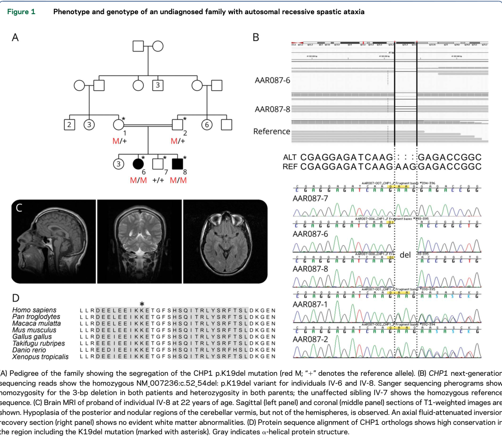

## Question

# Disease Characteristics Research Template

## Target Disease
- **Disease Name:** Autosomal Recessive Spastic Ataxia 9
- **MONDO ID:**  (if available)
- **Category:** Mendelian

## Research Objectives

Please provide a comprehensive research report on **Autosomal Recessive Spastic Ataxia 9** covering all of the
disease characteristics listed below. This report will be used to populate a disease knowledge
base entry. Be thorough and cite primary literature (PMID preferred) for all claims.

For each section, **suggested databases/resources** are listed. These are the first places
you should search for information on each topic.

---

### 1. Disease Information
> **Search first:** OMIM, Orphanet, ICD-10/ICD-11, MeSH, PubMed

- What is the disease? Provide a concise overview.
- What are the key identifiers? (OMIM, Orphanet, ICD-10/ICD-11, MeSH, Mondo)
- What are the common synonyms and alternative names?
- Is the information derived from individual patients (e.g., EHR) or aggregated disease-level resources?

### 2. Etiology

- **Disease Causal Factors**: What are the primary causes? (genetic, environmental, infectious, mechanistic)
- **Risk Factors**:
  > **Search first:** PubMed, Cochrane Library, UpToDate, clinical guidelines, ClinVar, ClinGen, GWAS Catalog, PheGenI, CTD, CDC, WHO, epidemiological databases
  - Genetic risk factors (causal variants, susceptibility loci, modifier genes)
  - Environmental risk factors (toxins, lifestyle, occupational exposures, age, sex, family history)
- **Protective Factors**:
  > **Search first:** PubMed, Cochrane Library, clinical trial databases, GWAS Catalog, gnomAD, WHO, CDC, nutrition databases
  - Genetic protective factors (protective variants, modifier alleles)
  - Environmental protective factors (diet, lifestyle, exposures that reduce risk)
- **Gene-Environment Interactions**: How do genetic and environmental factors interact to influence disease?
  > **Search first:** CTD, PubMed, PheGenI, GxE databases

### 3. Phenotypes
> **Search first:** HPO (Human Phenotype Ontology), OMIM, Orphanet, PubMed, clinicaltrials.gov, MedDRA, SNOMED CT, DECIPHER, LOINC

For each phenotype, provide:
- **Phenotype type**: symptoms, clinical signs, physical manifestations, behavioral changes, or laboratory abnormalities
  > For symptoms/signs: HPO, OMIM, Orphanet, PubMed
  > For behavioral changes: HPO, DSM, RDoC (Research Domain Criteria), PubMed
  > For laboratory abnormalities: LOINC, SNOMED CT, LabTests Online, PubMed
- **Phenotype characteristics**:
  > **Search first:** OMIM, Orphanet, HPO, PubMed
  - Age of symptom onset (neonatal, childhood, adult-onset, late-onset)
  - Symptom severity (mild, moderate, severe, variable)
  - Symptom progression (stable, progressive, episodic, fluctuating)
  - Frequency among affected individuals (percentage or qualitative)
- **Quality of life impact**: Effects on daily functioning and well-being (per-phenotype when possible)
  > **Search first:** EQ-5D database, SF-36, WHO QOL databases, PubMed
- Suggest HPO (Human Phenotype Ontology) terms for each phenotype

### 4. Genetic/Molecular Information

- **Causal Genes**: Gene mutations or chromosomal abnormalities responsible for disease (gene symbols, OMIM IDs)
  > **Search first:** OMIM, ClinVar, HGMD, Ensembl, NCBI Gene
- **Pathogenic Variants**:
  - Affected genes (gene symbols, HGNC IDs)
    > **Search first:** OMIM, NCBI Gene, Ensembl, HGNC, UniProt, GeneCards
  - Variant classification (pathogenic, likely pathogenic, VUS per ACMG/AMP guidelines)
    > **Search first:** ClinVar, ClinGen, ACMG/AMP guidelines, VarSome
  - Variant type/class (missense, frameshift, nonsense, splice-site, structural)
  - Allele frequency in population databases
    > **Search first:** gnomAD, 1000 Genomes, ExAC, TOPMed, dbSNP
  - Somatic vs germline origin
    > **Search first:** COSMIC (somatic), ClinVar, ICGC, TCGA
  - Functional consequences (loss of function, gain of function, dominant negative)
- **Modifier Genes**: Genes that modify disease severity or expression
- **Epigenetic Information**: DNA methylation, histone modifications, chromatin changes affecting disease
  > **Search first:** ENCODE, Roadmap Epigenomics, MethBase, DiseaseMeth
- **Chromosomal Abnormalities**: Large-scale genetic changes (aneuploidy, translocations, inversions)
  > **Search first:** DECIPHER, ClinVar, ECARUCA, UCSC Genome Browser

### 5. Environmental Information

- **Environmental Factors**: Non-genetic contributing factors (toxins, radiation, pollution, occupational exposure)
  > **Search first:** CTD (Comparative Toxicogenomics Database), TOXNET, PubMed, EPA databases
- **Lifestyle Factors**: Behavioral factors (smoking, diet, exercise, alcohol consumption)
  > **Search first:** CDC databases, WHO, PubMed, NHANES
- **Infectious Agents**: If applicable, pathogens causing or triggering disease (bacteria, viruses, fungi, parasites)
  > **Search first:** NCBI Taxonomy, ViPR, BV-BRC, MicrobeDB, GIDEON

### 6. Mechanism / Pathophysiology

- **Molecular Pathways**: Specific signaling cascades or biochemical pathways involved (Wnt, MAPK, mTOR, PI3K-AKT, etc.)
  > **Search first:** KEGG, Reactome, WikiPathways, PathBank, BioCyc
- **Cellular Processes**: Cell-level mechanisms (apoptosis, autophagy, cell cycle dysregulation, inflammation, etc.)
  > **Search first:** Gene Ontology (GO), Reactome, KEGG, PubMed
- **Protein Dysfunction**: How protein structure or function is altered (misfolding, aggregation, loss of function, gain of function)
  > **Search first:** UniProt, PDB (Protein Data Bank), InterPro, Pfam, AlphaFold
- **Metabolic Changes**: Alterations in metabolic processes (energy metabolism, lipid metabolism, amino acid metabolism)
  > **Search first:** KEGG, BioCyc, HMDB (Human Metabolome Database), BRENDA
- **Immune System Involvement**: Role of immune response (autoimmunity, immunodeficiency, chronic inflammation)
  > **Search first:** ImmPort, Immunome Database, IEDB, Gene Ontology
- **Tissue Damage Mechanisms**: How tissues/ are injured (oxidative stress, ischemia, fibrosis, necrosis)
  > **Search first:** PubMed, Gene Ontology, Reactome
- **Biochemical Abnormalities**: Specific molecular defects (enzyme deficiencies, receptor dysfunction, ion channel defects)
  > **Search first:** BRENDA, UniProt, KEGG, OMIM, PubMed
- **Epigenetic Changes**: DNA methylation, histone modifications affecting gene expression in disease
  > **Search first:** ENCODE, Roadmap Epigenomics, MethBase, DiseaseMeth
- **Molecular Profiling** (if available):
  - Transcriptomics/gene expression changes
    > **Search first:** GEO (Gene Expression Omnibus), ArrayExpress, GTEx, Human Cell Atlas, SRA
  - Proteomics findings
    > **Search first:** PRIDE, ProteomeXchange, Human Protein Atlas, STRING, BioGRID
  - Metabolomics signatures
    > **Search first:** MetaboLights, Metabolomics Workbench, HMDB, METLIN
  - Lipidomics alterations
    > **Search first:** LIPID MAPS, SwissLipids, LipidHome, Metabolomics Workbench
  - Genomic structural features
    > **Search first:** UCSC Genome Browser, Ensembl, NCBI, dbVar, DGV
- **Advanced Technologies** (if applicable):
  - Single-cell analysis findings (cell-type specific mechanisms, cellular heterogeneity)
    > **Search first:** Human Cell Atlas, Single Cell Portal, GEO, CELLxGENE
  - Spatial transcriptomics findings
    > **Search first:** GEO, Spatial Research, Vizgen, 10x Genomics data
  - Multi-omics integration results
    > **Search first:** TCGA, ICGC, cBioPortal, LinkedOmics, PubMed
  - Functional genomics screens (CRISPR, RNAi)
    > **Search first:** DepMap, GenomeRNAi, PubMed, BioGRID ORCS

For each mechanism, describe:
- The causal chain from initial trigger to clinical manifestation
- Which mechanisms are upstream vs downstream
- What cell types and biological processes are involved
- Suggest GO terms for biological processes and CL terms for cell types

### 7. Anatomical Structures Affected

- **Organ Level**:
  - Primary organs directly affected
  - Secondary organ involvement (complications, secondary effects)
  - Body systems involved (cardiovascular, nervous, digestive, respiratory, endocrine, etc.)
  > **Search first:** Uberon, FMA (Foundational Model of Anatomy), OMIM, HPO, ICD-11, MeSH, SNOMED CT
- **Tissue and Cell Level**:
  - Specific tissue types affected (epithelial, connective, muscle, nervous)
  - Specific cell populations targeted (with Cell Ontology terms)
  > **Search first:** Uberon, Human Protein Atlas, Cell Ontology, Human Cell Atlas, CellMarker, PanglaoDB
- **Subcellular Level**:
  - Cellular compartments involved (mitochondria, nucleus, ER, lysosomes) (with GO Cellular Component terms)
  > **Search first:** Gene Ontology (Cellular Component), UniProt, Human Protein Atlas
- **Localization**:
  - Specific anatomical sites (with UBERON terms)
    > **Search first:** FMA, Uberon, NeuroNames (for brain), SNOMED CT
  - Lateralization (unilateral, bilateral, asymmetric)
    > **Search first:** HPO, clinical literature, imaging databases

### 8. Temporal Development

- **Onset**:
  - Typical age of onset (congenital, pediatric, adult, geriatric)
  - Onset pattern (acute, subacute, chronic, insidious)
  > **Search first:** OMIM, Orphanet, HPO, PubMed
- **Progression**:
  - Disease stages (early, intermediate, advanced, end-stage)
    > **Search first:** Cancer Staging Manual (AJCC), WHO classifications, PubMed
  - Progression rate (rapid, slow, variable)
  - Disease course pattern (episodic, relapsing-remitting, progressive, stable)
  - Disease duration (self-limited, chronic lifelong)
  > **Search first:** Disease registries, longitudinal cohort databases, natural history studies, PubMed, Orphanet, OMIM
- **Patterns**:
  - Remission patterns (spontaneous, treatment-induced)
    > **Search first:** Clinical trial databases, disease registries, PubMed
  - Critical periods (time windows of vulnerability or opportunity for intervention)
    > **Search first:** PubMed, developmental biology databases, clinical guidelines

### 9. Inheritance and Population

- **Epidemiology**:
  - Prevalence (cases per 100,000 at given time)
  - Incidence (new cases per 100,000 per year)
  > **Search first:** Orphanet, CDC, WHO, GBD (Global Burden of Disease), national registries, SEER, disease registries
- **For Genetic Etiology**:
  - Inheritance pattern (AD, AR, X-linked, mitochondrial, multifactorial, polygenic)
    > **Search first:** OMIM, Orphanet, ClinVar, GTR (Genetic Testing Registry)
  - Penetrance (complete, incomplete, age-dependent)
    > **Search first:** ClinVar, OMIM, PubMed, ClinGen
  - Expressivity (variable, consistent)
    > **Search first:** OMIM, ClinVar, PubMed
  - Genetic anticipation (increasing severity in successive generations)
    > **Search first:** OMIM, PubMed (especially for repeat expansion disorders)
  - Germline mosaicism
    > **Search first:** ClinVar, OMIM, genetic counseling literature, PubMed
  - Founder effects (population-specific mutations)
    > **Search first:** gnomAD, population genetics databases, PubMed
  - Consanguinity role
    > **Search first:** OMIM, population studies, genetic counseling resources
  - Carrier frequency
    > **Search first:** gnomAD, carrier screening databases, GeneReviews, GTR
- **Population Demographics**:
  - Affected populations (ethnic or demographic groups with higher prevalence)
    > **Search first:** gnomAD, 1000 Genomes, PAGE Study, PubMed, population registries
  - Geographic distribution (endemic areas, regional variation)
    > **Search first:** WHO, CDC, GBD, Orphanet, geographic epidemiology databases
  - Geographic distribution of specific variants
  - Sex ratio (male:female)
    > **Search first:** Disease registries, OMIM, PubMed, epidemiological databases
  - Age distribution of affected individuals
    > **Search first:** CDC, disease registries, SEER, Orphanet

### 10. Diagnostics

- **Clinical Tests**:
  - Laboratory tests (blood, urine, tissue chemistry, specific enzyme assays)
    > **Search first:** LOINC, LabTests Online, PubMed
  - Biomarkers (proteins, metabolites, genetic markers, circulating biomarkers)
    > **Search first:** FDA Biomarker List, BEST (Biomarkers, EndpointS, and other Tools), PubMed
  - Imaging studies (X-ray, CT, MRI, PET, ultrasound)
    > **Search first:** RadLex, DICOM, Radiopaedia, imaging databases
  - Functional tests (pulmonary function, cardiac stress tests)
    > **Search first:** LOINC, clinical guidelines, PubMed
  - Electrophysiology (EEG, EMG, ECG, nerve conduction studies)
    > **Search first:** LOINC, clinical neurophysiology databases, PubMed
  - Biopsy findings (histopathology, immunohistochemistry)
    > **Search first:** SNOMED CT, College of American Pathologists resources, PubMed
  - Pathology findings (microscopic examination)
    > **Search first:** SNOMED CT, Digital Pathology databases, PubMed
- **Genetic Testing**:
  > **Search first:** GTR (Genetic Testing Registry), GeneReviews, ClinGen
  - Overview of recommended genetic testing approach
  - Whole genome sequencing (WGS) utility
    > **Search first:** GTR, ClinVar, GEL (Genomics England), gnomAD
  - Whole exome sequencing (WES) utility
    > **Search first:** GTR, ClinVar, OMIM, GeneMatcher
  - Gene panels (which panels, which genes)
    > **Search first:** GTR, ClinVar, laboratory-specific databases
  - Single gene testing
    > **Search first:** GTR, ClinVar, OMIM, GeneReviews
  - Chromosomal microarray (CMA)
    > **Search first:** DECIPHER, ClinVar, dbVar, ECARUCA
  - Karyotyping
    > **Search first:** Chromosome Abnormality Database, ClinVar, cytogenetics resources
  - FISH
    > **Search first:** ClinVar, cytogenetics databases, PubMed
  - Mitochondrial DNA testing
    > **Search first:** MITOMAP, MSeqDR, ClinVar, GTR
  - Repeat expansion testing
    > **Search first:** GTR, ClinVar, repeat expansion databases, PubMed
- **Omics-Based Diagnostics** (if applicable):
  - RNA sequencing / transcriptomics
    > **Search first:** GEO, ArrayExpress, GTEx, RNA-seq databases
  - Proteomics
    > **Search first:** PRIDE, ProteomeXchange, FDA Biomarker database
  - Metabolomics
    > **Search first:** MetaboLights, Metabolomics Workbench, HMDB
  - Epigenomics
    > **Search first:** GEO, ENCODE, Roadmap Epigenomics, MethBase
  - Liquid biopsy
    > **Search first:** COSMIC, ClinVar, liquid biopsy databases, PubMed
- **Clinical Criteria**:
  - Standardized diagnostic criteria (DSM, ICD, society guidelines)
    > **Search first:** DSM-5, ICD-11, clinical society guidelines, UpToDate
  - Differential diagnosis (other conditions to rule out, with distinguishing features)
    > **Search first:** DynaMed, UpToDate, clinical decision support systems
- **Screening**:
  - Screening methods for asymptomatic individuals (newborn screening, carrier screening, cascade screening)
    > **Search first:** ACMG recommendations, CDC newborn screening, GTR

### 11. Outcome/Prognosis

- **Survival and Mortality**:
  - Survival rate (5-year, 10-year, overall)
    > **Search first:** SEER, cancer registries, disease-specific registries, PubMed
  - Life expectancy (with and without treatment if applicable)
    > **Search first:** Orphanet, disease registries, actuarial databases, PubMed
  - Mortality rate
    > **Search first:** CDC, WHO, GBD, national mortality databases
  - Disease-specific mortality (deaths directly attributable to disease)
    > **Search first:** Disease registries, CDC Wonder, GBD, PubMed
- **Morbidity and Function**:
  - Morbidity (disease-related disability and health impacts)
    > **Search first:** GBD, WHO, disability databases, PubMed
  - Disability outcomes (long-term functional impairments)
    > **Search first:** ICF (International Classification of Functioning), disability registries
  - Quality of life measures (EQ-5D, SF-36, PROMIS, disease-specific tools)
    > **Search first:** EQ-5D database, SF-36, PROMIS, PubMed
- **Disease Course**:
  - Complications (secondary problems: infections, organ failure, etc.)
    > **Search first:** ICD codes, disease registries, clinical databases, PubMed
  - Recovery potential (likelihood and extent of recovery, with vs without treatment)
    > **Search first:** Natural history studies, rehabilitation databases, PubMed
- **Prediction**:
  - Prognostic factors (age, disease severity, biomarkers, treatment response)
    > **Search first:** Prognostic models databases, clinical calculators, PubMed
  - Prognostic biomarkers (molecular markers predicting disease course)
    > **Search first:** FDA Biomarker database, PubMed, cancer prognostic databases

### 12. Treatment

- **Pharmacotherapy**:
  - Pharmacological treatments (drug names, drug classes, mechanisms of action)
    > **Search first:** DrugBank, RxNorm, ATC classification, DailyMed, FDA databases
  - Pharmacogenomics (how genetic variants affect drug metabolism, efficacy, toxicity)
    > **Search first:** PharmGKB, CPIC (Clinical Pharmacogenetics), FDA Table of PGx Biomarkers
- **Advanced Therapeutics**:
  - Gene therapy (viral vectors, CRISPR, gene replacement, gene editing)
    > **Search first:** ClinicalTrials.gov, FDA gene therapy database, ASGCT resources
  - Cell therapy (stem cell transplant, CAR-T, cellular therapeutics)
    > **Search first:** ClinicalTrials.gov, FDA cell therapy database, FACT standards
  - RNA-based therapies (ASOs, siRNA, mRNA therapies)
    > **Search first:** ClinicalTrials.gov, FDA approvals, PubMed
  - Targeted therapies (treatments directed at specific molecular targets)
    > **Search first:** My Cancer Genome, OncoKB, ClinicalTrials.gov, FDA approvals
  - Immunotherapies (checkpoint inhibitors, monoclonal antibodies)
    > **Search first:** Cancer Immunotherapy Database, FDA approvals, ClinicalTrials.gov
- **Surgical and Interventional**:
  - Surgical interventions (types of surgery, timing, outcomes)
    > **Search first:** CPT codes, surgical registries, clinical guidelines, PubMed
- **Supportive and Rehabilitative**:
  - Supportive care (symptom management, pain control, nutrition)
    > **Search first:** Clinical guidelines, Cochrane Library, PubMed
  - Rehabilitation (physical therapy, occupational therapy, speech therapy)
    > **Search first:** Rehabilitation medicine databases, clinical guidelines, PubMed
- **Experimental**:
  - Experimental treatments in clinical trials (with NCT identifiers if available)
    > **Search first:** ClinicalTrials.gov, EU Clinical Trials Register, WHO ICTRP
- **Treatment Outcomes**:
  - Treatment response rates
    > **Search first:** Clinical trial databases, FDA reviews, systematic reviews, PubMed
  - Side effects and adverse events
    > **Search first:** FDA Adverse Event Reporting System (FAERS), MedWatch, PubMed
- **Treatment Strategy**:
  - Treatment algorithms (clinical pathways, decision trees)
    > **Search first:** Clinical practice guidelines, NCCN Guidelines, UpToDate
  - Combination therapies
    > **Search first:** ClinicalTrials.gov, treatment guidelines, PubMed
  - Personalized medicine approaches (genotype-guided treatment)
    > **Search first:** My Cancer Genome, CIViC, PharmGKB, precision medicine databases

For each treatment, suggest NCIT (NCI Thesaurus) clinical-intervention terms where applicable.

### 13. Prevention

- **Prevention Levels**:
  - Primary prevention (preventing disease occurrence: vaccination, risk factor modification)
    > **Search first:** CDC, WHO, USPSTF recommendations, Cochrane Library
  - Secondary prevention (early detection and treatment: screening programs, early intervention)
    > **Search first:** USPSTF, CDC screening guidelines, WHO
  - Tertiary prevention (preventing complications in those with disease)
    > **Search first:** Clinical guidelines, disease management protocols, PubMed
- **Immunization**: Vaccine strategies (if applicable)
  > **Search first:** CDC vaccine schedules, WHO immunization, FDA vaccine database
- **Screening and Early Detection**:
  - Screening programs (population-based: newborn screening, cancer screening)
    > **Search first:** CDC screening programs, USPSTF, cancer screening databases
  - Genetic screening (carrier screening, preimplantation genetic diagnosis, prenatal testing)
    > **Search first:** ACMG recommendations, ACOG guidelines, GTR
  - Risk stratification (identifying high-risk individuals for targeted prevention)
    > **Search first:** Risk prediction models, clinical calculators, PubMed
- **Behavioral Interventions**: Lifestyle modifications to reduce risk
  > **Search first:** CDC, WHO, behavioral intervention databases, Cochrane Library
- **Counseling**: Genetic counseling (risk assessment, family planning guidance)
  > **Search first:** NSGC resources, ACMG guidelines, GeneReviews
- **Public Health**:
  - Public health interventions (sanitation, vector control, health education)
    > **Search first:** CDC, WHO, public health databases, PubMed
  - Environmental interventions (reducing environmental risk factors)
    > **Search first:** EPA databases, WHO environmental health, PubMed
- **Prophylaxis**: Preventive medications or procedures
  > **Search first:** Clinical guidelines, FDA approvals, PubMed

### 14. Other Species / Natural Disease

- **Taxonomy**: Species affected (with NCBI Taxon identifiers)
  > **Search first:** NCBI Taxonomy
- **Breed**: Specific breeds affected (with VBO identifiers if applicable)
  > **Search first:** VBO (Vertebrate Breed Ontology)
- **Gene**: Orthologous genes in other species (with NCBI Gene IDs)
  > **Search first:** NCBI Gene
- **Natural Disease**:
  - Naturally occurring disease in other species (companion animals, wildlife)
    > **Search first:** OMIA (Online Mendelian Inheritance in Animals), VetCompass, PubMed
  - Veterinary relevance and importance in animal health
    > **Search first:** OMIA, veterinary databases, PubMed
- **Comparative Biology**:
  - Comparative pathology (similarities and differences across species)
    > **Search first:** OMIA, comparative pathology databases, PubMed
  - Evolutionary conservation of disease mechanisms
    > **Search first:** HomoloGene, OrthoMCL, Alliance of Genome Resources
- **Transmission** (if applicable):
  - Zoonotic potential
    > **Search first:** CDC zoonotic diseases, WHO zoonoses, GIDEON
  - Cross-species susceptibility
    > **Search first:** NCBI Taxonomy, veterinary databases, PubMed

### 15. Model Organisms

- **Model Types**:
  - Model organism type (mammalian, invertebrate, cellular, in vitro)
    > **Search first:** Alliance of Genome Resources, model organism databases
  - Specific model systems (mouse, rat, zebrafish, Drosophila, C. elegans, yeast, cell lines, organoids, iPSCs)
    > **Search first:** MGI, RGD, ZFIN, FlyBase, WormBase, SGD, ATCC, Cellosaurus
  - Induced models (drug treatment, surgical intervention, environmental manipulation)
    > **Search first:** MGI, model organism databases, PubMed
- **Genetic Models**:
  - Types available (knockout, knock-in, transgenic, conditional, humanized)
    > **Search first:** MGI, IMPC, KOMP, EuMMCR, IMSR
- **Model Characteristics**:
  - Phenotype recapitulation (how well model reproduces human disease features)
    > **Search first:** Model organism databases, comparative studies, PubMed
  - Model limitations (aspects of human disease not captured)
    > **Search first:** Model organism databases, PubMed, review articles
- **Applications**:
  - Research applications (what aspects of disease can be studied)
    > **Search first:** Model organism databases, PubMed
- **Resources**:
  - Model databases
    > **Search first:** MGI, RGD, ZFIN, FlyBase, WormBase, IMSR, EMMA, MMRRC

---

## Citation Requirements

- Cite primary literature (PMID preferred) for all mechanistic and clinical claims
- Prioritize recent reviews and landmark papers
- Include direct quotes from abstracts where possible to support key statements
- Distinguish evidence source types: human clinical, model organism, in vitro, computational

## Output Format

Structure your response as a comprehensive narrative organized by the sections above.
For each section, provide:
- Factual content with specific details (numbers, percentages, gene names, variant nomenclature)
- Ontology term suggestions (HPO, GO, CL, UBERON, CHEBI, NCIT, MONDO) where applicable
- Evidence citations with PMIDs
- Direct quotes from abstracts to support key claims
- Clear indication when information is not available or not applicable for this disease

This report will be used to populate a disease knowledge base entry with:
- Pathophysiology descriptions with causal chains
- Gene/protein annotations (HGNC, GO terms)
- Phenotype associations (HP terms) with frequencies
- Cell type involvement (CL terms)
- Anatomical locations (UBERON terms)
- Chemical entities (CHEBI terms)
- Treatment annotations (NCIT terms)
- Evidence items with PMIDs and exact abstract quotes
- Epidemiology, prognosis, diagnostic, and prevention information
- Animal model descriptions with phenotype recapitulation details

## Output

Question: You are an expert researcher providing comprehensive, well-cited information.

Provide detailed information focusing on:
1. Key concepts and definitions with current understanding
2. Recent developments and latest research (prioritize 2023-2024 sources)
3. Current applications and real-world implementations
4. Expert opinions and analysis from authoritative sources
5. Relevant statistics and data from recent studies

Format as a comprehensive research report with proper citations. Include URLs and publication dates where available.
Always prioritize recent, authoritative sources and provide specific citations for all major claims.

# Disease Characteristics Research Template

## Target Disease
- **Disease Name:** Autosomal Recessive Spastic Ataxia 9
- **MONDO ID:**  (if available)
- **Category:** Mendelian

## Research Objectives

Please provide a comprehensive research report on **Autosomal Recessive Spastic Ataxia 9** covering all of the
disease characteristics listed below. This report will be used to populate a disease knowledge
base entry. Be thorough and cite primary literature (PMID preferred) for all claims.

For each section, **suggested databases/resources** are listed. These are the first places
you should search for information on each topic.

---

### 1. Disease Information
> **Search first:** OMIM, Orphanet, ICD-10/ICD-11, MeSH, PubMed

- What is the disease? Provide a concise overview.
- What are the key identifiers? (OMIM, Orphanet, ICD-10/ICD-11, MeSH, Mondo)
- What are the common synonyms and alternative names?
- Is the information derived from individual patients (e.g., EHR) or aggregated disease-level resources?

### 2. Etiology

- **Disease Causal Factors**: What are the primary causes? (genetic, environmental, infectious, mechanistic)
- **Risk Factors**:
  > **Search first:** PubMed, Cochrane Library, UpToDate, clinical guidelines, ClinVar, ClinGen, GWAS Catalog, PheGenI, CTD, CDC, WHO, epidemiological databases
  - Genetic risk factors (causal variants, susceptibility loci, modifier genes)
  - Environmental risk factors (toxins, lifestyle, occupational exposures, age, sex, family history)
- **Protective Factors**:
  > **Search first:** PubMed, Cochrane Library, clinical trial databases, GWAS Catalog, gnomAD, WHO, CDC, nutrition databases
  - Genetic protective factors (protective variants, modifier alleles)
  - Environmental protective factors (diet, lifestyle, exposures that reduce risk)
- **Gene-Environment Interactions**: How do genetic and environmental factors interact to influence disease?
  > **Search first:** CTD, PubMed, PheGenI, GxE databases

### 3. Phenotypes
> **Search first:** HPO (Human Phenotype Ontology), OMIM, Orphanet, PubMed, clinicaltrials.gov, MedDRA, SNOMED CT, DECIPHER, LOINC

For each phenotype, provide:
- **Phenotype type**: symptoms, clinical signs, physical manifestations, behavioral changes, or laboratory abnormalities
  > For symptoms/signs: HPO, OMIM, Orphanet, PubMed
  > For behavioral changes: HPO, DSM, RDoC (Research Domain Criteria), PubMed
  > For laboratory abnormalities: LOINC, SNOMED CT, LabTests Online, PubMed
- **Phenotype characteristics**:
  > **Search first:** OMIM, Orphanet, HPO, PubMed
  - Age of symptom onset (neonatal, childhood, adult-onset, late-onset)
  - Symptom severity (mild, moderate, severe, variable)
  - Symptom progression (stable, progressive, episodic, fluctuating)
  - Frequency among affected individuals (percentage or qualitative)
- **Quality of life impact**: Effects on daily functioning and well-being (per-phenotype when possible)
  > **Search first:** EQ-5D database, SF-36, WHO QOL databases, PubMed
- Suggest HPO (Human Phenotype Ontology) terms for each phenotype

### 4. Genetic/Molecular Information

- **Causal Genes**: Gene mutations or chromosomal abnormalities responsible for disease (gene symbols, OMIM IDs)
  > **Search first:** OMIM, ClinVar, HGMD, Ensembl, NCBI Gene
- **Pathogenic Variants**:
  - Affected genes (gene symbols, HGNC IDs)
    > **Search first:** OMIM, NCBI Gene, Ensembl, HGNC, UniProt, GeneCards
  - Variant classification (pathogenic, likely pathogenic, VUS per ACMG/AMP guidelines)
    > **Search first:** ClinVar, ClinGen, ACMG/AMP guidelines, VarSome
  - Variant type/class (missense, frameshift, nonsense, splice-site, structural)
  - Allele frequency in population databases
    > **Search first:** gnomAD, 1000 Genomes, ExAC, TOPMed, dbSNP
  - Somatic vs germline origin
    > **Search first:** COSMIC (somatic), ClinVar, ICGC, TCGA
  - Functional consequences (loss of function, gain of function, dominant negative)
- **Modifier Genes**: Genes that modify disease severity or expression
- **Epigenetic Information**: DNA methylation, histone modifications, chromatin changes affecting disease
  > **Search first:** ENCODE, Roadmap Epigenomics, MethBase, DiseaseMeth
- **Chromosomal Abnormalities**: Large-scale genetic changes (aneuploidy, translocations, inversions)
  > **Search first:** DECIPHER, ClinVar, ECARUCA, UCSC Genome Browser

### 5. Environmental Information

- **Environmental Factors**: Non-genetic contributing factors (toxins, radiation, pollution, occupational exposure)
  > **Search first:** CTD (Comparative Toxicogenomics Database), TOXNET, PubMed, EPA databases
- **Lifestyle Factors**: Behavioral factors (smoking, diet, exercise, alcohol consumption)
  > **Search first:** CDC databases, WHO, PubMed, NHANES
- **Infectious Agents**: If applicable, pathogens causing or triggering disease (bacteria, viruses, fungi, parasites)
  > **Search first:** NCBI Taxonomy, ViPR, BV-BRC, MicrobeDB, GIDEON

### 6. Mechanism / Pathophysiology

- **Molecular Pathways**: Specific signaling cascades or biochemical pathways involved (Wnt, MAPK, mTOR, PI3K-AKT, etc.)
  > **Search first:** KEGG, Reactome, WikiPathways, PathBank, BioCyc
- **Cellular Processes**: Cell-level mechanisms (apoptosis, autophagy, cell cycle dysregulation, inflammation, etc.)
  > **Search first:** Gene Ontology (GO), Reactome, KEGG, PubMed
- **Protein Dysfunction**: How protein structure or function is altered (misfolding, aggregation, loss of function, gain of function)
  > **Search first:** UniProt, PDB (Protein Data Bank), InterPro, Pfam, AlphaFold
- **Metabolic Changes**: Alterations in metabolic processes (energy metabolism, lipid metabolism, amino acid metabolism)
  > **Search first:** KEGG, BioCyc, HMDB (Human Metabolome Database), BRENDA
- **Immune System Involvement**: Role of immune response (autoimmunity, immunodeficiency, chronic inflammation)
  > **Search first:** ImmPort, Immunome Database, IEDB, Gene Ontology
- **Tissue Damage Mechanisms**: How tissues/ are injured (oxidative stress, ischemia, fibrosis, necrosis)
  > **Search first:** PubMed, Gene Ontology, Reactome
- **Biochemical Abnormalities**: Specific molecular defects (enzyme deficiencies, receptor dysfunction, ion channel defects)
  > **Search first:** BRENDA, UniProt, KEGG, OMIM, PubMed
- **Epigenetic Changes**: DNA methylation, histone modifications affecting gene expression in disease
  > **Search first:** ENCODE, Roadmap Epigenomics, MethBase, DiseaseMeth
- **Molecular Profiling** (if available):
  - Transcriptomics/gene expression changes
    > **Search first:** GEO (Gene Expression Omnibus), ArrayExpress, GTEx, Human Cell Atlas, SRA
  - Proteomics findings
    > **Search first:** PRIDE, ProteomeXchange, Human Protein Atlas, STRING, BioGRID
  - Metabolomics signatures
    > **Search first:** MetaboLights, Metabolomics Workbench, HMDB, METLIN
  - Lipidomics alterations
    > **Search first:** LIPID MAPS, SwissLipids, LipidHome, Metabolomics Workbench
  - Genomic structural features
    > **Search first:** UCSC Genome Browser, Ensembl, NCBI, dbVar, DGV
- **Advanced Technologies** (if applicable):
  - Single-cell analysis findings (cell-type specific mechanisms, cellular heterogeneity)
    > **Search first:** Human Cell Atlas, Single Cell Portal, GEO, CELLxGENE
  - Spatial transcriptomics findings
    > **Search first:** GEO, Spatial Research, Vizgen, 10x Genomics data
  - Multi-omics integration results
    > **Search first:** TCGA, ICGC, cBioPortal, LinkedOmics, PubMed
  - Functional genomics screens (CRISPR, RNAi)
    > **Search first:** DepMap, GenomeRNAi, PubMed, BioGRID ORCS

For each mechanism, describe:
- The causal chain from initial trigger to clinical manifestation
- Which mechanisms are upstream vs downstream
- What cell types and biological processes are involved
- Suggest GO terms for biological processes and CL terms for cell types

### 7. Anatomical Structures Affected

- **Organ Level**:
  - Primary organs directly affected
  - Secondary organ involvement (complications, secondary effects)
  - Body systems involved (cardiovascular, nervous, digestive, respiratory, endocrine, etc.)
  > **Search first:** Uberon, FMA (Foundational Model of Anatomy), OMIM, HPO, ICD-11, MeSH, SNOMED CT
- **Tissue and Cell Level**:
  - Specific tissue types affected (epithelial, connective, muscle, nervous)
  - Specific cell populations targeted (with Cell Ontology terms)
  > **Search first:** Uberon, Human Protein Atlas, Cell Ontology, Human Cell Atlas, CellMarker, PanglaoDB
- **Subcellular Level**:
  - Cellular compartments involved (mitochondria, nucleus, ER, lysosomes) (with GO Cellular Component terms)
  > **Search first:** Gene Ontology (Cellular Component), UniProt, Human Protein Atlas
- **Localization**:
  - Specific anatomical sites (with UBERON terms)
    > **Search first:** FMA, Uberon, NeuroNames (for brain), SNOMED CT
  - Lateralization (unilateral, bilateral, asymmetric)
    > **Search first:** HPO, clinical literature, imaging databases

### 8. Temporal Development

- **Onset**:
  - Typical age of onset (congenital, pediatric, adult, geriatric)
  - Onset pattern (acute, subacute, chronic, insidious)
  > **Search first:** OMIM, Orphanet, HPO, PubMed
- **Progression**:
  - Disease stages (early, intermediate, advanced, end-stage)
    > **Search first:** Cancer Staging Manual (AJCC), WHO classifications, PubMed
  - Progression rate (rapid, slow, variable)
  - Disease course pattern (episodic, relapsing-remitting, progressive, stable)
  - Disease duration (self-limited, chronic lifelong)
  > **Search first:** Disease registries, longitudinal cohort databases, natural history studies, PubMed, Orphanet, OMIM
- **Patterns**:
  - Remission patterns (spontaneous, treatment-induced)
    > **Search first:** Clinical trial databases, disease registries, PubMed
  - Critical periods (time windows of vulnerability or opportunity for intervention)
    > **Search first:** PubMed, developmental biology databases, clinical guidelines

### 9. Inheritance and Population

- **Epidemiology**:
  - Prevalence (cases per 100,000 at given time)
  - Incidence (new cases per 100,000 per year)
  > **Search first:** Orphanet, CDC, WHO, GBD (Global Burden of Disease), national registries, SEER, disease registries
- **For Genetic Etiology**:
  - Inheritance pattern (AD, AR, X-linked, mitochondrial, multifactorial, polygenic)
    > **Search first:** OMIM, Orphanet, ClinVar, GTR (Genetic Testing Registry)
  - Penetrance (complete, incomplete, age-dependent)
    > **Search first:** ClinVar, OMIM, PubMed, ClinGen
  - Expressivity (variable, consistent)
    > **Search first:** OMIM, ClinVar, PubMed
  - Genetic anticipation (increasing severity in successive generations)
    > **Search first:** OMIM, PubMed (especially for repeat expansion disorders)
  - Germline mosaicism
    > **Search first:** ClinVar, OMIM, genetic counseling literature, PubMed
  - Founder effects (population-specific mutations)
    > **Search first:** gnomAD, population genetics databases, PubMed
  - Consanguinity role
    > **Search first:** OMIM, population studies, genetic counseling resources
  - Carrier frequency
    > **Search first:** gnomAD, carrier screening databases, GeneReviews, GTR
- **Population Demographics**:
  - Affected populations (ethnic or demographic groups with higher prevalence)
    > **Search first:** gnomAD, 1000 Genomes, PAGE Study, PubMed, population registries
  - Geographic distribution (endemic areas, regional variation)
    > **Search first:** WHO, CDC, GBD, Orphanet, geographic epidemiology databases
  - Geographic distribution of specific variants
  - Sex ratio (male:female)
    > **Search first:** Disease registries, OMIM, PubMed, epidemiological databases
  - Age distribution of affected individuals
    > **Search first:** CDC, disease registries, SEER, Orphanet

### 10. Diagnostics

- **Clinical Tests**:
  - Laboratory tests (blood, urine, tissue chemistry, specific enzyme assays)
    > **Search first:** LOINC, LabTests Online, PubMed
  - Biomarkers (proteins, metabolites, genetic markers, circulating biomarkers)
    > **Search first:** FDA Biomarker List, BEST (Biomarkers, EndpointS, and other Tools), PubMed
  - Imaging studies (X-ray, CT, MRI, PET, ultrasound)
    > **Search first:** RadLex, DICOM, Radiopaedia, imaging databases
  - Functional tests (pulmonary function, cardiac stress tests)
    > **Search first:** LOINC, clinical guidelines, PubMed
  - Electrophysiology (EEG, EMG, ECG, nerve conduction studies)
    > **Search first:** LOINC, clinical neurophysiology databases, PubMed
  - Biopsy findings (histopathology, immunohistochemistry)
    > **Search first:** SNOMED CT, College of American Pathologists resources, PubMed
  - Pathology findings (microscopic examination)
    > **Search first:** SNOMED CT, Digital Pathology databases, PubMed
- **Genetic Testing**:
  > **Search first:** GTR (Genetic Testing Registry), GeneReviews, ClinGen
  - Overview of recommended genetic testing approach
  - Whole genome sequencing (WGS) utility
    > **Search first:** GTR, ClinVar, GEL (Genomics England), gnomAD
  - Whole exome sequencing (WES) utility
    > **Search first:** GTR, ClinVar, OMIM, GeneMatcher
  - Gene panels (which panels, which genes)
    > **Search first:** GTR, ClinVar, laboratory-specific databases
  - Single gene testing
    > **Search first:** GTR, ClinVar, OMIM, GeneReviews
  - Chromosomal microarray (CMA)
    > **Search first:** DECIPHER, ClinVar, dbVar, ECARUCA
  - Karyotyping
    > **Search first:** Chromosome Abnormality Database, ClinVar, cytogenetics resources
  - FISH
    > **Search first:** ClinVar, cytogenetics databases, PubMed
  - Mitochondrial DNA testing
    > **Search first:** MITOMAP, MSeqDR, ClinVar, GTR
  - Repeat expansion testing
    > **Search first:** GTR, ClinVar, repeat expansion databases, PubMed
- **Omics-Based Diagnostics** (if applicable):
  - RNA sequencing / transcriptomics
    > **Search first:** GEO, ArrayExpress, GTEx, RNA-seq databases
  - Proteomics
    > **Search first:** PRIDE, ProteomeXchange, FDA Biomarker database
  - Metabolomics
    > **Search first:** MetaboLights, Metabolomics Workbench, HMDB
  - Epigenomics
    > **Search first:** GEO, ENCODE, Roadmap Epigenomics, MethBase
  - Liquid biopsy
    > **Search first:** COSMIC, ClinVar, liquid biopsy databases, PubMed
- **Clinical Criteria**:
  - Standardized diagnostic criteria (DSM, ICD, society guidelines)
    > **Search first:** DSM-5, ICD-11, clinical society guidelines, UpToDate
  - Differential diagnosis (other conditions to rule out, with distinguishing features)
    > **Search first:** DynaMed, UpToDate, clinical decision support systems
- **Screening**:
  - Screening methods for asymptomatic individuals (newborn screening, carrier screening, cascade screening)
    > **Search first:** ACMG recommendations, CDC newborn screening, GTR

### 11. Outcome/Prognosis

- **Survival and Mortality**:
  - Survival rate (5-year, 10-year, overall)
    > **Search first:** SEER, cancer registries, disease-specific registries, PubMed
  - Life expectancy (with and without treatment if applicable)
    > **Search first:** Orphanet, disease registries, actuarial databases, PubMed
  - Mortality rate
    > **Search first:** CDC, WHO, GBD, national mortality databases
  - Disease-specific mortality (deaths directly attributable to disease)
    > **Search first:** Disease registries, CDC Wonder, GBD, PubMed
- **Morbidity and Function**:
  - Morbidity (disease-related disability and health impacts)
    > **Search first:** GBD, WHO, disability databases, PubMed
  - Disability outcomes (long-term functional impairments)
    > **Search first:** ICF (International Classification of Functioning), disability registries
  - Quality of life measures (EQ-5D, SF-36, PROMIS, disease-specific tools)
    > **Search first:** EQ-5D database, SF-36, PROMIS, PubMed
- **Disease Course**:
  - Complications (secondary problems: infections, organ failure, etc.)
    > **Search first:** ICD codes, disease registries, clinical databases, PubMed
  - Recovery potential (likelihood and extent of recovery, with vs without treatment)
    > **Search first:** Natural history studies, rehabilitation databases, PubMed
- **Prediction**:
  - Prognostic factors (age, disease severity, biomarkers, treatment response)
    > **Search first:** Prognostic models databases, clinical calculators, PubMed
  - Prognostic biomarkers (molecular markers predicting disease course)
    > **Search first:** FDA Biomarker database, PubMed, cancer prognostic databases

### 12. Treatment

- **Pharmacotherapy**:
  - Pharmacological treatments (drug names, drug classes, mechanisms of action)
    > **Search first:** DrugBank, RxNorm, ATC classification, DailyMed, FDA databases
  - Pharmacogenomics (how genetic variants affect drug metabolism, efficacy, toxicity)
    > **Search first:** PharmGKB, CPIC (Clinical Pharmacogenetics), FDA Table of PGx Biomarkers
- **Advanced Therapeutics**:
  - Gene therapy (viral vectors, CRISPR, gene replacement, gene editing)
    > **Search first:** ClinicalTrials.gov, FDA gene therapy database, ASGCT resources
  - Cell therapy (stem cell transplant, CAR-T, cellular therapeutics)
    > **Search first:** ClinicalTrials.gov, FDA cell therapy database, FACT standards
  - RNA-based therapies (ASOs, siRNA, mRNA therapies)
    > **Search first:** ClinicalTrials.gov, FDA approvals, PubMed
  - Targeted therapies (treatments directed at specific molecular targets)
    > **Search first:** My Cancer Genome, OncoKB, ClinicalTrials.gov, FDA approvals
  - Immunotherapies (checkpoint inhibitors, monoclonal antibodies)
    > **Search first:** Cancer Immunotherapy Database, FDA approvals, ClinicalTrials.gov
- **Surgical and Interventional**:
  - Surgical interventions (types of surgery, timing, outcomes)
    > **Search first:** CPT codes, surgical registries, clinical guidelines, PubMed
- **Supportive and Rehabilitative**:
  - Supportive care (symptom management, pain control, nutrition)
    > **Search first:** Clinical guidelines, Cochrane Library, PubMed
  - Rehabilitation (physical therapy, occupational therapy, speech therapy)
    > **Search first:** Rehabilitation medicine databases, clinical guidelines, PubMed
- **Experimental**:
  - Experimental treatments in clinical trials (with NCT identifiers if available)
    > **Search first:** ClinicalTrials.gov, EU Clinical Trials Register, WHO ICTRP
- **Treatment Outcomes**:
  - Treatment response rates
    > **Search first:** Clinical trial databases, FDA reviews, systematic reviews, PubMed
  - Side effects and adverse events
    > **Search first:** FDA Adverse Event Reporting System (FAERS), MedWatch, PubMed
- **Treatment Strategy**:
  - Treatment algorithms (clinical pathways, decision trees)
    > **Search first:** Clinical practice guidelines, NCCN Guidelines, UpToDate
  - Combination therapies
    > **Search first:** ClinicalTrials.gov, treatment guidelines, PubMed
  - Personalized medicine approaches (genotype-guided treatment)
    > **Search first:** My Cancer Genome, CIViC, PharmGKB, precision medicine databases

For each treatment, suggest NCIT (NCI Thesaurus) clinical-intervention terms where applicable.

### 13. Prevention

- **Prevention Levels**:
  - Primary prevention (preventing disease occurrence: vaccination, risk factor modification)
    > **Search first:** CDC, WHO, USPSTF recommendations, Cochrane Library
  - Secondary prevention (early detection and treatment: screening programs, early intervention)
    > **Search first:** USPSTF, CDC screening guidelines, WHO
  - Tertiary prevention (preventing complications in those with disease)
    > **Search first:** Clinical guidelines, disease management protocols, PubMed
- **Immunization**: Vaccine strategies (if applicable)
  > **Search first:** CDC vaccine schedules, WHO immunization, FDA vaccine database
- **Screening and Early Detection**:
  - Screening programs (population-based: newborn screening, cancer screening)
    > **Search first:** CDC screening programs, USPSTF, cancer screening databases
  - Genetic screening (carrier screening, preimplantation genetic diagnosis, prenatal testing)
    > **Search first:** ACMG recommendations, ACOG guidelines, GTR
  - Risk stratification (identifying high-risk individuals for targeted prevention)
    > **Search first:** Risk prediction models, clinical calculators, PubMed
- **Behavioral Interventions**: Lifestyle modifications to reduce risk
  > **Search first:** CDC, WHO, behavioral intervention databases, Cochrane Library
- **Counseling**: Genetic counseling (risk assessment, family planning guidance)
  > **Search first:** NSGC resources, ACMG guidelines, GeneReviews
- **Public Health**:
  - Public health interventions (sanitation, vector control, health education)
    > **Search first:** CDC, WHO, public health databases, PubMed
  - Environmental interventions (reducing environmental risk factors)
    > **Search first:** EPA databases, WHO environmental health, PubMed
- **Prophylaxis**: Preventive medications or procedures
  > **Search first:** Clinical guidelines, FDA approvals, PubMed

### 14. Other Species / Natural Disease

- **Taxonomy**: Species affected (with NCBI Taxon identifiers)
  > **Search first:** NCBI Taxonomy
- **Breed**: Specific breeds affected (with VBO identifiers if applicable)
  > **Search first:** VBO (Vertebrate Breed Ontology)
- **Gene**: Orthologous genes in other species (with NCBI Gene IDs)
  > **Search first:** NCBI Gene
- **Natural Disease**:
  - Naturally occurring disease in other species (companion animals, wildlife)
    > **Search first:** OMIA (Online Mendelian Inheritance in Animals), VetCompass, PubMed
  - Veterinary relevance and importance in animal health
    > **Search first:** OMIA, veterinary databases, PubMed
- **Comparative Biology**:
  - Comparative pathology (similarities and differences across species)
    > **Search first:** OMIA, comparative pathology databases, PubMed
  - Evolutionary conservation of disease mechanisms
    > **Search first:** HomoloGene, OrthoMCL, Alliance of Genome Resources
- **Transmission** (if applicable):
  - Zoonotic potential
    > **Search first:** CDC zoonotic diseases, WHO zoonoses, GIDEON
  - Cross-species susceptibility
    > **Search first:** NCBI Taxonomy, veterinary databases, PubMed

### 15. Model Organisms

- **Model Types**:
  - Model organism type (mammalian, invertebrate, cellular, in vitro)
    > **Search first:** Alliance of Genome Resources, model organism databases
  - Specific model systems (mouse, rat, zebrafish, Drosophila, C. elegans, yeast, cell lines, organoids, iPSCs)
    > **Search first:** MGI, RGD, ZFIN, FlyBase, WormBase, SGD, ATCC, Cellosaurus
  - Induced models (drug treatment, surgical intervention, environmental manipulation)
    > **Search first:** MGI, model organism databases, PubMed
- **Genetic Models**:
  - Types available (knockout, knock-in, transgenic, conditional, humanized)
    > **Search first:** MGI, IMPC, KOMP, EuMMCR, IMSR
- **Model Characteristics**:
  - Phenotype recapitulation (how well model reproduces human disease features)
    > **Search first:** Model organism databases, comparative studies, PubMed
  - Model limitations (aspects of human disease not captured)
    > **Search first:** Model organism databases, PubMed, review articles
- **Applications**:
  - Research applications (what aspects of disease can be studied)
    > **Search first:** Model organism databases, PubMed
- **Resources**:
  - Model databases
    > **Search first:** MGI, RGD, ZFIN, FlyBase, WormBase, IMSR, EMMA, MMRRC

---

## Citation Requirements

- Cite primary literature (PMID preferred) for all mechanistic and clinical claims
- Prioritize recent reviews and landmark papers
- Include direct quotes from abstracts where possible to support key statements
- Distinguish evidence source types: human clinical, model organism, in vitro, computational

## Output Format

Structure your response as a comprehensive narrative organized by the sections above.
For each section, provide:
- Factual content with specific details (numbers, percentages, gene names, variant nomenclature)
- Ontology term suggestions (HPO, GO, CL, UBERON, CHEBI, NCIT, MONDO) where applicable
- Evidence citations with PMIDs
- Direct quotes from abstracts to support key claims
- Clear indication when information is not available or not applicable for this disease

This report will be used to populate a disease knowledge base entry with:
- Pathophysiology descriptions with causal chains
- Gene/protein annotations (HGNC, GO terms)
- Phenotype associations (HP terms) with frequencies
- Cell type involvement (CL terms)
- Anatomical locations (UBERON terms)
- Chemical entities (CHEBI terms)
- Treatment annotations (NCIT terms)
- Evidence items with PMIDs and exact abstract quotes
- Epidemiology, prognosis, diagnostic, and prevention information
- Animal model descriptions with phenotype recapitulation details

# Autosomal Recessive Spastic Ataxia 9 (SPAX9): Disease-Characteristics Research Report

**Evidence cutoff:** searches emphasized literature through 2024. **Critical limitation:** SPAX9 is exceptionally rare. The disease-specific human evidence retrieved consists of one 2018 report describing two affected siblings from one family. Consequently, phenotype frequencies such as “2/2” are descriptive of that family—not population estimates—and most natural-history, epidemiologic, and treatment fields remain unknown. No additional 2023–2024 SPAX9 clinical series or disease-specific trial was identified.

The following table provides a knowledge-base-oriented synopsis; ontology mappings marked “suggested” are annotations rather than assertions made by the source authors.

| Domain | Summary | Ontology / Identifier Suggestions | Evidence |
|---|---|---|---|
| Identity / OMIM | **Autosomal recessive spastic ataxia 9 (SPAX9)**; Mendelian, neurogenetic complex spastic ataxia. OMIM **#618438**. Do **not** infer MONDO/Orphanet/ICD identifiers from current evidence; **unknown/not confirmed here**. | OMIM: **618438**; disease label: **SPAX9**; MONDO/Orphanet/ICD: **unknown/not established in retrieved evidence** | (mendozaferreira2018biallelicchp1mutation pages 1-2, mendozaferreira2018biallelicchp1mutation pages 2-4) |
| Causal gene and variant | Causal gene: **CHP1** (*calcineurin-like EF-hand protein 1*). Founding human family carried homozygous **NM_007236.4:c.52_54del, p.Lys19del (p.K19del)**. Variant segregated with disease in a consanguineous Moroccan pedigree; absent from public databases in the discovery study. | Gene: **CHP1**; variant class: **in-frame 3-bp deletion**; inheritance origin: **germline** | (mendozaferreira2018biallelicchp1mutation pages 2-4, mendozaferreira2018biallelicchp1mutation media 9ad7cc66) |
| Inheritance | **Autosomal recessive**; disease established in one consanguineous family with affected homozygous siblings and heterozygous parents. | Inheritance: **AR** | (mendozaferreira2018biallelicchp1mutation pages 1-2, mendozaferreira2018biallelicchp1mutation pages 2-4, mendozaferreira2018biallelicchp1mutation media 9ad7cc66) |
| Human evidence size | Extremely limited evidence base: **2 affected siblings** in the index report; no additional pathogenic **CHP1** variants found in screening cohorts (**ARCA n=319**; **NeurOmics n=657**), supporting rarity. | Evidence status: **ultra-rare / sparse human evidence** | (mendozaferreira2018biallelicchp1mutation pages 1-2, mendozaferreira2018biallelicchp1mutation pages 2-4) |
| Onset / course | Onset **during the first decade of life**; chronic **progressive** neurodegenerative course with gait instability, spastic ataxia, and cerebellar involvement. | HPO (inferred): **Childhood onset** HP:0011463; **Progressive neurologic deterioration** HP:0002344 | (mendozaferreira2018biallelicchp1mutation pages 2-4) |
| Core phenotypes | Core reported phenotype: gait instability / ataxia, **spastic paraparesis**, **upper and lower motor neuron involvement**, **motor neuropathy**, **slow ocular saccades**, **intellectual disability**, **growth retardation**; ovarian failure reported in the female proband, but likely not clearly attributable to CHP1 alone. | HPO (inferred): **Ataxia** HP:0001251; **Spastic paraplegia / paraparesis** HP:0001258 or HP:0002313; **Peripheral neuropathy** HP:0009830; **Abnormal pyramidal signs** HP:0002493; **Slow saccadic eye movements** HP:0001276; **Intellectual disability** HP:0001249; **Short stature / growth delay** HP:0004322; **Primary ovarian insufficiency** HP:0008209 (uncertain disease attribution) | (mendozaferreira2018biallelicchp1mutation pages 2-4, mendozaferreira2018biallelicchp1mutation pages 1-2, mendozaferreira2018biallelicchp1mutation pages 8-10) |
| MRI / anatomy | Brain MRI in one affected individual showed **moderate cerebellar atrophy** with **hypoplasia of posterior and nodular regions of the cerebellar vermis**, while cerebellar hemispheres were not hypoplastic; no evident white-matter abnormalities on the cited axial FLAIR image. | UBERON (inferred): **cerebellum** UBERON:0002037; **cerebellar vermis** UBERON:0002245; nervous system: UBERON:0001016 | (mendozaferreira2018biallelicchp1mutation pages 2-4, mendozaferreira2018biallelicchp1mutation media 9ad7cc66) |
| Molecular causal chain | **Upstream:** biallelic **CHP1 p.Lys19del** → reduced soluble CHP1, increased insoluble fraction, aggregation propensity, abnormal higher-molecular-weight complexes. **Intermediate:** impaired CHP1 support of **NHE1/SLC9A1** maturation and membrane targeting. **Downstream:** reduced NHE1 membrane localization/function → disturbed intracellular **pH/ion homeostasis** → Purkinje-neuron and motor-system dysfunction → spastic ataxia phenotype. | GO (inferred): **protein folding** GO:0006457; **protein complex assembly** GO:0065003; **protein localization to plasma membrane** GO:1903076; **sodium:hydrogen antiporter activity / regulation** GO:0015385-related; **intracellular pH reduction/homeostasis** GO:0051453 / GO:0055078; **neuron degeneration** GO:0070997 | (mendozaferreira2018biallelicchp1mutation pages 1-2, mendozaferreira2018biallelicchp1mutation pages 2-2, mendozaferreira2018biallelicchp1mutation pages 4-5, mendozaferreira2018biallelicchp1mutation pages 5-8, mendozaferreira2018biallelicchp1mutation pages 8-10) |
| Affected cell types | Human phenotype and model data implicate **Purkinje neurons** and **motor neurons / motor axons** as key vulnerable populations; additional CNS regions may be sensitive to NHE1 depletion in animal models. | CL (inferred): **Purkinje cell** CL:0000121; **motor neuron** CL:0000100; broader: **neuron** CL:0000540 | (mendozaferreira2018biallelicchp1mutation pages 8-10, janzen2019pls3overexpressiondelays pages 5-7) |
| Diagnostic strategy | Recommended current approach: clinical recognition of **childhood-onset progressive spastic ataxia** plus MRI evidence of cerebellar involvement, followed by **exome/genome sequencing or ataxia/spastic paraplegia gene panel** including **CHP1**; confirm by segregation testing. No disease-specific biomarker is established. | Testing modalities: **WES/WGS/panel sequencing**; family segregation; MRI. Biomarker status: **unknown/not established** | (mendozaferreira2018biallelicchp1mutation pages 1-2, mendozaferreira2018biallelicchp1mutation pages 2-4) |
| Epidemiology | No prevalence or incidence estimates identified in retrieved evidence. Present evidence supports an **ultra-rare** disorder. Geographic signal from current human data: one **consanguineous Moroccan family**. | Epidemiology: **unknown**; founder effect: **not established**; sex ratio: **unknown** | (mendozaferreira2018biallelicchp1mutation pages 1-2, mendozaferreira2018biallelicchp1mutation pages 2-4) |
| Treatment / status | **No SPAX9-specific approved disease-modifying therapy** and no relevant registered clinical trial found in retrieved evidence. Current real-world management is expected to be **supportive/multidisciplinary** (rehabilitation, spasticity and mobility management, genetic counseling). **PLS3 overexpression** is a **preclinical modifier** only, not a human therapy. | NCIT (inferred supportive care): **Physical Therapy** C15329; **Occupational Therapy** C15231; **Genetic Counseling** C15709; disease-modifying therapy: **none established** | (janzen2019pls3overexpressiondelays pages 5-7, janzen2019pls3overexpressiondelays pages 1-2, janzen2019pls3overexpressiondelays pages 7-9) |
| Model organisms | **Zebrafish:** chp1 morphants show motor-axon defects, cerebellar hypoplasia, increased spontaneous contractions, and spastic-like trunk movements; rescued by WT but not mutant human **CHP1** mRNA. **Mouse:** **Chp1 vacillator** mutants develop early balance deficits, progressive ataxic gait, Purkinje axon hypertrophy/swellings, later Purkinje-cell loss; **PLS3** overexpression delays early but not late phenotype and trends toward improved NHE1 membrane localization. | Species/models: **Danio rerio** chp1 knockdown; **Mus musculus** Chp1 vacillator; evidence class: **in vivo functional / modifier** | (mendozaferreira2018biallelicchp1mutation pages 8-10, janzen2019pls3overexpressiondelays pages 5-7, janzen2019pls3overexpressiondelays pages 4-5) |

*Table: This table condenses the currently retrievable evidence for autosomal recessive spastic ataxia 9, emphasizing the very small human evidence base, the CHP1→NHE1 mechanistic model, and practical knowledge-base fields with clearly marked inferred ontologies and unknowns.*

## 1. Disease information

### Definition

Autosomal recessive spastic ataxia 9 is a childhood-onset, complex hereditary spastic ataxia caused by biallelic pathogenic variation in **CHP1**, encoding calcineurin-like EF-hand protein 1. Its defining combination is cerebellar ataxia/atrophy, pyramidal involvement with spastic paraparesis, motor neuropathy, slow saccades, and neurodevelopmental impairment. It is a Mendelian neurogenetic disease rather than an acquired ataxia. The original investigators described it as “autosomal recessive spastic ataxia” and established CHP1 as an ataxia-causative gene. (mendozaferreira2018biallelicchp1mutation pages 1-2, mendozaferreira2018biallelicchp1mutation pages 2-4)

### Identifiers and synonyms

- **OMIM:** **618438**, *Spastic ataxia 9, autosomal recessive*.
- **Common labels:** SPAX9; autosomal recessive spastic ataxia type 9; CHP1-associated ataxia; CHP1-associated autosomal recessive ataxia.
- **MONDO, Orphanet, MeSH:** no disease-specific identifier was verified in the retrieved sources; these should remain unpopulated pending direct database validation rather than inferred.
- **ICD-10/ICD-11:** no unique SPAX9 code was identified. In practice, broader ataxia/hereditary spastic paraplegia codes may be used, but they are not disease-specific.

The evidence is primarily **individual-patient/family-level research data**, subsequently represented in aggregated disease resources such as OMIM. It is not an EHR-derived population cohort.

## 2. Etiology, risk, protection, and gene–environment interaction

### Causal factor

The demonstrated cause is a **germline, homozygous, in-frame three-base deletion** in **CHP1**, transcript **NM_007236.4:c.52_54del**, protein **p.Lys19del (p.K19del)**. It cosegregated with disease in two affected siblings; both consanguineous parents were heterozygous and an unaffected sibling carried the reference genotype. The variant was absent from the public population databases examined in 2018 and alters a highly conserved residue. (mendozaferreira2018biallelicchp1mutation media 9ad7cc66, mendozaferreira2018biallelicchp1mutation pages 2-4)

### Risk factors

- **Established genetic risk:** two pathogenic CHP1 alleles. For the reported family, homozygosity for p.Lys19del was causal; parental consanguinity increased the probability of inheriting the same rare allele from both parents.
- **Family history:** an affected sibling or known carrier parents materially raises reproductive risk.
- **Other variants:** no validated susceptibility loci or severity-modifier alleles have been demonstrated in humans.
- **Environmental, infectious, occupational, lifestyle, age, and sex risks:** none established. Childhood age concerns expression/onset, not acquisition of disease.

### Protective factors and gene–environment interaction

No human protective allele, diet, exercise exposure, toxin avoidance strategy, or gene–environment interaction has been established. **PLS3 overexpression** delayed early disease in Chp1-mutant mice, making PLS3 a candidate genetic modifier, but this has not been demonstrated in affected humans. (janzen2019pls3overexpressiondelays pages 5-7, janzen2019pls3overexpressiondelays pages 7-9)

The female proband’s ovarian failure should not automatically be considered part of SPAX9: the investigators found an additional homozygous **BNC1 p.Gly258Glu** candidate and noted normal reproductive anatomy in Chp1-mutant mice, supporting possible independent etiology. (mendozaferreira2018biallelicchp1mutation pages 4-5)

## 3. Phenotypes

Because only two affected siblings are documented, precise population frequencies and variability cannot be estimated.

- **Gait instability/cerebellar ataxia:** childhood onset, chronic and apparently progressive; reported in both siblings. Suggested HPO: **Ataxia (HP:0001251)**, **Gait ataxia (HP:0002066)**.
- **Spastic paraparesis and pyramidal signs:** upper-motor-neuron phenotype contributing to stiff, unstable gait; reported in the affected sibship. HPO: **Spastic paraplegia (HP:0001258)**, **Hyperreflexia (HP:0001347)**, **Babinski sign (HP:0003487)** where clinically documented.
- **Motor neuropathy/lower-motor-neuron involvement:** a clinical and electrophysiologic component of the complex phenotype. HPO: **Motor axonal neuropathy (HP:0007002)** or broader **Peripheral neuropathy (HP:0009830)**.
- **Cerebellar atrophy/hypoplasia:** moderate cerebellar abnormality; MRI at age 22 showed selective hypoplasia of posterior and nodular vermian regions, sparing the hemispheres, with no evident white-matter abnormality. HPO: **Cerebellar vermis hypoplasia (HP:0001320)** and **Cerebellar atrophy (HP:0001272)**. (mendozaferreira2018biallelicchp1mutation media 9ad7cc66, mendozaferreira2018biallelicchp1mutation pages 2-4)
- **Slow ocular saccades:** HPO **Slow saccadic eye movements (HP:0000514; identifier should be ontology-validated before import)**.
- **Intellectual disability:** present in the reported siblings; severity was not robustly quantified. HPO: **Intellectual disability (HP:0001249)**.
- **Growth retardation:** reported, without sufficient longitudinal anthropometry for frequency or severity estimates. HPO: **Growth delay (HP:0001510)** or **Short stature (HP:0004322)** as appropriate to measured data.
- **Ovarian failure:** reported in the female proband but attribution to CHP1 is uncertain because of the BNC1 finding. HPO: **Primary ovarian insufficiency (HP:0008209)**, flagged as uncertain. (mendozaferreira2018biallelicchp1mutation pages 4-5, mendozaferreira2018biallelicchp1mutation pages 2-4)

The likely quality-of-life burden includes impaired ambulation, balance, education/cognition, independence, and participation. No SPAX9-specific EQ-5D, SF-36, PROMIS, SARA, or activities-of-daily-living dataset exists. Contemporary ataxia experts regard speech and other digital-motor measures as useful cross-stage endpoints, but that is general ataxia guidance, not SPAX9 validation.

## 4. Genetic and molecular information

### Gene and variant

- **Gene:** **CHP1** (calcineurin-like EF-hand protein 1); NCBI Gene **11261** was used in the experimental report.
- **Disease mechanism:** recessive, hypomorphic loss of normal protein function.
- **Established human variant:** **NM_007236.4:c.52_54del; p.Lys19del**, an in-frame deletion.
- **Origin:** constitutional/germline, not somatic.
- **Population frequency:** absent from databases available to the 2018 investigators; no reliable current gnomAD frequency was retrieved.
- **Clinical classification:** compelling disease-causal evidence comes from segregation, extreme rarity, conservation, cellular dysfunction, and animal rescue. A current ClinVar submitter-level ACMG classification was not independently retrieved and should be checked before importing a formal “pathogenic/likely pathogenic” label.

The study screened **319 ARCA cases plus 657 NeurOmics participants (976 total)** and found no additional qualifying CHP1 variant; GeneMatcher also yielded none. This demonstrates extreme rarity, although it does not provide prevalence. (mendozaferreira2018biallelicchp1mutation pages 2-4)

### Functional consequence

Relative to wild-type CHP1, p.Lys19del produced approximately **62% less protein in the soluble fraction** and **68% more in the insoluble fraction** in transfected cells. About **50%** of mutant-expressing N2A cells contained aggregates versus approximately **20%** of wild-type-expressing cells; large aggregates occurred in approximately **22% versus 4%**, respectively. Mutant aggregates colocalized with ubiquitin and p62. The authors interpreted aggregation mainly as a readout of abnormal folding—not necessarily the primary toxic mechanism. (mendozaferreira2018biallelicchp1mutation pages 4-5, mendozaferreira2018biallelicchp1mutation pages 5-8, mendozaferreira2018biallelicchp1mutation pages 8-10)

No validated human modifier gene, disease-specific methylation signature, chromatin abnormality, structural variant, aneuploidy, or somatic mechanism is known. PLS3 is a **preclinical candidate modifier** only.

## 5. Environmental information

No toxin, radiation, pollution, occupation, smoking, alcohol, diet, exercise pattern, or infectious organism causes or triggers SPAX9. These factors may affect general health and disability but are not established etiologic modifiers. The disease is noninfectious and noncommunicable; zoonotic and pathogen-trigger concepts are not applicable.

## 6. Mechanism and pathophysiology

### Causal chain

1. **Upstream genetic lesion:** biallelic CHP1 p.Lys19del disrupts the conserved N-terminal α-helix.
2. **Protein-level defect:** mutant CHP1 is unstable/poorly soluble, aggregates, and shifts into abnormal high-molecular-weight complexes.
3. **Transporter defect:** CHP1 normally supports maturation, glycosylation, complex formation, and plasma-membrane targeting of **NHE1**, the SLC9A1 Na+/H+ exchanger. Mutant CHP1 reduces NHE1 membrane localization.
4. **Cellular consequence:** impaired NHE1 compromises Na+/H+ exchange and intracellular pH/ion homeostasis.
5. **Selective neuronal injury:** Purkinje-cell axons and motor axons are particularly vulnerable; mouse pathology supports a “dying-back” sequence in which axonal swelling/degeneration precedes Purkinje-cell loss.
6. **Clinical output:** cerebellar dysfunction produces ataxia and vermian atrophy, while corticospinal and motor-neuron/axon involvement produces spastic paraparesis and neuropathy. (mendozaferreira2018biallelicchp1mutation pages 1-2, janzen2019pls3overexpressiondelays pages 5-7, mendozaferreira2018biallelicchp1mutation pages 5-8, mendozaferreira2018biallelicchp1mutation pages 8-10)

**Suggested GO biological-process/function terms:** protein folding (GO:0006457), protein-complex assembly (GO:0065003), protein localization to plasma membrane, intracellular pH homeostasis (GO:0030641/related ontology term), sodium:proton antiporter activity (GO:0015385), axon degeneration (GO:0061564), and neuron death (GO:0070997). Exact term versions should be ontology-validated.

**Suggested cell types:** Purkinje cell **CL:0000121**, motor neuron **CL:0000100**, and neuron **CL:0000540**. **Compartments:** plasma membrane (GO:0005886), cytosol (GO:0005829), axon (GO:0030424), and protein-containing complex (GO:0032991).

### Molecular profiling and advanced technologies

No SPAX9 patient-derived transcriptomic, proteomic, metabolomic, lipidomic, single-cell, spatial-transcriptomic, organoid, multi-omic, CRISPR-screen, or disease-specific epigenomic dataset was identified. A 2023 study clarified epigenetic regulation of **PLS3**, but it was not a SPAX9 patient study and does not establish an SPAX9 epigenetic mechanism. (strathmann2023epigeneticregulationof pages 1-7)

## 7. Anatomical structures affected

- **Primary system:** nervous system—cerebellar and motor systems.
- **Primary site:** cerebellum, particularly the posterior/nodular **cerebellar vermis**; suggested UBERON: cerebellum **UBERON:0002037**, cerebellar vermis **UBERON:0002245**.
- **Cells/tissues:** Purkinje neurons and their axons; corticospinal/upper-motor pathways; peripheral motor neurons/axons.
- **Secondary/uncertain:** growth and cognitive systems. Ovarian involvement is not securely attributable to CHP1.
- **Subcellular sites:** CHP1-containing complexes, cytosol/insoluble aggregates, and NHE1 at the plasma membrane.
- **Lateralization:** no unilateral or asymmetric pattern reported; the syndrome is systemic/bilateral in clinical expression.

The pedigree, variant segregation, residue conservation, and selective vermian MRI abnormality are directly visualized in the discovery report’s Figure 1. (mendozaferreira2018biallelicchp1mutation media 9ad7cc66)

## 8. Temporal development

Onset occurred **in the first decade**, apparently insidiously rather than acutely. Available human observations support a chronic, lifelong, progressive course, but no formal stages or annual progression rate exist. A practical—not validated—staging concept is: early gait imbalance; intermediate combined ataxia/spasticity with neuropathy; and advanced mobility dependence. There is no documented spontaneous remission, relapsing-remitting behavior, or treatment-induced remission. (mendozaferreira2018biallelicchp1mutation pages 2-4)

Animal evidence suggests an early therapeutic window before irreversible Purkinje-cell death: vacillator mice have balance abnormalities by three weeks, progressive gait ataxia from approximately six weeks, and marked Purkinje loss by four months. PLS3 helped at three to four weeks but not at six weeks, supporting early axonal dysfunction as a potentially more modifiable phase. This remains a model-based inference, not a human critical period. (janzen2019pls3overexpressiondelays pages 5-7, janzen2019pls3overexpressiondelays pages 4-5)

## 9. Inheritance and population

Inheritance is **autosomal recessive**. For two heterozygous carrier parents, each conception has the standard Mendelian probabilities of 25% affected, 50% carrier, and 25% unaffected/noncarrier, assuming full penetrance of the familial pathogenic genotype. Penetrance cannot be independently estimated from one family; the observed homozygotes were affected. Expressivity, anticipation, and germline mosaicism are unknown. Anticipation is not expected for an in-frame deletion disorder but has not been formally studied.

The index family was consanguineous and Moroccan. This demonstrates neither a Moroccan founder allele nor elevated regional prevalence. There are no prevalence, incidence, carrier-frequency, sex-ratio, or geographic-distribution estimates. The negative screen of 976 additional individuals supports extreme rarity. (mendozaferreira2018biallelicchp1mutation pages 1-2, mendozaferreira2018biallelicchp1mutation pages 2-4)

## 10. Diagnostics

### Clinical work-up

Suspect SPAX9 in childhood-onset complex spastic ataxia combining cerebellar signs, spastic paraparesis/pyramidal signs, motor neuropathy, slow saccades, intellectual disability, and cerebellar vermian atrophy. Recommended evaluations, extrapolated from hereditary ataxia practice, include neurologic examination, developmental/cognitive assessment, brain MRI, nerve-conduction studies/EMG, ophthalmologic examination, mobility and swallowing/speech evaluation, and endocrine assessment only when clinically indicated.

There is no validated blood, CSF, enzyme, metabolite, proteomic, or pharmacodynamic biomarker. MRI is supportive but not specific. Biopsy is not routinely indicated.

### Genetic testing

1. Use a hereditary ataxia/hereditary spastic paraplegia panel that includes **CHP1**, or preferably trio/affected-sibling **WES/WGS** for an unsolved complex phenotype.
2. Confirm candidate CHP1 variants by an orthogonal method and test segregation.
3. Assess copy-number and splice-altering variants when sequence analysis is negative; WGS/RNA studies may help unresolved cases, although disease-specific diagnostic yield is unknown.
4. Single-variant testing is appropriate for relatives of a family with known p.Lys19del.
5. CMA/karyotype/FISH, mitochondrial sequencing, and repeat-expansion testing do not directly diagnose known SPAX9, but may be useful in the broader differential.

The discovery used linkage plus WES and Sanger segregation. The abstract states: **“We identified a biallelic 3-bp deletion (p.K19del) in CHP1 that cosegregates with the disease.”** (mendozaferreira2018biallelicchp1mutation pages 1-2)

### Differential diagnosis

Important alternatives include other recessive spastic ataxias and complicated HSPs; **SLC9A1-related Lichtenstein–Knorr syndrome** is mechanistically close but classically includes sensorineural deafness. Other differentials include NKX6-2-, KIF1C-, MAG-, CAPN1-, PNPLA6-, KIAA0415/SPG48-, CYP2U1-, and mitochondrial/repeat-expansion ataxias. Absence of deafness or epilepsy in the reported CHP1 family may reflect residual NHE1 function but is not a definitive discriminator. (mendozaferreira2018biallelicchp1mutation pages 2-2, mendozaferreira2018biallelicchp1mutation pages 8-10)

No population or newborn-screening program exists. Cascade testing of relatives is appropriate after a molecular diagnosis.

## 11. Outcome and prognosis

No survival curve, mortality rate, life-expectancy estimate, hospitalization rate, or validated quality-of-life measure exists. The known morbidity is progressive neurologic disability affecting gait, balance, cognition, and motor function. Recovery of lost neurons is not demonstrated; rehabilitation may preserve safety, conditioning, and function but is not known to alter neurodegeneration.

Potential complications—based on the phenotype and general neurologic care, not measured SPAX9 rates—include falls, contractures, loss of ambulation, scoliosis, pain, dysarthria/dysphagia, and caregiver burden. No prognostic biomarker or genotype–phenotype model exists. Earlier onset, severe motor neuropathy, and extent of cerebellar involvement are plausible clinical indicators but are unvalidated.

## 12. Treatment

No approved disease-modifying, gene, cell, RNA, editing, targeted, immunologic, or surgical therapy exists for SPAX9, and no relevant SPAX9-specific ClinicalTrials.gov study was found.

Current care is supportive and individualized:

- physical therapy, balance and gait training, stretching, strengthening, fall prevention, orthoses, walking aids, and wheelchair assessment;
- occupational therapy and accessibility/adaptive equipment;
- speech-language therapy for dysarthria, communication, and swallowing if affected;
- conventional symptomatic treatment of spasticity (e.g., oral antispastic agents or focal botulinum toxin) under specialist supervision, with caution because weakness can worsen function;
- educational/neuropsychological support, nutrition, ophthalmology, and psychosocial care;
- surveillance for orthopedic and swallowing complications.

Suggested NCIT annotations include **Physical Therapy (C15329)**, **Occupational Therapy (C15231)**, **Speech Therapy**, **Assistive Device**, **Genetic Counseling (C15709)**, and **Supportive Care**; identifiers should be checked against the current NCIT release.

### Experimental direction

In Chp1-vacillator mice, transgenic PLS3 expression was **27-fold higher in cerebellum** and improved three-week beam crossing from **11.00 seconds in mutants to 8.50 seconds**, versus 5.86 seconds in wild type. It reduced Purkinje axonal hypertrophy/swellings and increased NHE1 in membrane fractions, but benefits disappeared by six weeks and late gait measures were not improved. Thus PLS3/NHE1 stabilization is a mechanistic lead, not a therapy ready for clinical use. (janzen2019pls3overexpressiondelays pages 4-5, janzen2019pls3overexpressiondelays pages 5-7)

The mouse-study abstract’s appropriately limited conclusion was: **“PLS3 overexpression (OE) delays the ataxic phenotype of the vacillator mice at an early but not later disease stage.”** (janzen2019pls3overexpressiondelays pages 1-2)

## 13. Prevention

- **Primary prevention:** acquired-disease prevention is not applicable. Reproductive options after identifying familial variants include genetic counseling, partner/family testing, prenatal diagnosis, and preimplantation genetic testing where legally and ethically available.
- **Secondary prevention:** cascade testing can identify carriers and presymptomatic biallelic relatives; whether presymptomatic rehabilitation changes disease course is unknown.
- **Tertiary prevention:** fall prevention, contracture management, vaccinations/general preventive care, exercise adapted to ability, swallowing surveillance, and assistive devices may reduce complications.
- **Vaccines, antimicrobial prophylaxis, environmental remediation, and public-health infection control:** not disease-specific and not etiologically relevant.

## 14. Other species and natural disease

No naturally occurring veterinary counterpart or breed-associated CHP1 disease was identified. There is no zoonotic transmission. Orthologous CHP1/Chp1 genes are strongly conserved: the discovery study reported approximately **99% amino-acid identity in mouse and 92% in zebrafish**, supporting comparative modeling. (mendozaferreira2018biallelicchp1mutation pages 8-10)

Relevant taxa are **Homo sapiens (NCBI Taxon 9606)**, **Mus musculus (10090)**, and **Danio rerio (7955)**. Mouse Chp1 disease is a spontaneous/experimental genetic model rather than evidence of a recognized natural livestock or companion-animal syndrome.

## 15. Model organisms

### Zebrafish

Morpholino-mediated **chp1** depletion caused caudal-primary-motor-neuron truncation/absence in approximately **23%** of analyzed axons, increased terminal branching in approximately **35%**, and severe cerebellar hypoplasia in approximately **70%** of morphants. It also produced increased spontaneous contractions and spastic-like trunk movements. Wild-type human CHP1 mRNA improved axonal defects by approximately **13–20%** and cerebellar hypoplasia by **25%**; p.Lys19del mRNA failed to rescue. This is strong in-vivo functional evidence, although transient morpholino models have known off-target and developmental-dose limitations. (mendozaferreira2018biallelicchp1mutation pages 5-8, mendozaferreira2018biallelicchp1mutation pages 8-10)

The discovery abstract states: **“Chp1 deficiency in zebrafish, resembling the affected individuals, led to movement defects, cerebellar hypoplasia, and motor axon abnormalities, which were ameliorated by coinjection with wild-type, but not mutant, human CHP1 messenger RNA.”** (mendozaferreira2018biallelicchp1mutation pages 1-2)

### Mouse

The **vacillator (Chp1vac/vac)** mouse carries biallelic splice-altering Chp1 variants that markedly reduce CHP1. It develops early balance impairment, progressive ataxia, Purkinje-axon hypertrophy and PKCγ-positive spheroids, followed by marked axonal loss and Purkinje-cell death. The model recapitulates cerebellar degeneration and NHE1 mislocalization but does not reproduce every human feature, including intellectual disability, growth phenotype, or ovarian failure. (janzen2019pls3overexpressiondelays pages 2-4, janzen2019pls3overexpressiondelays pages 5-7)

### Cellular models

HEK293T, N2A, PC12, and HeLa expression systems demonstrated mutant instability, insolubility, ubiquitin/p62-positive aggregation, abnormal complex assembly, and reduced NHE1 membrane targeting. These clarify mechanism but cannot reproduce circuit-level disease or human natural history. (mendozaferreira2018biallelicchp1mutation pages 4-5, mendozaferreira2018biallelicchp1mutation pages 5-8)

## Recent developments and expert interpretation

The principal disease-defining work remains the 2018 human/genetic-functional study; the major translational extension is the 2019 PLS3-modifier mouse study. A 2023 investigation of PLS3 epigenetic regulation may inform future manipulation of this modifier, but it did not study SPAX9 patients and should not be interpreted as a clinical advance for SPAX9. No 2023–2024 expansion of the human allelic spectrum, natural-history cohort, biomarker, or therapeutic trial was found. (janzen2019pls3overexpressiondelays pages 5-7, strathmann2023epigeneticregulationof pages 1-7)

The most defensible current expert interpretation is therefore: **CHP1–NHE1 dysfunction is well supported mechanistically, but disease characterization remains preliminary because the human phenotype rests on two siblings and one allele.** Immediate real-world value lies in adding CHP1 to genomic evaluation of unsolved childhood complex spastic ataxia and providing molecularly informed counseling; treatment translation remains preclinical.

## Key references

1. Mendoza-Ferreira N, et al. **Biallelic CHP1 mutation causes human autosomal recessive ataxia by impairing NHE1 function.** *Neurology: Genetics*. Published February 2018;4(1):e209. DOI: **10.1212/NXG.0000000000000209**. URL: https://doi.org/10.1212/NXG.0000000000000209. Primary human genetics, cellular assays, and zebrafish rescue. (mendozaferreira2018biallelicchp1mutation pages 1-2, mendozaferreira2018biallelicchp1mutation pages 8-10)
2. Janzen E, et al. **PLS3 Overexpression Delays Ataxia in Chp1 Mutant Mice.** *Frontiers in Neuroscience*. Published September 2019;13:993. DOI: **10.3389/fnins.2019.00993**. URL: https://doi.org/10.3389/fnins.2019.00993. Primary mouse modifier study. (janzen2019pls3overexpressiondelays pages 5-7)
3. Strathmann EA, et al. **Epigenetic regulation of plastin 3 expression by the macrosatellite DXZ4 and the transcriptional regulator CHD4.** *American Journal of Human Genetics*. Published March 2023;110:442–459. DOI: **10.1016/j.ajhg.2023.02.004**. URL: https://doi.org/10.1016/j.ajhg.2023.02.004. Relevant to regulation of the candidate modifier PLS3, not direct SPAX9 clinical evidence. (strathmann2023epigeneticregulationof pages 1-7)

**Knowledge-base caution:** do not infer prevalence, complete penetrance, a founder effect, ovarian involvement, treatment efficacy, or additional pathogenic CHP1 alleles from the present evidence. These remain high-priority gaps for international case matching, ClinVar reassessment, longitudinal phenotyping, patient-derived neuronal models, and natural-history study.

References

1. (mendozaferreira2018biallelicchp1mutation pages 1-2): Natalia Mendoza-Ferreira, Marie Coutelier, Eva Janzen, Seyyedmohsen Hosseinibarkooie, Heiko Löhr, Svenja Schneider, Janine Milbradt, Mert Karakaya, Markus Riessland, Christian Pichlo, Laura Torres-Benito, Andrew Singleton, Stephan Zuchner, Alexis Brice, Alexandra Durr, Matthias Hammerschmidt, Giovanni Stevanin, and Brunhilde Wirth. Biallelic chp1 mutation causes human autosomal recessive ataxia by impairing nhe1 function. Neurology Genetics, Feb 2018. URL: https://doi.org/10.1212/nxg.0000000000000209, doi:10.1212/nxg.0000000000000209. This article has 34 citations.

2. (mendozaferreira2018biallelicchp1mutation pages 2-4): Natalia Mendoza-Ferreira, Marie Coutelier, Eva Janzen, Seyyedmohsen Hosseinibarkooie, Heiko Löhr, Svenja Schneider, Janine Milbradt, Mert Karakaya, Markus Riessland, Christian Pichlo, Laura Torres-Benito, Andrew Singleton, Stephan Zuchner, Alexis Brice, Alexandra Durr, Matthias Hammerschmidt, Giovanni Stevanin, and Brunhilde Wirth. Biallelic chp1 mutation causes human autosomal recessive ataxia by impairing nhe1 function. Neurology Genetics, Feb 2018. URL: https://doi.org/10.1212/nxg.0000000000000209, doi:10.1212/nxg.0000000000000209. This article has 34 citations.

3. (mendozaferreira2018biallelicchp1mutation media 9ad7cc66): Natalia Mendoza-Ferreira, Marie Coutelier, Eva Janzen, Seyyedmohsen Hosseinibarkooie, Heiko Löhr, Svenja Schneider, Janine Milbradt, Mert Karakaya, Markus Riessland, Christian Pichlo, Laura Torres-Benito, Andrew Singleton, Stephan Zuchner, Alexis Brice, Alexandra Durr, Matthias Hammerschmidt, Giovanni Stevanin, and Brunhilde Wirth. Biallelic chp1 mutation causes human autosomal recessive ataxia by impairing nhe1 function. Neurology Genetics, Feb 2018. URL: https://doi.org/10.1212/nxg.0000000000000209, doi:10.1212/nxg.0000000000000209. This article has 34 citations.

4. (mendozaferreira2018biallelicchp1mutation pages 8-10): Natalia Mendoza-Ferreira, Marie Coutelier, Eva Janzen, Seyyedmohsen Hosseinibarkooie, Heiko Löhr, Svenja Schneider, Janine Milbradt, Mert Karakaya, Markus Riessland, Christian Pichlo, Laura Torres-Benito, Andrew Singleton, Stephan Zuchner, Alexis Brice, Alexandra Durr, Matthias Hammerschmidt, Giovanni Stevanin, and Brunhilde Wirth. Biallelic chp1 mutation causes human autosomal recessive ataxia by impairing nhe1 function. Neurology Genetics, Feb 2018. URL: https://doi.org/10.1212/nxg.0000000000000209, doi:10.1212/nxg.0000000000000209. This article has 34 citations.

5. (mendozaferreira2018biallelicchp1mutation pages 2-2): Natalia Mendoza-Ferreira, Marie Coutelier, Eva Janzen, Seyyedmohsen Hosseinibarkooie, Heiko Löhr, Svenja Schneider, Janine Milbradt, Mert Karakaya, Markus Riessland, Christian Pichlo, Laura Torres-Benito, Andrew Singleton, Stephan Zuchner, Alexis Brice, Alexandra Durr, Matthias Hammerschmidt, Giovanni Stevanin, and Brunhilde Wirth. Biallelic chp1 mutation causes human autosomal recessive ataxia by impairing nhe1 function. Neurology Genetics, Feb 2018. URL: https://doi.org/10.1212/nxg.0000000000000209, doi:10.1212/nxg.0000000000000209. This article has 34 citations.

6. (mendozaferreira2018biallelicchp1mutation pages 4-5): Natalia Mendoza-Ferreira, Marie Coutelier, Eva Janzen, Seyyedmohsen Hosseinibarkooie, Heiko Löhr, Svenja Schneider, Janine Milbradt, Mert Karakaya, Markus Riessland, Christian Pichlo, Laura Torres-Benito, Andrew Singleton, Stephan Zuchner, Alexis Brice, Alexandra Durr, Matthias Hammerschmidt, Giovanni Stevanin, and Brunhilde Wirth. Biallelic chp1 mutation causes human autosomal recessive ataxia by impairing nhe1 function. Neurology Genetics, Feb 2018. URL: https://doi.org/10.1212/nxg.0000000000000209, doi:10.1212/nxg.0000000000000209. This article has 34 citations.

7. (mendozaferreira2018biallelicchp1mutation pages 5-8): Natalia Mendoza-Ferreira, Marie Coutelier, Eva Janzen, Seyyedmohsen Hosseinibarkooie, Heiko Löhr, Svenja Schneider, Janine Milbradt, Mert Karakaya, Markus Riessland, Christian Pichlo, Laura Torres-Benito, Andrew Singleton, Stephan Zuchner, Alexis Brice, Alexandra Durr, Matthias Hammerschmidt, Giovanni Stevanin, and Brunhilde Wirth. Biallelic chp1 mutation causes human autosomal recessive ataxia by impairing nhe1 function. Neurology Genetics, Feb 2018. URL: https://doi.org/10.1212/nxg.0000000000000209, doi:10.1212/nxg.0000000000000209. This article has 34 citations.

8. (janzen2019pls3overexpressiondelays pages 5-7): Eva Janzen, Lisa Wolff, Natalia Mendoza-Ferreira, Kristina Hupperich, Andrea Delle Vedove, Seyyedmohsen Hosseinibarkooie, Min Jeong Kye, and Brunhilde Wirth. Pls3 overexpression delays ataxia in chp1 mutant mice. Frontiers in Neuroscience, Sep 2019. URL: https://doi.org/10.3389/fnins.2019.00993, doi:10.3389/fnins.2019.00993. This article has 11 citations and is from a peer-reviewed journal.

9. (janzen2019pls3overexpressiondelays pages 1-2): Eva Janzen, Lisa Wolff, Natalia Mendoza-Ferreira, Kristina Hupperich, Andrea Delle Vedove, Seyyedmohsen Hosseinibarkooie, Min Jeong Kye, and Brunhilde Wirth. Pls3 overexpression delays ataxia in chp1 mutant mice. Frontiers in Neuroscience, Sep 2019. URL: https://doi.org/10.3389/fnins.2019.00993, doi:10.3389/fnins.2019.00993. This article has 11 citations and is from a peer-reviewed journal.

10. (janzen2019pls3overexpressiondelays pages 7-9): Eva Janzen, Lisa Wolff, Natalia Mendoza-Ferreira, Kristina Hupperich, Andrea Delle Vedove, Seyyedmohsen Hosseinibarkooie, Min Jeong Kye, and Brunhilde Wirth. Pls3 overexpression delays ataxia in chp1 mutant mice. Frontiers in Neuroscience, Sep 2019. URL: https://doi.org/10.3389/fnins.2019.00993, doi:10.3389/fnins.2019.00993. This article has 11 citations and is from a peer-reviewed journal.

11. (janzen2019pls3overexpressiondelays pages 4-5): Eva Janzen, Lisa Wolff, Natalia Mendoza-Ferreira, Kristina Hupperich, Andrea Delle Vedove, Seyyedmohsen Hosseinibarkooie, Min Jeong Kye, and Brunhilde Wirth. Pls3 overexpression delays ataxia in chp1 mutant mice. Frontiers in Neuroscience, Sep 2019. URL: https://doi.org/10.3389/fnins.2019.00993, doi:10.3389/fnins.2019.00993. This article has 11 citations and is from a peer-reviewed journal.

12. (strathmann2023epigeneticregulationof pages 1-7): Eike A. Strathmann, Irmgard Hölker, Nikolai Tschernoster, Seyyedmohsen Hosseinibarkooie, Julien Come, Cecile Martinat, Janine Altmüller, and Brunhilde Wirth. Epigenetic regulation of plastin 3 expression by the macrosatellite dxz4 and the transcriptional regulator chd4. The American Journal of Human Genetics, 110:442-459, Mar 2023. URL: https://doi.org/10.1016/j.ajhg.2023.02.004, doi:10.1016/j.ajhg.2023.02.004. This article has 15 citations.

13. (janzen2019pls3overexpressiondelays pages 2-4): Eva Janzen, Lisa Wolff, Natalia Mendoza-Ferreira, Kristina Hupperich, Andrea Delle Vedove, Seyyedmohsen Hosseinibarkooie, Min Jeong Kye, and Brunhilde Wirth. Pls3 overexpression delays ataxia in chp1 mutant mice. Frontiers in Neuroscience, Sep 2019. URL: https://doi.org/10.3389/fnins.2019.00993, doi:10.3389/fnins.2019.00993. This article has 11 citations and is from a peer-reviewed journal.

## Artifacts

- [Edison artifact artifact-00](Autosomal_Recessive_Spastic_Ataxia_9-deep-research-falcon_artifacts/artifact-00.md)

## Reference Validation

Checked with `linkml-reference-validator` 0.2.1.

| Outcome | Count |
| --- | --- |
| References checked | 4 |
| Resolved | 4 |
| Unresolved (possible confabulation) | 0 |
| Unverifiable | 0 |
| References weighed for topical relevance | 4 |
| On topic | 0 |
| Off topic | 0 |

All extracted references resolved successfully.