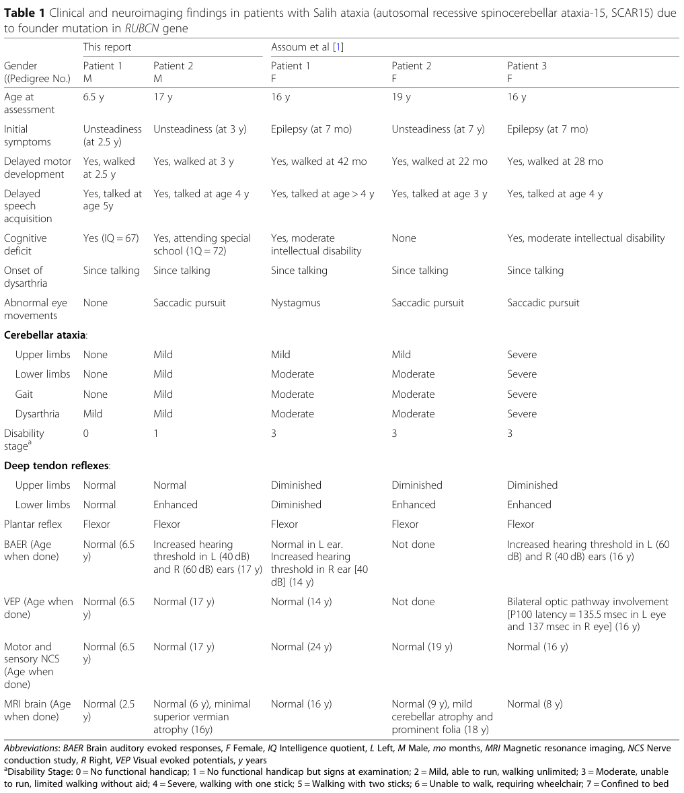

## Question

# Disease Characteristics Research Template

## Target Disease
- **Disease Name:** Autosomal Recessive Spinocerebellar Ataxia 15
- **MONDO ID:**  (if available)
- **Category:** Mendelian

## Research Objectives

Please provide a comprehensive research report on **Autosomal Recessive Spinocerebellar Ataxia 15** covering all of the
disease characteristics listed below. This report will be used to populate a disease knowledge
base entry. Be thorough and cite primary literature (PMID preferred) for all claims.

For each section, **suggested databases/resources** are listed. These are the first places
you should search for information on each topic.

---

### 1. Disease Information
> **Search first:** OMIM, Orphanet, ICD-10/ICD-11, MeSH, PubMed

- What is the disease? Provide a concise overview.
- What are the key identifiers? (OMIM, Orphanet, ICD-10/ICD-11, MeSH, Mondo)
- What are the common synonyms and alternative names?
- Is the information derived from individual patients (e.g., EHR) or aggregated disease-level resources?

### 2. Etiology

- **Disease Causal Factors**: What are the primary causes? (genetic, environmental, infectious, mechanistic)
- **Risk Factors**:
  > **Search first:** PubMed, Cochrane Library, UpToDate, clinical guidelines, ClinVar, ClinGen, GWAS Catalog, PheGenI, CTD, CDC, WHO, epidemiological databases
  - Genetic risk factors (causal variants, susceptibility loci, modifier genes)
  - Environmental risk factors (toxins, lifestyle, occupational exposures, age, sex, family history)
- **Protective Factors**:
  > **Search first:** PubMed, Cochrane Library, clinical trial databases, GWAS Catalog, gnomAD, WHO, CDC, nutrition databases
  - Genetic protective factors (protective variants, modifier alleles)
  - Environmental protective factors (diet, lifestyle, exposures that reduce risk)
- **Gene-Environment Interactions**: How do genetic and environmental factors interact to influence disease?
  > **Search first:** CTD, PubMed, PheGenI, GxE databases

### 3. Phenotypes
> **Search first:** HPO (Human Phenotype Ontology), OMIM, Orphanet, PubMed, clinicaltrials.gov, MedDRA, SNOMED CT, DECIPHER, LOINC

For each phenotype, provide:
- **Phenotype type**: symptoms, clinical signs, physical manifestations, behavioral changes, or laboratory abnormalities
  > For symptoms/signs: HPO, OMIM, Orphanet, PubMed
  > For behavioral changes: HPO, DSM, RDoC (Research Domain Criteria), PubMed
  > For laboratory abnormalities: LOINC, SNOMED CT, LabTests Online, PubMed
- **Phenotype characteristics**:
  > **Search first:** OMIM, Orphanet, HPO, PubMed
  - Age of symptom onset (neonatal, childhood, adult-onset, late-onset)
  - Symptom severity (mild, moderate, severe, variable)
  - Symptom progression (stable, progressive, episodic, fluctuating)
  - Frequency among affected individuals (percentage or qualitative)
- **Quality of life impact**: Effects on daily functioning and well-being (per-phenotype when possible)
  > **Search first:** EQ-5D database, SF-36, WHO QOL databases, PubMed
- Suggest HPO (Human Phenotype Ontology) terms for each phenotype

### 4. Genetic/Molecular Information

- **Causal Genes**: Gene mutations or chromosomal abnormalities responsible for disease (gene symbols, OMIM IDs)
  > **Search first:** OMIM, ClinVar, HGMD, Ensembl, NCBI Gene
- **Pathogenic Variants**:
  - Affected genes (gene symbols, HGNC IDs)
    > **Search first:** OMIM, NCBI Gene, Ensembl, HGNC, UniProt, GeneCards
  - Variant classification (pathogenic, likely pathogenic, VUS per ACMG/AMP guidelines)
    > **Search first:** ClinVar, ClinGen, ACMG/AMP guidelines, VarSome
  - Variant type/class (missense, frameshift, nonsense, splice-site, structural)
  - Allele frequency in population databases
    > **Search first:** gnomAD, 1000 Genomes, ExAC, TOPMed, dbSNP
  - Somatic vs germline origin
    > **Search first:** COSMIC (somatic), ClinVar, ICGC, TCGA
  - Functional consequences (loss of function, gain of function, dominant negative)
- **Modifier Genes**: Genes that modify disease severity or expression
- **Epigenetic Information**: DNA methylation, histone modifications, chromatin changes affecting disease
  > **Search first:** ENCODE, Roadmap Epigenomics, MethBase, DiseaseMeth
- **Chromosomal Abnormalities**: Large-scale genetic changes (aneuploidy, translocations, inversions)
  > **Search first:** DECIPHER, ClinVar, ECARUCA, UCSC Genome Browser

### 5. Environmental Information

- **Environmental Factors**: Non-genetic contributing factors (toxins, radiation, pollution, occupational exposure)
  > **Search first:** CTD (Comparative Toxicogenomics Database), TOXNET, PubMed, EPA databases
- **Lifestyle Factors**: Behavioral factors (smoking, diet, exercise, alcohol consumption)
  > **Search first:** CDC databases, WHO, PubMed, NHANES
- **Infectious Agents**: If applicable, pathogens causing or triggering disease (bacteria, viruses, fungi, parasites)
  > **Search first:** NCBI Taxonomy, ViPR, BV-BRC, MicrobeDB, GIDEON

### 6. Mechanism / Pathophysiology

- **Molecular Pathways**: Specific signaling cascades or biochemical pathways involved (Wnt, MAPK, mTOR, PI3K-AKT, etc.)
  > **Search first:** KEGG, Reactome, WikiPathways, PathBank, BioCyc
- **Cellular Processes**: Cell-level mechanisms (apoptosis, autophagy, cell cycle dysregulation, inflammation, etc.)
  > **Search first:** Gene Ontology (GO), Reactome, KEGG, PubMed
- **Protein Dysfunction**: How protein structure or function is altered (misfolding, aggregation, loss of function, gain of function)
  > **Search first:** UniProt, PDB (Protein Data Bank), InterPro, Pfam, AlphaFold
- **Metabolic Changes**: Alterations in metabolic processes (energy metabolism, lipid metabolism, amino acid metabolism)
  > **Search first:** KEGG, BioCyc, HMDB (Human Metabolome Database), BRENDA
- **Immune System Involvement**: Role of immune response (autoimmunity, immunodeficiency, chronic inflammation)
  > **Search first:** ImmPort, Immunome Database, IEDB, Gene Ontology
- **Tissue Damage Mechanisms**: How tissues/ are injured (oxidative stress, ischemia, fibrosis, necrosis)
  > **Search first:** PubMed, Gene Ontology, Reactome
- **Biochemical Abnormalities**: Specific molecular defects (enzyme deficiencies, receptor dysfunction, ion channel defects)
  > **Search first:** BRENDA, UniProt, KEGG, OMIM, PubMed
- **Epigenetic Changes**: DNA methylation, histone modifications affecting gene expression in disease
  > **Search first:** ENCODE, Roadmap Epigenomics, MethBase, DiseaseMeth
- **Molecular Profiling** (if available):
  - Transcriptomics/gene expression changes
    > **Search first:** GEO (Gene Expression Omnibus), ArrayExpress, GTEx, Human Cell Atlas, SRA
  - Proteomics findings
    > **Search first:** PRIDE, ProteomeXchange, Human Protein Atlas, STRING, BioGRID
  - Metabolomics signatures
    > **Search first:** MetaboLights, Metabolomics Workbench, HMDB, METLIN
  - Lipidomics alterations
    > **Search first:** LIPID MAPS, SwissLipids, LipidHome, Metabolomics Workbench
  - Genomic structural features
    > **Search first:** UCSC Genome Browser, Ensembl, NCBI, dbVar, DGV
- **Advanced Technologies** (if applicable):
  - Single-cell analysis findings (cell-type specific mechanisms, cellular heterogeneity)
    > **Search first:** Human Cell Atlas, Single Cell Portal, GEO, CELLxGENE
  - Spatial transcriptomics findings
    > **Search first:** GEO, Spatial Research, Vizgen, 10x Genomics data
  - Multi-omics integration results
    > **Search first:** TCGA, ICGC, cBioPortal, LinkedOmics, PubMed
  - Functional genomics screens (CRISPR, RNAi)
    > **Search first:** DepMap, GenomeRNAi, PubMed, BioGRID ORCS

For each mechanism, describe:
- The causal chain from initial trigger to clinical manifestation
- Which mechanisms are upstream vs downstream
- What cell types and biological processes are involved
- Suggest GO terms for biological processes and CL terms for cell types

### 7. Anatomical Structures Affected

- **Organ Level**:
  - Primary organs directly affected
  - Secondary organ involvement (complications, secondary effects)
  - Body systems involved (cardiovascular, nervous, digestive, respiratory, endocrine, etc.)
  > **Search first:** Uberon, FMA (Foundational Model of Anatomy), OMIM, HPO, ICD-11, MeSH, SNOMED CT
- **Tissue and Cell Level**:
  - Specific tissue types affected (epithelial, connective, muscle, nervous)
  - Specific cell populations targeted (with Cell Ontology terms)
  > **Search first:** Uberon, Human Protein Atlas, Cell Ontology, Human Cell Atlas, CellMarker, PanglaoDB
- **Subcellular Level**:
  - Cellular compartments involved (mitochondria, nucleus, ER, lysosomes) (with GO Cellular Component terms)
  > **Search first:** Gene Ontology (Cellular Component), UniProt, Human Protein Atlas
- **Localization**:
  - Specific anatomical sites (with UBERON terms)
    > **Search first:** FMA, Uberon, NeuroNames (for brain), SNOMED CT
  - Lateralization (unilateral, bilateral, asymmetric)
    > **Search first:** HPO, clinical literature, imaging databases

### 8. Temporal Development

- **Onset**:
  - Typical age of onset (congenital, pediatric, adult, geriatric)
  - Onset pattern (acute, subacute, chronic, insidious)
  > **Search first:** OMIM, Orphanet, HPO, PubMed
- **Progression**:
  - Disease stages (early, intermediate, advanced, end-stage)
    > **Search first:** Cancer Staging Manual (AJCC), WHO classifications, PubMed
  - Progression rate (rapid, slow, variable)
  - Disease course pattern (episodic, relapsing-remitting, progressive, stable)
  - Disease duration (self-limited, chronic lifelong)
  > **Search first:** Disease registries, longitudinal cohort databases, natural history studies, PubMed, Orphanet, OMIM
- **Patterns**:
  - Remission patterns (spontaneous, treatment-induced)
    > **Search first:** Clinical trial databases, disease registries, PubMed
  - Critical periods (time windows of vulnerability or opportunity for intervention)
    > **Search first:** PubMed, developmental biology databases, clinical guidelines

### 9. Inheritance and Population

- **Epidemiology**:
  - Prevalence (cases per 100,000 at given time)
  - Incidence (new cases per 100,000 per year)
  > **Search first:** Orphanet, CDC, WHO, GBD (Global Burden of Disease), national registries, SEER, disease registries
- **For Genetic Etiology**:
  - Inheritance pattern (AD, AR, X-linked, mitochondrial, multifactorial, polygenic)
    > **Search first:** OMIM, Orphanet, ClinVar, GTR (Genetic Testing Registry)
  - Penetrance (complete, incomplete, age-dependent)
    > **Search first:** ClinVar, OMIM, PubMed, ClinGen
  - Expressivity (variable, consistent)
    > **Search first:** OMIM, ClinVar, PubMed
  - Genetic anticipation (increasing severity in successive generations)
    > **Search first:** OMIM, PubMed (especially for repeat expansion disorders)
  - Germline mosaicism
    > **Search first:** ClinVar, OMIM, genetic counseling literature, PubMed
  - Founder effects (population-specific mutations)
    > **Search first:** gnomAD, population genetics databases, PubMed
  - Consanguinity role
    > **Search first:** OMIM, population studies, genetic counseling resources
  - Carrier frequency
    > **Search first:** gnomAD, carrier screening databases, GeneReviews, GTR
- **Population Demographics**:
  - Affected populations (ethnic or demographic groups with higher prevalence)
    > **Search first:** gnomAD, 1000 Genomes, PAGE Study, PubMed, population registries
  - Geographic distribution (endemic areas, regional variation)
    > **Search first:** WHO, CDC, GBD, Orphanet, geographic epidemiology databases
  - Geographic distribution of specific variants
  - Sex ratio (male:female)
    > **Search first:** Disease registries, OMIM, PubMed, epidemiological databases
  - Age distribution of affected individuals
    > **Search first:** CDC, disease registries, SEER, Orphanet

### 10. Diagnostics

- **Clinical Tests**:
  - Laboratory tests (blood, urine, tissue chemistry, specific enzyme assays)
    > **Search first:** LOINC, LabTests Online, PubMed
  - Biomarkers (proteins, metabolites, genetic markers, circulating biomarkers)
    > **Search first:** FDA Biomarker List, BEST (Biomarkers, EndpointS, and other Tools), PubMed
  - Imaging studies (X-ray, CT, MRI, PET, ultrasound)
    > **Search first:** RadLex, DICOM, Radiopaedia, imaging databases
  - Functional tests (pulmonary function, cardiac stress tests)
    > **Search first:** LOINC, clinical guidelines, PubMed
  - Electrophysiology (EEG, EMG, ECG, nerve conduction studies)
    > **Search first:** LOINC, clinical neurophysiology databases, PubMed
  - Biopsy findings (histopathology, immunohistochemistry)
    > **Search first:** SNOMED CT, College of American Pathologists resources, PubMed
  - Pathology findings (microscopic examination)
    > **Search first:** SNOMED CT, Digital Pathology databases, PubMed
- **Genetic Testing**:
  > **Search first:** GTR (Genetic Testing Registry), GeneReviews, ClinGen
  - Overview of recommended genetic testing approach
  - Whole genome sequencing (WGS) utility
    > **Search first:** GTR, ClinVar, GEL (Genomics England), gnomAD
  - Whole exome sequencing (WES) utility
    > **Search first:** GTR, ClinVar, OMIM, GeneMatcher
  - Gene panels (which panels, which genes)
    > **Search first:** GTR, ClinVar, laboratory-specific databases
  - Single gene testing
    > **Search first:** GTR, ClinVar, OMIM, GeneReviews
  - Chromosomal microarray (CMA)
    > **Search first:** DECIPHER, ClinVar, dbVar, ECARUCA
  - Karyotyping
    > **Search first:** Chromosome Abnormality Database, ClinVar, cytogenetics resources
  - FISH
    > **Search first:** ClinVar, cytogenetics databases, PubMed
  - Mitochondrial DNA testing
    > **Search first:** MITOMAP, MSeqDR, ClinVar, GTR
  - Repeat expansion testing
    > **Search first:** GTR, ClinVar, repeat expansion databases, PubMed
- **Omics-Based Diagnostics** (if applicable):
  - RNA sequencing / transcriptomics
    > **Search first:** GEO, ArrayExpress, GTEx, RNA-seq databases
  - Proteomics
    > **Search first:** PRIDE, ProteomeXchange, FDA Biomarker database
  - Metabolomics
    > **Search first:** MetaboLights, Metabolomics Workbench, HMDB
  - Epigenomics
    > **Search first:** GEO, ENCODE, Roadmap Epigenomics, MethBase
  - Liquid biopsy
    > **Search first:** COSMIC, ClinVar, liquid biopsy databases, PubMed
- **Clinical Criteria**:
  - Standardized diagnostic criteria (DSM, ICD, society guidelines)
    > **Search first:** DSM-5, ICD-11, clinical society guidelines, UpToDate
  - Differential diagnosis (other conditions to rule out, with distinguishing features)
    > **Search first:** DynaMed, UpToDate, clinical decision support systems
- **Screening**:
  - Screening methods for asymptomatic individuals (newborn screening, carrier screening, cascade screening)
    > **Search first:** ACMG recommendations, CDC newborn screening, GTR

### 11. Outcome/Prognosis

- **Survival and Mortality**:
  - Survival rate (5-year, 10-year, overall)
    > **Search first:** SEER, cancer registries, disease-specific registries, PubMed
  - Life expectancy (with and without treatment if applicable)
    > **Search first:** Orphanet, disease registries, actuarial databases, PubMed
  - Mortality rate
    > **Search first:** CDC, WHO, GBD, national mortality databases
  - Disease-specific mortality (deaths directly attributable to disease)
    > **Search first:** Disease registries, CDC Wonder, GBD, PubMed
- **Morbidity and Function**:
  - Morbidity (disease-related disability and health impacts)
    > **Search first:** GBD, WHO, disability databases, PubMed
  - Disability outcomes (long-term functional impairments)
    > **Search first:** ICF (International Classification of Functioning), disability registries
  - Quality of life measures (EQ-5D, SF-36, PROMIS, disease-specific tools)
    > **Search first:** EQ-5D database, SF-36, PROMIS, PubMed
- **Disease Course**:
  - Complications (secondary problems: infections, organ failure, etc.)
    > **Search first:** ICD codes, disease registries, clinical databases, PubMed
  - Recovery potential (likelihood and extent of recovery, with vs without treatment)
    > **Search first:** Natural history studies, rehabilitation databases, PubMed
- **Prediction**:
  - Prognostic factors (age, disease severity, biomarkers, treatment response)
    > **Search first:** Prognostic models databases, clinical calculators, PubMed
  - Prognostic biomarkers (molecular markers predicting disease course)
    > **Search first:** FDA Biomarker database, PubMed, cancer prognostic databases

### 12. Treatment

- **Pharmacotherapy**:
  - Pharmacological treatments (drug names, drug classes, mechanisms of action)
    > **Search first:** DrugBank, RxNorm, ATC classification, DailyMed, FDA databases
  - Pharmacogenomics (how genetic variants affect drug metabolism, efficacy, toxicity)
    > **Search first:** PharmGKB, CPIC (Clinical Pharmacogenetics), FDA Table of PGx Biomarkers
- **Advanced Therapeutics**:
  - Gene therapy (viral vectors, CRISPR, gene replacement, gene editing)
    > **Search first:** ClinicalTrials.gov, FDA gene therapy database, ASGCT resources
  - Cell therapy (stem cell transplant, CAR-T, cellular therapeutics)
    > **Search first:** ClinicalTrials.gov, FDA cell therapy database, FACT standards
  - RNA-based therapies (ASOs, siRNA, mRNA therapies)
    > **Search first:** ClinicalTrials.gov, FDA approvals, PubMed
  - Targeted therapies (treatments directed at specific molecular targets)
    > **Search first:** My Cancer Genome, OncoKB, ClinicalTrials.gov, FDA approvals
  - Immunotherapies (checkpoint inhibitors, monoclonal antibodies)
    > **Search first:** Cancer Immunotherapy Database, FDA approvals, ClinicalTrials.gov
- **Surgical and Interventional**:
  - Surgical interventions (types of surgery, timing, outcomes)
    > **Search first:** CPT codes, surgical registries, clinical guidelines, PubMed
- **Supportive and Rehabilitative**:
  - Supportive care (symptom management, pain control, nutrition)
    > **Search first:** Clinical guidelines, Cochrane Library, PubMed
  - Rehabilitation (physical therapy, occupational therapy, speech therapy)
    > **Search first:** Rehabilitation medicine databases, clinical guidelines, PubMed
- **Experimental**:
  - Experimental treatments in clinical trials (with NCT identifiers if available)
    > **Search first:** ClinicalTrials.gov, EU Clinical Trials Register, WHO ICTRP
- **Treatment Outcomes**:
  - Treatment response rates
    > **Search first:** Clinical trial databases, FDA reviews, systematic reviews, PubMed
  - Side effects and adverse events
    > **Search first:** FDA Adverse Event Reporting System (FAERS), MedWatch, PubMed
- **Treatment Strategy**:
  - Treatment algorithms (clinical pathways, decision trees)
    > **Search first:** Clinical practice guidelines, NCCN Guidelines, UpToDate
  - Combination therapies
    > **Search first:** ClinicalTrials.gov, treatment guidelines, PubMed
  - Personalized medicine approaches (genotype-guided treatment)
    > **Search first:** My Cancer Genome, CIViC, PharmGKB, precision medicine databases

For each treatment, suggest NCIT (NCI Thesaurus) clinical-intervention terms where applicable.

### 13. Prevention

- **Prevention Levels**:
  - Primary prevention (preventing disease occurrence: vaccination, risk factor modification)
    > **Search first:** CDC, WHO, USPSTF recommendations, Cochrane Library
  - Secondary prevention (early detection and treatment: screening programs, early intervention)
    > **Search first:** USPSTF, CDC screening guidelines, WHO
  - Tertiary prevention (preventing complications in those with disease)
    > **Search first:** Clinical guidelines, disease management protocols, PubMed
- **Immunization**: Vaccine strategies (if applicable)
  > **Search first:** CDC vaccine schedules, WHO immunization, FDA vaccine database
- **Screening and Early Detection**:
  - Screening programs (population-based: newborn screening, cancer screening)
    > **Search first:** CDC screening programs, USPSTF, cancer screening databases
  - Genetic screening (carrier screening, preimplantation genetic diagnosis, prenatal testing)
    > **Search first:** ACMG recommendations, ACOG guidelines, GTR
  - Risk stratification (identifying high-risk individuals for targeted prevention)
    > **Search first:** Risk prediction models, clinical calculators, PubMed
- **Behavioral Interventions**: Lifestyle modifications to reduce risk
  > **Search first:** CDC, WHO, behavioral intervention databases, Cochrane Library
- **Counseling**: Genetic counseling (risk assessment, family planning guidance)
  > **Search first:** NSGC resources, ACMG guidelines, GeneReviews
- **Public Health**:
  - Public health interventions (sanitation, vector control, health education)
    > **Search first:** CDC, WHO, public health databases, PubMed
  - Environmental interventions (reducing environmental risk factors)
    > **Search first:** EPA databases, WHO environmental health, PubMed
- **Prophylaxis**: Preventive medications or procedures
  > **Search first:** Clinical guidelines, FDA approvals, PubMed

### 14. Other Species / Natural Disease

- **Taxonomy**: Species affected (with NCBI Taxon identifiers)
  > **Search first:** NCBI Taxonomy
- **Breed**: Specific breeds affected (with VBO identifiers if applicable)
  > **Search first:** VBO (Vertebrate Breed Ontology)
- **Gene**: Orthologous genes in other species (with NCBI Gene IDs)
  > **Search first:** NCBI Gene
- **Natural Disease**:
  - Naturally occurring disease in other species (companion animals, wildlife)
    > **Search first:** OMIA (Online Mendelian Inheritance in Animals), VetCompass, PubMed
  - Veterinary relevance and importance in animal health
    > **Search first:** OMIA, veterinary databases, PubMed
- **Comparative Biology**:
  - Comparative pathology (similarities and differences across species)
    > **Search first:** OMIA, comparative pathology databases, PubMed
  - Evolutionary conservation of disease mechanisms
    > **Search first:** HomoloGene, OrthoMCL, Alliance of Genome Resources
- **Transmission** (if applicable):
  - Zoonotic potential
    > **Search first:** CDC zoonotic diseases, WHO zoonoses, GIDEON
  - Cross-species susceptibility
    > **Search first:** NCBI Taxonomy, veterinary databases, PubMed

### 15. Model Organisms

- **Model Types**:
  - Model organism type (mammalian, invertebrate, cellular, in vitro)
    > **Search first:** Alliance of Genome Resources, model organism databases
  - Specific model systems (mouse, rat, zebrafish, Drosophila, C. elegans, yeast, cell lines, organoids, iPSCs)
    > **Search first:** MGI, RGD, ZFIN, FlyBase, WormBase, SGD, ATCC, Cellosaurus
  - Induced models (drug treatment, surgical intervention, environmental manipulation)
    > **Search first:** MGI, model organism databases, PubMed
- **Genetic Models**:
  - Types available (knockout, knock-in, transgenic, conditional, humanized)
    > **Search first:** MGI, IMPC, KOMP, EuMMCR, IMSR
- **Model Characteristics**:
  - Phenotype recapitulation (how well model reproduces human disease features)
    > **Search first:** Model organism databases, comparative studies, PubMed
  - Model limitations (aspects of human disease not captured)
    > **Search first:** Model organism databases, PubMed, review articles
- **Applications**:
  - Research applications (what aspects of disease can be studied)
    > **Search first:** Model organism databases, PubMed
- **Resources**:
  - Model databases
    > **Search first:** MGI, RGD, ZFIN, FlyBase, WormBase, IMSR, EMMA, MMRRC

---

## Citation Requirements

- Cite primary literature (PMID preferred) for all mechanistic and clinical claims
- Prioritize recent reviews and landmark papers
- Include direct quotes from abstracts where possible to support key statements
- Distinguish evidence source types: human clinical, model organism, in vitro, computational

## Output Format

Structure your response as a comprehensive narrative organized by the sections above.
For each section, provide:
- Factual content with specific details (numbers, percentages, gene names, variant nomenclature)
- Ontology term suggestions (HPO, GO, CL, UBERON, CHEBI, NCIT, MONDO) where applicable
- Evidence citations with PMIDs
- Direct quotes from abstracts to support key claims
- Clear indication when information is not available or not applicable for this disease

This report will be used to populate a disease knowledge base entry with:
- Pathophysiology descriptions with causal chains
- Gene/protein annotations (HGNC, GO terms)
- Phenotype associations (HP terms) with frequencies
- Cell type involvement (CL terms)
- Anatomical locations (UBERON terms)
- Chemical entities (CHEBI terms)
- Treatment annotations (NCIT terms)
- Evidence items with PMIDs and exact abstract quotes
- Epidemiology, prognosis, diagnostic, and prevention information
- Animal model descriptions with phenotype recapitulation details

## Output

Question: You are an expert researcher providing comprehensive, well-cited information.

Provide detailed information focusing on:
1. Key concepts and definitions with current understanding
2. Recent developments and latest research (prioritize 2023-2024 sources)
3. Current applications and real-world implementations
4. Expert opinions and analysis from authoritative sources
5. Relevant statistics and data from recent studies

Format as a comprehensive research report with proper citations. Include URLs and publication dates where available.
Always prioritize recent, authoritative sources and provide specific citations for all major claims.

# Disease Characteristics Research Template

## Target Disease
- **Disease Name:** Autosomal Recessive Spinocerebellar Ataxia 15
- **MONDO ID:**  (if available)
- **Category:** Mendelian

## Research Objectives

Please provide a comprehensive research report on **Autosomal Recessive Spinocerebellar Ataxia 15** covering all of the
disease characteristics listed below. This report will be used to populate a disease knowledge
base entry. Be thorough and cite primary literature (PMID preferred) for all claims.

For each section, **suggested databases/resources** are listed. These are the first places
you should search for information on each topic.

---

### 1. Disease Information
> **Search first:** OMIM, Orphanet, ICD-10/ICD-11, MeSH, PubMed

- What is the disease? Provide a concise overview.
- What are the key identifiers? (OMIM, Orphanet, ICD-10/ICD-11, MeSH, Mondo)
- What are the common synonyms and alternative names?
- Is the information derived from individual patients (e.g., EHR) or aggregated disease-level resources?

### 2. Etiology

- **Disease Causal Factors**: What are the primary causes? (genetic, environmental, infectious, mechanistic)
- **Risk Factors**:
  > **Search first:** PubMed, Cochrane Library, UpToDate, clinical guidelines, ClinVar, ClinGen, GWAS Catalog, PheGenI, CTD, CDC, WHO, epidemiological databases
  - Genetic risk factors (causal variants, susceptibility loci, modifier genes)
  - Environmental risk factors (toxins, lifestyle, occupational exposures, age, sex, family history)
- **Protective Factors**:
  > **Search first:** PubMed, Cochrane Library, clinical trial databases, GWAS Catalog, gnomAD, WHO, CDC, nutrition databases
  - Genetic protective factors (protective variants, modifier alleles)
  - Environmental protective factors (diet, lifestyle, exposures that reduce risk)
- **Gene-Environment Interactions**: How do genetic and environmental factors interact to influence disease?
  > **Search first:** CTD, PubMed, PheGenI, GxE databases

### 3. Phenotypes
> **Search first:** HPO (Human Phenotype Ontology), OMIM, Orphanet, PubMed, clinicaltrials.gov, MedDRA, SNOMED CT, DECIPHER, LOINC

For each phenotype, provide:
- **Phenotype type**: symptoms, clinical signs, physical manifestations, behavioral changes, or laboratory abnormalities
  > For symptoms/signs: HPO, OMIM, Orphanet, PubMed
  > For behavioral changes: HPO, DSM, RDoC (Research Domain Criteria), PubMed
  > For laboratory abnormalities: LOINC, SNOMED CT, LabTests Online, PubMed
- **Phenotype characteristics**:
  > **Search first:** OMIM, Orphanet, HPO, PubMed
  - Age of symptom onset (neonatal, childhood, adult-onset, late-onset)
  - Symptom severity (mild, moderate, severe, variable)
  - Symptom progression (stable, progressive, episodic, fluctuating)
  - Frequency among affected individuals (percentage or qualitative)
- **Quality of life impact**: Effects on daily functioning and well-being (per-phenotype when possible)
  > **Search first:** EQ-5D database, SF-36, WHO QOL databases, PubMed
- Suggest HPO (Human Phenotype Ontology) terms for each phenotype

### 4. Genetic/Molecular Information

- **Causal Genes**: Gene mutations or chromosomal abnormalities responsible for disease (gene symbols, OMIM IDs)
  > **Search first:** OMIM, ClinVar, HGMD, Ensembl, NCBI Gene
- **Pathogenic Variants**:
  - Affected genes (gene symbols, HGNC IDs)
    > **Search first:** OMIM, NCBI Gene, Ensembl, HGNC, UniProt, GeneCards
  - Variant classification (pathogenic, likely pathogenic, VUS per ACMG/AMP guidelines)
    > **Search first:** ClinVar, ClinGen, ACMG/AMP guidelines, VarSome
  - Variant type/class (missense, frameshift, nonsense, splice-site, structural)
  - Allele frequency in population databases
    > **Search first:** gnomAD, 1000 Genomes, ExAC, TOPMed, dbSNP
  - Somatic vs germline origin
    > **Search first:** COSMIC (somatic), ClinVar, ICGC, TCGA
  - Functional consequences (loss of function, gain of function, dominant negative)
- **Modifier Genes**: Genes that modify disease severity or expression
- **Epigenetic Information**: DNA methylation, histone modifications, chromatin changes affecting disease
  > **Search first:** ENCODE, Roadmap Epigenomics, MethBase, DiseaseMeth
- **Chromosomal Abnormalities**: Large-scale genetic changes (aneuploidy, translocations, inversions)
  > **Search first:** DECIPHER, ClinVar, ECARUCA, UCSC Genome Browser

### 5. Environmental Information

- **Environmental Factors**: Non-genetic contributing factors (toxins, radiation, pollution, occupational exposure)
  > **Search first:** CTD (Comparative Toxicogenomics Database), TOXNET, PubMed, EPA databases
- **Lifestyle Factors**: Behavioral factors (smoking, diet, exercise, alcohol consumption)
  > **Search first:** CDC databases, WHO, PubMed, NHANES
- **Infectious Agents**: If applicable, pathogens causing or triggering disease (bacteria, viruses, fungi, parasites)
  > **Search first:** NCBI Taxonomy, ViPR, BV-BRC, MicrobeDB, GIDEON

### 6. Mechanism / Pathophysiology

- **Molecular Pathways**: Specific signaling cascades or biochemical pathways involved (Wnt, MAPK, mTOR, PI3K-AKT, etc.)
  > **Search first:** KEGG, Reactome, WikiPathways, PathBank, BioCyc
- **Cellular Processes**: Cell-level mechanisms (apoptosis, autophagy, cell cycle dysregulation, inflammation, etc.)
  > **Search first:** Gene Ontology (GO), Reactome, KEGG, PubMed
- **Protein Dysfunction**: How protein structure or function is altered (misfolding, aggregation, loss of function, gain of function)
  > **Search first:** UniProt, PDB (Protein Data Bank), InterPro, Pfam, AlphaFold
- **Metabolic Changes**: Alterations in metabolic processes (energy metabolism, lipid metabolism, amino acid metabolism)
  > **Search first:** KEGG, BioCyc, HMDB (Human Metabolome Database), BRENDA
- **Immune System Involvement**: Role of immune response (autoimmunity, immunodeficiency, chronic inflammation)
  > **Search first:** ImmPort, Immunome Database, IEDB, Gene Ontology
- **Tissue Damage Mechanisms**: How tissues/ are injured (oxidative stress, ischemia, fibrosis, necrosis)
  > **Search first:** PubMed, Gene Ontology, Reactome
- **Biochemical Abnormalities**: Specific molecular defects (enzyme deficiencies, receptor dysfunction, ion channel defects)
  > **Search first:** BRENDA, UniProt, KEGG, OMIM, PubMed
- **Epigenetic Changes**: DNA methylation, histone modifications affecting gene expression in disease
  > **Search first:** ENCODE, Roadmap Epigenomics, MethBase, DiseaseMeth
- **Molecular Profiling** (if available):
  - Transcriptomics/gene expression changes
    > **Search first:** GEO (Gene Expression Omnibus), ArrayExpress, GTEx, Human Cell Atlas, SRA
  - Proteomics findings
    > **Search first:** PRIDE, ProteomeXchange, Human Protein Atlas, STRING, BioGRID
  - Metabolomics signatures
    > **Search first:** MetaboLights, Metabolomics Workbench, HMDB, METLIN
  - Lipidomics alterations
    > **Search first:** LIPID MAPS, SwissLipids, LipidHome, Metabolomics Workbench
  - Genomic structural features
    > **Search first:** UCSC Genome Browser, Ensembl, NCBI, dbVar, DGV
- **Advanced Technologies** (if applicable):
  - Single-cell analysis findings (cell-type specific mechanisms, cellular heterogeneity)
    > **Search first:** Human Cell Atlas, Single Cell Portal, GEO, CELLxGENE
  - Spatial transcriptomics findings
    > **Search first:** GEO, Spatial Research, Vizgen, 10x Genomics data
  - Multi-omics integration results
    > **Search first:** TCGA, ICGC, cBioPortal, LinkedOmics, PubMed
  - Functional genomics screens (CRISPR, RNAi)
    > **Search first:** DepMap, GenomeRNAi, PubMed, BioGRID ORCS

For each mechanism, describe:
- The causal chain from initial trigger to clinical manifestation
- Which mechanisms are upstream vs downstream
- What cell types and biological processes are involved
- Suggest GO terms for biological processes and CL terms for cell types

### 7. Anatomical Structures Affected

- **Organ Level**:
  - Primary organs directly affected
  - Secondary organ involvement (complications, secondary effects)
  - Body systems involved (cardiovascular, nervous, digestive, respiratory, endocrine, etc.)
  > **Search first:** Uberon, FMA (Foundational Model of Anatomy), OMIM, HPO, ICD-11, MeSH, SNOMED CT
- **Tissue and Cell Level**:
  - Specific tissue types affected (epithelial, connective, muscle, nervous)
  - Specific cell populations targeted (with Cell Ontology terms)
  > **Search first:** Uberon, Human Protein Atlas, Cell Ontology, Human Cell Atlas, CellMarker, PanglaoDB
- **Subcellular Level**:
  - Cellular compartments involved (mitochondria, nucleus, ER, lysosomes) (with GO Cellular Component terms)
  > **Search first:** Gene Ontology (Cellular Component), UniProt, Human Protein Atlas
- **Localization**:
  - Specific anatomical sites (with UBERON terms)
    > **Search first:** FMA, Uberon, NeuroNames (for brain), SNOMED CT
  - Lateralization (unilateral, bilateral, asymmetric)
    > **Search first:** HPO, clinical literature, imaging databases

### 8. Temporal Development

- **Onset**:
  - Typical age of onset (congenital, pediatric, adult, geriatric)
  - Onset pattern (acute, subacute, chronic, insidious)
  > **Search first:** OMIM, Orphanet, HPO, PubMed
- **Progression**:
  - Disease stages (early, intermediate, advanced, end-stage)
    > **Search first:** Cancer Staging Manual (AJCC), WHO classifications, PubMed
  - Progression rate (rapid, slow, variable)
  - Disease course pattern (episodic, relapsing-remitting, progressive, stable)
  - Disease duration (self-limited, chronic lifelong)
  > **Search first:** Disease registries, longitudinal cohort databases, natural history studies, PubMed, Orphanet, OMIM
- **Patterns**:
  - Remission patterns (spontaneous, treatment-induced)
    > **Search first:** Clinical trial databases, disease registries, PubMed
  - Critical periods (time windows of vulnerability or opportunity for intervention)
    > **Search first:** PubMed, developmental biology databases, clinical guidelines

### 9. Inheritance and Population

- **Epidemiology**:
  - Prevalence (cases per 100,000 at given time)
  - Incidence (new cases per 100,000 per year)
  > **Search first:** Orphanet, CDC, WHO, GBD (Global Burden of Disease), national registries, SEER, disease registries
- **For Genetic Etiology**:
  - Inheritance pattern (AD, AR, X-linked, mitochondrial, multifactorial, polygenic)
    > **Search first:** OMIM, Orphanet, ClinVar, GTR (Genetic Testing Registry)
  - Penetrance (complete, incomplete, age-dependent)
    > **Search first:** ClinVar, OMIM, PubMed, ClinGen
  - Expressivity (variable, consistent)
    > **Search first:** OMIM, ClinVar, PubMed
  - Genetic anticipation (increasing severity in successive generations)
    > **Search first:** OMIM, PubMed (especially for repeat expansion disorders)
  - Germline mosaicism
    > **Search first:** ClinVar, OMIM, genetic counseling literature, PubMed
  - Founder effects (population-specific mutations)
    > **Search first:** gnomAD, population genetics databases, PubMed
  - Consanguinity role
    > **Search first:** OMIM, population studies, genetic counseling resources
  - Carrier frequency
    > **Search first:** gnomAD, carrier screening databases, GeneReviews, GTR
- **Population Demographics**:
  - Affected populations (ethnic or demographic groups with higher prevalence)
    > **Search first:** gnomAD, 1000 Genomes, PAGE Study, PubMed, population registries
  - Geographic distribution (endemic areas, regional variation)
    > **Search first:** WHO, CDC, GBD, Orphanet, geographic epidemiology databases
  - Geographic distribution of specific variants
  - Sex ratio (male:female)
    > **Search first:** Disease registries, OMIM, PubMed, epidemiological databases
  - Age distribution of affected individuals
    > **Search first:** CDC, disease registries, SEER, Orphanet

### 10. Diagnostics

- **Clinical Tests**:
  - Laboratory tests (blood, urine, tissue chemistry, specific enzyme assays)
    > **Search first:** LOINC, LabTests Online, PubMed
  - Biomarkers (proteins, metabolites, genetic markers, circulating biomarkers)
    > **Search first:** FDA Biomarker List, BEST (Biomarkers, EndpointS, and other Tools), PubMed
  - Imaging studies (X-ray, CT, MRI, PET, ultrasound)
    > **Search first:** RadLex, DICOM, Radiopaedia, imaging databases
  - Functional tests (pulmonary function, cardiac stress tests)
    > **Search first:** LOINC, clinical guidelines, PubMed
  - Electrophysiology (EEG, EMG, ECG, nerve conduction studies)
    > **Search first:** LOINC, clinical neurophysiology databases, PubMed
  - Biopsy findings (histopathology, immunohistochemistry)
    > **Search first:** SNOMED CT, College of American Pathologists resources, PubMed
  - Pathology findings (microscopic examination)
    > **Search first:** SNOMED CT, Digital Pathology databases, PubMed
- **Genetic Testing**:
  > **Search first:** GTR (Genetic Testing Registry), GeneReviews, ClinGen
  - Overview of recommended genetic testing approach
  - Whole genome sequencing (WGS) utility
    > **Search first:** GTR, ClinVar, GEL (Genomics England), gnomAD
  - Whole exome sequencing (WES) utility
    > **Search first:** GTR, ClinVar, OMIM, GeneMatcher
  - Gene panels (which panels, which genes)
    > **Search first:** GTR, ClinVar, laboratory-specific databases
  - Single gene testing
    > **Search first:** GTR, ClinVar, OMIM, GeneReviews
  - Chromosomal microarray (CMA)
    > **Search first:** DECIPHER, ClinVar, dbVar, ECARUCA
  - Karyotyping
    > **Search first:** Chromosome Abnormality Database, ClinVar, cytogenetics resources
  - FISH
    > **Search first:** ClinVar, cytogenetics databases, PubMed
  - Mitochondrial DNA testing
    > **Search first:** MITOMAP, MSeqDR, ClinVar, GTR
  - Repeat expansion testing
    > **Search first:** GTR, ClinVar, repeat expansion databases, PubMed
- **Omics-Based Diagnostics** (if applicable):
  - RNA sequencing / transcriptomics
    > **Search first:** GEO, ArrayExpress, GTEx, RNA-seq databases
  - Proteomics
    > **Search first:** PRIDE, ProteomeXchange, FDA Biomarker database
  - Metabolomics
    > **Search first:** MetaboLights, Metabolomics Workbench, HMDB
  - Epigenomics
    > **Search first:** GEO, ENCODE, Roadmap Epigenomics, MethBase
  - Liquid biopsy
    > **Search first:** COSMIC, ClinVar, liquid biopsy databases, PubMed
- **Clinical Criteria**:
  - Standardized diagnostic criteria (DSM, ICD, society guidelines)
    > **Search first:** DSM-5, ICD-11, clinical society guidelines, UpToDate
  - Differential diagnosis (other conditions to rule out, with distinguishing features)
    > **Search first:** DynaMed, UpToDate, clinical decision support systems
- **Screening**:
  - Screening methods for asymptomatic individuals (newborn screening, carrier screening, cascade screening)
    > **Search first:** ACMG recommendations, CDC newborn screening, GTR

### 11. Outcome/Prognosis

- **Survival and Mortality**:
  - Survival rate (5-year, 10-year, overall)
    > **Search first:** SEER, cancer registries, disease-specific registries, PubMed
  - Life expectancy (with and without treatment if applicable)
    > **Search first:** Orphanet, disease registries, actuarial databases, PubMed
  - Mortality rate
    > **Search first:** CDC, WHO, GBD, national mortality databases
  - Disease-specific mortality (deaths directly attributable to disease)
    > **Search first:** Disease registries, CDC Wonder, GBD, PubMed
- **Morbidity and Function**:
  - Morbidity (disease-related disability and health impacts)
    > **Search first:** GBD, WHO, disability databases, PubMed
  - Disability outcomes (long-term functional impairments)
    > **Search first:** ICF (International Classification of Functioning), disability registries
  - Quality of life measures (EQ-5D, SF-36, PROMIS, disease-specific tools)
    > **Search first:** EQ-5D database, SF-36, PROMIS, PubMed
- **Disease Course**:
  - Complications (secondary problems: infections, organ failure, etc.)
    > **Search first:** ICD codes, disease registries, clinical databases, PubMed
  - Recovery potential (likelihood and extent of recovery, with vs without treatment)
    > **Search first:** Natural history studies, rehabilitation databases, PubMed
- **Prediction**:
  - Prognostic factors (age, disease severity, biomarkers, treatment response)
    > **Search first:** Prognostic models databases, clinical calculators, PubMed
  - Prognostic biomarkers (molecular markers predicting disease course)
    > **Search first:** FDA Biomarker database, PubMed, cancer prognostic databases

### 12. Treatment

- **Pharmacotherapy**:
  - Pharmacological treatments (drug names, drug classes, mechanisms of action)
    > **Search first:** DrugBank, RxNorm, ATC classification, DailyMed, FDA databases
  - Pharmacogenomics (how genetic variants affect drug metabolism, efficacy, toxicity)
    > **Search first:** PharmGKB, CPIC (Clinical Pharmacogenetics), FDA Table of PGx Biomarkers
- **Advanced Therapeutics**:
  - Gene therapy (viral vectors, CRISPR, gene replacement, gene editing)
    > **Search first:** ClinicalTrials.gov, FDA gene therapy database, ASGCT resources
  - Cell therapy (stem cell transplant, CAR-T, cellular therapeutics)
    > **Search first:** ClinicalTrials.gov, FDA cell therapy database, FACT standards
  - RNA-based therapies (ASOs, siRNA, mRNA therapies)
    > **Search first:** ClinicalTrials.gov, FDA approvals, PubMed
  - Targeted therapies (treatments directed at specific molecular targets)
    > **Search first:** My Cancer Genome, OncoKB, ClinicalTrials.gov, FDA approvals
  - Immunotherapies (checkpoint inhibitors, monoclonal antibodies)
    > **Search first:** Cancer Immunotherapy Database, FDA approvals, ClinicalTrials.gov
- **Surgical and Interventional**:
  - Surgical interventions (types of surgery, timing, outcomes)
    > **Search first:** CPT codes, surgical registries, clinical guidelines, PubMed
- **Supportive and Rehabilitative**:
  - Supportive care (symptom management, pain control, nutrition)
    > **Search first:** Clinical guidelines, Cochrane Library, PubMed
  - Rehabilitation (physical therapy, occupational therapy, speech therapy)
    > **Search first:** Rehabilitation medicine databases, clinical guidelines, PubMed
- **Experimental**:
  - Experimental treatments in clinical trials (with NCT identifiers if available)
    > **Search first:** ClinicalTrials.gov, EU Clinical Trials Register, WHO ICTRP
- **Treatment Outcomes**:
  - Treatment response rates
    > **Search first:** Clinical trial databases, FDA reviews, systematic reviews, PubMed
  - Side effects and adverse events
    > **Search first:** FDA Adverse Event Reporting System (FAERS), MedWatch, PubMed
- **Treatment Strategy**:
  - Treatment algorithms (clinical pathways, decision trees)
    > **Search first:** Clinical practice guidelines, NCCN Guidelines, UpToDate
  - Combination therapies
    > **Search first:** ClinicalTrials.gov, treatment guidelines, PubMed
  - Personalized medicine approaches (genotype-guided treatment)
    > **Search first:** My Cancer Genome, CIViC, PharmGKB, precision medicine databases

For each treatment, suggest NCIT (NCI Thesaurus) clinical-intervention terms where applicable.

### 13. Prevention

- **Prevention Levels**:
  - Primary prevention (preventing disease occurrence: vaccination, risk factor modification)
    > **Search first:** CDC, WHO, USPSTF recommendations, Cochrane Library
  - Secondary prevention (early detection and treatment: screening programs, early intervention)
    > **Search first:** USPSTF, CDC screening guidelines, WHO
  - Tertiary prevention (preventing complications in those with disease)
    > **Search first:** Clinical guidelines, disease management protocols, PubMed
- **Immunization**: Vaccine strategies (if applicable)
  > **Search first:** CDC vaccine schedules, WHO immunization, FDA vaccine database
- **Screening and Early Detection**:
  - Screening programs (population-based: newborn screening, cancer screening)
    > **Search first:** CDC screening programs, USPSTF, cancer screening databases
  - Genetic screening (carrier screening, preimplantation genetic diagnosis, prenatal testing)
    > **Search first:** ACMG recommendations, ACOG guidelines, GTR
  - Risk stratification (identifying high-risk individuals for targeted prevention)
    > **Search first:** Risk prediction models, clinical calculators, PubMed
- **Behavioral Interventions**: Lifestyle modifications to reduce risk
  > **Search first:** CDC, WHO, behavioral intervention databases, Cochrane Library
- **Counseling**: Genetic counseling (risk assessment, family planning guidance)
  > **Search first:** NSGC resources, ACMG guidelines, GeneReviews
- **Public Health**:
  - Public health interventions (sanitation, vector control, health education)
    > **Search first:** CDC, WHO, public health databases, PubMed
  - Environmental interventions (reducing environmental risk factors)
    > **Search first:** EPA databases, WHO environmental health, PubMed
- **Prophylaxis**: Preventive medications or procedures
  > **Search first:** Clinical guidelines, FDA approvals, PubMed

### 14. Other Species / Natural Disease

- **Taxonomy**: Species affected (with NCBI Taxon identifiers)
  > **Search first:** NCBI Taxonomy
- **Breed**: Specific breeds affected (with VBO identifiers if applicable)
  > **Search first:** VBO (Vertebrate Breed Ontology)
- **Gene**: Orthologous genes in other species (with NCBI Gene IDs)
  > **Search first:** NCBI Gene
- **Natural Disease**:
  - Naturally occurring disease in other species (companion animals, wildlife)
    > **Search first:** OMIA (Online Mendelian Inheritance in Animals), VetCompass, PubMed
  - Veterinary relevance and importance in animal health
    > **Search first:** OMIA, veterinary databases, PubMed
- **Comparative Biology**:
  - Comparative pathology (similarities and differences across species)
    > **Search first:** OMIA, comparative pathology databases, PubMed
  - Evolutionary conservation of disease mechanisms
    > **Search first:** HomoloGene, OrthoMCL, Alliance of Genome Resources
- **Transmission** (if applicable):
  - Zoonotic potential
    > **Search first:** CDC zoonotic diseases, WHO zoonoses, GIDEON
  - Cross-species susceptibility
    > **Search first:** NCBI Taxonomy, veterinary databases, PubMed

### 15. Model Organisms

- **Model Types**:
  - Model organism type (mammalian, invertebrate, cellular, in vitro)
    > **Search first:** Alliance of Genome Resources, model organism databases
  - Specific model systems (mouse, rat, zebrafish, Drosophila, C. elegans, yeast, cell lines, organoids, iPSCs)
    > **Search first:** MGI, RGD, ZFIN, FlyBase, WormBase, SGD, ATCC, Cellosaurus
  - Induced models (drug treatment, surgical intervention, environmental manipulation)
    > **Search first:** MGI, model organism databases, PubMed
- **Genetic Models**:
  - Types available (knockout, knock-in, transgenic, conditional, humanized)
    > **Search first:** MGI, IMPC, KOMP, EuMMCR, IMSR
- **Model Characteristics**:
  - Phenotype recapitulation (how well model reproduces human disease features)
    > **Search first:** Model organism databases, comparative studies, PubMed
  - Model limitations (aspects of human disease not captured)
    > **Search first:** Model organism databases, PubMed, review articles
- **Applications**:
  - Research applications (what aspects of disease can be studied)
    > **Search first:** Model organism databases, PubMed
- **Resources**:
  - Model databases
    > **Search first:** MGI, RGD, ZFIN, FlyBase, WormBase, IMSR, EMMA, MMRRC

---

## Citation Requirements

- Cite primary literature (PMID preferred) for all mechanistic and clinical claims
- Prioritize recent reviews and landmark papers
- Include direct quotes from abstracts where possible to support key statements
- Distinguish evidence source types: human clinical, model organism, in vitro, computational

## Output Format

Structure your response as a comprehensive narrative organized by the sections above.
For each section, provide:
- Factual content with specific details (numbers, percentages, gene names, variant nomenclature)
- Ontology term suggestions (HPO, GO, CL, UBERON, CHEBI, NCIT, MONDO) where applicable
- Evidence citations with PMIDs
- Direct quotes from abstracts to support key claims
- Clear indication when information is not available or not applicable for this disease

This report will be used to populate a disease knowledge base entry with:
- Pathophysiology descriptions with causal chains
- Gene/protein annotations (HGNC, GO terms)
- Phenotype associations (HP terms) with frequencies
- Cell type involvement (CL terms)
- Anatomical locations (UBERON terms)
- Chemical entities (CHEBI terms)
- Treatment annotations (NCIT terms)
- Evidence items with PMIDs and exact abstract quotes
- Epidemiology, prognosis, diagnostic, and prevention information
- Animal model descriptions with phenotype recapitulation details

# Autosomal Recessive Spinocerebellar Ataxia 15 (SCAR15): Disease-Characteristics Report

## Executive summary and evidence boundary

Autosomal recessive spinocerebellar ataxia 15 (SCAR15), or **Salih ataxia**, is an exceptionally rare, childhood-onset neurodevelopmental and slowly progressive cerebellar disorder caused by biallelic pathogenic variants in **RUBCN** (formerly **KIAA0226**). It must not be confused with autosomal-dominant SCA15, usually associated with *ITPR1*, or with CWF19L1-related SCAR17. The historical evidence base comprises only five patients from two Saudi families carrying the same founder frameshift; therefore, percentages below are descriptive, not robust population estimates. Open Targets maps MONDO:0014311 specifically to RUBCN and cites the foundational human studies (OpenTargets Search: autosomal recessive spinocerebellar ataxia 15).

The principal primary reports are Assoum et al., *Brain*, August 2010, PMID **20826435**, DOI [10.1093/brain/awq181](https://doi.org/10.1093/brain/awq181), and Seidahmed et al., *BMC Neurology*, 21 May 2020, PMID **32450808**, DOI [10.1186/s12883-020-01761-w](https://doi.org/10.1186/s12883-020-01761-w). The latter’s abstract states that its findings “**validate the slowly progressive phenotype of Salih ataxia**” and that “**haplotype sharing attests to a common founder**” (seidahmed2020ancientfoundermutation pages 1-3).

The following evidence matrix summarizes the central findings and their limitations.

| Domain | Established finding | Quantitative/patient evidence | Evidence type/source and date | Confidence/limitations |
|---|---|---|---|---|
| Identifiers / nomenclature | SCAR15 is **Salih ataxia**, an **autosomal recessive spinocerebellar ataxia** distinct from dominant SCA15; OMIM **615705**; MONDO **0014311**; disease gene now standardized as **RUBCN** (former **KIAA0226**; protein previously named **rundataxin**) | Disease entity consistently linked to one recessive syndrome in reported families; Open Targets maps MONDO_0014311 to RUBCN | Human disease report and follow-up case report (2010, 2020); disease-target database mapping (Open Targets) (assoum2010rundataxinanovel pages 1-2, seidahmed2020ancientfoundermutation pages 1-3, OpenTargets Search: autosomal recessive spinocerebellar ataxia 15) | High for nomenclature resolution; major caveat is historical confusion with dominant SCA15 and older KIAA0226 nomenclature |
| Gene / variant | Causal mechanism is **biallelic truncating RUBCN loss-of-function**, specifically the Saudi founder frameshift: **NM_014687:c.2624delC, p.A875fs**; older report used another transcript/protein numbering: **2927delC, p.Ala943ValfsX146** | Same underlying deletion reported across both families; parents are carriers in family 2 | Primary human genetics reports (2010, 2020) (assoum2010rundataxinanovel pages 4-5, seidahmed2020ancientfoundermutation pages 1-3) | High; transcript/protein numbering differs between publications and should be normalized during curation |
| Case count / ascertainment | Literature support is extremely small and patient-based | **5 total patients** from **2 unrelated Saudi families**: family 1 = 3 affected sisters; family 2 = 2 affected brothers | Aggregated from primary reports/table (2010, 2020) (assoum2010rundataxinanovel pages 1-2, seidahmed2020ancientfoundermutation pages 5-6, seidahmed2020ancientfoundermutation media 0e4549a2) | High for known published cases through 2020; ultra-rare disorder, likely under-ascertained |
| Phenotype frequency note | Percentages below are **descriptive only** because n=5 | Example: 3/5 = 60%; 2/5 = 40% | Derived from case table across all 5 patients (seidahmed2020ancientfoundermutation pages 5-6, seidahmed2020ancientfoundermutation media 0e4549a2) | Very limited inferential value; no population-based denominator |
| Core neurologic phenotype | Childhood-onset cerebellar syndrome with gait ataxia, limb ataxia, and dysarthria | Gait ataxia **5/5 (100%)**; dysarthria **5/5 (100%)**; upper-limb ataxia **4/5 (80%)**; lower-limb ataxia **4/5 (80%)** | Primary human clinical reports (2010, 2020) (assoum2010rundataxinanovel pages 1-2, seidahmed2020ancientfoundermutation pages 5-6, seidahmed2020ancientfoundermutation media 0e4549a2) | Moderate-high for core syndrome; severity grading is based on very few patients |
| Developmental features | Delayed motor and speech development are common and may precede/overlap with ataxia | Delayed walking **5/5 (100%)**; delayed speech acquisition **5/5 (100%)** | Case table and narrative clinical descriptions (2020 with comparison to 2010 family) (seidahmed2020ancientfoundermutation pages 3-5, seidahmed2020ancientfoundermutation pages 5-6, seidahmed2020ancientfoundermutation media 0e4549a2) | Moderate-high; ascertainment is through pediatric neurology in consanguineous families |
| Cognition / neurodevelopment | Cognitive involvement ranges from none/borderline to moderate intellectual disability | Cognitive deficit or low IQ documented in **4/5 (80%)**; one patient had no cognitive deficit; family 2 IQs **67** and **72** | Primary patient reports (2010, 2020) (assoum2010rundataxinanovel pages 4-5, seidahmed2020ancientfoundermutation pages 3-5, seidahmed2020ancientfoundermutation pages 5-6) | Moderate; formal psychometrics were incomplete in original family |
| Epilepsy | Infantile epilepsy can occur but is not universal | Epilepsy in **2/5 (40%)**; both onset at **7 months** in family 1; seizure-free after treatment; **0/2** in family 2 | Primary human reports (2010, 2020) (assoum2010rundataxinanovel pages 1-2, assoum2010rundataxinanovel pages 4-5, seidahmed2020ancientfoundermutation pages 5-6) | Moderate; phenotype variability evident even with same founder variant |
| Eye movement abnormalities | Oculomotor abnormalities emerge in some older patients | Nystagmus or saccadic pursuit in **4/5 (80%)** overall; absent in younger family-2 proband at 6.5 y | Primary patient comparison table (2020) (seidahmed2020ancientfoundermutation pages 3-5, seidahmed2020ancientfoundermutation pages 5-6, seidahmed2020ancientfoundermutation media 0e4549a2) | Moderate; age dependence likely, but longitudinal data are sparse |
| Reflexes / pyramidal signs | Reflex pattern is variable, with lower-limb hyperreflexia in some patients | Lower-limb reflexes enhanced in **3/5 (60%)**, diminished in **1/5 (20%)**, normal in **1/5 (20%)**; plantar responses flexor in **5/5 (100%)** | Human clinical comparison table (2020) (seidahmed2020ancientfoundermutation pages 5-6, seidahmed2020ancientfoundermutation media 0e4549a2) | Moderate; mixed reflex findings suggest variable corticospinal involvement but no strong proof of pyramidal degeneration |
| Onset / temporal course | Onset is early childhood, usually when learning to walk; course is **slowly progressive** | Initial symptom: unsteadiness at **2, 2, 2.5, 3, and 7 years** across the 5 patients; disability stage reached **3/7** in 3 original patients, **1/7** and **0/7** in younger family-2 siblings at assessment | Primary longitudinal clinical reports (2010, 2020) (assoum2010rundataxinanovel pages 1-2, seidahmed2020ancientfoundermutation pages 5-6, seidahmed2020ancientfoundermutation pages 1-3) | Moderate-high for slow progression; no formal natural history study or survival analysis |
| MRI / neuroimaging | Early MRI can be normal; cerebellar atrophy appears mild and late in some patients | Normal MRI in early scans at **2.5, 6, 8, 9, 16 years** depending on patient; later abnormalities: **mild cerebellar atrophy/prominent folia at 18 y** in one patient and **minimal superior vermian atrophy at 16 y** in another | Human MRI findings from both families (2010, 2020) (assoum2010rundataxinanovel pages 4-5, seidahmed2020ancientfoundermutation pages 3-5, seidahmed2020ancientfoundermutation pages 5-6, seidahmed2020ancientfoundermutation pages 1-3) | High for pattern of delayed/subtle imaging change; limited by tiny sample and irregular follow-up ages |
| Electrophysiology / sensory testing | Large-fiber peripheral neuropathy is not a consistent feature; some auditory/visual pathway abnormalities may occur | Motor/sensory nerve conduction studies **normal in 5/5** when tested; BAER abnormal hearing thresholds in **2/4** tested; VEP abnormal in **1/4** tested | Human neurophysiology table and narratives (2020) (seidahmed2020ancientfoundermutation pages 3-5, seidahmed2020ancientfoundermutation pages 5-6, seidahmed2020ancientfoundermutation media 0e4549a2) | Moderate; testing not complete in every patient, and BAER/VEP abnormalities were subtle/variable |
| Inheritance / founder effect | Inheritance is **autosomal recessive** with strong evidence of an **Arab/Saudi founder mutation** | Family 2 parents are **first cousins**; identical homozygous haplotype/variant in both families; mutation age estimated at **~1550 years (~62 generations)** | Human segregation, autozygosity, haplotype, and age analysis (2020) (seidahmed2020ancientfoundermutation pages 3-5, seidahmed2020ancientfoundermutation pages 1-3, seidahmed2020ancientfoundermutation pages 6-7) | High for founder effect within reported Saudi cases; carrier frequency/prevalence in broader populations unknown |
| Molecular mechanism — SCAR15-specific evidence | Disease-associated truncation disrupts Rubicon localization/function in endolysosomal trafficking | SCAR15-specific functional conclusion: truncated Rubicon **loses ability to colocalize with Rab7 at late endosomes**, implying defective endosomal trafficking | SCAR15-specific human variant follow-up summarized in 2020 report citing 2013 functional study (seidahmed2020ancientfoundermutation pages 6-7, seidahmed2020ancientfoundermutation pages 5-6) | Moderate; mechanism is disease-specific but based on limited experimental work around a single truncating allele |
| Molecular mechanism — general RUBCN biology (not SCAR15-specific) | Rubicon is a regulator of endosomal maturation, canonical autophagy, and LC3-associated phagocytosis (LAP); interacts with **RAB7**, **UVRAG/BECN1/PIK3C3(VPS34)** complexes | General cell-biology evidence shows inhibitory role in canonical autophagy and required role in LAP; RUBCN-deficient cells can show increased autophagic flux and altered endosome maturation | Mechanistic reviews and broader RUBCN studies (2018, 2023, 2020 kidney model) (wong2018rubiconlc3‐associatedphagocytosis pages 9-12, wong2018rubiconlc3‐associatedphagocytosis pages 5-9) | Moderate for relevance to SCAR15; these data are biologically informative but **not direct proof of pathogenesis in patient neurons** |
| Diagnosis | Recommended practical diagnosis is phenotype recognition plus genomic confirmation of **biallelic RUBCN** variants; WES/autozygosity was effective in published families | In family 2, diagnosis came from **WES + autozygome**; original work used linkage/homozygosity mapping plus candidate sequencing; original screen of **172 non-Friedreich ataxia families** found **no additional KIAA0226 mutations** | Primary reports (2010, 2020) (assoum2010rundataxinanovel pages 4-5, seidahmed2020ancientfoundermutation pages 3-5, seidahmed2020ancientfoundermutation pages 1-3) | High for published diagnostic utility; no SCAR15-specific guideline, and repeat expansion testing still remains important in general ataxia workups |
| Current ataxia diagnostic practice | In broader hereditary ataxia practice, genome-scale testing is increasingly recommended, with attention to repeat expansions | Recent expert/consensus work in ataxia supports WGS/WES/NGS data-sharing approaches because many ataxia cases remain unsolved; not SCAR15-specific | Ataxia practice recommendations and AGI standards (2024-2025) (OpenTargets Search: autosomal recessive spinocerebellar ataxia 15) | Moderate relevance; supports real-world implementation context rather than disease-specific evidence |
| Treatment / management | No disease-modifying SCAR15 therapy reported; management is supportive and symptom-directed | Epilepsy in family 1 responded to **vigabatrin ± clonazepam**; no SCAR15-targeted drug, gene therapy, ASO, or registered interventional trial identified | Human case data and trial search context (2010, 2020; no SCAR15-specific trial hit) (assoum2010rundataxinanovel pages 4-5, seidahmed2020ancientfoundermutation pages 1-3) | High for absence of specific therapy in available evidence; supportive rehab use is extrapolated from broader ataxia practice |
| Treatment / broader ataxia trials | Non-SCAR15 ataxia trials exist for symptomatic or rehabilitative approaches, but applicability to SCAR15 is unknown | Examples include riluzole, N-acetyl-L-leucine, VR/rehabilitation, tDCS studies in mixed ataxia cohorts; none are genotype-specific for RUBCN | Clinical trial search results in ataxia field (2024-2025 retrieval context) (OpenTargets Search: autosomal recessive spinocerebellar ataxia 15-CWF19L1) | Low-moderate relevance to SCAR15; should not be interpreted as evidence of efficacy in SCAR15 |
| Epidemiology | SCAR15 is ultra-rare; published prevalence/incidence not available | Only **2 reported families / 5 patients** in primary literature available here; no population prevalence estimate | Published case literature through 2020 and database mapping (assoum2010rundataxinanovel pages 1-2, seidahmed2020ancientfoundermutation pages 1-3, OpenTargets Search: autosomal recessive spinocerebellar ataxia 15) | Low for epidemiologic precision; case-based rarity only |
| Population / demography | Reported families are Saudi/Arab and consanguineous, consistent with founder enrichment | **5/5** reported patients from Saudi Arabia; one family with multiple consanguinity loops, one with first-cousin parents | Primary human reports (2010, 2020) (assoum2010rundataxinanovel pages 1-2, seidahmed2020ancientfoundermutation pages 3-5, seidahmed2020ancientfoundermutation pages 1-3) | Moderate; may reflect ascertainment and founder effect rather than exclusive ancestry distribution |
| Prognosis / outcomes | Functional impairment can remain moderate into adolescence/adulthood, with preserved ambulation but limited running/walking endurance in more affected individuals | Original family patients had disability stage **3/7** (moderate, unable to run, limited walking without aid); family-2 patients were stage **0/7** and **1/7** at 6.5 and 17 y | Human case series comparison (2020) (seidahmed2020ancientfoundermutation pages 5-6, seidahmed2020ancientfoundermutation media 0e4549a2) | Moderate; no mortality, survival, or adult late-stage outcome data |
| Models / omics | No dedicated SCAR15 animal model or patient omics dataset was identified in the available evidence; mechanistic interpretation relies mainly on cell-biologic RUBCN literature | None specific for Salih ataxia found here | Negative/limited finding from available search and evidence synthesis; general RUBCN biology available (wong2018rubiconlc3‐associatedphagocytosis pages 9-12, wong2018rubiconlc3‐associatedphagocytosis pages 5-9) | Low evidence availability; important knowledge gap for disease modeling and biomarker development |

*Table: This table compiles the highest-yield disease-characteristics evidence for autosomal recessive spinocerebellar ataxia 15 (Salih ataxia), emphasizing the tiny five-patient evidence base. It separates SCAR15-specific findings from broader RUBCN biology so the strength and limits of mechanistic inference are clear.*

## 1. Disease information

### Definition

SCAR15 is a Mendelian autosomal-recessive ataxia characterized by delayed walking and speech, childhood-onset gait incoordination, dysarthria, variable limb ataxia and cognitive impairment, occasional infantile epilepsy, and mild cerebellar atrophy that may not become visible until adolescence. The original abstract described “**childhood onset gait and limb ataxia, dysarthria**” and limited unaided walking into the teenage years (assoum2010rundataxinanovel pages 1-2).

### Identifiers and synonyms

- **MONDO:** MONDO:0014311.
- **OMIM:** 615705.
- **Preferred names:** autosomal recessive spinocerebellar ataxia 15; SCAR15; Salih ataxia.
- **Historical terminology:** KIAA0226-related recessive ataxia; rundataxin-related ataxia.
- **Gene/protein:** **RUBCN**, rubicon autophagy regulator; aliases **KIAA0226**, RUBICON; protein initially called **rundataxin/RDTX**.
- **Orphanet:** no confidently verified disease-specific ORPHA number was recovered.
- **ICD-10/ICD-11 and MeSH:** no unique SCAR15 code or heading was identified; coding generally falls under hereditary/cerebellar ataxia categories. A specific code should not be inferred.

The knowledge summarized here is principally **aggregated from published family case reports**, whose underlying observations are individual-patient clinical, imaging, electrophysiologic, and germline-genetic data—not EHR-derived population evidence (assoum2010rundataxinanovel pages 1-2, seidahmed2020ancientfoundermutation pages 1-3).

## 2. Etiology, risk, and protective factors

The necessary cause is **biallelic germline RUBCN dysfunction**. The demonstrated allele is a homozygous one-base deletion producing a C-terminal frameshift. The original paper reported **2927delC, p.Ala943ValfsX146**; the updated transcript annotation is **NM_014687:c.2624delC, p.Ala875fs**. These represent transcript/numbering differences for the same founder deletion and should be normalized carefully rather than entered as independent variants (assoum2010rundataxinanovel pages 4-5, seidahmed2020ancientfoundermutation pages 3-5).

Genetic risk is greatest in relatives of a carrier and in endogamous populations in which the founder allele circulates. Both pedigrees were consanguineous; the second family’s parents were first cousins. The shared haplotype placed the mutation approximately **1,550 years, or 62 generations**, in the past (seidahmed2020ancientfoundermutation pages 6-7, seidahmed2020ancientfoundermutation pages 1-3).

No susceptibility loci, modifier genes, protective alleles, environmental causes, toxins, infections, lifestyle risk factors, or validated gene–environment interactions have been reported. Consanguinity does not mechanistically cause the mutation but increases the probability that descendants inherit two copies of a rare founder allele. No diet, exposure, or behavior is known to prevent phenotypic expression in a biallelic individual.

## 3. Phenotypes

Across the five-patient comparison, delayed walking and delayed speech occurred in **5/5**, dysarthria in **5/5**, gait ataxia in **5/5**, upper- and lower-limb ataxia in **4/5**, cognitive impairment or low/borderline IQ in **4/5**, abnormal ocular pursuit or nystagmus in **4/5**, and epilepsy in **2/5**. These fractions are highly unstable because the denominator is five and all patients carried one founder allele (seidahmed2020ancientfoundermutation pages 5-6, seidahmed2020ancientfoundermutation media 0e4549a2).

- **Motor-developmental delay:** walking occurred at 22–42 months; speech at approximately 3 to >4–5 years. Suggested HPO: **Delayed gross motor development (HP:0002194)** and **Delayed speech and language development (HP:0000750)**.
- **Gait and appendicular ataxia:** unsteadiness generally appeared while learning to walk, at 2–3 years, although one patient’s recognized onset was 7 years. Severity ranged from examination-only signs to inability to run and limited unaided walking. Suggested HPO: **Gait ataxia (HP:0002066)**, **Limb ataxia (HP:0002070)**, **Cerebellar ataxia (HP:0001251)**.
- **Dysarthria:** present from speech acquisition, mild to severe. Suggested HPO: **Dysarthria (HP:0001260)**.
- **Cognition:** IQs in the second family were **67 and 72**; two original-family patients had moderate intellectual disability without formal IQ testing, while one reportedly had no cognitive deficit. Suggested HPO: **Intellectual disability (HP:0001249)** or **Borderline intellectual functioning (HP:0006889)** where appropriate (assoum2010rundataxinanovel pages 4-5, seidahmed2020ancientfoundermutation pages 3-5).
- **Epilepsy:** two sisters developed seizures/infantile spasms at 7 months. One documented EEG had generalized and focal spikes, polyspikes, and slow waves. Seizures resolved with treatment. Suggested HPO: **Infantile spasms (HP:0012469)**, **Abnormal EEG (HP:0002353)**.
- **Oculomotor signs:** nystagmus or saccadic pursuit, generally in older patients. Suggested HPO: **Nystagmus (HP:0000639)** and **Abnormality of ocular smooth pursuit (HP:0000617)**.
- **Reflexes:** lower-limb reflexes were enhanced in 3/5, diminished in 1/5, and normal in 1/5; plantar responses were flexor in all. Suggested HPO: **Hyperreflexia in lower limbs (HP:0002395)**.
- **Imaging:** early MRI may be normal. One patient developed mild hemispheric/vermal atrophy with prominent folia at 18 years after normal imaging at 9 years; another had minimal superior vermian atrophy at 16 after a normal scan at 6. Suggested HPO: **Cerebellar atrophy (HP:0001272)** (assoum2010rundataxinanovel pages 4-5, seidahmed2020ancientfoundermutation pages 3-5).
- **Neurophysiology:** motor and sensory nerve conduction was normal in all five when tested, arguing against a consistent large-fiber neuropathy. BAER showed increased hearing thresholds in 2/4 tested, and VEP was abnormal in 1/4; these remain variable associated findings rather than defining features (seidahmed2020ancientfoundermutation pages 5-6, seidahmed2020ancientfoundermutation media 0e4549a2).

Quality-of-life instruments such as EQ-5D, SF-36, PROMIS, or ataxia-specific patient-reported outcomes have not been published. Nevertheless, delayed communication, impaired balance, inability to run, restricted unaided walking, special-education needs, and seizure burden plausibly affect independence, schooling, participation, and caregiver demands. This functional interpretation is supported clinically but has not been quantified with standardized QoL scales.

## 4. Genetic and molecular information

**RUBCN** is the only established causal gene. Open Targets identifies ENSG00000145016, “rubicon autophagy regulator,” as the associated target for MONDO:0014311 (OpenTargets Search: autosomal recessive spinocerebellar ataxia 15). The reported pathogenic allele is germline, homozygous, frameshifting, segregates with disease, is heterozygous in parents, was absent from 622 control chromosomes in the original work, and removes/replaces the conserved C-terminal region. The original authors considered loss of function the likely consequence (assoum2010rundataxinanovel pages 4-5).

The original screen of **172 non-Friedreich ataxia families**, including nine Saudi families, detected no additional KIAA0226 mutation, emphasizing rarity. Reliable ancestry-specific gnomAD/TOPMed allele frequencies and current ClinVar classifications were not recovered and should be imported directly from those databases using the normalized HGVS expression rather than guessed (assoum2010rundataxinanovel pages 4-5).

No pathogenic missense series, dominant-negative mechanism, somatic mutation, repeat expansion, large chromosomal rearrangement, modifier gene, disease-specific methylation signature, or epigenetic mechanism has been established. CMA, karyotype, and FISH are therefore not first-line confirmation methods unless an independent chromosomal disorder is suspected.

## 5. Environmental information

SCAR15 is not an infectious, toxic, occupational, nutritional, radiation-associated, or lifestyle-mediated disease. There is no evidence that smoking, alcohol, exercise, diet, pollution, or pathogen exposure changes penetrance. General factors such as sedating medication, alcohol, intercurrent illness, and unsafe environments may worsen balance or falls in any ataxic person, but that is clinical prudence rather than a demonstrated SCAR15 gene–environment interaction.

## 6. Mechanism and pathophysiology

### Disease-specific causal chain

The best-supported chain is: **biallelic RUBCN frameshift → abnormal C-terminal Rubicon → failure to colocalize normally with RAB7-positive late endosomes → defective endosomal trafficking/maturation → disturbance of neuronal endolysosomal homeostasis → cerebellar circuit dysfunction and slowly developing cerebellar atrophy → gait/limb ataxia and dysarthria**. The disease-specific functional follow-up concluded that truncated Rubicon lost late-endosomal RAB7 colocalization (seidahmed2020ancientfoundermutation pages 6-7, seidahmed2020ancientfoundermutation pages 5-6).

### Broader RUBCN biology

Rubicon interacts with the UVRAG–BECN1–PIK3C3/VPS34 machinery. In canonical macroautophagy it generally restrains autophagosome maturation, whereas in LC3-associated phagocytosis/noncanonical autophagy it is required for PI(3)P production, NOX2-complex stabilization, and LC3 recruitment. Rubicon also participates in early-to-late endosome maturation and receptor recycling. These conclusions arise largely from cell and animal systems not carrying the human SCAR15 allele and therefore provide biological plausibility, not proof that every pathway drives the human neurologic phenotype (wong2018rubiconlc3‐associatedphagocytosis pages 9-12, wong2018rubiconlc3‐associatedphagocytosis pages 5-9).

Suggested annotations include **endosomal transport (GO:0016197)**, **late endosome to lysosome transport (GO:1902774)**, **autophagy (GO:0006914)**, **macroautophagy (GO:0016236)**, and **phagocytosis (GO:0006909)**. Relevant cellular components include **late endosome (GO:0005770)**, **early endosome (GO:0005769)**, **autophagosome (GO:0005776)**, and **lysosome (GO:0005764)**.

No SCAR15 patient-neuron transcriptomic, proteomic, metabolomic, lipidomic, single-cell, spatial-transcriptomic, CRISPR-screen, or integrated multi-omics study was identified. Claims of oxidative stress, inflammation, mitochondrial failure, or immune-mediated tissue damage should not be entered as established SCAR15 mechanisms.

## 7. Anatomical structures affected

The primary organ is the **central nervous system**, particularly the **cerebellum**. Imaging implicates the superior vermis and, in one patient, cerebellar hemispheres. Relevant suggestions are **cerebellum (UBERON:0002037)**, **cerebellar vermis (UBERON:0004728)**, and cerebellar cortex. Disease laterality is bilateral/diffuse rather than unilateral (assoum2010rundataxinanovel pages 4-5, seidahmed2020ancientfoundermutation pages 3-5).

Purkinje neurons and cerebellar granule neurons are biologically plausible vulnerable populations, but no SCAR15 neuropathology or cell-type-resolved study directly demonstrates selective loss. Suggested—not confirmed—Cell Ontology terms are **Purkinje cell (CL:0000121)** and **cerebellar granule cell (CL:0001031)**. At the subcellular level, late endosomes, lysosomes, autophagosomes, and associated membrane-trafficking complexes are implicated. Peripheral nerves are not a primary demonstrated site because nerve-conduction studies were normal (seidahmed2020ancientfoundermutation pages 5-6).

## 8. Temporal development

Onset is pediatric and usually insidious: delayed milestones followed by unsteadiness from the acquisition of walking. The course is chronic, lifelong, and slowly progressive rather than episodic or relapsing. Ocular signs and mild MRI atrophy may emerge in the second decade. The available disability stages ranged from 0–1 in the second family to 3 in the original family; stage 3 denoted inability to run and limited walking without aid, not wheelchair dependence (seidahmed2020ancientfoundermutation pages 5-6, seidahmed2020ancientfoundermutation media 0e4549a2).

There is no validated staging system, progression-rate estimate, remission pattern, or critical therapeutic window. Seizures can remit with medication, but the underlying ataxia has not been shown to remit.

## 9. Inheritance and population

Inheritance is **autosomal recessive**. For two confirmed heterozygous parents, each pregnancy has the conventional Mendelian probabilities of 25% affected, 50% carrier, and 25% inheriting neither familial allele, assuming no unusual reproductive mechanism. Penetrance among reported homozygotes appears high, but five ascertained patients cannot establish complete penetrance. Expressivity is variable: epilepsy, cognition, reflexes, oculomotor findings, and severity differ despite the shared allele (seidahmed2020ancientfoundermutation pages 5-6).

Only two Saudi families and five historical patients were represented in the core published case literature; hence prevalence, incidence, carrier frequency, sex ratio, and global geographic distribution are unknown. Three patients were female and two male, providing no evidence for sex bias. The founder estimate and shared haplotype support enrichment in an Arab/Saudi ancestral group but do not imply ethnic exclusivity (seidahmed2020ancientfoundermutation pages 6-7, seidahmed2020ancientfoundermutation pages 1-3).

Anticipation is not expected for a frameshift disorder and has not been observed. Germline mosaicism has not been reported. Consanguinity facilitated homozygosity and discovery.

## 10. Diagnostics

Diagnosis requires clinical recognition plus molecular confirmation. Initial evaluation should document development, three-generation pedigree and consanguinity, cerebellar examination, eye movements, cognition, hearing/vision, seizures, and functional status. Brain MRI may be normal early and therefore cannot exclude SCAR15. EEG is indicated for suspected seizures; audiology/BAER, ophthalmologic assessment/VEP, and nerve-conduction studies are phenotype-directed. Routine CBC, electrolytes, CK, liver/renal tests, and metabolic screening were normal in the second family and are useful mainly for differential diagnosis (seidahmed2020ancientfoundermutation pages 3-5).

**Genetic workflow:** (1) exclude common/treatable acquired and metabolic causes; (2) use a hereditary-at­axia/neurodevelopmental panel that includes **RUBCN**, or WES/WGS with CNV analysis; (3) in consanguineous pedigrees, use runs of homozygosity/autozygosity; (4) confirm and segregate candidate variants by Sanger sequencing; and (5) interpret using ACMG/AMP criteria and transcript-correct HGVS. WES plus autozygome analysis diagnosed the second family (seidahmed2020ancientfoundermutation pages 3-5, seidahmed2020ancientfoundermutation pages 1-3).

WGS can detect coding, splice, CNV, and some structural variants but remains subject to interpretation limits. RNA sequencing may help resolve a suspected splice variant but is not an established SCAR15 diagnostic. CMA, karyotype, FISH, mitochondrial-DNA testing, and repeat-expansion assays do not directly test the known founder frameshift; nevertheless, repeat-expansion testing remains important in the broader ataxia differential.

Differentials include dominant ITPR1-related SCA15, CWF19L1-related SCAR17, Friedreich ataxia, ataxia with vitamin E deficiency, ataxia-telangiectasia, ARSACS, SCAN1, mitochondrial ataxias, congenital cerebellar malformations, epileptic encephalopathies, and cerebral palsy. Preserved nerve conduction, subtle late MRI change, delayed development, AR inheritance, and biallelic RUBCN variants favor SCAR15.

No newborn-screening program or biochemical biomarker exists. Once a familial variant is known, cascade carrier testing, predictive testing of at-risk siblings with appropriate counseling, prenatal diagnosis, and preimplantation genetic testing are technically feasible.

## 11. Outcome and prognosis

Available evidence supports slow neurologic progression with survival into at least late adolescence/young adulthood and retained walking, albeit limited in the more affected patients. No 5- or 10-year survival rate, mortality rate, life-expectancy estimate, cause-of-death pattern, or adult end-stage natural history is available. Nerve-conduction preservation and subtle MRI evolution suggest a predominantly cerebellar rather than widespread peripheral neurodegenerative course, but long-term multisystem surveillance data are absent (seidahmed2020ancientfoundermutation pages 5-6).

Morbidity includes impaired balance, falls risk, dysarthria, limited mobility, learning/intellectual disability, special-education needs, possible hearing/visual pathway abnormalities, and treatable epilepsy. Recovery of the genetic ataxia has not been documented. No molecular prognostic biomarker exists; age, baseline functional severity, cognition, epilepsy, or MRI atrophy may be clinically relevant but are unvalidated predictors.

## 12. Treatment

There is no approved disease-modifying, gene, cell, RNA, targeted, or immunologic therapy for SCAR15 and no RUBCN-specific interventional trial was identified. Because Rubicon inhibits canonical autophagy but supports LAP and endosomal functions, indiscriminate pharmacologic activation or inhibition of autophagy is not presently justified; pathway directionality is context-dependent (wong2018rubiconlc3‐associatedphagocytosis pages 9-12, wong2018rubiconlc3‐associatedphagocytosis pages 5-9).

Management is multidisciplinary and supportive: physical therapy for balance, coordination, strength, conditioning, and fall prevention; occupational therapy and mobility/adaptive equipment; speech-language therapy for dysarthria and swallowing assessment when indicated; developmental, educational, and neuropsychological support; audiology/vision care; and routine management of spasticity, dystonia, pain, nutrition, sleep, and mental health if they arise. Suggested NCIT concepts include **Physical Therapy (NCIT:C15308)**, **Occupational Therapy**, **Speech Therapy**, **Genetic Counseling**, and **Supportive Care**.

In the original family, infantile spasms were treated with **vigabatrin** and **clonazepam**; the documented patient became seizure-free by age 3 and was weaned from vigabatrin by age 7. This is individual clinical evidence, not a SCAR15-specific comparative treatment trial (assoum2010rundataxinanovel pages 4-5). Riluzole, acetyl-leucine, neuromodulation, or other interventions studied in different ataxias cannot be assumed effective in SCAR15.

## 13. Prevention

There is no vaccine, chemoprophylaxis, lifestyle prevention, or population screening program. Primary genetic prevention consists of voluntary carrier identification and reproductive counseling in an affected family. Options include partner testing, prenatal diagnosis, preimplantation genetic testing for monogenic disease, donor gametes, or natural conception with informed risk. These must remain nondirective.

Secondary prevention comprises early molecular diagnosis, seizure recognition, developmental intervention, hearing/vision assessment, and cascade testing. Tertiary prevention includes rehabilitation, fall-proofing, mobility aids, aspiration and nutritional assessment when clinically indicated, seizure control, and prevention of contractures and deconditioning.

## 14. Other species and natural disease

No naturally occurring RUBCN-associated Salih-ataxia equivalent was identified in companion animals, livestock, or wildlife. The disorder is not infectious and has no zoonotic or cross-species transmission potential. RUBCN orthologs and conserved autophagy/endolysosomal functions occur broadly among vertebrates, but orthology alone does not establish natural veterinary disease.

General conditional Rubcn-deficient mouse and cellular studies demonstrate effects on autophagic flux, metabolism, bone, kidney, immunity, and neuronal protein handling; these are pathway models, not faithful natural or engineered SCAR15 models. Their phenotypes should not be imported directly into the human disease record.

## 15. Model organisms and research gaps

No knock-in mouse, zebrafish, Drosophila, organoid, or patient-derived iPSC model reproducing the human SCAR15 founder allele was identified. The disease-specific experimental evidence is limited principally to cellular localization/trafficking analysis of truncated Rubicon. General RUBCN-null cells and tissue-specific knockout mice are valuable for dissecting canonical autophagy, LC3-associated phagocytosis, RAB7/endosomal maturation, lipid handling, and tissue-specific consequences, but complete knockout may not model the unusual C-terminal frameshift accurately (wong2018rubiconlc3‐associatedphagocytosis pages 9-12, wong2018rubiconlc3‐associatedphagocytosis pages 5-9, seidahmed2020ancientfoundermutation pages 6-7).

Priority research needs are: ascertainment of additional ancestries and alleles; current ClinVar/gnomAD normalization of the founder deletion; international natural-history collection using SARA and patient-reported outcomes; serial quantitative MRI and digital gait measures; patient iPSC-derived Purkinje-like neurons and cerebellar organoids; knock-in models of the exact founder allele; autophagic-flux and endosomal-cargo assays in disease-relevant neurons; and transcriptomic, proteomic, and lipidomic profiling. These are prerequisites for determining whether treatment should restore Rubicon localization, correct the transcript, replace RUBCN, or modulate a specific downstream trafficking pathway.

## Overall assessment

The disease–gene relationship is well supported by homozygosity, segregation, recurrence of the same allele in an unrelated family, founder-haplotype evidence, protein-domain disruption, and disease-specific localization studies. The clinical picture—early developmental delay, childhood gait/dysarthric ataxia, variable intellectual disability and epilepsy, normal nerve conduction, and subtle late cerebellar atrophy—is coherent. However, virtually every estimate of frequency, penetrance, prognosis, and treatment effect remains low-confidence because the foundational quantitative dataset contains only five patients from two related-population pedigrees (assoum2010rundataxinanovel pages 1-2, seidahmed2020ancientfoundermutation pages 1-3, seidahmed2020ancientfoundermutation media 0e4549a2).

References

1. (OpenTargets Search: autosomal recessive spinocerebellar ataxia 15): Open Targets Query (autosomal recessive spinocerebellar ataxia 15, 14 results). Buniello, A. et al. (2025). Open Targets Platform: facilitating therapeutic hypotheses building in drug discovery. Nucleic Acids Research.

2. (seidahmed2020ancientfoundermutation pages 1-3): Mohammed Z. Seidahmed, Muddathir H. Hamad, Albandary AlBakheet, Salah A. Elmalik, Abdulmajeed AlDrees, Jumanah Al-Sufayan, Ibrahim Alorainy, Ibrahim M. Ghozzi, Dilek Colak, Mustafa A. Salih, and Namik Kaya. Ancient founder mutation in rubcn: a second unrelated family confirms salih ataxia (scar15). BMC Neurology, May 2020. URL: https://doi.org/10.1186/s12883-020-01761-w, doi:10.1186/s12883-020-01761-w. This article has 20 citations and is from a peer-reviewed journal.

3. (assoum2010rundataxinanovel pages 1-2): Mirna Assoum, Mustafa A. Salih, Nathalie Drouot, Dorra H'Mida-Ben Brahim, Clotilde Lagier-Tourenne, Abdulmajeed AlDrees, Salah A. Elmalik, Taha S. Ahmed, Mohammad Z. Seidahmed, Mohammad M. Kabiraj, and Michel Koenig. Rundataxin, a novel protein with run and diacylglycerol binding domains, is mutant in a new recessive ataxia. Brain : a journal of neurology, 133 Pt 8:2439-47, Aug 2010. URL: https://doi.org/10.1093/brain/awq181, doi:10.1093/brain/awq181. This article has 59 citations.

4. (assoum2010rundataxinanovel pages 4-5): Mirna Assoum, Mustafa A. Salih, Nathalie Drouot, Dorra H'Mida-Ben Brahim, Clotilde Lagier-Tourenne, Abdulmajeed AlDrees, Salah A. Elmalik, Taha S. Ahmed, Mohammad Z. Seidahmed, Mohammad M. Kabiraj, and Michel Koenig. Rundataxin, a novel protein with run and diacylglycerol binding domains, is mutant in a new recessive ataxia. Brain : a journal of neurology, 133 Pt 8:2439-47, Aug 2010. URL: https://doi.org/10.1093/brain/awq181, doi:10.1093/brain/awq181. This article has 59 citations.

5. (seidahmed2020ancientfoundermutation pages 5-6): Mohammed Z. Seidahmed, Muddathir H. Hamad, Albandary AlBakheet, Salah A. Elmalik, Abdulmajeed AlDrees, Jumanah Al-Sufayan, Ibrahim Alorainy, Ibrahim M. Ghozzi, Dilek Colak, Mustafa A. Salih, and Namik Kaya. Ancient founder mutation in rubcn: a second unrelated family confirms salih ataxia (scar15). BMC Neurology, May 2020. URL: https://doi.org/10.1186/s12883-020-01761-w, doi:10.1186/s12883-020-01761-w. This article has 20 citations and is from a peer-reviewed journal.

6. (seidahmed2020ancientfoundermutation media 0e4549a2): Mohammed Z. Seidahmed, Muddathir H. Hamad, Albandary AlBakheet, Salah A. Elmalik, Abdulmajeed AlDrees, Jumanah Al-Sufayan, Ibrahim Alorainy, Ibrahim M. Ghozzi, Dilek Colak, Mustafa A. Salih, and Namik Kaya. Ancient founder mutation in rubcn: a second unrelated family confirms salih ataxia (scar15). BMC Neurology, May 2020. URL: https://doi.org/10.1186/s12883-020-01761-w, doi:10.1186/s12883-020-01761-w. This article has 20 citations and is from a peer-reviewed journal.

7. (seidahmed2020ancientfoundermutation pages 3-5): Mohammed Z. Seidahmed, Muddathir H. Hamad, Albandary AlBakheet, Salah A. Elmalik, Abdulmajeed AlDrees, Jumanah Al-Sufayan, Ibrahim Alorainy, Ibrahim M. Ghozzi, Dilek Colak, Mustafa A. Salih, and Namik Kaya. Ancient founder mutation in rubcn: a second unrelated family confirms salih ataxia (scar15). BMC Neurology, May 2020. URL: https://doi.org/10.1186/s12883-020-01761-w, doi:10.1186/s12883-020-01761-w. This article has 20 citations and is from a peer-reviewed journal.

8. (seidahmed2020ancientfoundermutation pages 6-7): Mohammed Z. Seidahmed, Muddathir H. Hamad, Albandary AlBakheet, Salah A. Elmalik, Abdulmajeed AlDrees, Jumanah Al-Sufayan, Ibrahim Alorainy, Ibrahim M. Ghozzi, Dilek Colak, Mustafa A. Salih, and Namik Kaya. Ancient founder mutation in rubcn: a second unrelated family confirms salih ataxia (scar15). BMC Neurology, May 2020. URL: https://doi.org/10.1186/s12883-020-01761-w, doi:10.1186/s12883-020-01761-w. This article has 20 citations and is from a peer-reviewed journal.

9. (wong2018rubiconlc3‐associatedphagocytosis pages 9-12): Sing‐Wai Wong, Payel Sil, and Jennifer Martinez. Rubicon: lc3‐associated phagocytosis and beyond. The FEBS Journal, 285:1379-1388, Apr 2018. URL: https://doi.org/10.1111/febs.14354, doi:10.1111/febs.14354. This article has 127 citations.

10. (wong2018rubiconlc3‐associatedphagocytosis pages 5-9): Sing‐Wai Wong, Payel Sil, and Jennifer Martinez. Rubicon: lc3‐associated phagocytosis and beyond. The FEBS Journal, 285:1379-1388, Apr 2018. URL: https://doi.org/10.1111/febs.14354, doi:10.1111/febs.14354. This article has 127 citations.

11. (OpenTargets Search: autosomal recessive spinocerebellar ataxia 15-CWF19L1): Open Targets Query (autosomal recessive spinocerebellar ataxia 15-CWF19L1, 0 results). Buniello, A. et al. (2025). Open Targets Platform: facilitating therapeutic hypotheses building in drug discovery. Nucleic Acids Research.

## Artifacts

- [Edison artifact artifact-00](Autosomal_Recessive_Spinocerebellar_Ataxia_15-deep-research-falcon_artifacts/artifact-00.md)
