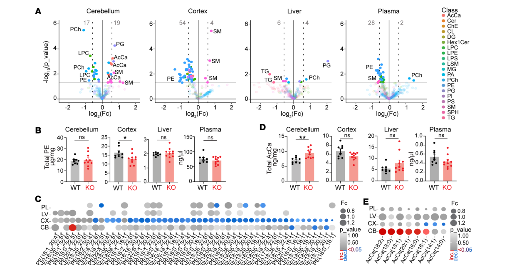

## Question

# Disease Characteristics Research Template

## Target Disease
- **Disease Name:** Autosomal Recessive Spinocerebellar Ataxia 20
- **MONDO ID:**  (if available)
- **Category:** Mendelian

## Research Objectives

Please provide a comprehensive research report on **Autosomal Recessive Spinocerebellar Ataxia 20** covering all of the
disease characteristics listed below. This report will be used to populate a disease knowledge
base entry. Be thorough and cite primary literature (PMID preferred) for all claims.

For each section, **suggested databases/resources** are listed. These are the first places
you should search for information on each topic.

---

### 1. Disease Information
> **Search first:** OMIM, Orphanet, ICD-10/ICD-11, MeSH, PubMed

- What is the disease? Provide a concise overview.
- What are the key identifiers? (OMIM, Orphanet, ICD-10/ICD-11, MeSH, Mondo)
- What are the common synonyms and alternative names?
- Is the information derived from individual patients (e.g., EHR) or aggregated disease-level resources?

### 2. Etiology

- **Disease Causal Factors**: What are the primary causes? (genetic, environmental, infectious, mechanistic)
- **Risk Factors**:
  > **Search first:** PubMed, Cochrane Library, UpToDate, clinical guidelines, ClinVar, ClinGen, GWAS Catalog, PheGenI, CTD, CDC, WHO, epidemiological databases
  - Genetic risk factors (causal variants, susceptibility loci, modifier genes)
  - Environmental risk factors (toxins, lifestyle, occupational exposures, age, sex, family history)
- **Protective Factors**:
  > **Search first:** PubMed, Cochrane Library, clinical trial databases, GWAS Catalog, gnomAD, WHO, CDC, nutrition databases
  - Genetic protective factors (protective variants, modifier alleles)
  - Environmental protective factors (diet, lifestyle, exposures that reduce risk)
- **Gene-Environment Interactions**: How do genetic and environmental factors interact to influence disease?
  > **Search first:** CTD, PubMed, PheGenI, GxE databases

### 3. Phenotypes
> **Search first:** HPO (Human Phenotype Ontology), OMIM, Orphanet, PubMed, clinicaltrials.gov, MedDRA, SNOMED CT, DECIPHER, LOINC

For each phenotype, provide:
- **Phenotype type**: symptoms, clinical signs, physical manifestations, behavioral changes, or laboratory abnormalities
  > For symptoms/signs: HPO, OMIM, Orphanet, PubMed
  > For behavioral changes: HPO, DSM, RDoC (Research Domain Criteria), PubMed
  > For laboratory abnormalities: LOINC, SNOMED CT, LabTests Online, PubMed
- **Phenotype characteristics**:
  > **Search first:** OMIM, Orphanet, HPO, PubMed
  - Age of symptom onset (neonatal, childhood, adult-onset, late-onset)
  - Symptom severity (mild, moderate, severe, variable)
  - Symptom progression (stable, progressive, episodic, fluctuating)
  - Frequency among affected individuals (percentage or qualitative)
- **Quality of life impact**: Effects on daily functioning and well-being (per-phenotype when possible)
  > **Search first:** EQ-5D database, SF-36, WHO QOL databases, PubMed
- Suggest HPO (Human Phenotype Ontology) terms for each phenotype

### 4. Genetic/Molecular Information

- **Causal Genes**: Gene mutations or chromosomal abnormalities responsible for disease (gene symbols, OMIM IDs)
  > **Search first:** OMIM, ClinVar, HGMD, Ensembl, NCBI Gene
- **Pathogenic Variants**:
  - Affected genes (gene symbols, HGNC IDs)
    > **Search first:** OMIM, NCBI Gene, Ensembl, HGNC, UniProt, GeneCards
  - Variant classification (pathogenic, likely pathogenic, VUS per ACMG/AMP guidelines)
    > **Search first:** ClinVar, ClinGen, ACMG/AMP guidelines, VarSome
  - Variant type/class (missense, frameshift, nonsense, splice-site, structural)
  - Allele frequency in population databases
    > **Search first:** gnomAD, 1000 Genomes, ExAC, TOPMed, dbSNP
  - Somatic vs germline origin
    > **Search first:** COSMIC (somatic), ClinVar, ICGC, TCGA
  - Functional consequences (loss of function, gain of function, dominant negative)
- **Modifier Genes**: Genes that modify disease severity or expression
- **Epigenetic Information**: DNA methylation, histone modifications, chromatin changes affecting disease
  > **Search first:** ENCODE, Roadmap Epigenomics, MethBase, DiseaseMeth
- **Chromosomal Abnormalities**: Large-scale genetic changes (aneuploidy, translocations, inversions)
  > **Search first:** DECIPHER, ClinVar, ECARUCA, UCSC Genome Browser

### 5. Environmental Information

- **Environmental Factors**: Non-genetic contributing factors (toxins, radiation, pollution, occupational exposure)
  > **Search first:** CTD (Comparative Toxicogenomics Database), TOXNET, PubMed, EPA databases
- **Lifestyle Factors**: Behavioral factors (smoking, diet, exercise, alcohol consumption)
  > **Search first:** CDC databases, WHO, PubMed, NHANES
- **Infectious Agents**: If applicable, pathogens causing or triggering disease (bacteria, viruses, fungi, parasites)
  > **Search first:** NCBI Taxonomy, ViPR, BV-BRC, MicrobeDB, GIDEON

### 6. Mechanism / Pathophysiology

- **Molecular Pathways**: Specific signaling cascades or biochemical pathways involved (Wnt, MAPK, mTOR, PI3K-AKT, etc.)
  > **Search first:** KEGG, Reactome, WikiPathways, PathBank, BioCyc
- **Cellular Processes**: Cell-level mechanisms (apoptosis, autophagy, cell cycle dysregulation, inflammation, etc.)
  > **Search first:** Gene Ontology (GO), Reactome, KEGG, PubMed
- **Protein Dysfunction**: How protein structure or function is altered (misfolding, aggregation, loss of function, gain of function)
  > **Search first:** UniProt, PDB (Protein Data Bank), InterPro, Pfam, AlphaFold
- **Metabolic Changes**: Alterations in metabolic processes (energy metabolism, lipid metabolism, amino acid metabolism)
  > **Search first:** KEGG, BioCyc, HMDB (Human Metabolome Database), BRENDA
- **Immune System Involvement**: Role of immune response (autoimmunity, immunodeficiency, chronic inflammation)
  > **Search first:** ImmPort, Immunome Database, IEDB, Gene Ontology
- **Tissue Damage Mechanisms**: How tissues/ are injured (oxidative stress, ischemia, fibrosis, necrosis)
  > **Search first:** PubMed, Gene Ontology, Reactome
- **Biochemical Abnormalities**: Specific molecular defects (enzyme deficiencies, receptor dysfunction, ion channel defects)
  > **Search first:** BRENDA, UniProt, KEGG, OMIM, PubMed
- **Epigenetic Changes**: DNA methylation, histone modifications affecting gene expression in disease
  > **Search first:** ENCODE, Roadmap Epigenomics, MethBase, DiseaseMeth
- **Molecular Profiling** (if available):
  - Transcriptomics/gene expression changes
    > **Search first:** GEO (Gene Expression Omnibus), ArrayExpress, GTEx, Human Cell Atlas, SRA
  - Proteomics findings
    > **Search first:** PRIDE, ProteomeXchange, Human Protein Atlas, STRING, BioGRID
  - Metabolomics signatures
    > **Search first:** MetaboLights, Metabolomics Workbench, HMDB, METLIN
  - Lipidomics alterations
    > **Search first:** LIPID MAPS, SwissLipids, LipidHome, Metabolomics Workbench
  - Genomic structural features
    > **Search first:** UCSC Genome Browser, Ensembl, NCBI, dbVar, DGV
- **Advanced Technologies** (if applicable):
  - Single-cell analysis findings (cell-type specific mechanisms, cellular heterogeneity)
    > **Search first:** Human Cell Atlas, Single Cell Portal, GEO, CELLxGENE
  - Spatial transcriptomics findings
    > **Search first:** GEO, Spatial Research, Vizgen, 10x Genomics data
  - Multi-omics integration results
    > **Search first:** TCGA, ICGC, cBioPortal, LinkedOmics, PubMed
  - Functional genomics screens (CRISPR, RNAi)
    > **Search first:** DepMap, GenomeRNAi, PubMed, BioGRID ORCS

For each mechanism, describe:
- The causal chain from initial trigger to clinical manifestation
- Which mechanisms are upstream vs downstream
- What cell types and biological processes are involved
- Suggest GO terms for biological processes and CL terms for cell types

### 7. Anatomical Structures Affected

- **Organ Level**:
  - Primary organs directly affected
  - Secondary organ involvement (complications, secondary effects)
  - Body systems involved (cardiovascular, nervous, digestive, respiratory, endocrine, etc.)
  > **Search first:** Uberon, FMA (Foundational Model of Anatomy), OMIM, HPO, ICD-11, MeSH, SNOMED CT
- **Tissue and Cell Level**:
  - Specific tissue types affected (epithelial, connective, muscle, nervous)
  - Specific cell populations targeted (with Cell Ontology terms)
  > **Search first:** Uberon, Human Protein Atlas, Cell Ontology, Human Cell Atlas, CellMarker, PanglaoDB
- **Subcellular Level**:
  - Cellular compartments involved (mitochondria, nucleus, ER, lysosomes) (with GO Cellular Component terms)
  > **Search first:** Gene Ontology (Cellular Component), UniProt, Human Protein Atlas
- **Localization**:
  - Specific anatomical sites (with UBERON terms)
    > **Search first:** FMA, Uberon, NeuroNames (for brain), SNOMED CT
  - Lateralization (unilateral, bilateral, asymmetric)
    > **Search first:** HPO, clinical literature, imaging databases

### 8. Temporal Development

- **Onset**:
  - Typical age of onset (congenital, pediatric, adult, geriatric)
  - Onset pattern (acute, subacute, chronic, insidious)
  > **Search first:** OMIM, Orphanet, HPO, PubMed
- **Progression**:
  - Disease stages (early, intermediate, advanced, end-stage)
    > **Search first:** Cancer Staging Manual (AJCC), WHO classifications, PubMed
  - Progression rate (rapid, slow, variable)
  - Disease course pattern (episodic, relapsing-remitting, progressive, stable)
  - Disease duration (self-limited, chronic lifelong)
  > **Search first:** Disease registries, longitudinal cohort databases, natural history studies, PubMed, Orphanet, OMIM
- **Patterns**:
  - Remission patterns (spontaneous, treatment-induced)
    > **Search first:** Clinical trial databases, disease registries, PubMed
  - Critical periods (time windows of vulnerability or opportunity for intervention)
    > **Search first:** PubMed, developmental biology databases, clinical guidelines

### 9. Inheritance and Population

- **Epidemiology**:
  - Prevalence (cases per 100,000 at given time)
  - Incidence (new cases per 100,000 per year)
  > **Search first:** Orphanet, CDC, WHO, GBD (Global Burden of Disease), national registries, SEER, disease registries
- **For Genetic Etiology**:
  - Inheritance pattern (AD, AR, X-linked, mitochondrial, multifactorial, polygenic)
    > **Search first:** OMIM, Orphanet, ClinVar, GTR (Genetic Testing Registry)
  - Penetrance (complete, incomplete, age-dependent)
    > **Search first:** ClinVar, OMIM, PubMed, ClinGen
  - Expressivity (variable, consistent)
    > **Search first:** OMIM, ClinVar, PubMed
  - Genetic anticipation (increasing severity in successive generations)
    > **Search first:** OMIM, PubMed (especially for repeat expansion disorders)
  - Germline mosaicism
    > **Search first:** ClinVar, OMIM, genetic counseling literature, PubMed
  - Founder effects (population-specific mutations)
    > **Search first:** gnomAD, population genetics databases, PubMed
  - Consanguinity role
    > **Search first:** OMIM, population studies, genetic counseling resources
  - Carrier frequency
    > **Search first:** gnomAD, carrier screening databases, GeneReviews, GTR
- **Population Demographics**:
  - Affected populations (ethnic or demographic groups with higher prevalence)
    > **Search first:** gnomAD, 1000 Genomes, PAGE Study, PubMed, population registries
  - Geographic distribution (endemic areas, regional variation)
    > **Search first:** WHO, CDC, GBD, Orphanet, geographic epidemiology databases
  - Geographic distribution of specific variants
  - Sex ratio (male:female)
    > **Search first:** Disease registries, OMIM, PubMed, epidemiological databases
  - Age distribution of affected individuals
    > **Search first:** CDC, disease registries, SEER, Orphanet

### 10. Diagnostics

- **Clinical Tests**:
  - Laboratory tests (blood, urine, tissue chemistry, specific enzyme assays)
    > **Search first:** LOINC, LabTests Online, PubMed
  - Biomarkers (proteins, metabolites, genetic markers, circulating biomarkers)
    > **Search first:** FDA Biomarker List, BEST (Biomarkers, EndpointS, and other Tools), PubMed
  - Imaging studies (X-ray, CT, MRI, PET, ultrasound)
    > **Search first:** RadLex, DICOM, Radiopaedia, imaging databases
  - Functional tests (pulmonary function, cardiac stress tests)
    > **Search first:** LOINC, clinical guidelines, PubMed
  - Electrophysiology (EEG, EMG, ECG, nerve conduction studies)
    > **Search first:** LOINC, clinical neurophysiology databases, PubMed
  - Biopsy findings (histopathology, immunohistochemistry)
    > **Search first:** SNOMED CT, College of American Pathologists resources, PubMed
  - Pathology findings (microscopic examination)
    > **Search first:** SNOMED CT, Digital Pathology databases, PubMed
- **Genetic Testing**:
  > **Search first:** GTR (Genetic Testing Registry), GeneReviews, ClinGen
  - Overview of recommended genetic testing approach
  - Whole genome sequencing (WGS) utility
    > **Search first:** GTR, ClinVar, GEL (Genomics England), gnomAD
  - Whole exome sequencing (WES) utility
    > **Search first:** GTR, ClinVar, OMIM, GeneMatcher
  - Gene panels (which panels, which genes)
    > **Search first:** GTR, ClinVar, laboratory-specific databases
  - Single gene testing
    > **Search first:** GTR, ClinVar, OMIM, GeneReviews
  - Chromosomal microarray (CMA)
    > **Search first:** DECIPHER, ClinVar, dbVar, ECARUCA
  - Karyotyping
    > **Search first:** Chromosome Abnormality Database, ClinVar, cytogenetics resources
  - FISH
    > **Search first:** ClinVar, cytogenetics databases, PubMed
  - Mitochondrial DNA testing
    > **Search first:** MITOMAP, MSeqDR, ClinVar, GTR
  - Repeat expansion testing
    > **Search first:** GTR, ClinVar, repeat expansion databases, PubMed
- **Omics-Based Diagnostics** (if applicable):
  - RNA sequencing / transcriptomics
    > **Search first:** GEO, ArrayExpress, GTEx, RNA-seq databases
  - Proteomics
    > **Search first:** PRIDE, ProteomeXchange, FDA Biomarker database
  - Metabolomics
    > **Search first:** MetaboLights, Metabolomics Workbench, HMDB
  - Epigenomics
    > **Search first:** GEO, ENCODE, Roadmap Epigenomics, MethBase
  - Liquid biopsy
    > **Search first:** COSMIC, ClinVar, liquid biopsy databases, PubMed
- **Clinical Criteria**:
  - Standardized diagnostic criteria (DSM, ICD, society guidelines)
    > **Search first:** DSM-5, ICD-11, clinical society guidelines, UpToDate
  - Differential diagnosis (other conditions to rule out, with distinguishing features)
    > **Search first:** DynaMed, UpToDate, clinical decision support systems
- **Screening**:
  - Screening methods for asymptomatic individuals (newborn screening, carrier screening, cascade screening)
    > **Search first:** ACMG recommendations, CDC newborn screening, GTR

### 11. Outcome/Prognosis

- **Survival and Mortality**:
  - Survival rate (5-year, 10-year, overall)
    > **Search first:** SEER, cancer registries, disease-specific registries, PubMed
  - Life expectancy (with and without treatment if applicable)
    > **Search first:** Orphanet, disease registries, actuarial databases, PubMed
  - Mortality rate
    > **Search first:** CDC, WHO, GBD, national mortality databases
  - Disease-specific mortality (deaths directly attributable to disease)
    > **Search first:** Disease registries, CDC Wonder, GBD, PubMed
- **Morbidity and Function**:
  - Morbidity (disease-related disability and health impacts)
    > **Search first:** GBD, WHO, disability databases, PubMed
  - Disability outcomes (long-term functional impairments)
    > **Search first:** ICF (International Classification of Functioning), disability registries
  - Quality of life measures (EQ-5D, SF-36, PROMIS, disease-specific tools)
    > **Search first:** EQ-5D database, SF-36, PROMIS, PubMed
- **Disease Course**:
  - Complications (secondary problems: infections, organ failure, etc.)
    > **Search first:** ICD codes, disease registries, clinical databases, PubMed
  - Recovery potential (likelihood and extent of recovery, with vs without treatment)
    > **Search first:** Natural history studies, rehabilitation databases, PubMed
- **Prediction**:
  - Prognostic factors (age, disease severity, biomarkers, treatment response)
    > **Search first:** Prognostic models databases, clinical calculators, PubMed
  - Prognostic biomarkers (molecular markers predicting disease course)
    > **Search first:** FDA Biomarker database, PubMed, cancer prognostic databases

### 12. Treatment

- **Pharmacotherapy**:
  - Pharmacological treatments (drug names, drug classes, mechanisms of action)
    > **Search first:** DrugBank, RxNorm, ATC classification, DailyMed, FDA databases
  - Pharmacogenomics (how genetic variants affect drug metabolism, efficacy, toxicity)
    > **Search first:** PharmGKB, CPIC (Clinical Pharmacogenetics), FDA Table of PGx Biomarkers
- **Advanced Therapeutics**:
  - Gene therapy (viral vectors, CRISPR, gene replacement, gene editing)
    > **Search first:** ClinicalTrials.gov, FDA gene therapy database, ASGCT resources
  - Cell therapy (stem cell transplant, CAR-T, cellular therapeutics)
    > **Search first:** ClinicalTrials.gov, FDA cell therapy database, FACT standards
  - RNA-based therapies (ASOs, siRNA, mRNA therapies)
    > **Search first:** ClinicalTrials.gov, FDA approvals, PubMed
  - Targeted therapies (treatments directed at specific molecular targets)
    > **Search first:** My Cancer Genome, OncoKB, ClinicalTrials.gov, FDA approvals
  - Immunotherapies (checkpoint inhibitors, monoclonal antibodies)
    > **Search first:** Cancer Immunotherapy Database, FDA approvals, ClinicalTrials.gov
- **Surgical and Interventional**:
  - Surgical interventions (types of surgery, timing, outcomes)
    > **Search first:** CPT codes, surgical registries, clinical guidelines, PubMed
- **Supportive and Rehabilitative**:
  - Supportive care (symptom management, pain control, nutrition)
    > **Search first:** Clinical guidelines, Cochrane Library, PubMed
  - Rehabilitation (physical therapy, occupational therapy, speech therapy)
    > **Search first:** Rehabilitation medicine databases, clinical guidelines, PubMed
- **Experimental**:
  - Experimental treatments in clinical trials (with NCT identifiers if available)
    > **Search first:** ClinicalTrials.gov, EU Clinical Trials Register, WHO ICTRP
- **Treatment Outcomes**:
  - Treatment response rates
    > **Search first:** Clinical trial databases, FDA reviews, systematic reviews, PubMed
  - Side effects and adverse events
    > **Search first:** FDA Adverse Event Reporting System (FAERS), MedWatch, PubMed
- **Treatment Strategy**:
  - Treatment algorithms (clinical pathways, decision trees)
    > **Search first:** Clinical practice guidelines, NCCN Guidelines, UpToDate
  - Combination therapies
    > **Search first:** ClinicalTrials.gov, treatment guidelines, PubMed
  - Personalized medicine approaches (genotype-guided treatment)
    > **Search first:** My Cancer Genome, CIViC, PharmGKB, precision medicine databases

For each treatment, suggest NCIT (NCI Thesaurus) clinical-intervention terms where applicable.

### 13. Prevention

- **Prevention Levels**:
  - Primary prevention (preventing disease occurrence: vaccination, risk factor modification)
    > **Search first:** CDC, WHO, USPSTF recommendations, Cochrane Library
  - Secondary prevention (early detection and treatment: screening programs, early intervention)
    > **Search first:** USPSTF, CDC screening guidelines, WHO
  - Tertiary prevention (preventing complications in those with disease)
    > **Search first:** Clinical guidelines, disease management protocols, PubMed
- **Immunization**: Vaccine strategies (if applicable)
  > **Search first:** CDC vaccine schedules, WHO immunization, FDA vaccine database
- **Screening and Early Detection**:
  - Screening programs (population-based: newborn screening, cancer screening)
    > **Search first:** CDC screening programs, USPSTF, cancer screening databases
  - Genetic screening (carrier screening, preimplantation genetic diagnosis, prenatal testing)
    > **Search first:** ACMG recommendations, ACOG guidelines, GTR
  - Risk stratification (identifying high-risk individuals for targeted prevention)
    > **Search first:** Risk prediction models, clinical calculators, PubMed
- **Behavioral Interventions**: Lifestyle modifications to reduce risk
  > **Search first:** CDC, WHO, behavioral intervention databases, Cochrane Library
- **Counseling**: Genetic counseling (risk assessment, family planning guidance)
  > **Search first:** NSGC resources, ACMG guidelines, GeneReviews
- **Public Health**:
  - Public health interventions (sanitation, vector control, health education)
    > **Search first:** CDC, WHO, public health databases, PubMed
  - Environmental interventions (reducing environmental risk factors)
    > **Search first:** EPA databases, WHO environmental health, PubMed
- **Prophylaxis**: Preventive medications or procedures
  > **Search first:** Clinical guidelines, FDA approvals, PubMed

### 14. Other Species / Natural Disease

- **Taxonomy**: Species affected (with NCBI Taxon identifiers)
  > **Search first:** NCBI Taxonomy
- **Breed**: Specific breeds affected (with VBO identifiers if applicable)
  > **Search first:** VBO (Vertebrate Breed Ontology)
- **Gene**: Orthologous genes in other species (with NCBI Gene IDs)
  > **Search first:** NCBI Gene
- **Natural Disease**:
  - Naturally occurring disease in other species (companion animals, wildlife)
    > **Search first:** OMIA (Online Mendelian Inheritance in Animals), VetCompass, PubMed
  - Veterinary relevance and importance in animal health
    > **Search first:** OMIA, veterinary databases, PubMed
- **Comparative Biology**:
  - Comparative pathology (similarities and differences across species)
    > **Search first:** OMIA, comparative pathology databases, PubMed
  - Evolutionary conservation of disease mechanisms
    > **Search first:** HomoloGene, OrthoMCL, Alliance of Genome Resources
- **Transmission** (if applicable):
  - Zoonotic potential
    > **Search first:** CDC zoonotic diseases, WHO zoonoses, GIDEON
  - Cross-species susceptibility
    > **Search first:** NCBI Taxonomy, veterinary databases, PubMed

### 15. Model Organisms

- **Model Types**:
  - Model organism type (mammalian, invertebrate, cellular, in vitro)
    > **Search first:** Alliance of Genome Resources, model organism databases
  - Specific model systems (mouse, rat, zebrafish, Drosophila, C. elegans, yeast, cell lines, organoids, iPSCs)
    > **Search first:** MGI, RGD, ZFIN, FlyBase, WormBase, SGD, ATCC, Cellosaurus
  - Induced models (drug treatment, surgical intervention, environmental manipulation)
    > **Search first:** MGI, model organism databases, PubMed
- **Genetic Models**:
  - Types available (knockout, knock-in, transgenic, conditional, humanized)
    > **Search first:** MGI, IMPC, KOMP, EuMMCR, IMSR
- **Model Characteristics**:
  - Phenotype recapitulation (how well model reproduces human disease features)
    > **Search first:** Model organism databases, comparative studies, PubMed
  - Model limitations (aspects of human disease not captured)
    > **Search first:** Model organism databases, PubMed, review articles
- **Applications**:
  - Research applications (what aspects of disease can be studied)
    > **Search first:** Model organism databases, PubMed
- **Resources**:
  - Model databases
    > **Search first:** MGI, RGD, ZFIN, FlyBase, WormBase, IMSR, EMMA, MMRRC

---

## Citation Requirements

- Cite primary literature (PMID preferred) for all mechanistic and clinical claims
- Prioritize recent reviews and landmark papers
- Include direct quotes from abstracts where possible to support key statements
- Distinguish evidence source types: human clinical, model organism, in vitro, computational

## Output Format

Structure your response as a comprehensive narrative organized by the sections above.
For each section, provide:
- Factual content with specific details (numbers, percentages, gene names, variant nomenclature)
- Ontology term suggestions (HPO, GO, CL, UBERON, CHEBI, NCIT, MONDO) where applicable
- Evidence citations with PMIDs
- Direct quotes from abstracts to support key claims
- Clear indication when information is not available or not applicable for this disease

This report will be used to populate a disease knowledge base entry with:
- Pathophysiology descriptions with causal chains
- Gene/protein annotations (HGNC, GO terms)
- Phenotype associations (HP terms) with frequencies
- Cell type involvement (CL terms)
- Anatomical locations (UBERON terms)
- Chemical entities (CHEBI terms)
- Treatment annotations (NCIT terms)
- Evidence items with PMIDs and exact abstract quotes
- Epidemiology, prognosis, diagnostic, and prevention information
- Animal model descriptions with phenotype recapitulation details

## Output

Question: You are an expert researcher providing comprehensive, well-cited information.

Provide detailed information focusing on:
1. Key concepts and definitions with current understanding
2. Recent developments and latest research (prioritize 2023-2024 sources)
3. Current applications and real-world implementations
4. Expert opinions and analysis from authoritative sources
5. Relevant statistics and data from recent studies

Format as a comprehensive research report with proper citations. Include URLs and publication dates where available.
Always prioritize recent, authoritative sources and provide specific citations for all major claims.

# Disease Characteristics Research Template

## Target Disease
- **Disease Name:** Autosomal Recessive Spinocerebellar Ataxia 20
- **MONDO ID:**  (if available)
- **Category:** Mendelian

## Research Objectives

Please provide a comprehensive research report on **Autosomal Recessive Spinocerebellar Ataxia 20** covering all of the
disease characteristics listed below. This report will be used to populate a disease knowledge
base entry. Be thorough and cite primary literature (PMID preferred) for all claims.

For each section, **suggested databases/resources** are listed. These are the first places
you should search for information on each topic.

---

### 1. Disease Information
> **Search first:** OMIM, Orphanet, ICD-10/ICD-11, MeSH, PubMed

- What is the disease? Provide a concise overview.
- What are the key identifiers? (OMIM, Orphanet, ICD-10/ICD-11, MeSH, Mondo)
- What are the common synonyms and alternative names?
- Is the information derived from individual patients (e.g., EHR) or aggregated disease-level resources?

### 2. Etiology

- **Disease Causal Factors**: What are the primary causes? (genetic, environmental, infectious, mechanistic)
- **Risk Factors**:
  > **Search first:** PubMed, Cochrane Library, UpToDate, clinical guidelines, ClinVar, ClinGen, GWAS Catalog, PheGenI, CTD, CDC, WHO, epidemiological databases
  - Genetic risk factors (causal variants, susceptibility loci, modifier genes)
  - Environmental risk factors (toxins, lifestyle, occupational exposures, age, sex, family history)
- **Protective Factors**:
  > **Search first:** PubMed, Cochrane Library, clinical trial databases, GWAS Catalog, gnomAD, WHO, CDC, nutrition databases
  - Genetic protective factors (protective variants, modifier alleles)
  - Environmental protective factors (diet, lifestyle, exposures that reduce risk)
- **Gene-Environment Interactions**: How do genetic and environmental factors interact to influence disease?
  > **Search first:** CTD, PubMed, PheGenI, GxE databases

### 3. Phenotypes
> **Search first:** HPO (Human Phenotype Ontology), OMIM, Orphanet, PubMed, clinicaltrials.gov, MedDRA, SNOMED CT, DECIPHER, LOINC

For each phenotype, provide:
- **Phenotype type**: symptoms, clinical signs, physical manifestations, behavioral changes, or laboratory abnormalities
  > For symptoms/signs: HPO, OMIM, Orphanet, PubMed
  > For behavioral changes: HPO, DSM, RDoC (Research Domain Criteria), PubMed
  > For laboratory abnormalities: LOINC, SNOMED CT, LabTests Online, PubMed
- **Phenotype characteristics**:
  > **Search first:** OMIM, Orphanet, HPO, PubMed
  - Age of symptom onset (neonatal, childhood, adult-onset, late-onset)
  - Symptom severity (mild, moderate, severe, variable)
  - Symptom progression (stable, progressive, episodic, fluctuating)
  - Frequency among affected individuals (percentage or qualitative)
- **Quality of life impact**: Effects on daily functioning and well-being (per-phenotype when possible)
  > **Search first:** EQ-5D database, SF-36, WHO QOL databases, PubMed
- Suggest HPO (Human Phenotype Ontology) terms for each phenotype

### 4. Genetic/Molecular Information

- **Causal Genes**: Gene mutations or chromosomal abnormalities responsible for disease (gene symbols, OMIM IDs)
  > **Search first:** OMIM, ClinVar, HGMD, Ensembl, NCBI Gene
- **Pathogenic Variants**:
  - Affected genes (gene symbols, HGNC IDs)
    > **Search first:** OMIM, NCBI Gene, Ensembl, HGNC, UniProt, GeneCards
  - Variant classification (pathogenic, likely pathogenic, VUS per ACMG/AMP guidelines)
    > **Search first:** ClinVar, ClinGen, ACMG/AMP guidelines, VarSome
  - Variant type/class (missense, frameshift, nonsense, splice-site, structural)
  - Allele frequency in population databases
    > **Search first:** gnomAD, 1000 Genomes, ExAC, TOPMed, dbSNP
  - Somatic vs germline origin
    > **Search first:** COSMIC (somatic), ClinVar, ICGC, TCGA
  - Functional consequences (loss of function, gain of function, dominant negative)
- **Modifier Genes**: Genes that modify disease severity or expression
- **Epigenetic Information**: DNA methylation, histone modifications, chromatin changes affecting disease
  > **Search first:** ENCODE, Roadmap Epigenomics, MethBase, DiseaseMeth
- **Chromosomal Abnormalities**: Large-scale genetic changes (aneuploidy, translocations, inversions)
  > **Search first:** DECIPHER, ClinVar, ECARUCA, UCSC Genome Browser

### 5. Environmental Information

- **Environmental Factors**: Non-genetic contributing factors (toxins, radiation, pollution, occupational exposure)
  > **Search first:** CTD (Comparative Toxicogenomics Database), TOXNET, PubMed, EPA databases
- **Lifestyle Factors**: Behavioral factors (smoking, diet, exercise, alcohol consumption)
  > **Search first:** CDC databases, WHO, PubMed, NHANES
- **Infectious Agents**: If applicable, pathogens causing or triggering disease (bacteria, viruses, fungi, parasites)
  > **Search first:** NCBI Taxonomy, ViPR, BV-BRC, MicrobeDB, GIDEON

### 6. Mechanism / Pathophysiology

- **Molecular Pathways**: Specific signaling cascades or biochemical pathways involved (Wnt, MAPK, mTOR, PI3K-AKT, etc.)
  > **Search first:** KEGG, Reactome, WikiPathways, PathBank, BioCyc
- **Cellular Processes**: Cell-level mechanisms (apoptosis, autophagy, cell cycle dysregulation, inflammation, etc.)
  > **Search first:** Gene Ontology (GO), Reactome, KEGG, PubMed
- **Protein Dysfunction**: How protein structure or function is altered (misfolding, aggregation, loss of function, gain of function)
  > **Search first:** UniProt, PDB (Protein Data Bank), InterPro, Pfam, AlphaFold
- **Metabolic Changes**: Alterations in metabolic processes (energy metabolism, lipid metabolism, amino acid metabolism)
  > **Search first:** KEGG, BioCyc, HMDB (Human Metabolome Database), BRENDA
- **Immune System Involvement**: Role of immune response (autoimmunity, immunodeficiency, chronic inflammation)
  > **Search first:** ImmPort, Immunome Database, IEDB, Gene Ontology
- **Tissue Damage Mechanisms**: How tissues/ are injured (oxidative stress, ischemia, fibrosis, necrosis)
  > **Search first:** PubMed, Gene Ontology, Reactome
- **Biochemical Abnormalities**: Specific molecular defects (enzyme deficiencies, receptor dysfunction, ion channel defects)
  > **Search first:** BRENDA, UniProt, KEGG, OMIM, PubMed
- **Epigenetic Changes**: DNA methylation, histone modifications affecting gene expression in disease
  > **Search first:** ENCODE, Roadmap Epigenomics, MethBase, DiseaseMeth
- **Molecular Profiling** (if available):
  - Transcriptomics/gene expression changes
    > **Search first:** GEO (Gene Expression Omnibus), ArrayExpress, GTEx, Human Cell Atlas, SRA
  - Proteomics findings
    > **Search first:** PRIDE, ProteomeXchange, Human Protein Atlas, STRING, BioGRID
  - Metabolomics signatures
    > **Search first:** MetaboLights, Metabolomics Workbench, HMDB, METLIN
  - Lipidomics alterations
    > **Search first:** LIPID MAPS, SwissLipids, LipidHome, Metabolomics Workbench
  - Genomic structural features
    > **Search first:** UCSC Genome Browser, Ensembl, NCBI, dbVar, DGV
- **Advanced Technologies** (if applicable):
  - Single-cell analysis findings (cell-type specific mechanisms, cellular heterogeneity)
    > **Search first:** Human Cell Atlas, Single Cell Portal, GEO, CELLxGENE
  - Spatial transcriptomics findings
    > **Search first:** GEO, Spatial Research, Vizgen, 10x Genomics data
  - Multi-omics integration results
    > **Search first:** TCGA, ICGC, cBioPortal, LinkedOmics, PubMed
  - Functional genomics screens (CRISPR, RNAi)
    > **Search first:** DepMap, GenomeRNAi, PubMed, BioGRID ORCS

For each mechanism, describe:
- The causal chain from initial trigger to clinical manifestation
- Which mechanisms are upstream vs downstream
- What cell types and biological processes are involved
- Suggest GO terms for biological processes and CL terms for cell types

### 7. Anatomical Structures Affected

- **Organ Level**:
  - Primary organs directly affected
  - Secondary organ involvement (complications, secondary effects)
  - Body systems involved (cardiovascular, nervous, digestive, respiratory, endocrine, etc.)
  > **Search first:** Uberon, FMA (Foundational Model of Anatomy), OMIM, HPO, ICD-11, MeSH, SNOMED CT
- **Tissue and Cell Level**:
  - Specific tissue types affected (epithelial, connective, muscle, nervous)
  - Specific cell populations targeted (with Cell Ontology terms)
  > **Search first:** Uberon, Human Protein Atlas, Cell Ontology, Human Cell Atlas, CellMarker, PanglaoDB
- **Subcellular Level**:
  - Cellular compartments involved (mitochondria, nucleus, ER, lysosomes) (with GO Cellular Component terms)
  > **Search first:** Gene Ontology (Cellular Component), UniProt, Human Protein Atlas
- **Localization**:
  - Specific anatomical sites (with UBERON terms)
    > **Search first:** FMA, Uberon, NeuroNames (for brain), SNOMED CT
  - Lateralization (unilateral, bilateral, asymmetric)
    > **Search first:** HPO, clinical literature, imaging databases

### 8. Temporal Development

- **Onset**:
  - Typical age of onset (congenital, pediatric, adult, geriatric)
  - Onset pattern (acute, subacute, chronic, insidious)
  > **Search first:** OMIM, Orphanet, HPO, PubMed
- **Progression**:
  - Disease stages (early, intermediate, advanced, end-stage)
    > **Search first:** Cancer Staging Manual (AJCC), WHO classifications, PubMed
  - Progression rate (rapid, slow, variable)
  - Disease course pattern (episodic, relapsing-remitting, progressive, stable)
  - Disease duration (self-limited, chronic lifelong)
  > **Search first:** Disease registries, longitudinal cohort databases, natural history studies, PubMed, Orphanet, OMIM
- **Patterns**:
  - Remission patterns (spontaneous, treatment-induced)
    > **Search first:** Clinical trial databases, disease registries, PubMed
  - Critical periods (time windows of vulnerability or opportunity for intervention)
    > **Search first:** PubMed, developmental biology databases, clinical guidelines

### 9. Inheritance and Population

- **Epidemiology**:
  - Prevalence (cases per 100,000 at given time)
  - Incidence (new cases per 100,000 per year)
  > **Search first:** Orphanet, CDC, WHO, GBD (Global Burden of Disease), national registries, SEER, disease registries
- **For Genetic Etiology**:
  - Inheritance pattern (AD, AR, X-linked, mitochondrial, multifactorial, polygenic)
    > **Search first:** OMIM, Orphanet, ClinVar, GTR (Genetic Testing Registry)
  - Penetrance (complete, incomplete, age-dependent)
    > **Search first:** ClinVar, OMIM, PubMed, ClinGen
  - Expressivity (variable, consistent)
    > **Search first:** OMIM, ClinVar, PubMed
  - Genetic anticipation (increasing severity in successive generations)
    > **Search first:** OMIM, PubMed (especially for repeat expansion disorders)
  - Germline mosaicism
    > **Search first:** ClinVar, OMIM, genetic counseling literature, PubMed
  - Founder effects (population-specific mutations)
    > **Search first:** gnomAD, population genetics databases, PubMed
  - Consanguinity role
    > **Search first:** OMIM, population studies, genetic counseling resources
  - Carrier frequency
    > **Search first:** gnomAD, carrier screening databases, GeneReviews, GTR
- **Population Demographics**:
  - Affected populations (ethnic or demographic groups with higher prevalence)
    > **Search first:** gnomAD, 1000 Genomes, PAGE Study, PubMed, population registries
  - Geographic distribution (endemic areas, regional variation)
    > **Search first:** WHO, CDC, GBD, Orphanet, geographic epidemiology databases
  - Geographic distribution of specific variants
  - Sex ratio (male:female)
    > **Search first:** Disease registries, OMIM, PubMed, epidemiological databases
  - Age distribution of affected individuals
    > **Search first:** CDC, disease registries, SEER, Orphanet

### 10. Diagnostics

- **Clinical Tests**:
  - Laboratory tests (blood, urine, tissue chemistry, specific enzyme assays)
    > **Search first:** LOINC, LabTests Online, PubMed
  - Biomarkers (proteins, metabolites, genetic markers, circulating biomarkers)
    > **Search first:** FDA Biomarker List, BEST (Biomarkers, EndpointS, and other Tools), PubMed
  - Imaging studies (X-ray, CT, MRI, PET, ultrasound)
    > **Search first:** RadLex, DICOM, Radiopaedia, imaging databases
  - Functional tests (pulmonary function, cardiac stress tests)
    > **Search first:** LOINC, clinical guidelines, PubMed
  - Electrophysiology (EEG, EMG, ECG, nerve conduction studies)
    > **Search first:** LOINC, clinical neurophysiology databases, PubMed
  - Biopsy findings (histopathology, immunohistochemistry)
    > **Search first:** SNOMED CT, College of American Pathologists resources, PubMed
  - Pathology findings (microscopic examination)
    > **Search first:** SNOMED CT, Digital Pathology databases, PubMed
- **Genetic Testing**:
  > **Search first:** GTR (Genetic Testing Registry), GeneReviews, ClinGen
  - Overview of recommended genetic testing approach
  - Whole genome sequencing (WGS) utility
    > **Search first:** GTR, ClinVar, GEL (Genomics England), gnomAD
  - Whole exome sequencing (WES) utility
    > **Search first:** GTR, ClinVar, OMIM, GeneMatcher
  - Gene panels (which panels, which genes)
    > **Search first:** GTR, ClinVar, laboratory-specific databases
  - Single gene testing
    > **Search first:** GTR, ClinVar, OMIM, GeneReviews
  - Chromosomal microarray (CMA)
    > **Search first:** DECIPHER, ClinVar, dbVar, ECARUCA
  - Karyotyping
    > **Search first:** Chromosome Abnormality Database, ClinVar, cytogenetics resources
  - FISH
    > **Search first:** ClinVar, cytogenetics databases, PubMed
  - Mitochondrial DNA testing
    > **Search first:** MITOMAP, MSeqDR, ClinVar, GTR
  - Repeat expansion testing
    > **Search first:** GTR, ClinVar, repeat expansion databases, PubMed
- **Omics-Based Diagnostics** (if applicable):
  - RNA sequencing / transcriptomics
    > **Search first:** GEO, ArrayExpress, GTEx, RNA-seq databases
  - Proteomics
    > **Search first:** PRIDE, ProteomeXchange, FDA Biomarker database
  - Metabolomics
    > **Search first:** MetaboLights, Metabolomics Workbench, HMDB
  - Epigenomics
    > **Search first:** GEO, ENCODE, Roadmap Epigenomics, MethBase
  - Liquid biopsy
    > **Search first:** COSMIC, ClinVar, liquid biopsy databases, PubMed
- **Clinical Criteria**:
  - Standardized diagnostic criteria (DSM, ICD, society guidelines)
    > **Search first:** DSM-5, ICD-11, clinical society guidelines, UpToDate
  - Differential diagnosis (other conditions to rule out, with distinguishing features)
    > **Search first:** DynaMed, UpToDate, clinical decision support systems
- **Screening**:
  - Screening methods for asymptomatic individuals (newborn screening, carrier screening, cascade screening)
    > **Search first:** ACMG recommendations, CDC newborn screening, GTR

### 11. Outcome/Prognosis

- **Survival and Mortality**:
  - Survival rate (5-year, 10-year, overall)
    > **Search first:** SEER, cancer registries, disease-specific registries, PubMed
  - Life expectancy (with and without treatment if applicable)
    > **Search first:** Orphanet, disease registries, actuarial databases, PubMed
  - Mortality rate
    > **Search first:** CDC, WHO, GBD, national mortality databases
  - Disease-specific mortality (deaths directly attributable to disease)
    > **Search first:** Disease registries, CDC Wonder, GBD, PubMed
- **Morbidity and Function**:
  - Morbidity (disease-related disability and health impacts)
    > **Search first:** GBD, WHO, disability databases, PubMed
  - Disability outcomes (long-term functional impairments)
    > **Search first:** ICF (International Classification of Functioning), disability registries
  - Quality of life measures (EQ-5D, SF-36, PROMIS, disease-specific tools)
    > **Search first:** EQ-5D database, SF-36, PROMIS, PubMed
- **Disease Course**:
  - Complications (secondary problems: infections, organ failure, etc.)
    > **Search first:** ICD codes, disease registries, clinical databases, PubMed
  - Recovery potential (likelihood and extent of recovery, with vs without treatment)
    > **Search first:** Natural history studies, rehabilitation databases, PubMed
- **Prediction**:
  - Prognostic factors (age, disease severity, biomarkers, treatment response)
    > **Search first:** Prognostic models databases, clinical calculators, PubMed
  - Prognostic biomarkers (molecular markers predicting disease course)
    > **Search first:** FDA Biomarker database, PubMed, cancer prognostic databases

### 12. Treatment

- **Pharmacotherapy**:
  - Pharmacological treatments (drug names, drug classes, mechanisms of action)
    > **Search first:** DrugBank, RxNorm, ATC classification, DailyMed, FDA databases
  - Pharmacogenomics (how genetic variants affect drug metabolism, efficacy, toxicity)
    > **Search first:** PharmGKB, CPIC (Clinical Pharmacogenetics), FDA Table of PGx Biomarkers
- **Advanced Therapeutics**:
  - Gene therapy (viral vectors, CRISPR, gene replacement, gene editing)
    > **Search first:** ClinicalTrials.gov, FDA gene therapy database, ASGCT resources
  - Cell therapy (stem cell transplant, CAR-T, cellular therapeutics)
    > **Search first:** ClinicalTrials.gov, FDA cell therapy database, FACT standards
  - RNA-based therapies (ASOs, siRNA, mRNA therapies)
    > **Search first:** ClinicalTrials.gov, FDA approvals, PubMed
  - Targeted therapies (treatments directed at specific molecular targets)
    > **Search first:** My Cancer Genome, OncoKB, ClinicalTrials.gov, FDA approvals
  - Immunotherapies (checkpoint inhibitors, monoclonal antibodies)
    > **Search first:** Cancer Immunotherapy Database, FDA approvals, ClinicalTrials.gov
- **Surgical and Interventional**:
  - Surgical interventions (types of surgery, timing, outcomes)
    > **Search first:** CPT codes, surgical registries, clinical guidelines, PubMed
- **Supportive and Rehabilitative**:
  - Supportive care (symptom management, pain control, nutrition)
    > **Search first:** Clinical guidelines, Cochrane Library, PubMed
  - Rehabilitation (physical therapy, occupational therapy, speech therapy)
    > **Search first:** Rehabilitation medicine databases, clinical guidelines, PubMed
- **Experimental**:
  - Experimental treatments in clinical trials (with NCT identifiers if available)
    > **Search first:** ClinicalTrials.gov, EU Clinical Trials Register, WHO ICTRP
- **Treatment Outcomes**:
  - Treatment response rates
    > **Search first:** Clinical trial databases, FDA reviews, systematic reviews, PubMed
  - Side effects and adverse events
    > **Search first:** FDA Adverse Event Reporting System (FAERS), MedWatch, PubMed
- **Treatment Strategy**:
  - Treatment algorithms (clinical pathways, decision trees)
    > **Search first:** Clinical practice guidelines, NCCN Guidelines, UpToDate
  - Combination therapies
    > **Search first:** ClinicalTrials.gov, treatment guidelines, PubMed
  - Personalized medicine approaches (genotype-guided treatment)
    > **Search first:** My Cancer Genome, CIViC, PharmGKB, precision medicine databases

For each treatment, suggest NCIT (NCI Thesaurus) clinical-intervention terms where applicable.

### 13. Prevention

- **Prevention Levels**:
  - Primary prevention (preventing disease occurrence: vaccination, risk factor modification)
    > **Search first:** CDC, WHO, USPSTF recommendations, Cochrane Library
  - Secondary prevention (early detection and treatment: screening programs, early intervention)
    > **Search first:** USPSTF, CDC screening guidelines, WHO
  - Tertiary prevention (preventing complications in those with disease)
    > **Search first:** Clinical guidelines, disease management protocols, PubMed
- **Immunization**: Vaccine strategies (if applicable)
  > **Search first:** CDC vaccine schedules, WHO immunization, FDA vaccine database
- **Screening and Early Detection**:
  - Screening programs (population-based: newborn screening, cancer screening)
    > **Search first:** CDC screening programs, USPSTF, cancer screening databases
  - Genetic screening (carrier screening, preimplantation genetic diagnosis, prenatal testing)
    > **Search first:** ACMG recommendations, ACOG guidelines, GTR
  - Risk stratification (identifying high-risk individuals for targeted prevention)
    > **Search first:** Risk prediction models, clinical calculators, PubMed
- **Behavioral Interventions**: Lifestyle modifications to reduce risk
  > **Search first:** CDC, WHO, behavioral intervention databases, Cochrane Library
- **Counseling**: Genetic counseling (risk assessment, family planning guidance)
  > **Search first:** NSGC resources, ACMG guidelines, GeneReviews
- **Public Health**:
  - Public health interventions (sanitation, vector control, health education)
    > **Search first:** CDC, WHO, public health databases, PubMed
  - Environmental interventions (reducing environmental risk factors)
    > **Search first:** EPA databases, WHO environmental health, PubMed
- **Prophylaxis**: Preventive medications or procedures
  > **Search first:** Clinical guidelines, FDA approvals, PubMed

### 14. Other Species / Natural Disease

- **Taxonomy**: Species affected (with NCBI Taxon identifiers)
  > **Search first:** NCBI Taxonomy
- **Breed**: Specific breeds affected (with VBO identifiers if applicable)
  > **Search first:** VBO (Vertebrate Breed Ontology)
- **Gene**: Orthologous genes in other species (with NCBI Gene IDs)
  > **Search first:** NCBI Gene
- **Natural Disease**:
  - Naturally occurring disease in other species (companion animals, wildlife)
    > **Search first:** OMIA (Online Mendelian Inheritance in Animals), VetCompass, PubMed
  - Veterinary relevance and importance in animal health
    > **Search first:** OMIA, veterinary databases, PubMed
- **Comparative Biology**:
  - Comparative pathology (similarities and differences across species)
    > **Search first:** OMIA, comparative pathology databases, PubMed
  - Evolutionary conservation of disease mechanisms
    > **Search first:** HomoloGene, OrthoMCL, Alliance of Genome Resources
- **Transmission** (if applicable):
  - Zoonotic potential
    > **Search first:** CDC zoonotic diseases, WHO zoonoses, GIDEON
  - Cross-species susceptibility
    > **Search first:** NCBI Taxonomy, veterinary databases, PubMed

### 15. Model Organisms

- **Model Types**:
  - Model organism type (mammalian, invertebrate, cellular, in vitro)
    > **Search first:** Alliance of Genome Resources, model organism databases
  - Specific model systems (mouse, rat, zebrafish, Drosophila, C. elegans, yeast, cell lines, organoids, iPSCs)
    > **Search first:** MGI, RGD, ZFIN, FlyBase, WormBase, SGD, ATCC, Cellosaurus
  - Induced models (drug treatment, surgical intervention, environmental manipulation)
    > **Search first:** MGI, model organism databases, PubMed
- **Genetic Models**:
  - Types available (knockout, knock-in, transgenic, conditional, humanized)
    > **Search first:** MGI, IMPC, KOMP, EuMMCR, IMSR
- **Model Characteristics**:
  - Phenotype recapitulation (how well model reproduces human disease features)
    > **Search first:** Model organism databases, comparative studies, PubMed
  - Model limitations (aspects of human disease not captured)
    > **Search first:** Model organism databases, PubMed, review articles
- **Applications**:
  - Research applications (what aspects of disease can be studied)
    > **Search first:** Model organism databases, PubMed
- **Resources**:
  - Model databases
    > **Search first:** MGI, RGD, ZFIN, FlyBase, WormBase, IMSR, EMMA, MMRRC

---

## Citation Requirements

- Cite primary literature (PMID preferred) for all mechanistic and clinical claims
- Prioritize recent reviews and landmark papers
- Include direct quotes from abstracts where possible to support key statements
- Distinguish evidence source types: human clinical, model organism, in vitro, computational

## Output Format

Structure your response as a comprehensive narrative organized by the sections above.
For each section, provide:
- Factual content with specific details (numbers, percentages, gene names, variant nomenclature)
- Ontology term suggestions (HPO, GO, CL, UBERON, CHEBI, NCIT, MONDO) where applicable
- Evidence citations with PMIDs
- Direct quotes from abstracts to support key claims
- Clear indication when information is not available or not applicable for this disease

This report will be used to populate a disease knowledge base entry with:
- Pathophysiology descriptions with causal chains
- Gene/protein annotations (HGNC, GO terms)
- Phenotype associations (HP terms) with frequencies
- Cell type involvement (CL terms)
- Anatomical locations (UBERON terms)
- Chemical entities (CHEBI terms)
- Treatment annotations (NCIT terms)
- Evidence items with PMIDs and exact abstract quotes
- Epidemiology, prognosis, diagnostic, and prevention information
- Animal model descriptions with phenotype recapitulation details

# Autosomal Recessive Spinocerebellar Ataxia 20 (SCAR20): Disease-Characteristics Report

**Scope and evidence date.** This report emphasizes primary human and experimental evidence available through 2024. SCAR20 is exceptionally rare; consequently, many clinical estimates derive from small, partly overlapping cohorts rather than population registries. Statements labeled **unknown** should not be interpreted as evidence of absence.

## Executive summary

Autosomal recessive spinocerebellar ataxia 20 (SCAR20) is a childhood-onset syndromic neurodevelopmental and neurodegenerative disorder caused by **biallelic loss-of-function or function-reducing variants in SNX14**. The defining phenotype combines global developmental delay or severe intellectual disability, markedly limited or absent speech, congenital/early hypotonia, gait ataxia, progressive cerebellar atrophy, relative macrocephaly, and recognizable coarse facial features. In the principal 22-person cohort, delayed motor development, delayed/absent language and social development, hypotonia, gait abnormality, cerebellar atrophy, and coarse facies were each reported in 22/22 individuals; seizures occurred in 8/22 and autistic-like behavior in 12/22. (akizu2015biallelicmutationsin pages 21-23)

Current mechanistic evidence converges on defective lipid handling at endoplasmic-reticulum (ER)–lipid-droplet and lysosomal interfaces, impaired fatty-acid desaturation and storage, and disturbed microtubule-dependent mitochondrial transport. Cerebellar Purkinje cells are selectively vulnerable. A 2024 mouse study found cerebellum-specific acylcarnitine accumulation, reduced triglyceride species, fewer lipid droplets, and enlarged telolysosomes before overt Purkinje-cell degeneration. No disease-modifying human treatment or SCAR20-specific interventional trial has been established; valproate and SCD1-directed rescue remain preclinical findings. (zhou2024alteredlipidhomeostasis pages 1-2, zhou2024alteredlipidhomeostasis pages 9-12, zhou2024alteredlipidhomeostasis pages 12-13)

| Domain | Best-established finding | Evidence type / year | Key quantitative data | Knowledge-base ontology suggestions |
|---|---|---|---|---|
| Identity / causal gene | SCAR20 is an ultra-rare Mendelian neurodevelopmental/neurodegenerative disorder caused by biallelic loss-of-function or loss-reducing variants in **SNX14**; identifiers include **OMIM #616354** and **MONDO:0014601**. | Human disease-gene association, discovery cohort and curated disease-target evidence, 2015-2024 (akizu2015biallelicmutationsin pages 4-6, OpenTargets Search: autosomal recessive spinocerebellar ataxia 20-SNX14) | Open Targets lists **1 associated target (SNX14)** for MONDO_0014601; early human reports established **22 affected individuals** in one major cohort (OpenTargets Search: autosomal recessive spinocerebellar ataxia 20-SNX14, akizu2015biallelicmutationsin pages 21-23) | MONDO:0014601; OMIM:616354; HGNC:SNX14; NCBI Gene: SNX14; inheritance: HP:0000007 |
| Core human phenotype and frequencies | Core syndrome: developmental delay/intellectual disability, hypotonia, gait abnormality/ataxia, cerebellar atrophy, coarse facies; frequent autistic-like behavior, nystagmus, hypertrichosis/macroglossia; seizures and hearing loss occur in a subset. | Primary human cohort, 2015; expanded case reports 2020-2024 (akizu2015biallelicmutationsin pages 21-23, kim2021twokoreansiblings pages 1-3, levchenko2023homozygousdeepintronic pages 1-2, maia2020twocompoundheterozygous pages 1-2) | In **22/22**: delayed gross/fine motor development, delayed/absent language and social skills, hypotonia, gait abnormalities, cerebellar atrophy, coarse facies. Additional features: autistic-like behavior **12/22 (55%)**, nystagmus **11/22 (50%)**, hypertrichosis **12/22 (55%)**, macroglossia **12/22 (55%)**, epileptic seizures **8/22 (36%)**, hepatosplenomegaly **5/22 (23%)** (akizu2015biallelicmutationsin pages 21-23) | HPO: HP:0001263 developmental delay; HP:0001249 intellectual disability; HP:0001252 hypotonia; HP:0002066 gait ataxia; HP:0001251 ataxia; HP:0001272 cerebellar atrophy; HP:0000280 coarse face; HP:0000717 autism; HP:0000639 nystagmus; HP:0000998 hypertrichosis; HP:0000158 macroglossia; HP:0001250 seizures; HP:0000407 sensorineural hearing impairment |
| Course / imaging | Typically childhood-onset, often evident in infancy with progressive cerebellar degeneration; MRI may be normal early and then become abnormal, showing progressive cerebellar atrophy/hypotrophy, sometimes delayed myelination, pontine atrophy, thin corpus callosum, or extra-axial fluid prominence. | Primary human case series, 2020-2024 (kim2021twokoreansiblings pages 1-3, kim2021twokoreansiblings pages 3-4, levchenko2023homozygousdeepintronic pages 1-2, maia2020twocompoundheterozygous pages 1-2) | Examples: onset by **3 months** with hypotonia/lack of head control in one family; one child had cerebellum normal on MRI at **2 years** but sibling showed progressive cerebellar atrophy by **4 years**; delayed sitting at **11 months**, ataxic gait at **1.5 years**, first words at **2 years** reported in 2023 case (kim2021twokoreansiblings pages 1-3, levchenko2023homozygousdeepintronic pages 1-2, maia2020twocompoundheterozygous pages 1-2) | HPO: HP:0012759 neurodevelopmental delay; HP:0001317 delayed myelination; HP:0001272 cerebellar atrophy; HP:0002500 abnormal cerebral white matter morphology; HP:0002060 abnormality of cerebellar vermis; UBERON:0002037 cerebellum; UBERON:0001891 pons; UBERON:0000955 brain |
| Molecular mechanism | SNX14 localizes to ER and ER-lipid droplet contacts and is required for neutral lipid homeostasis, fatty-acid desaturation/lipid droplet biogenesis, lysosome-autophagy function, and in mouse Purkinje cells also supports spastin-dependent microtubule organization and axonal mitochondrial transport. | Human cells, engineered cell lines, mouse mechanistic studies, 2018-2024 (bryant2018snx14mutationsaffect pages 1-2, zhang2021snx14deficiencyinduceddefective pages 8-9, zhou2024alteredlipidhomeostasis pages 1-2, zhang2021snx14deficiencyinduceddefective pages 12-12) | SNX14-deficient Purkinje cells formed about **50% fewer oleic-acid-induced lipid droplets** than WT; spastin interaction and mitochondrial transport defects were quantified in **28-29 cells/group** in mouse neuron assays; discovery paper identified lysosome/autophagosome dysfunction in affected individuals (zhou2024alteredlipidhomeostasis pages 9-12, zhang2021snx14deficiencyinduceddefective pages 8-9, akizu2015biallelicmutationsin pages 4-6) | GO:0005783 endoplasmic reticulum; GO:0005811 lipid droplet; GO:0005764 lysosome; GO:0016236 macroautophagy; GO:0006869 lipid transport; GO:0035357 peroxisome organization not established; GO:0007005 mitochondrion organization; GO:0007018 microtubule-based movement; CL:0000121 Purkinje cell |
| 2024 omics findings | 2024 mouse multi-omics/ultrastructure work linked selective cerebellar vulnerability to lipid dyshomeostasis, especially acylcarnitine accumulation and triglyceride depletion before overt Purkinje-cell loss. | Mouse lipidomics, MALDI-MS imaging, TEM, RNA-seq-associated paper, 2024 (zhou2024alteredlipidhomeostasis pages 1-2, zhou2024alteredlipidhomeostasis pages 9-12, zhou2024alteredlipidhomeostasis pages 12-13) | Lipidomics in **n=8 WT** and **n=10 KO** mice showed **significantly increased acylcarnitines only in cerebellum**; MALDI-MS showed cerebellar reduction of **PE C38:2, TG 46:1, TG 53:2** and accumulation of **L-carnitine**; TEM in **n=3 mice/genotype** showed fewer but enlarged telolysosomes; predegenerating PCs had mostly intact mitochondria, supporting a primary lipid storage/clearance defect (zhou2024alteredlipidhomeostasis pages 9-12) | CHEBI: acylcarnitine, L-carnitine, triglyceride, phosphatidylethanolamine; GO:0006631 fatty acid metabolic process; GO:0016042 lipid catabolic process; GO:0005773 vacuole/lysosomal compartment; CL:0000121 Purkinje cell; UBERON:0002037 cerebellum |
| Diagnosis | Diagnosis is gene-first plus phenotyping: WES commonly identifies biallelic SNX14 variants; WGS can solve deep intronic disease; RNA studies confirm aberrant splicing; MRI and clinical pattern support interpretation. | Human diagnostic studies, 2015-2024 (akizu2015biallelicmutationsin pages 4-6, kim2021twokoreansiblings pages 1-3, levchenko2023homozygousdeepintronic pages 1-2, shao2024compoundheterozygousmutation pages 1-2, maia2020twocompoundheterozygous pages 1-2) | WES enabled discovery and additional families in 2015; 2023 report identified first deep intronic variant **c.462-589A>G** by **trio WGS**, causing pseudo-exon inclusion and predicted **p.Asp155Valfs*8**; 2021 Korean family had homozygous **c.2746-2A>G**; 2024 family had **p.Arg238Ter** plus **p.Gln915Leu** with in-vitro expression reduction (levchenko2023homozygousdeepintronic pages 1-2, kim2021twokoreansiblings pages 1-3, shao2024compoundheterozygousmutation pages 1-2) | SO:0001589 frameshift_variant; SO:0001578 stop_gained; SO:0001629 splice_acceptor_variant / splice_region_variant; NCIT: whole exome sequencing, whole genome sequencing, Sanger sequencing, magnetic resonance imaging |
| Treatment status | No disease-specific human therapy or interventional SCAR20 trial identified; management is supportive/rehabilitative. **Valproate is mouse-only preclinical evidence** and should not be interpreted as established patient treatment. | Clinical-trial search plus preclinical rescue studies, 2021-2024 (zhang2021snx14deficiencyinduceddefective pages 8-9, zhou2024alteredlipidhomeostasis pages 12-13) | ClinicalTrials searches retrieved **no relevant SCAR20 interventional trials**. In mice, valproate/valproic acid partially rescued motor deficits or Purkinje-cell degeneration; SCD1 overexpression rescued cellular lipid phenotypes in vitro, also preclinical only (zhang2021snx14deficiencyinduceddefective pages 8-9, zhou2024alteredlipidhomeostasis pages 12-13) | NCIT: supportive care; physical therapy; occupational therapy; speech therapy; valproic acid **mouse-only preclinical**; genetic counseling |
| Models | Experimental and natural models converge on Purkinje-cell/cerebellar pathology and lipid-homeostasis mechanisms. | Zebrafish, mouse, dog, human cell models, 2015-2024 (fenn2016genomesequencingreveals pages 1-2, akizu2015biallelicmutationsin pages 4-6, zhang2021snx14deficiencyinduceddefective pages 8-9, zhou2024alteredlipidhomeostasis pages 1-2, bryant2018snx14mutationsaffect pages 1-2) | Zebrafish knockdown showed loss of neural tissue volume/reduced Purkinje-cell area; mouse KO models show selective Purkinje-cell degeneration and motor deficits; Hungarian Vizsla natural disease involved **2 affected full-sibling puppies** from a litter of 9 and carrier detection in **3/133** unaffected dogs; no epidemiologic prevalence/incidence estimate for human SCAR20 is established (**unknown**) (fenn2016genomesequencingreveals pages 1-2, akizu2015biallelicmutationsin pages 4-6) | NCBI Taxon: 10090 mouse, 7955 zebrafish, 9615 dog, 9606 human; CL:0000121 Purkinje cell; UBERON:0002037 cerebellum; disease frequency metadata: prevalence unknown, incidence unknown |

*Table: This table summarizes the strongest currently gathered evidence for SNX14-related autosomal recessive spinocerebellar ataxia 20 across clinical, mechanistic, diagnostic, and model-system domains. It is designed to help populate a structured knowledge base while clearly separating human-established findings from mouse-only preclinical results.*

## 1. Disease information

### Definition and identifiers

SCAR20 is a **Mendelian, autosomal-recessive, syndromic cerebellar ataxia** caused by biallelic pathogenic variants in **SNX14**, encoding sorting nexin 14. It combines impaired neurodevelopment with progressive cerebellar degeneration rather than representing an isolated adult-onset ataxia. Open Targets links SNX14 (Ensembl **ENSG00000135317**) to SCAR20 with five supporting evidence records, including expert-panel and human-genetic evidence. (OpenTargets Search: autosomal recessive spinocerebellar ataxia 20-SNX14)

* **MONDO:** **MONDO:0014601**
* **OMIM phenotype:** **616354**
* **Gene:** **SNX14**, sorting nexin 14; Ensembl ENSG00000135317
* **Common names:** SCAR20; autosomal recessive spinocerebellar ataxia type 20; SNX14-related cerebellar ataxia; SNX14-related cerebellar atrophy–intellectual disability syndrome; syndromic cerebellar atrophy and lysosome-autophagosome dysfunction.
* **Orphanet:** a stable disease-specific Orphanet identifier was not established in the retrieved evidence.
* **ICD-10/ICD-11:** no unique SCAR20 code was identified; clinically it is generally represented under hereditary ataxia/cerebellar-degeneration categories.
* **MeSH:** no disease-specific MeSH descriptor was identified; broader terms include *Spinocerebellar Ataxias* and *Cerebellar Atrophy*.

The evidence is principally **aggregated disease-level literature and curated genetic resources**, underpinned by individually phenotyped families. It is not derived from large electronic-health-record cohorts.

**Important nomenclature caution:** the correct OMIM number is **616354**. One 2023 article’s introductory text was rendered as “MIM:216354” in an extracted passage, but the established identifier in the broader literature is 616354. (kim2021twokoreansiblings pages 1-3, levchenko2023homozygousdeepintronic pages 1-2, bryant2018snx14mutationsaffect pages 1-2)

## 2. Etiology, risk, protection, and gene–environment interaction

### Causal factor

The necessary causal factor is **biallelic germline SNX14 dysfunction**. Most established alleles are nonsense, frameshift, canonical splice, exon-level deletion, or complex structural variants expected to cause absent/truncated protein or nonsense-mediated decay. Missense alleles require especially careful functional and segregation evidence because loss of SNX14 is the best-supported disease mechanism. (levchenko2023homozygousdeepintronic pages 1-2, bryant2018snx14mutationsaffect pages 1-2, kim2021twokoreansiblings pages 4-5)

Recent examples include:

* Homozygous **c.462-589A>G**, a deep-intronic allele that inserts an 82-nt pseudo-exon and generates **p.Asp155Valfs*8**; trio WGS and RNA analysis were required (Frontiers in Genetics, 25 July 2023; DOI: https://doi.org/10.3389/fgene.2023.1197681; PMID **37485342**). (levchenko2023homozygousdeepintronic pages 1-2)
* Compound heterozygosity for **c.712A>T (p.Arg238Ter)**, classified pathogenic, and **c.2744A>T (p.Gln915Leu)**, classified VUS under ACMG criteria; both reduced SNX14 expression in vitro (Frontiers in Genetics, 9 April 2024; DOI: https://doi.org/10.3389/fgene.2024.1379366; PMID **38655056**). The VUS should not be represented as independently proven pathogenic. (shao2024compoundheterozygousmutation pages 1-2)
* Homozygous **c.2746-2A>G**, predicted to disrupt splicing and cause loss of function, in two Korean siblings. (kim2021twokoreansiblings pages 1-3)
* **p.Arg399Ter** in trans with a complex deletion–inversion–insertion rearrangement in the first reported non-consanguineous compound-heterozygous family. (maia2020twocompoundheterozygous pages 1-2)

### Risk factors

* **Genetic:** two pathogenic SNX14 alleles; parental carrier status; consanguinity; and family history of a compatible recessive neurodevelopmental syndrome.
* **Recurrence:** when both parents are confirmed heterozygous carriers, each pregnancy has a 25% affected, 50% carrier, and 25% unaffected/non-carrier probability, assuming no unusual mosaicism or uniparental mechanism.
* **Environmental, infectious, toxic, occupational, lifestyle, age, and sex risks:** none are established as causes or susceptibility factors.
* **Modifier genes:** none validated.
* **Protective alleles:** none validated.
* **Epigenetic modifiers:** no disease-specific methylation or chromatin signature has been established.

Experimental saturated-fatty-acid exposure intensifies ER stress/toxicity in SNX14-deficient cells, whereas oleate is used experimentally to stimulate lipid droplets. This demonstrates **cellular context sensitivity**, not a proven dietary gene–environment interaction in patients. No evidence currently supports prescribing a particular fat intake to alter human SCAR20. (zhou2024alteredlipidhomeostasis pages 1-2, bryant2018snx14mutationsaffect pages 1-2)

## 3. Phenotypes

The best quantitative estimates come from the 22-person discovery/expansion cohort and should be treated as approximate because ascertainment favored recognizable severe cases. (akizu2015biallelicmutationsin pages 21-23)

| Phenotype | Type, onset/course, reported frequency | Functional impact | Suggested HPO term |
|---|---|---|---|
| Global developmental delay | Symptom/sign; infancy; severe; 22/22 in principal cohort | Delayed milestones and lifelong dependence | HP:0001263 |
| Intellectual disability | Neurobehavioral; usually severe; core feature | Major limitation in learning and independent living | HP:0001249 |
| Delayed/absent speech | Symptom; early childhood; 22/22 had delayed/absent language/social skills; approximately two-thirds lacked verbal output in a separate review | Communication impairment; AAC often required | HP:0000750; HP:0001344 |
| Hypotonia | Sign; congenital/infantile; 22/22 | Delayed head control, sitting, standing, and walking | HP:0001252 |
| Gait abnormality/ataxia | Sign; childhood, progressive; 22/22 in principal cohort | Falls, impaired ambulation; some never walk independently | HP:0002066; HP:0001251 |
| Cerebellar atrophy/hypotrophy | MRI sign; may emerge progressively; 22/22 | Correlates with motor disability | HP:0001272 |
| Coarse facial appearance | Physical manifestation; becomes recognizable with age; 22/22 | Diagnostic clue; not itself a major disability | HP:0000280 |
| Relative macrocephaly | Physical sign; common qualitatively | Diagnostic clue | HP:0004482 |
| Autistic-like behavior | Behavioral; 12/22 (55%) | Social/behavioral support needs | HP:0000729 / HP:0000717 |
| Nystagmus | Ocular sign; 11/22 (50%) | May impair visual fixation | HP:0000639 |
| Hypertrichosis | Physical; 12/22 (55%) | Primarily cosmetic | HP:0000998 |
| Macroglossia | Physical; 12/22 (55%) | May compound feeding/speech difficulty | HP:0000158 |
| Epileptic seizures | Neurologic; 8/22 (36%) | Episodic morbidity and treatment burden | HP:0001250 |
| Sensorineural hearing loss | Clinical/functional; approximately one-third in the early cohort | Communication impairment | HP:0000407 |
| Hepatosplenomegaly | Organ sign; 5/22 (23%) | Variable; surveillance implication | HP:0001433 |
| Skeletal abnormalities | Physical; variable—spinal deformity, pectus carinatum, brachy-/camptodactyly, talipes | Mobility, posture, and orthopedic burden | HP:0000924; phenotype-specific child terms |
| Dystonia/stereotypies | Movement/behavior; reported in two siblings, not established as common | Abnormal posture and repetitive movements | HP:0001332; HP:0000733 |

Characteristic facial findings include prominent/high forehead, telecanthus or epicanthal folds, depressed/broad nasal bridge and base, upturned nares, long/broad philtrum, and full/thick lips. (kim2021twokoreansiblings pages 1-3, akizu2015biallelicmutationsin pages 4-6, akizu2015biallelicmutationsin pages 21-23)

MRI findings beyond cerebellar atrophy include delayed myelination, thin corpus callosum, prominent extra-axial fluid, occasional periventricular white-matter injury, and pontine atrophy. A Korean sibling had a normal-appearing cerebellum at age two while the older sibling developed clear progressive atrophy between ages two and four, showing that an early normal MRI does not exclude SCAR20. Routine metabolic investigations have generally been unrevealing. (kim2021twokoreansiblings pages 1-3, kim2021twokoreansiblings pages 3-4, maia2020twocompoundheterozygous pages 1-2)

No SCAR20-specific EQ-5D, SF-36, PROMIS, or validated quality-of-life dataset was found. Nevertheless, severe communication impairment, dependence for mobility and self-care, seizures, hearing impairment, and orthopedic complications imply substantial patient and caregiver burden.

## 4. Genetic and molecular information

### Gene and variant architecture

**SNX14** is the sole established SCAR20 gene. The Open Targets association is supported by human genetics and a Cerebellar Ataxia Gene Curation Expert Panel. (OpenTargets Search: autosomal recessive spinocerebellar ataxia 20-SNX14)

Reported disease alleles encompass:

* nonsense and frameshift variants;
* canonical and deep-intronic splice variants;
* exon/gene deletions;
* complex rearrangements containing deletions, inversion, and insertion;
* rare missense variants with uncertain or function-reducing evidence.

All are **germline** in reported families; no somatic SCAR20 mechanism is known. The dominant functional consequence is **loss of function**, not gain of function or dominant negative action. By 2018, at least 45 affected individuals from 24 families and 18 distinct point mutations/deletions had been described; by 2020, at least 47 individuals from 25 consanguineous families and 19 homozygous pathogenic alleles were cited. A 2021 report counted 19 homozygous and two compound-heterozygous pathogenic genotypes. These counts overlap and are historical snapshots, not prevalence estimates. (bryant2018snx14mutationsaffect pages 1-2, kim2021twokoreansiblings pages 4-5, maia2020twocompoundheterozygous pages 1-2)

Population allele frequencies were not consistently available in the retrieved primary texts. For a severe ultra-rare recessive condition, confidently pathogenic alleles are expected to be absent or extremely rare in gnomAD, but each candidate must be checked against the current transcript/build and ancestry-specific dataset. No validated founder allele or reliable human carrier-frequency estimate is established from the gathered literature.

There is no evidence for recurrent aneuploidy, translocation, anticipation, or a disease-specific epigenetic abnormality. Germline mosaicism has not been demonstrated, although low residual recurrence risk after an apparently de novo parental-negative result is a general counseling consideration.

## 5. Environmental information

No toxin, radiation, pollution, occupation, smoking, alcohol, diet, exercise pattern, or infectious organism is known to cause SCAR20. The disorder is not infectious or transmissible. Saturated-fatty-acid sensitivity in cultured SNX14-deficient cells is mechanistically informative but cannot currently be translated into a human dietary recommendation. (zhou2024alteredlipidhomeostasis pages 1-2)

## 6. Mechanism and pathophysiology

### Integrated causal chain

1. **Upstream trigger:** biallelic SNX14 loss reduces or eliminates functional SNX14 protein.
2. **Organelle-interface dysfunction:** SNX14 normally associates with the ER and ER–lipid-droplet contacts and participates in non-vesicular lipid handling, lipid-droplet growth, and fatty-acid desaturation in functional cooperation with SCD1. N-terminal transmembrane helices are required for ER localization; the PX domain was dispensable in one cell study. (zhou2024alteredlipidhomeostasis pages 1-2, bryant2018snx14mutationsaffect pages 1-2)
3. **Lipid-storage/clearance defect:** deficient cells accumulate saturated lipids, show impaired neutral-lipid storage and lipid-droplet biogenesis, abnormal lysosomal cholesterol distribution, enlarged lysosomes, and altered autophagy. (zhou2024alteredlipidhomeostasis pages 1-2, bryant2018snx14mutationsaffect pages 1-2)
4. **Transport/energy defect:** mouse evidence indicates SNX14 interacts with and stabilizes spastin, supporting microtubule organization and axonal mitochondrial transport. Deficiency compromises mitochondrial delivery/function in long Purkinje-cell axons. (zhang2021snx14deficiencyinduceddefective pages 8-9, zhang2021snx14deficiencyinduceddefective pages 12-12)
5. **Selective cellular vulnerability:** high-energy-demanding Purkinje cells develop lipid-storage stress, enlarged telolysosomes, later ER swelling and mitochondrial damage, and ultimately cell-autonomous degeneration.
6. **Tissue and clinical outcome:** progressive cerebellar cortical loss produces ataxia, impaired coordination, and cerebellar atrophy; developmental effects and possibly broader lysosome/autophagy dysfunction contribute to intellectual disability, absent speech, autism-like behavior, and systemic features.

### 2024 molecular profiling

In two-month-old, predegenerating Snx14-knockout mice, lipidomics using **n=8 wild-type and n=10 knockout animals** found significantly increased total acylcarnitines specifically in cerebellum. MALDI mass-spectrometry imaging showed cerebellar depletion of PE C38:2, TG 46:1, and TG 53:2 and accumulation of L-carnitine. Snx14-deficient Purkinje cells formed approximately half as many oleate-induced lipid droplets as controls. TEM showed fewer but enlarged telolysosomes, while predegenerating mitochondria remained mostly intact—supporting lipid storage/clearance failure as an early lesion rather than merely a consequence of mitochondrial destruction. RNA-seq data are deposited as **GEO GSE215834**. (zhou2024alteredlipidhomeostasis pages 9-12, zhou2024alteredlipidhomeostasis pages 17-18)

The corresponding figure directly demonstrates tissue-selective acylcarnitine elevation and triglyceride/phosphatidylethanolamine changes, followed by fewer lipid droplets, enlarged telolysosomes, and a morphological gradient of Purkinje-cell degeneration. (zhou2024alteredlipidhomeostasis media 516308f2, zhou2024alteredlipidhomeostasis media 2328fed7, zhou2024alteredlipidhomeostasis media 36ea72c9, zhou2024alteredlipidhomeostasis media 6cd7fcc8, zhou2024alteredlipidhomeostasis media 28783b99)

### Suggested ontology annotations

* **GO biological process:** lipid transport (GO:0006869); fatty-acid metabolic process (GO:0006631); lipid-droplet organization (GO:0034389); macroautophagy (GO:0016236); microtubule-based movement (GO:0007018); mitochondrial transport along microtubule (more specific descendant where supported); neuron death (GO:0070997).
* **GO cellular component:** ER (GO:0005783); lipid droplet (GO:0005811); lysosome (GO:0005764); mitochondrion (GO:0005739); microtubule cytoskeleton (GO:0015630).
* **Cell Ontology:** Purkinje cell (CL:0000121); neuron (CL:0000540). Direct disease evidence is strongest for Purkinje cells.
* **CHEBI concepts:** saturated fatty acid; oleic acid; acylcarnitine; L-carnitine; triacylglycerol; phosphatidylethanolamine; cholesterol ester.

No replicated human single-cell, spatial-transcriptomic, proteomic, lipidomic, or metabolomic biomarker study was found. The detailed profiling above is from mice, not patient biofluids.

## 7. Anatomical structures affected

The primary organ is the **central nervous system**, especially the **cerebellum** (UBERON:0002037), cerebellar cortex, vermis and hemispheres. The principal vulnerable cell is the **Purkinje neuron** (CL:0000121), with its dendrites and long axon. Pontine and cerebral white-matter/corpus-callosum abnormalities occur in some patients but are less consistent. Degeneration appears bilateral/diffuse rather than characteristically lateralized. (kim2021twokoreansiblings pages 1-3, maia2020twocompoundheterozygous pages 1-2, zhou2024alteredlipidhomeostasis pages 1-2)

At the subcellular level, implicated compartments are the ER, lipid droplets, lysosomes/telolysosomes, autophagosomes, microtubules, axons, and mitochondria. Secondary systemic findings can include hearing apparatus involvement, skeleton, liver and spleen, but there is no established progressive primary hepatic storage disease. (akizu2015biallelicmutationsin pages 4-6, akizu2015biallelicmutationsin pages 21-23)

## 8. Temporal development

Onset is usually **congenital or infantile**, often beginning with hypotonia and delayed motor milestones. One family showed hypotonia and absent head control by three months; another report documented sitting at 11 months, an ataxic gait at 18 months, and first words at two years. (levchenko2023homozygousdeepintronic pages 1-2, maia2020twocompoundheterozygous pages 1-2)

The course is chronic and lifelong. Neurodevelopmental impairment is early and usually severe, while cerebellar atrophy and ataxia can be progressive. MRI may lag behind clinical abnormalities. There are no validated disease stages, annualized progression rates, remission patterns, or intervention windows in humans. A rational—but unproven—therapeutic window would precede extensive Purkinje-cell loss, because mouse lipid abnormalities and telolysosomal enlargement are present at “predegenerating” ages. (zhou2024alteredlipidhomeostasis pages 9-12)

## 9. Inheritance and population

Inheritance is **autosomal recessive**. Affected individuals may be homozygous, often in consanguineous families, or compound heterozygous. The first reported non-consanguineous compound-heterozygous family broadened the recognized architecture. (maia2020twocompoundheterozygous pages 1-2)

* **Penetrance:** apparently high for clearly biallelic loss-of-function genotypes in reported families, but no unbiased age-specific penetrance estimate exists.
* **Expressivity:** variable, particularly for walking ability, seizures, hearing loss, skeletal manifestations, autism-like behavior, and MRI timing.
* **Anticipation:** not expected and not reported; SCAR20 is not a repeat-expansion disorder.
* **Sex ratio:** no reliable estimate and no evidence for sex-linked risk.
* **Founder effects/geographic distribution:** reports span Middle Eastern, North African, Turkish, Portuguese, Indian, Korean, Russian and other families, but no global geographic prevalence can be calculated from case reports.
* **Incidence/prevalence:** unknown; no population-based numerator or denominator is available.
* **Carrier frequency:** unknown for humans.

Consanguinity is a major ascertainment and reproductive-risk factor but is not required. In the 2023 deep-intronic family and many earlier families, homozygosity was facilitated by parental relatedness. (levchenko2023homozygousdeepintronic pages 1-2, maia2020twocompoundheterozygous pages 1-2)

## 10. Diagnostics

### Clinical suspicion and baseline assessment

Suspect SCAR20 in a child with severe global developmental delay/intellectual disability, congenital hypotonia, minimal or absent speech, progressive gait ataxia, cerebellar atrophy, relative macrocephaly, and coarse facial features. Hearing loss, seizures, skeletal abnormalities, hypertrichosis, macroglossia, or hepatosplenomegaly provide additional support. (kim2021twokoreansiblings pages 3-4, akizu2015biallelicmutationsin pages 21-23)

Recommended clinical evaluation includes:

* neurologic and developmental examination, including gait and movement-disorder assessment;
* brain MRI with attention to cerebellar hemispheres/vermis, pons, corpus callosum and myelination;
* formal hearing and vision/oculomotor assessment;
* EEG when seizures are suspected;
* feeding/swallowing, nutrition, orthopedic and rehabilitation assessments;
* routine metabolic testing principally to exclude treatable mimics; no diagnostic biochemical marker is established.

No disease-specific diagnostic clinical criteria, enzyme assay, blood/urine biomarker, electrophysiologic signature, or biopsy criterion exists.

### Genetic testing algorithm

1. Use a comprehensive childhood-onset ataxia/neurodevelopmental panel that includes **SNX14**, or trio **WES** when the phenotype is heterogeneous.
2. Confirm candidate variants and phase by parental testing/Sanger sequencing; evaluate CNVs and exon-level deletions.
3. If WES is negative but suspicion remains high, perform **WGS**, because deep-intronic and complex structural alleles may be missed.
4. Perform RNA studies from an informative tissue/cell type to confirm suspected splice effects or pseudo-exon inclusion.
5. Interpret missense variants under ACMG/AMP criteria and avoid converting a VUS into a diagnostic allele without segregation and functional support.

The 2023 report is a strong demonstration of WGS utility: trio WGS found c.462-589A>G after an extensive negative diagnostic search, and RNA analysis established pseudo-exon inclusion. (levchenko2023homozygousdeepintronic pages 1-2)

CMA can detect a large deletion but will miss most sequence alleles; karyotyping and FISH are not first-line. Repeat-expansion and mitochondrial-DNA testing do not diagnose SCAR20, although they may be part of a broad ataxia differential. Prenatal and preimplantation testing become technically feasible once familial pathogenic variants are known.

### Differential diagnosis

Differentials include other syndromic recessive ataxias and congenital cerebellar disorders, particularly PNKP-, PMPCA-, EXOSC3-, COQ8A/ADCK3-, SETX-, VPS13D-, PTF1A-, ATCAY-, GRID2-, and SEPSECS-related conditions; lysosomal/autophagy disorders; congenital disorders of glycosylation; mitochondrial disease; and treatable causes such as coenzyme-Q deficiency and vitamin E deficiency. Coarse facies and hepatosplenomegaly can suggest mucopolysaccharidosis, but routine metabolic studies in SCAR20 are generally normal and molecular testing is decisive. (kim2021twokoreansiblings pages 3-4, akizu2015biallelicmutationsin pages 4-6)

## 11. Outcome and prognosis

SCAR20 causes substantial, usually lifelong disability. Many patients have severe intellectual and communication impairment; some never achieve independent walking or functional speech. Progressive cerebellar degeneration may worsen coordination after an initially developmental presentation. Seizures, hearing loss, dysphagia/nutritional difficulty, falls, contractures, spinal deformity, and loss of mobility are plausible or reported morbidity drivers. (kim2021twokoreansiblings pages 1-3, maia2020twocompoundheterozygous pages 1-2, akizu2015biallelicmutationsin pages 21-23)

No reliable survival curve, life-expectancy estimate, mortality rate, disease-specific cause-of-death profile, recovery rate, or validated prognostic biomarker exists. Published children and young adults demonstrate survival beyond infancy, but available reports are too small and short to infer normal life expectancy. Genotype–severity correlations remain unproven.

## 12. Treatment

### Current clinical management

There is no approved disease-modifying pharmacotherapy. Management is multidisciplinary and symptom-directed:

* **Physical therapy** for balance, strength, contracture prevention, transfers and mobility aids.
* **Occupational therapy** and adaptive equipment for daily activities.
* **Speech-language therapy**, augmentative/alternative communication, and swallowing assessment.
* Standard antiseizure medication selected by seizure type when epilepsy occurs.
* Audiology and hearing devices when indicated.
* Nutrition/feeding support and aspiration-risk management.
* Orthopedic surveillance and treatment of scoliosis, talipes, contractures or chest-wall abnormalities.
* Behavioral/developmental and educational support.

Suggested NCIT intervention concepts include **Supportive Care**, **Physical Therapy**, **Occupational Therapy**, **Speech Therapy**, **Assistive Device**, **Genetic Counseling**, **Magnetic Resonance Imaging**, and phenotype-specific anticonvulsant treatment.

### Experimental approaches

In SNX14-deficient mice, valproate improved motor deficits and cerebellar degeneration while restoring mitochondrial transport/function. Another mouse analysis described partial rescue of Purkinje-cell degeneration. In cells, SCD1 overexpression rescued aspects of SNX14-loss lipid dysfunction. Conversely, hydroxypropyl-β-cyclodextrin failed to rescue mouse cerebellar degeneration. These findings support pathway exploration but **do not establish valproate, lipid supplementation, SCD1 manipulation, or cyclodextrin as effective or safe human SCAR20 treatments**. (zhang2021snx14deficiencyinduceddefective pages 8-9, zhou2024alteredlipidhomeostasis pages 12-13, zhang2021snx14deficiencyinduceddefective pages 12-12)

No SCAR20-specific gene therapy, ASO, siRNA, CRISPR, cell therapy, immunotherapy, surgery, combination regimen, treatment-response statistic, or pharmacogenomic guideline was found. Targeted ClinicalTrials.gov searches identified no relevant SCAR20 interventional trial.

## 13. Prevention

Because SCAR20 is genetic, primary prevention is reproductive rather than behavioral:

* preconception carrier testing for the reproductive partner of a known carrier;
* cascade testing of at-risk adult relatives;
* genetic counseling with explicit 25% recurrence risk for carrier couples;
* prenatal diagnosis by chorionic-villus sampling or amniocentesis;
* preimplantation genetic testing for monogenic disease where available.

Secondary prevention consists of early molecular diagnosis and surveillance for hearing loss, seizures, feeding problems and orthopedic complications. Tertiary prevention consists of rehabilitation, fall prevention, communication support, nutrition and contracture management. There is no vaccine, newborn-screening program, prophylactic medication, or evidence-based lifestyle intervention for SCAR20.

## 14. Other species and natural disease

A naturally occurring SNX14-associated cerebellar cortical degeneration occurs in **Hungarian Vizsla dogs** (*Canis lupus familiaris*, NCBI Taxon **9615**). Two affected full siblings from a litter of nine developed progressive hypermetric/dysmetric ataxia, truncal sway, intention tremor and absent menace responses from approximately three months. Histopathology showed primary Purkinje-neuron loss. WGS identified a splice-donor allele; RNA showed abnormal splicing and western blotting found no detectable SNX14 protein in affected cerebellum. Screening 133 unaffected Vizslas identified three heterozygous carriers. This is a natural recessive comparative model, not a zoonosis. (fenn2016genomesequencingreveals pages 1-2)

The canine disorder closely recapitulates progressive cerebellar ataxia and Purkinje-cell loss but does not reproduce the full human intellectual-disability/dysmorphism syndrome. No cross-species transmission or infectious susceptibility is involved.

## 15. Model organisms

* **Mouse — *Mus musculus* (Taxon 10090):** full-body, nervous-system conditional and Purkinje-cell-specific Snx14 knockout models show motor deficits, progressive cerebellar degeneration and cell-autonomous Purkinje-cell vulnerability. They enable lipidomics, ultrastructure, axonal-transport analysis and preclinical rescue. Limitations include uncertain correspondence to human cognitive/facial/systemic manifestations. (zhou2024alteredlipidhomeostasis pages 1-2, zhang2021snx14deficiencyinduceddefective pages 8-9, zhang2021snx14deficiencyinduceddefective pages 12-12)
* **Zebrafish — *Danio rerio* (Taxon 7955):** morpholino knockdown produced apoptosis, reduced neural/cerebellar tissue and Purkinje progenitors, plus excess autophagic vesicles. It supports developmental and high-throughput studies, although some stable mutants reportedly lack a clear locomotor phenotype, highlighting model/compensation limitations. (akizu2015biallelicmutationsin pages 4-6)
* **Dog — *Canis lupus familiaris* (Taxon 9615):** natural Hungarian Vizsla disease offers high face validity for Purkinje degeneration and progressive ataxia. (fenn2016genomesequencingreveals pages 1-2)
* **Human patient fibroblasts and neural progenitor-like cells:** demonstrate lysosomal enlargement, altered autophagy, cholesterol/neutral-lipid abnormalities and disease-relevant endogenous genotypes. They lack mature cerebellar circuitry. (zhou2024alteredlipidhomeostasis pages 1-2, bryant2018snx14mutationsaffect pages 1-2)
* **Engineered HEK293 and related cell systems:** useful for ER localization, lipid-droplet formation, SCD1 interaction and rescue studies, but non-neuronal context limits phenotypic inference.

## Key primary publications and exact abstract statements

1. **Akizu et al., Nature Genetics, April 2015**, “Biallelic mutations in SNX14 cause a syndromic form of cerebellar atrophy and lysosome-autophagosome dysfunction.” DOI: https://doi.org/10.1038/ng.3256; PMID **25848753**. The title itself captures the authors’ central conclusion; the study supplied the principal 22-person clinical dataset and zebrafish/cellular evidence. (akizu2015biallelicmutationsin pages 4-6, akizu2015biallelicmutationsin pages 21-23)
2. **Bryant et al., Human Molecular Genetics, 1 June 2018**, DOI: https://doi.org/10.1093/hmg/ddy101. The paper concludes that SNX14 has “an important role … in neutral lipid homeostasis between the ER, lysosomes and LDs.” (bryant2018snx14mutationsaffect pages 1-2)
3. **Zhang et al., National Science Review, February 2021**, DOI: https://doi.org/10.1093/nsr/nwab024. Abstract: “Axonal transport disruption and mitochondrial dysfunction further led to degeneration of high-energy-demanding Purkinje cells.” The authors also reported that valproate ameliorated disease in mice, not humans. (zhang2021snx14deficiencyinduceddefective pages 8-9, zhang2021snx14deficiencyinduceddefective pages 12-12)
4. **Levchenko et al., Frontiers in Genetics, 25 July 2023**, DOI: https://doi.org/10.3389/fgene.2023.1197681; PMID **37485342**. Abstract: “This variant resulted in the inclusion of a pseudo-exon 82 nucleotides long and the formation of a premature stop codon.” (levchenko2023homozygousdeepintronic pages 1-2)
5. **Shao et al., Frontiers in Genetics, 9 April 2024**, DOI: https://doi.org/10.3389/fgene.2024.1379366; PMID **38655056**. Abstract: “In vitro experiments demonstrated that both variants reduced SNX14 expression.” (shao2024compoundheterozygousmutation pages 1-2)
6. **Zhou et al., JCI Insight, April/May 2024**, DOI: https://doi.org/10.1172/jci.insight.168594. Abstract: “Predegenerating SNX14-deficient cerebella show a unique accumulation of acylcarnitines and depletion of triglycerides,” and the authors propose lipotoxicity as a pathogenic mechanism. (zhou2024alteredlipidhomeostasis pages 1-2, zhou2024alteredlipidhomeostasis pages 9-12)

## Evidence limitations and expert interpretation

The most secure conclusions are the biallelic SNX14 loss-of-function etiology, severe early neurodevelopmental syndrome, progressive cerebellar/Purkinje-cell pathology, and disrupted lipid-organelle homeostasis. Frequencies outside the original 22-person cohort, penetrance, epidemiology, survival, quality of life and genotype–phenotype relationships remain poorly quantified. The 2024 lipidomic work materially strengthens the lipid-dyshomeostasis model by demonstrating abnormalities before neuronal loss and by localizing them to the cerebellum, but it remains mouse evidence. Valproate is therefore a **hypothesis-generating repurposing candidate**, not a recommended SCAR20 therapy. The principal research priorities are prospective natural-history enrollment, standardized ataxia/developmental outcomes, patient-derived Purkinje-cell models, accessible lipid biomarkers, and intervention studies initiated before irreversible cerebellar degeneration.

References

1. (akizu2015biallelicmutationsin pages 21-23): Naiara Akizu, Vincent Cantagrel, Maha S Zaki, Lihadh Al-Gazali, Xin Wang, Rasim Ozgur Rosti, Esra Dikoglu, Antoinette Bernabe Gelot, Basak Rosti, Keith K Vaux, Eric M Scott, Jennifer L Silhavy, Jana Schroth, Brett Copeland, Ashleigh E Schaffer, Philip L S M Gordts, Jeffrey D Esko, Matthew D Buschman, Seth J Field, Gennaro Napolitano, Ghada M Abdel-Salam, R Koksal Ozgul, Mahmut Samil Sagıroglu, Matloob Azam, Samira Ismail, Mona Aglan, Laila Selim, Iman G Mahmoud, Sawsan Abdel-Hadi, Amera El Badawy, Abdelrahim A Sadek, Faezeh Mojahedi, Hulya Kayserili, Amira Masri, Laila Bastaki, Samia Temtamy, Ulrich Müller, Isabelle Desguerre, Jean-Laurent Casanova, Ali Dursun, Murat Gunel, Stacey B Gabriel, Pascale de Lonlay, and Joseph G Gleeson. Biallelic mutations in snx14 cause a syndromic form of cerebellar atrophy and lysosome-autophagosome dysfunction. Apr 2015. URL: https://doi.org/10.1038/ng.3256, doi:10.1038/ng.3256. This article has 110 citations and is from a highest quality peer-reviewed journal.

2. (zhou2024alteredlipidhomeostasis pages 1-2): Yijing Zhou, Vanessa B. Sanchez, Peining Xu, Thomas Roule, Marco Flores-Mendez, Brianna Ciesielski, Donna Yoo, Hiab Teshome, Teresa Jimenez, Shibo Liu, Mike Henne, Tim O’Brien, Ye He, Clementina Mesaros, and Naiara Akizu. Altered lipid homeostasis is associated with cerebellar neurodegeneration in snx14 deficiency. JCI Insight, Apr 2024. URL: https://doi.org/10.1172/jci.insight.168594, doi:10.1172/jci.insight.168594. This article has 7 citations and is from a domain leading peer-reviewed journal.

3. (zhou2024alteredlipidhomeostasis pages 9-12): Yijing Zhou, Vanessa B. Sanchez, Peining Xu, Thomas Roule, Marco Flores-Mendez, Brianna Ciesielski, Donna Yoo, Hiab Teshome, Teresa Jimenez, Shibo Liu, Mike Henne, Tim O’Brien, Ye He, Clementina Mesaros, and Naiara Akizu. Altered lipid homeostasis is associated with cerebellar neurodegeneration in snx14 deficiency. JCI Insight, Apr 2024. URL: https://doi.org/10.1172/jci.insight.168594, doi:10.1172/jci.insight.168594. This article has 7 citations and is from a domain leading peer-reviewed journal.

4. (zhou2024alteredlipidhomeostasis pages 12-13): Yijing Zhou, Vanessa B. Sanchez, Peining Xu, Thomas Roule, Marco Flores-Mendez, Brianna Ciesielski, Donna Yoo, Hiab Teshome, Teresa Jimenez, Shibo Liu, Mike Henne, Tim O’Brien, Ye He, Clementina Mesaros, and Naiara Akizu. Altered lipid homeostasis is associated with cerebellar neurodegeneration in snx14 deficiency. JCI Insight, Apr 2024. URL: https://doi.org/10.1172/jci.insight.168594, doi:10.1172/jci.insight.168594. This article has 7 citations and is from a domain leading peer-reviewed journal.

5. (akizu2015biallelicmutationsin pages 4-6): Naiara Akizu, Vincent Cantagrel, Maha S Zaki, Lihadh Al-Gazali, Xin Wang, Rasim Ozgur Rosti, Esra Dikoglu, Antoinette Bernabe Gelot, Basak Rosti, Keith K Vaux, Eric M Scott, Jennifer L Silhavy, Jana Schroth, Brett Copeland, Ashleigh E Schaffer, Philip L S M Gordts, Jeffrey D Esko, Matthew D Buschman, Seth J Field, Gennaro Napolitano, Ghada M Abdel-Salam, R Koksal Ozgul, Mahmut Samil Sagıroglu, Matloob Azam, Samira Ismail, Mona Aglan, Laila Selim, Iman G Mahmoud, Sawsan Abdel-Hadi, Amera El Badawy, Abdelrahim A Sadek, Faezeh Mojahedi, Hulya Kayserili, Amira Masri, Laila Bastaki, Samia Temtamy, Ulrich Müller, Isabelle Desguerre, Jean-Laurent Casanova, Ali Dursun, Murat Gunel, Stacey B Gabriel, Pascale de Lonlay, and Joseph G Gleeson. Biallelic mutations in snx14 cause a syndromic form of cerebellar atrophy and lysosome-autophagosome dysfunction. Apr 2015. URL: https://doi.org/10.1038/ng.3256, doi:10.1038/ng.3256. This article has 110 citations and is from a highest quality peer-reviewed journal.

6. (OpenTargets Search: autosomal recessive spinocerebellar ataxia 20-SNX14): Open Targets Query (autosomal recessive spinocerebellar ataxia 20-SNX14, 2 results). Buniello, A. et al. (2025). Open Targets Platform: facilitating therapeutic hypotheses building in drug discovery. Nucleic Acids Research.

7. (kim2021twokoreansiblings pages 1-3): Ae Ryoung Kim, Jong-Mok Lee, Go Hun Seo, Sang In Lee, Hyunwoo Bae, and Yun Jeong Lee. Two korean siblings with autosomal recessive spinocerebellar ataxia 20 caused by homozygous variants in snx14. Journal of Genetic Medicine, 18:127-131, Dec 2021. URL: https://doi.org/10.5734/jgm.2021.18.2.127, doi:10.5734/jgm.2021.18.2.127. This article has 1 citations.

8. (levchenko2023homozygousdeepintronic pages 1-2): Olga Levchenko, Alexandra Filatova, Irina Mishina, Aleksey Antonenko, and Mikhail Skoblov. Homozygous deep intronic variant in snx14 cause autosomal recessive spinocerebellar ataxia 20: a case report. Frontiers in Genetics, Jul 2023. URL: https://doi.org/10.3389/fgene.2023.1197681, doi:10.3389/fgene.2023.1197681. This article has 5 citations and is from a peer-reviewed journal.

9. (maia2020twocompoundheterozygous pages 1-2): Nuno Maia, Gabriela Soares, Cecília Silva, Isabel Marques, Bárbara Rodrigues, Rosário Santos, Manuel Melo-Pires, Arjan PM de Brouwer, Teresa Temudo, and Paula Jorge. Two compound heterozygous variants in snx14 cause stereotypies and dystonia in autosomal recessive spinocerebellar ataxia 20. Frontiers in Genetics, Sep 2020. URL: https://doi.org/10.3389/fgene.2020.01038, doi:10.3389/fgene.2020.01038. This article has 8 citations and is from a peer-reviewed journal.

10. (kim2021twokoreansiblings pages 3-4): Ae Ryoung Kim, Jong-Mok Lee, Go Hun Seo, Sang In Lee, Hyunwoo Bae, and Yun Jeong Lee. Two korean siblings with autosomal recessive spinocerebellar ataxia 20 caused by homozygous variants in snx14. Journal of Genetic Medicine, 18:127-131, Dec 2021. URL: https://doi.org/10.5734/jgm.2021.18.2.127, doi:10.5734/jgm.2021.18.2.127. This article has 1 citations.

11. (bryant2018snx14mutationsaffect pages 1-2): Dale Bryant, Yang Liu, Sanchari Datta, Hanaa Hariri, Marian Seda, Glenn Anderson, Emma Peskett, Charalambos Demetriou, Sergio Sousa, Dagan Jenkins, Peter Clayton, Maria Bitner-Glindzicz, Gudrun E Moore, W Mike Henne, and Philip Stanier. Snx14 mutations affect endoplasmic reticulum-associated neutral lipid metabolism in autosomal recessive spinocerebellar ataxia 20. Human Molecular Genetics, 27:1927–1940, Jun 2018. URL: https://doi.org/10.1093/hmg/ddy101, doi:10.1093/hmg/ddy101. This article has 82 citations and is from a domain leading peer-reviewed journal.

12. (zhang2021snx14deficiencyinduceddefective pages 8-9): Hongfeng Zhang, Yujuan Hong, Weijie Yang, Ruimin Wang, Ting Yao, Jian Wang, Ke Liu, Huilong Yuan, Chaoqun Xu, Yuanyuan Zhou, Guanxian Li, Lishan Zhang, Hong Luo, Xian Zhang, Dan Du, Hao Sun, Qiuyang Zheng, Yun-Wu Zhang, Yingjun Zhao, Ying Zhou, Huaxi Xu, and Xin Wang. Snx14 deficiency-induced defective axonal mitochondrial transport in purkinje cells underlies cerebellar ataxia and can be reversed by valproate. National Science Review, Feb 2021. URL: https://doi.org/10.1093/nsr/nwab024, doi:10.1093/nsr/nwab024. This article has 29 citations and is from a peer-reviewed journal.

13. (zhang2021snx14deficiencyinduceddefective pages 12-12): Hongfeng Zhang, Yujuan Hong, Weijie Yang, Ruimin Wang, Ting Yao, Jian Wang, Ke Liu, Huilong Yuan, Chaoqun Xu, Yuanyuan Zhou, Guanxian Li, Lishan Zhang, Hong Luo, Xian Zhang, Dan Du, Hao Sun, Qiuyang Zheng, Yun-Wu Zhang, Yingjun Zhao, Ying Zhou, Huaxi Xu, and Xin Wang. Snx14 deficiency-induced defective axonal mitochondrial transport in purkinje cells underlies cerebellar ataxia and can be reversed by valproate. National Science Review, Feb 2021. URL: https://doi.org/10.1093/nsr/nwab024, doi:10.1093/nsr/nwab024. This article has 29 citations and is from a peer-reviewed journal.

14. (shao2024compoundheterozygousmutation pages 1-2): Yuqi Shao, Saisai Yang, Jiafu Li, Lin Cheng, Jiawei Kang, Juan Liu, Jianhong Ma, Jie Duan, and Yuanzhen Zhang. Compound heterozygous mutation of the snx14 gene causes autosomal recessive spinocerebellar ataxia 20. Frontiers in Genetics, Apr 2024. URL: https://doi.org/10.3389/fgene.2024.1379366, doi:10.3389/fgene.2024.1379366. This article has 2 citations and is from a peer-reviewed journal.

15. (fenn2016genomesequencingreveals pages 1-2): Joe Fenn, Mike Boursnell, Rebekkah J. Hitti, Christopher A. Jenkins, Rebecca L. Terry, Simon L. Priestnall, Patrick J. Kenny, Cathryn S. Mellersh, and Oliver P. Forman. Genome sequencing reveals a splice donor site mutation in the snx14 gene associated with a novel cerebellar cortical degeneration in the hungarian vizsla dog breed. BMC Genetics, Aug 2016. URL: https://doi.org/10.1186/s12863-016-0433-y, doi:10.1186/s12863-016-0433-y. This article has 22 citations.

16. (kim2021twokoreansiblings pages 4-5): Ae Ryoung Kim, Jong-Mok Lee, Go Hun Seo, Sang In Lee, Hyunwoo Bae, and Yun Jeong Lee. Two korean siblings with autosomal recessive spinocerebellar ataxia 20 caused by homozygous variants in snx14. Journal of Genetic Medicine, 18:127-131, Dec 2021. URL: https://doi.org/10.5734/jgm.2021.18.2.127, doi:10.5734/jgm.2021.18.2.127. This article has 1 citations.

17. (zhou2024alteredlipidhomeostasis pages 17-18): Yijing Zhou, Vanessa B. Sanchez, Peining Xu, Thomas Roule, Marco Flores-Mendez, Brianna Ciesielski, Donna Yoo, Hiab Teshome, Teresa Jimenez, Shibo Liu, Mike Henne, Tim O’Brien, Ye He, Clementina Mesaros, and Naiara Akizu. Altered lipid homeostasis is associated with cerebellar neurodegeneration in snx14 deficiency. JCI Insight, Apr 2024. URL: https://doi.org/10.1172/jci.insight.168594, doi:10.1172/jci.insight.168594. This article has 7 citations and is from a domain leading peer-reviewed journal.

18. (zhou2024alteredlipidhomeostasis media 516308f2): Yijing Zhou, Vanessa B. Sanchez, Peining Xu, Thomas Roule, Marco Flores-Mendez, Brianna Ciesielski, Donna Yoo, Hiab Teshome, Teresa Jimenez, Shibo Liu, Mike Henne, Tim O’Brien, Ye He, Clementina Mesaros, and Naiara Akizu. Altered lipid homeostasis is associated with cerebellar neurodegeneration in snx14 deficiency. JCI Insight, Apr 2024. URL: https://doi.org/10.1172/jci.insight.168594, doi:10.1172/jci.insight.168594. This article has 7 citations and is from a domain leading peer-reviewed journal.

19. (zhou2024alteredlipidhomeostasis media 2328fed7): Yijing Zhou, Vanessa B. Sanchez, Peining Xu, Thomas Roule, Marco Flores-Mendez, Brianna Ciesielski, Donna Yoo, Hiab Teshome, Teresa Jimenez, Shibo Liu, Mike Henne, Tim O’Brien, Ye He, Clementina Mesaros, and Naiara Akizu. Altered lipid homeostasis is associated with cerebellar neurodegeneration in snx14 deficiency. JCI Insight, Apr 2024. URL: https://doi.org/10.1172/jci.insight.168594, doi:10.1172/jci.insight.168594. This article has 7 citations and is from a domain leading peer-reviewed journal.

20. (zhou2024alteredlipidhomeostasis media 36ea72c9): Yijing Zhou, Vanessa B. Sanchez, Peining Xu, Thomas Roule, Marco Flores-Mendez, Brianna Ciesielski, Donna Yoo, Hiab Teshome, Teresa Jimenez, Shibo Liu, Mike Henne, Tim O’Brien, Ye He, Clementina Mesaros, and Naiara Akizu. Altered lipid homeostasis is associated with cerebellar neurodegeneration in snx14 deficiency. JCI Insight, Apr 2024. URL: https://doi.org/10.1172/jci.insight.168594, doi:10.1172/jci.insight.168594. This article has 7 citations and is from a domain leading peer-reviewed journal.

21. (zhou2024alteredlipidhomeostasis media 6cd7fcc8): Yijing Zhou, Vanessa B. Sanchez, Peining Xu, Thomas Roule, Marco Flores-Mendez, Brianna Ciesielski, Donna Yoo, Hiab Teshome, Teresa Jimenez, Shibo Liu, Mike Henne, Tim O’Brien, Ye He, Clementina Mesaros, and Naiara Akizu. Altered lipid homeostasis is associated with cerebellar neurodegeneration in snx14 deficiency. JCI Insight, Apr 2024. URL: https://doi.org/10.1172/jci.insight.168594, doi:10.1172/jci.insight.168594. This article has 7 citations and is from a domain leading peer-reviewed journal.

22. (zhou2024alteredlipidhomeostasis media 28783b99): Yijing Zhou, Vanessa B. Sanchez, Peining Xu, Thomas Roule, Marco Flores-Mendez, Brianna Ciesielski, Donna Yoo, Hiab Teshome, Teresa Jimenez, Shibo Liu, Mike Henne, Tim O’Brien, Ye He, Clementina Mesaros, and Naiara Akizu. Altered lipid homeostasis is associated with cerebellar neurodegeneration in snx14 deficiency. JCI Insight, Apr 2024. URL: https://doi.org/10.1172/jci.insight.168594, doi:10.1172/jci.insight.168594. This article has 7 citations and is from a domain leading peer-reviewed journal.

## Artifacts

- [Edison artifact artifact-00](Autosomal_Recessive_Spinocerebellar_Ataxia_20-deep-research-falcon_artifacts/artifact-00.md)
