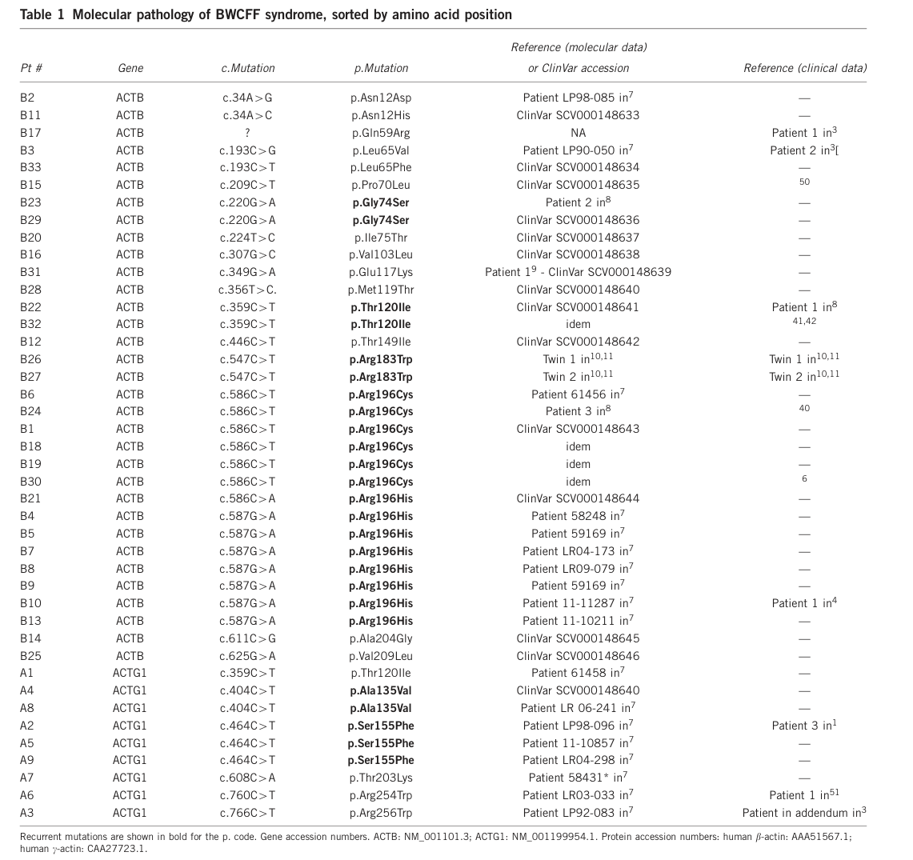

## Question

# Disease Characteristics Research Template

## Target Disease
- **Disease Name:** Baraitser-Winter Cerebrofrontofacial Syndrome
- **MONDO ID:**  (if available)
- **Category:** Mendelian

## Research Objectives

Please provide a comprehensive research report on **Baraitser-Winter Cerebrofrontofacial Syndrome** covering all of the
disease characteristics listed below. This report will be used to populate a disease knowledge
base entry. Be thorough and cite primary literature (PMID preferred) for all claims.

For each section, **suggested databases/resources** are listed. These are the first places
you should search for information on each topic.

---

### 1. Disease Information
> **Search first:** OMIM, Orphanet, ICD-10/ICD-11, MeSH, PubMed

- What is the disease? Provide a concise overview.
- What are the key identifiers? (OMIM, Orphanet, ICD-10/ICD-11, MeSH, Mondo)
- What are the common synonyms and alternative names?
- Is the information derived from individual patients (e.g., EHR) or aggregated disease-level resources?

### 2. Etiology

- **Disease Causal Factors**: What are the primary causes? (genetic, environmental, infectious, mechanistic)
- **Risk Factors**:
  > **Search first:** PubMed, Cochrane Library, UpToDate, clinical guidelines, ClinVar, ClinGen, GWAS Catalog, PheGenI, CTD, CDC, WHO, epidemiological databases
  - Genetic risk factors (causal variants, susceptibility loci, modifier genes)
  - Environmental risk factors (toxins, lifestyle, occupational exposures, age, sex, family history)
- **Protective Factors**:
  > **Search first:** PubMed, Cochrane Library, clinical trial databases, GWAS Catalog, gnomAD, WHO, CDC, nutrition databases
  - Genetic protective factors (protective variants, modifier alleles)
  - Environmental protective factors (diet, lifestyle, exposures that reduce risk)
- **Gene-Environment Interactions**: How do genetic and environmental factors interact to influence disease?
  > **Search first:** CTD, PubMed, PheGenI, GxE databases

### 3. Phenotypes
> **Search first:** HPO (Human Phenotype Ontology), OMIM, Orphanet, PubMed, clinicaltrials.gov, MedDRA, SNOMED CT, DECIPHER, LOINC

For each phenotype, provide:
- **Phenotype type**: symptoms, clinical signs, physical manifestations, behavioral changes, or laboratory abnormalities
  > For symptoms/signs: HPO, OMIM, Orphanet, PubMed
  > For behavioral changes: HPO, DSM, RDoC (Research Domain Criteria), PubMed
  > For laboratory abnormalities: LOINC, SNOMED CT, LabTests Online, PubMed
- **Phenotype characteristics**:
  > **Search first:** OMIM, Orphanet, HPO, PubMed
  - Age of symptom onset (neonatal, childhood, adult-onset, late-onset)
  - Symptom severity (mild, moderate, severe, variable)
  - Symptom progression (stable, progressive, episodic, fluctuating)
  - Frequency among affected individuals (percentage or qualitative)
- **Quality of life impact**: Effects on daily functioning and well-being (per-phenotype when possible)
  > **Search first:** EQ-5D database, SF-36, WHO QOL databases, PubMed
- Suggest HPO (Human Phenotype Ontology) terms for each phenotype

### 4. Genetic/Molecular Information

- **Causal Genes**: Gene mutations or chromosomal abnormalities responsible for disease (gene symbols, OMIM IDs)
  > **Search first:** OMIM, ClinVar, HGMD, Ensembl, NCBI Gene
- **Pathogenic Variants**:
  - Affected genes (gene symbols, HGNC IDs)
    > **Search first:** OMIM, NCBI Gene, Ensembl, HGNC, UniProt, GeneCards
  - Variant classification (pathogenic, likely pathogenic, VUS per ACMG/AMP guidelines)
    > **Search first:** ClinVar, ClinGen, ACMG/AMP guidelines, VarSome
  - Variant type/class (missense, frameshift, nonsense, splice-site, structural)
  - Allele frequency in population databases
    > **Search first:** gnomAD, 1000 Genomes, ExAC, TOPMed, dbSNP
  - Somatic vs germline origin
    > **Search first:** COSMIC (somatic), ClinVar, ICGC, TCGA
  - Functional consequences (loss of function, gain of function, dominant negative)
- **Modifier Genes**: Genes that modify disease severity or expression
- **Epigenetic Information**: DNA methylation, histone modifications, chromatin changes affecting disease
  > **Search first:** ENCODE, Roadmap Epigenomics, MethBase, DiseaseMeth
- **Chromosomal Abnormalities**: Large-scale genetic changes (aneuploidy, translocations, inversions)
  > **Search first:** DECIPHER, ClinVar, ECARUCA, UCSC Genome Browser

### 5. Environmental Information

- **Environmental Factors**: Non-genetic contributing factors (toxins, radiation, pollution, occupational exposure)
  > **Search first:** CTD (Comparative Toxicogenomics Database), TOXNET, PubMed, EPA databases
- **Lifestyle Factors**: Behavioral factors (smoking, diet, exercise, alcohol consumption)
  > **Search first:** CDC databases, WHO, PubMed, NHANES
- **Infectious Agents**: If applicable, pathogens causing or triggering disease (bacteria, viruses, fungi, parasites)
  > **Search first:** NCBI Taxonomy, ViPR, BV-BRC, MicrobeDB, GIDEON

### 6. Mechanism / Pathophysiology

- **Molecular Pathways**: Specific signaling cascades or biochemical pathways involved (Wnt, MAPK, mTOR, PI3K-AKT, etc.)
  > **Search first:** KEGG, Reactome, WikiPathways, PathBank, BioCyc
- **Cellular Processes**: Cell-level mechanisms (apoptosis, autophagy, cell cycle dysregulation, inflammation, etc.)
  > **Search first:** Gene Ontology (GO), Reactome, KEGG, PubMed
- **Protein Dysfunction**: How protein structure or function is altered (misfolding, aggregation, loss of function, gain of function)
  > **Search first:** UniProt, PDB (Protein Data Bank), InterPro, Pfam, AlphaFold
- **Metabolic Changes**: Alterations in metabolic processes (energy metabolism, lipid metabolism, amino acid metabolism)
  > **Search first:** KEGG, BioCyc, HMDB (Human Metabolome Database), BRENDA
- **Immune System Involvement**: Role of immune response (autoimmunity, immunodeficiency, chronic inflammation)
  > **Search first:** ImmPort, Immunome Database, IEDB, Gene Ontology
- **Tissue Damage Mechanisms**: How tissues/ are injured (oxidative stress, ischemia, fibrosis, necrosis)
  > **Search first:** PubMed, Gene Ontology, Reactome
- **Biochemical Abnormalities**: Specific molecular defects (enzyme deficiencies, receptor dysfunction, ion channel defects)
  > **Search first:** BRENDA, UniProt, KEGG, OMIM, PubMed
- **Epigenetic Changes**: DNA methylation, histone modifications affecting gene expression in disease
  > **Search first:** ENCODE, Roadmap Epigenomics, MethBase, DiseaseMeth
- **Molecular Profiling** (if available):
  - Transcriptomics/gene expression changes
    > **Search first:** GEO (Gene Expression Omnibus), ArrayExpress, GTEx, Human Cell Atlas, SRA
  - Proteomics findings
    > **Search first:** PRIDE, ProteomeXchange, Human Protein Atlas, STRING, BioGRID
  - Metabolomics signatures
    > **Search first:** MetaboLights, Metabolomics Workbench, HMDB, METLIN
  - Lipidomics alterations
    > **Search first:** LIPID MAPS, SwissLipids, LipidHome, Metabolomics Workbench
  - Genomic structural features
    > **Search first:** UCSC Genome Browser, Ensembl, NCBI, dbVar, DGV
- **Advanced Technologies** (if applicable):
  - Single-cell analysis findings (cell-type specific mechanisms, cellular heterogeneity)
    > **Search first:** Human Cell Atlas, Single Cell Portal, GEO, CELLxGENE
  - Spatial transcriptomics findings
    > **Search first:** GEO, Spatial Research, Vizgen, 10x Genomics data
  - Multi-omics integration results
    > **Search first:** TCGA, ICGC, cBioPortal, LinkedOmics, PubMed
  - Functional genomics screens (CRISPR, RNAi)
    > **Search first:** DepMap, GenomeRNAi, PubMed, BioGRID ORCS

For each mechanism, describe:
- The causal chain from initial trigger to clinical manifestation
- Which mechanisms are upstream vs downstream
- What cell types and biological processes are involved
- Suggest GO terms for biological processes and CL terms for cell types

### 7. Anatomical Structures Affected

- **Organ Level**:
  - Primary organs directly affected
  - Secondary organ involvement (complications, secondary effects)
  - Body systems involved (cardiovascular, nervous, digestive, respiratory, endocrine, etc.)
  > **Search first:** Uberon, FMA (Foundational Model of Anatomy), OMIM, HPO, ICD-11, MeSH, SNOMED CT
- **Tissue and Cell Level**:
  - Specific tissue types affected (epithelial, connective, muscle, nervous)
  - Specific cell populations targeted (with Cell Ontology terms)
  > **Search first:** Uberon, Human Protein Atlas, Cell Ontology, Human Cell Atlas, CellMarker, PanglaoDB
- **Subcellular Level**:
  - Cellular compartments involved (mitochondria, nucleus, ER, lysosomes) (with GO Cellular Component terms)
  > **Search first:** Gene Ontology (Cellular Component), UniProt, Human Protein Atlas
- **Localization**:
  - Specific anatomical sites (with UBERON terms)
    > **Search first:** FMA, Uberon, NeuroNames (for brain), SNOMED CT
  - Lateralization (unilateral, bilateral, asymmetric)
    > **Search first:** HPO, clinical literature, imaging databases

### 8. Temporal Development

- **Onset**:
  - Typical age of onset (congenital, pediatric, adult, geriatric)
  - Onset pattern (acute, subacute, chronic, insidious)
  > **Search first:** OMIM, Orphanet, HPO, PubMed
- **Progression**:
  - Disease stages (early, intermediate, advanced, end-stage)
    > **Search first:** Cancer Staging Manual (AJCC), WHO classifications, PubMed
  - Progression rate (rapid, slow, variable)
  - Disease course pattern (episodic, relapsing-remitting, progressive, stable)
  - Disease duration (self-limited, chronic lifelong)
  > **Search first:** Disease registries, longitudinal cohort databases, natural history studies, PubMed, Orphanet, OMIM
- **Patterns**:
  - Remission patterns (spontaneous, treatment-induced)
    > **Search first:** Clinical trial databases, disease registries, PubMed
  - Critical periods (time windows of vulnerability or opportunity for intervention)
    > **Search first:** PubMed, developmental biology databases, clinical guidelines

### 9. Inheritance and Population

- **Epidemiology**:
  - Prevalence (cases per 100,000 at given time)
  - Incidence (new cases per 100,000 per year)
  > **Search first:** Orphanet, CDC, WHO, GBD (Global Burden of Disease), national registries, SEER, disease registries
- **For Genetic Etiology**:
  - Inheritance pattern (AD, AR, X-linked, mitochondrial, multifactorial, polygenic)
    > **Search first:** OMIM, Orphanet, ClinVar, GTR (Genetic Testing Registry)
  - Penetrance (complete, incomplete, age-dependent)
    > **Search first:** ClinVar, OMIM, PubMed, ClinGen
  - Expressivity (variable, consistent)
    > **Search first:** OMIM, ClinVar, PubMed
  - Genetic anticipation (increasing severity in successive generations)
    > **Search first:** OMIM, PubMed (especially for repeat expansion disorders)
  - Germline mosaicism
    > **Search first:** ClinVar, OMIM, genetic counseling literature, PubMed
  - Founder effects (population-specific mutations)
    > **Search first:** gnomAD, population genetics databases, PubMed
  - Consanguinity role
    > **Search first:** OMIM, population studies, genetic counseling resources
  - Carrier frequency
    > **Search first:** gnomAD, carrier screening databases, GeneReviews, GTR
- **Population Demographics**:
  - Affected populations (ethnic or demographic groups with higher prevalence)
    > **Search first:** gnomAD, 1000 Genomes, PAGE Study, PubMed, population registries
  - Geographic distribution (endemic areas, regional variation)
    > **Search first:** WHO, CDC, GBD, Orphanet, geographic epidemiology databases
  - Geographic distribution of specific variants
  - Sex ratio (male:female)
    > **Search first:** Disease registries, OMIM, PubMed, epidemiological databases
  - Age distribution of affected individuals
    > **Search first:** CDC, disease registries, SEER, Orphanet

### 10. Diagnostics

- **Clinical Tests**:
  - Laboratory tests (blood, urine, tissue chemistry, specific enzyme assays)
    > **Search first:** LOINC, LabTests Online, PubMed
  - Biomarkers (proteins, metabolites, genetic markers, circulating biomarkers)
    > **Search first:** FDA Biomarker List, BEST (Biomarkers, EndpointS, and other Tools), PubMed
  - Imaging studies (X-ray, CT, MRI, PET, ultrasound)
    > **Search first:** RadLex, DICOM, Radiopaedia, imaging databases
  - Functional tests (pulmonary function, cardiac stress tests)
    > **Search first:** LOINC, clinical guidelines, PubMed
  - Electrophysiology (EEG, EMG, ECG, nerve conduction studies)
    > **Search first:** LOINC, clinical neurophysiology databases, PubMed
  - Biopsy findings (histopathology, immunohistochemistry)
    > **Search first:** SNOMED CT, College of American Pathologists resources, PubMed
  - Pathology findings (microscopic examination)
    > **Search first:** SNOMED CT, Digital Pathology databases, PubMed
- **Genetic Testing**:
  > **Search first:** GTR (Genetic Testing Registry), GeneReviews, ClinGen
  - Overview of recommended genetic testing approach
  - Whole genome sequencing (WGS) utility
    > **Search first:** GTR, ClinVar, GEL (Genomics England), gnomAD
  - Whole exome sequencing (WES) utility
    > **Search first:** GTR, ClinVar, OMIM, GeneMatcher
  - Gene panels (which panels, which genes)
    > **Search first:** GTR, ClinVar, laboratory-specific databases
  - Single gene testing
    > **Search first:** GTR, ClinVar, OMIM, GeneReviews
  - Chromosomal microarray (CMA)
    > **Search first:** DECIPHER, ClinVar, dbVar, ECARUCA
  - Karyotyping
    > **Search first:** Chromosome Abnormality Database, ClinVar, cytogenetics resources
  - FISH
    > **Search first:** ClinVar, cytogenetics databases, PubMed
  - Mitochondrial DNA testing
    > **Search first:** MITOMAP, MSeqDR, ClinVar, GTR
  - Repeat expansion testing
    > **Search first:** GTR, ClinVar, repeat expansion databases, PubMed
- **Omics-Based Diagnostics** (if applicable):
  - RNA sequencing / transcriptomics
    > **Search first:** GEO, ArrayExpress, GTEx, RNA-seq databases
  - Proteomics
    > **Search first:** PRIDE, ProteomeXchange, FDA Biomarker database
  - Metabolomics
    > **Search first:** MetaboLights, Metabolomics Workbench, HMDB
  - Epigenomics
    > **Search first:** GEO, ENCODE, Roadmap Epigenomics, MethBase
  - Liquid biopsy
    > **Search first:** COSMIC, ClinVar, liquid biopsy databases, PubMed
- **Clinical Criteria**:
  - Standardized diagnostic criteria (DSM, ICD, society guidelines)
    > **Search first:** DSM-5, ICD-11, clinical society guidelines, UpToDate
  - Differential diagnosis (other conditions to rule out, with distinguishing features)
    > **Search first:** DynaMed, UpToDate, clinical decision support systems
- **Screening**:
  - Screening methods for asymptomatic individuals (newborn screening, carrier screening, cascade screening)
    > **Search first:** ACMG recommendations, CDC newborn screening, GTR

### 11. Outcome/Prognosis

- **Survival and Mortality**:
  - Survival rate (5-year, 10-year, overall)
    > **Search first:** SEER, cancer registries, disease-specific registries, PubMed
  - Life expectancy (with and without treatment if applicable)
    > **Search first:** Orphanet, disease registries, actuarial databases, PubMed
  - Mortality rate
    > **Search first:** CDC, WHO, GBD, national mortality databases
  - Disease-specific mortality (deaths directly attributable to disease)
    > **Search first:** Disease registries, CDC Wonder, GBD, PubMed
- **Morbidity and Function**:
  - Morbidity (disease-related disability and health impacts)
    > **Search first:** GBD, WHO, disability databases, PubMed
  - Disability outcomes (long-term functional impairments)
    > **Search first:** ICF (International Classification of Functioning), disability registries
  - Quality of life measures (EQ-5D, SF-36, PROMIS, disease-specific tools)
    > **Search first:** EQ-5D database, SF-36, PROMIS, PubMed
- **Disease Course**:
  - Complications (secondary problems: infections, organ failure, etc.)
    > **Search first:** ICD codes, disease registries, clinical databases, PubMed
  - Recovery potential (likelihood and extent of recovery, with vs without treatment)
    > **Search first:** Natural history studies, rehabilitation databases, PubMed
- **Prediction**:
  - Prognostic factors (age, disease severity, biomarkers, treatment response)
    > **Search first:** Prognostic models databases, clinical calculators, PubMed
  - Prognostic biomarkers (molecular markers predicting disease course)
    > **Search first:** FDA Biomarker database, PubMed, cancer prognostic databases

### 12. Treatment

- **Pharmacotherapy**:
  - Pharmacological treatments (drug names, drug classes, mechanisms of action)
    > **Search first:** DrugBank, RxNorm, ATC classification, DailyMed, FDA databases
  - Pharmacogenomics (how genetic variants affect drug metabolism, efficacy, toxicity)
    > **Search first:** PharmGKB, CPIC (Clinical Pharmacogenetics), FDA Table of PGx Biomarkers
- **Advanced Therapeutics**:
  - Gene therapy (viral vectors, CRISPR, gene replacement, gene editing)
    > **Search first:** ClinicalTrials.gov, FDA gene therapy database, ASGCT resources
  - Cell therapy (stem cell transplant, CAR-T, cellular therapeutics)
    > **Search first:** ClinicalTrials.gov, FDA cell therapy database, FACT standards
  - RNA-based therapies (ASOs, siRNA, mRNA therapies)
    > **Search first:** ClinicalTrials.gov, FDA approvals, PubMed
  - Targeted therapies (treatments directed at specific molecular targets)
    > **Search first:** My Cancer Genome, OncoKB, ClinicalTrials.gov, FDA approvals
  - Immunotherapies (checkpoint inhibitors, monoclonal antibodies)
    > **Search first:** Cancer Immunotherapy Database, FDA approvals, ClinicalTrials.gov
- **Surgical and Interventional**:
  - Surgical interventions (types of surgery, timing, outcomes)
    > **Search first:** CPT codes, surgical registries, clinical guidelines, PubMed
- **Supportive and Rehabilitative**:
  - Supportive care (symptom management, pain control, nutrition)
    > **Search first:** Clinical guidelines, Cochrane Library, PubMed
  - Rehabilitation (physical therapy, occupational therapy, speech therapy)
    > **Search first:** Rehabilitation medicine databases, clinical guidelines, PubMed
- **Experimental**:
  - Experimental treatments in clinical trials (with NCT identifiers if available)
    > **Search first:** ClinicalTrials.gov, EU Clinical Trials Register, WHO ICTRP
- **Treatment Outcomes**:
  - Treatment response rates
    > **Search first:** Clinical trial databases, FDA reviews, systematic reviews, PubMed
  - Side effects and adverse events
    > **Search first:** FDA Adverse Event Reporting System (FAERS), MedWatch, PubMed
- **Treatment Strategy**:
  - Treatment algorithms (clinical pathways, decision trees)
    > **Search first:** Clinical practice guidelines, NCCN Guidelines, UpToDate
  - Combination therapies
    > **Search first:** ClinicalTrials.gov, treatment guidelines, PubMed
  - Personalized medicine approaches (genotype-guided treatment)
    > **Search first:** My Cancer Genome, CIViC, PharmGKB, precision medicine databases

For each treatment, suggest MAXO (Medical Action Ontology) terms where applicable.

### 13. Prevention

- **Prevention Levels**:
  - Primary prevention (preventing disease occurrence: vaccination, risk factor modification)
    > **Search first:** CDC, WHO, USPSTF recommendations, Cochrane Library
  - Secondary prevention (early detection and treatment: screening programs, early intervention)
    > **Search first:** USPSTF, CDC screening guidelines, WHO
  - Tertiary prevention (preventing complications in those with disease)
    > **Search first:** Clinical guidelines, disease management protocols, PubMed
- **Immunization**: Vaccine strategies (if applicable)
  > **Search first:** CDC vaccine schedules, WHO immunization, FDA vaccine database
- **Screening and Early Detection**:
  - Screening programs (population-based: newborn screening, cancer screening)
    > **Search first:** CDC screening programs, USPSTF, cancer screening databases
  - Genetic screening (carrier screening, preimplantation genetic diagnosis, prenatal testing)
    > **Search first:** ACMG recommendations, ACOG guidelines, GTR
  - Risk stratification (identifying high-risk individuals for targeted prevention)
    > **Search first:** Risk prediction models, clinical calculators, PubMed
- **Behavioral Interventions**: Lifestyle modifications to reduce risk
  > **Search first:** CDC, WHO, behavioral intervention databases, Cochrane Library
- **Counseling**: Genetic counseling (risk assessment, family planning guidance)
  > **Search first:** NSGC resources, ACMG guidelines, GeneReviews
- **Public Health**:
  - Public health interventions (sanitation, vector control, health education)
    > **Search first:** CDC, WHO, public health databases, PubMed
  - Environmental interventions (reducing environmental risk factors)
    > **Search first:** EPA databases, WHO environmental health, PubMed
- **Prophylaxis**: Preventive medications or procedures
  > **Search first:** Clinical guidelines, FDA approvals, PubMed

### 14. Other Species / Natural Disease

- **Taxonomy**: Species affected (with NCBI Taxon identifiers)
  > **Search first:** NCBI Taxonomy
- **Breed**: Specific breeds affected (with VBO identifiers if applicable)
  > **Search first:** VBO (Vertebrate Breed Ontology)
- **Gene**: Orthologous genes in other species (with NCBI Gene IDs)
  > **Search first:** NCBI Gene
- **Natural Disease**:
  - Naturally occurring disease in other species (companion animals, wildlife)
    > **Search first:** OMIA (Online Mendelian Inheritance in Animals), VetCompass, PubMed
  - Veterinary relevance and importance in animal health
    > **Search first:** OMIA, veterinary databases, PubMed
- **Comparative Biology**:
  - Comparative pathology (similarities and differences across species)
    > **Search first:** OMIA, comparative pathology databases, PubMed
  - Evolutionary conservation of disease mechanisms
    > **Search first:** HomoloGene, OrthoMCL, Alliance of Genome Resources
- **Transmission** (if applicable):
  - Zoonotic potential
    > **Search first:** CDC zoonotic diseases, WHO zoonoses, GIDEON
  - Cross-species susceptibility
    > **Search first:** NCBI Taxonomy, veterinary databases, PubMed

### 15. Model Organisms

- **Model Types**:
  - Model organism type (mammalian, invertebrate, cellular, in vitro)
    > **Search first:** Alliance of Genome Resources, model organism databases
  - Specific model systems (mouse, rat, zebrafish, Drosophila, C. elegans, yeast, cell lines, organoids, iPSCs)
    > **Search first:** MGI, RGD, ZFIN, FlyBase, WormBase, SGD, ATCC, Cellosaurus
  - Induced models (drug treatment, surgical intervention, environmental manipulation)
    > **Search first:** MGI, model organism databases, PubMed
- **Genetic Models**:
  - Types available (knockout, knock-in, transgenic, conditional, humanized)
    > **Search first:** MGI, IMPC, KOMP, EuMMCR, IMSR
- **Model Characteristics**:
  - Phenotype recapitulation (how well model reproduces human disease features)
    > **Search first:** Model organism databases, comparative studies, PubMed
  - Model limitations (aspects of human disease not captured)
    > **Search first:** Model organism databases, PubMed, review articles
- **Applications**:
  - Research applications (what aspects of disease can be studied)
    > **Search first:** Model organism databases, PubMed
- **Resources**:
  - Model databases
    > **Search first:** MGI, RGD, ZFIN, FlyBase, WormBase, IMSR, EMMA, MMRRC

---

## Citation Requirements

- Cite primary literature (PMID preferred) for all mechanistic and clinical claims
- Prioritize recent reviews and landmark papers
- Include direct quotes from abstracts where possible to support key statements
- Distinguish evidence source types: human clinical, model organism, in vitro, computational

## Output Format

Structure your response as a comprehensive narrative organized by the sections above.
For each section, provide:
- Factual content with specific details (numbers, percentages, gene names, variant nomenclature)
- Ontology term suggestions (HPO, GO, CL, UBERON, CHEBI, MAXO, MONDO) where applicable
- Evidence citations with PMIDs
- Direct quotes from abstracts to support key claims
- Clear indication when information is not available or not applicable for this disease

This report will be used to populate a disease knowledge base entry with:
- Pathophysiology descriptions with causal chains
- Gene/protein annotations (HGNC, GO terms)
- Phenotype associations (HP terms) with frequencies
- Cell type involvement (CL terms)
- Anatomical locations (UBERON terms)
- Chemical entities (CHEBI terms)
- Treatment annotations (MAXO terms)
- Evidence items with PMIDs and exact abstract quotes
- Epidemiology, prognosis, diagnostic, and prevention information
- Animal model descriptions with phenotype recapitulation details

## Output

Question: You are an expert researcher providing comprehensive, well-cited information.

Provide detailed information focusing on:
1. Key concepts and definitions with current understanding
2. Recent developments and latest research (prioritize 2023-2024 sources)
3. Current applications and real-world implementations
4. Expert opinions and analysis from authoritative sources
5. Relevant statistics and data from recent studies

Format as a comprehensive research report with proper citations. Include URLs and publication dates where available.
Always prioritize recent, authoritative sources and provide specific citations for all major claims.

# Disease Characteristics Research Template

## Target Disease
- **Disease Name:** Baraitser-Winter Cerebrofrontofacial Syndrome
- **MONDO ID:**  (if available)
- **Category:** Mendelian

## Research Objectives

Please provide a comprehensive research report on **Baraitser-Winter Cerebrofrontofacial Syndrome** covering all of the
disease characteristics listed below. This report will be used to populate a disease knowledge
base entry. Be thorough and cite primary literature (PMID preferred) for all claims.

For each section, **suggested databases/resources** are listed. These are the first places
you should search for information on each topic.

---

### 1. Disease Information
> **Search first:** OMIM, Orphanet, ICD-10/ICD-11, MeSH, PubMed

- What is the disease? Provide a concise overview.
- What are the key identifiers? (OMIM, Orphanet, ICD-10/ICD-11, MeSH, Mondo)
- What are the common synonyms and alternative names?
- Is the information derived from individual patients (e.g., EHR) or aggregated disease-level resources?

### 2. Etiology

- **Disease Causal Factors**: What are the primary causes? (genetic, environmental, infectious, mechanistic)
- **Risk Factors**:
  > **Search first:** PubMed, Cochrane Library, UpToDate, clinical guidelines, ClinVar, ClinGen, GWAS Catalog, PheGenI, CTD, CDC, WHO, epidemiological databases
  - Genetic risk factors (causal variants, susceptibility loci, modifier genes)
  - Environmental risk factors (toxins, lifestyle, occupational exposures, age, sex, family history)
- **Protective Factors**:
  > **Search first:** PubMed, Cochrane Library, clinical trial databases, GWAS Catalog, gnomAD, WHO, CDC, nutrition databases
  - Genetic protective factors (protective variants, modifier alleles)
  - Environmental protective factors (diet, lifestyle, exposures that reduce risk)
- **Gene-Environment Interactions**: How do genetic and environmental factors interact to influence disease?
  > **Search first:** CTD, PubMed, PheGenI, GxE databases

### 3. Phenotypes
> **Search first:** HPO (Human Phenotype Ontology), OMIM, Orphanet, PubMed, clinicaltrials.gov, MedDRA, SNOMED CT, DECIPHER, LOINC

For each phenotype, provide:
- **Phenotype type**: symptoms, clinical signs, physical manifestations, behavioral changes, or laboratory abnormalities
  > For symptoms/signs: HPO, OMIM, Orphanet, PubMed
  > For behavioral changes: HPO, DSM, RDoC (Research Domain Criteria), PubMed
  > For laboratory abnormalities: LOINC, SNOMED CT, LabTests Online, PubMed
- **Phenotype characteristics**:
  > **Search first:** OMIM, Orphanet, HPO, PubMed
  - Age of symptom onset (neonatal, childhood, adult-onset, late-onset)
  - Symptom severity (mild, moderate, severe, variable)
  - Symptom progression (stable, progressive, episodic, fluctuating)
  - Frequency among affected individuals (percentage or qualitative)
- **Quality of life impact**: Effects on daily functioning and well-being (per-phenotype when possible)
  > **Search first:** EQ-5D database, SF-36, WHO QOL databases, PubMed
- Suggest HPO (Human Phenotype Ontology) terms for each phenotype

### 4. Genetic/Molecular Information

- **Causal Genes**: Gene mutations or chromosomal abnormalities responsible for disease (gene symbols, OMIM IDs)
  > **Search first:** OMIM, ClinVar, HGMD, Ensembl, NCBI Gene
- **Pathogenic Variants**:
  - Affected genes (gene symbols, HGNC IDs)
    > **Search first:** OMIM, NCBI Gene, Ensembl, HGNC, UniProt, GeneCards
  - Variant classification (pathogenic, likely pathogenic, VUS per ACMG/AMP guidelines)
    > **Search first:** ClinVar, ClinGen, ACMG/AMP guidelines, VarSome
  - Variant type/class (missense, frameshift, nonsense, splice-site, structural)
  - Allele frequency in population databases
    > **Search first:** gnomAD, 1000 Genomes, ExAC, TOPMed, dbSNP
  - Somatic vs germline origin
    > **Search first:** COSMIC (somatic), ClinVar, ICGC, TCGA
  - Functional consequences (loss of function, gain of function, dominant negative)
- **Modifier Genes**: Genes that modify disease severity or expression
- **Epigenetic Information**: DNA methylation, histone modifications, chromatin changes affecting disease
  > **Search first:** ENCODE, Roadmap Epigenomics, MethBase, DiseaseMeth
- **Chromosomal Abnormalities**: Large-scale genetic changes (aneuploidy, translocations, inversions)
  > **Search first:** DECIPHER, ClinVar, ECARUCA, UCSC Genome Browser

### 5. Environmental Information

- **Environmental Factors**: Non-genetic contributing factors (toxins, radiation, pollution, occupational exposure)
  > **Search first:** CTD (Comparative Toxicogenomics Database), TOXNET, PubMed, EPA databases
- **Lifestyle Factors**: Behavioral factors (smoking, diet, exercise, alcohol consumption)
  > **Search first:** CDC databases, WHO, PubMed, NHANES
- **Infectious Agents**: If applicable, pathogens causing or triggering disease (bacteria, viruses, fungi, parasites)
  > **Search first:** NCBI Taxonomy, ViPR, BV-BRC, MicrobeDB, GIDEON

### 6. Mechanism / Pathophysiology

- **Molecular Pathways**: Specific signaling cascades or biochemical pathways involved (Wnt, MAPK, mTOR, PI3K-AKT, etc.)
  > **Search first:** KEGG, Reactome, WikiPathways, PathBank, BioCyc
- **Cellular Processes**: Cell-level mechanisms (apoptosis, autophagy, cell cycle dysregulation, inflammation, etc.)
  > **Search first:** Gene Ontology (GO), Reactome, KEGG, PubMed
- **Protein Dysfunction**: How protein structure or function is altered (misfolding, aggregation, loss of function, gain of function)
  > **Search first:** UniProt, PDB (Protein Data Bank), InterPro, Pfam, AlphaFold
- **Metabolic Changes**: Alterations in metabolic processes (energy metabolism, lipid metabolism, amino acid metabolism)
  > **Search first:** KEGG, BioCyc, HMDB (Human Metabolome Database), BRENDA
- **Immune System Involvement**: Role of immune response (autoimmunity, immunodeficiency, chronic inflammation)
  > **Search first:** ImmPort, Immunome Database, IEDB, Gene Ontology
- **Tissue Damage Mechanisms**: How tissues/ are injured (oxidative stress, ischemia, fibrosis, necrosis)
  > **Search first:** PubMed, Gene Ontology, Reactome
- **Biochemical Abnormalities**: Specific molecular defects (enzyme deficiencies, receptor dysfunction, ion channel defects)
  > **Search first:** BRENDA, UniProt, KEGG, OMIM, PubMed
- **Epigenetic Changes**: DNA methylation, histone modifications affecting gene expression in disease
  > **Search first:** ENCODE, Roadmap Epigenomics, MethBase, DiseaseMeth
- **Molecular Profiling** (if available):
  - Transcriptomics/gene expression changes
    > **Search first:** GEO (Gene Expression Omnibus), ArrayExpress, GTEx, Human Cell Atlas, SRA
  - Proteomics findings
    > **Search first:** PRIDE, ProteomeXchange, Human Protein Atlas, STRING, BioGRID
  - Metabolomics signatures
    > **Search first:** MetaboLights, Metabolomics Workbench, HMDB, METLIN
  - Lipidomics alterations
    > **Search first:** LIPID MAPS, SwissLipids, LipidHome, Metabolomics Workbench
  - Genomic structural features
    > **Search first:** UCSC Genome Browser, Ensembl, NCBI, dbVar, DGV
- **Advanced Technologies** (if applicable):
  - Single-cell analysis findings (cell-type specific mechanisms, cellular heterogeneity)
    > **Search first:** Human Cell Atlas, Single Cell Portal, GEO, CELLxGENE
  - Spatial transcriptomics findings
    > **Search first:** GEO, Spatial Research, Vizgen, 10x Genomics data
  - Multi-omics integration results
    > **Search first:** TCGA, ICGC, cBioPortal, LinkedOmics, PubMed
  - Functional genomics screens (CRISPR, RNAi)
    > **Search first:** DepMap, GenomeRNAi, PubMed, BioGRID ORCS

For each mechanism, describe:
- The causal chain from initial trigger to clinical manifestation
- Which mechanisms are upstream vs downstream
- What cell types and biological processes are involved
- Suggest GO terms for biological processes and CL terms for cell types

### 7. Anatomical Structures Affected

- **Organ Level**:
  - Primary organs directly affected
  - Secondary organ involvement (complications, secondary effects)
  - Body systems involved (cardiovascular, nervous, digestive, respiratory, endocrine, etc.)
  > **Search first:** Uberon, FMA (Foundational Model of Anatomy), OMIM, HPO, ICD-11, MeSH, SNOMED CT
- **Tissue and Cell Level**:
  - Specific tissue types affected (epithelial, connective, muscle, nervous)
  - Specific cell populations targeted (with Cell Ontology terms)
  > **Search first:** Uberon, Human Protein Atlas, Cell Ontology, Human Cell Atlas, CellMarker, PanglaoDB
- **Subcellular Level**:
  - Cellular compartments involved (mitochondria, nucleus, ER, lysosomes) (with GO Cellular Component terms)
  > **Search first:** Gene Ontology (Cellular Component), UniProt, Human Protein Atlas
- **Localization**:
  - Specific anatomical sites (with UBERON terms)
    > **Search first:** FMA, Uberon, NeuroNames (for brain), SNOMED CT
  - Lateralization (unilateral, bilateral, asymmetric)
    > **Search first:** HPO, clinical literature, imaging databases

### 8. Temporal Development

- **Onset**:
  - Typical age of onset (congenital, pediatric, adult, geriatric)
  - Onset pattern (acute, subacute, chronic, insidious)
  > **Search first:** OMIM, Orphanet, HPO, PubMed
- **Progression**:
  - Disease stages (early, intermediate, advanced, end-stage)
    > **Search first:** Cancer Staging Manual (AJCC), WHO classifications, PubMed
  - Progression rate (rapid, slow, variable)
  - Disease course pattern (episodic, relapsing-remitting, progressive, stable)
  - Disease duration (self-limited, chronic lifelong)
  > **Search first:** Disease registries, longitudinal cohort databases, natural history studies, PubMed, Orphanet, OMIM
- **Patterns**:
  - Remission patterns (spontaneous, treatment-induced)
    > **Search first:** Clinical trial databases, disease registries, PubMed
  - Critical periods (time windows of vulnerability or opportunity for intervention)
    > **Search first:** PubMed, developmental biology databases, clinical guidelines

### 9. Inheritance and Population

- **Epidemiology**:
  - Prevalence (cases per 100,000 at given time)
  - Incidence (new cases per 100,000 per year)
  > **Search first:** Orphanet, CDC, WHO, GBD (Global Burden of Disease), national registries, SEER, disease registries
- **For Genetic Etiology**:
  - Inheritance pattern (AD, AR, X-linked, mitochondrial, multifactorial, polygenic)
    > **Search first:** OMIM, Orphanet, ClinVar, GTR (Genetic Testing Registry)
  - Penetrance (complete, incomplete, age-dependent)
    > **Search first:** ClinVar, OMIM, PubMed, ClinGen
  - Expressivity (variable, consistent)
    > **Search first:** OMIM, ClinVar, PubMed
  - Genetic anticipation (increasing severity in successive generations)
    > **Search first:** OMIM, PubMed (especially for repeat expansion disorders)
  - Germline mosaicism
    > **Search first:** ClinVar, OMIM, genetic counseling literature, PubMed
  - Founder effects (population-specific mutations)
    > **Search first:** gnomAD, population genetics databases, PubMed
  - Consanguinity role
    > **Search first:** OMIM, population studies, genetic counseling resources
  - Carrier frequency
    > **Search first:** gnomAD, carrier screening databases, GeneReviews, GTR
- **Population Demographics**:
  - Affected populations (ethnic or demographic groups with higher prevalence)
    > **Search first:** gnomAD, 1000 Genomes, PAGE Study, PubMed, population registries
  - Geographic distribution (endemic areas, regional variation)
    > **Search first:** WHO, CDC, GBD, Orphanet, geographic epidemiology databases
  - Geographic distribution of specific variants
  - Sex ratio (male:female)
    > **Search first:** Disease registries, OMIM, PubMed, epidemiological databases
  - Age distribution of affected individuals
    > **Search first:** CDC, disease registries, SEER, Orphanet

### 10. Diagnostics

- **Clinical Tests**:
  - Laboratory tests (blood, urine, tissue chemistry, specific enzyme assays)
    > **Search first:** LOINC, LabTests Online, PubMed
  - Biomarkers (proteins, metabolites, genetic markers, circulating biomarkers)
    > **Search first:** FDA Biomarker List, BEST (Biomarkers, EndpointS, and other Tools), PubMed
  - Imaging studies (X-ray, CT, MRI, PET, ultrasound)
    > **Search first:** RadLex, DICOM, Radiopaedia, imaging databases
  - Functional tests (pulmonary function, cardiac stress tests)
    > **Search first:** LOINC, clinical guidelines, PubMed
  - Electrophysiology (EEG, EMG, ECG, nerve conduction studies)
    > **Search first:** LOINC, clinical neurophysiology databases, PubMed
  - Biopsy findings (histopathology, immunohistochemistry)
    > **Search first:** SNOMED CT, College of American Pathologists resources, PubMed
  - Pathology findings (microscopic examination)
    > **Search first:** SNOMED CT, Digital Pathology databases, PubMed
- **Genetic Testing**:
  > **Search first:** GTR (Genetic Testing Registry), GeneReviews, ClinGen
  - Overview of recommended genetic testing approach
  - Whole genome sequencing (WGS) utility
    > **Search first:** GTR, ClinVar, GEL (Genomics England), gnomAD
  - Whole exome sequencing (WES) utility
    > **Search first:** GTR, ClinVar, OMIM, GeneMatcher
  - Gene panels (which panels, which genes)
    > **Search first:** GTR, ClinVar, laboratory-specific databases
  - Single gene testing
    > **Search first:** GTR, ClinVar, OMIM, GeneReviews
  - Chromosomal microarray (CMA)
    > **Search first:** DECIPHER, ClinVar, dbVar, ECARUCA
  - Karyotyping
    > **Search first:** Chromosome Abnormality Database, ClinVar, cytogenetics resources
  - FISH
    > **Search first:** ClinVar, cytogenetics databases, PubMed
  - Mitochondrial DNA testing
    > **Search first:** MITOMAP, MSeqDR, ClinVar, GTR
  - Repeat expansion testing
    > **Search first:** GTR, ClinVar, repeat expansion databases, PubMed
- **Omics-Based Diagnostics** (if applicable):
  - RNA sequencing / transcriptomics
    > **Search first:** GEO, ArrayExpress, GTEx, RNA-seq databases
  - Proteomics
    > **Search first:** PRIDE, ProteomeXchange, FDA Biomarker database
  - Metabolomics
    > **Search first:** MetaboLights, Metabolomics Workbench, HMDB
  - Epigenomics
    > **Search first:** GEO, ENCODE, Roadmap Epigenomics, MethBase
  - Liquid biopsy
    > **Search first:** COSMIC, ClinVar, liquid biopsy databases, PubMed
- **Clinical Criteria**:
  - Standardized diagnostic criteria (DSM, ICD, society guidelines)
    > **Search first:** DSM-5, ICD-11, clinical society guidelines, UpToDate
  - Differential diagnosis (other conditions to rule out, with distinguishing features)
    > **Search first:** DynaMed, UpToDate, clinical decision support systems
- **Screening**:
  - Screening methods for asymptomatic individuals (newborn screening, carrier screening, cascade screening)
    > **Search first:** ACMG recommendations, CDC newborn screening, GTR

### 11. Outcome/Prognosis

- **Survival and Mortality**:
  - Survival rate (5-year, 10-year, overall)
    > **Search first:** SEER, cancer registries, disease-specific registries, PubMed
  - Life expectancy (with and without treatment if applicable)
    > **Search first:** Orphanet, disease registries, actuarial databases, PubMed
  - Mortality rate
    > **Search first:** CDC, WHO, GBD, national mortality databases
  - Disease-specific mortality (deaths directly attributable to disease)
    > **Search first:** Disease registries, CDC Wonder, GBD, PubMed
- **Morbidity and Function**:
  - Morbidity (disease-related disability and health impacts)
    > **Search first:** GBD, WHO, disability databases, PubMed
  - Disability outcomes (long-term functional impairments)
    > **Search first:** ICF (International Classification of Functioning), disability registries
  - Quality of life measures (EQ-5D, SF-36, PROMIS, disease-specific tools)
    > **Search first:** EQ-5D database, SF-36, PROMIS, PubMed
- **Disease Course**:
  - Complications (secondary problems: infections, organ failure, etc.)
    > **Search first:** ICD codes, disease registries, clinical databases, PubMed
  - Recovery potential (likelihood and extent of recovery, with vs without treatment)
    > **Search first:** Natural history studies, rehabilitation databases, PubMed
- **Prediction**:
  - Prognostic factors (age, disease severity, biomarkers, treatment response)
    > **Search first:** Prognostic models databases, clinical calculators, PubMed
  - Prognostic biomarkers (molecular markers predicting disease course)
    > **Search first:** FDA Biomarker database, PubMed, cancer prognostic databases

### 12. Treatment

- **Pharmacotherapy**:
  - Pharmacological treatments (drug names, drug classes, mechanisms of action)
    > **Search first:** DrugBank, RxNorm, ATC classification, DailyMed, FDA databases
  - Pharmacogenomics (how genetic variants affect drug metabolism, efficacy, toxicity)
    > **Search first:** PharmGKB, CPIC (Clinical Pharmacogenetics), FDA Table of PGx Biomarkers
- **Advanced Therapeutics**:
  - Gene therapy (viral vectors, CRISPR, gene replacement, gene editing)
    > **Search first:** ClinicalTrials.gov, FDA gene therapy database, ASGCT resources
  - Cell therapy (stem cell transplant, CAR-T, cellular therapeutics)
    > **Search first:** ClinicalTrials.gov, FDA cell therapy database, FACT standards
  - RNA-based therapies (ASOs, siRNA, mRNA therapies)
    > **Search first:** ClinicalTrials.gov, FDA approvals, PubMed
  - Targeted therapies (treatments directed at specific molecular targets)
    > **Search first:** My Cancer Genome, OncoKB, ClinicalTrials.gov, FDA approvals
  - Immunotherapies (checkpoint inhibitors, monoclonal antibodies)
    > **Search first:** Cancer Immunotherapy Database, FDA approvals, ClinicalTrials.gov
- **Surgical and Interventional**:
  - Surgical interventions (types of surgery, timing, outcomes)
    > **Search first:** CPT codes, surgical registries, clinical guidelines, PubMed
- **Supportive and Rehabilitative**:
  - Supportive care (symptom management, pain control, nutrition)
    > **Search first:** Clinical guidelines, Cochrane Library, PubMed
  - Rehabilitation (physical therapy, occupational therapy, speech therapy)
    > **Search first:** Rehabilitation medicine databases, clinical guidelines, PubMed
- **Experimental**:
  - Experimental treatments in clinical trials (with NCT identifiers if available)
    > **Search first:** ClinicalTrials.gov, EU Clinical Trials Register, WHO ICTRP
- **Treatment Outcomes**:
  - Treatment response rates
    > **Search first:** Clinical trial databases, FDA reviews, systematic reviews, PubMed
  - Side effects and adverse events
    > **Search first:** FDA Adverse Event Reporting System (FAERS), MedWatch, PubMed
- **Treatment Strategy**:
  - Treatment algorithms (clinical pathways, decision trees)
    > **Search first:** Clinical practice guidelines, NCCN Guidelines, UpToDate
  - Combination therapies
    > **Search first:** ClinicalTrials.gov, treatment guidelines, PubMed
  - Personalized medicine approaches (genotype-guided treatment)
    > **Search first:** My Cancer Genome, CIViC, PharmGKB, precision medicine databases

For each treatment, suggest MAXO (Medical Action Ontology) terms where applicable.

### 13. Prevention

- **Prevention Levels**:
  - Primary prevention (preventing disease occurrence: vaccination, risk factor modification)
    > **Search first:** CDC, WHO, USPSTF recommendations, Cochrane Library
  - Secondary prevention (early detection and treatment: screening programs, early intervention)
    > **Search first:** USPSTF, CDC screening guidelines, WHO
  - Tertiary prevention (preventing complications in those with disease)
    > **Search first:** Clinical guidelines, disease management protocols, PubMed
- **Immunization**: Vaccine strategies (if applicable)
  > **Search first:** CDC vaccine schedules, WHO immunization, FDA vaccine database
- **Screening and Early Detection**:
  - Screening programs (population-based: newborn screening, cancer screening)
    > **Search first:** CDC screening programs, USPSTF, cancer screening databases
  - Genetic screening (carrier screening, preimplantation genetic diagnosis, prenatal testing)
    > **Search first:** ACMG recommendations, ACOG guidelines, GTR
  - Risk stratification (identifying high-risk individuals for targeted prevention)
    > **Search first:** Risk prediction models, clinical calculators, PubMed
- **Behavioral Interventions**: Lifestyle modifications to reduce risk
  > **Search first:** CDC, WHO, behavioral intervention databases, Cochrane Library
- **Counseling**: Genetic counseling (risk assessment, family planning guidance)
  > **Search first:** NSGC resources, ACMG guidelines, GeneReviews
- **Public Health**:
  - Public health interventions (sanitation, vector control, health education)
    > **Search first:** CDC, WHO, public health databases, PubMed
  - Environmental interventions (reducing environmental risk factors)
    > **Search first:** EPA databases, WHO environmental health, PubMed
- **Prophylaxis**: Preventive medications or procedures
  > **Search first:** Clinical guidelines, FDA approvals, PubMed

### 14. Other Species / Natural Disease

- **Taxonomy**: Species affected (with NCBI Taxon identifiers)
  > **Search first:** NCBI Taxonomy
- **Breed**: Specific breeds affected (with VBO identifiers if applicable)
  > **Search first:** VBO (Vertebrate Breed Ontology)
- **Gene**: Orthologous genes in other species (with NCBI Gene IDs)
  > **Search first:** NCBI Gene
- **Natural Disease**:
  - Naturally occurring disease in other species (companion animals, wildlife)
    > **Search first:** OMIA (Online Mendelian Inheritance in Animals), VetCompass, PubMed
  - Veterinary relevance and importance in animal health
    > **Search first:** OMIA, veterinary databases, PubMed
- **Comparative Biology**:
  - Comparative pathology (similarities and differences across species)
    > **Search first:** OMIA, comparative pathology databases, PubMed
  - Evolutionary conservation of disease mechanisms
    > **Search first:** HomoloGene, OrthoMCL, Alliance of Genome Resources
- **Transmission** (if applicable):
  - Zoonotic potential
    > **Search first:** CDC zoonotic diseases, WHO zoonoses, GIDEON
  - Cross-species susceptibility
    > **Search first:** NCBI Taxonomy, veterinary databases, PubMed

### 15. Model Organisms

- **Model Types**:
  - Model organism type (mammalian, invertebrate, cellular, in vitro)
    > **Search first:** Alliance of Genome Resources, model organism databases
  - Specific model systems (mouse, rat, zebrafish, Drosophila, C. elegans, yeast, cell lines, organoids, iPSCs)
    > **Search first:** MGI, RGD, ZFIN, FlyBase, WormBase, SGD, ATCC, Cellosaurus
  - Induced models (drug treatment, surgical intervention, environmental manipulation)
    > **Search first:** MGI, model organism databases, PubMed
- **Genetic Models**:
  - Types available (knockout, knock-in, transgenic, conditional, humanized)
    > **Search first:** MGI, IMPC, KOMP, EuMMCR, IMSR
- **Model Characteristics**:
  - Phenotype recapitulation (how well model reproduces human disease features)
    > **Search first:** Model organism databases, comparative studies, PubMed
  - Model limitations (aspects of human disease not captured)
    > **Search first:** Model organism databases, PubMed, review articles
- **Applications**:
  - Research applications (what aspects of disease can be studied)
    > **Search first:** Model organism databases, PubMed
- **Resources**:
  - Model databases
    > **Search first:** MGI, RGD, ZFIN, FlyBase, WormBase, IMSR, EMMA, MMRRC

---

## Citation Requirements

- Cite primary literature (PMID preferred) for all mechanistic and clinical claims
- Prioritize recent reviews and landmark papers
- Include direct quotes from abstracts where possible to support key statements
- Distinguish evidence source types: human clinical, model organism, in vitro, computational

## Output Format

Structure your response as a comprehensive narrative organized by the sections above.
For each section, provide:
- Factual content with specific details (numbers, percentages, gene names, variant nomenclature)
- Ontology term suggestions (HPO, GO, CL, UBERON, CHEBI, MAXO, MONDO) where applicable
- Evidence citations with PMIDs
- Direct quotes from abstracts to support key claims
- Clear indication when information is not available or not applicable for this disease

This report will be used to populate a disease knowledge base entry with:
- Pathophysiology descriptions with causal chains
- Gene/protein annotations (HGNC, GO terms)
- Phenotype associations (HP terms) with frequencies
- Cell type involvement (CL terms)
- Anatomical locations (UBERON terms)
- Chemical entities (CHEBI terms)
- Treatment annotations (MAXO terms)
- Evidence items with PMIDs and exact abstract quotes
- Epidemiology, prognosis, diagnostic, and prevention information
- Animal model descriptions with phenotype recapitulation details

# Baraitser–Winter Cerebrofrontofacial Syndrome (BWCFF) — Comprehensive Disease Characteristics Report

## Target disease
**Disease name:** Baraitser–Winter cerebrofrontofacial syndrome (BWCFF)  
**Category:** Mendelian (autosomal dominant actinopathy)  
**MONDO ID:** Not located in the retrieved sources (should be added from MONDO/NCBI resources in a follow-on curation step).  

## Executive overview (current understanding)
Baraitser–Winter cerebrofrontofacial syndrome is a rare neurodevelopmental multiple-congenital-anomaly syndrome characterized by a distinctive craniofacial gestalt, ocular coloboma, and cortical malformations consistent with a neuronal migration disorder (often pachygyria/lissencephaly spectrum), with variable intellectual disability, epilepsy, and sensorineural hearing loss. It is caused predominantly by heterozygous de novo missense variants in the cytoplasmic actin genes **ACTB** (β-actin) or **ACTG1** (γ-actin), with genotype–phenotype differences across genes and across specific amino-acid substitutions. (nie2022identificationofa pages 1-2, riviere2012denovomutations pages 9-12, verloes2015baraitser–wintercerebrofrontofacialsyndrome pages 4-5)

A key primary-discovery abstract quote (2012) captures the defining causal model:
- “**Using whole-exome sequencing of three proband-parent trios, we identified de novo missense changes in the cytoplasmic actin–encoding genes ACTB and ACTG1…**” (Rivière et al., *Nature Genetics*, 2012; DOI: https://doi.org/10.1038/ng.1091) (riviere2012denovomutations pages 5-9)

## 1. Disease information
### 1.1 What is the disease?
BWCFF is a molecularly defined actinopathy combining craniofacial dysmorphism and anterior-predominant cortical malformations (pachygyria/lissencephaly), frequently with ptosis, hypertelorism, arched eyebrows, broad nasal tip, ocular coloboma, developmental delay/intellectual disability, seizures, and sensorineural hearing loss. (verloes2015baraitser–wintercerebrofrontofacialsyndrome pages 3-4, verloes2015baraitser–wintercerebrofrontofacialsyndrome pages 4-5, verloes2015baraitser–wintercerebrofrontofacialsyndrome pages 1-2)

### 1.2 Key identifiers and synonyms
The literature uses OMIM disease identifiers **#243310** and **#614583** (sometimes treated as “types”), and discusses overlap/reclassification with **Fryns–Aftimos syndrome (OMIM 606155)**. (riviere2012denovomutations pages 5-9, donato2014severeformsof pages 1-3, aiyar2019prenatalpresentationin pages 2-3, dawidziuk2022denovoactg1 pages 1-2)

| Identifier type | Value | Notes/definition | Source |
|---|---|---|---|
| Preferred disease name / synonym | Baraitser–Winter cerebrofrontofacial syndrome (BWCFF) | Unified designation proposed for previously separated clinical labels including Baraitser–Winter syndrome / Baraitser–Winter malformation syndrome and some Fryns–Aftimos / cerebrofrontofacial presentations; rare autosomal-dominant developmental disorder linked to ACTB or ACTG1 variants. (nie2022identificationofa pages 1-2, verloes2015baraitser–wintercerebrofrontofacialsyndrome pages 2-3, verloes2015baraitser–wintercerebrofrontofacialsyndrome pages 1-2) | Nie et al., 2022, Front Genet. https://doi.org/10.3389/fgene.2022.828120 ; Verloes et al., 2015, Eur J Hum Genet. https://doi.org/10.1038/ejhg.2014.95 |
| OMIM disease # | OMIM 243310 | Explicitly cited in multiple papers for Baraitser–Winter syndrome / BWCFF. (riviere2012denovomutations pages 5-9, nie2022identificationofa pages 1-2, donato2014severeformsof pages 1-3, aiyar2019prenatalpresentationin pages 2-3, dawidziuk2022denovoactg1 pages 1-2) | Rivière et al., 2012, Nat Genet. https://doi.org/10.1038/ng.1091 ; Nie et al., 2022, Front Genet. https://doi.org/10.3389/fgene.2022.828120 ; Donato et al., 2014, Eur J Hum Genet. https://doi.org/10.1038/ejhg.2013.130 ; Aiyar et al., 2019, Clin Dysmorphol. https://doi.org/10.1097/MCD.0000000000000266 ; Dawidziuk et al., 2022, Int J Mol Sci. https://doi.org/10.3390/ijms23020692 |
| OMIM disease # / syndrome type label | OMIM 614583 | Cited as the second OMIM Baraitser–Winter entry / “type” in literature; associated with ACTG1-related disease in syndrome-type usage. (donato2014severeformsof pages 1-3, aiyar2019prenatalpresentationin pages 2-3, dawidziuk2022denovoactg1 pages 1-2) | Donato et al., 2014, Eur J Hum Genet. https://doi.org/10.1038/ejhg.2013.130 ; Aiyar et al., 2019, Clin Dysmorphol. https://doi.org/10.1097/MCD.0000000000000266 ; Dawidziuk et al., 2022, Int J Mol Sci. https://doi.org/10.3390/ijms23020692 |
| Other OMIM overlap | OMIM 606155 (Fryns–Aftimos syndrome) | Reported phenotypic overlap/reclassification; some patients originally labeled Fryns–Aftimos were found to harbor ACTB mutations and are considered within the Baraitser–Winter spectrum. (riviere2012denovomutations pages 5-9, donato2014severeformsof pages 1-3) | Rivière et al., 2012, Nat Genet. https://doi.org/10.1038/ng.1091 ; Donato et al., 2014, Eur J Hum Genet. https://doi.org/10.1038/ejhg.2013.130 |
| Syndrome type label | BRWS1 | Used in recent literature for ACTB-associated Baraitser–Winter syndrome. (dawidziuk2022denovoactg1 pages 1-2) | Dawidziuk et al., 2022, Int J Mol Sci. https://doi.org/10.3390/ijms23020692 |
| Syndrome type label | BRWS2 | Used in recent literature for ACTG1-associated Baraitser–Winter syndrome. (dawidziuk2022denovoactg1 pages 1-2) | Dawidziuk et al., 2022, Int J Mol Sci. https://doi.org/10.3390/ijms23020692 |
| Historical synonym | Baraitser–Winter syndrome | Short disease name used throughout early and later primary literature; characterized by craniofacial anomalies, ocular coloboma, and neuronal migration defects. (riviere2012denovomutations pages 5-9, donato2014severeformsof pages 1-3) | Rivière et al., 2012, Nat Genet. https://doi.org/10.1038/ng.1091 ; Donato et al., 2014, Eur J Hum Genet. https://doi.org/10.1038/ejhg.2013.130 |
| Historical synonym | Baraitser–Winter malformation syndrome (BWMS) | Legacy label included under unified BWCFF terminology. (verloes2015baraitser–wintercerebrofrontofacialsyndrome pages 1-2) | Verloes et al., 2015, Eur J Hum Genet. https://doi.org/10.1038/ejhg.2014.95 |
| Historical/overlap labels | Fryns–Aftimos (FA), cerebrofrontofacial syndrome / CFF (including CFF3) | Previously separate labels now considered overlapping with BWCFF in mutation-positive cases. (verloes2015baraitser–wintercerebrofrontofacialsyndrome pages 2-3, verloes2015baraitser–wintercerebrofrontofacialsyndrome pages 1-2) | Verloes et al., 2015, Eur J Hum Genet. https://doi.org/10.1038/ejhg.2014.95 |
| Causal gene | ACTB | One of the two cytoplasmic actin genes causing BWCFF; ACTB located at 7p22.1 in Verloes et al. (nie2022identificationofa pages 1-2, verloes2015baraitser–wintercerebrofrontofacialsyndrome pages 2-3, verloes2015baraitser–wintercerebrofrontofacialsyndrome pages 1-2) | Nie et al., 2022, Front Genet. https://doi.org/10.3389/fgene.2022.828120 ; Verloes et al., 2015, Eur J Hum Genet. https://doi.org/10.1038/ejhg.2014.95 |
| Causal gene | ACTG1 | One of the two cytoplasmic actin genes causing BWCFF; ACTG1 located at 17q25.3 in Verloes et al. (nie2022identificationofa pages 1-2, verloes2015baraitser–wintercerebrofrontofacialsyndrome pages 2-3, verloes2015baraitser–wintercerebrofrontofacialsyndrome pages 1-2) | Nie et al., 2022, Front Genet. https://doi.org/10.3389/fgene.2022.828120 ; Verloes et al., 2015, Eur J Hum Genet. https://doi.org/10.1038/ejhg.2014.95 |
| Gene transcript accession (explicitly stated) | ACTB: NM_001101.3 | Explicit transcript accession provided in mutation table/source description. (verloes2015baraitser–wintercerebrofrontofacialsyndrome pages 2-3) | Verloes et al., 2015, Eur J Hum Genet. https://doi.org/10.1038/ejhg.2014.95 |
| Gene transcript accession (explicitly stated) | ACTG1: NM_001199954.1 | Explicit transcript accession provided in mutation table/source description. (verloes2015baraitser–wintercerebrofrontofacialsyndrome pages 2-3) | Verloes et al., 2015, Eur J Hum Genet. https://doi.org/10.1038/ejhg.2014.95 |

*Table: This table compiles the main disease identifiers, synonyms, overlap labels, and causal genes used in the primary literature for Baraitser–Winter cerebrofrontofacial syndrome. It is useful for harmonizing nomenclature and linking OMIM disease entries with ACTB/ACTG1-mediated disease subtypes.*

**ICD-10/ICD-11, MeSH, Orphanet IDs:** Not identified in the retrieved corpus; should be curated from OMIM/Orphanet/NCBI MeSH/WHO ICD resources.

### 1.3 Data provenance
Evidence here is derived primarily from:
- Aggregated disease-level resources and cohorts (notably the **42-case** molecularly confirmed series). (verloes2015baraitser–wintercerebrofrontofacialsyndrome pages 1-2, verloes2015baraitser–wintercerebrofrontofacialsyndrome media 35d77931, verloes2015baraitser–wintercerebrofrontofacialsyndrome media 95e3b204, verloes2015baraitser–wintercerebrofrontofacialsyndrome media 87756bb4)
- Individual case reports and short series with deep phenotyping (ophthalmology/audiology/prenatal). (kim2024ocularfindingsin pages 1-2, aiyar2019prenatalpresentationin pages 2-3, ghiselli2024hearinglossin pages 4-6)

## 2. Etiology
### 2.1 Disease causal factors
**Primary cause:** Germline heterozygous variants in **ACTB** or **ACTG1** affecting cytoplasmic actin function (actin polymerization/dynamics and actin-binding protein interactions). Classical BWCFF is dominated by **missense (single amino-acid substitution)** variants and is typically **de novo**. (riviere2012denovomutations pages 9-12, brown2017theclinicalmanifestations pages 4-4, verloes2015baraitser–wintercerebrofrontofacialsyndrome pages 2-3)

Key causal-gene statements:
- “**Baraitser–Winter cerebrofrontofacial syndrome… is a rare autosomal-dominant developmental disorder associated with variants in the genes ACTB or ACTG1.**” (Nie et al., *Frontiers in Genetics*, 2022; DOI: https://doi.org/10.3389/fgene.2022.828120) (nie2022identificationofa pages 1-2)

### 2.2 Risk factors
**Genetic risk factor:** carrying a pathogenic/likely pathogenic heterozygous ACTB or ACTG1 variant; most are de novo, but familial transmission with variable expressivity can occur (autosomal dominant). (brown2017theclinicalmanifestations pages 4-4, brown2017theclinicalmanifestations pages 2-3)

**Environmental risk factors:** Not established in the retrieved literature (no consistent environmental exposures implicated).

### 2.3 Protective factors
Not established in the retrieved literature.

### 2.4 Gene–environment interactions
No gene–environment interactions were identified in the retrieved literature.

## 3. Phenotypes (with onset, frequency, and HPO suggestions)
The largest quantitative dataset in the retrieved evidence is the 42-case molecularly confirmed delineation (33 ACTB, 9 ACTG1), with clinical feature frequencies extracted from Table 2 and associated text. (verloes2015baraitser–wintercerebrofrontofacialsyndrome pages 4-5, verloes2015baraitser–wintercerebrofrontofacialsyndrome media 35d77931, verloes2015baraitser–wintercerebrofrontofacialsyndrome media 95e3b204, verloes2015baraitser–wintercerebrofrontofacialsyndrome media 87756bb4)

| Phenotype (plain language) | Suggested HPO term(s) | Frequency overall and/or by gene | Notes (severity/onset/progression) | Key source |
|---|---|---|---|---|
| Hypertelorism / telecanthus | HP:0000316 Hypertelorism; HP:0000506 Telecanthus | 39/41 (~95%) overall; ACTB 32 cases reported with hypertelorism/telecanthus; ACTG1 7/9 with hypertelorism/telecanthus (~78%) | Typically congenital, part of the characteristic facial gestalt | Verloes 2015 cohort/Table 2 (verloes2015baraitser–wintercerebrofrontofacialsyndrome pages 4-5, verloes2015baraitser–wintercerebrofrontofacialsyndrome pages 2-3, verloes2015baraitser–wintercerebrofrontofacialsyndrome media 35d77931, verloes2015baraitser–wintercerebrofrontofacialsyndrome media 95e3b204, verloes2015baraitser–wintercerebrofrontofacialsyndrome media 87756bb4) |
| Congenital bilateral ptosis | HP:0000508 Ptosis | 37/40 (~93%) overall | Usually congenital and one of the most recognizable presenting signs | Verloes 2015 cohort/Table 2 (verloes2015baraitser–wintercerebrofrontofacialsyndrome pages 3-4, verloes2015baraitser–wintercerebrofrontofacialsyndrome media 35d77931, verloes2015baraitser–wintercerebrofrontofacialsyndrome media 95e3b204, verloes2015baraitser–wintercerebrofrontofacialsyndrome media 87756bb4) |
| Arched eyebrows | HP:0002553 Highly arched eyebrow | 35/40 (~88%) overall; ACTG1 6/7; ACTB 29 cases noted | Common dysmorphic facial feature | Verloes 2015 cohort/Table 2 (verloes2015baraitser–wintercerebrofrontofacialsyndrome pages 3-4, verloes2015baraitser–wintercerebrofrontofacialsyndrome pages 4-5, verloes2015baraitser–wintercerebrofrontofacialsyndrome media 35d77931, verloes2015baraitser–wintercerebrofrontofacialsyndrome media 95e3b204, verloes2015baraitser–wintercerebrofrontofacialsyndrome media 87756bb4) |
| Wide, short, upturned nose with broad/flat tip | HP:0012805 Broad nose; HP:0000455 Short nose; HP:0000463 Anteverted nares | 35/41 (~85%) overall | Characteristic facial appearance, present from infancy/childhood | Verloes 2015 cohort/Table 2 (verloes2015baraitser–wintercerebrofrontofacialsyndrome pages 3-4, verloes2015baraitser–wintercerebrofrontofacialsyndrome pages 2-3, verloes2015baraitser–wintercerebrofrontofacialsyndrome media 35d77931, verloes2015baraitser–wintercerebrofrontofacialsyndrome media 95e3b204, verloes2015baraitser–wintercerebrofrontofacialsyndrome media 87756bb4) |
| Long smooth philtrum | HP:0000319 Smooth philtrum; HP:0000343 Long philtrum | 32/38 (~84%) overall | Common facial feature | Verloes 2015 cohort/Table 2 (verloes2015baraitser–wintercerebrofrontofacialsyndrome pages 3-4, verloes2015baraitser–wintercerebrofrontofacialsyndrome media 35d77931, verloes2015baraitser–wintercerebrofrontofacialsyndrome media 95e3b204, verloes2015baraitser–wintercerebrofrontofacialsyndrome media 87756bb4) |
| Metopic ridging / trigonocephaly | HP:0000243 Metopic ridging; HP:0000248 Trigonocephaly | 26/40 (~65%) overall | Congenital cranial abnormality; may contribute to prenatal/early childhood recognition | Verloes 2015 cohort/Table 2 (verloes2015baraitser–wintercerebrofrontofacialsyndrome pages 2-3, verloes2015baraitser–wintercerebrofrontofacialsyndrome media 35d77931, verloes2015baraitser–wintercerebrofrontofacialsyndrome media 95e3b204, verloes2015baraitser–wintercerebrofrontofacialsyndrome media 87756bb4) |
| Ocular coloboma (iris and/or retina/choroid) | HP:0000589 Coloboma of eye; HP:0000612 Iris coloboma; HP:0000480 Retinal coloboma | 11/40 (~28%) overall; ACTG1 3 cases (~38% of ACTG1 subgroup); ACTB 8 cases (~25% of ACTB subgroup) | Often congenital; may extend posteriorly and affect vision depending on macular/optic disc involvement | Verloes 2015 cohort/Table 2 (verloes2015baraitser–wintercerebrofrontofacialsyndrome pages 3-4, verloes2015baraitser–wintercerebrofrontofacialsyndrome pages 4-5, verloes2015baraitser–wintercerebrofrontofacialsyndrome media 35d77931, verloes2015baraitser–wintercerebrofrontofacialsyndrome media 95e3b204, verloes2015baraitser–wintercerebrofrontofacialsyndrome media 87756bb4) |
| Microphthalmia | HP:0000568 Microphthalmia | 3/31 (~10%) overall | Less common ocular manifestation | Verloes 2015 cohort/Table 2 (verloes2015baraitser–wintercerebrofrontofacialsyndrome pages 3-4, verloes2015baraitser–wintercerebrofrontofacialsyndrome media 35d77931, verloes2015baraitser–wintercerebrofrontofacialsyndrome media 95e3b204, verloes2015baraitser–wintercerebrofrontofacialsyndrome media 87756bb4) |
| Ear anomalies | HP:0000356 Abnormality of the outer ear | 30/41 (~73%) overall | Structural ear anomalies are common and may co-occur with hearing loss | Verloes 2015 cohort/Table 2 (verloes2015baraitser–wintercerebrofrontofacialsyndrome pages 4-5, verloes2015baraitser–wintercerebrofrontofacialsyndrome media 35d77931, verloes2015baraitser–wintercerebrofrontofacialsyndrome media 95e3b204, verloes2015baraitser–wintercerebrofrontofacialsyndrome media 87756bb4) |
| Sensorineural hearing loss / hearing loss | HP:0000407 Sensorineural hearing impairment; HP:0000365 Hearing impairment | 13/40 (~33%) overall | May be progressive; important for longitudinal audiologic follow-up | Verloes 2015 cohort/Table 2 (verloes2015baraitser–wintercerebrofrontofacialsyndrome pages 4-5, verloes2015baraitser–wintercerebrofrontofacialsyndrome media 35d77931, verloes2015baraitser–wintercerebrofrontofacialsyndrome media 95e3b204, verloes2015baraitser–wintercerebrofrontofacialsyndrome media 87756bb4) |
| Pachygyria / lissencephaly spectrum (neuronal migration defect) | HP:0001302 Pachygyria; HP:0001339 Lissencephaly; HP:0002273 Cortical dysplasia | ACTG1 8/9 (~89%); ACTB 17/28–29 (~61%) with pachygyria/lissencephaly reported | Core CNS feature; ACTG1-associated disease appears more strongly associated with migration defects | Verloes 2015 cohort/Table 2 and text summary (verloes2015baraitser–wintercerebrofrontofacialsyndrome pages 4-5, verloes2015baraitser–wintercerebrofrontofacialsyndrome pages 1-2, verloes2015baraitser–wintercerebrofrontofacialsyndrome media 35d77931, verloes2015baraitser–wintercerebrofrontofacialsyndrome media 95e3b204, verloes2015baraitser–wintercerebrofrontofacialsyndrome media 87756bb4) |
| Agenesis of corpus callosum / other midline brain anomalies | HP:0001274 Agenesis of the corpus callosum | Frequency not clearly extractable from provided counts | Part of broader structural brain-malformation spectrum | Verloes 2015 cohort summary (verloes2015baraitser–wintercerebrofrontofacialsyndrome pages 4-5, verloes2015baraitser–wintercerebrofrontofacialsyndrome pages 2-3) |
| Band heterotopia / neuronal heterotopia | HP:0002126 Subcortical band heterotopia; HP:0002282 Heterotopia | Frequency not clearly extractable from provided counts | Less common than pachygyria but within the cortical malformation spectrum | Verloes 2015 cohort summary (verloes2015baraitser–wintercerebrofrontofacialsyndrome pages 4-5, verloes2015baraitser–wintercerebrofrontofacialsyndrome pages 1-2) |
| Epilepsy / seizures | HP:0001250 Seizure; HP:0002373 Epilepsy | ACTG1 7/8 (~88%); ACTB 13/30 (~43%) | Mean seizure onset approximately 5-6 years in the cohort summary; severity variable | Verloes 2015 cohort/Table 2 (verloes2015baraitser–wintercerebrofrontofacialsyndrome pages 4-5, verloes2015baraitser–wintercerebrofrontofacialsyndrome media 35d77931, verloes2015baraitser–wintercerebrofrontofacialsyndrome media 95e3b204, verloes2015baraitser–wintercerebrofrontofacialsyndrome media 87756bb4) |
| Intellectual disability / developmental delay | HP:0001249 Intellectual disability; HP:0001263 Global developmental delay | Severity distribution reported: ACTG1 mild/moderate/severe = 2/2/3; ACTB = 7/11/11 | Developmental impairment ranges from mild to severe and correlates broadly with CNS involvement | Verloes 2015 cohort/Table 2 (verloes2015baraitser–wintercerebrofrontofacialsyndrome pages 4-5, verloes2015baraitser–wintercerebrofrontofacialsyndrome media 35d77931, verloes2015baraitser–wintercerebrofrontofacialsyndrome media 95e3b204, verloes2015baraitser–wintercerebrofrontofacialsyndrome media 87756bb4) |
| Delayed walking | HP:0001270 Motor delay | Mean age at walking: ~27 months ACTG1; ~31 months ACTB | Pediatric onset developmental delay | Verloes 2015 cohort (verloes2015baraitser–wintercerebrofrontofacialsyndrome pages 3-4, verloes2015baraitser–wintercerebrofrontofacialsyndrome pages 4-5) |
| Delayed first words / speech delay | HP:0000750 Delayed speech and language development | Mean first words: ~43 months ACTG1; ~54 months ACTB | Marked language delay is common | Verloes 2015 cohort (verloes2015baraitser–wintercerebrofrontofacialsyndrome pages 4-5) |
| Cleft lip and/or palate / high-arched palate | HP:0000204 Cleft upper lip; HP:0000175 Cleft palate; HP:0000218 High palate | Cleft lip/palate in 4 patients overall in one summary; subgroup estimate: ACTG1 1/8, ACTB 7/29 reported in another summary; highly arched palate common | Congenital; frequency varies across table/text summaries, so use as approximate | Verloes 2015 cohort summary/Table 2 (verloes2015baraitser–wintercerebrofrontofacialsyndrome pages 3-4, verloes2015baraitser–wintercerebrofrontofacialsyndrome pages 4-5, verloes2015baraitser–wintercerebrofrontofacialsyndrome media 35d77931, verloes2015baraitser–wintercerebrofrontofacialsyndrome media 95e3b204, verloes2015baraitser–wintercerebrofrontofacialsyndrome media 87756bb4) |
| Cardiac defects | HP:0001627 Abnormality of the cardiovascular system | Uncommon; approximate subgroup counts reported as ACTG1 1 case, ACTB 11 cases in extracted summary | Congenital but not universal; phenotype is variable | Verloes 2015 cohort summary (verloes2015baraitser–wintercerebrofrontofacialsyndrome pages 4-5, verloes2015baraitser–wintercerebrofrontofacialsyndrome pages 1-2) |
| Renal tract anomalies | HP:0000077 Abnormality of the kidney; HP:0012210 Abnormality of the urinary system | Present in some cases; no stable count extractable from provided evidence | Secondary/systemic involvement rather than defining feature | Verloes 2015 cohort summary (verloes2015baraitser–wintercerebrofrontofacialsyndrome pages 1-2) |
| Reduced shoulder-girdle muscle bulk / progressive joint stiffness | HP:0003551 Muscle atrophy; HP:0001387 Joint stiffness | Frequency not clearly extractable from provided counts | Can become progressive over time and contribute to disability | Verloes 2015 cohort summary (verloes2015baraitser–wintercerebrofrontofacialsyndrome pages 1-2) |
| Microcephaly developing over time | HP:0000252 Microcephaly | Not consistently present at birth; frequency not clearly extractable | May evolve postnatally rather than being congenital in all patients | Verloes 2015 cohort summary (verloes2015baraitser–wintercerebrofrontofacialsyndrome pages 1-2) |

*Table: This table summarizes major clinical features of Baraitser–Winter cerebrofrontofacial syndrome using approximate frequencies from the 42-case Verloes et al. 2015 cohort, with suggested HPO mappings. It is useful for structured phenotype curation and for comparing ACTB- versus ACTG1-associated presentations.*

### 3.1 Additional phenotype notes (quality of life / functional impact)
- Neurologic morbidity is driven by cortical malformations and epilepsy, with severity ranging from mild learning issues to severe intellectual disability and refractory epilepsy. (verloes2015baraitser–wintercerebrofrontofacialsyndrome pages 4-5, verloes2015baraitser–wintercerebrofrontofacialsyndrome pages 1-2)
- Progressive musculoskeletal limitations (joint stiffness, contractures) can impair mobility and may require assistive devices; one early report describes progression “**Despite physical therapy, contractures progressed…**” and wheelchair use in some. (riviere2012denovomutations pages 5-9)

**Formal QoL instruments (EQ-5D/SF-36/PROMIS):** Not identified in the retrieved literature.

## 4. Genetic / molecular information
### 4.1 Causal genes
- **ACTB** (β-actin; locus reported as 7p22.1 in cohort descriptions). (verloes2015baraitser–wintercerebrofrontofacialsyndrome pages 2-3)
- **ACTG1** (γ-actin; locus reported as 17q25.3). (verloes2015baraitser–wintercerebrofrontofacialsyndrome pages 2-3)

### 4.2 Variant spectrum and classes
- In a foundational cohort, all affected individuals had **single amino-acid substitutions**, and the authors stated “**no subjects with truncating mutations or deletions of either gene have been reported**” (in the Baraitser–Winter syndrome context at that time). (riviere2012denovomutations pages 9-12)
- Recurrent/hotspot variants exist; in the 42-case delineation, “**Amino acid 196 in ACTB is a hotspot with 14 affected patients: eight with an ACTB p.Arg196His and six with p.Arg196Cys**.” (verloes2015baraitser–wintercerebrofrontofacialsyndrome pages 8-9)

### 4.3 Genotype–phenotype correlations
- Severity and system involvement can differ by gene. A key genotype–phenotype conclusion is that “**mutations in ACTB cause a distinctly more severe phenotype than ACTG1 mutations**” (Donato et al., *EJHG*, 2014; DOI: https://doi.org/10.1038/ejhg.2013.130). (donato2014severeformsof pages 1-3)
- Neuronal migration defects may be more consistent in ACTG1 in some analyses; the 42-case study reports high pachygyria/lissencephaly burden in ACTG1 and substantial but lower burden in ACTB. (verloes2015baraitser–wintercerebrofrontofacialsyndrome pages 4-5)

### 4.4 Population frequency
Case reports note absence from population databases for specific variants (e.g., an ACTB variant reported “**not present in the ExAC database**”). (aiyar2019prenatalpresentationin pages 2-3)

### 4.5 Somatic vs germline
Evidence in the retrieved corpus concerns germline constitutional variants (often de novo). (brown2017theclinicalmanifestations pages 4-4)

### 4.6 Modifier genes / epigenetics / chromosomal abnormalities
- **Modifier genes / epigenetic signatures:** Not identified in the retrieved evidence.
- **CNVs:** Early work discussed larger 7p22 or 17q25.3 CNVs including ACTB/ACTG1 in some individuals, often with non-classical phenotypes and apparently de novo origin in tested cases. (riviere2012denovomutations pages 9-12)

## 5. Environmental information
No validated environmental, lifestyle, occupational, or infectious contributors were identified in the retrieved literature.

## 6. Mechanism / pathophysiology
### 6.1 Current mechanistic model (causal chain)
**Upstream trigger:** heterozygous ACTB/ACTG1 missense variant → **altered actin polymerization and/or filament stability and altered actin-binding protein interactions** → impaired cell shape, adhesion, and migration (epithelial morphogenesis; neuronal migration; progenitor dynamics) → craniofacial malformations (including clefting in some), cortical malformations (pachygyria/lissencephaly), and downstream neurodevelopmental sequelae (ID, epilepsy), plus sensory deficits (hearing/vision) due to cytoskeletal requirements in specialized tissues. (tsujimoto2024compromisedactindynamics pages 10-14, verloes2015baraitser–wintercerebrofrontofacialsyndrome pages 8-9, niehaus2025cerebralorganoidsexpressing pages 15-18)

### 6.2 Recent developments (prioritize 2023–2024)
**(A) Epithelial junction / craniofacial cleft mechanism (2024 preprint):**
A 2024 mechanistic study of an ACTB BWCFF clefting case reports that mutant ACTB had “**compromised capacity… to localize at the epithelial junction**” and “**exhibited an impaired ability to bind PROFILIN1**,” supporting a mechanism where impaired PFN1-mediated actin polymerization disrupts epithelial adhesion/migration critical for palatal fusion. (Tsujimoto et al., bioRxiv, 2024-04; DOI: https://doi.org/10.1101/2024.04.04.587685) (tsujimoto2024compromisedactindynamics pages 1-6)

**(B) Actin hotspot/filament dynamics perspective (cohort mechanistic synthesis):**
The 42-case delineation and associated experimental discussion emphasizes mutation-specific effects on actin dynamics and actin–binding protein interactions (including cofilin resistance for particular variants), consistent with the clinical heterogeneity. (verloes2015baraitser–wintercerebrofrontofacialsyndrome pages 8-9)

### 6.3 Mechanism ontology suggestions
**GO Biological Process (examples):**
- Actin filament organization; regulation of actin polymerization/depolymerization; cell migration; epithelial cell–cell adhesion; neuroblast migration / neuronal migration; mitotic spindle orientation; apical junction assembly.

**GO Cellular Component (examples):**
- Actin cytoskeleton; adherens junction; cortical actin; leading edge; apical junction complex.

**Cell Ontology (CL) cell types (examples):**
- Neural progenitor cell / apical radial glia (ventricular-zone progenitors); migrating cortical neurons; epithelial cells of palatal shelves / midline epithelial seam.

## 7. Anatomical structures affected
**Primary systems/organs:**
- **Brain / CNS** (cortical malformations: pachygyria/lissencephaly; corpus callosum anomalies). (verloes2015baraitser–wintercerebrofrontofacialsyndrome pages 4-5, verloes2015baraitser–wintercerebrofrontofacialsyndrome pages 2-3)
- **Eye** (iris/retinal coloboma; ptosis). (verloes2015baraitser–wintercerebrofrontofacialsyndrome pages 3-4, kim2024ocularfindingsin pages 1-2)
- **Craniofacial skeleton/soft tissues** (hypertelorism, metopic ridging/trigonocephaly, characteristic nose). (verloes2015baraitser–wintercerebrofrontofacialsyndrome pages 3-4, verloes2015baraitser–wintercerebrofrontofacialsyndrome pages 2-3)
- **Auditory system** (sensorineural hearing loss; possibly progressive). (verloes2015baraitser–wintercerebrofrontofacialsyndrome pages 4-5, ghiselli2024hearinglossin pages 1-2)

**Secondary involvement (variable):** congenital heart defects, renal tract anomalies, GI involvement, and musculoskeletal involvement (joint stiffness/contractures). (verloes2015baraitser–wintercerebrofrontofacialsyndrome pages 1-2, riviere2012denovomutations pages 5-9)

**UBERON suggestions (examples):** cerebral cortex; corpus callosum; eye; retina; iris; inner ear; palatal shelf; heart; kidney.

## 8. Temporal development
**Onset:** largely congenital/early childhood (ptosis, hypertelorism, coloboma, cranial shape anomalies, congenital brain malformations). (verloes2015baraitser–wintercerebrofrontofacialsyndrome pages 1-2)

**Progression:** variable; seizures may begin in childhood (cohort summary notes mean seizure onset ~5–6 years), hearing loss may be progressive in some, and musculoskeletal stiffness/contractures can progress. (verloes2015baraitser–wintercerebrofrontofacialsyndrome pages 4-5, riviere2012denovomutations pages 5-9)

## 9. Inheritance and population
**Inheritance pattern:** autosomal dominant; commonly de novo. (brown2017theclinicalmanifestations pages 4-4)

**Variable expressivity:** marked inter-individual variability; even within ACTG1-related disease, “hypervariable penetrance” of developmental traits and hearing loss is discussed. (dawidziuk2022denovoactg1 pages 1-2)

**Epidemiology:** robust prevalence/incidence estimates were not located in the retrieved sources. A 2022 paper states “approximately 100 cases have been reported,” consistent with a very rare disorder. (nie2022identificationofa pages 1-2)

## 10. Diagnostics
### 10.1 Clinical recognition
Core clues: congenital ptosis + hypertelorism + arched eyebrows + broad nasal tip + ocular coloboma + cortical malformation (pachygyria) ± hearing loss and seizures. (verloes2015baraitser–wintercerebrofrontofacialsyndrome pages 4-5, kim2024ocularfindingsin pages 1-2)

### 10.2 Imaging
Brain MRI commonly shows pachygyria/cortical malformations (example: “**Brain magnetic resonance imaging revealed a congenital cortical malformation with pachygyria**”). (Kim et al., *BMC Ophthalmology*, 2024-12; DOI: https://doi.org/10.1186/s12886-024-03791-1) (kim2024ocularfindingsin pages 1-2)

### 10.3 Genetic testing (real-world implementation)
- **Trio-based sequencing (WES/WGS)** is repeatedly highlighted as effective for sporadic developmental disorders and helps differentiate overlapping syndromes. (riviere2012denovomutations pages 5-9, brown2017theclinicalmanifestations pages 4-4)
- Real-world cases use WES to establish diagnosis: “**Whole-exome sequencing revealed a heterozygous, de novo, and likely pathogenic variant… in ACTG1**.” (kim2024ocularfindingsin pages 1-2)
- Prenatal diagnostic workflows may include NIPT → invasive testing (karyotype, SNP microarray) → postnatal gene panels/WES when chromosomal tests are unrevealing. (aiyar2019prenatalpresentationin pages 2-3)

### 10.4 Functional assessments
- **Audiology:** OAE/ABR/tympanometry/PTA and longitudinal follow-up are implemented in reported cases; early amplification is common. (ghiselli2024hearinglossin pages 2-4, ghiselli2024hearinglossin pages 4-6)
- **Ophthalmology:** detailed anterior/fundus exams and OCT are used; coloboma extent and macular/optic disc involvement guides prognosis. (kim2024ocularfindingsin pages 1-2)

### 10.5 Differential diagnosis (examples)
- Noonan-spectrum disorders are repeatedly discussed as confounders in prenatal/clinical settings; other neurodevelopmental syndromes with coloboma and cortical malformations should be considered. (aiyar2019prenatalpresentationin pages 2-3, brown2017theclinicalmanifestations pages 4-4)

## 11. Outcome / prognosis
Prognosis is heterogeneous and depends strongly on the severity of cortical malformation and epilepsy, as well as sensory deficits and progressive musculoskeletal involvement. (verloes2015baraitser–wintercerebrofrontofacialsyndrome pages 4-5, riviere2012denovomutations pages 5-9)

Formal survival/life-expectancy statistics were not found in the retrieved sources.

## 12. Treatment
### 12.1 Current clinical management (supportive / symptomatic)
No disease-modifying therapy is established in the retrieved evidence. Care is multidisciplinary.

**Seizures (MAXO suggestions):** anticonvulsant therapy (e.g., valproate reported in an early case: “**Seizures… transiently treated with valproic acid**”). (riviere2012denovomutations pages 5-9)

**Hearing loss (MAXO suggestions):**
- Hearing aids in infancy/childhood; longitudinal reassessment. (ghiselli2024hearinglossin pages 2-4, dawidziuk2022denovoactg1 pages 4-7)
- Cochlear implantation in severe cases, with reported marked functional benefit (speech intelligibility improvement with CI+HA). (ghiselli2024hearinglossin pages 4-6)

**Ophthalmology (MAXO suggestions):** refractive correction and amblyopia therapy can yield favorable outcomes when macula/optic disc are spared; one 2024 case reports glasses + occlusion therapy improving acuity to 25/25. (kim2024ocularfindingsin pages 1-2)

**Rehabilitation / motor (MAXO suggestions):** physical therapy for contractures/joint stiffness; outcomes can be limited in progressive cases. (riviere2012denovomutations pages 5-9)

### 12.2 Experimental/translation-relevant directions
Mechanistic studies suggest actin-polymerization/stabilization pathways as potential future targets (e.g., rescue of polymerization deficits in cell models), but these are not clinical therapies for BWCFF at present in the retrieved literature. (tsujimoto2024compromisedactindynamics pages 10-14)

### 12.3 Clinical trials
No BWCFF-targeted interventional trials were identified in the retrieved ClinicalTrials.gov search results; the only clearly relevant registry-type study encountered was a broad rare-variant neurodevelopmental cohort (Simons Searchlight), not BWCFF-specific. (ghiselli2024hearinglossin pages 2-4)

## 13. Prevention
Primary prevention is not currently feasible for de novo dominant disorders, but recurrence risk reduction and early detection are possible.

**Genetic counseling (MAXO suggestion: genetic counseling):** autosomal dominant inheritance with frequent de novo occurrence; counseling depends on whether a variant is de novo vs inherited and on parental mosaicism considerations (not quantified in retrieved sources). (brown2017theclinicalmanifestations pages 4-4)

**Prenatal/preimplantation options:** suggested by general Mendelian practice; specific BWCFF guidelines were not found in the retrieved sources.

## 14. Other species / natural disease
No naturally occurring veterinary analogs were identified in the retrieved sources.

## 15. Model organisms
Recent and relevant models include:
- **Xenopus laevis** CRISPR-based actb perturbation producing craniofacial deformities including clefts; and epithelial cell models (MDCK, Xenopus animal cap) demonstrating epithelial junction localization defects for mutant ACTB. (tsujimoto2024compromisedactindynamics pages 10-14, tsujimoto2024compromisedactindynamics pages 6-10)
- **Human iPSC-derived cerebral organoids** (patient-derived and CRISPR-engineered ACTB Thr120Ile) showing apical cytoskeletal irregularities in ventricular-zone progenitors, altered spindle orientation, increased delamination, and reduced ventricular zone size consistent with microcephaly mechanisms. (niehaus2025cerebralorganoidsexpressing pages 15-18)
- **Mouse genetic evidence** summarized in the 42-case mechanistic discussion: β-actin knockout embryonic lethality vs γ-actin knockout viability with muscle pathology supports isoform-specific developmental roles. (verloes2015baraitser–wintercerebrofrontofacialsyndrome pages 8-9)

## Notes on evidence gaps and recommended curation follow-ups
- **MONDO, Orphanet, ICD, MeSH identifiers** were not present in the retrieved full-text evidence and should be added using those databases directly.
- **Prevalence/incidence** estimates were not found; Orphanet and registry-based natural history studies may contain better epidemiologic estimates.
- **Formal QoL and long-term survival** outcomes were not found in the retrieved evidence.

## Key recent references (2023–2024 prioritized)
- Tsujimoto T et al. *bioRxiv* (2024-04-04). “Compromised actin dynamics underlie the orofacial cleft in Baraitser-Winter Cerebrofrontofacial Syndrome with a variant in ACTB.” https://doi.org/10.1101/2024.04.04.587685 (tsujimoto2024compromisedactindynamics pages 1-6)
- Ghiselli S et al. *Journal of Clinical Medicine* (2024-03). “Hearing Loss in Baraitser–Winter Syndrome: Case Reports and Review of the Literature.” https://doi.org/10.3390/jcm13051500 (ghiselli2024hearinglossin pages 1-2, ghiselli2024hearinglossin pages 4-6)
- Kim JW et al. *BMC Ophthalmology* (2024-12). “Ocular findings in Baraitser–Winter syndrome with a de novo mutation in the ACTG1 gene: a case report.” https://doi.org/10.1186/s12886-024-03791-1 (kim2024ocularfindingsin pages 1-2)

Foundational cohort/discovery references:
- Verloes A et al. *European Journal of Human Genetics* (2015-07). “Baraitser–Winter cerebrofrontofacial syndrome: delineation of the spectrum in 42 cases.” https://doi.org/10.1038/ejhg.2014.95 (verloes2015baraitser–wintercerebrofrontofacialsyndrome pages 1-2, verloes2015baraitser–wintercerebrofrontofacialsyndrome media 35d77931, verloes2015baraitser–wintercerebrofrontofacialsyndrome media 95e3b204, verloes2015baraitser–wintercerebrofrontofacialsyndrome media 87756bb4)
- Rivière J-B et al. *Nature Genetics* (2012-02). “De novo mutations in the actin genes ACTB and ACTG1 cause Baraitser-Winter syndrome.” https://doi.org/10.1038/ng.1091 (riviere2012denovomutations pages 5-9, riviere2012denovomutations pages 9-12)

References

1. (nie2022identificationofa pages 1-2): Kailai Nie, Junting Huang, Longqian Liu, Hongbin Lv, Danian Chen, and Wei Fan. Identification of a de novo heterozygous missense actb variant in baraitser–winter cerebrofrontofacial syndrome. Frontiers in Genetics, Mar 2022. URL: https://doi.org/10.3389/fgene.2022.828120, doi:10.3389/fgene.2022.828120. This article has 10 citations and is from a peer-reviewed journal.

2. (riviere2012denovomutations pages 9-12): Jean-Baptiste Rivière, Bregje W M van Bon, Alexander Hoischen, Stanislav S Kholmanskikh, Brian J O'Roak, Christian Gilissen, Sabine Gijsen, Christopher T Sullivan, Susan L Christian, Omar A Abdul-Rahman, Joan F Atkin, Nicolas Chassaing, Valerie Drouin-Garraud, Andrew E Fry, Jean-Pierre Fryns, Karen W Gripp, Marlies Kempers, Tjitske Kleefstra, Grazia M S Mancini, Małgorzata J M Nowaczyk, Conny M A van Ravenswaaij-Arts, Tony Roscioli, Michael Marble, Jill A Rosenfeld, Victoria M Siu, Bert B A de Vries, Jay Shendure, Alain Verloes, Joris A Veltman, Han G Brunner, M Elizabeth Ross, Daniela T Pilz, and William B Dobyns. De novo mutations in the actin genes actb and actg1 cause baraitser-winter syndrome. Nature genetics, 44:440-S2, Feb 2012. URL: https://doi.org/10.1038/ng.1091, doi:10.1038/ng.1091. This article has 351 citations and is from a highest quality peer-reviewed journal.

3. (verloes2015baraitser–wintercerebrofrontofacialsyndrome pages 4-5): Alain Verloes, Nataliya Di Donato, Julien Masliah-Planchon, Marjolijn Jongmans, Omar A Abdul-Raman, Beate Albrecht, Judith Allanson, Han Brunner, Debora Bertola, Nicolas Chassaing, Albert David, Koen Devriendt, Pirayeh Eftekhari, Valérie Drouin-Garraud, Francesca Faravelli, Laurence Faivre, Fabienne Giuliano, Leina Guion Almeida, Jorge Juncos, Marlies Kempers, Hatice Koçak Eker, Didier Lacombe, Angela Lin, Grazia Mancini, Daniela Melis, Charles Marques Lourenço, Victoria Mok Siu, Gilles Morin, Marjan Nezarati, Malgorzata J M Nowaczyk, Jeanette C Ramer, Sara Osimani, Nicole Philip, Mary Ella Pierpont, Vincent Procaccio, Zeichi-Seide Roseli, Massimiliano Rossi, Cristina Rusu, Yves Sznajer, Ludivine Templin, Vera Uliana, Mirjam Klaus, Bregje Van Bon, Conny Van Ravenswaaij, Bruce Wainer, Andrew E Fry, Andreas Rump, Alexander Hoischen, Séverine Drunat, Jean-Baptiste Rivière, William B Dobyns, and Daniela T Pilz. Baraitser–winter cerebrofrontofacial syndrome: delineation of the spectrum in 42 cases. European Journal of Human Genetics, 23:292-301, Jul 2015. URL: https://doi.org/10.1038/ejhg.2014.95, doi:10.1038/ejhg.2014.95. This article has 189 citations and is from a domain leading peer-reviewed journal.

4. (riviere2012denovomutations pages 5-9): Jean-Baptiste Rivière, Bregje W M van Bon, Alexander Hoischen, Stanislav S Kholmanskikh, Brian J O'Roak, Christian Gilissen, Sabine Gijsen, Christopher T Sullivan, Susan L Christian, Omar A Abdul-Rahman, Joan F Atkin, Nicolas Chassaing, Valerie Drouin-Garraud, Andrew E Fry, Jean-Pierre Fryns, Karen W Gripp, Marlies Kempers, Tjitske Kleefstra, Grazia M S Mancini, Małgorzata J M Nowaczyk, Conny M A van Ravenswaaij-Arts, Tony Roscioli, Michael Marble, Jill A Rosenfeld, Victoria M Siu, Bert B A de Vries, Jay Shendure, Alain Verloes, Joris A Veltman, Han G Brunner, M Elizabeth Ross, Daniela T Pilz, and William B Dobyns. De novo mutations in the actin genes actb and actg1 cause baraitser-winter syndrome. Nature genetics, 44:440-S2, Feb 2012. URL: https://doi.org/10.1038/ng.1091, doi:10.1038/ng.1091. This article has 351 citations and is from a highest quality peer-reviewed journal.

5. (verloes2015baraitser–wintercerebrofrontofacialsyndrome pages 3-4): Alain Verloes, Nataliya Di Donato, Julien Masliah-Planchon, Marjolijn Jongmans, Omar A Abdul-Raman, Beate Albrecht, Judith Allanson, Han Brunner, Debora Bertola, Nicolas Chassaing, Albert David, Koen Devriendt, Pirayeh Eftekhari, Valérie Drouin-Garraud, Francesca Faravelli, Laurence Faivre, Fabienne Giuliano, Leina Guion Almeida, Jorge Juncos, Marlies Kempers, Hatice Koçak Eker, Didier Lacombe, Angela Lin, Grazia Mancini, Daniela Melis, Charles Marques Lourenço, Victoria Mok Siu, Gilles Morin, Marjan Nezarati, Malgorzata J M Nowaczyk, Jeanette C Ramer, Sara Osimani, Nicole Philip, Mary Ella Pierpont, Vincent Procaccio, Zeichi-Seide Roseli, Massimiliano Rossi, Cristina Rusu, Yves Sznajer, Ludivine Templin, Vera Uliana, Mirjam Klaus, Bregje Van Bon, Conny Van Ravenswaaij, Bruce Wainer, Andrew E Fry, Andreas Rump, Alexander Hoischen, Séverine Drunat, Jean-Baptiste Rivière, William B Dobyns, and Daniela T Pilz. Baraitser–winter cerebrofrontofacial syndrome: delineation of the spectrum in 42 cases. European Journal of Human Genetics, 23:292-301, Jul 2015. URL: https://doi.org/10.1038/ejhg.2014.95, doi:10.1038/ejhg.2014.95. This article has 189 citations and is from a domain leading peer-reviewed journal.

6. (verloes2015baraitser–wintercerebrofrontofacialsyndrome pages 1-2): Alain Verloes, Nataliya Di Donato, Julien Masliah-Planchon, Marjolijn Jongmans, Omar A Abdul-Raman, Beate Albrecht, Judith Allanson, Han Brunner, Debora Bertola, Nicolas Chassaing, Albert David, Koen Devriendt, Pirayeh Eftekhari, Valérie Drouin-Garraud, Francesca Faravelli, Laurence Faivre, Fabienne Giuliano, Leina Guion Almeida, Jorge Juncos, Marlies Kempers, Hatice Koçak Eker, Didier Lacombe, Angela Lin, Grazia Mancini, Daniela Melis, Charles Marques Lourenço, Victoria Mok Siu, Gilles Morin, Marjan Nezarati, Malgorzata J M Nowaczyk, Jeanette C Ramer, Sara Osimani, Nicole Philip, Mary Ella Pierpont, Vincent Procaccio, Zeichi-Seide Roseli, Massimiliano Rossi, Cristina Rusu, Yves Sznajer, Ludivine Templin, Vera Uliana, Mirjam Klaus, Bregje Van Bon, Conny Van Ravenswaaij, Bruce Wainer, Andrew E Fry, Andreas Rump, Alexander Hoischen, Séverine Drunat, Jean-Baptiste Rivière, William B Dobyns, and Daniela T Pilz. Baraitser–winter cerebrofrontofacial syndrome: delineation of the spectrum in 42 cases. European Journal of Human Genetics, 23:292-301, Jul 2015. URL: https://doi.org/10.1038/ejhg.2014.95, doi:10.1038/ejhg.2014.95. This article has 189 citations and is from a domain leading peer-reviewed journal.

7. (donato2014severeformsof pages 1-3): N. Donato, A. Rump, R. Koenig, V. M. Kaloustian, F. Halal, K. Sonntag, C. Krause, K. Hackmann, Gabriele Hahn, Evelin Schröck, and A. Verloes. Severe forms of baraitser–winter syndrome are caused by actb mutations rather than actg1 mutations. European Journal of Human Genetics, 22:179-183, Jun 2014. URL: https://doi.org/10.1038/ejhg.2013.130, doi:10.1038/ejhg.2013.130. This article has 114 citations and is from a domain leading peer-reviewed journal.

8. (aiyar2019prenatalpresentationin pages 2-3): Lila Aiyar, Tammy Stumbaugh, Greigh I. Hirata, Bruce Chen, Helen L. Lau, and Robert J. Wallerstein. Prenatal presentation in a patient with baraitser-winter cerebrofrontofacial syndrome and a novel actb variant. Clinical Dysmorphology, 28:162-164, Jul 2019. URL: https://doi.org/10.1097/mcd.0000000000000266, doi:10.1097/mcd.0000000000000266. This article has 8 citations and is from a peer-reviewed journal.

9. (dawidziuk2022denovoactg1 pages 1-2): Mateusz Dawidziuk, Anna Kutkowska-Kazmierczak, Ewelina Bukowska-Olech, Marta Jurek, Ewa Kalka, Dorothy Lys Guilbride, Mariusz Ireneusz Furmanek, Monika Bekiesinska-Figatowska, Jerzy Bal, and Pawel Gawlinski. De novo actg1 variant expands the phenotype and genotype of partial deafness and baraitser–winter syndrome. International Journal of Molecular Sciences, 23:692, Jan 2022. URL: https://doi.org/10.3390/ijms23020692, doi:10.3390/ijms23020692. This article has 9 citations.

10. (verloes2015baraitser–wintercerebrofrontofacialsyndrome pages 2-3): Alain Verloes, Nataliya Di Donato, Julien Masliah-Planchon, Marjolijn Jongmans, Omar A Abdul-Raman, Beate Albrecht, Judith Allanson, Han Brunner, Debora Bertola, Nicolas Chassaing, Albert David, Koen Devriendt, Pirayeh Eftekhari, Valérie Drouin-Garraud, Francesca Faravelli, Laurence Faivre, Fabienne Giuliano, Leina Guion Almeida, Jorge Juncos, Marlies Kempers, Hatice Koçak Eker, Didier Lacombe, Angela Lin, Grazia Mancini, Daniela Melis, Charles Marques Lourenço, Victoria Mok Siu, Gilles Morin, Marjan Nezarati, Malgorzata J M Nowaczyk, Jeanette C Ramer, Sara Osimani, Nicole Philip, Mary Ella Pierpont, Vincent Procaccio, Zeichi-Seide Roseli, Massimiliano Rossi, Cristina Rusu, Yves Sznajer, Ludivine Templin, Vera Uliana, Mirjam Klaus, Bregje Van Bon, Conny Van Ravenswaaij, Bruce Wainer, Andrew E Fry, Andreas Rump, Alexander Hoischen, Séverine Drunat, Jean-Baptiste Rivière, William B Dobyns, and Daniela T Pilz. Baraitser–winter cerebrofrontofacial syndrome: delineation of the spectrum in 42 cases. European Journal of Human Genetics, 23:292-301, Jul 2015. URL: https://doi.org/10.1038/ejhg.2014.95, doi:10.1038/ejhg.2014.95. This article has 189 citations and is from a domain leading peer-reviewed journal.

11. (verloes2015baraitser–wintercerebrofrontofacialsyndrome media 35d77931): Alain Verloes, Nataliya Di Donato, Julien Masliah-Planchon, Marjolijn Jongmans, Omar A Abdul-Raman, Beate Albrecht, Judith Allanson, Han Brunner, Debora Bertola, Nicolas Chassaing, Albert David, Koen Devriendt, Pirayeh Eftekhari, Valérie Drouin-Garraud, Francesca Faravelli, Laurence Faivre, Fabienne Giuliano, Leina Guion Almeida, Jorge Juncos, Marlies Kempers, Hatice Koçak Eker, Didier Lacombe, Angela Lin, Grazia Mancini, Daniela Melis, Charles Marques Lourenço, Victoria Mok Siu, Gilles Morin, Marjan Nezarati, Malgorzata J M Nowaczyk, Jeanette C Ramer, Sara Osimani, Nicole Philip, Mary Ella Pierpont, Vincent Procaccio, Zeichi-Seide Roseli, Massimiliano Rossi, Cristina Rusu, Yves Sznajer, Ludivine Templin, Vera Uliana, Mirjam Klaus, Bregje Van Bon, Conny Van Ravenswaaij, Bruce Wainer, Andrew E Fry, Andreas Rump, Alexander Hoischen, Séverine Drunat, Jean-Baptiste Rivière, William B Dobyns, and Daniela T Pilz. Baraitser–winter cerebrofrontofacial syndrome: delineation of the spectrum in 42 cases. European Journal of Human Genetics, 23:292-301, Jul 2015. URL: https://doi.org/10.1038/ejhg.2014.95, doi:10.1038/ejhg.2014.95. This article has 189 citations and is from a domain leading peer-reviewed journal.

12. (verloes2015baraitser–wintercerebrofrontofacialsyndrome media 95e3b204): Alain Verloes, Nataliya Di Donato, Julien Masliah-Planchon, Marjolijn Jongmans, Omar A Abdul-Raman, Beate Albrecht, Judith Allanson, Han Brunner, Debora Bertola, Nicolas Chassaing, Albert David, Koen Devriendt, Pirayeh Eftekhari, Valérie Drouin-Garraud, Francesca Faravelli, Laurence Faivre, Fabienne Giuliano, Leina Guion Almeida, Jorge Juncos, Marlies Kempers, Hatice Koçak Eker, Didier Lacombe, Angela Lin, Grazia Mancini, Daniela Melis, Charles Marques Lourenço, Victoria Mok Siu, Gilles Morin, Marjan Nezarati, Malgorzata J M Nowaczyk, Jeanette C Ramer, Sara Osimani, Nicole Philip, Mary Ella Pierpont, Vincent Procaccio, Zeichi-Seide Roseli, Massimiliano Rossi, Cristina Rusu, Yves Sznajer, Ludivine Templin, Vera Uliana, Mirjam Klaus, Bregje Van Bon, Conny Van Ravenswaaij, Bruce Wainer, Andrew E Fry, Andreas Rump, Alexander Hoischen, Séverine Drunat, Jean-Baptiste Rivière, William B Dobyns, and Daniela T Pilz. Baraitser–winter cerebrofrontofacial syndrome: delineation of the spectrum in 42 cases. European Journal of Human Genetics, 23:292-301, Jul 2015. URL: https://doi.org/10.1038/ejhg.2014.95, doi:10.1038/ejhg.2014.95. This article has 189 citations and is from a domain leading peer-reviewed journal.

13. (verloes2015baraitser–wintercerebrofrontofacialsyndrome media 87756bb4): Alain Verloes, Nataliya Di Donato, Julien Masliah-Planchon, Marjolijn Jongmans, Omar A Abdul-Raman, Beate Albrecht, Judith Allanson, Han Brunner, Debora Bertola, Nicolas Chassaing, Albert David, Koen Devriendt, Pirayeh Eftekhari, Valérie Drouin-Garraud, Francesca Faravelli, Laurence Faivre, Fabienne Giuliano, Leina Guion Almeida, Jorge Juncos, Marlies Kempers, Hatice Koçak Eker, Didier Lacombe, Angela Lin, Grazia Mancini, Daniela Melis, Charles Marques Lourenço, Victoria Mok Siu, Gilles Morin, Marjan Nezarati, Malgorzata J M Nowaczyk, Jeanette C Ramer, Sara Osimani, Nicole Philip, Mary Ella Pierpont, Vincent Procaccio, Zeichi-Seide Roseli, Massimiliano Rossi, Cristina Rusu, Yves Sznajer, Ludivine Templin, Vera Uliana, Mirjam Klaus, Bregje Van Bon, Conny Van Ravenswaaij, Bruce Wainer, Andrew E Fry, Andreas Rump, Alexander Hoischen, Séverine Drunat, Jean-Baptiste Rivière, William B Dobyns, and Daniela T Pilz. Baraitser–winter cerebrofrontofacial syndrome: delineation of the spectrum in 42 cases. European Journal of Human Genetics, 23:292-301, Jul 2015. URL: https://doi.org/10.1038/ejhg.2014.95, doi:10.1038/ejhg.2014.95. This article has 189 citations and is from a domain leading peer-reviewed journal.

14. (kim2024ocularfindingsin pages 1-2): Jae Won Kim, Sook-Young Kim, and Donghun Lee. Ocular findings in baraitser–winter syndrome with a de novo mutation in the actg1 gene: a case report. BMC Ophthalmology, Dec 2024. URL: https://doi.org/10.1186/s12886-024-03791-1, doi:10.1186/s12886-024-03791-1. This article has 1 citations and is from a peer-reviewed journal.

15. (ghiselli2024hearinglossin pages 4-6): Sara Ghiselli, Giulia Parmeggiani, Giulia Zambonini, and Domenico Cuda. Hearing loss in baraitser–winter syndrome: case reports and review of the literature. Journal of Clinical Medicine, 13:1500, Mar 2024. URL: https://doi.org/10.3390/jcm13051500, doi:10.3390/jcm13051500. This article has 3 citations.

16. (brown2017theclinicalmanifestations pages 4-4): Barry Brown and Tanya Allawh. The clinical manifestations and genetic implications of baraitser–winter syndrome type 2. Journal of Pediatric Genetics, 06:107-110, Nov 2017. URL: https://doi.org/10.1055/s-0036-1593967, doi:10.1055/s-0036-1593967. This article has 7 citations and is from a peer-reviewed journal.

17. (brown2017theclinicalmanifestations pages 2-3): Barry Brown and Tanya Allawh. The clinical manifestations and genetic implications of baraitser–winter syndrome type 2. Journal of Pediatric Genetics, 06:107-110, Nov 2017. URL: https://doi.org/10.1055/s-0036-1593967, doi:10.1055/s-0036-1593967. This article has 7 citations and is from a peer-reviewed journal.

18. (verloes2015baraitser–wintercerebrofrontofacialsyndrome pages 8-9): Alain Verloes, Nataliya Di Donato, Julien Masliah-Planchon, Marjolijn Jongmans, Omar A Abdul-Raman, Beate Albrecht, Judith Allanson, Han Brunner, Debora Bertola, Nicolas Chassaing, Albert David, Koen Devriendt, Pirayeh Eftekhari, Valérie Drouin-Garraud, Francesca Faravelli, Laurence Faivre, Fabienne Giuliano, Leina Guion Almeida, Jorge Juncos, Marlies Kempers, Hatice Koçak Eker, Didier Lacombe, Angela Lin, Grazia Mancini, Daniela Melis, Charles Marques Lourenço, Victoria Mok Siu, Gilles Morin, Marjan Nezarati, Malgorzata J M Nowaczyk, Jeanette C Ramer, Sara Osimani, Nicole Philip, Mary Ella Pierpont, Vincent Procaccio, Zeichi-Seide Roseli, Massimiliano Rossi, Cristina Rusu, Yves Sznajer, Ludivine Templin, Vera Uliana, Mirjam Klaus, Bregje Van Bon, Conny Van Ravenswaaij, Bruce Wainer, Andrew E Fry, Andreas Rump, Alexander Hoischen, Séverine Drunat, Jean-Baptiste Rivière, William B Dobyns, and Daniela T Pilz. Baraitser–winter cerebrofrontofacial syndrome: delineation of the spectrum in 42 cases. European Journal of Human Genetics, 23:292-301, Jul 2015. URL: https://doi.org/10.1038/ejhg.2014.95, doi:10.1038/ejhg.2014.95. This article has 189 citations and is from a domain leading peer-reviewed journal.

19. (tsujimoto2024compromisedactindynamics pages 10-14): Takayuki Tsujimoto, Yushi Ou, Makoto Suzuki, Yuka Murata, Toshihiro Inubushi, Miho Nagata, Yasuki Ishihara, Ayumi Yonei, Yohei Miyashita, Yoshihiro Asano, Norio Sakai, Yasushi Sakata, Hajime Ogino, Takashi Yamashiro, and Hiroshi Kurosaka. Compromised actin dynamics underlie the orofacial cleft in baraitser-winter cerebrofrontofacial syndrome with a variant in actb. bioRxiv, Apr 2024. URL: https://doi.org/10.1101/2024.04.04.587685, doi:10.1101/2024.04.04.587685. This article has 3 citations.

20. (niehaus2025cerebralorganoidsexpressing pages 15-18): Indra Niehaus, Michaela Wilsch-Bräuninger, Felipe Mora-Bermúdez, Mihaela Bobic-Rasonja, Velena Radosevic, Marija Milkovic-Perisa, Pauline Wimberger, Mariasavina Severino, Alexandra Haase, Ulrich Martin, Karolina Kuenzel, Kaomei Guan, Katrin Neumann, Noreen Walker, Evelin Schröck, Natasa Jovanov-Milosevic, Wieland B. Huttner, Nataliya Di Donato, and Michael Heide. Cerebral organoids expressing mutant actin genes reveal cellular mechanism underlying microcephaly. bioRxiv, Jun 2025. URL: https://doi.org/10.1101/2022.12.07.519435, doi:10.1101/2022.12.07.519435. This article has 11 citations.

21. (tsujimoto2024compromisedactindynamics pages 1-6): Takayuki Tsujimoto, Yushi Ou, Makoto Suzuki, Yuka Murata, Toshihiro Inubushi, Miho Nagata, Yasuki Ishihara, Ayumi Yonei, Yohei Miyashita, Yoshihiro Asano, Norio Sakai, Yasushi Sakata, Hajime Ogino, Takashi Yamashiro, and Hiroshi Kurosaka. Compromised actin dynamics underlie the orofacial cleft in baraitser-winter cerebrofrontofacial syndrome with a variant in actb. bioRxiv, Apr 2024. URL: https://doi.org/10.1101/2024.04.04.587685, doi:10.1101/2024.04.04.587685. This article has 3 citations.

22. (ghiselli2024hearinglossin pages 1-2): Sara Ghiselli, Giulia Parmeggiani, Giulia Zambonini, and Domenico Cuda. Hearing loss in baraitser–winter syndrome: case reports and review of the literature. Journal of Clinical Medicine, 13:1500, Mar 2024. URL: https://doi.org/10.3390/jcm13051500, doi:10.3390/jcm13051500. This article has 3 citations.

23. (ghiselli2024hearinglossin pages 2-4): Sara Ghiselli, Giulia Parmeggiani, Giulia Zambonini, and Domenico Cuda. Hearing loss in baraitser–winter syndrome: case reports and review of the literature. Journal of Clinical Medicine, 13:1500, Mar 2024. URL: https://doi.org/10.3390/jcm13051500, doi:10.3390/jcm13051500. This article has 3 citations.

24. (dawidziuk2022denovoactg1 pages 4-7): Mateusz Dawidziuk, Anna Kutkowska-Kazmierczak, Ewelina Bukowska-Olech, Marta Jurek, Ewa Kalka, Dorothy Lys Guilbride, Mariusz Ireneusz Furmanek, Monika Bekiesinska-Figatowska, Jerzy Bal, and Pawel Gawlinski. De novo actg1 variant expands the phenotype and genotype of partial deafness and baraitser–winter syndrome. International Journal of Molecular Sciences, 23:692, Jan 2022. URL: https://doi.org/10.3390/ijms23020692, doi:10.3390/ijms23020692. This article has 9 citations.

25. (tsujimoto2024compromisedactindynamics pages 6-10): Takayuki Tsujimoto, Yushi Ou, Makoto Suzuki, Yuka Murata, Toshihiro Inubushi, Miho Nagata, Yasuki Ishihara, Ayumi Yonei, Yohei Miyashita, Yoshihiro Asano, Norio Sakai, Yasushi Sakata, Hajime Ogino, Takashi Yamashiro, and Hiroshi Kurosaka. Compromised actin dynamics underlie the orofacial cleft in baraitser-winter cerebrofrontofacial syndrome with a variant in actb. bioRxiv, Apr 2024. URL: https://doi.org/10.1101/2024.04.04.587685, doi:10.1101/2024.04.04.587685. This article has 3 citations.

## Artifacts

- [Edison artifact artifact-00](Baraitser-Winter_Cerebrofrontofacial_Syndrome-deep-research-falcon_artifacts/artifact-00.md)
- [Edison artifact artifact-01](Baraitser-Winter_Cerebrofrontofacial_Syndrome-deep-research-falcon_artifacts/artifact-01.md)

