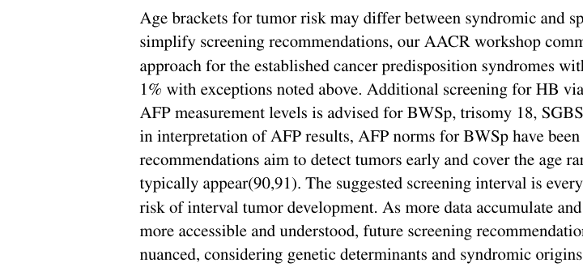

## Question

# Disease Characteristics Research Template

## Target Disease
- **Disease Name:** Beckwith-Wiedemann Syndrome
- **MONDO ID:**  (if available)
- **Category:** Mendelian

## Research Objectives

Please provide a comprehensive research report on **Beckwith-Wiedemann Syndrome** covering all of the
disease characteristics listed below. This report will be used to populate a disease knowledge
base entry. Be thorough and cite primary literature (PMID preferred) for all claims.

For each section, **suggested databases/resources** are listed. These are the first places
you should search for information on each topic.

---

### 1. Disease Information
> **Search first:** OMIM, Orphanet, ICD-10/ICD-11, MeSH, PubMed

- What is the disease? Provide a concise overview.
- What are the key identifiers? (OMIM, Orphanet, ICD-10/ICD-11, MeSH, Mondo)
- What are the common synonyms and alternative names?
- Is the information derived from individual patients (e.g., EHR) or aggregated disease-level resources?

### 2. Etiology

- **Disease Causal Factors**: What are the primary causes? (genetic, environmental, infectious, mechanistic)
- **Risk Factors**:
  > **Search first:** PubMed, Cochrane Library, UpToDate, clinical guidelines, ClinVar, ClinGen, GWAS Catalog, PheGenI, CTD, CDC, WHO, epidemiological databases
  - Genetic risk factors (causal variants, susceptibility loci, modifier genes)
  - Environmental risk factors (toxins, lifestyle, occupational exposures, age, sex, family history)
- **Protective Factors**:
  > **Search first:** PubMed, Cochrane Library, clinical trial databases, GWAS Catalog, gnomAD, WHO, CDC, nutrition databases
  - Genetic protective factors (protective variants, modifier alleles)
  - Environmental protective factors (diet, lifestyle, exposures that reduce risk)
- **Gene-Environment Interactions**: How do genetic and environmental factors interact to influence disease?
  > **Search first:** CTD, PubMed, PheGenI, GxE databases

### 3. Phenotypes
> **Search first:** HPO (Human Phenotype Ontology), OMIM, Orphanet, PubMed, clinicaltrials.gov, MedDRA, SNOMED CT, DECIPHER, LOINC

For each phenotype, provide:
- **Phenotype type**: symptoms, clinical signs, physical manifestations, behavioral changes, or laboratory abnormalities
  > For symptoms/signs: HPO, OMIM, Orphanet, PubMed
  > For behavioral changes: HPO, DSM, RDoC (Research Domain Criteria), PubMed
  > For laboratory abnormalities: LOINC, SNOMED CT, LabTests Online, PubMed
- **Phenotype characteristics**:
  > **Search first:** OMIM, Orphanet, HPO, PubMed
  - Age of symptom onset (neonatal, childhood, adult-onset, late-onset)
  - Symptom severity (mild, moderate, severe, variable)
  - Symptom progression (stable, progressive, episodic, fluctuating)
  - Frequency among affected individuals (percentage or qualitative)
- **Quality of life impact**: Effects on daily functioning and well-being (per-phenotype when possible)
  > **Search first:** EQ-5D database, SF-36, WHO QOL databases, PubMed
- Suggest HPO (Human Phenotype Ontology) terms for each phenotype

### 4. Genetic/Molecular Information

- **Causal Genes**: Gene mutations or chromosomal abnormalities responsible for disease (gene symbols, OMIM IDs)
  > **Search first:** OMIM, ClinVar, HGMD, Ensembl, NCBI Gene
- **Pathogenic Variants**:
  - Affected genes (gene symbols, HGNC IDs)
    > **Search first:** OMIM, NCBI Gene, Ensembl, HGNC, UniProt, GeneCards
  - Variant classification (pathogenic, likely pathogenic, VUS per ACMG/AMP guidelines)
    > **Search first:** ClinVar, ClinGen, ACMG/AMP guidelines, VarSome
  - Variant type/class (missense, frameshift, nonsense, splice-site, structural)
  - Allele frequency in population databases
    > **Search first:** gnomAD, 1000 Genomes, ExAC, TOPMed, dbSNP
  - Somatic vs germline origin
    > **Search first:** COSMIC (somatic), ClinVar, ICGC, TCGA
  - Functional consequences (loss of function, gain of function, dominant negative)
- **Modifier Genes**: Genes that modify disease severity or expression
- **Epigenetic Information**: DNA methylation, histone modifications, chromatin changes affecting disease
  > **Search first:** ENCODE, Roadmap Epigenomics, MethBase, DiseaseMeth
- **Chromosomal Abnormalities**: Large-scale genetic changes (aneuploidy, translocations, inversions)
  > **Search first:** DECIPHER, ClinVar, ECARUCA, UCSC Genome Browser

### 5. Environmental Information

- **Environmental Factors**: Non-genetic contributing factors (toxins, radiation, pollution, occupational exposure)
  > **Search first:** CTD (Comparative Toxicogenomics Database), TOXNET, PubMed, EPA databases
- **Lifestyle Factors**: Behavioral factors (smoking, diet, exercise, alcohol consumption)
  > **Search first:** CDC databases, WHO, PubMed, NHANES
- **Infectious Agents**: If applicable, pathogens causing or triggering disease (bacteria, viruses, fungi, parasites)
  > **Search first:** NCBI Taxonomy, ViPR, BV-BRC, MicrobeDB, GIDEON

### 6. Mechanism / Pathophysiology

- **Molecular Pathways**: Specific signaling cascades or biochemical pathways involved (Wnt, MAPK, mTOR, PI3K-AKT, etc.)
  > **Search first:** KEGG, Reactome, WikiPathways, PathBank, BioCyc
- **Cellular Processes**: Cell-level mechanisms (apoptosis, autophagy, cell cycle dysregulation, inflammation, etc.)
  > **Search first:** Gene Ontology (GO), Reactome, KEGG, PubMed
- **Protein Dysfunction**: How protein structure or function is altered (misfolding, aggregation, loss of function, gain of function)
  > **Search first:** UniProt, PDB (Protein Data Bank), InterPro, Pfam, AlphaFold
- **Metabolic Changes**: Alterations in metabolic processes (energy metabolism, lipid metabolism, amino acid metabolism)
  > **Search first:** KEGG, BioCyc, HMDB (Human Metabolome Database), BRENDA
- **Immune System Involvement**: Role of immune response (autoimmunity, immunodeficiency, chronic inflammation)
  > **Search first:** ImmPort, Immunome Database, IEDB, Gene Ontology
- **Tissue Damage Mechanisms**: How tissues/ are injured (oxidative stress, ischemia, fibrosis, necrosis)
  > **Search first:** PubMed, Gene Ontology, Reactome
- **Biochemical Abnormalities**: Specific molecular defects (enzyme deficiencies, receptor dysfunction, ion channel defects)
  > **Search first:** BRENDA, UniProt, KEGG, OMIM, PubMed
- **Epigenetic Changes**: DNA methylation, histone modifications affecting gene expression in disease
  > **Search first:** ENCODE, Roadmap Epigenomics, MethBase, DiseaseMeth
- **Molecular Profiling** (if available):
  - Transcriptomics/gene expression changes
    > **Search first:** GEO (Gene Expression Omnibus), ArrayExpress, GTEx, Human Cell Atlas, SRA
  - Proteomics findings
    > **Search first:** PRIDE, ProteomeXchange, Human Protein Atlas, STRING, BioGRID
  - Metabolomics signatures
    > **Search first:** MetaboLights, Metabolomics Workbench, HMDB, METLIN
  - Lipidomics alterations
    > **Search first:** LIPID MAPS, SwissLipids, LipidHome, Metabolomics Workbench
  - Genomic structural features
    > **Search first:** UCSC Genome Browser, Ensembl, NCBI, dbVar, DGV
- **Advanced Technologies** (if applicable):
  - Single-cell analysis findings (cell-type specific mechanisms, cellular heterogeneity)
    > **Search first:** Human Cell Atlas, Single Cell Portal, GEO, CELLxGENE
  - Spatial transcriptomics findings
    > **Search first:** GEO, Spatial Research, Vizgen, 10x Genomics data
  - Multi-omics integration results
    > **Search first:** TCGA, ICGC, cBioPortal, LinkedOmics, PubMed
  - Functional genomics screens (CRISPR, RNAi)
    > **Search first:** DepMap, GenomeRNAi, PubMed, BioGRID ORCS

For each mechanism, describe:
- The causal chain from initial trigger to clinical manifestation
- Which mechanisms are upstream vs downstream
- What cell types and biological processes are involved
- Suggest GO terms for biological processes and CL terms for cell types

### 7. Anatomical Structures Affected

- **Organ Level**:
  - Primary organs directly affected
  - Secondary organ involvement (complications, secondary effects)
  - Body systems involved (cardiovascular, nervous, digestive, respiratory, endocrine, etc.)
  > **Search first:** Uberon, FMA (Foundational Model of Anatomy), OMIM, HPO, ICD-11, MeSH, SNOMED CT
- **Tissue and Cell Level**:
  - Specific tissue types affected (epithelial, connective, muscle, nervous)
  - Specific cell populations targeted (with Cell Ontology terms)
  > **Search first:** Uberon, Human Protein Atlas, Cell Ontology, Human Cell Atlas, CellMarker, PanglaoDB
- **Subcellular Level**:
  - Cellular compartments involved (mitochondria, nucleus, ER, lysosomes) (with GO Cellular Component terms)
  > **Search first:** Gene Ontology (Cellular Component), UniProt, Human Protein Atlas
- **Localization**:
  - Specific anatomical sites (with UBERON terms)
    > **Search first:** FMA, Uberon, NeuroNames (for brain), SNOMED CT
  - Lateralization (unilateral, bilateral, asymmetric)
    > **Search first:** HPO, clinical literature, imaging databases

### 8. Temporal Development

- **Onset**:
  - Typical age of onset (congenital, pediatric, adult, geriatric)
  - Onset pattern (acute, subacute, chronic, insidious)
  > **Search first:** OMIM, Orphanet, HPO, PubMed
- **Progression**:
  - Disease stages (early, intermediate, advanced, end-stage)
    > **Search first:** Cancer Staging Manual (AJCC), WHO classifications, PubMed
  - Progression rate (rapid, slow, variable)
  - Disease course pattern (episodic, relapsing-remitting, progressive, stable)
  - Disease duration (self-limited, chronic lifelong)
  > **Search first:** Disease registries, longitudinal cohort databases, natural history studies, PubMed, Orphanet, OMIM
- **Patterns**:
  - Remission patterns (spontaneous, treatment-induced)
    > **Search first:** Clinical trial databases, disease registries, PubMed
  - Critical periods (time windows of vulnerability or opportunity for intervention)
    > **Search first:** PubMed, developmental biology databases, clinical guidelines

### 9. Inheritance and Population

- **Epidemiology**:
  - Prevalence (cases per 100,000 at given time)
  - Incidence (new cases per 100,000 per year)
  > **Search first:** Orphanet, CDC, WHO, GBD (Global Burden of Disease), national registries, SEER, disease registries
- **For Genetic Etiology**:
  - Inheritance pattern (AD, AR, X-linked, mitochondrial, multifactorial, polygenic)
    > **Search first:** OMIM, Orphanet, ClinVar, GTR (Genetic Testing Registry)
  - Penetrance (complete, incomplete, age-dependent)
    > **Search first:** ClinVar, OMIM, PubMed, ClinGen
  - Expressivity (variable, consistent)
    > **Search first:** OMIM, ClinVar, PubMed
  - Genetic anticipation (increasing severity in successive generations)
    > **Search first:** OMIM, PubMed (especially for repeat expansion disorders)
  - Germline mosaicism
    > **Search first:** ClinVar, OMIM, genetic counseling literature, PubMed
  - Founder effects (population-specific mutations)
    > **Search first:** gnomAD, population genetics databases, PubMed
  - Consanguinity role
    > **Search first:** OMIM, population studies, genetic counseling resources
  - Carrier frequency
    > **Search first:** gnomAD, carrier screening databases, GeneReviews, GTR
- **Population Demographics**:
  - Affected populations (ethnic or demographic groups with higher prevalence)
    > **Search first:** gnomAD, 1000 Genomes, PAGE Study, PubMed, population registries
  - Geographic distribution (endemic areas, regional variation)
    > **Search first:** WHO, CDC, GBD, Orphanet, geographic epidemiology databases
  - Geographic distribution of specific variants
  - Sex ratio (male:female)
    > **Search first:** Disease registries, OMIM, PubMed, epidemiological databases
  - Age distribution of affected individuals
    > **Search first:** CDC, disease registries, SEER, Orphanet

### 10. Diagnostics

- **Clinical Tests**:
  - Laboratory tests (blood, urine, tissue chemistry, specific enzyme assays)
    > **Search first:** LOINC, LabTests Online, PubMed
  - Biomarkers (proteins, metabolites, genetic markers, circulating biomarkers)
    > **Search first:** FDA Biomarker List, BEST (Biomarkers, EndpointS, and other Tools), PubMed
  - Imaging studies (X-ray, CT, MRI, PET, ultrasound)
    > **Search first:** RadLex, DICOM, Radiopaedia, imaging databases
  - Functional tests (pulmonary function, cardiac stress tests)
    > **Search first:** LOINC, clinical guidelines, PubMed
  - Electrophysiology (EEG, EMG, ECG, nerve conduction studies)
    > **Search first:** LOINC, clinical neurophysiology databases, PubMed
  - Biopsy findings (histopathology, immunohistochemistry)
    > **Search first:** SNOMED CT, College of American Pathologists resources, PubMed
  - Pathology findings (microscopic examination)
    > **Search first:** SNOMED CT, Digital Pathology databases, PubMed
- **Genetic Testing**:
  > **Search first:** GTR (Genetic Testing Registry), GeneReviews, ClinGen
  - Overview of recommended genetic testing approach
  - Whole genome sequencing (WGS) utility
    > **Search first:** GTR, ClinVar, GEL (Genomics England), gnomAD
  - Whole exome sequencing (WES) utility
    > **Search first:** GTR, ClinVar, OMIM, GeneMatcher
  - Gene panels (which panels, which genes)
    > **Search first:** GTR, ClinVar, laboratory-specific databases
  - Single gene testing
    > **Search first:** GTR, ClinVar, OMIM, GeneReviews
  - Chromosomal microarray (CMA)
    > **Search first:** DECIPHER, ClinVar, dbVar, ECARUCA
  - Karyotyping
    > **Search first:** Chromosome Abnormality Database, ClinVar, cytogenetics resources
  - FISH
    > **Search first:** ClinVar, cytogenetics databases, PubMed
  - Mitochondrial DNA testing
    > **Search first:** MITOMAP, MSeqDR, ClinVar, GTR
  - Repeat expansion testing
    > **Search first:** GTR, ClinVar, repeat expansion databases, PubMed
- **Omics-Based Diagnostics** (if applicable):
  - RNA sequencing / transcriptomics
    > **Search first:** GEO, ArrayExpress, GTEx, RNA-seq databases
  - Proteomics
    > **Search first:** PRIDE, ProteomeXchange, FDA Biomarker database
  - Metabolomics
    > **Search first:** MetaboLights, Metabolomics Workbench, HMDB
  - Epigenomics
    > **Search first:** GEO, ENCODE, Roadmap Epigenomics, MethBase
  - Liquid biopsy
    > **Search first:** COSMIC, ClinVar, liquid biopsy databases, PubMed
- **Clinical Criteria**:
  - Standardized diagnostic criteria (DSM, ICD, society guidelines)
    > **Search first:** DSM-5, ICD-11, clinical society guidelines, UpToDate
  - Differential diagnosis (other conditions to rule out, with distinguishing features)
    > **Search first:** DynaMed, UpToDate, clinical decision support systems
- **Screening**:
  - Screening methods for asymptomatic individuals (newborn screening, carrier screening, cascade screening)
    > **Search first:** ACMG recommendations, CDC newborn screening, GTR

### 11. Outcome/Prognosis

- **Survival and Mortality**:
  - Survival rate (5-year, 10-year, overall)
    > **Search first:** SEER, cancer registries, disease-specific registries, PubMed
  - Life expectancy (with and without treatment if applicable)
    > **Search first:** Orphanet, disease registries, actuarial databases, PubMed
  - Mortality rate
    > **Search first:** CDC, WHO, GBD, national mortality databases
  - Disease-specific mortality (deaths directly attributable to disease)
    > **Search first:** Disease registries, CDC Wonder, GBD, PubMed
- **Morbidity and Function**:
  - Morbidity (disease-related disability and health impacts)
    > **Search first:** GBD, WHO, disability databases, PubMed
  - Disability outcomes (long-term functional impairments)
    > **Search first:** ICF (International Classification of Functioning), disability registries
  - Quality of life measures (EQ-5D, SF-36, PROMIS, disease-specific tools)
    > **Search first:** EQ-5D database, SF-36, PROMIS, PubMed
- **Disease Course**:
  - Complications (secondary problems: infections, organ failure, etc.)
    > **Search first:** ICD codes, disease registries, clinical databases, PubMed
  - Recovery potential (likelihood and extent of recovery, with vs without treatment)
    > **Search first:** Natural history studies, rehabilitation databases, PubMed
- **Prediction**:
  - Prognostic factors (age, disease severity, biomarkers, treatment response)
    > **Search first:** Prognostic models databases, clinical calculators, PubMed
  - Prognostic biomarkers (molecular markers predicting disease course)
    > **Search first:** FDA Biomarker database, PubMed, cancer prognostic databases

### 12. Treatment

- **Pharmacotherapy**:
  - Pharmacological treatments (drug names, drug classes, mechanisms of action)
    > **Search first:** DrugBank, RxNorm, ATC classification, DailyMed, FDA databases
  - Pharmacogenomics (how genetic variants affect drug metabolism, efficacy, toxicity)
    > **Search first:** PharmGKB, CPIC (Clinical Pharmacogenetics), FDA Table of PGx Biomarkers
- **Advanced Therapeutics**:
  - Gene therapy (viral vectors, CRISPR, gene replacement, gene editing)
    > **Search first:** ClinicalTrials.gov, FDA gene therapy database, ASGCT resources
  - Cell therapy (stem cell transplant, CAR-T, cellular therapeutics)
    > **Search first:** ClinicalTrials.gov, FDA cell therapy database, FACT standards
  - RNA-based therapies (ASOs, siRNA, mRNA therapies)
    > **Search first:** ClinicalTrials.gov, FDA approvals, PubMed
  - Targeted therapies (treatments directed at specific molecular targets)
    > **Search first:** My Cancer Genome, OncoKB, ClinicalTrials.gov, FDA approvals
  - Immunotherapies (checkpoint inhibitors, monoclonal antibodies)
    > **Search first:** Cancer Immunotherapy Database, FDA approvals, ClinicalTrials.gov
- **Surgical and Interventional**:
  - Surgical interventions (types of surgery, timing, outcomes)
    > **Search first:** CPT codes, surgical registries, clinical guidelines, PubMed
- **Supportive and Rehabilitative**:
  - Supportive care (symptom management, pain control, nutrition)
    > **Search first:** Clinical guidelines, Cochrane Library, PubMed
  - Rehabilitation (physical therapy, occupational therapy, speech therapy)
    > **Search first:** Rehabilitation medicine databases, clinical guidelines, PubMed
- **Experimental**:
  - Experimental treatments in clinical trials (with NCT identifiers if available)
    > **Search first:** ClinicalTrials.gov, EU Clinical Trials Register, WHO ICTRP
- **Treatment Outcomes**:
  - Treatment response rates
    > **Search first:** Clinical trial databases, FDA reviews, systematic reviews, PubMed
  - Side effects and adverse events
    > **Search first:** FDA Adverse Event Reporting System (FAERS), MedWatch, PubMed
- **Treatment Strategy**:
  - Treatment algorithms (clinical pathways, decision trees)
    > **Search first:** Clinical practice guidelines, NCCN Guidelines, UpToDate
  - Combination therapies
    > **Search first:** ClinicalTrials.gov, treatment guidelines, PubMed
  - Personalized medicine approaches (genotype-guided treatment)
    > **Search first:** My Cancer Genome, CIViC, PharmGKB, precision medicine databases

For each treatment, suggest MAXO (Medical Action Ontology) terms where applicable.

### 13. Prevention

- **Prevention Levels**:
  - Primary prevention (preventing disease occurrence: vaccination, risk factor modification)
    > **Search first:** CDC, WHO, USPSTF recommendations, Cochrane Library
  - Secondary prevention (early detection and treatment: screening programs, early intervention)
    > **Search first:** USPSTF, CDC screening guidelines, WHO
  - Tertiary prevention (preventing complications in those with disease)
    > **Search first:** Clinical guidelines, disease management protocols, PubMed
- **Immunization**: Vaccine strategies (if applicable)
  > **Search first:** CDC vaccine schedules, WHO immunization, FDA vaccine database
- **Screening and Early Detection**:
  - Screening programs (population-based: newborn screening, cancer screening)
    > **Search first:** CDC screening programs, USPSTF, cancer screening databases
  - Genetic screening (carrier screening, preimplantation genetic diagnosis, prenatal testing)
    > **Search first:** ACMG recommendations, ACOG guidelines, GTR
  - Risk stratification (identifying high-risk individuals for targeted prevention)
    > **Search first:** Risk prediction models, clinical calculators, PubMed
- **Behavioral Interventions**: Lifestyle modifications to reduce risk
  > **Search first:** CDC, WHO, behavioral intervention databases, Cochrane Library
- **Counseling**: Genetic counseling (risk assessment, family planning guidance)
  > **Search first:** NSGC resources, ACMG guidelines, GeneReviews
- **Public Health**:
  - Public health interventions (sanitation, vector control, health education)
    > **Search first:** CDC, WHO, public health databases, PubMed
  - Environmental interventions (reducing environmental risk factors)
    > **Search first:** EPA databases, WHO environmental health, PubMed
- **Prophylaxis**: Preventive medications or procedures
  > **Search first:** Clinical guidelines, FDA approvals, PubMed

### 14. Other Species / Natural Disease

- **Taxonomy**: Species affected (with NCBI Taxon identifiers)
  > **Search first:** NCBI Taxonomy
- **Breed**: Specific breeds affected (with VBO identifiers if applicable)
  > **Search first:** VBO (Vertebrate Breed Ontology)
- **Gene**: Orthologous genes in other species (with NCBI Gene IDs)
  > **Search first:** NCBI Gene
- **Natural Disease**:
  - Naturally occurring disease in other species (companion animals, wildlife)
    > **Search first:** OMIA (Online Mendelian Inheritance in Animals), VetCompass, PubMed
  - Veterinary relevance and importance in animal health
    > **Search first:** OMIA, veterinary databases, PubMed
- **Comparative Biology**:
  - Comparative pathology (similarities and differences across species)
    > **Search first:** OMIA, comparative pathology databases, PubMed
  - Evolutionary conservation of disease mechanisms
    > **Search first:** HomoloGene, OrthoMCL, Alliance of Genome Resources
- **Transmission** (if applicable):
  - Zoonotic potential
    > **Search first:** CDC zoonotic diseases, WHO zoonoses, GIDEON
  - Cross-species susceptibility
    > **Search first:** NCBI Taxonomy, veterinary databases, PubMed

### 15. Model Organisms

- **Model Types**:
  - Model organism type (mammalian, invertebrate, cellular, in vitro)
    > **Search first:** Alliance of Genome Resources, model organism databases
  - Specific model systems (mouse, rat, zebrafish, Drosophila, C. elegans, yeast, cell lines, organoids, iPSCs)
    > **Search first:** MGI, RGD, ZFIN, FlyBase, WormBase, SGD, ATCC, Cellosaurus
  - Induced models (drug treatment, surgical intervention, environmental manipulation)
    > **Search first:** MGI, model organism databases, PubMed
- **Genetic Models**:
  - Types available (knockout, knock-in, transgenic, conditional, humanized)
    > **Search first:** MGI, IMPC, KOMP, EuMMCR, IMSR
- **Model Characteristics**:
  - Phenotype recapitulation (how well model reproduces human disease features)
    > **Search first:** Model organism databases, comparative studies, PubMed
  - Model limitations (aspects of human disease not captured)
    > **Search first:** Model organism databases, PubMed, review articles
- **Applications**:
  - Research applications (what aspects of disease can be studied)
    > **Search first:** Model organism databases, PubMed
- **Resources**:
  - Model databases
    > **Search first:** MGI, RGD, ZFIN, FlyBase, WormBase, IMSR, EMMA, MMRRC

---

## Citation Requirements

- Cite primary literature (PMID preferred) for all mechanistic and clinical claims
- Prioritize recent reviews and landmark papers
- Include direct quotes from abstracts where possible to support key statements
- Distinguish evidence source types: human clinical, model organism, in vitro, computational

## Output Format

Structure your response as a comprehensive narrative organized by the sections above.
For each section, provide:
- Factual content with specific details (numbers, percentages, gene names, variant nomenclature)
- Ontology term suggestions (HPO, GO, CL, UBERON, CHEBI, MAXO, MONDO) where applicable
- Evidence citations with PMIDs
- Direct quotes from abstracts to support key claims
- Clear indication when information is not available or not applicable for this disease

This report will be used to populate a disease knowledge base entry with:
- Pathophysiology descriptions with causal chains
- Gene/protein annotations (HGNC, GO terms)
- Phenotype associations (HP terms) with frequencies
- Cell type involvement (CL terms)
- Anatomical locations (UBERON terms)
- Chemical entities (CHEBI terms)
- Treatment annotations (MAXO terms)
- Evidence items with PMIDs and exact abstract quotes
- Epidemiology, prognosis, diagnostic, and prevention information
- Animal model descriptions with phenotype recapitulation details

## Output

Question: You are an expert researcher providing comprehensive, well-cited information.

Provide detailed information focusing on:
1. Key concepts and definitions with current understanding
2. Recent developments and latest research (prioritize 2023-2024 sources)
3. Current applications and real-world implementations
4. Expert opinions and analysis from authoritative sources
5. Relevant statistics and data from recent studies

Format as a comprehensive research report with proper citations. Include URLs and publication dates where available.
Always prioritize recent, authoritative sources and provide specific citations for all major claims.

# Disease Characteristics Research Template

## Target Disease
- **Disease Name:** Beckwith-Wiedemann Syndrome
- **MONDO ID:**  (if available)
- **Category:** Mendelian

## Research Objectives

Please provide a comprehensive research report on **Beckwith-Wiedemann Syndrome** covering all of the
disease characteristics listed below. This report will be used to populate a disease knowledge
base entry. Be thorough and cite primary literature (PMID preferred) for all claims.

For each section, **suggested databases/resources** are listed. These are the first places
you should search for information on each topic.

---

### 1. Disease Information
> **Search first:** OMIM, Orphanet, ICD-10/ICD-11, MeSH, PubMed

- What is the disease? Provide a concise overview.
- What are the key identifiers? (OMIM, Orphanet, ICD-10/ICD-11, MeSH, Mondo)
- What are the common synonyms and alternative names?
- Is the information derived from individual patients (e.g., EHR) or aggregated disease-level resources?

### 2. Etiology

- **Disease Causal Factors**: What are the primary causes? (genetic, environmental, infectious, mechanistic)
- **Risk Factors**:
  > **Search first:** PubMed, Cochrane Library, UpToDate, clinical guidelines, ClinVar, ClinGen, GWAS Catalog, PheGenI, CTD, CDC, WHO, epidemiological databases
  - Genetic risk factors (causal variants, susceptibility loci, modifier genes)
  - Environmental risk factors (toxins, lifestyle, occupational exposures, age, sex, family history)
- **Protective Factors**:
  > **Search first:** PubMed, Cochrane Library, clinical trial databases, GWAS Catalog, gnomAD, WHO, CDC, nutrition databases
  - Genetic protective factors (protective variants, modifier alleles)
  - Environmental protective factors (diet, lifestyle, exposures that reduce risk)
- **Gene-Environment Interactions**: How do genetic and environmental factors interact to influence disease?
  > **Search first:** CTD, PubMed, PheGenI, GxE databases

### 3. Phenotypes
> **Search first:** HPO (Human Phenotype Ontology), OMIM, Orphanet, PubMed, clinicaltrials.gov, MedDRA, SNOMED CT, DECIPHER, LOINC

For each phenotype, provide:
- **Phenotype type**: symptoms, clinical signs, physical manifestations, behavioral changes, or laboratory abnormalities
  > For symptoms/signs: HPO, OMIM, Orphanet, PubMed
  > For behavioral changes: HPO, DSM, RDoC (Research Domain Criteria), PubMed
  > For laboratory abnormalities: LOINC, SNOMED CT, LabTests Online, PubMed
- **Phenotype characteristics**:
  > **Search first:** OMIM, Orphanet, HPO, PubMed
  - Age of symptom onset (neonatal, childhood, adult-onset, late-onset)
  - Symptom severity (mild, moderate, severe, variable)
  - Symptom progression (stable, progressive, episodic, fluctuating)
  - Frequency among affected individuals (percentage or qualitative)
- **Quality of life impact**: Effects on daily functioning and well-being (per-phenotype when possible)
  > **Search first:** EQ-5D database, SF-36, WHO QOL databases, PubMed
- Suggest HPO (Human Phenotype Ontology) terms for each phenotype

### 4. Genetic/Molecular Information

- **Causal Genes**: Gene mutations or chromosomal abnormalities responsible for disease (gene symbols, OMIM IDs)
  > **Search first:** OMIM, ClinVar, HGMD, Ensembl, NCBI Gene
- **Pathogenic Variants**:
  - Affected genes (gene symbols, HGNC IDs)
    > **Search first:** OMIM, NCBI Gene, Ensembl, HGNC, UniProt, GeneCards
  - Variant classification (pathogenic, likely pathogenic, VUS per ACMG/AMP guidelines)
    > **Search first:** ClinVar, ClinGen, ACMG/AMP guidelines, VarSome
  - Variant type/class (missense, frameshift, nonsense, splice-site, structural)
  - Allele frequency in population databases
    > **Search first:** gnomAD, 1000 Genomes, ExAC, TOPMed, dbSNP
  - Somatic vs germline origin
    > **Search first:** COSMIC (somatic), ClinVar, ICGC, TCGA
  - Functional consequences (loss of function, gain of function, dominant negative)
- **Modifier Genes**: Genes that modify disease severity or expression
- **Epigenetic Information**: DNA methylation, histone modifications, chromatin changes affecting disease
  > **Search first:** ENCODE, Roadmap Epigenomics, MethBase, DiseaseMeth
- **Chromosomal Abnormalities**: Large-scale genetic changes (aneuploidy, translocations, inversions)
  > **Search first:** DECIPHER, ClinVar, ECARUCA, UCSC Genome Browser

### 5. Environmental Information

- **Environmental Factors**: Non-genetic contributing factors (toxins, radiation, pollution, occupational exposure)
  > **Search first:** CTD (Comparative Toxicogenomics Database), TOXNET, PubMed, EPA databases
- **Lifestyle Factors**: Behavioral factors (smoking, diet, exercise, alcohol consumption)
  > **Search first:** CDC databases, WHO, PubMed, NHANES
- **Infectious Agents**: If applicable, pathogens causing or triggering disease (bacteria, viruses, fungi, parasites)
  > **Search first:** NCBI Taxonomy, ViPR, BV-BRC, MicrobeDB, GIDEON

### 6. Mechanism / Pathophysiology

- **Molecular Pathways**: Specific signaling cascades or biochemical pathways involved (Wnt, MAPK, mTOR, PI3K-AKT, etc.)
  > **Search first:** KEGG, Reactome, WikiPathways, PathBank, BioCyc
- **Cellular Processes**: Cell-level mechanisms (apoptosis, autophagy, cell cycle dysregulation, inflammation, etc.)
  > **Search first:** Gene Ontology (GO), Reactome, KEGG, PubMed
- **Protein Dysfunction**: How protein structure or function is altered (misfolding, aggregation, loss of function, gain of function)
  > **Search first:** UniProt, PDB (Protein Data Bank), InterPro, Pfam, AlphaFold
- **Metabolic Changes**: Alterations in metabolic processes (energy metabolism, lipid metabolism, amino acid metabolism)
  > **Search first:** KEGG, BioCyc, HMDB (Human Metabolome Database), BRENDA
- **Immune System Involvement**: Role of immune response (autoimmunity, immunodeficiency, chronic inflammation)
  > **Search first:** ImmPort, Immunome Database, IEDB, Gene Ontology
- **Tissue Damage Mechanisms**: How tissues/ are injured (oxidative stress, ischemia, fibrosis, necrosis)
  > **Search first:** PubMed, Gene Ontology, Reactome
- **Biochemical Abnormalities**: Specific molecular defects (enzyme deficiencies, receptor dysfunction, ion channel defects)
  > **Search first:** BRENDA, UniProt, KEGG, OMIM, PubMed
- **Epigenetic Changes**: DNA methylation, histone modifications affecting gene expression in disease
  > **Search first:** ENCODE, Roadmap Epigenomics, MethBase, DiseaseMeth
- **Molecular Profiling** (if available):
  - Transcriptomics/gene expression changes
    > **Search first:** GEO (Gene Expression Omnibus), ArrayExpress, GTEx, Human Cell Atlas, SRA
  - Proteomics findings
    > **Search first:** PRIDE, ProteomeXchange, Human Protein Atlas, STRING, BioGRID
  - Metabolomics signatures
    > **Search first:** MetaboLights, Metabolomics Workbench, HMDB, METLIN
  - Lipidomics alterations
    > **Search first:** LIPID MAPS, SwissLipids, LipidHome, Metabolomics Workbench
  - Genomic structural features
    > **Search first:** UCSC Genome Browser, Ensembl, NCBI, dbVar, DGV
- **Advanced Technologies** (if applicable):
  - Single-cell analysis findings (cell-type specific mechanisms, cellular heterogeneity)
    > **Search first:** Human Cell Atlas, Single Cell Portal, GEO, CELLxGENE
  - Spatial transcriptomics findings
    > **Search first:** GEO, Spatial Research, Vizgen, 10x Genomics data
  - Multi-omics integration results
    > **Search first:** TCGA, ICGC, cBioPortal, LinkedOmics, PubMed
  - Functional genomics screens (CRISPR, RNAi)
    > **Search first:** DepMap, GenomeRNAi, PubMed, BioGRID ORCS

For each mechanism, describe:
- The causal chain from initial trigger to clinical manifestation
- Which mechanisms are upstream vs downstream
- What cell types and biological processes are involved
- Suggest GO terms for biological processes and CL terms for cell types

### 7. Anatomical Structures Affected

- **Organ Level**:
  - Primary organs directly affected
  - Secondary organ involvement (complications, secondary effects)
  - Body systems involved (cardiovascular, nervous, digestive, respiratory, endocrine, etc.)
  > **Search first:** Uberon, FMA (Foundational Model of Anatomy), OMIM, HPO, ICD-11, MeSH, SNOMED CT
- **Tissue and Cell Level**:
  - Specific tissue types affected (epithelial, connective, muscle, nervous)
  - Specific cell populations targeted (with Cell Ontology terms)
  > **Search first:** Uberon, Human Protein Atlas, Cell Ontology, Human Cell Atlas, CellMarker, PanglaoDB
- **Subcellular Level**:
  - Cellular compartments involved (mitochondria, nucleus, ER, lysosomes) (with GO Cellular Component terms)
  > **Search first:** Gene Ontology (Cellular Component), UniProt, Human Protein Atlas
- **Localization**:
  - Specific anatomical sites (with UBERON terms)
    > **Search first:** FMA, Uberon, NeuroNames (for brain), SNOMED CT
  - Lateralization (unilateral, bilateral, asymmetric)
    > **Search first:** HPO, clinical literature, imaging databases

### 8. Temporal Development

- **Onset**:
  - Typical age of onset (congenital, pediatric, adult, geriatric)
  - Onset pattern (acute, subacute, chronic, insidious)
  > **Search first:** OMIM, Orphanet, HPO, PubMed
- **Progression**:
  - Disease stages (early, intermediate, advanced, end-stage)
    > **Search first:** Cancer Staging Manual (AJCC), WHO classifications, PubMed
  - Progression rate (rapid, slow, variable)
  - Disease course pattern (episodic, relapsing-remitting, progressive, stable)
  - Disease duration (self-limited, chronic lifelong)
  > **Search first:** Disease registries, longitudinal cohort databases, natural history studies, PubMed, Orphanet, OMIM
- **Patterns**:
  - Remission patterns (spontaneous, treatment-induced)
    > **Search first:** Clinical trial databases, disease registries, PubMed
  - Critical periods (time windows of vulnerability or opportunity for intervention)
    > **Search first:** PubMed, developmental biology databases, clinical guidelines

### 9. Inheritance and Population

- **Epidemiology**:
  - Prevalence (cases per 100,000 at given time)
  - Incidence (new cases per 100,000 per year)
  > **Search first:** Orphanet, CDC, WHO, GBD (Global Burden of Disease), national registries, SEER, disease registries
- **For Genetic Etiology**:
  - Inheritance pattern (AD, AR, X-linked, mitochondrial, multifactorial, polygenic)
    > **Search first:** OMIM, Orphanet, ClinVar, GTR (Genetic Testing Registry)
  - Penetrance (complete, incomplete, age-dependent)
    > **Search first:** ClinVar, OMIM, PubMed, ClinGen
  - Expressivity (variable, consistent)
    > **Search first:** OMIM, ClinVar, PubMed
  - Genetic anticipation (increasing severity in successive generations)
    > **Search first:** OMIM, PubMed (especially for repeat expansion disorders)
  - Germline mosaicism
    > **Search first:** ClinVar, OMIM, genetic counseling literature, PubMed
  - Founder effects (population-specific mutations)
    > **Search first:** gnomAD, population genetics databases, PubMed
  - Consanguinity role
    > **Search first:** OMIM, population studies, genetic counseling resources
  - Carrier frequency
    > **Search first:** gnomAD, carrier screening databases, GeneReviews, GTR
- **Population Demographics**:
  - Affected populations (ethnic or demographic groups with higher prevalence)
    > **Search first:** gnomAD, 1000 Genomes, PAGE Study, PubMed, population registries
  - Geographic distribution (endemic areas, regional variation)
    > **Search first:** WHO, CDC, GBD, Orphanet, geographic epidemiology databases
  - Geographic distribution of specific variants
  - Sex ratio (male:female)
    > **Search first:** Disease registries, OMIM, PubMed, epidemiological databases
  - Age distribution of affected individuals
    > **Search first:** CDC, disease registries, SEER, Orphanet

### 10. Diagnostics

- **Clinical Tests**:
  - Laboratory tests (blood, urine, tissue chemistry, specific enzyme assays)
    > **Search first:** LOINC, LabTests Online, PubMed
  - Biomarkers (proteins, metabolites, genetic markers, circulating biomarkers)
    > **Search first:** FDA Biomarker List, BEST (Biomarkers, EndpointS, and other Tools), PubMed
  - Imaging studies (X-ray, CT, MRI, PET, ultrasound)
    > **Search first:** RadLex, DICOM, Radiopaedia, imaging databases
  - Functional tests (pulmonary function, cardiac stress tests)
    > **Search first:** LOINC, clinical guidelines, PubMed
  - Electrophysiology (EEG, EMG, ECG, nerve conduction studies)
    > **Search first:** LOINC, clinical neurophysiology databases, PubMed
  - Biopsy findings (histopathology, immunohistochemistry)
    > **Search first:** SNOMED CT, College of American Pathologists resources, PubMed
  - Pathology findings (microscopic examination)
    > **Search first:** SNOMED CT, Digital Pathology databases, PubMed
- **Genetic Testing**:
  > **Search first:** GTR (Genetic Testing Registry), GeneReviews, ClinGen
  - Overview of recommended genetic testing approach
  - Whole genome sequencing (WGS) utility
    > **Search first:** GTR, ClinVar, GEL (Genomics England), gnomAD
  - Whole exome sequencing (WES) utility
    > **Search first:** GTR, ClinVar, OMIM, GeneMatcher
  - Gene panels (which panels, which genes)
    > **Search first:** GTR, ClinVar, laboratory-specific databases
  - Single gene testing
    > **Search first:** GTR, ClinVar, OMIM, GeneReviews
  - Chromosomal microarray (CMA)
    > **Search first:** DECIPHER, ClinVar, dbVar, ECARUCA
  - Karyotyping
    > **Search first:** Chromosome Abnormality Database, ClinVar, cytogenetics resources
  - FISH
    > **Search first:** ClinVar, cytogenetics databases, PubMed
  - Mitochondrial DNA testing
    > **Search first:** MITOMAP, MSeqDR, ClinVar, GTR
  - Repeat expansion testing
    > **Search first:** GTR, ClinVar, repeat expansion databases, PubMed
- **Omics-Based Diagnostics** (if applicable):
  - RNA sequencing / transcriptomics
    > **Search first:** GEO, ArrayExpress, GTEx, RNA-seq databases
  - Proteomics
    > **Search first:** PRIDE, ProteomeXchange, FDA Biomarker database
  - Metabolomics
    > **Search first:** MetaboLights, Metabolomics Workbench, HMDB
  - Epigenomics
    > **Search first:** GEO, ENCODE, Roadmap Epigenomics, MethBase
  - Liquid biopsy
    > **Search first:** COSMIC, ClinVar, liquid biopsy databases, PubMed
- **Clinical Criteria**:
  - Standardized diagnostic criteria (DSM, ICD, society guidelines)
    > **Search first:** DSM-5, ICD-11, clinical society guidelines, UpToDate
  - Differential diagnosis (other conditions to rule out, with distinguishing features)
    > **Search first:** DynaMed, UpToDate, clinical decision support systems
- **Screening**:
  - Screening methods for asymptomatic individuals (newborn screening, carrier screening, cascade screening)
    > **Search first:** ACMG recommendations, CDC newborn screening, GTR

### 11. Outcome/Prognosis

- **Survival and Mortality**:
  - Survival rate (5-year, 10-year, overall)
    > **Search first:** SEER, cancer registries, disease-specific registries, PubMed
  - Life expectancy (with and without treatment if applicable)
    > **Search first:** Orphanet, disease registries, actuarial databases, PubMed
  - Mortality rate
    > **Search first:** CDC, WHO, GBD, national mortality databases
  - Disease-specific mortality (deaths directly attributable to disease)
    > **Search first:** Disease registries, CDC Wonder, GBD, PubMed
- **Morbidity and Function**:
  - Morbidity (disease-related disability and health impacts)
    > **Search first:** GBD, WHO, disability databases, PubMed
  - Disability outcomes (long-term functional impairments)
    > **Search first:** ICF (International Classification of Functioning), disability registries
  - Quality of life measures (EQ-5D, SF-36, PROMIS, disease-specific tools)
    > **Search first:** EQ-5D database, SF-36, PROMIS, PubMed
- **Disease Course**:
  - Complications (secondary problems: infections, organ failure, etc.)
    > **Search first:** ICD codes, disease registries, clinical databases, PubMed
  - Recovery potential (likelihood and extent of recovery, with vs without treatment)
    > **Search first:** Natural history studies, rehabilitation databases, PubMed
- **Prediction**:
  - Prognostic factors (age, disease severity, biomarkers, treatment response)
    > **Search first:** Prognostic models databases, clinical calculators, PubMed
  - Prognostic biomarkers (molecular markers predicting disease course)
    > **Search first:** FDA Biomarker database, PubMed, cancer prognostic databases

### 12. Treatment

- **Pharmacotherapy**:
  - Pharmacological treatments (drug names, drug classes, mechanisms of action)
    > **Search first:** DrugBank, RxNorm, ATC classification, DailyMed, FDA databases
  - Pharmacogenomics (how genetic variants affect drug metabolism, efficacy, toxicity)
    > **Search first:** PharmGKB, CPIC (Clinical Pharmacogenetics), FDA Table of PGx Biomarkers
- **Advanced Therapeutics**:
  - Gene therapy (viral vectors, CRISPR, gene replacement, gene editing)
    > **Search first:** ClinicalTrials.gov, FDA gene therapy database, ASGCT resources
  - Cell therapy (stem cell transplant, CAR-T, cellular therapeutics)
    > **Search first:** ClinicalTrials.gov, FDA cell therapy database, FACT standards
  - RNA-based therapies (ASOs, siRNA, mRNA therapies)
    > **Search first:** ClinicalTrials.gov, FDA approvals, PubMed
  - Targeted therapies (treatments directed at specific molecular targets)
    > **Search first:** My Cancer Genome, OncoKB, ClinicalTrials.gov, FDA approvals
  - Immunotherapies (checkpoint inhibitors, monoclonal antibodies)
    > **Search first:** Cancer Immunotherapy Database, FDA approvals, ClinicalTrials.gov
- **Surgical and Interventional**:
  - Surgical interventions (types of surgery, timing, outcomes)
    > **Search first:** CPT codes, surgical registries, clinical guidelines, PubMed
- **Supportive and Rehabilitative**:
  - Supportive care (symptom management, pain control, nutrition)
    > **Search first:** Clinical guidelines, Cochrane Library, PubMed
  - Rehabilitation (physical therapy, occupational therapy, speech therapy)
    > **Search first:** Rehabilitation medicine databases, clinical guidelines, PubMed
- **Experimental**:
  - Experimental treatments in clinical trials (with NCT identifiers if available)
    > **Search first:** ClinicalTrials.gov, EU Clinical Trials Register, WHO ICTRP
- **Treatment Outcomes**:
  - Treatment response rates
    > **Search first:** Clinical trial databases, FDA reviews, systematic reviews, PubMed
  - Side effects and adverse events
    > **Search first:** FDA Adverse Event Reporting System (FAERS), MedWatch, PubMed
- **Treatment Strategy**:
  - Treatment algorithms (clinical pathways, decision trees)
    > **Search first:** Clinical practice guidelines, NCCN Guidelines, UpToDate
  - Combination therapies
    > **Search first:** ClinicalTrials.gov, treatment guidelines, PubMed
  - Personalized medicine approaches (genotype-guided treatment)
    > **Search first:** My Cancer Genome, CIViC, PharmGKB, precision medicine databases

For each treatment, suggest MAXO (Medical Action Ontology) terms where applicable.

### 13. Prevention

- **Prevention Levels**:
  - Primary prevention (preventing disease occurrence: vaccination, risk factor modification)
    > **Search first:** CDC, WHO, USPSTF recommendations, Cochrane Library
  - Secondary prevention (early detection and treatment: screening programs, early intervention)
    > **Search first:** USPSTF, CDC screening guidelines, WHO
  - Tertiary prevention (preventing complications in those with disease)
    > **Search first:** Clinical guidelines, disease management protocols, PubMed
- **Immunization**: Vaccine strategies (if applicable)
  > **Search first:** CDC vaccine schedules, WHO immunization, FDA vaccine database
- **Screening and Early Detection**:
  - Screening programs (population-based: newborn screening, cancer screening)
    > **Search first:** CDC screening programs, USPSTF, cancer screening databases
  - Genetic screening (carrier screening, preimplantation genetic diagnosis, prenatal testing)
    > **Search first:** ACMG recommendations, ACOG guidelines, GTR
  - Risk stratification (identifying high-risk individuals for targeted prevention)
    > **Search first:** Risk prediction models, clinical calculators, PubMed
- **Behavioral Interventions**: Lifestyle modifications to reduce risk
  > **Search first:** CDC, WHO, behavioral intervention databases, Cochrane Library
- **Counseling**: Genetic counseling (risk assessment, family planning guidance)
  > **Search first:** NSGC resources, ACMG guidelines, GeneReviews
- **Public Health**:
  - Public health interventions (sanitation, vector control, health education)
    > **Search first:** CDC, WHO, public health databases, PubMed
  - Environmental interventions (reducing environmental risk factors)
    > **Search first:** EPA databases, WHO environmental health, PubMed
- **Prophylaxis**: Preventive medications or procedures
  > **Search first:** Clinical guidelines, FDA approvals, PubMed

### 14. Other Species / Natural Disease

- **Taxonomy**: Species affected (with NCBI Taxon identifiers)
  > **Search first:** NCBI Taxonomy
- **Breed**: Specific breeds affected (with VBO identifiers if applicable)
  > **Search first:** VBO (Vertebrate Breed Ontology)
- **Gene**: Orthologous genes in other species (with NCBI Gene IDs)
  > **Search first:** NCBI Gene
- **Natural Disease**:
  - Naturally occurring disease in other species (companion animals, wildlife)
    > **Search first:** OMIA (Online Mendelian Inheritance in Animals), VetCompass, PubMed
  - Veterinary relevance and importance in animal health
    > **Search first:** OMIA, veterinary databases, PubMed
- **Comparative Biology**:
  - Comparative pathology (similarities and differences across species)
    > **Search first:** OMIA, comparative pathology databases, PubMed
  - Evolutionary conservation of disease mechanisms
    > **Search first:** HomoloGene, OrthoMCL, Alliance of Genome Resources
- **Transmission** (if applicable):
  - Zoonotic potential
    > **Search first:** CDC zoonotic diseases, WHO zoonoses, GIDEON
  - Cross-species susceptibility
    > **Search first:** NCBI Taxonomy, veterinary databases, PubMed

### 15. Model Organisms

- **Model Types**:
  - Model organism type (mammalian, invertebrate, cellular, in vitro)
    > **Search first:** Alliance of Genome Resources, model organism databases
  - Specific model systems (mouse, rat, zebrafish, Drosophila, C. elegans, yeast, cell lines, organoids, iPSCs)
    > **Search first:** MGI, RGD, ZFIN, FlyBase, WormBase, SGD, ATCC, Cellosaurus
  - Induced models (drug treatment, surgical intervention, environmental manipulation)
    > **Search first:** MGI, model organism databases, PubMed
- **Genetic Models**:
  - Types available (knockout, knock-in, transgenic, conditional, humanized)
    > **Search first:** MGI, IMPC, KOMP, EuMMCR, IMSR
- **Model Characteristics**:
  - Phenotype recapitulation (how well model reproduces human disease features)
    > **Search first:** Model organism databases, comparative studies, PubMed
  - Model limitations (aspects of human disease not captured)
    > **Search first:** Model organism databases, PubMed, review articles
- **Applications**:
  - Research applications (what aspects of disease can be studied)
    > **Search first:** Model organism databases, PubMed
- **Resources**:
  - Model databases
    > **Search first:** MGI, RGD, ZFIN, FlyBase, WormBase, IMSR, EMMA, MMRRC

---

## Citation Requirements

- Cite primary literature (PMID preferred) for all mechanistic and clinical claims
- Prioritize recent reviews and landmark papers
- Include direct quotes from abstracts where possible to support key statements
- Distinguish evidence source types: human clinical, model organism, in vitro, computational

## Output Format

Structure your response as a comprehensive narrative organized by the sections above.
For each section, provide:
- Factual content with specific details (numbers, percentages, gene names, variant nomenclature)
- Ontology term suggestions (HPO, GO, CL, UBERON, CHEBI, MAXO, MONDO) where applicable
- Evidence citations with PMIDs
- Direct quotes from abstracts to support key claims
- Clear indication when information is not available or not applicable for this disease

This report will be used to populate a disease knowledge base entry with:
- Pathophysiology descriptions with causal chains
- Gene/protein annotations (HGNC, GO terms)
- Phenotype associations (HP terms) with frequencies
- Cell type involvement (CL terms)
- Anatomical locations (UBERON terms)
- Chemical entities (CHEBI terms)
- Treatment annotations (MAXO terms)
- Evidence items with PMIDs and exact abstract quotes
- Epidemiology, prognosis, diagnostic, and prevention information
- Animal model descriptions with phenotype recapitulation details

# Beckwith–Wiedemann Syndrome / Beckwith–Wiedemann Spectrum (BWSp): Comprehensive Disease Characteristics Report

## 1. Disease Information

### Overview (current understanding)
Beckwith–Wiedemann syndrome (BWS; increasingly framed as **Beckwith–Wiedemann spectrum, BWSp**) is a congenital **overgrowth and childhood cancer predisposition** condition caused by genetic and/or epigenetic dysregulation of imprinted growth genes on **chromosome 11p15.5**; many cases are **mosaic**, contributing to variable phenotype severity (kalish2024updateonsurveillance pages 3-5). The “spectrum” concept (BWSp) is used because heterogeneous molecular causes produce a broad range of presentations from classic BWS to atypical/mild presentations including isolated lateralized overgrowth (eggermann2022molecularbasisof pages 1-2, kalish2024updateonsurveillance pages 3-5).

### Key identifiers (availability in retrieved sources)
* **OMIM:** **130650** (eggermann2022molecularbasisof pages 1-2, nirgude2024cancerpredispositionsignaling pages 1-2)
* **Orphanet / ICD-10 / ICD-11 / MeSH / MONDO:** Not extractable from the retrieved full-text evidence in this run (no codes/IDs present in the available excerpts). 

### Synonyms and alternative names
* Beckwith–Wiedemann syndrome (**BWS**) (eggermann2022molecularbasisof pages 1-2)
* Beckwith–Wiedemann spectrum (**BWSp**) (eggermann2022molecularbasisof pages 1-2, kalish2024updateonsurveillance pages 3-5)
* **Isolated lateralized overgrowth (ILO)**; also referenced as **isolated hemihyperplasia (IHH)** in surveillance literature (kalish2024updateonsurveillance pages 3-5)
* Historical synonym noted in one review: “EMG syndrome” (faria2023cdkn1cgeneina pages 32-34)

### Evidence sources
Most information here is synthesized from **aggregated disease-level resources** (consensus updates/reviews and cohort studies) rather than individual EHRs, though some included studies are cohorts of clinically evaluated patients (kalish2024updateonsurveillance pages 3-5, maas2016phenotypecancerrisk pages 1-4, tuysuz2023investigationof11p15.5 pages 4-6).

## 2. Etiology

### Disease causal factors (primary causes)
BWSp is an **imprinting disorder** most often caused by alterations affecting two imprinting domains at **11p15.5**:
* **IC1 (H19/IGF2:IG-DMR)**, regulating parent-of-origin expression of **IGF2** (growth factor) and **H19** (noncoding RNA) (maas2016phenotypecancerrisk pages 1-4, eggermann2022molecularbasisof pages 4-5).
* **IC2 (KCNQ1OT1:TSS-DMR)**, regulating **KCNQ1OT1** (lncRNA) and the growth suppressor/tumor suppressor **CDKN1C** (papulino2020preclinicalandclinical pages 3-5, eggermann2022molecularbasisof pages 4-5).

Common causal molecular mechanisms and approximate frequencies reported in reviews include:
* **IC2 loss of methylation (IC2 LOM)**: ~50% (eggermann2022molecularbasisof pages 4-5, faria2023cdkn1cgeneina pages 37-40)
* **Paternal uniparental disomy/isodisomy of 11p15 (upd(11)pat / pUPD11)**: ~20% (eggermann2022molecularbasisof pages 4-5, faria2023cdkn1cgeneina pages 37-40)
* **IC1 gain of methylation (IC1 GOM)**: ~5–10% (faria2023cdkn1cgeneina pages 37-40, eggermann2022molecularbasisof pages 4-5)
* **Maternal CDKN1C pathogenic variants**: ~5–10% (higher proportion in familial cases in some series; e.g., 40% of familial cases in one review) (faria2023cdkn1cgeneina pages 37-40, eggermann2022molecularbasisof pages 4-5)
* **11p15 copy-number variants (CNVs)**: ~2.5% (eggermann2022molecularbasisof pages 4-5)

### Risk factors
#### Genetic risk factors
* **Maternal-effect gene variants and multilocus imprinting disturbances (MLID):** Reviews highlight that variants in maternal-effect genes (components of the subcortical maternal complex, SCMC; e.g., NLRP2/NLRP5/PADI6) can impair imprint maintenance in early embryos, contributing to MLID in a subset of BWS/BWSp (eggermann2022molecularbasisof pages 4-5).

#### Environmental/procedural risk factors: Assisted reproductive technologies (ART)
ART is repeatedly discussed as a possible risk factor for imprinting disorders, including BWS/BWSp, plausibly because ART procedures coincide with **critical windows of epigenetic reprogramming** (sciorio2025associationbetweenhuman pages 13-14, NCT00773825 chunk 1). Quantitative estimates summarized in a recent scoping review include:
* Reported **~5.2-fold higher relative risk** of BWS in ART-conceived children (95% CI reported in the review as 1.6–7.4) (sciorio2025associationbetweenhuman pages 14-15).
* Denmark/Finland registry study summary: **OR 3.07 (95% CI 1.49–6.31)** for BWS among ART-conceived children (sciorio2025associationbetweenhuman pages 14-15).
* Japanese nationwide study summary: **4.46-fold increase** in BWS with many cases showing abnormal methylation at imprinted genes (sciorio2025associationbetweenhuman pages 14-15).

**Interpretation:** these are largely synthesized from earlier-period primary studies (e.g., registry years 1990–2014), and recent reviews emphasize ongoing uncertainty about causality vs confounding by parental infertility (sciorio2025associationbetweenhuman pages 14-15, sciorio2025associationbetweenhuman pages 13-14).

### Protective factors
No specific protective genetic variants or environmental protective factors were identified in the retrieved evidence.

### Gene–environment interactions
Direct, quantified GxE interactions were not found in the retrieved evidence. Mechanistically, ART is proposed to influence methylation establishment/maintenance at maternally imprinted loci (e.g., IC2) during early development (NCT00773825 chunk 1).

## 3. Phenotypes

### Core phenotype spectrum (clinical)
BWSp is an overgrowth disorder classically described by the triad **“exomphalos (omphalocele), macroglossia, and gigantism/macrosomia”** (faria2023cdkn1cgeneina pages 32-34). Common/characteristic features include macroglossia, abdominal wall defects, lateralized overgrowth (hemihyperplasia), neonatal hypoglycemia/hyperinsulinism, ear pits/creases, and organomegaly; BWSp also increases risk of embryonal tumors (maas2016phenotypecancerrisk pages 1-4, maas2016phenotypecancerrisk pages 30-31).

**Frequency examples (recent cohort; LO-enriched):** In a 2023 cohort of 87 children with lateralized overgrowth (LO), reported features included macroglossia 29.8%, ear crease/pit 19.5%, umbilical hernia/diastasis recti 16%, organomegaly 14.9%, transient neonatal hypoglycemia 12.9%, facial nevus simplex 9.1%, and omphalocele 8% (tuysuz2023investigationof11p15.5 pages 4-6).

**High-frequency feature (BWSp overall):** Macroglossia is reported as a cardinal feature observed in **~90%** of BWSp patients in a review synthesis (eggermann2022molecularbasisof pages 4-5).

### Tumor predisposition phenotype
Key tumors include **Wilms tumor (WT)** and **hepatoblastoma (HB)**, and less commonly neuroblastoma and other embryonal tumors; risks vary by molecular subtype (kalish2024updateonsurveillance pages 3-5, eggermann2022molecularbasisof pages 4-5).

### Suggested HPO terms (examples)
* Macroglossia — **HP:0000158**
* Omphalocele/exomphalos — **HP:0001539**
* Lateralized overgrowth / hemihyperplasia — **HP:0001521** (often used for hemihypertrophy/hemihyperplasia)
* Neonatal hypoglycemia — **HP:0001993**
* Organomegaly — **HP:0002240** (generic); nephromegaly **HP:0000105**; hepatomegaly **HP:0002240**/**HP:0002240** (context-specific)
* Wilms tumor — **HP:0002667**
* Hepatoblastoma — **HP:0031361**

(These HPO IDs are standard ontology identifiers; they were not enumerated in the retrieved articles, though HPO is cited as a harmonized phenotyping resource in BWSp literature.) (faria2023cdkn1cgenein pages 34-37)

### Quality-of-life impact
Specific validated QoL instrument data (e.g., EQ-5D/SF-36) were not present in the retrieved excerpts. However, the phenotype can drive functional morbidity (feeding/speech impairment from macroglossia; surgical needs for abdominal wall defects; anxiety and burden associated with intensive tumor surveillance) (kalish2024updateonsurveillance pages 10-12, klein2023occurrenceofhepatoblastomas pages 1-2).

## 4. Genetic / Molecular Information

### Causal genes and loci (core)
**Imprinted region 11p15.5** is central, with two control regions:
* **IC1 (H19/IGF2:IG-DMR)** affecting **IGF2** and **H19** (eggermann2022molecularbasisof pages 4-5, maas2016phenotypecancerrisk pages 1-4)
* **IC2 (KCNQ1OT1:TSS-DMR)** affecting **KCNQ1OT1**, **KCNQ1**, and **CDKN1C** (papulino2020preclinicalandclinical pages 3-5, eggermann2022molecularbasisof pages 4-5)

**CDKN1C** pathogenic variants are a recognized heritable cause (maternal allele effect) (eggermann2022molecularbasisof pages 4-5).

### Pathogenic variant / lesion classes
* **Epimutations:** IC1 GOM and IC2 LOM (eggermann2022molecularbasisof pages 4-5, papulino2020preclinicalandclinical pages 3-5)
* **Uniparental disomy (UPD):** paternal UPD11/pUPD11/upd(11)pat (eggermann2022molecularbasisof pages 4-5, nirgude2024cancerpredispositionsignaling pages 1-2)
* **Structural variants:** 11p15 CNVs (duplications/deletions), rearrangements (eggermann2022molecularbasisof pages 4-5, papulino2020preclinicalandclinical pages 5-7)
* **Single-nucleotide variants:** CDKN1C loss-of-function (eggermann2022molecularbasisof pages 4-5)

### Somatic vs germline and mosaicism
BWSp frequently shows **somatic mosaicism**; a blood-based molecular subtype may not represent affected tissue or tumor subtype, complicating genotype–phenotype correlation and tumor-risk estimation (kalish2024updateonsurveillance pages 3-5, klein2023occurrenceofhepatoblastomas pages 1-2).

### Modifier genes / MLID mechanisms (current research direction)
MLID can result from trans-acting imprint maintenance factors (e.g., ZFP57) or maternal-effect SCMC genes (NLRP2/NLRP5/PADI6), highlighting an emerging axis of **maternal genetic contribution** to imprinting errors (eggermann2022molecularbasisof pages 4-5, NCT06346418 chunk 1).

## 5. Environmental Information

### Environmental/lifestyle factors
No specific toxin/lifestyle exposures were identified in retrieved evidence.

### ART as a non-genetic contributing factor
ART is the primary non-genetic/procedural factor discussed for BWSp risk, with proposed mechanisms involving disruption of imprint establishment/maintenance during early embryogenesis (sciorio2025associationbetweenhuman pages 13-14, NCT00773825 chunk 1).

## 6. Mechanism / Pathophysiology

### Causal chain (imprinting → gene expression → growth/tumors)
1. **Initial trigger:** epigenetic alteration (IC1 GOM, IC2 LOM), UPD, or CNV at 11p15.5 (eggermann2022molecularbasisof pages 4-5).
2. **Primary molecular consequence:** parent-of-origin expression patterns are altered:
   * **IC1 GOM / pUPD11** → **IGF2 overexpression** and **reduced H19** (eggermann2022molecularbasisof pages 4-5, nirgude2024cancerpredispositionsignaling pages 1-2).
   * **IC2 LOM** → **KCNQ1OT1 transcription** with **reduced CDKN1C** expression (loss of a growth brake) (papulino2020preclinicalandclinical pages 3-5, nirgude2024cancerpredispositionsignaling pages 1-2).
3. **Cellular phenotype:** increased proliferation and altered differentiation; BWSp reviews propose tumor formation may relate to “stalled cellular differentiation” in organs, predisposing embryonic cells to accumulate additional defects (eggermann2022molecularbasisof pages 4-5).
4. **Clinical phenotype:** prenatal/neonatal overgrowth, macroglossia, abdominal wall defects, lateralized overgrowth, and increased risk of embryonal tumors (maas2016phenotypecancerrisk pages 1-4, eggermann2022molecularbasisof pages 4-5).

### Tumor biology (recent developments, 2023–2024 priority)
* **Wilms tumor in BWSp:** Multi-omics analysis of BWS-WT reported **CTNNB1 (β-catenin) overexpression** with a broad interactome and identified differential methylation/gene expression signatures stratified by 11p15 status; typical recurrent sporadic WT driver mutations were less prominent, suggesting a distinct signaling context in BWS-WT (publication online Dec 2023; journal issue 2024) (nirgude2024cancerpredispositionsignaling pages 1-2).
* **Hepatoblastoma in BWSp:** In the largest compiled BWS–HB cohort (16 new cases + literature total 50), **100%** of HB tumors tested by targeted panels had **CTNNB1 variants**, implicating Wnt/β-catenin signaling as a common cooperating pathway; the study also demonstrated **epigenotype mosaicism** across blood, normal liver, and HB tissue, affecting risk attribution and supporting universal screening (Apr 2023) (klein2023occurrenceofhepatoblastomas pages 1-2).

### Suggested GO terms (biological processes; examples)
* **Genomic imprinting** (GO:0007143)
* **DNA methylation** (GO:0006306)
* **Regulation of cell cycle** (GO:0051726) / **negative regulation of cell proliferation** (GO:0008285)
* **Embryonic growth / regulation of growth** (GO:0040007)
* **Wnt signaling pathway** (GO:0016055) (supported by CTNNB1 findings in BWS-associated tumors) (nirgude2024cancerpredispositionsignaling pages 1-2, klein2023occurrenceofhepatoblastomas pages 1-2)

### Suggested Cell Ontology (CL) terms (cell types; examples)
* **Nephron progenitor cell** (relevant to Wilms tumor developmental context)
* **Hepatoblast** (relevant to hepatoblastoma)

(These CL terms are standard ontology concepts; explicit CL IDs were not provided in retrieved excerpts.)

## 7. Anatomical Structures Affected

### Organ level (primary)
* **Kidney** (WT/nephroblastoma risk; nephromegaly) (nirgude2024cancerpredispositionsignaling pages 1-2, maas2016phenotypecancerrisk pages 1-4)
* **Liver** (HB risk) (klein2023occurrenceofhepatoblastomas pages 1-2, kalish2024updateonsurveillance pages 10-12)

### Tissue/cell level
* Overgrowth affects tissues variably and may be **segmental** in mosaic disease (lateralized overgrowth) (eggermann2022molecularbasisof pages 4-5, tuysuz2023investigationof11p15.5 pages 4-6).

### Suggested UBERON terms (examples)
* Kidney — **UBERON:0002113**
* Liver — **UBERON:0002107**
* Tongue — **UBERON:0001723** (macroglossia)
* Abdominal wall — **UBERON:0003697** (omphalocele)

(UBERON IDs are standard anatomy ontology identifiers; not provided explicitly in retrieved articles.)

## 8. Temporal Development

### Onset
BWSp is typically **congenital** and often recognized in infancy/early childhood, though presentation can vary with mosaicism (faria2023cdkn1cgeneina pages 32-34).

### Tumor risk window (quantitative)
* Mean/median age at WT diagnosis in BWSp is ~**24 months**, with most cases before age 3 and **95% before age 7** (kalish2024updateonsurveillance pages 10-12, maas2016phenotypecancerrisk pages 1-4).
* HB in BWSp occurs predominantly **before 30 months** (and surveillance recommendations focus through age 3) (kalish2024updateonsurveillance pages 10-12, maas2016phenotypecancerrisk pages 1-4).

## 9. Inheritance and Population

### Inheritance pattern (molecularly heterogeneous)
BWSp is often **sporadic**, but heritable cases occur, particularly with **maternal CDKN1C pathogenic variants** and some structural rearrangements; parental origin is crucial due to imprinting (eggermann2022molecularbasisof pages 4-5).

### Epidemiology (statistics available in retrieved evidence)
* Prevalence estimates summarized in reviews include approximately **1 per 10,000–13,700 live births** (faria2023cdkn1cgeneina pages 32-34) and **~1/12,000 births** in another cohort-based analysis (maas2016phenotypecancerrisk pages 1-4).

### Sex ratio / geography
Not extractable from retrieved evidence in this run.

## 10. Diagnostics

### Clinical criteria and scoring (real-world implementation)
A consensus-based BWSp **clinical scoring system** assigns **2 points to cardinal** features and **1 point to suggestive** features. A **clinical diagnosis** is typically made at **≥4 points**, and **molecular testing is recommended for ≥2 points** (faria2023cdkn1cgenein pages 34-37, papulino2020preclinicalandclinical pages 5-7).

### Molecular testing approach (current practice)
Because most BWSp etiologies are methylation/CNV changes at 11p15.5, recommended testing is typically:
1. **Methylation + CNV assessment at IC1/IC2** using **MS-MLPA** (widely used because it captures methylation and copy number simultaneously) (papulino2020preclinicalandclinical pages 5-7, brzezinski2019integratedgeneticand pages 70-74).
2. **UPD assessment** via **STR/microsatellite analysis** and/or **SNP array** (SNP array can detect pUPD and CNVs and does not always require parental samples) (brzezinski2019integratedgeneticand pages 70-74).
3. **CDKN1C sequencing** (especially in familial cases, or when phenotype suggests CDKN1C) (faria2023cdkn1cgeneina pages 76-79, papulino2020preclinicalandclinical pages 5-7).
4. If blood testing is negative but clinical suspicion remains, expand to **multi-tissue testing** (buccal swab, skin from affected regions, fibroblasts/mesenchymal-derived tissue) to detect mosaicism (papulino2020preclinicalandclinical pages 5-7, tuysuz2023investigationof11p15.5 pages 4-6).

### Differential diagnosis (limited in retrieved evidence)
The retrieved excerpts emphasize that when blood methylation is negative, expanded testing (CDKN1C sequencing, CMA, exome/genome) and evaluation for other overgrowth syndromes should be considered (russo2025beckwithwiedemannspectrum(bwsp) pages 2-5).

## 11. Outcome / Prognosis

### Tumor-related morbidity and mortality (evidence available)
BWSp confers substantial early childhood tumor risk (overall ~8–12% cited in surveillance review; subtype-dependent), motivating intensive screening in early childhood (kalish2024updateonsurveillance pages 3-5). The most critical prognostic window is early childhood: WT/HB risk is concentrated before age 7/3 years respectively, and tumor surveillance aims to detect tumors earlier (kalish2024updateonsurveillance pages 10-12).

### Quality of life / long-term outcomes
Specific long-term QoL metrics were not present in the retrieved excerpts; outcome focus in available evidence is on early tumor detection via screening and management of congenital features (kalish2024updateonsurveillance pages 10-12).

## 12. Treatment

### Current clinical management (applications/implementations)
No disease-modifying pharmacotherapy for imprinting defects is established in the retrieved evidence. Real-world care is dominated by:
* **Surgical and supportive care** for congenital anomalies (e.g., macroglossia reduction procedures) and metabolic issues (hyperinsulinism/hypoglycemia) (klein2023occurrenceofhepatoblastomas pages 1-2).
* **Cancer surveillance and standard pediatric oncology therapy** when tumors occur.

### Tumor surveillance as an actionable “intervention”
The 2024 AACR Pediatric Cancer Working Group update proposes a harmonized surveillance strategy for syndromes with WT/HB risk >1%:
* **WT screening:** renal ultrasound **every 3 months** from birth/diagnosis to age **7 years** (kalish2024updateonsurveillance pages 10-12).
* **HB screening (for BWSp and selected syndromes):** **AFP + complete abdominal ultrasound every 3 months** until age **3 years (36 months)**; note that AFP norms for BWSp have been developed and interpretation should consider trend and BWSp-specific elevation (kalish2024updateonsurveillance pages 10-12).

(Visual evidence of these schedules is captured in the cropped guideline images) (kalish2024updateonsurveillance media 50e671f4, kalish2024updateonsurveillance media 6165189a, kalish2024updateonsurveillance media b2fd0c4d).

### Suggested MAXO terms (examples)
* Abdominal ultrasound screening — **MAXO: imaging procedure / ultrasonography** (ontology label depends on MAXO version)
* Serum alpha-fetoprotein measurement — **MAXO: laboratory test**
* Genetic testing (methylation analysis, SNP array, sequencing) — **MAXO: genetic test**

(MAXO IDs not provided in retrieved evidence; suggested at concept level.)

## 13. Prevention

### Primary prevention
No established primary prevention for sporadic imprinting errors is supported by the retrieved evidence.

### Secondary prevention (screening/early detection) — key real-world implementation
**Cancer surveillance** (renal/abdominal ultrasound and AFP monitoring) is the major secondary prevention strategy to reduce morbidity by earlier detection of WT and HB during the high-risk window (kalish2024updateonsurveillance pages 10-12, kalish2024updateonsurveillance media 50e671f4).

### Genetic counseling
Counseling is critical because recurrence risk depends on mechanism (e.g., CDKN1C variants and some rearrangements can be familial), and cascade testing is appropriate when a heritable mechanism is identified (kalish2024updateonsurveillance pages 12-14).

## 14. Other Species / Natural Disease
Natural disease analogs were not identified in the retrieved evidence. However, ART-associated imprinting disruption is discussed with reference to animal “large offspring syndrome” analogies at imprinting loci in reviews (sciorio2025associationbetweenhuman pages 13-14).

## 15. Model Organisms
Recent, explicit model-organism usage appears in a recruiting clinical research protocol that includes **mouse Padi6 mut/mut** experiments with single-cell bisulfite sequencing and single-cell RNA-seq to study imprint maintenance and maternal-effect contributions relevant to BWS risk (NCT06346418) (NCT06346418 chunk 1).

## Recent Developments and Latest Research (2023–2024 priority highlights)
1. **Updated surveillance guidance (Sep 2024):** AACR working group updated WT/HB surveillance with specific imaging and AFP schedules and emphasized uniform screening for syndromes exceeding a 1% risk threshold; BWSp is a central example (URL: https://doi.org/10.1158/1078-0432.CCR-24-2100; publication date Sep 2024) (kalish2024updateonsurveillance pages 10-12, kalish2024updateonsurveillance pages 3-5).
2. **BWSp–Wilms tumor signaling (online Dec 2023; issue 2024):** Multi-omic profiling of BWS-associated WT showed **CTNNB1 overexpression** and distinct methylation/expression signatures stratified by 11p15 status, supporting Wnt/β-catenin as a cooperating pathway and highlighting potential therapeutic target discovery (URL: https://doi.org/10.1038/s41416-023-02538-x; published online 23 Dec 2023) (nirgude2024cancerpredispositionsignaling pages 1-2).
3. **BWSp–hepatoblastoma genetics (Apr 2023):** Largest compiled BWS–HB cohort reported **CTNNB1 variants in 100% of tested HBs** and demonstrated **organ-specific epigenotype mosaicism**, supporting universal screening because blood profiling may not represent organ risk (URL: https://doi.org/10.3390/cancers15092548; publication date 29 Apr 2023) (klein2023occurrenceofhepatoblastomas pages 1-2).

## Expert opinions / authoritative analysis (from retrieved sources)
* Surveillance update authors emphasize that because of mosaicism and tissue discordance, **blood epitype may not reflect tumor/organ epitype**, motivating broadly applied surveillance rather than relying solely on blood-defined subgrouping (kalish2024updateonsurveillance pages 3-5, klein2023occurrenceofhepatoblastomas pages 1-2).
* The surveillance update uses a **1% tumor-risk threshold** to justify screening intensity and harmonize approaches across predisposition syndromes (kalish2024updateonsurveillance pages 3-5).

## Clinical trials and ongoing research (real-world implementations)
* **NCT06346418** (Recruiting; posted 2023): “Maternal Genes and Epimutations: Beckwith-Wiedemann Syndrome & Reproductive Risks.” Uses WES/SNP-array/WGS and methylome profiling in mothers of BWS children and women undergoing ART/RPL, with complementary mouse-model experiments. URL: https://clinicaltrials.gov/study/NCT06346418 (NCT06346418 chunk 1, NCT06346418 chunk 2).
* **NCT01842659** (Status listed as unknown/active not recruiting): Prenatal screening for imprinting anomalies in BWS/SRS using a qPCR-based methylation index from amniocytes with concordance to cord blood/placenta. URL: https://clinicaltrials.gov/study/NCT01842659 (NCT01842659 chunk 1).
* **NCT05214742** (Enrolling by invitation; posted 2022): iPSC generation from blood to model imprinting disorders (including BWS) and study consequences of epimutations on imprinted gene networks. URL: https://clinicaltrials.gov/study/NCT05214742 (NCT05214742 chunk 1).
* **NCT00773825** (Completed; posted 2007): EPIGEN—ART and imprinting defects; methylation assessment at 9 imprinted loci in cord blood/placenta. URL: https://clinicaltrials.gov/study/NCT00773825 (NCT00773825 chunk 1).

---

## Structured summary table (molecular subtype → tumor risk → surveillance)

| Molecular subtype / lesion | Mechanism / genes affected | Approx. frequency among BWSp | Tumor risk estimates | Mosaicism / tissue-testing implications | Surveillance implications |
|---|---|---:|---|---|---|
| **IC1 gain of methylation (IC1 GOM; H19/IGF2:IG-DMR hypermethylation)** | Increased methylation at telomeric imprinting control region 1 causes **increased paternal-like IGF2 expression** and **reduced H19**; growth-promoting state strongly linked to Wilms tumor predisposition (eggermann2022molecularbasisof pages 4-5, nirgude2024cancerpredispositionsignaling pages 1-2) | ~5% (eggermann2022molecularbasisof pages 4-5) | **Highest subgroup risk**: overall tumor risk **28.1% / 28%**; **Wilms tumor 24%**; neuroblastoma **0.7%**; pancreatoblastoma **0.7%** (eggermann2022molecularbasisof pages 4-5, maas2016phenotypecancerrisk pages 1-4) | BWSp is often mosaic; blood epitype may not match kidney/tumor tissue. Some WT have isolated IC1 GOM without broader LOH, so negative blood testing does not fully exclude tissue-restricted disease (kalish2024updateonsurveillance pages 3-5, nirgude2024cancerpredispositionsignaling pages 1-2) | Exceeds AACR **1%** threshold. Current practice update supports **renal ultrasound every 3 months from birth/diagnosis to age 7 years**; because BWSp also carries HB risk overall, many programs use **complete abdominal ultrasound every 3 months until age 3 years**, then renal ultrasound to age 7 (kalish2024updateonsurveillance pages 3-5, kalish2024updateonsurveillance pages 10-12, kalish2024updateonsurveillance pages 1-3) |
| **IC2 loss of methylation (IC2 LOM; KCNQ1OT1:TSS-DMR hypomethylation)** | Maternal IC2 hypomethylation permits **biallelic KCNQ1OT1** expression and **reduced CDKN1C** expression; associated with reduced growth suppression and classic BWSp features such as macroglossia/midline defects (papulino2020preclinicalandclinical pages 3-5, eggermann2022molecularbasisof pages 4-5) | ~50% (eggermann2022molecularbasisof pages 4-5) | **Lower-risk subgroup**: overall tumor risk **2.6%**; hepatoblastoma **0.7%**; rhabdomyosarcoma **0.5%**; neuroblastoma **0.5%**; thyroid cancer **0.3%**; Wilms tumor **0.2%**; melanoma **0.1%**. Pooled cohort also showed hepatoblastoma in IC2 subgroup and very low WT risk (eggermann2022molecularbasisof pages 4-5, maas2016phenotypecancerrisk pages 1-4) | Blood testing can miss mosaic 11p15 defects; additional tissues (buccal swab, skin/affected tissue) may be informative in clinically suspected but blood-negative cases. Tissue discordance is a known limitation for genotype–phenotype and risk assignment (papulino2020preclinicalandclinical pages 5-7, russo2025beckwithwiedemannspectrum(bwsp) pages 2-5, kalish2024updateonsurveillance pages 3-5) | Still exceeds the **1%** threshold overall. Kalish 2024 notes IC2-LOM has lower overall risk (~**2–3%**), with many reported tumors being **HB**. Updated North American/Australian approach generally supports BWSp tumor surveillance, including **AFP + complete abdominal ultrasound every 3 months until age 3 years**, then **renal ultrasound every 3 months until age 7 years** (kalish2024updateonsurveillance pages 3-5, kalish2024updateonsurveillance pages 10-12) |
| **Paternal uniparental disomy of 11p15 / pUPD11 (upd(11)pat)** | Paternalization of both imprinting domains causes **IGF2 overexpression** with **silencing/reduction of H19 and CDKN1C**; often reflects mosaic LOH/pUPD affecting 11p15 and can extend into tumor tissue (eggermann2022molecularbasisof pages 4-5, nirgude2024cancerpredispositionsignaling pages 1-2) | ~20% (eggermann2022molecularbasisof pages 4-5) | **Intermediate-high risk**: overall tumor risk **16%** (Kalish summary also **16–30%**); **Wilms tumor 7.9%**; **hepatoblastoma 3.5%**; neuroblastoma **1.4%**; adrenocortical carcinoma **1.1%**; pheochromocytoma **0.8%**; lymphoblastic leukemia **0.5%**; pancreatoblastoma **0.3%**; hemangiotheloma **0.3%** (eggermann2022molecularbasisof pages 4-5, kalish2024updateonsurveillance pages 3-5) | Strongly affected by mosaicism; blood epigenotype may differ from liver, kidney, or tumor. Organ-specific mosaicism is a major reason blood-based profiling can underestimate risk; SNP array/STR testing and multi-tissue sampling may be needed (brzezinski2019integratedgeneticand pages 70-74, klein2023occurrenceofhepatoblastomas pages 1-2, kalish2024updateonsurveillance pages 3-5) | Clearly above **1%** threshold. Because both **WT** and **HB** risks are material, surveillance should include **complete abdominal ultrasound every 3 months until age 3 years** plus **AFP every 3 months until age 3 years**, followed by **renal ultrasound every 3 months until age 7 years**; adrenal glands should also be imaged given slightly increased adrenal tumor risk in BWSp, especially pUPD11 (kalish2024updateonsurveillance pages 10-12, kalish2024updateonsurveillance pages 3-5) |
| **Maternal CDKN1C pathogenic variant** | Loss-of-function of maternally expressed **CDKN1C** (cell-cycle inhibitor/tumor suppressor); paternal allele is normally silenced, so pathogenicity is dependent on maternal transmission/expression (eggermann2022molecularbasisof pages 4-5) | ~5% of sporadic cases; up to **40% of familial** cases (older reviews also cite ~5–10% overall) (eggermann2022molecularbasisof pages 4-5, faria2023cdkn1cgeneina pages 37-40) | Overall malignancy risk is lower than IC1/pUPD groups; pooled data identified **neuroblastoma ~2.8%** in the CDKN1C subgroup, with no clear WT/HB excess in the datasets summarized by Kalish 2024 (maas2016phenotypecancerrisk pages 1-4, kalish2024updateonsurveillance pages 3-5) | Not a methylation defect per se, but BWSp diagnostic workup must still consider mosaicism and blended etiologies; sequencing of **CDKN1C** is especially important in familial cases or when cleft palate/omphalocele/family history is present (faria2023cdkn1cgeneina pages 76-79, papulino2020preclinicalandclinical pages 5-7) | Kalish 2024 specifically notes **screen all BWSp patients except those with CDKN1C pathogenic variants** for WT/HB under their harmonized recommendation, reflecting the low WT/HB burden in this subgroup; counseling and phenotype-directed follow-up remain important (kalish2024updateonsurveillance pages 3-5) |
| **11p15 copy-number variants / chromosomal rearrangements** | Duplications/deletions/translocations involving IC1/IC2 and nearby imprinted genes can alter dosage/imprinting; many paternal duplications increase expression of paternally expressed growth genes, while phenotype depends on size, content, and parental origin (eggermann2022molecularbasisof pages 4-5, papulino2020preclinicalandclinical pages 5-7) | ~2.5% for CNVs; chromosomal rearrangements are rare (<5% overall in some series) (eggermann2022molecularbasisof pages 4-5) | Quantitative subgroup-specific tumor percentages are less well established than for IC1/IC2/pUPD. Risk is generally considered within BWSp and may warrant caution when the lesion creates a paternalized 11p15 state (eggermann2022molecularbasisof pages 4-5, papulino2020preclinicalandclinical pages 5-7) | CNVs may be missed if only methylation is assessed; recommended workup includes **MS-MLPA** for methylation + copy number, with **chromosomal microarray, karyotype, or FISH** to define breakpoints/rearrangements. Multi-tissue testing may still be needed if mosaic (papulino2020preclinicalandclinical pages 5-7, brzezinski2019integratedgeneticand pages 70-74) | If the lesion confers BWSp with estimated tumor risk above **1%**, AACR-style surveillance principles apply. In practice, many clinically diagnosed BWSp patients undergo the same **US/AFP surveillance schedule** because precise blood-defined subgroup assignment may be unreliable in mosaic disease (kalish2024updateonsurveillance pages 1-3, kalish2024updateonsurveillance pages 3-5, klein2023occurrenceofhepatoblastomas pages 1-2) |
| **No detectable molecular defect / clinically diagnosed BWSp** | No confirmed 11p15 lesion in tested sample despite clinical phenotype; may reflect low-level mosaicism, tissue-restricted epigenetic change, alternative diagnosis, or currently unsolved mechanism (russo2025beckwithwiedemannspectrum(bwsp) pages 2-5, kalish2024updateonsurveillance pages 3-5) | ~20% remain unsolved after standard testing (russo2025beckwithwiedemannspectrum(bwsp) pages 2-5) | Pooled cohort estimate from Maas: **~6.7%** tumor risk in patients without a detectable molecular defect (maas2016phenotypecancerrisk pages 1-4) | Negative blood testing does **not** exclude BWSp. Additional tissues from affected sites can improve yield; blood/tumor discordance and organ-specific mosaicism are well documented (russo2025beckwithwiedemannspectrum(bwsp) pages 2-5, kalish2024updateonsurveillance pages 3-5, klein2023occurrenceofhepatoblastomas pages 1-2) | Because estimated risk remains above **1%** and subgroup assignment may be falsely negative in blood, recent guidance favors **universal BWSp surveillance** in most patients: **complete abdominal ultrasound + AFP every 3 months to age 3 years**, then **renal ultrasound every 3 months to age 7 years** (except CDKN1C subgroup in the Kalish 2024 approach) (kalish2024updateonsurveillance pages 3-5, kalish2024updateonsurveillance pages 10-12, klein2023occurrenceofhepatoblastomas pages 1-2) |

*Table: This table summarizes the major 11p15.5 molecular subtypes of Beckwith–Wiedemann spectrum, their core mechanisms, approximate frequencies, tumor risks, and surveillance implications. It is useful for linking subtype-specific biology to real-world testing and screening decisions.*

---

## Direct abstract quotes (available from retrieved abstracts)
* **Tüysüz et al., 2023 (Cancers)**: “*The Beckwith–Wiedemann spectrum (BWSp) ranges from isolated lateralized overgrowth (ILO) to classic phenotypes… an epigenetic alteration on chromosome 11p15.5 can be detected. The risk for embryonal tumors is high, especially in patients with lateralized overgrowth (LO).*” (URL: https://doi.org/10.3390/cancers15061872; publication date Mar 2023) (tuysuz2023investigationof11p15.5 pages 1-2).
* **Klein et al., 2023 (Cancers)**: “*Patients with Beckwith–Wiedemann syndrome (BWS), an epigenetic imprinting disorder involving alterations in genes at the 11p15 chromosomal location, are predisposed to develop hepatoblastomas (HBs)…*” and “*we found that 100% of the HBs… had variants in the CTNNB1 gene… epigenotype mosaicism… Therefore, universal screening is recommended for all patients with BWS.*” (URL: https://doi.org/10.3390/cancers15092548; publication date 29 Apr 2023) (klein2023occurrenceofhepatoblastomas pages 1-2).
* **Kalish et al., 2024 (Clin Cancer Res)**: “*Guidelines for surveillance in this population were published in 2017 and recently members of the AACR Pediatric Cancer Working Group met to update those guidelines with a review of more recently published evidence and risk estimates…*” (URL: https://doi.org/10.1158/1078-0432.CCR-24-2100; publication date Sep 2024) (kalish2024updateonsurveillance pages 3-5).

---

## Data gaps and limitations in this run
* **Standardized cross-ontology IDs** (MONDO, MeSH, Orphanet, ICD-10/11) were not present in the retrieved full-text excerpts; extracting them would require additional direct queries to OMIM/Orphanet/MONDO resources beyond the documents available here.
* Detailed QoL metrics, long-term survival statistics, and treatment response rates specific to BWSp were not present in the retrieved excerpts.

References

1. (kalish2024updateonsurveillance pages 3-5): Jennifer M. Kalish, Kerri D. Becktell, Gaëlle Bougeard, Garrett M. Brodeur, Lisa R. Diller, Andrea S. Doria, Jordan R. Hansford, Steven D. Klein, Wendy K. Kohlmann, Christian P. Kratz, Suzanne P. MacFarland, Kristian W. Pajtler, Surya P. Rednam, Jaclyn Schienda, Lisa J. States, Anita Villani, Rosanna Weksberg, Kristin Zelley, Gail E. Tomlinson, and Jack J. Brzezinski. Update on surveillance for wilms tumor and hepatoblastoma in beckwith-wiedemann syndrome and other predisposition syndromes. Clinical cancer research : an official journal of the American Association for Cancer Research, 30:5260-5269, Sep 2024. URL: https://doi.org/10.1158/1078-0432.ccr-24-2100, doi:10.1158/1078-0432.ccr-24-2100. This article has 46 citations.

2. (eggermann2022molecularbasisof pages 1-2): Thomas Eggermann, Eamonn R. Maher, Christian P. Kratz, and Dirk Prawitt. Molecular basis of beckwith–wiedemann syndrome spectrum with associated tumors and consequences for clinical practice. Cancers, 14:3083, Jun 2022. URL: https://doi.org/10.3390/cancers14133083, doi:10.3390/cancers14133083. This article has 35 citations.

3. (nirgude2024cancerpredispositionsignaling pages 1-2): Snehal Nirgude, Natali S. Sobel Naveh, Sanam L. Kavari, Emily M. Traxler, and Jennifer M. Kalish. Cancer predisposition signaling in beckwith-wiedemann syndrome drives wilms tumor development. British Journal of Cancer, 130:638-650, Dec 2023. URL: https://doi.org/10.1038/s41416-023-02538-x, doi:10.1038/s41416-023-02538-x. This article has 9 citations and is from a domain leading peer-reviewed journal.

4. (faria2023cdkn1cgeneina pages 32-34): AM Faria, E Bastos, P Jorge, and CF Reis. Cdkn1c gene in beckwith-wiedemann syndrome. Unknown journal, 2023.

5. (maas2016phenotypecancerrisk pages 1-4): Saskia M. Maas, Fleur Vansenne, Daniel J. M. Kadouch, Abdulla Ibrahim, Jet Bliek, Saskia Hopman, Marcel M. Mannens, Johannes H. M. Merks, Eamonn R. Maher, and Raoul C. Hennekam. Phenotype, cancer risk, and surveillance in beckwith–wiedemann syndrome depending on molecular genetic subgroups. American Journal of Medical Genetics Part A, 170:2248-2260, Sep 2016. URL: https://doi.org/10.1002/ajmg.a.37801, doi:10.1002/ajmg.a.37801. This article has 241 citations.

6. (tuysuz2023investigationof11p15.5 pages 4-6): Beyhan Tüysüz, Serdar Bozlak, Dilek Uludağ Alkaya, Süheyla Ocak, Büşra Kasap, Evrim Sunamak Çifçi, Ali Seker, Ilhan Avni Bayhan, and Hilmi Apak. Investigation of 11p15.5 methylation defects associated with beckwith-wiedemann spectrum and embryonic tumor risk in lateralized overgrowth patients. Cancers, 15:1872, Mar 2023. URL: https://doi.org/10.3390/cancers15061872, doi:10.3390/cancers15061872. This article has 4 citations.

7. (eggermann2022molecularbasisof pages 4-5): Thomas Eggermann, Eamonn R. Maher, Christian P. Kratz, and Dirk Prawitt. Molecular basis of beckwith–wiedemann syndrome spectrum with associated tumors and consequences for clinical practice. Cancers, 14:3083, Jun 2022. URL: https://doi.org/10.3390/cancers14133083, doi:10.3390/cancers14133083. This article has 35 citations.

8. (papulino2020preclinicalandclinical pages 3-5): Chiara Papulino, Ugo Chianese, Maria Maddalena Nicoletti, Rosaria Benedetti, and Lucia Altucci. Preclinical and clinical epigenetic-based reconsideration of beckwith-wiedemann syndrome. Frontiers in Genetics, Sep 2020. URL: https://doi.org/10.3389/fgene.2020.563718, doi:10.3389/fgene.2020.563718. This article has 25 citations and is from a peer-reviewed journal.

9. (faria2023cdkn1cgeneina pages 37-40): AM Faria, E Bastos, P Jorge, and CF Reis. Cdkn1c gene in beckwith-wiedemann syndrome. Unknown journal, 2023.

10. (sciorio2025associationbetweenhuman pages 13-14): Romualdo Sciorio, Luca Tramontano, Giuseppe Gullo, and Steven Fleming. Association between human embryo culture conditions, cryopreservation, and the potential risk of birth defects in children conceived through assisted reproduction technology. Jun 2025. URL: https://doi.org/10.3390/medicina61071194, doi:10.3390/medicina61071194. This article has 10 citations.

11. (NCT00773825 chunk 1):  Genomic Imprinting and Assisted Reproductive Technologies. Assistance Publique - Hôpitaux de Paris. 2007. ClinicalTrials.gov Identifier: NCT00773825

12. (sciorio2025associationbetweenhuman pages 14-15): Romualdo Sciorio, Luca Tramontano, Giuseppe Gullo, and Steven Fleming. Association between human embryo culture conditions, cryopreservation, and the potential risk of birth defects in children conceived through assisted reproduction technology. Jun 2025. URL: https://doi.org/10.3390/medicina61071194, doi:10.3390/medicina61071194. This article has 10 citations.

13. (maas2016phenotypecancerrisk pages 30-31): Saskia M. Maas, Fleur Vansenne, Daniel J. M. Kadouch, Abdulla Ibrahim, Jet Bliek, Saskia Hopman, Marcel M. Mannens, Johannes H. M. Merks, Eamonn R. Maher, and Raoul C. Hennekam. Phenotype, cancer risk, and surveillance in beckwith–wiedemann syndrome depending on molecular genetic subgroups. American Journal of Medical Genetics Part A, 170:2248-2260, Sep 2016. URL: https://doi.org/10.1002/ajmg.a.37801, doi:10.1002/ajmg.a.37801. This article has 241 citations.

14. (faria2023cdkn1cgenein pages 34-37): AM Faria, E Bastos, P Jorge, and CF Reis. Cdkn1c gene in beckwith-wiedemann syndrome. Unknown journal, 2023.

15. (kalish2024updateonsurveillance pages 10-12): Jennifer M. Kalish, Kerri D. Becktell, Gaëlle Bougeard, Garrett M. Brodeur, Lisa R. Diller, Andrea S. Doria, Jordan R. Hansford, Steven D. Klein, Wendy K. Kohlmann, Christian P. Kratz, Suzanne P. MacFarland, Kristian W. Pajtler, Surya P. Rednam, Jaclyn Schienda, Lisa J. States, Anita Villani, Rosanna Weksberg, Kristin Zelley, Gail E. Tomlinson, and Jack J. Brzezinski. Update on surveillance for wilms tumor and hepatoblastoma in beckwith-wiedemann syndrome and other predisposition syndromes. Clinical cancer research : an official journal of the American Association for Cancer Research, 30:5260-5269, Sep 2024. URL: https://doi.org/10.1158/1078-0432.ccr-24-2100, doi:10.1158/1078-0432.ccr-24-2100. This article has 46 citations.

16. (klein2023occurrenceofhepatoblastomas pages 1-2): Steven D. Klein, Madison DeMarchis, Rebecca L. Linn, Suzanne P. MacFarland, and Jennifer M. Kalish. Occurrence of hepatoblastomas in patients with beckwith–wiedemann spectrum (bwsp). Cancers, 15:2548, Apr 2023. URL: https://doi.org/10.3390/cancers15092548, doi:10.3390/cancers15092548. This article has 17 citations.

17. (papulino2020preclinicalandclinical pages 5-7): Chiara Papulino, Ugo Chianese, Maria Maddalena Nicoletti, Rosaria Benedetti, and Lucia Altucci. Preclinical and clinical epigenetic-based reconsideration of beckwith-wiedemann syndrome. Frontiers in Genetics, Sep 2020. URL: https://doi.org/10.3389/fgene.2020.563718, doi:10.3389/fgene.2020.563718. This article has 25 citations and is from a peer-reviewed journal.

18. (NCT06346418 chunk 1):  Maternal Genes and Epimutations: Beckwith-Wiedemann Syndrome & Reproductive Risks. Fondazione IRCCS Ca' Granda, Ospedale Maggiore Policlinico. 2023. ClinicalTrials.gov Identifier: NCT06346418

19. (brzezinski2019integratedgeneticand pages 70-74): J Brzezinski. Integrated genetic and epigenetic profiling of wilms tumors and beckwith wiedemann syndrome. Unknown journal, 2019.

20. (faria2023cdkn1cgeneina pages 76-79): AM Faria, E Bastos, P Jorge, and CF Reis. Cdkn1c gene in beckwith-wiedemann syndrome. Unknown journal, 2023.

21. (russo2025beckwithwiedemannspectrum(bwsp) pages 2-5): Silvia Russo, Donatella Milani, Camilla Meossi, Lorenzo Marcucci, Roberta Pajno, Niccolò Butti, Guido Cocchi, Pierpaola Tannorella, Monica Bertoletti, Diana Carli, Maria Costanza Meazzini, Chiara Tortora, Mario Ferrari, Giuseppe Zampino, Stefania Massuras, Giovanni Battista Ferrero, Paola Quarello, Giulia Rossetti, Rosario Montirosso, Maurizio De Pellegrin, Andrea Riccio, and Alessandro Mussa. Beckwith-wiedemann spectrum (bwsp): an update on diagnosis, management, and follow-up from the scientific committee of the italian bwsp association. Italian Journal of Pediatrics, Oct 2025. URL: https://doi.org/10.1186/s13052-025-02131-3, doi:10.1186/s13052-025-02131-3. This article has 1 citations and is from a peer-reviewed journal.

22. (kalish2024updateonsurveillance media 50e671f4): Jennifer M. Kalish, Kerri D. Becktell, Gaëlle Bougeard, Garrett M. Brodeur, Lisa R. Diller, Andrea S. Doria, Jordan R. Hansford, Steven D. Klein, Wendy K. Kohlmann, Christian P. Kratz, Suzanne P. MacFarland, Kristian W. Pajtler, Surya P. Rednam, Jaclyn Schienda, Lisa J. States, Anita Villani, Rosanna Weksberg, Kristin Zelley, Gail E. Tomlinson, and Jack J. Brzezinski. Update on surveillance for wilms tumor and hepatoblastoma in beckwith-wiedemann syndrome and other predisposition syndromes. Clinical cancer research : an official journal of the American Association for Cancer Research, 30:5260-5269, Sep 2024. URL: https://doi.org/10.1158/1078-0432.ccr-24-2100, doi:10.1158/1078-0432.ccr-24-2100. This article has 46 citations.

23. (kalish2024updateonsurveillance media 6165189a): Jennifer M. Kalish, Kerri D. Becktell, Gaëlle Bougeard, Garrett M. Brodeur, Lisa R. Diller, Andrea S. Doria, Jordan R. Hansford, Steven D. Klein, Wendy K. Kohlmann, Christian P. Kratz, Suzanne P. MacFarland, Kristian W. Pajtler, Surya P. Rednam, Jaclyn Schienda, Lisa J. States, Anita Villani, Rosanna Weksberg, Kristin Zelley, Gail E. Tomlinson, and Jack J. Brzezinski. Update on surveillance for wilms tumor and hepatoblastoma in beckwith-wiedemann syndrome and other predisposition syndromes. Clinical cancer research : an official journal of the American Association for Cancer Research, 30:5260-5269, Sep 2024. URL: https://doi.org/10.1158/1078-0432.ccr-24-2100, doi:10.1158/1078-0432.ccr-24-2100. This article has 46 citations.

24. (kalish2024updateonsurveillance media b2fd0c4d): Jennifer M. Kalish, Kerri D. Becktell, Gaëlle Bougeard, Garrett M. Brodeur, Lisa R. Diller, Andrea S. Doria, Jordan R. Hansford, Steven D. Klein, Wendy K. Kohlmann, Christian P. Kratz, Suzanne P. MacFarland, Kristian W. Pajtler, Surya P. Rednam, Jaclyn Schienda, Lisa J. States, Anita Villani, Rosanna Weksberg, Kristin Zelley, Gail E. Tomlinson, and Jack J. Brzezinski. Update on surveillance for wilms tumor and hepatoblastoma in beckwith-wiedemann syndrome and other predisposition syndromes. Clinical cancer research : an official journal of the American Association for Cancer Research, 30:5260-5269, Sep 2024. URL: https://doi.org/10.1158/1078-0432.ccr-24-2100, doi:10.1158/1078-0432.ccr-24-2100. This article has 46 citations.

25. (kalish2024updateonsurveillance pages 12-14): Jennifer M. Kalish, Kerri D. Becktell, Gaëlle Bougeard, Garrett M. Brodeur, Lisa R. Diller, Andrea S. Doria, Jordan R. Hansford, Steven D. Klein, Wendy K. Kohlmann, Christian P. Kratz, Suzanne P. MacFarland, Kristian W. Pajtler, Surya P. Rednam, Jaclyn Schienda, Lisa J. States, Anita Villani, Rosanna Weksberg, Kristin Zelley, Gail E. Tomlinson, and Jack J. Brzezinski. Update on surveillance for wilms tumor and hepatoblastoma in beckwith-wiedemann syndrome and other predisposition syndromes. Clinical cancer research : an official journal of the American Association for Cancer Research, 30:5260-5269, Sep 2024. URL: https://doi.org/10.1158/1078-0432.ccr-24-2100, doi:10.1158/1078-0432.ccr-24-2100. This article has 46 citations.

26. (NCT06346418 chunk 2):  Maternal Genes and Epimutations: Beckwith-Wiedemann Syndrome & Reproductive Risks. Fondazione IRCCS Ca' Granda, Ospedale Maggiore Policlinico. 2023. ClinicalTrials.gov Identifier: NCT06346418

27. (NCT01842659 chunk 1):  Prenatal Screening for Imprinting Anomalies Implicated in Beckwith Wiedemann and Silver Russell Syndromes. Assistance Publique - Hôpitaux de Paris. 2013. ClinicalTrials.gov Identifier: NCT01842659

28. (NCT05214742 chunk 1):  Developing Derived Induced Pluripotent Stem Cells as a Model to Understand Imprinted Disorders. Institute of Cardiometabolism and Nutrition, France. 2022. ClinicalTrials.gov Identifier: NCT05214742

29. (kalish2024updateonsurveillance pages 1-3): Jennifer M. Kalish, Kerri D. Becktell, Gaëlle Bougeard, Garrett M. Brodeur, Lisa R. Diller, Andrea S. Doria, Jordan R. Hansford, Steven D. Klein, Wendy K. Kohlmann, Christian P. Kratz, Suzanne P. MacFarland, Kristian W. Pajtler, Surya P. Rednam, Jaclyn Schienda, Lisa J. States, Anita Villani, Rosanna Weksberg, Kristin Zelley, Gail E. Tomlinson, and Jack J. Brzezinski. Update on surveillance for wilms tumor and hepatoblastoma in beckwith-wiedemann syndrome and other predisposition syndromes. Clinical cancer research : an official journal of the American Association for Cancer Research, 30:5260-5269, Sep 2024. URL: https://doi.org/10.1158/1078-0432.ccr-24-2100, doi:10.1158/1078-0432.ccr-24-2100. This article has 46 citations.

30. (tuysuz2023investigationof11p15.5 pages 1-2): Beyhan Tüysüz, Serdar Bozlak, Dilek Uludağ Alkaya, Süheyla Ocak, Büşra Kasap, Evrim Sunamak Çifçi, Ali Seker, Ilhan Avni Bayhan, and Hilmi Apak. Investigation of 11p15.5 methylation defects associated with beckwith-wiedemann spectrum and embryonic tumor risk in lateralized overgrowth patients. Cancers, 15:1872, Mar 2023. URL: https://doi.org/10.3390/cancers15061872, doi:10.3390/cancers15061872. This article has 4 citations.

## Artifacts

- [Edison artifact artifact-00](Beckwith-Wiedemann_Syndrome-deep-research-falcon_artifacts/artifact-00.md)
