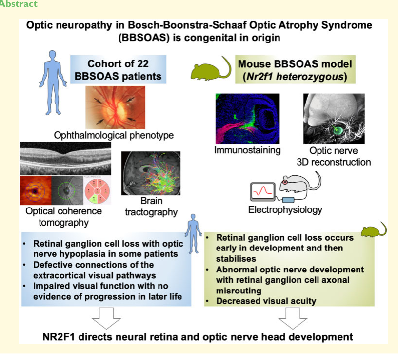

## Question

# Disease Characteristics Research Template

## Target Disease
- **Disease Name:** Bosch-Boonstra-Schaaf Optic Atrophy Syndrome
- **MONDO ID:**  (if available)
- **Category:** Mendelian

## Research Objectives

Please provide a comprehensive research report on **Bosch-Boonstra-Schaaf Optic Atrophy Syndrome** covering all of the
disease characteristics listed below. This report will be used to populate a disease knowledge
base entry. Be thorough and cite primary literature (PMID preferred) for all claims.

For each section, **suggested databases/resources** are listed. These are the first places
you should search for information on each topic.

---

### 1. Disease Information
> **Search first:** OMIM, Orphanet, ICD-10/ICD-11, MeSH, PubMed

- What is the disease? Provide a concise overview.
- What are the key identifiers? (OMIM, Orphanet, ICD-10/ICD-11, MeSH, Mondo)
- What are the common synonyms and alternative names?
- Is the information derived from individual patients (e.g., EHR) or aggregated disease-level resources?

### 2. Etiology

- **Disease Causal Factors**: What are the primary causes? (genetic, environmental, infectious, mechanistic)
- **Risk Factors**:
  > **Search first:** PubMed, Cochrane Library, UpToDate, clinical guidelines, ClinVar, ClinGen, GWAS Catalog, PheGenI, CTD, CDC, WHO, epidemiological databases
  - Genetic risk factors (causal variants, susceptibility loci, modifier genes)
  - Environmental risk factors (toxins, lifestyle, occupational exposures, age, sex, family history)
- **Protective Factors**:
  > **Search first:** PubMed, Cochrane Library, clinical trial databases, GWAS Catalog, gnomAD, WHO, CDC, nutrition databases
  - Genetic protective factors (protective variants, modifier alleles)
  - Environmental protective factors (diet, lifestyle, exposures that reduce risk)
- **Gene-Environment Interactions**: How do genetic and environmental factors interact to influence disease?
  > **Search first:** CTD, PubMed, PheGenI, GxE databases

### 3. Phenotypes
> **Search first:** HPO (Human Phenotype Ontology), OMIM, Orphanet, PubMed, clinicaltrials.gov, MedDRA, SNOMED CT, DECIPHER, LOINC

For each phenotype, provide:
- **Phenotype type**: symptoms, clinical signs, physical manifestations, behavioral changes, or laboratory abnormalities
  > For symptoms/signs: HPO, OMIM, Orphanet, PubMed
  > For behavioral changes: HPO, DSM, RDoC (Research Domain Criteria), PubMed
  > For laboratory abnormalities: LOINC, SNOMED CT, LabTests Online, PubMed
- **Phenotype characteristics**:
  > **Search first:** OMIM, Orphanet, HPO, PubMed
  - Age of symptom onset (neonatal, childhood, adult-onset, late-onset)
  - Symptom severity (mild, moderate, severe, variable)
  - Symptom progression (stable, progressive, episodic, fluctuating)
  - Frequency among affected individuals (percentage or qualitative)
- **Quality of life impact**: Effects on daily functioning and well-being (per-phenotype when possible)
  > **Search first:** EQ-5D database, SF-36, WHO QOL databases, PubMed
- Suggest HPO (Human Phenotype Ontology) terms for each phenotype

### 4. Genetic/Molecular Information

- **Causal Genes**: Gene mutations or chromosomal abnormalities responsible for disease (gene symbols, OMIM IDs)
  > **Search first:** OMIM, ClinVar, HGMD, Ensembl, NCBI Gene
- **Pathogenic Variants**:
  - Affected genes (gene symbols, HGNC IDs)
    > **Search first:** OMIM, NCBI Gene, Ensembl, HGNC, UniProt, GeneCards
  - Variant classification (pathogenic, likely pathogenic, VUS per ACMG/AMP guidelines)
    > **Search first:** ClinVar, ClinGen, ACMG/AMP guidelines, VarSome
  - Variant type/class (missense, frameshift, nonsense, splice-site, structural)
  - Allele frequency in population databases
    > **Search first:** gnomAD, 1000 Genomes, ExAC, TOPMed, dbSNP
  - Somatic vs germline origin
    > **Search first:** COSMIC (somatic), ClinVar, ICGC, TCGA
  - Functional consequences (loss of function, gain of function, dominant negative)
- **Modifier Genes**: Genes that modify disease severity or expression
- **Epigenetic Information**: DNA methylation, histone modifications, chromatin changes affecting disease
  > **Search first:** ENCODE, Roadmap Epigenomics, MethBase, DiseaseMeth
- **Chromosomal Abnormalities**: Large-scale genetic changes (aneuploidy, translocations, inversions)
  > **Search first:** DECIPHER, ClinVar, ECARUCA, UCSC Genome Browser

### 5. Environmental Information

- **Environmental Factors**: Non-genetic contributing factors (toxins, radiation, pollution, occupational exposure)
  > **Search first:** CTD (Comparative Toxicogenomics Database), TOXNET, PubMed, EPA databases
- **Lifestyle Factors**: Behavioral factors (smoking, diet, exercise, alcohol consumption)
  > **Search first:** CDC databases, WHO, PubMed, NHANES
- **Infectious Agents**: If applicable, pathogens causing or triggering disease (bacteria, viruses, fungi, parasites)
  > **Search first:** NCBI Taxonomy, ViPR, BV-BRC, MicrobeDB, GIDEON

### 6. Mechanism / Pathophysiology

- **Molecular Pathways**: Specific signaling cascades or biochemical pathways involved (Wnt, MAPK, mTOR, PI3K-AKT, etc.)
  > **Search first:** KEGG, Reactome, WikiPathways, PathBank, BioCyc
- **Cellular Processes**: Cell-level mechanisms (apoptosis, autophagy, cell cycle dysregulation, inflammation, etc.)
  > **Search first:** Gene Ontology (GO), Reactome, KEGG, PubMed
- **Protein Dysfunction**: How protein structure or function is altered (misfolding, aggregation, loss of function, gain of function)
  > **Search first:** UniProt, PDB (Protein Data Bank), InterPro, Pfam, AlphaFold
- **Metabolic Changes**: Alterations in metabolic processes (energy metabolism, lipid metabolism, amino acid metabolism)
  > **Search first:** KEGG, BioCyc, HMDB (Human Metabolome Database), BRENDA
- **Immune System Involvement**: Role of immune response (autoimmunity, immunodeficiency, chronic inflammation)
  > **Search first:** ImmPort, Immunome Database, IEDB, Gene Ontology
- **Tissue Damage Mechanisms**: How tissues/ are injured (oxidative stress, ischemia, fibrosis, necrosis)
  > **Search first:** PubMed, Gene Ontology, Reactome
- **Biochemical Abnormalities**: Specific molecular defects (enzyme deficiencies, receptor dysfunction, ion channel defects)
  > **Search first:** BRENDA, UniProt, KEGG, OMIM, PubMed
- **Epigenetic Changes**: DNA methylation, histone modifications affecting gene expression in disease
  > **Search first:** ENCODE, Roadmap Epigenomics, MethBase, DiseaseMeth
- **Molecular Profiling** (if available):
  - Transcriptomics/gene expression changes
    > **Search first:** GEO (Gene Expression Omnibus), ArrayExpress, GTEx, Human Cell Atlas, SRA
  - Proteomics findings
    > **Search first:** PRIDE, ProteomeXchange, Human Protein Atlas, STRING, BioGRID
  - Metabolomics signatures
    > **Search first:** MetaboLights, Metabolomics Workbench, HMDB, METLIN
  - Lipidomics alterations
    > **Search first:** LIPID MAPS, SwissLipids, LipidHome, Metabolomics Workbench
  - Genomic structural features
    > **Search first:** UCSC Genome Browser, Ensembl, NCBI, dbVar, DGV
- **Advanced Technologies** (if applicable):
  - Single-cell analysis findings (cell-type specific mechanisms, cellular heterogeneity)
    > **Search first:** Human Cell Atlas, Single Cell Portal, GEO, CELLxGENE
  - Spatial transcriptomics findings
    > **Search first:** GEO, Spatial Research, Vizgen, 10x Genomics data
  - Multi-omics integration results
    > **Search first:** TCGA, ICGC, cBioPortal, LinkedOmics, PubMed
  - Functional genomics screens (CRISPR, RNAi)
    > **Search first:** DepMap, GenomeRNAi, PubMed, BioGRID ORCS

For each mechanism, describe:
- The causal chain from initial trigger to clinical manifestation
- Which mechanisms are upstream vs downstream
- What cell types and biological processes are involved
- Suggest GO terms for biological processes and CL terms for cell types

### 7. Anatomical Structures Affected

- **Organ Level**:
  - Primary organs directly affected
  - Secondary organ involvement (complications, secondary effects)
  - Body systems involved (cardiovascular, nervous, digestive, respiratory, endocrine, etc.)
  > **Search first:** Uberon, FMA (Foundational Model of Anatomy), OMIM, HPO, ICD-11, MeSH, SNOMED CT
- **Tissue and Cell Level**:
  - Specific tissue types affected (epithelial, connective, muscle, nervous)
  - Specific cell populations targeted (with Cell Ontology terms)
  > **Search first:** Uberon, Human Protein Atlas, Cell Ontology, Human Cell Atlas, CellMarker, PanglaoDB
- **Subcellular Level**:
  - Cellular compartments involved (mitochondria, nucleus, ER, lysosomes) (with GO Cellular Component terms)
  > **Search first:** Gene Ontology (Cellular Component), UniProt, Human Protein Atlas
- **Localization**:
  - Specific anatomical sites (with UBERON terms)
    > **Search first:** FMA, Uberon, NeuroNames (for brain), SNOMED CT
  - Lateralization (unilateral, bilateral, asymmetric)
    > **Search first:** HPO, clinical literature, imaging databases

### 8. Temporal Development

- **Onset**:
  - Typical age of onset (congenital, pediatric, adult, geriatric)
  - Onset pattern (acute, subacute, chronic, insidious)
  > **Search first:** OMIM, Orphanet, HPO, PubMed
- **Progression**:
  - Disease stages (early, intermediate, advanced, end-stage)
    > **Search first:** Cancer Staging Manual (AJCC), WHO classifications, PubMed
  - Progression rate (rapid, slow, variable)
  - Disease course pattern (episodic, relapsing-remitting, progressive, stable)
  - Disease duration (self-limited, chronic lifelong)
  > **Search first:** Disease registries, longitudinal cohort databases, natural history studies, PubMed, Orphanet, OMIM
- **Patterns**:
  - Remission patterns (spontaneous, treatment-induced)
    > **Search first:** Clinical trial databases, disease registries, PubMed
  - Critical periods (time windows of vulnerability or opportunity for intervention)
    > **Search first:** PubMed, developmental biology databases, clinical guidelines

### 9. Inheritance and Population

- **Epidemiology**:
  - Prevalence (cases per 100,000 at given time)
  - Incidence (new cases per 100,000 per year)
  > **Search first:** Orphanet, CDC, WHO, GBD (Global Burden of Disease), national registries, SEER, disease registries
- **For Genetic Etiology**:
  - Inheritance pattern (AD, AR, X-linked, mitochondrial, multifactorial, polygenic)
    > **Search first:** OMIM, Orphanet, ClinVar, GTR (Genetic Testing Registry)
  - Penetrance (complete, incomplete, age-dependent)
    > **Search first:** ClinVar, OMIM, PubMed, ClinGen
  - Expressivity (variable, consistent)
    > **Search first:** OMIM, ClinVar, PubMed
  - Genetic anticipation (increasing severity in successive generations)
    > **Search first:** OMIM, PubMed (especially for repeat expansion disorders)
  - Germline mosaicism
    > **Search first:** ClinVar, OMIM, genetic counseling literature, PubMed
  - Founder effects (population-specific mutations)
    > **Search first:** gnomAD, population genetics databases, PubMed
  - Consanguinity role
    > **Search first:** OMIM, population studies, genetic counseling resources
  - Carrier frequency
    > **Search first:** gnomAD, carrier screening databases, GeneReviews, GTR
- **Population Demographics**:
  - Affected populations (ethnic or demographic groups with higher prevalence)
    > **Search first:** gnomAD, 1000 Genomes, PAGE Study, PubMed, population registries
  - Geographic distribution (endemic areas, regional variation)
    > **Search first:** WHO, CDC, GBD, Orphanet, geographic epidemiology databases
  - Geographic distribution of specific variants
  - Sex ratio (male:female)
    > **Search first:** Disease registries, OMIM, PubMed, epidemiological databases
  - Age distribution of affected individuals
    > **Search first:** CDC, disease registries, SEER, Orphanet

### 10. Diagnostics

- **Clinical Tests**:
  - Laboratory tests (blood, urine, tissue chemistry, specific enzyme assays)
    > **Search first:** LOINC, LabTests Online, PubMed
  - Biomarkers (proteins, metabolites, genetic markers, circulating biomarkers)
    > **Search first:** FDA Biomarker List, BEST (Biomarkers, EndpointS, and other Tools), PubMed
  - Imaging studies (X-ray, CT, MRI, PET, ultrasound)
    > **Search first:** RadLex, DICOM, Radiopaedia, imaging databases
  - Functional tests (pulmonary function, cardiac stress tests)
    > **Search first:** LOINC, clinical guidelines, PubMed
  - Electrophysiology (EEG, EMG, ECG, nerve conduction studies)
    > **Search first:** LOINC, clinical neurophysiology databases, PubMed
  - Biopsy findings (histopathology, immunohistochemistry)
    > **Search first:** SNOMED CT, College of American Pathologists resources, PubMed
  - Pathology findings (microscopic examination)
    > **Search first:** SNOMED CT, Digital Pathology databases, PubMed
- **Genetic Testing**:
  > **Search first:** GTR (Genetic Testing Registry), GeneReviews, ClinGen
  - Overview of recommended genetic testing approach
  - Whole genome sequencing (WGS) utility
    > **Search first:** GTR, ClinVar, GEL (Genomics England), gnomAD
  - Whole exome sequencing (WES) utility
    > **Search first:** GTR, ClinVar, OMIM, GeneMatcher
  - Gene panels (which panels, which genes)
    > **Search first:** GTR, ClinVar, laboratory-specific databases
  - Single gene testing
    > **Search first:** GTR, ClinVar, OMIM, GeneReviews
  - Chromosomal microarray (CMA)
    > **Search first:** DECIPHER, ClinVar, dbVar, ECARUCA
  - Karyotyping
    > **Search first:** Chromosome Abnormality Database, ClinVar, cytogenetics resources
  - FISH
    > **Search first:** ClinVar, cytogenetics databases, PubMed
  - Mitochondrial DNA testing
    > **Search first:** MITOMAP, MSeqDR, ClinVar, GTR
  - Repeat expansion testing
    > **Search first:** GTR, ClinVar, repeat expansion databases, PubMed
- **Omics-Based Diagnostics** (if applicable):
  - RNA sequencing / transcriptomics
    > **Search first:** GEO, ArrayExpress, GTEx, RNA-seq databases
  - Proteomics
    > **Search first:** PRIDE, ProteomeXchange, FDA Biomarker database
  - Metabolomics
    > **Search first:** MetaboLights, Metabolomics Workbench, HMDB
  - Epigenomics
    > **Search first:** GEO, ENCODE, Roadmap Epigenomics, MethBase
  - Liquid biopsy
    > **Search first:** COSMIC, ClinVar, liquid biopsy databases, PubMed
- **Clinical Criteria**:
  - Standardized diagnostic criteria (DSM, ICD, society guidelines)
    > **Search first:** DSM-5, ICD-11, clinical society guidelines, UpToDate
  - Differential diagnosis (other conditions to rule out, with distinguishing features)
    > **Search first:** DynaMed, UpToDate, clinical decision support systems
- **Screening**:
  - Screening methods for asymptomatic individuals (newborn screening, carrier screening, cascade screening)
    > **Search first:** ACMG recommendations, CDC newborn screening, GTR

### 11. Outcome/Prognosis

- **Survival and Mortality**:
  - Survival rate (5-year, 10-year, overall)
    > **Search first:** SEER, cancer registries, disease-specific registries, PubMed
  - Life expectancy (with and without treatment if applicable)
    > **Search first:** Orphanet, disease registries, actuarial databases, PubMed
  - Mortality rate
    > **Search first:** CDC, WHO, GBD, national mortality databases
  - Disease-specific mortality (deaths directly attributable to disease)
    > **Search first:** Disease registries, CDC Wonder, GBD, PubMed
- **Morbidity and Function**:
  - Morbidity (disease-related disability and health impacts)
    > **Search first:** GBD, WHO, disability databases, PubMed
  - Disability outcomes (long-term functional impairments)
    > **Search first:** ICF (International Classification of Functioning), disability registries
  - Quality of life measures (EQ-5D, SF-36, PROMIS, disease-specific tools)
    > **Search first:** EQ-5D database, SF-36, PROMIS, PubMed
- **Disease Course**:
  - Complications (secondary problems: infections, organ failure, etc.)
    > **Search first:** ICD codes, disease registries, clinical databases, PubMed
  - Recovery potential (likelihood and extent of recovery, with vs without treatment)
    > **Search first:** Natural history studies, rehabilitation databases, PubMed
- **Prediction**:
  - Prognostic factors (age, disease severity, biomarkers, treatment response)
    > **Search first:** Prognostic models databases, clinical calculators, PubMed
  - Prognostic biomarkers (molecular markers predicting disease course)
    > **Search first:** FDA Biomarker database, PubMed, cancer prognostic databases

### 12. Treatment

- **Pharmacotherapy**:
  - Pharmacological treatments (drug names, drug classes, mechanisms of action)
    > **Search first:** DrugBank, RxNorm, ATC classification, DailyMed, FDA databases
  - Pharmacogenomics (how genetic variants affect drug metabolism, efficacy, toxicity)
    > **Search first:** PharmGKB, CPIC (Clinical Pharmacogenetics), FDA Table of PGx Biomarkers
- **Advanced Therapeutics**:
  - Gene therapy (viral vectors, CRISPR, gene replacement, gene editing)
    > **Search first:** ClinicalTrials.gov, FDA gene therapy database, ASGCT resources
  - Cell therapy (stem cell transplant, CAR-T, cellular therapeutics)
    > **Search first:** ClinicalTrials.gov, FDA cell therapy database, FACT standards
  - RNA-based therapies (ASOs, siRNA, mRNA therapies)
    > **Search first:** ClinicalTrials.gov, FDA approvals, PubMed
  - Targeted therapies (treatments directed at specific molecular targets)
    > **Search first:** My Cancer Genome, OncoKB, ClinicalTrials.gov, FDA approvals
  - Immunotherapies (checkpoint inhibitors, monoclonal antibodies)
    > **Search first:** Cancer Immunotherapy Database, FDA approvals, ClinicalTrials.gov
- **Surgical and Interventional**:
  - Surgical interventions (types of surgery, timing, outcomes)
    > **Search first:** CPT codes, surgical registries, clinical guidelines, PubMed
- **Supportive and Rehabilitative**:
  - Supportive care (symptom management, pain control, nutrition)
    > **Search first:** Clinical guidelines, Cochrane Library, PubMed
  - Rehabilitation (physical therapy, occupational therapy, speech therapy)
    > **Search first:** Rehabilitation medicine databases, clinical guidelines, PubMed
- **Experimental**:
  - Experimental treatments in clinical trials (with NCT identifiers if available)
    > **Search first:** ClinicalTrials.gov, EU Clinical Trials Register, WHO ICTRP
- **Treatment Outcomes**:
  - Treatment response rates
    > **Search first:** Clinical trial databases, FDA reviews, systematic reviews, PubMed
  - Side effects and adverse events
    > **Search first:** FDA Adverse Event Reporting System (FAERS), MedWatch, PubMed
- **Treatment Strategy**:
  - Treatment algorithms (clinical pathways, decision trees)
    > **Search first:** Clinical practice guidelines, NCCN Guidelines, UpToDate
  - Combination therapies
    > **Search first:** ClinicalTrials.gov, treatment guidelines, PubMed
  - Personalized medicine approaches (genotype-guided treatment)
    > **Search first:** My Cancer Genome, CIViC, PharmGKB, precision medicine databases

For each treatment, suggest MAXO (Medical Action Ontology) terms where applicable.

### 13. Prevention

- **Prevention Levels**:
  - Primary prevention (preventing disease occurrence: vaccination, risk factor modification)
    > **Search first:** CDC, WHO, USPSTF recommendations, Cochrane Library
  - Secondary prevention (early detection and treatment: screening programs, early intervention)
    > **Search first:** USPSTF, CDC screening guidelines, WHO
  - Tertiary prevention (preventing complications in those with disease)
    > **Search first:** Clinical guidelines, disease management protocols, PubMed
- **Immunization**: Vaccine strategies (if applicable)
  > **Search first:** CDC vaccine schedules, WHO immunization, FDA vaccine database
- **Screening and Early Detection**:
  - Screening programs (population-based: newborn screening, cancer screening)
    > **Search first:** CDC screening programs, USPSTF, cancer screening databases
  - Genetic screening (carrier screening, preimplantation genetic diagnosis, prenatal testing)
    > **Search first:** ACMG recommendations, ACOG guidelines, GTR
  - Risk stratification (identifying high-risk individuals for targeted prevention)
    > **Search first:** Risk prediction models, clinical calculators, PubMed
- **Behavioral Interventions**: Lifestyle modifications to reduce risk
  > **Search first:** CDC, WHO, behavioral intervention databases, Cochrane Library
- **Counseling**: Genetic counseling (risk assessment, family planning guidance)
  > **Search first:** NSGC resources, ACMG guidelines, GeneReviews
- **Public Health**:
  - Public health interventions (sanitation, vector control, health education)
    > **Search first:** CDC, WHO, public health databases, PubMed
  - Environmental interventions (reducing environmental risk factors)
    > **Search first:** EPA databases, WHO environmental health, PubMed
- **Prophylaxis**: Preventive medications or procedures
  > **Search first:** Clinical guidelines, FDA approvals, PubMed

### 14. Other Species / Natural Disease

- **Taxonomy**: Species affected (with NCBI Taxon identifiers)
  > **Search first:** NCBI Taxonomy
- **Breed**: Specific breeds affected (with VBO identifiers if applicable)
  > **Search first:** VBO (Vertebrate Breed Ontology)
- **Gene**: Orthologous genes in other species (with NCBI Gene IDs)
  > **Search first:** NCBI Gene
- **Natural Disease**:
  - Naturally occurring disease in other species (companion animals, wildlife)
    > **Search first:** OMIA (Online Mendelian Inheritance in Animals), VetCompass, PubMed
  - Veterinary relevance and importance in animal health
    > **Search first:** OMIA, veterinary databases, PubMed
- **Comparative Biology**:
  - Comparative pathology (similarities and differences across species)
    > **Search first:** OMIA, comparative pathology databases, PubMed
  - Evolutionary conservation of disease mechanisms
    > **Search first:** HomoloGene, OrthoMCL, Alliance of Genome Resources
- **Transmission** (if applicable):
  - Zoonotic potential
    > **Search first:** CDC zoonotic diseases, WHO zoonoses, GIDEON
  - Cross-species susceptibility
    > **Search first:** NCBI Taxonomy, veterinary databases, PubMed

### 15. Model Organisms

- **Model Types**:
  - Model organism type (mammalian, invertebrate, cellular, in vitro)
    > **Search first:** Alliance of Genome Resources, model organism databases
  - Specific model systems (mouse, rat, zebrafish, Drosophila, C. elegans, yeast, cell lines, organoids, iPSCs)
    > **Search first:** MGI, RGD, ZFIN, FlyBase, WormBase, SGD, ATCC, Cellosaurus
  - Induced models (drug treatment, surgical intervention, environmental manipulation)
    > **Search first:** MGI, model organism databases, PubMed
- **Genetic Models**:
  - Types available (knockout, knock-in, transgenic, conditional, humanized)
    > **Search first:** MGI, IMPC, KOMP, EuMMCR, IMSR
- **Model Characteristics**:
  - Phenotype recapitulation (how well model reproduces human disease features)
    > **Search first:** Model organism databases, comparative studies, PubMed
  - Model limitations (aspects of human disease not captured)
    > **Search first:** Model organism databases, PubMed, review articles
- **Applications**:
  - Research applications (what aspects of disease can be studied)
    > **Search first:** Model organism databases, PubMed
- **Resources**:
  - Model databases
    > **Search first:** MGI, RGD, ZFIN, FlyBase, WormBase, IMSR, EMMA, MMRRC

---

## Citation Requirements

- Cite primary literature (PMID preferred) for all mechanistic and clinical claims
- Prioritize recent reviews and landmark papers
- Include direct quotes from abstracts where possible to support key statements
- Distinguish evidence source types: human clinical, model organism, in vitro, computational

## Output Format

Structure your response as a comprehensive narrative organized by the sections above.
For each section, provide:
- Factual content with specific details (numbers, percentages, gene names, variant nomenclature)
- Ontology term suggestions (HPO, GO, CL, UBERON, CHEBI, MAXO, MONDO) where applicable
- Evidence citations with PMIDs
- Direct quotes from abstracts to support key claims
- Clear indication when information is not available or not applicable for this disease

This report will be used to populate a disease knowledge base entry with:
- Pathophysiology descriptions with causal chains
- Gene/protein annotations (HGNC, GO terms)
- Phenotype associations (HP terms) with frequencies
- Cell type involvement (CL terms)
- Anatomical locations (UBERON terms)
- Chemical entities (CHEBI terms)
- Treatment annotations (MAXO terms)
- Evidence items with PMIDs and exact abstract quotes
- Epidemiology, prognosis, diagnostic, and prevention information
- Animal model descriptions with phenotype recapitulation details

## Output

Question: You are an expert researcher providing comprehensive, well-cited information.

Provide detailed information focusing on:
1. Key concepts and definitions with current understanding
2. Recent developments and latest research (prioritize 2023-2024 sources)
3. Current applications and real-world implementations
4. Expert opinions and analysis from authoritative sources
5. Relevant statistics and data from recent studies

Format as a comprehensive research report with proper citations. Include URLs and publication dates where available.
Always prioritize recent, authoritative sources and provide specific citations for all major claims.

# Disease Characteristics Research Template

## Target Disease
- **Disease Name:** Bosch-Boonstra-Schaaf Optic Atrophy Syndrome
- **MONDO ID:**  (if available)
- **Category:** Mendelian

## Research Objectives

Please provide a comprehensive research report on **Bosch-Boonstra-Schaaf Optic Atrophy Syndrome** covering all of the
disease characteristics listed below. This report will be used to populate a disease knowledge
base entry. Be thorough and cite primary literature (PMID preferred) for all claims.

For each section, **suggested databases/resources** are listed. These are the first places
you should search for information on each topic.

---

### 1. Disease Information
> **Search first:** OMIM, Orphanet, ICD-10/ICD-11, MeSH, PubMed

- What is the disease? Provide a concise overview.
- What are the key identifiers? (OMIM, Orphanet, ICD-10/ICD-11, MeSH, Mondo)
- What are the common synonyms and alternative names?
- Is the information derived from individual patients (e.g., EHR) or aggregated disease-level resources?

### 2. Etiology

- **Disease Causal Factors**: What are the primary causes? (genetic, environmental, infectious, mechanistic)
- **Risk Factors**:
  > **Search first:** PubMed, Cochrane Library, UpToDate, clinical guidelines, ClinVar, ClinGen, GWAS Catalog, PheGenI, CTD, CDC, WHO, epidemiological databases
  - Genetic risk factors (causal variants, susceptibility loci, modifier genes)
  - Environmental risk factors (toxins, lifestyle, occupational exposures, age, sex, family history)
- **Protective Factors**:
  > **Search first:** PubMed, Cochrane Library, clinical trial databases, GWAS Catalog, gnomAD, WHO, CDC, nutrition databases
  - Genetic protective factors (protective variants, modifier alleles)
  - Environmental protective factors (diet, lifestyle, exposures that reduce risk)
- **Gene-Environment Interactions**: How do genetic and environmental factors interact to influence disease?
  > **Search first:** CTD, PubMed, PheGenI, GxE databases

### 3. Phenotypes
> **Search first:** HPO (Human Phenotype Ontology), OMIM, Orphanet, PubMed, clinicaltrials.gov, MedDRA, SNOMED CT, DECIPHER, LOINC

For each phenotype, provide:
- **Phenotype type**: symptoms, clinical signs, physical manifestations, behavioral changes, or laboratory abnormalities
  > For symptoms/signs: HPO, OMIM, Orphanet, PubMed
  > For behavioral changes: HPO, DSM, RDoC (Research Domain Criteria), PubMed
  > For laboratory abnormalities: LOINC, SNOMED CT, LabTests Online, PubMed
- **Phenotype characteristics**:
  > **Search first:** OMIM, Orphanet, HPO, PubMed
  - Age of symptom onset (neonatal, childhood, adult-onset, late-onset)
  - Symptom severity (mild, moderate, severe, variable)
  - Symptom progression (stable, progressive, episodic, fluctuating)
  - Frequency among affected individuals (percentage or qualitative)
- **Quality of life impact**: Effects on daily functioning and well-being (per-phenotype when possible)
  > **Search first:** EQ-5D database, SF-36, WHO QOL databases, PubMed
- Suggest HPO (Human Phenotype Ontology) terms for each phenotype

### 4. Genetic/Molecular Information

- **Causal Genes**: Gene mutations or chromosomal abnormalities responsible for disease (gene symbols, OMIM IDs)
  > **Search first:** OMIM, ClinVar, HGMD, Ensembl, NCBI Gene
- **Pathogenic Variants**:
  - Affected genes (gene symbols, HGNC IDs)
    > **Search first:** OMIM, NCBI Gene, Ensembl, HGNC, UniProt, GeneCards
  - Variant classification (pathogenic, likely pathogenic, VUS per ACMG/AMP guidelines)
    > **Search first:** ClinVar, ClinGen, ACMG/AMP guidelines, VarSome
  - Variant type/class (missense, frameshift, nonsense, splice-site, structural)
  - Allele frequency in population databases
    > **Search first:** gnomAD, 1000 Genomes, ExAC, TOPMed, dbSNP
  - Somatic vs germline origin
    > **Search first:** COSMIC (somatic), ClinVar, ICGC, TCGA
  - Functional consequences (loss of function, gain of function, dominant negative)
- **Modifier Genes**: Genes that modify disease severity or expression
- **Epigenetic Information**: DNA methylation, histone modifications, chromatin changes affecting disease
  > **Search first:** ENCODE, Roadmap Epigenomics, MethBase, DiseaseMeth
- **Chromosomal Abnormalities**: Large-scale genetic changes (aneuploidy, translocations, inversions)
  > **Search first:** DECIPHER, ClinVar, ECARUCA, UCSC Genome Browser

### 5. Environmental Information

- **Environmental Factors**: Non-genetic contributing factors (toxins, radiation, pollution, occupational exposure)
  > **Search first:** CTD (Comparative Toxicogenomics Database), TOXNET, PubMed, EPA databases
- **Lifestyle Factors**: Behavioral factors (smoking, diet, exercise, alcohol consumption)
  > **Search first:** CDC databases, WHO, PubMed, NHANES
- **Infectious Agents**: If applicable, pathogens causing or triggering disease (bacteria, viruses, fungi, parasites)
  > **Search first:** NCBI Taxonomy, ViPR, BV-BRC, MicrobeDB, GIDEON

### 6. Mechanism / Pathophysiology

- **Molecular Pathways**: Specific signaling cascades or biochemical pathways involved (Wnt, MAPK, mTOR, PI3K-AKT, etc.)
  > **Search first:** KEGG, Reactome, WikiPathways, PathBank, BioCyc
- **Cellular Processes**: Cell-level mechanisms (apoptosis, autophagy, cell cycle dysregulation, inflammation, etc.)
  > **Search first:** Gene Ontology (GO), Reactome, KEGG, PubMed
- **Protein Dysfunction**: How protein structure or function is altered (misfolding, aggregation, loss of function, gain of function)
  > **Search first:** UniProt, PDB (Protein Data Bank), InterPro, Pfam, AlphaFold
- **Metabolic Changes**: Alterations in metabolic processes (energy metabolism, lipid metabolism, amino acid metabolism)
  > **Search first:** KEGG, BioCyc, HMDB (Human Metabolome Database), BRENDA
- **Immune System Involvement**: Role of immune response (autoimmunity, immunodeficiency, chronic inflammation)
  > **Search first:** ImmPort, Immunome Database, IEDB, Gene Ontology
- **Tissue Damage Mechanisms**: How tissues/ are injured (oxidative stress, ischemia, fibrosis, necrosis)
  > **Search first:** PubMed, Gene Ontology, Reactome
- **Biochemical Abnormalities**: Specific molecular defects (enzyme deficiencies, receptor dysfunction, ion channel defects)
  > **Search first:** BRENDA, UniProt, KEGG, OMIM, PubMed
- **Epigenetic Changes**: DNA methylation, histone modifications affecting gene expression in disease
  > **Search first:** ENCODE, Roadmap Epigenomics, MethBase, DiseaseMeth
- **Molecular Profiling** (if available):
  - Transcriptomics/gene expression changes
    > **Search first:** GEO (Gene Expression Omnibus), ArrayExpress, GTEx, Human Cell Atlas, SRA
  - Proteomics findings
    > **Search first:** PRIDE, ProteomeXchange, Human Protein Atlas, STRING, BioGRID
  - Metabolomics signatures
    > **Search first:** MetaboLights, Metabolomics Workbench, HMDB, METLIN
  - Lipidomics alterations
    > **Search first:** LIPID MAPS, SwissLipids, LipidHome, Metabolomics Workbench
  - Genomic structural features
    > **Search first:** UCSC Genome Browser, Ensembl, NCBI, dbVar, DGV
- **Advanced Technologies** (if applicable):
  - Single-cell analysis findings (cell-type specific mechanisms, cellular heterogeneity)
    > **Search first:** Human Cell Atlas, Single Cell Portal, GEO, CELLxGENE
  - Spatial transcriptomics findings
    > **Search first:** GEO, Spatial Research, Vizgen, 10x Genomics data
  - Multi-omics integration results
    > **Search first:** TCGA, ICGC, cBioPortal, LinkedOmics, PubMed
  - Functional genomics screens (CRISPR, RNAi)
    > **Search first:** DepMap, GenomeRNAi, PubMed, BioGRID ORCS

For each mechanism, describe:
- The causal chain from initial trigger to clinical manifestation
- Which mechanisms are upstream vs downstream
- What cell types and biological processes are involved
- Suggest GO terms for biological processes and CL terms for cell types

### 7. Anatomical Structures Affected

- **Organ Level**:
  - Primary organs directly affected
  - Secondary organ involvement (complications, secondary effects)
  - Body systems involved (cardiovascular, nervous, digestive, respiratory, endocrine, etc.)
  > **Search first:** Uberon, FMA (Foundational Model of Anatomy), OMIM, HPO, ICD-11, MeSH, SNOMED CT
- **Tissue and Cell Level**:
  - Specific tissue types affected (epithelial, connective, muscle, nervous)
  - Specific cell populations targeted (with Cell Ontology terms)
  > **Search first:** Uberon, Human Protein Atlas, Cell Ontology, Human Cell Atlas, CellMarker, PanglaoDB
- **Subcellular Level**:
  - Cellular compartments involved (mitochondria, nucleus, ER, lysosomes) (with GO Cellular Component terms)
  > **Search first:** Gene Ontology (Cellular Component), UniProt, Human Protein Atlas
- **Localization**:
  - Specific anatomical sites (with UBERON terms)
    > **Search first:** FMA, Uberon, NeuroNames (for brain), SNOMED CT
  - Lateralization (unilateral, bilateral, asymmetric)
    > **Search first:** HPO, clinical literature, imaging databases

### 8. Temporal Development

- **Onset**:
  - Typical age of onset (congenital, pediatric, adult, geriatric)
  - Onset pattern (acute, subacute, chronic, insidious)
  > **Search first:** OMIM, Orphanet, HPO, PubMed
- **Progression**:
  - Disease stages (early, intermediate, advanced, end-stage)
    > **Search first:** Cancer Staging Manual (AJCC), WHO classifications, PubMed
  - Progression rate (rapid, slow, variable)
  - Disease course pattern (episodic, relapsing-remitting, progressive, stable)
  - Disease duration (self-limited, chronic lifelong)
  > **Search first:** Disease registries, longitudinal cohort databases, natural history studies, PubMed, Orphanet, OMIM
- **Patterns**:
  - Remission patterns (spontaneous, treatment-induced)
    > **Search first:** Clinical trial databases, disease registries, PubMed
  - Critical periods (time windows of vulnerability or opportunity for intervention)
    > **Search first:** PubMed, developmental biology databases, clinical guidelines

### 9. Inheritance and Population

- **Epidemiology**:
  - Prevalence (cases per 100,000 at given time)
  - Incidence (new cases per 100,000 per year)
  > **Search first:** Orphanet, CDC, WHO, GBD (Global Burden of Disease), national registries, SEER, disease registries
- **For Genetic Etiology**:
  - Inheritance pattern (AD, AR, X-linked, mitochondrial, multifactorial, polygenic)
    > **Search first:** OMIM, Orphanet, ClinVar, GTR (Genetic Testing Registry)
  - Penetrance (complete, incomplete, age-dependent)
    > **Search first:** ClinVar, OMIM, PubMed, ClinGen
  - Expressivity (variable, consistent)
    > **Search first:** OMIM, ClinVar, PubMed
  - Genetic anticipation (increasing severity in successive generations)
    > **Search first:** OMIM, PubMed (especially for repeat expansion disorders)
  - Germline mosaicism
    > **Search first:** ClinVar, OMIM, genetic counseling literature, PubMed
  - Founder effects (population-specific mutations)
    > **Search first:** gnomAD, population genetics databases, PubMed
  - Consanguinity role
    > **Search first:** OMIM, population studies, genetic counseling resources
  - Carrier frequency
    > **Search first:** gnomAD, carrier screening databases, GeneReviews, GTR
- **Population Demographics**:
  - Affected populations (ethnic or demographic groups with higher prevalence)
    > **Search first:** gnomAD, 1000 Genomes, PAGE Study, PubMed, population registries
  - Geographic distribution (endemic areas, regional variation)
    > **Search first:** WHO, CDC, GBD, Orphanet, geographic epidemiology databases
  - Geographic distribution of specific variants
  - Sex ratio (male:female)
    > **Search first:** Disease registries, OMIM, PubMed, epidemiological databases
  - Age distribution of affected individuals
    > **Search first:** CDC, disease registries, SEER, Orphanet

### 10. Diagnostics

- **Clinical Tests**:
  - Laboratory tests (blood, urine, tissue chemistry, specific enzyme assays)
    > **Search first:** LOINC, LabTests Online, PubMed
  - Biomarkers (proteins, metabolites, genetic markers, circulating biomarkers)
    > **Search first:** FDA Biomarker List, BEST (Biomarkers, EndpointS, and other Tools), PubMed
  - Imaging studies (X-ray, CT, MRI, PET, ultrasound)
    > **Search first:** RadLex, DICOM, Radiopaedia, imaging databases
  - Functional tests (pulmonary function, cardiac stress tests)
    > **Search first:** LOINC, clinical guidelines, PubMed
  - Electrophysiology (EEG, EMG, ECG, nerve conduction studies)
    > **Search first:** LOINC, clinical neurophysiology databases, PubMed
  - Biopsy findings (histopathology, immunohistochemistry)
    > **Search first:** SNOMED CT, College of American Pathologists resources, PubMed
  - Pathology findings (microscopic examination)
    > **Search first:** SNOMED CT, Digital Pathology databases, PubMed
- **Genetic Testing**:
  > **Search first:** GTR (Genetic Testing Registry), GeneReviews, ClinGen
  - Overview of recommended genetic testing approach
  - Whole genome sequencing (WGS) utility
    > **Search first:** GTR, ClinVar, GEL (Genomics England), gnomAD
  - Whole exome sequencing (WES) utility
    > **Search first:** GTR, ClinVar, OMIM, GeneMatcher
  - Gene panels (which panels, which genes)
    > **Search first:** GTR, ClinVar, laboratory-specific databases
  - Single gene testing
    > **Search first:** GTR, ClinVar, OMIM, GeneReviews
  - Chromosomal microarray (CMA)
    > **Search first:** DECIPHER, ClinVar, dbVar, ECARUCA
  - Karyotyping
    > **Search first:** Chromosome Abnormality Database, ClinVar, cytogenetics resources
  - FISH
    > **Search first:** ClinVar, cytogenetics databases, PubMed
  - Mitochondrial DNA testing
    > **Search first:** MITOMAP, MSeqDR, ClinVar, GTR
  - Repeat expansion testing
    > **Search first:** GTR, ClinVar, repeat expansion databases, PubMed
- **Omics-Based Diagnostics** (if applicable):
  - RNA sequencing / transcriptomics
    > **Search first:** GEO, ArrayExpress, GTEx, RNA-seq databases
  - Proteomics
    > **Search first:** PRIDE, ProteomeXchange, FDA Biomarker database
  - Metabolomics
    > **Search first:** MetaboLights, Metabolomics Workbench, HMDB
  - Epigenomics
    > **Search first:** GEO, ENCODE, Roadmap Epigenomics, MethBase
  - Liquid biopsy
    > **Search first:** COSMIC, ClinVar, liquid biopsy databases, PubMed
- **Clinical Criteria**:
  - Standardized diagnostic criteria (DSM, ICD, society guidelines)
    > **Search first:** DSM-5, ICD-11, clinical society guidelines, UpToDate
  - Differential diagnosis (other conditions to rule out, with distinguishing features)
    > **Search first:** DynaMed, UpToDate, clinical decision support systems
- **Screening**:
  - Screening methods for asymptomatic individuals (newborn screening, carrier screening, cascade screening)
    > **Search first:** ACMG recommendations, CDC newborn screening, GTR

### 11. Outcome/Prognosis

- **Survival and Mortality**:
  - Survival rate (5-year, 10-year, overall)
    > **Search first:** SEER, cancer registries, disease-specific registries, PubMed
  - Life expectancy (with and without treatment if applicable)
    > **Search first:** Orphanet, disease registries, actuarial databases, PubMed
  - Mortality rate
    > **Search first:** CDC, WHO, GBD, national mortality databases
  - Disease-specific mortality (deaths directly attributable to disease)
    > **Search first:** Disease registries, CDC Wonder, GBD, PubMed
- **Morbidity and Function**:
  - Morbidity (disease-related disability and health impacts)
    > **Search first:** GBD, WHO, disability databases, PubMed
  - Disability outcomes (long-term functional impairments)
    > **Search first:** ICF (International Classification of Functioning), disability registries
  - Quality of life measures (EQ-5D, SF-36, PROMIS, disease-specific tools)
    > **Search first:** EQ-5D database, SF-36, PROMIS, PubMed
- **Disease Course**:
  - Complications (secondary problems: infections, organ failure, etc.)
    > **Search first:** ICD codes, disease registries, clinical databases, PubMed
  - Recovery potential (likelihood and extent of recovery, with vs without treatment)
    > **Search first:** Natural history studies, rehabilitation databases, PubMed
- **Prediction**:
  - Prognostic factors (age, disease severity, biomarkers, treatment response)
    > **Search first:** Prognostic models databases, clinical calculators, PubMed
  - Prognostic biomarkers (molecular markers predicting disease course)
    > **Search first:** FDA Biomarker database, PubMed, cancer prognostic databases

### 12. Treatment

- **Pharmacotherapy**:
  - Pharmacological treatments (drug names, drug classes, mechanisms of action)
    > **Search first:** DrugBank, RxNorm, ATC classification, DailyMed, FDA databases
  - Pharmacogenomics (how genetic variants affect drug metabolism, efficacy, toxicity)
    > **Search first:** PharmGKB, CPIC (Clinical Pharmacogenetics), FDA Table of PGx Biomarkers
- **Advanced Therapeutics**:
  - Gene therapy (viral vectors, CRISPR, gene replacement, gene editing)
    > **Search first:** ClinicalTrials.gov, FDA gene therapy database, ASGCT resources
  - Cell therapy (stem cell transplant, CAR-T, cellular therapeutics)
    > **Search first:** ClinicalTrials.gov, FDA cell therapy database, FACT standards
  - RNA-based therapies (ASOs, siRNA, mRNA therapies)
    > **Search first:** ClinicalTrials.gov, FDA approvals, PubMed
  - Targeted therapies (treatments directed at specific molecular targets)
    > **Search first:** My Cancer Genome, OncoKB, ClinicalTrials.gov, FDA approvals
  - Immunotherapies (checkpoint inhibitors, monoclonal antibodies)
    > **Search first:** Cancer Immunotherapy Database, FDA approvals, ClinicalTrials.gov
- **Surgical and Interventional**:
  - Surgical interventions (types of surgery, timing, outcomes)
    > **Search first:** CPT codes, surgical registries, clinical guidelines, PubMed
- **Supportive and Rehabilitative**:
  - Supportive care (symptom management, pain control, nutrition)
    > **Search first:** Clinical guidelines, Cochrane Library, PubMed
  - Rehabilitation (physical therapy, occupational therapy, speech therapy)
    > **Search first:** Rehabilitation medicine databases, clinical guidelines, PubMed
- **Experimental**:
  - Experimental treatments in clinical trials (with NCT identifiers if available)
    > **Search first:** ClinicalTrials.gov, EU Clinical Trials Register, WHO ICTRP
- **Treatment Outcomes**:
  - Treatment response rates
    > **Search first:** Clinical trial databases, FDA reviews, systematic reviews, PubMed
  - Side effects and adverse events
    > **Search first:** FDA Adverse Event Reporting System (FAERS), MedWatch, PubMed
- **Treatment Strategy**:
  - Treatment algorithms (clinical pathways, decision trees)
    > **Search first:** Clinical practice guidelines, NCCN Guidelines, UpToDate
  - Combination therapies
    > **Search first:** ClinicalTrials.gov, treatment guidelines, PubMed
  - Personalized medicine approaches (genotype-guided treatment)
    > **Search first:** My Cancer Genome, CIViC, PharmGKB, precision medicine databases

For each treatment, suggest MAXO (Medical Action Ontology) terms where applicable.

### 13. Prevention

- **Prevention Levels**:
  - Primary prevention (preventing disease occurrence: vaccination, risk factor modification)
    > **Search first:** CDC, WHO, USPSTF recommendations, Cochrane Library
  - Secondary prevention (early detection and treatment: screening programs, early intervention)
    > **Search first:** USPSTF, CDC screening guidelines, WHO
  - Tertiary prevention (preventing complications in those with disease)
    > **Search first:** Clinical guidelines, disease management protocols, PubMed
- **Immunization**: Vaccine strategies (if applicable)
  > **Search first:** CDC vaccine schedules, WHO immunization, FDA vaccine database
- **Screening and Early Detection**:
  - Screening programs (population-based: newborn screening, cancer screening)
    > **Search first:** CDC screening programs, USPSTF, cancer screening databases
  - Genetic screening (carrier screening, preimplantation genetic diagnosis, prenatal testing)
    > **Search first:** ACMG recommendations, ACOG guidelines, GTR
  - Risk stratification (identifying high-risk individuals for targeted prevention)
    > **Search first:** Risk prediction models, clinical calculators, PubMed
- **Behavioral Interventions**: Lifestyle modifications to reduce risk
  > **Search first:** CDC, WHO, behavioral intervention databases, Cochrane Library
- **Counseling**: Genetic counseling (risk assessment, family planning guidance)
  > **Search first:** NSGC resources, ACMG guidelines, GeneReviews
- **Public Health**:
  - Public health interventions (sanitation, vector control, health education)
    > **Search first:** CDC, WHO, public health databases, PubMed
  - Environmental interventions (reducing environmental risk factors)
    > **Search first:** EPA databases, WHO environmental health, PubMed
- **Prophylaxis**: Preventive medications or procedures
  > **Search first:** Clinical guidelines, FDA approvals, PubMed

### 14. Other Species / Natural Disease

- **Taxonomy**: Species affected (with NCBI Taxon identifiers)
  > **Search first:** NCBI Taxonomy
- **Breed**: Specific breeds affected (with VBO identifiers if applicable)
  > **Search first:** VBO (Vertebrate Breed Ontology)
- **Gene**: Orthologous genes in other species (with NCBI Gene IDs)
  > **Search first:** NCBI Gene
- **Natural Disease**:
  - Naturally occurring disease in other species (companion animals, wildlife)
    > **Search first:** OMIA (Online Mendelian Inheritance in Animals), VetCompass, PubMed
  - Veterinary relevance and importance in animal health
    > **Search first:** OMIA, veterinary databases, PubMed
- **Comparative Biology**:
  - Comparative pathology (similarities and differences across species)
    > **Search first:** OMIA, comparative pathology databases, PubMed
  - Evolutionary conservation of disease mechanisms
    > **Search first:** HomoloGene, OrthoMCL, Alliance of Genome Resources
- **Transmission** (if applicable):
  - Zoonotic potential
    > **Search first:** CDC zoonotic diseases, WHO zoonoses, GIDEON
  - Cross-species susceptibility
    > **Search first:** NCBI Taxonomy, veterinary databases, PubMed

### 15. Model Organisms

- **Model Types**:
  - Model organism type (mammalian, invertebrate, cellular, in vitro)
    > **Search first:** Alliance of Genome Resources, model organism databases
  - Specific model systems (mouse, rat, zebrafish, Drosophila, C. elegans, yeast, cell lines, organoids, iPSCs)
    > **Search first:** MGI, RGD, ZFIN, FlyBase, WormBase, SGD, ATCC, Cellosaurus
  - Induced models (drug treatment, surgical intervention, environmental manipulation)
    > **Search first:** MGI, model organism databases, PubMed
- **Genetic Models**:
  - Types available (knockout, knock-in, transgenic, conditional, humanized)
    > **Search first:** MGI, IMPC, KOMP, EuMMCR, IMSR
- **Model Characteristics**:
  - Phenotype recapitulation (how well model reproduces human disease features)
    > **Search first:** Model organism databases, comparative studies, PubMed
  - Model limitations (aspects of human disease not captured)
    > **Search first:** Model organism databases, PubMed, review articles
- **Applications**:
  - Research applications (what aspects of disease can be studied)
    > **Search first:** Model organism databases, PubMed
- **Resources**:
  - Model databases
    > **Search first:** MGI, RGD, ZFIN, FlyBase, WormBase, IMSR, EMMA, MMRRC

---

## Citation Requirements

- Cite primary literature (PMID preferred) for all mechanistic and clinical claims
- Prioritize recent reviews and landmark papers
- Include direct quotes from abstracts where possible to support key statements
- Distinguish evidence source types: human clinical, model organism, in vitro, computational

## Output Format

Structure your response as a comprehensive narrative organized by the sections above.
For each section, provide:
- Factual content with specific details (numbers, percentages, gene names, variant nomenclature)
- Ontology term suggestions (HPO, GO, CL, UBERON, CHEBI, MAXO, MONDO) where applicable
- Evidence citations with PMIDs
- Direct quotes from abstracts to support key claims
- Clear indication when information is not available or not applicable for this disease

This report will be used to populate a disease knowledge base entry with:
- Pathophysiology descriptions with causal chains
- Gene/protein annotations (HGNC, GO terms)
- Phenotype associations (HP terms) with frequencies
- Cell type involvement (CL terms)
- Anatomical locations (UBERON terms)
- Chemical entities (CHEBI terms)
- Treatment annotations (MAXO terms)
- Evidence items with PMIDs and exact abstract quotes
- Epidemiology, prognosis, diagnostic, and prevention information
- Animal model descriptions with phenotype recapitulation details

## Comprehensive Research Report: Bosch–Boonstra–Schaaf Optic Atrophy Syndrome (BBSOAS)

### Executive summary
Bosch–Boonstra–Schaaf optic atrophy syndrome (BBSOAS) is a rare, autosomal-dominant, monogenic neurodevelopmental disorder caused primarily by loss-of-function (haploinsufficiency) of **NR2F1** (COUP-TFI), with some missense variants plausibly acting through dominant-negative effects. Core manifestations include developmental delay (DD), intellectual disability (ID), and visual impairment due to optic nerve/retinal developmental defects and/or optic neuropathy; epilepsy and autistic features are common and may be more frequent/severe in individuals with **DNA-binding domain (DBD)** variants. Recent work (2023–2024) has expanded mechanistic understanding to include mitochondrial gene-network dysregulation in neurons and has suggested a potential targeted antiseizure medication signal (perampanel) for NR2F1-related epilepsy, although evidence remains observational. (bertacchi2022pathophysiologicalheterogeneityof pages 2-5, jurkute2021pathogenicnr2f1variants pages 1-3, bonzano2023nr2f1shapesmitochondria pages 1-2, li2024effectivetreatmentof pages 1-2)

---

## 1. Disease Information

### 1.1 Concise overview (what is the disease?)
BBSOAS is a neurodevelopmental syndrome with prominent visual-system involvement. A 2022 review defines it as “a recently described monogenic neurodevelopmental syndrome caused by the haploinsufficiency of **NR2F1** gene” (Cells 2022; doi:10.3390/cells11081260). (bertacchi2022pathophysiologicalheterogeneityof pages 2-5)

A large ophthalmology/neurodevelopment-focused cohort paper describes it as “an autosomal dominant disorder characterized by delayed neurodevelopment, moderate to severe intellectual disability and visual impairment.” (Brain Communications 2021; doi:10.1093/braincomms/fcab162). (jurkute2021pathogenicnr2f1variants pages 3-4)

### 1.2 Key identifiers and alternative names
| Resource | Identifier | Preferred name in that resource | Notes |
|---|---|---|---|
| OMIM | 615722 | Bosch–Boonstra–Schaaf Optic Atrophy Syndrome | Explicitly stated in retrieved review and primary papers; also abbreviated BBSOAS/BBSOA in some sources (bonzano2023nr2f1shapesmitochondria pages 1-2, jurkute2021pathogenicnr2f1variants pages 1-3, jurkute2021pathogenicnr2f1variants pages 3-4, bertacchi2019mousenr2f1haploinsufficiency pages 1-2, chen2020nr2f1heterozygousknockout pages 1-2) |
| Orphanet | ORPHA 401777 | Bosch–Boonstra–Schaaf Optic Atrophy Syndrome | Explicitly stated in Jurkute et al. 2021 and Bertacchi et al. 2022 review excerpts (bertacchi2022pathophysiologicalheterogeneityof pages 18-20, jurkute2021pathogenicnr2f1variants pages 3-4) |
| MONDO | not retrieved in this run | not retrieved in this run | No MONDO identifier was present in retrieved evidence (jurkute2021pathogenicnr2f1variants pages 1-3, bertacchi2022pathophysiologicalheterogeneityof pages 18-20) |
| MeSH | not retrieved in this run | not retrieved in this run | No MeSH descriptor was present in retrieved evidence (jurkute2021pathogenicnr2f1variants pages 1-3, bertacchi2022pathophysiologicalheterogeneityof pages 18-20) |
| ICD-10 | not retrieved in this run | not retrieved in this run | No ICD-10 code was present in retrieved evidence (bertacchi2022pathophysiologicalheterogeneityof pages 18-20, bertacchi2022pathophysiologicalheterogeneityof pages 15-17) |
| ICD-11 | not retrieved in this run | not retrieved in this run | No ICD-11 code was present in retrieved evidence (bertacchi2022pathophysiologicalheterogeneityof pages 18-20, bertacchi2022pathophysiologicalheterogeneityof pages 15-17) |
| Gene (causal disease gene) | OMIM 132890 | NR2F1 | Disease is caused by pathogenic variants/haploinsufficiency of NR2F1; included here because multiple sources explicitly pair disease identifier with gene identifier (bonzano2023nr2f1shapesmitochondria pages 1-2, jurkute2021pathogenicnr2f1variants pages 3-4, jurkute2021pathogenicnr2f1variants pages 20-21) |
| Cytogenetic locus | 5q15 | NR2F1 locus / chromosome 5q15 | Retrieved as the gene locus associated with the disorder, not a disease identifier per se (jurkute2021pathogenicnr2f1variants pages 3-4) |
| Alternative disease label in literature | NR2F1-related neurodevelopmental disorder | not a formal database identifier in retrieved evidence | Used in newer literature/case discussions as broader terminology encompassing BBSOAS phenotypic spectrum; formal resource identifier not retrieved here (tang2025casereporta pages 7-7) |
| Alternative disease label in literature | BBSOA syndrome | Bosch-Boonstra-Schaaf optic atrophy syndrome | Variant spelling/abbreviation used in some sources, especially 2019 mouse-model paper (bertacchi2019mousenr2f1haploinsufficiency pages 1-2) |

*Table: This table compiles the standardized identifiers and nomenclature for Bosch–Boonstra–Schaaf optic atrophy syndrome that were explicitly supported by the retrieved evidence. It also marks major resources where identifiers were not retrieved in this run, which helps distinguish confirmed facts from gaps in the current evidence collection.*

**Common synonyms / alternative names (as used in retrieved literature):**
- Bosch–Boonstra–Schaaf optic atrophy syndrome (BBSOAS) (bertacchi2022pathophysiologicalheterogeneityof pages 2-5, jurkute2021pathogenicnr2f1variants pages 3-4)
- Bosch–Boonstra–Schaaf optic atrophy (BBSOA) syndrome (variant abbreviation used in some papers) (bertacchi2019mousenr2f1haploinsufficiency pages 1-2)
- NR2F1-related neurodevelopmental disorder (broader terminology used in recent discussions) (tang2025casereporta pages 7-7)

### 1.3 Evidence source types
The information synthesized here is derived from:
- **Aggregated disease-level resources and synthesis reviews** (Cells 2022) (bertacchi2022pathophysiologicalheterogeneityof pages 2-5)
- **Human case series/cohort deep-phenotyping** (n=22) (Brain Communications 2021) (jurkute2021pathogenicnr2f1variants pages 1-3)
- **Human case reports and genotype-group literature syntheses** (Frontiers in Medicine 2025; case-based meta-summary table) (tang2025casereporta pages 6-7)
- **Model organism studies (mouse)** providing mechanistic support (EMBO Mol Med 2019; HMG 2020; DMM 2023) (bertacchi2019mousenr2f1haploinsufficiency pages 1-2, chen2020nr2f1heterozygousknockout pages 3-3, bonzano2023nr2f1shapesmitochondria pages 1-2)

---

## 2. Etiology

### 2.1 Disease causal factors
**Genetic cause (primary):** Pathogenic variants or deletions affecting **NR2F1** cause BBSOAS; the dominant mechanism is **NR2F1 haploinsufficiency**, with evidence that some variants may also produce **dominant-negative effects**. (bertacchi2022pathophysiologicalheterogeneityof pages 2-5, bonzano2023nr2f1shapesmitochondria pages 1-2)

**Mechanistic framing:** NR2F1 is a nuclear receptor transcription factor with conserved DNA-binding and ligand-binding domains; disease-associated variants cluster in these functional domains and disrupt transcriptional regulation during brain and eye development. (bertacchi2022pathophysiologicalheterogeneityof pages 2-5, jurkute2021pathogenicnr2f1variants pages 3-4)

### 2.2 Risk factors
Because BBSOAS is Mendelian and largely de novo, “risk factors” are primarily genetic:
- **De novo variants are common**: the 2022 review summarizes that most variants were diagnosed as de novo (73.9%), with some familial cases (7.6%) and a subset due to deletions (16.3%). (bertacchi2022pathophysiologicalheterogeneityof pages 2-5)
- **Variant location correlates with phenotype severity**: DBD variants show higher rates of epilepsy and ASD in a genotype-group comparison (see Section 4). (tang2025casereporta pages 6-7)

No environmental risk factors were identified in the retrieved evidence set.

### 2.3 Protective factors / gene–environment interactions
No protective factors or gene–environment interactions were identified in the retrieved evidence set; the disorder is primarily driven by NR2F1 dosage/function. (bertacchi2022pathophysiologicalheterogeneityof pages 2-5)

---

## 3. Phenotypes

### 3.1 Core phenotype spectrum and frequencies
BBSOAS is characterized by multi-system neurodevelopmental and ocular phenotypes.

| Phenotype | Frequency / quantitative data | Age / onset notes | Progression notes | Source type | Suggested HPO term |
|---|---:|---|---|---|---|
| Developmental delay | 88% overall; DBD-group 33/36 (91.67%) vs non-DBD-group 52/64 (81.25%) (bertacchi2022pathophysiologicalheterogeneityof pages 15-17, tang2025casereporta pages 6-7) | Usually evident in infancy/early childhood through delayed milestones (walking, first words) (bertacchi2022pathophysiologicalheterogeneityof pages 15-17, bertacchi2022pathophysiologicalheterogeneityof pages 18-20) | Chronic neurodevelopmental phenotype; not described as remitting (bertacchi2022pathophysiologicalheterogeneityof pages 15-17) | Review + case-based genotype-phenotype comparison | HP:0001263 |
| Intellectual disability | 85.9% overall (bertacchi2022pathophysiologicalheterogeneityof pages 15-17) | Typically recognized in childhood after developmental concerns; severity ranges mild to severe (bonzano2023nr2f1shapesmitochondria pages 1-2, bertacchi2022pathophysiologicalheterogeneityof pages 15-17) | Persistent; variable expressivity (bertacchi2022pathophysiologicalheterogeneityof pages 15-17) | Review | HP:0001249 |
| Optic atrophy / optic nerve impairment | Optic atrophy 66.3% overall; optic nerve impairment 31/36 (86.11%) vs 48/64 (75.00%) by genotype groups (bertacchi2022pathophysiologicalheterogeneityof pages 15-17, tang2025casereporta pages 6-7) | Visual abnormality often apparent in early childhood; may be suspected in infancy with poor eye tracking (jurkute2021pathogenicnr2f1variants pages 1-3, bertacchi2022pathophysiologicalheterogeneityof pages 18-20) | Visual loss in BBSOAS appears largely non-progressive in available longitudinal ophthalmic follow-up, although classic OA is generally degenerative; BBSOAS includes developmental ONH/OA overlap (jurkute2021pathogenicnr2f1variants pages 1-3, bertacchi2022pathophysiologicalheterogeneityof pages 18-20) | Review + case series + genotype-phenotype comparison | HP:0000648 |
| Optic nerve hypoplasia / small hypoplastic optic nerves | Small and/or tilted hypoplastic optic nerves in 10/22 individuals (jurkute2021pathogenicnr2f1variants pages 1-3) | Early childhood / congenital developmental ocular phenotype (jurkute2021pathogenicnr2f1variants pages 1-3, bertacchi2022pathophysiologicalheterogeneityof pages 18-20) | Congenital, generally non-progressive developmental defect (bertacchi2022pathophysiologicalheterogeneityof pages 18-20, jurkute2021pathogenicnr2f1variants pages 1-3) | Case series | HP:0008058 |
| Visual impairment / reduced visual acuity | Vision impairment 27/36 (75.00%) vs 53/64 (82.81%); low visual acuity described as common (tang2025casereporta pages 6-7, bertacchi2022pathophysiologicalheterogeneityof pages 15-17) | Becomes apparent in early childhood; infancy may show poor eye tracking (jurkute2021pathogenicnr2f1variants pages 1-3, bertacchi2022pathophysiologicalheterogeneityof pages 18-20) | “No significant deterioration” over follow-up in available longitudinal data; stable non-progressive reduction in visual acuity reported (jurkute2021pathogenicnr2f1variants pages 1-3, bertacchi2022pathophysiologicalheterogeneityof pages 15-17) | Case series + review + genotype-phenotype comparison | HP:0000505 |
| Cortical visual impairment | 44.6% overall (bertacchi2022pathophysiologicalheterogeneityof pages 15-17) | Usually recognized in infancy/childhood during neuro-ophthalmic assessment (bertacchi2022pathophysiologicalheterogeneityof pages 15-17, bertacchi2022pathophysiologicalheterogeneityof pages 18-20) | Often treated clinically as a developmental visual-processing deficit; progression not clearly established (bertacchi2022pathophysiologicalheterogeneityof pages 18-20) | Review | HP:0100704 |
| Epilepsy / seizures | 46.7% overall; DBD-group 24/36 (66.67%) vs non-DBD-group 22/64 (34.38%), p=0.002 (bertacchi2022pathophysiologicalheterogeneityof pages 15-17, tang2025casereporta pages 6-7) | Can present in infancy, including infantile spasms, or later childhood (bertacchi2022pathophysiologicalheterogeneityof pages 15-17, tang2025casereporta pages 7-7) | Variable course; chronic seizure disorder when present (bertacchi2022pathophysiologicalheterogeneityof pages 15-17) | Review + genotype-phenotype comparison | HP:0001250 |
| Autism spectrum disorder / autistic traits | ASD 39.1% overall and autistic traits 14.1%; DBD-group ASD 22/36 (61.11%) vs non-DBD-group 23/64 (35.94%), p=0.015 (bertacchi2022pathophysiologicalheterogeneityof pages 15-17, tang2025casereporta pages 6-7) | Usually recognized in childhood during behavioral/developmental assessment (bertacchi2022pathophysiologicalheterogeneityof pages 15-17) | Persistent neurobehavioral phenotype; variable severity (bertacchi2022pathophysiologicalheterogeneityof pages 15-17) | Review + genotype-phenotype comparison | HP:0000729 |
| Hypotonia | 62% overall (bertacchi2022pathophysiologicalheterogeneityof pages 15-17) | Often among earliest infantile findings (bertacchi2022pathophysiologicalheterogeneityof pages 15-17, bertacchi2022pathophysiologicalheterogeneityof pages 18-20) | May persist and contribute to motor delay; course variably described (bertacchi2022pathophysiologicalheterogeneityof pages 15-17) | Review | HP:0001252 |
| Hearing impairment | 11% overall (bertacchi2022pathophysiologicalheterogeneityof pages 15-17) | Childhood recognition; periodic hearing evaluation recommended in care pathways (bertacchi2022pathophysiologicalheterogeneityof pages 15-17, bertacchi2022pathophysiologicalheterogeneityof pages 18-20) | Progression not established from retrieved evidence (bertacchi2022pathophysiologicalheterogeneityof pages 18-20) | Review | HP:0000365 |
| Abnormal corpus callosum | DBD-group 16/36 (44.44%) vs non-DBD-group 16/64 (25.00%), p=0.045 (tang2025casereporta pages 6-7) | Developmental brain malformation detectable on MRI, usually identified in childhood workup (tang2025casereporta pages 6-7, bertacchi2022pathophysiologicalheterogeneityof pages 15-17) | Structural/developmental; not a progressive lesion per se (tang2025casereporta pages 6-7) | Genotype-phenotype comparison | HP:0001273 |
| Retinal ganglion cell loss / ganglion cell layer thinning | Qualitative but significant OCT/electrophysiologic evidence of RGC loss and ganglion cell layer thinning in the 22-person cohort (jurkute2021pathogenicnr2f1variants pages 1-3) | Developmental ocular defect evident with detailed ophthalmic testing in childhood (jurkute2021pathogenicnr2f1variants pages 1-3) | Supports congenital, largely non-progressive visual deficit in available follow-up (jurkute2021pathogenicnr2f1variants pages 1-3) | Case series | HP:0030639 |

*Table: This table summarizes phenotype frequencies, onset patterns, and progression notes for Bosch–Boonstra–Schaaf optic atrophy syndrome using the retrieved review, case-series, and genotype–phenotype comparison evidence. It is useful for rapid knowledge-base extraction of common manifestations and associated HPO terms.*

Key quantitative phenotype data from the 2022 synthesis review include: DD (~88%), ID (~85.9%), optic atrophy (~66.3%), cortical visual impairment (~44.6%), epilepsy (~46.7%), hypotonia (~62%), hearing impairment (~11%), ASD/autistic traits (~39.1% ASD; 14.1% autistic traits). (bertacchi2022pathophysiologicalheterogeneityof pages 15-17)

### 3.2 Ophthalmologic phenotyping and natural history
A deep phenotyping study of 22 individuals carrying pathogenic NR2F1 variants reported early-childhood onset of visual impairment, with “small and/or tilted hypoplastic optic nerves observed in 10 cases,” and OCT/electrophysiology evidence supporting retinal ganglion cell (RGC) involvement. Longitudinal data suggested stability: “there was no significant deterioration in visual function during the period of follow-up.” (jurkute2021pathogenicnr2f1variants pages 1-3)

### 3.3 Quality-of-life and functional impact
Although disease-specific QoL instruments were not retrieved in this run, the phenotypes imply significant functional impact:
- Visual impairment (optic nerve hypoplasia/atrophy; CVI) affects learning, mobility, and communication (jurkute2021pathogenicnr2f1variants pages 1-3, bertacchi2022pathophysiologicalheterogeneityof pages 18-20)
- DD/ID, speech delay, hypotonia, seizures, and ASD traits affect educational needs and adaptive functioning (bertacchi2022pathophysiologicalheterogeneityof pages 15-17)

---

## 4. Genetic / Molecular Information

### 4.1 Causal gene
**NR2F1** (COUP-TFI) is the established causal gene; BBSOAS is linked to NR2F1 haploinsufficiency. (bertacchi2022pathophysiologicalheterogeneityof pages 2-5, jurkute2021pathogenicnr2f1variants pages 3-4)

### 4.2 Pathogenic variant spectrum and genotype–phenotype notes
| Variant class/location | Examples (HGVS where present) | Reported proportion or counts | Reported phenotype-severity notes | Mechanism interpretation as stated |
|---|---|---|---|---|
| Whole-gene or intragenic deletion involving **NR2F1** | Whole-gene deletion (599 kb); deletions reported as 400–500 kb, 582 kb, and larger CNVs including adjacent genes; exact HGVS not provided in retrieved evidence | 15/92 clinically described patients (16.3%) had small-to-large deletions involving **NR2F1** alone or with adjacent genes (bertacchi2022pathophysiologicalheterogeneityof pages 2-5, bertacchi2022pathophysiologicalheterogeneityof pages 5-7) | Deletions are part of the classic BBSOAS spectrum with DD/ID and optic nerve abnormalities; early reports with larger deletions initially complicated gene attribution because additional genes were included (bertacchi2022pathophysiologicalheterogeneityof pages 2-5, bertacchi2022pathophysiologicalheterogeneityof pages 5-7) | Consistent with **haploinsufficiency**; review states BBSOAS is caused by gene deletion or loss-of-function mutations affecting one allele (bonzano2023nr2f1shapesmitochondria pages 1-2, bertacchi2022pathophysiologicalheterogeneityof pages 5-7) |
| Start-codon / translation-initiation variants | p.M1?; “translation initiation variants” | 9/92 patients (9.8%) in the 2022 review summary (bertacchi2022pathophysiologicalheterogeneityof pages 2-5) | Optic atrophy reported in **78%** of patients with translation-initiation variants, among the highest OA frequencies across classes (bertacchi2022pathophysiologicalheterogeneityof pages 18-20) | Interpreted within the review as **loss-of-function / haploinsufficiency** class (bertacchi2022pathophysiologicalheterogeneityof pages 5-7, bertacchi2022pathophysiologicalheterogeneityof pages 18-20) |
| DNA-binding domain (DBD) missense / point variants | p.Gly105Ser; p.Cys146Tyr; p.Arg112Lys; p.Met151Thr; c.365G>T p.Cys122Phe; c.449G>T p.Gly150Val | 32/92 patients (34.8%) had variants in the DBD in the 2022 review summary; later genotype comparison grouped **36** DBD cases vs **64** non-DBD cases (bertacchi2022pathophysiologicalheterogeneityof pages 2-5, tang2025casereporta pages 6-7) | DBD variants are associated with relatively more severe phenotypes: optic atrophy **78%**; developmental delay **33/36 (91.67%)** vs **52/64 (81.25%)**; epilepsy **24/36 (66.67%)** vs **22/64 (34.38%)**, *p*=0.002; ASD **22/36 (61.11%)** vs **23/64 (35.94%)**, *p*=0.015; abnormal corpus callosum **16/36 (44.44%)** vs **16/64 (25.00%)**, *p*=0.045 (bertacchi2022pathophysiologicalheterogeneityof pages 18-20, tang2025casereporta pages 6-7) | Review notes DBD variants often severely impair transcription-factor function; Bonzano 2023 states variants are “predominantly located in the DNA-binding domain and lead to haploinsufficiency or dominant-negative effects” (bonzano2023nr2f1shapesmitochondria pages 1-2, tang2025casereporta pages 6-7) |
| Ligand-binding domain (LBD) missense variants | p.Met406Thr | 17/92 patients (18.5%) had variants in the LBD (bertacchi2022pathophysiologicalheterogeneityof pages 2-5) | LBD variants are associated with a milder ocular burden in aggregate: optic atrophy reported in **47%** of LBD cases versus higher frequencies for DBD/start-codon/truncating classes (bertacchi2022pathophysiologicalheterogeneityof pages 18-20) | Bonzano 2023 states pathogenic variants overall can produce **haploinsufficiency or dominant-negative effects**; the 2022 review discusses possible effects on dimerization/co-factor binding for LBD-altering mutations (bonzano2023nr2f1shapesmitochondria pages 1-2, bertacchi2022pathophysiologicalheterogeneityof pages 2-5) |
| Truncating variants (nonsense) | p.Glu400* | 11/92 patients (12.0%) had truncation variants (bertacchi2022pathophysiologicalheterogeneityof pages 2-5) | Truncating classes are among those with high optic atrophy burden; review groups frameshift/truncations with OA in **72%** of patients (bertacchi2022pathophysiologicalheterogeneityof pages 18-20) | Generally treated as **loss-of-function / haploinsufficiency** in the disease framework (bonzano2023nr2f1shapesmitochondria pages 1-2, bertacchi2022pathophysiologicalheterogeneityof pages 5-7, bertacchi2019mousenr2f1haploinsufficiency pages 1-2) |
| Frameshift / frameshift-truncating variants | Specific HGVS not retrieved in accessible excerpts | 7/92 patients (7.6%) had frameshift/truncation variants (bertacchi2022pathophysiologicalheterogeneityof pages 2-5) | Review combines frameshift/truncation classes and reports optic atrophy in **72%**; these are part of the more severe ocular classes compared with LBD variants (bertacchi2022pathophysiologicalheterogeneityof pages 18-20) | Usually interpreted as **loss-of-function / haploinsufficiency**; some literature outside accessible full text has discussed dominant-negative frameshift effects, but this was not directly retrievable here, so only haploinsufficiency can be stated confidently from retrieved evidence (bertacchi2022pathophysiologicalheterogeneityof pages 5-7, bertacchi2019mousenr2f1haploinsufficiency pages 1-2) |
| Mixed point variants/small in-frame deletions overall | Small indels and point variants concentrated in ATG start codon, DBD, and LBD | 77/92 patients (83.7%) had point variants or small in-frame deletions; total reported variants in the review: **112 NR2F1 variants** and **92 clinically described patients** (bertacchi2022pathophysiologicalheterogeneityof pages 2-5) | Across all classes, the syndrome shows variable expressivity with DD, ID, optic nerve abnormalities, epilepsy, ASD/autistic traits, hypotonia, and hearing issues; review emphasizes emerging genotype-phenotype correlation rather than absolute class-specific determinism (bertacchi2022pathophysiologicalheterogeneityof pages 15-17, bertacchi2022pathophysiologicalheterogeneityof pages 18-20) | Disease mechanism is framed broadly as **NR2F1 haploinsufficiency**, with some missense variants potentially exerting **dominant-negative** effects depending on domain and dimerization consequences (bonzano2023nr2f1shapesmitochondria pages 1-2, bertacchi2022pathophysiologicalheterogeneityof pages 2-5) |

*Table: This table summarizes the NR2F1 variant classes reported for Bosch–Boonstra–Schaaf optic atrophy syndrome / NR2F1-related neurodevelopmental disorder and the main genotype–phenotype patterns supported by the retrieved literature. It is useful for linking variant location to disease severity, especially ocular and neurodevelopmental features.*

**Genotype–phenotype correlations (examples supported by retrieved evidence):**
- Optic atrophy frequency differs by variant class: DBD variants (78%), translation-initiation variants (78%), frameshift/truncations (72%), LBD variants (47%). (bertacchi2022pathophysiologicalheterogeneityof pages 18-20)
- In a genotype-group comparison (DBD vs non-DBD), epilepsy and ASD were significantly more frequent in the DBD group (epilepsy 66.67% vs 34.38%, p=0.002; ASD 61.11% vs 35.94%, p=0.015). (tang2025casereporta pages 6-7)

### 4.3 Variant interpretation frameworks
Clinical variant classification and reclassification using ACMG/AMP principles is highlighted in recent case literature. (tang2025casereporta pages 6-7, tang2025casereporta pages 7-7)

---

## 5. Environmental Information
No non-genetic environmental contributors, lifestyle factors, or infectious triggers were identified in the retrieved sources; the disorder is primarily genetic. (bertacchi2022pathophysiologicalheterogeneityof pages 2-5)

---

## 6. Mechanism / Pathophysiology

### 6.1 Mechanistic causal chain (integrated view)
A coherent mechanistic chain supported by the retrieved literature is:
1) **NR2F1 loss-of-function** perturbs transcriptional regulation during neurodevelopment (bertacchi2022pathophysiologicalheterogeneityof pages 2-5, jurkute2021pathogenicnr2f1variants pages 3-4)
2) In the visual system, this contributes to **abnormal retinogenesis**, reduced RGC density, and disrupted RGC axon guidance into the optic stalk (mouse data) and to **RGC dysfunction/ganglion cell layer thinning** (human OCT/electrophysiology), producing congenital/early-childhood visual impairment that appears often **non-progressive** in available follow-up (jurkute2021pathogenicnr2f1variants pages 1-3)
3) In optic nerve, mouse haploinsufficiency causes **oligodendrocyte–astrocyte imbalance**, postnatal hypomyelination and astrogliosis, slowing conduction from retina to higher visual centers and impairing visual learning (bertacchi2019mousenr2f1haploinsufficiency pages 1-2)
4) In broader neurodevelopmental circuitry, Nr2f1 haploinsufficiency impairs **hippocampal synaptic plasticity** (reduced LTP/LTD), providing a plausible mechanism for ID and learning/memory phenotypes; transcriptomics reveal differential expression including upregulated MMPs (chen2020nr2f1heterozygousknockout pages 3-3)
5) Newer mechanistic work suggests NR2F1 also regulates **nuclear-encoded mitochondrial genes**, with reduced mitochondrial mass/fragmentation and reduced newborn neuron survival/integration, implicating mitochondrial dysfunction in pathogenesis (bonzano2023nr2f1shapesmitochondria pages 1-2)

### 6.2 Ontology suggestions (GO/CL/UBERON)
| Mechanism/biological process | Evidence summary | Suggested GO Biological Process term(s) | Suggested GO Cellular Component term(s) | Suggested CL cell type term(s) | Suggested UBERON anatomical structure term(s) | Source(s) |
|---|---|---|---|---|---|---|
| Early retinogenesis defect | NR2F1 pathogenic variants are associated with a developmental ocular phenotype; human deep phenotyping and mouse data support abnormal early retinal development with decreased retinal ganglion cell density, consistent with congenital visual impairment rather than classic progressive optic neuropathy. | retina development; neural retina development; retinal ganglion cell differentiation; eye morphogenesis | neural retina; ganglion cell layer; optic nerve head | retinal ganglion cell; retinal progenitor cell | retina; neural retina; optic nerve head; eye | (jurkute2021pathogenicnr2f1variants pages 1-3, jurkute2021pathogenicnr2f1variants pages 3-4) |
| Retinal ganglion cell loss and ganglion cell layer thinning | OCT in affected individuals showed significant ganglion cell layer thinning with electrophysiologic evidence of retinal ganglion cell dysfunction, indicating structural and functional vulnerability of RGCs in BBSOAS. | retinal ganglion cell axonogenesis; neuron projection development; visual system development | ganglion cell layer; retinal nerve fiber layer; axon | retinal ganglion cell | retina; retinal ganglion cell layer; optic nerve | (jurkute2021pathogenicnr2f1variants pages 1-3, jurkute2021pathogenicnr2f1variants pages 3-4) |
| Retinal ganglion cell axon guidance into optic stalk | Mouse Nr2f1 mutants showed disrupted retinal ganglion cell axonal guidance from neural retina into the optic stalk, providing a developmental explanation for optic nerve hypoplasia. | axon guidance; retinal ganglion cell axon guidance; optic nerve development | growth cone; axon; optic stalk region | retinal ganglion cell | neural retina; optic stalk; optic nerve | (jurkute2021pathogenicnr2f1variants pages 1-3) |
| Extracortical visual pathway disorganization | Diffusion tensor imaging tractography in patients showed defective connections and disorganization of extracortical visual pathways, supporting cerebral visual pathway involvement beyond the optic nerve. | visual system development; axon tract development; forebrain neuron projection development | white matter; axon tract; myelinated axon | projection neuron | optic tract; lateral geniculate nucleus pathway region; visual pathway white matter | (jurkute2021pathogenicnr2f1variants pages 1-3, jurkute2021pathogenicnr2f1variants media 1490a58e) |
| Oligodendrocyte/astrocyte imbalance in optic nerve | Nr2f1-deficient optic nerves developed an imbalance between oligodendrocytes and astrocytes, linked to postnatal hypomyelination and astrogliosis as a mechanism for optic nerve dysfunction. | glial cell differentiation; oligodendrocyte differentiation; astrocyte differentiation; central nervous system myelination | myelin sheath; optic nerve; glial cell projection | oligodendrocyte; astrocyte | optic nerve | (bertacchi2019mousenr2f1haploinsufficiency pages 1-2) |
| Postnatal hypomyelination of optic nerve | Bertacchi et al. showed optic nerve hypomyelination in heterozygous mice, with slower optic axonal conduction velocity from retina to higher visual centers; early postnatal chemical treatment partially rescued myelination defects. | myelination; axon ensheathment in central nervous system; regulation of conduction | myelin sheath; node of Ranvier; axon | oligodendrocyte | optic nerve; visual pathway | (bertacchi2019mousenr2f1haploinsufficiency pages 1-2) |
| Astrogliosis in optic neuropathy | Optic nerve pathology in the mouse model included astrogliosis, indicating reactive glial remodeling as part of tissue damage downstream of NR2F1 deficiency. | gliogenesis; astrocyte activation; response to nervous system injury | astrocyte projection; glial scar-related extracellular region | astrocyte | optic nerve | (bertacchi2019mousenr2f1haploinsufficiency pages 1-2) |
| Reduced visual conduction and associative visual learning deficits | Adult heterozygous mice had slower optic axonal conduction velocity and associative visual learning deficits, linking structural optic nerve abnormalities to systems-level visual dysfunction. | visual learning; regulation of action potential propagation; sensory system development | axon; myelinated axon; visual cortex superficial layers | cortical neuron; retinal ganglion cell | optic nerve; visual cortex | (bertacchi2019mousenr2f1haploinsufficiency pages 1-2) |
| Impaired hippocampal synaptic plasticity | Nr2f1+/- mice recapitulated neurological phenotypes and showed reduced long-term potentiation and long-term depression in hippocampal slices, suggesting a mechanism for intellectual disability and memory phenotypes. | synaptic plasticity; long-term synaptic potentiation; long-term synaptic depression; learning or memory | synapse; postsynaptic density; dendritic spine | pyramidal neuron; hippocampal neuron | hippocampus; dentate gyrus | (chen2020nr2f1heterozygousknockout pages 3-3, chen2020nr2f1heterozygousknockout pages 11-12, chen2020nr2f1heterozygousknockout pages 1-2) |
| Differential hippocampal gene expression with MMP upregulation | RNA-seq in adult Nr2f1+/- hippocampus revealed significant differential expression including upregulation of multiple matrix metalloproteases, implicating extracellular matrix remodeling in altered plasticity. | regulation of synaptic plasticity; extracellular matrix organization; proteolysis | extracellular matrix; synaptic cleft | hippocampal neuron | hippocampus | (chen2020nr2f1heterozygousknockout pages 3-3) |
| NR2F1 control of mitochondrial gene expression in neurons | Bonzano et al. identified nuclear-encoded mitochondrial genes as putative NR2F1 targets and found dysregulation of these genes in Nr2f1-heterozygous brains, supporting mitochondrial dysfunction in BBSOAS pathogenesis. | regulation of mitochondrial gene expression; mitochondrial organization; neuron development | mitochondrion; mitochondrial outer membrane; mitochondrial matrix | neuron; newborn neuron | brain; hippocampal dentate gyrus | (bonzano2023nr2f1shapesmitochondria pages 1-2) |
| Reduced mitochondrial mass and fragmentation in newborn neurons | Conditional NR2F1 loss in the adult hippocampal neurogenic niche caused reduced mitochondrial mass, mitochondrial fragmentation, and downregulation of key mitochondrial proteins in newborn neurons, impairing their survival and integration. | mitochondrial fission; mitochondrial organization; neuron differentiation; neuron survival; synapse organization | mitochondrion; mitochondrial network; neuronal soma | newborn neuron; neural stem cell | dentate gyrus; hippocampal neurogenic niche | (bonzano2023nr2f1shapesmitochondria pages 1-2) |

*Table: This table maps major disease mechanisms in Bosch-Boonstra-Schaaf optic atrophy syndrome to suggested GO, CL, and UBERON ontology terms. It is designed to support structured knowledge-base annotation of pathophysiology, affected cell types, and anatomical sites.*

---

## 7. Anatomical Structures Affected

**Primary systems/organs:**
- Eye/visual system: retina (RGC layer), optic nerve/optic nerve head, extracortical visual pathways (jurkute2021pathogenicnr2f1variants pages 1-3, jurkute2021pathogenicnr2f1variants media 1490a58e)
- Central nervous system: hippocampus/dentate gyrus (synaptic plasticity; adult neurogenic niche), broader cortical/white matter structures (chen2020nr2f1heterozygousknockout pages 3-3, bonzano2023nr2f1shapesmitochondria pages 1-2)

**Lateralization:** Visual phenotypes are generally described bilaterally in clinical contexts; explicit laterality statistics were not retrieved. (jurkute2021pathogenicnr2f1variants pages 1-3)

---

## 8. Temporal Development

**Typical onset:** pediatric/infancy. During infancy, symptoms may be non-specific (hypotonia, feeding difficulties, epilepsy, poor eye tracking), with more specific BBSOAS features becoming evident over the first years of life. (bertacchi2022pathophysiologicalheterogeneityof pages 18-20)

**Progression:** Visual impairment may be largely non-progressive in longitudinal ophthalmic follow-up in at least some patients, and a review cites a “stable, non-progressive reduction in visual acuity.” (jurkute2021pathogenicnr2f1variants pages 1-3, bertacchi2022pathophysiologicalheterogeneityof pages 15-17)

---

## 9. Inheritance and Population

**Inheritance pattern:** autosomal dominant (jurkute2021pathogenicnr2f1variants pages 3-4)

**De novo vs familial:** the review summarizes most variants as de novo (73.9%) with some familial cases (7.6%) and deletions (16.3% of clinically described patients). (bertacchi2022pathophysiologicalheterogeneityof pages 2-5)

**Epidemiology:** Precise prevalence/incidence for BBSOAS was not retrieved in the accessible evidence. The review notes that inherited optic neuropathies overall have an estimated prevalence of **1 in 10,000** (not specific to BBSOAS). (bertacchi2022pathophysiologicalheterogeneityof pages 18-20)

---

## 10. Diagnostics

### 10.1 Clinical and functional testing
Key diagnostic and characterization modalities used in practice and in cohorts include neuro-ophthalmologic examination, OCT, ERG/VEP, and MRI/DTI tractography when available. (jurkute2021pathogenicnr2f1variants pages 1-3, jurkute2021pathogenicnr2f1variants pages 3-4)

### 10.2 Genetic testing approach
A 2022 review recommends diagnostic evaluation for BBSOAS in individuals with optic nerve hypoplasia or optic atrophy plus DD/ID, noting that most diagnoses occur via genome-wide technologies: CMA for deletions and WES/large NGS panels for SNVs/indels. (bertacchi2022pathophysiologicalheterogeneityof pages 18-20)

**Implementation table:**
| Domain | Recommended evaluation or therapy | Implementation notes | Suggested MAXO terms and LOINC/imaging modalities | Evidence source |
|---|---|---|---|---|
| Vision | Comprehensive neuro-ophthalmologic examination | Initial workup should document visual impairment, optic nerve anomalies, strabismus/nystagmus, and functional vision; visual impairment in BBSOAS often becomes apparent in early childhood and may be non-progressive on follow-up | MAXO: visual function rehabilitation; Imaging/modalities: fundus photography, optical coherence tomography (OCT), visual evoked potentials (VEP), electroretinography (ERG) (jurkute2021pathogenicnr2f1variants pages 1-3, jurkute2021pathogenicnr2f1variants pages 3-4) | Deep phenotyping study of 22 individuals; review and management summary (jurkute2021pathogenicnr2f1variants pages 1-3, jurkute2021pathogenicnr2f1variants pages 3-4, bertacchi2022pathophysiologicalheterogeneityof pages 18-20) |
| Vision | Visual therapy focused on cortical visual impairment (CVI) | Recommended supportive intervention when CVI is present; real-world implementation is rehabilitative rather than disease-modifying | MAXO: visual rehabilitation / visual therapy; modality: CVI-focused assessment and therapy (bertacchi2022pathophysiologicalheterogeneityof pages 18-20) | Review with recommended therapeutic approaches table (bertacchi2022pathophysiologicalheterogeneityof pages 18-20) |
| Vision | OCT assessment of retinal ganglion cell layer and RNFL | High-resolution OCT can confirm retinal ganglion cell loss/ganglion cell layer thinning and support distinction between developmental optic nerve hypoplasia and degenerative optic atrophy | Imaging/modality: optical coherence tomography (OCT) of macula/optic nerve head (jurkute2021pathogenicnr2f1variants pages 1-3, jurkute2021pathogenicnr2f1variants pages 3-4) | Human cohort with structural ocular phenotyping (jurkute2021pathogenicnr2f1variants pages 1-3, jurkute2021pathogenicnr2f1variants pages 3-4) |
| Vision | Electrophysiology of visual pathway | Pattern/flash VEP and ERG are useful to document retinal ganglion cell dysfunction and visual pathway conduction abnormalities | LOINC/imaging modalities: pattern VEP, flash VEP, full-field ERG, pattern ERG (jurkute2021pathogenicnr2f1variants pages 1-3, jurkute2021pathogenicnr2f1variants pages 3-4) | Human cohort methods and findings (jurkute2021pathogenicnr2f1variants pages 1-3, jurkute2021pathogenicnr2f1variants pages 3-4) |
| Neurology | Brain MRI with attention to corpus callosum, optic pathways, cortical malformations, delayed myelination | Neuroimaging abnormalities are common in reported patients; MRI helps assess syndromic involvement and differential diagnosis | Imaging/modality: brain MRI; diffusion tensor imaging/tractography where available (bertacchi2022pathophysiologicalheterogeneityof pages 15-17, bertacchi2022pathophysiologicalheterogeneityof pages 18-20, jurkute2021pathogenicnr2f1variants pages 1-3) | Case aggregation/review and ophthalmic-neuroimaging cohort data (bertacchi2022pathophysiologicalheterogeneityof pages 15-17, bertacchi2022pathophysiologicalheterogeneityof pages 18-20, jurkute2021pathogenicnr2f1variants pages 1-3) |
| Neurology | EEG when seizures/epilepsy or infantile spasms are suspected | Epilepsy is frequent in BBSOAS; EEG is part of workup for seizure phenotypes and can guide anti-seizure treatment | LOINC/modality: electroencephalography (EEG); MAXO: antiseizure medication therapy / anticonvulsive treatment (bertacchi2022pathophysiologicalheterogeneityof pages 15-17, bertacchi2022pathophysiologicalheterogeneityof pages 18-20) | Review of phenotype spectrum and recommended therapies (bertacchi2022pathophysiologicalheterogeneityof pages 15-17, bertacchi2022pathophysiologicalheterogeneityof pages 18-20) |
| Neurology | Anti-convulsive treatment if epilepsy is present | Symptomatic management only; no disease-specific therapy established | MAXO: anticonvulsant treatment / seizure management (bertacchi2022pathophysiologicalheterogeneityof pages 18-20, tang2025casereporta pages 6-7) | Review therapeutic table; later case report notes no specific treatment exists beyond symptomatic care (bertacchi2022pathophysiologicalheterogeneityof pages 18-20, tang2025casereporta pages 6-7) |
| Development | Developmental assessment for developmental delay/intellectual disability | Evaluate speech, motor, cognition, behavior, adaptive function; DD and ID are among the most common features | MAXO: developmental assessment; neuropsychological evaluation (bertacchi2022pathophysiologicalheterogeneityof pages 15-17, bertacchi2022pathophysiologicalheterogeneityof pages 18-20) | Review synthesizing common features and care recommendations (bertacchi2022pathophysiologicalheterogeneityof pages 15-17, bertacchi2022pathophysiologicalheterogeneityof pages 18-20) |
| Development | Physical therapy | Aims to increase strength and improve gross motor skills, especially relevant for hypotonia/poor coordination | MAXO: physical therapy (bertacchi2022pathophysiologicalheterogeneityof pages 18-20) | Review therapeutic table (bertacchi2022pathophysiologicalheterogeneityof pages 18-20) |
| Development | Occupational therapy | Aims to improve fine motor skills and coordination | MAXO: occupational therapy (bertacchi2022pathophysiologicalheterogeneityof pages 18-20) | Review therapeutic table (bertacchi2022pathophysiologicalheterogeneityof pages 18-20) |
| Development | Speech therapy, with sign language and alternative/augmentative communication when needed | Useful for speech delay and communication impairment; review specifically recommends considering sign language and alternative communication devices | MAXO: speech therapy; augmentative and alternative communication support (bertacchi2022pathophysiologicalheterogeneityof pages 18-20, bertacchi2022pathophysiologicalheterogeneityof pages 15-17) | Review therapeutic table and phenotype summary (bertacchi2022pathophysiologicalheterogeneityof pages 18-20, bertacchi2022pathophysiologicalheterogeneityof pages 15-17) |
| Development/Behavior | Applied behavioral analysis (ABA) therapy if ASD is diagnosed | Consider when autism spectrum disorder or autistic traits are clinically confirmed | MAXO: behavioral therapy / applied behavior analysis (bertacchi2022pathophysiologicalheterogeneityof pages 18-20) | Review therapeutic table (bertacchi2022pathophysiologicalheterogeneityof pages 18-20) |
| Hearing | Full hearing evaluation | Recommended every two years in the review; hearing impairment is less common but documented | Modality: audiology/hearing assessment, brainstem auditory pathway testing where indicated (bertacchi2022pathophysiologicalheterogeneityof pages 18-20, bertacchi2022pathophysiologicalheterogeneityof pages 15-17) | Review follow-up recommendations and phenotype summary (bertacchi2022pathophysiologicalheterogeneityof pages 18-20, bertacchi2022pathophysiologicalheterogeneityof pages 15-17) |
| Genetics | Diagnostic evaluation for BBSOAS in any person with ONH or OA plus developmental delay/ID | During infancy, suspicion may arise from hypotonia, feeding difficulties, epilepsy, and poor eye tracking, even before full phenotype is evident | MAXO: genetic counseling; genomic diagnostic evaluation (bertacchi2022pathophysiologicalheterogeneityof pages 18-20) | Review diagnostic recommendation (bertacchi2022pathophysiologicalheterogeneityof pages 18-20) |
| Genetics | Chromosomal microarray analysis (CMA) for deletions | Appropriate first-line genome-wide technology when copy-number loss of NR2F1 or nearby region is suspected | Modality: chromosome microarray analysis (CMA) (bertacchi2022pathophysiologicalheterogeneityof pages 18-20, bertacchi2022pathophysiologicalheterogeneityof pages 5-7) | Review discussing deletions and diagnostic technologies (bertacchi2022pathophysiologicalheterogeneityof pages 18-20, bertacchi2022pathophysiologicalheterogeneityof pages 5-7) |
| Genetics | Whole-exome sequencing (WES) or large next-generation sequencing panels for SNVs/indels | Most individuals are expected to be diagnosed using genome-wide sequencing technologies because no pathognomonic clinical feature exists | Modality: WES; multigene NGS panel; single-gene NR2F1 analysis where phenotype strongly suggests diagnosis (bertacchi2022pathophysiologicalheterogeneityof pages 18-20, kocaaga2022novelnr2f1variant pages 1-1) | Review diagnostic recommendation and case report identified by WES (bertacchi2022pathophysiologicalheterogeneityof pages 18-20, kocaaga2022novelnr2f1variant pages 1-1) |
| Genetics | Variant interpretation under ACMG/AMP framework | Important because missense variants, especially in the DNA-binding domain, may require structured interpretation and can correlate with severity | MAXO: clinical molecular diagnosis; framework: ACMG/AMP variant classification (tang2025casereporta pages 6-7, tang2025casereporta pages 7-7) | 2025 case report and literature summary citing ACMG/AMP use and genotype-phenotype observations (tang2025casereporta pages 6-7, tang2025casereporta pages 7-7) |
| Multidisciplinary follow-up | Coordinated ophthalmology, neurology, developmental pediatrics/rehabilitation, audiology, and genetics follow-up | Real-world care is supportive and longitudinal; no approved disease-modifying therapy currently exists | MAXO: multidisciplinary care management (bertacchi2022pathophysiologicalheterogeneityof pages 18-20, tang2025casereporta pages 6-7) | Review recommendations and recent case report noting symptomatic management only (bertacchi2022pathophysiologicalheterogeneityof pages 18-20, tang2025casereporta pages 6-7) |

*Table: This table summarizes currently supported diagnostic evaluations and supportive management strategies for Bosch–Boonstra–Schaaf optic atrophy syndrome across vision, neurology, development, hearing, and genetics. It is useful for translating the literature into a practical, ontology-ready care framework for a disease knowledge base.*

### 10.3 Visual evidence from figures (human + mouse)
OCT-based ganglion cell layer thinning, tractography abnormalities in visual pathways, and mouse retinal developmental phenotypes are shown in figures extracted from Jurkute et al. 2021. (jurkute2021pathogenicnr2f1variants media 1490a58e, jurkute2021pathogenicnr2f1variants media 412f5e0a, jurkute2021pathogenicnr2f1variants media 964f2122, jurkute2021pathogenicnr2f1variants media 3c2b8d85)

---

## 11. Outcome / Prognosis

**Vision:** Available longitudinal ophthalmologic data in the 22-person cohort suggested no significant deterioration in visual function during follow-up, supporting a congenital/developmental and often non-progressive component. (jurkute2021pathogenicnr2f1variants pages 1-3)

**Neurodevelopment:** DD/ID and neurobehavioral features are chronic and variable, with substantial heterogeneity and possible genotype associations. Long-term prognosis statistics (life expectancy, mortality) were not retrieved in this run. (bertacchi2022pathophysiologicalheterogeneityof pages 15-17)

---

## 12. Treatment

### 12.1 Standard of care (supportive and rehabilitative)
A 2022 review compiles recommended therapeutic approaches, emphasizing supportive care: visual therapy for CVI; PT/OT; speech therapy with AAC/sign language considerations; ABA therapy for ASD; anticonvulsant treatment for epilepsy; and periodic hearing evaluation. (bertacchi2022pathophysiologicalheterogeneityof pages 18-20)

### 12.2 Recent developments (2024): perampanel for NR2F1-related epilepsy
A 2024 Acta Epileptologica study reports six new BBSOAS cases with epilepsy and a pooled analysis (n=20 total) suggesting:
- Infantile epileptic spasms comprise a majority of NR2F1-related epilepsy cases (e.g., 60% or 65% depending on cohort inclusion detail) (li2024effectivetreatmentof pages 1-2, li2024effectivetreatmentof pages 14-15)
- Previously reported cases had seizure control in only 50% (li2024effectivetreatmentof pages 1-2)
- In the six new cases, “all … became seizure-free after perampanel as an add-on treatment,” with average time from add-on to seizure control 7.33 ± 4.59 months and mean required dose 0.22 ± 0.17 mg/kg/day; median time to seizure freedom 14 months (range 1–32 months). (li2024effectivetreatmentof pages 1-2)

This is promising but remains observational and may not generalize beyond the small sample. (li2024effectivetreatmentof pages 15-17)

### 12.3 Experimental / preclinical therapeutic signals
In an Nr2f1 haploinsufficient mouse model, “optic nerve hypomyelination … could be rescued by chemical drug treatment in early postnatal life,” indicating that at least some downstream pathology may be modifiable in principle, although this is not yet a validated human therapy. (bertacchi2019mousenr2f1haploinsufficiency pages 1-2)

**Key direct quotes supporting treatment/mechanisms:**
> “Here, we review the pathophysiology of the Bosch–Boonstra–Schaaf Optic Atrophy Syndrome (BBSOAS; OMIM 615722; ORPHA 401777), a recently described monogenic neurodevelopmental syndrome caused by the haploinsufficiency of NR2F1 gene, a key transcriptional regulator of brain development.” Cells, 2022, doi:10.3390/cells11081260, https://doi.org/10.3390/cells11081260 (bertacchi2022pathophysiologicalheterogeneityof pages 2-5)
>
> “BBSOAS is an autosomal dominant disorder characterized by delayed neurodevelopment, moderate to severe intellectual disability and visual impairment.” Brain Communications, 2021, doi:10.1093/braincomms/fcab162, https://doi.org/10.1093/braincomms/fcab162 (jurkute2021pathogenicnr2f1variants pages 3-4)
>
> “The visual impairment became apparent in early childhood with small and/or tilted hypoplastic optic nerves observed in 10 cases.” Brain Communications, 2021, doi:10.1093/braincomms/fcab162, https://doi.org/10.1093/braincomms/fcab162 (jurkute2021pathogenicnr2f1variants pages 1-3)
>
> “Interestingly, for those individuals with available longitudinal ophthalmological data, there was no significant deterioration in visual function during the period of follow-up.” Brain Communications, 2021, doi:10.1093/braincomms/fcab162, https://doi.org/10.1093/braincomms/fcab162 (jurkute2021pathogenicnr2f1variants pages 1-3)
>
> “The clinical observations in our study cohort, supported by the mouse data, suggest an early neurodevelopmental origin for the retinal and optic nerve head defects caused by NR2F1 pathogenic variants, resulting in congenital vision loss that seems to be non-progressive.” Brain Communications, 2021, doi:10.1093/braincomms/fcab162, https://doi.org/10.1093/braincomms/fcab162 (jurkute2021pathogenicnr2f1variants pages 1-3)
>
> “Notably, Nr2f1-deficient optic nerves develop an imbalance between oligodendrocytes and astrocytes leading to postnatal hypomyelination and astrogliosis.” EMBO Molecular Medicine, 2019, doi:10.15252/emmm.201910291, https://doi.org/10.15252/emmm.201910291 (bertacchi2019mousenr2f1haploinsufficiency pages 1-2)
>
> “Importantly, some of these clinical features, such the optic nerve hypomyelination, could be rescued by chemical drug treatment in early postnatal life.” EMBO Molecular Medicine, 2019, doi:10.15252/emmm.201910291, https://doi.org/10.15252/emmm.201910291 (bertacchi2019mousenr2f1haploinsufficiency pages 1-2)
>
> “Our data point to an active role for NR2F1 in the mitochondrial gene expression regulatory network in neurons and support the involvement of mitochondrial dysfunction in BBSOAS pathogenesis.” Disease Models & Mechanisms, 2023, doi:10.1242/dmm.049854, https://doi.org/10.1242/dmm.049854 (bonzano2023nr2f1shapesmitochondria pages 1-2)
>
> “The discovery of impaired hippocampal synaptic plasticity in the heterozygous mouse model sheds light on the pathophysiology of altered memory and cognitive function in BBSOAS.” Human Molecular Genetics, 2020, doi:10.1093/hmg/ddz233, https://doi.org/10.1093/hmg/ddz233 (chen2020nr2f1heterozygousknockout pages 3-3)
>
> “Perampanel exhibits dramatic efficacy for NR2F1 -related epilepsy.” Acta Epileptologica, 2024, doi:10.1186/s42494-023-00145-0, https://doi.org/10.1186/s42494-023-00145-0 (li2024effectivetreatmentof pages 1-2)

*Blockquote: This artifact compiles exact high-value quotes from core BBSOAS papers supporting disease definition, phenotype, non-progressive visual impairment, mechanistic findings, and a recent treatment signal for NR2F1-related epilepsy.*

---

## 13. Prevention
No primary prevention is available for a dominantly inherited/de novo neurodevelopmental disorder. Practical prevention is limited to:
- **Genetic counseling** for families with an affected individual
- Consideration of **cascade testing** in familial cases

These prevention-oriented recommendations are consistent with the genetic diagnostic framing emphasized in the review (genome-wide testing; lack of pathognomonic features). (bertacchi2022pathophysiologicalheterogeneityof pages 18-20)

---

## 14. Other Species / Natural Disease
No naturally occurring veterinary analogs were retrieved in this run. The key comparative evidence is from engineered mouse models (Section 15). (bertacchi2019mousenr2f1haploinsufficiency pages 1-2)

---

## 15. Model Organisms

### 15.1 Mouse models and phenotype recapitulation
Multiple mouse-model studies recapitulate major BBSOAS-relevant phenotypes:
- **Optic nerve / visual system model:** Nr2f1 haploinsufficiency produces optic nerve atrophy-related features, including glial imbalance, hypomyelination, astrogliosis, and reduced conduction velocity; some features were chemically rescued early postnatally (EMBO Mol Med 2019; doi:10.15252/emmm.201910291). (bertacchi2019mousenr2f1haploinsufficiency pages 1-2)
- **Ocular developmental model aligned to human deep phenotyping:** Nr2f1 mutant mice show decreased RGC density and disrupted RGC axon guidance, consistent with congenital optic nerve hypoplasia and reduced visual acuity (Brain Communications 2021). (jurkute2021pathogenicnr2f1variants pages 1-3)
- **Neurodevelopment/behavior model:** Nr2f1 heterozygous knockout mice show impaired hippocampal synaptic plasticity and altered learning/memory; RNA-seq shows differential expression including MMP upregulation (HMG 2020; doi:10.1093/hmg/ddz233). (chen2020nr2f1heterozygousknockout pages 3-3)
- **Mitochondrial mechanism model (2023):** Conditional NR2F1 loss in adult hippocampal neurogenic niche reduces mitochondrial mass and increases fragmentation in newborn neurons and supports mitochondrial dysfunction as a contributor to BBSOAS pathogenesis (DMM 2023; doi:10.1242/dmm.049854). (bonzano2023nr2f1shapesmitochondria pages 1-2)

---

## Notes on evidence gaps and limitations
- **MONDO, MeSH, ICD-10/11 codes** were not present in retrieved evidence; these identifiers should be added from dedicated ontology resources in a separate targeted retrieval step. (bertacchi2022pathophysiologicalheterogeneityof pages 18-20, jurkute2021pathogenicnr2f1variants pages 1-3)
- **Epidemiology (prevalence/incidence) of BBSOAS** specifically was not available in the retrieved evidence; only inherited optic neuropathy prevalence (1/10,000) was found, which should not be substituted for BBSOAS prevalence. (bertacchi2022pathophysiologicalheterogeneityof pages 18-20)
- Several relevant 2023–2024 papers were listed as **unobtainable** in this run (e.g., AJNR 2023 neuroimaging paper) and therefore cannot be cited for specific claims. 

---

## Visual evidence (figures)
The extracted figures from Jurkute et al. 2021 include a graphical abstract and key figures showing OCT ganglion cell layer thinning, tractography abnormalities, and mouse retinal developmental defects; these support the claim of a neurodevelopmental origin of visual impairment and RGC involvement. (jurkute2021pathogenicnr2f1variants media 1490a58e, jurkute2021pathogenicnr2f1variants media 412f5e0a, jurkute2021pathogenicnr2f1variants media 964f2122, jurkute2021pathogenicnr2f1variants media 3c2b8d85)

References

1. (bertacchi2022pathophysiologicalheterogeneityof pages 2-5): Michele Bertacchi, Chiara Tocco, Christian P. Schaaf, and Michèle Studer. Pathophysiological heterogeneity of the bbsoa neurodevelopmental syndrome. Cells, 11:1260, Apr 2022. URL: https://doi.org/10.3390/cells11081260, doi:10.3390/cells11081260. This article has 33 citations.

2. (jurkute2021pathogenicnr2f1variants pages 1-3): Neringa Jurkute, Michele Bertacchi, Gavin Arno, Chiara Tocco, Ungsoo Samuel Kim, Adam M Kruszewski, Robert A Avery, Emma C Bedoukian, Jinu Han, Sung Jun Ahn, Nikolas Pontikos, James Acheson, Indran Davagnanam, Richard Bowman, Marios Kaliakatsos, Alice Gardham, Emma Wakeling, Ngozi Oluonye, Maddy Ashwin Reddy, Elaine Clark, Elisabeth Rosser, Patrizia Amati-Bonneau, Majida Charif, Guy Lenaers, Isabelle Meunier, Sabine Defoort, Catherine Vincent-Delorme, Anthony G Robson, Graham E Holder, Luc Jeanjean, Antonio Martinez-Monseny, Mariona Vidal-Santacana, Chloé Dominici, Cedric Gaggioli, Nadia Giordano, Matteo Caleo, Grant T Liu, Genomics England Research Consortium, Andrew R Webster, Michèle Studer, and Patrick Yu-Wai-Man. Pathogenic nr2f1 variants cause a developmental ocular phenotype recapitulated in a mutant mouse model. Brain Communications, Jul 2021. URL: https://doi.org/10.1093/braincomms/fcab162, doi:10.1093/braincomms/fcab162. This article has 29 citations and is from a peer-reviewed journal.

3. (bonzano2023nr2f1shapesmitochondria pages 1-2): Sara Bonzano, Eleonora Dallorto, Ivan Molineris, Filippo Michelon, Isabella Crisci, Giovanna Gambarotta, Francesco Neri, Salvatore Oliviero, Ruth Beckervordersandforth, Dieter Chichung Lie, Paolo Peretto, Serena Bovetti, Michèle Studer, and Silvia De Marchis. Nr2f1 shapes mitochondria in the mouse brain, providing new insights into bosch-boonstra-schaaf optic atrophy syndrome. Disease Models & Mechanisms, Jun 2023. URL: https://doi.org/10.1242/dmm.049854, doi:10.1242/dmm.049854. This article has 15 citations and is from a domain leading peer-reviewed journal.

4. (li2024effectivetreatmentof pages 1-2): Xiao Li, Kai Gao, Yutang Li, Yuehua Zhang, Han Zhang, and Yuwu Jiang. Effective treatment of nr2f1-related epilepsy with perampanel. Acta Epileptologica, Jan 2024. URL: https://doi.org/10.1186/s42494-023-00145-0, doi:10.1186/s42494-023-00145-0. This article has 2 citations.

5. (jurkute2021pathogenicnr2f1variants pages 3-4): Neringa Jurkute, Michele Bertacchi, Gavin Arno, Chiara Tocco, Ungsoo Samuel Kim, Adam M Kruszewski, Robert A Avery, Emma C Bedoukian, Jinu Han, Sung Jun Ahn, Nikolas Pontikos, James Acheson, Indran Davagnanam, Richard Bowman, Marios Kaliakatsos, Alice Gardham, Emma Wakeling, Ngozi Oluonye, Maddy Ashwin Reddy, Elaine Clark, Elisabeth Rosser, Patrizia Amati-Bonneau, Majida Charif, Guy Lenaers, Isabelle Meunier, Sabine Defoort, Catherine Vincent-Delorme, Anthony G Robson, Graham E Holder, Luc Jeanjean, Antonio Martinez-Monseny, Mariona Vidal-Santacana, Chloé Dominici, Cedric Gaggioli, Nadia Giordano, Matteo Caleo, Grant T Liu, Genomics England Research Consortium, Andrew R Webster, Michèle Studer, and Patrick Yu-Wai-Man. Pathogenic nr2f1 variants cause a developmental ocular phenotype recapitulated in a mutant mouse model. Brain Communications, Jul 2021. URL: https://doi.org/10.1093/braincomms/fcab162, doi:10.1093/braincomms/fcab162. This article has 29 citations and is from a peer-reviewed journal.

6. (bertacchi2019mousenr2f1haploinsufficiency pages 1-2): Michele Bertacchi, Agnès Gruart, Polynikis Kaimakis, Cécile Allet, Linda Serra, Paolo Giacobini, José M Delgado‐García, Paola Bovolenta, and Michèle Studer. Mouse nr2f1 haploinsufficiency unveils new pathological mechanisms of a human optic atrophy syndrome. EMBO Molecular Medicine, Jul 2019. URL: https://doi.org/10.15252/emmm.201910291, doi:10.15252/emmm.201910291. This article has 46 citations and is from a highest quality peer-reviewed journal.

7. (chen2020nr2f1heterozygousknockout pages 1-2): Chun-An Chen, Wei Wang, Steen E Pedersen, Ayush Raman, Michelle L Seymour, Fernanda R Ruiz, Anping Xia, Meike E van der Heijden, Li Wang, Jiani Yin, Joanna Lopez, Megan E Rech, Richard A Lewis, Samuel M Wu, Zhandong Liu, Fred A Pereira, Robia G Pautler, Huda Y Zoghbi, and Christian P Schaaf. Nr2f1 heterozygous knockout mice recapitulate neurological phenotypes of bosch-boonstra-schaaf optic atrophy syndrome and show impaired hippocampal synaptic plasticity. Human Molecular Genetics, 29(5):705-715, Oct 2020. URL: https://doi.org/10.1093/hmg/ddz233, doi:10.1093/hmg/ddz233. This article has 22 citations and is from a domain leading peer-reviewed journal.

8. (bertacchi2022pathophysiologicalheterogeneityof pages 18-20): Michele Bertacchi, Chiara Tocco, Christian P. Schaaf, and Michèle Studer. Pathophysiological heterogeneity of the bbsoa neurodevelopmental syndrome. Cells, 11:1260, Apr 2022. URL: https://doi.org/10.3390/cells11081260, doi:10.3390/cells11081260. This article has 33 citations.

9. (bertacchi2022pathophysiologicalheterogeneityof pages 15-17): Michele Bertacchi, Chiara Tocco, Christian P. Schaaf, and Michèle Studer. Pathophysiological heterogeneity of the bbsoa neurodevelopmental syndrome. Cells, 11:1260, Apr 2022. URL: https://doi.org/10.3390/cells11081260, doi:10.3390/cells11081260. This article has 33 citations.

10. (jurkute2021pathogenicnr2f1variants pages 20-21): Neringa Jurkute, Michele Bertacchi, Gavin Arno, Chiara Tocco, Ungsoo Samuel Kim, Adam M Kruszewski, Robert A Avery, Emma C Bedoukian, Jinu Han, Sung Jun Ahn, Nikolas Pontikos, James Acheson, Indran Davagnanam, Richard Bowman, Marios Kaliakatsos, Alice Gardham, Emma Wakeling, Ngozi Oluonye, Maddy Ashwin Reddy, Elaine Clark, Elisabeth Rosser, Patrizia Amati-Bonneau, Majida Charif, Guy Lenaers, Isabelle Meunier, Sabine Defoort, Catherine Vincent-Delorme, Anthony G Robson, Graham E Holder, Luc Jeanjean, Antonio Martinez-Monseny, Mariona Vidal-Santacana, Chloé Dominici, Cedric Gaggioli, Nadia Giordano, Matteo Caleo, Grant T Liu, Genomics England Research Consortium, Andrew R Webster, Michèle Studer, and Patrick Yu-Wai-Man. Pathogenic nr2f1 variants cause a developmental ocular phenotype recapitulated in a mutant mouse model. Brain Communications, Jul 2021. URL: https://doi.org/10.1093/braincomms/fcab162, doi:10.1093/braincomms/fcab162. This article has 29 citations and is from a peer-reviewed journal.

11. (tang2025casereporta pages 7-7): Shuyu Tang, Tingshuai Jiang, Wenqi Su, Binqi Tang, Daoman Xiang, and Jie Zhu. Case report: a de novo nr2f1 mutation and clinical characteristics of bosch–boonstra–schaaf optic atrophy syndrome in a chinese patient. Frontiers in Medicine, Jul 2025. URL: https://doi.org/10.3389/fmed.2025.1542548, doi:10.3389/fmed.2025.1542548. This article has 0 citations.

12. (tang2025casereporta pages 6-7): Shuyu Tang, Tingshuai Jiang, Wenqi Su, Binqi Tang, Daoman Xiang, and Jie Zhu. Case report: a de novo nr2f1 mutation and clinical characteristics of bosch–boonstra–schaaf optic atrophy syndrome in a chinese patient. Frontiers in Medicine, Jul 2025. URL: https://doi.org/10.3389/fmed.2025.1542548, doi:10.3389/fmed.2025.1542548. This article has 0 citations.

13. (chen2020nr2f1heterozygousknockout pages 3-3): Chun-An Chen, Wei Wang, Steen E Pedersen, Ayush Raman, Michelle L Seymour, Fernanda R Ruiz, Anping Xia, Meike E van der Heijden, Li Wang, Jiani Yin, Joanna Lopez, Megan E Rech, Richard A Lewis, Samuel M Wu, Zhandong Liu, Fred A Pereira, Robia G Pautler, Huda Y Zoghbi, and Christian P Schaaf. Nr2f1 heterozygous knockout mice recapitulate neurological phenotypes of bosch-boonstra-schaaf optic atrophy syndrome and show impaired hippocampal synaptic plasticity. Human Molecular Genetics, 29(5):705-715, Oct 2020. URL: https://doi.org/10.1093/hmg/ddz233, doi:10.1093/hmg/ddz233. This article has 22 citations and is from a domain leading peer-reviewed journal.

14. (bertacchi2022pathophysiologicalheterogeneityof pages 5-7): Michele Bertacchi, Chiara Tocco, Christian P. Schaaf, and Michèle Studer. Pathophysiological heterogeneity of the bbsoa neurodevelopmental syndrome. Cells, 11:1260, Apr 2022. URL: https://doi.org/10.3390/cells11081260, doi:10.3390/cells11081260. This article has 33 citations.

15. (jurkute2021pathogenicnr2f1variants media 1490a58e): Neringa Jurkute, Michele Bertacchi, Gavin Arno, Chiara Tocco, Ungsoo Samuel Kim, Adam M Kruszewski, Robert A Avery, Emma C Bedoukian, Jinu Han, Sung Jun Ahn, Nikolas Pontikos, James Acheson, Indran Davagnanam, Richard Bowman, Marios Kaliakatsos, Alice Gardham, Emma Wakeling, Ngozi Oluonye, Maddy Ashwin Reddy, Elaine Clark, Elisabeth Rosser, Patrizia Amati-Bonneau, Majida Charif, Guy Lenaers, Isabelle Meunier, Sabine Defoort, Catherine Vincent-Delorme, Anthony G Robson, Graham E Holder, Luc Jeanjean, Antonio Martinez-Monseny, Mariona Vidal-Santacana, Chloé Dominici, Cedric Gaggioli, Nadia Giordano, Matteo Caleo, Grant T Liu, Genomics England Research Consortium, Andrew R Webster, Michèle Studer, and Patrick Yu-Wai-Man. Pathogenic nr2f1 variants cause a developmental ocular phenotype recapitulated in a mutant mouse model. Brain Communications, Jul 2021. URL: https://doi.org/10.1093/braincomms/fcab162, doi:10.1093/braincomms/fcab162. This article has 29 citations and is from a peer-reviewed journal.

16. (chen2020nr2f1heterozygousknockout pages 11-12): Chun-An Chen, Wei Wang, Steen E Pedersen, Ayush Raman, Michelle L Seymour, Fernanda R Ruiz, Anping Xia, Meike E van der Heijden, Li Wang, Jiani Yin, Joanna Lopez, Megan E Rech, Richard A Lewis, Samuel M Wu, Zhandong Liu, Fred A Pereira, Robia G Pautler, Huda Y Zoghbi, and Christian P Schaaf. Nr2f1 heterozygous knockout mice recapitulate neurological phenotypes of bosch-boonstra-schaaf optic atrophy syndrome and show impaired hippocampal synaptic plasticity. Human Molecular Genetics, 29(5):705-715, Oct 2020. URL: https://doi.org/10.1093/hmg/ddz233, doi:10.1093/hmg/ddz233. This article has 22 citations and is from a domain leading peer-reviewed journal.

17. (kocaaga2022novelnr2f1variant pages 1-1): Ayca Kocaaga, Sevgi Yimenicioglu, and Haluk Hüseyin Gürsoy. Novel nr2f1 variant identified by whole-exome sequencing in a patient with bosch–boonstra–schaaf optic atrophy syndrome. Indian Journal of Ophthalmology, 70:2762-2764, Jun 2022. URL: https://doi.org/10.4103/ijo.ijo\_1061\_22, doi:10.4103/ijo.ijo\_1061\_22. This article has 4 citations and is from a peer-reviewed journal.

18. (jurkute2021pathogenicnr2f1variants media 412f5e0a): Neringa Jurkute, Michele Bertacchi, Gavin Arno, Chiara Tocco, Ungsoo Samuel Kim, Adam M Kruszewski, Robert A Avery, Emma C Bedoukian, Jinu Han, Sung Jun Ahn, Nikolas Pontikos, James Acheson, Indran Davagnanam, Richard Bowman, Marios Kaliakatsos, Alice Gardham, Emma Wakeling, Ngozi Oluonye, Maddy Ashwin Reddy, Elaine Clark, Elisabeth Rosser, Patrizia Amati-Bonneau, Majida Charif, Guy Lenaers, Isabelle Meunier, Sabine Defoort, Catherine Vincent-Delorme, Anthony G Robson, Graham E Holder, Luc Jeanjean, Antonio Martinez-Monseny, Mariona Vidal-Santacana, Chloé Dominici, Cedric Gaggioli, Nadia Giordano, Matteo Caleo, Grant T Liu, Genomics England Research Consortium, Andrew R Webster, Michèle Studer, and Patrick Yu-Wai-Man. Pathogenic nr2f1 variants cause a developmental ocular phenotype recapitulated in a mutant mouse model. Brain Communications, Jul 2021. URL: https://doi.org/10.1093/braincomms/fcab162, doi:10.1093/braincomms/fcab162. This article has 29 citations and is from a peer-reviewed journal.

19. (jurkute2021pathogenicnr2f1variants media 964f2122): Neringa Jurkute, Michele Bertacchi, Gavin Arno, Chiara Tocco, Ungsoo Samuel Kim, Adam M Kruszewski, Robert A Avery, Emma C Bedoukian, Jinu Han, Sung Jun Ahn, Nikolas Pontikos, James Acheson, Indran Davagnanam, Richard Bowman, Marios Kaliakatsos, Alice Gardham, Emma Wakeling, Ngozi Oluonye, Maddy Ashwin Reddy, Elaine Clark, Elisabeth Rosser, Patrizia Amati-Bonneau, Majida Charif, Guy Lenaers, Isabelle Meunier, Sabine Defoort, Catherine Vincent-Delorme, Anthony G Robson, Graham E Holder, Luc Jeanjean, Antonio Martinez-Monseny, Mariona Vidal-Santacana, Chloé Dominici, Cedric Gaggioli, Nadia Giordano, Matteo Caleo, Grant T Liu, Genomics England Research Consortium, Andrew R Webster, Michèle Studer, and Patrick Yu-Wai-Man. Pathogenic nr2f1 variants cause a developmental ocular phenotype recapitulated in a mutant mouse model. Brain Communications, Jul 2021. URL: https://doi.org/10.1093/braincomms/fcab162, doi:10.1093/braincomms/fcab162. This article has 29 citations and is from a peer-reviewed journal.

20. (jurkute2021pathogenicnr2f1variants media 3c2b8d85): Neringa Jurkute, Michele Bertacchi, Gavin Arno, Chiara Tocco, Ungsoo Samuel Kim, Adam M Kruszewski, Robert A Avery, Emma C Bedoukian, Jinu Han, Sung Jun Ahn, Nikolas Pontikos, James Acheson, Indran Davagnanam, Richard Bowman, Marios Kaliakatsos, Alice Gardham, Emma Wakeling, Ngozi Oluonye, Maddy Ashwin Reddy, Elaine Clark, Elisabeth Rosser, Patrizia Amati-Bonneau, Majida Charif, Guy Lenaers, Isabelle Meunier, Sabine Defoort, Catherine Vincent-Delorme, Anthony G Robson, Graham E Holder, Luc Jeanjean, Antonio Martinez-Monseny, Mariona Vidal-Santacana, Chloé Dominici, Cedric Gaggioli, Nadia Giordano, Matteo Caleo, Grant T Liu, Genomics England Research Consortium, Andrew R Webster, Michèle Studer, and Patrick Yu-Wai-Man. Pathogenic nr2f1 variants cause a developmental ocular phenotype recapitulated in a mutant mouse model. Brain Communications, Jul 2021. URL: https://doi.org/10.1093/braincomms/fcab162, doi:10.1093/braincomms/fcab162. This article has 29 citations and is from a peer-reviewed journal.

21. (li2024effectivetreatmentof pages 14-15): Xiao Li, Kai Gao, Yutang Li, Yuehua Zhang, Han Zhang, and Yuwu Jiang. Effective treatment of nr2f1-related epilepsy with perampanel. Acta Epileptologica, Jan 2024. URL: https://doi.org/10.1186/s42494-023-00145-0, doi:10.1186/s42494-023-00145-0. This article has 2 citations.

22. (li2024effectivetreatmentof pages 15-17): Xiao Li, Kai Gao, Yutang Li, Yuehua Zhang, Han Zhang, and Yuwu Jiang. Effective treatment of nr2f1-related epilepsy with perampanel. Acta Epileptologica, Jan 2024. URL: https://doi.org/10.1186/s42494-023-00145-0, doi:10.1186/s42494-023-00145-0. This article has 2 citations.

## Artifacts

- [Edison artifact artifact-00](Bosch-Boonstra-Schaaf_Optic_Atrophy_Syndrome-deep-research-falcon_artifacts/artifact-00.md)
- [Edison artifact artifact-01](Bosch-Boonstra-Schaaf_Optic_Atrophy_Syndrome-deep-research-falcon_artifacts/artifact-01.md)
- [Edison artifact artifact-02](Bosch-Boonstra-Schaaf_Optic_Atrophy_Syndrome-deep-research-falcon_artifacts/artifact-02.md)
- [Edison artifact artifact-03](Bosch-Boonstra-Schaaf_Optic_Atrophy_Syndrome-deep-research-falcon_artifacts/artifact-03.md)
- [Edison artifact artifact-04](Bosch-Boonstra-Schaaf_Optic_Atrophy_Syndrome-deep-research-falcon_artifacts/artifact-04.md)
- [Edison artifact artifact-05](Bosch-Boonstra-Schaaf_Optic_Atrophy_Syndrome-deep-research-falcon_artifacts/artifact-05.md)
