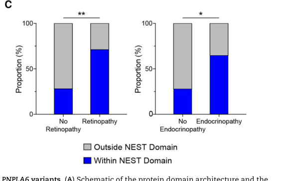

## Question

# Disease Characteristics Research Template

## Target Disease
- **Disease Name:** Boucher-Neuhauser Syndrome
- **MONDO ID:**  (if available)
- **Category:** Mendelian

## Research Objectives

Please provide a comprehensive research report on **Boucher-Neuhauser Syndrome** covering all of the
disease characteristics listed below. This report will be used to populate a disease knowledge
base entry. Be thorough and cite primary literature (PMID preferred) for all claims.

For each section, **suggested databases/resources** are listed. These are the first places
you should search for information on each topic.

---

### 1. Disease Information
> **Search first:** OMIM, Orphanet, ICD-10/ICD-11, MeSH, PubMed

- What is the disease? Provide a concise overview.
- What are the key identifiers? (OMIM, Orphanet, ICD-10/ICD-11, MeSH, Mondo)
- What are the common synonyms and alternative names?
- Is the information derived from individual patients (e.g., EHR) or aggregated disease-level resources?

### 2. Etiology

- **Disease Causal Factors**: What are the primary causes? (genetic, environmental, infectious, mechanistic)
- **Risk Factors**:
  > **Search first:** PubMed, Cochrane Library, UpToDate, clinical guidelines, ClinVar, ClinGen, GWAS Catalog, PheGenI, CTD, CDC, WHO, epidemiological databases
  - Genetic risk factors (causal variants, susceptibility loci, modifier genes)
  - Environmental risk factors (toxins, lifestyle, occupational exposures, age, sex, family history)
- **Protective Factors**:
  > **Search first:** PubMed, Cochrane Library, clinical trial databases, GWAS Catalog, gnomAD, WHO, CDC, nutrition databases
  - Genetic protective factors (protective variants, modifier alleles)
  - Environmental protective factors (diet, lifestyle, exposures that reduce risk)
- **Gene-Environment Interactions**: How do genetic and environmental factors interact to influence disease?
  > **Search first:** CTD, PubMed, PheGenI, GxE databases

### 3. Phenotypes
> **Search first:** HPO (Human Phenotype Ontology), OMIM, Orphanet, PubMed, clinicaltrials.gov, MedDRA, SNOMED CT, DECIPHER, LOINC

For each phenotype, provide:
- **Phenotype type**: symptoms, clinical signs, physical manifestations, behavioral changes, or laboratory abnormalities
  > For symptoms/signs: HPO, OMIM, Orphanet, PubMed
  > For behavioral changes: HPO, DSM, RDoC (Research Domain Criteria), PubMed
  > For laboratory abnormalities: LOINC, SNOMED CT, LabTests Online, PubMed
- **Phenotype characteristics**:
  > **Search first:** OMIM, Orphanet, HPO, PubMed
  - Age of symptom onset (neonatal, childhood, adult-onset, late-onset)
  - Symptom severity (mild, moderate, severe, variable)
  - Symptom progression (stable, progressive, episodic, fluctuating)
  - Frequency among affected individuals (percentage or qualitative)
- **Quality of life impact**: Effects on daily functioning and well-being (per-phenotype when possible)
  > **Search first:** EQ-5D database, SF-36, WHO QOL databases, PubMed
- Suggest HPO (Human Phenotype Ontology) terms for each phenotype

### 4. Genetic/Molecular Information

- **Causal Genes**: Gene mutations or chromosomal abnormalities responsible for disease (gene symbols, OMIM IDs)
  > **Search first:** OMIM, ClinVar, HGMD, Ensembl, NCBI Gene
- **Pathogenic Variants**:
  - Affected genes (gene symbols, HGNC IDs)
    > **Search first:** OMIM, NCBI Gene, Ensembl, HGNC, UniProt, GeneCards
  - Variant classification (pathogenic, likely pathogenic, VUS per ACMG/AMP guidelines)
    > **Search first:** ClinVar, ClinGen, ACMG/AMP guidelines, VarSome
  - Variant type/class (missense, frameshift, nonsense, splice-site, structural)
  - Allele frequency in population databases
    > **Search first:** gnomAD, 1000 Genomes, ExAC, TOPMed, dbSNP
  - Somatic vs germline origin
    > **Search first:** COSMIC (somatic), ClinVar, ICGC, TCGA
  - Functional consequences (loss of function, gain of function, dominant negative)
- **Modifier Genes**: Genes that modify disease severity or expression
- **Epigenetic Information**: DNA methylation, histone modifications, chromatin changes affecting disease
  > **Search first:** ENCODE, Roadmap Epigenomics, MethBase, DiseaseMeth
- **Chromosomal Abnormalities**: Large-scale genetic changes (aneuploidy, translocations, inversions)
  > **Search first:** DECIPHER, ClinVar, ECARUCA, UCSC Genome Browser

### 5. Environmental Information

- **Environmental Factors**: Non-genetic contributing factors (toxins, radiation, pollution, occupational exposure)
  > **Search first:** CTD (Comparative Toxicogenomics Database), TOXNET, PubMed, EPA databases
- **Lifestyle Factors**: Behavioral factors (smoking, diet, exercise, alcohol consumption)
  > **Search first:** CDC databases, WHO, PubMed, NHANES
- **Infectious Agents**: If applicable, pathogens causing or triggering disease (bacteria, viruses, fungi, parasites)
  > **Search first:** NCBI Taxonomy, ViPR, BV-BRC, MicrobeDB, GIDEON

### 6. Mechanism / Pathophysiology

- **Molecular Pathways**: Specific signaling cascades or biochemical pathways involved (Wnt, MAPK, mTOR, PI3K-AKT, etc.)
  > **Search first:** KEGG, Reactome, WikiPathways, PathBank, BioCyc
- **Cellular Processes**: Cell-level mechanisms (apoptosis, autophagy, cell cycle dysregulation, inflammation, etc.)
  > **Search first:** Gene Ontology (GO), Reactome, KEGG, PubMed
- **Protein Dysfunction**: How protein structure or function is altered (misfolding, aggregation, loss of function, gain of function)
  > **Search first:** UniProt, PDB (Protein Data Bank), InterPro, Pfam, AlphaFold
- **Metabolic Changes**: Alterations in metabolic processes (energy metabolism, lipid metabolism, amino acid metabolism)
  > **Search first:** KEGG, BioCyc, HMDB (Human Metabolome Database), BRENDA
- **Immune System Involvement**: Role of immune response (autoimmunity, immunodeficiency, chronic inflammation)
  > **Search first:** ImmPort, Immunome Database, IEDB, Gene Ontology
- **Tissue Damage Mechanisms**: How tissues/ are injured (oxidative stress, ischemia, fibrosis, necrosis)
  > **Search first:** PubMed, Gene Ontology, Reactome
- **Biochemical Abnormalities**: Specific molecular defects (enzyme deficiencies, receptor dysfunction, ion channel defects)
  > **Search first:** BRENDA, UniProt, KEGG, OMIM, PubMed
- **Epigenetic Changes**: DNA methylation, histone modifications affecting gene expression in disease
  > **Search first:** ENCODE, Roadmap Epigenomics, MethBase, DiseaseMeth
- **Molecular Profiling** (if available):
  - Transcriptomics/gene expression changes
    > **Search first:** GEO (Gene Expression Omnibus), ArrayExpress, GTEx, Human Cell Atlas, SRA
  - Proteomics findings
    > **Search first:** PRIDE, ProteomeXchange, Human Protein Atlas, STRING, BioGRID
  - Metabolomics signatures
    > **Search first:** MetaboLights, Metabolomics Workbench, HMDB, METLIN
  - Lipidomics alterations
    > **Search first:** LIPID MAPS, SwissLipids, LipidHome, Metabolomics Workbench
  - Genomic structural features
    > **Search first:** UCSC Genome Browser, Ensembl, NCBI, dbVar, DGV
- **Advanced Technologies** (if applicable):
  - Single-cell analysis findings (cell-type specific mechanisms, cellular heterogeneity)
    > **Search first:** Human Cell Atlas, Single Cell Portal, GEO, CELLxGENE
  - Spatial transcriptomics findings
    > **Search first:** GEO, Spatial Research, Vizgen, 10x Genomics data
  - Multi-omics integration results
    > **Search first:** TCGA, ICGC, cBioPortal, LinkedOmics, PubMed
  - Functional genomics screens (CRISPR, RNAi)
    > **Search first:** DepMap, GenomeRNAi, PubMed, BioGRID ORCS

For each mechanism, describe:
- The causal chain from initial trigger to clinical manifestation
- Which mechanisms are upstream vs downstream
- What cell types and biological processes are involved
- Suggest GO terms for biological processes and CL terms for cell types

### 7. Anatomical Structures Affected

- **Organ Level**:
  - Primary organs directly affected
  - Secondary organ involvement (complications, secondary effects)
  - Body systems involved (cardiovascular, nervous, digestive, respiratory, endocrine, etc.)
  > **Search first:** Uberon, FMA (Foundational Model of Anatomy), OMIM, HPO, ICD-11, MeSH, SNOMED CT
- **Tissue and Cell Level**:
  - Specific tissue types affected (epithelial, connective, muscle, nervous)
  - Specific cell populations targeted (with Cell Ontology terms)
  > **Search first:** Uberon, Human Protein Atlas, Cell Ontology, Human Cell Atlas, CellMarker, PanglaoDB
- **Subcellular Level**:
  - Cellular compartments involved (mitochondria, nucleus, ER, lysosomes) (with GO Cellular Component terms)
  > **Search first:** Gene Ontology (Cellular Component), UniProt, Human Protein Atlas
- **Localization**:
  - Specific anatomical sites (with UBERON terms)
    > **Search first:** FMA, Uberon, NeuroNames (for brain), SNOMED CT
  - Lateralization (unilateral, bilateral, asymmetric)
    > **Search first:** HPO, clinical literature, imaging databases

### 8. Temporal Development

- **Onset**:
  - Typical age of onset (congenital, pediatric, adult, geriatric)
  - Onset pattern (acute, subacute, chronic, insidious)
  > **Search first:** OMIM, Orphanet, HPO, PubMed
- **Progression**:
  - Disease stages (early, intermediate, advanced, end-stage)
    > **Search first:** Cancer Staging Manual (AJCC), WHO classifications, PubMed
  - Progression rate (rapid, slow, variable)
  - Disease course pattern (episodic, relapsing-remitting, progressive, stable)
  - Disease duration (self-limited, chronic lifelong)
  > **Search first:** Disease registries, longitudinal cohort databases, natural history studies, PubMed, Orphanet, OMIM
- **Patterns**:
  - Remission patterns (spontaneous, treatment-induced)
    > **Search first:** Clinical trial databases, disease registries, PubMed
  - Critical periods (time windows of vulnerability or opportunity for intervention)
    > **Search first:** PubMed, developmental biology databases, clinical guidelines

### 9. Inheritance and Population

- **Epidemiology**:
  - Prevalence (cases per 100,000 at given time)
  - Incidence (new cases per 100,000 per year)
  > **Search first:** Orphanet, CDC, WHO, GBD (Global Burden of Disease), national registries, SEER, disease registries
- **For Genetic Etiology**:
  - Inheritance pattern (AD, AR, X-linked, mitochondrial, multifactorial, polygenic)
    > **Search first:** OMIM, Orphanet, ClinVar, GTR (Genetic Testing Registry)
  - Penetrance (complete, incomplete, age-dependent)
    > **Search first:** ClinVar, OMIM, PubMed, ClinGen
  - Expressivity (variable, consistent)
    > **Search first:** OMIM, ClinVar, PubMed
  - Genetic anticipation (increasing severity in successive generations)
    > **Search first:** OMIM, PubMed (especially for repeat expansion disorders)
  - Germline mosaicism
    > **Search first:** ClinVar, OMIM, genetic counseling literature, PubMed
  - Founder effects (population-specific mutations)
    > **Search first:** gnomAD, population genetics databases, PubMed
  - Consanguinity role
    > **Search first:** OMIM, population studies, genetic counseling resources
  - Carrier frequency
    > **Search first:** gnomAD, carrier screening databases, GeneReviews, GTR
- **Population Demographics**:
  - Affected populations (ethnic or demographic groups with higher prevalence)
    > **Search first:** gnomAD, 1000 Genomes, PAGE Study, PubMed, population registries
  - Geographic distribution (endemic areas, regional variation)
    > **Search first:** WHO, CDC, GBD, Orphanet, geographic epidemiology databases
  - Geographic distribution of specific variants
  - Sex ratio (male:female)
    > **Search first:** Disease registries, OMIM, PubMed, epidemiological databases
  - Age distribution of affected individuals
    > **Search first:** CDC, disease registries, SEER, Orphanet

### 10. Diagnostics

- **Clinical Tests**:
  - Laboratory tests (blood, urine, tissue chemistry, specific enzyme assays)
    > **Search first:** LOINC, LabTests Online, PubMed
  - Biomarkers (proteins, metabolites, genetic markers, circulating biomarkers)
    > **Search first:** FDA Biomarker List, BEST (Biomarkers, EndpointS, and other Tools), PubMed
  - Imaging studies (X-ray, CT, MRI, PET, ultrasound)
    > **Search first:** RadLex, DICOM, Radiopaedia, imaging databases
  - Functional tests (pulmonary function, cardiac stress tests)
    > **Search first:** LOINC, clinical guidelines, PubMed
  - Electrophysiology (EEG, EMG, ECG, nerve conduction studies)
    > **Search first:** LOINC, clinical neurophysiology databases, PubMed
  - Biopsy findings (histopathology, immunohistochemistry)
    > **Search first:** SNOMED CT, College of American Pathologists resources, PubMed
  - Pathology findings (microscopic examination)
    > **Search first:** SNOMED CT, Digital Pathology databases, PubMed
- **Genetic Testing**:
  > **Search first:** GTR (Genetic Testing Registry), GeneReviews, ClinGen
  - Overview of recommended genetic testing approach
  - Whole genome sequencing (WGS) utility
    > **Search first:** GTR, ClinVar, GEL (Genomics England), gnomAD
  - Whole exome sequencing (WES) utility
    > **Search first:** GTR, ClinVar, OMIM, GeneMatcher
  - Gene panels (which panels, which genes)
    > **Search first:** GTR, ClinVar, laboratory-specific databases
  - Single gene testing
    > **Search first:** GTR, ClinVar, OMIM, GeneReviews
  - Chromosomal microarray (CMA)
    > **Search first:** DECIPHER, ClinVar, dbVar, ECARUCA
  - Karyotyping
    > **Search first:** Chromosome Abnormality Database, ClinVar, cytogenetics resources
  - FISH
    > **Search first:** ClinVar, cytogenetics databases, PubMed
  - Mitochondrial DNA testing
    > **Search first:** MITOMAP, MSeqDR, ClinVar, GTR
  - Repeat expansion testing
    > **Search first:** GTR, ClinVar, repeat expansion databases, PubMed
- **Omics-Based Diagnostics** (if applicable):
  - RNA sequencing / transcriptomics
    > **Search first:** GEO, ArrayExpress, GTEx, RNA-seq databases
  - Proteomics
    > **Search first:** PRIDE, ProteomeXchange, FDA Biomarker database
  - Metabolomics
    > **Search first:** MetaboLights, Metabolomics Workbench, HMDB
  - Epigenomics
    > **Search first:** GEO, ENCODE, Roadmap Epigenomics, MethBase
  - Liquid biopsy
    > **Search first:** COSMIC, ClinVar, liquid biopsy databases, PubMed
- **Clinical Criteria**:
  - Standardized diagnostic criteria (DSM, ICD, society guidelines)
    > **Search first:** DSM-5, ICD-11, clinical society guidelines, UpToDate
  - Differential diagnosis (other conditions to rule out, with distinguishing features)
    > **Search first:** DynaMed, UpToDate, clinical decision support systems
- **Screening**:
  - Screening methods for asymptomatic individuals (newborn screening, carrier screening, cascade screening)
    > **Search first:** ACMG recommendations, CDC newborn screening, GTR

### 11. Outcome/Prognosis

- **Survival and Mortality**:
  - Survival rate (5-year, 10-year, overall)
    > **Search first:** SEER, cancer registries, disease-specific registries, PubMed
  - Life expectancy (with and without treatment if applicable)
    > **Search first:** Orphanet, disease registries, actuarial databases, PubMed
  - Mortality rate
    > **Search first:** CDC, WHO, GBD, national mortality databases
  - Disease-specific mortality (deaths directly attributable to disease)
    > **Search first:** Disease registries, CDC Wonder, GBD, PubMed
- **Morbidity and Function**:
  - Morbidity (disease-related disability and health impacts)
    > **Search first:** GBD, WHO, disability databases, PubMed
  - Disability outcomes (long-term functional impairments)
    > **Search first:** ICF (International Classification of Functioning), disability registries
  - Quality of life measures (EQ-5D, SF-36, PROMIS, disease-specific tools)
    > **Search first:** EQ-5D database, SF-36, PROMIS, PubMed
- **Disease Course**:
  - Complications (secondary problems: infections, organ failure, etc.)
    > **Search first:** ICD codes, disease registries, clinical databases, PubMed
  - Recovery potential (likelihood and extent of recovery, with vs without treatment)
    > **Search first:** Natural history studies, rehabilitation databases, PubMed
- **Prediction**:
  - Prognostic factors (age, disease severity, biomarkers, treatment response)
    > **Search first:** Prognostic models databases, clinical calculators, PubMed
  - Prognostic biomarkers (molecular markers predicting disease course)
    > **Search first:** FDA Biomarker database, PubMed, cancer prognostic databases

### 12. Treatment

- **Pharmacotherapy**:
  - Pharmacological treatments (drug names, drug classes, mechanisms of action)
    > **Search first:** DrugBank, RxNorm, ATC classification, DailyMed, FDA databases
  - Pharmacogenomics (how genetic variants affect drug metabolism, efficacy, toxicity)
    > **Search first:** PharmGKB, CPIC (Clinical Pharmacogenetics), FDA Table of PGx Biomarkers
- **Advanced Therapeutics**:
  - Gene therapy (viral vectors, CRISPR, gene replacement, gene editing)
    > **Search first:** ClinicalTrials.gov, FDA gene therapy database, ASGCT resources
  - Cell therapy (stem cell transplant, CAR-T, cellular therapeutics)
    > **Search first:** ClinicalTrials.gov, FDA cell therapy database, FACT standards
  - RNA-based therapies (ASOs, siRNA, mRNA therapies)
    > **Search first:** ClinicalTrials.gov, FDA approvals, PubMed
  - Targeted therapies (treatments directed at specific molecular targets)
    > **Search first:** My Cancer Genome, OncoKB, ClinicalTrials.gov, FDA approvals
  - Immunotherapies (checkpoint inhibitors, monoclonal antibodies)
    > **Search first:** Cancer Immunotherapy Database, FDA approvals, ClinicalTrials.gov
- **Surgical and Interventional**:
  - Surgical interventions (types of surgery, timing, outcomes)
    > **Search first:** CPT codes, surgical registries, clinical guidelines, PubMed
- **Supportive and Rehabilitative**:
  - Supportive care (symptom management, pain control, nutrition)
    > **Search first:** Clinical guidelines, Cochrane Library, PubMed
  - Rehabilitation (physical therapy, occupational therapy, speech therapy)
    > **Search first:** Rehabilitation medicine databases, clinical guidelines, PubMed
- **Experimental**:
  - Experimental treatments in clinical trials (with NCT identifiers if available)
    > **Search first:** ClinicalTrials.gov, EU Clinical Trials Register, WHO ICTRP
- **Treatment Outcomes**:
  - Treatment response rates
    > **Search first:** Clinical trial databases, FDA reviews, systematic reviews, PubMed
  - Side effects and adverse events
    > **Search first:** FDA Adverse Event Reporting System (FAERS), MedWatch, PubMed
- **Treatment Strategy**:
  - Treatment algorithms (clinical pathways, decision trees)
    > **Search first:** Clinical practice guidelines, NCCN Guidelines, UpToDate
  - Combination therapies
    > **Search first:** ClinicalTrials.gov, treatment guidelines, PubMed
  - Personalized medicine approaches (genotype-guided treatment)
    > **Search first:** My Cancer Genome, CIViC, PharmGKB, precision medicine databases

For each treatment, suggest MAXO (Medical Action Ontology) terms where applicable.

### 13. Prevention

- **Prevention Levels**:
  - Primary prevention (preventing disease occurrence: vaccination, risk factor modification)
    > **Search first:** CDC, WHO, USPSTF recommendations, Cochrane Library
  - Secondary prevention (early detection and treatment: screening programs, early intervention)
    > **Search first:** USPSTF, CDC screening guidelines, WHO
  - Tertiary prevention (preventing complications in those with disease)
    > **Search first:** Clinical guidelines, disease management protocols, PubMed
- **Immunization**: Vaccine strategies (if applicable)
  > **Search first:** CDC vaccine schedules, WHO immunization, FDA vaccine database
- **Screening and Early Detection**:
  - Screening programs (population-based: newborn screening, cancer screening)
    > **Search first:** CDC screening programs, USPSTF, cancer screening databases
  - Genetic screening (carrier screening, preimplantation genetic diagnosis, prenatal testing)
    > **Search first:** ACMG recommendations, ACOG guidelines, GTR
  - Risk stratification (identifying high-risk individuals for targeted prevention)
    > **Search first:** Risk prediction models, clinical calculators, PubMed
- **Behavioral Interventions**: Lifestyle modifications to reduce risk
  > **Search first:** CDC, WHO, behavioral intervention databases, Cochrane Library
- **Counseling**: Genetic counseling (risk assessment, family planning guidance)
  > **Search first:** NSGC resources, ACMG guidelines, GeneReviews
- **Public Health**:
  - Public health interventions (sanitation, vector control, health education)
    > **Search first:** CDC, WHO, public health databases, PubMed
  - Environmental interventions (reducing environmental risk factors)
    > **Search first:** EPA databases, WHO environmental health, PubMed
- **Prophylaxis**: Preventive medications or procedures
  > **Search first:** Clinical guidelines, FDA approvals, PubMed

### 14. Other Species / Natural Disease

- **Taxonomy**: Species affected (with NCBI Taxon identifiers)
  > **Search first:** NCBI Taxonomy
- **Breed**: Specific breeds affected (with VBO identifiers if applicable)
  > **Search first:** VBO (Vertebrate Breed Ontology)
- **Gene**: Orthologous genes in other species (with NCBI Gene IDs)
  > **Search first:** NCBI Gene
- **Natural Disease**:
  - Naturally occurring disease in other species (companion animals, wildlife)
    > **Search first:** OMIA (Online Mendelian Inheritance in Animals), VetCompass, PubMed
  - Veterinary relevance and importance in animal health
    > **Search first:** OMIA, veterinary databases, PubMed
- **Comparative Biology**:
  - Comparative pathology (similarities and differences across species)
    > **Search first:** OMIA, comparative pathology databases, PubMed
  - Evolutionary conservation of disease mechanisms
    > **Search first:** HomoloGene, OrthoMCL, Alliance of Genome Resources
- **Transmission** (if applicable):
  - Zoonotic potential
    > **Search first:** CDC zoonotic diseases, WHO zoonoses, GIDEON
  - Cross-species susceptibility
    > **Search first:** NCBI Taxonomy, veterinary databases, PubMed

### 15. Model Organisms

- **Model Types**:
  - Model organism type (mammalian, invertebrate, cellular, in vitro)
    > **Search first:** Alliance of Genome Resources, model organism databases
  - Specific model systems (mouse, rat, zebrafish, Drosophila, C. elegans, yeast, cell lines, organoids, iPSCs)
    > **Search first:** MGI, RGD, ZFIN, FlyBase, WormBase, SGD, ATCC, Cellosaurus
  - Induced models (drug treatment, surgical intervention, environmental manipulation)
    > **Search first:** MGI, model organism databases, PubMed
- **Genetic Models**:
  - Types available (knockout, knock-in, transgenic, conditional, humanized)
    > **Search first:** MGI, IMPC, KOMP, EuMMCR, IMSR
- **Model Characteristics**:
  - Phenotype recapitulation (how well model reproduces human disease features)
    > **Search first:** Model organism databases, comparative studies, PubMed
  - Model limitations (aspects of human disease not captured)
    > **Search first:** Model organism databases, PubMed, review articles
- **Applications**:
  - Research applications (what aspects of disease can be studied)
    > **Search first:** Model organism databases, PubMed
- **Resources**:
  - Model databases
    > **Search first:** MGI, RGD, ZFIN, FlyBase, WormBase, IMSR, EMMA, MMRRC

---

## Citation Requirements

- Cite primary literature (PMID preferred) for all mechanistic and clinical claims
- Prioritize recent reviews and landmark papers
- Include direct quotes from abstracts where possible to support key statements
- Distinguish evidence source types: human clinical, model organism, in vitro, computational

## Output Format

Structure your response as a comprehensive narrative organized by the sections above.
For each section, provide:
- Factual content with specific details (numbers, percentages, gene names, variant nomenclature)
- Ontology term suggestions (HPO, GO, CL, UBERON, CHEBI, MAXO, MONDO) where applicable
- Evidence citations with PMIDs
- Direct quotes from abstracts to support key claims
- Clear indication when information is not available or not applicable for this disease

This report will be used to populate a disease knowledge base entry with:
- Pathophysiology descriptions with causal chains
- Gene/protein annotations (HGNC, GO terms)
- Phenotype associations (HP terms) with frequencies
- Cell type involvement (CL terms)
- Anatomical locations (UBERON terms)
- Chemical entities (CHEBI terms)
- Treatment annotations (MAXO terms)
- Evidence items with PMIDs and exact abstract quotes
- Epidemiology, prognosis, diagnostic, and prevention information
- Animal model descriptions with phenotype recapitulation details

## Output

Question: You are an expert researcher providing comprehensive, well-cited information.

Provide detailed information focusing on:
1. Key concepts and definitions with current understanding
2. Recent developments and latest research (prioritize 2023-2024 sources)
3. Current applications and real-world implementations
4. Expert opinions and analysis from authoritative sources
5. Relevant statistics and data from recent studies

Format as a comprehensive research report with proper citations. Include URLs and publication dates where available.
Always prioritize recent, authoritative sources and provide specific citations for all major claims.

# Disease Characteristics Research Template

## Target Disease
- **Disease Name:** Boucher-Neuhauser Syndrome
- **MONDO ID:**  (if available)
- **Category:** Mendelian

## Research Objectives

Please provide a comprehensive research report on **Boucher-Neuhauser Syndrome** covering all of the
disease characteristics listed below. This report will be used to populate a disease knowledge
base entry. Be thorough and cite primary literature (PMID preferred) for all claims.

For each section, **suggested databases/resources** are listed. These are the first places
you should search for information on each topic.

---

### 1. Disease Information
> **Search first:** OMIM, Orphanet, ICD-10/ICD-11, MeSH, PubMed

- What is the disease? Provide a concise overview.
- What are the key identifiers? (OMIM, Orphanet, ICD-10/ICD-11, MeSH, Mondo)
- What are the common synonyms and alternative names?
- Is the information derived from individual patients (e.g., EHR) or aggregated disease-level resources?

### 2. Etiology

- **Disease Causal Factors**: What are the primary causes? (genetic, environmental, infectious, mechanistic)
- **Risk Factors**:
  > **Search first:** PubMed, Cochrane Library, UpToDate, clinical guidelines, ClinVar, ClinGen, GWAS Catalog, PheGenI, CTD, CDC, WHO, epidemiological databases
  - Genetic risk factors (causal variants, susceptibility loci, modifier genes)
  - Environmental risk factors (toxins, lifestyle, occupational exposures, age, sex, family history)
- **Protective Factors**:
  > **Search first:** PubMed, Cochrane Library, clinical trial databases, GWAS Catalog, gnomAD, WHO, CDC, nutrition databases
  - Genetic protective factors (protective variants, modifier alleles)
  - Environmental protective factors (diet, lifestyle, exposures that reduce risk)
- **Gene-Environment Interactions**: How do genetic and environmental factors interact to influence disease?
  > **Search first:** CTD, PubMed, PheGenI, GxE databases

### 3. Phenotypes
> **Search first:** HPO (Human Phenotype Ontology), OMIM, Orphanet, PubMed, clinicaltrials.gov, MedDRA, SNOMED CT, DECIPHER, LOINC

For each phenotype, provide:
- **Phenotype type**: symptoms, clinical signs, physical manifestations, behavioral changes, or laboratory abnormalities
  > For symptoms/signs: HPO, OMIM, Orphanet, PubMed
  > For behavioral changes: HPO, DSM, RDoC (Research Domain Criteria), PubMed
  > For laboratory abnormalities: LOINC, SNOMED CT, LabTests Online, PubMed
- **Phenotype characteristics**:
  > **Search first:** OMIM, Orphanet, HPO, PubMed
  - Age of symptom onset (neonatal, childhood, adult-onset, late-onset)
  - Symptom severity (mild, moderate, severe, variable)
  - Symptom progression (stable, progressive, episodic, fluctuating)
  - Frequency among affected individuals (percentage or qualitative)
- **Quality of life impact**: Effects on daily functioning and well-being (per-phenotype when possible)
  > **Search first:** EQ-5D database, SF-36, WHO QOL databases, PubMed
- Suggest HPO (Human Phenotype Ontology) terms for each phenotype

### 4. Genetic/Molecular Information

- **Causal Genes**: Gene mutations or chromosomal abnormalities responsible for disease (gene symbols, OMIM IDs)
  > **Search first:** OMIM, ClinVar, HGMD, Ensembl, NCBI Gene
- **Pathogenic Variants**:
  - Affected genes (gene symbols, HGNC IDs)
    > **Search first:** OMIM, NCBI Gene, Ensembl, HGNC, UniProt, GeneCards
  - Variant classification (pathogenic, likely pathogenic, VUS per ACMG/AMP guidelines)
    > **Search first:** ClinVar, ClinGen, ACMG/AMP guidelines, VarSome
  - Variant type/class (missense, frameshift, nonsense, splice-site, structural)
  - Allele frequency in population databases
    > **Search first:** gnomAD, 1000 Genomes, ExAC, TOPMed, dbSNP
  - Somatic vs germline origin
    > **Search first:** COSMIC (somatic), ClinVar, ICGC, TCGA
  - Functional consequences (loss of function, gain of function, dominant negative)
- **Modifier Genes**: Genes that modify disease severity or expression
- **Epigenetic Information**: DNA methylation, histone modifications, chromatin changes affecting disease
  > **Search first:** ENCODE, Roadmap Epigenomics, MethBase, DiseaseMeth
- **Chromosomal Abnormalities**: Large-scale genetic changes (aneuploidy, translocations, inversions)
  > **Search first:** DECIPHER, ClinVar, ECARUCA, UCSC Genome Browser

### 5. Environmental Information

- **Environmental Factors**: Non-genetic contributing factors (toxins, radiation, pollution, occupational exposure)
  > **Search first:** CTD (Comparative Toxicogenomics Database), TOXNET, PubMed, EPA databases
- **Lifestyle Factors**: Behavioral factors (smoking, diet, exercise, alcohol consumption)
  > **Search first:** CDC databases, WHO, PubMed, NHANES
- **Infectious Agents**: If applicable, pathogens causing or triggering disease (bacteria, viruses, fungi, parasites)
  > **Search first:** NCBI Taxonomy, ViPR, BV-BRC, MicrobeDB, GIDEON

### 6. Mechanism / Pathophysiology

- **Molecular Pathways**: Specific signaling cascades or biochemical pathways involved (Wnt, MAPK, mTOR, PI3K-AKT, etc.)
  > **Search first:** KEGG, Reactome, WikiPathways, PathBank, BioCyc
- **Cellular Processes**: Cell-level mechanisms (apoptosis, autophagy, cell cycle dysregulation, inflammation, etc.)
  > **Search first:** Gene Ontology (GO), Reactome, KEGG, PubMed
- **Protein Dysfunction**: How protein structure or function is altered (misfolding, aggregation, loss of function, gain of function)
  > **Search first:** UniProt, PDB (Protein Data Bank), InterPro, Pfam, AlphaFold
- **Metabolic Changes**: Alterations in metabolic processes (energy metabolism, lipid metabolism, amino acid metabolism)
  > **Search first:** KEGG, BioCyc, HMDB (Human Metabolome Database), BRENDA
- **Immune System Involvement**: Role of immune response (autoimmunity, immunodeficiency, chronic inflammation)
  > **Search first:** ImmPort, Immunome Database, IEDB, Gene Ontology
- **Tissue Damage Mechanisms**: How tissues/ are injured (oxidative stress, ischemia, fibrosis, necrosis)
  > **Search first:** PubMed, Gene Ontology, Reactome
- **Biochemical Abnormalities**: Specific molecular defects (enzyme deficiencies, receptor dysfunction, ion channel defects)
  > **Search first:** BRENDA, UniProt, KEGG, OMIM, PubMed
- **Epigenetic Changes**: DNA methylation, histone modifications affecting gene expression in disease
  > **Search first:** ENCODE, Roadmap Epigenomics, MethBase, DiseaseMeth
- **Molecular Profiling** (if available):
  - Transcriptomics/gene expression changes
    > **Search first:** GEO (Gene Expression Omnibus), ArrayExpress, GTEx, Human Cell Atlas, SRA
  - Proteomics findings
    > **Search first:** PRIDE, ProteomeXchange, Human Protein Atlas, STRING, BioGRID
  - Metabolomics signatures
    > **Search first:** MetaboLights, Metabolomics Workbench, HMDB, METLIN
  - Lipidomics alterations
    > **Search first:** LIPID MAPS, SwissLipids, LipidHome, Metabolomics Workbench
  - Genomic structural features
    > **Search first:** UCSC Genome Browser, Ensembl, NCBI, dbVar, DGV
- **Advanced Technologies** (if applicable):
  - Single-cell analysis findings (cell-type specific mechanisms, cellular heterogeneity)
    > **Search first:** Human Cell Atlas, Single Cell Portal, GEO, CELLxGENE
  - Spatial transcriptomics findings
    > **Search first:** GEO, Spatial Research, Vizgen, 10x Genomics data
  - Multi-omics integration results
    > **Search first:** TCGA, ICGC, cBioPortal, LinkedOmics, PubMed
  - Functional genomics screens (CRISPR, RNAi)
    > **Search first:** DepMap, GenomeRNAi, PubMed, BioGRID ORCS

For each mechanism, describe:
- The causal chain from initial trigger to clinical manifestation
- Which mechanisms are upstream vs downstream
- What cell types and biological processes are involved
- Suggest GO terms for biological processes and CL terms for cell types

### 7. Anatomical Structures Affected

- **Organ Level**:
  - Primary organs directly affected
  - Secondary organ involvement (complications, secondary effects)
  - Body systems involved (cardiovascular, nervous, digestive, respiratory, endocrine, etc.)
  > **Search first:** Uberon, FMA (Foundational Model of Anatomy), OMIM, HPO, ICD-11, MeSH, SNOMED CT
- **Tissue and Cell Level**:
  - Specific tissue types affected (epithelial, connective, muscle, nervous)
  - Specific cell populations targeted (with Cell Ontology terms)
  > **Search first:** Uberon, Human Protein Atlas, Cell Ontology, Human Cell Atlas, CellMarker, PanglaoDB
- **Subcellular Level**:
  - Cellular compartments involved (mitochondria, nucleus, ER, lysosomes) (with GO Cellular Component terms)
  > **Search first:** Gene Ontology (Cellular Component), UniProt, Human Protein Atlas
- **Localization**:
  - Specific anatomical sites (with UBERON terms)
    > **Search first:** FMA, Uberon, NeuroNames (for brain), SNOMED CT
  - Lateralization (unilateral, bilateral, asymmetric)
    > **Search first:** HPO, clinical literature, imaging databases

### 8. Temporal Development

- **Onset**:
  - Typical age of onset (congenital, pediatric, adult, geriatric)
  - Onset pattern (acute, subacute, chronic, insidious)
  > **Search first:** OMIM, Orphanet, HPO, PubMed
- **Progression**:
  - Disease stages (early, intermediate, advanced, end-stage)
    > **Search first:** Cancer Staging Manual (AJCC), WHO classifications, PubMed
  - Progression rate (rapid, slow, variable)
  - Disease course pattern (episodic, relapsing-remitting, progressive, stable)
  - Disease duration (self-limited, chronic lifelong)
  > **Search first:** Disease registries, longitudinal cohort databases, natural history studies, PubMed, Orphanet, OMIM
- **Patterns**:
  - Remission patterns (spontaneous, treatment-induced)
    > **Search first:** Clinical trial databases, disease registries, PubMed
  - Critical periods (time windows of vulnerability or opportunity for intervention)
    > **Search first:** PubMed, developmental biology databases, clinical guidelines

### 9. Inheritance and Population

- **Epidemiology**:
  - Prevalence (cases per 100,000 at given time)
  - Incidence (new cases per 100,000 per year)
  > **Search first:** Orphanet, CDC, WHO, GBD (Global Burden of Disease), national registries, SEER, disease registries
- **For Genetic Etiology**:
  - Inheritance pattern (AD, AR, X-linked, mitochondrial, multifactorial, polygenic)
    > **Search first:** OMIM, Orphanet, ClinVar, GTR (Genetic Testing Registry)
  - Penetrance (complete, incomplete, age-dependent)
    > **Search first:** ClinVar, OMIM, PubMed, ClinGen
  - Expressivity (variable, consistent)
    > **Search first:** OMIM, ClinVar, PubMed
  - Genetic anticipation (increasing severity in successive generations)
    > **Search first:** OMIM, PubMed (especially for repeat expansion disorders)
  - Germline mosaicism
    > **Search first:** ClinVar, OMIM, genetic counseling literature, PubMed
  - Founder effects (population-specific mutations)
    > **Search first:** gnomAD, population genetics databases, PubMed
  - Consanguinity role
    > **Search first:** OMIM, population studies, genetic counseling resources
  - Carrier frequency
    > **Search first:** gnomAD, carrier screening databases, GeneReviews, GTR
- **Population Demographics**:
  - Affected populations (ethnic or demographic groups with higher prevalence)
    > **Search first:** gnomAD, 1000 Genomes, PAGE Study, PubMed, population registries
  - Geographic distribution (endemic areas, regional variation)
    > **Search first:** WHO, CDC, GBD, Orphanet, geographic epidemiology databases
  - Geographic distribution of specific variants
  - Sex ratio (male:female)
    > **Search first:** Disease registries, OMIM, PubMed, epidemiological databases
  - Age distribution of affected individuals
    > **Search first:** CDC, disease registries, SEER, Orphanet

### 10. Diagnostics

- **Clinical Tests**:
  - Laboratory tests (blood, urine, tissue chemistry, specific enzyme assays)
    > **Search first:** LOINC, LabTests Online, PubMed
  - Biomarkers (proteins, metabolites, genetic markers, circulating biomarkers)
    > **Search first:** FDA Biomarker List, BEST (Biomarkers, EndpointS, and other Tools), PubMed
  - Imaging studies (X-ray, CT, MRI, PET, ultrasound)
    > **Search first:** RadLex, DICOM, Radiopaedia, imaging databases
  - Functional tests (pulmonary function, cardiac stress tests)
    > **Search first:** LOINC, clinical guidelines, PubMed
  - Electrophysiology (EEG, EMG, ECG, nerve conduction studies)
    > **Search first:** LOINC, clinical neurophysiology databases, PubMed
  - Biopsy findings (histopathology, immunohistochemistry)
    > **Search first:** SNOMED CT, College of American Pathologists resources, PubMed
  - Pathology findings (microscopic examination)
    > **Search first:** SNOMED CT, Digital Pathology databases, PubMed
- **Genetic Testing**:
  > **Search first:** GTR (Genetic Testing Registry), GeneReviews, ClinGen
  - Overview of recommended genetic testing approach
  - Whole genome sequencing (WGS) utility
    > **Search first:** GTR, ClinVar, GEL (Genomics England), gnomAD
  - Whole exome sequencing (WES) utility
    > **Search first:** GTR, ClinVar, OMIM, GeneMatcher
  - Gene panels (which panels, which genes)
    > **Search first:** GTR, ClinVar, laboratory-specific databases
  - Single gene testing
    > **Search first:** GTR, ClinVar, OMIM, GeneReviews
  - Chromosomal microarray (CMA)
    > **Search first:** DECIPHER, ClinVar, dbVar, ECARUCA
  - Karyotyping
    > **Search first:** Chromosome Abnormality Database, ClinVar, cytogenetics resources
  - FISH
    > **Search first:** ClinVar, cytogenetics databases, PubMed
  - Mitochondrial DNA testing
    > **Search first:** MITOMAP, MSeqDR, ClinVar, GTR
  - Repeat expansion testing
    > **Search first:** GTR, ClinVar, repeat expansion databases, PubMed
- **Omics-Based Diagnostics** (if applicable):
  - RNA sequencing / transcriptomics
    > **Search first:** GEO, ArrayExpress, GTEx, RNA-seq databases
  - Proteomics
    > **Search first:** PRIDE, ProteomeXchange, FDA Biomarker database
  - Metabolomics
    > **Search first:** MetaboLights, Metabolomics Workbench, HMDB
  - Epigenomics
    > **Search first:** GEO, ENCODE, Roadmap Epigenomics, MethBase
  - Liquid biopsy
    > **Search first:** COSMIC, ClinVar, liquid biopsy databases, PubMed
- **Clinical Criteria**:
  - Standardized diagnostic criteria (DSM, ICD, society guidelines)
    > **Search first:** DSM-5, ICD-11, clinical society guidelines, UpToDate
  - Differential diagnosis (other conditions to rule out, with distinguishing features)
    > **Search first:** DynaMed, UpToDate, clinical decision support systems
- **Screening**:
  - Screening methods for asymptomatic individuals (newborn screening, carrier screening, cascade screening)
    > **Search first:** ACMG recommendations, CDC newborn screening, GTR

### 11. Outcome/Prognosis

- **Survival and Mortality**:
  - Survival rate (5-year, 10-year, overall)
    > **Search first:** SEER, cancer registries, disease-specific registries, PubMed
  - Life expectancy (with and without treatment if applicable)
    > **Search first:** Orphanet, disease registries, actuarial databases, PubMed
  - Mortality rate
    > **Search first:** CDC, WHO, GBD, national mortality databases
  - Disease-specific mortality (deaths directly attributable to disease)
    > **Search first:** Disease registries, CDC Wonder, GBD, PubMed
- **Morbidity and Function**:
  - Morbidity (disease-related disability and health impacts)
    > **Search first:** GBD, WHO, disability databases, PubMed
  - Disability outcomes (long-term functional impairments)
    > **Search first:** ICF (International Classification of Functioning), disability registries
  - Quality of life measures (EQ-5D, SF-36, PROMIS, disease-specific tools)
    > **Search first:** EQ-5D database, SF-36, PROMIS, PubMed
- **Disease Course**:
  - Complications (secondary problems: infections, organ failure, etc.)
    > **Search first:** ICD codes, disease registries, clinical databases, PubMed
  - Recovery potential (likelihood and extent of recovery, with vs without treatment)
    > **Search first:** Natural history studies, rehabilitation databases, PubMed
- **Prediction**:
  - Prognostic factors (age, disease severity, biomarkers, treatment response)
    > **Search first:** Prognostic models databases, clinical calculators, PubMed
  - Prognostic biomarkers (molecular markers predicting disease course)
    > **Search first:** FDA Biomarker database, PubMed, cancer prognostic databases

### 12. Treatment

- **Pharmacotherapy**:
  - Pharmacological treatments (drug names, drug classes, mechanisms of action)
    > **Search first:** DrugBank, RxNorm, ATC classification, DailyMed, FDA databases
  - Pharmacogenomics (how genetic variants affect drug metabolism, efficacy, toxicity)
    > **Search first:** PharmGKB, CPIC (Clinical Pharmacogenetics), FDA Table of PGx Biomarkers
- **Advanced Therapeutics**:
  - Gene therapy (viral vectors, CRISPR, gene replacement, gene editing)
    > **Search first:** ClinicalTrials.gov, FDA gene therapy database, ASGCT resources
  - Cell therapy (stem cell transplant, CAR-T, cellular therapeutics)
    > **Search first:** ClinicalTrials.gov, FDA cell therapy database, FACT standards
  - RNA-based therapies (ASOs, siRNA, mRNA therapies)
    > **Search first:** ClinicalTrials.gov, FDA approvals, PubMed
  - Targeted therapies (treatments directed at specific molecular targets)
    > **Search first:** My Cancer Genome, OncoKB, ClinicalTrials.gov, FDA approvals
  - Immunotherapies (checkpoint inhibitors, monoclonal antibodies)
    > **Search first:** Cancer Immunotherapy Database, FDA approvals, ClinicalTrials.gov
- **Surgical and Interventional**:
  - Surgical interventions (types of surgery, timing, outcomes)
    > **Search first:** CPT codes, surgical registries, clinical guidelines, PubMed
- **Supportive and Rehabilitative**:
  - Supportive care (symptom management, pain control, nutrition)
    > **Search first:** Clinical guidelines, Cochrane Library, PubMed
  - Rehabilitation (physical therapy, occupational therapy, speech therapy)
    > **Search first:** Rehabilitation medicine databases, clinical guidelines, PubMed
- **Experimental**:
  - Experimental treatments in clinical trials (with NCT identifiers if available)
    > **Search first:** ClinicalTrials.gov, EU Clinical Trials Register, WHO ICTRP
- **Treatment Outcomes**:
  - Treatment response rates
    > **Search first:** Clinical trial databases, FDA reviews, systematic reviews, PubMed
  - Side effects and adverse events
    > **Search first:** FDA Adverse Event Reporting System (FAERS), MedWatch, PubMed
- **Treatment Strategy**:
  - Treatment algorithms (clinical pathways, decision trees)
    > **Search first:** Clinical practice guidelines, NCCN Guidelines, UpToDate
  - Combination therapies
    > **Search first:** ClinicalTrials.gov, treatment guidelines, PubMed
  - Personalized medicine approaches (genotype-guided treatment)
    > **Search first:** My Cancer Genome, CIViC, PharmGKB, precision medicine databases

For each treatment, suggest MAXO (Medical Action Ontology) terms where applicable.

### 13. Prevention

- **Prevention Levels**:
  - Primary prevention (preventing disease occurrence: vaccination, risk factor modification)
    > **Search first:** CDC, WHO, USPSTF recommendations, Cochrane Library
  - Secondary prevention (early detection and treatment: screening programs, early intervention)
    > **Search first:** USPSTF, CDC screening guidelines, WHO
  - Tertiary prevention (preventing complications in those with disease)
    > **Search first:** Clinical guidelines, disease management protocols, PubMed
- **Immunization**: Vaccine strategies (if applicable)
  > **Search first:** CDC vaccine schedules, WHO immunization, FDA vaccine database
- **Screening and Early Detection**:
  - Screening programs (population-based: newborn screening, cancer screening)
    > **Search first:** CDC screening programs, USPSTF, cancer screening databases
  - Genetic screening (carrier screening, preimplantation genetic diagnosis, prenatal testing)
    > **Search first:** ACMG recommendations, ACOG guidelines, GTR
  - Risk stratification (identifying high-risk individuals for targeted prevention)
    > **Search first:** Risk prediction models, clinical calculators, PubMed
- **Behavioral Interventions**: Lifestyle modifications to reduce risk
  > **Search first:** CDC, WHO, behavioral intervention databases, Cochrane Library
- **Counseling**: Genetic counseling (risk assessment, family planning guidance)
  > **Search first:** NSGC resources, ACMG guidelines, GeneReviews
- **Public Health**:
  - Public health interventions (sanitation, vector control, health education)
    > **Search first:** CDC, WHO, public health databases, PubMed
  - Environmental interventions (reducing environmental risk factors)
    > **Search first:** EPA databases, WHO environmental health, PubMed
- **Prophylaxis**: Preventive medications or procedures
  > **Search first:** Clinical guidelines, FDA approvals, PubMed

### 14. Other Species / Natural Disease

- **Taxonomy**: Species affected (with NCBI Taxon identifiers)
  > **Search first:** NCBI Taxonomy
- **Breed**: Specific breeds affected (with VBO identifiers if applicable)
  > **Search first:** VBO (Vertebrate Breed Ontology)
- **Gene**: Orthologous genes in other species (with NCBI Gene IDs)
  > **Search first:** NCBI Gene
- **Natural Disease**:
  - Naturally occurring disease in other species (companion animals, wildlife)
    > **Search first:** OMIA (Online Mendelian Inheritance in Animals), VetCompass, PubMed
  - Veterinary relevance and importance in animal health
    > **Search first:** OMIA, veterinary databases, PubMed
- **Comparative Biology**:
  - Comparative pathology (similarities and differences across species)
    > **Search first:** OMIA, comparative pathology databases, PubMed
  - Evolutionary conservation of disease mechanisms
    > **Search first:** HomoloGene, OrthoMCL, Alliance of Genome Resources
- **Transmission** (if applicable):
  - Zoonotic potential
    > **Search first:** CDC zoonotic diseases, WHO zoonoses, GIDEON
  - Cross-species susceptibility
    > **Search first:** NCBI Taxonomy, veterinary databases, PubMed

### 15. Model Organisms

- **Model Types**:
  - Model organism type (mammalian, invertebrate, cellular, in vitro)
    > **Search first:** Alliance of Genome Resources, model organism databases
  - Specific model systems (mouse, rat, zebrafish, Drosophila, C. elegans, yeast, cell lines, organoids, iPSCs)
    > **Search first:** MGI, RGD, ZFIN, FlyBase, WormBase, SGD, ATCC, Cellosaurus
  - Induced models (drug treatment, surgical intervention, environmental manipulation)
    > **Search first:** MGI, model organism databases, PubMed
- **Genetic Models**:
  - Types available (knockout, knock-in, transgenic, conditional, humanized)
    > **Search first:** MGI, IMPC, KOMP, EuMMCR, IMSR
- **Model Characteristics**:
  - Phenotype recapitulation (how well model reproduces human disease features)
    > **Search first:** Model organism databases, comparative studies, PubMed
  - Model limitations (aspects of human disease not captured)
    > **Search first:** Model organism databases, PubMed, review articles
- **Applications**:
  - Research applications (what aspects of disease can be studied)
    > **Search first:** Model organism databases, PubMed
- **Resources**:
  - Model databases
    > **Search first:** MGI, RGD, ZFIN, FlyBase, WormBase, IMSR, EMMA, MMRRC

---

## Citation Requirements

- Cite primary literature (PMID preferred) for all mechanistic and clinical claims
- Prioritize recent reviews and landmark papers
- Include direct quotes from abstracts where possible to support key statements
- Distinguish evidence source types: human clinical, model organism, in vitro, computational

## Output Format

Structure your response as a comprehensive narrative organized by the sections above.
For each section, provide:
- Factual content with specific details (numbers, percentages, gene names, variant nomenclature)
- Ontology term suggestions (HPO, GO, CL, UBERON, CHEBI, MAXO, MONDO) where applicable
- Evidence citations with PMIDs
- Direct quotes from abstracts to support key claims
- Clear indication when information is not available or not applicable for this disease

This report will be used to populate a disease knowledge base entry with:
- Pathophysiology descriptions with causal chains
- Gene/protein annotations (HGNC, GO terms)
- Phenotype associations (HP terms) with frequencies
- Cell type involvement (CL terms)
- Anatomical locations (UBERON terms)
- Chemical entities (CHEBI terms)
- Treatment annotations (MAXO terms)
- Evidence items with PMIDs and exact abstract quotes
- Epidemiology, prognosis, diagnostic, and prevention information
- Animal model descriptions with phenotype recapitulation details

## Comprehensive Research Report: Boucher–Neuhäuser Syndrome (BNS)

### Executive summary (current understanding; 2023–2024 emphasis)
Boucher–Neuhäuser syndrome (BNS) is a rare autosomal recessive neuro-ophthalmologic-endocrine disorder classically defined by **cerebellar ataxia/cerebellar degeneration**, **hypogonadotropic hypogonadism (or broader anterior hypopituitarism)**, and **chorioretinal dystrophy/retinal degeneration** (OMIM/MIM #215470). It is now best conceptualized within a **continuous “PNPLA6 disorder” spectrum**, caused by biallelic pathogenic variants in **PNPLA6** (neuropathy target esterase; NTE; PNPLA6 gene MIM *603197). (deik2014compoundheterozygouspnpla6 pages 1-2, he2022identificationofnovel pages 1-2, liu2023pnpla6disorderswhat’s pages 3-4)

A major recent advance is a **functional NTE activity assay** and a **genotype → NTE activity → phenotype** model, supported by a systematic cohort and an allelic mouse series. In *Brain* (May 2024), Liu et al. analyzed **23 new patients plus 95 previously reported individuals**, experimentally assayed **46 disease-associated and 20 common variants**, and reported that measured activity enabled reclassification of **36 variants as pathogenic** and **10 as likely pathogenic**; residual activity was inversely related to **retinopathy** and **endocrinopathy** and mapped to clinical subtypes (e.g., higher activity in SPG39 vs lower in BNS/OMCS). This establishes NTE activity as a potential **biomarker** and supports trial-readiness concepts for PNPLA6 disorders. (liu2024neuropathytargetesterase pages 1-2, liu2024neuropathytargetesterase pages 4-6)

---

## 1. Disease Information

### 1.1 What is the disease?
BNS is a **multisystem neurodegenerative syndrome** that presents with the triad:
- **Cerebellar ataxia / cerebellar degeneration**
- **Hypogonadotropic hypogonadism (HH)** (often described clinically within anterior hypopituitarism)
- **Chorioretinal dystrophy / retinal degeneration**

Primary literature defines BNS as “the triad of early-onset autosomal recessive cerebellar ataxia (ARCA), hypogonadotropic hypogonadism, and chorioretinal dystrophy.” (deik2014compoundheterozygouspnpla6 pages 1-2)

### 1.2 Key identifiers
- **OMIM/MIM (disease):** **MIM #215470** (Boucher–Neuhäuser syndrome) (deik2014compoundheterozygouspnpla6 pages 1-2, he2022identificationofnovel pages 1-2)
- **OMIM/MIM (gene):** **PNPLA6 MIM *603197** (deik2014compoundheterozygouspnpla6 pages 1-2)
- **Other identifiers requested (Orphanet/ICD-10/ICD-11/MeSH/MONDO):** Not found in the retrieved full-text excerpts; therefore cannot be asserted from this evidence set. (deik2014compoundheterozygouspnpla6 pages 1-2, he2022identificationofnovel pages 1-2)

### 1.3 Synonyms / alternative names
- **BNS** (common abbreviation) (he2022identificationofnovel pages 1-2, liampas2024twocasereports pages 1-5)
- Orthographic variants: **Boucher–Neuhäuser**, **Boucher–Neuha¨user** (deik2014compoundheterozygouspnpla6 pages 1-2)
- Historical phenotype description: **“familial ataxia, hypogonadism and retinal degeneration”** (reported as a historical descriptor in reviews of PNPLA6 phenotypes) (nanetti2022multifacetedandagedependent pages 9-10)
- Related/overlapping entities within PNPLA6 disorders: **Gordon Holmes syndrome** and others (deik2014compoundheterozygouspnpla6 pages 1-2, he2022identificationofnovel pages 1-2, liu2023pnpla6disorderswhat’s pages 3-4)

### 1.4 Evidence type (individual vs aggregated)
Evidence base is largely **case reports/series** aggregated in systematic reviews and cohort meta-analyses, including a large integrated dataset of published individuals with biallelic PNPLA6 variants (95 as of May 2023) and an expanded cohort of 118 individuals in later functional-genotype studies. (liu2023pnpla6disorderswhat’s pages 3-4, liu2024neuropathytargetesterase pages 4-6)

---

## 2. Etiology

### 2.1 Disease causal factors
**Primary cause:** biallelic pathogenic variants in **PNPLA6**, encoding **neuropathy target esterase (NTE)**. BNS is repeatedly described as “a rare autosomal recessive syndrome caused by mutations in the PNPLA6 gene.” (he2022identificationofnovel pages 1-2)

**Mechanistic framing:** PNPLA6/NTE is an ER-associated patatin-like phospholipase/esterase involved in phospholipid homeostasis and trafficking; loss-of-function is supported by animal/cellular models. (liu2023pnpla6disorderswhat’s pages 1-3)

### 2.2 Risk factors
- **Genetic risk:** having **biallelic** pathogenic PNPLA6 variants (autosomal recessive). (he2022identificationofnovel pages 1-2, deik2014compoundheterozygouspnpla6 pages 2-5)
- **Consanguinity** can increase risk of homozygous variants (illustrated by affected siblings from a consanguineous family). (liampas2024twocasereports pages 1-5)

No environmental, infectious, or lifestyle risk factors specific to BNS were identified in the retrieved evidence.

### 2.3 Protective factors
No genetic or environmental protective factors were identified in the retrieved evidence.

### 2.4 Gene–environment interactions
Direct gene–environment interaction evidence for BNS is not present in the retrieved texts. Mechanistically, PNPLA6/NTE is historically linked to organophosphate-induced delayed neuropathy (OPIDN), which establishes environmental inhibition of NTE as neurotoxic, but this is not evidence of a specific GxE interaction for Mendelian BNS. (liu2023pnpla6disorderswhat’s pages 8-9)

---

## 3. Phenotypes

### 3.1 Core phenotype triad (with suggested HPO terms)
1) **Cerebellar ataxia / cerebellar degeneration**
- Characteristics: variable onset (childhood to adulthood), often slowly progressive; MRI may show superior vermian/cerebellar atrophy. (deik2014compoundheterozygouspnpla6 pages 2-5, nanetti2022multifacetedandagedependent pages 3-5)
- Suggested HPO: **HP:0001251** (Ataxia); **HP:0001272** (Cerebellar atrophy)

2) **Hypogonadotropic hypogonadism / anterior hypopituitarism**
- Characteristics: may be recognized in the first two decades; hormone testing often shows low gonadotropins (LH/FSH) and broader pituitary hormone issues in the PNPLA6 spectrum. (deik2014compoundheterozygouspnpla6 pages 2-5, liampas2024twocasereports pages 1-5, liu2023pnpla6disorderswhat’s pages 3-4)
- Suggested HPO: **HP:0000044** (Hypogonadotropic hypogonadism); **HP:0000871** (Hypopituitarism)

3) **Chorioretinal dystrophy / retinal degeneration**
- Characteristics: onset widely variable (reported 1–64 years across PNPLA6 disorders); may mimic choroideremia; progression can lead to severe vision loss/blindness. (o’neil2019detailedretinalphenotype pages 6-7, liampas2024twocasereports pages 1-5, liu2023pnpla6disorderswhat’s pages 3-4)
- Suggested HPO: **HP:0000510** (Chorioretinal dystrophy); **HP:0000546** (Retinal dystrophy); **HP:0000505** (Visual impairment)

### 3.2 Additional, variably present features
- **Peripheral axonal neuropathy** (less common in some BNS descriptions; present in cohorts of PNPLA6 disorders). (liampas2024twocasereports pages 1-5, nanetti2022multifacetedandagedependent pages 3-5)
  - HPO: **HP:0003477** (Axonal neuropathy)
- **Oculomotor abnormalities** (e.g., gaze-evoked nystagmus, saccadic pursuit) reported in case descriptions. (deik2014compoundheterozygouspnpla6 pages 2-5)
  - HPO: **HP:0000639** (Nystagmus)
- **Cognitive impairment** observed in a subset of PNPLA6 cohort cases. (nanetti2022multifacetedandagedependent pages 3-5)
  - HPO: **HP:0100543** (Cognitive impairment)
- **Hair anomalies** occur in a minority of PNPLA6 disorders (more characteristic of Oliver–McFarlane end of spectrum). (liu2023pnpla6disorderswhat’s pages 3-4)
  - HPO examples: **HP:0002213** (Trichomegaly), **HP:0001596** (Alopecia)

### 3.3 Frequency / statistics (best available from retrieved sources)
- Review-level counts: **95 published individuals** with biallelic PNPLA6 variants as of May 2023 (PNPLA6 disorders overall). (liu2023pnpla6disorderswhat’s pages 3-4)
- Cerebellar atrophy/ataxia in up to **~90%** of reported PNPLA6 cases. (liu2023pnpla6disorderswhat’s pages 3-4)
- Case-series (8 novel PNPLA6 cases): **7/8** progressive cerebellar syndrome; **5/8** HH; **2/8** chorioretinal dystrophy; **4/8** peripheral axonal neuropathy and/or spasticity; **3/8** cognitive impairment. (nanetti2022multifacetedandagedependent pages 3-5)

### 3.4 Quality of life impact
Direct QoL instrument results (EQ-5D/SF-36/PROMIS) were not found in the retrieved texts. Based on clinical manifestations, major impacts include mobility limitations from ataxia and disability from progressive visual loss. (liampas2024twocasereports pages 1-5, liu2023pnpla6disorderswhat’s pages 3-4)

---

## 4. Genetic / Molecular Information

### 4.1 Causal gene(s)
- **PNPLA6** (patatin-like phospholipase domain-containing protein 6), encoding **NTE**. (he2022identificationofnovel pages 1-2, liu2023pnpla6disorderswhat’s pages 1-3)

### 4.2 Pathogenic variants (examples from primary literature)
BNS is caused by **biallelic** PNPLA6 variants (homozygous or compound heterozygous). Examples in retrieved sources include:
- **Compound heterozygous** PNPLA6 mutations (e.g., p.Ser1045Leu and p.Ser1173Arg) in a genetically confirmed BNS case with late-onset ataxia. (deik2014compoundheterozygouspnpla6 pages 2-5)
- **Compound heterozygous** variants including a frameshift and missense in a BNS case with predominantly retinal presentation (p.Arg1031GlnfsTer38 / p.Arg1183Gln). (o’neil2019detailedretinalphenotype pages 6-7)
- **Novel compound heterozygous** variants identified by WES (c.2241del/p.Met748TrpfsTer65 and c.2986A>G/p.Thr996Ala) with RNA-level validation showing decreased PNPLA6 mRNA. (he2022identificationofnovel pages 1-2)
- **Homozygous missense** c.3323G>A (p.Arg1108Gln) in two siblings. (liampas2024twocasereports pages 1-5)

Variant types reported across PNPLA6 disorders include missense, frameshift, splice-altering, and nonsense variants. In the *Brain* 2024 systematic cohort, 106 unique variants were summarized (70 missense; 35 predicted loss-of-function; 1 in-frame deletion), with enrichment of missense/in-frame variants in the catalytic domain. (liu2024neuropathytargetesterase pages 4-6)

### 4.3 Functional consequences
Multiple sources support **loss-of-function** as a principal mechanism, operationalized as **reduced NTE hydrolase/esterase activity** for many disease-associated variants. (liu2023pnpla6disorderswhat’s pages 1-3, liu2023neuropathytargetesterase pages 1-6)

### 4.4 Modifier genes / epigenetics / chromosomal abnormalities
No modifier genes, epigenetic signatures, or chromosomal abnormalities specific to BNS were identified in the retrieved evidence.

---

## 5. Environmental Information

No validated non-genetic environmental causes of Mendelian BNS were identified in the retrieved sources. However, PNPLA6/NTE is historically implicated in organophosphate neurotoxicity (OPIDN), indicating that **environmental inhibition of NTE** is neurotoxic in other contexts and motivates biomarker measurement in exposure studies. (liu2023pnpla6disorderswhat’s pages 8-9, NCT00671866 chunk 1)

---

## 6. Mechanism / Pathophysiology

### 6.1 Molecular function and pathways
PNPLA6 encodes **NTE**, described as a patatin-like serine hydrolase on the **cytoplasmic face of the ER** with:
- **Phospholipase B** activity (deacylation of glycerophospholipids)
- Strong **lysophospholipase** activity
- Roles in **phosphatidylcholine (PC) homeostasis** (CDP-choline/Kennedy pathway), membrane trafficking, and axonal integrity. (liu2023pnpla6disorderswhat’s pages 1-3)

Suggested GO terms (biological process / molecular function; provisional)
- **GO:0006644** (phospholipid metabolic process)
- **GO:0004620** (phospholipase activity)
- **GO:0047499** (phospholipase B activity)
- **GO:0052689** (carboxylic ester hydrolase activity)
- **GO:0005789** (endoplasmic reticulum membrane; cellular component)

### 6.2 Causal chain (conceptual)
1) **Biallelic PNPLA6 variants** → 2) **Reduced NTE enzymatic activity** and disrupted phospholipid remodeling/homeostasis at ER membranes → 3) tissue vulnerability in **retina** (photoreceptors/RPE), **cerebellum** (Purkinje cell systems), and **pituitary–gonadal axis** → 4) clinical triad of **retinopathy**, **ataxia**, **hypogonadotropic hypogonadism**.

A key 2024 advance is that **residual NTE activity** can be used as a quantitative intermediate phenotype that predicts retinopathy and endocrinopathy risk. (liu2024neuropathytargetesterase pages 1-2, liu2024neuropathytargetesterase pages 7-9)

### 6.3 Recent (2023–2024) genotype:activity:phenotype relationships
In *Brain* (May 2024), Liu et al. report:
- Cohort: **23 new + 95 reported** individuals. (liu2024neuropathytargetesterase pages 1-2)
- Variant functional assay: measured esterase activity for **46 disease-associated and 20 common variants**; reclassified **36** as pathogenic and **10** as likely pathogenic. (liu2024neuropathytargetesterase pages 1-2)
- Clinical subtype activity differences: SPG39 mean residual activity **~51% (n=12)** vs **BNHS ~28% (n=19)** and **OMCS/LNMS ~28% (n=26)**. (liu2024neuropathytargetesterase pages 4-6)
- Mouse allelic series: **<40%** NTE activity was embryonic lethal; **retinal degeneration onset ~40–50%** residual activity. (liu2024neuropathytargetesterase pages 7-9)

These results support expert interpretation that PNPLA6 syndromic labels represent a continuum and that **functional enzyme activity** can serve both diagnostic and prognostic roles, potentially enabling trial stratification. (liu2024neuropathytargetesterase pages 1-2)

### 6.4 Model organism evidence (authoritative sources)
- **Chickens (OPIDN):** OPIDN requires ~**70% inhibition** of NTE activity via “aging.” (liu2023pnpla6disorderswhat’s pages 8-9)
- **Drosophila (swiss-cheese; sws):** sws loss causes rapid age-dependent neurodegeneration with **~20% more PC**, ER stress signatures, and partial rescue by **TUDCA** (ER stress inhibitor). (liu2023pnpla6disorderswhat’s pages 8-9)
- **Mouse:** global Pnpla6 knockout embryonic lethal; neuronal conditional KO shows hippocampal vacuolization, neuronal loss (including Purkinje cells) and axonal lesions. (liu2023pnpla6disorderswhat’s pages 8-9)

Suggested CL terms (cell types; provisional)
- Purkinje cell: **CL:0000121**
- Retinal photoreceptor cell: **CL:0000210**
- Retinal pigment epithelial cell: **CL:0000088**

---

## 7. Anatomical Structures Affected

### Organ/system level (with UBERON suggestions; provisional)
- **Cerebellum** (UBERON:0002037) (deik2014compoundheterozygouspnpla6 pages 2-5, liu2023pnpla6disorderswhat’s pages 3-4)
- **Retina / choroid / RPE** (UBERON:0000966 for retina; RPE is part of eye tissues) (o’neil2019detailedretinalphenotype pages 6-7, liu2023pnpla6disorderswhat’s pages 3-4)
- **Pituitary gland / hypothalamic–pituitary axis** (UBERON:0000007 for pituitary) (liu2023pnpla6disorderswhat’s pages 3-4)

### Subcellular localization
- **Endoplasmic reticulum membrane** (GO:0005789) for PNPLA6/NTE. (liu2023pnpla6disorderswhat’s pages 1-3)

---

## 8. Temporal Development

### Onset
Across PNPLA6 disorders (including BNS):
- Gait disturbance: **1–55 years**
- Visual impairment: **1–64 years**
- Anterior hypopituitarism: **birth–25 years**
- Hair anomalies: **birth–18 years**

These ranges reflect substantial heterogeneity and age-dependent penetrance of sub-phenotypes. (liu2023pnpla6disorderswhat’s pages 3-4)

### Progression
Progression can be slow:
- In an 8-patient PNPLA6 series, cerebellar symptoms had **mean onset 31 years (range 9–55)** and were “very slow” in progression; most had progressive cerebellar syndrome. (nanetti2022multifacetedandagedependent pages 3-5)

---

## 9. Inheritance and Population

### Inheritance
- **Autosomal recessive** inheritance due to biallelic PNPLA6 variants is consistently reported. (he2022identificationofnovel pages 1-2, liampas2024twocasereports pages 1-5)

### Epidemiology
No prevalence/incidence per population was identified in the retrieved full texts. Best available “epidemiology-like” statistic is literature case count:
- **95 published individuals with biallelic PNPLA6 variants** (as of May 2023). (liu2023pnpla6disorderswhat’s pages 3-4)

### Population genetics
No carrier frequency estimates or founder variants were identified in the retrieved evidence.

---

## 10. Diagnostics

### 10.1 Clinical tests / evaluations used in practice
Across case reports and reviews, diagnosis is typically assembled from multisystem evaluation:
- **Brain MRI:** cerebellar atrophy, often vermian/superior cerebellar involvement. (deik2014compoundheterozygouspnpla6 pages 2-5, nanetti2022multifacetedandagedependent pages 3-5)
- **Ophthalmology:** fundus exam, **OCT**, **ERG**, visual fields/perimetry; can reveal outer retinal loss and chorioretinal atrophy; presentations may mimic choroideremia, necessitating careful differential diagnosis. (deik2014compoundheterozygouspnpla6 pages 2-5, o’neil2019detailedretinalphenotype pages 6-7)
- **Endocrine testing:** gonadotropins (LH/FSH), sex steroids; broader pituitary hormone panels depending on presentation. (deik2014compoundheterozygouspnpla6 pages 2-5, he2022identificationofnovel pages 1-2)
- **Neurophysiology:** EMG/NCS for mild/subclinical axonal neuropathy. (deik2014compoundheterozygouspnpla6 pages 2-5)

### 10.2 Genetic testing
- **Whole-exome sequencing (WES)** with segregation testing is commonly used; authors explicitly state “Gene sequencing is currently the primary diagnostic method.” (he2022identificationofnovel pages 1-2)
- Emerging 2024 evidence supports adding **functional NTE activity assays** for variant classification and phenotype prediction. (liu2024neuropathytargetesterase pages 1-2)

### 10.3 Differential diagnosis
Not comprehensively enumerated in retrieved texts. One practical point is that PNPLA6-associated chorioretinal dystrophy can mimic **choroideremia-like** presentations, and thus PNPLA6 should be considered in diffuse chorioretinal atrophies with subtle systemic signs. (o’neil2019detailedretinalphenotype pages 6-7)

---

## 11. Outcome / Prognosis

Quantitative survival/life expectancy estimates were not found in the retrieved evidence.

Best available natural-history/prognosis statements:
- Vision: chorioretinal dystrophy “leads to variable decreased visual acuity, even blindness.” (liampas2024twocasereports pages 1-5)
- Some PNPLA6 disorders (milder spectrum) retain ambulation into adulthood with minimal/moderate aid. (liu2023pnpla6disorderswhat’s pages 3-4)
- Slow progression of cerebellar syndrome has been reported with long disease duration in case series. (nanetti2022multifacetedandagedependent pages 3-5)

---

## 12. Treatment

No disease-modifying therapy is established in the retrieved evidence. Management is supportive and multidisciplinary.

### 12.1 Pharmacotherapy / endocrine replacement
- Case report supportive regimen included **hormone replacement therapy** and vitamin supplementation (B12, C, E). (liampas2024twocasereports pages 1-5)

Suggested MAXO terms (provisional)
- **MAXO:0000258** (Hormone replacement therapy)
- **MAXO:0000747** (Vitamin supplementation)

### 12.2 Rehabilitation / supportive care
Direct rehabilitation trial data were not present in the retrieved texts. Based on multi-system involvement, supportive care typically includes neurology/ataxia management, vision support, and endocrine replacement/surveillance. (liu2023pnpla6disorderswhat’s pages 3-4, liampas2024twocasereports pages 1-5)

### 12.3 Experimental/clinical trials
No BNS-specific interventional trials were identified in the retrieved clinical-trials search.
- An observational trial on **organophosphate exposure** measures NTE biomarkers but is not a therapeutic trial for BNS and lists “Peripheral Neuropathy” as condition (NCT00671866). (NCT00671866 chunk 1)

---

## 13. Prevention

No primary prevention exists for Mendelian BNS beyond reproductive/genetic counseling.

Secondary prevention conceptually includes:
- Early recognition of retinal degeneration and pituitary hormone deficiencies for timely supportive interventions. (o’neil2019detailedretinalphenotype pages 6-7, liu2023pnpla6disorderswhat’s pages 3-4)

---

## 14. Other Species / Natural Disease

Naturally occurring BNS as a veterinary entity was not identified in the retrieved evidence.

However, PNPLA6 is evolutionarily conserved with an orthologue in **Drosophila (swiss-cheese; sws)** used to model neurodegeneration and lipid dysregulation. (liu2023pnpla6disorderswhat’s pages 8-9)

---

## 15. Model Organisms

### Key models and how they recapitulate disease biology
- **Drosophila sws mutants:** age-dependent neurodegeneration, altered phospholipids, ER stress; partial pharmacologic rescue (TUDCA). (liu2023pnpla6disorderswhat’s pages 8-9)
- **Mouse Pnpla6 allelic series (2024):** demonstrates activity thresholds for viability and retinal degeneration and provides translational evidence for NTE activity as a biomarker. (liu2024neuropathytargetesterase pages 7-9)

---

## Recent developments and expert analysis (2023–2024)

### Conceptual shift: discrete syndromes → continuous PNPLA6 spectrum
A 2023 ophthalmic-genetics review frames PNPLA6-related conditions (including BNS) as “PNPLA6-opathies” across a spectrum and highlights a choroideremia-like retinal phenotype and multisystem involvement requiring integrated diagnosis. (liu2023pnpla6disorderswhat’s pages 3-4)

### Functional stratification: NTE activity as diagnostic/prognostic biomarker (2024)
The 2024 *Brain* study provides a quantitative model linking biallelic genotype to residual NTE activity and to the probability of retinopathy/endocrinopathy, and proposes NTE as a biomarker “paving the way for therapeutic trials.” (liu2024neuropathytargetesterase pages 1-2)

Figure evidence supporting these claims is available from cropped panels showing (i) variant domain associations with retinopathy/endocrinopathy and (ii) activity-phenotype correlations and (iii) activity thresholds for retinopathy in vivo. (liu2024neuropathytargetesterase media cbbab372, liu2024neuropathytargetesterase media f1acab95, liu2024neuropathytargetesterase media d77bd8b8)

---

## Key sources table (prioritizing 2023–2024)
| Year | Citation (first author, journal) | Study type (review/case series/mechanistic) | Key contributions for BNS (definition/triad; cohort size; key stats like NTE activity means/thresholds; diagnostic insights) | URL/DOI | Notes (PMID if known—leave blank if not present in text) |
|---|---|---|---|---|---|
| 2024 | Liu, *Brain* | Mechanistic + cohort + systematic review | PNPLA6 disorders placed on a continuous spectrum including Boucher–Neuhäuser syndrome (BNHS). Cohort: 23 new patients + 95 previously reported individuals. Functional assay measured 46 disease-associated and 20 common variants; 36 variants reclassified as pathogenic and 10 as likely pathogenic. Synthetic residual NTE activity differed by phenotype: SPG39 mean ~51% (n=12) vs BNHS ~28% (n=19) and OMCS/LNMS ~28% (n=26); lower activity associated with retinopathy/endocrinopathy, with reported threshold-type observations for endocrine/ophthalmic disease below ~32% and retinal degeneration around 40–50% residual activity; mouse data supported retinopathy threshold and embryonic lethality below 40% activity. Supports NTE activity as a biomarker for therapeutic trials. (liu2024neuropathytargetesterase pages 1-2, liu2024neuropathytargetesterase pages 4-6, liu2023neuropathytargetesterase pages 10-14, liu2024neuropathytargetesterase pages 7-9) | https://doi.org/10.1093/brain/awae055 |  |
| 2023 | Liu, *Ophthalmic Genetics* | Review | Defines five PNPLA6 disorders, including Boucher–Neuhäuser syndrome. States PNPLA6/NTE is involved in phospholipid homeostasis and trafficking; animal and cellular models support loss-of-function. As of May 2023, 95 published individuals with biallelic PNPLA6 variants. Cerebellar atrophy/ataxia reported in up to ~90% of cases. BNHS distinguished from Gordon–Holmes by added chorioretinal dystrophy. Diagnostic insights: neurological imaging for cerebellar atrophy, ERG/retinal imaging/visual fields for chorioretinal dystrophy, hormonal testing for anterior hypopituitarism, and exam for hair anomalies. (liu2023pnpla6disorderswhat’s pages 3-4, liu2023pnpla6disorderswhat’s pages 4-6, liu2023pnpla6disorderswhat’s pages 1-3) | https://doi.org/10.1080/13816810.2023.2254830 |  |
| 2024 | Liampas, *Molecular Biology Reports* | Case reports | Two siblings with a novel homozygous PNPLA6 missense variant. Reiterates classical BNS triad: hypogonadotropic hypogonadism, spinocerebellar ataxia, and chorioretinal dystrophy; notes peripheral axonal neuropathy can occur. Provides temporal guidance: HH often in first two decades; ataxia usually before early adulthood but can be late; chorioretinal dystrophy usually before age 50 and may progress to severe visual loss/blindness. Diagnostic workup included MRI, ophthalmologic assessment, endocrine evaluation, electrophysiology, WES and Sanger segregation. (liampas2024twocasereports pages 1-5) | https://doi.org/10.1007/s11033-024-09515-4 |  |
| 2022 | He, *Frontiers in Genetics* | Case report + variant analysis/systematic review | Defines BNS as a rare autosomal recessive PNPLA6 disorder with the triad of cerebellar ataxia, chorioretinal dystrophy, and hypogonadotropic hypogonadism; gives MIM 215470. Reports a 17-year-old with progressive night blindness from age 4, primary amenorrhea, absent secondary sexual development, retinal pigmentary degeneration, and CHH without current ataxia. Identified compound heterozygous PNPLA6 variants by WES; RT-PCR showed reduced PNPLA6 mRNA. Diagnostic insight: detailed ophthalmic exam, endocrine panels, pituitary/pelvic imaging, bone age X-ray, WES/Sanger; authors note gene sequencing is currently the primary diagnostic method. (he2022identificationofnovel pages 1-2) | https://doi.org/10.3389/fgene.2022.810537 |  |
| 2022 | Nanetti, *Frontiers in Neurology* | Case series + literature review | Reviews age-dependent PNPLA6 phenotypes and includes BN presentations. Across eight new PNPLA6 cases: 7/8 had cerebellar ataxia, 5/8 hypogonadotropic hypogonadism, 2/8 chorioretinal dystrophy; cerebellar symptoms mean onset 31 years (range 9–55) with very slow progression. Notes early-onset presentations may start with chorioretinal dystrophy, juvenile cases with HH, adult cases with ataxia. MRI may show cerebellar atrophy (often superior/dorsal vermis) and severe cerebellar atrophy in BN cases. Recommends multidisciplinary assessment and PNPLA6 screening in late-onset/cANVAS-like ataxia when RFC1 expansions are absent. (nanetti2022multifacetedandagedependent pages 9-10, nanetti2022multifacetedandagedependent pages 3-5) | https://doi.org/10.3389/fneur.2021.793547 |  |
| 2019 | O’Neil, *Ophthalmic Genetics* | Deep phenotyping case report | Shows that PNPLA6-associated BNS may present with predominantly retinal findings and subtle systemic abnormalities, mimicking choroideremia. Ophthalmic workup included SD-OCT, ERG, kinetic fields, autofluorescence imaging; systemic confirmation came from hypogonadotropic hypogonadism and cerebellar vermis hypoplasia on MRI. Highlights the need to consider PNPLA6/BNS in diffuse chorioretinal atrophies and to combine ophthalmic phenotyping with systemic review and genetic testing. (o’neil2019detailedretinalphenotype pages 6-7) | https://doi.org/10.1080/13816810.2019.1605392 |  |
| 2014 | Deik, *Journal of Neurology* | Case report + genetics | Landmark report confirming compound heterozygous PNPLA6 mutations as a cause of BNS with late-onset ataxia. Uses MIM #215470 for BNS and emphasizes the triad of autosomal recessive cerebellar ataxia, hypogonadotropic hypogonadism, and chorioretinal dystrophy. Diagnostic workup included fundoscopy/OCT, ERG, visual fields, endocrine testing (low LH/FSH), brain MRI showing superior cerebellar/vermian atrophy, EMG/NCS showing mild distal axonal neuropathy, and PNPLA6 sequencing. Also notes possible cognitive involvement and subclinical polyneuropathy. (deik2014compoundheterozygouspnpla6 pages 11-12, deik2014compoundheterozygouspnpla6 pages 2-5, deik2014compoundheterozygouspnpla6 pages 1-2) | https://doi.org/10.1007/s00415-014-7516-3 |  |
| 2022 | Kretzschmar, *Metabolites* | Mechanistic review | Reviews PNPLA6/NTE as an evolutionarily conserved phospholipase first linked to organophosphate-induced delayed neuropathy and later to inherited disorders including BNS. Summarizes normal role in lipid homeostasis and model-system evidence: mouse brain conditional knockout causes age-related neurodegeneration, complete knockout is embryonic lethal, and Drosophila *swiss-cheese* loss causes progressive locomotor defects and neurodegeneration. Useful for mechanistic context underlying BNS/PNPLA6 loss-of-function. (liu2023pnpla6disorderswhat’s pages 8-9) | https://doi.org/10.3390/metabo12040284 |  |

*Table: This table summarizes the most useful recent and foundational sources for Boucher–Neuhäuser syndrome within the broader PNPLA6 disorder spectrum. It highlights how each paper contributes evidence on definition, genotype–phenotype correlations, diagnostics, and mechanistic understanding.*

---

## Direct abstract quotes (as available in retrieved context)
- He et al. 2022 (Frontiers in Genetics) abstract includes: “**Boucher–Neuhäuser syndrome (BNS, MIM 215470) is a rare autosomal recessive syndrome caused by mutations in the PNPLA6 gene.**” (he2022identificationofnovel pages 1-2)
- O’Neil et al. 2019 abstract includes: “**PNPLA6-associated retinal degenerations can present with predominantly retinal findings and subtle systemic abnormalities and should be considered in the differential diagnosis of diffuse chorioretinal atrophies.**” (o’neil2019detailedretinalphenotype pages 6-7)

(Additional verbatim abstract text for Liu et al. 2024 and Liu & Hufnagel 2023 was not captured in the provided excerpts; therefore, only non-verbatim extraction is reported for those papers.) (liu2024neuropathytargetesterase pages 1-2, liu2023pnpla6disorderswhat’s pages 3-4)

---

## Evidence gaps relative to the requested template
- **MONDO / Orphanet / ICD-10 / ICD-11 / MeSH identifiers:** not present in retrieved full texts; would require direct querying of those databases.
- **Prevalence/incidence estimates:** not provided in retrieved literature excerpts; current best quantitative evidence is published case counts.
- **Controlled treatment studies:** no interventional trials specific to BNS identified in retrieved evidence.

References

1. (deik2014compoundheterozygouspnpla6 pages 1-2): A. Deik, Brooke Johannes, J. Rucker, E. Sánchez, S. Brodie, E. Deegan, K. Landy, Y. Kajiwara, S. Scelsa, R. Saunders-Pullman, R. Saunders-Pullman, and C. Paisán-Ruiz. Compound heterozygous pnpla6 mutations cause boucher–neuhäuser syndrome with late-onset ataxia. Journal of Neurology, 261:2411-2423, Sep 2014. URL: https://doi.org/10.1007/s00415-014-7516-3, doi:10.1007/s00415-014-7516-3. This article has 44 citations and is from a domain leading peer-reviewed journal.

2. (he2022identificationofnovel pages 1-2): Junyu He, Xin Liu, Liyi Liu, Shaohao Zeng, Shuanghong Shan, and Zhihong Liao. Identification of novel compound heterozygous variants of the pnpla6 gene in boucher–neuhäuser syndrome. Frontiers in Genetics, Feb 2022. URL: https://doi.org/10.3389/fgene.2022.810537, doi:10.3389/fgene.2022.810537. This article has 8 citations and is from a peer-reviewed journal.

3. (liu2023pnpla6disorderswhat’s pages 3-4): James Liu and Robert B. Hufnagel. Pnpla6 disorders: what’s in a name? Ophthalmic Genetics, 44:530-538, Sep 2023. URL: https://doi.org/10.1080/13816810.2023.2254830, doi:10.1080/13816810.2023.2254830. This article has 15 citations and is from a peer-reviewed journal.

4. (liu2024neuropathytargetesterase pages 1-2): James Liu, Yi He, Cara Lwin, Marina Han, Bin Guan, Amelia Naik, Chelsea Bender, Nia Moore, Laryssa A Huryn, Yuri V Sergeev, Haohua Qian, Yong Zeng, Lijin Dong, Pinghu Liu, Jingqi Lei, Carl J Haugen, Lev Prasov, Ruifang Shi, Hélène Dollfus, Petros Aristodemou, Yannik Laich, Andrea H Németh, John Taylor, Susan Downes, Maciej R Krawczynski, Isabelle Meunier, Melissa Strassberg, Jessica Tenney, Josephine Gao, Matthew A Shear, Anthony T Moore, Jacque L Duncan, Beatriz Menendez, Sarah Hull, Andrea L Vincent, Carly E Siskind, Elias I Traboulsi, Craig Blackstone, Robert A Sisk, Virginia Miraldi Utz, Andrew R Webster, Michel Michaelides, Gavin Arno, Matthis Synofzik, and Robert B Hufnagel. Neuropathy target esterase activity defines phenotypes among pnpla6 disorders. Brain : a journal of neurology, 147:2085-2097, May 2024. URL: https://doi.org/10.1093/brain/awae055, doi:10.1093/brain/awae055. This article has 10 citations.

5. (liu2024neuropathytargetesterase pages 4-6): James Liu, Yi He, Cara Lwin, Marina Han, Bin Guan, Amelia Naik, Chelsea Bender, Nia Moore, Laryssa A Huryn, Yuri V Sergeev, Haohua Qian, Yong Zeng, Lijin Dong, Pinghu Liu, Jingqi Lei, Carl J Haugen, Lev Prasov, Ruifang Shi, Hélène Dollfus, Petros Aristodemou, Yannik Laich, Andrea H Németh, John Taylor, Susan Downes, Maciej R Krawczynski, Isabelle Meunier, Melissa Strassberg, Jessica Tenney, Josephine Gao, Matthew A Shear, Anthony T Moore, Jacque L Duncan, Beatriz Menendez, Sarah Hull, Andrea L Vincent, Carly E Siskind, Elias I Traboulsi, Craig Blackstone, Robert A Sisk, Virginia Miraldi Utz, Andrew R Webster, Michel Michaelides, Gavin Arno, Matthis Synofzik, and Robert B Hufnagel. Neuropathy target esterase activity defines phenotypes among pnpla6 disorders. Brain : a journal of neurology, 147:2085-2097, May 2024. URL: https://doi.org/10.1093/brain/awae055, doi:10.1093/brain/awae055. This article has 10 citations.

6. (liampas2024twocasereports pages 1-5): Andreas Liampas, Paschalis Nicolaou, Christina Votsi, Anthi Georghiou, Kyproula Christodoulou, George A Tanteles, and Marios Pantzaris. Two case reports of a novel missense mutation in the pnpla6 gene in two siblings with chorioretinal dystrophy, hypogonadotropic hypogonadism, and cerebellar ataxia. Molecular biology reports, 51 1:590, Apr 2024. URL: https://doi.org/10.1007/s11033-024-09515-4, doi:10.1007/s11033-024-09515-4. This article has 0 citations and is from a peer-reviewed journal.

7. (nanetti2022multifacetedandagedependent pages 9-10): Lorenzo Nanetti, Daniela Di Bella, Stefania Magri, Mario Fichera, Elisa Sarto, Anna Castaldo, Alessia Mongelli, Silvia Baratta, Silvia Fenu, Marco Moscatelli, Maria Teresa Bonati, Andrea Martinuzzi, Caterina Mariotti, and Franco Taroni. Multifaceted and age-dependent phenotypes associated with biallelic pnpla6 gene variants: eight novel cases and review of the literature. Frontiers in Neurology, Jan 2022. URL: https://doi.org/10.3389/fneur.2021.793547, doi:10.3389/fneur.2021.793547. This article has 18 citations and is from a peer-reviewed journal.

8. (liu2023pnpla6disorderswhat’s pages 1-3): James Liu and Robert B. Hufnagel. Pnpla6 disorders: what’s in a name? Ophthalmic Genetics, 44:530-538, Sep 2023. URL: https://doi.org/10.1080/13816810.2023.2254830, doi:10.1080/13816810.2023.2254830. This article has 15 citations and is from a peer-reviewed journal.

9. (deik2014compoundheterozygouspnpla6 pages 2-5): A. Deik, Brooke Johannes, J. Rucker, E. Sánchez, S. Brodie, E. Deegan, K. Landy, Y. Kajiwara, S. Scelsa, R. Saunders-Pullman, R. Saunders-Pullman, and C. Paisán-Ruiz. Compound heterozygous pnpla6 mutations cause boucher–neuhäuser syndrome with late-onset ataxia. Journal of Neurology, 261:2411-2423, Sep 2014. URL: https://doi.org/10.1007/s00415-014-7516-3, doi:10.1007/s00415-014-7516-3. This article has 44 citations and is from a domain leading peer-reviewed journal.

10. (liu2023pnpla6disorderswhat’s pages 8-9): James Liu and Robert B. Hufnagel. Pnpla6 disorders: what’s in a name? Ophthalmic Genetics, 44:530-538, Sep 2023. URL: https://doi.org/10.1080/13816810.2023.2254830, doi:10.1080/13816810.2023.2254830. This article has 15 citations and is from a peer-reviewed journal.

11. (nanetti2022multifacetedandagedependent pages 3-5): Lorenzo Nanetti, Daniela Di Bella, Stefania Magri, Mario Fichera, Elisa Sarto, Anna Castaldo, Alessia Mongelli, Silvia Baratta, Silvia Fenu, Marco Moscatelli, Maria Teresa Bonati, Andrea Martinuzzi, Caterina Mariotti, and Franco Taroni. Multifaceted and age-dependent phenotypes associated with biallelic pnpla6 gene variants: eight novel cases and review of the literature. Frontiers in Neurology, Jan 2022. URL: https://doi.org/10.3389/fneur.2021.793547, doi:10.3389/fneur.2021.793547. This article has 18 citations and is from a peer-reviewed journal.

12. (o’neil2019detailedretinalphenotype pages 6-7): Erin O’Neil, Leona Serrano, Drew Scoles, Kayla E Cunningham, Grace Han, John Chiang, Jean Bennett, and Tomas S. Aleman. Detailed retinal phenotype of boucher-neuhäuser syndrome associated with mutations in pnpla6 mimicking choroideremia. Ophthalmic Genetics, 40:267-275, May 2019. URL: https://doi.org/10.1080/13816810.2019.1605392, doi:10.1080/13816810.2019.1605392. This article has 17 citations and is from a peer-reviewed journal.

13. (liu2023neuropathytargetesterase pages 1-6): James Liu, Yi He, Cara Lwin, Marina Han, Bin Guan, Amelia Naik, Chelsea Bender, Nia Moore, Laryssa A. Huryn, Yuri Sergeev, Haohua Qian, Yong Zeng, Lijin Dong, Pinghu Liu, Jingqi Lei, Carl J. Haugen, Lev Prasov, Ruifang Shi, Hélène Dollfus, Petros Aristodemou, Yannik Laich, Andrea H. Németh, John Taylor, Susan Downes, Maciej Krawczynski, Isabelle Meunier, Melissa Strassberg, Jessica Tenney, Josephine Gao, Matthew A. Shear, Anthony T. Moore, Jacque L. Duncan, Beatriz Menendez, Sarah Hull, Andrea Vincent, Carly E. Siskind, Elias I. Traboulsi, Craig Blackstone, Robert Sisk, Virginia Utz, Andrew R. Webster, Michel Michaelides, Gavin Arno, Matthis Synofzik, and Robert B Hufnagel. Neuropathy target esterase activity predicts retinopathy among pnpla6 disorders. bioRxiv, Jun 2023. URL: https://doi.org/10.1101/2023.06.09.544373, doi:10.1101/2023.06.09.544373. This article has 1 citations.

14. (NCT00671866 chunk 1):  Neurotoxic Health Hazards of Long-Term Low-Level Exposure to Organophosphate (OP) Compounds in in Hula Valley. Shaare Zedek Medical Center. ClinicalTrials.gov Identifier: NCT00671866

15. (liu2024neuropathytargetesterase pages 7-9): James Liu, Yi He, Cara Lwin, Marina Han, Bin Guan, Amelia Naik, Chelsea Bender, Nia Moore, Laryssa A Huryn, Yuri V Sergeev, Haohua Qian, Yong Zeng, Lijin Dong, Pinghu Liu, Jingqi Lei, Carl J Haugen, Lev Prasov, Ruifang Shi, Hélène Dollfus, Petros Aristodemou, Yannik Laich, Andrea H Németh, John Taylor, Susan Downes, Maciej R Krawczynski, Isabelle Meunier, Melissa Strassberg, Jessica Tenney, Josephine Gao, Matthew A Shear, Anthony T Moore, Jacque L Duncan, Beatriz Menendez, Sarah Hull, Andrea L Vincent, Carly E Siskind, Elias I Traboulsi, Craig Blackstone, Robert A Sisk, Virginia Miraldi Utz, Andrew R Webster, Michel Michaelides, Gavin Arno, Matthis Synofzik, and Robert B Hufnagel. Neuropathy target esterase activity defines phenotypes among pnpla6 disorders. Brain : a journal of neurology, 147:2085-2097, May 2024. URL: https://doi.org/10.1093/brain/awae055, doi:10.1093/brain/awae055. This article has 10 citations.

16. (liu2024neuropathytargetesterase media cbbab372): James Liu, Yi He, Cara Lwin, Marina Han, Bin Guan, Amelia Naik, Chelsea Bender, Nia Moore, Laryssa A Huryn, Yuri V Sergeev, Haohua Qian, Yong Zeng, Lijin Dong, Pinghu Liu, Jingqi Lei, Carl J Haugen, Lev Prasov, Ruifang Shi, Hélène Dollfus, Petros Aristodemou, Yannik Laich, Andrea H Németh, John Taylor, Susan Downes, Maciej R Krawczynski, Isabelle Meunier, Melissa Strassberg, Jessica Tenney, Josephine Gao, Matthew A Shear, Anthony T Moore, Jacque L Duncan, Beatriz Menendez, Sarah Hull, Andrea L Vincent, Carly E Siskind, Elias I Traboulsi, Craig Blackstone, Robert A Sisk, Virginia Miraldi Utz, Andrew R Webster, Michel Michaelides, Gavin Arno, Matthis Synofzik, and Robert B Hufnagel. Neuropathy target esterase activity defines phenotypes among pnpla6 disorders. Brain : a journal of neurology, 147:2085-2097, May 2024. URL: https://doi.org/10.1093/brain/awae055, doi:10.1093/brain/awae055. This article has 10 citations.

17. (liu2024neuropathytargetesterase media f1acab95): James Liu, Yi He, Cara Lwin, Marina Han, Bin Guan, Amelia Naik, Chelsea Bender, Nia Moore, Laryssa A Huryn, Yuri V Sergeev, Haohua Qian, Yong Zeng, Lijin Dong, Pinghu Liu, Jingqi Lei, Carl J Haugen, Lev Prasov, Ruifang Shi, Hélène Dollfus, Petros Aristodemou, Yannik Laich, Andrea H Németh, John Taylor, Susan Downes, Maciej R Krawczynski, Isabelle Meunier, Melissa Strassberg, Jessica Tenney, Josephine Gao, Matthew A Shear, Anthony T Moore, Jacque L Duncan, Beatriz Menendez, Sarah Hull, Andrea L Vincent, Carly E Siskind, Elias I Traboulsi, Craig Blackstone, Robert A Sisk, Virginia Miraldi Utz, Andrew R Webster, Michel Michaelides, Gavin Arno, Matthis Synofzik, and Robert B Hufnagel. Neuropathy target esterase activity defines phenotypes among pnpla6 disorders. Brain : a journal of neurology, 147:2085-2097, May 2024. URL: https://doi.org/10.1093/brain/awae055, doi:10.1093/brain/awae055. This article has 10 citations.

18. (liu2024neuropathytargetesterase media d77bd8b8): James Liu, Yi He, Cara Lwin, Marina Han, Bin Guan, Amelia Naik, Chelsea Bender, Nia Moore, Laryssa A Huryn, Yuri V Sergeev, Haohua Qian, Yong Zeng, Lijin Dong, Pinghu Liu, Jingqi Lei, Carl J Haugen, Lev Prasov, Ruifang Shi, Hélène Dollfus, Petros Aristodemou, Yannik Laich, Andrea H Németh, John Taylor, Susan Downes, Maciej R Krawczynski, Isabelle Meunier, Melissa Strassberg, Jessica Tenney, Josephine Gao, Matthew A Shear, Anthony T Moore, Jacque L Duncan, Beatriz Menendez, Sarah Hull, Andrea L Vincent, Carly E Siskind, Elias I Traboulsi, Craig Blackstone, Robert A Sisk, Virginia Miraldi Utz, Andrew R Webster, Michel Michaelides, Gavin Arno, Matthis Synofzik, and Robert B Hufnagel. Neuropathy target esterase activity defines phenotypes among pnpla6 disorders. Brain : a journal of neurology, 147:2085-2097, May 2024. URL: https://doi.org/10.1093/brain/awae055, doi:10.1093/brain/awae055. This article has 10 citations.

19. (liu2023neuropathytargetesterase pages 10-14): James Liu, Yi He, Cara Lwin, Marina Han, Bin Guan, Amelia Naik, Chelsea Bender, Nia Moore, Laryssa A. Huryn, Yuri Sergeev, Haohua Qian, Yong Zeng, Lijin Dong, Pinghu Liu, Jingqi Lei, Carl J. Haugen, Lev Prasov, Ruifang Shi, Hélène Dollfus, Petros Aristodemou, Yannik Laich, Andrea H. Németh, John Taylor, Susan Downes, Maciej Krawczynski, Isabelle Meunier, Melissa Strassberg, Jessica Tenney, Josephine Gao, Matthew A. Shear, Anthony T. Moore, Jacque L. Duncan, Beatriz Menendez, Sarah Hull, Andrea Vincent, Carly E. Siskind, Elias I. Traboulsi, Craig Blackstone, Robert Sisk, Virginia Utz, Andrew R. Webster, Michel Michaelides, Gavin Arno, Matthis Synofzik, and Robert B Hufnagel. Neuropathy target esterase activity predicts retinopathy among pnpla6 disorders. bioRxiv, Jun 2023. URL: https://doi.org/10.1101/2023.06.09.544373, doi:10.1101/2023.06.09.544373. This article has 1 citations.

20. (liu2023pnpla6disorderswhat’s pages 4-6): James Liu and Robert B. Hufnagel. Pnpla6 disorders: what’s in a name? Ophthalmic Genetics, 44:530-538, Sep 2023. URL: https://doi.org/10.1080/13816810.2023.2254830, doi:10.1080/13816810.2023.2254830. This article has 15 citations and is from a peer-reviewed journal.

21. (deik2014compoundheterozygouspnpla6 pages 11-12): A. Deik, Brooke Johannes, J. Rucker, E. Sánchez, S. Brodie, E. Deegan, K. Landy, Y. Kajiwara, S. Scelsa, R. Saunders-Pullman, R. Saunders-Pullman, and C. Paisán-Ruiz. Compound heterozygous pnpla6 mutations cause boucher–neuhäuser syndrome with late-onset ataxia. Journal of Neurology, 261:2411-2423, Sep 2014. URL: https://doi.org/10.1007/s00415-014-7516-3, doi:10.1007/s00415-014-7516-3. This article has 44 citations and is from a domain leading peer-reviewed journal.

## Artifacts

- [Edison artifact artifact-00](Boucher-Neuhauser_Syndrome-deep-research-falcon_artifacts/artifact-00.md)
