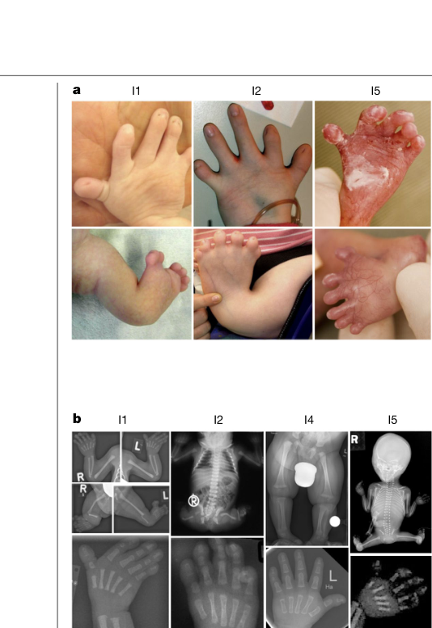

## Question

# Disease Characteristics Research Template

## Target Disease
- **Disease Name:** Brachyphalangy-Polydactyly-Tibial Aplasia Syndrome
- **MONDO ID:**  (if available)
- **Category:** Mendelian

## Research Objectives

Please provide a comprehensive research report on **Brachyphalangy-Polydactyly-Tibial Aplasia Syndrome** covering all of the
disease characteristics listed below. This report will be used to populate a disease knowledge
base entry. Be thorough and cite primary literature (PMID preferred) for all claims.

For each section, **suggested databases/resources** are listed. These are the first places
you should search for information on each topic.

---

### 1. Disease Information
> **Search first:** OMIM, Orphanet, ICD-10/ICD-11, MeSH, PubMed

- What is the disease? Provide a concise overview.
- What are the key identifiers? (OMIM, Orphanet, ICD-10/ICD-11, MeSH, Mondo)
- What are the common synonyms and alternative names?
- Is the information derived from individual patients (e.g., EHR) or aggregated disease-level resources?

### 2. Etiology

- **Disease Causal Factors**: What are the primary causes? (genetic, environmental, infectious, mechanistic)
- **Risk Factors**:
  > **Search first:** PubMed, Cochrane Library, UpToDate, clinical guidelines, ClinVar, ClinGen, GWAS Catalog, PheGenI, CTD, CDC, WHO, epidemiological databases
  - Genetic risk factors (causal variants, susceptibility loci, modifier genes)
  - Environmental risk factors (toxins, lifestyle, occupational exposures, age, sex, family history)
- **Protective Factors**:
  > **Search first:** PubMed, Cochrane Library, clinical trial databases, GWAS Catalog, gnomAD, WHO, CDC, nutrition databases
  - Genetic protective factors (protective variants, modifier alleles)
  - Environmental protective factors (diet, lifestyle, exposures that reduce risk)
- **Gene-Environment Interactions**: How do genetic and environmental factors interact to influence disease?
  > **Search first:** CTD, PubMed, PheGenI, GxE databases

### 3. Phenotypes
> **Search first:** HPO (Human Phenotype Ontology), OMIM, Orphanet, PubMed, clinicaltrials.gov, MedDRA, SNOMED CT, DECIPHER, LOINC

For each phenotype, provide:
- **Phenotype type**: symptoms, clinical signs, physical manifestations, behavioral changes, or laboratory abnormalities
  > For symptoms/signs: HPO, OMIM, Orphanet, PubMed
  > For behavioral changes: HPO, DSM, RDoC (Research Domain Criteria), PubMed
  > For laboratory abnormalities: LOINC, SNOMED CT, LabTests Online, PubMed
- **Phenotype characteristics**:
  > **Search first:** OMIM, Orphanet, HPO, PubMed
  - Age of symptom onset (neonatal, childhood, adult-onset, late-onset)
  - Symptom severity (mild, moderate, severe, variable)
  - Symptom progression (stable, progressive, episodic, fluctuating)
  - Frequency among affected individuals (percentage or qualitative)
- **Quality of life impact**: Effects on daily functioning and well-being (per-phenotype when possible)
  > **Search first:** EQ-5D database, SF-36, WHO QOL databases, PubMed
- Suggest HPO (Human Phenotype Ontology) terms for each phenotype

### 4. Genetic/Molecular Information

- **Causal Genes**: Gene mutations or chromosomal abnormalities responsible for disease (gene symbols, OMIM IDs)
  > **Search first:** OMIM, ClinVar, HGMD, Ensembl, NCBI Gene
- **Pathogenic Variants**:
  - Affected genes (gene symbols, HGNC IDs)
    > **Search first:** OMIM, NCBI Gene, Ensembl, HGNC, UniProt, GeneCards
  - Variant classification (pathogenic, likely pathogenic, VUS per ACMG/AMP guidelines)
    > **Search first:** ClinVar, ClinGen, ACMG/AMP guidelines, VarSome
  - Variant type/class (missense, frameshift, nonsense, splice-site, structural)
  - Allele frequency in population databases
    > **Search first:** gnomAD, 1000 Genomes, ExAC, TOPMed, dbSNP
  - Somatic vs germline origin
    > **Search first:** COSMIC (somatic), ClinVar, ICGC, TCGA
  - Functional consequences (loss of function, gain of function, dominant negative)
- **Modifier Genes**: Genes that modify disease severity or expression
- **Epigenetic Information**: DNA methylation, histone modifications, chromatin changes affecting disease
  > **Search first:** ENCODE, Roadmap Epigenomics, MethBase, DiseaseMeth
- **Chromosomal Abnormalities**: Large-scale genetic changes (aneuploidy, translocations, inversions)
  > **Search first:** DECIPHER, ClinVar, ECARUCA, UCSC Genome Browser

### 5. Environmental Information

- **Environmental Factors**: Non-genetic contributing factors (toxins, radiation, pollution, occupational exposure)
  > **Search first:** CTD (Comparative Toxicogenomics Database), TOXNET, PubMed, EPA databases
- **Lifestyle Factors**: Behavioral factors (smoking, diet, exercise, alcohol consumption)
  > **Search first:** CDC databases, WHO, PubMed, NHANES
- **Infectious Agents**: If applicable, pathogens causing or triggering disease (bacteria, viruses, fungi, parasites)
  > **Search first:** NCBI Taxonomy, ViPR, BV-BRC, MicrobeDB, GIDEON

### 6. Mechanism / Pathophysiology

- **Molecular Pathways**: Specific signaling cascades or biochemical pathways involved (Wnt, MAPK, mTOR, PI3K-AKT, etc.)
  > **Search first:** KEGG, Reactome, WikiPathways, PathBank, BioCyc
- **Cellular Processes**: Cell-level mechanisms (apoptosis, autophagy, cell cycle dysregulation, inflammation, etc.)
  > **Search first:** Gene Ontology (GO), Reactome, KEGG, PubMed
- **Protein Dysfunction**: How protein structure or function is altered (misfolding, aggregation, loss of function, gain of function)
  > **Search first:** UniProt, PDB (Protein Data Bank), InterPro, Pfam, AlphaFold
- **Metabolic Changes**: Alterations in metabolic processes (energy metabolism, lipid metabolism, amino acid metabolism)
  > **Search first:** KEGG, BioCyc, HMDB (Human Metabolome Database), BRENDA
- **Immune System Involvement**: Role of immune response (autoimmunity, immunodeficiency, chronic inflammation)
  > **Search first:** ImmPort, Immunome Database, IEDB, Gene Ontology
- **Tissue Damage Mechanisms**: How tissues/ are injured (oxidative stress, ischemia, fibrosis, necrosis)
  > **Search first:** PubMed, Gene Ontology, Reactome
- **Biochemical Abnormalities**: Specific molecular defects (enzyme deficiencies, receptor dysfunction, ion channel defects)
  > **Search first:** BRENDA, UniProt, KEGG, OMIM, PubMed
- **Epigenetic Changes**: DNA methylation, histone modifications affecting gene expression in disease
  > **Search first:** ENCODE, Roadmap Epigenomics, MethBase, DiseaseMeth
- **Molecular Profiling** (if available):
  - Transcriptomics/gene expression changes
    > **Search first:** GEO (Gene Expression Omnibus), ArrayExpress, GTEx, Human Cell Atlas, SRA
  - Proteomics findings
    > **Search first:** PRIDE, ProteomeXchange, Human Protein Atlas, STRING, BioGRID
  - Metabolomics signatures
    > **Search first:** MetaboLights, Metabolomics Workbench, HMDB, METLIN
  - Lipidomics alterations
    > **Search first:** LIPID MAPS, SwissLipids, LipidHome, Metabolomics Workbench
  - Genomic structural features
    > **Search first:** UCSC Genome Browser, Ensembl, NCBI, dbVar, DGV
- **Advanced Technologies** (if applicable):
  - Single-cell analysis findings (cell-type specific mechanisms, cellular heterogeneity)
    > **Search first:** Human Cell Atlas, Single Cell Portal, GEO, CELLxGENE
  - Spatial transcriptomics findings
    > **Search first:** GEO, Spatial Research, Vizgen, 10x Genomics data
  - Multi-omics integration results
    > **Search first:** TCGA, ICGC, cBioPortal, LinkedOmics, PubMed
  - Functional genomics screens (CRISPR, RNAi)
    > **Search first:** DepMap, GenomeRNAi, PubMed, BioGRID ORCS

For each mechanism, describe:
- The causal chain from initial trigger to clinical manifestation
- Which mechanisms are upstream vs downstream
- What cell types and biological processes are involved
- Suggest GO terms for biological processes and CL terms for cell types

### 7. Anatomical Structures Affected

- **Organ Level**:
  - Primary organs directly affected
  - Secondary organ involvement (complications, secondary effects)
  - Body systems involved (cardiovascular, nervous, digestive, respiratory, endocrine, etc.)
  > **Search first:** Uberon, FMA (Foundational Model of Anatomy), OMIM, HPO, ICD-11, MeSH, SNOMED CT
- **Tissue and Cell Level**:
  - Specific tissue types affected (epithelial, connective, muscle, nervous)
  - Specific cell populations targeted (with Cell Ontology terms)
  > **Search first:** Uberon, Human Protein Atlas, Cell Ontology, Human Cell Atlas, CellMarker, PanglaoDB
- **Subcellular Level**:
  - Cellular compartments involved (mitochondria, nucleus, ER, lysosomes) (with GO Cellular Component terms)
  > **Search first:** Gene Ontology (Cellular Component), UniProt, Human Protein Atlas
- **Localization**:
  - Specific anatomical sites (with UBERON terms)
    > **Search first:** FMA, Uberon, NeuroNames (for brain), SNOMED CT
  - Lateralization (unilateral, bilateral, asymmetric)
    > **Search first:** HPO, clinical literature, imaging databases

### 8. Temporal Development

- **Onset**:
  - Typical age of onset (congenital, pediatric, adult, geriatric)
  - Onset pattern (acute, subacute, chronic, insidious)
  > **Search first:** OMIM, Orphanet, HPO, PubMed
- **Progression**:
  - Disease stages (early, intermediate, advanced, end-stage)
    > **Search first:** Cancer Staging Manual (AJCC), WHO classifications, PubMed
  - Progression rate (rapid, slow, variable)
  - Disease course pattern (episodic, relapsing-remitting, progressive, stable)
  - Disease duration (self-limited, chronic lifelong)
  > **Search first:** Disease registries, longitudinal cohort databases, natural history studies, PubMed, Orphanet, OMIM
- **Patterns**:
  - Remission patterns (spontaneous, treatment-induced)
    > **Search first:** Clinical trial databases, disease registries, PubMed
  - Critical periods (time windows of vulnerability or opportunity for intervention)
    > **Search first:** PubMed, developmental biology databases, clinical guidelines

### 9. Inheritance and Population

- **Epidemiology**:
  - Prevalence (cases per 100,000 at given time)
  - Incidence (new cases per 100,000 per year)
  > **Search first:** Orphanet, CDC, WHO, GBD (Global Burden of Disease), national registries, SEER, disease registries
- **For Genetic Etiology**:
  - Inheritance pattern (AD, AR, X-linked, mitochondrial, multifactorial, polygenic)
    > **Search first:** OMIM, Orphanet, ClinVar, GTR (Genetic Testing Registry)
  - Penetrance (complete, incomplete, age-dependent)
    > **Search first:** ClinVar, OMIM, PubMed, ClinGen
  - Expressivity (variable, consistent)
    > **Search first:** OMIM, ClinVar, PubMed
  - Genetic anticipation (increasing severity in successive generations)
    > **Search first:** OMIM, PubMed (especially for repeat expansion disorders)
  - Germline mosaicism
    > **Search first:** ClinVar, OMIM, genetic counseling literature, PubMed
  - Founder effects (population-specific mutations)
    > **Search first:** gnomAD, population genetics databases, PubMed
  - Consanguinity role
    > **Search first:** OMIM, population studies, genetic counseling resources
  - Carrier frequency
    > **Search first:** gnomAD, carrier screening databases, GeneReviews, GTR
- **Population Demographics**:
  - Affected populations (ethnic or demographic groups with higher prevalence)
    > **Search first:** gnomAD, 1000 Genomes, PAGE Study, PubMed, population registries
  - Geographic distribution (endemic areas, regional variation)
    > **Search first:** WHO, CDC, GBD, Orphanet, geographic epidemiology databases
  - Geographic distribution of specific variants
  - Sex ratio (male:female)
    > **Search first:** Disease registries, OMIM, PubMed, epidemiological databases
  - Age distribution of affected individuals
    > **Search first:** CDC, disease registries, SEER, Orphanet

### 10. Diagnostics

- **Clinical Tests**:
  - Laboratory tests (blood, urine, tissue chemistry, specific enzyme assays)
    > **Search first:** LOINC, LabTests Online, PubMed
  - Biomarkers (proteins, metabolites, genetic markers, circulating biomarkers)
    > **Search first:** FDA Biomarker List, BEST (Biomarkers, EndpointS, and other Tools), PubMed
  - Imaging studies (X-ray, CT, MRI, PET, ultrasound)
    > **Search first:** RadLex, DICOM, Radiopaedia, imaging databases
  - Functional tests (pulmonary function, cardiac stress tests)
    > **Search first:** LOINC, clinical guidelines, PubMed
  - Electrophysiology (EEG, EMG, ECG, nerve conduction studies)
    > **Search first:** LOINC, clinical neurophysiology databases, PubMed
  - Biopsy findings (histopathology, immunohistochemistry)
    > **Search first:** SNOMED CT, College of American Pathologists resources, PubMed
  - Pathology findings (microscopic examination)
    > **Search first:** SNOMED CT, Digital Pathology databases, PubMed
- **Genetic Testing**:
  > **Search first:** GTR (Genetic Testing Registry), GeneReviews, ClinGen
  - Overview of recommended genetic testing approach
  - Whole genome sequencing (WGS) utility
    > **Search first:** GTR, ClinVar, GEL (Genomics England), gnomAD
  - Whole exome sequencing (WES) utility
    > **Search first:** GTR, ClinVar, OMIM, GeneMatcher
  - Gene panels (which panels, which genes)
    > **Search first:** GTR, ClinVar, laboratory-specific databases
  - Single gene testing
    > **Search first:** GTR, ClinVar, OMIM, GeneReviews
  - Chromosomal microarray (CMA)
    > **Search first:** DECIPHER, ClinVar, dbVar, ECARUCA
  - Karyotyping
    > **Search first:** Chromosome Abnormality Database, ClinVar, cytogenetics resources
  - FISH
    > **Search first:** ClinVar, cytogenetics databases, PubMed
  - Mitochondrial DNA testing
    > **Search first:** MITOMAP, MSeqDR, ClinVar, GTR
  - Repeat expansion testing
    > **Search first:** GTR, ClinVar, repeat expansion databases, PubMed
- **Omics-Based Diagnostics** (if applicable):
  - RNA sequencing / transcriptomics
    > **Search first:** GEO, ArrayExpress, GTEx, RNA-seq databases
  - Proteomics
    > **Search first:** PRIDE, ProteomeXchange, FDA Biomarker database
  - Metabolomics
    > **Search first:** MetaboLights, Metabolomics Workbench, HMDB
  - Epigenomics
    > **Search first:** GEO, ENCODE, Roadmap Epigenomics, MethBase
  - Liquid biopsy
    > **Search first:** COSMIC, ClinVar, liquid biopsy databases, PubMed
- **Clinical Criteria**:
  - Standardized diagnostic criteria (DSM, ICD, society guidelines)
    > **Search first:** DSM-5, ICD-11, clinical society guidelines, UpToDate
  - Differential diagnosis (other conditions to rule out, with distinguishing features)
    > **Search first:** DynaMed, UpToDate, clinical decision support systems
- **Screening**:
  - Screening methods for asymptomatic individuals (newborn screening, carrier screening, cascade screening)
    > **Search first:** ACMG recommendations, CDC newborn screening, GTR

### 11. Outcome/Prognosis

- **Survival and Mortality**:
  - Survival rate (5-year, 10-year, overall)
    > **Search first:** SEER, cancer registries, disease-specific registries, PubMed
  - Life expectancy (with and without treatment if applicable)
    > **Search first:** Orphanet, disease registries, actuarial databases, PubMed
  - Mortality rate
    > **Search first:** CDC, WHO, GBD, national mortality databases
  - Disease-specific mortality (deaths directly attributable to disease)
    > **Search first:** Disease registries, CDC Wonder, GBD, PubMed
- **Morbidity and Function**:
  - Morbidity (disease-related disability and health impacts)
    > **Search first:** GBD, WHO, disability databases, PubMed
  - Disability outcomes (long-term functional impairments)
    > **Search first:** ICF (International Classification of Functioning), disability registries
  - Quality of life measures (EQ-5D, SF-36, PROMIS, disease-specific tools)
    > **Search first:** EQ-5D database, SF-36, PROMIS, PubMed
- **Disease Course**:
  - Complications (secondary problems: infections, organ failure, etc.)
    > **Search first:** ICD codes, disease registries, clinical databases, PubMed
  - Recovery potential (likelihood and extent of recovery, with vs without treatment)
    > **Search first:** Natural history studies, rehabilitation databases, PubMed
- **Prediction**:
  - Prognostic factors (age, disease severity, biomarkers, treatment response)
    > **Search first:** Prognostic models databases, clinical calculators, PubMed
  - Prognostic biomarkers (molecular markers predicting disease course)
    > **Search first:** FDA Biomarker database, PubMed, cancer prognostic databases

### 12. Treatment

- **Pharmacotherapy**:
  - Pharmacological treatments (drug names, drug classes, mechanisms of action)
    > **Search first:** DrugBank, RxNorm, ATC classification, DailyMed, FDA databases
  - Pharmacogenomics (how genetic variants affect drug metabolism, efficacy, toxicity)
    > **Search first:** PharmGKB, CPIC (Clinical Pharmacogenetics), FDA Table of PGx Biomarkers
- **Advanced Therapeutics**:
  - Gene therapy (viral vectors, CRISPR, gene replacement, gene editing)
    > **Search first:** ClinicalTrials.gov, FDA gene therapy database, ASGCT resources
  - Cell therapy (stem cell transplant, CAR-T, cellular therapeutics)
    > **Search first:** ClinicalTrials.gov, FDA cell therapy database, FACT standards
  - RNA-based therapies (ASOs, siRNA, mRNA therapies)
    > **Search first:** ClinicalTrials.gov, FDA approvals, PubMed
  - Targeted therapies (treatments directed at specific molecular targets)
    > **Search first:** My Cancer Genome, OncoKB, ClinicalTrials.gov, FDA approvals
  - Immunotherapies (checkpoint inhibitors, monoclonal antibodies)
    > **Search first:** Cancer Immunotherapy Database, FDA approvals, ClinicalTrials.gov
- **Surgical and Interventional**:
  - Surgical interventions (types of surgery, timing, outcomes)
    > **Search first:** CPT codes, surgical registries, clinical guidelines, PubMed
- **Supportive and Rehabilitative**:
  - Supportive care (symptom management, pain control, nutrition)
    > **Search first:** Clinical guidelines, Cochrane Library, PubMed
  - Rehabilitation (physical therapy, occupational therapy, speech therapy)
    > **Search first:** Rehabilitation medicine databases, clinical guidelines, PubMed
- **Experimental**:
  - Experimental treatments in clinical trials (with NCT identifiers if available)
    > **Search first:** ClinicalTrials.gov, EU Clinical Trials Register, WHO ICTRP
- **Treatment Outcomes**:
  - Treatment response rates
    > **Search first:** Clinical trial databases, FDA reviews, systematic reviews, PubMed
  - Side effects and adverse events
    > **Search first:** FDA Adverse Event Reporting System (FAERS), MedWatch, PubMed
- **Treatment Strategy**:
  - Treatment algorithms (clinical pathways, decision trees)
    > **Search first:** Clinical practice guidelines, NCCN Guidelines, UpToDate
  - Combination therapies
    > **Search first:** ClinicalTrials.gov, treatment guidelines, PubMed
  - Personalized medicine approaches (genotype-guided treatment)
    > **Search first:** My Cancer Genome, CIViC, PharmGKB, precision medicine databases

For each treatment, suggest MAXO (Medical Action Ontology) terms where applicable.

### 13. Prevention

- **Prevention Levels**:
  - Primary prevention (preventing disease occurrence: vaccination, risk factor modification)
    > **Search first:** CDC, WHO, USPSTF recommendations, Cochrane Library
  - Secondary prevention (early detection and treatment: screening programs, early intervention)
    > **Search first:** USPSTF, CDC screening guidelines, WHO
  - Tertiary prevention (preventing complications in those with disease)
    > **Search first:** Clinical guidelines, disease management protocols, PubMed
- **Immunization**: Vaccine strategies (if applicable)
  > **Search first:** CDC vaccine schedules, WHO immunization, FDA vaccine database
- **Screening and Early Detection**:
  - Screening programs (population-based: newborn screening, cancer screening)
    > **Search first:** CDC screening programs, USPSTF, cancer screening databases
  - Genetic screening (carrier screening, preimplantation genetic diagnosis, prenatal testing)
    > **Search first:** ACMG recommendations, ACOG guidelines, GTR
  - Risk stratification (identifying high-risk individuals for targeted prevention)
    > **Search first:** Risk prediction models, clinical calculators, PubMed
- **Behavioral Interventions**: Lifestyle modifications to reduce risk
  > **Search first:** CDC, WHO, behavioral intervention databases, Cochrane Library
- **Counseling**: Genetic counseling (risk assessment, family planning guidance)
  > **Search first:** NSGC resources, ACMG guidelines, GeneReviews
- **Public Health**:
  - Public health interventions (sanitation, vector control, health education)
    > **Search first:** CDC, WHO, public health databases, PubMed
  - Environmental interventions (reducing environmental risk factors)
    > **Search first:** EPA databases, WHO environmental health, PubMed
- **Prophylaxis**: Preventive medications or procedures
  > **Search first:** Clinical guidelines, FDA approvals, PubMed

### 14. Other Species / Natural Disease

- **Taxonomy**: Species affected (with NCBI Taxon identifiers)
  > **Search first:** NCBI Taxonomy
- **Breed**: Specific breeds affected (with VBO identifiers if applicable)
  > **Search first:** VBO (Vertebrate Breed Ontology)
- **Gene**: Orthologous genes in other species (with NCBI Gene IDs)
  > **Search first:** NCBI Gene
- **Natural Disease**:
  - Naturally occurring disease in other species (companion animals, wildlife)
    > **Search first:** OMIA (Online Mendelian Inheritance in Animals), VetCompass, PubMed
  - Veterinary relevance and importance in animal health
    > **Search first:** OMIA, veterinary databases, PubMed
- **Comparative Biology**:
  - Comparative pathology (similarities and differences across species)
    > **Search first:** OMIA, comparative pathology databases, PubMed
  - Evolutionary conservation of disease mechanisms
    > **Search first:** HomoloGene, OrthoMCL, Alliance of Genome Resources
- **Transmission** (if applicable):
  - Zoonotic potential
    > **Search first:** CDC zoonotic diseases, WHO zoonoses, GIDEON
  - Cross-species susceptibility
    > **Search first:** NCBI Taxonomy, veterinary databases, PubMed

### 15. Model Organisms

- **Model Types**:
  - Model organism type (mammalian, invertebrate, cellular, in vitro)
    > **Search first:** Alliance of Genome Resources, model organism databases
  - Specific model systems (mouse, rat, zebrafish, Drosophila, C. elegans, yeast, cell lines, organoids, iPSCs)
    > **Search first:** MGI, RGD, ZFIN, FlyBase, WormBase, SGD, ATCC, Cellosaurus
  - Induced models (drug treatment, surgical intervention, environmental manipulation)
    > **Search first:** MGI, model organism databases, PubMed
- **Genetic Models**:
  - Types available (knockout, knock-in, transgenic, conditional, humanized)
    > **Search first:** MGI, IMPC, KOMP, EuMMCR, IMSR
- **Model Characteristics**:
  - Phenotype recapitulation (how well model reproduces human disease features)
    > **Search first:** Model organism databases, comparative studies, PubMed
  - Model limitations (aspects of human disease not captured)
    > **Search first:** Model organism databases, PubMed, review articles
- **Applications**:
  - Research applications (what aspects of disease can be studied)
    > **Search first:** Model organism databases, PubMed
- **Resources**:
  - Model databases
    > **Search first:** MGI, RGD, ZFIN, FlyBase, WormBase, IMSR, EMMA, MMRRC

---

## Citation Requirements

- Cite primary literature (PMID preferred) for all mechanistic and clinical claims
- Prioritize recent reviews and landmark papers
- Include direct quotes from abstracts where possible to support key statements
- Distinguish evidence source types: human clinical, model organism, in vitro, computational

## Output Format

Structure your response as a comprehensive narrative organized by the sections above.
For each section, provide:
- Factual content with specific details (numbers, percentages, gene names, variant nomenclature)
- Ontology term suggestions (HPO, GO, CL, UBERON, CHEBI, MAXO, MONDO) where applicable
- Evidence citations with PMIDs
- Direct quotes from abstracts to support key claims
- Clear indication when information is not available or not applicable for this disease

This report will be used to populate a disease knowledge base entry with:
- Pathophysiology descriptions with causal chains
- Gene/protein annotations (HGNC, GO terms)
- Phenotype associations (HP terms) with frequencies
- Cell type involvement (CL terms)
- Anatomical locations (UBERON terms)
- Chemical entities (CHEBI terms)
- Treatment annotations (MAXO terms)
- Evidence items with PMIDs and exact abstract quotes
- Epidemiology, prognosis, diagnostic, and prevention information
- Animal model descriptions with phenotype recapitulation details

## Output

Question: You are an expert researcher providing comprehensive, well-cited information.

Provide detailed information focusing on:
1. Key concepts and definitions with current understanding
2. Recent developments and latest research (prioritize 2023-2024 sources)
3. Current applications and real-world implementations
4. Expert opinions and analysis from authoritative sources
5. Relevant statistics and data from recent studies

Format as a comprehensive research report with proper citations. Include URLs and publication dates where available.
Always prioritize recent, authoritative sources and provide specific citations for all major claims.

# Disease Characteristics Research Template

## Target Disease
- **Disease Name:** Brachyphalangy-Polydactyly-Tibial Aplasia Syndrome
- **MONDO ID:**  (if available)
- **Category:** Mendelian

## Research Objectives

Please provide a comprehensive research report on **Brachyphalangy-Polydactyly-Tibial Aplasia Syndrome** covering all of the
disease characteristics listed below. This report will be used to populate a disease knowledge
base entry. Be thorough and cite primary literature (PMID preferred) for all claims.

For each section, **suggested databases/resources** are listed. These are the first places
you should search for information on each topic.

---

### 1. Disease Information
> **Search first:** OMIM, Orphanet, ICD-10/ICD-11, MeSH, PubMed

- What is the disease? Provide a concise overview.
- What are the key identifiers? (OMIM, Orphanet, ICD-10/ICD-11, MeSH, Mondo)
- What are the common synonyms and alternative names?
- Is the information derived from individual patients (e.g., EHR) or aggregated disease-level resources?

### 2. Etiology

- **Disease Causal Factors**: What are the primary causes? (genetic, environmental, infectious, mechanistic)
- **Risk Factors**:
  > **Search first:** PubMed, Cochrane Library, UpToDate, clinical guidelines, ClinVar, ClinGen, GWAS Catalog, PheGenI, CTD, CDC, WHO, epidemiological databases
  - Genetic risk factors (causal variants, susceptibility loci, modifier genes)
  - Environmental risk factors (toxins, lifestyle, occupational exposures, age, sex, family history)
- **Protective Factors**:
  > **Search first:** PubMed, Cochrane Library, clinical trial databases, GWAS Catalog, gnomAD, WHO, CDC, nutrition databases
  - Genetic protective factors (protective variants, modifier alleles)
  - Environmental protective factors (diet, lifestyle, exposures that reduce risk)
- **Gene-Environment Interactions**: How do genetic and environmental factors interact to influence disease?
  > **Search first:** CTD, PubMed, PheGenI, GxE databases

### 3. Phenotypes
> **Search first:** HPO (Human Phenotype Ontology), OMIM, Orphanet, PubMed, clinicaltrials.gov, MedDRA, SNOMED CT, DECIPHER, LOINC

For each phenotype, provide:
- **Phenotype type**: symptoms, clinical signs, physical manifestations, behavioral changes, or laboratory abnormalities
  > For symptoms/signs: HPO, OMIM, Orphanet, PubMed
  > For behavioral changes: HPO, DSM, RDoC (Research Domain Criteria), PubMed
  > For laboratory abnormalities: LOINC, SNOMED CT, LabTests Online, PubMed
- **Phenotype characteristics**:
  > **Search first:** OMIM, Orphanet, HPO, PubMed
  - Age of symptom onset (neonatal, childhood, adult-onset, late-onset)
  - Symptom severity (mild, moderate, severe, variable)
  - Symptom progression (stable, progressive, episodic, fluctuating)
  - Frequency among affected individuals (percentage or qualitative)
- **Quality of life impact**: Effects on daily functioning and well-being (per-phenotype when possible)
  > **Search first:** EQ-5D database, SF-36, WHO QOL databases, PubMed
- Suggest HPO (Human Phenotype Ontology) terms for each phenotype

### 4. Genetic/Molecular Information

- **Causal Genes**: Gene mutations or chromosomal abnormalities responsible for disease (gene symbols, OMIM IDs)
  > **Search first:** OMIM, ClinVar, HGMD, Ensembl, NCBI Gene
- **Pathogenic Variants**:
  - Affected genes (gene symbols, HGNC IDs)
    > **Search first:** OMIM, NCBI Gene, Ensembl, HGNC, UniProt, GeneCards
  - Variant classification (pathogenic, likely pathogenic, VUS per ACMG/AMP guidelines)
    > **Search first:** ClinVar, ClinGen, ACMG/AMP guidelines, VarSome
  - Variant type/class (missense, frameshift, nonsense, splice-site, structural)
  - Allele frequency in population databases
    > **Search first:** gnomAD, 1000 Genomes, ExAC, TOPMed, dbSNP
  - Somatic vs germline origin
    > **Search first:** COSMIC (somatic), ClinVar, ICGC, TCGA
  - Functional consequences (loss of function, gain of function, dominant negative)
- **Modifier Genes**: Genes that modify disease severity or expression
- **Epigenetic Information**: DNA methylation, histone modifications, chromatin changes affecting disease
  > **Search first:** ENCODE, Roadmap Epigenomics, MethBase, DiseaseMeth
- **Chromosomal Abnormalities**: Large-scale genetic changes (aneuploidy, translocations, inversions)
  > **Search first:** DECIPHER, ClinVar, ECARUCA, UCSC Genome Browser

### 5. Environmental Information

- **Environmental Factors**: Non-genetic contributing factors (toxins, radiation, pollution, occupational exposure)
  > **Search first:** CTD (Comparative Toxicogenomics Database), TOXNET, PubMed, EPA databases
- **Lifestyle Factors**: Behavioral factors (smoking, diet, exercise, alcohol consumption)
  > **Search first:** CDC databases, WHO, PubMed, NHANES
- **Infectious Agents**: If applicable, pathogens causing or triggering disease (bacteria, viruses, fungi, parasites)
  > **Search first:** NCBI Taxonomy, ViPR, BV-BRC, MicrobeDB, GIDEON

### 6. Mechanism / Pathophysiology

- **Molecular Pathways**: Specific signaling cascades or biochemical pathways involved (Wnt, MAPK, mTOR, PI3K-AKT, etc.)
  > **Search first:** KEGG, Reactome, WikiPathways, PathBank, BioCyc
- **Cellular Processes**: Cell-level mechanisms (apoptosis, autophagy, cell cycle dysregulation, inflammation, etc.)
  > **Search first:** Gene Ontology (GO), Reactome, KEGG, PubMed
- **Protein Dysfunction**: How protein structure or function is altered (misfolding, aggregation, loss of function, gain of function)
  > **Search first:** UniProt, PDB (Protein Data Bank), InterPro, Pfam, AlphaFold
- **Metabolic Changes**: Alterations in metabolic processes (energy metabolism, lipid metabolism, amino acid metabolism)
  > **Search first:** KEGG, BioCyc, HMDB (Human Metabolome Database), BRENDA
- **Immune System Involvement**: Role of immune response (autoimmunity, immunodeficiency, chronic inflammation)
  > **Search first:** ImmPort, Immunome Database, IEDB, Gene Ontology
- **Tissue Damage Mechanisms**: How tissues/ are injured (oxidative stress, ischemia, fibrosis, necrosis)
  > **Search first:** PubMed, Gene Ontology, Reactome
- **Biochemical Abnormalities**: Specific molecular defects (enzyme deficiencies, receptor dysfunction, ion channel defects)
  > **Search first:** BRENDA, UniProt, KEGG, OMIM, PubMed
- **Epigenetic Changes**: DNA methylation, histone modifications affecting gene expression in disease
  > **Search first:** ENCODE, Roadmap Epigenomics, MethBase, DiseaseMeth
- **Molecular Profiling** (if available):
  - Transcriptomics/gene expression changes
    > **Search first:** GEO (Gene Expression Omnibus), ArrayExpress, GTEx, Human Cell Atlas, SRA
  - Proteomics findings
    > **Search first:** PRIDE, ProteomeXchange, Human Protein Atlas, STRING, BioGRID
  - Metabolomics signatures
    > **Search first:** MetaboLights, Metabolomics Workbench, HMDB, METLIN
  - Lipidomics alterations
    > **Search first:** LIPID MAPS, SwissLipids, LipidHome, Metabolomics Workbench
  - Genomic structural features
    > **Search first:** UCSC Genome Browser, Ensembl, NCBI, dbVar, DGV
- **Advanced Technologies** (if applicable):
  - Single-cell analysis findings (cell-type specific mechanisms, cellular heterogeneity)
    > **Search first:** Human Cell Atlas, Single Cell Portal, GEO, CELLxGENE
  - Spatial transcriptomics findings
    > **Search first:** GEO, Spatial Research, Vizgen, 10x Genomics data
  - Multi-omics integration results
    > **Search first:** TCGA, ICGC, cBioPortal, LinkedOmics, PubMed
  - Functional genomics screens (CRISPR, RNAi)
    > **Search first:** DepMap, GenomeRNAi, PubMed, BioGRID ORCS

For each mechanism, describe:
- The causal chain from initial trigger to clinical manifestation
- Which mechanisms are upstream vs downstream
- What cell types and biological processes are involved
- Suggest GO terms for biological processes and CL terms for cell types

### 7. Anatomical Structures Affected

- **Organ Level**:
  - Primary organs directly affected
  - Secondary organ involvement (complications, secondary effects)
  - Body systems involved (cardiovascular, nervous, digestive, respiratory, endocrine, etc.)
  > **Search first:** Uberon, FMA (Foundational Model of Anatomy), OMIM, HPO, ICD-11, MeSH, SNOMED CT
- **Tissue and Cell Level**:
  - Specific tissue types affected (epithelial, connective, muscle, nervous)
  - Specific cell populations targeted (with Cell Ontology terms)
  > **Search first:** Uberon, Human Protein Atlas, Cell Ontology, Human Cell Atlas, CellMarker, PanglaoDB
- **Subcellular Level**:
  - Cellular compartments involved (mitochondria, nucleus, ER, lysosomes) (with GO Cellular Component terms)
  > **Search first:** Gene Ontology (Cellular Component), UniProt, Human Protein Atlas
- **Localization**:
  - Specific anatomical sites (with UBERON terms)
    > **Search first:** FMA, Uberon, NeuroNames (for brain), SNOMED CT
  - Lateralization (unilateral, bilateral, asymmetric)
    > **Search first:** HPO, clinical literature, imaging databases

### 8. Temporal Development

- **Onset**:
  - Typical age of onset (congenital, pediatric, adult, geriatric)
  - Onset pattern (acute, subacute, chronic, insidious)
  > **Search first:** OMIM, Orphanet, HPO, PubMed
- **Progression**:
  - Disease stages (early, intermediate, advanced, end-stage)
    > **Search first:** Cancer Staging Manual (AJCC), WHO classifications, PubMed
  - Progression rate (rapid, slow, variable)
  - Disease course pattern (episodic, relapsing-remitting, progressive, stable)
  - Disease duration (self-limited, chronic lifelong)
  > **Search first:** Disease registries, longitudinal cohort databases, natural history studies, PubMed, Orphanet, OMIM
- **Patterns**:
  - Remission patterns (spontaneous, treatment-induced)
    > **Search first:** Clinical trial databases, disease registries, PubMed
  - Critical periods (time windows of vulnerability or opportunity for intervention)
    > **Search first:** PubMed, developmental biology databases, clinical guidelines

### 9. Inheritance and Population

- **Epidemiology**:
  - Prevalence (cases per 100,000 at given time)
  - Incidence (new cases per 100,000 per year)
  > **Search first:** Orphanet, CDC, WHO, GBD (Global Burden of Disease), national registries, SEER, disease registries
- **For Genetic Etiology**:
  - Inheritance pattern (AD, AR, X-linked, mitochondrial, multifactorial, polygenic)
    > **Search first:** OMIM, Orphanet, ClinVar, GTR (Genetic Testing Registry)
  - Penetrance (complete, incomplete, age-dependent)
    > **Search first:** ClinVar, OMIM, PubMed, ClinGen
  - Expressivity (variable, consistent)
    > **Search first:** OMIM, ClinVar, PubMed
  - Genetic anticipation (increasing severity in successive generations)
    > **Search first:** OMIM, PubMed (especially for repeat expansion disorders)
  - Germline mosaicism
    > **Search first:** ClinVar, OMIM, genetic counseling literature, PubMed
  - Founder effects (population-specific mutations)
    > **Search first:** gnomAD, population genetics databases, PubMed
  - Consanguinity role
    > **Search first:** OMIM, population studies, genetic counseling resources
  - Carrier frequency
    > **Search first:** gnomAD, carrier screening databases, GeneReviews, GTR
- **Population Demographics**:
  - Affected populations (ethnic or demographic groups with higher prevalence)
    > **Search first:** gnomAD, 1000 Genomes, PAGE Study, PubMed, population registries
  - Geographic distribution (endemic areas, regional variation)
    > **Search first:** WHO, CDC, GBD, Orphanet, geographic epidemiology databases
  - Geographic distribution of specific variants
  - Sex ratio (male:female)
    > **Search first:** Disease registries, OMIM, PubMed, epidemiological databases
  - Age distribution of affected individuals
    > **Search first:** CDC, disease registries, SEER, Orphanet

### 10. Diagnostics

- **Clinical Tests**:
  - Laboratory tests (blood, urine, tissue chemistry, specific enzyme assays)
    > **Search first:** LOINC, LabTests Online, PubMed
  - Biomarkers (proteins, metabolites, genetic markers, circulating biomarkers)
    > **Search first:** FDA Biomarker List, BEST (Biomarkers, EndpointS, and other Tools), PubMed
  - Imaging studies (X-ray, CT, MRI, PET, ultrasound)
    > **Search first:** RadLex, DICOM, Radiopaedia, imaging databases
  - Functional tests (pulmonary function, cardiac stress tests)
    > **Search first:** LOINC, clinical guidelines, PubMed
  - Electrophysiology (EEG, EMG, ECG, nerve conduction studies)
    > **Search first:** LOINC, clinical neurophysiology databases, PubMed
  - Biopsy findings (histopathology, immunohistochemistry)
    > **Search first:** SNOMED CT, College of American Pathologists resources, PubMed
  - Pathology findings (microscopic examination)
    > **Search first:** SNOMED CT, Digital Pathology databases, PubMed
- **Genetic Testing**:
  > **Search first:** GTR (Genetic Testing Registry), GeneReviews, ClinGen
  - Overview of recommended genetic testing approach
  - Whole genome sequencing (WGS) utility
    > **Search first:** GTR, ClinVar, GEL (Genomics England), gnomAD
  - Whole exome sequencing (WES) utility
    > **Search first:** GTR, ClinVar, OMIM, GeneMatcher
  - Gene panels (which panels, which genes)
    > **Search first:** GTR, ClinVar, laboratory-specific databases
  - Single gene testing
    > **Search first:** GTR, ClinVar, OMIM, GeneReviews
  - Chromosomal microarray (CMA)
    > **Search first:** DECIPHER, ClinVar, dbVar, ECARUCA
  - Karyotyping
    > **Search first:** Chromosome Abnormality Database, ClinVar, cytogenetics resources
  - FISH
    > **Search first:** ClinVar, cytogenetics databases, PubMed
  - Mitochondrial DNA testing
    > **Search first:** MITOMAP, MSeqDR, ClinVar, GTR
  - Repeat expansion testing
    > **Search first:** GTR, ClinVar, repeat expansion databases, PubMed
- **Omics-Based Diagnostics** (if applicable):
  - RNA sequencing / transcriptomics
    > **Search first:** GEO, ArrayExpress, GTEx, RNA-seq databases
  - Proteomics
    > **Search first:** PRIDE, ProteomeXchange, FDA Biomarker database
  - Metabolomics
    > **Search first:** MetaboLights, Metabolomics Workbench, HMDB
  - Epigenomics
    > **Search first:** GEO, ENCODE, Roadmap Epigenomics, MethBase
  - Liquid biopsy
    > **Search first:** COSMIC, ClinVar, liquid biopsy databases, PubMed
- **Clinical Criteria**:
  - Standardized diagnostic criteria (DSM, ICD, society guidelines)
    > **Search first:** DSM-5, ICD-11, clinical society guidelines, UpToDate
  - Differential diagnosis (other conditions to rule out, with distinguishing features)
    > **Search first:** DynaMed, UpToDate, clinical decision support systems
- **Screening**:
  - Screening methods for asymptomatic individuals (newborn screening, carrier screening, cascade screening)
    > **Search first:** ACMG recommendations, CDC newborn screening, GTR

### 11. Outcome/Prognosis

- **Survival and Mortality**:
  - Survival rate (5-year, 10-year, overall)
    > **Search first:** SEER, cancer registries, disease-specific registries, PubMed
  - Life expectancy (with and without treatment if applicable)
    > **Search first:** Orphanet, disease registries, actuarial databases, PubMed
  - Mortality rate
    > **Search first:** CDC, WHO, GBD, national mortality databases
  - Disease-specific mortality (deaths directly attributable to disease)
    > **Search first:** Disease registries, CDC Wonder, GBD, PubMed
- **Morbidity and Function**:
  - Morbidity (disease-related disability and health impacts)
    > **Search first:** GBD, WHO, disability databases, PubMed
  - Disability outcomes (long-term functional impairments)
    > **Search first:** ICF (International Classification of Functioning), disability registries
  - Quality of life measures (EQ-5D, SF-36, PROMIS, disease-specific tools)
    > **Search first:** EQ-5D database, SF-36, PROMIS, PubMed
- **Disease Course**:
  - Complications (secondary problems: infections, organ failure, etc.)
    > **Search first:** ICD codes, disease registries, clinical databases, PubMed
  - Recovery potential (likelihood and extent of recovery, with vs without treatment)
    > **Search first:** Natural history studies, rehabilitation databases, PubMed
- **Prediction**:
  - Prognostic factors (age, disease severity, biomarkers, treatment response)
    > **Search first:** Prognostic models databases, clinical calculators, PubMed
  - Prognostic biomarkers (molecular markers predicting disease course)
    > **Search first:** FDA Biomarker database, PubMed, cancer prognostic databases

### 12. Treatment

- **Pharmacotherapy**:
  - Pharmacological treatments (drug names, drug classes, mechanisms of action)
    > **Search first:** DrugBank, RxNorm, ATC classification, DailyMed, FDA databases
  - Pharmacogenomics (how genetic variants affect drug metabolism, efficacy, toxicity)
    > **Search first:** PharmGKB, CPIC (Clinical Pharmacogenetics), FDA Table of PGx Biomarkers
- **Advanced Therapeutics**:
  - Gene therapy (viral vectors, CRISPR, gene replacement, gene editing)
    > **Search first:** ClinicalTrials.gov, FDA gene therapy database, ASGCT resources
  - Cell therapy (stem cell transplant, CAR-T, cellular therapeutics)
    > **Search first:** ClinicalTrials.gov, FDA cell therapy database, FACT standards
  - RNA-based therapies (ASOs, siRNA, mRNA therapies)
    > **Search first:** ClinicalTrials.gov, FDA approvals, PubMed
  - Targeted therapies (treatments directed at specific molecular targets)
    > **Search first:** My Cancer Genome, OncoKB, ClinicalTrials.gov, FDA approvals
  - Immunotherapies (checkpoint inhibitors, monoclonal antibodies)
    > **Search first:** Cancer Immunotherapy Database, FDA approvals, ClinicalTrials.gov
- **Surgical and Interventional**:
  - Surgical interventions (types of surgery, timing, outcomes)
    > **Search first:** CPT codes, surgical registries, clinical guidelines, PubMed
- **Supportive and Rehabilitative**:
  - Supportive care (symptom management, pain control, nutrition)
    > **Search first:** Clinical guidelines, Cochrane Library, PubMed
  - Rehabilitation (physical therapy, occupational therapy, speech therapy)
    > **Search first:** Rehabilitation medicine databases, clinical guidelines, PubMed
- **Experimental**:
  - Experimental treatments in clinical trials (with NCT identifiers if available)
    > **Search first:** ClinicalTrials.gov, EU Clinical Trials Register, WHO ICTRP
- **Treatment Outcomes**:
  - Treatment response rates
    > **Search first:** Clinical trial databases, FDA reviews, systematic reviews, PubMed
  - Side effects and adverse events
    > **Search first:** FDA Adverse Event Reporting System (FAERS), MedWatch, PubMed
- **Treatment Strategy**:
  - Treatment algorithms (clinical pathways, decision trees)
    > **Search first:** Clinical practice guidelines, NCCN Guidelines, UpToDate
  - Combination therapies
    > **Search first:** ClinicalTrials.gov, treatment guidelines, PubMed
  - Personalized medicine approaches (genotype-guided treatment)
    > **Search first:** My Cancer Genome, CIViC, PharmGKB, precision medicine databases

For each treatment, suggest MAXO (Medical Action Ontology) terms where applicable.

### 13. Prevention

- **Prevention Levels**:
  - Primary prevention (preventing disease occurrence: vaccination, risk factor modification)
    > **Search first:** CDC, WHO, USPSTF recommendations, Cochrane Library
  - Secondary prevention (early detection and treatment: screening programs, early intervention)
    > **Search first:** USPSTF, CDC screening guidelines, WHO
  - Tertiary prevention (preventing complications in those with disease)
    > **Search first:** Clinical guidelines, disease management protocols, PubMed
- **Immunization**: Vaccine strategies (if applicable)
  > **Search first:** CDC vaccine schedules, WHO immunization, FDA vaccine database
- **Screening and Early Detection**:
  - Screening programs (population-based: newborn screening, cancer screening)
    > **Search first:** CDC screening programs, USPSTF, cancer screening databases
  - Genetic screening (carrier screening, preimplantation genetic diagnosis, prenatal testing)
    > **Search first:** ACMG recommendations, ACOG guidelines, GTR
  - Risk stratification (identifying high-risk individuals for targeted prevention)
    > **Search first:** Risk prediction models, clinical calculators, PubMed
- **Behavioral Interventions**: Lifestyle modifications to reduce risk
  > **Search first:** CDC, WHO, behavioral intervention databases, Cochrane Library
- **Counseling**: Genetic counseling (risk assessment, family planning guidance)
  > **Search first:** NSGC resources, ACMG guidelines, GeneReviews
- **Public Health**:
  - Public health interventions (sanitation, vector control, health education)
    > **Search first:** CDC, WHO, public health databases, PubMed
  - Environmental interventions (reducing environmental risk factors)
    > **Search first:** EPA databases, WHO environmental health, PubMed
- **Prophylaxis**: Preventive medications or procedures
  > **Search first:** Clinical guidelines, FDA approvals, PubMed

### 14. Other Species / Natural Disease

- **Taxonomy**: Species affected (with NCBI Taxon identifiers)
  > **Search first:** NCBI Taxonomy
- **Breed**: Specific breeds affected (with VBO identifiers if applicable)
  > **Search first:** VBO (Vertebrate Breed Ontology)
- **Gene**: Orthologous genes in other species (with NCBI Gene IDs)
  > **Search first:** NCBI Gene
- **Natural Disease**:
  - Naturally occurring disease in other species (companion animals, wildlife)
    > **Search first:** OMIA (Online Mendelian Inheritance in Animals), VetCompass, PubMed
  - Veterinary relevance and importance in animal health
    > **Search first:** OMIA, veterinary databases, PubMed
- **Comparative Biology**:
  - Comparative pathology (similarities and differences across species)
    > **Search first:** OMIA, comparative pathology databases, PubMed
  - Evolutionary conservation of disease mechanisms
    > **Search first:** HomoloGene, OrthoMCL, Alliance of Genome Resources
- **Transmission** (if applicable):
  - Zoonotic potential
    > **Search first:** CDC zoonotic diseases, WHO zoonoses, GIDEON
  - Cross-species susceptibility
    > **Search first:** NCBI Taxonomy, veterinary databases, PubMed

### 15. Model Organisms

- **Model Types**:
  - Model organism type (mammalian, invertebrate, cellular, in vitro)
    > **Search first:** Alliance of Genome Resources, model organism databases
  - Specific model systems (mouse, rat, zebrafish, Drosophila, C. elegans, yeast, cell lines, organoids, iPSCs)
    > **Search first:** MGI, RGD, ZFIN, FlyBase, WormBase, SGD, ATCC, Cellosaurus
  - Induced models (drug treatment, surgical intervention, environmental manipulation)
    > **Search first:** MGI, model organism databases, PubMed
- **Genetic Models**:
  - Types available (knockout, knock-in, transgenic, conditional, humanized)
    > **Search first:** MGI, IMPC, KOMP, EuMMCR, IMSR
- **Model Characteristics**:
  - Phenotype recapitulation (how well model reproduces human disease features)
    > **Search first:** Model organism databases, comparative studies, PubMed
  - Model limitations (aspects of human disease not captured)
    > **Search first:** Model organism databases, PubMed, review articles
- **Applications**:
  - Research applications (what aspects of disease can be studied)
    > **Search first:** Model organism databases, PubMed
- **Resources**:
  - Model databases
    > **Search first:** MGI, RGD, ZFIN, FlyBase, WormBase, IMSR, EMMA, MMRRC

---

## Citation Requirements

- Cite primary literature (PMID preferred) for all mechanistic and clinical claims
- Prioritize recent reviews and landmark papers
- Include direct quotes from abstracts where possible to support key statements
- Distinguish evidence source types: human clinical, model organism, in vitro, computational

## Output Format

Structure your response as a comprehensive narrative organized by the sections above.
For each section, provide:
- Factual content with specific details (numbers, percentages, gene names, variant nomenclature)
- Ontology term suggestions (HPO, GO, CL, UBERON, CHEBI, MAXO, MONDO) where applicable
- Evidence citations with PMIDs
- Direct quotes from abstracts to support key claims
- Clear indication when information is not available or not applicable for this disease

This report will be used to populate a disease knowledge base entry with:
- Pathophysiology descriptions with causal chains
- Gene/protein annotations (HGNC, GO terms)
- Phenotype associations (HP terms) with frequencies
- Cell type involvement (CL terms)
- Anatomical locations (UBERON terms)
- Chemical entities (CHEBI terms)
- Treatment annotations (MAXO terms)
- Evidence items with PMIDs and exact abstract quotes
- Epidemiology, prognosis, diagnostic, and prevention information
- Animal model descriptions with phenotype recapitulation details

# Brachyphalangy‑Polydactyly‑Tibial Aplasia/Hypoplasia Syndrome (BPTAS) — Comprehensive Disease Characteristics Report

## Target disease
- **Disease name:** Brachyphalangy‑Polydactyly‑Tibial Aplasia/Hypoplasia Syndrome
- **Category:** Mendelian / congenital malformation syndrome
- **Acronym used in recent literature:** **BPTAS** (mensah2023aberrantphaseseparation pages 1-2)
- **OMIM:** **609945** (mensah2023aberrantphaseseparation pages 1-2, bernardi2009additionalfeaturesin pages 1-2)
- **MONDO / Orphanet / MeSH / ICD‑10/11:** Not retrieved with the available tools in this run; this report therefore anchors identifiers to OMIM and primary literature (mensah2023aberrantphaseseparation pages 1-2, bernardi2009additionalfeaturesin pages 1-2).

## Executive summary
BPTAS is a **rare complex malformation syndrome** primarily affecting limb development, classically combining **tibial aplasia/hypoplasia**, **(preaxial) polydactyly/polysyndactyly** (sometimes described as “mirror” polydactyly), and **brachyphalangy/brachydactyly**. Historically it was described as autosomal dominant based on family reports, but **2023 work identified de novo heterozygous HMGB1 C‑terminal frameshift variants** as a cause, providing a molecular diagnosis and a mechanistic hypothesis linking **frameshift‑driven charge inversion in an intrinsically disordered tail** to **altered phase separation, nucleolar mispartitioning, impaired rRNA biogenesis, and nucleolar dysfunction** (mensah2023aberrantphaseseparation pages 1-2, bernardi2009additionalfeaturesin pages 1-2).

## Key structured summary tables
| Disease name | Acronym | OMIM | Key synonyms / alternative names | Core phenotype triad | Inheritance | Causal gene | Key variant(s) | Key references |
|---|---|---|---|---|---|---|---|---|
| Brachyphalangy-polydactyly-tibial aplasia/hypoplasia syndrome | BPTAS | 609945 | Brachyphalangy, polydactyly and tibial aplasia syndrome; Brachyphalangy, polydactyly and absent tibiae; Brachyphalangy, feet polydactyly, absent/hypoplastic tibiae (mensah2023aberrantphaseseparation pages 1-2, bernardi2009additionalfeaturesin pages 1-2, bernardi2009additionalfeaturesin pages 7-7) | Tibial aplasia/hypoplasia; preaxial polydactyly/polysyndactyly (sometimes described as mirror polydactyly); brachyphalangy/brachydactyly with irregular finger length (mensah2023aberrantphaseseparation pages 1-2, bernardi2009additionalfeaturesin pages 4-5, bernardi2009additionalfeaturesin pages 2-4) | Historically described as autosomal dominant in pre-2023 case literature; 2023 molecular study identified de novo heterozygous pathogenic variants in affected individuals, refining recurrence risk toward mostly sporadic de novo disease with theoretical parental mosaicism not excluded (bernardi2009additionalfeaturesin pages 1-2, mensah2023aberrantphaseseparation pages 1-2) | **HMGB1** (High Mobility Group Box 1) (mensah2023aberrantphaseseparation pages 1-2) | De novo heterozygous C-terminal frameshift variants in the final exon of **HMGB1**; recurrent example: **NM_002128.7(HMGB1): c.556_559delGAAG; p.(Glu186Argfs*42)**; commentary also cites **p.Lys184Argfs*44** among disease-causing frameshifts that replace the acidic tail with an arginine-rich basic tail (mensah2023aberrantphaseseparation pages 1-2, roychowdhury2023ataleof pages 1-2, ahmed2023aberrantphaseseparation pages 1-2) | **Mensah et al.** *Nature* (Feb 2023), DOI: [https://doi.org/10.1038/s41586-022-05682-1](https://doi.org/10.1038/s41586-022-05682-1); **Bernardi et al.** *Am J Med Genet A* (Jul 2009), DOI: [https://doi.org/10.1002/ajmg.a.32943](https://doi.org/10.1002/ajmg.a.32943) (mensah2023aberrantphaseseparation pages 1-2, bernardi2009additionalfeaturesin pages 1-2) |

*Table: This table summarizes the key identifiers, synonyms, phenotype, inheritance, molecular etiology, and anchor references for brachyphalangy-polydactyly-tibial aplasia/hypoplasia syndrome. It is useful as a compact knowledge-base entry scaffold grounded in the 2009 clinical delineation and the 2023 genetic discovery.*

| Clinical feature (plain language) | Suggested HPO term (HP:ID + label) | Evidence/notes | Typical onset | System |
|---|---|---|---|---|
| Absent or severely underdeveloped tibia | HP:0009736 Tibial aplasia / HP:0009766 Tibial hypoplasia | Core defining feature of BPTAS; Mensah 2023: all five individuals had “short and malformed lower limbs characterized by tibia aplasia or hypoplasia”; Bernardi 2009 also describes “agenesis of the tibiae” / “absent/hypoplastic tibiae” (mensah2023aberrantphaseseparation pages 1-2, bernardi2009additionalfeaturesin pages 2-4, bernardi2009additionalfeaturesin pages 1-2) | Congenital | Skeletal |
| Preaxial extra toes/fingers, often with fusion | HP:0100258 Preaxial polydactyly / HP:0001159 Syndactyly | Mensah 2023: all five had “preaxial polysyndactyly”; Bernardi 2009 repeatedly reports bilateral preaxial polydactyly of the feet and notes some cases were described as “mirror” polydactyly (mensah2023aberrantphaseseparation pages 1-2, bernardi2009additionalfeaturesin pages 4-5, bernardi2009additionalfeaturesin pages 2-4) | Congenital | Skeletal |
| Short finger bones / short digits | HP:0009823 Brachydactyly / HP:0009843 Brachyphalangy | Hallmark feature in syndrome name; Mensah 2023: upper-limb findings included “brachydactyly or brachyphalangy of fingers with an irregular finger length”; Bernardi 2009: “The hands were short with brachydactyly” (mensah2023aberrantphaseseparation pages 1-2, bernardi2009additionalfeaturesin pages 1-2) | Congenital | Skeletal |
| Irregular finger length pattern | HP:0011304 Abnormality of finger / HP:0009381 Short phalanx of finger | Mensah 2023 explicitly notes “irregular finger length”; likely reflects disproportionate phalangeal shortening, especially middle phalanges (mensah2023aberrantphaseseparation pages 1-2, bernardi2009additionalfeaturesin pages 2-4) | Congenital | Skeletal |
| Short radius and ulna | HP:0006505 Abnormality of radius / HP:0006495 Abnormality of ulna | Mensah 2023: “Short radius and ulna ... in four of five”; Bernardi 2009 also reports short radius and ulna in arms (mensah2023aberrantphaseseparation pages 1-2, bernardi2009additionalfeaturesin pages 2-4) | Congenital | Skeletal |
| Large-joint contractures | HP:0001371 Flexion contracture / HP:0002829 Arthrogryposis multiplex congenita (broad related term) | Mensah 2023: all five had lower-limb malformations with “contractures of large joints”; elbow contractures/pterygia were present in 4/5 (mensah2023aberrantphaseseparation pages 1-2) | Congenital | Skeletal |
| Elbow pterygia or elbow contractures | HP:0009769 Elbow pterygium / HP:0003040 Elbow contracture | Mensah 2023: “Short radius and ulna and contractures or pterygia of the elbow joints” in 4/5 (mensah2023aberrantphaseseparation pages 1-2) | Congenital | Skeletal |
| Short femora and fibulae | HP:0003097 Short femur / HP:0003084 Fibular hypoplasia | Bernardi 2009: hallmark limb pattern included “short fibulae and femurs”; Mensah 2023 also mentions hypoplastic fibulae in detailed clinical findings (mensah2023aberrantphaseseparation pages 13-15, bernardi2009additionalfeaturesin pages 2-4) | Congenital | Skeletal |
| Short metacarpals and shortened middle phalanges | HP:0010049 Short metacarpal / HP:0009803 Short middle phalanx of the finger | Bernardi 2009: “short metacarpals and phalanges (especially ... middle phalanges...)”; Mensah 2023 similarly notes short tubular bones with middle phalanges preferentially affected (mensah2023aberrantphaseseparation pages 13-15, bernardi2009additionalfeaturesin pages 2-4) | Congenital | Skeletal |
| Reduced palmar creases | HP:0006207 Single transverse palmar crease / HP:0006112 Abnormal palmar creases | Mensah 2023 detailed phenotype notes “reduced palmar creases” (mensah2023aberrantphaseseparation pages 13-15) | Congenital | Skeletal |
| Hypoplastic or absent nails | HP:0001804 Nail hypoplasia / HP:0001798 Anonychia | Mensah 2023 reports “hypoplastic or missing nails”; Bernardi 2009 notes hypoplastic nails in the mother of the proband, supporting variable expression (mensah2023aberrantphaseseparation pages 13-15, bernardi2009additionalfeaturesin pages 5-6) | Congenital | Skeletal |
| Pelvic/iliac hypoplasia | HP:0003173 Hypoplasia of the ilium | Mensah 2023 detailed findings include pelvic/iliac hypoplasia (mensah2023aberrantphaseseparation pages 13-15) | Congenital | Skeletal |
| Retarded bone age | HP:0002750 Delayed skeletal maturation | Mensah 2023 detailed findings include “retarded bone age” (mensah2023aberrantphaseseparation pages 13-15) | Congenital / infancy-childhood recognition | Skeletal |
| Characteristic ear anomalies | HP:0000377 Abnormality of the pinna | Bernardi 2009 review of prior cases lists “malformed ears” among common non-skeletal findings (bernardi2009additionalfeaturesin pages 4-5) | Congenital | Craniofacial |
| Blepharophimosis | HP:0000581 Blepharophimosis | Reported among commonly described craniofacial features in Bernardi 2009 (bernardi2009additionalfeaturesin pages 4-5) | Congenital | Craniofacial |
| Hypertelorism / telecanthus | HP:0000316 Hypertelorism / HP:0000506 Telecanthus | Bernardi 2009 summarizes prior cases with “hypertelorism/telecanthus” (bernardi2009additionalfeaturesin pages 4-5) | Congenital | Craniofacial |
| Micrognathia or retrognathia | HP:0000347 Micrognathia / HP:0000278 Retrognathia | Bernardi 2009 lists “micro/retrognathia” as recurrent craniofacial findings (bernardi2009additionalfeaturesin pages 4-5) | Congenital | Craniofacial |
| Microcephaly | HP:0000252 Microcephaly | Bernardi 2009 lists microcephaly among common non-skeletal findings; Mensah 2023 broadly notes craniofacial and neurological features (mensah2023aberrantphaseseparation pages 1-2, bernardi2009additionalfeaturesin pages 4-5) | Congenital | Craniofacial / Neurodevelopment |
| Carp-shaped mouth / wide mouth appearance | HP:0000194 Open mouth / HP:0000154 Abnormality of the mouth | Bernardi 2009 cites “carped-shaped mouth” in prior cases; exact HPO match may vary, so broad mouth abnormality term may be safest (bernardi2009additionalfeaturesin pages 4-5) | Congenital | Craniofacial |
| Short neck | HP:0000470 Short neck | Reported among recurrent craniofacial/neck features in Bernardi 2009 (bernardi2009additionalfeaturesin pages 4-5) | Congenital | Craniofacial |
| Wormian bones | HP:0002645 Wormian bones | Bernardi 2009 reports wormian bones as a novel finding in the female proband (bernardi2009additionalfeaturesin pages 1-2) | Congenital | Craniofacial |
| Lacrimal sac fistula | HP:0007784 Lacrimal fistula | Bernardi 2009 describes lacrimal sac fistula as an additional, previously undescribed feature in their case (bernardi2009additionalfeaturesin pages 1-2) | Congenital | Craniofacial |
| Genital hypoplasia / ambiguous or abnormal genitalia | HP:0000078 Abnormality of the genital system / HP:0000047 Hypoplasia of the genitalia | Common associated finding across reports; Mensah 2023 notes “genitourinary features” and “abnormal female genitalia”; Bernardi 2009 highlights genital hypoplasia in the proband (mensah2023aberrantphaseseparation pages 1-2, mensah2023aberrantphaseseparation pages 13-15, bernardi2009additionalfeaturesin pages 1-2) | Congenital | Genitourinary |
| Small clitoris | HP:0000055 Hypoplasia of the clitoris | Bernardi 2009 female proband had “small clitoris” (bernardi2009additionalfeaturesin pages 2-4) | Congenital | Genitourinary |
| Hypoplastic labia / absent labia majora | HP:0010460 Hypoplasia of the labia majora / HP:0000050 Hypoplasia of the labia minora | Bernardi 2009 describes “absence of labia majora” and “hypoplasia of labia minora” (bernardi2009additionalfeaturesin pages 2-4) | Congenital | Genitourinary |
| Cryptorchidism in male cases | HP:0000028 Cryptorchidism | Bernardi 2009 review lists cryptorchidism among frequent genital anomalies in previously reported male patients (bernardi2009additionalfeaturesin pages 4-5) | Congenital | Genitourinary |
| Small penis | HP:0000054 Micropenis | Bernardi 2009 review cites “small penis/clitoris” among frequent genital anomalies (bernardi2009additionalfeaturesin pages 4-5) | Congenital | Genitourinary |
| Ectopic kidney | HP:0000086 Ectopic kidney | Bernardi 2009 reports ectopic kidney as an additional feature in the new case (bernardi2009additionalfeaturesin pages 1-2) | Congenital | Genitourinary |
| Anteriorly placed anus | HP:0001545 Abnormality of the anus / HP:0012832 Anteriorly placed anus | Bernardi 2009 reports an anteriorly placed anus in the female proband (bernardi2009additionalfeaturesin pages 2-4, bernardi2009additionalfeaturesin pages 1-2) | Congenital | Genitourinary |
| Motor developmental delay | HP:0001270 Motor delay | Bernardi 2009 summary of prior cases notes motor delay as a common non-skeletal feature; Mensah 2023 also mentions neurological features broadly (mensah2023aberrantphaseseparation pages 1-2, bernardi2009additionalfeaturesin pages 4-5) | Infancy / early childhood | Neurodevelopment |
| Speech delay | HP:0000750 Delayed speech and language development | Bernardi 2009 summary identifies speech delay as a common non-skeletal feature (bernardi2009additionalfeaturesin pages 4-5) | Early childhood | Neurodevelopment |

*Table: This table summarizes reported clinical features of brachyphalangy-polydactyly-tibial aplasia/hypoplasia syndrome and maps them to suggested HPO terms. It integrates the modern HMGB1-defined cohort from Mensah 2023 with earlier clinical delineation from Bernardi 2009 to support phenotype curation.*

---

# 1. Disease Information

## 1.1 What is the disease?
BPTAS (OMIM 609945) is described in recent genetic/mechanistic work as a **“rare complex malformation syndrome”** defined clinically by a distinct skeletal phenotype dominated by **short/malformed lower limbs with tibial aplasia or hypoplasia, preaxial polysyndactyly, and large‑joint contractures**, with milder but characteristic upper‑limb brachyphalangy/brachydactyly (mensah2023aberrantphaseseparation pages 1-2).

Bernardi et al. (July 2009; AJMG A; DOI https://doi.org/10.1002/ajmg.a.32943) describes the syndrome clinically as involving **“agenesis of the tibiae and bilateral preaxial polydactyly of the feet, associated with genital hypoplasia”** and emphasizes additional anomalies (wormian bones, lacrimal sac fistula, ectopic kidney, anteriorly placed anus) expanding the phenotype (bernardi2009additionalfeaturesin pages 1-2).

## 1.2 Common synonyms / alternative names
Reported names in the accessible primary literature include:
- “**Brachyphalangy, polydactyly and tibial aplasia/hypoplasia syndrome**” (BPTAS) (mensah2023aberrantphaseseparation pages 1-2, bernardi2009additionalfeaturesin pages 1-2)
- “**A syndrome of brachyphalangy, polydactyly and absent tibiae**” (historical case literature name) (bernardi2009additionalfeaturesin pages 7-7)
- Reports note some polydactyly described as “**mirror polydactyly**” (bernardi2009additionalfeaturesin pages 4-5)

## 1.3 Evidence provenance
- Clinical phenotype: aggregated across historical case reports/series and updated with a modern molecular cohort (mensah2023aberrantphaseseparation pages 1-2, bernardi2009additionalfeaturesin pages 1-2).
- Molecular mechanism: derived from experimental cellular/biophysical data in **Nature 2023** plus expert commentary (mensah2023aberrantphaseseparation pages 1-2, ahmed2023aberrantphaseseparation pages 1-2, roychowdhury2023ataleof pages 1-2).

**PMIDs:** Not available in the retrieved tool outputs for the key papers in this run; therefore citations are provided via DOIs/URLs and the attached evidence IDs.

---

# 2. Etiology

## 2.1 Disease causal factors
### Genetic
**HMGB1 (High Mobility Group Box 1)** is implicated as a causal gene in a subset of BPTAS via **de novo heterozygous frameshift variants in the final exon**, which replace the **acidic intrinsically disordered C‑terminal tail** with an **arginine‑rich basic tail** (mensah2023aberrantphaseseparation pages 1-2).

- Example HGVS reported: **NM_002128.7(HMGB1): c.556_559delGAAG; p.(Glu186Argfs*42)** (mensah2023aberrantphaseseparation pages 1-2).

### Mechanistic framing (gene → cellular dysfunction)
Mensah et al. explicitly state the causal frameshifts **alter phase separation, increase nucleolar partitioning, and cause nucleolar dysfunction**, and that several tested disease variants **altered rRNA biogenesis** (mensah2023aberrantphaseseparation pages 1-2).

## 2.2 Risk factors
- Primary risk factor is the presence of a pathogenic **HMGB1** frameshift variant (typically **de novo**) (mensah2023aberrantphaseseparation pages 1-2).
- Pre‑molecular era case literature described BPTAS as “**autosomal dominant**” (bernardi2009additionalfeaturesin pages 1-2); with the 2023 discovery, **sporadic de novo** etiology is now strongly supported for at least the HMGB1‑related subset (mensah2023aberrantphaseseparation pages 1-2).

## 2.3 Protective factors
No protective genetic or environmental factors were identified in the retrieved literature.

## 2.4 Gene–environment interactions
No gene–environment interaction evidence was identified in the retrieved literature.

---

# 3. Phenotypes

## 3.1 Core limb phenotype
Across the modern genetically characterized cohort, all five affected individuals had **tibia aplasia or hypoplasia**, **preaxial polysyndactyly**, and **large‑joint contractures**, with milder but characteristic upper limb findings (brachydactyly/brachyphalangy and irregular finger length) (mensah2023aberrantphaseseparation pages 1-2).

Bernardi et al. report a clinically similar pattern and note that limb abnormalities are the “hallmark,” with **absent/hypoplastic tibiae**, shortened fibulae/femora, and brachyphalangy/brachydactyly, plus extracranial findings including genital hypoplasia and renal/anorectal anomalies in the reported female patient (bernardi2009additionalfeaturesin pages 2-4, bernardi2009additionalfeaturesin pages 1-2).

## 3.2 Non‑skeletal phenotype
Bernardi et al. summarize commonly reported non‑skeletal findings across earlier cases, including **motor delay, speech delay, characteristic craniofacial features** (e.g., blepharophimosis, hypertelorism/telecanthus, micro/retrognathia, microcephaly) and **frequent genital anomalies** (e.g., small penis/clitoris, cryptorchidism, hypoplasia of labia/scrotum) (bernardi2009additionalfeaturesin pages 4-5).

Mensah et al. likewise state that patients have “distinct craniofacial, neurological and genitourinary features,” and their detailed phenotype extraction includes **abnormal female genitalia** alongside multiple skeletal features (mensah2023aberrantphaseseparation pages 1-2, mensah2023aberrantphaseseparation pages 13-15).

## 3.3 Ontology mappings
A phenotype-to-HPO mapping table is provided in artifact-01 (mensah2023aberrantphaseseparation pages 1-2, bernardi2009additionalfeaturesin pages 2-4, bernardi2009additionalfeaturesin pages 1-2).

## 3.4 Visual evidence (phenotype and mechanism)
Mensah et al. includes figures showing the **limb phenotype and radiographs**, the **HMGB1 frameshift schematic**, and **mutant HMGB1 nucleolar localization** (mensah2023aberrantphaseseparation media ca08d65d, mensah2023aberrantphaseseparation media 0c631fa2, mensah2023aberrantphaseseparation media 31b9c4a5, mensah2023aberrantphaseseparation media a3d781c6).

---

# 4. Genetic / Molecular Information

## 4.1 Causal gene
- **HMGB1** is implicated by de novo frameshift variants in BPTAS (mensah2023aberrantphaseseparation pages 1-2).

## 4.2 Pathogenic variant class and functional consequence
- Variant class: **C‑terminal frameshift in the final exon** (ahmed2023aberrantphaseseparation pages 1-2, mensah2023aberrantphaseseparation pages 1-2).
- Functional consequence: replacement of an **acidic disordered tail** with an **arginine‑rich basic tail** (charge inversion), altering phase separation behavior and nucleolar partitioning (mensah2023aberrantphaseseparation pages 1-2).

### Expert‑level synthesis (authoritative commentary)
Ahmed & Forman‑Kay (Cell Research, Apr 2023; DOI https://doi.org/10.1038/s41422-023-00804-4) summarize that mutant HMGB1 has a **decreased threshold concentration for phase separation** and forms condensates with reduced diffusion; it **partitions into the nucleolar granular component**, **displaces NPM1**, correlates with **reduced 28S rRNA levels**, and **decreased cell viability**, consistent with nucleolar dysfunction (ahmed2023aberrantphaseseparation pages 1-2).

## 4.3 Modifier genes / epigenetics / chromosomal abnormalities
No modifier genes, epigenetic signatures, or recurrent chromosomal abnormalities specific to BPTAS were identified in the retrieved sources.

---

# 5. Environmental Information
No non‑genetic environmental or lifestyle contributors were identified in the retrieved sources; the syndrome is currently best supported as genetically driven (mensah2023aberrantphaseseparation pages 1-2).

---

# 6. Mechanism / Pathophysiology

## 6.1 Current mechanistic model (2023–2024 state of the art)
Mensah et al. (Nature, Feb 2023; DOI https://doi.org/10.1038/s41586-022-05682-1) provide direct experimental evidence for the following chain:

1) **Frameshift in HMGB1 C‑terminal IDR** → acidic tail replaced by **arginine‑rich basic tail** (mensah2023aberrantphaseseparation pages 1-2).

2) **Altered phase separation properties**: the mutant tail “**alters HMGB1 phase separation**” (mensah2023aberrantphaseseparation pages 1-2) and is described as interfering with the “**molecular grammar**” of phase separation (mensah2023aberrantphaseseparation pages 7-8).

3) **Nucleolar mispartitioning and condensate disruption**: mutations “**enhanced partitioning into the nucleolus**” and “**disrupt nucleolar function**” (mensah2023aberrantphaseseparation pages 1-2). Mechanistic dissection emphasizes the combination of **high arginine content** (driving nucleolar partitioning) and a **hydrophobic patch** (contributing to nucleolar arrest/dysfunction) (mensah2023aberrantphaseseparation pages 7-8, ahmed2023aberrantphaseseparation pages 1-2).

4) **Impaired rRNA biogenesis / nucleolar dysfunction**: expert commentary summarizes reductions in rRNA (e.g., **reduced 28S rRNA**) and decreased viability consistent with nucleolar dysfunction (ahmed2023aberrantphaseseparation pages 1-2); Mensah et al. state that several variants altered **rRNA biogenesis** (mensah2023aberrantphaseseparation pages 1-2).

## 6.2 Evidence type
- Human genetics: de novo variants in affected individuals (mensah2023aberrantphaseseparation pages 1-2).
- Cellular and biophysical assays: in vitro phase separation and nucleolar localization/functional readouts (mensah2023aberrantphaseseparation pages 2-3, ahmed2023aberrantphaseseparation pages 1-2, mensah2023aberrantphaseseparation pages 1-2).
- Review/commentary synthesis: mechanistic interpretation and generalization to other IDR frameshifts (roychowdhury2023ataleof pages 1-2, ahmed2023aberrantphaseseparation pages 1-2).

## 6.3 Ontology suggestions (mechanism)
**GO Biological Process (suggested):**
- rRNA processing / ribosome biogenesis (e.g., “ribosome biogenesis”, “rRNA metabolic process”) — supported by altered rRNA biogenesis and nucleolar dysfunction (mensah2023aberrantphaseseparation pages 1-2, ahmed2023aberrantphaseseparation pages 1-2).
- Regulation of biomolecular condensate organization / phase separation (supported conceptually by the demonstrated change in phase separation behavior) (mensah2023aberrantphaseseparation pages 1-2).

**GO Cellular Component (suggested):**
- Nucleolus; nucleolar granular component (mechanistic localization) (ahmed2023aberrantphaseseparation pages 1-2, mensah2023aberrantphaseseparation pages 1-2).

**Cell Ontology (CL) candidate cell types (context‑appropriate, inferential):**
- Limb bud mesenchymal cells / chondrocyte lineage progenitors (the syndrome’s main manifestations are skeletal and congenital). The retrieved sources do not specify an implicated cell type in vivo, so this remains an informed developmental hypothesis.

**Important limitation:** The link from nucleolar dysfunction to the specific pattern of tibial aplasia/polydactyly is currently best interpreted as **developmental vulnerability to impaired nucleolar function** rather than a fully mapped tissue‑specific pathway (ahmed2023aberrantphaseseparation pages 1-2, mensah2023aberrantphaseseparation pages 1-2).

---

# 7. Anatomical Structures Affected

## 7.1 Organ/system level (with UBERON suggestions)
- Lower limb long bones, especially **tibia** (UBERON:0000979 tibia) (mensah2023aberrantphaseseparation pages 1-2, bernardi2009additionalfeaturesin pages 1-2).
- Hands/feet digits and phalanges (UBERON:0002389 phalanx of hand; UBERON:0001465 phalanx of foot) (mensah2023aberrantphaseseparation pages 1-2, bernardi2009additionalfeaturesin pages 2-4).
- Joints (large‑joint contractures; elbows noted) (mensah2023aberrantphaseseparation pages 1-2).
- Genital system (genital hypoplasia/abnormal genitalia) (bernardi2009additionalfeaturesin pages 1-2, mensah2023aberrantphaseseparation pages 13-15).
- Kidney and anorectal region may be involved in some patients (ectopic kidney; anteriorly placed anus) (bernardi2009additionalfeaturesin pages 1-2).

## 7.2 Tissue/cell/subcellular levels
- Subcellular localization and dysfunction in **nucleolus** is a central mechanistic feature (ahmed2023aberrantphaseseparation pages 1-2, mensah2023aberrantphaseseparation pages 1-2).

---

# 8. Temporal Development
- **Onset:** Congenital; identified at birth/infancy based on limb malformations (mensah2023aberrantphaseseparation pages 1-2, bernardi2009additionalfeaturesin pages 1-2).
- **Course/progression:** Structural congenital malformations are lifelong. The retrieved sources do not provide a formal staging system or longitudinal natural history statistics.

---

# 9. Inheritance and Population

## 9.1 Inheritance
- Historical case literature describes BPTAS as “**autosomal dominant**” (Bernardi 2009) (bernardi2009additionalfeaturesin pages 1-2).
- The 2023 molecular cohort identifies **de novo heterozygous HMGB1 frameshift variants** in affected individuals, indicating many cases may be sporadic de novo (mensah2023aberrantphaseseparation pages 1-2).

## 9.2 Epidemiology / frequency
- Bernardi et al. (2009) state their patient represented the **“ninth reported case”** and only the **second female** case at that time (bernardi2009additionalfeaturesin pages 1-2).
- Mensah et al. (2023) describe **five** individuals with a common BPTAS skeletal phenotype and identified de novo HMGB1 frameshifts (mensah2023aberrantphaseseparation pages 1-2).

**Prevalence/incidence:** Not retrieved from Orphanet or population registries in this run.

---

# 10. Diagnostics

## 10.1 Clinical evaluation
- Diagnosis is suggested by the triad of tibial aplasia/hypoplasia + preaxial polydactyly/polysyndactyly + brachyphalangy/brachydactyly, often with contractures and possible craniofacial/genitourinary anomalies (mensah2023aberrantphaseseparation pages 1-2, bernardi2009additionalfeaturesin pages 4-5, bernardi2009additionalfeaturesin pages 1-2).
- Bernardi et al. emphasize the need for broad evaluation including **ophthalmologic, audiometric, radiological and abdominal evaluation** in this syndrome (bernardi2009additionalfeaturesin pages 5-6).

## 10.2 Imaging
- Radiographs are central to documenting tibial aplasia/hypoplasia and digital anomalies; Mensah et al. provide radiographic/clinical figure evidence (mensah2023aberrantphaseseparation media ca08d65d, mensah2023aberrantphaseseparation media 0c631fa2).

## 10.3 Genetic testing
- Based on Mensah et al. 2023, **sequencing of HMGB1** (especially the final exon / C‑terminal tail region) is a key confirmatory test in HMGB1‑related BPTAS (mensah2023aberrantphaseseparation pages 1-2, mensah2023aberrantphaseseparation pages 13-15).

## 10.4 Differential diagnosis (examples from accessible case literature)
Bernardi et al. cite overlapping limb deficiency/polydactyly syndromes used historically in differential diagnosis, including:
- Tibial hemimelia–polydactyly–triphalangeal thumb syndrome (bernardi2009additionalfeaturesin pages 4-5)
- Laurin–Sandrow syndrome (bernardi2009additionalfeaturesin pages 4-5)
- “Absence of tibiae with polydactyly” entries in OMIM (bernardi2009additionalfeaturesin pages 4-5)

---

# 11. Outcome / Prognosis
No survival or life expectancy statistics were available in the retrieved sources. Morbidity is expected to be dominated by severe congenital limb malformations (functional mobility limitations, orthopedic complications) and potential multisystem anomalies (genitourinary, craniofacial, developmental delay) (mensah2023aberrantphaseseparation pages 1-2, bernardi2009additionalfeaturesin pages 4-5, bernardi2009additionalfeaturesin pages 1-2).

---

# 12. Treatment

## 12.1 Current applications and real‑world implementations
No molecularly targeted therapies exist for BPTAS in the retrieved literature. Real‑world management is therefore **supportive and orthopedic**, consistent with care for tibial aplasia/hemimelia and complex polydactyly.

- **Surgical/orthopedic interventions (MAXO suggestions):**
  - Corrective orthopedic surgery / limb reconstruction (MAXO: orthopedic surgical procedure; exact MAXO IDs not retrieved in this run)
  - Amputation with prosthetic fitting when reconstruction is not feasible (MAXO: limb amputation; MAXO: prosthetic device fitting)
  - Contracture management (MAXO: physical therapy; MAXO: orthopedic rehabilitation)
- **Rehabilitative care:** physical therapy/occupational therapy, mobility aids.

These management statements are generalizable best practice for severe congenital limb deficiencies; syndrome‑specific treatment outcome data were not identified in the retrieved papers.

## 12.2 Clinical trials
ClinicalTrials.gov searches (terms: BPTAS/HMGB1/tibial aplasia/polydactyly) yielded **no relevant BPTAS‑specific interventional trials** in this run.

---

# 13. Prevention
Primary prevention is not established because most HMGB1‑related cases appear to be de novo.

Secondary prevention focuses on:
- **Prenatal detection** by fetal ultrasound of limb deficiencies/polydactyly followed by confirmatory genetic testing when indicated.
- **Genetic counseling**: recurrence risk assessment; while de novo is common in HMGB1‑related disease, parental mosaicism cannot be completely excluded without appropriate testing (a general genetic counseling principle; not directly quantified in retrieved sources).

---

# 14. Other Species / Natural Disease
No naturally occurring non‑human disease models specifically corresponding to HMGB1‑frameshift BPTAS were retrieved.

---

# 15. Model Organisms
No direct HMGB1 frameshift animal model recapitulating the BPTAS phenotype was retrieved in this run. Mechanistic work in Mensah et al. is primarily **in vitro and cell‑based**, supporting nucleolar/phase separation dysfunction as a plausible mechanism in human development (mensah2023aberrantphaseseparation pages 2-3, ahmed2023aberrantphaseseparation pages 1-2, mensah2023aberrantphaseseparation pages 1-2).

---

# Recent developments (2023–2024 highlight)
1) **Causal gene discovery and mechanism (2023):** Mensah et al. identified **de novo HMGB1 C‑terminal frameshift variants** causing BPTAS and linked them experimentally to **altered phase separation**, **nucleolar mispartitioning**, and **nucleolar dysfunction / altered rRNA biogenesis** (Nature, Feb 2023; https://doi.org/10.1038/s41586-022-05682-1) (mensah2023aberrantphaseseparation pages 1-2).

2) **Expert interpretation (2023):** Cell Research commentary emphasized biophysical and nucleolar effects (e.g., NPM1 displacement; reduced 28S rRNA; decreased viability) as a compelling example of **IDR frameshift mutations driving disease via condensate mispartitioning** (Apr 2023; https://doi.org/10.1038/s41422-023-00804-4) (ahmed2023aberrantphaseseparation pages 1-2).

3) **Broader conceptual integration (2023):** Communications Biology commentary further interprets mutant HMGB1 as forming aberrant, arrested nucleolus‑like condensates and proposes a generalizable mechanism for other IDR charge‑inversion frameshifts (Apr 2023; https://doi.org/10.1038/s42003-023-04767-5) (roychowdhury2023ataleof pages 1-2).

---

# Data gaps and curation notes
- **Ontology identifiers (MONDO/Orphanet/MeSH/ICD):** Not retrieved in this run; should be added by targeted lookup in OMIM/Orphanet/MONDO.
- **PMIDs:** Not provided by the current tool outputs; DOI-based citation is provided.
- **Population allele frequencies / ClinVar assertions:** Not retrieved here; recommended follow‑up is ClinVar + gnomAD queries for HMGB1 frameshift variants.
- **Natural history/prognosis statistics:** Not present in accessible sources; would require additional longitudinal case series.

References

1. (mensah2023aberrantphaseseparation pages 1-2): Martin A. Mensah, Henri Niskanen, Alexandre P. Magalhaes, Shaon Basu, Martin Kircher, Henrike L. Sczakiel, Alisa M. V. Reiter, Jonas Elsner, Peter Meinecke, Saskia Biskup, Brian H. Y. Chung, Gregor Dombrowsky, Christel Eckmann-Scholz, Marc Phillip Hitz, Alexander Hoischen, Paul-Martin Holterhus, Wiebke Hülsemann, Kimia Kahrizi, Vera M. Kalscheuer, Anita Kan, Mandy Krumbiegel, Ingo Kurth, Jonas Leubner, Ann Carolin Longardt, Jörg D. Moritz, Hossein Najmabadi, Karolina Skipalova, Lot Snijders Blok, Andreas Tzschach, Eberhard Wiedersberg, Martin Zenker, Carla Garcia-Cabau, René Buschow, Xavier Salvatella, Matthew L. Kraushar, Stefan Mundlos, Almuth Caliebe, Malte Spielmann, Denise Horn, and Denes Hnisz. Aberrant phase separation and nucleolar dysfunction in rare genetic diseases. Nature, 614:564-571, Feb 2023. URL: https://doi.org/10.1038/s41586-022-05682-1, doi:10.1038/s41586-022-05682-1. This article has 185 citations and is from a highest quality peer-reviewed journal.

2. (bernardi2009additionalfeaturesin pages 1-2): Pricila Bernardi, Carla Graziadio, Rafael F.M. Rosa, Lisiane Dall'Agnol, Paulo R.G. Zen, and Giorgio A. Paskulin. Additional features in a new case of a girl presenting brachyphalangy, polydactyly and tibial aplasia/hypoplasia. American Journal of Medical Genetics Part A, 149A:1532-1538, Jul 2009. URL: https://doi.org/10.1002/ajmg.a.32943, doi:10.1002/ajmg.a.32943. This article has 4 citations.

3. (bernardi2009additionalfeaturesin pages 7-7): Pricila Bernardi, Carla Graziadio, Rafael F.M. Rosa, Lisiane Dall'Agnol, Paulo R.G. Zen, and Giorgio A. Paskulin. Additional features in a new case of a girl presenting brachyphalangy, polydactyly and tibial aplasia/hypoplasia. American Journal of Medical Genetics Part A, 149A:1532-1538, Jul 2009. URL: https://doi.org/10.1002/ajmg.a.32943, doi:10.1002/ajmg.a.32943. This article has 4 citations.

4. (bernardi2009additionalfeaturesin pages 4-5): Pricila Bernardi, Carla Graziadio, Rafael F.M. Rosa, Lisiane Dall'Agnol, Paulo R.G. Zen, and Giorgio A. Paskulin. Additional features in a new case of a girl presenting brachyphalangy, polydactyly and tibial aplasia/hypoplasia. American Journal of Medical Genetics Part A, 149A:1532-1538, Jul 2009. URL: https://doi.org/10.1002/ajmg.a.32943, doi:10.1002/ajmg.a.32943. This article has 4 citations.

5. (bernardi2009additionalfeaturesin pages 2-4): Pricila Bernardi, Carla Graziadio, Rafael F.M. Rosa, Lisiane Dall'Agnol, Paulo R.G. Zen, and Giorgio A. Paskulin. Additional features in a new case of a girl presenting brachyphalangy, polydactyly and tibial aplasia/hypoplasia. American Journal of Medical Genetics Part A, 149A:1532-1538, Jul 2009. URL: https://doi.org/10.1002/ajmg.a.32943, doi:10.1002/ajmg.a.32943. This article has 4 citations.

6. (roychowdhury2023ataleof pages 1-2): Sumangal Roychowdhury and Krishnananda Chattopadhyay. A tale of (disordered) tail. Communications Biology, Apr 2023. URL: https://doi.org/10.1038/s42003-023-04767-5, doi:10.1038/s42003-023-04767-5. This article has 3 citations and is from a peer-reviewed journal.

7. (ahmed2023aberrantphaseseparation pages 1-2): Rashik Ahmed and Julie D. Forman-Kay. Aberrant phase separation: linking idr mutations to disease. Cell Research, 33:583-584, Apr 2023. URL: https://doi.org/10.1038/s41422-023-00804-4, doi:10.1038/s41422-023-00804-4. This article has 13 citations and is from a domain leading peer-reviewed journal.

8. (mensah2023aberrantphaseseparation pages 13-15): Martin A. Mensah, Henri Niskanen, Alexandre P. Magalhaes, Shaon Basu, Martin Kircher, Henrike L. Sczakiel, Alisa M. V. Reiter, Jonas Elsner, Peter Meinecke, Saskia Biskup, Brian H. Y. Chung, Gregor Dombrowsky, Christel Eckmann-Scholz, Marc Phillip Hitz, Alexander Hoischen, Paul-Martin Holterhus, Wiebke Hülsemann, Kimia Kahrizi, Vera M. Kalscheuer, Anita Kan, Mandy Krumbiegel, Ingo Kurth, Jonas Leubner, Ann Carolin Longardt, Jörg D. Moritz, Hossein Najmabadi, Karolina Skipalova, Lot Snijders Blok, Andreas Tzschach, Eberhard Wiedersberg, Martin Zenker, Carla Garcia-Cabau, René Buschow, Xavier Salvatella, Matthew L. Kraushar, Stefan Mundlos, Almuth Caliebe, Malte Spielmann, Denise Horn, and Denes Hnisz. Aberrant phase separation and nucleolar dysfunction in rare genetic diseases. Nature, 614:564-571, Feb 2023. URL: https://doi.org/10.1038/s41586-022-05682-1, doi:10.1038/s41586-022-05682-1. This article has 185 citations and is from a highest quality peer-reviewed journal.

9. (bernardi2009additionalfeaturesin pages 5-6): Pricila Bernardi, Carla Graziadio, Rafael F.M. Rosa, Lisiane Dall'Agnol, Paulo R.G. Zen, and Giorgio A. Paskulin. Additional features in a new case of a girl presenting brachyphalangy, polydactyly and tibial aplasia/hypoplasia. American Journal of Medical Genetics Part A, 149A:1532-1538, Jul 2009. URL: https://doi.org/10.1002/ajmg.a.32943, doi:10.1002/ajmg.a.32943. This article has 4 citations.

10. (mensah2023aberrantphaseseparation media ca08d65d): Martin A. Mensah, Henri Niskanen, Alexandre P. Magalhaes, Shaon Basu, Martin Kircher, Henrike L. Sczakiel, Alisa M. V. Reiter, Jonas Elsner, Peter Meinecke, Saskia Biskup, Brian H. Y. Chung, Gregor Dombrowsky, Christel Eckmann-Scholz, Marc Phillip Hitz, Alexander Hoischen, Paul-Martin Holterhus, Wiebke Hülsemann, Kimia Kahrizi, Vera M. Kalscheuer, Anita Kan, Mandy Krumbiegel, Ingo Kurth, Jonas Leubner, Ann Carolin Longardt, Jörg D. Moritz, Hossein Najmabadi, Karolina Skipalova, Lot Snijders Blok, Andreas Tzschach, Eberhard Wiedersberg, Martin Zenker, Carla Garcia-Cabau, René Buschow, Xavier Salvatella, Matthew L. Kraushar, Stefan Mundlos, Almuth Caliebe, Malte Spielmann, Denise Horn, and Denes Hnisz. Aberrant phase separation and nucleolar dysfunction in rare genetic diseases. Nature, 614:564-571, Feb 2023. URL: https://doi.org/10.1038/s41586-022-05682-1, doi:10.1038/s41586-022-05682-1. This article has 185 citations and is from a highest quality peer-reviewed journal.

11. (mensah2023aberrantphaseseparation media 0c631fa2): Martin A. Mensah, Henri Niskanen, Alexandre P. Magalhaes, Shaon Basu, Martin Kircher, Henrike L. Sczakiel, Alisa M. V. Reiter, Jonas Elsner, Peter Meinecke, Saskia Biskup, Brian H. Y. Chung, Gregor Dombrowsky, Christel Eckmann-Scholz, Marc Phillip Hitz, Alexander Hoischen, Paul-Martin Holterhus, Wiebke Hülsemann, Kimia Kahrizi, Vera M. Kalscheuer, Anita Kan, Mandy Krumbiegel, Ingo Kurth, Jonas Leubner, Ann Carolin Longardt, Jörg D. Moritz, Hossein Najmabadi, Karolina Skipalova, Lot Snijders Blok, Andreas Tzschach, Eberhard Wiedersberg, Martin Zenker, Carla Garcia-Cabau, René Buschow, Xavier Salvatella, Matthew L. Kraushar, Stefan Mundlos, Almuth Caliebe, Malte Spielmann, Denise Horn, and Denes Hnisz. Aberrant phase separation and nucleolar dysfunction in rare genetic diseases. Nature, 614:564-571, Feb 2023. URL: https://doi.org/10.1038/s41586-022-05682-1, doi:10.1038/s41586-022-05682-1. This article has 185 citations and is from a highest quality peer-reviewed journal.

12. (mensah2023aberrantphaseseparation media 31b9c4a5): Martin A. Mensah, Henri Niskanen, Alexandre P. Magalhaes, Shaon Basu, Martin Kircher, Henrike L. Sczakiel, Alisa M. V. Reiter, Jonas Elsner, Peter Meinecke, Saskia Biskup, Brian H. Y. Chung, Gregor Dombrowsky, Christel Eckmann-Scholz, Marc Phillip Hitz, Alexander Hoischen, Paul-Martin Holterhus, Wiebke Hülsemann, Kimia Kahrizi, Vera M. Kalscheuer, Anita Kan, Mandy Krumbiegel, Ingo Kurth, Jonas Leubner, Ann Carolin Longardt, Jörg D. Moritz, Hossein Najmabadi, Karolina Skipalova, Lot Snijders Blok, Andreas Tzschach, Eberhard Wiedersberg, Martin Zenker, Carla Garcia-Cabau, René Buschow, Xavier Salvatella, Matthew L. Kraushar, Stefan Mundlos, Almuth Caliebe, Malte Spielmann, Denise Horn, and Denes Hnisz. Aberrant phase separation and nucleolar dysfunction in rare genetic diseases. Nature, 614:564-571, Feb 2023. URL: https://doi.org/10.1038/s41586-022-05682-1, doi:10.1038/s41586-022-05682-1. This article has 185 citations and is from a highest quality peer-reviewed journal.

13. (mensah2023aberrantphaseseparation media a3d781c6): Martin A. Mensah, Henri Niskanen, Alexandre P. Magalhaes, Shaon Basu, Martin Kircher, Henrike L. Sczakiel, Alisa M. V. Reiter, Jonas Elsner, Peter Meinecke, Saskia Biskup, Brian H. Y. Chung, Gregor Dombrowsky, Christel Eckmann-Scholz, Marc Phillip Hitz, Alexander Hoischen, Paul-Martin Holterhus, Wiebke Hülsemann, Kimia Kahrizi, Vera M. Kalscheuer, Anita Kan, Mandy Krumbiegel, Ingo Kurth, Jonas Leubner, Ann Carolin Longardt, Jörg D. Moritz, Hossein Najmabadi, Karolina Skipalova, Lot Snijders Blok, Andreas Tzschach, Eberhard Wiedersberg, Martin Zenker, Carla Garcia-Cabau, René Buschow, Xavier Salvatella, Matthew L. Kraushar, Stefan Mundlos, Almuth Caliebe, Malte Spielmann, Denise Horn, and Denes Hnisz. Aberrant phase separation and nucleolar dysfunction in rare genetic diseases. Nature, 614:564-571, Feb 2023. URL: https://doi.org/10.1038/s41586-022-05682-1, doi:10.1038/s41586-022-05682-1. This article has 185 citations and is from a highest quality peer-reviewed journal.

14. (mensah2023aberrantphaseseparation pages 7-8): Martin A. Mensah, Henri Niskanen, Alexandre P. Magalhaes, Shaon Basu, Martin Kircher, Henrike L. Sczakiel, Alisa M. V. Reiter, Jonas Elsner, Peter Meinecke, Saskia Biskup, Brian H. Y. Chung, Gregor Dombrowsky, Christel Eckmann-Scholz, Marc Phillip Hitz, Alexander Hoischen, Paul-Martin Holterhus, Wiebke Hülsemann, Kimia Kahrizi, Vera M. Kalscheuer, Anita Kan, Mandy Krumbiegel, Ingo Kurth, Jonas Leubner, Ann Carolin Longardt, Jörg D. Moritz, Hossein Najmabadi, Karolina Skipalova, Lot Snijders Blok, Andreas Tzschach, Eberhard Wiedersberg, Martin Zenker, Carla Garcia-Cabau, René Buschow, Xavier Salvatella, Matthew L. Kraushar, Stefan Mundlos, Almuth Caliebe, Malte Spielmann, Denise Horn, and Denes Hnisz. Aberrant phase separation and nucleolar dysfunction in rare genetic diseases. Nature, 614:564-571, Feb 2023. URL: https://doi.org/10.1038/s41586-022-05682-1, doi:10.1038/s41586-022-05682-1. This article has 185 citations and is from a highest quality peer-reviewed journal.

15. (mensah2023aberrantphaseseparation pages 2-3): Martin A. Mensah, Henri Niskanen, Alexandre P. Magalhaes, Shaon Basu, Martin Kircher, Henrike L. Sczakiel, Alisa M. V. Reiter, Jonas Elsner, Peter Meinecke, Saskia Biskup, Brian H. Y. Chung, Gregor Dombrowsky, Christel Eckmann-Scholz, Marc Phillip Hitz, Alexander Hoischen, Paul-Martin Holterhus, Wiebke Hülsemann, Kimia Kahrizi, Vera M. Kalscheuer, Anita Kan, Mandy Krumbiegel, Ingo Kurth, Jonas Leubner, Ann Carolin Longardt, Jörg D. Moritz, Hossein Najmabadi, Karolina Skipalova, Lot Snijders Blok, Andreas Tzschach, Eberhard Wiedersberg, Martin Zenker, Carla Garcia-Cabau, René Buschow, Xavier Salvatella, Matthew L. Kraushar, Stefan Mundlos, Almuth Caliebe, Malte Spielmann, Denise Horn, and Denes Hnisz. Aberrant phase separation and nucleolar dysfunction in rare genetic diseases. Nature, 614:564-571, Feb 2023. URL: https://doi.org/10.1038/s41586-022-05682-1, doi:10.1038/s41586-022-05682-1. This article has 185 citations and is from a highest quality peer-reviewed journal.

## Artifacts

- [Edison artifact artifact-00](Brachyphalangy_Polydactyly_Tibial_Aplasia_Syndrome-deep-research-falcon_artifacts/artifact-00.md)
- [Edison artifact artifact-01](Brachyphalangy_Polydactyly_Tibial_Aplasia_Syndrome-deep-research-falcon_artifacts/artifact-01.md)
