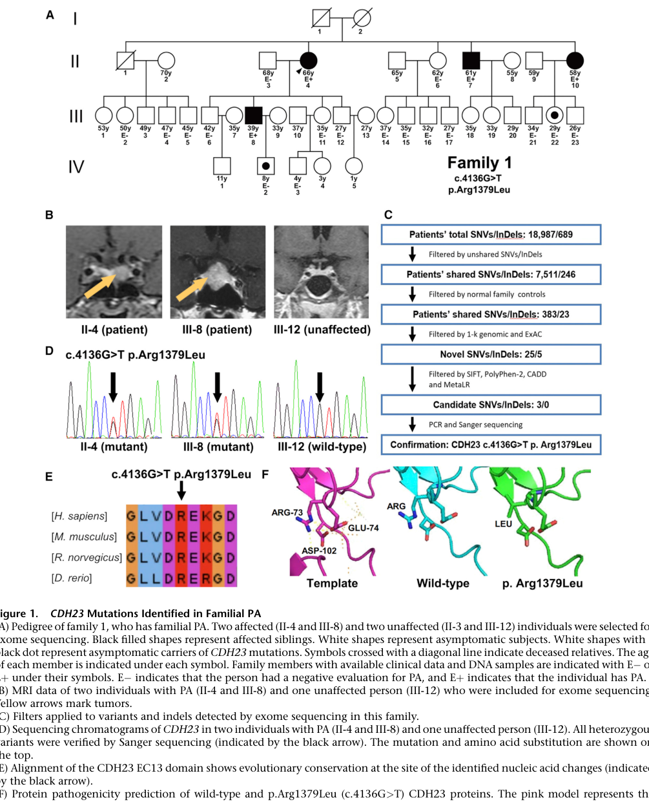

## Question

# Disease Characteristics Research Template

## Target Disease
- **Disease Name:** CDH23-associated pituitary adenoma 5
- **MONDO ID:**  (if available)
- **Category:** Genetic

## Research Objectives

Please provide a comprehensive research report on **CDH23-associated pituitary adenoma 5** covering all of the
disease characteristics listed below. This report will be used to populate a disease knowledge
base entry. Be thorough and cite primary literature (PMID preferred) for all claims.

For each section, **suggested databases/resources** are listed. These are the first places
you should search for information on each topic.

---

### 1. Disease Information
> **Search first:** OMIM, Orphanet, ICD-10/ICD-11, MeSH, PubMed

- What is the disease? Provide a concise overview.
- What are the key identifiers? (OMIM, Orphanet, ICD-10/ICD-11, MeSH, Mondo)
- What are the common synonyms and alternative names?
- Is the information derived from individual patients (e.g., EHR) or aggregated disease-level resources?

### 2. Etiology

- **Disease Causal Factors**: What are the primary causes? (genetic, environmental, infectious, mechanistic)
- **Risk Factors**:
  > **Search first:** PubMed, Cochrane Library, UpToDate, clinical guidelines, ClinVar, ClinGen, GWAS Catalog, PheGenI, CTD, CDC, WHO, epidemiological databases
  - Genetic risk factors (causal variants, susceptibility loci, modifier genes)
  - Environmental risk factors (toxins, lifestyle, occupational exposures, age, sex, family history)
- **Protective Factors**:
  > **Search first:** PubMed, Cochrane Library, clinical trial databases, GWAS Catalog, gnomAD, WHO, CDC, nutrition databases
  - Genetic protective factors (protective variants, modifier alleles)
  - Environmental protective factors (diet, lifestyle, exposures that reduce risk)
- **Gene-Environment Interactions**: How do genetic and environmental factors interact to influence disease?
  > **Search first:** CTD, PubMed, PheGenI, GxE databases

### 3. Phenotypes
> **Search first:** HPO (Human Phenotype Ontology), OMIM, Orphanet, PubMed, clinicaltrials.gov, MedDRA, SNOMED CT, DECIPHER, LOINC

For each phenotype, provide:
- **Phenotype type**: symptoms, clinical signs, physical manifestations, behavioral changes, or laboratory abnormalities
  > For symptoms/signs: HPO, OMIM, Orphanet, PubMed
  > For behavioral changes: HPO, DSM, RDoC (Research Domain Criteria), PubMed
  > For laboratory abnormalities: LOINC, SNOMED CT, LabTests Online, PubMed
- **Phenotype characteristics**:
  > **Search first:** OMIM, Orphanet, HPO, PubMed
  - Age of symptom onset (neonatal, childhood, adult-onset, late-onset)
  - Symptom severity (mild, moderate, severe, variable)
  - Symptom progression (stable, progressive, episodic, fluctuating)
  - Frequency among affected individuals (percentage or qualitative)
- **Quality of life impact**: Effects on daily functioning and well-being (per-phenotype when possible)
  > **Search first:** EQ-5D database, SF-36, WHO QOL databases, PubMed
- Suggest HPO (Human Phenotype Ontology) terms for each phenotype

### 4. Genetic/Molecular Information

- **Causal Genes**: Gene mutations or chromosomal abnormalities responsible for disease (gene symbols, OMIM IDs)
  > **Search first:** OMIM, ClinVar, HGMD, Ensembl, NCBI Gene
- **Pathogenic Variants**:
  - Affected genes (gene symbols, HGNC IDs)
    > **Search first:** OMIM, NCBI Gene, Ensembl, HGNC, UniProt, GeneCards
  - Variant classification (pathogenic, likely pathogenic, VUS per ACMG/AMP guidelines)
    > **Search first:** ClinVar, ClinGen, ACMG/AMP guidelines, VarSome
  - Variant type/class (missense, frameshift, nonsense, splice-site, structural)
  - Allele frequency in population databases
    > **Search first:** gnomAD, 1000 Genomes, ExAC, TOPMed, dbSNP
  - Somatic vs germline origin
    > **Search first:** COSMIC (somatic), ClinVar, ICGC, TCGA
  - Functional consequences (loss of function, gain of function, dominant negative)
- **Modifier Genes**: Genes that modify disease severity or expression
- **Epigenetic Information**: DNA methylation, histone modifications, chromatin changes affecting disease
  > **Search first:** ENCODE, Roadmap Epigenomics, MethBase, DiseaseMeth
- **Chromosomal Abnormalities**: Large-scale genetic changes (aneuploidy, translocations, inversions)
  > **Search first:** DECIPHER, ClinVar, ECARUCA, UCSC Genome Browser

### 5. Environmental Information

- **Environmental Factors**: Non-genetic contributing factors (toxins, radiation, pollution, occupational exposure)
  > **Search first:** CTD (Comparative Toxicogenomics Database), TOXNET, PubMed, EPA databases
- **Lifestyle Factors**: Behavioral factors (smoking, diet, exercise, alcohol consumption)
  > **Search first:** CDC databases, WHO, PubMed, NHANES
- **Infectious Agents**: If applicable, pathogens causing or triggering disease (bacteria, viruses, fungi, parasites)
  > **Search first:** NCBI Taxonomy, ViPR, BV-BRC, MicrobeDB, GIDEON

### 6. Mechanism / Pathophysiology

- **Molecular Pathways**: Specific signaling cascades or biochemical pathways involved (Wnt, MAPK, mTOR, PI3K-AKT, etc.)
  > **Search first:** KEGG, Reactome, WikiPathways, PathBank, BioCyc
- **Cellular Processes**: Cell-level mechanisms (apoptosis, autophagy, cell cycle dysregulation, inflammation, etc.)
  > **Search first:** Gene Ontology (GO), Reactome, KEGG, PubMed
- **Protein Dysfunction**: How protein structure or function is altered (misfolding, aggregation, loss of function, gain of function)
  > **Search first:** UniProt, PDB (Protein Data Bank), InterPro, Pfam, AlphaFold
- **Metabolic Changes**: Alterations in metabolic processes (energy metabolism, lipid metabolism, amino acid metabolism)
  > **Search first:** KEGG, BioCyc, HMDB (Human Metabolome Database), BRENDA
- **Immune System Involvement**: Role of immune response (autoimmunity, immunodeficiency, chronic inflammation)
  > **Search first:** ImmPort, Immunome Database, IEDB, Gene Ontology
- **Tissue Damage Mechanisms**: How tissues/ are injured (oxidative stress, ischemia, fibrosis, necrosis)
  > **Search first:** PubMed, Gene Ontology, Reactome
- **Biochemical Abnormalities**: Specific molecular defects (enzyme deficiencies, receptor dysfunction, ion channel defects)
  > **Search first:** BRENDA, UniProt, KEGG, OMIM, PubMed
- **Epigenetic Changes**: DNA methylation, histone modifications affecting gene expression in disease
  > **Search first:** ENCODE, Roadmap Epigenomics, MethBase, DiseaseMeth
- **Molecular Profiling** (if available):
  - Transcriptomics/gene expression changes
    > **Search first:** GEO (Gene Expression Omnibus), ArrayExpress, GTEx, Human Cell Atlas, SRA
  - Proteomics findings
    > **Search first:** PRIDE, ProteomeXchange, Human Protein Atlas, STRING, BioGRID
  - Metabolomics signatures
    > **Search first:** MetaboLights, Metabolomics Workbench, HMDB, METLIN
  - Lipidomics alterations
    > **Search first:** LIPID MAPS, SwissLipids, LipidHome, Metabolomics Workbench
  - Genomic structural features
    > **Search first:** UCSC Genome Browser, Ensembl, NCBI, dbVar, DGV
- **Advanced Technologies** (if applicable):
  - Single-cell analysis findings (cell-type specific mechanisms, cellular heterogeneity)
    > **Search first:** Human Cell Atlas, Single Cell Portal, GEO, CELLxGENE
  - Spatial transcriptomics findings
    > **Search first:** GEO, Spatial Research, Vizgen, 10x Genomics data
  - Multi-omics integration results
    > **Search first:** TCGA, ICGC, cBioPortal, LinkedOmics, PubMed
  - Functional genomics screens (CRISPR, RNAi)
    > **Search first:** DepMap, GenomeRNAi, PubMed, BioGRID ORCS

For each mechanism, describe:
- The causal chain from initial trigger to clinical manifestation
- Which mechanisms are upstream vs downstream
- What cell types and biological processes are involved
- Suggest GO terms for biological processes and CL terms for cell types

### 7. Anatomical Structures Affected

- **Organ Level**:
  - Primary organs directly affected
  - Secondary organ involvement (complications, secondary effects)
  - Body systems involved (cardiovascular, nervous, digestive, respiratory, endocrine, etc.)
  > **Search first:** Uberon, FMA (Foundational Model of Anatomy), OMIM, HPO, ICD-11, MeSH, SNOMED CT
- **Tissue and Cell Level**:
  - Specific tissue types affected (epithelial, connective, muscle, nervous)
  - Specific cell populations targeted (with Cell Ontology terms)
  > **Search first:** Uberon, Human Protein Atlas, Cell Ontology, Human Cell Atlas, CellMarker, PanglaoDB
- **Subcellular Level**:
  - Cellular compartments involved (mitochondria, nucleus, ER, lysosomes) (with GO Cellular Component terms)
  > **Search first:** Gene Ontology (Cellular Component), UniProt, Human Protein Atlas
- **Localization**:
  - Specific anatomical sites (with UBERON terms)
    > **Search first:** FMA, Uberon, NeuroNames (for brain), SNOMED CT
  - Lateralization (unilateral, bilateral, asymmetric)
    > **Search first:** HPO, clinical literature, imaging databases

### 8. Temporal Development

- **Onset**:
  - Typical age of onset (congenital, pediatric, adult, geriatric)
  - Onset pattern (acute, subacute, chronic, insidious)
  > **Search first:** OMIM, Orphanet, HPO, PubMed
- **Progression**:
  - Disease stages (early, intermediate, advanced, end-stage)
    > **Search first:** Cancer Staging Manual (AJCC), WHO classifications, PubMed
  - Progression rate (rapid, slow, variable)
  - Disease course pattern (episodic, relapsing-remitting, progressive, stable)
  - Disease duration (self-limited, chronic lifelong)
  > **Search first:** Disease registries, longitudinal cohort databases, natural history studies, PubMed, Orphanet, OMIM
- **Patterns**:
  - Remission patterns (spontaneous, treatment-induced)
    > **Search first:** Clinical trial databases, disease registries, PubMed
  - Critical periods (time windows of vulnerability or opportunity for intervention)
    > **Search first:** PubMed, developmental biology databases, clinical guidelines

### 9. Inheritance and Population

- **Epidemiology**:
  - Prevalence (cases per 100,000 at given time)
  - Incidence (new cases per 100,000 per year)
  > **Search first:** Orphanet, CDC, WHO, GBD (Global Burden of Disease), national registries, SEER, disease registries
- **For Genetic Etiology**:
  - Inheritance pattern (AD, AR, X-linked, mitochondrial, multifactorial, polygenic)
    > **Search first:** OMIM, Orphanet, ClinVar, GTR (Genetic Testing Registry)
  - Penetrance (complete, incomplete, age-dependent)
    > **Search first:** ClinVar, OMIM, PubMed, ClinGen
  - Expressivity (variable, consistent)
    > **Search first:** OMIM, ClinVar, PubMed
  - Genetic anticipation (increasing severity in successive generations)
    > **Search first:** OMIM, PubMed (especially for repeat expansion disorders)
  - Germline mosaicism
    > **Search first:** ClinVar, OMIM, genetic counseling literature, PubMed
  - Founder effects (population-specific mutations)
    > **Search first:** gnomAD, population genetics databases, PubMed
  - Consanguinity role
    > **Search first:** OMIM, population studies, genetic counseling resources
  - Carrier frequency
    > **Search first:** gnomAD, carrier screening databases, GeneReviews, GTR
- **Population Demographics**:
  - Affected populations (ethnic or demographic groups with higher prevalence)
    > **Search first:** gnomAD, 1000 Genomes, PAGE Study, PubMed, population registries
  - Geographic distribution (endemic areas, regional variation)
    > **Search first:** WHO, CDC, GBD, Orphanet, geographic epidemiology databases
  - Geographic distribution of specific variants
  - Sex ratio (male:female)
    > **Search first:** Disease registries, OMIM, PubMed, epidemiological databases
  - Age distribution of affected individuals
    > **Search first:** CDC, disease registries, SEER, Orphanet

### 10. Diagnostics

- **Clinical Tests**:
  - Laboratory tests (blood, urine, tissue chemistry, specific enzyme assays)
    > **Search first:** LOINC, LabTests Online, PubMed
  - Biomarkers (proteins, metabolites, genetic markers, circulating biomarkers)
    > **Search first:** FDA Biomarker List, BEST (Biomarkers, EndpointS, and other Tools), PubMed
  - Imaging studies (X-ray, CT, MRI, PET, ultrasound)
    > **Search first:** RadLex, DICOM, Radiopaedia, imaging databases
  - Functional tests (pulmonary function, cardiac stress tests)
    > **Search first:** LOINC, clinical guidelines, PubMed
  - Electrophysiology (EEG, EMG, ECG, nerve conduction studies)
    > **Search first:** LOINC, clinical neurophysiology databases, PubMed
  - Biopsy findings (histopathology, immunohistochemistry)
    > **Search first:** SNOMED CT, College of American Pathologists resources, PubMed
  - Pathology findings (microscopic examination)
    > **Search first:** SNOMED CT, Digital Pathology databases, PubMed
- **Genetic Testing**:
  > **Search first:** GTR (Genetic Testing Registry), GeneReviews, ClinGen
  - Overview of recommended genetic testing approach
  - Whole genome sequencing (WGS) utility
    > **Search first:** GTR, ClinVar, GEL (Genomics England), gnomAD
  - Whole exome sequencing (WES) utility
    > **Search first:** GTR, ClinVar, OMIM, GeneMatcher
  - Gene panels (which panels, which genes)
    > **Search first:** GTR, ClinVar, laboratory-specific databases
  - Single gene testing
    > **Search first:** GTR, ClinVar, OMIM, GeneReviews
  - Chromosomal microarray (CMA)
    > **Search first:** DECIPHER, ClinVar, dbVar, ECARUCA
  - Karyotyping
    > **Search first:** Chromosome Abnormality Database, ClinVar, cytogenetics resources
  - FISH
    > **Search first:** ClinVar, cytogenetics databases, PubMed
  - Mitochondrial DNA testing
    > **Search first:** MITOMAP, MSeqDR, ClinVar, GTR
  - Repeat expansion testing
    > **Search first:** GTR, ClinVar, repeat expansion databases, PubMed
- **Omics-Based Diagnostics** (if applicable):
  - RNA sequencing / transcriptomics
    > **Search first:** GEO, ArrayExpress, GTEx, RNA-seq databases
  - Proteomics
    > **Search first:** PRIDE, ProteomeXchange, FDA Biomarker database
  - Metabolomics
    > **Search first:** MetaboLights, Metabolomics Workbench, HMDB
  - Epigenomics
    > **Search first:** GEO, ENCODE, Roadmap Epigenomics, MethBase
  - Liquid biopsy
    > **Search first:** COSMIC, ClinVar, liquid biopsy databases, PubMed
- **Clinical Criteria**:
  - Standardized diagnostic criteria (DSM, ICD, society guidelines)
    > **Search first:** DSM-5, ICD-11, clinical society guidelines, UpToDate
  - Differential diagnosis (other conditions to rule out, with distinguishing features)
    > **Search first:** DynaMed, UpToDate, clinical decision support systems
- **Screening**:
  - Screening methods for asymptomatic individuals (newborn screening, carrier screening, cascade screening)
    > **Search first:** ACMG recommendations, CDC newborn screening, GTR

### 11. Outcome/Prognosis

- **Survival and Mortality**:
  - Survival rate (5-year, 10-year, overall)
    > **Search first:** SEER, cancer registries, disease-specific registries, PubMed
  - Life expectancy (with and without treatment if applicable)
    > **Search first:** Orphanet, disease registries, actuarial databases, PubMed
  - Mortality rate
    > **Search first:** CDC, WHO, GBD, national mortality databases
  - Disease-specific mortality (deaths directly attributable to disease)
    > **Search first:** Disease registries, CDC Wonder, GBD, PubMed
- **Morbidity and Function**:
  - Morbidity (disease-related disability and health impacts)
    > **Search first:** GBD, WHO, disability databases, PubMed
  - Disability outcomes (long-term functional impairments)
    > **Search first:** ICF (International Classification of Functioning), disability registries
  - Quality of life measures (EQ-5D, SF-36, PROMIS, disease-specific tools)
    > **Search first:** EQ-5D database, SF-36, PROMIS, PubMed
- **Disease Course**:
  - Complications (secondary problems: infections, organ failure, etc.)
    > **Search first:** ICD codes, disease registries, clinical databases, PubMed
  - Recovery potential (likelihood and extent of recovery, with vs without treatment)
    > **Search first:** Natural history studies, rehabilitation databases, PubMed
- **Prediction**:
  - Prognostic factors (age, disease severity, biomarkers, treatment response)
    > **Search first:** Prognostic models databases, clinical calculators, PubMed
  - Prognostic biomarkers (molecular markers predicting disease course)
    > **Search first:** FDA Biomarker database, PubMed, cancer prognostic databases

### 12. Treatment

- **Pharmacotherapy**:
  - Pharmacological treatments (drug names, drug classes, mechanisms of action)
    > **Search first:** DrugBank, RxNorm, ATC classification, DailyMed, FDA databases
  - Pharmacogenomics (how genetic variants affect drug metabolism, efficacy, toxicity)
    > **Search first:** PharmGKB, CPIC (Clinical Pharmacogenetics), FDA Table of PGx Biomarkers
- **Advanced Therapeutics**:
  - Gene therapy (viral vectors, CRISPR, gene replacement, gene editing)
    > **Search first:** ClinicalTrials.gov, FDA gene therapy database, ASGCT resources
  - Cell therapy (stem cell transplant, CAR-T, cellular therapeutics)
    > **Search first:** ClinicalTrials.gov, FDA cell therapy database, FACT standards
  - RNA-based therapies (ASOs, siRNA, mRNA therapies)
    > **Search first:** ClinicalTrials.gov, FDA approvals, PubMed
  - Targeted therapies (treatments directed at specific molecular targets)
    > **Search first:** My Cancer Genome, OncoKB, ClinicalTrials.gov, FDA approvals
  - Immunotherapies (checkpoint inhibitors, monoclonal antibodies)
    > **Search first:** Cancer Immunotherapy Database, FDA approvals, ClinicalTrials.gov
- **Surgical and Interventional**:
  - Surgical interventions (types of surgery, timing, outcomes)
    > **Search first:** CPT codes, surgical registries, clinical guidelines, PubMed
- **Supportive and Rehabilitative**:
  - Supportive care (symptom management, pain control, nutrition)
    > **Search first:** Clinical guidelines, Cochrane Library, PubMed
  - Rehabilitation (physical therapy, occupational therapy, speech therapy)
    > **Search first:** Rehabilitation medicine databases, clinical guidelines, PubMed
- **Experimental**:
  - Experimental treatments in clinical trials (with NCT identifiers if available)
    > **Search first:** ClinicalTrials.gov, EU Clinical Trials Register, WHO ICTRP
- **Treatment Outcomes**:
  - Treatment response rates
    > **Search first:** Clinical trial databases, FDA reviews, systematic reviews, PubMed
  - Side effects and adverse events
    > **Search first:** FDA Adverse Event Reporting System (FAERS), MedWatch, PubMed
- **Treatment Strategy**:
  - Treatment algorithms (clinical pathways, decision trees)
    > **Search first:** Clinical practice guidelines, NCCN Guidelines, UpToDate
  - Combination therapies
    > **Search first:** ClinicalTrials.gov, treatment guidelines, PubMed
  - Personalized medicine approaches (genotype-guided treatment)
    > **Search first:** My Cancer Genome, CIViC, PharmGKB, precision medicine databases

For each treatment, suggest MAXO (Medical Action Ontology) terms where applicable.

### 13. Prevention

- **Prevention Levels**:
  - Primary prevention (preventing disease occurrence: vaccination, risk factor modification)
    > **Search first:** CDC, WHO, USPSTF recommendations, Cochrane Library
  - Secondary prevention (early detection and treatment: screening programs, early intervention)
    > **Search first:** USPSTF, CDC screening guidelines, WHO
  - Tertiary prevention (preventing complications in those with disease)
    > **Search first:** Clinical guidelines, disease management protocols, PubMed
- **Immunization**: Vaccine strategies (if applicable)
  > **Search first:** CDC vaccine schedules, WHO immunization, FDA vaccine database
- **Screening and Early Detection**:
  - Screening programs (population-based: newborn screening, cancer screening)
    > **Search first:** CDC screening programs, USPSTF, cancer screening databases
  - Genetic screening (carrier screening, preimplantation genetic diagnosis, prenatal testing)
    > **Search first:** ACMG recommendations, ACOG guidelines, GTR
  - Risk stratification (identifying high-risk individuals for targeted prevention)
    > **Search first:** Risk prediction models, clinical calculators, PubMed
- **Behavioral Interventions**: Lifestyle modifications to reduce risk
  > **Search first:** CDC, WHO, behavioral intervention databases, Cochrane Library
- **Counseling**: Genetic counseling (risk assessment, family planning guidance)
  > **Search first:** NSGC resources, ACMG guidelines, GeneReviews
- **Public Health**:
  - Public health interventions (sanitation, vector control, health education)
    > **Search first:** CDC, WHO, public health databases, PubMed
  - Environmental interventions (reducing environmental risk factors)
    > **Search first:** EPA databases, WHO environmental health, PubMed
- **Prophylaxis**: Preventive medications or procedures
  > **Search first:** Clinical guidelines, FDA approvals, PubMed

### 14. Other Species / Natural Disease

- **Taxonomy**: Species affected (with NCBI Taxon identifiers)
  > **Search first:** NCBI Taxonomy
- **Breed**: Specific breeds affected (with VBO identifiers if applicable)
  > **Search first:** VBO (Vertebrate Breed Ontology)
- **Gene**: Orthologous genes in other species (with NCBI Gene IDs)
  > **Search first:** NCBI Gene
- **Natural Disease**:
  - Naturally occurring disease in other species (companion animals, wildlife)
    > **Search first:** OMIA (Online Mendelian Inheritance in Animals), VetCompass, PubMed
  - Veterinary relevance and importance in animal health
    > **Search first:** OMIA, veterinary databases, PubMed
- **Comparative Biology**:
  - Comparative pathology (similarities and differences across species)
    > **Search first:** OMIA, comparative pathology databases, PubMed
  - Evolutionary conservation of disease mechanisms
    > **Search first:** HomoloGene, OrthoMCL, Alliance of Genome Resources
- **Transmission** (if applicable):
  - Zoonotic potential
    > **Search first:** CDC zoonotic diseases, WHO zoonoses, GIDEON
  - Cross-species susceptibility
    > **Search first:** NCBI Taxonomy, veterinary databases, PubMed

### 15. Model Organisms

- **Model Types**:
  - Model organism type (mammalian, invertebrate, cellular, in vitro)
    > **Search first:** Alliance of Genome Resources, model organism databases
  - Specific model systems (mouse, rat, zebrafish, Drosophila, C. elegans, yeast, cell lines, organoids, iPSCs)
    > **Search first:** MGI, RGD, ZFIN, FlyBase, WormBase, SGD, ATCC, Cellosaurus
  - Induced models (drug treatment, surgical intervention, environmental manipulation)
    > **Search first:** MGI, model organism databases, PubMed
- **Genetic Models**:
  - Types available (knockout, knock-in, transgenic, conditional, humanized)
    > **Search first:** MGI, IMPC, KOMP, EuMMCR, IMSR
- **Model Characteristics**:
  - Phenotype recapitulation (how well model reproduces human disease features)
    > **Search first:** Model organism databases, comparative studies, PubMed
  - Model limitations (aspects of human disease not captured)
    > **Search first:** Model organism databases, PubMed, review articles
- **Applications**:
  - Research applications (what aspects of disease can be studied)
    > **Search first:** Model organism databases, PubMed
- **Resources**:
  - Model databases
    > **Search first:** MGI, RGD, ZFIN, FlyBase, WormBase, IMSR, EMMA, MMRRC

---

## Citation Requirements

- Cite primary literature (PMID preferred) for all mechanistic and clinical claims
- Prioritize recent reviews and landmark papers
- Include direct quotes from abstracts where possible to support key statements
- Distinguish evidence source types: human clinical, model organism, in vitro, computational

## Output Format

Structure your response as a comprehensive narrative organized by the sections above.
For each section, provide:
- Factual content with specific details (numbers, percentages, gene names, variant nomenclature)
- Ontology term suggestions (HPO, GO, CL, UBERON, CHEBI, MAXO, MONDO) where applicable
- Evidence citations with PMIDs
- Direct quotes from abstracts to support key claims
- Clear indication when information is not available or not applicable for this disease

This report will be used to populate a disease knowledge base entry with:
- Pathophysiology descriptions with causal chains
- Gene/protein annotations (HGNC, GO terms)
- Phenotype associations (HP terms) with frequencies
- Cell type involvement (CL terms)
- Anatomical locations (UBERON terms)
- Chemical entities (CHEBI terms)
- Treatment annotations (MAXO terms)
- Evidence items with PMIDs and exact abstract quotes
- Epidemiology, prognosis, diagnostic, and prevention information
- Animal model descriptions with phenotype recapitulation details

## Output

Question: You are an expert researcher providing comprehensive, well-cited information.

Provide detailed information focusing on:
1. Key concepts and definitions with current understanding
2. Recent developments and latest research (prioritize 2023-2024 sources)
3. Current applications and real-world implementations
4. Expert opinions and analysis from authoritative sources
5. Relevant statistics and data from recent studies

Format as a comprehensive research report with proper citations. Include URLs and publication dates where available.
Always prioritize recent, authoritative sources and provide specific citations for all major claims.

# Disease Characteristics Research Template

## Target Disease
- **Disease Name:** CDH23-associated pituitary adenoma 5
- **MONDO ID:**  (if available)
- **Category:** Genetic

## Research Objectives

Please provide a comprehensive research report on **CDH23-associated pituitary adenoma 5** covering all of the
disease characteristics listed below. This report will be used to populate a disease knowledge
base entry. Be thorough and cite primary literature (PMID preferred) for all claims.

For each section, **suggested databases/resources** are listed. These are the first places
you should search for information on each topic.

---

### 1. Disease Information
> **Search first:** OMIM, Orphanet, ICD-10/ICD-11, MeSH, PubMed

- What is the disease? Provide a concise overview.
- What are the key identifiers? (OMIM, Orphanet, ICD-10/ICD-11, MeSH, Mondo)
- What are the common synonyms and alternative names?
- Is the information derived from individual patients (e.g., EHR) or aggregated disease-level resources?

### 2. Etiology

- **Disease Causal Factors**: What are the primary causes? (genetic, environmental, infectious, mechanistic)
- **Risk Factors**:
  > **Search first:** PubMed, Cochrane Library, UpToDate, clinical guidelines, ClinVar, ClinGen, GWAS Catalog, PheGenI, CTD, CDC, WHO, epidemiological databases
  - Genetic risk factors (causal variants, susceptibility loci, modifier genes)
  - Environmental risk factors (toxins, lifestyle, occupational exposures, age, sex, family history)
- **Protective Factors**:
  > **Search first:** PubMed, Cochrane Library, clinical trial databases, GWAS Catalog, gnomAD, WHO, CDC, nutrition databases
  - Genetic protective factors (protective variants, modifier alleles)
  - Environmental protective factors (diet, lifestyle, exposures that reduce risk)
- **Gene-Environment Interactions**: How do genetic and environmental factors interact to influence disease?
  > **Search first:** CTD, PubMed, PheGenI, GxE databases

### 3. Phenotypes
> **Search first:** HPO (Human Phenotype Ontology), OMIM, Orphanet, PubMed, clinicaltrials.gov, MedDRA, SNOMED CT, DECIPHER, LOINC

For each phenotype, provide:
- **Phenotype type**: symptoms, clinical signs, physical manifestations, behavioral changes, or laboratory abnormalities
  > For symptoms/signs: HPO, OMIM, Orphanet, PubMed
  > For behavioral changes: HPO, DSM, RDoC (Research Domain Criteria), PubMed
  > For laboratory abnormalities: LOINC, SNOMED CT, LabTests Online, PubMed
- **Phenotype characteristics**:
  > **Search first:** OMIM, Orphanet, HPO, PubMed
  - Age of symptom onset (neonatal, childhood, adult-onset, late-onset)
  - Symptom severity (mild, moderate, severe, variable)
  - Symptom progression (stable, progressive, episodic, fluctuating)
  - Frequency among affected individuals (percentage or qualitative)
- **Quality of life impact**: Effects on daily functioning and well-being (per-phenotype when possible)
  > **Search first:** EQ-5D database, SF-36, WHO QOL databases, PubMed
- Suggest HPO (Human Phenotype Ontology) terms for each phenotype

### 4. Genetic/Molecular Information

- **Causal Genes**: Gene mutations or chromosomal abnormalities responsible for disease (gene symbols, OMIM IDs)
  > **Search first:** OMIM, ClinVar, HGMD, Ensembl, NCBI Gene
- **Pathogenic Variants**:
  - Affected genes (gene symbols, HGNC IDs)
    > **Search first:** OMIM, NCBI Gene, Ensembl, HGNC, UniProt, GeneCards
  - Variant classification (pathogenic, likely pathogenic, VUS per ACMG/AMP guidelines)
    > **Search first:** ClinVar, ClinGen, ACMG/AMP guidelines, VarSome
  - Variant type/class (missense, frameshift, nonsense, splice-site, structural)
  - Allele frequency in population databases
    > **Search first:** gnomAD, 1000 Genomes, ExAC, TOPMed, dbSNP
  - Somatic vs germline origin
    > **Search first:** COSMIC (somatic), ClinVar, ICGC, TCGA
  - Functional consequences (loss of function, gain of function, dominant negative)
- **Modifier Genes**: Genes that modify disease severity or expression
- **Epigenetic Information**: DNA methylation, histone modifications, chromatin changes affecting disease
  > **Search first:** ENCODE, Roadmap Epigenomics, MethBase, DiseaseMeth
- **Chromosomal Abnormalities**: Large-scale genetic changes (aneuploidy, translocations, inversions)
  > **Search first:** DECIPHER, ClinVar, ECARUCA, UCSC Genome Browser

### 5. Environmental Information

- **Environmental Factors**: Non-genetic contributing factors (toxins, radiation, pollution, occupational exposure)
  > **Search first:** CTD (Comparative Toxicogenomics Database), TOXNET, PubMed, EPA databases
- **Lifestyle Factors**: Behavioral factors (smoking, diet, exercise, alcohol consumption)
  > **Search first:** CDC databases, WHO, PubMed, NHANES
- **Infectious Agents**: If applicable, pathogens causing or triggering disease (bacteria, viruses, fungi, parasites)
  > **Search first:** NCBI Taxonomy, ViPR, BV-BRC, MicrobeDB, GIDEON

### 6. Mechanism / Pathophysiology

- **Molecular Pathways**: Specific signaling cascades or biochemical pathways involved (Wnt, MAPK, mTOR, PI3K-AKT, etc.)
  > **Search first:** KEGG, Reactome, WikiPathways, PathBank, BioCyc
- **Cellular Processes**: Cell-level mechanisms (apoptosis, autophagy, cell cycle dysregulation, inflammation, etc.)
  > **Search first:** Gene Ontology (GO), Reactome, KEGG, PubMed
- **Protein Dysfunction**: How protein structure or function is altered (misfolding, aggregation, loss of function, gain of function)
  > **Search first:** UniProt, PDB (Protein Data Bank), InterPro, Pfam, AlphaFold
- **Metabolic Changes**: Alterations in metabolic processes (energy metabolism, lipid metabolism, amino acid metabolism)
  > **Search first:** KEGG, BioCyc, HMDB (Human Metabolome Database), BRENDA
- **Immune System Involvement**: Role of immune response (autoimmunity, immunodeficiency, chronic inflammation)
  > **Search first:** ImmPort, Immunome Database, IEDB, Gene Ontology
- **Tissue Damage Mechanisms**: How tissues/ are injured (oxidative stress, ischemia, fibrosis, necrosis)
  > **Search first:** PubMed, Gene Ontology, Reactome
- **Biochemical Abnormalities**: Specific molecular defects (enzyme deficiencies, receptor dysfunction, ion channel defects)
  > **Search first:** BRENDA, UniProt, KEGG, OMIM, PubMed
- **Epigenetic Changes**: DNA methylation, histone modifications affecting gene expression in disease
  > **Search first:** ENCODE, Roadmap Epigenomics, MethBase, DiseaseMeth
- **Molecular Profiling** (if available):
  - Transcriptomics/gene expression changes
    > **Search first:** GEO (Gene Expression Omnibus), ArrayExpress, GTEx, Human Cell Atlas, SRA
  - Proteomics findings
    > **Search first:** PRIDE, ProteomeXchange, Human Protein Atlas, STRING, BioGRID
  - Metabolomics signatures
    > **Search first:** MetaboLights, Metabolomics Workbench, HMDB, METLIN
  - Lipidomics alterations
    > **Search first:** LIPID MAPS, SwissLipids, LipidHome, Metabolomics Workbench
  - Genomic structural features
    > **Search first:** UCSC Genome Browser, Ensembl, NCBI, dbVar, DGV
- **Advanced Technologies** (if applicable):
  - Single-cell analysis findings (cell-type specific mechanisms, cellular heterogeneity)
    > **Search first:** Human Cell Atlas, Single Cell Portal, GEO, CELLxGENE
  - Spatial transcriptomics findings
    > **Search first:** GEO, Spatial Research, Vizgen, 10x Genomics data
  - Multi-omics integration results
    > **Search first:** TCGA, ICGC, cBioPortal, LinkedOmics, PubMed
  - Functional genomics screens (CRISPR, RNAi)
    > **Search first:** DepMap, GenomeRNAi, PubMed, BioGRID ORCS

For each mechanism, describe:
- The causal chain from initial trigger to clinical manifestation
- Which mechanisms are upstream vs downstream
- What cell types and biological processes are involved
- Suggest GO terms for biological processes and CL terms for cell types

### 7. Anatomical Structures Affected

- **Organ Level**:
  - Primary organs directly affected
  - Secondary organ involvement (complications, secondary effects)
  - Body systems involved (cardiovascular, nervous, digestive, respiratory, endocrine, etc.)
  > **Search first:** Uberon, FMA (Foundational Model of Anatomy), OMIM, HPO, ICD-11, MeSH, SNOMED CT
- **Tissue and Cell Level**:
  - Specific tissue types affected (epithelial, connective, muscle, nervous)
  - Specific cell populations targeted (with Cell Ontology terms)
  > **Search first:** Uberon, Human Protein Atlas, Cell Ontology, Human Cell Atlas, CellMarker, PanglaoDB
- **Subcellular Level**:
  - Cellular compartments involved (mitochondria, nucleus, ER, lysosomes) (with GO Cellular Component terms)
  > **Search first:** Gene Ontology (Cellular Component), UniProt, Human Protein Atlas
- **Localization**:
  - Specific anatomical sites (with UBERON terms)
    > **Search first:** FMA, Uberon, NeuroNames (for brain), SNOMED CT
  - Lateralization (unilateral, bilateral, asymmetric)
    > **Search first:** HPO, clinical literature, imaging databases

### 8. Temporal Development

- **Onset**:
  - Typical age of onset (congenital, pediatric, adult, geriatric)
  - Onset pattern (acute, subacute, chronic, insidious)
  > **Search first:** OMIM, Orphanet, HPO, PubMed
- **Progression**:
  - Disease stages (early, intermediate, advanced, end-stage)
    > **Search first:** Cancer Staging Manual (AJCC), WHO classifications, PubMed
  - Progression rate (rapid, slow, variable)
  - Disease course pattern (episodic, relapsing-remitting, progressive, stable)
  - Disease duration (self-limited, chronic lifelong)
  > **Search first:** Disease registries, longitudinal cohort databases, natural history studies, PubMed, Orphanet, OMIM
- **Patterns**:
  - Remission patterns (spontaneous, treatment-induced)
    > **Search first:** Clinical trial databases, disease registries, PubMed
  - Critical periods (time windows of vulnerability or opportunity for intervention)
    > **Search first:** PubMed, developmental biology databases, clinical guidelines

### 9. Inheritance and Population

- **Epidemiology**:
  - Prevalence (cases per 100,000 at given time)
  - Incidence (new cases per 100,000 per year)
  > **Search first:** Orphanet, CDC, WHO, GBD (Global Burden of Disease), national registries, SEER, disease registries
- **For Genetic Etiology**:
  - Inheritance pattern (AD, AR, X-linked, mitochondrial, multifactorial, polygenic)
    > **Search first:** OMIM, Orphanet, ClinVar, GTR (Genetic Testing Registry)
  - Penetrance (complete, incomplete, age-dependent)
    > **Search first:** ClinVar, OMIM, PubMed, ClinGen
  - Expressivity (variable, consistent)
    > **Search first:** OMIM, ClinVar, PubMed
  - Genetic anticipation (increasing severity in successive generations)
    > **Search first:** OMIM, PubMed (especially for repeat expansion disorders)
  - Germline mosaicism
    > **Search first:** ClinVar, OMIM, genetic counseling literature, PubMed
  - Founder effects (population-specific mutations)
    > **Search first:** gnomAD, population genetics databases, PubMed
  - Consanguinity role
    > **Search first:** OMIM, population studies, genetic counseling resources
  - Carrier frequency
    > **Search first:** gnomAD, carrier screening databases, GeneReviews, GTR
- **Population Demographics**:
  - Affected populations (ethnic or demographic groups with higher prevalence)
    > **Search first:** gnomAD, 1000 Genomes, PAGE Study, PubMed, population registries
  - Geographic distribution (endemic areas, regional variation)
    > **Search first:** WHO, CDC, GBD, Orphanet, geographic epidemiology databases
  - Geographic distribution of specific variants
  - Sex ratio (male:female)
    > **Search first:** Disease registries, OMIM, PubMed, epidemiological databases
  - Age distribution of affected individuals
    > **Search first:** CDC, disease registries, SEER, Orphanet

### 10. Diagnostics

- **Clinical Tests**:
  - Laboratory tests (blood, urine, tissue chemistry, specific enzyme assays)
    > **Search first:** LOINC, LabTests Online, PubMed
  - Biomarkers (proteins, metabolites, genetic markers, circulating biomarkers)
    > **Search first:** FDA Biomarker List, BEST (Biomarkers, EndpointS, and other Tools), PubMed
  - Imaging studies (X-ray, CT, MRI, PET, ultrasound)
    > **Search first:** RadLex, DICOM, Radiopaedia, imaging databases
  - Functional tests (pulmonary function, cardiac stress tests)
    > **Search first:** LOINC, clinical guidelines, PubMed
  - Electrophysiology (EEG, EMG, ECG, nerve conduction studies)
    > **Search first:** LOINC, clinical neurophysiology databases, PubMed
  - Biopsy findings (histopathology, immunohistochemistry)
    > **Search first:** SNOMED CT, College of American Pathologists resources, PubMed
  - Pathology findings (microscopic examination)
    > **Search first:** SNOMED CT, Digital Pathology databases, PubMed
- **Genetic Testing**:
  > **Search first:** GTR (Genetic Testing Registry), GeneReviews, ClinGen
  - Overview of recommended genetic testing approach
  - Whole genome sequencing (WGS) utility
    > **Search first:** GTR, ClinVar, GEL (Genomics England), gnomAD
  - Whole exome sequencing (WES) utility
    > **Search first:** GTR, ClinVar, OMIM, GeneMatcher
  - Gene panels (which panels, which genes)
    > **Search first:** GTR, ClinVar, laboratory-specific databases
  - Single gene testing
    > **Search first:** GTR, ClinVar, OMIM, GeneReviews
  - Chromosomal microarray (CMA)
    > **Search first:** DECIPHER, ClinVar, dbVar, ECARUCA
  - Karyotyping
    > **Search first:** Chromosome Abnormality Database, ClinVar, cytogenetics resources
  - FISH
    > **Search first:** ClinVar, cytogenetics databases, PubMed
  - Mitochondrial DNA testing
    > **Search first:** MITOMAP, MSeqDR, ClinVar, GTR
  - Repeat expansion testing
    > **Search first:** GTR, ClinVar, repeat expansion databases, PubMed
- **Omics-Based Diagnostics** (if applicable):
  - RNA sequencing / transcriptomics
    > **Search first:** GEO, ArrayExpress, GTEx, RNA-seq databases
  - Proteomics
    > **Search first:** PRIDE, ProteomeXchange, FDA Biomarker database
  - Metabolomics
    > **Search first:** MetaboLights, Metabolomics Workbench, HMDB
  - Epigenomics
    > **Search first:** GEO, ENCODE, Roadmap Epigenomics, MethBase
  - Liquid biopsy
    > **Search first:** COSMIC, ClinVar, liquid biopsy databases, PubMed
- **Clinical Criteria**:
  - Standardized diagnostic criteria (DSM, ICD, society guidelines)
    > **Search first:** DSM-5, ICD-11, clinical society guidelines, UpToDate
  - Differential diagnosis (other conditions to rule out, with distinguishing features)
    > **Search first:** DynaMed, UpToDate, clinical decision support systems
- **Screening**:
  - Screening methods for asymptomatic individuals (newborn screening, carrier screening, cascade screening)
    > **Search first:** ACMG recommendations, CDC newborn screening, GTR

### 11. Outcome/Prognosis

- **Survival and Mortality**:
  - Survival rate (5-year, 10-year, overall)
    > **Search first:** SEER, cancer registries, disease-specific registries, PubMed
  - Life expectancy (with and without treatment if applicable)
    > **Search first:** Orphanet, disease registries, actuarial databases, PubMed
  - Mortality rate
    > **Search first:** CDC, WHO, GBD, national mortality databases
  - Disease-specific mortality (deaths directly attributable to disease)
    > **Search first:** Disease registries, CDC Wonder, GBD, PubMed
- **Morbidity and Function**:
  - Morbidity (disease-related disability and health impacts)
    > **Search first:** GBD, WHO, disability databases, PubMed
  - Disability outcomes (long-term functional impairments)
    > **Search first:** ICF (International Classification of Functioning), disability registries
  - Quality of life measures (EQ-5D, SF-36, PROMIS, disease-specific tools)
    > **Search first:** EQ-5D database, SF-36, PROMIS, PubMed
- **Disease Course**:
  - Complications (secondary problems: infections, organ failure, etc.)
    > **Search first:** ICD codes, disease registries, clinical databases, PubMed
  - Recovery potential (likelihood and extent of recovery, with vs without treatment)
    > **Search first:** Natural history studies, rehabilitation databases, PubMed
- **Prediction**:
  - Prognostic factors (age, disease severity, biomarkers, treatment response)
    > **Search first:** Prognostic models databases, clinical calculators, PubMed
  - Prognostic biomarkers (molecular markers predicting disease course)
    > **Search first:** FDA Biomarker database, PubMed, cancer prognostic databases

### 12. Treatment

- **Pharmacotherapy**:
  - Pharmacological treatments (drug names, drug classes, mechanisms of action)
    > **Search first:** DrugBank, RxNorm, ATC classification, DailyMed, FDA databases
  - Pharmacogenomics (how genetic variants affect drug metabolism, efficacy, toxicity)
    > **Search first:** PharmGKB, CPIC (Clinical Pharmacogenetics), FDA Table of PGx Biomarkers
- **Advanced Therapeutics**:
  - Gene therapy (viral vectors, CRISPR, gene replacement, gene editing)
    > **Search first:** ClinicalTrials.gov, FDA gene therapy database, ASGCT resources
  - Cell therapy (stem cell transplant, CAR-T, cellular therapeutics)
    > **Search first:** ClinicalTrials.gov, FDA cell therapy database, FACT standards
  - RNA-based therapies (ASOs, siRNA, mRNA therapies)
    > **Search first:** ClinicalTrials.gov, FDA approvals, PubMed
  - Targeted therapies (treatments directed at specific molecular targets)
    > **Search first:** My Cancer Genome, OncoKB, ClinicalTrials.gov, FDA approvals
  - Immunotherapies (checkpoint inhibitors, monoclonal antibodies)
    > **Search first:** Cancer Immunotherapy Database, FDA approvals, ClinicalTrials.gov
- **Surgical and Interventional**:
  - Surgical interventions (types of surgery, timing, outcomes)
    > **Search first:** CPT codes, surgical registries, clinical guidelines, PubMed
- **Supportive and Rehabilitative**:
  - Supportive care (symptom management, pain control, nutrition)
    > **Search first:** Clinical guidelines, Cochrane Library, PubMed
  - Rehabilitation (physical therapy, occupational therapy, speech therapy)
    > **Search first:** Rehabilitation medicine databases, clinical guidelines, PubMed
- **Experimental**:
  - Experimental treatments in clinical trials (with NCT identifiers if available)
    > **Search first:** ClinicalTrials.gov, EU Clinical Trials Register, WHO ICTRP
- **Treatment Outcomes**:
  - Treatment response rates
    > **Search first:** Clinical trial databases, FDA reviews, systematic reviews, PubMed
  - Side effects and adverse events
    > **Search first:** FDA Adverse Event Reporting System (FAERS), MedWatch, PubMed
- **Treatment Strategy**:
  - Treatment algorithms (clinical pathways, decision trees)
    > **Search first:** Clinical practice guidelines, NCCN Guidelines, UpToDate
  - Combination therapies
    > **Search first:** ClinicalTrials.gov, treatment guidelines, PubMed
  - Personalized medicine approaches (genotype-guided treatment)
    > **Search first:** My Cancer Genome, CIViC, PharmGKB, precision medicine databases

For each treatment, suggest MAXO (Medical Action Ontology) terms where applicable.

### 13. Prevention

- **Prevention Levels**:
  - Primary prevention (preventing disease occurrence: vaccination, risk factor modification)
    > **Search first:** CDC, WHO, USPSTF recommendations, Cochrane Library
  - Secondary prevention (early detection and treatment: screening programs, early intervention)
    > **Search first:** USPSTF, CDC screening guidelines, WHO
  - Tertiary prevention (preventing complications in those with disease)
    > **Search first:** Clinical guidelines, disease management protocols, PubMed
- **Immunization**: Vaccine strategies (if applicable)
  > **Search first:** CDC vaccine schedules, WHO immunization, FDA vaccine database
- **Screening and Early Detection**:
  - Screening programs (population-based: newborn screening, cancer screening)
    > **Search first:** CDC screening programs, USPSTF, cancer screening databases
  - Genetic screening (carrier screening, preimplantation genetic diagnosis, prenatal testing)
    > **Search first:** ACMG recommendations, ACOG guidelines, GTR
  - Risk stratification (identifying high-risk individuals for targeted prevention)
    > **Search first:** Risk prediction models, clinical calculators, PubMed
- **Behavioral Interventions**: Lifestyle modifications to reduce risk
  > **Search first:** CDC, WHO, behavioral intervention databases, Cochrane Library
- **Counseling**: Genetic counseling (risk assessment, family planning guidance)
  > **Search first:** NSGC resources, ACMG guidelines, GeneReviews
- **Public Health**:
  - Public health interventions (sanitation, vector control, health education)
    > **Search first:** CDC, WHO, public health databases, PubMed
  - Environmental interventions (reducing environmental risk factors)
    > **Search first:** EPA databases, WHO environmental health, PubMed
- **Prophylaxis**: Preventive medications or procedures
  > **Search first:** Clinical guidelines, FDA approvals, PubMed

### 14. Other Species / Natural Disease

- **Taxonomy**: Species affected (with NCBI Taxon identifiers)
  > **Search first:** NCBI Taxonomy
- **Breed**: Specific breeds affected (with VBO identifiers if applicable)
  > **Search first:** VBO (Vertebrate Breed Ontology)
- **Gene**: Orthologous genes in other species (with NCBI Gene IDs)
  > **Search first:** NCBI Gene
- **Natural Disease**:
  - Naturally occurring disease in other species (companion animals, wildlife)
    > **Search first:** OMIA (Online Mendelian Inheritance in Animals), VetCompass, PubMed
  - Veterinary relevance and importance in animal health
    > **Search first:** OMIA, veterinary databases, PubMed
- **Comparative Biology**:
  - Comparative pathology (similarities and differences across species)
    > **Search first:** OMIA, comparative pathology databases, PubMed
  - Evolutionary conservation of disease mechanisms
    > **Search first:** HomoloGene, OrthoMCL, Alliance of Genome Resources
- **Transmission** (if applicable):
  - Zoonotic potential
    > **Search first:** CDC zoonotic diseases, WHO zoonoses, GIDEON
  - Cross-species susceptibility
    > **Search first:** NCBI Taxonomy, veterinary databases, PubMed

### 15. Model Organisms

- **Model Types**:
  - Model organism type (mammalian, invertebrate, cellular, in vitro)
    > **Search first:** Alliance of Genome Resources, model organism databases
  - Specific model systems (mouse, rat, zebrafish, Drosophila, C. elegans, yeast, cell lines, organoids, iPSCs)
    > **Search first:** MGI, RGD, ZFIN, FlyBase, WormBase, SGD, ATCC, Cellosaurus
  - Induced models (drug treatment, surgical intervention, environmental manipulation)
    > **Search first:** MGI, model organism databases, PubMed
- **Genetic Models**:
  - Types available (knockout, knock-in, transgenic, conditional, humanized)
    > **Search first:** MGI, IMPC, KOMP, EuMMCR, IMSR
- **Model Characteristics**:
  - Phenotype recapitulation (how well model reproduces human disease features)
    > **Search first:** Model organism databases, comparative studies, PubMed
  - Model limitations (aspects of human disease not captured)
    > **Search first:** Model organism databases, PubMed, review articles
- **Applications**:
  - Research applications (what aspects of disease can be studied)
    > **Search first:** Model organism databases, PubMed
- **Resources**:
  - Model databases
    > **Search first:** MGI, RGD, ZFIN, FlyBase, WormBase, IMSR, EMMA, MMRRC

---

## Citation Requirements

- Cite primary literature (PMID preferred) for all mechanistic and clinical claims
- Prioritize recent reviews and landmark papers
- Include direct quotes from abstracts where possible to support key statements
- Distinguish evidence source types: human clinical, model organism, in vitro, computational

## Output Format

Structure your response as a comprehensive narrative organized by the sections above.
For each section, provide:
- Factual content with specific details (numbers, percentages, gene names, variant nomenclature)
- Ontology term suggestions (HPO, GO, CL, UBERON, CHEBI, MAXO, MONDO) where applicable
- Evidence citations with PMIDs
- Direct quotes from abstracts to support key claims
- Clear indication when information is not available or not applicable for this disease

This report will be used to populate a disease knowledge base entry with:
- Pathophysiology descriptions with causal chains
- Gene/protein annotations (HGNC, GO terms)
- Phenotype associations (HP terms) with frequencies
- Cell type involvement (CL terms)
- Anatomical locations (UBERON terms)
- Chemical entities (CHEBI terms)
- Treatment annotations (MAXO terms)
- Evidence items with PMIDs and exact abstract quotes
- Epidemiology, prognosis, diagnostic, and prevention information
- Animal model descriptions with phenotype recapitulation details

# Comprehensive Disease Research Report: CDH23-associated pituitary adenoma 5 (genetic predisposition to PitNET/PA)

## Target disease
**Disease name:** CDH23-associated pituitary adenoma 5 (often discussed as germline CDH23–associated predisposition to pituitary adenoma / pituitary neuroendocrine tumor (PitNET)) (zhang2017germlinemutationsin pages 1-2)
**Category:** Genetic (germline predisposition) (zhang2017germlinemutationsin pages 1-2)

---

## 1. Disease information
### 1.1 Concise overview
“CDH23-associated pituitary adenoma 5” refers to pituitary adenoma/PitNET susceptibility associated with **germline variants in CDH23 (cadherin-related 23)**, initially reported through familial segregation and case-control enrichment analyses and subsequently observed in additional sequencing cohorts. (zhang2017germlinemutationsin pages 1-2)

Pituitary adenomas are now commonly referred to as **pituitary neuroendocrine tumours (PitNETs)** in the WHO nomenclature. (sousa2023pituitarytumoursmolecular pages 1-2, sousa2023pituitarytumoursmolecular pages 2-4)

### 1.2 Key identifiers
* **MONDO / OMIM / Orphanet / MeSH / ICD-10/11:** Not retrievable with available tools in this run; OpenTargets did not map “CDH23-associated pituitary adenoma 5” to a disease identifier. (tool error noted in history; disease-specific ID not available)

### 1.3 Synonyms / alternative names (used in literature)
* Pituitary adenoma; pituitary neuroendocrine tumour (PitNET) (sousa2023pituitarytumoursmolecular pages 1-2, sousa2023pituitarytumoursmolecular pages 2-4)
* Familial isolated pituitary adenoma (FIPA) context when familial aggregation occurs (zhang2017germlinemutationsin pages 1-2)

### 1.4 Evidence source types
* **Aggregated cohort-level human genetics:** family-based WES + case-control screening and association testing (zhang2017germlinemutationsin pages 1-2)
* **Human sequencing cohorts (apparently sporadic PA):** WES/panel studies reporting rare CDH23 variants (alzahrani2024germlinevariantsin pages 4-5, gaspar2024germlinemutationsin pages 1-6, gaspar2024germlinemutationsin pages 6-9)
* **Experimental disease modeling:** patient-derived iPSC → pituitary organoids for corticotroph PitNET/Cushing’s disease modeling (chakrabarti2023or2005generationof pages 1-1)
* **Guideline-level sources** (for diagnostics/treatment): prolactinoma/pediatric pituitary adenoma guidance (korbonits2024consensusguidelinefor pages 2-3, cozzi2023italianguidelinesfor pages 1-2)

---

## 2. Etiology
### 2.1 Disease causal factors
**Primary causal factor:** **germline CDH23 variation** associated with pituitary adenoma susceptibility.

* In the discovery report, WES in a pituitary adenoma family identified a heterozygous CDH23 missense variant **c.4136G>T (p.Arg1379Leu)** that **cosegregated** with disease. (zhang2017germlinemutationsin pages 1-2)
* In extended screening, **functional CDH23 variants** were enriched in cases vs controls (familial and sporadic cohorts). (zhang2017germlinemutationsin pages 1-2)

### 2.2 Risk factors
#### Genetic risk factors
* **CDH23**: case enrichment and family segregation support CDH23 as a pituitary adenoma predisposition gene. (zhang2017germlinemutationsin pages 1-2)
  * Discovery study screening: functional CDH23 variants in **33% of familial PA families (4/12)** and **12% of sporadic PA individuals (15/125)** vs **0.8% of controls (2/260)**; gene-based association p reported as **5.54×10⁻⁷**. (zhang2017germlinemutationsin pages 1-2)
* Subsequent cohorts continued to identify rare germline CDH23 variants in apparently sporadic pituitary adenomas and in young-onset macroadenomas (variant examples summarized in artifacts below). (alzahrani2024germlinevariantsin pages 4-5, gaspar2024germlinemutationsin pages 6-9)

#### Environmental / lifestyle risk factors
No CDH23-specific environmental or lifestyle risk factors were identified in the retrieved evidence; pituitary adenomas are typically considered primarily driven by genetic/epigenetic mechanisms with subtype-specific biology. (sousa2023pituitarytumoursmolecular pages 1-2, sousa2023pituitarytumoursmolecular pages 2-4)

### 2.3 Protective factors
No CDH23-specific protective factors were identified in the retrieved evidence.

### 2.4 Gene–environment interactions
No CDH23-specific gene–environment interaction evidence was identified in the retrieved sources.

---

## 3. Phenotypes
CDH23-associated pituitary adenoma susceptibility spans multiple pituitary tumor lineages/subtypes (GH, ACTH, PRL, and nonfunctioning tumors reported across cohorts/case reports). (zhang2017germlinemutationsin pages 1-2, ertorer2025arylhydrocarbonreceptor pages 7-7, alzahrani2024germlinevariantsin pages 4-5, albasri2026anovelgermline pages 1-2)

A phenotype-to-HPO mapping based strictly on extracted evidence is provided here:

| Clinical feature / phenotype | Suggested HPO term(s) | Typical laboratory / imaging findings supported by evidence | Reported tumor subtype / context | Evidence |
|---|---|---|---|---|
| Acromegaly / GH excess | HP:0001510 Acromegaly; HP:0000829 Growth hormone excess | High GH or IGF-1 reported in affected carriers; one 48-year-old man with CDH23 p.E302D had an acromegaly–prolactinoma macroadenoma | GH-secreting pituitary adenoma; mixed acromegaly–prolactinoma macroadenoma | (zhang2017germlinemutationsin pages 1-2, alzahrani2024germlinevariantsin pages 4-5) |
| Cushing disease / ACTH excess | HP:0000846 Hypercortisolism; HP:0011748 Increased circulating ACTH level | ACTH-secreting corticotroph PitNETs reported; CDH23-mutant patient-derived iPSC organoids showed corticotroph-like trajectories and tumor behavior; a Turkish FIPA family with CDH23 p.Ala765Val included an ACTH-secreting adenoma | Corticotroph PitNET / ACTH-secreting pituitary adenoma | (ertorer2025arylhydrocarbonreceptor pages 7-7, chakrabarti2023or2005generationof pages 1-1) |
| Prolactinoma / hyperprolactinemia with hypogonadism | HP:0002904 Hyperprolactinemia; HP:0000824 Hypogonadotropic hypogonadism; HP:0008245 Central hypothyroidism | Ultra-giant prolactinoma case: prolactin 277,500 ng/mL; extensive sellar, supra/parasellar, skull-base and nasopharyngeal involvement; associated mild central hypothyroidism and hypogonadotropic hypogonadism; marked clinical/radiologic response to low-dose cabergoline | Prolactinoma, specifically ultra-giant prolactinoma | (albasri2026anovelgermline pages 1-2) |
| Nonfunctioning macroadenoma | HP:0000818 Abnormality of the endocrine system; HP:0000505 Visual impairment (possible mass effect, when present) | CDH23 p.A366T identified in a 22-year-old woman with a nonfunctioning macroadenoma; by definition, nonfunctioning tumors lack a hypersecretory hormonal syndrome in the excerpt | Nonfunctioning pituitary macroadenoma | (alzahrani2024germlinevariantsin pages 4-5) |
| Macroadenoma / large invasive tumor burden | HP:0001085 Macroadenoma; HP:0012813 Pituitary mass | Macroadenomas were reported in sporadic CDH23-variant carriers; giant prolactinomas are defined as pituitary adenomas ≥4 cm with plasma prolactin >1000 ng/mL; invasive extension into skull base/nasopharynx described in one CDH23 case | Macroadenoma; giant/ultra-giant prolactinoma | (alzahrani2024germlinevariantsin pages 4-5, albasri2026anovelgermline pages 1-2) |
| Invasiveness / extensive local extension | HP:0033690 Invasive neoplasm; HP:0012813 Pituitary mass | In the discovery study, non-CDH23 cases were noted to have larger, more invasive tumors; later CDH23-associated prolactinoma case showed extensive infiltrative sellar/suprasellar/parasellar and skull-base disease | Invasive PitNET behavior reported across familial/sporadic contexts; especially giant prolactinoma | (zhang2017germlinemutationsin pages 1-2, albasri2026anovelgermline pages 1-2) |
| Possible reduced/age-dependent penetrance | HP:0003829 Variable expressivity (suggested); HP:0003677 Slow progression (suggested disease predisposition context) | Two family members carrying the segregating CDH23 variant were phenotypically unaffected but were younger than 30 years, suggesting incomplete or age-dependent penetrance rather than absence of risk | Familial CDH23-associated pituitary adenoma predisposition | (zhang2017germlinemutationsin pages 1-2) |

*Table: This table maps the main clinically reported manifestations of CDH23-associated pituitary adenoma/PitNET cases to suggested HPO terms, alongside the supporting lab and imaging findings. It is useful for structuring phenotype annotations in a disease knowledge base while keeping each row tied to published evidence.*

**Penetrance/expressivity:** In the original segregating family, **two mutation carriers were phenotypically unaffected but <30 years old**, supporting **incomplete and/or age-dependent penetrance**. (zhang2017germlinemutationsin pages 1-2)

Quality-of-life impacts (general, tumor-subtype dependent) include endocrine morbidity (e.g., acromegaly, Cushing disease, hypogonadism) and mass effects (e.g., visual impairment) consistent with pituitary adenomas, but CDH23-specific QoL quantitative data were not found in the retrieved sources. (korbonits2024consensusguidelinefor pages 2-3, korbonits2024consensusguidelinefor pages 1-2)

---

## 4. Genetic / molecular information
### 4.1 Causal gene
**CDH23** (cadherin-related 23), a cadherin-superfamily member involved in calcium-dependent cell–cell adhesion. (shen2019insightsintopituitary pages 5-6, zhang2017germlinemutationsin pages 1-2)

### 4.2 Pathogenic/implicated variants (examples)
Across studies, implicated variants are mainly **heterozygous missense** germline changes; evidence strength varies by cohort and classification method.

* Discovery family segregating variant: **c.4136G>T (p.Arg1379Leu)**. (zhang2017germlinemutationsin pages 1-2)
* Apparently sporadic cohort: **c.906G>C (p.E302D)**; **c.1096G>A (p.A366T)** (reclassified by authors’ in-silico approach as likely pathogenic). (alzahrani2024germlinevariantsin pages 4-5, alzahrani2024germlinevariantsin pages 1-2)
* Young-onset macroadenoma panel: **p.Glu2520Lys** (heterozygous; single case in 225). (gaspar2024germlinemutationsin pages 6-9)
* Additional familial report: **p.Ala765Val** in an affected sib-pair with ACTH-secreting adenoma. (ertorer2025arylhydrocarbonreceptor pages 7-7)
* Single-case ultra-giant prolactinoma: **NM_022124.6:c.2621C>A (p.Ala874Asp)**. (albasri2026anovelgermline pages 1-2)

A structured variant summary is provided here:

| Publication year | Study | Study type / cohort | CDH23 germline variant(s) | Phenotype / tumor subtype | Key statistics | URL / DOI | Citation |
|---|---|---|---|---|---|---|---|
| 2017 | Zhang et al. | Discovery family by WES plus follow-up screening of 12 familial PA kindreds, 125 sporadic PA cases, and 260 controls | c.4136G>T (p.Arg1379Leu) segregating in one family; additional functional germline CDH23 variants reported across screened cohorts | Familial isolated pituitary adenoma; reported phenotypes included GH-secreting PA with acromegaly/high GH or IGF-1 and nonfunctioning PA | Functional CDH23 variants in 4/12 familial kindreds (33%), 15/125 sporadic cases (12%), and 2/260 controls (0.8%); gene-based association p=5.54×10^-7 | https://doi.org/10.1016/j.ajhg.2017.03.011 | (zhang2017germlinemutationsin pages 1-2, zhang2017germlinemutationsin media 44e0f3aa) |
| 2024 | Alzahrani et al. | WES of 134 apparently sporadic pituitary adenomas | c.906G>C (p.E302D); c.1096G>A (p.A366T) | p.E302D: acromegaly-prolactinoma macroadenoma in a 48-year-old man; p.A366T: nonfunctioning macroadenoma in a 22-year-old woman | 2 CDH23 variants among 134 sporadic PA patients; study estimated likely pathogenic germline variants in PA-associated genes in ~6.7% overall; CDH23 variants were ACMG VUS/benign but AlphaMissense-likely pathogenic | https://doi.org/10.1210/jendso/bvae085 | (alzahrani2024germlinevariantsin pages 4-5, alzahrani2024germlinevariantsin pages 1-2) |
| 2024 | Gaspar et al. | Multigene panel analysis of 225 young-onset sporadic pituitary macroadenomas | p.Glu2520Lys (protein reported; cDNA not provided in excerpt) | Pituitary macroadenoma; subtype not specified in excerpt | 1/225 patients (~0.4%) carried a CDH23 P/LP variant; overall P/LP yield 16/225 (7.1%); authors described this as independent confirmation of CDH23 involvement | https://doi.org/10.1101/2024.06.02.24308129 | (gaspar2024germlinemutationsin pages 1-6, gaspar2024germlinemutationsin pages 6-9) |
| 2023 | Chakrabarti et al. | Patient-derived iPSC / PitNET organoid modeling from a CD patient with CDH23 mutation | Specific variant not given in abstract excerpt | Corticotroph PitNET / Cushing's disease model | No cohort frequency reported; organoids showed dysregulated cell cycle/proliferation, E2F upregulation, increased CD44/xCT antioxidant signaling, and skewing toward corticotroph/NOTCH trajectories | https://doi.org/10.1210/jendso/bvad114.1314 | (chakrabarti2023or2005generationof pages 1-1) |
| 2025 | Ertorer et al. | WES of 20 Turkish FIPA cases from 12 families | p.Ala765Val | Familial isolated pituitary adenoma; affected sib-pair including an ACTH-secreting adenoma | CDH23 variant identified in 1/20 FIPA cases/families reported in this cohort (5% as summarized in excerpt) | https://doi.org/10.1038/s41598-025-08610-1 | (ertorer2025arylhydrocarbonreceptor pages 7-7) |
| 2026 | Albasri et al. | Single-case WES report | NM_022124.6:c.2621C>A (p.Ala874Asp) | Ultra-giant prolactinoma with extensive skull-base/nasopharyngeal invasion | Single case; giant prolactinomas occur in ~1–5% of prolactinomas; marked clinical/radiologic response to low-dose cabergoline reported | https://doi.org/10.1186/s13023-025-04161-w | (albasri2026anovelgermline pages 1-2) |

*Table: This table summarizes the key reported germline CDH23 variants linked to pituitary adenomas/PitNETs, including discovery and follow-up cohorts, tumor phenotypes, and available frequency statistics. It is useful for quickly comparing the strength and scope of evidence across studies.*

### 4.3 Somatic vs germline
The association emphasized here is **germline** (inherited) variants; for the cases summarized, CDH23 variants were reported from blood DNA germline analyses (WES/panels/case report). (zhang2017germlinemutationsin pages 1-2, alzahrani2024germlinevariantsin pages 4-5, gaspar2024germlinemutationsin pages 6-9, albasri2026anovelgermline pages 1-2)

### 4.4 Functional consequence (current understanding)
CDH23 is described as a **calcium-dependent cell–cell adhesion glycoprotein**. (shen2019insightsintopituitary pages 5-6)

The discovery segregating variant affected an amino acid in the **calcium-binding motif of extracellular cadherin (EC) domains** and was predicted to impair adhesion, suggesting a plausible tumor-susceptibility mechanism via altered adhesion/microenvironmental interactions. (zhang2017germlinemutationsin pages 1-2)

### 4.5 Modifier genes / epigenetics / chromosomal abnormalities
No CDH23-specific modifier genes or epigenetic signatures were identified in the retrieved evidence.

---

## 5. Environmental information
No CDH23-specific environmental, lifestyle, or infectious contributors were identified in the retrieved sources.

---

## 6. Mechanism / pathophysiology
### 6.1 Proposed causal chain (evidence-supported components)
1. **Germline CDH23 missense variation** (often in EC-domain regions affecting calcium-binding motifs) may alter CDH23 structure and **cell–cell adhesion** properties. (zhang2017germlinemutationsin pages 1-2, shen2019insightsintopituitary pages 5-6)
2. Altered adhesion and/or downstream cellular programs may increase susceptibility to pituitary tumor formation; in the discovery study, CDH23 variants were enriched in cases and the family variant cosegregated with disease. (zhang2017germlinemutationsin pages 1-2)
3. In experimental modeling of Cushing’s disease, **CDH23-mutant patient-derived iPSC pituitary organoids** showed tumor-like behavior and transcriptomic features consistent with pituitary tumorigenesis, including **dysregulated cell cycle / increased proliferation markers**, **E2F family upregulation**, increased **CD44/xCT (SLC7A11) antioxidant system**, and altered **Wnt/NOTCH+ stem-like** lineage trajectories with terminal enrichment for **corticotroph markers** and **NOTCH signaling**. (chakrabarti2023or2005generationof pages 1-1)

### 6.2 Pathways and processes (suggested ontology mappings)
**Biological process (GO) suggestions** (based on reported mechanisms):
* Cell–cell adhesion (e.g., GO:0098609 cell-cell adhesion) (supported conceptually by cadherin function) (shen2019insightsintopituitary pages 5-6, zhang2017germlinemutationsin pages 1-2)
* Cell cycle regulation / proliferation (e.g., GO:0007049 cell cycle) (chakrabarti2023or2005generationof pages 1-1)
* Notch signaling pathway (e.g., GO:0007219 Notch signaling pathway) (chakrabarti2023or2005generationof pages 1-1)
* Wnt signaling pathway (e.g., GO:0016055 Wnt signaling pathway) (chakrabarti2023or2005generationof pages 1-1)
* Response to oxidative stress / cystine-glutamate transport system involvement (conceptual mapping to SLC7A11/xCT) (chakrabarti2023or2005generationof pages 1-1)

**Cell type (CL) suggestions** (based on reported tumor lineage in modeling and clinical phenotypes):
* Corticotroph (ACTH-secreting pituitary cell) (chakrabarti2023or2005generationof pages 1-1)
* Somatotroph (GH-secreting pituitary cell) (zhang2017germlinemutationsin pages 1-2)
* Lactotroph (prolactin-secreting pituitary cell) (albasri2026anovelgermline pages 1-2)

### 6.3 Molecular profiling
Single-cell transcriptomic findings were reported for CDH23-mutant iPSC-derived organoid models (see above). (chakrabarti2023or2005generationof pages 1-1)

---

## 7. Anatomical structures affected
### 7.1 Primary organ
* **Pituitary gland (anterior pituitary)**; lesions are pituitary adenomas/PitNETs. (sousa2023pituitarytumoursmolecular pages 1-2, sousa2023pituitarytumoursmolecular pages 2-4)

### 7.2 Localization / extension
Macroadenomas and invasive phenotypes are represented among CDH23-associated cases, including an ultra-giant prolactinoma with extensive skull base/nasopharyngeal involvement. (albasri2026anovelgermline pages 1-2)

**UBERON suggestions:**
* UBERON:0000007 pituitary gland (conceptual mapping; not directly provided in evidence text)

---

## 8. Temporal development
**Age of onset:** Variable; evidence includes young-onset macroadenoma cohorts and adult cases. (gaspar2024germlinemutationsin pages 6-9, alzahrani2024germlinevariantsin pages 4-5)

**Progression/course:** Tumor subtype-dependent; one source describes pituitary adenoma recurrence after resection generally occurring within 1–5 years and reports a 10-year recurrence estimate of 7–12% in pituitary adenomas overall (not CDH23-specific). (chang2021geneticandepigenetic pages 1-2)

---

## 9. Inheritance and population
### 9.1 Inheritance pattern
The discovery family finding and subsequent familial reports are consistent with **autosomal dominant predisposition with incomplete/age-dependent penetrance**, as carriers may be unaffected at younger ages. (zhang2017germlinemutationsin pages 1-2)

### 9.2 Epidemiology and population statistics
**General pituitary tumor epidemiology (context):**
* Prevalence of clinically relevant pituitary adenomas: **~1 in 1000**. (sousa2023pituitarytumoursmolecular pages 1-2)
* Familial pituitary tumors: **~5% of pituitary adenoma cases**. (sousa2023pituitarytumoursmolecular pages 1-2, sousa2023pituitarytumoursmolecular pages 2-4)

**Prolactinoma epidemiology (context):**
* Prolactinomas account for ~50% of pituitary adenomas; guideline gives prevalence **~50/100,000** and incidence **3–5/100,000/year**. (cozzi2023italianguidelinesfor pages 1-2)
* Giant prolactinomas occur in **~1–5% of prolactinomas**. (albasri2026anovelgermline pages 1-2)

**CDH23-associated pituitary adenoma 5 (direct estimates):**
True population prevalence is unknown; available evidence is from selected cohorts.
* Discovery study reported functional CDH23 variants in **4/12 familial kindreds** and **15/125 sporadic cases**, versus **2/260 controls**. (zhang2017germlinemutationsin pages 1-2)
* A young-onset sporadic macroadenoma panel study reported **1 CDH23 P/LP case in 225** (~0.4%). (gaspar2024germlinemutationsin pages 6-9)

---

## 10. Diagnostics
CDH23-specific diagnostic criteria are not established; diagnosis follows standard pituitary adenoma subtype workups plus consideration of germline testing in selected patients.

Key guideline-based diagnostic points:
* **PRL testing pitfalls:** macroprolactin screening and “hook effect” dilution testing in large lesions; hook effect reported in ~5% of macroprolactinomas in the cited pediatric consensus excerpt. (korbonits2024consensusguidelinefor pages 2-3, cozzi2023italianguidelinesfor pages 2-3)
* **Imaging:** MRI is central to classify micro/macroadenoma and assess invasion. (cozzi2023italianguidelinesfor pages 1-2)
* **Hormone panels:** IGF-1 in suspected mixed secretion; evaluation of confounders (thyroid, renal/hepatic disease, medications) in interpreting prolactin. (korbonits2024consensusguidelinefor pages 2-3, korbonits2024consensusguidelinefor pages 1-2)

**Genetic testing implementation:** Young-onset disease and family history are repeatedly emphasized as determinants of germline variant detection; multigene panels/WES have been used to identify CDH23 variants. (gaspar2024germlinemutationsin pages 1-6, gaspar2024germlinemutationsin pages 6-9, zhang2017germlinemutationsin pages 1-2)

A structured diagnostics and treatment summary (with MAXO suggestions) is provided here:

| Domain | Test / intervention | What to do / when to use | Key details / outcome statistics | Suggested MAXO term(s) | Evidence |
|---|---|---|---|---|---|
| Diagnostics | Serum prolactin (PRL) assay | First-line biochemical test when prolactinoma is suspected; confirm hyperprolactinemia with careful sampling | Basal PRL should be measured with attention to assay conditions; prolactinomas account for ~50% of pituitary adenomas, with prevalence ~50/100,000 and incidence 3–5/100,000/year in the cited guideline context (cozzi2023italianguidelinesfor pages 1-2) | MAXO:0000001 clinical test; MAXO:0000408 hormone measurement | (cozzi2023italianguidelinesfor pages 1-2, korbonits2024consensusguidelinefor pages 1-2) |
| Diagnostics | Macroprolactin assessment | Check when PRL is only mildly elevated or incidentally high to avoid misclassification | Polyethylene glycol precipitation is recommended; recovery <40% suggests macroprolactin predominance, >60% suggests true monomeric hyperprolactinemia (cozzi2023italianguidelinesfor pages 2-3) | MAXO:0000001 clinical test; MAXO:0000408 hormone measurement | (cozzi2023italianguidelinesfor pages 2-3, korbonits2024consensusguidelinefor pages 2-3) |
| Diagnostics | Hook effect / assay dilution | Use serial dilutions for large pituitary lesions with only modest PRL elevation | The high-dose hook effect can mask severe hyperprolactinemia and is reported in ~5% of macroprolactinomas in the pediatric consensus excerpt (korbonits2024consensusguidelinefor pages 2-3) | MAXO:0000001 clinical test | (korbonits2024consensusguidelinefor pages 2-3, cozzi2023italianguidelinesfor pages 2-3) |
| Diagnostics | MRI of sellar region | Standard imaging to define pituitary lesion size, invasion, optic apparatus compression, and treatment planning | Macroadenoma versus microadenoma classification and invasive extension are central for management; CDH23-associated cases reported macroadenoma and giant invasive phenotypes (alzahrani2024germlinevariantsin pages 4-5, albasri2026anovelgermline pages 1-2) | MAXO:0000376 magnetic resonance imaging | (alzahrani2024germlinevariantsin pages 4-5, albasri2026anovelgermline pages 1-2, cozzi2023italianguidelinesfor pages 1-2) |
| Diagnostics | Hormone panel: GH/IGF-1 | Use when acromegaly or mixed somatotroph disease is suspected | CDH23-associated cases include GH excess/acromegaly and acromegaly–prolactinoma macroadenoma; elevated GH or IGF-1 was reported in affected carriers (zhang2017germlinemutationsin pages 1-2, alzahrani2024germlinevariantsin pages 4-5) | MAXO:0000408 hormone measurement | (zhang2017germlinemutationsin pages 1-2, alzahrani2024germlinevariantsin pages 4-5) |
| Diagnostics | Hormone panel: ACTH/cortisol | Use when Cushing disease/corticotroph PitNET is suspected | CDH23-associated disease spectrum includes ACTH-secreting adenoma/Cushing disease models; organoid data support corticotroph lineage skewing (ertorer2025arylhydrocarbonreceptor pages 7-7, chakrabarti2023or2005generationof pages 1-1) | MAXO:0000408 hormone measurement | (ertorer2025arylhydrocarbonreceptor pages 7-7, chakrabarti2023or2005generationof pages 1-1) |
| Diagnostics | Broader endocrine workup | Assess thyroid, gonadal, renal/hepatic confounders and pituitary function | Guideline excerpts recommend excluding severe hypothyroidism, renal/hepatic disease, medications, and assessing related pituitary axes; IGF-1 should be measured to exclude mixed GH secretion in prolactinoma workup (korbonits2024consensusguidelinefor pages 2-3, korbonits2024consensusguidelinefor pages 1-2) | MAXO:0000001 clinical test; MAXO:0000408 hormone measurement | (korbonits2024consensusguidelinefor pages 2-3, korbonits2024consensusguidelinefor pages 1-2) |
| Genetic evaluation | Germline testing trigger: young onset | Consider germline testing in young-onset pituitary adenoma/macroadenoma | Young age at diagnosis is repeatedly highlighted as a major determinant of germline variant detection; 7.1% of 225 young-onset sporadic macroadenoma patients carried pathogenic/likely pathogenic variants overall in one panel study, including one CDH23 case (~0.4%) (gaspar2024germlinemutationsin pages 1-6, gaspar2024germlinemutationsin pages 6-9) | MAXO:0000127 genetic testing | (gaspar2024germlinemutationsin pages 1-6, gaspar2024germlinemutationsin pages 6-9, sousa2023pituitarytumoursmolecular pages 1-2) |
| Genetic evaluation | Germline testing trigger: family history / FIPA | Strongly consider testing when pituitary adenoma clusters in a family or syndromic features are present | Familial pituitary tumors account for ~5% of all pituitary adenoma cases; CDH23 emerged as an FIPA/predisposition candidate from familial segregation and enrichment studies (sousa2023pituitarytumoursmolecular pages 1-2, zhang2017germlinemutationsin pages 1-2) | MAXO:0000127 genetic testing; MAXO:0000055 genetic counseling | (sousa2023pituitarytumoursmolecular pages 1-2, zhang2017germlinemutationsin pages 1-2, shen2019insightsintopituitary pages 1-3) |
| Genetic evaluation | Testing approach | Prefer multigene panel or exome sequencing rather than single-gene testing in unclear hereditary cases | Studies identifying CDH23 in familial and sporadic PAs used WES or multigene panels; recent cohorts continue to recover rare CDH23 variants among broader PA predisposition genes (zhang2017germlinemutationsin pages 1-2, alzahrani2024germlinevariantsin pages 1-2, gaspar2024germlinemutationsin pages 1-6) | MAXO:0000127 genetic testing | (zhang2017germlinemutationsin pages 1-2, alzahrani2024germlinevariantsin pages 1-2, gaspar2024germlinemutationsin pages 1-6) |
| Treatment | Cabergoline | First-line dopamine agonist for prolactinomas and hyperprolactinemic tumors | 2023 Italian guideline recommends cabergoline over bromocriptine as first choice; adult/pediatric guideline data report median PRL normalization 68% (range 40–100%), tumor shrinkage 62% (20–100%), visual field improvement 67% (33–100%), menses normalization 78%, fertility improvement 53%, galactorrhea resolution 86% (cozzi2023italianguidelinesfor pages 7-9, korbonits2024consensusguidelinefor pages 2-3) | MAXO:0001298 dopamine agonist therapy; MAXO:0000745 cabergoline administration | (cozzi2023italianguidelinesfor pages 7-9, korbonits2024consensusguidelinefor pages 2-3, cozzi2023italianguidelinesfor pages 1-2) |
| Treatment | Bromocriptine | Alternative dopamine agonist when cabergoline is not tolerated or unsuitable | Less favored because of poorer tolerability and multiple daily dosing; guideline recommends bromocriptine mainly as an alternative for cabergoline-intolerant patients not eligible for surgery (cozzi2023italianguidelinesfor pages 2-3, cozzi2023italianguidelinesfor pages 1-2) | MAXO:0001298 dopamine agonist therapy; MAXO:0000746 bromocriptine administration | (cozzi2023italianguidelinesfor pages 2-3, cozzi2023italianguidelinesfor pages 1-2) |
| Treatment | Transsphenoidal pituitary surgery | Use for DA resistance/intolerance, lack of neuro-ophthalmologic improvement, recurrence/escape, patient preference, or non-prolactinoma subtypes where surgery is standard | Italian guideline recommends resection when no significant neuro-ophthalmologic improvement occurs within 2 weeks of cabergoline, with DA resistance/intolerance, treatment escape, or unwillingness for chronic DA therapy; pediatric consensus excerpt notes adult remission rates of ~30–50% in prolactinoma surgery (cozzi2023italianguidelinesfor pages 1-2, korbonits2024consensusguidelinefor pages 2-3) | MAXO:0000437 transsphenoidal surgery | (cozzi2023italianguidelinesfor pages 1-2, korbonits2024consensusguidelinefor pages 2-3, chang2021geneticandepigenetic pages 1-2) |
| Treatment | Radiotherapy | Consider for residual, recurrent, or progressive tumors, especially in multimodal management | Used after surgery/medical therapy failure or for progressive disease; contemporary reviews describe radiotherapy as an option for residual, recurrent, or progressive tumors (cozzi2023italianguidelinesfor pages 1-2) | MAXO:0000014 radiotherapy | (cozzi2023italianguidelinesfor pages 1-2) |
| Treatment | Temozolomide | Reserve for aggressive pituitary tumors/carcinomas or refractory disease in multidisciplinary care | In guideline synthesis, temozolomide produced tumor shrinkage in 73.5% and PRL reduction in 75%, but PRL normalization only in 8.3%; progression occurred in ~20.6% (cozzi2023italianguidelinesfor pages 6-7) | MAXO:0000063 chemotherapy; MAXO:0000754 temozolomide administration | (cozzi2023italianguidelinesfor pages 6-7, cozzi2023italianguidelinesfor pages 1-2) |
| Monitoring | Long-term follow-up | Continue endocrine, imaging, and genetic follow-up because penetrance may be incomplete/age-dependent | In the discovery family, two CDH23 variant carriers were unaffected but under age 30, suggesting possible age-dependent penetrance; long-term surveillance is therefore reasonable in predisposed families (zhang2017germlinemutationsin pages 1-2) | MAXO:0000011 follow-up evaluation; MAXO:0000055 genetic counseling | (zhang2017germlinemutationsin pages 1-2) |

*Table: This table summarizes clinically relevant diagnostic and treatment actions for suspected CDH23-associated pituitary adenoma predisposition, using disease-specific genetic evidence plus modern prolactinoma/pituitary adenoma guidelines. It is useful for translating the literature into structured knowledge-base actions, including testing triggers, assay pitfalls, therapies, and outcome benchmarks.*

---

## 11. Outcome / prognosis
CDH23-specific prognostic statistics are not established.

Contextual outcomes from guidelines and related pituitary tumor literature:
* Dopamine agonists (adult-derived ranges cited in pediatric consensus) normalize prolactin in **median 68%** and cause tumor shrinkage in **62%**, with visual field improvement in **67%** (ranges in guideline). (korbonits2024consensusguidelinefor pages 2-3)
* In a single-center series of prolactinomas with visual impairment, cabergoline improved visual impairment in **16/18 (88.9%)**, with **2/18 (11.1%)** requiring surgery (not CDH23-specific). (zhang2017germlinemutationsin media 22b51610)
* For aggressive/resistant prolactinomas, guideline synthesis reports temozolomide-associated tumor shrinkage **73.5%** and PRL reduction **75%**, but PRL normalization **8.3%**, with progression ~20.6% (not CDH23-specific). (cozzi2023italianguidelinesfor pages 6-7)

Case-level outcome example:
* An ultra-giant prolactinoma with germline CDH23 p.Ala874Asp showed “marked clinical and radiologic response to low-dose cabergoline.” (albasri2026anovelgermline pages 1-2)

---

## 12. Treatment
No CDH23-genotype–specific therapy exists; treatment is **tumor-subtype driven**.

**Prolactinoma-first line:** dopamine agonists, especially **cabergoline** (recommended as first-choice pharmacotherapy in a 2023 national guideline). (cozzi2023italianguidelinesfor pages 7-9, cozzi2023italianguidelinesfor pages 1-2)

**Surgery:** transsphenoidal resection for DA failure/intolerance or urgent neuro-ophthalmologic concerns; Italian guideline lists specific indications including lack of neuro-ophthalmologic improvement within 2 weeks of cabergoline, DA resistance/intolerance, escape, or patient preference. (cozzi2023italianguidelinesfor pages 1-2)

**Other modalities:** radiotherapy and temozolomide for refractory/aggressive disease in multidisciplinary settings. (cozzi2023italianguidelinesfor pages 6-7, cozzi2023italianguidelinesfor pages 1-2)

**Outcome statistics for DA therapy and DA withdrawal:** guideline synthesis notes high on-treatment PRL normalization rates (~88% overall across observational studies) but lower sustained remission after DA discontinuation (~32% overall; microP 52%, macroP 28%). (cozzi2023italianguidelinesfor pages 6-7)

MAXO term suggestions for major interventions are included in artifact-02. (cozzi2023italianguidelinesfor pages 6-7, cozzi2023italianguidelinesfor pages 1-2)

---

## 13. Prevention
No primary prevention is established. Practical prevention is **secondary prevention** in predisposed families: early recognition of symptoms, biochemical screening, and MRI when clinically indicated, plus genetic counseling/testing in families with clustering or in young-onset cases. (gaspar2024germlinemutationsin pages 6-9, zhang2017germlinemutationsin pages 1-2)

---

## 14. Other species / natural disease
No evidence for naturally occurring CDH23-associated pituitary adenoma predisposition in non-human species was identified in the retrieved sources.

---

## 15. Model organisms / model systems
A human experimental model relevant to CDH23-associated pituitary tumorigenesis has been reported:
* **Patient-derived iPSCs carrying CDH23 mutation differentiated into pituitary organoids** to model corticotroph PitNET/Cushing’s disease pathogenesis; single-cell transcriptomics showed dysregulated proliferation/cell cycle (E2F), increased CD44/xCT(SLC7A11), and Wnt/NOTCH/corticotroph-enriched trajectories. (chakrabarti2023or2005generationof pages 1-1)

---

## Visual evidence from primary literature
Zhang et al. 2017 includes figures showing the **family pedigree and segregation** of the CDH23 variant and the **case-control screening summary** for functional CDH23 variants. (zhang2017germlinemutationsin media 44e0f3aa, zhang2017germlinemutationsin media 22b51610)

---

## Notes on evidence gaps and interpretation
* The term “CDH23-associated pituitary adenoma 5” appears to represent a **gene-defined predisposition entity** rather than a well-curated disease entry across major ontologies; a MONDO/OMIM/Orphanet identifier could not be confirmed with the available tools in this run.
* Some later cohort studies classify CDH23 variants as VUS by ACMG but “likely pathogenic” by additional in-silico tools; clinical interpretation should therefore follow expert variant curation standards and family segregation/tumor correlation where possible. (alzahrani2024germlinevariantsin pages 4-5, alzahrani2024germlinevariantsin pages 1-2)

References

1. (zhang2017germlinemutationsin pages 1-2): Qilin Zhang, Cheng Peng, Jianping Song, Yichao Zhang, Jianhua Chen, Zhijian Song, Xuefei Shou, Zengyi Ma, Hong Peng, Xuemin Jian, Wenqiang He, Zhao Ye, Zhiqiang Li, Yongfei Wang, Hongying Ye, Zhaoyun Zhang, Ming Shen, Feng Tang, Hong Chen, Zhifeng Shi, Chunjui Chen, Zhengyuan Chen, Yue Shen, Ye Wang, Shaoyong Lu, Jian Zhang, Yiming Li, Shiqi Li, Ying Mao, Liangfu Zhou, Hai Yan, Yongyong Shi, Chuanxin Huang, and Yao Zhao. Germline mutations in cdh23, encoding cadherin-related 23, are associated with both familial and sporadic pituitary adenomas. American journal of human genetics, 100 5:817-823, May 2017. URL: https://doi.org/10.1016/j.ajhg.2017.03.011, doi:10.1016/j.ajhg.2017.03.011. This article has 83 citations and is from a highest quality peer-reviewed journal.

2. (sousa2023pituitarytumoursmolecular pages 1-2): Sunita M C De Sousa, Nèle F Lenders, Lydia S Lamb, Warrick J Inder, and Ann McCormack. Pituitary tumours: molecular and genetic aspects. Journal of Endocrinology, Mar 2023. URL: https://doi.org/10.1530/joe-22-0291, doi:10.1530/joe-22-0291. This article has 31 citations and is from a peer-reviewed journal.

3. (sousa2023pituitarytumoursmolecular pages 2-4): Sunita M C De Sousa, Nèle F Lenders, Lydia S Lamb, Warrick J Inder, and Ann McCormack. Pituitary tumours: molecular and genetic aspects. Journal of Endocrinology, Mar 2023. URL: https://doi.org/10.1530/joe-22-0291, doi:10.1530/joe-22-0291. This article has 31 citations and is from a peer-reviewed journal.

4. (alzahrani2024germlinevariantsin pages 4-5): Ali S Alzahrani, Abdulghani Bin Nafisah, Meshael Alswailem, Balgees Alghamdi, Burair Alsaihati, Hussain Aljafar, Batoul Baz, Hindi Alhindi, Yosra Moria, Muhammad Imran Butt, Abdulrahman Ghiatheddin Alkabbani, Omalkhaire M Alshaikh, Anhar Alnassar, Ahmed Bin Afeef, Reem AlQuraa, Rawan Alsuhaibani, Omar Alhadlaq, Fayha Abothenain, and Yasser A Altwaijry. Germline variants in sporadic pituitary adenomas. Journal of the Endocrine Society, Apr 2024. URL: https://doi.org/10.1210/jendso/bvae085, doi:10.1210/jendso/bvae085. This article has 14 citations and is from a peer-reviewed journal.

5. (gaspar2024germlinemutationsin pages 1-6): Leonor M. Gaspar, Catarina I. Gonçalves, Ema L. Nobre, Fernando Fonseca, Cláudia Amaral, João S. Duarte, Luísa Raimundo, Catarina Saraiva, Luísa Cortez, Olinda Marques, and Manuel C. Lemos. Germline mutations in young-onset sporadic pituitary macroadenomas: a multigene panel analysis. MedRxiv, Jun 2024. URL: https://doi.org/10.1101/2024.06.02.24308129, doi:10.1101/2024.06.02.24308129. This article has 0 citations.

6. (gaspar2024germlinemutationsin pages 6-9): Leonor M. Gaspar, Catarina I. Gonçalves, Ema L. Nobre, Fernando Fonseca, Cláudia Amaral, João S. Duarte, Luísa Raimundo, Catarina Saraiva, Luísa Cortez, Olinda Marques, and Manuel C. Lemos. Germline mutations in young-onset sporadic pituitary macroadenomas: a multigene panel analysis. MedRxiv, Jun 2024. URL: https://doi.org/10.1101/2024.06.02.24308129, doi:10.1101/2024.06.02.24308129. This article has 0 citations.

7. (chakrabarti2023or2005generationof pages 1-1): Jayati Chakrabarti, Saptarshi Mallick, Jared Churko, Jennifer M Eschbacher, Andrew S. Little, Kevin Choong Ji Yuen, and Yana Zavros. Or20-05 generation of cdh23-mutated pituitary neuroendocrine tumor organoids from induced pluripotent stem cells to model cushing’s disease pathogenesis. Journal of the Endocrine Society, Oct 2023. URL: https://doi.org/10.1210/jendso/bvad114.1314, doi:10.1210/jendso/bvad114.1314. This article has 0 citations and is from a peer-reviewed journal.

8. (korbonits2024consensusguidelinefor pages 2-3): Márta Korbonits, Joanne C. Blair, Anna Boguslawska, John Ayuk, Justin H. Davies, Maralyn R. Druce, Jane Evanson, Daniel Flanagan, Nigel Glynn, Claire E. Higham, Thomas S. Jacques, Saurabh Sinha, Ian Simmons, Nicky Thorp, Francesca M. Swords, Helen L. Storr, and Helen A. Spoudeas. Consensus guideline for the diagnosis and management of pituitary adenomas in childhood and adolescence: part 2, specific diseases. Nature reviews. Endocrinology, 20:290-309, Feb 2024. URL: https://doi.org/10.1038/s41574-023-00949-7, doi:10.1038/s41574-023-00949-7. This article has 58 citations.

9. (cozzi2023italianguidelinesfor pages 1-2): Renato Cozzi, Renata Simona Auriemma, Ernesto De Menis, Felice Esposito, Emanuele Ferrante, Giuseppe Iatì, Diego Mazzatenta, Maurizio Poggi, Roberta Rudà, Fabio Tortora, Fabio Cruciani, Zuzana Mitrova, Rosella Saulle, Simona Vecchi, Michele Basile, Paolo Cappabianca, Agostino Paoletta, Enrico Papini, Agnese Persichetti, Irene Samperi, Alessandro Scoppola, Alessandro Bozzao, Marco Caputo, Francesco Doglietto, Francesco Ferraù, Andrea Gerardo Lania, Stefano Laureti, Stefano Lello, Davide Locatelli, Pietro Maffei, Giuseppe Minniti, Alessandro Peri, Chiara Ruini, Fabio Settanni, Antonio Silvani, Nadia Veronese, Franco Grimaldi, and Roberto Attanasio. Italian guidelines for the management of prolactinomas. Endocrine, Metabolic &amp; Immune Disorders - Drug Targets, 23:1459-1479, Oct 2023. URL: https://doi.org/10.2174/1871530323666230511104045, doi:10.2174/1871530323666230511104045. This article has 23 citations.

10. (ertorer2025arylhydrocarbonreceptor pages 7-7): M. Eda Ertorer, Feyza N. Tuncer, Sema Ciftci, Seher Tanrikulu, Ozlem Soyluk Selcukbiricik, Ömercan Topaloğlu, Mehtap Evran, Pinar Kadioglu, Sevcan Aydin, Bulent Can, Canan Sehit, Zafer Pekkolay, Guzide Gonca Oruk, Berrin Cetinarslan, and Sema Yarman. Aryl hydrocarbon receptor interacting protein and syndromic gene variants detected in turkish isolated pituitary adenoma families by whole exome sequencing. Scientific Reports, Jul 2025. URL: https://doi.org/10.1038/s41598-025-08610-1, doi:10.1038/s41598-025-08610-1. This article has 5 citations and is from a peer-reviewed journal.

11. (albasri2026anovelgermline pages 1-2): Eman Albasri, Balgees Alghamdi, Avaniyapuram Kannan Murugan, Eyas Othman, Sarah Alotaibi, Mohammad Anas Dababo, Ahmed Alfares, and Ali S. Alzahrani. A novel germline cdh23 variant as a likely cause of an ultra-giant prolactinoma. Orphanet Journal of Rare Diseases, Jan 2026. URL: https://doi.org/10.1186/s13023-025-04161-w, doi:10.1186/s13023-025-04161-w. This article has 1 citations and is from a peer-reviewed journal.

12. (korbonits2024consensusguidelinefor pages 1-2): Márta Korbonits, Joanne C. Blair, Anna Boguslawska, John Ayuk, Justin H. Davies, Maralyn R. Druce, Jane Evanson, Daniel Flanagan, Nigel Glynn, Claire E. Higham, Thomas S. Jacques, Saurabh Sinha, Ian Simmons, Nicky Thorp, Francesca M. Swords, Helen L. Storr, and Helen A. Spoudeas. Consensus guideline for the diagnosis and management of pituitary adenomas in childhood and adolescence: part 2, specific diseases. Nature reviews. Endocrinology, 20:290-309, Feb 2024. URL: https://doi.org/10.1038/s41574-023-00949-7, doi:10.1038/s41574-023-00949-7. This article has 58 citations.

13. (shen2019insightsintopituitary pages 5-6): Angeline Jia Jia Shen, James King, Hamish Scott, Peter Colman, and Christopher J Yates. Insights into pituitary tumorigenesis: from sanger sequencing to next-generation sequencing and beyond. Expert Review of Endocrinology & Metabolism, 14:399-418, Nov 2019. URL: https://doi.org/10.1080/17446651.2019.1689120, doi:10.1080/17446651.2019.1689120. This article has 18 citations and is from a peer-reviewed journal.

14. (alzahrani2024germlinevariantsin pages 1-2): Ali S Alzahrani, Abdulghani Bin Nafisah, Meshael Alswailem, Balgees Alghamdi, Burair Alsaihati, Hussain Aljafar, Batoul Baz, Hindi Alhindi, Yosra Moria, Muhammad Imran Butt, Abdulrahman Ghiatheddin Alkabbani, Omalkhaire M Alshaikh, Anhar Alnassar, Ahmed Bin Afeef, Reem AlQuraa, Rawan Alsuhaibani, Omar Alhadlaq, Fayha Abothenain, and Yasser A Altwaijry. Germline variants in sporadic pituitary adenomas. Journal of the Endocrine Society, Apr 2024. URL: https://doi.org/10.1210/jendso/bvae085, doi:10.1210/jendso/bvae085. This article has 14 citations and is from a peer-reviewed journal.

15. (zhang2017germlinemutationsin media 44e0f3aa): Qilin Zhang, Cheng Peng, Jianping Song, Yichao Zhang, Jianhua Chen, Zhijian Song, Xuefei Shou, Zengyi Ma, Hong Peng, Xuemin Jian, Wenqiang He, Zhao Ye, Zhiqiang Li, Yongfei Wang, Hongying Ye, Zhaoyun Zhang, Ming Shen, Feng Tang, Hong Chen, Zhifeng Shi, Chunjui Chen, Zhengyuan Chen, Yue Shen, Ye Wang, Shaoyong Lu, Jian Zhang, Yiming Li, Shiqi Li, Ying Mao, Liangfu Zhou, Hai Yan, Yongyong Shi, Chuanxin Huang, and Yao Zhao. Germline mutations in cdh23, encoding cadherin-related 23, are associated with both familial and sporadic pituitary adenomas. American journal of human genetics, 100 5:817-823, May 2017. URL: https://doi.org/10.1016/j.ajhg.2017.03.011, doi:10.1016/j.ajhg.2017.03.011. This article has 83 citations and is from a highest quality peer-reviewed journal.

16. (chang2021geneticandepigenetic pages 1-2): Mengqi Chang, Chengxian Yang, Xinjie Bao, and Renzhi Wang. Genetic and epigenetic causes of pituitary adenomas. Frontiers in Endocrinology, Jan 2021. URL: https://doi.org/10.3389/fendo.2020.596554, doi:10.3389/fendo.2020.596554. This article has 69 citations.

17. (cozzi2023italianguidelinesfor pages 2-3): Renato Cozzi, Renata Simona Auriemma, Ernesto De Menis, Felice Esposito, Emanuele Ferrante, Giuseppe Iatì, Diego Mazzatenta, Maurizio Poggi, Roberta Rudà, Fabio Tortora, Fabio Cruciani, Zuzana Mitrova, Rosella Saulle, Simona Vecchi, Michele Basile, Paolo Cappabianca, Agostino Paoletta, Enrico Papini, Agnese Persichetti, Irene Samperi, Alessandro Scoppola, Alessandro Bozzao, Marco Caputo, Francesco Doglietto, Francesco Ferraù, Andrea Gerardo Lania, Stefano Laureti, Stefano Lello, Davide Locatelli, Pietro Maffei, Giuseppe Minniti, Alessandro Peri, Chiara Ruini, Fabio Settanni, Antonio Silvani, Nadia Veronese, Franco Grimaldi, and Roberto Attanasio. Italian guidelines for the management of prolactinomas. Endocrine, Metabolic &amp; Immune Disorders - Drug Targets, 23:1459-1479, Oct 2023. URL: https://doi.org/10.2174/1871530323666230511104045, doi:10.2174/1871530323666230511104045. This article has 23 citations.

18. (shen2019insightsintopituitary pages 1-3): Angeline Jia Jia Shen, James King, Hamish Scott, Peter Colman, and Christopher J Yates. Insights into pituitary tumorigenesis: from sanger sequencing to next-generation sequencing and beyond. Expert Review of Endocrinology & Metabolism, 14:399-418, Nov 2019. URL: https://doi.org/10.1080/17446651.2019.1689120, doi:10.1080/17446651.2019.1689120. This article has 18 citations and is from a peer-reviewed journal.

19. (cozzi2023italianguidelinesfor pages 7-9): Renato Cozzi, Renata Simona Auriemma, Ernesto De Menis, Felice Esposito, Emanuele Ferrante, Giuseppe Iatì, Diego Mazzatenta, Maurizio Poggi, Roberta Rudà, Fabio Tortora, Fabio Cruciani, Zuzana Mitrova, Rosella Saulle, Simona Vecchi, Michele Basile, Paolo Cappabianca, Agostino Paoletta, Enrico Papini, Agnese Persichetti, Irene Samperi, Alessandro Scoppola, Alessandro Bozzao, Marco Caputo, Francesco Doglietto, Francesco Ferraù, Andrea Gerardo Lania, Stefano Laureti, Stefano Lello, Davide Locatelli, Pietro Maffei, Giuseppe Minniti, Alessandro Peri, Chiara Ruini, Fabio Settanni, Antonio Silvani, Nadia Veronese, Franco Grimaldi, and Roberto Attanasio. Italian guidelines for the management of prolactinomas. Endocrine, Metabolic &amp; Immune Disorders - Drug Targets, 23:1459-1479, Oct 2023. URL: https://doi.org/10.2174/1871530323666230511104045, doi:10.2174/1871530323666230511104045. This article has 23 citations.

20. (cozzi2023italianguidelinesfor pages 6-7): Renato Cozzi, Renata Simona Auriemma, Ernesto De Menis, Felice Esposito, Emanuele Ferrante, Giuseppe Iatì, Diego Mazzatenta, Maurizio Poggi, Roberta Rudà, Fabio Tortora, Fabio Cruciani, Zuzana Mitrova, Rosella Saulle, Simona Vecchi, Michele Basile, Paolo Cappabianca, Agostino Paoletta, Enrico Papini, Agnese Persichetti, Irene Samperi, Alessandro Scoppola, Alessandro Bozzao, Marco Caputo, Francesco Doglietto, Francesco Ferraù, Andrea Gerardo Lania, Stefano Laureti, Stefano Lello, Davide Locatelli, Pietro Maffei, Giuseppe Minniti, Alessandro Peri, Chiara Ruini, Fabio Settanni, Antonio Silvani, Nadia Veronese, Franco Grimaldi, and Roberto Attanasio. Italian guidelines for the management of prolactinomas. Endocrine, Metabolic &amp; Immune Disorders - Drug Targets, 23:1459-1479, Oct 2023. URL: https://doi.org/10.2174/1871530323666230511104045, doi:10.2174/1871530323666230511104045. This article has 23 citations.

21. (zhang2017germlinemutationsin media 22b51610): Qilin Zhang, Cheng Peng, Jianping Song, Yichao Zhang, Jianhua Chen, Zhijian Song, Xuefei Shou, Zengyi Ma, Hong Peng, Xuemin Jian, Wenqiang He, Zhao Ye, Zhiqiang Li, Yongfei Wang, Hongying Ye, Zhaoyun Zhang, Ming Shen, Feng Tang, Hong Chen, Zhifeng Shi, Chunjui Chen, Zhengyuan Chen, Yue Shen, Ye Wang, Shaoyong Lu, Jian Zhang, Yiming Li, Shiqi Li, Ying Mao, Liangfu Zhou, Hai Yan, Yongyong Shi, Chuanxin Huang, and Yao Zhao. Germline mutations in cdh23, encoding cadherin-related 23, are associated with both familial and sporadic pituitary adenomas. American journal of human genetics, 100 5:817-823, May 2017. URL: https://doi.org/10.1016/j.ajhg.2017.03.011, doi:10.1016/j.ajhg.2017.03.011. This article has 83 citations and is from a highest quality peer-reviewed journal.

## Artifacts

- [Edison artifact artifact-00](CDH23-associated_pituitary_adenoma_5-deep-research-falcon_artifacts/artifact-00.md)
- [Edison artifact artifact-01](CDH23-associated_pituitary_adenoma_5-deep-research-falcon_artifacts/artifact-01.md)
- [Edison artifact artifact-02](CDH23-associated_pituitary_adenoma_5-deep-research-falcon_artifacts/artifact-02.md)

