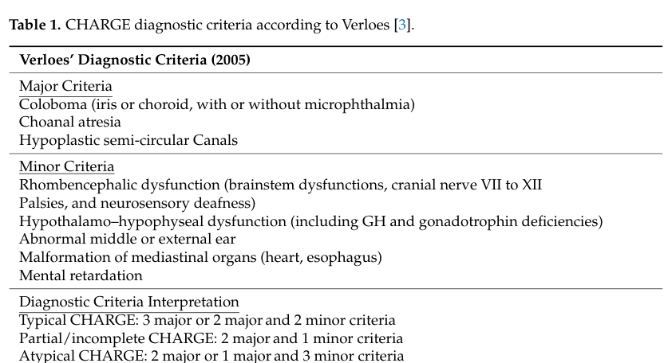

## Question

# Disease Characteristics Research Template

## Target Disease
- **Disease Name:** CHARGE syndrome
- **MONDO ID:**  (if available)
- **Category:** Mendelian

## Research Objectives

Please provide a comprehensive research report on **CHARGE syndrome** covering all of the
disease characteristics listed below. This report will be used to populate a disease knowledge
base entry. Be thorough and cite primary literature (PMID preferred) for all claims.

For each section, **suggested databases/resources** are listed. These are the first places
you should search for information on each topic.

---

### 1. Disease Information
> **Search first:** OMIM, Orphanet, ICD-10/ICD-11, MeSH, PubMed

- What is the disease? Provide a concise overview.
- What are the key identifiers? (OMIM, Orphanet, ICD-10/ICD-11, MeSH, Mondo)
- What are the common synonyms and alternative names?
- Is the information derived from individual patients (e.g., EHR) or aggregated disease-level resources?

### 2. Etiology

- **Disease Causal Factors**: What are the primary causes? (genetic, environmental, infectious, mechanistic)
- **Risk Factors**:
  > **Search first:** PubMed, Cochrane Library, UpToDate, clinical guidelines, ClinVar, ClinGen, GWAS Catalog, PheGenI, CTD, CDC, WHO, epidemiological databases
  - Genetic risk factors (causal variants, susceptibility loci, modifier genes)
  - Environmental risk factors (toxins, lifestyle, occupational exposures, age, sex, family history)
- **Protective Factors**:
  > **Search first:** PubMed, Cochrane Library, clinical trial databases, GWAS Catalog, gnomAD, WHO, CDC, nutrition databases
  - Genetic protective factors (protective variants, modifier alleles)
  - Environmental protective factors (diet, lifestyle, exposures that reduce risk)
- **Gene-Environment Interactions**: How do genetic and environmental factors interact to influence disease?
  > **Search first:** CTD, PubMed, PheGenI, GxE databases

### 3. Phenotypes
> **Search first:** HPO (Human Phenotype Ontology), OMIM, Orphanet, PubMed, clinicaltrials.gov, MedDRA, SNOMED CT, DECIPHER, LOINC

For each phenotype, provide:
- **Phenotype type**: symptoms, clinical signs, physical manifestations, behavioral changes, or laboratory abnormalities
  > For symptoms/signs: HPO, OMIM, Orphanet, PubMed
  > For behavioral changes: HPO, DSM, RDoC (Research Domain Criteria), PubMed
  > For laboratory abnormalities: LOINC, SNOMED CT, LabTests Online, PubMed
- **Phenotype characteristics**:
  > **Search first:** OMIM, Orphanet, HPO, PubMed
  - Age of symptom onset (neonatal, childhood, adult-onset, late-onset)
  - Symptom severity (mild, moderate, severe, variable)
  - Symptom progression (stable, progressive, episodic, fluctuating)
  - Frequency among affected individuals (percentage or qualitative)
- **Quality of life impact**: Effects on daily functioning and well-being (per-phenotype when possible)
  > **Search first:** EQ-5D database, SF-36, WHO QOL databases, PubMed
- Suggest HPO (Human Phenotype Ontology) terms for each phenotype

### 4. Genetic/Molecular Information

- **Causal Genes**: Gene mutations or chromosomal abnormalities responsible for disease (gene symbols, OMIM IDs)
  > **Search first:** OMIM, ClinVar, HGMD, Ensembl, NCBI Gene
- **Pathogenic Variants**:
  - Affected genes (gene symbols, HGNC IDs)
    > **Search first:** OMIM, NCBI Gene, Ensembl, HGNC, UniProt, GeneCards
  - Variant classification (pathogenic, likely pathogenic, VUS per ACMG/AMP guidelines)
    > **Search first:** ClinVar, ClinGen, ACMG/AMP guidelines, VarSome
  - Variant type/class (missense, frameshift, nonsense, splice-site, structural)
  - Allele frequency in population databases
    > **Search first:** gnomAD, 1000 Genomes, ExAC, TOPMed, dbSNP
  - Somatic vs germline origin
    > **Search first:** COSMIC (somatic), ClinVar, ICGC, TCGA
  - Functional consequences (loss of function, gain of function, dominant negative)
- **Modifier Genes**: Genes that modify disease severity or expression
- **Epigenetic Information**: DNA methylation, histone modifications, chromatin changes affecting disease
  > **Search first:** ENCODE, Roadmap Epigenomics, MethBase, DiseaseMeth
- **Chromosomal Abnormalities**: Large-scale genetic changes (aneuploidy, translocations, inversions)
  > **Search first:** DECIPHER, ClinVar, ECARUCA, UCSC Genome Browser

### 5. Environmental Information

- **Environmental Factors**: Non-genetic contributing factors (toxins, radiation, pollution, occupational exposure)
  > **Search first:** CTD (Comparative Toxicogenomics Database), TOXNET, PubMed, EPA databases
- **Lifestyle Factors**: Behavioral factors (smoking, diet, exercise, alcohol consumption)
  > **Search first:** CDC databases, WHO, PubMed, NHANES
- **Infectious Agents**: If applicable, pathogens causing or triggering disease (bacteria, viruses, fungi, parasites)
  > **Search first:** NCBI Taxonomy, ViPR, BV-BRC, MicrobeDB, GIDEON

### 6. Mechanism / Pathophysiology

- **Molecular Pathways**: Specific signaling cascades or biochemical pathways involved (Wnt, MAPK, mTOR, PI3K-AKT, etc.)
  > **Search first:** KEGG, Reactome, WikiPathways, PathBank, BioCyc
- **Cellular Processes**: Cell-level mechanisms (apoptosis, autophagy, cell cycle dysregulation, inflammation, etc.)
  > **Search first:** Gene Ontology (GO), Reactome, KEGG, PubMed
- **Protein Dysfunction**: How protein structure or function is altered (misfolding, aggregation, loss of function, gain of function)
  > **Search first:** UniProt, PDB (Protein Data Bank), InterPro, Pfam, AlphaFold
- **Metabolic Changes**: Alterations in metabolic processes (energy metabolism, lipid metabolism, amino acid metabolism)
  > **Search first:** KEGG, BioCyc, HMDB (Human Metabolome Database), BRENDA
- **Immune System Involvement**: Role of immune response (autoimmunity, immunodeficiency, chronic inflammation)
  > **Search first:** ImmPort, Immunome Database, IEDB, Gene Ontology
- **Tissue Damage Mechanisms**: How tissues/ are injured (oxidative stress, ischemia, fibrosis, necrosis)
  > **Search first:** PubMed, Gene Ontology, Reactome
- **Biochemical Abnormalities**: Specific molecular defects (enzyme deficiencies, receptor dysfunction, ion channel defects)
  > **Search first:** BRENDA, UniProt, KEGG, OMIM, PubMed
- **Epigenetic Changes**: DNA methylation, histone modifications affecting gene expression in disease
  > **Search first:** ENCODE, Roadmap Epigenomics, MethBase, DiseaseMeth
- **Molecular Profiling** (if available):
  - Transcriptomics/gene expression changes
    > **Search first:** GEO (Gene Expression Omnibus), ArrayExpress, GTEx, Human Cell Atlas, SRA
  - Proteomics findings
    > **Search first:** PRIDE, ProteomeXchange, Human Protein Atlas, STRING, BioGRID
  - Metabolomics signatures
    > **Search first:** MetaboLights, Metabolomics Workbench, HMDB, METLIN
  - Lipidomics alterations
    > **Search first:** LIPID MAPS, SwissLipids, LipidHome, Metabolomics Workbench
  - Genomic structural features
    > **Search first:** UCSC Genome Browser, Ensembl, NCBI, dbVar, DGV
- **Advanced Technologies** (if applicable):
  - Single-cell analysis findings (cell-type specific mechanisms, cellular heterogeneity)
    > **Search first:** Human Cell Atlas, Single Cell Portal, GEO, CELLxGENE
  - Spatial transcriptomics findings
    > **Search first:** GEO, Spatial Research, Vizgen, 10x Genomics data
  - Multi-omics integration results
    > **Search first:** TCGA, ICGC, cBioPortal, LinkedOmics, PubMed
  - Functional genomics screens (CRISPR, RNAi)
    > **Search first:** DepMap, GenomeRNAi, PubMed, BioGRID ORCS

For each mechanism, describe:
- The causal chain from initial trigger to clinical manifestation
- Which mechanisms are upstream vs downstream
- What cell types and biological processes are involved
- Suggest GO terms for biological processes and CL terms for cell types

### 7. Anatomical Structures Affected

- **Organ Level**:
  - Primary organs directly affected
  - Secondary organ involvement (complications, secondary effects)
  - Body systems involved (cardiovascular, nervous, digestive, respiratory, endocrine, etc.)
  > **Search first:** Uberon, FMA (Foundational Model of Anatomy), OMIM, HPO, ICD-11, MeSH, SNOMED CT
- **Tissue and Cell Level**:
  - Specific tissue types affected (epithelial, connective, muscle, nervous)
  - Specific cell populations targeted (with Cell Ontology terms)
  > **Search first:** Uberon, Human Protein Atlas, Cell Ontology, Human Cell Atlas, CellMarker, PanglaoDB
- **Subcellular Level**:
  - Cellular compartments involved (mitochondria, nucleus, ER, lysosomes) (with GO Cellular Component terms)
  > **Search first:** Gene Ontology (Cellular Component), UniProt, Human Protein Atlas
- **Localization**:
  - Specific anatomical sites (with UBERON terms)
    > **Search first:** FMA, Uberon, NeuroNames (for brain), SNOMED CT
  - Lateralization (unilateral, bilateral, asymmetric)
    > **Search first:** HPO, clinical literature, imaging databases

### 8. Temporal Development

- **Onset**:
  - Typical age of onset (congenital, pediatric, adult, geriatric)
  - Onset pattern (acute, subacute, chronic, insidious)
  > **Search first:** OMIM, Orphanet, HPO, PubMed
- **Progression**:
  - Disease stages (early, intermediate, advanced, end-stage)
    > **Search first:** Cancer Staging Manual (AJCC), WHO classifications, PubMed
  - Progression rate (rapid, slow, variable)
  - Disease course pattern (episodic, relapsing-remitting, progressive, stable)
  - Disease duration (self-limited, chronic lifelong)
  > **Search first:** Disease registries, longitudinal cohort databases, natural history studies, PubMed, Orphanet, OMIM
- **Patterns**:
  - Remission patterns (spontaneous, treatment-induced)
    > **Search first:** Clinical trial databases, disease registries, PubMed
  - Critical periods (time windows of vulnerability or opportunity for intervention)
    > **Search first:** PubMed, developmental biology databases, clinical guidelines

### 9. Inheritance and Population

- **Epidemiology**:
  - Prevalence (cases per 100,000 at given time)
  - Incidence (new cases per 100,000 per year)
  > **Search first:** Orphanet, CDC, WHO, GBD (Global Burden of Disease), national registries, SEER, disease registries
- **For Genetic Etiology**:
  - Inheritance pattern (AD, AR, X-linked, mitochondrial, multifactorial, polygenic)
    > **Search first:** OMIM, Orphanet, ClinVar, GTR (Genetic Testing Registry)
  - Penetrance (complete, incomplete, age-dependent)
    > **Search first:** ClinVar, OMIM, PubMed, ClinGen
  - Expressivity (variable, consistent)
    > **Search first:** OMIM, ClinVar, PubMed
  - Genetic anticipation (increasing severity in successive generations)
    > **Search first:** OMIM, PubMed (especially for repeat expansion disorders)
  - Germline mosaicism
    > **Search first:** ClinVar, OMIM, genetic counseling literature, PubMed
  - Founder effects (population-specific mutations)
    > **Search first:** gnomAD, population genetics databases, PubMed
  - Consanguinity role
    > **Search first:** OMIM, population studies, genetic counseling resources
  - Carrier frequency
    > **Search first:** gnomAD, carrier screening databases, GeneReviews, GTR
- **Population Demographics**:
  - Affected populations (ethnic or demographic groups with higher prevalence)
    > **Search first:** gnomAD, 1000 Genomes, PAGE Study, PubMed, population registries
  - Geographic distribution (endemic areas, regional variation)
    > **Search first:** WHO, CDC, GBD, Orphanet, geographic epidemiology databases
  - Geographic distribution of specific variants
  - Sex ratio (male:female)
    > **Search first:** Disease registries, OMIM, PubMed, epidemiological databases
  - Age distribution of affected individuals
    > **Search first:** CDC, disease registries, SEER, Orphanet

### 10. Diagnostics

- **Clinical Tests**:
  - Laboratory tests (blood, urine, tissue chemistry, specific enzyme assays)
    > **Search first:** LOINC, LabTests Online, PubMed
  - Biomarkers (proteins, metabolites, genetic markers, circulating biomarkers)
    > **Search first:** FDA Biomarker List, BEST (Biomarkers, EndpointS, and other Tools), PubMed
  - Imaging studies (X-ray, CT, MRI, PET, ultrasound)
    > **Search first:** RadLex, DICOM, Radiopaedia, imaging databases
  - Functional tests (pulmonary function, cardiac stress tests)
    > **Search first:** LOINC, clinical guidelines, PubMed
  - Electrophysiology (EEG, EMG, ECG, nerve conduction studies)
    > **Search first:** LOINC, clinical neurophysiology databases, PubMed
  - Biopsy findings (histopathology, immunohistochemistry)
    > **Search first:** SNOMED CT, College of American Pathologists resources, PubMed
  - Pathology findings (microscopic examination)
    > **Search first:** SNOMED CT, Digital Pathology databases, PubMed
- **Genetic Testing**:
  > **Search first:** GTR (Genetic Testing Registry), GeneReviews, ClinGen
  - Overview of recommended genetic testing approach
  - Whole genome sequencing (WGS) utility
    > **Search first:** GTR, ClinVar, GEL (Genomics England), gnomAD
  - Whole exome sequencing (WES) utility
    > **Search first:** GTR, ClinVar, OMIM, GeneMatcher
  - Gene panels (which panels, which genes)
    > **Search first:** GTR, ClinVar, laboratory-specific databases
  - Single gene testing
    > **Search first:** GTR, ClinVar, OMIM, GeneReviews
  - Chromosomal microarray (CMA)
    > **Search first:** DECIPHER, ClinVar, dbVar, ECARUCA
  - Karyotyping
    > **Search first:** Chromosome Abnormality Database, ClinVar, cytogenetics resources
  - FISH
    > **Search first:** ClinVar, cytogenetics databases, PubMed
  - Mitochondrial DNA testing
    > **Search first:** MITOMAP, MSeqDR, ClinVar, GTR
  - Repeat expansion testing
    > **Search first:** GTR, ClinVar, repeat expansion databases, PubMed
- **Omics-Based Diagnostics** (if applicable):
  - RNA sequencing / transcriptomics
    > **Search first:** GEO, ArrayExpress, GTEx, RNA-seq databases
  - Proteomics
    > **Search first:** PRIDE, ProteomeXchange, FDA Biomarker database
  - Metabolomics
    > **Search first:** MetaboLights, Metabolomics Workbench, HMDB
  - Epigenomics
    > **Search first:** GEO, ENCODE, Roadmap Epigenomics, MethBase
  - Liquid biopsy
    > **Search first:** COSMIC, ClinVar, liquid biopsy databases, PubMed
- **Clinical Criteria**:
  - Standardized diagnostic criteria (DSM, ICD, society guidelines)
    > **Search first:** DSM-5, ICD-11, clinical society guidelines, UpToDate
  - Differential diagnosis (other conditions to rule out, with distinguishing features)
    > **Search first:** DynaMed, UpToDate, clinical decision support systems
- **Screening**:
  - Screening methods for asymptomatic individuals (newborn screening, carrier screening, cascade screening)
    > **Search first:** ACMG recommendations, CDC newborn screening, GTR

### 11. Outcome/Prognosis

- **Survival and Mortality**:
  - Survival rate (5-year, 10-year, overall)
    > **Search first:** SEER, cancer registries, disease-specific registries, PubMed
  - Life expectancy (with and without treatment if applicable)
    > **Search first:** Orphanet, disease registries, actuarial databases, PubMed
  - Mortality rate
    > **Search first:** CDC, WHO, GBD, national mortality databases
  - Disease-specific mortality (deaths directly attributable to disease)
    > **Search first:** Disease registries, CDC Wonder, GBD, PubMed
- **Morbidity and Function**:
  - Morbidity (disease-related disability and health impacts)
    > **Search first:** GBD, WHO, disability databases, PubMed
  - Disability outcomes (long-term functional impairments)
    > **Search first:** ICF (International Classification of Functioning), disability registries
  - Quality of life measures (EQ-5D, SF-36, PROMIS, disease-specific tools)
    > **Search first:** EQ-5D database, SF-36, PROMIS, PubMed
- **Disease Course**:
  - Complications (secondary problems: infections, organ failure, etc.)
    > **Search first:** ICD codes, disease registries, clinical databases, PubMed
  - Recovery potential (likelihood and extent of recovery, with vs without treatment)
    > **Search first:** Natural history studies, rehabilitation databases, PubMed
- **Prediction**:
  - Prognostic factors (age, disease severity, biomarkers, treatment response)
    > **Search first:** Prognostic models databases, clinical calculators, PubMed
  - Prognostic biomarkers (molecular markers predicting disease course)
    > **Search first:** FDA Biomarker database, PubMed, cancer prognostic databases

### 12. Treatment

- **Pharmacotherapy**:
  - Pharmacological treatments (drug names, drug classes, mechanisms of action)
    > **Search first:** DrugBank, RxNorm, ATC classification, DailyMed, FDA databases
  - Pharmacogenomics (how genetic variants affect drug metabolism, efficacy, toxicity)
    > **Search first:** PharmGKB, CPIC (Clinical Pharmacogenetics), FDA Table of PGx Biomarkers
- **Advanced Therapeutics**:
  - Gene therapy (viral vectors, CRISPR, gene replacement, gene editing)
    > **Search first:** ClinicalTrials.gov, FDA gene therapy database, ASGCT resources
  - Cell therapy (stem cell transplant, CAR-T, cellular therapeutics)
    > **Search first:** ClinicalTrials.gov, FDA cell therapy database, FACT standards
  - RNA-based therapies (ASOs, siRNA, mRNA therapies)
    > **Search first:** ClinicalTrials.gov, FDA approvals, PubMed
  - Targeted therapies (treatments directed at specific molecular targets)
    > **Search first:** My Cancer Genome, OncoKB, ClinicalTrials.gov, FDA approvals
  - Immunotherapies (checkpoint inhibitors, monoclonal antibodies)
    > **Search first:** Cancer Immunotherapy Database, FDA approvals, ClinicalTrials.gov
- **Surgical and Interventional**:
  - Surgical interventions (types of surgery, timing, outcomes)
    > **Search first:** CPT codes, surgical registries, clinical guidelines, PubMed
- **Supportive and Rehabilitative**:
  - Supportive care (symptom management, pain control, nutrition)
    > **Search first:** Clinical guidelines, Cochrane Library, PubMed
  - Rehabilitation (physical therapy, occupational therapy, speech therapy)
    > **Search first:** Rehabilitation medicine databases, clinical guidelines, PubMed
- **Experimental**:
  - Experimental treatments in clinical trials (with NCT identifiers if available)
    > **Search first:** ClinicalTrials.gov, EU Clinical Trials Register, WHO ICTRP
- **Treatment Outcomes**:
  - Treatment response rates
    > **Search first:** Clinical trial databases, FDA reviews, systematic reviews, PubMed
  - Side effects and adverse events
    > **Search first:** FDA Adverse Event Reporting System (FAERS), MedWatch, PubMed
- **Treatment Strategy**:
  - Treatment algorithms (clinical pathways, decision trees)
    > **Search first:** Clinical practice guidelines, NCCN Guidelines, UpToDate
  - Combination therapies
    > **Search first:** ClinicalTrials.gov, treatment guidelines, PubMed
  - Personalized medicine approaches (genotype-guided treatment)
    > **Search first:** My Cancer Genome, CIViC, PharmGKB, precision medicine databases

For each treatment, suggest MAXO (Medical Action Ontology) terms where applicable.

### 13. Prevention

- **Prevention Levels**:
  - Primary prevention (preventing disease occurrence: vaccination, risk factor modification)
    > **Search first:** CDC, WHO, USPSTF recommendations, Cochrane Library
  - Secondary prevention (early detection and treatment: screening programs, early intervention)
    > **Search first:** USPSTF, CDC screening guidelines, WHO
  - Tertiary prevention (preventing complications in those with disease)
    > **Search first:** Clinical guidelines, disease management protocols, PubMed
- **Immunization**: Vaccine strategies (if applicable)
  > **Search first:** CDC vaccine schedules, WHO immunization, FDA vaccine database
- **Screening and Early Detection**:
  - Screening programs (population-based: newborn screening, cancer screening)
    > **Search first:** CDC screening programs, USPSTF, cancer screening databases
  - Genetic screening (carrier screening, preimplantation genetic diagnosis, prenatal testing)
    > **Search first:** ACMG recommendations, ACOG guidelines, GTR
  - Risk stratification (identifying high-risk individuals for targeted prevention)
    > **Search first:** Risk prediction models, clinical calculators, PubMed
- **Behavioral Interventions**: Lifestyle modifications to reduce risk
  > **Search first:** CDC, WHO, behavioral intervention databases, Cochrane Library
- **Counseling**: Genetic counseling (risk assessment, family planning guidance)
  > **Search first:** NSGC resources, ACMG guidelines, GeneReviews
- **Public Health**:
  - Public health interventions (sanitation, vector control, health education)
    > **Search first:** CDC, WHO, public health databases, PubMed
  - Environmental interventions (reducing environmental risk factors)
    > **Search first:** EPA databases, WHO environmental health, PubMed
- **Prophylaxis**: Preventive medications or procedures
  > **Search first:** Clinical guidelines, FDA approvals, PubMed

### 14. Other Species / Natural Disease

- **Taxonomy**: Species affected (with NCBI Taxon identifiers)
  > **Search first:** NCBI Taxonomy
- **Breed**: Specific breeds affected (with VBO identifiers if applicable)
  > **Search first:** VBO (Vertebrate Breed Ontology)
- **Gene**: Orthologous genes in other species (with NCBI Gene IDs)
  > **Search first:** NCBI Gene
- **Natural Disease**:
  - Naturally occurring disease in other species (companion animals, wildlife)
    > **Search first:** OMIA (Online Mendelian Inheritance in Animals), VetCompass, PubMed
  - Veterinary relevance and importance in animal health
    > **Search first:** OMIA, veterinary databases, PubMed
- **Comparative Biology**:
  - Comparative pathology (similarities and differences across species)
    > **Search first:** OMIA, comparative pathology databases, PubMed
  - Evolutionary conservation of disease mechanisms
    > **Search first:** HomoloGene, OrthoMCL, Alliance of Genome Resources
- **Transmission** (if applicable):
  - Zoonotic potential
    > **Search first:** CDC zoonotic diseases, WHO zoonoses, GIDEON
  - Cross-species susceptibility
    > **Search first:** NCBI Taxonomy, veterinary databases, PubMed

### 15. Model Organisms

- **Model Types**:
  - Model organism type (mammalian, invertebrate, cellular, in vitro)
    > **Search first:** Alliance of Genome Resources, model organism databases
  - Specific model systems (mouse, rat, zebrafish, Drosophila, C. elegans, yeast, cell lines, organoids, iPSCs)
    > **Search first:** MGI, RGD, ZFIN, FlyBase, WormBase, SGD, ATCC, Cellosaurus
  - Induced models (drug treatment, surgical intervention, environmental manipulation)
    > **Search first:** MGI, model organism databases, PubMed
- **Genetic Models**:
  - Types available (knockout, knock-in, transgenic, conditional, humanized)
    > **Search first:** MGI, IMPC, KOMP, EuMMCR, IMSR
- **Model Characteristics**:
  - Phenotype recapitulation (how well model reproduces human disease features)
    > **Search first:** Model organism databases, comparative studies, PubMed
  - Model limitations (aspects of human disease not captured)
    > **Search first:** Model organism databases, PubMed, review articles
- **Applications**:
  - Research applications (what aspects of disease can be studied)
    > **Search first:** Model organism databases, PubMed
- **Resources**:
  - Model databases
    > **Search first:** MGI, RGD, ZFIN, FlyBase, WormBase, IMSR, EMMA, MMRRC

---

## Citation Requirements

- Cite primary literature (PMID preferred) for all mechanistic and clinical claims
- Prioritize recent reviews and landmark papers
- Include direct quotes from abstracts where possible to support key statements
- Distinguish evidence source types: human clinical, model organism, in vitro, computational

## Output Format

Structure your response as a comprehensive narrative organized by the sections above.
For each section, provide:
- Factual content with specific details (numbers, percentages, gene names, variant nomenclature)
- Ontology term suggestions (HPO, GO, CL, UBERON, CHEBI, MAXO, MONDO) where applicable
- Evidence citations with PMIDs
- Direct quotes from abstracts to support key claims
- Clear indication when information is not available or not applicable for this disease

This report will be used to populate a disease knowledge base entry with:
- Pathophysiology descriptions with causal chains
- Gene/protein annotations (HGNC, GO terms)
- Phenotype associations (HP terms) with frequencies
- Cell type involvement (CL terms)
- Anatomical locations (UBERON terms)
- Chemical entities (CHEBI terms)
- Treatment annotations (MAXO terms)
- Evidence items with PMIDs and exact abstract quotes
- Epidemiology, prognosis, diagnostic, and prevention information
- Animal model descriptions with phenotype recapitulation details

## Output

Question: You are an expert researcher providing comprehensive, well-cited information.

Provide detailed information focusing on:
1. Key concepts and definitions with current understanding
2. Recent developments and latest research (prioritize 2023-2024 sources)
3. Current applications and real-world implementations
4. Expert opinions and analysis from authoritative sources
5. Relevant statistics and data from recent studies

Format as a comprehensive research report with proper citations. Include URLs and publication dates where available.
Always prioritize recent, authoritative sources and provide specific citations for all major claims.

# Disease Characteristics Research Template

## Target Disease
- **Disease Name:** CHARGE syndrome
- **MONDO ID:**  (if available)
- **Category:** Mendelian

## Research Objectives

Please provide a comprehensive research report on **CHARGE syndrome** covering all of the
disease characteristics listed below. This report will be used to populate a disease knowledge
base entry. Be thorough and cite primary literature (PMID preferred) for all claims.

For each section, **suggested databases/resources** are listed. These are the first places
you should search for information on each topic.

---

### 1. Disease Information
> **Search first:** OMIM, Orphanet, ICD-10/ICD-11, MeSH, PubMed

- What is the disease? Provide a concise overview.
- What are the key identifiers? (OMIM, Orphanet, ICD-10/ICD-11, MeSH, Mondo)
- What are the common synonyms and alternative names?
- Is the information derived from individual patients (e.g., EHR) or aggregated disease-level resources?

### 2. Etiology

- **Disease Causal Factors**: What are the primary causes? (genetic, environmental, infectious, mechanistic)
- **Risk Factors**:
  > **Search first:** PubMed, Cochrane Library, UpToDate, clinical guidelines, ClinVar, ClinGen, GWAS Catalog, PheGenI, CTD, CDC, WHO, epidemiological databases
  - Genetic risk factors (causal variants, susceptibility loci, modifier genes)
  - Environmental risk factors (toxins, lifestyle, occupational exposures, age, sex, family history)
- **Protective Factors**:
  > **Search first:** PubMed, Cochrane Library, clinical trial databases, GWAS Catalog, gnomAD, WHO, CDC, nutrition databases
  - Genetic protective factors (protective variants, modifier alleles)
  - Environmental protective factors (diet, lifestyle, exposures that reduce risk)
- **Gene-Environment Interactions**: How do genetic and environmental factors interact to influence disease?
  > **Search first:** CTD, PubMed, PheGenI, GxE databases

### 3. Phenotypes
> **Search first:** HPO (Human Phenotype Ontology), OMIM, Orphanet, PubMed, clinicaltrials.gov, MedDRA, SNOMED CT, DECIPHER, LOINC

For each phenotype, provide:
- **Phenotype type**: symptoms, clinical signs, physical manifestations, behavioral changes, or laboratory abnormalities
  > For symptoms/signs: HPO, OMIM, Orphanet, PubMed
  > For behavioral changes: HPO, DSM, RDoC (Research Domain Criteria), PubMed
  > For laboratory abnormalities: LOINC, SNOMED CT, LabTests Online, PubMed
- **Phenotype characteristics**:
  > **Search first:** OMIM, Orphanet, HPO, PubMed
  - Age of symptom onset (neonatal, childhood, adult-onset, late-onset)
  - Symptom severity (mild, moderate, severe, variable)
  - Symptom progression (stable, progressive, episodic, fluctuating)
  - Frequency among affected individuals (percentage or qualitative)
- **Quality of life impact**: Effects on daily functioning and well-being (per-phenotype when possible)
  > **Search first:** EQ-5D database, SF-36, WHO QOL databases, PubMed
- Suggest HPO (Human Phenotype Ontology) terms for each phenotype

### 4. Genetic/Molecular Information

- **Causal Genes**: Gene mutations or chromosomal abnormalities responsible for disease (gene symbols, OMIM IDs)
  > **Search first:** OMIM, ClinVar, HGMD, Ensembl, NCBI Gene
- **Pathogenic Variants**:
  - Affected genes (gene symbols, HGNC IDs)
    > **Search first:** OMIM, NCBI Gene, Ensembl, HGNC, UniProt, GeneCards
  - Variant classification (pathogenic, likely pathogenic, VUS per ACMG/AMP guidelines)
    > **Search first:** ClinVar, ClinGen, ACMG/AMP guidelines, VarSome
  - Variant type/class (missense, frameshift, nonsense, splice-site, structural)
  - Allele frequency in population databases
    > **Search first:** gnomAD, 1000 Genomes, ExAC, TOPMed, dbSNP
  - Somatic vs germline origin
    > **Search first:** COSMIC (somatic), ClinVar, ICGC, TCGA
  - Functional consequences (loss of function, gain of function, dominant negative)
- **Modifier Genes**: Genes that modify disease severity or expression
- **Epigenetic Information**: DNA methylation, histone modifications, chromatin changes affecting disease
  > **Search first:** ENCODE, Roadmap Epigenomics, MethBase, DiseaseMeth
- **Chromosomal Abnormalities**: Large-scale genetic changes (aneuploidy, translocations, inversions)
  > **Search first:** DECIPHER, ClinVar, ECARUCA, UCSC Genome Browser

### 5. Environmental Information

- **Environmental Factors**: Non-genetic contributing factors (toxins, radiation, pollution, occupational exposure)
  > **Search first:** CTD (Comparative Toxicogenomics Database), TOXNET, PubMed, EPA databases
- **Lifestyle Factors**: Behavioral factors (smoking, diet, exercise, alcohol consumption)
  > **Search first:** CDC databases, WHO, PubMed, NHANES
- **Infectious Agents**: If applicable, pathogens causing or triggering disease (bacteria, viruses, fungi, parasites)
  > **Search first:** NCBI Taxonomy, ViPR, BV-BRC, MicrobeDB, GIDEON

### 6. Mechanism / Pathophysiology

- **Molecular Pathways**: Specific signaling cascades or biochemical pathways involved (Wnt, MAPK, mTOR, PI3K-AKT, etc.)
  > **Search first:** KEGG, Reactome, WikiPathways, PathBank, BioCyc
- **Cellular Processes**: Cell-level mechanisms (apoptosis, autophagy, cell cycle dysregulation, inflammation, etc.)
  > **Search first:** Gene Ontology (GO), Reactome, KEGG, PubMed
- **Protein Dysfunction**: How protein structure or function is altered (misfolding, aggregation, loss of function, gain of function)
  > **Search first:** UniProt, PDB (Protein Data Bank), InterPro, Pfam, AlphaFold
- **Metabolic Changes**: Alterations in metabolic processes (energy metabolism, lipid metabolism, amino acid metabolism)
  > **Search first:** KEGG, BioCyc, HMDB (Human Metabolome Database), BRENDA
- **Immune System Involvement**: Role of immune response (autoimmunity, immunodeficiency, chronic inflammation)
  > **Search first:** ImmPort, Immunome Database, IEDB, Gene Ontology
- **Tissue Damage Mechanisms**: How tissues/ are injured (oxidative stress, ischemia, fibrosis, necrosis)
  > **Search first:** PubMed, Gene Ontology, Reactome
- **Biochemical Abnormalities**: Specific molecular defects (enzyme deficiencies, receptor dysfunction, ion channel defects)
  > **Search first:** BRENDA, UniProt, KEGG, OMIM, PubMed
- **Epigenetic Changes**: DNA methylation, histone modifications affecting gene expression in disease
  > **Search first:** ENCODE, Roadmap Epigenomics, MethBase, DiseaseMeth
- **Molecular Profiling** (if available):
  - Transcriptomics/gene expression changes
    > **Search first:** GEO (Gene Expression Omnibus), ArrayExpress, GTEx, Human Cell Atlas, SRA
  - Proteomics findings
    > **Search first:** PRIDE, ProteomeXchange, Human Protein Atlas, STRING, BioGRID
  - Metabolomics signatures
    > **Search first:** MetaboLights, Metabolomics Workbench, HMDB, METLIN
  - Lipidomics alterations
    > **Search first:** LIPID MAPS, SwissLipids, LipidHome, Metabolomics Workbench
  - Genomic structural features
    > **Search first:** UCSC Genome Browser, Ensembl, NCBI, dbVar, DGV
- **Advanced Technologies** (if applicable):
  - Single-cell analysis findings (cell-type specific mechanisms, cellular heterogeneity)
    > **Search first:** Human Cell Atlas, Single Cell Portal, GEO, CELLxGENE
  - Spatial transcriptomics findings
    > **Search first:** GEO, Spatial Research, Vizgen, 10x Genomics data
  - Multi-omics integration results
    > **Search first:** TCGA, ICGC, cBioPortal, LinkedOmics, PubMed
  - Functional genomics screens (CRISPR, RNAi)
    > **Search first:** DepMap, GenomeRNAi, PubMed, BioGRID ORCS

For each mechanism, describe:
- The causal chain from initial trigger to clinical manifestation
- Which mechanisms are upstream vs downstream
- What cell types and biological processes are involved
- Suggest GO terms for biological processes and CL terms for cell types

### 7. Anatomical Structures Affected

- **Organ Level**:
  - Primary organs directly affected
  - Secondary organ involvement (complications, secondary effects)
  - Body systems involved (cardiovascular, nervous, digestive, respiratory, endocrine, etc.)
  > **Search first:** Uberon, FMA (Foundational Model of Anatomy), OMIM, HPO, ICD-11, MeSH, SNOMED CT
- **Tissue and Cell Level**:
  - Specific tissue types affected (epithelial, connective, muscle, nervous)
  - Specific cell populations targeted (with Cell Ontology terms)
  > **Search first:** Uberon, Human Protein Atlas, Cell Ontology, Human Cell Atlas, CellMarker, PanglaoDB
- **Subcellular Level**:
  - Cellular compartments involved (mitochondria, nucleus, ER, lysosomes) (with GO Cellular Component terms)
  > **Search first:** Gene Ontology (Cellular Component), UniProt, Human Protein Atlas
- **Localization**:
  - Specific anatomical sites (with UBERON terms)
    > **Search first:** FMA, Uberon, NeuroNames (for brain), SNOMED CT
  - Lateralization (unilateral, bilateral, asymmetric)
    > **Search first:** HPO, clinical literature, imaging databases

### 8. Temporal Development

- **Onset**:
  - Typical age of onset (congenital, pediatric, adult, geriatric)
  - Onset pattern (acute, subacute, chronic, insidious)
  > **Search first:** OMIM, Orphanet, HPO, PubMed
- **Progression**:
  - Disease stages (early, intermediate, advanced, end-stage)
    > **Search first:** Cancer Staging Manual (AJCC), WHO classifications, PubMed
  - Progression rate (rapid, slow, variable)
  - Disease course pattern (episodic, relapsing-remitting, progressive, stable)
  - Disease duration (self-limited, chronic lifelong)
  > **Search first:** Disease registries, longitudinal cohort databases, natural history studies, PubMed, Orphanet, OMIM
- **Patterns**:
  - Remission patterns (spontaneous, treatment-induced)
    > **Search first:** Clinical trial databases, disease registries, PubMed
  - Critical periods (time windows of vulnerability or opportunity for intervention)
    > **Search first:** PubMed, developmental biology databases, clinical guidelines

### 9. Inheritance and Population

- **Epidemiology**:
  - Prevalence (cases per 100,000 at given time)
  - Incidence (new cases per 100,000 per year)
  > **Search first:** Orphanet, CDC, WHO, GBD (Global Burden of Disease), national registries, SEER, disease registries
- **For Genetic Etiology**:
  - Inheritance pattern (AD, AR, X-linked, mitochondrial, multifactorial, polygenic)
    > **Search first:** OMIM, Orphanet, ClinVar, GTR (Genetic Testing Registry)
  - Penetrance (complete, incomplete, age-dependent)
    > **Search first:** ClinVar, OMIM, PubMed, ClinGen
  - Expressivity (variable, consistent)
    > **Search first:** OMIM, ClinVar, PubMed
  - Genetic anticipation (increasing severity in successive generations)
    > **Search first:** OMIM, PubMed (especially for repeat expansion disorders)
  - Germline mosaicism
    > **Search first:** ClinVar, OMIM, genetic counseling literature, PubMed
  - Founder effects (population-specific mutations)
    > **Search first:** gnomAD, population genetics databases, PubMed
  - Consanguinity role
    > **Search first:** OMIM, population studies, genetic counseling resources
  - Carrier frequency
    > **Search first:** gnomAD, carrier screening databases, GeneReviews, GTR
- **Population Demographics**:
  - Affected populations (ethnic or demographic groups with higher prevalence)
    > **Search first:** gnomAD, 1000 Genomes, PAGE Study, PubMed, population registries
  - Geographic distribution (endemic areas, regional variation)
    > **Search first:** WHO, CDC, GBD, Orphanet, geographic epidemiology databases
  - Geographic distribution of specific variants
  - Sex ratio (male:female)
    > **Search first:** Disease registries, OMIM, PubMed, epidemiological databases
  - Age distribution of affected individuals
    > **Search first:** CDC, disease registries, SEER, Orphanet

### 10. Diagnostics

- **Clinical Tests**:
  - Laboratory tests (blood, urine, tissue chemistry, specific enzyme assays)
    > **Search first:** LOINC, LabTests Online, PubMed
  - Biomarkers (proteins, metabolites, genetic markers, circulating biomarkers)
    > **Search first:** FDA Biomarker List, BEST (Biomarkers, EndpointS, and other Tools), PubMed
  - Imaging studies (X-ray, CT, MRI, PET, ultrasound)
    > **Search first:** RadLex, DICOM, Radiopaedia, imaging databases
  - Functional tests (pulmonary function, cardiac stress tests)
    > **Search first:** LOINC, clinical guidelines, PubMed
  - Electrophysiology (EEG, EMG, ECG, nerve conduction studies)
    > **Search first:** LOINC, clinical neurophysiology databases, PubMed
  - Biopsy findings (histopathology, immunohistochemistry)
    > **Search first:** SNOMED CT, College of American Pathologists resources, PubMed
  - Pathology findings (microscopic examination)
    > **Search first:** SNOMED CT, Digital Pathology databases, PubMed
- **Genetic Testing**:
  > **Search first:** GTR (Genetic Testing Registry), GeneReviews, ClinGen
  - Overview of recommended genetic testing approach
  - Whole genome sequencing (WGS) utility
    > **Search first:** GTR, ClinVar, GEL (Genomics England), gnomAD
  - Whole exome sequencing (WES) utility
    > **Search first:** GTR, ClinVar, OMIM, GeneMatcher
  - Gene panels (which panels, which genes)
    > **Search first:** GTR, ClinVar, laboratory-specific databases
  - Single gene testing
    > **Search first:** GTR, ClinVar, OMIM, GeneReviews
  - Chromosomal microarray (CMA)
    > **Search first:** DECIPHER, ClinVar, dbVar, ECARUCA
  - Karyotyping
    > **Search first:** Chromosome Abnormality Database, ClinVar, cytogenetics resources
  - FISH
    > **Search first:** ClinVar, cytogenetics databases, PubMed
  - Mitochondrial DNA testing
    > **Search first:** MITOMAP, MSeqDR, ClinVar, GTR
  - Repeat expansion testing
    > **Search first:** GTR, ClinVar, repeat expansion databases, PubMed
- **Omics-Based Diagnostics** (if applicable):
  - RNA sequencing / transcriptomics
    > **Search first:** GEO, ArrayExpress, GTEx, RNA-seq databases
  - Proteomics
    > **Search first:** PRIDE, ProteomeXchange, FDA Biomarker database
  - Metabolomics
    > **Search first:** MetaboLights, Metabolomics Workbench, HMDB
  - Epigenomics
    > **Search first:** GEO, ENCODE, Roadmap Epigenomics, MethBase
  - Liquid biopsy
    > **Search first:** COSMIC, ClinVar, liquid biopsy databases, PubMed
- **Clinical Criteria**:
  - Standardized diagnostic criteria (DSM, ICD, society guidelines)
    > **Search first:** DSM-5, ICD-11, clinical society guidelines, UpToDate
  - Differential diagnosis (other conditions to rule out, with distinguishing features)
    > **Search first:** DynaMed, UpToDate, clinical decision support systems
- **Screening**:
  - Screening methods for asymptomatic individuals (newborn screening, carrier screening, cascade screening)
    > **Search first:** ACMG recommendations, CDC newborn screening, GTR

### 11. Outcome/Prognosis

- **Survival and Mortality**:
  - Survival rate (5-year, 10-year, overall)
    > **Search first:** SEER, cancer registries, disease-specific registries, PubMed
  - Life expectancy (with and without treatment if applicable)
    > **Search first:** Orphanet, disease registries, actuarial databases, PubMed
  - Mortality rate
    > **Search first:** CDC, WHO, GBD, national mortality databases
  - Disease-specific mortality (deaths directly attributable to disease)
    > **Search first:** Disease registries, CDC Wonder, GBD, PubMed
- **Morbidity and Function**:
  - Morbidity (disease-related disability and health impacts)
    > **Search first:** GBD, WHO, disability databases, PubMed
  - Disability outcomes (long-term functional impairments)
    > **Search first:** ICF (International Classification of Functioning), disability registries
  - Quality of life measures (EQ-5D, SF-36, PROMIS, disease-specific tools)
    > **Search first:** EQ-5D database, SF-36, PROMIS, PubMed
- **Disease Course**:
  - Complications (secondary problems: infections, organ failure, etc.)
    > **Search first:** ICD codes, disease registries, clinical databases, PubMed
  - Recovery potential (likelihood and extent of recovery, with vs without treatment)
    > **Search first:** Natural history studies, rehabilitation databases, PubMed
- **Prediction**:
  - Prognostic factors (age, disease severity, biomarkers, treatment response)
    > **Search first:** Prognostic models databases, clinical calculators, PubMed
  - Prognostic biomarkers (molecular markers predicting disease course)
    > **Search first:** FDA Biomarker database, PubMed, cancer prognostic databases

### 12. Treatment

- **Pharmacotherapy**:
  - Pharmacological treatments (drug names, drug classes, mechanisms of action)
    > **Search first:** DrugBank, RxNorm, ATC classification, DailyMed, FDA databases
  - Pharmacogenomics (how genetic variants affect drug metabolism, efficacy, toxicity)
    > **Search first:** PharmGKB, CPIC (Clinical Pharmacogenetics), FDA Table of PGx Biomarkers
- **Advanced Therapeutics**:
  - Gene therapy (viral vectors, CRISPR, gene replacement, gene editing)
    > **Search first:** ClinicalTrials.gov, FDA gene therapy database, ASGCT resources
  - Cell therapy (stem cell transplant, CAR-T, cellular therapeutics)
    > **Search first:** ClinicalTrials.gov, FDA cell therapy database, FACT standards
  - RNA-based therapies (ASOs, siRNA, mRNA therapies)
    > **Search first:** ClinicalTrials.gov, FDA approvals, PubMed
  - Targeted therapies (treatments directed at specific molecular targets)
    > **Search first:** My Cancer Genome, OncoKB, ClinicalTrials.gov, FDA approvals
  - Immunotherapies (checkpoint inhibitors, monoclonal antibodies)
    > **Search first:** Cancer Immunotherapy Database, FDA approvals, ClinicalTrials.gov
- **Surgical and Interventional**:
  - Surgical interventions (types of surgery, timing, outcomes)
    > **Search first:** CPT codes, surgical registries, clinical guidelines, PubMed
- **Supportive and Rehabilitative**:
  - Supportive care (symptom management, pain control, nutrition)
    > **Search first:** Clinical guidelines, Cochrane Library, PubMed
  - Rehabilitation (physical therapy, occupational therapy, speech therapy)
    > **Search first:** Rehabilitation medicine databases, clinical guidelines, PubMed
- **Experimental**:
  - Experimental treatments in clinical trials (with NCT identifiers if available)
    > **Search first:** ClinicalTrials.gov, EU Clinical Trials Register, WHO ICTRP
- **Treatment Outcomes**:
  - Treatment response rates
    > **Search first:** Clinical trial databases, FDA reviews, systematic reviews, PubMed
  - Side effects and adverse events
    > **Search first:** FDA Adverse Event Reporting System (FAERS), MedWatch, PubMed
- **Treatment Strategy**:
  - Treatment algorithms (clinical pathways, decision trees)
    > **Search first:** Clinical practice guidelines, NCCN Guidelines, UpToDate
  - Combination therapies
    > **Search first:** ClinicalTrials.gov, treatment guidelines, PubMed
  - Personalized medicine approaches (genotype-guided treatment)
    > **Search first:** My Cancer Genome, CIViC, PharmGKB, precision medicine databases

For each treatment, suggest MAXO (Medical Action Ontology) terms where applicable.

### 13. Prevention

- **Prevention Levels**:
  - Primary prevention (preventing disease occurrence: vaccination, risk factor modification)
    > **Search first:** CDC, WHO, USPSTF recommendations, Cochrane Library
  - Secondary prevention (early detection and treatment: screening programs, early intervention)
    > **Search first:** USPSTF, CDC screening guidelines, WHO
  - Tertiary prevention (preventing complications in those with disease)
    > **Search first:** Clinical guidelines, disease management protocols, PubMed
- **Immunization**: Vaccine strategies (if applicable)
  > **Search first:** CDC vaccine schedules, WHO immunization, FDA vaccine database
- **Screening and Early Detection**:
  - Screening programs (population-based: newborn screening, cancer screening)
    > **Search first:** CDC screening programs, USPSTF, cancer screening databases
  - Genetic screening (carrier screening, preimplantation genetic diagnosis, prenatal testing)
    > **Search first:** ACMG recommendations, ACOG guidelines, GTR
  - Risk stratification (identifying high-risk individuals for targeted prevention)
    > **Search first:** Risk prediction models, clinical calculators, PubMed
- **Behavioral Interventions**: Lifestyle modifications to reduce risk
  > **Search first:** CDC, WHO, behavioral intervention databases, Cochrane Library
- **Counseling**: Genetic counseling (risk assessment, family planning guidance)
  > **Search first:** NSGC resources, ACMG guidelines, GeneReviews
- **Public Health**:
  - Public health interventions (sanitation, vector control, health education)
    > **Search first:** CDC, WHO, public health databases, PubMed
  - Environmental interventions (reducing environmental risk factors)
    > **Search first:** EPA databases, WHO environmental health, PubMed
- **Prophylaxis**: Preventive medications or procedures
  > **Search first:** Clinical guidelines, FDA approvals, PubMed

### 14. Other Species / Natural Disease

- **Taxonomy**: Species affected (with NCBI Taxon identifiers)
  > **Search first:** NCBI Taxonomy
- **Breed**: Specific breeds affected (with VBO identifiers if applicable)
  > **Search first:** VBO (Vertebrate Breed Ontology)
- **Gene**: Orthologous genes in other species (with NCBI Gene IDs)
  > **Search first:** NCBI Gene
- **Natural Disease**:
  - Naturally occurring disease in other species (companion animals, wildlife)
    > **Search first:** OMIA (Online Mendelian Inheritance in Animals), VetCompass, PubMed
  - Veterinary relevance and importance in animal health
    > **Search first:** OMIA, veterinary databases, PubMed
- **Comparative Biology**:
  - Comparative pathology (similarities and differences across species)
    > **Search first:** OMIA, comparative pathology databases, PubMed
  - Evolutionary conservation of disease mechanisms
    > **Search first:** HomoloGene, OrthoMCL, Alliance of Genome Resources
- **Transmission** (if applicable):
  - Zoonotic potential
    > **Search first:** CDC zoonotic diseases, WHO zoonoses, GIDEON
  - Cross-species susceptibility
    > **Search first:** NCBI Taxonomy, veterinary databases, PubMed

### 15. Model Organisms

- **Model Types**:
  - Model organism type (mammalian, invertebrate, cellular, in vitro)
    > **Search first:** Alliance of Genome Resources, model organism databases
  - Specific model systems (mouse, rat, zebrafish, Drosophila, C. elegans, yeast, cell lines, organoids, iPSCs)
    > **Search first:** MGI, RGD, ZFIN, FlyBase, WormBase, SGD, ATCC, Cellosaurus
  - Induced models (drug treatment, surgical intervention, environmental manipulation)
    > **Search first:** MGI, model organism databases, PubMed
- **Genetic Models**:
  - Types available (knockout, knock-in, transgenic, conditional, humanized)
    > **Search first:** MGI, IMPC, KOMP, EuMMCR, IMSR
- **Model Characteristics**:
  - Phenotype recapitulation (how well model reproduces human disease features)
    > **Search first:** Model organism databases, comparative studies, PubMed
  - Model limitations (aspects of human disease not captured)
    > **Search first:** Model organism databases, PubMed, review articles
- **Applications**:
  - Research applications (what aspects of disease can be studied)
    > **Search first:** Model organism databases, PubMed
- **Resources**:
  - Model databases
    > **Search first:** MGI, RGD, ZFIN, FlyBase, WormBase, IMSR, EMMA, MMRRC

---

## Citation Requirements

- Cite primary literature (PMID preferred) for all mechanistic and clinical claims
- Prioritize recent reviews and landmark papers
- Include direct quotes from abstracts where possible to support key statements
- Distinguish evidence source types: human clinical, model organism, in vitro, computational

## Output Format

Structure your response as a comprehensive narrative organized by the sections above.
For each section, provide:
- Factual content with specific details (numbers, percentages, gene names, variant nomenclature)
- Ontology term suggestions (HPO, GO, CL, UBERON, CHEBI, MAXO, MONDO) where applicable
- Evidence citations with PMIDs
- Direct quotes from abstracts to support key claims
- Clear indication when information is not available or not applicable for this disease

This report will be used to populate a disease knowledge base entry with:
- Pathophysiology descriptions with causal chains
- Gene/protein annotations (HGNC, GO terms)
- Phenotype associations (HP terms) with frequencies
- Cell type involvement (CL terms)
- Anatomical locations (UBERON terms)
- Chemical entities (CHEBI terms)
- Treatment annotations (MAXO terms)
- Evidence items with PMIDs and exact abstract quotes
- Epidemiology, prognosis, diagnostic, and prevention information
- Animal model descriptions with phenotype recapitulation details

# CHARGE Syndrome — Comprehensive Disease Characteristics Report

**Target disease:** CHARGE syndrome (Mendelian developmental disorder)  
**Primary causal gene:** *CHD7* (autosomal dominant, typically de novo)  

## 1. Disease Information

### 1.1 Overview (current understanding)
CHARGE syndrome is a clinically defined multiple congenital anomaly disorder originally described as a non-random cluster of malformations. The CHARGE acronym denotes **C**oloboma, **H**eart defects, **A**tresia of choanae, **R**etarded growth/development, **G**enital hypoplasia, and **E**ar anomalies/deafness. (bergman2011chd7mutationsand pages 1-6, mcj2006chargesyndromethe pages 1-2)

A key consistent feature emphasized in early molecular-era cohorts is **semicircular canal hypoplasia** leading to vestibular areflexia, which helps explain balance and motor delay phenotypes. (mcj2006chargesyndromethe pages 1-2)

### 1.2 Key identifiers and cross-references
* **OMIM:** 214800 (CHARGE syndrome) (mcj2006chargesyndromethe pages 1-2, bergman2011chd7mutationsand pages 1-6)
* **Orphanet/Orpha code:** ORPHA:138 (wolanska2025analysisofthe pages 7-10)
* **Synonyms / alternative names:** “Hall–Hittner syndrome” (also referred to historically as CHARGE association) (wolanska2025analysisofthe pages 7-10)
* **MONDO / ICD / MeSH:** Not found explicitly in the retrieved full-text set; therefore not reported here.

### 1.3 Evidence type note
Most knowledge summarized here derives from aggregated disease-level resources (systematic reviews, cohort/genotype-phenotype studies, mechanistic studies) rather than EHR-derived real-world datasets. Examples include systematic review evidence for CHD epidemiology and outcomes (polito2024chargesyndromeand pages 1-2, polito2024chargesyndromeand pages 2-3) and mutation-positive cohort summaries (bergman2011chd7mutationsand pages 6-11).

## 2. Etiology

### 2.1 Primary causes
**Genetic cause (dominant):** Pathogenic variants in *CHD7* are the major cause of CHARGE syndrome. CHARGE is described as autosomal dominant with variable expressivity; most pathogenic *CHD7* variants arise **de novo**, but parent-to-child transmission occurs. (bergman2011chd7mutationsand pages 1-6, bergman2011chd7mutationsand pages 6-11)

*CHD7* was identified as a major gene on chromosome **8q12.1**. (mcj2006chargesyndromethe pages 1-2)

### 2.2 Risk factors
**Genetic risk factor:** Having a pathogenic *CHD7* variant (typically heterozygous loss-of-function) is the dominant risk factor. Clinical genetic counseling must account for de novo predominance plus rare transmission and mosaicism. (mcj2006chargesyndromethe pages 1-2, bergman2011chd7mutationsand pages 24-29)

**Non-genetic risk factors:** No established environmental/toxic/infectious risk factors were identified in the retrieved sources.

### 2.3 Protective factors
No validated genetic or environmental protective factors were identified in the retrieved sources.

### 2.4 Gene–gene / oligogenic interactions (emerging)
A 2024 report proposes **digenic inheritance/modifier effects** involving *CHD7* plus *SMCHD1* in a family with variable hypogonadotropic hypogonadism and CHARGE-overlapping features, suggesting oligogenic contributions to penetrance/expressivity in some CHD7-related presentations. (wang2024digenicchd7and pages 1-2, wang2024digenicchd7and pages 2-4)

## 3. Phenotypes

### 3.1 Core phenotype spectrum (with frequencies)
Phenotypic variability is high, but several features are highly prevalent in mutation-positive cohorts.

**Mutation-positive cohort frequencies (Bergman et al., 2011; CHD7+ cohort, n≈280):**
* Semicircular canal anomaly: **110/117 (~94%)** (bergman2011chd7mutationsand pages 6-11)
* Coloboma: **189/234 (~81%)** (bergman2011chd7mutationsand pages 6-11)
* Choanal atresia: **99/179 (~55%)** (bergman2011chd7mutationsand pages 6-11)
* Congenital heart defect: **191/252 (~76%)** (bergman2011chd7mutationsand pages 6-11)
* Feeding difficulties: **90/110**, and tube feeding was frequently required (“necessitating tube feeding 82% (32–93%)”) (bergman2011chd7mutationsand pages 6-11)
* Cranial nerve dysfunction: **173/174 (~99%)** (bergman2011chd7mutationsand pages 6-11)

**Broad phenotype frequency summary (Wieland et al., 2020; tabulated summary):**
* Developmental delay: **100%**
* Semicircular canal anomaly: **95%**
* External ear anomaly: **95%**
* Cranial nerve dysfunction: **95%**
* Coloboma: **80%**
* Congenital heart defect: **80%**
* Feeding difficulties: **80%**
* Choanal atresia: **50%**
* Tracheoesophageal anomaly: **25%**
(among other features) (wieland2020chargesyndrome pages 1-3)

**Quality-of-life-related phenotype study (Wolańska, 2024/2025 thesis; 29 genetically confirmed):**
* Coloboma **100%**, heart defects **82.8%**, choanal atresia **35%**, genital abnormalities **58.6%**, hearing loss **86.2%**; 76% had height below 3rd percentile. Family QoL measured by PedsQL Family Impact was described as intermediate/average, with higher QoL among parents who accept the child’s illness. (wolanska2025analysisofthe pages 76-79)

### 3.2 Phenotype characteristics
**Age of onset:** Predominantly congenital/neonatal with multi-organ malformations; neurodevelopmental features emerge in infancy/childhood. (mcj2006chargesyndromethe pages 1-2, wieland2020chargesyndrome pages 1-3)

**Progression:** Some domains may be progressive (e.g., mixed hearing loss reported as potentially progressive in clinical management guidance). (wieland2020chargesyndrome pages 10-11)

### 3.3 Suggested HPO terms (non-exhaustive, for KB mapping)
Below are commonly used HPO concepts aligned to the phenotypes reported in the cited sources:
* Coloboma — **HP:0000589**
* Choanal atresia — **HP:0000453**
* Congenital heart defect — **HP:0001627**
* Abnormal semicircular canals / semicircular canal hypoplasia — **HP:0008558** (or related vestibular/inner ear structure terms)
* Sensorineural hearing impairment — **HP:0000407**
* Feeding difficulties — **HP:0011968**
* Facial palsy — **HP:0007209**
* Cleft lip/palate — **HP:0000202 / HP:0000175**
* Hypogonadotropic hypogonadism — **HP:0000044**
* Developmental delay — **HP:0001263**

(Exact HPO IDs may vary by knowledge base conventions; the above are intended as practical starting points for curation.)

## 4. Genetic / Molecular Information

### 4.1 Causal gene(s)
* **CHD7** (chromodomain helicase DNA-binding protein 7) is the primary causal gene, encoding an ATP-dependent chromatin remodeler. (mcj2006chargesyndromethe pages 1-2, driesen2024chd7disorder—notcharge pages 1-2)

### 4.2 Pathogenic variant spectrum (human)
In a large clinical genetics review, CHD7 variant classes in clinically diagnosed CHARGE include a predominance of truncating variants (nonsense/frameshift), with additional splice-site and missense variants; haploinsufficiency is emphasized as the key mechanism. (bergman2011chd7mutationsand pages 6-11)

A 2023 case report illustrates challenges in interpreting **non-canonical intronic variants** and provides a workflow for functional classification. In two unrelated patients, an intronic CHD7 variant **c.5607+17A>G** was shown to induce aberrant splicing using minigene assays and patient cDNA validation, upgrading a VUS toward pathogenic. (rossi2023casereportfunctional pages 1-2, rossi2023casereportfunctional pages 2-4)

### 4.3 Inheritance, penetrance, expressivity, mosaicism
CHARGE is autosomal dominant with variable expressivity; most CHD7 mutations occur de novo, but inherited cases occur. (bergman2011chd7mutationsand pages 1-6, bergman2011chd7mutationsand pages 6-11)

Somatic mosaicism has been reported (e.g., in an unaffected mother in a sib pair), supporting germline mosaicism as a recurrence mechanism. (mcj2006chargesyndromethe pages 1-2)

Genetic counseling guidance: recurrence risk from parental mosaicism is estimated at **~2–3%**, and transmission risk from an affected individual is **50%**; prenatal molecular testing/ultrasound and preimplantation genetic diagnosis are recommended for discussion. (bergman2011chd7mutationsand pages 24-29)

### 4.4 Modifier genes / oligogenicity
*Mouse model work proposes that foliation-related genes (e.g., **Engrailed**, FGF pathway genes, **Zic** genes) may modify neurodevelopmental phenotypes in CHARGE.* (whittaker2017distinctcerebellarfoliation pages 9-10)

*Human family report:* co-inheritance of pathogenic CHD7 truncation and a SMCHD1 missense variant is proposed to contribute to intrafamilial variability (not definitive proof of causality but a notable 2024 development). (wang2024digenicchd7and pages 1-2, wang2024digenicchd7and pages 2-4)

### 4.5 Epigenetics / episignatures (emerging)
CHARGE is considered a “chromatinopathy” (chromatin remodeling disorder) conceptually, and clinical trials are now including DNA methylation episignature characterization for prenatal-onset disorders including CHD7-associated conditions. (NCT06475651 chunk 2)

## 5. Environmental Information
No consistent environmental, lifestyle, or infectious causal factors were identified in the retrieved evidence set. The condition is primarily genetic/developmental. (bergman2011chd7mutationsand pages 1-6, mcj2006chargesyndromethe pages 1-2)

## 6. Mechanism / Pathophysiology

### 6.1 CHD7 function and upstream mechanism
CHD7 encodes an ATP-dependent nucleosome remodeling factor involved in tissue-specific gene regulation during development. (driesen2024chd7disorder—notcharge pages 1-2)

A core mechanistic model is that CHD7 regulates **enhancer** activity and cell-type-specific transcriptional programs.

### 6.2 Neural crest dysfunction (neurocristopathy framework)
A human iPSC model supports the long-standing hypothesis that CHARGE is a neurocristopathy:
* “CHARGE syndrome modeling using patient-iPSCs reveals defective migration of neural crest cells harboring CHD7 mutations” with altered expression of migration-related genes and impaired delamination/migration/motility. (okuno2017chargesyndromemodeling pages 1-2, okuno2017chargesyndromemodeling pages 5-6)

Enhancer regulation in human neural crest cells: CHD7 binding is enriched at active enhancers, with TFAP2A motifs in hNCC-specific CHD7 peaks and enrichment near neural crest regulators (e.g., **SOX9**, **MSX1/2**). (sanosaka2022chromatinremodelerchd7 pages 2-3, sanosaka2022chromatinremodelerchd7 pages 1-2)

**Causal chain (conceptual):** CHD7 haploinsufficiency → altered enhancer accessibility / target-gene expression in neural crest lineages → impaired NCC migration/adhesion programs → malformations of NCC-derived/populated structures (craniofacial, heart outflow tract, ear, eye). (okuno2017chargesyndromemodeling pages 1-2, sanosaka2022chromatinremodelerchd7 pages 2-3)

### 6.3 Inner ear / hair cell differentiation mechanisms
Human inner ear organoids show that CHD7 is required for otic lineage specification and sensory epithelium formation:
* Loss of CHD7 (or its chromatin remodeling activity) leads to “complete absence of hair cells and supporting cells,” and transcriptome profiling suggests “disruption of deafness gene expression” as a mechanism for CHARGE-associated sensorineural hearing loss. (nie2022chd7regulatesotic pages 1-2)

### 6.4 p53 pathway contribution (mouse genetics)
A high-impact mouse genetics study provides evidence that **inappropriate p53 activation** contributes to CHARGE-like phenotypes:
* CHD7 binds the p53 promoter and negatively regulates p53; CHD7 loss activates p53 in mouse neural crest cells and patient samples, and p53 reduction partially rescues Chd7-null phenotypes. (nostrand2014inappropriatep53activation pages 1-2)

### 6.5 Cerebellar developmental defects and modifier pathways
In Chd7 haploinsufficient mice, cerebellar hypoplasia and foliation anomalies show incomplete penetrance (e.g., 67% overall penetrance for specific foliation phenotypes in combined analyses) and may be modified by developmental patterning genes (Engrailed/FGF/Zic pathways). (whittaker2017distinctcerebellarfoliation pages 3-6, whittaker2017distinctcerebellarfoliation pages 9-10)

### 6.6 Multi-omics (zebrafish; emerging target discovery)
A zebrafish CHARGE model used transcriptomics + proteomics integration to identify dysregulated pathways and candidate downstream mediators; CRISPR knockdown of candidate genes (**capgb**, **nefla**, **rdh5**) phenocopied behavioral defects seen in chd7 mutants, supporting a pipeline for therapeutic target nomination. (hancock2026multiomicanalysesidentify pages 1-3, hancock2026multiomicanalysesidentify pages 11-13)

### 6.7 Suggested ontology terms for mechanisms
**GO Biological Process (examples):**
* Chromatin remodeling — GO:0006338
* Regulation of transcription, DNA-templated — GO:0006355
* Neural crest cell migration — GO:0001755
* Inner ear development — GO:0048839
* Sensory perception of sound — GO:0007605

**Cell Ontology (CL) (examples):**
* Neural crest cell — CL:0000135
* Otic progenitor / hair cell / supporting cell (use lineage-appropriate CL terms)

**GO Cellular Component (examples):**
* Nucleus — GO:0005634
* Chromatin — GO:0000785

## 7. Anatomical Structures Affected

### 7.1 Organ and system level (primary)
* Eye (coloboma) (bergman2011chd7mutationsand pages 6-11, wieland2020chargesyndrome pages 1-3)
* Heart / great vessels (multiple CHDs) (polito2024chargesyndromeand pages 1-2, bergman2011chd7mutationsand pages 6-11)
* Nasal choanae / upper airway (choanal atresia/stenosis) (bergman2011chd7mutationsand pages 6-11, wieland2020chargesyndrome pages 1-3)
* Ear (external/middle/inner ear), vestibular apparatus, cochleovestibular nerve (bergman2011chd7mutationsand pages 6-11, wieland2020chargesyndrome pages 10-11)
* CNS including cerebellum (neurodevelopmental delay; cerebellar anomalies in models) (whittaker2017distinctcerebellarfoliation pages 1-2, wolanska2025analysisofthe pages 76-79)
* Cranial nerves (feeding/swallowing, facial palsy) (bergman2011chd7mutationsand pages 6-11, webb2021aframeworkfor pages 8-10)
* Endocrine/reproductive axis (hypogonadotropic hypogonadism; genital hypoplasia) (driesen2024chd7disorder—notcharge pages 8-9, wang2024digenicchd7and pages 2-4)
* Esophagus/trachea (tracheoesophageal anomalies; feeding/aspiration risk) (wieland2020chargesyndrome pages 1-3, polito2024chargesyndromeand pages 7-8)

### 7.2 Suggested UBERON terms (examples)
* Eye — UBERON:0000970
* Heart — UBERON:0000948
* Choana — UBERON:0000467
* Inner ear — UBERON:0001768
* Semicircular canal — UBERON:0001786
* Cerebellum — UBERON:0002037
* Cranial nerve — UBERON:0001021
* Pituitary gland / hypothalamus — UBERON:0000007 / UBERON:0001898

## 8. Temporal Development

* **Typical onset:** congenital/neonatal (multi-organ malformations) (mcj2006chargesyndromethe pages 1-2, wieland2020chargesyndrome pages 1-3)
* **Course:** lifelong, with major early-life morbidity driven by airway/feeding and cardiac anomalies; neurodevelopmental and sensory impairments require long-term supports. (meisner2020congenitalheartdefects pages 5-6, wieland2020chargesyndrome pages 10-11)

## 9. Inheritance and Population

### 9.1 Epidemiology
Incidence/prevalence estimates vary by study and ascertainment.
* Estimated birth prevalence in early cohort reports: **1/10,000 to 1/15,000**; a regional estimate reported **1/8,500** in Atlantic Canada. (mcj2006chargesyndromethe pages 1-2)
* A 2024 clinical review estimated CHARGE incidence **1/15,000–1/17,000 live births**, and separately estimated CHD7-mutation birth incidence **1/18,400**. (driesen2024chd7disorder—notcharge pages 1-2)
* A 2024 systematic review states incidence **1–3 per 10,000 births**. (polito2024chargesyndromeand pages 1-2)

### 9.2 Inheritance and counseling-relevant points
* **Autosomal dominant**, variable expressivity; mostly de novo variants. (bergman2011chd7mutationsand pages 1-6, bergman2011chd7mutationsand pages 6-11)
* Mosaicism can occur; recurrence risk and prenatal testing options should be discussed. (mcj2006chargesyndromethe pages 1-2, bergman2011chd7mutationsand pages 24-29)

## 10. Diagnostics

### 10.1 Clinical criteria
Two widely used clinical criteria frameworks are Blake (1998) and Verloes (2005). A key Verloes contribution was emphasizing semicircular canal defects as a major criterion. (bergman2011chd7mutationsand pages 1-6, bergman2011chd7mutationsand pages 6-11)

**Verloes (2005) criteria (image evidence):** Major criteria include coloboma, choanal atresia, and hypoplastic semicircular canals, with typical/partial/atypical categories defined by combinations of major/minor criteria. (driesen2024chd7disorder—notcharge media 9654fd32)

Text-form criteria are also reproduced in primary literature. (mcj2006chargesyndromethe pages 1-2, driesen2024chd7disorder—notcharge pages 8-9)

### 10.2 Genetic testing strategy
CHD7 testing is recommended broadly (not only those meeting strict criteria), because clinical criteria can miss mutation-positive individuals. (bergman2011chd7mutationsand pages 15-19)

Bergman et al. provide a pragmatic threshold for CHD7 testing (“3 cardinal or 2 cardinal + 1 supportive”) and emphasize semicircular canal imaging and cranial nerve evaluation in the diagnostic workup. (bergman2011chd7mutationsand pages 44-44)

### 10.3 Imaging and functional tests
* Temporal bone CT/MRI to detect semicircular canal abnormalities and nerve anatomy. (bergman2011chd7mutationsand pages 44-44, wieland2020chargesyndrome pages 10-11)
* Cardiac evaluation: standardized transthoracic echocardiography (TTE) first-line; CTA/cardiac MRI for complex extracardiac anatomy. (polito2024chargesyndromeand pages 7-8)

### 10.4 Differential diagnosis (examples)
Differential diagnoses in overlapping phenotypes include Kabuki syndrome and other craniofacial/multiple anomaly syndromes; genetic testing is emphasized as decisive when phenotypes overlap. (ouassifi2025chargesyndromein pages 1-4)

### 10.5 Emerging molecular diagnostics
**Functional testing for splicing VUS:** Minigene assays plus patient RNA/cDNA validation can resolve intronic CHD7 splicing variants that are otherwise difficult to classify by in silico prediction alone. (rossi2023casereportfunctional pages 2-4, rossi2023casereportfunctional pages 5-6)

**Episignatures:** DNA methylation episignature studies are being operationalized in observational protocols involving CHD7. (NCT06475651 chunk 2)

## 11. Outcomes / Prognosis

### 11.1 Cardiac burden and mortality (recent quantitative evidence)
A 2024 systematic review (68 studies; n=943 reported CHARGE patients) found a **76.6% prevalence** of congenital heart defects, with common lesions including PDA (26%), VSD (21%), ASD (18%), TOF (11%), and aortic abnormalities (24%). Cardiac surgery was performed in **62%** of reported patients (150/242), and in-hospital mortality in the literature was ~**9.5%** in case series (and ~12% in case reports). (polito2024chargesyndromeand pages 1-2, polito2024chargesyndromeand pages 2-3)

Aspiration related to feeding problems was a major non-cardiovascular cause of death (“aspiration of secretions due to feeding problems was the most common cause of non-CV death in about 50%”). (polito2024chargesyndromeand pages 7-8)

### 11.2 Neurodevelopment and QoL
Cognitive outcomes are variable and can be confounded by dual sensory impairment. Prognostic indicators for worse cognitive outcomes include extensive colobomas and brain malformations, but improvement over time is possible with support. (wieland2020chargesyndrome pages 7-8)

Family QoL (29 genetically confirmed children) was described as intermediate/average with parental acceptance associated with higher QoL scores. (wolanska2025analysisofthe pages 76-79)

## 12. Treatment

There is no disease-modifying therapy for CHARGE; management is multidisciplinary and targeted to organ system complications.

### 12.1 Multidisciplinary care (real-world implementation)
CHARGE care is repeatedly emphasized as best delivered through specialized multidisciplinary teams, including genetics, ENT/audiology, ophthalmology, cardiology, endocrinology, speech/OT/PT, and others. (wieland2020chargesyndrome pages 6-7, bergman2011chd7mutationsand pages 19-21)

### 12.2 Cardiac treatment
Corrective cardiac surgery is frequently required; risk is amplified by noncardiac issues (airway/feeding/aspiration), and perioperative management should prioritize aspiration prevention. (meisner2020congenitalheartdefects pages 5-6, polito2024chargesyndromeand pages 7-8)

### 12.3 Airway and feeding support
Feeding difficulties are common and can require nasogastric feeding and/or gastrostomy; reflux management and dysphagia clinic referral are recommended. (wieland2020chargesyndrome pages 6-7)

Choanal atresia requires acute airway management and surgical repair; endoscopic transnasal approaches and stenting are commonly used, with higher reoperation rates reported in CHARGE. (wieland2020chargesyndrome pages 8-10)

### 12.4 Hearing interventions
Audiologic evaluation at diagnosis (including ABR and imaging) and ongoing follow-up is recommended. Cochlear implantation can improve outcomes but requires careful assessment due to temporal bone and nerve anomalies; ABI may be considered when cochlear nerve aplasia limits benefit. (wieland2020chargesyndrome pages 10-11)

### 12.5 Vision and developmental therapies
Early ophthalmology assessment and management (amblyopia screening, low-vision aids, strabismus treatment) plus early developmental therapies (speech/language, OT/PT) are emphasized to maximize function. (wieland2020chargesyndrome pages 7-8, wieland2020chargesyndrome pages 6-7)

### 12.6 MAXO suggestions (examples for KB annotation)
* Cardiac surgical repair — MAXO term for congenital heart defect surgery
* Choanal atresia repair — MAXO term for nasal/airway reconstructive surgery
* Gastrostomy tube placement — MAXO term for enteral feeding support
* Fundoplication — MAXO term for anti-reflux surgery
* Cochlear implantation — MAXO term for cochlear implant procedure
* Hearing aid fitting — MAXO term for amplification device use
* Speech therapy / occupational therapy / physical therapy — MAXO therapy terms

## 13. Prevention

Primary prevention is generally not applicable because CHARGE is primarily genetic and typically de novo. Prevention focuses on:
* **Genetic counseling** (recurrence risk with mosaicism; options for prenatal diagnosis/PGD). (bergman2011chd7mutationsand pages 24-29)
* **Secondary/tertiary prevention:** early detection and management of airway/feeding/cardiac issues to reduce morbidity and early mortality, especially aspiration prevention. (meisner2020congenitalheartdefects pages 5-6, polito2024chargesyndromeand pages 7-8)

## 14. Other Species / Natural Disease
No naturally occurring veterinary CHARGE syndrome cases were identified in the retrieved sources. The comparative biology evidence base in this report therefore relies on experimental models.

## 15. Model Organisms and Experimental Models

### 15.1 Mouse models
* **p53 activation model:** p53 hyperactivation induces CHARGE-like developmental defects; CHD7 negatively regulates p53, and p53 reduction partially rescues phenotypes in Chd7-null mice. (nostrand2014inappropriatep53activation pages 1-2)
* **Cerebellar foliation model:** Chd7 haploinsufficient mice exhibit mild cerebellar hypoplasia and foliation anomalies with incomplete penetrance (e.g., ~67% for specific patterns) and suggest modifier genes/pathways (Engrailed/FGF/Zic). (whittaker2017distinctcerebellarfoliation pages 3-6, whittaker2017distinctcerebellarfoliation pages 9-10)

### 15.2 Zebrafish models
Multi-omics datasets from larval zebrafish head tissue in a CHARGE model were integrated to identify candidate downstream effectors; functional CRISPR knockdown of candidate genes phenocopied behavioral defects. (hancock2026multiomicanalysesidentify pages 1-3, hancock2026multiomicanalysesidentify pages 11-13)

### 15.3 Human iPSC / organoid models
* Patient iPSC-derived neural crest cells demonstrate defective migration. (okuno2017chargesyndromemodeling pages 1-2)
* Human inner ear organoids show CHD7 dependence of hair cell/supporting cell differentiation and disruption of deafness gene expression in mutants. (nie2022chd7regulatesotic pages 1-2)

## 2023–2024 Highlights (recent developments prioritized)
1. **“CHD7 disorder” spectrum framing (2024):** Adoption of the term “CHD7 disorder” to capture presentations that do not meet classic CHARGE criteria, including isolated cochleovestibular dysfunction; emphasizes CHD7 testing in nonsyndromic hearing loss with inner ear malformations. (driesen2024chd7disorder—notcharge pages 1-2, driesen2024chd7disorder—notcharge pages 8-9)
2. **Systematic review of congenital heart disease in CHARGE (2024):** Quantifies CHD lesion spectrum, surgery rates, and in-hospital mortality; highlights aspiration from feeding problems as a major cause of death. (polito2024chargesyndromeand pages 1-2, polito2024chargesyndromeand pages 7-8)
3. **Digenic/oligogenic inheritance hypothesis (2024):** CHD7+SMCHD1 co-inheritance proposed to underlie intrafamilial variability (hypogonadotropic hypogonadism / CHARGE-overlap). (wang2024digenicchd7and pages 1-2)
4. **Functional resolution of intronic splicing VUS (2023):** Minigene + patient cDNA assays demonstrate a CHD7 intronic variant causes aberrant splicing, illustrating a path to improve molecular diagnostic yield. (rossi2023casereportfunctional pages 2-4, rossi2023casereportfunctional pages 1-2)

## Key URLs (from retrieved sources)
* Driesen et al., *Genes* (Published 2024-05-19): https://doi.org/10.3390/genes15050643 (driesen2024chd7disorder—notcharge pages 1-2)
* Polito et al., *Monaldi Archives for Chest Disease* (Published 2024-09): https://doi.org/10.4081/monaldi.2023.2661 (polito2024chargesyndromeand pages 1-2)
* Wang et al., *Heliyon* (Published 2024-01): https://doi.org/10.1016/j.heliyon.2023.e23272 (wang2024digenicchd7and pages 1-2)
* Rossi et al., *Frontiers in Genetics* (Published 2023-02): https://doi.org/10.3389/fgene.2023.1082100 (rossi2023casereportfunctional pages 1-2)
* Nie et al., *Nature Communications* (Published 2022-11): https://doi.org/10.1038/s41467-022-34759-8 (nie2022chd7regulatesotic pages 1-2)
* Okuno et al., *eLife* (Published 2017-11): https://doi.org/10.7554/eLife.21114 (okuno2017chargesyndromemodeling pages 1-2)

## Limitations of this tool-based synthesis
* ICD-10/ICD-11, MeSH, and MONDO identifiers were not explicitly present in the retrieved full-text set; therefore they are not asserted here.
* Some epidemiologic values are ascertainment-sensitive (clinical criteria vs molecular confirmation; regional differences) and thus reported as ranges with source-specific values.

References

1. (bergman2011chd7mutationsand pages 1-6): J. E. H. Bergman, N. Janssen, L. H. Hoefsloot, M. C. J. Jongmans, R. M. W. Hofstra, and C. M. A. van Ravenswaaij-Arts. Chd7 mutations and charge syndrome: the clinical implications of an expanding phenotype. Journal of Medical Genetics, 48:334-342, Mar 2011. URL: https://doi.org/10.1136/jmg.2010.087106, doi:10.1136/jmg.2010.087106. This article has 379 citations and is from a domain leading peer-reviewed journal.

2. (mcj2006chargesyndromethe pages 1-2): Jongmans Mcj, RJ Admiraal, KP vanderDonk, Vissers Lelm, AF Baas, L. Kapusta, JM vanHagen, D. Donnai, TJ deRavel, J. Veltman, A. GeurtsvanKessel, De Vries, Bba, H. Brunner, L. Hoefsloot, and van Ravenswaaij Cma. Charge syndrome: the phenotypic spectrum of mutations in the chd7 gene. Journal of Medical Genetics, 43:306-314, Sep 2006. URL: https://doi.org/10.1136/jmg.2005.036061, doi:10.1136/jmg.2005.036061. This article has 531 citations and is from a domain leading peer-reviewed journal.

3. (wolanska2025analysisofthe pages 7-10): E Wolańska. Analysis of the genotype and phenotype of children with charge syndrome and assessment of their families' quality of life. Unknown journal, 2025.

4. (polito2024chargesyndromeand pages 1-2): Maria Vincenza Polito, Mario Ferraioli, Alessandra Nocilla, Guido Coppola, Federica D'Auria, Antonio Marzano, Luca Barnabei, Marisa Malinconico, Eduardo Bossone, and Francesco Ferrara. Charge syndrome and congenital heart diseases: systematic review of literature. Monaldi archives for chest disease = Archivio Monaldi per le malattie del torace, Sep 2024. URL: https://doi.org/10.4081/monaldi.2023.2661, doi:10.4081/monaldi.2023.2661. This article has 10 citations.

5. (polito2024chargesyndromeand pages 2-3): Maria Vincenza Polito, Mario Ferraioli, Alessandra Nocilla, Guido Coppola, Federica D'Auria, Antonio Marzano, Luca Barnabei, Marisa Malinconico, Eduardo Bossone, and Francesco Ferrara. Charge syndrome and congenital heart diseases: systematic review of literature. Monaldi archives for chest disease = Archivio Monaldi per le malattie del torace, Sep 2024. URL: https://doi.org/10.4081/monaldi.2023.2661, doi:10.4081/monaldi.2023.2661. This article has 10 citations.

6. (bergman2011chd7mutationsand pages 6-11): J. E. H. Bergman, N. Janssen, L. H. Hoefsloot, M. C. J. Jongmans, R. M. W. Hofstra, and C. M. A. van Ravenswaaij-Arts. Chd7 mutations and charge syndrome: the clinical implications of an expanding phenotype. Journal of Medical Genetics, 48:334-342, Mar 2011. URL: https://doi.org/10.1136/jmg.2010.087106, doi:10.1136/jmg.2010.087106. This article has 379 citations and is from a domain leading peer-reviewed journal.

7. (bergman2011chd7mutationsand pages 24-29): J. E. H. Bergman, N. Janssen, L. H. Hoefsloot, M. C. J. Jongmans, R. M. W. Hofstra, and C. M. A. van Ravenswaaij-Arts. Chd7 mutations and charge syndrome: the clinical implications of an expanding phenotype. Journal of Medical Genetics, 48:334-342, Mar 2011. URL: https://doi.org/10.1136/jmg.2010.087106, doi:10.1136/jmg.2010.087106. This article has 379 citations and is from a domain leading peer-reviewed journal.

8. (wang2024digenicchd7and pages 1-2): Tian Wang, Wu Ren, Fangfang Fu, Hairong Wang, Yan Li, and Jie Duan. Digenic chd7 and smchd1 inheritance unveils phenotypic variability in a family mainly presenting with hypogonadotropic hypogonadism. Heliyon, 10:e23272, Jan 2024. URL: https://doi.org/10.1016/j.heliyon.2023.e23272, doi:10.1016/j.heliyon.2023.e23272. This article has 4 citations.

9. (wang2024digenicchd7and pages 2-4): Tian Wang, Wu Ren, Fangfang Fu, Hairong Wang, Yan Li, and Jie Duan. Digenic chd7 and smchd1 inheritance unveils phenotypic variability in a family mainly presenting with hypogonadotropic hypogonadism. Heliyon, 10:e23272, Jan 2024. URL: https://doi.org/10.1016/j.heliyon.2023.e23272, doi:10.1016/j.heliyon.2023.e23272. This article has 4 citations.

10. (wieland2020chargesyndrome pages 1-3): J Wieland, D Wieland, T Estiphan, and B Weakley. Charge syndrome. Encyclopedia of Autism Spectrum Disorders, Feb 2020. URL: https://doi.org/10.1007/978-1-4614-6430-3\_38-2, doi:10.1007/978-1-4614-6430-3\_38-2. This article has 140 citations.

11. (wolanska2025analysisofthe pages 76-79): E Wolańska. Analysis of the genotype and phenotype of children with charge syndrome and assessment of their families' quality of life. Unknown journal, 2025.

12. (wieland2020chargesyndrome pages 10-11): J Wieland, D Wieland, T Estiphan, and B Weakley. Charge syndrome. Encyclopedia of Autism Spectrum Disorders, Feb 2020. URL: https://doi.org/10.1007/978-1-4614-6430-3\_38-2, doi:10.1007/978-1-4614-6430-3\_38-2. This article has 140 citations.

13. (driesen2024chd7disorder—notcharge pages 1-2): Jef Driesen, Helen Van Hoecke, Leen Maes, Sandra Janssens, Frederic Acke, and Els De Leenheer. Chd7 disorder—not charge syndrome—presenting as isolated cochleovestibular dysfunction. Genes, 15:643, May 2024. URL: https://doi.org/10.3390/genes15050643, doi:10.3390/genes15050643. This article has 3 citations.

14. (rossi2023casereportfunctional pages 1-2): Cesare Rossi, Sherin Ramadan, Cecilia Evangelisti, Simona Ferrari, Maria Accadia, Reha M. Toydemir, and Emanuele Panza. Case report: functional characterization of a novel chd7 intronic variant in patients with charge syndrome. Frontiers in Genetics, Feb 2023. URL: https://doi.org/10.3389/fgene.2023.1082100, doi:10.3389/fgene.2023.1082100. This article has 5 citations and is from a peer-reviewed journal.

15. (rossi2023casereportfunctional pages 2-4): Cesare Rossi, Sherin Ramadan, Cecilia Evangelisti, Simona Ferrari, Maria Accadia, Reha M. Toydemir, and Emanuele Panza. Case report: functional characterization of a novel chd7 intronic variant in patients with charge syndrome. Frontiers in Genetics, Feb 2023. URL: https://doi.org/10.3389/fgene.2023.1082100, doi:10.3389/fgene.2023.1082100. This article has 5 citations and is from a peer-reviewed journal.

16. (whittaker2017distinctcerebellarfoliation pages 9-10): Danielle E. Whittaker, Sahrunizam Kasah, Alex P. A. Donovan, Jacob Ellegood, Kimberley L. H. Riegman, Holger A. Volk, Imelda McGonnell, Jason P. Lerch, and M. Albert Basson. Distinct cerebellar foliation anomalies in a chd7 haploinsufficient mouse model of charge syndrome. American Journal of Medical Genetics. Part C, Seminars in Medical Genetics, 175:n/a-n/a, Nov 2017. URL: https://doi.org/10.1002/ajmg.c.31595, doi:10.1002/ajmg.c.31595. This article has 34 citations.

17. (NCT06475651 chunk 2):  Characterization and Contribution of Genome-wide DNA Methylation (DNA Methylation Episignatures) in Rare Diseases With Prenatal Onset. Assistance Publique - Hôpitaux de Paris. 2026. ClinicalTrials.gov Identifier: NCT06475651

18. (okuno2017chargesyndromemodeling pages 1-2): Hironobu Okuno, Francois Renault Mihara, Shigeki Ohta, Kimiko Fukuda, Kenji Kurosawa, Wado Akamatsu, Tsukasa Sanosaka, Jun Kohyama, Kanehiro Hayashi, Kazunori Nakajima, Takao Takahashi, Joanna Wysocka, Kenjiro Kosaki, and Hideyuki Okano. Charge syndrome modeling using patient-ipscs reveals defective migration of neural crest cells harboring chd7 mutations. eLife, Nov 2017. URL: https://doi.org/10.7554/elife.21114, doi:10.7554/elife.21114. This article has 74 citations and is from a domain leading peer-reviewed journal.

19. (okuno2017chargesyndromemodeling pages 5-6): Hironobu Okuno, Francois Renault Mihara, Shigeki Ohta, Kimiko Fukuda, Kenji Kurosawa, Wado Akamatsu, Tsukasa Sanosaka, Jun Kohyama, Kanehiro Hayashi, Kazunori Nakajima, Takao Takahashi, Joanna Wysocka, Kenjiro Kosaki, and Hideyuki Okano. Charge syndrome modeling using patient-ipscs reveals defective migration of neural crest cells harboring chd7 mutations. eLife, Nov 2017. URL: https://doi.org/10.7554/elife.21114, doi:10.7554/elife.21114. This article has 74 citations and is from a domain leading peer-reviewed journal.

20. (sanosaka2022chromatinremodelerchd7 pages 2-3): Tsukasa Sanosaka, Hironobu Okuno, Noriko Mizota, Tomoko Andoh-Noda, Miki Sato, Ryo Tomooka, Satoe Banno, Jun Kohyama, and Hideyuki Okano. Chromatin remodeler chd7 targets active enhancer region to regulate cell type-specific gene expression in human neural crest cells. Scientific Reports, Dec 2022. URL: https://doi.org/10.1038/s41598-022-27293-6, doi:10.1038/s41598-022-27293-6. This article has 16 citations and is from a peer-reviewed journal.

21. (sanosaka2022chromatinremodelerchd7 pages 1-2): Tsukasa Sanosaka, Hironobu Okuno, Noriko Mizota, Tomoko Andoh-Noda, Miki Sato, Ryo Tomooka, Satoe Banno, Jun Kohyama, and Hideyuki Okano. Chromatin remodeler chd7 targets active enhancer region to regulate cell type-specific gene expression in human neural crest cells. Scientific Reports, Dec 2022. URL: https://doi.org/10.1038/s41598-022-27293-6, doi:10.1038/s41598-022-27293-6. This article has 16 citations and is from a peer-reviewed journal.

22. (nie2022chd7regulatesotic pages 1-2): Jing Nie, Yoshitomo Ueda, Alexander J. Solivais, and Eri Hashino. Chd7 regulates otic lineage specification and hair cell differentiation in human inner ear organoids. Nature Communications, Nov 2022. URL: https://doi.org/10.1038/s41467-022-34759-8, doi:10.1038/s41467-022-34759-8. This article has 43 citations and is from a highest quality peer-reviewed journal.

23. (nostrand2014inappropriatep53activation pages 1-2): Jeanine L. Van Nostrand, Colleen A. Brady, Heiyoun Jung, Daniel R. Fuentes, Margaret M. Kozak, Thomas M. Johnson, Chieh-Yu Lin, Chien-Jung Lin, Donald L. Swiderski, Hannes Vogel, Jonathan A. Bernstein, Tania Attié-Bitach, Ching-Pin Chang, Joanna Wysocka, Donna M. Martin, and Laura D. Attardi. Inappropriate p53 activation during development induces features of charge syndrome. Aug 2014. URL: https://doi.org/10.1038/nature13585, doi:10.1038/nature13585. This article has 171 citations and is from a highest quality peer-reviewed journal.

24. (whittaker2017distinctcerebellarfoliation pages 3-6): Danielle E. Whittaker, Sahrunizam Kasah, Alex P. A. Donovan, Jacob Ellegood, Kimberley L. H. Riegman, Holger A. Volk, Imelda McGonnell, Jason P. Lerch, and M. Albert Basson. Distinct cerebellar foliation anomalies in a chd7 haploinsufficient mouse model of charge syndrome. American Journal of Medical Genetics. Part C, Seminars in Medical Genetics, 175:n/a-n/a, Nov 2017. URL: https://doi.org/10.1002/ajmg.c.31595, doi:10.1002/ajmg.c.31595. This article has 34 citations.

25. (hancock2026multiomicanalysesidentify pages 1-3): Melody B. Hancock, Dana R. Ruby, Rachael A. Bieler, D. Chris Cole, and Kurt C. Marsden. Multi-omic analyses identify molecular targets of chd7 that contribute to charge syndrome model phenotypes. Disease Models &amp; Mechanisms, Mar 2026. URL: https://doi.org/10.1242/dmm.052592, doi:10.1242/dmm.052592. This article has 1 citations and is from a domain leading peer-reviewed journal.

26. (hancock2026multiomicanalysesidentify pages 11-13): Melody B. Hancock, Dana R. Ruby, Rachael A. Bieler, D. Chris Cole, and Kurt C. Marsden. Multi-omic analyses identify molecular targets of chd7 that contribute to charge syndrome model phenotypes. Disease Models &amp; Mechanisms, Mar 2026. URL: https://doi.org/10.1242/dmm.052592, doi:10.1242/dmm.052592. This article has 1 citations and is from a domain leading peer-reviewed journal.

27. (whittaker2017distinctcerebellarfoliation pages 1-2): Danielle E. Whittaker, Sahrunizam Kasah, Alex P. A. Donovan, Jacob Ellegood, Kimberley L. H. Riegman, Holger A. Volk, Imelda McGonnell, Jason P. Lerch, and M. Albert Basson. Distinct cerebellar foliation anomalies in a chd7 haploinsufficient mouse model of charge syndrome. American Journal of Medical Genetics. Part C, Seminars in Medical Genetics, 175:n/a-n/a, Nov 2017. URL: https://doi.org/10.1002/ajmg.c.31595, doi:10.1002/ajmg.c.31595. This article has 34 citations.

28. (webb2021aframeworkfor pages 8-10): Bryn D. Webb, Irini Manoli, Elizabeth C. Engle, and Ethylin W. Jabs. A framework for the evaluation of patients with congenital facial weakness. Orphanet Journal of Rare Diseases, Apr 2021. URL: https://doi.org/10.1186/s13023-021-01736-1, doi:10.1186/s13023-021-01736-1. This article has 14 citations and is from a peer-reviewed journal.

29. (driesen2024chd7disorder—notcharge pages 8-9): Jef Driesen, Helen Van Hoecke, Leen Maes, Sandra Janssens, Frederic Acke, and Els De Leenheer. Chd7 disorder—not charge syndrome—presenting as isolated cochleovestibular dysfunction. Genes, 15:643, May 2024. URL: https://doi.org/10.3390/genes15050643, doi:10.3390/genes15050643. This article has 3 citations.

30. (polito2024chargesyndromeand pages 7-8): Maria Vincenza Polito, Mario Ferraioli, Alessandra Nocilla, Guido Coppola, Federica D'Auria, Antonio Marzano, Luca Barnabei, Marisa Malinconico, Eduardo Bossone, and Francesco Ferrara. Charge syndrome and congenital heart diseases: systematic review of literature. Monaldi archives for chest disease = Archivio Monaldi per le malattie del torace, Sep 2024. URL: https://doi.org/10.4081/monaldi.2023.2661, doi:10.4081/monaldi.2023.2661. This article has 10 citations.

31. (meisner2020congenitalheartdefects pages 5-6): Joshua K. Meisner and Donna M. Martin. Congenital heart defects in charge: the molecular role of chd7 and effects on cardiac phenotype and clinical outcomes. American Journal of Medical Genetics Part C: Seminars in Medical Genetics, 184:81-89, Dec 2020. URL: https://doi.org/10.1002/ajmg.c.31761, doi:10.1002/ajmg.c.31761. This article has 47 citations.

32. (driesen2024chd7disorder—notcharge media 9654fd32): Jef Driesen, Helen Van Hoecke, Leen Maes, Sandra Janssens, Frederic Acke, and Els De Leenheer. Chd7 disorder—not charge syndrome—presenting as isolated cochleovestibular dysfunction. Genes, 15:643, May 2024. URL: https://doi.org/10.3390/genes15050643, doi:10.3390/genes15050643. This article has 3 citations.

33. (bergman2011chd7mutationsand pages 15-19): J. E. H. Bergman, N. Janssen, L. H. Hoefsloot, M. C. J. Jongmans, R. M. W. Hofstra, and C. M. A. van Ravenswaaij-Arts. Chd7 mutations and charge syndrome: the clinical implications of an expanding phenotype. Journal of Medical Genetics, 48:334-342, Mar 2011. URL: https://doi.org/10.1136/jmg.2010.087106, doi:10.1136/jmg.2010.087106. This article has 379 citations and is from a domain leading peer-reviewed journal.

34. (bergman2011chd7mutationsand pages 44-44): J. E. H. Bergman, N. Janssen, L. H. Hoefsloot, M. C. J. Jongmans, R. M. W. Hofstra, and C. M. A. van Ravenswaaij-Arts. Chd7 mutations and charge syndrome: the clinical implications of an expanding phenotype. Journal of Medical Genetics, 48:334-342, Mar 2011. URL: https://doi.org/10.1136/jmg.2010.087106, doi:10.1136/jmg.2010.087106. This article has 379 citations and is from a domain leading peer-reviewed journal.

35. (ouassifi2025chargesyndromein pages 1-4): Kawtar El Ouassifi, Anas Douami, Hind Ouair, Ibtihal Benhsaien, Aziz Bousfiha, Jalila El Bakkouri, Siham Salam, and Fatima Ailal. Charge syndrome in a six-month-old male infant: a case report. Cureus, May 2025. URL: https://doi.org/10.7759/cureus.84181, doi:10.7759/cureus.84181. This article has 2 citations.

36. (rossi2023casereportfunctional pages 5-6): Cesare Rossi, Sherin Ramadan, Cecilia Evangelisti, Simona Ferrari, Maria Accadia, Reha M. Toydemir, and Emanuele Panza. Case report: functional characterization of a novel chd7 intronic variant in patients with charge syndrome. Frontiers in Genetics, Feb 2023. URL: https://doi.org/10.3389/fgene.2023.1082100, doi:10.3389/fgene.2023.1082100. This article has 5 citations and is from a peer-reviewed journal.

37. (wieland2020chargesyndrome pages 7-8): J Wieland, D Wieland, T Estiphan, and B Weakley. Charge syndrome. Encyclopedia of Autism Spectrum Disorders, Feb 2020. URL: https://doi.org/10.1007/978-1-4614-6430-3\_38-2, doi:10.1007/978-1-4614-6430-3\_38-2. This article has 140 citations.

38. (wieland2020chargesyndrome pages 6-7): J Wieland, D Wieland, T Estiphan, and B Weakley. Charge syndrome. Encyclopedia of Autism Spectrum Disorders, Feb 2020. URL: https://doi.org/10.1007/978-1-4614-6430-3\_38-2, doi:10.1007/978-1-4614-6430-3\_38-2. This article has 140 citations.

39. (bergman2011chd7mutationsand pages 19-21): J. E. H. Bergman, N. Janssen, L. H. Hoefsloot, M. C. J. Jongmans, R. M. W. Hofstra, and C. M. A. van Ravenswaaij-Arts. Chd7 mutations and charge syndrome: the clinical implications of an expanding phenotype. Journal of Medical Genetics, 48:334-342, Mar 2011. URL: https://doi.org/10.1136/jmg.2010.087106, doi:10.1136/jmg.2010.087106. This article has 379 citations and is from a domain leading peer-reviewed journal.

40. (wieland2020chargesyndrome pages 8-10): J Wieland, D Wieland, T Estiphan, and B Weakley. Charge syndrome. Encyclopedia of Autism Spectrum Disorders, Feb 2020. URL: https://doi.org/10.1007/978-1-4614-6430-3\_38-2, doi:10.1007/978-1-4614-6430-3\_38-2. This article has 140 citations.

## Artifacts

