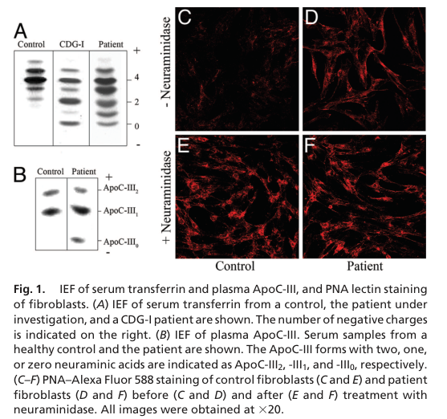

## Question

# Disease Characteristics Research Template

## Target Disease
- **Disease Name:** COG1-congenital disorder of glycosylation
- **MONDO ID:**  (if available)
- **Category:** Mendelian

## Research Objectives

Please provide a comprehensive research report on **COG1-congenital disorder of glycosylation** covering all of the
disease characteristics listed below. This report will be used to populate a disease knowledge
base entry. Be thorough and cite primary literature (PMID preferred) for all claims.

For each section, **suggested databases/resources** are listed. These are the first places
you should search for information on each topic.

---

### 1. Disease Information
> **Search first:** OMIM, Orphanet, ICD-10/ICD-11, MeSH, PubMed

- What is the disease? Provide a concise overview.
- What are the key identifiers? (OMIM, Orphanet, ICD-10/ICD-11, MeSH, Mondo)
- What are the common synonyms and alternative names?
- Is the information derived from individual patients (e.g., EHR) or aggregated disease-level resources?

### 2. Etiology

- **Disease Causal Factors**: What are the primary causes? (genetic, environmental, infectious, mechanistic)
- **Risk Factors**:
  > **Search first:** PubMed, Cochrane Library, UpToDate, clinical guidelines, ClinVar, ClinGen, GWAS Catalog, PheGenI, CTD, CDC, WHO, epidemiological databases
  - Genetic risk factors (causal variants, susceptibility loci, modifier genes)
  - Environmental risk factors (toxins, lifestyle, occupational exposures, age, sex, family history)
- **Protective Factors**:
  > **Search first:** PubMed, Cochrane Library, clinical trial databases, GWAS Catalog, gnomAD, WHO, CDC, nutrition databases
  - Genetic protective factors (protective variants, modifier alleles)
  - Environmental protective factors (diet, lifestyle, exposures that reduce risk)
- **Gene-Environment Interactions**: How do genetic and environmental factors interact to influence disease?
  > **Search first:** CTD, PubMed, PheGenI, GxE databases

### 3. Phenotypes
> **Search first:** HPO (Human Phenotype Ontology), OMIM, Orphanet, PubMed, clinicaltrials.gov, MedDRA, SNOMED CT, DECIPHER, LOINC

For each phenotype, provide:
- **Phenotype type**: symptoms, clinical signs, physical manifestations, behavioral changes, or laboratory abnormalities
  > For symptoms/signs: HPO, OMIM, Orphanet, PubMed
  > For behavioral changes: HPO, DSM, RDoC (Research Domain Criteria), PubMed
  > For laboratory abnormalities: LOINC, SNOMED CT, LabTests Online, PubMed
- **Phenotype characteristics**:
  > **Search first:** OMIM, Orphanet, HPO, PubMed
  - Age of symptom onset (neonatal, childhood, adult-onset, late-onset)
  - Symptom severity (mild, moderate, severe, variable)
  - Symptom progression (stable, progressive, episodic, fluctuating)
  - Frequency among affected individuals (percentage or qualitative)
- **Quality of life impact**: Effects on daily functioning and well-being (per-phenotype when possible)
  > **Search first:** EQ-5D database, SF-36, WHO QOL databases, PubMed
- Suggest HPO (Human Phenotype Ontology) terms for each phenotype

### 4. Genetic/Molecular Information

- **Causal Genes**: Gene mutations or chromosomal abnormalities responsible for disease (gene symbols, OMIM IDs)
  > **Search first:** OMIM, ClinVar, HGMD, Ensembl, NCBI Gene
- **Pathogenic Variants**:
  - Affected genes (gene symbols, HGNC IDs)
    > **Search first:** OMIM, NCBI Gene, Ensembl, HGNC, UniProt, GeneCards
  - Variant classification (pathogenic, likely pathogenic, VUS per ACMG/AMP guidelines)
    > **Search first:** ClinVar, ClinGen, ACMG/AMP guidelines, VarSome
  - Variant type/class (missense, frameshift, nonsense, splice-site, structural)
  - Allele frequency in population databases
    > **Search first:** gnomAD, 1000 Genomes, ExAC, TOPMed, dbSNP
  - Somatic vs germline origin
    > **Search first:** COSMIC (somatic), ClinVar, ICGC, TCGA
  - Functional consequences (loss of function, gain of function, dominant negative)
- **Modifier Genes**: Genes that modify disease severity or expression
- **Epigenetic Information**: DNA methylation, histone modifications, chromatin changes affecting disease
  > **Search first:** ENCODE, Roadmap Epigenomics, MethBase, DiseaseMeth
- **Chromosomal Abnormalities**: Large-scale genetic changes (aneuploidy, translocations, inversions)
  > **Search first:** DECIPHER, ClinVar, ECARUCA, UCSC Genome Browser

### 5. Environmental Information

- **Environmental Factors**: Non-genetic contributing factors (toxins, radiation, pollution, occupational exposure)
  > **Search first:** CTD (Comparative Toxicogenomics Database), TOXNET, PubMed, EPA databases
- **Lifestyle Factors**: Behavioral factors (smoking, diet, exercise, alcohol consumption)
  > **Search first:** CDC databases, WHO, PubMed, NHANES
- **Infectious Agents**: If applicable, pathogens causing or triggering disease (bacteria, viruses, fungi, parasites)
  > **Search first:** NCBI Taxonomy, ViPR, BV-BRC, MicrobeDB, GIDEON

### 6. Mechanism / Pathophysiology

- **Molecular Pathways**: Specific signaling cascades or biochemical pathways involved (Wnt, MAPK, mTOR, PI3K-AKT, etc.)
  > **Search first:** KEGG, Reactome, WikiPathways, PathBank, BioCyc
- **Cellular Processes**: Cell-level mechanisms (apoptosis, autophagy, cell cycle dysregulation, inflammation, etc.)
  > **Search first:** Gene Ontology (GO), Reactome, KEGG, PubMed
- **Protein Dysfunction**: How protein structure or function is altered (misfolding, aggregation, loss of function, gain of function)
  > **Search first:** UniProt, PDB (Protein Data Bank), InterPro, Pfam, AlphaFold
- **Metabolic Changes**: Alterations in metabolic processes (energy metabolism, lipid metabolism, amino acid metabolism)
  > **Search first:** KEGG, BioCyc, HMDB (Human Metabolome Database), BRENDA
- **Immune System Involvement**: Role of immune response (autoimmunity, immunodeficiency, chronic inflammation)
  > **Search first:** ImmPort, Immunome Database, IEDB, Gene Ontology
- **Tissue Damage Mechanisms**: How tissues/ are injured (oxidative stress, ischemia, fibrosis, necrosis)
  > **Search first:** PubMed, Gene Ontology, Reactome
- **Biochemical Abnormalities**: Specific molecular defects (enzyme deficiencies, receptor dysfunction, ion channel defects)
  > **Search first:** BRENDA, UniProt, KEGG, OMIM, PubMed
- **Epigenetic Changes**: DNA methylation, histone modifications affecting gene expression in disease
  > **Search first:** ENCODE, Roadmap Epigenomics, MethBase, DiseaseMeth
- **Molecular Profiling** (if available):
  - Transcriptomics/gene expression changes
    > **Search first:** GEO (Gene Expression Omnibus), ArrayExpress, GTEx, Human Cell Atlas, SRA
  - Proteomics findings
    > **Search first:** PRIDE, ProteomeXchange, Human Protein Atlas, STRING, BioGRID
  - Metabolomics signatures
    > **Search first:** MetaboLights, Metabolomics Workbench, HMDB, METLIN
  - Lipidomics alterations
    > **Search first:** LIPID MAPS, SwissLipids, LipidHome, Metabolomics Workbench
  - Genomic structural features
    > **Search first:** UCSC Genome Browser, Ensembl, NCBI, dbVar, DGV
- **Advanced Technologies** (if applicable):
  - Single-cell analysis findings (cell-type specific mechanisms, cellular heterogeneity)
    > **Search first:** Human Cell Atlas, Single Cell Portal, GEO, CELLxGENE
  - Spatial transcriptomics findings
    > **Search first:** GEO, Spatial Research, Vizgen, 10x Genomics data
  - Multi-omics integration results
    > **Search first:** TCGA, ICGC, cBioPortal, LinkedOmics, PubMed
  - Functional genomics screens (CRISPR, RNAi)
    > **Search first:** DepMap, GenomeRNAi, PubMed, BioGRID ORCS

For each mechanism, describe:
- The causal chain from initial trigger to clinical manifestation
- Which mechanisms are upstream vs downstream
- What cell types and biological processes are involved
- Suggest GO terms for biological processes and CL terms for cell types

### 7. Anatomical Structures Affected

- **Organ Level**:
  - Primary organs directly affected
  - Secondary organ involvement (complications, secondary effects)
  - Body systems involved (cardiovascular, nervous, digestive, respiratory, endocrine, etc.)
  > **Search first:** Uberon, FMA (Foundational Model of Anatomy), OMIM, HPO, ICD-11, MeSH, SNOMED CT
- **Tissue and Cell Level**:
  - Specific tissue types affected (epithelial, connective, muscle, nervous)
  - Specific cell populations targeted (with Cell Ontology terms)
  > **Search first:** Uberon, Human Protein Atlas, Cell Ontology, Human Cell Atlas, CellMarker, PanglaoDB
- **Subcellular Level**:
  - Cellular compartments involved (mitochondria, nucleus, ER, lysosomes) (with GO Cellular Component terms)
  > **Search first:** Gene Ontology (Cellular Component), UniProt, Human Protein Atlas
- **Localization**:
  - Specific anatomical sites (with UBERON terms)
    > **Search first:** FMA, Uberon, NeuroNames (for brain), SNOMED CT
  - Lateralization (unilateral, bilateral, asymmetric)
    > **Search first:** HPO, clinical literature, imaging databases

### 8. Temporal Development

- **Onset**:
  - Typical age of onset (congenital, pediatric, adult, geriatric)
  - Onset pattern (acute, subacute, chronic, insidious)
  > **Search first:** OMIM, Orphanet, HPO, PubMed
- **Progression**:
  - Disease stages (early, intermediate, advanced, end-stage)
    > **Search first:** Cancer Staging Manual (AJCC), WHO classifications, PubMed
  - Progression rate (rapid, slow, variable)
  - Disease course pattern (episodic, relapsing-remitting, progressive, stable)
  - Disease duration (self-limited, chronic lifelong)
  > **Search first:** Disease registries, longitudinal cohort databases, natural history studies, PubMed, Orphanet, OMIM
- **Patterns**:
  - Remission patterns (spontaneous, treatment-induced)
    > **Search first:** Clinical trial databases, disease registries, PubMed
  - Critical periods (time windows of vulnerability or opportunity for intervention)
    > **Search first:** PubMed, developmental biology databases, clinical guidelines

### 9. Inheritance and Population

- **Epidemiology**:
  - Prevalence (cases per 100,000 at given time)
  - Incidence (new cases per 100,000 per year)
  > **Search first:** Orphanet, CDC, WHO, GBD (Global Burden of Disease), national registries, SEER, disease registries
- **For Genetic Etiology**:
  - Inheritance pattern (AD, AR, X-linked, mitochondrial, multifactorial, polygenic)
    > **Search first:** OMIM, Orphanet, ClinVar, GTR (Genetic Testing Registry)
  - Penetrance (complete, incomplete, age-dependent)
    > **Search first:** ClinVar, OMIM, PubMed, ClinGen
  - Expressivity (variable, consistent)
    > **Search first:** OMIM, ClinVar, PubMed
  - Genetic anticipation (increasing severity in successive generations)
    > **Search first:** OMIM, PubMed (especially for repeat expansion disorders)
  - Germline mosaicism
    > **Search first:** ClinVar, OMIM, genetic counseling literature, PubMed
  - Founder effects (population-specific mutations)
    > **Search first:** gnomAD, population genetics databases, PubMed
  - Consanguinity role
    > **Search first:** OMIM, population studies, genetic counseling resources
  - Carrier frequency
    > **Search first:** gnomAD, carrier screening databases, GeneReviews, GTR
- **Population Demographics**:
  - Affected populations (ethnic or demographic groups with higher prevalence)
    > **Search first:** gnomAD, 1000 Genomes, PAGE Study, PubMed, population registries
  - Geographic distribution (endemic areas, regional variation)
    > **Search first:** WHO, CDC, GBD, Orphanet, geographic epidemiology databases
  - Geographic distribution of specific variants
  - Sex ratio (male:female)
    > **Search first:** Disease registries, OMIM, PubMed, epidemiological databases
  - Age distribution of affected individuals
    > **Search first:** CDC, disease registries, SEER, Orphanet

### 10. Diagnostics

- **Clinical Tests**:
  - Laboratory tests (blood, urine, tissue chemistry, specific enzyme assays)
    > **Search first:** LOINC, LabTests Online, PubMed
  - Biomarkers (proteins, metabolites, genetic markers, circulating biomarkers)
    > **Search first:** FDA Biomarker List, BEST (Biomarkers, EndpointS, and other Tools), PubMed
  - Imaging studies (X-ray, CT, MRI, PET, ultrasound)
    > **Search first:** RadLex, DICOM, Radiopaedia, imaging databases
  - Functional tests (pulmonary function, cardiac stress tests)
    > **Search first:** LOINC, clinical guidelines, PubMed
  - Electrophysiology (EEG, EMG, ECG, nerve conduction studies)
    > **Search first:** LOINC, clinical neurophysiology databases, PubMed
  - Biopsy findings (histopathology, immunohistochemistry)
    > **Search first:** SNOMED CT, College of American Pathologists resources, PubMed
  - Pathology findings (microscopic examination)
    > **Search first:** SNOMED CT, Digital Pathology databases, PubMed
- **Genetic Testing**:
  > **Search first:** GTR (Genetic Testing Registry), GeneReviews, ClinGen
  - Overview of recommended genetic testing approach
  - Whole genome sequencing (WGS) utility
    > **Search first:** GTR, ClinVar, GEL (Genomics England), gnomAD
  - Whole exome sequencing (WES) utility
    > **Search first:** GTR, ClinVar, OMIM, GeneMatcher
  - Gene panels (which panels, which genes)
    > **Search first:** GTR, ClinVar, laboratory-specific databases
  - Single gene testing
    > **Search first:** GTR, ClinVar, OMIM, GeneReviews
  - Chromosomal microarray (CMA)
    > **Search first:** DECIPHER, ClinVar, dbVar, ECARUCA
  - Karyotyping
    > **Search first:** Chromosome Abnormality Database, ClinVar, cytogenetics resources
  - FISH
    > **Search first:** ClinVar, cytogenetics databases, PubMed
  - Mitochondrial DNA testing
    > **Search first:** MITOMAP, MSeqDR, ClinVar, GTR
  - Repeat expansion testing
    > **Search first:** GTR, ClinVar, repeat expansion databases, PubMed
- **Omics-Based Diagnostics** (if applicable):
  - RNA sequencing / transcriptomics
    > **Search first:** GEO, ArrayExpress, GTEx, RNA-seq databases
  - Proteomics
    > **Search first:** PRIDE, ProteomeXchange, FDA Biomarker database
  - Metabolomics
    > **Search first:** MetaboLights, Metabolomics Workbench, HMDB
  - Epigenomics
    > **Search first:** GEO, ENCODE, Roadmap Epigenomics, MethBase
  - Liquid biopsy
    > **Search first:** COSMIC, ClinVar, liquid biopsy databases, PubMed
- **Clinical Criteria**:
  - Standardized diagnostic criteria (DSM, ICD, society guidelines)
    > **Search first:** DSM-5, ICD-11, clinical society guidelines, UpToDate
  - Differential diagnosis (other conditions to rule out, with distinguishing features)
    > **Search first:** DynaMed, UpToDate, clinical decision support systems
- **Screening**:
  - Screening methods for asymptomatic individuals (newborn screening, carrier screening, cascade screening)
    > **Search first:** ACMG recommendations, CDC newborn screening, GTR

### 11. Outcome/Prognosis

- **Survival and Mortality**:
  - Survival rate (5-year, 10-year, overall)
    > **Search first:** SEER, cancer registries, disease-specific registries, PubMed
  - Life expectancy (with and without treatment if applicable)
    > **Search first:** Orphanet, disease registries, actuarial databases, PubMed
  - Mortality rate
    > **Search first:** CDC, WHO, GBD, national mortality databases
  - Disease-specific mortality (deaths directly attributable to disease)
    > **Search first:** Disease registries, CDC Wonder, GBD, PubMed
- **Morbidity and Function**:
  - Morbidity (disease-related disability and health impacts)
    > **Search first:** GBD, WHO, disability databases, PubMed
  - Disability outcomes (long-term functional impairments)
    > **Search first:** ICF (International Classification of Functioning), disability registries
  - Quality of life measures (EQ-5D, SF-36, PROMIS, disease-specific tools)
    > **Search first:** EQ-5D database, SF-36, PROMIS, PubMed
- **Disease Course**:
  - Complications (secondary problems: infections, organ failure, etc.)
    > **Search first:** ICD codes, disease registries, clinical databases, PubMed
  - Recovery potential (likelihood and extent of recovery, with vs without treatment)
    > **Search first:** Natural history studies, rehabilitation databases, PubMed
- **Prediction**:
  - Prognostic factors (age, disease severity, biomarkers, treatment response)
    > **Search first:** Prognostic models databases, clinical calculators, PubMed
  - Prognostic biomarkers (molecular markers predicting disease course)
    > **Search first:** FDA Biomarker database, PubMed, cancer prognostic databases

### 12. Treatment

- **Pharmacotherapy**:
  - Pharmacological treatments (drug names, drug classes, mechanisms of action)
    > **Search first:** DrugBank, RxNorm, ATC classification, DailyMed, FDA databases
  - Pharmacogenomics (how genetic variants affect drug metabolism, efficacy, toxicity)
    > **Search first:** PharmGKB, CPIC (Clinical Pharmacogenetics), FDA Table of PGx Biomarkers
- **Advanced Therapeutics**:
  - Gene therapy (viral vectors, CRISPR, gene replacement, gene editing)
    > **Search first:** ClinicalTrials.gov, FDA gene therapy database, ASGCT resources
  - Cell therapy (stem cell transplant, CAR-T, cellular therapeutics)
    > **Search first:** ClinicalTrials.gov, FDA cell therapy database, FACT standards
  - RNA-based therapies (ASOs, siRNA, mRNA therapies)
    > **Search first:** ClinicalTrials.gov, FDA approvals, PubMed
  - Targeted therapies (treatments directed at specific molecular targets)
    > **Search first:** My Cancer Genome, OncoKB, ClinicalTrials.gov, FDA approvals
  - Immunotherapies (checkpoint inhibitors, monoclonal antibodies)
    > **Search first:** Cancer Immunotherapy Database, FDA approvals, ClinicalTrials.gov
- **Surgical and Interventional**:
  - Surgical interventions (types of surgery, timing, outcomes)
    > **Search first:** CPT codes, surgical registries, clinical guidelines, PubMed
- **Supportive and Rehabilitative**:
  - Supportive care (symptom management, pain control, nutrition)
    > **Search first:** Clinical guidelines, Cochrane Library, PubMed
  - Rehabilitation (physical therapy, occupational therapy, speech therapy)
    > **Search first:** Rehabilitation medicine databases, clinical guidelines, PubMed
- **Experimental**:
  - Experimental treatments in clinical trials (with NCT identifiers if available)
    > **Search first:** ClinicalTrials.gov, EU Clinical Trials Register, WHO ICTRP
- **Treatment Outcomes**:
  - Treatment response rates
    > **Search first:** Clinical trial databases, FDA reviews, systematic reviews, PubMed
  - Side effects and adverse events
    > **Search first:** FDA Adverse Event Reporting System (FAERS), MedWatch, PubMed
- **Treatment Strategy**:
  - Treatment algorithms (clinical pathways, decision trees)
    > **Search first:** Clinical practice guidelines, NCCN Guidelines, UpToDate
  - Combination therapies
    > **Search first:** ClinicalTrials.gov, treatment guidelines, PubMed
  - Personalized medicine approaches (genotype-guided treatment)
    > **Search first:** My Cancer Genome, CIViC, PharmGKB, precision medicine databases

For each treatment, suggest MAXO (Medical Action Ontology) terms where applicable.

### 13. Prevention

- **Prevention Levels**:
  - Primary prevention (preventing disease occurrence: vaccination, risk factor modification)
    > **Search first:** CDC, WHO, USPSTF recommendations, Cochrane Library
  - Secondary prevention (early detection and treatment: screening programs, early intervention)
    > **Search first:** USPSTF, CDC screening guidelines, WHO
  - Tertiary prevention (preventing complications in those with disease)
    > **Search first:** Clinical guidelines, disease management protocols, PubMed
- **Immunization**: Vaccine strategies (if applicable)
  > **Search first:** CDC vaccine schedules, WHO immunization, FDA vaccine database
- **Screening and Early Detection**:
  - Screening programs (population-based: newborn screening, cancer screening)
    > **Search first:** CDC screening programs, USPSTF, cancer screening databases
  - Genetic screening (carrier screening, preimplantation genetic diagnosis, prenatal testing)
    > **Search first:** ACMG recommendations, ACOG guidelines, GTR
  - Risk stratification (identifying high-risk individuals for targeted prevention)
    > **Search first:** Risk prediction models, clinical calculators, PubMed
- **Behavioral Interventions**: Lifestyle modifications to reduce risk
  > **Search first:** CDC, WHO, behavioral intervention databases, Cochrane Library
- **Counseling**: Genetic counseling (risk assessment, family planning guidance)
  > **Search first:** NSGC resources, ACMG guidelines, GeneReviews
- **Public Health**:
  - Public health interventions (sanitation, vector control, health education)
    > **Search first:** CDC, WHO, public health databases, PubMed
  - Environmental interventions (reducing environmental risk factors)
    > **Search first:** EPA databases, WHO environmental health, PubMed
- **Prophylaxis**: Preventive medications or procedures
  > **Search first:** Clinical guidelines, FDA approvals, PubMed

### 14. Other Species / Natural Disease

- **Taxonomy**: Species affected (with NCBI Taxon identifiers)
  > **Search first:** NCBI Taxonomy
- **Breed**: Specific breeds affected (with VBO identifiers if applicable)
  > **Search first:** VBO (Vertebrate Breed Ontology)
- **Gene**: Orthologous genes in other species (with NCBI Gene IDs)
  > **Search first:** NCBI Gene
- **Natural Disease**:
  - Naturally occurring disease in other species (companion animals, wildlife)
    > **Search first:** OMIA (Online Mendelian Inheritance in Animals), VetCompass, PubMed
  - Veterinary relevance and importance in animal health
    > **Search first:** OMIA, veterinary databases, PubMed
- **Comparative Biology**:
  - Comparative pathology (similarities and differences across species)
    > **Search first:** OMIA, comparative pathology databases, PubMed
  - Evolutionary conservation of disease mechanisms
    > **Search first:** HomoloGene, OrthoMCL, Alliance of Genome Resources
- **Transmission** (if applicable):
  - Zoonotic potential
    > **Search first:** CDC zoonotic diseases, WHO zoonoses, GIDEON
  - Cross-species susceptibility
    > **Search first:** NCBI Taxonomy, veterinary databases, PubMed

### 15. Model Organisms

- **Model Types**:
  - Model organism type (mammalian, invertebrate, cellular, in vitro)
    > **Search first:** Alliance of Genome Resources, model organism databases
  - Specific model systems (mouse, rat, zebrafish, Drosophila, C. elegans, yeast, cell lines, organoids, iPSCs)
    > **Search first:** MGI, RGD, ZFIN, FlyBase, WormBase, SGD, ATCC, Cellosaurus
  - Induced models (drug treatment, surgical intervention, environmental manipulation)
    > **Search first:** MGI, model organism databases, PubMed
- **Genetic Models**:
  - Types available (knockout, knock-in, transgenic, conditional, humanized)
    > **Search first:** MGI, IMPC, KOMP, EuMMCR, IMSR
- **Model Characteristics**:
  - Phenotype recapitulation (how well model reproduces human disease features)
    > **Search first:** Model organism databases, comparative studies, PubMed
  - Model limitations (aspects of human disease not captured)
    > **Search first:** Model organism databases, PubMed, review articles
- **Applications**:
  - Research applications (what aspects of disease can be studied)
    > **Search first:** Model organism databases, PubMed
- **Resources**:
  - Model databases
    > **Search first:** MGI, RGD, ZFIN, FlyBase, WormBase, IMSR, EMMA, MMRRC

---

## Citation Requirements

- Cite primary literature (PMID preferred) for all mechanistic and clinical claims
- Prioritize recent reviews and landmark papers
- Include direct quotes from abstracts where possible to support key statements
- Distinguish evidence source types: human clinical, model organism, in vitro, computational

## Output Format

Structure your response as a comprehensive narrative organized by the sections above.
For each section, provide:
- Factual content with specific details (numbers, percentages, gene names, variant nomenclature)
- Ontology term suggestions (HPO, GO, CL, UBERON, CHEBI, MAXO, MONDO) where applicable
- Evidence citations with PMIDs
- Direct quotes from abstracts to support key claims
- Clear indication when information is not available or not applicable for this disease

This report will be used to populate a disease knowledge base entry with:
- Pathophysiology descriptions with causal chains
- Gene/protein annotations (HGNC, GO terms)
- Phenotype associations (HP terms) with frequencies
- Cell type involvement (CL terms)
- Anatomical locations (UBERON terms)
- Chemical entities (CHEBI terms)
- Treatment annotations (MAXO terms)
- Evidence items with PMIDs and exact abstract quotes
- Epidemiology, prognosis, diagnostic, and prevention information
- Animal model descriptions with phenotype recapitulation details

## Output

Question: You are an expert researcher providing comprehensive, well-cited information.

Provide detailed information focusing on:
1. Key concepts and definitions with current understanding
2. Recent developments and latest research (prioritize 2023-2024 sources)
3. Current applications and real-world implementations
4. Expert opinions and analysis from authoritative sources
5. Relevant statistics and data from recent studies

Format as a comprehensive research report with proper citations. Include URLs and publication dates where available.
Always prioritize recent, authoritative sources and provide specific citations for all major claims.

# Disease Characteristics Research Template

## Target Disease
- **Disease Name:** COG1-congenital disorder of glycosylation
- **MONDO ID:**  (if available)
- **Category:** Mendelian

## Research Objectives

Please provide a comprehensive research report on **COG1-congenital disorder of glycosylation** covering all of the
disease characteristics listed below. This report will be used to populate a disease knowledge
base entry. Be thorough and cite primary literature (PMID preferred) for all claims.

For each section, **suggested databases/resources** are listed. These are the first places
you should search for information on each topic.

---

### 1. Disease Information
> **Search first:** OMIM, Orphanet, ICD-10/ICD-11, MeSH, PubMed

- What is the disease? Provide a concise overview.
- What are the key identifiers? (OMIM, Orphanet, ICD-10/ICD-11, MeSH, Mondo)
- What are the common synonyms and alternative names?
- Is the information derived from individual patients (e.g., EHR) or aggregated disease-level resources?

### 2. Etiology

- **Disease Causal Factors**: What are the primary causes? (genetic, environmental, infectious, mechanistic)
- **Risk Factors**:
  > **Search first:** PubMed, Cochrane Library, UpToDate, clinical guidelines, ClinVar, ClinGen, GWAS Catalog, PheGenI, CTD, CDC, WHO, epidemiological databases
  - Genetic risk factors (causal variants, susceptibility loci, modifier genes)
  - Environmental risk factors (toxins, lifestyle, occupational exposures, age, sex, family history)
- **Protective Factors**:
  > **Search first:** PubMed, Cochrane Library, clinical trial databases, GWAS Catalog, gnomAD, WHO, CDC, nutrition databases
  - Genetic protective factors (protective variants, modifier alleles)
  - Environmental protective factors (diet, lifestyle, exposures that reduce risk)
- **Gene-Environment Interactions**: How do genetic and environmental factors interact to influence disease?
  > **Search first:** CTD, PubMed, PheGenI, GxE databases

### 3. Phenotypes
> **Search first:** HPO (Human Phenotype Ontology), OMIM, Orphanet, PubMed, clinicaltrials.gov, MedDRA, SNOMED CT, DECIPHER, LOINC

For each phenotype, provide:
- **Phenotype type**: symptoms, clinical signs, physical manifestations, behavioral changes, or laboratory abnormalities
  > For symptoms/signs: HPO, OMIM, Orphanet, PubMed
  > For behavioral changes: HPO, DSM, RDoC (Research Domain Criteria), PubMed
  > For laboratory abnormalities: LOINC, SNOMED CT, LabTests Online, PubMed
- **Phenotype characteristics**:
  > **Search first:** OMIM, Orphanet, HPO, PubMed
  - Age of symptom onset (neonatal, childhood, adult-onset, late-onset)
  - Symptom severity (mild, moderate, severe, variable)
  - Symptom progression (stable, progressive, episodic, fluctuating)
  - Frequency among affected individuals (percentage or qualitative)
- **Quality of life impact**: Effects on daily functioning and well-being (per-phenotype when possible)
  > **Search first:** EQ-5D database, SF-36, WHO QOL databases, PubMed
- Suggest HPO (Human Phenotype Ontology) terms for each phenotype

### 4. Genetic/Molecular Information

- **Causal Genes**: Gene mutations or chromosomal abnormalities responsible for disease (gene symbols, OMIM IDs)
  > **Search first:** OMIM, ClinVar, HGMD, Ensembl, NCBI Gene
- **Pathogenic Variants**:
  - Affected genes (gene symbols, HGNC IDs)
    > **Search first:** OMIM, NCBI Gene, Ensembl, HGNC, UniProt, GeneCards
  - Variant classification (pathogenic, likely pathogenic, VUS per ACMG/AMP guidelines)
    > **Search first:** ClinVar, ClinGen, ACMG/AMP guidelines, VarSome
  - Variant type/class (missense, frameshift, nonsense, splice-site, structural)
  - Allele frequency in population databases
    > **Search first:** gnomAD, 1000 Genomes, ExAC, TOPMed, dbSNP
  - Somatic vs germline origin
    > **Search first:** COSMIC (somatic), ClinVar, ICGC, TCGA
  - Functional consequences (loss of function, gain of function, dominant negative)
- **Modifier Genes**: Genes that modify disease severity or expression
- **Epigenetic Information**: DNA methylation, histone modifications, chromatin changes affecting disease
  > **Search first:** ENCODE, Roadmap Epigenomics, MethBase, DiseaseMeth
- **Chromosomal Abnormalities**: Large-scale genetic changes (aneuploidy, translocations, inversions)
  > **Search first:** DECIPHER, ClinVar, ECARUCA, UCSC Genome Browser

### 5. Environmental Information

- **Environmental Factors**: Non-genetic contributing factors (toxins, radiation, pollution, occupational exposure)
  > **Search first:** CTD (Comparative Toxicogenomics Database), TOXNET, PubMed, EPA databases
- **Lifestyle Factors**: Behavioral factors (smoking, diet, exercise, alcohol consumption)
  > **Search first:** CDC databases, WHO, PubMed, NHANES
- **Infectious Agents**: If applicable, pathogens causing or triggering disease (bacteria, viruses, fungi, parasites)
  > **Search first:** NCBI Taxonomy, ViPR, BV-BRC, MicrobeDB, GIDEON

### 6. Mechanism / Pathophysiology

- **Molecular Pathways**: Specific signaling cascades or biochemical pathways involved (Wnt, MAPK, mTOR, PI3K-AKT, etc.)
  > **Search first:** KEGG, Reactome, WikiPathways, PathBank, BioCyc
- **Cellular Processes**: Cell-level mechanisms (apoptosis, autophagy, cell cycle dysregulation, inflammation, etc.)
  > **Search first:** Gene Ontology (GO), Reactome, KEGG, PubMed
- **Protein Dysfunction**: How protein structure or function is altered (misfolding, aggregation, loss of function, gain of function)
  > **Search first:** UniProt, PDB (Protein Data Bank), InterPro, Pfam, AlphaFold
- **Metabolic Changes**: Alterations in metabolic processes (energy metabolism, lipid metabolism, amino acid metabolism)
  > **Search first:** KEGG, BioCyc, HMDB (Human Metabolome Database), BRENDA
- **Immune System Involvement**: Role of immune response (autoimmunity, immunodeficiency, chronic inflammation)
  > **Search first:** ImmPort, Immunome Database, IEDB, Gene Ontology
- **Tissue Damage Mechanisms**: How tissues/ are injured (oxidative stress, ischemia, fibrosis, necrosis)
  > **Search first:** PubMed, Gene Ontology, Reactome
- **Biochemical Abnormalities**: Specific molecular defects (enzyme deficiencies, receptor dysfunction, ion channel defects)
  > **Search first:** BRENDA, UniProt, KEGG, OMIM, PubMed
- **Epigenetic Changes**: DNA methylation, histone modifications affecting gene expression in disease
  > **Search first:** ENCODE, Roadmap Epigenomics, MethBase, DiseaseMeth
- **Molecular Profiling** (if available):
  - Transcriptomics/gene expression changes
    > **Search first:** GEO (Gene Expression Omnibus), ArrayExpress, GTEx, Human Cell Atlas, SRA
  - Proteomics findings
    > **Search first:** PRIDE, ProteomeXchange, Human Protein Atlas, STRING, BioGRID
  - Metabolomics signatures
    > **Search first:** MetaboLights, Metabolomics Workbench, HMDB, METLIN
  - Lipidomics alterations
    > **Search first:** LIPID MAPS, SwissLipids, LipidHome, Metabolomics Workbench
  - Genomic structural features
    > **Search first:** UCSC Genome Browser, Ensembl, NCBI, dbVar, DGV
- **Advanced Technologies** (if applicable):
  - Single-cell analysis findings (cell-type specific mechanisms, cellular heterogeneity)
    > **Search first:** Human Cell Atlas, Single Cell Portal, GEO, CELLxGENE
  - Spatial transcriptomics findings
    > **Search first:** GEO, Spatial Research, Vizgen, 10x Genomics data
  - Multi-omics integration results
    > **Search first:** TCGA, ICGC, cBioPortal, LinkedOmics, PubMed
  - Functional genomics screens (CRISPR, RNAi)
    > **Search first:** DepMap, GenomeRNAi, PubMed, BioGRID ORCS

For each mechanism, describe:
- The causal chain from initial trigger to clinical manifestation
- Which mechanisms are upstream vs downstream
- What cell types and biological processes are involved
- Suggest GO terms for biological processes and CL terms for cell types

### 7. Anatomical Structures Affected

- **Organ Level**:
  - Primary organs directly affected
  - Secondary organ involvement (complications, secondary effects)
  - Body systems involved (cardiovascular, nervous, digestive, respiratory, endocrine, etc.)
  > **Search first:** Uberon, FMA (Foundational Model of Anatomy), OMIM, HPO, ICD-11, MeSH, SNOMED CT
- **Tissue and Cell Level**:
  - Specific tissue types affected (epithelial, connective, muscle, nervous)
  - Specific cell populations targeted (with Cell Ontology terms)
  > **Search first:** Uberon, Human Protein Atlas, Cell Ontology, Human Cell Atlas, CellMarker, PanglaoDB
- **Subcellular Level**:
  - Cellular compartments involved (mitochondria, nucleus, ER, lysosomes) (with GO Cellular Component terms)
  > **Search first:** Gene Ontology (Cellular Component), UniProt, Human Protein Atlas
- **Localization**:
  - Specific anatomical sites (with UBERON terms)
    > **Search first:** FMA, Uberon, NeuroNames (for brain), SNOMED CT
  - Lateralization (unilateral, bilateral, asymmetric)
    > **Search first:** HPO, clinical literature, imaging databases

### 8. Temporal Development

- **Onset**:
  - Typical age of onset (congenital, pediatric, adult, geriatric)
  - Onset pattern (acute, subacute, chronic, insidious)
  > **Search first:** OMIM, Orphanet, HPO, PubMed
- **Progression**:
  - Disease stages (early, intermediate, advanced, end-stage)
    > **Search first:** Cancer Staging Manual (AJCC), WHO classifications, PubMed
  - Progression rate (rapid, slow, variable)
  - Disease course pattern (episodic, relapsing-remitting, progressive, stable)
  - Disease duration (self-limited, chronic lifelong)
  > **Search first:** Disease registries, longitudinal cohort databases, natural history studies, PubMed, Orphanet, OMIM
- **Patterns**:
  - Remission patterns (spontaneous, treatment-induced)
    > **Search first:** Clinical trial databases, disease registries, PubMed
  - Critical periods (time windows of vulnerability or opportunity for intervention)
    > **Search first:** PubMed, developmental biology databases, clinical guidelines

### 9. Inheritance and Population

- **Epidemiology**:
  - Prevalence (cases per 100,000 at given time)
  - Incidence (new cases per 100,000 per year)
  > **Search first:** Orphanet, CDC, WHO, GBD (Global Burden of Disease), national registries, SEER, disease registries
- **For Genetic Etiology**:
  - Inheritance pattern (AD, AR, X-linked, mitochondrial, multifactorial, polygenic)
    > **Search first:** OMIM, Orphanet, ClinVar, GTR (Genetic Testing Registry)
  - Penetrance (complete, incomplete, age-dependent)
    > **Search first:** ClinVar, OMIM, PubMed, ClinGen
  - Expressivity (variable, consistent)
    > **Search first:** OMIM, ClinVar, PubMed
  - Genetic anticipation (increasing severity in successive generations)
    > **Search first:** OMIM, PubMed (especially for repeat expansion disorders)
  - Germline mosaicism
    > **Search first:** ClinVar, OMIM, genetic counseling literature, PubMed
  - Founder effects (population-specific mutations)
    > **Search first:** gnomAD, population genetics databases, PubMed
  - Consanguinity role
    > **Search first:** OMIM, population studies, genetic counseling resources
  - Carrier frequency
    > **Search first:** gnomAD, carrier screening databases, GeneReviews, GTR
- **Population Demographics**:
  - Affected populations (ethnic or demographic groups with higher prevalence)
    > **Search first:** gnomAD, 1000 Genomes, PAGE Study, PubMed, population registries
  - Geographic distribution (endemic areas, regional variation)
    > **Search first:** WHO, CDC, GBD, Orphanet, geographic epidemiology databases
  - Geographic distribution of specific variants
  - Sex ratio (male:female)
    > **Search first:** Disease registries, OMIM, PubMed, epidemiological databases
  - Age distribution of affected individuals
    > **Search first:** CDC, disease registries, SEER, Orphanet

### 10. Diagnostics

- **Clinical Tests**:
  - Laboratory tests (blood, urine, tissue chemistry, specific enzyme assays)
    > **Search first:** LOINC, LabTests Online, PubMed
  - Biomarkers (proteins, metabolites, genetic markers, circulating biomarkers)
    > **Search first:** FDA Biomarker List, BEST (Biomarkers, EndpointS, and other Tools), PubMed
  - Imaging studies (X-ray, CT, MRI, PET, ultrasound)
    > **Search first:** RadLex, DICOM, Radiopaedia, imaging databases
  - Functional tests (pulmonary function, cardiac stress tests)
    > **Search first:** LOINC, clinical guidelines, PubMed
  - Electrophysiology (EEG, EMG, ECG, nerve conduction studies)
    > **Search first:** LOINC, clinical neurophysiology databases, PubMed
  - Biopsy findings (histopathology, immunohistochemistry)
    > **Search first:** SNOMED CT, College of American Pathologists resources, PubMed
  - Pathology findings (microscopic examination)
    > **Search first:** SNOMED CT, Digital Pathology databases, PubMed
- **Genetic Testing**:
  > **Search first:** GTR (Genetic Testing Registry), GeneReviews, ClinGen
  - Overview of recommended genetic testing approach
  - Whole genome sequencing (WGS) utility
    > **Search first:** GTR, ClinVar, GEL (Genomics England), gnomAD
  - Whole exome sequencing (WES) utility
    > **Search first:** GTR, ClinVar, OMIM, GeneMatcher
  - Gene panels (which panels, which genes)
    > **Search first:** GTR, ClinVar, laboratory-specific databases
  - Single gene testing
    > **Search first:** GTR, ClinVar, OMIM, GeneReviews
  - Chromosomal microarray (CMA)
    > **Search first:** DECIPHER, ClinVar, dbVar, ECARUCA
  - Karyotyping
    > **Search first:** Chromosome Abnormality Database, ClinVar, cytogenetics resources
  - FISH
    > **Search first:** ClinVar, cytogenetics databases, PubMed
  - Mitochondrial DNA testing
    > **Search first:** MITOMAP, MSeqDR, ClinVar, GTR
  - Repeat expansion testing
    > **Search first:** GTR, ClinVar, repeat expansion databases, PubMed
- **Omics-Based Diagnostics** (if applicable):
  - RNA sequencing / transcriptomics
    > **Search first:** GEO, ArrayExpress, GTEx, RNA-seq databases
  - Proteomics
    > **Search first:** PRIDE, ProteomeXchange, FDA Biomarker database
  - Metabolomics
    > **Search first:** MetaboLights, Metabolomics Workbench, HMDB
  - Epigenomics
    > **Search first:** GEO, ENCODE, Roadmap Epigenomics, MethBase
  - Liquid biopsy
    > **Search first:** COSMIC, ClinVar, liquid biopsy databases, PubMed
- **Clinical Criteria**:
  - Standardized diagnostic criteria (DSM, ICD, society guidelines)
    > **Search first:** DSM-5, ICD-11, clinical society guidelines, UpToDate
  - Differential diagnosis (other conditions to rule out, with distinguishing features)
    > **Search first:** DynaMed, UpToDate, clinical decision support systems
- **Screening**:
  - Screening methods for asymptomatic individuals (newborn screening, carrier screening, cascade screening)
    > **Search first:** ACMG recommendations, CDC newborn screening, GTR

### 11. Outcome/Prognosis

- **Survival and Mortality**:
  - Survival rate (5-year, 10-year, overall)
    > **Search first:** SEER, cancer registries, disease-specific registries, PubMed
  - Life expectancy (with and without treatment if applicable)
    > **Search first:** Orphanet, disease registries, actuarial databases, PubMed
  - Mortality rate
    > **Search first:** CDC, WHO, GBD, national mortality databases
  - Disease-specific mortality (deaths directly attributable to disease)
    > **Search first:** Disease registries, CDC Wonder, GBD, PubMed
- **Morbidity and Function**:
  - Morbidity (disease-related disability and health impacts)
    > **Search first:** GBD, WHO, disability databases, PubMed
  - Disability outcomes (long-term functional impairments)
    > **Search first:** ICF (International Classification of Functioning), disability registries
  - Quality of life measures (EQ-5D, SF-36, PROMIS, disease-specific tools)
    > **Search first:** EQ-5D database, SF-36, PROMIS, PubMed
- **Disease Course**:
  - Complications (secondary problems: infections, organ failure, etc.)
    > **Search first:** ICD codes, disease registries, clinical databases, PubMed
  - Recovery potential (likelihood and extent of recovery, with vs without treatment)
    > **Search first:** Natural history studies, rehabilitation databases, PubMed
- **Prediction**:
  - Prognostic factors (age, disease severity, biomarkers, treatment response)
    > **Search first:** Prognostic models databases, clinical calculators, PubMed
  - Prognostic biomarkers (molecular markers predicting disease course)
    > **Search first:** FDA Biomarker database, PubMed, cancer prognostic databases

### 12. Treatment

- **Pharmacotherapy**:
  - Pharmacological treatments (drug names, drug classes, mechanisms of action)
    > **Search first:** DrugBank, RxNorm, ATC classification, DailyMed, FDA databases
  - Pharmacogenomics (how genetic variants affect drug metabolism, efficacy, toxicity)
    > **Search first:** PharmGKB, CPIC (Clinical Pharmacogenetics), FDA Table of PGx Biomarkers
- **Advanced Therapeutics**:
  - Gene therapy (viral vectors, CRISPR, gene replacement, gene editing)
    > **Search first:** ClinicalTrials.gov, FDA gene therapy database, ASGCT resources
  - Cell therapy (stem cell transplant, CAR-T, cellular therapeutics)
    > **Search first:** ClinicalTrials.gov, FDA cell therapy database, FACT standards
  - RNA-based therapies (ASOs, siRNA, mRNA therapies)
    > **Search first:** ClinicalTrials.gov, FDA approvals, PubMed
  - Targeted therapies (treatments directed at specific molecular targets)
    > **Search first:** My Cancer Genome, OncoKB, ClinicalTrials.gov, FDA approvals
  - Immunotherapies (checkpoint inhibitors, monoclonal antibodies)
    > **Search first:** Cancer Immunotherapy Database, FDA approvals, ClinicalTrials.gov
- **Surgical and Interventional**:
  - Surgical interventions (types of surgery, timing, outcomes)
    > **Search first:** CPT codes, surgical registries, clinical guidelines, PubMed
- **Supportive and Rehabilitative**:
  - Supportive care (symptom management, pain control, nutrition)
    > **Search first:** Clinical guidelines, Cochrane Library, PubMed
  - Rehabilitation (physical therapy, occupational therapy, speech therapy)
    > **Search first:** Rehabilitation medicine databases, clinical guidelines, PubMed
- **Experimental**:
  - Experimental treatments in clinical trials (with NCT identifiers if available)
    > **Search first:** ClinicalTrials.gov, EU Clinical Trials Register, WHO ICTRP
- **Treatment Outcomes**:
  - Treatment response rates
    > **Search first:** Clinical trial databases, FDA reviews, systematic reviews, PubMed
  - Side effects and adverse events
    > **Search first:** FDA Adverse Event Reporting System (FAERS), MedWatch, PubMed
- **Treatment Strategy**:
  - Treatment algorithms (clinical pathways, decision trees)
    > **Search first:** Clinical practice guidelines, NCCN Guidelines, UpToDate
  - Combination therapies
    > **Search first:** ClinicalTrials.gov, treatment guidelines, PubMed
  - Personalized medicine approaches (genotype-guided treatment)
    > **Search first:** My Cancer Genome, CIViC, PharmGKB, precision medicine databases

For each treatment, suggest MAXO (Medical Action Ontology) terms where applicable.

### 13. Prevention

- **Prevention Levels**:
  - Primary prevention (preventing disease occurrence: vaccination, risk factor modification)
    > **Search first:** CDC, WHO, USPSTF recommendations, Cochrane Library
  - Secondary prevention (early detection and treatment: screening programs, early intervention)
    > **Search first:** USPSTF, CDC screening guidelines, WHO
  - Tertiary prevention (preventing complications in those with disease)
    > **Search first:** Clinical guidelines, disease management protocols, PubMed
- **Immunization**: Vaccine strategies (if applicable)
  > **Search first:** CDC vaccine schedules, WHO immunization, FDA vaccine database
- **Screening and Early Detection**:
  - Screening programs (population-based: newborn screening, cancer screening)
    > **Search first:** CDC screening programs, USPSTF, cancer screening databases
  - Genetic screening (carrier screening, preimplantation genetic diagnosis, prenatal testing)
    > **Search first:** ACMG recommendations, ACOG guidelines, GTR
  - Risk stratification (identifying high-risk individuals for targeted prevention)
    > **Search first:** Risk prediction models, clinical calculators, PubMed
- **Behavioral Interventions**: Lifestyle modifications to reduce risk
  > **Search first:** CDC, WHO, behavioral intervention databases, Cochrane Library
- **Counseling**: Genetic counseling (risk assessment, family planning guidance)
  > **Search first:** NSGC resources, ACMG guidelines, GeneReviews
- **Public Health**:
  - Public health interventions (sanitation, vector control, health education)
    > **Search first:** CDC, WHO, public health databases, PubMed
  - Environmental interventions (reducing environmental risk factors)
    > **Search first:** EPA databases, WHO environmental health, PubMed
- **Prophylaxis**: Preventive medications or procedures
  > **Search first:** Clinical guidelines, FDA approvals, PubMed

### 14. Other Species / Natural Disease

- **Taxonomy**: Species affected (with NCBI Taxon identifiers)
  > **Search first:** NCBI Taxonomy
- **Breed**: Specific breeds affected (with VBO identifiers if applicable)
  > **Search first:** VBO (Vertebrate Breed Ontology)
- **Gene**: Orthologous genes in other species (with NCBI Gene IDs)
  > **Search first:** NCBI Gene
- **Natural Disease**:
  - Naturally occurring disease in other species (companion animals, wildlife)
    > **Search first:** OMIA (Online Mendelian Inheritance in Animals), VetCompass, PubMed
  - Veterinary relevance and importance in animal health
    > **Search first:** OMIA, veterinary databases, PubMed
- **Comparative Biology**:
  - Comparative pathology (similarities and differences across species)
    > **Search first:** OMIA, comparative pathology databases, PubMed
  - Evolutionary conservation of disease mechanisms
    > **Search first:** HomoloGene, OrthoMCL, Alliance of Genome Resources
- **Transmission** (if applicable):
  - Zoonotic potential
    > **Search first:** CDC zoonotic diseases, WHO zoonoses, GIDEON
  - Cross-species susceptibility
    > **Search first:** NCBI Taxonomy, veterinary databases, PubMed

### 15. Model Organisms

- **Model Types**:
  - Model organism type (mammalian, invertebrate, cellular, in vitro)
    > **Search first:** Alliance of Genome Resources, model organism databases
  - Specific model systems (mouse, rat, zebrafish, Drosophila, C. elegans, yeast, cell lines, organoids, iPSCs)
    > **Search first:** MGI, RGD, ZFIN, FlyBase, WormBase, SGD, ATCC, Cellosaurus
  - Induced models (drug treatment, surgical intervention, environmental manipulation)
    > **Search first:** MGI, model organism databases, PubMed
- **Genetic Models**:
  - Types available (knockout, knock-in, transgenic, conditional, humanized)
    > **Search first:** MGI, IMPC, KOMP, EuMMCR, IMSR
- **Model Characteristics**:
  - Phenotype recapitulation (how well model reproduces human disease features)
    > **Search first:** Model organism databases, comparative studies, PubMed
  - Model limitations (aspects of human disease not captured)
    > **Search first:** Model organism databases, PubMed, review articles
- **Applications**:
  - Research applications (what aspects of disease can be studied)
    > **Search first:** Model organism databases, PubMed
- **Resources**:
  - Model databases
    > **Search first:** MGI, RGD, ZFIN, FlyBase, WormBase, IMSR, EMMA, MMRRC

---

## Citation Requirements

- Cite primary literature (PMID preferred) for all mechanistic and clinical claims
- Prioritize recent reviews and landmark papers
- Include direct quotes from abstracts where possible to support key statements
- Distinguish evidence source types: human clinical, model organism, in vitro, computational

## Output Format

Structure your response as a comprehensive narrative organized by the sections above.
For each section, provide:
- Factual content with specific details (numbers, percentages, gene names, variant nomenclature)
- Ontology term suggestions (HPO, GO, CL, UBERON, CHEBI, MAXO, MONDO) where applicable
- Evidence citations with PMIDs
- Direct quotes from abstracts to support key claims
- Clear indication when information is not available or not applicable for this disease

This report will be used to populate a disease knowledge base entry with:
- Pathophysiology descriptions with causal chains
- Gene/protein annotations (HGNC, GO terms)
- Phenotype associations (HP terms) with frequencies
- Cell type involvement (CL terms)
- Anatomical locations (UBERON terms)
- Chemical entities (CHEBI terms)
- Treatment annotations (MAXO terms)
- Evidence items with PMIDs and exact abstract quotes
- Epidemiology, prognosis, diagnostic, and prevention information
- Animal model descriptions with phenotype recapitulation details

# Comprehensive Disease Characteristics Report: COG1‑congenital disorder of glycosylation (COG1‑CDG / CDG‑IIg)

**Target disease:** COG1‑congenital disorder of glycosylation (COG1‑CDG), historically **CDG‑IIg**. (j2009cdgnomenclaturetime pages 3-4, wolfe2013congenitaldisordersof pages 3-5)

**Evidence base note:** The COG1‑CDG literature remains dominated by a small number of individual case reports/series and narrative reviews (not EHR‑scale datasets), so most disease characteristics below are derived from *individual patients* and *aggregated review tables* rather than population studies. (foulquier2006conservedoligomericgolgi pages 2-3, salazar2021cog1‐congenitaldisordersof pages 1-3, huang2021componentofoligomeric pages 3-6)

---

## 1. Disease information

### 1.1 Concise overview (definition)
COG1‑CDG is a **Mendelian (autosomal recessive) congenital disorder of glycosylation** caused by biallelic pathogenic variants in **COG1**, encoding a subunit of the **conserved oligomeric Golgi (COG) complex**, which is required for intra‑Golgi trafficking and maintenance of Golgi glycosylation machinery. (salazar2021cog1‐congenitaldisordersof pages 1-3, foulquier2006conservedoligomericgolgi pages 2-3, reynders2011howgolgiglycosylation pages 6-7)

The discovery report proposed the name **“CDG‑II Cog1”** (“CDG‑II caused by Cog1 deficiency”). (foulquier2006conservedoligomericgolgi pages 1-2)

### 1.2 Key identifiers (OMIM/Orphanet/ICD/MeSH/MONDO)
The retrieved literature contains **inconsistent OMIM numbering across secondary sources** and did not include Orphanet/ICD/MeSH/MONDO identifiers in extracted text:

| Identifier type | ID/value | Label/name used | Source (paper, year) | URL / DOI | Notes / ambiguities |
|---|---|---|---|---|---|
| OMIM (reported in nomenclature table) | 606973 | COG1-CDG (CDG-IIg); defective protein: Component of conserved oligomeric Golgi complex 1 | Jaeken et al., 2009 (j2009cdgnomenclaturetime pages 3-4) | https://doi.org/10.1016/j.bbadis.2009.08.005 | Reported in a CDG nomenclature table; excerpt does not provide Orphanet, MONDO, or ICD identifiers. |
| OMIM (reported in review table) | 611209 | COG1 deficiency; COG1-CDG (CDG-IIg) | Wolfe & Krasnewich, 2013 (wolfe2013congenitaldisordersof pages 3-5) | https://doi.org/10.1002/ddrr.1115 | Differs from OMIM 606973 reported by Jaeken et al. 2009; likely reflects table-level inconsistency or different entity mapping (gene vs disease), so should be verified against OMIM directly before KB ingestion. |
| Disease synonym | — | COG1-congenital disorders of glycosylation | Salazar et al., 2021 (salazar2021cog1‐congenitaldisordersof pages 1-3) | https://doi.org/10.1111/cge.13980 | Modern gene-based disease naming used in Clinical Genetics. |
| Disease synonym | — | COG1-CDG | Salazar et al., 2021 (salazar2021cog1‐congenitaldisordersof pages 1-3) | https://doi.org/10.1111/cge.13980 | Common short-form current nomenclature. |
| Historical CDG subtype name | — | CDG-IIg | Wolfe & Krasnewich, 2013; Huang et al., 2021 (wolfe2013congenitaldisordersof pages 3-5, huang2021componentofoligomeric pages 1-2) | https://doi.org/10.1002/ddrr.1115; https://doi.org/10.1186/s12887-021-02922-7 | Historical subtype designation still used in reviews/case reports; often paired with COG1-CDG. |
| Historical proposed disease name | — | CDG-II Cog1 | Foulquier et al., 2006 (foulquier2006conservedoligomericgolgi pages 1-2) | https://doi.org/10.1073/pnas.0507685103 | Original proposed naming in the first disease report: “We propose naming this disorder CDG-II Cog1”. |
| Disease description / synonym | — | CDG-II caused by Cog1 deficiency | Foulquier et al., 2006 (foulquier2006conservedoligomericgolgi pages 1-2) | https://doi.org/10.1073/pnas.0507685103 | Original descriptive phrase from the discovery paper. |
| Disease synonym | — | Conserved oligomeric Golgi complex subunit 1 deficiency | Foulquier et al., 2006 (foulquier2006conservedoligomericgolgi pages 1-2) | https://doi.org/10.1073/pnas.0507685103 | Title-based descriptive synonym from first report. |
| Disease synonym | — | COG1 deficiency | Wolfe & Krasnewich, 2013; Huang et al., 2021 (wolfe2013congenitaldisordersof pages 3-5, huang2021componentofoligomeric pages 1-2) | https://doi.org/10.1002/ddrr.1115; https://doi.org/10.1186/s12887-021-02922-7 | Concise disease label frequently used in reviews and case literature. |
| Disease synonym | — | Component of oligomeric Golgi complex 1 deficiency | Huang et al., 2021 (huang2021componentofoligomeric pages 1-2) | https://doi.org/10.1186/s12887-021-02922-7 | Modern article title wording; omits “conserved” but clearly refers to COG1-related deficiency. |
| Defective protein / gene product description | — | Component of conserved oligomeric Golgi complex 1 | Jaeken et al., 2009 (j2009cdgnomenclaturetime pages 3-4) | https://doi.org/10.1016/j.bbadis.2009.08.005 | Useful as a normalized protein-level description rather than a disease name. |
| Identifier availability in gathered evidence | Not reported | Orphanet / MONDO / ICD-10 / ICD-11 / MeSH | No supporting identifier in gathered evidence (j2009cdgnomenclaturetime pages 3-4, wolfe2013congenitaldisordersof pages 3-5, foulquier2006conservedoligomericgolgi pages 1-2, huang2021componentofoligomeric pages 1-2, salazar2021cog1‐congenitaldisordersof pages 1-3) | — | These identifiers were not present in the extracted evidence and should be looked up separately in authoritative databases rather than inferred. |

*Table: This table summarizes the key disease names, subtype labels, and reported OMIM identifiers for COG1-congenital disorder of glycosylation based only on gathered evidence. It also highlights an important OMIM-number discrepancy that should be reconciled before database entry.*

**Mondo ID:** not available in the retrieved evidence excerpts and therefore not reported here.

### 1.3 Synonyms / alternative names
Commonly used names in the literature include **COG1‑CDG**, **CDG‑IIg**, **COG1 deficiency**, **conserved oligomeric Golgi complex subunit 1 deficiency**, and **component of (conserved) oligomeric Golgi complex 1 deficiency**. (j2009cdgnomenclaturetime pages 3-4, wolfe2013congenitaldisordersof pages 3-5, foulquier2006conservedoligomericgolgi pages 1-2, huang2021componentofoligomeric pages 1-2)

---

## 2. Etiology

### 2.1 Disease causal factors
**Primary cause:** biallelic (typically loss‑of‑function) variants in **COG1** that impair COG complex function and thereby disrupt Golgi enzyme localization/stability and glycan processing, producing combined N‑ and O‑glycosylation defects. (foulquier2006conservedoligomericgolgi pages 3-4, foulquier2006conservedoligomericgolgi pages 2-3)

### 2.2 Risk factors
For this Mendelian disorder, the main risk factor is **carrier status of pathogenic COG1 variants**, with disease occurring in **biallelic** state; early cases included consanguinity. (foulquier2006conservedoligomericgolgi pages 2-3, foulquier2006conservedoligomericgolgi pages 3-4)

### 2.3 Protective factors / gene–environment interactions
No protective alleles or gene–environment interactions were identified in the retrieved evidence for COG1‑CDG specifically.

---

## 3. Phenotypes

### 3.1 Core phenotype spectrum (human clinical)
Across reported individuals, the phenotype is variable but commonly includes neurodevelopmental and multi‑system findings:

* **Neurodevelopment:** developmental delay / global developmental delay, hypotonia, progressive microcephaly; neonatal seizures have been reported. (foulquier2006conservedoligomericgolgi pages 2-3, salazar2021cog1‐congenitaldisordersof pages 3-4, salazar2021cog1‐congenitaldisordersof pages 1-3)
* **Growth/feeding:** feeding problems and failure to thrive in infancy, postnatal growth deficiency (variable). (foulquier2006conservedoligomericgolgi pages 2-3, salazar2021cog1‐congenitaldisordersof pages 3-4)
* **Dysmorphism/skeletal:** facial dysmorphism; tibial bowing/curvature and other skeletal anomalies have been described; a subset had **cerebrocostomandibular‑like syndrome** with costovertebral dysplasia linked to a splice variant (c.1070+5G>A). (salazar2021cog1‐congenitaldisordersof pages 3-4, salazar2021cog1‐congenitaldisordersof pages 1-3)
* **Liver involvement:** hepatitis and marked transaminase elevation can occur (e.g., AST up to 1108 U/L in one reported child). (salazar2021cog1‐congenitaldisordersof pages 3-4, salazar2021cog1‐congenitaldisordersof pages 1-3)
* **Endocrine/metabolic:** neonatal and recurrent **hypoglycemia** was described in one case report. (huang2021componentofoligomeric pages 3-6)

**Patient counts (reported in reviews/case reports):** Salazar et al. (2021) states “**COG1‑CDG has been reported in five patients**.” (salazar2021cog1‐congenitaldisordersof pages 1-3)

### 3.2 Phenotype characteristics (onset, severity, progression)
* **Onset:** typically congenital/neonatal for hypotonia, feeding difficulty, and (in some) seizures or hypoglycemia. (huang2021componentofoligomeric pages 3-6, salazar2021cog1‐congenitaldisordersof pages 1-3)
* **Course/progression:** progressive microcephaly has been repeatedly noted; severity appears variant‑dependent, with c.1070+5G>A (splice) cases described as more severe multi‑organ disease in a review. (salazar2021cog1‐congenitaldisordersof pages 3-4)

### 3.3 Suggested HPO terms (non‑exhaustive; based on reported features)
* Global developmental delay **HP:0001263**
* Hypotonia **HP:0001252**
* Seizures **HP:0001250**
* Progressive microcephaly **HP:0000253**
* Failure to thrive **HP:0001508**
* Abnormality of the corpus callosum **HP:0001273**
* Abnormal liver function tests / elevated transaminases **HP:0002910**
* Hypoglycemia **HP:0001943**
* Facial dysmorphism **HP:0001999** (broad)
* Tibial bowing **HP:0002995**

**Frequency note:** Quantitative per‑phenotype frequencies are not available from the retrieved evidence due to very small cohorts.

---

## 4. Genetic / molecular information

### 4.1 Causal gene
**COG1** (component/subunit 1 of the conserved oligomeric Golgi complex). (j2009cdgnomenclaturetime pages 3-4, foulquier2006conservedoligomericgolgi pages 2-3)

### 4.2 Pathogenic variants (summarized)
Reported alleles include homozygous truncating variants (frameshift), splice‑site variants, and one compound heterozygous case including a missense variant. (foulquier2006conservedoligomericgolgi pages 3-4, huang2021componentofoligomeric pages 1-2, salazar2021cog1‐congenitaldisordersof pages 1-3)

| Variant (HGVS; transcript if given) | Zygosity | Variant class | Main reported clinical features | Key biochemical diagnostic findings | Source (paper, year) | URL / DOI | Notes |
|---|---|---|---|---|---|---|---|
| c.2659_2660insC in **COG1** (older nomenclature in discovery paper); predicted frameshift from aa 888 with premature stop/truncated C-terminus | Homozygous | Frameshift, truncating, presumed loss-of-function | First reported patient: feeding problems, failure to thrive, generalized hypotonia, small hands/feet, facial dysmorphism, rhizomelic short stature, progressive microcephaly, mild psychomotor retardation, mild hepatosplenomegaly (foulquier2006conservedoligomericgolgi pages 2-3, foulquier2006conservedoligomericgolgi pages 3-4, foulquier2006conservedoligomericgolgi pages 1-2) | Type II serum transferrin IEF with reduction of penta-/hexasialotransferrin and increase of asialo-/mono-/di-/trisialotransferrin; abnormal ApoC-III with ApoC-III0 band; reduced incorporation of [3H]UDP-galactose and [3H]CMP-neuraminic acid; undersialylation/undergalactosylation of serum N-glycans (foulquier2006conservedoligomericgolgi pages 2-3) | Foulquier et al., 2006 | https://doi.org/10.1073/pnas.0507685103 | Original discovery report; wild-type COG1 restored β1,4-galactosyltransferase localization; quantified Golgi enzyme decreases included 55% for mannosidase II and 67% for β1,4-galactosyltransferase I (foulquier2006conservedoligomericgolgi pages 3-4) |
| NM_018714.3: c.2665dup; p.(Arg889Profs*12) | Homozygous | Frameshift, truncating | Neonatal multifocal clonic seizures, hypotonia, weakness, absent reflexes, feeding/swallowing disorder, developmental delay, progressive microcephaly, dysmorphic facial features, adducted thumbs, widely spaced nipples, tibial bowing/curvature, dysmorphic corpus callosum and frontal atrophy/thin corpus callosum on MRI, hepatitis/liver involvement; later milder course with independent gait at 1 year 10 months in one proband (salazar2021cog1‐congenitaldisordersof pages 1-3, salazar2021cog1‐congenitaldisordersof pages 3-4) | Type II serum transferrin isoelectrofocusing pattern with increased trisialo-, disialo-, monosialo-, and asialo-transferrin and decreased tetrasialotransferrin; marked transaminase elevations reported (AST up to 1108 U/L, ALT 169 U/L) (salazar2021cog1‐congenitaldisordersof pages 3-4, salazar2021cog1‐congenitaldisordersof pages 1-3) | Salazar et al., 2021 | https://doi.org/10.1111/cge.13980 | Review states COG1-CDG reported in 5 patients; same variant reported in at least 2 homozygous patients. gnomAD frequency reported as 6/251,390 alleles overall (heterozygous) and 5/34,590 alleles in Latino/Admixed American population in one summary (salazar2021cog1‐congenitaldisordersof pages 3-4, salazar2021cog1‐congenitaldisordersof pages 1-3) |
| c.1070+5G>A | Homozygous | Canonical/near-canonical splice donor variant causing exon 6 skipping, frameshift, premature stop in exon 7 | Two patients with cerebrocostomandibular-like syndrome / severe multisystem COG1-CDG: prenatal growth impairment, hearing impairment, cryptorchidism, renal involvement, skeletal abnormalities including costovertebral dysplasia, delayed walking and speech; associated with more severe phenotype than c.2665dup cases (salazar2021cog1‐congenitaldisordersof pages 3-4, salazar2021cog1‐congenitaldisordersof pages 1-3) | Not specifically detailed in the extracted Zeevaert evidence here; COG1-CDG in general shows type II glycosylation abnormalities and delayed retrograde trafficking in patient fibroblasts (foulquier2006conservedoligomericgolgi pages 1-2, reynders2009golgifunctionand pages 9-10) | Zeevaert et al., 2009; summarized in Salazar et al., 2021 | https://doi.org/10.1093/hmg/ddn379 ; https://doi.org/10.1111/cge.13980 | Zeevaert abstract: intronic mutation disrupted splice donor, leaving only ~3% normal transcript in one patient and showing delay in retrograde trafficking by Brefeldin A assay (foulquier2006conservedoligomericgolgi pages 1-2); older patients in review were aged 12.5 and 14 years (salazar2021cog1‐congenitaldisordersof pages 3-4) |
| c.1070+3A>G | Heterozygous in compound heterozygous state | Splice-region variant | In Huang case: recurrent cyanosis, poor responsiveness, neonatal hypoglycemia from day 2 of life, recurrent hypoglycemic episodes after discharge, developmental/motor retardation, epilepsy/convulsions, strabismus; literature review also notes dysmorphic and neurologic findings in COG1-CDG such as microcephaly and macular lesions (huang2021componentofoligomeric pages 3-6) | Paper states patient was diagnosed as CDG-IIg; specific transferrin profile not extracted in gathered evidence for this row (huang2021componentofoligomeric pages 3-6) | Huang et al., 2021 | https://doi.org/10.1186/s12887-021-02922-7 | Maternal allele in reported compound heterozygous proband; authors proposed hypoglycemia may relate to altered insulin secretion, but this remains speculative (huang2021componentofoligomeric pages 3-6) |
| c.2492G>A; p.(Arg831Gln) | Heterozygous in compound heterozygous state | Missense; proposed pathogenic / potential pathogenetic variant | Same Huang proband as above: developmental retardation, convulsion/epilepsy, strabismus, neonatal and recurrent hypoglycemia (huang2021componentofoligomeric pages 1-2, huang2021componentofoligomeric pages 3-6) | Paper states CDG-IIg diagnosis after genetic and clinical evaluation; specific glycosylation assay details were not extracted in gathered evidence (huang2021componentofoligomeric pages 1-2, huang2021componentofoligomeric pages 3-6) | Huang et al., 2021 | https://doi.org/10.1186/s12887-021-02922-7 | Paternally inherited allele; authors state p.Arg831Gln “may be a potential pathogenetic variant” and that only a very small number of CDG-IIg cases had been reported previously (huang2021componentofoligomeric pages 1-2, huang2021componentofoligomeric pages 3-6) |
| NM_018714.3: c.1049C>T; p.(Thr350Met) | Reported as homozygous in prior literature/database discussion | Missense | Evidence for pathogenicity is weak in gathered evidence; no specific clinical phenotype extracted for a confirmed affected case in the current evidence set (salazar2021cog1‐congenitaldisordersof pages 1-3) | Not established from gathered evidence | Salazar et al., 2021 | https://doi.org/10.1111/cge.13980 | Mentioned as the only reported missense in COG1, but also noted to be homozygous in gnomAD and therefore likely benign / uncertain rather than clearly pathogenic; included here for completeness and caution, not as a firmly established disease-causing allele (salazar2021cog1‐congenitaldisordersof pages 3-4, salazar2021cog1‐congenitaldisordersof pages 1-3) |

*Table: This table compiles the COG1-CDG/CDG-IIg variants supported by the gathered evidence, together with zygosity, variant class, phenotype, and diagnostic findings. It highlights the small number of reported pathogenic truncating/splice variants, the Huang compound-heterozygous case, and key biochemical hallmarks such as the type II transferrin profile.*

### 4.3 Variant consequences and functional effects
The original COG1‑CDG patient had a homozygous frameshift insertion predicted to truncate COG1, and patient fibroblasts showed reduced Golgi localization/intensity of key processing enzymes (**ManII and β1,4GalT1**). (foulquier2006conservedoligomericgolgi pages 3-4)

A review case reported that NM_018714.3: **c.2665dup; p.(Arg889Profs*12)** occurs at very low allele frequency in gnomAD in heterozygous state (6/251,390 alleles). (salazar2021cog1‐congenitaldisordersof pages 3-4)

### 4.4 Modifier genes / epigenetics / chromosomal abnormalities
No validated modifier genes, epigenetic alterations, or recurrent chromosomal abnormalities were identified for COG1‑CDG in the retrieved evidence.

---

## 5. Environmental information
COG1‑CDG is a monogenic disorder; the retrieved evidence does not identify environmental triggers that cause disease. However, diagnostic workups caution that **secondary causes can mimic abnormal transferrin glycosylation patterns** and should be excluded (e.g., galactosemia, hereditary fructose intolerance, alcoholism). (jaeken2011congenitaldisordersof pages 2-4, goreta2012insightsintocomplexity pages 6-7)

---

## 6. Mechanism / pathophysiology

### 6.1 Current mechanistic understanding (causal chain)
**Upstream defect:** loss of COG1 disrupts COG complex integrity and its role as a tethering/trafficking regulator for intra‑Golgi retrograde vesicles, which is needed to maintain correct localization and stability of Golgi glycosylation enzymes. (foulquier2006conservedoligomericgolgi pages 2-3, reynders2011howgolgiglycosylation pages 6-7, pokrovskaya2011conservedoligomericgolgi pages 1-2)

**Cellular consequences:** altered Golgi trafficking and enzyme mislocalization/destabilization lead to defective glycan processing across cisternae, producing combined N‑ and O‑glycosylation abnormalities. (foulquier2006conservedoligomericgolgi pages 2-3, foulquier2006conservedoligomericgolgi pages 3-4, reynders2011howgolgiglycosylation pages 6-7)

**Quantified example (patient fibroblasts):** In the discovery patient, immunofluorescence quantification showed Golgi ManII intensity ~**55% of control** and β1,4GalT1 ~**33% of control** (i.e., a 67% decrease), consistent with impaired glycan maturation. (foulquier2006conservedoligomericgolgi pages 3-4, foulquier2006conservedoligomericgolgi media 6ea0c8a8)

### 6.2 Biochemical abnormalities
A characteristic hallmark is a **type 2 serum transferrin isoelectric focusing (TIEF) pattern**, reflecting defective glycan processing/sialylation. (foulquier2006conservedoligomericgolgi pages 2-3, salazar2021cog1‐congenitaldisordersof pages 1-3)

**Direct quote (abstract-level diagnostic criterion):** Salazar et al. describe COG1‑CDG with “**a type 2 serum transferrin isoelectrofocusing**.” (salazar2021cog1‐congenitaldisordersof pages 1-3)

ApoC‑III abnormalities can indicate O‑glycosylation involvement; the discovery COG1 patient had an abnormal ApoC‑III profile with an ApoC‑III0 band. (foulquier2006conservedoligomericgolgi pages 2-3)

### 6.3 Suggested ontology terms
**GO biological process (examples):**
* Golgi vesicle transport **GO:0048193**
* Retrograde transport, Golgi to ER / intra‑Golgi retrograde transport (general) **GO:0006890** (broader retrograde processes)
* Protein glycosylation **GO:0006486**

**GO cellular component:**
* Golgi apparatus **GO:0005794**

**Cell Ontology (CL) candidates (based on affected systems; evidence indirect):** neurons (CL:0000540), hepatocytes (CL:0000182).

---

## 7. Anatomical structures affected
Based on reported multi‑system disease:

* **Central nervous system (UBERON:0001017):** developmental delay, seizures, brain MRI abnormalities (corpus callosum, atrophy). (salazar2021cog1‐congenitaldisordersof pages 3-4, salazar2021cog1‐congenitaldisordersof pages 1-3)
* **Liver (UBERON:0002107):** hepatitis and elevated transaminases. (salazar2021cog1‐congenitaldisordersof pages 3-4, salazar2021cog1‐congenitaldisordersof pages 1-3)
* **Skeletal system (UBERON:0001434):** tibial curvature and (in severe cases) costovertebral anomalies. (salazar2021cog1‐congenitaldisordersof pages 3-4, salazar2021cog1‐congenitaldisordersof pages 1-3)

**Subcellular localization:** Golgi apparatus dysfunction is central. (foulquier2006conservedoligomericgolgi pages 2-3, reynders2011howgolgiglycosylation pages 6-7)

---

## 8. Temporal development

* **Typical onset:** congenital/neonatal (feeding issues, hypotonia; sometimes seizures/hypoglycemia). (huang2021componentofoligomeric pages 3-6, salazar2021cog1‐congenitaldisordersof pages 1-3)
* **Progression:** progressive microcephaly and evolving neuroimaging findings have been described. (salazar2021cog1‐congenitaldisordersof pages 3-4, salazar2021cog1‐congenitaldisordersof pages 1-3)

Formal staging systems are not available for this ultra‑rare condition.

---

## 9. Inheritance and population

### 9.1 Inheritance
COG1‑CDG is reported as **autosomal recessive** with biallelic variants (homozygous or compound heterozygous). (foulquier2006conservedoligomericgolgi pages 3-4, salazar2021cog1‐congenitaldisordersof pages 1-3)

### 9.2 Epidemiology
No prevalence/incidence estimates specific to COG1‑CDG were identified in the retrieved evidence. Reviews emphasize the extremely small number of reported cases. (salazar2021cog1‐congenitaldisordersof pages 1-3, huang2021componentofoligomeric pages 1-2)

---

## 10. Diagnostics

### 10.1 Biochemical testing
**First-line screen:** serum **transferrin isoelectric focusing (TIEF)** remains an established first‑line biochemical screen for CDG. (jaeken2011congenitaldisordersof pages 2-4, mohamed2011clinicalanddiagnostic pages 1-2)

**Type 2 pattern in COG1‑CDG:** increased asialo/mono/di/tri‑sialotransferrin with reduced tetra/penta/hexa forms (pattern shown visually in the original report). (foulquier2006conservedoligomericgolgi pages 2-3, foulquier2006conservedoligomericgolgi media 1a96ba21)

**O‑glycosylation adjunct:** **ApoC‑III IEF** can be used to assess O‑glycan abnormalities in suspected combined defects. (mohamed2011clinicalanddiagnostic pages 2-3, jaeken2011congenitaldisordersof pages 2-4)

**Follow-up/omics:** serum N‑glycan mass spectrometry can identify signatures reported for COG defects such as decreased sialylation and undergalactosylation/other processing abnormalities. (guillard2012biochemicalandclinical pages 18-22)

### 10.2 Genetic testing approach
Given limitations in delineating the primary defect biochemically in many type 2 TIEF patients, molecular testing is central; diagnostic reviews describe targeted mutation analysis of **COG1–COG8** among candidate genes for type 2 patterns when supported by complementary assays and phenotype. (mohamed2011clinicalanddiagnostic pages 2-3, goreta2012insightsintocomplexity pages 7-9)

### 10.3 Differential diagnosis / mimics
Secondary causes or confounders of transferrin glycosylation abnormalities that should be excluded include **galactosemia, hereditary fructose intolerance, alcoholism**, and transferrin variants. (jaeken2011congenitaldisordersof pages 2-4, goreta2012insightsintocomplexity pages 6-7)

---

## 11. Outcome / prognosis
The small number of reported patients and strong variant dependence limit prognosis generalization. Reviews suggest that homozygous splice‑site cases (c.1070+5G>A) are associated with more severe, multisystem involvement than some truncating cases, but robust survival statistics are not available in the retrieved evidence. (salazar2021cog1‐congenitaldisordersof pages 3-4)

---

## 12. Treatment

### 12.1 Disease-modifying therapy
No COG1‑CDG‑specific disease‑modifying therapy was identified in the retrieved evidence.

### 12.2 Supportive/symptomatic management (real-world implementation)
* **Hypoglycemia management:** one reported infant with COG1‑CDG and hypoglycemia improved after **glucose infusion**. (huang2021componentofoligomeric pages 1-2)
* **Seizure management:** neonatal seizures were treated with standard antiseizure medications in one case (phenobarbital/levetiracetam), with early seizure control reported. (salazar2021cog1‐congenitaldisordersof pages 1-3)

**Suggested MAXO terms (examples):**
* Glucose supplementation **MAXO:0000747** (conceptual mapping)
* Antiepileptic therapy **MAXO:0000558** (conceptual mapping)
* Genetic counseling **MAXO:0000127** (conceptual mapping)

### 12.3 Clinical trials
No COG1‑CDG‑specific interventional trials were found. The retrieved trial corpus includes CDG trials for other gene‑specific CDGs (e.g., PMM2‑CDG, DHDDS‑CDG), but these are not directly applicable to COG1‑CDG. (NCT07572825 chunk 1, NCT04925960 chunk 1)

---

## 13. Prevention
Primary prevention is not applicable in the usual public‑health sense for this monogenic disorder; prevention focuses on **reproductive risk reduction**:

* **Carrier testing / cascade testing** in families once a pathogenic COG1 genotype is identified. (foulquier2006conservedoligomericgolgi pages 3-4)
* **Prenatal diagnosis / preimplantation genetic testing** are logically enabled by known familial variants, though specific COG1‑CDG pregnancy series were not present in the retrieved evidence.

---

## 14. Other species / natural disease
No naturally occurring veterinary disease analogs for COG1 deficiency were identified in the retrieved evidence.

---

## 15. Model organisms and experimental systems

* **Patient-derived fibroblasts:** used to quantify Golgi enzyme localization deficits and to demonstrate rescue of β1,4‑galactosyltransferase localization by wild‑type COG1 expression. (foulquier2006conservedoligomericgolgi pages 3-4)
* **Brefeldin A (BFA) trafficking assays:** used across COG‑CDGs to demonstrate retrograde trafficking defects; these assays are reported as revealing retrograde defects in COG‑deficient cells. (reynders2009golgifunctionand pages 9-10, pokrovskaya2011conservedoligomericgolgi pages 1-2)
* **CHO cell mutants (COG1/ldlB):** used to study glycosylation and trafficking phenotypes attributable to COG1 loss. (smith2008roleofthe pages 4-5)

Dedicated vertebrate models (mouse/zebrafish) specifically for COG1‑CDG were not identified in the retrieved evidence.

---

## Recent developments (2023–2024) and contextual statistics

Although COG1‑CDG itself has few new case series in 2023–2024 in the retrieved corpus, recent reviews provide important context:

* **CDG field scale (2024):** an immunopathology review states CDG comprise “**more than 160** rare and complex genetic diseases” and summarizes immune involvement across 12 CDGs with major immune manifestations (not COG1‑specific). (pascoal2024revisitingtheimmunopathology pages 1-2)
* **Cardiac manifestations across carbohydrate‑linked IMDs (2023):** a systematic review reports “**We identified 58 IMDs presenting with cardiac complications**” and lists **COG1** among “**29 congenital disorders of glycosylation**” associated with cardiac complications, supporting cardiac surveillance as a general consideration for CDG (not COG1‑specific penetrance). (conte2023metaboliccardiomyopathiesand pages 1-2)

---

## Visual evidence (primary report)
The original COG1‑CDG report includes a transferrin IEF figure demonstrating the **type II pattern** and a figure quantifying reduced Golgi ManII and β1,4GalT1 localization in patient fibroblasts. (foulquier2006conservedoligomericgolgi media 1a96ba21, foulquier2006conservedoligomericgolgi media 6ea0c8a8)

---

## Key limitations of current evidence
1. **Ultra-rare case count** limits phenotype frequency estimates, genotype–phenotype correlations, and evidence-based prognosis. (salazar2021cog1‐congenitaldisordersof pages 1-3, huang2021componentofoligomeric pages 1-2)
2. **Identifier gaps:** Orphanet/MONDO/ICD/MeSH codes were not present in retrieved excerpts; OMIM identifiers differed between two secondary tables and should be verified directly in OMIM prior to KB finalization. (j2009cdgnomenclaturetime pages 3-4, wolfe2013congenitaldisordersof pages 3-5)
3. **Therapeutics:** no COG1‑targeted clinical trials or disease-modifying therapies were identified; management remains symptomatic/supportive. (huang2021componentofoligomeric pages 1-2)

References

1. (j2009cdgnomenclaturetime pages 3-4): J Jaeken, T Hennet, G Matthijs, and H H Freeze. Cdg nomenclature: time for a change! Biochimica et biophysica acta, 1792 9:825-6, Sep 2009. URL: https://doi.org/10.1016/j.bbadis.2009.08.005, doi:10.1016/j.bbadis.2009.08.005. This article has 234 citations.

2. (wolfe2013congenitaldisordersof pages 3-5): Lynne A. Wolfe and Donna Krasnewich. Congenital disorders of glycosylation and intellectual disability. Developmental disabilities research reviews, 17 3:211-25, Jun 2013. URL: https://doi.org/10.1002/ddrr.1115, doi:10.1002/ddrr.1115. This article has 39 citations and is from a peer-reviewed journal.

3. (foulquier2006conservedoligomericgolgi pages 2-3): François Foulquier, Eliza Vasile, Els Schollen, Nico Callewaert, Tim Raemaekers, Dulce Quelhas, Jaak Jaeken, Philippa Mills, Bryan Winchester, Monty Krieger, Wim Annaert, and Gert Matthijs. Conserved oligomeric golgi complex subunit 1 deficiency reveals a previously uncharacterized congenital disorder of glycosylation type ii. Proceedings of the National Academy of Sciences of the United States of America, 103 10:3764-9, Mar 2006. URL: https://doi.org/10.1073/pnas.0507685103, doi:10.1073/pnas.0507685103. This article has 233 citations and is from a highest quality peer-reviewed journal.

4. (salazar2021cog1‐congenitaldisordersof pages 1-3): Marne Salazar, Noriko Miyake, Sebastián Silva, Benjamín Solar, Gabriela M. Papazoglu, Carla G. Asteggiano, and Naomichi Matsumoto. <scp>cog1‐</scp>congenital disorders of glycosylation: milder presentation and review. May 2021. URL: https://doi.org/10.1111/cge.13980, doi:10.1111/cge.13980. This article has 7 citations and is from a peer-reviewed journal.

5. (huang2021componentofoligomeric pages 3-6): Yizhou Huang, Han Dai, Gangyi Yang, Lili Zhang, Shiyao Xue, and Min Zhu. Component of oligomeric golgi complex 1 deficiency leads to hypoglycemia: a case report and literature review. BMC Pediatrics, Oct 2021. URL: https://doi.org/10.1186/s12887-021-02922-7, doi:10.1186/s12887-021-02922-7. This article has 3 citations and is from a peer-reviewed journal.

6. (reynders2011howgolgiglycosylation pages 6-7): E. Reynders, F. Foulquier, W. Annaert, and G. Matthijs. How golgi glycosylation meets and needs trafficking: the case of the cog complex. Glycobiology, 21 7:853-63, Jul 2011. URL: https://doi.org/10.1093/glycob/cwq179, doi:10.1093/glycob/cwq179. This article has 117 citations and is from a peer-reviewed journal.

7. (foulquier2006conservedoligomericgolgi pages 1-2): François Foulquier, Eliza Vasile, Els Schollen, Nico Callewaert, Tim Raemaekers, Dulce Quelhas, Jaak Jaeken, Philippa Mills, Bryan Winchester, Monty Krieger, Wim Annaert, and Gert Matthijs. Conserved oligomeric golgi complex subunit 1 deficiency reveals a previously uncharacterized congenital disorder of glycosylation type ii. Proceedings of the National Academy of Sciences of the United States of America, 103 10:3764-9, Mar 2006. URL: https://doi.org/10.1073/pnas.0507685103, doi:10.1073/pnas.0507685103. This article has 233 citations and is from a highest quality peer-reviewed journal.

8. (huang2021componentofoligomeric pages 1-2): Yizhou Huang, Han Dai, Gangyi Yang, Lili Zhang, Shiyao Xue, and Min Zhu. Component of oligomeric golgi complex 1 deficiency leads to hypoglycemia: a case report and literature review. BMC Pediatrics, Oct 2021. URL: https://doi.org/10.1186/s12887-021-02922-7, doi:10.1186/s12887-021-02922-7. This article has 3 citations and is from a peer-reviewed journal.

9. (foulquier2006conservedoligomericgolgi pages 3-4): François Foulquier, Eliza Vasile, Els Schollen, Nico Callewaert, Tim Raemaekers, Dulce Quelhas, Jaak Jaeken, Philippa Mills, Bryan Winchester, Monty Krieger, Wim Annaert, and Gert Matthijs. Conserved oligomeric golgi complex subunit 1 deficiency reveals a previously uncharacterized congenital disorder of glycosylation type ii. Proceedings of the National Academy of Sciences of the United States of America, 103 10:3764-9, Mar 2006. URL: https://doi.org/10.1073/pnas.0507685103, doi:10.1073/pnas.0507685103. This article has 233 citations and is from a highest quality peer-reviewed journal.

10. (salazar2021cog1‐congenitaldisordersof pages 3-4): Marne Salazar, Noriko Miyake, Sebastián Silva, Benjamín Solar, Gabriela M. Papazoglu, Carla G. Asteggiano, and Naomichi Matsumoto. <scp>cog1‐</scp>congenital disorders of glycosylation: milder presentation and review. May 2021. URL: https://doi.org/10.1111/cge.13980, doi:10.1111/cge.13980. This article has 7 citations and is from a peer-reviewed journal.

11. (reynders2009golgifunctionand pages 9-10): Ellen Reynders, François Foulquier, Elisa Leão Teles, Dulce Quelhas, Willy Morelle, Cathérine Rabouille, Wim Annaert, and Gert Matthijs. Golgi function and dysfunction in the first cog4-deficient cdg type ii patient. Human Molecular Genetics, 18:3244-3256, Jun 2009. URL: https://doi.org/10.1093/hmg/ddp262, doi:10.1093/hmg/ddp262. This article has 184 citations and is from a domain leading peer-reviewed journal.

12. (jaeken2011congenitaldisordersof pages 2-4): Jaak Jaeken. Congenital disorders of glycosylation (cdg): it’s (nearly) all in it! Journal of Inherited Metabolic Disease, 34:853-858, Mar 2011. URL: https://doi.org/10.1007/s10545-011-9299-3, doi:10.1007/s10545-011-9299-3. This article has 192 citations and is from a peer-reviewed journal.

13. (goreta2012insightsintocomplexity pages 6-7): Sandra Supraha Goreta, Sanja Dabelic, and Jerka Dumic. Insights into complexity of congenital disorders of glycosylation. Biochemia Medica, 22:156-170, Jun 2012. URL: https://doi.org/10.11613/bm.2012.019, doi:10.11613/bm.2012.019. This article has 69 citations and is from a peer-reviewed journal.

14. (pokrovskaya2011conservedoligomericgolgi pages 1-2): Irina D Pokrovskaya, Rose Willett, Richard D Smith, Willy Morelle, Tetyana Kudlyk, and Vladimir V Lupashin. Conserved oligomeric golgi complex specifically regulates the maintenance of golgi glycosylation machinery. Glycobiology, 21 12:1554-69, Dec 2011. URL: https://doi.org/10.1093/glycob/cwr028, doi:10.1093/glycob/cwr028. This article has 166 citations and is from a peer-reviewed journal.

15. (foulquier2006conservedoligomericgolgi media 6ea0c8a8): François Foulquier, Eliza Vasile, Els Schollen, Nico Callewaert, Tim Raemaekers, Dulce Quelhas, Jaak Jaeken, Philippa Mills, Bryan Winchester, Monty Krieger, Wim Annaert, and Gert Matthijs. Conserved oligomeric golgi complex subunit 1 deficiency reveals a previously uncharacterized congenital disorder of glycosylation type ii. Proceedings of the National Academy of Sciences of the United States of America, 103 10:3764-9, Mar 2006. URL: https://doi.org/10.1073/pnas.0507685103, doi:10.1073/pnas.0507685103. This article has 233 citations and is from a highest quality peer-reviewed journal.

16. (mohamed2011clinicalanddiagnostic pages 1-2): M. Mohamed, M. Guillard, S.B. Wortmann, S. Cirak, E. Marklova, H. Michelakakis, E. Korsch, M. Adamowicz, B. Koletzko, F.J. van Spronsen, K.E. Niezen-Koning, G. Matthijs, T. Gardeitchik, D. Kouwenberg, B. Chan Lim, R. Zeevaert, R.A. Wevers, D.J. Lefeber, and E. Morava. Clinical and diagnostic approach in unsolved cdg patients with a type 2 transferrin pattern. Biochimica et biophysica acta, 1812 6:691-8, Jun 2011. URL: https://doi.org/10.1016/j.bbadis.2011.02.011, doi:10.1016/j.bbadis.2011.02.011. This article has 32 citations.

17. (foulquier2006conservedoligomericgolgi media 1a96ba21): François Foulquier, Eliza Vasile, Els Schollen, Nico Callewaert, Tim Raemaekers, Dulce Quelhas, Jaak Jaeken, Philippa Mills, Bryan Winchester, Monty Krieger, Wim Annaert, and Gert Matthijs. Conserved oligomeric golgi complex subunit 1 deficiency reveals a previously uncharacterized congenital disorder of glycosylation type ii. Proceedings of the National Academy of Sciences of the United States of America, 103 10:3764-9, Mar 2006. URL: https://doi.org/10.1073/pnas.0507685103, doi:10.1073/pnas.0507685103. This article has 233 citations and is from a highest quality peer-reviewed journal.

18. (mohamed2011clinicalanddiagnostic pages 2-3): M. Mohamed, M. Guillard, S.B. Wortmann, S. Cirak, E. Marklova, H. Michelakakis, E. Korsch, M. Adamowicz, B. Koletzko, F.J. van Spronsen, K.E. Niezen-Koning, G. Matthijs, T. Gardeitchik, D. Kouwenberg, B. Chan Lim, R. Zeevaert, R.A. Wevers, D.J. Lefeber, and E. Morava. Clinical and diagnostic approach in unsolved cdg patients with a type 2 transferrin pattern. Biochimica et biophysica acta, 1812 6:691-8, Jun 2011. URL: https://doi.org/10.1016/j.bbadis.2011.02.011, doi:10.1016/j.bbadis.2011.02.011. This article has 32 citations.

19. (guillard2012biochemicalandclinical pages 18-22): M Guillard. Biochemical and clinical investigations for the diagnosis of congenital disorders of glycosylation. Unknown journal, 2012.

20. (goreta2012insightsintocomplexity pages 7-9): Sandra Supraha Goreta, Sanja Dabelic, and Jerka Dumic. Insights into complexity of congenital disorders of glycosylation. Biochemia Medica, 22:156-170, Jun 2012. URL: https://doi.org/10.11613/bm.2012.019, doi:10.11613/bm.2012.019. This article has 69 citations and is from a peer-reviewed journal.

21. (smith2008roleofthe pages 4-5): Richard D. Smith and Vladimir V. Lupashin. Role of the conserved oligomeric golgi (cog) complex in protein glycosylation. Carbohydrate research, 343 12:2024-31, Aug 2008. URL: https://doi.org/10.1016/j.carres.2008.01.034, doi:10.1016/j.carres.2008.01.034. This article has 173 citations and is from a peer-reviewed journal.

22. (pascoal2024revisitingtheimmunopathology pages 1-2): Carlota Pascoal, Rita Francisco, Patrícia Mexia, Beatriz Luís Pereira, Pedro Granjo, Helena Coelho, Mariana Barbosa, Vanessa dos Reis Ferreira, and Paula Alexandra Videira. Revisiting the immunopathology of congenital disorders of glycosylation: an updated review. Frontiers in Immunology, Mar 2024. URL: https://doi.org/10.3389/fimmu.2024.1350101, doi:10.3389/fimmu.2024.1350101. This article has 15 citations and is from a peer-reviewed journal.

23. (conte2023metaboliccardiomyopathiesand pages 1-2): F. Conte, Juda-El Sam, D. Lefeber, and R. Passier. Metabolic cardiomyopathies and cardiac defects in inherited disorders of carbohydrate metabolism: a systematic review. International Journal of Molecular Sciences, May 2023. URL: https://doi.org/10.3390/ijms24108632, doi:10.3390/ijms24108632. This article has 31 citations.

## Artifacts

- [Edison artifact artifact-00](COG1-congenital_disorder_of_glycosylation-deep-research-falcon_artifacts/artifact-00.md)
- [Edison artifact artifact-01](COG1-congenital_disorder_of_glycosylation-deep-research-falcon_artifacts/artifact-01.md)
