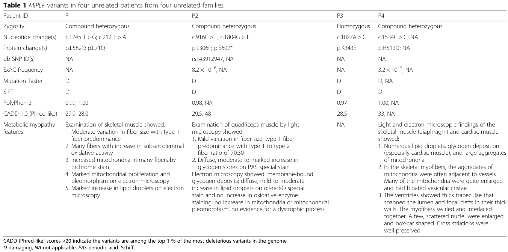

## Question

# Disease Characteristics Research Template

## Target Disease
- **Disease Name:** Cardiomyopathy-Hypotonia-Lactic Acidosis Syndrome
- **MONDO ID:**  (if available)
- **Category:** Mendelian

## Research Objectives

Please provide a comprehensive research report on **Cardiomyopathy-Hypotonia-Lactic Acidosis Syndrome** covering all of the
disease characteristics listed below. This report will be used to populate a disease knowledge
base entry. Be thorough and cite primary literature (PMID preferred) for all claims.

For each section, **suggested databases/resources** are listed. These are the first places
you should search for information on each topic.

---

### 1. Disease Information
> **Search first:** OMIM, Orphanet, ICD-10/ICD-11, MeSH, PubMed

- What is the disease? Provide a concise overview.
- What are the key identifiers? (OMIM, Orphanet, ICD-10/ICD-11, MeSH, Mondo)
- What are the common synonyms and alternative names?
- Is the information derived from individual patients (e.g., EHR) or aggregated disease-level resources?

### 2. Etiology

- **Disease Causal Factors**: What are the primary causes? (genetic, environmental, infectious, mechanistic)
- **Risk Factors**:
  > **Search first:** PubMed, Cochrane Library, UpToDate, clinical guidelines, ClinVar, ClinGen, GWAS Catalog, PheGenI, CTD, CDC, WHO, epidemiological databases
  - Genetic risk factors (causal variants, susceptibility loci, modifier genes)
  - Environmental risk factors (toxins, lifestyle, occupational exposures, age, sex, family history)
- **Protective Factors**:
  > **Search first:** PubMed, Cochrane Library, clinical trial databases, GWAS Catalog, gnomAD, WHO, CDC, nutrition databases
  - Genetic protective factors (protective variants, modifier alleles)
  - Environmental protective factors (diet, lifestyle, exposures that reduce risk)
- **Gene-Environment Interactions**: How do genetic and environmental factors interact to influence disease?
  > **Search first:** CTD, PubMed, PheGenI, GxE databases

### 3. Phenotypes
> **Search first:** HPO (Human Phenotype Ontology), OMIM, Orphanet, PubMed, clinicaltrials.gov, MedDRA, SNOMED CT, DECIPHER, LOINC

For each phenotype, provide:
- **Phenotype type**: symptoms, clinical signs, physical manifestations, behavioral changes, or laboratory abnormalities
  > For symptoms/signs: HPO, OMIM, Orphanet, PubMed
  > For behavioral changes: HPO, DSM, RDoC (Research Domain Criteria), PubMed
  > For laboratory abnormalities: LOINC, SNOMED CT, LabTests Online, PubMed
- **Phenotype characteristics**:
  > **Search first:** OMIM, Orphanet, HPO, PubMed
  - Age of symptom onset (neonatal, childhood, adult-onset, late-onset)
  - Symptom severity (mild, moderate, severe, variable)
  - Symptom progression (stable, progressive, episodic, fluctuating)
  - Frequency among affected individuals (percentage or qualitative)
- **Quality of life impact**: Effects on daily functioning and well-being (per-phenotype when possible)
  > **Search first:** EQ-5D database, SF-36, WHO QOL databases, PubMed
- Suggest HPO (Human Phenotype Ontology) terms for each phenotype

### 4. Genetic/Molecular Information

- **Causal Genes**: Gene mutations or chromosomal abnormalities responsible for disease (gene symbols, OMIM IDs)
  > **Search first:** OMIM, ClinVar, HGMD, Ensembl, NCBI Gene
- **Pathogenic Variants**:
  - Affected genes (gene symbols, HGNC IDs)
    > **Search first:** OMIM, NCBI Gene, Ensembl, HGNC, UniProt, GeneCards
  - Variant classification (pathogenic, likely pathogenic, VUS per ACMG/AMP guidelines)
    > **Search first:** ClinVar, ClinGen, ACMG/AMP guidelines, VarSome
  - Variant type/class (missense, frameshift, nonsense, splice-site, structural)
  - Allele frequency in population databases
    > **Search first:** gnomAD, 1000 Genomes, ExAC, TOPMed, dbSNP
  - Somatic vs germline origin
    > **Search first:** COSMIC (somatic), ClinVar, ICGC, TCGA
  - Functional consequences (loss of function, gain of function, dominant negative)
- **Modifier Genes**: Genes that modify disease severity or expression
- **Epigenetic Information**: DNA methylation, histone modifications, chromatin changes affecting disease
  > **Search first:** ENCODE, Roadmap Epigenomics, MethBase, DiseaseMeth
- **Chromosomal Abnormalities**: Large-scale genetic changes (aneuploidy, translocations, inversions)
  > **Search first:** DECIPHER, ClinVar, ECARUCA, UCSC Genome Browser

### 5. Environmental Information

- **Environmental Factors**: Non-genetic contributing factors (toxins, radiation, pollution, occupational exposure)
  > **Search first:** CTD (Comparative Toxicogenomics Database), TOXNET, PubMed, EPA databases
- **Lifestyle Factors**: Behavioral factors (smoking, diet, exercise, alcohol consumption)
  > **Search first:** CDC databases, WHO, PubMed, NHANES
- **Infectious Agents**: If applicable, pathogens causing or triggering disease (bacteria, viruses, fungi, parasites)
  > **Search first:** NCBI Taxonomy, ViPR, BV-BRC, MicrobeDB, GIDEON

### 6. Mechanism / Pathophysiology

- **Molecular Pathways**: Specific signaling cascades or biochemical pathways involved (Wnt, MAPK, mTOR, PI3K-AKT, etc.)
  > **Search first:** KEGG, Reactome, WikiPathways, PathBank, BioCyc
- **Cellular Processes**: Cell-level mechanisms (apoptosis, autophagy, cell cycle dysregulation, inflammation, etc.)
  > **Search first:** Gene Ontology (GO), Reactome, KEGG, PubMed
- **Protein Dysfunction**: How protein structure or function is altered (misfolding, aggregation, loss of function, gain of function)
  > **Search first:** UniProt, PDB (Protein Data Bank), InterPro, Pfam, AlphaFold
- **Metabolic Changes**: Alterations in metabolic processes (energy metabolism, lipid metabolism, amino acid metabolism)
  > **Search first:** KEGG, BioCyc, HMDB (Human Metabolome Database), BRENDA
- **Immune System Involvement**: Role of immune response (autoimmunity, immunodeficiency, chronic inflammation)
  > **Search first:** ImmPort, Immunome Database, IEDB, Gene Ontology
- **Tissue Damage Mechanisms**: How tissues/ are injured (oxidative stress, ischemia, fibrosis, necrosis)
  > **Search first:** PubMed, Gene Ontology, Reactome
- **Biochemical Abnormalities**: Specific molecular defects (enzyme deficiencies, receptor dysfunction, ion channel defects)
  > **Search first:** BRENDA, UniProt, KEGG, OMIM, PubMed
- **Epigenetic Changes**: DNA methylation, histone modifications affecting gene expression in disease
  > **Search first:** ENCODE, Roadmap Epigenomics, MethBase, DiseaseMeth
- **Molecular Profiling** (if available):
  - Transcriptomics/gene expression changes
    > **Search first:** GEO (Gene Expression Omnibus), ArrayExpress, GTEx, Human Cell Atlas, SRA
  - Proteomics findings
    > **Search first:** PRIDE, ProteomeXchange, Human Protein Atlas, STRING, BioGRID
  - Metabolomics signatures
    > **Search first:** MetaboLights, Metabolomics Workbench, HMDB, METLIN
  - Lipidomics alterations
    > **Search first:** LIPID MAPS, SwissLipids, LipidHome, Metabolomics Workbench
  - Genomic structural features
    > **Search first:** UCSC Genome Browser, Ensembl, NCBI, dbVar, DGV
- **Advanced Technologies** (if applicable):
  - Single-cell analysis findings (cell-type specific mechanisms, cellular heterogeneity)
    > **Search first:** Human Cell Atlas, Single Cell Portal, GEO, CELLxGENE
  - Spatial transcriptomics findings
    > **Search first:** GEO, Spatial Research, Vizgen, 10x Genomics data
  - Multi-omics integration results
    > **Search first:** TCGA, ICGC, cBioPortal, LinkedOmics, PubMed
  - Functional genomics screens (CRISPR, RNAi)
    > **Search first:** DepMap, GenomeRNAi, PubMed, BioGRID ORCS

For each mechanism, describe:
- The causal chain from initial trigger to clinical manifestation
- Which mechanisms are upstream vs downstream
- What cell types and biological processes are involved
- Suggest GO terms for biological processes and CL terms for cell types

### 7. Anatomical Structures Affected

- **Organ Level**:
  - Primary organs directly affected
  - Secondary organ involvement (complications, secondary effects)
  - Body systems involved (cardiovascular, nervous, digestive, respiratory, endocrine, etc.)
  > **Search first:** Uberon, FMA (Foundational Model of Anatomy), OMIM, HPO, ICD-11, MeSH, SNOMED CT
- **Tissue and Cell Level**:
  - Specific tissue types affected (epithelial, connective, muscle, nervous)
  - Specific cell populations targeted (with Cell Ontology terms)
  > **Search first:** Uberon, Human Protein Atlas, Cell Ontology, Human Cell Atlas, CellMarker, PanglaoDB
- **Subcellular Level**:
  - Cellular compartments involved (mitochondria, nucleus, ER, lysosomes) (with GO Cellular Component terms)
  > **Search first:** Gene Ontology (Cellular Component), UniProt, Human Protein Atlas
- **Localization**:
  - Specific anatomical sites (with UBERON terms)
    > **Search first:** FMA, Uberon, NeuroNames (for brain), SNOMED CT
  - Lateralization (unilateral, bilateral, asymmetric)
    > **Search first:** HPO, clinical literature, imaging databases

### 8. Temporal Development

- **Onset**:
  - Typical age of onset (congenital, pediatric, adult, geriatric)
  - Onset pattern (acute, subacute, chronic, insidious)
  > **Search first:** OMIM, Orphanet, HPO, PubMed
- **Progression**:
  - Disease stages (early, intermediate, advanced, end-stage)
    > **Search first:** Cancer Staging Manual (AJCC), WHO classifications, PubMed
  - Progression rate (rapid, slow, variable)
  - Disease course pattern (episodic, relapsing-remitting, progressive, stable)
  - Disease duration (self-limited, chronic lifelong)
  > **Search first:** Disease registries, longitudinal cohort databases, natural history studies, PubMed, Orphanet, OMIM
- **Patterns**:
  - Remission patterns (spontaneous, treatment-induced)
    > **Search first:** Clinical trial databases, disease registries, PubMed
  - Critical periods (time windows of vulnerability or opportunity for intervention)
    > **Search first:** PubMed, developmental biology databases, clinical guidelines

### 9. Inheritance and Population

- **Epidemiology**:
  - Prevalence (cases per 100,000 at given time)
  - Incidence (new cases per 100,000 per year)
  > **Search first:** Orphanet, CDC, WHO, GBD (Global Burden of Disease), national registries, SEER, disease registries
- **For Genetic Etiology**:
  - Inheritance pattern (AD, AR, X-linked, mitochondrial, multifactorial, polygenic)
    > **Search first:** OMIM, Orphanet, ClinVar, GTR (Genetic Testing Registry)
  - Penetrance (complete, incomplete, age-dependent)
    > **Search first:** ClinVar, OMIM, PubMed, ClinGen
  - Expressivity (variable, consistent)
    > **Search first:** OMIM, ClinVar, PubMed
  - Genetic anticipation (increasing severity in successive generations)
    > **Search first:** OMIM, PubMed (especially for repeat expansion disorders)
  - Germline mosaicism
    > **Search first:** ClinVar, OMIM, genetic counseling literature, PubMed
  - Founder effects (population-specific mutations)
    > **Search first:** gnomAD, population genetics databases, PubMed
  - Consanguinity role
    > **Search first:** OMIM, population studies, genetic counseling resources
  - Carrier frequency
    > **Search first:** gnomAD, carrier screening databases, GeneReviews, GTR
- **Population Demographics**:
  - Affected populations (ethnic or demographic groups with higher prevalence)
    > **Search first:** gnomAD, 1000 Genomes, PAGE Study, PubMed, population registries
  - Geographic distribution (endemic areas, regional variation)
    > **Search first:** WHO, CDC, GBD, Orphanet, geographic epidemiology databases
  - Geographic distribution of specific variants
  - Sex ratio (male:female)
    > **Search first:** Disease registries, OMIM, PubMed, epidemiological databases
  - Age distribution of affected individuals
    > **Search first:** CDC, disease registries, SEER, Orphanet

### 10. Diagnostics

- **Clinical Tests**:
  - Laboratory tests (blood, urine, tissue chemistry, specific enzyme assays)
    > **Search first:** LOINC, LabTests Online, PubMed
  - Biomarkers (proteins, metabolites, genetic markers, circulating biomarkers)
    > **Search first:** FDA Biomarker List, BEST (Biomarkers, EndpointS, and other Tools), PubMed
  - Imaging studies (X-ray, CT, MRI, PET, ultrasound)
    > **Search first:** RadLex, DICOM, Radiopaedia, imaging databases
  - Functional tests (pulmonary function, cardiac stress tests)
    > **Search first:** LOINC, clinical guidelines, PubMed
  - Electrophysiology (EEG, EMG, ECG, nerve conduction studies)
    > **Search first:** LOINC, clinical neurophysiology databases, PubMed
  - Biopsy findings (histopathology, immunohistochemistry)
    > **Search first:** SNOMED CT, College of American Pathologists resources, PubMed
  - Pathology findings (microscopic examination)
    > **Search first:** SNOMED CT, Digital Pathology databases, PubMed
- **Genetic Testing**:
  > **Search first:** GTR (Genetic Testing Registry), GeneReviews, ClinGen
  - Overview of recommended genetic testing approach
  - Whole genome sequencing (WGS) utility
    > **Search first:** GTR, ClinVar, GEL (Genomics England), gnomAD
  - Whole exome sequencing (WES) utility
    > **Search first:** GTR, ClinVar, OMIM, GeneMatcher
  - Gene panels (which panels, which genes)
    > **Search first:** GTR, ClinVar, laboratory-specific databases
  - Single gene testing
    > **Search first:** GTR, ClinVar, OMIM, GeneReviews
  - Chromosomal microarray (CMA)
    > **Search first:** DECIPHER, ClinVar, dbVar, ECARUCA
  - Karyotyping
    > **Search first:** Chromosome Abnormality Database, ClinVar, cytogenetics resources
  - FISH
    > **Search first:** ClinVar, cytogenetics databases, PubMed
  - Mitochondrial DNA testing
    > **Search first:** MITOMAP, MSeqDR, ClinVar, GTR
  - Repeat expansion testing
    > **Search first:** GTR, ClinVar, repeat expansion databases, PubMed
- **Omics-Based Diagnostics** (if applicable):
  - RNA sequencing / transcriptomics
    > **Search first:** GEO, ArrayExpress, GTEx, RNA-seq databases
  - Proteomics
    > **Search first:** PRIDE, ProteomeXchange, FDA Biomarker database
  - Metabolomics
    > **Search first:** MetaboLights, Metabolomics Workbench, HMDB
  - Epigenomics
    > **Search first:** GEO, ENCODE, Roadmap Epigenomics, MethBase
  - Liquid biopsy
    > **Search first:** COSMIC, ClinVar, liquid biopsy databases, PubMed
- **Clinical Criteria**:
  - Standardized diagnostic criteria (DSM, ICD, society guidelines)
    > **Search first:** DSM-5, ICD-11, clinical society guidelines, UpToDate
  - Differential diagnosis (other conditions to rule out, with distinguishing features)
    > **Search first:** DynaMed, UpToDate, clinical decision support systems
- **Screening**:
  - Screening methods for asymptomatic individuals (newborn screening, carrier screening, cascade screening)
    > **Search first:** ACMG recommendations, CDC newborn screening, GTR

### 11. Outcome/Prognosis

- **Survival and Mortality**:
  - Survival rate (5-year, 10-year, overall)
    > **Search first:** SEER, cancer registries, disease-specific registries, PubMed
  - Life expectancy (with and without treatment if applicable)
    > **Search first:** Orphanet, disease registries, actuarial databases, PubMed
  - Mortality rate
    > **Search first:** CDC, WHO, GBD, national mortality databases
  - Disease-specific mortality (deaths directly attributable to disease)
    > **Search first:** Disease registries, CDC Wonder, GBD, PubMed
- **Morbidity and Function**:
  - Morbidity (disease-related disability and health impacts)
    > **Search first:** GBD, WHO, disability databases, PubMed
  - Disability outcomes (long-term functional impairments)
    > **Search first:** ICF (International Classification of Functioning), disability registries
  - Quality of life measures (EQ-5D, SF-36, PROMIS, disease-specific tools)
    > **Search first:** EQ-5D database, SF-36, PROMIS, PubMed
- **Disease Course**:
  - Complications (secondary problems: infections, organ failure, etc.)
    > **Search first:** ICD codes, disease registries, clinical databases, PubMed
  - Recovery potential (likelihood and extent of recovery, with vs without treatment)
    > **Search first:** Natural history studies, rehabilitation databases, PubMed
- **Prediction**:
  - Prognostic factors (age, disease severity, biomarkers, treatment response)
    > **Search first:** Prognostic models databases, clinical calculators, PubMed
  - Prognostic biomarkers (molecular markers predicting disease course)
    > **Search first:** FDA Biomarker database, PubMed, cancer prognostic databases

### 12. Treatment

- **Pharmacotherapy**:
  - Pharmacological treatments (drug names, drug classes, mechanisms of action)
    > **Search first:** DrugBank, RxNorm, ATC classification, DailyMed, FDA databases
  - Pharmacogenomics (how genetic variants affect drug metabolism, efficacy, toxicity)
    > **Search first:** PharmGKB, CPIC (Clinical Pharmacogenetics), FDA Table of PGx Biomarkers
- **Advanced Therapeutics**:
  - Gene therapy (viral vectors, CRISPR, gene replacement, gene editing)
    > **Search first:** ClinicalTrials.gov, FDA gene therapy database, ASGCT resources
  - Cell therapy (stem cell transplant, CAR-T, cellular therapeutics)
    > **Search first:** ClinicalTrials.gov, FDA cell therapy database, FACT standards
  - RNA-based therapies (ASOs, siRNA, mRNA therapies)
    > **Search first:** ClinicalTrials.gov, FDA approvals, PubMed
  - Targeted therapies (treatments directed at specific molecular targets)
    > **Search first:** My Cancer Genome, OncoKB, ClinicalTrials.gov, FDA approvals
  - Immunotherapies (checkpoint inhibitors, monoclonal antibodies)
    > **Search first:** Cancer Immunotherapy Database, FDA approvals, ClinicalTrials.gov
- **Surgical and Interventional**:
  - Surgical interventions (types of surgery, timing, outcomes)
    > **Search first:** CPT codes, surgical registries, clinical guidelines, PubMed
- **Supportive and Rehabilitative**:
  - Supportive care (symptom management, pain control, nutrition)
    > **Search first:** Clinical guidelines, Cochrane Library, PubMed
  - Rehabilitation (physical therapy, occupational therapy, speech therapy)
    > **Search first:** Rehabilitation medicine databases, clinical guidelines, PubMed
- **Experimental**:
  - Experimental treatments in clinical trials (with NCT identifiers if available)
    > **Search first:** ClinicalTrials.gov, EU Clinical Trials Register, WHO ICTRP
- **Treatment Outcomes**:
  - Treatment response rates
    > **Search first:** Clinical trial databases, FDA reviews, systematic reviews, PubMed
  - Side effects and adverse events
    > **Search first:** FDA Adverse Event Reporting System (FAERS), MedWatch, PubMed
- **Treatment Strategy**:
  - Treatment algorithms (clinical pathways, decision trees)
    > **Search first:** Clinical practice guidelines, NCCN Guidelines, UpToDate
  - Combination therapies
    > **Search first:** ClinicalTrials.gov, treatment guidelines, PubMed
  - Personalized medicine approaches (genotype-guided treatment)
    > **Search first:** My Cancer Genome, CIViC, PharmGKB, precision medicine databases

For each treatment, suggest NCIT (NCI Thesaurus) clinical-intervention terms where applicable.

### 13. Prevention

- **Prevention Levels**:
  - Primary prevention (preventing disease occurrence: vaccination, risk factor modification)
    > **Search first:** CDC, WHO, USPSTF recommendations, Cochrane Library
  - Secondary prevention (early detection and treatment: screening programs, early intervention)
    > **Search first:** USPSTF, CDC screening guidelines, WHO
  - Tertiary prevention (preventing complications in those with disease)
    > **Search first:** Clinical guidelines, disease management protocols, PubMed
- **Immunization**: Vaccine strategies (if applicable)
  > **Search first:** CDC vaccine schedules, WHO immunization, FDA vaccine database
- **Screening and Early Detection**:
  - Screening programs (population-based: newborn screening, cancer screening)
    > **Search first:** CDC screening programs, USPSTF, cancer screening databases
  - Genetic screening (carrier screening, preimplantation genetic diagnosis, prenatal testing)
    > **Search first:** ACMG recommendations, ACOG guidelines, GTR
  - Risk stratification (identifying high-risk individuals for targeted prevention)
    > **Search first:** Risk prediction models, clinical calculators, PubMed
- **Behavioral Interventions**: Lifestyle modifications to reduce risk
  > **Search first:** CDC, WHO, behavioral intervention databases, Cochrane Library
- **Counseling**: Genetic counseling (risk assessment, family planning guidance)
  > **Search first:** NSGC resources, ACMG guidelines, GeneReviews
- **Public Health**:
  - Public health interventions (sanitation, vector control, health education)
    > **Search first:** CDC, WHO, public health databases, PubMed
  - Environmental interventions (reducing environmental risk factors)
    > **Search first:** EPA databases, WHO environmental health, PubMed
- **Prophylaxis**: Preventive medications or procedures
  > **Search first:** Clinical guidelines, FDA approvals, PubMed

### 14. Other Species / Natural Disease

- **Taxonomy**: Species affected (with NCBI Taxon identifiers)
  > **Search first:** NCBI Taxonomy
- **Breed**: Specific breeds affected (with VBO identifiers if applicable)
  > **Search first:** VBO (Vertebrate Breed Ontology)
- **Gene**: Orthologous genes in other species (with NCBI Gene IDs)
  > **Search first:** NCBI Gene
- **Natural Disease**:
  - Naturally occurring disease in other species (companion animals, wildlife)
    > **Search first:** OMIA (Online Mendelian Inheritance in Animals), VetCompass, PubMed
  - Veterinary relevance and importance in animal health
    > **Search first:** OMIA, veterinary databases, PubMed
- **Comparative Biology**:
  - Comparative pathology (similarities and differences across species)
    > **Search first:** OMIA, comparative pathology databases, PubMed
  - Evolutionary conservation of disease mechanisms
    > **Search first:** HomoloGene, OrthoMCL, Alliance of Genome Resources
- **Transmission** (if applicable):
  - Zoonotic potential
    > **Search first:** CDC zoonotic diseases, WHO zoonoses, GIDEON
  - Cross-species susceptibility
    > **Search first:** NCBI Taxonomy, veterinary databases, PubMed

### 15. Model Organisms

- **Model Types**:
  - Model organism type (mammalian, invertebrate, cellular, in vitro)
    > **Search first:** Alliance of Genome Resources, model organism databases
  - Specific model systems (mouse, rat, zebrafish, Drosophila, C. elegans, yeast, cell lines, organoids, iPSCs)
    > **Search first:** MGI, RGD, ZFIN, FlyBase, WormBase, SGD, ATCC, Cellosaurus
  - Induced models (drug treatment, surgical intervention, environmental manipulation)
    > **Search first:** MGI, model organism databases, PubMed
- **Genetic Models**:
  - Types available (knockout, knock-in, transgenic, conditional, humanized)
    > **Search first:** MGI, IMPC, KOMP, EuMMCR, IMSR
- **Model Characteristics**:
  - Phenotype recapitulation (how well model reproduces human disease features)
    > **Search first:** Model organism databases, comparative studies, PubMed
  - Model limitations (aspects of human disease not captured)
    > **Search first:** Model organism databases, PubMed, review articles
- **Applications**:
  - Research applications (what aspects of disease can be studied)
    > **Search first:** Model organism databases, PubMed
- **Resources**:
  - Model databases
    > **Search first:** MGI, RGD, ZFIN, FlyBase, WormBase, IMSR, EMMA, MMRRC

---

## Citation Requirements

- Cite primary literature (PMID preferred) for all mechanistic and clinical claims
- Prioritize recent reviews and landmark papers
- Include direct quotes from abstracts where possible to support key statements
- Distinguish evidence source types: human clinical, model organism, in vitro, computational

## Output Format

Structure your response as a comprehensive narrative organized by the sections above.
For each section, provide:
- Factual content with specific details (numbers, percentages, gene names, variant nomenclature)
- Ontology term suggestions (HPO, GO, CL, UBERON, CHEBI, NCIT, MONDO) where applicable
- Evidence citations with PMIDs
- Direct quotes from abstracts to support key claims
- Clear indication when information is not available or not applicable for this disease

This report will be used to populate a disease knowledge base entry with:
- Pathophysiology descriptions with causal chains
- Gene/protein annotations (HGNC, GO terms)
- Phenotype associations (HP terms) with frequencies
- Cell type involvement (CL terms)
- Anatomical locations (UBERON terms)
- Chemical entities (CHEBI terms)
- Treatment annotations (NCIT terms)
- Evidence items with PMIDs and exact abstract quotes
- Epidemiology, prognosis, diagnostic, and prevention information
- Animal model descriptions with phenotype recapitulation details

## Output

Question: You are an expert researcher providing comprehensive, well-cited information.

Provide detailed information focusing on:
1. Key concepts and definitions with current understanding
2. Recent developments and latest research (prioritize 2023-2024 sources)
3. Current applications and real-world implementations
4. Expert opinions and analysis from authoritative sources
5. Relevant statistics and data from recent studies

Format as a comprehensive research report with proper citations. Include URLs and publication dates where available.
Always prioritize recent, authoritative sources and provide specific citations for all major claims.

# Disease Characteristics Research Template

## Target Disease
- **Disease Name:** Cardiomyopathy-Hypotonia-Lactic Acidosis Syndrome
- **MONDO ID:**  (if available)
- **Category:** Mendelian

## Research Objectives

Please provide a comprehensive research report on **Cardiomyopathy-Hypotonia-Lactic Acidosis Syndrome** covering all of the
disease characteristics listed below. This report will be used to populate a disease knowledge
base entry. Be thorough and cite primary literature (PMID preferred) for all claims.

For each section, **suggested databases/resources** are listed. These are the first places
you should search for information on each topic.

---

### 1. Disease Information
> **Search first:** OMIM, Orphanet, ICD-10/ICD-11, MeSH, PubMed

- What is the disease? Provide a concise overview.
- What are the key identifiers? (OMIM, Orphanet, ICD-10/ICD-11, MeSH, Mondo)
- What are the common synonyms and alternative names?
- Is the information derived from individual patients (e.g., EHR) or aggregated disease-level resources?

### 2. Etiology

- **Disease Causal Factors**: What are the primary causes? (genetic, environmental, infectious, mechanistic)
- **Risk Factors**:
  > **Search first:** PubMed, Cochrane Library, UpToDate, clinical guidelines, ClinVar, ClinGen, GWAS Catalog, PheGenI, CTD, CDC, WHO, epidemiological databases
  - Genetic risk factors (causal variants, susceptibility loci, modifier genes)
  - Environmental risk factors (toxins, lifestyle, occupational exposures, age, sex, family history)
- **Protective Factors**:
  > **Search first:** PubMed, Cochrane Library, clinical trial databases, GWAS Catalog, gnomAD, WHO, CDC, nutrition databases
  - Genetic protective factors (protective variants, modifier alleles)
  - Environmental protective factors (diet, lifestyle, exposures that reduce risk)
- **Gene-Environment Interactions**: How do genetic and environmental factors interact to influence disease?
  > **Search first:** CTD, PubMed, PheGenI, GxE databases

### 3. Phenotypes
> **Search first:** HPO (Human Phenotype Ontology), OMIM, Orphanet, PubMed, clinicaltrials.gov, MedDRA, SNOMED CT, DECIPHER, LOINC

For each phenotype, provide:
- **Phenotype type**: symptoms, clinical signs, physical manifestations, behavioral changes, or laboratory abnormalities
  > For symptoms/signs: HPO, OMIM, Orphanet, PubMed
  > For behavioral changes: HPO, DSM, RDoC (Research Domain Criteria), PubMed
  > For laboratory abnormalities: LOINC, SNOMED CT, LabTests Online, PubMed
- **Phenotype characteristics**:
  > **Search first:** OMIM, Orphanet, HPO, PubMed
  - Age of symptom onset (neonatal, childhood, adult-onset, late-onset)
  - Symptom severity (mild, moderate, severe, variable)
  - Symptom progression (stable, progressive, episodic, fluctuating)
  - Frequency among affected individuals (percentage or qualitative)
- **Quality of life impact**: Effects on daily functioning and well-being (per-phenotype when possible)
  > **Search first:** EQ-5D database, SF-36, WHO QOL databases, PubMed
- Suggest HPO (Human Phenotype Ontology) terms for each phenotype

### 4. Genetic/Molecular Information

- **Causal Genes**: Gene mutations or chromosomal abnormalities responsible for disease (gene symbols, OMIM IDs)
  > **Search first:** OMIM, ClinVar, HGMD, Ensembl, NCBI Gene
- **Pathogenic Variants**:
  - Affected genes (gene symbols, HGNC IDs)
    > **Search first:** OMIM, NCBI Gene, Ensembl, HGNC, UniProt, GeneCards
  - Variant classification (pathogenic, likely pathogenic, VUS per ACMG/AMP guidelines)
    > **Search first:** ClinVar, ClinGen, ACMG/AMP guidelines, VarSome
  - Variant type/class (missense, frameshift, nonsense, splice-site, structural)
  - Allele frequency in population databases
    > **Search first:** gnomAD, 1000 Genomes, ExAC, TOPMed, dbSNP
  - Somatic vs germline origin
    > **Search first:** COSMIC (somatic), ClinVar, ICGC, TCGA
  - Functional consequences (loss of function, gain of function, dominant negative)
- **Modifier Genes**: Genes that modify disease severity or expression
- **Epigenetic Information**: DNA methylation, histone modifications, chromatin changes affecting disease
  > **Search first:** ENCODE, Roadmap Epigenomics, MethBase, DiseaseMeth
- **Chromosomal Abnormalities**: Large-scale genetic changes (aneuploidy, translocations, inversions)
  > **Search first:** DECIPHER, ClinVar, ECARUCA, UCSC Genome Browser

### 5. Environmental Information

- **Environmental Factors**: Non-genetic contributing factors (toxins, radiation, pollution, occupational exposure)
  > **Search first:** CTD (Comparative Toxicogenomics Database), TOXNET, PubMed, EPA databases
- **Lifestyle Factors**: Behavioral factors (smoking, diet, exercise, alcohol consumption)
  > **Search first:** CDC databases, WHO, PubMed, NHANES
- **Infectious Agents**: If applicable, pathogens causing or triggering disease (bacteria, viruses, fungi, parasites)
  > **Search first:** NCBI Taxonomy, ViPR, BV-BRC, MicrobeDB, GIDEON

### 6. Mechanism / Pathophysiology

- **Molecular Pathways**: Specific signaling cascades or biochemical pathways involved (Wnt, MAPK, mTOR, PI3K-AKT, etc.)
  > **Search first:** KEGG, Reactome, WikiPathways, PathBank, BioCyc
- **Cellular Processes**: Cell-level mechanisms (apoptosis, autophagy, cell cycle dysregulation, inflammation, etc.)
  > **Search first:** Gene Ontology (GO), Reactome, KEGG, PubMed
- **Protein Dysfunction**: How protein structure or function is altered (misfolding, aggregation, loss of function, gain of function)
  > **Search first:** UniProt, PDB (Protein Data Bank), InterPro, Pfam, AlphaFold
- **Metabolic Changes**: Alterations in metabolic processes (energy metabolism, lipid metabolism, amino acid metabolism)
  > **Search first:** KEGG, BioCyc, HMDB (Human Metabolome Database), BRENDA
- **Immune System Involvement**: Role of immune response (autoimmunity, immunodeficiency, chronic inflammation)
  > **Search first:** ImmPort, Immunome Database, IEDB, Gene Ontology
- **Tissue Damage Mechanisms**: How tissues/ are injured (oxidative stress, ischemia, fibrosis, necrosis)
  > **Search first:** PubMed, Gene Ontology, Reactome
- **Biochemical Abnormalities**: Specific molecular defects (enzyme deficiencies, receptor dysfunction, ion channel defects)
  > **Search first:** BRENDA, UniProt, KEGG, OMIM, PubMed
- **Epigenetic Changes**: DNA methylation, histone modifications affecting gene expression in disease
  > **Search first:** ENCODE, Roadmap Epigenomics, MethBase, DiseaseMeth
- **Molecular Profiling** (if available):
  - Transcriptomics/gene expression changes
    > **Search first:** GEO (Gene Expression Omnibus), ArrayExpress, GTEx, Human Cell Atlas, SRA
  - Proteomics findings
    > **Search first:** PRIDE, ProteomeXchange, Human Protein Atlas, STRING, BioGRID
  - Metabolomics signatures
    > **Search first:** MetaboLights, Metabolomics Workbench, HMDB, METLIN
  - Lipidomics alterations
    > **Search first:** LIPID MAPS, SwissLipids, LipidHome, Metabolomics Workbench
  - Genomic structural features
    > **Search first:** UCSC Genome Browser, Ensembl, NCBI, dbVar, DGV
- **Advanced Technologies** (if applicable):
  - Single-cell analysis findings (cell-type specific mechanisms, cellular heterogeneity)
    > **Search first:** Human Cell Atlas, Single Cell Portal, GEO, CELLxGENE
  - Spatial transcriptomics findings
    > **Search first:** GEO, Spatial Research, Vizgen, 10x Genomics data
  - Multi-omics integration results
    > **Search first:** TCGA, ICGC, cBioPortal, LinkedOmics, PubMed
  - Functional genomics screens (CRISPR, RNAi)
    > **Search first:** DepMap, GenomeRNAi, PubMed, BioGRID ORCS

For each mechanism, describe:
- The causal chain from initial trigger to clinical manifestation
- Which mechanisms are upstream vs downstream
- What cell types and biological processes are involved
- Suggest GO terms for biological processes and CL terms for cell types

### 7. Anatomical Structures Affected

- **Organ Level**:
  - Primary organs directly affected
  - Secondary organ involvement (complications, secondary effects)
  - Body systems involved (cardiovascular, nervous, digestive, respiratory, endocrine, etc.)
  > **Search first:** Uberon, FMA (Foundational Model of Anatomy), OMIM, HPO, ICD-11, MeSH, SNOMED CT
- **Tissue and Cell Level**:
  - Specific tissue types affected (epithelial, connective, muscle, nervous)
  - Specific cell populations targeted (with Cell Ontology terms)
  > **Search first:** Uberon, Human Protein Atlas, Cell Ontology, Human Cell Atlas, CellMarker, PanglaoDB
- **Subcellular Level**:
  - Cellular compartments involved (mitochondria, nucleus, ER, lysosomes) (with GO Cellular Component terms)
  > **Search first:** Gene Ontology (Cellular Component), UniProt, Human Protein Atlas
- **Localization**:
  - Specific anatomical sites (with UBERON terms)
    > **Search first:** FMA, Uberon, NeuroNames (for brain), SNOMED CT
  - Lateralization (unilateral, bilateral, asymmetric)
    > **Search first:** HPO, clinical literature, imaging databases

### 8. Temporal Development

- **Onset**:
  - Typical age of onset (congenital, pediatric, adult, geriatric)
  - Onset pattern (acute, subacute, chronic, insidious)
  > **Search first:** OMIM, Orphanet, HPO, PubMed
- **Progression**:
  - Disease stages (early, intermediate, advanced, end-stage)
    > **Search first:** Cancer Staging Manual (AJCC), WHO classifications, PubMed
  - Progression rate (rapid, slow, variable)
  - Disease course pattern (episodic, relapsing-remitting, progressive, stable)
  - Disease duration (self-limited, chronic lifelong)
  > **Search first:** Disease registries, longitudinal cohort databases, natural history studies, PubMed, Orphanet, OMIM
- **Patterns**:
  - Remission patterns (spontaneous, treatment-induced)
    > **Search first:** Clinical trial databases, disease registries, PubMed
  - Critical periods (time windows of vulnerability or opportunity for intervention)
    > **Search first:** PubMed, developmental biology databases, clinical guidelines

### 9. Inheritance and Population

- **Epidemiology**:
  - Prevalence (cases per 100,000 at given time)
  - Incidence (new cases per 100,000 per year)
  > **Search first:** Orphanet, CDC, WHO, GBD (Global Burden of Disease), national registries, SEER, disease registries
- **For Genetic Etiology**:
  - Inheritance pattern (AD, AR, X-linked, mitochondrial, multifactorial, polygenic)
    > **Search first:** OMIM, Orphanet, ClinVar, GTR (Genetic Testing Registry)
  - Penetrance (complete, incomplete, age-dependent)
    > **Search first:** ClinVar, OMIM, PubMed, ClinGen
  - Expressivity (variable, consistent)
    > **Search first:** OMIM, ClinVar, PubMed
  - Genetic anticipation (increasing severity in successive generations)
    > **Search first:** OMIM, PubMed (especially for repeat expansion disorders)
  - Germline mosaicism
    > **Search first:** ClinVar, OMIM, genetic counseling literature, PubMed
  - Founder effects (population-specific mutations)
    > **Search first:** gnomAD, population genetics databases, PubMed
  - Consanguinity role
    > **Search first:** OMIM, population studies, genetic counseling resources
  - Carrier frequency
    > **Search first:** gnomAD, carrier screening databases, GeneReviews, GTR
- **Population Demographics**:
  - Affected populations (ethnic or demographic groups with higher prevalence)
    > **Search first:** gnomAD, 1000 Genomes, PAGE Study, PubMed, population registries
  - Geographic distribution (endemic areas, regional variation)
    > **Search first:** WHO, CDC, GBD, Orphanet, geographic epidemiology databases
  - Geographic distribution of specific variants
  - Sex ratio (male:female)
    > **Search first:** Disease registries, OMIM, PubMed, epidemiological databases
  - Age distribution of affected individuals
    > **Search first:** CDC, disease registries, SEER, Orphanet

### 10. Diagnostics

- **Clinical Tests**:
  - Laboratory tests (blood, urine, tissue chemistry, specific enzyme assays)
    > **Search first:** LOINC, LabTests Online, PubMed
  - Biomarkers (proteins, metabolites, genetic markers, circulating biomarkers)
    > **Search first:** FDA Biomarker List, BEST (Biomarkers, EndpointS, and other Tools), PubMed
  - Imaging studies (X-ray, CT, MRI, PET, ultrasound)
    > **Search first:** RadLex, DICOM, Radiopaedia, imaging databases
  - Functional tests (pulmonary function, cardiac stress tests)
    > **Search first:** LOINC, clinical guidelines, PubMed
  - Electrophysiology (EEG, EMG, ECG, nerve conduction studies)
    > **Search first:** LOINC, clinical neurophysiology databases, PubMed
  - Biopsy findings (histopathology, immunohistochemistry)
    > **Search first:** SNOMED CT, College of American Pathologists resources, PubMed
  - Pathology findings (microscopic examination)
    > **Search first:** SNOMED CT, Digital Pathology databases, PubMed
- **Genetic Testing**:
  > **Search first:** GTR (Genetic Testing Registry), GeneReviews, ClinGen
  - Overview of recommended genetic testing approach
  - Whole genome sequencing (WGS) utility
    > **Search first:** GTR, ClinVar, GEL (Genomics England), gnomAD
  - Whole exome sequencing (WES) utility
    > **Search first:** GTR, ClinVar, OMIM, GeneMatcher
  - Gene panels (which panels, which genes)
    > **Search first:** GTR, ClinVar, laboratory-specific databases
  - Single gene testing
    > **Search first:** GTR, ClinVar, OMIM, GeneReviews
  - Chromosomal microarray (CMA)
    > **Search first:** DECIPHER, ClinVar, dbVar, ECARUCA
  - Karyotyping
    > **Search first:** Chromosome Abnormality Database, ClinVar, cytogenetics resources
  - FISH
    > **Search first:** ClinVar, cytogenetics databases, PubMed
  - Mitochondrial DNA testing
    > **Search first:** MITOMAP, MSeqDR, ClinVar, GTR
  - Repeat expansion testing
    > **Search first:** GTR, ClinVar, repeat expansion databases, PubMed
- **Omics-Based Diagnostics** (if applicable):
  - RNA sequencing / transcriptomics
    > **Search first:** GEO, ArrayExpress, GTEx, RNA-seq databases
  - Proteomics
    > **Search first:** PRIDE, ProteomeXchange, FDA Biomarker database
  - Metabolomics
    > **Search first:** MetaboLights, Metabolomics Workbench, HMDB
  - Epigenomics
    > **Search first:** GEO, ENCODE, Roadmap Epigenomics, MethBase
  - Liquid biopsy
    > **Search first:** COSMIC, ClinVar, liquid biopsy databases, PubMed
- **Clinical Criteria**:
  - Standardized diagnostic criteria (DSM, ICD, society guidelines)
    > **Search first:** DSM-5, ICD-11, clinical society guidelines, UpToDate
  - Differential diagnosis (other conditions to rule out, with distinguishing features)
    > **Search first:** DynaMed, UpToDate, clinical decision support systems
- **Screening**:
  - Screening methods for asymptomatic individuals (newborn screening, carrier screening, cascade screening)
    > **Search first:** ACMG recommendations, CDC newborn screening, GTR

### 11. Outcome/Prognosis

- **Survival and Mortality**:
  - Survival rate (5-year, 10-year, overall)
    > **Search first:** SEER, cancer registries, disease-specific registries, PubMed
  - Life expectancy (with and without treatment if applicable)
    > **Search first:** Orphanet, disease registries, actuarial databases, PubMed
  - Mortality rate
    > **Search first:** CDC, WHO, GBD, national mortality databases
  - Disease-specific mortality (deaths directly attributable to disease)
    > **Search first:** Disease registries, CDC Wonder, GBD, PubMed
- **Morbidity and Function**:
  - Morbidity (disease-related disability and health impacts)
    > **Search first:** GBD, WHO, disability databases, PubMed
  - Disability outcomes (long-term functional impairments)
    > **Search first:** ICF (International Classification of Functioning), disability registries
  - Quality of life measures (EQ-5D, SF-36, PROMIS, disease-specific tools)
    > **Search first:** EQ-5D database, SF-36, PROMIS, PubMed
- **Disease Course**:
  - Complications (secondary problems: infections, organ failure, etc.)
    > **Search first:** ICD codes, disease registries, clinical databases, PubMed
  - Recovery potential (likelihood and extent of recovery, with vs without treatment)
    > **Search first:** Natural history studies, rehabilitation databases, PubMed
- **Prediction**:
  - Prognostic factors (age, disease severity, biomarkers, treatment response)
    > **Search first:** Prognostic models databases, clinical calculators, PubMed
  - Prognostic biomarkers (molecular markers predicting disease course)
    > **Search first:** FDA Biomarker database, PubMed, cancer prognostic databases

### 12. Treatment

- **Pharmacotherapy**:
  - Pharmacological treatments (drug names, drug classes, mechanisms of action)
    > **Search first:** DrugBank, RxNorm, ATC classification, DailyMed, FDA databases
  - Pharmacogenomics (how genetic variants affect drug metabolism, efficacy, toxicity)
    > **Search first:** PharmGKB, CPIC (Clinical Pharmacogenetics), FDA Table of PGx Biomarkers
- **Advanced Therapeutics**:
  - Gene therapy (viral vectors, CRISPR, gene replacement, gene editing)
    > **Search first:** ClinicalTrials.gov, FDA gene therapy database, ASGCT resources
  - Cell therapy (stem cell transplant, CAR-T, cellular therapeutics)
    > **Search first:** ClinicalTrials.gov, FDA cell therapy database, FACT standards
  - RNA-based therapies (ASOs, siRNA, mRNA therapies)
    > **Search first:** ClinicalTrials.gov, FDA approvals, PubMed
  - Targeted therapies (treatments directed at specific molecular targets)
    > **Search first:** My Cancer Genome, OncoKB, ClinicalTrials.gov, FDA approvals
  - Immunotherapies (checkpoint inhibitors, monoclonal antibodies)
    > **Search first:** Cancer Immunotherapy Database, FDA approvals, ClinicalTrials.gov
- **Surgical and Interventional**:
  - Surgical interventions (types of surgery, timing, outcomes)
    > **Search first:** CPT codes, surgical registries, clinical guidelines, PubMed
- **Supportive and Rehabilitative**:
  - Supportive care (symptom management, pain control, nutrition)
    > **Search first:** Clinical guidelines, Cochrane Library, PubMed
  - Rehabilitation (physical therapy, occupational therapy, speech therapy)
    > **Search first:** Rehabilitation medicine databases, clinical guidelines, PubMed
- **Experimental**:
  - Experimental treatments in clinical trials (with NCT identifiers if available)
    > **Search first:** ClinicalTrials.gov, EU Clinical Trials Register, WHO ICTRP
- **Treatment Outcomes**:
  - Treatment response rates
    > **Search first:** Clinical trial databases, FDA reviews, systematic reviews, PubMed
  - Side effects and adverse events
    > **Search first:** FDA Adverse Event Reporting System (FAERS), MedWatch, PubMed
- **Treatment Strategy**:
  - Treatment algorithms (clinical pathways, decision trees)
    > **Search first:** Clinical practice guidelines, NCCN Guidelines, UpToDate
  - Combination therapies
    > **Search first:** ClinicalTrials.gov, treatment guidelines, PubMed
  - Personalized medicine approaches (genotype-guided treatment)
    > **Search first:** My Cancer Genome, CIViC, PharmGKB, precision medicine databases

For each treatment, suggest NCIT (NCI Thesaurus) clinical-intervention terms where applicable.

### 13. Prevention

- **Prevention Levels**:
  - Primary prevention (preventing disease occurrence: vaccination, risk factor modification)
    > **Search first:** CDC, WHO, USPSTF recommendations, Cochrane Library
  - Secondary prevention (early detection and treatment: screening programs, early intervention)
    > **Search first:** USPSTF, CDC screening guidelines, WHO
  - Tertiary prevention (preventing complications in those with disease)
    > **Search first:** Clinical guidelines, disease management protocols, PubMed
- **Immunization**: Vaccine strategies (if applicable)
  > **Search first:** CDC vaccine schedules, WHO immunization, FDA vaccine database
- **Screening and Early Detection**:
  - Screening programs (population-based: newborn screening, cancer screening)
    > **Search first:** CDC screening programs, USPSTF, cancer screening databases
  - Genetic screening (carrier screening, preimplantation genetic diagnosis, prenatal testing)
    > **Search first:** ACMG recommendations, ACOG guidelines, GTR
  - Risk stratification (identifying high-risk individuals for targeted prevention)
    > **Search first:** Risk prediction models, clinical calculators, PubMed
- **Behavioral Interventions**: Lifestyle modifications to reduce risk
  > **Search first:** CDC, WHO, behavioral intervention databases, Cochrane Library
- **Counseling**: Genetic counseling (risk assessment, family planning guidance)
  > **Search first:** NSGC resources, ACMG guidelines, GeneReviews
- **Public Health**:
  - Public health interventions (sanitation, vector control, health education)
    > **Search first:** CDC, WHO, public health databases, PubMed
  - Environmental interventions (reducing environmental risk factors)
    > **Search first:** EPA databases, WHO environmental health, PubMed
- **Prophylaxis**: Preventive medications or procedures
  > **Search first:** Clinical guidelines, FDA approvals, PubMed

### 14. Other Species / Natural Disease

- **Taxonomy**: Species affected (with NCBI Taxon identifiers)
  > **Search first:** NCBI Taxonomy
- **Breed**: Specific breeds affected (with VBO identifiers if applicable)
  > **Search first:** VBO (Vertebrate Breed Ontology)
- **Gene**: Orthologous genes in other species (with NCBI Gene IDs)
  > **Search first:** NCBI Gene
- **Natural Disease**:
  - Naturally occurring disease in other species (companion animals, wildlife)
    > **Search first:** OMIA (Online Mendelian Inheritance in Animals), VetCompass, PubMed
  - Veterinary relevance and importance in animal health
    > **Search first:** OMIA, veterinary databases, PubMed
- **Comparative Biology**:
  - Comparative pathology (similarities and differences across species)
    > **Search first:** OMIA, comparative pathology databases, PubMed
  - Evolutionary conservation of disease mechanisms
    > **Search first:** HomoloGene, OrthoMCL, Alliance of Genome Resources
- **Transmission** (if applicable):
  - Zoonotic potential
    > **Search first:** CDC zoonotic diseases, WHO zoonoses, GIDEON
  - Cross-species susceptibility
    > **Search first:** NCBI Taxonomy, veterinary databases, PubMed

### 15. Model Organisms

- **Model Types**:
  - Model organism type (mammalian, invertebrate, cellular, in vitro)
    > **Search first:** Alliance of Genome Resources, model organism databases
  - Specific model systems (mouse, rat, zebrafish, Drosophila, C. elegans, yeast, cell lines, organoids, iPSCs)
    > **Search first:** MGI, RGD, ZFIN, FlyBase, WormBase, SGD, ATCC, Cellosaurus
  - Induced models (drug treatment, surgical intervention, environmental manipulation)
    > **Search first:** MGI, model organism databases, PubMed
- **Genetic Models**:
  - Types available (knockout, knock-in, transgenic, conditional, humanized)
    > **Search first:** MGI, IMPC, KOMP, EuMMCR, IMSR
- **Model Characteristics**:
  - Phenotype recapitulation (how well model reproduces human disease features)
    > **Search first:** Model organism databases, comparative studies, PubMed
  - Model limitations (aspects of human disease not captured)
    > **Search first:** Model organism databases, PubMed, review articles
- **Applications**:
  - Research applications (what aspects of disease can be studied)
    > **Search first:** Model organism databases, PubMed
- **Resources**:
  - Model databases
    > **Search first:** MGI, RGD, ZFIN, FlyBase, WormBase, IMSR, EMMA, MMRRC

---

## Citation Requirements

- Cite primary literature (PMID preferred) for all mechanistic and clinical claims
- Prioritize recent reviews and landmark papers
- Include direct quotes from abstracts where possible to support key statements
- Distinguish evidence source types: human clinical, model organism, in vitro, computational

## Output Format

Structure your response as a comprehensive narrative organized by the sections above.
For each section, provide:
- Factual content with specific details (numbers, percentages, gene names, variant nomenclature)
- Ontology term suggestions (HPO, GO, CL, UBERON, CHEBI, NCIT, MONDO) where applicable
- Evidence citations with PMIDs
- Direct quotes from abstracts to support key claims
- Clear indication when information is not available or not applicable for this disease

This report will be used to populate a disease knowledge base entry with:
- Pathophysiology descriptions with causal chains
- Gene/protein annotations (HGNC, GO terms)
- Phenotype associations (HP terms) with frequencies
- Cell type involvement (CL terms)
- Anatomical locations (UBERON terms)
- Chemical entities (CHEBI terms)
- Treatment annotations (NCIT terms)
- Evidence items with PMIDs and exact abstract quotes
- Epidemiology, prognosis, diagnostic, and prevention information
- Animal model descriptions with phenotype recapitulation details

# Cardiomyopathy–Hypotonia–Lactic Acidosis Syndrome

## Executive summary

**Cardiomyopathy–Hypotonia–Lactic Acidosis Syndrome** is best mapped to **MIPEP-related combined oxidative phosphorylation deficiency 31 (COXPD31)**, also called **Eldomery–Sutton syndrome**. It is an ultra-rare, autosomal-recessive mitochondrial proteostasis disorder caused by biallelic loss-of-function variants in **MIPEP**, which encodes mitochondrial intermediate peptidase (MIP). The defining presentation is neonatal or infantile cardiomyopathy—particularly left-ventricular noncompaction (LVNC), hypertrophic cardiomyopathy (HCM), or dilated cardiomyopathy (DCM)—with severe hypotonia, developmental impairment, seizures, and variably severe lactic acidosis. The original four-patient series reported death before age three years in three patients, indicating a frequently severe prognosis, although later reports suggest a broader neurological phenotype and occasional survival beyond infancy. (eldomery2016mipeprecessivevariants pages 9-11, eldomery2016mipeprecessivevariants pages 1-2, ruijmbeek2025biallelicvariantsin pages 34-35)

The central causal chain is:

**biallelic MIPEP dysfunction → failed secondary cleavage of imported mitochondrial preproteins → unstable or incompletely matured respiratory-chain and matrix proteins → defective oxidative phosphorylation and mitochondrial proteostasis → ATP deficiency and lactate accumulation → injury of energy-dependent cardiomyocytes, skeletal muscle, and neurons.** (eldomery2016mipeprecessivevariants pages 9-11, eldomery2016mipeprecessivevariants pages 1-2)

The following table summarizes the evidence base and its limitations.

| domain | established finding | quantitative/patient evidence | suggested ontology terms | evidence level/limitations |
|---|---|---|---|---|
| Identity / nosology | The target condition maps best to **MIPEP-related combined oxidative phosphorylation deficiency 31 (COXPD31)**, also described clinically as **cardiomyopathy-hypotonia-lactic acidosis syndrome** and **Eldomery-Sutton syndrome**; OMIM **617228** for the disorder and MIPEP gene OMIM **602241**. Disease-level knowledge is derived from aggregated case reports/reviews rather than EHR-scale datasets. | Landmark discovery study reported **4 unrelated probands** with a shared syndromic presentation; later reviews consistently refer to this as COXPD31. (eldomery2016mipeprecessivevariants pages 1-2, palmer2021mitochondrialproteinimport pages 10-13, wachoskidark2022mitochondrialproteinhomeostasis pages 9-10) | MONDO/Orphanet/ICD/MeSH mappings: **database verification needed**; NCIT: mitochondrial disease/cardiomyopathy terms may be mappable but need verification | **Primary human evidence** plus expert reviews. Limitation: ultra-rare disorder with very small published cohort; nomenclature varies across papers. |
| Gene / inheritance | Cause is **biallelic pathogenic variation in MIPEP** encoding mitochondrial intermediate peptidase (MIP). Inheritance is **autosomal recessive**. | Discovery cohort: 4/4 had **biallelic** MIPEP variants (compound heterozygous, homozygous, or SNV+deletion). Reviews explicitly label COXPD31 as a **severe autosomal recessive disorder**. (eldomery2016mipeprecessivevariants pages 1-2, palmer2021mitochondrialproteinimport pages 10-13, eldomery2016mipeprecessivevariants pages 2-4) | HGNC: **MIPEP**; GO CC/BP suggestions: **mitochondrial matrix**, **protein maturation**, **mitochondrial protein processing**; MONDO inheritance term/HP inheritance term: database verification needed | **Strong primary genetic evidence**. Limitations: penetrance, carrier frequency, founder effects, and population prevalence not established. |
| Core phenotypes | Core syndrome includes **left ventricular non-compaction (LVNC)/cardiomyopathy, severe hypotonia, developmental delay, seizures, cataracts**, with lactic acidemia/acidosis in several patients and broader multisystem disease. | In discovery cohort, shared predominant features were **LVNC, developmental delay, seizures, hypotonia**; **3/4** had infantile/childhood death. Specific subsets included cataract (patient 2), microcephaly and basal ganglia MRI abnormalities (patient 3), congenital hyperinsulinism and severe neonatal lactic acidosis (patient 4), metabolic myopathy on biopsy (patients 1,2,4). (eldomery2016mipeprecessivevariants pages 1-2, eldomery2016mipeprecessivevariants pages 2-4, eldomery2016mipeprecessivevariants pages 6-7, eldomery2016mipeprecessivevariants pages 7-9, eldomery2016mipeprecessivevariants pages 4-6) | HPO suggestions needing verification: cardiomyopathy/LV noncompaction, hypotonia, developmental delay, seizures, cataract, lactic acidosis, failure to thrive, microcephaly, hypertrophic cardiomyopathy, dilated cardiomyopathy, facial dysmorphism | **Primary human case evidence**. Limitations: frequencies beyond the first 4 cases are unknown; phenotype appears broader than original syndrome label. |
| Discovery variants | Reported pathogenic discovery variants included missense, nonsense, and CNV alleles affecting MIPEP. | Patient 1: **c.1745T>G p.L582R** + **c.212T>A p.L71Q**; Patient 2: **c.916C>T p.L306F** + **c.1804G>T p.E602\***; Patient 3: **c.1027A>G p.K343E** homozygous; Patient 4: **c.1534C>G p.H512D** + maternal **1.4-Mb 13q12.12 deletion** including MIPEP. ExAC frequencies reported for p.L306F **8.2×10^-6** and p.H512D **3.2×10^-5**; other four variants were novel at publication. (eldomery2016mipeprecessivevariants pages 1-2, eldomery2016mipeprecessivevariants pages 6-7, eldomery2016mipeprecessivevariants pages 4-6, eldomery2016mipeprecessivevariants media 166e4a99) | Sequence Ontology suggestions: missense variant, stop gained, copy number loss; ClinVar/ACMG status: current database verification needed | **Primary genetic evidence** with segregation/confirmation. Limitation: current ClinVar classifications and modern population frequencies require live database check. |
| Cardiac phenotype | Cardiac disease is central and variable, including **LVNC**, **dilated cardiomyopathy**, **hypertrophic cardiomyopathy**, and conduction abnormalities. | Patient 1: LVNC + **Wolff-Parkinson-White**; Patient 2: **LVNC with dilated cardiomyopathy**; Patient 3: left ventricular hypertrophy without outflow obstruction; Patient 4: **severe biventricular hypertrophic cardiomyopathy** with non-compaction and heart failure. Reviews summarize LVNC, DCM, and HCM within the syndrome. (eldomery2016mipeprecessivevariants pages 4-6, eldomery2016mipeprecessivevariants pages 6-7, eldomery2016mipeprecessivevariants pages 7-9, wachoskidark2022mitochondrialproteinhomeostasis pages 9-10, palmer2021mitochondrialproteinimport pages 10-13) | UBERON: heart/left ventricle; HPO suggestions: LV noncompaction, hypertrophic cardiomyopathy, dilated cardiomyopathy, arrhythmia, heart failure | **Primary case evidence** plus reviews. Limitation: no formal natural-history series defining cardiac progression. |
| Biochemical / pathology findings | Disease behaves as a **mitochondrial proteostasis / OXPHOS disorder** with metabolic acidosis, lactate elevation, abnormal ETC studies, and muscle/cardiac mitochondrial pathology. | Reported values/examples: patient 1 lactate **3.2 mmol/L** with anion gap **25**; patient 3 lactate **4.4** and **11.1 mmol/L** at admissions; patient 4 lactate **8.9–10.4 mmol/L**. Muscle/cardiac pathology showed **lipid droplets, glycogen deposition, mitochondrial proliferation/pleomorphism, enlarged mitochondria with bloated vesicular cristae**; mild reductions in multiple respiratory complexes reported in some tissues. (eldomery2016mipeprecessivevariants pages 4-6, eldomery2016mipeprecessivevariants pages 6-7, eldomery2016mipeprecessivevariants pages 7-9, eldomery2016mipeprecessivevariants pages 9-11) | CHEBI suggestions: lactate, pyruvate; HPO suggestions: lactic acidosis, increased serum alanine, mitochondrial myopathy, abnormal mitochondrial morphology | **Primary human biochemical/pathology evidence**. Limitation: ETC abnormalities were variable and not uniformly quantified across patients/tissues. |
| Mechanism / pathophysiology | MIPEP/MIP performs **secondary cleavage of imported mitochondrial preproteins** after MPP. Loss of function causes defective maturation/stability of a subset of matrix proteins, accumulation of processing intermediates, impaired respiratory-chain function, and bioenergetic failure in energy-demanding tissues. | Background: ~**70%** of mitochondrial preproteins are nuclear-encoded/imported; about **25%** of preproteins require a second cleavage by MIP/Oct1 or XPNPEP3/Icp55. Yeast homolog experiments showed patient-corresponding mutants caused **loss of localization** (L83Q corresponding to human L71Q) or **markedly reduced protease activity** (L339F/K376E corresponding to human L306F/K343E), with accumulation of substrates including **Sdh4, Rip1, Cox4, Mdh1, Mrp21, Prx1, Mdj1**, and respiratory-growth defects. (eldomery2016mipeprecessivevariants pages 1-2, eldomery2016mipeprecessivevariants pages 9-11, eldomery2016mipeprecessivevariants pages 7-9, palmer2021mitochondrialproteinimport pages 10-13, kunova2022mitochondrialprocessingpeptidases—structure pages 13-15) | GO BP suggestions: protein targeting to mitochondrion, mitochondrial protein processing, oxidative phosphorylation, respiratory electron transport chain, mitochondrial protein stabilization; GO CC: mitochondrial matrix, inner mitochondrial membrane; CL suggestions: cardiomyocyte, skeletal muscle cell, neuron (verification needed) | **Strong mechanistic evidence** from functional modeling and established mitochondrial biology. Limitation: direct human cell multi-omics and tissue-specific mechanistic studies remain sparse. |
| Diagnosis | Best-supported diagnostic approach is **genomic testing** in the setting of infantile mitochondrial disease plus targeted biochemical/cardiac workup. | Discovery used **whole-exome sequencing**, Sanger confirmation, and array CGH for the deletion case. Reviews/guidelines for primary mitochondrial disease support **WES/NGS as first-line or early testing**, with adjunctive lactate/pyruvate, amino acids, urine organic acids, ECG/echocardiography, neuroimaging, and muscle biopsy where needed. (eldomery2016mipeprecessivevariants pages 1-2, eldomery2016mipeprecessivevariants pages 2-4, muraresku2018mitochondrialdiseaseadvances pages 2-4, muraresku2018mitochondrialdiseaseadvances pages 4-5, sue2022patientcarestandards pages 4-7) | NCIT/LOINC/HPO mappings for WES, echocardiogram, ECG, lactic acidosis, muscle biopsy: database verification needed | **Primary disease-specific evidence for WES**, broader **expert-consensus extrapolation** for surveillance/diagnostic workflow. Limitation: no MIPEP-specific diagnostic criteria published. |
| Treatment / management | **No MIPEP-specific disease-modifying therapy** has been established. Current care is **supportive and complication-directed**, extrapolated from primary mitochondrial disease standards and pediatric cardiology/epilepsy care. | Real-world interventions in the cohort included cataract surgery, ventilatory support, metabolic workup, transplant listing, and **Berlin assist device** in patient 2. Broader mitochondrial guidance supports avoiding fasting, optimizing nutrition/hydration, prompt treatment of intercurrent illness, annual or baseline cardiac surveillance, seizure management with standard antiseizure drugs (expert preference often levetiracetam/benzodiazepines), rehabilitation, and individualized supplement use only when gene-specific evidence exists. No relevant MIPEP/COXPD31 clinical trial was identified in the trial searches. (eldomery2016mipeprecessivevariants pages 6-7, eldomery2016mipeprecessivevariants pages 7-9, muraresku2018mitochondrialdiseaseadvances pages 4-5, sue2022patientcarestandards pages 26-28, mancuso2024managementofseizures pages 4-5, muraresku2018mitochondrialdiseaseadvances pages 2-4, sue2022patientcarestandards pages 4-7, enns2017pediatricmitochondrialdiseases pages 1-2) | NCIT suggestions needing verification: supportive care, physical therapy, occupational therapy, anticonvulsant therapy, cardiac assist device, heart transplantation evaluation | **Disease-specific care evidence is weak**; mainly **expert-consensus extrapolation** from broader mitochondrial disease. Limitation: no controlled treatment data and no MIPEP-targeted therapy/trial found. |
| Prognosis / outcomes | Prognosis appears **severe, often infantile-onset and frequently fatal**, driven largely by cardiomyopathy and multisystem decompensation. | In the original 4-patient cohort, **3/4 (75%) died within the first 3 years of life**; one child was alive at **4.5 years** with ongoing neurologic morbidity. Deaths occurred in infancy/early childhood, including patient 3 at **11 months**, patient 4 at **19 days**, and patient 2 at **2 years**. (eldomery2016mipeprecessivevariants pages 9-11, eldomery2016mipeprecessivevariants pages 6-7, eldomery2016mipeprecessivevariants pages 7-9) | HPO suggestions: infantile onset, early death, global developmental delay, progressive neurologic deterioration | **Primary outcome evidence** but from a tiny cohort. Limitation: life expectancy, stage-specific survival, and prognostic biomarkers are not yet defined. |
| Epidemiology / population | The disease is **ultra-rare**; no disease-specific prevalence, incidence, sex ratio, or carrier frequency estimates were identified. | Published evidence located only a handful of cases/references; broader mitochondrial disease prevalence data do not allow reliable COXPD31-specific estimates. (eldomery2016mipeprecessivevariants pages 1-2, palmer2021mitochondrialproteinimport pages 10-13, sue2022patientcarestandards pages 4-7) | MONDO/Orphanet prevalence fields: database verification needed | **Evidence gap**. Important to state as unknown rather than infer from primary mitochondrial disease generally. |
| Environmental / protective factors | No validated environmental causes, infectious triggers, gene-environment interactions, or protective factors are known for COXPD31 specifically. Clinical stressors likely worsen decompensation, as in other mitochondrial diseases. | Broader mitochondrial standards note vulnerability during intercurrent illness and metabolic stress, but this is extrapolated and not MIPEP-specific. (muraresku2018mitochondrialdiseaseadvances pages 4-5, sue2022patientcarestandards pages 4-7) | HPO/ExO/ENVO mappings: database verification needed | **Extrapolated expert opinion only**; no disease-specific studies. |
| Model organism | Functional disease modeling has been demonstrated in **Saccharomyces cerevisiae** using **Oct1**, the MIPEP ortholog. | Yeast mutants corresponding to human variants showed absent mitochondrial localization (L83Q/human L71Q), reduced protease activity (L339F and K376E corresponding to human L306F and K343E), accumulation of non-processed substrates, and failure of respiratory growth at high temperature. (eldomery2016mipeprecessivevariants pages 1-2, eldomery2016mipeprecessivevariants pages 7-9, eldomery2016mipeprecessivevariants pages 9-11) | NCBI Taxon suggestion: *S. cerevisiae* (verification needed); GO: mitochondrial protein processing, respiratory growth | **Direct functional evidence**. Limitation: yeast does not model human organ-level phenotypes such as LVNC, seizures, or cataracts. |

*Table: This table summarizes the strongest available evidence for MIPEP-related combined oxidative phosphorylation deficiency 31, including identity, inheritance, phenotypes, variants, mechanism, diagnosis, treatment, prognosis, and model systems. It emphasizes what is established from primary reports versus what still requires database verification or extrapolation from broader mitochondrial disease guidance.*

---

## 1. Disease information

### Definition and identifiers

* **Preferred disease name:** MIPEP-related combined oxidative phosphorylation deficiency 31.
* **Common synonyms:** COXPD31; combined oxidative phosphorylation deficiency type 31; Eldomery–Sutton syndrome; MIPEP-related mitochondrial disease; cardiomyopathy–hypotonia–lactic acidosis syndrome.
* **OMIM disease:** **617228**.
* **Causal-gene OMIM:** **MIPEP, 602241**.
* **MONDO:** a definitive COXPD31-specific MONDO identifier could not be verified from the retrieved resources; this field should remain pending rather than be populated with a similarly named COXPD subtype.
* **Orphanet:** no disease-specific ORPHA identifier was verified.
* **ICD-10/ICD-11 and MeSH:** no syndrome-specific code was identified. In practice, coding would use broader mitochondrial-metabolism and cardiomyopathy categories.

The landmark primary report was Eldomery et al., *Genome Medicine*, published November 2016, DOI [10.1186/s13073-016-0360-6](https://doi.org/10.1186/s13073-016-0360-6). Its abstract states: **“Loss of MIP function results in a syndrome which consists of LVNC, DD, seizures, hypotonia, and cataracts.”** (eldomery2016mipeprecessivevariants pages 1-2)

The evidence is principally **aggregated disease-level information derived from a handful of published patients**, not an EHR cohort, registry, or population study.

## 2. Etiology, risk, and protective factors

### Causal factor

The established cause is **germline biallelic pathogenic variation in MIPEP** on chromosome 13q12.12. Reported alleles include missense, nonsense, and copy-number-loss variants. This is a primary nuclear-genome mitochondrial disease, not a maternally inherited mtDNA disorder. (eldomery2016mipeprecessivevariants pages 2-4, eldomery2016mipeprecessivevariants pages 1-2)

### Risk factors

* **Genetic:** having two deleterious MIPEP alleles is the only established risk factor.
* **Family history/consanguinity:** consanguinity increases the probability that both parents carry the same rare allele; one discovery patient was born to first cousins and was homozygous for p.K343E. Other patients were compound heterozygotes from non-consanguineous families. (eldomery2016mipeprecessivevariants pages 2-4, eldomery2016mipeprecessivevariants pages 7-9)
* **Environmental, infectious, lifestyle, occupational, age, or sex risks:** none are established as causes.
* **Metabolic stress:** fasting, infection, fever, surgery, and poor intake may precipitate decompensation in mitochondrial disease generally, but this has not been quantified specifically for MIPEP deficiency. (muraresku2018mitochondrialdiseaseadvances pages 4-5, sue2022patientcarestandards pages 4-7)

No protective MIPEP alleles, modifier genes, epigenetic protective factors, diets, or environmental exposures have been demonstrated. Gene–environment interaction evidence is limited to the general mitochondrial principle that reduced bioenergetic reserve makes patients vulnerable during catabolic stress.

## 3. Phenotypic spectrum

Because denominators are tiny, frequencies below refer primarily to the **four unrelated discovery patients** and should not be treated as population estimates.

| Phenotype | Characterization and evidence | Suggested HPO term |
|---|---|---|
| Cardiomyopathy/LVNC | Core, early-onset feature. LVNC occurred across the discovery cohort; phenotypes included LVNC-DCM, ventricular hypertrophy/HCM, and severe biventricular HCM. | HP:0011663 Left ventricular noncompaction; HP:0001639 Hypertrophic cardiomyopathy; HP:0001644 Dilated cardiomyopathy |
| Hypotonia | Severe infantile hypotonia was shared across the original cohort; one child later developed hypertonia and dystonic posturing. | HP:0001252 Hypotonia |
| Developmental delay | Global delay was a predominant shared feature; some children never attained expected motor milestones. | HP:0001263 Global developmental delay |
| Seizures | Shared predominant feature; onset ranged from infancy to within the first hour after birth. | HP:0001250 Seizure |
| Lactic acidemia/acidosis | Variable and episodic or persistent. Reported lactates included 3.2, 4.4, 8.9–10.4, and 11.1 mmol/L against a stated reference interval of 0.7–2.1 mmol/L. | HP:0003128 Lactic acidosis |
| Failure to thrive/feeding difficulty | Poor feeding and failure to thrive often emerged in the first months. | HP:0008872 Feeding difficulties in infancy; HP:0001508 Failure to thrive |
| Microcephaly | Present or acquired in some patients, not universal. | HP:0000252 Microcephaly |
| Cataract | Congenital/early cataract occurred in a subset and in an affected sibling. | HP:0000518 Cataract |
| Arrhythmia/conduction abnormality | One patient had Wolff–Parkinson–White syndrome. | HP:0001678 Abnormal heart morphology/function; HP:0001716 WPW pattern |
| Respiratory failure | Neonatal respiratory depression or later respiratory decompensation occurred in severe cases. | HP:0002878 Respiratory failure |
| Metabolic myopathy | Muscle showed mitochondrial proliferation, pleomorphism, lipid droplets, glycogen accumulation, and enlarged mitochondria with abnormal cristae. | HP:0003198 Myopathy; HP:0003200 Ragged-red-type mitochondrial pathology, if histologically confirmed |
| Neuroimaging abnormalities | Reported findings included bilateral basal-ganglia signal abnormalities, white-matter changes, neuronal loss, and rhombencephalosynapsis in one neonate. | HP:0002134 Abnormal basal ganglia MRI signal; HP:0002187 Neurodegeneration |
| GI/hepatic abnormalities | Vomiting, constipation, eosinophilic esophagitis, microcolon, and transient aminotransferase elevation occurred variably. | Corresponding feature-specific HPO terms |

Patient-level evidence includes LVNC with WPW at 5.5 months in patient 1, LVNC-DCM requiring mechanical circulatory support in patient 2, recurrent metabolic acidosis with lactate up to 11.1 mmol/L in patient 3, and severe neonatal biventricular HCM with lactate 8.9–10.4 mmol/L in patient 4. (eldomery2016mipeprecessivevariants pages 6-7, eldomery2016mipeprecessivevariants pages 7-9, eldomery2016mipeprecessivevariants pages 4-6)

Quality-of-life instruments such as EQ-5D, SF-36, or PROMIS have not been reported. Clinically, profound hypotonia, developmental disability, feeding problems, epilepsy, respiratory dependence, and heart failure severely impair mobility, self-care, communication, and survival.

## 4. Genetic and molecular information

### Gene and protein

* **Gene:** MIPEP, mitochondrial intermediate peptidase.
* **Reference transcript used in the discovery report:** NM_005932.
* **Location:** chromosome 13q12.12; 19 exons.
* **Protein location/function:** mitochondrial matrix peptidase that removes an additional N-terminal octapeptide from selected proteins after initial cleavage by mitochondrial processing peptidase. MIPEP is highly expressed in heart, brain, skeletal muscle, and pancreas. (eldomery2016mipeprecessivevariants pages 1-2)

### Discovery variants

* c.1745T>G, p.Leu582Arg, with c.212T>A, p.Leu71Gln.
* c.916C>T, p.Leu306Phe, with c.1804G>T, p.Glu602Ter.
* c.1027A>G, p.Lys343Glu, homozygous.
* c.1534C>G, p.His512Asp, in trans with a maternally inherited approximately 1.4-Mb 13q12.12 deletion encompassing MIPEP. (eldomery2016mipeprecessivevariants pages 6-7, eldomery2016mipeprecessivevariants media 166e4a99)

At publication, p.Leu582Arg, p.Leu71Gln, p.Glu602Ter, and p.Lys343Glu were absent from the queried population resources. p.Leu306Phe and p.His512Asp had ExAC heterozygous frequencies of **8.2×10⁻⁶** and **3.2×10⁻⁵**, respectively. These historical frequencies should be rechecked in current gnomAD before knowledge-base ingestion. (eldomery2016mipeprecessivevariants pages 4-6, eldomery2016mipeprecessivevariants media 166e4a99)

All established disease alleles are germline. No somatic role, dominant-negative mechanism, gain of function, repeat expansion, aneuploidy, or recurrent balanced rearrangement is established. The functional data support **loss of function**, including failed mitochondrial localization, absent protein, or reduced catalytic activity. No validated modifier gene or disease-specific epigenetic signature has been reported.

## 5. Environmental information

No toxin, radiation, pollution, occupational exposure, diet, alcohol, smoking, or infectious agent causes COXPD31. Catabolic illness, fasting, and dehydration are clinically relevant potential stressors rather than etiologic factors. Routine vaccination and prompt infection management are generally favored to reduce metabolic stress; no MIPEP-specific immunization strategy exists. (muraresku2018mitochondrialdiseaseadvances pages 4-5)

## 6. Mechanism and pathophysiology

Approximately 70% of nuclear-encoded mitochondrial preproteins carry N-terminal targeting presequences. Following import, mitochondrial processing peptidase removes most of the targeting sequence; about one quarter of preproteins undergo secondary processing by MIP/Oct1 or XPNPEP3/Icp55. This secondary cleavage exposes stabilizing N termini and prevents degradation under the mitochondrial N-end rule. (eldomery2016mipeprecessivevariants pages 9-11, eldomery2016mipeprecessivevariants pages 1-2)

In yeast, variants corresponding to human p.Leu71Gln caused loss of detectable mitochondrial Oct1, whereas variants corresponding to p.Leu306Phe and p.Lys343Glu markedly reduced protease activity. Processing intermediates accumulated for Sdh4, Rip1, Cox4, Mdh1, Mrp21, Prx1, and Mdj1. These proteins span complexes II–IV, the tricarboxylic-acid cycle, mitochondrial ribosome, antioxidant defense, and chaperone systems. Mutant yeast showed severe respiratory-growth defects, linking impaired substrate maturation directly to OXPHOS failure. (eldomery2016mipeprecessivevariants pages 9-11, eldomery2016mipeprecessivevariants pages 7-9)

**Upstream mechanism:** MIPEP loss and defective preprotein cleavage.  
**Intermediate effects:** mitochondrial proteome instability, defective respiratory-chain maturation, impaired electron transport, ATP deficiency, altered redox balance, and probable proteostatic stress.  
**Downstream manifestations:** lactate accumulation, cardiomyocyte contractile failure/remodeling, skeletal-muscle weakness, and neuronal dysfunction/seizures.

Suggested annotations include **GO: mitochondrial protein processing; protein targeting to mitochondrion; oxidative phosphorylation; mitochondrial respiratory-chain complex assembly; cellular response to mitochondrial stress**. Relevant cellular compartments are **mitochondrial matrix** and **inner mitochondrial membrane**. Suggested cell types are **cardiomyocyte, skeletal muscle fiber, neuron, and lens epithelial cell**. No disease-specific single-cell, spatial-transcriptomic, lipidomic, epigenomic, CRISPR-screen, or integrated multi-omics study was identified.

## 7. Anatomy affected

Primary organ involvement is cardiac, neurologic, and skeletal-muscular:

* **Heart:** ventricular myocardium, especially left ventricle; LVNC, hypertrophy, dilation, conduction disease, and heart failure.
* **Brain:** cortex, basal ganglia, white matter, and developmental hindbrain structures in individual cases.
* **Skeletal muscle:** mitochondrial and lipid/glycogen abnormalities.
* **Eye:** lens in cataract-associated cases.
* **Secondary/variable:** liver, gastrointestinal tract, lungs, and endocrine pancreas.

Suggested UBERON annotations include **heart, myocardium, left ventricle, skeletal muscle tissue, brain, basal ganglion, cerebral white matter, lens, liver, and lung**. Relevant GO cellular components are **mitochondrial matrix, mitochondrial inner membrane, respiratory-chain complex, and mitochondrial ribosome**. No consistent lateralization is known.

## 8. Temporal development

Onset is usually congenital, neonatal, or within the first year. Severe cases may present immediately after birth with respiratory depression, seizures, HCM, and persistent lactic acidosis; others present over several months with feeding failure, hypotonia, developmental delay, and cardiomyopathy. Progression is variable but can be rapid, with recurrent metabolic decompensation, worsening heart failure, and neurological deterioration. One original patient survived to 4.5 years, while three died at 19 days, 11 months, and 2 years. No validated disease stages, remission pattern, or intervention window has been defined. (eldomery2016mipeprecessivevariants pages 9-11, eldomery2016mipeprecessivevariants pages 6-7, eldomery2016mipeprecessivevariants pages 7-9)

## 9. Inheritance and population

Inheritance is **autosomal recessive**. For two carrier parents, the conventional per-pregnancy risks are 25% affected, 50% carrier, and 25% unaffected/non-carrier. Penetrance appears high for individuals with severe biallelic loss-of-function genotypes, but it cannot be quantified. Expressivity is variable, including cardiac-dominant, multisystem, and reportedly neurological presentations without cardiomyopathy. (palmer2021mitochondrialproteinimport pages 10-13, ruijmbeek2025biallelicvariantsin pages 34-35)

Prevalence, incidence, carrier frequency, sex ratio, founder alleles, anticipation, and germline-mosaicism rates are unknown. Cases have arisen in ancestrally diverse families, including European, Middle Eastern, and admixed American backgrounds; no population enrichment has been established. Consanguinity can increase recessive risk but is not required.

## 10. Diagnosis

### Recommended approach

1. **Recognize the phenotype:** infantile cardiomyopathy/LVNC plus hypotonia, developmental delay, seizures, or unexplained lactic acidosis.
2. **Immediate investigations:** blood gas, lactate and pyruvate, glucose, electrolytes/anion gap, liver enzymes, CK, ammonia, plasma amino acids and acylcarnitines; urine organic acids and ketones.
3. **Cardiac evaluation:** ECG, echocardiography, rhythm monitoring, and cardiac MRI when feasible. Baseline and at least annual cardiac review is recommended in broader mitochondrial-care standards, with shorter intervals for established cardiomyopathy. (muraresku2018mitochondrialdiseaseadvances pages 2-4, sue2022patientcarestandards pages 4-7)
4. **Neurological evaluation:** EEG for seizures; brain MRI/MRS for developmental regression, movement disorder, or metabolic decompensation.
5. **Genetic testing:** rapid trio WES or WGS with robust CNV calling is preferred in critically ill infants. A mitochondrial/cardiomyopathy panel must include MIPEP and detect deletions. Confirm candidate variants by Sanger sequencing, segregation analysis, and deletion-sensitive methods. The discovery cohort required both WES and array-CGH to detect all allele classes. (eldomery2016mipeprecessivevariants pages 2-4, eldomery2016mipeprecessivevariants pages 1-2)
6. **Functional testing if variants are uncertain:** respiratory-chain enzymology, patient-cell protein processing/OXPHOS studies, or RNA analysis. Muscle biopsy is now adjunctive rather than obligatory but may show mitochondrial proliferation, lipid droplets, glycogen, and abnormal cristae.

CMA can detect a deletion encompassing MIPEP but will usually miss sequence variants; karyotyping and FISH are not first-line. mtDNA sequencing alone is insufficient because MIPEP is nuclear. Repeat-expansion testing is not relevant.

### Differential diagnosis

Important alternatives include Sengers syndrome/AGK deficiency, MTO1-related disease, ACAD9 deficiency, SCO2-related disease, Barth syndrome/TAZ, mitochondrial translation defects, fatty-acid-oxidation disorders, pyruvate-dehydrogenase deficiency, Pompe disease, congenital disorders of glycosylation, and primary sarcomeric LVNC. Cataract plus HCM and lactic acidosis particularly raises AGK-related Sengers syndrome, whereas demonstrable biallelic MIPEP variants establish COXPD31. (palmer2021mitochondrialproteinimport pages 10-13)

There are no standardized clinical diagnostic criteria and no population newborn-screening assay. Cascade carrier testing, prenatal diagnosis, and preimplantation genetic testing become possible once familial alleles are known.

## 11. Outcome and prognosis

The original cohort’s **3/4 mortality by age three years** is the best available quantitative disease-specific outcome, but it is vulnerable to ascertainment bias toward severe patients. Major causes of morbidity and mortality are cardiomyopathy/heart failure, arrhythmia, respiratory failure, seizures, and metabolic decompensation. No five- or ten-year survival estimate, validated prognostic score, or disease-specific quality-of-life dataset exists. (eldomery2016mipeprecessivevariants pages 9-11)

Likely adverse indicators include neonatal onset, severe or persistent hyperlactatemia, biventricular cardiomyopathy, respiratory dependence, and refractory seizures, but none has been validated in a MIPEP cohort.

## 12. Treatment and current applications

There is **no approved or experimentally validated MIPEP replacement, gene therapy, RNA therapy, enzyme therapy, or small-molecule therapy**. Searches found no relevant MIPEP/COXPD31 interventional clinical trial. Treatment is supportive and should be coordinated by mitochondrial medicine, metabolic genetics, cardiology, neurology, intensive care, nutrition, and rehabilitation teams.

* **Cardiac:** guideline-directed management of heart failure and arrhythmia; serial ECG/echocardiography; mechanical support or transplant evaluation in selected patients. One reported child received a Berlin ventricular-assist device while awaiting transplant. (eldomery2016mipeprecessivevariants pages 6-7)
* **Seizures:** standard antiseizure therapy under pediatric epilepsy expertise. The 2024 InterERN consensus recommends standard prescribing/monitoring and lactate surveillance when mitochondrial toxicity is uncertain; levetiracetam and benzodiazepines are commonly preferred in broader mitochondrial guidance. DOI [10.1111/ene.16275](https://doi.org/10.1111/ene.16275), published April 2024. (sue2022patientcarestandards pages 26-28, mancuso2024managementofseizures pages 4-5)
* **Metabolic illness:** avoid prolonged fasting; maintain calories and hydration; promptly treat fever, infection, vomiting, hypoglycemia, electrolyte abnormalities, and acidosis. (muraresku2018mitochondrialdiseaseadvances pages 4-5)
* **Nutrition/rehabilitation:** feeding assessment, enteral support when necessary, physical and occupational therapy, positioning/respiratory therapy, and developmental services.
* **Cataract:** ophthalmologic surveillance and surgery when indicated.
* **Supplements:** coenzyme Q10, riboflavin, thiamine, carnitine, antioxidants, or “mitochondrial cocktails” have no MIPEP-specific efficacy evidence. Gene-specific supplementation recommendations for other mitochondrial disorders must not be assumed to treat MIPEP deficiency. (sue2022patientcarestandards pages 26-28, enns2017pediatricmitochondrialdiseases pages 1-2)
* **Ketogenic diet:** evidence across mitochondrial diseases is sparse and includes metabolic-acidosis and rhabdomyolysis risks; it should only be considered for refractory epilepsy by an experienced metabolic/epilepsy team, not as routine MIPEP therapy.

NCIT intervention suggestions include **Supportive Care, Anticonvulsant Therapy, Physical Therapy, Occupational Therapy, Mechanical Circulatory Support, Cataract Surgery, and Heart Transplantation**, subject to terminology verification.

## 13. Prevention

Primary prevention through lifestyle modification is not possible. Effective genetic prevention options include carrier testing of parents and adult relatives, reproductive counseling, prenatal diagnosis, and preimplantation genetic testing for known familial variants. Secondary prevention consists of early molecular diagnosis, cardiac screening of affected siblings, and prompt seizure/metabolic management. Tertiary prevention includes avoiding fasting, maintaining immunizations, emergency illness planning, regular cardiac/rhythm surveillance, aspiration prevention, nutritional support, and rehabilitation. No vaccine or prophylactic medication specifically prevents COXPD31.

## 14. Other species and natural disease

No naturally occurring MIPEP-associated veterinary syndrome or zoonotic relevance was identified. The mechanism is evolutionarily conserved, but there is no evidence of cross-species transmission because this is a genetic, noninfectious disorder.

## 15. Model organisms

The principal validated model is **Saccharomyces cerevisiae**, in which **Oct1** is the functional MIPEP ortholog. Patient-corresponding mutations reproduced failed mitochondrial localization, reduced proteolytic processing, accumulation of precursor intermediates, and impaired growth under respiration-dependent conditions. This provides strong variant-level functional evidence. Its limitation is that yeast cannot model LVNC, brain development, seizures, cataracts, or mammalian tissue-specific expression. (eldomery2016mipeprecessivevariants pages 9-11, eldomery2016mipeprecessivevariants pages 1-2, eldomery2016mipeprecessivevariants pages 7-9)

No disease-specific mouse, rat, zebrafish, Drosophila, patient-derived iPSC cardiomyocyte, or organoid model was identified in the literature retrieved through 2024. Developing MIPEP-deficient iPSC cardiomyocytes and neurons would be especially valuable for defining tissue specificity, genotype–phenotype relationships, biomarkers, and rescue by gene replacement.

## Recent developments and evidence gaps

The most relevant 2023–2024 developments are not MIPEP-specific therapies but broader advances: wider use of rapid exome/genome sequencing for critically ill infants, improved genomic characterization of primary mitochondrial disease, and 2024 expert consensus for mitochondrial epilepsy management. A 2024 cohort reported a 37% diagnostic yield for clinical exome sequencing among suspected mitochondrial cases, illustrating the practical value of genomic-first diagnosis, although this statistic is not specific to MIPEP. DOI [10.1186/s13023-024-03437-x](https://doi.org/10.1186/s13023-024-03437-x), published November 2024. The principal unmet needs remain a larger natural-history registry, current ClinVar/gnomAD curation, functional characterization in human cells, quantitative biomarkers, mammalian models, and MIPEP-directed therapeutic development. (mancuso2024managementofseizures pages 4-5, muraresku2018mitochondrialdiseaseadvances pages 2-4)

Overall, the causal gene and core biochemical mechanism are well supported, but nearly every epidemiologic, prognostic, and therapeutic conclusion remains constrained by the exceptionally small number of reported patients.

References

1. (eldomery2016mipeprecessivevariants pages 9-11): Mohammad K. Eldomery, Zeynep C. Akdemir, F.-Nora Vögtle, Wu-Lin Charng, Patrycja Mulica, Jill A. Rosenfeld, Tomasz Gambin, Shen Gu, Lindsay C. Burrage, Aisha Al Shamsi, Samantha Penney, Shalini N. Jhangiani, Holly H. Zimmerman, Donna M. Muzny, Xia Wang, Jia Tang, Ravi Medikonda, Prasanna V. Ramachandran, Lee-Jun Wong, Eric Boerwinkle, Richard A. Gibbs, Christine M. Eng, Seema R. Lalani, Jozef Hertecant, Richard J. Rodenburg, Omar A. Abdul-Rahman, Yaping Yang, Fan Xia, Meng C. Wang, James R. Lupski, Chris Meisinger, and V. Reid Sutton. Mipep recessive variants cause a syndrome of left ventricular non-compaction, hypotonia, and infantile death. Genome Medicine, Nov 2016. URL: https://doi.org/10.1186/s13073-016-0360-6, doi:10.1186/s13073-016-0360-6. This article has 80 citations and is from a highest quality peer-reviewed journal.

2. (eldomery2016mipeprecessivevariants pages 1-2): Mohammad K. Eldomery, Zeynep C. Akdemir, F.-Nora Vögtle, Wu-Lin Charng, Patrycja Mulica, Jill A. Rosenfeld, Tomasz Gambin, Shen Gu, Lindsay C. Burrage, Aisha Al Shamsi, Samantha Penney, Shalini N. Jhangiani, Holly H. Zimmerman, Donna M. Muzny, Xia Wang, Jia Tang, Ravi Medikonda, Prasanna V. Ramachandran, Lee-Jun Wong, Eric Boerwinkle, Richard A. Gibbs, Christine M. Eng, Seema R. Lalani, Jozef Hertecant, Richard J. Rodenburg, Omar A. Abdul-Rahman, Yaping Yang, Fan Xia, Meng C. Wang, James R. Lupski, Chris Meisinger, and V. Reid Sutton. Mipep recessive variants cause a syndrome of left ventricular non-compaction, hypotonia, and infantile death. Genome Medicine, Nov 2016. URL: https://doi.org/10.1186/s13073-016-0360-6, doi:10.1186/s13073-016-0360-6. This article has 80 citations and is from a highest quality peer-reviewed journal.

3. (ruijmbeek2025biallelicvariantsin pages 34-35): Claudine W.B. Ruijmbeek, Sjoerd Ruizenaar, Herma C. van der Linde, Edgar E. Nollet, Wouter A.S. Doff, Victoria C.S. Bogaard, Marlène de Pee, Federico Ferraro, Richard J. Rodenburg, Henk S. Schipper, Alexander Hirsch, Marjon A. van Slegtenhorst, Jan H. von der Thüsen, Jeroen A.A. Demmers, Wilfred F.J. van IJcken, Tjakko J. van Ham, and Judith M. A. Verhagen. Bi-allelic variants in the aminopeptidase xpnpep3 cause mitochondrial disease with pediatric cardiomyopathy. MedRxiv, Jan 2025. URL: https://doi.org/10.1101/2025.01.11.25320052, doi:10.1101/2025.01.11.25320052. This article has 0 citations.

4. (palmer2021mitochondrialproteinimport pages 10-13): Catherine S. Palmer, Alexander J. Anderson, and Diana Stojanovski. Mitochondrial protein import dysfunction: mitochondrial disease, neurodegenerative disease and cancer. FEBS Letters, 595:1107-1131, Jan 2021. URL: https://doi.org/10.1002/1873-3468.14022, doi:10.1002/1873-3468.14022. This article has 147 citations and is from a peer-reviewed journal.

5. (wachoskidark2022mitochondrialproteinhomeostasis pages 9-10): Emily Wachoski-Dark, Tian Zhao, Aneal Khan, Timothy E. Shutt, and Steven C. Greenway. Mitochondrial protein homeostasis and cardiomyopathy. International Journal of Molecular Sciences, 23:3353, Mar 2022. URL: https://doi.org/10.3390/ijms23063353, doi:10.3390/ijms23063353. This article has 45 citations.

6. (eldomery2016mipeprecessivevariants pages 2-4): Mohammad K. Eldomery, Zeynep C. Akdemir, F.-Nora Vögtle, Wu-Lin Charng, Patrycja Mulica, Jill A. Rosenfeld, Tomasz Gambin, Shen Gu, Lindsay C. Burrage, Aisha Al Shamsi, Samantha Penney, Shalini N. Jhangiani, Holly H. Zimmerman, Donna M. Muzny, Xia Wang, Jia Tang, Ravi Medikonda, Prasanna V. Ramachandran, Lee-Jun Wong, Eric Boerwinkle, Richard A. Gibbs, Christine M. Eng, Seema R. Lalani, Jozef Hertecant, Richard J. Rodenburg, Omar A. Abdul-Rahman, Yaping Yang, Fan Xia, Meng C. Wang, James R. Lupski, Chris Meisinger, and V. Reid Sutton. Mipep recessive variants cause a syndrome of left ventricular non-compaction, hypotonia, and infantile death. Genome Medicine, Nov 2016. URL: https://doi.org/10.1186/s13073-016-0360-6, doi:10.1186/s13073-016-0360-6. This article has 80 citations and is from a highest quality peer-reviewed journal.

7. (eldomery2016mipeprecessivevariants pages 6-7): Mohammad K. Eldomery, Zeynep C. Akdemir, F.-Nora Vögtle, Wu-Lin Charng, Patrycja Mulica, Jill A. Rosenfeld, Tomasz Gambin, Shen Gu, Lindsay C. Burrage, Aisha Al Shamsi, Samantha Penney, Shalini N. Jhangiani, Holly H. Zimmerman, Donna M. Muzny, Xia Wang, Jia Tang, Ravi Medikonda, Prasanna V. Ramachandran, Lee-Jun Wong, Eric Boerwinkle, Richard A. Gibbs, Christine M. Eng, Seema R. Lalani, Jozef Hertecant, Richard J. Rodenburg, Omar A. Abdul-Rahman, Yaping Yang, Fan Xia, Meng C. Wang, James R. Lupski, Chris Meisinger, and V. Reid Sutton. Mipep recessive variants cause a syndrome of left ventricular non-compaction, hypotonia, and infantile death. Genome Medicine, Nov 2016. URL: https://doi.org/10.1186/s13073-016-0360-6, doi:10.1186/s13073-016-0360-6. This article has 80 citations and is from a highest quality peer-reviewed journal.

8. (eldomery2016mipeprecessivevariants pages 7-9): Mohammad K. Eldomery, Zeynep C. Akdemir, F.-Nora Vögtle, Wu-Lin Charng, Patrycja Mulica, Jill A. Rosenfeld, Tomasz Gambin, Shen Gu, Lindsay C. Burrage, Aisha Al Shamsi, Samantha Penney, Shalini N. Jhangiani, Holly H. Zimmerman, Donna M. Muzny, Xia Wang, Jia Tang, Ravi Medikonda, Prasanna V. Ramachandran, Lee-Jun Wong, Eric Boerwinkle, Richard A. Gibbs, Christine M. Eng, Seema R. Lalani, Jozef Hertecant, Richard J. Rodenburg, Omar A. Abdul-Rahman, Yaping Yang, Fan Xia, Meng C. Wang, James R. Lupski, Chris Meisinger, and V. Reid Sutton. Mipep recessive variants cause a syndrome of left ventricular non-compaction, hypotonia, and infantile death. Genome Medicine, Nov 2016. URL: https://doi.org/10.1186/s13073-016-0360-6, doi:10.1186/s13073-016-0360-6. This article has 80 citations and is from a highest quality peer-reviewed journal.

9. (eldomery2016mipeprecessivevariants pages 4-6): Mohammad K. Eldomery, Zeynep C. Akdemir, F.-Nora Vögtle, Wu-Lin Charng, Patrycja Mulica, Jill A. Rosenfeld, Tomasz Gambin, Shen Gu, Lindsay C. Burrage, Aisha Al Shamsi, Samantha Penney, Shalini N. Jhangiani, Holly H. Zimmerman, Donna M. Muzny, Xia Wang, Jia Tang, Ravi Medikonda, Prasanna V. Ramachandran, Lee-Jun Wong, Eric Boerwinkle, Richard A. Gibbs, Christine M. Eng, Seema R. Lalani, Jozef Hertecant, Richard J. Rodenburg, Omar A. Abdul-Rahman, Yaping Yang, Fan Xia, Meng C. Wang, James R. Lupski, Chris Meisinger, and V. Reid Sutton. Mipep recessive variants cause a syndrome of left ventricular non-compaction, hypotonia, and infantile death. Genome Medicine, Nov 2016. URL: https://doi.org/10.1186/s13073-016-0360-6, doi:10.1186/s13073-016-0360-6. This article has 80 citations and is from a highest quality peer-reviewed journal.

10. (eldomery2016mipeprecessivevariants media 166e4a99): Mohammad K. Eldomery, Zeynep C. Akdemir, F.-Nora Vögtle, Wu-Lin Charng, Patrycja Mulica, Jill A. Rosenfeld, Tomasz Gambin, Shen Gu, Lindsay C. Burrage, Aisha Al Shamsi, Samantha Penney, Shalini N. Jhangiani, Holly H. Zimmerman, Donna M. Muzny, Xia Wang, Jia Tang, Ravi Medikonda, Prasanna V. Ramachandran, Lee-Jun Wong, Eric Boerwinkle, Richard A. Gibbs, Christine M. Eng, Seema R. Lalani, Jozef Hertecant, Richard J. Rodenburg, Omar A. Abdul-Rahman, Yaping Yang, Fan Xia, Meng C. Wang, James R. Lupski, Chris Meisinger, and V. Reid Sutton. Mipep recessive variants cause a syndrome of left ventricular non-compaction, hypotonia, and infantile death. Genome Medicine, Nov 2016. URL: https://doi.org/10.1186/s13073-016-0360-6, doi:10.1186/s13073-016-0360-6. This article has 80 citations and is from a highest quality peer-reviewed journal.

11. (kunova2022mitochondrialprocessingpeptidases—structure pages 13-15): Nina Kunová, Henrieta Havalová, Gabriela Ondrovičová, Barbora Stojkovičová, Jacob A. Bauer, Vladena Bauerová-Hlinková, Vladimir Pevala, and Eva Kutejová. Mitochondrial processing peptidases—structure, function and the role in human diseases. International Journal of Molecular Sciences, 23:1297, Jan 2022. URL: https://doi.org/10.3390/ijms23031297, doi:10.3390/ijms23031297. This article has 42 citations.

12. (muraresku2018mitochondrialdiseaseadvances pages 2-4): Colleen C. Muraresku, Elizabeth M. McCormick, and Marni J. Falk. Mitochondrial disease: advances in clinical diagnosis, management, therapeutic development, and preventative strategies. Current Genetic Medicine Reports, 6:62-72, May 2018. URL: https://doi.org/10.1007/s40142-018-0138-9, doi:10.1007/s40142-018-0138-9. This article has 84 citations.

13. (muraresku2018mitochondrialdiseaseadvances pages 4-5): Colleen C. Muraresku, Elizabeth M. McCormick, and Marni J. Falk. Mitochondrial disease: advances in clinical diagnosis, management, therapeutic development, and preventative strategies. Current Genetic Medicine Reports, 6:62-72, May 2018. URL: https://doi.org/10.1007/s40142-018-0138-9, doi:10.1007/s40142-018-0138-9. This article has 84 citations.

14. (sue2022patientcarestandards pages 4-7): Carolyn M. Sue, Shanti Balasubramaniam, Drago Bratkovic, Catherine Bonifant, John Christodoulou, David Coman, Karen Crawley, Fabienne Edema‐Hildebrand, Carolyn Ellaway, Roula Ghaoui, Maina Kava, Lisa S. Kearns, Joy Lee, Christina Liang, David A. Mackey, Sean Murray, Merrilee Needham, Rocio Rius, Jacqui Russell, Nicholas J.C. Smith, Dominic Thyagarajan, and Christine Wools. Patient care standards for primary mitochondrial disease in australia: an australian adaptation of the mitochondrial medicine society recommendations. Nov 2022. URL: https://doi.org/10.1111/imj.15505, doi:10.1111/imj.15505. This article has 17 citations and is from a peer-reviewed journal.

15. (sue2022patientcarestandards pages 26-28): Carolyn M. Sue, Shanti Balasubramaniam, Drago Bratkovic, Catherine Bonifant, John Christodoulou, David Coman, Karen Crawley, Fabienne Edema‐Hildebrand, Carolyn Ellaway, Roula Ghaoui, Maina Kava, Lisa S. Kearns, Joy Lee, Christina Liang, David A. Mackey, Sean Murray, Merrilee Needham, Rocio Rius, Jacqui Russell, Nicholas J.C. Smith, Dominic Thyagarajan, and Christine Wools. Patient care standards for primary mitochondrial disease in australia: an australian adaptation of the mitochondrial medicine society recommendations. Nov 2022. URL: https://doi.org/10.1111/imj.15505, doi:10.1111/imj.15505. This article has 17 citations and is from a peer-reviewed journal.

16. (mancuso2024managementofseizures pages 4-5): Michelangelo Mancuso, Maria T. Papadopoulou, Yi Shiau Ng, Anna Ardissone, Marcello Bellusci, Enrico Bertini, Lidia Di Vito, Teresinha Evangelista, Carmen Fons, Omar Hikmat, Rita Horvath, Thomas Klopstock, Cornelia Kornblum, Costanza Lamperti, Laura Licchetta, Maria Judit Molnar, Kristin N. Varhaug, Mar O'Callaghan, Ronit M. Pressler, Manuel Schiff, Serenella Servidei, Nora Szabo, Gráinne S. Gorman, J Helen Cross, and Shamima Rahman. Management of seizures in patients with primary mitochondrial diseases: consensus statement from the intererns mitochondrial working group. European Journal of Neurology, Apr 2024. URL: https://doi.org/10.1111/ene.16275, doi:10.1111/ene.16275. This article has 18 citations and is from a domain leading peer-reviewed journal.

17. (enns2017pediatricmitochondrialdiseases pages 1-2): Gregory M. Enns. Pediatric mitochondrial diseases and the heart. Current Opinion in Pediatrics, 29:541–551, Oct 2017. URL: https://doi.org/10.1097/mop.0000000000000535, doi:10.1097/mop.0000000000000535. This article has 27 citations and is from a peer-reviewed journal.

## Artifacts

- [Edison artifact artifact-00](Cardiomyopathy-Hypotonia-Lactic_Acidosis_Syndrome-deep-research-falcon_artifacts/artifact-00.md)
