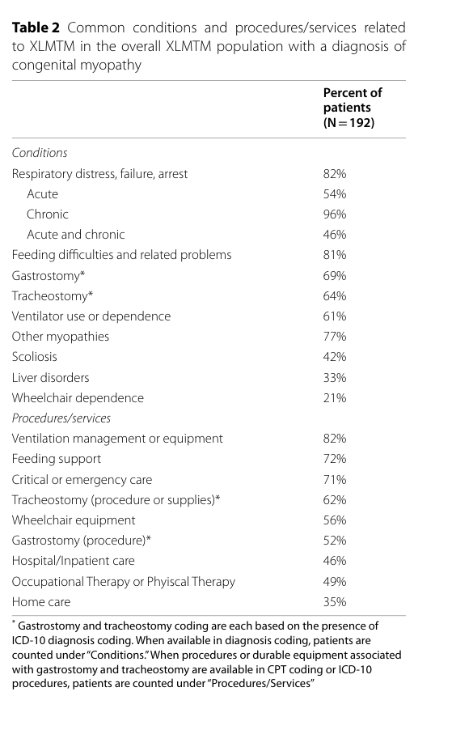

## Question

# Disease Characteristics Research Template

## Target Disease
- **Disease Name:** Centronuclear Myopathy
- **MONDO ID:**  (if available)
- **Category:** Mendelian

## Research Objectives

Please provide a comprehensive research report on **Centronuclear Myopathy** covering all of the
disease characteristics listed below. This report will be used to populate a disease knowledge
base entry. Be thorough and cite primary literature (PMID preferred) for all claims.

For each section, **suggested databases/resources** are listed. These are the first places
you should search for information on each topic.

---

### 1. Disease Information
> **Search first:** OMIM, Orphanet, ICD-10/ICD-11, MeSH, PubMed

- What is the disease? Provide a concise overview.
- What are the key identifiers? (OMIM, Orphanet, ICD-10/ICD-11, MeSH, Mondo)
- What are the common synonyms and alternative names?
- Is the information derived from individual patients (e.g., EHR) or aggregated disease-level resources?

### 2. Etiology

- **Disease Causal Factors**: What are the primary causes? (genetic, environmental, infectious, mechanistic)
- **Risk Factors**:
  > **Search first:** PubMed, Cochrane Library, UpToDate, clinical guidelines, ClinVar, ClinGen, GWAS Catalog, PheGenI, CTD, CDC, WHO, epidemiological databases
  - Genetic risk factors (causal variants, susceptibility loci, modifier genes)
  - Environmental risk factors (toxins, lifestyle, occupational exposures, age, sex, family history)
- **Protective Factors**:
  > **Search first:** PubMed, Cochrane Library, clinical trial databases, GWAS Catalog, gnomAD, WHO, CDC, nutrition databases
  - Genetic protective factors (protective variants, modifier alleles)
  - Environmental protective factors (diet, lifestyle, exposures that reduce risk)
- **Gene-Environment Interactions**: How do genetic and environmental factors interact to influence disease?
  > **Search first:** CTD, PubMed, PheGenI, GxE databases

### 3. Phenotypes
> **Search first:** HPO (Human Phenotype Ontology), OMIM, Orphanet, PubMed, clinicaltrials.gov, MedDRA, SNOMED CT, DECIPHER, LOINC

For each phenotype, provide:
- **Phenotype type**: symptoms, clinical signs, physical manifestations, behavioral changes, or laboratory abnormalities
  > For symptoms/signs: HPO, OMIM, Orphanet, PubMed
  > For behavioral changes: HPO, DSM, RDoC (Research Domain Criteria), PubMed
  > For laboratory abnormalities: LOINC, SNOMED CT, LabTests Online, PubMed
- **Phenotype characteristics**:
  > **Search first:** OMIM, Orphanet, HPO, PubMed
  - Age of symptom onset (neonatal, childhood, adult-onset, late-onset)
  - Symptom severity (mild, moderate, severe, variable)
  - Symptom progression (stable, progressive, episodic, fluctuating)
  - Frequency among affected individuals (percentage or qualitative)
- **Quality of life impact**: Effects on daily functioning and well-being (per-phenotype when possible)
  > **Search first:** EQ-5D database, SF-36, WHO QOL databases, PubMed
- Suggest HPO (Human Phenotype Ontology) terms for each phenotype

### 4. Genetic/Molecular Information

- **Causal Genes**: Gene mutations or chromosomal abnormalities responsible for disease (gene symbols, OMIM IDs)
  > **Search first:** OMIM, ClinVar, HGMD, Ensembl, NCBI Gene
- **Pathogenic Variants**:
  - Affected genes (gene symbols, HGNC IDs)
    > **Search first:** OMIM, NCBI Gene, Ensembl, HGNC, UniProt, GeneCards
  - Variant classification (pathogenic, likely pathogenic, VUS per ACMG/AMP guidelines)
    > **Search first:** ClinVar, ClinGen, ACMG/AMP guidelines, VarSome
  - Variant type/class (missense, frameshift, nonsense, splice-site, structural)
  - Allele frequency in population databases
    > **Search first:** gnomAD, 1000 Genomes, ExAC, TOPMed, dbSNP
  - Somatic vs germline origin
    > **Search first:** COSMIC (somatic), ClinVar, ICGC, TCGA
  - Functional consequences (loss of function, gain of function, dominant negative)
- **Modifier Genes**: Genes that modify disease severity or expression
- **Epigenetic Information**: DNA methylation, histone modifications, chromatin changes affecting disease
  > **Search first:** ENCODE, Roadmap Epigenomics, MethBase, DiseaseMeth
- **Chromosomal Abnormalities**: Large-scale genetic changes (aneuploidy, translocations, inversions)
  > **Search first:** DECIPHER, ClinVar, ECARUCA, UCSC Genome Browser

### 5. Environmental Information

- **Environmental Factors**: Non-genetic contributing factors (toxins, radiation, pollution, occupational exposure)
  > **Search first:** CTD (Comparative Toxicogenomics Database), TOXNET, PubMed, EPA databases
- **Lifestyle Factors**: Behavioral factors (smoking, diet, exercise, alcohol consumption)
  > **Search first:** CDC databases, WHO, PubMed, NHANES
- **Infectious Agents**: If applicable, pathogens causing or triggering disease (bacteria, viruses, fungi, parasites)
  > **Search first:** NCBI Taxonomy, ViPR, BV-BRC, MicrobeDB, GIDEON

### 6. Mechanism / Pathophysiology

- **Molecular Pathways**: Specific signaling cascades or biochemical pathways involved (Wnt, MAPK, mTOR, PI3K-AKT, etc.)
  > **Search first:** KEGG, Reactome, WikiPathways, PathBank, BioCyc
- **Cellular Processes**: Cell-level mechanisms (apoptosis, autophagy, cell cycle dysregulation, inflammation, etc.)
  > **Search first:** Gene Ontology (GO), Reactome, KEGG, PubMed
- **Protein Dysfunction**: How protein structure or function is altered (misfolding, aggregation, loss of function, gain of function)
  > **Search first:** UniProt, PDB (Protein Data Bank), InterPro, Pfam, AlphaFold
- **Metabolic Changes**: Alterations in metabolic processes (energy metabolism, lipid metabolism, amino acid metabolism)
  > **Search first:** KEGG, BioCyc, HMDB (Human Metabolome Database), BRENDA
- **Immune System Involvement**: Role of immune response (autoimmunity, immunodeficiency, chronic inflammation)
  > **Search first:** ImmPort, Immunome Database, IEDB, Gene Ontology
- **Tissue Damage Mechanisms**: How tissues/ are injured (oxidative stress, ischemia, fibrosis, necrosis)
  > **Search first:** PubMed, Gene Ontology, Reactome
- **Biochemical Abnormalities**: Specific molecular defects (enzyme deficiencies, receptor dysfunction, ion channel defects)
  > **Search first:** BRENDA, UniProt, KEGG, OMIM, PubMed
- **Epigenetic Changes**: DNA methylation, histone modifications affecting gene expression in disease
  > **Search first:** ENCODE, Roadmap Epigenomics, MethBase, DiseaseMeth
- **Molecular Profiling** (if available):
  - Transcriptomics/gene expression changes
    > **Search first:** GEO (Gene Expression Omnibus), ArrayExpress, GTEx, Human Cell Atlas, SRA
  - Proteomics findings
    > **Search first:** PRIDE, ProteomeXchange, Human Protein Atlas, STRING, BioGRID
  - Metabolomics signatures
    > **Search first:** MetaboLights, Metabolomics Workbench, HMDB, METLIN
  - Lipidomics alterations
    > **Search first:** LIPID MAPS, SwissLipids, LipidHome, Metabolomics Workbench
  - Genomic structural features
    > **Search first:** UCSC Genome Browser, Ensembl, NCBI, dbVar, DGV
- **Advanced Technologies** (if applicable):
  - Single-cell analysis findings (cell-type specific mechanisms, cellular heterogeneity)
    > **Search first:** Human Cell Atlas, Single Cell Portal, GEO, CELLxGENE
  - Spatial transcriptomics findings
    > **Search first:** GEO, Spatial Research, Vizgen, 10x Genomics data
  - Multi-omics integration results
    > **Search first:** TCGA, ICGC, cBioPortal, LinkedOmics, PubMed
  - Functional genomics screens (CRISPR, RNAi)
    > **Search first:** DepMap, GenomeRNAi, PubMed, BioGRID ORCS

For each mechanism, describe:
- The causal chain from initial trigger to clinical manifestation
- Which mechanisms are upstream vs downstream
- What cell types and biological processes are involved
- Suggest GO terms for biological processes and CL terms for cell types

### 7. Anatomical Structures Affected

- **Organ Level**:
  - Primary organs directly affected
  - Secondary organ involvement (complications, secondary effects)
  - Body systems involved (cardiovascular, nervous, digestive, respiratory, endocrine, etc.)
  > **Search first:** Uberon, FMA (Foundational Model of Anatomy), OMIM, HPO, ICD-11, MeSH, SNOMED CT
- **Tissue and Cell Level**:
  - Specific tissue types affected (epithelial, connective, muscle, nervous)
  - Specific cell populations targeted (with Cell Ontology terms)
  > **Search first:** Uberon, Human Protein Atlas, Cell Ontology, Human Cell Atlas, CellMarker, PanglaoDB
- **Subcellular Level**:
  - Cellular compartments involved (mitochondria, nucleus, ER, lysosomes) (with GO Cellular Component terms)
  > **Search first:** Gene Ontology (Cellular Component), UniProt, Human Protein Atlas
- **Localization**:
  - Specific anatomical sites (with UBERON terms)
    > **Search first:** FMA, Uberon, NeuroNames (for brain), SNOMED CT
  - Lateralization (unilateral, bilateral, asymmetric)
    > **Search first:** HPO, clinical literature, imaging databases

### 8. Temporal Development

- **Onset**:
  - Typical age of onset (congenital, pediatric, adult, geriatric)
  - Onset pattern (acute, subacute, chronic, insidious)
  > **Search first:** OMIM, Orphanet, HPO, PubMed
- **Progression**:
  - Disease stages (early, intermediate, advanced, end-stage)
    > **Search first:** Cancer Staging Manual (AJCC), WHO classifications, PubMed
  - Progression rate (rapid, slow, variable)
  - Disease course pattern (episodic, relapsing-remitting, progressive, stable)
  - Disease duration (self-limited, chronic lifelong)
  > **Search first:** Disease registries, longitudinal cohort databases, natural history studies, PubMed, Orphanet, OMIM
- **Patterns**:
  - Remission patterns (spontaneous, treatment-induced)
    > **Search first:** Clinical trial databases, disease registries, PubMed
  - Critical periods (time windows of vulnerability or opportunity for intervention)
    > **Search first:** PubMed, developmental biology databases, clinical guidelines

### 9. Inheritance and Population

- **Epidemiology**:
  - Prevalence (cases per 100,000 at given time)
  - Incidence (new cases per 100,000 per year)
  > **Search first:** Orphanet, CDC, WHO, GBD (Global Burden of Disease), national registries, SEER, disease registries
- **For Genetic Etiology**:
  - Inheritance pattern (AD, AR, X-linked, mitochondrial, multifactorial, polygenic)
    > **Search first:** OMIM, Orphanet, ClinVar, GTR (Genetic Testing Registry)
  - Penetrance (complete, incomplete, age-dependent)
    > **Search first:** ClinVar, OMIM, PubMed, ClinGen
  - Expressivity (variable, consistent)
    > **Search first:** OMIM, ClinVar, PubMed
  - Genetic anticipation (increasing severity in successive generations)
    > **Search first:** OMIM, PubMed (especially for repeat expansion disorders)
  - Germline mosaicism
    > **Search first:** ClinVar, OMIM, genetic counseling literature, PubMed
  - Founder effects (population-specific mutations)
    > **Search first:** gnomAD, population genetics databases, PubMed
  - Consanguinity role
    > **Search first:** OMIM, population studies, genetic counseling resources
  - Carrier frequency
    > **Search first:** gnomAD, carrier screening databases, GeneReviews, GTR
- **Population Demographics**:
  - Affected populations (ethnic or demographic groups with higher prevalence)
    > **Search first:** gnomAD, 1000 Genomes, PAGE Study, PubMed, population registries
  - Geographic distribution (endemic areas, regional variation)
    > **Search first:** WHO, CDC, GBD, Orphanet, geographic epidemiology databases
  - Geographic distribution of specific variants
  - Sex ratio (male:female)
    > **Search first:** Disease registries, OMIM, PubMed, epidemiological databases
  - Age distribution of affected individuals
    > **Search first:** CDC, disease registries, SEER, Orphanet

### 10. Diagnostics

- **Clinical Tests**:
  - Laboratory tests (blood, urine, tissue chemistry, specific enzyme assays)
    > **Search first:** LOINC, LabTests Online, PubMed
  - Biomarkers (proteins, metabolites, genetic markers, circulating biomarkers)
    > **Search first:** FDA Biomarker List, BEST (Biomarkers, EndpointS, and other Tools), PubMed
  - Imaging studies (X-ray, CT, MRI, PET, ultrasound)
    > **Search first:** RadLex, DICOM, Radiopaedia, imaging databases
  - Functional tests (pulmonary function, cardiac stress tests)
    > **Search first:** LOINC, clinical guidelines, PubMed
  - Electrophysiology (EEG, EMG, ECG, nerve conduction studies)
    > **Search first:** LOINC, clinical neurophysiology databases, PubMed
  - Biopsy findings (histopathology, immunohistochemistry)
    > **Search first:** SNOMED CT, College of American Pathologists resources, PubMed
  - Pathology findings (microscopic examination)
    > **Search first:** SNOMED CT, Digital Pathology databases, PubMed
- **Genetic Testing**:
  > **Search first:** GTR (Genetic Testing Registry), GeneReviews, ClinGen
  - Overview of recommended genetic testing approach
  - Whole genome sequencing (WGS) utility
    > **Search first:** GTR, ClinVar, GEL (Genomics England), gnomAD
  - Whole exome sequencing (WES) utility
    > **Search first:** GTR, ClinVar, OMIM, GeneMatcher
  - Gene panels (which panels, which genes)
    > **Search first:** GTR, ClinVar, laboratory-specific databases
  - Single gene testing
    > **Search first:** GTR, ClinVar, OMIM, GeneReviews
  - Chromosomal microarray (CMA)
    > **Search first:** DECIPHER, ClinVar, dbVar, ECARUCA
  - Karyotyping
    > **Search first:** Chromosome Abnormality Database, ClinVar, cytogenetics resources
  - FISH
    > **Search first:** ClinVar, cytogenetics databases, PubMed
  - Mitochondrial DNA testing
    > **Search first:** MITOMAP, MSeqDR, ClinVar, GTR
  - Repeat expansion testing
    > **Search first:** GTR, ClinVar, repeat expansion databases, PubMed
- **Omics-Based Diagnostics** (if applicable):
  - RNA sequencing / transcriptomics
    > **Search first:** GEO, ArrayExpress, GTEx, RNA-seq databases
  - Proteomics
    > **Search first:** PRIDE, ProteomeXchange, FDA Biomarker database
  - Metabolomics
    > **Search first:** MetaboLights, Metabolomics Workbench, HMDB
  - Epigenomics
    > **Search first:** GEO, ENCODE, Roadmap Epigenomics, MethBase
  - Liquid biopsy
    > **Search first:** COSMIC, ClinVar, liquid biopsy databases, PubMed
- **Clinical Criteria**:
  - Standardized diagnostic criteria (DSM, ICD, society guidelines)
    > **Search first:** DSM-5, ICD-11, clinical society guidelines, UpToDate
  - Differential diagnosis (other conditions to rule out, with distinguishing features)
    > **Search first:** DynaMed, UpToDate, clinical decision support systems
- **Screening**:
  - Screening methods for asymptomatic individuals (newborn screening, carrier screening, cascade screening)
    > **Search first:** ACMG recommendations, CDC newborn screening, GTR

### 11. Outcome/Prognosis

- **Survival and Mortality**:
  - Survival rate (5-year, 10-year, overall)
    > **Search first:** SEER, cancer registries, disease-specific registries, PubMed
  - Life expectancy (with and without treatment if applicable)
    > **Search first:** Orphanet, disease registries, actuarial databases, PubMed
  - Mortality rate
    > **Search first:** CDC, WHO, GBD, national mortality databases
  - Disease-specific mortality (deaths directly attributable to disease)
    > **Search first:** Disease registries, CDC Wonder, GBD, PubMed
- **Morbidity and Function**:
  - Morbidity (disease-related disability and health impacts)
    > **Search first:** GBD, WHO, disability databases, PubMed
  - Disability outcomes (long-term functional impairments)
    > **Search first:** ICF (International Classification of Functioning), disability registries
  - Quality of life measures (EQ-5D, SF-36, PROMIS, disease-specific tools)
    > **Search first:** EQ-5D database, SF-36, PROMIS, PubMed
- **Disease Course**:
  - Complications (secondary problems: infections, organ failure, etc.)
    > **Search first:** ICD codes, disease registries, clinical databases, PubMed
  - Recovery potential (likelihood and extent of recovery, with vs without treatment)
    > **Search first:** Natural history studies, rehabilitation databases, PubMed
- **Prediction**:
  - Prognostic factors (age, disease severity, biomarkers, treatment response)
    > **Search first:** Prognostic models databases, clinical calculators, PubMed
  - Prognostic biomarkers (molecular markers predicting disease course)
    > **Search first:** FDA Biomarker database, PubMed, cancer prognostic databases

### 12. Treatment

- **Pharmacotherapy**:
  - Pharmacological treatments (drug names, drug classes, mechanisms of action)
    > **Search first:** DrugBank, RxNorm, ATC classification, DailyMed, FDA databases
  - Pharmacogenomics (how genetic variants affect drug metabolism, efficacy, toxicity)
    > **Search first:** PharmGKB, CPIC (Clinical Pharmacogenetics), FDA Table of PGx Biomarkers
- **Advanced Therapeutics**:
  - Gene therapy (viral vectors, CRISPR, gene replacement, gene editing)
    > **Search first:** ClinicalTrials.gov, FDA gene therapy database, ASGCT resources
  - Cell therapy (stem cell transplant, CAR-T, cellular therapeutics)
    > **Search first:** ClinicalTrials.gov, FDA cell therapy database, FACT standards
  - RNA-based therapies (ASOs, siRNA, mRNA therapies)
    > **Search first:** ClinicalTrials.gov, FDA approvals, PubMed
  - Targeted therapies (treatments directed at specific molecular targets)
    > **Search first:** My Cancer Genome, OncoKB, ClinicalTrials.gov, FDA approvals
  - Immunotherapies (checkpoint inhibitors, monoclonal antibodies)
    > **Search first:** Cancer Immunotherapy Database, FDA approvals, ClinicalTrials.gov
- **Surgical and Interventional**:
  - Surgical interventions (types of surgery, timing, outcomes)
    > **Search first:** CPT codes, surgical registries, clinical guidelines, PubMed
- **Supportive and Rehabilitative**:
  - Supportive care (symptom management, pain control, nutrition)
    > **Search first:** Clinical guidelines, Cochrane Library, PubMed
  - Rehabilitation (physical therapy, occupational therapy, speech therapy)
    > **Search first:** Rehabilitation medicine databases, clinical guidelines, PubMed
- **Experimental**:
  - Experimental treatments in clinical trials (with NCT identifiers if available)
    > **Search first:** ClinicalTrials.gov, EU Clinical Trials Register, WHO ICTRP
- **Treatment Outcomes**:
  - Treatment response rates
    > **Search first:** Clinical trial databases, FDA reviews, systematic reviews, PubMed
  - Side effects and adverse events
    > **Search first:** FDA Adverse Event Reporting System (FAERS), MedWatch, PubMed
- **Treatment Strategy**:
  - Treatment algorithms (clinical pathways, decision trees)
    > **Search first:** Clinical practice guidelines, NCCN Guidelines, UpToDate
  - Combination therapies
    > **Search first:** ClinicalTrials.gov, treatment guidelines, PubMed
  - Personalized medicine approaches (genotype-guided treatment)
    > **Search first:** My Cancer Genome, CIViC, PharmGKB, precision medicine databases

For each treatment, suggest MAXO (Medical Action Ontology) terms where applicable.

### 13. Prevention

- **Prevention Levels**:
  - Primary prevention (preventing disease occurrence: vaccination, risk factor modification)
    > **Search first:** CDC, WHO, USPSTF recommendations, Cochrane Library
  - Secondary prevention (early detection and treatment: screening programs, early intervention)
    > **Search first:** USPSTF, CDC screening guidelines, WHO
  - Tertiary prevention (preventing complications in those with disease)
    > **Search first:** Clinical guidelines, disease management protocols, PubMed
- **Immunization**: Vaccine strategies (if applicable)
  > **Search first:** CDC vaccine schedules, WHO immunization, FDA vaccine database
- **Screening and Early Detection**:
  - Screening programs (population-based: newborn screening, cancer screening)
    > **Search first:** CDC screening programs, USPSTF, cancer screening databases
  - Genetic screening (carrier screening, preimplantation genetic diagnosis, prenatal testing)
    > **Search first:** ACMG recommendations, ACOG guidelines, GTR
  - Risk stratification (identifying high-risk individuals for targeted prevention)
    > **Search first:** Risk prediction models, clinical calculators, PubMed
- **Behavioral Interventions**: Lifestyle modifications to reduce risk
  > **Search first:** CDC, WHO, behavioral intervention databases, Cochrane Library
- **Counseling**: Genetic counseling (risk assessment, family planning guidance)
  > **Search first:** NSGC resources, ACMG guidelines, GeneReviews
- **Public Health**:
  - Public health interventions (sanitation, vector control, health education)
    > **Search first:** CDC, WHO, public health databases, PubMed
  - Environmental interventions (reducing environmental risk factors)
    > **Search first:** EPA databases, WHO environmental health, PubMed
- **Prophylaxis**: Preventive medications or procedures
  > **Search first:** Clinical guidelines, FDA approvals, PubMed

### 14. Other Species / Natural Disease

- **Taxonomy**: Species affected (with NCBI Taxon identifiers)
  > **Search first:** NCBI Taxonomy
- **Breed**: Specific breeds affected (with VBO identifiers if applicable)
  > **Search first:** VBO (Vertebrate Breed Ontology)
- **Gene**: Orthologous genes in other species (with NCBI Gene IDs)
  > **Search first:** NCBI Gene
- **Natural Disease**:
  - Naturally occurring disease in other species (companion animals, wildlife)
    > **Search first:** OMIA (Online Mendelian Inheritance in Animals), VetCompass, PubMed
  - Veterinary relevance and importance in animal health
    > **Search first:** OMIA, veterinary databases, PubMed
- **Comparative Biology**:
  - Comparative pathology (similarities and differences across species)
    > **Search first:** OMIA, comparative pathology databases, PubMed
  - Evolutionary conservation of disease mechanisms
    > **Search first:** HomoloGene, OrthoMCL, Alliance of Genome Resources
- **Transmission** (if applicable):
  - Zoonotic potential
    > **Search first:** CDC zoonotic diseases, WHO zoonoses, GIDEON
  - Cross-species susceptibility
    > **Search first:** NCBI Taxonomy, veterinary databases, PubMed

### 15. Model Organisms

- **Model Types**:
  - Model organism type (mammalian, invertebrate, cellular, in vitro)
    > **Search first:** Alliance of Genome Resources, model organism databases
  - Specific model systems (mouse, rat, zebrafish, Drosophila, C. elegans, yeast, cell lines, organoids, iPSCs)
    > **Search first:** MGI, RGD, ZFIN, FlyBase, WormBase, SGD, ATCC, Cellosaurus
  - Induced models (drug treatment, surgical intervention, environmental manipulation)
    > **Search first:** MGI, model organism databases, PubMed
- **Genetic Models**:
  - Types available (knockout, knock-in, transgenic, conditional, humanized)
    > **Search first:** MGI, IMPC, KOMP, EuMMCR, IMSR
- **Model Characteristics**:
  - Phenotype recapitulation (how well model reproduces human disease features)
    > **Search first:** Model organism databases, comparative studies, PubMed
  - Model limitations (aspects of human disease not captured)
    > **Search first:** Model organism databases, PubMed, review articles
- **Applications**:
  - Research applications (what aspects of disease can be studied)
    > **Search first:** Model organism databases, PubMed
- **Resources**:
  - Model databases
    > **Search first:** MGI, RGD, ZFIN, FlyBase, WormBase, IMSR, EMMA, MMRRC

---

## Citation Requirements

- Cite primary literature (PMID preferred) for all mechanistic and clinical claims
- Prioritize recent reviews and landmark papers
- Include direct quotes from abstracts where possible to support key statements
- Distinguish evidence source types: human clinical, model organism, in vitro, computational

## Output Format

Structure your response as a comprehensive narrative organized by the sections above.
For each section, provide:
- Factual content with specific details (numbers, percentages, gene names, variant nomenclature)
- Ontology term suggestions (HPO, GO, CL, UBERON, CHEBI, MAXO, MONDO) where applicable
- Evidence citations with PMIDs
- Direct quotes from abstracts to support key claims
- Clear indication when information is not available or not applicable for this disease

This report will be used to populate a disease knowledge base entry with:
- Pathophysiology descriptions with causal chains
- Gene/protein annotations (HGNC, GO terms)
- Phenotype associations (HP terms) with frequencies
- Cell type involvement (CL terms)
- Anatomical locations (UBERON terms)
- Chemical entities (CHEBI terms)
- Treatment annotations (MAXO terms)
- Evidence items with PMIDs and exact abstract quotes
- Epidemiology, prognosis, diagnostic, and prevention information
- Animal model descriptions with phenotype recapitulation details

## Output

Question: You are an expert researcher providing comprehensive, well-cited information.

Provide detailed information focusing on:
1. Key concepts and definitions with current understanding
2. Recent developments and latest research (prioritize 2023-2024 sources)
3. Current applications and real-world implementations
4. Expert opinions and analysis from authoritative sources
5. Relevant statistics and data from recent studies

Format as a comprehensive research report with proper citations. Include URLs and publication dates where available.
Always prioritize recent, authoritative sources and provide specific citations for all major claims.

# Disease Characteristics Research Template

## Target Disease
- **Disease Name:** Centronuclear Myopathy
- **MONDO ID:**  (if available)
- **Category:** Mendelian

## Research Objectives

Please provide a comprehensive research report on **Centronuclear Myopathy** covering all of the
disease characteristics listed below. This report will be used to populate a disease knowledge
base entry. Be thorough and cite primary literature (PMID preferred) for all claims.

For each section, **suggested databases/resources** are listed. These are the first places
you should search for information on each topic.

---

### 1. Disease Information
> **Search first:** OMIM, Orphanet, ICD-10/ICD-11, MeSH, PubMed

- What is the disease? Provide a concise overview.
- What are the key identifiers? (OMIM, Orphanet, ICD-10/ICD-11, MeSH, Mondo)
- What are the common synonyms and alternative names?
- Is the information derived from individual patients (e.g., EHR) or aggregated disease-level resources?

### 2. Etiology

- **Disease Causal Factors**: What are the primary causes? (genetic, environmental, infectious, mechanistic)
- **Risk Factors**:
  > **Search first:** PubMed, Cochrane Library, UpToDate, clinical guidelines, ClinVar, ClinGen, GWAS Catalog, PheGenI, CTD, CDC, WHO, epidemiological databases
  - Genetic risk factors (causal variants, susceptibility loci, modifier genes)
  - Environmental risk factors (toxins, lifestyle, occupational exposures, age, sex, family history)
- **Protective Factors**:
  > **Search first:** PubMed, Cochrane Library, clinical trial databases, GWAS Catalog, gnomAD, WHO, CDC, nutrition databases
  - Genetic protective factors (protective variants, modifier alleles)
  - Environmental protective factors (diet, lifestyle, exposures that reduce risk)
- **Gene-Environment Interactions**: How do genetic and environmental factors interact to influence disease?
  > **Search first:** CTD, PubMed, PheGenI, GxE databases

### 3. Phenotypes
> **Search first:** HPO (Human Phenotype Ontology), OMIM, Orphanet, PubMed, clinicaltrials.gov, MedDRA, SNOMED CT, DECIPHER, LOINC

For each phenotype, provide:
- **Phenotype type**: symptoms, clinical signs, physical manifestations, behavioral changes, or laboratory abnormalities
  > For symptoms/signs: HPO, OMIM, Orphanet, PubMed
  > For behavioral changes: HPO, DSM, RDoC (Research Domain Criteria), PubMed
  > For laboratory abnormalities: LOINC, SNOMED CT, LabTests Online, PubMed
- **Phenotype characteristics**:
  > **Search first:** OMIM, Orphanet, HPO, PubMed
  - Age of symptom onset (neonatal, childhood, adult-onset, late-onset)
  - Symptom severity (mild, moderate, severe, variable)
  - Symptom progression (stable, progressive, episodic, fluctuating)
  - Frequency among affected individuals (percentage or qualitative)
- **Quality of life impact**: Effects on daily functioning and well-being (per-phenotype when possible)
  > **Search first:** EQ-5D database, SF-36, WHO QOL databases, PubMed
- Suggest HPO (Human Phenotype Ontology) terms for each phenotype

### 4. Genetic/Molecular Information

- **Causal Genes**: Gene mutations or chromosomal abnormalities responsible for disease (gene symbols, OMIM IDs)
  > **Search first:** OMIM, ClinVar, HGMD, Ensembl, NCBI Gene
- **Pathogenic Variants**:
  - Affected genes (gene symbols, HGNC IDs)
    > **Search first:** OMIM, NCBI Gene, Ensembl, HGNC, UniProt, GeneCards
  - Variant classification (pathogenic, likely pathogenic, VUS per ACMG/AMP guidelines)
    > **Search first:** ClinVar, ClinGen, ACMG/AMP guidelines, VarSome
  - Variant type/class (missense, frameshift, nonsense, splice-site, structural)
  - Allele frequency in population databases
    > **Search first:** gnomAD, 1000 Genomes, ExAC, TOPMed, dbSNP
  - Somatic vs germline origin
    > **Search first:** COSMIC (somatic), ClinVar, ICGC, TCGA
  - Functional consequences (loss of function, gain of function, dominant negative)
- **Modifier Genes**: Genes that modify disease severity or expression
- **Epigenetic Information**: DNA methylation, histone modifications, chromatin changes affecting disease
  > **Search first:** ENCODE, Roadmap Epigenomics, MethBase, DiseaseMeth
- **Chromosomal Abnormalities**: Large-scale genetic changes (aneuploidy, translocations, inversions)
  > **Search first:** DECIPHER, ClinVar, ECARUCA, UCSC Genome Browser

### 5. Environmental Information

- **Environmental Factors**: Non-genetic contributing factors (toxins, radiation, pollution, occupational exposure)
  > **Search first:** CTD (Comparative Toxicogenomics Database), TOXNET, PubMed, EPA databases
- **Lifestyle Factors**: Behavioral factors (smoking, diet, exercise, alcohol consumption)
  > **Search first:** CDC databases, WHO, PubMed, NHANES
- **Infectious Agents**: If applicable, pathogens causing or triggering disease (bacteria, viruses, fungi, parasites)
  > **Search first:** NCBI Taxonomy, ViPR, BV-BRC, MicrobeDB, GIDEON

### 6. Mechanism / Pathophysiology

- **Molecular Pathways**: Specific signaling cascades or biochemical pathways involved (Wnt, MAPK, mTOR, PI3K-AKT, etc.)
  > **Search first:** KEGG, Reactome, WikiPathways, PathBank, BioCyc
- **Cellular Processes**: Cell-level mechanisms (apoptosis, autophagy, cell cycle dysregulation, inflammation, etc.)
  > **Search first:** Gene Ontology (GO), Reactome, KEGG, PubMed
- **Protein Dysfunction**: How protein structure or function is altered (misfolding, aggregation, loss of function, gain of function)
  > **Search first:** UniProt, PDB (Protein Data Bank), InterPro, Pfam, AlphaFold
- **Metabolic Changes**: Alterations in metabolic processes (energy metabolism, lipid metabolism, amino acid metabolism)
  > **Search first:** KEGG, BioCyc, HMDB (Human Metabolome Database), BRENDA
- **Immune System Involvement**: Role of immune response (autoimmunity, immunodeficiency, chronic inflammation)
  > **Search first:** ImmPort, Immunome Database, IEDB, Gene Ontology
- **Tissue Damage Mechanisms**: How tissues/ are injured (oxidative stress, ischemia, fibrosis, necrosis)
  > **Search first:** PubMed, Gene Ontology, Reactome
- **Biochemical Abnormalities**: Specific molecular defects (enzyme deficiencies, receptor dysfunction, ion channel defects)
  > **Search first:** BRENDA, UniProt, KEGG, OMIM, PubMed
- **Epigenetic Changes**: DNA methylation, histone modifications affecting gene expression in disease
  > **Search first:** ENCODE, Roadmap Epigenomics, MethBase, DiseaseMeth
- **Molecular Profiling** (if available):
  - Transcriptomics/gene expression changes
    > **Search first:** GEO (Gene Expression Omnibus), ArrayExpress, GTEx, Human Cell Atlas, SRA
  - Proteomics findings
    > **Search first:** PRIDE, ProteomeXchange, Human Protein Atlas, STRING, BioGRID
  - Metabolomics signatures
    > **Search first:** MetaboLights, Metabolomics Workbench, HMDB, METLIN
  - Lipidomics alterations
    > **Search first:** LIPID MAPS, SwissLipids, LipidHome, Metabolomics Workbench
  - Genomic structural features
    > **Search first:** UCSC Genome Browser, Ensembl, NCBI, dbVar, DGV
- **Advanced Technologies** (if applicable):
  - Single-cell analysis findings (cell-type specific mechanisms, cellular heterogeneity)
    > **Search first:** Human Cell Atlas, Single Cell Portal, GEO, CELLxGENE
  - Spatial transcriptomics findings
    > **Search first:** GEO, Spatial Research, Vizgen, 10x Genomics data
  - Multi-omics integration results
    > **Search first:** TCGA, ICGC, cBioPortal, LinkedOmics, PubMed
  - Functional genomics screens (CRISPR, RNAi)
    > **Search first:** DepMap, GenomeRNAi, PubMed, BioGRID ORCS

For each mechanism, describe:
- The causal chain from initial trigger to clinical manifestation
- Which mechanisms are upstream vs downstream
- What cell types and biological processes are involved
- Suggest GO terms for biological processes and CL terms for cell types

### 7. Anatomical Structures Affected

- **Organ Level**:
  - Primary organs directly affected
  - Secondary organ involvement (complications, secondary effects)
  - Body systems involved (cardiovascular, nervous, digestive, respiratory, endocrine, etc.)
  > **Search first:** Uberon, FMA (Foundational Model of Anatomy), OMIM, HPO, ICD-11, MeSH, SNOMED CT
- **Tissue and Cell Level**:
  - Specific tissue types affected (epithelial, connective, muscle, nervous)
  - Specific cell populations targeted (with Cell Ontology terms)
  > **Search first:** Uberon, Human Protein Atlas, Cell Ontology, Human Cell Atlas, CellMarker, PanglaoDB
- **Subcellular Level**:
  - Cellular compartments involved (mitochondria, nucleus, ER, lysosomes) (with GO Cellular Component terms)
  > **Search first:** Gene Ontology (Cellular Component), UniProt, Human Protein Atlas
- **Localization**:
  - Specific anatomical sites (with UBERON terms)
    > **Search first:** FMA, Uberon, NeuroNames (for brain), SNOMED CT
  - Lateralization (unilateral, bilateral, asymmetric)
    > **Search first:** HPO, clinical literature, imaging databases

### 8. Temporal Development

- **Onset**:
  - Typical age of onset (congenital, pediatric, adult, geriatric)
  - Onset pattern (acute, subacute, chronic, insidious)
  > **Search first:** OMIM, Orphanet, HPO, PubMed
- **Progression**:
  - Disease stages (early, intermediate, advanced, end-stage)
    > **Search first:** Cancer Staging Manual (AJCC), WHO classifications, PubMed
  - Progression rate (rapid, slow, variable)
  - Disease course pattern (episodic, relapsing-remitting, progressive, stable)
  - Disease duration (self-limited, chronic lifelong)
  > **Search first:** Disease registries, longitudinal cohort databases, natural history studies, PubMed, Orphanet, OMIM
- **Patterns**:
  - Remission patterns (spontaneous, treatment-induced)
    > **Search first:** Clinical trial databases, disease registries, PubMed
  - Critical periods (time windows of vulnerability or opportunity for intervention)
    > **Search first:** PubMed, developmental biology databases, clinical guidelines

### 9. Inheritance and Population

- **Epidemiology**:
  - Prevalence (cases per 100,000 at given time)
  - Incidence (new cases per 100,000 per year)
  > **Search first:** Orphanet, CDC, WHO, GBD (Global Burden of Disease), national registries, SEER, disease registries
- **For Genetic Etiology**:
  - Inheritance pattern (AD, AR, X-linked, mitochondrial, multifactorial, polygenic)
    > **Search first:** OMIM, Orphanet, ClinVar, GTR (Genetic Testing Registry)
  - Penetrance (complete, incomplete, age-dependent)
    > **Search first:** ClinVar, OMIM, PubMed, ClinGen
  - Expressivity (variable, consistent)
    > **Search first:** OMIM, ClinVar, PubMed
  - Genetic anticipation (increasing severity in successive generations)
    > **Search first:** OMIM, PubMed (especially for repeat expansion disorders)
  - Germline mosaicism
    > **Search first:** ClinVar, OMIM, genetic counseling literature, PubMed
  - Founder effects (population-specific mutations)
    > **Search first:** gnomAD, population genetics databases, PubMed
  - Consanguinity role
    > **Search first:** OMIM, population studies, genetic counseling resources
  - Carrier frequency
    > **Search first:** gnomAD, carrier screening databases, GeneReviews, GTR
- **Population Demographics**:
  - Affected populations (ethnic or demographic groups with higher prevalence)
    > **Search first:** gnomAD, 1000 Genomes, PAGE Study, PubMed, population registries
  - Geographic distribution (endemic areas, regional variation)
    > **Search first:** WHO, CDC, GBD, Orphanet, geographic epidemiology databases
  - Geographic distribution of specific variants
  - Sex ratio (male:female)
    > **Search first:** Disease registries, OMIM, PubMed, epidemiological databases
  - Age distribution of affected individuals
    > **Search first:** CDC, disease registries, SEER, Orphanet

### 10. Diagnostics

- **Clinical Tests**:
  - Laboratory tests (blood, urine, tissue chemistry, specific enzyme assays)
    > **Search first:** LOINC, LabTests Online, PubMed
  - Biomarkers (proteins, metabolites, genetic markers, circulating biomarkers)
    > **Search first:** FDA Biomarker List, BEST (Biomarkers, EndpointS, and other Tools), PubMed
  - Imaging studies (X-ray, CT, MRI, PET, ultrasound)
    > **Search first:** RadLex, DICOM, Radiopaedia, imaging databases
  - Functional tests (pulmonary function, cardiac stress tests)
    > **Search first:** LOINC, clinical guidelines, PubMed
  - Electrophysiology (EEG, EMG, ECG, nerve conduction studies)
    > **Search first:** LOINC, clinical neurophysiology databases, PubMed
  - Biopsy findings (histopathology, immunohistochemistry)
    > **Search first:** SNOMED CT, College of American Pathologists resources, PubMed
  - Pathology findings (microscopic examination)
    > **Search first:** SNOMED CT, Digital Pathology databases, PubMed
- **Genetic Testing**:
  > **Search first:** GTR (Genetic Testing Registry), GeneReviews, ClinGen
  - Overview of recommended genetic testing approach
  - Whole genome sequencing (WGS) utility
    > **Search first:** GTR, ClinVar, GEL (Genomics England), gnomAD
  - Whole exome sequencing (WES) utility
    > **Search first:** GTR, ClinVar, OMIM, GeneMatcher
  - Gene panels (which panels, which genes)
    > **Search first:** GTR, ClinVar, laboratory-specific databases
  - Single gene testing
    > **Search first:** GTR, ClinVar, OMIM, GeneReviews
  - Chromosomal microarray (CMA)
    > **Search first:** DECIPHER, ClinVar, dbVar, ECARUCA
  - Karyotyping
    > **Search first:** Chromosome Abnormality Database, ClinVar, cytogenetics resources
  - FISH
    > **Search first:** ClinVar, cytogenetics databases, PubMed
  - Mitochondrial DNA testing
    > **Search first:** MITOMAP, MSeqDR, ClinVar, GTR
  - Repeat expansion testing
    > **Search first:** GTR, ClinVar, repeat expansion databases, PubMed
- **Omics-Based Diagnostics** (if applicable):
  - RNA sequencing / transcriptomics
    > **Search first:** GEO, ArrayExpress, GTEx, RNA-seq databases
  - Proteomics
    > **Search first:** PRIDE, ProteomeXchange, FDA Biomarker database
  - Metabolomics
    > **Search first:** MetaboLights, Metabolomics Workbench, HMDB
  - Epigenomics
    > **Search first:** GEO, ENCODE, Roadmap Epigenomics, MethBase
  - Liquid biopsy
    > **Search first:** COSMIC, ClinVar, liquid biopsy databases, PubMed
- **Clinical Criteria**:
  - Standardized diagnostic criteria (DSM, ICD, society guidelines)
    > **Search first:** DSM-5, ICD-11, clinical society guidelines, UpToDate
  - Differential diagnosis (other conditions to rule out, with distinguishing features)
    > **Search first:** DynaMed, UpToDate, clinical decision support systems
- **Screening**:
  - Screening methods for asymptomatic individuals (newborn screening, carrier screening, cascade screening)
    > **Search first:** ACMG recommendations, CDC newborn screening, GTR

### 11. Outcome/Prognosis

- **Survival and Mortality**:
  - Survival rate (5-year, 10-year, overall)
    > **Search first:** SEER, cancer registries, disease-specific registries, PubMed
  - Life expectancy (with and without treatment if applicable)
    > **Search first:** Orphanet, disease registries, actuarial databases, PubMed
  - Mortality rate
    > **Search first:** CDC, WHO, GBD, national mortality databases
  - Disease-specific mortality (deaths directly attributable to disease)
    > **Search first:** Disease registries, CDC Wonder, GBD, PubMed
- **Morbidity and Function**:
  - Morbidity (disease-related disability and health impacts)
    > **Search first:** GBD, WHO, disability databases, PubMed
  - Disability outcomes (long-term functional impairments)
    > **Search first:** ICF (International Classification of Functioning), disability registries
  - Quality of life measures (EQ-5D, SF-36, PROMIS, disease-specific tools)
    > **Search first:** EQ-5D database, SF-36, PROMIS, PubMed
- **Disease Course**:
  - Complications (secondary problems: infections, organ failure, etc.)
    > **Search first:** ICD codes, disease registries, clinical databases, PubMed
  - Recovery potential (likelihood and extent of recovery, with vs without treatment)
    > **Search first:** Natural history studies, rehabilitation databases, PubMed
- **Prediction**:
  - Prognostic factors (age, disease severity, biomarkers, treatment response)
    > **Search first:** Prognostic models databases, clinical calculators, PubMed
  - Prognostic biomarkers (molecular markers predicting disease course)
    > **Search first:** FDA Biomarker database, PubMed, cancer prognostic databases

### 12. Treatment

- **Pharmacotherapy**:
  - Pharmacological treatments (drug names, drug classes, mechanisms of action)
    > **Search first:** DrugBank, RxNorm, ATC classification, DailyMed, FDA databases
  - Pharmacogenomics (how genetic variants affect drug metabolism, efficacy, toxicity)
    > **Search first:** PharmGKB, CPIC (Clinical Pharmacogenetics), FDA Table of PGx Biomarkers
- **Advanced Therapeutics**:
  - Gene therapy (viral vectors, CRISPR, gene replacement, gene editing)
    > **Search first:** ClinicalTrials.gov, FDA gene therapy database, ASGCT resources
  - Cell therapy (stem cell transplant, CAR-T, cellular therapeutics)
    > **Search first:** ClinicalTrials.gov, FDA cell therapy database, FACT standards
  - RNA-based therapies (ASOs, siRNA, mRNA therapies)
    > **Search first:** ClinicalTrials.gov, FDA approvals, PubMed
  - Targeted therapies (treatments directed at specific molecular targets)
    > **Search first:** My Cancer Genome, OncoKB, ClinicalTrials.gov, FDA approvals
  - Immunotherapies (checkpoint inhibitors, monoclonal antibodies)
    > **Search first:** Cancer Immunotherapy Database, FDA approvals, ClinicalTrials.gov
- **Surgical and Interventional**:
  - Surgical interventions (types of surgery, timing, outcomes)
    > **Search first:** CPT codes, surgical registries, clinical guidelines, PubMed
- **Supportive and Rehabilitative**:
  - Supportive care (symptom management, pain control, nutrition)
    > **Search first:** Clinical guidelines, Cochrane Library, PubMed
  - Rehabilitation (physical therapy, occupational therapy, speech therapy)
    > **Search first:** Rehabilitation medicine databases, clinical guidelines, PubMed
- **Experimental**:
  - Experimental treatments in clinical trials (with NCT identifiers if available)
    > **Search first:** ClinicalTrials.gov, EU Clinical Trials Register, WHO ICTRP
- **Treatment Outcomes**:
  - Treatment response rates
    > **Search first:** Clinical trial databases, FDA reviews, systematic reviews, PubMed
  - Side effects and adverse events
    > **Search first:** FDA Adverse Event Reporting System (FAERS), MedWatch, PubMed
- **Treatment Strategy**:
  - Treatment algorithms (clinical pathways, decision trees)
    > **Search first:** Clinical practice guidelines, NCCN Guidelines, UpToDate
  - Combination therapies
    > **Search first:** ClinicalTrials.gov, treatment guidelines, PubMed
  - Personalized medicine approaches (genotype-guided treatment)
    > **Search first:** My Cancer Genome, CIViC, PharmGKB, precision medicine databases

For each treatment, suggest MAXO (Medical Action Ontology) terms where applicable.

### 13. Prevention

- **Prevention Levels**:
  - Primary prevention (preventing disease occurrence: vaccination, risk factor modification)
    > **Search first:** CDC, WHO, USPSTF recommendations, Cochrane Library
  - Secondary prevention (early detection and treatment: screening programs, early intervention)
    > **Search first:** USPSTF, CDC screening guidelines, WHO
  - Tertiary prevention (preventing complications in those with disease)
    > **Search first:** Clinical guidelines, disease management protocols, PubMed
- **Immunization**: Vaccine strategies (if applicable)
  > **Search first:** CDC vaccine schedules, WHO immunization, FDA vaccine database
- **Screening and Early Detection**:
  - Screening programs (population-based: newborn screening, cancer screening)
    > **Search first:** CDC screening programs, USPSTF, cancer screening databases
  - Genetic screening (carrier screening, preimplantation genetic diagnosis, prenatal testing)
    > **Search first:** ACMG recommendations, ACOG guidelines, GTR
  - Risk stratification (identifying high-risk individuals for targeted prevention)
    > **Search first:** Risk prediction models, clinical calculators, PubMed
- **Behavioral Interventions**: Lifestyle modifications to reduce risk
  > **Search first:** CDC, WHO, behavioral intervention databases, Cochrane Library
- **Counseling**: Genetic counseling (risk assessment, family planning guidance)
  > **Search first:** NSGC resources, ACMG guidelines, GeneReviews
- **Public Health**:
  - Public health interventions (sanitation, vector control, health education)
    > **Search first:** CDC, WHO, public health databases, PubMed
  - Environmental interventions (reducing environmental risk factors)
    > **Search first:** EPA databases, WHO environmental health, PubMed
- **Prophylaxis**: Preventive medications or procedures
  > **Search first:** Clinical guidelines, FDA approvals, PubMed

### 14. Other Species / Natural Disease

- **Taxonomy**: Species affected (with NCBI Taxon identifiers)
  > **Search first:** NCBI Taxonomy
- **Breed**: Specific breeds affected (with VBO identifiers if applicable)
  > **Search first:** VBO (Vertebrate Breed Ontology)
- **Gene**: Orthologous genes in other species (with NCBI Gene IDs)
  > **Search first:** NCBI Gene
- **Natural Disease**:
  - Naturally occurring disease in other species (companion animals, wildlife)
    > **Search first:** OMIA (Online Mendelian Inheritance in Animals), VetCompass, PubMed
  - Veterinary relevance and importance in animal health
    > **Search first:** OMIA, veterinary databases, PubMed
- **Comparative Biology**:
  - Comparative pathology (similarities and differences across species)
    > **Search first:** OMIA, comparative pathology databases, PubMed
  - Evolutionary conservation of disease mechanisms
    > **Search first:** HomoloGene, OrthoMCL, Alliance of Genome Resources
- **Transmission** (if applicable):
  - Zoonotic potential
    > **Search first:** CDC zoonotic diseases, WHO zoonoses, GIDEON
  - Cross-species susceptibility
    > **Search first:** NCBI Taxonomy, veterinary databases, PubMed

### 15. Model Organisms

- **Model Types**:
  - Model organism type (mammalian, invertebrate, cellular, in vitro)
    > **Search first:** Alliance of Genome Resources, model organism databases
  - Specific model systems (mouse, rat, zebrafish, Drosophila, C. elegans, yeast, cell lines, organoids, iPSCs)
    > **Search first:** MGI, RGD, ZFIN, FlyBase, WormBase, SGD, ATCC, Cellosaurus
  - Induced models (drug treatment, surgical intervention, environmental manipulation)
    > **Search first:** MGI, model organism databases, PubMed
- **Genetic Models**:
  - Types available (knockout, knock-in, transgenic, conditional, humanized)
    > **Search first:** MGI, IMPC, KOMP, EuMMCR, IMSR
- **Model Characteristics**:
  - Phenotype recapitulation (how well model reproduces human disease features)
    > **Search first:** Model organism databases, comparative studies, PubMed
  - Model limitations (aspects of human disease not captured)
    > **Search first:** Model organism databases, PubMed, review articles
- **Applications**:
  - Research applications (what aspects of disease can be studied)
    > **Search first:** Model organism databases, PubMed
- **Resources**:
  - Model databases
    > **Search first:** MGI, RGD, ZFIN, FlyBase, WormBase, IMSR, EMMA, MMRRC

---

## Citation Requirements

- Cite primary literature (PMID preferred) for all mechanistic and clinical claims
- Prioritize recent reviews and landmark papers
- Include direct quotes from abstracts where possible to support key statements
- Distinguish evidence source types: human clinical, model organism, in vitro, computational

## Output Format

Structure your response as a comprehensive narrative organized by the sections above.
For each section, provide:
- Factual content with specific details (numbers, percentages, gene names, variant nomenclature)
- Ontology term suggestions (HPO, GO, CL, UBERON, CHEBI, MAXO, MONDO) where applicable
- Evidence citations with PMIDs
- Direct quotes from abstracts to support key claims
- Clear indication when information is not available or not applicable for this disease

This report will be used to populate a disease knowledge base entry with:
- Pathophysiology descriptions with causal chains
- Gene/protein annotations (HGNC, GO terms)
- Phenotype associations (HP terms) with frequencies
- Cell type involvement (CL terms)
- Anatomical locations (UBERON terms)
- Chemical entities (CHEBI terms)
- Treatment annotations (MAXO terms)
- Evidence items with PMIDs and exact abstract quotes
- Epidemiology, prognosis, diagnostic, and prevention information
- Animal model descriptions with phenotype recapitulation details

# Centronuclear Myopathy (CNM) — Disease Characteristics Research Report

## Executive summary
Centronuclear myopathies (CNMs) are genetically heterogeneous congenital myopathies defined histopathologically by an increased proportion of skeletal muscle fibers with centrally located nuclei. A major CNM subtype is X-linked myotubular myopathy (XLMTM), caused by MTM1 loss of function and typically presenting with severe neonatal hypotonia and respiratory failure. Recent (2023–2024) work has expanded understanding of multisystem involvement (notably hepatobiliary disease), refined disease-burden estimates using claims data, and advanced experimental and clinical therapeutic strategies (AAV gene replacement, DNM2-lowering approaches, and supportive respiratory management algorithms). (souza2024ahealthcareclaims pages 1-2, graham2024analgorithmfor pages 1-2, zhang2024congenitalmyopathiespathophysiological pages 1-2)

## 1. Disease information
### 1.1 Definition and overview
* **Centronuclear myopathy (CNM):** A congenital myopathy characterized by “the presence of a central nucleus in muscle fibers.” (zhang2024congenitalmyopathiespathophysiological pages 1-2)
* CNM is commonly described as comprising (i) **severe X-linked myotubular myopathy (XLMTM)** due to **MTM1**, (ii) **autosomal dominant CNM** often due to **DNM2**, and (iii) **autosomal recessive CNM** including **BIN1**-related disease. (castilloferran2023apossiblecase pages 1-2)

### 1.2 Key identifiers (OMIM/Orphanet/ICD/MeSH/MONDO)
* **ICD-10 (XLMTM-specific code):** A dedicated ICD-10 code for XLMTM (**G71.220**) was approved in **October 2020** and used to identify additional cases in US claims analyses. (graham2023realworldanalysisof pages 1-2)
* **ICD-10 (broader congenital myopathy code used in Brazil claims):** Brazil’s DATASUS analysis used congenital myopathies code **G71.2** as an initial filter because an XLMTM-specific code was not available in that system during 2015–2019. (souza2024ahealthcareclaims pages 1-2)
* **OMIM / Orphanet / MeSH / MONDO:** These identifiers were **not retrievable from the currently available evidence corpus** using the enabled tools in this run; therefore they are not reported here and should be filled from OMIM/Orphanet/MONDO directly in a subsequent curation pass.

### 1.3 Synonyms and alternative names
* **CNM synonyms/related terms:** “centronuclear congenital myopathy,” “centronuclear myopathy (CNM).” (castilloferran2023apossiblecase pages 5-6, castilloferran2023apossiblecase pages 1-2)
* **XLMTM synonyms:** “X-linked centronuclear (myotubular) myopathy,” “X-linked myotubular myopathy (XLMTM).” (souza2024ahealthcareclaims pages 1-2, graham2024analgorithmfor pages 1-2)

### 1.4 Evidence sources
Evidence cited here comes from:
* Aggregated, disease-level resources (claims databases; clinical trial registries) (graham2023realworldanalysisof pages 1-2, NCT04033159 chunk 1, NCT03199469 chunk 1)
* Human clinical cohort analyses and trial-derived observational data (graham2024analgorithmfor pages 1-2, graham2023realworldanalysisof pages 1-2)
* Preclinical animal-model studies (mouse, zebrafish) and molecular interactomics (simon2024potentialcompensatorymechanisms pages 1-2, karolczak2023lossofmtm1 pages 1-2, neves2023dnm2levelsnormalization pages 7-8, zambo2024uncoveringthebin1sh3 pages 1-2)

## 2. Etiology
### 2.1 Disease causal factors
CNM is primarily a **genetic (Mendelian)** disorder group. Major genes emphasized in recent clinical literature include **MTM1, DNM2, RYR1, TTN**, with **BIN1, CCDC78, SPEG** as rarer causes. (castilloferran2023apossiblecase pages 1-2)

### 2.2 Risk factors
* **Primary risk factor:** Inheritance of a **pathogenic variant** in a causal gene (e.g., **MTM1** for XLMTM). (souza2024ahealthcareclaims pages 1-2, castilloferran2023apossiblecase pages 1-2)
* **Sex as a risk factor for XLMTM:** XLMTM is X-linked; severe neonatal presentation is most typical in affected **males**. (souza2024ahealthcareclaims pages 1-2, graham2024analgorithmfor pages 1-2)

### 2.3 Protective factors / gene–environment interactions
No validated protective genetic variants or gene–environment interactions were identified in the retrieved evidence. The ongoing EXCEL observational study is explicitly designed to evaluate **environmental/medication/immunization/infectious/dietary modifiers of cholestasis risk** in XLMTM. (NCT06581146 chunk 1)

## 3. Phenotypes
### 3.1 Core phenotype domains (human)
**Muscle / motor:**
* Muscle weakness and hypotonia from birth/early infancy are typical for CNM and especially XLMTM. (graham2024analgorithmfor pages 1-2, castilloferran2023apossiblecase pages 1-2)

**Respiratory:**
* In XLMTM, most children have severe respiratory insufficiency at birth.
  * “Most (80%) children with XLMTM have profound muscle weakness and hypotonia at birth resulting in severe respiratory insufficiency…” (abstract quote) (graham2024analgorithmfor pages 1-2)
  * “At birth, 85–90% of children with XLMTM require mechanical ventilation…” (abstract quote) (graham2024analgorithmfor pages 1-2)
* Claims-based utilization underscores respiratory burden in routine care (e.g., **respiratory events 82%**, **ventilation management 82%**). (graham2023realworldanalysisof pages 1-2, graham2023realworldanalysisof media 10a889b7)

**Feeding / bulbar:**
* Feeding difficulties are common (claims-based: **feeding difficulties 81%**, **feeding support 72%**, **gastrostomy 69%**). (graham2023realworldanalysisof pages 1-2, graham2023realworldanalysisof media 10a889b7)

**Hepatobiliary:**
* Hepatobiliary abnormalities are increasingly recognized in XLMTM, including intrahepatic cholestasis; in a Brazilian review section, hepatobiliary disease history is described as occurring in roughly **one quarter** of patients, and one natural history cohort is described as having high rates of hepatobiliary abnormalities. (souza2024ahealthcareclaims pages 1-2)
* Clinical trial safety signals (gene therapy-associated liver failure) have motivated mechanistic work (see Mechanisms) and prospective liver monitoring studies (EXCEL). (simon2024potentialcompensatorymechanisms pages 1-2, NCT06581146 chunk 1)

### 3.2 Phenotype frequencies and statistics (from recent real-world studies)
US claims analysis (192 males with XLMTM) quantified high-frequency conditions/procedures: respiratory events (82%), ventilation management (82%), feeding difficulties (81%), feeding support (72%), gastrostomy (69%), tracheostomy (64%). (graham2023realworldanalysisof pages 1-2, graham2023realworldanalysisof media 10a889b7)

### 3.3 Suggested HPO terms (non-exhaustive; mapping based on described phenotypes)
* **Muscle weakness:** HP:0001324
* **Hypotonia:** HP:0001252
* **Respiratory insufficiency / failure:** HP:0002093 / HP:0002878
* **Need for mechanical ventilation:** HP:0011935
* **Feeding difficulties:** HP:0011968
* **Gastrostomy tube feeding:** HP:0031284
* **Ptosis:** HP:0000508 (reported in CNM spectrum) (castilloferran2023apossiblecase pages 5-6, castilloferran2023apossiblecase pages 1-2)
* **Ophthalmoplegia:** HP:0000602 (reported in CNM spectrum) (castilloferran2023apossiblecase pages 5-6)
* **Cholestasis:** HP:0001396 (XLMTM hepatobiliary complications) (karolczak2023lossofmtm1 pages 1-2, NCT06581146 chunk 1)

### 3.4 Quality-of-life and functioning
Direct, validated QoL instrument results were not present in the retrieved full-text evidence. However, the ASPIRO trial registry lists caregiver- and pediatric QoL outcomes as secondary endpoints (indicating recognized QoL impact and measurement intent). (NCT03199469 chunk 2)

## 4. Genetic / molecular information
### 4.1 Causal genes and inheritance
A gene/subtype summary is provided in the table below.

| CNM subtype / entity | Major causal gene(s) | Typical inheritance | Hallmark clinical features | Hallmark biopsy / pathology features | Brief notes | Key citations |
|---|---|---|---|---|---|---|
| X-linked myotubular myopathy (XLMTM; severe CNM form) | **MTM1** | **X-linked recessive** | Usually neonatal/congenital onset; severe hypotonia and generalized weakness; respiratory insufficiency often requiring mechanical ventilation; feeding difficulties; early mortality common; multisystem involvement including hepatobiliary disease increasingly recognized | Centralized nuclei, organelle mislocalization, hypotrophic fibers with **type 1 fiber predominance**; classic “myotubular” pattern on muscle biopsy | Caused by loss of myotubularin, a phosphoinositide phosphatase; most severe canonical CNM subtype in current literature | (souza2024ahealthcareclaims pages 1-2, simon2024potentialcompensatorymechanisms pages 1-2, graham2024analgorithmfor pages 1-2, castilloferran2023apossiblecase pages 1-2) |
| Autosomal dominant centronuclear myopathy | **DNM2** | **Autosomal dominant** | Often childhood-to-adult onset; slowly progressive limb weakness; may include facial weakness, ptosis, ophthalmoplegia in some cases, but milder adult phenotypes also reported; can show unusual electrophysiologic myotonia without clinical myotonia | Central nuclei; **type 1 fiber predominance**; “localized nuclear internalization” and **sarcoplasmic radiating strands** are classically associated pathologic clues | DNM2-related disease is linked to increased/abnormal dynamin-2 activity or abundance; experimental DNM2 lowering improves mouse phenotypes | (castilloferran2023apossiblecase pages 5-6, castilloferran2023apossiblecase pages 1-2, neves2023dnm2levelsnormalization pages 7-8, neves2023dnm2levelsnormalization pages 1-3, neves2023dnm2levelsnormalization pages 3-4) |
| Autosomal recessive centronuclear myopathy | **BIN1** | **Autosomal recessive** (rare dominant truncating SH3-domain alleles also reported in mechanistic studies) | Congenital myopathy with weakness/hypotonia; often linked mechanistically to T-tubule/triad defects | Aggregates of central nuclei and rounded **type 1 atrophic fibers**; pathology reflects membrane-remodeling/triad defects | BIN1 encodes amphiphysin 2; SH3-domain disruption impairs **BIN1–DNM2** interactions important for T-tubule biogenesis; recent interactomics suggests wider partner disruption | (castilloferran2023apossiblecase pages 5-6, zambo2024uncoveringthebin1sh3 pages 1-2, zambo2024uncoveringthebin1sh3 pages 4-5, zambo2024uncoveringthebin1sh3 pages 2-4, zhang2024congenitalmyopathiespathophysiological pages 4-5) |
| CNM / congenital myopathy with centronuclear histology | **RYR1** | Usually **autosomal dominant or recessive** depending on allele | Broad congenital myopathy spectrum; weakness, facial weakness, ptosis/ophthalmoplegia can occur; in one recent Indian cohort, RYR1 was the most common pathogenic gene among genetically confirmed congenital myopathies and centronuclear myopathy was the most common histologic pattern | May present with centronuclear histology rather than a gene-specific classic CNM pattern | Important differential/overlap gene because excitation–contraction coupling and triad defects can converge on centronuclear pathology | (zhang2024congenitalmyopathiespathophysiological pages 1-2, castilloferran2023apossiblecase pages 1-2) |
| CNM / congenital myopathy with centronuclear histology | **TTN** | Usually **autosomal recessive or dominant** depending on variant context | Listed among common CNM-associated genes in recent clinical review/case literature; phenotype can overlap congenital myopathy with axial/limb weakness | No distinctive TTN-specific CNM biopsy signature established in the gathered evidence beyond centronuclear pathology | Included as a recognized genetic cause/overlap contributor in CNM disease definitions | (castilloferran2023apossiblecase pages 1-2) |
| Rare CNM subtype | **CCDC78** | **Autosomal dominant** in reported families | Rare congenital myopathy/CNM overlap; weakness and congenital onset reported historically | Centronuclear pathology; no additional hallmark biopsy detail provided in gathered evidence | Mentioned as a minor/rarer CNM cause in current case-based review literature | (castilloferran2023apossiblecase pages 1-2) |
| Rare CNM subtype / overlap congenital myopathy | **SPEG** | Usually **autosomal recessive** | Congenital weakness/hypotonia; may overlap with CNM and cardiomyopathy phenotypes in broader literature | Centronuclear pathology possible; no detailed biopsy hallmark provided in the gathered evidence set | Mentioned as a minor/rarer CNM cause in recent review/case literature | (castilloferran2023apossiblecase pages 1-2) |

*Table: This table summarizes the principal centronuclear myopathy subtypes and genes identified in the gathered evidence, with inheritance, key clinical manifestations, and characteristic pathology. It is useful for quickly comparing classic XLMTM/MTM1, DNM2-related, BIN1-related, and rarer gene-associated CNM forms.*

Key points supported by evidence:
* **XLMTM is caused by MTM1 mutations** leading to loss/dysfunction of myotubularin. (souza2024ahealthcareclaims pages 1-2, simon2024potentialcompensatorymechanisms pages 1-2)
* **DNM2** variants cause autosomal dominant CNM; DNM2-CNM can present with slowly progressive limb weakness and centronuclear pathology. (castilloferran2023apossiblecase pages 1-2, castilloferran2023apossiblecase pages 5-6)
* **BIN1 SH3-domain disruption** (including truncations and specific missense variants) is mechanistically linked to CNM via impaired recruitment of DNM2 and broader interactome disruption. (zambo2024uncoveringthebin1sh3 pages 1-2, zambo2024uncoveringthebin1sh3 pages 4-5)

### 4.2 Variant examples and functional consequences (from retrieved evidence)
* **DNM2 R369W** is described as a “common DNM2 R369W missense mutation” modeled in a knock-in mouse, with increased DNM2 protein and CNM-like phenotypes. (neves2023dnm2levelsnormalization pages 7-8, neves2023dnm2levelsnormalization pages 3-4)
* BIN1 SH3 truncations (e.g., **Q573\***, **K575\***) are cited as causing CNM; natural BIN1 SH3 variants (e.g., Y531S, D537V, F584S) can disrupt BIN1–DNM2 binding/recruitment in vitro and in cells. (zambo2024uncoveringthebin1sh3 pages 1-2, zambo2024uncoveringthebin1sh3 pages 4-5)

**Mechanistic implication:** DNM2-CNM evidence supports a disease model where increased DNM2 abundance/activity contributes to pathology and partial DNM2 reduction can be therapeutic (see Mechanisms/Treatment). (neves2023dnm2levelsnormalization pages 7-8, neves2023dnm2levelsnormalization pages 1-3)

### 4.3 Modifier genes / epigenetics / chromosomal abnormalities
No robust modifier genes, epigenetic signatures, or chromosomal abnormalities specific to CNM were identified in the retrieved evidence corpus.

## 5. Environmental information
CNM is primarily genetic. Environmental contributors are most relevant as **modifiers/complications** (e.g., infections, medications, nutrition) rather than causes. The EXCEL observational study explicitly aims to identify environmental and medical modifiers of cholestasis risk in XLMTM. (NCT06581146 chunk 1)

## 6. Mechanism / pathophysiology
### 6.1 Unifying pathologic concept
CNM is unified by disordered skeletal muscle fiber architecture with central nucleation and, for key CNM genes, defects in **triad/T-tubule structure**, membrane remodeling, trafficking, and excitation–contraction coupling. (zhang2024congenitalmyopathiespathophysiological pages 1-2, zhang2024congenitalmyopathiespathophysiological pages 4-5)

### 6.2 MTM1 / XLMTM mechanisms
**Key molecular function:** MTM1 encodes myotubularin, a lipid phosphatase that dephosphorylates **PtdIns3P**. (simon2024potentialcompensatorymechanisms pages 1-2)

**Skeletal muscle disease signature and pathways (mouse):** Multi-organ profiling in Mtm1−/y mice identified dysregulation of:
* muscle development
* inflammation
* cell adhesion
* oxidative phosphorylation
as key pathomechanisms shared across skeletal muscles. (simon2024potentialcompensatorymechanisms pages 1-2)

**Organ-selective compensation (heart vs skeletal muscle):** The same work found mild cardiac effects and opposite regulation of pathways like mitochondrial function and beta integrin trafficking in heart vs skeletal muscle, alongside biochemical differences (PtdIns3P and DNM2 increased in skeletal but not cardiac muscle), supporting compensatory mechanisms preserving cardiac function. (simon2024potentialcompensatorymechanisms pages 1-2)

**Hepatobiliary pathophysiology (zebrafish):** Loss of mtm1 caused cholestatic liver disease features including impaired bile flux and canalicular defects; one quantitative readout was that “93% of the WT larvae showed BODIPY transit into the gall-bladder, whereas in mtm larvae the rate was only 28%.” (karolczak2023lossofmtm1 pages 1-2)

**Causal chain (illustrative, evidence-based):**
MTM1 loss → altered phosphoinositide metabolism/trafficking (PtdIns3P-related) → disrupted endosomal recycling/canalicular transporter localization (Rab11 mislocalization; reduced Bsep/Mdr1 protein) → impaired bile canaliculus structure and bile flux → cholestatic phenotype (zebrafish) and clinically relevant hepatobiliary complications in XLMTM. (karolczak2023lossofmtm1 pages 1-2, karolczak2023lossofmtm1 pages 9-11, karolczak2023lossofmtm1 pages 3-5)

### 6.3 DNM2 mechanisms
DNM2 is a membrane remodeling GTPase. DNM2-CNM models show increased DNM2 protein and CNM hallmarks (fiber hypotrophy, force deficits, mitochondrial/triad alterations). (neves2023dnm2levelsnormalization pages 7-8, neves2023dnm2levelsnormalization pages 3-4)

A therapeutic-normalization experiment supports a causal role for excess DNM2: “DNM2 normalization upon a single injection of adeno-associated virus (AAV)-shDnm2 was sufficient to improve these alterations.” (neves2023dnm2levelsnormalization pages 3-4)

### 6.4 BIN1 mechanisms
BIN1 is a membrane-remodeling protein essential for T-tubule biogenesis. Its SH3 domain interacts with dynamins to regulate T-tubules. (zhang2024congenitalmyopathiespathophysiological pages 4-5)

Recent mechanistic evidence in eLife emphasizes that BIN1 SH3 truncation causes CNM and that BIN1 SH3 binds many partners beyond DNM2; the authors report “hundreds of new BIN1 interaction partners proteome-wide,” suggesting broader cellular roles (including cell division/mitosis) may contribute to disease mechanisms. (zambo2024uncoveringthebin1sh3 pages 1-2)

### 6.5 Suggested ontology terms (examples)
**GO biological process (suggested):**
* T-tubule organization / membrane invagination (fits BIN1/DNM2 evidence)
* Endosomal recycling / vesicle-mediated transport (fits MTM1 liver and muscle trafficking evidence)
* Oxidative phosphorylation / mitochondrial organization (fits skeletal muscle transcriptomic signature) (simon2024potentialcompensatorymechanisms pages 1-2, zhang2024congenitalmyopathiespathophysiological pages 4-5, karolczak2023lossofmtm1 pages 1-2)

**CL cell types (suggested):**
* Skeletal muscle fiber / skeletal muscle myocyte
* Hepatocyte (liver-autonomous cholestasis model) (karolczak2023lossofmtm1 pages 1-2)

## 7. Anatomical structures affected
### 7.1 Organ and system level
* **Primary:** Skeletal muscle (congenital myopathy; central nuclei in fibers). (zhang2024congenitalmyopathiespathophysiological pages 1-2, castilloferran2023apossiblecase pages 1-2)
* **Respiratory system:** respiratory insufficiency requiring ventilation is central in XLMTM. (graham2024analgorithmfor pages 1-2, graham2023realworldanalysisof pages 1-2)
* **Gastrointestinal/nutrition support:** feeding difficulties and gastrostomy are common in claims datasets. (graham2023realworldanalysisof pages 1-2, graham2023realworldanalysisof media 10a889b7)
* **Hepatobiliary system:** cholestasis and liver involvement recognized clinically and modeled mechanistically. (souza2024ahealthcareclaims pages 1-2, karolczak2023lossofmtm1 pages 1-2)
* **Cardiac:** preclinical evidence suggests mild functional alterations with compensatory mechanisms in XLMTM mouse models. (simon2024potentialcompensatorymechanisms pages 1-2)

### 7.2 UBERON suggestions
* Skeletal muscle tissue
* Liver
* Bile canaliculus / biliary system
* Lung / respiratory system (ventilation dependence) (graham2024analgorithmfor pages 1-2, karolczak2023lossofmtm1 pages 1-2)

## 8. Temporal development
### 8.1 Onset
* XLMTM often presents at birth with profound weakness/hypotonia and respiratory insufficiency. (graham2024analgorithmfor pages 1-2, souza2024ahealthcareclaims pages 1-2)

### 8.2 Progression and course
* CNMs are often described as non-progressive or slowly progressive in general congenital myopathy literature; individual CNM subtypes (e.g., XLMTM) are life-threatening with high early mortality. (castilloferran2023apossiblecase pages 5-6, simon2024potentialcompensatorymechanisms pages 1-2)

## 9. Inheritance and population
### 9.1 Epidemiology
* XLMTM is described as having an estimated incidence of **~1 in 50,000 male births**. (souza2024ahealthcareclaims pages 1-2)

### 9.2 Mortality / prognosis statistics
* The XLMTM mouse-model paper’s abstract contextualizes XLMTM as severe with “reduced life expectancy,” noting that “More than half of patients die by two years of age.” (simon2024potentialcompensatorymechanisms pages 1-2)
* A mechanistic paper provides additional context that “Approximately 25%–50% of patients with XLMTM die in the first year of life,” and many survivors have major dependencies (e.g., tracheostomy and feeding tube). (karolczak2023lossofmtm1 pages 1-2)

## 10. Diagnostics
### 10.1 Core diagnostic modalities
* **Muscle biopsy (histopathology):** central nuclei are diagnostic-defining for CNM; in settings without genetics, biopsy can enable diagnosis. (castilloferran2023apossiblecase pages 6-7, castilloferran2023apossiblecase pages 1-2)
* **Electrophysiology (EMG/NCS):** congenital myopathies may show myogenic or normal EMG, though neurogenic features can occur in some cases; one CNM case report described a chronic neurogenic pattern without clear myopathic injury. (castilloferran2023apossiblecase pages 2-5, zhang2024congenitalmyopathiespathophysiological pages 1-2)
* **Genetic testing:** clinical trial eligibility for XLMTM gene therapy required genetically confirmed MTM1 mutations, reflecting a modern standard for definitive diagnosis when available. (NCT03199469 chunk 2)

### 10.2 Real-world diagnostic practice (evidence)
* Brazil claims analysis: **96%** of suspected XLMTM cases were diagnosed by **muscle biopsy**, while only **one** diagnosis by genetic test was recorded, highlighting underutilization of genetic testing. (souza2024ahealthcareclaims pages 1-2)

### 10.3 Differential diagnosis considerations
CNM may overlap clinically/pathologically with other congenital myopathies and neuromuscular disorders; for example, EMG findings can complicate differentiation from neurogenic disorders in individual cases. (castilloferran2023apossiblecase pages 2-5)

## 11. Outcome / prognosis
### 11.1 Morbidity and healthcare resource utilization (recent data)
US claims analysis quantified high healthcare utilization and procedures, including frequent hospitalizations and high rates of tracheostomy/gastrostomy and ventilation-related services. (graham2023realworldanalysisof pages 1-2, graham2023realworldanalysisof pages 5-7)

**Visual evidence:** Table 2 from Graham et al. summarizes common XLMTM conditions/procedures and their frequencies. (graham2023realworldanalysisof media 10a889b7)

### 11.2 Complications
* Respiratory complications and chronic respiratory care needs are highly prevalent in XLMTM claims data. (graham2023realworldanalysisof pages 1-2)
* Hepatobiliary abnormalities are frequently coded and clinically relevant, motivating liver-focused prospective monitoring studies. (graham2023realworldanalysisof pages 7-8, NCT06581146 chunk 1)

## 12. Treatment
### 12.1 Supportive and rehabilitative care (current standard)
Supportive multidisciplinary management is central (respiratory support/ventilation, feeding support, rehabilitation and specialty care). (castilloferran2023apossiblecase pages 2-5, graham2023realworldanalysisof pages 1-2)

**Suggested MAXO terms (examples):**
* Mechanical ventilation
* Gastrostomy tube placement / enteral feeding support
* Physical therapy / physiotherapy (also high usage in Brazil claims data) (souza2024ahealthcareclaims pages 1-2)

### 12.2 Advanced therapeutics and clinical trials (2023–2025 evidence)
A structured overview of recent real-world studies, preclinical work, and key clinical trials is provided below.

| Study/Trial | Year & publication date | Type | Population/model | Intervention/exposure | Key quantitative findings | Status (if trial) | URL | Key citations |
|---|---|---|---|---|---|---|---|---|
| Graham et al. US claims analysis | 2023; Jun 2023 | Real-world claims | 192 males with XLMTM in US claims datasets | Healthcare utilization in routine care; ICD-10 code G71.220 introduced Oct 2020 | Annual patients with claims increased 120→154 (2016–2020); mean claims/patient/year 93→134; among 146 with hospitalization claims, 55% first hospitalized at age 0–4 years; hospitalization frequency: 31% had 1–2, 32% had 3–9, 14% had ≥10 hospitalizations; common burdens: respiratory events 82%, ventilation management 82%, feeding difficulties 81%, feeding support 72%, gastrostomy 69%, tracheostomy 64%; 96% of those with respiratory events had chronic respiratory claims | N/A | https://doi.org/10.1186/s13023-023-02733-2 | (graham2023realworldanalysisof pages 1-2, graham2023realworldanalysisof pages 2-5, graham2023realworldanalysisof pages 5-7, graham2023realworldanalysisof pages 7-8, graham2023realworldanalysisof media 10a889b7) |
| Souza et al. Brazil claims analysis | 2024; May 2024 | Real-world claims | 173 patients with suspected XLMTM in Brazilian public healthcare system (DATASUS) | Administrative claims-based identification of suspected XLMTM | 39% were <5 years at index; 96% diagnosed by muscle biopsy, only 1 patient by genetic test; nearly 50% hospitalized at some point; ~25% required mobility support; respiratory support 3% and feeding support 12%, suggesting 5–21 severe cases; >85% of patients <5 years had physiotherapy at index | N/A | https://doi.org/10.1186/s13023-024-03144-7 | (souza2024ahealthcareclaims pages 1-2) |
| Graham et al. ASPIRO ventilation weaning paper | 2024; Sep 2024 | Clinical trial follow-up / practice algorithm | Boys with XLMTM in ASPIRO gene therapy trial | Ventilator weaning after resamirigene bilparvovec response | 80% of children with XLMTM have profound weakness/hypotonia at birth; 85–90% require mechanical ventilation at birth; in INCEPTUS baseline ventilator dependence averaged 21.4 h/day and remained ~21.7 h/day over median 13 months; in ASPIRO, 16/24 dosed participants achieved ventilator independence between 14–97 weeks after dosing | Published post-trial management paper; ASPIRO no longer screening/enrolling/dosing | https://doi.org/10.1186/s12931-024-02966-0 | (graham2024analgorithmfor pages 1-2) |
| ASPIRO (NCT03199469) | 2017 record; active record accessed in 2025 | Interventional clinical trial | Pediatric males <5 years with genetically confirmed XLMTM; ventilator-dependent | Single IV resamirigene bilparvovec (AT132), AAV8-MTM1 gene therapy; low dose 1.3×10^14 vg/kg and high dose 3.5×10^14 vg/kg | Primary endpoint: change from baseline in hours of ventilation support at Week 24; secondary outcomes included CHOP-INTEND, MIP, ventilator independence, survival, QoL, myotubularin expression; safety concerns prominent, with severe complications/fatalities reported and dosing stopped | ACTIVE_NOT_RECRUITING; dosing/administration stopped for safety | https://clinicaltrials.gov/study/NCT03199469 | (NCT03199469 chunk 1, NCT03199469 chunk 2, NCT03199469 chunk 3) |
| DYN101 (NCT04033159) | 2020 record; terminated by 2022 | Interventional clinical trial | Patients ≥16 years with CNM due to DNM2 or MTM1 mutations | IV constrained ethyl gapmer antisense oligonucleotide targeting DNM2 RNA | Planned SAD + MAD + extension; dose cohorts 1.5, 4.5, 9 mg/kg; enrollment 14; primary outcome was drug-related TEAEs with PK/PD/preliminary efficacy secondary measures; terminated because tolerability at low dose prevented continuation/escalation | TERMINATED | https://clinicaltrials.gov/study/NCT04033159 | (NCT04033159 chunk 1) |
| TAM4MTM (NCT04915846) | 2020 record; terminated | Interventional clinical trial | Males with XLMTM; minimum age 6 months; small enrolled cohort | Oral tamoxifen citrate (ApoTamox) 10 mg twice daily for ~6 months in randomized, double-blind, placebo-controlled crossover design | Actual enrollment 6; primary motor endpoints included MFM32, CHOP-INTEND, and 10-meter walk test; secondary endpoints included FEV1, FVC, cough flow, MEP/MIP, time off invasive ventilation, CTCAE adverse events, and miR133a biomarker; trial terminated for safety concerns | TERMINATED | https://clinicaltrials.gov/study/NCT04915846 | (NCT04915846 chunk 1, NCT04915846 chunk 2) |
| MTM & CNM Patient Registry (NCT04064307) | 2013 registry start; recruiting in 2025 | Observational registry | International patient-reported registry for MTM/CNM; estimated enrollment 500 | Online registry data collection on diagnosis, genotype, motor/respiratory/cardiac/feeding status, surgery, family history, reports upload | Primary outcome is patient questionnaire over 12 months; captures motor function, wheelchair use, ventilation type, chest infections, feeding, heart function, neuromuscular examination, scoliosis surgery, genetic and biopsy reports | RECRUITING | https://clinicaltrials.gov/study/NCT04064307 | (NCT04064307 chunk 1) |
| ASP2957 gene therapy study (NCT07052929) | 2025 record | Interventional clinical trial | Male ventilator-dependent children with XLMTM; estimated enrollment 9 | Single IV ASP2957 (MyoAAV3.8-MHCK7-hMTM1) with immunosuppression prophylaxis (methylprednisolone, prednisolone, sirolimus) | Phase 1/2 open-label dose-escalation/expansion; primary endpoints are TEAEs and adverse events of special interest through 52 weeks; secondary endpoints include change in ventilation hours/day at Week 52, vector DNA biodistribution, and anti-capsid/anti-myotubularin antibodies | RECRUITING | https://clinicaltrials.gov/study/NCT07052929 | (NCT07052929 chunk 2, NCT07052929 chunk 3, NCT07052929 chunk 1) |
| EXCEL liver health study (NCT06581146) | 2025 record | Observational study | ~50 boys <18 years with genetically confirmed MTM1 mutations requiring some ventilatory support | Prospective hepatobiliary/liver surveillance in XLMTM; no investigational drug | Follow-up ~48 weeks with assessments about every 6 weeks; primary endpoints are cholestasis incidence over 48 weeks, baseline point prevalence, and 1-year prevalence; secondary outcomes include MTM1 variant associations and environmental/medication/immunization/infectious/dietary modifiers plus healthcare use | RECRUITING | https://clinicaltrials.gov/study/NCT06581146 | (NCT06581146 chunk 1) |
| Karolczak et al. JCI zebrafish mtm1 liver study | 2023; Sep 2023 | Preclinical | Zebrafish mtm1 loss-of-function model of XLMTM liver disease | MTM1 loss; hepatocyte-specific rescue; targeted chemical screen including Dynasore/Dyngo-4a | 93% of WT vs 28% of mtm larvae showed gallbladder BODIPY transit; 66% of mtm larvae had severe steatosis; hepatocyte-specific Mtm1 reexpression improved bile flux (WT−GFP 88%, WT+GFP 96%, mtm−GFP 30%, mtm+GFP 65%); Dynasore improved bile flux (30.6% vs 3.67% DMSO, P=0.019) and partially restored canalicular structure/transporter localization | N/A | https://doi.org/10.1172/JCI166275 | (karolczak2023lossofmtm1 pages 5-7, karolczak2023lossofmtm1 pages 1-2, karolczak2023lossofmtm1 pages 9-11, karolczak2023lossofmtm1 pages 2-3, karolczak2023lossofmtm1 pages 3-5) |
| Neves et al. Dnm2R369W/+ AAV-shDnm2 study | 2023; Sep 2023 | Preclinical | CRISPR knock-in Dnm2R369W/+ mouse model of moderate DNM2-CNM | Intramuscular AAV9-shDnm2 to normalize DNM2 levels | DNM2 protein increased ~50% in mutant muscle; shDnm2 reduced pan-Dnm2 mRNA by 25–27% and DNM2 protein by 38% in mutant mice, normalizing expression; improved muscle/body-weight ratio, fiber diameter, SDH abnormalities (14%→10.3%), mitochondrial/triad ultrastructure, and absolute/specific TA force | N/A | https://doi.org/10.1016/j.omtn.2023.07.003 | (neves2023dnm2levelsnormalization pages 7-8, neves2023dnm2levelsnormalization pages 1-3, neves2023dnm2levelsnormalization pages 8-10, neves2023dnm2levelsnormalization pages 3-4) |
| Simon et al. multi-organ RNA-seq in Mtm1-/y | 2024; Dec 2024 | Preclinical | Mtm1−/y mouse; skeletal muscles, heart, liver | Multi-organ transcriptomics and functional phenotyping in XLMTM model | Skeletal muscle disease signature implicated dysregulated muscle development, inflammation, cell adhesion, and oxidative phosphorylation; heart showed only mild functional changes; PtdIns3P and DNM2 increased in skeletal but not cardiac muscle, supporting tissue-specific compensation; paper notes >50% of patients die by age 2 years | N/A | https://doi.org/10.1007/s00018-024-05512-9 | (simon2024potentialcompensatorymechanisms pages 1-2) |

*Table: This table summarizes major 2023-2025 real-world studies, preclinical investigations, and clinical trials relevant to centronuclear myopathy, with an emphasis on X-linked myotubular myopathy. It is useful for quickly comparing populations, interventions, key quantitative findings, and current trial status across the recent evidence base.*

**AAV gene therapy in XLMTM (AT132/resamirigene bilparvovec):**
* ASPIRO trial registry defines the intervention as an AAV8 vector carrying a functional human MTM1 gene and uses ventilation-hours change at Week 24 as the primary endpoint. (NCT03199469 chunk 2)
* A 2024 Respiratory Research report summarizes post-treatment clinical management and notes that in ASPIRO “16 of 24 dosed participants achieved ventilator independence between 14 and 97 weeks after dosing.” (graham2024analgorithmfor pages 1-2)
* Safety concerns are significant: the ASPIRO trial record states severe complications/fatalities and indicates dosing/administration was stopped due to safety. (NCT03199469 chunk 1)

**Next-generation MTM1 gene therapy (ASP2957):** Astellas’ NCT07052929 describes a Phase 1/2, open-label dose-escalation/expansion study of a single IV MTM1 gene therapy (MyoAAV3.8-MHCK7-hMTM1) with predefined adverse events of special interest including hepatobiliary disorders and TMA, with efficacy-relevant secondary endpoints such as change in ventilation hours/day at Week 52. (NCT07052929 chunk 1)

**DNM2-lowering therapies (antisense / RNA-based):**
* Clinical trial DYN101 (NCT04033159) tested an antisense oligonucleotide targeting DNM2 RNA in DNM2- or MTM1-related CNM; it was terminated due to tolerability findings preventing continuation or dose escalation. (NCT04033159 chunk 1)
* In a DNM2-CNM mouse model, partial DNM2 reduction via AAV-shRNA improved multiple muscle phenotypes, supporting the target biologically even as clinical tolerability remains challenging. (neves2023dnm2levelsnormalization pages 3-4)

**Tamoxifen repurposing attempt:** NCT04915846 tested tamoxifen in XLMTM with motor and pulmonary endpoints but was terminated due to safety concerns. (NCT04915846 chunk 1)

### 12.3 Expert/authoritative analysis (from recent sources)
* A 2024 translational review notes that “supportive treatment and pharmacological remission are the mainstay of treatment, with no cure available,” while AAV gene therapies show promise for MTM1/BIN1 but are mutation- and disease-specific and not fully generalizable. (zhang2024congenitalmyopathiespathophysiological pages 1-2)
* A 2023 neuromuscular gene therapy safety summit report (meeting report) highlights the field-wide emphasis on AAV safety and adverse events in neuromuscular disease gene transfer, consistent with safety concerns noted in XLMTM trials. (zhang2024congenitalmyopathiespathophysiological pages 1-2)

## 13. Prevention
Primary prevention is generally not applicable for established Mendelian CNM, but **genetic counseling**, **carrier testing**, and **prenatal/preimplantation genetic testing** are standard preventive strategies in practice; explicit guideline statements were not present in the retrieved corpus.

Secondary/tertiary prevention includes proactive management of respiratory insufficiency, feeding/nutrition, and monitoring for complications (e.g., hepatobiliary surveillance as in EXCEL). (NCT06581146 chunk 1)

## 14. Other species / natural disease
No naturally occurring CNM in non-human species (e.g., OMIA-reported companion animal CNM) was identified in the retrieved evidence corpus.

## 15. Model organisms
Recent evidence includes:
* **Mouse models:** Mtm1−/y mouse used for multi-organ transcriptomics and functional analyses relevant to XLMTM. (simon2024potentialcompensatorymechanisms pages 1-2)
* **Zebrafish models:** mtm1 loss-of-function zebrafish used to model cholestatic liver disease and test rescue strategies including hepatocyte-specific reexpression and chemical screening (DNM2 inhibitors). (karolczak2023lossofmtm1 pages 1-2, karolczak2023lossofmtm1 pages 9-11)
* **DNM2 knock-in mouse model:** Dnm2R369W/+ model for moderate DNM2-CNM, used to test AAV-shRNA DNM2 normalization as a therapeutic strategy. (neves2023dnm2levelsnormalization pages 3-4)

## Notes on evidence gaps and curation priorities
1. **Ontology identifiers (MONDO/OMIM/Orphanet/MeSH):** not retrievable in this run; should be added by direct database lookup.
2. **Human phenotype frequencies across CNM subtypes:** robust subtype-specific penetrance/frequency data (beyond XLMTM claims-based procedures and XLMTM respiratory statistics) were limited in retrieved sources.
3. **Patient-reported outcomes/QoL:** limited to trial endpoint listings rather than published outcomes.

## Key URLs (by evidence item)
* Graham et al. 2023 (Orphanet J Rare Dis): https://doi.org/10.1186/s13023-023-02733-2 (published Jun 2023) (graham2023realworldanalysisof pages 1-2)
* Souza et al. 2024 (Orphanet J Rare Dis): https://doi.org/10.1186/s13023-024-03144-7 (published May 2024) (souza2024ahealthcareclaims pages 1-2)
* Graham et al. 2024 (Respiratory Research): https://doi.org/10.1186/s12931-024-02966-0 (published Sep 2024) (graham2024analgorithmfor pages 1-2)
* Simon et al. 2024 (CMLS): https://doi.org/10.1007/s00018-024-05512-9 (published Dec 2024) (simon2024potentialcompensatorymechanisms pages 1-2)
* Karolczak et al. 2023 (JCI): https://doi.org/10.1172/jci166275 (published Sep 2023) (karolczak2023lossofmtm1 pages 1-2)
* Neves et al. 2023 (Mol Ther Nucleic Acids): https://doi.org/10.1016/j.omtn.2023.07.003 (published Sep 2023) (neves2023dnm2levelsnormalization pages 3-4)
* Zambo et al. 2024 (eLife): https://doi.org/10.1101/2023.02.14.528471 (published Apr 2024) (zambo2024uncoveringthebin1sh3 pages 1-2)
* ASPIRO: https://clinicaltrials.gov/study/NCT03199469 (record initiated 2017) (NCT03199469 chunk 1)
* DYN101: https://clinicaltrials.gov/study/NCT04033159 (record initiated 2020) (NCT04033159 chunk 1)
* TAM4MTM: https://clinicaltrials.gov/study/NCT04915846 (record initiated 2020) (NCT04915846 chunk 1)
* ASP2957: https://clinicaltrials.gov/study/NCT07052929 (record 2025) (NCT07052929 chunk 1)
* EXCEL liver study: https://clinicaltrials.gov/study/NCT06581146 (record 2025) (NCT06581146 chunk 1)

References

1. (souza2024ahealthcareclaims pages 1-2): Paulo Victor Sgobbi Souza, Tmirah Haselkorn, Jader Baima, Renato Watanabe Oliveira, Fabián Hernández, Marina G. Birck, and Marcondes C. França. A healthcare claims analysis to identify and characterize patients with suspected x-linked myotubular myopathy (xlmtm) in the brazilian healthcare system. Orphanet Journal of Rare Diseases, May 2024. URL: https://doi.org/10.1186/s13023-024-03144-7, doi:10.1186/s13023-024-03144-7. This article has 1 citations and is from a peer-reviewed journal.

2. (graham2024analgorithmfor pages 1-2): Robert J. Graham, Reshma Amin, Nadir Demirel, Lisa Edel, Charlotte Lilien, Victoria MacBean, Gerrard F. Rafferty, Hemant Sawnani, Carola Schön, Barbara K. Smith, Faiza Syed, Micaela Sarazen, Suyash Prasad, Salvador Rico, and Geovanny F. Perez. An algorithm for discontinuing mechanical ventilation in boys with x-linked myotubular myopathy after positive response to gene therapy: the aspiro experience. Respiratory Research, Sep 2024. URL: https://doi.org/10.1186/s12931-024-02966-0, doi:10.1186/s12931-024-02966-0. This article has 2 citations and is from a domain leading peer-reviewed journal.

3. (zhang2024congenitalmyopathiespathophysiological pages 1-2): Han Zhang, Mengyuan Chang, Daiyue Chen, Jiawen Yang, Yijie Zhang, Jiacheng Sun, Xinlei Yao, Hualin Sun, Xiaosong Gu, Meiyuan Li, Yuntian Shen, and Bin Dai. Congenital myopathies: pathophysiological mechanisms and promising therapies. Journal of Translational Medicine, Sep 2024. URL: https://doi.org/10.1186/s12967-024-05626-5, doi:10.1186/s12967-024-05626-5. This article has 18 citations and is from a peer-reviewed journal.

4. (castilloferran2023apossiblecase pages 1-2): Narjara Castillo-Ferrán, Juan Mario Junco-Rodriguez, Zurina Lestayo-O’Farrill, María de los Angeles Robinson-Agramonte, Zoilo Camejo-León, Héctor Jesús Gómez-Suárez, Mercedes Salinas-Olivares, Evelyn Antiguas-Valdez, Elizabeth Falcón-Lamazares, and Dario Siniscalco. A possible case of centronuclear myopathy: a case report. Medicina, 59:1112, Jun 2023. URL: https://doi.org/10.3390/medicina59061112, doi:10.3390/medicina59061112. This article has 1 citations.

5. (graham2023realworldanalysisof pages 1-2): Robert J. Graham, Basil T. Darras, Tmirah Haselkorn, Dan Fisher, Casie A. Genetti, Weston Miller, and Alan H. Beggs. Real-world analysis of healthcare resource utilization by patients with x-linked myotubular myopathy (xlmtm) in the united states. Orphanet Journal of Rare Diseases, Jun 2023. URL: https://doi.org/10.1186/s13023-023-02733-2, doi:10.1186/s13023-023-02733-2. This article has 5 citations and is from a peer-reviewed journal.

6. (castilloferran2023apossiblecase pages 5-6): Narjara Castillo-Ferrán, Juan Mario Junco-Rodriguez, Zurina Lestayo-O’Farrill, María de los Angeles Robinson-Agramonte, Zoilo Camejo-León, Héctor Jesús Gómez-Suárez, Mercedes Salinas-Olivares, Evelyn Antiguas-Valdez, Elizabeth Falcón-Lamazares, and Dario Siniscalco. A possible case of centronuclear myopathy: a case report. Medicina, 59:1112, Jun 2023. URL: https://doi.org/10.3390/medicina59061112, doi:10.3390/medicina59061112. This article has 1 citations.

7. (NCT04033159 chunk 1):  Early Phase Human Drug Trial to Investigate Dynamin 101 (DYN101) in Patients ≥ 16 Years With Centronuclear Myopathies. Dynacure. 2020. ClinicalTrials.gov Identifier: NCT04033159

8. (NCT03199469 chunk 1):  A Study of AT132 in Young Children With X-Linked Myotubular Myopathy (XLMTM). Astellas Gene Therapies. 2017. ClinicalTrials.gov Identifier: NCT03199469

9. (simon2024potentialcompensatorymechanisms pages 1-2): Alix Simon, Nadège Diedhiou, David Reiss, Marie Goret, Erwan Grandgirard, and Jocelyn Laporte. Potential compensatory mechanisms preserving cardiac function in myotubular myopathy. Cellular and Molecular Life Sciences: CMLS, Dec 2024. URL: https://doi.org/10.1007/s00018-024-05512-9, doi:10.1007/s00018-024-05512-9. This article has 6 citations.

10. (karolczak2023lossofmtm1 pages 1-2): Sophie Karolczak, Ashish R. Deshwar, Evangelina Aristegui, Binita M. Kamath, Michael W. Lawlor, Gaia Andreoletti, Jonathan Volpatti, Jillian L. Ellis, Chunyue Yin, and James J. Dowling. Loss of mtm1 causes cholestatic liver disease in a model of x-linked myotubular myopathy. Journal of Clinical Investigation, Sep 2023. URL: https://doi.org/10.1172/jci166275, doi:10.1172/jci166275. This article has 24 citations and is from a highest quality peer-reviewed journal.

11. (neves2023dnm2levelsnormalization pages 7-8): Juliana de Carvalho Neves, Foteini Moschovaki-Filippidou, Johann Böhm, and Jocelyn Laporte. Dnm2 levels normalization improves muscle phenotypes of a novel mouse model for moderate centronuclear myopathy. Molecular Therapy - Nucleic Acids, 33:321-334, Sep 2023. URL: https://doi.org/10.1016/j.omtn.2023.07.003, doi:10.1016/j.omtn.2023.07.003. This article has 12 citations.

12. (zambo2024uncoveringthebin1sh3 pages 1-2): Boglarka Zambo, Evelina Edelweiss, Bastien Morlet, Luc Negroni, Mátyás Pajkos, Zsuzsanna Dosztányi, Soren Ostergaard, Gilles Trave, Jocelyn Laporte, and Gergo Gogl. Uncovering the bin1-sh3 interactome underpinning centronuclear myopathy. eLife, Apr 2024. URL: https://doi.org/10.1101/2023.02.14.528471, doi:10.1101/2023.02.14.528471. This article has 12 citations and is from a domain leading peer-reviewed journal.

13. (NCT06581146 chunk 1):  A Study to Check Liver Health in Boys With XLMTM, a Serious Genetic Muscle Condition. Astellas Gene Therapies. 2025. ClinicalTrials.gov Identifier: NCT06581146

14. (graham2023realworldanalysisof media 10a889b7): Robert J. Graham, Basil T. Darras, Tmirah Haselkorn, Dan Fisher, Casie A. Genetti, Weston Miller, and Alan H. Beggs. Real-world analysis of healthcare resource utilization by patients with x-linked myotubular myopathy (xlmtm) in the united states. Orphanet Journal of Rare Diseases, Jun 2023. URL: https://doi.org/10.1186/s13023-023-02733-2, doi:10.1186/s13023-023-02733-2. This article has 5 citations and is from a peer-reviewed journal.

15. (NCT03199469 chunk 2):  A Study of AT132 in Young Children With X-Linked Myotubular Myopathy (XLMTM). Astellas Gene Therapies. 2017. ClinicalTrials.gov Identifier: NCT03199469

16. (neves2023dnm2levelsnormalization pages 1-3): Juliana de Carvalho Neves, Foteini Moschovaki-Filippidou, Johann Böhm, and Jocelyn Laporte. Dnm2 levels normalization improves muscle phenotypes of a novel mouse model for moderate centronuclear myopathy. Molecular Therapy - Nucleic Acids, 33:321-334, Sep 2023. URL: https://doi.org/10.1016/j.omtn.2023.07.003, doi:10.1016/j.omtn.2023.07.003. This article has 12 citations.

17. (neves2023dnm2levelsnormalization pages 3-4): Juliana de Carvalho Neves, Foteini Moschovaki-Filippidou, Johann Böhm, and Jocelyn Laporte. Dnm2 levels normalization improves muscle phenotypes of a novel mouse model for moderate centronuclear myopathy. Molecular Therapy - Nucleic Acids, 33:321-334, Sep 2023. URL: https://doi.org/10.1016/j.omtn.2023.07.003, doi:10.1016/j.omtn.2023.07.003. This article has 12 citations.

18. (zambo2024uncoveringthebin1sh3 pages 4-5): Boglarka Zambo, Evelina Edelweiss, Bastien Morlet, Luc Negroni, Mátyás Pajkos, Zsuzsanna Dosztányi, Soren Ostergaard, Gilles Trave, Jocelyn Laporte, and Gergo Gogl. Uncovering the bin1-sh3 interactome underpinning centronuclear myopathy. eLife, Apr 2024. URL: https://doi.org/10.1101/2023.02.14.528471, doi:10.1101/2023.02.14.528471. This article has 12 citations and is from a domain leading peer-reviewed journal.

19. (zambo2024uncoveringthebin1sh3 pages 2-4): Boglarka Zambo, Evelina Edelweiss, Bastien Morlet, Luc Negroni, Mátyás Pajkos, Zsuzsanna Dosztányi, Soren Ostergaard, Gilles Trave, Jocelyn Laporte, and Gergo Gogl. Uncovering the bin1-sh3 interactome underpinning centronuclear myopathy. eLife, Apr 2024. URL: https://doi.org/10.1101/2023.02.14.528471, doi:10.1101/2023.02.14.528471. This article has 12 citations and is from a domain leading peer-reviewed journal.

20. (zhang2024congenitalmyopathiespathophysiological pages 4-5): Han Zhang, Mengyuan Chang, Daiyue Chen, Jiawen Yang, Yijie Zhang, Jiacheng Sun, Xinlei Yao, Hualin Sun, Xiaosong Gu, Meiyuan Li, Yuntian Shen, and Bin Dai. Congenital myopathies: pathophysiological mechanisms and promising therapies. Journal of Translational Medicine, Sep 2024. URL: https://doi.org/10.1186/s12967-024-05626-5, doi:10.1186/s12967-024-05626-5. This article has 18 citations and is from a peer-reviewed journal.

21. (karolczak2023lossofmtm1 pages 9-11): Sophie Karolczak, Ashish R. Deshwar, Evangelina Aristegui, Binita M. Kamath, Michael W. Lawlor, Gaia Andreoletti, Jonathan Volpatti, Jillian L. Ellis, Chunyue Yin, and James J. Dowling. Loss of mtm1 causes cholestatic liver disease in a model of x-linked myotubular myopathy. Journal of Clinical Investigation, Sep 2023. URL: https://doi.org/10.1172/jci166275, doi:10.1172/jci166275. This article has 24 citations and is from a highest quality peer-reviewed journal.

22. (karolczak2023lossofmtm1 pages 3-5): Sophie Karolczak, Ashish R. Deshwar, Evangelina Aristegui, Binita M. Kamath, Michael W. Lawlor, Gaia Andreoletti, Jonathan Volpatti, Jillian L. Ellis, Chunyue Yin, and James J. Dowling. Loss of mtm1 causes cholestatic liver disease in a model of x-linked myotubular myopathy. Journal of Clinical Investigation, Sep 2023. URL: https://doi.org/10.1172/jci166275, doi:10.1172/jci166275. This article has 24 citations and is from a highest quality peer-reviewed journal.

23. (castilloferran2023apossiblecase pages 6-7): Narjara Castillo-Ferrán, Juan Mario Junco-Rodriguez, Zurina Lestayo-O’Farrill, María de los Angeles Robinson-Agramonte, Zoilo Camejo-León, Héctor Jesús Gómez-Suárez, Mercedes Salinas-Olivares, Evelyn Antiguas-Valdez, Elizabeth Falcón-Lamazares, and Dario Siniscalco. A possible case of centronuclear myopathy: a case report. Medicina, 59:1112, Jun 2023. URL: https://doi.org/10.3390/medicina59061112, doi:10.3390/medicina59061112. This article has 1 citations.

24. (castilloferran2023apossiblecase pages 2-5): Narjara Castillo-Ferrán, Juan Mario Junco-Rodriguez, Zurina Lestayo-O’Farrill, María de los Angeles Robinson-Agramonte, Zoilo Camejo-León, Héctor Jesús Gómez-Suárez, Mercedes Salinas-Olivares, Evelyn Antiguas-Valdez, Elizabeth Falcón-Lamazares, and Dario Siniscalco. A possible case of centronuclear myopathy: a case report. Medicina, 59:1112, Jun 2023. URL: https://doi.org/10.3390/medicina59061112, doi:10.3390/medicina59061112. This article has 1 citations.

25. (graham2023realworldanalysisof pages 5-7): Robert J. Graham, Basil T. Darras, Tmirah Haselkorn, Dan Fisher, Casie A. Genetti, Weston Miller, and Alan H. Beggs. Real-world analysis of healthcare resource utilization by patients with x-linked myotubular myopathy (xlmtm) in the united states. Orphanet Journal of Rare Diseases, Jun 2023. URL: https://doi.org/10.1186/s13023-023-02733-2, doi:10.1186/s13023-023-02733-2. This article has 5 citations and is from a peer-reviewed journal.

26. (graham2023realworldanalysisof pages 7-8): Robert J. Graham, Basil T. Darras, Tmirah Haselkorn, Dan Fisher, Casie A. Genetti, Weston Miller, and Alan H. Beggs. Real-world analysis of healthcare resource utilization by patients with x-linked myotubular myopathy (xlmtm) in the united states. Orphanet Journal of Rare Diseases, Jun 2023. URL: https://doi.org/10.1186/s13023-023-02733-2, doi:10.1186/s13023-023-02733-2. This article has 5 citations and is from a peer-reviewed journal.

27. (graham2023realworldanalysisof pages 2-5): Robert J. Graham, Basil T. Darras, Tmirah Haselkorn, Dan Fisher, Casie A. Genetti, Weston Miller, and Alan H. Beggs. Real-world analysis of healthcare resource utilization by patients with x-linked myotubular myopathy (xlmtm) in the united states. Orphanet Journal of Rare Diseases, Jun 2023. URL: https://doi.org/10.1186/s13023-023-02733-2, doi:10.1186/s13023-023-02733-2. This article has 5 citations and is from a peer-reviewed journal.

28. (NCT03199469 chunk 3):  A Study of AT132 in Young Children With X-Linked Myotubular Myopathy (XLMTM). Astellas Gene Therapies. 2017. ClinicalTrials.gov Identifier: NCT03199469

29. (NCT04915846 chunk 1): James Dowling. Tamoxifen Therapy for Myotubular Myopathy. James Dowling. 2020. ClinicalTrials.gov Identifier: NCT04915846

30. (NCT04915846 chunk 2): James Dowling. Tamoxifen Therapy for Myotubular Myopathy. James Dowling. 2020. ClinicalTrials.gov Identifier: NCT04915846

31. (NCT04064307 chunk 1): Chiara Marini Bettolo. Myotubular and Centronuclear Myopathy Patient Registry. Newcastle-upon-Tyne Hospitals NHS Trust. 2013. ClinicalTrials.gov Identifier: NCT04064307

32. (NCT07052929 chunk 2):  Study of ASP2957 in Male Participants With X-linked Myotubular Myopathy Who Need Ventilators. Astellas Gene Therapies. 2025. ClinicalTrials.gov Identifier: NCT07052929

33. (NCT07052929 chunk 3):  Study of ASP2957 in Male Participants With X-linked Myotubular Myopathy Who Need Ventilators. Astellas Gene Therapies. 2025. ClinicalTrials.gov Identifier: NCT07052929

34. (NCT07052929 chunk 1):  Study of ASP2957 in Male Participants With X-linked Myotubular Myopathy Who Need Ventilators. Astellas Gene Therapies. 2025. ClinicalTrials.gov Identifier: NCT07052929

35. (karolczak2023lossofmtm1 pages 5-7): Sophie Karolczak, Ashish R. Deshwar, Evangelina Aristegui, Binita M. Kamath, Michael W. Lawlor, Gaia Andreoletti, Jonathan Volpatti, Jillian L. Ellis, Chunyue Yin, and James J. Dowling. Loss of mtm1 causes cholestatic liver disease in a model of x-linked myotubular myopathy. Journal of Clinical Investigation, Sep 2023. URL: https://doi.org/10.1172/jci166275, doi:10.1172/jci166275. This article has 24 citations and is from a highest quality peer-reviewed journal.

36. (karolczak2023lossofmtm1 pages 2-3): Sophie Karolczak, Ashish R. Deshwar, Evangelina Aristegui, Binita M. Kamath, Michael W. Lawlor, Gaia Andreoletti, Jonathan Volpatti, Jillian L. Ellis, Chunyue Yin, and James J. Dowling. Loss of mtm1 causes cholestatic liver disease in a model of x-linked myotubular myopathy. Journal of Clinical Investigation, Sep 2023. URL: https://doi.org/10.1172/jci166275, doi:10.1172/jci166275. This article has 24 citations and is from a highest quality peer-reviewed journal.

37. (neves2023dnm2levelsnormalization pages 8-10): Juliana de Carvalho Neves, Foteini Moschovaki-Filippidou, Johann Böhm, and Jocelyn Laporte. Dnm2 levels normalization improves muscle phenotypes of a novel mouse model for moderate centronuclear myopathy. Molecular Therapy - Nucleic Acids, 33:321-334, Sep 2023. URL: https://doi.org/10.1016/j.omtn.2023.07.003, doi:10.1016/j.omtn.2023.07.003. This article has 12 citations.

## Artifacts

- [Edison artifact artifact-00](Centronuclear_Myopathy-deep-research-falcon_artifacts/artifact-00.md)
- [Edison artifact artifact-01](Centronuclear_Myopathy-deep-research-falcon_artifacts/artifact-01.md)
