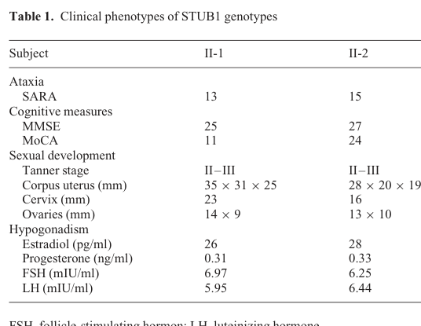

## Question

# Disease Characteristics Research Template

## Target Disease
- **Disease Name:** Cerebellar Ataxia-Hypogonadism Syndrome
- **MONDO ID:**  (if available)
- **Category:** Mendelian

## Research Objectives

Please provide a comprehensive research report on **Cerebellar Ataxia-Hypogonadism Syndrome** covering all of the
disease characteristics listed below. This report will be used to populate a disease knowledge
base entry. Be thorough and cite primary literature (PMID preferred) for all claims.

For each section, **suggested databases/resources** are listed. These are the first places
you should search for information on each topic.

---

### 1. Disease Information
> **Search first:** OMIM, Orphanet, ICD-10/ICD-11, MeSH, PubMed

- What is the disease? Provide a concise overview.
- What are the key identifiers? (OMIM, Orphanet, ICD-10/ICD-11, MeSH, Mondo)
- What are the common synonyms and alternative names?
- Is the information derived from individual patients (e.g., EHR) or aggregated disease-level resources?

### 2. Etiology

- **Disease Causal Factors**: What are the primary causes? (genetic, environmental, infectious, mechanistic)
- **Risk Factors**:
  > **Search first:** PubMed, Cochrane Library, UpToDate, clinical guidelines, ClinVar, ClinGen, GWAS Catalog, PheGenI, CTD, CDC, WHO, epidemiological databases
  - Genetic risk factors (causal variants, susceptibility loci, modifier genes)
  - Environmental risk factors (toxins, lifestyle, occupational exposures, age, sex, family history)
- **Protective Factors**:
  > **Search first:** PubMed, Cochrane Library, clinical trial databases, GWAS Catalog, gnomAD, WHO, CDC, nutrition databases
  - Genetic protective factors (protective variants, modifier alleles)
  - Environmental protective factors (diet, lifestyle, exposures that reduce risk)
- **Gene-Environment Interactions**: How do genetic and environmental factors interact to influence disease?
  > **Search first:** CTD, PubMed, PheGenI, GxE databases

### 3. Phenotypes
> **Search first:** HPO (Human Phenotype Ontology), OMIM, Orphanet, PubMed, clinicaltrials.gov, MedDRA, SNOMED CT, DECIPHER, LOINC

For each phenotype, provide:
- **Phenotype type**: symptoms, clinical signs, physical manifestations, behavioral changes, or laboratory abnormalities
  > For symptoms/signs: HPO, OMIM, Orphanet, PubMed
  > For behavioral changes: HPO, DSM, RDoC (Research Domain Criteria), PubMed
  > For laboratory abnormalities: LOINC, SNOMED CT, LabTests Online, PubMed
- **Phenotype characteristics**:
  > **Search first:** OMIM, Orphanet, HPO, PubMed
  - Age of symptom onset (neonatal, childhood, adult-onset, late-onset)
  - Symptom severity (mild, moderate, severe, variable)
  - Symptom progression (stable, progressive, episodic, fluctuating)
  - Frequency among affected individuals (percentage or qualitative)
- **Quality of life impact**: Effects on daily functioning and well-being (per-phenotype when possible)
  > **Search first:** EQ-5D database, SF-36, WHO QOL databases, PubMed
- Suggest HPO (Human Phenotype Ontology) terms for each phenotype

### 4. Genetic/Molecular Information

- **Causal Genes**: Gene mutations or chromosomal abnormalities responsible for disease (gene symbols, OMIM IDs)
  > **Search first:** OMIM, ClinVar, HGMD, Ensembl, NCBI Gene
- **Pathogenic Variants**:
  - Affected genes (gene symbols, HGNC IDs)
    > **Search first:** OMIM, NCBI Gene, Ensembl, HGNC, UniProt, GeneCards
  - Variant classification (pathogenic, likely pathogenic, VUS per ACMG/AMP guidelines)
    > **Search first:** ClinVar, ClinGen, ACMG/AMP guidelines, VarSome
  - Variant type/class (missense, frameshift, nonsense, splice-site, structural)
  - Allele frequency in population databases
    > **Search first:** gnomAD, 1000 Genomes, ExAC, TOPMed, dbSNP
  - Somatic vs germline origin
    > **Search first:** COSMIC (somatic), ClinVar, ICGC, TCGA
  - Functional consequences (loss of function, gain of function, dominant negative)
- **Modifier Genes**: Genes that modify disease severity or expression
- **Epigenetic Information**: DNA methylation, histone modifications, chromatin changes affecting disease
  > **Search first:** ENCODE, Roadmap Epigenomics, MethBase, DiseaseMeth
- **Chromosomal Abnormalities**: Large-scale genetic changes (aneuploidy, translocations, inversions)
  > **Search first:** DECIPHER, ClinVar, ECARUCA, UCSC Genome Browser

### 5. Environmental Information

- **Environmental Factors**: Non-genetic contributing factors (toxins, radiation, pollution, occupational exposure)
  > **Search first:** CTD (Comparative Toxicogenomics Database), TOXNET, PubMed, EPA databases
- **Lifestyle Factors**: Behavioral factors (smoking, diet, exercise, alcohol consumption)
  > **Search first:** CDC databases, WHO, PubMed, NHANES
- **Infectious Agents**: If applicable, pathogens causing or triggering disease (bacteria, viruses, fungi, parasites)
  > **Search first:** NCBI Taxonomy, ViPR, BV-BRC, MicrobeDB, GIDEON

### 6. Mechanism / Pathophysiology

- **Molecular Pathways**: Specific signaling cascades or biochemical pathways involved (Wnt, MAPK, mTOR, PI3K-AKT, etc.)
  > **Search first:** KEGG, Reactome, WikiPathways, PathBank, BioCyc
- **Cellular Processes**: Cell-level mechanisms (apoptosis, autophagy, cell cycle dysregulation, inflammation, etc.)
  > **Search first:** Gene Ontology (GO), Reactome, KEGG, PubMed
- **Protein Dysfunction**: How protein structure or function is altered (misfolding, aggregation, loss of function, gain of function)
  > **Search first:** UniProt, PDB (Protein Data Bank), InterPro, Pfam, AlphaFold
- **Metabolic Changes**: Alterations in metabolic processes (energy metabolism, lipid metabolism, amino acid metabolism)
  > **Search first:** KEGG, BioCyc, HMDB (Human Metabolome Database), BRENDA
- **Immune System Involvement**: Role of immune response (autoimmunity, immunodeficiency, chronic inflammation)
  > **Search first:** ImmPort, Immunome Database, IEDB, Gene Ontology
- **Tissue Damage Mechanisms**: How tissues/ are injured (oxidative stress, ischemia, fibrosis, necrosis)
  > **Search first:** PubMed, Gene Ontology, Reactome
- **Biochemical Abnormalities**: Specific molecular defects (enzyme deficiencies, receptor dysfunction, ion channel defects)
  > **Search first:** BRENDA, UniProt, KEGG, OMIM, PubMed
- **Epigenetic Changes**: DNA methylation, histone modifications affecting gene expression in disease
  > **Search first:** ENCODE, Roadmap Epigenomics, MethBase, DiseaseMeth
- **Molecular Profiling** (if available):
  - Transcriptomics/gene expression changes
    > **Search first:** GEO (Gene Expression Omnibus), ArrayExpress, GTEx, Human Cell Atlas, SRA
  - Proteomics findings
    > **Search first:** PRIDE, ProteomeXchange, Human Protein Atlas, STRING, BioGRID
  - Metabolomics signatures
    > **Search first:** MetaboLights, Metabolomics Workbench, HMDB, METLIN
  - Lipidomics alterations
    > **Search first:** LIPID MAPS, SwissLipids, LipidHome, Metabolomics Workbench
  - Genomic structural features
    > **Search first:** UCSC Genome Browser, Ensembl, NCBI, dbVar, DGV
- **Advanced Technologies** (if applicable):
  - Single-cell analysis findings (cell-type specific mechanisms, cellular heterogeneity)
    > **Search first:** Human Cell Atlas, Single Cell Portal, GEO, CELLxGENE
  - Spatial transcriptomics findings
    > **Search first:** GEO, Spatial Research, Vizgen, 10x Genomics data
  - Multi-omics integration results
    > **Search first:** TCGA, ICGC, cBioPortal, LinkedOmics, PubMed
  - Functional genomics screens (CRISPR, RNAi)
    > **Search first:** DepMap, GenomeRNAi, PubMed, BioGRID ORCS

For each mechanism, describe:
- The causal chain from initial trigger to clinical manifestation
- Which mechanisms are upstream vs downstream
- What cell types and biological processes are involved
- Suggest GO terms for biological processes and CL terms for cell types

### 7. Anatomical Structures Affected

- **Organ Level**:
  - Primary organs directly affected
  - Secondary organ involvement (complications, secondary effects)
  - Body systems involved (cardiovascular, nervous, digestive, respiratory, endocrine, etc.)
  > **Search first:** Uberon, FMA (Foundational Model of Anatomy), OMIM, HPO, ICD-11, MeSH, SNOMED CT
- **Tissue and Cell Level**:
  - Specific tissue types affected (epithelial, connective, muscle, nervous)
  - Specific cell populations targeted (with Cell Ontology terms)
  > **Search first:** Uberon, Human Protein Atlas, Cell Ontology, Human Cell Atlas, CellMarker, PanglaoDB
- **Subcellular Level**:
  - Cellular compartments involved (mitochondria, nucleus, ER, lysosomes) (with GO Cellular Component terms)
  > **Search first:** Gene Ontology (Cellular Component), UniProt, Human Protein Atlas
- **Localization**:
  - Specific anatomical sites (with UBERON terms)
    > **Search first:** FMA, Uberon, NeuroNames (for brain), SNOMED CT
  - Lateralization (unilateral, bilateral, asymmetric)
    > **Search first:** HPO, clinical literature, imaging databases

### 8. Temporal Development

- **Onset**:
  - Typical age of onset (congenital, pediatric, adult, geriatric)
  - Onset pattern (acute, subacute, chronic, insidious)
  > **Search first:** OMIM, Orphanet, HPO, PubMed
- **Progression**:
  - Disease stages (early, intermediate, advanced, end-stage)
    > **Search first:** Cancer Staging Manual (AJCC), WHO classifications, PubMed
  - Progression rate (rapid, slow, variable)
  - Disease course pattern (episodic, relapsing-remitting, progressive, stable)
  - Disease duration (self-limited, chronic lifelong)
  > **Search first:** Disease registries, longitudinal cohort databases, natural history studies, PubMed, Orphanet, OMIM
- **Patterns**:
  - Remission patterns (spontaneous, treatment-induced)
    > **Search first:** Clinical trial databases, disease registries, PubMed
  - Critical periods (time windows of vulnerability or opportunity for intervention)
    > **Search first:** PubMed, developmental biology databases, clinical guidelines

### 9. Inheritance and Population

- **Epidemiology**:
  - Prevalence (cases per 100,000 at given time)
  - Incidence (new cases per 100,000 per year)
  > **Search first:** Orphanet, CDC, WHO, GBD (Global Burden of Disease), national registries, SEER, disease registries
- **For Genetic Etiology**:
  - Inheritance pattern (AD, AR, X-linked, mitochondrial, multifactorial, polygenic)
    > **Search first:** OMIM, Orphanet, ClinVar, GTR (Genetic Testing Registry)
  - Penetrance (complete, incomplete, age-dependent)
    > **Search first:** ClinVar, OMIM, PubMed, ClinGen
  - Expressivity (variable, consistent)
    > **Search first:** OMIM, ClinVar, PubMed
  - Genetic anticipation (increasing severity in successive generations)
    > **Search first:** OMIM, PubMed (especially for repeat expansion disorders)
  - Germline mosaicism
    > **Search first:** ClinVar, OMIM, genetic counseling literature, PubMed
  - Founder effects (population-specific mutations)
    > **Search first:** gnomAD, population genetics databases, PubMed
  - Consanguinity role
    > **Search first:** OMIM, population studies, genetic counseling resources
  - Carrier frequency
    > **Search first:** gnomAD, carrier screening databases, GeneReviews, GTR
- **Population Demographics**:
  - Affected populations (ethnic or demographic groups with higher prevalence)
    > **Search first:** gnomAD, 1000 Genomes, PAGE Study, PubMed, population registries
  - Geographic distribution (endemic areas, regional variation)
    > **Search first:** WHO, CDC, GBD, Orphanet, geographic epidemiology databases
  - Geographic distribution of specific variants
  - Sex ratio (male:female)
    > **Search first:** Disease registries, OMIM, PubMed, epidemiological databases
  - Age distribution of affected individuals
    > **Search first:** CDC, disease registries, SEER, Orphanet

### 10. Diagnostics

- **Clinical Tests**:
  - Laboratory tests (blood, urine, tissue chemistry, specific enzyme assays)
    > **Search first:** LOINC, LabTests Online, PubMed
  - Biomarkers (proteins, metabolites, genetic markers, circulating biomarkers)
    > **Search first:** FDA Biomarker List, BEST (Biomarkers, EndpointS, and other Tools), PubMed
  - Imaging studies (X-ray, CT, MRI, PET, ultrasound)
    > **Search first:** RadLex, DICOM, Radiopaedia, imaging databases
  - Functional tests (pulmonary function, cardiac stress tests)
    > **Search first:** LOINC, clinical guidelines, PubMed
  - Electrophysiology (EEG, EMG, ECG, nerve conduction studies)
    > **Search first:** LOINC, clinical neurophysiology databases, PubMed
  - Biopsy findings (histopathology, immunohistochemistry)
    > **Search first:** SNOMED CT, College of American Pathologists resources, PubMed
  - Pathology findings (microscopic examination)
    > **Search first:** SNOMED CT, Digital Pathology databases, PubMed
- **Genetic Testing**:
  > **Search first:** GTR (Genetic Testing Registry), GeneReviews, ClinGen
  - Overview of recommended genetic testing approach
  - Whole genome sequencing (WGS) utility
    > **Search first:** GTR, ClinVar, GEL (Genomics England), gnomAD
  - Whole exome sequencing (WES) utility
    > **Search first:** GTR, ClinVar, OMIM, GeneMatcher
  - Gene panels (which panels, which genes)
    > **Search first:** GTR, ClinVar, laboratory-specific databases
  - Single gene testing
    > **Search first:** GTR, ClinVar, OMIM, GeneReviews
  - Chromosomal microarray (CMA)
    > **Search first:** DECIPHER, ClinVar, dbVar, ECARUCA
  - Karyotyping
    > **Search first:** Chromosome Abnormality Database, ClinVar, cytogenetics resources
  - FISH
    > **Search first:** ClinVar, cytogenetics databases, PubMed
  - Mitochondrial DNA testing
    > **Search first:** MITOMAP, MSeqDR, ClinVar, GTR
  - Repeat expansion testing
    > **Search first:** GTR, ClinVar, repeat expansion databases, PubMed
- **Omics-Based Diagnostics** (if applicable):
  - RNA sequencing / transcriptomics
    > **Search first:** GEO, ArrayExpress, GTEx, RNA-seq databases
  - Proteomics
    > **Search first:** PRIDE, ProteomeXchange, FDA Biomarker database
  - Metabolomics
    > **Search first:** MetaboLights, Metabolomics Workbench, HMDB
  - Epigenomics
    > **Search first:** GEO, ENCODE, Roadmap Epigenomics, MethBase
  - Liquid biopsy
    > **Search first:** COSMIC, ClinVar, liquid biopsy databases, PubMed
- **Clinical Criteria**:
  - Standardized diagnostic criteria (DSM, ICD, society guidelines)
    > **Search first:** DSM-5, ICD-11, clinical society guidelines, UpToDate
  - Differential diagnosis (other conditions to rule out, with distinguishing features)
    > **Search first:** DynaMed, UpToDate, clinical decision support systems
- **Screening**:
  - Screening methods for asymptomatic individuals (newborn screening, carrier screening, cascade screening)
    > **Search first:** ACMG recommendations, CDC newborn screening, GTR

### 11. Outcome/Prognosis

- **Survival and Mortality**:
  - Survival rate (5-year, 10-year, overall)
    > **Search first:** SEER, cancer registries, disease-specific registries, PubMed
  - Life expectancy (with and without treatment if applicable)
    > **Search first:** Orphanet, disease registries, actuarial databases, PubMed
  - Mortality rate
    > **Search first:** CDC, WHO, GBD, national mortality databases
  - Disease-specific mortality (deaths directly attributable to disease)
    > **Search first:** Disease registries, CDC Wonder, GBD, PubMed
- **Morbidity and Function**:
  - Morbidity (disease-related disability and health impacts)
    > **Search first:** GBD, WHO, disability databases, PubMed
  - Disability outcomes (long-term functional impairments)
    > **Search first:** ICF (International Classification of Functioning), disability registries
  - Quality of life measures (EQ-5D, SF-36, PROMIS, disease-specific tools)
    > **Search first:** EQ-5D database, SF-36, PROMIS, PubMed
- **Disease Course**:
  - Complications (secondary problems: infections, organ failure, etc.)
    > **Search first:** ICD codes, disease registries, clinical databases, PubMed
  - Recovery potential (likelihood and extent of recovery, with vs without treatment)
    > **Search first:** Natural history studies, rehabilitation databases, PubMed
- **Prediction**:
  - Prognostic factors (age, disease severity, biomarkers, treatment response)
    > **Search first:** Prognostic models databases, clinical calculators, PubMed
  - Prognostic biomarkers (molecular markers predicting disease course)
    > **Search first:** FDA Biomarker database, PubMed, cancer prognostic databases

### 12. Treatment

- **Pharmacotherapy**:
  - Pharmacological treatments (drug names, drug classes, mechanisms of action)
    > **Search first:** DrugBank, RxNorm, ATC classification, DailyMed, FDA databases
  - Pharmacogenomics (how genetic variants affect drug metabolism, efficacy, toxicity)
    > **Search first:** PharmGKB, CPIC (Clinical Pharmacogenetics), FDA Table of PGx Biomarkers
- **Advanced Therapeutics**:
  - Gene therapy (viral vectors, CRISPR, gene replacement, gene editing)
    > **Search first:** ClinicalTrials.gov, FDA gene therapy database, ASGCT resources
  - Cell therapy (stem cell transplant, CAR-T, cellular therapeutics)
    > **Search first:** ClinicalTrials.gov, FDA cell therapy database, FACT standards
  - RNA-based therapies (ASOs, siRNA, mRNA therapies)
    > **Search first:** ClinicalTrials.gov, FDA approvals, PubMed
  - Targeted therapies (treatments directed at specific molecular targets)
    > **Search first:** My Cancer Genome, OncoKB, ClinicalTrials.gov, FDA approvals
  - Immunotherapies (checkpoint inhibitors, monoclonal antibodies)
    > **Search first:** Cancer Immunotherapy Database, FDA approvals, ClinicalTrials.gov
- **Surgical and Interventional**:
  - Surgical interventions (types of surgery, timing, outcomes)
    > **Search first:** CPT codes, surgical registries, clinical guidelines, PubMed
- **Supportive and Rehabilitative**:
  - Supportive care (symptom management, pain control, nutrition)
    > **Search first:** Clinical guidelines, Cochrane Library, PubMed
  - Rehabilitation (physical therapy, occupational therapy, speech therapy)
    > **Search first:** Rehabilitation medicine databases, clinical guidelines, PubMed
- **Experimental**:
  - Experimental treatments in clinical trials (with NCT identifiers if available)
    > **Search first:** ClinicalTrials.gov, EU Clinical Trials Register, WHO ICTRP
- **Treatment Outcomes**:
  - Treatment response rates
    > **Search first:** Clinical trial databases, FDA reviews, systematic reviews, PubMed
  - Side effects and adverse events
    > **Search first:** FDA Adverse Event Reporting System (FAERS), MedWatch, PubMed
- **Treatment Strategy**:
  - Treatment algorithms (clinical pathways, decision trees)
    > **Search first:** Clinical practice guidelines, NCCN Guidelines, UpToDate
  - Combination therapies
    > **Search first:** ClinicalTrials.gov, treatment guidelines, PubMed
  - Personalized medicine approaches (genotype-guided treatment)
    > **Search first:** My Cancer Genome, CIViC, PharmGKB, precision medicine databases

For each treatment, suggest MAXO (Medical Action Ontology) terms where applicable.

### 13. Prevention

- **Prevention Levels**:
  - Primary prevention (preventing disease occurrence: vaccination, risk factor modification)
    > **Search first:** CDC, WHO, USPSTF recommendations, Cochrane Library
  - Secondary prevention (early detection and treatment: screening programs, early intervention)
    > **Search first:** USPSTF, CDC screening guidelines, WHO
  - Tertiary prevention (preventing complications in those with disease)
    > **Search first:** Clinical guidelines, disease management protocols, PubMed
- **Immunization**: Vaccine strategies (if applicable)
  > **Search first:** CDC vaccine schedules, WHO immunization, FDA vaccine database
- **Screening and Early Detection**:
  - Screening programs (population-based: newborn screening, cancer screening)
    > **Search first:** CDC screening programs, USPSTF, cancer screening databases
  - Genetic screening (carrier screening, preimplantation genetic diagnosis, prenatal testing)
    > **Search first:** ACMG recommendations, ACOG guidelines, GTR
  - Risk stratification (identifying high-risk individuals for targeted prevention)
    > **Search first:** Risk prediction models, clinical calculators, PubMed
- **Behavioral Interventions**: Lifestyle modifications to reduce risk
  > **Search first:** CDC, WHO, behavioral intervention databases, Cochrane Library
- **Counseling**: Genetic counseling (risk assessment, family planning guidance)
  > **Search first:** NSGC resources, ACMG guidelines, GeneReviews
- **Public Health**:
  - Public health interventions (sanitation, vector control, health education)
    > **Search first:** CDC, WHO, public health databases, PubMed
  - Environmental interventions (reducing environmental risk factors)
    > **Search first:** EPA databases, WHO environmental health, PubMed
- **Prophylaxis**: Preventive medications or procedures
  > **Search first:** Clinical guidelines, FDA approvals, PubMed

### 14. Other Species / Natural Disease

- **Taxonomy**: Species affected (with NCBI Taxon identifiers)
  > **Search first:** NCBI Taxonomy
- **Breed**: Specific breeds affected (with VBO identifiers if applicable)
  > **Search first:** VBO (Vertebrate Breed Ontology)
- **Gene**: Orthologous genes in other species (with NCBI Gene IDs)
  > **Search first:** NCBI Gene
- **Natural Disease**:
  - Naturally occurring disease in other species (companion animals, wildlife)
    > **Search first:** OMIA (Online Mendelian Inheritance in Animals), VetCompass, PubMed
  - Veterinary relevance and importance in animal health
    > **Search first:** OMIA, veterinary databases, PubMed
- **Comparative Biology**:
  - Comparative pathology (similarities and differences across species)
    > **Search first:** OMIA, comparative pathology databases, PubMed
  - Evolutionary conservation of disease mechanisms
    > **Search first:** HomoloGene, OrthoMCL, Alliance of Genome Resources
- **Transmission** (if applicable):
  - Zoonotic potential
    > **Search first:** CDC zoonotic diseases, WHO zoonoses, GIDEON
  - Cross-species susceptibility
    > **Search first:** NCBI Taxonomy, veterinary databases, PubMed

### 15. Model Organisms

- **Model Types**:
  - Model organism type (mammalian, invertebrate, cellular, in vitro)
    > **Search first:** Alliance of Genome Resources, model organism databases
  - Specific model systems (mouse, rat, zebrafish, Drosophila, C. elegans, yeast, cell lines, organoids, iPSCs)
    > **Search first:** MGI, RGD, ZFIN, FlyBase, WormBase, SGD, ATCC, Cellosaurus
  - Induced models (drug treatment, surgical intervention, environmental manipulation)
    > **Search first:** MGI, model organism databases, PubMed
- **Genetic Models**:
  - Types available (knockout, knock-in, transgenic, conditional, humanized)
    > **Search first:** MGI, IMPC, KOMP, EuMMCR, IMSR
- **Model Characteristics**:
  - Phenotype recapitulation (how well model reproduces human disease features)
    > **Search first:** Model organism databases, comparative studies, PubMed
  - Model limitations (aspects of human disease not captured)
    > **Search first:** Model organism databases, PubMed, review articles
- **Applications**:
  - Research applications (what aspects of disease can be studied)
    > **Search first:** Model organism databases, PubMed
- **Resources**:
  - Model databases
    > **Search first:** MGI, RGD, ZFIN, FlyBase, WormBase, IMSR, EMMA, MMRRC

---

## Citation Requirements

- Cite primary literature (PMID preferred) for all mechanistic and clinical claims
- Prioritize recent reviews and landmark papers
- Include direct quotes from abstracts where possible to support key statements
- Distinguish evidence source types: human clinical, model organism, in vitro, computational

## Output Format

Structure your response as a comprehensive narrative organized by the sections above.
For each section, provide:
- Factual content with specific details (numbers, percentages, gene names, variant nomenclature)
- Ontology term suggestions (HPO, GO, CL, UBERON, CHEBI, MAXO, MONDO) where applicable
- Evidence citations with PMIDs
- Direct quotes from abstracts to support key claims
- Clear indication when information is not available or not applicable for this disease

This report will be used to populate a disease knowledge base entry with:
- Pathophysiology descriptions with causal chains
- Gene/protein annotations (HGNC, GO terms)
- Phenotype associations (HP terms) with frequencies
- Cell type involvement (CL terms)
- Anatomical locations (UBERON terms)
- Chemical entities (CHEBI terms)
- Treatment annotations (MAXO terms)
- Evidence items with PMIDs and exact abstract quotes
- Epidemiology, prognosis, diagnostic, and prevention information
- Animal model descriptions with phenotype recapitulation details

## Output

Question: You are an expert researcher providing comprehensive, well-cited information.

Provide detailed information focusing on:
1. Key concepts and definitions with current understanding
2. Recent developments and latest research (prioritize 2023-2024 sources)
3. Current applications and real-world implementations
4. Expert opinions and analysis from authoritative sources
5. Relevant statistics and data from recent studies

Format as a comprehensive research report with proper citations. Include URLs and publication dates where available.
Always prioritize recent, authoritative sources and provide specific citations for all major claims.

# Disease Characteristics Research Template

## Target Disease
- **Disease Name:** Cerebellar Ataxia-Hypogonadism Syndrome
- **MONDO ID:**  (if available)
- **Category:** Mendelian

## Research Objectives

Please provide a comprehensive research report on **Cerebellar Ataxia-Hypogonadism Syndrome** covering all of the
disease characteristics listed below. This report will be used to populate a disease knowledge
base entry. Be thorough and cite primary literature (PMID preferred) for all claims.

For each section, **suggested databases/resources** are listed. These are the first places
you should search for information on each topic.

---

### 1. Disease Information
> **Search first:** OMIM, Orphanet, ICD-10/ICD-11, MeSH, PubMed

- What is the disease? Provide a concise overview.
- What are the key identifiers? (OMIM, Orphanet, ICD-10/ICD-11, MeSH, Mondo)
- What are the common synonyms and alternative names?
- Is the information derived from individual patients (e.g., EHR) or aggregated disease-level resources?

### 2. Etiology

- **Disease Causal Factors**: What are the primary causes? (genetic, environmental, infectious, mechanistic)
- **Risk Factors**:
  > **Search first:** PubMed, Cochrane Library, UpToDate, clinical guidelines, ClinVar, ClinGen, GWAS Catalog, PheGenI, CTD, CDC, WHO, epidemiological databases
  - Genetic risk factors (causal variants, susceptibility loci, modifier genes)
  - Environmental risk factors (toxins, lifestyle, occupational exposures, age, sex, family history)
- **Protective Factors**:
  > **Search first:** PubMed, Cochrane Library, clinical trial databases, GWAS Catalog, gnomAD, WHO, CDC, nutrition databases
  - Genetic protective factors (protective variants, modifier alleles)
  - Environmental protective factors (diet, lifestyle, exposures that reduce risk)
- **Gene-Environment Interactions**: How do genetic and environmental factors interact to influence disease?
  > **Search first:** CTD, PubMed, PheGenI, GxE databases

### 3. Phenotypes
> **Search first:** HPO (Human Phenotype Ontology), OMIM, Orphanet, PubMed, clinicaltrials.gov, MedDRA, SNOMED CT, DECIPHER, LOINC

For each phenotype, provide:
- **Phenotype type**: symptoms, clinical signs, physical manifestations, behavioral changes, or laboratory abnormalities
  > For symptoms/signs: HPO, OMIM, Orphanet, PubMed
  > For behavioral changes: HPO, DSM, RDoC (Research Domain Criteria), PubMed
  > For laboratory abnormalities: LOINC, SNOMED CT, LabTests Online, PubMed
- **Phenotype characteristics**:
  > **Search first:** OMIM, Orphanet, HPO, PubMed
  - Age of symptom onset (neonatal, childhood, adult-onset, late-onset)
  - Symptom severity (mild, moderate, severe, variable)
  - Symptom progression (stable, progressive, episodic, fluctuating)
  - Frequency among affected individuals (percentage or qualitative)
- **Quality of life impact**: Effects on daily functioning and well-being (per-phenotype when possible)
  > **Search first:** EQ-5D database, SF-36, WHO QOL databases, PubMed
- Suggest HPO (Human Phenotype Ontology) terms for each phenotype

### 4. Genetic/Molecular Information

- **Causal Genes**: Gene mutations or chromosomal abnormalities responsible for disease (gene symbols, OMIM IDs)
  > **Search first:** OMIM, ClinVar, HGMD, Ensembl, NCBI Gene
- **Pathogenic Variants**:
  - Affected genes (gene symbols, HGNC IDs)
    > **Search first:** OMIM, NCBI Gene, Ensembl, HGNC, UniProt, GeneCards
  - Variant classification (pathogenic, likely pathogenic, VUS per ACMG/AMP guidelines)
    > **Search first:** ClinVar, ClinGen, ACMG/AMP guidelines, VarSome
  - Variant type/class (missense, frameshift, nonsense, splice-site, structural)
  - Allele frequency in population databases
    > **Search first:** gnomAD, 1000 Genomes, ExAC, TOPMed, dbSNP
  - Somatic vs germline origin
    > **Search first:** COSMIC (somatic), ClinVar, ICGC, TCGA
  - Functional consequences (loss of function, gain of function, dominant negative)
- **Modifier Genes**: Genes that modify disease severity or expression
- **Epigenetic Information**: DNA methylation, histone modifications, chromatin changes affecting disease
  > **Search first:** ENCODE, Roadmap Epigenomics, MethBase, DiseaseMeth
- **Chromosomal Abnormalities**: Large-scale genetic changes (aneuploidy, translocations, inversions)
  > **Search first:** DECIPHER, ClinVar, ECARUCA, UCSC Genome Browser

### 5. Environmental Information

- **Environmental Factors**: Non-genetic contributing factors (toxins, radiation, pollution, occupational exposure)
  > **Search first:** CTD (Comparative Toxicogenomics Database), TOXNET, PubMed, EPA databases
- **Lifestyle Factors**: Behavioral factors (smoking, diet, exercise, alcohol consumption)
  > **Search first:** CDC databases, WHO, PubMed, NHANES
- **Infectious Agents**: If applicable, pathogens causing or triggering disease (bacteria, viruses, fungi, parasites)
  > **Search first:** NCBI Taxonomy, ViPR, BV-BRC, MicrobeDB, GIDEON

### 6. Mechanism / Pathophysiology

- **Molecular Pathways**: Specific signaling cascades or biochemical pathways involved (Wnt, MAPK, mTOR, PI3K-AKT, etc.)
  > **Search first:** KEGG, Reactome, WikiPathways, PathBank, BioCyc
- **Cellular Processes**: Cell-level mechanisms (apoptosis, autophagy, cell cycle dysregulation, inflammation, etc.)
  > **Search first:** Gene Ontology (GO), Reactome, KEGG, PubMed
- **Protein Dysfunction**: How protein structure or function is altered (misfolding, aggregation, loss of function, gain of function)
  > **Search first:** UniProt, PDB (Protein Data Bank), InterPro, Pfam, AlphaFold
- **Metabolic Changes**: Alterations in metabolic processes (energy metabolism, lipid metabolism, amino acid metabolism)
  > **Search first:** KEGG, BioCyc, HMDB (Human Metabolome Database), BRENDA
- **Immune System Involvement**: Role of immune response (autoimmunity, immunodeficiency, chronic inflammation)
  > **Search first:** ImmPort, Immunome Database, IEDB, Gene Ontology
- **Tissue Damage Mechanisms**: How tissues/ are injured (oxidative stress, ischemia, fibrosis, necrosis)
  > **Search first:** PubMed, Gene Ontology, Reactome
- **Biochemical Abnormalities**: Specific molecular defects (enzyme deficiencies, receptor dysfunction, ion channel defects)
  > **Search first:** BRENDA, UniProt, KEGG, OMIM, PubMed
- **Epigenetic Changes**: DNA methylation, histone modifications affecting gene expression in disease
  > **Search first:** ENCODE, Roadmap Epigenomics, MethBase, DiseaseMeth
- **Molecular Profiling** (if available):
  - Transcriptomics/gene expression changes
    > **Search first:** GEO (Gene Expression Omnibus), ArrayExpress, GTEx, Human Cell Atlas, SRA
  - Proteomics findings
    > **Search first:** PRIDE, ProteomeXchange, Human Protein Atlas, STRING, BioGRID
  - Metabolomics signatures
    > **Search first:** MetaboLights, Metabolomics Workbench, HMDB, METLIN
  - Lipidomics alterations
    > **Search first:** LIPID MAPS, SwissLipids, LipidHome, Metabolomics Workbench
  - Genomic structural features
    > **Search first:** UCSC Genome Browser, Ensembl, NCBI, dbVar, DGV
- **Advanced Technologies** (if applicable):
  - Single-cell analysis findings (cell-type specific mechanisms, cellular heterogeneity)
    > **Search first:** Human Cell Atlas, Single Cell Portal, GEO, CELLxGENE
  - Spatial transcriptomics findings
    > **Search first:** GEO, Spatial Research, Vizgen, 10x Genomics data
  - Multi-omics integration results
    > **Search first:** TCGA, ICGC, cBioPortal, LinkedOmics, PubMed
  - Functional genomics screens (CRISPR, RNAi)
    > **Search first:** DepMap, GenomeRNAi, PubMed, BioGRID ORCS

For each mechanism, describe:
- The causal chain from initial trigger to clinical manifestation
- Which mechanisms are upstream vs downstream
- What cell types and biological processes are involved
- Suggest GO terms for biological processes and CL terms for cell types

### 7. Anatomical Structures Affected

- **Organ Level**:
  - Primary organs directly affected
  - Secondary organ involvement (complications, secondary effects)
  - Body systems involved (cardiovascular, nervous, digestive, respiratory, endocrine, etc.)
  > **Search first:** Uberon, FMA (Foundational Model of Anatomy), OMIM, HPO, ICD-11, MeSH, SNOMED CT
- **Tissue and Cell Level**:
  - Specific tissue types affected (epithelial, connective, muscle, nervous)
  - Specific cell populations targeted (with Cell Ontology terms)
  > **Search first:** Uberon, Human Protein Atlas, Cell Ontology, Human Cell Atlas, CellMarker, PanglaoDB
- **Subcellular Level**:
  - Cellular compartments involved (mitochondria, nucleus, ER, lysosomes) (with GO Cellular Component terms)
  > **Search first:** Gene Ontology (Cellular Component), UniProt, Human Protein Atlas
- **Localization**:
  - Specific anatomical sites (with UBERON terms)
    > **Search first:** FMA, Uberon, NeuroNames (for brain), SNOMED CT
  - Lateralization (unilateral, bilateral, asymmetric)
    > **Search first:** HPO, clinical literature, imaging databases

### 8. Temporal Development

- **Onset**:
  - Typical age of onset (congenital, pediatric, adult, geriatric)
  - Onset pattern (acute, subacute, chronic, insidious)
  > **Search first:** OMIM, Orphanet, HPO, PubMed
- **Progression**:
  - Disease stages (early, intermediate, advanced, end-stage)
    > **Search first:** Cancer Staging Manual (AJCC), WHO classifications, PubMed
  - Progression rate (rapid, slow, variable)
  - Disease course pattern (episodic, relapsing-remitting, progressive, stable)
  - Disease duration (self-limited, chronic lifelong)
  > **Search first:** Disease registries, longitudinal cohort databases, natural history studies, PubMed, Orphanet, OMIM
- **Patterns**:
  - Remission patterns (spontaneous, treatment-induced)
    > **Search first:** Clinical trial databases, disease registries, PubMed
  - Critical periods (time windows of vulnerability or opportunity for intervention)
    > **Search first:** PubMed, developmental biology databases, clinical guidelines

### 9. Inheritance and Population

- **Epidemiology**:
  - Prevalence (cases per 100,000 at given time)
  - Incidence (new cases per 100,000 per year)
  > **Search first:** Orphanet, CDC, WHO, GBD (Global Burden of Disease), national registries, SEER, disease registries
- **For Genetic Etiology**:
  - Inheritance pattern (AD, AR, X-linked, mitochondrial, multifactorial, polygenic)
    > **Search first:** OMIM, Orphanet, ClinVar, GTR (Genetic Testing Registry)
  - Penetrance (complete, incomplete, age-dependent)
    > **Search first:** ClinVar, OMIM, PubMed, ClinGen
  - Expressivity (variable, consistent)
    > **Search first:** OMIM, ClinVar, PubMed
  - Genetic anticipation (increasing severity in successive generations)
    > **Search first:** OMIM, PubMed (especially for repeat expansion disorders)
  - Germline mosaicism
    > **Search first:** ClinVar, OMIM, genetic counseling literature, PubMed
  - Founder effects (population-specific mutations)
    > **Search first:** gnomAD, population genetics databases, PubMed
  - Consanguinity role
    > **Search first:** OMIM, population studies, genetic counseling resources
  - Carrier frequency
    > **Search first:** gnomAD, carrier screening databases, GeneReviews, GTR
- **Population Demographics**:
  - Affected populations (ethnic or demographic groups with higher prevalence)
    > **Search first:** gnomAD, 1000 Genomes, PAGE Study, PubMed, population registries
  - Geographic distribution (endemic areas, regional variation)
    > **Search first:** WHO, CDC, GBD, Orphanet, geographic epidemiology databases
  - Geographic distribution of specific variants
  - Sex ratio (male:female)
    > **Search first:** Disease registries, OMIM, PubMed, epidemiological databases
  - Age distribution of affected individuals
    > **Search first:** CDC, disease registries, SEER, Orphanet

### 10. Diagnostics

- **Clinical Tests**:
  - Laboratory tests (blood, urine, tissue chemistry, specific enzyme assays)
    > **Search first:** LOINC, LabTests Online, PubMed
  - Biomarkers (proteins, metabolites, genetic markers, circulating biomarkers)
    > **Search first:** FDA Biomarker List, BEST (Biomarkers, EndpointS, and other Tools), PubMed
  - Imaging studies (X-ray, CT, MRI, PET, ultrasound)
    > **Search first:** RadLex, DICOM, Radiopaedia, imaging databases
  - Functional tests (pulmonary function, cardiac stress tests)
    > **Search first:** LOINC, clinical guidelines, PubMed
  - Electrophysiology (EEG, EMG, ECG, nerve conduction studies)
    > **Search first:** LOINC, clinical neurophysiology databases, PubMed
  - Biopsy findings (histopathology, immunohistochemistry)
    > **Search first:** SNOMED CT, College of American Pathologists resources, PubMed
  - Pathology findings (microscopic examination)
    > **Search first:** SNOMED CT, Digital Pathology databases, PubMed
- **Genetic Testing**:
  > **Search first:** GTR (Genetic Testing Registry), GeneReviews, ClinGen
  - Overview of recommended genetic testing approach
  - Whole genome sequencing (WGS) utility
    > **Search first:** GTR, ClinVar, GEL (Genomics England), gnomAD
  - Whole exome sequencing (WES) utility
    > **Search first:** GTR, ClinVar, OMIM, GeneMatcher
  - Gene panels (which panels, which genes)
    > **Search first:** GTR, ClinVar, laboratory-specific databases
  - Single gene testing
    > **Search first:** GTR, ClinVar, OMIM, GeneReviews
  - Chromosomal microarray (CMA)
    > **Search first:** DECIPHER, ClinVar, dbVar, ECARUCA
  - Karyotyping
    > **Search first:** Chromosome Abnormality Database, ClinVar, cytogenetics resources
  - FISH
    > **Search first:** ClinVar, cytogenetics databases, PubMed
  - Mitochondrial DNA testing
    > **Search first:** MITOMAP, MSeqDR, ClinVar, GTR
  - Repeat expansion testing
    > **Search first:** GTR, ClinVar, repeat expansion databases, PubMed
- **Omics-Based Diagnostics** (if applicable):
  - RNA sequencing / transcriptomics
    > **Search first:** GEO, ArrayExpress, GTEx, RNA-seq databases
  - Proteomics
    > **Search first:** PRIDE, ProteomeXchange, FDA Biomarker database
  - Metabolomics
    > **Search first:** MetaboLights, Metabolomics Workbench, HMDB
  - Epigenomics
    > **Search first:** GEO, ENCODE, Roadmap Epigenomics, MethBase
  - Liquid biopsy
    > **Search first:** COSMIC, ClinVar, liquid biopsy databases, PubMed
- **Clinical Criteria**:
  - Standardized diagnostic criteria (DSM, ICD, society guidelines)
    > **Search first:** DSM-5, ICD-11, clinical society guidelines, UpToDate
  - Differential diagnosis (other conditions to rule out, with distinguishing features)
    > **Search first:** DynaMed, UpToDate, clinical decision support systems
- **Screening**:
  - Screening methods for asymptomatic individuals (newborn screening, carrier screening, cascade screening)
    > **Search first:** ACMG recommendations, CDC newborn screening, GTR

### 11. Outcome/Prognosis

- **Survival and Mortality**:
  - Survival rate (5-year, 10-year, overall)
    > **Search first:** SEER, cancer registries, disease-specific registries, PubMed
  - Life expectancy (with and without treatment if applicable)
    > **Search first:** Orphanet, disease registries, actuarial databases, PubMed
  - Mortality rate
    > **Search first:** CDC, WHO, GBD, national mortality databases
  - Disease-specific mortality (deaths directly attributable to disease)
    > **Search first:** Disease registries, CDC Wonder, GBD, PubMed
- **Morbidity and Function**:
  - Morbidity (disease-related disability and health impacts)
    > **Search first:** GBD, WHO, disability databases, PubMed
  - Disability outcomes (long-term functional impairments)
    > **Search first:** ICF (International Classification of Functioning), disability registries
  - Quality of life measures (EQ-5D, SF-36, PROMIS, disease-specific tools)
    > **Search first:** EQ-5D database, SF-36, PROMIS, PubMed
- **Disease Course**:
  - Complications (secondary problems: infections, organ failure, etc.)
    > **Search first:** ICD codes, disease registries, clinical databases, PubMed
  - Recovery potential (likelihood and extent of recovery, with vs without treatment)
    > **Search first:** Natural history studies, rehabilitation databases, PubMed
- **Prediction**:
  - Prognostic factors (age, disease severity, biomarkers, treatment response)
    > **Search first:** Prognostic models databases, clinical calculators, PubMed
  - Prognostic biomarkers (molecular markers predicting disease course)
    > **Search first:** FDA Biomarker database, PubMed, cancer prognostic databases

### 12. Treatment

- **Pharmacotherapy**:
  - Pharmacological treatments (drug names, drug classes, mechanisms of action)
    > **Search first:** DrugBank, RxNorm, ATC classification, DailyMed, FDA databases
  - Pharmacogenomics (how genetic variants affect drug metabolism, efficacy, toxicity)
    > **Search first:** PharmGKB, CPIC (Clinical Pharmacogenetics), FDA Table of PGx Biomarkers
- **Advanced Therapeutics**:
  - Gene therapy (viral vectors, CRISPR, gene replacement, gene editing)
    > **Search first:** ClinicalTrials.gov, FDA gene therapy database, ASGCT resources
  - Cell therapy (stem cell transplant, CAR-T, cellular therapeutics)
    > **Search first:** ClinicalTrials.gov, FDA cell therapy database, FACT standards
  - RNA-based therapies (ASOs, siRNA, mRNA therapies)
    > **Search first:** ClinicalTrials.gov, FDA approvals, PubMed
  - Targeted therapies (treatments directed at specific molecular targets)
    > **Search first:** My Cancer Genome, OncoKB, ClinicalTrials.gov, FDA approvals
  - Immunotherapies (checkpoint inhibitors, monoclonal antibodies)
    > **Search first:** Cancer Immunotherapy Database, FDA approvals, ClinicalTrials.gov
- **Surgical and Interventional**:
  - Surgical interventions (types of surgery, timing, outcomes)
    > **Search first:** CPT codes, surgical registries, clinical guidelines, PubMed
- **Supportive and Rehabilitative**:
  - Supportive care (symptom management, pain control, nutrition)
    > **Search first:** Clinical guidelines, Cochrane Library, PubMed
  - Rehabilitation (physical therapy, occupational therapy, speech therapy)
    > **Search first:** Rehabilitation medicine databases, clinical guidelines, PubMed
- **Experimental**:
  - Experimental treatments in clinical trials (with NCT identifiers if available)
    > **Search first:** ClinicalTrials.gov, EU Clinical Trials Register, WHO ICTRP
- **Treatment Outcomes**:
  - Treatment response rates
    > **Search first:** Clinical trial databases, FDA reviews, systematic reviews, PubMed
  - Side effects and adverse events
    > **Search first:** FDA Adverse Event Reporting System (FAERS), MedWatch, PubMed
- **Treatment Strategy**:
  - Treatment algorithms (clinical pathways, decision trees)
    > **Search first:** Clinical practice guidelines, NCCN Guidelines, UpToDate
  - Combination therapies
    > **Search first:** ClinicalTrials.gov, treatment guidelines, PubMed
  - Personalized medicine approaches (genotype-guided treatment)
    > **Search first:** My Cancer Genome, CIViC, PharmGKB, precision medicine databases

For each treatment, suggest MAXO (Medical Action Ontology) terms where applicable.

### 13. Prevention

- **Prevention Levels**:
  - Primary prevention (preventing disease occurrence: vaccination, risk factor modification)
    > **Search first:** CDC, WHO, USPSTF recommendations, Cochrane Library
  - Secondary prevention (early detection and treatment: screening programs, early intervention)
    > **Search first:** USPSTF, CDC screening guidelines, WHO
  - Tertiary prevention (preventing complications in those with disease)
    > **Search first:** Clinical guidelines, disease management protocols, PubMed
- **Immunization**: Vaccine strategies (if applicable)
  > **Search first:** CDC vaccine schedules, WHO immunization, FDA vaccine database
- **Screening and Early Detection**:
  - Screening programs (population-based: newborn screening, cancer screening)
    > **Search first:** CDC screening programs, USPSTF, cancer screening databases
  - Genetic screening (carrier screening, preimplantation genetic diagnosis, prenatal testing)
    > **Search first:** ACMG recommendations, ACOG guidelines, GTR
  - Risk stratification (identifying high-risk individuals for targeted prevention)
    > **Search first:** Risk prediction models, clinical calculators, PubMed
- **Behavioral Interventions**: Lifestyle modifications to reduce risk
  > **Search first:** CDC, WHO, behavioral intervention databases, Cochrane Library
- **Counseling**: Genetic counseling (risk assessment, family planning guidance)
  > **Search first:** NSGC resources, ACMG guidelines, GeneReviews
- **Public Health**:
  - Public health interventions (sanitation, vector control, health education)
    > **Search first:** CDC, WHO, public health databases, PubMed
  - Environmental interventions (reducing environmental risk factors)
    > **Search first:** EPA databases, WHO environmental health, PubMed
- **Prophylaxis**: Preventive medications or procedures
  > **Search first:** Clinical guidelines, FDA approvals, PubMed

### 14. Other Species / Natural Disease

- **Taxonomy**: Species affected (with NCBI Taxon identifiers)
  > **Search first:** NCBI Taxonomy
- **Breed**: Specific breeds affected (with VBO identifiers if applicable)
  > **Search first:** VBO (Vertebrate Breed Ontology)
- **Gene**: Orthologous genes in other species (with NCBI Gene IDs)
  > **Search first:** NCBI Gene
- **Natural Disease**:
  - Naturally occurring disease in other species (companion animals, wildlife)
    > **Search first:** OMIA (Online Mendelian Inheritance in Animals), VetCompass, PubMed
  - Veterinary relevance and importance in animal health
    > **Search first:** OMIA, veterinary databases, PubMed
- **Comparative Biology**:
  - Comparative pathology (similarities and differences across species)
    > **Search first:** OMIA, comparative pathology databases, PubMed
  - Evolutionary conservation of disease mechanisms
    > **Search first:** HomoloGene, OrthoMCL, Alliance of Genome Resources
- **Transmission** (if applicable):
  - Zoonotic potential
    > **Search first:** CDC zoonotic diseases, WHO zoonoses, GIDEON
  - Cross-species susceptibility
    > **Search first:** NCBI Taxonomy, veterinary databases, PubMed

### 15. Model Organisms

- **Model Types**:
  - Model organism type (mammalian, invertebrate, cellular, in vitro)
    > **Search first:** Alliance of Genome Resources, model organism databases
  - Specific model systems (mouse, rat, zebrafish, Drosophila, C. elegans, yeast, cell lines, organoids, iPSCs)
    > **Search first:** MGI, RGD, ZFIN, FlyBase, WormBase, SGD, ATCC, Cellosaurus
  - Induced models (drug treatment, surgical intervention, environmental manipulation)
    > **Search first:** MGI, model organism databases, PubMed
- **Genetic Models**:
  - Types available (knockout, knock-in, transgenic, conditional, humanized)
    > **Search first:** MGI, IMPC, KOMP, EuMMCR, IMSR
- **Model Characteristics**:
  - Phenotype recapitulation (how well model reproduces human disease features)
    > **Search first:** Model organism databases, comparative studies, PubMed
  - Model limitations (aspects of human disease not captured)
    > **Search first:** Model organism databases, PubMed, review articles
- **Applications**:
  - Research applications (what aspects of disease can be studied)
    > **Search first:** Model organism databases, PubMed
- **Resources**:
  - Model databases
    > **Search first:** MGI, RGD, ZFIN, FlyBase, WormBase, IMSR, EMMA, MMRRC

---

## Citation Requirements

- Cite primary literature (PMID preferred) for all mechanistic and clinical claims
- Prioritize recent reviews and landmark papers
- Include direct quotes from abstracts where possible to support key statements
- Distinguish evidence source types: human clinical, model organism, in vitro, computational

## Output Format

Structure your response as a comprehensive narrative organized by the sections above.
For each section, provide:
- Factual content with specific details (numbers, percentages, gene names, variant nomenclature)
- Ontology term suggestions (HPO, GO, CL, UBERON, CHEBI, MAXO, MONDO) where applicable
- Evidence citations with PMIDs
- Direct quotes from abstracts to support key claims
- Clear indication when information is not available or not applicable for this disease

This report will be used to populate a disease knowledge base entry with:
- Pathophysiology descriptions with causal chains
- Gene/protein annotations (HGNC, GO terms)
- Phenotype associations (HP terms) with frequencies
- Cell type involvement (CL terms)
- Anatomical locations (UBERON terms)
- Chemical entities (CHEBI terms)
- Treatment annotations (MAXO terms)
- Evidence items with PMIDs and exact abstract quotes
- Epidemiology, prognosis, diagnostic, and prevention information
- Animal model descriptions with phenotype recapitulation details

# Cerebellar Ataxia–Hypogonadism Syndrome (Gordon Holmes syndrome spectrum): comprehensive disease characteristics report

## Executive summary
Cerebellar ataxia–hypogonadism syndrome is a rare, genetically heterogeneous, Mendelian neurodegenerative–neuroendocrine disorder classically described as **Gordon Holmes syndrome (GHS)**, with a core association of progressive cerebellar ataxia and **hypogonadotropic hypogonadism (HH)** and frequent additional features such as cognitive decline/dementia and other movement disorders. Multiple genes converge on protein homeostasis/ubiquitin signaling (e.g., **RNF216, OTUD4, STUB1/CHIP**) or phospholipid metabolism (**PNPLA6**), producing overlapping syndromic entities such as GHS and **Boucher–Neuhauser syndrome (BNHS)** (ataxia–HH–chorioretinal dystrophy). Recent case reports (2023–2024) expand the phenotype (e.g., pituitary/white-matter imaging findings; endocrine-first presentations) and add mechanistic insight from new animal model work implicating microglia/neuroinflammation in RNF216-related disease. (shi2014ataxiaandhypogonadism pages 1-2, rochtus2024hypogonadotropichypogonadismas pages 1-2, george2024gordonholmessyndrome pages 1-2, nanetti2022multifacetedandagedependent pages 1-2)

---

## 1. Disease information

### 1.1 Definition and current understanding
**Gordon Holmes syndrome (GHS)** is defined in primary literature as a Mendelian neurodegenerative disorder characterized by **ataxia and hypogonadism** (“Gordon Holmes syndrome (GHS) is a rare Mendelian neurodegenerative disorder characterized by ataxia and hypogonadism.”). (shi2014ataxiaandhypogonadism pages 1-2)

A 2024 endocrine case report explicitly situates the disorder as a **neuroendocrine** condition in which HH may precede neurodegeneration and notes the phenotype combination “first described as Gordon Holmes syndrome.” (rochtus2024hypogonadotropichypogonadismas pages 1-2)

**Related/overlapping syndromes within the ataxia–hypogonadism spectrum** include:
- **Boucher–Neuhauser syndrome (BNHS/BNS)** (ataxia + HH + chorioretinal dystrophy) due to **PNPLA6** variants. (liampas2024twocasereports pages 5-8, deik2014compoundheterozygouspnpla6 pages 1-2)
- **4H syndrome** (hypodontia, hypomyelination, ataxia, hypogonadotropic hypogonadism) reported in association with **RNF216** and also POLR3-related leukodystrophy genes in differential lists. (wu2022gordonholmessyndrome pages 7-11, calandra2019gordonholmessyndrome pages 1-4)

### 1.2 Key identifiers and synonyms
- **OMIM/MIM:** The syndrome is labeled **Gordon Holmes syndrome, MIM #212840** in 2023 and 2024 sources. (kallupurakkal2023anovelmutation pages 1-2, rochtus2024hypogonadotropichypogonadismas pages 1-2)
- **BNHS MIM:** **Boucher–Neuhauser syndrome, MIM #215470**; **PNPLA6 gene, MIM #603197**. (deik2014compoundheterozygouspnpla6 pages 1-2)
- **Other curated identifiers (MONDO, Orphanet, MeSH, ICD-10/ICD-11):** Not present in the retrieved full-text evidence for this run; therefore not reported here. (No direct evidence found in provided corpus)

### 1.3 Synonyms / alternative names
- “Gordon Holmes syndrome” is used as the syndromic name for the ataxia–hypogonadism association; the broader entry term in many contexts is “ataxia–hypogonadotropic hypogonadism” (as used in clinical descriptions and titles). (alqwaifly2016ataxiaandhypogonadotropic pages 1-2, rochtus2024hypogonadotropichypogonadismas pages 1-2)

### 1.4 Evidence source type
The disease characterization in this report is derived from:
- **Primary human studies/case reports/series** (NEJM 2013; multiple 2014–2024 case reports and cohorts). (margolin2013ataxiadementiaand pages 9-11, kallupurakkal2023anovelmutation pages 1-2, celik2023anovelmutation pages 1-2, nanetti2022multifacetedandagedependent pages 1-2)
- **Model organism studies** (Rnf216 knockout mice; CHIP/STUB1 functional work and mouse phenotyping). (george2024gordonholmessyndrome pages 1-2, shi2014ataxiaandhypogonadism pages 1-2)

---

## 2. Etiology

### 2.1 Disease causal factors (genetic/mechanistic)
This is primarily a **genetic (Mendelian)** disorder with multiple causal genes:
- **RNF216** biallelic pathogenic variants cause a syndrome characterized by HH with neurodegeneration (ataxia ± chorea ± cognitive impairment), historically termed GHS. (rochtus2024hypogonadotropichypogonadismas pages 1-2)
- **STUB1 (CHIP)** biallelic variants can cause ataxia with HH consistent with GHS, attributed to impaired ubiquitin ligase activity and protein quality control. (shi2014ataxiaandhypogonadism pages 1-2)
- **PNPLA6** biallelic variants cause overlapping disorders including GHS and BNHS with endocrine and neuro-ophthalmologic manifestations. (nanetti2022multifacetedandagedependent pages 1-2, deik2014compoundheterozygouspnpla6 pages 1-2)

A key mechanistic theme is **disordered ubiquitination/protein homeostasis** in RNF216/OTUD4/STUB1-related disease. (margolin2013ataxiadementiaand pages 9-11, shi2014ataxiaandhypogonadism pages 1-2)

### 2.2 Risk factors
- **Genetic risk factors:** biallelic pathogenic variants in RNF216, STUB1, PNPLA6; in some families **digenic/oligogenic inheritance** has been reported (RNF216 with OTUD4; and other interacting genes in reviews). (margolin2013ataxiadementiaand pages 9-11, wu2022gordonholmessyndrome pages 1-4)
- **Family history/consanguinity:** multiple reports highlight homozygous variants and parental heterozygosity consistent with recessive inheritance; consanguinity is frequent in recessive ataxia syndromes and reported in PNPLA6 and RNF216 cases. (deik2014compoundheterozygouspnpla6 pages 1-2, calandra2019gordonholmessyndrome pages 1-4, canbek2024…>g pages 2-4)

- **Environmental risk factors:** not established in the retrieved evidence; one animal model paper notes that “compound mutations or environmental factors may worsen phenotype” as a general consideration rather than a proven interaction. (george2024gordonholmessyndrome pages 16-17)

### 2.3 Protective factors
No protective genetic or environmental factors were identified in the retrieved evidence. (No direct evidence found)

### 2.4 Gene–environment interactions
Not established in the retrieved evidence beyond speculative mention that environmental factors could modulate phenotype severity. (george2024gordonholmessyndrome pages 16-17)

---

## 3. Phenotypes

### 3.1 Core neurologic and endocrine phenotypes
Across the GHS spectrum, commonly reported features include:
- **Cerebellar ataxia** (gait instability, dysarthria, nystagmus) with cerebellar atrophy on MRI. (shi2014ataxiaandhypogonadism pages 1-2)
- **Hypogonadotropic hypogonadism** presenting as delayed/absent puberty, primary amenorrhea, low gonadotropins/sex steroids; HH may be an *initial* presentation in RNF216-related disease. (rochtus2024hypogonadotropichypogonadismas pages 1-2, alqwaifly2016ataxiaandhypogonadotropic pages 1-2)
- **Cognitive decline/dementia** is frequently described in RNF216-related and some STUB1-related disease. (margolin2013ataxiadementiaand pages 9-11, celik2023anovelmutation pages 1-2)
- Additional movement disorders can include **chorea**, **parkinsonism**, **dystonia**, and tremor in some cases. (rochtus2024hypogonadotropichypogonadismas pages 1-2, celik2023anovelmutation pages 1-2, kallupurakkal2023anovelmutation pages 1-2)

### 3.2 Phenotype frequency data (recent cohort statistics)
Because the term “Cerebellar ataxia–hypogonadism syndrome” encompasses multiple genes, the most quantitative frequency data in the retrieved corpus come from a PNPLA6 cohort:
- In **Nanetti et al. 2022** (probe-based panel screening of 292 ataxia/spastic paraplegia patients), PNPLA6 variants were found in **8/292 (2.7%)**; among these 8:
  - **Cerebellar ataxia:** 7/8
  - **Hypogonadotropic hypogonadism:** 5/8
  - **Cerebellar atrophy on MRI:** 6/8 (with vermian predominance)
  - **Peripheral axonal neuropathy:** 4/8
  - **Cognitive impairment:** 3/8
  - **Chorioretinal dystrophy:** 2/8
  - **Growth hormone deficiency:** 2/8
  - **Vestibular areflexia with reduced VVOR:** 1/8
  - **Natural history:** slow progression, with retained ambulation after a mean disease duration of 15 years. (nanetti2022multifacetedandagedependent pages 1-2)

BNHS-specific literature review frequency data (primarily visual phenotype) were summarized in a 2021 ophthalmic genetics report (review of molecularly confirmed PNPLA6-BNHS):
- **Chorioretinal dystrophy:** 96.4% in the reviewed BNHS cases.
- First presenting symptoms in their compiled cases included **delayed puberty 32.1%** and **ataxia 28.6%**. (dogan2021chorioretinaldystrophyhypogonadotropic pages 1-3)

### 3.3 Onset, severity, progression
- **RNF216-related GHS:** neurologic features often emerge in adolescence/young adulthood; HH may precede neurologic features and can be the presenting complaint (endocrine-first). (rochtus2024hypogonadotropichypogonadismas pages 1-2)
- **PNPLA6-related disease:** age-dependent manifestation is emphasized; in Nanetti et al. 2022, infantile/juvenile onset occurred in 6/8, with adult onset in 2/8, and symptom type varied by age (retinal symptoms early, HH juvenile, ataxia adult). (nanetti2022multifacetedandagedependent pages 1-2)

### 3.4 Quality-of-life impact
Direct QoL instrument data (EQ-5D, SF-36, PROMIS) were not identified in the retrieved evidence. Nonetheless, reported features imply substantial functional impact via progressive gait ataxia, endocrine dysfunction (pubertal failure/infertility), neurocognitive decline, and visual loss (in BNHS). (liampas2024twocasereports pages 5-8, rochtus2024hypogonadotropichypogonadismas pages 1-2, shi2014ataxiaandhypogonadism pages 1-2)

### 3.5 Suggested HPO terms (examples)
(These are ontology suggestions for curation; they are not claims of prevalence beyond the cited clinical evidence.)
- Cerebellar ataxia **HP:0001251**
- Dysarthria **HP:0001260**
- Nystagmus **HP:0000639** (incl. gaze-evoked)
- Cerebellar atrophy **HP:0001272**
- Hypogonadotropic hypogonadism **HP:0000046**
- Delayed puberty **HP:0000821** / Primary amenorrhea **HP:0000786**
- Cognitive impairment **HP:0100543** / Dementia **HP:0000726**
- Chorea **HP:0002072**
- White matter abnormalities / leukoencephalopathy **HP:0002500**
- Chorioretinal dystrophy **HP:0000602** / Vision loss **HP:0000572**
- Peripheral axonal neuropathy **HP:0003477**

---

## 4. Genetic / molecular information

### 4.1 Causal genes (current evidence-backed set)
Genes directly implicated in the retrieved primary literature include **RNF216, OTUD4 (digenic with RNF216), STUB1 (CHIP), PNPLA6**. (margolin2013ataxiadementiaand pages 9-11, shi2014ataxiaandhypogonadism pages 1-2, rochtus2024hypogonadotropichypogonadismas pages 1-2, nanetti2022multifacetedandagedependent pages 1-2)

Additional genes are listed as associated with ataxia–hypogonadism overlap (e.g., POLR3A/POLR3B/POLR1C in 4H syndrome context) but without variant-level evidence in the retrieved snippets. (calandra2019gordonholmessyndrome pages 1-4, wu2022gordonholmessyndrome pages 7-11)

### 4.2 Pathogenic variants and types (examples from evidence)
Representative variants reported in the retrieved evidence include:
- **RNF216:** splice-site (c.2061G>A), frameshift (c.1860_1861dupCT; c.591_592insTG), nonsense (c.1549C>T), missense (c.2042C>T p.P606L). (alqwaifly2016ataxiaandhypogonadotropic pages 1-2, celik2023anovelmutation pages 1-2, kallupurakkal2023anovelmutation pages 1-2, wu2022gordonholmessyndrome pages 7-11, calandra2019gordonholmessyndrome pages 1-4)
- **STUB1:** homozygous missense c.737C>T (p.Thr246Met) causing loss of ubiquitin ligase activity. (shi2014ataxiaandhypogonadism pages 1-2)
- **PNPLA6:** missense variants including c.3524C>G (p.Ser1175Cys), c.3323G>A (p.Arg1108Gln), c.3380C>G (p.Ser1127Cys). (dogan2021chorioretinaldystrophyhypogonadotropic pages 1-3, liampas2024twocasereports pages 1-5, canbek2024…>g pages 2-4)

Variant classification (ACMG) is reported variably; e.g., a 2024 PNPLA6 report presents p.Arg1108Gln as a VUS in that family context. (liampas2024twocasereports pages 5-8)

### 4.3 Functional consequences and pathways
- **RNF216** encodes an RBR-class **E3 ubiquitin ligase**, with pathogenic variants clustering in the RBR domain or C-terminal extension and presumed to disrupt E3 activity in GHS. (rochtus2024hypogonadotropichypogonadismas pages 1-2, wu2022gordonholmessyndrome pages 1-4)
- **STUB1/CHIP**: “CHIP plays a central role in regulating protein quality control” and the p.Thr246Met mutation causes “a loss of ubiquitin ligase activity,” linking impaired ubiquitination/proteostasis to ataxia and HH. (shi2014ataxiaandhypogonadism pages 1-2)
- **PNPLA6** encodes neuropathy target esterase (NTE), an ER-localized lysophospholipase; PNPLA6-related phenotypes span neurodegeneration, endocrine dysfunction, and retinal degeneration. (nanetti2022multifacetedandagedependent pages 1-2, deik2014compoundheterozygouspnpla6 pages 1-2)

### 4.4 Modifier genes / oligogenicity
A landmark human genetics study reported a **digenic/epistatic** interaction between **RNF216 and OTUD4**, with experimental support for more severe phenotypes after simultaneous knockdown, and noted the potential for **oligogenicity** to be increasingly recognized with exome sequencing. (margolin2013ataxiadementiaand pages 9-11)

A later review of RNF216-related cases reports both monogenic recessive and oligogenic patterns involving OTUD4 or other genes. (wu2022gordonholmessyndrome pages 1-4)

### 4.5 Epigenetics and chromosomal abnormalities
No disease-specific epigenetic mechanisms or recurrent chromosomal abnormalities were identified in the retrieved evidence. (No direct evidence found)

---

## 5. Environmental information
No established toxin, lifestyle, radiation, or infectious triggers were identified in the retrieved evidence as causal for this Mendelian syndrome, though phenotype variability may be influenced by non-genetic modifiers in principle. (george2024gordonholmessyndrome pages 16-17)

---

## 6. Mechanism / pathophysiology

### 6.1 Ubiquitin–proteasome / proteostasis mechanisms (RNF216, OTUD4, STUB1)
Primary human genetics and functional evidence link **disordered ubiquitination** to combined neurodegeneration and HH:
- NEJM 2013 describes neuroimaging (cerebellar/cortical atrophy and white-matter hyperintensities) and neuropathology featuring **ubiquitin-immunoreactive intranuclear inclusions**, implicating ubiquitin pathway dysfunction in the disease biology. (margolin2013ataxiadementiaand pages 9-11)
- STUB1/CHIP work demonstrates that introducing a disease mutation into CHIP leads to loss of E3 ubiquitin ligase activity, and notes that loss of CHIP function in mice causes behavioral and reproductive impairments mimicking human phenotypes. (shi2014ataxiaandhypogonadism pages 1-2)

**Causal chain (conceptual):** biallelic loss-of-function (or loss of critical E3 function) in ubiquitin pathway enzymes → impaired ubiquitination/protein quality control (and possibly autophagy regulation) → accumulation of toxic proteins/inclusions and neural circuit dysfunction → cerebellar and extra-cerebellar neurodegeneration (ataxia, cognitive decline, movement disorders) plus hypothalamic–pituitary–gonadal axis dysfunction (HH). (margolin2013ataxiadementiaand pages 9-11, shi2014ataxiaandhypogonadism pages 1-2, rochtus2024hypogonadotropichypogonadismas pages 1-2)

### 6.2 Neuroinflammation and microglia (recent 2024 model evidence)
A 2024 Rnf216 knockout mouse study reports **sex- and age-dependent microglial alterations** in hippocampus/cortex and proposes microglial activation/neuroinflammation as a mechanistic link preceding learning deficits; endocrine changes were also observed in males (elevated FSH, reduced inhibin B; increased IL‑1β). (george2024gordonholmessyndrome pages 16-17)

This work represents a recent development (2024) suggesting potential mechanistic intermediates (microglia, cytokine signaling) that may be upstream contributors to cognitive impairment in RNF216-related disease. (george2024gordonholmessyndrome pages 16-17)

### 6.3 Lipid/phospholipase biology (PNPLA6)
PNPLA6-associated ataxia–HH syndromes are linked to dysfunction of **neuropathy target esterase** (lysophospholipase/phospholipid metabolism) with multi-system involvement (cerebellum, retina, peripheral nerves, endocrine axes). (nanetti2022multifacetedandagedependent pages 1-2, deik2014compoundheterozygouspnpla6 pages 1-2)

### 6.4 Suggested GO biological process / cellular component terms (examples)
(ontology suggestions for curation)
- GO:0006511 **ubiquitin-dependent protein catabolic process**
- GO:0016567 **protein ubiquitination**
- GO:0006914 **autophagy** (for RNF216/STUB1-related discussions) (celik2023anovelmutation pages 1-2, shi2014ataxiaandhypogonadism pages 1-2)
- GO:0006954 **inflammatory response** / GO:0001775 **cell activation** (microglia-related) (george2024gordonholmessyndrome pages 16-17)
- GO cellular component: GO:0005783 **endoplasmic reticulum** (PNPLA6/NTE is ER-localized) (nanetti2022multifacetedandagedependent pages 1-2)

### 6.5 Suggested CL cell types (examples)
- Microglia **CL:0000129** (implicated in Rnf216 KO phenotypes) (george2024gordonholmessyndrome pages 16-17)
- Purkinje cell **CL:0000121** (relevant to cerebellar degeneration/ataxia; not directly measured in retrieved evidence)
- GnRH neuron **CL:0000543** (relevant to HH mechanism; endocrine physiology testing supports central HH) (margolin2013ataxiadementiaand pages 9-11, shi2014ataxiaandhypogonadism pages 1-2)

---

## 7. Anatomical structures affected

### 7.1 Organ/system level (evidence-backed)
- **Central nervous system:** cerebellum (cerebellar atrophy), cerebral cortex, and cerebral white matter (hyperintensities/leukoencephalopathy). (shi2014ataxiaandhypogonadism pages 1-2, margolin2013ataxiadementiaand pages 9-11, rochtus2024hypogonadotropichypogonadismas pages 1-2)
- **Endocrine/reproductive axis:** hypothalamic–pituitary–gonadal axis dysfunction causing HH; pituitary anomalies (e.g., hypoplastic posterior pituitary, partial empty sella) reported in some RNF216 cases. (rochtus2024hypogonadotropichypogonadismas pages 1-2, alqwaifly2016ataxiaandhypogonadotropic pages 1-2)
- **Eye/retina:** chorioretinal dystrophy in BNHS/BNS. (liampas2024twocasereports pages 5-8, dogan2021chorioretinaldystrophyhypogonadotropic pages 1-3)
- **Peripheral nervous system:** peripheral axonal neuropathy in PNPLA6 cohorts/cases. (nanetti2022multifacetedandagedependent pages 1-2, liampas2024twocasereports pages 1-5)

### 7.2 Suggested UBERON terms (examples)
- Cerebellum **UBERON:0002037**
- Cerebral cortex **UBERON:0000956**
- White matter **UBERON:0002319**
- Pituitary gland **UBERON:0000007**
- Retina **UBERON:0000966**
- Hypothalamus **UBERON:0001898**

### 7.3 Subcellular localization (from evidence)
- PNPLA6/NTE is described as **ER-localized** in the PNPLA6 cohort paper. (nanetti2022multifacetedandagedependent pages 1-2)

---

## 8. Temporal development
- **Onset:** often **adolescent/young adult** for RNF216 and classic GHS, but endocrine-first (pubertal delay) presentations are increasingly recognized. (rochtus2024hypogonadotropichypogonadismas pages 1-2)
- **Progression:** neurodegeneration is typically progressive; PNPLA6 cohort data indicate **slow progression** with preserved ambulation after long durations in many patients. (nanetti2022multifacetedandagedependent pages 1-2)
- **Course patterns:** generally chronic progressive; episodic/remitting patterns not described in retrieved evidence. (No direct evidence found)

---

## 9. Inheritance and population

### 9.1 Inheritance patterns
- Predominantly **autosomal recessive** with **biallelic** pathogenic variants (RNF216, STUB1, PNPLA6). (rochtus2024hypogonadotropichypogonadismas pages 1-2, shi2014ataxiaandhypogonadism pages 1-2, nanetti2022multifacetedandagedependent pages 1-2)
- **Digenic/oligogenic** inheritance is documented in RNF216-related disease (RNF216 with OTUD4; reported oligogenic fraction in a case-collection analysis). (margolin2013ataxiadementiaand pages 9-11, wu2022gordonholmessyndrome pages 1-4)

### 9.2 Population data (epidemiology)
No prevalence/incidence estimates were identified in the retrieved evidence. The condition is consistently described as rare, and available data are largely case-based or small cohorts. (shi2014ataxiaandhypogonadism pages 1-2, kallupurakkal2023anovelmutation pages 1-2)

### 9.3 Sex ratio and demographics
A review of RNF216-related disorders reported **male predominance** in the GHS subgroup compared with Huntington-like presentations and noted sex differences in pubertal development problems. (wu2022gordonholmessyndrome pages 1-4)

---

## 10. Diagnostics

### 10.1 Clinical testing (endocrine and neurologic)
Common diagnostic components include:
- **Endocrine labs:** gonadotropins (LH/FSH) and sex steroids (testosterone/estradiol); HH characterized by low/inappropriately normal LH/FSH with low sex steroids. (gonzalez‐latapi2021movementdisordersassociated pages 2-4, rochtus2024hypogonadotropichypogonadismas pages 1-2)
- **GnRH stimulation testing:** in STUB1-related GHS sisters, GnRH stimulation demonstrated pituitary responsiveness; imaging and hormone details are summarized in Shi et al. with tabulated data. (shi2014ataxiaandhypogonadism pages 1-2, shi2014ataxiaandhypogonadism media 6ceea760)

### 10.2 Imaging
- **Brain MRI:** cerebellar atrophy is a recurring feature (e.g., “remarkable atrophy of the cerebellum” in STUB1 sisters); white-matter hyperintensities/leukoencephalopathy and corpus callosum thinning have been reported particularly in RNF216-related disease. (shi2014ataxiaandhypogonadism pages 1-2, margolin2013ataxiadementiaand pages 9-11, calandra2019gordonholmessyndrome pages 1-4, rochtus2024hypogonadotropichypogonadismas pages 1-2)

### 10.3 Genetic testing approaches
- **WES / exome-based diagnosis:** used across multiple reports to identify homozygous/compound heterozygous variants in RNF216, STUB1, and PNPLA6. (shi2014ataxiaandhypogonadism pages 1-2, rochtus2024hypogonadotropichypogonadismas pages 1-2, liampas2024twocasereports pages 1-5)

### 10.4 Differential diagnosis
A 2024 PNPLA6-BNS case report lists differential diagnoses including **Gordon Holmes syndrome**, Woodhouse–Sakati syndrome, and mitochondrial disorders; BNS is distinguished by chorioretinal dystrophy and often absent/mild cognitive dysfunction. (liampas2024twocasereports pages 5-8)

---

## 11. Outcome / prognosis
Robust survival estimates were not identified in the retrieved evidence. Available natural history data suggest:
- **PNPLA6-associated disease** can show **slow progression** with long-term ambulation preserved in many patients (mean duration 15 years in one cohort). (nanetti2022multifacetedandagedependent pages 1-2)
- RNF216 and STUB1-related presentations may include substantial cognitive decline and multisystem complications in some families, implying variable but potentially severe outcomes. (celik2023anovelmutation pages 1-2, shi2014ataxiaandhypogonadism pages 1-2)

---

## 12. Treatment and current applications (real-world implementation)

### 12.1 Disease-modifying therapy
No disease-modifying therapy is described in the retrieved evidence for GHS/BNHS; management is largely supportive/symptom-directed. (liampas2024twocasereports pages 5-8)

### 12.2 Symptomatic and supportive care
Evidence-backed management elements include:
- **Hormone replacement/substitution** for HH to induce/maintain secondary sexual characteristics and menstruation/fertility planning (e.g., PNPLA6-related GHS case report describes hormone replacement establishing menstruation and secondary sexual features; RNF216 case series notes testosterone therapy improved secondary sexual characteristics but not neurologic signs). (canbek2024…>g pages 2-4, alqwaifly2016ataxiaandhypogonadotropic pages 1-2)
- **Multidisciplinary supportive care** for BNS: visual aids, speech/occupational/physiotherapy, genetic and psychosocial counseling. (liampas2024twocasereports pages 5-8)

### 12.3 Suggested MAXO terms (examples)
(ontology suggestions)
- Hormone replacement therapy **MAXO:0000647** (sex steroid replacement)
- Genetic counseling **MAXO:0000747**
- Physical therapy **MAXO:0000011**
- Occupational therapy **MAXO:0000010**
- Speech therapy **MAXO:0000129**
- Assistive devices for mobility/vision **MAXO:0000880** (broad)

---

## 13. Prevention
Primary prevention is not applicable for an inherited Mendelian disorder in the usual sense. Preventive strategies in practice focus on:
- **Genetic counseling** and family planning in affected families. (liampas2024twocasereports pages 5-8)
- **Cascade testing** of at-risk relatives (implied by carrier-parent findings in recessive families). (rochtus2024hypogonadotropichypogonadismas pages 1-2, liampas2024twocasereports pages 1-5)

---

## 14. Other species / natural disease
No naturally occurring non-human disease analogs were identified in the retrieved evidence. (No direct evidence found)

---

## 15. Model organisms

### 15.1 RNF216 models (2024 development)
A 2024 eNeuro study used **constitutive Rnf216 knockout mice** and found age- and sex-dependent abnormalities in learning strategies and microglia, providing a mechanistic foothold for RNF216-related GHS biology beyond descriptive genetics. (george2024gordonholmessyndrome pages 1-2, george2024gordonholmessyndrome pages 16-17)

### 15.2 STUB1/CHIP models
STUB1/CHIP functional work reports that CHIP loss of function in mice results in behavioral and reproductive impairments that mimic human ataxia and hypogonadism. (shi2014ataxiaandhypogonadism pages 1-2)

---

## Recent developments and expert analysis (prioritizing 2023–2024)
1. **2023 RNF216 case expansion:** A 2023 BMC Medical Genomics case report reiterates core GHS features and documents expanded movement-disorder manifestations (parkinsonism, dystonia) while emphasizing limited genotype–phenotype correlation. Publication date: May 2023; URL: https://doi.org/10.1186/s12920-023-01529-4. (celik2023anovelmutation pages 1-2)
2. **2023 BMJ Case Reports:** A 2023 BMJ Case Reports paper highlights clinical utility of recognizing hypogonadism to narrow ataxia differentials and links GHS to RNF216/OTUD4 ubiquitin-proteasome biology. Publication date: Nov 2023; URL: https://doi.org/10.1136/bcr-2023-256994. (kallupurakkal2023anovelmutation pages 1-2)
3. **2024 endocrine-first RNF216:** A 2024 JCEM Case Reports article stresses that HH may be the first manifestation, particularly in males, supporting earlier genetic evaluation in delayed puberty with suggestive imaging/neuro signs. Publication date: Oct 2024; URL: https://doi.org/10.1210/jcemcr/luae195. (rochtus2024hypogonadotropichypogonadismas pages 1-2)
4. **2024 mechanistic mouse work:** A 2024 eNeuro paper provides new mechanistic data implicating microglia/neuroinflammation and sex-specific neuroendocrine differences in Rnf216 deficiency. Publication date: Dec 2024; URL: https://doi.org/10.1523/eneuro.0074-23.2023. (george2024gordonholmessyndrome pages 1-2, george2024gordonholmessyndrome pages 16-17)
5. **2024 PNPLA6 case reports:** A 2024 Molecular Biology Reports paper reiterates lack of disease-modifying treatment and provides explicit management recommendations for BNS. Publication date: Apr 2024; URL: https://doi.org/10.1007/s11033-024-09515-4. (liampas2024twocasereports pages 5-8)

---

## Current applications and real-world implementations (registries/clinical research)
A broad rare-disease registry and natural history platform **CoRDS (Coordination of Rare Diseases at Sanford; NCT01793168)** is recruiting and includes rare hereditary ataxias among its condition list, providing an infrastructure for patient–researcher connection and longitudinal data collection (ClinicalTrials.gov first posted 2013-02-15; last update posted 2025-05-29). (NCT01793168 chunk 2, NCT01793168 chunk 3)

---

## Visual evidence from primary literature
Shi et al. (Human Molecular Genetics, 2014) provides a consolidated table and MRI/hormone stimulation figure for STUB1/CHIP-related GHS:
- Table with clinical scores and reproductive hormones/ultrasound findings (Table 1). (shi2014ataxiaandhypogonadism media 319d7677)
- MRI evidence of cerebellar atrophy and GnRH stimulation response curves (Figure 1). (shi2014ataxiaandhypogonadism media 6ceea760)
- Genetic analysis/pedigree identifying homozygous STUB1 p.Thr246Met and recessive inheritance (Figure 2). (shi2014ataxiaandhypogonadism media 8fe7f28b)

---

## Summary tables
| Gene | Syndrome label(s) in sources | Inheritance noted | Example variants (HGVS) reported in evidence | Core molecular function/pathway | Key clinical features/imaging from evidence | Key sources with year and DOI URL |
|---|---|---|---|---|---|---|
| **RNF216** | Gordon Holmes syndrome (GHS); RNF216-related disorder; also reported with Huntington-like disease, 4H syndrome, congenital hypogonadotropic hypogonadism | Usually autosomal recessive/monogenic biallelic; oligogenic/digenic cases also reported with **OTUD4** and **SRA1** | c.1860_1861dupCT (p.Cys621SerfsTer56); c.2061G>A (splice); c.1549C>T (p.R517X); c.591_592insTG (p.Gln198CysfsTer43); c.2042C>T (p.P606L) | RBR-class **E3 ubiquitin ligase**; ubiquitin-proteasome/autophagy pathway; E3 activity depends on RBR domain + C-terminal extension | Core phenotype: hypogonadotropic hypogonadism, cerebellar ataxia, cognitive decline/dementia, chorea/other movement disorders; MRI: cerebellar and cortical atrophy, cerebral white-matter hyperintensities/leukoencephalopathy, thin posterior corpus callosum; some pituitary anomalies (hypoplastic posterior pituitary, partial empty sella) (rochtus2024hypogonadotropichypogonadismas pages 1-2, alqwaifly2016ataxiaandhypogonadotropic pages 1-2, calandra2019gordonholmessyndrome pages 1-4, wu2022gordonholmessyndrome pages 7-11, wu2022gordonholmessyndrome pages 1-4, kallupurakkal2023anovelmutation pages 1-2, celik2023anovelmutation pages 1-2) | Rochtus 2024, https://doi.org/10.1210/jcemcr/luae195; Çelik 2023, https://doi.org/10.1186/s12920-023-01529-4; Kallupurakkal 2023, https://doi.org/10.1136/bcr-2023-256994; Alqwaifly 2016, https://doi.org/10.4081/ni.2016.6444; Calandra 2019, https://doi.org/10.1002/mdc3.12721; Wu 2022, https://doi.org/10.21203/rs.3.rs-1310364/v1 |
| **OTUD4** | GHS; RNF216/OTUD4 digenic form | Digenic/oligogenic with **RNF216** reported | Not specified in provided snippets | **Deubiquitinase**; disordered ubiquitination pathway | Included in GHS spectrum with ataxia, hypogonadotropic hypogonadism, dementia/cognitive decline; more severe phenotypes reported when combined with RNF216 dysfunction in source summaries (margolin2013ataxiadementiaand pages 9-11, alqwaifly2016ataxiaandhypogonadotropic pages 1-2, calandra2019gordonholmessyndrome pages 1-4, wu2022gordonholmessyndrome pages 7-11, george2024gordonholmessyndrome pages 16-17) | Margolin 2013, https://doi.org/10.1056/NEJMoa1215993; Alqwaifly 2016, https://doi.org/10.4081/ni.2016.6444; Wu 2022, https://doi.org/10.21203/rs.3.rs-1310364/v1 |
| **STUB1** (*CHIP*) | GHS; SCAR16/STUB1-related multisystemic neurodegeneration | Autosomal recessive/biallelic in reported GHS cases | c.737C>T (p.Thr246Met); c.194A>G (p.Asn65Ser); c.82G>A (p.Glu28Lys); c.430A>T (p.Lys144Ter) | Co-chaperone/**E3 ubiquitin ligase** in protein quality control/homeostasis | Cerebellar ataxia with hypogonadotropic hypogonadism; dysarthria, gaze-evoked nystagmus, severe dementia/cognitive impairment in some families; MRI: remarkable cerebellar atrophy; pituitary responsive to GnRH in reported sisters; broader multisystemic features can include spastic tetraparesis, epilepsy, autonomic dysfunction (shi2014ataxiaandhypogonadism pages 1-2, shi2014ataxiaandhypogonadism media 319d7677, shi2014ataxiaandhypogonadism media 6ceea760, shi2014ataxiaandhypogonadism media 8fe7f28b) | Shi 2014, https://doi.org/10.1093/hmg/ddt497; Hayer 2017, https://doi.org/10.1186/s13023-017-0580-x; Heimdal 2014, https://doi.org/10.1186/s13023-014-0146-0 |
| **PNPLA6** | Gordon Holmes syndrome (GH/GDHS); Boucher-Neuhauser syndrome (BNHS/BNS); also broader PNPLA6-related spectrum (SPG39, Oliver-McFarlane, Laurence-Moon) | Autosomal recessive/biallelic; often sibling cases; consanguinity common in several reports | c.3524C>G (p.Ser1175Cys); c.3323G>A (p.Arg1108Gln); c.3380C>G (p.Ser1127Cys); c.3847G>A (p.V1283M); c.3929A>T (p.D1310V) | Neuropathy target esterase (NTE); ER-localized **lysophospholipase/phospholipase esterase** | GHS/BNHS spectrum with cerebellar ataxia, hypogonadotropic hypogonadism, chorioretinal dystrophy/vision loss; additional features include peripheral axonal neuropathy, spasticity, growth hormone deficiency, cognitive impairment, vestibular areflexia; MRI often shows cerebellar atrophy, especially superior/dorsal vermis; progression may be slow with retained ambulation after long disease duration in some cohorts (nanetti2022multifacetedandagedependent pages 1-2, dogan2021chorioretinaldystrophyhypogonadotropic pages 1-3, nanetti2022multifacetedandagedependent pages 3-5, liampas2024twocasereports pages 5-8, liampas2024twocasereports pages 1-5, deik2014compoundheterozygouspnpla6 pages 1-2, canbek2024…>g pages 2-4, teive2018differentcerebellarataxia pages 5-6) | Nanetti 2022, https://doi.org/10.3389/fneur.2021.793547; Doğan 2021, https://doi.org/10.1080/13816810.2021.1894461; Liampas 2024, https://doi.org/10.1007/s11033-024-09515-4; Deik 2014, https://doi.org/10.1007/s00415-014-7516-3; Teive 2018, https://doi.org/10.1007/s12311-017-0909-y |
| **POLR3A / POLR3B / POLR1C** | 4H syndrome listed among ataxia-hypogonadism differential/overlap disorders | Not specified in provided snippets | Not specified in provided snippets | RNA polymerase III pathway (specific function not detailed in snippets) | Mentioned as genes associated with ataxia plus hypogonadism spectrum/4H overlap; no variant-level or imaging detail provided in the retrieved evidence snippets (calandra2019gordonholmessyndrome pages 1-4, wu2022gordonholmessyndrome pages 7-11, kallupurakkal2023anovelmutation pages 1-2, celik2023anovelmutation pages 1-2) | Calandra 2019, https://doi.org/10.1002/mdc3.12721; Wu 2022, https://doi.org/10.21203/rs.3.rs-1310364/v1; Kallupurakkal 2023, https://doi.org/10.1136/bcr-2023-256994 |

*Table: This table summarizes the principal genes implicated across the cerebellar ataxia–hypogonadism / Gordon Holmes syndrome spectrum, including inheritance models, representative variants, molecular functions, and phenotype/imaging findings supported by the retrieved evidence.*

---

## Key evidence-backed abstract quotes (verbatim)
- “Gordon Holmes syndrome (GHS) is a rare Mendelian neurodegenerative disorder characterized by ataxia and hypogonadism.” (Shi et al., 2014; https://doi.org/10.1093/hmg/ddt497) (shi2014ataxiaandhypogonadism pages 1-2)

---

## Evidence gaps / limitations
- Curated identifiers beyond MIM/OMIM (MONDO, Orphanet, MeSH, ICD-10/11) were not present in the retrieved evidence for this run; population prevalence/incidence and standardized diagnostic criteria were also not identified.
- Many “Cerebellar ataxia–hypogonadism” cases are genetically heterogeneous; phenotype frequencies depend strongly on the causal gene (e.g., RNF216 vs PNPLA6), so frequency statements are reported only where explicitly quantified in the cited sources (not generalized across the entire syndrome label). (nanetti2022multifacetedandagedependent pages 1-2, rochtus2024hypogonadotropichypogonadismas pages 1-2)

References

1. (shi2014ataxiaandhypogonadism pages 1-2): Chang-He Shi, Jonathan C. Schisler, Carrie E. Rubel, Song Tan, Bo Song, Holly McDonough, Lei Xu, Andrea L. Portbury, Cheng-Yuan Mao, Cadence True, Rui-Hao Wang, Qing-Zhi Wang, Shi-Lei Sun, Stephanie B. Seminara, Cam Patterson, and Yu-Ming Xu. Ataxia and hypogonadism caused by the loss of ubiquitin ligase activity of the u box protein chip. Human molecular genetics, 23 4:1013-24, Feb 2014. URL: https://doi.org/10.1093/hmg/ddt497, doi:10.1093/hmg/ddt497. This article has 153 citations and is from a domain leading peer-reviewed journal.

2. (rochtus2024hypogonadotropichypogonadismas pages 1-2): Anne Rochtus, Willeke Asscherickx, Marijke Timmers, Sascha Vermeer, and Leen Antonio. Hypogonadotropic hypogonadism as first presentation of the severe neuroendocrine disorder caused by rnf216. JCEM Case Reports, Oct 2024. URL: https://doi.org/10.1210/jcemcr/luae195, doi:10.1210/jcemcr/luae195. This article has 2 citations.

3. (george2024gordonholmessyndrome pages 1-2): Arlene J. George, Wei Wei, Dhanya N. Pyaram, Morgan Gomez, Nitheyaa Shree, Jayashree Kadirvelu, Hannah Lail, Desiree Wanders, Anne Z. Murphy, and Angela M. Mabb. Gordon holmes syndrome model mice exhibit alterations in microglia, age, and sex-specific disruptions in cognitive and proprioceptive function. eNeuro, 11:ENEURO.0074-23.2023, Dec 2024. URL: https://doi.org/10.1523/eneuro.0074-23.2023, doi:10.1523/eneuro.0074-23.2023. This article has 0 citations and is from a peer-reviewed journal.

4. (nanetti2022multifacetedandagedependent pages 1-2): Lorenzo Nanetti, Daniela Di Bella, Stefania Magri, Mario Fichera, Elisa Sarto, Anna Castaldo, Alessia Mongelli, Silvia Baratta, Silvia Fenu, Marco Moscatelli, Maria Teresa Bonati, Andrea Martinuzzi, Caterina Mariotti, and Franco Taroni. Multifaceted and age-dependent phenotypes associated with biallelic pnpla6 gene variants: eight novel cases and review of the literature. Frontiers in Neurology, Jan 2022. URL: https://doi.org/10.3389/fneur.2021.793547, doi:10.3389/fneur.2021.793547. This article has 18 citations and is from a peer-reviewed journal.

5. (liampas2024twocasereports pages 5-8): Andreas Liampas, Paschalis Nicolaou, Christina Votsi, Anthi Georghiou, Kyproula Christodoulou, George A Tanteles, and Marios Pantzaris. Two case reports of a novel missense mutation in the pnpla6 gene in two siblings with chorioretinal dystrophy, hypogonadotropic hypogonadism, and cerebellar ataxia. Molecular biology reports, 51 1:590, Apr 2024. URL: https://doi.org/10.1007/s11033-024-09515-4, doi:10.1007/s11033-024-09515-4. This article has 0 citations and is from a peer-reviewed journal.

6. (deik2014compoundheterozygouspnpla6 pages 1-2): A. Deik, Brooke Johannes, J. Rucker, E. Sánchez, S. Brodie, E. Deegan, K. Landy, Y. Kajiwara, S. Scelsa, R. Saunders-Pullman, R. Saunders-Pullman, and C. Paisán-Ruiz. Compound heterozygous pnpla6 mutations cause boucher–neuhäuser syndrome with late-onset ataxia. Journal of Neurology, 261:2411-2423, Sep 2014. URL: https://doi.org/10.1007/s00415-014-7516-3, doi:10.1007/s00415-014-7516-3. This article has 44 citations and is from a domain leading peer-reviewed journal.

7. (wu2022gordonholmessyndrome pages 7-11): Chujun Wu and Zaiqiang Zhang. Gordon holmes syndrome and huntington-like disease: two types of rnf216-related disorders. ArXiv, Feb 2022. URL: https://doi.org/10.21203/rs.3.rs-1310364/v1, doi:10.21203/rs.3.rs-1310364/v1. This article has 1 citations.

8. (calandra2019gordonholmessyndrome pages 1-4): Cristian R. Calandra, Yamile Mocarbel, Sebastian A. Vishnopolska, Vanessa Toneguzzo, Jaen Oliveri, Enrique Carlos Cazado, German Biagioli, Adrián G. Turjanksi, and Marcelo Marti. Gordon holmes syndrome caused by rnf216 novel mutation in 2 argentinean siblings. Movement Disorders Clinical Practice, 6:259-262, Mar 2019. URL: https://doi.org/10.1002/mdc3.12721, doi:10.1002/mdc3.12721. This article has 26 citations and is from a peer-reviewed journal.

9. (kallupurakkal2023anovelmutation pages 1-2): Arjun Bal Kallupurakkal, Rajesh Verma, and Rajarshi Chakraborty. A novel mutation in rnf216 gene in an indian case with gordon holmes syndrome. BMJ Case Reports, 16:e256994, Nov 2023. URL: https://doi.org/10.1136/bcr-2023-256994, doi:10.1136/bcr-2023-256994. This article has 6 citations and is from a peer-reviewed journal.

10. (alqwaifly2016ataxiaandhypogonadotropic pages 1-2): Mohammed Alqwaifly and Saeed Bohlega. Ataxia and hypogonadotropic hypogonadism with intrafamilial variability caused by rnf216 mutation. Neurology International, Jun 2016. URL: https://doi.org/10.4081/ni.2016.6444, doi:10.4081/ni.2016.6444. This article has 46 citations.

11. (margolin2013ataxiadementiaand pages 9-11): David H. Margolin, Maria Kousi, Yee-Ming Chan, Elaine T. Lim, Jeremy D. Schmahmann, Marios Hadjivassiliou, Janet E. Hall, Ibrahim Adam, Andrew Dwyer, Lacey Plummer, Stephanie V. Aldrin, Julia O'Rourke, Andrew Kirby, Kasper Lage, Aubrey Milunsky, Jeff M. Milunsky, Jennifer Chan, E. Tessa Hedley-Whyte, Mark J. Daly, Nicholas Katsanis, and Stephanie B. Seminara. Ataxia, dementia, and hypogonadotropism caused by disordered ubiquitination. New England Journal of Medicine, 368:1992-2003, May 2013. URL: https://doi.org/10.1056/nejmoa1215993, doi:10.1056/nejmoa1215993. This article has 268 citations and is from a highest quality peer-reviewed journal.

12. (celik2023anovelmutation pages 1-2): Nazlı Durmaz Çelik, Ebru Erzurumluoğlu, Serkan Özben, Uğur Toprak, Göknur Yorulmaz, Sevilhan Artan, and Serhat Özkan. A novel mutation in rnf216 gene in a turkish case with gordon holmes syndrome. BMC Medical Genomics, May 2023. URL: https://doi.org/10.1186/s12920-023-01529-4, doi:10.1186/s12920-023-01529-4. This article has 9 citations and is from a peer-reviewed journal.

13. (wu2022gordonholmessyndrome pages 1-4): Chujun Wu and Zaiqiang Zhang. Gordon holmes syndrome and huntington-like disease: two types of rnf216-related disorders. ArXiv, Feb 2022. URL: https://doi.org/10.21203/rs.3.rs-1310364/v1, doi:10.21203/rs.3.rs-1310364/v1. This article has 1 citations.

14. (canbek2024…>g pages 2-4): S Canbek and MG Şenol. … > g missense mutation in pnpla6 gene in a case of gordon holmes syndrome associated with hypogonadotropic hypogonadism, cerebellar ataxia, and juvenile type …. Unknown journal, 2024.

15. (george2024gordonholmessyndrome pages 16-17): Arlene J. George, Wei Wei, Dhanya N. Pyaram, Morgan Gomez, Nitheyaa Shree, Jayashree Kadirvelu, Hannah Lail, Desiree Wanders, Anne Z. Murphy, and Angela M. Mabb. Gordon holmes syndrome model mice exhibit alterations in microglia, age, and sex-specific disruptions in cognitive and proprioceptive function. eNeuro, 11:ENEURO.0074-23.2023, Dec 2024. URL: https://doi.org/10.1523/eneuro.0074-23.2023, doi:10.1523/eneuro.0074-23.2023. This article has 0 citations and is from a peer-reviewed journal.

16. (dogan2021chorioretinaldystrophyhypogonadotropic pages 1-3): Mustafa Doğan, Recep Eröz, and Emrah Öztürk. Chorioretinal dystrophy, hypogonadotropic hypogonadism, and cerebellar ataxia: boucher-neuhauser syndrome due to a homozygous (c.3524c>g (p.ser1175cys)) variant in pnpla6 gene. Ophthalmic Genetics, 42:276-282, Mar 2021. URL: https://doi.org/10.1080/13816810.2021.1894461, doi:10.1080/13816810.2021.1894461. This article has 12 citations and is from a peer-reviewed journal.

17. (liampas2024twocasereports pages 1-5): Andreas Liampas, Paschalis Nicolaou, Christina Votsi, Anthi Georghiou, Kyproula Christodoulou, George A Tanteles, and Marios Pantzaris. Two case reports of a novel missense mutation in the pnpla6 gene in two siblings with chorioretinal dystrophy, hypogonadotropic hypogonadism, and cerebellar ataxia. Molecular biology reports, 51 1:590, Apr 2024. URL: https://doi.org/10.1007/s11033-024-09515-4, doi:10.1007/s11033-024-09515-4. This article has 0 citations and is from a peer-reviewed journal.

18. (gonzalez‐latapi2021movementdisordersassociated pages 2-4): Paulina Gonzalez‐Latapi, Mario Sousa, and Anthony E. Lang. Movement disorders associated with hypogonadism. Movement Disorders Clinical Practice, 8:997-1011, Jul 2021. URL: https://doi.org/10.1002/mdc3.13308, doi:10.1002/mdc3.13308. This article has 17 citations and is from a peer-reviewed journal.

19. (shi2014ataxiaandhypogonadism media 6ceea760): Chang-He Shi, Jonathan C. Schisler, Carrie E. Rubel, Song Tan, Bo Song, Holly McDonough, Lei Xu, Andrea L. Portbury, Cheng-Yuan Mao, Cadence True, Rui-Hao Wang, Qing-Zhi Wang, Shi-Lei Sun, Stephanie B. Seminara, Cam Patterson, and Yu-Ming Xu. Ataxia and hypogonadism caused by the loss of ubiquitin ligase activity of the u box protein chip. Human molecular genetics, 23 4:1013-24, Feb 2014. URL: https://doi.org/10.1093/hmg/ddt497, doi:10.1093/hmg/ddt497. This article has 153 citations and is from a domain leading peer-reviewed journal.

20. (NCT01793168 chunk 2):  Rare Disease Patient Registry & Natural History Study - Coordination of Rare Diseases at Sanford. Sanford Health. 2010. ClinicalTrials.gov Identifier: NCT01793168

21. (NCT01793168 chunk 3):  Rare Disease Patient Registry & Natural History Study - Coordination of Rare Diseases at Sanford. Sanford Health. 2010. ClinicalTrials.gov Identifier: NCT01793168

22. (shi2014ataxiaandhypogonadism media 319d7677): Chang-He Shi, Jonathan C. Schisler, Carrie E. Rubel, Song Tan, Bo Song, Holly McDonough, Lei Xu, Andrea L. Portbury, Cheng-Yuan Mao, Cadence True, Rui-Hao Wang, Qing-Zhi Wang, Shi-Lei Sun, Stephanie B. Seminara, Cam Patterson, and Yu-Ming Xu. Ataxia and hypogonadism caused by the loss of ubiquitin ligase activity of the u box protein chip. Human molecular genetics, 23 4:1013-24, Feb 2014. URL: https://doi.org/10.1093/hmg/ddt497, doi:10.1093/hmg/ddt497. This article has 153 citations and is from a domain leading peer-reviewed journal.

23. (shi2014ataxiaandhypogonadism media 8fe7f28b): Chang-He Shi, Jonathan C. Schisler, Carrie E. Rubel, Song Tan, Bo Song, Holly McDonough, Lei Xu, Andrea L. Portbury, Cheng-Yuan Mao, Cadence True, Rui-Hao Wang, Qing-Zhi Wang, Shi-Lei Sun, Stephanie B. Seminara, Cam Patterson, and Yu-Ming Xu. Ataxia and hypogonadism caused by the loss of ubiquitin ligase activity of the u box protein chip. Human molecular genetics, 23 4:1013-24, Feb 2014. URL: https://doi.org/10.1093/hmg/ddt497, doi:10.1093/hmg/ddt497. This article has 153 citations and is from a domain leading peer-reviewed journal.

24. (nanetti2022multifacetedandagedependent pages 3-5): Lorenzo Nanetti, Daniela Di Bella, Stefania Magri, Mario Fichera, Elisa Sarto, Anna Castaldo, Alessia Mongelli, Silvia Baratta, Silvia Fenu, Marco Moscatelli, Maria Teresa Bonati, Andrea Martinuzzi, Caterina Mariotti, and Franco Taroni. Multifaceted and age-dependent phenotypes associated with biallelic pnpla6 gene variants: eight novel cases and review of the literature. Frontiers in Neurology, Jan 2022. URL: https://doi.org/10.3389/fneur.2021.793547, doi:10.3389/fneur.2021.793547. This article has 18 citations and is from a peer-reviewed journal.

25. (teive2018differentcerebellarataxia pages 5-6): Hélio Afonso Ghizoni Teive, Carlos Henrique F. Camargo, Mario Teruo Sato, Naoye Shiokawa, Cesar L. Boguszewski, Salmo Raskin, Cassandra Buck, Stephanie B. Seminara, and Renato Puppi Munhoz. Different cerebellar ataxia phenotypes associated with mutations of the pnpla6 gene in brazilian patients with recessive ataxias. The Cerebellum, 17:380-385, Dec 2018. URL: https://doi.org/10.1007/s12311-017-0909-y, doi:10.1007/s12311-017-0909-y. This article has 35 citations.

## Artifacts

- [Edison artifact artifact-00](Cerebellar_Ataxia-Hypogonadism_Syndrome-deep-research-falcon_artifacts/artifact-00.md)
