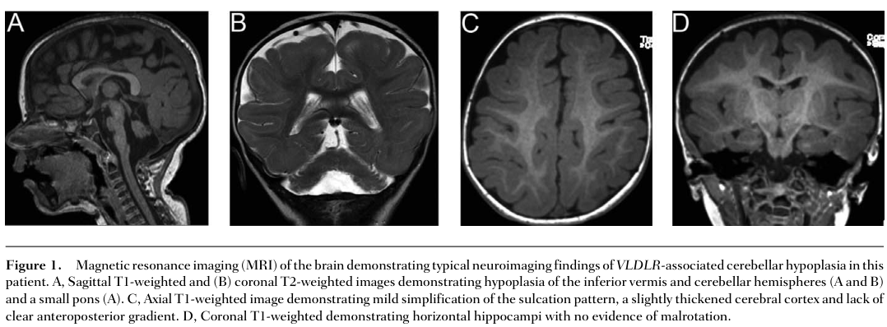

## Question

# Disease Characteristics Research Template

## Target Disease
- **Disease Name:** Cerebellar Ataxia, Intellectual Disability, and Dysequilibrium Syndrome
- **MONDO ID:**  (if available)
- **Category:** Mendelian

## Research Objectives

Please provide a comprehensive research report on **Cerebellar Ataxia, Intellectual Disability, and Dysequilibrium Syndrome** covering all of the
disease characteristics listed below. This report will be used to populate a disease knowledge
base entry. Be thorough and cite primary literature (PMID preferred) for all claims.

For each section, **suggested databases/resources** are listed. These are the first places
you should search for information on each topic.

---

### 1. Disease Information
> **Search first:** OMIM, Orphanet, ICD-10/ICD-11, MeSH, PubMed

- What is the disease? Provide a concise overview.
- What are the key identifiers? (OMIM, Orphanet, ICD-10/ICD-11, MeSH, Mondo)
- What are the common synonyms and alternative names?
- Is the information derived from individual patients (e.g., EHR) or aggregated disease-level resources?

### 2. Etiology

- **Disease Causal Factors**: What are the primary causes? (genetic, environmental, infectious, mechanistic)
- **Risk Factors**:
  > **Search first:** PubMed, Cochrane Library, UpToDate, clinical guidelines, ClinVar, ClinGen, GWAS Catalog, PheGenI, CTD, CDC, WHO, epidemiological databases
  - Genetic risk factors (causal variants, susceptibility loci, modifier genes)
  - Environmental risk factors (toxins, lifestyle, occupational exposures, age, sex, family history)
- **Protective Factors**:
  > **Search first:** PubMed, Cochrane Library, clinical trial databases, GWAS Catalog, gnomAD, WHO, CDC, nutrition databases
  - Genetic protective factors (protective variants, modifier alleles)
  - Environmental protective factors (diet, lifestyle, exposures that reduce risk)
- **Gene-Environment Interactions**: How do genetic and environmental factors interact to influence disease?
  > **Search first:** CTD, PubMed, PheGenI, GxE databases

### 3. Phenotypes
> **Search first:** HPO (Human Phenotype Ontology), OMIM, Orphanet, PubMed, clinicaltrials.gov, MedDRA, SNOMED CT, DECIPHER, LOINC

For each phenotype, provide:
- **Phenotype type**: symptoms, clinical signs, physical manifestations, behavioral changes, or laboratory abnormalities
  > For symptoms/signs: HPO, OMIM, Orphanet, PubMed
  > For behavioral changes: HPO, DSM, RDoC (Research Domain Criteria), PubMed
  > For laboratory abnormalities: LOINC, SNOMED CT, LabTests Online, PubMed
- **Phenotype characteristics**:
  > **Search first:** OMIM, Orphanet, HPO, PubMed
  - Age of symptom onset (neonatal, childhood, adult-onset, late-onset)
  - Symptom severity (mild, moderate, severe, variable)
  - Symptom progression (stable, progressive, episodic, fluctuating)
  - Frequency among affected individuals (percentage or qualitative)
- **Quality of life impact**: Effects on daily functioning and well-being (per-phenotype when possible)
  > **Search first:** EQ-5D database, SF-36, WHO QOL databases, PubMed
- Suggest HPO (Human Phenotype Ontology) terms for each phenotype

### 4. Genetic/Molecular Information

- **Causal Genes**: Gene mutations or chromosomal abnormalities responsible for disease (gene symbols, OMIM IDs)
  > **Search first:** OMIM, ClinVar, HGMD, Ensembl, NCBI Gene
- **Pathogenic Variants**:
  - Affected genes (gene symbols, HGNC IDs)
    > **Search first:** OMIM, NCBI Gene, Ensembl, HGNC, UniProt, GeneCards
  - Variant classification (pathogenic, likely pathogenic, VUS per ACMG/AMP guidelines)
    > **Search first:** ClinVar, ClinGen, ACMG/AMP guidelines, VarSome
  - Variant type/class (missense, frameshift, nonsense, splice-site, structural)
  - Allele frequency in population databases
    > **Search first:** gnomAD, 1000 Genomes, ExAC, TOPMed, dbSNP
  - Somatic vs germline origin
    > **Search first:** COSMIC (somatic), ClinVar, ICGC, TCGA
  - Functional consequences (loss of function, gain of function, dominant negative)
- **Modifier Genes**: Genes that modify disease severity or expression
- **Epigenetic Information**: DNA methylation, histone modifications, chromatin changes affecting disease
  > **Search first:** ENCODE, Roadmap Epigenomics, MethBase, DiseaseMeth
- **Chromosomal Abnormalities**: Large-scale genetic changes (aneuploidy, translocations, inversions)
  > **Search first:** DECIPHER, ClinVar, ECARUCA, UCSC Genome Browser

### 5. Environmental Information

- **Environmental Factors**: Non-genetic contributing factors (toxins, radiation, pollution, occupational exposure)
  > **Search first:** CTD (Comparative Toxicogenomics Database), TOXNET, PubMed, EPA databases
- **Lifestyle Factors**: Behavioral factors (smoking, diet, exercise, alcohol consumption)
  > **Search first:** CDC databases, WHO, PubMed, NHANES
- **Infectious Agents**: If applicable, pathogens causing or triggering disease (bacteria, viruses, fungi, parasites)
  > **Search first:** NCBI Taxonomy, ViPR, BV-BRC, MicrobeDB, GIDEON

### 6. Mechanism / Pathophysiology

- **Molecular Pathways**: Specific signaling cascades or biochemical pathways involved (Wnt, MAPK, mTOR, PI3K-AKT, etc.)
  > **Search first:** KEGG, Reactome, WikiPathways, PathBank, BioCyc
- **Cellular Processes**: Cell-level mechanisms (apoptosis, autophagy, cell cycle dysregulation, inflammation, etc.)
  > **Search first:** Gene Ontology (GO), Reactome, KEGG, PubMed
- **Protein Dysfunction**: How protein structure or function is altered (misfolding, aggregation, loss of function, gain of function)
  > **Search first:** UniProt, PDB (Protein Data Bank), InterPro, Pfam, AlphaFold
- **Metabolic Changes**: Alterations in metabolic processes (energy metabolism, lipid metabolism, amino acid metabolism)
  > **Search first:** KEGG, BioCyc, HMDB (Human Metabolome Database), BRENDA
- **Immune System Involvement**: Role of immune response (autoimmunity, immunodeficiency, chronic inflammation)
  > **Search first:** ImmPort, Immunome Database, IEDB, Gene Ontology
- **Tissue Damage Mechanisms**: How tissues/ are injured (oxidative stress, ischemia, fibrosis, necrosis)
  > **Search first:** PubMed, Gene Ontology, Reactome
- **Biochemical Abnormalities**: Specific molecular defects (enzyme deficiencies, receptor dysfunction, ion channel defects)
  > **Search first:** BRENDA, UniProt, KEGG, OMIM, PubMed
- **Epigenetic Changes**: DNA methylation, histone modifications affecting gene expression in disease
  > **Search first:** ENCODE, Roadmap Epigenomics, MethBase, DiseaseMeth
- **Molecular Profiling** (if available):
  - Transcriptomics/gene expression changes
    > **Search first:** GEO (Gene Expression Omnibus), ArrayExpress, GTEx, Human Cell Atlas, SRA
  - Proteomics findings
    > **Search first:** PRIDE, ProteomeXchange, Human Protein Atlas, STRING, BioGRID
  - Metabolomics signatures
    > **Search first:** MetaboLights, Metabolomics Workbench, HMDB, METLIN
  - Lipidomics alterations
    > **Search first:** LIPID MAPS, SwissLipids, LipidHome, Metabolomics Workbench
  - Genomic structural features
    > **Search first:** UCSC Genome Browser, Ensembl, NCBI, dbVar, DGV
- **Advanced Technologies** (if applicable):
  - Single-cell analysis findings (cell-type specific mechanisms, cellular heterogeneity)
    > **Search first:** Human Cell Atlas, Single Cell Portal, GEO, CELLxGENE
  - Spatial transcriptomics findings
    > **Search first:** GEO, Spatial Research, Vizgen, 10x Genomics data
  - Multi-omics integration results
    > **Search first:** TCGA, ICGC, cBioPortal, LinkedOmics, PubMed
  - Functional genomics screens (CRISPR, RNAi)
    > **Search first:** DepMap, GenomeRNAi, PubMed, BioGRID ORCS

For each mechanism, describe:
- The causal chain from initial trigger to clinical manifestation
- Which mechanisms are upstream vs downstream
- What cell types and biological processes are involved
- Suggest GO terms for biological processes and CL terms for cell types

### 7. Anatomical Structures Affected

- **Organ Level**:
  - Primary organs directly affected
  - Secondary organ involvement (complications, secondary effects)
  - Body systems involved (cardiovascular, nervous, digestive, respiratory, endocrine, etc.)
  > **Search first:** Uberon, FMA (Foundational Model of Anatomy), OMIM, HPO, ICD-11, MeSH, SNOMED CT
- **Tissue and Cell Level**:
  - Specific tissue types affected (epithelial, connective, muscle, nervous)
  - Specific cell populations targeted (with Cell Ontology terms)
  > **Search first:** Uberon, Human Protein Atlas, Cell Ontology, Human Cell Atlas, CellMarker, PanglaoDB
- **Subcellular Level**:
  - Cellular compartments involved (mitochondria, nucleus, ER, lysosomes) (with GO Cellular Component terms)
  > **Search first:** Gene Ontology (Cellular Component), UniProt, Human Protein Atlas
- **Localization**:
  - Specific anatomical sites (with UBERON terms)
    > **Search first:** FMA, Uberon, NeuroNames (for brain), SNOMED CT
  - Lateralization (unilateral, bilateral, asymmetric)
    > **Search first:** HPO, clinical literature, imaging databases

### 8. Temporal Development

- **Onset**:
  - Typical age of onset (congenital, pediatric, adult, geriatric)
  - Onset pattern (acute, subacute, chronic, insidious)
  > **Search first:** OMIM, Orphanet, HPO, PubMed
- **Progression**:
  - Disease stages (early, intermediate, advanced, end-stage)
    > **Search first:** Cancer Staging Manual (AJCC), WHO classifications, PubMed
  - Progression rate (rapid, slow, variable)
  - Disease course pattern (episodic, relapsing-remitting, progressive, stable)
  - Disease duration (self-limited, chronic lifelong)
  > **Search first:** Disease registries, longitudinal cohort databases, natural history studies, PubMed, Orphanet, OMIM
- **Patterns**:
  - Remission patterns (spontaneous, treatment-induced)
    > **Search first:** Clinical trial databases, disease registries, PubMed
  - Critical periods (time windows of vulnerability or opportunity for intervention)
    > **Search first:** PubMed, developmental biology databases, clinical guidelines

### 9. Inheritance and Population

- **Epidemiology**:
  - Prevalence (cases per 100,000 at given time)
  - Incidence (new cases per 100,000 per year)
  > **Search first:** Orphanet, CDC, WHO, GBD (Global Burden of Disease), national registries, SEER, disease registries
- **For Genetic Etiology**:
  - Inheritance pattern (AD, AR, X-linked, mitochondrial, multifactorial, polygenic)
    > **Search first:** OMIM, Orphanet, ClinVar, GTR (Genetic Testing Registry)
  - Penetrance (complete, incomplete, age-dependent)
    > **Search first:** ClinVar, OMIM, PubMed, ClinGen
  - Expressivity (variable, consistent)
    > **Search first:** OMIM, ClinVar, PubMed
  - Genetic anticipation (increasing severity in successive generations)
    > **Search first:** OMIM, PubMed (especially for repeat expansion disorders)
  - Germline mosaicism
    > **Search first:** ClinVar, OMIM, genetic counseling literature, PubMed
  - Founder effects (population-specific mutations)
    > **Search first:** gnomAD, population genetics databases, PubMed
  - Consanguinity role
    > **Search first:** OMIM, population studies, genetic counseling resources
  - Carrier frequency
    > **Search first:** gnomAD, carrier screening databases, GeneReviews, GTR
- **Population Demographics**:
  - Affected populations (ethnic or demographic groups with higher prevalence)
    > **Search first:** gnomAD, 1000 Genomes, PAGE Study, PubMed, population registries
  - Geographic distribution (endemic areas, regional variation)
    > **Search first:** WHO, CDC, GBD, Orphanet, geographic epidemiology databases
  - Geographic distribution of specific variants
  - Sex ratio (male:female)
    > **Search first:** Disease registries, OMIM, PubMed, epidemiological databases
  - Age distribution of affected individuals
    > **Search first:** CDC, disease registries, SEER, Orphanet

### 10. Diagnostics

- **Clinical Tests**:
  - Laboratory tests (blood, urine, tissue chemistry, specific enzyme assays)
    > **Search first:** LOINC, LabTests Online, PubMed
  - Biomarkers (proteins, metabolites, genetic markers, circulating biomarkers)
    > **Search first:** FDA Biomarker List, BEST (Biomarkers, EndpointS, and other Tools), PubMed
  - Imaging studies (X-ray, CT, MRI, PET, ultrasound)
    > **Search first:** RadLex, DICOM, Radiopaedia, imaging databases
  - Functional tests (pulmonary function, cardiac stress tests)
    > **Search first:** LOINC, clinical guidelines, PubMed
  - Electrophysiology (EEG, EMG, ECG, nerve conduction studies)
    > **Search first:** LOINC, clinical neurophysiology databases, PubMed
  - Biopsy findings (histopathology, immunohistochemistry)
    > **Search first:** SNOMED CT, College of American Pathologists resources, PubMed
  - Pathology findings (microscopic examination)
    > **Search first:** SNOMED CT, Digital Pathology databases, PubMed
- **Genetic Testing**:
  > **Search first:** GTR (Genetic Testing Registry), GeneReviews, ClinGen
  - Overview of recommended genetic testing approach
  - Whole genome sequencing (WGS) utility
    > **Search first:** GTR, ClinVar, GEL (Genomics England), gnomAD
  - Whole exome sequencing (WES) utility
    > **Search first:** GTR, ClinVar, OMIM, GeneMatcher
  - Gene panels (which panels, which genes)
    > **Search first:** GTR, ClinVar, laboratory-specific databases
  - Single gene testing
    > **Search first:** GTR, ClinVar, OMIM, GeneReviews
  - Chromosomal microarray (CMA)
    > **Search first:** DECIPHER, ClinVar, dbVar, ECARUCA
  - Karyotyping
    > **Search first:** Chromosome Abnormality Database, ClinVar, cytogenetics resources
  - FISH
    > **Search first:** ClinVar, cytogenetics databases, PubMed
  - Mitochondrial DNA testing
    > **Search first:** MITOMAP, MSeqDR, ClinVar, GTR
  - Repeat expansion testing
    > **Search first:** GTR, ClinVar, repeat expansion databases, PubMed
- **Omics-Based Diagnostics** (if applicable):
  - RNA sequencing / transcriptomics
    > **Search first:** GEO, ArrayExpress, GTEx, RNA-seq databases
  - Proteomics
    > **Search first:** PRIDE, ProteomeXchange, FDA Biomarker database
  - Metabolomics
    > **Search first:** MetaboLights, Metabolomics Workbench, HMDB
  - Epigenomics
    > **Search first:** GEO, ENCODE, Roadmap Epigenomics, MethBase
  - Liquid biopsy
    > **Search first:** COSMIC, ClinVar, liquid biopsy databases, PubMed
- **Clinical Criteria**:
  - Standardized diagnostic criteria (DSM, ICD, society guidelines)
    > **Search first:** DSM-5, ICD-11, clinical society guidelines, UpToDate
  - Differential diagnosis (other conditions to rule out, with distinguishing features)
    > **Search first:** DynaMed, UpToDate, clinical decision support systems
- **Screening**:
  - Screening methods for asymptomatic individuals (newborn screening, carrier screening, cascade screening)
    > **Search first:** ACMG recommendations, CDC newborn screening, GTR

### 11. Outcome/Prognosis

- **Survival and Mortality**:
  - Survival rate (5-year, 10-year, overall)
    > **Search first:** SEER, cancer registries, disease-specific registries, PubMed
  - Life expectancy (with and without treatment if applicable)
    > **Search first:** Orphanet, disease registries, actuarial databases, PubMed
  - Mortality rate
    > **Search first:** CDC, WHO, GBD, national mortality databases
  - Disease-specific mortality (deaths directly attributable to disease)
    > **Search first:** Disease registries, CDC Wonder, GBD, PubMed
- **Morbidity and Function**:
  - Morbidity (disease-related disability and health impacts)
    > **Search first:** GBD, WHO, disability databases, PubMed
  - Disability outcomes (long-term functional impairments)
    > **Search first:** ICF (International Classification of Functioning), disability registries
  - Quality of life measures (EQ-5D, SF-36, PROMIS, disease-specific tools)
    > **Search first:** EQ-5D database, SF-36, PROMIS, PubMed
- **Disease Course**:
  - Complications (secondary problems: infections, organ failure, etc.)
    > **Search first:** ICD codes, disease registries, clinical databases, PubMed
  - Recovery potential (likelihood and extent of recovery, with vs without treatment)
    > **Search first:** Natural history studies, rehabilitation databases, PubMed
- **Prediction**:
  - Prognostic factors (age, disease severity, biomarkers, treatment response)
    > **Search first:** Prognostic models databases, clinical calculators, PubMed
  - Prognostic biomarkers (molecular markers predicting disease course)
    > **Search first:** FDA Biomarker database, PubMed, cancer prognostic databases

### 12. Treatment

- **Pharmacotherapy**:
  - Pharmacological treatments (drug names, drug classes, mechanisms of action)
    > **Search first:** DrugBank, RxNorm, ATC classification, DailyMed, FDA databases
  - Pharmacogenomics (how genetic variants affect drug metabolism, efficacy, toxicity)
    > **Search first:** PharmGKB, CPIC (Clinical Pharmacogenetics), FDA Table of PGx Biomarkers
- **Advanced Therapeutics**:
  - Gene therapy (viral vectors, CRISPR, gene replacement, gene editing)
    > **Search first:** ClinicalTrials.gov, FDA gene therapy database, ASGCT resources
  - Cell therapy (stem cell transplant, CAR-T, cellular therapeutics)
    > **Search first:** ClinicalTrials.gov, FDA cell therapy database, FACT standards
  - RNA-based therapies (ASOs, siRNA, mRNA therapies)
    > **Search first:** ClinicalTrials.gov, FDA approvals, PubMed
  - Targeted therapies (treatments directed at specific molecular targets)
    > **Search first:** My Cancer Genome, OncoKB, ClinicalTrials.gov, FDA approvals
  - Immunotherapies (checkpoint inhibitors, monoclonal antibodies)
    > **Search first:** Cancer Immunotherapy Database, FDA approvals, ClinicalTrials.gov
- **Surgical and Interventional**:
  - Surgical interventions (types of surgery, timing, outcomes)
    > **Search first:** CPT codes, surgical registries, clinical guidelines, PubMed
- **Supportive and Rehabilitative**:
  - Supportive care (symptom management, pain control, nutrition)
    > **Search first:** Clinical guidelines, Cochrane Library, PubMed
  - Rehabilitation (physical therapy, occupational therapy, speech therapy)
    > **Search first:** Rehabilitation medicine databases, clinical guidelines, PubMed
- **Experimental**:
  - Experimental treatments in clinical trials (with NCT identifiers if available)
    > **Search first:** ClinicalTrials.gov, EU Clinical Trials Register, WHO ICTRP
- **Treatment Outcomes**:
  - Treatment response rates
    > **Search first:** Clinical trial databases, FDA reviews, systematic reviews, PubMed
  - Side effects and adverse events
    > **Search first:** FDA Adverse Event Reporting System (FAERS), MedWatch, PubMed
- **Treatment Strategy**:
  - Treatment algorithms (clinical pathways, decision trees)
    > **Search first:** Clinical practice guidelines, NCCN Guidelines, UpToDate
  - Combination therapies
    > **Search first:** ClinicalTrials.gov, treatment guidelines, PubMed
  - Personalized medicine approaches (genotype-guided treatment)
    > **Search first:** My Cancer Genome, CIViC, PharmGKB, precision medicine databases

For each treatment, suggest MAXO (Medical Action Ontology) terms where applicable.

### 13. Prevention

- **Prevention Levels**:
  - Primary prevention (preventing disease occurrence: vaccination, risk factor modification)
    > **Search first:** CDC, WHO, USPSTF recommendations, Cochrane Library
  - Secondary prevention (early detection and treatment: screening programs, early intervention)
    > **Search first:** USPSTF, CDC screening guidelines, WHO
  - Tertiary prevention (preventing complications in those with disease)
    > **Search first:** Clinical guidelines, disease management protocols, PubMed
- **Immunization**: Vaccine strategies (if applicable)
  > **Search first:** CDC vaccine schedules, WHO immunization, FDA vaccine database
- **Screening and Early Detection**:
  - Screening programs (population-based: newborn screening, cancer screening)
    > **Search first:** CDC screening programs, USPSTF, cancer screening databases
  - Genetic screening (carrier screening, preimplantation genetic diagnosis, prenatal testing)
    > **Search first:** ACMG recommendations, ACOG guidelines, GTR
  - Risk stratification (identifying high-risk individuals for targeted prevention)
    > **Search first:** Risk prediction models, clinical calculators, PubMed
- **Behavioral Interventions**: Lifestyle modifications to reduce risk
  > **Search first:** CDC, WHO, behavioral intervention databases, Cochrane Library
- **Counseling**: Genetic counseling (risk assessment, family planning guidance)
  > **Search first:** NSGC resources, ACMG guidelines, GeneReviews
- **Public Health**:
  - Public health interventions (sanitation, vector control, health education)
    > **Search first:** CDC, WHO, public health databases, PubMed
  - Environmental interventions (reducing environmental risk factors)
    > **Search first:** EPA databases, WHO environmental health, PubMed
- **Prophylaxis**: Preventive medications or procedures
  > **Search first:** Clinical guidelines, FDA approvals, PubMed

### 14. Other Species / Natural Disease

- **Taxonomy**: Species affected (with NCBI Taxon identifiers)
  > **Search first:** NCBI Taxonomy
- **Breed**: Specific breeds affected (with VBO identifiers if applicable)
  > **Search first:** VBO (Vertebrate Breed Ontology)
- **Gene**: Orthologous genes in other species (with NCBI Gene IDs)
  > **Search first:** NCBI Gene
- **Natural Disease**:
  - Naturally occurring disease in other species (companion animals, wildlife)
    > **Search first:** OMIA (Online Mendelian Inheritance in Animals), VetCompass, PubMed
  - Veterinary relevance and importance in animal health
    > **Search first:** OMIA, veterinary databases, PubMed
- **Comparative Biology**:
  - Comparative pathology (similarities and differences across species)
    > **Search first:** OMIA, comparative pathology databases, PubMed
  - Evolutionary conservation of disease mechanisms
    > **Search first:** HomoloGene, OrthoMCL, Alliance of Genome Resources
- **Transmission** (if applicable):
  - Zoonotic potential
    > **Search first:** CDC zoonotic diseases, WHO zoonoses, GIDEON
  - Cross-species susceptibility
    > **Search first:** NCBI Taxonomy, veterinary databases, PubMed

### 15. Model Organisms

- **Model Types**:
  - Model organism type (mammalian, invertebrate, cellular, in vitro)
    > **Search first:** Alliance of Genome Resources, model organism databases
  - Specific model systems (mouse, rat, zebrafish, Drosophila, C. elegans, yeast, cell lines, organoids, iPSCs)
    > **Search first:** MGI, RGD, ZFIN, FlyBase, WormBase, SGD, ATCC, Cellosaurus
  - Induced models (drug treatment, surgical intervention, environmental manipulation)
    > **Search first:** MGI, model organism databases, PubMed
- **Genetic Models**:
  - Types available (knockout, knock-in, transgenic, conditional, humanized)
    > **Search first:** MGI, IMPC, KOMP, EuMMCR, IMSR
- **Model Characteristics**:
  - Phenotype recapitulation (how well model reproduces human disease features)
    > **Search first:** Model organism databases, comparative studies, PubMed
  - Model limitations (aspects of human disease not captured)
    > **Search first:** Model organism databases, PubMed, review articles
- **Applications**:
  - Research applications (what aspects of disease can be studied)
    > **Search first:** Model organism databases, PubMed
- **Resources**:
  - Model databases
    > **Search first:** MGI, RGD, ZFIN, FlyBase, WormBase, IMSR, EMMA, MMRRC

---

## Citation Requirements

- Cite primary literature (PMID preferred) for all mechanistic and clinical claims
- Prioritize recent reviews and landmark papers
- Include direct quotes from abstracts where possible to support key statements
- Distinguish evidence source types: human clinical, model organism, in vitro, computational

## Output Format

Structure your response as a comprehensive narrative organized by the sections above.
For each section, provide:
- Factual content with specific details (numbers, percentages, gene names, variant nomenclature)
- Ontology term suggestions (HPO, GO, CL, UBERON, CHEBI, MAXO, MONDO) where applicable
- Evidence citations with PMIDs
- Direct quotes from abstracts to support key claims
- Clear indication when information is not available or not applicable for this disease

This report will be used to populate a disease knowledge base entry with:
- Pathophysiology descriptions with causal chains
- Gene/protein annotations (HGNC, GO terms)
- Phenotype associations (HP terms) with frequencies
- Cell type involvement (CL terms)
- Anatomical locations (UBERON terms)
- Chemical entities (CHEBI terms)
- Treatment annotations (MAXO terms)
- Evidence items with PMIDs and exact abstract quotes
- Epidemiology, prognosis, diagnostic, and prevention information
- Animal model descriptions with phenotype recapitulation details

## Output

Question: You are an expert researcher providing comprehensive, well-cited information.

Provide detailed information focusing on:
1. Key concepts and definitions with current understanding
2. Recent developments and latest research (prioritize 2023-2024 sources)
3. Current applications and real-world implementations
4. Expert opinions and analysis from authoritative sources
5. Relevant statistics and data from recent studies

Format as a comprehensive research report with proper citations. Include URLs and publication dates where available.
Always prioritize recent, authoritative sources and provide specific citations for all major claims.

# Disease Characteristics Research Template

## Target Disease
- **Disease Name:** Cerebellar Ataxia, Intellectual Disability, and Dysequilibrium Syndrome
- **MONDO ID:**  (if available)
- **Category:** Mendelian

## Research Objectives

Please provide a comprehensive research report on **Cerebellar Ataxia, Intellectual Disability, and Dysequilibrium Syndrome** covering all of the
disease characteristics listed below. This report will be used to populate a disease knowledge
base entry. Be thorough and cite primary literature (PMID preferred) for all claims.

For each section, **suggested databases/resources** are listed. These are the first places
you should search for information on each topic.

---

### 1. Disease Information
> **Search first:** OMIM, Orphanet, ICD-10/ICD-11, MeSH, PubMed

- What is the disease? Provide a concise overview.
- What are the key identifiers? (OMIM, Orphanet, ICD-10/ICD-11, MeSH, Mondo)
- What are the common synonyms and alternative names?
- Is the information derived from individual patients (e.g., EHR) or aggregated disease-level resources?

### 2. Etiology

- **Disease Causal Factors**: What are the primary causes? (genetic, environmental, infectious, mechanistic)
- **Risk Factors**:
  > **Search first:** PubMed, Cochrane Library, UpToDate, clinical guidelines, ClinVar, ClinGen, GWAS Catalog, PheGenI, CTD, CDC, WHO, epidemiological databases
  - Genetic risk factors (causal variants, susceptibility loci, modifier genes)
  - Environmental risk factors (toxins, lifestyle, occupational exposures, age, sex, family history)
- **Protective Factors**:
  > **Search first:** PubMed, Cochrane Library, clinical trial databases, GWAS Catalog, gnomAD, WHO, CDC, nutrition databases
  - Genetic protective factors (protective variants, modifier alleles)
  - Environmental protective factors (diet, lifestyle, exposures that reduce risk)
- **Gene-Environment Interactions**: How do genetic and environmental factors interact to influence disease?
  > **Search first:** CTD, PubMed, PheGenI, GxE databases

### 3. Phenotypes
> **Search first:** HPO (Human Phenotype Ontology), OMIM, Orphanet, PubMed, clinicaltrials.gov, MedDRA, SNOMED CT, DECIPHER, LOINC

For each phenotype, provide:
- **Phenotype type**: symptoms, clinical signs, physical manifestations, behavioral changes, or laboratory abnormalities
  > For symptoms/signs: HPO, OMIM, Orphanet, PubMed
  > For behavioral changes: HPO, DSM, RDoC (Research Domain Criteria), PubMed
  > For laboratory abnormalities: LOINC, SNOMED CT, LabTests Online, PubMed
- **Phenotype characteristics**:
  > **Search first:** OMIM, Orphanet, HPO, PubMed
  - Age of symptom onset (neonatal, childhood, adult-onset, late-onset)
  - Symptom severity (mild, moderate, severe, variable)
  - Symptom progression (stable, progressive, episodic, fluctuating)
  - Frequency among affected individuals (percentage or qualitative)
- **Quality of life impact**: Effects on daily functioning and well-being (per-phenotype when possible)
  > **Search first:** EQ-5D database, SF-36, WHO QOL databases, PubMed
- Suggest HPO (Human Phenotype Ontology) terms for each phenotype

### 4. Genetic/Molecular Information

- **Causal Genes**: Gene mutations or chromosomal abnormalities responsible for disease (gene symbols, OMIM IDs)
  > **Search first:** OMIM, ClinVar, HGMD, Ensembl, NCBI Gene
- **Pathogenic Variants**:
  - Affected genes (gene symbols, HGNC IDs)
    > **Search first:** OMIM, NCBI Gene, Ensembl, HGNC, UniProt, GeneCards
  - Variant classification (pathogenic, likely pathogenic, VUS per ACMG/AMP guidelines)
    > **Search first:** ClinVar, ClinGen, ACMG/AMP guidelines, VarSome
  - Variant type/class (missense, frameshift, nonsense, splice-site, structural)
  - Allele frequency in population databases
    > **Search first:** gnomAD, 1000 Genomes, ExAC, TOPMed, dbSNP
  - Somatic vs germline origin
    > **Search first:** COSMIC (somatic), ClinVar, ICGC, TCGA
  - Functional consequences (loss of function, gain of function, dominant negative)
- **Modifier Genes**: Genes that modify disease severity or expression
- **Epigenetic Information**: DNA methylation, histone modifications, chromatin changes affecting disease
  > **Search first:** ENCODE, Roadmap Epigenomics, MethBase, DiseaseMeth
- **Chromosomal Abnormalities**: Large-scale genetic changes (aneuploidy, translocations, inversions)
  > **Search first:** DECIPHER, ClinVar, ECARUCA, UCSC Genome Browser

### 5. Environmental Information

- **Environmental Factors**: Non-genetic contributing factors (toxins, radiation, pollution, occupational exposure)
  > **Search first:** CTD (Comparative Toxicogenomics Database), TOXNET, PubMed, EPA databases
- **Lifestyle Factors**: Behavioral factors (smoking, diet, exercise, alcohol consumption)
  > **Search first:** CDC databases, WHO, PubMed, NHANES
- **Infectious Agents**: If applicable, pathogens causing or triggering disease (bacteria, viruses, fungi, parasites)
  > **Search first:** NCBI Taxonomy, ViPR, BV-BRC, MicrobeDB, GIDEON

### 6. Mechanism / Pathophysiology

- **Molecular Pathways**: Specific signaling cascades or biochemical pathways involved (Wnt, MAPK, mTOR, PI3K-AKT, etc.)
  > **Search first:** KEGG, Reactome, WikiPathways, PathBank, BioCyc
- **Cellular Processes**: Cell-level mechanisms (apoptosis, autophagy, cell cycle dysregulation, inflammation, etc.)
  > **Search first:** Gene Ontology (GO), Reactome, KEGG, PubMed
- **Protein Dysfunction**: How protein structure or function is altered (misfolding, aggregation, loss of function, gain of function)
  > **Search first:** UniProt, PDB (Protein Data Bank), InterPro, Pfam, AlphaFold
- **Metabolic Changes**: Alterations in metabolic processes (energy metabolism, lipid metabolism, amino acid metabolism)
  > **Search first:** KEGG, BioCyc, HMDB (Human Metabolome Database), BRENDA
- **Immune System Involvement**: Role of immune response (autoimmunity, immunodeficiency, chronic inflammation)
  > **Search first:** ImmPort, Immunome Database, IEDB, Gene Ontology
- **Tissue Damage Mechanisms**: How tissues/ are injured (oxidative stress, ischemia, fibrosis, necrosis)
  > **Search first:** PubMed, Gene Ontology, Reactome
- **Biochemical Abnormalities**: Specific molecular defects (enzyme deficiencies, receptor dysfunction, ion channel defects)
  > **Search first:** BRENDA, UniProt, KEGG, OMIM, PubMed
- **Epigenetic Changes**: DNA methylation, histone modifications affecting gene expression in disease
  > **Search first:** ENCODE, Roadmap Epigenomics, MethBase, DiseaseMeth
- **Molecular Profiling** (if available):
  - Transcriptomics/gene expression changes
    > **Search first:** GEO (Gene Expression Omnibus), ArrayExpress, GTEx, Human Cell Atlas, SRA
  - Proteomics findings
    > **Search first:** PRIDE, ProteomeXchange, Human Protein Atlas, STRING, BioGRID
  - Metabolomics signatures
    > **Search first:** MetaboLights, Metabolomics Workbench, HMDB, METLIN
  - Lipidomics alterations
    > **Search first:** LIPID MAPS, SwissLipids, LipidHome, Metabolomics Workbench
  - Genomic structural features
    > **Search first:** UCSC Genome Browser, Ensembl, NCBI, dbVar, DGV
- **Advanced Technologies** (if applicable):
  - Single-cell analysis findings (cell-type specific mechanisms, cellular heterogeneity)
    > **Search first:** Human Cell Atlas, Single Cell Portal, GEO, CELLxGENE
  - Spatial transcriptomics findings
    > **Search first:** GEO, Spatial Research, Vizgen, 10x Genomics data
  - Multi-omics integration results
    > **Search first:** TCGA, ICGC, cBioPortal, LinkedOmics, PubMed
  - Functional genomics screens (CRISPR, RNAi)
    > **Search first:** DepMap, GenomeRNAi, PubMed, BioGRID ORCS

For each mechanism, describe:
- The causal chain from initial trigger to clinical manifestation
- Which mechanisms are upstream vs downstream
- What cell types and biological processes are involved
- Suggest GO terms for biological processes and CL terms for cell types

### 7. Anatomical Structures Affected

- **Organ Level**:
  - Primary organs directly affected
  - Secondary organ involvement (complications, secondary effects)
  - Body systems involved (cardiovascular, nervous, digestive, respiratory, endocrine, etc.)
  > **Search first:** Uberon, FMA (Foundational Model of Anatomy), OMIM, HPO, ICD-11, MeSH, SNOMED CT
- **Tissue and Cell Level**:
  - Specific tissue types affected (epithelial, connective, muscle, nervous)
  - Specific cell populations targeted (with Cell Ontology terms)
  > **Search first:** Uberon, Human Protein Atlas, Cell Ontology, Human Cell Atlas, CellMarker, PanglaoDB
- **Subcellular Level**:
  - Cellular compartments involved (mitochondria, nucleus, ER, lysosomes) (with GO Cellular Component terms)
  > **Search first:** Gene Ontology (Cellular Component), UniProt, Human Protein Atlas
- **Localization**:
  - Specific anatomical sites (with UBERON terms)
    > **Search first:** FMA, Uberon, NeuroNames (for brain), SNOMED CT
  - Lateralization (unilateral, bilateral, asymmetric)
    > **Search first:** HPO, clinical literature, imaging databases

### 8. Temporal Development

- **Onset**:
  - Typical age of onset (congenital, pediatric, adult, geriatric)
  - Onset pattern (acute, subacute, chronic, insidious)
  > **Search first:** OMIM, Orphanet, HPO, PubMed
- **Progression**:
  - Disease stages (early, intermediate, advanced, end-stage)
    > **Search first:** Cancer Staging Manual (AJCC), WHO classifications, PubMed
  - Progression rate (rapid, slow, variable)
  - Disease course pattern (episodic, relapsing-remitting, progressive, stable)
  - Disease duration (self-limited, chronic lifelong)
  > **Search first:** Disease registries, longitudinal cohort databases, natural history studies, PubMed, Orphanet, OMIM
- **Patterns**:
  - Remission patterns (spontaneous, treatment-induced)
    > **Search first:** Clinical trial databases, disease registries, PubMed
  - Critical periods (time windows of vulnerability or opportunity for intervention)
    > **Search first:** PubMed, developmental biology databases, clinical guidelines

### 9. Inheritance and Population

- **Epidemiology**:
  - Prevalence (cases per 100,000 at given time)
  - Incidence (new cases per 100,000 per year)
  > **Search first:** Orphanet, CDC, WHO, GBD (Global Burden of Disease), national registries, SEER, disease registries
- **For Genetic Etiology**:
  - Inheritance pattern (AD, AR, X-linked, mitochondrial, multifactorial, polygenic)
    > **Search first:** OMIM, Orphanet, ClinVar, GTR (Genetic Testing Registry)
  - Penetrance (complete, incomplete, age-dependent)
    > **Search first:** ClinVar, OMIM, PubMed, ClinGen
  - Expressivity (variable, consistent)
    > **Search first:** OMIM, ClinVar, PubMed
  - Genetic anticipation (increasing severity in successive generations)
    > **Search first:** OMIM, PubMed (especially for repeat expansion disorders)
  - Germline mosaicism
    > **Search first:** ClinVar, OMIM, genetic counseling literature, PubMed
  - Founder effects (population-specific mutations)
    > **Search first:** gnomAD, population genetics databases, PubMed
  - Consanguinity role
    > **Search first:** OMIM, population studies, genetic counseling resources
  - Carrier frequency
    > **Search first:** gnomAD, carrier screening databases, GeneReviews, GTR
- **Population Demographics**:
  - Affected populations (ethnic or demographic groups with higher prevalence)
    > **Search first:** gnomAD, 1000 Genomes, PAGE Study, PubMed, population registries
  - Geographic distribution (endemic areas, regional variation)
    > **Search first:** WHO, CDC, GBD, Orphanet, geographic epidemiology databases
  - Geographic distribution of specific variants
  - Sex ratio (male:female)
    > **Search first:** Disease registries, OMIM, PubMed, epidemiological databases
  - Age distribution of affected individuals
    > **Search first:** CDC, disease registries, SEER, Orphanet

### 10. Diagnostics

- **Clinical Tests**:
  - Laboratory tests (blood, urine, tissue chemistry, specific enzyme assays)
    > **Search first:** LOINC, LabTests Online, PubMed
  - Biomarkers (proteins, metabolites, genetic markers, circulating biomarkers)
    > **Search first:** FDA Biomarker List, BEST (Biomarkers, EndpointS, and other Tools), PubMed
  - Imaging studies (X-ray, CT, MRI, PET, ultrasound)
    > **Search first:** RadLex, DICOM, Radiopaedia, imaging databases
  - Functional tests (pulmonary function, cardiac stress tests)
    > **Search first:** LOINC, clinical guidelines, PubMed
  - Electrophysiology (EEG, EMG, ECG, nerve conduction studies)
    > **Search first:** LOINC, clinical neurophysiology databases, PubMed
  - Biopsy findings (histopathology, immunohistochemistry)
    > **Search first:** SNOMED CT, College of American Pathologists resources, PubMed
  - Pathology findings (microscopic examination)
    > **Search first:** SNOMED CT, Digital Pathology databases, PubMed
- **Genetic Testing**:
  > **Search first:** GTR (Genetic Testing Registry), GeneReviews, ClinGen
  - Overview of recommended genetic testing approach
  - Whole genome sequencing (WGS) utility
    > **Search first:** GTR, ClinVar, GEL (Genomics England), gnomAD
  - Whole exome sequencing (WES) utility
    > **Search first:** GTR, ClinVar, OMIM, GeneMatcher
  - Gene panels (which panels, which genes)
    > **Search first:** GTR, ClinVar, laboratory-specific databases
  - Single gene testing
    > **Search first:** GTR, ClinVar, OMIM, GeneReviews
  - Chromosomal microarray (CMA)
    > **Search first:** DECIPHER, ClinVar, dbVar, ECARUCA
  - Karyotyping
    > **Search first:** Chromosome Abnormality Database, ClinVar, cytogenetics resources
  - FISH
    > **Search first:** ClinVar, cytogenetics databases, PubMed
  - Mitochondrial DNA testing
    > **Search first:** MITOMAP, MSeqDR, ClinVar, GTR
  - Repeat expansion testing
    > **Search first:** GTR, ClinVar, repeat expansion databases, PubMed
- **Omics-Based Diagnostics** (if applicable):
  - RNA sequencing / transcriptomics
    > **Search first:** GEO, ArrayExpress, GTEx, RNA-seq databases
  - Proteomics
    > **Search first:** PRIDE, ProteomeXchange, FDA Biomarker database
  - Metabolomics
    > **Search first:** MetaboLights, Metabolomics Workbench, HMDB
  - Epigenomics
    > **Search first:** GEO, ENCODE, Roadmap Epigenomics, MethBase
  - Liquid biopsy
    > **Search first:** COSMIC, ClinVar, liquid biopsy databases, PubMed
- **Clinical Criteria**:
  - Standardized diagnostic criteria (DSM, ICD, society guidelines)
    > **Search first:** DSM-5, ICD-11, clinical society guidelines, UpToDate
  - Differential diagnosis (other conditions to rule out, with distinguishing features)
    > **Search first:** DynaMed, UpToDate, clinical decision support systems
- **Screening**:
  - Screening methods for asymptomatic individuals (newborn screening, carrier screening, cascade screening)
    > **Search first:** ACMG recommendations, CDC newborn screening, GTR

### 11. Outcome/Prognosis

- **Survival and Mortality**:
  - Survival rate (5-year, 10-year, overall)
    > **Search first:** SEER, cancer registries, disease-specific registries, PubMed
  - Life expectancy (with and without treatment if applicable)
    > **Search first:** Orphanet, disease registries, actuarial databases, PubMed
  - Mortality rate
    > **Search first:** CDC, WHO, GBD, national mortality databases
  - Disease-specific mortality (deaths directly attributable to disease)
    > **Search first:** Disease registries, CDC Wonder, GBD, PubMed
- **Morbidity and Function**:
  - Morbidity (disease-related disability and health impacts)
    > **Search first:** GBD, WHO, disability databases, PubMed
  - Disability outcomes (long-term functional impairments)
    > **Search first:** ICF (International Classification of Functioning), disability registries
  - Quality of life measures (EQ-5D, SF-36, PROMIS, disease-specific tools)
    > **Search first:** EQ-5D database, SF-36, PROMIS, PubMed
- **Disease Course**:
  - Complications (secondary problems: infections, organ failure, etc.)
    > **Search first:** ICD codes, disease registries, clinical databases, PubMed
  - Recovery potential (likelihood and extent of recovery, with vs without treatment)
    > **Search first:** Natural history studies, rehabilitation databases, PubMed
- **Prediction**:
  - Prognostic factors (age, disease severity, biomarkers, treatment response)
    > **Search first:** Prognostic models databases, clinical calculators, PubMed
  - Prognostic biomarkers (molecular markers predicting disease course)
    > **Search first:** FDA Biomarker database, PubMed, cancer prognostic databases

### 12. Treatment

- **Pharmacotherapy**:
  - Pharmacological treatments (drug names, drug classes, mechanisms of action)
    > **Search first:** DrugBank, RxNorm, ATC classification, DailyMed, FDA databases
  - Pharmacogenomics (how genetic variants affect drug metabolism, efficacy, toxicity)
    > **Search first:** PharmGKB, CPIC (Clinical Pharmacogenetics), FDA Table of PGx Biomarkers
- **Advanced Therapeutics**:
  - Gene therapy (viral vectors, CRISPR, gene replacement, gene editing)
    > **Search first:** ClinicalTrials.gov, FDA gene therapy database, ASGCT resources
  - Cell therapy (stem cell transplant, CAR-T, cellular therapeutics)
    > **Search first:** ClinicalTrials.gov, FDA cell therapy database, FACT standards
  - RNA-based therapies (ASOs, siRNA, mRNA therapies)
    > **Search first:** ClinicalTrials.gov, FDA approvals, PubMed
  - Targeted therapies (treatments directed at specific molecular targets)
    > **Search first:** My Cancer Genome, OncoKB, ClinicalTrials.gov, FDA approvals
  - Immunotherapies (checkpoint inhibitors, monoclonal antibodies)
    > **Search first:** Cancer Immunotherapy Database, FDA approvals, ClinicalTrials.gov
- **Surgical and Interventional**:
  - Surgical interventions (types of surgery, timing, outcomes)
    > **Search first:** CPT codes, surgical registries, clinical guidelines, PubMed
- **Supportive and Rehabilitative**:
  - Supportive care (symptom management, pain control, nutrition)
    > **Search first:** Clinical guidelines, Cochrane Library, PubMed
  - Rehabilitation (physical therapy, occupational therapy, speech therapy)
    > **Search first:** Rehabilitation medicine databases, clinical guidelines, PubMed
- **Experimental**:
  - Experimental treatments in clinical trials (with NCT identifiers if available)
    > **Search first:** ClinicalTrials.gov, EU Clinical Trials Register, WHO ICTRP
- **Treatment Outcomes**:
  - Treatment response rates
    > **Search first:** Clinical trial databases, FDA reviews, systematic reviews, PubMed
  - Side effects and adverse events
    > **Search first:** FDA Adverse Event Reporting System (FAERS), MedWatch, PubMed
- **Treatment Strategy**:
  - Treatment algorithms (clinical pathways, decision trees)
    > **Search first:** Clinical practice guidelines, NCCN Guidelines, UpToDate
  - Combination therapies
    > **Search first:** ClinicalTrials.gov, treatment guidelines, PubMed
  - Personalized medicine approaches (genotype-guided treatment)
    > **Search first:** My Cancer Genome, CIViC, PharmGKB, precision medicine databases

For each treatment, suggest MAXO (Medical Action Ontology) terms where applicable.

### 13. Prevention

- **Prevention Levels**:
  - Primary prevention (preventing disease occurrence: vaccination, risk factor modification)
    > **Search first:** CDC, WHO, USPSTF recommendations, Cochrane Library
  - Secondary prevention (early detection and treatment: screening programs, early intervention)
    > **Search first:** USPSTF, CDC screening guidelines, WHO
  - Tertiary prevention (preventing complications in those with disease)
    > **Search first:** Clinical guidelines, disease management protocols, PubMed
- **Immunization**: Vaccine strategies (if applicable)
  > **Search first:** CDC vaccine schedules, WHO immunization, FDA vaccine database
- **Screening and Early Detection**:
  - Screening programs (population-based: newborn screening, cancer screening)
    > **Search first:** CDC screening programs, USPSTF, cancer screening databases
  - Genetic screening (carrier screening, preimplantation genetic diagnosis, prenatal testing)
    > **Search first:** ACMG recommendations, ACOG guidelines, GTR
  - Risk stratification (identifying high-risk individuals for targeted prevention)
    > **Search first:** Risk prediction models, clinical calculators, PubMed
- **Behavioral Interventions**: Lifestyle modifications to reduce risk
  > **Search first:** CDC, WHO, behavioral intervention databases, Cochrane Library
- **Counseling**: Genetic counseling (risk assessment, family planning guidance)
  > **Search first:** NSGC resources, ACMG guidelines, GeneReviews
- **Public Health**:
  - Public health interventions (sanitation, vector control, health education)
    > **Search first:** CDC, WHO, public health databases, PubMed
  - Environmental interventions (reducing environmental risk factors)
    > **Search first:** EPA databases, WHO environmental health, PubMed
- **Prophylaxis**: Preventive medications or procedures
  > **Search first:** Clinical guidelines, FDA approvals, PubMed

### 14. Other Species / Natural Disease

- **Taxonomy**: Species affected (with NCBI Taxon identifiers)
  > **Search first:** NCBI Taxonomy
- **Breed**: Specific breeds affected (with VBO identifiers if applicable)
  > **Search first:** VBO (Vertebrate Breed Ontology)
- **Gene**: Orthologous genes in other species (with NCBI Gene IDs)
  > **Search first:** NCBI Gene
- **Natural Disease**:
  - Naturally occurring disease in other species (companion animals, wildlife)
    > **Search first:** OMIA (Online Mendelian Inheritance in Animals), VetCompass, PubMed
  - Veterinary relevance and importance in animal health
    > **Search first:** OMIA, veterinary databases, PubMed
- **Comparative Biology**:
  - Comparative pathology (similarities and differences across species)
    > **Search first:** OMIA, comparative pathology databases, PubMed
  - Evolutionary conservation of disease mechanisms
    > **Search first:** HomoloGene, OrthoMCL, Alliance of Genome Resources
- **Transmission** (if applicable):
  - Zoonotic potential
    > **Search first:** CDC zoonotic diseases, WHO zoonoses, GIDEON
  - Cross-species susceptibility
    > **Search first:** NCBI Taxonomy, veterinary databases, PubMed

### 15. Model Organisms

- **Model Types**:
  - Model organism type (mammalian, invertebrate, cellular, in vitro)
    > **Search first:** Alliance of Genome Resources, model organism databases
  - Specific model systems (mouse, rat, zebrafish, Drosophila, C. elegans, yeast, cell lines, organoids, iPSCs)
    > **Search first:** MGI, RGD, ZFIN, FlyBase, WormBase, SGD, ATCC, Cellosaurus
  - Induced models (drug treatment, surgical intervention, environmental manipulation)
    > **Search first:** MGI, model organism databases, PubMed
- **Genetic Models**:
  - Types available (knockout, knock-in, transgenic, conditional, humanized)
    > **Search first:** MGI, IMPC, KOMP, EuMMCR, IMSR
- **Model Characteristics**:
  - Phenotype recapitulation (how well model reproduces human disease features)
    > **Search first:** Model organism databases, comparative studies, PubMed
  - Model limitations (aspects of human disease not captured)
    > **Search first:** Model organism databases, PubMed, review articles
- **Applications**:
  - Research applications (what aspects of disease can be studied)
    > **Search first:** Model organism databases, PubMed
- **Resources**:
  - Model databases
    > **Search first:** MGI, RGD, ZFIN, FlyBase, WormBase, IMSR, EMMA, MMRRC

---

## Citation Requirements

- Cite primary literature (PMID preferred) for all mechanistic and clinical claims
- Prioritize recent reviews and landmark papers
- Include direct quotes from abstracts where possible to support key statements
- Distinguish evidence source types: human clinical, model organism, in vitro, computational

## Output Format

Structure your response as a comprehensive narrative organized by the sections above.
For each section, provide:
- Factual content with specific details (numbers, percentages, gene names, variant nomenclature)
- Ontology term suggestions (HPO, GO, CL, UBERON, CHEBI, MAXO, MONDO) where applicable
- Evidence citations with PMIDs
- Direct quotes from abstracts to support key claims
- Clear indication when information is not available or not applicable for this disease

This report will be used to populate a disease knowledge base entry with:
- Pathophysiology descriptions with causal chains
- Gene/protein annotations (HGNC, GO terms)
- Phenotype associations (HP terms) with frequencies
- Cell type involvement (CL terms)
- Anatomical locations (UBERON terms)
- Chemical entities (CHEBI terms)
- Treatment annotations (MAXO terms)
- Evidence items with PMIDs and exact abstract quotes
- Epidemiology, prognosis, diagnostic, and prevention information
- Animal model descriptions with phenotype recapitulation details

# Cerebellar Ataxia, Intellectual Disability, and Dysequilibrium Syndrome (CAMRQ / Dysequilibrium Syndrome): Comprehensive Research Report

## Target disease
- **Disease name (preferred):** Cerebellar ataxia, intellectual disability, and dysequilibrium (CAMRQ spectrum) (beaudin2019thenosologyof pages 27-28, OpenTargets Search: Dysequilibrium syndrome,cerebellar ataxia intellectual disability dysequilibrium syndrome)
- **Category:** Mendelian, neurodevelopmental disorder; typically **autosomal recessive** (beaudin2019thenosologyof pages 27-28, boycott2009mutationsinvldlr pages 1-2)
- **MONDO ID:** **MONDO:0009133** (disease group) (OpenTargets Search: Dysequilibrium syndrome,cerebellar ataxia intellectual disability dysequilibrium syndrome)
- **Orphanet ID:** **Orphanet:1766** (“Dysequilibrium syndrome”) (OpenTargets Search: Dysequilibrium syndrome,cerebellar ataxia intellectual disability dysequilibrium syndrome)

## Executive summary (current understanding)
CAMRQ (also historically called **dysequilibrium syndrome, DES**) is a genetically heterogeneous group of congenital/early-onset neurodevelopmental disorders characterized by **cerebellar ataxia/disequilibrium with intellectual disability** and variable neuroimaging abnormalities (most classically inferior cerebellar hypoplasia with simplified gyration in **VLDLR-associated** disease, but MRI can be normal in **ATP8A2-associated** disease). Core pathophysiology differs by subtype but converges on disrupted neurodevelopmental circuitry (neuronal migration/synapse development for VLDLR; membrane lipid asymmetry/neuronal maintenance for ATP8A2; cerebellar circuit development for CA8; endosomal/autophagy-linked neuronal homeostasis for WDR81). Management is currently supportive (rehabilitation, educational support, feeding/respiratory management, symptomatic seizure management). (boycott2009mutationsinvldlr pages 1-2, boycott2009mutationsinvldlr pages 2-4, alsahli2018furtherdelineationof pages 1-2, narishige2022twosiblingswith pages 1-2, hochman2025cerebellarataxiaimpaired pages 1-2)

---

## 1. Disease information
### 1.1 What is the disease?
Dysequilibrium syndrome/CAMRQ is described as an **autosomal recessive genetically heterogeneous condition** with **congenital onset, non-progressive cerebellar ataxia**, disequilibrium, and **intellectual disability**, associated with cerebellar hypoplasia in many cases. (wali2021broadeningtheclinical pages 1-2, boycott2009mutationsinvldlr pages 1-2)

Direct abstract quote (authoritative definition):
- “**Dysequilibrium syndrome (DES) is an autosomal recessive genetically heterogeneous condition characterized clinically by congenital onset of non-progressive cerebellar ataxia, disturbed equilibrium and mental retardation associated with cerebellar hypoplasia.**” (Movement Disorders Clinical Practice; May 2021; https://doi.org/10.1002/mdc3.13184) (wali2021broadeningtheclinical pages 1-2)

### 1.2 Key identifiers and synonyms
A harmonized identifier map supported by OpenTargets (for MONDO/Orphanet) and ataxia nosology literature (for OMIM subtype mapping) is summarized here:

| Concept | Preferred name | Synonyms | MONDO ID | Orphanet ID | OMIM phenotype number | Causal gene(s) | Inheritance | Key notes |
|---|---|---|---|---|---|---|---|---|
| Disease group | Cerebellar ataxia, intellectual disability, and dysequilibrium | Dysequilibrium syndrome; DES; CAMRQ; cerebellar ataxia with mental retardation and dysequilibrium | MONDO:0009133 | Orphanet:1766 | — | Genetically heterogeneous; key mapped genes include VLDLR, WDR81, CA8, ATP8A2 | Autosomal recessive | OpenTargets links MONDO:0009133 to VLDLR, WDR81, CA8, ATP8A2 and Orphanet:1766 corresponds to dysequilibrium syndrome; core phenotype is congenital/early-onset ataxia with impaired intellectual development and disequilibrium (OpenTargets Search: Dysequilibrium syndrome,cerebellar ataxia intellectual disability dysequilibrium syndrome, beaudin2019thenosologyof pages 27-28, beaudin2019thenosologyof pages 57-57) |
| Disease group | Dysequilibrium syndrome | DES; CAMRQ; cerebellar ataxia, intellectual disability, and dysequilibrium | — | Orphanet:1766 | — | VLDLR, WDR81, CA8, ATP8A2 | Autosomal recessive | Orphanet disease entity used in OpenTargets; aggregates the genetically heterogeneous CAMRQ spectrum (OpenTargets Search: Dysequilibrium syndrome,cerebellar ataxia intellectual disability dysequilibrium syndrome, beaudin2019thenosologyof pages 27-28) |
| Subtype | Cerebellar ataxia, intellectual disability, and dysequilibrium syndrome 1 | CAMRQ1; VLDLR-associated dysequilibrium syndrome; VLDLR-associated cerebellar hypoplasia | — | — | 224050 | VLDLR | Autosomal recessive | Typically non-progressive; associated with inferior cerebellar hypoplasia and cortical gyral simplification; historically a major cause of DES (beaudin2019thenosologyof pages 27-28, boycott2009mutationsinvldlr pages 2-4, boycott2009mutationsinvldlr pages 1-2) |
| Subtype | Cerebellar ataxia, intellectual disability, and dysequilibrium syndrome 2 | CAMRQ2; DES2 | MONDO:0012430 | — | 610185 | WDR81 | Autosomal recessive | MONDO subtype in OpenTargets; reported with cerebellar/corpus callosum hypoplasia and variable quadrupedal gait in published families (OpenTargets Search: Dysequilibrium syndrome,cerebellar ataxia intellectual disability dysequilibrium syndrome, hochman2025cerebellarataxiaimpaired pages 1-2, beaudin2019thenosologyof pages 27-28) |
| Subtype | Cerebellar ataxia, intellectual disability, and dysequilibrium syndrome 3 | CAMRQ3 | — | — | 613227 | CA8 | Autosomal recessive | CA8-related subtype; MRI findings can include cerebellar atrophy and white matter abnormalities, although imaging may be variable (beaudin2019thenosologyof pages 27-28) |
| Subtype | Cerebellar ataxia, intellectual disability, and dysequilibrium syndrome 4 | CAMRQ4 | — | — | 615268 | ATP8A2 | Autosomal recessive | ATP8A2-related subtype; often severe early-onset neuromotor disorder with hypotonia, developmental delay, abnormal movements, and sometimes normal brain MRI despite marked disability (beaudin2019thenosologyof pages 27-28, teov2023compoundheterozygosityin pages 1-3, alsahli2018furtherdelineationof pages 1-2) |

*Table: This table summarizes the disease-group and subtype nomenclature for cerebellar ataxia, intellectual disability, and dysequilibrium syndrome, including MONDO, Orphanet, OMIM, and gene mappings. It is useful for harmonizing disease knowledge base entries across aggregated rare-disease resources and subtype-specific literature.*

**Notes on missing identifiers:** This tool-based evidence set did not contain explicit ICD-10/ICD-11 or MeSH IDs for CAMRQ/DES; these should be sourced from OMIM/Orphanet/MeSH directly during curation (not retrievable in the current evidence set). (beaudin2019thenosologyof pages 27-28, OpenTargets Search: Dysequilibrium syndrome,cerebellar ataxia intellectual disability dysequilibrium syndrome)

### 1.3 Data provenance (individual vs aggregated)
- **Aggregated resources:** OpenTargets associations connecting Dysequilibrium syndrome (Orphanet:1766) and CAMRQ MONDO terms to genes (ATP8A2, VLDLR, WDR81, CA8) (OpenTargets Search: Dysequilibrium syndrome,cerebellar ataxia intellectual disability dysequilibrium syndrome).
- **Individual/family-level primary clinical genetics:** numerous family/case-series reports for VLDLR-DES and ATP8A2-CAMRQ4 and rarer WDR81/CA8 subtypes (boycott2009mutationsinvldlr pages 1-2, narishige2022twosiblingswith pages 1-2, alsahli2018furtherdelineationof pages 1-2, hochman2025cerebellarataxiaimpaired pages 1-2).

---

## 2. Etiology
### 2.1 Disease causal factors
**Primary cause is genetic** (Mendelian, autosomal recessive) with multiple subtype genes:
- **CAMRQ1:** **VLDLR** (VLDLR-associated cerebellar hypoplasia/dysequilibrium syndrome) (beaudin2019thenosologyof pages 27-28, boycott2009mutationsinvldlr pages 1-2)
- **CAMRQ2:** **WDR81** (beaudin2019thenosologyof pages 27-28, hochman2025cerebellarataxiaimpaired pages 1-2)
- **CAMRQ3:** **CA8** (beaudin2019thenosologyof pages 27-28, richmond2020cerebellarataxiawith pages 6-11)
- **CAMRQ4:** **ATP8A2** (beaudin2019thenosologyof pages 27-28, alsahli2018furtherdelineationof pages 1-2)

### 2.2 Risk factors
- **Consanguinity** is frequently reported for CAMRQ4 cohorts (e.g., “consanguinity in 90%” in one CAMRQ4 cohort) (alsahli2018furtherdelineationof pages 1-2).
- Population clustering/founder effects are reported for specific VLDLR variants (e.g., Hutterite population; founder mutation in Oman) (boycott2009mutationsinvldlr pages 1-2, ali2012amissensefounder pages 1-3).

### 2.3 Protective factors
No validated genetic or environmental protective factors were identified in the retrieved evidence.

### 2.4 Gene–environment interactions
No CAMRQ-specific gene–environment interactions were identified in the retrieved evidence.

---

## 3. Phenotypes
### 3.1 Core clinical phenotype and frequencies (with HPO)
Quantitative phenotype frequencies are best described for **CAMRQ4 (ATP8A2)** cohorts; VLDLR-DES has classic imaging plus selected frequency estimates (e.g., seizures). A phenotype/HPO mapping table with frequencies is provided:

| Phenotype (plain language) | Suggested HPO term(s) | Typical onset/course | Notes | Reported frequency (with numerator/denominator when available) | Most-associated subtype/gene | Key citation |
|---|---|---|---|---|---|---|
| Global developmental delay | HP:0001263 Global developmental delay | Infancy; usually persistent, non-progressive developmental impairment | Core feature across CAMRQ; often first recognized in infancy | 33/33 (100%) in compiled CAMRQ4 cohort | CAMRQ4 / ATP8A2 | (narishige2022twosiblingswith pages 4-5, alsahli2018furtherdelineationof pages 1-2) |
| Intellectual disability / impaired intellectual development | HP:0001249 Intellectual disability | Early childhood onward; persistent, severity variable | Often moderate to profound in VLDLR-DES; may be milder in some subtype-specific cases | 29/33 (88%) in CAMRQ4; moderate-to-profound commonly described in VLDLR-DES | All subtypes; especially CAMRQ1 / VLDLR and CAMRQ4 / ATP8A2 | (narishige2022twosiblingswith pages 4-5, boycott2009mutationsinvldlr pages 2-4, boycott2009mutationsinvldlr pages 1-2) |
| Feeding difficulty | HP:0011968 Feeding difficulties | Infancy; may persist in severe cases | Common in severe CAMRQ4 and contributes to disability burden | 22/26 (85%) in CAMRQ4 | CAMRQ4 / ATP8A2 | (narishige2022twosiblingswith pages 4-5, narishige2022twosiblingswith pages 1-2) |
| Non-ambulatory / inability to walk independently | HP:0002540 Unable to walk; HP:0002509 Abnormality of gait | Infancy/childhood; usually chronic, some achieve limited ambulation | Delayed or absent walking is a defining feature; quadrupedal locomotion may occur in some families | 29/33 (88%) non-ambulatory in CAMRQ4; only 40% achieved ambulation at least once in another cohort | CAMRQ4 / ATP8A2; also seen in CAMRQ1-3 | (narishige2022twosiblingswith pages 4-5, alsahli2018furtherdelineationof pages 1-2, wali2021broadeningtheclinical pages 1-2) |
| Hypotonia | HP:0001252 Muscular hypotonia; HP:0001290 Generalized hypotonia | Neonatal/infantile onset; often persistent | Truncal hypotonia is particularly emphasized in VLDLR-DES and severe CAMRQ4 | 28/32 (88%) in CAMRQ4; 100% in one CAMRQ4 cohort | CAMRQ4 / ATP8A2; CAMRQ1 / VLDLR | (narishige2022twosiblingswith pages 4-5, alsahli2018furtherdelineationof pages 1-2, wali2021broadeningtheclinical pages 1-2) |
| Chorea / choreoathetosis / dyskinetic movements | HP:0002072 Chorea; HP:0001266 Choreoathetosis | Infancy or early childhood; persistent but variable | Helpful clue for CAMRQ4, sometimes mimics dyskinetic cerebral palsy early on | 22/27 (81%) in CAMRQ4; abnormal movements 50% in one cohort | CAMRQ4 / ATP8A2 | (narishige2022twosiblingswith pages 4-5, narishige2022twosiblingswith pages 1-2, alsahli2018furtherdelineationof pages 1-2) |
| Lack of sitting and/or head control | HP:0001270 Motor delay; HP:0002429 Complete lack of development of motor skills; HP:0010869 Inability to lift head | Infancy; persistent in severe cases | Marker of severe neuromotor involvement | 20/30 (73%) in CAMRQ4 | CAMRQ4 / ATP8A2 | (narishige2022twosiblingswith pages 4-5, narishige2022twosiblingswith pages 1-2) |
| Cerebellar ataxia / truncal ataxia / disequilibrium | HP:0001251 Ataxia; HP:0002066 Gait ataxia; HP:0002078 Truncal ataxia | Congenital or infancy-onset; usually non-progressive or slowly evolving | Core syndrome-defining feature across all CAMRQ subtypes | 17/20 (85%) in CAMRQ4; 100% in one CAMRQ4 cohort | All subtypes; classic in CAMRQ1 / VLDLR | (narishige2022twosiblingswith pages 4-5, alsahli2018furtherdelineationof pages 1-2, boycott2009mutationsinvldlr pages 2-4) |
| Optic atrophy / visual pathway involvement | HP:0000648 Optic atrophy | Childhood; may emerge over time | More prominent in ATP8A2-related disease than in classic VLDLR-DES | 16/27 (59%) in CAMRQ4 | CAMRQ4 / ATP8A2 | (narishige2022twosiblingswith pages 4-5, narishige2022twosiblingswith pages 1-2) |
| Ophthalmoplegia / abnormal eye movements | HP:0000602 Ophthalmoplegia; HP:0000508 Abnormality of eye movement | Infancy/childhood; persistent | Ocular motor abnormalities are recurrent in CAMRQ4 and abnormal ocular movements are also reported in DES broadly | 13/26 (50%) in CAMRQ4 | CAMRQ4 / ATP8A2 | (narishige2022twosiblingswith pages 4-5, narishige2022twosiblingswith pages 1-2, micalizzi2016verymildfeatures pages 1-2) |
| Seizures | HP:0001250 Seizure | Variable; may occur in childhood | Not universal; historically reported in VLDLR-DES cohorts, absent in some later pedigrees | ~40% in reviewed VLDLR-DES patients | CAMRQ1 / VLDLR | (boycott2009mutationsinvldlr pages 1-2, wali2021broadeningtheclinical pages 1-2) |
| Short stature | HP:0004322 Short stature | Childhood; persistent | Minor but reported associated feature in VLDLR-DES | ~15% in reviewed VLDLR-DES patients | CAMRQ1 / VLDLR | (boycott2009mutationsinvldlr pages 1-2) |
| Cerebellar atrophy on MRI | HP:0001272 Cerebellar atrophy | Usually detected in childhood imaging; may be absent early | More variable in ATP8A2 disease than in VLDLR-DES; some CAMRQ4 patients have normal MRI | 6/31 (19%) in CAMRQ4 | CAMRQ4 / ATP8A2 | (narishige2022twosiblingswith pages 4-5, alsahli2018furtherdelineationof pages 1-2) |
| Cerebral atrophy on MRI | HP:0002059 Cerebral atrophy | Variable | Seen in a minority of CAMRQ4 cases | 5/31 (16%) in CAMRQ4 | CAMRQ4 / ATP8A2 | (narishige2022twosiblingswith pages 4-5) |
| Thin / hypotrophic corpus callosum on MRI | HP:0002079 Hypoplasia of the corpus callosum; HP:0001273 Agenesis of corpus callosum (broader differential) | Variable; developmental structural finding | Reported in CAMRQ4 and CAMRQ2; may accompany white matter changes | 5/31 (16%) in CAMRQ4 | CAMRQ4 / ATP8A2; CAMRQ2 / WDR81 | (narishige2022twosiblingswith pages 4-5, teov2023compoundheterozygosityin pages 1-3, hochman2025cerebellarataxiaimpaired pages 1-2) |
| Delayed myelination on MRI | HP:0002188 Delayed CNS myelination | Infancy/childhood | Supports neurodevelopmental disorder; not specific | 3/31 (10%) in CAMRQ4 | CAMRQ4 / ATP8A2 | (narishige2022twosiblingswith pages 4-5, teov2023compoundheterozygosityin pages 1-3, narishige2022twosiblingswith pages 1-2) |
| Inferior cerebellar hypoplasia pattern on MRI | HP:0001321 Cerebellar hypoplasia; HP:0011329 Vermis hypoplasia | Congenital structural malformation; typically stable | Classic radiologic signature of VLDLR-DES involving inferior vermis and hemispheres | Qualitative hallmark; frequency not consistently enumerated in extracted text | CAMRQ1 / VLDLR | (boycott2009mutationsinvldlr pages 2-4, boycott2009mutationsinvldlr pages 1-2, boycott2009mutationsinvldlr media 6fdfc298) |
| Pontine hypoplasia / small pons on MRI | HP:0007366 Small pons; HP:0001306 Pontine hypoplasia | Congenital structural malformation; typically stable | Often accompanies VLDLR-related cerebellar hypoplasia | Qualitative hallmark; frequency not consistently enumerated in extracted text | CAMRQ1 / VLDLR | (boycott2009mutationsinvldlr pages 2-4, boycott2009mutationsinvldlr pages 1-2, boycott2009mutationsinvldlr media 6fdfc298) |
| Simplified gyration / cortical sulcal simplification on MRI | HP:0009879 Simplified gyral pattern; HP:0009875 Abnormal cerebral gyration | Congenital developmental brain malformation | In VLDLR-DES, cortical sulcation is simplified with mildly thickened cortex | Qualitative hallmark; frequency not consistently enumerated in extracted text | CAMRQ1 / VLDLR | (boycott2009mutationsinvldlr pages 2-4, boycott2009mutationsinvldlr pages 1-2, boycott2009mutationsinvldlr media 6fdfc298) |

*Table: This table summarizes the most consistently reported clinical and MRI phenotypes across CAMRQ/dysequilibrium syndrome, with HPO mappings and subtype associations. It emphasizes quantitative frequencies from CAMRQ4 cohorts and the classic neuroradiologic pattern of VLDLR-associated disease.*

### 3.2 Key neuroradiologic signature (VLDLR subtype)
VLDLR-associated disease has a recognizable MRI pattern including inferior cerebellar vermis/hemisphere hypoplasia and simplified gyration. Figure-level evidence was captured from Boycott et al. (2009) showing these characteristic findings. (boycott2009mutationsinvldlr media 6fdfc298)

### 3.3 Quality-of-life impact
Direct quality-of-life instrument data (EQ-5D/SF-36/PROMIS) were not identified in the retrieved literature. However, the high frequency of non-ambulation and feeding difficulties in CAMRQ4 indicates substantial functional dependence. (narishige2022twosiblingswith pages 4-5, narishige2022twosiblingswith pages 2-4)

---

## 4. Genetic / molecular information
### 4.1 Causal genes
Causal gene mapping for the CAMRQ spectrum is supported by ataxia nosology and OpenTargets disease–gene associations (beaudin2019thenosologyof pages 27-28, OpenTargets Search: Dysequilibrium syndrome,cerebellar ataxia intellectual disability dysequilibrium syndrome).

### 4.2 Pathogenic variants (examples) and functional class
Representative pathogenic variants and mechanistic themes are summarized:

| Subtype | Gene (HGNC symbol) | Example pathogenic variants mentioned in evidence (HGVS c./p.) | Variant class | Molecular mechanism summary | Key pathway/process (with suggested GO terms) | Evidence type | Key citation |
|---|---|---|---|---|---|---|---|
| CAMRQ1 / VLDLR-associated dysequilibrium syndrome | VLDLR | c.1561G>C p.(Asp521His); c.1711_1712dupT p.(Tyr571Leufs*7) | Missense; frameshift | Biallelic VLDLR loss impairs receptor function in the Reelin pathway, disrupting neuronal migration and producing inferior cerebellar hypoplasia, small pons, and simplified gyration | Reelin signaling; neuronal migration; cerebellar development (GO:0001764 neuron migration, GO:0021549 cerebellum development, GO:0030335 positive regulation of cell migration) | Human case-series; neuroimaging; molecular genetics | (boycott2009mutationsinvldlr pages 2-4, boycott2009mutationsinvldlr pages 1-2, boycott2009mutationsinvldlr media 6fdfc298) |
| CAMRQ1 / VLDLR-associated dysequilibrium syndrome | VLDLR | c.658_743del p.(Asp220Trpfs*6) | Frameshift | Predicted loss-of-function/truncation causing VLDLR deficiency; associated with classic DES plus broadened phenotype including varied locomotor patterns, truncal hypotonia, focal dystonia, and ocular telangiectasia in one large family | Reelin signaling; neuronal migration; synaptogenesis/synaptic plasticity (GO:0001764, GO:0048167 regulation of synaptic plasticity, GO:0050808 synapse organization) | Human family study / case-series | (wali2021broadeningtheclinical pages 1-2) |
| CAMRQ4 | ATP8A2 | c.1741C>T p.(Arg581*); c.2158C>T p.(Arg720*) | Nonsense; nonsense | Truncating ATP8A2 variants cause loss of a neuronal P4-ATPase phospholipid flippase required for membrane lipid asymmetry; linked to severe early-onset neuromotor disorder, sensory impairment, and profound developmental disability | Aminophospholipid translocation; membrane lipid asymmetry; neuron survival (GO:0140148 phospholipid transport, GO:0006869 lipid transport, GO:0048678 response to axon injury/neuronal maintenance related) | Human case report / family genetics | (narishige2022twosiblingswith pages 1-2) |
| CAMRQ4 | ATP8A2 | p.(Leu538Pro) | Missense | Missense change in the nucleotide-binding/ATPase domain causing near-complete loss of protein expression, consistent with protein misfolding and ATPase loss-of-function; associated with ataxia, spasticity, nystagmus, and thin corpus callosum | Phospholipid translocation; protein folding quality control; vesicle trafficking (GO:0140148, GO:0006457 protein folding, GO:0016192 vesicle-mediated transport) | Human family study with functional interpretation | (flannery2024anovelmissense pages 1-5) |
| CAMRQ4 | ATP8A2 | p.(Gly447Arg); p.(Ala772Pro); p.(Glu459Gln); p.(Arg1147Trp) | Missense | Functional cell studies showed Gly447Arg and Ala772Pro are low-expression/mislocalized misfolding variants causing CAMRQ4; Glu459Gln had wild-type behavior and is likely non-causative; Arg1147Trp retained partial function and may confer a milder phenotype | Protein folding; Golgi/endosome localization; ATPase activity; membrane trafficking (GO:0006457, GO:0006886 intracellular protein transport, GO:0140148) | Functional cell assay / in vitro | (matsell2024functionalandin pages 1-3) |
| CAMRQ3 | CA8 | c.232C>T p.(Arg78*) | Nonsense | Truncating CA8 variant is predicted to undergo nonsense-mediated decay, causing loss of carbonic anhydrase VIII/CARP8 function; model data support disrupted granule-cell proliferation and Purkinje-cell circuit patterning as the basis of ataxia | Cerebellar Purkinje cell development; regulation of intracellular calcium signaling; cerebellar circuit patterning (GO:0021549 cerebellum development, GO:0051480 regulation of cytosolic calcium ion concentration, GO:0061564 axon development/circuit organization related) | Human case report; model organism support (wdl mouse) | (richmond2020cerebellarataxiawith pages 6-11) |
| CAMRQ2 | WDR81 | c.2567C>T p.(Pro856Leu) | Missense | Homozygous WDR81 missense variant associated with CAMRQ2; human phenotype includes cerebellar ataxia, hypotonia, mild nystagmus, and cerebellar atrophy. Broader functional literature implicates WDR81 in neuronal development, endosomal maturation, and autophagic clearance of aggregates | Autophagy; endosome maturation; neuronal viability (GO:0006914 autophagy, GO:0006897 endocytosis, GO:0043524 negative regulation of neuron apoptotic process / cell viability related) | Human case report; supporting functional/model literature | (hochman2025cerebellarataxiaimpaired pages 1-2, matsell2025characterizingthefunctiona pages 108-112) |

*Table: This table summarizes representative CAMRQ subtype genes, example pathogenic variants, and the main mechanistic themes supported by human and functional evidence. It is useful for linking subtype-specific variants to shared and distinct neurodevelopmental pathways relevant to diagnosis and interpretation.*

Key examples:
- **VLDLR (CAMRQ1):** compound heterozygous variants p.(Asp521His) and p.(Tyr571Leufs*7) reported as causal in non-Hutterite family; consistent with autosomal recessive disease (Journal of Child Neurology; Mar 2009; https://doi.org/10.1177/0883073809332696) (boycott2009mutationsinvldlr pages 2-4, boycott2009mutationsinvldlr media 6fdfc298).
- **ATP8A2 (CAMRQ4):** compound heterozygous truncating variants p.(Arg581*) and p.(Arg720*) in severe early-onset cases (Tohoku J Exp Med; Mar 2022; https://doi.org/10.1620/tjem.2022.j010) (narishige2022twosiblingswith pages 1-2).

### 4.3 Variant class, population frequency, and somatic/germline
- Evidence supports **germline biallelic** pathogenic variants as causal; somatic mechanisms are not implicated in the retrieved CAMRQ evidence. (boycott2009mutationsinvldlr pages 1-2, narishige2022twosiblingswith pages 1-2)
- This evidence set did not include allele frequencies from gnomAD/ExAC; such frequencies require external database query.

### 4.4 Modifier genes / epigenetics
No validated modifier genes or CAMRQ-specific epigenetic signatures were identified in the retrieved evidence.

---

## 5. Environmental information
No CAMRQ-specific environmental, lifestyle, or infectious causal factors were identified in the retrieved evidence; CAMRQ is best supported as a primary genetic neurodevelopmental disorder. (wali2021broadeningtheclinical pages 1-2, alsahli2018furtherdelineationof pages 1-2)

---

## 6. Mechanism / pathophysiology
### 6.1 Unifying disease model (causal chain)
1. **Biallelic loss-of-function or deleterious missense variants** in subtype genes (VLDLR/WDR81/CA8/ATP8A2). (beaudin2019thenosologyof pages 27-28, boycott2009mutationsinvldlr pages 1-2)
2. **Gene-specific molecular dysfunction**:
   - **VLDLR:** impaired **Reelin signaling** affecting neuronal migration and cortical/cerebellar development (boycott2009mutationsinvldlr pages 2-4, onat2012identificationofatp8a2a pages 155-159).
   - **ATP8A2:** impaired **P4-ATPase lipid flippase** activity and/or protein misfolding, disrupting membrane asymmetry, vesicle trafficking, and neuronal maintenance (alsahli2018furtherdelineationof pages 1-2, matsell2024functionalandin pages 1-3, narishige2022twosiblingswith pages 1-2).
   - **CA8:** loss of CA8 function (often via NMD) with downstream disruption of cerebellar circuit development; mouse data supports Purkinje/granule-cell circuit effects (richmond2020cerebellarataxiawith pages 6-11).
   - **WDR81:** associated with CAMRQ2; broader functional literature links WDR81 to neuronal homeostasis mechanisms including autophagy/endosomal biology (hochman2025cerebellarataxiaimpaired pages 1-2, matsell2025characterizingthefunctiona pages 108-112).
3. **Systems-level neurodevelopmental outcomes**: cerebellar hypoplasia/atrophy and altered cerebro-cerebellar circuitry.
4. **Clinical manifestations**: congenital/early onset ataxia/disequilibrium, delayed/absent ambulation (sometimes quadrupedal locomotion), hypotonia, and intellectual disability. (boycott2009mutationsinvldlr pages 1-2, narishige2022twosiblingswith pages 4-5)

### 6.2 Pathways and suggested ontology terms
- **VLDLR/Reelin pathway:** neuronal migration and cerebellar development.
  - Suggested GO: **GO:0001764** (neuron migration), **GO:0021549** (cerebellum development).
- **ATP8A2 lipid flipping / membrane asymmetry:** phospholipid transport and protein folding quality control when misfolding.
  - Suggested GO: **GO:0006869** (lipid transport), **GO:0006457** (protein folding).
- **CA8 cerebellar circuit development:** Purkinje/granule-cell development.
  - Suggested GO: **GO:0021549** (cerebellum development).

### 6.3 Cell types (Cell Ontology suggestions)
Evidence in this set implicates cerebellar circuitry and (for CA8) Purkinje cell circuit patterning; suggested CL terms:
- **Purkinje neuron:** CL:0000121
- **Cerebellar granule cell:** CL:0000120

### 6.4 Molecular profiling / omics
No CAMRQ-specific transcriptomic/proteomic/metabolomic cohort profiling was retrieved. A CA8 case report highlighted FDG-PET hypometabolism as a potential early marker despite normal MRI, but this is imaging-metabolic rather than molecular omics. (paternoster2020novelhomozygousvariant pages 1-2)

---

## 7. Anatomical structures affected
### 7.1 Organ/system level
- **Primary system:** central nervous system—cerebellum and associated brainstem/cortical development (boycott2009mutationsinvldlr pages 2-4, boycott2009mutationsinvldlr media 6fdfc298).

### 7.2 Tissue/cell level
- **Cerebellar cortex circuits** (Purkinje and granule cell-related circuitry) (richmond2020cerebellarataxiawith pages 6-11).

### 7.3 Subcellular level (selected)
- **ATP8A2-related:** plasma membrane/Golgi/endosome lipid asymmetry and protein folding/trafficking (alsahli2018furtherdelineationof pages 1-2, matsell2024functionalandin pages 1-3).

### 7.4 UBERON suggestions
- Cerebellum: **UBERON:0002037**
- Cerebellar vermis: **UBERON:0001305**
- Pons: **UBERON:0000974**

---

## 8. Temporal development
- **Onset:** typically congenital/infancy. (boycott2009mutationsinvldlr pages 1-2, wali2021broadeningtheclinical pages 1-2)
- **Course:** often characterized as **non-progressive** (particularly in classic DES/VLDLR descriptions), but severity and evolution vary; some CAMRQ4 reports note degenerative features in imaging summaries. (micalizzi2016verymildfeatures pages 1-2, narishige2022twosiblingswith pages 4-5)

---

## 9. Inheritance and population
### 9.1 Inheritance
- Predominantly **autosomal recessive** across subtypes (VLDLR, WDR81, CA8, ATP8A2). (beaudin2019thenosologyof pages 27-28, alsahli2018furtherdelineationof pages 1-2, hochman2025cerebellarataxiaimpaired pages 1-2)

### 9.2 Epidemiology and populations (limited quantitative prevalence data)
Formal prevalence/incidence estimates were not identified in the retrieved evidence. Published case aggregates suggest extreme rarity:
- For VLDLR-associated DES, one report noted “**Approximately 50 genetically proven cases have been published to date**” (as of May 2021). (wali2021broadeningtheclinical pages 1-2)
- CAMRQ2 has been described as “**fewer than 20 published cases**” in a recent case report (note: case-report statement). (hochman2025cerebellarataxiaimpaired pages 1-2)

Reported populations/founder contexts include:
- **North American Hutterites** (historic VLDLR deletion cohort), and additional families with Turkish, Iranian, Iraqi, Caucasian, Indian, and Omani background. (boycott2009mutationsinvldlr pages 1-2, wali2021broadeningtheclinical pages 1-2, ali2012amissensefounder pages 1-3)

---

## 10. Diagnostics
A practical diagnostic and differential approach is summarized here:

| Diagnostic domain | Findings/tests | When used | Notes/pitfalls | Evidence source |
|---|---|---|---|---|
| Neurologic exam and developmental assessment | Congenital/early infantile hypotonia, truncal/cerebellar ataxia, delayed ambulation or non-ambulation, intellectual/developmental impairment, dysarthria, abnormal gait including quadrupedal or crawling patterns; assess head control, sitting, speech, coordination, ocular movements | First-line at initial clinical suspicion in infants/children with developmental delay and disequilibrium | Core syndrome is often recognizable clinically, but severity is variable across subtypes; some CAMRQ2/CAMRQ4 cases are milder than classic descriptions | (boycott2009mutationsinvldlr pages 2-4, boycott2009mutationsinvldlr pages 1-2, alsahli2018furtherdelineationof pages 1-2, hochman2025cerebellarataxiaimpaired pages 1-2) |
| Brain MRI: classic VLDLR-pattern | Inferior cerebellar vermis and hemisphere hypoplasia, small pons/brainstem, simplified cortical sulcation/gyral pattern, mildly thickened cortex | Early neuroimaging in children with congenital ataxia/intellectual disability | Highly suggestive of VLDLR-associated disease (CAMRQ1), but not all CAMRQ subtypes share this pattern | (boycott2009mutationsinvldlr pages 2-4, boycott2009mutationsinvldlr pages 1-2, boycott2009mutationsinvldlr media 6fdfc298) |
| Brain MRI: ATP8A2-pattern | MRI may be normal or only mildly abnormal; reported findings include cerebellar atrophy, cerebral atrophy, thin/hypotrophic corpus callosum, delayed myelination, ventriculomegaly | Use in suspected CAMRQ4, especially when phenotype is severe but diagnosis unclear | Normal MRI does **not** exclude CAMRQ4; one cohort reported normal brain MRI in 60% of patients, so overreliance on MRI can delay diagnosis | (alsahli2018furtherdelineationof pages 1-2, narishige2022twosiblingswith pages 4-5, teov2023compoundheterozygosityin pages 1-3, narishige2022twosiblingswith pages 1-2, flannery2024anovelmissense pages 1-5) |
| Brain MRI: WDR81/CAMRQ2 pattern | Cerebellar atrophy or hypoplasia, corpus callosum hypoplasia/atrophy, generalized brain atrophy; vermian-predominant cerebellar atrophy in some cases | Use when CAMRQ2 is in differential for congenital ataxia with ID and gait abnormality | CAMRQ2 is very rare and neuroradiology may overlap with other cerebellar malformation syndromes | (hochman2025cerebellarataxiaimpaired pages 1-2) |
| Ophthalmology | Fundoscopy/ophthalmic exam for optic atrophy, retinal degeneration, abnormal ocular movements, strabismus, ophthalmoplegia | Early in workup when CAMRQ4 or broader CAMRQ is suspected | Visual system involvement is particularly helpful for recognizing ATP8A2-related disease; ocular motor abnormalities also occur in other CAMRQ subtypes | (narishige2022twosiblingswith pages 1-2, narishige2022twosiblingswith pages 4-5, micalizzi2016verymildfeatures pages 1-2, boycott2009mutationsinvldlr pages 2-4) |
| Audiology | Auditory brainstem response (ABR) testing | When severe developmental delay/hypotonia with possible sensory impairment is present, especially in CAMRQ4 | Abnormal or flattened ABR can support ATP8A2-related disease and help distinguish from isolated cerebral palsy-like presentations | (narishige2022twosiblingswith pages 1-2) |
| Electrophysiology | Somatosensory evoked potentials (SSEP); targeted EEG if seizures suspected | Adjunctive testing in severe CAMRQ4 or unexplained neurodevelopmental disorder | Flattened cortical SSEPs were reported in CAMRQ4; electrophysiology is supportive rather than diagnostic | (narishige2022twosiblingswith pages 1-2) |
| Metabolic screening | Plasma/CSF biochemistry, urine organic acids/GC-MS, other metabolic tests to exclude treatable neurometabolic disorders | Early exclusionary step in infants/children with hypotonia, ataxia, developmental delay | Often normal in genetically confirmed CAMRQ; useful mainly to rule out mimics before/alongside genomic testing | (narishige2022twosiblingswith pages 1-2, richmond2020cerebellarataxiawith pages 6-11) |
| Genetic testing strategy | Whole-exome sequencing (WES) or broad ataxia/neurodevelopmental panel; trio testing when possible; segregation by Sanger sequencing in relatives; ACMG/AMP variant classification; CNV analysis when indicated | Recommended once syndromic congenital ataxia/dysequilibrium is recognized or MRI/clinical clues suggest CAMRQ | Broad sequencing is especially important because CAMRQ is genetically heterogeneous (VLDLR, WDR81, CA8, ATP8A2) and MRI may be normal in CAMRQ4; reanalysis can be informative in rare subtypes | (alsahli2018furtherdelineationof pages 1-2, teov2023compoundheterozygosityin pages 1-3, richmond2020cerebellarataxiawith pages 6-11, hochman2025cerebellarataxiaimpaired pages 1-2) |
| Differential diagnosis: dyskinetic cerebral palsy | Early non-progressive hypotonia, dyskinesia/choreoathetosis, severe motor delay may resemble dyskinetic CP | Consider during initial pediatric neurology assessment, especially in infancy | CAMRQ4 can mimic dyskinetic cerebral palsy early; associated visual/hearing impairment, family history/consanguinity, and genomic testing help distinguish it | (narishige2022twosiblingswith pages 1-2) |
| Differential diagnosis: hereditary/nonprogressive congenital ataxias and cerebellar malformations | Distinguish from other recessive ataxias, pontocerebellar hypoplasia spectrum, Joubert-related disorders, and CA8-related ataxia with normal intellect | Use after initial MRI and exam narrow to congenital cerebellar disorder | Imaging-phenotype discordance can occur, especially CA8 and ATP8A2 cases with normal or subtle MRI findings | (richmond2020cerebellarataxiawith pages 6-11, paternoster2020novelhomozygousvariant pages 1-2, alsahli2018furtherdelineationof pages 1-2) |
| Diagnostic counseling/real-world implementation | Use molecular diagnosis to inform prognosis, recurrence risk, family testing, and educational/rehabilitative planning | After confirmation of pathogenic/likely pathogenic variants | Published cases document supportive services (special education, daily care support, PT in some cases), but no disease-specific diagnostic biomarker or targeted therapy is established | (richmond2020cerebellarataxiawith pages 6-11, narishige2022twosiblingswith pages 1-2, hochman2025cerebellarataxiaimpaired pages 1-2) |

*Table: This table summarizes the practical diagnostic workup and key differential diagnoses for cerebellar ataxia, intellectual disability, and dysequilibrium syndrome across major subtypes. It highlights where MRI is informative, where it may be misleading, and why broad genomic testing is central to diagnosis.*

Key points for real-world implementation:
- **MRI pattern can be highly informative** for **VLDLR** disease (inferior cerebellar hypoplasia + simplified gyration) (boycott2009mutationsinvldlr media 6fdfc298).
- **Normal MRI does not exclude CAMRQ4** (ATP8A2), and WES may be indicated even when imaging is non-diagnostic. (alsahli2018furtherdelineationof pages 1-2)
- **CAMRQ4 can mimic dyskinetic cerebral palsy** early; sensory involvement (vision/hearing) and genomic testing help resolve diagnosis. (narishige2022twosiblingswith pages 1-2)

---

## 11. Outcome / prognosis
- **Functional outcomes are variable** by subtype and variant severity.
- In a CAMRQ4 cohort, severe disability was common and **2/10 deaths** were attributed to “recurrent respiratory infection.” (alsahli2018furtherdelineationof pages 3-5)
- CAMRQ2 case report suggested early diagnosis and therapies may contribute to milder presentation and “more favorable outcome” (author interpretation). (hochman2025cerebellarataxiaimpaired pages 2-3)

---

## 12. Treatment
### 12.1 Current standard of care (supportive)
No disease-modifying pharmacotherapy was identified in the retrieved evidence; care is symptomatic and supportive:
- **Rehabilitation therapies:** physical therapy / occupational therapy (CAMRQ2 case). (hochman2025cerebellarataxiaimpaired pages 1-2)
- **Educational supports:** tutoring/special needs schooling and structured daily care support described in CAMRQ2 and CAMRQ4 cases. (hochman2025cerebellarataxiaimpaired pages 1-2, narishige2022twosiblingswith pages 1-2)
- **Seizure management:** valproic acid used for suspected epilepsy in CAMRQ4. (narishige2022twosiblingswith pages 1-2)
- **Feeding management:** feeding adaptations and monitoring for choking/feeding difficulty are described (CAMRQ2/CAMRQ4). (hochman2025cerebellarataxiaimpaired pages 1-2, narishige2022twosiblingswith pages 1-2)

### 12.2 MAXO term suggestions (for knowledge base annotation)
- Physical therapy: **MAXO:0000010**
- Occupational therapy: **MAXO:0000011**
- Speech therapy evaluation/therapy: **MAXO:0000012**
- Antiseizure medication therapy: **MAXO:0001026** (broad category; exact MAXO mapping may vary by ontology version)
- Special education services: **MAXO:0000127** (or related educational intervention term; verify in MAXO version used)

### 12.3 Experimental / targeted therapies
No CAMRQ-specific interventional clinical trials were identified in the retrieved ClinicalTrials.gov query results; hits appeared unrelated to CAMRQ genetics and likely reflect the ambiguity of “disequilibrium” as a symptom term. (clinical trials tool output; no CAMRQ-relevant trial context IDs available)

---

## 13. Prevention
Primary prevention is not established (genetic disease), but **recurrence risk reduction** is feasible through:
- **Genetic counseling** after molecular diagnosis.
- **Carrier testing** and **reproductive planning**; one CA8 case explicitly noted the diagnosis “informed reproductive planning.” (richmond2020cerebellarataxiawith pages 6-11)

---

## 14. Other species / natural disease
No naturally occurring veterinary CAMRQ/DES analogs were identified in the retrieved evidence.

---

## 15. Model organisms
Model evidence supports subtype mechanisms:
- **CA8:** spontaneous **wdl mouse** model supports CA8 loss-of-function with ataxic phenotype and cerebellar circuit abnormalities (Purkinje/granule cell patterning). (richmond2020cerebellarataxiawith pages 6-11)
- **ATP8A2:** mouse data summarized in foundational ATP8A2 work indicates neurologic phenotypes (ataxia/tremor) and axonal transport defects with Atp8a2 deficiency. (onat2012identificationofatp8a2 pages 155-159)

---

# Recent developments (prioritizing 2023–2024)
1. **2024 functional interpretation of ATP8A2 variants (CAMRQ4):** Disease Models & Mechanisms (Apr 2024; https://doi.org/10.1242/dmm.050546) experimentally distinguished misfolding variants from likely non-causative variants, supporting improved variant interpretation and (future) proteostasis-directed rescue strategies. (matsell2024functionalandin pages 1-3)
2. **2024 CAMRQ4 missense variant spectrum expansion:** Neurogenetics (Jul 2024; https://doi.org/10.1007/s10048-024-00773-9) reported a novel ATP8A2 missense variant p.(Leu538Pro) with near-complete loss of protein expression and described diffusion MRI abnormalities, broadening imaging correlates. (flannery2024anovelmissense pages 1-5)
3. **2023 CAMRQ4 case report with novel compound heterozygosity:** PRILOZI (Dec 2023; https://doi.org/10.2478/prilozi-2023-0051) reported a novel ATP8A2 frameshift in trans with a known stop variant, with white matter/corpus callosum abnormalities on MRI, adding to the allelic spectrum. (teov2023compoundheterozygosityin pages 1-3)

---

# Limitations of this tool-based report
- ICD-10/ICD-11 and MeSH identifiers, gnomAD allele frequencies, and comprehensive epidemiology (prevalence/incidence) were not present in the retrieved evidence set and should be added by querying the recommended external resources (OMIM, Orphanet, MeSH, gnomAD) during knowledge base population.
- CAMRQ subtypes 2 and 3 are underrepresented in the retrieved primary literature compared with CAMRQ1 and CAMRQ4; additional targeted retrieval may be needed for complete frequency tables outside ATP8A2 cohorts.

References

1. (beaudin2019thenosologyof pages 27-28): M Beaudin. The nosology of hereditary cerebellar ataxias: development of a classification for recessive ataxias and phenotypical description of spinocerebellar ataxia 34. Unknown journal, 2019.

2. (OpenTargets Search: Dysequilibrium syndrome,cerebellar ataxia intellectual disability dysequilibrium syndrome): Open Targets Query (Dysequilibrium syndrome,cerebellar ataxia intellectual disability dysequilibrium syndrome, 17 results). Buniello, A. et al. (2025). Open Targets Platform: facilitating therapeutic hypotheses building in drug discovery. Nucleic Acids Research.

3. (boycott2009mutationsinvldlr pages 1-2): Kym M. Boycott, Carsten Bonnemann, Joachim Herz, Stephanie Neuert, Chandree Beaulieu, James N. Scott, Anuradha Venkatasubramanian, and Jillian S. Parboosingh. Mutations in vldlr as a cause for autosomal recessive cerebellar ataxia with mental retardation (dysequilibrium syndrome). Journal of Child Neurology, 24:1310-1315, Mar 2009. URL: https://doi.org/10.1177/0883073809332696, doi:10.1177/0883073809332696. This article has 80 citations and is from a peer-reviewed journal.

4. (boycott2009mutationsinvldlr pages 2-4): Kym M. Boycott, Carsten Bonnemann, Joachim Herz, Stephanie Neuert, Chandree Beaulieu, James N. Scott, Anuradha Venkatasubramanian, and Jillian S. Parboosingh. Mutations in vldlr as a cause for autosomal recessive cerebellar ataxia with mental retardation (dysequilibrium syndrome). Journal of Child Neurology, 24:1310-1315, Mar 2009. URL: https://doi.org/10.1177/0883073809332696, doi:10.1177/0883073809332696. This article has 80 citations and is from a peer-reviewed journal.

5. (alsahli2018furtherdelineationof pages 1-2): Saud Alsahli, Muhammad Talal Alrifai, Saeed Al Tala, Fuad Al Mutairi, and Majid Alfadhel. Further delineation of the clinical phenotype of cerebellar ataxia, mental retardation, and disequilibrium syndrome type 4. Journal of Central Nervous System Disease, Feb 2018. URL: https://doi.org/10.1177/1179573518759682, doi:10.1177/1179573518759682. This article has 30 citations and is from a peer-reviewed journal.

6. (narishige2022twosiblingswith pages 1-2): Yuta Narishige, Hisao Yaoita, Moriei Shibuya, Miki Ikeda, Kaori Kodama, Aritomo Kawashima, Yukimune Okubo, Wakaba Endo, Takehiko Inui, Noriko Togashi, Soichiro Tanaka, Yasuko Kobayashi, Akira Onuma, Jun Takayama, Gen Tamiya, Atsuo Kikuchi, Shigeo Kure, and Kazuhiro Haginoya. Two siblings with cerebellar ataxia, mental retardation, and disequilibrium syndrome 4 and a novel variant of atp8a2. The Tohoku journal of experimental medicine, 256:321-326, Mar 2022. URL: https://doi.org/10.1620/tjem.2022.j010, doi:10.1620/tjem.2022.j010. This article has 13 citations.

7. (hochman2025cerebellarataxiaimpaired pages 1-2): Livia Hochman, Alrick Drummond, and Kara Morgan. Cerebellar ataxia, impaired intellectual development, and disequilibrium syndrome-2: a case report. Cureus, Jan 2025. URL: https://doi.org/10.7759/cureus.78066, doi:10.7759/cureus.78066. This article has 0 citations.

8. (wali2021broadeningtheclinical pages 1-2): Gurusidheshwar M. Wali and Gautam Wali. Broadening the clinical spectrum of very low density lipoprotein receptor associated dysequilibrium syndrome. Movement Disorders Clinical Practice, 8:619-623, May 2021. URL: https://doi.org/10.1002/mdc3.13184, doi:10.1002/mdc3.13184. This article has 2 citations and is from a peer-reviewed journal.

9. (beaudin2019thenosologyof pages 57-57): M Beaudin. The nosology of hereditary cerebellar ataxias: development of a classification for recessive ataxias and phenotypical description of spinocerebellar ataxia 34. Unknown journal, 2019.

10. (teov2023compoundheterozygosityin pages 1-3): Bojan Teov, Aleksandra Janchevska, Ardiana Beqiri-Jasari, Velibor Tasic, Goran Kungulovski, and Zoran Gucev. Compound heterozygosity in cerebellar ataxia, mental retardation, and disequilibrium syndrome type 4. PRILOZI, 44:85-90, Dec 2023. URL: https://doi.org/10.2478/prilozi-2023-0051, doi:10.2478/prilozi-2023-0051. This article has 0 citations.

11. (richmond2020cerebellarataxiawith pages 6-11): Christopher M. Richmond, Richard Leventer, Monique M. Ryan, and Martin B. Delatycki. Cerebellar ataxia with normal intellect associated with a homozygous truncating variant in ca8. Clinical Genetics, 97:516-520, Nov 2020. URL: https://doi.org/10.1111/cge.13666, doi:10.1111/cge.13666. This article has 6 citations and is from a peer-reviewed journal.

12. (ali2012amissensefounder pages 1-3): Bassam R Ali, Jennifer L Silhavy, Matthew J Gleeson, Joseph G Gleeson, and Lihadh Al-Gazali. A missense founder mutation in vldlr is associated with dysequilibrium syndrome without quadrupedal locomotion. BMC Medical Genetics, 13:80-80, Sep 2012. URL: https://doi.org/10.1186/1471-2350-13-80, doi:10.1186/1471-2350-13-80. This article has 44 citations and is from a peer-reviewed journal.

13. (narishige2022twosiblingswith pages 4-5): Yuta Narishige, Hisao Yaoita, Moriei Shibuya, Miki Ikeda, Kaori Kodama, Aritomo Kawashima, Yukimune Okubo, Wakaba Endo, Takehiko Inui, Noriko Togashi, Soichiro Tanaka, Yasuko Kobayashi, Akira Onuma, Jun Takayama, Gen Tamiya, Atsuo Kikuchi, Shigeo Kure, and Kazuhiro Haginoya. Two siblings with cerebellar ataxia, mental retardation, and disequilibrium syndrome 4 and a novel variant of atp8a2. The Tohoku journal of experimental medicine, 256:321-326, Mar 2022. URL: https://doi.org/10.1620/tjem.2022.j010, doi:10.1620/tjem.2022.j010. This article has 13 citations.

14. (micalizzi2016verymildfeatures pages 1-2): Alessia Micalizzi, Isabella Moroni, Monia Ginevrino, Tommaso Biagini, Tommaso Mazza, Marta Romani, and Enza Maria Valente. Very mild features of dysequilibrium syndrome associated with a novel vldlr missense mutation. neurogenetics, 17:191-195, Jun 2016. URL: https://doi.org/10.1007/s10048-016-0488-y, doi:10.1007/s10048-016-0488-y. This article has 10 citations and is from a peer-reviewed journal.

15. (boycott2009mutationsinvldlr media 6fdfc298): Kym M. Boycott, Carsten Bonnemann, Joachim Herz, Stephanie Neuert, Chandree Beaulieu, James N. Scott, Anuradha Venkatasubramanian, and Jillian S. Parboosingh. Mutations in vldlr as a cause for autosomal recessive cerebellar ataxia with mental retardation (dysequilibrium syndrome). Journal of Child Neurology, 24:1310-1315, Mar 2009. URL: https://doi.org/10.1177/0883073809332696, doi:10.1177/0883073809332696. This article has 80 citations and is from a peer-reviewed journal.

16. (narishige2022twosiblingswith pages 2-4): Yuta Narishige, Hisao Yaoita, Moriei Shibuya, Miki Ikeda, Kaori Kodama, Aritomo Kawashima, Yukimune Okubo, Wakaba Endo, Takehiko Inui, Noriko Togashi, Soichiro Tanaka, Yasuko Kobayashi, Akira Onuma, Jun Takayama, Gen Tamiya, Atsuo Kikuchi, Shigeo Kure, and Kazuhiro Haginoya. Two siblings with cerebellar ataxia, mental retardation, and disequilibrium syndrome 4 and a novel variant of atp8a2. The Tohoku journal of experimental medicine, 256:321-326, Mar 2022. URL: https://doi.org/10.1620/tjem.2022.j010, doi:10.1620/tjem.2022.j010. This article has 13 citations.

17. (flannery2024anovelmissense pages 1-5): Kyle P. Flannery, Sylvia Safwat, Eli Matsell, Namarata Battula, Ahlam A. A. Hamed, Inaam N. Mohamed, Maha A. Elseed, Mahmoud Koko, Rayan Abubaker, Fatima Abozar, Liena E. O. Elsayed, Vikram Bhise, Robert S. Molday, Mustafa A. Salih, Ashraf Yahia, and M. Chiara Manzini. A novel missense variant in the atpase domain of atp8a2 and review of phenotypic variability of atp8a2-related disorders caused by missense changes. Neurogenetics, 25:425-433, Jul 2024. URL: https://doi.org/10.1007/s10048-024-00773-9, doi:10.1007/s10048-024-00773-9. This article has 6 citations and is from a peer-reviewed journal.

18. (matsell2024functionalandin pages 1-3): Eli Matsell, Jens Peter Andersen, and Robert S. Molday. Functional and <i>in silico</i> analysis of atp8a2 and other p4-atpase variants associated with human genetic diseases. Disease Models &amp; Mechanisms, Apr 2024. URL: https://doi.org/10.1242/dmm.050546, doi:10.1242/dmm.050546. This article has 9 citations and is from a domain leading peer-reviewed journal.

19. (matsell2025characterizingthefunctiona pages 108-112): EW Matsell. Characterizing the function of atp8a2 and its role in neurodegenerative disease. Unknown journal, 2025.

20. (onat2012identificationofatp8a2a pages 155-159): OE Onat. Identification of atp8a2 gene mutation in a consaguineous family segregating cerebellar atrophy and quadrupedal gait. Unknown journal, 2012.

21. (paternoster2020novelhomozygousvariant pages 1-2): Lionel Paternoster, Julie Soblet, Alec Aeby, Xavier De Tiège, Serge Goldman, Wyatt W. Yue, Sandra Coppens, Guillaume Smits, Catheline Vilain, and Nicolas Deconinck. Novel homozygous variant of carbonic anhydrase 8 gene expanding the phenotype of cerebellar ataxia, mental retardation, and disequilibrium syndrome subtype 3. American Journal of Medical Genetics Part A, 182:2685-2693, Aug 2020. URL: https://doi.org/10.1002/ajmg.a.61805, doi:10.1002/ajmg.a.61805. This article has 4 citations.

22. (alsahli2018furtherdelineationof pages 3-5): Saud Alsahli, Muhammad Talal Alrifai, Saeed Al Tala, Fuad Al Mutairi, and Majid Alfadhel. Further delineation of the clinical phenotype of cerebellar ataxia, mental retardation, and disequilibrium syndrome type 4. Journal of Central Nervous System Disease, Feb 2018. URL: https://doi.org/10.1177/1179573518759682, doi:10.1177/1179573518759682. This article has 30 citations and is from a peer-reviewed journal.

23. (hochman2025cerebellarataxiaimpaired pages 2-3): Livia Hochman, Alrick Drummond, and Kara Morgan. Cerebellar ataxia, impaired intellectual development, and disequilibrium syndrome-2: a case report. Cureus, Jan 2025. URL: https://doi.org/10.7759/cureus.78066, doi:10.7759/cureus.78066. This article has 0 citations.

24. (onat2012identificationofatp8a2 pages 155-159): OE Onat. Identification of atp8a2 gene mutation in a consaguineous family segregating cerebellar atrophy and quadrupedal gait. Unknown journal, 2012.

## Artifacts

- [Edison artifact artifact-00](Cerebellar_Ataxia_Intellectual_Disability_and_Dysequilibrium-deep-research-falcon_artifacts/artifact-00.md)
- [Edison artifact artifact-01](Cerebellar_Ataxia_Intellectual_Disability_and_Dysequilibrium-deep-research-falcon_artifacts/artifact-01.md)
- [Edison artifact artifact-02](Cerebellar_Ataxia_Intellectual_Disability_and_Dysequilibrium-deep-research-falcon_artifacts/artifact-02.md)
- [Edison artifact artifact-03](Cerebellar_Ataxia_Intellectual_Disability_and_Dysequilibrium-deep-research-falcon_artifacts/artifact-03.md)
