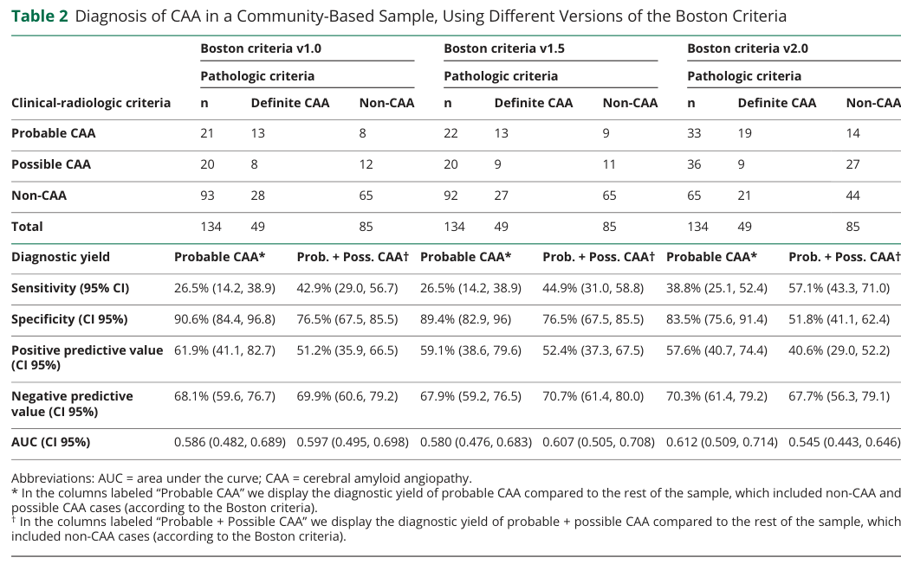

## Question

# Disease Characteristics Research Template

## Target Disease
- **Disease Name:** Cerebral Amyloid Angiopathy
- **MONDO ID:**  (if available)
- **Category:** Complex

## Research Objectives

Please provide a comprehensive research report on **Cerebral Amyloid Angiopathy** covering all of the
disease characteristics listed below. This report will be used to populate a disease knowledge
base entry. Be thorough and cite primary literature (PMID preferred) for all claims.

For each section, **suggested databases/resources** are listed. These are the first places
you should search for information on each topic.

---

### 1. Disease Information
> **Search first:** OMIM, Orphanet, ICD-10/ICD-11, MeSH, PubMed

- What is the disease? Provide a concise overview.
- What are the key identifiers? (OMIM, Orphanet, ICD-10/ICD-11, MeSH, Mondo)
- What are the common synonyms and alternative names?
- Is the information derived from individual patients (e.g., EHR) or aggregated disease-level resources?

### 2. Etiology

- **Disease Causal Factors**: What are the primary causes? (genetic, environmental, infectious, mechanistic)
- **Risk Factors**:
  > **Search first:** PubMed, Cochrane Library, UpToDate, clinical guidelines, ClinVar, ClinGen, GWAS Catalog, PheGenI, CTD, CDC, WHO, epidemiological databases
  - Genetic risk factors (causal variants, susceptibility loci, modifier genes)
  - Environmental risk factors (toxins, lifestyle, occupational exposures, age, sex, family history)
- **Protective Factors**:
  > **Search first:** PubMed, Cochrane Library, clinical trial databases, GWAS Catalog, gnomAD, WHO, CDC, nutrition databases
  - Genetic protective factors (protective variants, modifier alleles)
  - Environmental protective factors (diet, lifestyle, exposures that reduce risk)
- **Gene-Environment Interactions**: How do genetic and environmental factors interact to influence disease?
  > **Search first:** CTD, PubMed, PheGenI, GxE databases

### 3. Phenotypes
> **Search first:** HPO (Human Phenotype Ontology), OMIM, Orphanet, PubMed, clinicaltrials.gov, MedDRA, SNOMED CT, DECIPHER, LOINC

For each phenotype, provide:
- **Phenotype type**: symptoms, clinical signs, physical manifestations, behavioral changes, or laboratory abnormalities
  > For symptoms/signs: HPO, OMIM, Orphanet, PubMed
  > For behavioral changes: HPO, DSM, RDoC (Research Domain Criteria), PubMed
  > For laboratory abnormalities: LOINC, SNOMED CT, LabTests Online, PubMed
- **Phenotype characteristics**:
  > **Search first:** OMIM, Orphanet, HPO, PubMed
  - Age of symptom onset (neonatal, childhood, adult-onset, late-onset)
  - Symptom severity (mild, moderate, severe, variable)
  - Symptom progression (stable, progressive, episodic, fluctuating)
  - Frequency among affected individuals (percentage or qualitative)
- **Quality of life impact**: Effects on daily functioning and well-being (per-phenotype when possible)
  > **Search first:** EQ-5D database, SF-36, WHO QOL databases, PubMed
- Suggest HPO (Human Phenotype Ontology) terms for each phenotype

### 4. Genetic/Molecular Information

- **Causal Genes**: Gene mutations or chromosomal abnormalities responsible for disease (gene symbols, OMIM IDs)
  > **Search first:** OMIM, ClinVar, HGMD, Ensembl, NCBI Gene
- **Pathogenic Variants**:
  - Affected genes (gene symbols, HGNC IDs)
    > **Search first:** OMIM, NCBI Gene, Ensembl, HGNC, UniProt, GeneCards
  - Variant classification (pathogenic, likely pathogenic, VUS per ACMG/AMP guidelines)
    > **Search first:** ClinVar, ClinGen, ACMG/AMP guidelines, VarSome
  - Variant type/class (missense, frameshift, nonsense, splice-site, structural)
  - Allele frequency in population databases
    > **Search first:** gnomAD, 1000 Genomes, ExAC, TOPMed, dbSNP
  - Somatic vs germline origin
    > **Search first:** COSMIC (somatic), ClinVar, ICGC, TCGA
  - Functional consequences (loss of function, gain of function, dominant negative)
- **Modifier Genes**: Genes that modify disease severity or expression
- **Epigenetic Information**: DNA methylation, histone modifications, chromatin changes affecting disease
  > **Search first:** ENCODE, Roadmap Epigenomics, MethBase, DiseaseMeth
- **Chromosomal Abnormalities**: Large-scale genetic changes (aneuploidy, translocations, inversions)
  > **Search first:** DECIPHER, ClinVar, ECARUCA, UCSC Genome Browser

### 5. Environmental Information

- **Environmental Factors**: Non-genetic contributing factors (toxins, radiation, pollution, occupational exposure)
  > **Search first:** CTD (Comparative Toxicogenomics Database), TOXNET, PubMed, EPA databases
- **Lifestyle Factors**: Behavioral factors (smoking, diet, exercise, alcohol consumption)
  > **Search first:** CDC databases, WHO, PubMed, NHANES
- **Infectious Agents**: If applicable, pathogens causing or triggering disease (bacteria, viruses, fungi, parasites)
  > **Search first:** NCBI Taxonomy, ViPR, BV-BRC, MicrobeDB, GIDEON

### 6. Mechanism / Pathophysiology

- **Molecular Pathways**: Specific signaling cascades or biochemical pathways involved (Wnt, MAPK, mTOR, PI3K-AKT, etc.)
  > **Search first:** KEGG, Reactome, WikiPathways, PathBank, BioCyc
- **Cellular Processes**: Cell-level mechanisms (apoptosis, autophagy, cell cycle dysregulation, inflammation, etc.)
  > **Search first:** Gene Ontology (GO), Reactome, KEGG, PubMed
- **Protein Dysfunction**: How protein structure or function is altered (misfolding, aggregation, loss of function, gain of function)
  > **Search first:** UniProt, PDB (Protein Data Bank), InterPro, Pfam, AlphaFold
- **Metabolic Changes**: Alterations in metabolic processes (energy metabolism, lipid metabolism, amino acid metabolism)
  > **Search first:** KEGG, BioCyc, HMDB (Human Metabolome Database), BRENDA
- **Immune System Involvement**: Role of immune response (autoimmunity, immunodeficiency, chronic inflammation)
  > **Search first:** ImmPort, Immunome Database, IEDB, Gene Ontology
- **Tissue Damage Mechanisms**: How tissues/ are injured (oxidative stress, ischemia, fibrosis, necrosis)
  > **Search first:** PubMed, Gene Ontology, Reactome
- **Biochemical Abnormalities**: Specific molecular defects (enzyme deficiencies, receptor dysfunction, ion channel defects)
  > **Search first:** BRENDA, UniProt, KEGG, OMIM, PubMed
- **Epigenetic Changes**: DNA methylation, histone modifications affecting gene expression in disease
  > **Search first:** ENCODE, Roadmap Epigenomics, MethBase, DiseaseMeth
- **Molecular Profiling** (if available):
  - Transcriptomics/gene expression changes
    > **Search first:** GEO (Gene Expression Omnibus), ArrayExpress, GTEx, Human Cell Atlas, SRA
  - Proteomics findings
    > **Search first:** PRIDE, ProteomeXchange, Human Protein Atlas, STRING, BioGRID
  - Metabolomics signatures
    > **Search first:** MetaboLights, Metabolomics Workbench, HMDB, METLIN
  - Lipidomics alterations
    > **Search first:** LIPID MAPS, SwissLipids, LipidHome, Metabolomics Workbench
  - Genomic structural features
    > **Search first:** UCSC Genome Browser, Ensembl, NCBI, dbVar, DGV
- **Advanced Technologies** (if applicable):
  - Single-cell analysis findings (cell-type specific mechanisms, cellular heterogeneity)
    > **Search first:** Human Cell Atlas, Single Cell Portal, GEO, CELLxGENE
  - Spatial transcriptomics findings
    > **Search first:** GEO, Spatial Research, Vizgen, 10x Genomics data
  - Multi-omics integration results
    > **Search first:** TCGA, ICGC, cBioPortal, LinkedOmics, PubMed
  - Functional genomics screens (CRISPR, RNAi)
    > **Search first:** DepMap, GenomeRNAi, PubMed, BioGRID ORCS

For each mechanism, describe:
- The causal chain from initial trigger to clinical manifestation
- Which mechanisms are upstream vs downstream
- What cell types and biological processes are involved
- Suggest GO terms for biological processes and CL terms for cell types

### 7. Anatomical Structures Affected

- **Organ Level**:
  - Primary organs directly affected
  - Secondary organ involvement (complications, secondary effects)
  - Body systems involved (cardiovascular, nervous, digestive, respiratory, endocrine, etc.)
  > **Search first:** Uberon, FMA (Foundational Model of Anatomy), OMIM, HPO, ICD-11, MeSH, SNOMED CT
- **Tissue and Cell Level**:
  - Specific tissue types affected (epithelial, connective, muscle, nervous)
  - Specific cell populations targeted (with Cell Ontology terms)
  > **Search first:** Uberon, Human Protein Atlas, Cell Ontology, Human Cell Atlas, CellMarker, PanglaoDB
- **Subcellular Level**:
  - Cellular compartments involved (mitochondria, nucleus, ER, lysosomes) (with GO Cellular Component terms)
  > **Search first:** Gene Ontology (Cellular Component), UniProt, Human Protein Atlas
- **Localization**:
  - Specific anatomical sites (with UBERON terms)
    > **Search first:** FMA, Uberon, NeuroNames (for brain), SNOMED CT
  - Lateralization (unilateral, bilateral, asymmetric)
    > **Search first:** HPO, clinical literature, imaging databases

### 8. Temporal Development

- **Onset**:
  - Typical age of onset (congenital, pediatric, adult, geriatric)
  - Onset pattern (acute, subacute, chronic, insidious)
  > **Search first:** OMIM, Orphanet, HPO, PubMed
- **Progression**:
  - Disease stages (early, intermediate, advanced, end-stage)
    > **Search first:** Cancer Staging Manual (AJCC), WHO classifications, PubMed
  - Progression rate (rapid, slow, variable)
  - Disease course pattern (episodic, relapsing-remitting, progressive, stable)
  - Disease duration (self-limited, chronic lifelong)
  > **Search first:** Disease registries, longitudinal cohort databases, natural history studies, PubMed, Orphanet, OMIM
- **Patterns**:
  - Remission patterns (spontaneous, treatment-induced)
    > **Search first:** Clinical trial databases, disease registries, PubMed
  - Critical periods (time windows of vulnerability or opportunity for intervention)
    > **Search first:** PubMed, developmental biology databases, clinical guidelines

### 9. Inheritance and Population

- **Epidemiology**:
  - Prevalence (cases per 100,000 at given time)
  - Incidence (new cases per 100,000 per year)
  > **Search first:** Orphanet, CDC, WHO, GBD (Global Burden of Disease), national registries, SEER, disease registries
- **For Genetic Etiology**:
  - Inheritance pattern (AD, AR, X-linked, mitochondrial, multifactorial, polygenic)
    > **Search first:** OMIM, Orphanet, ClinVar, GTR (Genetic Testing Registry)
  - Penetrance (complete, incomplete, age-dependent)
    > **Search first:** ClinVar, OMIM, PubMed, ClinGen
  - Expressivity (variable, consistent)
    > **Search first:** OMIM, ClinVar, PubMed
  - Genetic anticipation (increasing severity in successive generations)
    > **Search first:** OMIM, PubMed (especially for repeat expansion disorders)
  - Germline mosaicism
    > **Search first:** ClinVar, OMIM, genetic counseling literature, PubMed
  - Founder effects (population-specific mutations)
    > **Search first:** gnomAD, population genetics databases, PubMed
  - Consanguinity role
    > **Search first:** OMIM, population studies, genetic counseling resources
  - Carrier frequency
    > **Search first:** gnomAD, carrier screening databases, GeneReviews, GTR
- **Population Demographics**:
  - Affected populations (ethnic or demographic groups with higher prevalence)
    > **Search first:** gnomAD, 1000 Genomes, PAGE Study, PubMed, population registries
  - Geographic distribution (endemic areas, regional variation)
    > **Search first:** WHO, CDC, GBD, Orphanet, geographic epidemiology databases
  - Geographic distribution of specific variants
  - Sex ratio (male:female)
    > **Search first:** Disease registries, OMIM, PubMed, epidemiological databases
  - Age distribution of affected individuals
    > **Search first:** CDC, disease registries, SEER, Orphanet

### 10. Diagnostics

- **Clinical Tests**:
  - Laboratory tests (blood, urine, tissue chemistry, specific enzyme assays)
    > **Search first:** LOINC, LabTests Online, PubMed
  - Biomarkers (proteins, metabolites, genetic markers, circulating biomarkers)
    > **Search first:** FDA Biomarker List, BEST (Biomarkers, EndpointS, and other Tools), PubMed
  - Imaging studies (X-ray, CT, MRI, PET, ultrasound)
    > **Search first:** RadLex, DICOM, Radiopaedia, imaging databases
  - Functional tests (pulmonary function, cardiac stress tests)
    > **Search first:** LOINC, clinical guidelines, PubMed
  - Electrophysiology (EEG, EMG, ECG, nerve conduction studies)
    > **Search first:** LOINC, clinical neurophysiology databases, PubMed
  - Biopsy findings (histopathology, immunohistochemistry)
    > **Search first:** SNOMED CT, College of American Pathologists resources, PubMed
  - Pathology findings (microscopic examination)
    > **Search first:** SNOMED CT, Digital Pathology databases, PubMed
- **Genetic Testing**:
  > **Search first:** GTR (Genetic Testing Registry), GeneReviews, ClinGen
  - Overview of recommended genetic testing approach
  - Whole genome sequencing (WGS) utility
    > **Search first:** GTR, ClinVar, GEL (Genomics England), gnomAD
  - Whole exome sequencing (WES) utility
    > **Search first:** GTR, ClinVar, OMIM, GeneMatcher
  - Gene panels (which panels, which genes)
    > **Search first:** GTR, ClinVar, laboratory-specific databases
  - Single gene testing
    > **Search first:** GTR, ClinVar, OMIM, GeneReviews
  - Chromosomal microarray (CMA)
    > **Search first:** DECIPHER, ClinVar, dbVar, ECARUCA
  - Karyotyping
    > **Search first:** Chromosome Abnormality Database, ClinVar, cytogenetics resources
  - FISH
    > **Search first:** ClinVar, cytogenetics databases, PubMed
  - Mitochondrial DNA testing
    > **Search first:** MITOMAP, MSeqDR, ClinVar, GTR
  - Repeat expansion testing
    > **Search first:** GTR, ClinVar, repeat expansion databases, PubMed
- **Omics-Based Diagnostics** (if applicable):
  - RNA sequencing / transcriptomics
    > **Search first:** GEO, ArrayExpress, GTEx, RNA-seq databases
  - Proteomics
    > **Search first:** PRIDE, ProteomeXchange, FDA Biomarker database
  - Metabolomics
    > **Search first:** MetaboLights, Metabolomics Workbench, HMDB
  - Epigenomics
    > **Search first:** GEO, ENCODE, Roadmap Epigenomics, MethBase
  - Liquid biopsy
    > **Search first:** COSMIC, ClinVar, liquid biopsy databases, PubMed
- **Clinical Criteria**:
  - Standardized diagnostic criteria (DSM, ICD, society guidelines)
    > **Search first:** DSM-5, ICD-11, clinical society guidelines, UpToDate
  - Differential diagnosis (other conditions to rule out, with distinguishing features)
    > **Search first:** DynaMed, UpToDate, clinical decision support systems
- **Screening**:
  - Screening methods for asymptomatic individuals (newborn screening, carrier screening, cascade screening)
    > **Search first:** ACMG recommendations, CDC newborn screening, GTR

### 11. Outcome/Prognosis

- **Survival and Mortality**:
  - Survival rate (5-year, 10-year, overall)
    > **Search first:** SEER, cancer registries, disease-specific registries, PubMed
  - Life expectancy (with and without treatment if applicable)
    > **Search first:** Orphanet, disease registries, actuarial databases, PubMed
  - Mortality rate
    > **Search first:** CDC, WHO, GBD, national mortality databases
  - Disease-specific mortality (deaths directly attributable to disease)
    > **Search first:** Disease registries, CDC Wonder, GBD, PubMed
- **Morbidity and Function**:
  - Morbidity (disease-related disability and health impacts)
    > **Search first:** GBD, WHO, disability databases, PubMed
  - Disability outcomes (long-term functional impairments)
    > **Search first:** ICF (International Classification of Functioning), disability registries
  - Quality of life measures (EQ-5D, SF-36, PROMIS, disease-specific tools)
    > **Search first:** EQ-5D database, SF-36, PROMIS, PubMed
- **Disease Course**:
  - Complications (secondary problems: infections, organ failure, etc.)
    > **Search first:** ICD codes, disease registries, clinical databases, PubMed
  - Recovery potential (likelihood and extent of recovery, with vs without treatment)
    > **Search first:** Natural history studies, rehabilitation databases, PubMed
- **Prediction**:
  - Prognostic factors (age, disease severity, biomarkers, treatment response)
    > **Search first:** Prognostic models databases, clinical calculators, PubMed
  - Prognostic biomarkers (molecular markers predicting disease course)
    > **Search first:** FDA Biomarker database, PubMed, cancer prognostic databases

### 12. Treatment

- **Pharmacotherapy**:
  - Pharmacological treatments (drug names, drug classes, mechanisms of action)
    > **Search first:** DrugBank, RxNorm, ATC classification, DailyMed, FDA databases
  - Pharmacogenomics (how genetic variants affect drug metabolism, efficacy, toxicity)
    > **Search first:** PharmGKB, CPIC (Clinical Pharmacogenetics), FDA Table of PGx Biomarkers
- **Advanced Therapeutics**:
  - Gene therapy (viral vectors, CRISPR, gene replacement, gene editing)
    > **Search first:** ClinicalTrials.gov, FDA gene therapy database, ASGCT resources
  - Cell therapy (stem cell transplant, CAR-T, cellular therapeutics)
    > **Search first:** ClinicalTrials.gov, FDA cell therapy database, FACT standards
  - RNA-based therapies (ASOs, siRNA, mRNA therapies)
    > **Search first:** ClinicalTrials.gov, FDA approvals, PubMed
  - Targeted therapies (treatments directed at specific molecular targets)
    > **Search first:** My Cancer Genome, OncoKB, ClinicalTrials.gov, FDA approvals
  - Immunotherapies (checkpoint inhibitors, monoclonal antibodies)
    > **Search first:** Cancer Immunotherapy Database, FDA approvals, ClinicalTrials.gov
- **Surgical and Interventional**:
  - Surgical interventions (types of surgery, timing, outcomes)
    > **Search first:** CPT codes, surgical registries, clinical guidelines, PubMed
- **Supportive and Rehabilitative**:
  - Supportive care (symptom management, pain control, nutrition)
    > **Search first:** Clinical guidelines, Cochrane Library, PubMed
  - Rehabilitation (physical therapy, occupational therapy, speech therapy)
    > **Search first:** Rehabilitation medicine databases, clinical guidelines, PubMed
- **Experimental**:
  - Experimental treatments in clinical trials (with NCT identifiers if available)
    > **Search first:** ClinicalTrials.gov, EU Clinical Trials Register, WHO ICTRP
- **Treatment Outcomes**:
  - Treatment response rates
    > **Search first:** Clinical trial databases, FDA reviews, systematic reviews, PubMed
  - Side effects and adverse events
    > **Search first:** FDA Adverse Event Reporting System (FAERS), MedWatch, PubMed
- **Treatment Strategy**:
  - Treatment algorithms (clinical pathways, decision trees)
    > **Search first:** Clinical practice guidelines, NCCN Guidelines, UpToDate
  - Combination therapies
    > **Search first:** ClinicalTrials.gov, treatment guidelines, PubMed
  - Personalized medicine approaches (genotype-guided treatment)
    > **Search first:** My Cancer Genome, CIViC, PharmGKB, precision medicine databases

For each treatment, suggest MAXO (Medical Action Ontology) terms where applicable.

### 13. Prevention

- **Prevention Levels**:
  - Primary prevention (preventing disease occurrence: vaccination, risk factor modification)
    > **Search first:** CDC, WHO, USPSTF recommendations, Cochrane Library
  - Secondary prevention (early detection and treatment: screening programs, early intervention)
    > **Search first:** USPSTF, CDC screening guidelines, WHO
  - Tertiary prevention (preventing complications in those with disease)
    > **Search first:** Clinical guidelines, disease management protocols, PubMed
- **Immunization**: Vaccine strategies (if applicable)
  > **Search first:** CDC vaccine schedules, WHO immunization, FDA vaccine database
- **Screening and Early Detection**:
  - Screening programs (population-based: newborn screening, cancer screening)
    > **Search first:** CDC screening programs, USPSTF, cancer screening databases
  - Genetic screening (carrier screening, preimplantation genetic diagnosis, prenatal testing)
    > **Search first:** ACMG recommendations, ACOG guidelines, GTR
  - Risk stratification (identifying high-risk individuals for targeted prevention)
    > **Search first:** Risk prediction models, clinical calculators, PubMed
- **Behavioral Interventions**: Lifestyle modifications to reduce risk
  > **Search first:** CDC, WHO, behavioral intervention databases, Cochrane Library
- **Counseling**: Genetic counseling (risk assessment, family planning guidance)
  > **Search first:** NSGC resources, ACMG guidelines, GeneReviews
- **Public Health**:
  - Public health interventions (sanitation, vector control, health education)
    > **Search first:** CDC, WHO, public health databases, PubMed
  - Environmental interventions (reducing environmental risk factors)
    > **Search first:** EPA databases, WHO environmental health, PubMed
- **Prophylaxis**: Preventive medications or procedures
  > **Search first:** Clinical guidelines, FDA approvals, PubMed

### 14. Other Species / Natural Disease

- **Taxonomy**: Species affected (with NCBI Taxon identifiers)
  > **Search first:** NCBI Taxonomy
- **Breed**: Specific breeds affected (with VBO identifiers if applicable)
  > **Search first:** VBO (Vertebrate Breed Ontology)
- **Gene**: Orthologous genes in other species (with NCBI Gene IDs)
  > **Search first:** NCBI Gene
- **Natural Disease**:
  - Naturally occurring disease in other species (companion animals, wildlife)
    > **Search first:** OMIA (Online Mendelian Inheritance in Animals), VetCompass, PubMed
  - Veterinary relevance and importance in animal health
    > **Search first:** OMIA, veterinary databases, PubMed
- **Comparative Biology**:
  - Comparative pathology (similarities and differences across species)
    > **Search first:** OMIA, comparative pathology databases, PubMed
  - Evolutionary conservation of disease mechanisms
    > **Search first:** HomoloGene, OrthoMCL, Alliance of Genome Resources
- **Transmission** (if applicable):
  - Zoonotic potential
    > **Search first:** CDC zoonotic diseases, WHO zoonoses, GIDEON
  - Cross-species susceptibility
    > **Search first:** NCBI Taxonomy, veterinary databases, PubMed

### 15. Model Organisms

- **Model Types**:
  - Model organism type (mammalian, invertebrate, cellular, in vitro)
    > **Search first:** Alliance of Genome Resources, model organism databases
  - Specific model systems (mouse, rat, zebrafish, Drosophila, C. elegans, yeast, cell lines, organoids, iPSCs)
    > **Search first:** MGI, RGD, ZFIN, FlyBase, WormBase, SGD, ATCC, Cellosaurus
  - Induced models (drug treatment, surgical intervention, environmental manipulation)
    > **Search first:** MGI, model organism databases, PubMed
- **Genetic Models**:
  - Types available (knockout, knock-in, transgenic, conditional, humanized)
    > **Search first:** MGI, IMPC, KOMP, EuMMCR, IMSR
- **Model Characteristics**:
  - Phenotype recapitulation (how well model reproduces human disease features)
    > **Search first:** Model organism databases, comparative studies, PubMed
  - Model limitations (aspects of human disease not captured)
    > **Search first:** Model organism databases, PubMed, review articles
- **Applications**:
  - Research applications (what aspects of disease can be studied)
    > **Search first:** Model organism databases, PubMed
- **Resources**:
  - Model databases
    > **Search first:** MGI, RGD, ZFIN, FlyBase, WormBase, IMSR, EMMA, MMRRC

---

## Citation Requirements

- Cite primary literature (PMID preferred) for all mechanistic and clinical claims
- Prioritize recent reviews and landmark papers
- Include direct quotes from abstracts where possible to support key statements
- Distinguish evidence source types: human clinical, model organism, in vitro, computational

## Output Format

Structure your response as a comprehensive narrative organized by the sections above.
For each section, provide:
- Factual content with specific details (numbers, percentages, gene names, variant nomenclature)
- Ontology term suggestions (HPO, GO, CL, UBERON, CHEBI, MAXO, MONDO) where applicable
- Evidence citations with PMIDs
- Direct quotes from abstracts to support key claims
- Clear indication when information is not available or not applicable for this disease

This report will be used to populate a disease knowledge base entry with:
- Pathophysiology descriptions with causal chains
- Gene/protein annotations (HGNC, GO terms)
- Phenotype associations (HP terms) with frequencies
- Cell type involvement (CL terms)
- Anatomical locations (UBERON terms)
- Chemical entities (CHEBI terms)
- Treatment annotations (MAXO terms)
- Evidence items with PMIDs and exact abstract quotes
- Epidemiology, prognosis, diagnostic, and prevention information
- Animal model descriptions with phenotype recapitulation details

## Output

Question: You are an expert researcher providing comprehensive, well-cited information.

Provide detailed information focusing on:
1. Key concepts and definitions with current understanding
2. Recent developments and latest research (prioritize 2023-2024 sources)
3. Current applications and real-world implementations
4. Expert opinions and analysis from authoritative sources
5. Relevant statistics and data from recent studies

Format as a comprehensive research report with proper citations. Include URLs and publication dates where available.
Always prioritize recent, authoritative sources and provide specific citations for all major claims.

# Disease Characteristics Research Template

## Target Disease
- **Disease Name:** Cerebral Amyloid Angiopathy
- **MONDO ID:**  (if available)
- **Category:** Complex

## Research Objectives

Please provide a comprehensive research report on **Cerebral Amyloid Angiopathy** covering all of the
disease characteristics listed below. This report will be used to populate a disease knowledge
base entry. Be thorough and cite primary literature (PMID preferred) for all claims.

For each section, **suggested databases/resources** are listed. These are the first places
you should search for information on each topic.

---

### 1. Disease Information
> **Search first:** OMIM, Orphanet, ICD-10/ICD-11, MeSH, PubMed

- What is the disease? Provide a concise overview.
- What are the key identifiers? (OMIM, Orphanet, ICD-10/ICD-11, MeSH, Mondo)
- What are the common synonyms and alternative names?
- Is the information derived from individual patients (e.g., EHR) or aggregated disease-level resources?

### 2. Etiology

- **Disease Causal Factors**: What are the primary causes? (genetic, environmental, infectious, mechanistic)
- **Risk Factors**:
  > **Search first:** PubMed, Cochrane Library, UpToDate, clinical guidelines, ClinVar, ClinGen, GWAS Catalog, PheGenI, CTD, CDC, WHO, epidemiological databases
  - Genetic risk factors (causal variants, susceptibility loci, modifier genes)
  - Environmental risk factors (toxins, lifestyle, occupational exposures, age, sex, family history)
- **Protective Factors**:
  > **Search first:** PubMed, Cochrane Library, clinical trial databases, GWAS Catalog, gnomAD, WHO, CDC, nutrition databases
  - Genetic protective factors (protective variants, modifier alleles)
  - Environmental protective factors (diet, lifestyle, exposures that reduce risk)
- **Gene-Environment Interactions**: How do genetic and environmental factors interact to influence disease?
  > **Search first:** CTD, PubMed, PheGenI, GxE databases

### 3. Phenotypes
> **Search first:** HPO (Human Phenotype Ontology), OMIM, Orphanet, PubMed, clinicaltrials.gov, MedDRA, SNOMED CT, DECIPHER, LOINC

For each phenotype, provide:
- **Phenotype type**: symptoms, clinical signs, physical manifestations, behavioral changes, or laboratory abnormalities
  > For symptoms/signs: HPO, OMIM, Orphanet, PubMed
  > For behavioral changes: HPO, DSM, RDoC (Research Domain Criteria), PubMed
  > For laboratory abnormalities: LOINC, SNOMED CT, LabTests Online, PubMed
- **Phenotype characteristics**:
  > **Search first:** OMIM, Orphanet, HPO, PubMed
  - Age of symptom onset (neonatal, childhood, adult-onset, late-onset)
  - Symptom severity (mild, moderate, severe, variable)
  - Symptom progression (stable, progressive, episodic, fluctuating)
  - Frequency among affected individuals (percentage or qualitative)
- **Quality of life impact**: Effects on daily functioning and well-being (per-phenotype when possible)
  > **Search first:** EQ-5D database, SF-36, WHO QOL databases, PubMed
- Suggest HPO (Human Phenotype Ontology) terms for each phenotype

### 4. Genetic/Molecular Information

- **Causal Genes**: Gene mutations or chromosomal abnormalities responsible for disease (gene symbols, OMIM IDs)
  > **Search first:** OMIM, ClinVar, HGMD, Ensembl, NCBI Gene
- **Pathogenic Variants**:
  - Affected genes (gene symbols, HGNC IDs)
    > **Search first:** OMIM, NCBI Gene, Ensembl, HGNC, UniProt, GeneCards
  - Variant classification (pathogenic, likely pathogenic, VUS per ACMG/AMP guidelines)
    > **Search first:** ClinVar, ClinGen, ACMG/AMP guidelines, VarSome
  - Variant type/class (missense, frameshift, nonsense, splice-site, structural)
  - Allele frequency in population databases
    > **Search first:** gnomAD, 1000 Genomes, ExAC, TOPMed, dbSNP
  - Somatic vs germline origin
    > **Search first:** COSMIC (somatic), ClinVar, ICGC, TCGA
  - Functional consequences (loss of function, gain of function, dominant negative)
- **Modifier Genes**: Genes that modify disease severity or expression
- **Epigenetic Information**: DNA methylation, histone modifications, chromatin changes affecting disease
  > **Search first:** ENCODE, Roadmap Epigenomics, MethBase, DiseaseMeth
- **Chromosomal Abnormalities**: Large-scale genetic changes (aneuploidy, translocations, inversions)
  > **Search first:** DECIPHER, ClinVar, ECARUCA, UCSC Genome Browser

### 5. Environmental Information

- **Environmental Factors**: Non-genetic contributing factors (toxins, radiation, pollution, occupational exposure)
  > **Search first:** CTD (Comparative Toxicogenomics Database), TOXNET, PubMed, EPA databases
- **Lifestyle Factors**: Behavioral factors (smoking, diet, exercise, alcohol consumption)
  > **Search first:** CDC databases, WHO, PubMed, NHANES
- **Infectious Agents**: If applicable, pathogens causing or triggering disease (bacteria, viruses, fungi, parasites)
  > **Search first:** NCBI Taxonomy, ViPR, BV-BRC, MicrobeDB, GIDEON

### 6. Mechanism / Pathophysiology

- **Molecular Pathways**: Specific signaling cascades or biochemical pathways involved (Wnt, MAPK, mTOR, PI3K-AKT, etc.)
  > **Search first:** KEGG, Reactome, WikiPathways, PathBank, BioCyc
- **Cellular Processes**: Cell-level mechanisms (apoptosis, autophagy, cell cycle dysregulation, inflammation, etc.)
  > **Search first:** Gene Ontology (GO), Reactome, KEGG, PubMed
- **Protein Dysfunction**: How protein structure or function is altered (misfolding, aggregation, loss of function, gain of function)
  > **Search first:** UniProt, PDB (Protein Data Bank), InterPro, Pfam, AlphaFold
- **Metabolic Changes**: Alterations in metabolic processes (energy metabolism, lipid metabolism, amino acid metabolism)
  > **Search first:** KEGG, BioCyc, HMDB (Human Metabolome Database), BRENDA
- **Immune System Involvement**: Role of immune response (autoimmunity, immunodeficiency, chronic inflammation)
  > **Search first:** ImmPort, Immunome Database, IEDB, Gene Ontology
- **Tissue Damage Mechanisms**: How tissues/ are injured (oxidative stress, ischemia, fibrosis, necrosis)
  > **Search first:** PubMed, Gene Ontology, Reactome
- **Biochemical Abnormalities**: Specific molecular defects (enzyme deficiencies, receptor dysfunction, ion channel defects)
  > **Search first:** BRENDA, UniProt, KEGG, OMIM, PubMed
- **Epigenetic Changes**: DNA methylation, histone modifications affecting gene expression in disease
  > **Search first:** ENCODE, Roadmap Epigenomics, MethBase, DiseaseMeth
- **Molecular Profiling** (if available):
  - Transcriptomics/gene expression changes
    > **Search first:** GEO (Gene Expression Omnibus), ArrayExpress, GTEx, Human Cell Atlas, SRA
  - Proteomics findings
    > **Search first:** PRIDE, ProteomeXchange, Human Protein Atlas, STRING, BioGRID
  - Metabolomics signatures
    > **Search first:** MetaboLights, Metabolomics Workbench, HMDB, METLIN
  - Lipidomics alterations
    > **Search first:** LIPID MAPS, SwissLipids, LipidHome, Metabolomics Workbench
  - Genomic structural features
    > **Search first:** UCSC Genome Browser, Ensembl, NCBI, dbVar, DGV
- **Advanced Technologies** (if applicable):
  - Single-cell analysis findings (cell-type specific mechanisms, cellular heterogeneity)
    > **Search first:** Human Cell Atlas, Single Cell Portal, GEO, CELLxGENE
  - Spatial transcriptomics findings
    > **Search first:** GEO, Spatial Research, Vizgen, 10x Genomics data
  - Multi-omics integration results
    > **Search first:** TCGA, ICGC, cBioPortal, LinkedOmics, PubMed
  - Functional genomics screens (CRISPR, RNAi)
    > **Search first:** DepMap, GenomeRNAi, PubMed, BioGRID ORCS

For each mechanism, describe:
- The causal chain from initial trigger to clinical manifestation
- Which mechanisms are upstream vs downstream
- What cell types and biological processes are involved
- Suggest GO terms for biological processes and CL terms for cell types

### 7. Anatomical Structures Affected

- **Organ Level**:
  - Primary organs directly affected
  - Secondary organ involvement (complications, secondary effects)
  - Body systems involved (cardiovascular, nervous, digestive, respiratory, endocrine, etc.)
  > **Search first:** Uberon, FMA (Foundational Model of Anatomy), OMIM, HPO, ICD-11, MeSH, SNOMED CT
- **Tissue and Cell Level**:
  - Specific tissue types affected (epithelial, connective, muscle, nervous)
  - Specific cell populations targeted (with Cell Ontology terms)
  > **Search first:** Uberon, Human Protein Atlas, Cell Ontology, Human Cell Atlas, CellMarker, PanglaoDB
- **Subcellular Level**:
  - Cellular compartments involved (mitochondria, nucleus, ER, lysosomes) (with GO Cellular Component terms)
  > **Search first:** Gene Ontology (Cellular Component), UniProt, Human Protein Atlas
- **Localization**:
  - Specific anatomical sites (with UBERON terms)
    > **Search first:** FMA, Uberon, NeuroNames (for brain), SNOMED CT
  - Lateralization (unilateral, bilateral, asymmetric)
    > **Search first:** HPO, clinical literature, imaging databases

### 8. Temporal Development

- **Onset**:
  - Typical age of onset (congenital, pediatric, adult, geriatric)
  - Onset pattern (acute, subacute, chronic, insidious)
  > **Search first:** OMIM, Orphanet, HPO, PubMed
- **Progression**:
  - Disease stages (early, intermediate, advanced, end-stage)
    > **Search first:** Cancer Staging Manual (AJCC), WHO classifications, PubMed
  - Progression rate (rapid, slow, variable)
  - Disease course pattern (episodic, relapsing-remitting, progressive, stable)
  - Disease duration (self-limited, chronic lifelong)
  > **Search first:** Disease registries, longitudinal cohort databases, natural history studies, PubMed, Orphanet, OMIM
- **Patterns**:
  - Remission patterns (spontaneous, treatment-induced)
    > **Search first:** Clinical trial databases, disease registries, PubMed
  - Critical periods (time windows of vulnerability or opportunity for intervention)
    > **Search first:** PubMed, developmental biology databases, clinical guidelines

### 9. Inheritance and Population

- **Epidemiology**:
  - Prevalence (cases per 100,000 at given time)
  - Incidence (new cases per 100,000 per year)
  > **Search first:** Orphanet, CDC, WHO, GBD (Global Burden of Disease), national registries, SEER, disease registries
- **For Genetic Etiology**:
  - Inheritance pattern (AD, AR, X-linked, mitochondrial, multifactorial, polygenic)
    > **Search first:** OMIM, Orphanet, ClinVar, GTR (Genetic Testing Registry)
  - Penetrance (complete, incomplete, age-dependent)
    > **Search first:** ClinVar, OMIM, PubMed, ClinGen
  - Expressivity (variable, consistent)
    > **Search first:** OMIM, ClinVar, PubMed
  - Genetic anticipation (increasing severity in successive generations)
    > **Search first:** OMIM, PubMed (especially for repeat expansion disorders)
  - Germline mosaicism
    > **Search first:** ClinVar, OMIM, genetic counseling literature, PubMed
  - Founder effects (population-specific mutations)
    > **Search first:** gnomAD, population genetics databases, PubMed
  - Consanguinity role
    > **Search first:** OMIM, population studies, genetic counseling resources
  - Carrier frequency
    > **Search first:** gnomAD, carrier screening databases, GeneReviews, GTR
- **Population Demographics**:
  - Affected populations (ethnic or demographic groups with higher prevalence)
    > **Search first:** gnomAD, 1000 Genomes, PAGE Study, PubMed, population registries
  - Geographic distribution (endemic areas, regional variation)
    > **Search first:** WHO, CDC, GBD, Orphanet, geographic epidemiology databases
  - Geographic distribution of specific variants
  - Sex ratio (male:female)
    > **Search first:** Disease registries, OMIM, PubMed, epidemiological databases
  - Age distribution of affected individuals
    > **Search first:** CDC, disease registries, SEER, Orphanet

### 10. Diagnostics

- **Clinical Tests**:
  - Laboratory tests (blood, urine, tissue chemistry, specific enzyme assays)
    > **Search first:** LOINC, LabTests Online, PubMed
  - Biomarkers (proteins, metabolites, genetic markers, circulating biomarkers)
    > **Search first:** FDA Biomarker List, BEST (Biomarkers, EndpointS, and other Tools), PubMed
  - Imaging studies (X-ray, CT, MRI, PET, ultrasound)
    > **Search first:** RadLex, DICOM, Radiopaedia, imaging databases
  - Functional tests (pulmonary function, cardiac stress tests)
    > **Search first:** LOINC, clinical guidelines, PubMed
  - Electrophysiology (EEG, EMG, ECG, nerve conduction studies)
    > **Search first:** LOINC, clinical neurophysiology databases, PubMed
  - Biopsy findings (histopathology, immunohistochemistry)
    > **Search first:** SNOMED CT, College of American Pathologists resources, PubMed
  - Pathology findings (microscopic examination)
    > **Search first:** SNOMED CT, Digital Pathology databases, PubMed
- **Genetic Testing**:
  > **Search first:** GTR (Genetic Testing Registry), GeneReviews, ClinGen
  - Overview of recommended genetic testing approach
  - Whole genome sequencing (WGS) utility
    > **Search first:** GTR, ClinVar, GEL (Genomics England), gnomAD
  - Whole exome sequencing (WES) utility
    > **Search first:** GTR, ClinVar, OMIM, GeneMatcher
  - Gene panels (which panels, which genes)
    > **Search first:** GTR, ClinVar, laboratory-specific databases
  - Single gene testing
    > **Search first:** GTR, ClinVar, OMIM, GeneReviews
  - Chromosomal microarray (CMA)
    > **Search first:** DECIPHER, ClinVar, dbVar, ECARUCA
  - Karyotyping
    > **Search first:** Chromosome Abnormality Database, ClinVar, cytogenetics resources
  - FISH
    > **Search first:** ClinVar, cytogenetics databases, PubMed
  - Mitochondrial DNA testing
    > **Search first:** MITOMAP, MSeqDR, ClinVar, GTR
  - Repeat expansion testing
    > **Search first:** GTR, ClinVar, repeat expansion databases, PubMed
- **Omics-Based Diagnostics** (if applicable):
  - RNA sequencing / transcriptomics
    > **Search first:** GEO, ArrayExpress, GTEx, RNA-seq databases
  - Proteomics
    > **Search first:** PRIDE, ProteomeXchange, FDA Biomarker database
  - Metabolomics
    > **Search first:** MetaboLights, Metabolomics Workbench, HMDB
  - Epigenomics
    > **Search first:** GEO, ENCODE, Roadmap Epigenomics, MethBase
  - Liquid biopsy
    > **Search first:** COSMIC, ClinVar, liquid biopsy databases, PubMed
- **Clinical Criteria**:
  - Standardized diagnostic criteria (DSM, ICD, society guidelines)
    > **Search first:** DSM-5, ICD-11, clinical society guidelines, UpToDate
  - Differential diagnosis (other conditions to rule out, with distinguishing features)
    > **Search first:** DynaMed, UpToDate, clinical decision support systems
- **Screening**:
  - Screening methods for asymptomatic individuals (newborn screening, carrier screening, cascade screening)
    > **Search first:** ACMG recommendations, CDC newborn screening, GTR

### 11. Outcome/Prognosis

- **Survival and Mortality**:
  - Survival rate (5-year, 10-year, overall)
    > **Search first:** SEER, cancer registries, disease-specific registries, PubMed
  - Life expectancy (with and without treatment if applicable)
    > **Search first:** Orphanet, disease registries, actuarial databases, PubMed
  - Mortality rate
    > **Search first:** CDC, WHO, GBD, national mortality databases
  - Disease-specific mortality (deaths directly attributable to disease)
    > **Search first:** Disease registries, CDC Wonder, GBD, PubMed
- **Morbidity and Function**:
  - Morbidity (disease-related disability and health impacts)
    > **Search first:** GBD, WHO, disability databases, PubMed
  - Disability outcomes (long-term functional impairments)
    > **Search first:** ICF (International Classification of Functioning), disability registries
  - Quality of life measures (EQ-5D, SF-36, PROMIS, disease-specific tools)
    > **Search first:** EQ-5D database, SF-36, PROMIS, PubMed
- **Disease Course**:
  - Complications (secondary problems: infections, organ failure, etc.)
    > **Search first:** ICD codes, disease registries, clinical databases, PubMed
  - Recovery potential (likelihood and extent of recovery, with vs without treatment)
    > **Search first:** Natural history studies, rehabilitation databases, PubMed
- **Prediction**:
  - Prognostic factors (age, disease severity, biomarkers, treatment response)
    > **Search first:** Prognostic models databases, clinical calculators, PubMed
  - Prognostic biomarkers (molecular markers predicting disease course)
    > **Search first:** FDA Biomarker database, PubMed, cancer prognostic databases

### 12. Treatment

- **Pharmacotherapy**:
  - Pharmacological treatments (drug names, drug classes, mechanisms of action)
    > **Search first:** DrugBank, RxNorm, ATC classification, DailyMed, FDA databases
  - Pharmacogenomics (how genetic variants affect drug metabolism, efficacy, toxicity)
    > **Search first:** PharmGKB, CPIC (Clinical Pharmacogenetics), FDA Table of PGx Biomarkers
- **Advanced Therapeutics**:
  - Gene therapy (viral vectors, CRISPR, gene replacement, gene editing)
    > **Search first:** ClinicalTrials.gov, FDA gene therapy database, ASGCT resources
  - Cell therapy (stem cell transplant, CAR-T, cellular therapeutics)
    > **Search first:** ClinicalTrials.gov, FDA cell therapy database, FACT standards
  - RNA-based therapies (ASOs, siRNA, mRNA therapies)
    > **Search first:** ClinicalTrials.gov, FDA approvals, PubMed
  - Targeted therapies (treatments directed at specific molecular targets)
    > **Search first:** My Cancer Genome, OncoKB, ClinicalTrials.gov, FDA approvals
  - Immunotherapies (checkpoint inhibitors, monoclonal antibodies)
    > **Search first:** Cancer Immunotherapy Database, FDA approvals, ClinicalTrials.gov
- **Surgical and Interventional**:
  - Surgical interventions (types of surgery, timing, outcomes)
    > **Search first:** CPT codes, surgical registries, clinical guidelines, PubMed
- **Supportive and Rehabilitative**:
  - Supportive care (symptom management, pain control, nutrition)
    > **Search first:** Clinical guidelines, Cochrane Library, PubMed
  - Rehabilitation (physical therapy, occupational therapy, speech therapy)
    > **Search first:** Rehabilitation medicine databases, clinical guidelines, PubMed
- **Experimental**:
  - Experimental treatments in clinical trials (with NCT identifiers if available)
    > **Search first:** ClinicalTrials.gov, EU Clinical Trials Register, WHO ICTRP
- **Treatment Outcomes**:
  - Treatment response rates
    > **Search first:** Clinical trial databases, FDA reviews, systematic reviews, PubMed
  - Side effects and adverse events
    > **Search first:** FDA Adverse Event Reporting System (FAERS), MedWatch, PubMed
- **Treatment Strategy**:
  - Treatment algorithms (clinical pathways, decision trees)
    > **Search first:** Clinical practice guidelines, NCCN Guidelines, UpToDate
  - Combination therapies
    > **Search first:** ClinicalTrials.gov, treatment guidelines, PubMed
  - Personalized medicine approaches (genotype-guided treatment)
    > **Search first:** My Cancer Genome, CIViC, PharmGKB, precision medicine databases

For each treatment, suggest MAXO (Medical Action Ontology) terms where applicable.

### 13. Prevention

- **Prevention Levels**:
  - Primary prevention (preventing disease occurrence: vaccination, risk factor modification)
    > **Search first:** CDC, WHO, USPSTF recommendations, Cochrane Library
  - Secondary prevention (early detection and treatment: screening programs, early intervention)
    > **Search first:** USPSTF, CDC screening guidelines, WHO
  - Tertiary prevention (preventing complications in those with disease)
    > **Search first:** Clinical guidelines, disease management protocols, PubMed
- **Immunization**: Vaccine strategies (if applicable)
  > **Search first:** CDC vaccine schedules, WHO immunization, FDA vaccine database
- **Screening and Early Detection**:
  - Screening programs (population-based: newborn screening, cancer screening)
    > **Search first:** CDC screening programs, USPSTF, cancer screening databases
  - Genetic screening (carrier screening, preimplantation genetic diagnosis, prenatal testing)
    > **Search first:** ACMG recommendations, ACOG guidelines, GTR
  - Risk stratification (identifying high-risk individuals for targeted prevention)
    > **Search first:** Risk prediction models, clinical calculators, PubMed
- **Behavioral Interventions**: Lifestyle modifications to reduce risk
  > **Search first:** CDC, WHO, behavioral intervention databases, Cochrane Library
- **Counseling**: Genetic counseling (risk assessment, family planning guidance)
  > **Search first:** NSGC resources, ACMG guidelines, GeneReviews
- **Public Health**:
  - Public health interventions (sanitation, vector control, health education)
    > **Search first:** CDC, WHO, public health databases, PubMed
  - Environmental interventions (reducing environmental risk factors)
    > **Search first:** EPA databases, WHO environmental health, PubMed
- **Prophylaxis**: Preventive medications or procedures
  > **Search first:** Clinical guidelines, FDA approvals, PubMed

### 14. Other Species / Natural Disease

- **Taxonomy**: Species affected (with NCBI Taxon identifiers)
  > **Search first:** NCBI Taxonomy
- **Breed**: Specific breeds affected (with VBO identifiers if applicable)
  > **Search first:** VBO (Vertebrate Breed Ontology)
- **Gene**: Orthologous genes in other species (with NCBI Gene IDs)
  > **Search first:** NCBI Gene
- **Natural Disease**:
  - Naturally occurring disease in other species (companion animals, wildlife)
    > **Search first:** OMIA (Online Mendelian Inheritance in Animals), VetCompass, PubMed
  - Veterinary relevance and importance in animal health
    > **Search first:** OMIA, veterinary databases, PubMed
- **Comparative Biology**:
  - Comparative pathology (similarities and differences across species)
    > **Search first:** OMIA, comparative pathology databases, PubMed
  - Evolutionary conservation of disease mechanisms
    > **Search first:** HomoloGene, OrthoMCL, Alliance of Genome Resources
- **Transmission** (if applicable):
  - Zoonotic potential
    > **Search first:** CDC zoonotic diseases, WHO zoonoses, GIDEON
  - Cross-species susceptibility
    > **Search first:** NCBI Taxonomy, veterinary databases, PubMed

### 15. Model Organisms

- **Model Types**:
  - Model organism type (mammalian, invertebrate, cellular, in vitro)
    > **Search first:** Alliance of Genome Resources, model organism databases
  - Specific model systems (mouse, rat, zebrafish, Drosophila, C. elegans, yeast, cell lines, organoids, iPSCs)
    > **Search first:** MGI, RGD, ZFIN, FlyBase, WormBase, SGD, ATCC, Cellosaurus
  - Induced models (drug treatment, surgical intervention, environmental manipulation)
    > **Search first:** MGI, model organism databases, PubMed
- **Genetic Models**:
  - Types available (knockout, knock-in, transgenic, conditional, humanized)
    > **Search first:** MGI, IMPC, KOMP, EuMMCR, IMSR
- **Model Characteristics**:
  - Phenotype recapitulation (how well model reproduces human disease features)
    > **Search first:** Model organism databases, comparative studies, PubMed
  - Model limitations (aspects of human disease not captured)
    > **Search first:** Model organism databases, PubMed, review articles
- **Applications**:
  - Research applications (what aspects of disease can be studied)
    > **Search first:** Model organism databases, PubMed
- **Resources**:
  - Model databases
    > **Search first:** MGI, RGD, ZFIN, FlyBase, WormBase, IMSR, EMMA, MMRRC

---

## Citation Requirements

- Cite primary literature (PMID preferred) for all mechanistic and clinical claims
- Prioritize recent reviews and landmark papers
- Include direct quotes from abstracts where possible to support key statements
- Distinguish evidence source types: human clinical, model organism, in vitro, computational

## Output Format

Structure your response as a comprehensive narrative organized by the sections above.
For each section, provide:
- Factual content with specific details (numbers, percentages, gene names, variant nomenclature)
- Ontology term suggestions (HPO, GO, CL, UBERON, CHEBI, MAXO, MONDO) where applicable
- Evidence citations with PMIDs
- Direct quotes from abstracts to support key claims
- Clear indication when information is not available or not applicable for this disease

This report will be used to populate a disease knowledge base entry with:
- Pathophysiology descriptions with causal chains
- Gene/protein annotations (HGNC, GO terms)
- Phenotype associations (HP terms) with frequencies
- Cell type involvement (CL terms)
- Anatomical locations (UBERON terms)
- Chemical entities (CHEBI terms)
- Treatment annotations (MAXO terms)
- Evidence items with PMIDs and exact abstract quotes
- Epidemiology, prognosis, diagnostic, and prevention information
- Animal model descriptions with phenotype recapitulation details

## Comprehensive Research Report: Cerebral Amyloid Angiopathy (CAA)

### Executive summary
Cerebral amyloid angiopathy (CAA) is a cerebral small-vessel disease defined by progressive deposition of amyloid-β (Aβ) within the walls of cortical and leptomeningeal vessels, causing vessel-wall degeneration, impaired vascular function, non-hemorrhagic brain injury, and hemorrhagic lesions such as lobar intracerebral hemorrhage (ICH), cerebral microbleeds, convexity subarachnoid hemorrhage, and cortical superficial siderosis (cSS). (cordonnier2025diagnosisandmanagement pages 8-11, zotin2024sensitivityandspecificity pages 1-2)

A major 2023 advance was a widely cited, stage-based pathophysiologic framework for CAA progression over decades, with explicit quantification of recurrence risk and iatrogenic latency data. (koemans2023progressionofcerebral pages 1-6, koemans2023progressionofcerebral pages 6-9)

A key 2024 advance was continued autopsy validation of the Boston criteria v2.0 in community-based samples, showing improved sensitivity over earlier versions, enabled by incorporating non-hemorrhagic MRI markers (centrum semiovale enlarged perivascular spaces and “multispot” white matter hyperintensity pattern). (zotin2024sensitivityandspecificity pages 1-2, zotin2024sensitivityandspecificity media 692b4dd3)

---

## 1. Disease Information

### 1.1 Definition and current understanding
CAA is described as “a common neuropathologic finding characterized by the deposition of β-amyloid in the walls of cortical and leptomeningeal blood vessels,” and is a major cause of recurrent lobar ICH and a contributor to cognitive impairment/dementia. (zotin2024sensitivityandspecificity pages 1-2)

A mechanistic definition used in clinical guidance/reviews emphasizes that Aβ accumulates in leptomeningeal and cortical arterioles/capillaries, leading to vascular cell loss, impaired vascular physiology, white matter injury, and later hemorrhagic lesions (cerebral microbleeds [CMB], convexity SAH [cSAH], cSS, lobar ICH). (cordonnier2025diagnosisandmanagement pages 8-11)

### 1.2 Key identifiers (best available in this run)
* **Open Targets disease concept**: *cerebral amyloid angiopathy* **EFO_0006790** (OpenTargets Search: cerebral amyloid angiopathy)
* **MONDO terms retrieved indirectly via OpenTargets associations** (not a complete identifier set):
  * **MONDO_0011583**: *cerebral amyloid angiopathy, APP-related* (OpenTargets Search: cerebral amyloid angiopathy)
  * Other related amyloidosis MONDO terms appeared in association outputs (e.g., ABetaA21G amyloidosis), indicating linkage to specific APP variants/amyloid entities. (OpenTargets Search: cerebral amyloid angiopathy)

**Not available from retrieved evidence in this run**: ICD-10/ICD-11 codes, MeSH ID, Orphanet ID, OMIM disease entry numbers for “CAA” as a concept (note that specific hereditary CAA entities are often OMIM-classified by gene/variant and were not pulled as ontology records here).

### 1.3 Synonyms and alternative names (commonly used)
Commonly used synonymous phrasing in the retrieved literature includes:
* “cerebral β-amyloid angiopathy” / “amyloid-β CAA” (banerjee2023clinicalconsiderationsin pages 1-1)
* “congophilic angiopathy” (conventional clinicopathologic synonym; not explicitly enumerated in the retrieved excerpts, but consistent with standard neuropathology terminology)

### 1.4 Evidence sources
The information summarized here is largely from aggregated disease-level sources (consensus statement/reviews and large observational datasets) rather than EHR case series, except where explicitly noted (iatrogenic CAA case reports and transmissibility discussions). (cordonnier2025diagnosisandmanagement pages 8-11, muller2023casereportof pages 1-2, zhao2023intracerebralhemorrhageamong pages 1-5)

---

## 2. Etiology

### 2.1 Disease causal factors
**Core causal mechanism**: Aβ deposition in small/medium cortical and leptomeningeal vessel walls, progressively disrupting vessel structure/function and causing downstream hemorrhagic and ischemic injury. (cordonnier2025diagnosisandmanagement pages 8-11, weidauer2025cerebralamyloidangiopathy pages 1-2)

**Genetic and acquired etiologies** are especially relevant for early-onset disease.

### 2.2 Risk factors
#### 2.2.1 Genetic risk factors
**Common susceptibility**
* **APOE** is consistently highlighted as a key genetic factor in CAA; both ε2 and ε4 alleles are associated with CAA, and APOE4 is emphasized as strongly linked to CAA pathogenesis through modulation of Aβ aggregation/clearance and neurovascular dysfunction. (hu2025decipheringtherole pages 9-11, banerjee2023clinicalconsiderationsin pages 2-3)

**Monogenic causes of early-onset CAA (2023 emphasis)**
Banerjee et al. (Brain, 2023) explicitly summarize early-onset causes, including:
* **Amyloid-β CAA genes**: **APP** missense mutations and copy-number variants; **PSEN1** and **PSEN2** mutations. (banerjee2023clinicalconsiderationsin pages 1-1)
* **Non–amyloid-β CAA genes**: **ITM2B, CST3, GSN, PRNP, TTR** mutations. (banerjee2023clinicalconsiderationsin pages 1-1)

**Dutch-type hereditary CAA (D-CAA)**
Koemans et al. (Lancet Neurology, 2023) describe D-CAA as caused by an **APP E693Q substitution** and as a “pure form of CAA” with minimal Alzheimer-type plaques/tangles. (koemans2023progressionofcerebral pages 6-9)

#### 2.2.2 Environmental/iatrogenic risk factors
**Iatrogenic Aβ seeding (2023–2024 focus)**
CAA can be acquired via iatrogenic Aβ “seeding” after medical exposures. The 2023 Lancet Neurology framework reports iatrogenic CAA cases linked to “growth hormone preparations, cadaveric dura, and neurosurgical instrumentation,” with **mean latency 34 years (range 25–46) among 23 published cases**. (koemans2023progressionofcerebral pages 6-9)

A 2024 Nature Medicine study on cadaveric pituitary-derived growth hormone (c-hGH) recipients supports iatrogenic Aβ transmission and links Aβ deposition patterns to CAA, noting that Aβ appears as “parenchymal and leptomeningeal vascular aggregation, corresponding to CAA.” (banerjee2024iatrogenicalzheimer’sdisease pages 2-3)

**Direct quote (abstract, Nature Medicine 2024)**: “Alzheimer’s disease (AD) is characterized pathologically by amyloid-beta (Aβ) deposition in brain parenchyma and blood vessels (as cerebral amyloid angiopathy (CAA)) …” (banerjee2024iatrogenicalzheimer’sdisease pages 2-3)

**Latency (Nature Medicine 2024)**: “latency from c-hGH exposure was three to four decades” with symptom onset between ages **38 and 55** in described cases. (banerjee2024iatrogenicalzheimer’sdisease pages 2-3)

**Hypertension**
Hypertension is identified as a major non-genetic trigger that may promote vessel-wall weakening and hemorrhage. (weidauer2025cerebralamyloidangiopathy pages 1-2, weidauer2025cerebralamyloidangiopathy pages 2-4)

### 2.3 Protective factors
Protective genetic/environmental factors were not robustly extractable from the retrieved evidence. A review focusing on APOE states (at a high level) that ε2 can confer a “protective effect relative to the common ε3 allele,” but this claim is presented in a 2025 review and is not accompanied by extractable quantitative protective estimates in the evidence gathered here. (weidauer2025cerebralamyloidangiopathy pages 1-2, hu2025decipheringtherole pages 9-11)

### 2.4 Gene–environment interaction
The retrieved evidence supports plausible interaction between genetic background (e.g., APOE genotype) and acquired Aβ seeding exposures (iatrogenic forms) but does not provide formal interaction effect estimates. (koemans2023progressionofcerebral pages 6-9, banerjee2024iatrogenicalzheimer’sdisease pages 2-3)

---

## 3. Phenotypes (Clinical spectrum)

### 3.1 Core manifestations
Common clinical manifestations summarized across guidance/reviews include:
* **Spontaneous lobar ICH** (often recurrent) (cordonnier2025diagnosisandmanagement pages 8-11, theodorou2025clinicalmanagementof pages 1-3)
* **Convexity subarachnoid hemorrhage (cSAH)** and **cortical superficial siderosis (cSS)** (cordonnier2025diagnosisandmanagement pages 8-11, weidauer2025cerebralamyloidangiopathy pages 4-6)
* **Transient focal neurologic episodes (TFNE; “amyloid spells”)** attributed to cSAH/cSS (weidauer2025cerebralamyloidangiopathy pages 4-6)
* **Cognitive impairment / vascular cognitive impairment / dementia** (cordonnier2025diagnosisandmanagement pages 8-11, theodorou2025clinicalmanagementof pages 1-3)
* **CAA-related inflammation (CAA-ri)** with subacute neuropsychiatric/cognitive symptoms, seizures, and asymmetric white matter lesions (theodorou2025clinicalmanagementof pages 3-5)

### 3.2 Age of onset and progression
CAA is predominantly mid- to late-life in sporadic forms, while early-onset forms may be monogenic or iatrogenic and require targeted investigation. (banerjee2023clinicalconsiderationsin pages 1-1)

Koemans et al. propose a multi-decade timeline (“two-to-three decade timeline”) with staged transition from deposition → vascular dysfunction → non-hemorrhagic injury → hemorrhagic lesions. (koemans2023progressionofcerebral pages 1-6)

### 3.3 Suggested HPO terms (non-exhaustive)
* Lobar intracerebral hemorrhage: **Intracerebral hemorrhage (HP:0001342)**
* Cerebral microbleeds: **Cerebral microbleeds (HP:0033818)**
* Subarachnoid hemorrhage: **Subarachnoid hemorrhage (HP:0002133)**
* Transient focal neurologic episodes: **Transient focal neurological symptoms (candidate; map via transient ischemic attack-like terms such as HP:0002326 Seizure is distinct—TFNE may require custom mapping in KB)**
* Cognitive impairment: **Cognitive impairment (HP:0100543)**; Dementia: **Dementia (HP:0000726)**
* Seizures (in CAA-ri): **Seizure (HP:0001250)** (theodorou2025clinicalmanagementof pages 3-5)
* White matter lesions: **Abnormality of cerebral white matter (HP:0002505)** (theodorou2025clinicalmanagementof pages 3-5)

**Note**: HPO mappings are suggested for knowledge-base normalization; the evidence excerpts provide the clinical entities but not HPO IDs.

### 3.4 Frequency data (available)
* In a 2025 update review compiling prior autopsy literature, CAA prevalence is reported as **~5–9% at ages 60–69** and **43–58% over age 90**; among those >80 years, **20–40%** in cognitively normal and **50–60%** with cognitive impairment. (weidauer2025cerebralamyloidangiopathy pages 2-4)
* A 2025 clinical management review states CAA accounts for approximately **~12% of spontaneous ICH** and co-exists with Alzheimer’s pathology in **~85%** of cases. (theodorou2025clinicalmanagementof pages 1-3)

---

## 4. Genetic / Molecular Information

### 4.1 Causal genes (monogenic CAA)
From early-onset CAA review:
* **APP, PSEN1, PSEN2** (amyloid-β CAA) (banerjee2023clinicalconsiderationsin pages 1-1)
* **ITM2B, CST3, GSN, PRNP, TTR** (non–amyloid-β CAA syndromes) (banerjee2023clinicalconsiderationsin pages 1-1)

### 4.2 Pathogenic variants (examples explicitly named)
* **APP E693Q** (Dutch-type hereditary CAA). (koemans2023progressionofcerebral pages 6-9)

### 4.3 Modifier genes / additional loci
Additional genetic factors listed (without effect sizes in retrieved excerpts) include TGF-β1, neprilysin, α1-antichymotrypsin, LRP, ACE. (weidauer2025cerebralamyloidangiopathy pages 1-2, weidauer2025cerebralamyloidangiopathy pages 2-4)

### 4.4 Epigenetics / chromosomal abnormalities
Not available from the retrieved evidence.

---

## 5. Environmental Information

### 5.1 Non-genetic contributing factors
**Iatrogenic exposures** (see §2.2.2) are the most salient non-genetic contributors highlighted in 2023–2024 literature. (koemans2023progressionofcerebral pages 6-9, banerjee2024iatrogenicalzheimer’sdisease pages 2-3)

**Hypertension** is highlighted as a trigger for hemorrhagic events in CAA. (weidauer2025cerebralamyloidangiopathy pages 1-2, weidauer2025cerebralamyloidangiopathy pages 2-4)

### 5.2 Lifestyle factors / infectious agents
Not specifically addressed in retrieved evidence.

---

## 6. Mechanism / Pathophysiology

### 6.1 Causal chain (current synthesis)
Aβ accumulates in cortical and leptomeningeal vessel walls → vascular smooth muscle cell loss / wall thickening / impaired vascular physiology → non-hemorrhagic injury (white matter hyperintensities, microinfarcts) → vessel fragility and hemorrhagic lesions (microbleeds, cSAH, cSS, lobar ICH) and cognitive decline. (cordonnier2025diagnosisandmanagement pages 8-11, theodorou2025clinicalmanagementof pages 3-5)

### 6.2 Staged progression framework (2023 Lancet Neurology)
Koemans et al. propose four stages over a “two-to-three decade timeline”:
1) cerebrovascular amyloid deposition
2) altered cerebrovascular physiology
3) non-haemorrhagic brain injury
4) haemorrhagic brain lesions
(koemans2023progressionofcerebral pages 1-6)

### 6.3 Iatrogenic “seeding” mechanism
The 2023 framework and 2024 Nature Medicine work support that exogenous Aβ assemblies can seed vascular Aβ pathology after long incubation periods, consistent with prion-like templated misfolding. (koemans2023progressionofcerebral pages 6-9, banerjee2024iatrogenicalzheimer’sdisease pages 2-3)

### 6.4 Immune involvement (CAA-ri)
CAA-related inflammation is described as a treatable subtype; probable/possible CAA-ri diagnosis integrates clinical symptoms (headache, behavioral change, focal deficits, seizures) with asymmetric white matter hyperintensities and hemorrhagic markers, while definitive diagnosis requires biopsy. (theodorou2025clinicalmanagementof pages 3-5)

### 6.5 Suggested ontology terms
**GO biological process (examples)**
* Amyloid-beta clearance: **GO:0097242 (amyloid-beta clearance)** (suggested)
* Inflammatory response: **GO:0006954** (suggested)
* Response to oxidative stress: **GO:0006979** (suggested)
* Regulation of vascular permeability: **GO:0043114** (suggested)

**Cell Ontology (CL) cell types (examples)**
* Vascular smooth muscle cell: **CL:0000192** (suggested; implicated by smooth muscle loss/wall pathology) (theodorou2025clinicalmanagementof pages 3-5)
* Endothelial cell: **CL:0000115** (suggested) (theodorou2025clinicalmanagementof pages 3-5)
* Astrocyte: **CL:0000127** and microglia **CL:0000129** (suggested; APOE-related immune/glial functional changes discussed in APOE review) (hu2025decipheringtherole pages 9-11)

---

## 7. Anatomical Structures Affected

### 7.1 Organ/tissue localization
CAA primarily affects **brain** vessels—especially **cortical and leptomeningeal arterioles/capillaries**. (theodorou2025clinicalmanagementof pages 3-5, zotin2024sensitivityandspecificity pages 1-2)

**UBERON suggestions**
* Brain: **UBERON:0000955**
* Cerebral cortex: **UBERON:0000956**
* Leptomeninx: **UBERON:0001630**
* Cerebral blood vessel: **UBERON:0007610** (or more specific arterial terms)

### 7.2 Localization patterns
Hemorrhagic lesions are classically **strictly lobar/cortical** rather than deep (basal ganglia, thalamus), a key discriminant in Boston criteria frameworks. (weidauer2025cerebralamyloidangiopathy pages 4-6, theodorou2025clinicalmanagementof pages 3-5)

---

## 8. Temporal Development (Natural history)

**Long natural history**: CAA pathology may begin decades before symptomatic hemorrhage, consistent with a two-to-three decade progression framework. (koemans2023progressionofcerebral pages 1-6)

**Early biomarker deviations in hereditary CAA**: In Dutch-type hereditary CAA, CSF Aβ40/Aβ42 are detectably low in mid-20s (~30 years before average symptomatic ICH), with amyloid PET positivity later. (koemans2023progressionofcerebral pages 6-9)

---

## 9. Inheritance and Population

### 9.1 Epidemiology (quantitative)
Autopsy-based prevalence estimates compiled in a 2025 update review:
* **5–9%** (ages 60–69)
* **43–58%** (>90)
* >80 years: **20–40%** cognitively normal; **50–60%** cognitively impaired
* CAA present histopathologically in **~90% of Alzheimer’s disease cases**
(weidauer2025cerebralamyloidangiopathy pages 2-4)

### 9.2 Inheritance patterns
* Sporadic CAA is most common (age-related). (theodorou2025clinicalmanagementof pages 1-3)
* Monogenic early-onset forms include autosomal dominant hereditary CAA (e.g., Dutch-type APP variant). (koemans2023progressionofcerebral pages 1-6, banerjee2023clinicalconsiderationsin pages 1-1)

---

## 10. Diagnostics

### 10.1 Clinical-radiologic diagnosis and Boston criteria v2.0
CAA is usually diagnosed in life using clinical and MRI markers; definitive diagnosis requires histopathology. (weidauer2025cerebralamyloidangiopathy pages 2-4, theodorou2025clinicalmanagementof pages 1-3)

**Boston criteria v2.0 non-hemorrhagic markers** (as operationalized in an autopsy-validated community sample):
* Severe CSO-PVS: **>20 visible PVS** in centrum semiovale (one slice, one hemisphere)
* WMH-MS: **≥10 small round/ovoid subcortical T2-FLAIR hyperintense lesions** across the whole brain
(zotin2024sensitivityandspecificity pages 1-2, zotin2024sensitivityandspecificity media 692b4dd3)

**Diagnostic performance (autopsy-validated, 2024 Neurology)**
In a community-based sample with autopsy confirmation (n=134; definite CAA n=49), Boston criteria v2.0 showed:
* Sensitivity **38.8%** and specificity **83.5%** (probable CAA)
* Earlier versions (v1.0/v1.5): sensitivity **26.5%**, specificity ~**90%**
(zotin2024sensitivityandspecificity pages 1-2, zotin2024sensitivityandspecificity media 692b4dd3)

(Visual evidence: Table reporting sensitivity/specificity and marker definitions.) (zotin2024sensitivityandspecificity media 692b4dd3)

### 10.2 Imaging biomarkers (core)
* Hemorrhagic: strictly lobar ICH, strictly lobar microbleeds, cSAH, cSS. (weidauer2025cerebralamyloidangiopathy pages 4-6, theodorou2025clinicalmanagementof pages 3-5)
* Non-hemorrhagic: centrum semiovale enlarged perivascular spaces; multispot WMH pattern. (cordonnier2025diagnosisandmanagement pages 8-11, zotin2024sensitivityandspecificity pages 1-2)

### 10.3 Fluid/PET biomarkers
Biomarker information in retrieved evidence is strongest for hereditary CAA (CSF Aβ40/Aβ42 reductions; PET timing) and for iatrogenic AD/CAA pathology (AT(N) biomarker patterns), while routine diagnostic use is not always necessary in guidelines. (koemans2023progressionofcerebral pages 6-9, cordonnier2025diagnosisandmanagement pages 8-11, banerjee2024iatrogenicalzheimer’sdisease pages 2-3)

### 10.4 Differential diagnosis
Not systematically extractable from retrieved excerpts; typical clinical practice differentials include hypertensive arteriopathy for deep hemorrhages and macrovascular causes for lobar hemorrhage, but this run did not retrieve differential tables.

---

## 11. Outcome / Prognosis

### 11.1 Hemorrhage recurrence and risk markers
* CAA-related lobar ICH recurrence is estimated at **~7.4% per year** in a pathophysiologic framework review. (koemans2023progressionofcerebral pages 1-6)
* In Dutch-type hereditary CAA, the first lobar ICH occurs at mean age **~54** with **annual recurrence >20%**. (koemans2023progressionofcerebral pages 1-6)

### 11.2 Prognostic imaging markers
The guideline-style statement emphasizes that prior hemorrhagic lesion burden—particularly disseminated cSS and multiple prior ICHs—identifies high future ICH risk; microbleeds-only phenotypes imply lower risk. (cordonnier2025diagnosisandmanagement pages 8-11)

---

## 12. Treatment

### 12.1 Current standard management (no definitive disease-modifying therapy)
A 2025 clinical management review states: “A targeted therapy does not currently exist.” (theodorou2025clinicalmanagementof pages 1-3)

Management therefore focuses on risk mitigation and scenario-specific care:
* **Vascular risk factor control** (hypertension identified as a major trigger for hemorrhage risk). (weidauer2025cerebralamyloidangiopathy pages 1-2, weidauer2025cerebralamyloidangiopathy pages 2-4)
* **Antithrombotic decisions** (individualized): one review notes that restarting antiplatelet therapy (aspirin) “may be reasonably safe after ICH,” while the net benefit/risk of anticoagulation in atrial fibrillation remains unresolved in CAA. (weidauer2025cerebralamyloidangiopathy pages 4-6)
* **CAA-related inflammation (CAA-ri)**: early recognition and prompt immunosuppression are emphasized; criteria-based diagnosis is summarized, and corticosteroids are described as first-line in clinical reviews (randomized data lacking). (theodorou2025clinicalmanagementof pages 3-5, theodorou2025clinicalmanagementof pages 15-16)

### 12.2 Experimental / clinical trials (real-world implementations)
ClinicalTrials.gov records retrieved in this run show current implementation emphasis on diagnostics/biomarkers and early therapeutic exploration:
* **NCT05709314 (2024–; Phase 2; Recruiting)**: AMDX-2011P retinal tracer; endpoints include adverse events, PK, and retinal amyloid detection via fundus fluorescence imaging. (NCT05709314 chunk 1)
* **NCT03969732 (2018–; Phase 3; Recruiting)**: multimodal imaging biomarkers using amyloid PET (11C-PiB) + tau PET (18F-T807), MRI markers, plasma Aβ/tau markers, and ApoE genotyping. (NCT03969732 chunk 1)
* **NCT06128824 (2019–; Active not recruiting per earlier metadata; imaging-focused)**: high-frequency MRI to detect DWI+ lesions monthly, plus cognitive/functional outcomes (MoCA, MMSE, TMT). (NCT06128824 chunk 2)
* **NCT03542656 (Completed; Phase 3 diagnostic single-group)**: dynamic 11C-PiB PET + SWI/perfusion MRI to improve diagnostic utility and validate criteria. (NCT03542656 chunk 1)

### 12.3 Suggested MAXO terms (examples)
* Blood pressure management: **MAXO:0000754 (antihypertensive therapy)** (suggested)
* Magnetic resonance imaging: **MAXO:0000479 (magnetic resonance imaging)** (suggested)
* Amyloid PET imaging: **MAXO:0000933 (positron emission tomography)** (suggested)
* Corticosteroid therapy (CAA-ri): **MAXO:0000640 (glucocorticoid therapy)** (suggested)

---

## 13. Prevention
Primary prevention is not well developed for CAA specifically; practical prevention centers on mitigating hemorrhage risk factors (notably blood pressure control) and avoiding high-risk iatrogenic exposures via rigorous sterilization/tissue handling policies, motivated by prion-like transmission evidence. (koemans2023progressionofcerebral pages 6-9, weidauer2025cerebralamyloidangiopathy pages 2-4)

---

## 14. Other Species / Natural Disease
The retrieved evidence supports the concept of prion-like Aβ seeding with experimental transmission to animal models (discussed in context of iatrogenic CAA) but did not retrieve a focused comparative pathology dataset for naturally occurring CAA across non-human species in this run. (koemans2023progressionofcerebral pages 6-9, banerjee2024iatrogenicalzheimer’sdisease pages 2-3)

---

## 15. Model Organisms
Model organism details were not deeply extracted in this run. However, transmissibility and seeding activity is supported by experimental transmission of archived contaminated growth-hormone material to mice (as referenced in Nature Medicine 2024), and by discussion of experimental models in pathophysiologic reviews. (banerjee2024iatrogenicalzheimer’sdisease pages 2-3, koemans2023progressionofcerebral pages 6-9)

---

## Recent developments and expert analysis (prioritizing 2023–2024)

### 2023: Progression framework and quantification
Koemans et al. (Lancet Neurology, 2023; https://doi.org/10.1016/S1474-4422(23)00114-X) provided a widely adopted conceptual staging model and summarized quantitative recurrence and iatrogenic latency statistics (mean iatrogenic latency 34 years; recurrence ~7.4%/year). (koemans2023progressionofcerebral pages 1-6, koemans2023progressionofcerebral pages 6-9)

### 2023: Transfusion-transmissibility hypothesis (population registry data)
Zhao et al. (JAMA, 2023; https://doi.org/10.1001/jama.2023.14445) reported that transfusion recipients of red cells from donors later developing *multiple* spontaneous ICH had higher ICH incidence rates and hazards (Sweden adjusted HR 2.73; Denmark adjusted HR 2.32), raising a hypothesis of a transfusion-transmissible agent potentially linked to CAA, while emphasizing possible confounding. (zhao2023intracerebralhemorrhageamong pages 1-5)

Greenberg’s accompanying editorial concludes the results are “not yet a reason for alarm” and “certainly not a reason to avoid otherwise indicated blood transfusion,” describing his position as “squarely at the corner of anxiety and skepticism,” while urging further research given the public health implications. (greenberg2023bloodtransfusionand pages 2-2)

### 2024: Iatrogenic AD/CAA spectrum via cadaveric pituitary-derived growth hormone
Banerjee et al. (Nature Medicine, 2024; https://doi.org/10.1038/s41591-023-02729-2) reported evidence that archived c-hGH batches “contained measurable quantities of Aβ (and tau)” and still had “Aβ seeding activity able to transmit pathology to mice,” and described symptomatic cases after “three to four decades” of latency, supporting rare environmentally acquired Aβ amyloidosis within the AD/CAA spectrum. (banerjee2024iatrogenicalzheimer’sdisease pages 2-3)

### 2024: Community autopsy validation of Boston v2.0
Zotin et al. (Neurology, 2024; https://doi.org/10.1212/WNL.0000000000207940) showed improved sensitivity of Boston v2.0 versus v1.0/v1.5 in a community-based autopsy-validated sample (38.8% vs 26.5%) at the cost of reduced specificity (83.5% vs ~90%), with explicit operational definitions for non-hemorrhagic markers. (zotin2024sensitivityandspecificity pages 1-2, zotin2024sensitivityandspecificity media 692b4dd3)

---

## Structured summary table
The following table consolidates identifiers, diagnostic criteria/performance, genetics, iatrogenic exposures/latency, epidemiology, and key imaging prognostic markers.

| Domain | Item | Key details/quantitative data | Evidence type | Primary source (with DOI/URL when available) |
|---|---|---|---|---|
| Identifiers/synonyms | Cerebral amyloid angiopathy (CAA) | Age-related cerebral small-vessel disease characterized by amyloid-β deposition in cortical and leptomeningeal vessel walls; major cause of lobar ICH and contributor to cognitive impairment/dementia. Common synonyms: cerebral β-amyloid angiopathy, congophilic angiopathy, amyloid angiopathy of the CNS (cordonnier2025diagnosisandmanagement pages 8-11, zotin2024sensitivityandspecificity pages 1-2) | Human clinicopathologic review; autopsy-validated diagnostic review | Cordonnier et al., 2025, doi:10.1177/17474930251365861, https://doi.org/10.1177/17474930251365861; Zotin et al., 2024, doi:10.1212/WNL.0000000000207940, https://doi.org/10.1212/WNL.0000000000207940 |
| Diagnostics | Boston criteria v2.0 | Probable CAA can be diagnosed with age ≥50 years plus appropriate clinical presentation and MRI showing either ≥2 strictly lobar hemorrhagic lesions (ICH, cerebral microbleeds, cSS/cSAH foci) or 1 strictly lobar hemorrhagic lesion plus 1 white-matter feature (severe CSO-PVS or WMH-MS), with absence of deep hemorrhagic lesions (cordonnier2025diagnosisandmanagement pages 8-11, weidauer2025cerebralamyloidangiopathy pages 2-4, theodorou2025clinicalmanagementof pages 3-5) | Human clinical/imaging criteria; guideline/review | Cordonnier et al., 2025, https://doi.org/10.1177/17474930251365861; Weidauer & Hattingen, 2025, doi:10.3390/biomedicines13030603, https://doi.org/10.3390/biomedicines13030603 |
| Diagnostics | Boston criteria v2.0 performance | Community autopsy-validated sample: sensitivity 38.8%, specificity 83.5% for probable CAA; Boston v1.0/v1.5 sensitivity 26.5%, specificity 90.6%/89.4%. v2.0 added ~12.3% sensitivity at cost of ~5.9% specificity decrease (zotin2024sensitivityandspecificity pages 1-2, zotin2024sensitivityandspecificity media 692b4dd3) | Human autopsy-validated diagnostic accuracy study | Zotin et al., Neurology 2024, doi:10.1212/WNL.0000000000207940, https://doi.org/10.1212/WNL.0000000000207940 |
| Diagnostics/imaging markers | Non-hemorrhagic MRI markers in v2.0 | Severe CSO-PVS defined as >20 visible perivascular spaces in the centrum semiovale on one slice in one hemisphere; WMH-MS defined as ≥10 small round/ovoid subcortical T2-FLAIR hyperintense lesions across the whole brain (zotin2024sensitivityandspecificity pages 1-2, zotin2024sensitivityandspecificity media 692b4dd3) | Human imaging methods from diagnostic study | Zotin et al., 2024, https://doi.org/10.1212/WNL.0000000000207940 |
| Genetics/risk | APOE ε4 | Major common genetic susceptibility factor; associated with CAA onset and recurrent CAA bleeding/hemorrhagic disease burden (weidauer2025cerebralamyloidangiopathy pages 1-2, hu2025decipheringtherole pages 9-11, weidauer2025cerebralamyloidangiopathy pages 4-6) | Human genetic association; review | Hu et al., 2025, doi:10.1080/07853890.2024.2445194, https://doi.org/10.1080/07853890.2024.2445194; Weidauer & Hattingen, 2025, https://doi.org/10.3390/biomedicines13030603 |
| Genetics/risk | APOE ε2 | Associated with CAA and vessel-fragility/hemorrhagic phenotype; highlighted alongside ε4 as important in CAA biology and risk stratification (weidauer2025cerebralamyloidangiopathy pages 2-4, banerjee2023clinicalconsiderationsin pages 2-3) | Human genetic association; review | Weidauer & Hattingen, 2025, https://doi.org/10.3390/biomedicines13030603; Banerjee et al., Brain 2023, doi:10.1093/brain/awad193, https://doi.org/10.1093/brain/awad193 |
| Monogenic early-onset CAA | APP, PSEN1, PSEN2 | Early-onset CAA may result from APP missense mutations/copy-number variants (including APP duplication), PSEN1, and PSEN2 mutations; presentations may be hemorrhagic, cognitive, or mixed. Dutch-type hereditary CAA is caused by APP p.E693Q and is considered a “pure” CAA form (koemans2023progressionofcerebral pages 1-6, banerjee2023clinicalconsiderationsin pages 1-1, banerjee2023clinicalconsiderationsin pages 2-3) | Human genetic review; pathophysiologic review | Banerjee et al., Brain 2023, https://doi.org/10.1093/brain/awad193; Koemans et al., Lancet Neurol 2023, doi:10.1016/S1474-4422(23)00114-X, https://doi.org/10.1016/S1474-4422(23)00114-X |
| Monogenic early-onset CAA | Other genes | Other monogenic early-onset/non-Aβ CAA genes include ITM2B, CST3, GSN, PRNP, and TTR; guideline review also lists cystatin-C, transthyretin, and BRI2 among non-Aβ monogenic causes (banerjee2023clinicalconsiderationsin pages 1-1, cordonnier2025diagnosisandmanagement pages 8-11, theodorou2025clinicalmanagementof pages 15-16) | Human genetic reviews/guideline | Banerjee et al., 2023, https://doi.org/10.1093/brain/awad193; Cordonnier et al., 2025, https://doi.org/10.1177/17474930251365861 |
| Iatrogenic transmission | Documented exposures | Reported sources include cadaveric dura mater grafts/Lyodura, cadaveric pituitary-derived human growth hormone (c-hGH), neurosurgical instrumentation, and embolized lyophilized dura; early-onset iatrogenic CAA increasingly recognized (koemans2023progressionofcerebral pages 6-9, cordonnier2025diagnosisandmanagement pages 8-11, muller2023casereportof pages 1-2, banerjee2024iatrogenicalzheimer’sdisease pages 6-8) | Human case reports/series; review | Koemans et al., 2023, https://doi.org/10.1016/S1474-4422(23)00114-X; Muller, 2023, doi:10.3389/fnins.2023.1185267, https://doi.org/10.3389/fnins.2023.1185267; Banerjee et al., Nat Med 2024, doi:10.1038/s41591-023-02729-2, https://doi.org/10.1038/s41591-023-02729-2 |
| Iatrogenic transmission | Latency | Published iatrogenic CAA cases linked to Aβ exposure show mean latency 34 years (range 25–46 years); c-hGH-related iatrogenic AD/Aβ amyloidosis cases had latency from exposure of 3–4 decades with symptom onset ages 38–55 years (koemans2023progressionofcerebral pages 6-9, banerjee2024iatrogenicalzheimer’sdisease pages 2-3, zhao2023intracerebralhemorrhageamong pages 1-5) | Human case-series/review; human cohort/biomarker study | Koemans et al., 2023, https://doi.org/10.1016/S1474-4422(23)00114-X; Banerjee et al., 2024, https://doi.org/10.1038/s41591-023-02729-2; Zhao et al., JAMA 2023, doi:10.1001/jama.2023.14445, https://doi.org/10.1001/jama.2023.14445 |
| Epidemiology | Age-related prevalence | Autopsy prevalence rises with age: 5–9% at ages 60–69, 43–58% at >90 years; among people >80 years, prevalence is 20–40% in cognitively normal individuals and 50–60% with cognitive impairment; histopathologic CAA is present in ~90% of AD cases (weidauer2025cerebralamyloidangiopathy pages 2-4) | Human autopsy/epidemiologic review | Weidauer & Hattingen, 2025, https://doi.org/10.3390/biomedicines13030603 |
| Epidemiology/outcomes | Recurrent hemorrhage burden | CAA-related lobar ICH recurrence estimated at ~7.4% per year in pathophysiologic framework review; Dutch-type hereditary CAA has annual recurrence >20% after first ICH, mean first lobar ICH at ~54 years (koemans2023progressionofcerebral pages 1-6) | Human cohort/review | Koemans et al., 2023, https://doi.org/10.1016/S1474-4422(23)00114-X |
| Prognostic imaging markers | Cortical superficial siderosis (cSS) | Disseminated/multifocal cSS is among the strongest predictors of future ICH; recurrent stereotyped TFNEs are linked to cSS/cSAH; presence/extent of cSS used for hemorrhage risk stratification (cordonnier2025diagnosisandmanagement pages 8-11, weidauer2025cerebralamyloidangiopathy pages 4-6) | Human imaging cohorts; guideline/review | Cordonnier et al., 2025, https://doi.org/10.1177/17474930251365861; Weidauer & Hattingen, 2025, https://doi.org/10.3390/biomedicines13030603 |
| Prognostic imaging markers | Strictly lobar microbleeds | Higher number of strictly cortical/lobar microbleeds improves diagnostic specificity and predicts recurrent ICH risk; true-positive Boston v2.0 cases had higher strictly cortical lobar microbleed burden than false positives (p=0.004) (weidauer2025cerebralamyloidangiopathy pages 4-6, zotin2024sensitivityandspecificity pages 1-2) | Human autopsy-validated diagnostic study; review | Zotin et al., 2024, https://doi.org/10.1212/WNL.0000000000207940; Weidauer & Hattingen, 2025, https://doi.org/10.3390/biomedicines13030603 |
| Prognostic imaging markers | CSO-PVS | Severe centrum semiovale enlarged perivascular spaces are a non-hemorrhagic MRI marker incorporated into Boston v2.0 and associated with CAA burden/hemorrhage risk stratification (cordonnier2025diagnosisandmanagement pages 8-11, zotin2024sensitivityandspecificity media 692b4dd3) | Human imaging criteria/guideline | Cordonnier et al., 2025, https://doi.org/10.1177/17474930251365861; Zotin et al., 2024, https://doi.org/10.1212/WNL.0000000000207940 |
| Prognostic imaging markers | WMH-MS | Multispot white matter hyperintensity pattern (WMH-MS) is the second non-hemorrhagic Boston v2.0 MRI feature; reflects small-vessel/white-matter injury and increases diagnostic sensitivity (cordonnier2025diagnosisandmanagement pages 8-11, zotin2024sensitivityandspecificity media 692b4dd3) | Human imaging criteria/guideline | Cordonnier et al., 2025, https://doi.org/10.1177/17474930251365861; Zotin et al., 2024, https://doi.org/10.1212/WNL.0000000000207940 |

*Table: Compact evidence table summarizing cerebral amyloid angiopathy identifiers, diagnostic criteria and performance, major genetic and iatrogenic causes, epidemiology, and key prognostic imaging markers. It is designed to support rapid knowledge-base population with quantitative details and source-linked evidence.*

---

## Evidence notes and limitations
* Several requested ontology identifiers (ICD-10/ICD-11, MeSH, Orphanet, OMIM IDs) were not retrievable from the tool-accessed corpus in this run; the report therefore provides the best-available ontology anchoring via OpenTargets (EFO concept) and related MONDO terms surfaced by disease–target associations. (OpenTargets Search: cerebral amyloid angiopathy)
* Some management elements (specific BP targets; structured antithrombotic algorithms; relapse rates for CAA-ri under immunosuppression) were not extractable from the retrieved excerpts and should be supplemented by full guideline texts and dedicated trials/registries.

---

### Key URLs (publication date; source)
* Koemans EA et al. **2023-07**. *Progression of cerebral amyloid angiopathy: a pathophysiological framework.* The Lancet Neurology. https://doi.org/10.1016/S1474-4422(23)00114-X (koemans2023progressionofcerebral pages 1-6)
* Banerjee G et al. **2023-06**. *Clinical considerations in early-onset cerebral amyloid angiopathy.* Brain. https://doi.org/10.1093/brain/awad193 (banerjee2023clinicalconsiderationsin pages 1-1)
* Zhao J et al. **2023-09**. *Intracerebral hemorrhage among blood donors and their transfusion recipients.* JAMA. https://doi.org/10.1001/jama.2023.14445 (zhao2023intracerebralhemorrhageamong pages 1-5)
* Greenberg SM. **2023-09**. *Blood transfusion and brain amyloidosis: should we be worried?* JAMA. https://doi.org/10.1001/jama.2023.14522 (greenberg2023bloodtransfusionand pages 1-2)
* Banerjee G et al. **2024-01**. *Iatrogenic Alzheimer’s disease in recipients of cadaveric pituitary-derived growth hormone.* Nature Medicine. https://doi.org/10.1038/s41591-023-02729-2 (banerjee2024iatrogenicalzheimer’sdisease pages 2-3)
* Zotin MCZ et al. **2024-01**. *Sensitivity and specificity of the Boston criteria v2.0…* Neurology. https://doi.org/10.1212/WNL.0000000000207940 (zotin2024sensitivityandspecificity pages 1-2)
* Muller C. **2023-05**. *Case report of iatrogenic CAA after exposure to Lyodura.* Frontiers in Neuroscience. https://doi.org/10.3389/fnins.2023.1185267 (muller2023casereportof pages 1-2)

References

1. (cordonnier2025diagnosisandmanagement pages 8-11): Charlotte Cordonnier, Catharina Klijn, Eric Edward Smith, Rustam Al-Shahi Salman, BK Chwalisz, Ellis van Etten, Ryan T. Muir, Fabrizio Piazza, Stefanie Schreiber, Floris H.B.M. Schreuder, Magdy Selim, Ashkan Shoamanesh, Anand Viswanathan, Marieke Wermer, Michael Zandi, Andreas Charidimou, Steven M. Greenberg, and David Werring. Diagnosis and management of cerebral amyloid angiopathy: a scientific statement from the international caa association and the world stroke organization. International journal of stroke : official journal of the International Stroke Society, pages 17474930251365861, Jul 2025. URL: https://doi.org/10.1177/17474930251365861, doi:10.1177/17474930251365861. This article has 15 citations.

2. (zotin2024sensitivityandspecificity pages 1-2): Maria Clara Zanon Zotin, Nazanin Makkinejad, Julie A. Schneider, Konstantinos Arfanakis, Andreas Charidimou, Steven M. Greenberg, and Susanne J. van Veluw. Sensitivity and specificity of the boston criteria version 2.0 for the diagnosis of cerebral amyloid angiopathy in a community-based sample. Neurology, Jan 2024. URL: https://doi.org/10.1212/wnl.0000000000207940, doi:10.1212/wnl.0000000000207940. This article has 29 citations and is from a highest quality peer-reviewed journal.

3. (koemans2023progressionofcerebral pages 1-6): Emma A Koemans, Jasmeer P Chhatwal, Susanne J van Veluw, Ellis S van Etten, Matthias J P van Osch, Marianne A A van Walderveen, Hamid R Sohrabi, Mariel G Kozberg, Zahra Shirzadi, Gisela M Terwindt, Mark A van Buchem, Eric E Smith, David J Werring, Ralph N Martins, Marieke J H Wermer, and Steven M Greenberg. Progression of cerebral amyloid angiopathy: a pathophysiological framework. The Lancet Neurology, 22:632-642, Jul 2023. URL: https://doi.org/10.1016/s1474-4422(23)00114-x, doi:10.1016/s1474-4422(23)00114-x. This article has 203 citations and is from a highest quality peer-reviewed journal.

4. (koemans2023progressionofcerebral pages 6-9): Emma A Koemans, Jasmeer P Chhatwal, Susanne J van Veluw, Ellis S van Etten, Matthias J P van Osch, Marianne A A van Walderveen, Hamid R Sohrabi, Mariel G Kozberg, Zahra Shirzadi, Gisela M Terwindt, Mark A van Buchem, Eric E Smith, David J Werring, Ralph N Martins, Marieke J H Wermer, and Steven M Greenberg. Progression of cerebral amyloid angiopathy: a pathophysiological framework. The Lancet Neurology, 22:632-642, Jul 2023. URL: https://doi.org/10.1016/s1474-4422(23)00114-x, doi:10.1016/s1474-4422(23)00114-x. This article has 203 citations and is from a highest quality peer-reviewed journal.

5. (zotin2024sensitivityandspecificity media 692b4dd3): Maria Clara Zanon Zotin, Nazanin Makkinejad, Julie A. Schneider, Konstantinos Arfanakis, Andreas Charidimou, Steven M. Greenberg, and Susanne J. van Veluw. Sensitivity and specificity of the boston criteria version 2.0 for the diagnosis of cerebral amyloid angiopathy in a community-based sample. Neurology, Jan 2024. URL: https://doi.org/10.1212/wnl.0000000000207940, doi:10.1212/wnl.0000000000207940. This article has 29 citations and is from a highest quality peer-reviewed journal.

6. (OpenTargets Search: cerebral amyloid angiopathy): Open Targets Query (cerebral amyloid angiopathy, 11 results). Buniello, A. et al. (2025). Open Targets Platform: facilitating therapeutic hypotheses building in drug discovery. Nucleic Acids Research.

7. (banerjee2023clinicalconsiderationsin pages 1-1): Gargi Banerjee, John Collinge, Nick C Fox, Tammaryn Lashley, Simon Mead, Jonathan M Schott, David J Werring, and Natalie S Ryan. Clinical considerations in early-onset cerebral amyloid angiopathy. Brain, 146:3991-4014, Jun 2023. URL: https://doi.org/10.1093/brain/awad193, doi:10.1093/brain/awad193. This article has 59 citations and is from a highest quality peer-reviewed journal.

8. (muller2023casereportof pages 1-2): Claire Muller. Case report of iatrogenic cerebral amyloid angiopathy after exposure to lyodura: an australian perspective. Frontiers in Neuroscience, May 2023. URL: https://doi.org/10.3389/fnins.2023.1185267, doi:10.3389/fnins.2023.1185267. This article has 13 citations and is from a peer-reviewed journal.

9. (zhao2023intracerebralhemorrhageamong pages 1-5): Jingcheng Zhao, Klaus Rostgaard, Elsa Lauwers, Torsten Dahlén, Sisse Rye Ostrowski, Christian Erikstrup, Ole Birger Pedersen, Bart de Strooper, Robin Lemmens, Henrik Hjalgrim, and Gustaf Edgren. Intracerebral hemorrhage among blood donors and their transfusion recipients. JAMA, 330 10:941-950, Sep 2023. URL: https://doi.org/10.1001/jama.2023.14445, doi:10.1001/jama.2023.14445. This article has 48 citations.

10. (weidauer2025cerebralamyloidangiopathy pages 1-2): Stefan Weidauer and Elke Hattingen. Cerebral amyloid angiopathy: clinical presentation, sequelae and neuroimaging features—an update. Biomedicines, 13:603, Mar 2025. URL: https://doi.org/10.3390/biomedicines13030603, doi:10.3390/biomedicines13030603. This article has 8 citations.

11. (hu2025decipheringtherole pages 9-11): Hantian Hu, Siqi Wan, Yuetao Hu, Qi Wang, Hanyu Li, and Nan Zhang. Deciphering the role of apoe in cerebral amyloid angiopathy: from genetic insights to therapeutic horizons. Annals of Medicine, Jan 2025. URL: https://doi.org/10.1080/07853890.2024.2445194, doi:10.1080/07853890.2024.2445194. This article has 15 citations and is from a domain leading peer-reviewed journal.

12. (banerjee2023clinicalconsiderationsin pages 2-3): Gargi Banerjee, John Collinge, Nick C Fox, Tammaryn Lashley, Simon Mead, Jonathan M Schott, David J Werring, and Natalie S Ryan. Clinical considerations in early-onset cerebral amyloid angiopathy. Brain, 146:3991-4014, Jun 2023. URL: https://doi.org/10.1093/brain/awad193, doi:10.1093/brain/awad193. This article has 59 citations and is from a highest quality peer-reviewed journal.

13. (banerjee2024iatrogenicalzheimer’sdisease pages 2-3): Gargi Banerjee, Simon F. Farmer, Harpreet Hyare, Zane Jaunmuktane, Simon Mead, Natalie S. Ryan, Jonathan M. Schott, David J. Werring, Peter Rudge, and John Collinge. Iatrogenic alzheimer’s disease in recipients of cadaveric pituitary-derived growth hormone. Nature Medicine, 30:394-402, Jan 2024. URL: https://doi.org/10.1038/s41591-023-02729-2, doi:10.1038/s41591-023-02729-2. This article has 112 citations and is from a highest quality peer-reviewed journal.

14. (weidauer2025cerebralamyloidangiopathy pages 2-4): Stefan Weidauer and Elke Hattingen. Cerebral amyloid angiopathy: clinical presentation, sequelae and neuroimaging features—an update. Biomedicines, 13:603, Mar 2025. URL: https://doi.org/10.3390/biomedicines13030603, doi:10.3390/biomedicines13030603. This article has 8 citations.

15. (theodorou2025clinicalmanagementof pages 1-3): Aikaterini Theodorou, Stella Fanouraki, Eleni Bakola, Georgia Papagiannopoulou, Lina Palaiodimou, Maria Chondrogianni, Maria-Ioanna Stefanou, Lampis Stavrinou, Athanasia Athanasaki, Klearchos Psychogios, Odysseas Kargiotis, Apostolos Safouris, Georgios Velonakis, Georgios P. Paraskevas, and Georgios Tsivgoulis. Clinical management of cerebral amyloid angiopathy. Journal of Clinical Medicine, 14:4259, Jun 2025. URL: https://doi.org/10.3390/jcm14124259, doi:10.3390/jcm14124259. This article has 6 citations.

16. (weidauer2025cerebralamyloidangiopathy pages 4-6): Stefan Weidauer and Elke Hattingen. Cerebral amyloid angiopathy: clinical presentation, sequelae and neuroimaging features—an update. Biomedicines, 13:603, Mar 2025. URL: https://doi.org/10.3390/biomedicines13030603, doi:10.3390/biomedicines13030603. This article has 8 citations.

17. (theodorou2025clinicalmanagementof pages 3-5): Aikaterini Theodorou, Stella Fanouraki, Eleni Bakola, Georgia Papagiannopoulou, Lina Palaiodimou, Maria Chondrogianni, Maria-Ioanna Stefanou, Lampis Stavrinou, Athanasia Athanasaki, Klearchos Psychogios, Odysseas Kargiotis, Apostolos Safouris, Georgios Velonakis, Georgios P. Paraskevas, and Georgios Tsivgoulis. Clinical management of cerebral amyloid angiopathy. Journal of Clinical Medicine, 14:4259, Jun 2025. URL: https://doi.org/10.3390/jcm14124259, doi:10.3390/jcm14124259. This article has 6 citations.

18. (theodorou2025clinicalmanagementof pages 15-16): Aikaterini Theodorou, Stella Fanouraki, Eleni Bakola, Georgia Papagiannopoulou, Lina Palaiodimou, Maria Chondrogianni, Maria-Ioanna Stefanou, Lampis Stavrinou, Athanasia Athanasaki, Klearchos Psychogios, Odysseas Kargiotis, Apostolos Safouris, Georgios Velonakis, Georgios P. Paraskevas, and Georgios Tsivgoulis. Clinical management of cerebral amyloid angiopathy. Journal of Clinical Medicine, 14:4259, Jun 2025. URL: https://doi.org/10.3390/jcm14124259, doi:10.3390/jcm14124259. This article has 6 citations.

19. (NCT05709314 chunk 1):  A Study of AMDX-2011P in Participants With CAA. Amydis Inc.. 2024. ClinicalTrials.gov Identifier: NCT05709314

20. (NCT03969732 chunk 1):  Multimodal Biomarkers for Diagnosis and Prognosis in CAA. National Taiwan University Hospital. 2018. ClinicalTrials.gov Identifier: NCT03969732

21. (NCT06128824 chunk 2): Martin Dichgans. High Frequency Imaging in Cerebral Amyloid Angiopathy. Martin Dichgans. 2019. ClinicalTrials.gov Identifier: NCT06128824

22. (NCT03542656 chunk 1):  Application of Amyloid PET in Cerebral Amyloid Angiopathy. National Taiwan University Hospital. 2014. ClinicalTrials.gov Identifier: NCT03542656

23. (greenberg2023bloodtransfusionand pages 2-2): Steven M. Greenberg. Blood transfusion and brain amyloidosis: should we be worried? JAMA, 330 10:921-922, Sep 2023. URL: https://doi.org/10.1001/jama.2023.14522, doi:10.1001/jama.2023.14522. This article has 8 citations.

24. (banerjee2024iatrogenicalzheimer’sdisease pages 6-8): Gargi Banerjee, Simon F. Farmer, Harpreet Hyare, Zane Jaunmuktane, Simon Mead, Natalie S. Ryan, Jonathan M. Schott, David J. Werring, Peter Rudge, and John Collinge. Iatrogenic alzheimer’s disease in recipients of cadaveric pituitary-derived growth hormone. Nature Medicine, 30:394-402, Jan 2024. URL: https://doi.org/10.1038/s41591-023-02729-2, doi:10.1038/s41591-023-02729-2. This article has 112 citations and is from a highest quality peer-reviewed journal.

25. (greenberg2023bloodtransfusionand pages 1-2): Steven M. Greenberg. Blood transfusion and brain amyloidosis: should we be worried? JAMA, 330 10:921-922, Sep 2023. URL: https://doi.org/10.1001/jama.2023.14522, doi:10.1001/jama.2023.14522. This article has 8 citations.

## Artifacts

- [Edison artifact artifact-00](Cerebral_Amyloid_Angiopathy-deep-research-falcon_artifacts/artifact-00.md)
