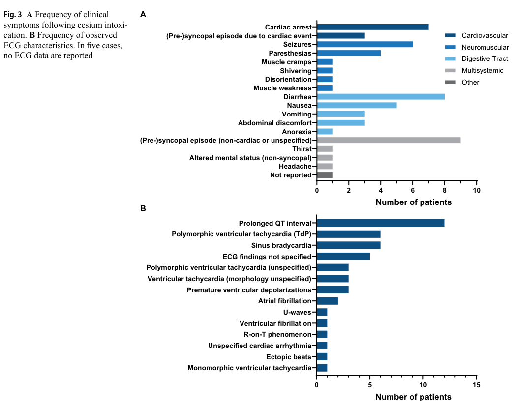

## Question

# Disease Characteristics Research Template

## Target Disease
- **Disease Name:** Cesium Poisoning
- **MONDO ID:** MONDO:0800384 (if available)
- **Category:** Environmental

## Research Objectives

Please provide a comprehensive research report on **Cesium Poisoning** covering all of the
disease characteristics listed below. This report will be used to populate a disease knowledge
base entry. Be thorough and cite primary literature (PMID preferred) for all claims.

For each section, **suggested databases/resources** are listed. These are the first places
you should search for information on each topic.

---

### 1. Disease Information
> **Search first:** OMIM, Orphanet, ICD-10/ICD-11, MeSH, PubMed

- What is the disease? Provide a concise overview.
- What are the key identifiers? (OMIM, Orphanet, ICD-10/ICD-11, MeSH, Mondo)
- What are the common synonyms and alternative names?
- Is the information derived from individual patients (e.g., EHR) or aggregated disease-level resources?

### 2. Etiology

- **Disease Causal Factors**: What are the primary causes? (genetic, environmental, infectious, mechanistic)
- **Risk Factors**:
  > **Search first:** PubMed, Cochrane Library, UpToDate, clinical guidelines, ClinVar, ClinGen, GWAS Catalog, PheGenI, CTD, CDC, WHO, epidemiological databases
  - Genetic risk factors (causal variants, susceptibility loci, modifier genes)
  - Environmental risk factors (toxins, lifestyle, occupational exposures, age, sex, family history)
- **Protective Factors**:
  > **Search first:** PubMed, Cochrane Library, clinical trial databases, GWAS Catalog, gnomAD, WHO, CDC, nutrition databases
  - Genetic protective factors (protective variants, modifier alleles)
  - Environmental protective factors (diet, lifestyle, exposures that reduce risk)
- **Gene-Environment Interactions**: How do genetic and environmental factors interact to influence disease?
  > **Search first:** CTD, PubMed, PheGenI, GxE databases

### 3. Phenotypes
> **Search first:** HPO (Human Phenotype Ontology), OMIM, Orphanet, PubMed, clinicaltrials.gov, MedDRA, SNOMED CT, DECIPHER, LOINC

For each phenotype, provide:
- **Phenotype type**: symptoms, clinical signs, physical manifestations, behavioral changes, or laboratory abnormalities
  > For symptoms/signs: HPO, OMIM, Orphanet, PubMed
  > For behavioral changes: HPO, DSM, RDoC (Research Domain Criteria), PubMed
  > For laboratory abnormalities: LOINC, SNOMED CT, LabTests Online, PubMed
- **Phenotype characteristics**:
  > **Search first:** OMIM, Orphanet, HPO, PubMed
  - Age of symptom onset (neonatal, childhood, adult-onset, late-onset)
  - Symptom severity (mild, moderate, severe, variable)
  - Symptom progression (stable, progressive, episodic, fluctuating)
  - Frequency among affected individuals (percentage or qualitative)
- **Quality of life impact**: Effects on daily functioning and well-being (per-phenotype when possible)
  > **Search first:** EQ-5D database, SF-36, WHO QOL databases, PubMed
- Suggest HPO (Human Phenotype Ontology) terms for each phenotype

### 4. Genetic/Molecular Information

- **Causal Genes**: Gene mutations or chromosomal abnormalities responsible for disease (gene symbols, OMIM IDs)
  > **Search first:** OMIM, ClinVar, HGMD, Ensembl, NCBI Gene
- **Pathogenic Variants**:
  - Affected genes (gene symbols, HGNC IDs)
    > **Search first:** OMIM, NCBI Gene, Ensembl, HGNC, UniProt, GeneCards
  - Variant classification (pathogenic, likely pathogenic, VUS per ACMG/AMP guidelines)
    > **Search first:** ClinVar, ClinGen, ACMG/AMP guidelines, VarSome
  - Variant type/class (missense, frameshift, nonsense, splice-site, structural)
  - Allele frequency in population databases
    > **Search first:** gnomAD, 1000 Genomes, ExAC, TOPMed, dbSNP
  - Somatic vs germline origin
    > **Search first:** COSMIC (somatic), ClinVar, ICGC, TCGA
  - Functional consequences (loss of function, gain of function, dominant negative)
- **Modifier Genes**: Genes that modify disease severity or expression
- **Epigenetic Information**: DNA methylation, histone modifications, chromatin changes affecting disease
  > **Search first:** ENCODE, Roadmap Epigenomics, MethBase, DiseaseMeth
- **Chromosomal Abnormalities**: Large-scale genetic changes (aneuploidy, translocations, inversions)
  > **Search first:** DECIPHER, ClinVar, ECARUCA, UCSC Genome Browser

### 5. Environmental Information

- **Environmental Factors**: Non-genetic contributing factors (toxins, radiation, pollution, occupational exposure)
  > **Search first:** CTD (Comparative Toxicogenomics Database), TOXNET, PubMed, EPA databases
- **Lifestyle Factors**: Behavioral factors (smoking, diet, exercise, alcohol consumption)
  > **Search first:** CDC databases, WHO, PubMed, NHANES
- **Infectious Agents**: If applicable, pathogens causing or triggering disease (bacteria, viruses, fungi, parasites)
  > **Search first:** NCBI Taxonomy, ViPR, BV-BRC, MicrobeDB, GIDEON

### 6. Mechanism / Pathophysiology

**Present this section as an ordered causal chain first, then the detail below.**
Open with a numbered sequence of mechanistic steps running from the initiating
lesion (mutation, exposure, infection) to the clinical manifestation, one step per
line, each naming what it causes next. State the causal verb explicitly ("leads
to", "results in") and say where a step is inferred rather than demonstrated.
Where the mechanism branches, show the branch. The categories below are a
checklist of what to cover within those steps, not the organizing structure —
a step may draw on several of them, and a category may contribute to several
steps.

- **Molecular Pathways**: Specific signaling cascades or biochemical pathways involved (Wnt, MAPK, mTOR, PI3K-AKT, etc.)
  > **Search first:** KEGG, Reactome, WikiPathways, PathBank, BioCyc
- **Cellular Processes**: Cell-level mechanisms (apoptosis, autophagy, cell cycle dysregulation, inflammation, etc.)
  > **Search first:** Gene Ontology (GO), Reactome, KEGG, PubMed
- **Protein Dysfunction**: How protein structure or function is altered (misfolding, aggregation, loss of function, gain of function)
  > **Search first:** UniProt, PDB (Protein Data Bank), InterPro, Pfam, AlphaFold
- **Metabolic Changes**: Alterations in metabolic processes (energy metabolism, lipid metabolism, amino acid metabolism)
  > **Search first:** KEGG, BioCyc, HMDB (Human Metabolome Database), BRENDA
- **Immune System Involvement**: Role of immune response (autoimmunity, immunodeficiency, chronic inflammation)
  > **Search first:** ImmPort, Immunome Database, IEDB, Gene Ontology
- **Tissue Damage Mechanisms**: How tissues/ are injured (oxidative stress, ischemia, fibrosis, necrosis)
  > **Search first:** PubMed, Gene Ontology, Reactome
- **Biochemical Abnormalities**: Specific molecular defects (enzyme deficiencies, receptor dysfunction, ion channel defects)
  > **Search first:** BRENDA, UniProt, KEGG, OMIM, PubMed
- **Epigenetic Changes**: DNA methylation, histone modifications affecting gene expression in disease
  > **Search first:** ENCODE, Roadmap Epigenomics, MethBase, DiseaseMeth
- **Molecular Profiling** (if available):
  - Transcriptomics/gene expression changes
    > **Search first:** GEO (Gene Expression Omnibus), ArrayExpress, GTEx, Human Cell Atlas, SRA
  - Proteomics findings
    > **Search first:** PRIDE, ProteomeXchange, Human Protein Atlas, STRING, BioGRID
  - Metabolomics signatures
    > **Search first:** MetaboLights, Metabolomics Workbench, HMDB, METLIN
  - Lipidomics alterations
    > **Search first:** LIPID MAPS, SwissLipids, LipidHome, Metabolomics Workbench
  - Genomic structural features
    > **Search first:** UCSC Genome Browser, Ensembl, NCBI, dbVar, DGV
- **Advanced Technologies** (if applicable):
  - Single-cell analysis findings (cell-type specific mechanisms, cellular heterogeneity)
    > **Search first:** Human Cell Atlas, Single Cell Portal, GEO, CELLxGENE
  - Spatial transcriptomics findings
    > **Search first:** GEO, Spatial Research, Vizgen, 10x Genomics data
  - Multi-omics integration results
    > **Search first:** TCGA, ICGC, cBioPortal, LinkedOmics, PubMed
  - Functional genomics screens (CRISPR, RNAi)
    > **Search first:** DepMap, GenomeRNAi, PubMed, BioGRID ORCS

For each mechanism, describe:
- The causal chain from initial trigger to clinical manifestation
- Which mechanisms are upstream vs downstream
- What cell types and biological processes are involved
- Suggest GO terms for biological processes and CL terms for cell types

### 7. Anatomical Structures Affected

- **Organ Level**:
  - Primary organs directly affected
  - Secondary organ involvement (complications, secondary effects)
  - Body systems involved (cardiovascular, nervous, digestive, respiratory, endocrine, etc.)
  > **Search first:** Uberon, FMA (Foundational Model of Anatomy), OMIM, HPO, ICD-11, MeSH, SNOMED CT
- **Tissue and Cell Level**:
  - Specific tissue types affected (epithelial, connective, muscle, nervous)
  - Specific cell populations targeted (with Cell Ontology terms)
  > **Search first:** Uberon, Human Protein Atlas, Cell Ontology, Human Cell Atlas, CellMarker, PanglaoDB
- **Subcellular Level**:
  - Cellular compartments involved (mitochondria, nucleus, ER, lysosomes) (with GO Cellular Component terms)
  > **Search first:** Gene Ontology (Cellular Component), UniProt, Human Protein Atlas
- **Localization**:
  - Specific anatomical sites (with UBERON terms)
    > **Search first:** FMA, Uberon, NeuroNames (for brain), SNOMED CT
  - Lateralization (unilateral, bilateral, asymmetric)
    > **Search first:** HPO, clinical literature, imaging databases

### 8. Temporal Development

- **Onset**:
  - Typical age of onset (congenital, pediatric, adult, geriatric)
  - Onset pattern (acute, subacute, chronic, insidious)
  > **Search first:** OMIM, Orphanet, HPO, PubMed
- **Progression**:
  - Disease stages (early, intermediate, advanced, end-stage)
    > **Search first:** Cancer Staging Manual (AJCC), WHO classifications, PubMed
  - Progression rate (rapid, slow, variable)
  - Disease course pattern (episodic, relapsing-remitting, progressive, stable)
  - Disease duration (self-limited, chronic lifelong)
  > **Search first:** Disease registries, longitudinal cohort databases, natural history studies, PubMed, Orphanet, OMIM
- **Patterns**:
  - Remission patterns (spontaneous, treatment-induced)
    > **Search first:** Clinical trial databases, disease registries, PubMed
  - Critical periods (time windows of vulnerability or opportunity for intervention)
    > **Search first:** PubMed, developmental biology databases, clinical guidelines

### 9. Inheritance and Population

- **Epidemiology**:
  - Prevalence (cases per 100,000 at given time)
  - Incidence (new cases per 100,000 per year)
  > **Search first:** Orphanet, CDC, WHO, GBD (Global Burden of Disease), national registries, SEER, disease registries
- **For Genetic Etiology**:
  - Inheritance pattern (AD, AR, X-linked, mitochondrial, multifactorial, polygenic)
    > **Search first:** OMIM, Orphanet, ClinVar, GTR (Genetic Testing Registry)
  - Penetrance (complete, incomplete, age-dependent)
    > **Search first:** ClinVar, OMIM, PubMed, ClinGen
  - Expressivity (variable, consistent)
    > **Search first:** OMIM, ClinVar, PubMed
  - Genetic anticipation (increasing severity in successive generations)
    > **Search first:** OMIM, PubMed (especially for repeat expansion disorders)
  - Germline mosaicism
    > **Search first:** ClinVar, OMIM, genetic counseling literature, PubMed
  - Founder effects (population-specific mutations)
    > **Search first:** gnomAD, population genetics databases, PubMed
  - Consanguinity role
    > **Search first:** OMIM, population studies, genetic counseling resources
  - Carrier frequency
    > **Search first:** gnomAD, carrier screening databases, GeneReviews, GTR
- **Population Demographics**:
  - Affected populations (ethnic or demographic groups with higher prevalence)
    > **Search first:** gnomAD, 1000 Genomes, PAGE Study, PubMed, population registries
  - Geographic distribution (endemic areas, regional variation)
    > **Search first:** WHO, CDC, GBD, Orphanet, geographic epidemiology databases
  - Geographic distribution of specific variants
  - Sex ratio (male:female)
    > **Search first:** Disease registries, OMIM, PubMed, epidemiological databases
  - Age distribution of affected individuals
    > **Search first:** CDC, disease registries, SEER, Orphanet

### 10. Diagnostics

- **Clinical Tests**:
  - Laboratory tests (blood, urine, tissue chemistry, specific enzyme assays)
    > **Search first:** LOINC, LabTests Online, PubMed
  - Biomarkers (proteins, metabolites, genetic markers, circulating biomarkers)
    > **Search first:** FDA Biomarker List, BEST (Biomarkers, EndpointS, and other Tools), PubMed
  - Imaging studies (X-ray, CT, MRI, PET, ultrasound)
    > **Search first:** RadLex, DICOM, Radiopaedia, imaging databases
  - Functional tests (pulmonary function, cardiac stress tests)
    > **Search first:** LOINC, clinical guidelines, PubMed
  - Electrophysiology (EEG, EMG, ECG, nerve conduction studies)
    > **Search first:** LOINC, clinical neurophysiology databases, PubMed
  - Biopsy findings (histopathology, immunohistochemistry)
    > **Search first:** SNOMED CT, College of American Pathologists resources, PubMed
  - Pathology findings (microscopic examination)
    > **Search first:** SNOMED CT, Digital Pathology databases, PubMed
- **Genetic Testing**:
  > **Search first:** GTR (Genetic Testing Registry), GeneReviews, ClinGen
  - Overview of recommended genetic testing approach
  - Whole genome sequencing (WGS) utility
    > **Search first:** GTR, ClinVar, GEL (Genomics England), gnomAD
  - Whole exome sequencing (WES) utility
    > **Search first:** GTR, ClinVar, OMIM, GeneMatcher
  - Gene panels (which panels, which genes)
    > **Search first:** GTR, ClinVar, laboratory-specific databases
  - Single gene testing
    > **Search first:** GTR, ClinVar, OMIM, GeneReviews
  - Chromosomal microarray (CMA)
    > **Search first:** DECIPHER, ClinVar, dbVar, ECARUCA
  - Karyotyping
    > **Search first:** Chromosome Abnormality Database, ClinVar, cytogenetics resources
  - FISH
    > **Search first:** ClinVar, cytogenetics databases, PubMed
  - Mitochondrial DNA testing
    > **Search first:** MITOMAP, MSeqDR, ClinVar, GTR
  - Repeat expansion testing
    > **Search first:** GTR, ClinVar, repeat expansion databases, PubMed
- **Omics-Based Diagnostics** (if applicable):
  - RNA sequencing / transcriptomics
    > **Search first:** GEO, ArrayExpress, GTEx, RNA-seq databases
  - Proteomics
    > **Search first:** PRIDE, ProteomeXchange, FDA Biomarker database
  - Metabolomics
    > **Search first:** MetaboLights, Metabolomics Workbench, HMDB
  - Epigenomics
    > **Search first:** GEO, ENCODE, Roadmap Epigenomics, MethBase
  - Liquid biopsy
    > **Search first:** COSMIC, ClinVar, liquid biopsy databases, PubMed
- **Clinical Criteria**:
  - Standardized diagnostic criteria (DSM, ICD, society guidelines)
    > **Search first:** DSM-5, ICD-11, clinical society guidelines, UpToDate
  - Differential diagnosis (other conditions to rule out, with distinguishing features)
    > **Search first:** DynaMed, UpToDate, clinical decision support systems
- **Screening**:
  - Screening methods for asymptomatic individuals (newborn screening, carrier screening, cascade screening)
    > **Search first:** ACMG recommendations, CDC newborn screening, GTR

### 11. Outcome/Prognosis

- **Survival and Mortality**:
  - Survival rate (5-year, 10-year, overall)
    > **Search first:** SEER, cancer registries, disease-specific registries, PubMed
  - Life expectancy (with and without treatment if applicable)
    > **Search first:** Orphanet, disease registries, actuarial databases, PubMed
  - Mortality rate
    > **Search first:** CDC, WHO, GBD, national mortality databases
  - Disease-specific mortality (deaths directly attributable to disease)
    > **Search first:** Disease registries, CDC Wonder, GBD, PubMed
- **Morbidity and Function**:
  - Morbidity (disease-related disability and health impacts)
    > **Search first:** GBD, WHO, disability databases, PubMed
  - Disability outcomes (long-term functional impairments)
    > **Search first:** ICF (International Classification of Functioning), disability registries
  - Quality of life measures (EQ-5D, SF-36, PROMIS, disease-specific tools)
    > **Search first:** EQ-5D database, SF-36, PROMIS, PubMed
- **Disease Course**:
  - Complications (secondary problems: infections, organ failure, etc.)
    > **Search first:** ICD codes, disease registries, clinical databases, PubMed
  - Recovery potential (likelihood and extent of recovery, with vs without treatment)
    > **Search first:** Natural history studies, rehabilitation databases, PubMed
- **Prediction**:
  - Prognostic factors (age, disease severity, biomarkers, treatment response)
    > **Search first:** Prognostic models databases, clinical calculators, PubMed
  - Prognostic biomarkers (molecular markers predicting disease course)
    > **Search first:** FDA Biomarker database, PubMed, cancer prognostic databases

### 12. Treatment

- **Pharmacotherapy**:
  - Pharmacological treatments (drug names, drug classes, mechanisms of action)
    > **Search first:** DrugBank, RxNorm, ATC classification, DailyMed, FDA databases
  - Pharmacogenomics (how genetic variants affect drug metabolism, efficacy, toxicity)
    > **Search first:** PharmGKB, CPIC (Clinical Pharmacogenetics), FDA Table of PGx Biomarkers
- **Advanced Therapeutics**:
  - Gene therapy (viral vectors, CRISPR, gene replacement, gene editing)
    > **Search first:** ClinicalTrials.gov, FDA gene therapy database, ASGCT resources
  - Cell therapy (stem cell transplant, CAR-T, cellular therapeutics)
    > **Search first:** ClinicalTrials.gov, FDA cell therapy database, FACT standards
  - RNA-based therapies (ASOs, siRNA, mRNA therapies)
    > **Search first:** ClinicalTrials.gov, FDA approvals, PubMed
  - Targeted therapies (treatments directed at specific molecular targets)
    > **Search first:** My Cancer Genome, OncoKB, ClinicalTrials.gov, FDA approvals
  - Immunotherapies (checkpoint inhibitors, monoclonal antibodies)
    > **Search first:** Cancer Immunotherapy Database, FDA approvals, ClinicalTrials.gov
- **Surgical and Interventional**:
  - Surgical interventions (types of surgery, timing, outcomes)
    > **Search first:** CPT codes, surgical registries, clinical guidelines, PubMed
- **Supportive and Rehabilitative**:
  - Supportive care (symptom management, pain control, nutrition)
    > **Search first:** Clinical guidelines, Cochrane Library, PubMed
  - Rehabilitation (physical therapy, occupational therapy, speech therapy)
    > **Search first:** Rehabilitation medicine databases, clinical guidelines, PubMed
- **Experimental**:
  - Experimental treatments in clinical trials (with NCT identifiers if available)
    > **Search first:** ClinicalTrials.gov, EU Clinical Trials Register, WHO ICTRP
- **Treatment Outcomes**:
  - Treatment response rates
    > **Search first:** Clinical trial databases, FDA reviews, systematic reviews, PubMed
  - Side effects and adverse events
    > **Search first:** FDA Adverse Event Reporting System (FAERS), MedWatch, PubMed
- **Treatment Strategy**:
  - Treatment algorithms (clinical pathways, decision trees)
    > **Search first:** Clinical practice guidelines, NCCN Guidelines, UpToDate
  - Combination therapies
    > **Search first:** ClinicalTrials.gov, treatment guidelines, PubMed
  - Personalized medicine approaches (genotype-guided treatment)
    > **Search first:** My Cancer Genome, CIViC, PharmGKB, precision medicine databases

For each treatment, suggest NCIT (NCI Thesaurus) clinical-intervention terms where applicable.

### 13. Prevention

- **Prevention Levels**:
  - Primary prevention (preventing disease occurrence: vaccination, risk factor modification)
    > **Search first:** CDC, WHO, USPSTF recommendations, Cochrane Library
  - Secondary prevention (early detection and treatment: screening programs, early intervention)
    > **Search first:** USPSTF, CDC screening guidelines, WHO
  - Tertiary prevention (preventing complications in those with disease)
    > **Search first:** Clinical guidelines, disease management protocols, PubMed
- **Immunization**: Vaccine strategies (if applicable)
  > **Search first:** CDC vaccine schedules, WHO immunization, FDA vaccine database
- **Screening and Early Detection**:
  - Screening programs (population-based: newborn screening, cancer screening)
    > **Search first:** CDC screening programs, USPSTF, cancer screening databases
  - Genetic screening (carrier screening, preimplantation genetic diagnosis, prenatal testing)
    > **Search first:** ACMG recommendations, ACOG guidelines, GTR
  - Risk stratification (identifying high-risk individuals for targeted prevention)
    > **Search first:** Risk prediction models, clinical calculators, PubMed
- **Behavioral Interventions**: Lifestyle modifications to reduce risk
  > **Search first:** CDC, WHO, behavioral intervention databases, Cochrane Library
- **Counseling**: Genetic counseling (risk assessment, family planning guidance)
  > **Search first:** NSGC resources, ACMG guidelines, GeneReviews
- **Public Health**:
  - Public health interventions (sanitation, vector control, health education)
    > **Search first:** CDC, WHO, public health databases, PubMed
  - Environmental interventions (reducing environmental risk factors)
    > **Search first:** EPA databases, WHO environmental health, PubMed
- **Prophylaxis**: Preventive medications or procedures
  > **Search first:** Clinical guidelines, FDA approvals, PubMed

### 14. Other Species / Natural Disease

- **Taxonomy**: Species affected (with NCBI Taxon identifiers)
  > **Search first:** NCBI Taxonomy
- **Breed**: Specific breeds affected (with VBO identifiers if applicable)
  > **Search first:** VBO (Vertebrate Breed Ontology)
- **Gene**: Orthologous genes in other species (with NCBI Gene IDs)
  > **Search first:** NCBI Gene
- **Natural Disease**:
  - Naturally occurring disease in other species (companion animals, wildlife)
    > **Search first:** OMIA (Online Mendelian Inheritance in Animals), VetCompass, PubMed
  - Veterinary relevance and importance in animal health
    > **Search first:** OMIA, veterinary databases, PubMed
- **Comparative Biology**:
  - Comparative pathology (similarities and differences across species)
    > **Search first:** OMIA, comparative pathology databases, PubMed
  - Evolutionary conservation of disease mechanisms
    > **Search first:** HomoloGene, OrthoMCL, Alliance of Genome Resources
- **Transmission** (if applicable):
  - Zoonotic potential
    > **Search first:** CDC zoonotic diseases, WHO zoonoses, GIDEON
  - Cross-species susceptibility
    > **Search first:** NCBI Taxonomy, veterinary databases, PubMed

### 15. Model Organisms

- **Model Types**:
  - Model organism type (mammalian, invertebrate, cellular, in vitro)
    > **Search first:** Alliance of Genome Resources, model organism databases
  - Specific model systems (mouse, rat, zebrafish, Drosophila, C. elegans, yeast, cell lines, organoids, iPSCs)
    > **Search first:** MGI, RGD, ZFIN, FlyBase, WormBase, SGD, ATCC, Cellosaurus
  - Induced models (drug treatment, surgical intervention, environmental manipulation)
    > **Search first:** MGI, model organism databases, PubMed
- **Genetic Models**:
  - Types available (knockout, knock-in, transgenic, conditional, humanized)
    > **Search first:** MGI, IMPC, KOMP, EuMMCR, IMSR
- **Model Characteristics**:
  - Phenotype recapitulation (how well model reproduces human disease features)
    > **Search first:** Model organism databases, comparative studies, PubMed
  - Model limitations (aspects of human disease not captured)
    > **Search first:** Model organism databases, PubMed, review articles
- **Applications**:
  - Research applications (what aspects of disease can be studied)
    > **Search first:** Model organism databases, PubMed
- **Resources**:
  - Model databases
    > **Search first:** MGI, RGD, ZFIN, FlyBase, WormBase, IMSR, EMMA, MMRRC

---

## Citation Requirements

- Cite primary literature (PMID preferred) for all mechanistic and clinical claims
- Prioritize recent reviews and landmark papers
- Include direct quotes from abstracts where possible to support key statements
- Distinguish evidence source types: human clinical, model organism, in vitro, computational

## Output Format

Structure your response as a comprehensive narrative organized by the sections above.
For each section, provide:
- Factual content with specific details (numbers, percentages, gene names, variant nomenclature)
- Ontology term suggestions (HPO, GO, CL, UBERON, CHEBI, NCIT, MONDO) where applicable
- Evidence citations with PMIDs
- Direct quotes from abstracts to support key claims
- Clear indication when information is not available or not applicable for this disease

This report will be used to populate a disease knowledge base entry with:
- Pathophysiology descriptions with causal chains
- Gene/protein annotations (HGNC, GO terms)
- Phenotype associations (HP terms) with frequencies
- Cell type involvement (CL terms)
- Anatomical locations (UBERON terms)
- Chemical entities (CHEBI terms)
- Treatment annotations (NCIT terms)
- Evidence items with PMIDs and exact abstract quotes
- Epidemiology, prognosis, diagnostic, and prevention information
- Animal model descriptions with phenotype recapitulation details

## Output

Question: You are an expert researcher providing comprehensive, well-cited information.

Provide detailed information focusing on:
1. Key concepts and definitions with current understanding
2. Recent developments and latest research (prioritize 2023-2024 sources)
3. Current applications and real-world implementations
4. Expert opinions and analysis from authoritative sources
5. Relevant statistics and data from recent studies

Format as a comprehensive research report with proper citations. Include URLs and publication dates where available.
Always prioritize recent, authoritative sources and provide specific citations for all major claims.

# Disease Characteristics Research Template

## Target Disease
- **Disease Name:** Cesium Poisoning
- **MONDO ID:** MONDO:0800384 (if available)
- **Category:** Environmental

## Research Objectives

Please provide a comprehensive research report on **Cesium Poisoning** covering all of the
disease characteristics listed below. This report will be used to populate a disease knowledge
base entry. Be thorough and cite primary literature (PMID preferred) for all claims.

For each section, **suggested databases/resources** are listed. These are the first places
you should search for information on each topic.

---

### 1. Disease Information
> **Search first:** OMIM, Orphanet, ICD-10/ICD-11, MeSH, PubMed

- What is the disease? Provide a concise overview.
- What are the key identifiers? (OMIM, Orphanet, ICD-10/ICD-11, MeSH, Mondo)
- What are the common synonyms and alternative names?
- Is the information derived from individual patients (e.g., EHR) or aggregated disease-level resources?

### 2. Etiology

- **Disease Causal Factors**: What are the primary causes? (genetic, environmental, infectious, mechanistic)
- **Risk Factors**:
  > **Search first:** PubMed, Cochrane Library, UpToDate, clinical guidelines, ClinVar, ClinGen, GWAS Catalog, PheGenI, CTD, CDC, WHO, epidemiological databases
  - Genetic risk factors (causal variants, susceptibility loci, modifier genes)
  - Environmental risk factors (toxins, lifestyle, occupational exposures, age, sex, family history)
- **Protective Factors**:
  > **Search first:** PubMed, Cochrane Library, clinical trial databases, GWAS Catalog, gnomAD, WHO, CDC, nutrition databases
  - Genetic protective factors (protective variants, modifier alleles)
  - Environmental protective factors (diet, lifestyle, exposures that reduce risk)
- **Gene-Environment Interactions**: How do genetic and environmental factors interact to influence disease?
  > **Search first:** CTD, PubMed, PheGenI, GxE databases

### 3. Phenotypes
> **Search first:** HPO (Human Phenotype Ontology), OMIM, Orphanet, PubMed, clinicaltrials.gov, MedDRA, SNOMED CT, DECIPHER, LOINC

For each phenotype, provide:
- **Phenotype type**: symptoms, clinical signs, physical manifestations, behavioral changes, or laboratory abnormalities
  > For symptoms/signs: HPO, OMIM, Orphanet, PubMed
  > For behavioral changes: HPO, DSM, RDoC (Research Domain Criteria), PubMed
  > For laboratory abnormalities: LOINC, SNOMED CT, LabTests Online, PubMed
- **Phenotype characteristics**:
  > **Search first:** OMIM, Orphanet, HPO, PubMed
  - Age of symptom onset (neonatal, childhood, adult-onset, late-onset)
  - Symptom severity (mild, moderate, severe, variable)
  - Symptom progression (stable, progressive, episodic, fluctuating)
  - Frequency among affected individuals (percentage or qualitative)
- **Quality of life impact**: Effects on daily functioning and well-being (per-phenotype when possible)
  > **Search first:** EQ-5D database, SF-36, WHO QOL databases, PubMed
- Suggest HPO (Human Phenotype Ontology) terms for each phenotype

### 4. Genetic/Molecular Information

- **Causal Genes**: Gene mutations or chromosomal abnormalities responsible for disease (gene symbols, OMIM IDs)
  > **Search first:** OMIM, ClinVar, HGMD, Ensembl, NCBI Gene
- **Pathogenic Variants**:
  - Affected genes (gene symbols, HGNC IDs)
    > **Search first:** OMIM, NCBI Gene, Ensembl, HGNC, UniProt, GeneCards
  - Variant classification (pathogenic, likely pathogenic, VUS per ACMG/AMP guidelines)
    > **Search first:** ClinVar, ClinGen, ACMG/AMP guidelines, VarSome
  - Variant type/class (missense, frameshift, nonsense, splice-site, structural)
  - Allele frequency in population databases
    > **Search first:** gnomAD, 1000 Genomes, ExAC, TOPMed, dbSNP
  - Somatic vs germline origin
    > **Search first:** COSMIC (somatic), ClinVar, ICGC, TCGA
  - Functional consequences (loss of function, gain of function, dominant negative)
- **Modifier Genes**: Genes that modify disease severity or expression
- **Epigenetic Information**: DNA methylation, histone modifications, chromatin changes affecting disease
  > **Search first:** ENCODE, Roadmap Epigenomics, MethBase, DiseaseMeth
- **Chromosomal Abnormalities**: Large-scale genetic changes (aneuploidy, translocations, inversions)
  > **Search first:** DECIPHER, ClinVar, ECARUCA, UCSC Genome Browser

### 5. Environmental Information

- **Environmental Factors**: Non-genetic contributing factors (toxins, radiation, pollution, occupational exposure)
  > **Search first:** CTD (Comparative Toxicogenomics Database), TOXNET, PubMed, EPA databases
- **Lifestyle Factors**: Behavioral factors (smoking, diet, exercise, alcohol consumption)
  > **Search first:** CDC databases, WHO, PubMed, NHANES
- **Infectious Agents**: If applicable, pathogens causing or triggering disease (bacteria, viruses, fungi, parasites)
  > **Search first:** NCBI Taxonomy, ViPR, BV-BRC, MicrobeDB, GIDEON

### 6. Mechanism / Pathophysiology

**Present this section as an ordered causal chain first, then the detail below.**
Open with a numbered sequence of mechanistic steps running from the initiating
lesion (mutation, exposure, infection) to the clinical manifestation, one step per
line, each naming what it causes next. State the causal verb explicitly ("leads
to", "results in") and say where a step is inferred rather than demonstrated.
Where the mechanism branches, show the branch. The categories below are a
checklist of what to cover within those steps, not the organizing structure —
a step may draw on several of them, and a category may contribute to several
steps.

- **Molecular Pathways**: Specific signaling cascades or biochemical pathways involved (Wnt, MAPK, mTOR, PI3K-AKT, etc.)
  > **Search first:** KEGG, Reactome, WikiPathways, PathBank, BioCyc
- **Cellular Processes**: Cell-level mechanisms (apoptosis, autophagy, cell cycle dysregulation, inflammation, etc.)
  > **Search first:** Gene Ontology (GO), Reactome, KEGG, PubMed
- **Protein Dysfunction**: How protein structure or function is altered (misfolding, aggregation, loss of function, gain of function)
  > **Search first:** UniProt, PDB (Protein Data Bank), InterPro, Pfam, AlphaFold
- **Metabolic Changes**: Alterations in metabolic processes (energy metabolism, lipid metabolism, amino acid metabolism)
  > **Search first:** KEGG, BioCyc, HMDB (Human Metabolome Database), BRENDA
- **Immune System Involvement**: Role of immune response (autoimmunity, immunodeficiency, chronic inflammation)
  > **Search first:** ImmPort, Immunome Database, IEDB, Gene Ontology
- **Tissue Damage Mechanisms**: How tissues/ are injured (oxidative stress, ischemia, fibrosis, necrosis)
  > **Search first:** PubMed, Gene Ontology, Reactome
- **Biochemical Abnormalities**: Specific molecular defects (enzyme deficiencies, receptor dysfunction, ion channel defects)
  > **Search first:** BRENDA, UniProt, KEGG, OMIM, PubMed
- **Epigenetic Changes**: DNA methylation, histone modifications affecting gene expression in disease
  > **Search first:** ENCODE, Roadmap Epigenomics, MethBase, DiseaseMeth
- **Molecular Profiling** (if available):
  - Transcriptomics/gene expression changes
    > **Search first:** GEO (Gene Expression Omnibus), ArrayExpress, GTEx, Human Cell Atlas, SRA
  - Proteomics findings
    > **Search first:** PRIDE, ProteomeXchange, Human Protein Atlas, STRING, BioGRID
  - Metabolomics signatures
    > **Search first:** MetaboLights, Metabolomics Workbench, HMDB, METLIN
  - Lipidomics alterations
    > **Search first:** LIPID MAPS, SwissLipids, LipidHome, Metabolomics Workbench
  - Genomic structural features
    > **Search first:** UCSC Genome Browser, Ensembl, NCBI, dbVar, DGV
- **Advanced Technologies** (if applicable):
  - Single-cell analysis findings (cell-type specific mechanisms, cellular heterogeneity)
    > **Search first:** Human Cell Atlas, Single Cell Portal, GEO, CELLxGENE
  - Spatial transcriptomics findings
    > **Search first:** GEO, Spatial Research, Vizgen, 10x Genomics data
  - Multi-omics integration results
    > **Search first:** TCGA, ICGC, cBioPortal, LinkedOmics, PubMed
  - Functional genomics screens (CRISPR, RNAi)
    > **Search first:** DepMap, GenomeRNAi, PubMed, BioGRID ORCS

For each mechanism, describe:
- The causal chain from initial trigger to clinical manifestation
- Which mechanisms are upstream vs downstream
- What cell types and biological processes are involved
- Suggest GO terms for biological processes and CL terms for cell types

### 7. Anatomical Structures Affected

- **Organ Level**:
  - Primary organs directly affected
  - Secondary organ involvement (complications, secondary effects)
  - Body systems involved (cardiovascular, nervous, digestive, respiratory, endocrine, etc.)
  > **Search first:** Uberon, FMA (Foundational Model of Anatomy), OMIM, HPO, ICD-11, MeSH, SNOMED CT
- **Tissue and Cell Level**:
  - Specific tissue types affected (epithelial, connective, muscle, nervous)
  - Specific cell populations targeted (with Cell Ontology terms)
  > **Search first:** Uberon, Human Protein Atlas, Cell Ontology, Human Cell Atlas, CellMarker, PanglaoDB
- **Subcellular Level**:
  - Cellular compartments involved (mitochondria, nucleus, ER, lysosomes) (with GO Cellular Component terms)
  > **Search first:** Gene Ontology (Cellular Component), UniProt, Human Protein Atlas
- **Localization**:
  - Specific anatomical sites (with UBERON terms)
    > **Search first:** FMA, Uberon, NeuroNames (for brain), SNOMED CT
  - Lateralization (unilateral, bilateral, asymmetric)
    > **Search first:** HPO, clinical literature, imaging databases

### 8. Temporal Development

- **Onset**:
  - Typical age of onset (congenital, pediatric, adult, geriatric)
  - Onset pattern (acute, subacute, chronic, insidious)
  > **Search first:** OMIM, Orphanet, HPO, PubMed
- **Progression**:
  - Disease stages (early, intermediate, advanced, end-stage)
    > **Search first:** Cancer Staging Manual (AJCC), WHO classifications, PubMed
  - Progression rate (rapid, slow, variable)
  - Disease course pattern (episodic, relapsing-remitting, progressive, stable)
  - Disease duration (self-limited, chronic lifelong)
  > **Search first:** Disease registries, longitudinal cohort databases, natural history studies, PubMed, Orphanet, OMIM
- **Patterns**:
  - Remission patterns (spontaneous, treatment-induced)
    > **Search first:** Clinical trial databases, disease registries, PubMed
  - Critical periods (time windows of vulnerability or opportunity for intervention)
    > **Search first:** PubMed, developmental biology databases, clinical guidelines

### 9. Inheritance and Population

- **Epidemiology**:
  - Prevalence (cases per 100,000 at given time)
  - Incidence (new cases per 100,000 per year)
  > **Search first:** Orphanet, CDC, WHO, GBD (Global Burden of Disease), national registries, SEER, disease registries
- **For Genetic Etiology**:
  - Inheritance pattern (AD, AR, X-linked, mitochondrial, multifactorial, polygenic)
    > **Search first:** OMIM, Orphanet, ClinVar, GTR (Genetic Testing Registry)
  - Penetrance (complete, incomplete, age-dependent)
    > **Search first:** ClinVar, OMIM, PubMed, ClinGen
  - Expressivity (variable, consistent)
    > **Search first:** OMIM, ClinVar, PubMed
  - Genetic anticipation (increasing severity in successive generations)
    > **Search first:** OMIM, PubMed (especially for repeat expansion disorders)
  - Germline mosaicism
    > **Search first:** ClinVar, OMIM, genetic counseling literature, PubMed
  - Founder effects (population-specific mutations)
    > **Search first:** gnomAD, population genetics databases, PubMed
  - Consanguinity role
    > **Search first:** OMIM, population studies, genetic counseling resources
  - Carrier frequency
    > **Search first:** gnomAD, carrier screening databases, GeneReviews, GTR
- **Population Demographics**:
  - Affected populations (ethnic or demographic groups with higher prevalence)
    > **Search first:** gnomAD, 1000 Genomes, PAGE Study, PubMed, population registries
  - Geographic distribution (endemic areas, regional variation)
    > **Search first:** WHO, CDC, GBD, Orphanet, geographic epidemiology databases
  - Geographic distribution of specific variants
  - Sex ratio (male:female)
    > **Search first:** Disease registries, OMIM, PubMed, epidemiological databases
  - Age distribution of affected individuals
    > **Search first:** CDC, disease registries, SEER, Orphanet

### 10. Diagnostics

- **Clinical Tests**:
  - Laboratory tests (blood, urine, tissue chemistry, specific enzyme assays)
    > **Search first:** LOINC, LabTests Online, PubMed
  - Biomarkers (proteins, metabolites, genetic markers, circulating biomarkers)
    > **Search first:** FDA Biomarker List, BEST (Biomarkers, EndpointS, and other Tools), PubMed
  - Imaging studies (X-ray, CT, MRI, PET, ultrasound)
    > **Search first:** RadLex, DICOM, Radiopaedia, imaging databases
  - Functional tests (pulmonary function, cardiac stress tests)
    > **Search first:** LOINC, clinical guidelines, PubMed
  - Electrophysiology (EEG, EMG, ECG, nerve conduction studies)
    > **Search first:** LOINC, clinical neurophysiology databases, PubMed
  - Biopsy findings (histopathology, immunohistochemistry)
    > **Search first:** SNOMED CT, College of American Pathologists resources, PubMed
  - Pathology findings (microscopic examination)
    > **Search first:** SNOMED CT, Digital Pathology databases, PubMed
- **Genetic Testing**:
  > **Search first:** GTR (Genetic Testing Registry), GeneReviews, ClinGen
  - Overview of recommended genetic testing approach
  - Whole genome sequencing (WGS) utility
    > **Search first:** GTR, ClinVar, GEL (Genomics England), gnomAD
  - Whole exome sequencing (WES) utility
    > **Search first:** GTR, ClinVar, OMIM, GeneMatcher
  - Gene panels (which panels, which genes)
    > **Search first:** GTR, ClinVar, laboratory-specific databases
  - Single gene testing
    > **Search first:** GTR, ClinVar, OMIM, GeneReviews
  - Chromosomal microarray (CMA)
    > **Search first:** DECIPHER, ClinVar, dbVar, ECARUCA
  - Karyotyping
    > **Search first:** Chromosome Abnormality Database, ClinVar, cytogenetics resources
  - FISH
    > **Search first:** ClinVar, cytogenetics databases, PubMed
  - Mitochondrial DNA testing
    > **Search first:** MITOMAP, MSeqDR, ClinVar, GTR
  - Repeat expansion testing
    > **Search first:** GTR, ClinVar, repeat expansion databases, PubMed
- **Omics-Based Diagnostics** (if applicable):
  - RNA sequencing / transcriptomics
    > **Search first:** GEO, ArrayExpress, GTEx, RNA-seq databases
  - Proteomics
    > **Search first:** PRIDE, ProteomeXchange, FDA Biomarker database
  - Metabolomics
    > **Search first:** MetaboLights, Metabolomics Workbench, HMDB
  - Epigenomics
    > **Search first:** GEO, ENCODE, Roadmap Epigenomics, MethBase
  - Liquid biopsy
    > **Search first:** COSMIC, ClinVar, liquid biopsy databases, PubMed
- **Clinical Criteria**:
  - Standardized diagnostic criteria (DSM, ICD, society guidelines)
    > **Search first:** DSM-5, ICD-11, clinical society guidelines, UpToDate
  - Differential diagnosis (other conditions to rule out, with distinguishing features)
    > **Search first:** DynaMed, UpToDate, clinical decision support systems
- **Screening**:
  - Screening methods for asymptomatic individuals (newborn screening, carrier screening, cascade screening)
    > **Search first:** ACMG recommendations, CDC newborn screening, GTR

### 11. Outcome/Prognosis

- **Survival and Mortality**:
  - Survival rate (5-year, 10-year, overall)
    > **Search first:** SEER, cancer registries, disease-specific registries, PubMed
  - Life expectancy (with and without treatment if applicable)
    > **Search first:** Orphanet, disease registries, actuarial databases, PubMed
  - Mortality rate
    > **Search first:** CDC, WHO, GBD, national mortality databases
  - Disease-specific mortality (deaths directly attributable to disease)
    > **Search first:** Disease registries, CDC Wonder, GBD, PubMed
- **Morbidity and Function**:
  - Morbidity (disease-related disability and health impacts)
    > **Search first:** GBD, WHO, disability databases, PubMed
  - Disability outcomes (long-term functional impairments)
    > **Search first:** ICF (International Classification of Functioning), disability registries
  - Quality of life measures (EQ-5D, SF-36, PROMIS, disease-specific tools)
    > **Search first:** EQ-5D database, SF-36, PROMIS, PubMed
- **Disease Course**:
  - Complications (secondary problems: infections, organ failure, etc.)
    > **Search first:** ICD codes, disease registries, clinical databases, PubMed
  - Recovery potential (likelihood and extent of recovery, with vs without treatment)
    > **Search first:** Natural history studies, rehabilitation databases, PubMed
- **Prediction**:
  - Prognostic factors (age, disease severity, biomarkers, treatment response)
    > **Search first:** Prognostic models databases, clinical calculators, PubMed
  - Prognostic biomarkers (molecular markers predicting disease course)
    > **Search first:** FDA Biomarker database, PubMed, cancer prognostic databases

### 12. Treatment

- **Pharmacotherapy**:
  - Pharmacological treatments (drug names, drug classes, mechanisms of action)
    > **Search first:** DrugBank, RxNorm, ATC classification, DailyMed, FDA databases
  - Pharmacogenomics (how genetic variants affect drug metabolism, efficacy, toxicity)
    > **Search first:** PharmGKB, CPIC (Clinical Pharmacogenetics), FDA Table of PGx Biomarkers
- **Advanced Therapeutics**:
  - Gene therapy (viral vectors, CRISPR, gene replacement, gene editing)
    > **Search first:** ClinicalTrials.gov, FDA gene therapy database, ASGCT resources
  - Cell therapy (stem cell transplant, CAR-T, cellular therapeutics)
    > **Search first:** ClinicalTrials.gov, FDA cell therapy database, FACT standards
  - RNA-based therapies (ASOs, siRNA, mRNA therapies)
    > **Search first:** ClinicalTrials.gov, FDA approvals, PubMed
  - Targeted therapies (treatments directed at specific molecular targets)
    > **Search first:** My Cancer Genome, OncoKB, ClinicalTrials.gov, FDA approvals
  - Immunotherapies (checkpoint inhibitors, monoclonal antibodies)
    > **Search first:** Cancer Immunotherapy Database, FDA approvals, ClinicalTrials.gov
- **Surgical and Interventional**:
  - Surgical interventions (types of surgery, timing, outcomes)
    > **Search first:** CPT codes, surgical registries, clinical guidelines, PubMed
- **Supportive and Rehabilitative**:
  - Supportive care (symptom management, pain control, nutrition)
    > **Search first:** Clinical guidelines, Cochrane Library, PubMed
  - Rehabilitation (physical therapy, occupational therapy, speech therapy)
    > **Search first:** Rehabilitation medicine databases, clinical guidelines, PubMed
- **Experimental**:
  - Experimental treatments in clinical trials (with NCT identifiers if available)
    > **Search first:** ClinicalTrials.gov, EU Clinical Trials Register, WHO ICTRP
- **Treatment Outcomes**:
  - Treatment response rates
    > **Search first:** Clinical trial databases, FDA reviews, systematic reviews, PubMed
  - Side effects and adverse events
    > **Search first:** FDA Adverse Event Reporting System (FAERS), MedWatch, PubMed
- **Treatment Strategy**:
  - Treatment algorithms (clinical pathways, decision trees)
    > **Search first:** Clinical practice guidelines, NCCN Guidelines, UpToDate
  - Combination therapies
    > **Search first:** ClinicalTrials.gov, treatment guidelines, PubMed
  - Personalized medicine approaches (genotype-guided treatment)
    > **Search first:** My Cancer Genome, CIViC, PharmGKB, precision medicine databases

For each treatment, suggest NCIT (NCI Thesaurus) clinical-intervention terms where applicable.

### 13. Prevention

- **Prevention Levels**:
  - Primary prevention (preventing disease occurrence: vaccination, risk factor modification)
    > **Search first:** CDC, WHO, USPSTF recommendations, Cochrane Library
  - Secondary prevention (early detection and treatment: screening programs, early intervention)
    > **Search first:** USPSTF, CDC screening guidelines, WHO
  - Tertiary prevention (preventing complications in those with disease)
    > **Search first:** Clinical guidelines, disease management protocols, PubMed
- **Immunization**: Vaccine strategies (if applicable)
  > **Search first:** CDC vaccine schedules, WHO immunization, FDA vaccine database
- **Screening and Early Detection**:
  - Screening programs (population-based: newborn screening, cancer screening)
    > **Search first:** CDC screening programs, USPSTF, cancer screening databases
  - Genetic screening (carrier screening, preimplantation genetic diagnosis, prenatal testing)
    > **Search first:** ACMG recommendations, ACOG guidelines, GTR
  - Risk stratification (identifying high-risk individuals for targeted prevention)
    > **Search first:** Risk prediction models, clinical calculators, PubMed
- **Behavioral Interventions**: Lifestyle modifications to reduce risk
  > **Search first:** CDC, WHO, behavioral intervention databases, Cochrane Library
- **Counseling**: Genetic counseling (risk assessment, family planning guidance)
  > **Search first:** NSGC resources, ACMG guidelines, GeneReviews
- **Public Health**:
  - Public health interventions (sanitation, vector control, health education)
    > **Search first:** CDC, WHO, public health databases, PubMed
  - Environmental interventions (reducing environmental risk factors)
    > **Search first:** EPA databases, WHO environmental health, PubMed
- **Prophylaxis**: Preventive medications or procedures
  > **Search first:** Clinical guidelines, FDA approvals, PubMed

### 14. Other Species / Natural Disease

- **Taxonomy**: Species affected (with NCBI Taxon identifiers)
  > **Search first:** NCBI Taxonomy
- **Breed**: Specific breeds affected (with VBO identifiers if applicable)
  > **Search first:** VBO (Vertebrate Breed Ontology)
- **Gene**: Orthologous genes in other species (with NCBI Gene IDs)
  > **Search first:** NCBI Gene
- **Natural Disease**:
  - Naturally occurring disease in other species (companion animals, wildlife)
    > **Search first:** OMIA (Online Mendelian Inheritance in Animals), VetCompass, PubMed
  - Veterinary relevance and importance in animal health
    > **Search first:** OMIA, veterinary databases, PubMed
- **Comparative Biology**:
  - Comparative pathology (similarities and differences across species)
    > **Search first:** OMIA, comparative pathology databases, PubMed
  - Evolutionary conservation of disease mechanisms
    > **Search first:** HomoloGene, OrthoMCL, Alliance of Genome Resources
- **Transmission** (if applicable):
  - Zoonotic potential
    > **Search first:** CDC zoonotic diseases, WHO zoonoses, GIDEON
  - Cross-species susceptibility
    > **Search first:** NCBI Taxonomy, veterinary databases, PubMed

### 15. Model Organisms

- **Model Types**:
  - Model organism type (mammalian, invertebrate, cellular, in vitro)
    > **Search first:** Alliance of Genome Resources, model organism databases
  - Specific model systems (mouse, rat, zebrafish, Drosophila, C. elegans, yeast, cell lines, organoids, iPSCs)
    > **Search first:** MGI, RGD, ZFIN, FlyBase, WormBase, SGD, ATCC, Cellosaurus
  - Induced models (drug treatment, surgical intervention, environmental manipulation)
    > **Search first:** MGI, model organism databases, PubMed
- **Genetic Models**:
  - Types available (knockout, knock-in, transgenic, conditional, humanized)
    > **Search first:** MGI, IMPC, KOMP, EuMMCR, IMSR
- **Model Characteristics**:
  - Phenotype recapitulation (how well model reproduces human disease features)
    > **Search first:** Model organism databases, comparative studies, PubMed
  - Model limitations (aspects of human disease not captured)
    > **Search first:** Model organism databases, PubMed, review articles
- **Applications**:
  - Research applications (what aspects of disease can be studied)
    > **Search first:** Model organism databases, PubMed
- **Resources**:
  - Model databases
    > **Search first:** MGI, RGD, ZFIN, FlyBase, WormBase, IMSR, EMMA, MMRRC

---

## Citation Requirements

- Cite primary literature (PMID preferred) for all mechanistic and clinical claims
- Prioritize recent reviews and landmark papers
- Include direct quotes from abstracts where possible to support key statements
- Distinguish evidence source types: human clinical, model organism, in vitro, computational

## Output Format

Structure your response as a comprehensive narrative organized by the sections above.
For each section, provide:
- Factual content with specific details (numbers, percentages, gene names, variant nomenclature)
- Ontology term suggestions (HPO, GO, CL, UBERON, CHEBI, NCIT, MONDO) where applicable
- Evidence citations with PMIDs
- Direct quotes from abstracts to support key claims
- Clear indication when information is not available or not applicable for this disease

This report will be used to populate a disease knowledge base entry with:
- Pathophysiology descriptions with causal chains
- Gene/protein annotations (HGNC, GO terms)
- Phenotype associations (HP terms) with frequencies
- Cell type involvement (CL terms)
- Anatomical locations (UBERON terms)
- Chemical entities (CHEBI terms)
- Treatment annotations (NCIT terms)
- Evidence items with PMIDs and exact abstract quotes
- Epidemiology, prognosis, diagnostic, and prevention information
- Animal model descriptions with phenotype recapitulation details

# Cesium poisoning: disease-characteristics research report

**Scope and evidence standard.** “Cesium poisoning” encompasses two related but clinically distinct problems: **chemical toxicity from a substantial dose of cesium**, usually nonradioactive cesium chloride or carbonate, and **internal contamination with radioactive cesium**, principally ¹³⁷Cs, which causes radiation exposure in addition to any chemical exposure. An environmental measurement or detectable ¹³⁷Cs body burden alone does **not** establish clinical poisoning. The human chemical-toxicity literature consists largely of selected case reports; radiological evidence includes accident cohorts and exposure surveillance. Accordingly, case-report percentages below are **not population frequencies**. (brouwer2026intoxicationbyselfadministered pages 1-3, giussani2020euradosreviewof pages 9-11, kim2024relationshipbetweenthe pages 1-5)

The following comparison keeps these evidence populations separate.

| Evidence stratum | Trigger | Primary pathology | Clinical findings and quantitative human data | Key test | Treatment | Evidence limitations |
|---|---|---|---|---|---|---|
| **Stable cesium-salt poisoning** | Usually deliberate oral or intravenous use of nonradioactive CsCl or Cs₂CO₃, commonly as unsupported alternative cancer therapy | Chemical cardiotoxicity: potassium-channel and HCN-channel inhibition, renal/GI potassium loss, delayed repolarization, early afterdepolarizations, and malignant ventricular arrhythmia | Review of **20 case reports**: **5 deaths (25%)**, cardiac arrest in 7, hypokalemia in **10/12** measured patients (median K⁺ 3.05 mmol/L), and QT prolongation reported in **14/20** in the article text; 11 reported QTc values had median **620 ms**. The article’s Figure 3 appears to show a lower QT count, so the explicit textual count is used here. (brouwer2026intoxicationbyselfadministered pages 3-4, brouwer2026intoxicationbyselfadministered pages 4-5) | Exposure history; serial ECG/telemetry and QTc; serum K⁺, Mg²⁺, renal function; cesium measurement by ICP-MS/AES-ICP where available | Stop exposure; intensive cardiac monitoring; aggressive K⁺/Mg²⁺ correction; ACLS, cardioversion/defibrillation, lidocaine or pacing as clinically indicated; Prussian blue has been used, but stable-Cs evidence is limited to case reports. (brouwer2026intoxicationbyselfadministered pages 5-7, brouwer2026intoxicationbyselfadministered pages 7-8) | Publication and selection bias are substantial; no controlled trials, validated toxic threshold, population incidence, or cesium-specific genetic susceptibility data. Most cases involved gram-scale self-administration, so ordinary environmental trace exposure is not comparable. |
| **Severe internal radioactive cesium contamination: Goiânia, 1987** | Rupture of a **50.9-TBq ¹³⁷CsCl** teletherapy source, causing ingestion, skin contamination, and external irradiation | Internal β/γ irradiation distributed broadly through soft tissues, combined in many victims with external/cutaneous exposure; sufficiently high dose can cause hematopoietic acute radiation syndrome (ARS) | Of **112,000 screened**, **249** had external and/or internal contamination; **20 developed hematopoietic ARS** and **4 died within four weeks**. These figures describe one accident cohort, not disease incidence or prevalence. (giussani2020euradosreviewof pages 9-11) | Radiation survey and decontamination assessment; whole-body gamma counting; urine/fecal bioassay; CBC with serial lymphocyte counts; cytogenetic biodosimetry and committed-dose reconstruction | Insoluble Prussian blue; 46 internally contaminated people received **3–10 g/day** as adults/adolescents or **1–3 g/day** as children in the reported reconstruction; treat ARS, infection, hemorrhage, electrolyte abnormalities, and cutaneous injury concurrently. (giussani2020euradosreviewof pages 9-11, aaseth2019medicaltherapyof pages 3-5) | Outcomes cannot be attributed solely to internal ¹³⁷Cs because external irradiation and skin contamination co-occurred; treatment was not randomized, and dose reconstruction was complex. |
| **Low-dose residual radiocesium exposure: Fukushima retrospective study, 2024** | Environmental ¹³⁴Cs/¹³⁷Cs intake after the 2011 Fukushima accident, varying with evacuation timing and location | Low-level internal radiation exposure detectable retrospectively; not equivalent to acute cesium poisoning or ARS | Whole-body-counter analysis of **1,145 adults** found 90th-percentile committed effective doses ranging from **0.04 mSv** in one lower-exposure group to **0.16 mSv** in the highest reported group. Participants were exposure cohorts, **not diagnosed poisoning cases**. (kim2024relationshipbetweenthe pages 1-5) | Whole-body counting for ¹³⁴Cs/¹³⁷Cs plus biokinetic back-calculation of committed effective dose and reconstruction of evacuation behavior | Exposure control, food/environmental monitoring, and individualized radiological assessment; these reported dose levels do not themselves establish an indication for Prussian blue | Retrospective measurements began months after release and required modeling; temporary re-entry or surface contamination may have affected some results. The study does not estimate cesium-poisoning incidence or demonstrate clinical illness from the measured doses. (kim2024relationshipbetweenthe pages 1-5, kim2024relationshipbetweenthe pages 16-22) |

*Table: Comparison of chemically toxic stable cesium-salt poisoning, severe internal ¹³⁷Cs contamination, and low-dose Fukushima radiocesium exposure. The strata are separated to prevent conflating cardiac poisoning, radiation injury, and detectable exposure without diagnosed disease.*

## 1. Disease information

**Definition and names.** Cesium intoxication, caesium poisoning, cesium chloride toxicity, cesium-salt poisoning, internal radiocesium contamination, and ¹³⁷Cs incorporation are useful search terms; the last two specifically denote radionuclide exposure. Stable ¹³³Cs is nonradioactive, whereas ¹³⁷Cs emits ionizing radiation and has a physical half-life of approximately 30 years. The clinical syndrome depends on chemical form, amount, route, radiation activity, external co-exposure, and time since exposure. (aaseth2019medicaltherapyof pages 3-5, giussani2020euradosreviewof pages 9-11, brouwer2026intoxicationbyselfadministered pages 3-4)

**Knowledge-base identifiers.** The requested identifier is **MONDO:0800384**, supplied with the query; its label and current status were **not independently verified**. A dedicated OMIM number, Orphanet number, or exact MeSH identifier for this acquired condition was not established from the retrieved sources. Do not substitute an unverified specific ICD-10/ICD-11 code: coding may distinguish toxic effects of metals from radiation exposure and must be checked against the applicable national coding release and the documented circumstances. **Data provenance:** this report synthesizes published individual case reports, a radiological accident cohort, primary experiments, and aggregated reviews; it is **not** an individual’s EHR record. (brouwer2026intoxicationbyselfadministered pages 1-3, giussani2020euradosreviewof pages 9-11)

## 2. Etiology, susceptibility, and protection

**Causes.** The best-documented severe *chemical* exposures were self-administration of CsCl or Cs₂CO₃, usually as purported cancer therapy. In a review searching reports through **16 September 2024**, 16 of 20 patients used CsCl, two used carbonate, and two had an unspecified formulation; cancer-related indications predominated. Such use has **no established anticancer benefit** and should not be confused with medically supervised radioactive-cesium decorporation. Radiological causes include release from damaged medical/industrial sources, reactor accidents, contaminated food or dust, and combined internal and external exposure. (brouwer2026intoxicationbyselfadministered pages 3-4, brouwer2026intoxicationbyselfadministered pages 1-3, giussani2020euradosreviewof pages 9-11)

**Risk and protective factors.** Important practical risks are gram-scale supplementation, intravenous administration, an exposure source with high ¹³⁷Cs activity, delayed recognition, and circumstances that increase radiocesium ingestion or inhalation. Hypokalemia and other long-QT risk factors plausibly aggravate arrhythmia risk; these are clinical susceptibility considerations, **not validated cesium-specific risk estimates**. A 2024 study of 6,083 patients prescribed *other* QT-prolonging medications found KCNE1 p.Asp85Asn associated with drug-induced long QT (adjusted OR **2.24**, 95% CI **1.35–3.58**); it did **not** test cesium exposure, so KCNE1 must **not** be entered as a proven cesium-poisoning gene. Source control, avoiding cesium supplements, food/radiation monitoring, prompt exposure cessation, and correction of low potassium are better-supported protective actions than any particular genetic allele or diet. No cesium-specific protective variant, susceptibility locus, or established gene–environment interaction was identified. (lopezmedina2024geneticriskfactors pages 1-2, brouwer2026intoxicationbyselfadministered pages 4-5, hromyk2024radiologicalanalysisof pages 1-3)

## 3. Phenotypes and effects on functioning

**Suggested HPO mappings are provisional phenotype annotations, not verified disease–HPO associations or confirmed term IDs.** Reported *chemical-poisoning* manifestations include:

- **Cardiovascular signs:** prolonged QT/QTc (**14 cases** in the 2026 review’s text; QTc available in 11, median **620 ms**, IQR **596–691**), polymorphic ventricular tachycardia (**9**), explicitly identified torsades de pointes (**6**), cardiac arrest (**7**), bradycardia, ventricular ectopy, and syncope/presyncope. Candidate HPO labels: *Long QT interval*, *Torsade de pointes*, *Ventricular tachycardia*, *Bradycardia*, and *Syncope*. There is an apparent discrepancy between the review narrative’s QT count and its plotted Figure 3; retain the explicitly stated textual count, flag the inconsistency, and do not infer a precise population prevalence from either. (brouwer2026intoxicationbyselfadministered pages 4-5, brouwer2026intoxicationbyselfadministered media e86d6e58)
- **Laboratory abnormality:** hypokalemia in **10/12** patients with reported serum potassium, median **3.05 mmol/L** (IQR **2.8–3.25**). Candidate HPO label: *Hypokalemia*. These denominators indicate **reporting**, not systematic screening of all exposed persons. (brouwer2026intoxicationbyselfadministered pages 3-4)
- **Neurological, neuromuscular, and digestive manifestations:** seizures (**6/20** reports), paresthesias, muscle cramps or weakness, nausea, diarrhea, and vomiting; candidate HPO labels: *Seizure*, *Paresthesia*, *Muscle weakness*, *Diarrhea*, *Nausea*, and *Vomiting*. Symptoms can be abrupt or evolve during continued use; age of onset reflects age at exposure rather than a developmental disease program. Functional impacts plausibly include inability to work or perform daily activities during syncope, seizures, intensive care, or prolonged hospitalization, but **no cesium-specific EQ-5D, SF-36, or phenotype-specific quality-of-life estimate was identified**. (brouwer2026intoxicationbyselfadministered pages 4-5, brouwer2026intoxicationbyselfadministered pages 5-7)

The reviewed patients included a child aged **8** and adults up to **84**; they were not a population-based age distribution. With *radiocesium*, hematopoietic acute radiation syndrome (ARS)—cytopenias, infection and bleeding—requires sufficiently high radiation exposure, often alongside external irradiation. Radiation-associated cutaneous injury can accompany source accidents but is not a defining effect of internally distributed cesium. Do not transfer stable-salt ECG case frequencies to low-level radiocesium exposure. Candidate HPO labels for documented high-dose complications are *Neutropenia* and *Thrombocytopenia*. (brouwer2026intoxicationbyselfadministered pages 3-4, aaseth2019medicaltherapyof pages 3-5, giussani2020euradosreviewof pages 9-11)

## 4. Genetic and molecular information

**No Mendelian causal gene, pathogenic cesium-poisoning variant, allele frequency, inheritance pattern, chromosomal lesion, or validated modifier gene is established.** Consequently ACMG pathogenicity classifications, HGNC disease-gene assignments, gnomAD carrier rates, germline/somatic status, and penetrance are **not applicable** to this exposure-defined disease. Cardiac potassium-channel families and HCN pacemaker channels are *protein targets affected by Cs⁺*, not genes mutated by poisoning. The review discusses potassium inward-rectifier **KCNJ** channels, including Kir1.1 and Kir4.1, as plausible mediators of membrane and renal-potassium effects; exact protein–gene assignments and HGNC identifiers should be checked against a nomenclature database before loading annotations. (brouwer2026intoxicationbyselfadministered pages 4-5, brouwer2026intoxicationbyselfadministered pages 5-7)

Ionizing radiation can damage DNA, but neither a distinctive human cesium-poisoning epigenetic signature nor a disease-specific chromosomal abnormality, methylation marker, or validated genotype-guided treatment was found. A genetic study of *general drug-induced* long QT is mechanistic context only, not proof of cesium-specific inheritance. (lopezmedina2024geneticriskfactors pages 1-2, giussani2020euradosreviewof pages 9-11)

## 5. Environmental and lifestyle information

The **relevant chemical entities** for provisional ChEBI mapping are *cesium(1+)*, *cesium chloride*, *cesium carbonate*, *cesium-137*, and *insoluble ferric hexacyanoferrate/Prussian blue*; confirm accession numbers and isotope-specific identity against ChEBI before import. In addition to intentional supplement use, environmental routes include contaminated dust and foods and damaged ¹³⁷Cs sources. A **2024** survey of Ukrainian forest foods collected in **2020–2022** reported mushroom and berry specimens exceeding applicable radiocesium limits; that is evidence for a potential exposure pathway, **not** a count of clinically poisoned residents. Smoking, exercise, alcohol, infectious agents, and family history have no established disease-specific causal role here. (hromyk2024radiologicalanalysisof pages 1-3, giussani2020euradosreviewof pages 9-11, brouwer2026intoxicationbyselfadministered pages 3-4)

## 6. Mechanism/pathophysiology

**Ordered causal chain—chemical branch and radiological branch:**

1. **Substantial Cs⁺ uptake after ingestion or injection leads to** systemic distribution into soft tissues, including excitable muscle; soluble ¹³⁷Cs intake additionally **leads to** continuing internal radioactive decay. (brouwer2026intoxicationbyselfadministered pages 4-5, aaseth2019medicaltherapyof pages 3-5)
2. **Cs⁺ interaction with potassium-handling channels leads to** reduced repolarizing potassium currents and, *as proposed rather than established in every patient*, impaired renal potassium handling; gastrointestinal loss **can further lead to** hypokalemia. (brouwer2026intoxicationbyselfadministered pages 4-5)
3. **Reduced cardiac potassium currents and low extracellular potassium lead to** prolonged ventricular repolarization/QTc; Cs⁺ inhibition of HCN pacemaker currents **may lead to** sinus bradycardia (*inferred contributor*). (brouwer2026intoxicationbyselfadministered pages 4-5)
4. **Prolonged repolarization plus calcium loading leads to** early afterdepolarizations in experimentally exposed Purkinje fibers, which **can lead to** triggered ventricular arrhythmias, syncope, cardiac arrest, or death; extrapolating this exact cellular sequence to each human case is **inferred**. (szabo1995roleofcalcium pages 1-2, dalal2004acquiredlongqt pages 1-2)
5. **Branch—absorbed ¹³⁷Cs β/γ emissions lead to** direct molecular injury and water-radiolysis reactive oxygen species, which **can lead to** DNA damage and, if absorbed dose is sufficiently high, hematopoietic injury and infection/hemorrhage. External-source irradiation may independently contribute and must not be attributed entirely to internal Cs. (aaseth2019medicaltherapyof pages 3-5, giussani2020euradosreviewof pages 9-11)

**Experimental resolution and interpretation.** In the primary dog/guinea-pig Purkinje preparation, **3.6–4.0 mM** extracellular Cs⁺, low extracellular K⁺ (**2–3 mM**), and slow pacing produced late early afterdepolarizations in **43%** of Purkinje fibers after **17–123 minutes**; calcium preloading accelerated their appearance. This supports an upstream electrophysiological mechanism, not a clinically measured human tissue Cs threshold. A **2023** rat experiment found cardiac/skeletal accumulation and histological injury after stable-CsCl dosing; the investigators proposed potassium antagonism and peroxide injury, but their tissue findings do not establish human clinical causality. The conventional MAPK/Wnt/mTOR pathway labels are **not substantiated as defining cesium-poisoning mechanisms**. (szabo1995roleofcalcium pages 1-2, yermishev2023ecologicalandtoxicological pages 1-2, yermishev2023ecologicalandtoxicological pages 2-2)

**Ontology suggestions, to validate before curation:** GO biological-process labels *potassium ion transmembrane transport*, *cardiac muscle cell action-potential repolarization*, *regulation of heart rate*, *response to ionizing radiation*, *cellular response to oxidative stress*, and *DNA repair*; GO cellular components *plasma membrane*, *sarcoplasmic reticulum*, and, for radiation injury, *nucleus*. CL labels *cardiomyocyte*, *cardiac Purkinje cell*, *skeletal muscle cell*, *renal tubular epithelial cell* (**renal involvement mechanistically proposed**), and *hematopoietic stem/progenitor cell* (**radiation-sensitive population; not uniquely targeted by Cs**). No validated human cesium-poisoning transcriptomic, proteomic, metabolomic, lipidomic, single-cell, spatial-omics, or CRISPR-screen diagnostic signature was found. (brouwer2026intoxicationbyselfadministered pages 4-5, szabo1995roleofcalcium pages 1-2, giussani2020euradosreviewof pages 9-11)

## 7. Anatomical structures

In chemical poisoning, the **cardiac conduction system and ventricular myocardium** are clinically central; kidney and gastrointestinal tract contribute to potassium handling, and skeletal muscle and nervous system may produce weakness, paresthesias, or seizures. In rats exposed to stable CsCl, myocardial and thigh-muscle histology showed myocyte injury, edema, hemorrhage, endothelial injury, and inflammatory infiltrates—**animal findings**, not a required human biopsy pattern. Radiocesium distributes broadly through soft tissues, relatively more in muscle than bone or fat; severe radiation accidents additionally affect marrow and potentially skin owing to co-exposure. Suggested UBERON labels: *heart*, *ventricular myocardium*, *skeletal muscle tissue*, *kidney*, *small intestine*, *bone marrow*, and *skin*; confirm exact term IDs independently. The main relevant subcellular site for chemical electrophysiology is the **plasma membrane**; sarcoplasmic reticulum calcium loading contributes in ex-vivo experiments, and radiation can injure nuclear DNA. There is **no characteristic unilateral or lateralized distribution**. (brouwer2026intoxicationbyselfadministered pages 4-5, yermishev2023ecologicalandtoxicological pages 1-2, szabo1995roleofcalcium pages 1-2, aaseth2019medicaltherapyof pages 3-5)

## 8. Temporal development

This is **acquired**, not congenital. Chemical toxicity can occur after days to weeks of self-administration, and severe cardiac episodes may be abrupt; in one primary **August 2004** case, a 43-year-old woman developed QTc **624 ms** versus **446 ms** previously, potassium **3.1 mEq/L**, seizure, and pulseless ventricular tachycardia after using CsCl. Accumulated cesium has an approximate biological half-life of **2–4 months**, so ECG and electrolyte surveillance may need to continue after stopping exposure; duration must be individualized rather than inferred from the half-life alone. (dalal2004acquiredlongqt pages 1-2, brouwer2026intoxicationbyselfadministered pages 4-5)

For radionuclide exposure, a review describes an early excretion component of about **3 days** and a major component near **3 months**, whereas ¹³⁷Cs physical decay takes approximately **30 years**. Clinical course is governed by intake, additional exposure, dosimetry, and whether ARS occurs; no validated cesium-specific stage or relapsing–remitting classification exists. **Early intervention** is important because gut binding prevents absorption and interrupts recirculation. (aaseth2019medicaltherapyof pages 3-5, aaseth2019medicaltherapyof pages 7-9)

## 9. Inheritance, epidemiology, and population

**Inheritance, penetrance, anticipation, mosaicism, founder effects, consanguinity, carrier frequency, and geographic distribution of pathogenic variants: not applicable.** No reliable general-population incidence/prevalence per 100,000 or male:female disease ratio was established. The selected stable-salt literature comprised **19 reports, 20 patients**, **14 women**, and five reported deaths; the observed sex and mortality fractions reflect publication/selection biases and **must not** be presented as population risks. (brouwer2026intoxicationbyselfadministered pages 3-4, brouwer2026intoxicationbyselfadministered pages 1-3)

**Accident-specific epidemiology:** after the 1987 Goiânia ¹³⁷Cs source accident, **112,000** people were screened, **249** had external and/or internal contamination, **20** developed hematopoietic ARS, and **four** died within four weeks. The four deaths cannot be assigned uniquely to chemical cesium toxicity or internal irradiation because external exposure was also present. In a **March 2024** Fukushima retrospective study, **1,145 adults** underwent analysis of earlier whole-body-counter data; the reported 90th-percentile committed effective doses were **0.04 mSv** in the Namie lower-exposure subgroup and **0.16 mSv** in the Futaba higher-exposure subgroup. These subjects were **exposure-surveillance participants, not 1,145 poisoning cases**. (giussani2020euradosreviewof pages 9-11, kim2024relationshipbetweenthe pages 1-5)

## 10. Diagnosis and screening

**Chemical-exposure assessment:** establish the product, elemental-cesium dose, route, duration, and concurrent QT-prolonging drugs; obtain a **12-lead ECG** and continuous cardiac monitoring if symptomatic or QT-prolonged, and repeatedly assess **potassium, magnesium, renal function**, and other clinically indicated electrolytes. The primary case above documents the diagnostic value of comparing QTc and electrolytes with a prior baseline. A specialized laboratory may quantify cesium in blood or urine using elemental-analysis methods, but the retrieved evidence did **not** establish a validated universal toxic concentration or threshold for treatment. Standard CT/MRI, biopsy, and omics tests are not diagnostic for uncomplicated chemical poisoning. Distinguish alternative causes of acquired long QT, seizure, and hypokalemia; assess possible underlying congenital long-QT disorder only when the history independently warrants it. (dalal2004acquiredlongqt pages 1-2, brouwer2026intoxicationbyselfadministered pages 3-4, yermishev2023ecologicalandtoxicological pages 2-2)

**Radiological-exposure assessment:** protect staff and stabilize emergencies first; use appropriate contamination surveys, **whole-body gamma spectrometry** for retained radiocesium, urine/fecal bioassay and biokinetic dose reconstruction, serial blood counts, and specialist biodosimetry where significant radiation injury is possible. External exposure and internal contamination require separate assessment. Cytogenetic dose estimates after Goiânia did **not** correlate significantly with ¹³⁷Cs intake in one analysis (**r = 0.2925; p = 0.21**), underscoring the mixed-exposure problem. The 2024 Fukushima analysis illustrates real-world whole-body counting but **not screening for symptomatic disease at those low measured doses**. WGS, WES, gene panels, CMA, karyotype, FISH, mitochondrial testing, repeat-expansion testing, prenatal genetics, and newborn/carrier screening are **not routine tests for cesium exposure**. (giussani2020euradosreviewof pages 9-11, kim2024relationshipbetweenthe pages 1-5)

## 11. Outcome and prognosis

Among selected published stable-salt cases, **5/20** deaths were reported, but this **25% is not a case-fatality estimate for everyone exposed**. The immediate threats are ventricular arrhythmia and cardiac arrest; neurological symptoms and prolonged monitoring contribute to morbidity. Outcome depends on exposure magnitude, QTc/electrolyte abnormalities, speed of withdrawal and resuscitation, and coexisting illness. No reliable five-year survival curve, life-expectancy decrement, prospective prognostic score, or validated disease-specific quality-of-life instrument was identified. (brouwer2026intoxicationbyselfadministered pages 3-4, brouwer2026intoxicationbyselfadministered pages 4-5, dalal2004acquiredlongqt pages 1-2)

Radiological prognosis requires the **absorbed dose and exposure geometry**; Goiânia survivors and fatalities had mixed internal/external exposures. Therefore, the accident’s four deaths and Fukushima’s low modeled internal doses must not be combined into a single cesium-poisoning mortality statistic. (giussani2020euradosreviewof pages 9-11, kim2024relationshipbetweenthe pages 1-5)

## 12. Treatment and real-world implementation

**Chemical CsCl/Cs₂CO₃ poisoning:** immediately **stop cesium**, obtain emergency/toxicology and cardiology input, monitor ECG continuously, correct potassium and magnesium, and treat ventricular arrhythmia, cardiac arrest, and seizure with standard emergency care. Published cases used potassium (**12/20**), magnesium (**9/20**), lidocaine (**6/20**), CPR (**5/20**), cardioversion (**4/20**), and Prussian blue (**3/20**); these are **practice frequencies in reported cases, not response rates or a comparative trial**. A primary case required **200-J defibrillation**, IV lidocaine, and electrolyte replacement. Specialist consideration of Prussian blue for substantial *stable* Cs exposure is supported by limited reports and binding biology, but its **FDA-indicated cesium use is for internal radioactive cesium**, not established routine treatment of every stable-Cs ingestion. (brouwer2026intoxicationbyselfadministered pages 5-7, dalal2004acquiredlongqt pages 1-2, aaseth2019medicaltherapyof pages 7-9)

**Internal ¹³⁷Cs contamination:** insoluble **Prussian blue (Radiogardase)** binds Cs⁺ in the gut and interrupts enterohepatic recirculation, increasing fecal elimination. A cited adult regimen is **3 g orally every eight hours for at least 30 days**, adjusted to measured burden and clinical response. In Goiânia, **46** internally contaminated people received Prussian blue; reported historical daily doses varied (**3–10 g adults/adolescents; 1–3 g children** in one dosimetry account), rather than representing a single modern pediatric prescribing rule. A historical two-volunteer experiment reported that **0.5 g** with a test meal reduced ¹³⁴Cs uptake by approximately **50%**, and **0.5 g three times daily** shortened previously absorbed ¹³⁴Cs biological half-time from about **100 to 50 days**. This is useful human pharmacodynamic evidence but extremely small and not a randomized poisoning trial. Potential adverse effects include **constipation**, gastrointestinal symptoms, and **hypokalemia**, warranting bowel and electrolyte monitoring. Manage concurrent ARS, infection/bleeding, and cutaneous injury separately. **Potassium iodide is for radioiodine thyroid protection, not an antidote to cesium.** (aaseth2019medicaltherapyof pages 7-9, giussani2020euradosreviewof pages 9-11, aaseth2019medicaltherapyof pages 3-5, altagraciamartinez2012prussianblueas pages 3-5)

**Recent experimental therapeutics:** an **April 2024** study found bacterial capture of Cs/Sr *in vitro*; *Bifidobacterium adolescentis* JCM1275 retained **55.7 mg Cs and 8.1 mg Sr per gram dry cells** under simultaneous exposure. Another **April 2024** study tested gastrointestinal binding by chitosan@DOTAGA *in vitro* against Cs(I), but its **in-vivo mouse efficacy experiment used uranium, not cesium**. A **November 2025** sequential gastrointestinal *in-vitro* experiment found that Prussian-blue formulation and pH affected cesium binding (**formulation p < 0.0001**); it does **not** demonstrate superior patient outcomes or justify replacing an approved product. No cesium-specific interventional-trial NCT identifier was established by the trial search. No gene, cell, RNA, immunotherapy, surgery, or genotype-guided therapy treats the exposure itself. Candidate NCIT intervention-label mappings, **without asserting verified codes**, are *Prussian Blue*, *Potassium Replacement Therapy*, *Magnesium Replacement Therapy*, *Cardioversion*, *Cardiopulmonary Resuscitation*, and *Radiation Decontamination*. (endo2024simultaneousremovalof pages 1-2, durand2024enhancingradioprotectiona pages 1-2, martinezalonso2025prussianbluetablets pages 1-2)

## 13. Prevention

**Primary:** prevent ingestion/injection of cesium sold as alternative cancer therapy; secure and track radioactive sources, avoid unverified contaminated food/water, use occupational controls, and monitor environmental radioactivity. **Secondary:** promptly identify significant suspected exposures with history/ECG/electrolytes or radiological survey and whole-body counting as appropriate, and initiate specialist-directed decorporation early. **Tertiary:** prevent recurrent arrhythmia through continued electrolyte and rhythm assessment and prevent ongoing internal radiation dose by monitoring body burden and treatment effectiveness. A **2024** field survey documents persisting food-monitoring needs after Chernobyl; Fukushima exposure analysis associates lower measured body burdens with particular evacuation histories but does not constitute a randomized prevention trial. There is **no vaccine, cesium-specific immunization, genetic carrier screening, or universal preventive medication**. (hromyk2024radiologicalanalysisof pages 1-3, kim2024relationshipbetweenthe pages 1-5, aaseth2019medicaltherapyof pages 7-9, brouwer2026intoxicationbyselfadministered pages 3-4)

## 14. Other species and natural exposure

Radiocesium can move through animal food webs; livestock and wildlife may acquire body burdens in contaminated environments, creating veterinary and food-safety concerns. However, finding ¹³⁷Cs in an animal does **not** establish clinical veterinary cesium poisoning. The isotope’s chemical uptake pathways are broadly shared among mammals, whereas radiation dose, life history, and ecology differ. Species relevant to the cited studies include *Homo sapiens* (**NCBI Taxon 9606**), *Rattus norvegicus* (**10116**), *Mus musculus* (**10090**), *Canis lupus familiaris* (**9615**, beagles used experimentally), and *Cavia porcellus* (**10141**); taxon accession verification remains appropriate at data import. No credible cesium-specific breed/VBO disease susceptibility, orthologous causal disease gene, or zoonotic transmission was identified: **cesium is an exposure, not a transmissible pathogen**. (yermishev2023ecologicalandtoxicological pages 2-2, aaseth2019medicaltherapyof pages 3-5, szabo1995roleofcalcium pages 1-2)

## 15. Model organisms and comparative evidence

**Rat, stable-cesium model—primary, August 2023:** young male rats (two groups of **eight**) received **75 mg/kg/day oral CsCl for 24 days**, compared with intact controls. Investigators examined left-ventricular and thigh muscle histology and tissue elements; they reported approximately **214.9-fold** heart and **695.3-fold** skeletal-muscle cesium accumulation, and **19.2%** and **29.1%** lower potassium, respectively, plus myocyte and microvascular lesions. The rat model supports biological plausibility but uses deliberate high dosing and cannot supply human exposure thresholds or radiation-risk estimates. (yermishev2023ecologicalandtoxicological pages 2-2, yermishev2023ecologicalandtoxicological pages 1-2)

**Ex-vivo dog/guinea-pig cardiac model—primary, October 1995:** superfused Purkinje fibers reproduced Cs⁺/low-K⁺-dependent calcium loading and afterdepolarizations, elucidating arrhythmia mechanisms; differences in experimental concentration and pacing limit direct clinical extrapolation. **Beagle-radiocesium decorporation model:** age-stratified animals showed reported Prussian-blue-associated whole-body ¹³⁷Cs reductions of **51%** in immature, **31%** in young-adult, and **38%** in aged dogs. **Microbial in-vitro model—2024:** bacterial Cs retention is a proposed removal technology, not an approved human probiotic antidote. No cesium-poisoning-specific knockout, knock-in, humanized line, iPSC organoid, or validated CRISPR disease model was found. Relevant model-resource starting points are RGD for rat and MGI for mouse, but the cited models are **exposure-induced rather than genetic**. (szabo1995roleofcalcium pages 1-2, aaseth2019medicaltherapyof pages 3-5, endo2024simultaneousremovalof pages 1-2)

### Selected exact abstract statements and source record

These short verbatim statements are included to distinguish what the publications themselves asserted from subsequent interpretation:

- **Clinical review, published January 2026; DOI [10.1007/s12012-025-10081-9](https://doi.org/10.1007/s12012-025-10081-9):** “A total of 20 cases were included in this literature review” and “Five patients were reported to have died because of the cesium intake.” **Evidence type:** aggregation of individual human reports; review, not a population cohort. (brouwer2026intoxicationbyselfadministered pages 1-3)
- **Primary 2024 Fukushima retrospective study, *Health Physics*, March 2024; DOI [10.1097/HP.0000000000001781](https://doi.org/10.1097/hp.0000000000001781):** “The study population was 1,145 adults.” **Evidence type:** human radiological exposure/dosimetry; not diagnosed poisoning. (kim2024relationshipbetweenthe pages 1-5)
- **Primary 2024 microbial study, *Scientific Reports*, April 2024; DOI [10.1038/s41598-024-57678-8](https://doi.org/10.1038/s41598-024-57678-8):** “*Bifidobacterium adolescentis* JCM1275 could simultaneously retain 55.7 mg-Cs/g-dry cell and 8.1 mg-Sr/g-dry cell.” **Evidence type:** laboratory culture. (endo2024simultaneousremovalof pages 1-2)
- **Primary 2023 rat study, *Regulatory Mechanisms in Biosystems*, August 2023; DOI [10.15421/10.15421/022361](https://doi.org/10.15421/10.15421/022361):** “the most intensive accumulative process appeared to be in the heart by 214.9 times and by 695.3 times with skeletal muscles.” **Evidence type:** experimentally exposed rats; the DOI is reproduced as supplied by the indexed article and should be checked on resolution. (yermishev2023ecologicalandtoxicological pages 1-2)
- **Primary 1995 isolated-fiber experiment, *Journal of Cardiovascular Electrophysiology*, October 1995; DOI [10.1111/j.1540-8167.1995.tb00356.x](https://doi.org/10.1111/j.1540-8167.1995.tb00356.x):** “Forty-three percent of Purkinje fibers developed L-EAD after a latent period of 17 to 123 minutes of exposure.” **Evidence type:** ex-vivo animal tissue. (szabo1995roleofcalcium pages 1-2)
- **Treatment overview, *Biomolecules*, December 2019; DOI [10.3390/biom9120856](https://doi.org/10.3390/biom9120856):** “If radioactive cesium is a significant pollutant, Prussian blue is the approved antidote for internal detoxification.” **Evidence type:** review of radiological management. The accident-specific dosimetry synthesis is [10.1007/s00411-020-00845-y](https://doi.org/10.1007/s00411-020-00845-y), published **May 2020**. (aaseth2019medicaltherapyof pages 7-9, giussani2020euradosreviewof pages 9-11)

**Identifier limitation:** the retrieved indexed records supplied DOIs and dates, but **did not consistently supply independently verified PMIDs**. To avoid fabricating identifiers, DOI URLs are supplied for the cited papers; PMIDs, exact HPO/GO/CL/UBERON/ChEBI/NCIT accessions, MeSH/ICD mappings, and the MONDO label should be resolved directly against their current authoritative registries before automated knowledge-base import.

References

1. (brouwer2026intoxicationbyselfadministered pages 1-3): Jasmijn Brouwer, Soumaya Asaggau, Marjan Wafa, Julia P. J. Janssen, Willem Y. Hament, Hiela Bazgarjar, Kim G. Zwinkels, Ruben A. van Diest, and Marcel A. G. van der Heyden. Intoxication by self-administered cesium salts, the clinical impact of questionable research output. Cardiovascular Toxicology, Jan 2026. URL: https://doi.org/10.1007/s12012-025-10081-9, doi:10.1007/s12012-025-10081-9. This article has 2 citations and is from a peer-reviewed journal.

2. (giussani2020euradosreviewof pages 9-11): A. Giussani, M. A. Lopez, H. Romm, A. Testa, E. A. Ainsbury, M. Degteva, S. Della Monaca, G. Etherington, P. Fattibene, I. Güclu, A. Jaworska, D. C. Lloyd, I. Malátová, S. McComish, D. Melo, J. Osko, A. Rojo, S. Roch-Lefevre, L. Roy, E. Shishkina, N. Sotnik, S. Y. Tolmachev, A. Wieser, C. Woda, and M. Youngman. Eurados review of retrospective dosimetry techniques for internal exposures to ionising radiation and their applications. Radiation and Environmental Biophysics, 59:357-387, May 2020. URL: https://doi.org/10.1007/s00411-020-00845-y, doi:10.1007/s00411-020-00845-y. This article has 50 citations and is from a peer-reviewed journal.

3. (kim2024relationshipbetweenthe pages 1-5): Eunjoo Kim, Shozo Hashimoto, Kotaro Tani, Masayuki Naito, Yoshio Takashima, Tetsuo Ishikawa, Seiji Yasumura, Kenji Kamiya, and Osamu Kurihara. Relationship between the residual cesium body contents and individual behaviors among evacuees from municipalities near the fukushima daiichi nuclear power plant. Health Physics, 126:141-150, Mar 2024. URL: https://doi.org/10.1097/hp.0000000000001781, doi:10.1097/hp.0000000000001781. This article has 0 citations and is from a peer-reviewed journal.

4. (brouwer2026intoxicationbyselfadministered pages 3-4): Jasmijn Brouwer, Soumaya Asaggau, Marjan Wafa, Julia P. J. Janssen, Willem Y. Hament, Hiela Bazgarjar, Kim G. Zwinkels, Ruben A. van Diest, and Marcel A. G. van der Heyden. Intoxication by self-administered cesium salts, the clinical impact of questionable research output. Cardiovascular Toxicology, Jan 2026. URL: https://doi.org/10.1007/s12012-025-10081-9, doi:10.1007/s12012-025-10081-9. This article has 2 citations and is from a peer-reviewed journal.

5. (brouwer2026intoxicationbyselfadministered pages 4-5): Jasmijn Brouwer, Soumaya Asaggau, Marjan Wafa, Julia P. J. Janssen, Willem Y. Hament, Hiela Bazgarjar, Kim G. Zwinkels, Ruben A. van Diest, and Marcel A. G. van der Heyden. Intoxication by self-administered cesium salts, the clinical impact of questionable research output. Cardiovascular Toxicology, Jan 2026. URL: https://doi.org/10.1007/s12012-025-10081-9, doi:10.1007/s12012-025-10081-9. This article has 2 citations and is from a peer-reviewed journal.

6. (brouwer2026intoxicationbyselfadministered pages 5-7): Jasmijn Brouwer, Soumaya Asaggau, Marjan Wafa, Julia P. J. Janssen, Willem Y. Hament, Hiela Bazgarjar, Kim G. Zwinkels, Ruben A. van Diest, and Marcel A. G. van der Heyden. Intoxication by self-administered cesium salts, the clinical impact of questionable research output. Cardiovascular Toxicology, Jan 2026. URL: https://doi.org/10.1007/s12012-025-10081-9, doi:10.1007/s12012-025-10081-9. This article has 2 citations and is from a peer-reviewed journal.

7. (brouwer2026intoxicationbyselfadministered pages 7-8): Jasmijn Brouwer, Soumaya Asaggau, Marjan Wafa, Julia P. J. Janssen, Willem Y. Hament, Hiela Bazgarjar, Kim G. Zwinkels, Ruben A. van Diest, and Marcel A. G. van der Heyden. Intoxication by self-administered cesium salts, the clinical impact of questionable research output. Cardiovascular Toxicology, Jan 2026. URL: https://doi.org/10.1007/s12012-025-10081-9, doi:10.1007/s12012-025-10081-9. This article has 2 citations and is from a peer-reviewed journal.

8. (aaseth2019medicaltherapyof pages 3-5): Jan Aaseth, Valeria Marina Nurchi, and Ole Andersen. Medical therapy of patients contaminated with radioactive cesium or iodine. Biomolecules, 9:856, Dec 2019. URL: https://doi.org/10.3390/biom9120856, doi:10.3390/biom9120856. This article has 49 citations.

9. (kim2024relationshipbetweenthe pages 16-22): Eunjoo Kim, Shozo Hashimoto, Kotaro Tani, Masayuki Naito, Yoshio Takashima, Tetsuo Ishikawa, Seiji Yasumura, Kenji Kamiya, and Osamu Kurihara. Relationship between the residual cesium body contents and individual behaviors among evacuees from municipalities near the fukushima daiichi nuclear power plant. Health Physics, 126:141-150, Mar 2024. URL: https://doi.org/10.1097/hp.0000000000001781, doi:10.1097/hp.0000000000001781. This article has 0 citations and is from a peer-reviewed journal.

10. (lopezmedina2024geneticriskfactors pages 1-2): A. I. Lopez-Medina, Alessandra M. Campos-Staffico, Choudhary Anwar A Chahal, Isabella Volkers, Juliet P. Jacoby, Omer Berenfeld, and Jasmine A. Luzum. Genetic risk factors for drug-induced long qt syndrome: findings from a large real-world case-control study. Pharmacogenomics, 25:117-131, Feb 2024. URL: https://doi.org/10.2217/pgs-2023-0229, doi:10.2217/pgs-2023-0229. This article has 11 citations and is from a peer-reviewed journal.

11. (hromyk2024radiologicalanalysisof pages 1-3): Oksana Hromyk, Leonid Ilyin, Mykola Zinchuk, Igor Grygus, Serhii Korotun, and Walery Zukow. Radiological analysis of food products of forest origin in the pollution zone of the kamin-kashyrskyi district of the volyn region of ukraine. Geology, Geophysics and Environment, 50:307-316, Sep 2024. URL: https://doi.org/10.7494/geol.2024.50.3.307, doi:10.7494/geol.2024.50.3.307. This article has 4 citations.

12. (brouwer2026intoxicationbyselfadministered media e86d6e58): Jasmijn Brouwer, Soumaya Asaggau, Marjan Wafa, Julia P. J. Janssen, Willem Y. Hament, Hiela Bazgarjar, Kim G. Zwinkels, Ruben A. van Diest, and Marcel A. G. van der Heyden. Intoxication by self-administered cesium salts, the clinical impact of questionable research output. Cardiovascular Toxicology, Jan 2026. URL: https://doi.org/10.1007/s12012-025-10081-9, doi:10.1007/s12012-025-10081-9. This article has 2 citations and is from a peer-reviewed journal.

13. (szabo1995roleofcalcium pages 1-2): BELA SZABO, TIBOR KOVACS, and RALPH LAZZARA. Role of calcium loading in early afterdepolarizations generated by cs+ in canine and guinea pig purkinje fibers. Journal of Cardiovascular Electrophysiology, 6:796-812, Oct 1995. URL: https://doi.org/10.1111/j.1540-8167.1995.tb00356.x, doi:10.1111/j.1540-8167.1995.tb00356.x. This article has 59 citations and is from a peer-reviewed journal.

14. (dalal2004acquiredlongqt pages 1-2): Anuj K. Dalal, John D. Harding, and Ralph J. Verdino. Acquired long qt syndrome and monomorphic ventricular tachycardia after alternative treatment with cesium chloride for brain cancer. Mayo Clinic proceedings, 79 8:1065-9, Aug 2004. URL: https://doi.org/10.4065/79.8.1065, doi:10.4065/79.8.1065. This article has 36 citations and is from a domain leading peer-reviewed journal.

15. (yermishev2023ecologicalandtoxicological pages 1-2): O. Yermishev. Ecological and toxicological features of the effect of stable cesium on striated muscle tissue (myocardium and skeletal muscles) of mammals. Regulatory Mechanisms in Biosystems, 14:415-423, Aug 2023. URL: https://doi.org/10.15421/10.15421/022361, doi:10.15421/10.15421/022361. This article has 3 citations.

16. (yermishev2023ecologicalandtoxicological pages 2-2): O. Yermishev. Ecological and toxicological features of the effect of stable cesium on striated muscle tissue (myocardium and skeletal muscles) of mammals. Regulatory Mechanisms in Biosystems, 14:415-423, Aug 2023. URL: https://doi.org/10.15421/10.15421/022361, doi:10.15421/10.15421/022361. This article has 3 citations.

17. (aaseth2019medicaltherapyof pages 7-9): Jan Aaseth, Valeria Marina Nurchi, and Ole Andersen. Medical therapy of patients contaminated with radioactive cesium or iodine. Biomolecules, 9:856, Dec 2019. URL: https://doi.org/10.3390/biom9120856, doi:10.3390/biom9120856. This article has 49 citations.

18. (altagraciamartinez2012prussianblueas pages 3-5): Marina Altagracia-Martínez, J. Kravzov-Jinich, J. Martínez-Núñez, C. Ríos-Castañeda, and F. López-Naranjo. Prussian blue as an antidote for radioactive thallium and cesium poisoning. ArXiv, 2:13-21, Jun 2012. URL: https://doi.org/10.2147/odrr.s31881, doi:10.2147/odrr.s31881. This article has 67 citations.

19. (endo2024simultaneousremovalof pages 1-2): Rin Endo, Satoshi Karasawa, and Hideki Aoyagi. Simultaneous removal of caesium and strontium using different removal mechanisms of probiotic bacteria. Scientific Reports, Apr 2024. URL: https://doi.org/10.1038/s41598-024-57678-8, doi:10.1038/s41598-024-57678-8. This article has 8 citations and is from a peer-reviewed journal.

20. (durand2024enhancingradioprotectiona pages 1-2): Arthur Durand, Tatiana Borisova, François Lux, Jordyn A. Howard, Augustin Tillement, Halyna Kuznietsova, Natalia Dziubenko, Vladimir Lysenko, Laurent David, Daphné Morel, Ross Berbeco, Serhiy Komisarenko, Olivier Tillement, and Eric Deutsch. Enhancing radioprotection: a chitosan-based chelating polymer is a versatile radioprotective agent for prophylactic and therapeutic interventions against radionuclide contamination. PLOS ONE, 19:e0292414, Apr 2024. URL: https://doi.org/10.1371/journal.pone.0292414, doi:10.1371/journal.pone.0292414. This article has 6 citations and is from a peer-reviewed journal.

21. (martinezalonso2025prussianbluetablets pages 1-2): Borja Martínez-Alonso, Guillermo Torrado Durán, Hugo Pardo Laurel, Víctor Guarnizo-Herrero, and M. Ángeles Peña Fernández. Prussian blue tablets for cesium decorporation: ph-dependent performance under normogastric and hypochlorhydric conditions in an in vitro gastrointestinal model. Pharmaceuticals, 18:1702, Nov 2025. URL: https://doi.org/10.3390/ph18111702, doi:10.3390/ph18111702. This article has 0 citations.

## Artifacts

- [Edison artifact artifact-00](Cesium_Poisoning-deep-research-falcon_artifacts/artifact-00.md)

## Reference Validation

Checked with `linkml-reference-validator` 0.3.0.

| Outcome | Count |
| --- | --- |
| References checked | 13 |
| Resolved | 13 |
| Unresolved (possible confabulation) | 0 |
| Unverifiable | 0 |
| References weighed for topical relevance | 13 |
| On topic | 2 |
| Off topic | 1 |

### References that may not be about this subject

These identifiers resolve, so they are not fabrications, but the records they resolve to share almost none of this report's vocabulary. That is a clue and not a verdict - a paper can be relevant in ways its title and abstract do not spell out - so read them before deciding:

- `DOI:10.1111/j.1540-8167.1995.tb00356.x` (5 mentions) - Role of Calcium Loading in Early Afterdepolarizations Generated by Cs+ in Canine and Guinea Pig Purkinje Fibers
  - shared terms: exposure

Weighed against this report's own most characteristic terms: `disease`, `clinical`, `exposure`, `cesium`, `genetic`, `gene`, `primary`, `radiation`, `human`, `treatment`, `chemical`, `poisoning`, `cardiac`, `internal`, `potassium`, `effect`, `environmental`, `type`, `model`, `cell`.

All extracted references resolved successfully.
Resolving is not the same as being relevant, though - see the references listed above as possibly off topic.

## Term Validation

Checked with `linkml-term-validator` 0.4.5, through the `ols:` adapter.

| Outcome | Count |
| --- | --- |
| Terms checked | 1 |
| Resolved | 1 |
| Unresolved (possible confabulation) | 0 |
| Obsolete | 0 |
| Unverifiable | 0 |
| Terms whose name was checked | 1 |
| Terms named correctly | 0 |
| Terms named as a **different** term | 1 |

### Terms the report names something else

These identifiers resolve, so nothing about them looks wrong, and the ontology calls them something unrelated to what the report calls them. That usually means the identifier is not the one the sentence needs:

- `MONDO:0800384` (2 mentions) - the report calls it "if available"; MONDO calls it **cesium poisoning**