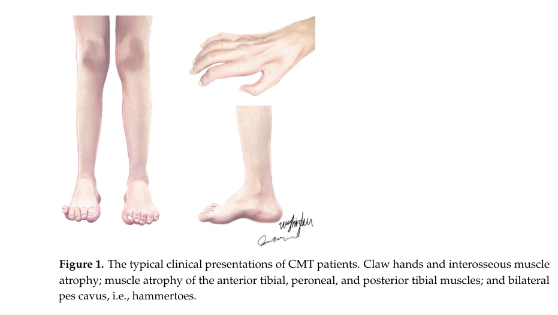

## Question

# Disease Characteristics Research Template

## Target Disease
- **Disease Name:** Charcot-Marie-Tooth Disease Type 1
- **MONDO ID:** MONDO:0019011 (if available)
- **Category:** Mendelian

## Research Objectives

Please provide a comprehensive research report on **Charcot-Marie-Tooth Disease Type 1** covering all of the
disease characteristics listed below. This report will be used to populate a disease knowledge
base entry. Be thorough and cite primary literature (PMID preferred) for all claims.

For each section, **suggested databases/resources** are listed. These are the first places
you should search for information on each topic.

---

### 1. Disease Information
> **Search first:** OMIM, Orphanet, ICD-10/ICD-11, MeSH, PubMed

- What is the disease? Provide a concise overview.
- What are the key identifiers? (OMIM, Orphanet, ICD-10/ICD-11, MeSH, Mondo)
- What are the common synonyms and alternative names?
- Is the information derived from individual patients (e.g., EHR) or aggregated disease-level resources?

### 2. Etiology

- **Disease Causal Factors**: What are the primary causes? (genetic, environmental, infectious, mechanistic)
- **Risk Factors**:
  > **Search first:** PubMed, Cochrane Library, UpToDate, clinical guidelines, ClinVar, ClinGen, GWAS Catalog, PheGenI, CTD, CDC, WHO, epidemiological databases
  - Genetic risk factors (causal variants, susceptibility loci, modifier genes)
  - Environmental risk factors (toxins, lifestyle, occupational exposures, age, sex, family history)
- **Protective Factors**:
  > **Search first:** PubMed, Cochrane Library, clinical trial databases, GWAS Catalog, gnomAD, WHO, CDC, nutrition databases
  - Genetic protective factors (protective variants, modifier alleles)
  - Environmental protective factors (diet, lifestyle, exposures that reduce risk)
- **Gene-Environment Interactions**: How do genetic and environmental factors interact to influence disease?
  > **Search first:** CTD, PubMed, PheGenI, GxE databases

### 3. Phenotypes
> **Search first:** HPO (Human Phenotype Ontology), OMIM, Orphanet, PubMed, clinicaltrials.gov, MedDRA, SNOMED CT, DECIPHER, LOINC

For each phenotype, provide:
- **Phenotype type**: symptoms, clinical signs, physical manifestations, behavioral changes, or laboratory abnormalities
  > For symptoms/signs: HPO, OMIM, Orphanet, PubMed
  > For behavioral changes: HPO, DSM, RDoC (Research Domain Criteria), PubMed
  > For laboratory abnormalities: LOINC, SNOMED CT, LabTests Online, PubMed
- **Phenotype characteristics**:
  > **Search first:** OMIM, Orphanet, HPO, PubMed
  - Age of symptom onset (neonatal, childhood, adult-onset, late-onset)
  - Symptom severity (mild, moderate, severe, variable)
  - Symptom progression (stable, progressive, episodic, fluctuating)
  - Frequency among affected individuals (percentage or qualitative)
- **Quality of life impact**: Effects on daily functioning and well-being (per-phenotype when possible)
  > **Search first:** EQ-5D database, SF-36, WHO QOL databases, PubMed
- Suggest HPO (Human Phenotype Ontology) terms for each phenotype

### 4. Genetic/Molecular Information

- **Causal Genes**: Gene mutations or chromosomal abnormalities responsible for disease (gene symbols, OMIM IDs)
  > **Search first:** OMIM, ClinVar, HGMD, Ensembl, NCBI Gene
- **Pathogenic Variants**:
  - Affected genes (gene symbols, HGNC IDs)
    > **Search first:** OMIM, NCBI Gene, Ensembl, HGNC, UniProt, GeneCards
  - Variant classification (pathogenic, likely pathogenic, VUS per ACMG/AMP guidelines)
    > **Search first:** ClinVar, ClinGen, ACMG/AMP guidelines, VarSome
  - Variant type/class (missense, frameshift, nonsense, splice-site, structural)
  - Allele frequency in population databases
    > **Search first:** gnomAD, 1000 Genomes, ExAC, TOPMed, dbSNP
  - Somatic vs germline origin
    > **Search first:** COSMIC (somatic), ClinVar, ICGC, TCGA
  - Functional consequences (loss of function, gain of function, dominant negative)
- **Modifier Genes**: Genes that modify disease severity or expression
- **Epigenetic Information**: DNA methylation, histone modifications, chromatin changes affecting disease
  > **Search first:** ENCODE, Roadmap Epigenomics, MethBase, DiseaseMeth
- **Chromosomal Abnormalities**: Large-scale genetic changes (aneuploidy, translocations, inversions)
  > **Search first:** DECIPHER, ClinVar, ECARUCA, UCSC Genome Browser

### 5. Environmental Information

- **Environmental Factors**: Non-genetic contributing factors (toxins, radiation, pollution, occupational exposure)
  > **Search first:** CTD (Comparative Toxicogenomics Database), TOXNET, PubMed, EPA databases
- **Lifestyle Factors**: Behavioral factors (smoking, diet, exercise, alcohol consumption)
  > **Search first:** CDC databases, WHO, PubMed, NHANES
- **Infectious Agents**: If applicable, pathogens causing or triggering disease (bacteria, viruses, fungi, parasites)
  > **Search first:** NCBI Taxonomy, ViPR, BV-BRC, MicrobeDB, GIDEON

### 6. Mechanism / Pathophysiology

- **Molecular Pathways**: Specific signaling cascades or biochemical pathways involved (Wnt, MAPK, mTOR, PI3K-AKT, etc.)
  > **Search first:** KEGG, Reactome, WikiPathways, PathBank, BioCyc
- **Cellular Processes**: Cell-level mechanisms (apoptosis, autophagy, cell cycle dysregulation, inflammation, etc.)
  > **Search first:** Gene Ontology (GO), Reactome, KEGG, PubMed
- **Protein Dysfunction**: How protein structure or function is altered (misfolding, aggregation, loss of function, gain of function)
  > **Search first:** UniProt, PDB (Protein Data Bank), InterPro, Pfam, AlphaFold
- **Metabolic Changes**: Alterations in metabolic processes (energy metabolism, lipid metabolism, amino acid metabolism)
  > **Search first:** KEGG, BioCyc, HMDB (Human Metabolome Database), BRENDA
- **Immune System Involvement**: Role of immune response (autoimmunity, immunodeficiency, chronic inflammation)
  > **Search first:** ImmPort, Immunome Database, IEDB, Gene Ontology
- **Tissue Damage Mechanisms**: How tissues/ are injured (oxidative stress, ischemia, fibrosis, necrosis)
  > **Search first:** PubMed, Gene Ontology, Reactome
- **Biochemical Abnormalities**: Specific molecular defects (enzyme deficiencies, receptor dysfunction, ion channel defects)
  > **Search first:** BRENDA, UniProt, KEGG, OMIM, PubMed
- **Epigenetic Changes**: DNA methylation, histone modifications affecting gene expression in disease
  > **Search first:** ENCODE, Roadmap Epigenomics, MethBase, DiseaseMeth
- **Molecular Profiling** (if available):
  - Transcriptomics/gene expression changes
    > **Search first:** GEO (Gene Expression Omnibus), ArrayExpress, GTEx, Human Cell Atlas, SRA
  - Proteomics findings
    > **Search first:** PRIDE, ProteomeXchange, Human Protein Atlas, STRING, BioGRID
  - Metabolomics signatures
    > **Search first:** MetaboLights, Metabolomics Workbench, HMDB, METLIN
  - Lipidomics alterations
    > **Search first:** LIPID MAPS, SwissLipids, LipidHome, Metabolomics Workbench
  - Genomic structural features
    > **Search first:** UCSC Genome Browser, Ensembl, NCBI, dbVar, DGV
- **Advanced Technologies** (if applicable):
  - Single-cell analysis findings (cell-type specific mechanisms, cellular heterogeneity)
    > **Search first:** Human Cell Atlas, Single Cell Portal, GEO, CELLxGENE
  - Spatial transcriptomics findings
    > **Search first:** GEO, Spatial Research, Vizgen, 10x Genomics data
  - Multi-omics integration results
    > **Search first:** TCGA, ICGC, cBioPortal, LinkedOmics, PubMed
  - Functional genomics screens (CRISPR, RNAi)
    > **Search first:** DepMap, GenomeRNAi, PubMed, BioGRID ORCS

For each mechanism, describe:
- The causal chain from initial trigger to clinical manifestation
- Which mechanisms are upstream vs downstream
- What cell types and biological processes are involved
- Suggest GO terms for biological processes and CL terms for cell types

### 7. Anatomical Structures Affected

- **Organ Level**:
  - Primary organs directly affected
  - Secondary organ involvement (complications, secondary effects)
  - Body systems involved (cardiovascular, nervous, digestive, respiratory, endocrine, etc.)
  > **Search first:** Uberon, FMA (Foundational Model of Anatomy), OMIM, HPO, ICD-11, MeSH, SNOMED CT
- **Tissue and Cell Level**:
  - Specific tissue types affected (epithelial, connective, muscle, nervous)
  - Specific cell populations targeted (with Cell Ontology terms)
  > **Search first:** Uberon, Human Protein Atlas, Cell Ontology, Human Cell Atlas, CellMarker, PanglaoDB
- **Subcellular Level**:
  - Cellular compartments involved (mitochondria, nucleus, ER, lysosomes) (with GO Cellular Component terms)
  > **Search first:** Gene Ontology (Cellular Component), UniProt, Human Protein Atlas
- **Localization**:
  - Specific anatomical sites (with UBERON terms)
    > **Search first:** FMA, Uberon, NeuroNames (for brain), SNOMED CT
  - Lateralization (unilateral, bilateral, asymmetric)
    > **Search first:** HPO, clinical literature, imaging databases

### 8. Temporal Development

- **Onset**:
  - Typical age of onset (congenital, pediatric, adult, geriatric)
  - Onset pattern (acute, subacute, chronic, insidious)
  > **Search first:** OMIM, Orphanet, HPO, PubMed
- **Progression**:
  - Disease stages (early, intermediate, advanced, end-stage)
    > **Search first:** Cancer Staging Manual (AJCC), WHO classifications, PubMed
  - Progression rate (rapid, slow, variable)
  - Disease course pattern (episodic, relapsing-remitting, progressive, stable)
  - Disease duration (self-limited, chronic lifelong)
  > **Search first:** Disease registries, longitudinal cohort databases, natural history studies, PubMed, Orphanet, OMIM
- **Patterns**:
  - Remission patterns (spontaneous, treatment-induced)
    > **Search first:** Clinical trial databases, disease registries, PubMed
  - Critical periods (time windows of vulnerability or opportunity for intervention)
    > **Search first:** PubMed, developmental biology databases, clinical guidelines

### 9. Inheritance and Population

- **Epidemiology**:
  - Prevalence (cases per 100,000 at given time)
  - Incidence (new cases per 100,000 per year)
  > **Search first:** Orphanet, CDC, WHO, GBD (Global Burden of Disease), national registries, SEER, disease registries
- **For Genetic Etiology**:
  - Inheritance pattern (AD, AR, X-linked, mitochondrial, multifactorial, polygenic)
    > **Search first:** OMIM, Orphanet, ClinVar, GTR (Genetic Testing Registry)
  - Penetrance (complete, incomplete, age-dependent)
    > **Search first:** ClinVar, OMIM, PubMed, ClinGen
  - Expressivity (variable, consistent)
    > **Search first:** OMIM, ClinVar, PubMed
  - Genetic anticipation (increasing severity in successive generations)
    > **Search first:** OMIM, PubMed (especially for repeat expansion disorders)
  - Germline mosaicism
    > **Search first:** ClinVar, OMIM, genetic counseling literature, PubMed
  - Founder effects (population-specific mutations)
    > **Search first:** gnomAD, population genetics databases, PubMed
  - Consanguinity role
    > **Search first:** OMIM, population studies, genetic counseling resources
  - Carrier frequency
    > **Search first:** gnomAD, carrier screening databases, GeneReviews, GTR
- **Population Demographics**:
  - Affected populations (ethnic or demographic groups with higher prevalence)
    > **Search first:** gnomAD, 1000 Genomes, PAGE Study, PubMed, population registries
  - Geographic distribution (endemic areas, regional variation)
    > **Search first:** WHO, CDC, GBD, Orphanet, geographic epidemiology databases
  - Geographic distribution of specific variants
  - Sex ratio (male:female)
    > **Search first:** Disease registries, OMIM, PubMed, epidemiological databases
  - Age distribution of affected individuals
    > **Search first:** CDC, disease registries, SEER, Orphanet

### 10. Diagnostics

- **Clinical Tests**:
  - Laboratory tests (blood, urine, tissue chemistry, specific enzyme assays)
    > **Search first:** LOINC, LabTests Online, PubMed
  - Biomarkers (proteins, metabolites, genetic markers, circulating biomarkers)
    > **Search first:** FDA Biomarker List, BEST (Biomarkers, EndpointS, and other Tools), PubMed
  - Imaging studies (X-ray, CT, MRI, PET, ultrasound)
    > **Search first:** RadLex, DICOM, Radiopaedia, imaging databases
  - Functional tests (pulmonary function, cardiac stress tests)
    > **Search first:** LOINC, clinical guidelines, PubMed
  - Electrophysiology (EEG, EMG, ECG, nerve conduction studies)
    > **Search first:** LOINC, clinical neurophysiology databases, PubMed
  - Biopsy findings (histopathology, immunohistochemistry)
    > **Search first:** SNOMED CT, College of American Pathologists resources, PubMed
  - Pathology findings (microscopic examination)
    > **Search first:** SNOMED CT, Digital Pathology databases, PubMed
- **Genetic Testing**:
  > **Search first:** GTR (Genetic Testing Registry), GeneReviews, ClinGen
  - Overview of recommended genetic testing approach
  - Whole genome sequencing (WGS) utility
    > **Search first:** GTR, ClinVar, GEL (Genomics England), gnomAD
  - Whole exome sequencing (WES) utility
    > **Search first:** GTR, ClinVar, OMIM, GeneMatcher
  - Gene panels (which panels, which genes)
    > **Search first:** GTR, ClinVar, laboratory-specific databases
  - Single gene testing
    > **Search first:** GTR, ClinVar, OMIM, GeneReviews
  - Chromosomal microarray (CMA)
    > **Search first:** DECIPHER, ClinVar, dbVar, ECARUCA
  - Karyotyping
    > **Search first:** Chromosome Abnormality Database, ClinVar, cytogenetics resources
  - FISH
    > **Search first:** ClinVar, cytogenetics databases, PubMed
  - Mitochondrial DNA testing
    > **Search first:** MITOMAP, MSeqDR, ClinVar, GTR
  - Repeat expansion testing
    > **Search first:** GTR, ClinVar, repeat expansion databases, PubMed
- **Omics-Based Diagnostics** (if applicable):
  - RNA sequencing / transcriptomics
    > **Search first:** GEO, ArrayExpress, GTEx, RNA-seq databases
  - Proteomics
    > **Search first:** PRIDE, ProteomeXchange, FDA Biomarker database
  - Metabolomics
    > **Search first:** MetaboLights, Metabolomics Workbench, HMDB
  - Epigenomics
    > **Search first:** GEO, ENCODE, Roadmap Epigenomics, MethBase
  - Liquid biopsy
    > **Search first:** COSMIC, ClinVar, liquid biopsy databases, PubMed
- **Clinical Criteria**:
  - Standardized diagnostic criteria (DSM, ICD, society guidelines)
    > **Search first:** DSM-5, ICD-11, clinical society guidelines, UpToDate
  - Differential diagnosis (other conditions to rule out, with distinguishing features)
    > **Search first:** DynaMed, UpToDate, clinical decision support systems
- **Screening**:
  - Screening methods for asymptomatic individuals (newborn screening, carrier screening, cascade screening)
    > **Search first:** ACMG recommendations, CDC newborn screening, GTR

### 11. Outcome/Prognosis

- **Survival and Mortality**:
  - Survival rate (5-year, 10-year, overall)
    > **Search first:** SEER, cancer registries, disease-specific registries, PubMed
  - Life expectancy (with and without treatment if applicable)
    > **Search first:** Orphanet, disease registries, actuarial databases, PubMed
  - Mortality rate
    > **Search first:** CDC, WHO, GBD, national mortality databases
  - Disease-specific mortality (deaths directly attributable to disease)
    > **Search first:** Disease registries, CDC Wonder, GBD, PubMed
- **Morbidity and Function**:
  - Morbidity (disease-related disability and health impacts)
    > **Search first:** GBD, WHO, disability databases, PubMed
  - Disability outcomes (long-term functional impairments)
    > **Search first:** ICF (International Classification of Functioning), disability registries
  - Quality of life measures (EQ-5D, SF-36, PROMIS, disease-specific tools)
    > **Search first:** EQ-5D database, SF-36, PROMIS, PubMed
- **Disease Course**:
  - Complications (secondary problems: infections, organ failure, etc.)
    > **Search first:** ICD codes, disease registries, clinical databases, PubMed
  - Recovery potential (likelihood and extent of recovery, with vs without treatment)
    > **Search first:** Natural history studies, rehabilitation databases, PubMed
- **Prediction**:
  - Prognostic factors (age, disease severity, biomarkers, treatment response)
    > **Search first:** Prognostic models databases, clinical calculators, PubMed
  - Prognostic biomarkers (molecular markers predicting disease course)
    > **Search first:** FDA Biomarker database, PubMed, cancer prognostic databases

### 12. Treatment

- **Pharmacotherapy**:
  - Pharmacological treatments (drug names, drug classes, mechanisms of action)
    > **Search first:** DrugBank, RxNorm, ATC classification, DailyMed, FDA databases
  - Pharmacogenomics (how genetic variants affect drug metabolism, efficacy, toxicity)
    > **Search first:** PharmGKB, CPIC (Clinical Pharmacogenetics), FDA Table of PGx Biomarkers
- **Advanced Therapeutics**:
  - Gene therapy (viral vectors, CRISPR, gene replacement, gene editing)
    > **Search first:** ClinicalTrials.gov, FDA gene therapy database, ASGCT resources
  - Cell therapy (stem cell transplant, CAR-T, cellular therapeutics)
    > **Search first:** ClinicalTrials.gov, FDA cell therapy database, FACT standards
  - RNA-based therapies (ASOs, siRNA, mRNA therapies)
    > **Search first:** ClinicalTrials.gov, FDA approvals, PubMed
  - Targeted therapies (treatments directed at specific molecular targets)
    > **Search first:** My Cancer Genome, OncoKB, ClinicalTrials.gov, FDA approvals
  - Immunotherapies (checkpoint inhibitors, monoclonal antibodies)
    > **Search first:** Cancer Immunotherapy Database, FDA approvals, ClinicalTrials.gov
- **Surgical and Interventional**:
  - Surgical interventions (types of surgery, timing, outcomes)
    > **Search first:** CPT codes, surgical registries, clinical guidelines, PubMed
- **Supportive and Rehabilitative**:
  - Supportive care (symptom management, pain control, nutrition)
    > **Search first:** Clinical guidelines, Cochrane Library, PubMed
  - Rehabilitation (physical therapy, occupational therapy, speech therapy)
    > **Search first:** Rehabilitation medicine databases, clinical guidelines, PubMed
- **Experimental**:
  - Experimental treatments in clinical trials (with NCT identifiers if available)
    > **Search first:** ClinicalTrials.gov, EU Clinical Trials Register, WHO ICTRP
- **Treatment Outcomes**:
  - Treatment response rates
    > **Search first:** Clinical trial databases, FDA reviews, systematic reviews, PubMed
  - Side effects and adverse events
    > **Search first:** FDA Adverse Event Reporting System (FAERS), MedWatch, PubMed
- **Treatment Strategy**:
  - Treatment algorithms (clinical pathways, decision trees)
    > **Search first:** Clinical practice guidelines, NCCN Guidelines, UpToDate
  - Combination therapies
    > **Search first:** ClinicalTrials.gov, treatment guidelines, PubMed
  - Personalized medicine approaches (genotype-guided treatment)
    > **Search first:** My Cancer Genome, CIViC, PharmGKB, precision medicine databases

For each treatment, suggest MAXO (Medical Action Ontology) terms where applicable.

### 13. Prevention

- **Prevention Levels**:
  - Primary prevention (preventing disease occurrence: vaccination, risk factor modification)
    > **Search first:** CDC, WHO, USPSTF recommendations, Cochrane Library
  - Secondary prevention (early detection and treatment: screening programs, early intervention)
    > **Search first:** USPSTF, CDC screening guidelines, WHO
  - Tertiary prevention (preventing complications in those with disease)
    > **Search first:** Clinical guidelines, disease management protocols, PubMed
- **Immunization**: Vaccine strategies (if applicable)
  > **Search first:** CDC vaccine schedules, WHO immunization, FDA vaccine database
- **Screening and Early Detection**:
  - Screening programs (population-based: newborn screening, cancer screening)
    > **Search first:** CDC screening programs, USPSTF, cancer screening databases
  - Genetic screening (carrier screening, preimplantation genetic diagnosis, prenatal testing)
    > **Search first:** ACMG recommendations, ACOG guidelines, GTR
  - Risk stratification (identifying high-risk individuals for targeted prevention)
    > **Search first:** Risk prediction models, clinical calculators, PubMed
- **Behavioral Interventions**: Lifestyle modifications to reduce risk
  > **Search first:** CDC, WHO, behavioral intervention databases, Cochrane Library
- **Counseling**: Genetic counseling (risk assessment, family planning guidance)
  > **Search first:** NSGC resources, ACMG guidelines, GeneReviews
- **Public Health**:
  - Public health interventions (sanitation, vector control, health education)
    > **Search first:** CDC, WHO, public health databases, PubMed
  - Environmental interventions (reducing environmental risk factors)
    > **Search first:** EPA databases, WHO environmental health, PubMed
- **Prophylaxis**: Preventive medications or procedures
  > **Search first:** Clinical guidelines, FDA approvals, PubMed

### 14. Other Species / Natural Disease

- **Taxonomy**: Species affected (with NCBI Taxon identifiers)
  > **Search first:** NCBI Taxonomy
- **Breed**: Specific breeds affected (with VBO identifiers if applicable)
  > **Search first:** VBO (Vertebrate Breed Ontology)
- **Gene**: Orthologous genes in other species (with NCBI Gene IDs)
  > **Search first:** NCBI Gene
- **Natural Disease**:
  - Naturally occurring disease in other species (companion animals, wildlife)
    > **Search first:** OMIA (Online Mendelian Inheritance in Animals), VetCompass, PubMed
  - Veterinary relevance and importance in animal health
    > **Search first:** OMIA, veterinary databases, PubMed
- **Comparative Biology**:
  - Comparative pathology (similarities and differences across species)
    > **Search first:** OMIA, comparative pathology databases, PubMed
  - Evolutionary conservation of disease mechanisms
    > **Search first:** HomoloGene, OrthoMCL, Alliance of Genome Resources
- **Transmission** (if applicable):
  - Zoonotic potential
    > **Search first:** CDC zoonotic diseases, WHO zoonoses, GIDEON
  - Cross-species susceptibility
    > **Search first:** NCBI Taxonomy, veterinary databases, PubMed

### 15. Model Organisms

- **Model Types**:
  - Model organism type (mammalian, invertebrate, cellular, in vitro)
    > **Search first:** Alliance of Genome Resources, model organism databases
  - Specific model systems (mouse, rat, zebrafish, Drosophila, C. elegans, yeast, cell lines, organoids, iPSCs)
    > **Search first:** MGI, RGD, ZFIN, FlyBase, WormBase, SGD, ATCC, Cellosaurus
  - Induced models (drug treatment, surgical intervention, environmental manipulation)
    > **Search first:** MGI, model organism databases, PubMed
- **Genetic Models**:
  - Types available (knockout, knock-in, transgenic, conditional, humanized)
    > **Search first:** MGI, IMPC, KOMP, EuMMCR, IMSR
- **Model Characteristics**:
  - Phenotype recapitulation (how well model reproduces human disease features)
    > **Search first:** Model organism databases, comparative studies, PubMed
  - Model limitations (aspects of human disease not captured)
    > **Search first:** Model organism databases, PubMed, review articles
- **Applications**:
  - Research applications (what aspects of disease can be studied)
    > **Search first:** Model organism databases, PubMed
- **Resources**:
  - Model databases
    > **Search first:** MGI, RGD, ZFIN, FlyBase, WormBase, IMSR, EMMA, MMRRC

---

## Citation Requirements

- Cite primary literature (PMID preferred) for all mechanistic and clinical claims
- Prioritize recent reviews and landmark papers
- Include direct quotes from abstracts where possible to support key statements
- Distinguish evidence source types: human clinical, model organism, in vitro, computational

## Output Format

Structure your response as a comprehensive narrative organized by the sections above.
For each section, provide:
- Factual content with specific details (numbers, percentages, gene names, variant nomenclature)
- Ontology term suggestions (HPO, GO, CL, UBERON, CHEBI, MAXO, MONDO) where applicable
- Evidence citations with PMIDs
- Direct quotes from abstracts to support key claims
- Clear indication when information is not available or not applicable for this disease

This report will be used to populate a disease knowledge base entry with:
- Pathophysiology descriptions with causal chains
- Gene/protein annotations (HGNC, GO terms)
- Phenotype associations (HP terms) with frequencies
- Cell type involvement (CL terms)
- Anatomical locations (UBERON terms)
- Chemical entities (CHEBI terms)
- Treatment annotations (MAXO terms)
- Evidence items with PMIDs and exact abstract quotes
- Epidemiology, prognosis, diagnostic, and prevention information
- Animal model descriptions with phenotype recapitulation details

## Output

Question: You are an expert researcher providing comprehensive, well-cited information.

Provide detailed information focusing on:
1. Key concepts and definitions with current understanding
2. Recent developments and latest research (prioritize 2023-2024 sources)
3. Current applications and real-world implementations
4. Expert opinions and analysis from authoritative sources
5. Relevant statistics and data from recent studies

Format as a comprehensive research report with proper citations. Include URLs and publication dates where available.
Always prioritize recent, authoritative sources and provide specific citations for all major claims.

# Disease Characteristics Research Template

## Target Disease
- **Disease Name:** Charcot-Marie-Tooth Disease Type 1
- **MONDO ID:** MONDO:0019011 (if available)
- **Category:** Mendelian

## Research Objectives

Please provide a comprehensive research report on **Charcot-Marie-Tooth Disease Type 1** covering all of the
disease characteristics listed below. This report will be used to populate a disease knowledge
base entry. Be thorough and cite primary literature (PMID preferred) for all claims.

For each section, **suggested databases/resources** are listed. These are the first places
you should search for information on each topic.

---

### 1. Disease Information
> **Search first:** OMIM, Orphanet, ICD-10/ICD-11, MeSH, PubMed

- What is the disease? Provide a concise overview.
- What are the key identifiers? (OMIM, Orphanet, ICD-10/ICD-11, MeSH, Mondo)
- What are the common synonyms and alternative names?
- Is the information derived from individual patients (e.g., EHR) or aggregated disease-level resources?

### 2. Etiology

- **Disease Causal Factors**: What are the primary causes? (genetic, environmental, infectious, mechanistic)
- **Risk Factors**:
  > **Search first:** PubMed, Cochrane Library, UpToDate, clinical guidelines, ClinVar, ClinGen, GWAS Catalog, PheGenI, CTD, CDC, WHO, epidemiological databases
  - Genetic risk factors (causal variants, susceptibility loci, modifier genes)
  - Environmental risk factors (toxins, lifestyle, occupational exposures, age, sex, family history)
- **Protective Factors**:
  > **Search first:** PubMed, Cochrane Library, clinical trial databases, GWAS Catalog, gnomAD, WHO, CDC, nutrition databases
  - Genetic protective factors (protective variants, modifier alleles)
  - Environmental protective factors (diet, lifestyle, exposures that reduce risk)
- **Gene-Environment Interactions**: How do genetic and environmental factors interact to influence disease?
  > **Search first:** CTD, PubMed, PheGenI, GxE databases

### 3. Phenotypes
> **Search first:** HPO (Human Phenotype Ontology), OMIM, Orphanet, PubMed, clinicaltrials.gov, MedDRA, SNOMED CT, DECIPHER, LOINC

For each phenotype, provide:
- **Phenotype type**: symptoms, clinical signs, physical manifestations, behavioral changes, or laboratory abnormalities
  > For symptoms/signs: HPO, OMIM, Orphanet, PubMed
  > For behavioral changes: HPO, DSM, RDoC (Research Domain Criteria), PubMed
  > For laboratory abnormalities: LOINC, SNOMED CT, LabTests Online, PubMed
- **Phenotype characteristics**:
  > **Search first:** OMIM, Orphanet, HPO, PubMed
  - Age of symptom onset (neonatal, childhood, adult-onset, late-onset)
  - Symptom severity (mild, moderate, severe, variable)
  - Symptom progression (stable, progressive, episodic, fluctuating)
  - Frequency among affected individuals (percentage or qualitative)
- **Quality of life impact**: Effects on daily functioning and well-being (per-phenotype when possible)
  > **Search first:** EQ-5D database, SF-36, WHO QOL databases, PubMed
- Suggest HPO (Human Phenotype Ontology) terms for each phenotype

### 4. Genetic/Molecular Information

- **Causal Genes**: Gene mutations or chromosomal abnormalities responsible for disease (gene symbols, OMIM IDs)
  > **Search first:** OMIM, ClinVar, HGMD, Ensembl, NCBI Gene
- **Pathogenic Variants**:
  - Affected genes (gene symbols, HGNC IDs)
    > **Search first:** OMIM, NCBI Gene, Ensembl, HGNC, UniProt, GeneCards
  - Variant classification (pathogenic, likely pathogenic, VUS per ACMG/AMP guidelines)
    > **Search first:** ClinVar, ClinGen, ACMG/AMP guidelines, VarSome
  - Variant type/class (missense, frameshift, nonsense, splice-site, structural)
  - Allele frequency in population databases
    > **Search first:** gnomAD, 1000 Genomes, ExAC, TOPMed, dbSNP
  - Somatic vs germline origin
    > **Search first:** COSMIC (somatic), ClinVar, ICGC, TCGA
  - Functional consequences (loss of function, gain of function, dominant negative)
- **Modifier Genes**: Genes that modify disease severity or expression
- **Epigenetic Information**: DNA methylation, histone modifications, chromatin changes affecting disease
  > **Search first:** ENCODE, Roadmap Epigenomics, MethBase, DiseaseMeth
- **Chromosomal Abnormalities**: Large-scale genetic changes (aneuploidy, translocations, inversions)
  > **Search first:** DECIPHER, ClinVar, ECARUCA, UCSC Genome Browser

### 5. Environmental Information

- **Environmental Factors**: Non-genetic contributing factors (toxins, radiation, pollution, occupational exposure)
  > **Search first:** CTD (Comparative Toxicogenomics Database), TOXNET, PubMed, EPA databases
- **Lifestyle Factors**: Behavioral factors (smoking, diet, exercise, alcohol consumption)
  > **Search first:** CDC databases, WHO, PubMed, NHANES
- **Infectious Agents**: If applicable, pathogens causing or triggering disease (bacteria, viruses, fungi, parasites)
  > **Search first:** NCBI Taxonomy, ViPR, BV-BRC, MicrobeDB, GIDEON

### 6. Mechanism / Pathophysiology

- **Molecular Pathways**: Specific signaling cascades or biochemical pathways involved (Wnt, MAPK, mTOR, PI3K-AKT, etc.)
  > **Search first:** KEGG, Reactome, WikiPathways, PathBank, BioCyc
- **Cellular Processes**: Cell-level mechanisms (apoptosis, autophagy, cell cycle dysregulation, inflammation, etc.)
  > **Search first:** Gene Ontology (GO), Reactome, KEGG, PubMed
- **Protein Dysfunction**: How protein structure or function is altered (misfolding, aggregation, loss of function, gain of function)
  > **Search first:** UniProt, PDB (Protein Data Bank), InterPro, Pfam, AlphaFold
- **Metabolic Changes**: Alterations in metabolic processes (energy metabolism, lipid metabolism, amino acid metabolism)
  > **Search first:** KEGG, BioCyc, HMDB (Human Metabolome Database), BRENDA
- **Immune System Involvement**: Role of immune response (autoimmunity, immunodeficiency, chronic inflammation)
  > **Search first:** ImmPort, Immunome Database, IEDB, Gene Ontology
- **Tissue Damage Mechanisms**: How tissues/ are injured (oxidative stress, ischemia, fibrosis, necrosis)
  > **Search first:** PubMed, Gene Ontology, Reactome
- **Biochemical Abnormalities**: Specific molecular defects (enzyme deficiencies, receptor dysfunction, ion channel defects)
  > **Search first:** BRENDA, UniProt, KEGG, OMIM, PubMed
- **Epigenetic Changes**: DNA methylation, histone modifications affecting gene expression in disease
  > **Search first:** ENCODE, Roadmap Epigenomics, MethBase, DiseaseMeth
- **Molecular Profiling** (if available):
  - Transcriptomics/gene expression changes
    > **Search first:** GEO (Gene Expression Omnibus), ArrayExpress, GTEx, Human Cell Atlas, SRA
  - Proteomics findings
    > **Search first:** PRIDE, ProteomeXchange, Human Protein Atlas, STRING, BioGRID
  - Metabolomics signatures
    > **Search first:** MetaboLights, Metabolomics Workbench, HMDB, METLIN
  - Lipidomics alterations
    > **Search first:** LIPID MAPS, SwissLipids, LipidHome, Metabolomics Workbench
  - Genomic structural features
    > **Search first:** UCSC Genome Browser, Ensembl, NCBI, dbVar, DGV
- **Advanced Technologies** (if applicable):
  - Single-cell analysis findings (cell-type specific mechanisms, cellular heterogeneity)
    > **Search first:** Human Cell Atlas, Single Cell Portal, GEO, CELLxGENE
  - Spatial transcriptomics findings
    > **Search first:** GEO, Spatial Research, Vizgen, 10x Genomics data
  - Multi-omics integration results
    > **Search first:** TCGA, ICGC, cBioPortal, LinkedOmics, PubMed
  - Functional genomics screens (CRISPR, RNAi)
    > **Search first:** DepMap, GenomeRNAi, PubMed, BioGRID ORCS

For each mechanism, describe:
- The causal chain from initial trigger to clinical manifestation
- Which mechanisms are upstream vs downstream
- What cell types and biological processes are involved
- Suggest GO terms for biological processes and CL terms for cell types

### 7. Anatomical Structures Affected

- **Organ Level**:
  - Primary organs directly affected
  - Secondary organ involvement (complications, secondary effects)
  - Body systems involved (cardiovascular, nervous, digestive, respiratory, endocrine, etc.)
  > **Search first:** Uberon, FMA (Foundational Model of Anatomy), OMIM, HPO, ICD-11, MeSH, SNOMED CT
- **Tissue and Cell Level**:
  - Specific tissue types affected (epithelial, connective, muscle, nervous)
  - Specific cell populations targeted (with Cell Ontology terms)
  > **Search first:** Uberon, Human Protein Atlas, Cell Ontology, Human Cell Atlas, CellMarker, PanglaoDB
- **Subcellular Level**:
  - Cellular compartments involved (mitochondria, nucleus, ER, lysosomes) (with GO Cellular Component terms)
  > **Search first:** Gene Ontology (Cellular Component), UniProt, Human Protein Atlas
- **Localization**:
  - Specific anatomical sites (with UBERON terms)
    > **Search first:** FMA, Uberon, NeuroNames (for brain), SNOMED CT
  - Lateralization (unilateral, bilateral, asymmetric)
    > **Search first:** HPO, clinical literature, imaging databases

### 8. Temporal Development

- **Onset**:
  - Typical age of onset (congenital, pediatric, adult, geriatric)
  - Onset pattern (acute, subacute, chronic, insidious)
  > **Search first:** OMIM, Orphanet, HPO, PubMed
- **Progression**:
  - Disease stages (early, intermediate, advanced, end-stage)
    > **Search first:** Cancer Staging Manual (AJCC), WHO classifications, PubMed
  - Progression rate (rapid, slow, variable)
  - Disease course pattern (episodic, relapsing-remitting, progressive, stable)
  - Disease duration (self-limited, chronic lifelong)
  > **Search first:** Disease registries, longitudinal cohort databases, natural history studies, PubMed, Orphanet, OMIM
- **Patterns**:
  - Remission patterns (spontaneous, treatment-induced)
    > **Search first:** Clinical trial databases, disease registries, PubMed
  - Critical periods (time windows of vulnerability or opportunity for intervention)
    > **Search first:** PubMed, developmental biology databases, clinical guidelines

### 9. Inheritance and Population

- **Epidemiology**:
  - Prevalence (cases per 100,000 at given time)
  - Incidence (new cases per 100,000 per year)
  > **Search first:** Orphanet, CDC, WHO, GBD (Global Burden of Disease), national registries, SEER, disease registries
- **For Genetic Etiology**:
  - Inheritance pattern (AD, AR, X-linked, mitochondrial, multifactorial, polygenic)
    > **Search first:** OMIM, Orphanet, ClinVar, GTR (Genetic Testing Registry)
  - Penetrance (complete, incomplete, age-dependent)
    > **Search first:** ClinVar, OMIM, PubMed, ClinGen
  - Expressivity (variable, consistent)
    > **Search first:** OMIM, ClinVar, PubMed
  - Genetic anticipation (increasing severity in successive generations)
    > **Search first:** OMIM, PubMed (especially for repeat expansion disorders)
  - Germline mosaicism
    > **Search first:** ClinVar, OMIM, genetic counseling literature, PubMed
  - Founder effects (population-specific mutations)
    > **Search first:** gnomAD, population genetics databases, PubMed
  - Consanguinity role
    > **Search first:** OMIM, population studies, genetic counseling resources
  - Carrier frequency
    > **Search first:** gnomAD, carrier screening databases, GeneReviews, GTR
- **Population Demographics**:
  - Affected populations (ethnic or demographic groups with higher prevalence)
    > **Search first:** gnomAD, 1000 Genomes, PAGE Study, PubMed, population registries
  - Geographic distribution (endemic areas, regional variation)
    > **Search first:** WHO, CDC, GBD, Orphanet, geographic epidemiology databases
  - Geographic distribution of specific variants
  - Sex ratio (male:female)
    > **Search first:** Disease registries, OMIM, PubMed, epidemiological databases
  - Age distribution of affected individuals
    > **Search first:** CDC, disease registries, SEER, Orphanet

### 10. Diagnostics

- **Clinical Tests**:
  - Laboratory tests (blood, urine, tissue chemistry, specific enzyme assays)
    > **Search first:** LOINC, LabTests Online, PubMed
  - Biomarkers (proteins, metabolites, genetic markers, circulating biomarkers)
    > **Search first:** FDA Biomarker List, BEST (Biomarkers, EndpointS, and other Tools), PubMed
  - Imaging studies (X-ray, CT, MRI, PET, ultrasound)
    > **Search first:** RadLex, DICOM, Radiopaedia, imaging databases
  - Functional tests (pulmonary function, cardiac stress tests)
    > **Search first:** LOINC, clinical guidelines, PubMed
  - Electrophysiology (EEG, EMG, ECG, nerve conduction studies)
    > **Search first:** LOINC, clinical neurophysiology databases, PubMed
  - Biopsy findings (histopathology, immunohistochemistry)
    > **Search first:** SNOMED CT, College of American Pathologists resources, PubMed
  - Pathology findings (microscopic examination)
    > **Search first:** SNOMED CT, Digital Pathology databases, PubMed
- **Genetic Testing**:
  > **Search first:** GTR (Genetic Testing Registry), GeneReviews, ClinGen
  - Overview of recommended genetic testing approach
  - Whole genome sequencing (WGS) utility
    > **Search first:** GTR, ClinVar, GEL (Genomics England), gnomAD
  - Whole exome sequencing (WES) utility
    > **Search first:** GTR, ClinVar, OMIM, GeneMatcher
  - Gene panels (which panels, which genes)
    > **Search first:** GTR, ClinVar, laboratory-specific databases
  - Single gene testing
    > **Search first:** GTR, ClinVar, OMIM, GeneReviews
  - Chromosomal microarray (CMA)
    > **Search first:** DECIPHER, ClinVar, dbVar, ECARUCA
  - Karyotyping
    > **Search first:** Chromosome Abnormality Database, ClinVar, cytogenetics resources
  - FISH
    > **Search first:** ClinVar, cytogenetics databases, PubMed
  - Mitochondrial DNA testing
    > **Search first:** MITOMAP, MSeqDR, ClinVar, GTR
  - Repeat expansion testing
    > **Search first:** GTR, ClinVar, repeat expansion databases, PubMed
- **Omics-Based Diagnostics** (if applicable):
  - RNA sequencing / transcriptomics
    > **Search first:** GEO, ArrayExpress, GTEx, RNA-seq databases
  - Proteomics
    > **Search first:** PRIDE, ProteomeXchange, FDA Biomarker database
  - Metabolomics
    > **Search first:** MetaboLights, Metabolomics Workbench, HMDB
  - Epigenomics
    > **Search first:** GEO, ENCODE, Roadmap Epigenomics, MethBase
  - Liquid biopsy
    > **Search first:** COSMIC, ClinVar, liquid biopsy databases, PubMed
- **Clinical Criteria**:
  - Standardized diagnostic criteria (DSM, ICD, society guidelines)
    > **Search first:** DSM-5, ICD-11, clinical society guidelines, UpToDate
  - Differential diagnosis (other conditions to rule out, with distinguishing features)
    > **Search first:** DynaMed, UpToDate, clinical decision support systems
- **Screening**:
  - Screening methods for asymptomatic individuals (newborn screening, carrier screening, cascade screening)
    > **Search first:** ACMG recommendations, CDC newborn screening, GTR

### 11. Outcome/Prognosis

- **Survival and Mortality**:
  - Survival rate (5-year, 10-year, overall)
    > **Search first:** SEER, cancer registries, disease-specific registries, PubMed
  - Life expectancy (with and without treatment if applicable)
    > **Search first:** Orphanet, disease registries, actuarial databases, PubMed
  - Mortality rate
    > **Search first:** CDC, WHO, GBD, national mortality databases
  - Disease-specific mortality (deaths directly attributable to disease)
    > **Search first:** Disease registries, CDC Wonder, GBD, PubMed
- **Morbidity and Function**:
  - Morbidity (disease-related disability and health impacts)
    > **Search first:** GBD, WHO, disability databases, PubMed
  - Disability outcomes (long-term functional impairments)
    > **Search first:** ICF (International Classification of Functioning), disability registries
  - Quality of life measures (EQ-5D, SF-36, PROMIS, disease-specific tools)
    > **Search first:** EQ-5D database, SF-36, PROMIS, PubMed
- **Disease Course**:
  - Complications (secondary problems: infections, organ failure, etc.)
    > **Search first:** ICD codes, disease registries, clinical databases, PubMed
  - Recovery potential (likelihood and extent of recovery, with vs without treatment)
    > **Search first:** Natural history studies, rehabilitation databases, PubMed
- **Prediction**:
  - Prognostic factors (age, disease severity, biomarkers, treatment response)
    > **Search first:** Prognostic models databases, clinical calculators, PubMed
  - Prognostic biomarkers (molecular markers predicting disease course)
    > **Search first:** FDA Biomarker database, PubMed, cancer prognostic databases

### 12. Treatment

- **Pharmacotherapy**:
  - Pharmacological treatments (drug names, drug classes, mechanisms of action)
    > **Search first:** DrugBank, RxNorm, ATC classification, DailyMed, FDA databases
  - Pharmacogenomics (how genetic variants affect drug metabolism, efficacy, toxicity)
    > **Search first:** PharmGKB, CPIC (Clinical Pharmacogenetics), FDA Table of PGx Biomarkers
- **Advanced Therapeutics**:
  - Gene therapy (viral vectors, CRISPR, gene replacement, gene editing)
    > **Search first:** ClinicalTrials.gov, FDA gene therapy database, ASGCT resources
  - Cell therapy (stem cell transplant, CAR-T, cellular therapeutics)
    > **Search first:** ClinicalTrials.gov, FDA cell therapy database, FACT standards
  - RNA-based therapies (ASOs, siRNA, mRNA therapies)
    > **Search first:** ClinicalTrials.gov, FDA approvals, PubMed
  - Targeted therapies (treatments directed at specific molecular targets)
    > **Search first:** My Cancer Genome, OncoKB, ClinicalTrials.gov, FDA approvals
  - Immunotherapies (checkpoint inhibitors, monoclonal antibodies)
    > **Search first:** Cancer Immunotherapy Database, FDA approvals, ClinicalTrials.gov
- **Surgical and Interventional**:
  - Surgical interventions (types of surgery, timing, outcomes)
    > **Search first:** CPT codes, surgical registries, clinical guidelines, PubMed
- **Supportive and Rehabilitative**:
  - Supportive care (symptom management, pain control, nutrition)
    > **Search first:** Clinical guidelines, Cochrane Library, PubMed
  - Rehabilitation (physical therapy, occupational therapy, speech therapy)
    > **Search first:** Rehabilitation medicine databases, clinical guidelines, PubMed
- **Experimental**:
  - Experimental treatments in clinical trials (with NCT identifiers if available)
    > **Search first:** ClinicalTrials.gov, EU Clinical Trials Register, WHO ICTRP
- **Treatment Outcomes**:
  - Treatment response rates
    > **Search first:** Clinical trial databases, FDA reviews, systematic reviews, PubMed
  - Side effects and adverse events
    > **Search first:** FDA Adverse Event Reporting System (FAERS), MedWatch, PubMed
- **Treatment Strategy**:
  - Treatment algorithms (clinical pathways, decision trees)
    > **Search first:** Clinical practice guidelines, NCCN Guidelines, UpToDate
  - Combination therapies
    > **Search first:** ClinicalTrials.gov, treatment guidelines, PubMed
  - Personalized medicine approaches (genotype-guided treatment)
    > **Search first:** My Cancer Genome, CIViC, PharmGKB, precision medicine databases

For each treatment, suggest MAXO (Medical Action Ontology) terms where applicable.

### 13. Prevention

- **Prevention Levels**:
  - Primary prevention (preventing disease occurrence: vaccination, risk factor modification)
    > **Search first:** CDC, WHO, USPSTF recommendations, Cochrane Library
  - Secondary prevention (early detection and treatment: screening programs, early intervention)
    > **Search first:** USPSTF, CDC screening guidelines, WHO
  - Tertiary prevention (preventing complications in those with disease)
    > **Search first:** Clinical guidelines, disease management protocols, PubMed
- **Immunization**: Vaccine strategies (if applicable)
  > **Search first:** CDC vaccine schedules, WHO immunization, FDA vaccine database
- **Screening and Early Detection**:
  - Screening programs (population-based: newborn screening, cancer screening)
    > **Search first:** CDC screening programs, USPSTF, cancer screening databases
  - Genetic screening (carrier screening, preimplantation genetic diagnosis, prenatal testing)
    > **Search first:** ACMG recommendations, ACOG guidelines, GTR
  - Risk stratification (identifying high-risk individuals for targeted prevention)
    > **Search first:** Risk prediction models, clinical calculators, PubMed
- **Behavioral Interventions**: Lifestyle modifications to reduce risk
  > **Search first:** CDC, WHO, behavioral intervention databases, Cochrane Library
- **Counseling**: Genetic counseling (risk assessment, family planning guidance)
  > **Search first:** NSGC resources, ACMG guidelines, GeneReviews
- **Public Health**:
  - Public health interventions (sanitation, vector control, health education)
    > **Search first:** CDC, WHO, public health databases, PubMed
  - Environmental interventions (reducing environmental risk factors)
    > **Search first:** EPA databases, WHO environmental health, PubMed
- **Prophylaxis**: Preventive medications or procedures
  > **Search first:** Clinical guidelines, FDA approvals, PubMed

### 14. Other Species / Natural Disease

- **Taxonomy**: Species affected (with NCBI Taxon identifiers)
  > **Search first:** NCBI Taxonomy
- **Breed**: Specific breeds affected (with VBO identifiers if applicable)
  > **Search first:** VBO (Vertebrate Breed Ontology)
- **Gene**: Orthologous genes in other species (with NCBI Gene IDs)
  > **Search first:** NCBI Gene
- **Natural Disease**:
  - Naturally occurring disease in other species (companion animals, wildlife)
    > **Search first:** OMIA (Online Mendelian Inheritance in Animals), VetCompass, PubMed
  - Veterinary relevance and importance in animal health
    > **Search first:** OMIA, veterinary databases, PubMed
- **Comparative Biology**:
  - Comparative pathology (similarities and differences across species)
    > **Search first:** OMIA, comparative pathology databases, PubMed
  - Evolutionary conservation of disease mechanisms
    > **Search first:** HomoloGene, OrthoMCL, Alliance of Genome Resources
- **Transmission** (if applicable):
  - Zoonotic potential
    > **Search first:** CDC zoonotic diseases, WHO zoonoses, GIDEON
  - Cross-species susceptibility
    > **Search first:** NCBI Taxonomy, veterinary databases, PubMed

### 15. Model Organisms

- **Model Types**:
  - Model organism type (mammalian, invertebrate, cellular, in vitro)
    > **Search first:** Alliance of Genome Resources, model organism databases
  - Specific model systems (mouse, rat, zebrafish, Drosophila, C. elegans, yeast, cell lines, organoids, iPSCs)
    > **Search first:** MGI, RGD, ZFIN, FlyBase, WormBase, SGD, ATCC, Cellosaurus
  - Induced models (drug treatment, surgical intervention, environmental manipulation)
    > **Search first:** MGI, model organism databases, PubMed
- **Genetic Models**:
  - Types available (knockout, knock-in, transgenic, conditional, humanized)
    > **Search first:** MGI, IMPC, KOMP, EuMMCR, IMSR
- **Model Characteristics**:
  - Phenotype recapitulation (how well model reproduces human disease features)
    > **Search first:** Model organism databases, comparative studies, PubMed
  - Model limitations (aspects of human disease not captured)
    > **Search first:** Model organism databases, PubMed, review articles
- **Applications**:
  - Research applications (what aspects of disease can be studied)
    > **Search first:** Model organism databases, PubMed
- **Resources**:
  - Model databases
    > **Search first:** MGI, RGD, ZFIN, FlyBase, WormBase, IMSR, EMMA, MMRRC

---

## Citation Requirements

- Cite primary literature (PMID preferred) for all mechanistic and clinical claims
- Prioritize recent reviews and landmark papers
- Include direct quotes from abstracts where possible to support key statements
- Distinguish evidence source types: human clinical, model organism, in vitro, computational

## Output Format

Structure your response as a comprehensive narrative organized by the sections above.
For each section, provide:
- Factual content with specific details (numbers, percentages, gene names, variant nomenclature)
- Ontology term suggestions (HPO, GO, CL, UBERON, CHEBI, MAXO, MONDO) where applicable
- Evidence citations with PMIDs
- Direct quotes from abstracts to support key claims
- Clear indication when information is not available or not applicable for this disease

This report will be used to populate a disease knowledge base entry with:
- Pathophysiology descriptions with causal chains
- Gene/protein annotations (HGNC, GO terms)
- Phenotype associations (HP terms) with frequencies
- Cell type involvement (CL terms)
- Anatomical locations (UBERON terms)
- Chemical entities (CHEBI terms)
- Treatment annotations (MAXO terms)
- Evidence items with PMIDs and exact abstract quotes
- Epidemiology, prognosis, diagnostic, and prevention information
- Animal model descriptions with phenotype recapitulation details

## Comprehensive Research Report: Charcot–Marie–Tooth Disease Type 1 (CMT1)

### Scope and evidence note
This report synthesizes information retrieved from peer‑reviewed reviews and cohort studies (2022–2024 prioritized), ClinicalTrials.gov registry records for ongoing/completed interventional studies, and Open Targets disease–gene association data. Some identifier fields (OMIM, Orphanet, ICD-10/ICD-11, MeSH) were not directly present in the retrieved full texts; these gaps are explicitly labeled as “not retrieved in tool context” rather than inferred.

| Item | Evidence-backed statement/data | Source (first author, journal, year) | PMID/DOI/URL | Notes for ontology mapping |
|---|---|---|---|---|
| Disease definition | CMT1 is the demyelinating form of Charcot-Marie-Tooth disease, an inherited peripheral neuropathy affecting peripheral nerves/Schwann cells with slowly progressive distal weakness, sensory loss, and foot deformities (okamoto2023thecurrentstate pages 1-2, dong2024currenttreatmentmethods pages 1-2) | Okamoto, *Genes*, 2023; Dong, *Biomolecules*, 2024 | DOI: 10.3390/genes14071391; https://doi.org/10.3390/genes14071391; DOI: 10.3390/biom14091138; https://doi.org/10.3390/biom14091138 | MONDO:0019011; UBERON:0000010 peripheral nervous system; CL:0002573 myelinating Schwann cell; HPO: HP:0003401 distal muscle weakness, HP:0009836 peripheral neuropathy |
| Electrophysiologic classification | In one recent treatment review, demyelinating CMT1 is defined by upper-limb MNCV **<38 m/s**, axonal CMT2 by **>38 m/s**, and intermediate forms by **25–45 m/s** (okamoto2023thecurrentstate pages 1-2, estevezarias2022geneticapproachesand pages 1-3) | Okamoto, *Genes*, 2023; Estévez-Arias, *J Transl Genet Genom*, 2022 | DOI: 10.3390/genes14071391; https://doi.org/10.3390/genes14071391; DOI: 10.20517/jtgg.2022.04; https://doi.org/10.20517/jtgg.2022.04 | HPO support: HP:0003448 reduced nerve conduction velocity |
| Electrophysiologic subclassification | Another 2024 review gives forearm ulnar motor NCV ranges: **very slow <15 m/s; slow 15–35 m/s; intermediate 35–45 m/s; normal >45 m/s** (dong2024currenttreatmentmethods pages 1-2) | Dong, *Biomolecules*, 2024 | DOI: 10.3390/biom14091138; https://doi.org/10.3390/biom14091138 | Useful for phenotype annotation and diagnostic rule representation |
| Cohort-specific strict CMT1 cutoff | In the large UK diagnostic cohort, CMT1 was operationally defined as demyelinating neuropathy with upper-limb MNCV **<25 m/s** (record2024wholegenomesequencing pages 2-3, record2024wholegenomesequencing pages 1-2) | Record, *Brain*, 2024 | DOI: 10.1093/brain/awae064; https://doi.org/10.1093/brain/awae064 | Note cohort definition differs from broader review cutoffs; encode as study-specific diagnostic criterion |
| Prevalence estimate | Recent reviews report CMT prevalence ranging from **1 in 2,500 to 1 in 10,000** individuals (record2024wholegenomesequencing pages 1-2) | Record, *Brain*, 2024 | DOI: 10.1093/brain/awae064; https://doi.org/10.1093/brain/awae064 | Disease-level epidemiology; aggregated resource, not individual EHR-derived |
| General prevalence estimate | Other recent reviews summarize CMT prevalence as approximately **1:2,500** (estevezarias2022geneticapproachesand pages 1-3, dong2024currenttreatmentmethods pages 1-2) | Estévez-Arias, *J Transl Genet Genom*, 2022; Dong, *Biomolecules*, 2024 | DOI: 10.20517/jtgg.2022.04; https://doi.org/10.20517/jtgg.2022.04; DOI: 10.3390/biom14091138; https://doi.org/10.3390/biom14091138 | Supports common “most prevalent inherited neuropathy” statement |
| Major causal architecture | CMT1A is caused by a recurrent chromosome 17 duplication containing **PMP22**; the canonical lesion is described as a **1.4 Mbp** duplication in recent literature (estevezarias2022geneticapproachesand pages 3-5, record2024wholegenomesequencing pages 2-3) | Estévez-Arias, *J Transl Genet Genom*, 2022; Record, *Brain*, 2024 | DOI: 10.20517/jtgg.2022.04; https://doi.org/10.20517/jtgg.2022.04; DOI: 10.1093/brain/awae064; https://doi.org/10.1093/brain/awae064 | MONDO:0007309 CMT1A; gene: PMP22; structural variant/CNV annotation |
| PMP22 share of all CMT | PMP22 duplication/CMT1A accounts for about **50% of all CMT** cases in one review (estevezarias2022geneticapproachesand pages 3-5) | Estévez-Arias, *J Transl Genet Genom*, 2022 | DOI: 10.20517/jtgg.2022.04; https://doi.org/10.20517/jtgg.2022.04 | Genetic epidemiology fact; useful for testing prioritization |
| PMP22 share of demyelinating CMT | The same review states PMP22 duplication accounts for about **70.7% of demyelinating CMT** (estevezarias2022geneticapproachesand pages 3-5) | Estévez-Arias, *J Transl Genet Genom*, 2022 | DOI: 10.20517/jtgg.2022.04; https://doi.org/10.20517/jtgg.2022.04 | Apply specifically to CMT1/demyelinating subgroup |
| PMP22 share of solved cases | In the UK specialist cohort, **PMP22 duplication = 505/1165 solved cases (43.3%)** (record2024wholegenomesequencing pages 1-2) | Record, *Brain*, 2024 | DOI: 10.1093/brain/awae064; https://doi.org/10.1093/brain/awae064 | High-value disease-gene frequency datum |
| PMP22 share within CMT1 | In the same cohort, **505/621 CMT1 cases (82.3%)** had PMP22 duplication; among solved CMT1, this was **84.0%** (record2024wholegenomesequencing pages 3-5) | Record, *Brain*, 2024 | DOI: 10.1093/brain/awae064; https://doi.org/10.1093/brain/awae064 | Supports first-line PMP22 CNV testing in CMT1 phenotype |
| CMT1 diagnostic rate | In the large UK cohort, genetic diagnosis was achieved in **601/621 CMT1 cases (96.8%)** (record2024wholegenomesequencing pages 3-5, record2024wholegenomesequencing pages 1-2) | Record, *Brain*, 2024 | DOI: 10.1093/brain/awae064; https://doi.org/10.1093/brain/awae064 | Disease subclass-specific diagnostic performance metric |
| Overall diagnostic yield | Across 1,515 patients with CMT/related disorders, overall genetic diagnosis was **76.9% (1165/1515)** (record2024wholegenomesequencing pages 2-3, record2024wholegenomesequencing pages 1-2) | Record, *Brain*, 2024 | DOI: 10.1093/brain/awae064; https://doi.org/10.1093/brain/awae064 | Real-world implementation metric for specialist inherited neuropathy service |
| Preferred first-line CNV test | The 2024 *Brain* cohort paper states **MLPA remains the preferred test for CMT1A** (record2024wholegenomesequencing pages 2-3) | Record, *Brain*, 2024 | DOI: 10.1093/brain/awae064; https://doi.org/10.1093/brain/awae064 | Diagnostic ontology note: CNV assay; consider MAXO-like testing action mapping externally |
| WGS diagnostic uplift | In the UK cohort, WGS provided an overall diagnostic uplift of **3.5%** across the whole cohort (record2024wholegenomesequencing pages 1-2) | Record, *Brain*, 2024 | DOI: 10.1093/brain/awae064; https://doi.org/10.1093/brain/awae064 | Implementation metric for genome sequencing in unsolved neuropathy |
| WGS yield in 100KGP subset | In the UK 100,000 Genomes subset, the “true” WGS diagnostic rate was **19.7% (46/233)** after excluding diagnoses obtained by other means (record2024wholegenomesequencing pages 1-2) | Record, *Brain*, 2024 | DOI: 10.1093/brain/awae064; https://doi.org/10.1093/brain/awae064 | Useful for expectations after prior routine testing |
| PMP22 overexpression mechanism | PMP22 overexpression in CMT1A leads to **protein aggregates**, reduced proteasome activity, accumulation of insoluble ubiquitinated substrates, and **Schwann-cell apoptosis** (dong2024currenttreatmentmethods pages 2-4) | Dong, *Biomolecules*, 2024 | DOI: 10.3390/biom14091138; https://doi.org/10.3390/biom14091138 | GO: protein aggregation, proteasome-mediated ubiquitin-dependent protein catabolic process, apoptotic process; CL: myelinating Schwann cell |
| MPZ/UPR mechanism | For CMT1B, **MPZ** mutations can cause ER retention, activation of the **unfolded protein response (UPR)**, and disruption of myelin compaction (dong2024currenttreatmentmethods pages 2-4) | Dong, *Biomolecules*, 2024 | DOI: 10.3390/biom14091138; https://doi.org/10.3390/biom14091138 | GO: response to endoplasmic reticulum stress, unfolded protein response, myelination; UBERON: peripheral nerve |
| Pathobiology theme | Recent mechanistic reviews emphasize Schwann-cell/myelin dysfunction as central to demyelinating CMT, linking dysfunctional myelin to secondary axonal damage and disability (okamoto2023thecurrentstate pages 1-2, estevezarias2022geneticapproachesand pages 3-5) | Okamoto, *Genes*, 2023; Estévez-Arias, *J Transl Genet Genom*, 2022 | DOI: 10.3390/genes14071391; https://doi.org/10.3390/genes14071391; DOI: 10.20517/jtgg.2022.04; https://doi.org/10.20517/jtgg.2022.04 | GO: myelination, axon ensheathment; CL: Schwann cell; UBERON: peripheral nerve |
| Outcome measure validation sample | The validated **CMT-FOM** was tested in **214 adults with CMT1A**, ages 18–75, **58% female**, across US/UK/Italy sites (mandarakas2024multicentervalidationof pages 1-2) | Mandarakas, *Neurology*, 2024 | DOI: 10.1212/WNL.0000000000207963; https://doi.org/10.1212/wnl.0000000000207963 | Clinical outcome assessment for trials; supportive of endpoint ontology mapping |
| CMT-FOM structure | The CMT-FOM was validated as a **12-item unidimensional interval scale** with a **0–100** scoring system covering strength, upper/lower limb function, balance, and mobility (mandarakas2024multicentervalidationof pages 1-2) | Mandarakas, *Neurology*, 2024 | DOI: 10.1212/WNL.0000000000207963; https://doi.org/10.1212/wnl.0000000000207963 | Functional phenotype capture: gait/balance/hand weakness/falls |
| CMT-FOM psychometric correlation 1 | CMT-FOM correlated with the **CMT Examination Score** at **r = 0.643; p < 0.001** (mandarakas2024multicentervalidationof pages 1-2) | Mandarakas, *Neurology*, 2024 | DOI: 10.1212/WNL.0000000000207963; https://doi.org/10.1212/wnl.0000000000207963 | Trial-readiness metric |
| CMT-FOM psychometric correlation 2 | CMT-FOM correlated with the **Overall Neuropathy Limitation Scale** at **r = 0.516; p < 0.001** (mandarakas2024multicentervalidationof pages 1-2) | Mandarakas, *Neurology*, 2024 | DOI: 10.1212/WNL.0000000000207963; https://doi.org/10.1212/wnl.0000000000207963 | Endpoint harmonization with prior CMT trials |
| PXT3003 Phase III design (PLEO-CMT) | **NCT02579759** enrolled **323** patients in a randomized, double-blind, placebo-controlled phase III trial; primary endpoint was **ONLS total score** averaged from months 12 and 15 (NCT02579759 chunk 1) | ClinicalTrials.gov NCT02579759, 2015 registration | https://clinicaltrials.gov/study/NCT02579759 | MAXO suggestion: combination pharmacotherapy; disease-modifying investigational treatment |
| PXT3003 Phase III secondary endpoints (PLEO-CMT) | PLEO-CMT key secondary endpoints included **10MWT, CMTNS-v2 sensory/exam scores, 9-HPT**, plus safety outcomes (TEAEs, withdrawals, SAEs) (NCT02579759 chunk 1) | ClinicalTrials.gov NCT02579759, 2015 registration | https://clinicaltrials.gov/study/NCT02579759 | Endpoint catalog for trial knowledge base |
| PLEO-CMT notable event | In PLEO-CMT, the high-dose arm was prematurely discontinued on **18 Sep 2017** because of a **product quality/stability** issue; the DSMC had **not identified safety concerns** (NCT02579759 chunk 1) | ClinicalTrials.gov NCT02579759, 2015 registration | https://clinicaltrials.gov/study/NCT02579759 | Important for interpreting phase III efficacy evidence |
| PXT3003 Phase III design (PREMIER) | **NCT04762758** is a multicenter randomized placebo-controlled phase III study planning about **350** subjects, with **mONLS** and **10-Meter Walk Test** as primary outcomes at **Month 15** (NCT04762758 chunk 1) | ClinicalTrials.gov NCT04762758, 2021 registration | https://clinicaltrials.gov/study/NCT04762758 | MAXO suggestion: oral combination drug therapy |
| PXT3003 Phase III dosing (PREMIER) | In PREMIER, PXT3003 is given **10 mL twice daily** for **15 months** after a **2-week half-dose titration** (5 mL BID) (NCT04762758 chunk 1) | ClinicalTrials.gov NCT04762758, 2021 registration | https://clinicaltrials.gov/study/NCT04762758 | Administration detail for intervention annotation |
| PXT3003 phase III status | PREMIER was reported as **ACTIVE_NOT_RECRUITING** at last update in the registry excerpt (NCT04762758 chunk 1) | ClinicalTrials.gov NCT04762758, 2021 registration | https://clinicaltrials.gov/study/NCT04762758 | Current implementation status; check registry for latest changes |
| Additional phase III registry | A separate phase III PXT3003 study, **NCT05092841**, is listed in trial search results as **completed** with **176** participants (OpenTargets Search: Charcot-Marie-Tooth disease type 1,Charcot-Marie-Tooth disease type 1A,Charcot-Marie-Tooth disease type 1B) | ClinicalTrials.gov search results, 2024 retrieval | https://clinicaltrials.gov/study/NCT05092841 | Registry-level fact only from retrieved trial metadata |
| Visual diagnostic aid | A recent review contains a figure showing typical CMT phenotypes (**claw hands, pes cavus**) and a table classifying demyelinating/intermediate/axonal CMT by NCV thresholds (dong2024currenttreatmentmethods media 041cb15e) | Dong, *Biomolecules*, 2024 | DOI: 10.3390/biom14091138; https://doi.org/10.3390/biom14091138 | HPO: HP:0001761 pes cavus, HP:0001159 syndactyl? not applicable; prioritize HP:0001765 hammer toe, HP:0009467 claw hand if used in KB |

*Table: This table compiles compact, citation-backed facts on Charcot-Marie-Tooth disease type 1 and CMT1A for knowledge-base use, spanning classification, epidemiology, genetics, mechanisms, outcomes, and current phase III therapeutic trials.*

### 1. Disease Information
**Definition and overview.** Charcot–Marie–Tooth disease (CMT) comprises inherited peripheral neuropathies; **CMT1** refers to **demyelinating** forms, with typical clinical findings of slowly progressive distal weakness/atrophy, reduced reflexes, distal sensory loss, and foot deformities such as pes cavus. (okamoto2023thecurrentstate pages 1-2, dong2024currenttreatmentmethods pages 1-2)

**Classification by electrophysiology.** A widely used scheme distinguishes demyelinating CMT1 versus axonal CMT2 using upper-limb motor nerve conduction velocities (MNCV). A recent 2023 review states **<38 m/s** is consistent with demyelinating CMT1 and **>38 m/s** with axonal CMT2, with intermediate ranges (e.g., **25–45 m/s**) in some subtypes such as CMTX1. (okamoto2023thecurrentstate pages 1-2, estevezarias2022geneticapproachesand pages 1-3)

**Study‑specific definition used in a large diagnostic cohort.** A 2024 *Brain* specialist-center cohort operationalized CMT1 as upper-limb MNCV **<25 m/s**, CMT2 as **>45 m/s**, and intermediate CMT as **25–45 m/s**, illustrating that thresholds vary by study/clinic and should be stored as provenance‑linked criteria. (record2024wholegenomesequencing pages 2-3, record2024wholegenomesequencing pages 3-5)

**Key identifiers.**
- **MONDO:** MONDO:0019011 (Charcot–Marie–Tooth disease type 1) is supported in Open Targets disease–gene association outputs. (OpenTargets Search: Charcot-Marie-Tooth disease type 1,Charcot-Marie-Tooth disease type 1A,Charcot-Marie-Tooth disease type 1B)
- **OMIM/Orphanet/ICD/MeSH:** not retrieved in the current tool context.

**Common synonyms/alternative names.** “Charcot–Marie–Tooth disease” is also used interchangeably with “hereditary motor and sensory neuropathy” (HMSN) in the reviewed literature. (estevezarias2022geneticapproachesand pages 3-5)

**Evidence source type.** The information above is primarily from aggregated disease-level resources (reviews/cohorts) rather than individual EHR records. (okamoto2023thecurrentstate pages 1-2, record2024wholegenomesequencing pages 3-5)

### 2. Etiology
**Primary causal factors (genetic).** CMT1 is a Mendelian disorder family dominated by pathogenic variation in genes essential for peripheral myelin structure/function. Reviews emphasize **PMP22**, **MPZ**, and **GJB1** as major causes of demyelinating/dysmyelinating CMT forms, with CMT1A caused by PMP22 copy‑number gain. (estevezarias2022geneticapproachesand pages 3-5, jacob2023mechanismsandtreatment pages 1-2)

**CMT1A (major subtype).** CMT1A arises from a recurrent tandem duplication spanning ~1.4–1.5 Mb containing **PMP22**, causing PMP22 overexpression (gene-dosage). (record2024wholegenomesequencing pages 2-3, jacob2023mechanismsandtreatment pages 1-2)

**Inheritance.** Many CMT1 subtypes (including CMT1A) are typically autosomal dominant in clinical descriptions of major demyelinating forms; pathogenic CNVs and dominant missense/truncating variants are recurrently discussed in the literature base. (estevezarias2022geneticapproachesand pages 3-5, jacob2023mechanismsandtreatment pages 1-2)

**Risk factors / protective factors.** For CMT1 (Mendelian), the principal “risk factor” is carrying the causal germline variant/CNV. Environmental protective factors or variant-defined “protective alleles” were not identified in the retrieved texts.

**Gene–environment interactions.** Not specifically addressed in the retrieved sources.

### 3. Phenotypes (clinical spectrum)
**Core clinical features (symptoms/signs).** Reviews describe length‑dependent, slowly progressive distal muscle atrophy/weakness (often feet/ankles first), sensory loss, diminished reflexes, and characteristic foot/hand deformities (e.g., pes cavus; claw hands). (okamoto2023thecurrentstate pages 1-2, dong2024currenttreatmentmethods pages 1-2)

**Visual evidence of phenotype.** A 2024 review includes a figure depicting typical manifestations such as **claw hands and pes cavus/hammer toes**; and a table classifying CMT by nerve conduction velocities. (dong2024currenttreatmentmethods media 041cb15e, dong2024currenttreatmentmethods media 8b0c7523)

**Onset and progression.** Reviews commonly place CMT onset in childhood through early adulthood (first to third decade) with slow progression. (estevezarias2022geneticapproachesand pages 1-3)

**Phenotype frequencies / patient-reported burdens.** In an Italian registry study on sleep metrics across CMT (mixed genotypes), **poor sleep quality (PSQI >5) occurred in 56%** and **abnormal daytime somnolence (ESS >10) in 23%**; poor sleep quality correlated with fatigue/anxiety/depression and with higher disease severity by CMTES. (cesaroni2025pmp22relatedneuropathiesa pages 12-13)

**Suggested HPO terms (examples).**
- Peripheral neuropathy (HP:0009830)
- Pes cavus (HP:0001761)
- Hammer toe (HP:0001765)
- Distal muscle weakness (HP:0003401)
- Areflexia / decreased deep tendon reflexes (HP:0001284)
- Reduced nerve conduction velocity (HP:0003448)
- Foot drop (HP:0001760)

### 4. Genetic/Molecular Information
**Causal genes (CMT1 focus).** Open Targets and reviews support strong disease–gene associations for **PMP22**, **MPZ**, and **EGR2** in CMT1; additional curated associations include **SH3TC2** and others depending on subtype definition and curation source. (OpenTargets Search: Charcot-Marie-Tooth disease type 1,Charcot-Marie-Tooth disease type 1A,Charcot-Marie-Tooth disease type 1B)

**Variant classes and functional consequences.**
- **PMP22 duplication (CNV):** gene-dosage gain causing overexpression in Schwann cells; dominant demyelinating neuropathy. (jacob2023mechanismsandtreatment pages 1-2)
- **MPZ variants:** can cause ER retention and activation of the unfolded protein response (UPR), disrupting myelin compaction. (dong2024currenttreatmentmethods pages 2-4)

**Allele frequencies / population database frequencies.** Not retrieved in the current tool context.

**Modifier genes.** Not explicitly identified in retrieved texts.

**Epigenetic information.** Not retrieved.

**Chromosomal abnormalities.** The principal structural abnormality for CMT1A is the recurrent ~1.4–1.5 Mb duplication on chromosome 17p containing PMP22. (record2024wholegenomesequencing pages 2-3)

### 5. Environmental Information
No CMT1‑specific toxins, lifestyle exposures, or infectious triggers were identified in the retrieved sources as causal contributors.

### 6. Mechanism / Pathophysiology
**Causal chain (CMT1A, gene dosage).** PMP22 copy-number gain → PMP22 overexpression in myelinating Schwann cells → destabilized myelin structure leading to demyelination/dysmyelination → secondary axonal loss → distal weakness/sensory loss and disability. (jacob2023mechanismsandtreatment pages 1-2)

**Protein homeostasis and cell stress mechanisms.** A 2024 review describes PMP22 overexpression leading to **protein aggregates**, reduced proteasome activity, accumulation of ubiquitinated substrates, and **apoptosis in Schwann cells**. (dong2024currenttreatmentmethods pages 2-4)

**ER stress/UPR.** Mechanistic review text reports PMP22 aggregates in ER/cytoplasm/lysosomes and links these to ER stress and activation of UPR pathways in CMT1A models; MPZ mutations (CMT1B) are also tied to ER retention and UPR activation. (jacob2023mechanismsandtreatment pages 1-2, dong2024currenttreatmentmethods pages 2-4)

**Dysregulated signaling (axon–glia).** In CMT1A rodent models, altered axon–Schwann signaling (NRG1/ErbB2/3) and downstream PI3K/AKT reduction with MEK/ERK hyperactivation are described as correlates of impaired Schwann differentiation and abnormal myelination. (jacob2023mechanismsandtreatment pages 1-2)

**Inflammation as a possible modifier/comorbidity.** A 2024 perspective review argues inflammation can coexist with hereditary neuropathy and that some CMT patients have shown responses to anti‑inflammatory therapy, challenging strict separation of inherited vs inflammatory neuropathies. (bamaga2025abriefreview pages 2-4)

**Cell types (CL suggestions).**
- Myelinating Schwann cell (CL:0002573)
- Peripheral nervous system neuron / motor neuron (CL:0000740 broadly; more specific motor neuron CL terms may be used depending on KB conventions)
- Macrophage (CL:0000235) as a candidate immune effector cell type in inflammatory components (supported indirectly via inflammatory pathway discussion). (bamaga2025abriefreview pages 2-4)

**GO biological process suggestions.**
- Myelination (GO:0042552)
- Axon ensheathment (GO:0008366)
- Response to endoplasmic reticulum stress (GO:0034976)
- Unfolded protein response (GO:0030968)
- Protein aggregation (GO:0070841)
- Apoptotic process (GO:0006915)

**GO cellular component suggestions.**
- Myelin sheath (GO:0043209)
- Endoplasmic reticulum (GO:0005783)
- Lysosome (GO:0005764)

**Molecular profiling / biomarkers.** A 2023 review emphasizes the need for sensitive endpoints and notes candidate biomarkers such as muscle MRI and plasma neurofilament light chain. (okamoto2023thecurrentstate pages 12-14)

### 7. Anatomical Structures Affected
**Primary system.** Peripheral nervous system and peripheral nerves (UBERON:0000010). (dong2024currenttreatmentmethods pages 1-2)

**Tissue/cell level.** Peripheral nerve myelin (Schwann cells; myelin sheath). (jacob2023mechanismsandtreatment pages 1-2)

**Distal musculoskeletal manifestations.** Foot deformities (pes cavus/hammer toes) and hand deformities (clawing) reflect chronic denervation and imbalance. Visual depiction available. (dong2024currenttreatmentmethods media 041cb15e)

### 8. Temporal Development
**Onset.** Commonly described as beginning in the first to third decade, though pediatric onset occurs. (estevezarias2022geneticapproachesand pages 1-3)

**Course.** Chronic, slowly progressive length‑dependent neuropathy. (estevezarias2022geneticapproachesand pages 1-3, okamoto2023thecurrentstate pages 1-2)

### 9. Inheritance and Population
**Prevalence.** A 2024 *Brain* paper states CMT prevalence is estimated **1 in 2,500 to 1 in 10,000**. (record2024wholegenomesequencing pages 1-2)

**Genetic distribution (CMT1).** In a large specialist cohort (n=1515), CMT1 comprised 41.0% (621/1515) and had a very high molecular diagnostic rate (96.8%). PMP22 duplication accounted for 505 cases and dominated CMT1 genetic architecture. (record2024wholegenomesequencing pages 3-5)

**Sex ratio and demographics.** Not systematically extracted for CMT1 specifically in the retrieved sources.

### 10. Diagnostics
**Electrophysiology.** Demyelinating vs axonal classification relies on upper-limb MNCV thresholds; different sources use different cutoffs (e.g., <38 m/s vs <25 m/s for “CMT1” depending on context). This should be represented as multiple rule sets with provenance. (okamoto2023thecurrentstate pages 1-2, record2024wholegenomesequencing pages 2-3)

**Genetic testing strategy (evidence-backed).**
- **First line (CMT1 phenotype):** test for **PMP22 duplication** using **MLPA**; a large diagnostic cohort explicitly states “MLPA remains the preferred test for CMT1A.” (record2024wholegenomesequencing pages 2-3)
- **Second line:** gene panels / WES / WGS as costs fell and for non-PMP22 cases; interpretation complexity includes VUS per ACMG/AMP. (estevezarias2022geneticapproachesand pages 3-5)

**Real-world diagnostic yield (WGS and overall).** In the UK specialist cohort (2009–2023), overall genetic diagnosis was **76.9%**, and CMT1 had **96.8%** diagnostic success. WGS increased the overall diagnostic rate with a reported **3.5% uplift**; in a UK 100,000 Genomes subset, “true” WGS diagnostic rate was **19.7% (46/233)** after removing diagnoses made otherwise. (record2024wholegenomesequencing pages 1-2)

**Differential diagnosis.** Not comprehensively retrieved; however, clinical distinction from acquired inflammatory neuropathies is discussed as potentially complicated by inflammatory components in some hereditary cases. (bamaga2025abriefreview pages 2-4)

### 11. Outcome/Prognosis
**Disability and functional endpoints.** Slow progression complicates trial sensitivity; a 2024 validation study established the **CMT-Functional Outcome Measure (CMT-FOM)** as a disease-specific functional COA for adults with CMT1A. (mandarakas2024multicentervalidationof pages 1-2)

**Validated outcome measure (CMT-FOM).** Multicenter validation included **214 adults** (18–75 years) with CMT1A and supported a 12-item unidimensional 0–100 scale; it correlated with CMT Examination Score (r=0.643) and ONLS (r=0.516), and discriminated patient-reported problems such as daily trips/falls and hand weakness. (mandarakas2024multicentervalidationof pages 1-2)

**Quality of life–adjacent outcomes.** Sleep disturbance is common and associated with fatigue and anxiety/depression in a large registry-based questionnaire study. (cesaroni2025pmp22relatedneuropathiesa pages 12-13)

### 12. Treatment
**Current standard of care (real-world implementation).** Reviews emphasize that there is **no established pharmacologic disease-modifying therapy**, and management is multidisciplinary supportive care including rehabilitation, orthotics, and surgery for deformities. (estevezarias2022geneticapproachesand pages 3-5, dong2024currenttreatmentmethods pages 1-2)

**Investigational pharmacotherapy: PXT3003 (baclofen + naltrexone + D-sorbitol).**
- **PLEO-CMT (NCT02579759; Phase III, completed; n=323):** primary endpoint ONLS (mean of months 12 and 15). A product quality/stability issue led to premature discontinuation of one dose arm; DSMC did not identify safety concerns. (NCT02579759 chunk 1)
- **PREMIER (NCT04762758; Phase III; planned ~350; active not recruiting per registry excerpt):** primary outcomes include modified ONLS and 10‑meter walk test at month 15. (NCT04762758 chunk 1)
- A separate Phase III PXT3003 study **NCT05092841** is listed as completed with **176** participants in retrieved trial metadata (results not extracted in the available text chunks). (OpenTargets Search: Charcot-Marie-Tooth disease type 1,Charcot-Marie-Tooth disease type 1A,Charcot-Marie-Tooth disease type 1B)

**Gene therapy / genome editing (recent developments).**
- **iPSC Schwann cell genome editing:** A 2023 *Communications Medicine* study used an AAV2‑SaCas9 strategy designed to excise the duplication junction; the abstract reports decreasing PMP22 gene duplication by **~20–40%** in edited iPSCs and normalization of PMP22 expression with improved apoptosis/myelination phenotypes in patient‑derived Schwann cell models. (yoshioka2023aavmediatededitingof pages 13-14)
- **Neurotrophin‑3 (NT‑3) approaches:** Reviews summarize evidence that NT‑3 delivery promotes nerve regeneration/myelination in CMT1A models and has been explored clinically; an scAAV1.tMCK.NT3 program reached a Phase I/IIa trial but was suspended due to vector manufacturing complications. (okamoto2023thecurrentstate pages 16-17, stavrou2023charcot–marie–toothneuropathiescurrentgene pages 9-10)
- **Targeting purinergic/inflammatory pathways:** Gene-therapy review notes P2X7 receptor silencing/antagonism improving Schwann-cell co-culture properties and myelin-related protein expression in CMT1A models, suggesting immuno-metabolic pathways as adjunct targets. (stavrou2023charcot–marie–toothneuropathiescurrentgene pages 9-10)

**MAXO (treatment ontology) suggestions (examples).**
- Physical therapy / rehabilitation therapy (MAXO term family for rehabilitation)
- Orthotic device therapy (e.g., ankle-foot orthosis)
- Surgical correction of foot deformity
- Combination drug therapy (PXT3003)
- Gene therapy / AAV-mediated gene therapy
- Genome editing therapy (CRISPR-based)

### 13. Prevention
**Primary prevention.** Not applicable in the classical sense for Mendelian CMT1; prevention focuses on reproductive counseling.

**Secondary/tertiary prevention.** Early diagnosis enables specialist follow‑up, orthotics/rehabilitation, and management of complications (e.g., deformities, falls). (estevezarias2022geneticapproachesand pages 3-5)

**Genetic counseling.** Reviews emphasize genetic counseling as part of current management; preimplantation genetic diagnosis approaches for CMT1A are referenced (microsatellite-based segregation analysis) though detailed guidelines were not extracted in available chunks. (estevezarias2022geneticapproachesand pages 3-5)

### 14. Other Species / Natural Disease
Not addressed in retrieved texts.

### 15. Model Organisms
**Rodent models (CMT1A).** A mechanistic review lists commonly used PMP22-overexpression models (e.g., C22, C61, C3‑PMP) that recapitulate variable severities depending on PMP22 copy number. (jacob2023mechanismsandtreatment pages 1-2)

**Human cellular models.** Patient-derived iPSC Schwann cell models are used to study duplication correction and myelination phenotypes, supporting translational genome editing pipelines. (yoshioka2023aavmediatededitingof pages 13-14)

---

## Recent developments (2023–2024) highlighted
1. **Clinical genomics implementation:** WGS in routine pathways adds incremental diagnostic yield (3.5% uplift) but PMP22 CNV testing remains essential first-line for CMT1A. (record2024wholegenomesequencing pages 2-3, record2024wholegenomesequencing pages 1-2)
2. **Trial readiness improvements:** CMT‑FOM validated as a robust functional endpoint for adult CMT1A trials (n=214). (mandarakas2024multicentervalidationof pages 1-2)
3. **Therapeutic pipeline maturation:** Multiple Phase III PXT3003 trials have been conducted/are ongoing, with clearly defined functional endpoints (ONLS, walking tests) in registries. (NCT04762758 chunk 1, NCT02579759 chunk 1)
4. **Gene editing in human Schwann cells:** AAV‑CRISPR editing of PMP22 duplication junctions demonstrated partial duplication reduction and phenotype rescue in patient-derived Schwann cells. (yoshioka2023aavmediatededitingof pages 13-14)

## Key statistics (recent cohort and trials)
- CMT prevalence estimate: **1:2,500 to 1:10,000**. (record2024wholegenomesequencing pages 1-2)
- Large specialist cohort (n=1515): overall molecular diagnosis **76.9%**; **CMT1 diagnosis 96.8%**; **PMP22dup 43.3% of solved cases** and **82.3% of CMT1**. (record2024wholegenomesequencing pages 3-5, record2024wholegenomesequencing pages 1-2)
- WGS: overall diagnostic uplift **3.5%** in that cohort; “true” WGS diagnostic rate **19.7% (46/233)** in 100KGP subset after adjustment. (record2024wholegenomesequencing pages 1-2)
- CMT-FOM validation cohort: **214 adults with CMT1A**; correlation with CMTES **r=0.643** and ONLS **r=0.516**. (mandarakas2024multicentervalidationof pages 1-2)
- PXT3003 Phase III: PLEO‑CMT **n=323**, ONLS primary endpoint; PREMIER planned **~350** with mONLS and 10mWT primary outcomes at month 15. (NCT04762758 chunk 1, NCT02579759 chunk 1)

## Limitations and missing fields
- **OMIM/Orphanet/ICD/MeSH identifiers** were not present in retrieved tool context; they should be added via direct database queries (OMIM/Orphanet/WHO ICD/MeSH) in a subsequent pass.
- **Population-specific variant frequencies, penetrance, founder effects, and protective factors** were not available in the retrieved evidence.
- **Published Phase III efficacy results for PXT3003** were not extracted from peer‑reviewed publications in the retrieved chunks; registry endpoints and notable trial events were extracted. (NCT02579759 chunk 1)

References

1. (okamoto2023thecurrentstate pages 1-2): Yuji Okamoto and Hiroshi Takashima. The current state of charcot–marie–tooth disease treatment. Genes, 14:1391, Jul 2023. URL: https://doi.org/10.3390/genes14071391, doi:10.3390/genes14071391. This article has 60 citations.

2. (dong2024currenttreatmentmethods pages 1-2): Hongxian Dong, Boquan Qin, Hui Zhang, Lei Lei, and Shizhou Wu. Current treatment methods for charcot–marie–tooth diseases. Biomolecules, 14:1138, Sep 2024. URL: https://doi.org/10.3390/biom14091138, doi:10.3390/biom14091138. This article has 12 citations.

3. (estevezarias2022geneticapproachesand pages 1-3): Berta Estévez-Arias, Laura Carrera-García, Andrés Nascimento, Lara Cantarero, Janet Hoenicka, and Francesc Palau. Genetic approaches and pathogenic pathways in the clinical management of charcot-marie-tooth disease. Journal of Translational Genetics and Genomics, 6:333-352, Jan 2022. URL: https://doi.org/10.20517/jtgg.2022.04, doi:10.20517/jtgg.2022.04. This article has 11 citations.

4. (record2024wholegenomesequencing pages 2-3): Christopher J Record, Menelaos Pipis, Mariola Skorupinska, Julian Blake, Roy Poh, James M Polke, Kelly Eggleton, Tina Nanji, Stephan Zuchner, Andrea Cortese, Henry Houlden, Alexander M Rossor, Matilde Laura, and Mary M Reilly. Whole genome sequencing increases the diagnostic rate in charcot-marie-tooth disease. Brain, 147:3144-3156, Mar 2024. URL: https://doi.org/10.1093/brain/awae064, doi:10.1093/brain/awae064. This article has 50 citations and is from a highest quality peer-reviewed journal.

5. (record2024wholegenomesequencing pages 1-2): Christopher J Record, Menelaos Pipis, Mariola Skorupinska, Julian Blake, Roy Poh, James M Polke, Kelly Eggleton, Tina Nanji, Stephan Zuchner, Andrea Cortese, Henry Houlden, Alexander M Rossor, Matilde Laura, and Mary M Reilly. Whole genome sequencing increases the diagnostic rate in charcot-marie-tooth disease. Brain, 147:3144-3156, Mar 2024. URL: https://doi.org/10.1093/brain/awae064, doi:10.1093/brain/awae064. This article has 50 citations and is from a highest quality peer-reviewed journal.

6. (estevezarias2022geneticapproachesand pages 3-5): Berta Estévez-Arias, Laura Carrera-García, Andrés Nascimento, Lara Cantarero, Janet Hoenicka, and Francesc Palau. Genetic approaches and pathogenic pathways in the clinical management of charcot-marie-tooth disease. Journal of Translational Genetics and Genomics, 6:333-352, Jan 2022. URL: https://doi.org/10.20517/jtgg.2022.04, doi:10.20517/jtgg.2022.04. This article has 11 citations.

7. (record2024wholegenomesequencing pages 3-5): Christopher J Record, Menelaos Pipis, Mariola Skorupinska, Julian Blake, Roy Poh, James M Polke, Kelly Eggleton, Tina Nanji, Stephan Zuchner, Andrea Cortese, Henry Houlden, Alexander M Rossor, Matilde Laura, and Mary M Reilly. Whole genome sequencing increases the diagnostic rate in charcot-marie-tooth disease. Brain, 147:3144-3156, Mar 2024. URL: https://doi.org/10.1093/brain/awae064, doi:10.1093/brain/awae064. This article has 50 citations and is from a highest quality peer-reviewed journal.

8. (dong2024currenttreatmentmethods pages 2-4): Hongxian Dong, Boquan Qin, Hui Zhang, Lei Lei, and Shizhou Wu. Current treatment methods for charcot–marie–tooth diseases. Biomolecules, 14:1138, Sep 2024. URL: https://doi.org/10.3390/biom14091138, doi:10.3390/biom14091138. This article has 12 citations.

9. (mandarakas2024multicentervalidationof pages 1-2): Melissa R. Mandarakas, Katy J. Eichinger, Paula Bray, Kayla M.D. Cornett, Michael E. Shy, Mary M. Reilly, Gita M. Ramdharry, Steven S. Scherer, Davide Pareyson, Timothy Estilow, Marnee J. McKay, David N. Herrmann, and Joshua Burns. Multicenter validation of the charcot-marie-tooth functional outcome measure. Neurology, Feb 2024. URL: https://doi.org/10.1212/wnl.0000000000207963, doi:10.1212/wnl.0000000000207963. This article has 12 citations and is from a highest quality peer-reviewed journal.

10. (NCT02579759 chunk 1):  Phase III Trial Assessing the Efficacy and Safety of PXT3003 in CMT1A Patients (PLEO-CMT). Pharnext S.C.A.. 2015. ClinicalTrials.gov Identifier: NCT02579759

11. (NCT04762758 chunk 1):  Phase III Trial Assessing the Efficacy and Safety of PXT3003 in CMT1A Patients. Pharnext S.C.A.. 2021. ClinicalTrials.gov Identifier: NCT04762758

12. (OpenTargets Search: Charcot-Marie-Tooth disease type 1,Charcot-Marie-Tooth disease type 1A,Charcot-Marie-Tooth disease type 1B): Open Targets Query (Charcot-Marie-Tooth disease type 1,Charcot-Marie-Tooth disease type 1A,Charcot-Marie-Tooth disease type 1B, 22 results). Buniello, A. et al. (2025). Open Targets Platform: facilitating therapeutic hypotheses building in drug discovery. Nucleic Acids Research.

13. (dong2024currenttreatmentmethods media 041cb15e): Hongxian Dong, Boquan Qin, Hui Zhang, Lei Lei, and Shizhou Wu. Current treatment methods for charcot–marie–tooth diseases. Biomolecules, 14:1138, Sep 2024. URL: https://doi.org/10.3390/biom14091138, doi:10.3390/biom14091138. This article has 12 citations.

14. (jacob2023mechanismsandtreatment pages 1-2): Claire Jacob and Nadège Hertzog. Mechanisms and treatment strategies of demyelinating and dysmyelinating charcot-marie-tooth disease. Neural Regeneration Research, 18:1931-1939, Jan 2023. URL: https://doi.org/10.4103/1673-5374.367834, doi:10.4103/1673-5374.367834. This article has 28 citations and is from a peer-reviewed journal.

15. (dong2024currenttreatmentmethods media 8b0c7523): Hongxian Dong, Boquan Qin, Hui Zhang, Lei Lei, and Shizhou Wu. Current treatment methods for charcot–marie–tooth diseases. Biomolecules, 14:1138, Sep 2024. URL: https://doi.org/10.3390/biom14091138, doi:10.3390/biom14091138. This article has 12 citations.

16. (cesaroni2025pmp22relatedneuropathiesa pages 12-13): Carlo Alberto Cesaroni, Laura Caiazza, Giulia Pisanò, Martina Gnazzo, Giulia Sigona, Susanna Rizzi, Agnese Pantani, Daniele Frattini, and Carlo Fusco. Pmp22-related neuropathies: a systematic review. Genes, 16(11):1279, Oct 2025. URL: https://doi.org/10.3390/genes16111279, doi:10.3390/genes16111279. This article has 5 citations.

17. (bamaga2025abriefreview pages 2-4): Ahmed K. Bamaga, Anas S. Alyazidi, and Feryal K. Alali. A brief review of inherited neuropathies: a perspective from saudi arabia. Brain Sciences, 15:403, Apr 2025. URL: https://doi.org/10.3390/brainsci15040403, doi:10.3390/brainsci15040403. This article has 2 citations.

18. (okamoto2023thecurrentstate pages 12-14): Yuji Okamoto and Hiroshi Takashima. The current state of charcot–marie–tooth disease treatment. Genes, 14:1391, Jul 2023. URL: https://doi.org/10.3390/genes14071391, doi:10.3390/genes14071391. This article has 60 citations.

19. (yoshioka2023aavmediatededitingof pages 13-14): Yuki Yoshioka, Juliana Bosso Taniguchi, Hidenori Homma, Takuya Tamura, Kyota Fujita, Maiko Inotsume, Kazuhiko Tagawa, Kazuharu Misawa, Naomichi Matsumoto, Masanori Nakagawa, Haruhisa Inoue, Hikari Tanaka, and Hitoshi Okazawa. Aav-mediated editing of pmp22 rescues charcot-marie-tooth disease type 1a features in patient-derived ips schwann cells. Communications Medicine, Nov 2023. URL: https://doi.org/10.1038/s43856-023-00400-y, doi:10.1038/s43856-023-00400-y. This article has 11 citations and is from a peer-reviewed journal.

20. (okamoto2023thecurrentstate pages 16-17): Yuji Okamoto and Hiroshi Takashima. The current state of charcot–marie–tooth disease treatment. Genes, 14:1391, Jul 2023. URL: https://doi.org/10.3390/genes14071391, doi:10.3390/genes14071391. This article has 60 citations.

21. (stavrou2023charcot–marie–toothneuropathiescurrentgene pages 9-10): Marina Stavrou, Alexia Kagiava, Irene Sargiannidou, Elena Georgiou, and Kleopas A. Kleopa. <scp>charcot–marie–tooth</scp>neuropathies: current gene therapy advances and the route toward translation. Journal of the Peripheral Nervous System, 28:150-168, Apr 2023. URL: https://doi.org/10.1111/jns.12543, doi:10.1111/jns.12543. This article has 28 citations and is from a peer-reviewed journal.

## Artifacts

- [Edison artifact artifact-00](Charcot-Marie-Tooth_Disease_Type_1-deep-research-falcon_artifacts/artifact-00.md)
