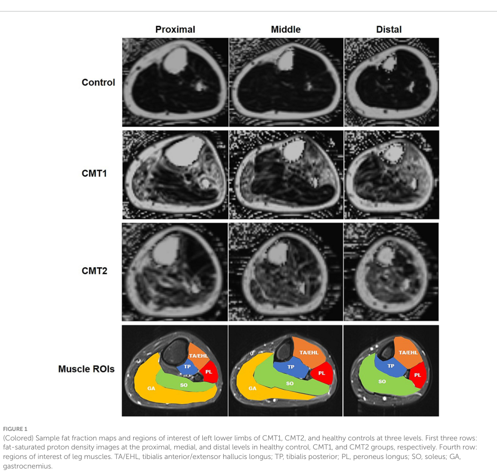

## Question

# Disease Characteristics Research Template

## Target Disease
- **Disease Name:** Charcot-Marie-Tooth Disease Type 2
- **MONDO ID:** MONDO:0018993 (if available)
- **Category:** Genetic

## Research Objectives

Please provide a comprehensive research report on **Charcot-Marie-Tooth Disease Type 2** covering all of the
disease characteristics listed below. This report will be used to populate a disease knowledge
base entry. Be thorough and cite primary literature (PMID preferred) for all claims.

For each section, **suggested databases/resources** are listed. These are the first places
you should search for information on each topic.

---

### 1. Disease Information
> **Search first:** OMIM, Orphanet, ICD-10/ICD-11, MeSH, PubMed

- What is the disease? Provide a concise overview.
- What are the key identifiers? (OMIM, Orphanet, ICD-10/ICD-11, MeSH, Mondo)
- What are the common synonyms and alternative names?
- Is the information derived from individual patients (e.g., EHR) or aggregated disease-level resources?

### 2. Etiology

- **Disease Causal Factors**: What are the primary causes? (genetic, environmental, infectious, mechanistic)
- **Risk Factors**:
  > **Search first:** PubMed, Cochrane Library, UpToDate, clinical guidelines, ClinVar, ClinGen, GWAS Catalog, PheGenI, CTD, CDC, WHO, epidemiological databases
  - Genetic risk factors (causal variants, susceptibility loci, modifier genes)
  - Environmental risk factors (toxins, lifestyle, occupational exposures, age, sex, family history)
- **Protective Factors**:
  > **Search first:** PubMed, Cochrane Library, clinical trial databases, GWAS Catalog, gnomAD, WHO, CDC, nutrition databases
  - Genetic protective factors (protective variants, modifier alleles)
  - Environmental protective factors (diet, lifestyle, exposures that reduce risk)
- **Gene-Environment Interactions**: How do genetic and environmental factors interact to influence disease?
  > **Search first:** CTD, PubMed, PheGenI, GxE databases

### 3. Phenotypes
> **Search first:** HPO (Human Phenotype Ontology), OMIM, Orphanet, PubMed, clinicaltrials.gov, MedDRA, SNOMED CT, DECIPHER, LOINC

For each phenotype, provide:
- **Phenotype type**: symptoms, clinical signs, physical manifestations, behavioral changes, or laboratory abnormalities
  > For symptoms/signs: HPO, OMIM, Orphanet, PubMed
  > For behavioral changes: HPO, DSM, RDoC (Research Domain Criteria), PubMed
  > For laboratory abnormalities: LOINC, SNOMED CT, LabTests Online, PubMed
- **Phenotype characteristics**:
  > **Search first:** OMIM, Orphanet, HPO, PubMed
  - Age of symptom onset (neonatal, childhood, adult-onset, late-onset)
  - Symptom severity (mild, moderate, severe, variable)
  - Symptom progression (stable, progressive, episodic, fluctuating)
  - Frequency among affected individuals (percentage or qualitative)
- **Quality of life impact**: Effects on daily functioning and well-being (per-phenotype when possible)
  > **Search first:** EQ-5D database, SF-36, WHO QOL databases, PubMed
- Suggest HPO (Human Phenotype Ontology) terms for each phenotype

### 4. Genetic/Molecular Information

- **Causal Genes**: Gene mutations or chromosomal abnormalities responsible for disease (gene symbols, OMIM IDs)
  > **Search first:** OMIM, ClinVar, HGMD, Ensembl, NCBI Gene
- **Pathogenic Variants**:
  - Affected genes (gene symbols, HGNC IDs)
    > **Search first:** OMIM, NCBI Gene, Ensembl, HGNC, UniProt, GeneCards
  - Variant classification (pathogenic, likely pathogenic, VUS per ACMG/AMP guidelines)
    > **Search first:** ClinVar, ClinGen, ACMG/AMP guidelines, VarSome
  - Variant type/class (missense, frameshift, nonsense, splice-site, structural)
  - Allele frequency in population databases
    > **Search first:** gnomAD, 1000 Genomes, ExAC, TOPMed, dbSNP
  - Somatic vs germline origin
    > **Search first:** COSMIC (somatic), ClinVar, ICGC, TCGA
  - Functional consequences (loss of function, gain of function, dominant negative)
- **Modifier Genes**: Genes that modify disease severity or expression
- **Epigenetic Information**: DNA methylation, histone modifications, chromatin changes affecting disease
  > **Search first:** ENCODE, Roadmap Epigenomics, MethBase, DiseaseMeth
- **Chromosomal Abnormalities**: Large-scale genetic changes (aneuploidy, translocations, inversions)
  > **Search first:** DECIPHER, ClinVar, ECARUCA, UCSC Genome Browser

### 5. Environmental Information

- **Environmental Factors**: Non-genetic contributing factors (toxins, radiation, pollution, occupational exposure)
  > **Search first:** CTD (Comparative Toxicogenomics Database), TOXNET, PubMed, EPA databases
- **Lifestyle Factors**: Behavioral factors (smoking, diet, exercise, alcohol consumption)
  > **Search first:** CDC databases, WHO, PubMed, NHANES
- **Infectious Agents**: If applicable, pathogens causing or triggering disease (bacteria, viruses, fungi, parasites)
  > **Search first:** NCBI Taxonomy, ViPR, BV-BRC, MicrobeDB, GIDEON

### 6. Mechanism / Pathophysiology

- **Molecular Pathways**: Specific signaling cascades or biochemical pathways involved (Wnt, MAPK, mTOR, PI3K-AKT, etc.)
  > **Search first:** KEGG, Reactome, WikiPathways, PathBank, BioCyc
- **Cellular Processes**: Cell-level mechanisms (apoptosis, autophagy, cell cycle dysregulation, inflammation, etc.)
  > **Search first:** Gene Ontology (GO), Reactome, KEGG, PubMed
- **Protein Dysfunction**: How protein structure or function is altered (misfolding, aggregation, loss of function, gain of function)
  > **Search first:** UniProt, PDB (Protein Data Bank), InterPro, Pfam, AlphaFold
- **Metabolic Changes**: Alterations in metabolic processes (energy metabolism, lipid metabolism, amino acid metabolism)
  > **Search first:** KEGG, BioCyc, HMDB (Human Metabolome Database), BRENDA
- **Immune System Involvement**: Role of immune response (autoimmunity, immunodeficiency, chronic inflammation)
  > **Search first:** ImmPort, Immunome Database, IEDB, Gene Ontology
- **Tissue Damage Mechanisms**: How tissues/ are injured (oxidative stress, ischemia, fibrosis, necrosis)
  > **Search first:** PubMed, Gene Ontology, Reactome
- **Biochemical Abnormalities**: Specific molecular defects (enzyme deficiencies, receptor dysfunction, ion channel defects)
  > **Search first:** BRENDA, UniProt, KEGG, OMIM, PubMed
- **Epigenetic Changes**: DNA methylation, histone modifications affecting gene expression in disease
  > **Search first:** ENCODE, Roadmap Epigenomics, MethBase, DiseaseMeth
- **Molecular Profiling** (if available):
  - Transcriptomics/gene expression changes
    > **Search first:** GEO (Gene Expression Omnibus), ArrayExpress, GTEx, Human Cell Atlas, SRA
  - Proteomics findings
    > **Search first:** PRIDE, ProteomeXchange, Human Protein Atlas, STRING, BioGRID
  - Metabolomics signatures
    > **Search first:** MetaboLights, Metabolomics Workbench, HMDB, METLIN
  - Lipidomics alterations
    > **Search first:** LIPID MAPS, SwissLipids, LipidHome, Metabolomics Workbench
  - Genomic structural features
    > **Search first:** UCSC Genome Browser, Ensembl, NCBI, dbVar, DGV
- **Advanced Technologies** (if applicable):
  - Single-cell analysis findings (cell-type specific mechanisms, cellular heterogeneity)
    > **Search first:** Human Cell Atlas, Single Cell Portal, GEO, CELLxGENE
  - Spatial transcriptomics findings
    > **Search first:** GEO, Spatial Research, Vizgen, 10x Genomics data
  - Multi-omics integration results
    > **Search first:** TCGA, ICGC, cBioPortal, LinkedOmics, PubMed
  - Functional genomics screens (CRISPR, RNAi)
    > **Search first:** DepMap, GenomeRNAi, PubMed, BioGRID ORCS

For each mechanism, describe:
- The causal chain from initial trigger to clinical manifestation
- Which mechanisms are upstream vs downstream
- What cell types and biological processes are involved
- Suggest GO terms for biological processes and CL terms for cell types

### 7. Anatomical Structures Affected

- **Organ Level**:
  - Primary organs directly affected
  - Secondary organ involvement (complications, secondary effects)
  - Body systems involved (cardiovascular, nervous, digestive, respiratory, endocrine, etc.)
  > **Search first:** Uberon, FMA (Foundational Model of Anatomy), OMIM, HPO, ICD-11, MeSH, SNOMED CT
- **Tissue and Cell Level**:
  - Specific tissue types affected (epithelial, connective, muscle, nervous)
  - Specific cell populations targeted (with Cell Ontology terms)
  > **Search first:** Uberon, Human Protein Atlas, Cell Ontology, Human Cell Atlas, CellMarker, PanglaoDB
- **Subcellular Level**:
  - Cellular compartments involved (mitochondria, nucleus, ER, lysosomes) (with GO Cellular Component terms)
  > **Search first:** Gene Ontology (Cellular Component), UniProt, Human Protein Atlas
- **Localization**:
  - Specific anatomical sites (with UBERON terms)
    > **Search first:** FMA, Uberon, NeuroNames (for brain), SNOMED CT
  - Lateralization (unilateral, bilateral, asymmetric)
    > **Search first:** HPO, clinical literature, imaging databases

### 8. Temporal Development

- **Onset**:
  - Typical age of onset (congenital, pediatric, adult, geriatric)
  - Onset pattern (acute, subacute, chronic, insidious)
  > **Search first:** OMIM, Orphanet, HPO, PubMed
- **Progression**:
  - Disease stages (early, intermediate, advanced, end-stage)
    > **Search first:** Cancer Staging Manual (AJCC), WHO classifications, PubMed
  - Progression rate (rapid, slow, variable)
  - Disease course pattern (episodic, relapsing-remitting, progressive, stable)
  - Disease duration (self-limited, chronic lifelong)
  > **Search first:** Disease registries, longitudinal cohort databases, natural history studies, PubMed, Orphanet, OMIM
- **Patterns**:
  - Remission patterns (spontaneous, treatment-induced)
    > **Search first:** Clinical trial databases, disease registries, PubMed
  - Critical periods (time windows of vulnerability or opportunity for intervention)
    > **Search first:** PubMed, developmental biology databases, clinical guidelines

### 9. Inheritance and Population

- **Epidemiology**:
  - Prevalence (cases per 100,000 at given time)
  - Incidence (new cases per 100,000 per year)
  > **Search first:** Orphanet, CDC, WHO, GBD (Global Burden of Disease), national registries, SEER, disease registries
- **For Genetic Etiology**:
  - Inheritance pattern (AD, AR, X-linked, mitochondrial, multifactorial, polygenic)
    > **Search first:** OMIM, Orphanet, ClinVar, GTR (Genetic Testing Registry)
  - Penetrance (complete, incomplete, age-dependent)
    > **Search first:** ClinVar, OMIM, PubMed, ClinGen
  - Expressivity (variable, consistent)
    > **Search first:** OMIM, ClinVar, PubMed
  - Genetic anticipation (increasing severity in successive generations)
    > **Search first:** OMIM, PubMed (especially for repeat expansion disorders)
  - Germline mosaicism
    > **Search first:** ClinVar, OMIM, genetic counseling literature, PubMed
  - Founder effects (population-specific mutations)
    > **Search first:** gnomAD, population genetics databases, PubMed
  - Consanguinity role
    > **Search first:** OMIM, population studies, genetic counseling resources
  - Carrier frequency
    > **Search first:** gnomAD, carrier screening databases, GeneReviews, GTR
- **Population Demographics**:
  - Affected populations (ethnic or demographic groups with higher prevalence)
    > **Search first:** gnomAD, 1000 Genomes, PAGE Study, PubMed, population registries
  - Geographic distribution (endemic areas, regional variation)
    > **Search first:** WHO, CDC, GBD, Orphanet, geographic epidemiology databases
  - Geographic distribution of specific variants
  - Sex ratio (male:female)
    > **Search first:** Disease registries, OMIM, PubMed, epidemiological databases
  - Age distribution of affected individuals
    > **Search first:** CDC, disease registries, SEER, Orphanet

### 10. Diagnostics

- **Clinical Tests**:
  - Laboratory tests (blood, urine, tissue chemistry, specific enzyme assays)
    > **Search first:** LOINC, LabTests Online, PubMed
  - Biomarkers (proteins, metabolites, genetic markers, circulating biomarkers)
    > **Search first:** FDA Biomarker List, BEST (Biomarkers, EndpointS, and other Tools), PubMed
  - Imaging studies (X-ray, CT, MRI, PET, ultrasound)
    > **Search first:** RadLex, DICOM, Radiopaedia, imaging databases
  - Functional tests (pulmonary function, cardiac stress tests)
    > **Search first:** LOINC, clinical guidelines, PubMed
  - Electrophysiology (EEG, EMG, ECG, nerve conduction studies)
    > **Search first:** LOINC, clinical neurophysiology databases, PubMed
  - Biopsy findings (histopathology, immunohistochemistry)
    > **Search first:** SNOMED CT, College of American Pathologists resources, PubMed
  - Pathology findings (microscopic examination)
    > **Search first:** SNOMED CT, Digital Pathology databases, PubMed
- **Genetic Testing**:
  > **Search first:** GTR (Genetic Testing Registry), GeneReviews, ClinGen
  - Overview of recommended genetic testing approach
  - Whole genome sequencing (WGS) utility
    > **Search first:** GTR, ClinVar, GEL (Genomics England), gnomAD
  - Whole exome sequencing (WES) utility
    > **Search first:** GTR, ClinVar, OMIM, GeneMatcher
  - Gene panels (which panels, which genes)
    > **Search first:** GTR, ClinVar, laboratory-specific databases
  - Single gene testing
    > **Search first:** GTR, ClinVar, OMIM, GeneReviews
  - Chromosomal microarray (CMA)
    > **Search first:** DECIPHER, ClinVar, dbVar, ECARUCA
  - Karyotyping
    > **Search first:** Chromosome Abnormality Database, ClinVar, cytogenetics resources
  - FISH
    > **Search first:** ClinVar, cytogenetics databases, PubMed
  - Mitochondrial DNA testing
    > **Search first:** MITOMAP, MSeqDR, ClinVar, GTR
  - Repeat expansion testing
    > **Search first:** GTR, ClinVar, repeat expansion databases, PubMed
- **Omics-Based Diagnostics** (if applicable):
  - RNA sequencing / transcriptomics
    > **Search first:** GEO, ArrayExpress, GTEx, RNA-seq databases
  - Proteomics
    > **Search first:** PRIDE, ProteomeXchange, FDA Biomarker database
  - Metabolomics
    > **Search first:** MetaboLights, Metabolomics Workbench, HMDB
  - Epigenomics
    > **Search first:** GEO, ENCODE, Roadmap Epigenomics, MethBase
  - Liquid biopsy
    > **Search first:** COSMIC, ClinVar, liquid biopsy databases, PubMed
- **Clinical Criteria**:
  - Standardized diagnostic criteria (DSM, ICD, society guidelines)
    > **Search first:** DSM-5, ICD-11, clinical society guidelines, UpToDate
  - Differential diagnosis (other conditions to rule out, with distinguishing features)
    > **Search first:** DynaMed, UpToDate, clinical decision support systems
- **Screening**:
  - Screening methods for asymptomatic individuals (newborn screening, carrier screening, cascade screening)
    > **Search first:** ACMG recommendations, CDC newborn screening, GTR

### 11. Outcome/Prognosis

- **Survival and Mortality**:
  - Survival rate (5-year, 10-year, overall)
    > **Search first:** SEER, cancer registries, disease-specific registries, PubMed
  - Life expectancy (with and without treatment if applicable)
    > **Search first:** Orphanet, disease registries, actuarial databases, PubMed
  - Mortality rate
    > **Search first:** CDC, WHO, GBD, national mortality databases
  - Disease-specific mortality (deaths directly attributable to disease)
    > **Search first:** Disease registries, CDC Wonder, GBD, PubMed
- **Morbidity and Function**:
  - Morbidity (disease-related disability and health impacts)
    > **Search first:** GBD, WHO, disability databases, PubMed
  - Disability outcomes (long-term functional impairments)
    > **Search first:** ICF (International Classification of Functioning), disability registries
  - Quality of life measures (EQ-5D, SF-36, PROMIS, disease-specific tools)
    > **Search first:** EQ-5D database, SF-36, PROMIS, PubMed
- **Disease Course**:
  - Complications (secondary problems: infections, organ failure, etc.)
    > **Search first:** ICD codes, disease registries, clinical databases, PubMed
  - Recovery potential (likelihood and extent of recovery, with vs without treatment)
    > **Search first:** Natural history studies, rehabilitation databases, PubMed
- **Prediction**:
  - Prognostic factors (age, disease severity, biomarkers, treatment response)
    > **Search first:** Prognostic models databases, clinical calculators, PubMed
  - Prognostic biomarkers (molecular markers predicting disease course)
    > **Search first:** FDA Biomarker database, PubMed, cancer prognostic databases

### 12. Treatment

- **Pharmacotherapy**:
  - Pharmacological treatments (drug names, drug classes, mechanisms of action)
    > **Search first:** DrugBank, RxNorm, ATC classification, DailyMed, FDA databases
  - Pharmacogenomics (how genetic variants affect drug metabolism, efficacy, toxicity)
    > **Search first:** PharmGKB, CPIC (Clinical Pharmacogenetics), FDA Table of PGx Biomarkers
- **Advanced Therapeutics**:
  - Gene therapy (viral vectors, CRISPR, gene replacement, gene editing)
    > **Search first:** ClinicalTrials.gov, FDA gene therapy database, ASGCT resources
  - Cell therapy (stem cell transplant, CAR-T, cellular therapeutics)
    > **Search first:** ClinicalTrials.gov, FDA cell therapy database, FACT standards
  - RNA-based therapies (ASOs, siRNA, mRNA therapies)
    > **Search first:** ClinicalTrials.gov, FDA approvals, PubMed
  - Targeted therapies (treatments directed at specific molecular targets)
    > **Search first:** My Cancer Genome, OncoKB, ClinicalTrials.gov, FDA approvals
  - Immunotherapies (checkpoint inhibitors, monoclonal antibodies)
    > **Search first:** Cancer Immunotherapy Database, FDA approvals, ClinicalTrials.gov
- **Surgical and Interventional**:
  - Surgical interventions (types of surgery, timing, outcomes)
    > **Search first:** CPT codes, surgical registries, clinical guidelines, PubMed
- **Supportive and Rehabilitative**:
  - Supportive care (symptom management, pain control, nutrition)
    > **Search first:** Clinical guidelines, Cochrane Library, PubMed
  - Rehabilitation (physical therapy, occupational therapy, speech therapy)
    > **Search first:** Rehabilitation medicine databases, clinical guidelines, PubMed
- **Experimental**:
  - Experimental treatments in clinical trials (with NCT identifiers if available)
    > **Search first:** ClinicalTrials.gov, EU Clinical Trials Register, WHO ICTRP
- **Treatment Outcomes**:
  - Treatment response rates
    > **Search first:** Clinical trial databases, FDA reviews, systematic reviews, PubMed
  - Side effects and adverse events
    > **Search first:** FDA Adverse Event Reporting System (FAERS), MedWatch, PubMed
- **Treatment Strategy**:
  - Treatment algorithms (clinical pathways, decision trees)
    > **Search first:** Clinical practice guidelines, NCCN Guidelines, UpToDate
  - Combination therapies
    > **Search first:** ClinicalTrials.gov, treatment guidelines, PubMed
  - Personalized medicine approaches (genotype-guided treatment)
    > **Search first:** My Cancer Genome, CIViC, PharmGKB, precision medicine databases

For each treatment, suggest MAXO (Medical Action Ontology) terms where applicable.

### 13. Prevention

- **Prevention Levels**:
  - Primary prevention (preventing disease occurrence: vaccination, risk factor modification)
    > **Search first:** CDC, WHO, USPSTF recommendations, Cochrane Library
  - Secondary prevention (early detection and treatment: screening programs, early intervention)
    > **Search first:** USPSTF, CDC screening guidelines, WHO
  - Tertiary prevention (preventing complications in those with disease)
    > **Search first:** Clinical guidelines, disease management protocols, PubMed
- **Immunization**: Vaccine strategies (if applicable)
  > **Search first:** CDC vaccine schedules, WHO immunization, FDA vaccine database
- **Screening and Early Detection**:
  - Screening programs (population-based: newborn screening, cancer screening)
    > **Search first:** CDC screening programs, USPSTF, cancer screening databases
  - Genetic screening (carrier screening, preimplantation genetic diagnosis, prenatal testing)
    > **Search first:** ACMG recommendations, ACOG guidelines, GTR
  - Risk stratification (identifying high-risk individuals for targeted prevention)
    > **Search first:** Risk prediction models, clinical calculators, PubMed
- **Behavioral Interventions**: Lifestyle modifications to reduce risk
  > **Search first:** CDC, WHO, behavioral intervention databases, Cochrane Library
- **Counseling**: Genetic counseling (risk assessment, family planning guidance)
  > **Search first:** NSGC resources, ACMG guidelines, GeneReviews
- **Public Health**:
  - Public health interventions (sanitation, vector control, health education)
    > **Search first:** CDC, WHO, public health databases, PubMed
  - Environmental interventions (reducing environmental risk factors)
    > **Search first:** EPA databases, WHO environmental health, PubMed
- **Prophylaxis**: Preventive medications or procedures
  > **Search first:** Clinical guidelines, FDA approvals, PubMed

### 14. Other Species / Natural Disease

- **Taxonomy**: Species affected (with NCBI Taxon identifiers)
  > **Search first:** NCBI Taxonomy
- **Breed**: Specific breeds affected (with VBO identifiers if applicable)
  > **Search first:** VBO (Vertebrate Breed Ontology)
- **Gene**: Orthologous genes in other species (with NCBI Gene IDs)
  > **Search first:** NCBI Gene
- **Natural Disease**:
  - Naturally occurring disease in other species (companion animals, wildlife)
    > **Search first:** OMIA (Online Mendelian Inheritance in Animals), VetCompass, PubMed
  - Veterinary relevance and importance in animal health
    > **Search first:** OMIA, veterinary databases, PubMed
- **Comparative Biology**:
  - Comparative pathology (similarities and differences across species)
    > **Search first:** OMIA, comparative pathology databases, PubMed
  - Evolutionary conservation of disease mechanisms
    > **Search first:** HomoloGene, OrthoMCL, Alliance of Genome Resources
- **Transmission** (if applicable):
  - Zoonotic potential
    > **Search first:** CDC zoonotic diseases, WHO zoonoses, GIDEON
  - Cross-species susceptibility
    > **Search first:** NCBI Taxonomy, veterinary databases, PubMed

### 15. Model Organisms

- **Model Types**:
  - Model organism type (mammalian, invertebrate, cellular, in vitro)
    > **Search first:** Alliance of Genome Resources, model organism databases
  - Specific model systems (mouse, rat, zebrafish, Drosophila, C. elegans, yeast, cell lines, organoids, iPSCs)
    > **Search first:** MGI, RGD, ZFIN, FlyBase, WormBase, SGD, ATCC, Cellosaurus
  - Induced models (drug treatment, surgical intervention, environmental manipulation)
    > **Search first:** MGI, model organism databases, PubMed
- **Genetic Models**:
  - Types available (knockout, knock-in, transgenic, conditional, humanized)
    > **Search first:** MGI, IMPC, KOMP, EuMMCR, IMSR
- **Model Characteristics**:
  - Phenotype recapitulation (how well model reproduces human disease features)
    > **Search first:** Model organism databases, comparative studies, PubMed
  - Model limitations (aspects of human disease not captured)
    > **Search first:** Model organism databases, PubMed, review articles
- **Applications**:
  - Research applications (what aspects of disease can be studied)
    > **Search first:** Model organism databases, PubMed
- **Resources**:
  - Model databases
    > **Search first:** MGI, RGD, ZFIN, FlyBase, WormBase, IMSR, EMMA, MMRRC

---

## Citation Requirements

- Cite primary literature (PMID preferred) for all mechanistic and clinical claims
- Prioritize recent reviews and landmark papers
- Include direct quotes from abstracts where possible to support key statements
- Distinguish evidence source types: human clinical, model organism, in vitro, computational

## Output Format

Structure your response as a comprehensive narrative organized by the sections above.
For each section, provide:
- Factual content with specific details (numbers, percentages, gene names, variant nomenclature)
- Ontology term suggestions (HPO, GO, CL, UBERON, CHEBI, MAXO, MONDO) where applicable
- Evidence citations with PMIDs
- Direct quotes from abstracts to support key claims
- Clear indication when information is not available or not applicable for this disease

This report will be used to populate a disease knowledge base entry with:
- Pathophysiology descriptions with causal chains
- Gene/protein annotations (HGNC, GO terms)
- Phenotype associations (HP terms) with frequencies
- Cell type involvement (CL terms)
- Anatomical locations (UBERON terms)
- Chemical entities (CHEBI terms)
- Treatment annotations (MAXO terms)
- Evidence items with PMIDs and exact abstract quotes
- Epidemiology, prognosis, diagnostic, and prevention information
- Animal model descriptions with phenotype recapitulation details

## Output

Question: You are an expert researcher providing comprehensive, well-cited information.

Provide detailed information focusing on:
1. Key concepts and definitions with current understanding
2. Recent developments and latest research (prioritize 2023-2024 sources)
3. Current applications and real-world implementations
4. Expert opinions and analysis from authoritative sources
5. Relevant statistics and data from recent studies

Format as a comprehensive research report with proper citations. Include URLs and publication dates where available.
Always prioritize recent, authoritative sources and provide specific citations for all major claims.

# Disease Characteristics Research Template

## Target Disease
- **Disease Name:** Charcot-Marie-Tooth Disease Type 2
- **MONDO ID:** MONDO:0018993 (if available)
- **Category:** Genetic

## Research Objectives

Please provide a comprehensive research report on **Charcot-Marie-Tooth Disease Type 2** covering all of the
disease characteristics listed below. This report will be used to populate a disease knowledge
base entry. Be thorough and cite primary literature (PMID preferred) for all claims.

For each section, **suggested databases/resources** are listed. These are the first places
you should search for information on each topic.

---

### 1. Disease Information
> **Search first:** OMIM, Orphanet, ICD-10/ICD-11, MeSH, PubMed

- What is the disease? Provide a concise overview.
- What are the key identifiers? (OMIM, Orphanet, ICD-10/ICD-11, MeSH, Mondo)
- What are the common synonyms and alternative names?
- Is the information derived from individual patients (e.g., EHR) or aggregated disease-level resources?

### 2. Etiology

- **Disease Causal Factors**: What are the primary causes? (genetic, environmental, infectious, mechanistic)
- **Risk Factors**:
  > **Search first:** PubMed, Cochrane Library, UpToDate, clinical guidelines, ClinVar, ClinGen, GWAS Catalog, PheGenI, CTD, CDC, WHO, epidemiological databases
  - Genetic risk factors (causal variants, susceptibility loci, modifier genes)
  - Environmental risk factors (toxins, lifestyle, occupational exposures, age, sex, family history)
- **Protective Factors**:
  > **Search first:** PubMed, Cochrane Library, clinical trial databases, GWAS Catalog, gnomAD, WHO, CDC, nutrition databases
  - Genetic protective factors (protective variants, modifier alleles)
  - Environmental protective factors (diet, lifestyle, exposures that reduce risk)
- **Gene-Environment Interactions**: How do genetic and environmental factors interact to influence disease?
  > **Search first:** CTD, PubMed, PheGenI, GxE databases

### 3. Phenotypes
> **Search first:** HPO (Human Phenotype Ontology), OMIM, Orphanet, PubMed, clinicaltrials.gov, MedDRA, SNOMED CT, DECIPHER, LOINC

For each phenotype, provide:
- **Phenotype type**: symptoms, clinical signs, physical manifestations, behavioral changes, or laboratory abnormalities
  > For symptoms/signs: HPO, OMIM, Orphanet, PubMed
  > For behavioral changes: HPO, DSM, RDoC (Research Domain Criteria), PubMed
  > For laboratory abnormalities: LOINC, SNOMED CT, LabTests Online, PubMed
- **Phenotype characteristics**:
  > **Search first:** OMIM, Orphanet, HPO, PubMed
  - Age of symptom onset (neonatal, childhood, adult-onset, late-onset)
  - Symptom severity (mild, moderate, severe, variable)
  - Symptom progression (stable, progressive, episodic, fluctuating)
  - Frequency among affected individuals (percentage or qualitative)
- **Quality of life impact**: Effects on daily functioning and well-being (per-phenotype when possible)
  > **Search first:** EQ-5D database, SF-36, WHO QOL databases, PubMed
- Suggest HPO (Human Phenotype Ontology) terms for each phenotype

### 4. Genetic/Molecular Information

- **Causal Genes**: Gene mutations or chromosomal abnormalities responsible for disease (gene symbols, OMIM IDs)
  > **Search first:** OMIM, ClinVar, HGMD, Ensembl, NCBI Gene
- **Pathogenic Variants**:
  - Affected genes (gene symbols, HGNC IDs)
    > **Search first:** OMIM, NCBI Gene, Ensembl, HGNC, UniProt, GeneCards
  - Variant classification (pathogenic, likely pathogenic, VUS per ACMG/AMP guidelines)
    > **Search first:** ClinVar, ClinGen, ACMG/AMP guidelines, VarSome
  - Variant type/class (missense, frameshift, nonsense, splice-site, structural)
  - Allele frequency in population databases
    > **Search first:** gnomAD, 1000 Genomes, ExAC, TOPMed, dbSNP
  - Somatic vs germline origin
    > **Search first:** COSMIC (somatic), ClinVar, ICGC, TCGA
  - Functional consequences (loss of function, gain of function, dominant negative)
- **Modifier Genes**: Genes that modify disease severity or expression
- **Epigenetic Information**: DNA methylation, histone modifications, chromatin changes affecting disease
  > **Search first:** ENCODE, Roadmap Epigenomics, MethBase, DiseaseMeth
- **Chromosomal Abnormalities**: Large-scale genetic changes (aneuploidy, translocations, inversions)
  > **Search first:** DECIPHER, ClinVar, ECARUCA, UCSC Genome Browser

### 5. Environmental Information

- **Environmental Factors**: Non-genetic contributing factors (toxins, radiation, pollution, occupational exposure)
  > **Search first:** CTD (Comparative Toxicogenomics Database), TOXNET, PubMed, EPA databases
- **Lifestyle Factors**: Behavioral factors (smoking, diet, exercise, alcohol consumption)
  > **Search first:** CDC databases, WHO, PubMed, NHANES
- **Infectious Agents**: If applicable, pathogens causing or triggering disease (bacteria, viruses, fungi, parasites)
  > **Search first:** NCBI Taxonomy, ViPR, BV-BRC, MicrobeDB, GIDEON

### 6. Mechanism / Pathophysiology

- **Molecular Pathways**: Specific signaling cascades or biochemical pathways involved (Wnt, MAPK, mTOR, PI3K-AKT, etc.)
  > **Search first:** KEGG, Reactome, WikiPathways, PathBank, BioCyc
- **Cellular Processes**: Cell-level mechanisms (apoptosis, autophagy, cell cycle dysregulation, inflammation, etc.)
  > **Search first:** Gene Ontology (GO), Reactome, KEGG, PubMed
- **Protein Dysfunction**: How protein structure or function is altered (misfolding, aggregation, loss of function, gain of function)
  > **Search first:** UniProt, PDB (Protein Data Bank), InterPro, Pfam, AlphaFold
- **Metabolic Changes**: Alterations in metabolic processes (energy metabolism, lipid metabolism, amino acid metabolism)
  > **Search first:** KEGG, BioCyc, HMDB (Human Metabolome Database), BRENDA
- **Immune System Involvement**: Role of immune response (autoimmunity, immunodeficiency, chronic inflammation)
  > **Search first:** ImmPort, Immunome Database, IEDB, Gene Ontology
- **Tissue Damage Mechanisms**: How tissues/ are injured (oxidative stress, ischemia, fibrosis, necrosis)
  > **Search first:** PubMed, Gene Ontology, Reactome
- **Biochemical Abnormalities**: Specific molecular defects (enzyme deficiencies, receptor dysfunction, ion channel defects)
  > **Search first:** BRENDA, UniProt, KEGG, OMIM, PubMed
- **Epigenetic Changes**: DNA methylation, histone modifications affecting gene expression in disease
  > **Search first:** ENCODE, Roadmap Epigenomics, MethBase, DiseaseMeth
- **Molecular Profiling** (if available):
  - Transcriptomics/gene expression changes
    > **Search first:** GEO (Gene Expression Omnibus), ArrayExpress, GTEx, Human Cell Atlas, SRA
  - Proteomics findings
    > **Search first:** PRIDE, ProteomeXchange, Human Protein Atlas, STRING, BioGRID
  - Metabolomics signatures
    > **Search first:** MetaboLights, Metabolomics Workbench, HMDB, METLIN
  - Lipidomics alterations
    > **Search first:** LIPID MAPS, SwissLipids, LipidHome, Metabolomics Workbench
  - Genomic structural features
    > **Search first:** UCSC Genome Browser, Ensembl, NCBI, dbVar, DGV
- **Advanced Technologies** (if applicable):
  - Single-cell analysis findings (cell-type specific mechanisms, cellular heterogeneity)
    > **Search first:** Human Cell Atlas, Single Cell Portal, GEO, CELLxGENE
  - Spatial transcriptomics findings
    > **Search first:** GEO, Spatial Research, Vizgen, 10x Genomics data
  - Multi-omics integration results
    > **Search first:** TCGA, ICGC, cBioPortal, LinkedOmics, PubMed
  - Functional genomics screens (CRISPR, RNAi)
    > **Search first:** DepMap, GenomeRNAi, PubMed, BioGRID ORCS

For each mechanism, describe:
- The causal chain from initial trigger to clinical manifestation
- Which mechanisms are upstream vs downstream
- What cell types and biological processes are involved
- Suggest GO terms for biological processes and CL terms for cell types

### 7. Anatomical Structures Affected

- **Organ Level**:
  - Primary organs directly affected
  - Secondary organ involvement (complications, secondary effects)
  - Body systems involved (cardiovascular, nervous, digestive, respiratory, endocrine, etc.)
  > **Search first:** Uberon, FMA (Foundational Model of Anatomy), OMIM, HPO, ICD-11, MeSH, SNOMED CT
- **Tissue and Cell Level**:
  - Specific tissue types affected (epithelial, connective, muscle, nervous)
  - Specific cell populations targeted (with Cell Ontology terms)
  > **Search first:** Uberon, Human Protein Atlas, Cell Ontology, Human Cell Atlas, CellMarker, PanglaoDB
- **Subcellular Level**:
  - Cellular compartments involved (mitochondria, nucleus, ER, lysosomes) (with GO Cellular Component terms)
  > **Search first:** Gene Ontology (Cellular Component), UniProt, Human Protein Atlas
- **Localization**:
  - Specific anatomical sites (with UBERON terms)
    > **Search first:** FMA, Uberon, NeuroNames (for brain), SNOMED CT
  - Lateralization (unilateral, bilateral, asymmetric)
    > **Search first:** HPO, clinical literature, imaging databases

### 8. Temporal Development

- **Onset**:
  - Typical age of onset (congenital, pediatric, adult, geriatric)
  - Onset pattern (acute, subacute, chronic, insidious)
  > **Search first:** OMIM, Orphanet, HPO, PubMed
- **Progression**:
  - Disease stages (early, intermediate, advanced, end-stage)
    > **Search first:** Cancer Staging Manual (AJCC), WHO classifications, PubMed
  - Progression rate (rapid, slow, variable)
  - Disease course pattern (episodic, relapsing-remitting, progressive, stable)
  - Disease duration (self-limited, chronic lifelong)
  > **Search first:** Disease registries, longitudinal cohort databases, natural history studies, PubMed, Orphanet, OMIM
- **Patterns**:
  - Remission patterns (spontaneous, treatment-induced)
    > **Search first:** Clinical trial databases, disease registries, PubMed
  - Critical periods (time windows of vulnerability or opportunity for intervention)
    > **Search first:** PubMed, developmental biology databases, clinical guidelines

### 9. Inheritance and Population

- **Epidemiology**:
  - Prevalence (cases per 100,000 at given time)
  - Incidence (new cases per 100,000 per year)
  > **Search first:** Orphanet, CDC, WHO, GBD (Global Burden of Disease), national registries, SEER, disease registries
- **For Genetic Etiology**:
  - Inheritance pattern (AD, AR, X-linked, mitochondrial, multifactorial, polygenic)
    > **Search first:** OMIM, Orphanet, ClinVar, GTR (Genetic Testing Registry)
  - Penetrance (complete, incomplete, age-dependent)
    > **Search first:** ClinVar, OMIM, PubMed, ClinGen
  - Expressivity (variable, consistent)
    > **Search first:** OMIM, ClinVar, PubMed
  - Genetic anticipation (increasing severity in successive generations)
    > **Search first:** OMIM, PubMed (especially for repeat expansion disorders)
  - Germline mosaicism
    > **Search first:** ClinVar, OMIM, genetic counseling literature, PubMed
  - Founder effects (population-specific mutations)
    > **Search first:** gnomAD, population genetics databases, PubMed
  - Consanguinity role
    > **Search first:** OMIM, population studies, genetic counseling resources
  - Carrier frequency
    > **Search first:** gnomAD, carrier screening databases, GeneReviews, GTR
- **Population Demographics**:
  - Affected populations (ethnic or demographic groups with higher prevalence)
    > **Search first:** gnomAD, 1000 Genomes, PAGE Study, PubMed, population registries
  - Geographic distribution (endemic areas, regional variation)
    > **Search first:** WHO, CDC, GBD, Orphanet, geographic epidemiology databases
  - Geographic distribution of specific variants
  - Sex ratio (male:female)
    > **Search first:** Disease registries, OMIM, PubMed, epidemiological databases
  - Age distribution of affected individuals
    > **Search first:** CDC, disease registries, SEER, Orphanet

### 10. Diagnostics

- **Clinical Tests**:
  - Laboratory tests (blood, urine, tissue chemistry, specific enzyme assays)
    > **Search first:** LOINC, LabTests Online, PubMed
  - Biomarkers (proteins, metabolites, genetic markers, circulating biomarkers)
    > **Search first:** FDA Biomarker List, BEST (Biomarkers, EndpointS, and other Tools), PubMed
  - Imaging studies (X-ray, CT, MRI, PET, ultrasound)
    > **Search first:** RadLex, DICOM, Radiopaedia, imaging databases
  - Functional tests (pulmonary function, cardiac stress tests)
    > **Search first:** LOINC, clinical guidelines, PubMed
  - Electrophysiology (EEG, EMG, ECG, nerve conduction studies)
    > **Search first:** LOINC, clinical neurophysiology databases, PubMed
  - Biopsy findings (histopathology, immunohistochemistry)
    > **Search first:** SNOMED CT, College of American Pathologists resources, PubMed
  - Pathology findings (microscopic examination)
    > **Search first:** SNOMED CT, Digital Pathology databases, PubMed
- **Genetic Testing**:
  > **Search first:** GTR (Genetic Testing Registry), GeneReviews, ClinGen
  - Overview of recommended genetic testing approach
  - Whole genome sequencing (WGS) utility
    > **Search first:** GTR, ClinVar, GEL (Genomics England), gnomAD
  - Whole exome sequencing (WES) utility
    > **Search first:** GTR, ClinVar, OMIM, GeneMatcher
  - Gene panels (which panels, which genes)
    > **Search first:** GTR, ClinVar, laboratory-specific databases
  - Single gene testing
    > **Search first:** GTR, ClinVar, OMIM, GeneReviews
  - Chromosomal microarray (CMA)
    > **Search first:** DECIPHER, ClinVar, dbVar, ECARUCA
  - Karyotyping
    > **Search first:** Chromosome Abnormality Database, ClinVar, cytogenetics resources
  - FISH
    > **Search first:** ClinVar, cytogenetics databases, PubMed
  - Mitochondrial DNA testing
    > **Search first:** MITOMAP, MSeqDR, ClinVar, GTR
  - Repeat expansion testing
    > **Search first:** GTR, ClinVar, repeat expansion databases, PubMed
- **Omics-Based Diagnostics** (if applicable):
  - RNA sequencing / transcriptomics
    > **Search first:** GEO, ArrayExpress, GTEx, RNA-seq databases
  - Proteomics
    > **Search first:** PRIDE, ProteomeXchange, FDA Biomarker database
  - Metabolomics
    > **Search first:** MetaboLights, Metabolomics Workbench, HMDB
  - Epigenomics
    > **Search first:** GEO, ENCODE, Roadmap Epigenomics, MethBase
  - Liquid biopsy
    > **Search first:** COSMIC, ClinVar, liquid biopsy databases, PubMed
- **Clinical Criteria**:
  - Standardized diagnostic criteria (DSM, ICD, society guidelines)
    > **Search first:** DSM-5, ICD-11, clinical society guidelines, UpToDate
  - Differential diagnosis (other conditions to rule out, with distinguishing features)
    > **Search first:** DynaMed, UpToDate, clinical decision support systems
- **Screening**:
  - Screening methods for asymptomatic individuals (newborn screening, carrier screening, cascade screening)
    > **Search first:** ACMG recommendations, CDC newborn screening, GTR

### 11. Outcome/Prognosis

- **Survival and Mortality**:
  - Survival rate (5-year, 10-year, overall)
    > **Search first:** SEER, cancer registries, disease-specific registries, PubMed
  - Life expectancy (with and without treatment if applicable)
    > **Search first:** Orphanet, disease registries, actuarial databases, PubMed
  - Mortality rate
    > **Search first:** CDC, WHO, GBD, national mortality databases
  - Disease-specific mortality (deaths directly attributable to disease)
    > **Search first:** Disease registries, CDC Wonder, GBD, PubMed
- **Morbidity and Function**:
  - Morbidity (disease-related disability and health impacts)
    > **Search first:** GBD, WHO, disability databases, PubMed
  - Disability outcomes (long-term functional impairments)
    > **Search first:** ICF (International Classification of Functioning), disability registries
  - Quality of life measures (EQ-5D, SF-36, PROMIS, disease-specific tools)
    > **Search first:** EQ-5D database, SF-36, PROMIS, PubMed
- **Disease Course**:
  - Complications (secondary problems: infections, organ failure, etc.)
    > **Search first:** ICD codes, disease registries, clinical databases, PubMed
  - Recovery potential (likelihood and extent of recovery, with vs without treatment)
    > **Search first:** Natural history studies, rehabilitation databases, PubMed
- **Prediction**:
  - Prognostic factors (age, disease severity, biomarkers, treatment response)
    > **Search first:** Prognostic models databases, clinical calculators, PubMed
  - Prognostic biomarkers (molecular markers predicting disease course)
    > **Search first:** FDA Biomarker database, PubMed, cancer prognostic databases

### 12. Treatment

- **Pharmacotherapy**:
  - Pharmacological treatments (drug names, drug classes, mechanisms of action)
    > **Search first:** DrugBank, RxNorm, ATC classification, DailyMed, FDA databases
  - Pharmacogenomics (how genetic variants affect drug metabolism, efficacy, toxicity)
    > **Search first:** PharmGKB, CPIC (Clinical Pharmacogenetics), FDA Table of PGx Biomarkers
- **Advanced Therapeutics**:
  - Gene therapy (viral vectors, CRISPR, gene replacement, gene editing)
    > **Search first:** ClinicalTrials.gov, FDA gene therapy database, ASGCT resources
  - Cell therapy (stem cell transplant, CAR-T, cellular therapeutics)
    > **Search first:** ClinicalTrials.gov, FDA cell therapy database, FACT standards
  - RNA-based therapies (ASOs, siRNA, mRNA therapies)
    > **Search first:** ClinicalTrials.gov, FDA approvals, PubMed
  - Targeted therapies (treatments directed at specific molecular targets)
    > **Search first:** My Cancer Genome, OncoKB, ClinicalTrials.gov, FDA approvals
  - Immunotherapies (checkpoint inhibitors, monoclonal antibodies)
    > **Search first:** Cancer Immunotherapy Database, FDA approvals, ClinicalTrials.gov
- **Surgical and Interventional**:
  - Surgical interventions (types of surgery, timing, outcomes)
    > **Search first:** CPT codes, surgical registries, clinical guidelines, PubMed
- **Supportive and Rehabilitative**:
  - Supportive care (symptom management, pain control, nutrition)
    > **Search first:** Clinical guidelines, Cochrane Library, PubMed
  - Rehabilitation (physical therapy, occupational therapy, speech therapy)
    > **Search first:** Rehabilitation medicine databases, clinical guidelines, PubMed
- **Experimental**:
  - Experimental treatments in clinical trials (with NCT identifiers if available)
    > **Search first:** ClinicalTrials.gov, EU Clinical Trials Register, WHO ICTRP
- **Treatment Outcomes**:
  - Treatment response rates
    > **Search first:** Clinical trial databases, FDA reviews, systematic reviews, PubMed
  - Side effects and adverse events
    > **Search first:** FDA Adverse Event Reporting System (FAERS), MedWatch, PubMed
- **Treatment Strategy**:
  - Treatment algorithms (clinical pathways, decision trees)
    > **Search first:** Clinical practice guidelines, NCCN Guidelines, UpToDate
  - Combination therapies
    > **Search first:** ClinicalTrials.gov, treatment guidelines, PubMed
  - Personalized medicine approaches (genotype-guided treatment)
    > **Search first:** My Cancer Genome, CIViC, PharmGKB, precision medicine databases

For each treatment, suggest MAXO (Medical Action Ontology) terms where applicable.

### 13. Prevention

- **Prevention Levels**:
  - Primary prevention (preventing disease occurrence: vaccination, risk factor modification)
    > **Search first:** CDC, WHO, USPSTF recommendations, Cochrane Library
  - Secondary prevention (early detection and treatment: screening programs, early intervention)
    > **Search first:** USPSTF, CDC screening guidelines, WHO
  - Tertiary prevention (preventing complications in those with disease)
    > **Search first:** Clinical guidelines, disease management protocols, PubMed
- **Immunization**: Vaccine strategies (if applicable)
  > **Search first:** CDC vaccine schedules, WHO immunization, FDA vaccine database
- **Screening and Early Detection**:
  - Screening programs (population-based: newborn screening, cancer screening)
    > **Search first:** CDC screening programs, USPSTF, cancer screening databases
  - Genetic screening (carrier screening, preimplantation genetic diagnosis, prenatal testing)
    > **Search first:** ACMG recommendations, ACOG guidelines, GTR
  - Risk stratification (identifying high-risk individuals for targeted prevention)
    > **Search first:** Risk prediction models, clinical calculators, PubMed
- **Behavioral Interventions**: Lifestyle modifications to reduce risk
  > **Search first:** CDC, WHO, behavioral intervention databases, Cochrane Library
- **Counseling**: Genetic counseling (risk assessment, family planning guidance)
  > **Search first:** NSGC resources, ACMG guidelines, GeneReviews
- **Public Health**:
  - Public health interventions (sanitation, vector control, health education)
    > **Search first:** CDC, WHO, public health databases, PubMed
  - Environmental interventions (reducing environmental risk factors)
    > **Search first:** EPA databases, WHO environmental health, PubMed
- **Prophylaxis**: Preventive medications or procedures
  > **Search first:** Clinical guidelines, FDA approvals, PubMed

### 14. Other Species / Natural Disease

- **Taxonomy**: Species affected (with NCBI Taxon identifiers)
  > **Search first:** NCBI Taxonomy
- **Breed**: Specific breeds affected (with VBO identifiers if applicable)
  > **Search first:** VBO (Vertebrate Breed Ontology)
- **Gene**: Orthologous genes in other species (with NCBI Gene IDs)
  > **Search first:** NCBI Gene
- **Natural Disease**:
  - Naturally occurring disease in other species (companion animals, wildlife)
    > **Search first:** OMIA (Online Mendelian Inheritance in Animals), VetCompass, PubMed
  - Veterinary relevance and importance in animal health
    > **Search first:** OMIA, veterinary databases, PubMed
- **Comparative Biology**:
  - Comparative pathology (similarities and differences across species)
    > **Search first:** OMIA, comparative pathology databases, PubMed
  - Evolutionary conservation of disease mechanisms
    > **Search first:** HomoloGene, OrthoMCL, Alliance of Genome Resources
- **Transmission** (if applicable):
  - Zoonotic potential
    > **Search first:** CDC zoonotic diseases, WHO zoonoses, GIDEON
  - Cross-species susceptibility
    > **Search first:** NCBI Taxonomy, veterinary databases, PubMed

### 15. Model Organisms

- **Model Types**:
  - Model organism type (mammalian, invertebrate, cellular, in vitro)
    > **Search first:** Alliance of Genome Resources, model organism databases
  - Specific model systems (mouse, rat, zebrafish, Drosophila, C. elegans, yeast, cell lines, organoids, iPSCs)
    > **Search first:** MGI, RGD, ZFIN, FlyBase, WormBase, SGD, ATCC, Cellosaurus
  - Induced models (drug treatment, surgical intervention, environmental manipulation)
    > **Search first:** MGI, model organism databases, PubMed
- **Genetic Models**:
  - Types available (knockout, knock-in, transgenic, conditional, humanized)
    > **Search first:** MGI, IMPC, KOMP, EuMMCR, IMSR
- **Model Characteristics**:
  - Phenotype recapitulation (how well model reproduces human disease features)
    > **Search first:** Model organism databases, comparative studies, PubMed
  - Model limitations (aspects of human disease not captured)
    > **Search first:** Model organism databases, PubMed, review articles
- **Applications**:
  - Research applications (what aspects of disease can be studied)
    > **Search first:** Model organism databases, PubMed
- **Resources**:
  - Model databases
    > **Search first:** MGI, RGD, ZFIN, FlyBase, WormBase, IMSR, EMMA, MMRRC

---

## Citation Requirements

- Cite primary literature (PMID preferred) for all mechanistic and clinical claims
- Prioritize recent reviews and landmark papers
- Include direct quotes from abstracts where possible to support key statements
- Distinguish evidence source types: human clinical, model organism, in vitro, computational

## Output Format

Structure your response as a comprehensive narrative organized by the sections above.
For each section, provide:
- Factual content with specific details (numbers, percentages, gene names, variant nomenclature)
- Ontology term suggestions (HPO, GO, CL, UBERON, CHEBI, MAXO, MONDO) where applicable
- Evidence citations with PMIDs
- Direct quotes from abstracts to support key claims
- Clear indication when information is not available or not applicable for this disease

This report will be used to populate a disease knowledge base entry with:
- Pathophysiology descriptions with causal chains
- Gene/protein annotations (HGNC, GO terms)
- Phenotype associations (HP terms) with frequencies
- Cell type involvement (CL terms)
- Anatomical locations (UBERON terms)
- Chemical entities (CHEBI terms)
- Treatment annotations (MAXO terms)
- Evidence items with PMIDs and exact abstract quotes
- Epidemiology, prognosis, diagnostic, and prevention information
- Animal model descriptions with phenotype recapitulation details

# Charcot–Marie–Tooth Disease Type 2 (CMT2) — Comprehensive Disease Characteristics Report

**Target disease:** Charcot–Marie–Tooth disease type 2 (CMT2)  
**MONDO:** MONDO:0018993 / MONDO_0018993 (Open Targets) (OpenTargets Search: Charcot-Marie-Tooth disease type 2,Charcot-Marie-Tooth disease)  
**Category:** Genetic (inherited peripheral neuropathy; predominantly axonal) (okamoto2023thecurrentstate pages 1-2, kalninaUnknownyearclinicalvariabilityof pages 11-15)

## Executive summary (current understanding)
CMT2 refers to the **axonal** forms of Charcot–Marie–Tooth disease, in which peripheral nerve dysfunction is driven primarily by axonal degeneration rather than primary demyelination; electrodiagnostically, it is commonly distinguished by **relatively preserved nerve conduction velocity (NCV)** with **reduced compound action potential amplitudes** (reflecting axon loss) (kalninaUnknownyearclinicalvariabilityof pages 11-15, okamoto2023thecurrentstate pages 1-2). CMT2 is genetically heterogeneous: one recent review notes axonal CMT (CMT2) is caused by dominant mutations in **>30 genes** (medina2024customizedantisenseoligonucleotidebased pages 1-2). Recent (2023–2024) advances are concentrated in: (i) **diagnostic uplift via WGS** in specialist neuropathy pathways, (ii) **quantitative imaging biomarkers** (e.g., Dixon MRI fat fraction), and (iii) **precision genetic therapeutics** such as antisense oligonucleotides (ASOs) for gain-of-function neurofilament disease and gene therapy trials for specific recessive CMT2 subtypes (record2024wholegenomesequencing pages 1-2, sun2024quantifiedfatfraction pages 1-2, medina2024customizedantisenseoligonucleotidebased pages 1-2, grado2024willnewinvestigational pages 1-3).

---

## 1. Disease information

### 1.1 Concise overview
CMT is a hereditary motor and sensory neuropathy characterized clinically by **distal muscle weakness/atrophy**, frequent **foot deformities (pes cavus)**, and **distal sensory loss** with reduced reflexes (okamoto2023thecurrentstate pages 1-2, sun2024quantifiedfatfraction pages 1-2). CMT2 specifically is the **axonal** category, typically showing **NCV >38 m/s** in common clinical classification schemes (okamoto2023thecurrentstate pages 1-2, sun2024quantifiedfatfraction pages 1-2).

### 1.2 Key identifiers
* **MONDO:** MONDO:0018993 (Open Targets disease object MONDO_0018993) (OpenTargets Search: Charcot-Marie-Tooth disease type 2,Charcot-Marie-Tooth disease)  
* **OMIM / Orphanet / ICD-10/ICD-11 / MeSH:** not retrieved in the current evidence set; therefore not reported here to avoid speculation.

### 1.3 Synonyms / alternative names
* “**CMT2**”  
* “**Axonal Charcot–Marie–Tooth disease**” / “axonal CMT” (okamoto2023thecurrentstate pages 1-2, kalninaUnknownyearclinicalvariabilityof pages 11-15)  
* Subtype naming by gene (examples): **CMT2A (MFN2)**, **CMT2E (NEFL)**, **CMT2D (GARS)**, **CMT2F (HSPB1)**, **CMT2S (IGHMBP2)**, **CMT2CC (NEFH)** (dong2024currenttreatmentmethods pages 2-4, sarno2024charcotmarietoothtype2cc pages 1-3, medina2024customizedantisenseoligonucleotidebased pages 1-2).

### 1.4 Evidence provenance (patient-level vs aggregated)
This report integrates:  
* **Aggregated disease-level resources:** Open Targets gene–disease associations (OpenTargets Search: Charcot-Marie-Tooth disease type 2,Charcot-Marie-Tooth disease).  
* **Aggregated cohorts/registries:** UCL specialist center cohort (2009–2023) with 1515 patients (record2024wholegenomesequencing pages 1-2) and a Chinese pediatric cohort (2007–2021) with 181 patients (ma2023clinicalandmutational pages 1-2, ma2023clinicalandmutational pages 2-3).  
* **Primary clinical research and mechanistic model systems:** patient iPSC-derived neurons, mouse models, imaging biomarkers, and clinical trials/registries (medina2024customizedantisenseoligonucleotidebased pages 1-2, abati2024invivoanda pages 111-114, sun2024quantifiedfatfraction pages 1-2, NCT05777226 chunk 1).

---

## 2. Etiology

### 2.1 Disease causal factors
**Primary cause:** inherited pathogenic variants affecting peripheral nerve axons (genetic axonopathy) (kalninaUnknownyearclinicalvariabilityof pages 11-15, okamoto2023thecurrentstate pages 1-2). CMT2 encompasses **autosomal dominant and autosomal recessive** forms (kalninaUnknownyearclinicalvariabilityof pages 11-15, dong2024currenttreatmentmethods pages 2-4).

**Electrophysiologic definition (clinical classification):**  
* Review-based criterion: demyelinating CMT1 often has arm NCV **<38 m/s**, whereas axonal CMT2 is distinctive with NCV **>38 m/s**; intermediate velocities (25–45 m/s) can occur in transitional forms (okamoto2023thecurrentstate pages 1-2).  
* Specialist-center phenotype binning used a stricter CMT1 definition (upper-limb MNCV **<25 m/s**) (record2024wholegenomesequencing pages 1-2).

### 2.2 Risk factors
**Genetic risk (major driver):** family history and inherited pathogenic variants. In a pediatric cohort, **de novo mutations** were detected in **12.7% (23/181)** of patients, underscoring that absence of family history does not exclude genetic CMT (ma2023clinicalandmutational pages 2-3).

**Environmental / lifestyle risk factors:** no specific environmental causal risk factors for CMT2 were identified in the retrieved evidence. (Clinical relevance: exposures can worsen neuropathy symptoms, but disease causation is genetic; evidence not retrieved here.)

### 2.3 Protective factors
No genetic or environmental protective factors were identified in the retrieved evidence.

### 2.4 Gene–environment interactions
Not identified in the retrieved evidence.

---

## 3. Phenotypes

### 3.1 Core clinical phenotype spectrum (with suggested HPO terms)
Common presentations span motor, sensory, and musculoskeletal domains:

1) **Distal muscle weakness and atrophy** (often legs > arms; progressive) (kalninaUnknownyearclinicalvariabilityof pages 11-15, okamoto2023thecurrentstate pages 1-2, sun2024quantifiedfatfraction pages 1-2)  
   * Suggested HPO: **Distal muscle weakness (HP:0002460)**; **Muscle atrophy (HP:0003202)**

2) **Foot deformities** including **pes cavus**; may include hammertoes (okamoto2023thecurrentstate pages 1-2, sun2024quantifiedfatfraction pages 1-2)  
   * Suggested HPO: **Pes cavus (HP:0001761)**; **Hammer toe (HP:0001838)**

3) **Distal sensory loss** (often stocking–glove) (okamoto2023thecurrentstate pages 1-2)  
   * Suggested HPO: **Distal sensory impairment (HP:0002936)**; **Hypoesthesia (HP:0001251)**

4) **Areflexia / reduced deep tendon reflexes** (okamoto2023thecurrentstate pages 1-2, sarno2024charcotmarietoothtype2cc pages 1-3)  
   * Suggested HPO: **Areflexia (HP:0001284)**

5) **Gait abnormalities / foot drop** from distal weakness (sun2024quantifiedfatfraction pages 1-2)  
   * Suggested HPO: **Abnormal gait (HP:0001288)**; **Foot drop (HP:0001763)**

6) **Atypical/proximal weakness phenotype (CMT2CC)**: proximal lower-limb weakness may be prominent and can mimic CIDP, with conduction block-like features on NCS (sarno2024charcotmarietoothtype2cc pages 1-3)  
   * Suggested HPO: **Proximal muscle weakness (HP:0003323)**

### 3.2 Phenotype characteristics: onset, severity, progression
* **Onset:** broad, from childhood to late adulthood (including “childhood to >60 years” in a CMT2-focused review) (kalninaUnknownyearclinicalvariabilityof pages 11-15). Pediatric cohort mean age at onset was **8.3 ± 5.7 years** (ma2023clinicalandmutational pages 1-2).  
* **Progression:** typically slowly progressive and lifelong; clinical suspicion in specialist center included “slowly progressive disease course, often with foot deformity” (record2024wholegenomesequencing pages 1-2).  
* **Severity:** variable; pediatric cohort used CMTPedS to stratify severity, with genotype–severity differences noted (e.g., PMP22 point mutations severe) (ma2023clinicalandmutational pages 1-2, ma2023clinicalandmutational pages 3-4).

### 3.3 Quality of life impact
Direct QoL instrument statistics (EQ-5D/SF-36/PROMIS) specific to CMT2 were not retrieved; however, disability and gait limitations are reflected in frequent use of functional outcome measures (CMTNSv2/CMTES/ONLS/6MWT/10MWT) in studies and trials (sun2024quantifiedfatfraction pages 8-10, NCT05777226 chunk 1, NCT06482437 chunk 1).

---

## 4. Genetic / molecular information

### 4.1 Causal genes (examples; gene heterogeneity)
Open Targets lists multiple associated targets for MONDO:0018993 including **MPZ, MFN2, GDAP1, NEFL, HSPB1, TRPV4, RAB7A, MORC2, GARS1, DYNC1H1, AARS1** (OpenTargets Search: Charcot-Marie-Tooth disease type 2,Charcot-Marie-Tooth disease). Large cohort studies further support MFN2, NEFL, GDAP1, GARS and HSPB1 as recurrent diagnoses (record2024wholegenomesequencing pages 3-5).

**Cohort-based frequency snapshots (useful for prioritizing gene testing):**
* UCL specialist center (1515 patients with CMT/related disorders; 2009–2023): the most common diagnoses were PMP22 duplication, GJB1, PMP22 deletion, and **MFN2 (CMT2A)** (record2024wholegenomesequencing pages 1-2). CMT2 remained “unsolved in around half” with **48.6% (143/294)** solved in that cohort (record2024wholegenomesequencing pages 3-5).  
* Chinese pediatric cohort (181 patients; 2007–2021): among axonal cases, common genes included **MFN2 (16.5%; 14/85)**, **IGHMBP2 (7.1%; 6/85)** and **MORC2 (7.1%; 6/85)** (ma2023clinicalandmutational pages 2-3).

A compact comparison table is provided below.

| Finding type | Metric/value | Population | Source (paper + year + DOI) | Notes |
|---|---:|---|---|---|
| Electrophysiologic definition | CMT1: NCV in arms **<38 m/s** | General CMT classification | Okamoto & Takashima 2023, *Genes*, DOI: 10.3390/genes14071391 (okamoto2023thecurrentstate pages 1-2) | Review states a consistent slow NCV <38 m/s represents demyelinating CMT1. |
| Electrophysiologic definition | CMT2: NCV **>38 m/s** | General CMT classification | Okamoto & Takashima 2023, *Genes*, DOI: 10.3390/genes14071391 (okamoto2023thecurrentstate pages 1-2) | Review states NCV >38 m/s is distinctive of axonal CMT2. |
| Electrophysiologic definition | Transitional/intermediate NCV **25–45 m/s** | General CMT classification; often CMTX1/transition forms | Okamoto & Takashima 2023, *Genes*, DOI: 10.3390/genes14071391 (okamoto2023thecurrentstate pages 1-2) | Useful differential context when values are not clearly demyelinating or axonal. |
| Electrophysiologic definition | CMT1: upper-limb MNCV **<25 m/s** | UCL inherited neuropathy centre phenotype definition | Record et al. 2024, *Brain*, DOI: 10.1093/brain/awae064 (record2024wholegenomesequencing pages 1-2) | Centre-specific research definition for demyelinating CMT1. |
| Electrophysiologic definition | CMT2: axonal neuropathy (threshold not fully visible in excerpt) | UCL inherited neuropathy centre phenotype definition | Record et al. 2024, *Brain*, DOI: 10.1093/brain/awae064 (record2024wholegenomesequencing pages 1-2) | Excerpt explicitly labels CMT2 as axonal neuropathy; exact numeric cutoff is truncated in the provided text. |
| Diagnostic yield | **76.9% (1165/1515)** overall genetic diagnosis rate | Entire CMT and related disorders cohort | Record et al. 2024, *Brain*, DOI: 10.1093/brain/awae064 (record2024wholegenomesequencing pages 1-2) | Excluding hereditary ATTR amyloidosis. |
| Diagnostic yield | **48.6% (143/294)** solved | CMT2 subgroup | Record et al. 2024, *Brain*, DOI: 10.1093/brain/awae064 (record2024wholegenomesequencing pages 3-5) | Confirms that axonal CMT remains unsolved in about half of cases. |
| Diagnostic yield | **31.8% (74/233)** achieved a diagnosis in 100KGP | Cases recruited to UK 100,000 Genomes Project | Record et al. 2024, *Brain*, DOI: 10.1093/brain/awae064 (record2024wholegenomesequencing pages 1-2) | Includes cases later diagnosed outside the original 100KGP report. |
| Diagnostic yield | **19.7% (46/233)** true WGS diagnostic rate | Cases recruited to UK 100,000 Genomes Project | Record et al. 2024, *Brain*, DOI: 10.1093/brain/awae064 (record2024wholegenomesequencing pages 1-2) | “True” rate after excluding 28 otherwise-diagnosed cases. |
| Diagnostic yield | **3.5%** overall diagnostic uplift from WGS | Entire cohort | Record et al. 2024, *Brain*, DOI: 10.1093/brain/awae064 (record2024wholegenomesequencing pages 1-2) | Incremental improvement attributed to WGS. |
| Common gene (adult/mixed cohort) | **PMP22 duplication 43.3% (505/1165 solved); 33.3% (505/1515 total)** | Entire Record cohort | Record et al. 2024, *Brain*, DOI: 10.1093/brain/awae064 (record2024wholegenomesequencing pages 1-2, record2024wholegenomesequencing pages 3-5) | Most common overall diagnosis. |
| Common gene (adult/mixed cohort) | **GJB1 13.0% (151/1165 solved); 10.0% (151/1515 total)** | Entire Record cohort | Record et al. 2024, *Brain*, DOI: 10.1093/brain/awae064 (record2024wholegenomesequencing pages 1-2, record2024wholegenomesequencing pages 3-5) | Second most common overall diagnosis. |
| Common gene (adult/mixed cohort) | **PMP22 deletion 6.2% (72/1165 solved); 4.8% (72/1515 total)** | Entire Record cohort | Record et al. 2024, *Brain*, DOI: 10.1093/brain/awae064 (record2024wholegenomesequencing pages 1-2, record2024wholegenomesequencing pages 3-5) | HNPP-associated. |
| Common gene (adult/mixed cohort) | **MFN2 3.9% (46/1165 solved); 3.0% (46/1515 total)** | Entire Record cohort | Record et al. 2024, *Brain*, DOI: 10.1093/brain/awae064 (record2024wholegenomesequencing pages 1-2, record2024wholegenomesequencing pages 3-5) | Most common single genetic diagnosis in CMT2 overall. |
| Common gene (adult/mixed cohort) | **MFN2 30.1% (43/143 solved CMT2)** | Solved CMT2 cases in Record cohort | Record et al. 2024, *Brain*, DOI: 10.1093/brain/awae064 (record2024wholegenomesequencing pages 3-5) | Dominant contributor within solved axonal CMT2. |
| Common gene (pediatric cohort) | **PMP22 duplication 18.2% (33/181)** | Chinese pediatric CMT cohort | Ma et al. 2023, *Frontiers in Genetics*, DOI: 10.3389/fgene.2023.1188361 (ma2023clinicalandmutational pages 1-2, ma2023clinicalandmutational pages 2-3) | Most frequent genetic diagnosis overall in this pediatric series. |
| Common gene (pediatric cohort) | **MFN2 7.7% (14/181)** | Chinese pediatric CMT cohort | Ma et al. 2023, *Frontiers in Genetics*, DOI: 10.3389/fgene.2023.1188361 (ma2023clinicalandmutational pages 1-2, ma2023clinicalandmutational pages 2-3) | Most frequent cause of axonal CMT in this cohort. |
| Common gene (pediatric cohort) | **GJB1 6.6% (12/181)** | Chinese pediatric CMT cohort | Ma et al. 2023, *Frontiers in Genetics*, DOI: 10.3389/fgene.2023.1188361 (ma2023clinicalandmutational pages 1-2, ma2023clinicalandmutational pages 2-3) | Most common cause of CMTX in this cohort. |
| Common gene (pediatric cohort) | **GDAP1 5.0% (9/181)** | Chinese pediatric CMT cohort | Ma et al. 2023, *Frontiers in Genetics*, DOI: 10.3389/fgene.2023.1188361 (ma2023clinicalandmutational pages 2-3) | Among next most frequent genes in pediatric series. |
| Common gene (pediatric cohort) | **PMP22 point mutations 4.4% (8/181)** | Chinese pediatric CMT cohort | Ma et al. 2023, *Frontiers in Genetics*, DOI: 10.3389/fgene.2023.1188361 (ma2023clinicalandmutational pages 2-3) | Reported as severe genotypes, often de novo. |
| Common gene (pediatric cohort) | **IGHMBP2 3.3% (6/181); MORC2 3.3% (6/181)** | Chinese pediatric CMT cohort | Ma et al. 2023, *Frontiers in Genetics*, DOI: 10.3389/fgene.2023.1188361 (ma2023clinicalandmutational pages 2-3) | Both among the top recurrent pediatric diagnoses. |

*Table: This table summarizes key electrophysiologic cutoffs, diagnostic-yield metrics, and recurrent gene frequencies for Charcot-Marie-Tooth disease type 2 and related CMT cohorts. It is useful for quickly comparing how CMT2 is defined clinically and how often major genes and testing strategies contribute to diagnosis.*

### 4.2 Pathogenic variants and molecular classes (selected examples)
**MFN2 (CMT2A):** missense variants can impair mitochondrial outer membrane GTPase function, contribute to mtDNA instability, and disrupt mitochondrial fusion/OXPHOS (dong2024currenttreatmentmethods pages 2-4).  
**NEFL (CMT2E):** >30 pathogenic variants reported; many are dominant missense changes with gain-of-function effects disrupting neurofilament assembly and organelle transport, while rare recessive LoF variants cause severe early-onset phenotypes (marina2024novelgeneticand pages 1-3, medina2024customizedantisenseoligonucleotidebased pages 1-2).  
**NEFH (CMT2CC):** frameshift variants may produce abnormal proteins that form axonal aggregates disrupting neurofilament organization and axonal transport, and can lead to misdiagnosis as CIDP (sarno2024charcotmarietoothtype2cc pages 1-3).  
**GARS (CMT2D):** altered GlyRS conformation can bind Nrp1 and disturb VEGF–Nrp1 signaling with selective peripheral axon degeneration (dong2024currenttreatmentmethods pages 2-4).  
**HSPB1/Hsp27 (CMT2F):** mutant Hsp27 can alter mitochondria and contribute to neurofilament hyperphosphorylation and reduced anterograde transport of neurofilaments (dong2024currenttreatmentmethods pages 2-4).

### 4.3 Modifier genes / protective alleles
Not identified in the retrieved evidence.

### 4.4 Epigenetic and chromosomal abnormalities
Not identified in the retrieved evidence.

---

## 5. Environmental information
No specific environmental or infectious causative contributors were identified in the retrieved evidence. CMT2 is primarily genetic in etiology (kalninaUnknownyearclinicalvariabilityof pages 11-15, okamoto2023thecurrentstate pages 1-2).

---

## 6. Mechanism / pathophysiology

### 6.1 Unifying pathophysiologic concept: length-dependent axon degeneration
A major conceptual framework is that **axonal transport is required to maintain long peripheral axons**, and transport dysregulation contributes to axonal degeneration. A high-impact 2023 review states: **“Disruption of axonal transport occurs early in neurodegenerative diseases and plays a key role in axonal degeneration.”** (berth2023disruptionofaxonal pages 1-2). In CMT2, this can manifest as impaired trafficking of mitochondria, signaling endosomes, autophagosomes, and cytoskeletal cargo, leading to distal axonal energy failure, impaired proteostasis, and progressive denervation.

### 6.2 Major mechanistic classes linked to CMT2 genes

**A. Axonal transport & microtubule state (therapeutic angle: microtubule acetylation)**  
Microtubule acetylation supports axonal transport; Berth & Lloyd describe that increasing acetylation via ATAT1 or preventing deacetylation by HDAC6 can rescue axonal transport deficits in models: **“increasing microtubule acetylation via increasing ATAT1 or preventing deacetylation by HDAC6 rescued axonal transport deficits in disease models.”** (berth2023disruptionofaxonal pages 1-2).  
* Suggested GO terms: **microtubule-based transport (GO:0007018)**; **axon development (GO:0061564)**; **protein transport (GO:0015031)**  
* Suggested CL (cell types): **motor neuron (CL:0000100)**; **Schwann cell (CL:0000218)**  
* Suggested UBERON (anatomy): **peripheral nerve (UBERON:0001021)**; **sciatic nerve (UBERON:0001323)**

**B. Mitochondrial dynamics, ER–mitochondria contacts, and mitochondrial axonal trafficking (MFN2/CMT2A)**  
MFN2 regulates mitochondrial fusion and ER–mitochondria interface; CMT2A is associated with mitochondrial transport defects and clustering. Patient-derived neuron data show “reduced speeds in both anterograde and retrograde trafficking” with “accumulation of mitochondria in perinuclear clusters” and distal axon clustering (abati2024invivoand pages 16-20, abati2024invivoand pages 11-16).  
* Suggested GO: **mitochondrial fusion (GO:0008053)**; **mitochondrion organization (GO:0007005)**; **mitophagy (GO:0000422)**; **oxidative phosphorylation (GO:0006119)**  
* Suggested GO cellular component: **mitochondrion (GO:0005739)**; **endoplasmic reticulum (GO:0005783)**

**C. Cytoskeletal integrity / neurofilament biology (NEFL/NEFH)**  
NEFL-related disease affects neurofilament assembly, axonal caliber, and organelle transport (marina2024novelgeneticand pages 1-3, medina2024customizedantisenseoligonucleotidebased pages 1-2). NEFH frameshift variants can cause axonal aggregates and axonal transport interference (sarno2024charcotmarietoothtype2cc pages 1-3).
* Suggested GO: **intermediate filament organization (GO:0045109)**; **axonogenesis (GO:0007409)**

**D. Aminoacyl-tRNA synthetase toxic gain-of-function signaling (GARS)**  
GARS mutations can enable aberrant receptor binding (Nrp1) and disturb VEGF–Nrp1 signaling, causing selective axon degeneration (dong2024currenttreatmentmethods pages 2-4).  
* Suggested GO: **tRNA aminoacylation for protein translation (GO:0006418)**; **VEGF receptor signaling pathway (GO:0048010)**

### 6.3 Molecular profiling / multi-omics (availability)
Transcriptomic pathway enrichment (e.g., oxidative phosphorylation/respiratory chain) is reported in iPSC motor neuron models across CMT2 subtypes (abati2024invivoand pages 16-20, abati2024invivoand pages 11-16). Comprehensive proteomics/metabolomics signatures for CMT2 were not retrieved in this evidence set.

---

## 7. Anatomical structures affected

### 7.1 Organ/system level
* **Primary system:** peripheral nervous system; peripheral motor and sensory axons (kalninaUnknownyearclinicalvariabilityof pages 11-15, okamoto2023thecurrentstate pages 1-2).  
* **Secondary tissues:** distal skeletal muscle affected by denervation and fatty replacement (quantified by MRI fat fraction) (sun2024quantifiedfatfraction pages 1-2, sun2024quantifiedfatfraction media 864be787).

### 7.2 Tissue/cell level (suggested terms)
* **Tissue:** peripheral nerve; skeletal muscle (lower limb compartments) (sun2024quantifiedfatfraction pages 1-2).  
* **Cells:** motor neurons and sensory neurons; Schwann cells contribute depending on subtype (berth2023disruptionofaxonal pages 1-2, dong2024currenttreatmentmethods pages 2-4).  
  * Suggested CL: **motor neuron (CL:0000100)**; **sensory neuron (CL:0000101)**; **Schwann cell (CL:0000218)**

### 7.3 Subcellular level
Mitochondrial networks and transport machinery; neurofilament cytoskeleton; microtubules (abati2024invivoand pages 16-20, berth2023disruptionofaxonal pages 1-2).

---

## 8. Temporal development

### 8.1 Onset
Variable. Reviews describe onset from childhood to late adulthood (kalninaUnknownyearclinicalvariabilityof pages 11-15). Pediatric cohort mean onset age **8.3 ± 5.7 years** (ma2023clinicalandmutational pages 1-2).

### 8.2 Progression
Typically **slowly progressive**, length-dependent neuropathy leading to distal disability; “slowly progressive disease course” was part of criteria for inherited neuropathy classification at a specialist center (record2024wholegenomesequencing pages 1-2).

---

## 9. Inheritance and population

### 9.1 Epidemiology (statistics)
* **Prevalence (CMT overall):** estimated **1 in 2500 to 1 in 10,000** (record2024wholegenomesequencing pages 1-2).  
* **Incidence (CMT overall):** **10 to 40 per 100,000 individuals** (okamoto2023thecurrentstate pages 1-2).  
* **Subtype distribution in a large specialist cohort (UCL, 2009–2023; n=1515):** CMT2 constituted **19.4% (294/1515)**; CMT1 **41.0% (621/1515)** (record2024wholegenomesequencing pages 1-2).  
* **Subtype distribution in a Chinese pediatric cohort (2007–2021; n=181):** axonal CMT was **47% (85/181)** (ma2023clinicalandmutational pages 2-3).

### 9.2 Inheritance patterns
Both **autosomal dominant** and **autosomal recessive** CMT2 exist (kalninaUnknownyearclinicalvariabilityof pages 11-15, dong2024currenttreatmentmethods pages 2-4). In one pediatric cohort: AD 33.7% (61/181), AR 16.6% (30/181), X-linked 6.6% (12/181) (ma2023clinicalandmutational pages 2-3).

### 9.3 Founder effects / sex ratio / carrier frequency
Not identified in the retrieved evidence.

---

## 10. Diagnostics

### 10.1 Clinical and electrophysiologic diagnostics
* **Electrodiagnostics:** clinical classification frequently uses NCV thresholds: **CMT2 NCV >38 m/s** (okamoto2023thecurrentstate pages 1-2). CMT2 is described as axonal disease with reduced amplitudes and preserved velocities (kalninaUnknownyearclinicalvariabilityof pages 11-15).  
* **Diagnostic pitfall:** CMT2CC (NEFH) can show misleading electrophysiology (non-uniform slowing, partial conduction block) and be misdiagnosed as CIDP; targeted NGS identified **NEFH c.3057dupG (p.K1020fs*43)** in a case report (sarno2024charcotmarietoothtype2cc pages 1-3).

### 10.2 Genetic testing approach and yield (real-world implementation)
A specialist-center series (UCL) spanning 2009–2023 used serial testing strategies (single gene/MLPA, NGS panels, WES, WGS) and reported:  
* Overall genetic diagnosis in **76.9% (1165/1515)** (record2024wholegenomesequencing pages 1-2).  
* CMT2 remained harder to solve: **48.6% (143/294)** (record2024wholegenomesequencing pages 3-5).  
* WGS diagnostic uplift across entire cohort: **3.5%**; UK 100KGP “true” diagnostic rate **19.7% (46/233)** (record2024wholegenomesequencing pages 1-2).

A pediatric workflow (China, 2007–2021) used **PMP22 CNV pre-exclusion by MLPA**, then Sanger sequencing or NGS/WES, achieving **68% (123/181)** diagnostic rate; in axonal CMT, solved fraction was **60% (51/85)** (ma2023clinicalandmutational pages 2-3).

### 10.3 Imaging/biopsy
MRI and quantified fat fraction are emerging as severity biomarkers (below); biopsies and CSF were used as ancillary investigations in specialist pathways when needed (record2024wholegenomesequencing pages 1-2).

---

## 11. Outcome / prognosis

### 11.1 Prognosis
CMT2 is generally chronic and slowly progressive with disability; in CMT broadly, “effective pharmacological treatments have not established” (okamoto2023thecurrentstate pages 1-2). Survival/life expectancy statistics were not retrieved.

### 11.2 Outcome measures and biomarkers (recent quantitative data)

**A. Quantified muscle fat fraction (FF) by multi-echo Dixon MRI (Frontiers in Neurology; published 29 Jan 2024)**  
Sun et al. recruited **25 CMT2 patients** (plus 34 CMT1A and 10 controls) and quantified calf muscle FF across levels and compartments (DOI: 10.3389/fneur.2023.1334976; URL: https://doi.org/10.3389/fneur.2023.1334976) (sun2024quantifiedfatfraction pages 1-2). Selected quantitative findings:
* **Soleus FF** was higher in CMT2 than CMT1 at proximal level (**34.8 ± 25.1% vs 19.1 ± 14.7%; p=0.034**) and medial level (**38.0 ± 25.6% vs 23.5 ± 21%; p=0.044**) (sun2024quantifiedfatfraction pages 1-2).  
* In subtype comparison, **MFN2 (CMT2A)** vs PMP22 duplication showed higher soleus FF (**54.7 ± 20.2% vs 23.5 ± 21.0%; p=0.039**) (sun2024quantifiedfatfraction pages 1-2, sun2024quantifiedfatfraction pages 3-5).  
* Correlations in CMT2: CMTNSv2 correlated with TA/EHL FF (**r=0.469; p<0.05**) and lower-limb motor subscores correlated more strongly (e.g., TA/EHL **r=0.659; p<0.01**) (sun2024quantifiedfatfraction pages 8-10). Dorsiflexion strength inversely correlated with TA/EHL FF (**r=−0.653; p<0.01**) (sun2024quantifiedfatfraction pages 8-10).

**Visual evidence (Figure 1 ROI and fat fraction maps; and key tables):** Sun et al. provide calf-level FF maps and ROI definitions and quantitative FF tables (sun2024quantifiedfatfraction media 864be787, sun2024quantifiedfatfraction media 736ba65c).

**B. Neurofilament light chain (NfL) and other biomarker candidates**  
Recent mechanistic work and reviews discuss plasma neurofilament light chain increases across CMT forms (abati2024invivoand pages 16-20) and highlight NfL as a clinically relevant biomarker for axonal degeneration in NEFL-related CMT2E contexts (medina2024customizedantisenseoligonucleotidebased pages 1-2). Candidate mitochondrial stress biomarkers (e.g., GDF15) and circulating cell-free mtDNA have been proposed in MFN2-related disease contexts (abati2024invivoand pages 16-20).

---

## 12. Treatment

### 12.1 Current standard of care (real-world implementation)
Recent review literature emphasizes that **there are no approved disease-curative treatments** and that **rehabilitation, orthotics, and surgery** remain key symptom-focused management approaches (dong2024currenttreatmentmethods pages 2-4). (This statement is directly supported by the 2024 review abstract.)

**MAXO suggestions (supportive care examples):**  
* Physical therapy / rehabilitation: **MAXO:0000011** (rehabilitation therapy; term label may differ by implementation)  
* Orthotic device use: **MAXO:0000763** (orthotic therapy/device)  
* Corrective surgery for foot deformities: **MAXO:0000004** (surgical procedure)

### 12.2 Recent developments (2023–2024) and emerging therapies

**A. Precision ASO therapy for NEFL CMT2E (published July 2024, Brain; DOI: 10.1093/brain/awae225)**  
Medina et al. provide a patient-specific iPSC motor neuron platform and report: **“Our findings demonstrated a significant decrease in clinically relevant biomarkers of axonal degeneration, presenting the first clinically viable genetic therapeutic for CMT2E.”** (medina2024customizedantisenseoligonucleotidebased pages 1-2). This is a major 2024 advance toward allele-specific therapy for gain-of-function CMT2.

**MAXO suggestion:** antisense oligonucleotide therapy (ASO) — **MAXO:0000877** (oligonucleotide therapy; exact code may vary across MAXO releases).

**B. MFN2 (CMT2A) RNAi + gene therapy concepts (preclinical, 2024)**  
Abati et al. describe a combined RNAi and gene-therapy approach that “effectively silenced the mutant MFN2 and restored functional wild-type MFN2 levels,” correcting mitochondrial phenotypes in patient-derived motor neurons; however, early interventions were toxic in a mouse model, highlighting translational safety constraints (abati2024invivoanda pages 111-114).

**MAXO suggestion:** gene therapy / RNA interference therapy (MAXO gene therapy class).

**C. Active/ongoing clinical trials relevant to CMT2 (with identifiers)**

1) **SORD-CMT natural history and epalrestat treatment (Phase 2)**  
ClinicalTrials.gov **NCT05777226** (first posted/record year 2023; start ~Apr 2023). Non-randomized, open-label, parallel design, **n≈30**, ages 14–50, oral **epalrestat 50 mg TID** up to 36 months. Primary endpoints include **serum sorbitol** and **ONLS** change at 6–36 months; secondary includes **10-meter walk test** (NCT05777226 chunk 1).  
URL: https://clinicaltrials.gov/study/NCT05777226 (trial page; ID cited from record) (NCT05777226 chunk 1).

2) **INSPIRE trial (SORD-CMT; aldose reductase inhibitor AT-007) (Phase II/III)**  
Expert-opinion review cites ongoing **NCT05397665** for CMT-SORD targeting sorbitol lowering with AT-007 (grado2024willnewinvestigational pages 1-3).  
URL: https://clinicaltrials.gov/study/NCT05397665 (not retrieved as a full trial record here; ID supported by review) (grado2024willnewinvestigational pages 1-3).

3) **CMT2S (IGHMBP2) gene replacement (Phase I/IIa)**  
Expert-opinion review cites **NCT05152823**, intrathecal **AAV9-mediated IGHMBP2 replacement** (grado2024willnewinvestigational pages 1-3).  
URL: https://clinicaltrials.gov/study/NCT05152823 (not retrieved as a full trial record here; ID supported by review) (grado2024willnewinvestigational pages 1-3).

4) **NMD670 in adult CMT1/CMT2 (Phase 2a randomized DBPC)**  
ClinicalTrials.gov **NCT06482437** tests oral NMD670 vs placebo for 21 days, **n=81**, with primary endpoint change in **6MWT distance**; secondary endpoints include **CMT-FOM**, **ONLS**, **CMT-HI**, and SF-36 among others (NCT06482437 chunk 1).  
URL: https://clinicaltrials.gov/study/NCT06482437 (NCT06482437 chunk 1).

---

## 13. Prevention

### 13.1 Primary prevention
Not applicable in the classic sense because CMT2 is genetic; there is no vaccine or exposure avoidance strategy identified in retrieved evidence.

### 13.2 Secondary/tertiary prevention (real-world implementation)
* **Early genetic diagnosis** is positioned as essential for emerging gene/allele-specific therapies and for avoiding misdiagnosis and ineffective immunotherapies (e.g., CIDP vs genetic neuropathy) (record2024wholegenomesequencing pages 1-2, sarno2024charcotmarietoothtype2cc pages 1-3).  
* **Rehabilitation/orthotics** to mitigate secondary complications such as falls and progressive deformities aligns with standard management discussions (dong2024currenttreatmentmethods pages 2-4).

### 13.3 Genetic counseling and screening
Evidence in the retrieved set supports the importance of accounting for **de novo** disease (12.7% in one pediatric cohort) and using tiered genetic testing approaches (MLPA → NGS/WES/WGS) (ma2023clinicalandmutational pages 2-3, record2024wholegenomesequencing pages 1-2).

---

## 14. Other species / natural disease
Naturally occurring CMT2-like disease in non-human species was not identified in the retrieved evidence.

---

## 15. Model organisms / experimental models

### 15.1 Human iPSC-based models (2024 focus)
A 2024 review highlights iPSC-derived motor neuron models for CMT2 variants, including NEFL (CMT2E) N98S causing intracellular accumulation/release of NFL, and GARS (CMT2D) with neuronal functional phenotypes (lent2024advancesandchallenges pages 4-5). Another 2024 synthesis reports “progressive axonal transport and mitochondrial deficits” across multiple CMT2 iPSC motor neuron lines (lent2024advancesandchallenges pages 6-7). The same review emphasizes limitations: immaturity, variability, challenges with purity, lack of axo-glial and NMJ interactions, and difficulty modeling late-onset features; animal models remain important for delivery/biodistribution assessments (abati2024invivoanda pages 27-31, lent2024advancesandchallenges pages 13-14).

### 15.2 Mouse models for MFN2 (CMT2A)
Preclinical work cited includes **Thy1.2-MFN2R94Q** and **Mitocharc1** models; an RNAi+gene therapy strategy showed molecular efficacy but early toxicity in Thy1.2-MFN2R94Q, emphasizing safety constraints (abati2024invivoanda pages 111-114).

---

## Expert opinion / authoritative analysis (2023–2024)
* **Therapeutic state-of-the-field:** 2023 and 2024 reviews emphasize the lack of established pharmacologic disease-modifying therapy, and highlight gene-based approaches (gene replacement, exon skipping/ASOs, knockdown) as emerging strategies (okamoto2023thecurrentstate pages 1-2, dong2024currenttreatmentmethods pages 2-4).  
* **Outcome-measure bottleneck:** Expert commentary stresses challenges in responsive outcome measures and biomarkers due to slow progression and genetic heterogeneity, and notes that only a limited number of gene therapies have reached clinical trial stage, including for specific CMT2 subtypes (dong2024currenttreatmentmethods pages 2-4, grado2024willnewinvestigational pages 1-3).

---

## Key data gaps (based on retrieved evidence)
1) OMIM/Orphanet/ICD/MeSH identifiers were not retrieved here; integrating those requires additional database queries.  
2) Variant-level penetrance/expressivity, founder effects, sex ratios, and protective alleles were not captured in the current evidence set.  
3) Survival/life expectancy and formal QoL instrument statistics specific to CMT2 were not retrieved.  
4) Environmental modifiers and gene–environment interactions were not identified in the retrieved evidence.

---

## Primary sources (URLs and publication dates)
* Record CJ et al. **Whole genome sequencing increases the diagnostic rate in Charcot-Marie-Tooth disease.** *Brain* (Advance access Mar 14, **2024**). DOI/URL: https://doi.org/10.1093/brain/awae064 (record2024wholegenomesequencing pages 1-2)  
* Sun X et al. **Quantified fat fraction as biomarker assessing disease severity in rare Charcot–Marie–Tooth subtypes.** *Frontiers in Neurology* (Published **29 Jan 2024**). DOI/URL: https://doi.org/10.3389/fneur.2023.1334976 (sun2024quantifiedfatfraction pages 1-2)  
* Medina J et al. **Customized antisense oligonucleotide-based therapy for neurofilament-associated Charcot–Marie–Tooth disease.** *Brain* (Advance access **15 Jul 2024**). DOI/URL: https://doi.org/10.1093/brain/awae225 (medina2024customizedantisenseoligonucleotidebased pages 1-2)  
* Berth SH, Lloyd TE. **Disruption of axonal transport in neurodegeneration.** *J Clin Invest* (**Jun 2023**). DOI/URL: https://doi.org/10.1172/jci168554 (berth2023disruptionofaxonal pages 1-2)  
* Okamoto Y, Takashima H. **The Current State of Charcot–Marie–Tooth Disease Treatment.** *Genes* (Published **1 Jul 2023**). DOI/URL: https://doi.org/10.3390/genes14071391 (okamoto2023thecurrentstate pages 1-2)  
* Ma Y et al. **Clinical and mutational spectrum of paediatric Charcot-Marie-Tooth disease in a large cohort of Chinese patients.** *Frontiers in Genetics* (Published **13 Jul 2023**). DOI/URL: https://doi.org/10.3389/fgene.2023.1188361 (ma2023clinicalandmutational pages 1-2)  
* Dong H et al. **Current Treatment Methods for Charcot–Marie–Tooth Diseases.** *Biomolecules* (**Sep 2024**). DOI/URL: https://doi.org/10.3390/biom14091138 (dong2024currenttreatmentmethods pages 2-4)  
* ClinicalTrials.gov **NCT05777226** (SORD-CMT natural history + epalrestat): https://clinicaltrials.gov/study/NCT05777226 (record year 2023; status in record: UNKNOWN) (NCT05777226 chunk 1)  
* ClinicalTrials.gov **NCT06482437** (NMD670 in CMT1/CMT2): https://clinicaltrials.gov/study/NCT06482437 (record year 2024; status: COMPLETED) (NCT06482437 chunk 1)

References

1. (OpenTargets Search: Charcot-Marie-Tooth disease type 2,Charcot-Marie-Tooth disease): Open Targets Query (Charcot-Marie-Tooth disease type 2,Charcot-Marie-Tooth disease, 32 results). Buniello, A. et al. (2025). Open Targets Platform: facilitating therapeutic hypotheses building in drug discovery. Nucleic Acids Research.

2. (okamoto2023thecurrentstate pages 1-2): Yuji Okamoto and Hiroshi Takashima. The current state of charcot–marie–tooth disease treatment. Genes, 14:1391, Jul 2023. URL: https://doi.org/10.3390/genes14071391, doi:10.3390/genes14071391. This article has 60 citations.

3. (kalninaUnknownyearclinicalvariabilityof pages 11-15): E Kalniņa. Clinical variability of charcot-marie-tooth disease and its association with neurofilament and genetic type of disease. Unknown journal, Unknown year.

4. (medina2024customizedantisenseoligonucleotidebased pages 1-2): Jessica Medina, Adriana Rebelo, Matt C Danzi, Elizabeth H Jacobs, Isaac R L Xu, Kathleen P Ahrens, Sitong Chen, Jacquelyn Raposo, Christopher Yanick, Stephan Zuchner, and Mario A Saporta. Customized antisense oligonucleotide-based therapy for neurofilament-associated charcot-marie-tooth disease. Brain : a journal of neurology, 147:4227-4239, Jul 2024. URL: https://doi.org/10.1093/brain/awae225, doi:10.1093/brain/awae225. This article has 10 citations.

5. (record2024wholegenomesequencing pages 1-2): Christopher J Record, Menelaos Pipis, Mariola Skorupinska, Julian Blake, Roy Poh, James M Polke, Kelly Eggleton, Tina Nanji, Stephan Zuchner, Andrea Cortese, Henry Houlden, Alexander M Rossor, Matilde Laura, and Mary M Reilly. Whole genome sequencing increases the diagnostic rate in charcot-marie-tooth disease. Brain, 147:3144-3156, Mar 2024. URL: https://doi.org/10.1093/brain/awae064, doi:10.1093/brain/awae064. This article has 50 citations and is from a highest quality peer-reviewed journal.

6. (sun2024quantifiedfatfraction pages 1-2): Xingwen Sun, Xiaoxuan Liu, Qiang Zhao, Lihua Zhang, and Huishu Yuan. Quantified fat fraction as biomarker assessing disease severity in rare charcot–marie–tooth subtypes. Frontiers in Neurology, Jan 2024. URL: https://doi.org/10.3389/fneur.2023.1334976, doi:10.3389/fneur.2023.1334976. This article has 6 citations and is from a peer-reviewed journal.

7. (grado2024willnewinvestigational pages 1-3): Amedeo De Grado, Chiara Pisciotta, Paola Saveri, and Davide Pareyson. Will new investigational drugs change the way we treat charcot-marie-tooth disease? Expert Opinion on Investigational Drugs, 33:653-656, May 2024. URL: https://doi.org/10.1080/13543784.2024.2352635, doi:10.1080/13543784.2024.2352635. This article has 2 citations and is from a peer-reviewed journal.

8. (dong2024currenttreatmentmethods pages 2-4): Hongxian Dong, Boquan Qin, Hui Zhang, Lei Lei, and Shizhou Wu. Current treatment methods for charcot–marie–tooth diseases. Biomolecules, 14:1138, Sep 2024. URL: https://doi.org/10.3390/biom14091138, doi:10.3390/biom14091138. This article has 12 citations.

9. (sarno2024charcotmarietoothtype2cc pages 1-3): Isabella Di Sarno, Stefano Tozza, Filippo Maria Santorelli, Emanuele Cassano, Gemma Natale, Raffaele Dubbioso, Lucia Ruggiero, Alessandra Tessa, Rosa Iodice, Maria Nolano, and Fiore Manganelli. Charcot-marie-tooth type 2cc misdiagnosed as chronic inflammatory demyelinating polyradiculoneuropathy. Neurological sciences : official journal of the Italian Neurological Society and of the Italian Society of Clinical Neurophysiology, 45:5933-5937, Sep 2024. URL: https://doi.org/10.1007/s10072-024-07747-7, doi:10.1007/s10072-024-07747-7. This article has 1 citations.

10. (ma2023clinicalandmutational pages 1-2): Yan Ma, Xiaohui Duan, Xiaoxuan Liu, and Dongsheng Fan. Clinical and mutational spectrum of paediatric charcot-marie-tooth disease in a large cohort of chinese patients. Frontiers in Genetics, Jul 2023. URL: https://doi.org/10.3389/fgene.2023.1188361, doi:10.3389/fgene.2023.1188361. This article has 8 citations and is from a peer-reviewed journal.

11. (ma2023clinicalandmutational pages 2-3): Yan Ma, Xiaohui Duan, Xiaoxuan Liu, and Dongsheng Fan. Clinical and mutational spectrum of paediatric charcot-marie-tooth disease in a large cohort of chinese patients. Frontiers in Genetics, Jul 2023. URL: https://doi.org/10.3389/fgene.2023.1188361, doi:10.3389/fgene.2023.1188361. This article has 8 citations and is from a peer-reviewed journal.

12. (abati2024invivoanda pages 111-114): E Abati. In vivo and in vitro evaluation of the combination of rna interfering and gene therapy for treating mitofusin2-related diseases. Unknown journal, 2024.

13. (NCT05777226 chunk 1): Ruxu Zhang. Research of SORD-CMT Natural History and Epalrestat Treatment. The Third Xiangya Hospital of Central South University. 2023. ClinicalTrials.gov Identifier: NCT05777226

14. (ma2023clinicalandmutational pages 3-4): Yan Ma, Xiaohui Duan, Xiaoxuan Liu, and Dongsheng Fan. Clinical and mutational spectrum of paediatric charcot-marie-tooth disease in a large cohort of chinese patients. Frontiers in Genetics, Jul 2023. URL: https://doi.org/10.3389/fgene.2023.1188361, doi:10.3389/fgene.2023.1188361. This article has 8 citations and is from a peer-reviewed journal.

15. (sun2024quantifiedfatfraction pages 8-10): Xingwen Sun, Xiaoxuan Liu, Qiang Zhao, Lihua Zhang, and Huishu Yuan. Quantified fat fraction as biomarker assessing disease severity in rare charcot–marie–tooth subtypes. Frontiers in Neurology, Jan 2024. URL: https://doi.org/10.3389/fneur.2023.1334976, doi:10.3389/fneur.2023.1334976. This article has 6 citations and is from a peer-reviewed journal.

16. (NCT06482437 chunk 1):  Safety and Efficacy of NMD670 in Adult Patients With Type 1 and Type 2 Charcot-Marie-Tooth Disease. NMD Pharma A/S. 2024. ClinicalTrials.gov Identifier: NCT06482437

17. (record2024wholegenomesequencing pages 3-5): Christopher J Record, Menelaos Pipis, Mariola Skorupinska, Julian Blake, Roy Poh, James M Polke, Kelly Eggleton, Tina Nanji, Stephan Zuchner, Andrea Cortese, Henry Houlden, Alexander M Rossor, Matilde Laura, and Mary M Reilly. Whole genome sequencing increases the diagnostic rate in charcot-marie-tooth disease. Brain, 147:3144-3156, Mar 2024. URL: https://doi.org/10.1093/brain/awae064, doi:10.1093/brain/awae064. This article has 50 citations and is from a highest quality peer-reviewed journal.

18. (marina2024novelgeneticand pages 1-3): Adela Della Marina, Andreas Hentschel, Artur Czech, Ulrike Schara-Schmidt, Corinna Preusse, Andreas Laner, Angela Abicht, Tobias Ruck, Joachim Weis, Catherine Choueiri, Hanns Lochmüller, Heike Kölbel, and Andreas Roos. Novel genetic and biochemical insights into the spectrum of nefl-associated phenotypes. Journal of Neuromuscular Diseases, 11:625-645, Apr 2024. URL: https://doi.org/10.3233/jnd-230230, doi:10.3233/jnd-230230. This article has 11 citations and is from a peer-reviewed journal.

19. (berth2023disruptionofaxonal pages 1-2): Sarah H. Berth and Thomas E. Lloyd. Disruption of axonal transport in neurodegeneration. The Journal of Clinical Investigation, Jun 2023. URL: https://doi.org/10.1172/jci168554, doi:10.1172/jci168554. This article has 146 citations.

20. (abati2024invivoand pages 16-20): E Abati. In vivo and in vitro evaluation of the combination of rna interfering and gene therapy for treating mitofusin2-related diseases. Unknown journal, 2024.

21. (abati2024invivoand pages 11-16): E Abati. In vivo and in vitro evaluation of the combination of rna interfering and gene therapy for treating mitofusin2-related diseases. Unknown journal, 2024.

22. (sun2024quantifiedfatfraction media 864be787): Xingwen Sun, Xiaoxuan Liu, Qiang Zhao, Lihua Zhang, and Huishu Yuan. Quantified fat fraction as biomarker assessing disease severity in rare charcot–marie–tooth subtypes. Frontiers in Neurology, Jan 2024. URL: https://doi.org/10.3389/fneur.2023.1334976, doi:10.3389/fneur.2023.1334976. This article has 6 citations and is from a peer-reviewed journal.

23. (sun2024quantifiedfatfraction pages 3-5): Xingwen Sun, Xiaoxuan Liu, Qiang Zhao, Lihua Zhang, and Huishu Yuan. Quantified fat fraction as biomarker assessing disease severity in rare charcot–marie–tooth subtypes. Frontiers in Neurology, Jan 2024. URL: https://doi.org/10.3389/fneur.2023.1334976, doi:10.3389/fneur.2023.1334976. This article has 6 citations and is from a peer-reviewed journal.

24. (sun2024quantifiedfatfraction media 736ba65c): Xingwen Sun, Xiaoxuan Liu, Qiang Zhao, Lihua Zhang, and Huishu Yuan. Quantified fat fraction as biomarker assessing disease severity in rare charcot–marie–tooth subtypes. Frontiers in Neurology, Jan 2024. URL: https://doi.org/10.3389/fneur.2023.1334976, doi:10.3389/fneur.2023.1334976. This article has 6 citations and is from a peer-reviewed journal.

25. (lent2024advancesandchallenges pages 4-5): Jonas Van Lent, Robert Prior, Gonzalo Pérez Siles, Anthony N. Cutrupi, Marina L. Kennerson, Tim Vangansewinkel, Esther Wolfs, Bipasha Mukherjee-Clavin, Zachary Nevin, Luke Judge, Bruce Conklin, Henna Tyynismaa, Alex J. Clark, David L. Bennett, Ludo Van Den Bosch, Mario Saporta, and Vincent Timmerman. Advances and challenges in modeling inherited peripheral neuropathies using ipscs. Experimental &amp; Molecular Medicine, 56:1348-1364, Jun 2024. URL: https://doi.org/10.1038/s12276-024-01250-x, doi:10.1038/s12276-024-01250-x. This article has 30 citations and is from a peer-reviewed journal.

26. (lent2024advancesandchallenges pages 6-7): Jonas Van Lent, Robert Prior, Gonzalo Pérez Siles, Anthony N. Cutrupi, Marina L. Kennerson, Tim Vangansewinkel, Esther Wolfs, Bipasha Mukherjee-Clavin, Zachary Nevin, Luke Judge, Bruce Conklin, Henna Tyynismaa, Alex J. Clark, David L. Bennett, Ludo Van Den Bosch, Mario Saporta, and Vincent Timmerman. Advances and challenges in modeling inherited peripheral neuropathies using ipscs. Experimental &amp; Molecular Medicine, 56:1348-1364, Jun 2024. URL: https://doi.org/10.1038/s12276-024-01250-x, doi:10.1038/s12276-024-01250-x. This article has 30 citations and is from a peer-reviewed journal.

27. (abati2024invivoanda pages 27-31): E Abati. In vivo and in vitro evaluation of the combination of rna interfering and gene therapy for treating mitofusin2-related diseases. Unknown journal, 2024.

28. (lent2024advancesandchallenges pages 13-14): Jonas Van Lent, Robert Prior, Gonzalo Pérez Siles, Anthony N. Cutrupi, Marina L. Kennerson, Tim Vangansewinkel, Esther Wolfs, Bipasha Mukherjee-Clavin, Zachary Nevin, Luke Judge, Bruce Conklin, Henna Tyynismaa, Alex J. Clark, David L. Bennett, Ludo Van Den Bosch, Mario Saporta, and Vincent Timmerman. Advances and challenges in modeling inherited peripheral neuropathies using ipscs. Experimental &amp; Molecular Medicine, 56:1348-1364, Jun 2024. URL: https://doi.org/10.1038/s12276-024-01250-x, doi:10.1038/s12276-024-01250-x. This article has 30 citations and is from a peer-reviewed journal.

## Artifacts

- [Edison artifact artifact-00](Charcot-Marie-Tooth_Disease_Type_2-deep-research-falcon_artifacts/artifact-00.md)
