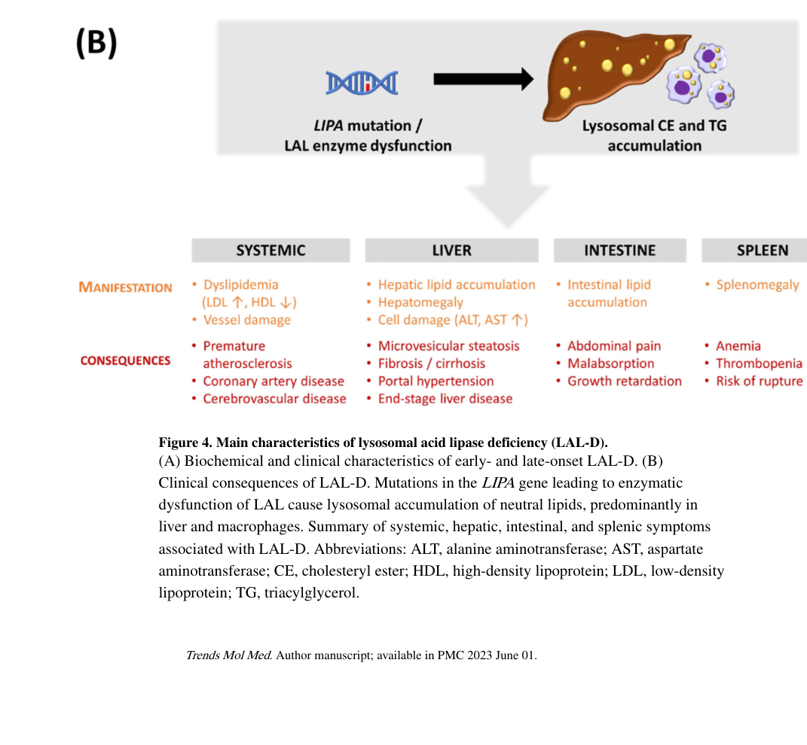

## Question

# Disease Characteristics Research Template

## Target Disease
- **Disease Name:** Cholesteryl Ester Storage Disease
- **MONDO ID:**  (if available)
- **Category:** Mendelian

## Research Objectives

Please provide a comprehensive research report on **Cholesteryl Ester Storage Disease** covering all of the
disease characteristics listed below. This report will be used to populate a disease knowledge
base entry. Be thorough and cite primary literature (PMID preferred) for all claims.

For each section, **suggested databases/resources** are listed. These are the first places
you should search for information on each topic.

---

### 1. Disease Information
> **Search first:** OMIM, Orphanet, ICD-10/ICD-11, MeSH, PubMed

- What is the disease? Provide a concise overview.
- What are the key identifiers? (OMIM, Orphanet, ICD-10/ICD-11, MeSH, Mondo)
- What are the common synonyms and alternative names?
- Is the information derived from individual patients (e.g., EHR) or aggregated disease-level resources?

### 2. Etiology

- **Disease Causal Factors**: What are the primary causes? (genetic, environmental, infectious, mechanistic)
- **Risk Factors**:
  > **Search first:** PubMed, Cochrane Library, UpToDate, clinical guidelines, ClinVar, ClinGen, GWAS Catalog, PheGenI, CTD, CDC, WHO, epidemiological databases
  - Genetic risk factors (causal variants, susceptibility loci, modifier genes)
  - Environmental risk factors (toxins, lifestyle, occupational exposures, age, sex, family history)
- **Protective Factors**:
  > **Search first:** PubMed, Cochrane Library, clinical trial databases, GWAS Catalog, gnomAD, WHO, CDC, nutrition databases
  - Genetic protective factors (protective variants, modifier alleles)
  - Environmental protective factors (diet, lifestyle, exposures that reduce risk)
- **Gene-Environment Interactions**: How do genetic and environmental factors interact to influence disease?
  > **Search first:** CTD, PubMed, PheGenI, GxE databases

### 3. Phenotypes
> **Search first:** HPO (Human Phenotype Ontology), OMIM, Orphanet, PubMed, clinicaltrials.gov, MedDRA, SNOMED CT, DECIPHER, LOINC

For each phenotype, provide:
- **Phenotype type**: symptoms, clinical signs, physical manifestations, behavioral changes, or laboratory abnormalities
  > For symptoms/signs: HPO, OMIM, Orphanet, PubMed
  > For behavioral changes: HPO, DSM, RDoC (Research Domain Criteria), PubMed
  > For laboratory abnormalities: LOINC, SNOMED CT, LabTests Online, PubMed
- **Phenotype characteristics**:
  > **Search first:** OMIM, Orphanet, HPO, PubMed
  - Age of symptom onset (neonatal, childhood, adult-onset, late-onset)
  - Symptom severity (mild, moderate, severe, variable)
  - Symptom progression (stable, progressive, episodic, fluctuating)
  - Frequency among affected individuals (percentage or qualitative)
- **Quality of life impact**: Effects on daily functioning and well-being (per-phenotype when possible)
  > **Search first:** EQ-5D database, SF-36, WHO QOL databases, PubMed
- Suggest HPO (Human Phenotype Ontology) terms for each phenotype

### 4. Genetic/Molecular Information

- **Causal Genes**: Gene mutations or chromosomal abnormalities responsible for disease (gene symbols, OMIM IDs)
  > **Search first:** OMIM, ClinVar, HGMD, Ensembl, NCBI Gene
- **Pathogenic Variants**:
  - Affected genes (gene symbols, HGNC IDs)
    > **Search first:** OMIM, NCBI Gene, Ensembl, HGNC, UniProt, GeneCards
  - Variant classification (pathogenic, likely pathogenic, VUS per ACMG/AMP guidelines)
    > **Search first:** ClinVar, ClinGen, ACMG/AMP guidelines, VarSome
  - Variant type/class (missense, frameshift, nonsense, splice-site, structural)
  - Allele frequency in population databases
    > **Search first:** gnomAD, 1000 Genomes, ExAC, TOPMed, dbSNP
  - Somatic vs germline origin
    > **Search first:** COSMIC (somatic), ClinVar, ICGC, TCGA
  - Functional consequences (loss of function, gain of function, dominant negative)
- **Modifier Genes**: Genes that modify disease severity or expression
- **Epigenetic Information**: DNA methylation, histone modifications, chromatin changes affecting disease
  > **Search first:** ENCODE, Roadmap Epigenomics, MethBase, DiseaseMeth
- **Chromosomal Abnormalities**: Large-scale genetic changes (aneuploidy, translocations, inversions)
  > **Search first:** DECIPHER, ClinVar, ECARUCA, UCSC Genome Browser

### 5. Environmental Information

- **Environmental Factors**: Non-genetic contributing factors (toxins, radiation, pollution, occupational exposure)
  > **Search first:** CTD (Comparative Toxicogenomics Database), TOXNET, PubMed, EPA databases
- **Lifestyle Factors**: Behavioral factors (smoking, diet, exercise, alcohol consumption)
  > **Search first:** CDC databases, WHO, PubMed, NHANES
- **Infectious Agents**: If applicable, pathogens causing or triggering disease (bacteria, viruses, fungi, parasites)
  > **Search first:** NCBI Taxonomy, ViPR, BV-BRC, MicrobeDB, GIDEON

### 6. Mechanism / Pathophysiology

- **Molecular Pathways**: Specific signaling cascades or biochemical pathways involved (Wnt, MAPK, mTOR, PI3K-AKT, etc.)
  > **Search first:** KEGG, Reactome, WikiPathways, PathBank, BioCyc
- **Cellular Processes**: Cell-level mechanisms (apoptosis, autophagy, cell cycle dysregulation, inflammation, etc.)
  > **Search first:** Gene Ontology (GO), Reactome, KEGG, PubMed
- **Protein Dysfunction**: How protein structure or function is altered (misfolding, aggregation, loss of function, gain of function)
  > **Search first:** UniProt, PDB (Protein Data Bank), InterPro, Pfam, AlphaFold
- **Metabolic Changes**: Alterations in metabolic processes (energy metabolism, lipid metabolism, amino acid metabolism)
  > **Search first:** KEGG, BioCyc, HMDB (Human Metabolome Database), BRENDA
- **Immune System Involvement**: Role of immune response (autoimmunity, immunodeficiency, chronic inflammation)
  > **Search first:** ImmPort, Immunome Database, IEDB, Gene Ontology
- **Tissue Damage Mechanisms**: How tissues/ are injured (oxidative stress, ischemia, fibrosis, necrosis)
  > **Search first:** PubMed, Gene Ontology, Reactome
- **Biochemical Abnormalities**: Specific molecular defects (enzyme deficiencies, receptor dysfunction, ion channel defects)
  > **Search first:** BRENDA, UniProt, KEGG, OMIM, PubMed
- **Epigenetic Changes**: DNA methylation, histone modifications affecting gene expression in disease
  > **Search first:** ENCODE, Roadmap Epigenomics, MethBase, DiseaseMeth
- **Molecular Profiling** (if available):
  - Transcriptomics/gene expression changes
    > **Search first:** GEO (Gene Expression Omnibus), ArrayExpress, GTEx, Human Cell Atlas, SRA
  - Proteomics findings
    > **Search first:** PRIDE, ProteomeXchange, Human Protein Atlas, STRING, BioGRID
  - Metabolomics signatures
    > **Search first:** MetaboLights, Metabolomics Workbench, HMDB, METLIN
  - Lipidomics alterations
    > **Search first:** LIPID MAPS, SwissLipids, LipidHome, Metabolomics Workbench
  - Genomic structural features
    > **Search first:** UCSC Genome Browser, Ensembl, NCBI, dbVar, DGV
- **Advanced Technologies** (if applicable):
  - Single-cell analysis findings (cell-type specific mechanisms, cellular heterogeneity)
    > **Search first:** Human Cell Atlas, Single Cell Portal, GEO, CELLxGENE
  - Spatial transcriptomics findings
    > **Search first:** GEO, Spatial Research, Vizgen, 10x Genomics data
  - Multi-omics integration results
    > **Search first:** TCGA, ICGC, cBioPortal, LinkedOmics, PubMed
  - Functional genomics screens (CRISPR, RNAi)
    > **Search first:** DepMap, GenomeRNAi, PubMed, BioGRID ORCS

For each mechanism, describe:
- The causal chain from initial trigger to clinical manifestation
- Which mechanisms are upstream vs downstream
- What cell types and biological processes are involved
- Suggest GO terms for biological processes and CL terms for cell types

### 7. Anatomical Structures Affected

- **Organ Level**:
  - Primary organs directly affected
  - Secondary organ involvement (complications, secondary effects)
  - Body systems involved (cardiovascular, nervous, digestive, respiratory, endocrine, etc.)
  > **Search first:** Uberon, FMA (Foundational Model of Anatomy), OMIM, HPO, ICD-11, MeSH, SNOMED CT
- **Tissue and Cell Level**:
  - Specific tissue types affected (epithelial, connective, muscle, nervous)
  - Specific cell populations targeted (with Cell Ontology terms)
  > **Search first:** Uberon, Human Protein Atlas, Cell Ontology, Human Cell Atlas, CellMarker, PanglaoDB
- **Subcellular Level**:
  - Cellular compartments involved (mitochondria, nucleus, ER, lysosomes) (with GO Cellular Component terms)
  > **Search first:** Gene Ontology (Cellular Component), UniProt, Human Protein Atlas
- **Localization**:
  - Specific anatomical sites (with UBERON terms)
    > **Search first:** FMA, Uberon, NeuroNames (for brain), SNOMED CT
  - Lateralization (unilateral, bilateral, asymmetric)
    > **Search first:** HPO, clinical literature, imaging databases

### 8. Temporal Development

- **Onset**:
  - Typical age of onset (congenital, pediatric, adult, geriatric)
  - Onset pattern (acute, subacute, chronic, insidious)
  > **Search first:** OMIM, Orphanet, HPO, PubMed
- **Progression**:
  - Disease stages (early, intermediate, advanced, end-stage)
    > **Search first:** Cancer Staging Manual (AJCC), WHO classifications, PubMed
  - Progression rate (rapid, slow, variable)
  - Disease course pattern (episodic, relapsing-remitting, progressive, stable)
  - Disease duration (self-limited, chronic lifelong)
  > **Search first:** Disease registries, longitudinal cohort databases, natural history studies, PubMed, Orphanet, OMIM
- **Patterns**:
  - Remission patterns (spontaneous, treatment-induced)
    > **Search first:** Clinical trial databases, disease registries, PubMed
  - Critical periods (time windows of vulnerability or opportunity for intervention)
    > **Search first:** PubMed, developmental biology databases, clinical guidelines

### 9. Inheritance and Population

- **Epidemiology**:
  - Prevalence (cases per 100,000 at given time)
  - Incidence (new cases per 100,000 per year)
  > **Search first:** Orphanet, CDC, WHO, GBD (Global Burden of Disease), national registries, SEER, disease registries
- **For Genetic Etiology**:
  - Inheritance pattern (AD, AR, X-linked, mitochondrial, multifactorial, polygenic)
    > **Search first:** OMIM, Orphanet, ClinVar, GTR (Genetic Testing Registry)
  - Penetrance (complete, incomplete, age-dependent)
    > **Search first:** ClinVar, OMIM, PubMed, ClinGen
  - Expressivity (variable, consistent)
    > **Search first:** OMIM, ClinVar, PubMed
  - Genetic anticipation (increasing severity in successive generations)
    > **Search first:** OMIM, PubMed (especially for repeat expansion disorders)
  - Germline mosaicism
    > **Search first:** ClinVar, OMIM, genetic counseling literature, PubMed
  - Founder effects (population-specific mutations)
    > **Search first:** gnomAD, population genetics databases, PubMed
  - Consanguinity role
    > **Search first:** OMIM, population studies, genetic counseling resources
  - Carrier frequency
    > **Search first:** gnomAD, carrier screening databases, GeneReviews, GTR
- **Population Demographics**:
  - Affected populations (ethnic or demographic groups with higher prevalence)
    > **Search first:** gnomAD, 1000 Genomes, PAGE Study, PubMed, population registries
  - Geographic distribution (endemic areas, regional variation)
    > **Search first:** WHO, CDC, GBD, Orphanet, geographic epidemiology databases
  - Geographic distribution of specific variants
  - Sex ratio (male:female)
    > **Search first:** Disease registries, OMIM, PubMed, epidemiological databases
  - Age distribution of affected individuals
    > **Search first:** CDC, disease registries, SEER, Orphanet

### 10. Diagnostics

- **Clinical Tests**:
  - Laboratory tests (blood, urine, tissue chemistry, specific enzyme assays)
    > **Search first:** LOINC, LabTests Online, PubMed
  - Biomarkers (proteins, metabolites, genetic markers, circulating biomarkers)
    > **Search first:** FDA Biomarker List, BEST (Biomarkers, EndpointS, and other Tools), PubMed
  - Imaging studies (X-ray, CT, MRI, PET, ultrasound)
    > **Search first:** RadLex, DICOM, Radiopaedia, imaging databases
  - Functional tests (pulmonary function, cardiac stress tests)
    > **Search first:** LOINC, clinical guidelines, PubMed
  - Electrophysiology (EEG, EMG, ECG, nerve conduction studies)
    > **Search first:** LOINC, clinical neurophysiology databases, PubMed
  - Biopsy findings (histopathology, immunohistochemistry)
    > **Search first:** SNOMED CT, College of American Pathologists resources, PubMed
  - Pathology findings (microscopic examination)
    > **Search first:** SNOMED CT, Digital Pathology databases, PubMed
- **Genetic Testing**:
  > **Search first:** GTR (Genetic Testing Registry), GeneReviews, ClinGen
  - Overview of recommended genetic testing approach
  - Whole genome sequencing (WGS) utility
    > **Search first:** GTR, ClinVar, GEL (Genomics England), gnomAD
  - Whole exome sequencing (WES) utility
    > **Search first:** GTR, ClinVar, OMIM, GeneMatcher
  - Gene panels (which panels, which genes)
    > **Search first:** GTR, ClinVar, laboratory-specific databases
  - Single gene testing
    > **Search first:** GTR, ClinVar, OMIM, GeneReviews
  - Chromosomal microarray (CMA)
    > **Search first:** DECIPHER, ClinVar, dbVar, ECARUCA
  - Karyotyping
    > **Search first:** Chromosome Abnormality Database, ClinVar, cytogenetics resources
  - FISH
    > **Search first:** ClinVar, cytogenetics databases, PubMed
  - Mitochondrial DNA testing
    > **Search first:** MITOMAP, MSeqDR, ClinVar, GTR
  - Repeat expansion testing
    > **Search first:** GTR, ClinVar, repeat expansion databases, PubMed
- **Omics-Based Diagnostics** (if applicable):
  - RNA sequencing / transcriptomics
    > **Search first:** GEO, ArrayExpress, GTEx, RNA-seq databases
  - Proteomics
    > **Search first:** PRIDE, ProteomeXchange, FDA Biomarker database
  - Metabolomics
    > **Search first:** MetaboLights, Metabolomics Workbench, HMDB
  - Epigenomics
    > **Search first:** GEO, ENCODE, Roadmap Epigenomics, MethBase
  - Liquid biopsy
    > **Search first:** COSMIC, ClinVar, liquid biopsy databases, PubMed
- **Clinical Criteria**:
  - Standardized diagnostic criteria (DSM, ICD, society guidelines)
    > **Search first:** DSM-5, ICD-11, clinical society guidelines, UpToDate
  - Differential diagnosis (other conditions to rule out, with distinguishing features)
    > **Search first:** DynaMed, UpToDate, clinical decision support systems
- **Screening**:
  - Screening methods for asymptomatic individuals (newborn screening, carrier screening, cascade screening)
    > **Search first:** ACMG recommendations, CDC newborn screening, GTR

### 11. Outcome/Prognosis

- **Survival and Mortality**:
  - Survival rate (5-year, 10-year, overall)
    > **Search first:** SEER, cancer registries, disease-specific registries, PubMed
  - Life expectancy (with and without treatment if applicable)
    > **Search first:** Orphanet, disease registries, actuarial databases, PubMed
  - Mortality rate
    > **Search first:** CDC, WHO, GBD, national mortality databases
  - Disease-specific mortality (deaths directly attributable to disease)
    > **Search first:** Disease registries, CDC Wonder, GBD, PubMed
- **Morbidity and Function**:
  - Morbidity (disease-related disability and health impacts)
    > **Search first:** GBD, WHO, disability databases, PubMed
  - Disability outcomes (long-term functional impairments)
    > **Search first:** ICF (International Classification of Functioning), disability registries
  - Quality of life measures (EQ-5D, SF-36, PROMIS, disease-specific tools)
    > **Search first:** EQ-5D database, SF-36, PROMIS, PubMed
- **Disease Course**:
  - Complications (secondary problems: infections, organ failure, etc.)
    > **Search first:** ICD codes, disease registries, clinical databases, PubMed
  - Recovery potential (likelihood and extent of recovery, with vs without treatment)
    > **Search first:** Natural history studies, rehabilitation databases, PubMed
- **Prediction**:
  - Prognostic factors (age, disease severity, biomarkers, treatment response)
    > **Search first:** Prognostic models databases, clinical calculators, PubMed
  - Prognostic biomarkers (molecular markers predicting disease course)
    > **Search first:** FDA Biomarker database, PubMed, cancer prognostic databases

### 12. Treatment

- **Pharmacotherapy**:
  - Pharmacological treatments (drug names, drug classes, mechanisms of action)
    > **Search first:** DrugBank, RxNorm, ATC classification, DailyMed, FDA databases
  - Pharmacogenomics (how genetic variants affect drug metabolism, efficacy, toxicity)
    > **Search first:** PharmGKB, CPIC (Clinical Pharmacogenetics), FDA Table of PGx Biomarkers
- **Advanced Therapeutics**:
  - Gene therapy (viral vectors, CRISPR, gene replacement, gene editing)
    > **Search first:** ClinicalTrials.gov, FDA gene therapy database, ASGCT resources
  - Cell therapy (stem cell transplant, CAR-T, cellular therapeutics)
    > **Search first:** ClinicalTrials.gov, FDA cell therapy database, FACT standards
  - RNA-based therapies (ASOs, siRNA, mRNA therapies)
    > **Search first:** ClinicalTrials.gov, FDA approvals, PubMed
  - Targeted therapies (treatments directed at specific molecular targets)
    > **Search first:** My Cancer Genome, OncoKB, ClinicalTrials.gov, FDA approvals
  - Immunotherapies (checkpoint inhibitors, monoclonal antibodies)
    > **Search first:** Cancer Immunotherapy Database, FDA approvals, ClinicalTrials.gov
- **Surgical and Interventional**:
  - Surgical interventions (types of surgery, timing, outcomes)
    > **Search first:** CPT codes, surgical registries, clinical guidelines, PubMed
- **Supportive and Rehabilitative**:
  - Supportive care (symptom management, pain control, nutrition)
    > **Search first:** Clinical guidelines, Cochrane Library, PubMed
  - Rehabilitation (physical therapy, occupational therapy, speech therapy)
    > **Search first:** Rehabilitation medicine databases, clinical guidelines, PubMed
- **Experimental**:
  - Experimental treatments in clinical trials (with NCT identifiers if available)
    > **Search first:** ClinicalTrials.gov, EU Clinical Trials Register, WHO ICTRP
- **Treatment Outcomes**:
  - Treatment response rates
    > **Search first:** Clinical trial databases, FDA reviews, systematic reviews, PubMed
  - Side effects and adverse events
    > **Search first:** FDA Adverse Event Reporting System (FAERS), MedWatch, PubMed
- **Treatment Strategy**:
  - Treatment algorithms (clinical pathways, decision trees)
    > **Search first:** Clinical practice guidelines, NCCN Guidelines, UpToDate
  - Combination therapies
    > **Search first:** ClinicalTrials.gov, treatment guidelines, PubMed
  - Personalized medicine approaches (genotype-guided treatment)
    > **Search first:** My Cancer Genome, CIViC, PharmGKB, precision medicine databases

For each treatment, suggest MAXO (Medical Action Ontology) terms where applicable.

### 13. Prevention

- **Prevention Levels**:
  - Primary prevention (preventing disease occurrence: vaccination, risk factor modification)
    > **Search first:** CDC, WHO, USPSTF recommendations, Cochrane Library
  - Secondary prevention (early detection and treatment: screening programs, early intervention)
    > **Search first:** USPSTF, CDC screening guidelines, WHO
  - Tertiary prevention (preventing complications in those with disease)
    > **Search first:** Clinical guidelines, disease management protocols, PubMed
- **Immunization**: Vaccine strategies (if applicable)
  > **Search first:** CDC vaccine schedules, WHO immunization, FDA vaccine database
- **Screening and Early Detection**:
  - Screening programs (population-based: newborn screening, cancer screening)
    > **Search first:** CDC screening programs, USPSTF, cancer screening databases
  - Genetic screening (carrier screening, preimplantation genetic diagnosis, prenatal testing)
    > **Search first:** ACMG recommendations, ACOG guidelines, GTR
  - Risk stratification (identifying high-risk individuals for targeted prevention)
    > **Search first:** Risk prediction models, clinical calculators, PubMed
- **Behavioral Interventions**: Lifestyle modifications to reduce risk
  > **Search first:** CDC, WHO, behavioral intervention databases, Cochrane Library
- **Counseling**: Genetic counseling (risk assessment, family planning guidance)
  > **Search first:** NSGC resources, ACMG guidelines, GeneReviews
- **Public Health**:
  - Public health interventions (sanitation, vector control, health education)
    > **Search first:** CDC, WHO, public health databases, PubMed
  - Environmental interventions (reducing environmental risk factors)
    > **Search first:** EPA databases, WHO environmental health, PubMed
- **Prophylaxis**: Preventive medications or procedures
  > **Search first:** Clinical guidelines, FDA approvals, PubMed

### 14. Other Species / Natural Disease

- **Taxonomy**: Species affected (with NCBI Taxon identifiers)
  > **Search first:** NCBI Taxonomy
- **Breed**: Specific breeds affected (with VBO identifiers if applicable)
  > **Search first:** VBO (Vertebrate Breed Ontology)
- **Gene**: Orthologous genes in other species (with NCBI Gene IDs)
  > **Search first:** NCBI Gene
- **Natural Disease**:
  - Naturally occurring disease in other species (companion animals, wildlife)
    > **Search first:** OMIA (Online Mendelian Inheritance in Animals), VetCompass, PubMed
  - Veterinary relevance and importance in animal health
    > **Search first:** OMIA, veterinary databases, PubMed
- **Comparative Biology**:
  - Comparative pathology (similarities and differences across species)
    > **Search first:** OMIA, comparative pathology databases, PubMed
  - Evolutionary conservation of disease mechanisms
    > **Search first:** HomoloGene, OrthoMCL, Alliance of Genome Resources
- **Transmission** (if applicable):
  - Zoonotic potential
    > **Search first:** CDC zoonotic diseases, WHO zoonoses, GIDEON
  - Cross-species susceptibility
    > **Search first:** NCBI Taxonomy, veterinary databases, PubMed

### 15. Model Organisms

- **Model Types**:
  - Model organism type (mammalian, invertebrate, cellular, in vitro)
    > **Search first:** Alliance of Genome Resources, model organism databases
  - Specific model systems (mouse, rat, zebrafish, Drosophila, C. elegans, yeast, cell lines, organoids, iPSCs)
    > **Search first:** MGI, RGD, ZFIN, FlyBase, WormBase, SGD, ATCC, Cellosaurus
  - Induced models (drug treatment, surgical intervention, environmental manipulation)
    > **Search first:** MGI, model organism databases, PubMed
- **Genetic Models**:
  - Types available (knockout, knock-in, transgenic, conditional, humanized)
    > **Search first:** MGI, IMPC, KOMP, EuMMCR, IMSR
- **Model Characteristics**:
  - Phenotype recapitulation (how well model reproduces human disease features)
    > **Search first:** Model organism databases, comparative studies, PubMed
  - Model limitations (aspects of human disease not captured)
    > **Search first:** Model organism databases, PubMed, review articles
- **Applications**:
  - Research applications (what aspects of disease can be studied)
    > **Search first:** Model organism databases, PubMed
- **Resources**:
  - Model databases
    > **Search first:** MGI, RGD, ZFIN, FlyBase, WormBase, IMSR, EMMA, MMRRC

---

## Citation Requirements

- Cite primary literature (PMID preferred) for all mechanistic and clinical claims
- Prioritize recent reviews and landmark papers
- Include direct quotes from abstracts where possible to support key statements
- Distinguish evidence source types: human clinical, model organism, in vitro, computational

## Output Format

Structure your response as a comprehensive narrative organized by the sections above.
For each section, provide:
- Factual content with specific details (numbers, percentages, gene names, variant nomenclature)
- Ontology term suggestions (HPO, GO, CL, UBERON, CHEBI, MAXO, MONDO) where applicable
- Evidence citations with PMIDs
- Direct quotes from abstracts to support key claims
- Clear indication when information is not available or not applicable for this disease

This report will be used to populate a disease knowledge base entry with:
- Pathophysiology descriptions with causal chains
- Gene/protein annotations (HGNC, GO terms)
- Phenotype associations (HP terms) with frequencies
- Cell type involvement (CL terms)
- Anatomical locations (UBERON terms)
- Chemical entities (CHEBI terms)
- Treatment annotations (MAXO terms)
- Evidence items with PMIDs and exact abstract quotes
- Epidemiology, prognosis, diagnostic, and prevention information
- Animal model descriptions with phenotype recapitulation details

## Output

Question: You are an expert researcher providing comprehensive, well-cited information.

Provide detailed information focusing on:
1. Key concepts and definitions with current understanding
2. Recent developments and latest research (prioritize 2023-2024 sources)
3. Current applications and real-world implementations
4. Expert opinions and analysis from authoritative sources
5. Relevant statistics and data from recent studies

Format as a comprehensive research report with proper citations. Include URLs and publication dates where available.
Always prioritize recent, authoritative sources and provide specific citations for all major claims.

# Disease Characteristics Research Template

## Target Disease
- **Disease Name:** Cholesteryl Ester Storage Disease
- **MONDO ID:**  (if available)
- **Category:** Mendelian

## Research Objectives

Please provide a comprehensive research report on **Cholesteryl Ester Storage Disease** covering all of the
disease characteristics listed below. This report will be used to populate a disease knowledge
base entry. Be thorough and cite primary literature (PMID preferred) for all claims.

For each section, **suggested databases/resources** are listed. These are the first places
you should search for information on each topic.

---

### 1. Disease Information
> **Search first:** OMIM, Orphanet, ICD-10/ICD-11, MeSH, PubMed

- What is the disease? Provide a concise overview.
- What are the key identifiers? (OMIM, Orphanet, ICD-10/ICD-11, MeSH, Mondo)
- What are the common synonyms and alternative names?
- Is the information derived from individual patients (e.g., EHR) or aggregated disease-level resources?

### 2. Etiology

- **Disease Causal Factors**: What are the primary causes? (genetic, environmental, infectious, mechanistic)
- **Risk Factors**:
  > **Search first:** PubMed, Cochrane Library, UpToDate, clinical guidelines, ClinVar, ClinGen, GWAS Catalog, PheGenI, CTD, CDC, WHO, epidemiological databases
  - Genetic risk factors (causal variants, susceptibility loci, modifier genes)
  - Environmental risk factors (toxins, lifestyle, occupational exposures, age, sex, family history)
- **Protective Factors**:
  > **Search first:** PubMed, Cochrane Library, clinical trial databases, GWAS Catalog, gnomAD, WHO, CDC, nutrition databases
  - Genetic protective factors (protective variants, modifier alleles)
  - Environmental protective factors (diet, lifestyle, exposures that reduce risk)
- **Gene-Environment Interactions**: How do genetic and environmental factors interact to influence disease?
  > **Search first:** CTD, PubMed, PheGenI, GxE databases

### 3. Phenotypes
> **Search first:** HPO (Human Phenotype Ontology), OMIM, Orphanet, PubMed, clinicaltrials.gov, MedDRA, SNOMED CT, DECIPHER, LOINC

For each phenotype, provide:
- **Phenotype type**: symptoms, clinical signs, physical manifestations, behavioral changes, or laboratory abnormalities
  > For symptoms/signs: HPO, OMIM, Orphanet, PubMed
  > For behavioral changes: HPO, DSM, RDoC (Research Domain Criteria), PubMed
  > For laboratory abnormalities: LOINC, SNOMED CT, LabTests Online, PubMed
- **Phenotype characteristics**:
  > **Search first:** OMIM, Orphanet, HPO, PubMed
  - Age of symptom onset (neonatal, childhood, adult-onset, late-onset)
  - Symptom severity (mild, moderate, severe, variable)
  - Symptom progression (stable, progressive, episodic, fluctuating)
  - Frequency among affected individuals (percentage or qualitative)
- **Quality of life impact**: Effects on daily functioning and well-being (per-phenotype when possible)
  > **Search first:** EQ-5D database, SF-36, WHO QOL databases, PubMed
- Suggest HPO (Human Phenotype Ontology) terms for each phenotype

### 4. Genetic/Molecular Information

- **Causal Genes**: Gene mutations or chromosomal abnormalities responsible for disease (gene symbols, OMIM IDs)
  > **Search first:** OMIM, ClinVar, HGMD, Ensembl, NCBI Gene
- **Pathogenic Variants**:
  - Affected genes (gene symbols, HGNC IDs)
    > **Search first:** OMIM, NCBI Gene, Ensembl, HGNC, UniProt, GeneCards
  - Variant classification (pathogenic, likely pathogenic, VUS per ACMG/AMP guidelines)
    > **Search first:** ClinVar, ClinGen, ACMG/AMP guidelines, VarSome
  - Variant type/class (missense, frameshift, nonsense, splice-site, structural)
  - Allele frequency in population databases
    > **Search first:** gnomAD, 1000 Genomes, ExAC, TOPMed, dbSNP
  - Somatic vs germline origin
    > **Search first:** COSMIC (somatic), ClinVar, ICGC, TCGA
  - Functional consequences (loss of function, gain of function, dominant negative)
- **Modifier Genes**: Genes that modify disease severity or expression
- **Epigenetic Information**: DNA methylation, histone modifications, chromatin changes affecting disease
  > **Search first:** ENCODE, Roadmap Epigenomics, MethBase, DiseaseMeth
- **Chromosomal Abnormalities**: Large-scale genetic changes (aneuploidy, translocations, inversions)
  > **Search first:** DECIPHER, ClinVar, ECARUCA, UCSC Genome Browser

### 5. Environmental Information

- **Environmental Factors**: Non-genetic contributing factors (toxins, radiation, pollution, occupational exposure)
  > **Search first:** CTD (Comparative Toxicogenomics Database), TOXNET, PubMed, EPA databases
- **Lifestyle Factors**: Behavioral factors (smoking, diet, exercise, alcohol consumption)
  > **Search first:** CDC databases, WHO, PubMed, NHANES
- **Infectious Agents**: If applicable, pathogens causing or triggering disease (bacteria, viruses, fungi, parasites)
  > **Search first:** NCBI Taxonomy, ViPR, BV-BRC, MicrobeDB, GIDEON

### 6. Mechanism / Pathophysiology

- **Molecular Pathways**: Specific signaling cascades or biochemical pathways involved (Wnt, MAPK, mTOR, PI3K-AKT, etc.)
  > **Search first:** KEGG, Reactome, WikiPathways, PathBank, BioCyc
- **Cellular Processes**: Cell-level mechanisms (apoptosis, autophagy, cell cycle dysregulation, inflammation, etc.)
  > **Search first:** Gene Ontology (GO), Reactome, KEGG, PubMed
- **Protein Dysfunction**: How protein structure or function is altered (misfolding, aggregation, loss of function, gain of function)
  > **Search first:** UniProt, PDB (Protein Data Bank), InterPro, Pfam, AlphaFold
- **Metabolic Changes**: Alterations in metabolic processes (energy metabolism, lipid metabolism, amino acid metabolism)
  > **Search first:** KEGG, BioCyc, HMDB (Human Metabolome Database), BRENDA
- **Immune System Involvement**: Role of immune response (autoimmunity, immunodeficiency, chronic inflammation)
  > **Search first:** ImmPort, Immunome Database, IEDB, Gene Ontology
- **Tissue Damage Mechanisms**: How tissues/ are injured (oxidative stress, ischemia, fibrosis, necrosis)
  > **Search first:** PubMed, Gene Ontology, Reactome
- **Biochemical Abnormalities**: Specific molecular defects (enzyme deficiencies, receptor dysfunction, ion channel defects)
  > **Search first:** BRENDA, UniProt, KEGG, OMIM, PubMed
- **Epigenetic Changes**: DNA methylation, histone modifications affecting gene expression in disease
  > **Search first:** ENCODE, Roadmap Epigenomics, MethBase, DiseaseMeth
- **Molecular Profiling** (if available):
  - Transcriptomics/gene expression changes
    > **Search first:** GEO (Gene Expression Omnibus), ArrayExpress, GTEx, Human Cell Atlas, SRA
  - Proteomics findings
    > **Search first:** PRIDE, ProteomeXchange, Human Protein Atlas, STRING, BioGRID
  - Metabolomics signatures
    > **Search first:** MetaboLights, Metabolomics Workbench, HMDB, METLIN
  - Lipidomics alterations
    > **Search first:** LIPID MAPS, SwissLipids, LipidHome, Metabolomics Workbench
  - Genomic structural features
    > **Search first:** UCSC Genome Browser, Ensembl, NCBI, dbVar, DGV
- **Advanced Technologies** (if applicable):
  - Single-cell analysis findings (cell-type specific mechanisms, cellular heterogeneity)
    > **Search first:** Human Cell Atlas, Single Cell Portal, GEO, CELLxGENE
  - Spatial transcriptomics findings
    > **Search first:** GEO, Spatial Research, Vizgen, 10x Genomics data
  - Multi-omics integration results
    > **Search first:** TCGA, ICGC, cBioPortal, LinkedOmics, PubMed
  - Functional genomics screens (CRISPR, RNAi)
    > **Search first:** DepMap, GenomeRNAi, PubMed, BioGRID ORCS

For each mechanism, describe:
- The causal chain from initial trigger to clinical manifestation
- Which mechanisms are upstream vs downstream
- What cell types and biological processes are involved
- Suggest GO terms for biological processes and CL terms for cell types

### 7. Anatomical Structures Affected

- **Organ Level**:
  - Primary organs directly affected
  - Secondary organ involvement (complications, secondary effects)
  - Body systems involved (cardiovascular, nervous, digestive, respiratory, endocrine, etc.)
  > **Search first:** Uberon, FMA (Foundational Model of Anatomy), OMIM, HPO, ICD-11, MeSH, SNOMED CT
- **Tissue and Cell Level**:
  - Specific tissue types affected (epithelial, connective, muscle, nervous)
  - Specific cell populations targeted (with Cell Ontology terms)
  > **Search first:** Uberon, Human Protein Atlas, Cell Ontology, Human Cell Atlas, CellMarker, PanglaoDB
- **Subcellular Level**:
  - Cellular compartments involved (mitochondria, nucleus, ER, lysosomes) (with GO Cellular Component terms)
  > **Search first:** Gene Ontology (Cellular Component), UniProt, Human Protein Atlas
- **Localization**:
  - Specific anatomical sites (with UBERON terms)
    > **Search first:** FMA, Uberon, NeuroNames (for brain), SNOMED CT
  - Lateralization (unilateral, bilateral, asymmetric)
    > **Search first:** HPO, clinical literature, imaging databases

### 8. Temporal Development

- **Onset**:
  - Typical age of onset (congenital, pediatric, adult, geriatric)
  - Onset pattern (acute, subacute, chronic, insidious)
  > **Search first:** OMIM, Orphanet, HPO, PubMed
- **Progression**:
  - Disease stages (early, intermediate, advanced, end-stage)
    > **Search first:** Cancer Staging Manual (AJCC), WHO classifications, PubMed
  - Progression rate (rapid, slow, variable)
  - Disease course pattern (episodic, relapsing-remitting, progressive, stable)
  - Disease duration (self-limited, chronic lifelong)
  > **Search first:** Disease registries, longitudinal cohort databases, natural history studies, PubMed, Orphanet, OMIM
- **Patterns**:
  - Remission patterns (spontaneous, treatment-induced)
    > **Search first:** Clinical trial databases, disease registries, PubMed
  - Critical periods (time windows of vulnerability or opportunity for intervention)
    > **Search first:** PubMed, developmental biology databases, clinical guidelines

### 9. Inheritance and Population

- **Epidemiology**:
  - Prevalence (cases per 100,000 at given time)
  - Incidence (new cases per 100,000 per year)
  > **Search first:** Orphanet, CDC, WHO, GBD (Global Burden of Disease), national registries, SEER, disease registries
- **For Genetic Etiology**:
  - Inheritance pattern (AD, AR, X-linked, mitochondrial, multifactorial, polygenic)
    > **Search first:** OMIM, Orphanet, ClinVar, GTR (Genetic Testing Registry)
  - Penetrance (complete, incomplete, age-dependent)
    > **Search first:** ClinVar, OMIM, PubMed, ClinGen
  - Expressivity (variable, consistent)
    > **Search first:** OMIM, ClinVar, PubMed
  - Genetic anticipation (increasing severity in successive generations)
    > **Search first:** OMIM, PubMed (especially for repeat expansion disorders)
  - Germline mosaicism
    > **Search first:** ClinVar, OMIM, genetic counseling literature, PubMed
  - Founder effects (population-specific mutations)
    > **Search first:** gnomAD, population genetics databases, PubMed
  - Consanguinity role
    > **Search first:** OMIM, population studies, genetic counseling resources
  - Carrier frequency
    > **Search first:** gnomAD, carrier screening databases, GeneReviews, GTR
- **Population Demographics**:
  - Affected populations (ethnic or demographic groups with higher prevalence)
    > **Search first:** gnomAD, 1000 Genomes, PAGE Study, PubMed, population registries
  - Geographic distribution (endemic areas, regional variation)
    > **Search first:** WHO, CDC, GBD, Orphanet, geographic epidemiology databases
  - Geographic distribution of specific variants
  - Sex ratio (male:female)
    > **Search first:** Disease registries, OMIM, PubMed, epidemiological databases
  - Age distribution of affected individuals
    > **Search first:** CDC, disease registries, SEER, Orphanet

### 10. Diagnostics

- **Clinical Tests**:
  - Laboratory tests (blood, urine, tissue chemistry, specific enzyme assays)
    > **Search first:** LOINC, LabTests Online, PubMed
  - Biomarkers (proteins, metabolites, genetic markers, circulating biomarkers)
    > **Search first:** FDA Biomarker List, BEST (Biomarkers, EndpointS, and other Tools), PubMed
  - Imaging studies (X-ray, CT, MRI, PET, ultrasound)
    > **Search first:** RadLex, DICOM, Radiopaedia, imaging databases
  - Functional tests (pulmonary function, cardiac stress tests)
    > **Search first:** LOINC, clinical guidelines, PubMed
  - Electrophysiology (EEG, EMG, ECG, nerve conduction studies)
    > **Search first:** LOINC, clinical neurophysiology databases, PubMed
  - Biopsy findings (histopathology, immunohistochemistry)
    > **Search first:** SNOMED CT, College of American Pathologists resources, PubMed
  - Pathology findings (microscopic examination)
    > **Search first:** SNOMED CT, Digital Pathology databases, PubMed
- **Genetic Testing**:
  > **Search first:** GTR (Genetic Testing Registry), GeneReviews, ClinGen
  - Overview of recommended genetic testing approach
  - Whole genome sequencing (WGS) utility
    > **Search first:** GTR, ClinVar, GEL (Genomics England), gnomAD
  - Whole exome sequencing (WES) utility
    > **Search first:** GTR, ClinVar, OMIM, GeneMatcher
  - Gene panels (which panels, which genes)
    > **Search first:** GTR, ClinVar, laboratory-specific databases
  - Single gene testing
    > **Search first:** GTR, ClinVar, OMIM, GeneReviews
  - Chromosomal microarray (CMA)
    > **Search first:** DECIPHER, ClinVar, dbVar, ECARUCA
  - Karyotyping
    > **Search first:** Chromosome Abnormality Database, ClinVar, cytogenetics resources
  - FISH
    > **Search first:** ClinVar, cytogenetics databases, PubMed
  - Mitochondrial DNA testing
    > **Search first:** MITOMAP, MSeqDR, ClinVar, GTR
  - Repeat expansion testing
    > **Search first:** GTR, ClinVar, repeat expansion databases, PubMed
- **Omics-Based Diagnostics** (if applicable):
  - RNA sequencing / transcriptomics
    > **Search first:** GEO, ArrayExpress, GTEx, RNA-seq databases
  - Proteomics
    > **Search first:** PRIDE, ProteomeXchange, FDA Biomarker database
  - Metabolomics
    > **Search first:** MetaboLights, Metabolomics Workbench, HMDB
  - Epigenomics
    > **Search first:** GEO, ENCODE, Roadmap Epigenomics, MethBase
  - Liquid biopsy
    > **Search first:** COSMIC, ClinVar, liquid biopsy databases, PubMed
- **Clinical Criteria**:
  - Standardized diagnostic criteria (DSM, ICD, society guidelines)
    > **Search first:** DSM-5, ICD-11, clinical society guidelines, UpToDate
  - Differential diagnosis (other conditions to rule out, with distinguishing features)
    > **Search first:** DynaMed, UpToDate, clinical decision support systems
- **Screening**:
  - Screening methods for asymptomatic individuals (newborn screening, carrier screening, cascade screening)
    > **Search first:** ACMG recommendations, CDC newborn screening, GTR

### 11. Outcome/Prognosis

- **Survival and Mortality**:
  - Survival rate (5-year, 10-year, overall)
    > **Search first:** SEER, cancer registries, disease-specific registries, PubMed
  - Life expectancy (with and without treatment if applicable)
    > **Search first:** Orphanet, disease registries, actuarial databases, PubMed
  - Mortality rate
    > **Search first:** CDC, WHO, GBD, national mortality databases
  - Disease-specific mortality (deaths directly attributable to disease)
    > **Search first:** Disease registries, CDC Wonder, GBD, PubMed
- **Morbidity and Function**:
  - Morbidity (disease-related disability and health impacts)
    > **Search first:** GBD, WHO, disability databases, PubMed
  - Disability outcomes (long-term functional impairments)
    > **Search first:** ICF (International Classification of Functioning), disability registries
  - Quality of life measures (EQ-5D, SF-36, PROMIS, disease-specific tools)
    > **Search first:** EQ-5D database, SF-36, PROMIS, PubMed
- **Disease Course**:
  - Complications (secondary problems: infections, organ failure, etc.)
    > **Search first:** ICD codes, disease registries, clinical databases, PubMed
  - Recovery potential (likelihood and extent of recovery, with vs without treatment)
    > **Search first:** Natural history studies, rehabilitation databases, PubMed
- **Prediction**:
  - Prognostic factors (age, disease severity, biomarkers, treatment response)
    > **Search first:** Prognostic models databases, clinical calculators, PubMed
  - Prognostic biomarkers (molecular markers predicting disease course)
    > **Search first:** FDA Biomarker database, PubMed, cancer prognostic databases

### 12. Treatment

- **Pharmacotherapy**:
  - Pharmacological treatments (drug names, drug classes, mechanisms of action)
    > **Search first:** DrugBank, RxNorm, ATC classification, DailyMed, FDA databases
  - Pharmacogenomics (how genetic variants affect drug metabolism, efficacy, toxicity)
    > **Search first:** PharmGKB, CPIC (Clinical Pharmacogenetics), FDA Table of PGx Biomarkers
- **Advanced Therapeutics**:
  - Gene therapy (viral vectors, CRISPR, gene replacement, gene editing)
    > **Search first:** ClinicalTrials.gov, FDA gene therapy database, ASGCT resources
  - Cell therapy (stem cell transplant, CAR-T, cellular therapeutics)
    > **Search first:** ClinicalTrials.gov, FDA cell therapy database, FACT standards
  - RNA-based therapies (ASOs, siRNA, mRNA therapies)
    > **Search first:** ClinicalTrials.gov, FDA approvals, PubMed
  - Targeted therapies (treatments directed at specific molecular targets)
    > **Search first:** My Cancer Genome, OncoKB, ClinicalTrials.gov, FDA approvals
  - Immunotherapies (checkpoint inhibitors, monoclonal antibodies)
    > **Search first:** Cancer Immunotherapy Database, FDA approvals, ClinicalTrials.gov
- **Surgical and Interventional**:
  - Surgical interventions (types of surgery, timing, outcomes)
    > **Search first:** CPT codes, surgical registries, clinical guidelines, PubMed
- **Supportive and Rehabilitative**:
  - Supportive care (symptom management, pain control, nutrition)
    > **Search first:** Clinical guidelines, Cochrane Library, PubMed
  - Rehabilitation (physical therapy, occupational therapy, speech therapy)
    > **Search first:** Rehabilitation medicine databases, clinical guidelines, PubMed
- **Experimental**:
  - Experimental treatments in clinical trials (with NCT identifiers if available)
    > **Search first:** ClinicalTrials.gov, EU Clinical Trials Register, WHO ICTRP
- **Treatment Outcomes**:
  - Treatment response rates
    > **Search first:** Clinical trial databases, FDA reviews, systematic reviews, PubMed
  - Side effects and adverse events
    > **Search first:** FDA Adverse Event Reporting System (FAERS), MedWatch, PubMed
- **Treatment Strategy**:
  - Treatment algorithms (clinical pathways, decision trees)
    > **Search first:** Clinical practice guidelines, NCCN Guidelines, UpToDate
  - Combination therapies
    > **Search first:** ClinicalTrials.gov, treatment guidelines, PubMed
  - Personalized medicine approaches (genotype-guided treatment)
    > **Search first:** My Cancer Genome, CIViC, PharmGKB, precision medicine databases

For each treatment, suggest MAXO (Medical Action Ontology) terms where applicable.

### 13. Prevention

- **Prevention Levels**:
  - Primary prevention (preventing disease occurrence: vaccination, risk factor modification)
    > **Search first:** CDC, WHO, USPSTF recommendations, Cochrane Library
  - Secondary prevention (early detection and treatment: screening programs, early intervention)
    > **Search first:** USPSTF, CDC screening guidelines, WHO
  - Tertiary prevention (preventing complications in those with disease)
    > **Search first:** Clinical guidelines, disease management protocols, PubMed
- **Immunization**: Vaccine strategies (if applicable)
  > **Search first:** CDC vaccine schedules, WHO immunization, FDA vaccine database
- **Screening and Early Detection**:
  - Screening programs (population-based: newborn screening, cancer screening)
    > **Search first:** CDC screening programs, USPSTF, cancer screening databases
  - Genetic screening (carrier screening, preimplantation genetic diagnosis, prenatal testing)
    > **Search first:** ACMG recommendations, ACOG guidelines, GTR
  - Risk stratification (identifying high-risk individuals for targeted prevention)
    > **Search first:** Risk prediction models, clinical calculators, PubMed
- **Behavioral Interventions**: Lifestyle modifications to reduce risk
  > **Search first:** CDC, WHO, behavioral intervention databases, Cochrane Library
- **Counseling**: Genetic counseling (risk assessment, family planning guidance)
  > **Search first:** NSGC resources, ACMG guidelines, GeneReviews
- **Public Health**:
  - Public health interventions (sanitation, vector control, health education)
    > **Search first:** CDC, WHO, public health databases, PubMed
  - Environmental interventions (reducing environmental risk factors)
    > **Search first:** EPA databases, WHO environmental health, PubMed
- **Prophylaxis**: Preventive medications or procedures
  > **Search first:** Clinical guidelines, FDA approvals, PubMed

### 14. Other Species / Natural Disease

- **Taxonomy**: Species affected (with NCBI Taxon identifiers)
  > **Search first:** NCBI Taxonomy
- **Breed**: Specific breeds affected (with VBO identifiers if applicable)
  > **Search first:** VBO (Vertebrate Breed Ontology)
- **Gene**: Orthologous genes in other species (with NCBI Gene IDs)
  > **Search first:** NCBI Gene
- **Natural Disease**:
  - Naturally occurring disease in other species (companion animals, wildlife)
    > **Search first:** OMIA (Online Mendelian Inheritance in Animals), VetCompass, PubMed
  - Veterinary relevance and importance in animal health
    > **Search first:** OMIA, veterinary databases, PubMed
- **Comparative Biology**:
  - Comparative pathology (similarities and differences across species)
    > **Search first:** OMIA, comparative pathology databases, PubMed
  - Evolutionary conservation of disease mechanisms
    > **Search first:** HomoloGene, OrthoMCL, Alliance of Genome Resources
- **Transmission** (if applicable):
  - Zoonotic potential
    > **Search first:** CDC zoonotic diseases, WHO zoonoses, GIDEON
  - Cross-species susceptibility
    > **Search first:** NCBI Taxonomy, veterinary databases, PubMed

### 15. Model Organisms

- **Model Types**:
  - Model organism type (mammalian, invertebrate, cellular, in vitro)
    > **Search first:** Alliance of Genome Resources, model organism databases
  - Specific model systems (mouse, rat, zebrafish, Drosophila, C. elegans, yeast, cell lines, organoids, iPSCs)
    > **Search first:** MGI, RGD, ZFIN, FlyBase, WormBase, SGD, ATCC, Cellosaurus
  - Induced models (drug treatment, surgical intervention, environmental manipulation)
    > **Search first:** MGI, model organism databases, PubMed
- **Genetic Models**:
  - Types available (knockout, knock-in, transgenic, conditional, humanized)
    > **Search first:** MGI, IMPC, KOMP, EuMMCR, IMSR
- **Model Characteristics**:
  - Phenotype recapitulation (how well model reproduces human disease features)
    > **Search first:** Model organism databases, comparative studies, PubMed
  - Model limitations (aspects of human disease not captured)
    > **Search first:** Model organism databases, PubMed, review articles
- **Applications**:
  - Research applications (what aspects of disease can be studied)
    > **Search first:** Model organism databases, PubMed
- **Resources**:
  - Model databases
    > **Search first:** MGI, RGD, ZFIN, FlyBase, WormBase, IMSR, EMMA, MMRRC

---

## Citation Requirements

- Cite primary literature (PMID preferred) for all mechanistic and clinical claims
- Prioritize recent reviews and landmark papers
- Include direct quotes from abstracts where possible to support key statements
- Distinguish evidence source types: human clinical, model organism, in vitro, computational

## Output Format

Structure your response as a comprehensive narrative organized by the sections above.
For each section, provide:
- Factual content with specific details (numbers, percentages, gene names, variant nomenclature)
- Ontology term suggestions (HPO, GO, CL, UBERON, CHEBI, MAXO, MONDO) where applicable
- Evidence citations with PMIDs
- Direct quotes from abstracts to support key claims
- Clear indication when information is not available or not applicable for this disease

This report will be used to populate a disease knowledge base entry with:
- Pathophysiology descriptions with causal chains
- Gene/protein annotations (HGNC, GO terms)
- Phenotype associations (HP terms) with frequencies
- Cell type involvement (CL terms)
- Anatomical locations (UBERON terms)
- Chemical entities (CHEBI terms)
- Treatment annotations (MAXO terms)
- Evidence items with PMIDs and exact abstract quotes
- Epidemiology, prognosis, diagnostic, and prevention information
- Animal model descriptions with phenotype recapitulation details

## Comprehensive Disease Characteristics Research Report: Cholesteryl Ester Storage Disease (CESD)

**Target disease:** Cholesteryl Ester Storage Disease (CESD) (later-onset phenotype of lysosomal acid lipase deficiency, LAL-D)  
**Category:** Mendelian (autosomal recessive)  
**MONDO ID:** **MONDO:0019149** (OpenTargets Search: Cholesteryl ester storage disease,Lysosomal acid lipase deficiency-LIPA)

### Executive summary (current understanding; 2023–2024 emphasis)
Cholesteryl ester storage disease (CESD) is the later-onset clinical presentation of **lysosomal acid lipase deficiency (LAL-D)**, caused by biallelic pathogenic variants in **LIPA** leading to partial reduction of lysosomal acid lipase activity (heras2024practicalrecommendationsfor pages 2-4, korbelius2023recentinsightsinto pages 3-4). Deficient lysosomal hydrolysis of LDL-derived cholesteryl esters and triglycerides leads to **lysosomal lipid trapping** and downstream dyslipidemia and chronic liver injury, with risk of fibrosis/cirrhosis and premature atherosclerotic cardiovascular disease (korbelius2023recentinsightsinto pages 1-3, heras2024practicalrecommendationsfor pages 2-4, lam2024liverdirectedaavgene pages 1-2). Since 2015, disease-specific therapy with **sebelipase alfa (recombinant human LAL)** has changed management; multiple clinical trials and long-term follow-up studies exist (e.g., N Engl J Med 2015 PMID: 26352813) (korbelius2023recentinsightsinto pages 12-13). In 2024, **liver-directed AAV gene therapy** demonstrated broad correction and survival benefit in Lipa−/− mice, supporting an active translational pipeline beyond enzyme replacement (lam2024liverdirectedaavgene pages 1-2, lam2024liverdirectedaavgene pages 8-9).

## 1. Disease information
### 1.1 What is the disease?
CESD is the **later-onset** phenotype of LAL-D (historically “cholesteryl ester storage disease”), typically diagnosed in childhood or adulthood and characterized by **chronic liver injury and/or abnormal lipid profiles** (heras2024practicalrecommendationsfor pages 1-2, heras2024practicalrecommendationsfor pages 2-4). It contrasts with infantile-onset LAL-D (Wolman disease), which has near-complete loss of enzyme activity and rapidly progressive systemic disease (heras2024practicalrecommendationsfor pages 1-2, heras2024practicalrecommendationsfor pages 2-4).

**Primary literature-supported definition (review abstract quote):**
- Korbelius et al. (Trends Mol Med, 2023-06-01) states: “Mutations in the LAL-encoding **LIPA** gene lead to rare lysosomal lipid storage disorders with complete or partial absence of LAL activity” and emphasizes that “Early detection of LAL deficiency (LAL-D) is essential for disease management and survival.” (korbelius2023recentinsightsinto pages 1-3)

### 1.2 Key identifiers
- **MONDO:** MONDO:0019149 (cholesteryl ester storage disease) (OpenTargets Search: Cholesteryl ester storage disease,Lysosomal acid lipase deficiency-LIPA)
- **OMIM (disease entry):** **OMIM 278000** (LAL-D; includes CESD and Wolman disease phenotypes) (heras2024practicalrecommendationsfor pages 1-2, korbelius2023recentinsightsinto pages 1-3)
- **OMIM (gene):** **LIPA** = MIM*613497 (heras2024practicalrecommendationsfor pages 2-4)

**Not found in retrieved full-text evidence set (reporting limitation):** ICD-10/ICD-11 codes, Orphanet ID, and MeSH IDs were not available in the retrieved documents; these should be added from external terminologies during knowledgebase ingestion.

### 1.3 Synonyms / alternative names
- Cholesteryl ester storage disease (CESD) (historical name) (heras2024practicalrecommendationsfor pages 1-2, nedelcu2024lysosomalacidlipase pages 1-2)
- Later-onset LAL-D / childhood- or adult-onset LAL-D (heras2024practicalrecommendationsfor pages 1-2, korbelius2023recentinsightsinto pages 3-4)

### 1.4 Evidence source type
This report is derived from **aggregated disease-level resources** (recent reviews and expert recommendations) plus **primary clinical trial publications (via PMIDs listed in reviews)** and a **2024 preclinical gene therapy study** (korbelius2023recentinsightsinto pages 12-13, lam2024liverdirectedaavgene pages 1-2). A small number of **human case reports/case series** appear in 2024 literature (e.g., Cureus case report) (nedelcu2024lysosomalacidlipase pages 1-2).

## 2. Etiology
### 2.1 Disease causal factors
**Genetic cause:** biallelic pathogenic variants in **LIPA** cause reduced lysosomal acid lipase activity, impairing intralysosomal hydrolysis of cholesteryl esters and triglycerides from LDL particles (heras2024practicalrecommendationsfor pages 2-4). CESD corresponds to **partial** deficiency (often ~1–12% of normal activity), whereas infantile-onset disease is typically <1% activity (heras2024practicalrecommendationsfor pages 2-4, korbelius2023recentinsightsinto pages 3-4).

**Direct quote (2024 case-report abstract):**
- Nedelcu et al. (Cureus, 2024-11-08): “Lysosomal acid lipase deficiency (LAL-D) is an **autosomal recessive genetic disease arising from mutations** in the … (**LIPA**) gene, characterised by the formation of cholesterol esters and triglyceride storages, primarily in the liver and spleen.” (nedelcu2024lysosomalacidlipase pages 1-2)

### 2.2 Risk factors
- **Primary risk:** inheriting two pathogenic LIPA alleles (autosomal recessive) (heras2024practicalrecommendationsfor pages 2-4, korbelius2023recentinsightsinto pages 3-4).
- **Clinical risk/enrichment contexts for case-finding:** unexplained dyslipidemia and/or chronically elevated aminotransferases (korbelius2023recentinsightsinto pages 1-3, korbelius2023recentinsightsinto pages 3-4).

### 2.3 Protective factors
No protective genetic or environmental factors specific to CESD were identified in the retrieved evidence set.

### 2.4 Gene–environment interactions
No CESD-specific gene–environment interaction evidence was identified in the retrieved evidence set.

## 3. Phenotypes
### 3.1 Core phenotypes and characteristics (later-onset/CESD)
Korbelius et al. describe a very broad and nonspecific phenotype with common features including **elevated aminotransferases**, **dyslipidemia with low HDL**, **hepatosplenomegaly**, occasional **gastrointestinal disturbances**, and **impaired neuron myelination** (korbelius2023recentinsightsinto pages 3-4). Expert recommendations similarly emphasize **chronic liver injury and/or lipid profile alterations** in later-onset disease (heras2024practicalrecommendationsfor pages 1-2).

**Age of onset:** childhood to late adulthood; extreme diagnostic age range reported up to 80 years (korbelius2023recentinsightsinto pages 3-4).  
**Severity/progression:** variable; later-onset form can progress to hepatic fibrosis/cirrhosis and premature cardiovascular disease (heras2024practicalrecommendationsfor pages 2-4).  
**Frequency among affected individuals:** not quantitatively extractable from the retrieved excerpts; requires registry/cohort primary papers not fully available in-tool.

### 3.2 Quality-of-life impact
Not systematically reported in the retrieved evidence set. Clinically, chronic liver disease and dyslipidemia are expected to impact health and require ongoing specialty care (hepatology/lipidology), but validated QoL metrics (EQ-5D/SF-36/PROMIS) were not found.

### 3.3 Suggested HPO terms (mapping suggestions)
(Provided as ontology suggestions; not all are explicitly enumerated in the retrieved texts.)
- Elevated serum transaminases: **HP:0002910** (inferred from “elevated aminotransferases”) (korbelius2023recentinsightsinto pages 3-4)
- Hepatomegaly: **HP:0002240** (korbelius2023recentinsightsinto pages 3-4)
- Splenomegaly: **HP:0001744** (korbelius2023recentinsightsinto pages 3-4)
- Dyslipidemia: **HP:0003119** (korbelius2023recentinsightsinto pages 3-4)
- Low HDL cholesterol: **HP:0003234** (from “low HDL levels”) (korbelius2023recentinsightsinto pages 3-4)
- Liver fibrosis: **HP:0001395** / Cirrhosis: **HP:0001394** (heras2024practicalrecommendationsfor pages 2-4, lam2024liverdirectedaavgene pages 1-2)
- Atherosclerosis / premature cardiovascular disease: **HP:0002639** (heras2024practicalrecommendationsfor pages 2-4, lam2024liverdirectedaavgene pages 1-2)

## 4. Genetic / molecular information
### 4.1 Causal gene
- **LIPA** (lipase A, lysosomal acid type) (heras2024practicalrecommendationsfor pages 1-2, heras2024practicalrecommendationsfor pages 2-4)

### 4.2 Pathogenic variant spectrum and notable variants
Korbelius et al. report **98 disease-causing** and **22 predicted pathogenic** LIPA mutations described across infant and adult LAL-D patients (korbelius2023recentinsightsinto pages 3-4).

**Most common reported variant (CESD-enriched):**
- **c.894G>A** exon 8 splice junction mutation (E8SJM) is “about **50% of all reported cases**” and encodes an enzyme with **2–4% residual activity**, consistent with association with later-onset disease (korbelius2023recentinsightsinto pages 3-4).

**Population allele frequency/statistical inference:**
- E8SJM allele frequency ≈ **1:300** in Caucasian and Hispanic populations, translating to predicted late-onset prevalence ≈ **1:130,000** in those groups (korbelius2023recentinsightsinto pages 3-4).

**Variant types:** splice variant (E8SJM); null variants around exon 8 (e.g., c.892C>T; c.894+1G>A) reported more frequently in infantile-onset disease (korbelius2023recentinsightsinto pages 3-4).

**ACMG/ClinVar classifications and precise gnomAD allele frequencies:** not available in the retrieved evidence set.

### 4.3 Modifier genes / epigenetics / chromosomal abnormalities
Not identified in the retrieved evidence set.

## 5. Environmental information
No specific environmental, lifestyle, or infectious triggers were identified as causal for CESD in the retrieved evidence. CESD is primarily a genetic lysosomal lipid storage disorder (heras2024practicalrecommendationsfor pages 2-4, nedelcu2024lysosomalacidlipase pages 1-2).

## 6. Mechanism / pathophysiology
### 6.1 Causal chain (upstream → downstream → clinical manifestations)
**Upstream trigger:** biallelic pathogenic variants in **LIPA** → reduced lysosomal acid lipase (LAL) activity (korbelius2023recentinsightsinto pages 1-3, heras2024practicalrecommendationsfor pages 2-4).  
**Cellular/biochemical defect:** impaired lysosomal hydrolysis of lipoprotein-associated **cholesteryl esters** and **triglycerides** (korbelius2023recentinsightsinto pages 1-3).  
**Key downstream consequences:**
- **Lysosomal trapping** of cholesteryl esters reduces lysosomal export of free cholesterol and fatty acids; lysosomal free cholesterol export involves **NPC1/2** and normally regulates **SREBP2/LDLR/HMG-CoA reductase** pathways (korbelius2023recentinsightsinto pages 1-3).
- In LAL-D, cholesteryl esters “remain entrapped inside lysosomes,” driving “increased endogenous FA and cholesterol synthesis as well as VLDL secretion,” culminating in **dyslipidemia** (korbelius2023recentinsightsinto pages 1-3).
- Tissue lipid overload and macrophage involvement contribute to chronic inflammation and progressive liver disease (hepatosplenomegaly, fibrosis/cirrhosis), and chronic dyslipidemia contributes to accelerated atherosclerosis/cardiovascular risk (korbelius2023recentinsightsinto pages 3-4, lam2024liverdirectedaavgene pages 1-2).

**Mechanistic note bridging to broader metabolic liver disease:** LAL activity is decreased in NAFLD/NASH cohorts; the 2023 review summarizes multiple studies suggesting low serum LAL activity correlates with advanced liver disease/fibrosis (PMIDs listed in the review, e.g., PMID: 26288848) (korbelius2023recentinsightsinto pages 11-12).

### 6.2 Pathways (suggested ontology mappings)
**Suggested GO biological process terms (mechanism-aligned suggestions):**
- Lysosomal lipid catabolic process (e.g., **GO:0044242** lipid catabolic process; **GO:0006629** lipid metabolic process)
- Cholesterol homeostasis (e.g., **GO:0042632**)
- Regulation of sterol biosynthetic process (e.g., **GO:0050810**)
- Very-low-density lipoprotein particle assembly/secretion (related processes; implied by increased VLDL secretion) (korbelius2023recentinsightsinto pages 1-3)
- Inflammatory response / macrophage activation (implied by mononuclear phagocyte involvement and inflammatory features) (heras2024practicalrecommendationsfor pages 2-4, lam2024liverdirectedaavgene pages 1-2)

**Suggested Cell Ontology (CL) terms (tissue/cell targets; suggestions):**
- Hepatocyte (**CL:0000182**) (heras2024practicalrecommendationsfor pages 2-4)
- Kupffer cell / liver macrophage (resident macrophages; explicitly referenced in liver biopsy discussion of LAL-D) (lam2024liverdirectedaavgene pages 1-2)
- Monocyte/macrophage (**CL:0000235**, **CL:0000860**) (heras2024practicalrecommendationsfor pages 2-4)

### 6.3 Biochemical abnormalities (CHEBI suggestions)
- Cholesteryl ester (CHEBI class concept) and triglycerides (triacylglycerol) accumulation are core (nedelcu2024lysosomalacidlipase pages 1-2, korbelius2023recentinsightsinto pages 1-3).

### 6.4 Molecular profiling / omics
No CESD-specific transcriptomics/proteomics/metabolomics datasets were identified in the retrieved evidence set.

## 7. Anatomical structures affected
### 7.1 Organ level (primary and secondary)
Primary involvement includes liver and spleen (hepatosplenomegaly) and broader mononuclear phagocyte system; other sites include intestine/GI tract, adrenal glands, lymph nodes, bone marrow, and macrophages (korbelius2023recentinsightsinto pages 3-4, nedelcu2024lysosomalacidlipase pages 1-2).

**Suggested UBERON terms (mapping suggestions):**
- Liver: **UBERON:0002107**
- Spleen: **UBERON:0002106**
- Intestine (small intestine): **UBERON:0002108**
- Adrenal gland: **UBERON:0002369**

### 7.2 Subcellular level
The primary affected compartment is the **lysosome** (GO cellular component suggestion: lysosome **GO:0005764**) because LAL is the “sole enzyme known to degrade neutral lipids in the lysosome” (korbelius2023recentinsightsinto pages 1-3).

## 8. Temporal development
### 8.1 Onset
Later-onset LAL-D/CESD can present in childhood or adulthood with variable latency; the 2023 review notes diagnosis can occur as late as age 80 (korbelius2023recentinsightsinto pages 3-4).

### 8.2 Progression
Progression is variable; later-onset disease can lead to **hepatic fibrosis/cirrhosis** and premature cardiovascular disease (heras2024practicalrecommendationsfor pages 2-4, lam2024liverdirectedaavgene pages 1-2).

## 9. Inheritance and population
### 9.1 Inheritance
- **Autosomal recessive**; caused by biallelic LIPA pathogenic variants (heras2024practicalrecommendationsfor pages 2-4, nedelcu2024lysosomalacidlipase pages 1-2).

### 9.2 Epidemiology (statistics)
- Overall prevalence estimates reported historically for LAL-D: **1:40,000 to 1:300,000** individuals (korbelius2023recentinsightsinto pages 3-4). 
- Expert recommendations report later-onset prevalence approximately **1 per 300,000** individuals (heras2024practicalrecommendationsfor pages 2-4).
- For the common E8SJM variant (c.894G>A), allele frequency in Caucasians/Hispanics ≈ **1:300**, implying predicted later-onset prevalence ≈ **1:130,000** in these populations (korbelius2023recentinsightsinto pages 3-4).

### 9.3 Population distribution
The review notes geographic/ethnic variability, with “lower risk” in East/South Asian, Finnish, and Ashkenazi populations, and higher risk in Caucasians and Hispanics (korbelius2023recentinsightsinto pages 3-4).

## 10. Diagnostics
### 10.1 Clinical testing and biomarkers
**Gold-standard biochemical test:** dried blood spot (DBS) measurement of LAL activity is recommended as rapid and minimally invasive for diagnosis/screening (korbelius2023recentinsightsinto pages 3-4, heras2024practicalrecommendationsfor pages 1-2).

**Quantitative diagnostic thresholds (DBS):**
- **<5%** of mean normal enzyme activity: diagnostic for LAL-D (korbelius2023recentinsightsinto pages 3-4)
- **5–10%:** repeat testing + molecular sequencing before definite diagnosis (korbelius2023recentinsightsinto pages 3-4)
- **>10%:** reported as “not affected” (korbelius2023recentinsightsinto pages 3-4)

**Pre-analytic/analytic caveats:**
- Platelet count can impact DBS LAL activity determination (PMID: 28238812, cited in review) (korbelius2023recentinsightsinto pages 11-12).
- Lalistat-2 is used in assays; review notes it may inhibit other neutral lipases but is unlikely to confound diagnosis given acidic pH/substrate choice (korbelius2023recentinsightsinto pages 3-4).

**Genetic confirmation:** identification of biallelic pathogenic LIPA variants (heras2024practicalrecommendationsfor pages 2-4).

### 10.2 Imaging and pathology
- Imaging clue (stronger for infantile form): **adrenal calcifications** detectable by X-ray/ultrasound/CT (heras2024practicalrecommendationsfor pages 2-4).
- Liver biopsy in LAL-D: micro- and macrovesicular steatosis involving Kupffer cells and hepatocytes, associated with fibrosis/cirrhosis progression (lam2024liverdirectedaavgene pages 1-2).

### 10.3 Differential diagnosis
Because clinical manifestations overlap with other liver and lipid disorders, differential diagnoses include: Niemann–Pick type B/C, Gaucher disease, NAFLD, familial hypercholesterolemia, and Fredrickson type 2b hyperlipoproteinemia (korbelius2023recentinsightsinto pages 3-4).

### 10.4 Screening strategies
Screening enriched cohorts using DBS (e.g., familial hypercholesterolemia phenotype without AD inheritance; cryptogenic liver disease with elevated transaminases) can identify index cases and enable cascade screening in relatives (korbelius2023recentinsightsinto pages 3-4).

## 11. Outcomes / prognosis
Later-onset disease is less rapidly fatal than infantile disease, but can lead to liver fibrosis/cirrhosis and accelerated atherosclerosis with premature cardiovascular disease; life expectancy is not well defined due to underdiagnosis and wide phenotype variability (heras2024practicalrecommendationsfor pages 2-4, korbelius2023recentinsightsinto pages 3-4, lam2024liverdirectedaavgene pages 1-2).

## 12. Treatment
### 12.1 Pharmacotherapy: enzyme replacement therapy
**Sebelipase alfa (Kanuma®)** is recombinant human LAL enzyme replacement therapy and is described as the only established specific therapy in the 2023 review; the 2024 case report notes EU authorization since 2015 (korbelius2023recentinsightsinto pages 1-3, nedelcu2024lysosomalacidlipase pages 1-2).

**Key clinical trial / long-term evidence (PMIDs as listed in 2023 review):**
- Phase 3 trial: **N Engl J Med 2015** PMID: **26352813** (korbelius2023recentinsightsinto pages 12-13)
- 52-week study: **J Hepatol 2014** PMID: **24993530** (korbelius2023recentinsightsinto pages 12-13)
- Phase 2 extension (5-year experience): **Liver Int 2020** PMID: **32657505** (korbelius2023recentinsightsinto pages 12-13)
- ARISE final results: **J Hepatol 2022** PMID: **34774639** (korbelius2023recentinsightsinto pages 12-13)
- Long-term pediatric/adult outcomes: **J Pediatr Gastroenterol Nutr 2022** PMID: **35442238** (korbelius2023recentinsightsinto pages 12-13)
- Early adult study: **Hepatology 2013** PMID: **23348766** (korbelius2023recentinsightsinto pages 12-13, NCT01307098 chunk 2)

**2024 expert/practice perspective:**
- de las Heras et al. (Nutrients, 2024-12-13) emphasizes that when LAL-D is suspected, DBS enzyme testing is quickest/reliable and that prompt initiation of ERT is urgent in infantile disease; “improvements regarding the initial enzyme replacement therapy dose and careful nutritional treatment … leading to better outcomes” are noted as recent real-world practice evolution (heras2024practicalrecommendationsfor pages 1-2).

**MAXO suggestions (treatment actions):**
- Enzyme replacement therapy: **MAXO:0000768** (suggested)
- Dietary lipid restriction/low-lipid diet (supportive nutritional intervention): (suggested; described as low-lipid diet in expert recommendations) (heras2024practicalrecommendationsfor pages 1-2)

### 12.2 Surgical / interventional
- Liver transplantation has been used in late-onset LAL-D with reported long-term outcome (Pediatr Transplant 2016 PMID: 27392817, cited in review) (korbelius2023recentinsightsinto pages 12-13).
- Hematopoietic stem cell transplantation (HSCT) has been used in infantile disease and in combination paradigms (Orphanet J Rare Dis 2021 PMID: 34020687, cited in review) (korbelius2023recentinsightsinto pages 12-13).

### 12.3 Experimental / advanced therapeutics (2023–2024)
**Gene therapy (preclinical, 2024):**
Lam et al. (Molecular Therapy, accepted 2024-10-23; published in Dec 2024 issue; DOI: 10.1016/j.ymthe.2024.10.022) developed liver-directed AAV therapy (rscAAVrh74.LP1.LIPA). Reported outcomes in Lipa−/− mice included normalization of multiple disease measures and significant survival extension, with all treated mice surviving beyond untreated maximal lifespan (lam2024liverdirectedaavgene pages 1-2). The paper provides quantitative organomegaly context: at 24 weeks, untreated Lipa−/− mice had liver and spleen weights approximating **22.5%** and **2%** of body weight vs **4.75%** and **0.34%** in wild-type, illustrating profound baseline disease burden (lam2024liverdirectedaavgene pages 1-2). Later discussion emphasizes a cross-correction concept and highlights that liver-directed expression may mute immune responses relative to constitutive expression (lam2024liverdirectedaavgene pages 8-9).

### 12.4 Ongoing clinical trials / real-world implementation (ClinicalTrials.gov)
- **NCT01307098** (Phase 1/2 adult study; sponsor Alexion): “Safety, Tolerability and Pharmacokinetics of SBC-102 (Sebelipase Alfa) in Adult Participants With Lysosomal Acid Lipase Deficiency” (initially posted 2011). The record cites the peer-reviewed publication (Hepatology 2013; DOI: 10.1002/hep.26289; PubMed listed in review as PMID: 23348766) (NCT01307098 chunk 2, korbelius2023recentinsightsinto pages 12-13).  
ClinicalTrials.gov URL pattern: https://clinicaltrials.gov/study/NCT01307098 (not directly retrieved in tool output; identifier supported by record context) (NCT01307098 chunk 2).

## 13. Prevention
Because CESD is autosomal recessive, prevention focuses on genetic counseling, carrier testing in at-risk families, and early detection. Evidence in the retrieved set supports:
- Targeted **screening** using DBS in enriched clinical cohorts after excluding autosomal dominant inheritance patterns (korbelius2023recentinsightsinto pages 3-4).
- **Cascade screening** of first-degree relatives after an index case is identified (korbelius2023recentinsightsinto pages 3-4).

## 14. Other species / natural disease
No naturally occurring CESD/LAL-D in non-human species was identified in the retrieved evidence set.

## 15. Model organisms
**Mouse models:** systemic LAL-deficient mice phenotypically resemble late-onset disease with ~1-year lifespan, CE/TG accumulation, and multi-organ inflammation (korbelius2023recentinsightsinto pages 3-4). Important limitations include: (i) murine HDL-dominant lipoprotein physiology; and (ii) standard chow with ~0.02% cholesterol, which may attenuate apoB-CE burden relative to humans (korbelius2023recentinsightsinto pages 3-4).

**Translational model use:** Lipa−/− mice were used in 2024 to demonstrate efficacy of liver-directed AAV gene therapy and cross-correction, including survival curves and sustained serum activity measures (lam2024liverdirectedaavgene pages 1-2, lam2024liverdirectedaavgene pages 8-9).

## Key visual evidence
A clinically oriented summary of the broad LAL-D phenotype spectrum (including later-onset/CESD manifestations) is provided in Korbelius et al. Figure 4B (korbelius2023recentinsightsinto media ecc10592).

## Summary artifact: identifiers and core facts
The following table summarizes cross-references and “at-a-glance” facts for CESD/later-onset LAL-D.

| Domain | CESD / later-onset LAL-D core fact | Evidence |
|---|---|---|
| Preferred disease name | Cholesteryl ester storage disease (historical term); currently considered the later-onset form of lysosomal acid lipase deficiency (LAL-D) | (heras2024practicalrecommendationsfor pages 1-2, korbelius2023recentinsightsinto pages 1-3) |
| Synonyms / alternative names | CESD; cholesteryl-ester storage disease; later-onset LAL-D; childhood/adult-onset LAL-D | (heras2024practicalrecommendationsfor pages 1-2, korbelius2023recentinsightsinto pages 1-3, nedelcu2024lysosomalacidlipase pages 1-2) |
| MONDO ID | MONDO:0019149 | (OpenTargets Search: Cholesteryl ester storage disease,Lysosomal acid lipase deficiency-LIPA) |
| OMIM | LAL-D / shared disease entry: OMIM 278000 | (heras2024practicalrecommendationsfor pages 1-2, korbelius2023recentinsightsinto pages 1-3) |
| Causal gene | **LIPA** (lipase A, lysosomal acid type); OMIM gene entry noted as *LIPA* MIM *613497* | (heras2024practicalrecommendationsfor pages 1-2, heras2024practicalrecommendationsfor pages 2-4) |
| Inheritance | Autosomal recessive; caused by biallelic pathogenic variants in **LIPA** | (heras2024practicalrecommendationsfor pages 1-2, heras2024practicalrecommendationsfor pages 2-4, nedelcu2024lysosomalacidlipase pages 1-2) |
| Enzyme defect / residual activity | Deficiency of lysosomal acid lipase (LAL); later-onset disease typically retains about **1%–12%** of normal LAL activity, with older review language noting up to **~10%** residual activity | (heras2024practicalrecommendationsfor pages 2-4, korbelius2023recentinsightsinto pages 1-3, korbelius2023recentinsightsinto pages 3-4) |
| Key pathobiology | Impaired intralysosomal hydrolysis of cholesteryl esters and triglycerides from LDL causes lipid accumulation, especially in liver and mononuclear phagocyte system, with downstream dyslipidemia and chronic liver injury | (heras2024practicalrecommendationsfor pages 2-4, korbelius2023recentinsightsinto pages 1-3) |
| Key diagnostic test | Dried blood spot (DBS) LAL enzyme assay is described as the quickest, most reliable, and gold-standard screening/confirmatory approach in suspected disease | (heras2024practicalrecommendationsfor pages 1-2, korbelius2023recentinsightsinto pages 3-4, nedelcu2024lysosomalacidlipase pages 1-2) |
| Diagnostic thresholds | DBS **<5%** mean normal LAL activity: diagnostic for LAL-D; **5%–10%**: repeat testing plus molecular sequencing; **>10%**: reported as not affected | (korbelius2023recentinsightsinto pages 3-4) |
| Genetic confirmation | Diagnosis can also be confirmed by identification of biallelic pathogenic **LIPA** variants | (heras2024practicalrecommendationsfor pages 2-4) |
| Epidemiology estimates | Later-onset prevalence reported around **1 per 300,000** individuals; older overall LAL-D estimates ranged from **1:40,000 to 1:300,000**; predicted prevalence may exceed diagnosed prevalence because of underdiagnosis/misdiagnosis | (heras2024practicalrecommendationsfor pages 2-4, korbelius2023recentinsightsinto pages 3-4, lam2024liverdirectedaavgene pages 1-2) |
| Common variant | **c.894G>A** exon 8 splice junction mutation (**E8SJM**) is the most common reported variant | (korbelius2023recentinsightsinto pages 3-4) |
| Common variant contribution | E8SJM accounts for about **50% of reported cases** and is associated with residual activity (~**2%–4%**), explaining its association with later-onset disease | (korbelius2023recentinsightsinto pages 3-4) |
| Variant population frequency / inferred prevalence | E8SJM allele frequency is approximately **1:300** in Caucasian and Hispanic populations, corresponding to a predicted later-onset prevalence of about **1:130,000** in those groups | (korbelius2023recentinsightsinto pages 3-4) |
| Primary organs / systems affected | Liver, spleen, intestine/gastrointestinal tract, adrenal glands, lymph nodes, bone marrow, macrophages; clinical burden is dominated by chronic liver injury and dyslipidemia in later-onset disease | (korbelius2023recentinsightsinto pages 3-4, nedelcu2024lysosomalacidlipase pages 1-2) |
| Common clinical clues in later-onset disease | Elevated aminotransferases, dyslipidemia with low HDL, hepatosplenomegaly, occasional GI disturbances; may progress to fibrosis/cirrhosis and premature cardiovascular disease | (heras2024practicalrecommendationsfor pages 2-4, korbelius2023recentinsightsinto pages 3-4, lam2024liverdirectedaavgene pages 1-2) |
| Approved disease-specific therapy | **Sebelipase alfa** enzyme replacement therapy (ERT); authorized in the EU since 2015 and described as the only established/approved specific therapy in gathered evidence | (korbelius2023recentinsightsinto pages 1-3, korbelius2023recentinsightsinto pages 12-13, nedelcu2024lysosomalacidlipase pages 1-2) |
| Pivotal sebelipase alfa trials | Adult CESD phase 1/2 clinical-effect study: **Hepatology 2013** (Deegan/Balwani et al.); phase 3 **ARISE**, **N Engl J Med 2015**; 52-week study **J Hepatol 2014**; long-term extension **Liver Int 2020**; final ARISE results **J Hepatol 2022** | (NCT01307098 chunk 2, korbelius2023recentinsightsinto pages 12-13) |

*Table: This table summarizes identifiers, genetics, diagnostics, epidemiology, major organs involved, and pivotal therapy evidence for cholesteryl ester storage disease (later-onset LAL-D). It is designed as a compact reference artifact for knowledge-base population and citation tracking.*

## Recent developments (2023–2024) and expert analysis (authoritative sources)
- **2023 (Trends Mol Med)**: A mechanistic synthesis emphasizes that LAL is the sole lysosomal neutral lipid hydrolase and that LAL-D must be considered in unexplained dyslipidemia with elevated aminotransferases; it also highlights emerging therapeutic strategies such as mRNA and viral vector gene transfer beyond ERT (korbelius2023recentinsightsinto pages 1-3).
- **2024 (Nutrients expert recommendations)**: A multi-disciplinary expert group provides practical guidance that DBS enzyme analysis is the “quickest and most reliable” confirmatory test and emphasizes treatment urgency (especially infantile disease) and optimization of ERT dosing/nutritional management in real-world practice (heras2024practicalrecommendationsfor pages 1-2).
- **2024 (Molecular Therapy)**: Liver-directed AAV gene therapy demonstrates robust preclinical efficacy and raises important translational considerations, including immune response modulation and the potential to provide a “constant source” of cross-correcting enzyme compared with intermittent infusions (lam2024liverdirectedaavgene pages 1-2, lam2024liverdirectedaavgene pages 8-9).

## Evidence gaps and curation notes for knowledgebase population
1. **ICD-10/ICD-11, Orphanet ID, MeSH**: not present in retrieved full-text evidence; should be added from terminologies.  
2. **Phenotype frequencies, QoL statistics, and adverse event rates**: not extractable from the retrieved excerpts; should be curated directly from registry papers and trial manuscripts (e.g., NEJM 2015 PMID: 26352813) beyond what is available here (korbelius2023recentinsightsinto pages 12-13).  
3. **ClinVar/ACMG classifications and population allele frequencies in gnomAD**: not available in retrieved evidence; needed for variant curation.

References

1. (OpenTargets Search: Cholesteryl ester storage disease,Lysosomal acid lipase deficiency-LIPA): Open Targets Query (Cholesteryl ester storage disease,Lysosomal acid lipase deficiency-LIPA, 33 results). Buniello, A. et al. (2025). Open Targets Platform: facilitating therapeutic hypotheses building in drug discovery. Nucleic Acids Research.

2. (heras2024practicalrecommendationsfor pages 2-4): Javier de las Heras, Carolina Almohalla, Javier Blasco-Alonso, Mafalda Bourbon, Maria-Luz Couce, María José de Castro López, Mª Concepción García Jiménez, David Gil Ortega, Luisa González-Diéguez, Silvia Meavilla, Ana Moreno-Álvarez, José Pastor-Rosado, Paula Sánchez-Pintos, Irene Serrano-Gonzalo, Eduardo López, Pedro Valdivielso, Raquel Yahyaoui, and Jesús Quintero. Practical recommendations for the diagnosis and management of lysosomal acid lipase deficiency with a focus on wolman disease. Nutrients, 16:4309, Dec 2024. URL: https://doi.org/10.3390/nu16244309, doi:10.3390/nu16244309. This article has 16 citations.

3. (korbelius2023recentinsightsinto pages 3-4): Melanie Korbelius, Katharina B. Kuentzel, Ivan Bradić, Nemanja Vujić, and Dagmar Kratky. Recent insights into lysosomal acid lipase deficiency. Trends in Molecular Medicine, 29:425-438, Jun 2023. URL: https://doi.org/10.1016/j.molmed.2023.03.001, doi:10.1016/j.molmed.2023.03.001. This article has 67 citations and is from a domain leading peer-reviewed journal.

4. (korbelius2023recentinsightsinto pages 1-3): Melanie Korbelius, Katharina B. Kuentzel, Ivan Bradić, Nemanja Vujić, and Dagmar Kratky. Recent insights into lysosomal acid lipase deficiency. Trends in Molecular Medicine, 29:425-438, Jun 2023. URL: https://doi.org/10.1016/j.molmed.2023.03.001, doi:10.1016/j.molmed.2023.03.001. This article has 67 citations and is from a domain leading peer-reviewed journal.

5. (lam2024liverdirectedaavgene pages 1-2): Patricia Lam, Deborah A. Zygmunt, Anna Ashbrook, Cong Yan, Hong Du, and Paul T. Martin. Liver-directed aav gene therapy normalizes disease symptoms and provides cross-correction in a model of lysosomal acid lipase deficiency. Molecular Therapy, 32:4272-4284, Dec 2024. URL: https://doi.org/10.1016/j.ymthe.2024.10.022, doi:10.1016/j.ymthe.2024.10.022. This article has 3 citations and is from a highest quality peer-reviewed journal.

6. (korbelius2023recentinsightsinto pages 12-13): Melanie Korbelius, Katharina B. Kuentzel, Ivan Bradić, Nemanja Vujić, and Dagmar Kratky. Recent insights into lysosomal acid lipase deficiency. Trends in Molecular Medicine, 29:425-438, Jun 2023. URL: https://doi.org/10.1016/j.molmed.2023.03.001, doi:10.1016/j.molmed.2023.03.001. This article has 67 citations and is from a domain leading peer-reviewed journal.

7. (lam2024liverdirectedaavgene pages 8-9): Patricia Lam, Deborah A. Zygmunt, Anna Ashbrook, Cong Yan, Hong Du, and Paul T. Martin. Liver-directed aav gene therapy normalizes disease symptoms and provides cross-correction in a model of lysosomal acid lipase deficiency. Molecular Therapy, 32:4272-4284, Dec 2024. URL: https://doi.org/10.1016/j.ymthe.2024.10.022, doi:10.1016/j.ymthe.2024.10.022. This article has 3 citations and is from a highest quality peer-reviewed journal.

8. (heras2024practicalrecommendationsfor pages 1-2): Javier de las Heras, Carolina Almohalla, Javier Blasco-Alonso, Mafalda Bourbon, Maria-Luz Couce, María José de Castro López, Mª Concepción García Jiménez, David Gil Ortega, Luisa González-Diéguez, Silvia Meavilla, Ana Moreno-Álvarez, José Pastor-Rosado, Paula Sánchez-Pintos, Irene Serrano-Gonzalo, Eduardo López, Pedro Valdivielso, Raquel Yahyaoui, and Jesús Quintero. Practical recommendations for the diagnosis and management of lysosomal acid lipase deficiency with a focus on wolman disease. Nutrients, 16:4309, Dec 2024. URL: https://doi.org/10.3390/nu16244309, doi:10.3390/nu16244309. This article has 16 citations.

9. (nedelcu2024lysosomalacidlipase pages 1-2): Calin Nedelcu, Irina Dijmărescu, Marina Patrascoiu, Ioana-Anastasia Oprescu, and Daniela Păcurar. Lysosomal acid lipase deficiency: a report of two cases and a review of the literature. Cureus, Nov 2024. URL: https://doi.org/10.7759/cureus.73299, doi:10.7759/cureus.73299. This article has 1 citations.

10. (korbelius2023recentinsightsinto pages 11-12): Melanie Korbelius, Katharina B. Kuentzel, Ivan Bradić, Nemanja Vujić, and Dagmar Kratky. Recent insights into lysosomal acid lipase deficiency. Trends in Molecular Medicine, 29:425-438, Jun 2023. URL: https://doi.org/10.1016/j.molmed.2023.03.001, doi:10.1016/j.molmed.2023.03.001. This article has 67 citations and is from a domain leading peer-reviewed journal.

11. (NCT01307098 chunk 2):  Safety, Tolerability and Pharmacokinetics of SBC-102 (Sebelipase Alfa) in Adult Participants With Lysosomal Acid Lipase Deficiency. Alexion Pharmaceuticals, Inc.. 2011. ClinicalTrials.gov Identifier: NCT01307098

12. (korbelius2023recentinsightsinto media ecc10592): Melanie Korbelius, Katharina B. Kuentzel, Ivan Bradić, Nemanja Vujić, and Dagmar Kratky. Recent insights into lysosomal acid lipase deficiency. Trends in Molecular Medicine, 29:425-438, Jun 2023. URL: https://doi.org/10.1016/j.molmed.2023.03.001, doi:10.1016/j.molmed.2023.03.001. This article has 67 citations and is from a domain leading peer-reviewed journal.

## Artifacts

- [Edison artifact artifact-00](Cholesteryl_Ester_Storage_Disease-deep-research-falcon_artifacts/artifact-00.md)
