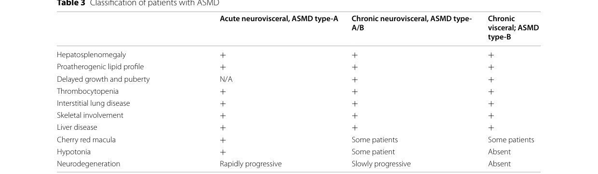

## Question

# Disease Characteristics Research Template

## Target Disease
- **Disease Name:** Chronic Neurovisceral Acid Sphingomyelinase Deficiency
- **MONDO ID:**  (if available)
- **Category:** Mendelian

## Research Objectives

Please provide a comprehensive research report on **Chronic Neurovisceral Acid Sphingomyelinase Deficiency** covering all of the
disease characteristics listed below. This report will be used to populate a disease knowledge
base entry. Be thorough and cite primary literature (PMID preferred) for all claims.

For each section, **suggested databases/resources** are listed. These are the first places
you should search for information on each topic.

---

### 1. Disease Information
> **Search first:** OMIM, Orphanet, ICD-10/ICD-11, MeSH, PubMed

- What is the disease? Provide a concise overview.
- What are the key identifiers? (OMIM, Orphanet, ICD-10/ICD-11, MeSH, Mondo)
- What are the common synonyms and alternative names?
- Is the information derived from individual patients (e.g., EHR) or aggregated disease-level resources?

### 2. Etiology

- **Disease Causal Factors**: What are the primary causes? (genetic, environmental, infectious, mechanistic)
- **Risk Factors**:
  > **Search first:** PubMed, Cochrane Library, UpToDate, clinical guidelines, ClinVar, ClinGen, GWAS Catalog, PheGenI, CTD, CDC, WHO, epidemiological databases
  - Genetic risk factors (causal variants, susceptibility loci, modifier genes)
  - Environmental risk factors (toxins, lifestyle, occupational exposures, age, sex, family history)
- **Protective Factors**:
  > **Search first:** PubMed, Cochrane Library, clinical trial databases, GWAS Catalog, gnomAD, WHO, CDC, nutrition databases
  - Genetic protective factors (protective variants, modifier alleles)
  - Environmental protective factors (diet, lifestyle, exposures that reduce risk)
- **Gene-Environment Interactions**: How do genetic and environmental factors interact to influence disease?
  > **Search first:** CTD, PubMed, PheGenI, GxE databases

### 3. Phenotypes
> **Search first:** HPO (Human Phenotype Ontology), OMIM, Orphanet, PubMed, clinicaltrials.gov, MedDRA, SNOMED CT, DECIPHER, LOINC

For each phenotype, provide:
- **Phenotype type**: symptoms, clinical signs, physical manifestations, behavioral changes, or laboratory abnormalities
  > For symptoms/signs: HPO, OMIM, Orphanet, PubMed
  > For behavioral changes: HPO, DSM, RDoC (Research Domain Criteria), PubMed
  > For laboratory abnormalities: LOINC, SNOMED CT, LabTests Online, PubMed
- **Phenotype characteristics**:
  > **Search first:** OMIM, Orphanet, HPO, PubMed
  - Age of symptom onset (neonatal, childhood, adult-onset, late-onset)
  - Symptom severity (mild, moderate, severe, variable)
  - Symptom progression (stable, progressive, episodic, fluctuating)
  - Frequency among affected individuals (percentage or qualitative)
- **Quality of life impact**: Effects on daily functioning and well-being (per-phenotype when possible)
  > **Search first:** EQ-5D database, SF-36, WHO QOL databases, PubMed
- Suggest HPO (Human Phenotype Ontology) terms for each phenotype

### 4. Genetic/Molecular Information

- **Causal Genes**: Gene mutations or chromosomal abnormalities responsible for disease (gene symbols, OMIM IDs)
  > **Search first:** OMIM, ClinVar, HGMD, Ensembl, NCBI Gene
- **Pathogenic Variants**:
  - Affected genes (gene symbols, HGNC IDs)
    > **Search first:** OMIM, NCBI Gene, Ensembl, HGNC, UniProt, GeneCards
  - Variant classification (pathogenic, likely pathogenic, VUS per ACMG/AMP guidelines)
    > **Search first:** ClinVar, ClinGen, ACMG/AMP guidelines, VarSome
  - Variant type/class (missense, frameshift, nonsense, splice-site, structural)
  - Allele frequency in population databases
    > **Search first:** gnomAD, 1000 Genomes, ExAC, TOPMed, dbSNP
  - Somatic vs germline origin
    > **Search first:** COSMIC (somatic), ClinVar, ICGC, TCGA
  - Functional consequences (loss of function, gain of function, dominant negative)
- **Modifier Genes**: Genes that modify disease severity or expression
- **Epigenetic Information**: DNA methylation, histone modifications, chromatin changes affecting disease
  > **Search first:** ENCODE, Roadmap Epigenomics, MethBase, DiseaseMeth
- **Chromosomal Abnormalities**: Large-scale genetic changes (aneuploidy, translocations, inversions)
  > **Search first:** DECIPHER, ClinVar, ECARUCA, UCSC Genome Browser

### 5. Environmental Information

- **Environmental Factors**: Non-genetic contributing factors (toxins, radiation, pollution, occupational exposure)
  > **Search first:** CTD (Comparative Toxicogenomics Database), TOXNET, PubMed, EPA databases
- **Lifestyle Factors**: Behavioral factors (smoking, diet, exercise, alcohol consumption)
  > **Search first:** CDC databases, WHO, PubMed, NHANES
- **Infectious Agents**: If applicable, pathogens causing or triggering disease (bacteria, viruses, fungi, parasites)
  > **Search first:** NCBI Taxonomy, ViPR, BV-BRC, MicrobeDB, GIDEON

### 6. Mechanism / Pathophysiology

- **Molecular Pathways**: Specific signaling cascades or biochemical pathways involved (Wnt, MAPK, mTOR, PI3K-AKT, etc.)
  > **Search first:** KEGG, Reactome, WikiPathways, PathBank, BioCyc
- **Cellular Processes**: Cell-level mechanisms (apoptosis, autophagy, cell cycle dysregulation, inflammation, etc.)
  > **Search first:** Gene Ontology (GO), Reactome, KEGG, PubMed
- **Protein Dysfunction**: How protein structure or function is altered (misfolding, aggregation, loss of function, gain of function)
  > **Search first:** UniProt, PDB (Protein Data Bank), InterPro, Pfam, AlphaFold
- **Metabolic Changes**: Alterations in metabolic processes (energy metabolism, lipid metabolism, amino acid metabolism)
  > **Search first:** KEGG, BioCyc, HMDB (Human Metabolome Database), BRENDA
- **Immune System Involvement**: Role of immune response (autoimmunity, immunodeficiency, chronic inflammation)
  > **Search first:** ImmPort, Immunome Database, IEDB, Gene Ontology
- **Tissue Damage Mechanisms**: How tissues/ are injured (oxidative stress, ischemia, fibrosis, necrosis)
  > **Search first:** PubMed, Gene Ontology, Reactome
- **Biochemical Abnormalities**: Specific molecular defects (enzyme deficiencies, receptor dysfunction, ion channel defects)
  > **Search first:** BRENDA, UniProt, KEGG, OMIM, PubMed
- **Epigenetic Changes**: DNA methylation, histone modifications affecting gene expression in disease
  > **Search first:** ENCODE, Roadmap Epigenomics, MethBase, DiseaseMeth
- **Molecular Profiling** (if available):
  - Transcriptomics/gene expression changes
    > **Search first:** GEO (Gene Expression Omnibus), ArrayExpress, GTEx, Human Cell Atlas, SRA
  - Proteomics findings
    > **Search first:** PRIDE, ProteomeXchange, Human Protein Atlas, STRING, BioGRID
  - Metabolomics signatures
    > **Search first:** MetaboLights, Metabolomics Workbench, HMDB, METLIN
  - Lipidomics alterations
    > **Search first:** LIPID MAPS, SwissLipids, LipidHome, Metabolomics Workbench
  - Genomic structural features
    > **Search first:** UCSC Genome Browser, Ensembl, NCBI, dbVar, DGV
- **Advanced Technologies** (if applicable):
  - Single-cell analysis findings (cell-type specific mechanisms, cellular heterogeneity)
    > **Search first:** Human Cell Atlas, Single Cell Portal, GEO, CELLxGENE
  - Spatial transcriptomics findings
    > **Search first:** GEO, Spatial Research, Vizgen, 10x Genomics data
  - Multi-omics integration results
    > **Search first:** TCGA, ICGC, cBioPortal, LinkedOmics, PubMed
  - Functional genomics screens (CRISPR, RNAi)
    > **Search first:** DepMap, GenomeRNAi, PubMed, BioGRID ORCS

For each mechanism, describe:
- The causal chain from initial trigger to clinical manifestation
- Which mechanisms are upstream vs downstream
- What cell types and biological processes are involved
- Suggest GO terms for biological processes and CL terms for cell types

### 7. Anatomical Structures Affected

- **Organ Level**:
  - Primary organs directly affected
  - Secondary organ involvement (complications, secondary effects)
  - Body systems involved (cardiovascular, nervous, digestive, respiratory, endocrine, etc.)
  > **Search first:** Uberon, FMA (Foundational Model of Anatomy), OMIM, HPO, ICD-11, MeSH, SNOMED CT
- **Tissue and Cell Level**:
  - Specific tissue types affected (epithelial, connective, muscle, nervous)
  - Specific cell populations targeted (with Cell Ontology terms)
  > **Search first:** Uberon, Human Protein Atlas, Cell Ontology, Human Cell Atlas, CellMarker, PanglaoDB
- **Subcellular Level**:
  - Cellular compartments involved (mitochondria, nucleus, ER, lysosomes) (with GO Cellular Component terms)
  > **Search first:** Gene Ontology (Cellular Component), UniProt, Human Protein Atlas
- **Localization**:
  - Specific anatomical sites (with UBERON terms)
    > **Search first:** FMA, Uberon, NeuroNames (for brain), SNOMED CT
  - Lateralization (unilateral, bilateral, asymmetric)
    > **Search first:** HPO, clinical literature, imaging databases

### 8. Temporal Development

- **Onset**:
  - Typical age of onset (congenital, pediatric, adult, geriatric)
  - Onset pattern (acute, subacute, chronic, insidious)
  > **Search first:** OMIM, Orphanet, HPO, PubMed
- **Progression**:
  - Disease stages (early, intermediate, advanced, end-stage)
    > **Search first:** Cancer Staging Manual (AJCC), WHO classifications, PubMed
  - Progression rate (rapid, slow, variable)
  - Disease course pattern (episodic, relapsing-remitting, progressive, stable)
  - Disease duration (self-limited, chronic lifelong)
  > **Search first:** Disease registries, longitudinal cohort databases, natural history studies, PubMed, Orphanet, OMIM
- **Patterns**:
  - Remission patterns (spontaneous, treatment-induced)
    > **Search first:** Clinical trial databases, disease registries, PubMed
  - Critical periods (time windows of vulnerability or opportunity for intervention)
    > **Search first:** PubMed, developmental biology databases, clinical guidelines

### 9. Inheritance and Population

- **Epidemiology**:
  - Prevalence (cases per 100,000 at given time)
  - Incidence (new cases per 100,000 per year)
  > **Search first:** Orphanet, CDC, WHO, GBD (Global Burden of Disease), national registries, SEER, disease registries
- **For Genetic Etiology**:
  - Inheritance pattern (AD, AR, X-linked, mitochondrial, multifactorial, polygenic)
    > **Search first:** OMIM, Orphanet, ClinVar, GTR (Genetic Testing Registry)
  - Penetrance (complete, incomplete, age-dependent)
    > **Search first:** ClinVar, OMIM, PubMed, ClinGen
  - Expressivity (variable, consistent)
    > **Search first:** OMIM, ClinVar, PubMed
  - Genetic anticipation (increasing severity in successive generations)
    > **Search first:** OMIM, PubMed (especially for repeat expansion disorders)
  - Germline mosaicism
    > **Search first:** ClinVar, OMIM, genetic counseling literature, PubMed
  - Founder effects (population-specific mutations)
    > **Search first:** gnomAD, population genetics databases, PubMed
  - Consanguinity role
    > **Search first:** OMIM, population studies, genetic counseling resources
  - Carrier frequency
    > **Search first:** gnomAD, carrier screening databases, GeneReviews, GTR
- **Population Demographics**:
  - Affected populations (ethnic or demographic groups with higher prevalence)
    > **Search first:** gnomAD, 1000 Genomes, PAGE Study, PubMed, population registries
  - Geographic distribution (endemic areas, regional variation)
    > **Search first:** WHO, CDC, GBD, Orphanet, geographic epidemiology databases
  - Geographic distribution of specific variants
  - Sex ratio (male:female)
    > **Search first:** Disease registries, OMIM, PubMed, epidemiological databases
  - Age distribution of affected individuals
    > **Search first:** CDC, disease registries, SEER, Orphanet

### 10. Diagnostics

- **Clinical Tests**:
  - Laboratory tests (blood, urine, tissue chemistry, specific enzyme assays)
    > **Search first:** LOINC, LabTests Online, PubMed
  - Biomarkers (proteins, metabolites, genetic markers, circulating biomarkers)
    > **Search first:** FDA Biomarker List, BEST (Biomarkers, EndpointS, and other Tools), PubMed
  - Imaging studies (X-ray, CT, MRI, PET, ultrasound)
    > **Search first:** RadLex, DICOM, Radiopaedia, imaging databases
  - Functional tests (pulmonary function, cardiac stress tests)
    > **Search first:** LOINC, clinical guidelines, PubMed
  - Electrophysiology (EEG, EMG, ECG, nerve conduction studies)
    > **Search first:** LOINC, clinical neurophysiology databases, PubMed
  - Biopsy findings (histopathology, immunohistochemistry)
    > **Search first:** SNOMED CT, College of American Pathologists resources, PubMed
  - Pathology findings (microscopic examination)
    > **Search first:** SNOMED CT, Digital Pathology databases, PubMed
- **Genetic Testing**:
  > **Search first:** GTR (Genetic Testing Registry), GeneReviews, ClinGen
  - Overview of recommended genetic testing approach
  - Whole genome sequencing (WGS) utility
    > **Search first:** GTR, ClinVar, GEL (Genomics England), gnomAD
  - Whole exome sequencing (WES) utility
    > **Search first:** GTR, ClinVar, OMIM, GeneMatcher
  - Gene panels (which panels, which genes)
    > **Search first:** GTR, ClinVar, laboratory-specific databases
  - Single gene testing
    > **Search first:** GTR, ClinVar, OMIM, GeneReviews
  - Chromosomal microarray (CMA)
    > **Search first:** DECIPHER, ClinVar, dbVar, ECARUCA
  - Karyotyping
    > **Search first:** Chromosome Abnormality Database, ClinVar, cytogenetics resources
  - FISH
    > **Search first:** ClinVar, cytogenetics databases, PubMed
  - Mitochondrial DNA testing
    > **Search first:** MITOMAP, MSeqDR, ClinVar, GTR
  - Repeat expansion testing
    > **Search first:** GTR, ClinVar, repeat expansion databases, PubMed
- **Omics-Based Diagnostics** (if applicable):
  - RNA sequencing / transcriptomics
    > **Search first:** GEO, ArrayExpress, GTEx, RNA-seq databases
  - Proteomics
    > **Search first:** PRIDE, ProteomeXchange, FDA Biomarker database
  - Metabolomics
    > **Search first:** MetaboLights, Metabolomics Workbench, HMDB
  - Epigenomics
    > **Search first:** GEO, ENCODE, Roadmap Epigenomics, MethBase
  - Liquid biopsy
    > **Search first:** COSMIC, ClinVar, liquid biopsy databases, PubMed
- **Clinical Criteria**:
  - Standardized diagnostic criteria (DSM, ICD, society guidelines)
    > **Search first:** DSM-5, ICD-11, clinical society guidelines, UpToDate
  - Differential diagnosis (other conditions to rule out, with distinguishing features)
    > **Search first:** DynaMed, UpToDate, clinical decision support systems
- **Screening**:
  - Screening methods for asymptomatic individuals (newborn screening, carrier screening, cascade screening)
    > **Search first:** ACMG recommendations, CDC newborn screening, GTR

### 11. Outcome/Prognosis

- **Survival and Mortality**:
  - Survival rate (5-year, 10-year, overall)
    > **Search first:** SEER, cancer registries, disease-specific registries, PubMed
  - Life expectancy (with and without treatment if applicable)
    > **Search first:** Orphanet, disease registries, actuarial databases, PubMed
  - Mortality rate
    > **Search first:** CDC, WHO, GBD, national mortality databases
  - Disease-specific mortality (deaths directly attributable to disease)
    > **Search first:** Disease registries, CDC Wonder, GBD, PubMed
- **Morbidity and Function**:
  - Morbidity (disease-related disability and health impacts)
    > **Search first:** GBD, WHO, disability databases, PubMed
  - Disability outcomes (long-term functional impairments)
    > **Search first:** ICF (International Classification of Functioning), disability registries
  - Quality of life measures (EQ-5D, SF-36, PROMIS, disease-specific tools)
    > **Search first:** EQ-5D database, SF-36, PROMIS, PubMed
- **Disease Course**:
  - Complications (secondary problems: infections, organ failure, etc.)
    > **Search first:** ICD codes, disease registries, clinical databases, PubMed
  - Recovery potential (likelihood and extent of recovery, with vs without treatment)
    > **Search first:** Natural history studies, rehabilitation databases, PubMed
- **Prediction**:
  - Prognostic factors (age, disease severity, biomarkers, treatment response)
    > **Search first:** Prognostic models databases, clinical calculators, PubMed
  - Prognostic biomarkers (molecular markers predicting disease course)
    > **Search first:** FDA Biomarker database, PubMed, cancer prognostic databases

### 12. Treatment

- **Pharmacotherapy**:
  - Pharmacological treatments (drug names, drug classes, mechanisms of action)
    > **Search first:** DrugBank, RxNorm, ATC classification, DailyMed, FDA databases
  - Pharmacogenomics (how genetic variants affect drug metabolism, efficacy, toxicity)
    > **Search first:** PharmGKB, CPIC (Clinical Pharmacogenetics), FDA Table of PGx Biomarkers
- **Advanced Therapeutics**:
  - Gene therapy (viral vectors, CRISPR, gene replacement, gene editing)
    > **Search first:** ClinicalTrials.gov, FDA gene therapy database, ASGCT resources
  - Cell therapy (stem cell transplant, CAR-T, cellular therapeutics)
    > **Search first:** ClinicalTrials.gov, FDA cell therapy database, FACT standards
  - RNA-based therapies (ASOs, siRNA, mRNA therapies)
    > **Search first:** ClinicalTrials.gov, FDA approvals, PubMed
  - Targeted therapies (treatments directed at specific molecular targets)
    > **Search first:** My Cancer Genome, OncoKB, ClinicalTrials.gov, FDA approvals
  - Immunotherapies (checkpoint inhibitors, monoclonal antibodies)
    > **Search first:** Cancer Immunotherapy Database, FDA approvals, ClinicalTrials.gov
- **Surgical and Interventional**:
  - Surgical interventions (types of surgery, timing, outcomes)
    > **Search first:** CPT codes, surgical registries, clinical guidelines, PubMed
- **Supportive and Rehabilitative**:
  - Supportive care (symptom management, pain control, nutrition)
    > **Search first:** Clinical guidelines, Cochrane Library, PubMed
  - Rehabilitation (physical therapy, occupational therapy, speech therapy)
    > **Search first:** Rehabilitation medicine databases, clinical guidelines, PubMed
- **Experimental**:
  - Experimental treatments in clinical trials (with NCT identifiers if available)
    > **Search first:** ClinicalTrials.gov, EU Clinical Trials Register, WHO ICTRP
- **Treatment Outcomes**:
  - Treatment response rates
    > **Search first:** Clinical trial databases, FDA reviews, systematic reviews, PubMed
  - Side effects and adverse events
    > **Search first:** FDA Adverse Event Reporting System (FAERS), MedWatch, PubMed
- **Treatment Strategy**:
  - Treatment algorithms (clinical pathways, decision trees)
    > **Search first:** Clinical practice guidelines, NCCN Guidelines, UpToDate
  - Combination therapies
    > **Search first:** ClinicalTrials.gov, treatment guidelines, PubMed
  - Personalized medicine approaches (genotype-guided treatment)
    > **Search first:** My Cancer Genome, CIViC, PharmGKB, precision medicine databases

For each treatment, suggest MAXO (Medical Action Ontology) terms where applicable.

### 13. Prevention

- **Prevention Levels**:
  - Primary prevention (preventing disease occurrence: vaccination, risk factor modification)
    > **Search first:** CDC, WHO, USPSTF recommendations, Cochrane Library
  - Secondary prevention (early detection and treatment: screening programs, early intervention)
    > **Search first:** USPSTF, CDC screening guidelines, WHO
  - Tertiary prevention (preventing complications in those with disease)
    > **Search first:** Clinical guidelines, disease management protocols, PubMed
- **Immunization**: Vaccine strategies (if applicable)
  > **Search first:** CDC vaccine schedules, WHO immunization, FDA vaccine database
- **Screening and Early Detection**:
  - Screening programs (population-based: newborn screening, cancer screening)
    > **Search first:** CDC screening programs, USPSTF, cancer screening databases
  - Genetic screening (carrier screening, preimplantation genetic diagnosis, prenatal testing)
    > **Search first:** ACMG recommendations, ACOG guidelines, GTR
  - Risk stratification (identifying high-risk individuals for targeted prevention)
    > **Search first:** Risk prediction models, clinical calculators, PubMed
- **Behavioral Interventions**: Lifestyle modifications to reduce risk
  > **Search first:** CDC, WHO, behavioral intervention databases, Cochrane Library
- **Counseling**: Genetic counseling (risk assessment, family planning guidance)
  > **Search first:** NSGC resources, ACMG guidelines, GeneReviews
- **Public Health**:
  - Public health interventions (sanitation, vector control, health education)
    > **Search first:** CDC, WHO, public health databases, PubMed
  - Environmental interventions (reducing environmental risk factors)
    > **Search first:** EPA databases, WHO environmental health, PubMed
- **Prophylaxis**: Preventive medications or procedures
  > **Search first:** Clinical guidelines, FDA approvals, PubMed

### 14. Other Species / Natural Disease

- **Taxonomy**: Species affected (with NCBI Taxon identifiers)
  > **Search first:** NCBI Taxonomy
- **Breed**: Specific breeds affected (with VBO identifiers if applicable)
  > **Search first:** VBO (Vertebrate Breed Ontology)
- **Gene**: Orthologous genes in other species (with NCBI Gene IDs)
  > **Search first:** NCBI Gene
- **Natural Disease**:
  - Naturally occurring disease in other species (companion animals, wildlife)
    > **Search first:** OMIA (Online Mendelian Inheritance in Animals), VetCompass, PubMed
  - Veterinary relevance and importance in animal health
    > **Search first:** OMIA, veterinary databases, PubMed
- **Comparative Biology**:
  - Comparative pathology (similarities and differences across species)
    > **Search first:** OMIA, comparative pathology databases, PubMed
  - Evolutionary conservation of disease mechanisms
    > **Search first:** HomoloGene, OrthoMCL, Alliance of Genome Resources
- **Transmission** (if applicable):
  - Zoonotic potential
    > **Search first:** CDC zoonotic diseases, WHO zoonoses, GIDEON
  - Cross-species susceptibility
    > **Search first:** NCBI Taxonomy, veterinary databases, PubMed

### 15. Model Organisms

- **Model Types**:
  - Model organism type (mammalian, invertebrate, cellular, in vitro)
    > **Search first:** Alliance of Genome Resources, model organism databases
  - Specific model systems (mouse, rat, zebrafish, Drosophila, C. elegans, yeast, cell lines, organoids, iPSCs)
    > **Search first:** MGI, RGD, ZFIN, FlyBase, WormBase, SGD, ATCC, Cellosaurus
  - Induced models (drug treatment, surgical intervention, environmental manipulation)
    > **Search first:** MGI, model organism databases, PubMed
- **Genetic Models**:
  - Types available (knockout, knock-in, transgenic, conditional, humanized)
    > **Search first:** MGI, IMPC, KOMP, EuMMCR, IMSR
- **Model Characteristics**:
  - Phenotype recapitulation (how well model reproduces human disease features)
    > **Search first:** Model organism databases, comparative studies, PubMed
  - Model limitations (aspects of human disease not captured)
    > **Search first:** Model organism databases, PubMed, review articles
- **Applications**:
  - Research applications (what aspects of disease can be studied)
    > **Search first:** Model organism databases, PubMed
- **Resources**:
  - Model databases
    > **Search first:** MGI, RGD, ZFIN, FlyBase, WormBase, IMSR, EMMA, MMRRC

---

## Citation Requirements

- Cite primary literature (PMID preferred) for all mechanistic and clinical claims
- Prioritize recent reviews and landmark papers
- Include direct quotes from abstracts where possible to support key statements
- Distinguish evidence source types: human clinical, model organism, in vitro, computational

## Output Format

Structure your response as a comprehensive narrative organized by the sections above.
For each section, provide:
- Factual content with specific details (numbers, percentages, gene names, variant nomenclature)
- Ontology term suggestions (HPO, GO, CL, UBERON, CHEBI, MAXO, MONDO) where applicable
- Evidence citations with PMIDs
- Direct quotes from abstracts to support key claims
- Clear indication when information is not available or not applicable for this disease

This report will be used to populate a disease knowledge base entry with:
- Pathophysiology descriptions with causal chains
- Gene/protein annotations (HGNC, GO terms)
- Phenotype associations (HP terms) with frequencies
- Cell type involvement (CL terms)
- Anatomical locations (UBERON terms)
- Chemical entities (CHEBI terms)
- Treatment annotations (MAXO terms)
- Evidence items with PMIDs and exact abstract quotes
- Epidemiology, prognosis, diagnostic, and prevention information
- Animal model descriptions with phenotype recapitulation details

## Output

Question: You are an expert researcher providing comprehensive, well-cited information.

Provide detailed information focusing on:
1. Key concepts and definitions with current understanding
2. Recent developments and latest research (prioritize 2023-2024 sources)
3. Current applications and real-world implementations
4. Expert opinions and analysis from authoritative sources
5. Relevant statistics and data from recent studies

Format as a comprehensive research report with proper citations. Include URLs and publication dates where available.
Always prioritize recent, authoritative sources and provide specific citations for all major claims.

# Disease Characteristics Research Template

## Target Disease
- **Disease Name:** Chronic Neurovisceral Acid Sphingomyelinase Deficiency
- **MONDO ID:**  (if available)
- **Category:** Mendelian

## Research Objectives

Please provide a comprehensive research report on **Chronic Neurovisceral Acid Sphingomyelinase Deficiency** covering all of the
disease characteristics listed below. This report will be used to populate a disease knowledge
base entry. Be thorough and cite primary literature (PMID preferred) for all claims.

For each section, **suggested databases/resources** are listed. These are the first places
you should search for information on each topic.

---

### 1. Disease Information
> **Search first:** OMIM, Orphanet, ICD-10/ICD-11, MeSH, PubMed

- What is the disease? Provide a concise overview.
- What are the key identifiers? (OMIM, Orphanet, ICD-10/ICD-11, MeSH, Mondo)
- What are the common synonyms and alternative names?
- Is the information derived from individual patients (e.g., EHR) or aggregated disease-level resources?

### 2. Etiology

- **Disease Causal Factors**: What are the primary causes? (genetic, environmental, infectious, mechanistic)
- **Risk Factors**:
  > **Search first:** PubMed, Cochrane Library, UpToDate, clinical guidelines, ClinVar, ClinGen, GWAS Catalog, PheGenI, CTD, CDC, WHO, epidemiological databases
  - Genetic risk factors (causal variants, susceptibility loci, modifier genes)
  - Environmental risk factors (toxins, lifestyle, occupational exposures, age, sex, family history)
- **Protective Factors**:
  > **Search first:** PubMed, Cochrane Library, clinical trial databases, GWAS Catalog, gnomAD, WHO, CDC, nutrition databases
  - Genetic protective factors (protective variants, modifier alleles)
  - Environmental protective factors (diet, lifestyle, exposures that reduce risk)
- **Gene-Environment Interactions**: How do genetic and environmental factors interact to influence disease?
  > **Search first:** CTD, PubMed, PheGenI, GxE databases

### 3. Phenotypes
> **Search first:** HPO (Human Phenotype Ontology), OMIM, Orphanet, PubMed, clinicaltrials.gov, MedDRA, SNOMED CT, DECIPHER, LOINC

For each phenotype, provide:
- **Phenotype type**: symptoms, clinical signs, physical manifestations, behavioral changes, or laboratory abnormalities
  > For symptoms/signs: HPO, OMIM, Orphanet, PubMed
  > For behavioral changes: HPO, DSM, RDoC (Research Domain Criteria), PubMed
  > For laboratory abnormalities: LOINC, SNOMED CT, LabTests Online, PubMed
- **Phenotype characteristics**:
  > **Search first:** OMIM, Orphanet, HPO, PubMed
  - Age of symptom onset (neonatal, childhood, adult-onset, late-onset)
  - Symptom severity (mild, moderate, severe, variable)
  - Symptom progression (stable, progressive, episodic, fluctuating)
  - Frequency among affected individuals (percentage or qualitative)
- **Quality of life impact**: Effects on daily functioning and well-being (per-phenotype when possible)
  > **Search first:** EQ-5D database, SF-36, WHO QOL databases, PubMed
- Suggest HPO (Human Phenotype Ontology) terms for each phenotype

### 4. Genetic/Molecular Information

- **Causal Genes**: Gene mutations or chromosomal abnormalities responsible for disease (gene symbols, OMIM IDs)
  > **Search first:** OMIM, ClinVar, HGMD, Ensembl, NCBI Gene
- **Pathogenic Variants**:
  - Affected genes (gene symbols, HGNC IDs)
    > **Search first:** OMIM, NCBI Gene, Ensembl, HGNC, UniProt, GeneCards
  - Variant classification (pathogenic, likely pathogenic, VUS per ACMG/AMP guidelines)
    > **Search first:** ClinVar, ClinGen, ACMG/AMP guidelines, VarSome
  - Variant type/class (missense, frameshift, nonsense, splice-site, structural)
  - Allele frequency in population databases
    > **Search first:** gnomAD, 1000 Genomes, ExAC, TOPMed, dbSNP
  - Somatic vs germline origin
    > **Search first:** COSMIC (somatic), ClinVar, ICGC, TCGA
  - Functional consequences (loss of function, gain of function, dominant negative)
- **Modifier Genes**: Genes that modify disease severity or expression
- **Epigenetic Information**: DNA methylation, histone modifications, chromatin changes affecting disease
  > **Search first:** ENCODE, Roadmap Epigenomics, MethBase, DiseaseMeth
- **Chromosomal Abnormalities**: Large-scale genetic changes (aneuploidy, translocations, inversions)
  > **Search first:** DECIPHER, ClinVar, ECARUCA, UCSC Genome Browser

### 5. Environmental Information

- **Environmental Factors**: Non-genetic contributing factors (toxins, radiation, pollution, occupational exposure)
  > **Search first:** CTD (Comparative Toxicogenomics Database), TOXNET, PubMed, EPA databases
- **Lifestyle Factors**: Behavioral factors (smoking, diet, exercise, alcohol consumption)
  > **Search first:** CDC databases, WHO, PubMed, NHANES
- **Infectious Agents**: If applicable, pathogens causing or triggering disease (bacteria, viruses, fungi, parasites)
  > **Search first:** NCBI Taxonomy, ViPR, BV-BRC, MicrobeDB, GIDEON

### 6. Mechanism / Pathophysiology

- **Molecular Pathways**: Specific signaling cascades or biochemical pathways involved (Wnt, MAPK, mTOR, PI3K-AKT, etc.)
  > **Search first:** KEGG, Reactome, WikiPathways, PathBank, BioCyc
- **Cellular Processes**: Cell-level mechanisms (apoptosis, autophagy, cell cycle dysregulation, inflammation, etc.)
  > **Search first:** Gene Ontology (GO), Reactome, KEGG, PubMed
- **Protein Dysfunction**: How protein structure or function is altered (misfolding, aggregation, loss of function, gain of function)
  > **Search first:** UniProt, PDB (Protein Data Bank), InterPro, Pfam, AlphaFold
- **Metabolic Changes**: Alterations in metabolic processes (energy metabolism, lipid metabolism, amino acid metabolism)
  > **Search first:** KEGG, BioCyc, HMDB (Human Metabolome Database), BRENDA
- **Immune System Involvement**: Role of immune response (autoimmunity, immunodeficiency, chronic inflammation)
  > **Search first:** ImmPort, Immunome Database, IEDB, Gene Ontology
- **Tissue Damage Mechanisms**: How tissues/ are injured (oxidative stress, ischemia, fibrosis, necrosis)
  > **Search first:** PubMed, Gene Ontology, Reactome
- **Biochemical Abnormalities**: Specific molecular defects (enzyme deficiencies, receptor dysfunction, ion channel defects)
  > **Search first:** BRENDA, UniProt, KEGG, OMIM, PubMed
- **Epigenetic Changes**: DNA methylation, histone modifications affecting gene expression in disease
  > **Search first:** ENCODE, Roadmap Epigenomics, MethBase, DiseaseMeth
- **Molecular Profiling** (if available):
  - Transcriptomics/gene expression changes
    > **Search first:** GEO (Gene Expression Omnibus), ArrayExpress, GTEx, Human Cell Atlas, SRA
  - Proteomics findings
    > **Search first:** PRIDE, ProteomeXchange, Human Protein Atlas, STRING, BioGRID
  - Metabolomics signatures
    > **Search first:** MetaboLights, Metabolomics Workbench, HMDB, METLIN
  - Lipidomics alterations
    > **Search first:** LIPID MAPS, SwissLipids, LipidHome, Metabolomics Workbench
  - Genomic structural features
    > **Search first:** UCSC Genome Browser, Ensembl, NCBI, dbVar, DGV
- **Advanced Technologies** (if applicable):
  - Single-cell analysis findings (cell-type specific mechanisms, cellular heterogeneity)
    > **Search first:** Human Cell Atlas, Single Cell Portal, GEO, CELLxGENE
  - Spatial transcriptomics findings
    > **Search first:** GEO, Spatial Research, Vizgen, 10x Genomics data
  - Multi-omics integration results
    > **Search first:** TCGA, ICGC, cBioPortal, LinkedOmics, PubMed
  - Functional genomics screens (CRISPR, RNAi)
    > **Search first:** DepMap, GenomeRNAi, PubMed, BioGRID ORCS

For each mechanism, describe:
- The causal chain from initial trigger to clinical manifestation
- Which mechanisms are upstream vs downstream
- What cell types and biological processes are involved
- Suggest GO terms for biological processes and CL terms for cell types

### 7. Anatomical Structures Affected

- **Organ Level**:
  - Primary organs directly affected
  - Secondary organ involvement (complications, secondary effects)
  - Body systems involved (cardiovascular, nervous, digestive, respiratory, endocrine, etc.)
  > **Search first:** Uberon, FMA (Foundational Model of Anatomy), OMIM, HPO, ICD-11, MeSH, SNOMED CT
- **Tissue and Cell Level**:
  - Specific tissue types affected (epithelial, connective, muscle, nervous)
  - Specific cell populations targeted (with Cell Ontology terms)
  > **Search first:** Uberon, Human Protein Atlas, Cell Ontology, Human Cell Atlas, CellMarker, PanglaoDB
- **Subcellular Level**:
  - Cellular compartments involved (mitochondria, nucleus, ER, lysosomes) (with GO Cellular Component terms)
  > **Search first:** Gene Ontology (Cellular Component), UniProt, Human Protein Atlas
- **Localization**:
  - Specific anatomical sites (with UBERON terms)
    > **Search first:** FMA, Uberon, NeuroNames (for brain), SNOMED CT
  - Lateralization (unilateral, bilateral, asymmetric)
    > **Search first:** HPO, clinical literature, imaging databases

### 8. Temporal Development

- **Onset**:
  - Typical age of onset (congenital, pediatric, adult, geriatric)
  - Onset pattern (acute, subacute, chronic, insidious)
  > **Search first:** OMIM, Orphanet, HPO, PubMed
- **Progression**:
  - Disease stages (early, intermediate, advanced, end-stage)
    > **Search first:** Cancer Staging Manual (AJCC), WHO classifications, PubMed
  - Progression rate (rapid, slow, variable)
  - Disease course pattern (episodic, relapsing-remitting, progressive, stable)
  - Disease duration (self-limited, chronic lifelong)
  > **Search first:** Disease registries, longitudinal cohort databases, natural history studies, PubMed, Orphanet, OMIM
- **Patterns**:
  - Remission patterns (spontaneous, treatment-induced)
    > **Search first:** Clinical trial databases, disease registries, PubMed
  - Critical periods (time windows of vulnerability or opportunity for intervention)
    > **Search first:** PubMed, developmental biology databases, clinical guidelines

### 9. Inheritance and Population

- **Epidemiology**:
  - Prevalence (cases per 100,000 at given time)
  - Incidence (new cases per 100,000 per year)
  > **Search first:** Orphanet, CDC, WHO, GBD (Global Burden of Disease), national registries, SEER, disease registries
- **For Genetic Etiology**:
  - Inheritance pattern (AD, AR, X-linked, mitochondrial, multifactorial, polygenic)
    > **Search first:** OMIM, Orphanet, ClinVar, GTR (Genetic Testing Registry)
  - Penetrance (complete, incomplete, age-dependent)
    > **Search first:** ClinVar, OMIM, PubMed, ClinGen
  - Expressivity (variable, consistent)
    > **Search first:** OMIM, ClinVar, PubMed
  - Genetic anticipation (increasing severity in successive generations)
    > **Search first:** OMIM, PubMed (especially for repeat expansion disorders)
  - Germline mosaicism
    > **Search first:** ClinVar, OMIM, genetic counseling literature, PubMed
  - Founder effects (population-specific mutations)
    > **Search first:** gnomAD, population genetics databases, PubMed
  - Consanguinity role
    > **Search first:** OMIM, population studies, genetic counseling resources
  - Carrier frequency
    > **Search first:** gnomAD, carrier screening databases, GeneReviews, GTR
- **Population Demographics**:
  - Affected populations (ethnic or demographic groups with higher prevalence)
    > **Search first:** gnomAD, 1000 Genomes, PAGE Study, PubMed, population registries
  - Geographic distribution (endemic areas, regional variation)
    > **Search first:** WHO, CDC, GBD, Orphanet, geographic epidemiology databases
  - Geographic distribution of specific variants
  - Sex ratio (male:female)
    > **Search first:** Disease registries, OMIM, PubMed, epidemiological databases
  - Age distribution of affected individuals
    > **Search first:** CDC, disease registries, SEER, Orphanet

### 10. Diagnostics

- **Clinical Tests**:
  - Laboratory tests (blood, urine, tissue chemistry, specific enzyme assays)
    > **Search first:** LOINC, LabTests Online, PubMed
  - Biomarkers (proteins, metabolites, genetic markers, circulating biomarkers)
    > **Search first:** FDA Biomarker List, BEST (Biomarkers, EndpointS, and other Tools), PubMed
  - Imaging studies (X-ray, CT, MRI, PET, ultrasound)
    > **Search first:** RadLex, DICOM, Radiopaedia, imaging databases
  - Functional tests (pulmonary function, cardiac stress tests)
    > **Search first:** LOINC, clinical guidelines, PubMed
  - Electrophysiology (EEG, EMG, ECG, nerve conduction studies)
    > **Search first:** LOINC, clinical neurophysiology databases, PubMed
  - Biopsy findings (histopathology, immunohistochemistry)
    > **Search first:** SNOMED CT, College of American Pathologists resources, PubMed
  - Pathology findings (microscopic examination)
    > **Search first:** SNOMED CT, Digital Pathology databases, PubMed
- **Genetic Testing**:
  > **Search first:** GTR (Genetic Testing Registry), GeneReviews, ClinGen
  - Overview of recommended genetic testing approach
  - Whole genome sequencing (WGS) utility
    > **Search first:** GTR, ClinVar, GEL (Genomics England), gnomAD
  - Whole exome sequencing (WES) utility
    > **Search first:** GTR, ClinVar, OMIM, GeneMatcher
  - Gene panels (which panels, which genes)
    > **Search first:** GTR, ClinVar, laboratory-specific databases
  - Single gene testing
    > **Search first:** GTR, ClinVar, OMIM, GeneReviews
  - Chromosomal microarray (CMA)
    > **Search first:** DECIPHER, ClinVar, dbVar, ECARUCA
  - Karyotyping
    > **Search first:** Chromosome Abnormality Database, ClinVar, cytogenetics resources
  - FISH
    > **Search first:** ClinVar, cytogenetics databases, PubMed
  - Mitochondrial DNA testing
    > **Search first:** MITOMAP, MSeqDR, ClinVar, GTR
  - Repeat expansion testing
    > **Search first:** GTR, ClinVar, repeat expansion databases, PubMed
- **Omics-Based Diagnostics** (if applicable):
  - RNA sequencing / transcriptomics
    > **Search first:** GEO, ArrayExpress, GTEx, RNA-seq databases
  - Proteomics
    > **Search first:** PRIDE, ProteomeXchange, FDA Biomarker database
  - Metabolomics
    > **Search first:** MetaboLights, Metabolomics Workbench, HMDB
  - Epigenomics
    > **Search first:** GEO, ENCODE, Roadmap Epigenomics, MethBase
  - Liquid biopsy
    > **Search first:** COSMIC, ClinVar, liquid biopsy databases, PubMed
- **Clinical Criteria**:
  - Standardized diagnostic criteria (DSM, ICD, society guidelines)
    > **Search first:** DSM-5, ICD-11, clinical society guidelines, UpToDate
  - Differential diagnosis (other conditions to rule out, with distinguishing features)
    > **Search first:** DynaMed, UpToDate, clinical decision support systems
- **Screening**:
  - Screening methods for asymptomatic individuals (newborn screening, carrier screening, cascade screening)
    > **Search first:** ACMG recommendations, CDC newborn screening, GTR

### 11. Outcome/Prognosis

- **Survival and Mortality**:
  - Survival rate (5-year, 10-year, overall)
    > **Search first:** SEER, cancer registries, disease-specific registries, PubMed
  - Life expectancy (with and without treatment if applicable)
    > **Search first:** Orphanet, disease registries, actuarial databases, PubMed
  - Mortality rate
    > **Search first:** CDC, WHO, GBD, national mortality databases
  - Disease-specific mortality (deaths directly attributable to disease)
    > **Search first:** Disease registries, CDC Wonder, GBD, PubMed
- **Morbidity and Function**:
  - Morbidity (disease-related disability and health impacts)
    > **Search first:** GBD, WHO, disability databases, PubMed
  - Disability outcomes (long-term functional impairments)
    > **Search first:** ICF (International Classification of Functioning), disability registries
  - Quality of life measures (EQ-5D, SF-36, PROMIS, disease-specific tools)
    > **Search first:** EQ-5D database, SF-36, PROMIS, PubMed
- **Disease Course**:
  - Complications (secondary problems: infections, organ failure, etc.)
    > **Search first:** ICD codes, disease registries, clinical databases, PubMed
  - Recovery potential (likelihood and extent of recovery, with vs without treatment)
    > **Search first:** Natural history studies, rehabilitation databases, PubMed
- **Prediction**:
  - Prognostic factors (age, disease severity, biomarkers, treatment response)
    > **Search first:** Prognostic models databases, clinical calculators, PubMed
  - Prognostic biomarkers (molecular markers predicting disease course)
    > **Search first:** FDA Biomarker database, PubMed, cancer prognostic databases

### 12. Treatment

- **Pharmacotherapy**:
  - Pharmacological treatments (drug names, drug classes, mechanisms of action)
    > **Search first:** DrugBank, RxNorm, ATC classification, DailyMed, FDA databases
  - Pharmacogenomics (how genetic variants affect drug metabolism, efficacy, toxicity)
    > **Search first:** PharmGKB, CPIC (Clinical Pharmacogenetics), FDA Table of PGx Biomarkers
- **Advanced Therapeutics**:
  - Gene therapy (viral vectors, CRISPR, gene replacement, gene editing)
    > **Search first:** ClinicalTrials.gov, FDA gene therapy database, ASGCT resources
  - Cell therapy (stem cell transplant, CAR-T, cellular therapeutics)
    > **Search first:** ClinicalTrials.gov, FDA cell therapy database, FACT standards
  - RNA-based therapies (ASOs, siRNA, mRNA therapies)
    > **Search first:** ClinicalTrials.gov, FDA approvals, PubMed
  - Targeted therapies (treatments directed at specific molecular targets)
    > **Search first:** My Cancer Genome, OncoKB, ClinicalTrials.gov, FDA approvals
  - Immunotherapies (checkpoint inhibitors, monoclonal antibodies)
    > **Search first:** Cancer Immunotherapy Database, FDA approvals, ClinicalTrials.gov
- **Surgical and Interventional**:
  - Surgical interventions (types of surgery, timing, outcomes)
    > **Search first:** CPT codes, surgical registries, clinical guidelines, PubMed
- **Supportive and Rehabilitative**:
  - Supportive care (symptom management, pain control, nutrition)
    > **Search first:** Clinical guidelines, Cochrane Library, PubMed
  - Rehabilitation (physical therapy, occupational therapy, speech therapy)
    > **Search first:** Rehabilitation medicine databases, clinical guidelines, PubMed
- **Experimental**:
  - Experimental treatments in clinical trials (with NCT identifiers if available)
    > **Search first:** ClinicalTrials.gov, EU Clinical Trials Register, WHO ICTRP
- **Treatment Outcomes**:
  - Treatment response rates
    > **Search first:** Clinical trial databases, FDA reviews, systematic reviews, PubMed
  - Side effects and adverse events
    > **Search first:** FDA Adverse Event Reporting System (FAERS), MedWatch, PubMed
- **Treatment Strategy**:
  - Treatment algorithms (clinical pathways, decision trees)
    > **Search first:** Clinical practice guidelines, NCCN Guidelines, UpToDate
  - Combination therapies
    > **Search first:** ClinicalTrials.gov, treatment guidelines, PubMed
  - Personalized medicine approaches (genotype-guided treatment)
    > **Search first:** My Cancer Genome, CIViC, PharmGKB, precision medicine databases

For each treatment, suggest MAXO (Medical Action Ontology) terms where applicable.

### 13. Prevention

- **Prevention Levels**:
  - Primary prevention (preventing disease occurrence: vaccination, risk factor modification)
    > **Search first:** CDC, WHO, USPSTF recommendations, Cochrane Library
  - Secondary prevention (early detection and treatment: screening programs, early intervention)
    > **Search first:** USPSTF, CDC screening guidelines, WHO
  - Tertiary prevention (preventing complications in those with disease)
    > **Search first:** Clinical guidelines, disease management protocols, PubMed
- **Immunization**: Vaccine strategies (if applicable)
  > **Search first:** CDC vaccine schedules, WHO immunization, FDA vaccine database
- **Screening and Early Detection**:
  - Screening programs (population-based: newborn screening, cancer screening)
    > **Search first:** CDC screening programs, USPSTF, cancer screening databases
  - Genetic screening (carrier screening, preimplantation genetic diagnosis, prenatal testing)
    > **Search first:** ACMG recommendations, ACOG guidelines, GTR
  - Risk stratification (identifying high-risk individuals for targeted prevention)
    > **Search first:** Risk prediction models, clinical calculators, PubMed
- **Behavioral Interventions**: Lifestyle modifications to reduce risk
  > **Search first:** CDC, WHO, behavioral intervention databases, Cochrane Library
- **Counseling**: Genetic counseling (risk assessment, family planning guidance)
  > **Search first:** NSGC resources, ACMG guidelines, GeneReviews
- **Public Health**:
  - Public health interventions (sanitation, vector control, health education)
    > **Search first:** CDC, WHO, public health databases, PubMed
  - Environmental interventions (reducing environmental risk factors)
    > **Search first:** EPA databases, WHO environmental health, PubMed
- **Prophylaxis**: Preventive medications or procedures
  > **Search first:** Clinical guidelines, FDA approvals, PubMed

### 14. Other Species / Natural Disease

- **Taxonomy**: Species affected (with NCBI Taxon identifiers)
  > **Search first:** NCBI Taxonomy
- **Breed**: Specific breeds affected (with VBO identifiers if applicable)
  > **Search first:** VBO (Vertebrate Breed Ontology)
- **Gene**: Orthologous genes in other species (with NCBI Gene IDs)
  > **Search first:** NCBI Gene
- **Natural Disease**:
  - Naturally occurring disease in other species (companion animals, wildlife)
    > **Search first:** OMIA (Online Mendelian Inheritance in Animals), VetCompass, PubMed
  - Veterinary relevance and importance in animal health
    > **Search first:** OMIA, veterinary databases, PubMed
- **Comparative Biology**:
  - Comparative pathology (similarities and differences across species)
    > **Search first:** OMIA, comparative pathology databases, PubMed
  - Evolutionary conservation of disease mechanisms
    > **Search first:** HomoloGene, OrthoMCL, Alliance of Genome Resources
- **Transmission** (if applicable):
  - Zoonotic potential
    > **Search first:** CDC zoonotic diseases, WHO zoonoses, GIDEON
  - Cross-species susceptibility
    > **Search first:** NCBI Taxonomy, veterinary databases, PubMed

### 15. Model Organisms

- **Model Types**:
  - Model organism type (mammalian, invertebrate, cellular, in vitro)
    > **Search first:** Alliance of Genome Resources, model organism databases
  - Specific model systems (mouse, rat, zebrafish, Drosophila, C. elegans, yeast, cell lines, organoids, iPSCs)
    > **Search first:** MGI, RGD, ZFIN, FlyBase, WormBase, SGD, ATCC, Cellosaurus
  - Induced models (drug treatment, surgical intervention, environmental manipulation)
    > **Search first:** MGI, model organism databases, PubMed
- **Genetic Models**:
  - Types available (knockout, knock-in, transgenic, conditional, humanized)
    > **Search first:** MGI, IMPC, KOMP, EuMMCR, IMSR
- **Model Characteristics**:
  - Phenotype recapitulation (how well model reproduces human disease features)
    > **Search first:** Model organism databases, comparative studies, PubMed
  - Model limitations (aspects of human disease not captured)
    > **Search first:** Model organism databases, PubMed, review articles
- **Applications**:
  - Research applications (what aspects of disease can be studied)
    > **Search first:** Model organism databases, PubMed
- **Resources**:
  - Model databases
    > **Search first:** MGI, RGD, ZFIN, FlyBase, WormBase, IMSR, EMMA, MMRRC

---

## Citation Requirements

- Cite primary literature (PMID preferred) for all mechanistic and clinical claims
- Prioritize recent reviews and landmark papers
- Include direct quotes from abstracts where possible to support key statements
- Distinguish evidence source types: human clinical, model organism, in vitro, computational

## Output Format

Structure your response as a comprehensive narrative organized by the sections above.
For each section, provide:
- Factual content with specific details (numbers, percentages, gene names, variant nomenclature)
- Ontology term suggestions (HPO, GO, CL, UBERON, CHEBI, MAXO, MONDO) where applicable
- Evidence citations with PMIDs
- Direct quotes from abstracts to support key claims
- Clear indication when information is not available or not applicable for this disease

This report will be used to populate a disease knowledge base entry with:
- Pathophysiology descriptions with causal chains
- Gene/protein annotations (HGNC, GO terms)
- Phenotype associations (HP terms) with frequencies
- Cell type involvement (CL terms)
- Anatomical locations (UBERON terms)
- Chemical entities (CHEBI terms)
- Treatment annotations (MAXO terms)
- Evidence items with PMIDs and exact abstract quotes
- Epidemiology, prognosis, diagnostic, and prevention information
- Animal model descriptions with phenotype recapitulation details

# Chronic Neurovisceral Acid Sphingomyelinase Deficiency (ASMD; Niemann–Pick disease type A/B) — Disease Characteristics Research Report

## Executive summary
Chronic neurovisceral acid sphingomyelinase deficiency (ASMD; historically “Niemann–Pick disease type A/B”) is an intermediate phenotype within a continuum of ASMD severity, characterized by systemic (visceral) lipid storage disease plus later-onset/slowly progressive neurologic involvement. ASMD is caused by biallelic loss-of-function variants in **SMPD1**, leading to deficient lysosomal acid sphingomyelinase (ASM) activity and progressive sphingomyelin/lipid accumulation in macrophage-rich organs (liver, spleen, lungs, bone marrow) and, in some patients, CNS cells. (geberhiwot2023consensusclinicalmanagement pages 2-4, geberhiwot2023consensusclinicalmanagement pages 4-5, arslan2023expertopinionon pages 6-7)

A major 2023 international guideline emphasizes that ASMD is often misdiagnosed or diagnosed late due to rarity, phenotypic heterogeneity, and limited testing access, but notes that “a disease modifying enzyme replacement therapy (ERT) … has recently received regulatory approval in many countries,” strengthening the case for earlier diagnosis and standardized monitoring. (geberhiwot2023consensusclinicalmanagement pages 1-2)

A 2023–2024 “new therapeutic era” is dominated by **olipudase alfa (Xenpozyme™)**—an IV recombinant human ASM ERT approved for **non-CNS manifestations**—which improves lung function, reduces hepatosplenomegaly, and improves cytopenias and multiple biomarkers in trials, with benefits sustained through at least 24 months. (syed2023olipudasealfain pages 1-2, syed2023olipudasealfain pages 4-5, syed2023olipudasealfain pages 6-8)

## Quick-reference table of key facts
| Topic | Key facts for chronic neurovisceral ASMD (Niemann-Pick A/B) | Key source | Year | URL |
|---|---|---|---|---|
| Disease definition / spectrum | Chronic neurovisceral ASMD is the intermediate phenotype on the ASMD continuum between infantile neurovisceral type A and chronic visceral type B; patients have visceral disease plus later-onset/slowly progressive neurologic involvement, and some may show developmental delay, ataxia, hyporeflexia, hypotonia, learning or behavioral abnormalities. ASMD is an ultra-rare multisystem lysosomal storage disorder caused by SMPD1 deficiency with sphingomyelin accumulation. (geberhiwot2023consensusclinicalmanagement pages 2-4, geberhiwot2023consensusclinicalmanagement pages 4-5, arslan2023expertopinionon pages 6-7) | Geberhiwot et al., *Orphanet J Rare Dis* | 2023 | https://doi.org/10.1186/s13023-023-02686-6 |
| Key identifiers / synonyms | Synonyms used in recent literature: acid sphingomyelinase deficiency (ASMD), Niemann-Pick disease type A/B, chronic neurovisceral ASMD, intermediate NPD. OMIM IDs explicitly cited in guideline text for ASMD/Niemann-Pick disease are 257200 and 607616; Orphanet prevalence cited in the guideline is 1–9 per 1,000,000 in Europe. (geberhiwot2023consensusclinicalmanagement pages 1-2, geberhiwot2023consensusclinicalmanagement pages 4-5) | Geberhiwot et al., *Orphanet J Rare Dis* | 2023 | https://doi.org/10.1186/s13023-023-02686-6 |
| Inheritance / epidemiology | Autosomal recessive, pan-ethnic disorder due to biallelic SMPD1 variants. Estimated birth prevalence in expert review: ~0.4–0.6 per 100,000; global prevalence in guideline: ~1:100,000–1,000,000 births, with some populations showing higher incidence due to founder effects/consanguinity. Ashkenazi Jewish carrier frequency for common type A variants estimated at ~1:100 to 1:200. (geberhiwot2023consensusclinicalmanagement pages 2-4, arslan2023expertopinionon pages 1-2, geberhiwot2023consensusclinicalmanagement pages 4-5) | Arslan et al., *Front Pediatr*; Geberhiwot et al., *Orphanet J Rare Dis* | 2023 | https://doi.org/10.3389/fped.2023.1113422 ; https://doi.org/10.1186/s13023-023-02686-6 |
| Causal gene / molecular basis | Causal gene: **SMPD1** (sphingomyelin phosphodiesterase 1), encoding acid sphingomyelinase (ASM). ASM deficiency impairs lysosomal hydrolysis of sphingomyelin to ceramide + phosphocholine, causing sphingomyelin, cholesterol and other lipid accumulation and downstream defects in autophagy, inflammation/apoptosis, and mitochondrial function. (tirelli2024thegeneticbasis pages 1-3, geberhiwot2023consensusclinicalmanagement pages 4-5, wang2023smpd1expressionprofile pages 1-2) | Tirelli et al., *Biomolecules*; Wang et al., *Hereditas* | 2024, 2023 | https://doi.org/10.3390/biom14020211 ; https://doi.org/10.1186/s41065-023-00272-1 |
| Diagnostic biomarkers / tests | Recommended workflow: DBS ASM assay as screening test, preferably **MS/MS or LC-MS/MS**, then confirmation with **leukocyte ASM activity** (gold standard), plus **SMPD1 sequencing**. **LysoSM** and **LysoSM-509** are useful adjunct biomarkers where available. DBS is convenient but may yield false positives/negatives and should be confirmed in leukocytes; fibroblasts can help in ambiguous cases. Clinical red flags include splenomegaly ± hepatomegaly, interstitial lung disease, elevated transaminases, dyslipidemia, low HDL-C, thrombocytopenia, and neuroregression. (arslan2023expertopinionon pages 6-7, alagia2024acidsphingomyelinasedeficiency pages 23-26, alagia2024acidsphingomyelinasedeficiencya pages 23-26) | Arslan et al., *Front Pediatr*; Alagia et al. review | 2023, 2024 | https://doi.org/10.3389/fped.2023.1113422 |
| Newborn screening: Italy | Padua, Italy screened **275,011** newborn DBS samples (2015–2024) using LC-MS/MS; 2 newborns had low ASM and elevated LysoSM, giving **incidence 1:137,506** and **PPV 100%**. Primary cutoff was **0.2 MoM**; second-tier LysoSM cutoff **>51.68 nmol/L**. Positive cases had ASM activities ~0.52–0.53 µmol/L. (gragnaniello2024newbornscreeningfor pages 1-2, gragnaniello2024newbornscreeningfor pages 5-6, gragnaniello2024newbornscreeningfor pages 3-5) | Gragnaniello et al., *Int J Neonatal Screen* | 2024 | https://doi.org/10.3390/ijns10040079 |
| Newborn screening: Illinois / New York / Washington / Hungary | Illinois: **1,230,900** screened; **10** low ASM activity samples, all molecularly confirmed; **incidence 1:126,345**. Earlier Illinois example in expert review: **219,973** screened, **2** Niemann-Pick A/B cases. New York: **65,605** screened; 2 infants homozygous for previously undescribed VUSs. Washington pilot: ~**43,000** screened; 5 low ASM activity, 1 with two pathogenic SMPD1 variants. Hungary: **40,024** screened in one report with 5 low ASM activity and 2 molecular confirmations; larger summary cited **incidence ~1:20,012, PPV 40%**. (arslan2023expertopinionon pages 6-7, gragnaniello2024newbornscreeningfor pages 2-3, gragnaniello2024newbornscreeningfor pages 3-5) | Gragnaniello et al., *Int J Neonatal Screen*; Arslan et al., *Front Pediatr* | 2024, 2023 | https://doi.org/10.3390/ijns10040079 ; https://doi.org/10.3389/fped.2023.1113422 |
| Exemplar SMPD1 variants / genotype-phenotype | Expert review links **p.Q294K** and **p.W393G** to chronic neurovisceral ASMD (A/B); **p.R498L, p.L304P, p.P333Sfs*52** to infantile neurovisceral type A; and **ΔR610 (p.R608del/R610del), p.P323A, p.P330R, p.W393G** to chronic visceral type B. Newborn-screen positives included **p.Tyr369Cys + p.Arg591Cys** and **p.Glu411Serfs*14 + p.Ser510Phe**. Large mutation-landscape study notes severe deletions/insertions tend toward type A, milder missense variants toward type B; **p.Arg3AlafsX76** is prevalent in Chinese patients and **p.R608del** in Mediterranean countries. (arslan2023expertopinionon pages 6-7, gragnaniello2024newbornscreeningfor pages 3-5, wang2023smpd1expressionprofile pages 1-2) | Arslan et al., *Front Pediatr*; Wang et al., *Hereditas*; Gragnaniello et al., *Int J Neonatal Screen* | 2023, 2023, 2024 | https://doi.org/10.3389/fped.2023.1113422 ; https://doi.org/10.1186/s41065-023-00272-1 ; https://doi.org/10.3390/ijns10040079 |
| Pediatric chronic ASMD cohort facts | In Polish pediatric chronic ASMD (n=7), **splenomegaly 7/7**, mild hepatomegaly **4/7**, hypercholesterolemia **6/7**, decreased HDL-C **all patients**, cherry-red spot **5/7** including 1 neurovisceral patient; missense variants comprised **71% of alleles**. Lyso-SM in DBS was elevated in all screened patients and higher in chronic neurovisceral than chronic visceral disease. (lipinski2024chronicacidsphingomyelinase pages 1-2) | Lipiński et al., *Adv Clin Exp Med* | 2024 | https://doi.org/10.17219/acem/193696 |
| Olipudase alfa: role / approvals | **Olipudase alfa (Xenpozyme)** is the first and currently only disease-modifying therapy for **non-CNS manifestations** of ASMD; it does **not cross the blood-brain barrier**. Review notes approval in **>35 countries** including EU, USA, and Japan; EMA approval timing is cited in other reviews as 2022, and Polish cohort notes availability in Poland from April 2024. Dose escalation is required to avoid toxicity from rapid sphingomyelin catabolism. (syed2023olipudasealfain pages 1-2, syed2023olipudasealfain pages 2-4, lipinski2024chronicacidsphingomyelinase pages 1-2) | Syed, *Clin Drug Investig*; Lipiński et al. | 2023, 2024 | https://doi.org/10.1007/s40261-023-01270-x ; https://doi.org/10.17219/acem/193696 |
| Olipudase alfa: adult ASCEND efficacy | In ASCEND (52-week randomized trial), baseline mean % predicted **DLCO ≈49%** and mean spleen volume **11–12 MN**. Olipudase alfa significantly improved DLCO and spleen volume vs placebo; **27.7% vs 0%** achieved **≥15% absolute increase in % predicted DLCO**, and **94.4% vs 0%** achieved **≥30% spleen-volume reduction**. Liver volume decreased and platelets increased; ALT **−36.5% vs −0.98%**, AST **−31.6% vs +2.0%**, total bilirubin **−29.9% vs +12.5%**. HRCT ILD and ground-glass scores also improved. (syed2023olipudasealfain pages 4-5) | Syed, *Clin Drug Investig* | 2023 | https://doi.org/10.1007/s40261-023-01270-x |
| Olipudase alfa: pediatric efficacy | In pediatric studies, % predicted **FVC increased from 77.5% to 85.7%** at 52 weeks; FEV1 from **76.5% to 81.7%**; TLC from **86.8% to 110.2%**; HRCT ILD scores decreased by **13% (adolescents), 23% (children), 24% (infant/early child)**. Six severe ILD cases improved to mild/moderate in five and resolved in one. Spleen and liver volumes decreased significantly by week 26 and 52 across age cohorts; all 10 severe hepatomegaly cases improved to moderate by week 52. Benefits were sustained or improved through **24 months**. (syed2023olipudasealfain pages 4-5, syed2023olipudasealfain pages 6-8) | Syed, *Clin Drug Investig* | 2023 | https://doi.org/10.1007/s40261-023-01270-x |
| Olipudase alfa: biomarker effects | In trials, olipudase alfa reduced **lyso-sphingomyelin by 78% in adults vs 6.1% with placebo**, and **87% in pediatric patients**; **chitotriosidase −54.7% in adults vs −12.3% placebo**; liver sphingomyelin fell **−92.7% at 52 weeks vs +10.9% placebo**. (syed2023olipudasealfain pages 1-2) | Syed, *Clin Drug Investig* | 2023 | https://doi.org/10.1007/s40261-023-01270-x |
| Olipudase alfa: dosing / safety | Within-patient escalation to **3 mg/kg every 2 weeks** is used to debulk sphingomyelin gradually; adult examples escalated 0.1 → 0.3 → 0.6 → 1 → 2 mg/kg before maintenance 3 mg/kg. Common AEs are mostly mild **infusion-associated reactions**; **headache 44.4% vs 16.7% placebo** in adults. **Transient transaminase elevations** can occur 24–48 h post-infusion. **ADAs** occurred in **25% of adults** and **60% of pediatric patients** (mostly low titer). One pediatric patient developed **IgG/IgE-associated anaphylaxis**; US labeling carries a boxed warning for severe hypersensitivity. (syed2023olipudasealfain pages 6-8, syed2023olipudasealfain pages 2-4) | Syed, *Clin Drug Investig* | 2023 | https://doi.org/10.1007/s40261-023-01270-x |

*Table: This table condenses the most actionable disease, diagnostic, genetic, screening, and treatment facts for chronic neurovisceral ASMD/Niemann-Pick A/B. It is useful as a quick-reference summary anchored to recent guideline, screening, and olipudase alfa evidence.*

---

## 1. Disease information

### 1.1 What is the disease?
ASMD is a rare, autosomal recessive, multisystem progressive lysosomal storage disorder caused by deficient ASM activity due to pathogenic **SMPD1** variants. Historically it encompassed Niemann–Pick disease types A and B, and is now commonly classified into three phenotypes: (i) infantile neurovisceral (type A), (ii) **chronic neurovisceral (type A/B; “intermediate”)**, and (iii) chronic visceral (type B). (geberhiwot2023consensusclinicalmanagement pages 4-5, arslan2023expertopinionon pages 6-7, lipinski2024chronicacidsphingomyelinase pages 1-2)

**Current clinical framing:** Recent guidelines explicitly state that while the nosology is useful, ASMD “exhibits a continuum of phenotypes,” and within chronic neurovisceral disease, neurologic involvement may range from progressive deterioration to learning/behavioral abnormalities without evident progression. (geberhiwot2023consensusclinicalmanagement pages 4-5)

### 1.2 Key identifiers (as available from retrieved sources)
* **OMIM**: 257200; 607616 (explicitly stated in the 2023 consensus guideline) (geberhiwot2023consensusclinicalmanagement pages 1-2)
* **Orphanet (prevalence, Europe)**: 1–9 / 1,000,000 (cited in guideline discussion) (geberhiwot2023consensusclinicalmanagement pages 4-5)
* **MONDO / MeSH / ICD-10/ICD-11**: Not retrieved in the available full texts during this run; should be added from curated disease ontologies (gap).

### 1.3 Synonyms and alternative names
* Acid sphingomyelinase deficiency (ASMD)
* Niemann–Pick disease types A, B, A/B
* Chronic neurovisceral ASMD; intermediate Niemann–Pick A/B (geberhiwot2023consensusclinicalmanagement pages 1-2, lipinski2024chronicacidsphingomyelinase pages 1-2)

### 1.4 Evidence source type
This report is derived from **aggregated disease-level resources** (international consensus guideline, expert opinion) plus **primary/near-primary clinical data** (newborn screening pilot; cohort updates; clinical trial summaries). (geberhiwot2023consensusclinicalmanagement pages 1-2, arslan2023expertopinionon pages 6-7, gragnaniello2024newbornscreeningfor pages 3-5, syed2023olipudasealfain pages 4-5)

---

## 2. Etiology

### 2.1 Disease causal factors
**Genetic cause (primary):** biallelic pathogenic variants in **SMPD1** leading to reduced or absent ASM activity. (geberhiwot2023consensusclinicalmanagement pages 4-5, tirelli2024thegeneticbasis pages 1-3)

**Mechanistic cause:** ASM normally hydrolyzes sphingomyelin to ceramide + phosphocholine; deficiency leads to lysosomal sphingomyelin accumulation with secondary storage of other lipids (notably cholesterol), and downstream effects on inflammation/apoptosis, autophagy, and mitochondrial function. (geberhiwot2023consensusclinicalmanagement pages 4-5, tirelli2024thegeneticbasis pages 1-3)

### 2.2 Risk factors
* **Carrier status / founder effects / consanguinity:** The guideline highlights population variability driven by founder effects and consanguinity; Ashkenazi Jewish carrier frequency for common type A variants is estimated at ~1:100 to 1:200. (geberhiwot2023consensusclinicalmanagement pages 4-5)
* **No environmental/infectious causal risk factors** were identified in the retrieved evidence; as a Mendelian disorder, risk is primarily genetic. (geberhiwot2023consensusclinicalmanagement pages 4-5)

### 2.3 Protective factors
No protective genetic or environmental factors were identified in the retrieved evidence.

### 2.4 Gene–environment interactions
Not identified in the retrieved evidence.

---

## 3. Phenotypes (clinical features)

### 3.1 Phenotype type and characteristics (emphasis: chronic neurovisceral)
Across ASMD, common systemic manifestations include hepatosplenomegaly, dyslipidemia, interstitial lung disease (ILD), thrombocytopenia/hypersplenism, and variable hepatic dysfunction. (arslan2023expertopinionon pages 6-7, lipinski2024chronicacidsphingomyelinase pages 1-2)

**Chronic neurovisceral (A/B) defining features:** A mixed picture of visceral disease plus later-onset neurologic signs. In the chronic neurovisceral phenotype, some patients develop developmental delay, ataxia, and/or progressive neurologic deterioration, while others may show learning/behavioral abnormalities without evident progression. (geberhiwot2023consensusclinicalmanagement pages 4-5)

**Pediatric cohort statistics (real-world):** In a 2024 Polish pediatric series of chronic visceral and neurovisceral ASMD (n=7), splenomegaly occurred in 7/7; mild hepatomegaly in 4/7; hypercholesterolemia in 6/7; cherry-red spot in 5/7 (including 1 patient with neurovisceral type). (lipinski2024chronicacidsphingomyelinase pages 1-2)

### 3.2 Suggested HPO terms (examples; non-exhaustive)
* Hepatosplenomegaly: **HP:0001433**
* Splenomegaly: **HP:0001744**
* Hepatomegaly: **HP:0002240**
* Interstitial lung disease: **HP:0006530**
* Thrombocytopenia: **HP:0001873**
* Dyslipidemia / low HDL-C: **HP:0003119** (hyperlipidemia) / **HP:0030787** (decreased HDL cholesterol; confirm exact HPO term in curation)
* Cherry-red spot: **HP:0010729**
* Ataxia: **HP:0001251**
* Developmental regression: **HP:0002376**
* Hypotonia: **HP:0001252** (geberhiwot2023consensusclinicalmanagement pages 4-5, lipinski2024chronicacidsphingomyelinase pages 1-2, arslan2023expertopinionon pages 6-7)

### 3.3 Quality of life impact
The adult ASCEND trial used patient-reported outcomes (fatigue, pain, dyspnea, and generic QoL measures) as secondary endpoints, reflecting recognized symptom burden and functional limitations in ASMD; however, the excerpted data do not quantify QoL change. (syed2023olipudasealfain pages 4-5)

---

## 4. Genetic / molecular information

### 4.1 Causal gene
* **SMPD1** (sphingomyelin phosphodiesterase 1) encodes ASM. (tirelli2024thegeneticbasis pages 1-3, geberhiwot2023consensusclinicalmanagement pages 4-5)

### 4.2 Pathogenic variants: classes and genotype–phenotype trends
A 2023 literature-mining genotype–phenotype study reported that severe variants (e.g., deletions/insertions) can cause complete ASM loss and type A, whereas milder missense mutations generally result in type B. It also provides an ASM activity ratio threshold distinguishing type A from other subtypes: type A had ASM activity/reference value ratio below **0.045 (4.45%)**. (wang2023smpd1expressionprofile pages 1-2)

### 4.3 Variant examples (selected)
* **Type A (infantile neurovisceral) associations** (expert opinion): p.R498L, p.L304P, p.P333Sfs*52 (described as Ashkenazi founder mutations when homoallelic). (arslan2023expertopinionon pages 6-7)
* **Chronic neurovisceral (A/B)** associations (expert opinion): p.Q294K, p.W393G. (arslan2023expertopinionon pages 6-7)
* **Chronic visceral (type B)** associations (expert opinion): ΔR610 (often referenced as p.R608del/p.R610del), p.P323A, p.P330R, p.W393G, with ΔR610/p.P325A/p.P332R described as “neuroprotective” in that source. (arslan2023expertopinionon pages 6-7)
* **Newborn screening (Italy) genotypes:** p.Tyr369Cys + p.Arg591Cys; p.Glu411Serfs*14 + p.Ser510Phe (with interpretation notes and ACMG class information). (gragnaniello2024newbornscreeningfor pages 3-5)
* **Population distribution:** p.Arg3AlafsX76 prevalent in Chinese patients; p.R608del common in Mediterranean countries. (wang2023smpd1expressionprofile pages 1-2)

### 4.4 Modifier genes / epigenetics / chromosomal abnormalities
Not identified in the retrieved evidence.

---

## 5. Environmental information
No non-genetic environmental, lifestyle, or infectious causal contributors were identified in the retrieved evidence; ASMD is primarily genetic. (geberhiwot2023consensusclinicalmanagement pages 4-5)

---

## 6. Mechanism / pathophysiology

### 6.1 Causal chain (high-level)
1) **SMPD1 loss-of-function** → 2) **ASM deficiency** → 3) lysosomal **sphingomyelin accumulation** → 4) secondary accumulation of other lipids (especially cholesterol) and redistribution into other compartments → 5) cellular dysfunction including defects in endocytosis/exocytosis, autophagy, macromolecule turnover, inflammation/apoptosis signaling, and mitochondrial respiratory abnormalities → 6) tissue infiltration by lipid-laden macrophages (“foam cells”) and multi-organ disease (liver/spleen/lung/bone marrow and in some patients CNS). (geberhiwot2023consensusclinicalmanagement pages 4-5, tirelli2024thegeneticbasis pages 1-3)

A key guideline statement (paraphrased from text): the “initial accumulation of lysosomal sphingomyelin leads to the accumulation of other lipids … the most prominent of which is cholesterol,” followed by secondary abnormalities affecting multiple organ systems; macrophages are “impacted the most” because of abundant lysosomes and phagocytic role. (geberhiwot2023consensusclinicalmanagement pages 4-5)

### 6.2 Key pathways and processes (ontology suggestions)
**GO Biological Process (examples):**
* Lysosome organization / function: **GO:0007040**
* Autophagy: **GO:0006914**
* Lipid catabolic process: **GO:0016042**
* Sphingolipid metabolic process: **GO:0006665**
* Inflammatory response: **GO:0006954**
* Apoptotic process: **GO:0006915** (geberhiwot2023consensusclinicalmanagement pages 4-5)

**Cell types (Cell Ontology; examples):**
* Macrophage: **CL:0000235**
* Kupffer cell: **CL:0000091**
* Alveolar macrophage: **CL:0000583**
* Hepatocyte: **CL:0000182**
* Neuron: **CL:0000540**
* Glial cell: **CL:0000125** (geberhiwot2023consensusclinicalmanagement pages 4-5, arslan2023expertopinionon pages 6-7)

**Subcellular localization (GO Cellular Component):**
* Lysosome: **GO:0005764**
* Plasma membrane (stress-related translocation context): **GO:0005886**
* Mitochondrion (secondary dysfunction): **GO:0005739** (wang2023smpd1expressionprofile pages 1-2, geberhiwot2023consensusclinicalmanagement pages 4-5)

### 6.3 Molecular profiling / advanced technologies
Not available in the extracted evidence for chronic neurovisceral ASMD in this run.

---

## 7. Anatomical structures affected

### 7.1 Organ level (examples; from retrieved sources)
* Liver and spleen: hepatosplenomegaly is central across subtypes. (lipinski2024chronicacidsphingomyelinase pages 1-2, geberhiwot2023consensusclinicalmanagement pages 4-5)
* Lung: ILD is common, particularly in type B but can occur across ASMD; HRCT and pulmonary function (DLCO/FVC) are key for monitoring and treatment outcomes. (tirelli2024thegeneticbasis pages 1-3, syed2023olipudasealfain pages 4-5)
* CNS: involved variably in chronic neurovisceral phenotype; neurologic deterioration can be progressive or subtle. (geberhiwot2023consensusclinicalmanagement pages 4-5)

### 7.2 UBERON suggestions
* Liver: **UBERON:0002107**
* Spleen: **UBERON:0002106**
* Lung: **UBERON:0002048**
* Central nervous system: **UBERON:0001016**

---

## 8. Temporal development

### 8.1 Onset
ASMD onset varies from “the first days/months of life to adulthood.” (geberhiwot2023consensusclinicalmanagement pages 2-4)

### 8.2 Progression and staging
The guideline stresses that ASMD ranges from rapidly progressive infantile neurovisceral disease (death within 3 years in type A) to milder adult-onset chronic visceral disease. Chronic neurovisceral A/B is intermediate, with later-onset neurologic signs than type A and variable progression. (geberhiwot2023consensusclinicalmanagement pages 2-4, geberhiwot2023consensusclinicalmanagement pages 4-5)

---

## 9. Inheritance and population

### 9.1 Inheritance
Autosomal recessive. (geberhiwot2023consensusclinicalmanagement pages 2-4, lipinski2024chronicacidsphingomyelinase pages 1-2)

### 9.2 Epidemiology (recently summarized)
* **Guideline global prevalence estimate:** ~1:100,000–1,000,000 births, with some populations as high as ~1:40,000. (geberhiwot2023consensusclinicalmanagement pages 2-4)
* **Orphanet prevalence (Europe):** 1–9 per 1,000,000. (geberhiwot2023consensusclinicalmanagement pages 4-5)
* **Expert review birth prevalence:** ~0.4–0.6 per 100,000. (arslan2023expertopinionon pages 1-2)
* **Newborn screening incidence estimates (program-specific):** Italy 1:137,506 (PPV 100%); Illinois 1:126,345 (with 1,230,900 screened); Hungary incidence ~1:20,012 (PPV 40%) in one summary; other pilots listed in the screening review. (gragnaniello2024newbornscreeningfor pages 2-3, gragnaniello2024newbornscreeningfor pages 3-5)

These screening data support the conclusion that ASMD is likely underdiagnosed clinically. (gragnaniello2024newbornscreeningfor pages 1-2)

---

## 10. Diagnostics

### 10.1 Clinical tests
**Enzyme activity assays:** ASM activity can be measured in dried blood spots (DBS), leukocytes, or fibroblasts. (gragnaniello2024newbornscreeningfor pages 3-5, alagia2024acidsphingomyelinasedeficiencya pages 23-26)

**Gold standard confirmation:** “Enzyme assay in leukocytes to quantify ASM activity is the gold standard for the diagnosis of ASMD.” (arslan2023expertopinionon pages 6-7)

### 10.2 Biomarkers
* **Lyso-sphingomyelin (LysoSM)** and **Lyso-SM-509** are used “where available” alongside enzyme testing. (arslan2023expertopinionon pages 6-7)
* In the Italian newborn screening pilot, second-tier LysoSM on DBS used cutoff **>51.68 nmol/L**, and two screen-positive infants had LysoSM 62.13 and 63.68 nmol/L. (gragnaniello2024newbornscreeningfor pages 3-5)

### 10.3 Newborn screening (NBS)
A 2024 Italian NBS experience screened 275,011 newborns using LC–MS/MS and reported incidence 1:137,506 with PPV 100% using a first-tier enzyme cutoff of 0.2 MoM and second-tier LysoSM testing. (gragnaniello2024newbornscreeningfor pages 3-5)

### 10.4 Genetic testing
The expert opinion review states SMPD1 DNA sequencing is “generally referred after coming across a low ASM activity either in DBS or leukocytes.” (arslan2023expertopinionon pages 6-7)

### 10.5 Differential diagnosis
For hepatosplenomegaly, an expert diagnostic algorithm emphasizes overlap with Gaucher disease and includes consideration of infectious diseases (e.g., CMV), other lysosomal storage diseases, Niemann–Pick type C, hematologic disorders, and lysosomal acid lipase deficiency. (arslan2023expertopinionon pages 6-7)

### Visual evidence (diagnostic algorithm / monitoring tables)
Cropped guideline figures/tables summarizing the diagnostic algorithm, ASMD clinical spectrum, and monitoring recommendations were retrieved. (geberhiwot2023consensusclinicalmanagement media 45ee593d, geberhiwot2023consensusclinicalmanagement media 2c826567, geberhiwot2023consensusclinicalmanagement media c82ae27c, geberhiwot2023consensusclinicalmanagement media a38d37ea, geberhiwot2023consensusclinicalmanagement media f8a27f60, geberhiwot2023consensusclinicalmanagement media a6edd19d)

---

## 11. Outcome / prognosis
The guideline describes marked prognosis differences by subtype (fatal early childhood in type A vs survival into adulthood in many chronic phenotypes), and emphasizes substantial within-subtype variability and potential for minimal progression in some chronic visceral patients. (geberhiwot2023consensusclinicalmanagement pages 4-5)

Quantitative survival statistics for chronic neurovisceral ASMD were not available in the extracted evidence.

---

## 12. Treatment

### 12.1 Disease-modifying therapy: olipudase alfa (Xenpozyme™)
**Indication and key limitation:** Olipudase alfa is IV ERT approved for **non-CNS manifestations** and “does not cross the blood–brain barrier.” (syed2023olipudasealfain pages 2-4)

**Dose escalation strategy:** Prescribing information recommends gradual within-patient escalation to mitigate toxicity from rapid substrate clearance/catabolite build-up; adult escalation examples culminate in **maintenance 3 mg/kg every 2 weeks**. (syed2023olipudasealfain pages 2-4)

**Efficacy (adult ASCEND trial, 52 weeks):**
* Baseline DLCO ~49% predicted and spleen volume 11–12 multiples of normal; significantly improved DLCO and reduced spleen volume vs placebo. (syed2023olipudasealfain pages 4-5)
* Response proportions: **27.7% vs 0%** achieved ≥15% absolute DLCO increase; **94.4% vs 0%** achieved ≥30% spleen volume reduction. (syed2023olipudasealfain pages 4-5)
* Liver volume decreased and platelets increased; ALT, AST, and bilirubin improved vs placebo (ALT −36.5% vs −0.98%; AST −31.6% vs +2.0%; TBIL −29.9% vs +12.5%). (syed2023olipudasealfain pages 4-5)

**Efficacy (pediatrics):** Mean % predicted FVC improved from 77.5% to 85.7% at 52 weeks; imaging ILD scores decreased and severe ILD improved/resolved in several cases. (syed2023olipudasealfain pages 4-5)

**Biomarker effects:** Lyso-sphingomyelin decreased **−78% in adults vs −6.1% placebo** and **−87% in pediatric patients**; liver sphingomyelin decreased −92.7% vs +10.9% placebo at 52 weeks in one report; chitotriosidase also decreased substantially. (syed2023olipudasealfain pages 1-2)

**Safety:** Olipudase alfa is generally well tolerated; infusion-associated reactions are common; transient transaminase elevations can occur; anti-drug antibodies were reported in 25% of adults and 60% of pediatric patients, and at least one pediatric anaphylaxis event was described in the summarized evidence. (syed2023olipudasealfain pages 6-8)

### 12.2 Real-world / compassionate-use implementations
* A compassionate-use neurovisceral case treated from 8 months of age (dose escalation 0.03→3 mg/kg) demonstrated improvement in hepatosplenomegaly, but later neurocognitive regression clarified an acute neurovisceral phenotype; the report emphasizes olipudase alfa improves visceral disease even when neurologic disease progresses. (deodato2025casereporttwo pages 2-3)
* A 2025 pediatric single-center real-world series (n=10; 1-year treatment) reported improved hemoglobin and platelets, reduced liver/spleen size, ILD score improvements, and minimal infusion reactions. (youssef2025outcomeofenzyme pages 5-7)

### 12.3 Supportive care and multidisciplinary management
The 2023 consensus guideline provides a multidisciplinary standard-of-care framework and monitoring strategy for ASMD patients, including pulmonary, hepatic, hematologic, and neurologic assessments. (geberhiwot2023consensusclinicalmanagement pages 1-2, geberhiwot2023consensusclinicalmanagement media 45ee593d)

### 12.4 Experimental / ongoing trials (examples)
Multiple olipudase alfa studies exist, including long-term extension and observational/early access programs; in the retrieved trial registry content, examples include NCT02004691 (phase 2/3), long-term study NCT02004704, and a compassionate use/expanded access program NCT04877132. (NCT02004704 chunk 4, deodato2025casereporttwo pages 2-3)

### MAXO suggestions
* Enzyme replacement therapy: **MAXO:0000551** (confirm exact MAXO identifier during curation)
* Genetic counseling: **MAXO:0000127** (confirm)
* Newborn screening: **MAXO:0000940** (confirm)

---

## 13. Prevention
Primary prevention is not generally applicable for a Mendelian autosomal recessive disorder, but **secondary prevention** via early identification is emphasized:
* Newborn screening feasibility is supported by multiple pilots (Italy; Illinois; others), enabling earlier diagnosis and earlier access to ERT for non-neurologic disease burden. (gragnaniello2024newbornscreeningfor pages 3-5, gragnaniello2024newbornscreeningfor pages 2-3)
* Genetic counseling and cascade testing are implied by the genetic etiology and the guideline’s emphasis on standardizing care pathways. (geberhiwot2023consensusclinicalmanagement pages 1-2)

---

## 14. Other species / natural disease
Not retrieved in the available evidence.

---

## 15. Model organisms
Detailed characterization of model organisms (e.g., Smpd1 knockout mouse phenotypes) was not retrieved as primary content in this run. However, the olipudase alfa profile cites knockout mouse toxicity with high single doses and mitigation by stepwise dosing, supporting the clinical requirement for dose escalation. (syed2023olipudasealfain pages 1-2)

---

## Recent developments (2023–2024 highlight list)
1) **International consensus clinical management guidelines** for ASMD published in 2023, built on systematic literature review and expert practice to define standard-of-care in the ERT era. (Published 2023-04; URL: https://doi.org/10.1186/s13023-023-02686-6) (geberhiwot2023consensusclinicalmanagement pages 1-2)
2) **Implementable expert diagnostic algorithms** emphasizing DBS-first workflows with leukocyte confirmation and adjunct biomarkers (LysoSM, LysoSM-509), addressing diagnostic delay. (Published 2023-06; URL: https://doi.org/10.3389/fped.2023.1113422) (arslan2023expertopinionon pages 6-7)
3) **Newborn screening evidence expansion (2024):** Italy NBS pilot (275,011 screened; incidence 1:137,506; PPV 100%) plus compilation of international NBS experiences, supporting underdiagnosis and feasibility of LC–MS/MS + second-tier LysoSM strategies. (Published 2024-12; URL: https://doi.org/10.3390/ijns10040079) (gragnaniello2024newbornscreeningfor pages 3-5)
4) **Therapeutic consolidation:** 2023 synthesis of olipudase alfa clinical trial evidence including durable improvements through ≥24 months and quantitative DLCO/spleen response thresholds. (Published online 2023-05-03; URL: https://doi.org/10.1007/s40261-023-01270-x) (syed2023olipudasealfain pages 1-2)

---

## Notes on missing elements / evidence gaps
* MONDO, MeSH, and ICD identifiers were not available in the retrieved texts for citation in this run.
* Long-term prognosis metrics and validated quality-of-life statistics for chronic neurovisceral ASMD were not extractable from the selected excerpts.
* Animal models and non-human natural disease evidence were limited to a single ERT dosing-toxicity point; dedicated model-organism sources should be added for completeness.

References

1. (geberhiwot2023consensusclinicalmanagement pages 2-4): Tarekegn Geberhiwot, Melissa Wasserstein, Subadra Wanninayake, Shaun Christopher Bolton, Andrea Dardis, Anna Lehman, Olivier Lidove, Charlotte Dawson, Roberto Giugliani, Jackie Imrie, Justin Hopkin, James Green, Daniel de Vicente Corbeira, Shyam Madathil, Eugen Mengel, Fatih Ezgü, Magali Pettazzoni, Barbara Sjouke, Carla Hollak, Marie T. Vanier, Margaret McGovern, and Edward Schuchman. Consensus clinical management guidelines for acid sphingomyelinase deficiency (niemann–pick disease types a, b and a/b). Orphanet Journal of Rare Diseases, Apr 2023. URL: https://doi.org/10.1186/s13023-023-02686-6, doi:10.1186/s13023-023-02686-6. This article has 105 citations and is from a peer-reviewed journal.

2. (geberhiwot2023consensusclinicalmanagement pages 4-5): Tarekegn Geberhiwot, Melissa Wasserstein, Subadra Wanninayake, Shaun Christopher Bolton, Andrea Dardis, Anna Lehman, Olivier Lidove, Charlotte Dawson, Roberto Giugliani, Jackie Imrie, Justin Hopkin, James Green, Daniel de Vicente Corbeira, Shyam Madathil, Eugen Mengel, Fatih Ezgü, Magali Pettazzoni, Barbara Sjouke, Carla Hollak, Marie T. Vanier, Margaret McGovern, and Edward Schuchman. Consensus clinical management guidelines for acid sphingomyelinase deficiency (niemann–pick disease types a, b and a/b). Orphanet Journal of Rare Diseases, Apr 2023. URL: https://doi.org/10.1186/s13023-023-02686-6, doi:10.1186/s13023-023-02686-6. This article has 105 citations and is from a peer-reviewed journal.

3. (arslan2023expertopinionon pages 6-7): Nur Arslan, Mahmut Coker, Gulden Fatma Gokcay, Ertugrul Kiykim, Halise Neslihan Onenli Mungan, and Fatih Ezgu. Expert opinion on patient journey, diagnosis and clinical monitoring in acid sphingomyelinase deficiency in turkey: a pediatric metabolic disease specialist's perspective. Frontiers in Pediatrics, Jun 2023. URL: https://doi.org/10.3389/fped.2023.1113422, doi:10.3389/fped.2023.1113422. This article has 7 citations.

4. (geberhiwot2023consensusclinicalmanagement pages 1-2): Tarekegn Geberhiwot, Melissa Wasserstein, Subadra Wanninayake, Shaun Christopher Bolton, Andrea Dardis, Anna Lehman, Olivier Lidove, Charlotte Dawson, Roberto Giugliani, Jackie Imrie, Justin Hopkin, James Green, Daniel de Vicente Corbeira, Shyam Madathil, Eugen Mengel, Fatih Ezgü, Magali Pettazzoni, Barbara Sjouke, Carla Hollak, Marie T. Vanier, Margaret McGovern, and Edward Schuchman. Consensus clinical management guidelines for acid sphingomyelinase deficiency (niemann–pick disease types a, b and a/b). Orphanet Journal of Rare Diseases, Apr 2023. URL: https://doi.org/10.1186/s13023-023-02686-6, doi:10.1186/s13023-023-02686-6. This article has 105 citations and is from a peer-reviewed journal.

5. (syed2023olipudasealfain pages 1-2): Yahiya Y. Syed. Olipudase alfa in non-cns manifestations of acid sphingomyelinase deficiency: a profile of its use. Clinical Drug Investigation, 43:369-377, May 2023. URL: https://doi.org/10.1007/s40261-023-01270-x, doi:10.1007/s40261-023-01270-x. This article has 15 citations and is from a peer-reviewed journal.

6. (syed2023olipudasealfain pages 4-5): Yahiya Y. Syed. Olipudase alfa in non-cns manifestations of acid sphingomyelinase deficiency: a profile of its use. Clinical Drug Investigation, 43:369-377, May 2023. URL: https://doi.org/10.1007/s40261-023-01270-x, doi:10.1007/s40261-023-01270-x. This article has 15 citations and is from a peer-reviewed journal.

7. (syed2023olipudasealfain pages 6-8): Yahiya Y. Syed. Olipudase alfa in non-cns manifestations of acid sphingomyelinase deficiency: a profile of its use. Clinical Drug Investigation, 43:369-377, May 2023. URL: https://doi.org/10.1007/s40261-023-01270-x, doi:10.1007/s40261-023-01270-x. This article has 15 citations and is from a peer-reviewed journal.

8. (arslan2023expertopinionon pages 1-2): Nur Arslan, Mahmut Coker, Gulden Fatma Gokcay, Ertugrul Kiykim, Halise Neslihan Onenli Mungan, and Fatih Ezgu. Expert opinion on patient journey, diagnosis and clinical monitoring in acid sphingomyelinase deficiency in turkey: a pediatric metabolic disease specialist's perspective. Frontiers in Pediatrics, Jun 2023. URL: https://doi.org/10.3389/fped.2023.1113422, doi:10.3389/fped.2023.1113422. This article has 7 citations.

9. (tirelli2024thegeneticbasis pages 1-3): Claudio Tirelli, Ornella Rondinone, Marta Italia, Sabrina Mira, Luca Alessandro Belmonte, Mauro De Grassi, Gabriele Guido, Sara Maggioni, Michele Mondoni, Monica Rosa Miozzo, and Stefano Centanni. The genetic basis, lung involvement, and therapeutic options in niemann–pick disease: a comprehensive review. Biomolecules, 14:211, Feb 2024. URL: https://doi.org/10.3390/biom14020211, doi:10.3390/biom14020211. This article has 35 citations.

10. (wang2023smpd1expressionprofile pages 1-2): Ruisong Wang, Ziyi Qin, Long Huang, Huiling Luo, Han Peng, Xinyu Zhou, Zhixiang Zhao, Mingyao Liu, Pinhong Yang, and Tieliu Shi. Smpd1 expression profile and mutation landscape help decipher genotype–phenotype association and precision diagnosis for acid sphingomyelinase deficiency. Hereditas, Mar 2023. URL: https://doi.org/10.1186/s41065-023-00272-1, doi:10.1186/s41065-023-00272-1. This article has 20 citations and is from a peer-reviewed journal.

11. (alagia2024acidsphingomyelinasedeficiency pages 23-26): M ALAGIA, E CIRILLO, and A TARALLO. Acid sphingomyelinase deficiency: a complex and rare disorder that needs clinicians'awareness. Unknown journal, 2024.

12. (alagia2024acidsphingomyelinasedeficiencya pages 23-26): M ALAGIA, E CIRILLO, and A TARALLO. Acid sphingomyelinase deficiency: a complex and rare disorder that needs clinicians'awareness. Unknown journal, 2024.

13. (gragnaniello2024newbornscreeningfor pages 1-2): Vincenza Gragnaniello, Chiara Cazzorla, Daniela Gueraldi, Christian Loro, Elena Porcù, Leonardo Salviati, Alessandro P. Burlina, and Alberto B. Burlina. Newborn screening for acid sphingomyelinase deficiency: prevalence and genotypic findings in italy. International Journal of Neonatal Screening, 10:79, Dec 2024. URL: https://doi.org/10.3390/ijns10040079, doi:10.3390/ijns10040079. This article has 4 citations.

14. (gragnaniello2024newbornscreeningfor pages 5-6): Vincenza Gragnaniello, Chiara Cazzorla, Daniela Gueraldi, Christian Loro, Elena Porcù, Leonardo Salviati, Alessandro P. Burlina, and Alberto B. Burlina. Newborn screening for acid sphingomyelinase deficiency: prevalence and genotypic findings in italy. International Journal of Neonatal Screening, 10:79, Dec 2024. URL: https://doi.org/10.3390/ijns10040079, doi:10.3390/ijns10040079. This article has 4 citations.

15. (gragnaniello2024newbornscreeningfor pages 3-5): Vincenza Gragnaniello, Chiara Cazzorla, Daniela Gueraldi, Christian Loro, Elena Porcù, Leonardo Salviati, Alessandro P. Burlina, and Alberto B. Burlina. Newborn screening for acid sphingomyelinase deficiency: prevalence and genotypic findings in italy. International Journal of Neonatal Screening, 10:79, Dec 2024. URL: https://doi.org/10.3390/ijns10040079, doi:10.3390/ijns10040079. This article has 4 citations.

16. (gragnaniello2024newbornscreeningfor pages 2-3): Vincenza Gragnaniello, Chiara Cazzorla, Daniela Gueraldi, Christian Loro, Elena Porcù, Leonardo Salviati, Alessandro P. Burlina, and Alberto B. Burlina. Newborn screening for acid sphingomyelinase deficiency: prevalence and genotypic findings in italy. International Journal of Neonatal Screening, 10:79, Dec 2024. URL: https://doi.org/10.3390/ijns10040079, doi:10.3390/ijns10040079. This article has 4 citations.

17. (lipinski2024chronicacidsphingomyelinase pages 1-2): Patryk Lipiński, Agnieszka Ługowska, and Anna Tylki-Szymańska. Chronic acid sphingomyelinase deficiency diagnosed in infancy/childhood in polish patients: 2024 update. Advances in clinical and experimental medicine : official organ Wroclaw Medical University, 33:1163-1168, Oct 2024. URL: https://doi.org/10.17219/acem/193696, doi:10.17219/acem/193696. This article has 1 citations.

18. (syed2023olipudasealfain pages 2-4): Yahiya Y. Syed. Olipudase alfa in non-cns manifestations of acid sphingomyelinase deficiency: a profile of its use. Clinical Drug Investigation, 43:369-377, May 2023. URL: https://doi.org/10.1007/s40261-023-01270-x, doi:10.1007/s40261-023-01270-x. This article has 15 citations and is from a peer-reviewed journal.

19. (geberhiwot2023consensusclinicalmanagement media 45ee593d): Tarekegn Geberhiwot, Melissa Wasserstein, Subadra Wanninayake, Shaun Christopher Bolton, Andrea Dardis, Anna Lehman, Olivier Lidove, Charlotte Dawson, Roberto Giugliani, Jackie Imrie, Justin Hopkin, James Green, Daniel de Vicente Corbeira, Shyam Madathil, Eugen Mengel, Fatih Ezgü, Magali Pettazzoni, Barbara Sjouke, Carla Hollak, Marie T. Vanier, Margaret McGovern, and Edward Schuchman. Consensus clinical management guidelines for acid sphingomyelinase deficiency (niemann–pick disease types a, b and a/b). Orphanet Journal of Rare Diseases, Apr 2023. URL: https://doi.org/10.1186/s13023-023-02686-6, doi:10.1186/s13023-023-02686-6. This article has 105 citations and is from a peer-reviewed journal.

20. (geberhiwot2023consensusclinicalmanagement media 2c826567): Tarekegn Geberhiwot, Melissa Wasserstein, Subadra Wanninayake, Shaun Christopher Bolton, Andrea Dardis, Anna Lehman, Olivier Lidove, Charlotte Dawson, Roberto Giugliani, Jackie Imrie, Justin Hopkin, James Green, Daniel de Vicente Corbeira, Shyam Madathil, Eugen Mengel, Fatih Ezgü, Magali Pettazzoni, Barbara Sjouke, Carla Hollak, Marie T. Vanier, Margaret McGovern, and Edward Schuchman. Consensus clinical management guidelines for acid sphingomyelinase deficiency (niemann–pick disease types a, b and a/b). Orphanet Journal of Rare Diseases, Apr 2023. URL: https://doi.org/10.1186/s13023-023-02686-6, doi:10.1186/s13023-023-02686-6. This article has 105 citations and is from a peer-reviewed journal.

21. (geberhiwot2023consensusclinicalmanagement media c82ae27c): Tarekegn Geberhiwot, Melissa Wasserstein, Subadra Wanninayake, Shaun Christopher Bolton, Andrea Dardis, Anna Lehman, Olivier Lidove, Charlotte Dawson, Roberto Giugliani, Jackie Imrie, Justin Hopkin, James Green, Daniel de Vicente Corbeira, Shyam Madathil, Eugen Mengel, Fatih Ezgü, Magali Pettazzoni, Barbara Sjouke, Carla Hollak, Marie T. Vanier, Margaret McGovern, and Edward Schuchman. Consensus clinical management guidelines for acid sphingomyelinase deficiency (niemann–pick disease types a, b and a/b). Orphanet Journal of Rare Diseases, Apr 2023. URL: https://doi.org/10.1186/s13023-023-02686-6, doi:10.1186/s13023-023-02686-6. This article has 105 citations and is from a peer-reviewed journal.

22. (geberhiwot2023consensusclinicalmanagement media a38d37ea): Tarekegn Geberhiwot, Melissa Wasserstein, Subadra Wanninayake, Shaun Christopher Bolton, Andrea Dardis, Anna Lehman, Olivier Lidove, Charlotte Dawson, Roberto Giugliani, Jackie Imrie, Justin Hopkin, James Green, Daniel de Vicente Corbeira, Shyam Madathil, Eugen Mengel, Fatih Ezgü, Magali Pettazzoni, Barbara Sjouke, Carla Hollak, Marie T. Vanier, Margaret McGovern, and Edward Schuchman. Consensus clinical management guidelines for acid sphingomyelinase deficiency (niemann–pick disease types a, b and a/b). Orphanet Journal of Rare Diseases, Apr 2023. URL: https://doi.org/10.1186/s13023-023-02686-6, doi:10.1186/s13023-023-02686-6. This article has 105 citations and is from a peer-reviewed journal.

23. (geberhiwot2023consensusclinicalmanagement media f8a27f60): Tarekegn Geberhiwot, Melissa Wasserstein, Subadra Wanninayake, Shaun Christopher Bolton, Andrea Dardis, Anna Lehman, Olivier Lidove, Charlotte Dawson, Roberto Giugliani, Jackie Imrie, Justin Hopkin, James Green, Daniel de Vicente Corbeira, Shyam Madathil, Eugen Mengel, Fatih Ezgü, Magali Pettazzoni, Barbara Sjouke, Carla Hollak, Marie T. Vanier, Margaret McGovern, and Edward Schuchman. Consensus clinical management guidelines for acid sphingomyelinase deficiency (niemann–pick disease types a, b and a/b). Orphanet Journal of Rare Diseases, Apr 2023. URL: https://doi.org/10.1186/s13023-023-02686-6, doi:10.1186/s13023-023-02686-6. This article has 105 citations and is from a peer-reviewed journal.

24. (geberhiwot2023consensusclinicalmanagement media a6edd19d): Tarekegn Geberhiwot, Melissa Wasserstein, Subadra Wanninayake, Shaun Christopher Bolton, Andrea Dardis, Anna Lehman, Olivier Lidove, Charlotte Dawson, Roberto Giugliani, Jackie Imrie, Justin Hopkin, James Green, Daniel de Vicente Corbeira, Shyam Madathil, Eugen Mengel, Fatih Ezgü, Magali Pettazzoni, Barbara Sjouke, Carla Hollak, Marie T. Vanier, Margaret McGovern, and Edward Schuchman. Consensus clinical management guidelines for acid sphingomyelinase deficiency (niemann–pick disease types a, b and a/b). Orphanet Journal of Rare Diseases, Apr 2023. URL: https://doi.org/10.1186/s13023-023-02686-6, doi:10.1186/s13023-023-02686-6. This article has 105 citations and is from a peer-reviewed journal.

25. (deodato2025casereporttwo pages 2-3): Federica Deodato, Sara Boenzi, Benedetta Greco, Alessia Graziosi, and Carlo Dionisi-Vici. Case report: two years of compassionate use with olipudase-alfa in a child with neurovisceral acid sphingomyelinase deficiency. Frontiers in Pediatrics, Jan 2025. URL: https://doi.org/10.3389/fped.2024.1518344, doi:10.3389/fped.2024.1518344. This article has 2 citations.

26. (youssef2025outcomeofenzyme pages 5-7): M. Youssef, Esraa Hefzy Shaker, and Nahed A M Saleh. Outcome of enzyme replacement therapy for hematological and visceral manifestations in children with acid sphingomyelinase deficiency: a single center experience in upper egypt. Molecular and Cellular Pediatrics, Aug 2025. URL: https://doi.org/10.1186/s40348-025-00199-9, doi:10.1186/s40348-025-00199-9. This article has 1 citations.

27. (NCT02004704 chunk 4):  A Long-Term Study of Olipudase Alfa in Patients With Acid Sphingomyelinase Deficiency. Genzyme, a Sanofi Company. 2013. ClinicalTrials.gov Identifier: NCT02004704

## Artifacts

- [Edison artifact artifact-00](Chronic_Neurovisceral_Acid_Sphingomyelinase_Deficiency-deep-research-falcon_artifacts/artifact-00.md)
