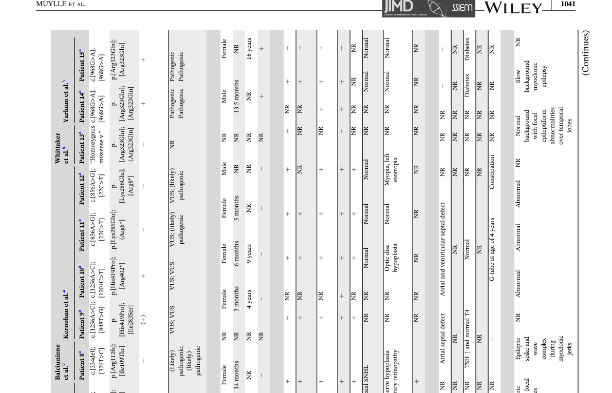

## Question

# Disease Characteristics Research Template

## Target Disease
- **Disease Name:** Combined Oxidative Phosphorylation Deficiency 35
- **MONDO ID:** MONDO:0054742 (if available)
- **Category:** Mendelian

## Research Objectives

Please provide a comprehensive research report on **Combined Oxidative Phosphorylation Deficiency 35** covering all of the
disease characteristics listed below. This report will be used to populate a disease knowledge
base entry. Be thorough and cite primary literature (PMID preferred) for all claims.

For each section, **suggested databases/resources** are listed. These are the first places
you should search for information on each topic.

---

### 1. Disease Information
> **Search first:** OMIM, Orphanet, ICD-10/ICD-11, MeSH, PubMed

- What is the disease? Provide a concise overview.
- What are the key identifiers? (OMIM, Orphanet, ICD-10/ICD-11, MeSH, Mondo)
- What are the common synonyms and alternative names?
- Is the information derived from individual patients (e.g., EHR) or aggregated disease-level resources?

### 2. Etiology

- **Disease Causal Factors**: What are the primary causes? (genetic, environmental, infectious, mechanistic)
- **Risk Factors**:
  > **Search first:** PubMed, Cochrane Library, UpToDate, clinical guidelines, ClinVar, ClinGen, GWAS Catalog, PheGenI, CTD, CDC, WHO, epidemiological databases
  - Genetic risk factors (causal variants, susceptibility loci, modifier genes)
  - Environmental risk factors (toxins, lifestyle, occupational exposures, age, sex, family history)
- **Protective Factors**:
  > **Search first:** PubMed, Cochrane Library, clinical trial databases, GWAS Catalog, gnomAD, WHO, CDC, nutrition databases
  - Genetic protective factors (protective variants, modifier alleles)
  - Environmental protective factors (diet, lifestyle, exposures that reduce risk)
- **Gene-Environment Interactions**: How do genetic and environmental factors interact to influence disease?
  > **Search first:** CTD, PubMed, PheGenI, GxE databases

### 3. Phenotypes
> **Search first:** HPO (Human Phenotype Ontology), OMIM, Orphanet, PubMed, clinicaltrials.gov, MedDRA, SNOMED CT, DECIPHER, LOINC

For each phenotype, provide:
- **Phenotype type**: symptoms, clinical signs, physical manifestations, behavioral changes, or laboratory abnormalities
  > For symptoms/signs: HPO, OMIM, Orphanet, PubMed
  > For behavioral changes: HPO, DSM, RDoC (Research Domain Criteria), PubMed
  > For laboratory abnormalities: LOINC, SNOMED CT, LabTests Online, PubMed
- **Phenotype characteristics**:
  > **Search first:** OMIM, Orphanet, HPO, PubMed
  - Age of symptom onset (neonatal, childhood, adult-onset, late-onset)
  - Symptom severity (mild, moderate, severe, variable)
  - Symptom progression (stable, progressive, episodic, fluctuating)
  - Frequency among affected individuals (percentage or qualitative)
- **Quality of life impact**: Effects on daily functioning and well-being (per-phenotype when possible)
  > **Search first:** EQ-5D database, SF-36, WHO QOL databases, PubMed
- Suggest HPO (Human Phenotype Ontology) terms for each phenotype

### 4. Genetic/Molecular Information

- **Causal Genes**: Gene mutations or chromosomal abnormalities responsible for disease (gene symbols, OMIM IDs)
  > **Search first:** OMIM, ClinVar, HGMD, Ensembl, NCBI Gene
- **Pathogenic Variants**:
  - Affected genes (gene symbols, HGNC IDs)
    > **Search first:** OMIM, NCBI Gene, Ensembl, HGNC, UniProt, GeneCards
  - Variant classification (pathogenic, likely pathogenic, VUS per ACMG/AMP guidelines)
    > **Search first:** ClinVar, ClinGen, ACMG/AMP guidelines, VarSome
  - Variant type/class (missense, frameshift, nonsense, splice-site, structural)
  - Allele frequency in population databases
    > **Search first:** gnomAD, 1000 Genomes, ExAC, TOPMed, dbSNP
  - Somatic vs germline origin
    > **Search first:** COSMIC (somatic), ClinVar, ICGC, TCGA
  - Functional consequences (loss of function, gain of function, dominant negative)
- **Modifier Genes**: Genes that modify disease severity or expression
- **Epigenetic Information**: DNA methylation, histone modifications, chromatin changes affecting disease
  > **Search first:** ENCODE, Roadmap Epigenomics, MethBase, DiseaseMeth
- **Chromosomal Abnormalities**: Large-scale genetic changes (aneuploidy, translocations, inversions)
  > **Search first:** DECIPHER, ClinVar, ECARUCA, UCSC Genome Browser

### 5. Environmental Information

- **Environmental Factors**: Non-genetic contributing factors (toxins, radiation, pollution, occupational exposure)
  > **Search first:** CTD (Comparative Toxicogenomics Database), TOXNET, PubMed, EPA databases
- **Lifestyle Factors**: Behavioral factors (smoking, diet, exercise, alcohol consumption)
  > **Search first:** CDC databases, WHO, PubMed, NHANES
- **Infectious Agents**: If applicable, pathogens causing or triggering disease (bacteria, viruses, fungi, parasites)
  > **Search first:** NCBI Taxonomy, ViPR, BV-BRC, MicrobeDB, GIDEON

### 6. Mechanism / Pathophysiology

**Present this section as an ordered causal chain first, then the detail below.**
Open with a numbered sequence of mechanistic steps running from the initiating
lesion (mutation, exposure, infection) to the clinical manifestation, one step per
line, each naming what it causes next. State the causal verb explicitly ("leads
to", "results in") and say where a step is inferred rather than demonstrated.
Where the mechanism branches, show the branch. The categories below are a
checklist of what to cover within those steps, not the organizing structure —
a step may draw on several of them, and a category may contribute to several
steps.

- **Molecular Pathways**: Specific signaling cascades or biochemical pathways involved (Wnt, MAPK, mTOR, PI3K-AKT, etc.)
  > **Search first:** KEGG, Reactome, WikiPathways, PathBank, BioCyc
- **Cellular Processes**: Cell-level mechanisms (apoptosis, autophagy, cell cycle dysregulation, inflammation, etc.)
  > **Search first:** Gene Ontology (GO), Reactome, KEGG, PubMed
- **Protein Dysfunction**: How protein structure or function is altered (misfolding, aggregation, loss of function, gain of function)
  > **Search first:** UniProt, PDB (Protein Data Bank), InterPro, Pfam, AlphaFold
- **Metabolic Changes**: Alterations in metabolic processes (energy metabolism, lipid metabolism, amino acid metabolism)
  > **Search first:** KEGG, BioCyc, HMDB (Human Metabolome Database), BRENDA
- **Immune System Involvement**: Role of immune response (autoimmunity, immunodeficiency, chronic inflammation)
  > **Search first:** ImmPort, Immunome Database, IEDB, Gene Ontology
- **Tissue Damage Mechanisms**: How tissues/ are injured (oxidative stress, ischemia, fibrosis, necrosis)
  > **Search first:** PubMed, Gene Ontology, Reactome
- **Biochemical Abnormalities**: Specific molecular defects (enzyme deficiencies, receptor dysfunction, ion channel defects)
  > **Search first:** BRENDA, UniProt, KEGG, OMIM, PubMed
- **Epigenetic Changes**: DNA methylation, histone modifications affecting gene expression in disease
  > **Search first:** ENCODE, Roadmap Epigenomics, MethBase, DiseaseMeth
- **Molecular Profiling** (if available):
  - Transcriptomics/gene expression changes
    > **Search first:** GEO (Gene Expression Omnibus), ArrayExpress, GTEx, Human Cell Atlas, SRA
  - Proteomics findings
    > **Search first:** PRIDE, ProteomeXchange, Human Protein Atlas, STRING, BioGRID
  - Metabolomics signatures
    > **Search first:** MetaboLights, Metabolomics Workbench, HMDB, METLIN
  - Lipidomics alterations
    > **Search first:** LIPID MAPS, SwissLipids, LipidHome, Metabolomics Workbench
  - Genomic structural features
    > **Search first:** UCSC Genome Browser, Ensembl, NCBI, dbVar, DGV
- **Advanced Technologies** (if applicable):
  - Single-cell analysis findings (cell-type specific mechanisms, cellular heterogeneity)
    > **Search first:** Human Cell Atlas, Single Cell Portal, GEO, CELLxGENE
  - Spatial transcriptomics findings
    > **Search first:** GEO, Spatial Research, Vizgen, 10x Genomics data
  - Multi-omics integration results
    > **Search first:** TCGA, ICGC, cBioPortal, LinkedOmics, PubMed
  - Functional genomics screens (CRISPR, RNAi)
    > **Search first:** DepMap, GenomeRNAi, PubMed, BioGRID ORCS

For each mechanism, describe:
- The causal chain from initial trigger to clinical manifestation
- Which mechanisms are upstream vs downstream
- What cell types and biological processes are involved
- Suggest GO terms for biological processes and CL terms for cell types

### 7. Anatomical Structures Affected

- **Organ Level**:
  - Primary organs directly affected
  - Secondary organ involvement (complications, secondary effects)
  - Body systems involved (cardiovascular, nervous, digestive, respiratory, endocrine, etc.)
  > **Search first:** Uberon, FMA (Foundational Model of Anatomy), OMIM, HPO, ICD-11, MeSH, SNOMED CT
- **Tissue and Cell Level**:
  - Specific tissue types affected (epithelial, connective, muscle, nervous)
  - Specific cell populations targeted (with Cell Ontology terms)
  > **Search first:** Uberon, Human Protein Atlas, Cell Ontology, Human Cell Atlas, CellMarker, PanglaoDB
- **Subcellular Level**:
  - Cellular compartments involved (mitochondria, nucleus, ER, lysosomes) (with GO Cellular Component terms)
  > **Search first:** Gene Ontology (Cellular Component), UniProt, Human Protein Atlas
- **Localization**:
  - Specific anatomical sites (with UBERON terms)
    > **Search first:** FMA, Uberon, NeuroNames (for brain), SNOMED CT
  - Lateralization (unilateral, bilateral, asymmetric)
    > **Search first:** HPO, clinical literature, imaging databases

### 8. Temporal Development

- **Onset**:
  - Typical age of onset (congenital, pediatric, adult, geriatric)
  - Onset pattern (acute, subacute, chronic, insidious)
  > **Search first:** OMIM, Orphanet, HPO, PubMed
- **Progression**:
  - Disease stages (early, intermediate, advanced, end-stage)
    > **Search first:** Cancer Staging Manual (AJCC), WHO classifications, PubMed
  - Progression rate (rapid, slow, variable)
  - Disease course pattern (episodic, relapsing-remitting, progressive, stable)
  - Disease duration (self-limited, chronic lifelong)
  > **Search first:** Disease registries, longitudinal cohort databases, natural history studies, PubMed, Orphanet, OMIM
- **Patterns**:
  - Remission patterns (spontaneous, treatment-induced)
    > **Search first:** Clinical trial databases, disease registries, PubMed
  - Critical periods (time windows of vulnerability or opportunity for intervention)
    > **Search first:** PubMed, developmental biology databases, clinical guidelines

### 9. Inheritance and Population

- **Epidemiology**:
  - Prevalence (cases per 100,000 at given time)
  - Incidence (new cases per 100,000 per year)
  > **Search first:** Orphanet, CDC, WHO, GBD (Global Burden of Disease), national registries, SEER, disease registries
- **For Genetic Etiology**:
  - Inheritance pattern (AD, AR, X-linked, mitochondrial, multifactorial, polygenic)
    > **Search first:** OMIM, Orphanet, ClinVar, GTR (Genetic Testing Registry)
  - Penetrance (complete, incomplete, age-dependent)
    > **Search first:** ClinVar, OMIM, PubMed, ClinGen
  - Expressivity (variable, consistent)
    > **Search first:** OMIM, ClinVar, PubMed
  - Genetic anticipation (increasing severity in successive generations)
    > **Search first:** OMIM, PubMed (especially for repeat expansion disorders)
  - Germline mosaicism
    > **Search first:** ClinVar, OMIM, genetic counseling literature, PubMed
  - Founder effects (population-specific mutations)
    > **Search first:** gnomAD, population genetics databases, PubMed
  - Consanguinity role
    > **Search first:** OMIM, population studies, genetic counseling resources
  - Carrier frequency
    > **Search first:** gnomAD, carrier screening databases, GeneReviews, GTR
- **Population Demographics**:
  - Affected populations (ethnic or demographic groups with higher prevalence)
    > **Search first:** gnomAD, 1000 Genomes, PAGE Study, PubMed, population registries
  - Geographic distribution (endemic areas, regional variation)
    > **Search first:** WHO, CDC, GBD, Orphanet, geographic epidemiology databases
  - Geographic distribution of specific variants
  - Sex ratio (male:female)
    > **Search first:** Disease registries, OMIM, PubMed, epidemiological databases
  - Age distribution of affected individuals
    > **Search first:** CDC, disease registries, SEER, Orphanet

### 10. Diagnostics

- **Clinical Tests**:
  - Laboratory tests (blood, urine, tissue chemistry, specific enzyme assays)
    > **Search first:** LOINC, LabTests Online, PubMed
  - Biomarkers (proteins, metabolites, genetic markers, circulating biomarkers)
    > **Search first:** FDA Biomarker List, BEST (Biomarkers, EndpointS, and other Tools), PubMed
  - Imaging studies (X-ray, CT, MRI, PET, ultrasound)
    > **Search first:** RadLex, DICOM, Radiopaedia, imaging databases
  - Functional tests (pulmonary function, cardiac stress tests)
    > **Search first:** LOINC, clinical guidelines, PubMed
  - Electrophysiology (EEG, EMG, ECG, nerve conduction studies)
    > **Search first:** LOINC, clinical neurophysiology databases, PubMed
  - Biopsy findings (histopathology, immunohistochemistry)
    > **Search first:** SNOMED CT, College of American Pathologists resources, PubMed
  - Pathology findings (microscopic examination)
    > **Search first:** SNOMED CT, Digital Pathology databases, PubMed
- **Genetic Testing**:
  > **Search first:** GTR (Genetic Testing Registry), GeneReviews, ClinGen
  - Overview of recommended genetic testing approach
  - Whole genome sequencing (WGS) utility
    > **Search first:** GTR, ClinVar, GEL (Genomics England), gnomAD
  - Whole exome sequencing (WES) utility
    > **Search first:** GTR, ClinVar, OMIM, GeneMatcher
  - Gene panels (which panels, which genes)
    > **Search first:** GTR, ClinVar, laboratory-specific databases
  - Single gene testing
    > **Search first:** GTR, ClinVar, OMIM, GeneReviews
  - Chromosomal microarray (CMA)
    > **Search first:** DECIPHER, ClinVar, dbVar, ECARUCA
  - Karyotyping
    > **Search first:** Chromosome Abnormality Database, ClinVar, cytogenetics resources
  - FISH
    > **Search first:** ClinVar, cytogenetics databases, PubMed
  - Mitochondrial DNA testing
    > **Search first:** MITOMAP, MSeqDR, ClinVar, GTR
  - Repeat expansion testing
    > **Search first:** GTR, ClinVar, repeat expansion databases, PubMed
- **Omics-Based Diagnostics** (if applicable):
  - RNA sequencing / transcriptomics
    > **Search first:** GEO, ArrayExpress, GTEx, RNA-seq databases
  - Proteomics
    > **Search first:** PRIDE, ProteomeXchange, FDA Biomarker database
  - Metabolomics
    > **Search first:** MetaboLights, Metabolomics Workbench, HMDB
  - Epigenomics
    > **Search first:** GEO, ENCODE, Roadmap Epigenomics, MethBase
  - Liquid biopsy
    > **Search first:** COSMIC, ClinVar, liquid biopsy databases, PubMed
- **Clinical Criteria**:
  - Standardized diagnostic criteria (DSM, ICD, society guidelines)
    > **Search first:** DSM-5, ICD-11, clinical society guidelines, UpToDate
  - Differential diagnosis (other conditions to rule out, with distinguishing features)
    > **Search first:** DynaMed, UpToDate, clinical decision support systems
- **Screening**:
  - Screening methods for asymptomatic individuals (newborn screening, carrier screening, cascade screening)
    > **Search first:** ACMG recommendations, CDC newborn screening, GTR

### 11. Outcome/Prognosis

- **Survival and Mortality**:
  - Survival rate (5-year, 10-year, overall)
    > **Search first:** SEER, cancer registries, disease-specific registries, PubMed
  - Life expectancy (with and without treatment if applicable)
    > **Search first:** Orphanet, disease registries, actuarial databases, PubMed
  - Mortality rate
    > **Search first:** CDC, WHO, GBD, national mortality databases
  - Disease-specific mortality (deaths directly attributable to disease)
    > **Search first:** Disease registries, CDC Wonder, GBD, PubMed
- **Morbidity and Function**:
  - Morbidity (disease-related disability and health impacts)
    > **Search first:** GBD, WHO, disability databases, PubMed
  - Disability outcomes (long-term functional impairments)
    > **Search first:** ICF (International Classification of Functioning), disability registries
  - Quality of life measures (EQ-5D, SF-36, PROMIS, disease-specific tools)
    > **Search first:** EQ-5D database, SF-36, PROMIS, PubMed
- **Disease Course**:
  - Complications (secondary problems: infections, organ failure, etc.)
    > **Search first:** ICD codes, disease registries, clinical databases, PubMed
  - Recovery potential (likelihood and extent of recovery, with vs without treatment)
    > **Search first:** Natural history studies, rehabilitation databases, PubMed
- **Prediction**:
  - Prognostic factors (age, disease severity, biomarkers, treatment response)
    > **Search first:** Prognostic models databases, clinical calculators, PubMed
  - Prognostic biomarkers (molecular markers predicting disease course)
    > **Search first:** FDA Biomarker database, PubMed, cancer prognostic databases

### 12. Treatment

- **Pharmacotherapy**:
  - Pharmacological treatments (drug names, drug classes, mechanisms of action)
    > **Search first:** DrugBank, RxNorm, ATC classification, DailyMed, FDA databases
  - Pharmacogenomics (how genetic variants affect drug metabolism, efficacy, toxicity)
    > **Search first:** PharmGKB, CPIC (Clinical Pharmacogenetics), FDA Table of PGx Biomarkers
- **Advanced Therapeutics**:
  - Gene therapy (viral vectors, CRISPR, gene replacement, gene editing)
    > **Search first:** ClinicalTrials.gov, FDA gene therapy database, ASGCT resources
  - Cell therapy (stem cell transplant, CAR-T, cellular therapeutics)
    > **Search first:** ClinicalTrials.gov, FDA cell therapy database, FACT standards
  - RNA-based therapies (ASOs, siRNA, mRNA therapies)
    > **Search first:** ClinicalTrials.gov, FDA approvals, PubMed
  - Targeted therapies (treatments directed at specific molecular targets)
    > **Search first:** My Cancer Genome, OncoKB, ClinicalTrials.gov, FDA approvals
  - Immunotherapies (checkpoint inhibitors, monoclonal antibodies)
    > **Search first:** Cancer Immunotherapy Database, FDA approvals, ClinicalTrials.gov
- **Surgical and Interventional**:
  - Surgical interventions (types of surgery, timing, outcomes)
    > **Search first:** CPT codes, surgical registries, clinical guidelines, PubMed
- **Supportive and Rehabilitative**:
  - Supportive care (symptom management, pain control, nutrition)
    > **Search first:** Clinical guidelines, Cochrane Library, PubMed
  - Rehabilitation (physical therapy, occupational therapy, speech therapy)
    > **Search first:** Rehabilitation medicine databases, clinical guidelines, PubMed
- **Experimental**:
  - Experimental treatments in clinical trials (with NCT identifiers if available)
    > **Search first:** ClinicalTrials.gov, EU Clinical Trials Register, WHO ICTRP
- **Treatment Outcomes**:
  - Treatment response rates
    > **Search first:** Clinical trial databases, FDA reviews, systematic reviews, PubMed
  - Side effects and adverse events
    > **Search first:** FDA Adverse Event Reporting System (FAERS), MedWatch, PubMed
- **Treatment Strategy**:
  - Treatment algorithms (clinical pathways, decision trees)
    > **Search first:** Clinical practice guidelines, NCCN Guidelines, UpToDate
  - Combination therapies
    > **Search first:** ClinicalTrials.gov, treatment guidelines, PubMed
  - Personalized medicine approaches (genotype-guided treatment)
    > **Search first:** My Cancer Genome, CIViC, PharmGKB, precision medicine databases

For each treatment, suggest NCIT (NCI Thesaurus) clinical-intervention terms where applicable.

### 13. Prevention

- **Prevention Levels**:
  - Primary prevention (preventing disease occurrence: vaccination, risk factor modification)
    > **Search first:** CDC, WHO, USPSTF recommendations, Cochrane Library
  - Secondary prevention (early detection and treatment: screening programs, early intervention)
    > **Search first:** USPSTF, CDC screening guidelines, WHO
  - Tertiary prevention (preventing complications in those with disease)
    > **Search first:** Clinical guidelines, disease management protocols, PubMed
- **Immunization**: Vaccine strategies (if applicable)
  > **Search first:** CDC vaccine schedules, WHO immunization, FDA vaccine database
- **Screening and Early Detection**:
  - Screening programs (population-based: newborn screening, cancer screening)
    > **Search first:** CDC screening programs, USPSTF, cancer screening databases
  - Genetic screening (carrier screening, preimplantation genetic diagnosis, prenatal testing)
    > **Search first:** ACMG recommendations, ACOG guidelines, GTR
  - Risk stratification (identifying high-risk individuals for targeted prevention)
    > **Search first:** Risk prediction models, clinical calculators, PubMed
- **Behavioral Interventions**: Lifestyle modifications to reduce risk
  > **Search first:** CDC, WHO, behavioral intervention databases, Cochrane Library
- **Counseling**: Genetic counseling (risk assessment, family planning guidance)
  > **Search first:** NSGC resources, ACMG guidelines, GeneReviews
- **Public Health**:
  - Public health interventions (sanitation, vector control, health education)
    > **Search first:** CDC, WHO, public health databases, PubMed
  - Environmental interventions (reducing environmental risk factors)
    > **Search first:** EPA databases, WHO environmental health, PubMed
- **Prophylaxis**: Preventive medications or procedures
  > **Search first:** Clinical guidelines, FDA approvals, PubMed

### 14. Other Species / Natural Disease

- **Taxonomy**: Species affected (with NCBI Taxon identifiers)
  > **Search first:** NCBI Taxonomy
- **Breed**: Specific breeds affected (with VBO identifiers if applicable)
  > **Search first:** VBO (Vertebrate Breed Ontology)
- **Gene**: Orthologous genes in other species (with NCBI Gene IDs)
  > **Search first:** NCBI Gene
- **Natural Disease**:
  - Naturally occurring disease in other species (companion animals, wildlife)
    > **Search first:** OMIA (Online Mendelian Inheritance in Animals), VetCompass, PubMed
  - Veterinary relevance and importance in animal health
    > **Search first:** OMIA, veterinary databases, PubMed
- **Comparative Biology**:
  - Comparative pathology (similarities and differences across species)
    > **Search first:** OMIA, comparative pathology databases, PubMed
  - Evolutionary conservation of disease mechanisms
    > **Search first:** HomoloGene, OrthoMCL, Alliance of Genome Resources
- **Transmission** (if applicable):
  - Zoonotic potential
    > **Search first:** CDC zoonotic diseases, WHO zoonoses, GIDEON
  - Cross-species susceptibility
    > **Search first:** NCBI Taxonomy, veterinary databases, PubMed

### 15. Model Organisms

- **Model Types**:
  - Model organism type (mammalian, invertebrate, cellular, in vitro)
    > **Search first:** Alliance of Genome Resources, model organism databases
  - Specific model systems (mouse, rat, zebrafish, Drosophila, C. elegans, yeast, cell lines, organoids, iPSCs)
    > **Search first:** MGI, RGD, ZFIN, FlyBase, WormBase, SGD, ATCC, Cellosaurus
  - Induced models (drug treatment, surgical intervention, environmental manipulation)
    > **Search first:** MGI, model organism databases, PubMed
- **Genetic Models**:
  - Types available (knockout, knock-in, transgenic, conditional, humanized)
    > **Search first:** MGI, IMPC, KOMP, EuMMCR, IMSR
- **Model Characteristics**:
  - Phenotype recapitulation (how well model reproduces human disease features)
    > **Search first:** Model organism databases, comparative studies, PubMed
  - Model limitations (aspects of human disease not captured)
    > **Search first:** Model organism databases, PubMed, review articles
- **Applications**:
  - Research applications (what aspects of disease can be studied)
    > **Search first:** Model organism databases, PubMed
- **Resources**:
  - Model databases
    > **Search first:** MGI, RGD, ZFIN, FlyBase, WormBase, IMSR, EMMA, MMRRC

---

## Citation Requirements

- Cite primary literature (PMID preferred) for all mechanistic and clinical claims
- Prioritize recent reviews and landmark papers
- Include direct quotes from abstracts where possible to support key statements
- Distinguish evidence source types: human clinical, model organism, in vitro, computational

## Output Format

Structure your response as a comprehensive narrative organized by the sections above.
For each section, provide:
- Factual content with specific details (numbers, percentages, gene names, variant nomenclature)
- Ontology term suggestions (HPO, GO, CL, UBERON, CHEBI, NCIT, MONDO) where applicable
- Evidence citations with PMIDs
- Direct quotes from abstracts to support key claims
- Clear indication when information is not available or not applicable for this disease

This report will be used to populate a disease knowledge base entry with:
- Pathophysiology descriptions with causal chains
- Gene/protein annotations (HGNC, GO terms)
- Phenotype associations (HP terms) with frequencies
- Cell type involvement (CL terms)
- Anatomical locations (UBERON terms)
- Chemical entities (CHEBI terms)
- Treatment annotations (NCIT terms)
- Evidence items with PMIDs and exact abstract quotes
- Epidemiology, prognosis, diagnostic, and prevention information
- Animal model descriptions with phenotype recapitulation details

## Output

Question: You are an expert researcher providing comprehensive, well-cited information.

Provide detailed information focusing on:
1. Key concepts and definitions with current understanding
2. Recent developments and latest research (prioritize 2023-2024 sources)
3. Current applications and real-world implementations
4. Expert opinions and analysis from authoritative sources
5. Relevant statistics and data from recent studies

Format as a comprehensive research report with proper citations. Include URLs and publication dates where available.
Always prioritize recent, authoritative sources and provide specific citations for all major claims.

# Disease Characteristics Research Template

## Target Disease
- **Disease Name:** Combined Oxidative Phosphorylation Deficiency 35
- **MONDO ID:** MONDO:0054742 (if available)
- **Category:** Mendelian

## Research Objectives

Please provide a comprehensive research report on **Combined Oxidative Phosphorylation Deficiency 35** covering all of the
disease characteristics listed below. This report will be used to populate a disease knowledge
base entry. Be thorough and cite primary literature (PMID preferred) for all claims.

For each section, **suggested databases/resources** are listed. These are the first places
you should search for information on each topic.

---

### 1. Disease Information
> **Search first:** OMIM, Orphanet, ICD-10/ICD-11, MeSH, PubMed

- What is the disease? Provide a concise overview.
- What are the key identifiers? (OMIM, Orphanet, ICD-10/ICD-11, MeSH, Mondo)
- What are the common synonyms and alternative names?
- Is the information derived from individual patients (e.g., EHR) or aggregated disease-level resources?

### 2. Etiology

- **Disease Causal Factors**: What are the primary causes? (genetic, environmental, infectious, mechanistic)
- **Risk Factors**:
  > **Search first:** PubMed, Cochrane Library, UpToDate, clinical guidelines, ClinVar, ClinGen, GWAS Catalog, PheGenI, CTD, CDC, WHO, epidemiological databases
  - Genetic risk factors (causal variants, susceptibility loci, modifier genes)
  - Environmental risk factors (toxins, lifestyle, occupational exposures, age, sex, family history)
- **Protective Factors**:
  > **Search first:** PubMed, Cochrane Library, clinical trial databases, GWAS Catalog, gnomAD, WHO, CDC, nutrition databases
  - Genetic protective factors (protective variants, modifier alleles)
  - Environmental protective factors (diet, lifestyle, exposures that reduce risk)
- **Gene-Environment Interactions**: How do genetic and environmental factors interact to influence disease?
  > **Search first:** CTD, PubMed, PheGenI, GxE databases

### 3. Phenotypes
> **Search first:** HPO (Human Phenotype Ontology), OMIM, Orphanet, PubMed, clinicaltrials.gov, MedDRA, SNOMED CT, DECIPHER, LOINC

For each phenotype, provide:
- **Phenotype type**: symptoms, clinical signs, physical manifestations, behavioral changes, or laboratory abnormalities
  > For symptoms/signs: HPO, OMIM, Orphanet, PubMed
  > For behavioral changes: HPO, DSM, RDoC (Research Domain Criteria), PubMed
  > For laboratory abnormalities: LOINC, SNOMED CT, LabTests Online, PubMed
- **Phenotype characteristics**:
  > **Search first:** OMIM, Orphanet, HPO, PubMed
  - Age of symptom onset (neonatal, childhood, adult-onset, late-onset)
  - Symptom severity (mild, moderate, severe, variable)
  - Symptom progression (stable, progressive, episodic, fluctuating)
  - Frequency among affected individuals (percentage or qualitative)
- **Quality of life impact**: Effects on daily functioning and well-being (per-phenotype when possible)
  > **Search first:** EQ-5D database, SF-36, WHO QOL databases, PubMed
- Suggest HPO (Human Phenotype Ontology) terms for each phenotype

### 4. Genetic/Molecular Information

- **Causal Genes**: Gene mutations or chromosomal abnormalities responsible for disease (gene symbols, OMIM IDs)
  > **Search first:** OMIM, ClinVar, HGMD, Ensembl, NCBI Gene
- **Pathogenic Variants**:
  - Affected genes (gene symbols, HGNC IDs)
    > **Search first:** OMIM, NCBI Gene, Ensembl, HGNC, UniProt, GeneCards
  - Variant classification (pathogenic, likely pathogenic, VUS per ACMG/AMP guidelines)
    > **Search first:** ClinVar, ClinGen, ACMG/AMP guidelines, VarSome
  - Variant type/class (missense, frameshift, nonsense, splice-site, structural)
  - Allele frequency in population databases
    > **Search first:** gnomAD, 1000 Genomes, ExAC, TOPMed, dbSNP
  - Somatic vs germline origin
    > **Search first:** COSMIC (somatic), ClinVar, ICGC, TCGA
  - Functional consequences (loss of function, gain of function, dominant negative)
- **Modifier Genes**: Genes that modify disease severity or expression
- **Epigenetic Information**: DNA methylation, histone modifications, chromatin changes affecting disease
  > **Search first:** ENCODE, Roadmap Epigenomics, MethBase, DiseaseMeth
- **Chromosomal Abnormalities**: Large-scale genetic changes (aneuploidy, translocations, inversions)
  > **Search first:** DECIPHER, ClinVar, ECARUCA, UCSC Genome Browser

### 5. Environmental Information

- **Environmental Factors**: Non-genetic contributing factors (toxins, radiation, pollution, occupational exposure)
  > **Search first:** CTD (Comparative Toxicogenomics Database), TOXNET, PubMed, EPA databases
- **Lifestyle Factors**: Behavioral factors (smoking, diet, exercise, alcohol consumption)
  > **Search first:** CDC databases, WHO, PubMed, NHANES
- **Infectious Agents**: If applicable, pathogens causing or triggering disease (bacteria, viruses, fungi, parasites)
  > **Search first:** NCBI Taxonomy, ViPR, BV-BRC, MicrobeDB, GIDEON

### 6. Mechanism / Pathophysiology

**Present this section as an ordered causal chain first, then the detail below.**
Open with a numbered sequence of mechanistic steps running from the initiating
lesion (mutation, exposure, infection) to the clinical manifestation, one step per
line, each naming what it causes next. State the causal verb explicitly ("leads
to", "results in") and say where a step is inferred rather than demonstrated.
Where the mechanism branches, show the branch. The categories below are a
checklist of what to cover within those steps, not the organizing structure —
a step may draw on several of them, and a category may contribute to several
steps.

- **Molecular Pathways**: Specific signaling cascades or biochemical pathways involved (Wnt, MAPK, mTOR, PI3K-AKT, etc.)
  > **Search first:** KEGG, Reactome, WikiPathways, PathBank, BioCyc
- **Cellular Processes**: Cell-level mechanisms (apoptosis, autophagy, cell cycle dysregulation, inflammation, etc.)
  > **Search first:** Gene Ontology (GO), Reactome, KEGG, PubMed
- **Protein Dysfunction**: How protein structure or function is altered (misfolding, aggregation, loss of function, gain of function)
  > **Search first:** UniProt, PDB (Protein Data Bank), InterPro, Pfam, AlphaFold
- **Metabolic Changes**: Alterations in metabolic processes (energy metabolism, lipid metabolism, amino acid metabolism)
  > **Search first:** KEGG, BioCyc, HMDB (Human Metabolome Database), BRENDA
- **Immune System Involvement**: Role of immune response (autoimmunity, immunodeficiency, chronic inflammation)
  > **Search first:** ImmPort, Immunome Database, IEDB, Gene Ontology
- **Tissue Damage Mechanisms**: How tissues/ are injured (oxidative stress, ischemia, fibrosis, necrosis)
  > **Search first:** PubMed, Gene Ontology, Reactome
- **Biochemical Abnormalities**: Specific molecular defects (enzyme deficiencies, receptor dysfunction, ion channel defects)
  > **Search first:** BRENDA, UniProt, KEGG, OMIM, PubMed
- **Epigenetic Changes**: DNA methylation, histone modifications affecting gene expression in disease
  > **Search first:** ENCODE, Roadmap Epigenomics, MethBase, DiseaseMeth
- **Molecular Profiling** (if available):
  - Transcriptomics/gene expression changes
    > **Search first:** GEO (Gene Expression Omnibus), ArrayExpress, GTEx, Human Cell Atlas, SRA
  - Proteomics findings
    > **Search first:** PRIDE, ProteomeXchange, Human Protein Atlas, STRING, BioGRID
  - Metabolomics signatures
    > **Search first:** MetaboLights, Metabolomics Workbench, HMDB, METLIN
  - Lipidomics alterations
    > **Search first:** LIPID MAPS, SwissLipids, LipidHome, Metabolomics Workbench
  - Genomic structural features
    > **Search first:** UCSC Genome Browser, Ensembl, NCBI, dbVar, DGV
- **Advanced Technologies** (if applicable):
  - Single-cell analysis findings (cell-type specific mechanisms, cellular heterogeneity)
    > **Search first:** Human Cell Atlas, Single Cell Portal, GEO, CELLxGENE
  - Spatial transcriptomics findings
    > **Search first:** GEO, Spatial Research, Vizgen, 10x Genomics data
  - Multi-omics integration results
    > **Search first:** TCGA, ICGC, cBioPortal, LinkedOmics, PubMed
  - Functional genomics screens (CRISPR, RNAi)
    > **Search first:** DepMap, GenomeRNAi, PubMed, BioGRID ORCS

For each mechanism, describe:
- The causal chain from initial trigger to clinical manifestation
- Which mechanisms are upstream vs downstream
- What cell types and biological processes are involved
- Suggest GO terms for biological processes and CL terms for cell types

### 7. Anatomical Structures Affected

- **Organ Level**:
  - Primary organs directly affected
  - Secondary organ involvement (complications, secondary effects)
  - Body systems involved (cardiovascular, nervous, digestive, respiratory, endocrine, etc.)
  > **Search first:** Uberon, FMA (Foundational Model of Anatomy), OMIM, HPO, ICD-11, MeSH, SNOMED CT
- **Tissue and Cell Level**:
  - Specific tissue types affected (epithelial, connective, muscle, nervous)
  - Specific cell populations targeted (with Cell Ontology terms)
  > **Search first:** Uberon, Human Protein Atlas, Cell Ontology, Human Cell Atlas, CellMarker, PanglaoDB
- **Subcellular Level**:
  - Cellular compartments involved (mitochondria, nucleus, ER, lysosomes) (with GO Cellular Component terms)
  > **Search first:** Gene Ontology (Cellular Component), UniProt, Human Protein Atlas
- **Localization**:
  - Specific anatomical sites (with UBERON terms)
    > **Search first:** FMA, Uberon, NeuroNames (for brain), SNOMED CT
  - Lateralization (unilateral, bilateral, asymmetric)
    > **Search first:** HPO, clinical literature, imaging databases

### 8. Temporal Development

- **Onset**:
  - Typical age of onset (congenital, pediatric, adult, geriatric)
  - Onset pattern (acute, subacute, chronic, insidious)
  > **Search first:** OMIM, Orphanet, HPO, PubMed
- **Progression**:
  - Disease stages (early, intermediate, advanced, end-stage)
    > **Search first:** Cancer Staging Manual (AJCC), WHO classifications, PubMed
  - Progression rate (rapid, slow, variable)
  - Disease course pattern (episodic, relapsing-remitting, progressive, stable)
  - Disease duration (self-limited, chronic lifelong)
  > **Search first:** Disease registries, longitudinal cohort databases, natural history studies, PubMed, Orphanet, OMIM
- **Patterns**:
  - Remission patterns (spontaneous, treatment-induced)
    > **Search first:** Clinical trial databases, disease registries, PubMed
  - Critical periods (time windows of vulnerability or opportunity for intervention)
    > **Search first:** PubMed, developmental biology databases, clinical guidelines

### 9. Inheritance and Population

- **Epidemiology**:
  - Prevalence (cases per 100,000 at given time)
  - Incidence (new cases per 100,000 per year)
  > **Search first:** Orphanet, CDC, WHO, GBD (Global Burden of Disease), national registries, SEER, disease registries
- **For Genetic Etiology**:
  - Inheritance pattern (AD, AR, X-linked, mitochondrial, multifactorial, polygenic)
    > **Search first:** OMIM, Orphanet, ClinVar, GTR (Genetic Testing Registry)
  - Penetrance (complete, incomplete, age-dependent)
    > **Search first:** ClinVar, OMIM, PubMed, ClinGen
  - Expressivity (variable, consistent)
    > **Search first:** OMIM, ClinVar, PubMed
  - Genetic anticipation (increasing severity in successive generations)
    > **Search first:** OMIM, PubMed (especially for repeat expansion disorders)
  - Germline mosaicism
    > **Search first:** ClinVar, OMIM, genetic counseling literature, PubMed
  - Founder effects (population-specific mutations)
    > **Search first:** gnomAD, population genetics databases, PubMed
  - Consanguinity role
    > **Search first:** OMIM, population studies, genetic counseling resources
  - Carrier frequency
    > **Search first:** gnomAD, carrier screening databases, GeneReviews, GTR
- **Population Demographics**:
  - Affected populations (ethnic or demographic groups with higher prevalence)
    > **Search first:** gnomAD, 1000 Genomes, PAGE Study, PubMed, population registries
  - Geographic distribution (endemic areas, regional variation)
    > **Search first:** WHO, CDC, GBD, Orphanet, geographic epidemiology databases
  - Geographic distribution of specific variants
  - Sex ratio (male:female)
    > **Search first:** Disease registries, OMIM, PubMed, epidemiological databases
  - Age distribution of affected individuals
    > **Search first:** CDC, disease registries, SEER, Orphanet

### 10. Diagnostics

- **Clinical Tests**:
  - Laboratory tests (blood, urine, tissue chemistry, specific enzyme assays)
    > **Search first:** LOINC, LabTests Online, PubMed
  - Biomarkers (proteins, metabolites, genetic markers, circulating biomarkers)
    > **Search first:** FDA Biomarker List, BEST (Biomarkers, EndpointS, and other Tools), PubMed
  - Imaging studies (X-ray, CT, MRI, PET, ultrasound)
    > **Search first:** RadLex, DICOM, Radiopaedia, imaging databases
  - Functional tests (pulmonary function, cardiac stress tests)
    > **Search first:** LOINC, clinical guidelines, PubMed
  - Electrophysiology (EEG, EMG, ECG, nerve conduction studies)
    > **Search first:** LOINC, clinical neurophysiology databases, PubMed
  - Biopsy findings (histopathology, immunohistochemistry)
    > **Search first:** SNOMED CT, College of American Pathologists resources, PubMed
  - Pathology findings (microscopic examination)
    > **Search first:** SNOMED CT, Digital Pathology databases, PubMed
- **Genetic Testing**:
  > **Search first:** GTR (Genetic Testing Registry), GeneReviews, ClinGen
  - Overview of recommended genetic testing approach
  - Whole genome sequencing (WGS) utility
    > **Search first:** GTR, ClinVar, GEL (Genomics England), gnomAD
  - Whole exome sequencing (WES) utility
    > **Search first:** GTR, ClinVar, OMIM, GeneMatcher
  - Gene panels (which panels, which genes)
    > **Search first:** GTR, ClinVar, laboratory-specific databases
  - Single gene testing
    > **Search first:** GTR, ClinVar, OMIM, GeneReviews
  - Chromosomal microarray (CMA)
    > **Search first:** DECIPHER, ClinVar, dbVar, ECARUCA
  - Karyotyping
    > **Search first:** Chromosome Abnormality Database, ClinVar, cytogenetics resources
  - FISH
    > **Search first:** ClinVar, cytogenetics databases, PubMed
  - Mitochondrial DNA testing
    > **Search first:** MITOMAP, MSeqDR, ClinVar, GTR
  - Repeat expansion testing
    > **Search first:** GTR, ClinVar, repeat expansion databases, PubMed
- **Omics-Based Diagnostics** (if applicable):
  - RNA sequencing / transcriptomics
    > **Search first:** GEO, ArrayExpress, GTEx, RNA-seq databases
  - Proteomics
    > **Search first:** PRIDE, ProteomeXchange, FDA Biomarker database
  - Metabolomics
    > **Search first:** MetaboLights, Metabolomics Workbench, HMDB
  - Epigenomics
    > **Search first:** GEO, ENCODE, Roadmap Epigenomics, MethBase
  - Liquid biopsy
    > **Search first:** COSMIC, ClinVar, liquid biopsy databases, PubMed
- **Clinical Criteria**:
  - Standardized diagnostic criteria (DSM, ICD, society guidelines)
    > **Search first:** DSM-5, ICD-11, clinical society guidelines, UpToDate
  - Differential diagnosis (other conditions to rule out, with distinguishing features)
    > **Search first:** DynaMed, UpToDate, clinical decision support systems
- **Screening**:
  - Screening methods for asymptomatic individuals (newborn screening, carrier screening, cascade screening)
    > **Search first:** ACMG recommendations, CDC newborn screening, GTR

### 11. Outcome/Prognosis

- **Survival and Mortality**:
  - Survival rate (5-year, 10-year, overall)
    > **Search first:** SEER, cancer registries, disease-specific registries, PubMed
  - Life expectancy (with and without treatment if applicable)
    > **Search first:** Orphanet, disease registries, actuarial databases, PubMed
  - Mortality rate
    > **Search first:** CDC, WHO, GBD, national mortality databases
  - Disease-specific mortality (deaths directly attributable to disease)
    > **Search first:** Disease registries, CDC Wonder, GBD, PubMed
- **Morbidity and Function**:
  - Morbidity (disease-related disability and health impacts)
    > **Search first:** GBD, WHO, disability databases, PubMed
  - Disability outcomes (long-term functional impairments)
    > **Search first:** ICF (International Classification of Functioning), disability registries
  - Quality of life measures (EQ-5D, SF-36, PROMIS, disease-specific tools)
    > **Search first:** EQ-5D database, SF-36, PROMIS, PubMed
- **Disease Course**:
  - Complications (secondary problems: infections, organ failure, etc.)
    > **Search first:** ICD codes, disease registries, clinical databases, PubMed
  - Recovery potential (likelihood and extent of recovery, with vs without treatment)
    > **Search first:** Natural history studies, rehabilitation databases, PubMed
- **Prediction**:
  - Prognostic factors (age, disease severity, biomarkers, treatment response)
    > **Search first:** Prognostic models databases, clinical calculators, PubMed
  - Prognostic biomarkers (molecular markers predicting disease course)
    > **Search first:** FDA Biomarker database, PubMed, cancer prognostic databases

### 12. Treatment

- **Pharmacotherapy**:
  - Pharmacological treatments (drug names, drug classes, mechanisms of action)
    > **Search first:** DrugBank, RxNorm, ATC classification, DailyMed, FDA databases
  - Pharmacogenomics (how genetic variants affect drug metabolism, efficacy, toxicity)
    > **Search first:** PharmGKB, CPIC (Clinical Pharmacogenetics), FDA Table of PGx Biomarkers
- **Advanced Therapeutics**:
  - Gene therapy (viral vectors, CRISPR, gene replacement, gene editing)
    > **Search first:** ClinicalTrials.gov, FDA gene therapy database, ASGCT resources
  - Cell therapy (stem cell transplant, CAR-T, cellular therapeutics)
    > **Search first:** ClinicalTrials.gov, FDA cell therapy database, FACT standards
  - RNA-based therapies (ASOs, siRNA, mRNA therapies)
    > **Search first:** ClinicalTrials.gov, FDA approvals, PubMed
  - Targeted therapies (treatments directed at specific molecular targets)
    > **Search first:** My Cancer Genome, OncoKB, ClinicalTrials.gov, FDA approvals
  - Immunotherapies (checkpoint inhibitors, monoclonal antibodies)
    > **Search first:** Cancer Immunotherapy Database, FDA approvals, ClinicalTrials.gov
- **Surgical and Interventional**:
  - Surgical interventions (types of surgery, timing, outcomes)
    > **Search first:** CPT codes, surgical registries, clinical guidelines, PubMed
- **Supportive and Rehabilitative**:
  - Supportive care (symptom management, pain control, nutrition)
    > **Search first:** Clinical guidelines, Cochrane Library, PubMed
  - Rehabilitation (physical therapy, occupational therapy, speech therapy)
    > **Search first:** Rehabilitation medicine databases, clinical guidelines, PubMed
- **Experimental**:
  - Experimental treatments in clinical trials (with NCT identifiers if available)
    > **Search first:** ClinicalTrials.gov, EU Clinical Trials Register, WHO ICTRP
- **Treatment Outcomes**:
  - Treatment response rates
    > **Search first:** Clinical trial databases, FDA reviews, systematic reviews, PubMed
  - Side effects and adverse events
    > **Search first:** FDA Adverse Event Reporting System (FAERS), MedWatch, PubMed
- **Treatment Strategy**:
  - Treatment algorithms (clinical pathways, decision trees)
    > **Search first:** Clinical practice guidelines, NCCN Guidelines, UpToDate
  - Combination therapies
    > **Search first:** ClinicalTrials.gov, treatment guidelines, PubMed
  - Personalized medicine approaches (genotype-guided treatment)
    > **Search first:** My Cancer Genome, CIViC, PharmGKB, precision medicine databases

For each treatment, suggest NCIT (NCI Thesaurus) clinical-intervention terms where applicable.

### 13. Prevention

- **Prevention Levels**:
  - Primary prevention (preventing disease occurrence: vaccination, risk factor modification)
    > **Search first:** CDC, WHO, USPSTF recommendations, Cochrane Library
  - Secondary prevention (early detection and treatment: screening programs, early intervention)
    > **Search first:** USPSTF, CDC screening guidelines, WHO
  - Tertiary prevention (preventing complications in those with disease)
    > **Search first:** Clinical guidelines, disease management protocols, PubMed
- **Immunization**: Vaccine strategies (if applicable)
  > **Search first:** CDC vaccine schedules, WHO immunization, FDA vaccine database
- **Screening and Early Detection**:
  - Screening programs (population-based: newborn screening, cancer screening)
    > **Search first:** CDC screening programs, USPSTF, cancer screening databases
  - Genetic screening (carrier screening, preimplantation genetic diagnosis, prenatal testing)
    > **Search first:** ACMG recommendations, ACOG guidelines, GTR
  - Risk stratification (identifying high-risk individuals for targeted prevention)
    > **Search first:** Risk prediction models, clinical calculators, PubMed
- **Behavioral Interventions**: Lifestyle modifications to reduce risk
  > **Search first:** CDC, WHO, behavioral intervention databases, Cochrane Library
- **Counseling**: Genetic counseling (risk assessment, family planning guidance)
  > **Search first:** NSGC resources, ACMG guidelines, GeneReviews
- **Public Health**:
  - Public health interventions (sanitation, vector control, health education)
    > **Search first:** CDC, WHO, public health databases, PubMed
  - Environmental interventions (reducing environmental risk factors)
    > **Search first:** EPA databases, WHO environmental health, PubMed
- **Prophylaxis**: Preventive medications or procedures
  > **Search first:** Clinical guidelines, FDA approvals, PubMed

### 14. Other Species / Natural Disease

- **Taxonomy**: Species affected (with NCBI Taxon identifiers)
  > **Search first:** NCBI Taxonomy
- **Breed**: Specific breeds affected (with VBO identifiers if applicable)
  > **Search first:** VBO (Vertebrate Breed Ontology)
- **Gene**: Orthologous genes in other species (with NCBI Gene IDs)
  > **Search first:** NCBI Gene
- **Natural Disease**:
  - Naturally occurring disease in other species (companion animals, wildlife)
    > **Search first:** OMIA (Online Mendelian Inheritance in Animals), VetCompass, PubMed
  - Veterinary relevance and importance in animal health
    > **Search first:** OMIA, veterinary databases, PubMed
- **Comparative Biology**:
  - Comparative pathology (similarities and differences across species)
    > **Search first:** OMIA, comparative pathology databases, PubMed
  - Evolutionary conservation of disease mechanisms
    > **Search first:** HomoloGene, OrthoMCL, Alliance of Genome Resources
- **Transmission** (if applicable):
  - Zoonotic potential
    > **Search first:** CDC zoonotic diseases, WHO zoonoses, GIDEON
  - Cross-species susceptibility
    > **Search first:** NCBI Taxonomy, veterinary databases, PubMed

### 15. Model Organisms

- **Model Types**:
  - Model organism type (mammalian, invertebrate, cellular, in vitro)
    > **Search first:** Alliance of Genome Resources, model organism databases
  - Specific model systems (mouse, rat, zebrafish, Drosophila, C. elegans, yeast, cell lines, organoids, iPSCs)
    > **Search first:** MGI, RGD, ZFIN, FlyBase, WormBase, SGD, ATCC, Cellosaurus
  - Induced models (drug treatment, surgical intervention, environmental manipulation)
    > **Search first:** MGI, model organism databases, PubMed
- **Genetic Models**:
  - Types available (knockout, knock-in, transgenic, conditional, humanized)
    > **Search first:** MGI, IMPC, KOMP, EuMMCR, IMSR
- **Model Characteristics**:
  - Phenotype recapitulation (how well model reproduces human disease features)
    > **Search first:** Model organism databases, comparative studies, PubMed
  - Model limitations (aspects of human disease not captured)
    > **Search first:** Model organism databases, PubMed, review articles
- **Applications**:
  - Research applications (what aspects of disease can be studied)
    > **Search first:** Model organism databases, PubMed
- **Resources**:
  - Model databases
    > **Search first:** MGI, RGD, ZFIN, FlyBase, WormBase, IMSR, EMMA, MMRRC

---

## Citation Requirements

- Cite primary literature (PMID preferred) for all mechanistic and clinical claims
- Prioritize recent reviews and landmark papers
- Include direct quotes from abstracts where possible to support key statements
- Distinguish evidence source types: human clinical, model organism, in vitro, computational

## Output Format

Structure your response as a comprehensive narrative organized by the sections above.
For each section, provide:
- Factual content with specific details (numbers, percentages, gene names, variant nomenclature)
- Ontology term suggestions (HPO, GO, CL, UBERON, CHEBI, NCIT, MONDO) where applicable
- Evidence citations with PMIDs
- Direct quotes from abstracts to support key claims
- Clear indication when information is not available or not applicable for this disease

This report will be used to populate a disease knowledge base entry with:
- Pathophysiology descriptions with causal chains
- Gene/protein annotations (HGNC, GO terms)
- Phenotype associations (HP terms) with frequencies
- Cell type involvement (CL terms)
- Anatomical locations (UBERON terms)
- Chemical entities (CHEBI terms)
- Treatment annotations (NCIT terms)
- Evidence items with PMIDs and exact abstract quotes
- Epidemiology, prognosis, diagnostic, and prevention information
- Animal model descriptions with phenotype recapitulation details

# Combined oxidative phosphorylation deficiency 35 (COXPD35): disease-characteristics report

**Evidence scope.** This entry concerns **biallelic nuclear-genome TRIT1 disease**, not all combined oxidative-phosphorylation deficiencies. Most disease-specific evidence comes from case reports, patient-derived cells, and a 2022 synthesis of **15 reported individuals**; consequently, case-series proportions are not population frequencies. A 2024 Finnish report adds a molecularly diagnosed child. Findings from broader mitochondrial-disease studies are labeled as extrapolations. (OpenTargets Search: combined oxidative phosphorylation deficiency 35-TRIT1, muylle2022trit1defectleads pages 1-2, aaltio2024geneticetiologyof pages 2-3)

## 1. Disease information

COXPD35 is a rare, usually infantile-onset, autosomal-recessive neurodevelopmental mitochondrial disorder associated with deficient **TRIT1-dependent transfer-RNA modification** and, in tested patients, impaired mitochondrial protein synthesis and more than one respiratory-chain complex. Recognizable manifestations include epilepsy—often myoclonic—developmental and speech delay, microcephaly, abnormal tone, and sometimes visual or cardiac abnormalities. Synonyms suitable for indexing are *TRIT1-related combined oxidative phosphorylation deficiency 35*, *TRIT1 deficiency*, and *combined oxidative phosphorylation defect type 35*. (yarham2014defectivei6a37modification pages 1-2, muylle2022trit1defectleads pages 1-2, magistrati2023modopathiescausedby pages 16-18)

**Verified identifiers:** MONDO:0054742; OMIM phenotype **617873**; causal gene **TRIT1**, Ensembl **ENSG00000043514**, at chromosome **1p34.2**. The retrieved evidence did not establish a COXPD35-specific Orphanet, ICD-10/ICD-11, or MeSH identifier; these should remain unassigned rather than inferred from a general mitochondrial-disease code. The observations below are **aggregated published disease-level evidence**, including individual published cases—not patient-level EHR records. (OpenTargets Search: combined oxidative phosphorylation deficiency 35-TRIT1, yoo2021thefirstkorean pages 1-2, magistrati2023modopathiescausedby pages 16-18)

## 2. Etiology, risk, protection, and gene–environment interaction

The established cause is **two disease-causing TRIT1 alleles in trans**: either homozygous or compound heterozygous. TRIT1 encodes a tRNA isopentenyltransferase acting in mitochondria and cytosol; recessive impaired function disrupts tRNA modification. Consanguinity increases the chance that relatives inherit the same rare allele but is neither required nor itself the molecular lesion. No reproducible susceptibility locus, protective allele, or clinically validated modifier gene has been identified for COXPD35. (yarham2014defectivei6a37modification pages 2-3, muylle2022trit1defectleads pages 1-2, magistrati2023modopathiescausedby pages 16-18)

No toxin, infection, smoking behavior, occupational exposure, or nutritional deficiency is established as a *cause* of this Mendelian disease. A Turkish child developed **recurrent ketotic hypoglycemia after prolonged fasting**, with glucose **45 mg/dL** and ketones **3.3 mmol/L** at the first documented attack; his authors considered starvation and malnutrition possible contributors. This is evidence that an environmental stressor can modify **manifestations**, not evidence that fasting causes the inherited disorder or that this reaction occurs in all patients. Neither a disease-specific protective diet nor a quantified TRIT1–environment interaction has been demonstrated. (yıldırım2022acaseof pages 3-4, yıldırım2022acaseof pages 4-5)

## 3. Phenotypes and impact on function

The best available descriptive denominator is Muylle and colleagues’ 2022 review of **15 literature-ascertained patients**. Its observations and suggested—not ontology-verified—HPO normalizations are summarized below. Interpret proportions cautiously because ascertainment and reporting differ between cases. (muylle2022trit1defectleads pages 1-2, muylle2022trit1defectleads pages 2-3)

| Clinical observation | n/N | Percent | Suggested HPO term | Qualification |
|---|---:|---:|---|---|
| Seizures | 15/15 | 100% | Seizure — HP:0001250 | All reviewed patients; seizure types varied. (muylle2022trit1defectleads pages 1-2, muylle2022trit1defectleads pages 2-3) |
| Myoclonic jerks | 12/15 | 80% | — | Reported as a seizure subtype; no narrower HPO mapping assigned here. (muylle2022trit1defectleads pages 1-2) |
| Abnormal EEG | 12/15 | 80% | — | Includes heterogeneous electroencephalographic abnormalities. (muylle2022trit1defectleads pages 1-2) |
| Cognitive delay | 11/15 | 73% | Intellectual disability — HP:0001249 | Authors reported “cognitive delay”; intellectual disability is a suggested normalization, not necessarily an exact source term. (muylle2022trit1defectleads pages 1-2) |
| Microcephaly | 11/15 | 73% | Microcephaly — HP:0000252 | Both neonatal and progressive/acquired microcephaly occurred across reports. (muylle2022trit1defectleads pages 1-2, muylle2022trit1defectleads pages 5-8) |
| Abnormal brain MRI | 8/15 | 53% | — | Heterogeneous findings included cerebral atrophy, delayed myelination, white-matter and corpus-callosum abnormalities, and hindbrain malformations. (muylle2022trit1defectleads pages 1-2) |
| Hypotonia | 7/15 | 47% | Hypotonia — HP:0001252 | Reported muscle-tone abnormality; severity and distribution were not uniformly documented. (muylle2022trit1defectleads pages 1-2) |
| Spasticity | 4/15 | 27% | Spasticity — HP:0001257 | May be underreported; progressive spasticity was highlighted as a recognizable feature. (muylle2022trit1defectleads pages 1-2, muylle2022trit1defectleads pages 5-8) |
| Normal blood lactate among tested patients | 9/9 | 100% of tested | — | Lactate was unreported in 6/15; this is not evidence that all affected individuals always have normal lactate. (muylle2022trit1defectleads pages 1-2, muylle2022trit1defectleads pages 2-3) |

*Table: Selected findings from the 15-case TRIT1 review by Muylle et al., DOI: https://doi.org/10.1002/jimd.12550. Percentages describe this small, literature-ascertained case series—not population prevalence—and denominators reflect reporting availability.*

Additional clinical signs include speech impairment (**suggested HPO: speech delay**), growth failure/failure to thrive, strabismus, optic-disc hypoplasia, and occasionally structural heart disease. In the 15-person review, optic-disc hypoplasia was reported in **four**, gastrointestinal symptoms in **four**, atrial septal defect in **three**—one also had a ventricular septal defect—and **two** had diabetes; hearing loss was unusual (**one** reported patient). These are publication counts, not validated penetrances. Suggest **HP:0001508** for failure to thrive only after checking the current HPO release; retain descriptive terms without IDs where mapping has not been verified. (muylle2022trit1defectleads pages 1-2)

Severity ranges from treatable seizures and mild-to-moderate developmental impairment in the two new Muylle cases to profound intellectual disability, visual impairment, cerebral palsy, and progressive motor disability in other reports. The Korean siblings, described at **16** and **13** years, illustrate substantial long-term disability; the older child had cataract and spastic diplegia, and the younger had hydrocephalus and a Dandy–Walker malformation. A Turkish boy had severe epilepsy, spastic tetraparesis and malnutrition, while a Finnish child lost the ability to crawl. These findings plausibly impair communication, mobility, feeding, schooling, and caregiver well-being, but **COXPD35-specific EQ-5D, SF-36, or PROMIS scores were not found**. (yoo2021thefirstkorean pages 1-2, yıldırım2022acaseof pages 1-2, muylle2022trit1defectleads pages 4-5, aaltio2024geneticetiologyof pages 2-3)

**Age and laboratory qualifiers:** reported onset was generally **3–14 months**, with one antenatal-onset case; onset information was missing for four of 15. Among nine whose lactate was reported, **all nine had normal values**: normal lactate therefore cannot exclude COXPD35. MRI can likewise be normal, as documented in the Turkish child, or show atrophy, delayed myelination, corpus-callosum abnormalities, or hindbrain malformations. (muylle2022trit1defectleads pages 1-2, muylle2022trit1defectleads pages 2-3, yıldırım2022acaseof pages 3-4)

## 4. Genetic and molecular information

**Gene/protein annotation:** TRIT1, *tRNA isopentenyltransferase 1*; gene location 1p34.2; major biological function is transfer of an isopentenyl group from **dimethylallyl diphosphate** to tRNA adenosine-37, generating **N⁶-isopentenyladenosine, i⁶A37**. Alternative isoforms and amino-terminal targeting contribute to mitochondrial and cytosolic localization. Suggested GO concepts are *tRNA modification*, *mitochondrial translation*, *cytoplasmic translation*, and *oxidative phosphorylation*; exact GO accessions require independent ontology validation. (khalique2020targetingmitochondrialand pages 1-2, magistrati2023modopathiescausedby pages 16-18)

**Illustrative germline alleles; transcript/reference context must be retained in a database:**

- **c.968G>A, p.Arg323Gln**, homozygous in two affected siblings of a consanguineous family; absent from the populations tested in the original 2014 study. Their patient fibroblasts exhibited a directly demonstrated modification defect and rescue with normal TRIT1—stronger functional evidence than sequence prediction alone. (yarham2014defectivei6a37modification pages 2-3)
- **c.979G>A, p.Glu327Lys**, a missense allele, paired with **c.682+2T>C**, a predicted splice-donor allele, in two Korean siblings. Their authors called the splice change **likely pathogenic** but did not measure respiratory-chain function or experimentally establish the proposed structural mechanism. **Do not confuse c.979G>A/p.Glu327Lys with c.979C>T/p.Arg327\***. (yoo2021thefirstkorean pages 1-2, yoo2021thefirstkorean pages 2-4)
- **NM_017646.6:c.246G>C, p.Met82Ile**, homozygous in the Turkish child: reported **gnomAD v2.1.1 frequency 0.000003980**. Importantly, its authors classified it **ACMG/AMP variant of uncertain significance**, not definitively pathogenic; they lacked a respiratory-chain assay or functional rescue. (yıldırım2022acaseof pages 3-4, yıldırım2022acaseof pages 4-5)
- **c.70C>T, p.Pro24Ser** in trans with **c.979C>T, p.Arg327\*** in a Finnish child reported in 2024. p.Pro24Ser lies in the conserved mitochondrial transit-peptide region; impaired mitochondrial import is a **hypothesis**, not a demonstrated patient-specific transport result. Muscle testing supported respiratory-chain dysfunction. Another published patient carried **c.326T>C/p.Ile109Thr** with **c.979C>T/p.Arg327\***. (aaltio2024geneticetiologyof pages 3-4, aaltio2024geneticetiologyof pages 4-5, muylle2022trit1defectleads pages 4-5)

Missense, stop-gain, frameshift, and splice-region alleles have been reported, with variable clinical expressivity. Effects consistent with reduced TRIT1 function include diminished enzymatic activity, altered protein abundance, and loss of i⁶A37; these effects have **not** been established separately for every published allele. Pathogenicity classifications must be assessed **variant by variant** with current ACMG/AMP and ClinVar evidence, not inherited from the disease name. The 2014 paper also studied mitochondrial **m.7480A>G in an mt-tRNA substrate**, which disrupts the same tRNA modification but **is not a TRIT1 allele and should not be indexed as nuclear TRIT1-related COXPD35**. No disease-specific epigenetic alteration, causal aneuploidy/translocation, recurrent somatic variant, or validated severity-modifier gene was identified. (yarham2014defectivei6a37modification pages 1-2, aaltio2024geneticetiologyof pages 3-4, muylle2022trit1defectleads pages 4-5)

## 5. Environmental and infectious information

The only individually documented challenge clearly pertinent here is the fasting-associated hypoglycemia described above. Intercurrent illness and catabolism merit attention under general mitochondrial-disease care standards, but their quantitative effects **specifically in COXPD35 are unknown**. No infectious agent causes COXPD35, and there is no evidence of zoonotic transmission. Lifestyle exposures have not been established as causal or protective. (yıldırım2022acaseof pages 3-4, sue2022patientcarestandards pages 4-7)

## 6. Mechanism and pathophysiology

**Ordered causal chain—demonstrated links versus inference:**

1. **Biallelic TRIT1 dysfunction leads to** reduced or dysfunctional tRNA isopentenyltransferase; for p.Arg323Gln, a tRNA-binding defect is structurally proposed and recombinant enzyme dysfunction has been measured. **Branch:** variants in the mitochondrial targeting sequence *may lead to* reduced mitochondrial import, but this has not been shown for the Finnish p.Pro24Ser patient. (yarham2014defectivei6a37modification pages 1-2, aaltio2024geneticetiologyof pages 3-4, khalique2020targetingmitochondrialand pages 1-2, fradejasvillar2021theeffectof pages 1-2)
2. **Impaired enzyme function leads to** loss of i⁶A37 on selected **mitochondrial and cytosolic tRNAs**; directly demonstrated for p.Arg323Gln patient cells, with restoration after wild-type TRIT1 transduction. (yarham2014defectivei6a37modification pages 1-2, yarham2014defectivei6a37modification pages 2-3)
3. **Mitochondrial-tRNA hypomodification leads to** impaired mitochondrial translation; this was directly observed in the original patient cells. **Parallel branch:** cytosolic-tRNA hypomodification *may contribute to* altered codon-specific cytosolic decoding; yeast experiments support this, but its separate contribution to patients’ symptoms remains unresolved. (yarham2014defectivei6a37modification pages 2-3, khalique2020targetingmitochondrialand pages 1-2)
4. **Reduced mitochondrial translation results in** lower production of mitochondrial DNA–encoded respiratory proteins, including measured **ND1/ND5, CYTB, and COX1–3**; this **leads to** combined respiratory-chain abnormalities, especially complexes **I and IV**, with complex III involvement in some patients. (yarham2014defectivei6a37modification pages 2-3, muylle2022trit1defectleads pages 4-5)
5. **Respiratory-chain dysfunction results in** reduced oxygen consumption and respiratory reserve in tested fibroblasts; lower ATP availability in energy-demanding tissues is a **biologically supported inference**, rather than a directly quantified ATP-to-neuron injury trajectory for each patient. (yarham2014defectivei6a37modification pages 2-3, muylle2022trit1defectleads pages 4-5)
6. **Insufficient cellular energy is inferred to contribute to** brain-development and neuronal dysfunction, **resulting in** epilepsy, developmental impairment, abnormal tone, and sometimes visual/motor manifestations. The precise cell-specific mechanism connecting translation failure to each clinical sign has **not** been experimentally demonstrated. (muylle2022trit1defectleads pages 1-2, aaltio2024geneticetiologyof pages 2-3)
7. **Downstream metabolic adaptation may result in** altered lipid profiles: one patient’s fibroblasts had **higher phosphatidic acid** and **lower phosphatidylglycerol, phosphatidylserine, phosphatidylethanolamine, diacylglycerol, ceramide, and sphingomyelin**. Whether these changes drive disease or reflect secondary stress remains **unresolved**. (muylle2022trit1defectleads pages 4-5, muylle2022trit1defectleads pages 5-8)

**Experimental resolution.** In the original study, fibroblast respiratory activity was approximately **10% of controls for complex I** and **60% for complex IV**, with diminished basal/maximal oxygen consumption; mitochondrial protein labeling and TRIT1 rescue support causality. Subsequent work demonstrated a functional amino-terminal mitochondrial targeting sequence and substrate-specific tRNA recognition. In Muylle’s study, untargeted/targeted lipid analysis detected **929 lipid species across 26 subclasses in one patient**; this is exploratory single-patient profiling, **not a validated lipidomic diagnostic signature**. The mechanisms established are tRNA modification, translation and OXPHOS, rather than a demonstrated COXPD35-specific Wnt, MAPK, PI3K–AKT, mTOR, immune, apoptotic, DNA-methylation or histone-modification pathway. No COXPD35 patient single-cell, spatial-transcriptomic or integrated multi-omics mechanism was established in the retrieved evidence. (yarham2014defectivei6a37modification pages 2-3, khalique2020targetingmitochondrialand pages 1-2, muylle2022trit1defectleads pages 4-5, muylle2022trit1defectleads pages 5-8)

**Suggested ontology concepts:** GO biological processes *tRNA modification*, *mitochondrial translation*, *aerobic electron transport chain*; GO cellular components *mitochondrion/mitochondrial matrix* and *cytosol*; ChEBI concepts *dimethylallyl diphosphate*, *N⁶-isopentenyladenosine*, and *ATP*. Precise term IDs and subcellular-resolution mappings should be checked against ontology releases. Neurons are **plausible high-energy-demand effector cells**, while fibroblasts are **experimentally tested cells**; specific neuronal subtypes should not be assigned a CL identifier on current human evidence. (yarham2014defectivei6a37modification pages 1-2, yarham2014defectivei6a37modification pages 2-3, khalique2020targetingmitochondrialand pages 1-2)

## 7. Anatomical structures affected

The **central nervous system** is the dominant clinically affected system: brain growth, corpus callosum, cerebral white matter, cerebellar/hindbrain structures in some individuals, and motor pathways are implicated by imaging or signs. The **eye/optic system** can show strabismus, optic-disc hypoplasia, cataract or visual loss. **Skeletal muscle** has shown cytochrome-*c*-oxidase deficiency in biopsy and abnormal tone clinically; cardiovascular defects, particularly atrial/ventricular septal defects, have also been reported. Diabetes, gastrointestinal difficulties and one patient’s renal stones are additional observations, not established universal tissue targets. **Mitochondria and cytosol** are the demonstrated subcellular locations of the affected biochemical process. Suggest UBERON concepts *brain*, *cerebral white matter*, *corpus callosum*, *skeletal muscle tissue*, *eye*, and *heart*, with exact IDs checked before import; no characteristic unilateral disease pattern is established. (yarham2014defectivei6a37modification pages 2-3, muylle2022trit1defectleads pages 1-2, yoo2021thefirstkorean pages 2-4, yıldırım2022acaseof pages 3-4)

## 8. Temporal development

Most documented presentations begin in **infancy**, generally **3–14 months**; one antenatal presentation was recorded. Typical early features are impaired developmental progress, abnormal vision/eye movements, and seizures. Later **acquired microcephaly, spasticity, or motor regression** may develop; onset and progression vary substantially, and seizures can be either drug-responsive or difficult to control. Published diagnoses among eight patients with known diagnostic ages occurred between **1 and 16 years**, underscoring possible diagnostic delay. No validated stage system, population-based progression rate, remission frequency, or universally defined intervention window exists; childhood development and episodes of metabolic stress are clinically important periods without a proven COXPD35-specific threshold. (muylle2022trit1defectleads pages 1-2, muylle2022trit1defectleads pages 4-5, yıldırım2022acaseof pages 1-2, aaltio2024geneticetiologyof pages 2-3)

## 9. Inheritance and population

The inheritance pattern is **autosomal recessive**. For parents each carrying one pathogenic allele in the same gene, the *Mendelian expectation for each pregnancy* is **25% affected, 50% carrier, 25% inheriting neither allele**; that is a counseling calculation, **not an observed COXPD35 penetrance estimate**. Both consanguineous homozygous and unrelated-parent compound-heterozygous families have been documented. Penetrance, carrier frequency, sex ratio, anticipation, germline mosaicism rate, incidence per 100,000 and prevalence per 100,000 are **not reliably established**. A 2022 review described 15 patients; later case descriptions make this an historical count, not a current worldwide census. (yarham2014defectivei6a37modification pages 2-3, yoo2021thefirstkorean pages 1-2, muylle2022trit1defectleads pages 1-2, aaltio2024geneticetiologyof pages 2-3)

A retrospective Finnish discussion noted that **p.Arg327\*** was enriched in Finnish population data and proposed a **possible founder effect**, but explicitly regarded founder status as unproven; its approximate reported Finnish allele frequency was **0.18–0.19%** versus around **0.05% globally**, with differences reflecting source/version or rounding. This allele frequency must **not** be represented as the disease prevalence or as proof of embryonic lethality in homozygotes. Cases are reported in several populations, including UK-Pakistani, Korean, Turkish and Finnish families, without a population-complete registry. (aaltioUnknownyearrelevanceofearlyb pages 54-57, aaltio2024geneticetiologyof pages 4-5, yarham2014defectivei6a37modification pages 2-3, yoo2021thefirstkorean pages 1-2)

## 10. Diagnostics

**Clinical approach.** Consider COXPD35 in infantile neurodevelopmental delay plus myoclonic/other epilepsy, microcephaly, speech impairment or strabismus, **even with normal blood lactate or normal MRI**. Obtain a detailed neurologic/developmental examination; EEG for seizures; brain MRI; glucose, lactate/pyruvate and other metabolic studies when clinically indicated; and ophthalmologic, hearing, nutrition, cardiac ECG/echocardiographic, and diabetes screening. Routine biochemical results are **not diagnostic**. Specialist respiratory-complex assays, protein immunoblotting, oxygen-consumption studies, and COX histochemistry in fibroblasts or muscle can add functional evidence, especially for uncertain genotypes; normal or mild findings in one tissue do not rule out the disorder. (muylle2022trit1defectleads pages 1-2, yıldırım2022acaseof pages 3-4, yarham2014defectivei6a37modification pages 2-3, muylle2022trit1defectleads pages 8-9)

**Molecular confirmation:** use a clinical exome or genome strategy, or a comprehensive nuclear mitochondrial-disorder/epileptic-encephalopathy panel that **includes TRIT1**, with coverage and splice/CNV assessment appropriate to the laboratory. Establish that candidate variants are **biallelic and in trans** using parental segregation, Sanger or another orthogonal method as needed, and interpret each under current ACMG/AMP criteria. WES identified the original siblings, Korean siblings, Turkish child and Finnish child. Single-gene testing is reasonable when familial variants are known. WGS can be considered if exome/panel testing is nondiagnostic, but its **incremental COXPD35-specific yield has not been established**. Normal karyotype/array-CGH in reported cases illustrates that CMA and karyotyping are not routine confirmatory tests for this single-gene condition; FISH and repeat-expansion tests are likewise not disease-defining. Mitochondrial-DNA sequencing can help assess the **differential diagnosis**, but an mt-tRNA substrate variant is not a substitute for identifying biallelic TRIT1 variants. (yarham2014defectivei6a37modification pages 2-3, yoo2021thefirstkorean pages 1-2, yıldırım2022acaseof pages 3-4, aaltio2024geneticetiologyof pages 3-4, yoo2021thefirstkorean pages 2-4)

**Specialized assays and differential:** direct tRNA i⁶A37 assessment and patient-cell complementation are strong *research* functional approaches; a 2019 publication described measuring i⁶A37/ms²i⁶A37 from blood or urine, but standardized clinical sensitivity/specificity was not established in retrieved primary text. Fibroblast lipidomics remains exploratory. Consider other nuclear mitochondrial-translation or tRNA-modification diseases and mtDNA-associated combined respiratory-chain disorders; pathogenic variants in distinct genes should not be labeled COXPD35 merely because OXPHOS complexes are deficient. No COXPD35-specific newborn-screening test or formally validated clinical diagnostic score was found. (yarham2014defectivei6a37modification pages 1-2, muylle2022trit1defectleads pages 9-9, muylle2022trit1defectleads pages 5-8, magistrati2023modopathiescausedby pages 16-18)

## 11. Outcome and prognosis

**Long-term survival rates, median life expectancy, disease-specific mortality, standardized disability and quality-of-life scores, and validated prognostic biomarkers are unavailable.** Survival into adolescence is documented in the Korean siblings, while both milder treatable cases and severe progressive cases occur. Microcephaly, persistent epilepsy, spasticity, visual impairment, feeding difficulty and developmental impairment can generate substantial long-term morbidity. Genotype–severity suggestions—particularly regarding truncating alleles—are **preliminary**, not a validated prediction model; even homozygous p.Arg323Gln has been associated with variable clinical severity. Lactate is unsuitable as a negative prognostic or exclusion biomarker in this series. (yoo2021thefirstkorean pages 1-2, muylle2022trit1defectleads pages 1-2, muylle2022trit1defectleads pages 4-5, muylle2022trit1defectleads pages 8-9, aaltioUnknownyearrelevanceofearlyb pages 54-57)

## 12. Treatment and current implementation

**No established TRIT1-directed curative drug, gene/cell/RNA therapy, or COXPD35-specific randomized treatment trial was identified.** Current implementation is individualized symptom management through pediatric neurology, mitochondrial/metabolic medicine, rehabilitation, ophthalmology, cardiology and nutrition. Antiseizure medicines are used according to seizure type and comorbidity; seizures responded in Muylle’s two new cases, whereas the Turkish boy’s epilepsy was difficult to control and valproate was stopped for lack of benefit, not because that report documented toxicity. Physical, occupational and speech therapy, feeding/growth support and individualized management of vision, cardiac, endocrine or renal findings are reasonable. Suggested **NCIt concepts** for annotation, subject to terminology verification: *Anticonvulsant Therapy*, *Ketogenic Diet Therapy*, *Physical Therapy*, *Occupational Therapy*, *Speech and Language Therapy*, and *Genetic Counseling*; no NCIt code is asserted here. (muylle2022trit1defectleads pages 4-5, yıldırım2022acaseof pages 5-6, muylle2022trit1defectleads pages 5-8, muylle2022trit1defectleads pages 8-9)

Coenzyme Q10, thiamine, riboflavin and/or L-carnitine have been given to individual patients; **efficacy against TRIT1 disease is unproven**, and the Turkish report found **no improvement or worsening** on its supplement regimen. Muylle and colleagues described an individual with substantial neurological/developmental improvement on a **ketogenic diet**, warranting consideration by specialist epilepsy teams, **not a proven genotype-specific response rate**. A separate 2024 pediatric study across *mixed mitochondrial diagnoses* reported improvement in **9/11** ketogenic-diet recipients versus **2/10** on an ordinary diet; those are **not COXPD35 treatment statistics**. Ketogenic therapy requires careful selection and monitoring, particularly because this disease has included hypoglycemia and nephrolithiasis and ketogenic regimens can have metabolic, gastrointestinal and renal adverse effects. Pharmacogenomic response predictors for TRIT1 disease, approved precision-treatment algorithms, and disease-specific surgical interventions have not been established. (yıldırım2022acaseof pages 3-4, yıldırım2022acaseof pages 4-5, muylle2022trit1defectleads pages 8-9, wesołkucharska2024efficacyandsafety pages 1-2, wesołkucharska2024efficacyandsafety pages 2-4)

## 13. Prevention

Because the initiating lesion is inherited, there is no proven vaccination, public-health sanitation measure, exposure avoidance or medication that prevents a genetically affected child from having the disorder. **Primary reproductive prevention** may include informed carrier testing for relatives, genetic counseling, and discussion of prenatal or preimplantation genetic testing once both familial alleles are properly classified. **Secondary prevention** consists of early recognition and molecular diagnosis so epilepsy, feeding problems and organ involvement can be assessed promptly. **Tertiary prevention** includes individualized care during illness or poor intake and monitoring for seizures, visual problems, diabetes and cardiac complications; avoiding prolonged fasting is prudent particularly for the child with documented fasting-associated hypoglycemia, but has not been shown to prevent COXPD35 itself. Routine immunizations remain guided by general mitochondrial-disease care, not a TRIT1-specific vaccine protocol. (yarham2014defectivei6a37modification pages 2-3, yıldırım2022acaseof pages 3-4, sue2022patientcarestandards pages 4-7, muylle2022trit1defectleads pages 8-9)

## 14. Other species and naturally occurring disease

**Human:** *Homo sapiens*, NCBI Taxon **9606**. The TRIT1-related biochemical function is evolutionarily conserved in yeast and metazoans; however, retrieved evidence does **not** establish a naturally occurring, clinically homologous veterinary COXPD35, a susceptible breed/VBO term, geographic animal distribution, or zoonotic transmission. Ortholog-model work should not be mistaken for a naturally occurring animal disease. Species-specific ortholog NCBI Gene IDs were not verified and should not be fabricated. (khalique2020targetingmitochondrialand pages 1-2, fradejasvillar2021theeffectof pages 1-2, magistrati2023modopathiescausedby pages 16-18)

## 15. Model organisms and experimental systems

- **Patient-derived human fibroblasts** reproduce diminished i⁶A37, reduced mitochondrial translation/respiration, and, in some patients, altered protein and lipid abundance. Wild-type TRIT1 transduction rescued the tRNA-modification defect in the original patient’s fibroblasts—a particularly strong disease-mechanism experiment. **Limitation:** fibroblasts do not recapitulate brain development or the full clinical syndrome. (yarham2014defectivei6a37modification pages 1-2, yarham2014defectivei6a37modification pages 2-3, muylle2022trit1defectleads pages 4-5)
- **Fission yeast *Schizosaccharomyces pombe*** lacking its endogenous isopentenyltransferase was used to test human wild-type versus p.Arg323Gln TRIT1 for cytosolic translation and mitochondrial respiratory growth; mutant protein failed to provide normal complementation. **Budding yeast *Saccharomyces cerevisiae* MOD5** and both yeast systems have been used to investigate substrate specificity and mitochondrial targeting. **Limitation:** species recognize different subsets of tRNAs; yeast growth is not a model of epilepsy. (yarham2014defectivei6a37modification pages 2-3, khalique2020targetingmitochondrialand pages 1-2, magistrati2023modopathiescausedby pages 16-18)
- **Conditional *Mus musculus* Trit1 deficiency** was engineered in hepatocytes and neurons for tRNA[Ser]Sec/selenoprotein biology. The study found moderate effects on certain selenoprotein read-through but **no general selenoprotein-expression reduction in p.Arg323Gln patient fibroblasts**. This is an informative mechanistic mouse system, **not evidence that the full human COXPD35 neurodevelopmental phenotype was reproduced**. No verified patient-variant knock-in mouse, zebrafish model, disease-specific iPSC/organoid, or standardized animal efficacy model was identified. (fradejasvillar2021theeffectof pages 1-2)

### Primary-source anchors and exact abstract excerpts

- **Yarham et al., June 2014**, *PLoS Genetics* 10:e1004424, https://doi.org/10.1371/journal.pgen.1004424. Abstract: “Complete complementation of the i6A37 deficiency of both cytosolic and mitochondrial tRNAs was achieved by transduction of patient fibroblasts with wild-type TRIT1.” (yarham2014defectivei6a37modification pages 1-2)
- **Yoo et al., February 2021**, *Brain & Development* 43:325–330, https://doi.org/10.1016/j.braindev.2020.08.016. Abstract: “We describe two siblings who presented with similar clinical features including severe intellectual disability and epilepsy with onset of symptom in early infancy.” (yoo2021thefirstkorean pages 1-2)
- **Muylle et al., September 2022**, *Journal of Inherited Metabolic Disease* 45:1039–1047, https://doi.org/10.1002/jimd.12550. Abstract: “Taken together the features of all 15 patients, TRIT1 defect could be identified as a potentially recognizable syndrome including myoclonic epilepsy, speech delay, strabismus, progressive spasticity, and variable microcephaly, with normal lactate levels.” (muylle2022trit1defectleads pages 1-2)
- **Yıldırım et al., 2022**, *Molecular Syndromology* 13:139–145, https://doi.org/10.1159/000518373. Abstract: “The detailed biochemical, radiological, and metabolic evaluations were unremarkable.” The patient’s TRIT1 missense variant nevertheless remained a reported **VUS**, an important distinction for curation. (yıldırım2022acaseof pages 1-2, yıldırım2022acaseof pages 3-4)
- **Aaltio et al., 2024 volume; DOI first issued 2023**, *Pediatric Research* 95:102–111, https://doi.org/10.1038/s41390-023-02767-z. Abstract: “Whole-exome sequencing, even singleton, proved to be an efficient tool to gain specific diagnoses”; this **48-proband mixed-neurology cohort** included one TRIT1 case and its overall **20/48 (42%)** diagnostic yield is **not a COXPD35 incidence or test sensitivity**. (aaltio2024geneticetiologyof pages 2-3)

**Bibliographic limitation:** the retrieved source records reliably supplied the DOI links above, but did not consistently supply independently verified PubMed identifiers. Rather than risk incorrect PMID–article pairings, this report uses DOI-stable source URLs and the attached evidence citations; PMIDs and ontology IDs not explicitly verified should be populated only after a direct authoritative lookup.

References

1. (OpenTargets Search: combined oxidative phosphorylation deficiency 35-TRIT1): Open Targets Query (combined oxidative phosphorylation deficiency 35-TRIT1, 1 results). Buniello, A. et al. (2025). Open Targets Platform: facilitating therapeutic hypotheses building in drug discovery. Nucleic Acids Research.

2. (muylle2022trit1defectleads pages 1-2): Ewout Muylle, Huafang Jiang, Christin Johnsen, Seul Kee Byeon, Wasantha Ranatunga, Kishore Garapati, Roman M. Zenka, Graeme Preston, Akhilesh Pandey, Tamas Kozicz, Fang Fang, and Eva Morava. <scp>trit1</scp> defect leads to a recognizable phenotype of myoclonic epilepsy, speech delay, strabismus, progressive spasticity, and normal lactate levels. Journal of Inherited Metabolic Disease, 45:1039-1047, Sep 2022. URL: https://doi.org/10.1002/jimd.12550, doi:10.1002/jimd.12550. This article has 24 citations and is from a peer-reviewed journal.

3. (aaltio2024geneticetiologyof pages 2-3): Juho Aaltio, Anna Etula, Simo Ojanen, Virginia Brilhante, Tuula Lönnqvist, Pirjo Isohanni, and Anu Suomalainen. Genetic etiology of progressive pediatric neurological disorders. Pediatric Research, 95:102-111, Aug 2024. URL: https://doi.org/10.1038/s41390-023-02767-z, doi:10.1038/s41390-023-02767-z. This article has 13 citations and is from a domain leading peer-reviewed journal.

4. (yarham2014defectivei6a37modification pages 1-2): John W. Yarham, Tek N. Lamichhane, Angela Pyle, Sandy Mattijssen, Enrico Baruffini, Francesco Bruni, Claudia Donnini, Alex Vassilev, Langping He, Emma L. Blakely, Helen Griffin, Mauro Santibanez-Koref, Laurence A. Bindoff, Ileana Ferrero, Patrick F. Chinnery, Robert McFarland, Richard J. Maraia, and Robert W. Taylor. Defective i6a37 modification of mitochondrial and cytosolic trnas results from pathogenic mutations in trit1 and its substrate trna. PLoS Genetics, 10:e1004424, Jun 2014. URL: https://doi.org/10.1371/journal.pgen.1004424, doi:10.1371/journal.pgen.1004424. This article has 171 citations and is from a domain leading peer-reviewed journal.

5. (magistrati2023modopathiescausedby pages 16-18): Martina Magistrati, Alexandru Ionut Gilea, Camilla Ceccatelli Berti, Enrico Baruffini, and Cristina Dallabona. Modopathies caused by mutations in genes encoding for mitochondrial rna modifying enzymes: molecular mechanisms and yeast disease models. International Journal of Molecular Sciences, 24:2178, Jan 2023. URL: https://doi.org/10.3390/ijms24032178, doi:10.3390/ijms24032178. This article has 15 citations.

6. (yoo2021thefirstkorean pages 1-2): Sukdong Yoo, Young A. Kim, Ju Young Yoon, Go Hun Seo, Changwon Keum, and Chong Kun Cheon. The first korean cases of combined oxidative phosphorylation deficiency 35 with two novel trit1 mutations in two siblings confirmed by clinical and molecular investigation. Brain and Development, 43(2):325-330, Feb 2021. URL: https://doi.org/10.1016/j.braindev.2020.08.016, doi:10.1016/j.braindev.2020.08.016. This article has 13 citations and is from a peer-reviewed journal.

7. (yarham2014defectivei6a37modification pages 2-3): John W. Yarham, Tek N. Lamichhane, Angela Pyle, Sandy Mattijssen, Enrico Baruffini, Francesco Bruni, Claudia Donnini, Alex Vassilev, Langping He, Emma L. Blakely, Helen Griffin, Mauro Santibanez-Koref, Laurence A. Bindoff, Ileana Ferrero, Patrick F. Chinnery, Robert McFarland, Richard J. Maraia, and Robert W. Taylor. Defective i6a37 modification of mitochondrial and cytosolic trnas results from pathogenic mutations in trit1 and its substrate trna. PLoS Genetics, 10:e1004424, Jun 2014. URL: https://doi.org/10.1371/journal.pgen.1004424, doi:10.1371/journal.pgen.1004424. This article has 171 citations and is from a domain leading peer-reviewed journal.

8. (yıldırım2022acaseof pages 3-4): Miraç Yıldırım, Ömer Bektaş, Ebru Tunçez, Nurşah Yeniay Süt, Yavuz Sayar, Ümmühan Öncül, and Serap Teber. A case of combined oxidative phosphorylation deficiency 35 associated with a novel missense variant of the trit1 gene. Molecular Syndromology, 13:139-145, Sep 2022. URL: https://doi.org/10.1159/000518373, doi:10.1159/000518373. This article has 11 citations and is from a peer-reviewed journal.

9. (yıldırım2022acaseof pages 4-5): Miraç Yıldırım, Ömer Bektaş, Ebru Tunçez, Nurşah Yeniay Süt, Yavuz Sayar, Ümmühan Öncül, and Serap Teber. A case of combined oxidative phosphorylation deficiency 35 associated with a novel missense variant of the trit1 gene. Molecular Syndromology, 13:139-145, Sep 2022. URL: https://doi.org/10.1159/000518373, doi:10.1159/000518373. This article has 11 citations and is from a peer-reviewed journal.

10. (muylle2022trit1defectleads pages 2-3): Ewout Muylle, Huafang Jiang, Christin Johnsen, Seul Kee Byeon, Wasantha Ranatunga, Kishore Garapati, Roman M. Zenka, Graeme Preston, Akhilesh Pandey, Tamas Kozicz, Fang Fang, and Eva Morava. <scp>trit1</scp> defect leads to a recognizable phenotype of myoclonic epilepsy, speech delay, strabismus, progressive spasticity, and normal lactate levels. Journal of Inherited Metabolic Disease, 45:1039-1047, Sep 2022. URL: https://doi.org/10.1002/jimd.12550, doi:10.1002/jimd.12550. This article has 24 citations and is from a peer-reviewed journal.

11. (muylle2022trit1defectleads pages 5-8): Ewout Muylle, Huafang Jiang, Christin Johnsen, Seul Kee Byeon, Wasantha Ranatunga, Kishore Garapati, Roman M. Zenka, Graeme Preston, Akhilesh Pandey, Tamas Kozicz, Fang Fang, and Eva Morava. <scp>trit1</scp> defect leads to a recognizable phenotype of myoclonic epilepsy, speech delay, strabismus, progressive spasticity, and normal lactate levels. Journal of Inherited Metabolic Disease, 45:1039-1047, Sep 2022. URL: https://doi.org/10.1002/jimd.12550, doi:10.1002/jimd.12550. This article has 24 citations and is from a peer-reviewed journal.

12. (yıldırım2022acaseof pages 1-2): Miraç Yıldırım, Ömer Bektaş, Ebru Tunçez, Nurşah Yeniay Süt, Yavuz Sayar, Ümmühan Öncül, and Serap Teber. A case of combined oxidative phosphorylation deficiency 35 associated with a novel missense variant of the trit1 gene. Molecular Syndromology, 13:139-145, Sep 2022. URL: https://doi.org/10.1159/000518373, doi:10.1159/000518373. This article has 11 citations and is from a peer-reviewed journal.

13. (muylle2022trit1defectleads pages 4-5): Ewout Muylle, Huafang Jiang, Christin Johnsen, Seul Kee Byeon, Wasantha Ranatunga, Kishore Garapati, Roman M. Zenka, Graeme Preston, Akhilesh Pandey, Tamas Kozicz, Fang Fang, and Eva Morava. <scp>trit1</scp> defect leads to a recognizable phenotype of myoclonic epilepsy, speech delay, strabismus, progressive spasticity, and normal lactate levels. Journal of Inherited Metabolic Disease, 45:1039-1047, Sep 2022. URL: https://doi.org/10.1002/jimd.12550, doi:10.1002/jimd.12550. This article has 24 citations and is from a peer-reviewed journal.

14. (khalique2020targetingmitochondrialand pages 1-2): Abdul Khalique, Sandy Mattijssen, Alexander F. Haddad, Shereen Chaudhry, and Richard J. Maraia. Targeting mitochondrial and cytosolic substrates of trit1 isopentenyltransferase: specificity determinants and trna-i6a37 profiles. PLOS Genetics, 16:e1008330, Apr 2020. URL: https://doi.org/10.1371/journal.pgen.1008330, doi:10.1371/journal.pgen.1008330. This article has 27 citations and is from a domain leading peer-reviewed journal.

15. (yoo2021thefirstkorean pages 2-4): Sukdong Yoo, Young A. Kim, Ju Young Yoon, Go Hun Seo, Changwon Keum, and Chong Kun Cheon. The first korean cases of combined oxidative phosphorylation deficiency 35 with two novel trit1 mutations in two siblings confirmed by clinical and molecular investigation. Brain and Development, 43(2):325-330, Feb 2021. URL: https://doi.org/10.1016/j.braindev.2020.08.016, doi:10.1016/j.braindev.2020.08.016. This article has 13 citations and is from a peer-reviewed journal.

16. (aaltio2024geneticetiologyof pages 3-4): Juho Aaltio, Anna Etula, Simo Ojanen, Virginia Brilhante, Tuula Lönnqvist, Pirjo Isohanni, and Anu Suomalainen. Genetic etiology of progressive pediatric neurological disorders. Pediatric Research, 95:102-111, Aug 2024. URL: https://doi.org/10.1038/s41390-023-02767-z, doi:10.1038/s41390-023-02767-z. This article has 13 citations and is from a domain leading peer-reviewed journal.

17. (aaltio2024geneticetiologyof pages 4-5): Juho Aaltio, Anna Etula, Simo Ojanen, Virginia Brilhante, Tuula Lönnqvist, Pirjo Isohanni, and Anu Suomalainen. Genetic etiology of progressive pediatric neurological disorders. Pediatric Research, 95:102-111, Aug 2024. URL: https://doi.org/10.1038/s41390-023-02767-z, doi:10.1038/s41390-023-02767-z. This article has 13 citations and is from a domain leading peer-reviewed journal.

18. (sue2022patientcarestandards pages 4-7): Carolyn M. Sue, Shanti Balasubramaniam, Drago Bratkovic, Catherine Bonifant, John Christodoulou, David Coman, Karen Crawley, Fabienne Edema‐Hildebrand, Carolyn Ellaway, Roula Ghaoui, Maina Kava, Lisa S. Kearns, Joy Lee, Christina Liang, David A. Mackey, Sean Murray, Merrilee Needham, Rocio Rius, Jacqui Russell, Nicholas J.C. Smith, Dominic Thyagarajan, and Christine Wools. Patient care standards for primary mitochondrial disease in australia: an australian adaptation of the mitochondrial medicine society recommendations. Nov 2022. URL: https://doi.org/10.1111/imj.15505, doi:10.1111/imj.15505. This article has 18 citations and is from a peer-reviewed journal.

19. (fradejasvillar2021theeffectof pages 1-2): Noelia Fradejas-Villar, Simon Bohleber, Wenchao Zhao, Uschi Reuter, Annika Kotter, Mark Helm, Rainer Knoll, Robert McFarland, Robert W. Taylor, Yufeng Mo, Kenjyo Miyauchi, Yuriko Sakaguchi, Tsutomu Suzuki, and Ulrich Schweizer. The effect of trna[ser]sec isopentenylation on selenoprotein expression. International Journal of Molecular Sciences, 22:11454, Oct 2021. URL: https://doi.org/10.3390/ijms222111454, doi:10.3390/ijms222111454. This article has 21 citations.

20. (aaltioUnknownyearrelevanceofearlyb pages 54-57): J Aaltio. Relevance of early molecular diagnosis. Unknown journal, Unknown year.

21. (muylle2022trit1defectleads pages 8-9): Ewout Muylle, Huafang Jiang, Christin Johnsen, Seul Kee Byeon, Wasantha Ranatunga, Kishore Garapati, Roman M. Zenka, Graeme Preston, Akhilesh Pandey, Tamas Kozicz, Fang Fang, and Eva Morava. <scp>trit1</scp> defect leads to a recognizable phenotype of myoclonic epilepsy, speech delay, strabismus, progressive spasticity, and normal lactate levels. Journal of Inherited Metabolic Disease, 45:1039-1047, Sep 2022. URL: https://doi.org/10.1002/jimd.12550, doi:10.1002/jimd.12550. This article has 24 citations and is from a peer-reviewed journal.

22. (muylle2022trit1defectleads pages 9-9): Ewout Muylle, Huafang Jiang, Christin Johnsen, Seul Kee Byeon, Wasantha Ranatunga, Kishore Garapati, Roman M. Zenka, Graeme Preston, Akhilesh Pandey, Tamas Kozicz, Fang Fang, and Eva Morava. <scp>trit1</scp> defect leads to a recognizable phenotype of myoclonic epilepsy, speech delay, strabismus, progressive spasticity, and normal lactate levels. Journal of Inherited Metabolic Disease, 45:1039-1047, Sep 2022. URL: https://doi.org/10.1002/jimd.12550, doi:10.1002/jimd.12550. This article has 24 citations and is from a peer-reviewed journal.

23. (yıldırım2022acaseof pages 5-6): Miraç Yıldırım, Ömer Bektaş, Ebru Tunçez, Nurşah Yeniay Süt, Yavuz Sayar, Ümmühan Öncül, and Serap Teber. A case of combined oxidative phosphorylation deficiency 35 associated with a novel missense variant of the trit1 gene. Molecular Syndromology, 13:139-145, Sep 2022. URL: https://doi.org/10.1159/000518373, doi:10.1159/000518373. This article has 11 citations and is from a peer-reviewed journal.

24. (wesołkucharska2024efficacyandsafety pages 1-2): Dorota Wesół-Kucharska, Milena Greczan, Magdalena Kaczor, Ewa Ehmke vel Emczyńska-Seliga, Małgorzata Hajdacka, Edyta Czekuć-Kryśkiewicz, Dorota Piekutowska-Abramczuk, Paulina Halat-Wolska, Elżbieta Ciara, Maciej Jaworski, Aleksandra Jezela-Stanek, and Dariusz Rokicki. Efficacy and safety of ketogenic diet treatment in pediatric patients with mitochondrial disease. Nutrients, 16:812, Mar 2024. URL: https://doi.org/10.3390/nu16060812, doi:10.3390/nu16060812. This article has 8 citations.

25. (wesołkucharska2024efficacyandsafety pages 2-4): Dorota Wesół-Kucharska, Milena Greczan, Magdalena Kaczor, Ewa Ehmke vel Emczyńska-Seliga, Małgorzata Hajdacka, Edyta Czekuć-Kryśkiewicz, Dorota Piekutowska-Abramczuk, Paulina Halat-Wolska, Elżbieta Ciara, Maciej Jaworski, Aleksandra Jezela-Stanek, and Dariusz Rokicki. Efficacy and safety of ketogenic diet treatment in pediatric patients with mitochondrial disease. Nutrients, 16:812, Mar 2024. URL: https://doi.org/10.3390/nu16060812, doi:10.3390/nu16060812. This article has 8 citations.

## Artifacts

- [Edison artifact artifact-00](Combined_Oxidative_Phosphorylation_Deficiency_35-deep-research-falcon_artifacts/artifact-00.md)

## Reference Validation

Checked with `linkml-reference-validator` 0.3.0rc3.

| Outcome | Count |
| --- | --- |
| References checked | 10 |
| Resolved | 10 |
| Unresolved (possible confabulation) | 0 |
| Unverifiable | 0 |
| References weighed for topical relevance | 10 |
| On topic | 4 |
| Off topic | 0 |

All extracted references resolved successfully.

## Term Validation

Checked with `linkml-term-validator` 0.4.5, through the `ols:` adapter.

| Outcome | Count |
| --- | --- |
| Terms checked | 7 |
| Resolved | 7 |
| Unresolved (possible confabulation) | 0 |
| Obsolete | 0 |
| Unverifiable | 0 |
| Terms whose name was checked | 1 |
| Terms named correctly | 0 |
| Terms named as a **different** term | 1 |

### Terms the report names something else

These identifiers resolve, so nothing about them looks wrong, and the ontology calls them something unrelated to what the report calls them. That usually means the identifier is not the one the sentence needs:

- `MONDO:0054742` (2 mentions) - the report calls it "if available"; MONDO calls it **combined oxidative phosphorylation deficiency 35**