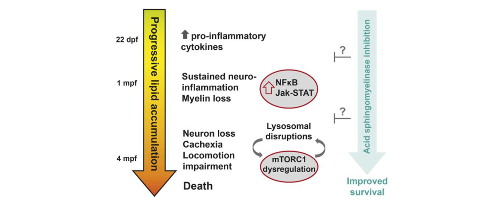

## Question

# Disease Characteristics Research Template

## Target Disease
- **Disease Name:** Combined Saposin Deficiency
- **MONDO ID:**  (if available)
- **Category:** Mendelian

## Research Objectives

Please provide a comprehensive research report on **Combined Saposin Deficiency** covering all of the
disease characteristics listed below. This report will be used to populate a disease knowledge
base entry. Be thorough and cite primary literature (PMID preferred) for all claims.

For each section, **suggested databases/resources** are listed. These are the first places
you should search for information on each topic.

---

### 1. Disease Information
> **Search first:** OMIM, Orphanet, ICD-10/ICD-11, MeSH, PubMed

- What is the disease? Provide a concise overview.
- What are the key identifiers? (OMIM, Orphanet, ICD-10/ICD-11, MeSH, Mondo)
- What are the common synonyms and alternative names?
- Is the information derived from individual patients (e.g., EHR) or aggregated disease-level resources?

### 2. Etiology

- **Disease Causal Factors**: What are the primary causes? (genetic, environmental, infectious, mechanistic)
- **Risk Factors**:
  > **Search first:** PubMed, Cochrane Library, UpToDate, clinical guidelines, ClinVar, ClinGen, GWAS Catalog, PheGenI, CTD, CDC, WHO, epidemiological databases
  - Genetic risk factors (causal variants, susceptibility loci, modifier genes)
  - Environmental risk factors (toxins, lifestyle, occupational exposures, age, sex, family history)
- **Protective Factors**:
  > **Search first:** PubMed, Cochrane Library, clinical trial databases, GWAS Catalog, gnomAD, WHO, CDC, nutrition databases
  - Genetic protective factors (protective variants, modifier alleles)
  - Environmental protective factors (diet, lifestyle, exposures that reduce risk)
- **Gene-Environment Interactions**: How do genetic and environmental factors interact to influence disease?
  > **Search first:** CTD, PubMed, PheGenI, GxE databases

### 3. Phenotypes
> **Search first:** HPO (Human Phenotype Ontology), OMIM, Orphanet, PubMed, clinicaltrials.gov, MedDRA, SNOMED CT, DECIPHER, LOINC

For each phenotype, provide:
- **Phenotype type**: symptoms, clinical signs, physical manifestations, behavioral changes, or laboratory abnormalities
  > For symptoms/signs: HPO, OMIM, Orphanet, PubMed
  > For behavioral changes: HPO, DSM, RDoC (Research Domain Criteria), PubMed
  > For laboratory abnormalities: LOINC, SNOMED CT, LabTests Online, PubMed
- **Phenotype characteristics**:
  > **Search first:** OMIM, Orphanet, HPO, PubMed
  - Age of symptom onset (neonatal, childhood, adult-onset, late-onset)
  - Symptom severity (mild, moderate, severe, variable)
  - Symptom progression (stable, progressive, episodic, fluctuating)
  - Frequency among affected individuals (percentage or qualitative)
- **Quality of life impact**: Effects on daily functioning and well-being (per-phenotype when possible)
  > **Search first:** EQ-5D database, SF-36, WHO QOL databases, PubMed
- Suggest HPO (Human Phenotype Ontology) terms for each phenotype

### 4. Genetic/Molecular Information

- **Causal Genes**: Gene mutations or chromosomal abnormalities responsible for disease (gene symbols, OMIM IDs)
  > **Search first:** OMIM, ClinVar, HGMD, Ensembl, NCBI Gene
- **Pathogenic Variants**:
  - Affected genes (gene symbols, HGNC IDs)
    > **Search first:** OMIM, NCBI Gene, Ensembl, HGNC, UniProt, GeneCards
  - Variant classification (pathogenic, likely pathogenic, VUS per ACMG/AMP guidelines)
    > **Search first:** ClinVar, ClinGen, ACMG/AMP guidelines, VarSome
  - Variant type/class (missense, frameshift, nonsense, splice-site, structural)
  - Allele frequency in population databases
    > **Search first:** gnomAD, 1000 Genomes, ExAC, TOPMed, dbSNP
  - Somatic vs germline origin
    > **Search first:** COSMIC (somatic), ClinVar, ICGC, TCGA
  - Functional consequences (loss of function, gain of function, dominant negative)
- **Modifier Genes**: Genes that modify disease severity or expression
- **Epigenetic Information**: DNA methylation, histone modifications, chromatin changes affecting disease
  > **Search first:** ENCODE, Roadmap Epigenomics, MethBase, DiseaseMeth
- **Chromosomal Abnormalities**: Large-scale genetic changes (aneuploidy, translocations, inversions)
  > **Search first:** DECIPHER, ClinVar, ECARUCA, UCSC Genome Browser

### 5. Environmental Information

- **Environmental Factors**: Non-genetic contributing factors (toxins, radiation, pollution, occupational exposure)
  > **Search first:** CTD (Comparative Toxicogenomics Database), TOXNET, PubMed, EPA databases
- **Lifestyle Factors**: Behavioral factors (smoking, diet, exercise, alcohol consumption)
  > **Search first:** CDC databases, WHO, PubMed, NHANES
- **Infectious Agents**: If applicable, pathogens causing or triggering disease (bacteria, viruses, fungi, parasites)
  > **Search first:** NCBI Taxonomy, ViPR, BV-BRC, MicrobeDB, GIDEON

### 6. Mechanism / Pathophysiology

- **Molecular Pathways**: Specific signaling cascades or biochemical pathways involved (Wnt, MAPK, mTOR, PI3K-AKT, etc.)
  > **Search first:** KEGG, Reactome, WikiPathways, PathBank, BioCyc
- **Cellular Processes**: Cell-level mechanisms (apoptosis, autophagy, cell cycle dysregulation, inflammation, etc.)
  > **Search first:** Gene Ontology (GO), Reactome, KEGG, PubMed
- **Protein Dysfunction**: How protein structure or function is altered (misfolding, aggregation, loss of function, gain of function)
  > **Search first:** UniProt, PDB (Protein Data Bank), InterPro, Pfam, AlphaFold
- **Metabolic Changes**: Alterations in metabolic processes (energy metabolism, lipid metabolism, amino acid metabolism)
  > **Search first:** KEGG, BioCyc, HMDB (Human Metabolome Database), BRENDA
- **Immune System Involvement**: Role of immune response (autoimmunity, immunodeficiency, chronic inflammation)
  > **Search first:** ImmPort, Immunome Database, IEDB, Gene Ontology
- **Tissue Damage Mechanisms**: How tissues/ are injured (oxidative stress, ischemia, fibrosis, necrosis)
  > **Search first:** PubMed, Gene Ontology, Reactome
- **Biochemical Abnormalities**: Specific molecular defects (enzyme deficiencies, receptor dysfunction, ion channel defects)
  > **Search first:** BRENDA, UniProt, KEGG, OMIM, PubMed
- **Epigenetic Changes**: DNA methylation, histone modifications affecting gene expression in disease
  > **Search first:** ENCODE, Roadmap Epigenomics, MethBase, DiseaseMeth
- **Molecular Profiling** (if available):
  - Transcriptomics/gene expression changes
    > **Search first:** GEO (Gene Expression Omnibus), ArrayExpress, GTEx, Human Cell Atlas, SRA
  - Proteomics findings
    > **Search first:** PRIDE, ProteomeXchange, Human Protein Atlas, STRING, BioGRID
  - Metabolomics signatures
    > **Search first:** MetaboLights, Metabolomics Workbench, HMDB, METLIN
  - Lipidomics alterations
    > **Search first:** LIPID MAPS, SwissLipids, LipidHome, Metabolomics Workbench
  - Genomic structural features
    > **Search first:** UCSC Genome Browser, Ensembl, NCBI, dbVar, DGV
- **Advanced Technologies** (if applicable):
  - Single-cell analysis findings (cell-type specific mechanisms, cellular heterogeneity)
    > **Search first:** Human Cell Atlas, Single Cell Portal, GEO, CELLxGENE
  - Spatial transcriptomics findings
    > **Search first:** GEO, Spatial Research, Vizgen, 10x Genomics data
  - Multi-omics integration results
    > **Search first:** TCGA, ICGC, cBioPortal, LinkedOmics, PubMed
  - Functional genomics screens (CRISPR, RNAi)
    > **Search first:** DepMap, GenomeRNAi, PubMed, BioGRID ORCS

For each mechanism, describe:
- The causal chain from initial trigger to clinical manifestation
- Which mechanisms are upstream vs downstream
- What cell types and biological processes are involved
- Suggest GO terms for biological processes and CL terms for cell types

### 7. Anatomical Structures Affected

- **Organ Level**:
  - Primary organs directly affected
  - Secondary organ involvement (complications, secondary effects)
  - Body systems involved (cardiovascular, nervous, digestive, respiratory, endocrine, etc.)
  > **Search first:** Uberon, FMA (Foundational Model of Anatomy), OMIM, HPO, ICD-11, MeSH, SNOMED CT
- **Tissue and Cell Level**:
  - Specific tissue types affected (epithelial, connective, muscle, nervous)
  - Specific cell populations targeted (with Cell Ontology terms)
  > **Search first:** Uberon, Human Protein Atlas, Cell Ontology, Human Cell Atlas, CellMarker, PanglaoDB
- **Subcellular Level**:
  - Cellular compartments involved (mitochondria, nucleus, ER, lysosomes) (with GO Cellular Component terms)
  > **Search first:** Gene Ontology (Cellular Component), UniProt, Human Protein Atlas
- **Localization**:
  - Specific anatomical sites (with UBERON terms)
    > **Search first:** FMA, Uberon, NeuroNames (for brain), SNOMED CT
  - Lateralization (unilateral, bilateral, asymmetric)
    > **Search first:** HPO, clinical literature, imaging databases

### 8. Temporal Development

- **Onset**:
  - Typical age of onset (congenital, pediatric, adult, geriatric)
  - Onset pattern (acute, subacute, chronic, insidious)
  > **Search first:** OMIM, Orphanet, HPO, PubMed
- **Progression**:
  - Disease stages (early, intermediate, advanced, end-stage)
    > **Search first:** Cancer Staging Manual (AJCC), WHO classifications, PubMed
  - Progression rate (rapid, slow, variable)
  - Disease course pattern (episodic, relapsing-remitting, progressive, stable)
  - Disease duration (self-limited, chronic lifelong)
  > **Search first:** Disease registries, longitudinal cohort databases, natural history studies, PubMed, Orphanet, OMIM
- **Patterns**:
  - Remission patterns (spontaneous, treatment-induced)
    > **Search first:** Clinical trial databases, disease registries, PubMed
  - Critical periods (time windows of vulnerability or opportunity for intervention)
    > **Search first:** PubMed, developmental biology databases, clinical guidelines

### 9. Inheritance and Population

- **Epidemiology**:
  - Prevalence (cases per 100,000 at given time)
  - Incidence (new cases per 100,000 per year)
  > **Search first:** Orphanet, CDC, WHO, GBD (Global Burden of Disease), national registries, SEER, disease registries
- **For Genetic Etiology**:
  - Inheritance pattern (AD, AR, X-linked, mitochondrial, multifactorial, polygenic)
    > **Search first:** OMIM, Orphanet, ClinVar, GTR (Genetic Testing Registry)
  - Penetrance (complete, incomplete, age-dependent)
    > **Search first:** ClinVar, OMIM, PubMed, ClinGen
  - Expressivity (variable, consistent)
    > **Search first:** OMIM, ClinVar, PubMed
  - Genetic anticipation (increasing severity in successive generations)
    > **Search first:** OMIM, PubMed (especially for repeat expansion disorders)
  - Germline mosaicism
    > **Search first:** ClinVar, OMIM, genetic counseling literature, PubMed
  - Founder effects (population-specific mutations)
    > **Search first:** gnomAD, population genetics databases, PubMed
  - Consanguinity role
    > **Search first:** OMIM, population studies, genetic counseling resources
  - Carrier frequency
    > **Search first:** gnomAD, carrier screening databases, GeneReviews, GTR
- **Population Demographics**:
  - Affected populations (ethnic or demographic groups with higher prevalence)
    > **Search first:** gnomAD, 1000 Genomes, PAGE Study, PubMed, population registries
  - Geographic distribution (endemic areas, regional variation)
    > **Search first:** WHO, CDC, GBD, Orphanet, geographic epidemiology databases
  - Geographic distribution of specific variants
  - Sex ratio (male:female)
    > **Search first:** Disease registries, OMIM, PubMed, epidemiological databases
  - Age distribution of affected individuals
    > **Search first:** CDC, disease registries, SEER, Orphanet

### 10. Diagnostics

- **Clinical Tests**:
  - Laboratory tests (blood, urine, tissue chemistry, specific enzyme assays)
    > **Search first:** LOINC, LabTests Online, PubMed
  - Biomarkers (proteins, metabolites, genetic markers, circulating biomarkers)
    > **Search first:** FDA Biomarker List, BEST (Biomarkers, EndpointS, and other Tools), PubMed
  - Imaging studies (X-ray, CT, MRI, PET, ultrasound)
    > **Search first:** RadLex, DICOM, Radiopaedia, imaging databases
  - Functional tests (pulmonary function, cardiac stress tests)
    > **Search first:** LOINC, clinical guidelines, PubMed
  - Electrophysiology (EEG, EMG, ECG, nerve conduction studies)
    > **Search first:** LOINC, clinical neurophysiology databases, PubMed
  - Biopsy findings (histopathology, immunohistochemistry)
    > **Search first:** SNOMED CT, College of American Pathologists resources, PubMed
  - Pathology findings (microscopic examination)
    > **Search first:** SNOMED CT, Digital Pathology databases, PubMed
- **Genetic Testing**:
  > **Search first:** GTR (Genetic Testing Registry), GeneReviews, ClinGen
  - Overview of recommended genetic testing approach
  - Whole genome sequencing (WGS) utility
    > **Search first:** GTR, ClinVar, GEL (Genomics England), gnomAD
  - Whole exome sequencing (WES) utility
    > **Search first:** GTR, ClinVar, OMIM, GeneMatcher
  - Gene panels (which panels, which genes)
    > **Search first:** GTR, ClinVar, laboratory-specific databases
  - Single gene testing
    > **Search first:** GTR, ClinVar, OMIM, GeneReviews
  - Chromosomal microarray (CMA)
    > **Search first:** DECIPHER, ClinVar, dbVar, ECARUCA
  - Karyotyping
    > **Search first:** Chromosome Abnormality Database, ClinVar, cytogenetics resources
  - FISH
    > **Search first:** ClinVar, cytogenetics databases, PubMed
  - Mitochondrial DNA testing
    > **Search first:** MITOMAP, MSeqDR, ClinVar, GTR
  - Repeat expansion testing
    > **Search first:** GTR, ClinVar, repeat expansion databases, PubMed
- **Omics-Based Diagnostics** (if applicable):
  - RNA sequencing / transcriptomics
    > **Search first:** GEO, ArrayExpress, GTEx, RNA-seq databases
  - Proteomics
    > **Search first:** PRIDE, ProteomeXchange, FDA Biomarker database
  - Metabolomics
    > **Search first:** MetaboLights, Metabolomics Workbench, HMDB
  - Epigenomics
    > **Search first:** GEO, ENCODE, Roadmap Epigenomics, MethBase
  - Liquid biopsy
    > **Search first:** COSMIC, ClinVar, liquid biopsy databases, PubMed
- **Clinical Criteria**:
  - Standardized diagnostic criteria (DSM, ICD, society guidelines)
    > **Search first:** DSM-5, ICD-11, clinical society guidelines, UpToDate
  - Differential diagnosis (other conditions to rule out, with distinguishing features)
    > **Search first:** DynaMed, UpToDate, clinical decision support systems
- **Screening**:
  - Screening methods for asymptomatic individuals (newborn screening, carrier screening, cascade screening)
    > **Search first:** ACMG recommendations, CDC newborn screening, GTR

### 11. Outcome/Prognosis

- **Survival and Mortality**:
  - Survival rate (5-year, 10-year, overall)
    > **Search first:** SEER, cancer registries, disease-specific registries, PubMed
  - Life expectancy (with and without treatment if applicable)
    > **Search first:** Orphanet, disease registries, actuarial databases, PubMed
  - Mortality rate
    > **Search first:** CDC, WHO, GBD, national mortality databases
  - Disease-specific mortality (deaths directly attributable to disease)
    > **Search first:** Disease registries, CDC Wonder, GBD, PubMed
- **Morbidity and Function**:
  - Morbidity (disease-related disability and health impacts)
    > **Search first:** GBD, WHO, disability databases, PubMed
  - Disability outcomes (long-term functional impairments)
    > **Search first:** ICF (International Classification of Functioning), disability registries
  - Quality of life measures (EQ-5D, SF-36, PROMIS, disease-specific tools)
    > **Search first:** EQ-5D database, SF-36, PROMIS, PubMed
- **Disease Course**:
  - Complications (secondary problems: infections, organ failure, etc.)
    > **Search first:** ICD codes, disease registries, clinical databases, PubMed
  - Recovery potential (likelihood and extent of recovery, with vs without treatment)
    > **Search first:** Natural history studies, rehabilitation databases, PubMed
- **Prediction**:
  - Prognostic factors (age, disease severity, biomarkers, treatment response)
    > **Search first:** Prognostic models databases, clinical calculators, PubMed
  - Prognostic biomarkers (molecular markers predicting disease course)
    > **Search first:** FDA Biomarker database, PubMed, cancer prognostic databases

### 12. Treatment

- **Pharmacotherapy**:
  - Pharmacological treatments (drug names, drug classes, mechanisms of action)
    > **Search first:** DrugBank, RxNorm, ATC classification, DailyMed, FDA databases
  - Pharmacogenomics (how genetic variants affect drug metabolism, efficacy, toxicity)
    > **Search first:** PharmGKB, CPIC (Clinical Pharmacogenetics), FDA Table of PGx Biomarkers
- **Advanced Therapeutics**:
  - Gene therapy (viral vectors, CRISPR, gene replacement, gene editing)
    > **Search first:** ClinicalTrials.gov, FDA gene therapy database, ASGCT resources
  - Cell therapy (stem cell transplant, CAR-T, cellular therapeutics)
    > **Search first:** ClinicalTrials.gov, FDA cell therapy database, FACT standards
  - RNA-based therapies (ASOs, siRNA, mRNA therapies)
    > **Search first:** ClinicalTrials.gov, FDA approvals, PubMed
  - Targeted therapies (treatments directed at specific molecular targets)
    > **Search first:** My Cancer Genome, OncoKB, ClinicalTrials.gov, FDA approvals
  - Immunotherapies (checkpoint inhibitors, monoclonal antibodies)
    > **Search first:** Cancer Immunotherapy Database, FDA approvals, ClinicalTrials.gov
- **Surgical and Interventional**:
  - Surgical interventions (types of surgery, timing, outcomes)
    > **Search first:** CPT codes, surgical registries, clinical guidelines, PubMed
- **Supportive and Rehabilitative**:
  - Supportive care (symptom management, pain control, nutrition)
    > **Search first:** Clinical guidelines, Cochrane Library, PubMed
  - Rehabilitation (physical therapy, occupational therapy, speech therapy)
    > **Search first:** Rehabilitation medicine databases, clinical guidelines, PubMed
- **Experimental**:
  - Experimental treatments in clinical trials (with NCT identifiers if available)
    > **Search first:** ClinicalTrials.gov, EU Clinical Trials Register, WHO ICTRP
- **Treatment Outcomes**:
  - Treatment response rates
    > **Search first:** Clinical trial databases, FDA reviews, systematic reviews, PubMed
  - Side effects and adverse events
    > **Search first:** FDA Adverse Event Reporting System (FAERS), MedWatch, PubMed
- **Treatment Strategy**:
  - Treatment algorithms (clinical pathways, decision trees)
    > **Search first:** Clinical practice guidelines, NCCN Guidelines, UpToDate
  - Combination therapies
    > **Search first:** ClinicalTrials.gov, treatment guidelines, PubMed
  - Personalized medicine approaches (genotype-guided treatment)
    > **Search first:** My Cancer Genome, CIViC, PharmGKB, precision medicine databases

For each treatment, suggest MAXO (Medical Action Ontology) terms where applicable.

### 13. Prevention

- **Prevention Levels**:
  - Primary prevention (preventing disease occurrence: vaccination, risk factor modification)
    > **Search first:** CDC, WHO, USPSTF recommendations, Cochrane Library
  - Secondary prevention (early detection and treatment: screening programs, early intervention)
    > **Search first:** USPSTF, CDC screening guidelines, WHO
  - Tertiary prevention (preventing complications in those with disease)
    > **Search first:** Clinical guidelines, disease management protocols, PubMed
- **Immunization**: Vaccine strategies (if applicable)
  > **Search first:** CDC vaccine schedules, WHO immunization, FDA vaccine database
- **Screening and Early Detection**:
  - Screening programs (population-based: newborn screening, cancer screening)
    > **Search first:** CDC screening programs, USPSTF, cancer screening databases
  - Genetic screening (carrier screening, preimplantation genetic diagnosis, prenatal testing)
    > **Search first:** ACMG recommendations, ACOG guidelines, GTR
  - Risk stratification (identifying high-risk individuals for targeted prevention)
    > **Search first:** Risk prediction models, clinical calculators, PubMed
- **Behavioral Interventions**: Lifestyle modifications to reduce risk
  > **Search first:** CDC, WHO, behavioral intervention databases, Cochrane Library
- **Counseling**: Genetic counseling (risk assessment, family planning guidance)
  > **Search first:** NSGC resources, ACMG guidelines, GeneReviews
- **Public Health**:
  - Public health interventions (sanitation, vector control, health education)
    > **Search first:** CDC, WHO, public health databases, PubMed
  - Environmental interventions (reducing environmental risk factors)
    > **Search first:** EPA databases, WHO environmental health, PubMed
- **Prophylaxis**: Preventive medications or procedures
  > **Search first:** Clinical guidelines, FDA approvals, PubMed

### 14. Other Species / Natural Disease

- **Taxonomy**: Species affected (with NCBI Taxon identifiers)
  > **Search first:** NCBI Taxonomy
- **Breed**: Specific breeds affected (with VBO identifiers if applicable)
  > **Search first:** VBO (Vertebrate Breed Ontology)
- **Gene**: Orthologous genes in other species (with NCBI Gene IDs)
  > **Search first:** NCBI Gene
- **Natural Disease**:
  - Naturally occurring disease in other species (companion animals, wildlife)
    > **Search first:** OMIA (Online Mendelian Inheritance in Animals), VetCompass, PubMed
  - Veterinary relevance and importance in animal health
    > **Search first:** OMIA, veterinary databases, PubMed
- **Comparative Biology**:
  - Comparative pathology (similarities and differences across species)
    > **Search first:** OMIA, comparative pathology databases, PubMed
  - Evolutionary conservation of disease mechanisms
    > **Search first:** HomoloGene, OrthoMCL, Alliance of Genome Resources
- **Transmission** (if applicable):
  - Zoonotic potential
    > **Search first:** CDC zoonotic diseases, WHO zoonoses, GIDEON
  - Cross-species susceptibility
    > **Search first:** NCBI Taxonomy, veterinary databases, PubMed

### 15. Model Organisms

- **Model Types**:
  - Model organism type (mammalian, invertebrate, cellular, in vitro)
    > **Search first:** Alliance of Genome Resources, model organism databases
  - Specific model systems (mouse, rat, zebrafish, Drosophila, C. elegans, yeast, cell lines, organoids, iPSCs)
    > **Search first:** MGI, RGD, ZFIN, FlyBase, WormBase, SGD, ATCC, Cellosaurus
  - Induced models (drug treatment, surgical intervention, environmental manipulation)
    > **Search first:** MGI, model organism databases, PubMed
- **Genetic Models**:
  - Types available (knockout, knock-in, transgenic, conditional, humanized)
    > **Search first:** MGI, IMPC, KOMP, EuMMCR, IMSR
- **Model Characteristics**:
  - Phenotype recapitulation (how well model reproduces human disease features)
    > **Search first:** Model organism databases, comparative studies, PubMed
  - Model limitations (aspects of human disease not captured)
    > **Search first:** Model organism databases, PubMed, review articles
- **Applications**:
  - Research applications (what aspects of disease can be studied)
    > **Search first:** Model organism databases, PubMed
- **Resources**:
  - Model databases
    > **Search first:** MGI, RGD, ZFIN, FlyBase, WormBase, IMSR, EMMA, MMRRC

---

## Citation Requirements

- Cite primary literature (PMID preferred) for all mechanistic and clinical claims
- Prioritize recent reviews and landmark papers
- Include direct quotes from abstracts where possible to support key statements
- Distinguish evidence source types: human clinical, model organism, in vitro, computational

## Output Format

Structure your response as a comprehensive narrative organized by the sections above.
For each section, provide:
- Factual content with specific details (numbers, percentages, gene names, variant nomenclature)
- Ontology term suggestions (HPO, GO, CL, UBERON, CHEBI, MAXO, MONDO) where applicable
- Evidence citations with PMIDs
- Direct quotes from abstracts to support key claims
- Clear indication when information is not available or not applicable for this disease

This report will be used to populate a disease knowledge base entry with:
- Pathophysiology descriptions with causal chains
- Gene/protein annotations (HGNC, GO terms)
- Phenotype associations (HP terms) with frequencies
- Cell type involvement (CL terms)
- Anatomical locations (UBERON terms)
- Chemical entities (CHEBI terms)
- Treatment annotations (MAXO terms)
- Evidence items with PMIDs and exact abstract quotes
- Epidemiology, prognosis, diagnostic, and prevention information
- Animal model descriptions with phenotype recapitulation details

## Output

Question: You are an expert researcher providing comprehensive, well-cited information.

Provide detailed information focusing on:
1. Key concepts and definitions with current understanding
2. Recent developments and latest research (prioritize 2023-2024 sources)
3. Current applications and real-world implementations
4. Expert opinions and analysis from authoritative sources
5. Relevant statistics and data from recent studies

Format as a comprehensive research report with proper citations. Include URLs and publication dates where available.
Always prioritize recent, authoritative sources and provide specific citations for all major claims.

# Disease Characteristics Research Template

## Target Disease
- **Disease Name:** Combined Saposin Deficiency
- **MONDO ID:**  (if available)
- **Category:** Mendelian

## Research Objectives

Please provide a comprehensive research report on **Combined Saposin Deficiency** covering all of the
disease characteristics listed below. This report will be used to populate a disease knowledge
base entry. Be thorough and cite primary literature (PMID preferred) for all claims.

For each section, **suggested databases/resources** are listed. These are the first places
you should search for information on each topic.

---

### 1. Disease Information
> **Search first:** OMIM, Orphanet, ICD-10/ICD-11, MeSH, PubMed

- What is the disease? Provide a concise overview.
- What are the key identifiers? (OMIM, Orphanet, ICD-10/ICD-11, MeSH, Mondo)
- What are the common synonyms and alternative names?
- Is the information derived from individual patients (e.g., EHR) or aggregated disease-level resources?

### 2. Etiology

- **Disease Causal Factors**: What are the primary causes? (genetic, environmental, infectious, mechanistic)
- **Risk Factors**:
  > **Search first:** PubMed, Cochrane Library, UpToDate, clinical guidelines, ClinVar, ClinGen, GWAS Catalog, PheGenI, CTD, CDC, WHO, epidemiological databases
  - Genetic risk factors (causal variants, susceptibility loci, modifier genes)
  - Environmental risk factors (toxins, lifestyle, occupational exposures, age, sex, family history)
- **Protective Factors**:
  > **Search first:** PubMed, Cochrane Library, clinical trial databases, GWAS Catalog, gnomAD, WHO, CDC, nutrition databases
  - Genetic protective factors (protective variants, modifier alleles)
  - Environmental protective factors (diet, lifestyle, exposures that reduce risk)
- **Gene-Environment Interactions**: How do genetic and environmental factors interact to influence disease?
  > **Search first:** CTD, PubMed, PheGenI, GxE databases

### 3. Phenotypes
> **Search first:** HPO (Human Phenotype Ontology), OMIM, Orphanet, PubMed, clinicaltrials.gov, MedDRA, SNOMED CT, DECIPHER, LOINC

For each phenotype, provide:
- **Phenotype type**: symptoms, clinical signs, physical manifestations, behavioral changes, or laboratory abnormalities
  > For symptoms/signs: HPO, OMIM, Orphanet, PubMed
  > For behavioral changes: HPO, DSM, RDoC (Research Domain Criteria), PubMed
  > For laboratory abnormalities: LOINC, SNOMED CT, LabTests Online, PubMed
- **Phenotype characteristics**:
  > **Search first:** OMIM, Orphanet, HPO, PubMed
  - Age of symptom onset (neonatal, childhood, adult-onset, late-onset)
  - Symptom severity (mild, moderate, severe, variable)
  - Symptom progression (stable, progressive, episodic, fluctuating)
  - Frequency among affected individuals (percentage or qualitative)
- **Quality of life impact**: Effects on daily functioning and well-being (per-phenotype when possible)
  > **Search first:** EQ-5D database, SF-36, WHO QOL databases, PubMed
- Suggest HPO (Human Phenotype Ontology) terms for each phenotype

### 4. Genetic/Molecular Information

- **Causal Genes**: Gene mutations or chromosomal abnormalities responsible for disease (gene symbols, OMIM IDs)
  > **Search first:** OMIM, ClinVar, HGMD, Ensembl, NCBI Gene
- **Pathogenic Variants**:
  - Affected genes (gene symbols, HGNC IDs)
    > **Search first:** OMIM, NCBI Gene, Ensembl, HGNC, UniProt, GeneCards
  - Variant classification (pathogenic, likely pathogenic, VUS per ACMG/AMP guidelines)
    > **Search first:** ClinVar, ClinGen, ACMG/AMP guidelines, VarSome
  - Variant type/class (missense, frameshift, nonsense, splice-site, structural)
  - Allele frequency in population databases
    > **Search first:** gnomAD, 1000 Genomes, ExAC, TOPMed, dbSNP
  - Somatic vs germline origin
    > **Search first:** COSMIC (somatic), ClinVar, ICGC, TCGA
  - Functional consequences (loss of function, gain of function, dominant negative)
- **Modifier Genes**: Genes that modify disease severity or expression
- **Epigenetic Information**: DNA methylation, histone modifications, chromatin changes affecting disease
  > **Search first:** ENCODE, Roadmap Epigenomics, MethBase, DiseaseMeth
- **Chromosomal Abnormalities**: Large-scale genetic changes (aneuploidy, translocations, inversions)
  > **Search first:** DECIPHER, ClinVar, ECARUCA, UCSC Genome Browser

### 5. Environmental Information

- **Environmental Factors**: Non-genetic contributing factors (toxins, radiation, pollution, occupational exposure)
  > **Search first:** CTD (Comparative Toxicogenomics Database), TOXNET, PubMed, EPA databases
- **Lifestyle Factors**: Behavioral factors (smoking, diet, exercise, alcohol consumption)
  > **Search first:** CDC databases, WHO, PubMed, NHANES
- **Infectious Agents**: If applicable, pathogens causing or triggering disease (bacteria, viruses, fungi, parasites)
  > **Search first:** NCBI Taxonomy, ViPR, BV-BRC, MicrobeDB, GIDEON

### 6. Mechanism / Pathophysiology

- **Molecular Pathways**: Specific signaling cascades or biochemical pathways involved (Wnt, MAPK, mTOR, PI3K-AKT, etc.)
  > **Search first:** KEGG, Reactome, WikiPathways, PathBank, BioCyc
- **Cellular Processes**: Cell-level mechanisms (apoptosis, autophagy, cell cycle dysregulation, inflammation, etc.)
  > **Search first:** Gene Ontology (GO), Reactome, KEGG, PubMed
- **Protein Dysfunction**: How protein structure or function is altered (misfolding, aggregation, loss of function, gain of function)
  > **Search first:** UniProt, PDB (Protein Data Bank), InterPro, Pfam, AlphaFold
- **Metabolic Changes**: Alterations in metabolic processes (energy metabolism, lipid metabolism, amino acid metabolism)
  > **Search first:** KEGG, BioCyc, HMDB (Human Metabolome Database), BRENDA
- **Immune System Involvement**: Role of immune response (autoimmunity, immunodeficiency, chronic inflammation)
  > **Search first:** ImmPort, Immunome Database, IEDB, Gene Ontology
- **Tissue Damage Mechanisms**: How tissues/ are injured (oxidative stress, ischemia, fibrosis, necrosis)
  > **Search first:** PubMed, Gene Ontology, Reactome
- **Biochemical Abnormalities**: Specific molecular defects (enzyme deficiencies, receptor dysfunction, ion channel defects)
  > **Search first:** BRENDA, UniProt, KEGG, OMIM, PubMed
- **Epigenetic Changes**: DNA methylation, histone modifications affecting gene expression in disease
  > **Search first:** ENCODE, Roadmap Epigenomics, MethBase, DiseaseMeth
- **Molecular Profiling** (if available):
  - Transcriptomics/gene expression changes
    > **Search first:** GEO (Gene Expression Omnibus), ArrayExpress, GTEx, Human Cell Atlas, SRA
  - Proteomics findings
    > **Search first:** PRIDE, ProteomeXchange, Human Protein Atlas, STRING, BioGRID
  - Metabolomics signatures
    > **Search first:** MetaboLights, Metabolomics Workbench, HMDB, METLIN
  - Lipidomics alterations
    > **Search first:** LIPID MAPS, SwissLipids, LipidHome, Metabolomics Workbench
  - Genomic structural features
    > **Search first:** UCSC Genome Browser, Ensembl, NCBI, dbVar, DGV
- **Advanced Technologies** (if applicable):
  - Single-cell analysis findings (cell-type specific mechanisms, cellular heterogeneity)
    > **Search first:** Human Cell Atlas, Single Cell Portal, GEO, CELLxGENE
  - Spatial transcriptomics findings
    > **Search first:** GEO, Spatial Research, Vizgen, 10x Genomics data
  - Multi-omics integration results
    > **Search first:** TCGA, ICGC, cBioPortal, LinkedOmics, PubMed
  - Functional genomics screens (CRISPR, RNAi)
    > **Search first:** DepMap, GenomeRNAi, PubMed, BioGRID ORCS

For each mechanism, describe:
- The causal chain from initial trigger to clinical manifestation
- Which mechanisms are upstream vs downstream
- What cell types and biological processes are involved
- Suggest GO terms for biological processes and CL terms for cell types

### 7. Anatomical Structures Affected

- **Organ Level**:
  - Primary organs directly affected
  - Secondary organ involvement (complications, secondary effects)
  - Body systems involved (cardiovascular, nervous, digestive, respiratory, endocrine, etc.)
  > **Search first:** Uberon, FMA (Foundational Model of Anatomy), OMIM, HPO, ICD-11, MeSH, SNOMED CT
- **Tissue and Cell Level**:
  - Specific tissue types affected (epithelial, connective, muscle, nervous)
  - Specific cell populations targeted (with Cell Ontology terms)
  > **Search first:** Uberon, Human Protein Atlas, Cell Ontology, Human Cell Atlas, CellMarker, PanglaoDB
- **Subcellular Level**:
  - Cellular compartments involved (mitochondria, nucleus, ER, lysosomes) (with GO Cellular Component terms)
  > **Search first:** Gene Ontology (Cellular Component), UniProt, Human Protein Atlas
- **Localization**:
  - Specific anatomical sites (with UBERON terms)
    > **Search first:** FMA, Uberon, NeuroNames (for brain), SNOMED CT
  - Lateralization (unilateral, bilateral, asymmetric)
    > **Search first:** HPO, clinical literature, imaging databases

### 8. Temporal Development

- **Onset**:
  - Typical age of onset (congenital, pediatric, adult, geriatric)
  - Onset pattern (acute, subacute, chronic, insidious)
  > **Search first:** OMIM, Orphanet, HPO, PubMed
- **Progression**:
  - Disease stages (early, intermediate, advanced, end-stage)
    > **Search first:** Cancer Staging Manual (AJCC), WHO classifications, PubMed
  - Progression rate (rapid, slow, variable)
  - Disease course pattern (episodic, relapsing-remitting, progressive, stable)
  - Disease duration (self-limited, chronic lifelong)
  > **Search first:** Disease registries, longitudinal cohort databases, natural history studies, PubMed, Orphanet, OMIM
- **Patterns**:
  - Remission patterns (spontaneous, treatment-induced)
    > **Search first:** Clinical trial databases, disease registries, PubMed
  - Critical periods (time windows of vulnerability or opportunity for intervention)
    > **Search first:** PubMed, developmental biology databases, clinical guidelines

### 9. Inheritance and Population

- **Epidemiology**:
  - Prevalence (cases per 100,000 at given time)
  - Incidence (new cases per 100,000 per year)
  > **Search first:** Orphanet, CDC, WHO, GBD (Global Burden of Disease), national registries, SEER, disease registries
- **For Genetic Etiology**:
  - Inheritance pattern (AD, AR, X-linked, mitochondrial, multifactorial, polygenic)
    > **Search first:** OMIM, Orphanet, ClinVar, GTR (Genetic Testing Registry)
  - Penetrance (complete, incomplete, age-dependent)
    > **Search first:** ClinVar, OMIM, PubMed, ClinGen
  - Expressivity (variable, consistent)
    > **Search first:** OMIM, ClinVar, PubMed
  - Genetic anticipation (increasing severity in successive generations)
    > **Search first:** OMIM, PubMed (especially for repeat expansion disorders)
  - Germline mosaicism
    > **Search first:** ClinVar, OMIM, genetic counseling literature, PubMed
  - Founder effects (population-specific mutations)
    > **Search first:** gnomAD, population genetics databases, PubMed
  - Consanguinity role
    > **Search first:** OMIM, population studies, genetic counseling resources
  - Carrier frequency
    > **Search first:** gnomAD, carrier screening databases, GeneReviews, GTR
- **Population Demographics**:
  - Affected populations (ethnic or demographic groups with higher prevalence)
    > **Search first:** gnomAD, 1000 Genomes, PAGE Study, PubMed, population registries
  - Geographic distribution (endemic areas, regional variation)
    > **Search first:** WHO, CDC, GBD, Orphanet, geographic epidemiology databases
  - Geographic distribution of specific variants
  - Sex ratio (male:female)
    > **Search first:** Disease registries, OMIM, PubMed, epidemiological databases
  - Age distribution of affected individuals
    > **Search first:** CDC, disease registries, SEER, Orphanet

### 10. Diagnostics

- **Clinical Tests**:
  - Laboratory tests (blood, urine, tissue chemistry, specific enzyme assays)
    > **Search first:** LOINC, LabTests Online, PubMed
  - Biomarkers (proteins, metabolites, genetic markers, circulating biomarkers)
    > **Search first:** FDA Biomarker List, BEST (Biomarkers, EndpointS, and other Tools), PubMed
  - Imaging studies (X-ray, CT, MRI, PET, ultrasound)
    > **Search first:** RadLex, DICOM, Radiopaedia, imaging databases
  - Functional tests (pulmonary function, cardiac stress tests)
    > **Search first:** LOINC, clinical guidelines, PubMed
  - Electrophysiology (EEG, EMG, ECG, nerve conduction studies)
    > **Search first:** LOINC, clinical neurophysiology databases, PubMed
  - Biopsy findings (histopathology, immunohistochemistry)
    > **Search first:** SNOMED CT, College of American Pathologists resources, PubMed
  - Pathology findings (microscopic examination)
    > **Search first:** SNOMED CT, Digital Pathology databases, PubMed
- **Genetic Testing**:
  > **Search first:** GTR (Genetic Testing Registry), GeneReviews, ClinGen
  - Overview of recommended genetic testing approach
  - Whole genome sequencing (WGS) utility
    > **Search first:** GTR, ClinVar, GEL (Genomics England), gnomAD
  - Whole exome sequencing (WES) utility
    > **Search first:** GTR, ClinVar, OMIM, GeneMatcher
  - Gene panels (which panels, which genes)
    > **Search first:** GTR, ClinVar, laboratory-specific databases
  - Single gene testing
    > **Search first:** GTR, ClinVar, OMIM, GeneReviews
  - Chromosomal microarray (CMA)
    > **Search first:** DECIPHER, ClinVar, dbVar, ECARUCA
  - Karyotyping
    > **Search first:** Chromosome Abnormality Database, ClinVar, cytogenetics resources
  - FISH
    > **Search first:** ClinVar, cytogenetics databases, PubMed
  - Mitochondrial DNA testing
    > **Search first:** MITOMAP, MSeqDR, ClinVar, GTR
  - Repeat expansion testing
    > **Search first:** GTR, ClinVar, repeat expansion databases, PubMed
- **Omics-Based Diagnostics** (if applicable):
  - RNA sequencing / transcriptomics
    > **Search first:** GEO, ArrayExpress, GTEx, RNA-seq databases
  - Proteomics
    > **Search first:** PRIDE, ProteomeXchange, FDA Biomarker database
  - Metabolomics
    > **Search first:** MetaboLights, Metabolomics Workbench, HMDB
  - Epigenomics
    > **Search first:** GEO, ENCODE, Roadmap Epigenomics, MethBase
  - Liquid biopsy
    > **Search first:** COSMIC, ClinVar, liquid biopsy databases, PubMed
- **Clinical Criteria**:
  - Standardized diagnostic criteria (DSM, ICD, society guidelines)
    > **Search first:** DSM-5, ICD-11, clinical society guidelines, UpToDate
  - Differential diagnosis (other conditions to rule out, with distinguishing features)
    > **Search first:** DynaMed, UpToDate, clinical decision support systems
- **Screening**:
  - Screening methods for asymptomatic individuals (newborn screening, carrier screening, cascade screening)
    > **Search first:** ACMG recommendations, CDC newborn screening, GTR

### 11. Outcome/Prognosis

- **Survival and Mortality**:
  - Survival rate (5-year, 10-year, overall)
    > **Search first:** SEER, cancer registries, disease-specific registries, PubMed
  - Life expectancy (with and without treatment if applicable)
    > **Search first:** Orphanet, disease registries, actuarial databases, PubMed
  - Mortality rate
    > **Search first:** CDC, WHO, GBD, national mortality databases
  - Disease-specific mortality (deaths directly attributable to disease)
    > **Search first:** Disease registries, CDC Wonder, GBD, PubMed
- **Morbidity and Function**:
  - Morbidity (disease-related disability and health impacts)
    > **Search first:** GBD, WHO, disability databases, PubMed
  - Disability outcomes (long-term functional impairments)
    > **Search first:** ICF (International Classification of Functioning), disability registries
  - Quality of life measures (EQ-5D, SF-36, PROMIS, disease-specific tools)
    > **Search first:** EQ-5D database, SF-36, PROMIS, PubMed
- **Disease Course**:
  - Complications (secondary problems: infections, organ failure, etc.)
    > **Search first:** ICD codes, disease registries, clinical databases, PubMed
  - Recovery potential (likelihood and extent of recovery, with vs without treatment)
    > **Search first:** Natural history studies, rehabilitation databases, PubMed
- **Prediction**:
  - Prognostic factors (age, disease severity, biomarkers, treatment response)
    > **Search first:** Prognostic models databases, clinical calculators, PubMed
  - Prognostic biomarkers (molecular markers predicting disease course)
    > **Search first:** FDA Biomarker database, PubMed, cancer prognostic databases

### 12. Treatment

- **Pharmacotherapy**:
  - Pharmacological treatments (drug names, drug classes, mechanisms of action)
    > **Search first:** DrugBank, RxNorm, ATC classification, DailyMed, FDA databases
  - Pharmacogenomics (how genetic variants affect drug metabolism, efficacy, toxicity)
    > **Search first:** PharmGKB, CPIC (Clinical Pharmacogenetics), FDA Table of PGx Biomarkers
- **Advanced Therapeutics**:
  - Gene therapy (viral vectors, CRISPR, gene replacement, gene editing)
    > **Search first:** ClinicalTrials.gov, FDA gene therapy database, ASGCT resources
  - Cell therapy (stem cell transplant, CAR-T, cellular therapeutics)
    > **Search first:** ClinicalTrials.gov, FDA cell therapy database, FACT standards
  - RNA-based therapies (ASOs, siRNA, mRNA therapies)
    > **Search first:** ClinicalTrials.gov, FDA approvals, PubMed
  - Targeted therapies (treatments directed at specific molecular targets)
    > **Search first:** My Cancer Genome, OncoKB, ClinicalTrials.gov, FDA approvals
  - Immunotherapies (checkpoint inhibitors, monoclonal antibodies)
    > **Search first:** Cancer Immunotherapy Database, FDA approvals, ClinicalTrials.gov
- **Surgical and Interventional**:
  - Surgical interventions (types of surgery, timing, outcomes)
    > **Search first:** CPT codes, surgical registries, clinical guidelines, PubMed
- **Supportive and Rehabilitative**:
  - Supportive care (symptom management, pain control, nutrition)
    > **Search first:** Clinical guidelines, Cochrane Library, PubMed
  - Rehabilitation (physical therapy, occupational therapy, speech therapy)
    > **Search first:** Rehabilitation medicine databases, clinical guidelines, PubMed
- **Experimental**:
  - Experimental treatments in clinical trials (with NCT identifiers if available)
    > **Search first:** ClinicalTrials.gov, EU Clinical Trials Register, WHO ICTRP
- **Treatment Outcomes**:
  - Treatment response rates
    > **Search first:** Clinical trial databases, FDA reviews, systematic reviews, PubMed
  - Side effects and adverse events
    > **Search first:** FDA Adverse Event Reporting System (FAERS), MedWatch, PubMed
- **Treatment Strategy**:
  - Treatment algorithms (clinical pathways, decision trees)
    > **Search first:** Clinical practice guidelines, NCCN Guidelines, UpToDate
  - Combination therapies
    > **Search first:** ClinicalTrials.gov, treatment guidelines, PubMed
  - Personalized medicine approaches (genotype-guided treatment)
    > **Search first:** My Cancer Genome, CIViC, PharmGKB, precision medicine databases

For each treatment, suggest MAXO (Medical Action Ontology) terms where applicable.

### 13. Prevention

- **Prevention Levels**:
  - Primary prevention (preventing disease occurrence: vaccination, risk factor modification)
    > **Search first:** CDC, WHO, USPSTF recommendations, Cochrane Library
  - Secondary prevention (early detection and treatment: screening programs, early intervention)
    > **Search first:** USPSTF, CDC screening guidelines, WHO
  - Tertiary prevention (preventing complications in those with disease)
    > **Search first:** Clinical guidelines, disease management protocols, PubMed
- **Immunization**: Vaccine strategies (if applicable)
  > **Search first:** CDC vaccine schedules, WHO immunization, FDA vaccine database
- **Screening and Early Detection**:
  - Screening programs (population-based: newborn screening, cancer screening)
    > **Search first:** CDC screening programs, USPSTF, cancer screening databases
  - Genetic screening (carrier screening, preimplantation genetic diagnosis, prenatal testing)
    > **Search first:** ACMG recommendations, ACOG guidelines, GTR
  - Risk stratification (identifying high-risk individuals for targeted prevention)
    > **Search first:** Risk prediction models, clinical calculators, PubMed
- **Behavioral Interventions**: Lifestyle modifications to reduce risk
  > **Search first:** CDC, WHO, behavioral intervention databases, Cochrane Library
- **Counseling**: Genetic counseling (risk assessment, family planning guidance)
  > **Search first:** NSGC resources, ACMG guidelines, GeneReviews
- **Public Health**:
  - Public health interventions (sanitation, vector control, health education)
    > **Search first:** CDC, WHO, public health databases, PubMed
  - Environmental interventions (reducing environmental risk factors)
    > **Search first:** EPA databases, WHO environmental health, PubMed
- **Prophylaxis**: Preventive medications or procedures
  > **Search first:** Clinical guidelines, FDA approvals, PubMed

### 14. Other Species / Natural Disease

- **Taxonomy**: Species affected (with NCBI Taxon identifiers)
  > **Search first:** NCBI Taxonomy
- **Breed**: Specific breeds affected (with VBO identifiers if applicable)
  > **Search first:** VBO (Vertebrate Breed Ontology)
- **Gene**: Orthologous genes in other species (with NCBI Gene IDs)
  > **Search first:** NCBI Gene
- **Natural Disease**:
  - Naturally occurring disease in other species (companion animals, wildlife)
    > **Search first:** OMIA (Online Mendelian Inheritance in Animals), VetCompass, PubMed
  - Veterinary relevance and importance in animal health
    > **Search first:** OMIA, veterinary databases, PubMed
- **Comparative Biology**:
  - Comparative pathology (similarities and differences across species)
    > **Search first:** OMIA, comparative pathology databases, PubMed
  - Evolutionary conservation of disease mechanisms
    > **Search first:** HomoloGene, OrthoMCL, Alliance of Genome Resources
- **Transmission** (if applicable):
  - Zoonotic potential
    > **Search first:** CDC zoonotic diseases, WHO zoonoses, GIDEON
  - Cross-species susceptibility
    > **Search first:** NCBI Taxonomy, veterinary databases, PubMed

### 15. Model Organisms

- **Model Types**:
  - Model organism type (mammalian, invertebrate, cellular, in vitro)
    > **Search first:** Alliance of Genome Resources, model organism databases
  - Specific model systems (mouse, rat, zebrafish, Drosophila, C. elegans, yeast, cell lines, organoids, iPSCs)
    > **Search first:** MGI, RGD, ZFIN, FlyBase, WormBase, SGD, ATCC, Cellosaurus
  - Induced models (drug treatment, surgical intervention, environmental manipulation)
    > **Search first:** MGI, model organism databases, PubMed
- **Genetic Models**:
  - Types available (knockout, knock-in, transgenic, conditional, humanized)
    > **Search first:** MGI, IMPC, KOMP, EuMMCR, IMSR
- **Model Characteristics**:
  - Phenotype recapitulation (how well model reproduces human disease features)
    > **Search first:** Model organism databases, comparative studies, PubMed
  - Model limitations (aspects of human disease not captured)
    > **Search first:** Model organism databases, PubMed, review articles
- **Applications**:
  - Research applications (what aspects of disease can be studied)
    > **Search first:** Model organism databases, PubMed
- **Resources**:
  - Model databases
    > **Search first:** MGI, RGD, ZFIN, FlyBase, WormBase, IMSR, EMMA, MMRRC

---

## Citation Requirements

- Cite primary literature (PMID preferred) for all mechanistic and clinical claims
- Prioritize recent reviews and landmark papers
- Include direct quotes from abstracts where possible to support key statements
- Distinguish evidence source types: human clinical, model organism, in vitro, computational

## Output Format

Structure your response as a comprehensive narrative organized by the sections above.
For each section, provide:
- Factual content with specific details (numbers, percentages, gene names, variant nomenclature)
- Ontology term suggestions (HPO, GO, CL, UBERON, CHEBI, MAXO, MONDO) where applicable
- Evidence citations with PMIDs
- Direct quotes from abstracts to support key claims
- Clear indication when information is not available or not applicable for this disease

This report will be used to populate a disease knowledge base entry with:
- Pathophysiology descriptions with causal chains
- Gene/protein annotations (HGNC, GO terms)
- Phenotype associations (HP terms) with frequencies
- Cell type involvement (CL terms)
- Anatomical locations (UBERON terms)
- Chemical entities (CHEBI terms)
- Treatment annotations (MAXO terms)
- Evidence items with PMIDs and exact abstract quotes
- Epidemiology, prognosis, diagnostic, and prevention information
- Animal model descriptions with phenotype recapitulation details

# Combined Saposin Deficiency (Combined PSAP Deficiency): Disease Characteristics Research Report

## Executive summary
Combined saposin deficiency (also called combined PSAP/prosaposin deficiency) is an ultra-rare, autosomal recessive lysosomal storage disorder caused by biallelic loss-of-function variants in **PSAP**, leading to absence of saposins A–D and impaired catabolism of multiple sphingolipids. Clinically, classic cases present neonatally/early infancy with severe neurodegeneration (often with seizures and bulbar dysfunction), hepatosplenomegaly, hematologic abnormalities, and early death. Recent work (2023) created a CRISPR zebrafish **psap** knockout model that recapitulates demyelination and shows that genetic reduction of **acid sphingomyelinase (SMPD1/smpd1)** modestly prolongs survival, supporting a mechanistically motivated therapeutic hypothesis for modulating sphingomyelin/ceramide flux in sphingolipidoses. (bhat2023combinedsaposindeficiency pages 1-2, kuchar2009prosaposindeficiencyand pages 2-3, zhang2023azebrafishmodel pages 1-3, zhang2023azebrafishmodel media d6e12bf5)

---

## 1. Disease information

### 1.1 Concise overview
Combined saposin deficiency is a lysosomal storage disorder due to **prosaposin deficiency** (loss of saposins A–D), resulting in multi-sphingolipid storage and prominent neurologic and visceral disease. In a 2023 case report, the abstract states: “**Combined saposin deficiency (OMIM #611721), an exceedingly rare lysosomal storage disorder, is caused by a mutation in the gene PSAP** … The typical manifestation … is of **severe neurological features in the neonatal period, hepatosplenomegaly, thrombocytopenia, and early death**.” (Bhat et al.; publication date: 2023-03; URL: https://doi.org/10.1016/j.mjafi.2021.01.024) (bhat2023combinedsaposindeficiency pages 1-2)

### 1.2 Key identifiers
- **OMIM:** 611721 (reported in clinical case literature) (bhat2023combinedsaposindeficiency pages 1-2)
- **MONDO:** **MONDO:0012719** (“combined PSAP deficiency”; OpenTargets disease mapping) (OpenTargets Search: Combined saposin deficiency,Prosaposin deficiency)

**Not found in the retrieved corpus:** Orphanet ORPHA ID, ICD-10/ICD-11 code, MeSH ID. These are likely available in external curated resources (e.g., Orphanet/MeSH browsers), but were not extractable from the retrieved full-text evidence in this run.

### 1.3 Synonyms and alternative names
- Combined PSAP deficiency (OpenTargets Search: Combined saposin deficiency,Prosaposin deficiency)
- Prosaposin deficiency (kuchar2009prosaposindeficiencyand pages 1-2)
- PSAP deficiency (bhat2023combinedsaposindeficiency pages 2-3)
- Combined saposin A–D deficiency / complete prosaposin deficiency (hulkova2001anovelmutation pages 1-2)

### 1.4 Evidence source type
Evidence is primarily from **individual patient case reports and small case series**, plus **model organism studies** (zebrafish) and **mechanistic reviews**. (kuchar2009prosaposindeficiencyand pages 1-2, zhang2023azebrafishmodel pages 1-3)

---

## 2. Etiology

### 2.1 Disease causal factors
- **Genetic cause:** biallelic pathogenic variants in **PSAP**, which encodes **prosaposin**, the precursor cleaved into saposins A–D (bhat2023combinedsaposindeficiency pages 1-2, kuchar2009prosaposindeficiencyand pages 1-2).
- **Mechanistic cause:** loss of saposins impairs lysosomal sphingolipid hydrolysis across multiple steps, causing combined sphingolipid storage and downstream neurodegeneration/demyelination. (hulkova2001anovelmutation pages 1-2, zhang2023azebrafishmodel pages 5-7)

### 2.2 Risk factors
- **Primary risk factor:** inheriting two pathogenic PSAP alleles (autosomal recessive). (shaimardanova2023genetherapyof pages 2-4, bhat2023combinedsaposindeficiency pages 2-3)
- Environmental or infectious risk factors are not established for causation in the retrieved evidence.

### 2.3 Protective factors / gene–environment interactions
Not established in the retrieved evidence.

---

## 3. Phenotypes

### 3.1 Core phenotype spectrum (human)
Across case literature, classic combined saposin deficiency is described as **neonatal-onset** severe neurovisceral disease.

**Neurologic phenotypes** (symptoms/signs)
- Seizures/clonic fits and refractory seizures (bhat2023combinedsaposindeficiency pages 1-2, kuchar2009prosaposindeficiencyand pages 1-2)
- Hypotonia and neurologic deterioration/regression (bhat2023combinedsaposindeficiency pages 1-2, bhat2023combinedsaposindeficiency pages 2-3)
- Bulbar dysfunction: poor suck/swallow coordination, aspiration risk, feeding difficulty requiring tube feeding (bhat2023combinedsaposindeficiency pages 1-2, bhat2023combinedsaposindeficiency pages 2-3)
- Progressive neurodegeneration and demyelination/leukodystrophy-like disease (hulkova2001anovelmutation pages 1-2, kuchar2009prosaposindeficiencyand pages 2-3)

**Visceral and hematologic phenotypes**
- Hepatosplenomegaly (bhat2023combinedsaposindeficiency pages 1-2, kuchar2009prosaposindeficiencyand pages 1-2)
- Thrombocytopenia and anemia reported (bhat2023combinedsaposindeficiency pages 1-2, li2025prosaposinamultifaceted pages 13-15)

**Dermatologic/ocular phenotypes (reported in some cases)**
- Collodion membrane/ichthyosis-like skin findings reported in one neonatal case report (bhat2023combinedsaposindeficiency pages 1-2)
- Optic disc atrophy and cherry-red spot described in PSAP-related severe infantile presentations (kuchar2009prosaposindeficiencyand pages 1-2)

**Neuroimaging/pathology**
- Reported imaging abnormalities include cortical atrophy and white matter abnormalities in case literature, with additional malformations in some cases (bhat2023combinedsaposindeficiency pages 2-3, kuchar2009prosaposindeficiencyand pages 2-3).
- Neuropathology in complete PSAP deficiency includes massive cortical neuron loss, astrocytosis, paucity of myelin, and active demyelination. (hulkova2001anovelmutation pages 1-2)

### 3.2 Age of onset, severity, progression, frequency
- **Typical onset:** neonatal / early infancy (bhat2023combinedsaposindeficiency pages 1-2, kuchar2009prosaposindeficiencyand pages 1-2).
- **Severity:** severe, progressive (bhat2023combinedsaposindeficiency pages 1-2).
- **Frequency data:** not available as robust percentages given the very small number of reported cases.

### 3.3 Quality of life impact
Given early severe neurologic impairment (seizures, feeding/respiratory failure, progressive neurodegeneration), the impact on daily functioning is profound; quantitative QoL instruments (EQ-5D/SF-36) were not reported in the retrieved evidence.

### 3.4 Suggested HPO terms (non-exhaustive)
- Seizures **HP:0001250**
- Hypotonia **HP:0001252**
- Neurodevelopmental delay **HP:0001263**
- Dysphagia / feeding difficulties **HP:0002015**
- Hepatosplenomegaly **HP:0001433**
- Thrombocytopenia **HP:0001873**
- Microcephaly **HP:0000252**
- Leukodystrophy / white matter abnormalities **HP:0002415**
- Demyelination **HP:0001298**
- Ichthyosis **HP:0008064**

(These term suggestions are ontology mappings for KB use; they are consistent with phenotypes described in the cited case reports.) (bhat2023combinedsaposindeficiency pages 1-2, kuchar2009prosaposindeficiencyand pages 1-2)

---

## 4. Genetic / molecular information

### 4.1 Causal gene and protein
- **Gene:** PSAP (prosaposin) (bhat2023combinedsaposindeficiency pages 1-2, kuchar2009prosaposindeficiencyand pages 1-2)
- **Protein/function:** Prosaposin is processed to **saposins A–D**, which are required cofactors/activators for multiple lysosomal sphingolipid hydrolases (bhat2023combinedsaposindeficiency pages 1-2, kuchar2009prosaposindeficiencyand pages 1-2).

### 4.2 Pathogenic variants (examples from primary literature)
Representative pathogenic variants (case-based; not exhaustive):
- **Frameshift deletion:** PSAP **c.803delG** causing premature stop and complete deficiency (Hulkova et al., 2001; publication date 2001-04; URL: https://doi.org/10.1093/hmg/10.9.927) (hulkova2001anovelmutation pages 1-2)
- **Splice-acceptor variant:** homozygous splice-acceptor mutation upstream of **exon 10** leading to premature stop/low transcript (Kuchař et al., 2009; publication date 2009-03; URL: https://doi.org/10.1002/ajmg.a.32712) (kuchar2009prosaposindeficiencyand pages 1-2)
- **Truncating frameshift:** **c.1419_1422delCTTC (p.Phe474fsTer3)** reported homozygous in a neonatal case with early fatality (Bhat et al., 2023; URL: https://doi.org/10.1016/j.mjafi.2021.01.024) (bhat2023combinedsaposindeficiency pages 2-3)

### 4.3 Variant classes and functional consequence
- Predominantly **loss-of-function** (frameshift/stop-gain/splice-disrupting) variants yielding absence of all four saposins. (bhat2023combinedsaposindeficiency pages 2-3, hulkova2001anovelmutation pages 1-2)

### 4.4 Inheritance
- **Autosomal recessive** is explicitly listed in a 2023 sphingolipidosis gene-therapy review table for combined saposin deficiency (PSAP; OMIM 611721). (shaimardanova2023genetherapyof pages 2-4)
- Consistent with biallelic pathogenic variants in reported cases. (bhat2023combinedsaposindeficiency pages 2-3)

### 4.5 Modifier genes / epigenetics / chromosomal abnormalities
Not established for combined saposin deficiency in the retrieved evidence.

---

## 5. Environmental information
No established environmental/lifestyle/infectious causal contributors were identified in the retrieved evidence; the disorder is primarily monogenic. (shaimardanova2023genetherapyof pages 2-4)

---

## 6. Mechanism / pathophysiology

### 6.1 Causal chain (upstream → downstream)
**Upstream trigger:** biallelic PSAP loss-of-function → prosaposin deficiency → absence of saposins A–D (hulkova2001anovelmutation pages 1-2).

**Primary biochemical defect:** failed activation/assistance of multiple lysosomal sphingolipid hydrolases → impaired degradation of diverse sphingolipids and glycosphingolipids, including lactosylceramide and glucosylceramide (hulkova2001anovelmutation pages 7-8, hulkova2001anovelmutation pages 1-2).

**Downstream cellular/tissue consequences:** multi-lipid storage in neurons and visceral tissues, with prominent **myelin loss/demyelination**, neurodegeneration, and neuroinflammatory responses; systemic storage can involve liver and other viscera. (zhang2023azebrafishmodel pages 5-7, hulkova2001anovelmutation pages 1-2)

### 6.2 Biochemical abnormalities (human pathology and model organism data)
**Human (complete PSAP deficiency):** storage includes (dominant) lactosylceramide and multiple other sphingolipids/glycosphingolipids (GlcCer, Gb3, sulphatides, ceramides; globotetraosylceramide also reported), with demyelination supported by cholesterol ester accumulation in glial phagocytes and myelin paucity. (hulkova2001anovelmutation pages 1-2, hulkova2001anovelmutation pages 8-9)

**Zebrafish psap KO (2023):** untargeted lipidomics show marked increases in lactosylceramide and **hexosylsphingosine**, with additional increases in ceramide and sphingomyelin; pathology shows widespread CNS myelin loss and liver foamy storage clusters. (Zhang et al., publication date 2023-06; URL: https://doi.org/10.1242/dmm.049995) (zhang2023azebrafishmodel pages 3-5, zhang2023azebrafishmodel pages 5-7)

### 6.3 Inflammation and signaling (2023 development)
In the zebrafish model, **proinflammatory cytokines rise before mbpa (myelin basic protein a) loss**, followed by NFκB/Jak-Stat activation and microglial activation coincident with onset of myelin loss; astrocyte activation and neuronal loss occur later. (zhang2023azebrafishmodel pages 9-11)

### 6.4 Cell types and ontology suggestions
**Key cell types implicated (based on zebrafish marker data and human pathology):**
- Microglia (activated during early disease in zebrafish): **CL:0000129** (zhang2023azebrafishmodel pages 9-11)
- Astrocytes (gfap activation later): **CL:0000127** (zhang2023azebrafishmodel pages 9-11)
- Oligodendrocyte lineage dysfunction (mbpa decline without lineage marker loss): oligodendrocyte **CL:0000128**; oligodendrocyte progenitor cell **CL:0002453** (zhang2023azebrafishmodel pages 5-7, zhang2023azebrafishmodel pages 9-11)
- Neurons (progressive loss in zebrafish; neuronal storage/loss in human pathology): **CL:0000540** (hulkova2001anovelmutation pages 1-2, zhang2023azebrafishmodel pages 9-11)

**GO biological process term suggestions** (mechanistically aligned):
- Lysosomal lumen / lysosome: **GO:0005764** (lysosome; cellular component)
- Sphingolipid catabolic process: **GO:0046512**
- Glycosphingolipid catabolic process: **GO:0006687**
- Myelination: **GO:0042552**
- Neuroinflammatory response / inflammatory response: **GO:0006954**
- NF-κB signaling: **GO:0043122**
- JAK-STAT cascade: **GO:0007259**

**CHEBI term suggestions (stored lipids; examples):**
- Lactosylceramide (CHEBI term exists; specific identifier not retrieved in this run)
- Glucosylceramide
- Glucosylsphingosine
- Ceramide
- Sphingomyelin
- Sulfatide

(Only lipid names are directly supported in evidence; mapping to specific CHEBI IDs would require a CHEBI lookup resource not available in this tool run.) (hulkova2001anovelmutation pages 1-2, zhang2023azebrafishmodel pages 5-7)

### 6.5 Recent mechanistic figure evidence
Zhang et al. 2023 provides a schematic of disease progression and a survival curve demonstrating that **smpd1 (acid sphingomyelinase) loss rescues shortened lifespan** in psap mutant zebrafish. (zhang2023azebrafishmodel media d6e12bf5, zhang2023azebrafishmodel media 93708f73)

---

## 7. Anatomical structures affected

### 7.1 Organ/system level (supported by human and zebrafish evidence)
- **Central nervous system / brain white matter** (demyelination, neuronal loss) (hulkova2001anovelmutation pages 1-2, zhang2023azebrafishmodel pages 5-7)
- **Liver and spleen** (hepatosplenomegaly; foamy storage clusters in zebrafish liver; visceral storage in human pathology) (bhat2023combinedsaposindeficiency pages 1-2, zhang2023azebrafishmodel pages 5-7, hulkova2001anovelmutation pages 1-2)

**UBERON term suggestions**
- Brain: **UBERON:0000955**
- Central nervous system: **UBERON:0001017**
- Liver: **UBERON:0002107**
- Spleen: **UBERON:0002106**

### 7.2 Subcellular localization
- Lysosome is the primary affected compartment (functional deficiency in lysosomal lipid degradation). (zhang2023azebrafishmodel pages 1-3, hulkova2001anovelmutation pages 1-2)

---

## 8. Temporal development

### 8.1 Onset
- Most described as **neonatal** onset with severe manifestations. (bhat2023combinedsaposindeficiency pages 1-2, kuchar2009prosaposindeficiencyand pages 1-2)

### 8.2 Progression/course
- **Progressive neurodegeneration** with severe early course; death in infancy is common in classic presentations. (bhat2023combinedsaposindeficiency pages 1-2, kuchar2009prosaposindeficiencyand pages 2-3)

---

## 9. Inheritance and population

### 9.1 Epidemiology
Quantitative prevalence/incidence estimates were not identified in the retrieved evidence.

The disorder is described as extremely rare with **“less than 10 cases reported in worldwide literature”** in a 2023 case report. (bhat2023combinedsaposindeficiency pages 1-2)

### 9.2 Consanguinity/founder effects
- One 2023 Indian neonatal case was explicitly from a **non-consanguineous** marriage. (bhat2023combinedsaposindeficiency pages 1-2)
- Some PSAP-related disorders are reported in consanguineous families in the broader PSAP literature referenced by a 2024 review, but specific founder mutations/carrier frequencies for combined saposin deficiency were not extractable from the retrieved text. (pavan2024deficiencyofglucocerebrosidase pages 17-18)

---

## 10. Diagnostics

### 10.1 Clinical tests and biomarkers (real-world implementations)
**Enzyme activity assays**
A neonatal combined saposin deficiency case reported reduced lysosomal enzyme activities (skin fibroblasts), including **β-glucosidase** and **β-galactocerebrosidase**, supporting the diagnosis. (bhat2023combinedsaposindeficiency pages 1-2)

**Urinary sphingolipids**
Kuchař et al. 2009 emphasizes that “**Screening for urinary sphingolipids was crucial to the diagnosis** … with electrospray ionization tandem mass spectrometry also providing quantification,” with multiple sphingolipids elevated and **Gb3** showing the greatest increase. (publication date 2009-03; URL: https://doi.org/10.1002/ajmg.a.32712) (kuchar2009prosaposindeficiencyand pages 1-2)

**Plasma lyso-lipids and macrophage activation markers (2024 update)**
A 2024 study comparing PSAP- and SCARB2-mediated GCase deficiency reports that **plasma glucosylsphingosine and chitotriosidase** are increased in PSAP-related cases (similar to GBA1-linked Gaucher disease), while SCARB2 deficiency showed only glucosylsphingosine elevation. (publication date 2024-06-16; URL: https://doi.org/10.3390/ijms25126615) (pavan2024deficiencyofglucocerebrosidase pages 1-2)

### 10.2 Genetic testing
- **Clinical exome sequencing** with **Sanger confirmation** in proband and parents was used in a 2023 case report. (bhat2023combinedsaposindeficiency pages 2-3)
- Given ultra-rarity and phenotypic overlap with other sphingolipidoses/leukodystrophies, WES/WGS or broad lysosomal disorder panels are practical approaches; this is consistent with case-based implementation but no formal guideline was found in the retrieved evidence.

### 10.3 Differential diagnosis
Key differentials include other sphingolipidoses and leukodystrophies with overlapping features:
- Metachromatic leukodystrophy (including activator-deficient forms) (kuchar2009prosaposindeficiencyand pages 1-2)
- Krabbe disease, Gaucher disease, Farber disease (via saposin–enzyme relationships) (bhat2023combinedsaposindeficiency pages 1-2)

### 10.4 Screening (newborn, carrier, cascade)
No evidence of routine newborn screening inclusion for PSAP deficiency was found in the retrieved corpus.

---

## 11. Outcome / prognosis

### 11.1 Mortality and survival statistics (case-based)
- A neonatal PSAP deficiency case in Kuchař et al. died at **55 days** after repeated pulmonary infections. (kuchar2009prosaposindeficiencyand pages 2-3)
- A 2023 neonatal case died at **5 months** (sepsis/multiorgan failure described). (bhat2023combinedsaposindeficiency pages 2-3)

Systematic survival statistics (e.g., Kaplan–Meier from cohorts) are not available due to extreme rarity.

---

## 12. Treatment

### 12.1 Current real-world management
Published case reports describe **supportive care**, including respiratory support, feeding support (tube/orogastric), anti-seizure management, skin care (emollients), and infection/sepsis management. (bhat2023combinedsaposindeficiency pages 1-2, bhat2023combinedsaposindeficiency pages 2-3)

### 12.2 Experimental / emerging therapeutic directions (2023–2024)
**Model-organism therapeutic hypothesis (acid sphingomyelinase modulation)**
- In a 2023 zebrafish model, pharmacologic **monomethylfumarate (MMF)** did not prolong lifespan, but genetic reduction of **acid sphingomyelinase (smpd1)** did, suggesting **SMPD1/acid sphingomyelinase** as a potential target. (zhang2023azebrafishmodel pages 9-11, zhang2023azebrafishmodel media d6e12bf5)

**Gene therapy and other platform approaches (review-level)**
- A 2023 review of gene therapy for sphingolipid metabolic disorders lists general therapeutic modalities used across sphingolipidoses—**ERT, SRT, molecular chaperones, HSCT/BMT, supportive care, and gene therapy**—and classifies combined saposin deficiency (PSAP; OMIM 611721) as an “extremely rare” fatal nervous-system disorder. (publication date 2023-02; URL: https://doi.org/10.3390/ijms24043627) (shaimardanova2023genetherapyof pages 2-4)

**Clinical trials**
No PSAP/prosaposin deficiency-specific interventional trials were identified in the ClinicalTrials.gov search performed in this run.

### 12.3 MAXO term suggestions
- Supportive care: **MAXO:0000747** (supportive care)
- Enteral feeding / tube feeding: **MAXO:0000660** (enteral nutrition; term mapping may vary by MAXO version)
- Respiratory support / ventilation: **MAXO:0000506** (ventilatory support; term mapping may vary)
- Genetic counseling: **MAXO:0000079** (genetic counseling)
- Potential future: gene therapy: **MAXO:0000127**

(MAXO IDs may require verification against the current MAXO release; included here as KB-oriented suggestions.)

---

## 13. Prevention
- **Primary prevention:** not applicable in the usual sense, but **carrier testing**, **prenatal diagnosis**, and **genetic counseling** are relevant due to AR inheritance. A case report explicitly notes genetic counseling for future pregnancies. (bhat2023combinedsaposindeficiency pages 1-2)
- No population newborn screening evidence was found in the retrieved sources.

---

## 14. Other species / natural disease
No naturally occurring veterinary disease reports were identified in the retrieved evidence.

---

## 15. Model organisms

### 15.1 Zebrafish psap knockout (2023; major recent development)
A CRISPR-Cas9 zebrafish model of combined saposin deficiency (psap KO) recapitulates key lysosomal storage pathology, with progressive myelin loss and reduced lifespan. The abstract states: “**psap zebrafish recapitulated major LSD pathologies including reduced lifespan, lipid storage, impaired locomotion, and severe myelin loss** …” and further, “**Smpd1 mutagenesis, but not MMF, prolonged lifespan in psap zebrafish**…”. (publication date 2023-06; URL: https://doi.org/10.1242/dmm.049995) (zhang2023azebrafishmodel pages 1-3)

This model is a practical platform for mechanistic dissection (neuroinflammation → myelin loss) and therapeutic screening, and provides in vivo evidence supporting SMPD1 as a candidate modifier/target. (zhang2023azebrafishmodel pages 9-11, zhang2023azebrafishmodel media d6e12bf5)

---

## Key structured summary table
| Category | Summary |
|---|---|
| Disease / identifiers | **Combined saposin deficiency**; **MONDO:** MONDO:0012719 (combined PSAP deficiency); **OMIM:** 611721 (OpenTargets Search: Combined saposin deficiency,Prosaposin deficiency, bhat2023combinedsaposindeficiency pages 1-2) |
| Common synonyms | **Prosaposin deficiency**, **PSAP deficiency**, **combined PSAP deficiency**, **combined saposin A/B/C/D deficiency**, **complete prosaposin deficiency** (hulkova2001anovelmutation pages 1-2, kuchar2009prosaposindeficiencyand pages 1-2, kuchar2009prosaposindeficiencyand pages 2-3) |
| Causal gene | **PSAP** (prosaposin), encoding the precursor cleaved into saposins **A–D**; loss of both null alleles causes absence of all four saposins (bhat2023combinedsaposindeficiency pages 2-3, bhat2023combinedsaposindeficiency pages 1-2, hulkova2001anovelmutation pages 1-2) |
| Inheritance | **Autosomal recessive**; reported affected individuals are typically **biallelic/homozygous** or compound heterozygous for pathogenic PSAP variants (bhat2023combinedsaposindeficiency pages 2-3, bhat2023combinedsaposindeficiency pages 1-2, kuchar2009prosaposindeficiencyand pages 1-2, kuchar2009prosaposindeficiencyand pages 2-3) |
| Typical onset | Usually **neonatal/early infantile** with severe presentation; literature describes it as a relatively uniform neonatal disease, though rare later childhood presentations have been reported (bhat2023combinedsaposindeficiency pages 1-2, kuchar2009prosaposindeficiencyand pages 1-2, kuchar2009prosaposindeficiencyand pages 2-3, bhat2023combinedsaposindeficiency pages 2-3) |
| Key neurologic phenotypes | Severe neurologic disease with **hypotonia**, **seizures/myoclonus**, **poor suck/swallow**, **apnea/respiratory distress**, **developmental delay/regression**, **ataxia/extrapyramidal signs**, and profound neurodegeneration/demyelination (bhat2023combinedsaposindeficiency pages 1-2, kuchar2009prosaposindeficiencyand pages 1-2, kuchar2009prosaposindeficiencyand pages 2-3, hulkova2001anovelmutation pages 1-2, zhang2023azebrafishmodel pages 1-3) |
| Key visceral / hematologic phenotypes | **Hepatosplenomegaly**, elevated liver enzymes, **thrombocytopenia**, anemia; neurovisceral dystrophy is characteristic in classic neonatal cases (bhat2023combinedsaposindeficiency pages 1-2, kuchar2009prosaposindeficiencyand pages 1-2, kuchar2009prosaposindeficiencyand pages 2-3) |
| Skin / eye / other phenotypes | **Ichthyosis** reported in at least one neonatal case; **cherry-red spots** and optic disc atrophy reported in PSAP-related severe infantile presentations (bhat2023combinedsaposindeficiency pages 1-2, kuchar2009prosaposindeficiencyand pages 1-2) |
| Imaging / pathology | Brain MRI/neuropathology may show **cortical atrophy**, **white-matter abnormalities/demyelination**, **gray-matter heterotopias**, **abnormal gyration**, **thin corpus callosum**, paucity of myelin, active demyelination, neuronal loss, and astrocytosis (bhat2023combinedsaposindeficiency pages 2-3, bhat2023combinedsaposindeficiency pages 1-2, hulkova2001anovelmutation pages 1-2, kuchar2009prosaposindeficiencyand pages 2-3) |
| Core mechanism | Loss of saposins A–D disrupts lysosomal sphingolipid degradation, causing accumulation of multiple sphingolipids (notably **lactosylceramide**, **glucosylceramide**, **globotriaosylceramide**, **sulfatides**, **ceramides**) with downstream neuroinflammation and myelin loss (hulkova2001anovelmutation pages 1-2, zhang2023azebrafishmodel pages 3-5, pavan2024deficiencyofglucocerebrosidase pages 1-2) |
| Enzyme assays / biochemical clues | Reduced lysosomal enzyme activities can be seen despite intact enzyme genes, e.g. low **β-glucosidase/GCase** and **β-galactocerebrosidase**; PSAP-linked GCase deficiency may show elevated **chitotriosidase** (bhat2023combinedsaposindeficiency pages 1-2, pavan2024deficiencyofglucocerebrosidase pages 1-2) |
| Urinary sphingolipid findings | **Urinary sphingolipid analysis** (TLC or ESI-MS/MS) is a key real-world diagnostic tool; multiple sphingolipids are elevated, with **globotriaosylceramide (Gb3)** reported as markedly increased in one neonatal pSap-d case (kuchar2009prosaposindeficiencyand pages 1-2, kuchar2009prosaposindeficiencyand pages 2-3) |
| Plasma lyso-lipid / biomarker findings | **Plasma glucosylsphingosine (lyso-GL1)** and **chitotriosidase** can be elevated in PSAP deficiency; experimental/cellular work also implicates **Lyso-Gb3** as elevated in PSAP-knockout models (pavan2024deficiencyofglucocerebrosidase pages 1-2, bhat2023combinedsaposindeficiency pages 1-2) |
| Example pathogenic variants | Reported case variants include **c.803delG** (frameshift, premature stop) (hulkova2001anovelmutation pages 1-2); **splice acceptor mutation upstream of exon 10** causing premature stop/low transcript (kuchar2009prosaposindeficiencyand pages 1-2); **c.1419_1422delCTTC, p.Phe474fs** null allele (bhat2023combinedsaposindeficiency pages 2-3); **c.G1228T, p.Glu410Ter** (kuchar2009prosaposindeficiencyand pages 1-2) |
| Reported outcomes / prognosis | Prognosis is generally **poor** in classic combined deficiency: several neonatal/infantile cases died in the **neonatal period**, at **55 days**, by **4 months**, or by **5 months** from respiratory failure, infections, sepsis, or multiorgan failure (bhat2023combinedsaposindeficiency pages 1-2, kuchar2009prosaposindeficiencyand pages 1-2, kuchar2009prosaposindeficiencyand pages 2-3, bhat2023combinedsaposindeficiency pages 2-3) |
| Current treatment / implementation | No disease-specific approved therapy identified; management is largely **supportive** (antiepileptics, respiratory support, tube/gastrostomy feeding, skin care). A 2023 zebrafish model suggested **acid sphingomyelinase/SMPD1 modulation** as a potential therapeutic target, while **monomethyl fumarate** did not improve survival in that model (bhat2023combinedsaposindeficiency pages 1-2, zhang2023azebrafishmodel pages 1-3, zhang2023azebrafishmodel pages 9-11, zhang2023azebrafishmodel media d6e12bf5) |

*Table: This table condenses the most useful clinical, molecular, diagnostic, and prognostic facts about combined saposin deficiency/combined PSAP deficiency from case reports and recent mechanistic studies. It is designed as a quick-reference artifact for a disease knowledge base entry.*

---

## Limitations of this evidence package
- Orphanet/ICD/MeSH identifiers, prevalence/incidence estimates, and carrier frequencies were not retrievable from the available full-text evidence in this tool run.
- Many conclusions necessarily rely on small numbers of case reports due to ultra-rarity; phenotype frequencies and treatment effect sizes are therefore not robustly quantifiable.

---

## References (URLs and publication dates)
1. Bhat V, et al. *Combined saposin deficiency: A rare occurrence.* **Medical Journal Armed Forces India**. Publication date: **2023-03** (article history shows acceptance 2021-01-23). https://doi.org/10.1016/j.mjafi.2021.01.024 (bhat2023combinedsaposindeficiency pages 1-2)
2. Kuchař L, et al. *Prosaposin deficiency and saposin B deficiency…* **Am J Med Genet A**. Publication date: **2009-03**. https://doi.org/10.1002/ajmg.a.32712 (kuchar2009prosaposindeficiencyand pages 1-2)
3. Hulkova H, et al. *A novel mutation… complete deficiency of prosaposin and saposins…* **Human Molecular Genetics**. Publication date: **2001-04**. https://doi.org/10.1093/hmg/10.9.927 (hulkova2001anovelmutation pages 1-2)
4. Zhang T, et al. *A zebrafish model of combined saposin deficiency identifies acid sphingomyelinase as a potential therapeutic target.* **Disease Models & Mechanisms**. Publication date: **2023-06**. https://doi.org/10.1242/dmm.049995 (zhang2023azebrafishmodel pages 1-3)
5. Pavan E, et al. *Deficiency of Glucocerebrosidase Activity beyond Gaucher Disease: PSAP and LIMP-2 Dysfunctions.* **Int J Mol Sci**. Publication date: **2024-06-16**. https://doi.org/10.3390/ijms25126615 (pavan2024deficiencyofglucocerebrosidase pages 1-2)
6. Shaimardanova AA, et al. *Gene Therapy of Sphingolipid Metabolic Disorders.* **Int J Mol Sci**. Publication date: **2023-02**. https://doi.org/10.3390/ijms24043627 (shaimardanova2023genetherapyof pages 2-4)

References

1. (bhat2023combinedsaposindeficiency pages 1-2): Vivek Bhat, R.W. Thergaonkar, Manisha Thakur, and T. Rajkamal. Combined saposin deficiency: a rare occurrence. Medical Journal Armed Forces India, 79:238-240, Mar 2023. URL: https://doi.org/10.1016/j.mjafi.2021.01.024, doi:10.1016/j.mjafi.2021.01.024. This article has 3 citations.

2. (kuchar2009prosaposindeficiencyand pages 2-3): Ladislav Kuchař, Jana Ledvinová, Martin Hřebíček, Helena Myšková, Lenka Dvořáková, Linda Berná, Petr Chrastina, Befekadu Asfaw, Milan Elleder, Margret Petermöller, Heidi Mayrhofer, Martin Staudt, Ingeborg Krägeloh‐Mann, Barbara C. Paton, and Klaus Harzer. Prosaposin deficiency and saposin b deficiency (activator‐deficient metachromatic leukodystrophy): report on two patients detected by analysis of urinary sphingolipids and carrying novel psap gene mutations. American Journal of Medical Genetics Part A, 149A:613-621, Mar 2009. URL: https://doi.org/10.1002/ajmg.a.32712, doi:10.1002/ajmg.a.32712. This article has 104 citations.

3. (zhang2023azebrafishmodel pages 1-3): Tejia Zhang, Ivy Alonzo, Chris Stubben, Yijie Geng, Chelsea Herdman, Nancy Chandler, Kim P. Doane, Brock R. Pluimer, Sunia A. Trauger, and Randall T. Peterson. A zebrafish model of combined saposin deficiency identifies acid sphingomyelinase as a potential therapeutic target. Disease Models &amp; Mechanisms, Jun 2023. URL: https://doi.org/10.1242/dmm.049995, doi:10.1242/dmm.049995. This article has 14 citations and is from a domain leading peer-reviewed journal.

4. (zhang2023azebrafishmodel media d6e12bf5): Tejia Zhang, Ivy Alonzo, Chris Stubben, Yijie Geng, Chelsea Herdman, Nancy Chandler, Kim P. Doane, Brock R. Pluimer, Sunia A. Trauger, and Randall T. Peterson. A zebrafish model of combined saposin deficiency identifies acid sphingomyelinase as a potential therapeutic target. Disease Models &amp; Mechanisms, Jun 2023. URL: https://doi.org/10.1242/dmm.049995, doi:10.1242/dmm.049995. This article has 14 citations and is from a domain leading peer-reviewed journal.

5. (OpenTargets Search: Combined saposin deficiency,Prosaposin deficiency): Open Targets Query (Combined saposin deficiency,Prosaposin deficiency, 14 results). Buniello, A. et al. (2025). Open Targets Platform: facilitating therapeutic hypotheses building in drug discovery. Nucleic Acids Research.

6. (kuchar2009prosaposindeficiencyand pages 1-2): Ladislav Kuchař, Jana Ledvinová, Martin Hřebíček, Helena Myšková, Lenka Dvořáková, Linda Berná, Petr Chrastina, Befekadu Asfaw, Milan Elleder, Margret Petermöller, Heidi Mayrhofer, Martin Staudt, Ingeborg Krägeloh‐Mann, Barbara C. Paton, and Klaus Harzer. Prosaposin deficiency and saposin b deficiency (activator‐deficient metachromatic leukodystrophy): report on two patients detected by analysis of urinary sphingolipids and carrying novel psap gene mutations. American Journal of Medical Genetics Part A, 149A:613-621, Mar 2009. URL: https://doi.org/10.1002/ajmg.a.32712, doi:10.1002/ajmg.a.32712. This article has 104 citations.

7. (bhat2023combinedsaposindeficiency pages 2-3): Vivek Bhat, R.W. Thergaonkar, Manisha Thakur, and T. Rajkamal. Combined saposin deficiency: a rare occurrence. Medical Journal Armed Forces India, 79:238-240, Mar 2023. URL: https://doi.org/10.1016/j.mjafi.2021.01.024, doi:10.1016/j.mjafi.2021.01.024. This article has 3 citations.

8. (hulkova2001anovelmutation pages 1-2): H Hulkova, M Cervenkova, and J Ledvinova. A novel mutation in the coding region of the prosaposin gene leads to a complete deficiency of prosaposin and saposins, and is associated with a complex sphingolipidosis dominated by lactosylceramide accumulation. Human Molecular Genetics, 10:927-940, Apr 2001. URL: https://doi.org/10.1093/hmg/10.9.927, doi:10.1093/hmg/10.9.927. This article has 139 citations and is from a domain leading peer-reviewed journal.

9. (zhang2023azebrafishmodel pages 5-7): Tejia Zhang, Ivy Alonzo, Chris Stubben, Yijie Geng, Chelsea Herdman, Nancy Chandler, Kim P. Doane, Brock R. Pluimer, Sunia A. Trauger, and Randall T. Peterson. A zebrafish model of combined saposin deficiency identifies acid sphingomyelinase as a potential therapeutic target. Disease Models &amp; Mechanisms, Jun 2023. URL: https://doi.org/10.1242/dmm.049995, doi:10.1242/dmm.049995. This article has 14 citations and is from a domain leading peer-reviewed journal.

10. (shaimardanova2023genetherapyof pages 2-4): Alisa A. Shaimardanova, Valeriya V. Solovyeva, Shaza S. Issa, and Albert A. Rizvanov. Gene therapy of sphingolipid metabolic disorders. International Journal of Molecular Sciences, 24:3627, Feb 2023. URL: https://doi.org/10.3390/ijms24043627, doi:10.3390/ijms24043627. This article has 34 citations.

11. (li2025prosaposinamultifaceted pages 13-15): Xin Li and Liang Guo. Prosaposin: a multifaceted protein orchestrating biological processes and diseases. Cells, 14:1131, Jul 2025. URL: https://doi.org/10.3390/cells14151131, doi:10.3390/cells14151131. This article has 10 citations.

12. (hulkova2001anovelmutation pages 7-8): H Hulkova, M Cervenkova, and J Ledvinova. A novel mutation in the coding region of the prosaposin gene leads to a complete deficiency of prosaposin and saposins, and is associated with a complex sphingolipidosis dominated by lactosylceramide accumulation. Human Molecular Genetics, 10:927-940, Apr 2001. URL: https://doi.org/10.1093/hmg/10.9.927, doi:10.1093/hmg/10.9.927. This article has 139 citations and is from a domain leading peer-reviewed journal.

13. (hulkova2001anovelmutation pages 8-9): H Hulkova, M Cervenkova, and J Ledvinova. A novel mutation in the coding region of the prosaposin gene leads to a complete deficiency of prosaposin and saposins, and is associated with a complex sphingolipidosis dominated by lactosylceramide accumulation. Human Molecular Genetics, 10:927-940, Apr 2001. URL: https://doi.org/10.1093/hmg/10.9.927, doi:10.1093/hmg/10.9.927. This article has 139 citations and is from a domain leading peer-reviewed journal.

14. (zhang2023azebrafishmodel pages 3-5): Tejia Zhang, Ivy Alonzo, Chris Stubben, Yijie Geng, Chelsea Herdman, Nancy Chandler, Kim P. Doane, Brock R. Pluimer, Sunia A. Trauger, and Randall T. Peterson. A zebrafish model of combined saposin deficiency identifies acid sphingomyelinase as a potential therapeutic target. Disease Models &amp; Mechanisms, Jun 2023. URL: https://doi.org/10.1242/dmm.049995, doi:10.1242/dmm.049995. This article has 14 citations and is from a domain leading peer-reviewed journal.

15. (zhang2023azebrafishmodel pages 9-11): Tejia Zhang, Ivy Alonzo, Chris Stubben, Yijie Geng, Chelsea Herdman, Nancy Chandler, Kim P. Doane, Brock R. Pluimer, Sunia A. Trauger, and Randall T. Peterson. A zebrafish model of combined saposin deficiency identifies acid sphingomyelinase as a potential therapeutic target. Disease Models &amp; Mechanisms, Jun 2023. URL: https://doi.org/10.1242/dmm.049995, doi:10.1242/dmm.049995. This article has 14 citations and is from a domain leading peer-reviewed journal.

16. (zhang2023azebrafishmodel media 93708f73): Tejia Zhang, Ivy Alonzo, Chris Stubben, Yijie Geng, Chelsea Herdman, Nancy Chandler, Kim P. Doane, Brock R. Pluimer, Sunia A. Trauger, and Randall T. Peterson. A zebrafish model of combined saposin deficiency identifies acid sphingomyelinase as a potential therapeutic target. Disease Models &amp; Mechanisms, Jun 2023. URL: https://doi.org/10.1242/dmm.049995, doi:10.1242/dmm.049995. This article has 14 citations and is from a domain leading peer-reviewed journal.

17. (pavan2024deficiencyofglucocerebrosidase pages 17-18): Eleonora Pavan, Paolo Peruzzo, Silvia Cattarossi, Natascha Bergamin, Andrea Bordugo, Annalisa Sechi, Maurizio Scarpa, Jessica Biasizzo, Fabiana Colucci, and Andrea Dardis. Deficiency of glucocerebrosidase activity beyond gaucher disease: psap and limp-2 dysfunctions. International Journal of Molecular Sciences, 25:6615, Jun 2024. URL: https://doi.org/10.3390/ijms25126615, doi:10.3390/ijms25126615. This article has 10 citations.

18. (pavan2024deficiencyofglucocerebrosidase pages 1-2): Eleonora Pavan, Paolo Peruzzo, Silvia Cattarossi, Natascha Bergamin, Andrea Bordugo, Annalisa Sechi, Maurizio Scarpa, Jessica Biasizzo, Fabiana Colucci, and Andrea Dardis. Deficiency of glucocerebrosidase activity beyond gaucher disease: psap and limp-2 dysfunctions. International Journal of Molecular Sciences, 25:6615, Jun 2024. URL: https://doi.org/10.3390/ijms25126615, doi:10.3390/ijms25126615. This article has 10 citations.

## Artifacts

- [Edison artifact artifact-00](Combined_Saposin_Deficiency-deep-research-falcon_artifacts/artifact-00.md)
