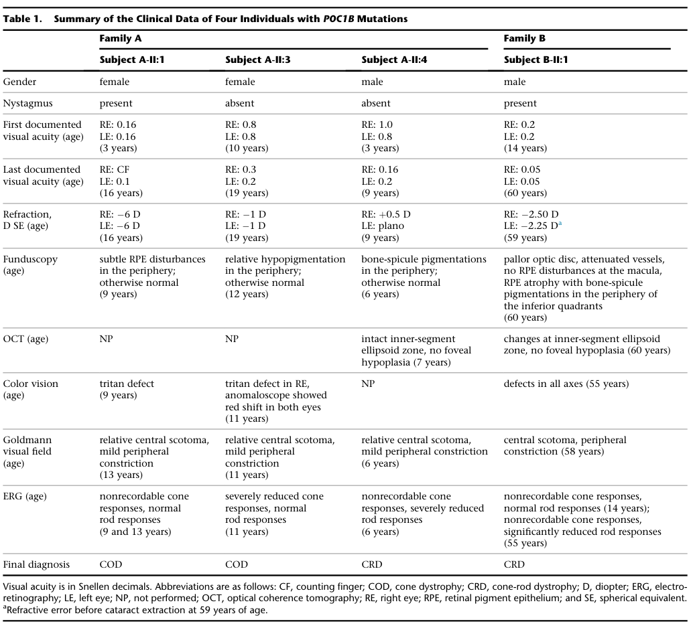

## Question

# Disease Characteristics Research Template

## Target Disease
- **Disease Name:** Cone-rod dystrophy 20
- **MONDO ID:** MONDO:0014427 (if available)
- **Category:** Mendelian

## Research Objectives

Please provide a comprehensive research report on **Cone-rod dystrophy 20** covering all of the
disease characteristics listed below. This report will be used to populate a disease knowledge
base entry. Be thorough and cite primary literature (PMID preferred) for all claims.

For each section, **suggested databases/resources** are listed. These are the first places
you should search for information on each topic.

---

### 1. Disease Information
> **Search first:** OMIM, Orphanet, ICD-10/ICD-11, MeSH, PubMed

- What is the disease? Provide a concise overview.
- What are the key identifiers? (OMIM, Orphanet, ICD-10/ICD-11, MeSH, Mondo)
- What are the common synonyms and alternative names?
- Is the information derived from individual patients (e.g., EHR) or aggregated disease-level resources?

### 2. Etiology

- **Disease Causal Factors**: What are the primary causes? (genetic, environmental, infectious, mechanistic)
- **Risk Factors**:
  > **Search first:** PubMed, Cochrane Library, UpToDate, clinical guidelines, ClinVar, ClinGen, GWAS Catalog, PheGenI, CTD, CDC, WHO, epidemiological databases
  - Genetic risk factors (causal variants, susceptibility loci, modifier genes)
  - Environmental risk factors (toxins, lifestyle, occupational exposures, age, sex, family history)
- **Protective Factors**:
  > **Search first:** PubMed, Cochrane Library, clinical trial databases, GWAS Catalog, gnomAD, WHO, CDC, nutrition databases
  - Genetic protective factors (protective variants, modifier alleles)
  - Environmental protective factors (diet, lifestyle, exposures that reduce risk)
- **Gene-Environment Interactions**: How do genetic and environmental factors interact to influence disease?
  > **Search first:** CTD, PubMed, PheGenI, GxE databases

### 3. Phenotypes
> **Search first:** HPO (Human Phenotype Ontology), OMIM, Orphanet, PubMed, clinicaltrials.gov, MedDRA, SNOMED CT, DECIPHER, LOINC

For each phenotype, provide:
- **Phenotype type**: symptoms, clinical signs, physical manifestations, behavioral changes, or laboratory abnormalities
  > For symptoms/signs: HPO, OMIM, Orphanet, PubMed
  > For behavioral changes: HPO, DSM, RDoC (Research Domain Criteria), PubMed
  > For laboratory abnormalities: LOINC, SNOMED CT, LabTests Online, PubMed
- **Phenotype characteristics**:
  > **Search first:** OMIM, Orphanet, HPO, PubMed
  - Age of symptom onset (neonatal, childhood, adult-onset, late-onset)
  - Symptom severity (mild, moderate, severe, variable)
  - Symptom progression (stable, progressive, episodic, fluctuating)
  - Frequency among affected individuals (percentage or qualitative)
- **Quality of life impact**: Effects on daily functioning and well-being (per-phenotype when possible)
  > **Search first:** EQ-5D database, SF-36, WHO QOL databases, PubMed
- Suggest HPO (Human Phenotype Ontology) terms for each phenotype

### 4. Genetic/Molecular Information

- **Causal Genes**: Gene mutations or chromosomal abnormalities responsible for disease (gene symbols, OMIM IDs)
  > **Search first:** OMIM, ClinVar, HGMD, Ensembl, NCBI Gene
- **Pathogenic Variants**:
  - Affected genes (gene symbols, HGNC IDs)
    > **Search first:** OMIM, NCBI Gene, Ensembl, HGNC, UniProt, GeneCards
  - Variant classification (pathogenic, likely pathogenic, VUS per ACMG/AMP guidelines)
    > **Search first:** ClinVar, ClinGen, ACMG/AMP guidelines, VarSome
  - Variant type/class (missense, frameshift, nonsense, splice-site, structural)
  - Allele frequency in population databases
    > **Search first:** gnomAD, 1000 Genomes, ExAC, TOPMed, dbSNP
  - Somatic vs germline origin
    > **Search first:** COSMIC (somatic), ClinVar, ICGC, TCGA
  - Functional consequences (loss of function, gain of function, dominant negative)
- **Modifier Genes**: Genes that modify disease severity or expression
- **Epigenetic Information**: DNA methylation, histone modifications, chromatin changes affecting disease
  > **Search first:** ENCODE, Roadmap Epigenomics, MethBase, DiseaseMeth
- **Chromosomal Abnormalities**: Large-scale genetic changes (aneuploidy, translocations, inversions)
  > **Search first:** DECIPHER, ClinVar, ECARUCA, UCSC Genome Browser

### 5. Environmental Information

- **Environmental Factors**: Non-genetic contributing factors (toxins, radiation, pollution, occupational exposure)
  > **Search first:** CTD (Comparative Toxicogenomics Database), TOXNET, PubMed, EPA databases
- **Lifestyle Factors**: Behavioral factors (smoking, diet, exercise, alcohol consumption)
  > **Search first:** CDC databases, WHO, PubMed, NHANES
- **Infectious Agents**: If applicable, pathogens causing or triggering disease (bacteria, viruses, fungi, parasites)
  > **Search first:** NCBI Taxonomy, ViPR, BV-BRC, MicrobeDB, GIDEON

### 6. Mechanism / Pathophysiology

**Present this section as an ordered causal chain first, then the detail below.**
Open with a numbered sequence of mechanistic steps running from the initiating
lesion (mutation, exposure, infection) to the clinical manifestation, one step per
line, each naming what it causes next. State the causal verb explicitly ("leads
to", "results in") and say where a step is inferred rather than demonstrated.
Where the mechanism branches, show the branch. The categories below are a
checklist of what to cover within those steps, not the organizing structure —
a step may draw on several of them, and a category may contribute to several
steps.

- **Molecular Pathways**: Specific signaling cascades or biochemical pathways involved (Wnt, MAPK, mTOR, PI3K-AKT, etc.)
  > **Search first:** KEGG, Reactome, WikiPathways, PathBank, BioCyc
- **Cellular Processes**: Cell-level mechanisms (apoptosis, autophagy, cell cycle dysregulation, inflammation, etc.)
  > **Search first:** Gene Ontology (GO), Reactome, KEGG, PubMed
- **Protein Dysfunction**: How protein structure or function is altered (misfolding, aggregation, loss of function, gain of function)
  > **Search first:** UniProt, PDB (Protein Data Bank), InterPro, Pfam, AlphaFold
- **Metabolic Changes**: Alterations in metabolic processes (energy metabolism, lipid metabolism, amino acid metabolism)
  > **Search first:** KEGG, BioCyc, HMDB (Human Metabolome Database), BRENDA
- **Immune System Involvement**: Role of immune response (autoimmunity, immunodeficiency, chronic inflammation)
  > **Search first:** ImmPort, Immunome Database, IEDB, Gene Ontology
- **Tissue Damage Mechanisms**: How tissues/ are injured (oxidative stress, ischemia, fibrosis, necrosis)
  > **Search first:** PubMed, Gene Ontology, Reactome
- **Biochemical Abnormalities**: Specific molecular defects (enzyme deficiencies, receptor dysfunction, ion channel defects)
  > **Search first:** BRENDA, UniProt, KEGG, OMIM, PubMed
- **Epigenetic Changes**: DNA methylation, histone modifications affecting gene expression in disease
  > **Search first:** ENCODE, Roadmap Epigenomics, MethBase, DiseaseMeth
- **Molecular Profiling** (if available):
  - Transcriptomics/gene expression changes
    > **Search first:** GEO (Gene Expression Omnibus), ArrayExpress, GTEx, Human Cell Atlas, SRA
  - Proteomics findings
    > **Search first:** PRIDE, ProteomeXchange, Human Protein Atlas, STRING, BioGRID
  - Metabolomics signatures
    > **Search first:** MetaboLights, Metabolomics Workbench, HMDB, METLIN
  - Lipidomics alterations
    > **Search first:** LIPID MAPS, SwissLipids, LipidHome, Metabolomics Workbench
  - Genomic structural features
    > **Search first:** UCSC Genome Browser, Ensembl, NCBI, dbVar, DGV
- **Advanced Technologies** (if applicable):
  - Single-cell analysis findings (cell-type specific mechanisms, cellular heterogeneity)
    > **Search first:** Human Cell Atlas, Single Cell Portal, GEO, CELLxGENE
  - Spatial transcriptomics findings
    > **Search first:** GEO, Spatial Research, Vizgen, 10x Genomics data
  - Multi-omics integration results
    > **Search first:** TCGA, ICGC, cBioPortal, LinkedOmics, PubMed
  - Functional genomics screens (CRISPR, RNAi)
    > **Search first:** DepMap, GenomeRNAi, PubMed, BioGRID ORCS

For each mechanism, describe:
- The causal chain from initial trigger to clinical manifestation
- Which mechanisms are upstream vs downstream
- What cell types and biological processes are involved
- Suggest GO terms for biological processes and CL terms for cell types

### 7. Anatomical Structures Affected

- **Organ Level**:
  - Primary organs directly affected
  - Secondary organ involvement (complications, secondary effects)
  - Body systems involved (cardiovascular, nervous, digestive, respiratory, endocrine, etc.)
  > **Search first:** Uberon, FMA (Foundational Model of Anatomy), OMIM, HPO, ICD-11, MeSH, SNOMED CT
- **Tissue and Cell Level**:
  - Specific tissue types affected (epithelial, connective, muscle, nervous)
  - Specific cell populations targeted (with Cell Ontology terms)
  > **Search first:** Uberon, Human Protein Atlas, Cell Ontology, Human Cell Atlas, CellMarker, PanglaoDB
- **Subcellular Level**:
  - Cellular compartments involved (mitochondria, nucleus, ER, lysosomes) (with GO Cellular Component terms)
  > **Search first:** Gene Ontology (Cellular Component), UniProt, Human Protein Atlas
- **Localization**:
  - Specific anatomical sites (with UBERON terms)
    > **Search first:** FMA, Uberon, NeuroNames (for brain), SNOMED CT
  - Lateralization (unilateral, bilateral, asymmetric)
    > **Search first:** HPO, clinical literature, imaging databases

### 8. Temporal Development

- **Onset**:
  - Typical age of onset (congenital, pediatric, adult, geriatric)
  - Onset pattern (acute, subacute, chronic, insidious)
  > **Search first:** OMIM, Orphanet, HPO, PubMed
- **Progression**:
  - Disease stages (early, intermediate, advanced, end-stage)
    > **Search first:** Cancer Staging Manual (AJCC), WHO classifications, PubMed
  - Progression rate (rapid, slow, variable)
  - Disease course pattern (episodic, relapsing-remitting, progressive, stable)
  - Disease duration (self-limited, chronic lifelong)
  > **Search first:** Disease registries, longitudinal cohort databases, natural history studies, PubMed, Orphanet, OMIM
- **Patterns**:
  - Remission patterns (spontaneous, treatment-induced)
    > **Search first:** Clinical trial databases, disease registries, PubMed
  - Critical periods (time windows of vulnerability or opportunity for intervention)
    > **Search first:** PubMed, developmental biology databases, clinical guidelines

### 9. Inheritance and Population

- **Epidemiology**:
  - Prevalence (cases per 100,000 at given time)
  - Incidence (new cases per 100,000 per year)
  > **Search first:** Orphanet, CDC, WHO, GBD (Global Burden of Disease), national registries, SEER, disease registries
- **For Genetic Etiology**:
  - Inheritance pattern (AD, AR, X-linked, mitochondrial, multifactorial, polygenic)
    > **Search first:** OMIM, Orphanet, ClinVar, GTR (Genetic Testing Registry)
  - Penetrance (complete, incomplete, age-dependent)
    > **Search first:** ClinVar, OMIM, PubMed, ClinGen
  - Expressivity (variable, consistent)
    > **Search first:** OMIM, ClinVar, PubMed
  - Genetic anticipation (increasing severity in successive generations)
    > **Search first:** OMIM, PubMed (especially for repeat expansion disorders)
  - Germline mosaicism
    > **Search first:** ClinVar, OMIM, genetic counseling literature, PubMed
  - Founder effects (population-specific mutations)
    > **Search first:** gnomAD, population genetics databases, PubMed
  - Consanguinity role
    > **Search first:** OMIM, population studies, genetic counseling resources
  - Carrier frequency
    > **Search first:** gnomAD, carrier screening databases, GeneReviews, GTR
- **Population Demographics**:
  - Affected populations (ethnic or demographic groups with higher prevalence)
    > **Search first:** gnomAD, 1000 Genomes, PAGE Study, PubMed, population registries
  - Geographic distribution (endemic areas, regional variation)
    > **Search first:** WHO, CDC, GBD, Orphanet, geographic epidemiology databases
  - Geographic distribution of specific variants
  - Sex ratio (male:female)
    > **Search first:** Disease registries, OMIM, PubMed, epidemiological databases
  - Age distribution of affected individuals
    > **Search first:** CDC, disease registries, SEER, Orphanet

### 10. Diagnostics

- **Clinical Tests**:
  - Laboratory tests (blood, urine, tissue chemistry, specific enzyme assays)
    > **Search first:** LOINC, LabTests Online, PubMed
  - Biomarkers (proteins, metabolites, genetic markers, circulating biomarkers)
    > **Search first:** FDA Biomarker List, BEST (Biomarkers, EndpointS, and other Tools), PubMed
  - Imaging studies (X-ray, CT, MRI, PET, ultrasound)
    > **Search first:** RadLex, DICOM, Radiopaedia, imaging databases
  - Functional tests (pulmonary function, cardiac stress tests)
    > **Search first:** LOINC, clinical guidelines, PubMed
  - Electrophysiology (EEG, EMG, ECG, nerve conduction studies)
    > **Search first:** LOINC, clinical neurophysiology databases, PubMed
  - Biopsy findings (histopathology, immunohistochemistry)
    > **Search first:** SNOMED CT, College of American Pathologists resources, PubMed
  - Pathology findings (microscopic examination)
    > **Search first:** SNOMED CT, Digital Pathology databases, PubMed
- **Genetic Testing**:
  > **Search first:** GTR (Genetic Testing Registry), GeneReviews, ClinGen
  - Overview of recommended genetic testing approach
  - Whole genome sequencing (WGS) utility
    > **Search first:** GTR, ClinVar, GEL (Genomics England), gnomAD
  - Whole exome sequencing (WES) utility
    > **Search first:** GTR, ClinVar, OMIM, GeneMatcher
  - Gene panels (which panels, which genes)
    > **Search first:** GTR, ClinVar, laboratory-specific databases
  - Single gene testing
    > **Search first:** GTR, ClinVar, OMIM, GeneReviews
  - Chromosomal microarray (CMA)
    > **Search first:** DECIPHER, ClinVar, dbVar, ECARUCA
  - Karyotyping
    > **Search first:** Chromosome Abnormality Database, ClinVar, cytogenetics resources
  - FISH
    > **Search first:** ClinVar, cytogenetics databases, PubMed
  - Mitochondrial DNA testing
    > **Search first:** MITOMAP, MSeqDR, ClinVar, GTR
  - Repeat expansion testing
    > **Search first:** GTR, ClinVar, repeat expansion databases, PubMed
- **Omics-Based Diagnostics** (if applicable):
  - RNA sequencing / transcriptomics
    > **Search first:** GEO, ArrayExpress, GTEx, RNA-seq databases
  - Proteomics
    > **Search first:** PRIDE, ProteomeXchange, FDA Biomarker database
  - Metabolomics
    > **Search first:** MetaboLights, Metabolomics Workbench, HMDB
  - Epigenomics
    > **Search first:** GEO, ENCODE, Roadmap Epigenomics, MethBase
  - Liquid biopsy
    > **Search first:** COSMIC, ClinVar, liquid biopsy databases, PubMed
- **Clinical Criteria**:
  - Standardized diagnostic criteria (DSM, ICD, society guidelines)
    > **Search first:** DSM-5, ICD-11, clinical society guidelines, UpToDate
  - Differential diagnosis (other conditions to rule out, with distinguishing features)
    > **Search first:** DynaMed, UpToDate, clinical decision support systems
- **Screening**:
  - Screening methods for asymptomatic individuals (newborn screening, carrier screening, cascade screening)
    > **Search first:** ACMG recommendations, CDC newborn screening, GTR

### 11. Outcome/Prognosis

- **Survival and Mortality**:
  - Survival rate (5-year, 10-year, overall)
    > **Search first:** SEER, cancer registries, disease-specific registries, PubMed
  - Life expectancy (with and without treatment if applicable)
    > **Search first:** Orphanet, disease registries, actuarial databases, PubMed
  - Mortality rate
    > **Search first:** CDC, WHO, GBD, national mortality databases
  - Disease-specific mortality (deaths directly attributable to disease)
    > **Search first:** Disease registries, CDC Wonder, GBD, PubMed
- **Morbidity and Function**:
  - Morbidity (disease-related disability and health impacts)
    > **Search first:** GBD, WHO, disability databases, PubMed
  - Disability outcomes (long-term functional impairments)
    > **Search first:** ICF (International Classification of Functioning), disability registries
  - Quality of life measures (EQ-5D, SF-36, PROMIS, disease-specific tools)
    > **Search first:** EQ-5D database, SF-36, PROMIS, PubMed
- **Disease Course**:
  - Complications (secondary problems: infections, organ failure, etc.)
    > **Search first:** ICD codes, disease registries, clinical databases, PubMed
  - Recovery potential (likelihood and extent of recovery, with vs without treatment)
    > **Search first:** Natural history studies, rehabilitation databases, PubMed
- **Prediction**:
  - Prognostic factors (age, disease severity, biomarkers, treatment response)
    > **Search first:** Prognostic models databases, clinical calculators, PubMed
  - Prognostic biomarkers (molecular markers predicting disease course)
    > **Search first:** FDA Biomarker database, PubMed, cancer prognostic databases

### 12. Treatment

- **Pharmacotherapy**:
  - Pharmacological treatments (drug names, drug classes, mechanisms of action)
    > **Search first:** DrugBank, RxNorm, ATC classification, DailyMed, FDA databases
  - Pharmacogenomics (how genetic variants affect drug metabolism, efficacy, toxicity)
    > **Search first:** PharmGKB, CPIC (Clinical Pharmacogenetics), FDA Table of PGx Biomarkers
- **Advanced Therapeutics**:
  - Gene therapy (viral vectors, CRISPR, gene replacement, gene editing)
    > **Search first:** ClinicalTrials.gov, FDA gene therapy database, ASGCT resources
  - Cell therapy (stem cell transplant, CAR-T, cellular therapeutics)
    > **Search first:** ClinicalTrials.gov, FDA cell therapy database, FACT standards
  - RNA-based therapies (ASOs, siRNA, mRNA therapies)
    > **Search first:** ClinicalTrials.gov, FDA approvals, PubMed
  - Targeted therapies (treatments directed at specific molecular targets)
    > **Search first:** My Cancer Genome, OncoKB, ClinicalTrials.gov, FDA approvals
  - Immunotherapies (checkpoint inhibitors, monoclonal antibodies)
    > **Search first:** Cancer Immunotherapy Database, FDA approvals, ClinicalTrials.gov
- **Surgical and Interventional**:
  - Surgical interventions (types of surgery, timing, outcomes)
    > **Search first:** CPT codes, surgical registries, clinical guidelines, PubMed
- **Supportive and Rehabilitative**:
  - Supportive care (symptom management, pain control, nutrition)
    > **Search first:** Clinical guidelines, Cochrane Library, PubMed
  - Rehabilitation (physical therapy, occupational therapy, speech therapy)
    > **Search first:** Rehabilitation medicine databases, clinical guidelines, PubMed
- **Experimental**:
  - Experimental treatments in clinical trials (with NCT identifiers if available)
    > **Search first:** ClinicalTrials.gov, EU Clinical Trials Register, WHO ICTRP
- **Treatment Outcomes**:
  - Treatment response rates
    > **Search first:** Clinical trial databases, FDA reviews, systematic reviews, PubMed
  - Side effects and adverse events
    > **Search first:** FDA Adverse Event Reporting System (FAERS), MedWatch, PubMed
- **Treatment Strategy**:
  - Treatment algorithms (clinical pathways, decision trees)
    > **Search first:** Clinical practice guidelines, NCCN Guidelines, UpToDate
  - Combination therapies
    > **Search first:** ClinicalTrials.gov, treatment guidelines, PubMed
  - Personalized medicine approaches (genotype-guided treatment)
    > **Search first:** My Cancer Genome, CIViC, PharmGKB, precision medicine databases

For each treatment, suggest NCIT (NCI Thesaurus) clinical-intervention terms where applicable.

### 13. Prevention

- **Prevention Levels**:
  - Primary prevention (preventing disease occurrence: vaccination, risk factor modification)
    > **Search first:** CDC, WHO, USPSTF recommendations, Cochrane Library
  - Secondary prevention (early detection and treatment: screening programs, early intervention)
    > **Search first:** USPSTF, CDC screening guidelines, WHO
  - Tertiary prevention (preventing complications in those with disease)
    > **Search first:** Clinical guidelines, disease management protocols, PubMed
- **Immunization**: Vaccine strategies (if applicable)
  > **Search first:** CDC vaccine schedules, WHO immunization, FDA vaccine database
- **Screening and Early Detection**:
  - Screening programs (population-based: newborn screening, cancer screening)
    > **Search first:** CDC screening programs, USPSTF, cancer screening databases
  - Genetic screening (carrier screening, preimplantation genetic diagnosis, prenatal testing)
    > **Search first:** ACMG recommendations, ACOG guidelines, GTR
  - Risk stratification (identifying high-risk individuals for targeted prevention)
    > **Search first:** Risk prediction models, clinical calculators, PubMed
- **Behavioral Interventions**: Lifestyle modifications to reduce risk
  > **Search first:** CDC, WHO, behavioral intervention databases, Cochrane Library
- **Counseling**: Genetic counseling (risk assessment, family planning guidance)
  > **Search first:** NSGC resources, ACMG guidelines, GeneReviews
- **Public Health**:
  - Public health interventions (sanitation, vector control, health education)
    > **Search first:** CDC, WHO, public health databases, PubMed
  - Environmental interventions (reducing environmental risk factors)
    > **Search first:** EPA databases, WHO environmental health, PubMed
- **Prophylaxis**: Preventive medications or procedures
  > **Search first:** Clinical guidelines, FDA approvals, PubMed

### 14. Other Species / Natural Disease

- **Taxonomy**: Species affected (with NCBI Taxon identifiers)
  > **Search first:** NCBI Taxonomy
- **Breed**: Specific breeds affected (with VBO identifiers if applicable)
  > **Search first:** VBO (Vertebrate Breed Ontology)
- **Gene**: Orthologous genes in other species (with NCBI Gene IDs)
  > **Search first:** NCBI Gene
- **Natural Disease**:
  - Naturally occurring disease in other species (companion animals, wildlife)
    > **Search first:** OMIA (Online Mendelian Inheritance in Animals), VetCompass, PubMed
  - Veterinary relevance and importance in animal health
    > **Search first:** OMIA, veterinary databases, PubMed
- **Comparative Biology**:
  - Comparative pathology (similarities and differences across species)
    > **Search first:** OMIA, comparative pathology databases, PubMed
  - Evolutionary conservation of disease mechanisms
    > **Search first:** HomoloGene, OrthoMCL, Alliance of Genome Resources
- **Transmission** (if applicable):
  - Zoonotic potential
    > **Search first:** CDC zoonotic diseases, WHO zoonoses, GIDEON
  - Cross-species susceptibility
    > **Search first:** NCBI Taxonomy, veterinary databases, PubMed

### 15. Model Organisms

- **Model Types**:
  - Model organism type (mammalian, invertebrate, cellular, in vitro)
    > **Search first:** Alliance of Genome Resources, model organism databases
  - Specific model systems (mouse, rat, zebrafish, Drosophila, C. elegans, yeast, cell lines, organoids, iPSCs)
    > **Search first:** MGI, RGD, ZFIN, FlyBase, WormBase, SGD, ATCC, Cellosaurus
  - Induced models (drug treatment, surgical intervention, environmental manipulation)
    > **Search first:** MGI, model organism databases, PubMed
- **Genetic Models**:
  - Types available (knockout, knock-in, transgenic, conditional, humanized)
    > **Search first:** MGI, IMPC, KOMP, EuMMCR, IMSR
- **Model Characteristics**:
  - Phenotype recapitulation (how well model reproduces human disease features)
    > **Search first:** Model organism databases, comparative studies, PubMed
  - Model limitations (aspects of human disease not captured)
    > **Search first:** Model organism databases, PubMed, review articles
- **Applications**:
  - Research applications (what aspects of disease can be studied)
    > **Search first:** Model organism databases, PubMed
- **Resources**:
  - Model databases
    > **Search first:** MGI, RGD, ZFIN, FlyBase, WormBase, IMSR, EMMA, MMRRC

---

## Citation Requirements

- Cite primary literature (PMID preferred) for all mechanistic and clinical claims
- Prioritize recent reviews and landmark papers
- Include direct quotes from abstracts where possible to support key statements
- Distinguish evidence source types: human clinical, model organism, in vitro, computational

## Output Format

Structure your response as a comprehensive narrative organized by the sections above.
For each section, provide:
- Factual content with specific details (numbers, percentages, gene names, variant nomenclature)
- Ontology term suggestions (HPO, GO, CL, UBERON, CHEBI, NCIT, MONDO) where applicable
- Evidence citations with PMIDs
- Direct quotes from abstracts to support key claims
- Clear indication when information is not available or not applicable for this disease

This report will be used to populate a disease knowledge base entry with:
- Pathophysiology descriptions with causal chains
- Gene/protein annotations (HGNC, GO terms)
- Phenotype associations (HP terms) with frequencies
- Cell type involvement (CL terms)
- Anatomical locations (UBERON terms)
- Chemical entities (CHEBI terms)
- Treatment annotations (NCIT terms)
- Evidence items with PMIDs and exact abstract quotes
- Epidemiology, prognosis, diagnostic, and prevention information
- Animal model descriptions with phenotype recapitulation details

## Output

Question: You are an expert researcher providing comprehensive, well-cited information.

Provide detailed information focusing on:
1. Key concepts and definitions with current understanding
2. Recent developments and latest research (prioritize 2023-2024 sources)
3. Current applications and real-world implementations
4. Expert opinions and analysis from authoritative sources
5. Relevant statistics and data from recent studies

Format as a comprehensive research report with proper citations. Include URLs and publication dates where available.
Always prioritize recent, authoritative sources and provide specific citations for all major claims.

# Disease Characteristics Research Template

## Target Disease
- **Disease Name:** Cone-rod dystrophy 20
- **MONDO ID:** MONDO:0014427 (if available)
- **Category:** Mendelian

## Research Objectives

Please provide a comprehensive research report on **Cone-rod dystrophy 20** covering all of the
disease characteristics listed below. This report will be used to populate a disease knowledge
base entry. Be thorough and cite primary literature (PMID preferred) for all claims.

For each section, **suggested databases/resources** are listed. These are the first places
you should search for information on each topic.

---

### 1. Disease Information
> **Search first:** OMIM, Orphanet, ICD-10/ICD-11, MeSH, PubMed

- What is the disease? Provide a concise overview.
- What are the key identifiers? (OMIM, Orphanet, ICD-10/ICD-11, MeSH, Mondo)
- What are the common synonyms and alternative names?
- Is the information derived from individual patients (e.g., EHR) or aggregated disease-level resources?

### 2. Etiology

- **Disease Causal Factors**: What are the primary causes? (genetic, environmental, infectious, mechanistic)
- **Risk Factors**:
  > **Search first:** PubMed, Cochrane Library, UpToDate, clinical guidelines, ClinVar, ClinGen, GWAS Catalog, PheGenI, CTD, CDC, WHO, epidemiological databases
  - Genetic risk factors (causal variants, susceptibility loci, modifier genes)
  - Environmental risk factors (toxins, lifestyle, occupational exposures, age, sex, family history)
- **Protective Factors**:
  > **Search first:** PubMed, Cochrane Library, clinical trial databases, GWAS Catalog, gnomAD, WHO, CDC, nutrition databases
  - Genetic protective factors (protective variants, modifier alleles)
  - Environmental protective factors (diet, lifestyle, exposures that reduce risk)
- **Gene-Environment Interactions**: How do genetic and environmental factors interact to influence disease?
  > **Search first:** CTD, PubMed, PheGenI, GxE databases

### 3. Phenotypes
> **Search first:** HPO (Human Phenotype Ontology), OMIM, Orphanet, PubMed, clinicaltrials.gov, MedDRA, SNOMED CT, DECIPHER, LOINC

For each phenotype, provide:
- **Phenotype type**: symptoms, clinical signs, physical manifestations, behavioral changes, or laboratory abnormalities
  > For symptoms/signs: HPO, OMIM, Orphanet, PubMed
  > For behavioral changes: HPO, DSM, RDoC (Research Domain Criteria), PubMed
  > For laboratory abnormalities: LOINC, SNOMED CT, LabTests Online, PubMed
- **Phenotype characteristics**:
  > **Search first:** OMIM, Orphanet, HPO, PubMed
  - Age of symptom onset (neonatal, childhood, adult-onset, late-onset)
  - Symptom severity (mild, moderate, severe, variable)
  - Symptom progression (stable, progressive, episodic, fluctuating)
  - Frequency among affected individuals (percentage or qualitative)
- **Quality of life impact**: Effects on daily functioning and well-being (per-phenotype when possible)
  > **Search first:** EQ-5D database, SF-36, WHO QOL databases, PubMed
- Suggest HPO (Human Phenotype Ontology) terms for each phenotype

### 4. Genetic/Molecular Information

- **Causal Genes**: Gene mutations or chromosomal abnormalities responsible for disease (gene symbols, OMIM IDs)
  > **Search first:** OMIM, ClinVar, HGMD, Ensembl, NCBI Gene
- **Pathogenic Variants**:
  - Affected genes (gene symbols, HGNC IDs)
    > **Search first:** OMIM, NCBI Gene, Ensembl, HGNC, UniProt, GeneCards
  - Variant classification (pathogenic, likely pathogenic, VUS per ACMG/AMP guidelines)
    > **Search first:** ClinVar, ClinGen, ACMG/AMP guidelines, VarSome
  - Variant type/class (missense, frameshift, nonsense, splice-site, structural)
  - Allele frequency in population databases
    > **Search first:** gnomAD, 1000 Genomes, ExAC, TOPMed, dbSNP
  - Somatic vs germline origin
    > **Search first:** COSMIC (somatic), ClinVar, ICGC, TCGA
  - Functional consequences (loss of function, gain of function, dominant negative)
- **Modifier Genes**: Genes that modify disease severity or expression
- **Epigenetic Information**: DNA methylation, histone modifications, chromatin changes affecting disease
  > **Search first:** ENCODE, Roadmap Epigenomics, MethBase, DiseaseMeth
- **Chromosomal Abnormalities**: Large-scale genetic changes (aneuploidy, translocations, inversions)
  > **Search first:** DECIPHER, ClinVar, ECARUCA, UCSC Genome Browser

### 5. Environmental Information

- **Environmental Factors**: Non-genetic contributing factors (toxins, radiation, pollution, occupational exposure)
  > **Search first:** CTD (Comparative Toxicogenomics Database), TOXNET, PubMed, EPA databases
- **Lifestyle Factors**: Behavioral factors (smoking, diet, exercise, alcohol consumption)
  > **Search first:** CDC databases, WHO, PubMed, NHANES
- **Infectious Agents**: If applicable, pathogens causing or triggering disease (bacteria, viruses, fungi, parasites)
  > **Search first:** NCBI Taxonomy, ViPR, BV-BRC, MicrobeDB, GIDEON

### 6. Mechanism / Pathophysiology

**Present this section as an ordered causal chain first, then the detail below.**
Open with a numbered sequence of mechanistic steps running from the initiating
lesion (mutation, exposure, infection) to the clinical manifestation, one step per
line, each naming what it causes next. State the causal verb explicitly ("leads
to", "results in") and say where a step is inferred rather than demonstrated.
Where the mechanism branches, show the branch. The categories below are a
checklist of what to cover within those steps, not the organizing structure —
a step may draw on several of them, and a category may contribute to several
steps.

- **Molecular Pathways**: Specific signaling cascades or biochemical pathways involved (Wnt, MAPK, mTOR, PI3K-AKT, etc.)
  > **Search first:** KEGG, Reactome, WikiPathways, PathBank, BioCyc
- **Cellular Processes**: Cell-level mechanisms (apoptosis, autophagy, cell cycle dysregulation, inflammation, etc.)
  > **Search first:** Gene Ontology (GO), Reactome, KEGG, PubMed
- **Protein Dysfunction**: How protein structure or function is altered (misfolding, aggregation, loss of function, gain of function)
  > **Search first:** UniProt, PDB (Protein Data Bank), InterPro, Pfam, AlphaFold
- **Metabolic Changes**: Alterations in metabolic processes (energy metabolism, lipid metabolism, amino acid metabolism)
  > **Search first:** KEGG, BioCyc, HMDB (Human Metabolome Database), BRENDA
- **Immune System Involvement**: Role of immune response (autoimmunity, immunodeficiency, chronic inflammation)
  > **Search first:** ImmPort, Immunome Database, IEDB, Gene Ontology
- **Tissue Damage Mechanisms**: How tissues/ are injured (oxidative stress, ischemia, fibrosis, necrosis)
  > **Search first:** PubMed, Gene Ontology, Reactome
- **Biochemical Abnormalities**: Specific molecular defects (enzyme deficiencies, receptor dysfunction, ion channel defects)
  > **Search first:** BRENDA, UniProt, KEGG, OMIM, PubMed
- **Epigenetic Changes**: DNA methylation, histone modifications affecting gene expression in disease
  > **Search first:** ENCODE, Roadmap Epigenomics, MethBase, DiseaseMeth
- **Molecular Profiling** (if available):
  - Transcriptomics/gene expression changes
    > **Search first:** GEO (Gene Expression Omnibus), ArrayExpress, GTEx, Human Cell Atlas, SRA
  - Proteomics findings
    > **Search first:** PRIDE, ProteomeXchange, Human Protein Atlas, STRING, BioGRID
  - Metabolomics signatures
    > **Search first:** MetaboLights, Metabolomics Workbench, HMDB, METLIN
  - Lipidomics alterations
    > **Search first:** LIPID MAPS, SwissLipids, LipidHome, Metabolomics Workbench
  - Genomic structural features
    > **Search first:** UCSC Genome Browser, Ensembl, NCBI, dbVar, DGV
- **Advanced Technologies** (if applicable):
  - Single-cell analysis findings (cell-type specific mechanisms, cellular heterogeneity)
    > **Search first:** Human Cell Atlas, Single Cell Portal, GEO, CELLxGENE
  - Spatial transcriptomics findings
    > **Search first:** GEO, Spatial Research, Vizgen, 10x Genomics data
  - Multi-omics integration results
    > **Search first:** TCGA, ICGC, cBioPortal, LinkedOmics, PubMed
  - Functional genomics screens (CRISPR, RNAi)
    > **Search first:** DepMap, GenomeRNAi, PubMed, BioGRID ORCS

For each mechanism, describe:
- The causal chain from initial trigger to clinical manifestation
- Which mechanisms are upstream vs downstream
- What cell types and biological processes are involved
- Suggest GO terms for biological processes and CL terms for cell types

### 7. Anatomical Structures Affected

- **Organ Level**:
  - Primary organs directly affected
  - Secondary organ involvement (complications, secondary effects)
  - Body systems involved (cardiovascular, nervous, digestive, respiratory, endocrine, etc.)
  > **Search first:** Uberon, FMA (Foundational Model of Anatomy), OMIM, HPO, ICD-11, MeSH, SNOMED CT
- **Tissue and Cell Level**:
  - Specific tissue types affected (epithelial, connective, muscle, nervous)
  - Specific cell populations targeted (with Cell Ontology terms)
  > **Search first:** Uberon, Human Protein Atlas, Cell Ontology, Human Cell Atlas, CellMarker, PanglaoDB
- **Subcellular Level**:
  - Cellular compartments involved (mitochondria, nucleus, ER, lysosomes) (with GO Cellular Component terms)
  > **Search first:** Gene Ontology (Cellular Component), UniProt, Human Protein Atlas
- **Localization**:
  - Specific anatomical sites (with UBERON terms)
    > **Search first:** FMA, Uberon, NeuroNames (for brain), SNOMED CT
  - Lateralization (unilateral, bilateral, asymmetric)
    > **Search first:** HPO, clinical literature, imaging databases

### 8. Temporal Development

- **Onset**:
  - Typical age of onset (congenital, pediatric, adult, geriatric)
  - Onset pattern (acute, subacute, chronic, insidious)
  > **Search first:** OMIM, Orphanet, HPO, PubMed
- **Progression**:
  - Disease stages (early, intermediate, advanced, end-stage)
    > **Search first:** Cancer Staging Manual (AJCC), WHO classifications, PubMed
  - Progression rate (rapid, slow, variable)
  - Disease course pattern (episodic, relapsing-remitting, progressive, stable)
  - Disease duration (self-limited, chronic lifelong)
  > **Search first:** Disease registries, longitudinal cohort databases, natural history studies, PubMed, Orphanet, OMIM
- **Patterns**:
  - Remission patterns (spontaneous, treatment-induced)
    > **Search first:** Clinical trial databases, disease registries, PubMed
  - Critical periods (time windows of vulnerability or opportunity for intervention)
    > **Search first:** PubMed, developmental biology databases, clinical guidelines

### 9. Inheritance and Population

- **Epidemiology**:
  - Prevalence (cases per 100,000 at given time)
  - Incidence (new cases per 100,000 per year)
  > **Search first:** Orphanet, CDC, WHO, GBD (Global Burden of Disease), national registries, SEER, disease registries
- **For Genetic Etiology**:
  - Inheritance pattern (AD, AR, X-linked, mitochondrial, multifactorial, polygenic)
    > **Search first:** OMIM, Orphanet, ClinVar, GTR (Genetic Testing Registry)
  - Penetrance (complete, incomplete, age-dependent)
    > **Search first:** ClinVar, OMIM, PubMed, ClinGen
  - Expressivity (variable, consistent)
    > **Search first:** OMIM, ClinVar, PubMed
  - Genetic anticipation (increasing severity in successive generations)
    > **Search first:** OMIM, PubMed (especially for repeat expansion disorders)
  - Germline mosaicism
    > **Search first:** ClinVar, OMIM, genetic counseling literature, PubMed
  - Founder effects (population-specific mutations)
    > **Search first:** gnomAD, population genetics databases, PubMed
  - Consanguinity role
    > **Search first:** OMIM, population studies, genetic counseling resources
  - Carrier frequency
    > **Search first:** gnomAD, carrier screening databases, GeneReviews, GTR
- **Population Demographics**:
  - Affected populations (ethnic or demographic groups with higher prevalence)
    > **Search first:** gnomAD, 1000 Genomes, PAGE Study, PubMed, population registries
  - Geographic distribution (endemic areas, regional variation)
    > **Search first:** WHO, CDC, GBD, Orphanet, geographic epidemiology databases
  - Geographic distribution of specific variants
  - Sex ratio (male:female)
    > **Search first:** Disease registries, OMIM, PubMed, epidemiological databases
  - Age distribution of affected individuals
    > **Search first:** CDC, disease registries, SEER, Orphanet

### 10. Diagnostics

- **Clinical Tests**:
  - Laboratory tests (blood, urine, tissue chemistry, specific enzyme assays)
    > **Search first:** LOINC, LabTests Online, PubMed
  - Biomarkers (proteins, metabolites, genetic markers, circulating biomarkers)
    > **Search first:** FDA Biomarker List, BEST (Biomarkers, EndpointS, and other Tools), PubMed
  - Imaging studies (X-ray, CT, MRI, PET, ultrasound)
    > **Search first:** RadLex, DICOM, Radiopaedia, imaging databases
  - Functional tests (pulmonary function, cardiac stress tests)
    > **Search first:** LOINC, clinical guidelines, PubMed
  - Electrophysiology (EEG, EMG, ECG, nerve conduction studies)
    > **Search first:** LOINC, clinical neurophysiology databases, PubMed
  - Biopsy findings (histopathology, immunohistochemistry)
    > **Search first:** SNOMED CT, College of American Pathologists resources, PubMed
  - Pathology findings (microscopic examination)
    > **Search first:** SNOMED CT, Digital Pathology databases, PubMed
- **Genetic Testing**:
  > **Search first:** GTR (Genetic Testing Registry), GeneReviews, ClinGen
  - Overview of recommended genetic testing approach
  - Whole genome sequencing (WGS) utility
    > **Search first:** GTR, ClinVar, GEL (Genomics England), gnomAD
  - Whole exome sequencing (WES) utility
    > **Search first:** GTR, ClinVar, OMIM, GeneMatcher
  - Gene panels (which panels, which genes)
    > **Search first:** GTR, ClinVar, laboratory-specific databases
  - Single gene testing
    > **Search first:** GTR, ClinVar, OMIM, GeneReviews
  - Chromosomal microarray (CMA)
    > **Search first:** DECIPHER, ClinVar, dbVar, ECARUCA
  - Karyotyping
    > **Search first:** Chromosome Abnormality Database, ClinVar, cytogenetics resources
  - FISH
    > **Search first:** ClinVar, cytogenetics databases, PubMed
  - Mitochondrial DNA testing
    > **Search first:** MITOMAP, MSeqDR, ClinVar, GTR
  - Repeat expansion testing
    > **Search first:** GTR, ClinVar, repeat expansion databases, PubMed
- **Omics-Based Diagnostics** (if applicable):
  - RNA sequencing / transcriptomics
    > **Search first:** GEO, ArrayExpress, GTEx, RNA-seq databases
  - Proteomics
    > **Search first:** PRIDE, ProteomeXchange, FDA Biomarker database
  - Metabolomics
    > **Search first:** MetaboLights, Metabolomics Workbench, HMDB
  - Epigenomics
    > **Search first:** GEO, ENCODE, Roadmap Epigenomics, MethBase
  - Liquid biopsy
    > **Search first:** COSMIC, ClinVar, liquid biopsy databases, PubMed
- **Clinical Criteria**:
  - Standardized diagnostic criteria (DSM, ICD, society guidelines)
    > **Search first:** DSM-5, ICD-11, clinical society guidelines, UpToDate
  - Differential diagnosis (other conditions to rule out, with distinguishing features)
    > **Search first:** DynaMed, UpToDate, clinical decision support systems
- **Screening**:
  - Screening methods for asymptomatic individuals (newborn screening, carrier screening, cascade screening)
    > **Search first:** ACMG recommendations, CDC newborn screening, GTR

### 11. Outcome/Prognosis

- **Survival and Mortality**:
  - Survival rate (5-year, 10-year, overall)
    > **Search first:** SEER, cancer registries, disease-specific registries, PubMed
  - Life expectancy (with and without treatment if applicable)
    > **Search first:** Orphanet, disease registries, actuarial databases, PubMed
  - Mortality rate
    > **Search first:** CDC, WHO, GBD, national mortality databases
  - Disease-specific mortality (deaths directly attributable to disease)
    > **Search first:** Disease registries, CDC Wonder, GBD, PubMed
- **Morbidity and Function**:
  - Morbidity (disease-related disability and health impacts)
    > **Search first:** GBD, WHO, disability databases, PubMed
  - Disability outcomes (long-term functional impairments)
    > **Search first:** ICF (International Classification of Functioning), disability registries
  - Quality of life measures (EQ-5D, SF-36, PROMIS, disease-specific tools)
    > **Search first:** EQ-5D database, SF-36, PROMIS, PubMed
- **Disease Course**:
  - Complications (secondary problems: infections, organ failure, etc.)
    > **Search first:** ICD codes, disease registries, clinical databases, PubMed
  - Recovery potential (likelihood and extent of recovery, with vs without treatment)
    > **Search first:** Natural history studies, rehabilitation databases, PubMed
- **Prediction**:
  - Prognostic factors (age, disease severity, biomarkers, treatment response)
    > **Search first:** Prognostic models databases, clinical calculators, PubMed
  - Prognostic biomarkers (molecular markers predicting disease course)
    > **Search first:** FDA Biomarker database, PubMed, cancer prognostic databases

### 12. Treatment

- **Pharmacotherapy**:
  - Pharmacological treatments (drug names, drug classes, mechanisms of action)
    > **Search first:** DrugBank, RxNorm, ATC classification, DailyMed, FDA databases
  - Pharmacogenomics (how genetic variants affect drug metabolism, efficacy, toxicity)
    > **Search first:** PharmGKB, CPIC (Clinical Pharmacogenetics), FDA Table of PGx Biomarkers
- **Advanced Therapeutics**:
  - Gene therapy (viral vectors, CRISPR, gene replacement, gene editing)
    > **Search first:** ClinicalTrials.gov, FDA gene therapy database, ASGCT resources
  - Cell therapy (stem cell transplant, CAR-T, cellular therapeutics)
    > **Search first:** ClinicalTrials.gov, FDA cell therapy database, FACT standards
  - RNA-based therapies (ASOs, siRNA, mRNA therapies)
    > **Search first:** ClinicalTrials.gov, FDA approvals, PubMed
  - Targeted therapies (treatments directed at specific molecular targets)
    > **Search first:** My Cancer Genome, OncoKB, ClinicalTrials.gov, FDA approvals
  - Immunotherapies (checkpoint inhibitors, monoclonal antibodies)
    > **Search first:** Cancer Immunotherapy Database, FDA approvals, ClinicalTrials.gov
- **Surgical and Interventional**:
  - Surgical interventions (types of surgery, timing, outcomes)
    > **Search first:** CPT codes, surgical registries, clinical guidelines, PubMed
- **Supportive and Rehabilitative**:
  - Supportive care (symptom management, pain control, nutrition)
    > **Search first:** Clinical guidelines, Cochrane Library, PubMed
  - Rehabilitation (physical therapy, occupational therapy, speech therapy)
    > **Search first:** Rehabilitation medicine databases, clinical guidelines, PubMed
- **Experimental**:
  - Experimental treatments in clinical trials (with NCT identifiers if available)
    > **Search first:** ClinicalTrials.gov, EU Clinical Trials Register, WHO ICTRP
- **Treatment Outcomes**:
  - Treatment response rates
    > **Search first:** Clinical trial databases, FDA reviews, systematic reviews, PubMed
  - Side effects and adverse events
    > **Search first:** FDA Adverse Event Reporting System (FAERS), MedWatch, PubMed
- **Treatment Strategy**:
  - Treatment algorithms (clinical pathways, decision trees)
    > **Search first:** Clinical practice guidelines, NCCN Guidelines, UpToDate
  - Combination therapies
    > **Search first:** ClinicalTrials.gov, treatment guidelines, PubMed
  - Personalized medicine approaches (genotype-guided treatment)
    > **Search first:** My Cancer Genome, CIViC, PharmGKB, precision medicine databases

For each treatment, suggest NCIT (NCI Thesaurus) clinical-intervention terms where applicable.

### 13. Prevention

- **Prevention Levels**:
  - Primary prevention (preventing disease occurrence: vaccination, risk factor modification)
    > **Search first:** CDC, WHO, USPSTF recommendations, Cochrane Library
  - Secondary prevention (early detection and treatment: screening programs, early intervention)
    > **Search first:** USPSTF, CDC screening guidelines, WHO
  - Tertiary prevention (preventing complications in those with disease)
    > **Search first:** Clinical guidelines, disease management protocols, PubMed
- **Immunization**: Vaccine strategies (if applicable)
  > **Search first:** CDC vaccine schedules, WHO immunization, FDA vaccine database
- **Screening and Early Detection**:
  - Screening programs (population-based: newborn screening, cancer screening)
    > **Search first:** CDC screening programs, USPSTF, cancer screening databases
  - Genetic screening (carrier screening, preimplantation genetic diagnosis, prenatal testing)
    > **Search first:** ACMG recommendations, ACOG guidelines, GTR
  - Risk stratification (identifying high-risk individuals for targeted prevention)
    > **Search first:** Risk prediction models, clinical calculators, PubMed
- **Behavioral Interventions**: Lifestyle modifications to reduce risk
  > **Search first:** CDC, WHO, behavioral intervention databases, Cochrane Library
- **Counseling**: Genetic counseling (risk assessment, family planning guidance)
  > **Search first:** NSGC resources, ACMG guidelines, GeneReviews
- **Public Health**:
  - Public health interventions (sanitation, vector control, health education)
    > **Search first:** CDC, WHO, public health databases, PubMed
  - Environmental interventions (reducing environmental risk factors)
    > **Search first:** EPA databases, WHO environmental health, PubMed
- **Prophylaxis**: Preventive medications or procedures
  > **Search first:** Clinical guidelines, FDA approvals, PubMed

### 14. Other Species / Natural Disease

- **Taxonomy**: Species affected (with NCBI Taxon identifiers)
  > **Search first:** NCBI Taxonomy
- **Breed**: Specific breeds affected (with VBO identifiers if applicable)
  > **Search first:** VBO (Vertebrate Breed Ontology)
- **Gene**: Orthologous genes in other species (with NCBI Gene IDs)
  > **Search first:** NCBI Gene
- **Natural Disease**:
  - Naturally occurring disease in other species (companion animals, wildlife)
    > **Search first:** OMIA (Online Mendelian Inheritance in Animals), VetCompass, PubMed
  - Veterinary relevance and importance in animal health
    > **Search first:** OMIA, veterinary databases, PubMed
- **Comparative Biology**:
  - Comparative pathology (similarities and differences across species)
    > **Search first:** OMIA, comparative pathology databases, PubMed
  - Evolutionary conservation of disease mechanisms
    > **Search first:** HomoloGene, OrthoMCL, Alliance of Genome Resources
- **Transmission** (if applicable):
  - Zoonotic potential
    > **Search first:** CDC zoonotic diseases, WHO zoonoses, GIDEON
  - Cross-species susceptibility
    > **Search first:** NCBI Taxonomy, veterinary databases, PubMed

### 15. Model Organisms

- **Model Types**:
  - Model organism type (mammalian, invertebrate, cellular, in vitro)
    > **Search first:** Alliance of Genome Resources, model organism databases
  - Specific model systems (mouse, rat, zebrafish, Drosophila, C. elegans, yeast, cell lines, organoids, iPSCs)
    > **Search first:** MGI, RGD, ZFIN, FlyBase, WormBase, SGD, ATCC, Cellosaurus
  - Induced models (drug treatment, surgical intervention, environmental manipulation)
    > **Search first:** MGI, model organism databases, PubMed
- **Genetic Models**:
  - Types available (knockout, knock-in, transgenic, conditional, humanized)
    > **Search first:** MGI, IMPC, KOMP, EuMMCR, IMSR
- **Model Characteristics**:
  - Phenotype recapitulation (how well model reproduces human disease features)
    > **Search first:** Model organism databases, comparative studies, PubMed
  - Model limitations (aspects of human disease not captured)
    > **Search first:** Model organism databases, PubMed, review articles
- **Applications**:
  - Research applications (what aspects of disease can be studied)
    > **Search first:** Model organism databases, PubMed
- **Resources**:
  - Model databases
    > **Search first:** MGI, RGD, ZFIN, FlyBase, WormBase, IMSR, EMMA, MMRRC

---

## Citation Requirements

- Cite primary literature (PMID preferred) for all mechanistic and clinical claims
- Prioritize recent reviews and landmark papers
- Include direct quotes from abstracts where possible to support key statements
- Distinguish evidence source types: human clinical, model organism, in vitro, computational

## Output Format

Structure your response as a comprehensive narrative organized by the sections above.
For each section, provide:
- Factual content with specific details (numbers, percentages, gene names, variant nomenclature)
- Ontology term suggestions (HPO, GO, CL, UBERON, CHEBI, NCIT, MONDO) where applicable
- Evidence citations with PMIDs
- Direct quotes from abstracts to support key claims
- Clear indication when information is not available or not applicable for this disease

This report will be used to populate a disease knowledge base entry with:
- Pathophysiology descriptions with causal chains
- Gene/protein annotations (HGNC, GO terms)
- Phenotype associations (HP terms) with frequencies
- Cell type involvement (CL terms)
- Anatomical locations (UBERON terms)
- Chemical entities (CHEBI terms)
- Treatment annotations (NCIT terms)
- Evidence items with PMIDs and exact abstract quotes
- Epidemiology, prognosis, diagnostic, and prevention information
- Animal model descriptions with phenotype recapitulation details

# Cone-rod dystrophy 20: disease-characteristics research report

**Scope and evidence standard.** Cone-rod dystrophy 20 (CORD20) is a rare, autosomal-recessive **POC1B-associated retinal disorder**. Its best-documented presentation is progressive cone dysfunction, sometimes followed by rod dysfunction. Evidence remains concentrated in small clinical series and experimental models; findings for cone-rod dystrophy generally, or for a different POC1B-associated syndrome, must not automatically be assigned to CORD20. The observations below derive from published, aggregated research—not an individual electronic health record. (roosing2014disruptionofthe pages 1-2, roosing2014disruptionofthe pages 4-5, beck2014mutationofpoc1b pages 1-2)

## 1. Disease information and identifiers

**Definition.** CORD20 belongs to the inherited retinal dystrophies. Cone-predominant disease impairs central visual acuity and color vision; when rods become involved, peripheral vision and night vision can also deteriorate. Its clinical spectrum includes presentations diagnosed initially as cone dystrophy or achromatopsia-like cone dysfunction before progression becomes evident. The original investigators described their families as having *nonsyndromic* autosomal-recessive cone dystrophy or cone-rod dystrophy. (roosing2014disruptionofthe pages 1-2, roosing2014disruptionofthe pages 5-7, roosing2014disruptionofthe pages 10-11)

**Knowledge-base identifiers:** disease **OMIM 615973**; causal-gene **OMIM 614784, POC1B**; supplied **MONDO:0014427**, whose current mapping should be checked against the live MONDO release before ingestion. Useful names are *cone-rod dystrophy 20*, *CORD20*, *POC1B-associated cone-rod dystrophy*, and, for the broader allelic clinical spectrum rather than a strict synonym, *POC1B-associated cone dystrophy*. A subtype-specific Orphanet number, MeSH descriptor, or ICD-10/ICD-11 code could not be independently established from the retrieved evidence; a broad retinal-dystrophy billing code would not uniquely identify CORD20. POC1B is also called **WDR51B** or **PIX1** in an early report. (beck2014mutationofpoc1b pages 1-2, roosing2014disruptionofthe pages 1-2)

## 2. Etiology, risk, protection, and environment

**Established cause:** inherited pathogenic variants affecting **both POC1B alleles**, either homozygously or as variants in trans, disrupt a protein required for centriole/basal-body and photoreceptor-cilium integrity. The documented familial risk factor is parental transmission of two affected alleles; a heterozygous relative in the original family was unaffected. A consanguineous family has also been reported, but consanguinity is not required: the original Turkish family was explicitly nonconsanguineous. (roosing2014disruptionofthe pages 4-5, roosing2014disruptionofthe pages 1-2, beck2014mutationofpoc1b pages 1-2)

**Unestablished:** a CORD20-specific toxin, pathogen, occupational or dietary risk factor; protective variant, supplement, medication, or behavior; quantified gene–environment interaction; or confirmed human modifier gene. Different clinical outcomes reported with p.Arg106Pro suggest that background effects *may* exist, but neither a modifier nor an environmental cause was demonstrated. FAM161A is an experimentally observed **interacting protein**, not an established CORD20 modifier. Ordinary light protection may improve comfort in photophobia, but should not be claimed to prevent genetically driven degeneration. (beck2014mutationofpoc1b pages 1-2, roosing2014disruptionofthe pages 7-9)

## 3. Phenotypes and clinical frequency

The most reliable disease-specific phenotype denominator in the foundational report is **four affected individuals**, not a population sample. In that series, final labels were cone dystrophy in **2/4** and cone-rod dystrophy in **2/4**; these are *sample descriptions, not population frequencies*. The table below preserves ages at examination, because an age at which a finding was measured is not necessarily the age it began. (roosing2014disruptionofthe pages 4-5, roosing2014disruptionofthe media 421751db)

| Patient | Genotype | First documented visual acuity (age) | Last documented visual acuity (age) | ERG findings (age) | Final diagnosis |
|---|---|---|---|---|---|
| A-II:1 | Homozygous `POC1B c.317C>G (p.Arg106Pro)` | RE 0.16; LE 0.16 (3 years) | RE counting fingers; LE 0.1 (16 years) | Nonrecordable cone responses; normal rod responses (9 and 13 years) | Cone dystrophy (COD) |
| A-II:3 | Homozygous `POC1B c.317C>G (p.Arg106Pro)` | RE 0.8; LE 0.8 (10 years) | RE 0.3; LE 0.2 (19 years) | Severely reduced cone responses; normal rod responses (11 years) | Cone dystrophy (COD) |
| A-II:4 | Homozygous `POC1B c.317C>G (p.Arg106Pro)` | RE 1.0; LE 0.8 (3 years) | RE 0.16; LE 0.2 (9 years) | Nonrecordable cone responses; severely reduced rod responses (6 years) | Cone-rod dystrophy (CRD) |
| B-II:1 | Compound heterozygous `POC1B c.199_201del (p.Gln67del)` and `c.810+1G>T` | RE 0.2; LE 0.2 (14 years) | RE 0.05; LE 0.05 (60 years) | Nonrecordable cone responses with normal rod responses (14 years); nonrecordable cone responses with significantly reduced rod responses (55 years) | Cone-rod dystrophy (CRD) |
| **Total (n=4)** | — | — | — | — | **2 COD; 2 CRD** |

*Table: Clinical findings from the four affected individuals in Roosing et al.’s original 2014 POC1B report, including exact examination ages and progression from cone-predominant to cone-rod dysfunction (roosing2014disruptionofthe pages 4-5).*

**Symptoms:** reduced central vision was documented early in some patients and worsened over time; color-vision deficits were recorded in three examined individuals, whereas testing was unavailable for the fourth. Photophobia was reported in the patient initially diagnosed with achromatopsia. Night blindness and peripheral visual difficulties are plausible when rods are affected, but their *CORD20-specific frequencies* were not measured in these four patients. **Signs and test abnormalities:** nystagmus occurred in **2/4**; central scotoma and some peripheral field constriction were reported in each of the four patients at their documented examinations; cone electroretinographic responses were severely reduced or unrecordable in **4/4**; rod responses were severely or significantly reduced in **2/4** at reported examinations. Peripheral pigmentary change and ellipsoid-zone abnormalities were age-dependent observations, not obligatory diagnostic signs. These small fractions should not be entered as generalizable HPO prevalence estimates. (roosing2014disruptionofthe pages 4-5, roosing2014disruptionofthe pages 5-7)

**Suggested HPO concepts, pending identifier validation against the current HPO release:** cone-rod dystrophy; cone dystrophy; reduced visual acuity; impaired color vision; photophobia; nystagmus; central scotoma; peripheral visual-field constriction; abnormal cone electroretinogram; abnormal rod electroretinogram; retinal pigment epithelial atrophy; bone-spicule retinal pigmentation. For frequently used codes, candidates include **HP:0000551** (*abnormality of color vision*), **HP:0000639** (*nystagmus*), and **HP:0000613** (*photophobia*); validate exact concept/code pairing before loading. No behavioral or systemic phenotype is established as a defining feature of **nonsyndromic** CORD20. Central-vision loss and photophobia have obvious implications for reading, navigation, and visually demanding work, but no CORD20-specific EQ-5D, SF-36, PROMIS, or phenotype-by-phenotype quality-of-life estimates were found. (roosing2014disruptionofthe pages 4-5, roosing2014disruptionofthe pages 5-7, roosing2014disruptionofthe pages 1-2)

**Important boundary:** a separate 2014 report described a family with homozygous POC1B p.Arg106Pro and severe congenital visual dysfunction **plus** Joubert-like cerebellar abnormalities and markedly cystic kidneys. Those systemic findings belong to an **allelic syndromic POC1B ciliopathy report**; they are neither proven frequent nor defining for CORD20. Evaluate systemic findings on their own merits rather than labeling all CORD20 patients as having Joubert syndrome. (beck2014mutationofpoc1b pages 1-2, beck2014mutationofpoc1b pages 3-4)

## 4. Genetic and molecular information

The original report established three POC1B alleles. Three affected siblings carried **homozygous c.317C>G, p.Arg106Pro**; an unrelated person carried **c.199_201del, p.Gln67del**, together with splice-donor **c.810+1G>T**. The first is a missense change, the second an in-frame amino-acid deletion, and the third a splice-site variant. Patient RNA showed that c.810+1G>T produced exon-skipping transcripts predicted to encode **p.Phe188Aspfs*73** or **p.Val226Glyfs*30**. At the time, c.317C>G was absent in **189** ethnicity-matched controls, and the two family-B variants were absent in **149** matched controls and the cited exome database; these historical observations **are not current gnomAD frequencies**. The evidence supports inherited germline, rather than somatic, disease. (roosing2014disruptionofthe pages 4-5, roosing2014disruptionofthe pages 1-2)

**2024 clinical update:** a Northeast Mexico cohort of **126 unrelated inherited-retinal-dystrophy patients** used a panel covering at least **293 genes**. Its table listed a patient with homozygous **POC1B NM_172240.2:c.144del, p.Lys48Asnfs*16**, designated pathogenic by the authors, and another with heterozygous **c.676+1G>A**, designated pathogenic, plus heterozygous **c.320G>T, p.Ser107Ile**, designated a **variant of uncertain significance (VUS)**. The latter pair's *trans* phase was not established in the retrieved table: do **not** promote p.Ser107Ile to pathogenic or regard the case as conclusively solved on that evidence alone. The study-wide **74.6% diagnostic yield** concerns the entire IRD cohort, not CORD20. Numerically, two listed POC1B patient IDs among 126 ascertainment-selected patients are **not** a prevalence estimate. (cruz2024spectrumofvariants pages 4-5, cruz2024spectrumofvariants pages 2-4, cruz2024spectrumofvariants pages 1-2)

**Classification and annotation cautions:** classify each allele using the current laboratory's ACMG/AMP interpretation, transcript, segregation, and updated population-frequency evidence. The two 2014 amino-acid changes disrupted localization and FAM161A binding in experimental assays, but a single universal molecular effect for every POC1B allele is unproven. No disease-specific epigenetic lesion, validated structural chromosomal abnormality, somatic mechanism, or established modifier locus was identified. Record **POC1B / OMIM 614784** as verified; confirm the HGNC numeric accession directly with HGNC rather than inferring one. (roosing2014disruptionofthe pages 7-9, sala2024aninteractionnetwork pages 1-2, cruz2024spectrumofvariants pages 4-5)

## 5. Environmental information

No infectious organism causes this Mendelian disease, and no toxin, radiation exposure, pollution, smoking history, alcohol exposure, or nutritional factor has been demonstrated to initiate CORD20. The original report noted treated hypertension in one older patient with **normal renal function**; this observation should not be construed as either an etiological exposure or evidence that kidney disease characterizes CORD20. Environmental counseling should distinguish general ocular health and adaptation from proven prevention of POC1B disease. (roosing2014disruptionofthe pages 5-7)

## 6. Mechanism and pathophysiology

**Ordered causal chain, with evidentiary boundaries:** 

1. **Biallelic damaging POC1B alleles lead to altered POC1B protein or transcripts**; c.810+1G>T leads to exon skipping, whereas p.Arg106Pro and p.Gln67del affect its WD40 region. **Demonstrated** for the reported alleles. (roosing2014disruptionofthe pages 4-5, roosing2014disruptionofthe pages 1-2)
2. **Altered POC1B leads to impaired basal-body enrichment and/or reduced binding to FAM161A** in the original cellular assays. **Demonstrated in overexpression and biochemical models, not measured directly in affected photoreceptors.** A different study did not observe loss of centrosomal localization for p.Arg106Pro, so localization loss is assay-dependent and should not be presented as universal. (roosing2014disruptionofthe pages 5-7, roosing2014disruptionofthe pages 7-9, beck2014mutationofpoc1b pages 6-8)
3. **Deficient basal-body/centriole function leads to defective ciliogenesis or photoreceptor-cilium organization.** Knockdown experiments demonstrate ciliary abnormalities; 2024 cell-biological work independently places POC1B in a POC1A–POC1B/POC5/FAM161A inner-scaffold interaction network. **Inferring that precisely the same scaffold defect occurs in every human CORD20 variant remains untested.** (zhang2015knockdownofpoc1b pages 1-5, sala2024aninteractionnetwork pages 1-2, beck2014mutationofpoc1b pages 6-8)
4. **Ciliary disruption leads to abnormal outer segments and impaired visual responses.** Zebrafish poc1b depletion produced shortened or absent photoreceptor outer segments and impaired optokinetic responses; wild-type human POC1B, unlike two disease-associated mutant constructs, partially rescued the ocular phenotype. **Demonstrated in a knockdown model.** (roosing2014disruptionofthe pages 7-9, roosing2014disruptionofthe pages 1-2)
5. **Abnormal cone function results in impaired acuity, color vision and cone ERG**, with a branch in which **rod involvement results in reduced rod ERG and broader retinal/field degeneration**. The clinical association is demonstrated, while the precise cell-death sequence connecting individual alleles to each patient's progression is **inferred**. (roosing2014disruptionofthe pages 4-5, roosing2014disruptionofthe pages 5-7)

**Mechanistic detail.** The upstream biology is protein assembly and microtubule/ciliary structural maintenance rather than a demonstrated CORD20-specific Wnt, MAPK, mTOR, or PI3K–AKT signaling lesion. In the 2024 primary mechanistic study, POC1A–POC1B heterodimers linked the centriolar inner scaffold: the POC1B WD40 domain lay nearer the centriole wall; POC1A interacted with POC5; and FAM161A and MDM1 participated in the proposed network. Removing POC1A or POC1B damaged centriole microtubules; removing both severely compromised centriole integrity. These **cell-model** observations refine a plausible upstream mechanism but do not constitute a CORD20 patient treatment result. (sala2024aninteractionnetwork pages 1-2, sala2024aninteractionnetwork pages 9-10)

**Suggested GO biological processes:** centriole organization; microtubule-based process; cilium assembly; photoreceptor cell maintenance; visual perception. **Suggested GO cellular components:** centriole; centrosome; ciliary basal body; photoreceptor connecting cilium; photoreceptor outer segment. **Suggested CL cell concepts:** retinal cone cell; retinal rod cell; retinal pigment epithelial cell—note that RPE-1 was also an *experimental cell line*, not proof of primary RPE pathology in CORD20. Validate exact GO/CL accession numbers against ontology releases. Specific enzyme deficiency, metabolomic/lipidomic signature, immune activation, epigenetic signature, patient-derived single-cell or spatial transcriptomic profile, and CORD20-specific CRISPR screen were not established in the retrieved studies. POC1B interaction assays are targeted protein experiments, **not** patient proteomic profiling. (roosing2014disruptionofthe pages 5-7, roosing2014disruptionofthe pages 7-9, zhang2015knockdownofpoc1b pages 1-5, sala2024aninteractionnetwork pages 1-2)

## 7. Anatomical structures affected

**Primary organ and tissue:** the **bilateral neural retina**, particularly cone and then, in some patients, rod photoreceptors. Observed disease findings include peripheral retinal pigment epithelial changes and outer-retinal ellipsoid-zone alterations; these are not evidence that retinal pigment epithelium is the primary mutant-cell population. At the subcellular level, focus on the **centriole/ciliary basal body** adjacent to the photoreceptor connecting cilium and its outer segment. Suggested UBERON concepts are *eye*, *retina*, *macula*, and *retinal photoreceptor layer*; confirm their accession IDs before database insertion. There is no evidence for a characteristic left–right asymmetric CORD20 pattern. Brain and kidney involvement is documented in an **allelic syndromic report**, not established as typical of nonsyndromic CORD20. (roosing2014disruptionofthe pages 4-5, roosing2014disruptionofthe pages 5-7, beck2014mutationofpoc1b pages 1-2)

## 8. Temporal development

**Onset and trajectory:** early-infancy visual complaints occurred in one originally reported sibling, while childhood presentations and a patient initially assessed at 14 years were also described. The pattern is generally chronic and progressive, but **rate is variable**. One subject's visual acuity fell from **0.2 in each eye at age 14** to **0.05 in each eye at age 60**; rod ERG was normal at **14** and significantly reduced at **55**. Another had severely reduced rod responses already at **6**. Consequently, no fixed age for transition from cone to cone-rod disease should be imposed. Proposed early cone-predominant, later mixed cone/rod, and advanced peripheral-degeneration stages are **descriptive**, not a validated CORD20 staging system. No spontaneous remission or CORD20-specific intervention window has been demonstrated. (roosing2014disruptionofthe pages 4-5, roosing2014disruptionofthe pages 5-7)

## 9. Inheritance and population

**Inheritance:** autosomal recessive, supported by homozygous affected siblings, unaffected heterozygous relatives, and a separately observed compound-heterozygous patient. For counseling of a confirmed two-carrier couple, the usual Mendelian risks are **25% affected, 50% carrier, and 25% inheriting neither familial allele per pregnancy**, assuming both variants are pathogenic and segregate as expected; these are genetic probabilities, not measured cohort incidence. Intrafamilial and allelic expressivity varies, but penetrance, germline-mosaicism frequency, carrier frequency, anticipation, founder effect, population sex ratio, and geographic distribution **cannot be estimated reliably** from available CORD20 data. Both sexes were affected in the original series (**two female, two male**), which does not establish a 1:1 population ratio. (roosing2014disruptionofthe pages 4-5, roosing2014disruptionofthe pages 1-2)

**Epidemiology caution:** the original article's **1:30,000–1:40,000** estimate refers to the broad category of **inherited cone disorders**, *not* CORD20. Likewise, a 2024 article's approximate **1:2,000–3,000** concerns inherited retinal dystrophies collectively. Neither figure can be used as CORD20 prevalence or incidence. No validated CORD20-specific population prevalence, incidence, or carrier-frequency estimate was located. (roosing2014disruptionofthe pages 1-2, cruz2024spectrumofvariants pages 1-2)

## 10. Diagnostics and differential diagnosis

**Clinical assessment:** take a pedigree and characterize visual-acuity change, color vision, photophobia, fields, and night-vision complaints. Fundus examination, fundus autofluorescence, optical coherence tomography, and **full-field photopic and scotopic electroretinography** establish retinal distribution and cone-versus-rod functional involvement; use serial examinations where a stationary-appearing childhood phenotype might actually progress. The original investigators used acuity, color testing, Goldmann perimetry, fundus imaging, OCT, and ERG. OCT could initially show a preserved ellipsoid zone, so a relatively normal early fundus does **not** exclude the molecular diagnosis. No blood enzyme assay, circulating biomarker, or diagnostic retinal biopsy is established for CORD20. (roosing2014disruptionofthe pages 4-5, roosing2014disruptionofthe pages 5-7, roosing2014disruptionofthe pages 1-2)

**Molecular confirmation:** use a comprehensive inherited-retinal-disease multigene panel including **POC1B**, with sequence-variant and copy-number detection where offered, or exome/genome sequencing if panel testing is negative or the presentation is atypical. Confirm candidate genotypes and **phase** through parental/relative testing; interpret splice variants using validated RNA analysis where clinically justified. The discovery series used exome sequencing, segregation and patient-derived RNA, and the 2024 cohort used a broad retinal-disease panel; these are demonstrated applications, not proof that one platform is always superior. Single-gene POC1B testing may be appropriate for known familial variants. Chromosomal microarray, routine karyotyping, FISH, mitochondrial sequencing and repeat-expansion assays are **not established first-line tests specifically for CORD20**, although broader differential findings can warrant them. No validated CORD20-specific clinical RNA-seq, proteomic, metabolomic, epigenomic, or liquid-biopsy diagnostic is available. (roosing2014disruptionofthe pages 4-5, cruz2024spectrumofvariants pages 4-5, cruz2024spectrumofvariants pages 1-2)

**Differential diagnosis:** distinguish progressive cone dystrophy/early cone-rod dystrophy from stationary achromatopsia using serial acuity and cone/rod ERGs; distinguish rod-predominant retinitis pigmentosa using symptom sequence and ERG; and pursue other inherited cone-rod-dystrophy genes through broad sequencing. Particularly severe infantile visual impairment plus cerebellar or renal disease warrants evaluation for syndromic retinal ciliopathy rather than assigning the presentation to uncomplicated CORD20. The original report itself documented clinical reclassification with longitudinal follow-up. (roosing2014disruptionofthe pages 5-7, beck2014mutationofpoc1b pages 1-2, roosing2014disruptionofthe pages 1-2)

## 11. Outcome and prognosis

**Most substantiated outcome:** progressive visual impairment, with potentially substantial decline in central acuity and eventual rod dysfunction in some individuals. The four-person series supplies *individual trajectories*, not reliable rates of legal blindness, an average annual decline, or a validated prognostic biomarker. Loss of reading ability or independent mobility is clinically plausible as function deteriorates, but no disease-specific disability or quality-of-life score was retrieved. **CORD20-specific survival, life expectancy and disease-attributable mortality are unreported**; do not transfer childhood deaths in a severe renal–neurological POC1B family to patients with isolated retinal CORD20. No established curative recovery or genotype-specific treatment-response prediction was found. (roosing2014disruptionofthe pages 4-5, roosing2014disruptionofthe pages 5-7, beck2014mutationofpoc1b pages 3-4)

## 12. Treatment and current implementation

**Current real-world management is supportive, not mutation-correcting:** inherited-retinal-disease assessment and molecular confirmation; visual rehabilitation and appropriate low-vision aids; refraction and management of treatable coincident ocular conditions; accommodations for photophobia; and longitudinal retinal follow-up. The article recorded cataract extraction in one older patient but did not demonstrate cataract surgery as a treatment of the underlying dystrophy. Suggested **NCIT intervention concepts**, requiring terminology-version verification, are *Genetic Testing*, *Genetic Counseling*, *Electroretinography*, *Optical Coherence Tomography*, *Visual Rehabilitation*, and *Cataract Surgery* when independently indicated. These are intervention annotations, **not** assertions of proven disease modification. (roosing2014disruptionofthe pages 4-5, roosing2014disruptionofthe pages 5-7, cruz2024spectrumofvariants pages 1-2)

**Disease-modifying and experimental interventions:** no POC1B/CORD20-specific drug, approved gene augmentation, editing, antisense or siRNA therapy, stem-cell therapy, immune therapy, treatment-response rate, adverse-event profile, or identified POC1B-specific interventional NCT trial was established by the retrieved evidence and targeted registry searches. Wild-type POC1B mRNA partially rescued **zebrafish morphants**, not human vision; it is a proof-of-mechanism result, **not** a clinical therapy. General inherited-retinal-disease gene therapy research must not be presented as an available CORD20 treatment. No POC1B-specific pharmacogenomic dosing guideline is established. (roosing2014disruptionofthe pages 7-9, roosing2014disruptionofthe pages 1-2)

## 13. Prevention

There is **no demonstrated lifestyle or vaccine-based primary prevention** of inherited biallelic POC1B disease and no applicable immunization or antimicrobial prophylaxis. Before conception, identify familial pathogenic variants, offer genetic counseling and discuss reproductive options, including carrier testing of the partner and, when appropriate and available, prenatal testing or preimplantation genetic testing. For an affected family, **cascade testing** of relatives and timely ophthalmic assessment can identify at-risk individuals and support planning; this is secondary prevention of delayed diagnosis, **not prevention of the genotype**. Tertiary measures concern rehabilitation, visual adaptations, and management of coexisting ocular problems, without proven slowing of POC1B retinal degeneration. No CORD20 newborn or population-screening program was identified. (roosing2014disruptionofthe pages 4-5, roosing2014disruptionofthe pages 1-2)

## 14. Other species and naturally occurring disease

The documented disease is human (**NCBI Taxon 9606**). Orthologous **poc1b/Poc1b** has been studied experimentally in zebrafish (**Danio rerio; Taxon 7955**), mouse (**Mus musculus; Taxon 10090**), and rat (**Rattus norvegicus; Taxon 10116**). Rodent retinal localization and zebrafish functional defects support conservation, but **a spontaneous naturally occurring veterinary cone-rod dystrophy specifically attributable to POC1B, an affected breed/VBO entry, and species-specific clinical incidence were not established** by the retrieved reports. This is a noninfectious hereditary condition, so zoonotic transmission is not applicable. NCBI Gene accessions for each ortholog require independent database confirmation. (roosing2014disruptionofthe pages 5-7, zhang2015knockdownofpoc1b pages 1-5, beck2014mutationofpoc1b pages 6-8)

## 15. Experimental models and limitations

**Zebrafish morpholino knockdown:** poc1b depletion produced small eyes, reduced optokinetic responses and shortened/absent photoreceptor outer segments; in the original study, **39.8%** of larvae receiving a specified **6-ng morpholino dose** had small eyes. Wild-type human POC1B mRNA partially rescued ocular defects, while p.Gln67del and p.Arg106Pro constructs did not. A separate zebrafish study described disrupted photoreceptor sensory cilia and visual function. These experiments recapitulate aspects of ciliary/visual dysfunction but **morpholino exposure, developmental abnormalities and small-eye frequency must not be confused with frequencies in humans with CORD20**. (roosing2014disruptionofthe pages 5-7, roosing2014disruptionofthe pages 7-9, zhang2015knockdownofpoc1b pages 1-5)

**Cell and comparative systems:** transfected human **hTERT-RPE1** cells visualized basal-body localization of normal versus mutant POC1B; HEK293T coimmunoprecipitation tested FAM161A binding; human and mouse retinal immunostaining localized native protein near photoreceptor centrioles. The **2024 POC1A–POC1B** study used cellular/structural analysis to delineate the inner-centriole interaction network, adding mechanistic insight but not producing a validated patient-specific treatment. These systems cannot reproduce an affected human's full natural history. No well-characterized CORD20-specific patient iPSC-retinal organoid, mouse knock-in natural-history dataset, or gene-therapy efficacy model was identified in the retrieved primary evidence. Model-resource starting points include ZFIN, MGI, and the Alliance of Genome Resources, with allele availability requiring live verification. (roosing2014disruptionofthe pages 7-9, sala2024aninteractionnetwork pages 1-2, beck2014mutationofpoc1b pages 6-8)

### Selected exact abstract quotations and evidence provenance

- **Human genetics plus in vitro/zebrafish, Roosing et al., online 10 July 2014; journal issue 7 August 2014:** “Altogether, this study demonstrates that POC1B mutations result in a defect of the photoreceptor sensory cilium and thus affect cone and rod photoreceptors.” The abstract also states that mutant constructs lost basal-body localization and failed zebrafish rescue. **DOI:** [10.1016/j.ajhg.2014.06.012](https://doi.org/10.1016/j.ajhg.2014.06.012). A PMID was not present in the retrieved text; it should be verified in PubMed rather than guessed. (roosing2014disruptionofthe pages 1-2, roosing2014disruptionofthe pages 10-11)
- **Human syndromic allelic evidence plus zebrafish, Beck et al., online 16 July 2014:** “The phenotype associated with homozygous p.Arg106ProPOC1B may thus be highly variable.” This cautions against equating isolated CORD20 with the renal–neurological family. **DOI:** [10.1002/humu.22618](https://doi.org/10.1002/humu.22618). PMID not verified from retrieved text. (beck2014mutationofpoc1b pages 1-2)
- **Experimental cellular/animal evidence, Zhang et al., 2015:** “poc1b is required for photoreceptor sensory cilia formation and normal vision in zebrafish.” **DOI:** [10.1016/j.bbrc.2015.06.083](https://doi.org/10.1016/j.bbrc.2015.06.083). PMID not verified from retrieved text. (zhang2015knockdownofpoc1b pages 1-5)
- **Human IRD cohort, Villafuerte-de la Cruz et al., February 2024:** “A total of 126 patients were included. Cases were solved in 74.6% of the study’s population.” This is **all inherited retinal dystrophies**, not a CORD20 diagnostic yield. **DOI:** [10.1186/s12886-023-03276-7](https://doi.org/10.1186/s12886-023-03276-7). PMID not verified from retrieved text. (cruz2024spectrumofvariants pages 1-2, cruz2024spectrumofvariants pages 4-5)
- **Primary cell/structural mechanism, Sala et al., November 2024:** the study's abstract describes “an interaction network organised by POC1A-POC1B heterodimers within the centriole lumen.” It contains **no CORD20 patient cohort**. **DOI:** [10.1038/s41467-024-54247-5](https://doi.org/10.1038/s41467-024-54247-5). PMID not verified from retrieved text. (sala2024aninteractionnetwork pages 1-2)

**Priority curation caveat:** do not infer subtype-wide prevalence or clinical-feature percentages from four patients; do not interpret a VUS as proven pathogenic, conflate initial achromatopsia-like symptoms with a stationary course, or transfer severe syndromic renal outcomes to nonsyndromic CORD20. Exact HPO/GO/CL/UBERON/NCIT identifiers, a numerical HGNC identifier, Orphanet/ICD mappings, current ClinVar and gnomAD records, and PMIDs require live authoritative-database verification before production knowledge-base import. (roosing2014disruptionofthe pages 4-5, cruz2024spectrumofvariants pages 4-5, beck2014mutationofpoc1b pages 1-2)

References

1. (roosing2014disruptionofthe pages 1-2): Susanne Roosing, Ideke J.C. Lamers, Erik de Vrieze, L. Ingeborgh van den Born, Stanley Lambertus, Heleen H. Arts, Theo A. Peters, Carel B. Hoyng, Hannie Kremer, Lisette Hetterschijt, Stef J.F. Letteboer, Erwin van Wijk, Ronald Roepman, Anneke I. den Hollander, Frans P.M. Cremers, Karsten Boldt, Elfride de Baere, Caroline C.W. Klaver, Frauke Coppieters, David A. Koolen, Dorien Lugtenberg, Kornelia Neveling, Jeroen van Reeuwijk, Marius Ueffing, Sylvia E.C. van Beersum, and Marijke N. Zonneveld-Vrieling. Disruption of the basal body protein poc1b results in autosomal-recessive cone-rod dystrophy. American Journal of Human Genetics, 95:131-142, Aug 2014. URL: https://doi.org/10.1016/j.ajhg.2014.06.012, doi:10.1016/j.ajhg.2014.06.012. This article has 89 citations and is from a highest quality peer-reviewed journal.

2. (roosing2014disruptionofthe pages 4-5): Susanne Roosing, Ideke J.C. Lamers, Erik de Vrieze, L. Ingeborgh van den Born, Stanley Lambertus, Heleen H. Arts, Theo A. Peters, Carel B. Hoyng, Hannie Kremer, Lisette Hetterschijt, Stef J.F. Letteboer, Erwin van Wijk, Ronald Roepman, Anneke I. den Hollander, Frans P.M. Cremers, Karsten Boldt, Elfride de Baere, Caroline C.W. Klaver, Frauke Coppieters, David A. Koolen, Dorien Lugtenberg, Kornelia Neveling, Jeroen van Reeuwijk, Marius Ueffing, Sylvia E.C. van Beersum, and Marijke N. Zonneveld-Vrieling. Disruption of the basal body protein poc1b results in autosomal-recessive cone-rod dystrophy. American Journal of Human Genetics, 95:131-142, Aug 2014. URL: https://doi.org/10.1016/j.ajhg.2014.06.012, doi:10.1016/j.ajhg.2014.06.012. This article has 89 citations and is from a highest quality peer-reviewed journal.

3. (beck2014mutationofpoc1b pages 1-2): Bodo B. Beck, Jennifer B. Phillips, Malte P. Bartram, Jeremy Wegner, Michaela Thoenes, Andrea Pannes, Josephina Sampson, Raoul Heller, Heike Göbel, Friederike Koerber, Antje Neugebauer, Andrea Hedergott, Gudrun Nürnberg, Peter Nürnberg, Holger Thiele, Janine Altmüller, Mohammad R. Toliat, Simon Staubach, Kym M. Boycott, Enza Maria Valente, Andreas R. Janecke, Tobias Eisenberger, Carsten Bergmann, Lars Tebbe, Yang Wang, Yundong Wu, Andrew M. Fry, Monte Westerfield, Uwe Wolfrum, and Hanno J. Bolz. Mutation of poc1b in a severe syndromic retinal ciliopathy. Human Mutation, 35:1153-1162, Oct 2014. URL: https://doi.org/10.1002/humu.22618, doi:10.1002/humu.22618. This article has 77 citations and is from a domain leading peer-reviewed journal.

4. (roosing2014disruptionofthe pages 5-7): Susanne Roosing, Ideke J.C. Lamers, Erik de Vrieze, L. Ingeborgh van den Born, Stanley Lambertus, Heleen H. Arts, Theo A. Peters, Carel B. Hoyng, Hannie Kremer, Lisette Hetterschijt, Stef J.F. Letteboer, Erwin van Wijk, Ronald Roepman, Anneke I. den Hollander, Frans P.M. Cremers, Karsten Boldt, Elfride de Baere, Caroline C.W. Klaver, Frauke Coppieters, David A. Koolen, Dorien Lugtenberg, Kornelia Neveling, Jeroen van Reeuwijk, Marius Ueffing, Sylvia E.C. van Beersum, and Marijke N. Zonneveld-Vrieling. Disruption of the basal body protein poc1b results in autosomal-recessive cone-rod dystrophy. American Journal of Human Genetics, 95:131-142, Aug 2014. URL: https://doi.org/10.1016/j.ajhg.2014.06.012, doi:10.1016/j.ajhg.2014.06.012. This article has 89 citations and is from a highest quality peer-reviewed journal.

5. (roosing2014disruptionofthe pages 10-11): Susanne Roosing, Ideke J.C. Lamers, Erik de Vrieze, L. Ingeborgh van den Born, Stanley Lambertus, Heleen H. Arts, Theo A. Peters, Carel B. Hoyng, Hannie Kremer, Lisette Hetterschijt, Stef J.F. Letteboer, Erwin van Wijk, Ronald Roepman, Anneke I. den Hollander, Frans P.M. Cremers, Karsten Boldt, Elfride de Baere, Caroline C.W. Klaver, Frauke Coppieters, David A. Koolen, Dorien Lugtenberg, Kornelia Neveling, Jeroen van Reeuwijk, Marius Ueffing, Sylvia E.C. van Beersum, and Marijke N. Zonneveld-Vrieling. Disruption of the basal body protein poc1b results in autosomal-recessive cone-rod dystrophy. American Journal of Human Genetics, 95:131-142, Aug 2014. URL: https://doi.org/10.1016/j.ajhg.2014.06.012, doi:10.1016/j.ajhg.2014.06.012. This article has 89 citations and is from a highest quality peer-reviewed journal.

6. (roosing2014disruptionofthe pages 7-9): Susanne Roosing, Ideke J.C. Lamers, Erik de Vrieze, L. Ingeborgh van den Born, Stanley Lambertus, Heleen H. Arts, Theo A. Peters, Carel B. Hoyng, Hannie Kremer, Lisette Hetterschijt, Stef J.F. Letteboer, Erwin van Wijk, Ronald Roepman, Anneke I. den Hollander, Frans P.M. Cremers, Karsten Boldt, Elfride de Baere, Caroline C.W. Klaver, Frauke Coppieters, David A. Koolen, Dorien Lugtenberg, Kornelia Neveling, Jeroen van Reeuwijk, Marius Ueffing, Sylvia E.C. van Beersum, and Marijke N. Zonneveld-Vrieling. Disruption of the basal body protein poc1b results in autosomal-recessive cone-rod dystrophy. American Journal of Human Genetics, 95:131-142, Aug 2014. URL: https://doi.org/10.1016/j.ajhg.2014.06.012, doi:10.1016/j.ajhg.2014.06.012. This article has 89 citations and is from a highest quality peer-reviewed journal.

7. (roosing2014disruptionofthe media 421751db): Susanne Roosing, Ideke J.C. Lamers, Erik de Vrieze, L. Ingeborgh van den Born, Stanley Lambertus, Heleen H. Arts, Theo A. Peters, Carel B. Hoyng, Hannie Kremer, Lisette Hetterschijt, Stef J.F. Letteboer, Erwin van Wijk, Ronald Roepman, Anneke I. den Hollander, Frans P.M. Cremers, Karsten Boldt, Elfride de Baere, Caroline C.W. Klaver, Frauke Coppieters, David A. Koolen, Dorien Lugtenberg, Kornelia Neveling, Jeroen van Reeuwijk, Marius Ueffing, Sylvia E.C. van Beersum, and Marijke N. Zonneveld-Vrieling. Disruption of the basal body protein poc1b results in autosomal-recessive cone-rod dystrophy. American Journal of Human Genetics, 95:131-142, Aug 2014. URL: https://doi.org/10.1016/j.ajhg.2014.06.012, doi:10.1016/j.ajhg.2014.06.012. This article has 89 citations and is from a highest quality peer-reviewed journal.

8. (beck2014mutationofpoc1b pages 3-4): Bodo B. Beck, Jennifer B. Phillips, Malte P. Bartram, Jeremy Wegner, Michaela Thoenes, Andrea Pannes, Josephina Sampson, Raoul Heller, Heike Göbel, Friederike Koerber, Antje Neugebauer, Andrea Hedergott, Gudrun Nürnberg, Peter Nürnberg, Holger Thiele, Janine Altmüller, Mohammad R. Toliat, Simon Staubach, Kym M. Boycott, Enza Maria Valente, Andreas R. Janecke, Tobias Eisenberger, Carsten Bergmann, Lars Tebbe, Yang Wang, Yundong Wu, Andrew M. Fry, Monte Westerfield, Uwe Wolfrum, and Hanno J. Bolz. Mutation of poc1b in a severe syndromic retinal ciliopathy. Human Mutation, 35:1153-1162, Oct 2014. URL: https://doi.org/10.1002/humu.22618, doi:10.1002/humu.22618. This article has 77 citations and is from a domain leading peer-reviewed journal.

9. (cruz2024spectrumofvariants pages 4-5): Rocio A. Villafuerte-de la Cruz, Lucas A. Garza-Garza, Manuel Garza-Leon, Cesar Rodriguez-De la Torre, Cinthya Parra-Bernal, Ilse Vazquez-Camas, David Ramos-Gonzalez, Andrea Rangel-Padilla, Angelina Espino Barros-Palau, Jose Nava-García, Javier Castillo-Velazquez, Erick Castillo-De Leon, Agustin Del Valle-Penella, Jorge E. Valdez-Garcia, and Augusto Rojas-Martinez. Spectrum of variants associated with inherited retinal dystrophies in northeast mexico. BMC Ophthalmology, Feb 2024. URL: https://doi.org/10.1186/s12886-023-03276-7, doi:10.1186/s12886-023-03276-7. This article has 9 citations and is from a peer-reviewed journal.

10. (cruz2024spectrumofvariants pages 2-4): Rocio A. Villafuerte-de la Cruz, Lucas A. Garza-Garza, Manuel Garza-Leon, Cesar Rodriguez-De la Torre, Cinthya Parra-Bernal, Ilse Vazquez-Camas, David Ramos-Gonzalez, Andrea Rangel-Padilla, Angelina Espino Barros-Palau, Jose Nava-García, Javier Castillo-Velazquez, Erick Castillo-De Leon, Agustin Del Valle-Penella, Jorge E. Valdez-Garcia, and Augusto Rojas-Martinez. Spectrum of variants associated with inherited retinal dystrophies in northeast mexico. BMC Ophthalmology, Feb 2024. URL: https://doi.org/10.1186/s12886-023-03276-7, doi:10.1186/s12886-023-03276-7. This article has 9 citations and is from a peer-reviewed journal.

11. (cruz2024spectrumofvariants pages 1-2): Rocio A. Villafuerte-de la Cruz, Lucas A. Garza-Garza, Manuel Garza-Leon, Cesar Rodriguez-De la Torre, Cinthya Parra-Bernal, Ilse Vazquez-Camas, David Ramos-Gonzalez, Andrea Rangel-Padilla, Angelina Espino Barros-Palau, Jose Nava-García, Javier Castillo-Velazquez, Erick Castillo-De Leon, Agustin Del Valle-Penella, Jorge E. Valdez-Garcia, and Augusto Rojas-Martinez. Spectrum of variants associated with inherited retinal dystrophies in northeast mexico. BMC Ophthalmology, Feb 2024. URL: https://doi.org/10.1186/s12886-023-03276-7, doi:10.1186/s12886-023-03276-7. This article has 9 citations and is from a peer-reviewed journal.

12. (sala2024aninteractionnetwork pages 1-2): Cornelia Sala, Martin Würtz, Enrico Salvatore Atorino, Annett Neuner, Patrick Partscht, Thomas Hoffmann, Sebastian Eustermann, and Elmar Schiebel. An interaction network of inner centriole proteins organised by poc1a-poc1b heterodimer crosslinks ensures centriolar integrity. Nature Communications, Nov 2024. URL: https://doi.org/10.1038/s41467-024-54247-5, doi:10.1038/s41467-024-54247-5. This article has 22 citations and is from a highest quality peer-reviewed journal.

13. (beck2014mutationofpoc1b pages 6-8): Bodo B. Beck, Jennifer B. Phillips, Malte P. Bartram, Jeremy Wegner, Michaela Thoenes, Andrea Pannes, Josephina Sampson, Raoul Heller, Heike Göbel, Friederike Koerber, Antje Neugebauer, Andrea Hedergott, Gudrun Nürnberg, Peter Nürnberg, Holger Thiele, Janine Altmüller, Mohammad R. Toliat, Simon Staubach, Kym M. Boycott, Enza Maria Valente, Andreas R. Janecke, Tobias Eisenberger, Carsten Bergmann, Lars Tebbe, Yang Wang, Yundong Wu, Andrew M. Fry, Monte Westerfield, Uwe Wolfrum, and Hanno J. Bolz. Mutation of poc1b in a severe syndromic retinal ciliopathy. Human Mutation, 35:1153-1162, Oct 2014. URL: https://doi.org/10.1002/humu.22618, doi:10.1002/humu.22618. This article has 77 citations and is from a domain leading peer-reviewed journal.

14. (zhang2015knockdownofpoc1b pages 1-5): Conghui Zhang, Qi Zhang, Fang Wang, and Qin Liu. Knockdown of poc1b causes abnormal photoreceptor sensory cilium and vision impairment in zebrafish. Biochemical and biophysical research communications, 465 4:651-7, Oct 2015. URL: https://doi.org/10.1016/j.bbrc.2015.06.083, doi:10.1016/j.bbrc.2015.06.083. This article has 16 citations and is from a peer-reviewed journal.

15. (sala2024aninteractionnetwork pages 9-10): Cornelia Sala, Martin Würtz, Enrico Salvatore Atorino, Annett Neuner, Patrick Partscht, Thomas Hoffmann, Sebastian Eustermann, and Elmar Schiebel. An interaction network of inner centriole proteins organised by poc1a-poc1b heterodimer crosslinks ensures centriolar integrity. Nature Communications, Nov 2024. URL: https://doi.org/10.1038/s41467-024-54247-5, doi:10.1038/s41467-024-54247-5. This article has 22 citations and is from a highest quality peer-reviewed journal.

## Artifacts

- [Edison artifact artifact-00](Cone-rod_Dystrophy_20-deep-research-falcon_artifacts/artifact-00.md)

## Reference Validation

Checked with `linkml-reference-validator` 0.3.0.

| Outcome | Count |
| --- | --- |
| References checked | 5 |
| Resolved | 5 |
| Unresolved (possible confabulation) | 0 |
| Unverifiable | 0 |
| References weighed for topical relevance | 5 |
| On topic | 1 |
| Off topic | 0 |

All extracted references resolved successfully.

## Term Validation

Checked with `linkml-term-validator` 0.4.5, through the `ols:` adapter.

| Outcome | Count |
| --- | --- |
| Terms checked | 4 |
| Resolved | 4 |
| Unresolved (possible confabulation) | 0 |
| Obsolete | 0 |
| Unverifiable | 0 |
| Terms whose name was checked | 1 |
| Terms named correctly | 0 |
| Terms named as a **different** term | 1 |

### Terms the report names something else

These identifiers resolve, so nothing about them looks wrong, and the ontology calls them something unrelated to what the report calls them. That usually means the identifier is not the one the sentence needs:

- `MONDO:0014427` (2 mentions) - the report calls it "if available"; MONDO calls it **cone-rod dystrophy 20**