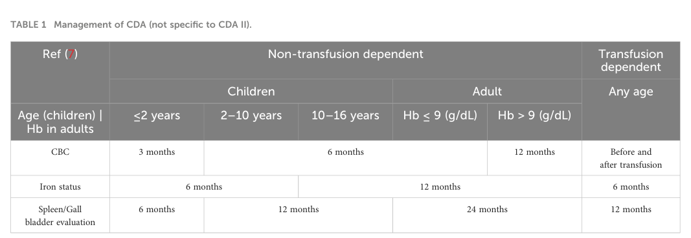

## Question

# Disease Characteristics Research Template

## Target Disease
- **Disease Name:** Congenital Dyserythropoietic Anemia
- **MONDO ID:**  (if available)
- **Category:** Mendelian

## Research Objectives

Please provide a comprehensive research report on **Congenital Dyserythropoietic Anemia** covering all of the
disease characteristics listed below. This report will be used to populate a disease knowledge
base entry. Be thorough and cite primary literature (PMID preferred) for all claims.

For each section, **suggested databases/resources** are listed. These are the first places
you should search for information on each topic.

---

### 1. Disease Information
> **Search first:** OMIM, Orphanet, ICD-10/ICD-11, MeSH, PubMed

- What is the disease? Provide a concise overview.
- What are the key identifiers? (OMIM, Orphanet, ICD-10/ICD-11, MeSH, Mondo)
- What are the common synonyms and alternative names?
- Is the information derived from individual patients (e.g., EHR) or aggregated disease-level resources?

### 2. Etiology

- **Disease Causal Factors**: What are the primary causes? (genetic, environmental, infectious, mechanistic)
- **Risk Factors**:
  > **Search first:** PubMed, Cochrane Library, UpToDate, clinical guidelines, ClinVar, ClinGen, GWAS Catalog, PheGenI, CTD, CDC, WHO, epidemiological databases
  - Genetic risk factors (causal variants, susceptibility loci, modifier genes)
  - Environmental risk factors (toxins, lifestyle, occupational exposures, age, sex, family history)
- **Protective Factors**:
  > **Search first:** PubMed, Cochrane Library, clinical trial databases, GWAS Catalog, gnomAD, WHO, CDC, nutrition databases
  - Genetic protective factors (protective variants, modifier alleles)
  - Environmental protective factors (diet, lifestyle, exposures that reduce risk)
- **Gene-Environment Interactions**: How do genetic and environmental factors interact to influence disease?
  > **Search first:** CTD, PubMed, PheGenI, GxE databases

### 3. Phenotypes
> **Search first:** HPO (Human Phenotype Ontology), OMIM, Orphanet, PubMed, clinicaltrials.gov, MedDRA, SNOMED CT, DECIPHER, LOINC

For each phenotype, provide:
- **Phenotype type**: symptoms, clinical signs, physical manifestations, behavioral changes, or laboratory abnormalities
  > For symptoms/signs: HPO, OMIM, Orphanet, PubMed
  > For behavioral changes: HPO, DSM, RDoC (Research Domain Criteria), PubMed
  > For laboratory abnormalities: LOINC, SNOMED CT, LabTests Online, PubMed
- **Phenotype characteristics**:
  > **Search first:** OMIM, Orphanet, HPO, PubMed
  - Age of symptom onset (neonatal, childhood, adult-onset, late-onset)
  - Symptom severity (mild, moderate, severe, variable)
  - Symptom progression (stable, progressive, episodic, fluctuating)
  - Frequency among affected individuals (percentage or qualitative)
- **Quality of life impact**: Effects on daily functioning and well-being (per-phenotype when possible)
  > **Search first:** EQ-5D database, SF-36, WHO QOL databases, PubMed
- Suggest HPO (Human Phenotype Ontology) terms for each phenotype

### 4. Genetic/Molecular Information

- **Causal Genes**: Gene mutations or chromosomal abnormalities responsible for disease (gene symbols, OMIM IDs)
  > **Search first:** OMIM, ClinVar, HGMD, Ensembl, NCBI Gene
- **Pathogenic Variants**:
  - Affected genes (gene symbols, HGNC IDs)
    > **Search first:** OMIM, NCBI Gene, Ensembl, HGNC, UniProt, GeneCards
  - Variant classification (pathogenic, likely pathogenic, VUS per ACMG/AMP guidelines)
    > **Search first:** ClinVar, ClinGen, ACMG/AMP guidelines, VarSome
  - Variant type/class (missense, frameshift, nonsense, splice-site, structural)
  - Allele frequency in population databases
    > **Search first:** gnomAD, 1000 Genomes, ExAC, TOPMed, dbSNP
  - Somatic vs germline origin
    > **Search first:** COSMIC (somatic), ClinVar, ICGC, TCGA
  - Functional consequences (loss of function, gain of function, dominant negative)
- **Modifier Genes**: Genes that modify disease severity or expression
- **Epigenetic Information**: DNA methylation, histone modifications, chromatin changes affecting disease
  > **Search first:** ENCODE, Roadmap Epigenomics, MethBase, DiseaseMeth
- **Chromosomal Abnormalities**: Large-scale genetic changes (aneuploidy, translocations, inversions)
  > **Search first:** DECIPHER, ClinVar, ECARUCA, UCSC Genome Browser

### 5. Environmental Information

- **Environmental Factors**: Non-genetic contributing factors (toxins, radiation, pollution, occupational exposure)
  > **Search first:** CTD (Comparative Toxicogenomics Database), TOXNET, PubMed, EPA databases
- **Lifestyle Factors**: Behavioral factors (smoking, diet, exercise, alcohol consumption)
  > **Search first:** CDC databases, WHO, PubMed, NHANES
- **Infectious Agents**: If applicable, pathogens causing or triggering disease (bacteria, viruses, fungi, parasites)
  > **Search first:** NCBI Taxonomy, ViPR, BV-BRC, MicrobeDB, GIDEON

### 6. Mechanism / Pathophysiology

- **Molecular Pathways**: Specific signaling cascades or biochemical pathways involved (Wnt, MAPK, mTOR, PI3K-AKT, etc.)
  > **Search first:** KEGG, Reactome, WikiPathways, PathBank, BioCyc
- **Cellular Processes**: Cell-level mechanisms (apoptosis, autophagy, cell cycle dysregulation, inflammation, etc.)
  > **Search first:** Gene Ontology (GO), Reactome, KEGG, PubMed
- **Protein Dysfunction**: How protein structure or function is altered (misfolding, aggregation, loss of function, gain of function)
  > **Search first:** UniProt, PDB (Protein Data Bank), InterPro, Pfam, AlphaFold
- **Metabolic Changes**: Alterations in metabolic processes (energy metabolism, lipid metabolism, amino acid metabolism)
  > **Search first:** KEGG, BioCyc, HMDB (Human Metabolome Database), BRENDA
- **Immune System Involvement**: Role of immune response (autoimmunity, immunodeficiency, chronic inflammation)
  > **Search first:** ImmPort, Immunome Database, IEDB, Gene Ontology
- **Tissue Damage Mechanisms**: How tissues/ are injured (oxidative stress, ischemia, fibrosis, necrosis)
  > **Search first:** PubMed, Gene Ontology, Reactome
- **Biochemical Abnormalities**: Specific molecular defects (enzyme deficiencies, receptor dysfunction, ion channel defects)
  > **Search first:** BRENDA, UniProt, KEGG, OMIM, PubMed
- **Epigenetic Changes**: DNA methylation, histone modifications affecting gene expression in disease
  > **Search first:** ENCODE, Roadmap Epigenomics, MethBase, DiseaseMeth
- **Molecular Profiling** (if available):
  - Transcriptomics/gene expression changes
    > **Search first:** GEO (Gene Expression Omnibus), ArrayExpress, GTEx, Human Cell Atlas, SRA
  - Proteomics findings
    > **Search first:** PRIDE, ProteomeXchange, Human Protein Atlas, STRING, BioGRID
  - Metabolomics signatures
    > **Search first:** MetaboLights, Metabolomics Workbench, HMDB, METLIN
  - Lipidomics alterations
    > **Search first:** LIPID MAPS, SwissLipids, LipidHome, Metabolomics Workbench
  - Genomic structural features
    > **Search first:** UCSC Genome Browser, Ensembl, NCBI, dbVar, DGV
- **Advanced Technologies** (if applicable):
  - Single-cell analysis findings (cell-type specific mechanisms, cellular heterogeneity)
    > **Search first:** Human Cell Atlas, Single Cell Portal, GEO, CELLxGENE
  - Spatial transcriptomics findings
    > **Search first:** GEO, Spatial Research, Vizgen, 10x Genomics data
  - Multi-omics integration results
    > **Search first:** TCGA, ICGC, cBioPortal, LinkedOmics, PubMed
  - Functional genomics screens (CRISPR, RNAi)
    > **Search first:** DepMap, GenomeRNAi, PubMed, BioGRID ORCS

For each mechanism, describe:
- The causal chain from initial trigger to clinical manifestation
- Which mechanisms are upstream vs downstream
- What cell types and biological processes are involved
- Suggest GO terms for biological processes and CL terms for cell types

### 7. Anatomical Structures Affected

- **Organ Level**:
  - Primary organs directly affected
  - Secondary organ involvement (complications, secondary effects)
  - Body systems involved (cardiovascular, nervous, digestive, respiratory, endocrine, etc.)
  > **Search first:** Uberon, FMA (Foundational Model of Anatomy), OMIM, HPO, ICD-11, MeSH, SNOMED CT
- **Tissue and Cell Level**:
  - Specific tissue types affected (epithelial, connective, muscle, nervous)
  - Specific cell populations targeted (with Cell Ontology terms)
  > **Search first:** Uberon, Human Protein Atlas, Cell Ontology, Human Cell Atlas, CellMarker, PanglaoDB
- **Subcellular Level**:
  - Cellular compartments involved (mitochondria, nucleus, ER, lysosomes) (with GO Cellular Component terms)
  > **Search first:** Gene Ontology (Cellular Component), UniProt, Human Protein Atlas
- **Localization**:
  - Specific anatomical sites (with UBERON terms)
    > **Search first:** FMA, Uberon, NeuroNames (for brain), SNOMED CT
  - Lateralization (unilateral, bilateral, asymmetric)
    > **Search first:** HPO, clinical literature, imaging databases

### 8. Temporal Development

- **Onset**:
  - Typical age of onset (congenital, pediatric, adult, geriatric)
  - Onset pattern (acute, subacute, chronic, insidious)
  > **Search first:** OMIM, Orphanet, HPO, PubMed
- **Progression**:
  - Disease stages (early, intermediate, advanced, end-stage)
    > **Search first:** Cancer Staging Manual (AJCC), WHO classifications, PubMed
  - Progression rate (rapid, slow, variable)
  - Disease course pattern (episodic, relapsing-remitting, progressive, stable)
  - Disease duration (self-limited, chronic lifelong)
  > **Search first:** Disease registries, longitudinal cohort databases, natural history studies, PubMed, Orphanet, OMIM
- **Patterns**:
  - Remission patterns (spontaneous, treatment-induced)
    > **Search first:** Clinical trial databases, disease registries, PubMed
  - Critical periods (time windows of vulnerability or opportunity for intervention)
    > **Search first:** PubMed, developmental biology databases, clinical guidelines

### 9. Inheritance and Population

- **Epidemiology**:
  - Prevalence (cases per 100,000 at given time)
  - Incidence (new cases per 100,000 per year)
  > **Search first:** Orphanet, CDC, WHO, GBD (Global Burden of Disease), national registries, SEER, disease registries
- **For Genetic Etiology**:
  - Inheritance pattern (AD, AR, X-linked, mitochondrial, multifactorial, polygenic)
    > **Search first:** OMIM, Orphanet, ClinVar, GTR (Genetic Testing Registry)
  - Penetrance (complete, incomplete, age-dependent)
    > **Search first:** ClinVar, OMIM, PubMed, ClinGen
  - Expressivity (variable, consistent)
    > **Search first:** OMIM, ClinVar, PubMed
  - Genetic anticipation (increasing severity in successive generations)
    > **Search first:** OMIM, PubMed (especially for repeat expansion disorders)
  - Germline mosaicism
    > **Search first:** ClinVar, OMIM, genetic counseling literature, PubMed
  - Founder effects (population-specific mutations)
    > **Search first:** gnomAD, population genetics databases, PubMed
  - Consanguinity role
    > **Search first:** OMIM, population studies, genetic counseling resources
  - Carrier frequency
    > **Search first:** gnomAD, carrier screening databases, GeneReviews, GTR
- **Population Demographics**:
  - Affected populations (ethnic or demographic groups with higher prevalence)
    > **Search first:** gnomAD, 1000 Genomes, PAGE Study, PubMed, population registries
  - Geographic distribution (endemic areas, regional variation)
    > **Search first:** WHO, CDC, GBD, Orphanet, geographic epidemiology databases
  - Geographic distribution of specific variants
  - Sex ratio (male:female)
    > **Search first:** Disease registries, OMIM, PubMed, epidemiological databases
  - Age distribution of affected individuals
    > **Search first:** CDC, disease registries, SEER, Orphanet

### 10. Diagnostics

- **Clinical Tests**:
  - Laboratory tests (blood, urine, tissue chemistry, specific enzyme assays)
    > **Search first:** LOINC, LabTests Online, PubMed
  - Biomarkers (proteins, metabolites, genetic markers, circulating biomarkers)
    > **Search first:** FDA Biomarker List, BEST (Biomarkers, EndpointS, and other Tools), PubMed
  - Imaging studies (X-ray, CT, MRI, PET, ultrasound)
    > **Search first:** RadLex, DICOM, Radiopaedia, imaging databases
  - Functional tests (pulmonary function, cardiac stress tests)
    > **Search first:** LOINC, clinical guidelines, PubMed
  - Electrophysiology (EEG, EMG, ECG, nerve conduction studies)
    > **Search first:** LOINC, clinical neurophysiology databases, PubMed
  - Biopsy findings (histopathology, immunohistochemistry)
    > **Search first:** SNOMED CT, College of American Pathologists resources, PubMed
  - Pathology findings (microscopic examination)
    > **Search first:** SNOMED CT, Digital Pathology databases, PubMed
- **Genetic Testing**:
  > **Search first:** GTR (Genetic Testing Registry), GeneReviews, ClinGen
  - Overview of recommended genetic testing approach
  - Whole genome sequencing (WGS) utility
    > **Search first:** GTR, ClinVar, GEL (Genomics England), gnomAD
  - Whole exome sequencing (WES) utility
    > **Search first:** GTR, ClinVar, OMIM, GeneMatcher
  - Gene panels (which panels, which genes)
    > **Search first:** GTR, ClinVar, laboratory-specific databases
  - Single gene testing
    > **Search first:** GTR, ClinVar, OMIM, GeneReviews
  - Chromosomal microarray (CMA)
    > **Search first:** DECIPHER, ClinVar, dbVar, ECARUCA
  - Karyotyping
    > **Search first:** Chromosome Abnormality Database, ClinVar, cytogenetics resources
  - FISH
    > **Search first:** ClinVar, cytogenetics databases, PubMed
  - Mitochondrial DNA testing
    > **Search first:** MITOMAP, MSeqDR, ClinVar, GTR
  - Repeat expansion testing
    > **Search first:** GTR, ClinVar, repeat expansion databases, PubMed
- **Omics-Based Diagnostics** (if applicable):
  - RNA sequencing / transcriptomics
    > **Search first:** GEO, ArrayExpress, GTEx, RNA-seq databases
  - Proteomics
    > **Search first:** PRIDE, ProteomeXchange, FDA Biomarker database
  - Metabolomics
    > **Search first:** MetaboLights, Metabolomics Workbench, HMDB
  - Epigenomics
    > **Search first:** GEO, ENCODE, Roadmap Epigenomics, MethBase
  - Liquid biopsy
    > **Search first:** COSMIC, ClinVar, liquid biopsy databases, PubMed
- **Clinical Criteria**:
  - Standardized diagnostic criteria (DSM, ICD, society guidelines)
    > **Search first:** DSM-5, ICD-11, clinical society guidelines, UpToDate
  - Differential diagnosis (other conditions to rule out, with distinguishing features)
    > **Search first:** DynaMed, UpToDate, clinical decision support systems
- **Screening**:
  - Screening methods for asymptomatic individuals (newborn screening, carrier screening, cascade screening)
    > **Search first:** ACMG recommendations, CDC newborn screening, GTR

### 11. Outcome/Prognosis

- **Survival and Mortality**:
  - Survival rate (5-year, 10-year, overall)
    > **Search first:** SEER, cancer registries, disease-specific registries, PubMed
  - Life expectancy (with and without treatment if applicable)
    > **Search first:** Orphanet, disease registries, actuarial databases, PubMed
  - Mortality rate
    > **Search first:** CDC, WHO, GBD, national mortality databases
  - Disease-specific mortality (deaths directly attributable to disease)
    > **Search first:** Disease registries, CDC Wonder, GBD, PubMed
- **Morbidity and Function**:
  - Morbidity (disease-related disability and health impacts)
    > **Search first:** GBD, WHO, disability databases, PubMed
  - Disability outcomes (long-term functional impairments)
    > **Search first:** ICF (International Classification of Functioning), disability registries
  - Quality of life measures (EQ-5D, SF-36, PROMIS, disease-specific tools)
    > **Search first:** EQ-5D database, SF-36, PROMIS, PubMed
- **Disease Course**:
  - Complications (secondary problems: infections, organ failure, etc.)
    > **Search first:** ICD codes, disease registries, clinical databases, PubMed
  - Recovery potential (likelihood and extent of recovery, with vs without treatment)
    > **Search first:** Natural history studies, rehabilitation databases, PubMed
- **Prediction**:
  - Prognostic factors (age, disease severity, biomarkers, treatment response)
    > **Search first:** Prognostic models databases, clinical calculators, PubMed
  - Prognostic biomarkers (molecular markers predicting disease course)
    > **Search first:** FDA Biomarker database, PubMed, cancer prognostic databases

### 12. Treatment

- **Pharmacotherapy**:
  - Pharmacological treatments (drug names, drug classes, mechanisms of action)
    > **Search first:** DrugBank, RxNorm, ATC classification, DailyMed, FDA databases
  - Pharmacogenomics (how genetic variants affect drug metabolism, efficacy, toxicity)
    > **Search first:** PharmGKB, CPIC (Clinical Pharmacogenetics), FDA Table of PGx Biomarkers
- **Advanced Therapeutics**:
  - Gene therapy (viral vectors, CRISPR, gene replacement, gene editing)
    > **Search first:** ClinicalTrials.gov, FDA gene therapy database, ASGCT resources
  - Cell therapy (stem cell transplant, CAR-T, cellular therapeutics)
    > **Search first:** ClinicalTrials.gov, FDA cell therapy database, FACT standards
  - RNA-based therapies (ASOs, siRNA, mRNA therapies)
    > **Search first:** ClinicalTrials.gov, FDA approvals, PubMed
  - Targeted therapies (treatments directed at specific molecular targets)
    > **Search first:** My Cancer Genome, OncoKB, ClinicalTrials.gov, FDA approvals
  - Immunotherapies (checkpoint inhibitors, monoclonal antibodies)
    > **Search first:** Cancer Immunotherapy Database, FDA approvals, ClinicalTrials.gov
- **Surgical and Interventional**:
  - Surgical interventions (types of surgery, timing, outcomes)
    > **Search first:** CPT codes, surgical registries, clinical guidelines, PubMed
- **Supportive and Rehabilitative**:
  - Supportive care (symptom management, pain control, nutrition)
    > **Search first:** Clinical guidelines, Cochrane Library, PubMed
  - Rehabilitation (physical therapy, occupational therapy, speech therapy)
    > **Search first:** Rehabilitation medicine databases, clinical guidelines, PubMed
- **Experimental**:
  - Experimental treatments in clinical trials (with NCT identifiers if available)
    > **Search first:** ClinicalTrials.gov, EU Clinical Trials Register, WHO ICTRP
- **Treatment Outcomes**:
  - Treatment response rates
    > **Search first:** Clinical trial databases, FDA reviews, systematic reviews, PubMed
  - Side effects and adverse events
    > **Search first:** FDA Adverse Event Reporting System (FAERS), MedWatch, PubMed
- **Treatment Strategy**:
  - Treatment algorithms (clinical pathways, decision trees)
    > **Search first:** Clinical practice guidelines, NCCN Guidelines, UpToDate
  - Combination therapies
    > **Search first:** ClinicalTrials.gov, treatment guidelines, PubMed
  - Personalized medicine approaches (genotype-guided treatment)
    > **Search first:** My Cancer Genome, CIViC, PharmGKB, precision medicine databases

For each treatment, suggest MAXO (Medical Action Ontology) terms where applicable.

### 13. Prevention

- **Prevention Levels**:
  - Primary prevention (preventing disease occurrence: vaccination, risk factor modification)
    > **Search first:** CDC, WHO, USPSTF recommendations, Cochrane Library
  - Secondary prevention (early detection and treatment: screening programs, early intervention)
    > **Search first:** USPSTF, CDC screening guidelines, WHO
  - Tertiary prevention (preventing complications in those with disease)
    > **Search first:** Clinical guidelines, disease management protocols, PubMed
- **Immunization**: Vaccine strategies (if applicable)
  > **Search first:** CDC vaccine schedules, WHO immunization, FDA vaccine database
- **Screening and Early Detection**:
  - Screening programs (population-based: newborn screening, cancer screening)
    > **Search first:** CDC screening programs, USPSTF, cancer screening databases
  - Genetic screening (carrier screening, preimplantation genetic diagnosis, prenatal testing)
    > **Search first:** ACMG recommendations, ACOG guidelines, GTR
  - Risk stratification (identifying high-risk individuals for targeted prevention)
    > **Search first:** Risk prediction models, clinical calculators, PubMed
- **Behavioral Interventions**: Lifestyle modifications to reduce risk
  > **Search first:** CDC, WHO, behavioral intervention databases, Cochrane Library
- **Counseling**: Genetic counseling (risk assessment, family planning guidance)
  > **Search first:** NSGC resources, ACMG guidelines, GeneReviews
- **Public Health**:
  - Public health interventions (sanitation, vector control, health education)
    > **Search first:** CDC, WHO, public health databases, PubMed
  - Environmental interventions (reducing environmental risk factors)
    > **Search first:** EPA databases, WHO environmental health, PubMed
- **Prophylaxis**: Preventive medications or procedures
  > **Search first:** Clinical guidelines, FDA approvals, PubMed

### 14. Other Species / Natural Disease

- **Taxonomy**: Species affected (with NCBI Taxon identifiers)
  > **Search first:** NCBI Taxonomy
- **Breed**: Specific breeds affected (with VBO identifiers if applicable)
  > **Search first:** VBO (Vertebrate Breed Ontology)
- **Gene**: Orthologous genes in other species (with NCBI Gene IDs)
  > **Search first:** NCBI Gene
- **Natural Disease**:
  - Naturally occurring disease in other species (companion animals, wildlife)
    > **Search first:** OMIA (Online Mendelian Inheritance in Animals), VetCompass, PubMed
  - Veterinary relevance and importance in animal health
    > **Search first:** OMIA, veterinary databases, PubMed
- **Comparative Biology**:
  - Comparative pathology (similarities and differences across species)
    > **Search first:** OMIA, comparative pathology databases, PubMed
  - Evolutionary conservation of disease mechanisms
    > **Search first:** HomoloGene, OrthoMCL, Alliance of Genome Resources
- **Transmission** (if applicable):
  - Zoonotic potential
    > **Search first:** CDC zoonotic diseases, WHO zoonoses, GIDEON
  - Cross-species susceptibility
    > **Search first:** NCBI Taxonomy, veterinary databases, PubMed

### 15. Model Organisms

- **Model Types**:
  - Model organism type (mammalian, invertebrate, cellular, in vitro)
    > **Search first:** Alliance of Genome Resources, model organism databases
  - Specific model systems (mouse, rat, zebrafish, Drosophila, C. elegans, yeast, cell lines, organoids, iPSCs)
    > **Search first:** MGI, RGD, ZFIN, FlyBase, WormBase, SGD, ATCC, Cellosaurus
  - Induced models (drug treatment, surgical intervention, environmental manipulation)
    > **Search first:** MGI, model organism databases, PubMed
- **Genetic Models**:
  - Types available (knockout, knock-in, transgenic, conditional, humanized)
    > **Search first:** MGI, IMPC, KOMP, EuMMCR, IMSR
- **Model Characteristics**:
  - Phenotype recapitulation (how well model reproduces human disease features)
    > **Search first:** Model organism databases, comparative studies, PubMed
  - Model limitations (aspects of human disease not captured)
    > **Search first:** Model organism databases, PubMed, review articles
- **Applications**:
  - Research applications (what aspects of disease can be studied)
    > **Search first:** Model organism databases, PubMed
- **Resources**:
  - Model databases
    > **Search first:** MGI, RGD, ZFIN, FlyBase, WormBase, IMSR, EMMA, MMRRC

---

## Citation Requirements

- Cite primary literature (PMID preferred) for all mechanistic and clinical claims
- Prioritize recent reviews and landmark papers
- Include direct quotes from abstracts where possible to support key statements
- Distinguish evidence source types: human clinical, model organism, in vitro, computational

## Output Format

Structure your response as a comprehensive narrative organized by the sections above.
For each section, provide:
- Factual content with specific details (numbers, percentages, gene names, variant nomenclature)
- Ontology term suggestions (HPO, GO, CL, UBERON, CHEBI, MAXO, MONDO) where applicable
- Evidence citations with PMIDs
- Direct quotes from abstracts to support key claims
- Clear indication when information is not available or not applicable for this disease

This report will be used to populate a disease knowledge base entry with:
- Pathophysiology descriptions with causal chains
- Gene/protein annotations (HGNC, GO terms)
- Phenotype associations (HP terms) with frequencies
- Cell type involvement (CL terms)
- Anatomical locations (UBERON terms)
- Chemical entities (CHEBI terms)
- Treatment annotations (MAXO terms)
- Evidence items with PMIDs and exact abstract quotes
- Epidemiology, prognosis, diagnostic, and prevention information
- Animal model descriptions with phenotype recapitulation details

## Output

Question: You are an expert researcher providing comprehensive, well-cited information.

Provide detailed information focusing on:
1. Key concepts and definitions with current understanding
2. Recent developments and latest research (prioritize 2023-2024 sources)
3. Current applications and real-world implementations
4. Expert opinions and analysis from authoritative sources
5. Relevant statistics and data from recent studies

Format as a comprehensive research report with proper citations. Include URLs and publication dates where available.
Always prioritize recent, authoritative sources and provide specific citations for all major claims.

# Disease Characteristics Research Template

## Target Disease
- **Disease Name:** Congenital Dyserythropoietic Anemia
- **MONDO ID:**  (if available)
- **Category:** Mendelian

## Research Objectives

Please provide a comprehensive research report on **Congenital Dyserythropoietic Anemia** covering all of the
disease characteristics listed below. This report will be used to populate a disease knowledge
base entry. Be thorough and cite primary literature (PMID preferred) for all claims.

For each section, **suggested databases/resources** are listed. These are the first places
you should search for information on each topic.

---

### 1. Disease Information
> **Search first:** OMIM, Orphanet, ICD-10/ICD-11, MeSH, PubMed

- What is the disease? Provide a concise overview.
- What are the key identifiers? (OMIM, Orphanet, ICD-10/ICD-11, MeSH, Mondo)
- What are the common synonyms and alternative names?
- Is the information derived from individual patients (e.g., EHR) or aggregated disease-level resources?

### 2. Etiology

- **Disease Causal Factors**: What are the primary causes? (genetic, environmental, infectious, mechanistic)
- **Risk Factors**:
  > **Search first:** PubMed, Cochrane Library, UpToDate, clinical guidelines, ClinVar, ClinGen, GWAS Catalog, PheGenI, CTD, CDC, WHO, epidemiological databases
  - Genetic risk factors (causal variants, susceptibility loci, modifier genes)
  - Environmental risk factors (toxins, lifestyle, occupational exposures, age, sex, family history)
- **Protective Factors**:
  > **Search first:** PubMed, Cochrane Library, clinical trial databases, GWAS Catalog, gnomAD, WHO, CDC, nutrition databases
  - Genetic protective factors (protective variants, modifier alleles)
  - Environmental protective factors (diet, lifestyle, exposures that reduce risk)
- **Gene-Environment Interactions**: How do genetic and environmental factors interact to influence disease?
  > **Search first:** CTD, PubMed, PheGenI, GxE databases

### 3. Phenotypes
> **Search first:** HPO (Human Phenotype Ontology), OMIM, Orphanet, PubMed, clinicaltrials.gov, MedDRA, SNOMED CT, DECIPHER, LOINC

For each phenotype, provide:
- **Phenotype type**: symptoms, clinical signs, physical manifestations, behavioral changes, or laboratory abnormalities
  > For symptoms/signs: HPO, OMIM, Orphanet, PubMed
  > For behavioral changes: HPO, DSM, RDoC (Research Domain Criteria), PubMed
  > For laboratory abnormalities: LOINC, SNOMED CT, LabTests Online, PubMed
- **Phenotype characteristics**:
  > **Search first:** OMIM, Orphanet, HPO, PubMed
  - Age of symptom onset (neonatal, childhood, adult-onset, late-onset)
  - Symptom severity (mild, moderate, severe, variable)
  - Symptom progression (stable, progressive, episodic, fluctuating)
  - Frequency among affected individuals (percentage or qualitative)
- **Quality of life impact**: Effects on daily functioning and well-being (per-phenotype when possible)
  > **Search first:** EQ-5D database, SF-36, WHO QOL databases, PubMed
- Suggest HPO (Human Phenotype Ontology) terms for each phenotype

### 4. Genetic/Molecular Information

- **Causal Genes**: Gene mutations or chromosomal abnormalities responsible for disease (gene symbols, OMIM IDs)
  > **Search first:** OMIM, ClinVar, HGMD, Ensembl, NCBI Gene
- **Pathogenic Variants**:
  - Affected genes (gene symbols, HGNC IDs)
    > **Search first:** OMIM, NCBI Gene, Ensembl, HGNC, UniProt, GeneCards
  - Variant classification (pathogenic, likely pathogenic, VUS per ACMG/AMP guidelines)
    > **Search first:** ClinVar, ClinGen, ACMG/AMP guidelines, VarSome
  - Variant type/class (missense, frameshift, nonsense, splice-site, structural)
  - Allele frequency in population databases
    > **Search first:** gnomAD, 1000 Genomes, ExAC, TOPMed, dbSNP
  - Somatic vs germline origin
    > **Search first:** COSMIC (somatic), ClinVar, ICGC, TCGA
  - Functional consequences (loss of function, gain of function, dominant negative)
- **Modifier Genes**: Genes that modify disease severity or expression
- **Epigenetic Information**: DNA methylation, histone modifications, chromatin changes affecting disease
  > **Search first:** ENCODE, Roadmap Epigenomics, MethBase, DiseaseMeth
- **Chromosomal Abnormalities**: Large-scale genetic changes (aneuploidy, translocations, inversions)
  > **Search first:** DECIPHER, ClinVar, ECARUCA, UCSC Genome Browser

### 5. Environmental Information

- **Environmental Factors**: Non-genetic contributing factors (toxins, radiation, pollution, occupational exposure)
  > **Search first:** CTD (Comparative Toxicogenomics Database), TOXNET, PubMed, EPA databases
- **Lifestyle Factors**: Behavioral factors (smoking, diet, exercise, alcohol consumption)
  > **Search first:** CDC databases, WHO, PubMed, NHANES
- **Infectious Agents**: If applicable, pathogens causing or triggering disease (bacteria, viruses, fungi, parasites)
  > **Search first:** NCBI Taxonomy, ViPR, BV-BRC, MicrobeDB, GIDEON

### 6. Mechanism / Pathophysiology

- **Molecular Pathways**: Specific signaling cascades or biochemical pathways involved (Wnt, MAPK, mTOR, PI3K-AKT, etc.)
  > **Search first:** KEGG, Reactome, WikiPathways, PathBank, BioCyc
- **Cellular Processes**: Cell-level mechanisms (apoptosis, autophagy, cell cycle dysregulation, inflammation, etc.)
  > **Search first:** Gene Ontology (GO), Reactome, KEGG, PubMed
- **Protein Dysfunction**: How protein structure or function is altered (misfolding, aggregation, loss of function, gain of function)
  > **Search first:** UniProt, PDB (Protein Data Bank), InterPro, Pfam, AlphaFold
- **Metabolic Changes**: Alterations in metabolic processes (energy metabolism, lipid metabolism, amino acid metabolism)
  > **Search first:** KEGG, BioCyc, HMDB (Human Metabolome Database), BRENDA
- **Immune System Involvement**: Role of immune response (autoimmunity, immunodeficiency, chronic inflammation)
  > **Search first:** ImmPort, Immunome Database, IEDB, Gene Ontology
- **Tissue Damage Mechanisms**: How tissues/ are injured (oxidative stress, ischemia, fibrosis, necrosis)
  > **Search first:** PubMed, Gene Ontology, Reactome
- **Biochemical Abnormalities**: Specific molecular defects (enzyme deficiencies, receptor dysfunction, ion channel defects)
  > **Search first:** BRENDA, UniProt, KEGG, OMIM, PubMed
- **Epigenetic Changes**: DNA methylation, histone modifications affecting gene expression in disease
  > **Search first:** ENCODE, Roadmap Epigenomics, MethBase, DiseaseMeth
- **Molecular Profiling** (if available):
  - Transcriptomics/gene expression changes
    > **Search first:** GEO (Gene Expression Omnibus), ArrayExpress, GTEx, Human Cell Atlas, SRA
  - Proteomics findings
    > **Search first:** PRIDE, ProteomeXchange, Human Protein Atlas, STRING, BioGRID
  - Metabolomics signatures
    > **Search first:** MetaboLights, Metabolomics Workbench, HMDB, METLIN
  - Lipidomics alterations
    > **Search first:** LIPID MAPS, SwissLipids, LipidHome, Metabolomics Workbench
  - Genomic structural features
    > **Search first:** UCSC Genome Browser, Ensembl, NCBI, dbVar, DGV
- **Advanced Technologies** (if applicable):
  - Single-cell analysis findings (cell-type specific mechanisms, cellular heterogeneity)
    > **Search first:** Human Cell Atlas, Single Cell Portal, GEO, CELLxGENE
  - Spatial transcriptomics findings
    > **Search first:** GEO, Spatial Research, Vizgen, 10x Genomics data
  - Multi-omics integration results
    > **Search first:** TCGA, ICGC, cBioPortal, LinkedOmics, PubMed
  - Functional genomics screens (CRISPR, RNAi)
    > **Search first:** DepMap, GenomeRNAi, PubMed, BioGRID ORCS

For each mechanism, describe:
- The causal chain from initial trigger to clinical manifestation
- Which mechanisms are upstream vs downstream
- What cell types and biological processes are involved
- Suggest GO terms for biological processes and CL terms for cell types

### 7. Anatomical Structures Affected

- **Organ Level**:
  - Primary organs directly affected
  - Secondary organ involvement (complications, secondary effects)
  - Body systems involved (cardiovascular, nervous, digestive, respiratory, endocrine, etc.)
  > **Search first:** Uberon, FMA (Foundational Model of Anatomy), OMIM, HPO, ICD-11, MeSH, SNOMED CT
- **Tissue and Cell Level**:
  - Specific tissue types affected (epithelial, connective, muscle, nervous)
  - Specific cell populations targeted (with Cell Ontology terms)
  > **Search first:** Uberon, Human Protein Atlas, Cell Ontology, Human Cell Atlas, CellMarker, PanglaoDB
- **Subcellular Level**:
  - Cellular compartments involved (mitochondria, nucleus, ER, lysosomes) (with GO Cellular Component terms)
  > **Search first:** Gene Ontology (Cellular Component), UniProt, Human Protein Atlas
- **Localization**:
  - Specific anatomical sites (with UBERON terms)
    > **Search first:** FMA, Uberon, NeuroNames (for brain), SNOMED CT
  - Lateralization (unilateral, bilateral, asymmetric)
    > **Search first:** HPO, clinical literature, imaging databases

### 8. Temporal Development

- **Onset**:
  - Typical age of onset (congenital, pediatric, adult, geriatric)
  - Onset pattern (acute, subacute, chronic, insidious)
  > **Search first:** OMIM, Orphanet, HPO, PubMed
- **Progression**:
  - Disease stages (early, intermediate, advanced, end-stage)
    > **Search first:** Cancer Staging Manual (AJCC), WHO classifications, PubMed
  - Progression rate (rapid, slow, variable)
  - Disease course pattern (episodic, relapsing-remitting, progressive, stable)
  - Disease duration (self-limited, chronic lifelong)
  > **Search first:** Disease registries, longitudinal cohort databases, natural history studies, PubMed, Orphanet, OMIM
- **Patterns**:
  - Remission patterns (spontaneous, treatment-induced)
    > **Search first:** Clinical trial databases, disease registries, PubMed
  - Critical periods (time windows of vulnerability or opportunity for intervention)
    > **Search first:** PubMed, developmental biology databases, clinical guidelines

### 9. Inheritance and Population

- **Epidemiology**:
  - Prevalence (cases per 100,000 at given time)
  - Incidence (new cases per 100,000 per year)
  > **Search first:** Orphanet, CDC, WHO, GBD (Global Burden of Disease), national registries, SEER, disease registries
- **For Genetic Etiology**:
  - Inheritance pattern (AD, AR, X-linked, mitochondrial, multifactorial, polygenic)
    > **Search first:** OMIM, Orphanet, ClinVar, GTR (Genetic Testing Registry)
  - Penetrance (complete, incomplete, age-dependent)
    > **Search first:** ClinVar, OMIM, PubMed, ClinGen
  - Expressivity (variable, consistent)
    > **Search first:** OMIM, ClinVar, PubMed
  - Genetic anticipation (increasing severity in successive generations)
    > **Search first:** OMIM, PubMed (especially for repeat expansion disorders)
  - Germline mosaicism
    > **Search first:** ClinVar, OMIM, genetic counseling literature, PubMed
  - Founder effects (population-specific mutations)
    > **Search first:** gnomAD, population genetics databases, PubMed
  - Consanguinity role
    > **Search first:** OMIM, population studies, genetic counseling resources
  - Carrier frequency
    > **Search first:** gnomAD, carrier screening databases, GeneReviews, GTR
- **Population Demographics**:
  - Affected populations (ethnic or demographic groups with higher prevalence)
    > **Search first:** gnomAD, 1000 Genomes, PAGE Study, PubMed, population registries
  - Geographic distribution (endemic areas, regional variation)
    > **Search first:** WHO, CDC, GBD, Orphanet, geographic epidemiology databases
  - Geographic distribution of specific variants
  - Sex ratio (male:female)
    > **Search first:** Disease registries, OMIM, PubMed, epidemiological databases
  - Age distribution of affected individuals
    > **Search first:** CDC, disease registries, SEER, Orphanet

### 10. Diagnostics

- **Clinical Tests**:
  - Laboratory tests (blood, urine, tissue chemistry, specific enzyme assays)
    > **Search first:** LOINC, LabTests Online, PubMed
  - Biomarkers (proteins, metabolites, genetic markers, circulating biomarkers)
    > **Search first:** FDA Biomarker List, BEST (Biomarkers, EndpointS, and other Tools), PubMed
  - Imaging studies (X-ray, CT, MRI, PET, ultrasound)
    > **Search first:** RadLex, DICOM, Radiopaedia, imaging databases
  - Functional tests (pulmonary function, cardiac stress tests)
    > **Search first:** LOINC, clinical guidelines, PubMed
  - Electrophysiology (EEG, EMG, ECG, nerve conduction studies)
    > **Search first:** LOINC, clinical neurophysiology databases, PubMed
  - Biopsy findings (histopathology, immunohistochemistry)
    > **Search first:** SNOMED CT, College of American Pathologists resources, PubMed
  - Pathology findings (microscopic examination)
    > **Search first:** SNOMED CT, Digital Pathology databases, PubMed
- **Genetic Testing**:
  > **Search first:** GTR (Genetic Testing Registry), GeneReviews, ClinGen
  - Overview of recommended genetic testing approach
  - Whole genome sequencing (WGS) utility
    > **Search first:** GTR, ClinVar, GEL (Genomics England), gnomAD
  - Whole exome sequencing (WES) utility
    > **Search first:** GTR, ClinVar, OMIM, GeneMatcher
  - Gene panels (which panels, which genes)
    > **Search first:** GTR, ClinVar, laboratory-specific databases
  - Single gene testing
    > **Search first:** GTR, ClinVar, OMIM, GeneReviews
  - Chromosomal microarray (CMA)
    > **Search first:** DECIPHER, ClinVar, dbVar, ECARUCA
  - Karyotyping
    > **Search first:** Chromosome Abnormality Database, ClinVar, cytogenetics resources
  - FISH
    > **Search first:** ClinVar, cytogenetics databases, PubMed
  - Mitochondrial DNA testing
    > **Search first:** MITOMAP, MSeqDR, ClinVar, GTR
  - Repeat expansion testing
    > **Search first:** GTR, ClinVar, repeat expansion databases, PubMed
- **Omics-Based Diagnostics** (if applicable):
  - RNA sequencing / transcriptomics
    > **Search first:** GEO, ArrayExpress, GTEx, RNA-seq databases
  - Proteomics
    > **Search first:** PRIDE, ProteomeXchange, FDA Biomarker database
  - Metabolomics
    > **Search first:** MetaboLights, Metabolomics Workbench, HMDB
  - Epigenomics
    > **Search first:** GEO, ENCODE, Roadmap Epigenomics, MethBase
  - Liquid biopsy
    > **Search first:** COSMIC, ClinVar, liquid biopsy databases, PubMed
- **Clinical Criteria**:
  - Standardized diagnostic criteria (DSM, ICD, society guidelines)
    > **Search first:** DSM-5, ICD-11, clinical society guidelines, UpToDate
  - Differential diagnosis (other conditions to rule out, with distinguishing features)
    > **Search first:** DynaMed, UpToDate, clinical decision support systems
- **Screening**:
  - Screening methods for asymptomatic individuals (newborn screening, carrier screening, cascade screening)
    > **Search first:** ACMG recommendations, CDC newborn screening, GTR

### 11. Outcome/Prognosis

- **Survival and Mortality**:
  - Survival rate (5-year, 10-year, overall)
    > **Search first:** SEER, cancer registries, disease-specific registries, PubMed
  - Life expectancy (with and without treatment if applicable)
    > **Search first:** Orphanet, disease registries, actuarial databases, PubMed
  - Mortality rate
    > **Search first:** CDC, WHO, GBD, national mortality databases
  - Disease-specific mortality (deaths directly attributable to disease)
    > **Search first:** Disease registries, CDC Wonder, GBD, PubMed
- **Morbidity and Function**:
  - Morbidity (disease-related disability and health impacts)
    > **Search first:** GBD, WHO, disability databases, PubMed
  - Disability outcomes (long-term functional impairments)
    > **Search first:** ICF (International Classification of Functioning), disability registries
  - Quality of life measures (EQ-5D, SF-36, PROMIS, disease-specific tools)
    > **Search first:** EQ-5D database, SF-36, PROMIS, PubMed
- **Disease Course**:
  - Complications (secondary problems: infections, organ failure, etc.)
    > **Search first:** ICD codes, disease registries, clinical databases, PubMed
  - Recovery potential (likelihood and extent of recovery, with vs without treatment)
    > **Search first:** Natural history studies, rehabilitation databases, PubMed
- **Prediction**:
  - Prognostic factors (age, disease severity, biomarkers, treatment response)
    > **Search first:** Prognostic models databases, clinical calculators, PubMed
  - Prognostic biomarkers (molecular markers predicting disease course)
    > **Search first:** FDA Biomarker database, PubMed, cancer prognostic databases

### 12. Treatment

- **Pharmacotherapy**:
  - Pharmacological treatments (drug names, drug classes, mechanisms of action)
    > **Search first:** DrugBank, RxNorm, ATC classification, DailyMed, FDA databases
  - Pharmacogenomics (how genetic variants affect drug metabolism, efficacy, toxicity)
    > **Search first:** PharmGKB, CPIC (Clinical Pharmacogenetics), FDA Table of PGx Biomarkers
- **Advanced Therapeutics**:
  - Gene therapy (viral vectors, CRISPR, gene replacement, gene editing)
    > **Search first:** ClinicalTrials.gov, FDA gene therapy database, ASGCT resources
  - Cell therapy (stem cell transplant, CAR-T, cellular therapeutics)
    > **Search first:** ClinicalTrials.gov, FDA cell therapy database, FACT standards
  - RNA-based therapies (ASOs, siRNA, mRNA therapies)
    > **Search first:** ClinicalTrials.gov, FDA approvals, PubMed
  - Targeted therapies (treatments directed at specific molecular targets)
    > **Search first:** My Cancer Genome, OncoKB, ClinicalTrials.gov, FDA approvals
  - Immunotherapies (checkpoint inhibitors, monoclonal antibodies)
    > **Search first:** Cancer Immunotherapy Database, FDA approvals, ClinicalTrials.gov
- **Surgical and Interventional**:
  - Surgical interventions (types of surgery, timing, outcomes)
    > **Search first:** CPT codes, surgical registries, clinical guidelines, PubMed
- **Supportive and Rehabilitative**:
  - Supportive care (symptom management, pain control, nutrition)
    > **Search first:** Clinical guidelines, Cochrane Library, PubMed
  - Rehabilitation (physical therapy, occupational therapy, speech therapy)
    > **Search first:** Rehabilitation medicine databases, clinical guidelines, PubMed
- **Experimental**:
  - Experimental treatments in clinical trials (with NCT identifiers if available)
    > **Search first:** ClinicalTrials.gov, EU Clinical Trials Register, WHO ICTRP
- **Treatment Outcomes**:
  - Treatment response rates
    > **Search first:** Clinical trial databases, FDA reviews, systematic reviews, PubMed
  - Side effects and adverse events
    > **Search first:** FDA Adverse Event Reporting System (FAERS), MedWatch, PubMed
- **Treatment Strategy**:
  - Treatment algorithms (clinical pathways, decision trees)
    > **Search first:** Clinical practice guidelines, NCCN Guidelines, UpToDate
  - Combination therapies
    > **Search first:** ClinicalTrials.gov, treatment guidelines, PubMed
  - Personalized medicine approaches (genotype-guided treatment)
    > **Search first:** My Cancer Genome, CIViC, PharmGKB, precision medicine databases

For each treatment, suggest MAXO (Medical Action Ontology) terms where applicable.

### 13. Prevention

- **Prevention Levels**:
  - Primary prevention (preventing disease occurrence: vaccination, risk factor modification)
    > **Search first:** CDC, WHO, USPSTF recommendations, Cochrane Library
  - Secondary prevention (early detection and treatment: screening programs, early intervention)
    > **Search first:** USPSTF, CDC screening guidelines, WHO
  - Tertiary prevention (preventing complications in those with disease)
    > **Search first:** Clinical guidelines, disease management protocols, PubMed
- **Immunization**: Vaccine strategies (if applicable)
  > **Search first:** CDC vaccine schedules, WHO immunization, FDA vaccine database
- **Screening and Early Detection**:
  - Screening programs (population-based: newborn screening, cancer screening)
    > **Search first:** CDC screening programs, USPSTF, cancer screening databases
  - Genetic screening (carrier screening, preimplantation genetic diagnosis, prenatal testing)
    > **Search first:** ACMG recommendations, ACOG guidelines, GTR
  - Risk stratification (identifying high-risk individuals for targeted prevention)
    > **Search first:** Risk prediction models, clinical calculators, PubMed
- **Behavioral Interventions**: Lifestyle modifications to reduce risk
  > **Search first:** CDC, WHO, behavioral intervention databases, Cochrane Library
- **Counseling**: Genetic counseling (risk assessment, family planning guidance)
  > **Search first:** NSGC resources, ACMG guidelines, GeneReviews
- **Public Health**:
  - Public health interventions (sanitation, vector control, health education)
    > **Search first:** CDC, WHO, public health databases, PubMed
  - Environmental interventions (reducing environmental risk factors)
    > **Search first:** EPA databases, WHO environmental health, PubMed
- **Prophylaxis**: Preventive medications or procedures
  > **Search first:** Clinical guidelines, FDA approvals, PubMed

### 14. Other Species / Natural Disease

- **Taxonomy**: Species affected (with NCBI Taxon identifiers)
  > **Search first:** NCBI Taxonomy
- **Breed**: Specific breeds affected (with VBO identifiers if applicable)
  > **Search first:** VBO (Vertebrate Breed Ontology)
- **Gene**: Orthologous genes in other species (with NCBI Gene IDs)
  > **Search first:** NCBI Gene
- **Natural Disease**:
  - Naturally occurring disease in other species (companion animals, wildlife)
    > **Search first:** OMIA (Online Mendelian Inheritance in Animals), VetCompass, PubMed
  - Veterinary relevance and importance in animal health
    > **Search first:** OMIA, veterinary databases, PubMed
- **Comparative Biology**:
  - Comparative pathology (similarities and differences across species)
    > **Search first:** OMIA, comparative pathology databases, PubMed
  - Evolutionary conservation of disease mechanisms
    > **Search first:** HomoloGene, OrthoMCL, Alliance of Genome Resources
- **Transmission** (if applicable):
  - Zoonotic potential
    > **Search first:** CDC zoonotic diseases, WHO zoonoses, GIDEON
  - Cross-species susceptibility
    > **Search first:** NCBI Taxonomy, veterinary databases, PubMed

### 15. Model Organisms

- **Model Types**:
  - Model organism type (mammalian, invertebrate, cellular, in vitro)
    > **Search first:** Alliance of Genome Resources, model organism databases
  - Specific model systems (mouse, rat, zebrafish, Drosophila, C. elegans, yeast, cell lines, organoids, iPSCs)
    > **Search first:** MGI, RGD, ZFIN, FlyBase, WormBase, SGD, ATCC, Cellosaurus
  - Induced models (drug treatment, surgical intervention, environmental manipulation)
    > **Search first:** MGI, model organism databases, PubMed
- **Genetic Models**:
  - Types available (knockout, knock-in, transgenic, conditional, humanized)
    > **Search first:** MGI, IMPC, KOMP, EuMMCR, IMSR
- **Model Characteristics**:
  - Phenotype recapitulation (how well model reproduces human disease features)
    > **Search first:** Model organism databases, comparative studies, PubMed
  - Model limitations (aspects of human disease not captured)
    > **Search first:** Model organism databases, PubMed, review articles
- **Applications**:
  - Research applications (what aspects of disease can be studied)
    > **Search first:** Model organism databases, PubMed
- **Resources**:
  - Model databases
    > **Search first:** MGI, RGD, ZFIN, FlyBase, WormBase, IMSR, EMMA, MMRRC

---

## Citation Requirements

- Cite primary literature (PMID preferred) for all mechanistic and clinical claims
- Prioritize recent reviews and landmark papers
- Include direct quotes from abstracts where possible to support key statements
- Distinguish evidence source types: human clinical, model organism, in vitro, computational

## Output Format

Structure your response as a comprehensive narrative organized by the sections above.
For each section, provide:
- Factual content with specific details (numbers, percentages, gene names, variant nomenclature)
- Ontology term suggestions (HPO, GO, CL, UBERON, CHEBI, MAXO, MONDO) where applicable
- Evidence citations with PMIDs
- Direct quotes from abstracts to support key claims
- Clear indication when information is not available or not applicable for this disease

This report will be used to populate a disease knowledge base entry with:
- Pathophysiology descriptions with causal chains
- Gene/protein annotations (HGNC, GO terms)
- Phenotype associations (HP terms) with frequencies
- Cell type involvement (CL terms)
- Anatomical locations (UBERON terms)
- Chemical entities (CHEBI terms)
- Treatment annotations (MAXO terms)
- Evidence items with PMIDs and exact abstract quotes
- Epidemiology, prognosis, diagnostic, and prevention information
- Animal model descriptions with phenotype recapitulation details

# Congenital Dyserythropoietic Anemia (CDA) — Comprehensive Disease Characteristics Report

## Target disease
- **Disease name:** Congenital dyserythropoietic anemia (CDA)
- **Category:** Mendelian / inherited anemia
- **MONDO ID:** **MONDO_0019403** (OpenTargets) (OpenTargets Search: congenital dyserythropoietic anemia)

---

## 1. Disease information

### 1.1 Concise overview / definition
Congenital dyserythropoietic anemias are inherited disorders of erythropoiesis characterized by ineffective erythropoiesis with distinctive morphologic abnormalities of erythroid precursors and variable hemolysis and iron overload. A recent CDA type II mini-review states: **“Congenital dyserythropoietic anemia (CDA) is characterized by anemia—mild to severe, hemolysis, ineffective erythropoiesis, and in some cases, iron overload.”** (published **2024-07-05**) (akpan2024congenitaldyserythropoieticanemia pages 1-2). A Blood review further frames CDAs as **“a heterogeneous group of inherited anemias”** affecting erythroid differentiation–proliferation and classified by morphology/clinical/genetic features (published **2020-07**, URL below) (iolascon2020congenitaldyserythropoieticanemias. pages 1-1).

### 1.2 Key identifiers (with availability notes)
- **MONDO:** MONDO_0019403 (OpenTargets) (OpenTargets Search: congenital dyserythropoietic anemia)
- **MeSH term (ClinicalTrials.gov condition browse):** *Anemia, Dyserythropoietic, Congenital* (MeSH tree includes genetic/congenital anemia terms) (NCT03983629 chunk 1)
- **OMIM (examples explicitly present in retrieved sources):**
  - **CDA II:** OMIM **224100** (saptarshi2023developmentofhighresolution pages 1-2, musri2023newcasesand pages 1-2)
  - **SEC23B:** OMIM **610512** (saptarshi2023developmentofhighresolution pages 1-2)
- **ICD-10 / ICD-11 / Orphanet:** Not directly available in the retrieved source set; should be added from Orphanet/ICD resources in a follow-on curation step.

### 1.3 Common synonyms / alternative names
- “Congenital dyserythropoietic anemias (CDAs)” (plural group term) (iolascon2020congenitaldyserythropoieticanemias. pages 1-1)
- “CDA type I/II/III/IV”; “transcription factor–related CDA”; “X-linked thrombocytopenia with dyserythropoietic anemia (XLTDA)” (saptarshi2023developmentofhighresolution pages 1-2, musri2023newcasesand pages 1-2, iolascon2020congenitaldyserythropoieticanemias. pages 1-1)

### 1.4 Evidence provenance (patient-level vs aggregated)
The information summarized here derives from both:
- **Aggregated disease-level reviews** and mechanistic synthesis (e.g., Blood review; Curr Opin Hematol review) (iolascon2020congenitaldyserythropoieticanemias. pages 1-1, king2022thecongenitaldyserythropoieitic pages 1-3)
- **Patient-series / molecular cohorts** (e.g., 9-case SEC23B cohort; 11-case Indian diagnostic cohort) (musri2023newcasesand pages 1-2, saptarshi2023developmentofhighresolution pages 1-2)
- **Registries (real-world evidence infrastructure):** North American CDA registry (CDAR) and French national registry initiative (ClinicalTrials.gov) (NCT02964494 chunk 1, NCT03983629 chunk 1)

**Key recent sources prioritized (2023–2024):** Akpan 2024 (Frontiers in Hematology), Musri 2023 (IJMS), Saptarshi 2023 (Italian J Pediatrics) (akpan2024congenitaldyserythropoieticanemia pages 1-2, musri2023newcasesand pages 1-2, saptarshi2023developmentofhighresolution pages 1-2).

---

## 2. Etiology

### 2.1 Primary causes
CDA is **genetic** (Mendelian) and caused by pathogenic variants in genes required for erythroblast maturation, vesicular trafficking/glycosylation, cytokinesis, or transcriptional control of erythropoiesis.

Examples in retrieved evidence:
- **CDA I:** mutations in **CDAN1** and **CDIN1 (previously C15orf41)** (scott2020recapitulationoferythropoiesis pages 1-2, king2022thecongenitaldyserythropoieitic pages 1-3)
- **CDA II:** biallelic pathogenic variants in **SEC23B** (akpan2024congenitaldyserythropoieticanemia pages 1-2, musri2023newcasesand pages 1-2)
- Additional/rare CDA genes are noted in disease–target association resources (OpenTargets) including **KIF23, RACGAP1, GATA1, KLF1, LPIN2** (OpenTargets Search: congenital dyserythropoietic anemia).

### 2.2 Risk factors
- **Family history / inherited genotype** is the dominant risk factor.
- **Population-specific recurrent variants:** In India, a common SEC23B mutation is **c.1385A>G (p.Y462C)** (saptarshi2023developmentofhighresolution pages 1-2).

### 2.3 Protective factors
No specific genetic or environmental protective factors were identified in the retrieved sources.

### 2.4 Gene–environment interactions
No specific CDA gene–environment interaction studies were identified in the retrieved sources.

---

## 3. Phenotypes

### 3.1 Shared clinical/laboratory phenotype across CDAs
Across CDA subtypes, a consistent pattern is chronic anemia with hemolysis markers and **suboptimal reticulocytosis** for the severity of anemia (ineffective erythropoiesis). A review notes that CDA is characterized by elevated LDH/indirect bilirubin (hemolysis) while the reticulocyte count is “normal or suboptimally elevated” because of ineffective erythropoiesis (king2022thecongenitaldyserythropoieitic pages 1-3). The French registry summary similarly describes anemia that is “non-regenerative or inappropriate regarding anaemia” with “moderate unconjugated hyperbilirubinemia” and frequent splenomegaly/jaundice (NCT03983629 chunk 1).

**Common complications:** gallstones, splenomegaly/hypersplenism, and iron overload/hemochromatosis even without transfusions (akpan2024congenitaldyserythropoieticanemia pages 1-2, musri2023newcasesand pages 1-2, king2022thecongenitaldyserythropoieitic pages 1-3, NCT03983629 chunk 1).

### 3.2 CDA II phenotype (examples of 2023–2024 data)
- Akpan 2024 describes CDA II as autosomal recessive hemolytic disease due to SEC23B variants, and notes peripheral smear anisopoikilocytosis with basophilic stippling and rare binucleated mature erythroblasts, and hemolytic anemia with inadequate reticulocytosis (akpan2024congenitaldyserythropoieticanemia pages 1-2).
- Musri 2023 additionally lists complications such as “leg ulcers,” “aplastic crisis,” and “bulky extramedullary erythropoiesis,” and notes marrow with >10% bi/multinucleated erythroblasts, and an EM feature of an “additional membrane consisting of residual endoplasmic reticulum beneath the cytoplasmic membrane” (musri2023newcasesand pages 1-2).
- A severe adult case report (2024) illustrates the clinical range (Hb 3.7 g/dL; ferritin 1,880 ng/mL; transferrin saturation 96.08%) and emphasizes negative Coombs and the role of gene panels in delayed diagnosis (shemawat2024congenitaldyserythropoieticanemia pages 1-2).

### 3.3 CDA I phenotype (examples)
CDA I is described as an autosomal recessive disease with macrocytic anemia and a pathognomonic “spongy heterochromatin” in erythroblasts (noylotan2021cdan1isessential pages 1-2). In cultured patient erythroid cells, a Haematologica study states CDA-I is caused by mutations in **CDAN1 and CDIN1**, and reports defects including delayed terminal erythroid differentiation and nucleolar abnormalities (scott2020recapitulationoferythropoiesis pages 1-2).

### 3.4 Phenotype characteristics (onset, progression, severity)
- **Typical onset:** infancy/childhood; however delayed diagnoses into adulthood occur in milder disease (king2022thecongenitaldyserythropoieitic pages 1-3, NCT03983629 chunk 1, shemawat2024congenitaldyserythropoieticanemia pages 1-2).
- **Severity:** ranges from mild/asymptomatic to transfusion dependence and rare **hydrops fetalis** (king2022thecongenitaldyserythropoieitic pages 1-3, musri2023newcasesand pages 1-2).
- **Progression:** chronic disease; iron overload may be progressive and can occur without transfusion due to increased absorption (NCT03983629 chunk 1, king2022thecongenitaldyserythropoieitic pages 1-3).

### 3.5 Quality-of-life impact
No disease-specific QoL instrument results (e.g., SF-36, PROMIS, EQ-5D) were identified in the retrieved sources. Clinically, persistent anemia, transfusion dependence, iron overload management, and complications (splenomegaly, gallstones, extramedullary hematopoiesis) plausibly impair daily functioning; however, quantitative QoL data should be added from dedicated QoL studies not captured in this retrieval.

### 3.6 Suggested HPO terms (non-exhaustive)
*(Ontology suggestions for knowledge base mapping; not all are explicitly labeled as HPO in the retrieved sources.)*
- **HP:0001903** Anemia
- **HP:0001878** Hemolytic anemia
- **HP:0002188** Elevated indirect bilirubin / unconjugated hyperbilirubinemia
- **HP:0000980** Jaundice
- **HP:0001744** Splenomegaly
- **HP:0003270** Iron overload / hemochromatosis
- **HP:0003155** Elevated serum ferritin
- **HP:0002240** Hepatomegaly
- **HP:0001082** Abnormality of bone marrow morphology (dyserythropoiesis)
- **HP:0004396** Cholelithiasis / gallstones
- **HP:0001764** Aplastic crisis (CDA II complication reported) (musri2023newcasesand pages 1-2)

---

## 4. Genetic / molecular information

### 4.1 Causal genes and inheritance (core)
- **CDA I:** **CDAN1** and **CDIN1 (C15orf41)**; autosomal recessive (scott2020recapitulationoferythropoiesis pages 1-2, noylotan2021cdan1isessential pages 1-2, king2022thecongenitaldyserythropoieitic pages 1-3).
- **CDA II:** **SEC23B**; autosomal recessive; “biallelic” pathogenic variants (akpan2024congenitaldyserythropoieticanemia pages 1-2, musri2023newcasesand pages 1-2).
- **CDA III and other genetic types:** Multiple genes exist; OpenTargets lists disease–gene associations including **KIF23, RACGAP1, GATA1, KLF1**, among others (OpenTargets Search: congenital dyserythropoietic anemia). The French registry notes: “The transmission mode for Type I and II is autosomal recessive, while it is autosomal dominant or sporadic for Type III.” (NCT03983629 chunk 1).

### 4.2 Pathogenic variants (examples with HGVS nomenclature; 2023 priority)
**SEC23B variants in a 9-case cohort (Musri 2023; published 2023-06-09):**
- The abstract states: **“we report 9 new CDA II cases and identify 16 pathogenic variants, 6 of which are novel.”** (musri2023newcasesand pages 1-2).
- Novel variants reported include: **p.Thr445Arg, p.Tyr579Cys, p.Arg701His, p.Asp693GlyfsTer2, c.1512-2A>G**, and complex intronic **c.1512-3delinsTT** linked to **c.1512-16_1512-7delACTCTGGAAT** (musri2023newcasesand pages 1-2).

**Indian recurrent variant and diagnostic screening (Saptarshi 2023; published 2023-07-07):**
- Abstract reports: “The most common mutation reported in India is **c.1385 A>G, p.Y462C**.” and describes **11 patients** with homozygous p.Y462C, with heterozygous parents (saptarshi2023developmentofhighresolution pages 1-2).

### 4.3 Variant classes and functional consequences (SEC23B examples)
Musri 2023 reports computational and patient-derived cell evidence consistent with loss-of-function/protein deficiency: **“Analysis of SEC23B protein levels done in patient-derived lymphoblastoid cell lines (LCLs) showed a significant decrease in SEC23B protein expression, in the absence of SEC23A compensation.”** (musri2023newcasesand pages 1-2). RT-PCR/Sanger data showed aberrant splicing for complex intronic alleles (exon 13–14 skipping) (musri2023newcasesand pages 1-2).

### 4.4 Modifier genes / variants (iron overload severity)
A Blood review summarizes modifier concepts for iron overload in CDA II, including genetic modifiers such as **HFE variants** and an erythroferrone (ERFE) coding variant (p.A260S) associated with altered iron regulation (iolascon2020congenitaldyserythropoieticanemias. pages 12-13).

### 4.5 Epigenetic information
No CDA-specific epigenetic (methylation/histone modification) findings were identified in the retrieved sources.

### 4.6 Chromosomal abnormalities
No recurrent chromosomal abnormalities were identified in the retrieved sources.

---

## 5. Environmental information
CDA is primarily genetic. No specific environmental toxins, lifestyle factors, or infectious triggers were identified as causal in the retrieved sources.

---

## 6. Mechanism / pathophysiology

### 6.1 Unifying mechanism: ineffective erythropoiesis → anemia ± hemolysis
Akpan 2024 defines ineffective erythropoiesis as inadequate reticulocytosis in the presence of immature precursors, with an “erythropoietin-driven expansion of erythroid precursors and apoptosis of late-stage erythroid precursors” (akpan2024congenitaldyserythropoieticanemia pages 1-2). This links upstream erythroid maturation failure to downstream anemia/hemolysis phenotypes.

**Suggested GO biological process terms (examples):**
- erythrocyte differentiation; erythrocyte maturation; regulation of erythropoiesis; apoptotic process

**Suggested CL cell types:**
- erythroblast; late erythroid precursor; reticulocyte

### 6.2 Iron overload: ERFE–hepcidin axis (central downstream pathway)
Akpan 2024 states that ineffective erythropoiesis causes “overexpression of erythroferrone” that “suppresses hepcidin leading to increased iron absorption and progressive iron overload” (akpan2024congenitaldyserythropoieticanemia pages 1-2). The Blood review similarly highlights erythroferrone as an erythroblast-derived inhibitor of hepcidin in CDA II (iolascon2020congenitaldyserythropoieticanemias. pages 1-1).

**Causal chain (simplified):**
Genetic subtype defect → ineffective erythropoiesis → ↑EPO drive/precursor expansion and apoptosis → ↑erythroferrone (ERFE) → ↓hepcidin → ↑intestinal iron absorption → hepatic/systemic iron overload (akpan2024congenitaldyserythropoieticanemia pages 1-2, iolascon2020congenitaldyserythropoieticanemias. pages 1-1).

### 6.3 CDA II mechanism: SEC23B / COPII trafficking and hypoglycosylation
- CDA II is caused by biallelic SEC23B variants affecting COPII-dependent trafficking (akpan2024congenitaldyserythropoieticanemia pages 1-2, musri2023newcasesand pages 1-2).
- The Indian diagnostic paper explains that SEC23B is a COPII component and that ER-to-Golgi trafficking disruption affects glycosylation pathways, accounting for CDA II cellular phenotype (saptarshi2023developmentofhighresolution pages 1-2).
- A case report describes defective glycosylation of red cell membrane proteins (band 3 and band 4.5) as part of CDA II pathogenesis (shemawat2024congenitaldyserythropoieticanemia pages 1-2).

**Suggested GO cellular component terms (examples):**
- endoplasmic reticulum; Golgi apparatus; COPII-coated vesicle

### 6.4 CDA I mechanism: CDAN1/CDIN1 and erythroid nuclear/chromatin pathology
A CDA-I model paper states CDA I is “mainly caused by mutations in CDAN1” and demonstrates erythroid-lineage deletion causes severe embryonic anemia with the pathognomonic “spongy heterochromatin” and increased apoptotic erythroblasts (noylotan2021cdan1isessential pages 1-2). In human CDA-I erythroid culture, cells show delayed terminal differentiation and chromatin accessibility changes, with CDAN1/CDIN1 enrichment in abnormal nucleoli (scott2020recapitulationoferythropoiesis pages 1-2).

---

## 7. Anatomical structures affected

### 7.1 Organ-level
- **Bone marrow (primary):** erythroid hyperplasia with dyserythropoiesis (musri2023newcasesand pages 1-2, NCT03983629 chunk 1)
- **Spleen:** splenomegaly (extramedullary hematopoiesis / hypersplenism) (akpan2024congenitaldyserythropoieticanemia pages 1-2, NCT03983629 chunk 1)
- **Liver:** iron overload; secondary hemochromatosis (musri2023newcasesand pages 1-2, NCT03983629 chunk 1)
- **Gallbladder:** gallstones (musri2023newcasesand pages 1-2, NCT03983629 chunk 1)

**Suggested UBERON terms (examples):** bone marrow; spleen; liver; gallbladder

### 7.2 Tissue/cell level
- **Erythroid lineage-restricted defect** in most CDAs (king2022thecongenitaldyserythropoieitic pages 1-3)
- **Cell type focus:** erythroblasts / erythroid precursors (musri2023newcasesand pages 1-2, NCT03983629 chunk 1)

### 7.3 Subcellular level
- **CDA II:** ER-to-Golgi trafficking; residual ER beneath plasma membrane on EM (musri2023newcasesand pages 1-2, saptarshi2023developmentofhighresolution pages 1-2)
- **CDA I:** nuclear chromatin ultrastructure (“spongy heterochromatin”) (noylotan2021cdan1isessential pages 1-2, scott2020recapitulationoferythropoiesis pages 1-2)

---

## 8. Temporal development

### 8.1 Onset
Diagnosis is commonly made in childhood, but can be delayed for years; French registry summary explicitly notes heterogeneity can delay diagnosis (NCT03983629 chunk 1). A 30-year-old adult CDA II case demonstrates late diagnosis in practice (shemawat2024congenitaldyserythropoieticanemia pages 1-2).

### 8.2 Progression and course
Chronic course with variable anemia severity; progressive iron loading can occur even without transfusions due to increased absorption (NCT03983629 chunk 1, akpan2024congenitaldyserythropoieticanemia pages 1-2).

---

## 9. Inheritance and population

### 9.1 Epidemiology (statistics)
- A 2022 review provides estimated prevalence: **CDA II ~0.71 cases/million** and **CDA I ~0.24 cases/million**, with underdiagnosis suspected; it also cites a more recent estimate of **CDA I incidence of 5 cases/million live births** (king2022thecongenitaldyserythropoieitic pages 1-3).
- The French registry protocol summary reports international variation: “varies between countries from **0.08 million in Scandinavia** to **2.6 cases/million inhabitants in Italy**” (NCT03983629 chunk 1).

### 9.2 Inheritance patterns
- CDA I and II: autosomal recessive (noylotan2021cdan1isessential pages 1-2, akpan2024congenitaldyserythropoieticanemia pages 1-2, NCT03983629 chunk 1).
- CDA III: often autosomal dominant or sporadic (registry description) (NCT03983629 chunk 1).

### 9.3 Population distribution / founder effects
- India: SEC23B **c.1385A>G (p.Y462C)** highlighted as common; 11-patient cohort used for rapid screening assay development (saptarshi2023developmentofhighresolution pages 1-2).
- European/Mediterranean enrichment noted in a 2024 case report background (shemawat2024congenitaldyserythropoieticanemia pages 1-2).

---

## 10. Diagnostics

### 10.1 Core clinical tests and morphology
A 2024 mini-review states evaluation “includes basic laboratory testing… MRI… bone marrow assessment, and genetic testing” (akpan2024congenitaldyserythropoieticanemia pages 1-2). It also specifies labs useful for ineffective erythropoiesis evaluation (indirect bilirubin, reticulocyte production index <2, and iron panel) (akpan2024congenitaldyserythropoieticanemia pages 1-2).

**Key morphologic criteria (examples):**
- CDA II marrow: “more than 10% of mature bi- or multi-nucleated erythroblasts” (musri2023newcasesand pages 1-2).

### 10.2 Specialized assays for CDA II vs membrane disorders
Saptarshi 2023 explains that CDA II has band 3 hypoglycosylation and can show decreased mean channel fluorescence on EMA testing (a pitfall with hereditary spherocytosis), and uses anti-CD44 antibody binding plus molecular confirmation (saptarshi2023developmentofhighresolution pages 1-2).

### 10.3 Genetic testing strategy and real-world implementations
- Akpan 2024: “Genetic testing is crucial for CDA diagnosis and includes next-generation sequencing.” (akpan2024congenitaldyserythropoieticanemia pages 1-2)
- Musri 2023: patients diagnosed using targeted NGS panels with Sanger validation (musri2023newcasesand pages 1-2).
- Registries explicitly incorporate WES/WGS for mutation characterization (French registry protocol) (NCT03983629 chunk 1).

### 10.4 Differential diagnosis
Registries and reviews note overlap with hereditary hemolytic anemias and acquired dyserythropoiesis, complicating diagnosis (NCT02964494 chunk 1, akpan2024congenitaldyserythropoieticanemia pages 1-2).

---

## 11. Outcome / prognosis
Robust survival and cause-specific mortality statistics were not identified in the retrieved sources. Registry protocols explicitly highlight these as unanswered questions (median survival, causes of death) and motivate long-term follow-up registries (NCT03983629 chunk 1). Prognosis is therefore best represented as variable, driven by anemia severity and iron overload burden, with registries designed to quantify long-term outcomes (NCT02964494 chunk 1, NCT03983629 chunk 1).

---

## 12. Treatment

### 12.1 Supportive care and escalation (real-world standard practice)
A 2024 mini-review states management is phenotype-dependent and “some severe cases may require blood transfusion, iron chelation therapy, splenectomy, and in extreme cases, hematopoietic stem cell transplant may be necessary.” (akpan2024congenitaldyserythropoieticanemia pages 1-2). The Blood review describes routine monitoring and includes transfusion support for severe anemia and HSCT in severe cases (iolascon2020congenitaldyserythropoieticanemias. pages 12-13).

### 12.2 Interferon-α for CDA I
A CDA I model paper notes: “for some patients, administration of interferon-α (INF-α) improves anemia and normalizes erythroid morphology… although this treatment has significant toxicities.” (noylotan2021cdan1isessential pages 1-2). Registry endpoints also track interferon efficacy (NCT03983629 chunk 1).

### 12.3 Iron overload management
Given ERFE–hepcidin-driven absorption and transfusional exposure, iron monitoring and treatment are core (akpan2024congenitaldyserythropoieticanemia pages 1-2, NCT03983629 chunk 1). Akpan 2024 provides a management monitoring summary table (Table 1) (akpan2024congenitaldyserythropoieticanemia media 60f6d3ed).

### 12.4 Curative therapy: hematopoietic stem cell transplantation (HSCT)
HSCT is described as a curative option for severe CDA cases in review-level evidence (iolascon2020congenitaldyserythropoieticanemias. pages 12-13, akpan2024congenitaldyserythropoieticanemia pages 1-2).

### 12.5 Suggested MAXO terms (examples)
- Red blood cell transfusion
- Iron chelation therapy
- Splenectomy
- Hematopoietic stem cell transplantation
- Genetic counseling

### 12.6 Clinical trials / registries (current applications)
- **NCT02964494 (CDAR):** North American CDA registry; recruiting; started **2016-08-29**, updated **2025-05-15**; collects long-term natural history, complications, and treatment effects (NCT02964494 chunk 1).
  - URL: https://clinicaltrials.gov/study/NCT02964494 (NCT02964494 chunk 1)
- **NCT03983629:** French national registry; first posted **2019-06-12**; includes WES/WGS and tracks interferon efficacy and survival-related outcomes (NCT03983629 chunk 1).
  - URL: https://clinicaltrials.gov/study/NCT03983629 (NCT03983629 chunk 1)

---

## 13. Prevention
Primary prevention is not generally feasible because CDA is genetic; however, **secondary/tertiary prevention** focuses on early diagnosis, transfusion/iron overload management, and family planning.
- Prenatal and preimplantation testing become feasible once familial pathogenic variants are identified (noted in CDA literature; and consistent with genetic testing emphasis and registry inclusion of genetic analyses) (NCT03983629 chunk 1, akpan2024congenitaldyserythropoieticanemia pages 1-2).

---

## 14. Other species / natural disease
No naturally occurring CDA in non-human species was identified in the retrieved sources.

---

## 15. Model organisms

### 15.1 CDA I models
A 2021 study reports erythroid-specific deletion of **Cdan1** causes embryonic lethality from severe anemia and recapitulates ultrastructural “spongy heterochromatin”; it also reports increased apoptosis and impaired maturation marker dynamics (noylotan2021cdan1isessential pages 1-2).

### 15.2 CDA II models (review evidence)
A 2022 review summarizes that SEC23B overlaps functionally with SEC23A in mice and that erythroid-specific reduction of Sec23 alleles can produce CDAII-like features, with rescue by increasing SEC23A expression (king2022thecongenitaldyserythropoieitic pages 1-3).

---

## Key concepts & expert synthesis (authoritative analysis)

1. **CDA is best approached as a genetic disease group, not a single disorder**, with subtype classification anchored in marrow morphology but increasingly confirmed/defined by molecular testing (NGS/WES/WGS) (iolascon2020congenitaldyserythropoieticanemias. pages 1-1, akpan2024congenitaldyserythropoieticanemia pages 1-2, NCT02964494 chunk 1).
2. **Iron overload is not merely transfusional in CDA**; it can be mechanistically downstream of ineffective erythropoiesis via ERFE-mediated hepcidin suppression, producing progressive overload even in non-transfused individuals—an important clinical pitfall for monitoring and management (akpan2024congenitaldyserythropoieticanemia pages 1-2, iolascon2020congenitaldyserythropoieticanemias. pages 1-1, NCT03983629 chunk 1).
3. **Real-world implementation is increasingly registry-driven**, with multicenter long-term registries explicitly designed to resolve gaps in survival, complications, genotype–phenotype correlations, and treatment effects (NCT02964494 chunk 1, NCT03983629 chunk 1).

---

## Summary table of CDA subtypes

| Subtype | Key causal gene(s) | Inheritance | Hallmark bone marrow morphology | Key clinical features / complications | Key management notes |
|---|---|---|---|---|---|
| **CDA (group)**; MONDO: **MONDO_0019403** | Major associated genes include **CDAN1, CDIN1, SEC23B, KIF23, RACGAP1, GATA1, KLF1** (OpenTargets disease–target associations) (OpenTargets Search: congenital dyserythropoietic anemia) | Heterogeneous; includes autosomal recessive and X-linked/TF-related forms depending on subtype (OpenTargets Search: congenital dyserythropoietic anemia, iolascon2020congenitaldyserythropoieticanemias. pages 1-1) | Bone marrow usually shows **erythroid hyperplasia** with subtype-specific dyserythropoiesis (iolascon2020congenitaldyserythropoieticanemias. pages 24-25) | Inherited anemias with **ineffective erythropoiesis**; iron overload can occur even without heavy transfusion burden due to **erythroferrone-mediated hepcidin suppression**; differential diagnosis overlaps with hereditary hemolytic anemias and acquired dyserythropoiesis (iolascon2020congenitaldyserythropoieticanemias. pages 12-13, iolascon2020congenitaldyserythropoieticanemias. pages 1-1, iolascon2020congenitaldyserythropoieticanemias. pages 24-25) | Monitoring includes CBC and iron parameters; severe anemia may require transfusion; iron overload should be treated/monitored carefully, especially before HSCT (iolascon2020congenitaldyserythropoieticanemias. pages 12-13, akpan2024congenitaldyserythropoieticanemia media 60f6d3ed) |
| **CDA I** | **CDAN1**, **CDIN1/C15orf41** (OpenTargets Search: congenital dyserythropoietic anemia) | **Autosomal recessive** (nagar2023congenitaldyserythropoieticanemia pages 10-11) | **Internuclear chromatin bridges**; EM shows **“Swiss cheese” / spongy heterochromatin** (iolascon2020congenitaldyserythropoieticanemias. pages 24-25, nagar2023congenitaldyserythropoieticanemia pages 10-11) | Moderate to severe anemia; hepatosplenomegaly; macrocytosis; hyperbilirubinemia; gallstones; iron overload/hemosiderosis may develop even in non-transfused patients (nagar2023congenitaldyserythropoieticanemia pages 10-11) | Mainly supportive care; RBC transfusions as needed; **interferon therapy** can reduce transfusion dependence; cholecystectomy for symptomatic gallstones; phlebotomy or chelation for iron overload; prenatal/preimplantation testing possible once familial variants are known (iolascon2020congenitaldyserythropoieticanemias. pages 12-13, nagar2023congenitaldyserythropoieticanemia pages 10-11) |
| **CDA II** (most common major type) | **SEC23B** (biallelic pathogenic variants) (akpan2024congenitaldyserythropoieticanemia pages 1-2, OpenTargets Search: congenital dyserythropoietic anemia) | **Autosomal recessive** (akpan2024congenitaldyserythropoieticanemia pages 1-2) | **Binucleate erythroid precursors / erythroblasts with two or more nuclei** (iolascon2020congenitaldyserythropoieticanemias. pages 24-25) | Mild to severe normocytic anemia, hemolysis, jaundice, splenomegaly, gallstones, liver iron overload; inadequate reticulocytosis despite anemia; ineffective erythropoiesis with **ERFE overexpression → hepcidin suppression → increased iron absorption** (akpan2024congenitaldyserythropoieticanemia pages 1-2, iolascon2020congenitaldyserythropoieticanemias. pages 12-13) | Diagnostic workup: CBC/reticulocytes, bilirubin/haptoglobin, iron studies, MRI for organ iron, bone marrow exam, and genetic testing/NGS; management may include transfusions, iron chelation, splenectomy in selected cases, and HSCT for very severe disease (akpan2024congenitaldyserythropoieticanemia pages 1-2, iolascon2020congenitaldyserythropoieticanemias. pages 12-13, akpan2024congenitaldyserythropoieticanemia media 60f6d3ed) |
| **CDA II: example SEC23B variants** | Examples reported in recent cohort: **c.1334C>G (p.Thr445Arg), c.1736A>G (p.Tyr579Cys), c.2102G>A (p.Arg701His), c.2074_2077dupGATG (p.Asp693GlyfsTer2), c.1512-2A>G, c.1512-3delinsTT with c.1512-16_1512-7delACTCTGGAAT, c.325G>A (p.Glu109Lys), c.40C>T (p.Arg14Trp)** (musri2023newcasesand pages 2-4, musri2023newcasesand pages 1-2, musri2023newcasesand pages 4-6, musri2023newcasesand pages 12-13, musri2023newcasesand pages 6-7) | Autosomal recessive; variants often occur as homozygous or compound heterozygous alleles (musri2023newcasesand pages 2-4, musri2023newcasesand pages 6-7) | Same CDA II morphology; some patients also had abnormal membrane protein electrophoresis / band 3 and EM membrane abnormalities in reported series (musri2023newcasesand pages 4-6) | Reported cohorts showed chronic Coombs-negative hemolytic anemia, hepatosplenomegaly, cholelithiasis, iron overload, and transfusion history in some patients (musri2023newcasesand pages 4-6, musri2023newcasesand pages 6-7) | Functional studies showed **reduced SEC23B protein**, limited SEC23A compensation in LCLs, and exon 13–14 skipping for complex intronic alleles; findings support loss-of-function disease mechanism (musri2023newcasesand pages 1-2, musri2023newcasesand pages 9-12, musri2023newcasesand pages 12-13) |
| **CDA III** | **KIF23**, **RACGAP1** (OpenTargets Search: congenital dyserythropoietic anemia) | Not specified in gathered evidence for all forms; genetically distinct subtype (OpenTargets Search: congenital dyserythropoietic anemia, iolascon2020congenitaldyserythropoieticanemias. pages 1-1) | **Giant multinucleated erythroblasts** (iolascon2020congenitaldyserythropoieticanemias. pages 24-25) | Rare major subtype within CDA classification; specific phenotype details not fully captured in gathered excerpts (iolascon2020congenitaldyserythropoieticanemias. pages 1-1, iolascon2020congenitaldyserythropoieticanemias. pages 24-25) | Supportive care and iron monitoring principles from CDA group apply; subtype-specific evidence in gathered set is limited (iolascon2020congenitaldyserythropoieticanemias. pages 12-13, iolascon2020congenitaldyserythropoieticanemias. pages 24-25) |
| **CDA IV / transcription factor–related and variant forms** | **KLF1**, **GATA1**; broader CDA-associated list in OpenTargets also includes **LPIN2** and other rare associations (OpenTargets Search: congenital dyserythropoietic anemia) | **X-linked or other subtype-specific inheritance** may apply for TF-related cytopenias; not fully resolved in gathered excerpts (OpenTargets Search: congenital dyserythropoietic anemia, iolascon2020congenitaldyserythropoieticanemias. pages 24-25) | **Multinucleate erythroblasts** reported for CDA IV; GATA1-related disorders may present as dyserythropoietic anemia with thrombocytopenia rather than classic isolated CDA (iolascon2020congenitaldyserythropoieticanemias. pages 24-25) | Includes **GATA1-related cytopenias** and **KLF1-related CDA IV** within modern classification; clinical manifestations are heterogeneous and may extend beyond isolated anemia (iolascon2020congenitaldyserythropoieticanemias. pages 1-1, iolascon2020congenitaldyserythropoieticanemias. pages 24-25, OpenTargets Search: congenital dyserythropoietic anemia) | No subtype-specific standard therapy detailed in gathered excerpts; diagnosis relies increasingly on molecular testing/NGS and expert hematopathology review (iolascon2020congenitaldyserythropoieticanemias. pages 1-1, iolascon2020congenitaldyserythropoieticanemias. pages 24-25) |

*Table: This table summarizes major congenital dyserythropoietic anemia subtypes and selected additional/transcription-factor-related forms using only the gathered evidence. It highlights the causal genes, inheritance, hallmark marrow morphology, major clinical features, and practical management points most relevant for a disease knowledge base.*

---

## Management monitoring table (image evidence)
Akpan 2024 includes a management/monitoring table (Table 1) summarizing recommended monitoring frequencies across age groups and transfusion status (akpan2024congenitaldyserythropoieticanemia media 60f6d3ed).

---

## Key source URLs and publication dates (from retrieved evidence)
- Akpan IJ et al. *Frontiers in Hematology* — published **2024-07-05**. https://doi.org/10.3389/frhem.2024.1389820 (akpan2024congenitaldyserythropoieticanemia pages 1-2)
- Musri MM et al. *International Journal of Molecular Sciences* — published **2023-06-09**. https://doi.org/10.3390/ijms24129935 (musri2023newcasesand pages 1-2)
- Saptarshi AN et al. *Italian Journal of Pediatrics* — published **2023-07** (article shows 2023, open access). https://doi.org/10.1186/s13052-023-01493-w (saptarshi2023developmentofhighresolution pages 1-2)
- King R et al. *Current Opinion in Hematology* — published **2022-05-01**. https://doi.org/10.1097/MOH.0000000000000697 (king2022thecongenitaldyserythropoieitic pages 1-3)
- Noy-Lotan S et al. *Frontiers in Physiology* — published **2021-06-21**. https://doi.org/10.3389/fphys.2021.685242 (noylotan2021cdan1isessential pages 1-2)
- Scott C et al. *Haematologica* — published in volume 2021; prepublished 2020; doi below. https://doi.org/10.3324/haematol.2020.260158 (scott2020recapitulationoferythropoiesis pages 1-2)
- ClinicalTrials.gov CDA registries:
  - NCT02964494: https://clinicaltrials.gov/study/NCT02964494 (NCT02964494 chunk 1)
  - NCT03983629: https://clinicaltrials.gov/study/NCT03983629 (NCT03983629 chunk 1)

---

## Notable gaps in retrieved evidence (for follow-on curation)
- ICD-10/ICD-11 and Orphanet identifiers were not captured in the retrieved set.
- Quantitative QoL outcomes and robust long-term survival statistics were not found; ongoing registries aim to address these (NCT03983629 chunk 1, NCT02964494 chunk 1).

References

1. (OpenTargets Search: congenital dyserythropoietic anemia): Open Targets Query (congenital dyserythropoietic anemia, 18 results). Buniello, A. et al. (2025). Open Targets Platform: facilitating therapeutic hypotheses building in drug discovery. Nucleic Acids Research.

2. (akpan2024congenitaldyserythropoieticanemia pages 1-2): Imo J. Akpan, Kelsie Bogyo, Rebecca J. Leeman-Neill, Julia Wattacheril, and Richard O. Francis. Congenital dyserythropoietic anemia type ii and ineffective erythropoiesis: challenges in diagnosis and management. Frontiers in Hematology, Jul 2024. URL: https://doi.org/10.3389/frhem.2024.1389820, doi:10.3389/frhem.2024.1389820. This article has 1 citations.

3. (iolascon2020congenitaldyserythropoieticanemias. pages 1-1): Achille Iolascon, Roberta Russo, and Jean Delaunay. Congenital dyserythropoietic anemias. Blood, 18:146-151, Jul 2020. URL: https://doi.org/10.1182/blood.2019000948, doi:10.1182/blood.2019000948. This article has 128 citations and is from a highest quality peer-reviewed journal.

4. (NCT03983629 chunk 1):  Registry of Congenital Dyserythropoietic Anemia. Lille Catholic University. 2017. ClinicalTrials.gov Identifier: NCT03983629

5. (saptarshi2023developmentofhighresolution pages 1-2): Arati Nandan Saptarshi, Rashmi K. Dongerdiye, Tejashree Anil More, and Prabhakar S. Kedar. Development of high-resolution melting curve analysis for rapid detection of sec23b gene mutation causing congenital dyserythropoietic anemia type ii in indian population. Italian Journal of Pediatrics, Jul 2023. URL: https://doi.org/10.1186/s13052-023-01493-w, doi:10.1186/s13052-023-01493-w. This article has 4 citations and is from a peer-reviewed journal.

6. (musri2023newcasesand pages 1-2): Melina Mara Musri, Veronica Venturi, Xènia Ferrer-Cortès, Lídia Romero-Cortadellas, Gonzalo Hernández, Pilar Leoz, María Pilar Ricard Andrés, Marta Morado, María del Carmen Fernández Valle, David Beneitez Pastor, Ana Ortuño Cabrero, Maite Moreno Gamiz, Leonor Senent Peris, Amanda Isabel Perez-Valencia, Santiago Pérez-Montero, Cristian Tornador, and Mayka Sánchez. New cases and mutations in sec23b gene causing congenital dyserythropoietic anemia type ii. International Journal of Molecular Sciences, 24:9935, Jun 2023. URL: https://doi.org/10.3390/ijms24129935, doi:10.3390/ijms24129935. This article has 8 citations.

7. (king2022thecongenitaldyserythropoieitic pages 1-3): Richard King, Patrick J. Gallagher, and Rami Khoriaty. The congenital dyserythropoieitic anemias: genetics and pathophysiology. Current Opinion in Hematology, 29:126-136, Dec 2022. URL: https://doi.org/10.1097/moh.0000000000000697, doi:10.1097/moh.0000000000000697. This article has 22 citations and is from a peer-reviewed journal.

8. (NCT02964494 chunk 1):  The Congenital Dyserythropoietic Anemia Registry (CDAR). Children's Hospital Medical Center, Cincinnati. 2016. ClinicalTrials.gov Identifier: NCT02964494

9. (scott2020recapitulationoferythropoiesis pages 1-2): Caroline Scott, Damien J. Downes, Jill M. Brown, Robert Beagrie, Aude-Anais Olijnik, Matthew Gosden, Ron Schwessinger, Christopher A. Fisher, Anna Rose, David J.P Ferguson, Errin Johnson, Quentin A. Hill, Steven Okoli, Raffaele Renella, Kate Ryan, Marjorie Brand, Jim Hughes, Noemi B.A. Roy, Douglas R. Higgs, Christian Babbs, and Veronica J. Buckle. Recapitulation of erythropoiesis in congenital dyserythropoietic anemia type i (cda-i) identifies defects in differentiation and nucleolar abnormalities. Haematologica, 106:2960-2970, Oct 2020. URL: https://doi.org/10.3324/haematol.2020.260158, doi:10.3324/haematol.2020.260158. This article has 14 citations.

10. (shemawat2024congenitaldyserythropoieticanemia pages 1-2): Shruti Shemawat, Shweta A. Bansal, Arpita Mathur, Anjana Mittal, and Manoj Sharma. Congenital dyserythropoietic anemia type ii with myelofibrosis in an adult patient: a report of a rare case with a brief review. Cureus, Apr 2024. URL: https://doi.org/10.7759/cureus.58515, doi:10.7759/cureus.58515. This article has 0 citations.

11. (noylotan2021cdan1isessential pages 1-2): Sharon Noy-Lotan, Orly Dgany, Nathaly Marcoux, Ayelet Atkins, Gary M. Kupfer, Linette Bosques, Christine Gottschalk, Orna Steinberg-Shemer, Benny Motro, and Hannah Tamary. Cdan1 is essential for primitive erythropoiesis. Frontiers in Physiology, Jun 2021. URL: https://doi.org/10.3389/fphys.2021.685242, doi:10.3389/fphys.2021.685242. This article has 14 citations.

12. (iolascon2020congenitaldyserythropoieticanemias. pages 12-13): Achille Iolascon, Roberta Russo, and Jean Delaunay. Congenital dyserythropoietic anemias. Blood, 18:146-151, Jul 2020. URL: https://doi.org/10.1182/blood.2019000948, doi:10.1182/blood.2019000948. This article has 128 citations and is from a highest quality peer-reviewed journal.

13. (akpan2024congenitaldyserythropoieticanemia media 60f6d3ed): Imo J. Akpan, Kelsie Bogyo, Rebecca J. Leeman-Neill, Julia Wattacheril, and Richard O. Francis. Congenital dyserythropoietic anemia type ii and ineffective erythropoiesis: challenges in diagnosis and management. Frontiers in Hematology, Jul 2024. URL: https://doi.org/10.3389/frhem.2024.1389820, doi:10.3389/frhem.2024.1389820. This article has 1 citations.

14. (iolascon2020congenitaldyserythropoieticanemias. pages 24-25): Achille Iolascon, Roberta Russo, and Jean Delaunay. Congenital dyserythropoietic anemias. Blood, 18:146-151, Jul 2020. URL: https://doi.org/10.1182/blood.2019000948, doi:10.1182/blood.2019000948. This article has 128 citations and is from a highest quality peer-reviewed journal.

15. (nagar2023congenitaldyserythropoieticanemia pages 10-11): V Nagar, NJ Patil, and NJ Patil IV. Congenital dyserythropoietic anemia type i: a rare case report. Cureus, Nov 2023. URL: https://doi.org/10.7759/cureus.48594, doi:10.7759/cureus.48594. This article has 0 citations.

16. (musri2023newcasesand pages 2-4): Melina Mara Musri, Veronica Venturi, Xènia Ferrer-Cortès, Lídia Romero-Cortadellas, Gonzalo Hernández, Pilar Leoz, María Pilar Ricard Andrés, Marta Morado, María del Carmen Fernández Valle, David Beneitez Pastor, Ana Ortuño Cabrero, Maite Moreno Gamiz, Leonor Senent Peris, Amanda Isabel Perez-Valencia, Santiago Pérez-Montero, Cristian Tornador, and Mayka Sánchez. New cases and mutations in sec23b gene causing congenital dyserythropoietic anemia type ii. International Journal of Molecular Sciences, 24:9935, Jun 2023. URL: https://doi.org/10.3390/ijms24129935, doi:10.3390/ijms24129935. This article has 8 citations.

17. (musri2023newcasesand pages 4-6): Melina Mara Musri, Veronica Venturi, Xènia Ferrer-Cortès, Lídia Romero-Cortadellas, Gonzalo Hernández, Pilar Leoz, María Pilar Ricard Andrés, Marta Morado, María del Carmen Fernández Valle, David Beneitez Pastor, Ana Ortuño Cabrero, Maite Moreno Gamiz, Leonor Senent Peris, Amanda Isabel Perez-Valencia, Santiago Pérez-Montero, Cristian Tornador, and Mayka Sánchez. New cases and mutations in sec23b gene causing congenital dyserythropoietic anemia type ii. International Journal of Molecular Sciences, 24:9935, Jun 2023. URL: https://doi.org/10.3390/ijms24129935, doi:10.3390/ijms24129935. This article has 8 citations.

18. (musri2023newcasesand pages 12-13): Melina Mara Musri, Veronica Venturi, Xènia Ferrer-Cortès, Lídia Romero-Cortadellas, Gonzalo Hernández, Pilar Leoz, María Pilar Ricard Andrés, Marta Morado, María del Carmen Fernández Valle, David Beneitez Pastor, Ana Ortuño Cabrero, Maite Moreno Gamiz, Leonor Senent Peris, Amanda Isabel Perez-Valencia, Santiago Pérez-Montero, Cristian Tornador, and Mayka Sánchez. New cases and mutations in sec23b gene causing congenital dyserythropoietic anemia type ii. International Journal of Molecular Sciences, 24:9935, Jun 2023. URL: https://doi.org/10.3390/ijms24129935, doi:10.3390/ijms24129935. This article has 8 citations.

19. (musri2023newcasesand pages 6-7): Melina Mara Musri, Veronica Venturi, Xènia Ferrer-Cortès, Lídia Romero-Cortadellas, Gonzalo Hernández, Pilar Leoz, María Pilar Ricard Andrés, Marta Morado, María del Carmen Fernández Valle, David Beneitez Pastor, Ana Ortuño Cabrero, Maite Moreno Gamiz, Leonor Senent Peris, Amanda Isabel Perez-Valencia, Santiago Pérez-Montero, Cristian Tornador, and Mayka Sánchez. New cases and mutations in sec23b gene causing congenital dyserythropoietic anemia type ii. International Journal of Molecular Sciences, 24:9935, Jun 2023. URL: https://doi.org/10.3390/ijms24129935, doi:10.3390/ijms24129935. This article has 8 citations.

20. (musri2023newcasesand pages 9-12): Melina Mara Musri, Veronica Venturi, Xènia Ferrer-Cortès, Lídia Romero-Cortadellas, Gonzalo Hernández, Pilar Leoz, María Pilar Ricard Andrés, Marta Morado, María del Carmen Fernández Valle, David Beneitez Pastor, Ana Ortuño Cabrero, Maite Moreno Gamiz, Leonor Senent Peris, Amanda Isabel Perez-Valencia, Santiago Pérez-Montero, Cristian Tornador, and Mayka Sánchez. New cases and mutations in sec23b gene causing congenital dyserythropoietic anemia type ii. International Journal of Molecular Sciences, 24:9935, Jun 2023. URL: https://doi.org/10.3390/ijms24129935, doi:10.3390/ijms24129935. This article has 8 citations.

## Artifacts

- [Edison artifact artifact-00](Congenital_Dyserythropoietic_Anemia-deep-research-falcon_artifacts/artifact-00.md)
