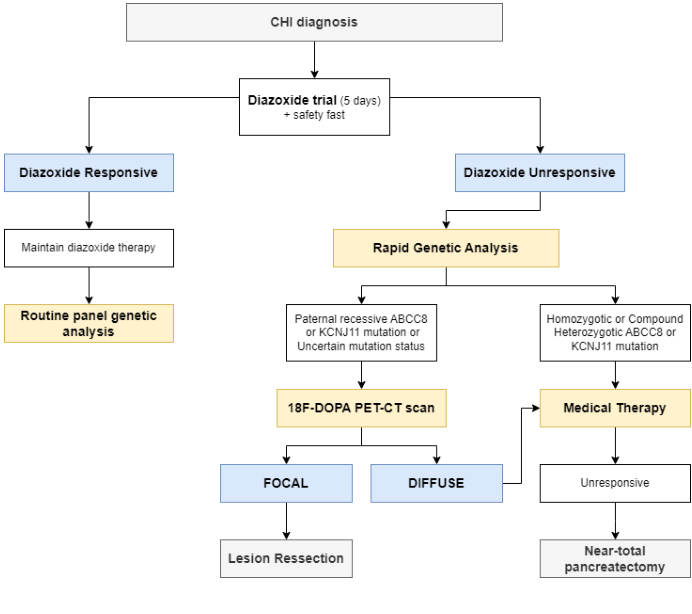

## Question

# Disease Characteristics Research Template

## Target Disease
- **Disease Name:** Congenital Isolated Hyperinsulinism
- **MONDO ID:**  (if available)
- **Category:** 

## Research Objectives

Please provide a comprehensive research report on **Congenital Isolated Hyperinsulinism** covering all of the
disease characteristics listed below. This report will be used to populate a disease knowledge
base entry. Be thorough and cite primary literature (PMID preferred) for all claims.

For each section, **suggested databases/resources** are listed. These are the first places
you should search for information on each topic.

---

### 1. Disease Information
> **Search first:** OMIM, Orphanet, ICD-10/ICD-11, MeSH, PubMed

- What is the disease? Provide a concise overview.
- What are the key identifiers? (OMIM, Orphanet, ICD-10/ICD-11, MeSH, Mondo)
- What are the common synonyms and alternative names?
- Is the information derived from individual patients (e.g., EHR) or aggregated disease-level resources?

### 2. Etiology

- **Disease Causal Factors**: What are the primary causes? (genetic, environmental, infectious, mechanistic)
- **Risk Factors**:
  > **Search first:** PubMed, Cochrane Library, UpToDate, clinical guidelines, ClinVar, ClinGen, GWAS Catalog, PheGenI, CTD, CDC, WHO, epidemiological databases
  - Genetic risk factors (causal variants, susceptibility loci, modifier genes)
  - Environmental risk factors (toxins, lifestyle, occupational exposures, age, sex, family history)
- **Protective Factors**:
  > **Search first:** PubMed, Cochrane Library, clinical trial databases, GWAS Catalog, gnomAD, WHO, CDC, nutrition databases
  - Genetic protective factors (protective variants, modifier alleles)
  - Environmental protective factors (diet, lifestyle, exposures that reduce risk)
- **Gene-Environment Interactions**: How do genetic and environmental factors interact to influence disease?
  > **Search first:** CTD, PubMed, PheGenI, GxE databases

### 3. Phenotypes
> **Search first:** HPO (Human Phenotype Ontology), OMIM, Orphanet, PubMed, clinicaltrials.gov, MedDRA, SNOMED CT, DECIPHER, LOINC

For each phenotype, provide:
- **Phenotype type**: symptoms, clinical signs, physical manifestations, behavioral changes, or laboratory abnormalities
  > For symptoms/signs: HPO, OMIM, Orphanet, PubMed
  > For behavioral changes: HPO, DSM, RDoC (Research Domain Criteria), PubMed
  > For laboratory abnormalities: LOINC, SNOMED CT, LabTests Online, PubMed
- **Phenotype characteristics**:
  > **Search first:** OMIM, Orphanet, HPO, PubMed
  - Age of symptom onset (neonatal, childhood, adult-onset, late-onset)
  - Symptom severity (mild, moderate, severe, variable)
  - Symptom progression (stable, progressive, episodic, fluctuating)
  - Frequency among affected individuals (percentage or qualitative)
- **Quality of life impact**: Effects on daily functioning and well-being (per-phenotype when possible)
  > **Search first:** EQ-5D database, SF-36, WHO QOL databases, PubMed
- Suggest HPO (Human Phenotype Ontology) terms for each phenotype

### 4. Genetic/Molecular Information

- **Causal Genes**: Gene mutations or chromosomal abnormalities responsible for disease (gene symbols, OMIM IDs)
  > **Search first:** OMIM, ClinVar, HGMD, Ensembl, NCBI Gene
- **Pathogenic Variants**:
  - Affected genes (gene symbols, HGNC IDs)
    > **Search first:** OMIM, NCBI Gene, Ensembl, HGNC, UniProt, GeneCards
  - Variant classification (pathogenic, likely pathogenic, VUS per ACMG/AMP guidelines)
    > **Search first:** ClinVar, ClinGen, ACMG/AMP guidelines, VarSome
  - Variant type/class (missense, frameshift, nonsense, splice-site, structural)
  - Allele frequency in population databases
    > **Search first:** gnomAD, 1000 Genomes, ExAC, TOPMed, dbSNP
  - Somatic vs germline origin
    > **Search first:** COSMIC (somatic), ClinVar, ICGC, TCGA
  - Functional consequences (loss of function, gain of function, dominant negative)
- **Modifier Genes**: Genes that modify disease severity or expression
- **Epigenetic Information**: DNA methylation, histone modifications, chromatin changes affecting disease
  > **Search first:** ENCODE, Roadmap Epigenomics, MethBase, DiseaseMeth
- **Chromosomal Abnormalities**: Large-scale genetic changes (aneuploidy, translocations, inversions)
  > **Search first:** DECIPHER, ClinVar, ECARUCA, UCSC Genome Browser

### 5. Environmental Information

- **Environmental Factors**: Non-genetic contributing factors (toxins, radiation, pollution, occupational exposure)
  > **Search first:** CTD (Comparative Toxicogenomics Database), TOXNET, PubMed, EPA databases
- **Lifestyle Factors**: Behavioral factors (smoking, diet, exercise, alcohol consumption)
  > **Search first:** CDC databases, WHO, PubMed, NHANES
- **Infectious Agents**: If applicable, pathogens causing or triggering disease (bacteria, viruses, fungi, parasites)
  > **Search first:** NCBI Taxonomy, ViPR, BV-BRC, MicrobeDB, GIDEON

### 6. Mechanism / Pathophysiology

- **Molecular Pathways**: Specific signaling cascades or biochemical pathways involved (Wnt, MAPK, mTOR, PI3K-AKT, etc.)
  > **Search first:** KEGG, Reactome, WikiPathways, PathBank, BioCyc
- **Cellular Processes**: Cell-level mechanisms (apoptosis, autophagy, cell cycle dysregulation, inflammation, etc.)
  > **Search first:** Gene Ontology (GO), Reactome, KEGG, PubMed
- **Protein Dysfunction**: How protein structure or function is altered (misfolding, aggregation, loss of function, gain of function)
  > **Search first:** UniProt, PDB (Protein Data Bank), InterPro, Pfam, AlphaFold
- **Metabolic Changes**: Alterations in metabolic processes (energy metabolism, lipid metabolism, amino acid metabolism)
  > **Search first:** KEGG, BioCyc, HMDB (Human Metabolome Database), BRENDA
- **Immune System Involvement**: Role of immune response (autoimmunity, immunodeficiency, chronic inflammation)
  > **Search first:** ImmPort, Immunome Database, IEDB, Gene Ontology
- **Tissue Damage Mechanisms**: How tissues/ are injured (oxidative stress, ischemia, fibrosis, necrosis)
  > **Search first:** PubMed, Gene Ontology, Reactome
- **Biochemical Abnormalities**: Specific molecular defects (enzyme deficiencies, receptor dysfunction, ion channel defects)
  > **Search first:** BRENDA, UniProt, KEGG, OMIM, PubMed
- **Epigenetic Changes**: DNA methylation, histone modifications affecting gene expression in disease
  > **Search first:** ENCODE, Roadmap Epigenomics, MethBase, DiseaseMeth
- **Molecular Profiling** (if available):
  - Transcriptomics/gene expression changes
    > **Search first:** GEO (Gene Expression Omnibus), ArrayExpress, GTEx, Human Cell Atlas, SRA
  - Proteomics findings
    > **Search first:** PRIDE, ProteomeXchange, Human Protein Atlas, STRING, BioGRID
  - Metabolomics signatures
    > **Search first:** MetaboLights, Metabolomics Workbench, HMDB, METLIN
  - Lipidomics alterations
    > **Search first:** LIPID MAPS, SwissLipids, LipidHome, Metabolomics Workbench
  - Genomic structural features
    > **Search first:** UCSC Genome Browser, Ensembl, NCBI, dbVar, DGV
- **Advanced Technologies** (if applicable):
  - Single-cell analysis findings (cell-type specific mechanisms, cellular heterogeneity)
    > **Search first:** Human Cell Atlas, Single Cell Portal, GEO, CELLxGENE
  - Spatial transcriptomics findings
    > **Search first:** GEO, Spatial Research, Vizgen, 10x Genomics data
  - Multi-omics integration results
    > **Search first:** TCGA, ICGC, cBioPortal, LinkedOmics, PubMed
  - Functional genomics screens (CRISPR, RNAi)
    > **Search first:** DepMap, GenomeRNAi, PubMed, BioGRID ORCS

For each mechanism, describe:
- The causal chain from initial trigger to clinical manifestation
- Which mechanisms are upstream vs downstream
- What cell types and biological processes are involved
- Suggest GO terms for biological processes and CL terms for cell types

### 7. Anatomical Structures Affected

- **Organ Level**:
  - Primary organs directly affected
  - Secondary organ involvement (complications, secondary effects)
  - Body systems involved (cardiovascular, nervous, digestive, respiratory, endocrine, etc.)
  > **Search first:** Uberon, FMA (Foundational Model of Anatomy), OMIM, HPO, ICD-11, MeSH, SNOMED CT
- **Tissue and Cell Level**:
  - Specific tissue types affected (epithelial, connective, muscle, nervous)
  - Specific cell populations targeted (with Cell Ontology terms)
  > **Search first:** Uberon, Human Protein Atlas, Cell Ontology, Human Cell Atlas, CellMarker, PanglaoDB
- **Subcellular Level**:
  - Cellular compartments involved (mitochondria, nucleus, ER, lysosomes) (with GO Cellular Component terms)
  > **Search first:** Gene Ontology (Cellular Component), UniProt, Human Protein Atlas
- **Localization**:
  - Specific anatomical sites (with UBERON terms)
    > **Search first:** FMA, Uberon, NeuroNames (for brain), SNOMED CT
  - Lateralization (unilateral, bilateral, asymmetric)
    > **Search first:** HPO, clinical literature, imaging databases

### 8. Temporal Development

- **Onset**:
  - Typical age of onset (congenital, pediatric, adult, geriatric)
  - Onset pattern (acute, subacute, chronic, insidious)
  > **Search first:** OMIM, Orphanet, HPO, PubMed
- **Progression**:
  - Disease stages (early, intermediate, advanced, end-stage)
    > **Search first:** Cancer Staging Manual (AJCC), WHO classifications, PubMed
  - Progression rate (rapid, slow, variable)
  - Disease course pattern (episodic, relapsing-remitting, progressive, stable)
  - Disease duration (self-limited, chronic lifelong)
  > **Search first:** Disease registries, longitudinal cohort databases, natural history studies, PubMed, Orphanet, OMIM
- **Patterns**:
  - Remission patterns (spontaneous, treatment-induced)
    > **Search first:** Clinical trial databases, disease registries, PubMed
  - Critical periods (time windows of vulnerability or opportunity for intervention)
    > **Search first:** PubMed, developmental biology databases, clinical guidelines

### 9. Inheritance and Population

- **Epidemiology**:
  - Prevalence (cases per 100,000 at given time)
  - Incidence (new cases per 100,000 per year)
  > **Search first:** Orphanet, CDC, WHO, GBD (Global Burden of Disease), national registries, SEER, disease registries
- **For Genetic Etiology**:
  - Inheritance pattern (AD, AR, X-linked, mitochondrial, multifactorial, polygenic)
    > **Search first:** OMIM, Orphanet, ClinVar, GTR (Genetic Testing Registry)
  - Penetrance (complete, incomplete, age-dependent)
    > **Search first:** ClinVar, OMIM, PubMed, ClinGen
  - Expressivity (variable, consistent)
    > **Search first:** OMIM, ClinVar, PubMed
  - Genetic anticipation (increasing severity in successive generations)
    > **Search first:** OMIM, PubMed (especially for repeat expansion disorders)
  - Germline mosaicism
    > **Search first:** ClinVar, OMIM, genetic counseling literature, PubMed
  - Founder effects (population-specific mutations)
    > **Search first:** gnomAD, population genetics databases, PubMed
  - Consanguinity role
    > **Search first:** OMIM, population studies, genetic counseling resources
  - Carrier frequency
    > **Search first:** gnomAD, carrier screening databases, GeneReviews, GTR
- **Population Demographics**:
  - Affected populations (ethnic or demographic groups with higher prevalence)
    > **Search first:** gnomAD, 1000 Genomes, PAGE Study, PubMed, population registries
  - Geographic distribution (endemic areas, regional variation)
    > **Search first:** WHO, CDC, GBD, Orphanet, geographic epidemiology databases
  - Geographic distribution of specific variants
  - Sex ratio (male:female)
    > **Search first:** Disease registries, OMIM, PubMed, epidemiological databases
  - Age distribution of affected individuals
    > **Search first:** CDC, disease registries, SEER, Orphanet

### 10. Diagnostics

- **Clinical Tests**:
  - Laboratory tests (blood, urine, tissue chemistry, specific enzyme assays)
    > **Search first:** LOINC, LabTests Online, PubMed
  - Biomarkers (proteins, metabolites, genetic markers, circulating biomarkers)
    > **Search first:** FDA Biomarker List, BEST (Biomarkers, EndpointS, and other Tools), PubMed
  - Imaging studies (X-ray, CT, MRI, PET, ultrasound)
    > **Search first:** RadLex, DICOM, Radiopaedia, imaging databases
  - Functional tests (pulmonary function, cardiac stress tests)
    > **Search first:** LOINC, clinical guidelines, PubMed
  - Electrophysiology (EEG, EMG, ECG, nerve conduction studies)
    > **Search first:** LOINC, clinical neurophysiology databases, PubMed
  - Biopsy findings (histopathology, immunohistochemistry)
    > **Search first:** SNOMED CT, College of American Pathologists resources, PubMed
  - Pathology findings (microscopic examination)
    > **Search first:** SNOMED CT, Digital Pathology databases, PubMed
- **Genetic Testing**:
  > **Search first:** GTR (Genetic Testing Registry), GeneReviews, ClinGen
  - Overview of recommended genetic testing approach
  - Whole genome sequencing (WGS) utility
    > **Search first:** GTR, ClinVar, GEL (Genomics England), gnomAD
  - Whole exome sequencing (WES) utility
    > **Search first:** GTR, ClinVar, OMIM, GeneMatcher
  - Gene panels (which panels, which genes)
    > **Search first:** GTR, ClinVar, laboratory-specific databases
  - Single gene testing
    > **Search first:** GTR, ClinVar, OMIM, GeneReviews
  - Chromosomal microarray (CMA)
    > **Search first:** DECIPHER, ClinVar, dbVar, ECARUCA
  - Karyotyping
    > **Search first:** Chromosome Abnormality Database, ClinVar, cytogenetics resources
  - FISH
    > **Search first:** ClinVar, cytogenetics databases, PubMed
  - Mitochondrial DNA testing
    > **Search first:** MITOMAP, MSeqDR, ClinVar, GTR
  - Repeat expansion testing
    > **Search first:** GTR, ClinVar, repeat expansion databases, PubMed
- **Omics-Based Diagnostics** (if applicable):
  - RNA sequencing / transcriptomics
    > **Search first:** GEO, ArrayExpress, GTEx, RNA-seq databases
  - Proteomics
    > **Search first:** PRIDE, ProteomeXchange, FDA Biomarker database
  - Metabolomics
    > **Search first:** MetaboLights, Metabolomics Workbench, HMDB
  - Epigenomics
    > **Search first:** GEO, ENCODE, Roadmap Epigenomics, MethBase
  - Liquid biopsy
    > **Search first:** COSMIC, ClinVar, liquid biopsy databases, PubMed
- **Clinical Criteria**:
  - Standardized diagnostic criteria (DSM, ICD, society guidelines)
    > **Search first:** DSM-5, ICD-11, clinical society guidelines, UpToDate
  - Differential diagnosis (other conditions to rule out, with distinguishing features)
    > **Search first:** DynaMed, UpToDate, clinical decision support systems
- **Screening**:
  - Screening methods for asymptomatic individuals (newborn screening, carrier screening, cascade screening)
    > **Search first:** ACMG recommendations, CDC newborn screening, GTR

### 11. Outcome/Prognosis

- **Survival and Mortality**:
  - Survival rate (5-year, 10-year, overall)
    > **Search first:** SEER, cancer registries, disease-specific registries, PubMed
  - Life expectancy (with and without treatment if applicable)
    > **Search first:** Orphanet, disease registries, actuarial databases, PubMed
  - Mortality rate
    > **Search first:** CDC, WHO, GBD, national mortality databases
  - Disease-specific mortality (deaths directly attributable to disease)
    > **Search first:** Disease registries, CDC Wonder, GBD, PubMed
- **Morbidity and Function**:
  - Morbidity (disease-related disability and health impacts)
    > **Search first:** GBD, WHO, disability databases, PubMed
  - Disability outcomes (long-term functional impairments)
    > **Search first:** ICF (International Classification of Functioning), disability registries
  - Quality of life measures (EQ-5D, SF-36, PROMIS, disease-specific tools)
    > **Search first:** EQ-5D database, SF-36, PROMIS, PubMed
- **Disease Course**:
  - Complications (secondary problems: infections, organ failure, etc.)
    > **Search first:** ICD codes, disease registries, clinical databases, PubMed
  - Recovery potential (likelihood and extent of recovery, with vs without treatment)
    > **Search first:** Natural history studies, rehabilitation databases, PubMed
- **Prediction**:
  - Prognostic factors (age, disease severity, biomarkers, treatment response)
    > **Search first:** Prognostic models databases, clinical calculators, PubMed
  - Prognostic biomarkers (molecular markers predicting disease course)
    > **Search first:** FDA Biomarker database, PubMed, cancer prognostic databases

### 12. Treatment

- **Pharmacotherapy**:
  - Pharmacological treatments (drug names, drug classes, mechanisms of action)
    > **Search first:** DrugBank, RxNorm, ATC classification, DailyMed, FDA databases
  - Pharmacogenomics (how genetic variants affect drug metabolism, efficacy, toxicity)
    > **Search first:** PharmGKB, CPIC (Clinical Pharmacogenetics), FDA Table of PGx Biomarkers
- **Advanced Therapeutics**:
  - Gene therapy (viral vectors, CRISPR, gene replacement, gene editing)
    > **Search first:** ClinicalTrials.gov, FDA gene therapy database, ASGCT resources
  - Cell therapy (stem cell transplant, CAR-T, cellular therapeutics)
    > **Search first:** ClinicalTrials.gov, FDA cell therapy database, FACT standards
  - RNA-based therapies (ASOs, siRNA, mRNA therapies)
    > **Search first:** ClinicalTrials.gov, FDA approvals, PubMed
  - Targeted therapies (treatments directed at specific molecular targets)
    > **Search first:** My Cancer Genome, OncoKB, ClinicalTrials.gov, FDA approvals
  - Immunotherapies (checkpoint inhibitors, monoclonal antibodies)
    > **Search first:** Cancer Immunotherapy Database, FDA approvals, ClinicalTrials.gov
- **Surgical and Interventional**:
  - Surgical interventions (types of surgery, timing, outcomes)
    > **Search first:** CPT codes, surgical registries, clinical guidelines, PubMed
- **Supportive and Rehabilitative**:
  - Supportive care (symptom management, pain control, nutrition)
    > **Search first:** Clinical guidelines, Cochrane Library, PubMed
  - Rehabilitation (physical therapy, occupational therapy, speech therapy)
    > **Search first:** Rehabilitation medicine databases, clinical guidelines, PubMed
- **Experimental**:
  - Experimental treatments in clinical trials (with NCT identifiers if available)
    > **Search first:** ClinicalTrials.gov, EU Clinical Trials Register, WHO ICTRP
- **Treatment Outcomes**:
  - Treatment response rates
    > **Search first:** Clinical trial databases, FDA reviews, systematic reviews, PubMed
  - Side effects and adverse events
    > **Search first:** FDA Adverse Event Reporting System (FAERS), MedWatch, PubMed
- **Treatment Strategy**:
  - Treatment algorithms (clinical pathways, decision trees)
    > **Search first:** Clinical practice guidelines, NCCN Guidelines, UpToDate
  - Combination therapies
    > **Search first:** ClinicalTrials.gov, treatment guidelines, PubMed
  - Personalized medicine approaches (genotype-guided treatment)
    > **Search first:** My Cancer Genome, CIViC, PharmGKB, precision medicine databases

For each treatment, suggest MAXO (Medical Action Ontology) terms where applicable.

### 13. Prevention

- **Prevention Levels**:
  - Primary prevention (preventing disease occurrence: vaccination, risk factor modification)
    > **Search first:** CDC, WHO, USPSTF recommendations, Cochrane Library
  - Secondary prevention (early detection and treatment: screening programs, early intervention)
    > **Search first:** USPSTF, CDC screening guidelines, WHO
  - Tertiary prevention (preventing complications in those with disease)
    > **Search first:** Clinical guidelines, disease management protocols, PubMed
- **Immunization**: Vaccine strategies (if applicable)
  > **Search first:** CDC vaccine schedules, WHO immunization, FDA vaccine database
- **Screening and Early Detection**:
  - Screening programs (population-based: newborn screening, cancer screening)
    > **Search first:** CDC screening programs, USPSTF, cancer screening databases
  - Genetic screening (carrier screening, preimplantation genetic diagnosis, prenatal testing)
    > **Search first:** ACMG recommendations, ACOG guidelines, GTR
  - Risk stratification (identifying high-risk individuals for targeted prevention)
    > **Search first:** Risk prediction models, clinical calculators, PubMed
- **Behavioral Interventions**: Lifestyle modifications to reduce risk
  > **Search first:** CDC, WHO, behavioral intervention databases, Cochrane Library
- **Counseling**: Genetic counseling (risk assessment, family planning guidance)
  > **Search first:** NSGC resources, ACMG guidelines, GeneReviews
- **Public Health**:
  - Public health interventions (sanitation, vector control, health education)
    > **Search first:** CDC, WHO, public health databases, PubMed
  - Environmental interventions (reducing environmental risk factors)
    > **Search first:** EPA databases, WHO environmental health, PubMed
- **Prophylaxis**: Preventive medications or procedures
  > **Search first:** Clinical guidelines, FDA approvals, PubMed

### 14. Other Species / Natural Disease

- **Taxonomy**: Species affected (with NCBI Taxon identifiers)
  > **Search first:** NCBI Taxonomy
- **Breed**: Specific breeds affected (with VBO identifiers if applicable)
  > **Search first:** VBO (Vertebrate Breed Ontology)
- **Gene**: Orthologous genes in other species (with NCBI Gene IDs)
  > **Search first:** NCBI Gene
- **Natural Disease**:
  - Naturally occurring disease in other species (companion animals, wildlife)
    > **Search first:** OMIA (Online Mendelian Inheritance in Animals), VetCompass, PubMed
  - Veterinary relevance and importance in animal health
    > **Search first:** OMIA, veterinary databases, PubMed
- **Comparative Biology**:
  - Comparative pathology (similarities and differences across species)
    > **Search first:** OMIA, comparative pathology databases, PubMed
  - Evolutionary conservation of disease mechanisms
    > **Search first:** HomoloGene, OrthoMCL, Alliance of Genome Resources
- **Transmission** (if applicable):
  - Zoonotic potential
    > **Search first:** CDC zoonotic diseases, WHO zoonoses, GIDEON
  - Cross-species susceptibility
    > **Search first:** NCBI Taxonomy, veterinary databases, PubMed

### 15. Model Organisms

- **Model Types**:
  - Model organism type (mammalian, invertebrate, cellular, in vitro)
    > **Search first:** Alliance of Genome Resources, model organism databases
  - Specific model systems (mouse, rat, zebrafish, Drosophila, C. elegans, yeast, cell lines, organoids, iPSCs)
    > **Search first:** MGI, RGD, ZFIN, FlyBase, WormBase, SGD, ATCC, Cellosaurus
  - Induced models (drug treatment, surgical intervention, environmental manipulation)
    > **Search first:** MGI, model organism databases, PubMed
- **Genetic Models**:
  - Types available (knockout, knock-in, transgenic, conditional, humanized)
    > **Search first:** MGI, IMPC, KOMP, EuMMCR, IMSR
- **Model Characteristics**:
  - Phenotype recapitulation (how well model reproduces human disease features)
    > **Search first:** Model organism databases, comparative studies, PubMed
  - Model limitations (aspects of human disease not captured)
    > **Search first:** Model organism databases, PubMed, review articles
- **Applications**:
  - Research applications (what aspects of disease can be studied)
    > **Search first:** Model organism databases, PubMed
- **Resources**:
  - Model databases
    > **Search first:** MGI, RGD, ZFIN, FlyBase, WormBase, IMSR, EMMA, MMRRC

---

## Citation Requirements

- Cite primary literature (PMID preferred) for all mechanistic and clinical claims
- Prioritize recent reviews and landmark papers
- Include direct quotes from abstracts where possible to support key statements
- Distinguish evidence source types: human clinical, model organism, in vitro, computational

## Output Format

Structure your response as a comprehensive narrative organized by the sections above.
For each section, provide:
- Factual content with specific details (numbers, percentages, gene names, variant nomenclature)
- Ontology term suggestions (HPO, GO, CL, UBERON, CHEBI, MAXO, MONDO) where applicable
- Evidence citations with PMIDs
- Direct quotes from abstracts to support key claims
- Clear indication when information is not available or not applicable for this disease

This report will be used to populate a disease knowledge base entry with:
- Pathophysiology descriptions with causal chains
- Gene/protein annotations (HGNC, GO terms)
- Phenotype associations (HP terms) with frequencies
- Cell type involvement (CL terms)
- Anatomical locations (UBERON terms)
- Chemical entities (CHEBI terms)
- Treatment annotations (MAXO terms)
- Evidence items with PMIDs and exact abstract quotes
- Epidemiology, prognosis, diagnostic, and prevention information
- Animal model descriptions with phenotype recapitulation details

## Output

Question: You are an expert researcher providing comprehensive, well-cited information.

Provide detailed information focusing on:
1. Key concepts and definitions with current understanding
2. Recent developments and latest research (prioritize 2023-2024 sources)
3. Current applications and real-world implementations
4. Expert opinions and analysis from authoritative sources
5. Relevant statistics and data from recent studies

Format as a comprehensive research report with proper citations. Include URLs and publication dates where available.
Always prioritize recent, authoritative sources and provide specific citations for all major claims.

# Disease Characteristics Research Template

## Target Disease
- **Disease Name:** Congenital Isolated Hyperinsulinism
- **MONDO ID:**  (if available)
- **Category:** 

## Research Objectives

Please provide a comprehensive research report on **Congenital Isolated Hyperinsulinism** covering all of the
disease characteristics listed below. This report will be used to populate a disease knowledge
base entry. Be thorough and cite primary literature (PMID preferred) for all claims.

For each section, **suggested databases/resources** are listed. These are the first places
you should search for information on each topic.

---

### 1. Disease Information
> **Search first:** OMIM, Orphanet, ICD-10/ICD-11, MeSH, PubMed

- What is the disease? Provide a concise overview.
- What are the key identifiers? (OMIM, Orphanet, ICD-10/ICD-11, MeSH, Mondo)
- What are the common synonyms and alternative names?
- Is the information derived from individual patients (e.g., EHR) or aggregated disease-level resources?

### 2. Etiology

- **Disease Causal Factors**: What are the primary causes? (genetic, environmental, infectious, mechanistic)
- **Risk Factors**:
  > **Search first:** PubMed, Cochrane Library, UpToDate, clinical guidelines, ClinVar, ClinGen, GWAS Catalog, PheGenI, CTD, CDC, WHO, epidemiological databases
  - Genetic risk factors (causal variants, susceptibility loci, modifier genes)
  - Environmental risk factors (toxins, lifestyle, occupational exposures, age, sex, family history)
- **Protective Factors**:
  > **Search first:** PubMed, Cochrane Library, clinical trial databases, GWAS Catalog, gnomAD, WHO, CDC, nutrition databases
  - Genetic protective factors (protective variants, modifier alleles)
  - Environmental protective factors (diet, lifestyle, exposures that reduce risk)
- **Gene-Environment Interactions**: How do genetic and environmental factors interact to influence disease?
  > **Search first:** CTD, PubMed, PheGenI, GxE databases

### 3. Phenotypes
> **Search first:** HPO (Human Phenotype Ontology), OMIM, Orphanet, PubMed, clinicaltrials.gov, MedDRA, SNOMED CT, DECIPHER, LOINC

For each phenotype, provide:
- **Phenotype type**: symptoms, clinical signs, physical manifestations, behavioral changes, or laboratory abnormalities
  > For symptoms/signs: HPO, OMIM, Orphanet, PubMed
  > For behavioral changes: HPO, DSM, RDoC (Research Domain Criteria), PubMed
  > For laboratory abnormalities: LOINC, SNOMED CT, LabTests Online, PubMed
- **Phenotype characteristics**:
  > **Search first:** OMIM, Orphanet, HPO, PubMed
  - Age of symptom onset (neonatal, childhood, adult-onset, late-onset)
  - Symptom severity (mild, moderate, severe, variable)
  - Symptom progression (stable, progressive, episodic, fluctuating)
  - Frequency among affected individuals (percentage or qualitative)
- **Quality of life impact**: Effects on daily functioning and well-being (per-phenotype when possible)
  > **Search first:** EQ-5D database, SF-36, WHO QOL databases, PubMed
- Suggest HPO (Human Phenotype Ontology) terms for each phenotype

### 4. Genetic/Molecular Information

- **Causal Genes**: Gene mutations or chromosomal abnormalities responsible for disease (gene symbols, OMIM IDs)
  > **Search first:** OMIM, ClinVar, HGMD, Ensembl, NCBI Gene
- **Pathogenic Variants**:
  - Affected genes (gene symbols, HGNC IDs)
    > **Search first:** OMIM, NCBI Gene, Ensembl, HGNC, UniProt, GeneCards
  - Variant classification (pathogenic, likely pathogenic, VUS per ACMG/AMP guidelines)
    > **Search first:** ClinVar, ClinGen, ACMG/AMP guidelines, VarSome
  - Variant type/class (missense, frameshift, nonsense, splice-site, structural)
  - Allele frequency in population databases
    > **Search first:** gnomAD, 1000 Genomes, ExAC, TOPMed, dbSNP
  - Somatic vs germline origin
    > **Search first:** COSMIC (somatic), ClinVar, ICGC, TCGA
  - Functional consequences (loss of function, gain of function, dominant negative)
- **Modifier Genes**: Genes that modify disease severity or expression
- **Epigenetic Information**: DNA methylation, histone modifications, chromatin changes affecting disease
  > **Search first:** ENCODE, Roadmap Epigenomics, MethBase, DiseaseMeth
- **Chromosomal Abnormalities**: Large-scale genetic changes (aneuploidy, translocations, inversions)
  > **Search first:** DECIPHER, ClinVar, ECARUCA, UCSC Genome Browser

### 5. Environmental Information

- **Environmental Factors**: Non-genetic contributing factors (toxins, radiation, pollution, occupational exposure)
  > **Search first:** CTD (Comparative Toxicogenomics Database), TOXNET, PubMed, EPA databases
- **Lifestyle Factors**: Behavioral factors (smoking, diet, exercise, alcohol consumption)
  > **Search first:** CDC databases, WHO, PubMed, NHANES
- **Infectious Agents**: If applicable, pathogens causing or triggering disease (bacteria, viruses, fungi, parasites)
  > **Search first:** NCBI Taxonomy, ViPR, BV-BRC, MicrobeDB, GIDEON

### 6. Mechanism / Pathophysiology

- **Molecular Pathways**: Specific signaling cascades or biochemical pathways involved (Wnt, MAPK, mTOR, PI3K-AKT, etc.)
  > **Search first:** KEGG, Reactome, WikiPathways, PathBank, BioCyc
- **Cellular Processes**: Cell-level mechanisms (apoptosis, autophagy, cell cycle dysregulation, inflammation, etc.)
  > **Search first:** Gene Ontology (GO), Reactome, KEGG, PubMed
- **Protein Dysfunction**: How protein structure or function is altered (misfolding, aggregation, loss of function, gain of function)
  > **Search first:** UniProt, PDB (Protein Data Bank), InterPro, Pfam, AlphaFold
- **Metabolic Changes**: Alterations in metabolic processes (energy metabolism, lipid metabolism, amino acid metabolism)
  > **Search first:** KEGG, BioCyc, HMDB (Human Metabolome Database), BRENDA
- **Immune System Involvement**: Role of immune response (autoimmunity, immunodeficiency, chronic inflammation)
  > **Search first:** ImmPort, Immunome Database, IEDB, Gene Ontology
- **Tissue Damage Mechanisms**: How tissues/ are injured (oxidative stress, ischemia, fibrosis, necrosis)
  > **Search first:** PubMed, Gene Ontology, Reactome
- **Biochemical Abnormalities**: Specific molecular defects (enzyme deficiencies, receptor dysfunction, ion channel defects)
  > **Search first:** BRENDA, UniProt, KEGG, OMIM, PubMed
- **Epigenetic Changes**: DNA methylation, histone modifications affecting gene expression in disease
  > **Search first:** ENCODE, Roadmap Epigenomics, MethBase, DiseaseMeth
- **Molecular Profiling** (if available):
  - Transcriptomics/gene expression changes
    > **Search first:** GEO (Gene Expression Omnibus), ArrayExpress, GTEx, Human Cell Atlas, SRA
  - Proteomics findings
    > **Search first:** PRIDE, ProteomeXchange, Human Protein Atlas, STRING, BioGRID
  - Metabolomics signatures
    > **Search first:** MetaboLights, Metabolomics Workbench, HMDB, METLIN
  - Lipidomics alterations
    > **Search first:** LIPID MAPS, SwissLipids, LipidHome, Metabolomics Workbench
  - Genomic structural features
    > **Search first:** UCSC Genome Browser, Ensembl, NCBI, dbVar, DGV
- **Advanced Technologies** (if applicable):
  - Single-cell analysis findings (cell-type specific mechanisms, cellular heterogeneity)
    > **Search first:** Human Cell Atlas, Single Cell Portal, GEO, CELLxGENE
  - Spatial transcriptomics findings
    > **Search first:** GEO, Spatial Research, Vizgen, 10x Genomics data
  - Multi-omics integration results
    > **Search first:** TCGA, ICGC, cBioPortal, LinkedOmics, PubMed
  - Functional genomics screens (CRISPR, RNAi)
    > **Search first:** DepMap, GenomeRNAi, PubMed, BioGRID ORCS

For each mechanism, describe:
- The causal chain from initial trigger to clinical manifestation
- Which mechanisms are upstream vs downstream
- What cell types and biological processes are involved
- Suggest GO terms for biological processes and CL terms for cell types

### 7. Anatomical Structures Affected

- **Organ Level**:
  - Primary organs directly affected
  - Secondary organ involvement (complications, secondary effects)
  - Body systems involved (cardiovascular, nervous, digestive, respiratory, endocrine, etc.)
  > **Search first:** Uberon, FMA (Foundational Model of Anatomy), OMIM, HPO, ICD-11, MeSH, SNOMED CT
- **Tissue and Cell Level**:
  - Specific tissue types affected (epithelial, connective, muscle, nervous)
  - Specific cell populations targeted (with Cell Ontology terms)
  > **Search first:** Uberon, Human Protein Atlas, Cell Ontology, Human Cell Atlas, CellMarker, PanglaoDB
- **Subcellular Level**:
  - Cellular compartments involved (mitochondria, nucleus, ER, lysosomes) (with GO Cellular Component terms)
  > **Search first:** Gene Ontology (Cellular Component), UniProt, Human Protein Atlas
- **Localization**:
  - Specific anatomical sites (with UBERON terms)
    > **Search first:** FMA, Uberon, NeuroNames (for brain), SNOMED CT
  - Lateralization (unilateral, bilateral, asymmetric)
    > **Search first:** HPO, clinical literature, imaging databases

### 8. Temporal Development

- **Onset**:
  - Typical age of onset (congenital, pediatric, adult, geriatric)
  - Onset pattern (acute, subacute, chronic, insidious)
  > **Search first:** OMIM, Orphanet, HPO, PubMed
- **Progression**:
  - Disease stages (early, intermediate, advanced, end-stage)
    > **Search first:** Cancer Staging Manual (AJCC), WHO classifications, PubMed
  - Progression rate (rapid, slow, variable)
  - Disease course pattern (episodic, relapsing-remitting, progressive, stable)
  - Disease duration (self-limited, chronic lifelong)
  > **Search first:** Disease registries, longitudinal cohort databases, natural history studies, PubMed, Orphanet, OMIM
- **Patterns**:
  - Remission patterns (spontaneous, treatment-induced)
    > **Search first:** Clinical trial databases, disease registries, PubMed
  - Critical periods (time windows of vulnerability or opportunity for intervention)
    > **Search first:** PubMed, developmental biology databases, clinical guidelines

### 9. Inheritance and Population

- **Epidemiology**:
  - Prevalence (cases per 100,000 at given time)
  - Incidence (new cases per 100,000 per year)
  > **Search first:** Orphanet, CDC, WHO, GBD (Global Burden of Disease), national registries, SEER, disease registries
- **For Genetic Etiology**:
  - Inheritance pattern (AD, AR, X-linked, mitochondrial, multifactorial, polygenic)
    > **Search first:** OMIM, Orphanet, ClinVar, GTR (Genetic Testing Registry)
  - Penetrance (complete, incomplete, age-dependent)
    > **Search first:** ClinVar, OMIM, PubMed, ClinGen
  - Expressivity (variable, consistent)
    > **Search first:** OMIM, ClinVar, PubMed
  - Genetic anticipation (increasing severity in successive generations)
    > **Search first:** OMIM, PubMed (especially for repeat expansion disorders)
  - Germline mosaicism
    > **Search first:** ClinVar, OMIM, genetic counseling literature, PubMed
  - Founder effects (population-specific mutations)
    > **Search first:** gnomAD, population genetics databases, PubMed
  - Consanguinity role
    > **Search first:** OMIM, population studies, genetic counseling resources
  - Carrier frequency
    > **Search first:** gnomAD, carrier screening databases, GeneReviews, GTR
- **Population Demographics**:
  - Affected populations (ethnic or demographic groups with higher prevalence)
    > **Search first:** gnomAD, 1000 Genomes, PAGE Study, PubMed, population registries
  - Geographic distribution (endemic areas, regional variation)
    > **Search first:** WHO, CDC, GBD, Orphanet, geographic epidemiology databases
  - Geographic distribution of specific variants
  - Sex ratio (male:female)
    > **Search first:** Disease registries, OMIM, PubMed, epidemiological databases
  - Age distribution of affected individuals
    > **Search first:** CDC, disease registries, SEER, Orphanet

### 10. Diagnostics

- **Clinical Tests**:
  - Laboratory tests (blood, urine, tissue chemistry, specific enzyme assays)
    > **Search first:** LOINC, LabTests Online, PubMed
  - Biomarkers (proteins, metabolites, genetic markers, circulating biomarkers)
    > **Search first:** FDA Biomarker List, BEST (Biomarkers, EndpointS, and other Tools), PubMed
  - Imaging studies (X-ray, CT, MRI, PET, ultrasound)
    > **Search first:** RadLex, DICOM, Radiopaedia, imaging databases
  - Functional tests (pulmonary function, cardiac stress tests)
    > **Search first:** LOINC, clinical guidelines, PubMed
  - Electrophysiology (EEG, EMG, ECG, nerve conduction studies)
    > **Search first:** LOINC, clinical neurophysiology databases, PubMed
  - Biopsy findings (histopathology, immunohistochemistry)
    > **Search first:** SNOMED CT, College of American Pathologists resources, PubMed
  - Pathology findings (microscopic examination)
    > **Search first:** SNOMED CT, Digital Pathology databases, PubMed
- **Genetic Testing**:
  > **Search first:** GTR (Genetic Testing Registry), GeneReviews, ClinGen
  - Overview of recommended genetic testing approach
  - Whole genome sequencing (WGS) utility
    > **Search first:** GTR, ClinVar, GEL (Genomics England), gnomAD
  - Whole exome sequencing (WES) utility
    > **Search first:** GTR, ClinVar, OMIM, GeneMatcher
  - Gene panels (which panels, which genes)
    > **Search first:** GTR, ClinVar, laboratory-specific databases
  - Single gene testing
    > **Search first:** GTR, ClinVar, OMIM, GeneReviews
  - Chromosomal microarray (CMA)
    > **Search first:** DECIPHER, ClinVar, dbVar, ECARUCA
  - Karyotyping
    > **Search first:** Chromosome Abnormality Database, ClinVar, cytogenetics resources
  - FISH
    > **Search first:** ClinVar, cytogenetics databases, PubMed
  - Mitochondrial DNA testing
    > **Search first:** MITOMAP, MSeqDR, ClinVar, GTR
  - Repeat expansion testing
    > **Search first:** GTR, ClinVar, repeat expansion databases, PubMed
- **Omics-Based Diagnostics** (if applicable):
  - RNA sequencing / transcriptomics
    > **Search first:** GEO, ArrayExpress, GTEx, RNA-seq databases
  - Proteomics
    > **Search first:** PRIDE, ProteomeXchange, FDA Biomarker database
  - Metabolomics
    > **Search first:** MetaboLights, Metabolomics Workbench, HMDB
  - Epigenomics
    > **Search first:** GEO, ENCODE, Roadmap Epigenomics, MethBase
  - Liquid biopsy
    > **Search first:** COSMIC, ClinVar, liquid biopsy databases, PubMed
- **Clinical Criteria**:
  - Standardized diagnostic criteria (DSM, ICD, society guidelines)
    > **Search first:** DSM-5, ICD-11, clinical society guidelines, UpToDate
  - Differential diagnosis (other conditions to rule out, with distinguishing features)
    > **Search first:** DynaMed, UpToDate, clinical decision support systems
- **Screening**:
  - Screening methods for asymptomatic individuals (newborn screening, carrier screening, cascade screening)
    > **Search first:** ACMG recommendations, CDC newborn screening, GTR

### 11. Outcome/Prognosis

- **Survival and Mortality**:
  - Survival rate (5-year, 10-year, overall)
    > **Search first:** SEER, cancer registries, disease-specific registries, PubMed
  - Life expectancy (with and without treatment if applicable)
    > **Search first:** Orphanet, disease registries, actuarial databases, PubMed
  - Mortality rate
    > **Search first:** CDC, WHO, GBD, national mortality databases
  - Disease-specific mortality (deaths directly attributable to disease)
    > **Search first:** Disease registries, CDC Wonder, GBD, PubMed
- **Morbidity and Function**:
  - Morbidity (disease-related disability and health impacts)
    > **Search first:** GBD, WHO, disability databases, PubMed
  - Disability outcomes (long-term functional impairments)
    > **Search first:** ICF (International Classification of Functioning), disability registries
  - Quality of life measures (EQ-5D, SF-36, PROMIS, disease-specific tools)
    > **Search first:** EQ-5D database, SF-36, PROMIS, PubMed
- **Disease Course**:
  - Complications (secondary problems: infections, organ failure, etc.)
    > **Search first:** ICD codes, disease registries, clinical databases, PubMed
  - Recovery potential (likelihood and extent of recovery, with vs without treatment)
    > **Search first:** Natural history studies, rehabilitation databases, PubMed
- **Prediction**:
  - Prognostic factors (age, disease severity, biomarkers, treatment response)
    > **Search first:** Prognostic models databases, clinical calculators, PubMed
  - Prognostic biomarkers (molecular markers predicting disease course)
    > **Search first:** FDA Biomarker database, PubMed, cancer prognostic databases

### 12. Treatment

- **Pharmacotherapy**:
  - Pharmacological treatments (drug names, drug classes, mechanisms of action)
    > **Search first:** DrugBank, RxNorm, ATC classification, DailyMed, FDA databases
  - Pharmacogenomics (how genetic variants affect drug metabolism, efficacy, toxicity)
    > **Search first:** PharmGKB, CPIC (Clinical Pharmacogenetics), FDA Table of PGx Biomarkers
- **Advanced Therapeutics**:
  - Gene therapy (viral vectors, CRISPR, gene replacement, gene editing)
    > **Search first:** ClinicalTrials.gov, FDA gene therapy database, ASGCT resources
  - Cell therapy (stem cell transplant, CAR-T, cellular therapeutics)
    > **Search first:** ClinicalTrials.gov, FDA cell therapy database, FACT standards
  - RNA-based therapies (ASOs, siRNA, mRNA therapies)
    > **Search first:** ClinicalTrials.gov, FDA approvals, PubMed
  - Targeted therapies (treatments directed at specific molecular targets)
    > **Search first:** My Cancer Genome, OncoKB, ClinicalTrials.gov, FDA approvals
  - Immunotherapies (checkpoint inhibitors, monoclonal antibodies)
    > **Search first:** Cancer Immunotherapy Database, FDA approvals, ClinicalTrials.gov
- **Surgical and Interventional**:
  - Surgical interventions (types of surgery, timing, outcomes)
    > **Search first:** CPT codes, surgical registries, clinical guidelines, PubMed
- **Supportive and Rehabilitative**:
  - Supportive care (symptom management, pain control, nutrition)
    > **Search first:** Clinical guidelines, Cochrane Library, PubMed
  - Rehabilitation (physical therapy, occupational therapy, speech therapy)
    > **Search first:** Rehabilitation medicine databases, clinical guidelines, PubMed
- **Experimental**:
  - Experimental treatments in clinical trials (with NCT identifiers if available)
    > **Search first:** ClinicalTrials.gov, EU Clinical Trials Register, WHO ICTRP
- **Treatment Outcomes**:
  - Treatment response rates
    > **Search first:** Clinical trial databases, FDA reviews, systematic reviews, PubMed
  - Side effects and adverse events
    > **Search first:** FDA Adverse Event Reporting System (FAERS), MedWatch, PubMed
- **Treatment Strategy**:
  - Treatment algorithms (clinical pathways, decision trees)
    > **Search first:** Clinical practice guidelines, NCCN Guidelines, UpToDate
  - Combination therapies
    > **Search first:** ClinicalTrials.gov, treatment guidelines, PubMed
  - Personalized medicine approaches (genotype-guided treatment)
    > **Search first:** My Cancer Genome, CIViC, PharmGKB, precision medicine databases

For each treatment, suggest MAXO (Medical Action Ontology) terms where applicable.

### 13. Prevention

- **Prevention Levels**:
  - Primary prevention (preventing disease occurrence: vaccination, risk factor modification)
    > **Search first:** CDC, WHO, USPSTF recommendations, Cochrane Library
  - Secondary prevention (early detection and treatment: screening programs, early intervention)
    > **Search first:** USPSTF, CDC screening guidelines, WHO
  - Tertiary prevention (preventing complications in those with disease)
    > **Search first:** Clinical guidelines, disease management protocols, PubMed
- **Immunization**: Vaccine strategies (if applicable)
  > **Search first:** CDC vaccine schedules, WHO immunization, FDA vaccine database
- **Screening and Early Detection**:
  - Screening programs (population-based: newborn screening, cancer screening)
    > **Search first:** CDC screening programs, USPSTF, cancer screening databases
  - Genetic screening (carrier screening, preimplantation genetic diagnosis, prenatal testing)
    > **Search first:** ACMG recommendations, ACOG guidelines, GTR
  - Risk stratification (identifying high-risk individuals for targeted prevention)
    > **Search first:** Risk prediction models, clinical calculators, PubMed
- **Behavioral Interventions**: Lifestyle modifications to reduce risk
  > **Search first:** CDC, WHO, behavioral intervention databases, Cochrane Library
- **Counseling**: Genetic counseling (risk assessment, family planning guidance)
  > **Search first:** NSGC resources, ACMG guidelines, GeneReviews
- **Public Health**:
  - Public health interventions (sanitation, vector control, health education)
    > **Search first:** CDC, WHO, public health databases, PubMed
  - Environmental interventions (reducing environmental risk factors)
    > **Search first:** EPA databases, WHO environmental health, PubMed
- **Prophylaxis**: Preventive medications or procedures
  > **Search first:** Clinical guidelines, FDA approvals, PubMed

### 14. Other Species / Natural Disease

- **Taxonomy**: Species affected (with NCBI Taxon identifiers)
  > **Search first:** NCBI Taxonomy
- **Breed**: Specific breeds affected (with VBO identifiers if applicable)
  > **Search first:** VBO (Vertebrate Breed Ontology)
- **Gene**: Orthologous genes in other species (with NCBI Gene IDs)
  > **Search first:** NCBI Gene
- **Natural Disease**:
  - Naturally occurring disease in other species (companion animals, wildlife)
    > **Search first:** OMIA (Online Mendelian Inheritance in Animals), VetCompass, PubMed
  - Veterinary relevance and importance in animal health
    > **Search first:** OMIA, veterinary databases, PubMed
- **Comparative Biology**:
  - Comparative pathology (similarities and differences across species)
    > **Search first:** OMIA, comparative pathology databases, PubMed
  - Evolutionary conservation of disease mechanisms
    > **Search first:** HomoloGene, OrthoMCL, Alliance of Genome Resources
- **Transmission** (if applicable):
  - Zoonotic potential
    > **Search first:** CDC zoonotic diseases, WHO zoonoses, GIDEON
  - Cross-species susceptibility
    > **Search first:** NCBI Taxonomy, veterinary databases, PubMed

### 15. Model Organisms

- **Model Types**:
  - Model organism type (mammalian, invertebrate, cellular, in vitro)
    > **Search first:** Alliance of Genome Resources, model organism databases
  - Specific model systems (mouse, rat, zebrafish, Drosophila, C. elegans, yeast, cell lines, organoids, iPSCs)
    > **Search first:** MGI, RGD, ZFIN, FlyBase, WormBase, SGD, ATCC, Cellosaurus
  - Induced models (drug treatment, surgical intervention, environmental manipulation)
    > **Search first:** MGI, model organism databases, PubMed
- **Genetic Models**:
  - Types available (knockout, knock-in, transgenic, conditional, humanized)
    > **Search first:** MGI, IMPC, KOMP, EuMMCR, IMSR
- **Model Characteristics**:
  - Phenotype recapitulation (how well model reproduces human disease features)
    > **Search first:** Model organism databases, comparative studies, PubMed
  - Model limitations (aspects of human disease not captured)
    > **Search first:** Model organism databases, PubMed, review articles
- **Applications**:
  - Research applications (what aspects of disease can be studied)
    > **Search first:** Model organism databases, PubMed
- **Resources**:
  - Model databases
    > **Search first:** MGI, RGD, ZFIN, FlyBase, WormBase, IMSR, EMMA, MMRRC

---

## Citation Requirements

- Cite primary literature (PMID preferred) for all mechanistic and clinical claims
- Prioritize recent reviews and landmark papers
- Include direct quotes from abstracts where possible to support key statements
- Distinguish evidence source types: human clinical, model organism, in vitro, computational

## Output Format

Structure your response as a comprehensive narrative organized by the sections above.
For each section, provide:
- Factual content with specific details (numbers, percentages, gene names, variant nomenclature)
- Ontology term suggestions (HPO, GO, CL, UBERON, CHEBI, MAXO, MONDO) where applicable
- Evidence citations with PMIDs
- Direct quotes from abstracts to support key claims
- Clear indication when information is not available or not applicable for this disease

This report will be used to populate a disease knowledge base entry with:
- Pathophysiology descriptions with causal chains
- Gene/protein annotations (HGNC, GO terms)
- Phenotype associations (HP terms) with frequencies
- Cell type involvement (CL terms)
- Anatomical locations (UBERON terms)
- Chemical entities (CHEBI terms)
- Treatment annotations (MAXO terms)
- Evidence items with PMIDs and exact abstract quotes
- Epidemiology, prognosis, diagnostic, and prevention information
- Animal model descriptions with phenotype recapitulation details

# Congenital Isolated Hyperinsulinism (Congenital Hyperinsulinism; CHI) — Disease Characteristics Research Report

## Target Disease
- **Disease name:** Congenital isolated hyperinsulinism (commonly discussed as congenital hyperinsulinism, CHI) (mittal2024molecularmechanismsunderlying pages 1-2, globa2024congenitalhyperinsulinismin pages 1-2)
- **Category:** Rare endocrine/metabolic disorder of dysregulated pancreatic insulin secretion causing recurrent hypoglycemia (mittal2024molecularmechanismsunderlying pages 1-2, globa2024congenitalhyperinsulinismin pages 1-2)
- **MONDO ID / OMIM / Orphanet / MeSH / ICD-10/ICD-11:** Not retrievable with the available tool corpus in this run; identifiers should be filled from OMIM/Orphanet/MONDO/MeSH/ICD authoritative resources outside this evidence set (mittal2024molecularmechanismsunderlying pages 1-2, globa2024congenitalhyperinsulinismin pages 1-2, banerjee2022congenitalhyperinsulinismin pages 1-2).

## Executive overview (current understanding)
Congenital (isolated) hyperinsulinism (CHI) is characterized by *inappropriate insulin secretion despite low blood glucose*, and is widely described as the most common cause of persistent hypoglycemia in infancy/childhood (mittal2024molecularmechanismsunderlying pages 1-2, takasawa2024clinicalmanagementof pages 1-6). It is clinically, genetically, and histologically heterogeneous, with focal, diffuse, and atypical forms; correct subtype classification is critical because focal CHI can be surgically cured, while diffuse disease often requires long-term medical therapy and occasionally near-total pancreatectomy (mittal2024molecularmechanismsunderlying pages 1-2, globa2024congenitalhyperinsulinismin pages 1-2, graca2023managingcongenitalhyperinsulinisma pages 33-37).

| Domain | Key findings | Supporting citation IDs |
|---|---|---|
| Definition | Congenital isolated hyperinsulinism (CHI) is inappropriate insulin secretion despite hypoglycemia and is the most common cause of persistent hypoglycemia in infancy/childhood. Presentation is usually neonatal or early infancy and may be life-threatening because of recurrent neuroglycopenia. | (mittal2024molecularmechanismsunderlying pages 1-2, globa2024congenitalhyperinsulinismin pages 1-2, banerjee2022congenitalhyperinsulinismin pages 1-2) |
| Histologic/clinical subtypes | **Diffuse CHI:** whole-pancreas β-cell involvement, often due to recessive or dominant KATP-channel defects; often medically difficult and may require near-total pancreatectomy. **Focal CHI:** localized lesion, classically from a paternally inherited ABCC8/KCNJ11 variant plus somatic loss of maternal 11p15; potentially curable by limited resection. **Atypical CHI:** less common mixed/nonclassic histology. | (mittal2024molecularmechanismsunderlying pages 1-2, globa2024congenitalhyperinsulinismin pages 1-2, globa2024congenitalhyperinsulinismin pages 2-3, burroni2021earlydiagnosisof pages 1-2) |
| Major causal genes | Most common genes are **ABCC8** and **KCNJ11** (KATP channel; SUR1/Kir6.2). Other reported genes include **GLUD1, GCK, HADH, SLC16A1, HNF4A, HNF1A, UCP2, CACNA1D**, and less commonly syndromic/non-isolated causes in broader HI cohorts. KATP defects account for ~40–50% of persistent CHI in recent national data. | (ouadghiri2025neonatalcongenitalhyperinsulinism pages 5-6, mittal2024molecularmechanismsunderlying pages 1-2, globa2024congenitalhyperinsulinismin pages 1-2, burroni2021earlydiagnosisof pages 1-2) |
| Gene-specific phenotype notes | **ABCC8/KCNJ11:** often diazoxide-unresponsive when inactivating; diffuse with biallelic/dominant forms, focal with single paternal recessive variant. **GLUD1:** hyperinsulinism-hyperammonemia, usually diazoxide responsive. **GCK:** activating variants can cause CHI. **HADH, HNF4A, HNF1A:** often diazoxide responsive in many cases. **SLC16A1:** exercise/protein-sensitive phenotypes reported in HI literature. | (ouadghiri2025neonatalcongenitalhyperinsulinism pages 5-6, takasawa2024clinicalmanagementof pages 1-6, globa2024congenitalhyperinsulinismin pages 2-3) |
| Typical inheritance | Autosomal recessive and autosomal dominant forms both occur; focal disease typically reflects paternal inheritance plus somatic maternal allele loss in the lesion. Consanguinity increases incidence in some populations. | (ouadghiri2025neonatalcongenitalhyperinsulinism pages 5-6, mittal2024molecularmechanismsunderlying pages 1-2, banerjee2022congenitalhyperinsulinismin pages 1-2) |
| Critical sample hallmarks | During hypoglycemia, typical findings are detectable/inappropriately unsuppressed insulin and C-peptide, suppressed ketones and free fatty acids, and high glucose infusion requirement often >8–10 mg/kg/min. Example review data include insulin 14.4 µIU/mL, C-peptide 1 ng/mL, ketones 0.5 mmol/L in a CHI case. | (ouadghiri2025neonatalcongenitalhyperinsulinism pages 5-6, mittal2024molecularmechanismsunderlying pages 1-2, graca2023managingcongenitalhyperinsulinism media 3dcd38ca, graca2023managingcongenitalhyperinsulinism media 1893ff72) |
| Dynamic testing | A positive glycemic response to glucagon during hypoglycemia supports excess insulin action and depleted hepatic glycogen stores in CHI. | (ouadghiri2025neonatalcongenitalhyperinsulinism pages 5-6, mittal2024molecularmechanismsunderlying pages 1-2) |
| Imaging/pathology | **18F-DOPA PET/CT** is central for distinguishing focal from diffuse disease and localizing focal lesions preoperatively; reported performance in one cohort/review: sensitivity 88%, specificity 94%, accuracy 88–100%. | (globa2024congenitalhyperinsulinismin pages 2-3, burroni2021earlydiagnosisof pages 1-2) |
| First-line treatment | **Diazoxide** is the only approved first-line chronic drug; it opens SUR1-containing KATP channels. Effectiveness exceeds 70% overall in one 2024 single-center summary, but response strongly depends on genotype. | (mittal2024molecularmechanismsunderlying pages 1-2, takasawa2024clinicalmanagementof pages 1-6, graca2023managingcongenitalhyperinsulinisma pages 33-37) |
| Second-line/adjunct treatment | **Octreotide** is the common second-line therapy for diazoxide-unresponsive CHI; long-acting somatostatin analogs such as **lanreotide** are used in practice. Home **CGM** is increasingly used for management and feeding/treatment adjustment. | (takasawa2024clinicalmanagementof pages 1-6, globa2024congenitalhyperinsulinismin pages 2-3, graca2023managingcongenitalhyperinsulinisma pages 33-37) |
| Surgery | **Focal lesionectomy/partial pancreatectomy** can be curative. **Near-total pancreatectomy** is reserved for refractory diffuse CHI because of later diabetes/exocrine insufficiency risk. In the Ukrainian national cohort, complete recovery occurred in all 14 focal cases after surgery. | (mittal2024molecularmechanismsunderlying pages 1-2, globa2024congenitalhyperinsulinismin pages 1-2, burroni2021earlydiagnosisof pages 1-2, graca2023managingcongenitalhyperinsulinisma pages 33-37) |
| Emerging/refractory therapies | **Sirolimus** and **nifedipine** are described as refractory/off-label options in reviews. **GLP-1 receptor antagonist exendin(9-39)** has been tested in pilot trials; NCT00571324 was an open-label randomized crossover phase 1/2 study (n=9), and NCT00835328 studied infants with diazoxide-refractory CHI. | (graca2023managingcongenitalhyperinsulinisma pages 33-37, NCT00571324 chunk 1, NCT00835328 chunk 2) |
| Epidemiology | Reported incidence is ~1:28,000–1:50,000 in Western populations, rising to ~1:2,500 where consanguinity is higher. Japanese estimates cited in a 2024 series were 1 in 13,600 for transient CHI and 1 in 31,600 for persistent CHI. | (banerjee2022congenitalhyperinsulinismin pages 1-2, takasawa2024clinicalmanagementof pages 1-6) |
| Genetic diagnosis rates | In the 2024 Ukrainian national study, a molecular diagnosis was made in **67.5% (27/40)** overall, including **86.3% (19/22)** of persistent CHI and **44.4% (8/18)** of early-remission CHI. | (globa2024congenitalhyperinsulinismin pages 1-2) |
| Histology proportions | In 19 surgically characterized Ukrainian persistent CHI cases, histology was **focal 73.7% (14/19)**, **diffuse 10.5% (2/19)**, **atypical 15.8% (3/19)**. | (globa2024congenitalhyperinsulinismin pages 1-2) |
| Clinical presentation stats | Hypoglycemia presents in the **first week in 60–70%** of cases; **~50%** present with seizures; **20–30%** are diagnosed in the first year and **~10%** after age 1 year. | (banerjee2022congenitalhyperinsulinismin pages 1-2) |
| Neurodevelopment/QoL burden | Abnormal neurodevelopmental outcomes have been reported in **26–44%** of children in the QoL review. HI Global Registry/family survey data showed **70% (36/51)** of parents of children <5 years felt life was “ruled by HI,” **48% (59/123)** reported physical health impact, and **67% (82/123)** mental health impact. | (kristensen2021healthrelatedqualityof pages 1-2, banerjee2022congenitalhyperinsulinismin pages 9-10) |
| Economic burden | A UK cost-of-illness study estimated total annual CHI cost to the NHS at **£3,408,398.59**, average **£2,124.95 per patient**; **5.9%** of patients (95 infants in first year of life) accounted for **61.8%** of total costs. | (banerjee2022congenitalhyperinsulinismin pages 9-10, graca2023managingcongenitalhyperinsulinism pages 43-45) |

*Table: This table condenses the main disease-definition, genetics, diagnostic, treatment, and burden-of-disease findings for congenital isolated hyperinsulinism. It is useful as a quick-reference evidence map with directly traceable context-ID citations.*

---

## 1. Disease Information
### 1.1 Definition
- CHI is defined as inappropriate insulin secretion during hypoglycemia; “critical sample” biochemical testing during hypoglycemia initiates a diagnostic cascade (mittal2024molecularmechanismsunderlying pages 1-2, ouadghiri2025neonatalcongenitalhyperinsulinism pages 5-6).

### 1.2 Common synonyms and alternative names
- **Congenital hyperinsulinism (CHI)** (common in contemporary literature) (globa2024congenitalhyperinsulinismin pages 1-2, takasawa2024clinicalmanagementof pages 1-6)
- **Persistent hyperinsulinemic hypoglycemia of infancy (PHHI)** (historical/alternative clinical term) (ouadghiri2025neonatalcongenitalhyperinsulinism pages 5-6, burroni2021earlydiagnosisof pages 1-2)
- **Hyperinsulinemic hypoglycemia (HH)** (broader umbrella used in some texts; CHI is a major cause in infancy) (globa2024congenitalhyperinsulinismin pages 1-2, banerjee2022congenitalhyperinsulinismin pages 1-2)

### 1.3 Source type (patient-level vs aggregated)
- Evidence in this report is derived largely from **aggregated disease-level resources** (reviews, national registry study) plus clinical trial registry records (mittal2024molecularmechanismsunderlying pages 1-2, globa2024congenitalhyperinsulinismin pages 1-2, banerjee2022congenitalhyperinsulinismin pages 1-2, NCT00571324 chunk 1).

---

## 2. Etiology
### 2.1 Disease causal factors
**Primary causal factor:** genetic disruption of pancreatic β-cell insulin secretion regulation, particularly KATP-channel pathway genes ABCC8/KCNJ11 (mittal2024molecularmechanismsunderlying pages 1-2, globa2024congenitalhyperinsulinismin pages 1-2).

### 2.2 Genetic risk factors (causal genes/variants)
- **KATP channel genes dominate persistent CHI:** In a 10-year Ukrainian national registry study (Frontiers in Endocrinology; publication date Dec 2024; URL https://doi.org/10.3389/fendo.2024.1497579), “Pathogenic variants in the K-ATP channel genes were the only identified genetic cause of p-CHI (ABCC8 (n=17) and KCNJ11 (n=2))” (globa2024congenitalhyperinsulinismin pages 1-2).
- A 2024 mechanistic review (Journal of Pediatric Endocrinology and Diabetes; Aug 2024; URL https://doi.org/10.25259/jped_25_2024) states that “The majority of the cases relate to defects in KATP channels … attributable to mutations in ABCC8 and KCNJ11” (mittal2024molecularmechanismsunderlying pages 1-2).
- Additional genes commonly cited in CHI/HH literature include **GLUD1, GCK, HADH, SLC16A1, HNF4A, HNF1A, UCP2, CACNA1D** (ouadghiri2025neonatalcongenitalhyperinsulinism pages 5-6, globa2024congenitalhyperinsulinismin pages 2-3, burroni2021earlydiagnosisof pages 1-2).

**Genotype–histology correlations**
- **Diffuse CHI:** arises from dominant or recessive KATP mutations (recessive often more severe) (mittal2024molecularmechanismsunderlying pages 1-2).
- **Focal CHI:** classically results from a *paternally inherited germline* KATP pathogenic variant plus *post-zygotic loss of the maternal allele* in the focal lesion (somatic UPD/unmasking), enabling curative lesionectomy (ouadghiri2025neonatalcongenitalhyperinsulinism pages 5-6, mittal2024molecularmechanismsunderlying pages 1-2, globa2024congenitalhyperinsulinismin pages 2-3).

### 2.3 Environmental risk factors / protective factors
- For isolated CHI, the retrieved evidence emphasizes genetic etiologies; no validated environmental protective factors were captured in the retrieved corpus (mittal2024molecularmechanismsunderlying pages 1-2, globa2024congenitalhyperinsulinismin pages 1-2).

### 2.4 Gene–environment interactions
- Not specifically documented in the retrieved corpus for isolated CHI; syndromic/secondary hyperinsulinism contexts exist (e.g., Beckwith–Wiedemann), but constitute a distinct category from isolated CHI (globa2024congenitalhyperinsulinismin pages 1-2, ouadghiri2025neonatalcongenitalhyperinsulinism pages 5-6).

---

## 3. Phenotypes
### 3.1 Core phenotype spectrum
**Onset and presentation**
- CHI commonly presents early: a 2022 Orphanet Journal of Rare Diseases review (Feb 2022; URL https://doi.org/10.1186/s13023-022-02214-y) reports hypoglycemia presents in the **first week in 60–70%** of cases; **~50%** present with seizures; **20–30%** diagnosed in the first year and **~10%** after age 1 year (banerjee2022congenitalhyperinsulinismin pages 1-2).
- Neonatal/infant presentations include severe non-ketotic hypoglycemia, lethargy, seizures, and other neuroglycopenic symptoms (ouadghiri2025neonatalcongenitalhyperinsulinism pages 5-6, banerjee2022congenitalhyperinsulinismin pages 1-2).

**Laboratory phenotype**
- Non-ketotic hypoglycemia with suppressed ketones and free fatty acids plus detectable/inappropriately high insulin/C-peptide during hypoglycemia (ouadghiri2025neonatalcongenitalhyperinsulinism pages 5-6, mittal2024molecularmechanismsunderlying pages 1-2).

### 3.2 Neurodevelopmental and quality-of-life impact
- A 2021 scoping review on HRQoL in CHI (Frontiers in Endocrinology; Dec 2021; URL https://doi.org/10.3389/fendo.2021.784932) reports substantial neurodevelopmental morbidity: “incidence rates of abnormal neurodevelopmental outcomes have been reported between **26% and 44%**” (kristensen2021healthrelatedqualityof pages 1-2).
- A 2022 challenges/unmet-needs review emphasizes psychosocial burden. Reported family/parent impacts include: “**70% (36/51)** of respondents with children below 5 years of age feel that their lives were ‘ruled by HI’,” “**48% (59/123)** … physical health has suffered,” and “over two-thirds … (**67% [82/123]**) … mental health has suffered” (banerjee2022congenitalhyperinsulinismin pages 9-10).

### 3.3 Suggested HPO terms (examples; non-exhaustive)
- **Hypoglycemia** (HP:0001943)
- **Hyperinsulinemia** (HP:0000842)
- **Seizure** (HP:0001250)
- **Lethargy** (HP:0001254)
- **Abnormality of ketone body metabolism / low ketones during hypoglycemia** (map to laboratory phenotype; often encoded via metabolic phenotype terms)
- **Developmental delay** (HP:0001263)
- **Abnormality of motor development** (HP:0001270)
- **Abnormality of language development** (HP:0000750)

(HPO IDs are provided as standard ontology suggestions; not directly asserted by the retrieved papers, which describe the underlying clinical features.)

---

## 4. Genetic / Molecular Information
### 4.1 Causal genes (high-confidence in retrieved evidence)
- **ABCC8** and **KCNJ11** (KATP channel subunits SUR1 and Kir6.2) are repeatedly identified as major causal genes and are the only persistent-CHI causes found in the Ukrainian national study cohort (mittal2024molecularmechanismsunderlying pages 1-2, globa2024congenitalhyperinsulinismin pages 1-2, burroni2021earlydiagnosisof pages 1-2).

### 4.2 Pathogenic variant types and consequences (qualitative)
- Mechanistically, many ABCC8/KCNJ11 CHI variants are described as **inactivating / loss-of-function** at the KATP channel level, leading to constitutive β-cell depolarization and insulin secretion (globa2024congenitalhyperinsulinismin pages 1-2, takasawa2024clinicalmanagementof pages 1-6).

### 4.3 Modifier genes / epigenetic information
- Not specifically resolved in retrieved evidence for isolated CHI; focal CHI mechanism involves somatic loss of the maternal allele (mosaic, tissue-specific genetic event) (ouadghiri2025neonatalcongenitalhyperinsulinism pages 5-6, globa2024congenitalhyperinsulinismin pages 2-3).

---

## 5. Environmental Information
- No CHI-specific environmental exposures were identified in the retrieved corpus for isolated CHI; disease causality is predominantly genetic in this evidence set (mittal2024molecularmechanismsunderlying pages 1-2, globa2024congenitalhyperinsulinismin pages 1-2).

---

## 6. Mechanism / Pathophysiology
### 6.1 Core causal chain (KATP-centered model)
1. **Genetic lesion** (often ABCC8/KCNJ11) impairs β-cell KATP channel function (mittal2024molecularmechanismsunderlying pages 1-2, globa2024congenitalhyperinsulinismin pages 1-2).
2. β-cell membrane becomes inappropriately depolarized, promoting calcium influx and insulin granule exocytosis even at low glucose (review-level mechanism summary) (mittal2024molecularmechanismsunderlying pages 1-2).
3. **Excess insulin action** suppresses ketogenesis and lipolysis, leading to low ketones and free fatty acids during hypoglycemia and increased glucose infusion requirements (ouadghiri2025neonatalcongenitalhyperinsulinism pages 5-6, mittal2024molecularmechanismsunderlying pages 1-2).
4. Recurrent neuroglycopenia increases risk of seizures and neurodevelopmental impairment (banerjee2022congenitalhyperinsulinismin pages 1-2, kristensen2021healthrelatedqualityof pages 1-2).

### 6.2 Focal lesion mechanism
- Focal CHI is described as paternally inherited germline mutation “together with post-zygotic loss of normal maternal allele,” creating a localized hyperfunctional β-cell population that can be surgically cured (mittal2024molecularmechanismsunderlying pages 1-2, ouadghiri2025neonatalcongenitalhyperinsulinism pages 5-6, globa2024congenitalhyperinsulinismin pages 2-3).

### 6.3 Suggested ontology terms
**GO biological process (examples):**
- Regulation of insulin secretion
- Glucose homeostasis
- Potassium ion transmembrane transport

**Cell type (CL) suggestions:**
- Pancreatic β cell (endocrine pancreas)

(These are standard mechanistic ontology mappings; the retrieved evidence supports β-cell involvement and insulin secretion dysregulation.)

---

## 7. Anatomical Structures Affected
- **Primary organ:** pancreas (endocrine pancreas/islets; β-cells) (mittal2024molecularmechanismsunderlying pages 1-2, burroni2021earlydiagnosisof pages 1-2).
- **Secondary organ system impacts:** central nervous system (hypoglycemia-related seizures and neurodevelopmental sequelae) (banerjee2022congenitalhyperinsulinismin pages 1-2, kristensen2021healthrelatedqualityof pages 1-2).

**UBERON suggestions:** pancreas; pancreatic islet of Langerhans.

---

## 8. Temporal Development
- Typically **congenital/neonatal onset**, frequently within the first days/week of life (banerjee2022congenitalhyperinsulinismin pages 1-2, ouadghiri2025neonatalcongenitalhyperinsulinism pages 5-6).
- Course may be persistent or remit early in some patients; Ukrainian study defined early remission as spontaneous remission by age 2 with 24 months free of hypoglycemia (globa2024congenitalhyperinsulinismin pages 2-3).

---

## 9. Inheritance and Population
### 9.1 Epidemiology (recent quantitative summaries)
- Incidence reported in a 2022 review: **~1:28,000–1:50,000** in Western populations and up to **~1:2,500** in populations with higher consanguinity (banerjee2022congenitalhyperinsulinismin pages 1-2).
- A 2024 single-center experience cites Japanese incidence estimates (2017–2018 survey): **transient CHI 1 in 13,600** and **persistent CHI 1 in 31,600** births (takasawa2024clinicalmanagementof pages 1-6).

### 9.2 Population genetics and heterogeneity
- In the Ukrainian registry, genetic diagnoses were made in **67.5% (27/40)** overall; **86.3% (19/22)** in persistent CHI; **44.4% (8/18)** in early-remission CHI (globa2024congenitalhyperinsulinismin pages 1-2).
- Persistent CHI in that registry was exclusively ABCC8/KCNJ11, while early-remission CHI showed broader heterogeneity including syndromic causes (globa2024congenitalhyperinsulinismin pages 1-2).

---

## 10. Diagnostics
### 10.1 Biochemical diagnosis (“critical sample”)
Biochemical characterization during hypoglycemia is central.
- Typical critical sample features described include **inappropriate insulin** and **detectable C-peptide**, **hypoketonemia**, **low free fatty acids**, and **positive glycemic response to glucagon**, often with **high glucose infusion needs (>8–10 mg/kg/min)** (ouadghiri2025neonatalcongenitalhyperinsulinism pages 5-6, mittal2024molecularmechanismsunderlying pages 1-2).

The 2023 review includes a diagnostic biochemical criteria table (graca2023managingcongenitalhyperinsulinism media 1893ff72) and a management flowchart incorporating biochemical and genetic steps (graca2023managingcongenitalhyperinsulinism media 3dcd38ca).

### 10.2 Imaging and subtype classification
- **18F-DOPA PET/CT** is emphasized as the key modality for localizing focal lesions and differentiating focal vs diffuse disease to guide surgery (mittal2024molecularmechanismsunderlying pages 1-2, globa2024congenitalhyperinsulinismin pages 2-3, burroni2021earlydiagnosisof pages 1-2).
- Performance metrics reported in the Ukrainian study excerpt: sensitivity **88%**, specificity **94%**, accuracy **88–100%**; reported superior to 68Ga-DOTANOC PET/CT for predicting focal lesions (globa2024congenitalhyperinsulinismin pages 2-3).

### 10.3 Histopathology
- Histologic types: focal, diffuse, atypical (burroni2021earlydiagnosisof pages 1-2, globa2024congenitalhyperinsulinismin pages 1-2).
- In the Ukrainian p-CHI surgical subset with histology (n=19): focal **73.7% (14/19)**, diffuse **10.5% (2/19)**, atypical **15.8% (3/19)** (globa2024congenitalhyperinsulinismin pages 1-2).

### 10.4 Genetic testing strategy
- Ukrainian national study used tiered testing: Sanger sequencing of ABCC8/KCNJ11 followed by targeted NGS panel covering at least ABCC8, KCNJ11, GLUD1, GCK, CACNA1D, HADH, HNF1A, HNF4A, INSR, PMM2, SLC16A1, TRMT10A (globa2024congenitalhyperinsulinismin pages 2-3).
- Genetic diagnosis informs likelihood of diazoxide responsiveness and focal vs diffuse pathways (ouadghiri2025neonatalcongenitalhyperinsulinism pages 5-6, takasawa2024clinicalmanagementof pages 1-6).

### 10.5 Differential diagnosis (evidence-limited in retrieved corpus)
- The evidence set focuses on CHI; comprehensive differential diagnosis lists (e.g., endocrine deficiencies, inborn errors of metabolism) are not fully enumerated in retrieved excerpts.

---

## 11. Outcome / Prognosis
### 11.1 Surgical outcomes
- In the Ukrainian registry, “complete recovery was observed in all 14 with focal disease” after surgery, while relapse occurred in some diffuse/atypical cases (globa2024congenitalhyperinsulinismin pages 1-2).

### 11.2 Neurodevelopmental outcomes
- Abnormal neurodevelopmental outcomes reported in the literature summarized by the 2021 scoping review: **26–44%** (kristensen2021healthrelatedqualityof pages 1-2).
- Ongoing concerns that long-term developmental outcomes “have not significantly improved” are emphasized in the 2022 review, supporting the need for early recognition and specialized multidisciplinary care (banerjee2022congenitalhyperinsulinismin pages 1-2).

---

## 12. Treatment
### 12.1 Current standard-of-care ladder and real-world implementation
A 2023 review presents a management algorithm (graca2023managingcongenitalhyperinsulinism media 3dcd38ca) and discusses that:
- **Diazoxide** is the only approved first-line chronic drug (graca2023managingcongenitalhyperinsulinism pages 33-37, graca2023managingcongenitalhyperinsulinisma pages 33-37).
- **Octreotide** and **long-acting somatostatin analogs** are used as second-line therapies; nifedipine and sirolimus are reserved for refractory cases in some settings (graca2023managingcongenitalhyperinsulinisma pages 33-37).

A 2024 single-center experience provides pragmatic implementation details for diazoxide-unresponsive CHI, including:
- Emphasis on early genetic diagnosis guiding therapy decisions;
- Continuous subcutaneous octreotide as a common second-line approach to avoid subtotal pancreatectomy;
- Switching to long-acting somatostatin analogs such as lanreotide and using home **continuous glucose monitoring (CGM)** for management (takasawa2024clinicalmanagementof pages 1-6).

### 12.2 Surgery
- **Focal CHI:** partial pancreatectomy/lesionectomy is curative in many cases when guided by imaging and histology (mittal2024molecularmechanismsunderlying pages 1-2, globa2024congenitalhyperinsulinismin pages 1-2, burroni2021earlydiagnosisof pages 1-2).
- **Diffuse CHI:** near-total pancreatectomy is reserved for refractory disease due to high risks of postoperative diabetes/exocrine insufficiency (mittal2024molecularmechanismsunderlying pages 1-2, graca2023managingcongenitalhyperinsulinisma pages 33-37).

### 12.3 Emerging/experimental: GLP-1 receptor antagonism (exendin(9-39); avexitide)
**ClinicalTrials.gov evidence (trial registry; provides dates and protocol design):**
- **NCT00571324** (“Effect of Exendin-(9-39) on Glycemic Control in Subjects With Congenital Hyperinsulinism”) is a randomized crossover, open-label Phase 1/2 pilot study (enrollment 9) evaluating whether exendin(9-39) increases fasting glucose and characterizing pharmacokinetics; study start 2007-08; completion 2014-12; results posted 2016-11-09; last update 2017-12-11 (NCT00571324 chunk 1).
- **NCT00835328** (“Effect of Exendin (9-39) on Glucose Requirements to Maintain Euglycemia”) targets infants <12 months with diazoxide-refractory CHI and includes PK endpoints and metabolic measures (insulin/glucose and beta-hydroxybutyrate sampling) (NCT00835328 chunk 2).

**URL (ClinicalTrials.gov):** https://clinicaltrials.gov/study/NCT00571324 ; https://clinicaltrials.gov/study/NCT00835328 (NCT00571324 chunk 1, NCT00835328 chunk 2).

### 12.4 Suggested MAXO terms (examples)
- Diazoxide therapy (pharmacotherapy)
- Somatostatin analog therapy (octreotide/lanreotide)
- Partial pancreatectomy / lesionectomy
- Near-total pancreatectomy
- Continuous glucose monitoring
- Glucagon administration (acute management)

(MAXO IDs not retrievable within this run; terms are provided as controlled-action suggestions.)

---

## 13. Prevention
- **Primary prevention:** not established for isolated genetic CHI.
- **Secondary/tertiary prevention:** prevention of neurodevelopmental injury relies on early recognition, rapid stabilization of glucose, and specialist referral (banerjee2022congenitalhyperinsulinismin pages 1-2, kristensen2021healthrelatedqualityof pages 1-2).
- **Genetic counseling:** family planning is impacted; in one reported family survey, “36% chose not to have any additional children and 19% were delaying having additional children,” supporting the importance of genetic diagnosis and counseling (banerjee2022congenitalhyperinsulinismin pages 9-10).

---

## 14. Other Species / Natural Disease
- No direct evidence on naturally occurring CHI analogs in non-human species was retrieved in this corpus.

---

## 15. Model Organisms
- No model organism papers were retrieved in this evidence set. Mechanistic work in the field commonly uses β-cell models (islets/cell lines) and genetically engineered animals for KATP pathway genes, but specific models cannot be cited here due to corpus limitations.

---

## Recent developments (2023–2024 emphasis) and expert analysis
1. **Genotype-informed, subtype-targeted management is increasingly operationalized** (genetic testing + 18F-DOPA PET/CT to decide focal surgery vs chronic medical management), supported by a 2024 national registry study that combined genetic testing with PET/CT and achieved surgical cure in all focal cases (globa2024congenitalhyperinsulinismin pages 1-2, globa2024congenitalhyperinsulinismin pages 2-3).
2. **Real-world implementation improvements** reported in 2024 include switching from short-acting octreotide to long-acting somatostatin analogs and integration of home CGM for ongoing management and developmental follow-up (takasawa2024clinicalmanagementof pages 1-6).
3. **Unmet need remains high:** a major 2022 review emphasizes that “long-term developmental outcomes have not significantly improved,” and families report substantial psychosocial burden, supporting ongoing need for new therapies that reduce monitoring and hypoglycemia risk (banerjee2022congenitalhyperinsulinismin pages 1-2, banerjee2022congenitalhyperinsulinismin pages 9-10).

---

## Key visual evidence (diagnostic/treatment pathway)
- CHI management algorithm / flowchart: (graca2023managingcongenitalhyperinsulinism media 3dcd38ca)
- Biochemical criteria table for CHI diagnosis: (graca2023managingcongenitalhyperinsulinism media 1893ff72)

---

## Evidence limitations (important for knowledge base curation)
- **Database identifiers (OMIM/Orphanet/MONDO/MeSH/ICD codes)** were not retrievable from the current tool run; they should be filled from authoritative resources directly.
- **2023–2024 primary literature on sirolimus and next-generation GLP-1R antagonists (avexitide) outcomes** was not captured in the retrieved corpus beyond reviews and ClinicalTrials.gov protocol records; additional targeted retrieval would be required for up-to-date efficacy/safety statistics.

References

1. (mittal2024molecularmechanismsunderlying pages 1-2): Medha Mittal, Amit Kumar Gupta, and Seema Kapoor. Molecular mechanisms underlying congenital hyperinsulinemia of infancy and its relevance to management – a review. Journal of Pediatric Endocrinology and Diabetes, 4:9-20, Aug 2024. URL: https://doi.org/10.25259/jped\_25\_2024, doi:10.25259/jped\_25\_2024. This article has 1 citations.

2. (globa2024congenitalhyperinsulinismin pages 1-2): Evgenia Globa, Henrik Thybo Christesen, Michael Bau Mortensen, Jayne A. L. Houghton, Anne Lerberg Nielsen, Sönke Detlefsen, and Sarah E. Flanagan. Congenital hyperinsulinism in the ukraine: a 10-year national study. Frontiers in Endocrinology, Dec 2024. URL: https://doi.org/10.3389/fendo.2024.1497579, doi:10.3389/fendo.2024.1497579. This article has 4 citations.

3. (banerjee2022congenitalhyperinsulinismin pages 1-2): Indraneel Banerjee, Julie Raskin, Jean-Baptiste Arnoux, Diva D. De Leon, Stuart A. Weinzimer, Mette Hammer, David M. Kendall, and Paul S. Thornton. Congenital hyperinsulinism in infancy and childhood: challenges, unmet needs and the perspective of patients and families. Orphanet Journal of Rare Diseases, Feb 2022. URL: https://doi.org/10.1186/s13023-022-02214-y, doi:10.1186/s13023-022-02214-y. This article has 101 citations and is from a peer-reviewed journal.

4. (takasawa2024clinicalmanagementof pages 1-6): Kei Takasawa, Ryosei Iemura, Ryuta Orimoto, Haruki Yamano, Shizuka Kirino, Eriko Adachi, Yoko Saito, Kurara Yamamoto, Nozomi Matsuda, Shigeru Takishima, Kumi Shuno, Hanako Tajima, Manabu Sugie, Yuki Mizuno, Akito Sutani, Kentaro Okamoto, Michiya Masue, Tomohiro Morio, and Kenichi Kashimada. Clinical management of diazoxide-unresponsive congenital hyperinsulinism: a single-center experience. Clinical Pediatric Endocrinology, 33:187-194, Jun 2024. URL: https://doi.org/10.1297/cpe.2024-0004, doi:10.1297/cpe.2024-0004. This article has 4 citations and is from a peer-reviewed journal.

5. (graca2023managingcongenitalhyperinsulinisma pages 33-37): IMCG Graça. Managing congenital hyperinsulinism: a review of current diagnostic and therapeutic methods. Unknown journal, 2023.

6. (globa2024congenitalhyperinsulinismin pages 2-3): Evgenia Globa, Henrik Thybo Christesen, Michael Bau Mortensen, Jayne A. L. Houghton, Anne Lerberg Nielsen, Sönke Detlefsen, and Sarah E. Flanagan. Congenital hyperinsulinism in the ukraine: a 10-year national study. Frontiers in Endocrinology, Dec 2024. URL: https://doi.org/10.3389/fendo.2024.1497579, doi:10.3389/fendo.2024.1497579. This article has 4 citations.

7. (burroni2021earlydiagnosisof pages 1-2): Luca Burroni, Andrea Palucci, Giuseppina Biscontini, and Valentino Cherubini. Early diagnosis of focal congenital hyperinsulinism: a fluorine-18-labeled l-dihydroxyphenylalanine positron emission tomography/computed tomography study. World Journal of Nuclear Medicine, 20:395-397, Oct 2021. URL: https://doi.org/10.4103/wjnm.wjnm\_159\_20, doi:10.4103/wjnm.wjnm\_159\_20. This article has 4 citations and is from a peer-reviewed journal.

8. (ouadghiri2025neonatalcongenitalhyperinsulinism pages 5-6): Fouad Khalil El Ouadghiri, Anass Ayyad, Sahar Messaoudi, and Rim Amrani. Neonatal congenital hyperinsulinism: a case-based contribution to the understanding of a rare disorder. Cureus, Aug 2025. URL: https://doi.org/10.7759/cureus.89272, doi:10.7759/cureus.89272. This article has 0 citations.

9. (graca2023managingcongenitalhyperinsulinism media 3dcd38ca): IMCG Graça. Managing congenital hyperinsulinism: a review of current diagnostic and therapeutic methods. Unknown journal, 2023.

10. (graca2023managingcongenitalhyperinsulinism media 1893ff72): IMCG Graça. Managing congenital hyperinsulinism: a review of current diagnostic and therapeutic methods. Unknown journal, 2023.

11. (NCT00571324 chunk 1): Diva De Leon. Effect of Exendin-(9-39) on Glycemic Control in Subjects With Congenital Hyperinsulinism. Diva De Leon. 2007. ClinicalTrials.gov Identifier: NCT00571324

12. (NCT00835328 chunk 2): Diva De Leon. Effect of Exendin (9-39) on Glucose Requirements to Maintain Euglycemia. Diva De Leon. 2009. ClinicalTrials.gov Identifier: NCT00835328

13. (kristensen2021healthrelatedqualityof pages 1-2): Kaja Kristensen, Julia Quitmann, and Stefanie Witt. Health-related quality of life of children and adolescents with congenital hyperinsulinism – a scoping review. Frontiers in Endocrinology, Dec 2021. URL: https://doi.org/10.3389/fendo.2021.784932, doi:10.3389/fendo.2021.784932. This article has 3 citations.

14. (banerjee2022congenitalhyperinsulinismin pages 9-10): Indraneel Banerjee, Julie Raskin, Jean-Baptiste Arnoux, Diva D. De Leon, Stuart A. Weinzimer, Mette Hammer, David M. Kendall, and Paul S. Thornton. Congenital hyperinsulinism in infancy and childhood: challenges, unmet needs and the perspective of patients and families. Orphanet Journal of Rare Diseases, Feb 2022. URL: https://doi.org/10.1186/s13023-022-02214-y, doi:10.1186/s13023-022-02214-y. This article has 101 citations and is from a peer-reviewed journal.

15. (graca2023managingcongenitalhyperinsulinism pages 43-45): IMCG Graça. Managing congenital hyperinsulinism: a review of current diagnostic and therapeutic methods. Unknown journal, 2023.

16. (graca2023managingcongenitalhyperinsulinism pages 33-37): IMCG Graça. Managing congenital hyperinsulinism: a review of current diagnostic and therapeutic methods. Unknown journal, 2023.

## Artifacts

- [Edison artifact artifact-00](Congenital_Isolated_Hyperinsulinism-deep-research-falcon_artifacts/artifact-00.md)
