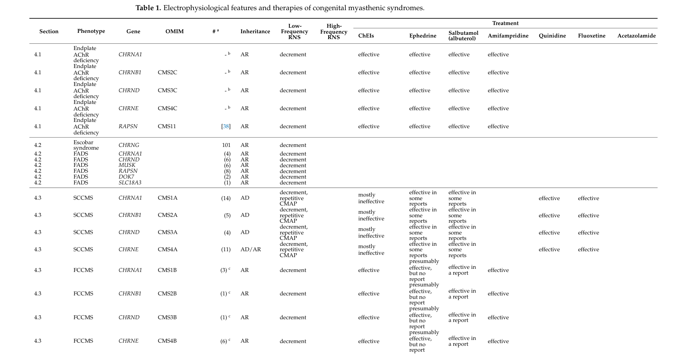

## Question

# Disease Characteristics Research Template

## Target Disease
- **Disease Name:** Congenital Myasthenic Syndrome
- **MONDO ID:**  (if available)
- **Category:** Mendelian

## Research Objectives

Please provide a comprehensive research report on **Congenital Myasthenic Syndrome** covering all of the
disease characteristics listed below. This report will be used to populate a disease knowledge
base entry. Be thorough and cite primary literature (PMID preferred) for all claims.

For each section, **suggested databases/resources** are listed. These are the first places
you should search for information on each topic.

---

### 1. Disease Information
> **Search first:** OMIM, Orphanet, ICD-10/ICD-11, MeSH, PubMed

- What is the disease? Provide a concise overview.
- What are the key identifiers? (OMIM, Orphanet, ICD-10/ICD-11, MeSH, Mondo)
- What are the common synonyms and alternative names?
- Is the information derived from individual patients (e.g., EHR) or aggregated disease-level resources?

### 2. Etiology

- **Disease Causal Factors**: What are the primary causes? (genetic, environmental, infectious, mechanistic)
- **Risk Factors**:
  > **Search first:** PubMed, Cochrane Library, UpToDate, clinical guidelines, ClinVar, ClinGen, GWAS Catalog, PheGenI, CTD, CDC, WHO, epidemiological databases
  - Genetic risk factors (causal variants, susceptibility loci, modifier genes)
  - Environmental risk factors (toxins, lifestyle, occupational exposures, age, sex, family history)
- **Protective Factors**:
  > **Search first:** PubMed, Cochrane Library, clinical trial databases, GWAS Catalog, gnomAD, WHO, CDC, nutrition databases
  - Genetic protective factors (protective variants, modifier alleles)
  - Environmental protective factors (diet, lifestyle, exposures that reduce risk)
- **Gene-Environment Interactions**: How do genetic and environmental factors interact to influence disease?
  > **Search first:** CTD, PubMed, PheGenI, GxE databases

### 3. Phenotypes
> **Search first:** HPO (Human Phenotype Ontology), OMIM, Orphanet, PubMed, clinicaltrials.gov, MedDRA, SNOMED CT, DECIPHER, LOINC

For each phenotype, provide:
- **Phenotype type**: symptoms, clinical signs, physical manifestations, behavioral changes, or laboratory abnormalities
  > For symptoms/signs: HPO, OMIM, Orphanet, PubMed
  > For behavioral changes: HPO, DSM, RDoC (Research Domain Criteria), PubMed
  > For laboratory abnormalities: LOINC, SNOMED CT, LabTests Online, PubMed
- **Phenotype characteristics**:
  > **Search first:** OMIM, Orphanet, HPO, PubMed
  - Age of symptom onset (neonatal, childhood, adult-onset, late-onset)
  - Symptom severity (mild, moderate, severe, variable)
  - Symptom progression (stable, progressive, episodic, fluctuating)
  - Frequency among affected individuals (percentage or qualitative)
- **Quality of life impact**: Effects on daily functioning and well-being (per-phenotype when possible)
  > **Search first:** EQ-5D database, SF-36, WHO QOL databases, PubMed
- Suggest HPO (Human Phenotype Ontology) terms for each phenotype

### 4. Genetic/Molecular Information

- **Causal Genes**: Gene mutations or chromosomal abnormalities responsible for disease (gene symbols, OMIM IDs)
  > **Search first:** OMIM, ClinVar, HGMD, Ensembl, NCBI Gene
- **Pathogenic Variants**:
  - Affected genes (gene symbols, HGNC IDs)
    > **Search first:** OMIM, NCBI Gene, Ensembl, HGNC, UniProt, GeneCards
  - Variant classification (pathogenic, likely pathogenic, VUS per ACMG/AMP guidelines)
    > **Search first:** ClinVar, ClinGen, ACMG/AMP guidelines, VarSome
  - Variant type/class (missense, frameshift, nonsense, splice-site, structural)
  - Allele frequency in population databases
    > **Search first:** gnomAD, 1000 Genomes, ExAC, TOPMed, dbSNP
  - Somatic vs germline origin
    > **Search first:** COSMIC (somatic), ClinVar, ICGC, TCGA
  - Functional consequences (loss of function, gain of function, dominant negative)
- **Modifier Genes**: Genes that modify disease severity or expression
- **Epigenetic Information**: DNA methylation, histone modifications, chromatin changes affecting disease
  > **Search first:** ENCODE, Roadmap Epigenomics, MethBase, DiseaseMeth
- **Chromosomal Abnormalities**: Large-scale genetic changes (aneuploidy, translocations, inversions)
  > **Search first:** DECIPHER, ClinVar, ECARUCA, UCSC Genome Browser

### 5. Environmental Information

- **Environmental Factors**: Non-genetic contributing factors (toxins, radiation, pollution, occupational exposure)
  > **Search first:** CTD (Comparative Toxicogenomics Database), TOXNET, PubMed, EPA databases
- **Lifestyle Factors**: Behavioral factors (smoking, diet, exercise, alcohol consumption)
  > **Search first:** CDC databases, WHO, PubMed, NHANES
- **Infectious Agents**: If applicable, pathogens causing or triggering disease (bacteria, viruses, fungi, parasites)
  > **Search first:** NCBI Taxonomy, ViPR, BV-BRC, MicrobeDB, GIDEON

### 6. Mechanism / Pathophysiology

- **Molecular Pathways**: Specific signaling cascades or biochemical pathways involved (Wnt, MAPK, mTOR, PI3K-AKT, etc.)
  > **Search first:** KEGG, Reactome, WikiPathways, PathBank, BioCyc
- **Cellular Processes**: Cell-level mechanisms (apoptosis, autophagy, cell cycle dysregulation, inflammation, etc.)
  > **Search first:** Gene Ontology (GO), Reactome, KEGG, PubMed
- **Protein Dysfunction**: How protein structure or function is altered (misfolding, aggregation, loss of function, gain of function)
  > **Search first:** UniProt, PDB (Protein Data Bank), InterPro, Pfam, AlphaFold
- **Metabolic Changes**: Alterations in metabolic processes (energy metabolism, lipid metabolism, amino acid metabolism)
  > **Search first:** KEGG, BioCyc, HMDB (Human Metabolome Database), BRENDA
- **Immune System Involvement**: Role of immune response (autoimmunity, immunodeficiency, chronic inflammation)
  > **Search first:** ImmPort, Immunome Database, IEDB, Gene Ontology
- **Tissue Damage Mechanisms**: How tissues/ are injured (oxidative stress, ischemia, fibrosis, necrosis)
  > **Search first:** PubMed, Gene Ontology, Reactome
- **Biochemical Abnormalities**: Specific molecular defects (enzyme deficiencies, receptor dysfunction, ion channel defects)
  > **Search first:** BRENDA, UniProt, KEGG, OMIM, PubMed
- **Epigenetic Changes**: DNA methylation, histone modifications affecting gene expression in disease
  > **Search first:** ENCODE, Roadmap Epigenomics, MethBase, DiseaseMeth
- **Molecular Profiling** (if available):
  - Transcriptomics/gene expression changes
    > **Search first:** GEO (Gene Expression Omnibus), ArrayExpress, GTEx, Human Cell Atlas, SRA
  - Proteomics findings
    > **Search first:** PRIDE, ProteomeXchange, Human Protein Atlas, STRING, BioGRID
  - Metabolomics signatures
    > **Search first:** MetaboLights, Metabolomics Workbench, HMDB, METLIN
  - Lipidomics alterations
    > **Search first:** LIPID MAPS, SwissLipids, LipidHome, Metabolomics Workbench
  - Genomic structural features
    > **Search first:** UCSC Genome Browser, Ensembl, NCBI, dbVar, DGV
- **Advanced Technologies** (if applicable):
  - Single-cell analysis findings (cell-type specific mechanisms, cellular heterogeneity)
    > **Search first:** Human Cell Atlas, Single Cell Portal, GEO, CELLxGENE
  - Spatial transcriptomics findings
    > **Search first:** GEO, Spatial Research, Vizgen, 10x Genomics data
  - Multi-omics integration results
    > **Search first:** TCGA, ICGC, cBioPortal, LinkedOmics, PubMed
  - Functional genomics screens (CRISPR, RNAi)
    > **Search first:** DepMap, GenomeRNAi, PubMed, BioGRID ORCS

For each mechanism, describe:
- The causal chain from initial trigger to clinical manifestation
- Which mechanisms are upstream vs downstream
- What cell types and biological processes are involved
- Suggest GO terms for biological processes and CL terms for cell types

### 7. Anatomical Structures Affected

- **Organ Level**:
  - Primary organs directly affected
  - Secondary organ involvement (complications, secondary effects)
  - Body systems involved (cardiovascular, nervous, digestive, respiratory, endocrine, etc.)
  > **Search first:** Uberon, FMA (Foundational Model of Anatomy), OMIM, HPO, ICD-11, MeSH, SNOMED CT
- **Tissue and Cell Level**:
  - Specific tissue types affected (epithelial, connective, muscle, nervous)
  - Specific cell populations targeted (with Cell Ontology terms)
  > **Search first:** Uberon, Human Protein Atlas, Cell Ontology, Human Cell Atlas, CellMarker, PanglaoDB
- **Subcellular Level**:
  - Cellular compartments involved (mitochondria, nucleus, ER, lysosomes) (with GO Cellular Component terms)
  > **Search first:** Gene Ontology (Cellular Component), UniProt, Human Protein Atlas
- **Localization**:
  - Specific anatomical sites (with UBERON terms)
    > **Search first:** FMA, Uberon, NeuroNames (for brain), SNOMED CT
  - Lateralization (unilateral, bilateral, asymmetric)
    > **Search first:** HPO, clinical literature, imaging databases

### 8. Temporal Development

- **Onset**:
  - Typical age of onset (congenital, pediatric, adult, geriatric)
  - Onset pattern (acute, subacute, chronic, insidious)
  > **Search first:** OMIM, Orphanet, HPO, PubMed
- **Progression**:
  - Disease stages (early, intermediate, advanced, end-stage)
    > **Search first:** Cancer Staging Manual (AJCC), WHO classifications, PubMed
  - Progression rate (rapid, slow, variable)
  - Disease course pattern (episodic, relapsing-remitting, progressive, stable)
  - Disease duration (self-limited, chronic lifelong)
  > **Search first:** Disease registries, longitudinal cohort databases, natural history studies, PubMed, Orphanet, OMIM
- **Patterns**:
  - Remission patterns (spontaneous, treatment-induced)
    > **Search first:** Clinical trial databases, disease registries, PubMed
  - Critical periods (time windows of vulnerability or opportunity for intervention)
    > **Search first:** PubMed, developmental biology databases, clinical guidelines

### 9. Inheritance and Population

- **Epidemiology**:
  - Prevalence (cases per 100,000 at given time)
  - Incidence (new cases per 100,000 per year)
  > **Search first:** Orphanet, CDC, WHO, GBD (Global Burden of Disease), national registries, SEER, disease registries
- **For Genetic Etiology**:
  - Inheritance pattern (AD, AR, X-linked, mitochondrial, multifactorial, polygenic)
    > **Search first:** OMIM, Orphanet, ClinVar, GTR (Genetic Testing Registry)
  - Penetrance (complete, incomplete, age-dependent)
    > **Search first:** ClinVar, OMIM, PubMed, ClinGen
  - Expressivity (variable, consistent)
    > **Search first:** OMIM, ClinVar, PubMed
  - Genetic anticipation (increasing severity in successive generations)
    > **Search first:** OMIM, PubMed (especially for repeat expansion disorders)
  - Germline mosaicism
    > **Search first:** ClinVar, OMIM, genetic counseling literature, PubMed
  - Founder effects (population-specific mutations)
    > **Search first:** gnomAD, population genetics databases, PubMed
  - Consanguinity role
    > **Search first:** OMIM, population studies, genetic counseling resources
  - Carrier frequency
    > **Search first:** gnomAD, carrier screening databases, GeneReviews, GTR
- **Population Demographics**:
  - Affected populations (ethnic or demographic groups with higher prevalence)
    > **Search first:** gnomAD, 1000 Genomes, PAGE Study, PubMed, population registries
  - Geographic distribution (endemic areas, regional variation)
    > **Search first:** WHO, CDC, GBD, Orphanet, geographic epidemiology databases
  - Geographic distribution of specific variants
  - Sex ratio (male:female)
    > **Search first:** Disease registries, OMIM, PubMed, epidemiological databases
  - Age distribution of affected individuals
    > **Search first:** CDC, disease registries, SEER, Orphanet

### 10. Diagnostics

- **Clinical Tests**:
  - Laboratory tests (blood, urine, tissue chemistry, specific enzyme assays)
    > **Search first:** LOINC, LabTests Online, PubMed
  - Biomarkers (proteins, metabolites, genetic markers, circulating biomarkers)
    > **Search first:** FDA Biomarker List, BEST (Biomarkers, EndpointS, and other Tools), PubMed
  - Imaging studies (X-ray, CT, MRI, PET, ultrasound)
    > **Search first:** RadLex, DICOM, Radiopaedia, imaging databases
  - Functional tests (pulmonary function, cardiac stress tests)
    > **Search first:** LOINC, clinical guidelines, PubMed
  - Electrophysiology (EEG, EMG, ECG, nerve conduction studies)
    > **Search first:** LOINC, clinical neurophysiology databases, PubMed
  - Biopsy findings (histopathology, immunohistochemistry)
    > **Search first:** SNOMED CT, College of American Pathologists resources, PubMed
  - Pathology findings (microscopic examination)
    > **Search first:** SNOMED CT, Digital Pathology databases, PubMed
- **Genetic Testing**:
  > **Search first:** GTR (Genetic Testing Registry), GeneReviews, ClinGen
  - Overview of recommended genetic testing approach
  - Whole genome sequencing (WGS) utility
    > **Search first:** GTR, ClinVar, GEL (Genomics England), gnomAD
  - Whole exome sequencing (WES) utility
    > **Search first:** GTR, ClinVar, OMIM, GeneMatcher
  - Gene panels (which panels, which genes)
    > **Search first:** GTR, ClinVar, laboratory-specific databases
  - Single gene testing
    > **Search first:** GTR, ClinVar, OMIM, GeneReviews
  - Chromosomal microarray (CMA)
    > **Search first:** DECIPHER, ClinVar, dbVar, ECARUCA
  - Karyotyping
    > **Search first:** Chromosome Abnormality Database, ClinVar, cytogenetics resources
  - FISH
    > **Search first:** ClinVar, cytogenetics databases, PubMed
  - Mitochondrial DNA testing
    > **Search first:** MITOMAP, MSeqDR, ClinVar, GTR
  - Repeat expansion testing
    > **Search first:** GTR, ClinVar, repeat expansion databases, PubMed
- **Omics-Based Diagnostics** (if applicable):
  - RNA sequencing / transcriptomics
    > **Search first:** GEO, ArrayExpress, GTEx, RNA-seq databases
  - Proteomics
    > **Search first:** PRIDE, ProteomeXchange, FDA Biomarker database
  - Metabolomics
    > **Search first:** MetaboLights, Metabolomics Workbench, HMDB
  - Epigenomics
    > **Search first:** GEO, ENCODE, Roadmap Epigenomics, MethBase
  - Liquid biopsy
    > **Search first:** COSMIC, ClinVar, liquid biopsy databases, PubMed
- **Clinical Criteria**:
  - Standardized diagnostic criteria (DSM, ICD, society guidelines)
    > **Search first:** DSM-5, ICD-11, clinical society guidelines, UpToDate
  - Differential diagnosis (other conditions to rule out, with distinguishing features)
    > **Search first:** DynaMed, UpToDate, clinical decision support systems
- **Screening**:
  - Screening methods for asymptomatic individuals (newborn screening, carrier screening, cascade screening)
    > **Search first:** ACMG recommendations, CDC newborn screening, GTR

### 11. Outcome/Prognosis

- **Survival and Mortality**:
  - Survival rate (5-year, 10-year, overall)
    > **Search first:** SEER, cancer registries, disease-specific registries, PubMed
  - Life expectancy (with and without treatment if applicable)
    > **Search first:** Orphanet, disease registries, actuarial databases, PubMed
  - Mortality rate
    > **Search first:** CDC, WHO, GBD, national mortality databases
  - Disease-specific mortality (deaths directly attributable to disease)
    > **Search first:** Disease registries, CDC Wonder, GBD, PubMed
- **Morbidity and Function**:
  - Morbidity (disease-related disability and health impacts)
    > **Search first:** GBD, WHO, disability databases, PubMed
  - Disability outcomes (long-term functional impairments)
    > **Search first:** ICF (International Classification of Functioning), disability registries
  - Quality of life measures (EQ-5D, SF-36, PROMIS, disease-specific tools)
    > **Search first:** EQ-5D database, SF-36, PROMIS, PubMed
- **Disease Course**:
  - Complications (secondary problems: infections, organ failure, etc.)
    > **Search first:** ICD codes, disease registries, clinical databases, PubMed
  - Recovery potential (likelihood and extent of recovery, with vs without treatment)
    > **Search first:** Natural history studies, rehabilitation databases, PubMed
- **Prediction**:
  - Prognostic factors (age, disease severity, biomarkers, treatment response)
    > **Search first:** Prognostic models databases, clinical calculators, PubMed
  - Prognostic biomarkers (molecular markers predicting disease course)
    > **Search first:** FDA Biomarker database, PubMed, cancer prognostic databases

### 12. Treatment

- **Pharmacotherapy**:
  - Pharmacological treatments (drug names, drug classes, mechanisms of action)
    > **Search first:** DrugBank, RxNorm, ATC classification, DailyMed, FDA databases
  - Pharmacogenomics (how genetic variants affect drug metabolism, efficacy, toxicity)
    > **Search first:** PharmGKB, CPIC (Clinical Pharmacogenetics), FDA Table of PGx Biomarkers
- **Advanced Therapeutics**:
  - Gene therapy (viral vectors, CRISPR, gene replacement, gene editing)
    > **Search first:** ClinicalTrials.gov, FDA gene therapy database, ASGCT resources
  - Cell therapy (stem cell transplant, CAR-T, cellular therapeutics)
    > **Search first:** ClinicalTrials.gov, FDA cell therapy database, FACT standards
  - RNA-based therapies (ASOs, siRNA, mRNA therapies)
    > **Search first:** ClinicalTrials.gov, FDA approvals, PubMed
  - Targeted therapies (treatments directed at specific molecular targets)
    > **Search first:** My Cancer Genome, OncoKB, ClinicalTrials.gov, FDA approvals
  - Immunotherapies (checkpoint inhibitors, monoclonal antibodies)
    > **Search first:** Cancer Immunotherapy Database, FDA approvals, ClinicalTrials.gov
- **Surgical and Interventional**:
  - Surgical interventions (types of surgery, timing, outcomes)
    > **Search first:** CPT codes, surgical registries, clinical guidelines, PubMed
- **Supportive and Rehabilitative**:
  - Supportive care (symptom management, pain control, nutrition)
    > **Search first:** Clinical guidelines, Cochrane Library, PubMed
  - Rehabilitation (physical therapy, occupational therapy, speech therapy)
    > **Search first:** Rehabilitation medicine databases, clinical guidelines, PubMed
- **Experimental**:
  - Experimental treatments in clinical trials (with NCT identifiers if available)
    > **Search first:** ClinicalTrials.gov, EU Clinical Trials Register, WHO ICTRP
- **Treatment Outcomes**:
  - Treatment response rates
    > **Search first:** Clinical trial databases, FDA reviews, systematic reviews, PubMed
  - Side effects and adverse events
    > **Search first:** FDA Adverse Event Reporting System (FAERS), MedWatch, PubMed
- **Treatment Strategy**:
  - Treatment algorithms (clinical pathways, decision trees)
    > **Search first:** Clinical practice guidelines, NCCN Guidelines, UpToDate
  - Combination therapies
    > **Search first:** ClinicalTrials.gov, treatment guidelines, PubMed
  - Personalized medicine approaches (genotype-guided treatment)
    > **Search first:** My Cancer Genome, CIViC, PharmGKB, precision medicine databases

For each treatment, suggest MAXO (Medical Action Ontology) terms where applicable.

### 13. Prevention

- **Prevention Levels**:
  - Primary prevention (preventing disease occurrence: vaccination, risk factor modification)
    > **Search first:** CDC, WHO, USPSTF recommendations, Cochrane Library
  - Secondary prevention (early detection and treatment: screening programs, early intervention)
    > **Search first:** USPSTF, CDC screening guidelines, WHO
  - Tertiary prevention (preventing complications in those with disease)
    > **Search first:** Clinical guidelines, disease management protocols, PubMed
- **Immunization**: Vaccine strategies (if applicable)
  > **Search first:** CDC vaccine schedules, WHO immunization, FDA vaccine database
- **Screening and Early Detection**:
  - Screening programs (population-based: newborn screening, cancer screening)
    > **Search first:** CDC screening programs, USPSTF, cancer screening databases
  - Genetic screening (carrier screening, preimplantation genetic diagnosis, prenatal testing)
    > **Search first:** ACMG recommendations, ACOG guidelines, GTR
  - Risk stratification (identifying high-risk individuals for targeted prevention)
    > **Search first:** Risk prediction models, clinical calculators, PubMed
- **Behavioral Interventions**: Lifestyle modifications to reduce risk
  > **Search first:** CDC, WHO, behavioral intervention databases, Cochrane Library
- **Counseling**: Genetic counseling (risk assessment, family planning guidance)
  > **Search first:** NSGC resources, ACMG guidelines, GeneReviews
- **Public Health**:
  - Public health interventions (sanitation, vector control, health education)
    > **Search first:** CDC, WHO, public health databases, PubMed
  - Environmental interventions (reducing environmental risk factors)
    > **Search first:** EPA databases, WHO environmental health, PubMed
- **Prophylaxis**: Preventive medications or procedures
  > **Search first:** Clinical guidelines, FDA approvals, PubMed

### 14. Other Species / Natural Disease

- **Taxonomy**: Species affected (with NCBI Taxon identifiers)
  > **Search first:** NCBI Taxonomy
- **Breed**: Specific breeds affected (with VBO identifiers if applicable)
  > **Search first:** VBO (Vertebrate Breed Ontology)
- **Gene**: Orthologous genes in other species (with NCBI Gene IDs)
  > **Search first:** NCBI Gene
- **Natural Disease**:
  - Naturally occurring disease in other species (companion animals, wildlife)
    > **Search first:** OMIA (Online Mendelian Inheritance in Animals), VetCompass, PubMed
  - Veterinary relevance and importance in animal health
    > **Search first:** OMIA, veterinary databases, PubMed
- **Comparative Biology**:
  - Comparative pathology (similarities and differences across species)
    > **Search first:** OMIA, comparative pathology databases, PubMed
  - Evolutionary conservation of disease mechanisms
    > **Search first:** HomoloGene, OrthoMCL, Alliance of Genome Resources
- **Transmission** (if applicable):
  - Zoonotic potential
    > **Search first:** CDC zoonotic diseases, WHO zoonoses, GIDEON
  - Cross-species susceptibility
    > **Search first:** NCBI Taxonomy, veterinary databases, PubMed

### 15. Model Organisms

- **Model Types**:
  - Model organism type (mammalian, invertebrate, cellular, in vitro)
    > **Search first:** Alliance of Genome Resources, model organism databases
  - Specific model systems (mouse, rat, zebrafish, Drosophila, C. elegans, yeast, cell lines, organoids, iPSCs)
    > **Search first:** MGI, RGD, ZFIN, FlyBase, WormBase, SGD, ATCC, Cellosaurus
  - Induced models (drug treatment, surgical intervention, environmental manipulation)
    > **Search first:** MGI, model organism databases, PubMed
- **Genetic Models**:
  - Types available (knockout, knock-in, transgenic, conditional, humanized)
    > **Search first:** MGI, IMPC, KOMP, EuMMCR, IMSR
- **Model Characteristics**:
  - Phenotype recapitulation (how well model reproduces human disease features)
    > **Search first:** Model organism databases, comparative studies, PubMed
  - Model limitations (aspects of human disease not captured)
    > **Search first:** Model organism databases, PubMed, review articles
- **Applications**:
  - Research applications (what aspects of disease can be studied)
    > **Search first:** Model organism databases, PubMed
- **Resources**:
  - Model databases
    > **Search first:** MGI, RGD, ZFIN, FlyBase, WormBase, IMSR, EMMA, MMRRC

---

## Citation Requirements

- Cite primary literature (PMID preferred) for all mechanistic and clinical claims
- Prioritize recent reviews and landmark papers
- Include direct quotes from abstracts where possible to support key statements
- Distinguish evidence source types: human clinical, model organism, in vitro, computational

## Output Format

Structure your response as a comprehensive narrative organized by the sections above.
For each section, provide:
- Factual content with specific details (numbers, percentages, gene names, variant nomenclature)
- Ontology term suggestions (HPO, GO, CL, UBERON, CHEBI, MAXO, MONDO) where applicable
- Evidence citations with PMIDs
- Direct quotes from abstracts to support key claims
- Clear indication when information is not available or not applicable for this disease

This report will be used to populate a disease knowledge base entry with:
- Pathophysiology descriptions with causal chains
- Gene/protein annotations (HGNC, GO terms)
- Phenotype associations (HP terms) with frequencies
- Cell type involvement (CL terms)
- Anatomical locations (UBERON terms)
- Chemical entities (CHEBI terms)
- Treatment annotations (MAXO terms)
- Evidence items with PMIDs and exact abstract quotes
- Epidemiology, prognosis, diagnostic, and prevention information
- Animal model descriptions with phenotype recapitulation details

## Output

Question: You are an expert researcher providing comprehensive, well-cited information.

Provide detailed information focusing on:
1. Key concepts and definitions with current understanding
2. Recent developments and latest research (prioritize 2023-2024 sources)
3. Current applications and real-world implementations
4. Expert opinions and analysis from authoritative sources
5. Relevant statistics and data from recent studies

Format as a comprehensive research report with proper citations. Include URLs and publication dates where available.
Always prioritize recent, authoritative sources and provide specific citations for all major claims.

# Disease Characteristics Research Template

## Target Disease
- **Disease Name:** Congenital Myasthenic Syndrome
- **MONDO ID:**  (if available)
- **Category:** Mendelian

## Research Objectives

Please provide a comprehensive research report on **Congenital Myasthenic Syndrome** covering all of the
disease characteristics listed below. This report will be used to populate a disease knowledge
base entry. Be thorough and cite primary literature (PMID preferred) for all claims.

For each section, **suggested databases/resources** are listed. These are the first places
you should search for information on each topic.

---

### 1. Disease Information
> **Search first:** OMIM, Orphanet, ICD-10/ICD-11, MeSH, PubMed

- What is the disease? Provide a concise overview.
- What are the key identifiers? (OMIM, Orphanet, ICD-10/ICD-11, MeSH, Mondo)
- What are the common synonyms and alternative names?
- Is the information derived from individual patients (e.g., EHR) or aggregated disease-level resources?

### 2. Etiology

- **Disease Causal Factors**: What are the primary causes? (genetic, environmental, infectious, mechanistic)
- **Risk Factors**:
  > **Search first:** PubMed, Cochrane Library, UpToDate, clinical guidelines, ClinVar, ClinGen, GWAS Catalog, PheGenI, CTD, CDC, WHO, epidemiological databases
  - Genetic risk factors (causal variants, susceptibility loci, modifier genes)
  - Environmental risk factors (toxins, lifestyle, occupational exposures, age, sex, family history)
- **Protective Factors**:
  > **Search first:** PubMed, Cochrane Library, clinical trial databases, GWAS Catalog, gnomAD, WHO, CDC, nutrition databases
  - Genetic protective factors (protective variants, modifier alleles)
  - Environmental protective factors (diet, lifestyle, exposures that reduce risk)
- **Gene-Environment Interactions**: How do genetic and environmental factors interact to influence disease?
  > **Search first:** CTD, PubMed, PheGenI, GxE databases

### 3. Phenotypes
> **Search first:** HPO (Human Phenotype Ontology), OMIM, Orphanet, PubMed, clinicaltrials.gov, MedDRA, SNOMED CT, DECIPHER, LOINC

For each phenotype, provide:
- **Phenotype type**: symptoms, clinical signs, physical manifestations, behavioral changes, or laboratory abnormalities
  > For symptoms/signs: HPO, OMIM, Orphanet, PubMed
  > For behavioral changes: HPO, DSM, RDoC (Research Domain Criteria), PubMed
  > For laboratory abnormalities: LOINC, SNOMED CT, LabTests Online, PubMed
- **Phenotype characteristics**:
  > **Search first:** OMIM, Orphanet, HPO, PubMed
  - Age of symptom onset (neonatal, childhood, adult-onset, late-onset)
  - Symptom severity (mild, moderate, severe, variable)
  - Symptom progression (stable, progressive, episodic, fluctuating)
  - Frequency among affected individuals (percentage or qualitative)
- **Quality of life impact**: Effects on daily functioning and well-being (per-phenotype when possible)
  > **Search first:** EQ-5D database, SF-36, WHO QOL databases, PubMed
- Suggest HPO (Human Phenotype Ontology) terms for each phenotype

### 4. Genetic/Molecular Information

- **Causal Genes**: Gene mutations or chromosomal abnormalities responsible for disease (gene symbols, OMIM IDs)
  > **Search first:** OMIM, ClinVar, HGMD, Ensembl, NCBI Gene
- **Pathogenic Variants**:
  - Affected genes (gene symbols, HGNC IDs)
    > **Search first:** OMIM, NCBI Gene, Ensembl, HGNC, UniProt, GeneCards
  - Variant classification (pathogenic, likely pathogenic, VUS per ACMG/AMP guidelines)
    > **Search first:** ClinVar, ClinGen, ACMG/AMP guidelines, VarSome
  - Variant type/class (missense, frameshift, nonsense, splice-site, structural)
  - Allele frequency in population databases
    > **Search first:** gnomAD, 1000 Genomes, ExAC, TOPMed, dbSNP
  - Somatic vs germline origin
    > **Search first:** COSMIC (somatic), ClinVar, ICGC, TCGA
  - Functional consequences (loss of function, gain of function, dominant negative)
- **Modifier Genes**: Genes that modify disease severity or expression
- **Epigenetic Information**: DNA methylation, histone modifications, chromatin changes affecting disease
  > **Search first:** ENCODE, Roadmap Epigenomics, MethBase, DiseaseMeth
- **Chromosomal Abnormalities**: Large-scale genetic changes (aneuploidy, translocations, inversions)
  > **Search first:** DECIPHER, ClinVar, ECARUCA, UCSC Genome Browser

### 5. Environmental Information

- **Environmental Factors**: Non-genetic contributing factors (toxins, radiation, pollution, occupational exposure)
  > **Search first:** CTD (Comparative Toxicogenomics Database), TOXNET, PubMed, EPA databases
- **Lifestyle Factors**: Behavioral factors (smoking, diet, exercise, alcohol consumption)
  > **Search first:** CDC databases, WHO, PubMed, NHANES
- **Infectious Agents**: If applicable, pathogens causing or triggering disease (bacteria, viruses, fungi, parasites)
  > **Search first:** NCBI Taxonomy, ViPR, BV-BRC, MicrobeDB, GIDEON

### 6. Mechanism / Pathophysiology

- **Molecular Pathways**: Specific signaling cascades or biochemical pathways involved (Wnt, MAPK, mTOR, PI3K-AKT, etc.)
  > **Search first:** KEGG, Reactome, WikiPathways, PathBank, BioCyc
- **Cellular Processes**: Cell-level mechanisms (apoptosis, autophagy, cell cycle dysregulation, inflammation, etc.)
  > **Search first:** Gene Ontology (GO), Reactome, KEGG, PubMed
- **Protein Dysfunction**: How protein structure or function is altered (misfolding, aggregation, loss of function, gain of function)
  > **Search first:** UniProt, PDB (Protein Data Bank), InterPro, Pfam, AlphaFold
- **Metabolic Changes**: Alterations in metabolic processes (energy metabolism, lipid metabolism, amino acid metabolism)
  > **Search first:** KEGG, BioCyc, HMDB (Human Metabolome Database), BRENDA
- **Immune System Involvement**: Role of immune response (autoimmunity, immunodeficiency, chronic inflammation)
  > **Search first:** ImmPort, Immunome Database, IEDB, Gene Ontology
- **Tissue Damage Mechanisms**: How tissues/ are injured (oxidative stress, ischemia, fibrosis, necrosis)
  > **Search first:** PubMed, Gene Ontology, Reactome
- **Biochemical Abnormalities**: Specific molecular defects (enzyme deficiencies, receptor dysfunction, ion channel defects)
  > **Search first:** BRENDA, UniProt, KEGG, OMIM, PubMed
- **Epigenetic Changes**: DNA methylation, histone modifications affecting gene expression in disease
  > **Search first:** ENCODE, Roadmap Epigenomics, MethBase, DiseaseMeth
- **Molecular Profiling** (if available):
  - Transcriptomics/gene expression changes
    > **Search first:** GEO (Gene Expression Omnibus), ArrayExpress, GTEx, Human Cell Atlas, SRA
  - Proteomics findings
    > **Search first:** PRIDE, ProteomeXchange, Human Protein Atlas, STRING, BioGRID
  - Metabolomics signatures
    > **Search first:** MetaboLights, Metabolomics Workbench, HMDB, METLIN
  - Lipidomics alterations
    > **Search first:** LIPID MAPS, SwissLipids, LipidHome, Metabolomics Workbench
  - Genomic structural features
    > **Search first:** UCSC Genome Browser, Ensembl, NCBI, dbVar, DGV
- **Advanced Technologies** (if applicable):
  - Single-cell analysis findings (cell-type specific mechanisms, cellular heterogeneity)
    > **Search first:** Human Cell Atlas, Single Cell Portal, GEO, CELLxGENE
  - Spatial transcriptomics findings
    > **Search first:** GEO, Spatial Research, Vizgen, 10x Genomics data
  - Multi-omics integration results
    > **Search first:** TCGA, ICGC, cBioPortal, LinkedOmics, PubMed
  - Functional genomics screens (CRISPR, RNAi)
    > **Search first:** DepMap, GenomeRNAi, PubMed, BioGRID ORCS

For each mechanism, describe:
- The causal chain from initial trigger to clinical manifestation
- Which mechanisms are upstream vs downstream
- What cell types and biological processes are involved
- Suggest GO terms for biological processes and CL terms for cell types

### 7. Anatomical Structures Affected

- **Organ Level**:
  - Primary organs directly affected
  - Secondary organ involvement (complications, secondary effects)
  - Body systems involved (cardiovascular, nervous, digestive, respiratory, endocrine, etc.)
  > **Search first:** Uberon, FMA (Foundational Model of Anatomy), OMIM, HPO, ICD-11, MeSH, SNOMED CT
- **Tissue and Cell Level**:
  - Specific tissue types affected (epithelial, connective, muscle, nervous)
  - Specific cell populations targeted (with Cell Ontology terms)
  > **Search first:** Uberon, Human Protein Atlas, Cell Ontology, Human Cell Atlas, CellMarker, PanglaoDB
- **Subcellular Level**:
  - Cellular compartments involved (mitochondria, nucleus, ER, lysosomes) (with GO Cellular Component terms)
  > **Search first:** Gene Ontology (Cellular Component), UniProt, Human Protein Atlas
- **Localization**:
  - Specific anatomical sites (with UBERON terms)
    > **Search first:** FMA, Uberon, NeuroNames (for brain), SNOMED CT
  - Lateralization (unilateral, bilateral, asymmetric)
    > **Search first:** HPO, clinical literature, imaging databases

### 8. Temporal Development

- **Onset**:
  - Typical age of onset (congenital, pediatric, adult, geriatric)
  - Onset pattern (acute, subacute, chronic, insidious)
  > **Search first:** OMIM, Orphanet, HPO, PubMed
- **Progression**:
  - Disease stages (early, intermediate, advanced, end-stage)
    > **Search first:** Cancer Staging Manual (AJCC), WHO classifications, PubMed
  - Progression rate (rapid, slow, variable)
  - Disease course pattern (episodic, relapsing-remitting, progressive, stable)
  - Disease duration (self-limited, chronic lifelong)
  > **Search first:** Disease registries, longitudinal cohort databases, natural history studies, PubMed, Orphanet, OMIM
- **Patterns**:
  - Remission patterns (spontaneous, treatment-induced)
    > **Search first:** Clinical trial databases, disease registries, PubMed
  - Critical periods (time windows of vulnerability or opportunity for intervention)
    > **Search first:** PubMed, developmental biology databases, clinical guidelines

### 9. Inheritance and Population

- **Epidemiology**:
  - Prevalence (cases per 100,000 at given time)
  - Incidence (new cases per 100,000 per year)
  > **Search first:** Orphanet, CDC, WHO, GBD (Global Burden of Disease), national registries, SEER, disease registries
- **For Genetic Etiology**:
  - Inheritance pattern (AD, AR, X-linked, mitochondrial, multifactorial, polygenic)
    > **Search first:** OMIM, Orphanet, ClinVar, GTR (Genetic Testing Registry)
  - Penetrance (complete, incomplete, age-dependent)
    > **Search first:** ClinVar, OMIM, PubMed, ClinGen
  - Expressivity (variable, consistent)
    > **Search first:** OMIM, ClinVar, PubMed
  - Genetic anticipation (increasing severity in successive generations)
    > **Search first:** OMIM, PubMed (especially for repeat expansion disorders)
  - Germline mosaicism
    > **Search first:** ClinVar, OMIM, genetic counseling literature, PubMed
  - Founder effects (population-specific mutations)
    > **Search first:** gnomAD, population genetics databases, PubMed
  - Consanguinity role
    > **Search first:** OMIM, population studies, genetic counseling resources
  - Carrier frequency
    > **Search first:** gnomAD, carrier screening databases, GeneReviews, GTR
- **Population Demographics**:
  - Affected populations (ethnic or demographic groups with higher prevalence)
    > **Search first:** gnomAD, 1000 Genomes, PAGE Study, PubMed, population registries
  - Geographic distribution (endemic areas, regional variation)
    > **Search first:** WHO, CDC, GBD, Orphanet, geographic epidemiology databases
  - Geographic distribution of specific variants
  - Sex ratio (male:female)
    > **Search first:** Disease registries, OMIM, PubMed, epidemiological databases
  - Age distribution of affected individuals
    > **Search first:** CDC, disease registries, SEER, Orphanet

### 10. Diagnostics

- **Clinical Tests**:
  - Laboratory tests (blood, urine, tissue chemistry, specific enzyme assays)
    > **Search first:** LOINC, LabTests Online, PubMed
  - Biomarkers (proteins, metabolites, genetic markers, circulating biomarkers)
    > **Search first:** FDA Biomarker List, BEST (Biomarkers, EndpointS, and other Tools), PubMed
  - Imaging studies (X-ray, CT, MRI, PET, ultrasound)
    > **Search first:** RadLex, DICOM, Radiopaedia, imaging databases
  - Functional tests (pulmonary function, cardiac stress tests)
    > **Search first:** LOINC, clinical guidelines, PubMed
  - Electrophysiology (EEG, EMG, ECG, nerve conduction studies)
    > **Search first:** LOINC, clinical neurophysiology databases, PubMed
  - Biopsy findings (histopathology, immunohistochemistry)
    > **Search first:** SNOMED CT, College of American Pathologists resources, PubMed
  - Pathology findings (microscopic examination)
    > **Search first:** SNOMED CT, Digital Pathology databases, PubMed
- **Genetic Testing**:
  > **Search first:** GTR (Genetic Testing Registry), GeneReviews, ClinGen
  - Overview of recommended genetic testing approach
  - Whole genome sequencing (WGS) utility
    > **Search first:** GTR, ClinVar, GEL (Genomics England), gnomAD
  - Whole exome sequencing (WES) utility
    > **Search first:** GTR, ClinVar, OMIM, GeneMatcher
  - Gene panels (which panels, which genes)
    > **Search first:** GTR, ClinVar, laboratory-specific databases
  - Single gene testing
    > **Search first:** GTR, ClinVar, OMIM, GeneReviews
  - Chromosomal microarray (CMA)
    > **Search first:** DECIPHER, ClinVar, dbVar, ECARUCA
  - Karyotyping
    > **Search first:** Chromosome Abnormality Database, ClinVar, cytogenetics resources
  - FISH
    > **Search first:** ClinVar, cytogenetics databases, PubMed
  - Mitochondrial DNA testing
    > **Search first:** MITOMAP, MSeqDR, ClinVar, GTR
  - Repeat expansion testing
    > **Search first:** GTR, ClinVar, repeat expansion databases, PubMed
- **Omics-Based Diagnostics** (if applicable):
  - RNA sequencing / transcriptomics
    > **Search first:** GEO, ArrayExpress, GTEx, RNA-seq databases
  - Proteomics
    > **Search first:** PRIDE, ProteomeXchange, FDA Biomarker database
  - Metabolomics
    > **Search first:** MetaboLights, Metabolomics Workbench, HMDB
  - Epigenomics
    > **Search first:** GEO, ENCODE, Roadmap Epigenomics, MethBase
  - Liquid biopsy
    > **Search first:** COSMIC, ClinVar, liquid biopsy databases, PubMed
- **Clinical Criteria**:
  - Standardized diagnostic criteria (DSM, ICD, society guidelines)
    > **Search first:** DSM-5, ICD-11, clinical society guidelines, UpToDate
  - Differential diagnosis (other conditions to rule out, with distinguishing features)
    > **Search first:** DynaMed, UpToDate, clinical decision support systems
- **Screening**:
  - Screening methods for asymptomatic individuals (newborn screening, carrier screening, cascade screening)
    > **Search first:** ACMG recommendations, CDC newborn screening, GTR

### 11. Outcome/Prognosis

- **Survival and Mortality**:
  - Survival rate (5-year, 10-year, overall)
    > **Search first:** SEER, cancer registries, disease-specific registries, PubMed
  - Life expectancy (with and without treatment if applicable)
    > **Search first:** Orphanet, disease registries, actuarial databases, PubMed
  - Mortality rate
    > **Search first:** CDC, WHO, GBD, national mortality databases
  - Disease-specific mortality (deaths directly attributable to disease)
    > **Search first:** Disease registries, CDC Wonder, GBD, PubMed
- **Morbidity and Function**:
  - Morbidity (disease-related disability and health impacts)
    > **Search first:** GBD, WHO, disability databases, PubMed
  - Disability outcomes (long-term functional impairments)
    > **Search first:** ICF (International Classification of Functioning), disability registries
  - Quality of life measures (EQ-5D, SF-36, PROMIS, disease-specific tools)
    > **Search first:** EQ-5D database, SF-36, PROMIS, PubMed
- **Disease Course**:
  - Complications (secondary problems: infections, organ failure, etc.)
    > **Search first:** ICD codes, disease registries, clinical databases, PubMed
  - Recovery potential (likelihood and extent of recovery, with vs without treatment)
    > **Search first:** Natural history studies, rehabilitation databases, PubMed
- **Prediction**:
  - Prognostic factors (age, disease severity, biomarkers, treatment response)
    > **Search first:** Prognostic models databases, clinical calculators, PubMed
  - Prognostic biomarkers (molecular markers predicting disease course)
    > **Search first:** FDA Biomarker database, PubMed, cancer prognostic databases

### 12. Treatment

- **Pharmacotherapy**:
  - Pharmacological treatments (drug names, drug classes, mechanisms of action)
    > **Search first:** DrugBank, RxNorm, ATC classification, DailyMed, FDA databases
  - Pharmacogenomics (how genetic variants affect drug metabolism, efficacy, toxicity)
    > **Search first:** PharmGKB, CPIC (Clinical Pharmacogenetics), FDA Table of PGx Biomarkers
- **Advanced Therapeutics**:
  - Gene therapy (viral vectors, CRISPR, gene replacement, gene editing)
    > **Search first:** ClinicalTrials.gov, FDA gene therapy database, ASGCT resources
  - Cell therapy (stem cell transplant, CAR-T, cellular therapeutics)
    > **Search first:** ClinicalTrials.gov, FDA cell therapy database, FACT standards
  - RNA-based therapies (ASOs, siRNA, mRNA therapies)
    > **Search first:** ClinicalTrials.gov, FDA approvals, PubMed
  - Targeted therapies (treatments directed at specific molecular targets)
    > **Search first:** My Cancer Genome, OncoKB, ClinicalTrials.gov, FDA approvals
  - Immunotherapies (checkpoint inhibitors, monoclonal antibodies)
    > **Search first:** Cancer Immunotherapy Database, FDA approvals, ClinicalTrials.gov
- **Surgical and Interventional**:
  - Surgical interventions (types of surgery, timing, outcomes)
    > **Search first:** CPT codes, surgical registries, clinical guidelines, PubMed
- **Supportive and Rehabilitative**:
  - Supportive care (symptom management, pain control, nutrition)
    > **Search first:** Clinical guidelines, Cochrane Library, PubMed
  - Rehabilitation (physical therapy, occupational therapy, speech therapy)
    > **Search first:** Rehabilitation medicine databases, clinical guidelines, PubMed
- **Experimental**:
  - Experimental treatments in clinical trials (with NCT identifiers if available)
    > **Search first:** ClinicalTrials.gov, EU Clinical Trials Register, WHO ICTRP
- **Treatment Outcomes**:
  - Treatment response rates
    > **Search first:** Clinical trial databases, FDA reviews, systematic reviews, PubMed
  - Side effects and adverse events
    > **Search first:** FDA Adverse Event Reporting System (FAERS), MedWatch, PubMed
- **Treatment Strategy**:
  - Treatment algorithms (clinical pathways, decision trees)
    > **Search first:** Clinical practice guidelines, NCCN Guidelines, UpToDate
  - Combination therapies
    > **Search first:** ClinicalTrials.gov, treatment guidelines, PubMed
  - Personalized medicine approaches (genotype-guided treatment)
    > **Search first:** My Cancer Genome, CIViC, PharmGKB, precision medicine databases

For each treatment, suggest MAXO (Medical Action Ontology) terms where applicable.

### 13. Prevention

- **Prevention Levels**:
  - Primary prevention (preventing disease occurrence: vaccination, risk factor modification)
    > **Search first:** CDC, WHO, USPSTF recommendations, Cochrane Library
  - Secondary prevention (early detection and treatment: screening programs, early intervention)
    > **Search first:** USPSTF, CDC screening guidelines, WHO
  - Tertiary prevention (preventing complications in those with disease)
    > **Search first:** Clinical guidelines, disease management protocols, PubMed
- **Immunization**: Vaccine strategies (if applicable)
  > **Search first:** CDC vaccine schedules, WHO immunization, FDA vaccine database
- **Screening and Early Detection**:
  - Screening programs (population-based: newborn screening, cancer screening)
    > **Search first:** CDC screening programs, USPSTF, cancer screening databases
  - Genetic screening (carrier screening, preimplantation genetic diagnosis, prenatal testing)
    > **Search first:** ACMG recommendations, ACOG guidelines, GTR
  - Risk stratification (identifying high-risk individuals for targeted prevention)
    > **Search first:** Risk prediction models, clinical calculators, PubMed
- **Behavioral Interventions**: Lifestyle modifications to reduce risk
  > **Search first:** CDC, WHO, behavioral intervention databases, Cochrane Library
- **Counseling**: Genetic counseling (risk assessment, family planning guidance)
  > **Search first:** NSGC resources, ACMG guidelines, GeneReviews
- **Public Health**:
  - Public health interventions (sanitation, vector control, health education)
    > **Search first:** CDC, WHO, public health databases, PubMed
  - Environmental interventions (reducing environmental risk factors)
    > **Search first:** EPA databases, WHO environmental health, PubMed
- **Prophylaxis**: Preventive medications or procedures
  > **Search first:** Clinical guidelines, FDA approvals, PubMed

### 14. Other Species / Natural Disease

- **Taxonomy**: Species affected (with NCBI Taxon identifiers)
  > **Search first:** NCBI Taxonomy
- **Breed**: Specific breeds affected (with VBO identifiers if applicable)
  > **Search first:** VBO (Vertebrate Breed Ontology)
- **Gene**: Orthologous genes in other species (with NCBI Gene IDs)
  > **Search first:** NCBI Gene
- **Natural Disease**:
  - Naturally occurring disease in other species (companion animals, wildlife)
    > **Search first:** OMIA (Online Mendelian Inheritance in Animals), VetCompass, PubMed
  - Veterinary relevance and importance in animal health
    > **Search first:** OMIA, veterinary databases, PubMed
- **Comparative Biology**:
  - Comparative pathology (similarities and differences across species)
    > **Search first:** OMIA, comparative pathology databases, PubMed
  - Evolutionary conservation of disease mechanisms
    > **Search first:** HomoloGene, OrthoMCL, Alliance of Genome Resources
- **Transmission** (if applicable):
  - Zoonotic potential
    > **Search first:** CDC zoonotic diseases, WHO zoonoses, GIDEON
  - Cross-species susceptibility
    > **Search first:** NCBI Taxonomy, veterinary databases, PubMed

### 15. Model Organisms

- **Model Types**:
  - Model organism type (mammalian, invertebrate, cellular, in vitro)
    > **Search first:** Alliance of Genome Resources, model organism databases
  - Specific model systems (mouse, rat, zebrafish, Drosophila, C. elegans, yeast, cell lines, organoids, iPSCs)
    > **Search first:** MGI, RGD, ZFIN, FlyBase, WormBase, SGD, ATCC, Cellosaurus
  - Induced models (drug treatment, surgical intervention, environmental manipulation)
    > **Search first:** MGI, model organism databases, PubMed
- **Genetic Models**:
  - Types available (knockout, knock-in, transgenic, conditional, humanized)
    > **Search first:** MGI, IMPC, KOMP, EuMMCR, IMSR
- **Model Characteristics**:
  - Phenotype recapitulation (how well model reproduces human disease features)
    > **Search first:** Model organism databases, comparative studies, PubMed
  - Model limitations (aspects of human disease not captured)
    > **Search first:** Model organism databases, PubMed, review articles
- **Applications**:
  - Research applications (what aspects of disease can be studied)
    > **Search first:** Model organism databases, PubMed
- **Resources**:
  - Model databases
    > **Search first:** MGI, RGD, ZFIN, FlyBase, WormBase, IMSR, EMMA, MMRRC

---

## Citation Requirements

- Cite primary literature (PMID preferred) for all mechanistic and clinical claims
- Prioritize recent reviews and landmark papers
- Include direct quotes from abstracts where possible to support key statements
- Distinguish evidence source types: human clinical, model organism, in vitro, computational

## Output Format

Structure your response as a comprehensive narrative organized by the sections above.
For each section, provide:
- Factual content with specific details (numbers, percentages, gene names, variant nomenclature)
- Ontology term suggestions (HPO, GO, CL, UBERON, CHEBI, MAXO, MONDO) where applicable
- Evidence citations with PMIDs
- Direct quotes from abstracts to support key claims
- Clear indication when information is not available or not applicable for this disease

This report will be used to populate a disease knowledge base entry with:
- Pathophysiology descriptions with causal chains
- Gene/protein annotations (HGNC, GO terms)
- Phenotype associations (HP terms) with frequencies
- Cell type involvement (CL terms)
- Anatomical locations (UBERON terms)
- Chemical entities (CHEBI terms)
- Treatment annotations (MAXO terms)
- Evidence items with PMIDs and exact abstract quotes
- Epidemiology, prognosis, diagnostic, and prevention information
- Animal model descriptions with phenotype recapitulation details

# Congenital Myasthenic Syndrome (CMS): Comprehensive Disease Characteristics Report (2023–2024 prioritized)

## Target disease
- **Disease name:** Congenital myasthenic syndromes (CMS)
- **Category:** Mendelian (genetically heterogeneous NMJ disorders)
- **MONDO ID:** Not retrieved in the available evidence (not present in the fetched full texts).

## Executive summary
Congenital myasthenic syndromes (CMS) are inherited disorders of neuromuscular junction (NMJ) transmission that typically present in infancy/childhood with fatigable weakness but can present in adolescence/adulthood. Contemporary large cohorts (France n=235 adults; India n=156; Belgium n=37) quantify genotype frequencies, diagnostic delays, and long-term disability/ventilation needs, and support a **genotype-guided symptomatic treatment** paradigm in which acetylcholinesterase inhibitors, β2-adrenergic agonists (salbutamol/albuterol, ephedrine), and amifampridine are variably helpful—and can be harmful in some genetic subtypes. (polavarapu2024clinicalandgenetic pages 1-2, theuriet2024congenitalmyasthenicsyndromes pages 1-3, smeets2024congenitalmyasthenicsyndromes pages 1-2)

| Source | Year/month | Design | N | Key genotype findings | Key phenotype/outcome/treatment findings | URL/DOI |
|---|---|---:|---:|---|---|---|
| Theuriet et al., *Brain* | 2024-05 | French nationwide retrospective adult cohort | 235 | Pathogenic variants in 19 genes; most common genotypes: **CHRNE-low expressor 23.8%**, **DOK7 18.7%**, **RAPSN 14%**. Clinical clusters: ocular (CHRNE-LE, CHRND, FCCMS), distal (SCCMS), limb-girdle (RAPSN, COLQ, DOK7, GMPPB, GFPT1), variable phenotype (MUSK, AGRN). (theuriet2024congenitalmyasthenicsyndromes pages 1-3) | Mean follow-up **34 years**; diagnosis made in adulthood in **139/235** despite childhood onset in most. ICU admission >20% in RAPSN **54.8%**, MUSK **50%**, DOK7 **38.6%**, AGRN **25.0%**. At last visit, ventilation required in **55% of SCCMS** and **36.3% of DOK7** patients; wheelchair use in **36.3% DOK7**, **25% GMPPB**, **20% GFPT1**; **6 deaths**. Authors concluded therapy had a “striking” positive impact and prognosis was favorable for most patients. (theuriet2024congenitalmyasthenicsyndromes pages 1-3) | https://doi.org/10.1093/brain/awae124 |
| Polavarapu et al., *Brain* (Indian cohort) | 2024-09 (advance online 2023-09-18) | Large single-country genetically characterized cohort | 156 patients / 141 families | Variants in **17 CMS-associated genes** in **132/141 families (93.6%)**; distribution: postsynaptic **62.4%**, glycosylation **21.3%**, synaptic basal lamina **4.3%**, presynaptic **2.8%**, other NMJ genes (DES, TEFM) **2.8%**. Most common genes: **CHRNE 39.4%**, **DOK7 14.4%**, **DPAGT1 9.8%**, **GFPT1 7.6%**, **MUSK 6.1%**, **GMPPB 5.3%**, **COLQ 4.5%**; 22 recurrent variants, including suspected founder alleles. (polavarapu2024clinicalandgenetic pages 1-2) | Age at onset ranged from congenital to fourth decade; mean onset **6.6 years**; mean diagnosis age **19 years**; mean diagnostic delay **12.5 years**. Study emphasized major geographic variability in CMS genotype frequencies and the increasing contribution of glycosylation genes in India. (polavarapu2024clinicalandgenetic pages 1-2) | https://doi.org/10.1093/brain/awad315 |
| Smeets et al., *Pediatric Neurology* (Belgium) | 2024-09 | National retrospective pediatric/adult cohort | 37 | Pathogenic variants in **CHRNE, RAPSN, DOK7, PREPL, CHRNB1, CHRNG, COLQ, MUSK, CHRND, GFPT1, GMPPB**; **CHRNE** most common. Most CMS variants recessive; dominant inheritance noted for slow-channel syndromes and presynaptic **SNAP25/SYT2**-related disease. (smeets2024congenitalmyasthenicsyndromes pages 1-2) | Estimated Belgian prevalence **3.19 per 1,000,000**. Most had onset at birth/infancy/childhood, but **7 adult-onset** cases were identified (CHRNE, DOK7, MUSK, CHRND, GMPPB). RNS performed in 23 patients; **18/23** showed pathologic decrement. Authors noted treatment responses were usually predictable from genotype and stressed molecular diagnosis to tailor therapy. (smeets2024congenitalmyasthenicsyndromes pages 1-2) | https://doi.org/10.1016/j.pediatrneurol.2024.06.002 |
| Ohno et al., *International Journal of Molecular Sciences* | 2023-02 | Comprehensive review | 35 genes / 442 cited articles | Defined CMS as caused by germline pathogenic variants in **35 genes**: AGRN, ALG14, ALG2, CHAT, CHD8, CHRNA1, CHRNB1, CHRND, CHRNE, CHRNG, COL13A1, COLQ, DOK7, DPAGT1, GFPT1, GMPPB, LAMA5, LAMB2, LRP4, MUSK, MYO9A, PLEC, PREPL, PURA, RAPSN, RPH3A, SCN4A, SLC18A3, SLC25A1, SLC5A7, SNAP25, SYT2, TOR1AIP1, UNC13A, VAMP1; classified into **14 groups**. (ohno2023clinicalandpathologic pages 23-24, ohno2023clinicalandpathologic pages 1-3) | Stated that RNS-elicited CMAP measurement is required for diagnosis and that clinical/electrophysiologic features alone cannot identify the defective molecule; genetic testing is always required. Most CMS present before age 2, though onset can occur later. Cholinesterase inhibitors help many groups but are **contraindicated in some**; **ephedrine, salbutamol/albuterol, amifampridine** are effective in many but not all subtypes. Review also highlights episodic apnea in **CHAT-, COLQ-, SCN4A-CMS** and elevated CK in **GMPPB-, GFPT1-, SCCMS**. (ohno2023clinicalandpathologic pages 23-24, ohno2023clinicalandpathologic pages 1-3, ohno2023clinicalandpathologic media 068f9c05) | https://doi.org/10.3390/ijms24043730 |
| O’Connor et al., *International Journal of Molecular Sciences* | 2023-05 | Review on mitochondrial involvement in CMS/NMJ disease | Review | Highlighted **SLC25A1** and **TEFM** as mitochondria-associated genes reported in suspected CMS; proposed a “**mitochondrial CMS**” subcategory. Noted that mitochondrial defects may impair NMJ transmission at both pre- and postsynapse. (o’connor2023mitochondrialmutationscan pages 1-2) | Reported that mitochondrial disease and CMS can overlap clinically and that electrophysiological studies found NMJ abnormalities in **>25%** of a cohort with genetically confirmed primary mitochondrial disease. Emphasized treatment importance because drugs that help one CMS subtype may worsen another; mentioned AChE inhibitors, **3,4-DAP**, and **β2-agonists** (salbutamol, ephedrine) as subtype-dependent options. (o’connor2023mitochondrialmutationscan pages 1-2) | https://doi.org/10.3390/ijms24108505 |
| Pugliese et al., *Journal of Neuromuscular Diseases* | 2023-09 | Focused review of presynaptic CMS and animal models | Review | Presynaptic CMS comprise roughly **5–10%** of all CMS; **CHAT** is the commonest presynaptic gene, accounting for **4–5% of all CMS**. Mechanisms include impaired ACh synthesis/recycling, vesicle packaging, release, and presynaptic endplate development/maintenance. (pugliese2023presynapticcongenitalmyasthenic pages 1-3) | Presynaptic CMS usually present prenatally/neonatally with severe phenotypes including arthrogryposis, developmental delay, and apneic crises, but milder proximal-weakness phenotypes also occur. Diagnosis integrates history/exam, **RNS decrement**, **SFEMG jitter/blocking**, and confirmatory sequencing. Review summarizes in vivo models in zebrafish, mouse, *C. elegans*, and *Drosophila* for mechanism and therapy studies. (pugliese2023presynapticcongenitalmyasthenic pages 1-3) | https://doi.org/10.3233/JND-221646 |
| Hesami et al., *Orphanet Journal of Rare Diseases* (COLQ cohort) | 2024-03 | Retrospective genetically confirmed subtype cohort | 26 | **COLQ-CMS** due to 14 variants, including **8 novel variants**; variant classes included **6 missense, 3 frameshift, 3 nonsense, 1 synonymous, 1 CNV**. COLQ encodes the collagen-like tail of acetylcholinesterase and causes synaptic CMS with endplate AChE deficiency. (hesami2024colqcongenitalmyasthenicsyndrome pages 1-2) | Mean follow-up **9 years**. Symptom onset from birth to 15 years; delayed motor milestones in **~52%**; sluggish pupils in **~30%**. Low-frequency RNS showed significant decrement in all tested patients; **double CMAP** present in **~75%**. **No benefit from esterase inhibitors**; **ephedrine and salbutamol** were objectively effective in all cases. (hesami2024colqcongenitalmyasthenicsyndrome pages 1-2) | https://doi.org/10.1186/s13023-024-03116-x |
| Ziaadini et al., *BMC Neurology* (DOK7 series) | 2024-06 | Case series with literature review | 7 | Genetically confirmed **DOK7-CMS**; most common variant in this series was **c.1124_1127dupTGCC** (3 patients). DOK7 is a common postsynaptic CMS gene associated with limb-girdle presentations and variable age at onset. (ziaadini2024dok7congenitalmyasthenic pages 1-2) | Mean onset **12.5 years** (birth to 33 years). Common manifestations: limb-girdle weakness **6/7**, fluctuating symptoms **5/7**, ptosis **4/7**, bifacial weakness **3/7**, reduced extraocular movement **3/7**, bulbar symptoms **2/7**, dyspnea **2/7**. **3-Hz RNS decrement** in **5/6** tested. Authors reported **salbutamol was the most effective** treatment and recommended it as first-line for DOK7 patients. (ziaadini2024dok7congenitalmyasthenic pages 1-2) | https://doi.org/10.1186/s12883-024-03713-0 |

*Table: This table compiles the most relevant 2023–2024 CMS cohorts and reviews, emphasizing sample size, geography, genotype distribution, and clinically actionable phenotype/treatment findings. It is useful for quickly comparing broad CMS overviews with subtype-specific cohorts such as COLQ- and DOK7-related disease.*

---

## 1. Disease information
### 1.1 Concise overview (key concepts/definitions)
CMS are “a heterogeneous group of disorders characterized by impaired neuromuscular signal transmission due to germline pathogenic variants in genes expressed at the neuromuscular junction (NMJ)” (Ohno et al., 2023; review). (ohno2023clinicalandpathologic pages 1-3)

Key clinical concept: despite the historical term “congenital,” onset can be variable; the 2023 IJMS review notes that while “Most CMS patients develop the disease before age 2 years,” CMS “can develop at any age including adolescence and adulthood,” including transient neonatal presentations with later relapse. (ohno2023clinicalandpathologic pages 1-3)

### 1.2 Key identifiers and coding systems
- **OMIM (disease-level):** CMS is referenced as **“CMS (OMIM #603,034)”** in a 2024 COLQ-CMS cohort paper. (hesami2024colqcongenitalmyasthenicsyndrome pages 1-2)
- **OMIM (gene-level example):** **COLQ** is referenced as **OMIM #603,033** in the same source. (hesami2024colqcongenitalmyasthenicsyndrome pages 1-2)
- **Orphanet / ICD-10/ICD-11 / MeSH / MONDO:** Not explicitly present in retrieved full-text evidence; therefore not reliably extractable here.

### 1.3 Common synonyms / alternative names
- “Congenital myasthenic syndromes”
- “Congenital myasthenic syndrome”
- “Endplate myopathies” (CMS described as “motor endplate … endplate myopathies” in a review). (finsterer2019congenitalmyasthenicsyndromes pages 1-2)

### 1.4 Evidence sources
This report primarily uses **aggregated disease-level resources** (highly cited reviews) and **multi-center cohorts** (France, India, Belgium), plus **gene-subtype cohorts** (COLQ-CMS; DOK7-CMS) and **ClinicalTrials.gov registry records**. (polavarapu2024clinicalandgenetic pages 1-2, theuriet2024congenitalmyasthenicsyndromes pages 1-3, smeets2024congenitalmyasthenicsyndromes pages 1-2, hesami2024colqcongenitalmyasthenicsyndrome pages 1-2, ziaadini2024dok7congenitalmyasthenic pages 1-2, NCT01203592 chunk 1, NCT06078553 chunk 1, NCT06436742 chunk 1)

---

## 2. Etiology
### 2.1 Disease causal factors
**Primary cause:** germline pathogenic variants in NMJ-expressed genes (Mendelian, usually autosomal recessive). The 2023 IJMS review enumerates **35 CMS genes** and emphasizes shared “defective neuromuscular signal transduction” due to NMJ molecular defects. (ohno2023clinicalandpathologic pages 1-3)

**Representative causal genes (from 2023 review; 35 genes):** AGRN, ALG14, ALG2, CHAT, CHD8, CHRNA1, CHRNB1, CHRND, CHRNE, CHRNG, COL13A1, COLQ, DOK7, DPAGT1, GFPT1, GMPPB, LAMA5, LAMB2, LRP4, MUSK, MYO9A, PLEC, PREPL, PURA, RAPSN, RPH3A, SCN4A, SLC18A3, SLC25A1, SLC5A7, SNAP25, SYT2, TOR1AIP1, UNC13A, VAMP1. (ohno2023clinicalandpathologic pages 1-3)

**Subtype classification (current understanding):** CMS are commonly categorized by the NMJ location of the defective protein—presynaptic, synaptic, postsynaptic—plus a group of glycosylation-related disorders; this framing is used across cohorts and reviews. (smeets2024congenitalmyasthenicsyndromes pages 1-2, pugliese2023presynapticcongenitalmyasthenic pages 1-3)

**Inheritance:** “Most CMS patients show autosomal recessive inheritance or require biallelic pathogenic variants,” while dominant/de novo inheritance is reported for **slow-channel CMS (SCCMS)** and certain presynaptic genes (e.g., **SNAP25**) and **SYT2** in some cases. (ohno2023clinicalandpathologic pages 1-3, smeets2024congenitalmyasthenicsyndromes pages 1-2)

### 2.2 Risk factors
**Genetic risk factors:** the causal pathogenic variant(s) themselves. Cohort-level genotype frequencies provide practical “risk” context among diagnosed cases:
- **France nationwide adult cohort (n=235):** CHRNE low-expressor 23.8%, DOK7 18.7%, RAPSN 14%. (theuriet2024congenitalmyasthenicsyndromes pages 1-3)
- **India cohort (n=156):** CHRNE 39.4%, DOK7 14.4%, DPAGT1 9.8%, GFPT1 7.6%, MUSK 6.1%, GMPPB 5.3%, COLQ 4.5%. (polavarapu2024clinicalandgenetic pages 1-2)

**Environmental/infectious risk factors:** Not supported as primary causes in retrieved evidence; CMS are genetic disorders.

### 2.3 Protective factors
No genetic or environmental protective factors were identified in the retrieved evidence.

### 2.4 Gene–environment interactions
Not identified in the retrieved evidence.

---

## 3. Phenotypes (clinical spectrum)
### 3.1 Core phenotype types
CMS manifestations are fatigable weakness affecting ocular, bulbar, respiratory, axial, and limb muscles. A review summarizes: “CMS are clinically characterised by abnormal fatigability, or transient or permanent weakness of extra-ocular, facial, bulbar, truncal, respiratory, or limb muscles.” (finsterer2019congenitalmyasthenicsyndromes pages 1-2)

**Common/important phenotype patterns**
- **Ocular involvement:** ptosis, ophthalmoparesis (frequent). (smeets2024congenitalmyasthenicsyndromes pages 1-2, hesami2024colqcongenitalmyasthenicsyndrome pages 1-2)
- **Limb-girdle phenotype:** emphasized for DOK7-CMS and other subtypes; “limb-girdle weakness” was present in 6/7 DOK7 cases in a 2024 series. (ziaadini2024dok7congenitalmyasthenic pages 1-2)
- **Episodic apnea:** “Episodic apnea is frequently reported in CHAT-CMS, COLQ-CMS, and SCN4A-CMS.” (ohno2023clinicalandpathologic pages 1-3)
- **CNS/developmental involvement:** some genes associate with developmental delay; the 2023 review lists multiple genes where developmental delay has been reported (e.g., CHAT, SNAP25, DPAGT1, SLC25A1, PURA). (ohno2023clinicalandpathologic pages 1-3)

### 3.2 Age of onset, severity, progression
- Typical onset is infancy/early childhood, but adult-onset occurs (cohort evidence): 7/37 Belgian cases had adult-onset (genes included CHRNE, DOK7, MUSK, CHRND, GMPPB). (smeets2024congenitalmyasthenicsyndromes pages 1-2)
- DOK7 case series: onset ranged “from birth to as late as the age of 33” with mean onset 12.5 years. (ziaadini2024dok7congenitalmyasthenic pages 1-2)

### 3.3 Frequency and phenotype statistics from recent cohorts
- **Belgium (n=37):** RNS performed in 23; 18/23 showed pathological decrement. (smeets2024congenitalmyasthenicsyndromes pages 1-2)
- **COLQ-CMS Iran (n=26):** delayed motor milestones ~52%; sluggish pupils ~30%; double CMAP ~75%. (hesami2024colqcongenitalmyasthenicsyndrome pages 1-2)

### 3.4 Quality of life impact
Formal QoL outcome instruments are being collected in current natural history studies (see Diagnostics/Treatment and Trials below), including EQ-5D-5L and PROMIS measures, reflecting recognized QoL burden. (NCT06078553 chunk 1)

### 3.5 Suggested HPO terms (examples; non-exhaustive)
Based on phenotypes explicitly reported in the retrieved evidence:
- **Ptosis** (HP:0000508)
- **External ophthalmoplegia / Ophthalmoparesis** (HP:0000544 / HP:0000598)
- **Muscle weakness** (HP:0001324)
- **Limb-girdle muscle weakness** (HP:0003750)
- **Fatigable weakness / Abnormal fatigability** (commonly mapped to fatigable muscle weakness concepts)
- **Respiratory insufficiency / Dyspnea** (HP:0002093 / HP:0002094)
- **Bulbar dysfunction / Dysphagia** (HP:0002110)
- **Episodic apnea** (HP:0002104)
- **Motor delay / Delayed developmental milestones** (HP:0001263)

---

## 4. Genetic / molecular information
### 4.1 Causal genes and subtype structure
The 2023 IJMS review emphasizes 35 established CMS genes and organizes them into **14 groups** “according to the pathomechanical, clinical, and therapeutic features.” (ohno2023clinicalandpathologic pages 1-3)

### 4.2 Pathogenic variant classes (examples from 2024 primary literature)
**COLQ-CMS Iranian cohort (n=26):** “We detected 14 variants (eight novel variants), including six missense, three frameshift, three nonsense, one synonymous and one copy number variation (CNV), in the COLQ gene.” (hesami2024colqcongenitalmyasthenicsyndrome pages 1-2)

**Founder/recurrent variants (population-specific):**
- India cohort: identified “22 recurrent variants… eight… geographically specific to the Indian subcontinent,” and suspected founder haplotypes for DPAGT1 p.T380I and DES c.1023+5G>A. (polavarapu2024clinicalandgenetic pages 1-2)
- DOK7 series: c.1124_1127dupTGCC was the most common variant (3/7). (ziaadini2024dok7congenitalmyasthenic pages 1-2)

### 4.3 Modifier genes / protective variants
Not identified in the retrieved evidence.

### 4.4 Epigenetic information and chromosomal abnormalities
Not identified in the retrieved evidence.

---

## 5. Environmental information
CMS are genetic disorders; no specific toxins, lifestyle, or infectious triggers were identified in the retrieved evidence.

---

## 6. Mechanism / pathophysiology
### 6.1 Core causal chain (NMJ physiology to symptoms)
A unifying mechanism is “a pathomechanism that disrupts neuromuscular transmission” at the NMJ. (o’connor2023mitochondrialmutationscan pages 1-2)

**Causal chain (general):**
1) Germline pathogenic variant in NMJ gene → 2) impaired ACh synthesis/packaging/release, synaptic basal-lamina signaling, or postsynaptic receptor clustering/channel kinetics → 3) reduced safety factor of neuromuscular transmission (decrement on low-frequency RNS; increased jitter on SFEMG) → 4) fatigable weakness ± respiratory/bulbar crises. (pugliese2023presynapticcongenitalmyasthenic pages 1-3, ohno2023clinicalandpathologic pages 1-3)

### 6.2 Mechanistic categories (current classification)
- **Presynaptic CMS:** defects in “acetylcholine (ACh) synthesis or recycling, … packaging into synaptic vesicles, or … release into the synaptic cleft.” (pugliese2023presynapticcongenitalmyasthenic pages 1-3)
- **Synaptic (basal lamina) CMS:** exemplified by COLQ-CMS (AChE anchoring/basal lamina). (hesami2024colqcongenitalmyasthenicsyndrome pages 1-2)
- **Postsynaptic CMS:** includes AChR deficiency/kinetic defects and endplate development/maintenance genes (e.g., DOK7/MUSK pathway). (smeets2024congenitalmyasthenicsyndromes pages 1-2, ziaadini2024dok7congenitalmyasthenic pages 1-2)
- **Glycosylation-related CMS:** “combination defects of the NMJ” affecting multiple components. (smeets2024congenitalmyasthenicsyndromes pages 1-2)
- **Mitochondrial involvement:** “two mitochondrial genes—SLC25A1 and TEFM—have been reported in patients with suspected CMS,” leading to proposals for “mitochondrial CMS.” (o’connor2023mitochondrialmutationscan pages 1-2)

### 6.3 GO (biological process) suggestions (examples)
- **Chemical synaptic transmission**; **neuromuscular junction development/organization**; **acetylcholine metabolic process**; **synaptic vesicle exocytosis**; **protein glycosylation**; **acetylcholine receptor signaling pathway** (mechanistically aligned to presynaptic/synaptic/postsynaptic and glycosylation CMS categories). (pugliese2023presynapticcongenitalmyasthenic pages 1-3, ohno2023clinicalandpathologic pages 1-3)

### 6.4 Cell Ontology (CL) suggestions
- **Motor neuron** (CL:0000100)
- **Skeletal muscle myofiber** (skeletal muscle cell)
- **Schwann cell** (terminal Schwann cells participate in NMJ biology, though not CMS-specific in retrieved evidence)

---

## 7. Anatomical structures affected
### 7.1 Organ/system level
Primary system: **neuromuscular junction in skeletal muscle** (motor endplate). (finsterer2019congenitalmyasthenicsyndromes pages 1-2, ohno2023clinicalandpathologic pages 1-3)

### 7.2 Tissue/cell level
- **Skeletal muscle** and **motor nerve terminals** at NMJ (presynaptic terminal; synaptic cleft/basal lamina; postsynaptic membrane). (pugliese2023presynapticcongenitalmyasthenic pages 1-3, hesami2024colqcongenitalmyasthenicsyndrome pages 1-2)

### 7.3 Subcellular level (examples)
- **Synaptic vesicles / SNARE machinery** implicated for some presynaptic CMS genes; presynaptic CMS mechanisms include vesicle packaging/release. (pugliese2023presynapticcongenitalmyasthenic pages 1-3, ohno2023clinicalandpathologic pages 1-3)

### 7.4 UBERON suggestions
- **Neuromuscular junction**
- **Skeletal muscle**
- **Diaphragm / respiratory muscles** (respiratory involvement documented in cohorts). (theuriet2024congenitalmyasthenicsyndromes pages 1-3)

---

## 8. Temporal development
### 8.1 Onset patterns
- Often infancy/early childhood; adult-onset is increasingly recognized (Belgian cohort; DOK7 series). (smeets2024congenitalmyasthenicsyndromes pages 1-2, ziaadini2024dok7congenitalmyasthenic pages 1-2)

### 8.2 Progression/course
Long-term adult cohort data show heterogeneous trajectories: “Different patterns of disease course (stability, improvement and progressive worsening) may succeed one another… particularly in AGRN, DOK7 and COLQ.” (theuriet2024congenitalmyasthenicsyndromes pages 1-3)

---

## 9. Inheritance and population
### 9.1 Epidemiology (statistics)
- **Belgium prevalence estimate:** 37 identified patients, “estimated prevalence of **3.19 per 1,000,000**.” (smeets2024congenitalmyasthenicsyndromes pages 1-2)
- Reviews note variability and under-ascertainment; presynaptic CMS review cites prevalence “estimated at **1.8 to 14.8 per million under those aged 18 years**.” (pugliese2023presynapticcongenitalmyasthenic pages 1-3)

### 9.2 Population genetics / founder effects
- **India cohort:** 22 recurrent variants; 8 geographically specific; founder haplotypes suspected for certain variants. (polavarapu2024clinicalandgenetic pages 1-2)

### 9.3 Sex ratio and demographics
- French adult cohort: 123/235 female (52.3%). (theuriet2024congenitalmyasthenicsyndromes pages 1-3)

---

## 10. Diagnostics
### 10.1 Core diagnostic concept
Electrophysiologic evidence of impaired NMJ transmission and confirmatory genetics.

**Key quote (2023 IJMS review):** “Measurement of compound muscle action potentials elicited by repetitive nerve stimulation is required to diagnose CMS… genetic studies are always required for accurate diagnosis.” (ohno2023clinicalandpathologic pages 1-3)

### 10.2 Clinical tests / electrophysiology
- **Repetitive nerve stimulation (RNS):** pathologic decrement is common (Belgium: 18/23 tested). (smeets2024congenitalmyasthenicsyndromes pages 1-2)
- **Single-fiber EMG (SFEMG):** can show “abnormal jitter and blocking” (review). (pugliese2023presynapticcongenitalmyasthenic pages 1-3)
- **Double CMAP:** characteristic in COLQ-CMS cohort (~75%). (hesami2024colqcongenitalmyasthenicsyndrome pages 1-2)

### 10.3 Laboratory/immunology to distinguish from autoimmune myasthenia gravis
COLQ-CMS cohort describes diagnosis including “absence of acetylcholine receptor or muscle-specific tyrosine kinase antibodies” and lack of immunosuppressive response, supporting CMS vs autoimmune MG differentiation. (hesami2024colqcongenitalmyasthenicsyndrome pages 1-2)

### 10.4 Genetic testing strategies (real-world implementation)
- Belgium: diagnosis via targeted gene panels, single-gene testing, WES, mendeliome sequencing. (smeets2024congenitalmyasthenicsyndromes pages 1-2)
- India: gene panels or hotspot screening followed by WES; high diagnostic yield (93.6% of families with CMS-associated genes). (polavarapu2024clinicalandgenetic pages 1-2)

### 10.5 Differential diagnosis
CMS can be mistaken for “nonspecific myopathies” and other neuromuscular disorders; DOK7 series highlights misdiagnosis risk when neurophysiology is not straightforward. (ziaadini2024dok7congenitalmyasthenic pages 1-2)

---

## 11. Outcome / prognosis
### 11.1 Long-term outcomes (2024 high-authority cohort)
A large French nationwide cohort of genetically confirmed adult CMS patients (n=235) provides long-term outcome statistics:
- Mean follow-up 34 years.
- ICU admission proportions >20% for RAPSN (54.8%), MUSK (50%), DOK7 (38.6%), AGRN (25%).
- At last visit: ventilation required in 55% SCCMS and 36.3% DOK7; wheelchair dependence 36.3% DOK7, 25% GMPPB, 20% GFPT1.
- Six deaths.
- Conclusion: “the long-term prognosis for most CMS patients was favourable, with neither ventilation nor wheelchair needed at last visit,” and “The positive impact of therapy was striking.” (theuriet2024congenitalmyasthenicsyndromes pages 1-3)

---

## 12. Treatment
### 12.1 Genotype-guided symptomatic therapy (core concept)
Therapy selection must be genotype- and mechanism-specific; multiple sources highlight that a medication can help one subtype and worsen another.

**Key quote (2023 mitochondrial/NMJ review):** “Many CMS subtypes are responsive to treatment, but drugs that may result in improvement for one genetic subtype of CMS can be detrimental for another type.” (o’connor2023mitochondrialmutationscan pages 1-2)

**Key quote (Belgium cohort):** “Most treatment responses were predictable based on the genotype.” (smeets2024congenitalmyasthenicsyndromes pages 1-2)

### 12.2 Major drug classes and examples (applications and real-world implementation)
1) **Acetylcholinesterase inhibitors (AChE inhibitors; e.g., pyridostigmine)**
   - Broadly used; however, “cholinesterase inhibitors are effective in most groups of CMS, but are contraindicated in some groups of CMS.” (ohno2023clinicalandpathologic pages 1-3)
   - COLQ-CMS cohort: “There was no benefit from esterase inhibitor treatment.” (hesami2024colqcongenitalmyasthenicsyndrome pages 1-2)

2) **β2-adrenergic agonists (salbutamol/albuterol) and sympathomimetics (ephedrine)**
   - COLQ-CMS cohort: “treatment with ephedrine and salbutamol was objectively efficient in all cases.” (hesami2024colqcongenitalmyasthenicsyndrome pages 1-2)
   - DOK7-CMS series: “Salbutamol was the most effective… We recommend prescribing salbutamol as the first-choice treatment option for DOK7 patients.” (ziaadini2024dok7congenitalmyasthenic pages 1-2)
   - Clinical trial evidence (albuterol): Phase 1 open-label single-group trial tested oral albuterol in CMS, motivated by ephedrine unavailability, with structured functional outcomes over 3 years; actual enrollment 21, completed 2013 (ClinicalTrials.gov NCT01203592). (NCT01203592 chunk 1)

3) **Amifampridine / 3,4-diaminopyridine (3,4-DAP)**
   - Expanded-access (treatment use) program NCT03062631 provided oral 3,4-DAP with safety monitoring (chemistry and ECG) for CMS patients, with broad age eligibility and seizure/arrhythmia exclusions. (NCT03062631 chunk 1)

### 12.3 Emerging/experimental therapies and trials (2023–2024 emphasis)
- **ARGX-119 (argenx) for DOK7-CMS:** Phase 1b randomized, double-blind, placebo-controlled trial (NCT06436742) in adults with genetically confirmed DOK7-CMS; primary objective safety/tolerability; exploratory efficacy includes 6-minute walk test change; estimated enrollment 16; IV infusions with open-label extension option. (NCT06436742 chunk 1)
- **Genotype-specific natural history study:** NCT06078553 recruits CMS due to DOK7, MUSK, AGRN, or LRP4 (n~100), capturing QMG, MG-ADL, PROMIS, EQ-5D-5L, mobility tests and other PROs to support outcome measure validation and future interventional studies. (NCT06078553 chunk 1)

### 12.4 MAXO terms (suggested)
- **Acetylcholinesterase inhibitor therapy**
- **Beta-2 adrenergic agonist therapy**
- **Amifampridine therapy (potassium channel blocker / presynaptic release enhancer)**
- **Ventilatory support** (for respiratory insufficiency)
- **Physical therapy / rehabilitation** (not directly evidenced in retrieved texts but standard supportive care; not asserted here as evidence-based without retrieved citations)

---

## 13. Prevention
Primary prevention is not applicable in the conventional sense for inherited CMS. The retrieved evidence does not provide specific guideline statements on carrier screening, prenatal testing, or PGT; therefore these cannot be cited here.

---

## 14. Other species / natural disease
No naturally occurring non-human CMS data were identified in the retrieved evidence.

---

## 15. Model organisms
Presynaptic CMS review reports extensive use of **in vivo models** to study NMJ biology and therapies, including zebrafish (morpholinos and CRISPR/Cas9), mouse models (tissue-specific and whole-body knockouts), *C. elegans* (ACh NMJ with conserved machinery), and *Drosophila* (synaptic conservation but glutamatergic NMJ, affecting model suitability). (pugliese2023presynapticcongenitalmyasthenic pages 1-3)

---

## Visual evidence (table)
Ohno et al. (2023) provide a gene-by-gene “Electrophysiological features and therapies” summary (Table 1), retrieved as cropped table images; this table supports genotype-specific electrophysiology and therapy expectations across CMS categories. (ohno2023clinicalandpathologic media 068f9c05, ohno2023clinicalandpathologic media 6f6d529d, ohno2023clinicalandpathologic media 7690dc2c, ohno2023clinicalandpathologic media 29d820b1)

---

## Notes on evidence gaps
- **MONDO/MeSH/ICD/Orphanet IDs**, detailed **ClinVar variant-level** frequencies, and robust **QoL scores from interventional trials** were not present in the retrieved full texts and therefore are not asserted.
- **PMIDs** were not consistently available in the retrieved full-text excerpts; DOIs/URLs and publication metadata are provided from the sources.

References

1. (polavarapu2024clinicalandgenetic pages 1-2): Kiran Polavarapu, Balaraju Sunitha, Ana Töpf, Veeramani Preethish-Kumar, Rachel Thompson, Seena Vengalil, Saraswati Nashi, Mainak Bardhan, Sai Bhargava Sanka, Akshata Huddar, Gopikrishnan Unnikrishnan, Gautham Arunachal, Manu Santhappan Girija, Anna Porter, Yoshiteru Azuma, Paulo José Lorenzoni, Dipti Baskar, Ram Murthy Anjanappa, Madassu Keertipriya, Hansashree Padmanabh, Ganaraja Valakunja Harikrishna, Steve Laurie, Leslie Matalonga, Rita Horvath, Atchayaram Nalini, and Hanns Lochmüller. Clinical and genetic characterisation of a large indian congenital myasthenic syndrome cohort. Brain : a journal of neurology, 147:281-296, Sep 2024. URL: https://doi.org/10.1093/brain/awad315, doi:10.1093/brain/awad315. This article has 18 citations.

2. (theuriet2024congenitalmyasthenicsyndromes pages 1-3): Julian Theuriet, Marion Masingue, Anthony Behin, Ana Ferreiro, Guillaume Bassez, Pauline Jaubert, Oriana Tarabay, Frédéric Fer, Antoine Pegat, Françoise Bouhour, Juliette Svahn, Philippe Petiot, Laurentiu Jomir, Guy Chauplannaz, Catherine Cornut-Chauvinc, Véronique Manel, Emmanuelle Salort-Campana, Shahram Attarian, Etienne Fortanier, Annie Verschueren, Ludivine Kouton, Jean-Philippe Camdessanché, Céline Tard, Armelle Magot, Yann Péréon, Jean-Baptiste Noury, Marie-Christine Minot-Myhie, Maud Perie, Frederic Taithe, Yacine Farhat, Anne-Laure Millet, Pascal Cintas, Guilhem Solé, Marco Spinazzi, Florence Esselin, Dimitri Renard, Sabrina Sacconi, Andra Ezaru, Edoardo Malfatti, Martial Mallaret, Laurent Magy, Eva Diab, Philippe Merle, Maud Michaud, Maxime Fournier, Aleksandra Nadaj Pakleza, Jean-Baptiste Chanson, Claire Lefeuvre, Pascal Laforet, Pascale Richard, Damien Sternberg, Rocio-Nur Villar-Quiles, Tanya Stojkovic, and Bruno Eymard. Congenital myasthenic syndromes in adults: clinical features, diagnosis and long-term prognosis. Brain, 147:3849-3862, May 2024. URL: https://doi.org/10.1093/brain/awae124, doi:10.1093/brain/awae124. This article has 23 citations and is from a highest quality peer-reviewed journal.

3. (smeets2024congenitalmyasthenicsyndromes pages 1-2): Nathalie Smeets, Alexander Gheldof, Bart Dequeker, Margaux Poleur, Sofia Maldonado Slootjes, Vinciane Van Parijs, Nicolas Deconinck, Pauline Dontaine, Alicia Alonso-Jimenez, Jan De Bleecker, Willem De Ridder, Sarah Herdewyn, Stéphanie Paquay, Arnaud Vanlander, Liesbeth De Waele, Geertrui Peirens, Diane Beysen, Kristl G. Claeys, Nicolas Dubuisson, Isabelle Hansen, Gauthier Remiche, Sara Seneca, Véronique Bissay, and Luc Régal. Congenital myasthenic syndromes in belgium: genetic and clinical characterization of pediatric and adult patients. Pediatric Neurology, 158:57-65, Sep 2024. URL: https://doi.org/10.1016/j.pediatrneurol.2024.06.002, doi:10.1016/j.pediatrneurol.2024.06.002. This article has 8 citations and is from a peer-reviewed journal.

4. (ohno2023clinicalandpathologic pages 23-24): K. Ohno, B. Ohkawara, Xinming Shen, D. Selcen, and A. Engel. Clinical and pathologic features of congenital myasthenic syndromes caused by 35 genes—a comprehensive review. International Journal of Molecular Sciences, Feb 2023. URL: https://doi.org/10.3390/ijms24043730, doi:10.3390/ijms24043730. This article has 119 citations.

5. (ohno2023clinicalandpathologic pages 1-3): K. Ohno, B. Ohkawara, Xinming Shen, D. Selcen, and A. Engel. Clinical and pathologic features of congenital myasthenic syndromes caused by 35 genes—a comprehensive review. International Journal of Molecular Sciences, Feb 2023. URL: https://doi.org/10.3390/ijms24043730, doi:10.3390/ijms24043730. This article has 119 citations.

6. (ohno2023clinicalandpathologic media 068f9c05): K. Ohno, B. Ohkawara, Xinming Shen, D. Selcen, and A. Engel. Clinical and pathologic features of congenital myasthenic syndromes caused by 35 genes—a comprehensive review. International Journal of Molecular Sciences, Feb 2023. URL: https://doi.org/10.3390/ijms24043730, doi:10.3390/ijms24043730. This article has 119 citations.

7. (o’connor2023mitochondrialmutationscan pages 1-2): Kaela O’Connor, Sally Spendiff, Hanns Lochmüller, and Rita Horvath. Mitochondrial mutations can alter neuromuscular transmission in congenital myasthenic syndrome and mitochondrial disease. International Journal of Molecular Sciences, 24:8505, May 2023. URL: https://doi.org/10.3390/ijms24108505, doi:10.3390/ijms24108505. This article has 14 citations.

8. (pugliese2023presynapticcongenitalmyasthenic pages 1-3): Alessia Pugliese, Stephen H. Holland, Carmelo Rodolico, Hanns Lochmüller, and Sally Spendiff. Presynaptic congenital myasthenic syndromes: understanding clinical phenotypes through in vivo models. Journal of Neuromuscular Diseases, 10:731-759, Sep 2023. URL: https://doi.org/10.3233/jnd-221646, doi:10.3233/jnd-221646. This article has 18 citations and is from a peer-reviewed journal.

9. (hesami2024colqcongenitalmyasthenicsyndrome pages 1-2): Omid Hesami, Mahtab Ramezani, Aida Ghasemi, Farzad Fatehi, Ali Asghar Okhovat, Bentolhoda Ziaadini, Ariana Kariminejad, and Shahriar Nafissi. Colq-congenital myasthenic syndrome in an iranian cohort: the clinical and genetics spectrum. Orphanet Journal of Rare Diseases, Mar 2024. URL: https://doi.org/10.1186/s13023-024-03116-x, doi:10.1186/s13023-024-03116-x. This article has 4 citations and is from a peer-reviewed journal.

10. (ziaadini2024dok7congenitalmyasthenic pages 1-2): Bentolhoda Ziaadini, Bardyia Ghaderi Yazdi, Elham Dirandeh, Reza Boostani, Narges Karimi, Akram Panahi, Ariana Kariminejad, Mahsa Fadaee, Fatemeh Ahangari, and Shahriar Nafissi. Dok7 congenital myasthenic syndrome: case series and review of literature. BMC Neurology, Jun 2024. URL: https://doi.org/10.1186/s12883-024-03713-0, doi:10.1186/s12883-024-03713-0. This article has 7 citations and is from a peer-reviewed journal.

11. (finsterer2019congenitalmyasthenicsyndromes pages 1-2): Josef Finsterer. Congenital myasthenic syndromes. Orphanet Journal of Rare Diseases, Feb 2019. URL: https://doi.org/10.1186/s13023-019-1025-5, doi:10.1186/s13023-019-1025-5. This article has 237 citations and is from a peer-reviewed journal.

12. (NCT01203592 chunk 1): Andrew Engel. Efficacy of Albuterol in the Treatment of Congenital Myasthenic Syndromes. Mayo Clinic. 2010. ClinicalTrials.gov Identifier: NCT01203592

13. (NCT06078553 chunk 1):  A Natural History Study in Participants With Congenital Myasthenic Syndromes (CMS) Due to Mutations in DOK7, MUSK, AGRN, or LRP4. argenx. 2024. ClinicalTrials.gov Identifier: NCT06078553

14. (NCT06436742 chunk 1):  A Phase 1b Study to Investigate Safety and Tolerability of ARGX-119 in Adult Participants With DOK7-Congenital Myasthenic Syndromes (CMS). argenx. 2024. ClinicalTrials.gov Identifier: NCT06436742

15. (NCT03062631 chunk 1): Ricardo Maselli. Treatment Use of 3,4 Diaminopyridine in Congenital Myasthenia. Ricardo Maselli. ClinicalTrials.gov Identifier: NCT03062631

16. (ohno2023clinicalandpathologic media 6f6d529d): K. Ohno, B. Ohkawara, Xinming Shen, D. Selcen, and A. Engel. Clinical and pathologic features of congenital myasthenic syndromes caused by 35 genes—a comprehensive review. International Journal of Molecular Sciences, Feb 2023. URL: https://doi.org/10.3390/ijms24043730, doi:10.3390/ijms24043730. This article has 119 citations.

17. (ohno2023clinicalandpathologic media 7690dc2c): K. Ohno, B. Ohkawara, Xinming Shen, D. Selcen, and A. Engel. Clinical and pathologic features of congenital myasthenic syndromes caused by 35 genes—a comprehensive review. International Journal of Molecular Sciences, Feb 2023. URL: https://doi.org/10.3390/ijms24043730, doi:10.3390/ijms24043730. This article has 119 citations.

18. (ohno2023clinicalandpathologic media 29d820b1): K. Ohno, B. Ohkawara, Xinming Shen, D. Selcen, and A. Engel. Clinical and pathologic features of congenital myasthenic syndromes caused by 35 genes—a comprehensive review. International Journal of Molecular Sciences, Feb 2023. URL: https://doi.org/10.3390/ijms24043730, doi:10.3390/ijms24043730. This article has 119 citations.

## Artifacts

- [Edison artifact artifact-00](Congenital_Myasthenic_Syndrome-deep-research-falcon_artifacts/artifact-00.md)
