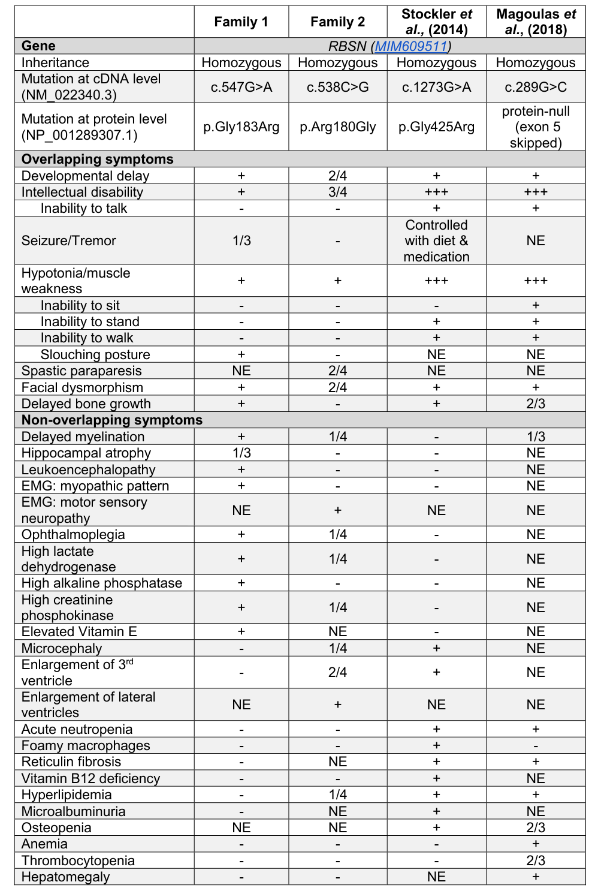

## Question

# Disease Characteristics Research Template

## Target Disease
- **Disease Name:** Congenital Myelofibrosis with Anemia, Neutropenia, Developmental Delay, and Ocular Abnormalities
- **MONDO ID:** MONDO:0975797 (if available)
- **Category:** Mendelian

## Research Objectives

Please provide a comprehensive research report on **Congenital Myelofibrosis with Anemia, Neutropenia, Developmental Delay, and Ocular Abnormalities** covering all of the
disease characteristics listed below. This report will be used to populate a disease knowledge
base entry. Be thorough and cite primary literature (PMID preferred) for all claims.

For each section, **suggested databases/resources** are listed. These are the first places
you should search for information on each topic.

---

### 1. Disease Information
> **Search first:** OMIM, Orphanet, ICD-10/ICD-11, MeSH, PubMed

- What is the disease? Provide a concise overview.
- What are the key identifiers? (OMIM, Orphanet, ICD-10/ICD-11, MeSH, Mondo)
- What are the common synonyms and alternative names?
- Is the information derived from individual patients (e.g., EHR) or aggregated disease-level resources?

### 2. Etiology

- **Disease Causal Factors**: What are the primary causes? (genetic, environmental, infectious, mechanistic)
- **Risk Factors**:
  > **Search first:** PubMed, Cochrane Library, UpToDate, clinical guidelines, ClinVar, ClinGen, GWAS Catalog, PheGenI, CTD, CDC, WHO, epidemiological databases
  - Genetic risk factors (causal variants, susceptibility loci, modifier genes)
  - Environmental risk factors (toxins, lifestyle, occupational exposures, age, sex, family history)
- **Protective Factors**:
  > **Search first:** PubMed, Cochrane Library, clinical trial databases, GWAS Catalog, gnomAD, WHO, CDC, nutrition databases
  - Genetic protective factors (protective variants, modifier alleles)
  - Environmental protective factors (diet, lifestyle, exposures that reduce risk)
- **Gene-Environment Interactions**: How do genetic and environmental factors interact to influence disease?
  > **Search first:** CTD, PubMed, PheGenI, GxE databases

### 3. Phenotypes
> **Search first:** HPO (Human Phenotype Ontology), OMIM, Orphanet, PubMed, clinicaltrials.gov, MedDRA, SNOMED CT, DECIPHER, LOINC

For each phenotype, provide:
- **Phenotype type**: symptoms, clinical signs, physical manifestations, behavioral changes, or laboratory abnormalities
  > For symptoms/signs: HPO, OMIM, Orphanet, PubMed
  > For behavioral changes: HPO, DSM, RDoC (Research Domain Criteria), PubMed
  > For laboratory abnormalities: LOINC, SNOMED CT, LabTests Online, PubMed
- **Phenotype characteristics**:
  > **Search first:** OMIM, Orphanet, HPO, PubMed
  - Age of symptom onset (neonatal, childhood, adult-onset, late-onset)
  - Symptom severity (mild, moderate, severe, variable)
  - Symptom progression (stable, progressive, episodic, fluctuating)
  - Frequency among affected individuals (percentage or qualitative)
- **Quality of life impact**: Effects on daily functioning and well-being (per-phenotype when possible)
  > **Search first:** EQ-5D database, SF-36, WHO QOL databases, PubMed
- Suggest HPO (Human Phenotype Ontology) terms for each phenotype

### 4. Genetic/Molecular Information

- **Causal Genes**: Gene mutations or chromosomal abnormalities responsible for disease (gene symbols, OMIM IDs)
  > **Search first:** OMIM, ClinVar, HGMD, Ensembl, NCBI Gene
- **Pathogenic Variants**:
  - Affected genes (gene symbols, HGNC IDs)
    > **Search first:** OMIM, NCBI Gene, Ensembl, HGNC, UniProt, GeneCards
  - Variant classification (pathogenic, likely pathogenic, VUS per ACMG/AMP guidelines)
    > **Search first:** ClinVar, ClinGen, ACMG/AMP guidelines, VarSome
  - Variant type/class (missense, frameshift, nonsense, splice-site, structural)
  - Allele frequency in population databases
    > **Search first:** gnomAD, 1000 Genomes, ExAC, TOPMed, dbSNP
  - Somatic vs germline origin
    > **Search first:** COSMIC (somatic), ClinVar, ICGC, TCGA
  - Functional consequences (loss of function, gain of function, dominant negative)
- **Modifier Genes**: Genes that modify disease severity or expression
- **Epigenetic Information**: DNA methylation, histone modifications, chromatin changes affecting disease
  > **Search first:** ENCODE, Roadmap Epigenomics, MethBase, DiseaseMeth
- **Chromosomal Abnormalities**: Large-scale genetic changes (aneuploidy, translocations, inversions)
  > **Search first:** DECIPHER, ClinVar, ECARUCA, UCSC Genome Browser

### 5. Environmental Information

- **Environmental Factors**: Non-genetic contributing factors (toxins, radiation, pollution, occupational exposure)
  > **Search first:** CTD (Comparative Toxicogenomics Database), TOXNET, PubMed, EPA databases
- **Lifestyle Factors**: Behavioral factors (smoking, diet, exercise, alcohol consumption)
  > **Search first:** CDC databases, WHO, PubMed, NHANES
- **Infectious Agents**: If applicable, pathogens causing or triggering disease (bacteria, viruses, fungi, parasites)
  > **Search first:** NCBI Taxonomy, ViPR, BV-BRC, MicrobeDB, GIDEON

### 6. Mechanism / Pathophysiology

**Present this section as an ordered causal chain first, then the detail below.**
Open with a numbered sequence of mechanistic steps running from the initiating
lesion (mutation, exposure, infection) to the clinical manifestation, one step per
line, each naming what it causes next. State the causal verb explicitly ("leads
to", "results in") and say where a step is inferred rather than demonstrated.
Where the mechanism branches, show the branch. The categories below are a
checklist of what to cover within those steps, not the organizing structure —
a step may draw on several of them, and a category may contribute to several
steps.

- **Molecular Pathways**: Specific signaling cascades or biochemical pathways involved (Wnt, MAPK, mTOR, PI3K-AKT, etc.)
  > **Search first:** KEGG, Reactome, WikiPathways, PathBank, BioCyc
- **Cellular Processes**: Cell-level mechanisms (apoptosis, autophagy, cell cycle dysregulation, inflammation, etc.)
  > **Search first:** Gene Ontology (GO), Reactome, KEGG, PubMed
- **Protein Dysfunction**: How protein structure or function is altered (misfolding, aggregation, loss of function, gain of function)
  > **Search first:** UniProt, PDB (Protein Data Bank), InterPro, Pfam, AlphaFold
- **Metabolic Changes**: Alterations in metabolic processes (energy metabolism, lipid metabolism, amino acid metabolism)
  > **Search first:** KEGG, BioCyc, HMDB (Human Metabolome Database), BRENDA
- **Immune System Involvement**: Role of immune response (autoimmunity, immunodeficiency, chronic inflammation)
  > **Search first:** ImmPort, Immunome Database, IEDB, Gene Ontology
- **Tissue Damage Mechanisms**: How tissues/ are injured (oxidative stress, ischemia, fibrosis, necrosis)
  > **Search first:** PubMed, Gene Ontology, Reactome
- **Biochemical Abnormalities**: Specific molecular defects (enzyme deficiencies, receptor dysfunction, ion channel defects)
  > **Search first:** BRENDA, UniProt, KEGG, OMIM, PubMed
- **Epigenetic Changes**: DNA methylation, histone modifications affecting gene expression in disease
  > **Search first:** ENCODE, Roadmap Epigenomics, MethBase, DiseaseMeth
- **Molecular Profiling** (if available):
  - Transcriptomics/gene expression changes
    > **Search first:** GEO (Gene Expression Omnibus), ArrayExpress, GTEx, Human Cell Atlas, SRA
  - Proteomics findings
    > **Search first:** PRIDE, ProteomeXchange, Human Protein Atlas, STRING, BioGRID
  - Metabolomics signatures
    > **Search first:** MetaboLights, Metabolomics Workbench, HMDB, METLIN
  - Lipidomics alterations
    > **Search first:** LIPID MAPS, SwissLipids, LipidHome, Metabolomics Workbench
  - Genomic structural features
    > **Search first:** UCSC Genome Browser, Ensembl, NCBI, dbVar, DGV
- **Advanced Technologies** (if applicable):
  - Single-cell analysis findings (cell-type specific mechanisms, cellular heterogeneity)
    > **Search first:** Human Cell Atlas, Single Cell Portal, GEO, CELLxGENE
  - Spatial transcriptomics findings
    > **Search first:** GEO, Spatial Research, Vizgen, 10x Genomics data
  - Multi-omics integration results
    > **Search first:** TCGA, ICGC, cBioPortal, LinkedOmics, PubMed
  - Functional genomics screens (CRISPR, RNAi)
    > **Search first:** DepMap, GenomeRNAi, PubMed, BioGRID ORCS

For each mechanism, describe:
- The causal chain from initial trigger to clinical manifestation
- Which mechanisms are upstream vs downstream
- What cell types and biological processes are involved
- Suggest GO terms for biological processes and CL terms for cell types

### 7. Anatomical Structures Affected

- **Organ Level**:
  - Primary organs directly affected
  - Secondary organ involvement (complications, secondary effects)
  - Body systems involved (cardiovascular, nervous, digestive, respiratory, endocrine, etc.)
  > **Search first:** Uberon, FMA (Foundational Model of Anatomy), OMIM, HPO, ICD-11, MeSH, SNOMED CT
- **Tissue and Cell Level**:
  - Specific tissue types affected (epithelial, connective, muscle, nervous)
  - Specific cell populations targeted (with Cell Ontology terms)
  > **Search first:** Uberon, Human Protein Atlas, Cell Ontology, Human Cell Atlas, CellMarker, PanglaoDB
- **Subcellular Level**:
  - Cellular compartments involved (mitochondria, nucleus, ER, lysosomes) (with GO Cellular Component terms)
  > **Search first:** Gene Ontology (Cellular Component), UniProt, Human Protein Atlas
- **Localization**:
  - Specific anatomical sites (with UBERON terms)
    > **Search first:** FMA, Uberon, NeuroNames (for brain), SNOMED CT
  - Lateralization (unilateral, bilateral, asymmetric)
    > **Search first:** HPO, clinical literature, imaging databases

### 8. Temporal Development

- **Onset**:
  - Typical age of onset (congenital, pediatric, adult, geriatric)
  - Onset pattern (acute, subacute, chronic, insidious)
  > **Search first:** OMIM, Orphanet, HPO, PubMed
- **Progression**:
  - Disease stages (early, intermediate, advanced, end-stage)
    > **Search first:** Cancer Staging Manual (AJCC), WHO classifications, PubMed
  - Progression rate (rapid, slow, variable)
  - Disease course pattern (episodic, relapsing-remitting, progressive, stable)
  - Disease duration (self-limited, chronic lifelong)
  > **Search first:** Disease registries, longitudinal cohort databases, natural history studies, PubMed, Orphanet, OMIM
- **Patterns**:
  - Remission patterns (spontaneous, treatment-induced)
    > **Search first:** Clinical trial databases, disease registries, PubMed
  - Critical periods (time windows of vulnerability or opportunity for intervention)
    > **Search first:** PubMed, developmental biology databases, clinical guidelines

### 9. Inheritance and Population

- **Epidemiology**:
  - Prevalence (cases per 100,000 at given time)
  - Incidence (new cases per 100,000 per year)
  > **Search first:** Orphanet, CDC, WHO, GBD (Global Burden of Disease), national registries, SEER, disease registries
- **For Genetic Etiology**:
  - Inheritance pattern (AD, AR, X-linked, mitochondrial, multifactorial, polygenic)
    > **Search first:** OMIM, Orphanet, ClinVar, GTR (Genetic Testing Registry)
  - Penetrance (complete, incomplete, age-dependent)
    > **Search first:** ClinVar, OMIM, PubMed, ClinGen
  - Expressivity (variable, consistent)
    > **Search first:** OMIM, ClinVar, PubMed
  - Genetic anticipation (increasing severity in successive generations)
    > **Search first:** OMIM, PubMed (especially for repeat expansion disorders)
  - Germline mosaicism
    > **Search first:** ClinVar, OMIM, genetic counseling literature, PubMed
  - Founder effects (population-specific mutations)
    > **Search first:** gnomAD, population genetics databases, PubMed
  - Consanguinity role
    > **Search first:** OMIM, population studies, genetic counseling resources
  - Carrier frequency
    > **Search first:** gnomAD, carrier screening databases, GeneReviews, GTR
- **Population Demographics**:
  - Affected populations (ethnic or demographic groups with higher prevalence)
    > **Search first:** gnomAD, 1000 Genomes, PAGE Study, PubMed, population registries
  - Geographic distribution (endemic areas, regional variation)
    > **Search first:** WHO, CDC, GBD, Orphanet, geographic epidemiology databases
  - Geographic distribution of specific variants
  - Sex ratio (male:female)
    > **Search first:** Disease registries, OMIM, PubMed, epidemiological databases
  - Age distribution of affected individuals
    > **Search first:** CDC, disease registries, SEER, Orphanet

### 10. Diagnostics

- **Clinical Tests**:
  - Laboratory tests (blood, urine, tissue chemistry, specific enzyme assays)
    > **Search first:** LOINC, LabTests Online, PubMed
  - Biomarkers (proteins, metabolites, genetic markers, circulating biomarkers)
    > **Search first:** FDA Biomarker List, BEST (Biomarkers, EndpointS, and other Tools), PubMed
  - Imaging studies (X-ray, CT, MRI, PET, ultrasound)
    > **Search first:** RadLex, DICOM, Radiopaedia, imaging databases
  - Functional tests (pulmonary function, cardiac stress tests)
    > **Search first:** LOINC, clinical guidelines, PubMed
  - Electrophysiology (EEG, EMG, ECG, nerve conduction studies)
    > **Search first:** LOINC, clinical neurophysiology databases, PubMed
  - Biopsy findings (histopathology, immunohistochemistry)
    > **Search first:** SNOMED CT, College of American Pathologists resources, PubMed
  - Pathology findings (microscopic examination)
    > **Search first:** SNOMED CT, Digital Pathology databases, PubMed
- **Genetic Testing**:
  > **Search first:** GTR (Genetic Testing Registry), GeneReviews, ClinGen
  - Overview of recommended genetic testing approach
  - Whole genome sequencing (WGS) utility
    > **Search first:** GTR, ClinVar, GEL (Genomics England), gnomAD
  - Whole exome sequencing (WES) utility
    > **Search first:** GTR, ClinVar, OMIM, GeneMatcher
  - Gene panels (which panels, which genes)
    > **Search first:** GTR, ClinVar, laboratory-specific databases
  - Single gene testing
    > **Search first:** GTR, ClinVar, OMIM, GeneReviews
  - Chromosomal microarray (CMA)
    > **Search first:** DECIPHER, ClinVar, dbVar, ECARUCA
  - Karyotyping
    > **Search first:** Chromosome Abnormality Database, ClinVar, cytogenetics resources
  - FISH
    > **Search first:** ClinVar, cytogenetics databases, PubMed
  - Mitochondrial DNA testing
    > **Search first:** MITOMAP, MSeqDR, ClinVar, GTR
  - Repeat expansion testing
    > **Search first:** GTR, ClinVar, repeat expansion databases, PubMed
- **Omics-Based Diagnostics** (if applicable):
  - RNA sequencing / transcriptomics
    > **Search first:** GEO, ArrayExpress, GTEx, RNA-seq databases
  - Proteomics
    > **Search first:** PRIDE, ProteomeXchange, FDA Biomarker database
  - Metabolomics
    > **Search first:** MetaboLights, Metabolomics Workbench, HMDB
  - Epigenomics
    > **Search first:** GEO, ENCODE, Roadmap Epigenomics, MethBase
  - Liquid biopsy
    > **Search first:** COSMIC, ClinVar, liquid biopsy databases, PubMed
- **Clinical Criteria**:
  - Standardized diagnostic criteria (DSM, ICD, society guidelines)
    > **Search first:** DSM-5, ICD-11, clinical society guidelines, UpToDate
  - Differential diagnosis (other conditions to rule out, with distinguishing features)
    > **Search first:** DynaMed, UpToDate, clinical decision support systems
- **Screening**:
  - Screening methods for asymptomatic individuals (newborn screening, carrier screening, cascade screening)
    > **Search first:** ACMG recommendations, CDC newborn screening, GTR

### 11. Outcome/Prognosis

- **Survival and Mortality**:
  - Survival rate (5-year, 10-year, overall)
    > **Search first:** SEER, cancer registries, disease-specific registries, PubMed
  - Life expectancy (with and without treatment if applicable)
    > **Search first:** Orphanet, disease registries, actuarial databases, PubMed
  - Mortality rate
    > **Search first:** CDC, WHO, GBD, national mortality databases
  - Disease-specific mortality (deaths directly attributable to disease)
    > **Search first:** Disease registries, CDC Wonder, GBD, PubMed
- **Morbidity and Function**:
  - Morbidity (disease-related disability and health impacts)
    > **Search first:** GBD, WHO, disability databases, PubMed
  - Disability outcomes (long-term functional impairments)
    > **Search first:** ICF (International Classification of Functioning), disability registries
  - Quality of life measures (EQ-5D, SF-36, PROMIS, disease-specific tools)
    > **Search first:** EQ-5D database, SF-36, PROMIS, PubMed
- **Disease Course**:
  - Complications (secondary problems: infections, organ failure, etc.)
    > **Search first:** ICD codes, disease registries, clinical databases, PubMed
  - Recovery potential (likelihood and extent of recovery, with vs without treatment)
    > **Search first:** Natural history studies, rehabilitation databases, PubMed
- **Prediction**:
  - Prognostic factors (age, disease severity, biomarkers, treatment response)
    > **Search first:** Prognostic models databases, clinical calculators, PubMed
  - Prognostic biomarkers (molecular markers predicting disease course)
    > **Search first:** FDA Biomarker database, PubMed, cancer prognostic databases

### 12. Treatment

- **Pharmacotherapy**:
  - Pharmacological treatments (drug names, drug classes, mechanisms of action)
    > **Search first:** DrugBank, RxNorm, ATC classification, DailyMed, FDA databases
  - Pharmacogenomics (how genetic variants affect drug metabolism, efficacy, toxicity)
    > **Search first:** PharmGKB, CPIC (Clinical Pharmacogenetics), FDA Table of PGx Biomarkers
- **Advanced Therapeutics**:
  - Gene therapy (viral vectors, CRISPR, gene replacement, gene editing)
    > **Search first:** ClinicalTrials.gov, FDA gene therapy database, ASGCT resources
  - Cell therapy (stem cell transplant, CAR-T, cellular therapeutics)
    > **Search first:** ClinicalTrials.gov, FDA cell therapy database, FACT standards
  - RNA-based therapies (ASOs, siRNA, mRNA therapies)
    > **Search first:** ClinicalTrials.gov, FDA approvals, PubMed
  - Targeted therapies (treatments directed at specific molecular targets)
    > **Search first:** My Cancer Genome, OncoKB, ClinicalTrials.gov, FDA approvals
  - Immunotherapies (checkpoint inhibitors, monoclonal antibodies)
    > **Search first:** Cancer Immunotherapy Database, FDA approvals, ClinicalTrials.gov
- **Surgical and Interventional**:
  - Surgical interventions (types of surgery, timing, outcomes)
    > **Search first:** CPT codes, surgical registries, clinical guidelines, PubMed
- **Supportive and Rehabilitative**:
  - Supportive care (symptom management, pain control, nutrition)
    > **Search first:** Clinical guidelines, Cochrane Library, PubMed
  - Rehabilitation (physical therapy, occupational therapy, speech therapy)
    > **Search first:** Rehabilitation medicine databases, clinical guidelines, PubMed
- **Experimental**:
  - Experimental treatments in clinical trials (with NCT identifiers if available)
    > **Search first:** ClinicalTrials.gov, EU Clinical Trials Register, WHO ICTRP
- **Treatment Outcomes**:
  - Treatment response rates
    > **Search first:** Clinical trial databases, FDA reviews, systematic reviews, PubMed
  - Side effects and adverse events
    > **Search first:** FDA Adverse Event Reporting System (FAERS), MedWatch, PubMed
- **Treatment Strategy**:
  - Treatment algorithms (clinical pathways, decision trees)
    > **Search first:** Clinical practice guidelines, NCCN Guidelines, UpToDate
  - Combination therapies
    > **Search first:** ClinicalTrials.gov, treatment guidelines, PubMed
  - Personalized medicine approaches (genotype-guided treatment)
    > **Search first:** My Cancer Genome, CIViC, PharmGKB, precision medicine databases

For each treatment, suggest NCIT (NCI Thesaurus) clinical-intervention terms where applicable.

### 13. Prevention

- **Prevention Levels**:
  - Primary prevention (preventing disease occurrence: vaccination, risk factor modification)
    > **Search first:** CDC, WHO, USPSTF recommendations, Cochrane Library
  - Secondary prevention (early detection and treatment: screening programs, early intervention)
    > **Search first:** USPSTF, CDC screening guidelines, WHO
  - Tertiary prevention (preventing complications in those with disease)
    > **Search first:** Clinical guidelines, disease management protocols, PubMed
- **Immunization**: Vaccine strategies (if applicable)
  > **Search first:** CDC vaccine schedules, WHO immunization, FDA vaccine database
- **Screening and Early Detection**:
  - Screening programs (population-based: newborn screening, cancer screening)
    > **Search first:** CDC screening programs, USPSTF, cancer screening databases
  - Genetic screening (carrier screening, preimplantation genetic diagnosis, prenatal testing)
    > **Search first:** ACMG recommendations, ACOG guidelines, GTR
  - Risk stratification (identifying high-risk individuals for targeted prevention)
    > **Search first:** Risk prediction models, clinical calculators, PubMed
- **Behavioral Interventions**: Lifestyle modifications to reduce risk
  > **Search first:** CDC, WHO, behavioral intervention databases, Cochrane Library
- **Counseling**: Genetic counseling (risk assessment, family planning guidance)
  > **Search first:** NSGC resources, ACMG guidelines, GeneReviews
- **Public Health**:
  - Public health interventions (sanitation, vector control, health education)
    > **Search first:** CDC, WHO, public health databases, PubMed
  - Environmental interventions (reducing environmental risk factors)
    > **Search first:** EPA databases, WHO environmental health, PubMed
- **Prophylaxis**: Preventive medications or procedures
  > **Search first:** Clinical guidelines, FDA approvals, PubMed

### 14. Other Species / Natural Disease

- **Taxonomy**: Species affected (with NCBI Taxon identifiers)
  > **Search first:** NCBI Taxonomy
- **Breed**: Specific breeds affected (with VBO identifiers if applicable)
  > **Search first:** VBO (Vertebrate Breed Ontology)
- **Gene**: Orthologous genes in other species (with NCBI Gene IDs)
  > **Search first:** NCBI Gene
- **Natural Disease**:
  - Naturally occurring disease in other species (companion animals, wildlife)
    > **Search first:** OMIA (Online Mendelian Inheritance in Animals), VetCompass, PubMed
  - Veterinary relevance and importance in animal health
    > **Search first:** OMIA, veterinary databases, PubMed
- **Comparative Biology**:
  - Comparative pathology (similarities and differences across species)
    > **Search first:** OMIA, comparative pathology databases, PubMed
  - Evolutionary conservation of disease mechanisms
    > **Search first:** HomoloGene, OrthoMCL, Alliance of Genome Resources
- **Transmission** (if applicable):
  - Zoonotic potential
    > **Search first:** CDC zoonotic diseases, WHO zoonoses, GIDEON
  - Cross-species susceptibility
    > **Search first:** NCBI Taxonomy, veterinary databases, PubMed

### 15. Model Organisms

- **Model Types**:
  - Model organism type (mammalian, invertebrate, cellular, in vitro)
    > **Search first:** Alliance of Genome Resources, model organism databases
  - Specific model systems (mouse, rat, zebrafish, Drosophila, C. elegans, yeast, cell lines, organoids, iPSCs)
    > **Search first:** MGI, RGD, ZFIN, FlyBase, WormBase, SGD, ATCC, Cellosaurus
  - Induced models (drug treatment, surgical intervention, environmental manipulation)
    > **Search first:** MGI, model organism databases, PubMed
- **Genetic Models**:
  - Types available (knockout, knock-in, transgenic, conditional, humanized)
    > **Search first:** MGI, IMPC, KOMP, EuMMCR, IMSR
- **Model Characteristics**:
  - Phenotype recapitulation (how well model reproduces human disease features)
    > **Search first:** Model organism databases, comparative studies, PubMed
  - Model limitations (aspects of human disease not captured)
    > **Search first:** Model organism databases, PubMed, review articles
- **Applications**:
  - Research applications (what aspects of disease can be studied)
    > **Search first:** Model organism databases, PubMed
- **Resources**:
  - Model databases
    > **Search first:** MGI, RGD, ZFIN, FlyBase, WormBase, IMSR, EMMA, MMRRC

---

## Citation Requirements

- Cite primary literature (PMID preferred) for all mechanistic and clinical claims
- Prioritize recent reviews and landmark papers
- Include direct quotes from abstracts where possible to support key statements
- Distinguish evidence source types: human clinical, model organism, in vitro, computational

## Output Format

Structure your response as a comprehensive narrative organized by the sections above.
For each section, provide:
- Factual content with specific details (numbers, percentages, gene names, variant nomenclature)
- Ontology term suggestions (HPO, GO, CL, UBERON, CHEBI, NCIT, MONDO) where applicable
- Evidence citations with PMIDs
- Direct quotes from abstracts to support key claims
- Clear indication when information is not available or not applicable for this disease

This report will be used to populate a disease knowledge base entry with:
- Pathophysiology descriptions with causal chains
- Gene/protein annotations (HGNC, GO terms)
- Phenotype associations (HP terms) with frequencies
- Cell type involvement (CL terms)
- Anatomical locations (UBERON terms)
- Chemical entities (CHEBI terms)
- Treatment annotations (NCIT terms)
- Evidence items with PMIDs and exact abstract quotes
- Epidemiology, prognosis, diagnostic, and prevention information
- Animal model descriptions with phenotype recapitulation details

## Output

Question: You are an expert researcher providing comprehensive, well-cited information.

Provide detailed information focusing on:
1. Key concepts and definitions with current understanding
2. Recent developments and latest research (prioritize 2023-2024 sources)
3. Current applications and real-world implementations
4. Expert opinions and analysis from authoritative sources
5. Relevant statistics and data from recent studies

Format as a comprehensive research report with proper citations. Include URLs and publication dates where available.
Always prioritize recent, authoritative sources and provide specific citations for all major claims.

# Disease Characteristics Research Template

## Target Disease
- **Disease Name:** Congenital Myelofibrosis with Anemia, Neutropenia, Developmental Delay, and Ocular Abnormalities
- **MONDO ID:** MONDO:0975797 (if available)
- **Category:** Mendelian

## Research Objectives

Please provide a comprehensive research report on **Congenital Myelofibrosis with Anemia, Neutropenia, Developmental Delay, and Ocular Abnormalities** covering all of the
disease characteristics listed below. This report will be used to populate a disease knowledge
base entry. Be thorough and cite primary literature (PMID preferred) for all claims.

For each section, **suggested databases/resources** are listed. These are the first places
you should search for information on each topic.

---

### 1. Disease Information
> **Search first:** OMIM, Orphanet, ICD-10/ICD-11, MeSH, PubMed

- What is the disease? Provide a concise overview.
- What are the key identifiers? (OMIM, Orphanet, ICD-10/ICD-11, MeSH, Mondo)
- What are the common synonyms and alternative names?
- Is the information derived from individual patients (e.g., EHR) or aggregated disease-level resources?

### 2. Etiology

- **Disease Causal Factors**: What are the primary causes? (genetic, environmental, infectious, mechanistic)
- **Risk Factors**:
  > **Search first:** PubMed, Cochrane Library, UpToDate, clinical guidelines, ClinVar, ClinGen, GWAS Catalog, PheGenI, CTD, CDC, WHO, epidemiological databases
  - Genetic risk factors (causal variants, susceptibility loci, modifier genes)
  - Environmental risk factors (toxins, lifestyle, occupational exposures, age, sex, family history)
- **Protective Factors**:
  > **Search first:** PubMed, Cochrane Library, clinical trial databases, GWAS Catalog, gnomAD, WHO, CDC, nutrition databases
  - Genetic protective factors (protective variants, modifier alleles)
  - Environmental protective factors (diet, lifestyle, exposures that reduce risk)
- **Gene-Environment Interactions**: How do genetic and environmental factors interact to influence disease?
  > **Search first:** CTD, PubMed, PheGenI, GxE databases

### 3. Phenotypes
> **Search first:** HPO (Human Phenotype Ontology), OMIM, Orphanet, PubMed, clinicaltrials.gov, MedDRA, SNOMED CT, DECIPHER, LOINC

For each phenotype, provide:
- **Phenotype type**: symptoms, clinical signs, physical manifestations, behavioral changes, or laboratory abnormalities
  > For symptoms/signs: HPO, OMIM, Orphanet, PubMed
  > For behavioral changes: HPO, DSM, RDoC (Research Domain Criteria), PubMed
  > For laboratory abnormalities: LOINC, SNOMED CT, LabTests Online, PubMed
- **Phenotype characteristics**:
  > **Search first:** OMIM, Orphanet, HPO, PubMed
  - Age of symptom onset (neonatal, childhood, adult-onset, late-onset)
  - Symptom severity (mild, moderate, severe, variable)
  - Symptom progression (stable, progressive, episodic, fluctuating)
  - Frequency among affected individuals (percentage or qualitative)
- **Quality of life impact**: Effects on daily functioning and well-being (per-phenotype when possible)
  > **Search first:** EQ-5D database, SF-36, WHO QOL databases, PubMed
- Suggest HPO (Human Phenotype Ontology) terms for each phenotype

### 4. Genetic/Molecular Information

- **Causal Genes**: Gene mutations or chromosomal abnormalities responsible for disease (gene symbols, OMIM IDs)
  > **Search first:** OMIM, ClinVar, HGMD, Ensembl, NCBI Gene
- **Pathogenic Variants**:
  - Affected genes (gene symbols, HGNC IDs)
    > **Search first:** OMIM, NCBI Gene, Ensembl, HGNC, UniProt, GeneCards
  - Variant classification (pathogenic, likely pathogenic, VUS per ACMG/AMP guidelines)
    > **Search first:** ClinVar, ClinGen, ACMG/AMP guidelines, VarSome
  - Variant type/class (missense, frameshift, nonsense, splice-site, structural)
  - Allele frequency in population databases
    > **Search first:** gnomAD, 1000 Genomes, ExAC, TOPMed, dbSNP
  - Somatic vs germline origin
    > **Search first:** COSMIC (somatic), ClinVar, ICGC, TCGA
  - Functional consequences (loss of function, gain of function, dominant negative)
- **Modifier Genes**: Genes that modify disease severity or expression
- **Epigenetic Information**: DNA methylation, histone modifications, chromatin changes affecting disease
  > **Search first:** ENCODE, Roadmap Epigenomics, MethBase, DiseaseMeth
- **Chromosomal Abnormalities**: Large-scale genetic changes (aneuploidy, translocations, inversions)
  > **Search first:** DECIPHER, ClinVar, ECARUCA, UCSC Genome Browser

### 5. Environmental Information

- **Environmental Factors**: Non-genetic contributing factors (toxins, radiation, pollution, occupational exposure)
  > **Search first:** CTD (Comparative Toxicogenomics Database), TOXNET, PubMed, EPA databases
- **Lifestyle Factors**: Behavioral factors (smoking, diet, exercise, alcohol consumption)
  > **Search first:** CDC databases, WHO, PubMed, NHANES
- **Infectious Agents**: If applicable, pathogens causing or triggering disease (bacteria, viruses, fungi, parasites)
  > **Search first:** NCBI Taxonomy, ViPR, BV-BRC, MicrobeDB, GIDEON

### 6. Mechanism / Pathophysiology

**Present this section as an ordered causal chain first, then the detail below.**
Open with a numbered sequence of mechanistic steps running from the initiating
lesion (mutation, exposure, infection) to the clinical manifestation, one step per
line, each naming what it causes next. State the causal verb explicitly ("leads
to", "results in") and say where a step is inferred rather than demonstrated.
Where the mechanism branches, show the branch. The categories below are a
checklist of what to cover within those steps, not the organizing structure —
a step may draw on several of them, and a category may contribute to several
steps.

- **Molecular Pathways**: Specific signaling cascades or biochemical pathways involved (Wnt, MAPK, mTOR, PI3K-AKT, etc.)
  > **Search first:** KEGG, Reactome, WikiPathways, PathBank, BioCyc
- **Cellular Processes**: Cell-level mechanisms (apoptosis, autophagy, cell cycle dysregulation, inflammation, etc.)
  > **Search first:** Gene Ontology (GO), Reactome, KEGG, PubMed
- **Protein Dysfunction**: How protein structure or function is altered (misfolding, aggregation, loss of function, gain of function)
  > **Search first:** UniProt, PDB (Protein Data Bank), InterPro, Pfam, AlphaFold
- **Metabolic Changes**: Alterations in metabolic processes (energy metabolism, lipid metabolism, amino acid metabolism)
  > **Search first:** KEGG, BioCyc, HMDB (Human Metabolome Database), BRENDA
- **Immune System Involvement**: Role of immune response (autoimmunity, immunodeficiency, chronic inflammation)
  > **Search first:** ImmPort, Immunome Database, IEDB, Gene Ontology
- **Tissue Damage Mechanisms**: How tissues/ are injured (oxidative stress, ischemia, fibrosis, necrosis)
  > **Search first:** PubMed, Gene Ontology, Reactome
- **Biochemical Abnormalities**: Specific molecular defects (enzyme deficiencies, receptor dysfunction, ion channel defects)
  > **Search first:** BRENDA, UniProt, KEGG, OMIM, PubMed
- **Epigenetic Changes**: DNA methylation, histone modifications affecting gene expression in disease
  > **Search first:** ENCODE, Roadmap Epigenomics, MethBase, DiseaseMeth
- **Molecular Profiling** (if available):
  - Transcriptomics/gene expression changes
    > **Search first:** GEO (Gene Expression Omnibus), ArrayExpress, GTEx, Human Cell Atlas, SRA
  - Proteomics findings
    > **Search first:** PRIDE, ProteomeXchange, Human Protein Atlas, STRING, BioGRID
  - Metabolomics signatures
    > **Search first:** MetaboLights, Metabolomics Workbench, HMDB, METLIN
  - Lipidomics alterations
    > **Search first:** LIPID MAPS, SwissLipids, LipidHome, Metabolomics Workbench
  - Genomic structural features
    > **Search first:** UCSC Genome Browser, Ensembl, NCBI, dbVar, DGV
- **Advanced Technologies** (if applicable):
  - Single-cell analysis findings (cell-type specific mechanisms, cellular heterogeneity)
    > **Search first:** Human Cell Atlas, Single Cell Portal, GEO, CELLxGENE
  - Spatial transcriptomics findings
    > **Search first:** GEO, Spatial Research, Vizgen, 10x Genomics data
  - Multi-omics integration results
    > **Search first:** TCGA, ICGC, cBioPortal, LinkedOmics, PubMed
  - Functional genomics screens (CRISPR, RNAi)
    > **Search first:** DepMap, GenomeRNAi, PubMed, BioGRID ORCS

For each mechanism, describe:
- The causal chain from initial trigger to clinical manifestation
- Which mechanisms are upstream vs downstream
- What cell types and biological processes are involved
- Suggest GO terms for biological processes and CL terms for cell types

### 7. Anatomical Structures Affected

- **Organ Level**:
  - Primary organs directly affected
  - Secondary organ involvement (complications, secondary effects)
  - Body systems involved (cardiovascular, nervous, digestive, respiratory, endocrine, etc.)
  > **Search first:** Uberon, FMA (Foundational Model of Anatomy), OMIM, HPO, ICD-11, MeSH, SNOMED CT
- **Tissue and Cell Level**:
  - Specific tissue types affected (epithelial, connective, muscle, nervous)
  - Specific cell populations targeted (with Cell Ontology terms)
  > **Search first:** Uberon, Human Protein Atlas, Cell Ontology, Human Cell Atlas, CellMarker, PanglaoDB
- **Subcellular Level**:
  - Cellular compartments involved (mitochondria, nucleus, ER, lysosomes) (with GO Cellular Component terms)
  > **Search first:** Gene Ontology (Cellular Component), UniProt, Human Protein Atlas
- **Localization**:
  - Specific anatomical sites (with UBERON terms)
    > **Search first:** FMA, Uberon, NeuroNames (for brain), SNOMED CT
  - Lateralization (unilateral, bilateral, asymmetric)
    > **Search first:** HPO, clinical literature, imaging databases

### 8. Temporal Development

- **Onset**:
  - Typical age of onset (congenital, pediatric, adult, geriatric)
  - Onset pattern (acute, subacute, chronic, insidious)
  > **Search first:** OMIM, Orphanet, HPO, PubMed
- **Progression**:
  - Disease stages (early, intermediate, advanced, end-stage)
    > **Search first:** Cancer Staging Manual (AJCC), WHO classifications, PubMed
  - Progression rate (rapid, slow, variable)
  - Disease course pattern (episodic, relapsing-remitting, progressive, stable)
  - Disease duration (self-limited, chronic lifelong)
  > **Search first:** Disease registries, longitudinal cohort databases, natural history studies, PubMed, Orphanet, OMIM
- **Patterns**:
  - Remission patterns (spontaneous, treatment-induced)
    > **Search first:** Clinical trial databases, disease registries, PubMed
  - Critical periods (time windows of vulnerability or opportunity for intervention)
    > **Search first:** PubMed, developmental biology databases, clinical guidelines

### 9. Inheritance and Population

- **Epidemiology**:
  - Prevalence (cases per 100,000 at given time)
  - Incidence (new cases per 100,000 per year)
  > **Search first:** Orphanet, CDC, WHO, GBD (Global Burden of Disease), national registries, SEER, disease registries
- **For Genetic Etiology**:
  - Inheritance pattern (AD, AR, X-linked, mitochondrial, multifactorial, polygenic)
    > **Search first:** OMIM, Orphanet, ClinVar, GTR (Genetic Testing Registry)
  - Penetrance (complete, incomplete, age-dependent)
    > **Search first:** ClinVar, OMIM, PubMed, ClinGen
  - Expressivity (variable, consistent)
    > **Search first:** OMIM, ClinVar, PubMed
  - Genetic anticipation (increasing severity in successive generations)
    > **Search first:** OMIM, PubMed (especially for repeat expansion disorders)
  - Germline mosaicism
    > **Search first:** ClinVar, OMIM, genetic counseling literature, PubMed
  - Founder effects (population-specific mutations)
    > **Search first:** gnomAD, population genetics databases, PubMed
  - Consanguinity role
    > **Search first:** OMIM, population studies, genetic counseling resources
  - Carrier frequency
    > **Search first:** gnomAD, carrier screening databases, GeneReviews, GTR
- **Population Demographics**:
  - Affected populations (ethnic or demographic groups with higher prevalence)
    > **Search first:** gnomAD, 1000 Genomes, PAGE Study, PubMed, population registries
  - Geographic distribution (endemic areas, regional variation)
    > **Search first:** WHO, CDC, GBD, Orphanet, geographic epidemiology databases
  - Geographic distribution of specific variants
  - Sex ratio (male:female)
    > **Search first:** Disease registries, OMIM, PubMed, epidemiological databases
  - Age distribution of affected individuals
    > **Search first:** CDC, disease registries, SEER, Orphanet

### 10. Diagnostics

- **Clinical Tests**:
  - Laboratory tests (blood, urine, tissue chemistry, specific enzyme assays)
    > **Search first:** LOINC, LabTests Online, PubMed
  - Biomarkers (proteins, metabolites, genetic markers, circulating biomarkers)
    > **Search first:** FDA Biomarker List, BEST (Biomarkers, EndpointS, and other Tools), PubMed
  - Imaging studies (X-ray, CT, MRI, PET, ultrasound)
    > **Search first:** RadLex, DICOM, Radiopaedia, imaging databases
  - Functional tests (pulmonary function, cardiac stress tests)
    > **Search first:** LOINC, clinical guidelines, PubMed
  - Electrophysiology (EEG, EMG, ECG, nerve conduction studies)
    > **Search first:** LOINC, clinical neurophysiology databases, PubMed
  - Biopsy findings (histopathology, immunohistochemistry)
    > **Search first:** SNOMED CT, College of American Pathologists resources, PubMed
  - Pathology findings (microscopic examination)
    > **Search first:** SNOMED CT, Digital Pathology databases, PubMed
- **Genetic Testing**:
  > **Search first:** GTR (Genetic Testing Registry), GeneReviews, ClinGen
  - Overview of recommended genetic testing approach
  - Whole genome sequencing (WGS) utility
    > **Search first:** GTR, ClinVar, GEL (Genomics England), gnomAD
  - Whole exome sequencing (WES) utility
    > **Search first:** GTR, ClinVar, OMIM, GeneMatcher
  - Gene panels (which panels, which genes)
    > **Search first:** GTR, ClinVar, laboratory-specific databases
  - Single gene testing
    > **Search first:** GTR, ClinVar, OMIM, GeneReviews
  - Chromosomal microarray (CMA)
    > **Search first:** DECIPHER, ClinVar, dbVar, ECARUCA
  - Karyotyping
    > **Search first:** Chromosome Abnormality Database, ClinVar, cytogenetics resources
  - FISH
    > **Search first:** ClinVar, cytogenetics databases, PubMed
  - Mitochondrial DNA testing
    > **Search first:** MITOMAP, MSeqDR, ClinVar, GTR
  - Repeat expansion testing
    > **Search first:** GTR, ClinVar, repeat expansion databases, PubMed
- **Omics-Based Diagnostics** (if applicable):
  - RNA sequencing / transcriptomics
    > **Search first:** GEO, ArrayExpress, GTEx, RNA-seq databases
  - Proteomics
    > **Search first:** PRIDE, ProteomeXchange, FDA Biomarker database
  - Metabolomics
    > **Search first:** MetaboLights, Metabolomics Workbench, HMDB
  - Epigenomics
    > **Search first:** GEO, ENCODE, Roadmap Epigenomics, MethBase
  - Liquid biopsy
    > **Search first:** COSMIC, ClinVar, liquid biopsy databases, PubMed
- **Clinical Criteria**:
  - Standardized diagnostic criteria (DSM, ICD, society guidelines)
    > **Search first:** DSM-5, ICD-11, clinical society guidelines, UpToDate
  - Differential diagnosis (other conditions to rule out, with distinguishing features)
    > **Search first:** DynaMed, UpToDate, clinical decision support systems
- **Screening**:
  - Screening methods for asymptomatic individuals (newborn screening, carrier screening, cascade screening)
    > **Search first:** ACMG recommendations, CDC newborn screening, GTR

### 11. Outcome/Prognosis

- **Survival and Mortality**:
  - Survival rate (5-year, 10-year, overall)
    > **Search first:** SEER, cancer registries, disease-specific registries, PubMed
  - Life expectancy (with and without treatment if applicable)
    > **Search first:** Orphanet, disease registries, actuarial databases, PubMed
  - Mortality rate
    > **Search first:** CDC, WHO, GBD, national mortality databases
  - Disease-specific mortality (deaths directly attributable to disease)
    > **Search first:** Disease registries, CDC Wonder, GBD, PubMed
- **Morbidity and Function**:
  - Morbidity (disease-related disability and health impacts)
    > **Search first:** GBD, WHO, disability databases, PubMed
  - Disability outcomes (long-term functional impairments)
    > **Search first:** ICF (International Classification of Functioning), disability registries
  - Quality of life measures (EQ-5D, SF-36, PROMIS, disease-specific tools)
    > **Search first:** EQ-5D database, SF-36, PROMIS, PubMed
- **Disease Course**:
  - Complications (secondary problems: infections, organ failure, etc.)
    > **Search first:** ICD codes, disease registries, clinical databases, PubMed
  - Recovery potential (likelihood and extent of recovery, with vs without treatment)
    > **Search first:** Natural history studies, rehabilitation databases, PubMed
- **Prediction**:
  - Prognostic factors (age, disease severity, biomarkers, treatment response)
    > **Search first:** Prognostic models databases, clinical calculators, PubMed
  - Prognostic biomarkers (molecular markers predicting disease course)
    > **Search first:** FDA Biomarker database, PubMed, cancer prognostic databases

### 12. Treatment

- **Pharmacotherapy**:
  - Pharmacological treatments (drug names, drug classes, mechanisms of action)
    > **Search first:** DrugBank, RxNorm, ATC classification, DailyMed, FDA databases
  - Pharmacogenomics (how genetic variants affect drug metabolism, efficacy, toxicity)
    > **Search first:** PharmGKB, CPIC (Clinical Pharmacogenetics), FDA Table of PGx Biomarkers
- **Advanced Therapeutics**:
  - Gene therapy (viral vectors, CRISPR, gene replacement, gene editing)
    > **Search first:** ClinicalTrials.gov, FDA gene therapy database, ASGCT resources
  - Cell therapy (stem cell transplant, CAR-T, cellular therapeutics)
    > **Search first:** ClinicalTrials.gov, FDA cell therapy database, FACT standards
  - RNA-based therapies (ASOs, siRNA, mRNA therapies)
    > **Search first:** ClinicalTrials.gov, FDA approvals, PubMed
  - Targeted therapies (treatments directed at specific molecular targets)
    > **Search first:** My Cancer Genome, OncoKB, ClinicalTrials.gov, FDA approvals
  - Immunotherapies (checkpoint inhibitors, monoclonal antibodies)
    > **Search first:** Cancer Immunotherapy Database, FDA approvals, ClinicalTrials.gov
- **Surgical and Interventional**:
  - Surgical interventions (types of surgery, timing, outcomes)
    > **Search first:** CPT codes, surgical registries, clinical guidelines, PubMed
- **Supportive and Rehabilitative**:
  - Supportive care (symptom management, pain control, nutrition)
    > **Search first:** Clinical guidelines, Cochrane Library, PubMed
  - Rehabilitation (physical therapy, occupational therapy, speech therapy)
    > **Search first:** Rehabilitation medicine databases, clinical guidelines, PubMed
- **Experimental**:
  - Experimental treatments in clinical trials (with NCT identifiers if available)
    > **Search first:** ClinicalTrials.gov, EU Clinical Trials Register, WHO ICTRP
- **Treatment Outcomes**:
  - Treatment response rates
    > **Search first:** Clinical trial databases, FDA reviews, systematic reviews, PubMed
  - Side effects and adverse events
    > **Search first:** FDA Adverse Event Reporting System (FAERS), MedWatch, PubMed
- **Treatment Strategy**:
  - Treatment algorithms (clinical pathways, decision trees)
    > **Search first:** Clinical practice guidelines, NCCN Guidelines, UpToDate
  - Combination therapies
    > **Search first:** ClinicalTrials.gov, treatment guidelines, PubMed
  - Personalized medicine approaches (genotype-guided treatment)
    > **Search first:** My Cancer Genome, CIViC, PharmGKB, precision medicine databases

For each treatment, suggest NCIT (NCI Thesaurus) clinical-intervention terms where applicable.

### 13. Prevention

- **Prevention Levels**:
  - Primary prevention (preventing disease occurrence: vaccination, risk factor modification)
    > **Search first:** CDC, WHO, USPSTF recommendations, Cochrane Library
  - Secondary prevention (early detection and treatment: screening programs, early intervention)
    > **Search first:** USPSTF, CDC screening guidelines, WHO
  - Tertiary prevention (preventing complications in those with disease)
    > **Search first:** Clinical guidelines, disease management protocols, PubMed
- **Immunization**: Vaccine strategies (if applicable)
  > **Search first:** CDC vaccine schedules, WHO immunization, FDA vaccine database
- **Screening and Early Detection**:
  - Screening programs (population-based: newborn screening, cancer screening)
    > **Search first:** CDC screening programs, USPSTF, cancer screening databases
  - Genetic screening (carrier screening, preimplantation genetic diagnosis, prenatal testing)
    > **Search first:** ACMG recommendations, ACOG guidelines, GTR
  - Risk stratification (identifying high-risk individuals for targeted prevention)
    > **Search first:** Risk prediction models, clinical calculators, PubMed
- **Behavioral Interventions**: Lifestyle modifications to reduce risk
  > **Search first:** CDC, WHO, behavioral intervention databases, Cochrane Library
- **Counseling**: Genetic counseling (risk assessment, family planning guidance)
  > **Search first:** NSGC resources, ACMG guidelines, GeneReviews
- **Public Health**:
  - Public health interventions (sanitation, vector control, health education)
    > **Search first:** CDC, WHO, public health databases, PubMed
  - Environmental interventions (reducing environmental risk factors)
    > **Search first:** EPA databases, WHO environmental health, PubMed
- **Prophylaxis**: Preventive medications or procedures
  > **Search first:** Clinical guidelines, FDA approvals, PubMed

### 14. Other Species / Natural Disease

- **Taxonomy**: Species affected (with NCBI Taxon identifiers)
  > **Search first:** NCBI Taxonomy
- **Breed**: Specific breeds affected (with VBO identifiers if applicable)
  > **Search first:** VBO (Vertebrate Breed Ontology)
- **Gene**: Orthologous genes in other species (with NCBI Gene IDs)
  > **Search first:** NCBI Gene
- **Natural Disease**:
  - Naturally occurring disease in other species (companion animals, wildlife)
    > **Search first:** OMIA (Online Mendelian Inheritance in Animals), VetCompass, PubMed
  - Veterinary relevance and importance in animal health
    > **Search first:** OMIA, veterinary databases, PubMed
- **Comparative Biology**:
  - Comparative pathology (similarities and differences across species)
    > **Search first:** OMIA, comparative pathology databases, PubMed
  - Evolutionary conservation of disease mechanisms
    > **Search first:** HomoloGene, OrthoMCL, Alliance of Genome Resources
- **Transmission** (if applicable):
  - Zoonotic potential
    > **Search first:** CDC zoonotic diseases, WHO zoonoses, GIDEON
  - Cross-species susceptibility
    > **Search first:** NCBI Taxonomy, veterinary databases, PubMed

### 15. Model Organisms

- **Model Types**:
  - Model organism type (mammalian, invertebrate, cellular, in vitro)
    > **Search first:** Alliance of Genome Resources, model organism databases
  - Specific model systems (mouse, rat, zebrafish, Drosophila, C. elegans, yeast, cell lines, organoids, iPSCs)
    > **Search first:** MGI, RGD, ZFIN, FlyBase, WormBase, SGD, ATCC, Cellosaurus
  - Induced models (drug treatment, surgical intervention, environmental manipulation)
    > **Search first:** MGI, model organism databases, PubMed
- **Genetic Models**:
  - Types available (knockout, knock-in, transgenic, conditional, humanized)
    > **Search first:** MGI, IMPC, KOMP, EuMMCR, IMSR
- **Model Characteristics**:
  - Phenotype recapitulation (how well model reproduces human disease features)
    > **Search first:** Model organism databases, comparative studies, PubMed
  - Model limitations (aspects of human disease not captured)
    > **Search first:** Model organism databases, PubMed, review articles
- **Applications**:
  - Research applications (what aspects of disease can be studied)
    > **Search first:** Model organism databases, PubMed
- **Resources**:
  - Model databases
    > **Search first:** MGI, RGD, ZFIN, FlyBase, WormBase, IMSR, EMMA, MMRRC

---

## Citation Requirements

- Cite primary literature (PMID preferred) for all mechanistic and clinical claims
- Prioritize recent reviews and landmark papers
- Include direct quotes from abstracts where possible to support key statements
- Distinguish evidence source types: human clinical, model organism, in vitro, computational

## Output Format

Structure your response as a comprehensive narrative organized by the sections above.
For each section, provide:
- Factual content with specific details (numbers, percentages, gene names, variant nomenclature)
- Ontology term suggestions (HPO, GO, CL, UBERON, CHEBI, NCIT, MONDO) where applicable
- Evidence citations with PMIDs
- Direct quotes from abstracts to support key claims
- Clear indication when information is not available or not applicable for this disease

This report will be used to populate a disease knowledge base entry with:
- Pathophysiology descriptions with causal chains
- Gene/protein annotations (HGNC, GO terms)
- Phenotype associations (HP terms) with frequencies
- Cell type involvement (CL terms)
- Anatomical locations (UBERON terms)
- Chemical entities (CHEBI terms)
- Treatment annotations (NCIT terms)
- Evidence items with PMIDs and exact abstract quotes
- Epidemiology, prognosis, diagnostic, and prevention information
- Animal model descriptions with phenotype recapitulation details

# Comprehensive research report

## Executive summary and evidence limits

**Congenital myelofibrosis with anemia, neutropenia, developmental delay, and ocular abnormalities** is an exceptionally rare, syndromic, autosomal-recessive disorder caused by biallelic loss of **RBSN** function. The exact disease entity, **MONDO:0975797**, is defined principally by one family containing **three affected siblings** homozygous for **NM_022340.3:c.289G>C**. This variant causes exon 5 skipping and absence of detectable RBSN protein. Consequently, frequencies such as “3/3” describe that sibship and are **not population prevalence estimates**. Open Targets currently identifies RBSN as the sole associated target and classifies the required mode as biallelic autosomal or pseudoautosomal (OpenTargets Search: Congenital myelofibrosis with anemia, neutropenia, developmental delay, and ocular abnormalities).

The foundational report is Magoulas et al., *Blood*, published August 9, 2018, PMID **29784638**, DOI [10.1182/blood-2017-12-824433](https://doi.org/10.1182/blood-2017-12-824433). The latest substantial mechanistic expansion found was Paul et al., *Human Molecular Genetics*, advance publication June 2, 2022, PMID **35652444**, DOI [10.1093/hmg/ddac120](https://doi.org/10.1093/hmg/ddac120). No disease-specific 2023–2024 clinical study or interventional trial was identified; a September 16, 2024 EVA record nevertheless continues to support the RBSN association (OpenTargets Search: Congenital myelofibrosis with anemia, neutropenia, developmental delay, and ocular abnormalities, paul2022rabenosynseparationoffunctionmutations pages 1-2).

| Domain | Best-supported finding | Evidence level/limitations |
|---|---|---|
| Disease entity | **Myelofibrosis, congenital, with anemia, neutropenia, developmental delay, and ocular abnormalities**; **MONDO:0975797**. | Curated disease-level entity; Open Targets maps the exact MONDO disease to a single target, **RBSN**. No disease-specific ICD-10/11 or MeSH identifier was established (OpenTargets Search: Congenital myelofibrosis with anemia, neutropenia, developmental delay, and ocular abnormalities). |
| Causal gene | **RBSN** (rabenosyn, RAB effector); **Ensembl ENSG00000131381**; **MIM 609511**. RBSN regulates sorting of internalized cargo through early endosomes (OpenTargets Search: Congenital myelofibrosis with anemia, neutropenia, developmental delay, and ocular abnormalities, paul2022rabenosynseparationoffunctionmutations pages 1-2, paul2022rabenosynseparationoffunctionmutations pages 3-4). | Strong human genetic and patient-cell evidence, but only one family defines this exact syndrome. |
| Disease-defining variant | Homozygous **NM_022340.3:c.289G>C**—originally described at protein level as p.Gly97Arg—causes **exon 5 skipping and absence of detectable RBSN protein**, making it an apparent protein-null allele (paul2022rabenosynseparationoffunctionmutations pages 2-2, paul2022rabenosynseparationoffunctionmutations pages 8-8, paul2022rabenosynseparationoffunctionmutations pages 3-4). | Variant-to-splicing and protein consequences were demonstrated in patient-derived EBV-transformed lymphoblastoid cells. Population frequency and a formal ACMG/AMP classification were not supplied in the accessible evidence. |
| Inheritance | **Autosomal recessive/biallelic**; all three reported siblings were homozygous. Current Genomics England/Open Targets evidence specifies a biallelic autosomal or pseudoautosomal requirement (OpenTargets Search: Congenital myelofibrosis with anemia, neutropenia, developmental delay, and ocular abnormalities, paul2022rabenosynseparationoffunctionmutations pages 3-4). | Based on one sibship; penetrance, carrier frequency, germline-mosaicism risk, and founder effect are unknown. |
| Reported population | **Three affected siblings** in the original 2018 report; they remain the only individuals clearly assigned to the exact c.289G>C/protein-null syndrome in the retrieved literature (paul2022rabenosynseparationoffunctionmutations pages 2-2, paul2022rabenosynseparationoffunctionmutations pages 8-8). | No prevalence, incidence, geographic distribution, ethnicity-specific rate, or reliable sex ratio can be calculated from one family. |
| Hematologic phenotype | Congenital/severe **myelofibrosis 3/3**, anemia **3/3**, acute neutropenia **3/3**, hepatomegaly **3/3**, and marked extramedullary hematopoiesis **3/3**; thrombocytopenia occurred in **2/3**, reticulin fibrosis was present, and foamy macrophages were not reported (paul2022rabenosynseparationoffunctionmutations pages 4-5). | Frequencies are descriptive fractions from three siblings, not population estimates. Exact blood counts, serial marrow measurements, and standardized severity grades were unavailable. |
| Neurodevelopmental phenotype | Developmental delay **3/3**, intellectual disability **3/3**, inability to talk **3/3**, severe hypotonia/muscle weakness **3/3**, and inability to sit, stand, or walk **3/3**; delayed bone growth and delayed myelination each occurred in **1/3–2/3** as tabulated (paul2022rabenosynseparationoffunctionmutations pages 3-4, paul2022rabenosynseparationoffunctionmutations pages 8-8). | Severe and apparently early-onset in the reported family; formal developmental scores and longitudinal trajectories are unavailable. |
| Ocular phenotype | **Microphthalmia 3/3**, optic-nerve hypoplasia **3/3**, and poor visual response **3/3** (paul2022rabenosynseparationoffunctionmutations pages 4-5). | Detailed ophthalmic imaging, visual-acuity data, and lateralization were not available; these findings should not be generalized to every RBSN genotype. |
| Other manifestations | Thin corpus callosum, cerebral atrophy, gastrostomy dependence, XY sex reversal, and hyperlipidemia were reported; tracheomalacia occurred in **2/3**, hearing impairment in **1/3**, and osteopenia and thrombocytopenia in **2/3** (paul2022rabenosynseparationoffunctionmutations pages 4-5). | Findings may be allele- or family-specific. Causality for every associated anomaly cannot be resolved from three related patients. |
| Cellular mechanism | The c.289G>C allele produces exon-5-skipped transcript and no detectable RBSN protein, with **reduced/slower endosomal recycling** in patient cells. Loss of RBSN-mediated early-endosomal cargo handling is therefore demonstrated upstream; how this causes marrow fibrosis, cytopenias, ocular maldevelopment, and neurologic injury remains **inferred**, and lysosomal degradation was not tested in these patients (paul2022rabenosynseparationoffunctionmutations pages 8-8, paul2022rabenosynseparationoffunctionmutations pages 5-6, paul2022rabenosynseparationoffunctionmutations pages 7-8). | Human patient-cell evidence supports RBSN loss of function, but no disease-specific hematopoietic or ocular model establishes the complete tissue-level causal chain. |
| Diagnosis | Suspect from congenital marrow fibrosis/cytopenias plus severe developmental and ocular abnormalities; evaluate CBC with differential, reticulocytes, marrow biopsy/reticulin staining, ophthalmology, neurodevelopment, brain MRI, hearing, feeding/airway, liver/spleen, and bone health. Confirm by detecting **biallelic RBSN variants**, then use RNA analysis to demonstrate exon 5 skipping when c.289G>C is found; absent protein can provide functional support (paul2022rabenosynseparationoffunctionmutations pages 8-8, paul2022rabenosynseparationoffunctionmutations pages 3-4, paul2022rabenosynseparationoffunctionmutations pages 4-5). | No consensus diagnostic criteria or validated biomarker exists. WES/WGS or a marrow-failure/neutropenia panel containing RBSN is more appropriate than karyotype, repeat-expansion, or mitochondrial testing unless other findings indicate them. |
| Management | No disease-modifying therapy is established. Care is phenotype-directed: pediatric hematology monitoring and transfusion/infection support as indicated; ophthalmologic and low-vision care; nutrition/gastrostomy support; airway and hearing assessment; physical, occupational, speech and developmental therapies; and surveillance of hepatomegaly, extramedullary hematopoiesis, thrombocytopenia and osteopenia. | Recommendations are extrapolated supportive care, not tested disease-specific protocols. Evidence was insufficient to establish efficacy or safety of hematopoietic stem-cell transplantation, antifibrotic/JAK therapy, gene therapy, or pharmacogenomic strategies. |
| Epidemiology and prognosis | Ultra-rare: the exact molecular syndrome is documented in one family with three siblings. Severe lifelong motor, communication, visual, feeding and hematologic morbidity is evident, but survival, mortality, life expectancy, remission probability and prognostic biomarkers are unknown (paul2022rabenosynseparationoffunctionmutations pages 8-8, paul2022rabenosynseparationoffunctionmutations pages 4-5). | No registry, natural-history cohort, quality-of-life study, incidence estimate, or survival analysis was identified. |
| Trials and models | No registered disease-specific interventional trial, validated natural animal disease, or dedicated organismal model was identified in the searches. Patient lymphoblastoid cells are the principal direct model for c.289G>C; patient fibroblasts have been used for other RBSN alleles (paul2022rabenosynseparationoffunctionmutations pages 6-7, paul2022rabenosynseparationoffunctionmutations pages 8-8). | Negative search finding, not proof that no unpublished model or broadly eligible marrow-failure study exists. |
| Allelic-disorder boundary | Do **not** merge this exact protein-null syndrome with other RBSN disorders: homozygous **c.1273G>A (p.Gly425Arg)** alters transferrin recycling and causes a partially overlapping encephalopathic/hematologic phenotype, whereas FYVE-domain **c.538C>G (p.Arg180Gly)** and **c.547G>A (p.Gly183Arg)** impair PI3P binding and endosomal maturation but generally lack myelofibrosis, anemia and neutropenia (paul2022rabenosynseparationoffunctionmutations pages 3-4, paul2022rabenosynseparationoffunctionmutations pages 4-5, paul2022rabenosynseparationoffunctionmutations pages 5-6, paul2022rabenosynseparationoffunctionmutations pages 8-9). | RBSN shows marked allele/domain-specific, non-overlapping phenotypes; mechanistic or frequency data from another allele should not automatically populate MONDO:0975797. |

*Table: Compact knowledge-base summary of the exact homozygous RBSN c.289G>C protein-null syndrome, including phenotype frequencies, mechanism, diagnosis, management, and evidence gaps. The final row separates it from mechanistically distinct RBSN allelic disorders.*

## 1. Disease information

### Definition

This is a congenital multisystem disorder combining severe marrow fibrosis and ineffective hematopoiesis with neurodevelopmental impairment, ocular maldevelopment, hypotonia/weakness, and additional skeletal, respiratory, feeding, hepatic, and neurologic abnormalities. It is distinct from acquired clonal myeloproliferative neoplasms and from other congenital marrow-failure syndromes.

### Identifiers and names

- **MONDO:** MONDO:0975797.
- **Causal gene:** **RBSN**, rabenosyn, RAB effector; Ensembl **ENSG00000131381**; MIM gene **609511**.
- **Common names:** “myelofibrosis, congenital, with anemia, neutropenia, developmental delay, and ocular abnormalities”; “syndromic congenital myelofibrosis associated with an RBSN loss-of-function variant”; informally, **RBSN-related syndromic congenital myelofibrosis**.
- A disease-specific OMIM phenotype number, Orphanet number, MeSH heading, or dedicated ICD-10/ICD-11 code was not established in the retrieved evidence. Coding would therefore generally use component manifestations rather than a uniquely validated disease code.

The evidence is **aggregated from a published family-level case series and disease databases**, not routine EHR-derived population data. Open Targets integrates literature, Genomics England, and EVA evidence (OpenTargets Search: Congenital myelofibrosis with anemia, neutropenia, developmental delay, and ocular abnormalities).

## 2. Etiology

### Causal factor

The demonstrated initiating cause is a **germline homozygous RBSN variant**, NM_022340.3:c.289G>C. Although initially represented as p.Gly97Arg, RNA studies showed exon 5 skipping, and no RBSN protein was detectable in patient lymphoblastoid cells; the biologically relevant consequence is therefore an apparent **loss-of-function/protein-null allele** (paul2022rabenosynseparationoffunctionmutations pages 2-2, paul2022rabenosynseparationoffunctionmutations pages 8-8, paul2022rabenosynseparationoffunctionmutations pages 3-4).

### Risk, protective, and environmental factors

- **Genetic risk:** two pathogenic alleles inherited in an autosomal-recessive configuration. A family history compatible with recessive inheritance and parental relatedness would increase prior probability, although detailed consanguinity information for the defining family was not recoverable.
- **Modifier genes:** none established.
- **Environmental, infectious, occupational, dietary, age, or lifestyle risk factors:** none established. The congenital familial presentation argues against these as primary causes.
- **Protective variants or exposures:** none reported.
- **Gene–environment interaction:** not studied.

These negative statements mean **no evidence was found**, not that modifying exposures are biologically impossible.

## 3. Phenotypes

The most useful quantitative summary comes from the three c.289G>C siblings. The published comparative table documents severe myelofibrosis and multisystem abnormalities, with fractions indicating affected individuals among the three siblings (paul2022rabenosynseparationoffunctionmutations pages 3-4, paul2022rabenosynseparationoffunctionmutations pages 4-5, paul2022rabenosynseparationoffunctionmutations media dbbfd5c5, paul2022rabenosynseparationoffunctionmutations media 50dee6c0).

### Core manifestations

- **Hematologic/pathologic:** congenital myelofibrosis **3/3**; reticulin fibrosis **3/3**; anemia **3/3**; acute neutropenia **3/3**; thrombocytopenia **2/3**; hepatomegaly **3/3**; marked extramedullary hematopoiesis **3/3**. Suggested HPO: *Myelofibrosis*; **Anemia HP:0001903**; **Neutropenia HP:0001875**; **Thrombocytopenia HP:0001873**; **Hepatomegaly HP:0002240**.
- **Developmental/behavioral:** developmental delay **3/3**, severe intellectual disability **3/3**, inability to talk **3/3**, and non-ambulatory status **3/3**. Suggested HPO: **Global developmental delay HP:0001263**, **Intellectual disability HP:0001249**, absent speech, inability to walk.
- **Neuromuscular:** severe hypotonia/muscle weakness **3/3**; inability to sit, stand, or walk **3/3**. Suggested HPO: **Hypotonia HP:0001252**, muscle weakness, delayed gross-motor development.
- **Ocular:** microphthalmia **3/3**, optic-nerve hypoplasia **3/3**, and poor visual response **3/3**. Suggested HPO: **Microphthalmia HP:0000568**, **Optic nerve hypoplasia HP:0000609**, visual impairment. Detailed acuity and lateralization were not reported.
- **Neuroimaging:** thin corpus callosum and cerebral atrophy were reported; delayed myelination occurred in **1/3**. Suggested HPO: thin corpus callosum, cerebral atrophy, delayed CNS myelination.
- **Skeletal/metabolic:** delayed bone growth **2/3**, osteopenia **2/3**, and hyperlipidemia **3/3**. Suggested HPO: delayed skeletal maturation, osteopenia, hyperlipidemia.
- **Airway/hearing/feeding:** tracheomalacia **2/3**, hearing impairment **1/3**, and gastrostomy dependence **3/3**. Suggested HPO: tracheomalacia, hearing impairment, feeding difficulties, gastrostomy-tube dependence.
- **Other:** XY sex reversal was reported in the defining family; its frequency and mechanism remain insufficiently characterized (paul2022rabenosynseparationoffunctionmutations pages 4-5, paul2022rabenosynseparationoffunctionmutations media 50dee6c0).

### Onset, severity, progression, and quality of life

The marrow disease is congenital or early-infantile. Neurodevelopmental and ocular abnormalities are developmental, while severe motor and communication disability persisted in the reported children. The siblings were nonverbal and nonambulatory, implying profound effects on mobility, communication, vision, feeding, self-care, and caregiver burden. No EQ-5D, SF-36, PROMIS, or disease-specific quality-of-life study exists (paul2022rabenosynseparationoffunctionmutations pages 8-8).

## 4. Genetic and molecular information

### Gene and variant

- **Gene:** RBSN; protein rabenosyn-5, an early-endosomal RAB5 effector.
- **Reference transcript/protein used in the comparison:** NM_022340.3 / NP_001289307.1.
- **Disease-defining variant:** homozygous **c.289G>C**, originally annotated p.Gly97Arg but functionally producing **exon 5 skipping and protein loss**.
- **Origin:** germline; autosomal recessive.
- **Functional class:** loss of function/protein-null.
- **ClinVar/ACMG status:** the EVA/Open Targets record treats the association as genetic evidence, but assertion criteria were not supplied in the accessible record. A laboratory should therefore perform current transcript-specific ClinVar review and ACMG/AMP classification rather than copying an unqualified historical label (OpenTargets Search: Congenital myelofibrosis with anemia, neutropenia, developmental delay, and ocular abnormalities).
- **Population frequency:** not available in the retrieved material; no carrier-frequency estimate can be made.

No causal chromosomal rearrangement, somatic driver, epigenetic signature, modifier gene, or recurrent structural variant has been demonstrated.

### Critical allelic-disorder boundary

Other biallelic RBSN variants cause overlapping but mechanistically distinct disorders. Homozygous **c.1273G>A (p.Gly425Arg)** was reported in one child with epileptic encephalopathy, microcephaly, osteopenia, and hematologic abnormalities and increased transferrin recycling. By contrast, FYVE-domain **c.538C>G (p.Arg180Gly)** and **c.547G>A (p.Gly183Arg)** disrupt PI3P binding and endosomal maturation and cause progressive weakness, ophthalmoplegia, dysmorphism, and intellectual disability, generally without the defining myelofibrosis/anemia/neutropenia triad (paul2022rabenosynseparationoffunctionmutations pages 3-4, paul2022rabenosynseparationoffunctionmutations pages 5-6, paul2022rabenosynseparationoffunctionmutations pages 8-9). These alleles should not automatically be assigned to MONDO:0975797.

## 5. Environmental information

No toxin, radiation, pollution, medication, occupational exposure, smoking, alcohol use, diet, exercise pattern, or infectious agent has been implicated. The disorder is not contagious or zoonotic. Environmental and lifestyle modification cannot prevent the inherited molecular lesion.

## 6. Mechanism and pathophysiology

### Ordered causal chain

1. **Homozygous RBSN c.289G>C leads to aberrant exon 5 skipping.**
2. **Exon skipping results in absent detectable RBSN protein** in patient lymphoblastoid cells.
3. **RBSN deficiency leads to impaired/slower early-endosomal cargo recycling**, demonstrated using patient cells.
4. **Defective endosomal trafficking is inferred to disrupt receptor, membrane, and cargo homeostasis** in hematopoietic and developing neural/ocular cells; these disease-relevant cell types were not directly tested.
5. **In hematopoietic tissues, disturbed trafficking is inferred to cause ineffective hematopoiesis and marrow stromal/fibrotic responses**, resulting in reticulin fibrosis, anemia, neutropenia, thrombocytopenia, and compensatory extramedullary hematopoiesis/hepatomegaly.
6. **In developing nervous, neuromuscular, and ocular tissues, trafficking failure is inferred to impair cellular maturation and maintenance**, resulting in severe developmental delay, hypotonia/weakness, cerebral abnormalities, microphthalmia, optic-nerve hypoplasia, and poor vision.
7. **Branches into airway, skeletal, hearing, feeding, and gonadal-development phenotypes are clinically observed but mechanistically unresolved.**

Steps 1–3 are supported by human molecular and patient-cell evidence; steps 4–7 are biologically plausible but remain inferential because no disease-specific hematopoietic, retinal, optic-nerve, or developmental model closes the causal chain (paul2022rabenosynseparationoffunctionmutations pages 8-8, paul2022rabenosynseparationoffunctionmutations pages 5-6).

### Current molecular understanding

RBSN participates in early-endosome cargo sorting. More recent work on other alleles showed that its FYVE domain binds **phosphatidylinositol-3-phosphate (PI3P; CHEBI:17283)** and targets RBSN to EEA1-positive early endosomes. p.Gly183Arg abolished PI3P binding, enlarged early endosomes, delayed dextran transit to RAB7-positive compartments by approximately ten minutes, and reduced mature cathepsin-D abundance/activity, while leaving transferrin recycling intact. This establishes that RBSN has separable roles in recycling and endolysosomal degradation; it does **not** prove that cathepsin-D deficiency drives c.289G>C myelofibrosis because degradation was not tested in those siblings (paul2022rabenosynseparationoffunctionmutations pages 4-5, paul2022rabenosynseparationoffunctionmutations pages 5-6, paul2022rabenosynseparationoffunctionmutations pages 6-7, paul2022rabenosynseparationoffunctionmutations pages 7-8).

A key abstract statement from Paul et al. is: **“Our results suggest that these variants are separation-of-function alleles, which cause a delay in endosomal maturation without affecting cargo recycling.”** This applies to p.Arg180Gly/p.Gly183Arg, not directly to the c.289G>C protein-null disease (paul2022rabenosynseparationoffunctionmutations pages 1-2).

Suggested annotations include **GO:0006897 endocytosis**, **GO:0006886 intracellular protein transport**, **GO:0005769 early endosome**, **GO:0005768 endosome**, and **GO:0005764 lysosome**. Candidate cell annotations for future work include **CL:0000057 fibroblast**, hematopoietic stem/progenitor cells, neutrophils, erythroid precursors, megakaryocytes, marrow stromal cells, retinal cells, optic-nerve glia, neurons, and skeletal myocytes. No disease-specific transcriptomic, proteomic, metabolomic, lipidomic, epigenomic, single-cell, spatial-transcriptomic, or CRISPR-screen dataset was identified.

## 7. Anatomical structures affected

- **Primary:** bone marrow/hematopoietic tissue; central nervous system; eye and optic nerve.
- **Secondary:** liver and other extramedullary hematopoietic sites; skeletal system; peripheral neuromuscular system; trachea; auditory system; gastrointestinal/feeding apparatus; possibly gonads.
- **Subcellular:** early endosome, endosomal recycling machinery, and—depending on allele—late endosome/lysosome and trans-Golgi trafficking.

Suggested UBERON annotations include bone marrow, blood, liver, brain, corpus callosum, cerebral white matter, eye, optic nerve, trachea, skeletal muscle, bone, and inner ear. Ocular lateralization and precise marrow distribution were not documented.

## 8. Temporal development

Onset is congenital or early pediatric. The available evidence supports a **chronic, lifelong, severe** course rather than episodic disease. No formal staging system, remission pattern, progression rate, or critical therapeutic window has been defined. Early infancy is nevertheless a practical diagnostic window because cytopenias, marrow fibrosis, ocular malformations, hypotonia, and developmental abnormalities may already coexist. Longitudinal data are too sparse to determine whether fibrosis, neurologic injury, or visual dysfunction is progressive.

## 9. Inheritance and population

- **Inheritance:** autosomal recessive/biallelic.
- **Penetrance:** apparently high in homozygous siblings, but cannot be estimated from one family.
- **Expressivity:** variable for some associated findings—thrombocytopenia, osteopenia, tracheomalacia, hearing impairment, and delayed myelination were not present in all siblings.
- **Anticipation:** not expected and not reported.
- **Germline mosaicism, founder effect, and carrier frequency:** unknown.
- **Consanguinity:** not adequately documented for the defining family in accessible evidence.
- **Epidemiology:** only three molecularly defined affected siblings were identified. No incidence or prevalence per 100,000, sex ratio, ethnic enrichment, or geographic distribution can be calculated (paul2022rabenosynseparationoffunctionmutations pages 8-8, paul2022rabenosynseparationoffunctionmutations pages 4-5).

For two carrier parents, standard autosomal-recessive counseling gives a **25% affected, 50% carrier, and 25% unaffected non-carrier probability per pregnancy**, assuming both variants and parentage are confirmed.

## 10. Diagnostics

### Clinical and laboratory work-up

The diagnostic pattern is congenital marrow fibrosis/cytopenias plus severe neurodevelopmental and ocular abnormalities. Recommended evaluation is based on the reported phenotype, not a formal guideline:

1. Complete blood count with differential, reticulocytes, smear, iron/B12/folate studies, liver tests, lipid profile, and infection assessment during neutropenia.
2. Bone-marrow aspirate/biopsy with cellularity, morphology, megakaryocyte assessment, fibrosis grading, and reticulin/trichrome staining.
3. Abdominal examination and ultrasound for hepatosplenomegaly/extramedullary hematopoiesis.
4. Comprehensive ophthalmology, including globe size, optic-disc/nerve assessment, refraction, and age-appropriate visual-response testing.
5. Developmental, neurologic, neuromuscular, hearing, feeding/swallowing, respiratory/airway, skeletal, and endocrine/reproductive assessment.
6. Brain MRI to assess myelination, corpus callosum, ventricles, and cerebral atrophy.

### Genetic confirmation

Preferred testing is a congenital marrow-failure/neutropenia panel containing **RBSN**, trio exome sequencing, or genome sequencing. A detected c.289G>C variant should be confirmed by Sanger sequencing and parental testing. **RNA sequencing or targeted RT-PCR is especially valuable** because the key consequence is exon 5 skipping; immunoblot showing absent RBSN can provide functional corroboration (paul2022rabenosynseparationoffunctionmutations pages 8-8, paul2022rabenosynseparationoffunctionmutations pages 3-4).

CMA, karyotype, FISH, mitochondrial sequencing, and repeat-expansion testing are not first-line tests for this molecular diagnosis but may be appropriate when the phenotype or initial sequencing suggests another disorder. WGS may detect intronic, regulatory, or structural RBSN variants missed by WES, although no diagnostic-yield study exists.

### Differential diagnosis

Important alternatives include congenital myelofibrosis without RBSN deficiency; **VPS45-associated severe congenital neutropenia/primary myelofibrosis of infancy**; GATA2 deficiency; Shwachman–Diamond syndrome; Fanconi anemia; dyskeratosis congenita/telomere biology disorders; osteopetrosis-associated marrow failure; lysosomal storage disorders; congenital infections; and acquired pediatric myeloproliferative or inflammatory marrow fibrosis. The combination of protein-null RBSN findings with microphthalmia/optic-nerve hypoplasia and profound developmental impairment is particularly discriminating.

No validated clinical criteria, newborn screen, circulating biomarker, or population-screening program exists.

## 11. Outcome and prognosis

The available family demonstrates severe morbidity: persistent non-ambulation, absent speech, visual dysfunction, feeding-tube dependence, cytopenias, marrow fibrosis, and extramedullary hematopoiesis. Infection and bleeding are plausible complications of neutropenia and thrombocytopenia, but disease-specific event rates were not reported. No 5- or 10-year survival, mortality rate, life expectancy, recovery probability, quality-of-life score, prognostic model, or prognostic biomarker is available. Prognosis must therefore be individualized according to cytopenia severity, infection burden, bleeding, feeding/airway function, hepatic/extramedullary hematopoiesis, and neurologic disability.

## 12. Treatment and applications

There is **no approved disease-modifying therapy** and no RBSN-specific clinical trial was identified.

### Current real-world management

- Pediatric hematology follow-up; red-cell or platelet transfusion when clinically indicated.
- Prompt evaluation and treatment of febrile neutropenia; individualized antimicrobial prophylaxis only after specialist risk assessment.
- Ophthalmology and low-vision services.
- Gastroenterology/nutrition, swallowing assessment, and enteral feeding support.
- Pulmonology/ENT evaluation for tracheomalacia and airway compromise; audiology support.
- Physical, occupational, speech/augmentative-communication, and developmental therapies.
- Monitoring and treatment of osteopenia and nutritional deficiencies.
- Surveillance of hepatomegaly, extramedullary hematopoiesis, cytopenias, and marrow status.

Suggested NCIT intervention concepts include **Blood Transfusion**, **Platelet Transfusion**, **Antibiotic Therapy**, **Gastrostomy**, **Physical Therapy**, **Occupational Therapy**, **Speech Therapy**, **Genetic Counseling**, and **Hematopoietic Stem Cell Transplantation**—the last only as an investigational, case-by-case consideration.

No evidence establishes efficacy for JAK inhibitors, antifibrotic drugs, corticosteroids, growth factors, splenectomy, hematopoietic stem-cell transplantation, gene replacement, CRISPR editing, RNA therapy, or pharmacogenomically guided treatment. In particular, therapies for acquired JAK2-driven myelofibrosis should not be assumed effective in a congenital endosomal-trafficking disorder.

## 13. Prevention

Primary lifestyle or environmental prevention is not applicable. Relevant prevention is genetic and complication-directed:

- **Carrier/cascade testing** for adult relatives once the familial variant is confirmed.
- **Prenatal diagnosis** by chorionic-villus sampling or amniocentesis and **preimplantation genetic testing for monogenic disease** are technically possible for a known familial RBSN variant.
- Early CBC, ophthalmic, developmental, hearing, feeding, and airway evaluation in an at-risk newborn.
- Routine immunization, infection precautions during severe neutropenia, bleeding precautions during thrombocytopenia, and bone/nutrition management as tertiary prevention.

No disease-specific vaccine, medication prophylaxis standard, newborn screening program, or public-health intervention exists.

## 14. Other species and natural disease

No naturally occurring homologous RBSN syndrome was identified in companion animals, livestock, or wildlife, and no breed association or VBO term can presently be assigned. RBSN is evolutionarily conserved and its endosomal function is broadly conserved, but cross-species conservation alone does not establish a natural veterinary disease. There is no infectious transmission or zoonotic potential.

## 15. Model organisms and experimental systems

The principal direct disease model is the patients’ EBV-transformed lymphoblastoid cells, in which exon 5 skipping, absent RBSN protein, and impaired recycling were demonstrated. Fibroblasts, HEK293T expression systems, PIP-strip binding assays, dextran trafficking, transferrin recycling, and cathepsin-D assays have clarified mechanisms of other RBSN variants (paul2022rabenosynseparationoffunctionmutations pages 5-6, paul2022rabenosynseparationoffunctionmutations pages 6-7, paul2022rabenosynseparationoffunctionmutations pages 7-8, paul2022rabenosynseparationoffunctionmutations pages 9-10).

No dedicated c.289G>C knock-in, Rbsn-null conditional hematopoietic mouse, zebrafish, organoid, or patient-derived iPSC model was identified. Priority models would include conditional Rbsn loss in hematopoietic stem/progenitor cells, retinal/optic-nerve lineages, and neural progenitors; patient iPSC-derived marrow, retinal, and neural cultures; and rescue experiments using wild-type RBSN. Such models are needed to distinguish direct cell-autonomous injury from secondary stromal fibrosis and to evaluate whether restoring RBSN can reverse established disease.

## Recent-development assessment and authoritative interpretation

The major recent conceptual advance is **allele-specific separation of RBSN functions**, not a new treatment. Paul et al. concluded: **“distinct germline mutations in RBSN cause non-overlapping phenotypes with specific and discrete endolysosomal cellular defects.”** This is the most important expert interpretation for curation: RBSN should be treated as an **allelic series**, and findings from FYVE-domain disease must not be indiscriminately merged with the c.289G>C protein-null congenital-myelofibrosis syndrome (paul2022rabenosynseparationoffunctionmutations pages 1-2, paul2022rabenosynseparationoffunctionmutations pages 8-9).

As of the searched 2023–2024 interval, the evidence base remains one defining family, one later mechanistic allelic-series study, and database aggregation. The absence of epidemiologic cohorts, longitudinal follow-up, trials, and organismal models is therefore a central feature of the current state of knowledge rather than a reporting omission.

References

1. (OpenTargets Search: Congenital myelofibrosis with anemia, neutropenia, developmental delay, and ocular abnormalities): Open Targets Query (Congenital myelofibrosis with anemia, neutropenia, developmental delay, and ocular abnormalities, 1 results). Buniello, A. et al. (2025). Open Targets Platform: facilitating therapeutic hypotheses building in drug discovery. Nucleic Acids Research.

2. (paul2022rabenosynseparationoffunctionmutations pages 1-2): Franziska Paul, Calista Ng, Umar Bin Mohamad Sahari, Shahriar Nafissi, Yalda Nilipoor, Ali Reza Tavasoli, Carine Bonnard, Pui-Mun Wong, Nasrinsadat Nabavizadeh, Umut Altunoğlu, Mehrdad A Estiar, Charles B Majoie, Hane Lee, Stanley F Nelson, Ziv Gan-Or, Guy A Rouleau, Paul P Van Veldhoven, Rami Massie, Raoul C Hennekam, Ariana Kariminejad, and Bruno Reversade. Rabenosyn separation-of-function mutations uncouple endosomal recycling from lysosomal degradation, causing a distinct mendelian disorder. Jun 2022. URL: https://doi.org/10.1093/hmg/ddac120, doi:10.1093/hmg/ddac120. This article has 0 citations and is from a domain leading peer-reviewed journal.

3. (paul2022rabenosynseparationoffunctionmutations pages 3-4): Franziska Paul, Calista Ng, Umar Bin Mohamad Sahari, Shahriar Nafissi, Yalda Nilipoor, Ali Reza Tavasoli, Carine Bonnard, Pui-Mun Wong, Nasrinsadat Nabavizadeh, Umut Altunoğlu, Mehrdad A Estiar, Charles B Majoie, Hane Lee, Stanley F Nelson, Ziv Gan-Or, Guy A Rouleau, Paul P Van Veldhoven, Rami Massie, Raoul C Hennekam, Ariana Kariminejad, and Bruno Reversade. Rabenosyn separation-of-function mutations uncouple endosomal recycling from lysosomal degradation, causing a distinct mendelian disorder. Jun 2022. URL: https://doi.org/10.1093/hmg/ddac120, doi:10.1093/hmg/ddac120. This article has 0 citations and is from a domain leading peer-reviewed journal.

4. (paul2022rabenosynseparationoffunctionmutations pages 2-2): Franziska Paul, Calista Ng, Umar Bin Mohamad Sahari, Shahriar Nafissi, Yalda Nilipoor, Ali Reza Tavasoli, Carine Bonnard, Pui-Mun Wong, Nasrinsadat Nabavizadeh, Umut Altunoğlu, Mehrdad A Estiar, Charles B Majoie, Hane Lee, Stanley F Nelson, Ziv Gan-Or, Guy A Rouleau, Paul P Van Veldhoven, Rami Massie, Raoul C Hennekam, Ariana Kariminejad, and Bruno Reversade. Rabenosyn separation-of-function mutations uncouple endosomal recycling from lysosomal degradation, causing a distinct mendelian disorder. Jun 2022. URL: https://doi.org/10.1093/hmg/ddac120, doi:10.1093/hmg/ddac120. This article has 0 citations and is from a domain leading peer-reviewed journal.

5. (paul2022rabenosynseparationoffunctionmutations pages 8-8): Franziska Paul, Calista Ng, Umar Bin Mohamad Sahari, Shahriar Nafissi, Yalda Nilipoor, Ali Reza Tavasoli, Carine Bonnard, Pui-Mun Wong, Nasrinsadat Nabavizadeh, Umut Altunoğlu, Mehrdad A Estiar, Charles B Majoie, Hane Lee, Stanley F Nelson, Ziv Gan-Or, Guy A Rouleau, Paul P Van Veldhoven, Rami Massie, Raoul C Hennekam, Ariana Kariminejad, and Bruno Reversade. Rabenosyn separation-of-function mutations uncouple endosomal recycling from lysosomal degradation, causing a distinct mendelian disorder. Jun 2022. URL: https://doi.org/10.1093/hmg/ddac120, doi:10.1093/hmg/ddac120. This article has 0 citations and is from a domain leading peer-reviewed journal.

6. (paul2022rabenosynseparationoffunctionmutations pages 4-5): Franziska Paul, Calista Ng, Umar Bin Mohamad Sahari, Shahriar Nafissi, Yalda Nilipoor, Ali Reza Tavasoli, Carine Bonnard, Pui-Mun Wong, Nasrinsadat Nabavizadeh, Umut Altunoğlu, Mehrdad A Estiar, Charles B Majoie, Hane Lee, Stanley F Nelson, Ziv Gan-Or, Guy A Rouleau, Paul P Van Veldhoven, Rami Massie, Raoul C Hennekam, Ariana Kariminejad, and Bruno Reversade. Rabenosyn separation-of-function mutations uncouple endosomal recycling from lysosomal degradation, causing a distinct mendelian disorder. Jun 2022. URL: https://doi.org/10.1093/hmg/ddac120, doi:10.1093/hmg/ddac120. This article has 0 citations and is from a domain leading peer-reviewed journal.

7. (paul2022rabenosynseparationoffunctionmutations pages 5-6): Franziska Paul, Calista Ng, Umar Bin Mohamad Sahari, Shahriar Nafissi, Yalda Nilipoor, Ali Reza Tavasoli, Carine Bonnard, Pui-Mun Wong, Nasrinsadat Nabavizadeh, Umut Altunoğlu, Mehrdad A Estiar, Charles B Majoie, Hane Lee, Stanley F Nelson, Ziv Gan-Or, Guy A Rouleau, Paul P Van Veldhoven, Rami Massie, Raoul C Hennekam, Ariana Kariminejad, and Bruno Reversade. Rabenosyn separation-of-function mutations uncouple endosomal recycling from lysosomal degradation, causing a distinct mendelian disorder. Jun 2022. URL: https://doi.org/10.1093/hmg/ddac120, doi:10.1093/hmg/ddac120. This article has 0 citations and is from a domain leading peer-reviewed journal.

8. (paul2022rabenosynseparationoffunctionmutations pages 7-8): Franziska Paul, Calista Ng, Umar Bin Mohamad Sahari, Shahriar Nafissi, Yalda Nilipoor, Ali Reza Tavasoli, Carine Bonnard, Pui-Mun Wong, Nasrinsadat Nabavizadeh, Umut Altunoğlu, Mehrdad A Estiar, Charles B Majoie, Hane Lee, Stanley F Nelson, Ziv Gan-Or, Guy A Rouleau, Paul P Van Veldhoven, Rami Massie, Raoul C Hennekam, Ariana Kariminejad, and Bruno Reversade. Rabenosyn separation-of-function mutations uncouple endosomal recycling from lysosomal degradation, causing a distinct mendelian disorder. Jun 2022. URL: https://doi.org/10.1093/hmg/ddac120, doi:10.1093/hmg/ddac120. This article has 0 citations and is from a domain leading peer-reviewed journal.

9. (paul2022rabenosynseparationoffunctionmutations pages 6-7): Franziska Paul, Calista Ng, Umar Bin Mohamad Sahari, Shahriar Nafissi, Yalda Nilipoor, Ali Reza Tavasoli, Carine Bonnard, Pui-Mun Wong, Nasrinsadat Nabavizadeh, Umut Altunoğlu, Mehrdad A Estiar, Charles B Majoie, Hane Lee, Stanley F Nelson, Ziv Gan-Or, Guy A Rouleau, Paul P Van Veldhoven, Rami Massie, Raoul C Hennekam, Ariana Kariminejad, and Bruno Reversade. Rabenosyn separation-of-function mutations uncouple endosomal recycling from lysosomal degradation, causing a distinct mendelian disorder. Jun 2022. URL: https://doi.org/10.1093/hmg/ddac120, doi:10.1093/hmg/ddac120. This article has 0 citations and is from a domain leading peer-reviewed journal.

10. (paul2022rabenosynseparationoffunctionmutations pages 8-9): Franziska Paul, Calista Ng, Umar Bin Mohamad Sahari, Shahriar Nafissi, Yalda Nilipoor, Ali Reza Tavasoli, Carine Bonnard, Pui-Mun Wong, Nasrinsadat Nabavizadeh, Umut Altunoğlu, Mehrdad A Estiar, Charles B Majoie, Hane Lee, Stanley F Nelson, Ziv Gan-Or, Guy A Rouleau, Paul P Van Veldhoven, Rami Massie, Raoul C Hennekam, Ariana Kariminejad, and Bruno Reversade. Rabenosyn separation-of-function mutations uncouple endosomal recycling from lysosomal degradation, causing a distinct mendelian disorder. Jun 2022. URL: https://doi.org/10.1093/hmg/ddac120, doi:10.1093/hmg/ddac120. This article has 0 citations and is from a domain leading peer-reviewed journal.

11. (paul2022rabenosynseparationoffunctionmutations media dbbfd5c5): Franziska Paul, Calista Ng, Umar Bin Mohamad Sahari, Shahriar Nafissi, Yalda Nilipoor, Ali Reza Tavasoli, Carine Bonnard, Pui-Mun Wong, Nasrinsadat Nabavizadeh, Umut Altunoğlu, Mehrdad A Estiar, Charles B Majoie, Hane Lee, Stanley F Nelson, Ziv Gan-Or, Guy A Rouleau, Paul P Van Veldhoven, Rami Massie, Raoul C Hennekam, Ariana Kariminejad, and Bruno Reversade. Rabenosyn separation-of-function mutations uncouple endosomal recycling from lysosomal degradation, causing a distinct mendelian disorder. Jun 2022. URL: https://doi.org/10.1093/hmg/ddac120, doi:10.1093/hmg/ddac120. This article has 0 citations and is from a domain leading peer-reviewed journal.

12. (paul2022rabenosynseparationoffunctionmutations media 50dee6c0): Franziska Paul, Calista Ng, Umar Bin Mohamad Sahari, Shahriar Nafissi, Yalda Nilipoor, Ali Reza Tavasoli, Carine Bonnard, Pui-Mun Wong, Nasrinsadat Nabavizadeh, Umut Altunoğlu, Mehrdad A Estiar, Charles B Majoie, Hane Lee, Stanley F Nelson, Ziv Gan-Or, Guy A Rouleau, Paul P Van Veldhoven, Rami Massie, Raoul C Hennekam, Ariana Kariminejad, and Bruno Reversade. Rabenosyn separation-of-function mutations uncouple endosomal recycling from lysosomal degradation, causing a distinct mendelian disorder. Jun 2022. URL: https://doi.org/10.1093/hmg/ddac120, doi:10.1093/hmg/ddac120. This article has 0 citations and is from a domain leading peer-reviewed journal.

13. (paul2022rabenosynseparationoffunctionmutations pages 9-10): Franziska Paul, Calista Ng, Umar Bin Mohamad Sahari, Shahriar Nafissi, Yalda Nilipoor, Ali Reza Tavasoli, Carine Bonnard, Pui-Mun Wong, Nasrinsadat Nabavizadeh, Umut Altunoğlu, Mehrdad A Estiar, Charles B Majoie, Hane Lee, Stanley F Nelson, Ziv Gan-Or, Guy A Rouleau, Paul P Van Veldhoven, Rami Massie, Raoul C Hennekam, Ariana Kariminejad, and Bruno Reversade. Rabenosyn separation-of-function mutations uncouple endosomal recycling from lysosomal degradation, causing a distinct mendelian disorder. Jun 2022. URL: https://doi.org/10.1093/hmg/ddac120, doi:10.1093/hmg/ddac120. This article has 0 citations and is from a domain leading peer-reviewed journal.

## Artifacts

- [Edison artifact artifact-00](Congenital_Myelofibrosis_With_Anemia_Neutropenia_Developmental_Delay_And_Ocular_Abnormalities-deep-research-falcon_artifacts/artifact-00.md)

## Reference Validation

Checked with `linkml-reference-validator` 0.2.1.

| Outcome | Count |
| --- | --- |
| References checked | 2 |
| Resolved | 2 |
| Unresolved (possible confabulation) | 0 |
| Unverifiable | 0 |
| References weighed for topical relevance | 2 |
| On topic | 0 |
| Off topic | 0 |

All extracted references resolved successfully.

## Term Validation

Checked with `linkml-term-validator` 0.4.5, through the `ols:` adapter.

| Outcome | Count |
| --- | --- |
| Terms checked | 17 |
| Resolved | 17 |
| Unresolved (possible confabulation) | 0 |
| Obsolete | 0 |
| Unverifiable | 0 |
| Terms whose name was checked | 1 |
| Terms named correctly | 0 |
| Terms named as a **different** term | 1 |

### Terms the report names something else

These identifiers resolve, so nothing about them looks wrong, and the ontology calls them something unrelated to what the report calls them. That usually means the identifier is not the one the sentence needs:

- `MONDO:0975797` (6 mentions) - the report calls it "if available"; MONDO calls it **myelofibrosis, congenital, with anemia, neutropenia, developmental delay, and ocular abnormalities**
