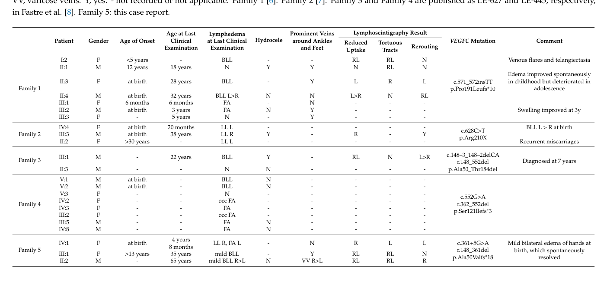

## Question

# Disease Characteristics Research Template

## Target Disease
- **Disease Name:** Congenital Primary Lymphedema of Gordon
- **MONDO ID:** MONDO:0035500 (if available)
- **Category:** Mendelian

## Research Objectives

Please provide a comprehensive research report on **Congenital Primary Lymphedema of Gordon** covering all of the
disease characteristics listed below. This report will be used to populate a disease knowledge
base entry. Be thorough and cite primary literature (PMID preferred) for all claims.

For each section, **suggested databases/resources** are listed. These are the first places
you should search for information on each topic.

---

### 1. Disease Information
> **Search first:** OMIM, Orphanet, ICD-10/ICD-11, MeSH, PubMed

- What is the disease? Provide a concise overview.
- What are the key identifiers? (OMIM, Orphanet, ICD-10/ICD-11, MeSH, Mondo)
- What are the common synonyms and alternative names?
- Is the information derived from individual patients (e.g., EHR) or aggregated disease-level resources?

### 2. Etiology

- **Disease Causal Factors**: What are the primary causes? (genetic, environmental, infectious, mechanistic)
- **Risk Factors**:
  > **Search first:** PubMed, Cochrane Library, UpToDate, clinical guidelines, ClinVar, ClinGen, GWAS Catalog, PheGenI, CTD, CDC, WHO, epidemiological databases
  - Genetic risk factors (causal variants, susceptibility loci, modifier genes)
  - Environmental risk factors (toxins, lifestyle, occupational exposures, age, sex, family history)
- **Protective Factors**:
  > **Search first:** PubMed, Cochrane Library, clinical trial databases, GWAS Catalog, gnomAD, WHO, CDC, nutrition databases
  - Genetic protective factors (protective variants, modifier alleles)
  - Environmental protective factors (diet, lifestyle, exposures that reduce risk)
- **Gene-Environment Interactions**: How do genetic and environmental factors interact to influence disease?
  > **Search first:** CTD, PubMed, PheGenI, GxE databases

### 3. Phenotypes
> **Search first:** HPO (Human Phenotype Ontology), OMIM, Orphanet, PubMed, clinicaltrials.gov, MedDRA, SNOMED CT, DECIPHER, LOINC

For each phenotype, provide:
- **Phenotype type**: symptoms, clinical signs, physical manifestations, behavioral changes, or laboratory abnormalities
  > For symptoms/signs: HPO, OMIM, Orphanet, PubMed
  > For behavioral changes: HPO, DSM, RDoC (Research Domain Criteria), PubMed
  > For laboratory abnormalities: LOINC, SNOMED CT, LabTests Online, PubMed
- **Phenotype characteristics**:
  > **Search first:** OMIM, Orphanet, HPO, PubMed
  - Age of symptom onset (neonatal, childhood, adult-onset, late-onset)
  - Symptom severity (mild, moderate, severe, variable)
  - Symptom progression (stable, progressive, episodic, fluctuating)
  - Frequency among affected individuals (percentage or qualitative)
- **Quality of life impact**: Effects on daily functioning and well-being (per-phenotype when possible)
  > **Search first:** EQ-5D database, SF-36, WHO QOL databases, PubMed
- Suggest HPO (Human Phenotype Ontology) terms for each phenotype

### 4. Genetic/Molecular Information

- **Causal Genes**: Gene mutations or chromosomal abnormalities responsible for disease (gene symbols, OMIM IDs)
  > **Search first:** OMIM, ClinVar, HGMD, Ensembl, NCBI Gene
- **Pathogenic Variants**:
  - Affected genes (gene symbols, HGNC IDs)
    > **Search first:** OMIM, NCBI Gene, Ensembl, HGNC, UniProt, GeneCards
  - Variant classification (pathogenic, likely pathogenic, VUS per ACMG/AMP guidelines)
    > **Search first:** ClinVar, ClinGen, ACMG/AMP guidelines, VarSome
  - Variant type/class (missense, frameshift, nonsense, splice-site, structural)
  - Allele frequency in population databases
    > **Search first:** gnomAD, 1000 Genomes, ExAC, TOPMed, dbSNP
  - Somatic vs germline origin
    > **Search first:** COSMIC (somatic), ClinVar, ICGC, TCGA
  - Functional consequences (loss of function, gain of function, dominant negative)
- **Modifier Genes**: Genes that modify disease severity or expression
- **Epigenetic Information**: DNA methylation, histone modifications, chromatin changes affecting disease
  > **Search first:** ENCODE, Roadmap Epigenomics, MethBase, DiseaseMeth
- **Chromosomal Abnormalities**: Large-scale genetic changes (aneuploidy, translocations, inversions)
  > **Search first:** DECIPHER, ClinVar, ECARUCA, UCSC Genome Browser

### 5. Environmental Information

- **Environmental Factors**: Non-genetic contributing factors (toxins, radiation, pollution, occupational exposure)
  > **Search first:** CTD (Comparative Toxicogenomics Database), TOXNET, PubMed, EPA databases
- **Lifestyle Factors**: Behavioral factors (smoking, diet, exercise, alcohol consumption)
  > **Search first:** CDC databases, WHO, PubMed, NHANES
- **Infectious Agents**: If applicable, pathogens causing or triggering disease (bacteria, viruses, fungi, parasites)
  > **Search first:** NCBI Taxonomy, ViPR, BV-BRC, MicrobeDB, GIDEON

### 6. Mechanism / Pathophysiology

**Present this section as an ordered causal chain first, then the detail below.**
Open with a numbered sequence of mechanistic steps running from the initiating
lesion (mutation, exposure, infection) to the clinical manifestation, one step per
line, each naming what it causes next. State the causal verb explicitly ("leads
to", "results in") and say where a step is inferred rather than demonstrated.
Where the mechanism branches, show the branch. The categories below are a
checklist of what to cover within those steps, not the organizing structure —
a step may draw on several of them, and a category may contribute to several
steps.

- **Molecular Pathways**: Specific signaling cascades or biochemical pathways involved (Wnt, MAPK, mTOR, PI3K-AKT, etc.)
  > **Search first:** KEGG, Reactome, WikiPathways, PathBank, BioCyc
- **Cellular Processes**: Cell-level mechanisms (apoptosis, autophagy, cell cycle dysregulation, inflammation, etc.)
  > **Search first:** Gene Ontology (GO), Reactome, KEGG, PubMed
- **Protein Dysfunction**: How protein structure or function is altered (misfolding, aggregation, loss of function, gain of function)
  > **Search first:** UniProt, PDB (Protein Data Bank), InterPro, Pfam, AlphaFold
- **Metabolic Changes**: Alterations in metabolic processes (energy metabolism, lipid metabolism, amino acid metabolism)
  > **Search first:** KEGG, BioCyc, HMDB (Human Metabolome Database), BRENDA
- **Immune System Involvement**: Role of immune response (autoimmunity, immunodeficiency, chronic inflammation)
  > **Search first:** ImmPort, Immunome Database, IEDB, Gene Ontology
- **Tissue Damage Mechanisms**: How tissues/ are injured (oxidative stress, ischemia, fibrosis, necrosis)
  > **Search first:** PubMed, Gene Ontology, Reactome
- **Biochemical Abnormalities**: Specific molecular defects (enzyme deficiencies, receptor dysfunction, ion channel defects)
  > **Search first:** BRENDA, UniProt, KEGG, OMIM, PubMed
- **Epigenetic Changes**: DNA methylation, histone modifications affecting gene expression in disease
  > **Search first:** ENCODE, Roadmap Epigenomics, MethBase, DiseaseMeth
- **Molecular Profiling** (if available):
  - Transcriptomics/gene expression changes
    > **Search first:** GEO (Gene Expression Omnibus), ArrayExpress, GTEx, Human Cell Atlas, SRA
  - Proteomics findings
    > **Search first:** PRIDE, ProteomeXchange, Human Protein Atlas, STRING, BioGRID
  - Metabolomics signatures
    > **Search first:** MetaboLights, Metabolomics Workbench, HMDB, METLIN
  - Lipidomics alterations
    > **Search first:** LIPID MAPS, SwissLipids, LipidHome, Metabolomics Workbench
  - Genomic structural features
    > **Search first:** UCSC Genome Browser, Ensembl, NCBI, dbVar, DGV
- **Advanced Technologies** (if applicable):
  - Single-cell analysis findings (cell-type specific mechanisms, cellular heterogeneity)
    > **Search first:** Human Cell Atlas, Single Cell Portal, GEO, CELLxGENE
  - Spatial transcriptomics findings
    > **Search first:** GEO, Spatial Research, Vizgen, 10x Genomics data
  - Multi-omics integration results
    > **Search first:** TCGA, ICGC, cBioPortal, LinkedOmics, PubMed
  - Functional genomics screens (CRISPR, RNAi)
    > **Search first:** DepMap, GenomeRNAi, PubMed, BioGRID ORCS

For each mechanism, describe:
- The causal chain from initial trigger to clinical manifestation
- Which mechanisms are upstream vs downstream
- What cell types and biological processes are involved
- Suggest GO terms for biological processes and CL terms for cell types

### 7. Anatomical Structures Affected

- **Organ Level**:
  - Primary organs directly affected
  - Secondary organ involvement (complications, secondary effects)
  - Body systems involved (cardiovascular, nervous, digestive, respiratory, endocrine, etc.)
  > **Search first:** Uberon, FMA (Foundational Model of Anatomy), OMIM, HPO, ICD-11, MeSH, SNOMED CT
- **Tissue and Cell Level**:
  - Specific tissue types affected (epithelial, connective, muscle, nervous)
  - Specific cell populations targeted (with Cell Ontology terms)
  > **Search first:** Uberon, Human Protein Atlas, Cell Ontology, Human Cell Atlas, CellMarker, PanglaoDB
- **Subcellular Level**:
  - Cellular compartments involved (mitochondria, nucleus, ER, lysosomes) (with GO Cellular Component terms)
  > **Search first:** Gene Ontology (Cellular Component), UniProt, Human Protein Atlas
- **Localization**:
  - Specific anatomical sites (with UBERON terms)
    > **Search first:** FMA, Uberon, NeuroNames (for brain), SNOMED CT
  - Lateralization (unilateral, bilateral, asymmetric)
    > **Search first:** HPO, clinical literature, imaging databases

### 8. Temporal Development

- **Onset**:
  - Typical age of onset (congenital, pediatric, adult, geriatric)
  - Onset pattern (acute, subacute, chronic, insidious)
  > **Search first:** OMIM, Orphanet, HPO, PubMed
- **Progression**:
  - Disease stages (early, intermediate, advanced, end-stage)
    > **Search first:** Cancer Staging Manual (AJCC), WHO classifications, PubMed
  - Progression rate (rapid, slow, variable)
  - Disease course pattern (episodic, relapsing-remitting, progressive, stable)
  - Disease duration (self-limited, chronic lifelong)
  > **Search first:** Disease registries, longitudinal cohort databases, natural history studies, PubMed, Orphanet, OMIM
- **Patterns**:
  - Remission patterns (spontaneous, treatment-induced)
    > **Search first:** Clinical trial databases, disease registries, PubMed
  - Critical periods (time windows of vulnerability or opportunity for intervention)
    > **Search first:** PubMed, developmental biology databases, clinical guidelines

### 9. Inheritance and Population

- **Epidemiology**:
  - Prevalence (cases per 100,000 at given time)
  - Incidence (new cases per 100,000 per year)
  > **Search first:** Orphanet, CDC, WHO, GBD (Global Burden of Disease), national registries, SEER, disease registries
- **For Genetic Etiology**:
  - Inheritance pattern (AD, AR, X-linked, mitochondrial, multifactorial, polygenic)
    > **Search first:** OMIM, Orphanet, ClinVar, GTR (Genetic Testing Registry)
  - Penetrance (complete, incomplete, age-dependent)
    > **Search first:** ClinVar, OMIM, PubMed, ClinGen
  - Expressivity (variable, consistent)
    > **Search first:** OMIM, ClinVar, PubMed
  - Genetic anticipation (increasing severity in successive generations)
    > **Search first:** OMIM, PubMed (especially for repeat expansion disorders)
  - Germline mosaicism
    > **Search first:** ClinVar, OMIM, genetic counseling literature, PubMed
  - Founder effects (population-specific mutations)
    > **Search first:** gnomAD, population genetics databases, PubMed
  - Consanguinity role
    > **Search first:** OMIM, population studies, genetic counseling resources
  - Carrier frequency
    > **Search first:** gnomAD, carrier screening databases, GeneReviews, GTR
- **Population Demographics**:
  - Affected populations (ethnic or demographic groups with higher prevalence)
    > **Search first:** gnomAD, 1000 Genomes, PAGE Study, PubMed, population registries
  - Geographic distribution (endemic areas, regional variation)
    > **Search first:** WHO, CDC, GBD, Orphanet, geographic epidemiology databases
  - Geographic distribution of specific variants
  - Sex ratio (male:female)
    > **Search first:** Disease registries, OMIM, PubMed, epidemiological databases
  - Age distribution of affected individuals
    > **Search first:** CDC, disease registries, SEER, Orphanet

### 10. Diagnostics

- **Clinical Tests**:
  - Laboratory tests (blood, urine, tissue chemistry, specific enzyme assays)
    > **Search first:** LOINC, LabTests Online, PubMed
  - Biomarkers (proteins, metabolites, genetic markers, circulating biomarkers)
    > **Search first:** FDA Biomarker List, BEST (Biomarkers, EndpointS, and other Tools), PubMed
  - Imaging studies (X-ray, CT, MRI, PET, ultrasound)
    > **Search first:** RadLex, DICOM, Radiopaedia, imaging databases
  - Functional tests (pulmonary function, cardiac stress tests)
    > **Search first:** LOINC, clinical guidelines, PubMed
  - Electrophysiology (EEG, EMG, ECG, nerve conduction studies)
    > **Search first:** LOINC, clinical neurophysiology databases, PubMed
  - Biopsy findings (histopathology, immunohistochemistry)
    > **Search first:** SNOMED CT, College of American Pathologists resources, PubMed
  - Pathology findings (microscopic examination)
    > **Search first:** SNOMED CT, Digital Pathology databases, PubMed
- **Genetic Testing**:
  > **Search first:** GTR (Genetic Testing Registry), GeneReviews, ClinGen
  - Overview of recommended genetic testing approach
  - Whole genome sequencing (WGS) utility
    > **Search first:** GTR, ClinVar, GEL (Genomics England), gnomAD
  - Whole exome sequencing (WES) utility
    > **Search first:** GTR, ClinVar, OMIM, GeneMatcher
  - Gene panels (which panels, which genes)
    > **Search first:** GTR, ClinVar, laboratory-specific databases
  - Single gene testing
    > **Search first:** GTR, ClinVar, OMIM, GeneReviews
  - Chromosomal microarray (CMA)
    > **Search first:** DECIPHER, ClinVar, dbVar, ECARUCA
  - Karyotyping
    > **Search first:** Chromosome Abnormality Database, ClinVar, cytogenetics resources
  - FISH
    > **Search first:** ClinVar, cytogenetics databases, PubMed
  - Mitochondrial DNA testing
    > **Search first:** MITOMAP, MSeqDR, ClinVar, GTR
  - Repeat expansion testing
    > **Search first:** GTR, ClinVar, repeat expansion databases, PubMed
- **Omics-Based Diagnostics** (if applicable):
  - RNA sequencing / transcriptomics
    > **Search first:** GEO, ArrayExpress, GTEx, RNA-seq databases
  - Proteomics
    > **Search first:** PRIDE, ProteomeXchange, FDA Biomarker database
  - Metabolomics
    > **Search first:** MetaboLights, Metabolomics Workbench, HMDB
  - Epigenomics
    > **Search first:** GEO, ENCODE, Roadmap Epigenomics, MethBase
  - Liquid biopsy
    > **Search first:** COSMIC, ClinVar, liquid biopsy databases, PubMed
- **Clinical Criteria**:
  - Standardized diagnostic criteria (DSM, ICD, society guidelines)
    > **Search first:** DSM-5, ICD-11, clinical society guidelines, UpToDate
  - Differential diagnosis (other conditions to rule out, with distinguishing features)
    > **Search first:** DynaMed, UpToDate, clinical decision support systems
- **Screening**:
  - Screening methods for asymptomatic individuals (newborn screening, carrier screening, cascade screening)
    > **Search first:** ACMG recommendations, CDC newborn screening, GTR

### 11. Outcome/Prognosis

- **Survival and Mortality**:
  - Survival rate (5-year, 10-year, overall)
    > **Search first:** SEER, cancer registries, disease-specific registries, PubMed
  - Life expectancy (with and without treatment if applicable)
    > **Search first:** Orphanet, disease registries, actuarial databases, PubMed
  - Mortality rate
    > **Search first:** CDC, WHO, GBD, national mortality databases
  - Disease-specific mortality (deaths directly attributable to disease)
    > **Search first:** Disease registries, CDC Wonder, GBD, PubMed
- **Morbidity and Function**:
  - Morbidity (disease-related disability and health impacts)
    > **Search first:** GBD, WHO, disability databases, PubMed
  - Disability outcomes (long-term functional impairments)
    > **Search first:** ICF (International Classification of Functioning), disability registries
  - Quality of life measures (EQ-5D, SF-36, PROMIS, disease-specific tools)
    > **Search first:** EQ-5D database, SF-36, PROMIS, PubMed
- **Disease Course**:
  - Complications (secondary problems: infections, organ failure, etc.)
    > **Search first:** ICD codes, disease registries, clinical databases, PubMed
  - Recovery potential (likelihood and extent of recovery, with vs without treatment)
    > **Search first:** Natural history studies, rehabilitation databases, PubMed
- **Prediction**:
  - Prognostic factors (age, disease severity, biomarkers, treatment response)
    > **Search first:** Prognostic models databases, clinical calculators, PubMed
  - Prognostic biomarkers (molecular markers predicting disease course)
    > **Search first:** FDA Biomarker database, PubMed, cancer prognostic databases

### 12. Treatment

- **Pharmacotherapy**:
  - Pharmacological treatments (drug names, drug classes, mechanisms of action)
    > **Search first:** DrugBank, RxNorm, ATC classification, DailyMed, FDA databases
  - Pharmacogenomics (how genetic variants affect drug metabolism, efficacy, toxicity)
    > **Search first:** PharmGKB, CPIC (Clinical Pharmacogenetics), FDA Table of PGx Biomarkers
- **Advanced Therapeutics**:
  - Gene therapy (viral vectors, CRISPR, gene replacement, gene editing)
    > **Search first:** ClinicalTrials.gov, FDA gene therapy database, ASGCT resources
  - Cell therapy (stem cell transplant, CAR-T, cellular therapeutics)
    > **Search first:** ClinicalTrials.gov, FDA cell therapy database, FACT standards
  - RNA-based therapies (ASOs, siRNA, mRNA therapies)
    > **Search first:** ClinicalTrials.gov, FDA approvals, PubMed
  - Targeted therapies (treatments directed at specific molecular targets)
    > **Search first:** My Cancer Genome, OncoKB, ClinicalTrials.gov, FDA approvals
  - Immunotherapies (checkpoint inhibitors, monoclonal antibodies)
    > **Search first:** Cancer Immunotherapy Database, FDA approvals, ClinicalTrials.gov
- **Surgical and Interventional**:
  - Surgical interventions (types of surgery, timing, outcomes)
    > **Search first:** CPT codes, surgical registries, clinical guidelines, PubMed
- **Supportive and Rehabilitative**:
  - Supportive care (symptom management, pain control, nutrition)
    > **Search first:** Clinical guidelines, Cochrane Library, PubMed
  - Rehabilitation (physical therapy, occupational therapy, speech therapy)
    > **Search first:** Rehabilitation medicine databases, clinical guidelines, PubMed
- **Experimental**:
  - Experimental treatments in clinical trials (with NCT identifiers if available)
    > **Search first:** ClinicalTrials.gov, EU Clinical Trials Register, WHO ICTRP
- **Treatment Outcomes**:
  - Treatment response rates
    > **Search first:** Clinical trial databases, FDA reviews, systematic reviews, PubMed
  - Side effects and adverse events
    > **Search first:** FDA Adverse Event Reporting System (FAERS), MedWatch, PubMed
- **Treatment Strategy**:
  - Treatment algorithms (clinical pathways, decision trees)
    > **Search first:** Clinical practice guidelines, NCCN Guidelines, UpToDate
  - Combination therapies
    > **Search first:** ClinicalTrials.gov, treatment guidelines, PubMed
  - Personalized medicine approaches (genotype-guided treatment)
    > **Search first:** My Cancer Genome, CIViC, PharmGKB, precision medicine databases

For each treatment, suggest NCIT (NCI Thesaurus) clinical-intervention terms where applicable.

### 13. Prevention

- **Prevention Levels**:
  - Primary prevention (preventing disease occurrence: vaccination, risk factor modification)
    > **Search first:** CDC, WHO, USPSTF recommendations, Cochrane Library
  - Secondary prevention (early detection and treatment: screening programs, early intervention)
    > **Search first:** USPSTF, CDC screening guidelines, WHO
  - Tertiary prevention (preventing complications in those with disease)
    > **Search first:** Clinical guidelines, disease management protocols, PubMed
- **Immunization**: Vaccine strategies (if applicable)
  > **Search first:** CDC vaccine schedules, WHO immunization, FDA vaccine database
- **Screening and Early Detection**:
  - Screening programs (population-based: newborn screening, cancer screening)
    > **Search first:** CDC screening programs, USPSTF, cancer screening databases
  - Genetic screening (carrier screening, preimplantation genetic diagnosis, prenatal testing)
    > **Search first:** ACMG recommendations, ACOG guidelines, GTR
  - Risk stratification (identifying high-risk individuals for targeted prevention)
    > **Search first:** Risk prediction models, clinical calculators, PubMed
- **Behavioral Interventions**: Lifestyle modifications to reduce risk
  > **Search first:** CDC, WHO, behavioral intervention databases, Cochrane Library
- **Counseling**: Genetic counseling (risk assessment, family planning guidance)
  > **Search first:** NSGC resources, ACMG guidelines, GeneReviews
- **Public Health**:
  - Public health interventions (sanitation, vector control, health education)
    > **Search first:** CDC, WHO, public health databases, PubMed
  - Environmental interventions (reducing environmental risk factors)
    > **Search first:** EPA databases, WHO environmental health, PubMed
- **Prophylaxis**: Preventive medications or procedures
  > **Search first:** Clinical guidelines, FDA approvals, PubMed

### 14. Other Species / Natural Disease

- **Taxonomy**: Species affected (with NCBI Taxon identifiers)
  > **Search first:** NCBI Taxonomy
- **Breed**: Specific breeds affected (with VBO identifiers if applicable)
  > **Search first:** VBO (Vertebrate Breed Ontology)
- **Gene**: Orthologous genes in other species (with NCBI Gene IDs)
  > **Search first:** NCBI Gene
- **Natural Disease**:
  - Naturally occurring disease in other species (companion animals, wildlife)
    > **Search first:** OMIA (Online Mendelian Inheritance in Animals), VetCompass, PubMed
  - Veterinary relevance and importance in animal health
    > **Search first:** OMIA, veterinary databases, PubMed
- **Comparative Biology**:
  - Comparative pathology (similarities and differences across species)
    > **Search first:** OMIA, comparative pathology databases, PubMed
  - Evolutionary conservation of disease mechanisms
    > **Search first:** HomoloGene, OrthoMCL, Alliance of Genome Resources
- **Transmission** (if applicable):
  - Zoonotic potential
    > **Search first:** CDC zoonotic diseases, WHO zoonoses, GIDEON
  - Cross-species susceptibility
    > **Search first:** NCBI Taxonomy, veterinary databases, PubMed

### 15. Model Organisms

- **Model Types**:
  - Model organism type (mammalian, invertebrate, cellular, in vitro)
    > **Search first:** Alliance of Genome Resources, model organism databases
  - Specific model systems (mouse, rat, zebrafish, Drosophila, C. elegans, yeast, cell lines, organoids, iPSCs)
    > **Search first:** MGI, RGD, ZFIN, FlyBase, WormBase, SGD, ATCC, Cellosaurus
  - Induced models (drug treatment, surgical intervention, environmental manipulation)
    > **Search first:** MGI, model organism databases, PubMed
- **Genetic Models**:
  - Types available (knockout, knock-in, transgenic, conditional, humanized)
    > **Search first:** MGI, IMPC, KOMP, EuMMCR, IMSR
- **Model Characteristics**:
  - Phenotype recapitulation (how well model reproduces human disease features)
    > **Search first:** Model organism databases, comparative studies, PubMed
  - Model limitations (aspects of human disease not captured)
    > **Search first:** Model organism databases, PubMed, review articles
- **Applications**:
  - Research applications (what aspects of disease can be studied)
    > **Search first:** Model organism databases, PubMed
- **Resources**:
  - Model databases
    > **Search first:** MGI, RGD, ZFIN, FlyBase, WormBase, IMSR, EMMA, MMRRC

---

## Citation Requirements

- Cite primary literature (PMID preferred) for all mechanistic and clinical claims
- Prioritize recent reviews and landmark papers
- Include direct quotes from abstracts where possible to support key statements
- Distinguish evidence source types: human clinical, model organism, in vitro, computational

## Output Format

Structure your response as a comprehensive narrative organized by the sections above.
For each section, provide:
- Factual content with specific details (numbers, percentages, gene names, variant nomenclature)
- Ontology term suggestions (HPO, GO, CL, UBERON, CHEBI, NCIT, MONDO) where applicable
- Evidence citations with PMIDs
- Direct quotes from abstracts to support key claims
- Clear indication when information is not available or not applicable for this disease

This report will be used to populate a disease knowledge base entry with:
- Pathophysiology descriptions with causal chains
- Gene/protein annotations (HGNC, GO terms)
- Phenotype associations (HP terms) with frequencies
- Cell type involvement (CL terms)
- Anatomical locations (UBERON terms)
- Chemical entities (CHEBI terms)
- Treatment annotations (NCIT terms)
- Evidence items with PMIDs and exact abstract quotes
- Epidemiology, prognosis, diagnostic, and prevention information
- Animal model descriptions with phenotype recapitulation details

## Output

Question: You are an expert researcher providing comprehensive, well-cited information.

Provide detailed information focusing on:
1. Key concepts and definitions with current understanding
2. Recent developments and latest research (prioritize 2023-2024 sources)
3. Current applications and real-world implementations
4. Expert opinions and analysis from authoritative sources
5. Relevant statistics and data from recent studies

Format as a comprehensive research report with proper citations. Include URLs and publication dates where available.
Always prioritize recent, authoritative sources and provide specific citations for all major claims.

# Disease Characteristics Research Template

## Target Disease
- **Disease Name:** Congenital Primary Lymphedema of Gordon
- **MONDO ID:** MONDO:0035500 (if available)
- **Category:** Mendelian

## Research Objectives

Please provide a comprehensive research report on **Congenital Primary Lymphedema of Gordon** covering all of the
disease characteristics listed below. This report will be used to populate a disease knowledge
base entry. Be thorough and cite primary literature (PMID preferred) for all claims.

For each section, **suggested databases/resources** are listed. These are the first places
you should search for information on each topic.

---

### 1. Disease Information
> **Search first:** OMIM, Orphanet, ICD-10/ICD-11, MeSH, PubMed

- What is the disease? Provide a concise overview.
- What are the key identifiers? (OMIM, Orphanet, ICD-10/ICD-11, MeSH, Mondo)
- What are the common synonyms and alternative names?
- Is the information derived from individual patients (e.g., EHR) or aggregated disease-level resources?

### 2. Etiology

- **Disease Causal Factors**: What are the primary causes? (genetic, environmental, infectious, mechanistic)
- **Risk Factors**:
  > **Search first:** PubMed, Cochrane Library, UpToDate, clinical guidelines, ClinVar, ClinGen, GWAS Catalog, PheGenI, CTD, CDC, WHO, epidemiological databases
  - Genetic risk factors (causal variants, susceptibility loci, modifier genes)
  - Environmental risk factors (toxins, lifestyle, occupational exposures, age, sex, family history)
- **Protective Factors**:
  > **Search first:** PubMed, Cochrane Library, clinical trial databases, GWAS Catalog, gnomAD, WHO, CDC, nutrition databases
  - Genetic protective factors (protective variants, modifier alleles)
  - Environmental protective factors (diet, lifestyle, exposures that reduce risk)
- **Gene-Environment Interactions**: How do genetic and environmental factors interact to influence disease?
  > **Search first:** CTD, PubMed, PheGenI, GxE databases

### 3. Phenotypes
> **Search first:** HPO (Human Phenotype Ontology), OMIM, Orphanet, PubMed, clinicaltrials.gov, MedDRA, SNOMED CT, DECIPHER, LOINC

For each phenotype, provide:
- **Phenotype type**: symptoms, clinical signs, physical manifestations, behavioral changes, or laboratory abnormalities
  > For symptoms/signs: HPO, OMIM, Orphanet, PubMed
  > For behavioral changes: HPO, DSM, RDoC (Research Domain Criteria), PubMed
  > For laboratory abnormalities: LOINC, SNOMED CT, LabTests Online, PubMed
- **Phenotype characteristics**:
  > **Search first:** OMIM, Orphanet, HPO, PubMed
  - Age of symptom onset (neonatal, childhood, adult-onset, late-onset)
  - Symptom severity (mild, moderate, severe, variable)
  - Symptom progression (stable, progressive, episodic, fluctuating)
  - Frequency among affected individuals (percentage or qualitative)
- **Quality of life impact**: Effects on daily functioning and well-being (per-phenotype when possible)
  > **Search first:** EQ-5D database, SF-36, WHO QOL databases, PubMed
- Suggest HPO (Human Phenotype Ontology) terms for each phenotype

### 4. Genetic/Molecular Information

- **Causal Genes**: Gene mutations or chromosomal abnormalities responsible for disease (gene symbols, OMIM IDs)
  > **Search first:** OMIM, ClinVar, HGMD, Ensembl, NCBI Gene
- **Pathogenic Variants**:
  - Affected genes (gene symbols, HGNC IDs)
    > **Search first:** OMIM, NCBI Gene, Ensembl, HGNC, UniProt, GeneCards
  - Variant classification (pathogenic, likely pathogenic, VUS per ACMG/AMP guidelines)
    > **Search first:** ClinVar, ClinGen, ACMG/AMP guidelines, VarSome
  - Variant type/class (missense, frameshift, nonsense, splice-site, structural)
  - Allele frequency in population databases
    > **Search first:** gnomAD, 1000 Genomes, ExAC, TOPMed, dbSNP
  - Somatic vs germline origin
    > **Search first:** COSMIC (somatic), ClinVar, ICGC, TCGA
  - Functional consequences (loss of function, gain of function, dominant negative)
- **Modifier Genes**: Genes that modify disease severity or expression
- **Epigenetic Information**: DNA methylation, histone modifications, chromatin changes affecting disease
  > **Search first:** ENCODE, Roadmap Epigenomics, MethBase, DiseaseMeth
- **Chromosomal Abnormalities**: Large-scale genetic changes (aneuploidy, translocations, inversions)
  > **Search first:** DECIPHER, ClinVar, ECARUCA, UCSC Genome Browser

### 5. Environmental Information

- **Environmental Factors**: Non-genetic contributing factors (toxins, radiation, pollution, occupational exposure)
  > **Search first:** CTD (Comparative Toxicogenomics Database), TOXNET, PubMed, EPA databases
- **Lifestyle Factors**: Behavioral factors (smoking, diet, exercise, alcohol consumption)
  > **Search first:** CDC databases, WHO, PubMed, NHANES
- **Infectious Agents**: If applicable, pathogens causing or triggering disease (bacteria, viruses, fungi, parasites)
  > **Search first:** NCBI Taxonomy, ViPR, BV-BRC, MicrobeDB, GIDEON

### 6. Mechanism / Pathophysiology

**Present this section as an ordered causal chain first, then the detail below.**
Open with a numbered sequence of mechanistic steps running from the initiating
lesion (mutation, exposure, infection) to the clinical manifestation, one step per
line, each naming what it causes next. State the causal verb explicitly ("leads
to", "results in") and say where a step is inferred rather than demonstrated.
Where the mechanism branches, show the branch. The categories below are a
checklist of what to cover within those steps, not the organizing structure —
a step may draw on several of them, and a category may contribute to several
steps.

- **Molecular Pathways**: Specific signaling cascades or biochemical pathways involved (Wnt, MAPK, mTOR, PI3K-AKT, etc.)
  > **Search first:** KEGG, Reactome, WikiPathways, PathBank, BioCyc
- **Cellular Processes**: Cell-level mechanisms (apoptosis, autophagy, cell cycle dysregulation, inflammation, etc.)
  > **Search first:** Gene Ontology (GO), Reactome, KEGG, PubMed
- **Protein Dysfunction**: How protein structure or function is altered (misfolding, aggregation, loss of function, gain of function)
  > **Search first:** UniProt, PDB (Protein Data Bank), InterPro, Pfam, AlphaFold
- **Metabolic Changes**: Alterations in metabolic processes (energy metabolism, lipid metabolism, amino acid metabolism)
  > **Search first:** KEGG, BioCyc, HMDB (Human Metabolome Database), BRENDA
- **Immune System Involvement**: Role of immune response (autoimmunity, immunodeficiency, chronic inflammation)
  > **Search first:** ImmPort, Immunome Database, IEDB, Gene Ontology
- **Tissue Damage Mechanisms**: How tissues/ are injured (oxidative stress, ischemia, fibrosis, necrosis)
  > **Search first:** PubMed, Gene Ontology, Reactome
- **Biochemical Abnormalities**: Specific molecular defects (enzyme deficiencies, receptor dysfunction, ion channel defects)
  > **Search first:** BRENDA, UniProt, KEGG, OMIM, PubMed
- **Epigenetic Changes**: DNA methylation, histone modifications affecting gene expression in disease
  > **Search first:** ENCODE, Roadmap Epigenomics, MethBase, DiseaseMeth
- **Molecular Profiling** (if available):
  - Transcriptomics/gene expression changes
    > **Search first:** GEO (Gene Expression Omnibus), ArrayExpress, GTEx, Human Cell Atlas, SRA
  - Proteomics findings
    > **Search first:** PRIDE, ProteomeXchange, Human Protein Atlas, STRING, BioGRID
  - Metabolomics signatures
    > **Search first:** MetaboLights, Metabolomics Workbench, HMDB, METLIN
  - Lipidomics alterations
    > **Search first:** LIPID MAPS, SwissLipids, LipidHome, Metabolomics Workbench
  - Genomic structural features
    > **Search first:** UCSC Genome Browser, Ensembl, NCBI, dbVar, DGV
- **Advanced Technologies** (if applicable):
  - Single-cell analysis findings (cell-type specific mechanisms, cellular heterogeneity)
    > **Search first:** Human Cell Atlas, Single Cell Portal, GEO, CELLxGENE
  - Spatial transcriptomics findings
    > **Search first:** GEO, Spatial Research, Vizgen, 10x Genomics data
  - Multi-omics integration results
    > **Search first:** TCGA, ICGC, cBioPortal, LinkedOmics, PubMed
  - Functional genomics screens (CRISPR, RNAi)
    > **Search first:** DepMap, GenomeRNAi, PubMed, BioGRID ORCS

For each mechanism, describe:
- The causal chain from initial trigger to clinical manifestation
- Which mechanisms are upstream vs downstream
- What cell types and biological processes are involved
- Suggest GO terms for biological processes and CL terms for cell types

### 7. Anatomical Structures Affected

- **Organ Level**:
  - Primary organs directly affected
  - Secondary organ involvement (complications, secondary effects)
  - Body systems involved (cardiovascular, nervous, digestive, respiratory, endocrine, etc.)
  > **Search first:** Uberon, FMA (Foundational Model of Anatomy), OMIM, HPO, ICD-11, MeSH, SNOMED CT
- **Tissue and Cell Level**:
  - Specific tissue types affected (epithelial, connective, muscle, nervous)
  - Specific cell populations targeted (with Cell Ontology terms)
  > **Search first:** Uberon, Human Protein Atlas, Cell Ontology, Human Cell Atlas, CellMarker, PanglaoDB
- **Subcellular Level**:
  - Cellular compartments involved (mitochondria, nucleus, ER, lysosomes) (with GO Cellular Component terms)
  > **Search first:** Gene Ontology (Cellular Component), UniProt, Human Protein Atlas
- **Localization**:
  - Specific anatomical sites (with UBERON terms)
    > **Search first:** FMA, Uberon, NeuroNames (for brain), SNOMED CT
  - Lateralization (unilateral, bilateral, asymmetric)
    > **Search first:** HPO, clinical literature, imaging databases

### 8. Temporal Development

- **Onset**:
  - Typical age of onset (congenital, pediatric, adult, geriatric)
  - Onset pattern (acute, subacute, chronic, insidious)
  > **Search first:** OMIM, Orphanet, HPO, PubMed
- **Progression**:
  - Disease stages (early, intermediate, advanced, end-stage)
    > **Search first:** Cancer Staging Manual (AJCC), WHO classifications, PubMed
  - Progression rate (rapid, slow, variable)
  - Disease course pattern (episodic, relapsing-remitting, progressive, stable)
  - Disease duration (self-limited, chronic lifelong)
  > **Search first:** Disease registries, longitudinal cohort databases, natural history studies, PubMed, Orphanet, OMIM
- **Patterns**:
  - Remission patterns (spontaneous, treatment-induced)
    > **Search first:** Clinical trial databases, disease registries, PubMed
  - Critical periods (time windows of vulnerability or opportunity for intervention)
    > **Search first:** PubMed, developmental biology databases, clinical guidelines

### 9. Inheritance and Population

- **Epidemiology**:
  - Prevalence (cases per 100,000 at given time)
  - Incidence (new cases per 100,000 per year)
  > **Search first:** Orphanet, CDC, WHO, GBD (Global Burden of Disease), national registries, SEER, disease registries
- **For Genetic Etiology**:
  - Inheritance pattern (AD, AR, X-linked, mitochondrial, multifactorial, polygenic)
    > **Search first:** OMIM, Orphanet, ClinVar, GTR (Genetic Testing Registry)
  - Penetrance (complete, incomplete, age-dependent)
    > **Search first:** ClinVar, OMIM, PubMed, ClinGen
  - Expressivity (variable, consistent)
    > **Search first:** OMIM, ClinVar, PubMed
  - Genetic anticipation (increasing severity in successive generations)
    > **Search first:** OMIM, PubMed (especially for repeat expansion disorders)
  - Germline mosaicism
    > **Search first:** ClinVar, OMIM, genetic counseling literature, PubMed
  - Founder effects (population-specific mutations)
    > **Search first:** gnomAD, population genetics databases, PubMed
  - Consanguinity role
    > **Search first:** OMIM, population studies, genetic counseling resources
  - Carrier frequency
    > **Search first:** gnomAD, carrier screening databases, GeneReviews, GTR
- **Population Demographics**:
  - Affected populations (ethnic or demographic groups with higher prevalence)
    > **Search first:** gnomAD, 1000 Genomes, PAGE Study, PubMed, population registries
  - Geographic distribution (endemic areas, regional variation)
    > **Search first:** WHO, CDC, GBD, Orphanet, geographic epidemiology databases
  - Geographic distribution of specific variants
  - Sex ratio (male:female)
    > **Search first:** Disease registries, OMIM, PubMed, epidemiological databases
  - Age distribution of affected individuals
    > **Search first:** CDC, disease registries, SEER, Orphanet

### 10. Diagnostics

- **Clinical Tests**:
  - Laboratory tests (blood, urine, tissue chemistry, specific enzyme assays)
    > **Search first:** LOINC, LabTests Online, PubMed
  - Biomarkers (proteins, metabolites, genetic markers, circulating biomarkers)
    > **Search first:** FDA Biomarker List, BEST (Biomarkers, EndpointS, and other Tools), PubMed
  - Imaging studies (X-ray, CT, MRI, PET, ultrasound)
    > **Search first:** RadLex, DICOM, Radiopaedia, imaging databases
  - Functional tests (pulmonary function, cardiac stress tests)
    > **Search first:** LOINC, clinical guidelines, PubMed
  - Electrophysiology (EEG, EMG, ECG, nerve conduction studies)
    > **Search first:** LOINC, clinical neurophysiology databases, PubMed
  - Biopsy findings (histopathology, immunohistochemistry)
    > **Search first:** SNOMED CT, College of American Pathologists resources, PubMed
  - Pathology findings (microscopic examination)
    > **Search first:** SNOMED CT, Digital Pathology databases, PubMed
- **Genetic Testing**:
  > **Search first:** GTR (Genetic Testing Registry), GeneReviews, ClinGen
  - Overview of recommended genetic testing approach
  - Whole genome sequencing (WGS) utility
    > **Search first:** GTR, ClinVar, GEL (Genomics England), gnomAD
  - Whole exome sequencing (WES) utility
    > **Search first:** GTR, ClinVar, OMIM, GeneMatcher
  - Gene panels (which panels, which genes)
    > **Search first:** GTR, ClinVar, laboratory-specific databases
  - Single gene testing
    > **Search first:** GTR, ClinVar, OMIM, GeneReviews
  - Chromosomal microarray (CMA)
    > **Search first:** DECIPHER, ClinVar, dbVar, ECARUCA
  - Karyotyping
    > **Search first:** Chromosome Abnormality Database, ClinVar, cytogenetics resources
  - FISH
    > **Search first:** ClinVar, cytogenetics databases, PubMed
  - Mitochondrial DNA testing
    > **Search first:** MITOMAP, MSeqDR, ClinVar, GTR
  - Repeat expansion testing
    > **Search first:** GTR, ClinVar, repeat expansion databases, PubMed
- **Omics-Based Diagnostics** (if applicable):
  - RNA sequencing / transcriptomics
    > **Search first:** GEO, ArrayExpress, GTEx, RNA-seq databases
  - Proteomics
    > **Search first:** PRIDE, ProteomeXchange, FDA Biomarker database
  - Metabolomics
    > **Search first:** MetaboLights, Metabolomics Workbench, HMDB
  - Epigenomics
    > **Search first:** GEO, ENCODE, Roadmap Epigenomics, MethBase
  - Liquid biopsy
    > **Search first:** COSMIC, ClinVar, liquid biopsy databases, PubMed
- **Clinical Criteria**:
  - Standardized diagnostic criteria (DSM, ICD, society guidelines)
    > **Search first:** DSM-5, ICD-11, clinical society guidelines, UpToDate
  - Differential diagnosis (other conditions to rule out, with distinguishing features)
    > **Search first:** DynaMed, UpToDate, clinical decision support systems
- **Screening**:
  - Screening methods for asymptomatic individuals (newborn screening, carrier screening, cascade screening)
    > **Search first:** ACMG recommendations, CDC newborn screening, GTR

### 11. Outcome/Prognosis

- **Survival and Mortality**:
  - Survival rate (5-year, 10-year, overall)
    > **Search first:** SEER, cancer registries, disease-specific registries, PubMed
  - Life expectancy (with and without treatment if applicable)
    > **Search first:** Orphanet, disease registries, actuarial databases, PubMed
  - Mortality rate
    > **Search first:** CDC, WHO, GBD, national mortality databases
  - Disease-specific mortality (deaths directly attributable to disease)
    > **Search first:** Disease registries, CDC Wonder, GBD, PubMed
- **Morbidity and Function**:
  - Morbidity (disease-related disability and health impacts)
    > **Search first:** GBD, WHO, disability databases, PubMed
  - Disability outcomes (long-term functional impairments)
    > **Search first:** ICF (International Classification of Functioning), disability registries
  - Quality of life measures (EQ-5D, SF-36, PROMIS, disease-specific tools)
    > **Search first:** EQ-5D database, SF-36, PROMIS, PubMed
- **Disease Course**:
  - Complications (secondary problems: infections, organ failure, etc.)
    > **Search first:** ICD codes, disease registries, clinical databases, PubMed
  - Recovery potential (likelihood and extent of recovery, with vs without treatment)
    > **Search first:** Natural history studies, rehabilitation databases, PubMed
- **Prediction**:
  - Prognostic factors (age, disease severity, biomarkers, treatment response)
    > **Search first:** Prognostic models databases, clinical calculators, PubMed
  - Prognostic biomarkers (molecular markers predicting disease course)
    > **Search first:** FDA Biomarker database, PubMed, cancer prognostic databases

### 12. Treatment

- **Pharmacotherapy**:
  - Pharmacological treatments (drug names, drug classes, mechanisms of action)
    > **Search first:** DrugBank, RxNorm, ATC classification, DailyMed, FDA databases
  - Pharmacogenomics (how genetic variants affect drug metabolism, efficacy, toxicity)
    > **Search first:** PharmGKB, CPIC (Clinical Pharmacogenetics), FDA Table of PGx Biomarkers
- **Advanced Therapeutics**:
  - Gene therapy (viral vectors, CRISPR, gene replacement, gene editing)
    > **Search first:** ClinicalTrials.gov, FDA gene therapy database, ASGCT resources
  - Cell therapy (stem cell transplant, CAR-T, cellular therapeutics)
    > **Search first:** ClinicalTrials.gov, FDA cell therapy database, FACT standards
  - RNA-based therapies (ASOs, siRNA, mRNA therapies)
    > **Search first:** ClinicalTrials.gov, FDA approvals, PubMed
  - Targeted therapies (treatments directed at specific molecular targets)
    > **Search first:** My Cancer Genome, OncoKB, ClinicalTrials.gov, FDA approvals
  - Immunotherapies (checkpoint inhibitors, monoclonal antibodies)
    > **Search first:** Cancer Immunotherapy Database, FDA approvals, ClinicalTrials.gov
- **Surgical and Interventional**:
  - Surgical interventions (types of surgery, timing, outcomes)
    > **Search first:** CPT codes, surgical registries, clinical guidelines, PubMed
- **Supportive and Rehabilitative**:
  - Supportive care (symptom management, pain control, nutrition)
    > **Search first:** Clinical guidelines, Cochrane Library, PubMed
  - Rehabilitation (physical therapy, occupational therapy, speech therapy)
    > **Search first:** Rehabilitation medicine databases, clinical guidelines, PubMed
- **Experimental**:
  - Experimental treatments in clinical trials (with NCT identifiers if available)
    > **Search first:** ClinicalTrials.gov, EU Clinical Trials Register, WHO ICTRP
- **Treatment Outcomes**:
  - Treatment response rates
    > **Search first:** Clinical trial databases, FDA reviews, systematic reviews, PubMed
  - Side effects and adverse events
    > **Search first:** FDA Adverse Event Reporting System (FAERS), MedWatch, PubMed
- **Treatment Strategy**:
  - Treatment algorithms (clinical pathways, decision trees)
    > **Search first:** Clinical practice guidelines, NCCN Guidelines, UpToDate
  - Combination therapies
    > **Search first:** ClinicalTrials.gov, treatment guidelines, PubMed
  - Personalized medicine approaches (genotype-guided treatment)
    > **Search first:** My Cancer Genome, CIViC, PharmGKB, precision medicine databases

For each treatment, suggest NCIT (NCI Thesaurus) clinical-intervention terms where applicable.

### 13. Prevention

- **Prevention Levels**:
  - Primary prevention (preventing disease occurrence: vaccination, risk factor modification)
    > **Search first:** CDC, WHO, USPSTF recommendations, Cochrane Library
  - Secondary prevention (early detection and treatment: screening programs, early intervention)
    > **Search first:** USPSTF, CDC screening guidelines, WHO
  - Tertiary prevention (preventing complications in those with disease)
    > **Search first:** Clinical guidelines, disease management protocols, PubMed
- **Immunization**: Vaccine strategies (if applicable)
  > **Search first:** CDC vaccine schedules, WHO immunization, FDA vaccine database
- **Screening and Early Detection**:
  - Screening programs (population-based: newborn screening, cancer screening)
    > **Search first:** CDC screening programs, USPSTF, cancer screening databases
  - Genetic screening (carrier screening, preimplantation genetic diagnosis, prenatal testing)
    > **Search first:** ACMG recommendations, ACOG guidelines, GTR
  - Risk stratification (identifying high-risk individuals for targeted prevention)
    > **Search first:** Risk prediction models, clinical calculators, PubMed
- **Behavioral Interventions**: Lifestyle modifications to reduce risk
  > **Search first:** CDC, WHO, behavioral intervention databases, Cochrane Library
- **Counseling**: Genetic counseling (risk assessment, family planning guidance)
  > **Search first:** NSGC resources, ACMG guidelines, GeneReviews
- **Public Health**:
  - Public health interventions (sanitation, vector control, health education)
    > **Search first:** CDC, WHO, public health databases, PubMed
  - Environmental interventions (reducing environmental risk factors)
    > **Search first:** EPA databases, WHO environmental health, PubMed
- **Prophylaxis**: Preventive medications or procedures
  > **Search first:** Clinical guidelines, FDA approvals, PubMed

### 14. Other Species / Natural Disease

- **Taxonomy**: Species affected (with NCBI Taxon identifiers)
  > **Search first:** NCBI Taxonomy
- **Breed**: Specific breeds affected (with VBO identifiers if applicable)
  > **Search first:** VBO (Vertebrate Breed Ontology)
- **Gene**: Orthologous genes in other species (with NCBI Gene IDs)
  > **Search first:** NCBI Gene
- **Natural Disease**:
  - Naturally occurring disease in other species (companion animals, wildlife)
    > **Search first:** OMIA (Online Mendelian Inheritance in Animals), VetCompass, PubMed
  - Veterinary relevance and importance in animal health
    > **Search first:** OMIA, veterinary databases, PubMed
- **Comparative Biology**:
  - Comparative pathology (similarities and differences across species)
    > **Search first:** OMIA, comparative pathology databases, PubMed
  - Evolutionary conservation of disease mechanisms
    > **Search first:** HomoloGene, OrthoMCL, Alliance of Genome Resources
- **Transmission** (if applicable):
  - Zoonotic potential
    > **Search first:** CDC zoonotic diseases, WHO zoonoses, GIDEON
  - Cross-species susceptibility
    > **Search first:** NCBI Taxonomy, veterinary databases, PubMed

### 15. Model Organisms

- **Model Types**:
  - Model organism type (mammalian, invertebrate, cellular, in vitro)
    > **Search first:** Alliance of Genome Resources, model organism databases
  - Specific model systems (mouse, rat, zebrafish, Drosophila, C. elegans, yeast, cell lines, organoids, iPSCs)
    > **Search first:** MGI, RGD, ZFIN, FlyBase, WormBase, SGD, ATCC, Cellosaurus
  - Induced models (drug treatment, surgical intervention, environmental manipulation)
    > **Search first:** MGI, model organism databases, PubMed
- **Genetic Models**:
  - Types available (knockout, knock-in, transgenic, conditional, humanized)
    > **Search first:** MGI, IMPC, KOMP, EuMMCR, IMSR
- **Model Characteristics**:
  - Phenotype recapitulation (how well model reproduces human disease features)
    > **Search first:** Model organism databases, comparative studies, PubMed
  - Model limitations (aspects of human disease not captured)
    > **Search first:** Model organism databases, PubMed, review articles
- **Applications**:
  - Research applications (what aspects of disease can be studied)
    > **Search first:** Model organism databases, PubMed
- **Resources**:
  - Model databases
    > **Search first:** MGI, RGD, ZFIN, FlyBase, WormBase, IMSR, EMMA, MMRRC

---

## Citation Requirements

- Cite primary literature (PMID preferred) for all mechanistic and clinical claims
- Prioritize recent reviews and landmark papers
- Include direct quotes from abstracts where possible to support key statements
- Distinguish evidence source types: human clinical, model organism, in vitro, computational

## Output Format

Structure your response as a comprehensive narrative organized by the sections above.
For each section, provide:
- Factual content with specific details (numbers, percentages, gene names, variant nomenclature)
- Ontology term suggestions (HPO, GO, CL, UBERON, CHEBI, NCIT, MONDO) where applicable
- Evidence citations with PMIDs
- Direct quotes from abstracts to support key claims
- Clear indication when information is not available or not applicable for this disease

This report will be used to populate a disease knowledge base entry with:
- Pathophysiology descriptions with causal chains
- Gene/protein annotations (HGNC, GO terms)
- Phenotype associations (HP terms) with frequencies
- Cell type involvement (CL terms)
- Anatomical locations (UBERON terms)
- Chemical entities (CHEBI terms)
- Treatment annotations (NCIT terms)
- Evidence items with PMIDs and exact abstract quotes
- Epidemiology, prognosis, diagnostic, and prevention information
- Animal model descriptions with phenotype recapitulation details

# Congenital primary lymphedema of Gordon: disease-characteristics report

**Evidence scope.** This entry concerns *VEGFC*-associated hereditary lymphedema ID, not the clinically similar *FLT4*-associated Milroy disease. The most informative disease-specific synthesis examined **23 variant carriers in five families through 2018**; a further biallelic-*VEGFC* family was described in 2020. Those small, selected pedigrees cannot establish population prevalence, lifetime penetrance, or treatment efficacy. The 2023–2024 publications located principally advance lymphatic biology or treatment of **other** forms of lymphedema; their findings are identified as such below. (nadarajah2018anovelsplicesite pages 1-3, nadarajah2018anovelsplicesite pages 8-10, mukenge2020investigationonthe pages 1-2, moleri2023lymphaticdefectsin pages 1-2)

## 1. Disease information

Congenital primary lymphedema of Gordon is an inherited impairment of lymphatic development and drainage caused by reduced vascular endothelial growth factor C (VEGF-C) function. Its predominant manifestation is congenital or early-onset swelling of the feet and lower legs; it is often termed **Milroy-like lymphedema** because its appearance overlaps with Milroy disease, although the implicated gene differs. Identifiers supported by the retrieved literature are **OMIM phenotype 615907**, also called *lymphedema, hereditary, ID*, and **ORPHA:79452**. **MONDO:0035500** is the identifier supplied for this entry but was not independently verified in the retrieved sources. The causative gene is *VEGFC* (**OMIM gene 601528**); classic Milroy disease is associated with *FLT4*/VEGFR3 and **OMIM phenotype 153100**. No disease-specific ICD-10, ICD-11, or MeSH identifier was verified; a generic lymphedema code must not be represented as a syndrome-specific identifier. Evidence comes from published pedigrees and aggregated disease-level literature, **not** an individual’s electronic health record. (nadarajah2018anovelsplicesite pages 1-3, martinalmedina2021developmentandphysiological pages 37-40, balboabeltran2014anovelstop pages 1-2)

## 2. Etiology and risk or protective factors

The established initiating cause is a **germline *VEGFC* variant that impairs VEGF-C activity**, generally heterozygous and consistent with autosomal-dominant transmission. Protein-truncating or splice-disrupting alleles predominate among the first five families. Family history increases the probability of carrying an allele but its absence does not exclude disease because manifestations may be subtle. No environmental exposure, pathogen, toxin, occupation, diet, or behavior has been shown to *cause* this Mendelian disorder; obesity may worsen **primary lymphedema generally**, not establish a *VEGFC*-specific gene–environment interaction. Normal body weight, activity, compression, and skin care are strategies to reduce manifestations or complications, **not genetic protection against inheriting the condition**. No protective human *VEGFC* allele or validated human severity-modifier gene was established. Mouse/fish experiments suggest possible compensation by VEGF-D and interaction with developmental regulators, but this should not be entered as proven protective human genetics. (nadarajah2018anovelsplicesite pages 1-3, nadarajah2018anovelsplicesite pages 8-10, nadarajah2018anovelsplicesite pages 11-13, sudduth2022primarylymphedemaupdate pages 1-2, moleri2023lymphaticdefectsin pages 1-2)

## 3. Phenotypes and frequencies

The best available denominator is **23 reported variant carriers from five families in 2018**, not an unbiased cohort. They included 11 males and 12 females. The authors reported swelling in **17/23 (74%)**: **12** had bilateral below-knee disease and **five** had swelling limited to feet/ankles. Of 13 people with a recorded onset, **9/13 (approximately 70%)** developed edema during the first year. Among the 11 males, **3/11 (27%)** had hydrocele. Prominent ankle/foot veins were documented in **5/9 (55%)** with this feature assessed. Four carriers had no clinical lymphedema and two reported only occasional swelling, demonstrating incomplete or variable clinical expression; these fractions should not be used as definitive penetrance estimates. (nadarajah2018anovelsplicesite pages 8-10, nadarajah2018anovelsplicesite pages 10-11, nadarajah2018anovelsplicesite media a542dc67)

| Manifestation and type | Characterization; suggested HPO annotation |
|---|---|
| Lower-limb and dorsal-foot lymphedema; **clinical sign** | Usually evident at birth; bilateral or asymmetric, mild through substantial, sometimes pitting early and persistent into childhood. Suggest **Lymphedema**, **Edema of the lower limbs**, and **Edema of the dorsum of feet**; confirm current HPO term IDs before ingestion. |
| Prominent superficial/varicose veins; **clinical sign** | Seen in assessed carriers; suggest **Varicose veins** or **Prominent veins**. |
| Hydrocele; **clinical sign** | Occasional in males; suggest **Hydrocele**. |
| Upslanting or dysplastic toenails and deep toe creases; **physical signs** | Present in some pedigrees, not quantified across all carriers; suggest **Abnormal toenail morphology** and **Deep plantar creases**, subject to ontology-label validation. |
| Reduced lymphatic tracer uptake, tortuous channels, or rerouting; **imaging abnormality** | Demonstrated in assessed families, including some minimally symptomatic carriers; annotate as abnormal lymphoscintigraphy rather than a routine serum laboratory biomarker. |

The proposed HPO labels are **mapping suggestions, not verified HPO accession numbers**. A 2018 child also had transient bilateral hand edema; her subtle facial findings should **not** automatically become defining syndrome features. Foot swelling can affect footwear, movement, skin integrity, and well-being, but syndrome-specific EQ-5D, SF-36, PROMIS, or phenotype-stratified quality-of-life scores were not located. In one 2014 family, running or walking aggravated an affected father’s edema while he reported no handicap; this illustrates individual variability rather than a population estimate. (nadarajah2018anovelsplicesite pages 1-3, nadarajah2018anovelsplicesite pages 3-5, balboabeltran2014anovelstop pages 2-3, vignes2021primarylymphedemafrench pages 1-2)

## 4. Genetic and molecular information

The principal gene is ** *VEGFC* — vascular endothelial growth factor C**, encoding a secreted lymphangiogenic ligand; *FLT4* encodes its receptor VEGFR3 and causes a **different** hereditary-lymphedema diagnosis when pathogenic. The Ensembl *VEGFC* target is **ENSG00000150630**. An independently verified HGNC numeric identifier, per-variant ClinVar accession or ACMG classification, and exact current gnomAD allele frequencies were **not** obtained: published authors’ assessments of pathogenicity should not be relabeled as independently verified ClinVar classifications. All five original family changes were interpreted as germline disease-associated variants. (OpenTargets Search: -VEGFC, nadarajah2018anovelsplicesite pages 1-3)

| Reported *VEGFC* variant | Molecular effect and evidence |
|---|---|
| **NM_005429: c.571_572insTT; p.Pro191Leufs\*10** | Exon-4 frameshift, first described by Gordon *et al.* in 2013; mutant protein detected intracellularly but not effectively secreted; failed a zebrafish sprouting assay. |
| **c.628C>T; p.Arg210Ter** | Exon-4 stop-gain in a 2014 three-generation family; original report prints **c.C628T/p.R210X**. |
| **c.148-3_148-2delCA; reported p.Ala50_Thr184del** | Splice-disrupting allele reported in a subsequent family; associated RNA change reported as **r.148_552del**. |
| **c.552G>A; reported p.Ser121Ilefs\*3** | Synonymous at the DNA-coding level but splice disrupting; reported **r.362_552del**. A synonymous annotation alone would miss the functional effect. |
| **NM_005429.2:c.361+5G>A; p.Ala50ValfsTer18** | 2018 donor-region allele; patient RNA showed **r.148_361del**, consistent with exon-2 skipping. A homologous zebrafish construct lost sprouting activity without demonstrable dominant-negative activity. |
| **NM_005429.5:c.195T>G; p.Ser65Arg** | Reported in **2020**, *in trans* with c.148-3_148-2delCA in a more severely affected child. Cell studies found reduced ADAMTS3 interaction and VEGF-C processing. Its contribution is supported by that family and assays, **not** proof that it causes the classic phenotype alone. |

The first five rows correspond to **five families, not five patients**; the 2020 biallelic case should not be included in the 2018 denominator. The 2018 paper inconsistently prints **c.361+5A>G** in parts of its discussion, whereas its abstract, sequencing results, and family table report **c.361+5G>A**; use the latter provisionally and validate against the reference transcript before database ingestion. Likewise, its protein/RNA descriptions for earlier splice variants should be normalized against a current transcript. Precise population allele counts were not substantiated. No syndrome-specific pathogenic chromosomal rearrangement, somatic driver, founder allele, anticipation, germline mosaicism, epigenetic lesion, or confirmed human modifier gene was demonstrated; one proband’s karyotype and chromosomal microarray were normal. (lymphedema2013clinicaltranslationalresearch pages 2-4, balboabeltran2014anovelstop pages 2-3, nadarajah2018anovelsplicesite pages 1-3, nadarajah2018anovelsplicesite pages 3-5, nadarajah2018anovelsplicesite pages 10-11, mukenge2020investigationonthe pages 5-8, mukenge2020investigationonthe pages 1-2)

## 5. Environmental information

Congenital Gordon lymphedema is **not infectious, transmissible, or caused by filarial parasites**. Skin infection can instead complicate impaired lymph drainage; cancer treatment, trauma, venous disease, and filariasis are important **alternative causes of swelling**, not explanations for a segregating pathogenic *VEGFC* allele. Weight and physical activity may affect symptom burden across primary lymphedema, but disease-specific effects of smoking, alcohol, pollutants, radiation, toxins, or a particular diet have not been established. (vignes2021primarylymphedemafrench pages 1-2, sudduth2022primarylymphedemaupdate pages 1-2, nadarajah2018anovelsplicesite pages 1-3)

## 6. Mechanism and pathophysiology

**Ordered causal chain** — the words *inferred* and *demonstrated* distinguish interpretation from direct experiment:

1. **Germline *VEGFC* loss-of-function or splice disruption leads to** an abnormal VEGF-C precursor or reduced effective VEGF-C availability; disrupted splicing is **demonstrated in patient RNA** for c.361+5G>A, and inefficient secretion is **demonstrated in transfected cells** for c.571_572insTT. (nadarajah2018anovelsplicesite pages 3-5, lymphedema2013clinicaltranslationalresearch pages 2-4)
2. **Loss or impaired maturation of extracellular VEGF-C leads to** less active ligand available to bind VEGFR3/FLT4 on lymphatic endothelial cells. This is **inferred for affected human tissues** from protein structure, patient-associated functional assays, and established ligand-processing biology. Normal pro-VEGF-C processing involves FURIN-mediated C-terminal cleavage and **CCBE1–ADAMTS3-dependent** activation at the N-terminus. (nadarajah2018anovelsplicesite pages 1-3, bui2016proteolyticactivationdefines pages 1-2, martinalmedina2021developmentandphysiological pages 37-40)
3. **Reduced ligand–receptor signaling leads to** weaker VEGFR3-driven lymphatic endothelial proliferation, survival, migration, and sprouting. **Branch:** VEGFR3 ordinarily signals through **RAS–RAF–MEK–ERK/MAPK** and **PI3K–AKT**, with downstream mTOR/eNOS effects; diminished activation of these specific branches in **Gordon patient lymphatic cells has not been directly quantified**. (kuonqui2023dysregulationoflymphatic pages 1-3, lymphedema2013clinicaltranslationalresearch pages 2-4)
4. **Insufficient developmental sprouting leads to** a hypoplastic or inefficient lymphatic network: *Vegfc*-null mice retain specified PROX1-positive venous precursors but fail their egress/migration; analogous failure of mutant patient-derived VEGF-C constructs to drive sprouting was **demonstrated in zebrafish overexpression assays**. Extrapolation from these models to the precise human vessel lesion is **inferred**. (martinalmedina2021developmentandphysiological pages 37-40, nadarajah2018anovelsplicesite pages 5-8, nadarajah2018anovelsplicesite pages 8-10)
5. **Impaired lymphatic uptake and transport results in** reduced or asymmetric lymphoscintigraphic tracer clearance, tortuous tracts and rerouting, **demonstrated in human pedigrees**, including mildly affected carriers. (lymphedema2013clinicaltranslationalresearch pages 2-4, nadarajah2018anovelsplicesite pages 3-5, nadarajah2018anovelsplicesite pages 8-10)
6. **Persistent interstitial lymph retention leads to** pedal/lower-leg edema; **branch:** prolonged stasis can lead to skin thickening, fibroadipose change and cellulitis, as established for primary lymphedema generally, but **their incidence and immune/metabolic signatures in genetically confirmed Gordon cases remain unknown**. (lymphedema2013clinicaltranslationalresearch pages 1-2, vignes2021primarylymphedemafrench pages 1-2, vignes2021primarylymphedemafrench pages 7-8)

The upstream lesion is **reduced ligand function**, not a demonstrated primary defect of VEGFR3 protein in these families. Coexpression assays did **not** demonstrate mutant-protein inhibition of wild-type VEGF-C; **haploinsufficiency** is the favored mechanism for the heterozygous truncating alleles. VEGF-D compensation remains a mechanistic hypothesis supported by other animal experiments, not a validated human rescue strategy. Suggested, accession-unverified annotations: GO biological processes **lymphangiogenesis**, **lymphatic endothelial cell migration**, **VEGF receptor signaling pathway**, and **regulation of interstitial fluid homeostasis**; GO cellular components **extracellular region**, **endoplasmic reticulum/secretory pathway**, and **plasma membrane**; CL cell types **lymphatic endothelial cell**, **vascular endothelial cell**, and, downstream, **fibroblast** and **macrophage**. No Gordon-patient-specific transcriptomic, proteomic, metabolomic, lipidomic, spatial, or single-cell signature, nor a disease-specific CRISPR-screen result, was located. (lymphedema2013clinicaltranslationalresearch pages 2-4, nadarajah2018anovelsplicesite pages 5-8, nadarajah2018anovelsplicesite pages 8-10, kuonqui2023dysregulationoflymphatic pages 1-3, vignes2021primarylymphedemafrench pages 1-2)

## 7. Anatomical structures affected

**Primary sites:** lymphatic vessels in skin and subcutaneous connective tissue of the **feet, ankles, and distal lower limbs**, commonly both sides but sometimes markedly asymmetric. **Secondary sites:** overlying skin, subcutaneous fat and, in occasional males, the scrotal fluid compartment associated with hydrocele. Mild hand involvement occurred in one child; systemic intestinal, pulmonary, neurological, or cardiac involvement is **not an established defining feature** of this entity. Relevant anatomy annotations, subject to UBERON identifier verification, are **lymphatic vessel**, **skin of foot**, **lower limb**, **subcutaneous adipose tissue**, and **scrotum**. At cell level, the receptor-bearing lymphatic endothelium is the key responding population; the affected *VEGFC* product normally acts as a secreted extracellular ligand. Skin fibrosis is downstream tissue remodeling, not evidence that fibroblasts carry a selective somatic lesion. (martinalmedina2021developmentandphysiological pages 37-40, nadarajah2018anovelsplicesite pages 1-3, nadarajah2018anovelsplicesite pages 3-5, bui2016proteolyticactivationdefines pages 1-2)

## 8. Temporal development

Onset is **typically congenital**, but infant, childhood, adolescent, and at least one adult presentation appear in the pedigrees; clinical onset can therefore lag behind the inherited lesion. The course is usually chronic and variably expressive: one 2013 family member’s pedal swelling improved in the third year, and another improved in childhood before worsening in adolescence; a 2018 child’s hand swelling resolved while foot swelling persisted at age four years eight months. Adult carriers can have subtle edema despite abnormal scans. General primary-lymphedema staging distinguishes **stage 0** (abnormal transport without overt swelling), **stage I** (edema improves on elevation), **stage II** (persistent edema), and **stage III** (fibroadipose change), but these are **general clinical stages, not a validated Gordon-specific progression sequence**. No syndrome-specific progression rate, predictable remission frequency, or intervention window has been established. (lymphedema2013clinicaltranslationalresearch pages 1-2, nadarajah2018anovelsplicesite pages 1-3, nadarajah2018anovelsplicesite pages 3-5, nadarajah2018anovelsplicesite pages 8-10, sudduth2022primarylymphedemaupdate pages 1-2)

## 9. Inheritance and population

Pedigrees support **autosomal-dominant inheritance with variable expressivity and incomplete clinical penetrance** for heterozygous loss-of-function alleles. The later *in-trans* splice-plus-missense child suggests an additional **biallelic, potentially dosage-sensitive presentation**, not a reclassification of all families as recessive. A clinically unaffected carrier may nonetheless have abnormal lymphoscintigraphy; counseling should distinguish transmission of an allele from certainty of visible swelling. For a heterozygous affected parent, **50% transmission per pregnancy** follows Mendelian segregation, while the probability and severity of clinical disease remain uncertain. The 2018 research collection contained 11 male and 12 female carriers, **not** a population-based sex ratio. No reliable Gordon-specific prevalence per 100,000, annual incidence, carrier frequency, founder effect, ethnic predilection, or geographic distribution was established. The frequently cited figure of approximately **1 in 100,000 children** concerns **all primary lymphedema**, not Gordon disease. (nadarajah2018anovelsplicesite pages 8-10, nadarajah2018anovelsplicesite pages 10-11, mukenge2020investigationonthe pages 5-8, mukenge2020investigationonthe pages 1-2, sudduth2022primarylymphedemaupdate pages 1-2)

## 10. Diagnosis

**Clinical pathway.** Document onset, family history, foot/toe involvement, pitting, skin changes, limb circumference or volume, venous abnormalities, hydrocele, and associated findings suggesting another syndrome. A positive **Stemmer sign** supports lymphedema, but early pitting disease should not be rejected solely because longstanding fibrotic changes are absent. Evaluate alternative causes as indicated: venous Doppler for thrombosis/venous insufficiency, serum studies for systemic protein loss, and appropriate imaging for a compressive lesion. **Lymphoscintigraphy** confirms lymphatic dysfunction and characterizes bilateral uptake, tortuosity and rerouting; *VEGFC* cases often show residual but reduced flow, unlike the profound functional aplasia commonly described for classic *FLT4* Milroy disease, although an individual *VEGFC* limb can also show functional aplasia. MRI lymphangiography or indocyanine-green imaging may help selected surgical/anatomical questions; no syndrome-specific blood, urine, biopsy, EEG, EMG, or ECG biomarker is established. (vignes2021primarylymphedemafrench pages 1-2, vignes2021primarylymphedemafrench pages 2-4, lymphedema2013clinicaltranslationalresearch pages 2-4, nadarajah2018anovelsplicesite pages 3-5, nadarajah2018anovelsplicesite pages 11-13)

**Molecular pathway.** Test **both *FLT4* and *VEGFC*** in congenital Milroy-like edema; a primary-lymphedema panel can also evaluate phenotype-dependent alternatives including *FOXC2, CCBE1, ADAMTS3, GATA2, KIF11, SOX18, GJC2,* and *PIEZO1*. A known familial *VEGFC* allele permits targeted testing and segregation analysis. If panel testing is uninformative, exome or genome sequencing with copy-number and noncoding/splice evaluation may be considered by a genetics service; patient RNA analysis can directly establish whether a putative splice variant alters transcripts. Genome sequencing, microarray, karyotype, FISH, mitochondrial testing, and repeat-expansion tests **are not established routine confirmatory tests** for isolated *VEGFC* disease. When evaluating a novel allele, confirm transcript/HGVS, assess segregation and population frequency, apply contemporary ACMG/AMP criteria, and avoid assuming that any rare *VEGFC* missense variant is pathogenic. Distinguish **FOXC2-associated distichiasis**, **KIF11-associated microcephaly/chorioretinopathy**, **SOX18-associated hypotrichosis/telangiectasia**, syndromic generalized lymphatic dysplasias, venous edema, lipedema, and acquired lymphatic obstruction. Cascade evaluation can identify subtly affected relatives; no routine population newborn screen was identified. (lymphedema2013clinicaltranslationalresearch pages 1-2, nadarajah2018anovelsplicesite pages 1-3, nadarajah2018anovelsplicesite pages 3-5, mukenge2020investigationonthe pages 2-4, vignes2021primarylymphedemafrench pages 1-2)

## 11. Outcomes and prognosis

Syndrome-specific five-/ten-year survival, life expectancy, attributable mortality, validated prognostic biomarker, recovery probability, and patient-reported-outcome distribution are **unknown**. The published pedigrees demonstrate survival into adulthood and generally peripheral disease, but cannot prove normal population life expectancy. Clinical burden ranges from little apparent disability to persistent swelling, skin change or cellulitis; wider primary-lymphedema literature documents limitations in function and self-esteem and identifies higher BMI as an adverse morbidity correlate. Compression can control swelling, **not correct the germline lesion**; occasional spontaneous improvement does not establish a general cure rate. Monitor edema, function, skin infection and psychosocial effects rather than using a gene result alone to predict severity. (balboabeltran2014anovelstop pages 2-3, nadarajah2018anovelsplicesite pages 3-5, sudduth2022primarylymphedemaupdate pages 1-2, vignes2021primarylymphedemafrench pages 1-2)

## 12. Treatment and current applications

**Established care is phenotype-directed and extrapolated from broader primary-lymphedema practice; no *VEGFC*-genotype-specific efficacy trial was found.** Specialist assessment is followed, according to severity and age, by low-stretch bandaging/complete decongestive therapy, individualized compression garments, exercise, weight management, meticulous skin and nail care, and education about cellulitis. A French national protocol reports **30–60% volume reduction during an intensive phase across primary-lymphedema care**; this is **not a Gordon-specific response rate**. Pediatric compression requires adjustment for growth and has no universal infant protocol. Manual lymphatic drainage has uncertain independent evidence in primary disease. Suggested NCIT concept labels, with **identifiers requiring validation**, are **Compression Therapy**, **Physical Therapy**, **Exercise Therapy**, **Manual Lymphatic Drainage**, and **Patient Education**. (vignes2021primarylymphedemafrench pages 5-7, vignes2021primarylymphedemafrench pages 7-8, sudduth2022primarylymphedemaupdate pages 1-2)

**Complications and intervention.** Prompt assessment and antibiotics are indicated for clinically diagnosed cellulitis; prophylactic penicillin may be considered under specialist guidance for recurrent episodes while treating skin entry sites. Antibiotics **do not treat the *VEGFC* defect**. Diuretics are not recommended for isolated lymphedema. Selected severe or refractory patients may be evaluated for lymphovenous bypass, lymph-node transfer, or reduction of established fibroadipose tissue; outcomes and optimal selection **have not been measured specifically for Gordon disease**. Potential NCIT concept labels requiring validation include **Antibiotic Therapy**, **Lymphovenous Anastomosis**, **Lymph Node Transfer**, and **Liposuction**. No established pharmacogenomic rule, enzyme replacement, approved gene therapy, RNA therapy, cell therapy, immunotherapy, or targeted drug exists for this syndrome. (vignes2021primarylymphedemafrench pages 7-8, vignes2021primarylymphedemafrench pages 5-7, sudduth2022primarylymphedemaupdate pages 1-2)

**Experimental work must not be misapplied.** The 2024 apelin–VEGF-C mRNA investigation concerned **secondary lymphedema** and proposed regenerative delivery, not treatment of inherited *VEGFC* deficiency. The VEGF-C adenoviral-vector product Lymfactin was studied with lymph-node transfer in **post-breast-cancer secondary upper-limb lymphedema**: phase II **[NCT03658967](https://clinicaltrials.gov/study/NCT03658967)** enrolled **39** and is listed completed; phase I **[NCT02994771](https://clinicaltrials.gov/study/NCT02994771)** enrolled **15** and is listed terminated, with the registry giving **“Lack of efficacy”** as its reason. Neither trial establishes efficacy or safety in children or patients with Gordon disease. (NCT03658967 chunk 1, NCT02994771 chunk 1)

## 13. Prevention

**Primary prevention of the inherited allele:** no vaccine, diet, environmental intervention, or medication prevents transmission. Reproductive genetic counseling can discuss the established familial allele, variable expression, prenatal testing, and preimplantation testing where appropriate and available; predictive testing of relatives should be individualized. **Secondary prevention:** inspect at-risk relatives for subtle pedal signs, offer familial-variant testing and specialist assessment where indicated, and initiate appropriate care before marked tissue remodeling. **Tertiary prevention:** compression where tolerated, activity/weight management, skin and toe-web care, prompt cellulitis treatment, and specialist consideration of prophylaxis after repeated infections. Routine childhood immunizations remain appropriate; they do **not** specifically prevent this genetic disorder. No established public-health screen or filariasis-control program specifically prevents Gordon disease. (nadarajah2018anovelsplicesite pages 8-10, vignes2021primarylymphedemafrench pages 7-8, vignes2021primarylymphedemafrench pages 5-7, vignes2021primarylymphedemafrench pages 1-2)

## 14. Other species and natural disease

The named clinical disorder is documented in **humans (*Homo sapiens*, NCBI Taxon 9606)**. Orthologous *Vegfc/vegfc* is experimentally relevant in **mouse (*Mus musculus*, 10090)** and **zebrafish (*Danio rerio*, 7955)**. Those experiments do **not** demonstrate a naturally occurring, breed-associated veterinary equivalent of the Gordon phenotype. No validated companion-animal breed or VBO annotation, naturally occurring cross-species transmission, zoonotic risk, or species-specific carrier frequency was located. NCBI ortholog **Gene IDs** should be verified before knowledge-base entry rather than inferred from a shared symbol. (martinalmedina2021developmentandphysiological pages 37-40, nadarajah2018anovelsplicesite pages 5-8, moleri2023lymphaticdefectsin pages 1-2)

## 15. Model organisms and research applications

**Mouse genetics.** *Vegfc* knockout embryos specify lymphatic precursors but fail normal sprouting, develop edema and die before birth; heterozygotes survive with edematous paws and dermal lymphatic hypoplasia. **Chy-3** mice carry a deletion encompassing *Vegfc*, have reduced gene dosage, hypoplastic dermal lymphatics, abnormal superficial-to-deep transport, and additional findings such as chylous ascites. **Do not confuse Chy-3 (*Vegfc* deletion) with Chy (*Vegfr3* mutation).** These models test dosage and lymphatic-network development but do not reproduce each human family’s exact allele or predict its individual clinical course. (martinalmedina2021developmentandphysiological pages 37-40, martinalmedina2021developmentandphysiological pages 40-42, martinalmedina2021developmentandphysiological pages 86-89)

**Zebrafish and cell assays.** Forced expression of normal human VEGF-C induced vessel hypersprouting, whereas the 2013 patient frameshift did not; 293T cells showed loss of mutant protein secretion. The 2018 homologous zebrafish splice construct similarly lost sprouting activity; coexpression with wild type supported absence of a dominant-negative effect. The 2020 patient-associated p.Ser65Arg allele reduced interaction/processing by ADAMTS3 in biochemical assays. A **2023** zebrafish *sox18* model found that partial *vegfc* knockdown aggravated lymphatic defects and elevated *sox7* could mask *sox18* loss; this is **pathway/modifier biology, not a study of Gordon patients or proof of a human modifier allele**. Mouse resources include **MGI/IMPC** and zebrafish resources **ZFIN**, subject to verifying strain and allele records before entry. (lymphedema2013clinicaltranslationalresearch pages 2-4, nadarajah2018anovelsplicesite pages 5-8, mukenge2020investigationonthe pages 5-8, moleri2023lymphaticdefectsin pages 1-2)

### Key primary sources, dates and exact abstract excerpts

- **Gordon K *et al*.**, *Circulation Research*, **15 March 2013**, 112:956–960. DOI: [10.1161/CIRCRESAHA.113.300350](https://doi.org/10.1161/CIRCRESAHA.113.300350). Abstract: “Exome sequencing of 5 such patients was performed, and a novel frameshift variant, c.571_572insTT in VEGFC ... was identified in 1 proband.” Human pedigree, cell secretion assay and zebrafish functional evidence. **PMID not independently verified here.** (lymphedema2013clinicaltranslationalresearch pages 1-2, lymphedema2013clinicaltranslationalresearch pages 2-4)
- **Balboa-Beltran E *et al*.**, *Journal of Medical Genetics*, **online 17 April 2014**, 51:475–478. DOI: [10.1136/jmedgenet-2013-102020](https://doi.org/10.1136/jmedgenet-2013-102020). Abstract: “We report a newborn patient ... and a truncating mutation (p.R210X) in the VEGFC gene detected by exome sequence analysis.” Human family. **PMID not independently verified here.** (balboabeltran2014anovelstop pages 1-2, balboabeltran2014anovelstop pages 2-3)
- **Fastré E *et al*.**, *Clinical Genetics*, **2018**, 94:179–181, “Splice-site mutations in VEGFC cause loss of function and Nonne-Milroy-like primary lymphedema.” Two earlier families and their variants are summarized in Nadarajah *et al*.; the original full text and its PMID were not independently verified here. (martinalmedina2021developmentandphysiological pages 86-89, nadarajah2018anovelsplicesite pages 10-11)
- **Nadarajah N *et al*.**, *International Journal of Molecular Sciences*, **1 August 2018**, 19:2259. DOI: [10.3390/ijms19082259](https://doi.org/10.3390/ijms19082259). Abstract: “The mutation induced skipping of exon 2 of VEGFC resulting in a frameshift and the introduction of a premature stop codon (p.Ala50ValfsTer18).” Human clinical/RNA data and zebrafish assay; Table 1 compiles the historical carrier denominator. **PMID not independently verified here.** (nadarajah2018anovelsplicesite pages 1-3, nadarajah2018anovelsplicesite media a542dc67)
- **Mukenge S *et al*.**, *Molecular Genetics & Genomic Medicine*, **published 2020**, DOI: [10.1002/mgg3.1389](https://doi.org/10.1002/mgg3.1389). Abstract: “Two VEGF-C variations were found in the proband, a novel p.(Ser65Arg) and a pathogenic c.148-3_148-2delCA ... Functional characterization ... showed alterations in VEGF-C processing.” Human family and in-vitro biochemistry. **PMID not independently verified here.** (mukenge2020investigationonthe pages 1-2)
- **Bui HM *et al*.**, *Journal of Clinical Investigation*, **June 2016**, 126:2167–2180. DOI: [10.1172/JCI83967](https://doi.org/10.1172/JCI83967). Abstract: an “ADAMTS3-CCBE1 complex ... is required to convert VEGFC, but not VEGFD, into an active ligand.” Mechanistic biochemistry and mouse genetics, **not Gordon-patient measurements**. (bui2016proteolyticactivationdefines pages 1-2)
- **Moleri S *et al*.**, *Cells*, **19 September 2023**, 12:2309. DOI: [10.3390/cells12182309](https://doi.org/10.3390/cells12182309). Abstract: “Partial knockdown of vegfc exacerbates lymphatic defects in sox18 mutants.” Zebrafish pathway evidence, **not disease-specific human evidence**. (moleri2023lymphaticdefectsin pages 1-2)

**Knowledge-base curation boundary:** retain exact disease-specific observations and denominators separately from general-lymphedema guidance and animal-model inference. Verify MONDO cross-reference, ontology accession numbers, HGNC numeric ID, HGVS against the selected transcript, ClinVar assertions, current gnomAD frequencies, and PMID/NCIT identifiers before asserting them as database-validated fields. (nadarajah2018anovelsplicesite pages 1-3, nadarajah2018anovelsplicesite pages 10-11, vignes2021primarylymphedemafrench pages 1-2)

References

1. (nadarajah2018anovelsplicesite pages 1-3): Noeline Nadarajah, Dörte Schulte, Vivienne McConnell, Silvia Martin-Almedina, Christina Karapouliou, Peter S. Mortimer, Steve Jeffery, Stefan Schulte-Merker, Kristiana Gordon, Sahar Mansour, and Pia Ostergaard. A novel splice-site mutation in vegfc is associated with congenital primary lymphoedema of gordon. International Journal of Molecular Sciences, 19:2259, Aug 2018. URL: https://doi.org/10.3390/ijms19082259, doi:10.3390/ijms19082259. This article has 22 citations.

2. (nadarajah2018anovelsplicesite pages 8-10): Noeline Nadarajah, Dörte Schulte, Vivienne McConnell, Silvia Martin-Almedina, Christina Karapouliou, Peter S. Mortimer, Steve Jeffery, Stefan Schulte-Merker, Kristiana Gordon, Sahar Mansour, and Pia Ostergaard. A novel splice-site mutation in vegfc is associated with congenital primary lymphoedema of gordon. International Journal of Molecular Sciences, 19:2259, Aug 2018. URL: https://doi.org/10.3390/ijms19082259, doi:10.3390/ijms19082259. This article has 22 citations.

3. (mukenge2020investigationonthe pages 1-2): Sylvain Mukenge, Sawan K. Jha, Marco Catena, Elena Manara, Veli‐Matti Leppänen, Elisa Lenti, Daniela Negrini, Matteo Bertelli, Andrea Brendolan, Michael Jeltsch, and Luca Aldrighetti. Investigation on the role of biallelic variants in vegf‐c found in a patient affected by milroy‐like lymphedema. Molecular Genetics & Genomic Medicine, Jun 2020. URL: https://doi.org/10.1002/mgg3.1389, doi:10.1002/mgg3.1389. This article has 8 citations and is from a peer-reviewed journal.

4. (moleri2023lymphaticdefectsin pages 1-2): Silvia Moleri, Sara Mercurio, Alex Pezzotta, Donatella D’Angelo, Alessia Brix, Alice Plebani, Giulia Lini, Marialaura Di Fuorti, and Monica Beltrame. Lymphatic defects in zebrafish sox18 mutants are exacerbated by perturbed vegfc signaling, while masked by elevated sox7 expression. Cells, 12:2309, Sep 2023. URL: https://doi.org/10.3390/cells12182309, doi:10.3390/cells12182309. This article has 3 citations.

5. (martinalmedina2021developmentandphysiological pages 37-40): Silvia Martin-Almedina, Peter S. Mortimer, and Pia Ostergaard. Development and physiological functions of the lymphatic system: insights from human genetic studies of primary lymphedema. Physiological Reviews, 101:1809-1871, Oct 2021. URL: https://doi.org/10.1152/physrev.00006.2020, doi:10.1152/physrev.00006.2020. This article has 76 citations and is from a highest quality peer-reviewed journal.

6. (balboabeltran2014anovelstop pages 1-2): Emilia Balboa-Beltran, María J Fernández-Seara, Alejandro Pérez-Muñuzuri, Ramón Lago, Carlos García-Magán, María L Couce, Beatriz Sobrino, Jorge Amigo, Angel Carracedo, and Francisco Barros. A novel stop mutation in the vascular endothelial growth factor-c gene (<i>vegfc</i>) results in milroy-like disease. Journal of Medical Genetics, 51:475-478, Apr 2014. URL: https://doi.org/10.1136/jmedgenet-2013-102020, doi:10.1136/jmedgenet-2013-102020. This article has 69 citations and is from a domain leading peer-reviewed journal.

7. (nadarajah2018anovelsplicesite pages 11-13): Noeline Nadarajah, Dörte Schulte, Vivienne McConnell, Silvia Martin-Almedina, Christina Karapouliou, Peter S. Mortimer, Steve Jeffery, Stefan Schulte-Merker, Kristiana Gordon, Sahar Mansour, and Pia Ostergaard. A novel splice-site mutation in vegfc is associated with congenital primary lymphoedema of gordon. International Journal of Molecular Sciences, 19:2259, Aug 2018. URL: https://doi.org/10.3390/ijms19082259, doi:10.3390/ijms19082259. This article has 22 citations.

8. (sudduth2022primarylymphedemaupdate pages 1-2): Christopher L. Sudduth and Arin K. Greene. Primary lymphedema: update on genetic basis and management. Advances in Wound Care, 11:374-381, Jul 2022. URL: https://doi.org/10.1089/wound.2020.1338, doi:10.1089/wound.2020.1338. This article has 47 citations and is from a peer-reviewed journal.

9. (nadarajah2018anovelsplicesite pages 10-11): Noeline Nadarajah, Dörte Schulte, Vivienne McConnell, Silvia Martin-Almedina, Christina Karapouliou, Peter S. Mortimer, Steve Jeffery, Stefan Schulte-Merker, Kristiana Gordon, Sahar Mansour, and Pia Ostergaard. A novel splice-site mutation in vegfc is associated with congenital primary lymphoedema of gordon. International Journal of Molecular Sciences, 19:2259, Aug 2018. URL: https://doi.org/10.3390/ijms19082259, doi:10.3390/ijms19082259. This article has 22 citations.

10. (nadarajah2018anovelsplicesite media a542dc67): Noeline Nadarajah, Dörte Schulte, Vivienne McConnell, Silvia Martin-Almedina, Christina Karapouliou, Peter S. Mortimer, Steve Jeffery, Stefan Schulte-Merker, Kristiana Gordon, Sahar Mansour, and Pia Ostergaard. A novel splice-site mutation in vegfc is associated with congenital primary lymphoedema of gordon. International Journal of Molecular Sciences, 19:2259, Aug 2018. URL: https://doi.org/10.3390/ijms19082259, doi:10.3390/ijms19082259. This article has 22 citations.

11. (nadarajah2018anovelsplicesite pages 3-5): Noeline Nadarajah, Dörte Schulte, Vivienne McConnell, Silvia Martin-Almedina, Christina Karapouliou, Peter S. Mortimer, Steve Jeffery, Stefan Schulte-Merker, Kristiana Gordon, Sahar Mansour, and Pia Ostergaard. A novel splice-site mutation in vegfc is associated with congenital primary lymphoedema of gordon. International Journal of Molecular Sciences, 19:2259, Aug 2018. URL: https://doi.org/10.3390/ijms19082259, doi:10.3390/ijms19082259. This article has 22 citations.

12. (balboabeltran2014anovelstop pages 2-3): Emilia Balboa-Beltran, María J Fernández-Seara, Alejandro Pérez-Muñuzuri, Ramón Lago, Carlos García-Magán, María L Couce, Beatriz Sobrino, Jorge Amigo, Angel Carracedo, and Francisco Barros. A novel stop mutation in the vascular endothelial growth factor-c gene (<i>vegfc</i>) results in milroy-like disease. Journal of Medical Genetics, 51:475-478, Apr 2014. URL: https://doi.org/10.1136/jmedgenet-2013-102020, doi:10.1136/jmedgenet-2013-102020. This article has 69 citations and is from a domain leading peer-reviewed journal.

13. (vignes2021primarylymphedemafrench pages 1-2): Stéphane Vignes, Juliette Albuisson, Laurence Champion, Joël Constans, Valérie Tauveron, Julie Malloizel, Isabelle Quéré, Laura Simon, Maria Arrault, Patrick Trévidic, Philippe Azria, and Annabel Maruani. Primary lymphedema french national diagnosis and care protocol (pnds; protocole national de diagnostic et de soins). Orphanet Journal of Rare Diseases, Jan 2021. URL: https://doi.org/10.1186/s13023-020-01652-w, doi:10.1186/s13023-020-01652-w. This article has 45 citations and is from a peer-reviewed journal.

14. (OpenTargets Search: -VEGFC): Open Targets Query (-VEGFC, 7 results). Buniello, A. et al. (2025). Open Targets Platform: facilitating therapeutic hypotheses building in drug discovery. Nucleic Acids Research.

15. (lymphedema2013clinicaltranslationalresearch pages 2-4): MLP Lymphedema. Clinical/translational research. Unknown journal, 2013.

16. (mukenge2020investigationonthe pages 5-8): Sylvain Mukenge, Sawan K. Jha, Marco Catena, Elena Manara, Veli‐Matti Leppänen, Elisa Lenti, Daniela Negrini, Matteo Bertelli, Andrea Brendolan, Michael Jeltsch, and Luca Aldrighetti. Investigation on the role of biallelic variants in vegf‐c found in a patient affected by milroy‐like lymphedema. Molecular Genetics & Genomic Medicine, Jun 2020. URL: https://doi.org/10.1002/mgg3.1389, doi:10.1002/mgg3.1389. This article has 8 citations and is from a peer-reviewed journal.

17. (bui2016proteolyticactivationdefines pages 1-2): Hung M. Bui, David Enis, Marius R. Robciuc, Harri J. Nurmi, Jennifer Cohen, Mei Chen, Yiqing Yang, Veerpal Dhillon, Kathy Johnson, Hong Zhang, Robert Kirkpatrick, Elizabeth Traxler, Andrey Anisimov, Kari Alitalo, and Mark L. Kahn. Proteolytic activation defines distinct lymphangiogenic mechanisms for vegfc and vegfd. The Journal of clinical investigation, 126 6:2167-80, Jun 2016. URL: https://doi.org/10.1172/jci83967, doi:10.1172/jci83967. This article has 190 citations.

18. (kuonqui2023dysregulationoflymphatic pages 1-3): Kevin Kuonqui, Adana-Christine Campbell, Ananta Sarker, Arielle Roberts, Bracha L. Pollack, Hyeung Ju Park, Jinyeon Shin, Stav Brown, Babak J. Mehrara, and Raghu P. Kataru. Dysregulation of lymphatic endothelial vegfr3 signaling in disease. Cells, 13:68, Dec 2023. URL: https://doi.org/10.3390/cells13010068, doi:10.3390/cells13010068. This article has 61 citations.

19. (nadarajah2018anovelsplicesite pages 5-8): Noeline Nadarajah, Dörte Schulte, Vivienne McConnell, Silvia Martin-Almedina, Christina Karapouliou, Peter S. Mortimer, Steve Jeffery, Stefan Schulte-Merker, Kristiana Gordon, Sahar Mansour, and Pia Ostergaard. A novel splice-site mutation in vegfc is associated with congenital primary lymphoedema of gordon. International Journal of Molecular Sciences, 19:2259, Aug 2018. URL: https://doi.org/10.3390/ijms19082259, doi:10.3390/ijms19082259. This article has 22 citations.

20. (lymphedema2013clinicaltranslationalresearch pages 1-2): MLP Lymphedema. Clinical/translational research. Unknown journal, 2013.

21. (vignes2021primarylymphedemafrench pages 7-8): Stéphane Vignes, Juliette Albuisson, Laurence Champion, Joël Constans, Valérie Tauveron, Julie Malloizel, Isabelle Quéré, Laura Simon, Maria Arrault, Patrick Trévidic, Philippe Azria, and Annabel Maruani. Primary lymphedema french national diagnosis and care protocol (pnds; protocole national de diagnostic et de soins). Orphanet Journal of Rare Diseases, Jan 2021. URL: https://doi.org/10.1186/s13023-020-01652-w, doi:10.1186/s13023-020-01652-w. This article has 45 citations and is from a peer-reviewed journal.

22. (vignes2021primarylymphedemafrench pages 2-4): Stéphane Vignes, Juliette Albuisson, Laurence Champion, Joël Constans, Valérie Tauveron, Julie Malloizel, Isabelle Quéré, Laura Simon, Maria Arrault, Patrick Trévidic, Philippe Azria, and Annabel Maruani. Primary lymphedema french national diagnosis and care protocol (pnds; protocole national de diagnostic et de soins). Orphanet Journal of Rare Diseases, Jan 2021. URL: https://doi.org/10.1186/s13023-020-01652-w, doi:10.1186/s13023-020-01652-w. This article has 45 citations and is from a peer-reviewed journal.

23. (mukenge2020investigationonthe pages 2-4): Sylvain Mukenge, Sawan K. Jha, Marco Catena, Elena Manara, Veli‐Matti Leppänen, Elisa Lenti, Daniela Negrini, Matteo Bertelli, Andrea Brendolan, Michael Jeltsch, and Luca Aldrighetti. Investigation on the role of biallelic variants in vegf‐c found in a patient affected by milroy‐like lymphedema. Molecular Genetics & Genomic Medicine, Jun 2020. URL: https://doi.org/10.1002/mgg3.1389, doi:10.1002/mgg3.1389. This article has 8 citations and is from a peer-reviewed journal.

24. (vignes2021primarylymphedemafrench pages 5-7): Stéphane Vignes, Juliette Albuisson, Laurence Champion, Joël Constans, Valérie Tauveron, Julie Malloizel, Isabelle Quéré, Laura Simon, Maria Arrault, Patrick Trévidic, Philippe Azria, and Annabel Maruani. Primary lymphedema french national diagnosis and care protocol (pnds; protocole national de diagnostic et de soins). Orphanet Journal of Rare Diseases, Jan 2021. URL: https://doi.org/10.1186/s13023-020-01652-w, doi:10.1186/s13023-020-01652-w. This article has 45 citations and is from a peer-reviewed journal.

25. (NCT03658967 chunk 1):  Clinical Study With Lymfactin® in the Treatment of Patients With Secondary Lymphedema (AdeLE). Herantis Pharma Plc.. 2018. ClinicalTrials.gov Identifier: NCT03658967

26. (NCT02994771 chunk 1):  A Phase I Study With Lymfactin® in the Treatment of Patients With Secondary Lymphedema. Herantis Pharma Plc.. 2016. ClinicalTrials.gov Identifier: NCT02994771

27. (martinalmedina2021developmentandphysiological pages 40-42): Silvia Martin-Almedina, Peter S. Mortimer, and Pia Ostergaard. Development and physiological functions of the lymphatic system: insights from human genetic studies of primary lymphedema. Physiological Reviews, 101:1809-1871, Oct 2021. URL: https://doi.org/10.1152/physrev.00006.2020, doi:10.1152/physrev.00006.2020. This article has 76 citations and is from a highest quality peer-reviewed journal.

28. (martinalmedina2021developmentandphysiological pages 86-89): Silvia Martin-Almedina, Peter S. Mortimer, and Pia Ostergaard. Development and physiological functions of the lymphatic system: insights from human genetic studies of primary lymphedema. Physiological Reviews, 101:1809-1871, Oct 2021. URL: https://doi.org/10.1152/physrev.00006.2020, doi:10.1152/physrev.00006.2020. This article has 76 citations and is from a highest quality peer-reviewed journal.

## Artifacts

## Reference Validation

Checked with `linkml-reference-validator` 0.3.0.

| Outcome | Count |
| --- | --- |
| References checked | 11 |
| Resolved | 11 |
| Unresolved (possible confabulation) | 0 |
| Unverifiable | 0 |
| References weighed for topical relevance | 11 |
| On topic | 8 |
| Off topic | 0 |

All extracted references resolved successfully.

## Term Validation

Checked with `linkml-term-validator` 0.4.5, through the `ols:` adapter.

| Outcome | Count |
| --- | --- |
| Terms checked | 2 |
| Resolved | 1 |
| Unresolved (possible confabulation) | 0 |
| Obsolete | 0 |
| Unverifiable | 1 |
| Terms whose name was checked | 1 |
| Terms named correctly | 0 |
| Terms named as a **different** term | 1 |

### Terms the report names something else

These identifiers resolve, so nothing about them looks wrong, and the ontology calls them something unrelated to what the report calls them. That usually means the identifier is not the one the sentence needs:

- `MONDO:0035500` (2 mentions) - the report calls it "if available"; MONDO calls it **congenital primary lymphedema of Gordon**

### Prefixes with no resolver

Terms carrying these prefixes were not checked either way, because no configured ontology covers them. An unrecognised prefix may name an ontology this run could not reach as easily as one that does not exist, so nothing here is evidence of fabrication: `ORPHA`.