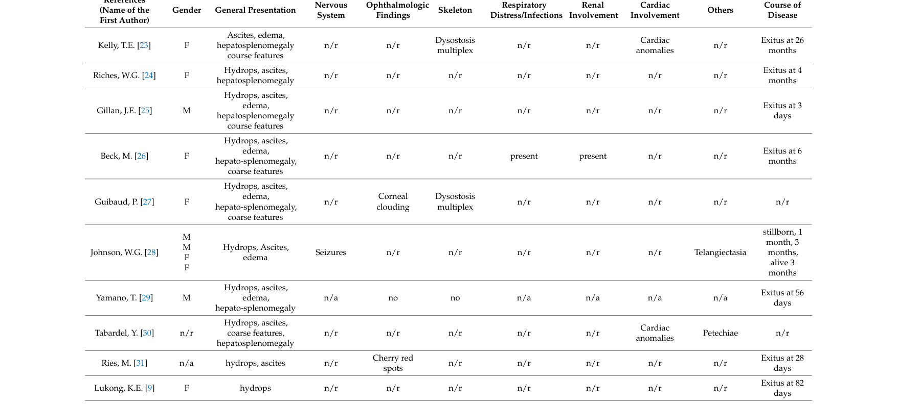

## Question

# Disease Characteristics Research Template

## Target Disease
- **Disease Name:** Congenital Sialidosis Type 2
- **MONDO ID:**  (if available)
- **Category:** Mendelian

## Research Objectives

Please provide a comprehensive research report on **Congenital Sialidosis Type 2** covering all of the
disease characteristics listed below. This report will be used to populate a disease knowledge
base entry. Be thorough and cite primary literature (PMID preferred) for all claims.

For each section, **suggested databases/resources** are listed. These are the first places
you should search for information on each topic.

---

### 1. Disease Information
> **Search first:** OMIM, Orphanet, ICD-10/ICD-11, MeSH, PubMed

- What is the disease? Provide a concise overview.
- What are the key identifiers? (OMIM, Orphanet, ICD-10/ICD-11, MeSH, Mondo)
- What are the common synonyms and alternative names?
- Is the information derived from individual patients (e.g., EHR) or aggregated disease-level resources?

### 2. Etiology

- **Disease Causal Factors**: What are the primary causes? (genetic, environmental, infectious, mechanistic)
- **Risk Factors**:
  > **Search first:** PubMed, Cochrane Library, UpToDate, clinical guidelines, ClinVar, ClinGen, GWAS Catalog, PheGenI, CTD, CDC, WHO, epidemiological databases
  - Genetic risk factors (causal variants, susceptibility loci, modifier genes)
  - Environmental risk factors (toxins, lifestyle, occupational exposures, age, sex, family history)
- **Protective Factors**:
  > **Search first:** PubMed, Cochrane Library, clinical trial databases, GWAS Catalog, gnomAD, WHO, CDC, nutrition databases
  - Genetic protective factors (protective variants, modifier alleles)
  - Environmental protective factors (diet, lifestyle, exposures that reduce risk)
- **Gene-Environment Interactions**: How do genetic and environmental factors interact to influence disease?
  > **Search first:** CTD, PubMed, PheGenI, GxE databases

### 3. Phenotypes
> **Search first:** HPO (Human Phenotype Ontology), OMIM, Orphanet, PubMed, clinicaltrials.gov, MedDRA, SNOMED CT, DECIPHER, LOINC

For each phenotype, provide:
- **Phenotype type**: symptoms, clinical signs, physical manifestations, behavioral changes, or laboratory abnormalities
  > For symptoms/signs: HPO, OMIM, Orphanet, PubMed
  > For behavioral changes: HPO, DSM, RDoC (Research Domain Criteria), PubMed
  > For laboratory abnormalities: LOINC, SNOMED CT, LabTests Online, PubMed
- **Phenotype characteristics**:
  > **Search first:** OMIM, Orphanet, HPO, PubMed
  - Age of symptom onset (neonatal, childhood, adult-onset, late-onset)
  - Symptom severity (mild, moderate, severe, variable)
  - Symptom progression (stable, progressive, episodic, fluctuating)
  - Frequency among affected individuals (percentage or qualitative)
- **Quality of life impact**: Effects on daily functioning and well-being (per-phenotype when possible)
  > **Search first:** EQ-5D database, SF-36, WHO QOL databases, PubMed
- Suggest HPO (Human Phenotype Ontology) terms for each phenotype

### 4. Genetic/Molecular Information

- **Causal Genes**: Gene mutations or chromosomal abnormalities responsible for disease (gene symbols, OMIM IDs)
  > **Search first:** OMIM, ClinVar, HGMD, Ensembl, NCBI Gene
- **Pathogenic Variants**:
  - Affected genes (gene symbols, HGNC IDs)
    > **Search first:** OMIM, NCBI Gene, Ensembl, HGNC, UniProt, GeneCards
  - Variant classification (pathogenic, likely pathogenic, VUS per ACMG/AMP guidelines)
    > **Search first:** ClinVar, ClinGen, ACMG/AMP guidelines, VarSome
  - Variant type/class (missense, frameshift, nonsense, splice-site, structural)
  - Allele frequency in population databases
    > **Search first:** gnomAD, 1000 Genomes, ExAC, TOPMed, dbSNP
  - Somatic vs germline origin
    > **Search first:** COSMIC (somatic), ClinVar, ICGC, TCGA
  - Functional consequences (loss of function, gain of function, dominant negative)
- **Modifier Genes**: Genes that modify disease severity or expression
- **Epigenetic Information**: DNA methylation, histone modifications, chromatin changes affecting disease
  > **Search first:** ENCODE, Roadmap Epigenomics, MethBase, DiseaseMeth
- **Chromosomal Abnormalities**: Large-scale genetic changes (aneuploidy, translocations, inversions)
  > **Search first:** DECIPHER, ClinVar, ECARUCA, UCSC Genome Browser

### 5. Environmental Information

- **Environmental Factors**: Non-genetic contributing factors (toxins, radiation, pollution, occupational exposure)
  > **Search first:** CTD (Comparative Toxicogenomics Database), TOXNET, PubMed, EPA databases
- **Lifestyle Factors**: Behavioral factors (smoking, diet, exercise, alcohol consumption)
  > **Search first:** CDC databases, WHO, PubMed, NHANES
- **Infectious Agents**: If applicable, pathogens causing or triggering disease (bacteria, viruses, fungi, parasites)
  > **Search first:** NCBI Taxonomy, ViPR, BV-BRC, MicrobeDB, GIDEON

### 6. Mechanism / Pathophysiology

- **Molecular Pathways**: Specific signaling cascades or biochemical pathways involved (Wnt, MAPK, mTOR, PI3K-AKT, etc.)
  > **Search first:** KEGG, Reactome, WikiPathways, PathBank, BioCyc
- **Cellular Processes**: Cell-level mechanisms (apoptosis, autophagy, cell cycle dysregulation, inflammation, etc.)
  > **Search first:** Gene Ontology (GO), Reactome, KEGG, PubMed
- **Protein Dysfunction**: How protein structure or function is altered (misfolding, aggregation, loss of function, gain of function)
  > **Search first:** UniProt, PDB (Protein Data Bank), InterPro, Pfam, AlphaFold
- **Metabolic Changes**: Alterations in metabolic processes (energy metabolism, lipid metabolism, amino acid metabolism)
  > **Search first:** KEGG, BioCyc, HMDB (Human Metabolome Database), BRENDA
- **Immune System Involvement**: Role of immune response (autoimmunity, immunodeficiency, chronic inflammation)
  > **Search first:** ImmPort, Immunome Database, IEDB, Gene Ontology
- **Tissue Damage Mechanisms**: How tissues/ are injured (oxidative stress, ischemia, fibrosis, necrosis)
  > **Search first:** PubMed, Gene Ontology, Reactome
- **Biochemical Abnormalities**: Specific molecular defects (enzyme deficiencies, receptor dysfunction, ion channel defects)
  > **Search first:** BRENDA, UniProt, KEGG, OMIM, PubMed
- **Epigenetic Changes**: DNA methylation, histone modifications affecting gene expression in disease
  > **Search first:** ENCODE, Roadmap Epigenomics, MethBase, DiseaseMeth
- **Molecular Profiling** (if available):
  - Transcriptomics/gene expression changes
    > **Search first:** GEO (Gene Expression Omnibus), ArrayExpress, GTEx, Human Cell Atlas, SRA
  - Proteomics findings
    > **Search first:** PRIDE, ProteomeXchange, Human Protein Atlas, STRING, BioGRID
  - Metabolomics signatures
    > **Search first:** MetaboLights, Metabolomics Workbench, HMDB, METLIN
  - Lipidomics alterations
    > **Search first:** LIPID MAPS, SwissLipids, LipidHome, Metabolomics Workbench
  - Genomic structural features
    > **Search first:** UCSC Genome Browser, Ensembl, NCBI, dbVar, DGV
- **Advanced Technologies** (if applicable):
  - Single-cell analysis findings (cell-type specific mechanisms, cellular heterogeneity)
    > **Search first:** Human Cell Atlas, Single Cell Portal, GEO, CELLxGENE
  - Spatial transcriptomics findings
    > **Search first:** GEO, Spatial Research, Vizgen, 10x Genomics data
  - Multi-omics integration results
    > **Search first:** TCGA, ICGC, cBioPortal, LinkedOmics, PubMed
  - Functional genomics screens (CRISPR, RNAi)
    > **Search first:** DepMap, GenomeRNAi, PubMed, BioGRID ORCS

For each mechanism, describe:
- The causal chain from initial trigger to clinical manifestation
- Which mechanisms are upstream vs downstream
- What cell types and biological processes are involved
- Suggest GO terms for biological processes and CL terms for cell types

### 7. Anatomical Structures Affected

- **Organ Level**:
  - Primary organs directly affected
  - Secondary organ involvement (complications, secondary effects)
  - Body systems involved (cardiovascular, nervous, digestive, respiratory, endocrine, etc.)
  > **Search first:** Uberon, FMA (Foundational Model of Anatomy), OMIM, HPO, ICD-11, MeSH, SNOMED CT
- **Tissue and Cell Level**:
  - Specific tissue types affected (epithelial, connective, muscle, nervous)
  - Specific cell populations targeted (with Cell Ontology terms)
  > **Search first:** Uberon, Human Protein Atlas, Cell Ontology, Human Cell Atlas, CellMarker, PanglaoDB
- **Subcellular Level**:
  - Cellular compartments involved (mitochondria, nucleus, ER, lysosomes) (with GO Cellular Component terms)
  > **Search first:** Gene Ontology (Cellular Component), UniProt, Human Protein Atlas
- **Localization**:
  - Specific anatomical sites (with UBERON terms)
    > **Search first:** FMA, Uberon, NeuroNames (for brain), SNOMED CT
  - Lateralization (unilateral, bilateral, asymmetric)
    > **Search first:** HPO, clinical literature, imaging databases

### 8. Temporal Development

- **Onset**:
  - Typical age of onset (congenital, pediatric, adult, geriatric)
  - Onset pattern (acute, subacute, chronic, insidious)
  > **Search first:** OMIM, Orphanet, HPO, PubMed
- **Progression**:
  - Disease stages (early, intermediate, advanced, end-stage)
    > **Search first:** Cancer Staging Manual (AJCC), WHO classifications, PubMed
  - Progression rate (rapid, slow, variable)
  - Disease course pattern (episodic, relapsing-remitting, progressive, stable)
  - Disease duration (self-limited, chronic lifelong)
  > **Search first:** Disease registries, longitudinal cohort databases, natural history studies, PubMed, Orphanet, OMIM
- **Patterns**:
  - Remission patterns (spontaneous, treatment-induced)
    > **Search first:** Clinical trial databases, disease registries, PubMed
  - Critical periods (time windows of vulnerability or opportunity for intervention)
    > **Search first:** PubMed, developmental biology databases, clinical guidelines

### 9. Inheritance and Population

- **Epidemiology**:
  - Prevalence (cases per 100,000 at given time)
  - Incidence (new cases per 100,000 per year)
  > **Search first:** Orphanet, CDC, WHO, GBD (Global Burden of Disease), national registries, SEER, disease registries
- **For Genetic Etiology**:
  - Inheritance pattern (AD, AR, X-linked, mitochondrial, multifactorial, polygenic)
    > **Search first:** OMIM, Orphanet, ClinVar, GTR (Genetic Testing Registry)
  - Penetrance (complete, incomplete, age-dependent)
    > **Search first:** ClinVar, OMIM, PubMed, ClinGen
  - Expressivity (variable, consistent)
    > **Search first:** OMIM, ClinVar, PubMed
  - Genetic anticipation (increasing severity in successive generations)
    > **Search first:** OMIM, PubMed (especially for repeat expansion disorders)
  - Germline mosaicism
    > **Search first:** ClinVar, OMIM, genetic counseling literature, PubMed
  - Founder effects (population-specific mutations)
    > **Search first:** gnomAD, population genetics databases, PubMed
  - Consanguinity role
    > **Search first:** OMIM, population studies, genetic counseling resources
  - Carrier frequency
    > **Search first:** gnomAD, carrier screening databases, GeneReviews, GTR
- **Population Demographics**:
  - Affected populations (ethnic or demographic groups with higher prevalence)
    > **Search first:** gnomAD, 1000 Genomes, PAGE Study, PubMed, population registries
  - Geographic distribution (endemic areas, regional variation)
    > **Search first:** WHO, CDC, GBD, Orphanet, geographic epidemiology databases
  - Geographic distribution of specific variants
  - Sex ratio (male:female)
    > **Search first:** Disease registries, OMIM, PubMed, epidemiological databases
  - Age distribution of affected individuals
    > **Search first:** CDC, disease registries, SEER, Orphanet

### 10. Diagnostics

- **Clinical Tests**:
  - Laboratory tests (blood, urine, tissue chemistry, specific enzyme assays)
    > **Search first:** LOINC, LabTests Online, PubMed
  - Biomarkers (proteins, metabolites, genetic markers, circulating biomarkers)
    > **Search first:** FDA Biomarker List, BEST (Biomarkers, EndpointS, and other Tools), PubMed
  - Imaging studies (X-ray, CT, MRI, PET, ultrasound)
    > **Search first:** RadLex, DICOM, Radiopaedia, imaging databases
  - Functional tests (pulmonary function, cardiac stress tests)
    > **Search first:** LOINC, clinical guidelines, PubMed
  - Electrophysiology (EEG, EMG, ECG, nerve conduction studies)
    > **Search first:** LOINC, clinical neurophysiology databases, PubMed
  - Biopsy findings (histopathology, immunohistochemistry)
    > **Search first:** SNOMED CT, College of American Pathologists resources, PubMed
  - Pathology findings (microscopic examination)
    > **Search first:** SNOMED CT, Digital Pathology databases, PubMed
- **Genetic Testing**:
  > **Search first:** GTR (Genetic Testing Registry), GeneReviews, ClinGen
  - Overview of recommended genetic testing approach
  - Whole genome sequencing (WGS) utility
    > **Search first:** GTR, ClinVar, GEL (Genomics England), gnomAD
  - Whole exome sequencing (WES) utility
    > **Search first:** GTR, ClinVar, OMIM, GeneMatcher
  - Gene panels (which panels, which genes)
    > **Search first:** GTR, ClinVar, laboratory-specific databases
  - Single gene testing
    > **Search first:** GTR, ClinVar, OMIM, GeneReviews
  - Chromosomal microarray (CMA)
    > **Search first:** DECIPHER, ClinVar, dbVar, ECARUCA
  - Karyotyping
    > **Search first:** Chromosome Abnormality Database, ClinVar, cytogenetics resources
  - FISH
    > **Search first:** ClinVar, cytogenetics databases, PubMed
  - Mitochondrial DNA testing
    > **Search first:** MITOMAP, MSeqDR, ClinVar, GTR
  - Repeat expansion testing
    > **Search first:** GTR, ClinVar, repeat expansion databases, PubMed
- **Omics-Based Diagnostics** (if applicable):
  - RNA sequencing / transcriptomics
    > **Search first:** GEO, ArrayExpress, GTEx, RNA-seq databases
  - Proteomics
    > **Search first:** PRIDE, ProteomeXchange, FDA Biomarker database
  - Metabolomics
    > **Search first:** MetaboLights, Metabolomics Workbench, HMDB
  - Epigenomics
    > **Search first:** GEO, ENCODE, Roadmap Epigenomics, MethBase
  - Liquid biopsy
    > **Search first:** COSMIC, ClinVar, liquid biopsy databases, PubMed
- **Clinical Criteria**:
  - Standardized diagnostic criteria (DSM, ICD, society guidelines)
    > **Search first:** DSM-5, ICD-11, clinical society guidelines, UpToDate
  - Differential diagnosis (other conditions to rule out, with distinguishing features)
    > **Search first:** DynaMed, UpToDate, clinical decision support systems
- **Screening**:
  - Screening methods for asymptomatic individuals (newborn screening, carrier screening, cascade screening)
    > **Search first:** ACMG recommendations, CDC newborn screening, GTR

### 11. Outcome/Prognosis

- **Survival and Mortality**:
  - Survival rate (5-year, 10-year, overall)
    > **Search first:** SEER, cancer registries, disease-specific registries, PubMed
  - Life expectancy (with and without treatment if applicable)
    > **Search first:** Orphanet, disease registries, actuarial databases, PubMed
  - Mortality rate
    > **Search first:** CDC, WHO, GBD, national mortality databases
  - Disease-specific mortality (deaths directly attributable to disease)
    > **Search first:** Disease registries, CDC Wonder, GBD, PubMed
- **Morbidity and Function**:
  - Morbidity (disease-related disability and health impacts)
    > **Search first:** GBD, WHO, disability databases, PubMed
  - Disability outcomes (long-term functional impairments)
    > **Search first:** ICF (International Classification of Functioning), disability registries
  - Quality of life measures (EQ-5D, SF-36, PROMIS, disease-specific tools)
    > **Search first:** EQ-5D database, SF-36, PROMIS, PubMed
- **Disease Course**:
  - Complications (secondary problems: infections, organ failure, etc.)
    > **Search first:** ICD codes, disease registries, clinical databases, PubMed
  - Recovery potential (likelihood and extent of recovery, with vs without treatment)
    > **Search first:** Natural history studies, rehabilitation databases, PubMed
- **Prediction**:
  - Prognostic factors (age, disease severity, biomarkers, treatment response)
    > **Search first:** Prognostic models databases, clinical calculators, PubMed
  - Prognostic biomarkers (molecular markers predicting disease course)
    > **Search first:** FDA Biomarker database, PubMed, cancer prognostic databases

### 12. Treatment

- **Pharmacotherapy**:
  - Pharmacological treatments (drug names, drug classes, mechanisms of action)
    > **Search first:** DrugBank, RxNorm, ATC classification, DailyMed, FDA databases
  - Pharmacogenomics (how genetic variants affect drug metabolism, efficacy, toxicity)
    > **Search first:** PharmGKB, CPIC (Clinical Pharmacogenetics), FDA Table of PGx Biomarkers
- **Advanced Therapeutics**:
  - Gene therapy (viral vectors, CRISPR, gene replacement, gene editing)
    > **Search first:** ClinicalTrials.gov, FDA gene therapy database, ASGCT resources
  - Cell therapy (stem cell transplant, CAR-T, cellular therapeutics)
    > **Search first:** ClinicalTrials.gov, FDA cell therapy database, FACT standards
  - RNA-based therapies (ASOs, siRNA, mRNA therapies)
    > **Search first:** ClinicalTrials.gov, FDA approvals, PubMed
  - Targeted therapies (treatments directed at specific molecular targets)
    > **Search first:** My Cancer Genome, OncoKB, ClinicalTrials.gov, FDA approvals
  - Immunotherapies (checkpoint inhibitors, monoclonal antibodies)
    > **Search first:** Cancer Immunotherapy Database, FDA approvals, ClinicalTrials.gov
- **Surgical and Interventional**:
  - Surgical interventions (types of surgery, timing, outcomes)
    > **Search first:** CPT codes, surgical registries, clinical guidelines, PubMed
- **Supportive and Rehabilitative**:
  - Supportive care (symptom management, pain control, nutrition)
    > **Search first:** Clinical guidelines, Cochrane Library, PubMed
  - Rehabilitation (physical therapy, occupational therapy, speech therapy)
    > **Search first:** Rehabilitation medicine databases, clinical guidelines, PubMed
- **Experimental**:
  - Experimental treatments in clinical trials (with NCT identifiers if available)
    > **Search first:** ClinicalTrials.gov, EU Clinical Trials Register, WHO ICTRP
- **Treatment Outcomes**:
  - Treatment response rates
    > **Search first:** Clinical trial databases, FDA reviews, systematic reviews, PubMed
  - Side effects and adverse events
    > **Search first:** FDA Adverse Event Reporting System (FAERS), MedWatch, PubMed
- **Treatment Strategy**:
  - Treatment algorithms (clinical pathways, decision trees)
    > **Search first:** Clinical practice guidelines, NCCN Guidelines, UpToDate
  - Combination therapies
    > **Search first:** ClinicalTrials.gov, treatment guidelines, PubMed
  - Personalized medicine approaches (genotype-guided treatment)
    > **Search first:** My Cancer Genome, CIViC, PharmGKB, precision medicine databases

For each treatment, suggest MAXO (Medical Action Ontology) terms where applicable.

### 13. Prevention

- **Prevention Levels**:
  - Primary prevention (preventing disease occurrence: vaccination, risk factor modification)
    > **Search first:** CDC, WHO, USPSTF recommendations, Cochrane Library
  - Secondary prevention (early detection and treatment: screening programs, early intervention)
    > **Search first:** USPSTF, CDC screening guidelines, WHO
  - Tertiary prevention (preventing complications in those with disease)
    > **Search first:** Clinical guidelines, disease management protocols, PubMed
- **Immunization**: Vaccine strategies (if applicable)
  > **Search first:** CDC vaccine schedules, WHO immunization, FDA vaccine database
- **Screening and Early Detection**:
  - Screening programs (population-based: newborn screening, cancer screening)
    > **Search first:** CDC screening programs, USPSTF, cancer screening databases
  - Genetic screening (carrier screening, preimplantation genetic diagnosis, prenatal testing)
    > **Search first:** ACMG recommendations, ACOG guidelines, GTR
  - Risk stratification (identifying high-risk individuals for targeted prevention)
    > **Search first:** Risk prediction models, clinical calculators, PubMed
- **Behavioral Interventions**: Lifestyle modifications to reduce risk
  > **Search first:** CDC, WHO, behavioral intervention databases, Cochrane Library
- **Counseling**: Genetic counseling (risk assessment, family planning guidance)
  > **Search first:** NSGC resources, ACMG guidelines, GeneReviews
- **Public Health**:
  - Public health interventions (sanitation, vector control, health education)
    > **Search first:** CDC, WHO, public health databases, PubMed
  - Environmental interventions (reducing environmental risk factors)
    > **Search first:** EPA databases, WHO environmental health, PubMed
- **Prophylaxis**: Preventive medications or procedures
  > **Search first:** Clinical guidelines, FDA approvals, PubMed

### 14. Other Species / Natural Disease

- **Taxonomy**: Species affected (with NCBI Taxon identifiers)
  > **Search first:** NCBI Taxonomy
- **Breed**: Specific breeds affected (with VBO identifiers if applicable)
  > **Search first:** VBO (Vertebrate Breed Ontology)
- **Gene**: Orthologous genes in other species (with NCBI Gene IDs)
  > **Search first:** NCBI Gene
- **Natural Disease**:
  - Naturally occurring disease in other species (companion animals, wildlife)
    > **Search first:** OMIA (Online Mendelian Inheritance in Animals), VetCompass, PubMed
  - Veterinary relevance and importance in animal health
    > **Search first:** OMIA, veterinary databases, PubMed
- **Comparative Biology**:
  - Comparative pathology (similarities and differences across species)
    > **Search first:** OMIA, comparative pathology databases, PubMed
  - Evolutionary conservation of disease mechanisms
    > **Search first:** HomoloGene, OrthoMCL, Alliance of Genome Resources
- **Transmission** (if applicable):
  - Zoonotic potential
    > **Search first:** CDC zoonotic diseases, WHO zoonoses, GIDEON
  - Cross-species susceptibility
    > **Search first:** NCBI Taxonomy, veterinary databases, PubMed

### 15. Model Organisms

- **Model Types**:
  - Model organism type (mammalian, invertebrate, cellular, in vitro)
    > **Search first:** Alliance of Genome Resources, model organism databases
  - Specific model systems (mouse, rat, zebrafish, Drosophila, C. elegans, yeast, cell lines, organoids, iPSCs)
    > **Search first:** MGI, RGD, ZFIN, FlyBase, WormBase, SGD, ATCC, Cellosaurus
  - Induced models (drug treatment, surgical intervention, environmental manipulation)
    > **Search first:** MGI, model organism databases, PubMed
- **Genetic Models**:
  - Types available (knockout, knock-in, transgenic, conditional, humanized)
    > **Search first:** MGI, IMPC, KOMP, EuMMCR, IMSR
- **Model Characteristics**:
  - Phenotype recapitulation (how well model reproduces human disease features)
    > **Search first:** Model organism databases, comparative studies, PubMed
  - Model limitations (aspects of human disease not captured)
    > **Search first:** Model organism databases, PubMed, review articles
- **Applications**:
  - Research applications (what aspects of disease can be studied)
    > **Search first:** Model organism databases, PubMed
- **Resources**:
  - Model databases
    > **Search first:** MGI, RGD, ZFIN, FlyBase, WormBase, IMSR, EMMA, MMRRC

---

## Citation Requirements

- Cite primary literature (PMID preferred) for all mechanistic and clinical claims
- Prioritize recent reviews and landmark papers
- Include direct quotes from abstracts where possible to support key statements
- Distinguish evidence source types: human clinical, model organism, in vitro, computational

## Output Format

Structure your response as a comprehensive narrative organized by the sections above.
For each section, provide:
- Factual content with specific details (numbers, percentages, gene names, variant nomenclature)
- Ontology term suggestions (HPO, GO, CL, UBERON, CHEBI, MAXO, MONDO) where applicable
- Evidence citations with PMIDs
- Direct quotes from abstracts to support key claims
- Clear indication when information is not available or not applicable for this disease

This report will be used to populate a disease knowledge base entry with:
- Pathophysiology descriptions with causal chains
- Gene/protein annotations (HGNC, GO terms)
- Phenotype associations (HP terms) with frequencies
- Cell type involvement (CL terms)
- Anatomical locations (UBERON terms)
- Chemical entities (CHEBI terms)
- Treatment annotations (MAXO terms)
- Evidence items with PMIDs and exact abstract quotes
- Epidemiology, prognosis, diagnostic, and prevention information
- Animal model descriptions with phenotype recapitulation details

## Output

Question: You are an expert researcher providing comprehensive, well-cited information.

Provide detailed information focusing on:
1. Key concepts and definitions with current understanding
2. Recent developments and latest research (prioritize 2023-2024 sources)
3. Current applications and real-world implementations
4. Expert opinions and analysis from authoritative sources
5. Relevant statistics and data from recent studies

Format as a comprehensive research report with proper citations. Include URLs and publication dates where available.
Always prioritize recent, authoritative sources and provide specific citations for all major claims.

# Disease Characteristics Research Template

## Target Disease
- **Disease Name:** Congenital Sialidosis Type 2
- **MONDO ID:**  (if available)
- **Category:** Mendelian

## Research Objectives

Please provide a comprehensive research report on **Congenital Sialidosis Type 2** covering all of the
disease characteristics listed below. This report will be used to populate a disease knowledge
base entry. Be thorough and cite primary literature (PMID preferred) for all claims.

For each section, **suggested databases/resources** are listed. These are the first places
you should search for information on each topic.

---

### 1. Disease Information
> **Search first:** OMIM, Orphanet, ICD-10/ICD-11, MeSH, PubMed

- What is the disease? Provide a concise overview.
- What are the key identifiers? (OMIM, Orphanet, ICD-10/ICD-11, MeSH, Mondo)
- What are the common synonyms and alternative names?
- Is the information derived from individual patients (e.g., EHR) or aggregated disease-level resources?

### 2. Etiology

- **Disease Causal Factors**: What are the primary causes? (genetic, environmental, infectious, mechanistic)
- **Risk Factors**:
  > **Search first:** PubMed, Cochrane Library, UpToDate, clinical guidelines, ClinVar, ClinGen, GWAS Catalog, PheGenI, CTD, CDC, WHO, epidemiological databases
  - Genetic risk factors (causal variants, susceptibility loci, modifier genes)
  - Environmental risk factors (toxins, lifestyle, occupational exposures, age, sex, family history)
- **Protective Factors**:
  > **Search first:** PubMed, Cochrane Library, clinical trial databases, GWAS Catalog, gnomAD, WHO, CDC, nutrition databases
  - Genetic protective factors (protective variants, modifier alleles)
  - Environmental protective factors (diet, lifestyle, exposures that reduce risk)
- **Gene-Environment Interactions**: How do genetic and environmental factors interact to influence disease?
  > **Search first:** CTD, PubMed, PheGenI, GxE databases

### 3. Phenotypes
> **Search first:** HPO (Human Phenotype Ontology), OMIM, Orphanet, PubMed, clinicaltrials.gov, MedDRA, SNOMED CT, DECIPHER, LOINC

For each phenotype, provide:
- **Phenotype type**: symptoms, clinical signs, physical manifestations, behavioral changes, or laboratory abnormalities
  > For symptoms/signs: HPO, OMIM, Orphanet, PubMed
  > For behavioral changes: HPO, DSM, RDoC (Research Domain Criteria), PubMed
  > For laboratory abnormalities: LOINC, SNOMED CT, LabTests Online, PubMed
- **Phenotype characteristics**:
  > **Search first:** OMIM, Orphanet, HPO, PubMed
  - Age of symptom onset (neonatal, childhood, adult-onset, late-onset)
  - Symptom severity (mild, moderate, severe, variable)
  - Symptom progression (stable, progressive, episodic, fluctuating)
  - Frequency among affected individuals (percentage or qualitative)
- **Quality of life impact**: Effects on daily functioning and well-being (per-phenotype when possible)
  > **Search first:** EQ-5D database, SF-36, WHO QOL databases, PubMed
- Suggest HPO (Human Phenotype Ontology) terms for each phenotype

### 4. Genetic/Molecular Information

- **Causal Genes**: Gene mutations or chromosomal abnormalities responsible for disease (gene symbols, OMIM IDs)
  > **Search first:** OMIM, ClinVar, HGMD, Ensembl, NCBI Gene
- **Pathogenic Variants**:
  - Affected genes (gene symbols, HGNC IDs)
    > **Search first:** OMIM, NCBI Gene, Ensembl, HGNC, UniProt, GeneCards
  - Variant classification (pathogenic, likely pathogenic, VUS per ACMG/AMP guidelines)
    > **Search first:** ClinVar, ClinGen, ACMG/AMP guidelines, VarSome
  - Variant type/class (missense, frameshift, nonsense, splice-site, structural)
  - Allele frequency in population databases
    > **Search first:** gnomAD, 1000 Genomes, ExAC, TOPMed, dbSNP
  - Somatic vs germline origin
    > **Search first:** COSMIC (somatic), ClinVar, ICGC, TCGA
  - Functional consequences (loss of function, gain of function, dominant negative)
- **Modifier Genes**: Genes that modify disease severity or expression
- **Epigenetic Information**: DNA methylation, histone modifications, chromatin changes affecting disease
  > **Search first:** ENCODE, Roadmap Epigenomics, MethBase, DiseaseMeth
- **Chromosomal Abnormalities**: Large-scale genetic changes (aneuploidy, translocations, inversions)
  > **Search first:** DECIPHER, ClinVar, ECARUCA, UCSC Genome Browser

### 5. Environmental Information

- **Environmental Factors**: Non-genetic contributing factors (toxins, radiation, pollution, occupational exposure)
  > **Search first:** CTD (Comparative Toxicogenomics Database), TOXNET, PubMed, EPA databases
- **Lifestyle Factors**: Behavioral factors (smoking, diet, exercise, alcohol consumption)
  > **Search first:** CDC databases, WHO, PubMed, NHANES
- **Infectious Agents**: If applicable, pathogens causing or triggering disease (bacteria, viruses, fungi, parasites)
  > **Search first:** NCBI Taxonomy, ViPR, BV-BRC, MicrobeDB, GIDEON

### 6. Mechanism / Pathophysiology

- **Molecular Pathways**: Specific signaling cascades or biochemical pathways involved (Wnt, MAPK, mTOR, PI3K-AKT, etc.)
  > **Search first:** KEGG, Reactome, WikiPathways, PathBank, BioCyc
- **Cellular Processes**: Cell-level mechanisms (apoptosis, autophagy, cell cycle dysregulation, inflammation, etc.)
  > **Search first:** Gene Ontology (GO), Reactome, KEGG, PubMed
- **Protein Dysfunction**: How protein structure or function is altered (misfolding, aggregation, loss of function, gain of function)
  > **Search first:** UniProt, PDB (Protein Data Bank), InterPro, Pfam, AlphaFold
- **Metabolic Changes**: Alterations in metabolic processes (energy metabolism, lipid metabolism, amino acid metabolism)
  > **Search first:** KEGG, BioCyc, HMDB (Human Metabolome Database), BRENDA
- **Immune System Involvement**: Role of immune response (autoimmunity, immunodeficiency, chronic inflammation)
  > **Search first:** ImmPort, Immunome Database, IEDB, Gene Ontology
- **Tissue Damage Mechanisms**: How tissues/ are injured (oxidative stress, ischemia, fibrosis, necrosis)
  > **Search first:** PubMed, Gene Ontology, Reactome
- **Biochemical Abnormalities**: Specific molecular defects (enzyme deficiencies, receptor dysfunction, ion channel defects)
  > **Search first:** BRENDA, UniProt, KEGG, OMIM, PubMed
- **Epigenetic Changes**: DNA methylation, histone modifications affecting gene expression in disease
  > **Search first:** ENCODE, Roadmap Epigenomics, MethBase, DiseaseMeth
- **Molecular Profiling** (if available):
  - Transcriptomics/gene expression changes
    > **Search first:** GEO (Gene Expression Omnibus), ArrayExpress, GTEx, Human Cell Atlas, SRA
  - Proteomics findings
    > **Search first:** PRIDE, ProteomeXchange, Human Protein Atlas, STRING, BioGRID
  - Metabolomics signatures
    > **Search first:** MetaboLights, Metabolomics Workbench, HMDB, METLIN
  - Lipidomics alterations
    > **Search first:** LIPID MAPS, SwissLipids, LipidHome, Metabolomics Workbench
  - Genomic structural features
    > **Search first:** UCSC Genome Browser, Ensembl, NCBI, dbVar, DGV
- **Advanced Technologies** (if applicable):
  - Single-cell analysis findings (cell-type specific mechanisms, cellular heterogeneity)
    > **Search first:** Human Cell Atlas, Single Cell Portal, GEO, CELLxGENE
  - Spatial transcriptomics findings
    > **Search first:** GEO, Spatial Research, Vizgen, 10x Genomics data
  - Multi-omics integration results
    > **Search first:** TCGA, ICGC, cBioPortal, LinkedOmics, PubMed
  - Functional genomics screens (CRISPR, RNAi)
    > **Search first:** DepMap, GenomeRNAi, PubMed, BioGRID ORCS

For each mechanism, describe:
- The causal chain from initial trigger to clinical manifestation
- Which mechanisms are upstream vs downstream
- What cell types and biological processes are involved
- Suggest GO terms for biological processes and CL terms for cell types

### 7. Anatomical Structures Affected

- **Organ Level**:
  - Primary organs directly affected
  - Secondary organ involvement (complications, secondary effects)
  - Body systems involved (cardiovascular, nervous, digestive, respiratory, endocrine, etc.)
  > **Search first:** Uberon, FMA (Foundational Model of Anatomy), OMIM, HPO, ICD-11, MeSH, SNOMED CT
- **Tissue and Cell Level**:
  - Specific tissue types affected (epithelial, connective, muscle, nervous)
  - Specific cell populations targeted (with Cell Ontology terms)
  > **Search first:** Uberon, Human Protein Atlas, Cell Ontology, Human Cell Atlas, CellMarker, PanglaoDB
- **Subcellular Level**:
  - Cellular compartments involved (mitochondria, nucleus, ER, lysosomes) (with GO Cellular Component terms)
  > **Search first:** Gene Ontology (Cellular Component), UniProt, Human Protein Atlas
- **Localization**:
  - Specific anatomical sites (with UBERON terms)
    > **Search first:** FMA, Uberon, NeuroNames (for brain), SNOMED CT
  - Lateralization (unilateral, bilateral, asymmetric)
    > **Search first:** HPO, clinical literature, imaging databases

### 8. Temporal Development

- **Onset**:
  - Typical age of onset (congenital, pediatric, adult, geriatric)
  - Onset pattern (acute, subacute, chronic, insidious)
  > **Search first:** OMIM, Orphanet, HPO, PubMed
- **Progression**:
  - Disease stages (early, intermediate, advanced, end-stage)
    > **Search first:** Cancer Staging Manual (AJCC), WHO classifications, PubMed
  - Progression rate (rapid, slow, variable)
  - Disease course pattern (episodic, relapsing-remitting, progressive, stable)
  - Disease duration (self-limited, chronic lifelong)
  > **Search first:** Disease registries, longitudinal cohort databases, natural history studies, PubMed, Orphanet, OMIM
- **Patterns**:
  - Remission patterns (spontaneous, treatment-induced)
    > **Search first:** Clinical trial databases, disease registries, PubMed
  - Critical periods (time windows of vulnerability or opportunity for intervention)
    > **Search first:** PubMed, developmental biology databases, clinical guidelines

### 9. Inheritance and Population

- **Epidemiology**:
  - Prevalence (cases per 100,000 at given time)
  - Incidence (new cases per 100,000 per year)
  > **Search first:** Orphanet, CDC, WHO, GBD (Global Burden of Disease), national registries, SEER, disease registries
- **For Genetic Etiology**:
  - Inheritance pattern (AD, AR, X-linked, mitochondrial, multifactorial, polygenic)
    > **Search first:** OMIM, Orphanet, ClinVar, GTR (Genetic Testing Registry)
  - Penetrance (complete, incomplete, age-dependent)
    > **Search first:** ClinVar, OMIM, PubMed, ClinGen
  - Expressivity (variable, consistent)
    > **Search first:** OMIM, ClinVar, PubMed
  - Genetic anticipation (increasing severity in successive generations)
    > **Search first:** OMIM, PubMed (especially for repeat expansion disorders)
  - Germline mosaicism
    > **Search first:** ClinVar, OMIM, genetic counseling literature, PubMed
  - Founder effects (population-specific mutations)
    > **Search first:** gnomAD, population genetics databases, PubMed
  - Consanguinity role
    > **Search first:** OMIM, population studies, genetic counseling resources
  - Carrier frequency
    > **Search first:** gnomAD, carrier screening databases, GeneReviews, GTR
- **Population Demographics**:
  - Affected populations (ethnic or demographic groups with higher prevalence)
    > **Search first:** gnomAD, 1000 Genomes, PAGE Study, PubMed, population registries
  - Geographic distribution (endemic areas, regional variation)
    > **Search first:** WHO, CDC, GBD, Orphanet, geographic epidemiology databases
  - Geographic distribution of specific variants
  - Sex ratio (male:female)
    > **Search first:** Disease registries, OMIM, PubMed, epidemiological databases
  - Age distribution of affected individuals
    > **Search first:** CDC, disease registries, SEER, Orphanet

### 10. Diagnostics

- **Clinical Tests**:
  - Laboratory tests (blood, urine, tissue chemistry, specific enzyme assays)
    > **Search first:** LOINC, LabTests Online, PubMed
  - Biomarkers (proteins, metabolites, genetic markers, circulating biomarkers)
    > **Search first:** FDA Biomarker List, BEST (Biomarkers, EndpointS, and other Tools), PubMed
  - Imaging studies (X-ray, CT, MRI, PET, ultrasound)
    > **Search first:** RadLex, DICOM, Radiopaedia, imaging databases
  - Functional tests (pulmonary function, cardiac stress tests)
    > **Search first:** LOINC, clinical guidelines, PubMed
  - Electrophysiology (EEG, EMG, ECG, nerve conduction studies)
    > **Search first:** LOINC, clinical neurophysiology databases, PubMed
  - Biopsy findings (histopathology, immunohistochemistry)
    > **Search first:** SNOMED CT, College of American Pathologists resources, PubMed
  - Pathology findings (microscopic examination)
    > **Search first:** SNOMED CT, Digital Pathology databases, PubMed
- **Genetic Testing**:
  > **Search first:** GTR (Genetic Testing Registry), GeneReviews, ClinGen
  - Overview of recommended genetic testing approach
  - Whole genome sequencing (WGS) utility
    > **Search first:** GTR, ClinVar, GEL (Genomics England), gnomAD
  - Whole exome sequencing (WES) utility
    > **Search first:** GTR, ClinVar, OMIM, GeneMatcher
  - Gene panels (which panels, which genes)
    > **Search first:** GTR, ClinVar, laboratory-specific databases
  - Single gene testing
    > **Search first:** GTR, ClinVar, OMIM, GeneReviews
  - Chromosomal microarray (CMA)
    > **Search first:** DECIPHER, ClinVar, dbVar, ECARUCA
  - Karyotyping
    > **Search first:** Chromosome Abnormality Database, ClinVar, cytogenetics resources
  - FISH
    > **Search first:** ClinVar, cytogenetics databases, PubMed
  - Mitochondrial DNA testing
    > **Search first:** MITOMAP, MSeqDR, ClinVar, GTR
  - Repeat expansion testing
    > **Search first:** GTR, ClinVar, repeat expansion databases, PubMed
- **Omics-Based Diagnostics** (if applicable):
  - RNA sequencing / transcriptomics
    > **Search first:** GEO, ArrayExpress, GTEx, RNA-seq databases
  - Proteomics
    > **Search first:** PRIDE, ProteomeXchange, FDA Biomarker database
  - Metabolomics
    > **Search first:** MetaboLights, Metabolomics Workbench, HMDB
  - Epigenomics
    > **Search first:** GEO, ENCODE, Roadmap Epigenomics, MethBase
  - Liquid biopsy
    > **Search first:** COSMIC, ClinVar, liquid biopsy databases, PubMed
- **Clinical Criteria**:
  - Standardized diagnostic criteria (DSM, ICD, society guidelines)
    > **Search first:** DSM-5, ICD-11, clinical society guidelines, UpToDate
  - Differential diagnosis (other conditions to rule out, with distinguishing features)
    > **Search first:** DynaMed, UpToDate, clinical decision support systems
- **Screening**:
  - Screening methods for asymptomatic individuals (newborn screening, carrier screening, cascade screening)
    > **Search first:** ACMG recommendations, CDC newborn screening, GTR

### 11. Outcome/Prognosis

- **Survival and Mortality**:
  - Survival rate (5-year, 10-year, overall)
    > **Search first:** SEER, cancer registries, disease-specific registries, PubMed
  - Life expectancy (with and without treatment if applicable)
    > **Search first:** Orphanet, disease registries, actuarial databases, PubMed
  - Mortality rate
    > **Search first:** CDC, WHO, GBD, national mortality databases
  - Disease-specific mortality (deaths directly attributable to disease)
    > **Search first:** Disease registries, CDC Wonder, GBD, PubMed
- **Morbidity and Function**:
  - Morbidity (disease-related disability and health impacts)
    > **Search first:** GBD, WHO, disability databases, PubMed
  - Disability outcomes (long-term functional impairments)
    > **Search first:** ICF (International Classification of Functioning), disability registries
  - Quality of life measures (EQ-5D, SF-36, PROMIS, disease-specific tools)
    > **Search first:** EQ-5D database, SF-36, PROMIS, PubMed
- **Disease Course**:
  - Complications (secondary problems: infections, organ failure, etc.)
    > **Search first:** ICD codes, disease registries, clinical databases, PubMed
  - Recovery potential (likelihood and extent of recovery, with vs without treatment)
    > **Search first:** Natural history studies, rehabilitation databases, PubMed
- **Prediction**:
  - Prognostic factors (age, disease severity, biomarkers, treatment response)
    > **Search first:** Prognostic models databases, clinical calculators, PubMed
  - Prognostic biomarkers (molecular markers predicting disease course)
    > **Search first:** FDA Biomarker database, PubMed, cancer prognostic databases

### 12. Treatment

- **Pharmacotherapy**:
  - Pharmacological treatments (drug names, drug classes, mechanisms of action)
    > **Search first:** DrugBank, RxNorm, ATC classification, DailyMed, FDA databases
  - Pharmacogenomics (how genetic variants affect drug metabolism, efficacy, toxicity)
    > **Search first:** PharmGKB, CPIC (Clinical Pharmacogenetics), FDA Table of PGx Biomarkers
- **Advanced Therapeutics**:
  - Gene therapy (viral vectors, CRISPR, gene replacement, gene editing)
    > **Search first:** ClinicalTrials.gov, FDA gene therapy database, ASGCT resources
  - Cell therapy (stem cell transplant, CAR-T, cellular therapeutics)
    > **Search first:** ClinicalTrials.gov, FDA cell therapy database, FACT standards
  - RNA-based therapies (ASOs, siRNA, mRNA therapies)
    > **Search first:** ClinicalTrials.gov, FDA approvals, PubMed
  - Targeted therapies (treatments directed at specific molecular targets)
    > **Search first:** My Cancer Genome, OncoKB, ClinicalTrials.gov, FDA approvals
  - Immunotherapies (checkpoint inhibitors, monoclonal antibodies)
    > **Search first:** Cancer Immunotherapy Database, FDA approvals, ClinicalTrials.gov
- **Surgical and Interventional**:
  - Surgical interventions (types of surgery, timing, outcomes)
    > **Search first:** CPT codes, surgical registries, clinical guidelines, PubMed
- **Supportive and Rehabilitative**:
  - Supportive care (symptom management, pain control, nutrition)
    > **Search first:** Clinical guidelines, Cochrane Library, PubMed
  - Rehabilitation (physical therapy, occupational therapy, speech therapy)
    > **Search first:** Rehabilitation medicine databases, clinical guidelines, PubMed
- **Experimental**:
  - Experimental treatments in clinical trials (with NCT identifiers if available)
    > **Search first:** ClinicalTrials.gov, EU Clinical Trials Register, WHO ICTRP
- **Treatment Outcomes**:
  - Treatment response rates
    > **Search first:** Clinical trial databases, FDA reviews, systematic reviews, PubMed
  - Side effects and adverse events
    > **Search first:** FDA Adverse Event Reporting System (FAERS), MedWatch, PubMed
- **Treatment Strategy**:
  - Treatment algorithms (clinical pathways, decision trees)
    > **Search first:** Clinical practice guidelines, NCCN Guidelines, UpToDate
  - Combination therapies
    > **Search first:** ClinicalTrials.gov, treatment guidelines, PubMed
  - Personalized medicine approaches (genotype-guided treatment)
    > **Search first:** My Cancer Genome, CIViC, PharmGKB, precision medicine databases

For each treatment, suggest MAXO (Medical Action Ontology) terms where applicable.

### 13. Prevention

- **Prevention Levels**:
  - Primary prevention (preventing disease occurrence: vaccination, risk factor modification)
    > **Search first:** CDC, WHO, USPSTF recommendations, Cochrane Library
  - Secondary prevention (early detection and treatment: screening programs, early intervention)
    > **Search first:** USPSTF, CDC screening guidelines, WHO
  - Tertiary prevention (preventing complications in those with disease)
    > **Search first:** Clinical guidelines, disease management protocols, PubMed
- **Immunization**: Vaccine strategies (if applicable)
  > **Search first:** CDC vaccine schedules, WHO immunization, FDA vaccine database
- **Screening and Early Detection**:
  - Screening programs (population-based: newborn screening, cancer screening)
    > **Search first:** CDC screening programs, USPSTF, cancer screening databases
  - Genetic screening (carrier screening, preimplantation genetic diagnosis, prenatal testing)
    > **Search first:** ACMG recommendations, ACOG guidelines, GTR
  - Risk stratification (identifying high-risk individuals for targeted prevention)
    > **Search first:** Risk prediction models, clinical calculators, PubMed
- **Behavioral Interventions**: Lifestyle modifications to reduce risk
  > **Search first:** CDC, WHO, behavioral intervention databases, Cochrane Library
- **Counseling**: Genetic counseling (risk assessment, family planning guidance)
  > **Search first:** NSGC resources, ACMG guidelines, GeneReviews
- **Public Health**:
  - Public health interventions (sanitation, vector control, health education)
    > **Search first:** CDC, WHO, public health databases, PubMed
  - Environmental interventions (reducing environmental risk factors)
    > **Search first:** EPA databases, WHO environmental health, PubMed
- **Prophylaxis**: Preventive medications or procedures
  > **Search first:** Clinical guidelines, FDA approvals, PubMed

### 14. Other Species / Natural Disease

- **Taxonomy**: Species affected (with NCBI Taxon identifiers)
  > **Search first:** NCBI Taxonomy
- **Breed**: Specific breeds affected (with VBO identifiers if applicable)
  > **Search first:** VBO (Vertebrate Breed Ontology)
- **Gene**: Orthologous genes in other species (with NCBI Gene IDs)
  > **Search first:** NCBI Gene
- **Natural Disease**:
  - Naturally occurring disease in other species (companion animals, wildlife)
    > **Search first:** OMIA (Online Mendelian Inheritance in Animals), VetCompass, PubMed
  - Veterinary relevance and importance in animal health
    > **Search first:** OMIA, veterinary databases, PubMed
- **Comparative Biology**:
  - Comparative pathology (similarities and differences across species)
    > **Search first:** OMIA, comparative pathology databases, PubMed
  - Evolutionary conservation of disease mechanisms
    > **Search first:** HomoloGene, OrthoMCL, Alliance of Genome Resources
- **Transmission** (if applicable):
  - Zoonotic potential
    > **Search first:** CDC zoonotic diseases, WHO zoonoses, GIDEON
  - Cross-species susceptibility
    > **Search first:** NCBI Taxonomy, veterinary databases, PubMed

### 15. Model Organisms

- **Model Types**:
  - Model organism type (mammalian, invertebrate, cellular, in vitro)
    > **Search first:** Alliance of Genome Resources, model organism databases
  - Specific model systems (mouse, rat, zebrafish, Drosophila, C. elegans, yeast, cell lines, organoids, iPSCs)
    > **Search first:** MGI, RGD, ZFIN, FlyBase, WormBase, SGD, ATCC, Cellosaurus
  - Induced models (drug treatment, surgical intervention, environmental manipulation)
    > **Search first:** MGI, model organism databases, PubMed
- **Genetic Models**:
  - Types available (knockout, knock-in, transgenic, conditional, humanized)
    > **Search first:** MGI, IMPC, KOMP, EuMMCR, IMSR
- **Model Characteristics**:
  - Phenotype recapitulation (how well model reproduces human disease features)
    > **Search first:** Model organism databases, comparative studies, PubMed
  - Model limitations (aspects of human disease not captured)
    > **Search first:** Model organism databases, PubMed, review articles
- **Applications**:
  - Research applications (what aspects of disease can be studied)
    > **Search first:** Model organism databases, PubMed
- **Resources**:
  - Model databases
    > **Search first:** MGI, RGD, ZFIN, FlyBase, WormBase, IMSR, EMMA, MMRRC

---

## Citation Requirements

- Cite primary literature (PMID preferred) for all mechanistic and clinical claims
- Prioritize recent reviews and landmark papers
- Include direct quotes from abstracts where possible to support key statements
- Distinguish evidence source types: human clinical, model organism, in vitro, computational

## Output Format

Structure your response as a comprehensive narrative organized by the sections above.
For each section, provide:
- Factual content with specific details (numbers, percentages, gene names, variant nomenclature)
- Ontology term suggestions (HPO, GO, CL, UBERON, CHEBI, MAXO, MONDO) where applicable
- Evidence citations with PMIDs
- Direct quotes from abstracts to support key claims
- Clear indication when information is not available or not applicable for this disease

This report will be used to populate a disease knowledge base entry with:
- Pathophysiology descriptions with causal chains
- Gene/protein annotations (HGNC, GO terms)
- Phenotype associations (HP terms) with frequencies
- Cell type involvement (CL terms)
- Anatomical locations (UBERON terms)
- Chemical entities (CHEBI terms)
- Treatment annotations (MAXO terms)
- Evidence items with PMIDs and exact abstract quotes
- Epidemiology, prognosis, diagnostic, and prevention information
- Animal model descriptions with phenotype recapitulation details

# Congenital Sialidosis Type II (Hydropic/Congenital Severe Sialidosis): Comprehensive Disease Characteristics Report

## Executive summary
Congenital sialidosis type II is the most severe prenatal-onset end of the NEU1-related lysosomal storage disorder spectrum (“sialidosis”), typically presenting in utero or at birth with nonimmune hydrops fetalis, ascites, and generalized edema and often resulting in stillbirth or death shortly after birth. It is caused by biallelic loss-of-function variants in **NEU1** (autosomal recessive inheritance) leading to near-complete deficiency of lysosomal neuraminidase-1 (sialidase) activity and subsequent lysosomal accumulation and urinary excretion of sialylated oligosaccharides and glycopeptides (“sialyl-oligosacchariduria”). Recent 2023–2024 studies emphasize additional downstream mechanisms beyond “storage,” including dysregulated **lysosomal exocytosis** (via LAMP1 hypersialylation) and organ-specific consequences such as kidney disease (“nephrosialidosis”) linked to hypersialylation-dependent **megalin** trafficking defects. (khan2018sialidosisareview pages 3-5, vlekkert2024aavmediatedgenetherapy pages 1-5, kho2023severekidneydysfunction pages 1-2)

---

## 1. Disease information
### 1.1 Definition and overview
**Sialidosis (mucolipidosis I)** is an ultra-rare, autosomal recessive lysosomal storage disease caused by deficiency of lysosomal neuraminidase-1 (NEU1), leading to accumulation and excretion of sialylated metabolites. Clinical severity ranges from type I (attenuated) to type II (severe neuropathic). Type II is further subdivided into **congenital/hydropic**, infantile, and juvenile forms based on age at onset. (khan2018sialidosisareview pages 3-5, vlekkert2024aavmediatedgenetherapy pages 1-5, khan2018sialidosisareview pages 1-3)

The congenital/hydropic subtype is described as the severe prenatal form: “**It manifests itself prenatally and is characterized by ascites and hydrops fetalis, hepatomegaly and stillbirths or death at a very early age**.” (khan2018sialidosisareview pages 3-5)

### 1.2 Key identifiers
| Identifier system | ID | Preferred name | Synonyms / notes | Source URL | Publication date |
|---|---|---|---|---|---|
| MONDO | MONDO_0009738 | sialidosis type 2 | Disease entity for severe early-onset NEU1-related sialidosis; congenital/hydropic, infantile, and juvenile forms are subtypes/clinical subdivisions of type II (OpenTargets Search: Sialidosis, khan2018sialidosisareview pages 3-5, vlekkert2024aavmediatedgenetherapy pages 1-5) | https://platform.opentargets.org/disease/MONDO_0009738 | — |
| Orphanet | Orphanet_87876 | sialidosis type II | Orphanet disease entry corresponding to type II sialidosis; congenital (hydropic) form is the prenatal/neonatal severe subtype (OpenTargets Search: Sialidosis, khan2018sialidosisareview pages 3-5) | https://www.orpha.net/consor/cgi-bin/OC_Exp.php?Lng=EN&Expert=87876 | — |
| OMIM / MIM | 256550 | Sialidosis | Core inherited disorder caused by NEU1 deficiency; type II includes congenital/hydropic subtype; review explicitly cites “Sialidosis (MIM #256550)” (khan2018sialidosisareview pages 3-5, khan2018sialidosisareview pages 1-3) | https://omim.org/entry/256550 | 2018 (review citing MIM) |
| MeSH | Not clearly established for congenital type II as a distinct MeSH term | Sialidosis / Mucolipidosis I (broader indexing may vary) | Literature commonly indexes the broader disorder rather than a separate congenital type II term; use disease-level MeSH with subtype noted in free text (khan2018sialidosisareview pages 1-3, peng2025geneticinsightsand pages 1-2) | https://meshb.nlm.nih.gov/ | — |
| ICD-10 | No specific code identified for congenital type II | Sialidosis type II, congenital (hydropic) subtype | Usually classified under broader lysosomal storage/metabolic disorder categories rather than a unique congenital-type-specific ICD-10 code; verify locally in coding system implementation (khan2018sialidosisareview pages 3-5) | https://icd.who.int/browse10/2019/en | — |
| ICD-11 | No specific code confirmed from retrieved evidence | Sialidosis type II, congenital (hydropic) subtype | Retrieved evidence supports nomenclature but not a distinct ICD-11 identifier for the congenital subtype; map to broader sialidosis entry if needed after terminology validation (khan2018sialidosisareview pages 3-5, vlekkert2024aavmediatedgenetherapy pages 1-5) | https://icd.who.int/ | — |
| Clinical subtype designation | — | congenital sialidosis type II | Also called congenital or hydropic subtype; manifests prenatally and is characterized by ascites, hydrops fetalis, hepatomegaly, and stillbirth or very early death (khan2018sialidosisareview pages 3-5) | https://doi.org/10.3390/diagnostics8020029 | 2018 |
| Clinical subtype designation | — | sialidosis type II, congenital/hydropic form | Severe neuropathic NEU1-deficiency phenotype within type II; recent preclinical gene-therapy paper uses the same classification framework (vlekkert2024aavmediatedgenetherapy pages 1-5) | https://doi.org/10.1101/2023.11.10.566667 | 2024 |

*Table: This table summarizes the main identifiers and naming conventions for congenital sialidosis type II, linking the congenital/hydropic form to the broader type II disease entity. It is useful for harmonizing OMIM, MONDO, Orphanet, and coding terminology in a disease knowledge base.*

**Notes:** In the retrieved evidence, identifiers are most consistently available at the disease-entity level (sialidosis; sialidosis type II) rather than as a separate MONDO/Orphanet entity specifically for the “congenital/hydropic” subtype. (OpenTargets Search: Sialidosis, khan2018sialidosisareview pages 3-5)

### 1.3 Synonyms and alternative names
Commonly used:
- **Sialidosis type II, congenital/hydropic subtype** (or “congenital sialidosis”) (khan2018sialidosisareview pages 3-5, vlekkert2024aavmediatedgenetherapy pages 1-5)
- **Mucolipidosis I** / **sialidosis** (vlekkert2024aavmediatedgenetherapy pages 1-5)

### 1.4 Source type of disease information
The congenital/hydropic phenotype is primarily derived from **aggregated disease-level resources** (reviews) that compile **individual case reports** and fetal pathology series (e.g., tabulated congenital cases). (khan2018sialidosisareview pages 3-5, khan2018sialidosisareview media 784849f6, khan2018sialidosisareview media 429fda1b, khan2018sialidosisareview media 29bee092)

---

## 2. Etiology
### 2.1 Disease causal factors
**Genetic cause:** biallelic pathogenic variants in **NEU1** encoding lysosomal neuraminidase-1 (sialidase). (khan2018sialidosisareview pages 1-3, peng2025geneticinsightsand pages 1-2)

**Primary mechanistic defect:** deficient NEU1 activity prevents normal lysosomal catabolism of sialylated glycoconjugates, leading to lysosomal accumulation and abnormal excretion of sialylated oligosaccharides/glycopeptides. (vlekkert2024aavmediatedgenetherapy pages 1-5, mosca2020conventionalandunconventional pages 1-3, kho2023severekidneydysfunction pages 1-2)

### 2.2 Risk factors
- **Family history / parental carrier status** for autosomal recessive NEU1 variants. (khan2018sialidosisareview pages 11-13)
- **Consanguinity** and population founder variants are plausible contributors in ultra-rare AR diseases, but explicit consanguinity/founder-effect quantification for congenital type II was not available in retrieved primary sources.

### 2.3 Protective factors
No validated genetic or environmental protective factors specific to congenital sialidosis type II were identified in retrieved sources.

### 2.4 Gene–environment interactions
No established gene–environment interactions specific to congenital sialidosis type II were found in the retrieved evidence.

---

## 3. Phenotypes
### 3.1 Phenotype spectrum and HPO mapping
The congenital/hydropic subtype is characterized by prenatal fluid overload and early lethality; additional findings vary across cases. In a comprehensive review, the distinguishing congenital group features were “**hydrops, ascites, and edema** … followed by **coarse features, dysostosis multiplex, and hepatosplenomegaly**.” (khan2018sialidosisareview pages 3-5)

| Clinical feature | Suggested HPO term(s) | Typical onset | Notes / frequency info if available | Key supporting citations |
|---|---|---|---|---|
| Hydrops fetalis | **Hydrops fetalis** HP:0001789 | Prenatal | Hallmark of the congenital/hydropic subtype; described as a distinguishing feature of the severe congenital group and associated with stillbirth or death shortly after birth | (khan2018sialidosisareview pages 3-5, vlekkert2024aavmediatedgenetherapy pages 1-5, mosca2020conventionalandunconventional pages 1-3, khan2018sialidosisareview media 784849f6, khan2018sialidosisareview media 429fda1b, khan2018sialidosisareview media 29bee092) |
| Ascites / neonatal ascites | **Ascites** HP:0001541; **Fetal ascites** HP:0001791 | Prenatal / neonatal | Prominent in congenital type II; often reported together with hydrops fetalis; may be isolated or refractory congenital ascites in case literature summarized in the review | (khan2018sialidosisareview pages 3-5, vlekkert2024aavmediatedgenetherapy pages 1-5, mosca2020conventionalandunconventional pages 1-3, khan2018sialidosisareview media 784849f6, khan2018sialidosisareview media 429fda1b, khan2018sialidosisareview media 29bee092) |
| Generalized edema / facial edema | **Edema** HP:0000969; **Generalized edema** HP:0007430; **Facial edema** HP:0010669 | Prenatal / neonatal | Review states hydrops, ascites, and edema are distinguishing congenital features; gene-therapy review specifically notes facial edema in acute congenital cases | (khan2018sialidosisareview pages 3-5, vlekkert2024aavmediatedgenetherapy pages 1-5, khan2018sialidosisareview pages 11-13) |
| Hepatomegaly | **Hepatomegaly** HP:0002240 | Prenatal / neonatal / infantile | Included in congenital presentation and severe infantile type II; may be part of broader visceromegaly | (khan2018sialidosisareview pages 3-5, vlekkert2024aavmediatedgenetherapy pages 1-5, mosca2020conventionalandunconventional pages 1-3) |
| Hepatosplenomegaly | **Hepatosplenomegaly** HP:0001433; **Splenomegaly** HP:0001744 | Neonatal / infantile | Common severe type II somatic feature; congenital review notes hepatosplenomegaly among frequent findings after hydrops/ascites/edema | (khan2018sialidosisareview pages 3-5, vlekkert2024aavmediatedgenetherapy pages 1-5, mosca2020conventionalandunconventional pages 1-3, peng2025geneticinsightsand pages 1-2) |
| Coarse facial features | **Coarse facial features** HP:0000280 | Neonatal / infantile | Frequent in infantile/juvenile type II; also noted among congenital cases | (khan2018sialidosisareview pages 3-5, vlekkert2024aavmediatedgenetherapy pages 1-5, mosca2020conventionalandunconventional pages 1-3, peng2025geneticinsightsand pages 1-2) |
| Dysostosis multiplex / skeletal dysplasia | **Dysostosis multiplex** HP:0000943; **Skeletal dysplasia** HP:0002652; **Abnormal vertebral morphology** HP:0000925 | Prenatal / infantile | Congenital review highlights dysostosis multiplex; severe type II also described with skeletal dysplasia and vertebral deformities | (khan2018sialidosisareview pages 3-5, vlekkert2024aavmediatedgenetherapy pages 1-5, mosca2020conventionalandunconventional pages 1-3) |
| Inguinal hernia | **Inguinal hernia** HP:0000023 | Neonatal | Specifically mentioned in acute congenital form; review notes it as an infrequent congenital manifestation | (khan2018sialidosisareview pages 3-5, vlekkert2024aavmediatedgenetherapy pages 1-5) |
| Cherry-red macula / cherry-red spot | **Cherry red spot of the macula** HP:0010729 | Infantile | More typical of infantile/juvenile severe type II than hydropic congenital cases; part of the classic ophthalmic phenotype | (vlekkert2024aavmediatedgenetherapy pages 1-5, peng2025geneticinsightsand pages 1-2, khan2018sialidosisareview pages 11-13) |
| Myoclonus | **Myoclonus** HP:0001336 | Infantile / juvenile | Common neurologic sign in severe type II beyond the congenital lethal presentation; used clinically with seizures for symptomatic management | (vlekkert2024aavmediatedgenetherapy pages 1-5, peng2025geneticinsightsand pages 1-2, khan2018sialidosisareview pages 11-13) |
| Seizures | **Seizure** HP:0001250 | Infantile / juvenile | Mentioned in severe type II spectrum and in supportive-care discussions; often grouped with myoclonus | (vlekkert2024aavmediatedgenetherapy pages 1-5) |
| Hearing loss | **Hearing impairment** HP:0000365 | Infantile / juvenile | Included in severe type II phenotype in the 2024 preclinical gene-therapy introduction; less emphasized for hydropic congenital cases | (vlekkert2024aavmediatedgenetherapy pages 1-5, khan2018sialidosisareview pages 5-7) |
| Cardiomyopathy | **Cardiomyopathy** HP:0001638 | Infantile | Listed among severe type II manifestations in recent review/preclinical summary; uncommon but clinically important | (vlekkert2024aavmediatedgenetherapy pages 1-5) |
| Nephrotic syndrome / nephrosialidosis | **Nephrotic syndrome** HP:0000100; **Proteinuria** HP:0000093 | Infantile / childhood | Subset of type II patients develop nephrosialidosis with abrupt fulminant glomerular nephropathy; renal involvement is infrequent in congenital review but important in severe type II | (kho2023severekidneydysfunction pages 1-2) |
| Developmental delay / severe intellectual disability | **Global developmental delay** HP:0001263; **Intellectual disability, severe** HP:0010864 | Infantile | Severe type II is associated with marked neurodevelopmental impairment/“mental retardation”; often not assessable in lethal prenatal congenital cases | (mosca2020conventionalandunconventional pages 1-3, peng2025geneticinsightsand pages 1-2, khan2018sialidosisareview pages 11-13) |
| Stillbirth / very early death | **Stillbirth** HP:0003826; **Neonatal death** HP:0003811 | Prenatal / neonatal | Congenital hydropic form is often lethal during fetal development or shortly after birth | (khan2018sialidosisareview pages 3-5, vlekkert2024aavmediatedgenetherapy pages 1-5, mosca2020conventionalandunconventional pages 1-3) |

*Table: This table maps the major prenatal, neonatal, and infantile manifestations of congenital/severe sialidosis type II to suggested Human Phenotype Ontology terms. It is designed for knowledge-base curation and highlights which findings are characteristic of the hydropic congenital form versus the broader severe type II spectrum.*

### 3.2 Age of onset, progression, and severity
- **Congenital/hydropic:** prenatal onset; frequently lethal in utero or shortly after birth due to near-complete NEU1 deficiency. (khan2018sialidosisareview pages 3-5)
- **Infantile/juvenile type II:** early-life onset with multisystem disease including coarse facies, skeletal dysplasia/dysostosis multiplex, hepatosplenomegaly, neurodevelopmental impairment, and (in some) renal disease. (vlekkert2024aavmediatedgenetherapy pages 1-5, mosca2020conventionalandunconventional pages 1-3)

### 3.3 Frequency among affected individuals
Formal phenotype frequencies specifically for congenital/hydropic type II were not quantified in the retrieved evidence set. The congenital-case table compiled in the 2018 review provides case-by-case features rather than aggregate percentages. (khan2018sialidosisareview media 784849f6, khan2018sialidosisareview media 429fda1b, khan2018sialidosisareview media 29bee092)

### 3.4 Quality-of-life impact
For congenital/hydropic cases, quality-of-life measures are generally not applicable due to fetal/neonatal lethality. For infantile/juvenile type II survivors, major impacts include severe neurologic disability and multisystem complications; standardized HRQoL instruments (e.g., EQ-5D/SF-36) were not identified in retrieved sources.

---

## 4. Genetic / molecular information
### 4.1 Causal gene(s)
- **NEU1** (neuraminidase 1), lysosomal sialidase. (peng2025geneticinsightsand pages 1-2)

NEU1 catalyzes lysosomal removal of terminal sialic acids; a recent genetics review states NEU1 “**catalyzes the breakdown of sialic acid-containing substances within lysosomes by hydrolyzing terminal sialic acid residues**.” (peng2025geneticinsightsand pages 1-2)

### 4.2 Inheritance
- **Autosomal recessive** (biallelic NEU1 variants). (khan2018sialidosisareview pages 1-3, peng2025geneticinsightsand pages 1-2)

### 4.3 Variant spectrum and genotype–phenotype
- A 2018 review reported “**more than 40 mutations within the NEU1 gene**” known at that time and emphasized genotype–phenotype correlation with residual neuraminidase activity. (khan2018sialidosisareview pages 3-5, khan2018sialidosisareview pages 1-3)
- A 2025 genetics review reported “**Over 90 pathogenic NEU1 variants, predominantly missense mutations**,” and another section noted ClinVar listing **94 probable pathogenic NEU1 variants**. (peng2025geneticinsightsand pages 1-2, peng2025geneticinsightsand pages 4-6)
- Frameshift variants were described as “predominantly linked to type II” in the 2025 review, consistent with more severe loss-of-function. (peng2025geneticinsightsand pages 4-6)

**Example genotype–phenotype detail (recent review):** A reported patient with compound heterozygosity (exon3:c.544A>G and exon5:c.1021+1G>A) had neuraminidase activity “**reduced to 6.4% of normal**,” illustrating residual activity as a severity correlate. (peng2025geneticinsightsand pages 4-6)

### 4.4 NEU1 multienzyme complex and related disorders
NEU1 depends on a lysosomal multienzyme complex including **PPCA/CTSA (protective protein/cathepsin A)** and **β-galactosidase (GLB1)**. In a 2024 preclinical gene-therapy study: “**In mammalian tissues NEU1 is found in a high molecular weight complex with … PPCA … and … β-galactosidase**” and “**Interaction with PPCA is a prerequisite for the proper localization, stability and activation of NEU1. In absence of a functional PPCA, NEU1 is enzymatically silent**.” (vlekkert2024aavmediatedgenetherapy pages 1-5)

This is central to the differential diagnosis with **galactosialidosis (CTSA/PPCA deficiency)** causing secondary NEU1 deficiency. (khan2018sialidosisareview pages 1-3, mosca2020conventionalandunconventional pages 1-3)

### 4.5 Epigenetics / chromosomal abnormalities
No disease-specific epigenetic alterations or recurrent chromosomal abnormalities were identified in the retrieved evidence.

---

## 5. Environmental information
Congenital sialidosis type II is a **monogenic** lysosomal disorder; no consistent environmental/lifestyle/infectious contributors were identified in retrieved sources.

---

## 6. Mechanism / pathophysiology
### 6.1 Core causal chain (current understanding)
**NEU1 loss-of-function → lysosomal failure to desialylate glycoconjugates → storage of sialylated glycoproteins/oligosaccharides and systemic dysfunction.** (vlekkert2024aavmediatedgenetherapy pages 1-5, mosca2020conventionalandunconventional pages 1-3)

A 2024 preprint abstract describes the foundational mechanism: “**Sialidosis is a glycoprotein storage disease caused by deficiency of the lysosomal sialidase NEU1, which leads to pathogenic accumulation of sialylated glycoproteins and oligosaccharides in tissues and body fluids**.” (vlekkert2024aavmediatedgenetherapy pages 1-5)

### 6.2 Dysregulated lysosomal exocytosis (LAMP1 axis)
Beyond storage, NEU1 has been characterized as a negative regulator of lysosomal exocytosis. In Neu1−/− mice, NEU1 deficiency increases LAMP1+ lysosomes docked at the plasma membrane, promoting extracellular release of lysosomal contents, with downstream tissue remodeling and fibrosis. (vlekkert2024aavmediatedgenetherapy pages 1-5, khan2018sialidosisareview pages 1-3)

### 6.3 Kidney involvement (nephrosialidosis) and megalin trafficking
A 2023 JCI Insight study focused on the severe renal presentation in a subset of type II patients (“nephrosialidosis”) and modeled it in Neu1-deficient mice. Its abstract states that mice exhibited “**elevated urinary albumin levels, loss of nephrons, renal fibrosis, presence of storage vacuoles**,” and that glycoprotein sialylation was increased, including megalin; “**Megalin levels were severely reduced, and the protein was directed to lysosomes instead of the apical membrane**,” supporting impaired proximal tubular protein reabsorption as a mechanism for proteinuria. (kho2023severekidneydysfunction pages 1-2)

### 6.4 Suggested pathway/ontology annotations
**GO Biological Process (suggested):**
- Lysosomal catabolic process; glycoprotein catabolic process; lysosomal exocytosis; protein glycosylation/desialylation; endocytosis and receptor-mediated endocytosis; extracellular matrix organization/fibrosis; autophagy (renal findings include autophagy markers in mechanistic work). (vlekkert2024aavmediatedgenetherapy pages 1-5, kho2023severekidneydysfunction pages 9-11, kho2023severekidneydysfunction pages 1-2)

**GO Cellular Component (suggested):**
- Lysosome; plasma membrane; endosome; extracellular space (lysosomal content release); glomerulus-related compartments (renal). (vlekkert2024aavmediatedgenetherapy pages 1-5, kho2023severekidneydysfunction pages 1-2)

**Cell Ontology terms (suggested key cell types):**
- Kidney proximal tubule epithelial cell; podocyte; glomerular endothelial cell; macrophage/microglia (neuroinflammation/microgliosis in models); connective tissue fibroblast/myocyte (fibrosis/atrophy models). (khan2018sialidosisareview pages 5-7, kho2023severekidneydysfunction pages 9-11, vlekkert2024aavmediatedgenetherapy pages 1-5)

---

## 7. Anatomical structures affected
**Organ-level involvement (severe type II spectrum):**
- **Fetal/placental and systemic prenatal involvement** with multiorgan vacuolation in congenital cases (liver, bone marrow, kidney, brain) and placental vacuolation indicating early fetal storage. (khan2018sialidosisareview pages 3-5, khan2018sialidosisareview pages 5-7)
- **Liver/spleen:** hepatomegaly/hepatosplenomegaly. (khan2018sialidosisareview pages 3-5, vlekkert2024aavmediatedgenetherapy pages 1-5)
- **Skeletal system:** dysostosis multiplex/skeletal dysplasia and vertebral deformities. (vlekkert2024aavmediatedgenetherapy pages 1-5, mosca2020conventionalandunconventional pages 1-3)
- **Central nervous system:** severe neuropathology in type II; neurodegeneration mechanisms described in mouse models. (kho2023severekidneydysfunction pages 1-2, vlekkert2024aavmediatedgenetherapy pages 1-5)
- **Kidney:** nephrosialidosis with glomerular nephropathy/nephrotic syndrome subset; megalin-mediated reabsorption defects in models. (kho2023severekidneydysfunction pages 1-2)

**Subcellular localization:** Lysosome (primary); plasma membrane docking/fusion events are emphasized in lysosomal exocytosis model; cell-surface hypersialylation affects trafficking receptors such as megalin. (vlekkert2024aavmediatedgenetherapy pages 1-5, kho2023severekidneydysfunction pages 1-2)

**UBERON suggestions (high-level):** fetal placenta, liver, spleen, kidney glomerulus, bone, brain.

---

## 8. Temporal development
- **Onset:** congenital/hydropic type II begins **prenatally**; infantile severe type II begins **0–12 months**; juvenile **2–20 years** (classification). (khan2018sialidosisareview pages 3-5, vlekkert2024aavmediatedgenetherapy pages 1-5)
- **Progression:** congenital cases are often lethal; Neu1−/− mice show neonatal onset and rapid progression with premature death (4–6 months in a commonly used model), supporting a rapidly progressive systemic-neurodegenerative course. (vlekkert2024aavmediatedgenetherapy pages 1-5)

---

## 9. Inheritance and population
### 9.1 Epidemiology
- A 2020 review reported sialidosis incidence estimates of “**1:250,000 to 1:2,000,000 live births**.” (mosca2020conventionalandunconventional pages 1-3)
- A 2023 mechanistic paper stated prevalence “**less than 1/1,000,000 live births**.” (kho2023severekidneydysfunction pages 1-2)

These values are for sialidosis overall; congenital/hydropic type II is expected to be rarer, but subtype-specific rates were not found in retrieved sources.

### 9.2 Population/variant distribution and phenotype statistics
A 2025 genetics review summarized population differences across sialidosis cohorts (not limited to congenital type II):
- “Asian patients exhibit a lower incidence of impaired cognition (21.7%) … [vs] Caucasian patients (50.0%)” and “the occurrence of cherry-red patches is also lower in Asians (40.7% compared to 61.1% in Caucasians, P = 0.02).” (peng2025geneticinsightsand pages 2-4, peng2025geneticinsightsand pages 4-6)

A Taiwan-associated variant (c.544A>G; p.Ser182Gly) was highlighted as common in Asians and absent in Caucasians in the same review. (peng2025geneticinsightsand pages 4-6)

### 9.3 Penetrance/expressivity
Congenital type II is associated with profound loss of enzyme function and high severity; explicit penetrance estimates were not identified.

---

## 10. Diagnostics
| Diagnostic modality | Sample type | Expected finding in sialidosis type II | Distinguishes from | Notes / pitfalls | Key citations | URL / publication date |
|---|---|---|---|---|---|---|
| Urine oligosaccharide screening by thin-layer chromatography (TLC) | Urine | Abnormal urinary oligosaccharide pattern; increased urinary excretion of sialylated oligosaccharides / glycopeptides is a diagnostic hallmark of NEU1 deficiency | Supports separation from non-oligosaccharidosis causes of hydrops/ascites; helps prioritize sialidosis or galactosialidosis among lysosomal storage diseases | Screening test rather than standalone confirmation; congenital cases may also show oligosaccharides in ascitic fluid in historical reports summarized by review literature | (khan2018sialidosisareview pages 3-5, khan2018sialidosisareview pages 1-3, khan2018sialidosisareview pages 13-14, kho2023severekidneydysfunction pages 1-2) | https://doi.org/10.3390/diagnostics8020029 (2018-04-20); https://doi.org/10.1172/jci.insight.166470 (2023-10-23) |
| Neuraminidase (alpha-N-acetyl neuraminidase / NEU1) enzyme assay | Cultured skin fibroblasts from biopsy (gold standard), also leukocytes in some reports | Deficient lysosomal sialidase activity / neuraminidase deficiency | Confirms primary neuraminidase deficiency and narrows differential within lysosomal storage diseases | Fibroblasts are emphasized as the preferred material for sialidosis/galactosialidosis enzymology; specialized metabolic laboratories are often required | (khan2018sialidosisareview pages 3-5, serrano2024hepatomegalyandsplenomegaly pages 7-8, khan2018sialidosisareview pages 1-3, khan2018sialidosisareview pages 11-13) | https://doi.org/10.3390/diagnostics8020029 (2018-04-20); https://doi.org/10.3390/jcm13051465 (2024-03-01) |
| Paired beta-galactosidase assay with neuraminidase testing | Cultured fibroblasts or other enzymology sample used for lysosomal enzyme workup | Beta-galactosidase activity should be normal in primary sialidosis type II | Galactosialidosis (secondary combined NEU1 and beta-galactosidase deficiency due to CTSA/PPCA defects) | Essential differential step because galactosialidosis can phenocopy sialidosis; PPCA deficiency causes secondary NEU1 deficiency | (khan2018sialidosisareview pages 3-5, khan2018sialidosisareview pages 1-3, mosca2020conventionalandunconventional pages 1-3) | https://doi.org/10.3390/diagnostics8020029 (2018-04-20); https://doi.org/10.3390/jcm9030695 (2020-03-04) |
| Molecular genetic confirmation: targeted NEU1 sequencing | Blood, saliva, buccal swab, or DNA extracted from clinical specimen | Biallelic pathogenic/likely pathogenic NEU1 variants confirming autosomal recessive sialidosis | Distinguishes primary NEU1-related sialidosis from CTSA-related galactosialidosis and from other lysosomal storage disorders with overlapping hydrops/hepatosplenomegaly phenotypes | Definitive diagnosis requires variant interpretation in clinical context; useful for prenatal testing, carrier testing, and family counseling | (khan2018sialidosisareview pages 3-5, khan2018sialidosisareview pages 1-3, khan2018sialidosisareview pages 11-13, peng2025geneticinsightsand pages 1-2) | https://doi.org/10.3390/diagnostics8020029 (2018-04-20); https://doi.org/10.3390/genes16020151 (2025-01) |
| Exome / genome sequencing (WES/WGS) | Blood-derived DNA or family trio DNA | Identification of biallelic NEU1 variants, including novel missense, splice-site, frameshift, or compound-heterozygous variants | Useful when biochemical phenotype overlaps with other lysosomal disorders or when prenatal/neonatal presentations are nonspecific | Particularly valuable in atypical presentations or when single-gene testing is unrevealing; sequencing results may still require biochemical validation | (khan2018sialidosisareview pages 3-5, serrano2024hepatomegalyandsplenomegaly pages 7-8, peng2025geneticinsightsand pages 6-8) | https://doi.org/10.3390/diagnostics8020029 (2018-04-20); https://doi.org/10.3390/jcm13051465 (2024-03-01); https://doi.org/10.3390/genes16020151 (2025-01) |
| Prenatal / family-based molecular diagnosis | Fetal DNA, parental DNA, or prenatal specimen in at-risk pregnancies | Detection of familial NEU1 pathogenic variants before birth | Helps distinguish congenital hydropic sialidosis from other genetic causes of nonimmune hydrops fetalis | Particularly relevant because congenital type II may be lethal in utero or shortly after birth; enables recurrence-risk counseling | (khan2018sialidosisareview pages 11-13, khan2018sialidosisareview pages 13-14) | https://doi.org/10.3390/diagnostics8020029 (2018-04-20) |
| Peripheral blood smear / bone marrow smear | Peripheral blood or bone marrow | Storage granules in lymphocytes may be present | Supports lysosomal storage disease rather than isolated renal/hepatic disease | Ancillary, not disease-specific; should not replace enzyme or molecular confirmation | (khan2018sialidosisareview pages 3-5) | https://doi.org/10.3390/diagnostics8020029 (2018-04-20) |
| Integrated LSD second-line workup | Plasma, leukocytes, fibroblasts, urine, DNA | Combination of low neuraminidase activity, abnormal urine oligosaccharides, and biallelic NEU1 variants | Helps distinguish from mucolipidoses, multiple sulfatase deficiency, and other hepatosplenomegaly-associated LSDs | Serrano 2024 recommends molecular testing accompanied by enzymatic testing when feasible; biopsy should generally be last resort | (serrano2024hepatomegalyandsplenomegaly pages 7-8, serrano2024hepatomegalyandsplenomegaly pages 2-3) | https://doi.org/10.3390/jcm13051465 (2024-03-01) |
| Interpretation safeguard for VUS / pseudodeficiency | DNA plus matched biochemical testing | Variants of uncertain significance should be corroborated by enzymology and/or biomarkers; pseudodeficiency may show low in vitro activity without true disease | Prevents overcalling sialidosis when lab abnormalities are non-pathogenic or inconclusive | Important pitfall from LSD diagnostics: VUS often need targeted biochemical confirmation; specialized labs improve interpretation | (lange2024systematicdiagnosisof pages 4-6, serrano2024hepatomegalyandsplenomegaly pages 7-8) | https://doi.org/10.51847/isa3beaurx (2024-01); https://doi.org/10.3390/jcm13051465 (2024-03-01) |

*Table: This table summarizes the core diagnostic workflow and major differential-diagnostic issues for congenital sialidosis type II. It highlights the complementary roles of urine oligosaccharide screening, fibroblast neuraminidase assays, beta-galactosidase testing, and molecular confirmation, including key pitfalls such as VUS interpretation and pseudodeficiency.*

### Key diagnostic concepts (with direct quotes)
- Screening: “**thin-layer chromatography … useful screening test to find an abnormal urinary oligosaccharide pattern**.” (khan2018sialidosisareview pages 3-5)
- Enzymology: “**Deficiency of the lysosomal sialidase activity (neuraminidase) can be demonstrated in cultured skin fibroblasts** …” (khan2018sialidosisareview pages 3-5)
- Differential from galactosialidosis: “**β-galactosidase … should be normal**” in sialidosis. (khan2018sialidosisareview pages 3-5)
- Confirmation: “**The final diagnosis is made after whole genome sequencing**.” (khan2018sialidosisareview pages 3-5)

### Differential diagnosis (non-exhaustive)
- **Galactosialidosis (CTSA/PPCA deficiency)** with secondary NEU1 deficiency. (khan2018sialidosisareview pages 1-3)
- Other lysosomal storage diseases presenting with hepatosplenomegaly, dysostosis multiplex, or hydrops fetalis (general LSD diagnostic frameworks emphasize combined molecular + enzyme testing). (serrano2024hepatomegalyandsplenomegaly pages 7-8)

---

## 11. Outcome / prognosis
- Congenital/hydropic type II is often lethal: “**Profoundly severe mutational alterations may lead to a complete absence of lysosomal neuraminidase and are lethal during fetal development or at birth**.” (khan2018sialidosisareview pages 3-5)
- Severe type II is associated with multisystem morbidity and premature mortality; NIH natural-history protocol describes glycoproteinoses (including sialidosis) as “**fatal or severely debilitating**,” and states “**No effective therapy … has yet been demonstrated**.” (NCT00029965 chunk 1)

Robust survival curves, median survival, or subtype-stratified mortality statistics were not identified in the retrieved evidence.

---

## 12. Treatment
### 12.1 Current real-world management
No approved disease-modifying therapy is established; current care is primarily supportive. In the 2024 gene-therapy preprint: “**Currently, there is no target treatment or cure available for type I or II sialidosis. Patients receive supportive care and symptomatic relief, primarily for the management of myoclonus and seizures**.” (vlekkert2024aavmediatedgenetherapy pages 1-5)

### 12.2 Experimental and emerging therapeutics (preclinical emphasis)
| Intervention type | Specific intervention | Mechanism / rationale | Evidence type | Key findings / outcomes | Limitations / notes | Key citations | URL and publication date |
|---|---|---|---|---|---|---|---|
| Supportive | Symptomatic management of myoclonus and seizures | No disease-modifying therapy is established; care focuses on controlling neurologic symptoms in surviving type II patients | Human clinical practice / review | Recent preclinical review states patients with sialidosis currently receive “supportive care and symptomatic relief, primarily for the management of myoclonus and seizures” | Evidence is descriptive rather than protocolized; especially relevant to infantile/juvenile type II rather than lethal hydropic congenital presentations | (vlekkert2024aavmediatedgenetherapy pages 1-5) | https://doi.org/10.1101/2023.11.10.566667 ; posted 2023-11-13 / cited as 2024 preprint |
| Supportive | Multidisciplinary monitoring in natural history protocols | Longitudinal neurologic, ophthalmologic, imaging, electrophysiologic, biochemical, and functional assessments help define progression and future trial endpoints | Observational trial / real-world implementation | NIH natural history protocol enrolls enzyme- or DNA-confirmed sialidosis/galactosialidosis patients and uses MRI/MRS, hearing testing, EEG, EMG/NCV, echocardiogram, abdominal ultrasound, ophthalmology, rehabilitation, speech, neurology, psychology, and biomarker sampling | Observational only; not a treatment; includes all sialidosis forms rather than congenital type II specifically | (NCT00029965 chunk 1) | https://clinicaltrials.gov/study/NCT00029965 ; first posted 2002-01-28, recruiting update 2026-05-29 |
| Experimental | Recombinant NEU1 enzyme replacement therapy (ERT) | Replaces deficient lysosomal neuraminidase-1 to reduce storage of sialylated glycoproteins / oligosaccharides | Mouse preclinical | Review summarizes “short-term ERT” in Neu1−/− mice using recombinant Neu1 from insect cells; corrected systemic pathology in mice | Strong immunogenicity limited durability/translation; no approved human ERT for sialidosis | (mosca2020conventionalandunconventional pages 1-3, khan2018sialidosisareview pages 11-13, khan2018sialidosisareview pages 14-16, peng2025geneticinsightsand pages 1-2) | https://doi.org/10.3390/jcm9030695 ; 2020-03-04 |
| Experimental | PPCA-based pharmacologic chaperone approach | NEU1 requires protective protein/cathepsin A (PPCA) for folding, lysosomal localization, stability, and activation; augmenting PPCA can rescue residual mutant NEU1 | In vitro and mouse preclinical | Recombinant PPCA and related chaperone strategies produced small but consistent increases in residual NEU1 activity in patient fibroblasts; prior AAV-PPCA work improved residual activity and prevented kidney pathology / oligosacchariduria in a type I model | Likely most applicable where residual NEU1 is present; evidence strongest for type I or attenuated variants, not fully null congenital cases | (mosca2020conventionalandunconventional pages 1-3, vlekkert2024aavmediatedgenetherapy pages 1-5, khan2022neu1—auniquetherapeutic pages 2-3) | https://doi.org/10.3390/jcm9030695 ; 2020-03-04 |
| Experimental | AAV-PPCA chaperone-mediated gene therapy | Liver-directed PPCA expression acts as a systemic chaperone to enhance residual NEU1 function | Mouse preclinical | Prior work cited in the 2024 preprint showed a single liver-specific AAV-PPCA dose “enhanced residual Neu1 activity and prevented kidney pathology and oligosacchariduria” | Mutation-dependent; mainly relevant to residual-activity alleles rather than severe congenital null alleles | (vlekkert2024aavmediatedgenetherapy pages 1-5, khan2018sialidosisareview pages 11-13) | https://doi.org/10.1101/2023.11.10.566667 ; posted 2023-11-13 / cited as 2024 preprint |
| Experimental | Dual AAV gene therapy (NEU1 + PPCA; scAAV2/8 co-injection) | Directly restores NEU1 plus its required chaperone PPCA, aiming to correct enzyme deficiency, storage, lysosomal exocytosis, fibrosis, and neurovisceral pathology | Mouse preclinical | In Neu1−/− mice, treated animals were “phenotypically indistinguishable from their WT controls,” with restored NEU1 activity in most tissues, reversal of sialyl-oligosacchariduria, diminished/absent vacuolization in visceral organs and brain, normalization of lysosomal exocytosis, and prevention of generalized fibrosis | Preclinical bioRxiv study; not yet a human trial; long-term durability, dosing, immunity, and CNS translation remain to be established | (vlekkert2024aavmediatedgenetherapy pages 1-5) | https://doi.org/10.1101/2023.11.10.566667 ; posted 2023-11-13 / cited as 2024 preprint |
| Experimental | Pharmacologic proteostasis / proteasome inhibition (e.g., MG132; celastrol discussed in review) | May improve folding, trafficking, and lysosomal localization of defective NEU1 proteins | In vitro / preclinical | Review notes MG132 “enhances enzyme activity and its localization in cells expressing defective sialidase”; celastrol and other compounds were explored as adjunctive approaches | Early-stage only; toxicity and translational feasibility uncertain; not specific to congenital type II | (khan2018sialidosisareview pages 11-13, khan2018sialidosisareview pages 14-16) | https://doi.org/10.3390/diagnostics8020029 ; 2018-04-20 |
| Experimental / adjunctive | Dietary betaine supplementation | Proposed to stabilize residual mutant NEU1 and improve oligosaccharide handling | Mouse preclinical and patient fibroblasts | In residual-activity mouse models, betaine increased mutant NEU1 levels and resolved oligosacchariduria; patient fibroblasts showed small activity gains with several compounds | Data are primarily for type I / residual-activity disease, not severe congenital type II | (mosca2020conventionalandunconventional pages 1-3) | https://doi.org/10.3390/jcm9030695 ; 2020-03-04 |
| Supportive / preventive | Carrier detection, prenatal molecular diagnosis, genetic counseling | Because congenital hydropic type II can be lethal prenatally or neonatally, family-based molecular diagnosis supports reproductive planning and early diagnosis | Human clinical genetics | Review recommends “carrier detection in affected families, prenatal molecular diagnosis, and improved genetic counseling”; congenital cases have been diagnosed prenatally in reported literature | Prevents recurrence risk rather than treating affected fetus/newborn; requires known familial variants or robust molecular testing | (khan2018sialidosisareview pages 11-13, khan2018sialidosisareview pages 13-14) | https://doi.org/10.3390/diagnostics8020029 ; 2018-04-20 |
| Real-world research infrastructure | Biomarker and cell-model development within natural history studies | Builds outcome measures and translational platforms for future therapy testing | Observational trial / translational implementation | NIH protocol collects CSF, blood, urine biomarkers; establishes fibroblast cultures for “testing potential therapeutic agents” and creates iPSC-derived neural tissues for mechanistic and preclinical work | Indirect therapeutic value; no interventional efficacy results yet | (NCT00029965 chunk 1) | https://clinicaltrials.gov/study/NCT00029965 ; first posted 2002-01-28, recruiting update 2026-05-29 |

*Table: This table summarizes the current management landscape for sialidosis type II, from symptomatic care to preclinical gene therapy and enzyme/chaperone approaches. It also includes natural-history study infrastructure that is already being used in practice to support biomarker discovery and future interventional trials.*

Key 2023–2024 development: dual AAV gene therapy (NEU1 + PPCA) in Neu1−/− mice. The abstract reports treated animals “**phenotypically indistinguishable from their WT controls**,” with “**restoration of NEU1 activity in most tissues, reversal of sialyl-oligosacchariduria, and normalization of lysosomal exocytosis**,” and prevention of generalized fibrosis. (vlekkert2024aavmediatedgenetherapy pages 1-5)

**MAXO suggestions (high-level):** antiseizure medication therapy; supportive care; genetic counseling; enzyme replacement therapy (experimental); gene therapy (AAV-based) (preclinical).

### 12.3 Clinical trials and real-world implementations
No interventional NEU1 gene therapy or ERT trials for sialidosis type II were identified in the retrieved trial list. However, natural history and biomarker studies relevant to future trials exist, including:
- **NCT00029965** (NIH): Natural History of Glycosphingolipid Storage Disorders and Glycoprotein Disorders (includes enzyme/DNA-confirmed sialidosis). (NCT00029965 chunk 1)

---

## 13. Prevention
Because this is a Mendelian autosomal recessive disorder, prevention focuses on recurrence-risk management:
- **Carrier detection and prenatal molecular diagnosis** with genetic counseling are explicitly recommended in the congenital/type II context. (khan2018sialidosisareview pages 11-13)

Primary prevention via lifestyle or vaccination is not applicable.

---

## 14. Other species / natural disease
No naturally occurring (non-model) animal cases were identified in the retrieved evidence.

---

## 15. Model organisms and model systems
### 15.1 Mouse models (Neu1−/−)
Neu1−/− mice are widely used and closely resemble severe type II disease. The 2024 preprint states: “**Neu1 knockout mice (Neu1−/−) closely resemble type II sialidosis** … [with] severe growth retardation … premature death (4–6 months).” (vlekkert2024aavmediatedgenetherapy pages 1-5)

Kidney-specific mechanistic modeling of nephrosialidosis: Neu1-deficient mice show albuminuria, nephron loss, and renal fibrosis, and hypersialylation-driven megalin mistrafficking to lysosomes rather than the apical membrane. (kho2023severekidneydysfunction pages 1-2)

### 15.2 Cellular/iPSC models and technology applications
The NIH natural history protocol notes: “**Some fibroblast lines will be used to create induced pluripotent stem cells (iPSC) for differentiation into neural tissues**,” enabling CNS-relevant modeling and biomarker studies. (NCT00029965 chunk 1)

---

## Evidence gaps and limitations of this report
1. Subtype-specific epidemiology (congenital/hydropic type II) and formal phenotype frequency distributions were not available from the retrieved sources; most numbers are for sialidosis overall. (kho2023severekidneydysfunction pages 1-2, mosca2020conventionalandunconventional pages 1-3)
2. Several clinical details for congenital cases are derived from aggregated historical case reports in reviews rather than contemporary multicenter registries. (khan2018sialidosisareview media 784849f6, khan2018sialidosisareview media 429fda1b, khan2018sialidosisareview media 29bee092)
3. Most disease-modifying therapy evidence remains preclinical (mouse models) and includes at least one preprint (bioRxiv), so clinical translation remains uncertain. (vlekkert2024aavmediatedgenetherapy pages 1-5, mosca2020conventionalandunconventional pages 1-3)

---

## Key URLs (selected)
- OMIM Sialidosis (MIM 256550): https://omim.org/entry/256550 (cited via review) (khan2018sialidosisareview pages 3-5)
- Open Targets disease entity (MONDO_0009738, sialidosis type 2): https://platform.opentargets.org/disease/MONDO_0009738 (OpenTargets Search: Sialidosis)
- 2023 JCI Insight (kidney dysfunction in sialidosis mice): https://doi.org/10.1172/jci.insight.166470 (Published 2023-10-23) (kho2023severekidneydysfunction pages 1-2)
- 2024 bioRxiv preprint (AAV-mediated gene therapy for sialidosis): https://doi.org/10.1101/2023.11.10.566667 (Posted 2023-11-13; indexed 2024) (vlekkert2024aavmediatedgenetherapy pages 1-5)
- 2024 J Clin Med diagnostic approach to LSDs with hepatosplenomegaly: https://doi.org/10.3390/jcm13051465 (Published 2024-03) (serrano2024hepatomegalyandsplenomegaly pages 7-8)
- ClinicalTrials.gov natural history (NCT00029965): https://clinicaltrials.gov/study/NCT00029965 (First posted 2002-01-28; updated 2026-05-29) (NCT00029965 chunk 1)

References

1. (khan2018sialidosisareview pages 3-5): Aiza Khan and Consolato Sergi. Sialidosis: a review of morphology and molecular biology of a rare pediatric disorder. Diagnostics, 8:29, Apr 2018. URL: https://doi.org/10.3390/diagnostics8020029, doi:10.3390/diagnostics8020029. This article has 73 citations.

2. (vlekkert2024aavmediatedgenetherapy pages 1-5): Diantha van de Vlekkert, Huimin Hu, Leigh E. Fremuth, Scott A. Brown, Jason A. Weesner, Elida Gomero, Yvan Campos, and Alessandra d’Azzo. Aav-mediated gene therapy for sialidosis. bioRxiv, Nov 2024. URL: https://doi.org/10.1101/2023.11.10.566667, doi:10.1101/2023.11.10.566667. This article has 11 citations.

3. (kho2023severekidneydysfunction pages 1-2): Ikhui Kho, Ekaterina P. Demina, Xuefang Pan, Irene Londono, Christopher W. Cairo, Luisa Sturiale, Angelo Palmigiano, Angela Messina, Domenico Garozzo, Roth-Visal Ung, Fabrice Mac-Way, Éric Bonneil, Pierre Thibault, Mathieu Lemaire, Carlos R. Morales, and Alexey V. Pshezhetsky. Severe kidney dysfunction in sialidosis mice reveals an essential role for neuraminidase 1 in reabsorption. JCI Insight, Oct 2023. URL: https://doi.org/10.1172/jci.insight.166470, doi:10.1172/jci.insight.166470. This article has 14 citations and is from a domain leading peer-reviewed journal.

4. (khan2018sialidosisareview pages 1-3): Aiza Khan and Consolato Sergi. Sialidosis: a review of morphology and molecular biology of a rare pediatric disorder. Diagnostics, 8:29, Apr 2018. URL: https://doi.org/10.3390/diagnostics8020029, doi:10.3390/diagnostics8020029. This article has 73 citations.

5. (OpenTargets Search: Sialidosis): Open Targets Query (Sialidosis, 5 results). Buniello, A. et al. (2025). Open Targets Platform: facilitating therapeutic hypotheses building in drug discovery. Nucleic Acids Research.

6. (peng2025geneticinsightsand pages 1-2): Mei-Ling Peng, Siu-Fung Chau, Jia-Ying Chien, Peng-Yeong Woon, Yu-Chen Chen, Wai-Man Cheang, Hsien-Yang Tsai, and Shun-Ping Huang. Genetic insights and clinical implications of neu1 mutations in sialidosis. Genes, 16:151, Jan 2025. URL: https://doi.org/10.3390/genes16020151, doi:10.3390/genes16020151. This article has 10 citations.

7. (khan2018sialidosisareview media 784849f6): Aiza Khan and Consolato Sergi. Sialidosis: a review of morphology and molecular biology of a rare pediatric disorder. Diagnostics, 8:29, Apr 2018. URL: https://doi.org/10.3390/diagnostics8020029, doi:10.3390/diagnostics8020029. This article has 73 citations.

8. (khan2018sialidosisareview media 429fda1b): Aiza Khan and Consolato Sergi. Sialidosis: a review of morphology and molecular biology of a rare pediatric disorder. Diagnostics, 8:29, Apr 2018. URL: https://doi.org/10.3390/diagnostics8020029, doi:10.3390/diagnostics8020029. This article has 73 citations.

9. (khan2018sialidosisareview media 29bee092): Aiza Khan and Consolato Sergi. Sialidosis: a review of morphology and molecular biology of a rare pediatric disorder. Diagnostics, 8:29, Apr 2018. URL: https://doi.org/10.3390/diagnostics8020029, doi:10.3390/diagnostics8020029. This article has 73 citations.

10. (mosca2020conventionalandunconventional pages 1-3): Rosario Mosca, Diantha van de Vlekkert, Yvan Campos, Leigh E. Fremuth, Jaclyn Cadaoas, Vish Koppaka, Emil Kakkis, Cynthia Tifft, Camilo Toro, Simona Allievi, Cinzia Gellera, Laura Canafoglia, Gepke Visser, Ida Annunziata, and Alessandra d’Azzo. Conventional and unconventional therapeutic strategies for sialidosis type i. Journal of Clinical Medicine, 9:695, Mar 2020. URL: https://doi.org/10.3390/jcm9030695, doi:10.3390/jcm9030695. This article has 29 citations.

11. (khan2018sialidosisareview pages 11-13): Aiza Khan and Consolato Sergi. Sialidosis: a review of morphology and molecular biology of a rare pediatric disorder. Diagnostics, 8:29, Apr 2018. URL: https://doi.org/10.3390/diagnostics8020029, doi:10.3390/diagnostics8020029. This article has 73 citations.

12. (khan2018sialidosisareview pages 5-7): Aiza Khan and Consolato Sergi. Sialidosis: a review of morphology and molecular biology of a rare pediatric disorder. Diagnostics, 8:29, Apr 2018. URL: https://doi.org/10.3390/diagnostics8020029, doi:10.3390/diagnostics8020029. This article has 73 citations.

13. (peng2025geneticinsightsand pages 4-6): Mei-Ling Peng, Siu-Fung Chau, Jia-Ying Chien, Peng-Yeong Woon, Yu-Chen Chen, Wai-Man Cheang, Hsien-Yang Tsai, and Shun-Ping Huang. Genetic insights and clinical implications of neu1 mutations in sialidosis. Genes, 16:151, Jan 2025. URL: https://doi.org/10.3390/genes16020151, doi:10.3390/genes16020151. This article has 10 citations.

14. (kho2023severekidneydysfunction pages 9-11): Ikhui Kho, Ekaterina P. Demina, Xuefang Pan, Irene Londono, Christopher W. Cairo, Luisa Sturiale, Angelo Palmigiano, Angela Messina, Domenico Garozzo, Roth-Visal Ung, Fabrice Mac-Way, Éric Bonneil, Pierre Thibault, Mathieu Lemaire, Carlos R. Morales, and Alexey V. Pshezhetsky. Severe kidney dysfunction in sialidosis mice reveals an essential role for neuraminidase 1 in reabsorption. JCI Insight, Oct 2023. URL: https://doi.org/10.1172/jci.insight.166470, doi:10.1172/jci.insight.166470. This article has 14 citations and is from a domain leading peer-reviewed journal.

15. (peng2025geneticinsightsand pages 2-4): Mei-Ling Peng, Siu-Fung Chau, Jia-Ying Chien, Peng-Yeong Woon, Yu-Chen Chen, Wai-Man Cheang, Hsien-Yang Tsai, and Shun-Ping Huang. Genetic insights and clinical implications of neu1 mutations in sialidosis. Genes, 16:151, Jan 2025. URL: https://doi.org/10.3390/genes16020151, doi:10.3390/genes16020151. This article has 10 citations.

16. (khan2018sialidosisareview pages 13-14): Aiza Khan and Consolato Sergi. Sialidosis: a review of morphology and molecular biology of a rare pediatric disorder. Diagnostics, 8:29, Apr 2018. URL: https://doi.org/10.3390/diagnostics8020029, doi:10.3390/diagnostics8020029. This article has 73 citations.

17. (serrano2024hepatomegalyandsplenomegaly pages 7-8): Teodoro Jerves Serrano, Jessica Gold, James A. Cooper, Heather J. Church, Karen L. Tylee, Hoi Yee Wu, Sun Young Kim, and Karolina M. Stepien. Hepatomegaly and splenomegaly: an approach to the diagnosis of lysosomal storage diseases. Journal of Clinical Medicine, 13:1465, Mar 2024. URL: https://doi.org/10.3390/jcm13051465, doi:10.3390/jcm13051465. This article has 17 citations.

18. (peng2025geneticinsightsand pages 6-8): Mei-Ling Peng, Siu-Fung Chau, Jia-Ying Chien, Peng-Yeong Woon, Yu-Chen Chen, Wai-Man Cheang, Hsien-Yang Tsai, and Shun-Ping Huang. Genetic insights and clinical implications of neu1 mutations in sialidosis. Genes, 16:151, Jan 2025. URL: https://doi.org/10.3390/genes16020151, doi:10.3390/genes16020151. This article has 10 citations.

19. (serrano2024hepatomegalyandsplenomegaly pages 2-3): Teodoro Jerves Serrano, Jessica Gold, James A. Cooper, Heather J. Church, Karen L. Tylee, Hoi Yee Wu, Sun Young Kim, and Karolina M. Stepien. Hepatomegaly and splenomegaly: an approach to the diagnosis of lysosomal storage diseases. Journal of Clinical Medicine, 13:1465, Mar 2024. URL: https://doi.org/10.3390/jcm13051465, doi:10.3390/jcm13051465. This article has 17 citations.

20. (lange2024systematicdiagnosisof pages 4-6): Martin Lange, Nicoleta Corcodel, and Falk Schwendicke. Systematic diagnosis of lysosomal storage diseases in patients with hepatosplenomegaly. Bulletin of Pioneering Researches of Medical and Clinical Science, 4:66-80, Jan 2024. URL: https://doi.org/10.51847/isa3beaurx, doi:10.51847/isa3beaurx. This article has 0 citations.

21. (NCT00029965 chunk 1):  Natural History of Glycosphingolipid Storage Disorders and Glycoprotein Disorders. National Human Genome Research Institute (NHGRI). 2002. ClinicalTrials.gov Identifier: NCT00029965

22. (khan2018sialidosisareview pages 14-16): Aiza Khan and Consolato Sergi. Sialidosis: a review of morphology and molecular biology of a rare pediatric disorder. Diagnostics, 8:29, Apr 2018. URL: https://doi.org/10.3390/diagnostics8020029, doi:10.3390/diagnostics8020029. This article has 73 citations.

23. (khan2022neu1—auniquetherapeutic pages 2-3): Aiza Khan and Consolato M. Sergi. Neu1—a unique therapeutic target for alzheimer’s disease. Frontiers in Pharmacology, Jun 2022. URL: https://doi.org/10.3389/fphar.2022.902259, doi:10.3389/fphar.2022.902259. This article has 20 citations.

## Artifacts

- [Edison artifact artifact-00](Congenital_Sialidosis_Type_2-deep-research-falcon_artifacts/artifact-00.md)
- [Edison artifact artifact-01](Congenital_Sialidosis_Type_2-deep-research-falcon_artifacts/artifact-01.md)
- [Edison artifact artifact-02](Congenital_Sialidosis_Type_2-deep-research-falcon_artifacts/artifact-02.md)
- [Edison artifact artifact-03](Congenital_Sialidosis_Type_2-deep-research-falcon_artifacts/artifact-03.md)
