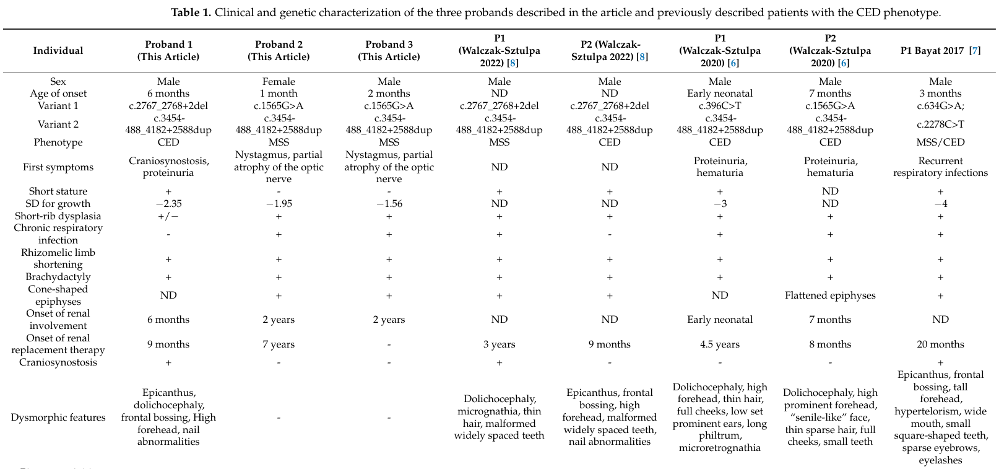

## Question

# Disease Characteristics Research Template

## Target Disease
- **Disease Name:** Cranioectodermal Dysplasia
- **MONDO ID:**  (if available)
- **Category:** Mendelian

## Research Objectives

Please provide a comprehensive research report on **Cranioectodermal Dysplasia** covering all of the
disease characteristics listed below. This report will be used to populate a disease knowledge
base entry. Be thorough and cite primary literature (PMID preferred) for all claims.

For each section, **suggested databases/resources** are listed. These are the first places
you should search for information on each topic.

---

### 1. Disease Information
> **Search first:** OMIM, Orphanet, ICD-10/ICD-11, MeSH, PubMed

- What is the disease? Provide a concise overview.
- What are the key identifiers? (OMIM, Orphanet, ICD-10/ICD-11, MeSH, Mondo)
- What are the common synonyms and alternative names?
- Is the information derived from individual patients (e.g., EHR) or aggregated disease-level resources?

### 2. Etiology

- **Disease Causal Factors**: What are the primary causes? (genetic, environmental, infectious, mechanistic)
- **Risk Factors**:
  > **Search first:** PubMed, Cochrane Library, UpToDate, clinical guidelines, ClinVar, ClinGen, GWAS Catalog, PheGenI, CTD, CDC, WHO, epidemiological databases
  - Genetic risk factors (causal variants, susceptibility loci, modifier genes)
  - Environmental risk factors (toxins, lifestyle, occupational exposures, age, sex, family history)
- **Protective Factors**:
  > **Search first:** PubMed, Cochrane Library, clinical trial databases, GWAS Catalog, gnomAD, WHO, CDC, nutrition databases
  - Genetic protective factors (protective variants, modifier alleles)
  - Environmental protective factors (diet, lifestyle, exposures that reduce risk)
- **Gene-Environment Interactions**: How do genetic and environmental factors interact to influence disease?
  > **Search first:** CTD, PubMed, PheGenI, GxE databases

### 3. Phenotypes
> **Search first:** HPO (Human Phenotype Ontology), OMIM, Orphanet, PubMed, clinicaltrials.gov, MedDRA, SNOMED CT, DECIPHER, LOINC

For each phenotype, provide:
- **Phenotype type**: symptoms, clinical signs, physical manifestations, behavioral changes, or laboratory abnormalities
  > For symptoms/signs: HPO, OMIM, Orphanet, PubMed
  > For behavioral changes: HPO, DSM, RDoC (Research Domain Criteria), PubMed
  > For laboratory abnormalities: LOINC, SNOMED CT, LabTests Online, PubMed
- **Phenotype characteristics**:
  > **Search first:** OMIM, Orphanet, HPO, PubMed
  - Age of symptom onset (neonatal, childhood, adult-onset, late-onset)
  - Symptom severity (mild, moderate, severe, variable)
  - Symptom progression (stable, progressive, episodic, fluctuating)
  - Frequency among affected individuals (percentage or qualitative)
- **Quality of life impact**: Effects on daily functioning and well-being (per-phenotype when possible)
  > **Search first:** EQ-5D database, SF-36, WHO QOL databases, PubMed
- Suggest HPO (Human Phenotype Ontology) terms for each phenotype

### 4. Genetic/Molecular Information

- **Causal Genes**: Gene mutations or chromosomal abnormalities responsible for disease (gene symbols, OMIM IDs)
  > **Search first:** OMIM, ClinVar, HGMD, Ensembl, NCBI Gene
- **Pathogenic Variants**:
  - Affected genes (gene symbols, HGNC IDs)
    > **Search first:** OMIM, NCBI Gene, Ensembl, HGNC, UniProt, GeneCards
  - Variant classification (pathogenic, likely pathogenic, VUS per ACMG/AMP guidelines)
    > **Search first:** ClinVar, ClinGen, ACMG/AMP guidelines, VarSome
  - Variant type/class (missense, frameshift, nonsense, splice-site, structural)
  - Allele frequency in population databases
    > **Search first:** gnomAD, 1000 Genomes, ExAC, TOPMed, dbSNP
  - Somatic vs germline origin
    > **Search first:** COSMIC (somatic), ClinVar, ICGC, TCGA
  - Functional consequences (loss of function, gain of function, dominant negative)
- **Modifier Genes**: Genes that modify disease severity or expression
- **Epigenetic Information**: DNA methylation, histone modifications, chromatin changes affecting disease
  > **Search first:** ENCODE, Roadmap Epigenomics, MethBase, DiseaseMeth
- **Chromosomal Abnormalities**: Large-scale genetic changes (aneuploidy, translocations, inversions)
  > **Search first:** DECIPHER, ClinVar, ECARUCA, UCSC Genome Browser

### 5. Environmental Information

- **Environmental Factors**: Non-genetic contributing factors (toxins, radiation, pollution, occupational exposure)
  > **Search first:** CTD (Comparative Toxicogenomics Database), TOXNET, PubMed, EPA databases
- **Lifestyle Factors**: Behavioral factors (smoking, diet, exercise, alcohol consumption)
  > **Search first:** CDC databases, WHO, PubMed, NHANES
- **Infectious Agents**: If applicable, pathogens causing or triggering disease (bacteria, viruses, fungi, parasites)
  > **Search first:** NCBI Taxonomy, ViPR, BV-BRC, MicrobeDB, GIDEON

### 6. Mechanism / Pathophysiology

- **Molecular Pathways**: Specific signaling cascades or biochemical pathways involved (Wnt, MAPK, mTOR, PI3K-AKT, etc.)
  > **Search first:** KEGG, Reactome, WikiPathways, PathBank, BioCyc
- **Cellular Processes**: Cell-level mechanisms (apoptosis, autophagy, cell cycle dysregulation, inflammation, etc.)
  > **Search first:** Gene Ontology (GO), Reactome, KEGG, PubMed
- **Protein Dysfunction**: How protein structure or function is altered (misfolding, aggregation, loss of function, gain of function)
  > **Search first:** UniProt, PDB (Protein Data Bank), InterPro, Pfam, AlphaFold
- **Metabolic Changes**: Alterations in metabolic processes (energy metabolism, lipid metabolism, amino acid metabolism)
  > **Search first:** KEGG, BioCyc, HMDB (Human Metabolome Database), BRENDA
- **Immune System Involvement**: Role of immune response (autoimmunity, immunodeficiency, chronic inflammation)
  > **Search first:** ImmPort, Immunome Database, IEDB, Gene Ontology
- **Tissue Damage Mechanisms**: How tissues/ are injured (oxidative stress, ischemia, fibrosis, necrosis)
  > **Search first:** PubMed, Gene Ontology, Reactome
- **Biochemical Abnormalities**: Specific molecular defects (enzyme deficiencies, receptor dysfunction, ion channel defects)
  > **Search first:** BRENDA, UniProt, KEGG, OMIM, PubMed
- **Epigenetic Changes**: DNA methylation, histone modifications affecting gene expression in disease
  > **Search first:** ENCODE, Roadmap Epigenomics, MethBase, DiseaseMeth
- **Molecular Profiling** (if available):
  - Transcriptomics/gene expression changes
    > **Search first:** GEO (Gene Expression Omnibus), ArrayExpress, GTEx, Human Cell Atlas, SRA
  - Proteomics findings
    > **Search first:** PRIDE, ProteomeXchange, Human Protein Atlas, STRING, BioGRID
  - Metabolomics signatures
    > **Search first:** MetaboLights, Metabolomics Workbench, HMDB, METLIN
  - Lipidomics alterations
    > **Search first:** LIPID MAPS, SwissLipids, LipidHome, Metabolomics Workbench
  - Genomic structural features
    > **Search first:** UCSC Genome Browser, Ensembl, NCBI, dbVar, DGV
- **Advanced Technologies** (if applicable):
  - Single-cell analysis findings (cell-type specific mechanisms, cellular heterogeneity)
    > **Search first:** Human Cell Atlas, Single Cell Portal, GEO, CELLxGENE
  - Spatial transcriptomics findings
    > **Search first:** GEO, Spatial Research, Vizgen, 10x Genomics data
  - Multi-omics integration results
    > **Search first:** TCGA, ICGC, cBioPortal, LinkedOmics, PubMed
  - Functional genomics screens (CRISPR, RNAi)
    > **Search first:** DepMap, GenomeRNAi, PubMed, BioGRID ORCS

For each mechanism, describe:
- The causal chain from initial trigger to clinical manifestation
- Which mechanisms are upstream vs downstream
- What cell types and biological processes are involved
- Suggest GO terms for biological processes and CL terms for cell types

### 7. Anatomical Structures Affected

- **Organ Level**:
  - Primary organs directly affected
  - Secondary organ involvement (complications, secondary effects)
  - Body systems involved (cardiovascular, nervous, digestive, respiratory, endocrine, etc.)
  > **Search first:** Uberon, FMA (Foundational Model of Anatomy), OMIM, HPO, ICD-11, MeSH, SNOMED CT
- **Tissue and Cell Level**:
  - Specific tissue types affected (epithelial, connective, muscle, nervous)
  - Specific cell populations targeted (with Cell Ontology terms)
  > **Search first:** Uberon, Human Protein Atlas, Cell Ontology, Human Cell Atlas, CellMarker, PanglaoDB
- **Subcellular Level**:
  - Cellular compartments involved (mitochondria, nucleus, ER, lysosomes) (with GO Cellular Component terms)
  > **Search first:** Gene Ontology (Cellular Component), UniProt, Human Protein Atlas
- **Localization**:
  - Specific anatomical sites (with UBERON terms)
    > **Search first:** FMA, Uberon, NeuroNames (for brain), SNOMED CT
  - Lateralization (unilateral, bilateral, asymmetric)
    > **Search first:** HPO, clinical literature, imaging databases

### 8. Temporal Development

- **Onset**:
  - Typical age of onset (congenital, pediatric, adult, geriatric)
  - Onset pattern (acute, subacute, chronic, insidious)
  > **Search first:** OMIM, Orphanet, HPO, PubMed
- **Progression**:
  - Disease stages (early, intermediate, advanced, end-stage)
    > **Search first:** Cancer Staging Manual (AJCC), WHO classifications, PubMed
  - Progression rate (rapid, slow, variable)
  - Disease course pattern (episodic, relapsing-remitting, progressive, stable)
  - Disease duration (self-limited, chronic lifelong)
  > **Search first:** Disease registries, longitudinal cohort databases, natural history studies, PubMed, Orphanet, OMIM
- **Patterns**:
  - Remission patterns (spontaneous, treatment-induced)
    > **Search first:** Clinical trial databases, disease registries, PubMed
  - Critical periods (time windows of vulnerability or opportunity for intervention)
    > **Search first:** PubMed, developmental biology databases, clinical guidelines

### 9. Inheritance and Population

- **Epidemiology**:
  - Prevalence (cases per 100,000 at given time)
  - Incidence (new cases per 100,000 per year)
  > **Search first:** Orphanet, CDC, WHO, GBD (Global Burden of Disease), national registries, SEER, disease registries
- **For Genetic Etiology**:
  - Inheritance pattern (AD, AR, X-linked, mitochondrial, multifactorial, polygenic)
    > **Search first:** OMIM, Orphanet, ClinVar, GTR (Genetic Testing Registry)
  - Penetrance (complete, incomplete, age-dependent)
    > **Search first:** ClinVar, OMIM, PubMed, ClinGen
  - Expressivity (variable, consistent)
    > **Search first:** OMIM, ClinVar, PubMed
  - Genetic anticipation (increasing severity in successive generations)
    > **Search first:** OMIM, PubMed (especially for repeat expansion disorders)
  - Germline mosaicism
    > **Search first:** ClinVar, OMIM, genetic counseling literature, PubMed
  - Founder effects (population-specific mutations)
    > **Search first:** gnomAD, population genetics databases, PubMed
  - Consanguinity role
    > **Search first:** OMIM, population studies, genetic counseling resources
  - Carrier frequency
    > **Search first:** gnomAD, carrier screening databases, GeneReviews, GTR
- **Population Demographics**:
  - Affected populations (ethnic or demographic groups with higher prevalence)
    > **Search first:** gnomAD, 1000 Genomes, PAGE Study, PubMed, population registries
  - Geographic distribution (endemic areas, regional variation)
    > **Search first:** WHO, CDC, GBD, Orphanet, geographic epidemiology databases
  - Geographic distribution of specific variants
  - Sex ratio (male:female)
    > **Search first:** Disease registries, OMIM, PubMed, epidemiological databases
  - Age distribution of affected individuals
    > **Search first:** CDC, disease registries, SEER, Orphanet

### 10. Diagnostics

- **Clinical Tests**:
  - Laboratory tests (blood, urine, tissue chemistry, specific enzyme assays)
    > **Search first:** LOINC, LabTests Online, PubMed
  - Biomarkers (proteins, metabolites, genetic markers, circulating biomarkers)
    > **Search first:** FDA Biomarker List, BEST (Biomarkers, EndpointS, and other Tools), PubMed
  - Imaging studies (X-ray, CT, MRI, PET, ultrasound)
    > **Search first:** RadLex, DICOM, Radiopaedia, imaging databases
  - Functional tests (pulmonary function, cardiac stress tests)
    > **Search first:** LOINC, clinical guidelines, PubMed
  - Electrophysiology (EEG, EMG, ECG, nerve conduction studies)
    > **Search first:** LOINC, clinical neurophysiology databases, PubMed
  - Biopsy findings (histopathology, immunohistochemistry)
    > **Search first:** SNOMED CT, College of American Pathologists resources, PubMed
  - Pathology findings (microscopic examination)
    > **Search first:** SNOMED CT, Digital Pathology databases, PubMed
- **Genetic Testing**:
  > **Search first:** GTR (Genetic Testing Registry), GeneReviews, ClinGen
  - Overview of recommended genetic testing approach
  - Whole genome sequencing (WGS) utility
    > **Search first:** GTR, ClinVar, GEL (Genomics England), gnomAD
  - Whole exome sequencing (WES) utility
    > **Search first:** GTR, ClinVar, OMIM, GeneMatcher
  - Gene panels (which panels, which genes)
    > **Search first:** GTR, ClinVar, laboratory-specific databases
  - Single gene testing
    > **Search first:** GTR, ClinVar, OMIM, GeneReviews
  - Chromosomal microarray (CMA)
    > **Search first:** DECIPHER, ClinVar, dbVar, ECARUCA
  - Karyotyping
    > **Search first:** Chromosome Abnormality Database, ClinVar, cytogenetics resources
  - FISH
    > **Search first:** ClinVar, cytogenetics databases, PubMed
  - Mitochondrial DNA testing
    > **Search first:** MITOMAP, MSeqDR, ClinVar, GTR
  - Repeat expansion testing
    > **Search first:** GTR, ClinVar, repeat expansion databases, PubMed
- **Omics-Based Diagnostics** (if applicable):
  - RNA sequencing / transcriptomics
    > **Search first:** GEO, ArrayExpress, GTEx, RNA-seq databases
  - Proteomics
    > **Search first:** PRIDE, ProteomeXchange, FDA Biomarker database
  - Metabolomics
    > **Search first:** MetaboLights, Metabolomics Workbench, HMDB
  - Epigenomics
    > **Search first:** GEO, ENCODE, Roadmap Epigenomics, MethBase
  - Liquid biopsy
    > **Search first:** COSMIC, ClinVar, liquid biopsy databases, PubMed
- **Clinical Criteria**:
  - Standardized diagnostic criteria (DSM, ICD, society guidelines)
    > **Search first:** DSM-5, ICD-11, clinical society guidelines, UpToDate
  - Differential diagnosis (other conditions to rule out, with distinguishing features)
    > **Search first:** DynaMed, UpToDate, clinical decision support systems
- **Screening**:
  - Screening methods for asymptomatic individuals (newborn screening, carrier screening, cascade screening)
    > **Search first:** ACMG recommendations, CDC newborn screening, GTR

### 11. Outcome/Prognosis

- **Survival and Mortality**:
  - Survival rate (5-year, 10-year, overall)
    > **Search first:** SEER, cancer registries, disease-specific registries, PubMed
  - Life expectancy (with and without treatment if applicable)
    > **Search first:** Orphanet, disease registries, actuarial databases, PubMed
  - Mortality rate
    > **Search first:** CDC, WHO, GBD, national mortality databases
  - Disease-specific mortality (deaths directly attributable to disease)
    > **Search first:** Disease registries, CDC Wonder, GBD, PubMed
- **Morbidity and Function**:
  - Morbidity (disease-related disability and health impacts)
    > **Search first:** GBD, WHO, disability databases, PubMed
  - Disability outcomes (long-term functional impairments)
    > **Search first:** ICF (International Classification of Functioning), disability registries
  - Quality of life measures (EQ-5D, SF-36, PROMIS, disease-specific tools)
    > **Search first:** EQ-5D database, SF-36, PROMIS, PubMed
- **Disease Course**:
  - Complications (secondary problems: infections, organ failure, etc.)
    > **Search first:** ICD codes, disease registries, clinical databases, PubMed
  - Recovery potential (likelihood and extent of recovery, with vs without treatment)
    > **Search first:** Natural history studies, rehabilitation databases, PubMed
- **Prediction**:
  - Prognostic factors (age, disease severity, biomarkers, treatment response)
    > **Search first:** Prognostic models databases, clinical calculators, PubMed
  - Prognostic biomarkers (molecular markers predicting disease course)
    > **Search first:** FDA Biomarker database, PubMed, cancer prognostic databases

### 12. Treatment

- **Pharmacotherapy**:
  - Pharmacological treatments (drug names, drug classes, mechanisms of action)
    > **Search first:** DrugBank, RxNorm, ATC classification, DailyMed, FDA databases
  - Pharmacogenomics (how genetic variants affect drug metabolism, efficacy, toxicity)
    > **Search first:** PharmGKB, CPIC (Clinical Pharmacogenetics), FDA Table of PGx Biomarkers
- **Advanced Therapeutics**:
  - Gene therapy (viral vectors, CRISPR, gene replacement, gene editing)
    > **Search first:** ClinicalTrials.gov, FDA gene therapy database, ASGCT resources
  - Cell therapy (stem cell transplant, CAR-T, cellular therapeutics)
    > **Search first:** ClinicalTrials.gov, FDA cell therapy database, FACT standards
  - RNA-based therapies (ASOs, siRNA, mRNA therapies)
    > **Search first:** ClinicalTrials.gov, FDA approvals, PubMed
  - Targeted therapies (treatments directed at specific molecular targets)
    > **Search first:** My Cancer Genome, OncoKB, ClinicalTrials.gov, FDA approvals
  - Immunotherapies (checkpoint inhibitors, monoclonal antibodies)
    > **Search first:** Cancer Immunotherapy Database, FDA approvals, ClinicalTrials.gov
- **Surgical and Interventional**:
  - Surgical interventions (types of surgery, timing, outcomes)
    > **Search first:** CPT codes, surgical registries, clinical guidelines, PubMed
- **Supportive and Rehabilitative**:
  - Supportive care (symptom management, pain control, nutrition)
    > **Search first:** Clinical guidelines, Cochrane Library, PubMed
  - Rehabilitation (physical therapy, occupational therapy, speech therapy)
    > **Search first:** Rehabilitation medicine databases, clinical guidelines, PubMed
- **Experimental**:
  - Experimental treatments in clinical trials (with NCT identifiers if available)
    > **Search first:** ClinicalTrials.gov, EU Clinical Trials Register, WHO ICTRP
- **Treatment Outcomes**:
  - Treatment response rates
    > **Search first:** Clinical trial databases, FDA reviews, systematic reviews, PubMed
  - Side effects and adverse events
    > **Search first:** FDA Adverse Event Reporting System (FAERS), MedWatch, PubMed
- **Treatment Strategy**:
  - Treatment algorithms (clinical pathways, decision trees)
    > **Search first:** Clinical practice guidelines, NCCN Guidelines, UpToDate
  - Combination therapies
    > **Search first:** ClinicalTrials.gov, treatment guidelines, PubMed
  - Personalized medicine approaches (genotype-guided treatment)
    > **Search first:** My Cancer Genome, CIViC, PharmGKB, precision medicine databases

For each treatment, suggest MAXO (Medical Action Ontology) terms where applicable.

### 13. Prevention

- **Prevention Levels**:
  - Primary prevention (preventing disease occurrence: vaccination, risk factor modification)
    > **Search first:** CDC, WHO, USPSTF recommendations, Cochrane Library
  - Secondary prevention (early detection and treatment: screening programs, early intervention)
    > **Search first:** USPSTF, CDC screening guidelines, WHO
  - Tertiary prevention (preventing complications in those with disease)
    > **Search first:** Clinical guidelines, disease management protocols, PubMed
- **Immunization**: Vaccine strategies (if applicable)
  > **Search first:** CDC vaccine schedules, WHO immunization, FDA vaccine database
- **Screening and Early Detection**:
  - Screening programs (population-based: newborn screening, cancer screening)
    > **Search first:** CDC screening programs, USPSTF, cancer screening databases
  - Genetic screening (carrier screening, preimplantation genetic diagnosis, prenatal testing)
    > **Search first:** ACMG recommendations, ACOG guidelines, GTR
  - Risk stratification (identifying high-risk individuals for targeted prevention)
    > **Search first:** Risk prediction models, clinical calculators, PubMed
- **Behavioral Interventions**: Lifestyle modifications to reduce risk
  > **Search first:** CDC, WHO, behavioral intervention databases, Cochrane Library
- **Counseling**: Genetic counseling (risk assessment, family planning guidance)
  > **Search first:** NSGC resources, ACMG guidelines, GeneReviews
- **Public Health**:
  - Public health interventions (sanitation, vector control, health education)
    > **Search first:** CDC, WHO, public health databases, PubMed
  - Environmental interventions (reducing environmental risk factors)
    > **Search first:** EPA databases, WHO environmental health, PubMed
- **Prophylaxis**: Preventive medications or procedures
  > **Search first:** Clinical guidelines, FDA approvals, PubMed

### 14. Other Species / Natural Disease

- **Taxonomy**: Species affected (with NCBI Taxon identifiers)
  > **Search first:** NCBI Taxonomy
- **Breed**: Specific breeds affected (with VBO identifiers if applicable)
  > **Search first:** VBO (Vertebrate Breed Ontology)
- **Gene**: Orthologous genes in other species (with NCBI Gene IDs)
  > **Search first:** NCBI Gene
- **Natural Disease**:
  - Naturally occurring disease in other species (companion animals, wildlife)
    > **Search first:** OMIA (Online Mendelian Inheritance in Animals), VetCompass, PubMed
  - Veterinary relevance and importance in animal health
    > **Search first:** OMIA, veterinary databases, PubMed
- **Comparative Biology**:
  - Comparative pathology (similarities and differences across species)
    > **Search first:** OMIA, comparative pathology databases, PubMed
  - Evolutionary conservation of disease mechanisms
    > **Search first:** HomoloGene, OrthoMCL, Alliance of Genome Resources
- **Transmission** (if applicable):
  - Zoonotic potential
    > **Search first:** CDC zoonotic diseases, WHO zoonoses, GIDEON
  - Cross-species susceptibility
    > **Search first:** NCBI Taxonomy, veterinary databases, PubMed

### 15. Model Organisms

- **Model Types**:
  - Model organism type (mammalian, invertebrate, cellular, in vitro)
    > **Search first:** Alliance of Genome Resources, model organism databases
  - Specific model systems (mouse, rat, zebrafish, Drosophila, C. elegans, yeast, cell lines, organoids, iPSCs)
    > **Search first:** MGI, RGD, ZFIN, FlyBase, WormBase, SGD, ATCC, Cellosaurus
  - Induced models (drug treatment, surgical intervention, environmental manipulation)
    > **Search first:** MGI, model organism databases, PubMed
- **Genetic Models**:
  - Types available (knockout, knock-in, transgenic, conditional, humanized)
    > **Search first:** MGI, IMPC, KOMP, EuMMCR, IMSR
- **Model Characteristics**:
  - Phenotype recapitulation (how well model reproduces human disease features)
    > **Search first:** Model organism databases, comparative studies, PubMed
  - Model limitations (aspects of human disease not captured)
    > **Search first:** Model organism databases, PubMed, review articles
- **Applications**:
  - Research applications (what aspects of disease can be studied)
    > **Search first:** Model organism databases, PubMed
- **Resources**:
  - Model databases
    > **Search first:** MGI, RGD, ZFIN, FlyBase, WormBase, IMSR, EMMA, MMRRC

---

## Citation Requirements

- Cite primary literature (PMID preferred) for all mechanistic and clinical claims
- Prioritize recent reviews and landmark papers
- Include direct quotes from abstracts where possible to support key statements
- Distinguish evidence source types: human clinical, model organism, in vitro, computational

## Output Format

Structure your response as a comprehensive narrative organized by the sections above.
For each section, provide:
- Factual content with specific details (numbers, percentages, gene names, variant nomenclature)
- Ontology term suggestions (HPO, GO, CL, UBERON, CHEBI, MAXO, MONDO) where applicable
- Evidence citations with PMIDs
- Direct quotes from abstracts to support key claims
- Clear indication when information is not available or not applicable for this disease

This report will be used to populate a disease knowledge base entry with:
- Pathophysiology descriptions with causal chains
- Gene/protein annotations (HGNC, GO terms)
- Phenotype associations (HP terms) with frequencies
- Cell type involvement (CL terms)
- Anatomical locations (UBERON terms)
- Chemical entities (CHEBI terms)
- Treatment annotations (MAXO terms)
- Evidence items with PMIDs and exact abstract quotes
- Epidemiology, prognosis, diagnostic, and prevention information
- Animal model descriptions with phenotype recapitulation details

## Output

Question: You are an expert researcher providing comprehensive, well-cited information.

Provide detailed information focusing on:
1. Key concepts and definitions with current understanding
2. Recent developments and latest research (prioritize 2023-2024 sources)
3. Current applications and real-world implementations
4. Expert opinions and analysis from authoritative sources
5. Relevant statistics and data from recent studies

Format as a comprehensive research report with proper citations. Include URLs and publication dates where available.
Always prioritize recent, authoritative sources and provide specific citations for all major claims.

# Disease Characteristics Research Template

## Target Disease
- **Disease Name:** Cranioectodermal Dysplasia
- **MONDO ID:**  (if available)
- **Category:** Mendelian

## Research Objectives

Please provide a comprehensive research report on **Cranioectodermal Dysplasia** covering all of the
disease characteristics listed below. This report will be used to populate a disease knowledge
base entry. Be thorough and cite primary literature (PMID preferred) for all claims.

For each section, **suggested databases/resources** are listed. These are the first places
you should search for information on each topic.

---

### 1. Disease Information
> **Search first:** OMIM, Orphanet, ICD-10/ICD-11, MeSH, PubMed

- What is the disease? Provide a concise overview.
- What are the key identifiers? (OMIM, Orphanet, ICD-10/ICD-11, MeSH, Mondo)
- What are the common synonyms and alternative names?
- Is the information derived from individual patients (e.g., EHR) or aggregated disease-level resources?

### 2. Etiology

- **Disease Causal Factors**: What are the primary causes? (genetic, environmental, infectious, mechanistic)
- **Risk Factors**:
  > **Search first:** PubMed, Cochrane Library, UpToDate, clinical guidelines, ClinVar, ClinGen, GWAS Catalog, PheGenI, CTD, CDC, WHO, epidemiological databases
  - Genetic risk factors (causal variants, susceptibility loci, modifier genes)
  - Environmental risk factors (toxins, lifestyle, occupational exposures, age, sex, family history)
- **Protective Factors**:
  > **Search first:** PubMed, Cochrane Library, clinical trial databases, GWAS Catalog, gnomAD, WHO, CDC, nutrition databases
  - Genetic protective factors (protective variants, modifier alleles)
  - Environmental protective factors (diet, lifestyle, exposures that reduce risk)
- **Gene-Environment Interactions**: How do genetic and environmental factors interact to influence disease?
  > **Search first:** CTD, PubMed, PheGenI, GxE databases

### 3. Phenotypes
> **Search first:** HPO (Human Phenotype Ontology), OMIM, Orphanet, PubMed, clinicaltrials.gov, MedDRA, SNOMED CT, DECIPHER, LOINC

For each phenotype, provide:
- **Phenotype type**: symptoms, clinical signs, physical manifestations, behavioral changes, or laboratory abnormalities
  > For symptoms/signs: HPO, OMIM, Orphanet, PubMed
  > For behavioral changes: HPO, DSM, RDoC (Research Domain Criteria), PubMed
  > For laboratory abnormalities: LOINC, SNOMED CT, LabTests Online, PubMed
- **Phenotype characteristics**:
  > **Search first:** OMIM, Orphanet, HPO, PubMed
  - Age of symptom onset (neonatal, childhood, adult-onset, late-onset)
  - Symptom severity (mild, moderate, severe, variable)
  - Symptom progression (stable, progressive, episodic, fluctuating)
  - Frequency among affected individuals (percentage or qualitative)
- **Quality of life impact**: Effects on daily functioning and well-being (per-phenotype when possible)
  > **Search first:** EQ-5D database, SF-36, WHO QOL databases, PubMed
- Suggest HPO (Human Phenotype Ontology) terms for each phenotype

### 4. Genetic/Molecular Information

- **Causal Genes**: Gene mutations or chromosomal abnormalities responsible for disease (gene symbols, OMIM IDs)
  > **Search first:** OMIM, ClinVar, HGMD, Ensembl, NCBI Gene
- **Pathogenic Variants**:
  - Affected genes (gene symbols, HGNC IDs)
    > **Search first:** OMIM, NCBI Gene, Ensembl, HGNC, UniProt, GeneCards
  - Variant classification (pathogenic, likely pathogenic, VUS per ACMG/AMP guidelines)
    > **Search first:** ClinVar, ClinGen, ACMG/AMP guidelines, VarSome
  - Variant type/class (missense, frameshift, nonsense, splice-site, structural)
  - Allele frequency in population databases
    > **Search first:** gnomAD, 1000 Genomes, ExAC, TOPMed, dbSNP
  - Somatic vs germline origin
    > **Search first:** COSMIC (somatic), ClinVar, ICGC, TCGA
  - Functional consequences (loss of function, gain of function, dominant negative)
- **Modifier Genes**: Genes that modify disease severity or expression
- **Epigenetic Information**: DNA methylation, histone modifications, chromatin changes affecting disease
  > **Search first:** ENCODE, Roadmap Epigenomics, MethBase, DiseaseMeth
- **Chromosomal Abnormalities**: Large-scale genetic changes (aneuploidy, translocations, inversions)
  > **Search first:** DECIPHER, ClinVar, ECARUCA, UCSC Genome Browser

### 5. Environmental Information

- **Environmental Factors**: Non-genetic contributing factors (toxins, radiation, pollution, occupational exposure)
  > **Search first:** CTD (Comparative Toxicogenomics Database), TOXNET, PubMed, EPA databases
- **Lifestyle Factors**: Behavioral factors (smoking, diet, exercise, alcohol consumption)
  > **Search first:** CDC databases, WHO, PubMed, NHANES
- **Infectious Agents**: If applicable, pathogens causing or triggering disease (bacteria, viruses, fungi, parasites)
  > **Search first:** NCBI Taxonomy, ViPR, BV-BRC, MicrobeDB, GIDEON

### 6. Mechanism / Pathophysiology

- **Molecular Pathways**: Specific signaling cascades or biochemical pathways involved (Wnt, MAPK, mTOR, PI3K-AKT, etc.)
  > **Search first:** KEGG, Reactome, WikiPathways, PathBank, BioCyc
- **Cellular Processes**: Cell-level mechanisms (apoptosis, autophagy, cell cycle dysregulation, inflammation, etc.)
  > **Search first:** Gene Ontology (GO), Reactome, KEGG, PubMed
- **Protein Dysfunction**: How protein structure or function is altered (misfolding, aggregation, loss of function, gain of function)
  > **Search first:** UniProt, PDB (Protein Data Bank), InterPro, Pfam, AlphaFold
- **Metabolic Changes**: Alterations in metabolic processes (energy metabolism, lipid metabolism, amino acid metabolism)
  > **Search first:** KEGG, BioCyc, HMDB (Human Metabolome Database), BRENDA
- **Immune System Involvement**: Role of immune response (autoimmunity, immunodeficiency, chronic inflammation)
  > **Search first:** ImmPort, Immunome Database, IEDB, Gene Ontology
- **Tissue Damage Mechanisms**: How tissues/ are injured (oxidative stress, ischemia, fibrosis, necrosis)
  > **Search first:** PubMed, Gene Ontology, Reactome
- **Biochemical Abnormalities**: Specific molecular defects (enzyme deficiencies, receptor dysfunction, ion channel defects)
  > **Search first:** BRENDA, UniProt, KEGG, OMIM, PubMed
- **Epigenetic Changes**: DNA methylation, histone modifications affecting gene expression in disease
  > **Search first:** ENCODE, Roadmap Epigenomics, MethBase, DiseaseMeth
- **Molecular Profiling** (if available):
  - Transcriptomics/gene expression changes
    > **Search first:** GEO (Gene Expression Omnibus), ArrayExpress, GTEx, Human Cell Atlas, SRA
  - Proteomics findings
    > **Search first:** PRIDE, ProteomeXchange, Human Protein Atlas, STRING, BioGRID
  - Metabolomics signatures
    > **Search first:** MetaboLights, Metabolomics Workbench, HMDB, METLIN
  - Lipidomics alterations
    > **Search first:** LIPID MAPS, SwissLipids, LipidHome, Metabolomics Workbench
  - Genomic structural features
    > **Search first:** UCSC Genome Browser, Ensembl, NCBI, dbVar, DGV
- **Advanced Technologies** (if applicable):
  - Single-cell analysis findings (cell-type specific mechanisms, cellular heterogeneity)
    > **Search first:** Human Cell Atlas, Single Cell Portal, GEO, CELLxGENE
  - Spatial transcriptomics findings
    > **Search first:** GEO, Spatial Research, Vizgen, 10x Genomics data
  - Multi-omics integration results
    > **Search first:** TCGA, ICGC, cBioPortal, LinkedOmics, PubMed
  - Functional genomics screens (CRISPR, RNAi)
    > **Search first:** DepMap, GenomeRNAi, PubMed, BioGRID ORCS

For each mechanism, describe:
- The causal chain from initial trigger to clinical manifestation
- Which mechanisms are upstream vs downstream
- What cell types and biological processes are involved
- Suggest GO terms for biological processes and CL terms for cell types

### 7. Anatomical Structures Affected

- **Organ Level**:
  - Primary organs directly affected
  - Secondary organ involvement (complications, secondary effects)
  - Body systems involved (cardiovascular, nervous, digestive, respiratory, endocrine, etc.)
  > **Search first:** Uberon, FMA (Foundational Model of Anatomy), OMIM, HPO, ICD-11, MeSH, SNOMED CT
- **Tissue and Cell Level**:
  - Specific tissue types affected (epithelial, connective, muscle, nervous)
  - Specific cell populations targeted (with Cell Ontology terms)
  > **Search first:** Uberon, Human Protein Atlas, Cell Ontology, Human Cell Atlas, CellMarker, PanglaoDB
- **Subcellular Level**:
  - Cellular compartments involved (mitochondria, nucleus, ER, lysosomes) (with GO Cellular Component terms)
  > **Search first:** Gene Ontology (Cellular Component), UniProt, Human Protein Atlas
- **Localization**:
  - Specific anatomical sites (with UBERON terms)
    > **Search first:** FMA, Uberon, NeuroNames (for brain), SNOMED CT
  - Lateralization (unilateral, bilateral, asymmetric)
    > **Search first:** HPO, clinical literature, imaging databases

### 8. Temporal Development

- **Onset**:
  - Typical age of onset (congenital, pediatric, adult, geriatric)
  - Onset pattern (acute, subacute, chronic, insidious)
  > **Search first:** OMIM, Orphanet, HPO, PubMed
- **Progression**:
  - Disease stages (early, intermediate, advanced, end-stage)
    > **Search first:** Cancer Staging Manual (AJCC), WHO classifications, PubMed
  - Progression rate (rapid, slow, variable)
  - Disease course pattern (episodic, relapsing-remitting, progressive, stable)
  - Disease duration (self-limited, chronic lifelong)
  > **Search first:** Disease registries, longitudinal cohort databases, natural history studies, PubMed, Orphanet, OMIM
- **Patterns**:
  - Remission patterns (spontaneous, treatment-induced)
    > **Search first:** Clinical trial databases, disease registries, PubMed
  - Critical periods (time windows of vulnerability or opportunity for intervention)
    > **Search first:** PubMed, developmental biology databases, clinical guidelines

### 9. Inheritance and Population

- **Epidemiology**:
  - Prevalence (cases per 100,000 at given time)
  - Incidence (new cases per 100,000 per year)
  > **Search first:** Orphanet, CDC, WHO, GBD (Global Burden of Disease), national registries, SEER, disease registries
- **For Genetic Etiology**:
  - Inheritance pattern (AD, AR, X-linked, mitochondrial, multifactorial, polygenic)
    > **Search first:** OMIM, Orphanet, ClinVar, GTR (Genetic Testing Registry)
  - Penetrance (complete, incomplete, age-dependent)
    > **Search first:** ClinVar, OMIM, PubMed, ClinGen
  - Expressivity (variable, consistent)
    > **Search first:** OMIM, ClinVar, PubMed
  - Genetic anticipation (increasing severity in successive generations)
    > **Search first:** OMIM, PubMed (especially for repeat expansion disorders)
  - Germline mosaicism
    > **Search first:** ClinVar, OMIM, genetic counseling literature, PubMed
  - Founder effects (population-specific mutations)
    > **Search first:** gnomAD, population genetics databases, PubMed
  - Consanguinity role
    > **Search first:** OMIM, population studies, genetic counseling resources
  - Carrier frequency
    > **Search first:** gnomAD, carrier screening databases, GeneReviews, GTR
- **Population Demographics**:
  - Affected populations (ethnic or demographic groups with higher prevalence)
    > **Search first:** gnomAD, 1000 Genomes, PAGE Study, PubMed, population registries
  - Geographic distribution (endemic areas, regional variation)
    > **Search first:** WHO, CDC, GBD, Orphanet, geographic epidemiology databases
  - Geographic distribution of specific variants
  - Sex ratio (male:female)
    > **Search first:** Disease registries, OMIM, PubMed, epidemiological databases
  - Age distribution of affected individuals
    > **Search first:** CDC, disease registries, SEER, Orphanet

### 10. Diagnostics

- **Clinical Tests**:
  - Laboratory tests (blood, urine, tissue chemistry, specific enzyme assays)
    > **Search first:** LOINC, LabTests Online, PubMed
  - Biomarkers (proteins, metabolites, genetic markers, circulating biomarkers)
    > **Search first:** FDA Biomarker List, BEST (Biomarkers, EndpointS, and other Tools), PubMed
  - Imaging studies (X-ray, CT, MRI, PET, ultrasound)
    > **Search first:** RadLex, DICOM, Radiopaedia, imaging databases
  - Functional tests (pulmonary function, cardiac stress tests)
    > **Search first:** LOINC, clinical guidelines, PubMed
  - Electrophysiology (EEG, EMG, ECG, nerve conduction studies)
    > **Search first:** LOINC, clinical neurophysiology databases, PubMed
  - Biopsy findings (histopathology, immunohistochemistry)
    > **Search first:** SNOMED CT, College of American Pathologists resources, PubMed
  - Pathology findings (microscopic examination)
    > **Search first:** SNOMED CT, Digital Pathology databases, PubMed
- **Genetic Testing**:
  > **Search first:** GTR (Genetic Testing Registry), GeneReviews, ClinGen
  - Overview of recommended genetic testing approach
  - Whole genome sequencing (WGS) utility
    > **Search first:** GTR, ClinVar, GEL (Genomics England), gnomAD
  - Whole exome sequencing (WES) utility
    > **Search first:** GTR, ClinVar, OMIM, GeneMatcher
  - Gene panels (which panels, which genes)
    > **Search first:** GTR, ClinVar, laboratory-specific databases
  - Single gene testing
    > **Search first:** GTR, ClinVar, OMIM, GeneReviews
  - Chromosomal microarray (CMA)
    > **Search first:** DECIPHER, ClinVar, dbVar, ECARUCA
  - Karyotyping
    > **Search first:** Chromosome Abnormality Database, ClinVar, cytogenetics resources
  - FISH
    > **Search first:** ClinVar, cytogenetics databases, PubMed
  - Mitochondrial DNA testing
    > **Search first:** MITOMAP, MSeqDR, ClinVar, GTR
  - Repeat expansion testing
    > **Search first:** GTR, ClinVar, repeat expansion databases, PubMed
- **Omics-Based Diagnostics** (if applicable):
  - RNA sequencing / transcriptomics
    > **Search first:** GEO, ArrayExpress, GTEx, RNA-seq databases
  - Proteomics
    > **Search first:** PRIDE, ProteomeXchange, FDA Biomarker database
  - Metabolomics
    > **Search first:** MetaboLights, Metabolomics Workbench, HMDB
  - Epigenomics
    > **Search first:** GEO, ENCODE, Roadmap Epigenomics, MethBase
  - Liquid biopsy
    > **Search first:** COSMIC, ClinVar, liquid biopsy databases, PubMed
- **Clinical Criteria**:
  - Standardized diagnostic criteria (DSM, ICD, society guidelines)
    > **Search first:** DSM-5, ICD-11, clinical society guidelines, UpToDate
  - Differential diagnosis (other conditions to rule out, with distinguishing features)
    > **Search first:** DynaMed, UpToDate, clinical decision support systems
- **Screening**:
  - Screening methods for asymptomatic individuals (newborn screening, carrier screening, cascade screening)
    > **Search first:** ACMG recommendations, CDC newborn screening, GTR

### 11. Outcome/Prognosis

- **Survival and Mortality**:
  - Survival rate (5-year, 10-year, overall)
    > **Search first:** SEER, cancer registries, disease-specific registries, PubMed
  - Life expectancy (with and without treatment if applicable)
    > **Search first:** Orphanet, disease registries, actuarial databases, PubMed
  - Mortality rate
    > **Search first:** CDC, WHO, GBD, national mortality databases
  - Disease-specific mortality (deaths directly attributable to disease)
    > **Search first:** Disease registries, CDC Wonder, GBD, PubMed
- **Morbidity and Function**:
  - Morbidity (disease-related disability and health impacts)
    > **Search first:** GBD, WHO, disability databases, PubMed
  - Disability outcomes (long-term functional impairments)
    > **Search first:** ICF (International Classification of Functioning), disability registries
  - Quality of life measures (EQ-5D, SF-36, PROMIS, disease-specific tools)
    > **Search first:** EQ-5D database, SF-36, PROMIS, PubMed
- **Disease Course**:
  - Complications (secondary problems: infections, organ failure, etc.)
    > **Search first:** ICD codes, disease registries, clinical databases, PubMed
  - Recovery potential (likelihood and extent of recovery, with vs without treatment)
    > **Search first:** Natural history studies, rehabilitation databases, PubMed
- **Prediction**:
  - Prognostic factors (age, disease severity, biomarkers, treatment response)
    > **Search first:** Prognostic models databases, clinical calculators, PubMed
  - Prognostic biomarkers (molecular markers predicting disease course)
    > **Search first:** FDA Biomarker database, PubMed, cancer prognostic databases

### 12. Treatment

- **Pharmacotherapy**:
  - Pharmacological treatments (drug names, drug classes, mechanisms of action)
    > **Search first:** DrugBank, RxNorm, ATC classification, DailyMed, FDA databases
  - Pharmacogenomics (how genetic variants affect drug metabolism, efficacy, toxicity)
    > **Search first:** PharmGKB, CPIC (Clinical Pharmacogenetics), FDA Table of PGx Biomarkers
- **Advanced Therapeutics**:
  - Gene therapy (viral vectors, CRISPR, gene replacement, gene editing)
    > **Search first:** ClinicalTrials.gov, FDA gene therapy database, ASGCT resources
  - Cell therapy (stem cell transplant, CAR-T, cellular therapeutics)
    > **Search first:** ClinicalTrials.gov, FDA cell therapy database, FACT standards
  - RNA-based therapies (ASOs, siRNA, mRNA therapies)
    > **Search first:** ClinicalTrials.gov, FDA approvals, PubMed
  - Targeted therapies (treatments directed at specific molecular targets)
    > **Search first:** My Cancer Genome, OncoKB, ClinicalTrials.gov, FDA approvals
  - Immunotherapies (checkpoint inhibitors, monoclonal antibodies)
    > **Search first:** Cancer Immunotherapy Database, FDA approvals, ClinicalTrials.gov
- **Surgical and Interventional**:
  - Surgical interventions (types of surgery, timing, outcomes)
    > **Search first:** CPT codes, surgical registries, clinical guidelines, PubMed
- **Supportive and Rehabilitative**:
  - Supportive care (symptom management, pain control, nutrition)
    > **Search first:** Clinical guidelines, Cochrane Library, PubMed
  - Rehabilitation (physical therapy, occupational therapy, speech therapy)
    > **Search first:** Rehabilitation medicine databases, clinical guidelines, PubMed
- **Experimental**:
  - Experimental treatments in clinical trials (with NCT identifiers if available)
    > **Search first:** ClinicalTrials.gov, EU Clinical Trials Register, WHO ICTRP
- **Treatment Outcomes**:
  - Treatment response rates
    > **Search first:** Clinical trial databases, FDA reviews, systematic reviews, PubMed
  - Side effects and adverse events
    > **Search first:** FDA Adverse Event Reporting System (FAERS), MedWatch, PubMed
- **Treatment Strategy**:
  - Treatment algorithms (clinical pathways, decision trees)
    > **Search first:** Clinical practice guidelines, NCCN Guidelines, UpToDate
  - Combination therapies
    > **Search first:** ClinicalTrials.gov, treatment guidelines, PubMed
  - Personalized medicine approaches (genotype-guided treatment)
    > **Search first:** My Cancer Genome, CIViC, PharmGKB, precision medicine databases

For each treatment, suggest MAXO (Medical Action Ontology) terms where applicable.

### 13. Prevention

- **Prevention Levels**:
  - Primary prevention (preventing disease occurrence: vaccination, risk factor modification)
    > **Search first:** CDC, WHO, USPSTF recommendations, Cochrane Library
  - Secondary prevention (early detection and treatment: screening programs, early intervention)
    > **Search first:** USPSTF, CDC screening guidelines, WHO
  - Tertiary prevention (preventing complications in those with disease)
    > **Search first:** Clinical guidelines, disease management protocols, PubMed
- **Immunization**: Vaccine strategies (if applicable)
  > **Search first:** CDC vaccine schedules, WHO immunization, FDA vaccine database
- **Screening and Early Detection**:
  - Screening programs (population-based: newborn screening, cancer screening)
    > **Search first:** CDC screening programs, USPSTF, cancer screening databases
  - Genetic screening (carrier screening, preimplantation genetic diagnosis, prenatal testing)
    > **Search first:** ACMG recommendations, ACOG guidelines, GTR
  - Risk stratification (identifying high-risk individuals for targeted prevention)
    > **Search first:** Risk prediction models, clinical calculators, PubMed
- **Behavioral Interventions**: Lifestyle modifications to reduce risk
  > **Search first:** CDC, WHO, behavioral intervention databases, Cochrane Library
- **Counseling**: Genetic counseling (risk assessment, family planning guidance)
  > **Search first:** NSGC resources, ACMG guidelines, GeneReviews
- **Public Health**:
  - Public health interventions (sanitation, vector control, health education)
    > **Search first:** CDC, WHO, public health databases, PubMed
  - Environmental interventions (reducing environmental risk factors)
    > **Search first:** EPA databases, WHO environmental health, PubMed
- **Prophylaxis**: Preventive medications or procedures
  > **Search first:** Clinical guidelines, FDA approvals, PubMed

### 14. Other Species / Natural Disease

- **Taxonomy**: Species affected (with NCBI Taxon identifiers)
  > **Search first:** NCBI Taxonomy
- **Breed**: Specific breeds affected (with VBO identifiers if applicable)
  > **Search first:** VBO (Vertebrate Breed Ontology)
- **Gene**: Orthologous genes in other species (with NCBI Gene IDs)
  > **Search first:** NCBI Gene
- **Natural Disease**:
  - Naturally occurring disease in other species (companion animals, wildlife)
    > **Search first:** OMIA (Online Mendelian Inheritance in Animals), VetCompass, PubMed
  - Veterinary relevance and importance in animal health
    > **Search first:** OMIA, veterinary databases, PubMed
- **Comparative Biology**:
  - Comparative pathology (similarities and differences across species)
    > **Search first:** OMIA, comparative pathology databases, PubMed
  - Evolutionary conservation of disease mechanisms
    > **Search first:** HomoloGene, OrthoMCL, Alliance of Genome Resources
- **Transmission** (if applicable):
  - Zoonotic potential
    > **Search first:** CDC zoonotic diseases, WHO zoonoses, GIDEON
  - Cross-species susceptibility
    > **Search first:** NCBI Taxonomy, veterinary databases, PubMed

### 15. Model Organisms

- **Model Types**:
  - Model organism type (mammalian, invertebrate, cellular, in vitro)
    > **Search first:** Alliance of Genome Resources, model organism databases
  - Specific model systems (mouse, rat, zebrafish, Drosophila, C. elegans, yeast, cell lines, organoids, iPSCs)
    > **Search first:** MGI, RGD, ZFIN, FlyBase, WormBase, SGD, ATCC, Cellosaurus
  - Induced models (drug treatment, surgical intervention, environmental manipulation)
    > **Search first:** MGI, model organism databases, PubMed
- **Genetic Models**:
  - Types available (knockout, knock-in, transgenic, conditional, humanized)
    > **Search first:** MGI, IMPC, KOMP, EuMMCR, IMSR
- **Model Characteristics**:
  - Phenotype recapitulation (how well model reproduces human disease features)
    > **Search first:** Model organism databases, comparative studies, PubMed
  - Model limitations (aspects of human disease not captured)
    > **Search first:** Model organism databases, PubMed, review articles
- **Applications**:
  - Research applications (what aspects of disease can be studied)
    > **Search first:** Model organism databases, PubMed
- **Resources**:
  - Model databases
    > **Search first:** MGI, RGD, ZFIN, FlyBase, WormBase, IMSR, EMMA, MMRRC

---

## Citation Requirements

- Cite primary literature (PMID preferred) for all mechanistic and clinical claims
- Prioritize recent reviews and landmark papers
- Include direct quotes from abstracts where possible to support key statements
- Distinguish evidence source types: human clinical, model organism, in vitro, computational

## Output Format

Structure your response as a comprehensive narrative organized by the sections above.
For each section, provide:
- Factual content with specific details (numbers, percentages, gene names, variant nomenclature)
- Ontology term suggestions (HPO, GO, CL, UBERON, CHEBI, MAXO, MONDO) where applicable
- Evidence citations with PMIDs
- Direct quotes from abstracts to support key claims
- Clear indication when information is not available or not applicable for this disease

This report will be used to populate a disease knowledge base entry with:
- Pathophysiology descriptions with causal chains
- Gene/protein annotations (HGNC, GO terms)
- Phenotype associations (HP terms) with frequencies
- Cell type involvement (CL terms)
- Anatomical locations (UBERON terms)
- Chemical entities (CHEBI terms)
- Treatment annotations (MAXO terms)
- Evidence items with PMIDs and exact abstract quotes
- Epidemiology, prognosis, diagnostic, and prevention information
- Animal model descriptions with phenotype recapitulation details

## Comprehensive Disease Characteristics Report: Cranioectodermal Dysplasia (CED) / Sensenbrenner syndrome

### Executive summary
Cranioectodermal dysplasia (CED), also called **Sensenbrenner syndrome**, is an **autosomal-recessive skeletal ciliopathy** characterized by distinctive craniofacial findings (often craniosynostosis/dolichocephaly), skeletal dysplasia with a narrow thorax/short limbs, ectodermal anomalies (hair/nails/teeth), and variable multisystem involvement—most importantly **progressive kidney disease** and sometimes liver and ocular disease. Foundational gene-discovery studies established CED as an **intraflagellar transport (IFT) disorder**, with multiple causal genes in the **IFT-A** (retrograde transport) pathway and related ciliary trafficking processes. (walczaksztulpa2010cranioectodermaldysplasiasensenbrenner pages 1-2, gilissen2010exomesequencingidentifies pages 2-3, walczaksztulpa2020compoundheterozygousift140 pages 1-2, li2023novelcompoundheterozygous pages 1-3)

---

## 1. Disease information

### 1.1 Overview / definition (current understanding)
CED is a rare, syndromic disorder in the ciliopathy spectrum. Classic clinical description includes craniosynostosis/dolichocephaly plus ectodermal and skeletal abnormalities, with frequent renal involvement (nephronophthisis/CKD) and possible hepatic fibrosis/cysts and retinal disease. (gilissen2010exomesequencingidentifies pages 1-2, hoffer2013novelwdr35mutations pages 1-2, walczaksztulpa2020compoundheterozygousift140 pages 1-2, NCT04184531 chunk 1, li2023novelcompoundheterozygous pages 1-3)

**Direct abstract quote (2020; Orphanet Journal of Rare Diseases):** “Sensenbrenner syndrome, which is also known as cranioectodermal dysplasia (CED), is a rare, autosomal recessive ciliary chondrodysplasia characterized by a variety of clinical features including a distinctive craniofacial appearance as well as skeletal, ectodermal, liver and renal anomalies. Progressive renal disease can be life-threatening in this condition.” (Walczak-Sztulpa et al., 2020-02; https://doi.org/10.1186/s13023-020-1303-2) (walczaksztulpa2020compoundheterozygousift140 pages 1-2)

### 1.2 Key identifiers
- **MONDO:** **MONDO_0009032** (Open Targets disease page indexing) (OpenTargets Search: Cranioectodermal dysplasia,Sensenbrenner syndrome)
- **OMIM (disease):** **218330** (CED / Sensenbrenner syndrome) (hoffer2013novelwdr35mutations pages 1-2, walczaksztulpa2010cranioectodermaldysplasiasensenbrenner pages 1-2)

**Not retrieved in the current evidence set (therefore not asserted here):** Orphanet disease identifier (ORPHA), MeSH identifier, ICD-10/ICD-11 code(s). 

### 1.3 Synonyms / alternative names
- Cranioectodermal dysplasia (CED) (walczaksztulpa2010cranioectodermaldysplasiasensenbrenner pages 1-2, walczaksztulpa2020compoundheterozygousift140 pages 1-2)
- Sensenbrenner syndrome (gilissen2010exomesequencingidentifies pages 1-2, walczaksztulpa2010cranioectodermaldysplasiasensenbrenner pages 1-2, walczaksztulpa2020compoundheterozygousift140 pages 1-2)

### 1.4 Evidence type note
Most CED knowledge is derived from **aggregated disease-level resources and cohort/case-series publications** (e.g., AJHG gene discovery cohorts) and **individual patient case reports** describing new genotypes/phenotypes and diagnostic workflows, rather than EHR-derived population-level datasets in the provided evidence. (walczaksztulpa2010cranioectodermaldysplasiasensenbrenner pages 1-2, li2023novelcompoundheterozygous pages 1-3, sharova2023rareift140associatedphenotype pages 1-2)

---

## 2. Etiology

### 2.1 Disease causal factors
CED is primarily a **genetic ciliopathy** caused by **biallelic pathogenic variants** in genes required for intraflagellar transport (IFT) and ciliary function. (walczaksztulpa2010cranioectodermaldysplasiasensenbrenner pages 1-2, gilissen2010exomesequencingidentifies pages 2-3, walczaksztulpa2020compoundheterozygousift140 pages 1-2)

**Genetic heterogeneity** is well-supported: the initial IFT122 cohort already noted not all patients carried IFT122 variants. (walczaksztulpa2010cranioectodermaldysplasiasensenbrenner pages 1-2)

### 2.2 Risk factors
- **Genetic risk factor:** Having **biallelic pathogenic variants** in established CED genes (see Section 4). (walczaksztulpa2020compoundheterozygousift140 pages 1-2, li2023novelcompoundheterozygous pages 1-3, sharova2023rareift140associatedphenotype pages 1-2)
- **Family history/consanguinity:** Many reported cases occur in families consistent with autosomal recessive inheritance; however, population-level risk quantification is not available in the retrieved evidence. (walczaksztulpa2010cranioectodermaldysplasiasensenbrenner pages 1-2, gilissen2010exomesequencingidentifies pages 2-3, walczaksztulpa2020compoundheterozygousift140 pages 1-2)

### 2.3 Protective factors / gene–environment interactions
No protective factors or gene–environment interactions were identified in the retrieved primary literature excerpts; CED is treated here as a primarily Mendelian disorder. (walczaksztulpa2020compoundheterozygousift140 pages 1-2)

---

## 3. Phenotypes (clinical spectrum)

### 3.1 Core phenotype domains and HPO suggestions
The table below consolidates the **major phenotype domains** and **HPO term suggestions** supported by the retrieved evidence.

| Category | Item | Inheritance / role | Supported details | Example variants / detection notes | Example ontology terms | Evidence |
|---|---|---|---|---|---|---|
| Gene | **IFT122** | Autosomal recessive; IFT-A / retrograde intraflagellar transport | First CED gene identified; 13 patients from 12 families analyzed in the 2010 AJHG study; reduced frequency and length of primary cilia in patient fibroblasts; not all patients carried IFT122 variants, supporting genetic heterogeneity | Homozygous missense and compound heterozygous splice-site + missense genotypes reported; variants absent in 340 control chromosomes | GO:0030990 *intraciliary transport particle A*; GO:0005929 *cilium* | (walczaksztulpa2010cranioectodermaldysplasiasensenbrenner pages 1-2) |
| Gene | **WDR35 (IFT121)** | Autosomal recessive; IFT-A / retrograde intraflagellar transport | Independently identified by exome sequencing in two unrelated patients; CED described with craniosynostosis plus ectodermal and skeletal abnormalities; WDR35 defects underlie a subset of CED and can be associated with severe renal disease | c.25-2A>G (p.I9TfsX7), c.1877A>G (p.E626G), c.2891delC (p.P964Lfs*15), c.2623G>A (p.A875T); additional reported variants include c.2912A>G (p.Tyr971Cys), c.504T>A (p.Ser168Arg), c.1922T>G (p.Leu641*), c.2590C>T (p.Gln864*), c.2408_2416del (p.Asn803_Ala805del); RT-PCR used to confirm splicing effect in one study | GO:0030990 *intraciliary transport particle A*; GO:0005929 *cilium* | (gilissen2010exomesequencingidentifies pages 1-2, hoffer2013novelwdr35mutations pages 1-2, gilissen2010exomesequencingidentifies pages 2-3, li2023novelcompoundheterozygous pages 1-3) |
| Gene | **IFT140** | Autosomal recessive; IFT-A / retrograde intraflagellar transport | Rare cause of CED; both 2020 and 2023 reports emphasize early-onset renal failure/ESRD in some patients; 2023 report states only four patients had previously been described with this cranioectodermal phenotype | c.326T>C (p.Leu109Pro), c.1565G>A (p.Gly522Glu), c.2767_2768+2del, and recurrent tandem duplication c.3454-488_4182+2588dup (p.Tyr1152_Thr1394dup); duplication may be missed by standard NGS and required coverage/CNV analysis plus qPCR, duplex or multiplex PCR, breakpoint Sanger sequencing, and in one case WGS | GO:0030990 *intraciliary transport particle A*; GO:0005929 *cilium* | (walczaksztulpa2020compoundheterozygousift140 pages 4-6, walczaksztulpa2020compoundheterozygousift140 pages 1-2, sharova2023rareift140associatedphenotype pages 4-5, sharova2023rareift140associatedphenotype pages 1-2, sharova2023rareift140associatedphenotype pages 2-4) |
| Gene | **IFT43** | Autosomal recessive; gene listed among six established CED genes; IFT-related ciliopathy gene | Included in updated six-gene CED set in 2020 and 2023 sources; no specific patient-level variant examples were provided in the supplied snippets | No exemplar variant available in provided evidence snippets | GO:0005929 *cilium* | (walczaksztulpa2020compoundheterozygousift140 pages 1-2, li2023novelcompoundheterozygous pages 1-3) |
| Gene | **WDR19** | Autosomal recessive; gene listed among six established CED genes; IFT-A complex member in 2013 summary | Included in updated six-gene CED set; cited among previously reported causal genes in 2013 Clinical Genetics summary | No exemplar variant available in provided evidence snippets | GO:0030990 *intraciliary transport particle A*; GO:0005929 *cilium* | (hoffer2013novelwdr35mutations pages 1-2, walczaksztulpa2020compoundheterozygousift140 pages 1-2, li2023novelcompoundheterozygous pages 1-3) |
| Gene | **IFT52** | Autosomal recessive; gene listed among six established CED genes; IFT-related ciliopathy gene | Included in updated six-gene CED set in 2020 and 2023 sources | No exemplar variant available in provided evidence snippets | GO:0005929 *cilium* | (walczaksztulpa2020compoundheterozygousift140 pages 1-2, li2023novelcompoundheterozygous pages 1-3) |
| Phenotype domain | **Craniofacial** | Congenital/early childhood; often recognizable clinically | Dolichocephaly, frontal bossing, low-set ears, sagittal craniosynostosis, brachycephaly, epicanthus, short neck; craniofacial pattern is a major diagnostic clue | Often prompts surgical/craniofacial evaluation; one IFT140 case underwent vault remodeling at 7 months | HP:0000268 *Dolichocephaly*; HP:0002007 *Frontal bossing*; HP:0006114 *Sagittal craniosynostosis*; HP:0000248 *Brachycephaly*; HP:0000286 *Epicanthus* | (hoffer2013novelwdr35mutations pages 1-2, walczaksztulpa2020compoundheterozygousift140 pages 1-2, li2023novelcompoundheterozygous pages 1-3, sharova2023rareift140associatedphenotype pages 4-5, sharova2023rareift140associatedphenotype pages 2-4) |
| Phenotype domain | **Skeletal** | Congenital; variable severity | Narrow/small thorax or narrow chest, short-rib dysplasia, rhizomelic shortening or small limbs, shortening of long bones, brachydactyly, terminal hypoplasia of fingers, cone-shaped epiphyses, pectus excavatum | Skeletal findings overlap with other ciliopathies and support inclusion in skeletal dysplasia differential diagnosis | HP:0000774 *Narrow thorax*; HP:0008905 *Rhizomelia*; HP:0001156 *Brachydactyly*; HP:0003026 *Short rib*; HP:0010442 *Cone-shaped epiphyses*; HP:0000767 *Pectus excavatum* | (walczaksztulpa2010cranioectodermaldysplasiasensenbrenner pages 1-2, gilissen2010exomesequencingidentifies pages 2-3, walczaksztulpa2020compoundheterozygousift140 pages 1-2, li2023novelcompoundheterozygous pages 1-3, sharova2023rareift140associatedphenotype pages 4-5, sharova2023rareift140associatedphenotype pages 2-4) |
| Phenotype domain | **Ectodermal** | Early childhood; common and diagnostically useful | Sparse/thin hair, short/thin nails, nail dysplasia, abnormal/small teeth, dental anomalies, skin laxity | Dental and nail findings help distinguish CED from overlapping skeletal ciliopathies | HP:0008070 *Sparse hair*; HP:0008386 *Short nail*; HP:0002164 *Nail dysplasia*; HP:0006482 *Abnormality of dental morphology*; HP:0001597 *Skin laxity* | (walczaksztulpa2010cranioectodermaldysplasiasensenbrenner pages 1-2, walczaksztulpa2020compoundheterozygousift140 pages 1-2, li2023novelcompoundheterozygous pages 1-3, sharova2023rareift140associatedphenotype pages 2-4) |
| Phenotype domain | **Renal** | Often progressive in infancy/childhood; major prognostic driver | Nephronophthisis/CKD, chronic renal failure, tubulointerstitial nephritis, early-onset ESRD; ClinicalTrials.gov summary notes many patients develop CKD due to nephronophthisis typically between ages 2–6 years | Severe cases required dialysis, nephrectomy, pediatric kidney transplantation; urinary protein/creatinine ratio 4.32 mg/mmol and urinary microalbumin 595.0 mg/L reported in one 2023 WDR35 case | HP:0000090 *Nephronophthisis*; HP:0000112 *Chronic kidney disease*; HP:0003774 *Stage 5 chronic kidney disease* | (hoffer2013novelwdr35mutations pages 1-2, walczaksztulpa2020compoundheterozygousift140 pages 4-6, walczaksztulpa2020compoundheterozygousift140 pages 1-2, NCT04184531 chunk 1, li2023novelcompoundheterozygous pages 1-3, sharova2023rareift140associatedphenotype pages 4-5, sharova2023rareift140associatedphenotype pages 2-4) |
| Phenotype domain | **Hepatic** | Variable; may emerge with progression | Hepatic fibrosis, cystic liver disease, liver anomalies; hepatic and renal disease together broaden CED into a hepatorenal fibrocystic phenotype | Liver involvement is less uniformly described than renal disease but repeatedly noted in case summaries | HP:0001395 *Hepatic fibrosis*; HP:0001407 *Hepatic cysts* | (hoffer2013novelwdr35mutations pages 1-2, walczaksztulpa2010cranioectodermaldysplasiasensenbrenner pages 1-2, walczaksztulpa2020compoundheterozygousift140 pages 1-2, li2023novelcompoundheterozygous pages 1-3) |
| Phenotype domain | **Ocular** | Variable | Retinal dystrophy/retinopathy, hyperopia, strabismus, nystagmus, optic nerve atrophy (reported as common in some IFT140-associated cases, though absent in one 2023 proband) | Ocular involvement is important for longitudinal surveillance because some patients lack eye findings early | HP:0000505 *Visual impairment*; HP:0000486 *Strabismus*; HP:0000639 *Nystagmus*; HP:0000580 *Hypermetropia*; HP:0000556 *Retinal dystrophy* | (walczaksztulpa2020compoundheterozygousift140 pages 4-6, NCT04184531 chunk 1, li2023novelcompoundheterozygous pages 1-3, sharova2023rareift140associatedphenotype pages 1-2) |

*Table: This table condenses the evidence-supported genetic architecture and major clinical domains of cranioectodermal dysplasia (Sensenbrenner syndrome). It emphasizes the core IFT genes, representative variants, CNV/duplication detection pitfalls, and phenotype domains with example HPO terms for knowledge-base curation.*

### 3.2 Phenotype characteristics: onset, progression, and frequency
- **Onset:** Typically congenital/early childhood features (craniofacial, thoracic, limb, ectodermal). (walczaksztulpa2020compoundheterozygousift140 pages 1-2, li2023novelcompoundheterozygous pages 1-3, sharova2023rareift140associatedphenotype pages 2-4)
- **Progression:** Renal disease is often **progressive** and may lead to ESRD in infancy/childhood in severe cases (including IFT140-associated CED with dialysis/transplant in the first years of life). (walczaksztulpa2020compoundheterozygousift140 pages 4-6, sharova2023rareift140associatedphenotype pages 4-5, sharova2023rareift140associatedphenotype pages 2-4)
- **Renal timing (observational trial protocol):** The CED observational study protocol notes many patients develop CKD due to nephronophthisis “typically between ages 2–6 years.” (ClinicalTrials.gov NCT04184531; posted 2020; https://clinicaltrials.gov/study/NCT04184531) (NCT04184531 chunk 1)

**Quantitative frequency data** (e.g., % renal disease, % hepatic fibrosis) were not extractable from the provided text snippets; the major cohort (13 patients/12 families) provides strong qualitative support but not per-feature prevalence in the evidence shown here. (walczaksztulpa2010cranioectodermaldysplasiasensenbrenner pages 1-2)

### 3.3 Quality-of-life impact
Direct QoL instrument outcomes (e.g., PROMIS, SF-36) were not identified in the retrieved evidence. Functionally, pediatric CKD/ESRD requiring dialysis/transplant and craniosynostosis surgery imply substantial morbidity. (NCT04184531 chunk 1, sharova2023rareift140associatedphenotype pages 2-4)

---

## 4. Genetic / molecular information

### 4.1 Causal genes (current understanding)
An evidence-supported, commonly cited set of **six causal genes** includes:
- **IFT122** (IFT-A) (walczaksztulpa2010cranioectodermaldysplasiasensenbrenner pages 1-2)
- **WDR35** (also referred to as IFT121; IFT-A) (gilissen2010exomesequencingidentifies pages 2-3)
- **IFT140** (IFT-A) (walczaksztulpa2020compoundheterozygousift140 pages 1-2, sharova2023rareift140associatedphenotype pages 1-2)
- **IFT43** (IFT-related; frequently considered IFT-A-associated) (walczaksztulpa2020compoundheterozygousift140 pages 1-2, li2023novelcompoundheterozygous pages 1-3)
- **WDR19** (IFT-related; IFT-A-associated in cited summaries) (hoffer2013novelwdr35mutations pages 1-2, walczaksztulpa2020compoundheterozygousift140 pages 1-2)
- **IFT52** (IFT-related; included in 6-gene list) (walczaksztulpa2020compoundheterozygousift140 pages 1-2, li2023novelcompoundheterozygous pages 1-3)

**Recent (2023) synthesis in case literature:** the 2023 WDR35 case report reiterates the 6-gene framework and notes that “WDR35 variants are one of the most common causes of CED patients.” (Li et al., 2023-08; https://doi.org/10.1186/s12887-023-04110-1) (li2023novelcompoundheterozygous pages 1-3)

**Cross-resource confirmation:** Open Targets lists strong disease–target associations for IFT122, WDR35, WDR19, IFT43, IFT52, and IFT140 for MONDO_0009032. (OpenTargets Search: Cranioectodermal dysplasia,Sensenbrenner syndrome)

### 4.2 Pathogenic variant examples (with variant classes)
**IFT122 (AJHG 2010):** homozygous missense and compound-heterozygous splice-site + missense genotypes in an initial cohort; all reported variants were absent in 340 controls. (Walczak-Sztulpa et al., 2010-06; https://doi.org/10.1016/j.ajhg.2010.04.012) (walczaksztulpa2010cranioectodermaldysplasiasensenbrenner pages 1-2)

**WDR35 (AJHG 2010; Clin Genet 2013; BMC Pediatr 2023):**
- Canonical splice-site + missense and frameshift + missense compound heterozygosity identified by exome sequencing. (Gilissen et al., 2010-09; https://doi.org/10.1016/j.ajhg.2010.08.004) (gilissen2010exomesequencingidentifies pages 2-3)
- Examples include splice/frameshift/nonsense/missense alleles; Clin Genet letter provides variants and emphasizes renal/hepatic involvement. (Hoffer et al., 2013-01; https://doi.org/10.1111/j.1399-0004.2012.01880.x) (hoffer2013novelwdr35mutations pages 1-2)
- 2023 case report reports novel compound heterozygous variants **c.2590C>T (p.Gln864*)** (nonsense) and **c.2408_2416del (p.Asn803_Ala805del)** (in-frame deletion) with a novel phenotype (ectopic testis) in addition to typical CED features. (Li et al., 2023-08; https://doi.org/10.1186/s12887-023-04110-1) (li2023novelcompoundheterozygous pages 1-3)

**IFT140 (Orphanet J Rare Dis 2020; Genes 2023):**
- 2020 report identified compound heterozygosity including a recurrent **tandem duplication** (exons 27–30 region; protein-level p.Tyr1152_Thr1394dup) plus missense variants; importantly, the duplication “was not detected by NGS analysis,” motivating orthogonal CNV/SV assays (qPCR/duplex PCR/Sanger). (Walczak-Sztulpa et al., 2020-02; https://doi.org/10.1186/s13023-020-1303-2) (walczaksztulpa2020compoundheterozygousift140 pages 4-6)
- 2023 report emphasizes **diagnostic journey**: exome/panel sequencing may detect only one variant; CNV/SV detection (coverage analysis, multiplex PCR) and even **WGS** may be needed to identify tandem duplications. (Sharova et al., 2023-07; https://doi.org/10.3390/genes14081553) (sharova2023rareift140associatedphenotype pages 1-2, sharova2023rareift140associatedphenotype pages 2-4)

### 4.3 Somatic vs germline
CED is a **germline** Mendelian disorder in the cited reports. (walczaksztulpa2010cranioectodermaldysplasiasensenbrenner pages 1-2, gilissen2010exomesequencingidentifies pages 2-3)

### 4.4 Functional consequences (molecular)
Evidence supports **ciliary assembly/maintenance defects**, including reduced frequency/length of primary cilia in patient fibroblasts (IFT122), and disrupted IFT-A complex function/ciliary trafficking for WDR35/IFT140. (walczaksztulpa2010cranioectodermaldysplasiasensenbrenner pages 1-2, caparrosmartin2015specificvariantsin pages 8-9, sharova2023rareift140associatedphenotype pages 2-4)

### 4.5 Modifier genes / epigenetics / chromosomal abnormalities
No definitive modifier genes, epigenetic signatures, or chromosomal abnormality mechanisms were identified in the retrieved evidence snippets for CED specifically.

---

## 5. Environmental information
No non-genetic environmental, lifestyle, or infectious causal factors were identified in the retrieved evidence, consistent with a primarily Mendelian ciliopathy. (walczaksztulpa2020compoundheterozygousift140 pages 1-2)

---

## 6. Mechanism / pathophysiology

### 6.1 Key concept: CED as a ciliopathy driven by IFT dysfunction
CED is supported as a ciliopathy by:
- **Cellular phenotype:** reduced frequency/shortened primary cilia in patient fibroblasts with IFT122 mutations. (walczaksztulpa2010cranioectodermaldysplasiasensenbrenner pages 1-2)
- **In vivo functional support:** zebrafish ift122 knockdown produces ciliopathy-typical phenotypes. (walczaksztulpa2010cranioectodermaldysplasiasensenbrenner pages 1-2)
- **Ciliary transport gene identification:** exome sequencing identifying WDR35 as causal and linking it to IFT-A/retrograde transport biology. (gilissen2010exomesequencingidentifies pages 2-3)

### 6.2 Upstream-to-downstream causal chain (evidence-based)
1) **Biallelic variants** in IFT-A/IFT-related genes (e.g., IFT122, WDR35, IFT140) → (walczaksztulpa2010cranioectodermaldysplasiasensenbrenner pages 1-2, gilissen2010exomesequencingidentifies pages 2-3, sharova2023rareift140associatedphenotype pages 2-4)
2) **Defective ciliogenesis and/or ciliary trafficking** (reduced cilia frequency/length; impaired IFT complex assembly/cargo transport) → (walczaksztulpa2010cranioectodermaldysplasiasensenbrenner pages 1-2, caparrosmartin2015specificvariantsin pages 8-9)
3) **Dysregulated developmental signaling in cilia**, particularly Hedgehog pathway processing/SMO recruitment in WDR35-deficient cell models, consistent with skeletal ciliopathy pathogenesis → (caparrosmartin2015specificvariantsin pages 8-9, caparrosmartin2015specificvariantsin pages 7-8)
4) **Tissue-level developmental and homeostatic defects** affecting bone/cartilage development (craniosynostosis, narrow thorax, limb shortening) and kidney tubulointerstitial pathology leading to nephronophthisis/CKD/ESRD → (gilissen2010exomesequencingidentifies pages 2-3, NCT04184531 chunk 1, sharova2023rareift140associatedphenotype pages 2-4)

### 6.3 Molecular pathways implicated
- **Hedgehog signaling (Hh):** Cell-based evidence shows WDR35 perturbation disrupts recruitment of ciliary components and Hedgehog pathway readouts (e.g., GLI processing/SMO enrichment), supporting Hh involvement in skeletal ciliopathy phenotypes. (caparrosmartin2015specificvariantsin pages 8-9, caparrosmartin2015specificvariantsin pages 7-8)

### 6.4 Suggested ontology terms
- **GO biological processes / complexes:**
  - GO:0030990 (intraflagellar transport particle A) (supported by IFT-A gene involvement in evidence) (gilissen2010exomesequencingidentifies pages 2-3, walczaksztulpa2020compoundheterozygousift140 pages 1-2)
  - GO:0005929 (cilium) (walczaksztulpa2010cranioectodermaldysplasiasensenbrenner pages 1-2)
- **Cell Ontology (CL; plausible major involved cell types, not directly assayed in retrieved evidence):** renal tubular epithelial cell (CL:0000064) and osteoblast/chondrocyte lineages are biologically plausible but not directly evidenced in the provided excerpts.

### 6.5 Molecular profiling and advanced technologies
A key **recent practical development (2023)** is the explicit incorporation of **WGS and SV calling** to resolve missing second alleles (e.g., tandem duplication) after panel/WES detects only one IFT140 variant. (sharova2023rareift140associatedphenotype pages 1-2, sharova2023rareift140associatedphenotype pages 2-4)

---

## 7. Anatomical structures affected

### 7.1 Organ level (UBERON suggestions)
- **Kidney** (UBERON:0002113): nephronophthisis/CKD/ESRD; dialysis/transplant in severe cases. (NCT04184531 chunk 1, sharova2023rareift140associatedphenotype pages 2-4)
- **Liver** (UBERON:0002107): hepatic fibrosis/cystic liver disease in some patients. (hoffer2013novelwdr35mutations pages 1-2, li2023novelcompoundheterozygous pages 1-3)
- **Skeleton** (UBERON:0000982) including thorax/ribs and limbs: narrow thorax/short ribs/limb shortening. (gilissen2010exomesequencingidentifies pages 2-3, li2023novelcompoundheterozygous pages 1-3)
- **Cranium** (UBERON:0003129): craniosynostosis/dolichocephaly; craniofacial dysmorphism. (NCT04184531 chunk 1, sharova2023rareift140associatedphenotype pages 2-4)

### 7.2 Tissue/cell level and subcellular localization
- Subcellular: **primary cilium** (GO:0005929) is central. (walczaksztulpa2010cranioectodermaldysplasiasensenbrenner pages 1-2)

---

## 8. Temporal development
- **Typical onset:** congenital/infantile signs (craniofacial and skeletal); ectodermal anomalies often noted in childhood. (walczaksztulpa2020compoundheterozygousift140 pages 1-2, li2023novelcompoundheterozygous pages 1-3)
- **Renal progression:** may present as CKD in early childhood (protocol suggests ages ~2–6 years) or can be severe in infancy with IFT140-associated cases requiring dialysis/transplant within the first 2 years. (NCT04184531 chunk 1, sharova2023rareift140associatedphenotype pages 2-4)

---

## 9. Inheritance and population

### 9.1 Inheritance
- **Autosomal recessive** inheritance is consistently stated across gene-discovery and case literature. (gilissen2010exomesequencingidentifies pages 1-2, walczaksztulpa2020compoundheterozygousift140 pages 1-2, sharova2023rareift140associatedphenotype pages 1-2)

### 9.2 Epidemiology
Prevalence/incidence estimates were not available in the retrieved evidence excerpts. CED is repeatedly described as rare/ultra-rare in the cited literature. (walczaksztulpa2020compoundheterozygousift140 pages 1-2)

---

## 10. Diagnostics

### 10.1 Clinical and imaging evaluation
- Recognition of a **craniofacial–skeletal–ectodermal pattern** (craniosynostosis/dolichocephaly; narrow thorax/short limbs; hair/nail/teeth anomalies) supports clinical suspicion. (walczaksztulpa2020compoundheterozygousift140 pages 1-2, li2023novelcompoundheterozygous pages 1-3, sharova2023rareift140associatedphenotype pages 2-4)

### 10.2 Genetic testing (current best practice reflected in recent literature)
**WES/panel sequencing is highly useful**, but **structural variant detection may be essential**:
- Exome sequencing successfully identified WDR35 compound heterozygous variants in two unrelated cases and demonstrated strong diagnostic value for genetically heterogeneous ciliopathies. (Gilissen et al., 2010-09; https://doi.org/10.1016/j.ajhg.2010.08.004) (gilissen2010exomesequencingidentifies pages 2-3)
- A major recent diagnostic lesson is that **multi-exon tandem duplications (e.g., IFT140 exons 27–30/31)** can be missed by standard NGS variant calling and require **coverage-based CNV detection and orthogonal validation (multiplex PCR/qPCR/duplex PCR/Sanger)**; WGS may be needed when only a single allele is initially found. (walczaksztulpa2020compoundheterozygousift140 pages 4-6, sharova2023rareift140associatedphenotype pages 2-4)

**Visual evidence (Table/Figure extract):** Sharova et al. provide a comparative table of IFT140-associated cranioectodermal phenotype cases and a figure summarizing IFT140 variant distribution, supporting the multi-variant and SV-aware diagnostic approach. (sharova2023rareift140associatedphenotype media c08d3b9a, sharova2023rareift140associatedphenotype media bc07c0ea)

### 10.3 Differential diagnosis (overlap disorders)
CED overlaps clinically and genetically with other skeletal ciliopathies (e.g., short-rib thoracic dysplasia and Mainzer–Saldino syndrome) particularly through shared IFT gene involvement (e.g., IFT140 more commonly Mainzer–Saldino but can present with cranioectodermal phenotype). (sharova2023rareift140associatedphenotype pages 1-2)

---

## 11. Outcome / prognosis

### 11.1 Key prognostic drivers
**Kidney and liver involvement** are repeatedly emphasized as primary determinants of prognosis.
- **Direct quote (2023):** the 2023 WDR35 report states that “liver and kidney function are the main factors determining the CED prognosis.” (Li et al., 2023-08; https://doi.org/10.1186/s12887-023-04110-1) (li2023novelcompoundheterozygous pages 1-3)
- Severe early-onset renal disease requiring transplant is reported in IFT140-associated cases. (walczaksztulpa2020compoundheterozygousift140 pages 4-6, sharova2023rareift140associatedphenotype pages 2-4)

### 11.2 Morbidity
- Pediatric CKD/ESRD (dialysis/transplant) and craniosynostosis surgery indicate high morbidity and complex multidisciplinary care needs. (NCT04184531 chunk 1, sharova2023rareift140associatedphenotype pages 2-4)

**Survival/life expectancy statistics** were not available in the retrieved evidence.

---

## 12. Treatment

### 12.1 Disease-modifying therapy
No disease-modifying therapy was identified in the retrieved evidence excerpts; management is primarily **supportive and complication-directed**.

### 12.2 Supportive / real-world management examples
- In the 2023 WDR35 case report, supportive management included **iron succinate and erythropoietin** for anemia and measures addressing **metabolic acidosis/hyperkalemia**, while renal replacement therapy was declined by the family. (Li et al., 2023-08; https://doi.org/10.1186/s12887-023-04110-1) (li2023novelcompoundheterozygous pages 1-3)
- Renal replacement therapy (dialysis/transplantation) is a real-world intervention for severe disease, including IFT140-related cases. (walczaksztulpa2020compoundheterozygousift140 pages 4-6, sharova2023rareift140associatedphenotype pages 2-4)

### 12.3 MAXO suggestions (for knowledge base annotation; evidence-informed)
- Kidney transplantation (MAXO:0001175) (supported by pediatric transplant reports) (walczaksztulpa2020compoundheterozygousift140 pages 4-6, sharova2023rareift140associatedphenotype pages 2-4)
- Dialysis (MAXO:0000601) (sharova2023rareift140associatedphenotype pages 2-4)
- Genetic counseling (MAXO:0000079) (supported by multiple sources emphasizing counseling/diagnostic path) (li2023novelcompoundheterozygous pages 1-3, sharova2023rareift140associatedphenotype pages 1-2)

### 12.4 Clinical trials
An observational study specifically targeting CED/Sensenbrenner syndrome was registered:
- **NCT04184531 (Sensenbrenner Clinical Study)**, retrospective cohort; estimated enrollment 4; aims include craniofacial characterization and possible prognostic factors for CKD. (ClinicalTrials.gov; posted 2020; https://clinicaltrials.gov/study/NCT04184531) (NCT04184531 chunk 1)

---

## 13. Prevention
Because CED is autosomal recessive, prevention is primarily via **genetic counseling and reproductive options** rather than environmental modification.
- The 2023 WDR35 case report explicitly frames its contribution as providing “genetic counseling for prevention and intervention in this genetic disorder,” and advocates follow-up for carriers. (Li et al., 2023-08; https://doi.org/10.1186/s12887-023-04110-1) (li2023novelcompoundheterozygous pages 1-3)

---

## 14. Other species / natural disease
No naturally occurring veterinary CED analogue was identified in the retrieved evidence.

---

## 15. Model organisms

### 15.1 Zebrafish
- Transient knockdown of **ift122** in zebrafish embryos produced a phenotype described as typical of ciliopathy models, supporting conserved developmental roles for IFT122. (Walczak-Sztulpa et al., 2010-06; https://doi.org/10.1016/j.ajhg.2010.04.012) (walczaksztulpa2010cranioectodermaldysplasiasensenbrenner pages 1-2)

### 15.2 Mouse / cell models informing skeletal ciliopathy mechanisms
While not always labeled as CED models per se, multiple IFT-A pathway models are mechanistically relevant:
- **WDR35/Wdr35:** Human and mouse mutations cause severe skeletal ciliopathy phenotypes due to abnormal ciliogenesis; mouse mutant shows defects characteristic of impaired Hedgehog signaling; fibroblasts lacking WDR35 fail to form cilia. (Mill et al., 2011-04; https://doi.org/10.1016/j.ajhg.2011.03.015) (mill2011humanandmouse pages 1-3)
- **Wdr35 functional cell evidence (Hedgehog/ciliary recruitment):** Wdr35−/− MEFs demonstrate altered Hedgehog pathway readouts and disrupted ciliary localization of components including IFT43, with effects on SMO/EvC complex recruitment. (Caparrós-Martín et al., 2015-04; https://doi.org/10.1093/hmg/ddv152) (caparrosmartin2015specificvariantsin pages 8-9, caparrosmartin2015specificvariantsin pages 7-8)

---

## Recent developments (prioritized 2023–2024)
1) **Expanded and more granular genotype–phenotype reporting**: a 2023 WDR35 case adds novel alleles and a novel associated feature (ectopic testis) while reiterating renal/hepatic prognosis determinants. (li2023novelcompoundheterozygous pages 1-3)
2) **Improved diagnostic workflows emphasizing SV/CNV and WGS**: 2023 IFT140-CED report provides a detailed “diagnostic journey,” demonstrating that tandem duplications can be missed by panel/WES and may require WGS and targeted assays. (sharova2023rareift140associatedphenotype pages 1-2, sharova2023rareift140associatedphenotype pages 2-4)

---

## Key statistics and data points (from retrieved studies)
- **IFT122 AJHG cohort size:** **13 patients from 12 families** studied in the landmark IFT122 gene-discovery work. (Walczak-Sztulpa et al., 2010-06) (walczaksztulpa2010cranioectodermaldysplasiasensenbrenner pages 1-2)
- **Genetic heterogeneity:** A 2020 synthesis cites **six associated genes** (IFT122, WDR35, IFT140, IFT43, IFT52, WDR19). (walczaksztulpa2020compoundheterozygousift140 pages 1-2)
- **IFT140-cranioectodermal phenotype rarity (2023):** “Only four patients have previously been described” (Sharova et al., 2023-07). (sharova2023rareift140associatedphenotype pages 1-2)
- **Clinical trial enrollment (observational):** NCT04184531 estimated enrollment **n=4**. (NCT04184531 chunk 1)

---

## Limitations of this report (evidence availability)
The current tool-retrieved corpus did not provide Orphanet/ICD/MeSH identifiers, prevalence/incidence estimates, or standardized diagnostic criteria documents. Where not supported by the retrieved evidence snippets, the report explicitly marks information as unavailable rather than inferring.

References

1. (walczaksztulpa2010cranioectodermaldysplasiasensenbrenner pages 1-2): Joanna Walczak-Sztulpa, Jonathan Eggenschwiler, Daniel Osborn, Desmond A. Brown, Francesco Emma, Claus Klingenberg, Raoul C. Hennekam, Giuliano Torre, Masoud Garshasbi, Andreas Tzschach, Malgorzata Szczepanska, Marian Krawczynski, Jacek Zachwieja, Danuta Zwolinska, Philip L. Beales, Hans-Hilger Ropers, Anna Latos-Bielenska, and Andreas W. Kuss. Cranioectodermal dysplasia, sensenbrenner syndrome, is a ciliopathy caused by mutations in the ift122 gene. American journal of human genetics, 86 6:949-56, Jun 2010. URL: https://doi.org/10.1016/j.ajhg.2010.04.012, doi:10.1016/j.ajhg.2010.04.012. This article has 242 citations and is from a highest quality peer-reviewed journal.

2. (gilissen2010exomesequencingidentifies pages 2-3): Christian Gilissen, Heleen H. Arts, Alexander Hoischen, Liesbeth Spruijt, Dorus A. Mans, Peer Arts, Bart van Lier, Marloes Steehouwer, Jeroen van Reeuwijk, Sarina G. Kant, Ronald Roepman, Nine V.A.M. Knoers, Joris A. Veltman, and Han G. Brunner. Exome sequencing identifies wdr35 variants involved in sensenbrenner syndrome. American journal of human genetics, 87 3:418-23, Sep 2010. URL: https://doi.org/10.1016/j.ajhg.2010.08.004, doi:10.1016/j.ajhg.2010.08.004. This article has 360 citations and is from a highest quality peer-reviewed journal.

3. (walczaksztulpa2020compoundheterozygousift140 pages 1-2): Joanna Walczak-Sztulpa, Renata Posmyk, Ewelina M. Bukowska-Olech, Anna Wawrocka, Aleksander Jamsheer, Machteld M. Oud, Miriam Schmidts, Heleen H. Arts, Anna Latos-Bielenska, and Anna Wasilewska. Compound heterozygous ift140 variants in two polish families with sensenbrenner syndrome and early onset end-stage renal disease. Orphanet Journal of Rare Diseases, Feb 2020. URL: https://doi.org/10.1186/s13023-020-1303-2, doi:10.1186/s13023-020-1303-2. This article has 26 citations and is from a peer-reviewed journal.

4. (li2023novelcompoundheterozygous pages 1-3): Lijie Li, Cuihua Liu, Ming Tian, Guangbo Li, and Jitong Li. Novel compound heterozygous wdr35 variants in a chinese patient associated with cranioectodermal dysplasia and ectopic testis: a case report and review of the literature. BMC Pediatrics, Aug 2023. URL: https://doi.org/10.1186/s12887-023-04110-1, doi:10.1186/s12887-023-04110-1. This article has 1 citations and is from a peer-reviewed journal.

5. (gilissen2010exomesequencingidentifies pages 1-2): Christian Gilissen, Heleen H. Arts, Alexander Hoischen, Liesbeth Spruijt, Dorus A. Mans, Peer Arts, Bart van Lier, Marloes Steehouwer, Jeroen van Reeuwijk, Sarina G. Kant, Ronald Roepman, Nine V.A.M. Knoers, Joris A. Veltman, and Han G. Brunner. Exome sequencing identifies wdr35 variants involved in sensenbrenner syndrome. American journal of human genetics, 87 3:418-23, Sep 2010. URL: https://doi.org/10.1016/j.ajhg.2010.08.004, doi:10.1016/j.ajhg.2010.08.004. This article has 360 citations and is from a highest quality peer-reviewed journal.

6. (hoffer2013novelwdr35mutations pages 1-2): JL Hoffer, H. Fryssira, A. Konstantinidou, H. Ropers, A. Tzschach, and A. Tzschach. Novel wdr35 mutations in patients with cranioectodermal dysplasia (sensenbrenner syndrome). Clinical Genetics, 83:92-95, Jan 2013. URL: https://doi.org/10.1111/j.1399-0004.2012.01880.x, doi:10.1111/j.1399-0004.2012.01880.x. This article has 43 citations and is from a peer-reviewed journal.

7. (NCT04184531 chunk 1):  Sensenbrenner Clinical Study. Hospices Civils de Lyon. 2020. ClinicalTrials.gov Identifier: NCT04184531

8. (OpenTargets Search: Cranioectodermal dysplasia,Sensenbrenner syndrome): Open Targets Query (Cranioectodermal dysplasia,Sensenbrenner syndrome, 20 results). Buniello, A. et al. (2025). Open Targets Platform: facilitating therapeutic hypotheses building in drug discovery. Nucleic Acids Research.

9. (sharova2023rareift140associatedphenotype pages 1-2): Margarita Sharova, Tatyana Markova, Maria Sumina, Marina Petukhova, Maria Bulakh, Oxana Ryzhkova, Tatyana Nagornova, Sofya Ionova, Andrey Marakhonov, Elena Dadali, and Sergey Kutsev. Rare ift140-associated phenotype of cranioectodermal dysplasia and features of diagnostic journey in patients with suspected ciliopathies. Genes, 14:1553, Jul 2023. URL: https://doi.org/10.3390/genes14081553, doi:10.3390/genes14081553. This article has 6 citations.

10. (walczaksztulpa2020compoundheterozygousift140 pages 4-6): Joanna Walczak-Sztulpa, Renata Posmyk, Ewelina M. Bukowska-Olech, Anna Wawrocka, Aleksander Jamsheer, Machteld M. Oud, Miriam Schmidts, Heleen H. Arts, Anna Latos-Bielenska, and Anna Wasilewska. Compound heterozygous ift140 variants in two polish families with sensenbrenner syndrome and early onset end-stage renal disease. Orphanet Journal of Rare Diseases, Feb 2020. URL: https://doi.org/10.1186/s13023-020-1303-2, doi:10.1186/s13023-020-1303-2. This article has 26 citations and is from a peer-reviewed journal.

11. (sharova2023rareift140associatedphenotype pages 4-5): Margarita Sharova, Tatyana Markova, Maria Sumina, Marina Petukhova, Maria Bulakh, Oxana Ryzhkova, Tatyana Nagornova, Sofya Ionova, Andrey Marakhonov, Elena Dadali, and Sergey Kutsev. Rare ift140-associated phenotype of cranioectodermal dysplasia and features of diagnostic journey in patients with suspected ciliopathies. Genes, 14:1553, Jul 2023. URL: https://doi.org/10.3390/genes14081553, doi:10.3390/genes14081553. This article has 6 citations.

12. (sharova2023rareift140associatedphenotype pages 2-4): Margarita Sharova, Tatyana Markova, Maria Sumina, Marina Petukhova, Maria Bulakh, Oxana Ryzhkova, Tatyana Nagornova, Sofya Ionova, Andrey Marakhonov, Elena Dadali, and Sergey Kutsev. Rare ift140-associated phenotype of cranioectodermal dysplasia and features of diagnostic journey in patients with suspected ciliopathies. Genes, 14:1553, Jul 2023. URL: https://doi.org/10.3390/genes14081553, doi:10.3390/genes14081553. This article has 6 citations.

13. (caparrosmartin2015specificvariantsin pages 8-9): José A. Caparrós-Martín, Alessandro De Luca, François Cartault, Mona Aglan, Samia Temtamy, Ghada A. Otaify, Mennat Mehrez, María Valencia, Laura Vázquez, Jean-Luc Alessandri, Julián Nevado, Inmaculada Rueda-Arenas, Karen E. Heath, Maria Cristina Digilio, Bruno Dallapiccola, Judith A. Goodship, Pleasantine Mill, Pablo Lapunzina, and Victor L. Ruiz-Perez. Specific variants in wdr35 cause a distinctive form of ellis-van creveld syndrome by disrupting the recruitment of the evc complex and smo into the cilium. Human molecular genetics, 24 14:4126-37, Apr 2015. URL: https://doi.org/10.1093/hmg/ddv152, doi:10.1093/hmg/ddv152. This article has 74 citations and is from a domain leading peer-reviewed journal.

14. (caparrosmartin2015specificvariantsin pages 7-8): José A. Caparrós-Martín, Alessandro De Luca, François Cartault, Mona Aglan, Samia Temtamy, Ghada A. Otaify, Mennat Mehrez, María Valencia, Laura Vázquez, Jean-Luc Alessandri, Julián Nevado, Inmaculada Rueda-Arenas, Karen E. Heath, Maria Cristina Digilio, Bruno Dallapiccola, Judith A. Goodship, Pleasantine Mill, Pablo Lapunzina, and Victor L. Ruiz-Perez. Specific variants in wdr35 cause a distinctive form of ellis-van creveld syndrome by disrupting the recruitment of the evc complex and smo into the cilium. Human molecular genetics, 24 14:4126-37, Apr 2015. URL: https://doi.org/10.1093/hmg/ddv152, doi:10.1093/hmg/ddv152. This article has 74 citations and is from a domain leading peer-reviewed journal.

15. (sharova2023rareift140associatedphenotype media c08d3b9a): Margarita Sharova, Tatyana Markova, Maria Sumina, Marina Petukhova, Maria Bulakh, Oxana Ryzhkova, Tatyana Nagornova, Sofya Ionova, Andrey Marakhonov, Elena Dadali, and Sergey Kutsev. Rare ift140-associated phenotype of cranioectodermal dysplasia and features of diagnostic journey in patients with suspected ciliopathies. Genes, 14:1553, Jul 2023. URL: https://doi.org/10.3390/genes14081553, doi:10.3390/genes14081553. This article has 6 citations.

16. (sharova2023rareift140associatedphenotype media bc07c0ea): Margarita Sharova, Tatyana Markova, Maria Sumina, Marina Petukhova, Maria Bulakh, Oxana Ryzhkova, Tatyana Nagornova, Sofya Ionova, Andrey Marakhonov, Elena Dadali, and Sergey Kutsev. Rare ift140-associated phenotype of cranioectodermal dysplasia and features of diagnostic journey in patients with suspected ciliopathies. Genes, 14:1553, Jul 2023. URL: https://doi.org/10.3390/genes14081553, doi:10.3390/genes14081553. This article has 6 citations.

17. (mill2011humanandmouse pages 1-3): Pleasantine Mill, Paul J. Lockhart, Elizabeth Fitzpatrick, Hayley S. Mountford, Emma A. Hall, Martin A.M. Reijns, Margaret Keighren, Melanie Bahlo, Catherine J. Bromhead, Peter Budd, Salim Aftimos, Martin B. Delatycki, Ravi Savarirayan, Ian J. Jackson, and David J. Amor. Human and mouse mutations in wdr35 cause short-rib polydactyly syndromes due to abnormal ciliogenesis. American journal of human genetics, 88 4:508-15, Apr 2011. URL: https://doi.org/10.1016/j.ajhg.2011.03.015, doi:10.1016/j.ajhg.2011.03.015. This article has 160 citations and is from a highest quality peer-reviewed journal.

## Artifacts

- [Edison artifact artifact-00](Cranioectodermal_Dysplasia-deep-research-falcon_artifacts/artifact-00.md)
