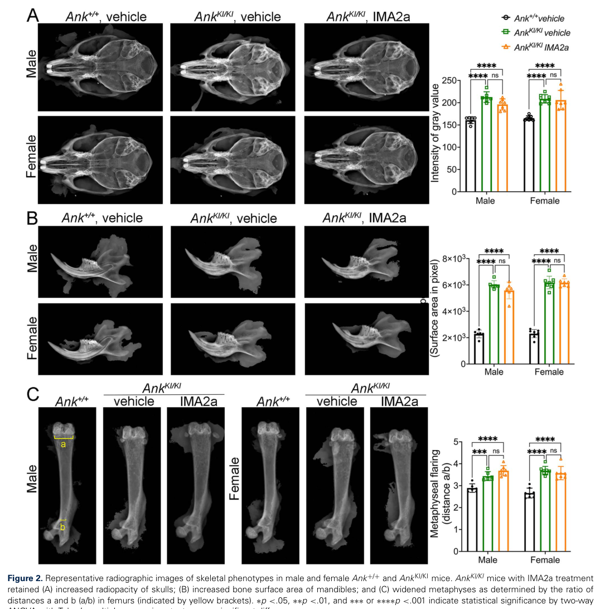

## Question

# Disease Characteristics Research Template

## Target Disease
- **Disease Name:** Craniometaphyseal Dysplasia
- **MONDO ID:**  (if available)
- **Category:** Mendelian

## Research Objectives

Please provide a comprehensive research report on **Craniometaphyseal Dysplasia** covering all of the
disease characteristics listed below. This report will be used to populate a disease knowledge
base entry. Be thorough and cite primary literature (PMID preferred) for all claims.

For each section, **suggested databases/resources** are listed. These are the first places
you should search for information on each topic.

---

### 1. Disease Information
> **Search first:** OMIM, Orphanet, ICD-10/ICD-11, MeSH, PubMed

- What is the disease? Provide a concise overview.
- What are the key identifiers? (OMIM, Orphanet, ICD-10/ICD-11, MeSH, Mondo)
- What are the common synonyms and alternative names?
- Is the information derived from individual patients (e.g., EHR) or aggregated disease-level resources?

### 2. Etiology

- **Disease Causal Factors**: What are the primary causes? (genetic, environmental, infectious, mechanistic)
- **Risk Factors**:
  > **Search first:** PubMed, Cochrane Library, UpToDate, clinical guidelines, ClinVar, ClinGen, GWAS Catalog, PheGenI, CTD, CDC, WHO, epidemiological databases
  - Genetic risk factors (causal variants, susceptibility loci, modifier genes)
  - Environmental risk factors (toxins, lifestyle, occupational exposures, age, sex, family history)
- **Protective Factors**:
  > **Search first:** PubMed, Cochrane Library, clinical trial databases, GWAS Catalog, gnomAD, WHO, CDC, nutrition databases
  - Genetic protective factors (protective variants, modifier alleles)
  - Environmental protective factors (diet, lifestyle, exposures that reduce risk)
- **Gene-Environment Interactions**: How do genetic and environmental factors interact to influence disease?
  > **Search first:** CTD, PubMed, PheGenI, GxE databases

### 3. Phenotypes
> **Search first:** HPO (Human Phenotype Ontology), OMIM, Orphanet, PubMed, clinicaltrials.gov, MedDRA, SNOMED CT, DECIPHER, LOINC

For each phenotype, provide:
- **Phenotype type**: symptoms, clinical signs, physical manifestations, behavioral changes, or laboratory abnormalities
  > For symptoms/signs: HPO, OMIM, Orphanet, PubMed
  > For behavioral changes: HPO, DSM, RDoC (Research Domain Criteria), PubMed
  > For laboratory abnormalities: LOINC, SNOMED CT, LabTests Online, PubMed
- **Phenotype characteristics**:
  > **Search first:** OMIM, Orphanet, HPO, PubMed
  - Age of symptom onset (neonatal, childhood, adult-onset, late-onset)
  - Symptom severity (mild, moderate, severe, variable)
  - Symptom progression (stable, progressive, episodic, fluctuating)
  - Frequency among affected individuals (percentage or qualitative)
- **Quality of life impact**: Effects on daily functioning and well-being (per-phenotype when possible)
  > **Search first:** EQ-5D database, SF-36, WHO QOL databases, PubMed
- Suggest HPO (Human Phenotype Ontology) terms for each phenotype

### 4. Genetic/Molecular Information

- **Causal Genes**: Gene mutations or chromosomal abnormalities responsible for disease (gene symbols, OMIM IDs)
  > **Search first:** OMIM, ClinVar, HGMD, Ensembl, NCBI Gene
- **Pathogenic Variants**:
  - Affected genes (gene symbols, HGNC IDs)
    > **Search first:** OMIM, NCBI Gene, Ensembl, HGNC, UniProt, GeneCards
  - Variant classification (pathogenic, likely pathogenic, VUS per ACMG/AMP guidelines)
    > **Search first:** ClinVar, ClinGen, ACMG/AMP guidelines, VarSome
  - Variant type/class (missense, frameshift, nonsense, splice-site, structural)
  - Allele frequency in population databases
    > **Search first:** gnomAD, 1000 Genomes, ExAC, TOPMed, dbSNP
  - Somatic vs germline origin
    > **Search first:** COSMIC (somatic), ClinVar, ICGC, TCGA
  - Functional consequences (loss of function, gain of function, dominant negative)
- **Modifier Genes**: Genes that modify disease severity or expression
- **Epigenetic Information**: DNA methylation, histone modifications, chromatin changes affecting disease
  > **Search first:** ENCODE, Roadmap Epigenomics, MethBase, DiseaseMeth
- **Chromosomal Abnormalities**: Large-scale genetic changes (aneuploidy, translocations, inversions)
  > **Search first:** DECIPHER, ClinVar, ECARUCA, UCSC Genome Browser

### 5. Environmental Information

- **Environmental Factors**: Non-genetic contributing factors (toxins, radiation, pollution, occupational exposure)
  > **Search first:** CTD (Comparative Toxicogenomics Database), TOXNET, PubMed, EPA databases
- **Lifestyle Factors**: Behavioral factors (smoking, diet, exercise, alcohol consumption)
  > **Search first:** CDC databases, WHO, PubMed, NHANES
- **Infectious Agents**: If applicable, pathogens causing or triggering disease (bacteria, viruses, fungi, parasites)
  > **Search first:** NCBI Taxonomy, ViPR, BV-BRC, MicrobeDB, GIDEON

### 6. Mechanism / Pathophysiology

- **Molecular Pathways**: Specific signaling cascades or biochemical pathways involved (Wnt, MAPK, mTOR, PI3K-AKT, etc.)
  > **Search first:** KEGG, Reactome, WikiPathways, PathBank, BioCyc
- **Cellular Processes**: Cell-level mechanisms (apoptosis, autophagy, cell cycle dysregulation, inflammation, etc.)
  > **Search first:** Gene Ontology (GO), Reactome, KEGG, PubMed
- **Protein Dysfunction**: How protein structure or function is altered (misfolding, aggregation, loss of function, gain of function)
  > **Search first:** UniProt, PDB (Protein Data Bank), InterPro, Pfam, AlphaFold
- **Metabolic Changes**: Alterations in metabolic processes (energy metabolism, lipid metabolism, amino acid metabolism)
  > **Search first:** KEGG, BioCyc, HMDB (Human Metabolome Database), BRENDA
- **Immune System Involvement**: Role of immune response (autoimmunity, immunodeficiency, chronic inflammation)
  > **Search first:** ImmPort, Immunome Database, IEDB, Gene Ontology
- **Tissue Damage Mechanisms**: How tissues/ are injured (oxidative stress, ischemia, fibrosis, necrosis)
  > **Search first:** PubMed, Gene Ontology, Reactome
- **Biochemical Abnormalities**: Specific molecular defects (enzyme deficiencies, receptor dysfunction, ion channel defects)
  > **Search first:** BRENDA, UniProt, KEGG, OMIM, PubMed
- **Epigenetic Changes**: DNA methylation, histone modifications affecting gene expression in disease
  > **Search first:** ENCODE, Roadmap Epigenomics, MethBase, DiseaseMeth
- **Molecular Profiling** (if available):
  - Transcriptomics/gene expression changes
    > **Search first:** GEO (Gene Expression Omnibus), ArrayExpress, GTEx, Human Cell Atlas, SRA
  - Proteomics findings
    > **Search first:** PRIDE, ProteomeXchange, Human Protein Atlas, STRING, BioGRID
  - Metabolomics signatures
    > **Search first:** MetaboLights, Metabolomics Workbench, HMDB, METLIN
  - Lipidomics alterations
    > **Search first:** LIPID MAPS, SwissLipids, LipidHome, Metabolomics Workbench
  - Genomic structural features
    > **Search first:** UCSC Genome Browser, Ensembl, NCBI, dbVar, DGV
- **Advanced Technologies** (if applicable):
  - Single-cell analysis findings (cell-type specific mechanisms, cellular heterogeneity)
    > **Search first:** Human Cell Atlas, Single Cell Portal, GEO, CELLxGENE
  - Spatial transcriptomics findings
    > **Search first:** GEO, Spatial Research, Vizgen, 10x Genomics data
  - Multi-omics integration results
    > **Search first:** TCGA, ICGC, cBioPortal, LinkedOmics, PubMed
  - Functional genomics screens (CRISPR, RNAi)
    > **Search first:** DepMap, GenomeRNAi, PubMed, BioGRID ORCS

For each mechanism, describe:
- The causal chain from initial trigger to clinical manifestation
- Which mechanisms are upstream vs downstream
- What cell types and biological processes are involved
- Suggest GO terms for biological processes and CL terms for cell types

### 7. Anatomical Structures Affected

- **Organ Level**:
  - Primary organs directly affected
  - Secondary organ involvement (complications, secondary effects)
  - Body systems involved (cardiovascular, nervous, digestive, respiratory, endocrine, etc.)
  > **Search first:** Uberon, FMA (Foundational Model of Anatomy), OMIM, HPO, ICD-11, MeSH, SNOMED CT
- **Tissue and Cell Level**:
  - Specific tissue types affected (epithelial, connective, muscle, nervous)
  - Specific cell populations targeted (with Cell Ontology terms)
  > **Search first:** Uberon, Human Protein Atlas, Cell Ontology, Human Cell Atlas, CellMarker, PanglaoDB
- **Subcellular Level**:
  - Cellular compartments involved (mitochondria, nucleus, ER, lysosomes) (with GO Cellular Component terms)
  > **Search first:** Gene Ontology (Cellular Component), UniProt, Human Protein Atlas
- **Localization**:
  - Specific anatomical sites (with UBERON terms)
    > **Search first:** FMA, Uberon, NeuroNames (for brain), SNOMED CT
  - Lateralization (unilateral, bilateral, asymmetric)
    > **Search first:** HPO, clinical literature, imaging databases

### 8. Temporal Development

- **Onset**:
  - Typical age of onset (congenital, pediatric, adult, geriatric)
  - Onset pattern (acute, subacute, chronic, insidious)
  > **Search first:** OMIM, Orphanet, HPO, PubMed
- **Progression**:
  - Disease stages (early, intermediate, advanced, end-stage)
    > **Search first:** Cancer Staging Manual (AJCC), WHO classifications, PubMed
  - Progression rate (rapid, slow, variable)
  - Disease course pattern (episodic, relapsing-remitting, progressive, stable)
  - Disease duration (self-limited, chronic lifelong)
  > **Search first:** Disease registries, longitudinal cohort databases, natural history studies, PubMed, Orphanet, OMIM
- **Patterns**:
  - Remission patterns (spontaneous, treatment-induced)
    > **Search first:** Clinical trial databases, disease registries, PubMed
  - Critical periods (time windows of vulnerability or opportunity for intervention)
    > **Search first:** PubMed, developmental biology databases, clinical guidelines

### 9. Inheritance and Population

- **Epidemiology**:
  - Prevalence (cases per 100,000 at given time)
  - Incidence (new cases per 100,000 per year)
  > **Search first:** Orphanet, CDC, WHO, GBD (Global Burden of Disease), national registries, SEER, disease registries
- **For Genetic Etiology**:
  - Inheritance pattern (AD, AR, X-linked, mitochondrial, multifactorial, polygenic)
    > **Search first:** OMIM, Orphanet, ClinVar, GTR (Genetic Testing Registry)
  - Penetrance (complete, incomplete, age-dependent)
    > **Search first:** ClinVar, OMIM, PubMed, ClinGen
  - Expressivity (variable, consistent)
    > **Search first:** OMIM, ClinVar, PubMed
  - Genetic anticipation (increasing severity in successive generations)
    > **Search first:** OMIM, PubMed (especially for repeat expansion disorders)
  - Germline mosaicism
    > **Search first:** ClinVar, OMIM, genetic counseling literature, PubMed
  - Founder effects (population-specific mutations)
    > **Search first:** gnomAD, population genetics databases, PubMed
  - Consanguinity role
    > **Search first:** OMIM, population studies, genetic counseling resources
  - Carrier frequency
    > **Search first:** gnomAD, carrier screening databases, GeneReviews, GTR
- **Population Demographics**:
  - Affected populations (ethnic or demographic groups with higher prevalence)
    > **Search first:** gnomAD, 1000 Genomes, PAGE Study, PubMed, population registries
  - Geographic distribution (endemic areas, regional variation)
    > **Search first:** WHO, CDC, GBD, Orphanet, geographic epidemiology databases
  - Geographic distribution of specific variants
  - Sex ratio (male:female)
    > **Search first:** Disease registries, OMIM, PubMed, epidemiological databases
  - Age distribution of affected individuals
    > **Search first:** CDC, disease registries, SEER, Orphanet

### 10. Diagnostics

- **Clinical Tests**:
  - Laboratory tests (blood, urine, tissue chemistry, specific enzyme assays)
    > **Search first:** LOINC, LabTests Online, PubMed
  - Biomarkers (proteins, metabolites, genetic markers, circulating biomarkers)
    > **Search first:** FDA Biomarker List, BEST (Biomarkers, EndpointS, and other Tools), PubMed
  - Imaging studies (X-ray, CT, MRI, PET, ultrasound)
    > **Search first:** RadLex, DICOM, Radiopaedia, imaging databases
  - Functional tests (pulmonary function, cardiac stress tests)
    > **Search first:** LOINC, clinical guidelines, PubMed
  - Electrophysiology (EEG, EMG, ECG, nerve conduction studies)
    > **Search first:** LOINC, clinical neurophysiology databases, PubMed
  - Biopsy findings (histopathology, immunohistochemistry)
    > **Search first:** SNOMED CT, College of American Pathologists resources, PubMed
  - Pathology findings (microscopic examination)
    > **Search first:** SNOMED CT, Digital Pathology databases, PubMed
- **Genetic Testing**:
  > **Search first:** GTR (Genetic Testing Registry), GeneReviews, ClinGen
  - Overview of recommended genetic testing approach
  - Whole genome sequencing (WGS) utility
    > **Search first:** GTR, ClinVar, GEL (Genomics England), gnomAD
  - Whole exome sequencing (WES) utility
    > **Search first:** GTR, ClinVar, OMIM, GeneMatcher
  - Gene panels (which panels, which genes)
    > **Search first:** GTR, ClinVar, laboratory-specific databases
  - Single gene testing
    > **Search first:** GTR, ClinVar, OMIM, GeneReviews
  - Chromosomal microarray (CMA)
    > **Search first:** DECIPHER, ClinVar, dbVar, ECARUCA
  - Karyotyping
    > **Search first:** Chromosome Abnormality Database, ClinVar, cytogenetics resources
  - FISH
    > **Search first:** ClinVar, cytogenetics databases, PubMed
  - Mitochondrial DNA testing
    > **Search first:** MITOMAP, MSeqDR, ClinVar, GTR
  - Repeat expansion testing
    > **Search first:** GTR, ClinVar, repeat expansion databases, PubMed
- **Omics-Based Diagnostics** (if applicable):
  - RNA sequencing / transcriptomics
    > **Search first:** GEO, ArrayExpress, GTEx, RNA-seq databases
  - Proteomics
    > **Search first:** PRIDE, ProteomeXchange, FDA Biomarker database
  - Metabolomics
    > **Search first:** MetaboLights, Metabolomics Workbench, HMDB
  - Epigenomics
    > **Search first:** GEO, ENCODE, Roadmap Epigenomics, MethBase
  - Liquid biopsy
    > **Search first:** COSMIC, ClinVar, liquid biopsy databases, PubMed
- **Clinical Criteria**:
  - Standardized diagnostic criteria (DSM, ICD, society guidelines)
    > **Search first:** DSM-5, ICD-11, clinical society guidelines, UpToDate
  - Differential diagnosis (other conditions to rule out, with distinguishing features)
    > **Search first:** DynaMed, UpToDate, clinical decision support systems
- **Screening**:
  - Screening methods for asymptomatic individuals (newborn screening, carrier screening, cascade screening)
    > **Search first:** ACMG recommendations, CDC newborn screening, GTR

### 11. Outcome/Prognosis

- **Survival and Mortality**:
  - Survival rate (5-year, 10-year, overall)
    > **Search first:** SEER, cancer registries, disease-specific registries, PubMed
  - Life expectancy (with and without treatment if applicable)
    > **Search first:** Orphanet, disease registries, actuarial databases, PubMed
  - Mortality rate
    > **Search first:** CDC, WHO, GBD, national mortality databases
  - Disease-specific mortality (deaths directly attributable to disease)
    > **Search first:** Disease registries, CDC Wonder, GBD, PubMed
- **Morbidity and Function**:
  - Morbidity (disease-related disability and health impacts)
    > **Search first:** GBD, WHO, disability databases, PubMed
  - Disability outcomes (long-term functional impairments)
    > **Search first:** ICF (International Classification of Functioning), disability registries
  - Quality of life measures (EQ-5D, SF-36, PROMIS, disease-specific tools)
    > **Search first:** EQ-5D database, SF-36, PROMIS, PubMed
- **Disease Course**:
  - Complications (secondary problems: infections, organ failure, etc.)
    > **Search first:** ICD codes, disease registries, clinical databases, PubMed
  - Recovery potential (likelihood and extent of recovery, with vs without treatment)
    > **Search first:** Natural history studies, rehabilitation databases, PubMed
- **Prediction**:
  - Prognostic factors (age, disease severity, biomarkers, treatment response)
    > **Search first:** Prognostic models databases, clinical calculators, PubMed
  - Prognostic biomarkers (molecular markers predicting disease course)
    > **Search first:** FDA Biomarker database, PubMed, cancer prognostic databases

### 12. Treatment

- **Pharmacotherapy**:
  - Pharmacological treatments (drug names, drug classes, mechanisms of action)
    > **Search first:** DrugBank, RxNorm, ATC classification, DailyMed, FDA databases
  - Pharmacogenomics (how genetic variants affect drug metabolism, efficacy, toxicity)
    > **Search first:** PharmGKB, CPIC (Clinical Pharmacogenetics), FDA Table of PGx Biomarkers
- **Advanced Therapeutics**:
  - Gene therapy (viral vectors, CRISPR, gene replacement, gene editing)
    > **Search first:** ClinicalTrials.gov, FDA gene therapy database, ASGCT resources
  - Cell therapy (stem cell transplant, CAR-T, cellular therapeutics)
    > **Search first:** ClinicalTrials.gov, FDA cell therapy database, FACT standards
  - RNA-based therapies (ASOs, siRNA, mRNA therapies)
    > **Search first:** ClinicalTrials.gov, FDA approvals, PubMed
  - Targeted therapies (treatments directed at specific molecular targets)
    > **Search first:** My Cancer Genome, OncoKB, ClinicalTrials.gov, FDA approvals
  - Immunotherapies (checkpoint inhibitors, monoclonal antibodies)
    > **Search first:** Cancer Immunotherapy Database, FDA approvals, ClinicalTrials.gov
- **Surgical and Interventional**:
  - Surgical interventions (types of surgery, timing, outcomes)
    > **Search first:** CPT codes, surgical registries, clinical guidelines, PubMed
- **Supportive and Rehabilitative**:
  - Supportive care (symptom management, pain control, nutrition)
    > **Search first:** Clinical guidelines, Cochrane Library, PubMed
  - Rehabilitation (physical therapy, occupational therapy, speech therapy)
    > **Search first:** Rehabilitation medicine databases, clinical guidelines, PubMed
- **Experimental**:
  - Experimental treatments in clinical trials (with NCT identifiers if available)
    > **Search first:** ClinicalTrials.gov, EU Clinical Trials Register, WHO ICTRP
- **Treatment Outcomes**:
  - Treatment response rates
    > **Search first:** Clinical trial databases, FDA reviews, systematic reviews, PubMed
  - Side effects and adverse events
    > **Search first:** FDA Adverse Event Reporting System (FAERS), MedWatch, PubMed
- **Treatment Strategy**:
  - Treatment algorithms (clinical pathways, decision trees)
    > **Search first:** Clinical practice guidelines, NCCN Guidelines, UpToDate
  - Combination therapies
    > **Search first:** ClinicalTrials.gov, treatment guidelines, PubMed
  - Personalized medicine approaches (genotype-guided treatment)
    > **Search first:** My Cancer Genome, CIViC, PharmGKB, precision medicine databases

For each treatment, suggest NCIT (NCI Thesaurus) clinical-intervention terms where applicable.

### 13. Prevention

- **Prevention Levels**:
  - Primary prevention (preventing disease occurrence: vaccination, risk factor modification)
    > **Search first:** CDC, WHO, USPSTF recommendations, Cochrane Library
  - Secondary prevention (early detection and treatment: screening programs, early intervention)
    > **Search first:** USPSTF, CDC screening guidelines, WHO
  - Tertiary prevention (preventing complications in those with disease)
    > **Search first:** Clinical guidelines, disease management protocols, PubMed
- **Immunization**: Vaccine strategies (if applicable)
  > **Search first:** CDC vaccine schedules, WHO immunization, FDA vaccine database
- **Screening and Early Detection**:
  - Screening programs (population-based: newborn screening, cancer screening)
    > **Search first:** CDC screening programs, USPSTF, cancer screening databases
  - Genetic screening (carrier screening, preimplantation genetic diagnosis, prenatal testing)
    > **Search first:** ACMG recommendations, ACOG guidelines, GTR
  - Risk stratification (identifying high-risk individuals for targeted prevention)
    > **Search first:** Risk prediction models, clinical calculators, PubMed
- **Behavioral Interventions**: Lifestyle modifications to reduce risk
  > **Search first:** CDC, WHO, behavioral intervention databases, Cochrane Library
- **Counseling**: Genetic counseling (risk assessment, family planning guidance)
  > **Search first:** NSGC resources, ACMG guidelines, GeneReviews
- **Public Health**:
  - Public health interventions (sanitation, vector control, health education)
    > **Search first:** CDC, WHO, public health databases, PubMed
  - Environmental interventions (reducing environmental risk factors)
    > **Search first:** EPA databases, WHO environmental health, PubMed
- **Prophylaxis**: Preventive medications or procedures
  > **Search first:** Clinical guidelines, FDA approvals, PubMed

### 14. Other Species / Natural Disease

- **Taxonomy**: Species affected (with NCBI Taxon identifiers)
  > **Search first:** NCBI Taxonomy
- **Breed**: Specific breeds affected (with VBO identifiers if applicable)
  > **Search first:** VBO (Vertebrate Breed Ontology)
- **Gene**: Orthologous genes in other species (with NCBI Gene IDs)
  > **Search first:** NCBI Gene
- **Natural Disease**:
  - Naturally occurring disease in other species (companion animals, wildlife)
    > **Search first:** OMIA (Online Mendelian Inheritance in Animals), VetCompass, PubMed
  - Veterinary relevance and importance in animal health
    > **Search first:** OMIA, veterinary databases, PubMed
- **Comparative Biology**:
  - Comparative pathology (similarities and differences across species)
    > **Search first:** OMIA, comparative pathology databases, PubMed
  - Evolutionary conservation of disease mechanisms
    > **Search first:** HomoloGene, OrthoMCL, Alliance of Genome Resources
- **Transmission** (if applicable):
  - Zoonotic potential
    > **Search first:** CDC zoonotic diseases, WHO zoonoses, GIDEON
  - Cross-species susceptibility
    > **Search first:** NCBI Taxonomy, veterinary databases, PubMed

### 15. Model Organisms

- **Model Types**:
  - Model organism type (mammalian, invertebrate, cellular, in vitro)
    > **Search first:** Alliance of Genome Resources, model organism databases
  - Specific model systems (mouse, rat, zebrafish, Drosophila, C. elegans, yeast, cell lines, organoids, iPSCs)
    > **Search first:** MGI, RGD, ZFIN, FlyBase, WormBase, SGD, ATCC, Cellosaurus
  - Induced models (drug treatment, surgical intervention, environmental manipulation)
    > **Search first:** MGI, model organism databases, PubMed
- **Genetic Models**:
  - Types available (knockout, knock-in, transgenic, conditional, humanized)
    > **Search first:** MGI, IMPC, KOMP, EuMMCR, IMSR
- **Model Characteristics**:
  - Phenotype recapitulation (how well model reproduces human disease features)
    > **Search first:** Model organism databases, comparative studies, PubMed
  - Model limitations (aspects of human disease not captured)
    > **Search first:** Model organism databases, PubMed, review articles
- **Applications**:
  - Research applications (what aspects of disease can be studied)
    > **Search first:** Model organism databases, PubMed
- **Resources**:
  - Model databases
    > **Search first:** MGI, RGD, ZFIN, FlyBase, WormBase, IMSR, EMMA, MMRRC

---

## Citation Requirements

- Cite primary literature (PMID preferred) for all mechanistic and clinical claims
- Prioritize recent reviews and landmark papers
- Include direct quotes from abstracts where possible to support key statements
- Distinguish evidence source types: human clinical, model organism, in vitro, computational

## Output Format

Structure your response as a comprehensive narrative organized by the sections above.
For each section, provide:
- Factual content with specific details (numbers, percentages, gene names, variant nomenclature)
- Ontology term suggestions (HPO, GO, CL, UBERON, CHEBI, NCIT, MONDO) where applicable
- Evidence citations with PMIDs
- Direct quotes from abstracts to support key claims
- Clear indication when information is not available or not applicable for this disease

This report will be used to populate a disease knowledge base entry with:
- Pathophysiology descriptions with causal chains
- Gene/protein annotations (HGNC, GO terms)
- Phenotype associations (HP terms) with frequencies
- Cell type involvement (CL terms)
- Anatomical locations (UBERON terms)
- Chemical entities (CHEBI terms)
- Treatment annotations (NCIT terms)
- Evidence items with PMIDs and exact abstract quotes
- Epidemiology, prognosis, diagnostic, and prevention information
- Animal model descriptions with phenotype recapitulation details

## Output

Question: You are an expert researcher providing comprehensive, well-cited information.

Provide detailed information focusing on:
1. Key concepts and definitions with current understanding
2. Recent developments and latest research (prioritize 2023-2024 sources)
3. Current applications and real-world implementations
4. Expert opinions and analysis from authoritative sources
5. Relevant statistics and data from recent studies

Format as a comprehensive research report with proper citations. Include URLs and publication dates where available.
Always prioritize recent, authoritative sources and provide specific citations for all major claims.

# Disease Characteristics Research Template

## Target Disease
- **Disease Name:** Craniometaphyseal Dysplasia
- **MONDO ID:**  (if available)
- **Category:** Mendelian

## Research Objectives

Please provide a comprehensive research report on **Craniometaphyseal Dysplasia** covering all of the
disease characteristics listed below. This report will be used to populate a disease knowledge
base entry. Be thorough and cite primary literature (PMID preferred) for all claims.

For each section, **suggested databases/resources** are listed. These are the first places
you should search for information on each topic.

---

### 1. Disease Information
> **Search first:** OMIM, Orphanet, ICD-10/ICD-11, MeSH, PubMed

- What is the disease? Provide a concise overview.
- What are the key identifiers? (OMIM, Orphanet, ICD-10/ICD-11, MeSH, Mondo)
- What are the common synonyms and alternative names?
- Is the information derived from individual patients (e.g., EHR) or aggregated disease-level resources?

### 2. Etiology

- **Disease Causal Factors**: What are the primary causes? (genetic, environmental, infectious, mechanistic)
- **Risk Factors**:
  > **Search first:** PubMed, Cochrane Library, UpToDate, clinical guidelines, ClinVar, ClinGen, GWAS Catalog, PheGenI, CTD, CDC, WHO, epidemiological databases
  - Genetic risk factors (causal variants, susceptibility loci, modifier genes)
  - Environmental risk factors (toxins, lifestyle, occupational exposures, age, sex, family history)
- **Protective Factors**:
  > **Search first:** PubMed, Cochrane Library, clinical trial databases, GWAS Catalog, gnomAD, WHO, CDC, nutrition databases
  - Genetic protective factors (protective variants, modifier alleles)
  - Environmental protective factors (diet, lifestyle, exposures that reduce risk)
- **Gene-Environment Interactions**: How do genetic and environmental factors interact to influence disease?
  > **Search first:** CTD, PubMed, PheGenI, GxE databases

### 3. Phenotypes
> **Search first:** HPO (Human Phenotype Ontology), OMIM, Orphanet, PubMed, clinicaltrials.gov, MedDRA, SNOMED CT, DECIPHER, LOINC

For each phenotype, provide:
- **Phenotype type**: symptoms, clinical signs, physical manifestations, behavioral changes, or laboratory abnormalities
  > For symptoms/signs: HPO, OMIM, Orphanet, PubMed
  > For behavioral changes: HPO, DSM, RDoC (Research Domain Criteria), PubMed
  > For laboratory abnormalities: LOINC, SNOMED CT, LabTests Online, PubMed
- **Phenotype characteristics**:
  > **Search first:** OMIM, Orphanet, HPO, PubMed
  - Age of symptom onset (neonatal, childhood, adult-onset, late-onset)
  - Symptom severity (mild, moderate, severe, variable)
  - Symptom progression (stable, progressive, episodic, fluctuating)
  - Frequency among affected individuals (percentage or qualitative)
- **Quality of life impact**: Effects on daily functioning and well-being (per-phenotype when possible)
  > **Search first:** EQ-5D database, SF-36, WHO QOL databases, PubMed
- Suggest HPO (Human Phenotype Ontology) terms for each phenotype

### 4. Genetic/Molecular Information

- **Causal Genes**: Gene mutations or chromosomal abnormalities responsible for disease (gene symbols, OMIM IDs)
  > **Search first:** OMIM, ClinVar, HGMD, Ensembl, NCBI Gene
- **Pathogenic Variants**:
  - Affected genes (gene symbols, HGNC IDs)
    > **Search first:** OMIM, NCBI Gene, Ensembl, HGNC, UniProt, GeneCards
  - Variant classification (pathogenic, likely pathogenic, VUS per ACMG/AMP guidelines)
    > **Search first:** ClinVar, ClinGen, ACMG/AMP guidelines, VarSome
  - Variant type/class (missense, frameshift, nonsense, splice-site, structural)
  - Allele frequency in population databases
    > **Search first:** gnomAD, 1000 Genomes, ExAC, TOPMed, dbSNP
  - Somatic vs germline origin
    > **Search first:** COSMIC (somatic), ClinVar, ICGC, TCGA
  - Functional consequences (loss of function, gain of function, dominant negative)
- **Modifier Genes**: Genes that modify disease severity or expression
- **Epigenetic Information**: DNA methylation, histone modifications, chromatin changes affecting disease
  > **Search first:** ENCODE, Roadmap Epigenomics, MethBase, DiseaseMeth
- **Chromosomal Abnormalities**: Large-scale genetic changes (aneuploidy, translocations, inversions)
  > **Search first:** DECIPHER, ClinVar, ECARUCA, UCSC Genome Browser

### 5. Environmental Information

- **Environmental Factors**: Non-genetic contributing factors (toxins, radiation, pollution, occupational exposure)
  > **Search first:** CTD (Comparative Toxicogenomics Database), TOXNET, PubMed, EPA databases
- **Lifestyle Factors**: Behavioral factors (smoking, diet, exercise, alcohol consumption)
  > **Search first:** CDC databases, WHO, PubMed, NHANES
- **Infectious Agents**: If applicable, pathogens causing or triggering disease (bacteria, viruses, fungi, parasites)
  > **Search first:** NCBI Taxonomy, ViPR, BV-BRC, MicrobeDB, GIDEON

### 6. Mechanism / Pathophysiology

- **Molecular Pathways**: Specific signaling cascades or biochemical pathways involved (Wnt, MAPK, mTOR, PI3K-AKT, etc.)
  > **Search first:** KEGG, Reactome, WikiPathways, PathBank, BioCyc
- **Cellular Processes**: Cell-level mechanisms (apoptosis, autophagy, cell cycle dysregulation, inflammation, etc.)
  > **Search first:** Gene Ontology (GO), Reactome, KEGG, PubMed
- **Protein Dysfunction**: How protein structure or function is altered (misfolding, aggregation, loss of function, gain of function)
  > **Search first:** UniProt, PDB (Protein Data Bank), InterPro, Pfam, AlphaFold
- **Metabolic Changes**: Alterations in metabolic processes (energy metabolism, lipid metabolism, amino acid metabolism)
  > **Search first:** KEGG, BioCyc, HMDB (Human Metabolome Database), BRENDA
- **Immune System Involvement**: Role of immune response (autoimmunity, immunodeficiency, chronic inflammation)
  > **Search first:** ImmPort, Immunome Database, IEDB, Gene Ontology
- **Tissue Damage Mechanisms**: How tissues/ are injured (oxidative stress, ischemia, fibrosis, necrosis)
  > **Search first:** PubMed, Gene Ontology, Reactome
- **Biochemical Abnormalities**: Specific molecular defects (enzyme deficiencies, receptor dysfunction, ion channel defects)
  > **Search first:** BRENDA, UniProt, KEGG, OMIM, PubMed
- **Epigenetic Changes**: DNA methylation, histone modifications affecting gene expression in disease
  > **Search first:** ENCODE, Roadmap Epigenomics, MethBase, DiseaseMeth
- **Molecular Profiling** (if available):
  - Transcriptomics/gene expression changes
    > **Search first:** GEO (Gene Expression Omnibus), ArrayExpress, GTEx, Human Cell Atlas, SRA
  - Proteomics findings
    > **Search first:** PRIDE, ProteomeXchange, Human Protein Atlas, STRING, BioGRID
  - Metabolomics signatures
    > **Search first:** MetaboLights, Metabolomics Workbench, HMDB, METLIN
  - Lipidomics alterations
    > **Search first:** LIPID MAPS, SwissLipids, LipidHome, Metabolomics Workbench
  - Genomic structural features
    > **Search first:** UCSC Genome Browser, Ensembl, NCBI, dbVar, DGV
- **Advanced Technologies** (if applicable):
  - Single-cell analysis findings (cell-type specific mechanisms, cellular heterogeneity)
    > **Search first:** Human Cell Atlas, Single Cell Portal, GEO, CELLxGENE
  - Spatial transcriptomics findings
    > **Search first:** GEO, Spatial Research, Vizgen, 10x Genomics data
  - Multi-omics integration results
    > **Search first:** TCGA, ICGC, cBioPortal, LinkedOmics, PubMed
  - Functional genomics screens (CRISPR, RNAi)
    > **Search first:** DepMap, GenomeRNAi, PubMed, BioGRID ORCS

For each mechanism, describe:
- The causal chain from initial trigger to clinical manifestation
- Which mechanisms are upstream vs downstream
- What cell types and biological processes are involved
- Suggest GO terms for biological processes and CL terms for cell types

### 7. Anatomical Structures Affected

- **Organ Level**:
  - Primary organs directly affected
  - Secondary organ involvement (complications, secondary effects)
  - Body systems involved (cardiovascular, nervous, digestive, respiratory, endocrine, etc.)
  > **Search first:** Uberon, FMA (Foundational Model of Anatomy), OMIM, HPO, ICD-11, MeSH, SNOMED CT
- **Tissue and Cell Level**:
  - Specific tissue types affected (epithelial, connective, muscle, nervous)
  - Specific cell populations targeted (with Cell Ontology terms)
  > **Search first:** Uberon, Human Protein Atlas, Cell Ontology, Human Cell Atlas, CellMarker, PanglaoDB
- **Subcellular Level**:
  - Cellular compartments involved (mitochondria, nucleus, ER, lysosomes) (with GO Cellular Component terms)
  > **Search first:** Gene Ontology (Cellular Component), UniProt, Human Protein Atlas
- **Localization**:
  - Specific anatomical sites (with UBERON terms)
    > **Search first:** FMA, Uberon, NeuroNames (for brain), SNOMED CT
  - Lateralization (unilateral, bilateral, asymmetric)
    > **Search first:** HPO, clinical literature, imaging databases

### 8. Temporal Development

- **Onset**:
  - Typical age of onset (congenital, pediatric, adult, geriatric)
  - Onset pattern (acute, subacute, chronic, insidious)
  > **Search first:** OMIM, Orphanet, HPO, PubMed
- **Progression**:
  - Disease stages (early, intermediate, advanced, end-stage)
    > **Search first:** Cancer Staging Manual (AJCC), WHO classifications, PubMed
  - Progression rate (rapid, slow, variable)
  - Disease course pattern (episodic, relapsing-remitting, progressive, stable)
  - Disease duration (self-limited, chronic lifelong)
  > **Search first:** Disease registries, longitudinal cohort databases, natural history studies, PubMed, Orphanet, OMIM
- **Patterns**:
  - Remission patterns (spontaneous, treatment-induced)
    > **Search first:** Clinical trial databases, disease registries, PubMed
  - Critical periods (time windows of vulnerability or opportunity for intervention)
    > **Search first:** PubMed, developmental biology databases, clinical guidelines

### 9. Inheritance and Population

- **Epidemiology**:
  - Prevalence (cases per 100,000 at given time)
  - Incidence (new cases per 100,000 per year)
  > **Search first:** Orphanet, CDC, WHO, GBD (Global Burden of Disease), national registries, SEER, disease registries
- **For Genetic Etiology**:
  - Inheritance pattern (AD, AR, X-linked, mitochondrial, multifactorial, polygenic)
    > **Search first:** OMIM, Orphanet, ClinVar, GTR (Genetic Testing Registry)
  - Penetrance (complete, incomplete, age-dependent)
    > **Search first:** ClinVar, OMIM, PubMed, ClinGen
  - Expressivity (variable, consistent)
    > **Search first:** OMIM, ClinVar, PubMed
  - Genetic anticipation (increasing severity in successive generations)
    > **Search first:** OMIM, PubMed (especially for repeat expansion disorders)
  - Germline mosaicism
    > **Search first:** ClinVar, OMIM, genetic counseling literature, PubMed
  - Founder effects (population-specific mutations)
    > **Search first:** gnomAD, population genetics databases, PubMed
  - Consanguinity role
    > **Search first:** OMIM, population studies, genetic counseling resources
  - Carrier frequency
    > **Search first:** gnomAD, carrier screening databases, GeneReviews, GTR
- **Population Demographics**:
  - Affected populations (ethnic or demographic groups with higher prevalence)
    > **Search first:** gnomAD, 1000 Genomes, PAGE Study, PubMed, population registries
  - Geographic distribution (endemic areas, regional variation)
    > **Search first:** WHO, CDC, GBD, Orphanet, geographic epidemiology databases
  - Geographic distribution of specific variants
  - Sex ratio (male:female)
    > **Search first:** Disease registries, OMIM, PubMed, epidemiological databases
  - Age distribution of affected individuals
    > **Search first:** CDC, disease registries, SEER, Orphanet

### 10. Diagnostics

- **Clinical Tests**:
  - Laboratory tests (blood, urine, tissue chemistry, specific enzyme assays)
    > **Search first:** LOINC, LabTests Online, PubMed
  - Biomarkers (proteins, metabolites, genetic markers, circulating biomarkers)
    > **Search first:** FDA Biomarker List, BEST (Biomarkers, EndpointS, and other Tools), PubMed
  - Imaging studies (X-ray, CT, MRI, PET, ultrasound)
    > **Search first:** RadLex, DICOM, Radiopaedia, imaging databases
  - Functional tests (pulmonary function, cardiac stress tests)
    > **Search first:** LOINC, clinical guidelines, PubMed
  - Electrophysiology (EEG, EMG, ECG, nerve conduction studies)
    > **Search first:** LOINC, clinical neurophysiology databases, PubMed
  - Biopsy findings (histopathology, immunohistochemistry)
    > **Search first:** SNOMED CT, College of American Pathologists resources, PubMed
  - Pathology findings (microscopic examination)
    > **Search first:** SNOMED CT, Digital Pathology databases, PubMed
- **Genetic Testing**:
  > **Search first:** GTR (Genetic Testing Registry), GeneReviews, ClinGen
  - Overview of recommended genetic testing approach
  - Whole genome sequencing (WGS) utility
    > **Search first:** GTR, ClinVar, GEL (Genomics England), gnomAD
  - Whole exome sequencing (WES) utility
    > **Search first:** GTR, ClinVar, OMIM, GeneMatcher
  - Gene panels (which panels, which genes)
    > **Search first:** GTR, ClinVar, laboratory-specific databases
  - Single gene testing
    > **Search first:** GTR, ClinVar, OMIM, GeneReviews
  - Chromosomal microarray (CMA)
    > **Search first:** DECIPHER, ClinVar, dbVar, ECARUCA
  - Karyotyping
    > **Search first:** Chromosome Abnormality Database, ClinVar, cytogenetics resources
  - FISH
    > **Search first:** ClinVar, cytogenetics databases, PubMed
  - Mitochondrial DNA testing
    > **Search first:** MITOMAP, MSeqDR, ClinVar, GTR
  - Repeat expansion testing
    > **Search first:** GTR, ClinVar, repeat expansion databases, PubMed
- **Omics-Based Diagnostics** (if applicable):
  - RNA sequencing / transcriptomics
    > **Search first:** GEO, ArrayExpress, GTEx, RNA-seq databases
  - Proteomics
    > **Search first:** PRIDE, ProteomeXchange, FDA Biomarker database
  - Metabolomics
    > **Search first:** MetaboLights, Metabolomics Workbench, HMDB
  - Epigenomics
    > **Search first:** GEO, ENCODE, Roadmap Epigenomics, MethBase
  - Liquid biopsy
    > **Search first:** COSMIC, ClinVar, liquid biopsy databases, PubMed
- **Clinical Criteria**:
  - Standardized diagnostic criteria (DSM, ICD, society guidelines)
    > **Search first:** DSM-5, ICD-11, clinical society guidelines, UpToDate
  - Differential diagnosis (other conditions to rule out, with distinguishing features)
    > **Search first:** DynaMed, UpToDate, clinical decision support systems
- **Screening**:
  - Screening methods for asymptomatic individuals (newborn screening, carrier screening, cascade screening)
    > **Search first:** ACMG recommendations, CDC newborn screening, GTR

### 11. Outcome/Prognosis

- **Survival and Mortality**:
  - Survival rate (5-year, 10-year, overall)
    > **Search first:** SEER, cancer registries, disease-specific registries, PubMed
  - Life expectancy (with and without treatment if applicable)
    > **Search first:** Orphanet, disease registries, actuarial databases, PubMed
  - Mortality rate
    > **Search first:** CDC, WHO, GBD, national mortality databases
  - Disease-specific mortality (deaths directly attributable to disease)
    > **Search first:** Disease registries, CDC Wonder, GBD, PubMed
- **Morbidity and Function**:
  - Morbidity (disease-related disability and health impacts)
    > **Search first:** GBD, WHO, disability databases, PubMed
  - Disability outcomes (long-term functional impairments)
    > **Search first:** ICF (International Classification of Functioning), disability registries
  - Quality of life measures (EQ-5D, SF-36, PROMIS, disease-specific tools)
    > **Search first:** EQ-5D database, SF-36, PROMIS, PubMed
- **Disease Course**:
  - Complications (secondary problems: infections, organ failure, etc.)
    > **Search first:** ICD codes, disease registries, clinical databases, PubMed
  - Recovery potential (likelihood and extent of recovery, with vs without treatment)
    > **Search first:** Natural history studies, rehabilitation databases, PubMed
- **Prediction**:
  - Prognostic factors (age, disease severity, biomarkers, treatment response)
    > **Search first:** Prognostic models databases, clinical calculators, PubMed
  - Prognostic biomarkers (molecular markers predicting disease course)
    > **Search first:** FDA Biomarker database, PubMed, cancer prognostic databases

### 12. Treatment

- **Pharmacotherapy**:
  - Pharmacological treatments (drug names, drug classes, mechanisms of action)
    > **Search first:** DrugBank, RxNorm, ATC classification, DailyMed, FDA databases
  - Pharmacogenomics (how genetic variants affect drug metabolism, efficacy, toxicity)
    > **Search first:** PharmGKB, CPIC (Clinical Pharmacogenetics), FDA Table of PGx Biomarkers
- **Advanced Therapeutics**:
  - Gene therapy (viral vectors, CRISPR, gene replacement, gene editing)
    > **Search first:** ClinicalTrials.gov, FDA gene therapy database, ASGCT resources
  - Cell therapy (stem cell transplant, CAR-T, cellular therapeutics)
    > **Search first:** ClinicalTrials.gov, FDA cell therapy database, FACT standards
  - RNA-based therapies (ASOs, siRNA, mRNA therapies)
    > **Search first:** ClinicalTrials.gov, FDA approvals, PubMed
  - Targeted therapies (treatments directed at specific molecular targets)
    > **Search first:** My Cancer Genome, OncoKB, ClinicalTrials.gov, FDA approvals
  - Immunotherapies (checkpoint inhibitors, monoclonal antibodies)
    > **Search first:** Cancer Immunotherapy Database, FDA approvals, ClinicalTrials.gov
- **Surgical and Interventional**:
  - Surgical interventions (types of surgery, timing, outcomes)
    > **Search first:** CPT codes, surgical registries, clinical guidelines, PubMed
- **Supportive and Rehabilitative**:
  - Supportive care (symptom management, pain control, nutrition)
    > **Search first:** Clinical guidelines, Cochrane Library, PubMed
  - Rehabilitation (physical therapy, occupational therapy, speech therapy)
    > **Search first:** Rehabilitation medicine databases, clinical guidelines, PubMed
- **Experimental**:
  - Experimental treatments in clinical trials (with NCT identifiers if available)
    > **Search first:** ClinicalTrials.gov, EU Clinical Trials Register, WHO ICTRP
- **Treatment Outcomes**:
  - Treatment response rates
    > **Search first:** Clinical trial databases, FDA reviews, systematic reviews, PubMed
  - Side effects and adverse events
    > **Search first:** FDA Adverse Event Reporting System (FAERS), MedWatch, PubMed
- **Treatment Strategy**:
  - Treatment algorithms (clinical pathways, decision trees)
    > **Search first:** Clinical practice guidelines, NCCN Guidelines, UpToDate
  - Combination therapies
    > **Search first:** ClinicalTrials.gov, treatment guidelines, PubMed
  - Personalized medicine approaches (genotype-guided treatment)
    > **Search first:** My Cancer Genome, CIViC, PharmGKB, precision medicine databases

For each treatment, suggest NCIT (NCI Thesaurus) clinical-intervention terms where applicable.

### 13. Prevention

- **Prevention Levels**:
  - Primary prevention (preventing disease occurrence: vaccination, risk factor modification)
    > **Search first:** CDC, WHO, USPSTF recommendations, Cochrane Library
  - Secondary prevention (early detection and treatment: screening programs, early intervention)
    > **Search first:** USPSTF, CDC screening guidelines, WHO
  - Tertiary prevention (preventing complications in those with disease)
    > **Search first:** Clinical guidelines, disease management protocols, PubMed
- **Immunization**: Vaccine strategies (if applicable)
  > **Search first:** CDC vaccine schedules, WHO immunization, FDA vaccine database
- **Screening and Early Detection**:
  - Screening programs (population-based: newborn screening, cancer screening)
    > **Search first:** CDC screening programs, USPSTF, cancer screening databases
  - Genetic screening (carrier screening, preimplantation genetic diagnosis, prenatal testing)
    > **Search first:** ACMG recommendations, ACOG guidelines, GTR
  - Risk stratification (identifying high-risk individuals for targeted prevention)
    > **Search first:** Risk prediction models, clinical calculators, PubMed
- **Behavioral Interventions**: Lifestyle modifications to reduce risk
  > **Search first:** CDC, WHO, behavioral intervention databases, Cochrane Library
- **Counseling**: Genetic counseling (risk assessment, family planning guidance)
  > **Search first:** NSGC resources, ACMG guidelines, GeneReviews
- **Public Health**:
  - Public health interventions (sanitation, vector control, health education)
    > **Search first:** CDC, WHO, public health databases, PubMed
  - Environmental interventions (reducing environmental risk factors)
    > **Search first:** EPA databases, WHO environmental health, PubMed
- **Prophylaxis**: Preventive medications or procedures
  > **Search first:** Clinical guidelines, FDA approvals, PubMed

### 14. Other Species / Natural Disease

- **Taxonomy**: Species affected (with NCBI Taxon identifiers)
  > **Search first:** NCBI Taxonomy
- **Breed**: Specific breeds affected (with VBO identifiers if applicable)
  > **Search first:** VBO (Vertebrate Breed Ontology)
- **Gene**: Orthologous genes in other species (with NCBI Gene IDs)
  > **Search first:** NCBI Gene
- **Natural Disease**:
  - Naturally occurring disease in other species (companion animals, wildlife)
    > **Search first:** OMIA (Online Mendelian Inheritance in Animals), VetCompass, PubMed
  - Veterinary relevance and importance in animal health
    > **Search first:** OMIA, veterinary databases, PubMed
- **Comparative Biology**:
  - Comparative pathology (similarities and differences across species)
    > **Search first:** OMIA, comparative pathology databases, PubMed
  - Evolutionary conservation of disease mechanisms
    > **Search first:** HomoloGene, OrthoMCL, Alliance of Genome Resources
- **Transmission** (if applicable):
  - Zoonotic potential
    > **Search first:** CDC zoonotic diseases, WHO zoonoses, GIDEON
  - Cross-species susceptibility
    > **Search first:** NCBI Taxonomy, veterinary databases, PubMed

### 15. Model Organisms

- **Model Types**:
  - Model organism type (mammalian, invertebrate, cellular, in vitro)
    > **Search first:** Alliance of Genome Resources, model organism databases
  - Specific model systems (mouse, rat, zebrafish, Drosophila, C. elegans, yeast, cell lines, organoids, iPSCs)
    > **Search first:** MGI, RGD, ZFIN, FlyBase, WormBase, SGD, ATCC, Cellosaurus
  - Induced models (drug treatment, surgical intervention, environmental manipulation)
    > **Search first:** MGI, model organism databases, PubMed
- **Genetic Models**:
  - Types available (knockout, knock-in, transgenic, conditional, humanized)
    > **Search first:** MGI, IMPC, KOMP, EuMMCR, IMSR
- **Model Characteristics**:
  - Phenotype recapitulation (how well model reproduces human disease features)
    > **Search first:** Model organism databases, comparative studies, PubMed
  - Model limitations (aspects of human disease not captured)
    > **Search first:** Model organism databases, PubMed, review articles
- **Applications**:
  - Research applications (what aspects of disease can be studied)
    > **Search first:** Model organism databases, PubMed
- **Resources**:
  - Model databases
    > **Search first:** MGI, RGD, ZFIN, FlyBase, WormBase, IMSR, EMMA, MMRRC

---

## Citation Requirements

- Cite primary literature (PMID preferred) for all mechanistic and clinical claims
- Prioritize recent reviews and landmark papers
- Include direct quotes from abstracts where possible to support key statements
- Distinguish evidence source types: human clinical, model organism, in vitro, computational

## Output Format

Structure your response as a comprehensive narrative organized by the sections above.
For each section, provide:
- Factual content with specific details (numbers, percentages, gene names, variant nomenclature)
- Ontology term suggestions (HPO, GO, CL, UBERON, CHEBI, NCIT, MONDO) where applicable
- Evidence citations with PMIDs
- Direct quotes from abstracts to support key claims
- Clear indication when information is not available or not applicable for this disease

This report will be used to populate a disease knowledge base entry with:
- Pathophysiology descriptions with causal chains
- Gene/protein annotations (HGNC, GO terms)
- Phenotype associations (HP terms) with frequencies
- Cell type involvement (CL terms)
- Anatomical locations (UBERON terms)
- Chemical entities (CHEBI terms)
- Treatment annotations (NCIT terms)
- Evidence items with PMIDs and exact abstract quotes
- Epidemiology, prognosis, diagnostic, and prevention information
- Animal model descriptions with phenotype recapitulation details

# Craniometaphyseal Dysplasia: Disease Characteristics Research Report

## Executive summary

Craniometaphyseal dysplasia (CMD) is an exceptionally rare, lifelong Mendelian craniotubular bone dysplasia. Its defining combination is **progressive craniofacial hyperostosis** and **flaring/undermodeling of long-bone metaphyses**. Morbidity is driven chiefly by narrowing of the skull base and cranial nerve foramina, which can produce hearing loss, facial palsy, visual impairment or blindness, severe headache, and occasionally hindbrain or spinal-cord compression. Autosomal-dominant CMD is caused by heterozygous **ANKH** variants; a much rarer autosomal-recessive form has been associated with homozygous **GJA1** p.Arg239Gln. No approved disease-modifying therapy exists. Management is multidisciplinary surveillance and symptom-directed surgery. The strongest recent therapeutic study, published August 8, 2024, showed that ENPP1-Fc restored plasma pyrophosphate and reduced ectopic calcification in a mouse model but did **not** correct the core craniofacial or metaphyseal phenotype. (hu2013anovelautosomal pages 1-2, reichenberger2024enpp1enzymereplacement pages 1-2, reichenberger2024enpp1enzymereplacement media 37ae48b6, reichenberger2024enpp1enzymereplacement media 942f6389)

| domain | established finding | evidence type | key identifier/statistic | evidence limitation |
|---|---|---|---|---|
| Definition / phenotype | Craniometaphyseal dysplasia (CMD) is a very rare genetic craniotubular skeletal disorder with progressive craniofacial hyperostosis and flared/widened metaphyses of long bones; major morbidity comes from cranial foraminal narrowing causing facial palsy, hearing loss, blindness, headache, and characteristic facial features such as hypertelorism and prominent mandible. (NCT01630460 chunk 1, wathuliyadde2024bonemineralizationregulation pages 1-2, kanaujiya2018rapiddegradationof pages 1-2, reichenberger2024enpp1enzymereplacement pages 1-2) | Human clinical descriptions; observational registry/trial record; review/preclinical introductions | MONDO_0015465; OMIM/MIM #123000; can be diagnosed in infancy; symptoms progress throughout life. (NCT01630460 chunk 1, hu2013anovelautosomal pages 1-2, reichenberger2024enpp1enzymereplacement pages 1-2) | No robust population-based natural history series or phenotype frequency estimates were available in the retrieved evidence. |
| ANKH autosomal dominant disease | Autosomal dominant CMD is caused by heterozygous ANKH mutations, often in the C-terminal/cytoplasmic region; recurrent/representative mutations include in-frame deletions such as Phe377del and Ser375del, and de novo cases occur. (NCT01630460 chunk 1, kanaujiya2018rapiddegradationof pages 1-2, kanaujiya2018rapiddegradationof pages 8-9, reichenberger2024enpp1enzymereplacement pages 1-2) | Human molecular genetics; segregation/case reports; functional cell studies; mouse knock-in support | PMID 11326338 cited in trial record; common mutation noted: phenylalanine 377 deletion; Open Targets links ANKH to CMD. (OpenTargets Search: craniometaphyseal dysplasia-ANKH,GJA1, NCT01630460 chunk 1, wathuliyadde2024bonemineralizationregulation pages 1-2) | Detailed variant spectrum, ACMG classifications, and population allele frequencies were not fully enumerated in retrieved sources. |
| GJA1 autosomal recessive disease | Autosomal recessive CMD is linked to a homozygous GJA1 missense variant c.716G>A (p.Arg239Gln), confirmed across multiple families and absent from unaffected relatives except as heterozygotes. (hu2013anovelautosomal pages 2-3, hu2013anovelautosomal pages 1-2, reichenberger2024enpp1enzymereplacement pages 1-2) | Human exome sequencing and familial segregation | PMID 23951358; 6 affected individuals from 3 additional families; exome depth ~78x in proband; variant novel vs dbSNP/HGMD/1000 Genomes/ESP at publication. (hu2013anovelautosomal pages 2-3, hu2013anovelautosomal pages 1-2, OpenTargets Search: craniometaphyseal dysplasia-ANKH,GJA1) | Evidence is based on a small number of families; disrupted remodeling mechanism for this Cx43 mutation remained unresolved in the primary paper. |
| Core mechanism | ANK/ANKH regulates extracellular mineralization by exporting ATP and PPi (and more recently recognized citrate/ATP-related small molecules); reduced extracellular PPi favors excess hydroxyapatite deposition. CMD-linked ANK/ANKH mutants show reduced steady-state protein, rapid degradation, and cytoplasmic mislocalization, with downstream osteoblast/osteoclast dysfunction. (wathuliyadde2024bonemineralizationregulation pages 1-2, kanaujiya2018rapiddegradationof pages 1-2, kanaujiya2018rapiddegradationof pages 8-9, reichenberger2024enpp1enzymereplacement pages 1-2) | Human and mouse cell biology; mouse genetics; mechanistic review/preprint | Mutant ANK/ANKH is “short-lived and mislocalized”; ANK localizes to plasma membrane, ER, Golgi, lysosomes when wild type. (kanaujiya2018rapiddegradationof pages 1-2, kanaujiya2018rapiddegradationof pages 8-9, reichenberger2024enpp1enzymereplacement pages 1-2) | Exact contribution of loss-of-function versus novel dominant effects remains unresolved; some mechanistic claims rely on mouse/cell systems rather than direct patient tissues. |
| Diagnosis | Best-supported diagnosis is clinical plus radiographic plus molecular genetics: lifelong craniofacial hyperostosis with metaphyseal flaring and characteristic craniofacial features, confirmed by sequencing of ANKH and, if recessive pattern/no ANKH variant, GJA1. (NCT01630460 chunk 1, hu2013anovelautosomal pages 1-2, reichenberger2024enpp1enzymereplacement pages 1-2) | Observational trial record; human genetics papers; current disease review | Estimated observational study enrollment 600 in ongoing UConn protocol NCT01630460. (NCT01630460 chunk 1) | Retrieved evidence did not provide formal consensus diagnostic criteria, test sensitivity/specificity, or a comprehensive differential diagnosis algorithm specific to CMD. |
| Treatment | There is no established curative medical therapy; care is largely supportive and surgical, including decompression of obstructed foramina and craniofacial contouring/reconstructive procedures, often repeated for symptom relief. Historical calcitriol/calcitonin use is cited in literature but robust modern efficacy data were not retrieved. (kanaujiya2018rapiddegradationof pages 1-2, reichenberger2024enpp1enzymereplacement pages 1-2) | Human case-management summaries; review statements; historical literature references noted | Current treatment described as limited to surgical decompression/plastic surgery or repetitive surgical recontouring. (wathuliyadde2024bonemineralizationregulation pages 1-2, kanaujiya2018rapiddegradationof pages 1-2, reichenberger2024enpp1enzymereplacement pages 1-2) | Evidence base is dominated by case reports/older reports; no approved disease-modifying drug or controlled therapeutic trials for CMD were identified. |
| 2024 ENPP1 mouse experiment | In AnkKI/KI mice, weekly subcutaneous IMA2a from age 1 week for 12 weeks restored plasma PPi and reduced ectopic calcification but did not rescue core CMD skeletal abnormalities (skull hyperostosis, mandible overgrowth, widened metaphyses, narrowed foramen magnum). (reichenberger2024enpp1enzymereplacement pages 4-7, reichenberger2024enpp1enzymereplacement pages 1-2, reichenberger2024enpp1enzymereplacement media 37ae48b6, reichenberger2024enpp1enzymereplacement media 942f6389) | Peer-reviewed 2024 mouse interventional study | n≥6/group; ENPP1 activity 28.15 ± 1.65 vs 482.7 ± 331.2 mOD/min; plasma PPi 0.94 ± 0.5 (WT) / 0.43 ± 0.2 (KI vehicle) / 1.29 ± 0.8 μM (KI IMA2a); visible skull calcification in 8/12 KI vehicle vs 7/12 KI IMA2a mice. (reichenberger2024enpp1enzymereplacement pages 4-7, reichenberger2024enpp1enzymereplacement pages 1-2) | Preclinical mouse data only; benefit was limited to ectopic calcification under the tested regimen and does not establish clinical efficacy in humans. |
| Models | CMD research is supported by Ank knock-in mice (Phe377del) that closely phenocopy human disease, Ank knockout mice that reproduce partial features, human iPSC-derived osteoclast differentiation studies, and emerging zebrafish ankh paralog work for developmental and screening applications. (NCT01630460 chunk 1, wathuliyadde2024bonemineralizationregulation pages 1-2, kanaujiya2018rapiddegradationof pages 1-2, reichenberger2024enpp1enzymereplacement pages 1-2) | Mouse, iPSC, zebrafish, clinical observational study | AnkKI/KI replicates thick skull, narrowed foramen magnum, fused middle ear bones, obliterated nasal sinuses, stenotic cranial foramina, metaphyseal widening, mandibular hyperostosis; zebrafish show craniofacial/notochord/somite expression of ankha/ankhb. (wathuliyadde2024bonemineralizationregulation pages 1-2, kanaujiya2018rapiddegradationof pages 1-2) | Mouse inheritance/expressivity do not perfectly mirror human AD disease; zebrafish 2024 evidence is preprint and functional roles remain speculative. |

*Table: This table condenses the most decision-relevant evidence for craniometaphyseal dysplasia across disease definition, genetics, mechanism, diagnosis, treatment, and models. It is useful as a quick reference for knowledge-base curation while highlighting where evidence remains sparse or preclinical.*

---

## 1. Disease information

### Definition and classification

CMD is a **sclerosing skeletal dysplasia/craniotubular dysplasia** characterized by abnormal skeletal modeling: progressive thickening and sclerosis of craniofacial bones occur together with broad, flared, relatively undertrabeculated metaphyses of tubular bones. The disorder is genetically and clinically distinct from craniodiaphyseal dysplasia, although older case literature and nonspecific coding can conflate the two. (NCT01630460 chunk 1, hu2013anovelautosomal pages 1-2)

Authoritative abstract wording includes:

> “Craniometaphyseal dysplasia (CMD) is a rare genetic bone disorder, characterized by progressive thickening of craniofacial bones and flared metaphyses of long bones.” — Reichenberger et al., advance publication August 8, 2024. (reichenberger2024enpp1enzymereplacement pages 1-2)

### Identifiers and synonyms

- **MONDO:** **MONDO:0015465**, craniometaphyseal dysplasia. A narrower recessive entity is represented as **MONDO:0009035**. (OpenTargets Search: craniometaphyseal dysplasia-ANKH,GJA1)
- **OMIM/MIM:** **123000**, classically autosomal-dominant craniometaphyseal dysplasia. (hu2013anovelautosomal pages 1-2)
- **Orphanet:** CMD is represented in Orphanet as a rare craniotubular bone dysplasia; the exact ORPHA identifier was not verified in the retrieved primary-text evidence and should therefore be validated directly before database ingestion.
- **MeSH:** No uniquely disease-specific MeSH descriptor was established in the retrieved record. ClinicalTrials.gov maps the record to broader terms including **Hyperostosis (D015576)**; “Schwartz-Lelek syndrome” appears in its automated condition-browse output but should not be treated as the preferred CMD synonym without independent curation. (NCT01630460 chunk 1)
- **ICD-10/ICD-11:** No specific CMD code was identified. Cases are generally captured under broader osteochondrodysplasia/sclerosing-bone-dysplasia categories; local coding should be checked against the current national modification.
- **Common names:** craniometaphyseal dysplasia; CMD; autosomal-dominant craniometaphyseal dysplasia; autosomal-recessive craniometaphyseal dysplasia; craniometaphyseal dysplasia, Jackson type is encountered historically.

The evidence summarized here is principally **aggregated disease-level literature**, supplemented by individual/familial case reports and an observational research protocol. It is not derived from a population EHR cohort.

---

## 2. Etiology, risk, protective, and environmental factors

### Causal factors

CMD is primarily genetic:

1. **Autosomal-dominant CMD:** heterozygous pathogenic variants in **ANKH**, including de novo variants. Human genetic associations were reported in 2001 (PMID **11326338**; related ANKH report PMID **11326272**). (OpenTargets Search: craniometaphyseal dysplasia-ANKH,GJA1, NCT01630460 chunk 1)
2. **Autosomal-recessive CMD:** homozygous **GJA1** c.716G>A, p.Arg239Gln was identified by exome sequencing and cosegregated with disease in multiple families (PMID **23951358**, published August 12, 2013; DOI [10.1371/journal.pone.0073576](https://doi.org/10.1371/journal.pone.0073576)). (hu2013anovelautosomal pages 2-3, hu2013anovelautosomal pages 1-2)

### Risk factors

- The material risk factor is inheritance of a causal germline allele: one pathogenic **ANKH** allele for dominant CMD, or biallelic pathogenic **GJA1** alleles in the reported recessive form.
- Family history raises prior probability, but absence of family history does not exclude CMD because **de novo ANKH variants** occur. (NCT01630460 chunk 1, hu2013anovelautosomal pages 1-2)
- Consanguinity is relevant to the recessive form: the discovery proband came from a consanguineous family. (hu2013anovelautosomal pages 2-3)
- No reproducible age-, sex-, ethnicity-, toxin-, lifestyle-, occupational-, or infectious-risk factor has been established.

### Protective factors and gene–environment interactions

No validated human genetic or environmental protective factor is known. Dietary phosphate restriction improved skeletal abnormalities in an **Ank** mouse model (PMID **33463757**), but this is preclinical and should not be interpreted as a recommended human diet. Conversely, phosphate supplementation did not rescue the mouse phenotype. These observations suggest mineral availability can modify expression in animals, but a clinically actionable human gene–diet interaction is unproven. (reichenberger2024enpp1enzymereplacement pages 9-10, NCT01630460 chunk 1)

There is no established role for smoking, alcohol, exercise, pollution, radiation, toxins, or infectious agents in initiating CMD.

---

## 3. Phenotypes

Frequencies are poorly quantified because published evidence consists mainly of small families and case reports. Terms such as “typical,” “frequent,” or “variable” are therefore preferable to unsupported percentages.

| Phenotype | Type, onset, and course | Functional/QoL effect | Suggested HPO term |
|---|---|---|---|
| Craniofacial hyperostosis/skull-base sclerosis | Clinical/radiographic sign; may be apparent in infancy or childhood; progressive lifelong | Cosmetic difference, foraminal obstruction, neurologic morbidity | **Hyperostosis**, cranial hyperostosis |
| Metaphyseal flaring/undermodeling | Radiographic sign; developmental, generally chronic | Usually less functionally severe than cranial disease; may alter bone shape | **Metaphyseal flaring** (HP:0003011) |
| Hypertelorism/wide-set eyes | Physical manifestation; early | Facial appearance | **Hypertelorism** (HP:0000316) |
| Broad/depressed nasal bridge and paranasal bossing | Physical manifestation; early, variable | Facial appearance; possible nasal obstruction | **Broad nasal bridge** (HP:0000431), depressed nasal bridge |
| Mandibular hyperostosis/prominent mandible | Physical/radiographic manifestation; progressive | Malocclusion, mastication and cosmetic effects | **Mandibular prognathia** (HP:0000303), hyperostosis |
| Cranial-foraminal stenosis | Imaging/pathologic sign; progressive | Compresses cranial nerves | **Stenosis of cranial foramina** |
| Hearing loss/deafness | Symptom/sign; variable, often progressive from childhood | Communication, education, social participation | **Hearing impairment** (HP:0000365) |
| Facial nerve palsy | Neurologic sign; variable and potentially progressive | Facial movement, eye protection, speech/eating | **Facial palsy** (HP:0010628) |
| Visual impairment/blindness | Neurologic symptom from optic canal/nerve compression; severe cases progressive | Major disability | **Visual impairment** (HP:0000505), **Blindness** (HP:0000618) |
| Severe headache/increased intracranial pressure | Symptom; variable | Pain, daily activity limitation | **Headache** (HP:0002315), increased intracranial pressure |
| Delayed tooth eruption and dental anomalies | Dental sign; childhood | Feeding, occlusion, dental treatment burden | **Delayed eruption of teeth** (HP:0000684), dental malocclusion |
| Nasolacrimal obstruction/epiphora | Ocular-adnexal sign; reported in recessive CMD | Tearing/infection risk | **Nasolacrimal duct obstruction** |
| Chiari I malformation, cord compression, syringomyelia | Uncommon severe complications of skull-base overgrowth | Neurologic disability; may require decompression | **Chiari malformation** (HP:0002308), syringomyelia |
| Nasal/sinus obstruction or sleep-disordered breathing | Variable secondary manifestation | Sleep, breathing and exercise effects | **Nasal obstruction**, obstructive sleep apnea |

The central clinical causal relationship is well summarized in the 2024 paper: craniofacial hyperostosis obstructs neural foramina, producing “facial palsy, blindness, deafness, or severe headache.” Symptoms can progress throughout life. (kanaujiya2018rapiddegradationof pages 1-2, reichenberger2024enpp1enzymereplacement pages 1-2)

In the reported recessive **GJA1** case, a three-year-old boy had relative macrocephaly, hypertelorism, a thick bony nasal wedge, depressed/flattened nasal bridge, bilateral nasolacrimal obstruction, skull-base sclerosis, and sclerotic thickening of parietal, occipital, ethmoid, maxillary, and zygomatic bones. Serum calcium, phosphate, and alkaline phosphatase were normal. (hu2013anovelautosomal pages 2-3)

No validated CMD-specific EQ-5D, SF-36, PROMIS, or disease-specific quality-of-life dataset was retrieved. QoL effects must presently be inferred from sensory loss, pain, airway obstruction, facial difference, repeated operations, dental dysfunction, and neurologic disability.

---

## 4. Genetic and molecular information

### Causal genes

- **ANKH** — approved name *ANKH inorganic pyrophosphate transport regulator*; Ensembl **ENSG00000154122**. It encodes a multipass transmembrane protein involved in small-molecule transport and membrane trafficking. Open Targets identifies ANKH as the highest-scoring CMD-associated target in the retrieved analysis. (OpenTargets Search: craniometaphyseal dysplasia-ANKH,GJA1, reichenberger2024enpp1enzymereplacement pages 1-2)
- **GJA1** — *gap junction protein alpha 1*, encoding connexin-43/Cx43; Ensembl **ENSG00000152661**, MIM gene **121014**. Cx43 is present in osteoblasts, osteocytes, osteoclasts, and chondrocytes and supports intercellular movement of low-molecular-weight molecules. (hu2013anovelautosomal pages 2-3, hu2013anovelautosomal pages 1-2)

### Pathogenic variants and consequences

**ANKH:** CMD variants are predominantly heterozygous, germline, C-terminal cytoplasmic-domain missense substitutions, small in-frame deletions, or insertions. Recurrent examples include **p.Phe377del** and **p.Ser375del**. Two large ANKH deletions were reported in sporadic cases (PMID **22150416**). The retrieved sources do not supply a complete ClinVar/ACMG inventory, and each variant should be curated at the transcript-specific level before assigning current ACMG classification. (NCT01630460 chunk 1, kanaujiya2018rapiddegradationof pages 1-2, kanaujiya2018rapiddegradationof pages 8-9)

Functional work indicates that p.Phe377del and p.Ser375del proteins have reduced steady-state abundance, accelerated degradation, and abnormal cytoplasmic rather than normal membrane/organelle localization. Coexpression experiments did not show a straightforward dominant-negative effect on wild-type localization or abundance. The most defensible current model is **partial loss of normal function plus a possible mutant-specific dominant function**, rather than complete loss of function alone. (kanaujiya2018rapiddegradationof pages 1-2, kanaujiya2018rapiddegradationof pages 8-9, reichenberger2024enpp1enzymereplacement pages 4-7)

**GJA1:** c.716G>A, **p.Arg239Gln** is a homozygous missense variant in a conserved C-terminal region/potential tubulin-binding motif. At publication it was absent from dbSNP, HGMD, 1000 Genomes, and the NHLBI Exome Sequencing Project. It was found in six affected individuals from three additional families, while parents and unaffected carrier relatives were heterozygous. Its precise bone-remodeling defect remains unresolved. (hu2013anovelautosomal pages 2-3, hu2013anovelautosomal pages 1-2)

Population frequencies should be checked in current gnomAD using exact transcript/genome-build nomenclature. The historic absence data above should not be substituted for a current gnomAD frequency.

### Modifiers, epigenetics, and chromosomal abnormalities

- No validated modifier gene explains intrafamilial variability.
- No CMD-specific DNA-methylation, histone, chromatin, transcriptomic, proteomic, metabolomic, lipidomic, spatial-transcriptomic, or single-cell diagnostic signature is established.
- Recessive CMD was historically mapped to 6q21–q22 before **GJA1** identification, but CMD is not ordinarily a large chromosomal-abnormality syndrome. (hu2013anovelautosomal pages 1-2)
- Genetic anticipation is not reported.

---

## 5. Environmental information

CMD is not an environmentally acquired, infectious, toxic, or lifestyle-mediated disease. No pathogen, vaccine association, occupational exposure, diet, smoking behavior, alcohol exposure, or pollution factor is known to cause it. Environmental management can nevertheless modify complications—for example, hearing/vision accommodation, dental care, airway care, and avoidance of unsupported mineral supplementation—but these are secondary management considerations rather than etiologic factors.

---

## 6. Mechanism and pathophysiology

### Working causal chain for ANKH-CMD

1. A heterozygous C-terminal **ANKH** variant alters ANK/ANKH folding, stability, localization, and small-molecule transport.
2. Mutant protein is rapidly degraded through proteasomal and, for endogenous protein, prominently lysosomal pathways; recovered protein remains mislocalized. Wild-type ANK/ANKH normally localizes to plasma membrane, ER, Golgi, lysosomes, and trafficking vesicles. (kanaujiya2018rapiddegradationof pages 1-2, kanaujiya2018rapiddegradationof pages 8-9, reichenberger2024enpp1enzymereplacement pages 1-2)
3. ANK/ANKH-dependent export/release of ATP, pyrophosphate and citrate, together with Golgi–endosomal trafficking, is disturbed. Extracellular ATP can be converted by ENPP1 to AMP plus inorganic pyrophosphate (**PPi**).
4. PPi normally inhibits hydroxyapatite crystal growth. Reduced local PPi can favor mineral deposition, but restoration of circulating PPi alone does not correct the skeletal phenotype, demonstrating that local, intracellular, remodeling, or mutant-specific mechanisms are also critical. (wathuliyadde2024bonemineralizationregulation pages 1-2, reichenberger2024enpp1enzymereplacement pages 4-7, reichenberger2024enpp1enzymereplacement pages 1-2)
5. Osteoblastogenesis and osteoclastogenesis become dysregulated; patient-derived iPSC work found impaired osteoclast differentiation (PMID **29056330**), and the p.Phe377del mouse showed impaired osteoblastogenesis and osteoclastogenesis (PMID **21149338**). (NCT01630460 chunk 1)
6. Imbalanced modeling/remodeling causes craniofacial bone accumulation, metaphyseal widening, foraminal stenosis, and downstream cranial-nerve/brainstem complications.

A key cellular-study quote is:

> “CMD mutant ANK/ANKH protein is short-lived and mislocalized in cells.” — Kanaujiya et al., *Scientific Reports*, October 24, 2018, PMID **30356088**, DOI [10.1038/s41598-018-34157-5](https://doi.org/10.1038/s41598-018-34157-5). (kanaujiya2018rapiddegradationof pages 1-2)

### GJA1-CMD mechanism

Cx43 gap junctions connect osteoblasts, osteocytes, osteoclasts, and chondrocytes. The p.Arg239Gln variant likely disturbs skeletal-cell communication and coordinated remodeling, but the primary report explicitly states that the affected remodeling mechanism remained to be elucidated. This should be annotated as a **credible but incompletely resolved mechanism**, not as proven PPi transport dysfunction. (hu2013anovelautosomal pages 1-2)

### Ontology suggestions

- **GO biological process:** bone mineralization (GO:0030282); ossification (GO:0001503); bone remodeling (GO:0046849); osteoblast differentiation (GO:0001649); osteoclast differentiation (GO:0030316); pyrophosphate transport; ATP transport; regulation of biomineral tissue development; endosomal transport; Golgi-to-endosome transport.
- **GO cellular component:** plasma membrane (GO:0005886); endoplasmic reticulum (GO:0005783); Golgi apparatus (GO:0005794); lysosome (GO:0005764); clathrin-coated vesicle; gap junction (GO:0005921).
- **Cell Ontology:** osteoblast (**CL:0000062**); osteoclast (**CL:0000092**); osteocyte (**CL:0000137**); chondrocyte (**CL:0000138**); bone-marrow macrophage/osteoclast precursor.
- **CHEBI:** inorganic diphosphate/pyrophosphate; ATP; AMP; citrate; hydroxyapatite.

There is no convincing evidence that autoimmunity, immunodeficiency, chronic systemic inflammation, oxidative injury, ischemia, fibrosis, apoptosis, mitochondrial failure, or a primary endocrine defect drives CMD.

---

## 7. Anatomical structures affected

### Primary sites

- Cranial vault and skull base, including parietal, occipital, frontal, ethmoid, sphenoid/basioccipital regions.
- Facial skeleton: maxilla, zygoma, nasal/paranasal bones, and especially mandible.
- Cranial nerve foramina and foramen magnum; optic canals, internal auditory pathways, and facial-nerve canals are clinically important.
- Metaphyses of femora and other long bones.
- Middle-ear ossicles may be fused in models and hearing pathways can be compromised clinically.
- Teeth and alveolar/jaw bone, with delayed eruption and malocclusion. (wathuliyadde2024bonemineralizationregulation pages 1-2, kanaujiya2018rapiddegradationof pages 1-2, hu2013anovelautosomal pages 2-3)

### Secondary structures

Severe skull-base disease can affect cranial nerves, posterior fossa, cervicomedullary junction, spinal cord, paranasal sinuses, nasal airway, and nasolacrimal ducts. Disease is generally bilateral and diffuse rather than characteristically unilateral.

Suggested UBERON annotations include skull (**UBERON:0003129**), cranial base, mandible (**UBERON:0001684**), maxilla (**UBERON:0001709**), femur (**UBERON:0000981**), long-bone metaphysis, foramen magnum, middle-ear ossicle, optic nerve, facial nerve, and vestibulocochlear nerve.

---

## 8. Temporal development

CMD can be recognized in infancy, but onset and severity vary. Craniofacial deposition is chronic and generally **progressive throughout life** rather than episodic or spontaneously remitting. Facial morphology and metaphyseal changes arise during skeletal development; neurologic and sensory complications can emerge later as foramina narrow. (NCT01630460 chunk 1, reichenberger2024enpp1enzymereplacement pages 1-2)

There is no validated stage system. A practical clinical framework is:

- **Early:** facial/radiographic findings, metaphyseal flaring, delayed tooth eruption.
- **Intermediate:** increasing skull-base sclerosis, dental/airway problems, evolving hearing or facial-nerve dysfunction.
- **Advanced:** optic or other cranial-neuropathy, severe headache/intracranial pressure, foramen-magnum stenosis, Chiari/syrinx or cord compression.

The critical intervention window is before irreversible cranial-nerve injury, although prophylactic operations without objective compromise are not supported by CMD-specific controlled evidence. Recurrence or continued bone growth after contouring/decompression explains why repeated procedures may be necessary.

---

## 9. Inheritance and population

- **Dominant CMD:** autosomal dominant, often familial but sometimes de novo; variable expressivity can occur within a family. (NCT01630460 chunk 1, reichenberger2024enpp1enzymereplacement pages 1-2)
- **Recessive CMD:** autosomal recessive for the reported **GJA1** p.Arg239Gln families; heterozygous relatives were unaffected carriers. (hu2013anovelautosomal pages 2-3)
- Penetrance has not been quantified robustly. No evidence supports anticipation.
- Germline mosaicism is theoretically relevant to apparently de novo cases but was not quantified.
- No confirmed founder effect or population-specific carrier frequency was retrieved.
- Both sexes are affected; no reliable sex ratio or ethnic/geographic enrichment is known.

### Epidemiology

No defensible population-based CMD incidence or prevalence estimate was found. It is repeatedly described as “very rare.” The 2024 research article noted that approximately **170 PubMed publications** existed, most being clinical reports rather than mechanistic studies; this is a literature-count observation, not a case-count or prevalence estimate. (reichenberger2024enpp1enzymereplacement pages 4-7)

Consequently, incidence per 100,000, point prevalence, carrier frequency, survival rates, and age distribution should be recorded as **unknown/not established**, rather than inferred from general rare-disease statistics.

---

## 10. Diagnostics

### Recommended approach

1. **Clinical assessment:** family history; facial morphology; headache; hearing, facial movement, visual, dental, nasal-airway, sleep, and neurologic symptoms.
2. **Radiography:** skeletal survey or targeted skull/long-bone radiographs demonstrating craniofacial sclerosis/hyperostosis and metaphyseal flaring/undermodeling.
3. **CT:** high-resolution assessment of skull-base hyperostosis, foraminal and optic/auditory canal narrowing, sinuses, mandible, and operative anatomy. Minimize cumulative radiation, particularly in children.
4. **MRI:** brain, posterior fossa, cranial nerves, cervicomedullary junction, Chiari malformation, syringomyelia, or cord compression when indicated.
5. **Functional testing:** age-appropriate audiology; ophthalmologic examination including acuity, fields and optic-nerve assessment; facial-nerve examination; sleep study when obstruction is suspected; dental/orthodontic evaluation.
6. **Laboratory tests:** serum calcium, phosphate, alkaline phosphatase, PTH, 25-hydroxyvitamin D, renal function, and urinary mineral studies help assess mimics or coexisting rickets/mineral disorders. Routine values may be normal, as in the reported **GJA1** child. There is no validated circulating CMD biomarker. (hu2013anovelautosomal pages 2-3)
7. **Molecular confirmation:** sequence and copy-number analysis of **ANKH** first when the phenotype is classic/dominant; include **GJA1** for recessive pedigrees or ANKH-negative cases. A broader sclerosing-bone-dysplasia panel or exome/genome sequencing is appropriate when phenotype is atypical or first-line testing is negative. The ClinicalTrials.gov record states that molecular genetics is the best confirmation. (NCT01630460 chunk 1)

WES identified the recessive GJA1 variant at approximately **78× mean depth** after linkage and phenotype-guided filtering. WGS may detect noncoding or structural variants in unresolved cases, but CMD-specific incremental diagnostic yield is unknown. CMA, karyotype, FISH, mitochondrial testing, and repeat-expansion testing are not routine unless another syndrome is suspected. RNA-seq, proteomics, metabolomics, methylation testing, and liquid biopsy are investigational rather than clinical diagnostics.

### Differential diagnosis

Important differentials include craniodiaphyseal dysplasia; osteopetrosis; Camurati–Engelmann disease; frontometaphyseal dysplasia; Pyle disease; osteopathia striata with cranial sclerosis; sclerosteosis/van Buchem disease; hyperphosphatasia with mental retardation syndromes; fluorosis/Paget disease where age appropriate; fibrous dysplasia; **TMEM53** craniotubular dysplasia; and oculodentodigital dysplasia. The latter is especially relevant to **GJA1**, but the reported CMD families lacked the characteristic ocular/dental abnormalities and syndactyly of oculodentodigital dysplasia. (hu2013anovelautosomal pages 1-2)

### Screening

CMD is not included in routine newborn screening. Once a familial variant is known, cascade testing, targeted prenatal diagnosis, and preimplantation genetic testing are technically possible following nondirective genetic counseling.

---

## 11. Outcome and prognosis

CMD is chronic and lifelong. Life expectancy is not reliably quantified and may be near normal in mildly affected individuals, but severe skull-base disease can cause major morbidity. Principal adverse outcomes are irreversible hearing or vision loss, recurrent facial palsy, chronic headache, dental/airway dysfunction, repeated operations, and uncommon cervicomedullary or spinal-cord compromise. (kanaujiya2018rapiddegradationof pages 1-2, reichenberger2024enpp1enzymereplacement pages 1-2)

No 5-year/10-year survival, disease-specific mortality rate, validated disability scale, prognostic model, or prognostic biomarker exists. Likely clinical prognostic factors are the rate and anatomical distribution of skull-base thickening, severity of foraminal stenosis, early objective nerve dysfunction, and access to multidisciplinary follow-up. A molecular genotype–severity correlation has not been established; the 2018 study explicitly reported no known correlation between individual ANKH variants and clinical expressivity. (kanaujiya2018rapiddegradationof pages 8-9)

Bone removed surgically can regrow as the underlying modeling defect continues. Neurologic recovery depends on whether compression is relieved before permanent nerve injury.

---

## 12. Treatment and current implementation

### Standard management

No FDA/EMA-approved disease-modifying pharmacotherapy exists. Care should involve clinical genetics, metabolic bone specialists, craniofacial surgery, neurosurgery, otology/audiology, ophthalmology, dentistry/orthodontics, sleep/airway specialists, rehabilitation, and psychosocial support.

- **Surgical decompression:** for objective, clinically significant optic, auditory/facial nerve, foramen-magnum, or cervicomedullary compression. Suggested NCIt concepts: decompression procedure; craniectomy; foramen-magnum decompression.
- **Craniofacial recontouring/reconstruction or orthognathic surgery:** for severe deformity, malocclusion, or functional compromise; recurrence can necessitate repeat surgery. Suggested NCIt: reconstructive surgery; osteotomy; maxillofacial surgery.
- **Airway procedures:** individualized treatment of nasal obstruction or obstructive sleep apnea.
- **Hearing/vision support:** hearing aids or other auditory rehabilitation where anatomically appropriate; visual aids and disability support.
- **Dental care:** preventive dentistry, monitoring eruption, orthodontics, and oral/maxillofacial planning.
- **Rehabilitation:** physical, occupational, speech/hearing, low-vision, pain, and educational support according to deficits.

The contemporary literature states that treatment remains limited to surgical decompression and craniofacial correction, while the 2018 mechanistic paper described “repetitive surgeries to remove hyperostotic bone for symptom relief.” (kanaujiya2018rapiddegradationof pages 1-2, reichenberger2024enpp1enzymereplacement pages 1-2)

### Historical pharmacotherapy

Calcitriol and calcitonin have been reported in old, very small case-based literature, with the rationale of modifying bone turnover. The retrieved evidence does not establish durable benefit, standardized dosing, response rates, or safety sufficient for routine disease-modifying use. Bisphosphonates, denosumab, anabolic agents, proteasome/lysosome inhibitors, and systemic phosphate manipulation are likewise not established CMD therapies. Proteolysis inhibitors are specifically unattractive because rescued mutant ANKH remains mislocalized and global inhibition of protein degradation is potentially harmful. (kanaujiya2018rapiddegradationof pages 8-9)

### Recent experimental treatment: ENPP1-Fc

Reichenberger et al. treated male and female **AnkKI/KI** mice with weekly subcutaneous IMA2a from age one week for 12 weeks, with at least six mice per group. ENPP1 activity rose from **28.15 ± 1.65** to **482.7 ± 331.2 mOD/min**; plasma PPi was **0.94 ± 0.5 μM** in wild type, **0.43 ± 0.2 μM** in mutant vehicle controls, and **1.29 ± 0.8 μM** in treated mutants (p<0.01). Calcified-nodule volume fell, but skull hyperostosis, mandibular bone mass, metaphyseal widening, abnormal femoral shape, and narrowed foramen magnum did not significantly improve. (reichenberger2024enpp1enzymereplacement pages 4-7, reichenberger2024enpp1enzymereplacement pages 1-2)

The radiographic and μCT figures directly show persistent increased skull radiopacity, mandibular enlargement, metaphyseal flaring, and foramen-magnum narrowing after treatment. (reichenberger2024enpp1enzymereplacement media 37ae48b6, reichenberger2024enpp1enzymereplacement media 942f6389)

This is strong negative translational evidence against the idea that simply normalizing **circulating** PPi will reverse core CMD. It does not exclude benefit from earlier, local, higher-exposure, combination, gene-directed, or remodeling-directed approaches.

### Clinical studies

**NCT01630460**, “Genetic and Functional Analysis of Craniometaphyseal Dysplasia,” is a prospective observational case-control study at UConn Health, not a treatment trial. It collects saliva, blood, and bone tissue and aims to identify genetic elements affecting cause, progression, and severity. The current record lists estimated enrollment of **600**, ages child through older adult, and recruiting status, with completion projected for 2030. URL: [ClinicalTrials.gov NCT01630460](https://clinicaltrials.gov/study/NCT01630460). (NCT01630460 chunk 1)

No CMD-specific gene therapy, CRISPR therapy, RNA therapy, cell therapy, or controlled drug trial was identified. Pharmacogenomic guidance is not applicable at present.

---

## 13. Prevention

### Primary prevention

There is no vaccine, lifestyle intervention, environmental avoidance measure, or prophylactic drug that prevents a new germline CMD case. Reproductive options after molecular diagnosis include genetic counseling, partner testing for recessive disease where appropriate, prenatal diagnosis, and preimplantation genetic testing.

For counseling:

- An affected heterozygous **ANKH** carrier generally has a 50% transmission probability per pregnancy, subject to variant interpretation and parental mosaicism.
- Two carriers of a pathogenic recessive **GJA1** allele have the standard 25% affected, 50% carrier, and 25% unaffected/noncarrier probabilities per pregnancy.

### Secondary and tertiary prevention

Early molecular diagnosis and cascade testing permit surveillance before irreversible nerve damage. Periodic hearing, vision, neurologic, dental, airway/sleep, and imaging assessment should be individualized. Prompt treatment of objective compression, dental infection, sleep-disordered breathing, and functional deficits constitutes tertiary prevention. Population screening and newborn biochemical screening are not justified by current evidence.

---

## 14. Other species and natural disease

No well-established naturally occurring veterinary CMD homolog was identified in the retrieved literature. Accordingly, breed-specific prevalence, VBO terms, zoonotic potential, and cross-species transmission are **not applicable/unknown**. CMD is genetic and noncommunicable.

Orthologous **Ank/ankh** genes are evolutionarily conserved across vertebrates. Relevant taxa include:

- *Homo sapiens* — NCBI Taxonomy **9606**
- *Mus musculus* — **10090**
- *Danio rerio* — **7955**

Comparative pathology supports conserved control of mineralization, but species differences are important: joint stiffness in mice is not a typical reported human feature, and heterozygous mice are often milder than human heterozygotes. (wathuliyadde2024bonemineralizationregulation pages 1-2)

---

## 15. Model organisms and experimental systems

### Mouse models

1. **Ank p.Phe377del knock-in (AnkKI/KI):** reproduces thick skull, narrowed foramen magnum, fused middle-ear bones, obliterated nasal sinuses, stenotic cranial foramina, mandibular hyperostosis, and widened femoral metaphyses. Landmark reports: PMID **19257826** and PMID **21149338**. Dental abnormalities were examined in PMID **23160629**. (NCT01630460 chunk 1, wathuliyadde2024bonemineralizationregulation pages 1-2)
2. **Ank knockout/null:** reproduces partial CMD-like features—thick skull, narrow foramen magnum, fused ossicles—but not the full mandibular, sinus, and metaphyseal phenotype. This supports a loss-of-function component but also indicates a mutant-specific mechanism. (wathuliyadde2024bonemineralizationregulation pages 1-2, reichenberger2024enpp1enzymereplacement pages 4-7)
3. **Limitations:** severe human-like disease is best reproduced in homozygous knock-in mice even though human ANKH-CMD is heterozygous dominant; mice also develop joint stiffness not typical of human CMD. (wathuliyadde2024bonemineralizationregulation pages 1-2)

### Human cellular models

Human induced pluripotent stem-cell differentiation demonstrated that CMD-associated ANKH mutations impair osteoclast differentiation (PMID **29056330**). Other studies used patient-derived dental stem cells, osteoclast cultures, mouse embryonic fibroblasts, and transfected cells to study protein abundance, degradation, localization, and bone-cell differentiation. These are useful for target validation but do not reproduce whole-organ skull biomechanics. (NCT01630460 chunk 1, kanaujiya2018rapiddegradationof pages 1-2)

### Zebrafish

A March 26, 2024 bioRxiv study identified two paralogs, **ankha** and **ankhb**. Both were expressed in craniofacial regions, notochord, and somites; ankha was relatively prominent earlier and ankhb during larval growth. The authors proposed CRISPR models and high-throughput therapeutic screening, but exact paralog functions remain speculative. DOI [10.1101/2024.03.21.586098](https://doi.org/10.1101/2024.03.21.586098). This work was a preprint in the retrieved version and should not be weighted like peer-reviewed interventional evidence. (wathuliyadde2024bonemineralizationregulation pages 7-9, wathuliyadde2024bonemineralizationregulation pages 1-2)

---

## Recent developments and expert interpretation, 2023–2024

1. **2024 ENPP1-Fc study:** normalization of circulating PPi was biologically active but insufficient to rescue skeletal modeling. Expert interpretation: systemic PPi deficiency is probably not the sole or dominant upstream driver; intracellular ANK function, local bone PPi, citrate/ATP transport, remodeling-cell coupling, and mutant-specific effects deserve priority. (reichenberger2024enpp1enzymereplacement pages 4-7, reichenberger2024enpp1enzymereplacement pages 1-2)
2. **2024 zebrafish work:** established developmental-expression groundwork for scalable functional analysis, but not yet a validated disease model or therapy platform. (wathuliyadde2024bonemineralizationregulation pages 1-2)
3. **Ongoing natural-history/genetics effort:** NCT01630460 remains the principal registered CMD-specific study identified, emphasizing that the field still lacks robust cohorts and molecular predictors. (NCT01630460 chunk 1)
4. **Research gap:** recent CMD literature remains sparse. Most evidence is case-based or preclinical; phenotype frequencies, incidence, validated patient-reported outcomes, genotype–phenotype prediction, and controlled treatment outcomes are not available.

## Knowledge-base curation cautions

- Keep **ANKH-autosomal dominant CMD** and **GJA1-autosomal recessive CMD** as related but genetically distinct entities.
- Do not encode reduced plasma PPi as a universal validated human biomarker; the strongest quantitative data are from mice.
- Do not infer prevalence or phenotype percentages from case-report counts.
- Do not classify all ANKH variants as simple null alleles: current evidence supports reduced function plus possible mutant-specific effects.
- Mark calcitriol, calcitonin, dietary phosphate restriction, and ENPP1-Fc as historical or experimental—not standard disease-modifying care.
- Record absent omics, epigenetic, epidemiologic, survival, and QoL information explicitly as **not established**, rather than negative biological findings.

References

1. (hu2013anovelautosomal pages 1-2): Ying Hu, I-Ping Chen, Salome de Almeida, Valdenize Tiziani, Cassio M. Raposo Do Amaral, Kalpana Gowrishankar, Maria Rita Passos-Bueno, and Ernst J. Reichenberger. A novel autosomal recessive gja1 missense mutation linked to craniometaphyseal dysplasia. PLoS ONE, 8:e73576, Aug 2013. URL: https://doi.org/10.1371/journal.pone.0073576, doi:10.1371/journal.pone.0073576. This article has 84 citations and is from a peer-reviewed journal.

2. (reichenberger2024enpp1enzymereplacement pages 1-2): Ernst J. Reichenberger, Kevin O'Brien, Ayano Hatori, Thomas O Carpenter, Koen van de Wetering, Lisa Flaman, Jennifer Howe, Daniel Ortiz, Yves Sabbagh, and I-Ping Chen. Enpp1 enzyme replacement therapy improves ectopic calcification but does not rescue skeletal phenotype in a mouse model for craniometaphyseal dysplasia. JBMR Plus, Aug 2024. URL: https://doi.org/10.1093/jbmrpl/ziae103, doi:10.1093/jbmrpl/ziae103. This article has 5 citations and is from a peer-reviewed journal.

3. (reichenberger2024enpp1enzymereplacement media 37ae48b6): Ernst J. Reichenberger, Kevin O'Brien, Ayano Hatori, Thomas O Carpenter, Koen van de Wetering, Lisa Flaman, Jennifer Howe, Daniel Ortiz, Yves Sabbagh, and I-Ping Chen. Enpp1 enzyme replacement therapy improves ectopic calcification but does not rescue skeletal phenotype in a mouse model for craniometaphyseal dysplasia. JBMR Plus, Aug 2024. URL: https://doi.org/10.1093/jbmrpl/ziae103, doi:10.1093/jbmrpl/ziae103. This article has 5 citations and is from a peer-reviewed journal.

4. (reichenberger2024enpp1enzymereplacement media 942f6389): Ernst J. Reichenberger, Kevin O'Brien, Ayano Hatori, Thomas O Carpenter, Koen van de Wetering, Lisa Flaman, Jennifer Howe, Daniel Ortiz, Yves Sabbagh, and I-Ping Chen. Enpp1 enzyme replacement therapy improves ectopic calcification but does not rescue skeletal phenotype in a mouse model for craniometaphyseal dysplasia. JBMR Plus, Aug 2024. URL: https://doi.org/10.1093/jbmrpl/ziae103, doi:10.1093/jbmrpl/ziae103. This article has 5 citations and is from a peer-reviewed journal.

5. (NCT01630460 chunk 1): Ernst Reichenberger. Genetic and Functional Analysis of Craniometaphyseal Dysplasia (CMD). UConn Health. 2009. ClinicalTrials.gov Identifier: NCT01630460

6. (wathuliyadde2024bonemineralizationregulation pages 1-2): Nuwanthika Wathuliyadde, Katherine E. Willmore, and Gregory M. Kelly. Bone mineralization regulation: using zebrafish as a model to study ankh-associated mineralization disorders. bioRxiv, Mar 2024. URL: https://doi.org/10.1101/2024.03.21.586098, doi:10.1101/2024.03.21.586098. This article has 1 citations.

7. (kanaujiya2018rapiddegradationof pages 1-2): Jitendra Kanaujiya, Edward Bastow, Raj Luxmi, Zhifang Hao, Dimitrios Zattas, Mark Hochstrasser, Ernst J. Reichenberger, and I-Ping Chen. Rapid degradation of progressive ankylosis protein (ankh) in craniometaphyseal dysplasia. Scientific Reports, Oct 2018. URL: https://doi.org/10.1038/s41598-018-34157-5, doi:10.1038/s41598-018-34157-5. This article has 20 citations and is from a peer-reviewed journal.

8. (kanaujiya2018rapiddegradationof pages 8-9): Jitendra Kanaujiya, Edward Bastow, Raj Luxmi, Zhifang Hao, Dimitrios Zattas, Mark Hochstrasser, Ernst J. Reichenberger, and I-Ping Chen. Rapid degradation of progressive ankylosis protein (ankh) in craniometaphyseal dysplasia. Scientific Reports, Oct 2018. URL: https://doi.org/10.1038/s41598-018-34157-5, doi:10.1038/s41598-018-34157-5. This article has 20 citations and is from a peer-reviewed journal.

9. (OpenTargets Search: craniometaphyseal dysplasia-ANKH,GJA1): Open Targets Query (craniometaphyseal dysplasia-ANKH,GJA1, 4 results). Buniello, A. et al. (2025). Open Targets Platform: facilitating therapeutic hypotheses building in drug discovery. Nucleic Acids Research.

10. (hu2013anovelautosomal pages 2-3): Ying Hu, I-Ping Chen, Salome de Almeida, Valdenize Tiziani, Cassio M. Raposo Do Amaral, Kalpana Gowrishankar, Maria Rita Passos-Bueno, and Ernst J. Reichenberger. A novel autosomal recessive gja1 missense mutation linked to craniometaphyseal dysplasia. PLoS ONE, 8:e73576, Aug 2013. URL: https://doi.org/10.1371/journal.pone.0073576, doi:10.1371/journal.pone.0073576. This article has 84 citations and is from a peer-reviewed journal.

11. (reichenberger2024enpp1enzymereplacement pages 4-7): Ernst J. Reichenberger, Kevin O'Brien, Ayano Hatori, Thomas O Carpenter, Koen van de Wetering, Lisa Flaman, Jennifer Howe, Daniel Ortiz, Yves Sabbagh, and I-Ping Chen. Enpp1 enzyme replacement therapy improves ectopic calcification but does not rescue skeletal phenotype in a mouse model for craniometaphyseal dysplasia. JBMR Plus, Aug 2024. URL: https://doi.org/10.1093/jbmrpl/ziae103, doi:10.1093/jbmrpl/ziae103. This article has 5 citations and is from a peer-reviewed journal.

12. (reichenberger2024enpp1enzymereplacement pages 9-10): Ernst J. Reichenberger, Kevin O'Brien, Ayano Hatori, Thomas O Carpenter, Koen van de Wetering, Lisa Flaman, Jennifer Howe, Daniel Ortiz, Yves Sabbagh, and I-Ping Chen. Enpp1 enzyme replacement therapy improves ectopic calcification but does not rescue skeletal phenotype in a mouse model for craniometaphyseal dysplasia. JBMR Plus, Aug 2024. URL: https://doi.org/10.1093/jbmrpl/ziae103, doi:10.1093/jbmrpl/ziae103. This article has 5 citations and is from a peer-reviewed journal.

13. (wathuliyadde2024bonemineralizationregulation pages 7-9): Nuwanthika Wathuliyadde, Katherine E. Willmore, and Gregory M. Kelly. Bone mineralization regulation: using zebrafish as a model to study ankh-associated mineralization disorders. bioRxiv, Mar 2024. URL: https://doi.org/10.1101/2024.03.21.586098, doi:10.1101/2024.03.21.586098. This article has 1 citations.

## Artifacts

- [Edison artifact artifact-00](Craniometaphyseal_Dysplasia-deep-research-falcon_artifacts/artifact-00.md)

## Reference Validation

Checked with `linkml-reference-validator` 0.2.1.

| Outcome | Count |
| --- | --- |
| References checked | 6 |
| Resolved | 6 |
| Unresolved (possible confabulation) | 0 |
| Unverifiable | 0 |
| References weighed for topical relevance | 6 |
| On topic | 5 |
| Off topic | 0 |

All extracted references resolved successfully.