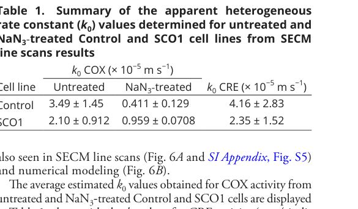

## Question

# Disease Characteristics Research Template

## Target Disease
- **Disease Name:** Cytochrome c Oxidase Deficiency
- **MONDO ID:**  (if available)
- **Category:** Mendelian

## Research Objectives

Please provide a comprehensive research report on **Cytochrome c Oxidase Deficiency** covering all of the
disease characteristics listed below. This report will be used to populate a disease knowledge
base entry. Be thorough and cite primary literature (PMID preferred) for all claims.

For each section, **suggested databases/resources** are listed. These are the first places
you should search for information on each topic.

---

### 1. Disease Information
> **Search first:** OMIM, Orphanet, ICD-10/ICD-11, MeSH, PubMed

- What is the disease? Provide a concise overview.
- What are the key identifiers? (OMIM, Orphanet, ICD-10/ICD-11, MeSH, Mondo)
- What are the common synonyms and alternative names?
- Is the information derived from individual patients (e.g., EHR) or aggregated disease-level resources?

### 2. Etiology

- **Disease Causal Factors**: What are the primary causes? (genetic, environmental, infectious, mechanistic)
- **Risk Factors**:
  > **Search first:** PubMed, Cochrane Library, UpToDate, clinical guidelines, ClinVar, ClinGen, GWAS Catalog, PheGenI, CTD, CDC, WHO, epidemiological databases
  - Genetic risk factors (causal variants, susceptibility loci, modifier genes)
  - Environmental risk factors (toxins, lifestyle, occupational exposures, age, sex, family history)
- **Protective Factors**:
  > **Search first:** PubMed, Cochrane Library, clinical trial databases, GWAS Catalog, gnomAD, WHO, CDC, nutrition databases
  - Genetic protective factors (protective variants, modifier alleles)
  - Environmental protective factors (diet, lifestyle, exposures that reduce risk)
- **Gene-Environment Interactions**: How do genetic and environmental factors interact to influence disease?
  > **Search first:** CTD, PubMed, PheGenI, GxE databases

### 3. Phenotypes
> **Search first:** HPO (Human Phenotype Ontology), OMIM, Orphanet, PubMed, clinicaltrials.gov, MedDRA, SNOMED CT, DECIPHER, LOINC

For each phenotype, provide:
- **Phenotype type**: symptoms, clinical signs, physical manifestations, behavioral changes, or laboratory abnormalities
  > For symptoms/signs: HPO, OMIM, Orphanet, PubMed
  > For behavioral changes: HPO, DSM, RDoC (Research Domain Criteria), PubMed
  > For laboratory abnormalities: LOINC, SNOMED CT, LabTests Online, PubMed
- **Phenotype characteristics**:
  > **Search first:** OMIM, Orphanet, HPO, PubMed
  - Age of symptom onset (neonatal, childhood, adult-onset, late-onset)
  - Symptom severity (mild, moderate, severe, variable)
  - Symptom progression (stable, progressive, episodic, fluctuating)
  - Frequency among affected individuals (percentage or qualitative)
- **Quality of life impact**: Effects on daily functioning and well-being (per-phenotype when possible)
  > **Search first:** EQ-5D database, SF-36, WHO QOL databases, PubMed
- Suggest HPO (Human Phenotype Ontology) terms for each phenotype

### 4. Genetic/Molecular Information

- **Causal Genes**: Gene mutations or chromosomal abnormalities responsible for disease (gene symbols, OMIM IDs)
  > **Search first:** OMIM, ClinVar, HGMD, Ensembl, NCBI Gene
- **Pathogenic Variants**:
  - Affected genes (gene symbols, HGNC IDs)
    > **Search first:** OMIM, NCBI Gene, Ensembl, HGNC, UniProt, GeneCards
  - Variant classification (pathogenic, likely pathogenic, VUS per ACMG/AMP guidelines)
    > **Search first:** ClinVar, ClinGen, ACMG/AMP guidelines, VarSome
  - Variant type/class (missense, frameshift, nonsense, splice-site, structural)
  - Allele frequency in population databases
    > **Search first:** gnomAD, 1000 Genomes, ExAC, TOPMed, dbSNP
  - Somatic vs germline origin
    > **Search first:** COSMIC (somatic), ClinVar, ICGC, TCGA
  - Functional consequences (loss of function, gain of function, dominant negative)
- **Modifier Genes**: Genes that modify disease severity or expression
- **Epigenetic Information**: DNA methylation, histone modifications, chromatin changes affecting disease
  > **Search first:** ENCODE, Roadmap Epigenomics, MethBase, DiseaseMeth
- **Chromosomal Abnormalities**: Large-scale genetic changes (aneuploidy, translocations, inversions)
  > **Search first:** DECIPHER, ClinVar, ECARUCA, UCSC Genome Browser

### 5. Environmental Information

- **Environmental Factors**: Non-genetic contributing factors (toxins, radiation, pollution, occupational exposure)
  > **Search first:** CTD (Comparative Toxicogenomics Database), TOXNET, PubMed, EPA databases
- **Lifestyle Factors**: Behavioral factors (smoking, diet, exercise, alcohol consumption)
  > **Search first:** CDC databases, WHO, PubMed, NHANES
- **Infectious Agents**: If applicable, pathogens causing or triggering disease (bacteria, viruses, fungi, parasites)
  > **Search first:** NCBI Taxonomy, ViPR, BV-BRC, MicrobeDB, GIDEON

### 6. Mechanism / Pathophysiology

- **Molecular Pathways**: Specific signaling cascades or biochemical pathways involved (Wnt, MAPK, mTOR, PI3K-AKT, etc.)
  > **Search first:** KEGG, Reactome, WikiPathways, PathBank, BioCyc
- **Cellular Processes**: Cell-level mechanisms (apoptosis, autophagy, cell cycle dysregulation, inflammation, etc.)
  > **Search first:** Gene Ontology (GO), Reactome, KEGG, PubMed
- **Protein Dysfunction**: How protein structure or function is altered (misfolding, aggregation, loss of function, gain of function)
  > **Search first:** UniProt, PDB (Protein Data Bank), InterPro, Pfam, AlphaFold
- **Metabolic Changes**: Alterations in metabolic processes (energy metabolism, lipid metabolism, amino acid metabolism)
  > **Search first:** KEGG, BioCyc, HMDB (Human Metabolome Database), BRENDA
- **Immune System Involvement**: Role of immune response (autoimmunity, immunodeficiency, chronic inflammation)
  > **Search first:** ImmPort, Immunome Database, IEDB, Gene Ontology
- **Tissue Damage Mechanisms**: How tissues/ are injured (oxidative stress, ischemia, fibrosis, necrosis)
  > **Search first:** PubMed, Gene Ontology, Reactome
- **Biochemical Abnormalities**: Specific molecular defects (enzyme deficiencies, receptor dysfunction, ion channel defects)
  > **Search first:** BRENDA, UniProt, KEGG, OMIM, PubMed
- **Epigenetic Changes**: DNA methylation, histone modifications affecting gene expression in disease
  > **Search first:** ENCODE, Roadmap Epigenomics, MethBase, DiseaseMeth
- **Molecular Profiling** (if available):
  - Transcriptomics/gene expression changes
    > **Search first:** GEO (Gene Expression Omnibus), ArrayExpress, GTEx, Human Cell Atlas, SRA
  - Proteomics findings
    > **Search first:** PRIDE, ProteomeXchange, Human Protein Atlas, STRING, BioGRID
  - Metabolomics signatures
    > **Search first:** MetaboLights, Metabolomics Workbench, HMDB, METLIN
  - Lipidomics alterations
    > **Search first:** LIPID MAPS, SwissLipids, LipidHome, Metabolomics Workbench
  - Genomic structural features
    > **Search first:** UCSC Genome Browser, Ensembl, NCBI, dbVar, DGV
- **Advanced Technologies** (if applicable):
  - Single-cell analysis findings (cell-type specific mechanisms, cellular heterogeneity)
    > **Search first:** Human Cell Atlas, Single Cell Portal, GEO, CELLxGENE
  - Spatial transcriptomics findings
    > **Search first:** GEO, Spatial Research, Vizgen, 10x Genomics data
  - Multi-omics integration results
    > **Search first:** TCGA, ICGC, cBioPortal, LinkedOmics, PubMed
  - Functional genomics screens (CRISPR, RNAi)
    > **Search first:** DepMap, GenomeRNAi, PubMed, BioGRID ORCS

For each mechanism, describe:
- The causal chain from initial trigger to clinical manifestation
- Which mechanisms are upstream vs downstream
- What cell types and biological processes are involved
- Suggest GO terms for biological processes and CL terms for cell types

### 7. Anatomical Structures Affected

- **Organ Level**:
  - Primary organs directly affected
  - Secondary organ involvement (complications, secondary effects)
  - Body systems involved (cardiovascular, nervous, digestive, respiratory, endocrine, etc.)
  > **Search first:** Uberon, FMA (Foundational Model of Anatomy), OMIM, HPO, ICD-11, MeSH, SNOMED CT
- **Tissue and Cell Level**:
  - Specific tissue types affected (epithelial, connective, muscle, nervous)
  - Specific cell populations targeted (with Cell Ontology terms)
  > **Search first:** Uberon, Human Protein Atlas, Cell Ontology, Human Cell Atlas, CellMarker, PanglaoDB
- **Subcellular Level**:
  - Cellular compartments involved (mitochondria, nucleus, ER, lysosomes) (with GO Cellular Component terms)
  > **Search first:** Gene Ontology (Cellular Component), UniProt, Human Protein Atlas
- **Localization**:
  - Specific anatomical sites (with UBERON terms)
    > **Search first:** FMA, Uberon, NeuroNames (for brain), SNOMED CT
  - Lateralization (unilateral, bilateral, asymmetric)
    > **Search first:** HPO, clinical literature, imaging databases

### 8. Temporal Development

- **Onset**:
  - Typical age of onset (congenital, pediatric, adult, geriatric)
  - Onset pattern (acute, subacute, chronic, insidious)
  > **Search first:** OMIM, Orphanet, HPO, PubMed
- **Progression**:
  - Disease stages (early, intermediate, advanced, end-stage)
    > **Search first:** Cancer Staging Manual (AJCC), WHO classifications, PubMed
  - Progression rate (rapid, slow, variable)
  - Disease course pattern (episodic, relapsing-remitting, progressive, stable)
  - Disease duration (self-limited, chronic lifelong)
  > **Search first:** Disease registries, longitudinal cohort databases, natural history studies, PubMed, Orphanet, OMIM
- **Patterns**:
  - Remission patterns (spontaneous, treatment-induced)
    > **Search first:** Clinical trial databases, disease registries, PubMed
  - Critical periods (time windows of vulnerability or opportunity for intervention)
    > **Search first:** PubMed, developmental biology databases, clinical guidelines

### 9. Inheritance and Population

- **Epidemiology**:
  - Prevalence (cases per 100,000 at given time)
  - Incidence (new cases per 100,000 per year)
  > **Search first:** Orphanet, CDC, WHO, GBD (Global Burden of Disease), national registries, SEER, disease registries
- **For Genetic Etiology**:
  - Inheritance pattern (AD, AR, X-linked, mitochondrial, multifactorial, polygenic)
    > **Search first:** OMIM, Orphanet, ClinVar, GTR (Genetic Testing Registry)
  - Penetrance (complete, incomplete, age-dependent)
    > **Search first:** ClinVar, OMIM, PubMed, ClinGen
  - Expressivity (variable, consistent)
    > **Search first:** OMIM, ClinVar, PubMed
  - Genetic anticipation (increasing severity in successive generations)
    > **Search first:** OMIM, PubMed (especially for repeat expansion disorders)
  - Germline mosaicism
    > **Search first:** ClinVar, OMIM, genetic counseling literature, PubMed
  - Founder effects (population-specific mutations)
    > **Search first:** gnomAD, population genetics databases, PubMed
  - Consanguinity role
    > **Search first:** OMIM, population studies, genetic counseling resources
  - Carrier frequency
    > **Search first:** gnomAD, carrier screening databases, GeneReviews, GTR
- **Population Demographics**:
  - Affected populations (ethnic or demographic groups with higher prevalence)
    > **Search first:** gnomAD, 1000 Genomes, PAGE Study, PubMed, population registries
  - Geographic distribution (endemic areas, regional variation)
    > **Search first:** WHO, CDC, GBD, Orphanet, geographic epidemiology databases
  - Geographic distribution of specific variants
  - Sex ratio (male:female)
    > **Search first:** Disease registries, OMIM, PubMed, epidemiological databases
  - Age distribution of affected individuals
    > **Search first:** CDC, disease registries, SEER, Orphanet

### 10. Diagnostics

- **Clinical Tests**:
  - Laboratory tests (blood, urine, tissue chemistry, specific enzyme assays)
    > **Search first:** LOINC, LabTests Online, PubMed
  - Biomarkers (proteins, metabolites, genetic markers, circulating biomarkers)
    > **Search first:** FDA Biomarker List, BEST (Biomarkers, EndpointS, and other Tools), PubMed
  - Imaging studies (X-ray, CT, MRI, PET, ultrasound)
    > **Search first:** RadLex, DICOM, Radiopaedia, imaging databases
  - Functional tests (pulmonary function, cardiac stress tests)
    > **Search first:** LOINC, clinical guidelines, PubMed
  - Electrophysiology (EEG, EMG, ECG, nerve conduction studies)
    > **Search first:** LOINC, clinical neurophysiology databases, PubMed
  - Biopsy findings (histopathology, immunohistochemistry)
    > **Search first:** SNOMED CT, College of American Pathologists resources, PubMed
  - Pathology findings (microscopic examination)
    > **Search first:** SNOMED CT, Digital Pathology databases, PubMed
- **Genetic Testing**:
  > **Search first:** GTR (Genetic Testing Registry), GeneReviews, ClinGen
  - Overview of recommended genetic testing approach
  - Whole genome sequencing (WGS) utility
    > **Search first:** GTR, ClinVar, GEL (Genomics England), gnomAD
  - Whole exome sequencing (WES) utility
    > **Search first:** GTR, ClinVar, OMIM, GeneMatcher
  - Gene panels (which panels, which genes)
    > **Search first:** GTR, ClinVar, laboratory-specific databases
  - Single gene testing
    > **Search first:** GTR, ClinVar, OMIM, GeneReviews
  - Chromosomal microarray (CMA)
    > **Search first:** DECIPHER, ClinVar, dbVar, ECARUCA
  - Karyotyping
    > **Search first:** Chromosome Abnormality Database, ClinVar, cytogenetics resources
  - FISH
    > **Search first:** ClinVar, cytogenetics databases, PubMed
  - Mitochondrial DNA testing
    > **Search first:** MITOMAP, MSeqDR, ClinVar, GTR
  - Repeat expansion testing
    > **Search first:** GTR, ClinVar, repeat expansion databases, PubMed
- **Omics-Based Diagnostics** (if applicable):
  - RNA sequencing / transcriptomics
    > **Search first:** GEO, ArrayExpress, GTEx, RNA-seq databases
  - Proteomics
    > **Search first:** PRIDE, ProteomeXchange, FDA Biomarker database
  - Metabolomics
    > **Search first:** MetaboLights, Metabolomics Workbench, HMDB
  - Epigenomics
    > **Search first:** GEO, ENCODE, Roadmap Epigenomics, MethBase
  - Liquid biopsy
    > **Search first:** COSMIC, ClinVar, liquid biopsy databases, PubMed
- **Clinical Criteria**:
  - Standardized diagnostic criteria (DSM, ICD, society guidelines)
    > **Search first:** DSM-5, ICD-11, clinical society guidelines, UpToDate
  - Differential diagnosis (other conditions to rule out, with distinguishing features)
    > **Search first:** DynaMed, UpToDate, clinical decision support systems
- **Screening**:
  - Screening methods for asymptomatic individuals (newborn screening, carrier screening, cascade screening)
    > **Search first:** ACMG recommendations, CDC newborn screening, GTR

### 11. Outcome/Prognosis

- **Survival and Mortality**:
  - Survival rate (5-year, 10-year, overall)
    > **Search first:** SEER, cancer registries, disease-specific registries, PubMed
  - Life expectancy (with and without treatment if applicable)
    > **Search first:** Orphanet, disease registries, actuarial databases, PubMed
  - Mortality rate
    > **Search first:** CDC, WHO, GBD, national mortality databases
  - Disease-specific mortality (deaths directly attributable to disease)
    > **Search first:** Disease registries, CDC Wonder, GBD, PubMed
- **Morbidity and Function**:
  - Morbidity (disease-related disability and health impacts)
    > **Search first:** GBD, WHO, disability databases, PubMed
  - Disability outcomes (long-term functional impairments)
    > **Search first:** ICF (International Classification of Functioning), disability registries
  - Quality of life measures (EQ-5D, SF-36, PROMIS, disease-specific tools)
    > **Search first:** EQ-5D database, SF-36, PROMIS, PubMed
- **Disease Course**:
  - Complications (secondary problems: infections, organ failure, etc.)
    > **Search first:** ICD codes, disease registries, clinical databases, PubMed
  - Recovery potential (likelihood and extent of recovery, with vs without treatment)
    > **Search first:** Natural history studies, rehabilitation databases, PubMed
- **Prediction**:
  - Prognostic factors (age, disease severity, biomarkers, treatment response)
    > **Search first:** Prognostic models databases, clinical calculators, PubMed
  - Prognostic biomarkers (molecular markers predicting disease course)
    > **Search first:** FDA Biomarker database, PubMed, cancer prognostic databases

### 12. Treatment

- **Pharmacotherapy**:
  - Pharmacological treatments (drug names, drug classes, mechanisms of action)
    > **Search first:** DrugBank, RxNorm, ATC classification, DailyMed, FDA databases
  - Pharmacogenomics (how genetic variants affect drug metabolism, efficacy, toxicity)
    > **Search first:** PharmGKB, CPIC (Clinical Pharmacogenetics), FDA Table of PGx Biomarkers
- **Advanced Therapeutics**:
  - Gene therapy (viral vectors, CRISPR, gene replacement, gene editing)
    > **Search first:** ClinicalTrials.gov, FDA gene therapy database, ASGCT resources
  - Cell therapy (stem cell transplant, CAR-T, cellular therapeutics)
    > **Search first:** ClinicalTrials.gov, FDA cell therapy database, FACT standards
  - RNA-based therapies (ASOs, siRNA, mRNA therapies)
    > **Search first:** ClinicalTrials.gov, FDA approvals, PubMed
  - Targeted therapies (treatments directed at specific molecular targets)
    > **Search first:** My Cancer Genome, OncoKB, ClinicalTrials.gov, FDA approvals
  - Immunotherapies (checkpoint inhibitors, monoclonal antibodies)
    > **Search first:** Cancer Immunotherapy Database, FDA approvals, ClinicalTrials.gov
- **Surgical and Interventional**:
  - Surgical interventions (types of surgery, timing, outcomes)
    > **Search first:** CPT codes, surgical registries, clinical guidelines, PubMed
- **Supportive and Rehabilitative**:
  - Supportive care (symptom management, pain control, nutrition)
    > **Search first:** Clinical guidelines, Cochrane Library, PubMed
  - Rehabilitation (physical therapy, occupational therapy, speech therapy)
    > **Search first:** Rehabilitation medicine databases, clinical guidelines, PubMed
- **Experimental**:
  - Experimental treatments in clinical trials (with NCT identifiers if available)
    > **Search first:** ClinicalTrials.gov, EU Clinical Trials Register, WHO ICTRP
- **Treatment Outcomes**:
  - Treatment response rates
    > **Search first:** Clinical trial databases, FDA reviews, systematic reviews, PubMed
  - Side effects and adverse events
    > **Search first:** FDA Adverse Event Reporting System (FAERS), MedWatch, PubMed
- **Treatment Strategy**:
  - Treatment algorithms (clinical pathways, decision trees)
    > **Search first:** Clinical practice guidelines, NCCN Guidelines, UpToDate
  - Combination therapies
    > **Search first:** ClinicalTrials.gov, treatment guidelines, PubMed
  - Personalized medicine approaches (genotype-guided treatment)
    > **Search first:** My Cancer Genome, CIViC, PharmGKB, precision medicine databases

For each treatment, suggest MAXO (Medical Action Ontology) terms where applicable.

### 13. Prevention

- **Prevention Levels**:
  - Primary prevention (preventing disease occurrence: vaccination, risk factor modification)
    > **Search first:** CDC, WHO, USPSTF recommendations, Cochrane Library
  - Secondary prevention (early detection and treatment: screening programs, early intervention)
    > **Search first:** USPSTF, CDC screening guidelines, WHO
  - Tertiary prevention (preventing complications in those with disease)
    > **Search first:** Clinical guidelines, disease management protocols, PubMed
- **Immunization**: Vaccine strategies (if applicable)
  > **Search first:** CDC vaccine schedules, WHO immunization, FDA vaccine database
- **Screening and Early Detection**:
  - Screening programs (population-based: newborn screening, cancer screening)
    > **Search first:** CDC screening programs, USPSTF, cancer screening databases
  - Genetic screening (carrier screening, preimplantation genetic diagnosis, prenatal testing)
    > **Search first:** ACMG recommendations, ACOG guidelines, GTR
  - Risk stratification (identifying high-risk individuals for targeted prevention)
    > **Search first:** Risk prediction models, clinical calculators, PubMed
- **Behavioral Interventions**: Lifestyle modifications to reduce risk
  > **Search first:** CDC, WHO, behavioral intervention databases, Cochrane Library
- **Counseling**: Genetic counseling (risk assessment, family planning guidance)
  > **Search first:** NSGC resources, ACMG guidelines, GeneReviews
- **Public Health**:
  - Public health interventions (sanitation, vector control, health education)
    > **Search first:** CDC, WHO, public health databases, PubMed
  - Environmental interventions (reducing environmental risk factors)
    > **Search first:** EPA databases, WHO environmental health, PubMed
- **Prophylaxis**: Preventive medications or procedures
  > **Search first:** Clinical guidelines, FDA approvals, PubMed

### 14. Other Species / Natural Disease

- **Taxonomy**: Species affected (with NCBI Taxon identifiers)
  > **Search first:** NCBI Taxonomy
- **Breed**: Specific breeds affected (with VBO identifiers if applicable)
  > **Search first:** VBO (Vertebrate Breed Ontology)
- **Gene**: Orthologous genes in other species (with NCBI Gene IDs)
  > **Search first:** NCBI Gene
- **Natural Disease**:
  - Naturally occurring disease in other species (companion animals, wildlife)
    > **Search first:** OMIA (Online Mendelian Inheritance in Animals), VetCompass, PubMed
  - Veterinary relevance and importance in animal health
    > **Search first:** OMIA, veterinary databases, PubMed
- **Comparative Biology**:
  - Comparative pathology (similarities and differences across species)
    > **Search first:** OMIA, comparative pathology databases, PubMed
  - Evolutionary conservation of disease mechanisms
    > **Search first:** HomoloGene, OrthoMCL, Alliance of Genome Resources
- **Transmission** (if applicable):
  - Zoonotic potential
    > **Search first:** CDC zoonotic diseases, WHO zoonoses, GIDEON
  - Cross-species susceptibility
    > **Search first:** NCBI Taxonomy, veterinary databases, PubMed

### 15. Model Organisms

- **Model Types**:
  - Model organism type (mammalian, invertebrate, cellular, in vitro)
    > **Search first:** Alliance of Genome Resources, model organism databases
  - Specific model systems (mouse, rat, zebrafish, Drosophila, C. elegans, yeast, cell lines, organoids, iPSCs)
    > **Search first:** MGI, RGD, ZFIN, FlyBase, WormBase, SGD, ATCC, Cellosaurus
  - Induced models (drug treatment, surgical intervention, environmental manipulation)
    > **Search first:** MGI, model organism databases, PubMed
- **Genetic Models**:
  - Types available (knockout, knock-in, transgenic, conditional, humanized)
    > **Search first:** MGI, IMPC, KOMP, EuMMCR, IMSR
- **Model Characteristics**:
  - Phenotype recapitulation (how well model reproduces human disease features)
    > **Search first:** Model organism databases, comparative studies, PubMed
  - Model limitations (aspects of human disease not captured)
    > **Search first:** Model organism databases, PubMed, review articles
- **Applications**:
  - Research applications (what aspects of disease can be studied)
    > **Search first:** Model organism databases, PubMed
- **Resources**:
  - Model databases
    > **Search first:** MGI, RGD, ZFIN, FlyBase, WormBase, IMSR, EMMA, MMRRC

---

## Citation Requirements

- Cite primary literature (PMID preferred) for all mechanistic and clinical claims
- Prioritize recent reviews and landmark papers
- Include direct quotes from abstracts where possible to support key statements
- Distinguish evidence source types: human clinical, model organism, in vitro, computational

## Output Format

Structure your response as a comprehensive narrative organized by the sections above.
For each section, provide:
- Factual content with specific details (numbers, percentages, gene names, variant nomenclature)
- Ontology term suggestions (HPO, GO, CL, UBERON, CHEBI, MAXO, MONDO) where applicable
- Evidence citations with PMIDs
- Direct quotes from abstracts to support key claims
- Clear indication when information is not available or not applicable for this disease

This report will be used to populate a disease knowledge base entry with:
- Pathophysiology descriptions with causal chains
- Gene/protein annotations (HGNC, GO terms)
- Phenotype associations (HP terms) with frequencies
- Cell type involvement (CL terms)
- Anatomical locations (UBERON terms)
- Chemical entities (CHEBI terms)
- Treatment annotations (MAXO terms)
- Evidence items with PMIDs and exact abstract quotes
- Epidemiology, prognosis, diagnostic, and prevention information
- Animal model descriptions with phenotype recapitulation details

## Output

Question: You are an expert researcher providing comprehensive, well-cited information.

Provide detailed information focusing on:
1. Key concepts and definitions with current understanding
2. Recent developments and latest research (prioritize 2023-2024 sources)
3. Current applications and real-world implementations
4. Expert opinions and analysis from authoritative sources
5. Relevant statistics and data from recent studies

Format as a comprehensive research report with proper citations. Include URLs and publication dates where available.
Always prioritize recent, authoritative sources and provide specific citations for all major claims.

# Disease Characteristics Research Template

## Target Disease
- **Disease Name:** Cytochrome c Oxidase Deficiency
- **MONDO ID:**  (if available)
- **Category:** Mendelian

## Research Objectives

Please provide a comprehensive research report on **Cytochrome c Oxidase Deficiency** covering all of the
disease characteristics listed below. This report will be used to populate a disease knowledge
base entry. Be thorough and cite primary literature (PMID preferred) for all claims.

For each section, **suggested databases/resources** are listed. These are the first places
you should search for information on each topic.

---

### 1. Disease Information
> **Search first:** OMIM, Orphanet, ICD-10/ICD-11, MeSH, PubMed

- What is the disease? Provide a concise overview.
- What are the key identifiers? (OMIM, Orphanet, ICD-10/ICD-11, MeSH, Mondo)
- What are the common synonyms and alternative names?
- Is the information derived from individual patients (e.g., EHR) or aggregated disease-level resources?

### 2. Etiology

- **Disease Causal Factors**: What are the primary causes? (genetic, environmental, infectious, mechanistic)
- **Risk Factors**:
  > **Search first:** PubMed, Cochrane Library, UpToDate, clinical guidelines, ClinVar, ClinGen, GWAS Catalog, PheGenI, CTD, CDC, WHO, epidemiological databases
  - Genetic risk factors (causal variants, susceptibility loci, modifier genes)
  - Environmental risk factors (toxins, lifestyle, occupational exposures, age, sex, family history)
- **Protective Factors**:
  > **Search first:** PubMed, Cochrane Library, clinical trial databases, GWAS Catalog, gnomAD, WHO, CDC, nutrition databases
  - Genetic protective factors (protective variants, modifier alleles)
  - Environmental protective factors (diet, lifestyle, exposures that reduce risk)
- **Gene-Environment Interactions**: How do genetic and environmental factors interact to influence disease?
  > **Search first:** CTD, PubMed, PheGenI, GxE databases

### 3. Phenotypes
> **Search first:** HPO (Human Phenotype Ontology), OMIM, Orphanet, PubMed, clinicaltrials.gov, MedDRA, SNOMED CT, DECIPHER, LOINC

For each phenotype, provide:
- **Phenotype type**: symptoms, clinical signs, physical manifestations, behavioral changes, or laboratory abnormalities
  > For symptoms/signs: HPO, OMIM, Orphanet, PubMed
  > For behavioral changes: HPO, DSM, RDoC (Research Domain Criteria), PubMed
  > For laboratory abnormalities: LOINC, SNOMED CT, LabTests Online, PubMed
- **Phenotype characteristics**:
  > **Search first:** OMIM, Orphanet, HPO, PubMed
  - Age of symptom onset (neonatal, childhood, adult-onset, late-onset)
  - Symptom severity (mild, moderate, severe, variable)
  - Symptom progression (stable, progressive, episodic, fluctuating)
  - Frequency among affected individuals (percentage or qualitative)
- **Quality of life impact**: Effects on daily functioning and well-being (per-phenotype when possible)
  > **Search first:** EQ-5D database, SF-36, WHO QOL databases, PubMed
- Suggest HPO (Human Phenotype Ontology) terms for each phenotype

### 4. Genetic/Molecular Information

- **Causal Genes**: Gene mutations or chromosomal abnormalities responsible for disease (gene symbols, OMIM IDs)
  > **Search first:** OMIM, ClinVar, HGMD, Ensembl, NCBI Gene
- **Pathogenic Variants**:
  - Affected genes (gene symbols, HGNC IDs)
    > **Search first:** OMIM, NCBI Gene, Ensembl, HGNC, UniProt, GeneCards
  - Variant classification (pathogenic, likely pathogenic, VUS per ACMG/AMP guidelines)
    > **Search first:** ClinVar, ClinGen, ACMG/AMP guidelines, VarSome
  - Variant type/class (missense, frameshift, nonsense, splice-site, structural)
  - Allele frequency in population databases
    > **Search first:** gnomAD, 1000 Genomes, ExAC, TOPMed, dbSNP
  - Somatic vs germline origin
    > **Search first:** COSMIC (somatic), ClinVar, ICGC, TCGA
  - Functional consequences (loss of function, gain of function, dominant negative)
- **Modifier Genes**: Genes that modify disease severity or expression
- **Epigenetic Information**: DNA methylation, histone modifications, chromatin changes affecting disease
  > **Search first:** ENCODE, Roadmap Epigenomics, MethBase, DiseaseMeth
- **Chromosomal Abnormalities**: Large-scale genetic changes (aneuploidy, translocations, inversions)
  > **Search first:** DECIPHER, ClinVar, ECARUCA, UCSC Genome Browser

### 5. Environmental Information

- **Environmental Factors**: Non-genetic contributing factors (toxins, radiation, pollution, occupational exposure)
  > **Search first:** CTD (Comparative Toxicogenomics Database), TOXNET, PubMed, EPA databases
- **Lifestyle Factors**: Behavioral factors (smoking, diet, exercise, alcohol consumption)
  > **Search first:** CDC databases, WHO, PubMed, NHANES
- **Infectious Agents**: If applicable, pathogens causing or triggering disease (bacteria, viruses, fungi, parasites)
  > **Search first:** NCBI Taxonomy, ViPR, BV-BRC, MicrobeDB, GIDEON

### 6. Mechanism / Pathophysiology

- **Molecular Pathways**: Specific signaling cascades or biochemical pathways involved (Wnt, MAPK, mTOR, PI3K-AKT, etc.)
  > **Search first:** KEGG, Reactome, WikiPathways, PathBank, BioCyc
- **Cellular Processes**: Cell-level mechanisms (apoptosis, autophagy, cell cycle dysregulation, inflammation, etc.)
  > **Search first:** Gene Ontology (GO), Reactome, KEGG, PubMed
- **Protein Dysfunction**: How protein structure or function is altered (misfolding, aggregation, loss of function, gain of function)
  > **Search first:** UniProt, PDB (Protein Data Bank), InterPro, Pfam, AlphaFold
- **Metabolic Changes**: Alterations in metabolic processes (energy metabolism, lipid metabolism, amino acid metabolism)
  > **Search first:** KEGG, BioCyc, HMDB (Human Metabolome Database), BRENDA
- **Immune System Involvement**: Role of immune response (autoimmunity, immunodeficiency, chronic inflammation)
  > **Search first:** ImmPort, Immunome Database, IEDB, Gene Ontology
- **Tissue Damage Mechanisms**: How tissues/ are injured (oxidative stress, ischemia, fibrosis, necrosis)
  > **Search first:** PubMed, Gene Ontology, Reactome
- **Biochemical Abnormalities**: Specific molecular defects (enzyme deficiencies, receptor dysfunction, ion channel defects)
  > **Search first:** BRENDA, UniProt, KEGG, OMIM, PubMed
- **Epigenetic Changes**: DNA methylation, histone modifications affecting gene expression in disease
  > **Search first:** ENCODE, Roadmap Epigenomics, MethBase, DiseaseMeth
- **Molecular Profiling** (if available):
  - Transcriptomics/gene expression changes
    > **Search first:** GEO (Gene Expression Omnibus), ArrayExpress, GTEx, Human Cell Atlas, SRA
  - Proteomics findings
    > **Search first:** PRIDE, ProteomeXchange, Human Protein Atlas, STRING, BioGRID
  - Metabolomics signatures
    > **Search first:** MetaboLights, Metabolomics Workbench, HMDB, METLIN
  - Lipidomics alterations
    > **Search first:** LIPID MAPS, SwissLipids, LipidHome, Metabolomics Workbench
  - Genomic structural features
    > **Search first:** UCSC Genome Browser, Ensembl, NCBI, dbVar, DGV
- **Advanced Technologies** (if applicable):
  - Single-cell analysis findings (cell-type specific mechanisms, cellular heterogeneity)
    > **Search first:** Human Cell Atlas, Single Cell Portal, GEO, CELLxGENE
  - Spatial transcriptomics findings
    > **Search first:** GEO, Spatial Research, Vizgen, 10x Genomics data
  - Multi-omics integration results
    > **Search first:** TCGA, ICGC, cBioPortal, LinkedOmics, PubMed
  - Functional genomics screens (CRISPR, RNAi)
    > **Search first:** DepMap, GenomeRNAi, PubMed, BioGRID ORCS

For each mechanism, describe:
- The causal chain from initial trigger to clinical manifestation
- Which mechanisms are upstream vs downstream
- What cell types and biological processes are involved
- Suggest GO terms for biological processes and CL terms for cell types

### 7. Anatomical Structures Affected

- **Organ Level**:
  - Primary organs directly affected
  - Secondary organ involvement (complications, secondary effects)
  - Body systems involved (cardiovascular, nervous, digestive, respiratory, endocrine, etc.)
  > **Search first:** Uberon, FMA (Foundational Model of Anatomy), OMIM, HPO, ICD-11, MeSH, SNOMED CT
- **Tissue and Cell Level**:
  - Specific tissue types affected (epithelial, connective, muscle, nervous)
  - Specific cell populations targeted (with Cell Ontology terms)
  > **Search first:** Uberon, Human Protein Atlas, Cell Ontology, Human Cell Atlas, CellMarker, PanglaoDB
- **Subcellular Level**:
  - Cellular compartments involved (mitochondria, nucleus, ER, lysosomes) (with GO Cellular Component terms)
  > **Search first:** Gene Ontology (Cellular Component), UniProt, Human Protein Atlas
- **Localization**:
  - Specific anatomical sites (with UBERON terms)
    > **Search first:** FMA, Uberon, NeuroNames (for brain), SNOMED CT
  - Lateralization (unilateral, bilateral, asymmetric)
    > **Search first:** HPO, clinical literature, imaging databases

### 8. Temporal Development

- **Onset**:
  - Typical age of onset (congenital, pediatric, adult, geriatric)
  - Onset pattern (acute, subacute, chronic, insidious)
  > **Search first:** OMIM, Orphanet, HPO, PubMed
- **Progression**:
  - Disease stages (early, intermediate, advanced, end-stage)
    > **Search first:** Cancer Staging Manual (AJCC), WHO classifications, PubMed
  - Progression rate (rapid, slow, variable)
  - Disease course pattern (episodic, relapsing-remitting, progressive, stable)
  - Disease duration (self-limited, chronic lifelong)
  > **Search first:** Disease registries, longitudinal cohort databases, natural history studies, PubMed, Orphanet, OMIM
- **Patterns**:
  - Remission patterns (spontaneous, treatment-induced)
    > **Search first:** Clinical trial databases, disease registries, PubMed
  - Critical periods (time windows of vulnerability or opportunity for intervention)
    > **Search first:** PubMed, developmental biology databases, clinical guidelines

### 9. Inheritance and Population

- **Epidemiology**:
  - Prevalence (cases per 100,000 at given time)
  - Incidence (new cases per 100,000 per year)
  > **Search first:** Orphanet, CDC, WHO, GBD (Global Burden of Disease), national registries, SEER, disease registries
- **For Genetic Etiology**:
  - Inheritance pattern (AD, AR, X-linked, mitochondrial, multifactorial, polygenic)
    > **Search first:** OMIM, Orphanet, ClinVar, GTR (Genetic Testing Registry)
  - Penetrance (complete, incomplete, age-dependent)
    > **Search first:** ClinVar, OMIM, PubMed, ClinGen
  - Expressivity (variable, consistent)
    > **Search first:** OMIM, ClinVar, PubMed
  - Genetic anticipation (increasing severity in successive generations)
    > **Search first:** OMIM, PubMed (especially for repeat expansion disorders)
  - Germline mosaicism
    > **Search first:** ClinVar, OMIM, genetic counseling literature, PubMed
  - Founder effects (population-specific mutations)
    > **Search first:** gnomAD, population genetics databases, PubMed
  - Consanguinity role
    > **Search first:** OMIM, population studies, genetic counseling resources
  - Carrier frequency
    > **Search first:** gnomAD, carrier screening databases, GeneReviews, GTR
- **Population Demographics**:
  - Affected populations (ethnic or demographic groups with higher prevalence)
    > **Search first:** gnomAD, 1000 Genomes, PAGE Study, PubMed, population registries
  - Geographic distribution (endemic areas, regional variation)
    > **Search first:** WHO, CDC, GBD, Orphanet, geographic epidemiology databases
  - Geographic distribution of specific variants
  - Sex ratio (male:female)
    > **Search first:** Disease registries, OMIM, PubMed, epidemiological databases
  - Age distribution of affected individuals
    > **Search first:** CDC, disease registries, SEER, Orphanet

### 10. Diagnostics

- **Clinical Tests**:
  - Laboratory tests (blood, urine, tissue chemistry, specific enzyme assays)
    > **Search first:** LOINC, LabTests Online, PubMed
  - Biomarkers (proteins, metabolites, genetic markers, circulating biomarkers)
    > **Search first:** FDA Biomarker List, BEST (Biomarkers, EndpointS, and other Tools), PubMed
  - Imaging studies (X-ray, CT, MRI, PET, ultrasound)
    > **Search first:** RadLex, DICOM, Radiopaedia, imaging databases
  - Functional tests (pulmonary function, cardiac stress tests)
    > **Search first:** LOINC, clinical guidelines, PubMed
  - Electrophysiology (EEG, EMG, ECG, nerve conduction studies)
    > **Search first:** LOINC, clinical neurophysiology databases, PubMed
  - Biopsy findings (histopathology, immunohistochemistry)
    > **Search first:** SNOMED CT, College of American Pathologists resources, PubMed
  - Pathology findings (microscopic examination)
    > **Search first:** SNOMED CT, Digital Pathology databases, PubMed
- **Genetic Testing**:
  > **Search first:** GTR (Genetic Testing Registry), GeneReviews, ClinGen
  - Overview of recommended genetic testing approach
  - Whole genome sequencing (WGS) utility
    > **Search first:** GTR, ClinVar, GEL (Genomics England), gnomAD
  - Whole exome sequencing (WES) utility
    > **Search first:** GTR, ClinVar, OMIM, GeneMatcher
  - Gene panels (which panels, which genes)
    > **Search first:** GTR, ClinVar, laboratory-specific databases
  - Single gene testing
    > **Search first:** GTR, ClinVar, OMIM, GeneReviews
  - Chromosomal microarray (CMA)
    > **Search first:** DECIPHER, ClinVar, dbVar, ECARUCA
  - Karyotyping
    > **Search first:** Chromosome Abnormality Database, ClinVar, cytogenetics resources
  - FISH
    > **Search first:** ClinVar, cytogenetics databases, PubMed
  - Mitochondrial DNA testing
    > **Search first:** MITOMAP, MSeqDR, ClinVar, GTR
  - Repeat expansion testing
    > **Search first:** GTR, ClinVar, repeat expansion databases, PubMed
- **Omics-Based Diagnostics** (if applicable):
  - RNA sequencing / transcriptomics
    > **Search first:** GEO, ArrayExpress, GTEx, RNA-seq databases
  - Proteomics
    > **Search first:** PRIDE, ProteomeXchange, FDA Biomarker database
  - Metabolomics
    > **Search first:** MetaboLights, Metabolomics Workbench, HMDB
  - Epigenomics
    > **Search first:** GEO, ENCODE, Roadmap Epigenomics, MethBase
  - Liquid biopsy
    > **Search first:** COSMIC, ClinVar, liquid biopsy databases, PubMed
- **Clinical Criteria**:
  - Standardized diagnostic criteria (DSM, ICD, society guidelines)
    > **Search first:** DSM-5, ICD-11, clinical society guidelines, UpToDate
  - Differential diagnosis (other conditions to rule out, with distinguishing features)
    > **Search first:** DynaMed, UpToDate, clinical decision support systems
- **Screening**:
  - Screening methods for asymptomatic individuals (newborn screening, carrier screening, cascade screening)
    > **Search first:** ACMG recommendations, CDC newborn screening, GTR

### 11. Outcome/Prognosis

- **Survival and Mortality**:
  - Survival rate (5-year, 10-year, overall)
    > **Search first:** SEER, cancer registries, disease-specific registries, PubMed
  - Life expectancy (with and without treatment if applicable)
    > **Search first:** Orphanet, disease registries, actuarial databases, PubMed
  - Mortality rate
    > **Search first:** CDC, WHO, GBD, national mortality databases
  - Disease-specific mortality (deaths directly attributable to disease)
    > **Search first:** Disease registries, CDC Wonder, GBD, PubMed
- **Morbidity and Function**:
  - Morbidity (disease-related disability and health impacts)
    > **Search first:** GBD, WHO, disability databases, PubMed
  - Disability outcomes (long-term functional impairments)
    > **Search first:** ICF (International Classification of Functioning), disability registries
  - Quality of life measures (EQ-5D, SF-36, PROMIS, disease-specific tools)
    > **Search first:** EQ-5D database, SF-36, PROMIS, PubMed
- **Disease Course**:
  - Complications (secondary problems: infections, organ failure, etc.)
    > **Search first:** ICD codes, disease registries, clinical databases, PubMed
  - Recovery potential (likelihood and extent of recovery, with vs without treatment)
    > **Search first:** Natural history studies, rehabilitation databases, PubMed
- **Prediction**:
  - Prognostic factors (age, disease severity, biomarkers, treatment response)
    > **Search first:** Prognostic models databases, clinical calculators, PubMed
  - Prognostic biomarkers (molecular markers predicting disease course)
    > **Search first:** FDA Biomarker database, PubMed, cancer prognostic databases

### 12. Treatment

- **Pharmacotherapy**:
  - Pharmacological treatments (drug names, drug classes, mechanisms of action)
    > **Search first:** DrugBank, RxNorm, ATC classification, DailyMed, FDA databases
  - Pharmacogenomics (how genetic variants affect drug metabolism, efficacy, toxicity)
    > **Search first:** PharmGKB, CPIC (Clinical Pharmacogenetics), FDA Table of PGx Biomarkers
- **Advanced Therapeutics**:
  - Gene therapy (viral vectors, CRISPR, gene replacement, gene editing)
    > **Search first:** ClinicalTrials.gov, FDA gene therapy database, ASGCT resources
  - Cell therapy (stem cell transplant, CAR-T, cellular therapeutics)
    > **Search first:** ClinicalTrials.gov, FDA cell therapy database, FACT standards
  - RNA-based therapies (ASOs, siRNA, mRNA therapies)
    > **Search first:** ClinicalTrials.gov, FDA approvals, PubMed
  - Targeted therapies (treatments directed at specific molecular targets)
    > **Search first:** My Cancer Genome, OncoKB, ClinicalTrials.gov, FDA approvals
  - Immunotherapies (checkpoint inhibitors, monoclonal antibodies)
    > **Search first:** Cancer Immunotherapy Database, FDA approvals, ClinicalTrials.gov
- **Surgical and Interventional**:
  - Surgical interventions (types of surgery, timing, outcomes)
    > **Search first:** CPT codes, surgical registries, clinical guidelines, PubMed
- **Supportive and Rehabilitative**:
  - Supportive care (symptom management, pain control, nutrition)
    > **Search first:** Clinical guidelines, Cochrane Library, PubMed
  - Rehabilitation (physical therapy, occupational therapy, speech therapy)
    > **Search first:** Rehabilitation medicine databases, clinical guidelines, PubMed
- **Experimental**:
  - Experimental treatments in clinical trials (with NCT identifiers if available)
    > **Search first:** ClinicalTrials.gov, EU Clinical Trials Register, WHO ICTRP
- **Treatment Outcomes**:
  - Treatment response rates
    > **Search first:** Clinical trial databases, FDA reviews, systematic reviews, PubMed
  - Side effects and adverse events
    > **Search first:** FDA Adverse Event Reporting System (FAERS), MedWatch, PubMed
- **Treatment Strategy**:
  - Treatment algorithms (clinical pathways, decision trees)
    > **Search first:** Clinical practice guidelines, NCCN Guidelines, UpToDate
  - Combination therapies
    > **Search first:** ClinicalTrials.gov, treatment guidelines, PubMed
  - Personalized medicine approaches (genotype-guided treatment)
    > **Search first:** My Cancer Genome, CIViC, PharmGKB, precision medicine databases

For each treatment, suggest MAXO (Medical Action Ontology) terms where applicable.

### 13. Prevention

- **Prevention Levels**:
  - Primary prevention (preventing disease occurrence: vaccination, risk factor modification)
    > **Search first:** CDC, WHO, USPSTF recommendations, Cochrane Library
  - Secondary prevention (early detection and treatment: screening programs, early intervention)
    > **Search first:** USPSTF, CDC screening guidelines, WHO
  - Tertiary prevention (preventing complications in those with disease)
    > **Search first:** Clinical guidelines, disease management protocols, PubMed
- **Immunization**: Vaccine strategies (if applicable)
  > **Search first:** CDC vaccine schedules, WHO immunization, FDA vaccine database
- **Screening and Early Detection**:
  - Screening programs (population-based: newborn screening, cancer screening)
    > **Search first:** CDC screening programs, USPSTF, cancer screening databases
  - Genetic screening (carrier screening, preimplantation genetic diagnosis, prenatal testing)
    > **Search first:** ACMG recommendations, ACOG guidelines, GTR
  - Risk stratification (identifying high-risk individuals for targeted prevention)
    > **Search first:** Risk prediction models, clinical calculators, PubMed
- **Behavioral Interventions**: Lifestyle modifications to reduce risk
  > **Search first:** CDC, WHO, behavioral intervention databases, Cochrane Library
- **Counseling**: Genetic counseling (risk assessment, family planning guidance)
  > **Search first:** NSGC resources, ACMG guidelines, GeneReviews
- **Public Health**:
  - Public health interventions (sanitation, vector control, health education)
    > **Search first:** CDC, WHO, public health databases, PubMed
  - Environmental interventions (reducing environmental risk factors)
    > **Search first:** EPA databases, WHO environmental health, PubMed
- **Prophylaxis**: Preventive medications or procedures
  > **Search first:** Clinical guidelines, FDA approvals, PubMed

### 14. Other Species / Natural Disease

- **Taxonomy**: Species affected (with NCBI Taxon identifiers)
  > **Search first:** NCBI Taxonomy
- **Breed**: Specific breeds affected (with VBO identifiers if applicable)
  > **Search first:** VBO (Vertebrate Breed Ontology)
- **Gene**: Orthologous genes in other species (with NCBI Gene IDs)
  > **Search first:** NCBI Gene
- **Natural Disease**:
  - Naturally occurring disease in other species (companion animals, wildlife)
    > **Search first:** OMIA (Online Mendelian Inheritance in Animals), VetCompass, PubMed
  - Veterinary relevance and importance in animal health
    > **Search first:** OMIA, veterinary databases, PubMed
- **Comparative Biology**:
  - Comparative pathology (similarities and differences across species)
    > **Search first:** OMIA, comparative pathology databases, PubMed
  - Evolutionary conservation of disease mechanisms
    > **Search first:** HomoloGene, OrthoMCL, Alliance of Genome Resources
- **Transmission** (if applicable):
  - Zoonotic potential
    > **Search first:** CDC zoonotic diseases, WHO zoonoses, GIDEON
  - Cross-species susceptibility
    > **Search first:** NCBI Taxonomy, veterinary databases, PubMed

### 15. Model Organisms

- **Model Types**:
  - Model organism type (mammalian, invertebrate, cellular, in vitro)
    > **Search first:** Alliance of Genome Resources, model organism databases
  - Specific model systems (mouse, rat, zebrafish, Drosophila, C. elegans, yeast, cell lines, organoids, iPSCs)
    > **Search first:** MGI, RGD, ZFIN, FlyBase, WormBase, SGD, ATCC, Cellosaurus
  - Induced models (drug treatment, surgical intervention, environmental manipulation)
    > **Search first:** MGI, model organism databases, PubMed
- **Genetic Models**:
  - Types available (knockout, knock-in, transgenic, conditional, humanized)
    > **Search first:** MGI, IMPC, KOMP, EuMMCR, IMSR
- **Model Characteristics**:
  - Phenotype recapitulation (how well model reproduces human disease features)
    > **Search first:** Model organism databases, comparative studies, PubMed
  - Model limitations (aspects of human disease not captured)
    > **Search first:** Model organism databases, PubMed, review articles
- **Applications**:
  - Research applications (what aspects of disease can be studied)
    > **Search first:** Model organism databases, PubMed
- **Resources**:
  - Model databases
    > **Search first:** MGI, RGD, ZFIN, FlyBase, WormBase, IMSR, EMMA, MMRRC

---

## Citation Requirements

- Cite primary literature (PMID preferred) for all mechanistic and clinical claims
- Prioritize recent reviews and landmark papers
- Include direct quotes from abstracts where possible to support key statements
- Distinguish evidence source types: human clinical, model organism, in vitro, computational

## Output Format

Structure your response as a comprehensive narrative organized by the sections above.
For each section, provide:
- Factual content with specific details (numbers, percentages, gene names, variant nomenclature)
- Ontology term suggestions (HPO, GO, CL, UBERON, CHEBI, MAXO, MONDO) where applicable
- Evidence citations with PMIDs
- Direct quotes from abstracts to support key claims
- Clear indication when information is not available or not applicable for this disease

This report will be used to populate a disease knowledge base entry with:
- Pathophysiology descriptions with causal chains
- Gene/protein annotations (HGNC, GO terms)
- Phenotype associations (HP terms) with frequencies
- Cell type involvement (CL terms)
- Anatomical locations (UBERON terms)
- Chemical entities (CHEBI terms)
- Treatment annotations (MAXO terms)
- Evidence items with PMIDs and exact abstract quotes
- Epidemiology, prognosis, diagnostic, and prevention information
- Animal model descriptions with phenotype recapitulation details

# Cytochrome c Oxidase Deficiency (Complex IV Deficiency): Disease Characteristics Research Report

**Target disease:** Cytochrome c oxidase deficiency (COX deficiency; mitochondrial respiratory-chain complex IV deficiency)

## Executive summary (current understanding)
Inherited cytochrome c oxidase (COX; mitochondrial complex IV) deficiency refers to primary mitochondrial disease caused by impaired assembly, maturation, or function of the terminal respiratory-chain enzyme that transfers electrons from cytochrome c to oxygen. It is a genetically and phenotypically heterogeneous set of disorders that commonly presents with high-energy–demand organ involvement (brain, skeletal muscle, heart, liver) and is a frequent biochemical cause of Leigh syndrome spectrum and mitochondrial myopathies. Recent work (2023–2024) has expanded the phenotypic spectrum for specific genes (e.g., **COA8**, **COX18**, **SCO1**) and introduced new/less invasive functional diagnostics (single-cell quantification of COX activity in living fibroblasts using scanning electrochemical microscopy). (rimoldi2023prominentmuscleinvolvement pages 1-3, ronchi2023abiallelicvariant pages 1-2, barbato2024endocrinologicalfeaturesand pages 1-2, thind2024cytochromecoxidase pages 1-2)

## 1. Disease information
### 1.1 Concise overview
- **Definition (biochemical):** an *isolated* reduction in complex IV/COX activity and/or defective assembly of the COX holocomplex, often confirmed by muscle histochemistry and spectrophotometric enzymology, and increasingly by cellular assays and proteomic “complexome” profiling. (ronchi2023abiallelicvariant pages 1-2, rimoldi2023prominentmuscleinvolvement pages 4-5, tang2025coa5hasan pages 6-8)
- **Clinical framing:** COX deficiency is a major cause of early-onset mitochondrial encephalomyopathy/Leigh syndrome spectrum, but can also present later with predominant myopathy or mixed neuro-myopathic disease depending on genotype. (kistol2023leighsyndromespectrum pages 1-2, rimoldi2023prominentmuscleinvolvement pages 1-3)

### 1.2 Synonyms / alternative names
- “Mitochondrial complex IV deficiency”
- “Isolated complex IV deficiency”
- “Cytochrome c oxidase (COX) deficiency” (rimoldi2023prominentmuscleinvolvement pages 1-3, ronchi2023abiallelicvariant pages 1-2)

### 1.3 Key identifiers (OMIM/Orphanet/ICD/MeSH/MONDO)
The current evidence package retrieved here did **not** include authoritative ontology identifier mappings (OMIM/Orphanet/ICD/MeSH/MONDO). Where possible, this report instead cites **gene-specific** disease entities referenced in primary literature (e.g., “mitochondrial complex IV deficiency, nuclear type 4” for **SCO1**) and advises adding identifier mappings from OMIM/Orphanet/MONDO during curation. (barbato2024endocrinologicalfeaturesand pages 1-2)

### 1.4 Evidence sources (individual vs aggregated)
- **Aggregated cohorts:** national/center cohorts of Leigh syndrome spectrum with gene-frequency estimates. (kistol2023leighsyndromespectrum pages 1-2)
- **Individual patients/case series:** gene-specific reports (e.g., COX18, COA8, SCO1). (rimoldi2023prominentmuscleinvolvement pages 1-3, ronchi2023abiallelicvariant pages 1-2, barbato2024endocrinologicalfeaturesand pages 1-2)
- **Mechanistic synthesis reviews:** assembly pathways and model systems (yeast) for variant interpretation. (guaragnella2024morethanjust pages 4-5)

## 2. Etiology
### 2.1 Primary causal factors
**Genetic** causes dominate: pathogenic variants in (i) **mtDNA-encoded COX core subunits** (not captured in the retrieved excerpts) and (ii) **nuclear genes** encoding COX subunits, COX assembly factors, heme A biosynthesis enzymes, and copper delivery/metallochaperone machinery. (guaragnella2024morethanjust pages 4-5, guaragnella2024morethanjust pages 13-14)

Representative nuclear-gene examples with 2023–2024 primary evidence include:
- **COA8** biallelic loss-of-function (frameshift) causing isolated COX deficiency with expanded myopathic phenotype. (rimoldi2023prominentmuscleinvolvement pages 1-3)
- **COX18** biallelic missense causing neonatal encephalo-cardio-myopathy and axonal sensory neuropathy with profound COX deficiency. (ronchi2023abiallelicvariant pages 1-2)
- **SCO1** (copper-handling/assembly) causing COX deficiency (MC4DN4), with newly reported endocrine/DEE features. (barbato2024endocrinologicalfeaturesand pages 1-2)
- **SURF1** as a common cause of COX-deficient Leigh syndrome in cohorts (founder effects in some populations). (kistol2023leighsyndromespectrum pages 1-2)

### 2.2 Risk factors
- **Genetic:** family history, consanguinity in autosomal recessive nuclear forms; population-specific founder variants (example below for SURF1). (kistol2023leighsyndromespectrum pages 1-2)
- **Environmental/lifestyle:** no validated environmental “risk factors” for disease onset analogous to common complex disease were identified in the retrieved evidence; however, metabolic stressors may precipitate “crises” in Leigh spectrum disorders (general framework). (baldo2024acomprehensiveapproach pages 1-2)

### 2.3 Protective factors
No protective genetic variants or environmental protective factors were identified in the retrieved evidence.

### 2.4 Gene–environment interactions
Not specifically addressed in the retrieved evidence for COX deficiency.

## 3. Phenotypes (with ontology term suggestions)
### 3.1 Core phenotype domains
1) **Leigh syndrome spectrum (LSS)**
- Typical infancy onset and progressive neurodegeneration with characteristic MRI lesions; in a 219-patient Russian cohort, Leigh syndrome is described as typically presenting in infancy with progressive course and bilateral symmetric MRI changes, and **SURF1** was the leading gene (see epidemiology below). (kistol2023leighsyndromespectrum pages 1-2)
- **HPO suggestions:**
  - Leigh syndrome phenotype: **HP:0002540** (Leigh syndrome)
  - Developmental regression **HP:0002376**
  - Lactic acidosis **HP:0003128**
  - Basal ganglia lesions (for Leigh) **HP:0002134**

2) **Cardioencephalomyopathy / cardiomyopathy**
- COX18 case: neonatal hypertrophic cardiomyopathy with encephalo-cardio-myopathy and neuropathy. (ronchi2023abiallelicvariant pages 1-2)
- Copper-assembly gene phenotypes (reviewed): SCO1/SCO2 mutations associated with infantile cardioencephalomyopathy and death in infancy in some genotypes. (garza2023mitochondrialcopperin pages 13-15)
- **HPO suggestions:** Hypertrophic cardiomyopathy **HP:0001639**, Encephalopathy **HP:0001298**, Hypotonia **HP:0001252**

3) **Myopathy-dominant phenotypes**
- COA8 familial report: prominent exercise intolerance/myalgia/cramps, ptosis, neuropathy; muscle biopsy showed ragged-red fibers and diffuse COX deficiency. The abstract states: “**Isolated mitochondrial respiratory chain Complex IV (Cytochrome c Oxidase or COX) deficiency is the second most frequent isolated respiratory chain defect**.” (Frontiers in Genetics; **Nov 2023**; https://doi.org/10.3389/fgene.2023.1278572). (rimoldi2023prominentmuscleinvolvement pages 1-3, rimoldi2023prominentmuscleinvolvement pages 4-5)
- **HPO suggestions:** Exercise intolerance **HP:0003546**, Myalgia **HP:0003326**, Ptosis **HP:0000508**, Peripheral neuropathy **HP:0009830**, Ragged-red fibers **HP:0003200**

4) **Cavitating leukoencephalopathy / leukodystrophy patterns**
- COA8-related disease has been linked to cavitating leukoencephalopathy with a biphasic course (acute regression followed by stabilization/slow improvement), with neuropathology described in a 2023 case report. (rimoldi2023prominentmuscleinvolvement pages 1-3)
- **HPO suggestions:** Leukodystrophy **HP:0002415**, Cavitating leukoencephalopathy **HP:0033734** (if available in local HPO version), White matter abnormalities **HP:0002180**

5) **Endocrine/epileptic encephalopathy expansion (SCO1/MC4DN4)**
- 2024 case series: three patients with SCO1-related COX deficiency show **developmental and epileptic encephalopathy (DEE)** and **progressive hypopituitarism** (notably growth hormone and thyroid axis), expanding previously reported MC4DN4 phenotypes. (Endocrine Connections; **Aug 2024**; https://doi.org/10.1530/ec-24-0221). (barbato2024endocrinologicalfeaturesand pages 1-2)
- **HPO suggestions:** Seizures **HP:0001250**, Epileptic encephalopathy **HP:0200134**, Hypopituitarism **HP:0000824**, Growth hormone deficiency **HP:0000839**, Hypothyroidism **HP:0000821**

### 3.2 Quality-of-life impact
Direct QOL instrument data (e.g., SF-36/EQ-5D) were not present in retrieved evidence. However, diagnostic delays and invasive testing are highlighted as burdens, and early diagnosis is described as improving management and QOL in infants (see diagnostics). (thind2024cytochromecoxidase pages 1-2)

## 4. Genetic / molecular information
### 4.1 Causal gene landscape (selected, evidence-backed)
A curated gene list and mapping to assembly pathways, copper delivery, and heme A synthesis is provided in the artifact table below.

| Gene / factor | Functional role in complex IV biogenesis | Typical clinical presentation(s) mentioned in available evidence | Inheritance / notes | Key citations |
|---|---|---|---|---|
| **SURF1** | Assembly factor; proposed heme A transfer/chaperoning to apoCOX1; a common cause of COX-specific Leigh syndrome | Classical **Leigh syndrome** / Leigh spectrum; early infantile neurodegeneration; often complex IV deficiency; hypertrichosis reported in SURF1-associated Leigh syndrome in one cohort | Nuclear gene; inherited forms of COX deficiency are typically AR when due to nuclear assembly genes; strong founder effect for **c.845_846delCT** in Russian cohort | (guaragnella2024morethanjust pages 8-9, kistol2023leighsyndromespectrum pages 1-2, guaragnella2024morethanjust pages 7-8) |
| **SCO1** | Copper-delivery / CuA-site assembly factor for COX2; contains copper-binding motif; part of metallochaperone pathway with COX17/SCO2/COA6 | Historically severe infantile **encephalopathy, hepatopathy, lactic acidosis, cardiomyopathy**; expanded 2024 phenotype includes **developmental and epileptic encephalopathy** with **progressive hypopituitarism** | Nuclear gene; **MC4DN4** due to SCO1 variants; reported as autosomal recessive COX deficiency subtype | (garza2023mitochondrialcopperin pages 3-4, garza2023mitochondrialcopperin pages 13-15, barbato2024endocrinologicalfeaturesand pages 1-2, guaragnella2024morethanjust pages 13-14) |
| **SCO2** | Copper delivery and disulfide-exchange in **CuA-site assembly** on COX2; works with COX17/SCO1/COA6 | **Fatal infantile cardioencephalomyopathy**, hypertrophic cardiomyopathy, hypotonia; can resemble spinal muscular atrophy or axonal neuropathy/CMT; variable severity | Nuclear gene; commonly AR; **E140K** highlighted as recurrent/common pathogenic allele | (garza2023mitochondrialcopperin pages 3-4, guaragnella2024morethanjust pages 14-16, garza2023mitochondrialcopperin pages 13-15, guaragnella2024morethanjust pages 13-14) |
| **COX10** | **Heme O synthase** in heme A biosynthesis (heme B → heme O); required upstream of COX1 hemylation | **Isolated COX deficiency**, **Leigh syndrome**, cardiomyopathy; included among LS genes detected in 2023 cohort | Nuclear gene; AR disease mechanism typical for nuclear COX assembly defects | (guaragnella2024morethanjust pages 7-8, guaragnella2024morethanjust pages 4-5, kistol2023leighsyndromespectrum pages 1-2) |
| **COX15** | **Heme A synthase** (heme O → heme A); oligomerization/function linked to PET117 and SURF1-dependent assembly steps | **Isolated COX deficiency**, **Leigh syndrome**, cardiomyopathy, anemia, sensorineural hearing loss | Nuclear gene; AR disease mechanism typical | (guaragnella2024morethanjust pages 7-8, guaragnella2024morethanjust pages 4-5) |
| **COA6** | Accessory copper-handling / thiol-reductase factor for **CuA metalation**; interacts with SCO proteins and COX2 | Evidence supports COX deficiency with impaired respiration; copper supplementation rescues yeast/model defects; specific human phenotypes not detailed in retrieved excerpts | Nuclear gene; assembly-factor defect | (guaragnella2024morethanjust pages 14-16, guaragnella2024morethanjust pages 4-5) |
| **COA8** | COX assembly/stability factor (loss-of-function causes isolated complex IV deficiency) | Classically **cavitating leukoencephalopathy** with biphasic course (acute regression then stabilization/improvement); newer familial report expands to **prominent myopathy**, ptosis, hearing loss, neuropathy, cognitive issues | Nuclear gene; biallelic loss-of-function reported | (rimoldi2023prominentmuscleinvolvement pages 1-3) |
| **COX18** | Required for **MT-CO2/COX2 maturation** and complex IV assembly | **Neonatal encephalo-cardio-myopathy** with hypertrophic cardiomyopathy, infantile myopathy, and **axonal sensory neuropathy** | Nuclear gene; biallelic pathogenic variant reported in 2023 case | (ronchi2023abiallelicvariant pages 1-2) |
| **COX17** | Copper metallochaperone upstream of SCO1/SCO2/COX11; hands copper to CuA/CuB assembly pathway | No specific standalone phenotype detailed in retrieved excerpts; implicated as candidate/established copper-delivery factor in inherited COX deficiency pathway | Nuclear gene / pathway factor | (garza2023mitochondrialcopperin pages 3-4, guaragnella2024morethanjust pages 4-5, guaragnella2024morethanjust pages 13-14) |
| **COX11** | Copper delivery to **COX1 CuB site** | COX11 mutations noted in recent literature reviewed; specific phenotype details not expanded in retrieved excerpts | Nuclear gene / pathway factor | (guaragnella2024morethanjust pages 8-9, guaragnella2024morethanjust pages 4-5) |
| **COX19** | Copper-handling / assembly accessory factor in COX biogenesis | Specific phenotype not detailed in retrieved excerpts; highlighted as part of copper-delivery/assembly network and candidate in unexplained COX deficiency | Nuclear gene / pathway factor | (guaragnella2024morethanjust pages 8-9, guaragnella2024morethanjust pages 21-22) |
| **PET100** | Assembly factor associated with specific COX subassembly complexes | Complex IV deficiency; specific phenotype not detailed in retrieved excerpts | Nuclear gene; assembly-factor defect | (guaragnella2024morethanjust pages 13-14) |
| **PET117** | Assembly factor linking **COX15 oligomerization/heme A biosynthesis** to COX assembly; also supports COX1 synthesis regulation | **Isolated COX deficiency** reported in affected siblings; broader phenotype details not expanded in retrieved excerpts | Nuclear gene; assembly-factor defect | (guaragnella2024morethanjust pages 8-9, guaragnella2024morethanjust pages 7-8) |
| **LRPPRC** | Stabilizes mitochondrial mRNA and supports early **COX1 module** / mitochondrial translation | **French-Canadian Leigh syndrome (LSFC)** with complex IV involvement | Nuclear gene; founder disease in Quebec population noted in broader literature, though not quantified in retrieved excerpts | (guaragnella2024morethanjust pages 4-5, baldo2024acomprehensiveapproach pages 1-2) |
| **NDUFA4** | Structural subunit associated with **complex IV** function | **Leigh syndrome** with psychomotor delay, white matter/brainstem changes, lactic and phytanic acidosis in reported child with biallelic deletion | Nuclear gene; ultra-rare cause of mitochondrial complex IV deficiency nuclear type 21 | (kistol2023leighsyndromespectrum pages 1-2) |

*Table: This table summarizes key genes and assembly pathways implicated in inherited cytochrome c oxidase deficiency using only the retrieved evidence. It highlights how defects in heme A synthesis, copper delivery, and COX1/COX2 assembly map to characteristic phenotypes such as Leigh syndrome, cardioencephalomyopathy, cavitating leukoencephalopathy, and myopathy.*

### 4.2 Pathogenic variant types (examples with 2023–2024 evidence)
- **Frameshift duplication:** COA8 c.170_173dupGACC, p.(Pro59fs) (homozygous) in familial mitochondrial myopathy with COX deficiency. (rimoldi2023prominentmuscleinvolvement pages 1-3)
- **Missense:** COX18 c.667G>C (p.Asp223His) (homozygous) associated with neonatal encephalo-cardio-myopathy and neuropathy. (ronchi2023abiallelicvariant pages 1-2)
- **Large deletion/CNV:** homozygous 12.9 kb deletion overlapping **NDUFA4** causing complex IV deficiency/Leigh phenotype (reported 2024). (kistol2023leighsyndromespectrum pages 1-2)

### 4.3 Inheritance patterns
- Nuclear gene causes are predominantly **autosomal recessive** (biallelic loss-of-function or hypomorphic alleles) in the evidence retrieved (COA8, COX18, SCO1). (rimoldi2023prominentmuscleinvolvement pages 1-3, ronchi2023abiallelicvariant pages 1-2, barbato2024endocrinologicalfeaturesand pages 1-2)
- Leigh syndrome spectrum more broadly includes mtDNA and nDNA inheritance modes (maternal, AR/AD, X-linked), per diagnostic review. (baldo2024acomprehensiveapproach pages 1-2)

### 4.4 Modifier genes / epigenetics
No specific modifier genes or epigenetic disease mechanisms were identified in the retrieved evidence package.

## 5. Environmental information
No disease-specific environmental toxins, lifestyle factors, or infectious triggers were identified as causal contributors in the retrieved evidence.

## 6. Mechanism / pathophysiology
### 6.1 Causal chain (high-level)
**Pathogenic variants → impaired COX assembly/cofactor insertion (heme A; copper centers) → reduced electron transfer to oxygen and reduced proton pumping → ATP deficiency and redox imbalance → vulnerability of high-energy tissues (CNS, muscle, heart, liver) → neurologic regression/encephalopathy, myopathy, cardiomyopathy, metabolic decompensation.** (guaragnella2024morethanjust pages 4-5, garza2023mitochondrialcopperin pages 3-4, ronchi2023abiallelicvariant pages 1-2)

### 6.2 Key molecular pathways
1) **Heme A biosynthesis and insertion (COX10/COX15/SURF1/PET117)**
- COX10 converts heme B → heme O, and COX15 converts heme O → heme A; PET117 and SURF1 are implicated in coupling COX15 function/oligomerization and heme A delivery/hemylation of COX1. (guaragnella2024morethanjust pages 4-5, guaragnella2024morethanjust pages 7-8)

2) **Copper delivery to CuA (COX2) and CuB (COX1) centers**
- Mitochondria store a ligand-bound copper pool (~“30–50 ng/mg protein”), and about “~25%” of this pool is used by cytochrome c oxidase, which contains CuA (COX2) and CuB (COX1) sites; copper transfer proceeds via metallochaperones including COX17 → SCO1/SCO2/COX11 and accessory proteins (e.g., COA6). (garza2023mitochondrialcopperin pages 3-4)

3) **Assembly modules and translational coupling**
- COX1 module formation and translation are coupled to assembly (e.g., LRPPRC stabilizing COX1 mRNA in the COX1 module; MITRAC components such as COX14/COA3 regulating COX1). (guaragnella2024morethanjust pages 4-5, guaragnella2024morethanjust pages 7-8)

### 6.3 Suggested ontology terms
- **GO biological process (examples):**
  - Mitochondrial electron transport, cytochrome c to oxygen **GO:0006123**
  - Respiratory electron transport chain **GO:0022904**
  - Cytochrome c oxidase assembly **GO:0017004**
  - Heme A biosynthetic process **GO:0006785** (if curated), or heme biosynthetic process **GO:0006783**
  - Copper ion transport / homeostasis **GO:0006825**
- **GO cellular component:** mitochondrial inner membrane **GO:0005743**; respiratory chain complex IV **GO:0005751**
- **Cell Ontology (CL) candidates:** skeletal muscle cell **CL:0000197**, cardiomyocyte **CL:0000746**, neuron **CL:0000540**, astrocyte **CL:0000127**, hepatocyte **CL:0000182**

## 7. Anatomical structures affected (UBERON suggestions)
Based on organ involvement repeatedly referenced across cases and reviews:
- **Central nervous system:** brain **UBERON:0000955**, basal ganglion **UBERON:0002420**, brainstem **UBERON:0002298** (Leigh-associated lesions; cohort context). (kistol2023leighsyndromespectrum pages 1-2)
- **Skeletal muscle:** skeletal muscle tissue **UBERON:0001134** (biopsy-proven COX deficiency; ragged-red fibers). (rimoldi2023prominentmuscleinvolvement pages 4-5)
- **Heart:** heart **UBERON:0000948** (hypertrophic cardiomyopathy phenotypes). (ronchi2023abiallelicvariant pages 1-2, garza2023mitochondrialcopperin pages 13-15)
- **Liver/pituitary involvement:** liver **UBERON:0002107** (hepatic failure in SCO1 pathways described historically), pituitary gland **UBERON:0000007** (hypopituitarism in SCO1 expansion). (barbato2024endocrinologicalfeaturesand pages 1-2, garza2023mitochondrialcopperin pages 13-15)

## 8. Temporal development
- **Onset:** often **infancy** for severe Leigh/cardioencephalomyopathy presentations; but later-onset myopathy-dominant phenotypes are documented (e.g., COA8 adult sisters with childhood onset of some features and adult myopathy progression). (kistol2023leighsyndromespectrum pages 1-2, rimoldi2023prominentmuscleinvolvement pages 1-3)
- **Course:** can be rapidly progressive with early death in severe infantile forms (historical SCO1 phenotypes), or biphasic/stabilizing (COA8 cavitating leukodystrophy), or slowly progressive in adult presentations. (barbato2024endocrinologicalfeaturesand pages 1-2, rimoldi2023prominentmuscleinvolvement pages 1-3)

## 9. Inheritance and population
### 9.1 Epidemiology statistics (best available in retrieved evidence)
- A 2024 PNAS diagnostic paper states COX deficiency “**represents ~30% of mitochondrial disorders**” and “**affects about 1 in 5,000 people**” (Significance/intro framing). (PNAS; **Dec 2024**; https://doi.org/10.1073/pnas.2310288120). (thind2024cytochromecoxidase pages 1-2)
- In a 219-patient Russian Leigh syndrome cohort (International Journal of Molecular Sciences; **Jan 2023**; https://doi.org/10.3390/ijms24021597), **SURF1** variants were the most common cause (**44.3% of patients**) and the **SURF1 c.845_846delCT** allele accounted for **66.0% of mutant alleles** in that cohort; five genes (SURF1, SCO2, MT-ATP6, MT-ND5, PDHA1) explained ~70% of cases. (kistol2023leighsyndromespectrum pages 1-2)

### 9.2 Founder effects / geographic distribution
- Eastern European founder/recurrent enrichment is supported for SURF1 c.845_846delCT in the Russian cohort. (kistol2023leighsyndromespectrum pages 1-2)

## 10. Diagnostics
### 10.1 Conventional diagnostic approaches (current practice)
1) **Muscle biopsy histochemistry and enzymology**
- COX/SDH histochemistry and spectrophotometric respiratory-chain enzyme assays normalized to citrate synthase remain core methods in multiple case reports. (rimoldi2023prominentmuscleinvolvement pages 4-5, ronchi2023abiallelicvariant pages 1-2)
- COA8 myopathy: one patient had “COX activity reduced by >95% versus control” by enzymology, consistent with a severe isolated complex IV defect. (rimoldi2023prominentmuscleinvolvement pages 4-5)

2) **BN-PAGE / in-gel activity & immunoblotting**
- COX18 study used BN-PAGE and in-gel complex IV activity assays plus functional rescue by wild-type cDNA, illustrating modern “genotype + functional validation” workflows. (ronchi2023abiallelicvariant pages 1-2)

3) **Biochemical screening for Leigh syndrome spectrum**
- A 2024 diagnostic review emphasizes lactate/pyruvate abnormalities and suggests parallel rapid biochemical tests (amino acids, acylcarnitines, urinary organic acids) alongside genetic testing; in their cohort, this approach characterized 80% and enabled specific interventions in 10% of confirmed cases. (Diagnostics; **Sep 2024**; https://doi.org/10.3390/diagnostics14192133). (baldo2024acomprehensiveapproach pages 1-2)

### 10.2 Emerging diagnostics / latest research (2024 highlight)
**Scanning electrochemical microscopy (SECM) in living fibroblasts** (Thind et al., PNAS 2024)
- Motivation: muscle biopsy is invasive and slow; the authors propose quantifying COX activity in living fibroblasts. (thind2024cytochromecoxidase pages 1-2)
- Method: TMPD redox mediator + microelectrode SECM with numerical modeling to separate topography from reactivity, yielding a quantitative apparent heterogeneous rate constant (*k0*) for COX-mediated TMPD turnover (setup schematic). (thind2024cytochromecoxidase pages 2-3, thind2024cytochromecoxidase media 54195621)
- **Quantitative data:** Table 1 reports example *k0* values differentiating control vs SCO1-deficient cells (with and without NaN3 inhibition), supporting quantification rather than purely qualitative staining. (thind2024cytochromecoxidase media 54195621)
- **Visual evidence:** 3D SECM images show distinct current behavior in control vs SCO1 fibroblasts; NaN3 inhibition results support COX specificity. (thind2024cytochromecoxidase media d9dfcf34, thind2024cytochromecoxidase media a148e76d)

### 10.3 Genetic testing strategy
- WES/WGS is central for diagnosing genetically heterogeneous Leigh/COX disorders, with cohorts highlighting improved yield with NGS and discovery of novel variants. (kistol2023leighsyndromespectrum pages 1-2, baldo2024acomprehensiveapproach pages 1-2)
- Case studies demonstrate WES identification of causative biallelic variants (COA8) after ruling out mtDNA mutations, and use of functional confirmation (COX18). (rimoldi2023prominentmuscleinvolvement pages 1-3, ronchi2023abiallelicvariant pages 1-2)

### 10.4 Differential diagnosis
Within Leigh syndrome spectrum workflows, differentials include other OXPHOS disorders, pyruvate dehydrogenase deficiency, and treatable metabolic diseases—highlighting the rationale for broad biochemical screening panels early in evaluation. (baldo2024acomprehensiveapproach pages 1-2)

## 11. Outcome / prognosis
- Prognosis is highly genotype-dependent, ranging from fatal infantile multisystem disease (historically common in SCO1/SCO2-associated cardioencephalomyopathy) to stabilizing/leukodystrophy phenotypes (COA8 biphasic course) and adult survivorship with chronic myopathy. (garza2023mitochondrialcopperin pages 13-15, rimoldi2023prominentmuscleinvolvement pages 1-3)

## 12. Treatment
### 12.1 Current applications (real-world) and supportive care
- Contemporary Leigh syndrome treatment reviews discuss use of supplements/antioxidants and metabolic modifiers, but emphasize limited curative options; pyruvate therapy is reported specifically “for cytochrome c oxidase deficiency” in the Leigh syndrome treatment review context. (magro2025leighsyndromea pages 22-24)

**Suggested MAXO terms (examples):**
- Supportive therapy **MAXO:0000127** (broad)
- Nutritional supplementation therapy **MAXO:0000262**
- Physical therapy **MAXO:0000018**

### 12.2 Recent developments (2023–2024 prioritized)
1) **Elamipretide (mitochondria-targeted peptide) in primary mitochondrial myopathy**
- A 2024 post hoc analysis of the phase 3 MMPOWER-3 trial reports genotype-dependent responses: the overall trial did not meet primary endpoints, but an nDNA subgroup showed benefit on 6-minute walk distance (6MWT), and a replisome+CPEO subgroup showed robust improvement at week 24 (e.g., **37.3 ± 9.5 m vs −8.0 ± 10.7 m; p=0.0024**). (Orphanet J Rare Dis; **Nov 2024**; https://doi.org/10.1186/s13023-024-03421-5). (karaa2024genotypespecificeffectsof pages 1-2, karaa2024genotypespecificeffectsof pages 2-5)
- Clinical trial identifier is explicitly referenced: **NCT03323749**. (karaa2024genotypespecificeffectsof pages 1-2)

**Suggested MAXO terms:** mitochondrial-targeted pharmacotherapy (map locally), clinical trial intervention **MAXO:0000756**

2) **Copper-pathway mechanistic therapeutics (conceptual)**
- Copper delivery is central to COX assembly; mechanistic reviews highlight metallochaperone and redox requirements (COX17/SCO1/SCO2/COA6) and discuss copper pools and transfer, supporting the rationale for targeted approaches (e.g., copper supplementation rescue in model systems for COA6 deficiency). (garza2023mitochondrialcopperin pages 3-4, guaragnella2024morethanjust pages 14-16)

### 12.3 What is *not* yet established
- No gene therapy or protein/mRNA replacement evidence for complex IV deficiency genes was captured in the retrieved 2023–2024 corpus for this run (although such work exists in the broader literature). Thus, this report does not assert clinical efficacy of these modalities for COX deficiency based on current evidence. 

## 13. Prevention
- **Genetic counseling and reproductive planning** are the main preventive modalities for Mendelian COX deficiencies; prenatal and preimplantation approaches are generally applicable, but were not directly evidenced in the retrieved COX-deficiency-specific corpus here.
- **Tertiary prevention:** avoid metabolic decompensation via rapid recognition and supportive management; diagnostic pipelines recommend early biochemical screening in parallel with genetic testing to expedite identification of treatable mimics within Leigh spectrum. (baldo2024acomprehensiveapproach pages 1-2)

## 14. Other species / natural disease
No naturally occurring veterinary COX deficiency syndromes were retrieved in the current evidence set.

## 15. Model organisms
- A 2024 review emphasizes *Saccharomyces cerevisiae* (yeast) as a major model for discovering COX assembly factors and functionally testing patient variants; it notes that many assembly genes were first identified in yeast and that yeast studies help establish pathogenicity when genotype–phenotype correlations are weak. (International Journal of Molecular Sciences; **Mar 2024**; https://doi.org/10.3390/ijms25073814). (guaragnella2024morethanjust pages 8-9)

**Model organism / cellular model types evidenced:**
- **Yeast genetics** (functional complementation, suppressor screens) for heme A and copper delivery factors. (guaragnella2024morethanjust pages 7-8, guaragnella2024morethanjust pages 14-16)
- **Human patient fibroblasts/myoblasts** for BN-PAGE, enzymology, rescue experiments and SECM diagnostics. (ronchi2023abiallelicvariant pages 1-2, thind2024cytochromecoxidase pages 1-2)

## Notes on evidence gaps for knowledge-base curation
1) **Ontology identifiers (MONDO/OMIM/Orphanet/ICD/MeSH)** were not retrieved in the available corpus and should be curated from dedicated resources.
2) **mtDNA COX subunit variants** (MT-CO1/2/3) are recognized contributors in principle, but were not directly evidenced in retrieved texts.
3) **Quality-of-life instruments, penetrance, and population prevalence for non-SURF1 genes** were not present in the retrieved excerpts.

---

## Key recent sources cited (URLs & publication dates)
- Thind et al. “Cytochrome c oxidase deficiency detection in human fibroblasts using scanning electrochemical microscopy.” **PNAS**, Dec 2024. https://doi.org/10.1073/pnas.2310288120 (thind2024cytochromecoxidase pages 1-2)
- Guaragnella et al. “More than Just Bread and Wine: Using Yeast to Understand Inherited Cytochrome Oxidase Deficiencies in Humans.” **Int J Mol Sci**, Mar 2024. https://doi.org/10.3390/ijms25073814 (guaragnella2024morethanjust pages 8-9)
- Barbato et al. “Endocrinological features and epileptic encephalopathy in COX deficiency due to SCO1 mutations: case series and review.” **Endocrine Connections**, Aug 2024. https://doi.org/10.1530/ec-24-0221 (barbato2024endocrinologicalfeaturesand pages 1-2)
- Baldo et al. “A Comprehensive Approach to the Diagnosis of Leigh Syndrome Spectrum.” **Diagnostics**, Sep 2024. https://doi.org/10.3390/diagnostics14192133 (baldo2024acomprehensiveapproach pages 1-2)
- Kistol et al. “Leigh Syndrome: Spectrum of Molecular Defects and Clinical Features in Russia.” **Int J Mol Sci**, Jan 2023. https://doi.org/10.3390/ijms24021597 (kistol2023leighsyndromespectrum pages 1-2)
- Ronchi et al. “A biallelic variant in COX18…” **Eur J Hum Genet**, Jul 2023. https://doi.org/10.1038/s41431-023-01433-6 (ronchi2023abiallelicvariant pages 1-2)
- Rimoldi et al. “Prominent muscle involvement… due to a COA8 variant.” **Front Genet**, Nov 2023. https://doi.org/10.3389/fgene.2023.1278572 (rimoldi2023prominentmuscleinvolvement pages 1-3)
- Karaa et al. “Genotype-specific effects of elamipretide… MMPOWER-3.” **Orphanet J Rare Dis**, Nov 2024. https://doi.org/10.1186/s13023-024-03421-5 (karaa2024genotypespecificeffectsof pages 1-2)

References

1. (rimoldi2023prominentmuscleinvolvement pages 1-3): Martina Rimoldi, Francesca Magri, Sara Antognozzi, Michela Ripolone, Sabrina Salani, Daniela Piga, Letizia Bertolasi, Simona Zanotti, Patrizia Ciscato, Francesco Fortunato, Maurizio Moggio, Stefania Corti, Giacomo Pietro Comi, and Dario Ronchi. Prominent muscle involvement in a familial form of mitochondrial disease due to a coa8 variant. Frontiers in Genetics, Nov 2023. URL: https://doi.org/10.3389/fgene.2023.1278572, doi:10.3389/fgene.2023.1278572. This article has 8 citations and is from a peer-reviewed journal.

2. (ronchi2023abiallelicvariant pages 1-2): Dario Ronchi, Manuela Garbellini, Francesca Magri, Francesca Menni, Megi Meneri, Maria Francesca Bedeschi, Robertino Dilena, Valeria Cecchetti, Irene Picciolli, Francesca Furlan, Valentina Polimeni, Sabrina Salani, Laura Pezzoli, Francesco Fortunato, Matteo Bellini, Daniela Piga, Michela Ripolone, Simona Zanotti, Laura Napoli, Patrizia Ciscato, Monica Sciacco, Giovanna Mangili, Fabio Mosca, Stefania Corti, Maria Iascone, and Giacomo Pietro Comi. A biallelic variant in cox18 cause isolated complex iv deficiency associated with neonatal encephalo-cardio-myopathy and axonal sensory neuropathy. European Journal of Human Genetics, 31:1414-1420, Jul 2023. URL: https://doi.org/10.1038/s41431-023-01433-6, doi:10.1038/s41431-023-01433-6. This article has 13 citations and is from a domain leading peer-reviewed journal.

3. (barbato2024endocrinologicalfeaturesand pages 1-2): Alessandro Barbato, Giulia Gori, Michele Sacchini, Francesca Pochiero, Sara Bargiacchi, Giovanna Traficante, Viviana Palazzo, Lucia Tiberi, Claudia Bianchini, Davide Mei, Elena Parrini, Tiziana Pisano, Elena Procopio, Renzo Guerrini, Angela Peron, and Stefano Stagi. Endocrinological features and epileptic encephalopathy in cox deficiency due to sco1 mutations: case series and review of literature. Aug 2024. URL: https://doi.org/10.1530/ec-24-0221, doi:10.1530/ec-24-0221. This article has 3 citations and is from a peer-reviewed journal.

4. (thind2024cytochromecoxidase pages 1-2): Shubhneet Thind, Dhésmon Lima, Evan Booy, Dao Trinh, Sean A. McKenna, and Sabine Kuss. Cytochrome c oxidase deficiency detection in human fibroblasts using scanning electrochemical microscopy. Proceedings of the National Academy of Sciences of the United States of America, Dec 2024. URL: https://doi.org/10.1073/pnas.2310288120, doi:10.1073/pnas.2310288120. This article has 23 citations and is from a highest quality peer-reviewed journal.

5. (rimoldi2023prominentmuscleinvolvement pages 4-5): Martina Rimoldi, Francesca Magri, Sara Antognozzi, Michela Ripolone, Sabrina Salani, Daniela Piga, Letizia Bertolasi, Simona Zanotti, Patrizia Ciscato, Francesco Fortunato, Maurizio Moggio, Stefania Corti, Giacomo Pietro Comi, and Dario Ronchi. Prominent muscle involvement in a familial form of mitochondrial disease due to a coa8 variant. Frontiers in Genetics, Nov 2023. URL: https://doi.org/10.3389/fgene.2023.1278572, doi:10.3389/fgene.2023.1278572. This article has 8 citations and is from a peer-reviewed journal.

6. (tang2025coa5hasan pages 6-8): Jia Xin Tang, Alfredo Cabrera-Orefice, Jana Meisterknecht, Lucie S Taylor, Geoffray Monteuuis, Maria Ekman Stensland, Adam Szczepanek, Karen Stals, James Davison, Langping He, Sila Hopton, Tuula A Nyman, Christopher B Jackson, Angela Pyle, Monika Winter, Ilka Wittig, and Robert W Taylor. Coa5 has an essential role in the early stage of mitochondrial complex iv assembly. Life Science Alliance, 8:e202403013, Jan 2025. URL: https://doi.org/10.26508/lsa.202403013, doi:10.26508/lsa.202403013. This article has 6 citations and is from a peer-reviewed journal.

7. (kistol2023leighsyndromespectrum pages 1-2): Denis Kistol, Polina Tsygankova, Tatiana Krylova, Igor Bychkov, Yulia Itkis, Ekaterina Nikolaeva, Svetlana Mikhailova, Maria Sumina, Natalia Pechatnikova, Sergey Kurbatov, Fatima Bostanova, Ochir Migiaev, and Ekaterina Zakharova. Leigh syndrome: spectrum of molecular defects and clinical features in russia. International Journal of Molecular Sciences, 24:1597, Jan 2023. URL: https://doi.org/10.3390/ijms24021597, doi:10.3390/ijms24021597. This article has 28 citations.

8. (guaragnella2024morethanjust pages 4-5): Nicoletta Guaragnella, T. Cervelli, Bel é m Sampaio-Marques, Chenelle A. Caron-Godon, Emma Collington, Jessica L. Wolf, Genna Coletta, and D. M. Glerum. More than just bread and wine: using yeast to understand inherited cytochrome oxidase deficiencies in humans. International Journal of Molecular Sciences, 25:3814, Mar 2024. URL: https://doi.org/10.3390/ijms25073814, doi:10.3390/ijms25073814. This article has 5 citations.

9. (guaragnella2024morethanjust pages 13-14): Nicoletta Guaragnella, T. Cervelli, Bel é m Sampaio-Marques, Chenelle A. Caron-Godon, Emma Collington, Jessica L. Wolf, Genna Coletta, and D. M. Glerum. More than just bread and wine: using yeast to understand inherited cytochrome oxidase deficiencies in humans. International Journal of Molecular Sciences, 25:3814, Mar 2024. URL: https://doi.org/10.3390/ijms25073814, doi:10.3390/ijms25073814. This article has 5 citations.

10. (baldo2024acomprehensiveapproach pages 1-2): Manuela Schubert Baldo, Luísa Azevedo, Margarida Paiva Coelho, Esmeralda Martins, and Laura Vilarinho. A comprehensive approach to the diagnosis of leigh syndrome spectrum. Diagnostics, 14:2133, Sep 2024. URL: https://doi.org/10.3390/diagnostics14192133, doi:10.3390/diagnostics14192133. This article has 3 citations.

11. (garza2023mitochondrialcopperin pages 13-15): Natalie M. Garza, Abhinav B. Swaminathan, Krishna P. Maremanda, Mohammad Zulkifli, and Vishal M. Gohil. Mitochondrial copper in human genetic disorders. Jan 2023. URL: https://doi.org/10.1016/j.tem.2022.11.001, doi:10.1016/j.tem.2022.11.001. This article has 126 citations and is from a domain leading peer-reviewed journal.

12. (guaragnella2024morethanjust pages 8-9): Nicoletta Guaragnella, T. Cervelli, Bel é m Sampaio-Marques, Chenelle A. Caron-Godon, Emma Collington, Jessica L. Wolf, Genna Coletta, and D. M. Glerum. More than just bread and wine: using yeast to understand inherited cytochrome oxidase deficiencies in humans. International Journal of Molecular Sciences, 25:3814, Mar 2024. URL: https://doi.org/10.3390/ijms25073814, doi:10.3390/ijms25073814. This article has 5 citations.

13. (guaragnella2024morethanjust pages 7-8): Nicoletta Guaragnella, T. Cervelli, Bel é m Sampaio-Marques, Chenelle A. Caron-Godon, Emma Collington, Jessica L. Wolf, Genna Coletta, and D. M. Glerum. More than just bread and wine: using yeast to understand inherited cytochrome oxidase deficiencies in humans. International Journal of Molecular Sciences, 25:3814, Mar 2024. URL: https://doi.org/10.3390/ijms25073814, doi:10.3390/ijms25073814. This article has 5 citations.

14. (garza2023mitochondrialcopperin pages 3-4): Natalie M. Garza, Abhinav B. Swaminathan, Krishna P. Maremanda, Mohammad Zulkifli, and Vishal M. Gohil. Mitochondrial copper in human genetic disorders. Jan 2023. URL: https://doi.org/10.1016/j.tem.2022.11.001, doi:10.1016/j.tem.2022.11.001. This article has 126 citations and is from a domain leading peer-reviewed journal.

15. (guaragnella2024morethanjust pages 14-16): Nicoletta Guaragnella, T. Cervelli, Bel é m Sampaio-Marques, Chenelle A. Caron-Godon, Emma Collington, Jessica L. Wolf, Genna Coletta, and D. M. Glerum. More than just bread and wine: using yeast to understand inherited cytochrome oxidase deficiencies in humans. International Journal of Molecular Sciences, 25:3814, Mar 2024. URL: https://doi.org/10.3390/ijms25073814, doi:10.3390/ijms25073814. This article has 5 citations.

16. (guaragnella2024morethanjust pages 21-22): Nicoletta Guaragnella, T. Cervelli, Bel é m Sampaio-Marques, Chenelle A. Caron-Godon, Emma Collington, Jessica L. Wolf, Genna Coletta, and D. M. Glerum. More than just bread and wine: using yeast to understand inherited cytochrome oxidase deficiencies in humans. International Journal of Molecular Sciences, 25:3814, Mar 2024. URL: https://doi.org/10.3390/ijms25073814, doi:10.3390/ijms25073814. This article has 5 citations.

17. (thind2024cytochromecoxidase pages 2-3): Shubhneet Thind, Dhésmon Lima, Evan Booy, Dao Trinh, Sean A. McKenna, and Sabine Kuss. Cytochrome c oxidase deficiency detection in human fibroblasts using scanning electrochemical microscopy. Proceedings of the National Academy of Sciences of the United States of America, Dec 2024. URL: https://doi.org/10.1073/pnas.2310288120, doi:10.1073/pnas.2310288120. This article has 23 citations and is from a highest quality peer-reviewed journal.

18. (thind2024cytochromecoxidase media 54195621): Shubhneet Thind, Dhésmon Lima, Evan Booy, Dao Trinh, Sean A. McKenna, and Sabine Kuss. Cytochrome c oxidase deficiency detection in human fibroblasts using scanning electrochemical microscopy. Proceedings of the National Academy of Sciences of the United States of America, Dec 2024. URL: https://doi.org/10.1073/pnas.2310288120, doi:10.1073/pnas.2310288120. This article has 23 citations and is from a highest quality peer-reviewed journal.

19. (thind2024cytochromecoxidase media d9dfcf34): Shubhneet Thind, Dhésmon Lima, Evan Booy, Dao Trinh, Sean A. McKenna, and Sabine Kuss. Cytochrome c oxidase deficiency detection in human fibroblasts using scanning electrochemical microscopy. Proceedings of the National Academy of Sciences of the United States of America, Dec 2024. URL: https://doi.org/10.1073/pnas.2310288120, doi:10.1073/pnas.2310288120. This article has 23 citations and is from a highest quality peer-reviewed journal.

20. (thind2024cytochromecoxidase media a148e76d): Shubhneet Thind, Dhésmon Lima, Evan Booy, Dao Trinh, Sean A. McKenna, and Sabine Kuss. Cytochrome c oxidase deficiency detection in human fibroblasts using scanning electrochemical microscopy. Proceedings of the National Academy of Sciences of the United States of America, Dec 2024. URL: https://doi.org/10.1073/pnas.2310288120, doi:10.1073/pnas.2310288120. This article has 23 citations and is from a highest quality peer-reviewed journal.

21. (magro2025leighsyndromea pages 22-24): Giuseppe Magro, Vincenzo Laterza, and Federico Tosto. Leigh syndrome: a comprehensive review of the disease and present and future treatments. Biomedicines, 13:733, Mar 2025. URL: https://doi.org/10.3390/biomedicines13030733, doi:10.3390/biomedicines13030733. This article has 29 citations.

22. (karaa2024genotypespecificeffectsof pages 1-2): Amel Karaa, Enrico Bertini, Valerio Carelli, Bruce Cohen, Gregory M. Ennes, Marni J. Falk, Amy Goldstein, Gráinne Gorman, Richard Haas, Michio Hirano, Thomas Klopstock, Mary Kay Koenig, Cornelia Kornblum, Costanza Lamperti, Anna Lehman, Nicola Longo, Maria Judit Molnar, Sumit Parikh, Han Phan, Robert D. S. Pitceathly, Russekk Saneto, Fernando Scaglia, Serenella Servidei, Mark Tarnopolsky, Antonio Toscano, Johan L. K. Van Hove, John Vissing, Jerry Vockley, Jeffrey S. Finman, Anthony Abbruscato, David A. Brown, Alana Sullivan, James A. Shiffer, and Michelango Mancuso. Genotype-specific effects of elamipretide in patients with primary mitochondrial myopathy: a post hoc analysis of the mmpower-3 trial. Orphanet Journal of Rare Diseases, Nov 2024. URL: https://doi.org/10.1186/s13023-024-03421-5, doi:10.1186/s13023-024-03421-5. This article has 12 citations and is from a peer-reviewed journal.

23. (karaa2024genotypespecificeffectsof pages 2-5): Amel Karaa, Enrico Bertini, Valerio Carelli, Bruce Cohen, Gregory M. Ennes, Marni J. Falk, Amy Goldstein, Gráinne Gorman, Richard Haas, Michio Hirano, Thomas Klopstock, Mary Kay Koenig, Cornelia Kornblum, Costanza Lamperti, Anna Lehman, Nicola Longo, Maria Judit Molnar, Sumit Parikh, Han Phan, Robert D. S. Pitceathly, Russekk Saneto, Fernando Scaglia, Serenella Servidei, Mark Tarnopolsky, Antonio Toscano, Johan L. K. Van Hove, John Vissing, Jerry Vockley, Jeffrey S. Finman, Anthony Abbruscato, David A. Brown, Alana Sullivan, James A. Shiffer, and Michelango Mancuso. Genotype-specific effects of elamipretide in patients with primary mitochondrial myopathy: a post hoc analysis of the mmpower-3 trial. Orphanet Journal of Rare Diseases, Nov 2024. URL: https://doi.org/10.1186/s13023-024-03421-5, doi:10.1186/s13023-024-03421-5. This article has 12 citations and is from a peer-reviewed journal.

## Artifacts

- [Edison artifact artifact-00](Cytochrome_c_Oxidase_Deficiency-deep-research-falcon_artifacts/artifact-00.md)
