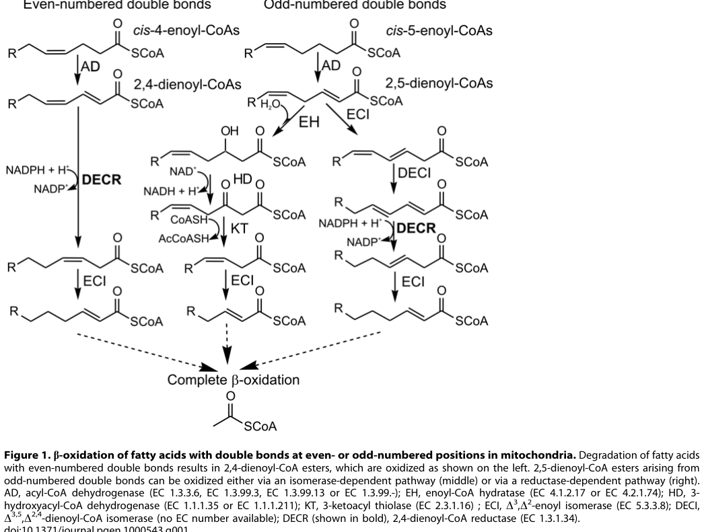

## Question

# Disease Characteristics Research Template

## Target Disease
- **Disease Name:** DECR Deficiency
- **MONDO ID:**  (if available)
- **Category:** Mendelian

## Research Objectives

Please provide a comprehensive research report on **DECR Deficiency** covering all of the
disease characteristics listed below. This report will be used to populate a disease knowledge
base entry. Be thorough and cite primary literature (PMID preferred) for all claims.

For each section, **suggested databases/resources** are listed. These are the first places
you should search for information on each topic.

---

### 1. Disease Information
> **Search first:** OMIM, Orphanet, ICD-10/ICD-11, MeSH, PubMed

- What is the disease? Provide a concise overview.
- What are the key identifiers? (OMIM, Orphanet, ICD-10/ICD-11, MeSH, Mondo)
- What are the common synonyms and alternative names?
- Is the information derived from individual patients (e.g., EHR) or aggregated disease-level resources?

### 2. Etiology

- **Disease Causal Factors**: What are the primary causes? (genetic, environmental, infectious, mechanistic)
- **Risk Factors**:
  > **Search first:** PubMed, Cochrane Library, UpToDate, clinical guidelines, ClinVar, ClinGen, GWAS Catalog, PheGenI, CTD, CDC, WHO, epidemiological databases
  - Genetic risk factors (causal variants, susceptibility loci, modifier genes)
  - Environmental risk factors (toxins, lifestyle, occupational exposures, age, sex, family history)
- **Protective Factors**:
  > **Search first:** PubMed, Cochrane Library, clinical trial databases, GWAS Catalog, gnomAD, WHO, CDC, nutrition databases
  - Genetic protective factors (protective variants, modifier alleles)
  - Environmental protective factors (diet, lifestyle, exposures that reduce risk)
- **Gene-Environment Interactions**: How do genetic and environmental factors interact to influence disease?
  > **Search first:** CTD, PubMed, PheGenI, GxE databases

### 3. Phenotypes
> **Search first:** HPO (Human Phenotype Ontology), OMIM, Orphanet, PubMed, clinicaltrials.gov, MedDRA, SNOMED CT, DECIPHER, LOINC

For each phenotype, provide:
- **Phenotype type**: symptoms, clinical signs, physical manifestations, behavioral changes, or laboratory abnormalities
  > For symptoms/signs: HPO, OMIM, Orphanet, PubMed
  > For behavioral changes: HPO, DSM, RDoC (Research Domain Criteria), PubMed
  > For laboratory abnormalities: LOINC, SNOMED CT, LabTests Online, PubMed
- **Phenotype characteristics**:
  > **Search first:** OMIM, Orphanet, HPO, PubMed
  - Age of symptom onset (neonatal, childhood, adult-onset, late-onset)
  - Symptom severity (mild, moderate, severe, variable)
  - Symptom progression (stable, progressive, episodic, fluctuating)
  - Frequency among affected individuals (percentage or qualitative)
- **Quality of life impact**: Effects on daily functioning and well-being (per-phenotype when possible)
  > **Search first:** EQ-5D database, SF-36, WHO QOL databases, PubMed
- Suggest HPO (Human Phenotype Ontology) terms for each phenotype

### 4. Genetic/Molecular Information

- **Causal Genes**: Gene mutations or chromosomal abnormalities responsible for disease (gene symbols, OMIM IDs)
  > **Search first:** OMIM, ClinVar, HGMD, Ensembl, NCBI Gene
- **Pathogenic Variants**:
  - Affected genes (gene symbols, HGNC IDs)
    > **Search first:** OMIM, NCBI Gene, Ensembl, HGNC, UniProt, GeneCards
  - Variant classification (pathogenic, likely pathogenic, VUS per ACMG/AMP guidelines)
    > **Search first:** ClinVar, ClinGen, ACMG/AMP guidelines, VarSome
  - Variant type/class (missense, frameshift, nonsense, splice-site, structural)
  - Allele frequency in population databases
    > **Search first:** gnomAD, 1000 Genomes, ExAC, TOPMed, dbSNP
  - Somatic vs germline origin
    > **Search first:** COSMIC (somatic), ClinVar, ICGC, TCGA
  - Functional consequences (loss of function, gain of function, dominant negative)
- **Modifier Genes**: Genes that modify disease severity or expression
- **Epigenetic Information**: DNA methylation, histone modifications, chromatin changes affecting disease
  > **Search first:** ENCODE, Roadmap Epigenomics, MethBase, DiseaseMeth
- **Chromosomal Abnormalities**: Large-scale genetic changes (aneuploidy, translocations, inversions)
  > **Search first:** DECIPHER, ClinVar, ECARUCA, UCSC Genome Browser

### 5. Environmental Information

- **Environmental Factors**: Non-genetic contributing factors (toxins, radiation, pollution, occupational exposure)
  > **Search first:** CTD (Comparative Toxicogenomics Database), TOXNET, PubMed, EPA databases
- **Lifestyle Factors**: Behavioral factors (smoking, diet, exercise, alcohol consumption)
  > **Search first:** CDC databases, WHO, PubMed, NHANES
- **Infectious Agents**: If applicable, pathogens causing or triggering disease (bacteria, viruses, fungi, parasites)
  > **Search first:** NCBI Taxonomy, ViPR, BV-BRC, MicrobeDB, GIDEON

### 6. Mechanism / Pathophysiology

- **Molecular Pathways**: Specific signaling cascades or biochemical pathways involved (Wnt, MAPK, mTOR, PI3K-AKT, etc.)
  > **Search first:** KEGG, Reactome, WikiPathways, PathBank, BioCyc
- **Cellular Processes**: Cell-level mechanisms (apoptosis, autophagy, cell cycle dysregulation, inflammation, etc.)
  > **Search first:** Gene Ontology (GO), Reactome, KEGG, PubMed
- **Protein Dysfunction**: How protein structure or function is altered (misfolding, aggregation, loss of function, gain of function)
  > **Search first:** UniProt, PDB (Protein Data Bank), InterPro, Pfam, AlphaFold
- **Metabolic Changes**: Alterations in metabolic processes (energy metabolism, lipid metabolism, amino acid metabolism)
  > **Search first:** KEGG, BioCyc, HMDB (Human Metabolome Database), BRENDA
- **Immune System Involvement**: Role of immune response (autoimmunity, immunodeficiency, chronic inflammation)
  > **Search first:** ImmPort, Immunome Database, IEDB, Gene Ontology
- **Tissue Damage Mechanisms**: How tissues/ are injured (oxidative stress, ischemia, fibrosis, necrosis)
  > **Search first:** PubMed, Gene Ontology, Reactome
- **Biochemical Abnormalities**: Specific molecular defects (enzyme deficiencies, receptor dysfunction, ion channel defects)
  > **Search first:** BRENDA, UniProt, KEGG, OMIM, PubMed
- **Epigenetic Changes**: DNA methylation, histone modifications affecting gene expression in disease
  > **Search first:** ENCODE, Roadmap Epigenomics, MethBase, DiseaseMeth
- **Molecular Profiling** (if available):
  - Transcriptomics/gene expression changes
    > **Search first:** GEO (Gene Expression Omnibus), ArrayExpress, GTEx, Human Cell Atlas, SRA
  - Proteomics findings
    > **Search first:** PRIDE, ProteomeXchange, Human Protein Atlas, STRING, BioGRID
  - Metabolomics signatures
    > **Search first:** MetaboLights, Metabolomics Workbench, HMDB, METLIN
  - Lipidomics alterations
    > **Search first:** LIPID MAPS, SwissLipids, LipidHome, Metabolomics Workbench
  - Genomic structural features
    > **Search first:** UCSC Genome Browser, Ensembl, NCBI, dbVar, DGV
- **Advanced Technologies** (if applicable):
  - Single-cell analysis findings (cell-type specific mechanisms, cellular heterogeneity)
    > **Search first:** Human Cell Atlas, Single Cell Portal, GEO, CELLxGENE
  - Spatial transcriptomics findings
    > **Search first:** GEO, Spatial Research, Vizgen, 10x Genomics data
  - Multi-omics integration results
    > **Search first:** TCGA, ICGC, cBioPortal, LinkedOmics, PubMed
  - Functional genomics screens (CRISPR, RNAi)
    > **Search first:** DepMap, GenomeRNAi, PubMed, BioGRID ORCS

For each mechanism, describe:
- The causal chain from initial trigger to clinical manifestation
- Which mechanisms are upstream vs downstream
- What cell types and biological processes are involved
- Suggest GO terms for biological processes and CL terms for cell types

### 7. Anatomical Structures Affected

- **Organ Level**:
  - Primary organs directly affected
  - Secondary organ involvement (complications, secondary effects)
  - Body systems involved (cardiovascular, nervous, digestive, respiratory, endocrine, etc.)
  > **Search first:** Uberon, FMA (Foundational Model of Anatomy), OMIM, HPO, ICD-11, MeSH, SNOMED CT
- **Tissue and Cell Level**:
  - Specific tissue types affected (epithelial, connective, muscle, nervous)
  - Specific cell populations targeted (with Cell Ontology terms)
  > **Search first:** Uberon, Human Protein Atlas, Cell Ontology, Human Cell Atlas, CellMarker, PanglaoDB
- **Subcellular Level**:
  - Cellular compartments involved (mitochondria, nucleus, ER, lysosomes) (with GO Cellular Component terms)
  > **Search first:** Gene Ontology (Cellular Component), UniProt, Human Protein Atlas
- **Localization**:
  - Specific anatomical sites (with UBERON terms)
    > **Search first:** FMA, Uberon, NeuroNames (for brain), SNOMED CT
  - Lateralization (unilateral, bilateral, asymmetric)
    > **Search first:** HPO, clinical literature, imaging databases

### 8. Temporal Development

- **Onset**:
  - Typical age of onset (congenital, pediatric, adult, geriatric)
  - Onset pattern (acute, subacute, chronic, insidious)
  > **Search first:** OMIM, Orphanet, HPO, PubMed
- **Progression**:
  - Disease stages (early, intermediate, advanced, end-stage)
    > **Search first:** Cancer Staging Manual (AJCC), WHO classifications, PubMed
  - Progression rate (rapid, slow, variable)
  - Disease course pattern (episodic, relapsing-remitting, progressive, stable)
  - Disease duration (self-limited, chronic lifelong)
  > **Search first:** Disease registries, longitudinal cohort databases, natural history studies, PubMed, Orphanet, OMIM
- **Patterns**:
  - Remission patterns (spontaneous, treatment-induced)
    > **Search first:** Clinical trial databases, disease registries, PubMed
  - Critical periods (time windows of vulnerability or opportunity for intervention)
    > **Search first:** PubMed, developmental biology databases, clinical guidelines

### 9. Inheritance and Population

- **Epidemiology**:
  - Prevalence (cases per 100,000 at given time)
  - Incidence (new cases per 100,000 per year)
  > **Search first:** Orphanet, CDC, WHO, GBD (Global Burden of Disease), national registries, SEER, disease registries
- **For Genetic Etiology**:
  - Inheritance pattern (AD, AR, X-linked, mitochondrial, multifactorial, polygenic)
    > **Search first:** OMIM, Orphanet, ClinVar, GTR (Genetic Testing Registry)
  - Penetrance (complete, incomplete, age-dependent)
    > **Search first:** ClinVar, OMIM, PubMed, ClinGen
  - Expressivity (variable, consistent)
    > **Search first:** OMIM, ClinVar, PubMed
  - Genetic anticipation (increasing severity in successive generations)
    > **Search first:** OMIM, PubMed (especially for repeat expansion disorders)
  - Germline mosaicism
    > **Search first:** ClinVar, OMIM, genetic counseling literature, PubMed
  - Founder effects (population-specific mutations)
    > **Search first:** gnomAD, population genetics databases, PubMed
  - Consanguinity role
    > **Search first:** OMIM, population studies, genetic counseling resources
  - Carrier frequency
    > **Search first:** gnomAD, carrier screening databases, GeneReviews, GTR
- **Population Demographics**:
  - Affected populations (ethnic or demographic groups with higher prevalence)
    > **Search first:** gnomAD, 1000 Genomes, PAGE Study, PubMed, population registries
  - Geographic distribution (endemic areas, regional variation)
    > **Search first:** WHO, CDC, GBD, Orphanet, geographic epidemiology databases
  - Geographic distribution of specific variants
  - Sex ratio (male:female)
    > **Search first:** Disease registries, OMIM, PubMed, epidemiological databases
  - Age distribution of affected individuals
    > **Search first:** CDC, disease registries, SEER, Orphanet

### 10. Diagnostics

- **Clinical Tests**:
  - Laboratory tests (blood, urine, tissue chemistry, specific enzyme assays)
    > **Search first:** LOINC, LabTests Online, PubMed
  - Biomarkers (proteins, metabolites, genetic markers, circulating biomarkers)
    > **Search first:** FDA Biomarker List, BEST (Biomarkers, EndpointS, and other Tools), PubMed
  - Imaging studies (X-ray, CT, MRI, PET, ultrasound)
    > **Search first:** RadLex, DICOM, Radiopaedia, imaging databases
  - Functional tests (pulmonary function, cardiac stress tests)
    > **Search first:** LOINC, clinical guidelines, PubMed
  - Electrophysiology (EEG, EMG, ECG, nerve conduction studies)
    > **Search first:** LOINC, clinical neurophysiology databases, PubMed
  - Biopsy findings (histopathology, immunohistochemistry)
    > **Search first:** SNOMED CT, College of American Pathologists resources, PubMed
  - Pathology findings (microscopic examination)
    > **Search first:** SNOMED CT, Digital Pathology databases, PubMed
- **Genetic Testing**:
  > **Search first:** GTR (Genetic Testing Registry), GeneReviews, ClinGen
  - Overview of recommended genetic testing approach
  - Whole genome sequencing (WGS) utility
    > **Search first:** GTR, ClinVar, GEL (Genomics England), gnomAD
  - Whole exome sequencing (WES) utility
    > **Search first:** GTR, ClinVar, OMIM, GeneMatcher
  - Gene panels (which panels, which genes)
    > **Search first:** GTR, ClinVar, laboratory-specific databases
  - Single gene testing
    > **Search first:** GTR, ClinVar, OMIM, GeneReviews
  - Chromosomal microarray (CMA)
    > **Search first:** DECIPHER, ClinVar, dbVar, ECARUCA
  - Karyotyping
    > **Search first:** Chromosome Abnormality Database, ClinVar, cytogenetics resources
  - FISH
    > **Search first:** ClinVar, cytogenetics databases, PubMed
  - Mitochondrial DNA testing
    > **Search first:** MITOMAP, MSeqDR, ClinVar, GTR
  - Repeat expansion testing
    > **Search first:** GTR, ClinVar, repeat expansion databases, PubMed
- **Omics-Based Diagnostics** (if applicable):
  - RNA sequencing / transcriptomics
    > **Search first:** GEO, ArrayExpress, GTEx, RNA-seq databases
  - Proteomics
    > **Search first:** PRIDE, ProteomeXchange, FDA Biomarker database
  - Metabolomics
    > **Search first:** MetaboLights, Metabolomics Workbench, HMDB
  - Epigenomics
    > **Search first:** GEO, ENCODE, Roadmap Epigenomics, MethBase
  - Liquid biopsy
    > **Search first:** COSMIC, ClinVar, liquid biopsy databases, PubMed
- **Clinical Criteria**:
  - Standardized diagnostic criteria (DSM, ICD, society guidelines)
    > **Search first:** DSM-5, ICD-11, clinical society guidelines, UpToDate
  - Differential diagnosis (other conditions to rule out, with distinguishing features)
    > **Search first:** DynaMed, UpToDate, clinical decision support systems
- **Screening**:
  - Screening methods for asymptomatic individuals (newborn screening, carrier screening, cascade screening)
    > **Search first:** ACMG recommendations, CDC newborn screening, GTR

### 11. Outcome/Prognosis

- **Survival and Mortality**:
  - Survival rate (5-year, 10-year, overall)
    > **Search first:** SEER, cancer registries, disease-specific registries, PubMed
  - Life expectancy (with and without treatment if applicable)
    > **Search first:** Orphanet, disease registries, actuarial databases, PubMed
  - Mortality rate
    > **Search first:** CDC, WHO, GBD, national mortality databases
  - Disease-specific mortality (deaths directly attributable to disease)
    > **Search first:** Disease registries, CDC Wonder, GBD, PubMed
- **Morbidity and Function**:
  - Morbidity (disease-related disability and health impacts)
    > **Search first:** GBD, WHO, disability databases, PubMed
  - Disability outcomes (long-term functional impairments)
    > **Search first:** ICF (International Classification of Functioning), disability registries
  - Quality of life measures (EQ-5D, SF-36, PROMIS, disease-specific tools)
    > **Search first:** EQ-5D database, SF-36, PROMIS, PubMed
- **Disease Course**:
  - Complications (secondary problems: infections, organ failure, etc.)
    > **Search first:** ICD codes, disease registries, clinical databases, PubMed
  - Recovery potential (likelihood and extent of recovery, with vs without treatment)
    > **Search first:** Natural history studies, rehabilitation databases, PubMed
- **Prediction**:
  - Prognostic factors (age, disease severity, biomarkers, treatment response)
    > **Search first:** Prognostic models databases, clinical calculators, PubMed
  - Prognostic biomarkers (molecular markers predicting disease course)
    > **Search first:** FDA Biomarker database, PubMed, cancer prognostic databases

### 12. Treatment

- **Pharmacotherapy**:
  - Pharmacological treatments (drug names, drug classes, mechanisms of action)
    > **Search first:** DrugBank, RxNorm, ATC classification, DailyMed, FDA databases
  - Pharmacogenomics (how genetic variants affect drug metabolism, efficacy, toxicity)
    > **Search first:** PharmGKB, CPIC (Clinical Pharmacogenetics), FDA Table of PGx Biomarkers
- **Advanced Therapeutics**:
  - Gene therapy (viral vectors, CRISPR, gene replacement, gene editing)
    > **Search first:** ClinicalTrials.gov, FDA gene therapy database, ASGCT resources
  - Cell therapy (stem cell transplant, CAR-T, cellular therapeutics)
    > **Search first:** ClinicalTrials.gov, FDA cell therapy database, FACT standards
  - RNA-based therapies (ASOs, siRNA, mRNA therapies)
    > **Search first:** ClinicalTrials.gov, FDA approvals, PubMed
  - Targeted therapies (treatments directed at specific molecular targets)
    > **Search first:** My Cancer Genome, OncoKB, ClinicalTrials.gov, FDA approvals
  - Immunotherapies (checkpoint inhibitors, monoclonal antibodies)
    > **Search first:** Cancer Immunotherapy Database, FDA approvals, ClinicalTrials.gov
- **Surgical and Interventional**:
  - Surgical interventions (types of surgery, timing, outcomes)
    > **Search first:** CPT codes, surgical registries, clinical guidelines, PubMed
- **Supportive and Rehabilitative**:
  - Supportive care (symptom management, pain control, nutrition)
    > **Search first:** Clinical guidelines, Cochrane Library, PubMed
  - Rehabilitation (physical therapy, occupational therapy, speech therapy)
    > **Search first:** Rehabilitation medicine databases, clinical guidelines, PubMed
- **Experimental**:
  - Experimental treatments in clinical trials (with NCT identifiers if available)
    > **Search first:** ClinicalTrials.gov, EU Clinical Trials Register, WHO ICTRP
- **Treatment Outcomes**:
  - Treatment response rates
    > **Search first:** Clinical trial databases, FDA reviews, systematic reviews, PubMed
  - Side effects and adverse events
    > **Search first:** FDA Adverse Event Reporting System (FAERS), MedWatch, PubMed
- **Treatment Strategy**:
  - Treatment algorithms (clinical pathways, decision trees)
    > **Search first:** Clinical practice guidelines, NCCN Guidelines, UpToDate
  - Combination therapies
    > **Search first:** ClinicalTrials.gov, treatment guidelines, PubMed
  - Personalized medicine approaches (genotype-guided treatment)
    > **Search first:** My Cancer Genome, CIViC, PharmGKB, precision medicine databases

For each treatment, suggest MAXO (Medical Action Ontology) terms where applicable.

### 13. Prevention

- **Prevention Levels**:
  - Primary prevention (preventing disease occurrence: vaccination, risk factor modification)
    > **Search first:** CDC, WHO, USPSTF recommendations, Cochrane Library
  - Secondary prevention (early detection and treatment: screening programs, early intervention)
    > **Search first:** USPSTF, CDC screening guidelines, WHO
  - Tertiary prevention (preventing complications in those with disease)
    > **Search first:** Clinical guidelines, disease management protocols, PubMed
- **Immunization**: Vaccine strategies (if applicable)
  > **Search first:** CDC vaccine schedules, WHO immunization, FDA vaccine database
- **Screening and Early Detection**:
  - Screening programs (population-based: newborn screening, cancer screening)
    > **Search first:** CDC screening programs, USPSTF, cancer screening databases
  - Genetic screening (carrier screening, preimplantation genetic diagnosis, prenatal testing)
    > **Search first:** ACMG recommendations, ACOG guidelines, GTR
  - Risk stratification (identifying high-risk individuals for targeted prevention)
    > **Search first:** Risk prediction models, clinical calculators, PubMed
- **Behavioral Interventions**: Lifestyle modifications to reduce risk
  > **Search first:** CDC, WHO, behavioral intervention databases, Cochrane Library
- **Counseling**: Genetic counseling (risk assessment, family planning guidance)
  > **Search first:** NSGC resources, ACMG guidelines, GeneReviews
- **Public Health**:
  - Public health interventions (sanitation, vector control, health education)
    > **Search first:** CDC, WHO, public health databases, PubMed
  - Environmental interventions (reducing environmental risk factors)
    > **Search first:** EPA databases, WHO environmental health, PubMed
- **Prophylaxis**: Preventive medications or procedures
  > **Search first:** Clinical guidelines, FDA approvals, PubMed

### 14. Other Species / Natural Disease

- **Taxonomy**: Species affected (with NCBI Taxon identifiers)
  > **Search first:** NCBI Taxonomy
- **Breed**: Specific breeds affected (with VBO identifiers if applicable)
  > **Search first:** VBO (Vertebrate Breed Ontology)
- **Gene**: Orthologous genes in other species (with NCBI Gene IDs)
  > **Search first:** NCBI Gene
- **Natural Disease**:
  - Naturally occurring disease in other species (companion animals, wildlife)
    > **Search first:** OMIA (Online Mendelian Inheritance in Animals), VetCompass, PubMed
  - Veterinary relevance and importance in animal health
    > **Search first:** OMIA, veterinary databases, PubMed
- **Comparative Biology**:
  - Comparative pathology (similarities and differences across species)
    > **Search first:** OMIA, comparative pathology databases, PubMed
  - Evolutionary conservation of disease mechanisms
    > **Search first:** HomoloGene, OrthoMCL, Alliance of Genome Resources
- **Transmission** (if applicable):
  - Zoonotic potential
    > **Search first:** CDC zoonotic diseases, WHO zoonoses, GIDEON
  - Cross-species susceptibility
    > **Search first:** NCBI Taxonomy, veterinary databases, PubMed

### 15. Model Organisms

- **Model Types**:
  - Model organism type (mammalian, invertebrate, cellular, in vitro)
    > **Search first:** Alliance of Genome Resources, model organism databases
  - Specific model systems (mouse, rat, zebrafish, Drosophila, C. elegans, yeast, cell lines, organoids, iPSCs)
    > **Search first:** MGI, RGD, ZFIN, FlyBase, WormBase, SGD, ATCC, Cellosaurus
  - Induced models (drug treatment, surgical intervention, environmental manipulation)
    > **Search first:** MGI, model organism databases, PubMed
- **Genetic Models**:
  - Types available (knockout, knock-in, transgenic, conditional, humanized)
    > **Search first:** MGI, IMPC, KOMP, EuMMCR, IMSR
- **Model Characteristics**:
  - Phenotype recapitulation (how well model reproduces human disease features)
    > **Search first:** Model organism databases, comparative studies, PubMed
  - Model limitations (aspects of human disease not captured)
    > **Search first:** Model organism databases, PubMed, review articles
- **Applications**:
  - Research applications (what aspects of disease can be studied)
    > **Search first:** Model organism databases, PubMed
- **Resources**:
  - Model databases
    > **Search first:** MGI, RGD, ZFIN, FlyBase, WormBase, IMSR, EMMA, MMRRC

---

## Citation Requirements

- Cite primary literature (PMID preferred) for all mechanistic and clinical claims
- Prioritize recent reviews and landmark papers
- Include direct quotes from abstracts where possible to support key statements
- Distinguish evidence source types: human clinical, model organism, in vitro, computational

## Output Format

Structure your response as a comprehensive narrative organized by the sections above.
For each section, provide:
- Factual content with specific details (numbers, percentages, gene names, variant nomenclature)
- Ontology term suggestions (HPO, GO, CL, UBERON, CHEBI, MAXO, MONDO) where applicable
- Evidence citations with PMIDs
- Direct quotes from abstracts to support key claims
- Clear indication when information is not available or not applicable for this disease

This report will be used to populate a disease knowledge base entry with:
- Pathophysiology descriptions with causal chains
- Gene/protein annotations (HGNC, GO terms)
- Phenotype associations (HP terms) with frequencies
- Cell type involvement (CL terms)
- Anatomical locations (UBERON terms)
- Chemical entities (CHEBI terms)
- Treatment annotations (MAXO terms)
- Evidence items with PMIDs and exact abstract quotes
- Epidemiology, prognosis, diagnostic, and prevention information
- Animal model descriptions with phenotype recapitulation details

## Output

Question: You are an expert researcher providing comprehensive, well-cited information.

Provide detailed information focusing on:
1. Key concepts and definitions with current understanding
2. Recent developments and latest research (prioritize 2023-2024 sources)
3. Current applications and real-world implementations
4. Expert opinions and analysis from authoritative sources
5. Relevant statistics and data from recent studies

Format as a comprehensive research report with proper citations. Include URLs and publication dates where available.
Always prioritize recent, authoritative sources and provide specific citations for all major claims.

# Disease Characteristics Research Template

## Target Disease
- **Disease Name:** DECR Deficiency
- **MONDO ID:**  (if available)
- **Category:** Mendelian

## Research Objectives

Please provide a comprehensive research report on **DECR Deficiency** covering all of the
disease characteristics listed below. This report will be used to populate a disease knowledge
base entry. Be thorough and cite primary literature (PMID preferred) for all claims.

For each section, **suggested databases/resources** are listed. These are the first places
you should search for information on each topic.

---

### 1. Disease Information
> **Search first:** OMIM, Orphanet, ICD-10/ICD-11, MeSH, PubMed

- What is the disease? Provide a concise overview.
- What are the key identifiers? (OMIM, Orphanet, ICD-10/ICD-11, MeSH, Mondo)
- What are the common synonyms and alternative names?
- Is the information derived from individual patients (e.g., EHR) or aggregated disease-level resources?

### 2. Etiology

- **Disease Causal Factors**: What are the primary causes? (genetic, environmental, infectious, mechanistic)
- **Risk Factors**:
  > **Search first:** PubMed, Cochrane Library, UpToDate, clinical guidelines, ClinVar, ClinGen, GWAS Catalog, PheGenI, CTD, CDC, WHO, epidemiological databases
  - Genetic risk factors (causal variants, susceptibility loci, modifier genes)
  - Environmental risk factors (toxins, lifestyle, occupational exposures, age, sex, family history)
- **Protective Factors**:
  > **Search first:** PubMed, Cochrane Library, clinical trial databases, GWAS Catalog, gnomAD, WHO, CDC, nutrition databases
  - Genetic protective factors (protective variants, modifier alleles)
  - Environmental protective factors (diet, lifestyle, exposures that reduce risk)
- **Gene-Environment Interactions**: How do genetic and environmental factors interact to influence disease?
  > **Search first:** CTD, PubMed, PheGenI, GxE databases

### 3. Phenotypes
> **Search first:** HPO (Human Phenotype Ontology), OMIM, Orphanet, PubMed, clinicaltrials.gov, MedDRA, SNOMED CT, DECIPHER, LOINC

For each phenotype, provide:
- **Phenotype type**: symptoms, clinical signs, physical manifestations, behavioral changes, or laboratory abnormalities
  > For symptoms/signs: HPO, OMIM, Orphanet, PubMed
  > For behavioral changes: HPO, DSM, RDoC (Research Domain Criteria), PubMed
  > For laboratory abnormalities: LOINC, SNOMED CT, LabTests Online, PubMed
- **Phenotype characteristics**:
  > **Search first:** OMIM, Orphanet, HPO, PubMed
  - Age of symptom onset (neonatal, childhood, adult-onset, late-onset)
  - Symptom severity (mild, moderate, severe, variable)
  - Symptom progression (stable, progressive, episodic, fluctuating)
  - Frequency among affected individuals (percentage or qualitative)
- **Quality of life impact**: Effects on daily functioning and well-being (per-phenotype when possible)
  > **Search first:** EQ-5D database, SF-36, WHO QOL databases, PubMed
- Suggest HPO (Human Phenotype Ontology) terms for each phenotype

### 4. Genetic/Molecular Information

- **Causal Genes**: Gene mutations or chromosomal abnormalities responsible for disease (gene symbols, OMIM IDs)
  > **Search first:** OMIM, ClinVar, HGMD, Ensembl, NCBI Gene
- **Pathogenic Variants**:
  - Affected genes (gene symbols, HGNC IDs)
    > **Search first:** OMIM, NCBI Gene, Ensembl, HGNC, UniProt, GeneCards
  - Variant classification (pathogenic, likely pathogenic, VUS per ACMG/AMP guidelines)
    > **Search first:** ClinVar, ClinGen, ACMG/AMP guidelines, VarSome
  - Variant type/class (missense, frameshift, nonsense, splice-site, structural)
  - Allele frequency in population databases
    > **Search first:** gnomAD, 1000 Genomes, ExAC, TOPMed, dbSNP
  - Somatic vs germline origin
    > **Search first:** COSMIC (somatic), ClinVar, ICGC, TCGA
  - Functional consequences (loss of function, gain of function, dominant negative)
- **Modifier Genes**: Genes that modify disease severity or expression
- **Epigenetic Information**: DNA methylation, histone modifications, chromatin changes affecting disease
  > **Search first:** ENCODE, Roadmap Epigenomics, MethBase, DiseaseMeth
- **Chromosomal Abnormalities**: Large-scale genetic changes (aneuploidy, translocations, inversions)
  > **Search first:** DECIPHER, ClinVar, ECARUCA, UCSC Genome Browser

### 5. Environmental Information

- **Environmental Factors**: Non-genetic contributing factors (toxins, radiation, pollution, occupational exposure)
  > **Search first:** CTD (Comparative Toxicogenomics Database), TOXNET, PubMed, EPA databases
- **Lifestyle Factors**: Behavioral factors (smoking, diet, exercise, alcohol consumption)
  > **Search first:** CDC databases, WHO, PubMed, NHANES
- **Infectious Agents**: If applicable, pathogens causing or triggering disease (bacteria, viruses, fungi, parasites)
  > **Search first:** NCBI Taxonomy, ViPR, BV-BRC, MicrobeDB, GIDEON

### 6. Mechanism / Pathophysiology

- **Molecular Pathways**: Specific signaling cascades or biochemical pathways involved (Wnt, MAPK, mTOR, PI3K-AKT, etc.)
  > **Search first:** KEGG, Reactome, WikiPathways, PathBank, BioCyc
- **Cellular Processes**: Cell-level mechanisms (apoptosis, autophagy, cell cycle dysregulation, inflammation, etc.)
  > **Search first:** Gene Ontology (GO), Reactome, KEGG, PubMed
- **Protein Dysfunction**: How protein structure or function is altered (misfolding, aggregation, loss of function, gain of function)
  > **Search first:** UniProt, PDB (Protein Data Bank), InterPro, Pfam, AlphaFold
- **Metabolic Changes**: Alterations in metabolic processes (energy metabolism, lipid metabolism, amino acid metabolism)
  > **Search first:** KEGG, BioCyc, HMDB (Human Metabolome Database), BRENDA
- **Immune System Involvement**: Role of immune response (autoimmunity, immunodeficiency, chronic inflammation)
  > **Search first:** ImmPort, Immunome Database, IEDB, Gene Ontology
- **Tissue Damage Mechanisms**: How tissues/ are injured (oxidative stress, ischemia, fibrosis, necrosis)
  > **Search first:** PubMed, Gene Ontology, Reactome
- **Biochemical Abnormalities**: Specific molecular defects (enzyme deficiencies, receptor dysfunction, ion channel defects)
  > **Search first:** BRENDA, UniProt, KEGG, OMIM, PubMed
- **Epigenetic Changes**: DNA methylation, histone modifications affecting gene expression in disease
  > **Search first:** ENCODE, Roadmap Epigenomics, MethBase, DiseaseMeth
- **Molecular Profiling** (if available):
  - Transcriptomics/gene expression changes
    > **Search first:** GEO (Gene Expression Omnibus), ArrayExpress, GTEx, Human Cell Atlas, SRA
  - Proteomics findings
    > **Search first:** PRIDE, ProteomeXchange, Human Protein Atlas, STRING, BioGRID
  - Metabolomics signatures
    > **Search first:** MetaboLights, Metabolomics Workbench, HMDB, METLIN
  - Lipidomics alterations
    > **Search first:** LIPID MAPS, SwissLipids, LipidHome, Metabolomics Workbench
  - Genomic structural features
    > **Search first:** UCSC Genome Browser, Ensembl, NCBI, dbVar, DGV
- **Advanced Technologies** (if applicable):
  - Single-cell analysis findings (cell-type specific mechanisms, cellular heterogeneity)
    > **Search first:** Human Cell Atlas, Single Cell Portal, GEO, CELLxGENE
  - Spatial transcriptomics findings
    > **Search first:** GEO, Spatial Research, Vizgen, 10x Genomics data
  - Multi-omics integration results
    > **Search first:** TCGA, ICGC, cBioPortal, LinkedOmics, PubMed
  - Functional genomics screens (CRISPR, RNAi)
    > **Search first:** DepMap, GenomeRNAi, PubMed, BioGRID ORCS

For each mechanism, describe:
- The causal chain from initial trigger to clinical manifestation
- Which mechanisms are upstream vs downstream
- What cell types and biological processes are involved
- Suggest GO terms for biological processes and CL terms for cell types

### 7. Anatomical Structures Affected

- **Organ Level**:
  - Primary organs directly affected
  - Secondary organ involvement (complications, secondary effects)
  - Body systems involved (cardiovascular, nervous, digestive, respiratory, endocrine, etc.)
  > **Search first:** Uberon, FMA (Foundational Model of Anatomy), OMIM, HPO, ICD-11, MeSH, SNOMED CT
- **Tissue and Cell Level**:
  - Specific tissue types affected (epithelial, connective, muscle, nervous)
  - Specific cell populations targeted (with Cell Ontology terms)
  > **Search first:** Uberon, Human Protein Atlas, Cell Ontology, Human Cell Atlas, CellMarker, PanglaoDB
- **Subcellular Level**:
  - Cellular compartments involved (mitochondria, nucleus, ER, lysosomes) (with GO Cellular Component terms)
  > **Search first:** Gene Ontology (Cellular Component), UniProt, Human Protein Atlas
- **Localization**:
  - Specific anatomical sites (with UBERON terms)
    > **Search first:** FMA, Uberon, NeuroNames (for brain), SNOMED CT
  - Lateralization (unilateral, bilateral, asymmetric)
    > **Search first:** HPO, clinical literature, imaging databases

### 8. Temporal Development

- **Onset**:
  - Typical age of onset (congenital, pediatric, adult, geriatric)
  - Onset pattern (acute, subacute, chronic, insidious)
  > **Search first:** OMIM, Orphanet, HPO, PubMed
- **Progression**:
  - Disease stages (early, intermediate, advanced, end-stage)
    > **Search first:** Cancer Staging Manual (AJCC), WHO classifications, PubMed
  - Progression rate (rapid, slow, variable)
  - Disease course pattern (episodic, relapsing-remitting, progressive, stable)
  - Disease duration (self-limited, chronic lifelong)
  > **Search first:** Disease registries, longitudinal cohort databases, natural history studies, PubMed, Orphanet, OMIM
- **Patterns**:
  - Remission patterns (spontaneous, treatment-induced)
    > **Search first:** Clinical trial databases, disease registries, PubMed
  - Critical periods (time windows of vulnerability or opportunity for intervention)
    > **Search first:** PubMed, developmental biology databases, clinical guidelines

### 9. Inheritance and Population

- **Epidemiology**:
  - Prevalence (cases per 100,000 at given time)
  - Incidence (new cases per 100,000 per year)
  > **Search first:** Orphanet, CDC, WHO, GBD (Global Burden of Disease), national registries, SEER, disease registries
- **For Genetic Etiology**:
  - Inheritance pattern (AD, AR, X-linked, mitochondrial, multifactorial, polygenic)
    > **Search first:** OMIM, Orphanet, ClinVar, GTR (Genetic Testing Registry)
  - Penetrance (complete, incomplete, age-dependent)
    > **Search first:** ClinVar, OMIM, PubMed, ClinGen
  - Expressivity (variable, consistent)
    > **Search first:** OMIM, ClinVar, PubMed
  - Genetic anticipation (increasing severity in successive generations)
    > **Search first:** OMIM, PubMed (especially for repeat expansion disorders)
  - Germline mosaicism
    > **Search first:** ClinVar, OMIM, genetic counseling literature, PubMed
  - Founder effects (population-specific mutations)
    > **Search first:** gnomAD, population genetics databases, PubMed
  - Consanguinity role
    > **Search first:** OMIM, population studies, genetic counseling resources
  - Carrier frequency
    > **Search first:** gnomAD, carrier screening databases, GeneReviews, GTR
- **Population Demographics**:
  - Affected populations (ethnic or demographic groups with higher prevalence)
    > **Search first:** gnomAD, 1000 Genomes, PAGE Study, PubMed, population registries
  - Geographic distribution (endemic areas, regional variation)
    > **Search first:** WHO, CDC, GBD, Orphanet, geographic epidemiology databases
  - Geographic distribution of specific variants
  - Sex ratio (male:female)
    > **Search first:** Disease registries, OMIM, PubMed, epidemiological databases
  - Age distribution of affected individuals
    > **Search first:** CDC, disease registries, SEER, Orphanet

### 10. Diagnostics

- **Clinical Tests**:
  - Laboratory tests (blood, urine, tissue chemistry, specific enzyme assays)
    > **Search first:** LOINC, LabTests Online, PubMed
  - Biomarkers (proteins, metabolites, genetic markers, circulating biomarkers)
    > **Search first:** FDA Biomarker List, BEST (Biomarkers, EndpointS, and other Tools), PubMed
  - Imaging studies (X-ray, CT, MRI, PET, ultrasound)
    > **Search first:** RadLex, DICOM, Radiopaedia, imaging databases
  - Functional tests (pulmonary function, cardiac stress tests)
    > **Search first:** LOINC, clinical guidelines, PubMed
  - Electrophysiology (EEG, EMG, ECG, nerve conduction studies)
    > **Search first:** LOINC, clinical neurophysiology databases, PubMed
  - Biopsy findings (histopathology, immunohistochemistry)
    > **Search first:** SNOMED CT, College of American Pathologists resources, PubMed
  - Pathology findings (microscopic examination)
    > **Search first:** SNOMED CT, Digital Pathology databases, PubMed
- **Genetic Testing**:
  > **Search first:** GTR (Genetic Testing Registry), GeneReviews, ClinGen
  - Overview of recommended genetic testing approach
  - Whole genome sequencing (WGS) utility
    > **Search first:** GTR, ClinVar, GEL (Genomics England), gnomAD
  - Whole exome sequencing (WES) utility
    > **Search first:** GTR, ClinVar, OMIM, GeneMatcher
  - Gene panels (which panels, which genes)
    > **Search first:** GTR, ClinVar, laboratory-specific databases
  - Single gene testing
    > **Search first:** GTR, ClinVar, OMIM, GeneReviews
  - Chromosomal microarray (CMA)
    > **Search first:** DECIPHER, ClinVar, dbVar, ECARUCA
  - Karyotyping
    > **Search first:** Chromosome Abnormality Database, ClinVar, cytogenetics resources
  - FISH
    > **Search first:** ClinVar, cytogenetics databases, PubMed
  - Mitochondrial DNA testing
    > **Search first:** MITOMAP, MSeqDR, ClinVar, GTR
  - Repeat expansion testing
    > **Search first:** GTR, ClinVar, repeat expansion databases, PubMed
- **Omics-Based Diagnostics** (if applicable):
  - RNA sequencing / transcriptomics
    > **Search first:** GEO, ArrayExpress, GTEx, RNA-seq databases
  - Proteomics
    > **Search first:** PRIDE, ProteomeXchange, FDA Biomarker database
  - Metabolomics
    > **Search first:** MetaboLights, Metabolomics Workbench, HMDB
  - Epigenomics
    > **Search first:** GEO, ENCODE, Roadmap Epigenomics, MethBase
  - Liquid biopsy
    > **Search first:** COSMIC, ClinVar, liquid biopsy databases, PubMed
- **Clinical Criteria**:
  - Standardized diagnostic criteria (DSM, ICD, society guidelines)
    > **Search first:** DSM-5, ICD-11, clinical society guidelines, UpToDate
  - Differential diagnosis (other conditions to rule out, with distinguishing features)
    > **Search first:** DynaMed, UpToDate, clinical decision support systems
- **Screening**:
  - Screening methods for asymptomatic individuals (newborn screening, carrier screening, cascade screening)
    > **Search first:** ACMG recommendations, CDC newborn screening, GTR

### 11. Outcome/Prognosis

- **Survival and Mortality**:
  - Survival rate (5-year, 10-year, overall)
    > **Search first:** SEER, cancer registries, disease-specific registries, PubMed
  - Life expectancy (with and without treatment if applicable)
    > **Search first:** Orphanet, disease registries, actuarial databases, PubMed
  - Mortality rate
    > **Search first:** CDC, WHO, GBD, national mortality databases
  - Disease-specific mortality (deaths directly attributable to disease)
    > **Search first:** Disease registries, CDC Wonder, GBD, PubMed
- **Morbidity and Function**:
  - Morbidity (disease-related disability and health impacts)
    > **Search first:** GBD, WHO, disability databases, PubMed
  - Disability outcomes (long-term functional impairments)
    > **Search first:** ICF (International Classification of Functioning), disability registries
  - Quality of life measures (EQ-5D, SF-36, PROMIS, disease-specific tools)
    > **Search first:** EQ-5D database, SF-36, PROMIS, PubMed
- **Disease Course**:
  - Complications (secondary problems: infections, organ failure, etc.)
    > **Search first:** ICD codes, disease registries, clinical databases, PubMed
  - Recovery potential (likelihood and extent of recovery, with vs without treatment)
    > **Search first:** Natural history studies, rehabilitation databases, PubMed
- **Prediction**:
  - Prognostic factors (age, disease severity, biomarkers, treatment response)
    > **Search first:** Prognostic models databases, clinical calculators, PubMed
  - Prognostic biomarkers (molecular markers predicting disease course)
    > **Search first:** FDA Biomarker database, PubMed, cancer prognostic databases

### 12. Treatment

- **Pharmacotherapy**:
  - Pharmacological treatments (drug names, drug classes, mechanisms of action)
    > **Search first:** DrugBank, RxNorm, ATC classification, DailyMed, FDA databases
  - Pharmacogenomics (how genetic variants affect drug metabolism, efficacy, toxicity)
    > **Search first:** PharmGKB, CPIC (Clinical Pharmacogenetics), FDA Table of PGx Biomarkers
- **Advanced Therapeutics**:
  - Gene therapy (viral vectors, CRISPR, gene replacement, gene editing)
    > **Search first:** ClinicalTrials.gov, FDA gene therapy database, ASGCT resources
  - Cell therapy (stem cell transplant, CAR-T, cellular therapeutics)
    > **Search first:** ClinicalTrials.gov, FDA cell therapy database, FACT standards
  - RNA-based therapies (ASOs, siRNA, mRNA therapies)
    > **Search first:** ClinicalTrials.gov, FDA approvals, PubMed
  - Targeted therapies (treatments directed at specific molecular targets)
    > **Search first:** My Cancer Genome, OncoKB, ClinicalTrials.gov, FDA approvals
  - Immunotherapies (checkpoint inhibitors, monoclonal antibodies)
    > **Search first:** Cancer Immunotherapy Database, FDA approvals, ClinicalTrials.gov
- **Surgical and Interventional**:
  - Surgical interventions (types of surgery, timing, outcomes)
    > **Search first:** CPT codes, surgical registries, clinical guidelines, PubMed
- **Supportive and Rehabilitative**:
  - Supportive care (symptom management, pain control, nutrition)
    > **Search first:** Clinical guidelines, Cochrane Library, PubMed
  - Rehabilitation (physical therapy, occupational therapy, speech therapy)
    > **Search first:** Rehabilitation medicine databases, clinical guidelines, PubMed
- **Experimental**:
  - Experimental treatments in clinical trials (with NCT identifiers if available)
    > **Search first:** ClinicalTrials.gov, EU Clinical Trials Register, WHO ICTRP
- **Treatment Outcomes**:
  - Treatment response rates
    > **Search first:** Clinical trial databases, FDA reviews, systematic reviews, PubMed
  - Side effects and adverse events
    > **Search first:** FDA Adverse Event Reporting System (FAERS), MedWatch, PubMed
- **Treatment Strategy**:
  - Treatment algorithms (clinical pathways, decision trees)
    > **Search first:** Clinical practice guidelines, NCCN Guidelines, UpToDate
  - Combination therapies
    > **Search first:** ClinicalTrials.gov, treatment guidelines, PubMed
  - Personalized medicine approaches (genotype-guided treatment)
    > **Search first:** My Cancer Genome, CIViC, PharmGKB, precision medicine databases

For each treatment, suggest MAXO (Medical Action Ontology) terms where applicable.

### 13. Prevention

- **Prevention Levels**:
  - Primary prevention (preventing disease occurrence: vaccination, risk factor modification)
    > **Search first:** CDC, WHO, USPSTF recommendations, Cochrane Library
  - Secondary prevention (early detection and treatment: screening programs, early intervention)
    > **Search first:** USPSTF, CDC screening guidelines, WHO
  - Tertiary prevention (preventing complications in those with disease)
    > **Search first:** Clinical guidelines, disease management protocols, PubMed
- **Immunization**: Vaccine strategies (if applicable)
  > **Search first:** CDC vaccine schedules, WHO immunization, FDA vaccine database
- **Screening and Early Detection**:
  - Screening programs (population-based: newborn screening, cancer screening)
    > **Search first:** CDC screening programs, USPSTF, cancer screening databases
  - Genetic screening (carrier screening, preimplantation genetic diagnosis, prenatal testing)
    > **Search first:** ACMG recommendations, ACOG guidelines, GTR
  - Risk stratification (identifying high-risk individuals for targeted prevention)
    > **Search first:** Risk prediction models, clinical calculators, PubMed
- **Behavioral Interventions**: Lifestyle modifications to reduce risk
  > **Search first:** CDC, WHO, behavioral intervention databases, Cochrane Library
- **Counseling**: Genetic counseling (risk assessment, family planning guidance)
  > **Search first:** NSGC resources, ACMG guidelines, GeneReviews
- **Public Health**:
  - Public health interventions (sanitation, vector control, health education)
    > **Search first:** CDC, WHO, public health databases, PubMed
  - Environmental interventions (reducing environmental risk factors)
    > **Search first:** EPA databases, WHO environmental health, PubMed
- **Prophylaxis**: Preventive medications or procedures
  > **Search first:** Clinical guidelines, FDA approvals, PubMed

### 14. Other Species / Natural Disease

- **Taxonomy**: Species affected (with NCBI Taxon identifiers)
  > **Search first:** NCBI Taxonomy
- **Breed**: Specific breeds affected (with VBO identifiers if applicable)
  > **Search first:** VBO (Vertebrate Breed Ontology)
- **Gene**: Orthologous genes in other species (with NCBI Gene IDs)
  > **Search first:** NCBI Gene
- **Natural Disease**:
  - Naturally occurring disease in other species (companion animals, wildlife)
    > **Search first:** OMIA (Online Mendelian Inheritance in Animals), VetCompass, PubMed
  - Veterinary relevance and importance in animal health
    > **Search first:** OMIA, veterinary databases, PubMed
- **Comparative Biology**:
  - Comparative pathology (similarities and differences across species)
    > **Search first:** OMIA, comparative pathology databases, PubMed
  - Evolutionary conservation of disease mechanisms
    > **Search first:** HomoloGene, OrthoMCL, Alliance of Genome Resources
- **Transmission** (if applicable):
  - Zoonotic potential
    > **Search first:** CDC zoonotic diseases, WHO zoonoses, GIDEON
  - Cross-species susceptibility
    > **Search first:** NCBI Taxonomy, veterinary databases, PubMed

### 15. Model Organisms

- **Model Types**:
  - Model organism type (mammalian, invertebrate, cellular, in vitro)
    > **Search first:** Alliance of Genome Resources, model organism databases
  - Specific model systems (mouse, rat, zebrafish, Drosophila, C. elegans, yeast, cell lines, organoids, iPSCs)
    > **Search first:** MGI, RGD, ZFIN, FlyBase, WormBase, SGD, ATCC, Cellosaurus
  - Induced models (drug treatment, surgical intervention, environmental manipulation)
    > **Search first:** MGI, model organism databases, PubMed
- **Genetic Models**:
  - Types available (knockout, knock-in, transgenic, conditional, humanized)
    > **Search first:** MGI, IMPC, KOMP, EuMMCR, IMSR
- **Model Characteristics**:
  - Phenotype recapitulation (how well model reproduces human disease features)
    > **Search first:** Model organism databases, comparative studies, PubMed
  - Model limitations (aspects of human disease not captured)
    > **Search first:** Model organism databases, PubMed, review articles
- **Applications**:
  - Research applications (what aspects of disease can be studied)
    > **Search first:** Model organism databases, PubMed
- **Resources**:
  - Model databases
    > **Search first:** MGI, RGD, ZFIN, FlyBase, WormBase, IMSR, EMMA, MMRRC

---

## Citation Requirements

- Cite primary literature (PMID preferred) for all mechanistic and clinical claims
- Prioritize recent reviews and landmark papers
- Include direct quotes from abstracts where possible to support key statements
- Distinguish evidence source types: human clinical, model organism, in vitro, computational

## Output Format

Structure your response as a comprehensive narrative organized by the sections above.
For each section, provide:
- Factual content with specific details (numbers, percentages, gene names, variant nomenclature)
- Ontology term suggestions (HPO, GO, CL, UBERON, CHEBI, MAXO, MONDO) where applicable
- Evidence citations with PMIDs
- Direct quotes from abstracts to support key claims
- Clear indication when information is not available or not applicable for this disease

This report will be used to populate a disease knowledge base entry with:
- Pathophysiology descriptions with causal chains
- Gene/protein annotations (HGNC, GO terms)
- Phenotype associations (HP terms) with frequencies
- Cell type involvement (CL terms)
- Anatomical locations (UBERON terms)
- Chemical entities (CHEBI terms)
- Treatment annotations (MAXO terms)
- Evidence items with PMIDs and exact abstract quotes
- Epidemiology, prognosis, diagnostic, and prevention information
- Animal model descriptions with phenotype recapitulation details

# DECR Deficiency (mitochondrial 2,4-dienoyl‑CoA reductase deficiency): Disease Characteristics Research Report

## Executive summary
“Mitochondrial 2,4‑dienoyl‑CoA reductase (DECR) deficiency” is an extremely rare inborn error of metabolism classically defined biochemically by impaired oxidation of polyunsaturated fatty acids (PUFAs) with accumulation of the acylcarnitine **C10:2 (decadienoylcarnitine)** and low DECR enzymatic activity. In the best-characterized modern molecular cases, the apparent DECR defect was **secondary to autosomal recessive NADK2 deficiency**, which causes **mitochondrial NADP(H) deficiency** and thereby disables NADPH-dependent mitochondrial enzymes including DECR and AASS (lysine pathway), producing a combined signature of **C10:2 elevation + hyperlysinemia** and severe neurometabolic disease. (houten2014mitochondrialnadp(h)deficiency pages 9-10, houten2014mitochondrialnadp(h)deficiency pages 5-7, houten2014mitochondrialnadp(h)deficiency pages 1-2)

A primary, Mendelian **DECR1 (DECR)**-mutant human disorder is suggested by historical biochemistry-first reports and by strong mouse genetic evidence, but **coding DECR1 mutations were excluded** in the NADK2-related human cases described in the key Human Molecular Genetics report, leaving the extent of confirmed human DECR1‑biallelic disease incompletely resolved in the tool-accessible literature used here. (houten2014mitochondrialnadp(h)deficiency pages 4-5, houten2014mitochondrialnadp(h)deficiency pages 5-7)

## 1. Disease information
### What is the disease?
**DECR deficiency** refers to deficient activity of **mitochondrial 2,4‑dienoyl‑CoA reductase (DECR)**, an auxiliary enzyme required for complete mitochondrial β‑oxidation of **polyunsaturated fatty acids** by reducing 2,4‑dienoyl‑CoA intermediates. Loss of activity leads to accumulation of characteristic PUFA-derived intermediates (detected as C10:2 acylcarnitine) and clinical decompensation under metabolic stress. (miinalainen2009mitochondrial24dienoylcoareductase pages 1-2)

### Key identifiers (OMIM/Orphanet/MeSH/MONDO)
Within the tool-accessible corpus for this run, I could not reliably retrieve OMIM/Orphanet/MONDO identifiers for “DECR deficiency/DECR1 deficiency.” Accordingly, identifier mapping should be validated directly in OMIM/Orphanet/MONDO during knowledge-base curation.

### Common synonyms / alternative names
* Mitochondrial **2,4‑dienoyl‑CoA reductase deficiency**
* **DECR deficiency**
* (Biochemical signature) **C10:2 (decadienoyl)carnitine elevation** suggestive of impaired PUFA oxidation (wanders2019translationalmetabolisma pages 3-3, houten2014mitochondrialnadp(h)deficiency pages 4-5)

### Evidence sources
Evidence is derived from:
* Individual patient reports/series with deep biochemical phenotyping and genetics (notably NADK2-associated cases). (houten2014mitochondrialnadp(h)deficiency pages 4-5, houten2014mitochondrialnadp(h)deficiency pages 5-7, houten2014mitochondrialnadp(h)deficiency pages 1-2)
* Aggregated biochemical screening considerations (newborn screening marker interpretation) discussed within primary case literature. (houten2014mitochondrialnadp(h)deficiency pages 10-12)
* A mechanistic **Decr knockout mouse** model that supports pathway understanding and biomarker interpretation. (miinalainen2009mitochondrial24dienoylcoareductase pages 1-2)

## 2. Etiology
### Disease causal factors
#### Genetic causes (current evidence)
1) **Secondary DECR deficiency due to NADK2 deficiency (autosomal recessive)**
* A homozygous nonsense **NADK2** variant (reported as **c.1018C>T; p.R340X**) caused mitochondrial NADP(H) deficiency, which in turn impaired NADPH-dependent mitochondrial enzymes including DECR and AASS (lysine pathway), explaining C10:2 elevation plus hyperlysinemia. (houten2014mitochondrialnadp(h)deficiency pages 5-7)
* In this context, the DECR biochemical phenotype is downstream of NADK2 and reflects combined mitochondrial redox cofactor deficiency rather than a structural DECR1 defect. (houten2014mitochondrialnadp(h)deficiency pages 9-10, houten2014mitochondrialnadp(h)deficiency pages 10-12)

2) **Primary DECR deficiency (putative DECR1-related)**
* Historical biochemical cases of “DECR deficiency” predate current sequencing and reported low enzyme activity in tissues. (houten2014mitochondrialnadp(h)deficiency pages 2-4)
* A Decr knockout mouse strongly supports that loss of mitochondrial DECR activity is sufficient to cause the characteristic C10:2 biomarker and stress-intolerance phenotype. (miinalainen2009mitochondrial24dienoylcoareductase pages 1-2)
* However, in the best-characterized modern human cases in the available evidence, targeted sequencing excluded DECR1 coding mutations. (houten2014mitochondrialnadp(h)deficiency pages 4-5, houten2014mitochondrialnadp(h)deficiency pages 5-7)

### Risk factors
* **Fasting / metabolic stress** is a key precipitant of hypoglycemia and decompensation in Decr−/− mice and is mechanistically plausible as a trigger in humans with FAO auxiliary enzyme deficiency. (miinalainen2009mitochondrial24dienoylcoareductase pages 1-2)

### Protective factors
No DECR- or NADK2-specific protective factors were identified in the available evidence.

### Gene–environment interactions
* A plausible interaction is **genetic impairment of PUFA β‑oxidation** (DECR pathway defect) with **environmental/physiologic stressors** (fasting, illness, cold exposure), which increases energy demand and reliance on fatty acid oxidation and may precipitate decompensation. In Decr−/− mice, acute cold stress and fasting precipitated severe phenotypes. (miinalainen2009mitochondrial24dienoylcoareductase pages 1-2)

## 3. Phenotypes
### Core phenotype spectrum (humans; NADK2-associated secondary DECR deficiency)
Clinical presentation can be severe, early-onset, and progressive:
* **Failure to thrive** (HP:0001508), **microcephaly** (HP:0000252), **hypotonia** (HP:0001252) (houten2014mitochondrialnadp(h)deficiency pages 2-4)
* **Developmental delay** (HP:0001263) and progressive neurologic decline (houten2014mitochondrialnadp(h)deficiency pages 1-2)
* **Movement disorder** including choreoathetosis/dystonia (HP:0001266/HP:0001332) (houten2014mitochondrialnadp(h)deficiency pages 4-5)
* **Epilepsy** (HP:0001250), **cortical blindness/visual loss** (HP:0000608/HP:0000505) in severe cases (houten2014mitochondrialnadp(h)deficiency pages 4-5)
* **Lactic acidosis** (HP:0003128) and **renal tubular acidosis** (HP:0001947) consistent with multisystem mitochondrial dysfunction (houten2014mitochondrialnadp(h)deficiency pages 4-5)
* **Neuroimaging**: progressive leukodystrophy / white matter disease (HP:0002415), cerebral atrophy (HP:0002059), basal ganglia lesions (HP:0002134) (houten2014mitochondrialnadp(h)deficiency pages 4-5)

**Age of onset:** reported as early infancy (e.g., presentation at 8 weeks) (houten2014mitochondrialnadp(h)deficiency pages 2-4).

**Severity/progression:** severe, progressive encephalopathy with death in childhood reported in the detailed NADK2-associated cases. (houten2014mitochondrialnadp(h)deficiency pages 4-5)

### Phenotypes (mouse model; primary Decr deficiency)
Decr−/− mice demonstrate:
* **Severe fasting/stress intolerance with profound hypoglycemia** and “unimpaired ketogenesis” (consistent with preserved ketone production despite impaired PUFA oxidation) (miinalainen2009mitochondrial24dienoylcoareductase pages 1-2)
* **Hepatic steatosis** (fatty liver) and accumulation of unsaturated fatty acids in hepatic lipids (miinalainen2009mitochondrial24dienoylcoareductase pages 1-2)
* **Cold intolerance / fatal hypothermia** with impaired thermogenesis under acute cold challenge (miinalainen2009mitochondrial24dienoylcoareductase pages 1-2)

### Quality of life impact
Human cases described are consistent with severe neurodevelopmental disability and progressive neurologic impairment, implying major quality-of-life impact; disease-specific QoL instruments were not identified in the accessible evidence. (houten2014mitochondrialnadp(h)deficiency pages 4-5)

## 4. Genetic / molecular information
### Causal genes
* **NADK2** (mitochondrial NAD kinase): confirmed cause of mitochondrial NADP(H) deficiency leading to **secondary DECR deficiency with hyperlysinemia**. (houten2014mitochondrialnadp(h)deficiency pages 5-7, houten2014mitochondrialnadp(h)deficiency pages 1-2)
* **DECR1** (mitochondrial 2,4‑dienoyl‑CoA reductase): strongly supported by mouse knockout as essential for PUFA β‑oxidation and the C10:2 biomarker, but definitive human DECR1-biallelic disease was not established in the key human case series available here. (miinalainen2009mitochondrial24dienoylcoareductase pages 1-2, houten2014mitochondrialnadp(h)deficiency pages 5-7)

### Pathogenic variants (reported in accessible evidence)
* **NADK2 c.1018C>T (p.R340X)**, homozygous in the proband and heterozygous in parents; associated with absent NADK2 protein and low mitochondrial NADP(H). (houten2014mitochondrialnadp(h)deficiency pages 5-7)

### Functional consequences
* NADK2 deficiency reduces mitochondrial NADP(H) and thereby disables NADPH-dependent mitochondrial enzymes; the paper emphasizes NADPH as both a **cosubstrate** and a **stabilizing/chaperoning factor** for enzymes like DECR and AASS, explaining combined biochemical signatures (C10:2 elevation + hyperlysinemia). (houten2014mitochondrialnadp(h)deficiency pages 1-2)

### Suggested GO / pathway terms (for curation; not exhaustive)
* GO:0006635 **fatty acid beta-oxidation**
* GO:0006636 **unsaturated fatty acid metabolic process**
* GO:0055114 **oxidation-reduction process**
* Reactome/KEGG concept: **PUFA β‑oxidation auxiliary enzymes** requiring DECR for 2,4‑dienoyl‑CoA intermediates (supported by pathway schematic evidence). (miinalainen2009mitochondrial24dienoylcoareductase media db369249)

### Suggested cell types (CL terms) and tissues
Based on energy-demand and reported pathology:
* Hepatocyte (CL:0000182) / liver involvement (steatosis; biochemical FAO organ) (miinalainen2009mitochondrial24dienoylcoareductase pages 1-2)
* Neuron (CL:0000540) and oligodendrocyte (CL:0000128) as plausible cell types in progressive leukodystrophy/encephalopathy (houten2014mitochondrialnadp(h)deficiency pages 4-5)
* Renal tubular epithelial cell (CL:0000066) (renal tubular acidosis) (houten2014mitochondrialnadp(h)deficiency pages 4-5)

## 5. Environmental information
No specific toxins/lifestyle infectious triggers were identified. The main non-genetic precipitants described are metabolic stressors (fasting, cold exposure) in the mouse model. (miinalainen2009mitochondrial24dienoylcoareductase pages 1-2)

## 6. Mechanism / pathophysiology
### Molecular pathway and causal chain
**Upstream trigger:** Loss of DECR activity (primary Decr knockout) or loss of mitochondrial NADP(H) (NADK2 deficiency) → reduced ability to reduce **2,4‑dienoyl‑CoA** intermediates during mitochondrial PUFA β‑oxidation. (houten2014mitochondrialnadp(h)deficiency pages 1-2, miinalainen2009mitochondrial24dienoylcoareductase media db369249)

**Biochemical block:** Incomplete PUFA β‑oxidation → accumulation of PUFA-derived intermediates that appear in blood as **C10:2 (decadienoyl)carnitine**; mouse fasting acylcarnitine profiles show marked C10:2 accumulation in Decr−/− mice. (miinalainen2009mitochondrial24dienoylcoareductase pages 1-2, miinalainen2009mitochondrial24dienoylcoareductase media f7dcc2b0)

**Downstream metabolic effects:** Energy stress response impairment under fasting/cold challenge → severe hypoglycemia and stress intolerance; liver lipid accumulation/steatosis; compensatory upregulation of peroxisomal β‑oxidation/ω‑oxidation in mice. (miinalainen2009mitochondrial24dienoylcoareductase pages 1-2)

**Multisystem mitochondrial dysfunction (NADK2 cases):** Mitochondrial redox cofactor deficiency also affects additional NADPH-dependent enzymes and is associated with reduced maximal oxygen consumption and increased extracellular acidification in fibroblasts, consistent with broader mitochondrial disease and severe neurodegeneration. (houten2014mitochondrialnadp(h)deficiency pages 9-10)

### Key biochemical abnormalities (with suggested CHEBI entities)
* **C10:2 acylcarnitine / decadienoylcarnitine** (CHEBI mapping to be validated; key diagnostic analyte) (houten2014mitochondrialnadp(h)deficiency pages 4-5, miinalainen2009mitochondrial24dienoylcoareductase media f7dcc2b0)
* **Lysine** (CHEBI:18019) elevated in NADK2-associated phenotype (hyperlysinemia) (houten2014mitochondrialnadp(h)deficiency pages 4-5)
* **Lactate** (CHEBI:24996) elevated (lactic acidosis) (houten2014mitochondrialnadp(h)deficiency pages 4-5)

### Authoritative expert framing (abstract quote)
A translational metabolism review described the diagnostic clue as: **“a very unusual C10:2 acylcarnitine… most likely derived from linoleic acid (C18:2) oxidation.”** (wanders2019translationalmetabolisma pages 3-3)

## 7. Anatomical structures affected
### Organs/systems (supported by evidence)
* **Central nervous system** (UBERON:0001016): progressive encephalopathy/leukodystrophy and basal ganglia lesions in severe human cases. (houten2014mitochondrialnadp(h)deficiency pages 4-5)
* **Liver** (UBERON:0002107): steatosis and lipid accumulation in Decr−/− mice; clinically relevant FAO organ. (miinalainen2009mitochondrial24dienoylcoareductase pages 1-2)
* **Kidney** (UBERON:0002113): renal tubular acidosis in human NADK2-associated cases. (houten2014mitochondrialnadp(h)deficiency pages 4-5)

### Subcellular localization
* **Mitochondrion** (GO:0005739): DECR function is mitochondrial; NADK2 generates mitochondrial NADP(H). (houten2014mitochondrialnadp(h)deficiency pages 1-2)

## 8. Temporal development
* **Onset:** infancy (e.g., 8 weeks in a reported case) (houten2014mitochondrialnadp(h)deficiency pages 2-4)
* **Course:** progressive neurologic decline with episodic metabolic derangements (intermittent lactic acidosis described) and early mortality in severe cases. (houten2014mitochondrialnadp(h)deficiency pages 4-5)

## 9. Inheritance and population
### Inheritance
* NADK2-associated secondary DECR deficiency is **autosomal recessive**, supported by homozygous variant in the proband and heterozygosity in parents. (houten2014mitochondrialnadp(h)deficiency pages 5-7)

### Epidemiology
* The disorder is described as **very rare**: the key report notes only a historical single case (1990) and a second, newly characterized case, underscoring paucity of epidemiologic data. (houten2014mitochondrialnadp(h)deficiency pages 2-4)
* In the broader context of sudden unexpected death (SUD) in infancy/childhood, metabolic disorders are estimated to account for **~3–5%** of cases (not specific to DECR). (hung2024driedbloodspot pages 1-2)

## 10. Diagnostics
### Clinical laboratory tests and biomarkers
**Front-line biochemical screening**
* **Acylcarnitine profile** (tandem MS): elevation of **C10:2 (decadienoyl)carnitine** is the signature marker discussed for DECR deficiency and was retrospectively present at low levels on newborn blood spot in a NADK2 case. (houten2014mitochondrialnadp(h)deficiency pages 10-12, houten2014mitochondrialnadp(h)deficiency pages 2-4)
* **Plasma/CSF amino acids:** **hyperlysinemia** can co-occur in NADK2-associated cases. (houten2014mitochondrialnadp(h)deficiency pages 4-5, houten2014mitochondrialnadp(h)deficiency pages 5-7)
* **Lactate**: elevated in blood/CSF in severe neurometabolic presentations. (houten2014mitochondrialnadp(h)deficiency pages 4-5)
* **Urine organic acids**: persistent abnormalities reported (e.g., lactic/pyruvic and other acids), consistent with mitochondrial dysfunction. (houten2014mitochondrialnadp(h)deficiency pages 4-5)

**Functional/confirmatory testing**
* **DECR enzyme activity assay** in fibroblasts/tissues (reported residual ~10% using sorboyl‑CoA substrate). (houten2014mitochondrialnadp(h)deficiency pages 4-5)
* **Cellular bioenergetics** (oxygen consumption / extracellular acidification) consistent with mitochondrial disorder. (houten2014mitochondrialnadp(h)deficiency pages 9-10)

### Genetic testing
* In NADK2-associated cases, **exome sequencing** identified the causal NADK2 variant after targeted gene testing excluded DECR1/related genes; rescue experiments via wild-type NADK2 expression restored biochemical defects, strengthening causal inference. (houten2014mitochondrialnadp(h)deficiency pages 5-7, houten2014mitochondrialnadp(h)deficiency pages 1-2)

### Newborn screening and screening limitations
* Newborn screening programs have used **C10:2‑carnitine** as the primary marker; the key report emphasizes that slight C10:2 elevations are **neither fully specific nor sensitive**, since other FAO disorders can also elevate C10:2. (houten2014mitochondrialnadp(h)deficiency pages 10-12)
* The authors suggested that adding **lysine** could improve screening specificity for the NADK2-associated combined phenotype (C10:2 + hyperlysinemia). (houten2014mitochondrialnadp(h)deficiency pages 10-12)

### Differential diagnosis (examples)
* Other **fatty acid oxidation disorders** (FAODs) with overlapping acylcarnitine patterns and stress-induced hypoglycemia; in NADK2-associated disease, broader mitochondrial dysfunction is also present. (houten2014mitochondrialnadp(h)deficiency pages 10-12, houten2014mitochondrialnadp(h)deficiency pages 9-10)
* **Primary hyperlysinemia** due to lysine pathway defects (contextualized in the NADK2 paper as a confounder). (houten2014mitochondrialnadp(h)deficiency pages 2-4)

## 11. Outcome / prognosis
* Severe NADK2-associated secondary DECR deficiency can be progressive and fatal in childhood, with progressive leukodystrophy/encephalopathy and multisystem involvement. (houten2014mitochondrialnadp(h)deficiency pages 4-5)
* Prognosis for putative primary DECR1-related human disease cannot be estimated from the limited accessible evidence; in mice, baseline compensation exists but metabolic stress causes severe hypoglycemia and intolerance. (miinalainen2009mitochondrial24dienoylcoareductase pages 1-2)

## 12. Treatment
### Reported management attempts (human cases)
In the detailed NADK2-associated report, interventions attempted included:
* **Dietary lysine restriction** (MAXO suggestion: dietary amino acid restriction)
* **Caloric support** (MAXO: nutritional support therapy)
* **Medium-chain fatty acids** (often used in FAO disorders to bypass some β‑oxidation steps)
* **Carnitine supplementation**
These are described as management attempts rather than established effective therapy. (houten2014mitochondrialnadp(h)deficiency pages 4-5)

### Clinical trials
No DECR/NADK2-specific interventional clinical trials were identified in this run’s clinical trial retrieval.

## 13. Prevention
* **Primary prevention** is not established; given autosomal recessive inheritance for NADK2-associated disease, **genetic counseling** (MAXO: genetic counseling) and **carrier testing/cascade testing** are the most actionable preventive strategies once a familial variant is known. (houten2014mitochondrialnadp(h)deficiency pages 5-7)
* **Secondary prevention:** early recognition of suggestive metabolic signatures (isolated or predominant C10:2 elevation; C10:2 + hyperlysinemia) and prompt genetic testing may reduce diagnostic delay, although evidence for improved outcomes is not available here. (houten2014mitochondrialnadp(h)deficiency pages 10-12)

## 14. Other species / natural disease
No naturally occurring veterinary DECR deficiency evidence was identified in the accessible corpus. 

## 15. Model organisms
### Mouse
A targeted **Decr−/− knockout mouse** is a key model demonstrating:
* Accumulation of the diagnostic biomarker **C10:2 (decadienoylcarnitine)** during fasting
* Stress-induced hypoglycemia with preserved ketogenesis
* Hepatic steatosis and cold intolerance
This model is directly relevant for biomarker interpretation and mechanistic studies of PUFA β‑oxidation auxiliary enzymes. (miinalainen2009mitochondrial24dienoylcoareductase pages 1-2, miinalainen2009mitochondrial24dienoylcoareductase media f7dcc2b0)

## Recent developments (prioritizing 2023–2024)
### 2024: Postmortem “metabolic autopsy” operationalization for IEMs (contextual, not DECR-specific)
A 2024 retrospective study from Hong Kong reinforces modern real-world implementation of IEM detection in sudden unexpected deaths via combined **dried blood spot acylcarnitines/amino acids**, **urine organic acids** when available, and **NGS panels**, and cites an estimated **3–5%** contribution of metabolic disorders to SUD. This supports the utility of maintaining FAO/IEM competence in forensic/pediatric pathology workflows, even though DECR deficiency was not a highlighted diagnosis in the excerpted findings. (hung2024driedbloodspot pages 1-2)

### Evidence gap
In this run, I did not retrieve 2023–2024 primary publications that add new confirmed **human DECR1-biallelic** cases, nor updated disease-specific consensus guidelines. The most disease-defining human molecular mechanism remained the 2014 NADK2 report, with the strongest mechanistic support from earlier mouse genetics.

## Visual evidence (pathway + biomarker)
The following figure extractions show (i) the DECR-dependent PUFA β‑oxidation step and (ii) fasting-associated accumulation of C10:2 acylcarnitine in Decr−/− mice, supporting both mechanistic understanding and biomarker rationale. (miinalainen2009mitochondrial24dienoylcoareductase media db369249, miinalainen2009mitochondrial24dienoylcoareductase media f7dcc2b0)

## Summary table
| Entity | Causal gene/defect | Key biomarkers | Core clinical features | Notes on diagnosis/screening | Key citations |
|---|---|---|---|---|---|
| Human NADK2-related secondary DECR deficiency | Autosomal recessive NADK2 loss causing mitochondrial NADP(H) deficiency with secondary impairment of NADPH-dependent DECR activity; DECR1 coding mutations were excluded in the reported modern cases | Elevated C10:2 (decadienoyl)carnitine; hyperlysinemia in plasma/CSF/urine; elevated lactate; low free carnitine; abnormal urinary organic acids; residual fibroblast DECR activity ~10% | Early infancy onset; failure to thrive, developmental delay, hypotonia, progressive encephalopathy, movement disorder/choreoathetosis-dystonia, visual loss/cortical blindness, epilepsy, renal tubular acidosis; death in childhood in severe cases | Diagnosis integrated acylcarnitines, amino acids, fibroblast enzyme assay, and exome sequencing; mild newborn-screen C10:2 elevation may occur but is not fully sensitive/specific; authors suggested lysine might improve screening specificity | (houten2014mitochondrialnadp(h)deficiency pages 9-10, houten2014mitochondrialnadp(h)deficiency pages 4-5, houten2014mitochondrialnadp(h)deficiency pages 5-7, houten2014mitochondrialnadp(h)deficiency pages 10-12) |
| Historical 1990 DECR deficiency case | Biochemical mitochondrial 2,4-dienoyl-CoA reductase deficiency reported before modern molecular diagnosis; residual DECR activity 17% in muscle and 40% in liver; later literature indicates DECR1 mutations were not demonstrated in similar cases | Elevated plasma C10:2-carnitine; hyperlysinemia | Failure to thrive, persistent hypotonia, microcephaly; death at 4 months | Landmark historical case establishing the phenotype/biochemical signature; no definitive molecular cause reported in the available evidence | (houten2014mitochondrialnadp(h)deficiency pages 2-4) |
| Decr1 knockout mouse | Targeted Decr1/Decr disruption causing primary loss of mitochondrial 2,4-dienoyl-CoA reductase and defective PUFA β-oxidation | Increased serum decadienoylcarnitine (C10:2); urinary unsaturated dicarboxylic acids; hepatic steatosis with unsaturated fatty acid accumulation; hypoglycemia during fasting/stress | Usually compensated at baseline, but severe fasting/stress intolerance, profound hypoglycemia, impaired cold tolerance/thermogenesis, fatty liver; ketogenesis preserved | Strong mechanistic model for interpreting human C10:2 biomarker and PUFA β-oxidation block; supports causal role of DECR in metabolic adaptation rather than proving human DECR1-mutant cases | (miinalainen2009mitochondrial24dienoylcoareductase pages 1-2, wanders2019translationalmetabolisma pages 3-3, miinalainen2009mitochondrial24dienoylcoareductase media db369249) |

*Table: This table contrasts the historical human DECR phenotype, modern NADK2-related secondary DECR deficiency, and the Decr1 knockout mouse model. It highlights the key biomarker pattern, phenotype, and diagnostic implications useful for rare disease knowledge-base curation.*

## Curator notes / limitations
1) **Ontology identifiers (OMIM/Orphanet/MONDO)** were not retrievable with the available tools in this run; they must be filled via direct database lookup.
2) Human evidence in the accessible corpus most strongly supports **NADK2-associated secondary DECR deficiency**, while **definitive DECR1-mutant human disease** was not confirmed here.
3) Treatment evidence is limited to reported management attempts and general FAO-disorder logic; no proven disease-modifying therapy was identified in the retrieved evidence.

## Key primary sources (with URLs and publication dates)
* Miinalainen IJ et al. *PLoS Genetics* (2009-07). “Mitochondrial 2,4-dienoyl-CoA reductase deficiency in mice results in severe hypoglycemia with stress intolerance and unimpaired ketogenesis.” https://doi.org/10.1371/journal.pgen.1000543 (miinalainen2009mitochondrial24dienoylcoareductase pages 1-2)
* Houten SM et al. *Human Molecular Genetics* (2014-09). “Mitochondrial NADP(H) deficiency due to a mutation in NADK2 causes dienoyl-CoA reductase deficiency with hyperlysinemia.” https://doi.org/10.1093/hmg/ddu218 (houten2014mitochondrialnadp(h)deficiency pages 1-2)
* Wanders RJA et al. *Journal of Inherited Metabolic Disease* (2019-02). “Translational Metabolism: A multidisciplinary approach towards precision diagnosis of inborn errors of metabolism in the omics era.” https://doi.org/10.1002/jimd.12008 (wanders2019translationalmetabolisma pages 3-3)
* Hung LY et al. *Cureus* (2024-06). “Dried Blood Spot Postmortem Metabolic Autopsy With Genotype Validation for Sudden Unexpected Deaths in Infancy and Childhood in Hong Kong.” https://doi.org/10.7759/cureus.62347 (hung2024driedbloodspot pages 1-2)

References

1. (houten2014mitochondrialnadp(h)deficiency pages 9-10): Sander M. Houten, Simone Denis, Heleen te Brinke, Aldo Jongejan, Antoine H.C. van Kampen, Edward J. Bradley, Frank Baas, Raoul C.M. Hennekam, David S. Millington, Sarah P. Young, Dianne M. Frazier, Muge Gucsavas-Calikoglu, and Ronald J.A. Wanders. Mitochondrial nadp(h) deficiency due to a mutation in nadk2 causes dienoyl-coa reductase deficiency with hyperlysinemia. Human molecular genetics, 23 18:5009-16, Sep 2014. URL: https://doi.org/10.1093/hmg/ddu218, doi:10.1093/hmg/ddu218. This article has 89 citations and is from a domain leading peer-reviewed journal.

2. (houten2014mitochondrialnadp(h)deficiency pages 5-7): Sander M. Houten, Simone Denis, Heleen te Brinke, Aldo Jongejan, Antoine H.C. van Kampen, Edward J. Bradley, Frank Baas, Raoul C.M. Hennekam, David S. Millington, Sarah P. Young, Dianne M. Frazier, Muge Gucsavas-Calikoglu, and Ronald J.A. Wanders. Mitochondrial nadp(h) deficiency due to a mutation in nadk2 causes dienoyl-coa reductase deficiency with hyperlysinemia. Human molecular genetics, 23 18:5009-16, Sep 2014. URL: https://doi.org/10.1093/hmg/ddu218, doi:10.1093/hmg/ddu218. This article has 89 citations and is from a domain leading peer-reviewed journal.

3. (houten2014mitochondrialnadp(h)deficiency pages 1-2): Sander M. Houten, Simone Denis, Heleen te Brinke, Aldo Jongejan, Antoine H.C. van Kampen, Edward J. Bradley, Frank Baas, Raoul C.M. Hennekam, David S. Millington, Sarah P. Young, Dianne M. Frazier, Muge Gucsavas-Calikoglu, and Ronald J.A. Wanders. Mitochondrial nadp(h) deficiency due to a mutation in nadk2 causes dienoyl-coa reductase deficiency with hyperlysinemia. Human molecular genetics, 23 18:5009-16, Sep 2014. URL: https://doi.org/10.1093/hmg/ddu218, doi:10.1093/hmg/ddu218. This article has 89 citations and is from a domain leading peer-reviewed journal.

4. (houten2014mitochondrialnadp(h)deficiency pages 4-5): Sander M. Houten, Simone Denis, Heleen te Brinke, Aldo Jongejan, Antoine H.C. van Kampen, Edward J. Bradley, Frank Baas, Raoul C.M. Hennekam, David S. Millington, Sarah P. Young, Dianne M. Frazier, Muge Gucsavas-Calikoglu, and Ronald J.A. Wanders. Mitochondrial nadp(h) deficiency due to a mutation in nadk2 causes dienoyl-coa reductase deficiency with hyperlysinemia. Human molecular genetics, 23 18:5009-16, Sep 2014. URL: https://doi.org/10.1093/hmg/ddu218, doi:10.1093/hmg/ddu218. This article has 89 citations and is from a domain leading peer-reviewed journal.

5. (miinalainen2009mitochondrial24dienoylcoareductase pages 1-2): Ilkka J. Miinalainen, Werner Schmitz, Anne Huotari, Kaija J. Autio, Raija Soininen, Emiel Ver Loren van Themaat, Myriam Baes, Karl-Heinz Herzig, Ernst Conzelmann, and J. Kalervo Hiltunen. Mitochondrial 2,4-dienoyl-coa reductase deficiency in mice results in severe hypoglycemia with stress intolerance and unimpaired ketogenesis. Jul 2009. URL: https://doi.org/10.1371/journal.pgen.1000543, doi:10.1371/journal.pgen.1000543. This article has 78 citations and is from a domain leading peer-reviewed journal.

6. (wanders2019translationalmetabolisma pages 3-3): Ronald J. A. Wanders, Frederic M. Vaz, Sacha Ferdinandusse, André B. P. van Kuilenburg, Stephan Kemp, Clara D. van Karnebeek, Hans R. Waterham, and Riekelt H. Houtkooper. Translational metabolism: a multidisciplinary approach towards precision diagnosis of inborn errors of metabolism in the omics era. Journal of Inherited Metabolic Disease, 42:197-208, Feb 2019. URL: https://doi.org/10.1002/jimd.12008, doi:10.1002/jimd.12008. This article has 29 citations and is from a peer-reviewed journal.

7. (houten2014mitochondrialnadp(h)deficiency pages 10-12): Sander M. Houten, Simone Denis, Heleen te Brinke, Aldo Jongejan, Antoine H.C. van Kampen, Edward J. Bradley, Frank Baas, Raoul C.M. Hennekam, David S. Millington, Sarah P. Young, Dianne M. Frazier, Muge Gucsavas-Calikoglu, and Ronald J.A. Wanders. Mitochondrial nadp(h) deficiency due to a mutation in nadk2 causes dienoyl-coa reductase deficiency with hyperlysinemia. Human molecular genetics, 23 18:5009-16, Sep 2014. URL: https://doi.org/10.1093/hmg/ddu218, doi:10.1093/hmg/ddu218. This article has 89 citations and is from a domain leading peer-reviewed journal.

8. (houten2014mitochondrialnadp(h)deficiency pages 2-4): Sander M. Houten, Simone Denis, Heleen te Brinke, Aldo Jongejan, Antoine H.C. van Kampen, Edward J. Bradley, Frank Baas, Raoul C.M. Hennekam, David S. Millington, Sarah P. Young, Dianne M. Frazier, Muge Gucsavas-Calikoglu, and Ronald J.A. Wanders. Mitochondrial nadp(h) deficiency due to a mutation in nadk2 causes dienoyl-coa reductase deficiency with hyperlysinemia. Human molecular genetics, 23 18:5009-16, Sep 2014. URL: https://doi.org/10.1093/hmg/ddu218, doi:10.1093/hmg/ddu218. This article has 89 citations and is from a domain leading peer-reviewed journal.

9. (miinalainen2009mitochondrial24dienoylcoareductase media db369249): Ilkka J. Miinalainen, Werner Schmitz, Anne Huotari, Kaija J. Autio, Raija Soininen, Emiel Ver Loren van Themaat, Myriam Baes, Karl-Heinz Herzig, Ernst Conzelmann, and J. Kalervo Hiltunen. Mitochondrial 2,4-dienoyl-coa reductase deficiency in mice results in severe hypoglycemia with stress intolerance and unimpaired ketogenesis. Jul 2009. URL: https://doi.org/10.1371/journal.pgen.1000543, doi:10.1371/journal.pgen.1000543. This article has 78 citations and is from a domain leading peer-reviewed journal.

10. (miinalainen2009mitochondrial24dienoylcoareductase media f7dcc2b0): Ilkka J. Miinalainen, Werner Schmitz, Anne Huotari, Kaija J. Autio, Raija Soininen, Emiel Ver Loren van Themaat, Myriam Baes, Karl-Heinz Herzig, Ernst Conzelmann, and J. Kalervo Hiltunen. Mitochondrial 2,4-dienoyl-coa reductase deficiency in mice results in severe hypoglycemia with stress intolerance and unimpaired ketogenesis. Jul 2009. URL: https://doi.org/10.1371/journal.pgen.1000543, doi:10.1371/journal.pgen.1000543. This article has 78 citations and is from a domain leading peer-reviewed journal.

11. (hung2024driedbloodspot pages 1-2): Ling Yin Hung, Chloe M Mak, Ka Chung Foo, Chun Hei Toby Chan, Hok-Fung Tong, Tsz Ki Wong, Hoi Shan Leung, Ka Chai Cheung, Han Chih Hencher Lee, and Chor Kwan Ching. Dried blood spot postmortem metabolic autopsy with genotype validation for sudden unexpected deaths in infancy and childhood in hong kong. Cureus, Jun 2024. URL: https://doi.org/10.7759/cureus.62347, doi:10.7759/cureus.62347. This article has 2 citations.

## Artifacts

- [Edison artifact artifact-00](DECR_Deficiency-deep-research-falcon_artifacts/artifact-00.md)
