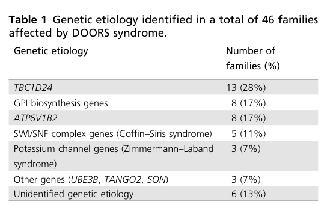

## Question

# Disease Characteristics Research Template

## Target Disease
- **Disease Name:** DOORS Syndrome
- **MONDO ID:**  (if available)
- **Category:** Mendelian

## Research Objectives

Please provide a comprehensive research report on **DOORS Syndrome** covering all of the
disease characteristics listed below. This report will be used to populate a disease knowledge
base entry. Be thorough and cite primary literature (PMID preferred) for all claims.

For each section, **suggested databases/resources** are listed. These are the first places
you should search for information on each topic.

---

### 1. Disease Information
> **Search first:** OMIM, Orphanet, ICD-10/ICD-11, MeSH, PubMed

- What is the disease? Provide a concise overview.
- What are the key identifiers? (OMIM, Orphanet, ICD-10/ICD-11, MeSH, Mondo)
- What are the common synonyms and alternative names?
- Is the information derived from individual patients (e.g., EHR) or aggregated disease-level resources?

### 2. Etiology

- **Disease Causal Factors**: What are the primary causes? (genetic, environmental, infectious, mechanistic)
- **Risk Factors**:
  > **Search first:** PubMed, Cochrane Library, UpToDate, clinical guidelines, ClinVar, ClinGen, GWAS Catalog, PheGenI, CTD, CDC, WHO, epidemiological databases
  - Genetic risk factors (causal variants, susceptibility loci, modifier genes)
  - Environmental risk factors (toxins, lifestyle, occupational exposures, age, sex, family history)
- **Protective Factors**:
  > **Search first:** PubMed, Cochrane Library, clinical trial databases, GWAS Catalog, gnomAD, WHO, CDC, nutrition databases
  - Genetic protective factors (protective variants, modifier alleles)
  - Environmental protective factors (diet, lifestyle, exposures that reduce risk)
- **Gene-Environment Interactions**: How do genetic and environmental factors interact to influence disease?
  > **Search first:** CTD, PubMed, PheGenI, GxE databases

### 3. Phenotypes
> **Search first:** HPO (Human Phenotype Ontology), OMIM, Orphanet, PubMed, clinicaltrials.gov, MedDRA, SNOMED CT, DECIPHER, LOINC

For each phenotype, provide:
- **Phenotype type**: symptoms, clinical signs, physical manifestations, behavioral changes, or laboratory abnormalities
  > For symptoms/signs: HPO, OMIM, Orphanet, PubMed
  > For behavioral changes: HPO, DSM, RDoC (Research Domain Criteria), PubMed
  > For laboratory abnormalities: LOINC, SNOMED CT, LabTests Online, PubMed
- **Phenotype characteristics**:
  > **Search first:** OMIM, Orphanet, HPO, PubMed
  - Age of symptom onset (neonatal, childhood, adult-onset, late-onset)
  - Symptom severity (mild, moderate, severe, variable)
  - Symptom progression (stable, progressive, episodic, fluctuating)
  - Frequency among affected individuals (percentage or qualitative)
- **Quality of life impact**: Effects on daily functioning and well-being (per-phenotype when possible)
  > **Search first:** EQ-5D database, SF-36, WHO QOL databases, PubMed
- Suggest HPO (Human Phenotype Ontology) terms for each phenotype

### 4. Genetic/Molecular Information

- **Causal Genes**: Gene mutations or chromosomal abnormalities responsible for disease (gene symbols, OMIM IDs)
  > **Search first:** OMIM, ClinVar, HGMD, Ensembl, NCBI Gene
- **Pathogenic Variants**:
  - Affected genes (gene symbols, HGNC IDs)
    > **Search first:** OMIM, NCBI Gene, Ensembl, HGNC, UniProt, GeneCards
  - Variant classification (pathogenic, likely pathogenic, VUS per ACMG/AMP guidelines)
    > **Search first:** ClinVar, ClinGen, ACMG/AMP guidelines, VarSome
  - Variant type/class (missense, frameshift, nonsense, splice-site, structural)
  - Allele frequency in population databases
    > **Search first:** gnomAD, 1000 Genomes, ExAC, TOPMed, dbSNP
  - Somatic vs germline origin
    > **Search first:** COSMIC (somatic), ClinVar, ICGC, TCGA
  - Functional consequences (loss of function, gain of function, dominant negative)
- **Modifier Genes**: Genes that modify disease severity or expression
- **Epigenetic Information**: DNA methylation, histone modifications, chromatin changes affecting disease
  > **Search first:** ENCODE, Roadmap Epigenomics, MethBase, DiseaseMeth
- **Chromosomal Abnormalities**: Large-scale genetic changes (aneuploidy, translocations, inversions)
  > **Search first:** DECIPHER, ClinVar, ECARUCA, UCSC Genome Browser

### 5. Environmental Information

- **Environmental Factors**: Non-genetic contributing factors (toxins, radiation, pollution, occupational exposure)
  > **Search first:** CTD (Comparative Toxicogenomics Database), TOXNET, PubMed, EPA databases
- **Lifestyle Factors**: Behavioral factors (smoking, diet, exercise, alcohol consumption)
  > **Search first:** CDC databases, WHO, PubMed, NHANES
- **Infectious Agents**: If applicable, pathogens causing or triggering disease (bacteria, viruses, fungi, parasites)
  > **Search first:** NCBI Taxonomy, ViPR, BV-BRC, MicrobeDB, GIDEON

### 6. Mechanism / Pathophysiology

- **Molecular Pathways**: Specific signaling cascades or biochemical pathways involved (Wnt, MAPK, mTOR, PI3K-AKT, etc.)
  > **Search first:** KEGG, Reactome, WikiPathways, PathBank, BioCyc
- **Cellular Processes**: Cell-level mechanisms (apoptosis, autophagy, cell cycle dysregulation, inflammation, etc.)
  > **Search first:** Gene Ontology (GO), Reactome, KEGG, PubMed
- **Protein Dysfunction**: How protein structure or function is altered (misfolding, aggregation, loss of function, gain of function)
  > **Search first:** UniProt, PDB (Protein Data Bank), InterPro, Pfam, AlphaFold
- **Metabolic Changes**: Alterations in metabolic processes (energy metabolism, lipid metabolism, amino acid metabolism)
  > **Search first:** KEGG, BioCyc, HMDB (Human Metabolome Database), BRENDA
- **Immune System Involvement**: Role of immune response (autoimmunity, immunodeficiency, chronic inflammation)
  > **Search first:** ImmPort, Immunome Database, IEDB, Gene Ontology
- **Tissue Damage Mechanisms**: How tissues/ are injured (oxidative stress, ischemia, fibrosis, necrosis)
  > **Search first:** PubMed, Gene Ontology, Reactome
- **Biochemical Abnormalities**: Specific molecular defects (enzyme deficiencies, receptor dysfunction, ion channel defects)
  > **Search first:** BRENDA, UniProt, KEGG, OMIM, PubMed
- **Epigenetic Changes**: DNA methylation, histone modifications affecting gene expression in disease
  > **Search first:** ENCODE, Roadmap Epigenomics, MethBase, DiseaseMeth
- **Molecular Profiling** (if available):
  - Transcriptomics/gene expression changes
    > **Search first:** GEO (Gene Expression Omnibus), ArrayExpress, GTEx, Human Cell Atlas, SRA
  - Proteomics findings
    > **Search first:** PRIDE, ProteomeXchange, Human Protein Atlas, STRING, BioGRID
  - Metabolomics signatures
    > **Search first:** MetaboLights, Metabolomics Workbench, HMDB, METLIN
  - Lipidomics alterations
    > **Search first:** LIPID MAPS, SwissLipids, LipidHome, Metabolomics Workbench
  - Genomic structural features
    > **Search first:** UCSC Genome Browser, Ensembl, NCBI, dbVar, DGV
- **Advanced Technologies** (if applicable):
  - Single-cell analysis findings (cell-type specific mechanisms, cellular heterogeneity)
    > **Search first:** Human Cell Atlas, Single Cell Portal, GEO, CELLxGENE
  - Spatial transcriptomics findings
    > **Search first:** GEO, Spatial Research, Vizgen, 10x Genomics data
  - Multi-omics integration results
    > **Search first:** TCGA, ICGC, cBioPortal, LinkedOmics, PubMed
  - Functional genomics screens (CRISPR, RNAi)
    > **Search first:** DepMap, GenomeRNAi, PubMed, BioGRID ORCS

For each mechanism, describe:
- The causal chain from initial trigger to clinical manifestation
- Which mechanisms are upstream vs downstream
- What cell types and biological processes are involved
- Suggest GO terms for biological processes and CL terms for cell types

### 7. Anatomical Structures Affected

- **Organ Level**:
  - Primary organs directly affected
  - Secondary organ involvement (complications, secondary effects)
  - Body systems involved (cardiovascular, nervous, digestive, respiratory, endocrine, etc.)
  > **Search first:** Uberon, FMA (Foundational Model of Anatomy), OMIM, HPO, ICD-11, MeSH, SNOMED CT
- **Tissue and Cell Level**:
  - Specific tissue types affected (epithelial, connective, muscle, nervous)
  - Specific cell populations targeted (with Cell Ontology terms)
  > **Search first:** Uberon, Human Protein Atlas, Cell Ontology, Human Cell Atlas, CellMarker, PanglaoDB
- **Subcellular Level**:
  - Cellular compartments involved (mitochondria, nucleus, ER, lysosomes) (with GO Cellular Component terms)
  > **Search first:** Gene Ontology (Cellular Component), UniProt, Human Protein Atlas
- **Localization**:
  - Specific anatomical sites (with UBERON terms)
    > **Search first:** FMA, Uberon, NeuroNames (for brain), SNOMED CT
  - Lateralization (unilateral, bilateral, asymmetric)
    > **Search first:** HPO, clinical literature, imaging databases

### 8. Temporal Development

- **Onset**:
  - Typical age of onset (congenital, pediatric, adult, geriatric)
  - Onset pattern (acute, subacute, chronic, insidious)
  > **Search first:** OMIM, Orphanet, HPO, PubMed
- **Progression**:
  - Disease stages (early, intermediate, advanced, end-stage)
    > **Search first:** Cancer Staging Manual (AJCC), WHO classifications, PubMed
  - Progression rate (rapid, slow, variable)
  - Disease course pattern (episodic, relapsing-remitting, progressive, stable)
  - Disease duration (self-limited, chronic lifelong)
  > **Search first:** Disease registries, longitudinal cohort databases, natural history studies, PubMed, Orphanet, OMIM
- **Patterns**:
  - Remission patterns (spontaneous, treatment-induced)
    > **Search first:** Clinical trial databases, disease registries, PubMed
  - Critical periods (time windows of vulnerability or opportunity for intervention)
    > **Search first:** PubMed, developmental biology databases, clinical guidelines

### 9. Inheritance and Population

- **Epidemiology**:
  - Prevalence (cases per 100,000 at given time)
  - Incidence (new cases per 100,000 per year)
  > **Search first:** Orphanet, CDC, WHO, GBD (Global Burden of Disease), national registries, SEER, disease registries
- **For Genetic Etiology**:
  - Inheritance pattern (AD, AR, X-linked, mitochondrial, multifactorial, polygenic)
    > **Search first:** OMIM, Orphanet, ClinVar, GTR (Genetic Testing Registry)
  - Penetrance (complete, incomplete, age-dependent)
    > **Search first:** ClinVar, OMIM, PubMed, ClinGen
  - Expressivity (variable, consistent)
    > **Search first:** OMIM, ClinVar, PubMed
  - Genetic anticipation (increasing severity in successive generations)
    > **Search first:** OMIM, PubMed (especially for repeat expansion disorders)
  - Germline mosaicism
    > **Search first:** ClinVar, OMIM, genetic counseling literature, PubMed
  - Founder effects (population-specific mutations)
    > **Search first:** gnomAD, population genetics databases, PubMed
  - Consanguinity role
    > **Search first:** OMIM, population studies, genetic counseling resources
  - Carrier frequency
    > **Search first:** gnomAD, carrier screening databases, GeneReviews, GTR
- **Population Demographics**:
  - Affected populations (ethnic or demographic groups with higher prevalence)
    > **Search first:** gnomAD, 1000 Genomes, PAGE Study, PubMed, population registries
  - Geographic distribution (endemic areas, regional variation)
    > **Search first:** WHO, CDC, GBD, Orphanet, geographic epidemiology databases
  - Geographic distribution of specific variants
  - Sex ratio (male:female)
    > **Search first:** Disease registries, OMIM, PubMed, epidemiological databases
  - Age distribution of affected individuals
    > **Search first:** CDC, disease registries, SEER, Orphanet

### 10. Diagnostics

- **Clinical Tests**:
  - Laboratory tests (blood, urine, tissue chemistry, specific enzyme assays)
    > **Search first:** LOINC, LabTests Online, PubMed
  - Biomarkers (proteins, metabolites, genetic markers, circulating biomarkers)
    > **Search first:** FDA Biomarker List, BEST (Biomarkers, EndpointS, and other Tools), PubMed
  - Imaging studies (X-ray, CT, MRI, PET, ultrasound)
    > **Search first:** RadLex, DICOM, Radiopaedia, imaging databases
  - Functional tests (pulmonary function, cardiac stress tests)
    > **Search first:** LOINC, clinical guidelines, PubMed
  - Electrophysiology (EEG, EMG, ECG, nerve conduction studies)
    > **Search first:** LOINC, clinical neurophysiology databases, PubMed
  - Biopsy findings (histopathology, immunohistochemistry)
    > **Search first:** SNOMED CT, College of American Pathologists resources, PubMed
  - Pathology findings (microscopic examination)
    > **Search first:** SNOMED CT, Digital Pathology databases, PubMed
- **Genetic Testing**:
  > **Search first:** GTR (Genetic Testing Registry), GeneReviews, ClinGen
  - Overview of recommended genetic testing approach
  - Whole genome sequencing (WGS) utility
    > **Search first:** GTR, ClinVar, GEL (Genomics England), gnomAD
  - Whole exome sequencing (WES) utility
    > **Search first:** GTR, ClinVar, OMIM, GeneMatcher
  - Gene panels (which panels, which genes)
    > **Search first:** GTR, ClinVar, laboratory-specific databases
  - Single gene testing
    > **Search first:** GTR, ClinVar, OMIM, GeneReviews
  - Chromosomal microarray (CMA)
    > **Search first:** DECIPHER, ClinVar, dbVar, ECARUCA
  - Karyotyping
    > **Search first:** Chromosome Abnormality Database, ClinVar, cytogenetics resources
  - FISH
    > **Search first:** ClinVar, cytogenetics databases, PubMed
  - Mitochondrial DNA testing
    > **Search first:** MITOMAP, MSeqDR, ClinVar, GTR
  - Repeat expansion testing
    > **Search first:** GTR, ClinVar, repeat expansion databases, PubMed
- **Omics-Based Diagnostics** (if applicable):
  - RNA sequencing / transcriptomics
    > **Search first:** GEO, ArrayExpress, GTEx, RNA-seq databases
  - Proteomics
    > **Search first:** PRIDE, ProteomeXchange, FDA Biomarker database
  - Metabolomics
    > **Search first:** MetaboLights, Metabolomics Workbench, HMDB
  - Epigenomics
    > **Search first:** GEO, ENCODE, Roadmap Epigenomics, MethBase
  - Liquid biopsy
    > **Search first:** COSMIC, ClinVar, liquid biopsy databases, PubMed
- **Clinical Criteria**:
  - Standardized diagnostic criteria (DSM, ICD, society guidelines)
    > **Search first:** DSM-5, ICD-11, clinical society guidelines, UpToDate
  - Differential diagnosis (other conditions to rule out, with distinguishing features)
    > **Search first:** DynaMed, UpToDate, clinical decision support systems
- **Screening**:
  - Screening methods for asymptomatic individuals (newborn screening, carrier screening, cascade screening)
    > **Search first:** ACMG recommendations, CDC newborn screening, GTR

### 11. Outcome/Prognosis

- **Survival and Mortality**:
  - Survival rate (5-year, 10-year, overall)
    > **Search first:** SEER, cancer registries, disease-specific registries, PubMed
  - Life expectancy (with and without treatment if applicable)
    > **Search first:** Orphanet, disease registries, actuarial databases, PubMed
  - Mortality rate
    > **Search first:** CDC, WHO, GBD, national mortality databases
  - Disease-specific mortality (deaths directly attributable to disease)
    > **Search first:** Disease registries, CDC Wonder, GBD, PubMed
- **Morbidity and Function**:
  - Morbidity (disease-related disability and health impacts)
    > **Search first:** GBD, WHO, disability databases, PubMed
  - Disability outcomes (long-term functional impairments)
    > **Search first:** ICF (International Classification of Functioning), disability registries
  - Quality of life measures (EQ-5D, SF-36, PROMIS, disease-specific tools)
    > **Search first:** EQ-5D database, SF-36, PROMIS, PubMed
- **Disease Course**:
  - Complications (secondary problems: infections, organ failure, etc.)
    > **Search first:** ICD codes, disease registries, clinical databases, PubMed
  - Recovery potential (likelihood and extent of recovery, with vs without treatment)
    > **Search first:** Natural history studies, rehabilitation databases, PubMed
- **Prediction**:
  - Prognostic factors (age, disease severity, biomarkers, treatment response)
    > **Search first:** Prognostic models databases, clinical calculators, PubMed
  - Prognostic biomarkers (molecular markers predicting disease course)
    > **Search first:** FDA Biomarker database, PubMed, cancer prognostic databases

### 12. Treatment

- **Pharmacotherapy**:
  - Pharmacological treatments (drug names, drug classes, mechanisms of action)
    > **Search first:** DrugBank, RxNorm, ATC classification, DailyMed, FDA databases
  - Pharmacogenomics (how genetic variants affect drug metabolism, efficacy, toxicity)
    > **Search first:** PharmGKB, CPIC (Clinical Pharmacogenetics), FDA Table of PGx Biomarkers
- **Advanced Therapeutics**:
  - Gene therapy (viral vectors, CRISPR, gene replacement, gene editing)
    > **Search first:** ClinicalTrials.gov, FDA gene therapy database, ASGCT resources
  - Cell therapy (stem cell transplant, CAR-T, cellular therapeutics)
    > **Search first:** ClinicalTrials.gov, FDA cell therapy database, FACT standards
  - RNA-based therapies (ASOs, siRNA, mRNA therapies)
    > **Search first:** ClinicalTrials.gov, FDA approvals, PubMed
  - Targeted therapies (treatments directed at specific molecular targets)
    > **Search first:** My Cancer Genome, OncoKB, ClinicalTrials.gov, FDA approvals
  - Immunotherapies (checkpoint inhibitors, monoclonal antibodies)
    > **Search first:** Cancer Immunotherapy Database, FDA approvals, ClinicalTrials.gov
- **Surgical and Interventional**:
  - Surgical interventions (types of surgery, timing, outcomes)
    > **Search first:** CPT codes, surgical registries, clinical guidelines, PubMed
- **Supportive and Rehabilitative**:
  - Supportive care (symptom management, pain control, nutrition)
    > **Search first:** Clinical guidelines, Cochrane Library, PubMed
  - Rehabilitation (physical therapy, occupational therapy, speech therapy)
    > **Search first:** Rehabilitation medicine databases, clinical guidelines, PubMed
- **Experimental**:
  - Experimental treatments in clinical trials (with NCT identifiers if available)
    > **Search first:** ClinicalTrials.gov, EU Clinical Trials Register, WHO ICTRP
- **Treatment Outcomes**:
  - Treatment response rates
    > **Search first:** Clinical trial databases, FDA reviews, systematic reviews, PubMed
  - Side effects and adverse events
    > **Search first:** FDA Adverse Event Reporting System (FAERS), MedWatch, PubMed
- **Treatment Strategy**:
  - Treatment algorithms (clinical pathways, decision trees)
    > **Search first:** Clinical practice guidelines, NCCN Guidelines, UpToDate
  - Combination therapies
    > **Search first:** ClinicalTrials.gov, treatment guidelines, PubMed
  - Personalized medicine approaches (genotype-guided treatment)
    > **Search first:** My Cancer Genome, CIViC, PharmGKB, precision medicine databases

For each treatment, suggest MAXO (Medical Action Ontology) terms where applicable.

### 13. Prevention

- **Prevention Levels**:
  - Primary prevention (preventing disease occurrence: vaccination, risk factor modification)
    > **Search first:** CDC, WHO, USPSTF recommendations, Cochrane Library
  - Secondary prevention (early detection and treatment: screening programs, early intervention)
    > **Search first:** USPSTF, CDC screening guidelines, WHO
  - Tertiary prevention (preventing complications in those with disease)
    > **Search first:** Clinical guidelines, disease management protocols, PubMed
- **Immunization**: Vaccine strategies (if applicable)
  > **Search first:** CDC vaccine schedules, WHO immunization, FDA vaccine database
- **Screening and Early Detection**:
  - Screening programs (population-based: newborn screening, cancer screening)
    > **Search first:** CDC screening programs, USPSTF, cancer screening databases
  - Genetic screening (carrier screening, preimplantation genetic diagnosis, prenatal testing)
    > **Search first:** ACMG recommendations, ACOG guidelines, GTR
  - Risk stratification (identifying high-risk individuals for targeted prevention)
    > **Search first:** Risk prediction models, clinical calculators, PubMed
- **Behavioral Interventions**: Lifestyle modifications to reduce risk
  > **Search first:** CDC, WHO, behavioral intervention databases, Cochrane Library
- **Counseling**: Genetic counseling (risk assessment, family planning guidance)
  > **Search first:** NSGC resources, ACMG guidelines, GeneReviews
- **Public Health**:
  - Public health interventions (sanitation, vector control, health education)
    > **Search first:** CDC, WHO, public health databases, PubMed
  - Environmental interventions (reducing environmental risk factors)
    > **Search first:** EPA databases, WHO environmental health, PubMed
- **Prophylaxis**: Preventive medications or procedures
  > **Search first:** Clinical guidelines, FDA approvals, PubMed

### 14. Other Species / Natural Disease

- **Taxonomy**: Species affected (with NCBI Taxon identifiers)
  > **Search first:** NCBI Taxonomy
- **Breed**: Specific breeds affected (with VBO identifiers if applicable)
  > **Search first:** VBO (Vertebrate Breed Ontology)
- **Gene**: Orthologous genes in other species (with NCBI Gene IDs)
  > **Search first:** NCBI Gene
- **Natural Disease**:
  - Naturally occurring disease in other species (companion animals, wildlife)
    > **Search first:** OMIA (Online Mendelian Inheritance in Animals), VetCompass, PubMed
  - Veterinary relevance and importance in animal health
    > **Search first:** OMIA, veterinary databases, PubMed
- **Comparative Biology**:
  - Comparative pathology (similarities and differences across species)
    > **Search first:** OMIA, comparative pathology databases, PubMed
  - Evolutionary conservation of disease mechanisms
    > **Search first:** HomoloGene, OrthoMCL, Alliance of Genome Resources
- **Transmission** (if applicable):
  - Zoonotic potential
    > **Search first:** CDC zoonotic diseases, WHO zoonoses, GIDEON
  - Cross-species susceptibility
    > **Search first:** NCBI Taxonomy, veterinary databases, PubMed

### 15. Model Organisms

- **Model Types**:
  - Model organism type (mammalian, invertebrate, cellular, in vitro)
    > **Search first:** Alliance of Genome Resources, model organism databases
  - Specific model systems (mouse, rat, zebrafish, Drosophila, C. elegans, yeast, cell lines, organoids, iPSCs)
    > **Search first:** MGI, RGD, ZFIN, FlyBase, WormBase, SGD, ATCC, Cellosaurus
  - Induced models (drug treatment, surgical intervention, environmental manipulation)
    > **Search first:** MGI, model organism databases, PubMed
- **Genetic Models**:
  - Types available (knockout, knock-in, transgenic, conditional, humanized)
    > **Search first:** MGI, IMPC, KOMP, EuMMCR, IMSR
- **Model Characteristics**:
  - Phenotype recapitulation (how well model reproduces human disease features)
    > **Search first:** Model organism databases, comparative studies, PubMed
  - Model limitations (aspects of human disease not captured)
    > **Search first:** Model organism databases, PubMed, review articles
- **Applications**:
  - Research applications (what aspects of disease can be studied)
    > **Search first:** Model organism databases, PubMed
- **Resources**:
  - Model databases
    > **Search first:** MGI, RGD, ZFIN, FlyBase, WormBase, IMSR, EMMA, MMRRC

---

## Citation Requirements

- Cite primary literature (PMID preferred) for all mechanistic and clinical claims
- Prioritize recent reviews and landmark papers
- Include direct quotes from abstracts where possible to support key statements
- Distinguish evidence source types: human clinical, model organism, in vitro, computational

## Output Format

Structure your response as a comprehensive narrative organized by the sections above.
For each section, provide:
- Factual content with specific details (numbers, percentages, gene names, variant nomenclature)
- Ontology term suggestions (HPO, GO, CL, UBERON, CHEBI, MAXO, MONDO) where applicable
- Evidence citations with PMIDs
- Direct quotes from abstracts to support key claims
- Clear indication when information is not available or not applicable for this disease

This report will be used to populate a disease knowledge base entry with:
- Pathophysiology descriptions with causal chains
- Gene/protein annotations (HGNC, GO terms)
- Phenotype associations (HP terms) with frequencies
- Cell type involvement (CL terms)
- Anatomical locations (UBERON terms)
- Chemical entities (CHEBI terms)
- Treatment annotations (MAXO terms)
- Evidence items with PMIDs and exact abstract quotes
- Epidemiology, prognosis, diagnostic, and prevention information
- Animal model descriptions with phenotype recapitulation details

## Output

Question: You are an expert researcher providing comprehensive, well-cited information.

Provide detailed information focusing on:
1. Key concepts and definitions with current understanding
2. Recent developments and latest research (prioritize 2023-2024 sources)
3. Current applications and real-world implementations
4. Expert opinions and analysis from authoritative sources
5. Relevant statistics and data from recent studies

Format as a comprehensive research report with proper citations. Include URLs and publication dates where available.
Always prioritize recent, authoritative sources and provide specific citations for all major claims.

# Disease Characteristics Research Template

## Target Disease
- **Disease Name:** DOORS Syndrome
- **MONDO ID:**  (if available)
- **Category:** Mendelian

## Research Objectives

Please provide a comprehensive research report on **DOORS Syndrome** covering all of the
disease characteristics listed below. This report will be used to populate a disease knowledge
base entry. Be thorough and cite primary literature (PMID preferred) for all claims.

For each section, **suggested databases/resources** are listed. These are the first places
you should search for information on each topic.

---

### 1. Disease Information
> **Search first:** OMIM, Orphanet, ICD-10/ICD-11, MeSH, PubMed

- What is the disease? Provide a concise overview.
- What are the key identifiers? (OMIM, Orphanet, ICD-10/ICD-11, MeSH, Mondo)
- What are the common synonyms and alternative names?
- Is the information derived from individual patients (e.g., EHR) or aggregated disease-level resources?

### 2. Etiology

- **Disease Causal Factors**: What are the primary causes? (genetic, environmental, infectious, mechanistic)
- **Risk Factors**:
  > **Search first:** PubMed, Cochrane Library, UpToDate, clinical guidelines, ClinVar, ClinGen, GWAS Catalog, PheGenI, CTD, CDC, WHO, epidemiological databases
  - Genetic risk factors (causal variants, susceptibility loci, modifier genes)
  - Environmental risk factors (toxins, lifestyle, occupational exposures, age, sex, family history)
- **Protective Factors**:
  > **Search first:** PubMed, Cochrane Library, clinical trial databases, GWAS Catalog, gnomAD, WHO, CDC, nutrition databases
  - Genetic protective factors (protective variants, modifier alleles)
  - Environmental protective factors (diet, lifestyle, exposures that reduce risk)
- **Gene-Environment Interactions**: How do genetic and environmental factors interact to influence disease?
  > **Search first:** CTD, PubMed, PheGenI, GxE databases

### 3. Phenotypes
> **Search first:** HPO (Human Phenotype Ontology), OMIM, Orphanet, PubMed, clinicaltrials.gov, MedDRA, SNOMED CT, DECIPHER, LOINC

For each phenotype, provide:
- **Phenotype type**: symptoms, clinical signs, physical manifestations, behavioral changes, or laboratory abnormalities
  > For symptoms/signs: HPO, OMIM, Orphanet, PubMed
  > For behavioral changes: HPO, DSM, RDoC (Research Domain Criteria), PubMed
  > For laboratory abnormalities: LOINC, SNOMED CT, LabTests Online, PubMed
- **Phenotype characteristics**:
  > **Search first:** OMIM, Orphanet, HPO, PubMed
  - Age of symptom onset (neonatal, childhood, adult-onset, late-onset)
  - Symptom severity (mild, moderate, severe, variable)
  - Symptom progression (stable, progressive, episodic, fluctuating)
  - Frequency among affected individuals (percentage or qualitative)
- **Quality of life impact**: Effects on daily functioning and well-being (per-phenotype when possible)
  > **Search first:** EQ-5D database, SF-36, WHO QOL databases, PubMed
- Suggest HPO (Human Phenotype Ontology) terms for each phenotype

### 4. Genetic/Molecular Information

- **Causal Genes**: Gene mutations or chromosomal abnormalities responsible for disease (gene symbols, OMIM IDs)
  > **Search first:** OMIM, ClinVar, HGMD, Ensembl, NCBI Gene
- **Pathogenic Variants**:
  - Affected genes (gene symbols, HGNC IDs)
    > **Search first:** OMIM, NCBI Gene, Ensembl, HGNC, UniProt, GeneCards
  - Variant classification (pathogenic, likely pathogenic, VUS per ACMG/AMP guidelines)
    > **Search first:** ClinVar, ClinGen, ACMG/AMP guidelines, VarSome
  - Variant type/class (missense, frameshift, nonsense, splice-site, structural)
  - Allele frequency in population databases
    > **Search first:** gnomAD, 1000 Genomes, ExAC, TOPMed, dbSNP
  - Somatic vs germline origin
    > **Search first:** COSMIC (somatic), ClinVar, ICGC, TCGA
  - Functional consequences (loss of function, gain of function, dominant negative)
- **Modifier Genes**: Genes that modify disease severity or expression
- **Epigenetic Information**: DNA methylation, histone modifications, chromatin changes affecting disease
  > **Search first:** ENCODE, Roadmap Epigenomics, MethBase, DiseaseMeth
- **Chromosomal Abnormalities**: Large-scale genetic changes (aneuploidy, translocations, inversions)
  > **Search first:** DECIPHER, ClinVar, ECARUCA, UCSC Genome Browser

### 5. Environmental Information

- **Environmental Factors**: Non-genetic contributing factors (toxins, radiation, pollution, occupational exposure)
  > **Search first:** CTD (Comparative Toxicogenomics Database), TOXNET, PubMed, EPA databases
- **Lifestyle Factors**: Behavioral factors (smoking, diet, exercise, alcohol consumption)
  > **Search first:** CDC databases, WHO, PubMed, NHANES
- **Infectious Agents**: If applicable, pathogens causing or triggering disease (bacteria, viruses, fungi, parasites)
  > **Search first:** NCBI Taxonomy, ViPR, BV-BRC, MicrobeDB, GIDEON

### 6. Mechanism / Pathophysiology

- **Molecular Pathways**: Specific signaling cascades or biochemical pathways involved (Wnt, MAPK, mTOR, PI3K-AKT, etc.)
  > **Search first:** KEGG, Reactome, WikiPathways, PathBank, BioCyc
- **Cellular Processes**: Cell-level mechanisms (apoptosis, autophagy, cell cycle dysregulation, inflammation, etc.)
  > **Search first:** Gene Ontology (GO), Reactome, KEGG, PubMed
- **Protein Dysfunction**: How protein structure or function is altered (misfolding, aggregation, loss of function, gain of function)
  > **Search first:** UniProt, PDB (Protein Data Bank), InterPro, Pfam, AlphaFold
- **Metabolic Changes**: Alterations in metabolic processes (energy metabolism, lipid metabolism, amino acid metabolism)
  > **Search first:** KEGG, BioCyc, HMDB (Human Metabolome Database), BRENDA
- **Immune System Involvement**: Role of immune response (autoimmunity, immunodeficiency, chronic inflammation)
  > **Search first:** ImmPort, Immunome Database, IEDB, Gene Ontology
- **Tissue Damage Mechanisms**: How tissues/ are injured (oxidative stress, ischemia, fibrosis, necrosis)
  > **Search first:** PubMed, Gene Ontology, Reactome
- **Biochemical Abnormalities**: Specific molecular defects (enzyme deficiencies, receptor dysfunction, ion channel defects)
  > **Search first:** BRENDA, UniProt, KEGG, OMIM, PubMed
- **Epigenetic Changes**: DNA methylation, histone modifications affecting gene expression in disease
  > **Search first:** ENCODE, Roadmap Epigenomics, MethBase, DiseaseMeth
- **Molecular Profiling** (if available):
  - Transcriptomics/gene expression changes
    > **Search first:** GEO (Gene Expression Omnibus), ArrayExpress, GTEx, Human Cell Atlas, SRA
  - Proteomics findings
    > **Search first:** PRIDE, ProteomeXchange, Human Protein Atlas, STRING, BioGRID
  - Metabolomics signatures
    > **Search first:** MetaboLights, Metabolomics Workbench, HMDB, METLIN
  - Lipidomics alterations
    > **Search first:** LIPID MAPS, SwissLipids, LipidHome, Metabolomics Workbench
  - Genomic structural features
    > **Search first:** UCSC Genome Browser, Ensembl, NCBI, dbVar, DGV
- **Advanced Technologies** (if applicable):
  - Single-cell analysis findings (cell-type specific mechanisms, cellular heterogeneity)
    > **Search first:** Human Cell Atlas, Single Cell Portal, GEO, CELLxGENE
  - Spatial transcriptomics findings
    > **Search first:** GEO, Spatial Research, Vizgen, 10x Genomics data
  - Multi-omics integration results
    > **Search first:** TCGA, ICGC, cBioPortal, LinkedOmics, PubMed
  - Functional genomics screens (CRISPR, RNAi)
    > **Search first:** DepMap, GenomeRNAi, PubMed, BioGRID ORCS

For each mechanism, describe:
- The causal chain from initial trigger to clinical manifestation
- Which mechanisms are upstream vs downstream
- What cell types and biological processes are involved
- Suggest GO terms for biological processes and CL terms for cell types

### 7. Anatomical Structures Affected

- **Organ Level**:
  - Primary organs directly affected
  - Secondary organ involvement (complications, secondary effects)
  - Body systems involved (cardiovascular, nervous, digestive, respiratory, endocrine, etc.)
  > **Search first:** Uberon, FMA (Foundational Model of Anatomy), OMIM, HPO, ICD-11, MeSH, SNOMED CT
- **Tissue and Cell Level**:
  - Specific tissue types affected (epithelial, connective, muscle, nervous)
  - Specific cell populations targeted (with Cell Ontology terms)
  > **Search first:** Uberon, Human Protein Atlas, Cell Ontology, Human Cell Atlas, CellMarker, PanglaoDB
- **Subcellular Level**:
  - Cellular compartments involved (mitochondria, nucleus, ER, lysosomes) (with GO Cellular Component terms)
  > **Search first:** Gene Ontology (Cellular Component), UniProt, Human Protein Atlas
- **Localization**:
  - Specific anatomical sites (with UBERON terms)
    > **Search first:** FMA, Uberon, NeuroNames (for brain), SNOMED CT
  - Lateralization (unilateral, bilateral, asymmetric)
    > **Search first:** HPO, clinical literature, imaging databases

### 8. Temporal Development

- **Onset**:
  - Typical age of onset (congenital, pediatric, adult, geriatric)
  - Onset pattern (acute, subacute, chronic, insidious)
  > **Search first:** OMIM, Orphanet, HPO, PubMed
- **Progression**:
  - Disease stages (early, intermediate, advanced, end-stage)
    > **Search first:** Cancer Staging Manual (AJCC), WHO classifications, PubMed
  - Progression rate (rapid, slow, variable)
  - Disease course pattern (episodic, relapsing-remitting, progressive, stable)
  - Disease duration (self-limited, chronic lifelong)
  > **Search first:** Disease registries, longitudinal cohort databases, natural history studies, PubMed, Orphanet, OMIM
- **Patterns**:
  - Remission patterns (spontaneous, treatment-induced)
    > **Search first:** Clinical trial databases, disease registries, PubMed
  - Critical periods (time windows of vulnerability or opportunity for intervention)
    > **Search first:** PubMed, developmental biology databases, clinical guidelines

### 9. Inheritance and Population

- **Epidemiology**:
  - Prevalence (cases per 100,000 at given time)
  - Incidence (new cases per 100,000 per year)
  > **Search first:** Orphanet, CDC, WHO, GBD (Global Burden of Disease), national registries, SEER, disease registries
- **For Genetic Etiology**:
  - Inheritance pattern (AD, AR, X-linked, mitochondrial, multifactorial, polygenic)
    > **Search first:** OMIM, Orphanet, ClinVar, GTR (Genetic Testing Registry)
  - Penetrance (complete, incomplete, age-dependent)
    > **Search first:** ClinVar, OMIM, PubMed, ClinGen
  - Expressivity (variable, consistent)
    > **Search first:** OMIM, ClinVar, PubMed
  - Genetic anticipation (increasing severity in successive generations)
    > **Search first:** OMIM, PubMed (especially for repeat expansion disorders)
  - Germline mosaicism
    > **Search first:** ClinVar, OMIM, genetic counseling literature, PubMed
  - Founder effects (population-specific mutations)
    > **Search first:** gnomAD, population genetics databases, PubMed
  - Consanguinity role
    > **Search first:** OMIM, population studies, genetic counseling resources
  - Carrier frequency
    > **Search first:** gnomAD, carrier screening databases, GeneReviews, GTR
- **Population Demographics**:
  - Affected populations (ethnic or demographic groups with higher prevalence)
    > **Search first:** gnomAD, 1000 Genomes, PAGE Study, PubMed, population registries
  - Geographic distribution (endemic areas, regional variation)
    > **Search first:** WHO, CDC, GBD, Orphanet, geographic epidemiology databases
  - Geographic distribution of specific variants
  - Sex ratio (male:female)
    > **Search first:** Disease registries, OMIM, PubMed, epidemiological databases
  - Age distribution of affected individuals
    > **Search first:** CDC, disease registries, SEER, Orphanet

### 10. Diagnostics

- **Clinical Tests**:
  - Laboratory tests (blood, urine, tissue chemistry, specific enzyme assays)
    > **Search first:** LOINC, LabTests Online, PubMed
  - Biomarkers (proteins, metabolites, genetic markers, circulating biomarkers)
    > **Search first:** FDA Biomarker List, BEST (Biomarkers, EndpointS, and other Tools), PubMed
  - Imaging studies (X-ray, CT, MRI, PET, ultrasound)
    > **Search first:** RadLex, DICOM, Radiopaedia, imaging databases
  - Functional tests (pulmonary function, cardiac stress tests)
    > **Search first:** LOINC, clinical guidelines, PubMed
  - Electrophysiology (EEG, EMG, ECG, nerve conduction studies)
    > **Search first:** LOINC, clinical neurophysiology databases, PubMed
  - Biopsy findings (histopathology, immunohistochemistry)
    > **Search first:** SNOMED CT, College of American Pathologists resources, PubMed
  - Pathology findings (microscopic examination)
    > **Search first:** SNOMED CT, Digital Pathology databases, PubMed
- **Genetic Testing**:
  > **Search first:** GTR (Genetic Testing Registry), GeneReviews, ClinGen
  - Overview of recommended genetic testing approach
  - Whole genome sequencing (WGS) utility
    > **Search first:** GTR, ClinVar, GEL (Genomics England), gnomAD
  - Whole exome sequencing (WES) utility
    > **Search first:** GTR, ClinVar, OMIM, GeneMatcher
  - Gene panels (which panels, which genes)
    > **Search first:** GTR, ClinVar, laboratory-specific databases
  - Single gene testing
    > **Search first:** GTR, ClinVar, OMIM, GeneReviews
  - Chromosomal microarray (CMA)
    > **Search first:** DECIPHER, ClinVar, dbVar, ECARUCA
  - Karyotyping
    > **Search first:** Chromosome Abnormality Database, ClinVar, cytogenetics resources
  - FISH
    > **Search first:** ClinVar, cytogenetics databases, PubMed
  - Mitochondrial DNA testing
    > **Search first:** MITOMAP, MSeqDR, ClinVar, GTR
  - Repeat expansion testing
    > **Search first:** GTR, ClinVar, repeat expansion databases, PubMed
- **Omics-Based Diagnostics** (if applicable):
  - RNA sequencing / transcriptomics
    > **Search first:** GEO, ArrayExpress, GTEx, RNA-seq databases
  - Proteomics
    > **Search first:** PRIDE, ProteomeXchange, FDA Biomarker database
  - Metabolomics
    > **Search first:** MetaboLights, Metabolomics Workbench, HMDB
  - Epigenomics
    > **Search first:** GEO, ENCODE, Roadmap Epigenomics, MethBase
  - Liquid biopsy
    > **Search first:** COSMIC, ClinVar, liquid biopsy databases, PubMed
- **Clinical Criteria**:
  - Standardized diagnostic criteria (DSM, ICD, society guidelines)
    > **Search first:** DSM-5, ICD-11, clinical society guidelines, UpToDate
  - Differential diagnosis (other conditions to rule out, with distinguishing features)
    > **Search first:** DynaMed, UpToDate, clinical decision support systems
- **Screening**:
  - Screening methods for asymptomatic individuals (newborn screening, carrier screening, cascade screening)
    > **Search first:** ACMG recommendations, CDC newborn screening, GTR

### 11. Outcome/Prognosis

- **Survival and Mortality**:
  - Survival rate (5-year, 10-year, overall)
    > **Search first:** SEER, cancer registries, disease-specific registries, PubMed
  - Life expectancy (with and without treatment if applicable)
    > **Search first:** Orphanet, disease registries, actuarial databases, PubMed
  - Mortality rate
    > **Search first:** CDC, WHO, GBD, national mortality databases
  - Disease-specific mortality (deaths directly attributable to disease)
    > **Search first:** Disease registries, CDC Wonder, GBD, PubMed
- **Morbidity and Function**:
  - Morbidity (disease-related disability and health impacts)
    > **Search first:** GBD, WHO, disability databases, PubMed
  - Disability outcomes (long-term functional impairments)
    > **Search first:** ICF (International Classification of Functioning), disability registries
  - Quality of life measures (EQ-5D, SF-36, PROMIS, disease-specific tools)
    > **Search first:** EQ-5D database, SF-36, PROMIS, PubMed
- **Disease Course**:
  - Complications (secondary problems: infections, organ failure, etc.)
    > **Search first:** ICD codes, disease registries, clinical databases, PubMed
  - Recovery potential (likelihood and extent of recovery, with vs without treatment)
    > **Search first:** Natural history studies, rehabilitation databases, PubMed
- **Prediction**:
  - Prognostic factors (age, disease severity, biomarkers, treatment response)
    > **Search first:** Prognostic models databases, clinical calculators, PubMed
  - Prognostic biomarkers (molecular markers predicting disease course)
    > **Search first:** FDA Biomarker database, PubMed, cancer prognostic databases

### 12. Treatment

- **Pharmacotherapy**:
  - Pharmacological treatments (drug names, drug classes, mechanisms of action)
    > **Search first:** DrugBank, RxNorm, ATC classification, DailyMed, FDA databases
  - Pharmacogenomics (how genetic variants affect drug metabolism, efficacy, toxicity)
    > **Search first:** PharmGKB, CPIC (Clinical Pharmacogenetics), FDA Table of PGx Biomarkers
- **Advanced Therapeutics**:
  - Gene therapy (viral vectors, CRISPR, gene replacement, gene editing)
    > **Search first:** ClinicalTrials.gov, FDA gene therapy database, ASGCT resources
  - Cell therapy (stem cell transplant, CAR-T, cellular therapeutics)
    > **Search first:** ClinicalTrials.gov, FDA cell therapy database, FACT standards
  - RNA-based therapies (ASOs, siRNA, mRNA therapies)
    > **Search first:** ClinicalTrials.gov, FDA approvals, PubMed
  - Targeted therapies (treatments directed at specific molecular targets)
    > **Search first:** My Cancer Genome, OncoKB, ClinicalTrials.gov, FDA approvals
  - Immunotherapies (checkpoint inhibitors, monoclonal antibodies)
    > **Search first:** Cancer Immunotherapy Database, FDA approvals, ClinicalTrials.gov
- **Surgical and Interventional**:
  - Surgical interventions (types of surgery, timing, outcomes)
    > **Search first:** CPT codes, surgical registries, clinical guidelines, PubMed
- **Supportive and Rehabilitative**:
  - Supportive care (symptom management, pain control, nutrition)
    > **Search first:** Clinical guidelines, Cochrane Library, PubMed
  - Rehabilitation (physical therapy, occupational therapy, speech therapy)
    > **Search first:** Rehabilitation medicine databases, clinical guidelines, PubMed
- **Experimental**:
  - Experimental treatments in clinical trials (with NCT identifiers if available)
    > **Search first:** ClinicalTrials.gov, EU Clinical Trials Register, WHO ICTRP
- **Treatment Outcomes**:
  - Treatment response rates
    > **Search first:** Clinical trial databases, FDA reviews, systematic reviews, PubMed
  - Side effects and adverse events
    > **Search first:** FDA Adverse Event Reporting System (FAERS), MedWatch, PubMed
- **Treatment Strategy**:
  - Treatment algorithms (clinical pathways, decision trees)
    > **Search first:** Clinical practice guidelines, NCCN Guidelines, UpToDate
  - Combination therapies
    > **Search first:** ClinicalTrials.gov, treatment guidelines, PubMed
  - Personalized medicine approaches (genotype-guided treatment)
    > **Search first:** My Cancer Genome, CIViC, PharmGKB, precision medicine databases

For each treatment, suggest MAXO (Medical Action Ontology) terms where applicable.

### 13. Prevention

- **Prevention Levels**:
  - Primary prevention (preventing disease occurrence: vaccination, risk factor modification)
    > **Search first:** CDC, WHO, USPSTF recommendations, Cochrane Library
  - Secondary prevention (early detection and treatment: screening programs, early intervention)
    > **Search first:** USPSTF, CDC screening guidelines, WHO
  - Tertiary prevention (preventing complications in those with disease)
    > **Search first:** Clinical guidelines, disease management protocols, PubMed
- **Immunization**: Vaccine strategies (if applicable)
  > **Search first:** CDC vaccine schedules, WHO immunization, FDA vaccine database
- **Screening and Early Detection**:
  - Screening programs (population-based: newborn screening, cancer screening)
    > **Search first:** CDC screening programs, USPSTF, cancer screening databases
  - Genetic screening (carrier screening, preimplantation genetic diagnosis, prenatal testing)
    > **Search first:** ACMG recommendations, ACOG guidelines, GTR
  - Risk stratification (identifying high-risk individuals for targeted prevention)
    > **Search first:** Risk prediction models, clinical calculators, PubMed
- **Behavioral Interventions**: Lifestyle modifications to reduce risk
  > **Search first:** CDC, WHO, behavioral intervention databases, Cochrane Library
- **Counseling**: Genetic counseling (risk assessment, family planning guidance)
  > **Search first:** NSGC resources, ACMG guidelines, GeneReviews
- **Public Health**:
  - Public health interventions (sanitation, vector control, health education)
    > **Search first:** CDC, WHO, public health databases, PubMed
  - Environmental interventions (reducing environmental risk factors)
    > **Search first:** EPA databases, WHO environmental health, PubMed
- **Prophylaxis**: Preventive medications or procedures
  > **Search first:** Clinical guidelines, FDA approvals, PubMed

### 14. Other Species / Natural Disease

- **Taxonomy**: Species affected (with NCBI Taxon identifiers)
  > **Search first:** NCBI Taxonomy
- **Breed**: Specific breeds affected (with VBO identifiers if applicable)
  > **Search first:** VBO (Vertebrate Breed Ontology)
- **Gene**: Orthologous genes in other species (with NCBI Gene IDs)
  > **Search first:** NCBI Gene
- **Natural Disease**:
  - Naturally occurring disease in other species (companion animals, wildlife)
    > **Search first:** OMIA (Online Mendelian Inheritance in Animals), VetCompass, PubMed
  - Veterinary relevance and importance in animal health
    > **Search first:** OMIA, veterinary databases, PubMed
- **Comparative Biology**:
  - Comparative pathology (similarities and differences across species)
    > **Search first:** OMIA, comparative pathology databases, PubMed
  - Evolutionary conservation of disease mechanisms
    > **Search first:** HomoloGene, OrthoMCL, Alliance of Genome Resources
- **Transmission** (if applicable):
  - Zoonotic potential
    > **Search first:** CDC zoonotic diseases, WHO zoonoses, GIDEON
  - Cross-species susceptibility
    > **Search first:** NCBI Taxonomy, veterinary databases, PubMed

### 15. Model Organisms

- **Model Types**:
  - Model organism type (mammalian, invertebrate, cellular, in vitro)
    > **Search first:** Alliance of Genome Resources, model organism databases
  - Specific model systems (mouse, rat, zebrafish, Drosophila, C. elegans, yeast, cell lines, organoids, iPSCs)
    > **Search first:** MGI, RGD, ZFIN, FlyBase, WormBase, SGD, ATCC, Cellosaurus
  - Induced models (drug treatment, surgical intervention, environmental manipulation)
    > **Search first:** MGI, model organism databases, PubMed
- **Genetic Models**:
  - Types available (knockout, knock-in, transgenic, conditional, humanized)
    > **Search first:** MGI, IMPC, KOMP, EuMMCR, IMSR
- **Model Characteristics**:
  - Phenotype recapitulation (how well model reproduces human disease features)
    > **Search first:** Model organism databases, comparative studies, PubMed
  - Model limitations (aspects of human disease not captured)
    > **Search first:** Model organism databases, PubMed, review articles
- **Applications**:
  - Research applications (what aspects of disease can be studied)
    > **Search first:** Model organism databases, PubMed
- **Resources**:
  - Model databases
    > **Search first:** MGI, RGD, ZFIN, FlyBase, WormBase, IMSR, EMMA, MMRRC

---

## Citation Requirements

- Cite primary literature (PMID preferred) for all mechanistic and clinical claims
- Prioritize recent reviews and landmark papers
- Include direct quotes from abstracts where possible to support key statements
- Distinguish evidence source types: human clinical, model organism, in vitro, computational

## Output Format

Structure your response as a comprehensive narrative organized by the sections above.
For each section, provide:
- Factual content with specific details (numbers, percentages, gene names, variant nomenclature)
- Ontology term suggestions (HPO, GO, CL, UBERON, CHEBI, MAXO, MONDO) where applicable
- Evidence citations with PMIDs
- Direct quotes from abstracts to support key claims
- Clear indication when information is not available or not applicable for this disease

This report will be used to populate a disease knowledge base entry with:
- Pathophysiology descriptions with causal chains
- Gene/protein annotations (HGNC, GO terms)
- Phenotype associations (HP terms) with frequencies
- Cell type involvement (CL terms)
- Anatomical locations (UBERON terms)
- Chemical entities (CHEBI terms)
- Treatment annotations (MAXO terms)
- Evidence items with PMIDs and exact abstract quotes
- Epidemiology, prognosis, diagnostic, and prevention information
- Animal model descriptions with phenotype recapitulation details

## Comprehensive Research Report: DOORS Syndrome (Mendelian)

### Target disease
- **Disease name:** DOORS syndrome (Deafness, Onychodystrophy, Osteodystrophy, Intellectual disability/Developmental delay, Seizures) (danarti2020deafnessonychodystrophyosteodystrophy pages 1-3, beauregardlacroix2021doorssyndromeand pages 1-2)
- **Category:** Mendelian (primarily autosomal recessive, genetically heterogeneous) (danarti2020deafnessonychodystrophyosteodystrophy pages 1-3, campeau2014thegeneticbasis pages 1-2)
- **MONDO ID:** Not retrieved from the full-text sources available in this run (see “Limitations / missing identifiers”).

---

## 1. Disease information

### 1.1 Overview (what is the disease?)
DOORS syndrome is a rare multisystem neurodevelopmental disorder classically defined by **sensorineural deafness**, **nail anomalies (onychodystrophy)**, **terminal phalangeal hypoplasia/absence (osteodystrophy)**, **intellectual disability/developmental delay**, and **seizures** (danarti2020deafnessonychodystrophyosteodystrophy pages 1-3, campeau2014thegeneticbasis pages 1-2). The acronym was coined to reflect the core clinical pentad, with “S” added because seizures are common (ny2020clarificationofthe pages 106-109).

### 1.2 Key identifiers and codes
- **OMIM/MIM disease:** **220500** (danarti2020deafnessonychodystrophyosteodystrophy pages 1-3)
- **Causal-gene OMIM/MIM:** **TBC1D24 (MIM 613577)** (danarti2020deafnessonychodystrophyosteodystrophy pages 1-3)
- **Other identifiers (Orphanet, ICD-10/ICD-11, MeSH, MONDO):** not available in the retrieved full-text evidence in this run; see “Limitations / missing identifiers.”

### 1.3 Synonyms / alternative names
- “**Deafness, onychodystrophy, osteodystrophy, mental retardation, and seizures syndrome**” is used in the literature and reflects the same clinical acronym expansion (danarti2020deafnessonychodystrophyosteodystrophy pages 1-3, campeau2014thegeneticbasis pages 1-2).
- “DOOR syndrome” appears historically (without explicit seizures), but modern usage emphasizes DOORS due to frequent seizures (ny2020clarificationofthe pages 106-109).

### 1.4 Evidence source types
Most curated information available here derives from **aggregated disease-level resources and cohorts (exome-based family series)** supplemented by **case reports** and **mechanistic cellular/model-organism studies** (campeau2014thegeneticbasis pages 1-2, beauregardlacroix2021doorssyndromeand pages 1-2, danarti2020deafnessonychodystrophyosteodystrophy pages 1-3).

---

## 2. Etiology

### 2.1 Disease causal factors
**Primary cause:** inherited pathogenic variants affecting endolysosomal/synaptic vesicle and related pathways, most commonly involving **TBC1D24**; additional genetic heterogeneity includes **ATP6V1B2** and other genes in some DOORS-defined cohorts (campeau2014thegeneticbasis pages 1-2, beauregardlacroix2021doorssyndromeand pages 1-2, beauregardlacroix2021doorssyndromeand pages 2-5).

**Direct abstract quote (primary cohort):** Campeau et al. describe DOORS as “**a rare autosomal recessive disorder**” and report they “**identified TBC1D24 mutations**” in affected individuals (campeau2014thegeneticbasis pages 1-2).

### 2.2 Genetic risk factors (causal variants)
#### TBC1D24 (autosomal recessive; classic DOORS)
- Biallelic pathogenic variants (homozygous or compound heterozygous) in **TBC1D24** are a major cause of classic DOORS presentations (campeau2014thegeneticbasis pages 1-2, danarti2020deafnessonychodystrophyosteodystrophy pages 1-3).
- Variants appear distributed across the gene with limited genotype–phenotype predictability (ny2020clarificationofthe pages 106-109).

#### ATP6V1B2 (DOORS-spectrum, recurrent truncating variant)
Beauregard-Lacroix et al. identified a recurrent truncating **ATP6V1B2** variant **NM_001693.4:c.1516C>T (p.Arg506\*)** in individuals with DOORS-like clinical presentations (beauregardlacroix2021doorssyndromeand pages 1-2). This expands DOORS-spectrum causation beyond TBC1D24.

### 2.3 Inheritance patterns
- **TBC1D24-associated DOORS:** predominantly **autosomal recessive** (danarti2020deafnessonychodystrophyosteodystrophy pages 1-3, campeau2014thegeneticbasis pages 1-2, ny2020clarificationofthe pages 104-106).
- **ATP6V1B2-associated DOORS-spectrum:** reported with **heterozygous** recurrent truncation in multiple families/individuals (beauregardlacroix2021doorssyndromeand pages 1-2).

### 2.4 Environmental risk/protective factors and gene–environment interactions
No reproducible environmental risk factors, protective factors, or gene–environment interaction evidence was identified in the retrieved sources for DOORS syndrome.

---

## 3. Phenotypes (clinical spectrum)

### 3.1 Core clinical features and typical timing
Across studies, the syndrome is centered on congenital/early-life deafness, skeletal/nail anomalies, developmental disability, and epilepsy:
- **Hearing loss:** typically sensorineural, often profound and prelingual (ny2020clarificationofthe pages 104-106).
- **Onychodystrophy and osteodystrophy:** small/absent nails and hypoplastic terminal phalanges in most individuals (campeau2014thegeneticbasis pages 1-2, ny2020clarificationofthe pages 104-106).
- **Seizures:** common and typically start in infancy; the GeneReviews-like summary notes seizures “**usually start in the first year of life**” and may be drug-resistant, with status epilepticus and death reported in some cases (ny2020clarificationofthe pages 106-109).

### 3.2 Frequency statements (statistics from cohort descriptions)
Evidence-backed recurring frequencies include:
- **Triphalangeal thumb:** ~**one third** of affected individuals (campeau2014thegeneticbasis pages 1-2, ny2020clarificationofthe pages 106-109).
- **Microcephaly:** ~**one third** (campeau2014thegeneticbasis pages 1-2, ny2020clarificationofthe pages 106-109).
- **Narrow bifrontal diameter:** ~**two thirds** (campeau2014thegeneticbasis pages 1-2).
- In an ATP6V1B2-associated DOORS cohort, **deafness was present in all individuals**, together with onychodystrophy and abnormal digits (beauregardlacroix2021doorssyndromeand pages 2-5, beauregardlacroix2021doorssyndromeand pages 1-2).

### 3.3 Additional phenotypes and complications
Additional reported findings include visual impairment/optic neuropathy, peripheral neuropathy, and imaging abnormalities (danarti2020deafnessonychodystrophyosteodystrophy pages 1-3, ny2020clarificationofthe pages 106-109). Individual case reports can include congenital anomalies such as cardiac defects (danarti2020deafnessonychodystrophyosteodystrophy pages 1-3).

### 3.4 Suggested HPO terms (non-exhaustive; for knowledge-base normalization)
(These are ontology suggestions to aid curation; they are not claims of completeness.)
- Sensorineural hearing impairment **HP:0000407**
- Nail dystrophy/onychodystrophy **HP:0001804**
- Hypoplasia/aplasia of distal phalanges **HP:0009830** (distal phalanges hypoplasia)
- Intellectual disability **HP:0001249**
- Seizures **HP:0001250**
- Microcephaly **HP:0000252**
- Triphalangeal thumb **HP:0001199**

### 3.5 Quality of life impact
Direct QoL instrument outcomes (e.g., EQ-5D, SF-36) were not present in retrieved sources. However, the management guidance implies substantial functional impact due to severe developmental delay, communication impairment (AAC evaluation recommended), and epilepsy monitoring (ny2020clarificationofthe pages 114-117, ny2020clarificationofthe pages 111-114).

---

## 4. Genetic / molecular information

### 4.1 Causal genes
- **TBC1D24** (primary, often biallelic; AR) (campeau2014thegeneticbasis pages 1-2, ny2020clarificationofthe pages 104-106)
- **ATP6V1B2** (recurrent truncating p.Arg506\*; DOORS-spectrum) (beauregardlacroix2021doorssyndromeand pages 1-2, zadori2020clinicopathologicalrelationshipsin pages 1-2)

### 4.2 Variant spectrum and functional class
- TBC1D24 pathogenic variants include missense and loss-of-function alleles; the literature notes that variant locations span the gene and genotype–phenotype patterns are limited (ny2020clarificationofthe pages 106-109).
- A recurrent DOORS-spectrum allele in ATP6V1B2 is **p.Arg506\*** (beauregardlacroix2021doorssyndromeand pages 1-2).

Population allele frequencies (gnomAD) and ClinVar/ACMG classifications were not available in the retrieved texts and therefore are not reported here.

### 4.3 Modifier genes / epigenetics
No specific validated modifier genes or disease-specific epigenetic signatures were identified in the retrieved sources.

---

## 5. Environment / lifestyle / infectious factors
DOORS syndrome is a genetic neurodevelopmental disorder; the retrieved evidence did not identify environmental, lifestyle, or infectious causal contributors.

---

## 6. Mechanism / pathophysiology

### 6.1 Current mechanistic understanding (integrated model)
A convergent theme in DOORS syndrome is dysfunction in intracellular trafficking and organelle homeostasis that impacts neuronal signaling and tissue development.

#### 6.1.1 Vesicle trafficking and synaptic endocytosis (TBC1D24)
TBC1D24 is repeatedly linked to Rab/ARF6-related vesicle trafficking and synaptic vesicle cycling. Mechanistic summaries indicate **TBC1D24 deficiency causes presynaptic endocytosis defects** and impaired neurotransmission (beauregardlacroix2021doorssyndromeand pages 5-6, beauregardlacroix2021doorssyndromeand pages 2-5). Model-organism work supports a conserved role of the TBC domain in phosphoinositide-dependent membrane association relevant to synaptic vesicle trafficking (ny2020clarificationofthe pages 117-120, ny2020clarificationofthe pages 32-37).

#### 6.1.2 v-ATPase / lysosomal acidification axis (ATP6V1B2 and TBC1D24)
ATP6V1B2 encodes a **V-ATPase** subunit, and DOORS-spectrum ATP6V1B2 truncation is linked to impaired lysosomal acidification (beauregardlacroix2021doorssyndromeand pages 5-6, zadori2020clinicopathologicalrelationshipsin pages 1-2). TBC1D24 also interfaces with this axis: in neurons, FLAG-TBC1D24 co-precipitates ATP6V1B2 and ATP6V1A, and Tbc1d24 knockout causes endolysosomal and autophagy-related abnormalities consistent with v-ATPase dysregulation (pepe2025tbc1d24interactswith pages 1-3).

#### 6.1.3 2024 mechanistic development: mitochondria and ER–mitochondria contact sites
A 2024 preprint reports a new role for TBC1D24 in mitochondrial homeostasis: patient fibroblasts and TBC1D24 knockdown cells show **fragmented mitochondria**, **decreased ATP**, and **reduced mitochondrial membrane potential**, and loss/mutation of TBC1D24 alters **ER–mitochondria contact sites (ERMCS)** (benhammouda2024tbc1d24regulatesmitochondria pages 1-4). This supports a multi-organelle pathophysiology model in which vesicle/lysosome defects intersect with mitochondrial energy failure.

### 6.2 Cell types and tissues implicated (with ontology suggestions)
#### Cochlea (2024 localization study)
In developing mouse cochlea, TBC1D24 immunolabeling localizes mainly to **glia-like non-sensory/supporting epithelial cells** and is largely absent from adjacent hair cells early postnatally, with downregulation around the onset of hearing (defourny2024tbc1d24islikely pages 2-4, defourny2024tbc1d24islikely pages 4-5). This points to a mechanism where **supporting-cell vesicle trafficking and barrier/junction maintenance** influences auditory function.

- **Suggested Cell Ontology (CL) terms:**
  - Cochlear supporting cell (general; exact CL term may require curator selection)
  - Glial cell **CL:0000125** (for “glia-like” concept)
- **Suggested UBERON terms:**
  - Cochlea **UBERON:0001769**
  - Cochlear sensory epithelium / organ of Corti **UBERON:0002048** (organ of Corti)

#### Central nervous system
Mouse data show TBC1D24 mRNA is abundant in hippocampus and the protein associates with clathrin-coated vesicles and synapses (tona2019thephenotypiclandscape pages 1-2), consistent with a neuronal/synaptic basis for epilepsy.

- **Suggested GO biological processes:**
  - Synaptic vesicle endocytosis **GO:0048488**
  - Endosome organization **GO:0007032**
  - Lysosome organization **GO:0007040**
  - Autophagy **GO:0006914**
  - Mitochondrial fission **GO:0000266** / mitochondrial fusion **GO:0008053**
- **Suggested GO cellular components:**
  - Synapse **GO:0045202**
  - Clathrin-coated vesicle **GO:0030136**
  - Lysosome **GO:0005764**
  - Mitochondrion **GO:0005739**
  - Endoplasmic reticulum **GO:0005783**

### 6.3 Causal chain (gene → cell biology → phenotype)
A plausible integrated chain supported by current evidence is:
1) **Pathogenic variants in TBC1D24 and/or ATP6V1B2** disrupt membrane trafficking and organelle acidification (presynaptic endocytosis and v-ATPase-dependent lysosomal pH) (beauregardlacroix2021doorssyndromeand pages 5-6, pepe2025tbc1d24interactswith pages 1-3).
2) This yields **synaptic dysfunction** (impaired vesicle cycling) contributing to epilepsy and neurodevelopmental impairment, and may also impair **endolysosomal clearance/autophagy** (pepe2025tbc1d24interactswith pages 1-3).
3) A 2024 line of evidence adds **mitochondrial dysfunction and altered ER–mitochondria contact sites**, potentially compounding neuronal energetic stress and developmental vulnerability (benhammouda2024tbc1d24regulatesmitochondria pages 1-4).
4) In the inner ear, TBC1D24’s developmental expression in supporting (glia-like) epithelial cells suggests that altered vesicle trafficking/junctional protein recycling could disturb cochlear homeostasis and contribute to deafness (defourny2024tbc1d24islikely pages 4-5, defourny2024tbc1d24islikely pages 2-4).

---

## 7. Anatomical structures affected
- **Primary:** inner ear/cochlea (hearing), brain/CNS (epilepsy, neurodevelopment), distal phalanges/nails (skeletal/nail dysplasia) (campeau2014thegeneticbasis pages 1-2, danarti2020deafnessonychodystrophyosteodystrophy pages 1-3).
- **Secondary/variable:** eyes/optic nerve and peripheral nerves in some cases; occasional congenital anomalies such as cardiac defects in case reports (danarti2020deafnessonychodystrophyosteodystrophy pages 1-3).

---

## 8. Temporal development
- **Onset:** typically congenital/early (nails/phalanges), **seizures usually within first year of life** (ny2020clarificationofthe pages 106-109, danarti2020deafnessonychodystrophyosteodystrophy pages 1-3).
- **Course:** variable; seizures can be difficult to control and may be severe, including status epilepticus and death in some individuals (ny2020clarificationofthe pages 106-109).

---

## 9. Inheritance and population

### 9.1 Epidemiology
Robust prevalence/incidence estimates were not found in retrieved full-text sources. A literature review/case report summary stated that **~60 cases** had been reported as of 2020, highlighting extreme rarity (danarti2020deafnessonychodystrophyosteodystrophy pages 1-3).

### 9.2 Mendelian inheritance details
For TBC1D24-associated DOORS syndrome, autosomal recessive recurrence risk is consistent with 25% affected risk for siblings when both parents are carriers; this is explicitly outlined in management/counseling guidance (ny2020clarificationofthe pages 114-117).

Carrier frequency, founder variants, and population-specific distributions were not available in retrieved sources.

---

## 10. Diagnostics

### 10.1 Clinical recognition and workup
Key workup elements described across reports include:
- **Audiology:** BERA/ABR can document profound sensorineural deafness (danarti2020deafnessonychodystrophyosteodystrophy pages 1-3).
- **Seizure evaluation:** EEG abnormalities are common (danarti2020deafnessonychodystrophyosteodystrophy pages 1-3).
- **Skeletal imaging:** radiographs showing absent/hypoplastic distal phalanges (danarti2020deafnessonychodystrophyosteodystrophy pages 1-3).

### 10.2 Genetic testing approach
A GeneReviews-like diagnostic strategy recommends:
- Start with **TBC1D24 sequence analysis**, then consider deletion/duplication testing and **multigene panels** or **exome/genome sequencing** if negative, especially given likely genetic heterogeneity (ny2020clarificationofthe pages 104-106).
- **Diagnostic yield appears highest** when an individual has all five classic DOORS features (ny2020clarificationofthe pages 104-106).

### 10.3 Differential diagnosis (examples supported by evidence)
Overlapping syndromes can complicate diagnosis; one report highlights that syndromes initially considered in a DOORS-like presentation included Coffin-Siris and others, and illustrates the general need for broad genomic testing when phenotype overlaps (ny2020clarificationofthe pages 120-122).

---

## 11. Outcome / prognosis
Prognosis is heterogeneous. Severe intellectual disability is common; seizures can be drug-resistant and may lead to status epilepticus and death in some individuals (ny2020clarificationofthe pages 106-109). Detailed survival curves, life expectancy estimates, and validated prognostic biomarkers were not present in retrieved evidence.

---

## 12. Treatment

### 12.1 Current management (real-world implementation)
No disease-modifying therapy is established; published guidance emphasizes **symptomatic, multidisciplinary care**:
- **Epilepsy:** symptomatic antiseizure pharmacotherapy; multiple agents have been used without controlled comparisons specific to TBC1D24-related disorders (ny2020clarificationofthe pages 111-114).
- **Hearing loss:** hearing aids or cochlear implantation may benefit selected individuals; cochlear implantation at age 1 was noted beneficial in at least one DOORS individual in the management summary (ny2020clarificationofthe pages 111-114, ny2020clarificationofthe pages 104-106).
- **Developmental support:** early intervention plus OT/PT/speech therapy; evaluation for AAC; individualized education planning (ny2020clarificationofthe pages 114-117, ny2020clarificationofthe pages 111-114).
- **Surveillance:** neurology follow-up with EEG guided by seizure course; annual audiology and dental evaluation; ECG surveillance in epilepsy as part of risk monitoring (ny2020clarificationofthe pages 114-117).

### 12.2 Experimental treatments / clinical trials
A ClinicalTrials.gov search for “DOORS”/TBC1D24 returned acronym-matched but **non-disease-related** trials; no DOORS-specific interventional clinical trials were identified in this run.

### 12.3 Suggested MAXO terms (examples)
- Antiseizure medication therapy **MAXO:0000756** (anticonvulsant therapy)
- Cochlear implantation **MAXO:0001034**
- Hearing aid fitting **MAXO:0000507**
- Physical therapy **MAXO:0000015**
- Occupational therapy **MAXO:0000016**
- Speech therapy / augmentative communication support (AAC) (MAXO term selection may require curator review)

---

## 13. Prevention
No primary prevention is currently available because DOORS is genetic. Secondary/tertiary prevention is centered on early detection and supportive management:
- **Reproductive counseling:** carrier testing, prenatal testing, and preimplantation genetic diagnosis are possible once familial pathogenic variants are known (ny2020clarificationofthe pages 114-117, ny2020clarificationofthe pages 117-120).
- **Early audiology and seizure management** may reduce complications and improve functional outcomes (danarti2020deafnessonychodystrophyosteodystrophy pages 4-5).

---

## 14. Other species / natural disease
No naturally occurring veterinary DOORS syndrome analogs were identified in retrieved sources.

---

## 15. Model organisms

### 15.1 Drosophila and C. elegans
- In Drosophila, introduction of human DOORS-associated **TBC1D24 variants p.Arg40 and p.Arg242** in the conserved membrane-binding pocket led to **impaired synaptic vesicle trafficking and seizures** (ny2020clarificationofthe pages 117-120).
- In C. elegans, the ortholog **C31H2.1** was identified in an RNAi screen implicating synaptic function (ny2020clarificationofthe pages 117-120).

### 15.2 Mouse models
- A CRISPR-engineered **Tbc1d24 S324Tfs*3** homozygous mouse shows “**abrupt onset of spontaneous seizures at postnatal day 15**,” with early lethality, and the protein localizes to clathrin-coated vesicles/synapses in hippocampal neurons, supporting a presynaptic trafficking mechanism (tona2019thephenotypiclandscape pages 1-2, tona2019thephenotypiclandscape pages 3-4).
- The same model showed **normal ABR/DPOAE responses at P17**, suggesting that at least some Tbc1d24 alleles can produce severe epilepsy without early measurable hearing impairment in mice (tona2019thephenotypiclandscape pages 5-6).

---

## Recent developments (prioritized 2023–2024)

1) **Cochlear cell-type localization (June 2024).** Defourny reported developmental cochlear expression of TBC1D24 primarily in glia-like non-sensory/supporting epithelial cells rather than hair cells, disappearing around onset of hearing, supporting a new hypothesis for auditory pathogenesis beyond hair-cell intrinsic defects (published **June 2024**; https://doi.org/10.1387/ijdb.240060jd) (defourny2024tbc1d24islikely pages 2-4, defourny2024tbc1d24islikely pages 4-5).

2) **Mitochondrial/ER–mitochondria contact site mechanism (Sep 2024 preprint).** Benhammouda et al. reported that TBC1D24 loss/mutation is associated with fragmented mitochondria and reduced ATP/membrane potential and altered ER–mitochondria contact sites (posted **Sep 2024**; https://doi.org/10.1101/2024.09.19.613961) (benhammouda2024tbc1d24regulatesmitochondria pages 1-4).

These 2024 studies broaden the mechanistic landscape from “synaptic vesicle trafficking” toward a multi-organelle model linking **vesicle/lysosome biology, cellular energetics, and developmental cell-type specificity in the cochlea**.

---

## Expert opinion / analysis (evidence-grounded)
The most consistent mechanistic convergence across DOORS genes is **organelle acidification and membrane trafficking dysfunction** in neurons and developing tissues (beauregardlacroix2021doorssyndromeand pages 5-6, pepe2025tbc1d24interactswith pages 1-3). The addition of (i) ATP6V1B2 truncation as a DOORS-spectrum cause and (ii) emerging mitochondrial/ERMCS defects supports a view of DOORS as a **systems disorder of intracellular organelle homeostasis**, rather than a single-pathway synaptopathy (beauregardlacroix2021doorssyndromeand pages 1-2, benhammouda2024tbc1d24regulatesmitochondria pages 1-4).

---

## Visual evidence (genetics + mechanism)
Beauregard-Lacroix et al. provide a **table summarizing genetic causes** across a DOORS cohort and structural figures localizing **ATP6V1B2 p.Arg506\*** within the ATP6V1B2 protein and the V-ATPase complex (beauregardlacroix2021doorssyndromeand media 2f3d8df7, beauregardlacroix2021doorssyndromeand media 79b51ebf, beauregardlacroix2021doorssyndromeand media ee48104e).

---

## Key facts table (for knowledge-base ingestion)
| Topic | Key information | Citations |
|---|---|---|
| Definition / acronym | DOORS syndrome = **D**eafness, **O**nychodystrophy, **O**steodystrophy, intellectual disability/developmental delay, and **S**eizures; classically described as a rare multisystem Mendelian disorder. | (danarti2020deafnessonychodystrophyosteodystrophy pages 1-3, beauregardlacroix2021doorssyndromeand pages 1-2, campeau2014thegeneticbasis pages 1-2) |
| Key identifiers | Disease OMIM/MIM: **220500**; major causal gene: **TBC1D24** (gene MIM **613577**), chromosome 16p13. | (danarti2020deafnessonychodystrophyosteodystrophy pages 1-3, ny2020clarificationofthe pages 104-106) |
| Core genetic architecture | Best-established cause is **biallelic TBC1D24** pathogenic variation with **autosomal recessive** inheritance; diagnosis in classic cases is supported by identifying biallelic pathogenic variants. Genetic heterogeneity is likely. | (danarti2020deafnessonychodystrophyosteodystrophy pages 1-3, ny2020clarificationofthe pages 104-106, campeau2014thegeneticbasis pages 1-2) |
| Additional causal gene | **ATP6V1B2** is an additional DOORS-spectrum gene; a recurrent truncating **c.1516C>T (p.Arg506\*)** variant was identified in multiple unrelated families/individuals with DOORS-like presentations, typically in the **heterozygous** state. | (beauregardlacroix2021doorssyndromeand pages 1-2, beauregardlacroix2021doorssyndromeand pages 5-6, beauregardlacroix2021doorssyndromeand pages 2-5) |
| Cohort-level genetics | In a 46-family DOORS cohort, reported etiologies included **TBC1D24 in 13 families (28%)**, **ATP6V1B2 in 8 families (17%)**, and **6 families (13%)** remained unsolved; broader heterogeneity included other genes in some families. | (beauregardlacroix2021doorssyndromeand pages 2-5, beauregardlacroix2021doorssyndromeand pages 1-2) |
| Hallmark phenotype spectrum | Typical findings include **sensorineural deafness**, **small/absent nails**, **hypoplastic/absent terminal phalanges**, **intellectual disability/developmental delay**, and **seizures**; deafness, onychodystrophy, and abnormal digits were present in all reported ATP6V1B2-DOORS individuals in one cohort. | (beauregardlacroix2021doorssyndromeand pages 2-5, danarti2020deafnessonychodystrophyosteodystrophy pages 1-3, beauregardlacroix2021doorssyndromeand pages 1-2, campeau2014thegeneticbasis pages 1-2) |
| Frequency statements | Reported recurring phenotype frequencies: **triphalangeal thumb ~one third**, **microcephaly ~one third**, **narrow bifrontal diameter ~two thirds** of affected individuals. | (ny2020clarificationofthe pages 106-109, campeau2014thegeneticbasis pages 1-2) |
| Seizure timing / severity | Seizures occur in most affected individuals and **usually start in the first year of life**; seizure types include generalized tonic-clonic, complex partial, focal clonic, and infantile spasms; some cases are drug-resistant and may progress to status epilepticus or early death. | (danarti2020deafnessonychodystrophyosteodystrophy pages 1-3, ny2020clarificationofthe pages 106-109, campeau2014thegeneticbasis pages 1-2) |
| Other reported findings | Additional manifestations reported across cases include **visual impairment/optic neuropathy**, **peripheral neuropathy**, **MRI abnormalities**, and occasional congenital anomalies (e.g., cardiac defects in case reports). | (danarti2020deafnessonychodystrophyosteodystrophy pages 1-3, ny2020clarificationofthe pages 106-109) |
| Diagnostic clues | Highest diagnostic yield is in individuals with all five classic features; recommended testing starts with **TBC1D24 sequence analysis**, then deletion/duplication analysis and/or broader exome/genome or multigene-panel testing; audiology, EEG, radiographs, and systemic evaluation are useful adjuncts. | (ny2020clarificationofthe pages 104-106, ny2020clarificationofthe pages 111-114, danarti2020deafnessonychodystrophyosteodystrophy pages 1-3) |
| Mechanistic theme: vesicle trafficking / endocytosis | TBC1D24 is linked to **Rab/ARF6-related vesicle trafficking**, presynaptic **endocytosis**, synaptic vesicle recycling/rejuvenation, and phosphoinositide-mediated membrane binding; deficiency causes presynaptic endocytic defects and impaired spontaneous neurotransmission. | (beauregardlacroix2021doorssyndromeand pages 5-6, ny2020clarificationofthe pages 117-120, ny2020clarificationofthe pages 32-37, beauregardlacroix2021doorssyndromeand pages 2-5, tona2019thephenotypiclandscape pages 1-2) |
| Mechanistic theme: v-ATPase / lysosome | ATP6V1B2 encodes a **V-ATPase** subunit; DOORS-associated ATP6V1B2 variants are linked to impaired **lysosomal acidification**. TBC1D24 also physically/functionally interfaces with the **v-ATPase**, supporting a shared endolysosomal disease axis. | (beauregardlacroix2021doorssyndromeand pages 5-6, pepe2025tbc1d24interactswith pages 1-3, zadori2020clinicopathologicalrelationshipsin pages 1-2) |
| Mechanistic theme: mitochondria / ER contact sites | Emerging evidence links TBC1D24 deficiency to **fragmented mitochondria**, **decreased ATP**, **reduced mitochondrial membrane potential**, and altered **ER–mitochondria contact sites (ERMCS)**, expanding pathophysiology beyond synaptic trafficking. | (benhammouda2024tbc1d24regulatesmitochondria pages 1-4, benhammouda2024tbc1d24regulatesmitochondria pages 12-13) |
| 2024 development: mitochondria | **Benhammouda 2024** reported that patient fibroblasts and TBC1D24-deficient cells show mitochondrial dysfunction and altered ERMCS, nominating mitochondrial homeostasis as a new disease mechanism. | (benhammouda2024tbc1d24regulatesmitochondria pages 1-4, benhammouda2024tbc1d24regulatesmitochondria pages 12-13) |
| 2024 development: cochlea | **Defourny 2024** localized TBC1D24 in early postnatal mouse cochlea mainly to **glia-like non-sensory/supporting epithelial cells**, with little to no signal in adjacent hair cells and loss of epithelial signal around hearing onset, suggesting a supporting-cell vesicle-trafficking role in hearing biology. | (defourny2024tbc1d24islikely pages 1-2, defourny2024tbc1d24islikely pages 2-4, defourny2024tbc1d24islikely pages 4-5) |
| Model-organism support | Mouse and invertebrate models support neuronal/synaptic roles: Drosophila DOORS-equivalent variants impair synaptic vesicle trafficking and cause seizures; a CRISPR mouse **Tbc1d24 S324Tfs\*3** model shows abrupt spontaneous seizures at **P15** and death by ~3 weeks, with hippocampal localization of TBC1D24 at clathrin-coated vesicles/synapses. | (ny2020clarificationofthe pages 140-144, ny2020clarificationofthe pages 117-120, tona2019thephenotypiclandscape pages 3-4, tona2019thephenotypiclandscape pages 1-2) |
| Management snapshot | No disease-modifying therapy is established; management is **symptomatic and multidisciplinary**: antiseizure medications, hearing aids or **cochlear implantation** in selected patients, developmental therapies (PT/OT/speech/AAC), and routine surveillance (neurology/EEG, audiology, dental, ophthalmology, other specialty assessments). | (ny2020clarificationofthe pages 114-117, danarti2020deafnessonychodystrophyosteodystrophy pages 4-5, ny2020clarificationofthe pages 111-114, ny2020clarificationofthe pages 104-106) |

*Table: This table condenses the highest-yield clinical, genetic, mechanistic, and diagnostic facts about DOORS syndrome, including classic frequencies and recent 2024 mechanistic updates. It is designed for direct reuse in a disease knowledge-base report with row-level citation IDs.*

---

## Limitations / missing identifiers
- This run did not retrieve full-text evidence containing **MONDO**, **Orphanet**, **ICD-10/ICD-11**, or **MeSH** identifiers specific to DOORS syndrome; therefore these identifiers are not reported to avoid speculation.
- ClinVar-style variant counts, allele frequencies (gnomAD), and formal ACMG/AMP classifications were not present in retrieved texts.
- Quality-of-life instrument outcomes and robust epidemiologic prevalence/incidence estimates were not identified in available sources.

---

## Source highlights (publication dates + URLs where available)
- Campeau PM et al. *The Lancet Neurology* **Jan 2014**. “The genetic basis of DOORS syndrome: an exome-sequencing study.” https://doi.org/10.1016/S1474-4422(13)70265-5 (campeau2014thegeneticbasis pages 1-2)
- Beauregard-Lacroix E et al. *Genetics in Medicine* **Jan 2021**. “DOORS syndrome and a recurrent truncating ATP6V1B2 variant.” https://doi.org/10.1038/s41436-020-00950-9 (beauregardlacroix2021doorssyndromeand pages 1-2)
- Defourny J. *Int J Dev Biol* **Jun 2024**. “TBC1D24 is likely to regulate vesicle trafficking in glia-like non-sensory epithelial cells of the cochlea.” https://doi.org/10.1387/ijdb.240060jd (defourny2024tbc1d24islikely pages 2-4)
- Benhammouda S et al. *bioRxiv* **Sep 2024**. “TBC1D24 regulates mitochondria and endoplasmic reticulum-mitochondria contact sites.” https://doi.org/10.1101/2024.09.19.613961 (benhammouda2024tbc1d24regulatesmitochondria pages 1-4)

References

1. (danarti2020deafnessonychodystrophyosteodystrophy pages 1-3): Retno Danarti, Shinta Rahmayani, Yohanes Widodo Wirohadidjojo, and WenChieh Chen. Deafness, onychodystrophy, osteodystrophy, mental retardation, and seizures (doors) syndrome: a new case report from indonesia and review of the literature. European Journal of Dermatology, 30:404-407, Aug 2020. URL: https://doi.org/10.1684/ejd.2020.3850, doi:10.1684/ejd.2020.3850. This article has 9 citations and is from a peer-reviewed journal.

2. (beauregardlacroix2021doorssyndromeand pages 1-2): Eliane Beauregard-Lacroix, Guillermo Pacheco-Cuellar, Norbert F. Ajeawung, Jessica Tardif, Klaus Dieterich, Tabib Dabir, Dina Vind-Kezunovic, Susan M. White, Denes Zadori, Claudia Castiglioni, Lisbeth Tranebjærg, Pernille Mathiesen Tørring, Ed Blair, Marzena Wisniewska, Maria Vittoria Camurri, Yolande van Bever, Sirinart Molidperee, Juliet Taylor, Alexandre Dionne-Laporte, Sanjay M. Sisodiya, Raoul C.M. Hennekam, and Philippe M. Campeau. Doors syndrome and a recurrent truncating atp6v1b2 variant. Genetics in Medicine, 23:149-154, Jan 2021. URL: https://doi.org/10.1038/s41436-020-00950-9, doi:10.1038/s41436-020-00950-9. This article has 37 citations and is from a highest quality peer-reviewed journal.

3. (campeau2014thegeneticbasis pages 1-2): Philippe M Campeau, Dalia Kasperaviciute, James T Lu, Lindsay C Burrage, Choel Kim, Mutsuki Hori, Berkley R Powell, Fiona Stewart, Têmis Maria Félix, Jenneke van den Ende, Marzena Wisniewska, Hülya Kayserili, Patrick Rump, Sheela Nampoothiri, Salim Aftimos, Antje Mey, Lal D V Nair, Michael L Begleiter, Isabelle De Bie, Girish Meenakshi, Mitzi L Murray, Gabriela M Repetto, Mahin Golabi, Edward Blair, Alison Male, Fabienne Giuliano, Ariana Kariminejad, William G Newman, Sanjeev S Bhaskar, Jonathan E Dickerson, Bronwyn Kerr, Siddharth Banka, Jacques C Giltay, Dagmar Wieczorek, Anna Tostevin, Joanna Wiszniewska, Sau Wai Cheung, Raoul C Hennekam, Richard A Gibbs, Brendan H Lee, and Sanjay M Sisodiya. The genetic basis of doors syndrome: an exome-sequencing study. The Lancet. Neurology, 13:44-58, Jan 2014. URL: https://doi.org/10.1016/s1474-4422(13)70265-5, doi:10.1016/s1474-4422(13)70265-5. This article has 300 citations.

4. (ny2020clarificationofthe pages 106-109): ML Ny and E Bettina. Clarification of the role of the tbc1d24 gene in human genetic conditions. Unknown journal, 2020.

5. (beauregardlacroix2021doorssyndromeand pages 2-5): Eliane Beauregard-Lacroix, Guillermo Pacheco-Cuellar, Norbert F. Ajeawung, Jessica Tardif, Klaus Dieterich, Tabib Dabir, Dina Vind-Kezunovic, Susan M. White, Denes Zadori, Claudia Castiglioni, Lisbeth Tranebjærg, Pernille Mathiesen Tørring, Ed Blair, Marzena Wisniewska, Maria Vittoria Camurri, Yolande van Bever, Sirinart Molidperee, Juliet Taylor, Alexandre Dionne-Laporte, Sanjay M. Sisodiya, Raoul C.M. Hennekam, and Philippe M. Campeau. Doors syndrome and a recurrent truncating atp6v1b2 variant. Genetics in Medicine, 23:149-154, Jan 2021. URL: https://doi.org/10.1038/s41436-020-00950-9, doi:10.1038/s41436-020-00950-9. This article has 37 citations and is from a highest quality peer-reviewed journal.

6. (ny2020clarificationofthe pages 104-106): ML Ny and E Bettina. Clarification of the role of the tbc1d24 gene in human genetic conditions. Unknown journal, 2020.

7. (ny2020clarificationofthe pages 114-117): ML Ny and E Bettina. Clarification of the role of the tbc1d24 gene in human genetic conditions. Unknown journal, 2020.

8. (ny2020clarificationofthe pages 111-114): ML Ny and E Bettina. Clarification of the role of the tbc1d24 gene in human genetic conditions. Unknown journal, 2020.

9. (zadori2020clinicopathologicalrelationshipsin pages 1-2): Dénes Zádori, Levente Szalárdy, Zita Reisz, Gabor G. Kovacs, Rita Maszlag-Török, Norbert F. Ajeawung, László Vécsei, Philippe M. Campeau, and Péter Klivényi. Clinicopathological relationships in an aged case of doors syndrome with a p.arg506x mutation in the atp6v1b2 gene. Frontiers in Neurology, Aug 2020. URL: https://doi.org/10.3389/fneur.2020.00767, doi:10.3389/fneur.2020.00767. This article has 15 citations and is from a peer-reviewed journal.

10. (beauregardlacroix2021doorssyndromeand pages 5-6): Eliane Beauregard-Lacroix, Guillermo Pacheco-Cuellar, Norbert F. Ajeawung, Jessica Tardif, Klaus Dieterich, Tabib Dabir, Dina Vind-Kezunovic, Susan M. White, Denes Zadori, Claudia Castiglioni, Lisbeth Tranebjærg, Pernille Mathiesen Tørring, Ed Blair, Marzena Wisniewska, Maria Vittoria Camurri, Yolande van Bever, Sirinart Molidperee, Juliet Taylor, Alexandre Dionne-Laporte, Sanjay M. Sisodiya, Raoul C.M. Hennekam, and Philippe M. Campeau. Doors syndrome and a recurrent truncating atp6v1b2 variant. Genetics in Medicine, 23:149-154, Jan 2021. URL: https://doi.org/10.1038/s41436-020-00950-9, doi:10.1038/s41436-020-00950-9. This article has 37 citations and is from a highest quality peer-reviewed journal.

11. (ny2020clarificationofthe pages 117-120): ML Ny and E Bettina. Clarification of the role of the tbc1d24 gene in human genetic conditions. Unknown journal, 2020.

12. (ny2020clarificationofthe pages 32-37): ML Ny and E Bettina. Clarification of the role of the tbc1d24 gene in human genetic conditions. Unknown journal, 2020.

13. (pepe2025tbc1d24interactswith pages 1-3): Sara Pepe, Davide Aprile, Enrico Castroflorio, Antonella Marte, Simone Giubbolini, Samir Hopestone, Anna Parsons, Tânia Soares, Fabio Benfenati, Peter L. Oliver, and Anna Fassio. Tbc1d24 interacts with the v-atpase and regulates intraorganellar ph in neurons. Jan 2025. URL: https://doi.org/10.1016/j.isci.2024.111515, doi:10.1016/j.isci.2024.111515. This article has 5 citations and is from a peer-reviewed journal.

14. (benhammouda2024tbc1d24regulatesmitochondria pages 1-4): Sara Benhammouda, Justine Rousseau, Philippe M. Campeau, and Marc Germain. Tbc1d24 regulates mitochondria and endoplasmic reticulum-mitochondria contact sites. bioRxiv, Sep 2024. URL: https://doi.org/10.1101/2024.09.19.613961, doi:10.1101/2024.09.19.613961. This article has 0 citations.

15. (defourny2024tbc1d24islikely pages 2-4): Jean Defourny. Tbc1d24 is likely to regulate vesicle trafficking in glia-like non-sensory epithelial cells of the cochlea. The International journal of developmental biology, 68:79-83, Jun 2024. URL: https://doi.org/10.1387/ijdb.240060jd, doi:10.1387/ijdb.240060jd. This article has 4 citations.

16. (defourny2024tbc1d24islikely pages 4-5): Jean Defourny. Tbc1d24 is likely to regulate vesicle trafficking in glia-like non-sensory epithelial cells of the cochlea. The International journal of developmental biology, 68:79-83, Jun 2024. URL: https://doi.org/10.1387/ijdb.240060jd, doi:10.1387/ijdb.240060jd. This article has 4 citations.

17. (tona2019thephenotypiclandscape pages 1-2): Risa Tona, Wenqian Chen, Yoko Nakano, Laura D Reyes, Ronald S Petralia, Ya-Xian Wang, Matthew F Starost, Talah T Wafa, Robert J Morell, Kevin D Cravedi, Johann du Hoffmann, Takushi Miyoshi, Jeeva P Munasinghe, Tracy S Fitzgerald, Yogita Chudasama, Koichi Omori, Carlo Pierpaoli, Botond Banfi, Lijin Dong, Inna A Belyantseva, and Thomas B Friedman. The phenotypic landscape of a tbc1d24 mutant mouse includes convulsive seizures resembling human early infantile epileptic encephalopathy. Human Molecular Genetics, 28:1530–1547, Jan 2019. URL: https://doi.org/10.1093/hmg/ddy445, doi:10.1093/hmg/ddy445. This article has 35 citations and is from a domain leading peer-reviewed journal.

18. (ny2020clarificationofthe pages 120-122): ML Ny and E Bettina. Clarification of the role of the tbc1d24 gene in human genetic conditions. Unknown journal, 2020.

19. (danarti2020deafnessonychodystrophyosteodystrophy pages 4-5): Retno Danarti, Shinta Rahmayani, Yohanes Widodo Wirohadidjojo, and WenChieh Chen. Deafness, onychodystrophy, osteodystrophy, mental retardation, and seizures (doors) syndrome: a new case report from indonesia and review of the literature. European Journal of Dermatology, 30:404-407, Aug 2020. URL: https://doi.org/10.1684/ejd.2020.3850, doi:10.1684/ejd.2020.3850. This article has 9 citations and is from a peer-reviewed journal.

20. (tona2019thephenotypiclandscape pages 3-4): Risa Tona, Wenqian Chen, Yoko Nakano, Laura D Reyes, Ronald S Petralia, Ya-Xian Wang, Matthew F Starost, Talah T Wafa, Robert J Morell, Kevin D Cravedi, Johann du Hoffmann, Takushi Miyoshi, Jeeva P Munasinghe, Tracy S Fitzgerald, Yogita Chudasama, Koichi Omori, Carlo Pierpaoli, Botond Banfi, Lijin Dong, Inna A Belyantseva, and Thomas B Friedman. The phenotypic landscape of a tbc1d24 mutant mouse includes convulsive seizures resembling human early infantile epileptic encephalopathy. Human Molecular Genetics, 28:1530–1547, Jan 2019. URL: https://doi.org/10.1093/hmg/ddy445, doi:10.1093/hmg/ddy445. This article has 35 citations and is from a domain leading peer-reviewed journal.

21. (tona2019thephenotypiclandscape pages 5-6): Risa Tona, Wenqian Chen, Yoko Nakano, Laura D Reyes, Ronald S Petralia, Ya-Xian Wang, Matthew F Starost, Talah T Wafa, Robert J Morell, Kevin D Cravedi, Johann du Hoffmann, Takushi Miyoshi, Jeeva P Munasinghe, Tracy S Fitzgerald, Yogita Chudasama, Koichi Omori, Carlo Pierpaoli, Botond Banfi, Lijin Dong, Inna A Belyantseva, and Thomas B Friedman. The phenotypic landscape of a tbc1d24 mutant mouse includes convulsive seizures resembling human early infantile epileptic encephalopathy. Human Molecular Genetics, 28:1530–1547, Jan 2019. URL: https://doi.org/10.1093/hmg/ddy445, doi:10.1093/hmg/ddy445. This article has 35 citations and is from a domain leading peer-reviewed journal.

22. (beauregardlacroix2021doorssyndromeand media 2f3d8df7): Eliane Beauregard-Lacroix, Guillermo Pacheco-Cuellar, Norbert F. Ajeawung, Jessica Tardif, Klaus Dieterich, Tabib Dabir, Dina Vind-Kezunovic, Susan M. White, Denes Zadori, Claudia Castiglioni, Lisbeth Tranebjærg, Pernille Mathiesen Tørring, Ed Blair, Marzena Wisniewska, Maria Vittoria Camurri, Yolande van Bever, Sirinart Molidperee, Juliet Taylor, Alexandre Dionne-Laporte, Sanjay M. Sisodiya, Raoul C.M. Hennekam, and Philippe M. Campeau. Doors syndrome and a recurrent truncating atp6v1b2 variant. Genetics in Medicine, 23:149-154, Jan 2021. URL: https://doi.org/10.1038/s41436-020-00950-9, doi:10.1038/s41436-020-00950-9. This article has 37 citations and is from a highest quality peer-reviewed journal.

23. (beauregardlacroix2021doorssyndromeand media 79b51ebf): Eliane Beauregard-Lacroix, Guillermo Pacheco-Cuellar, Norbert F. Ajeawung, Jessica Tardif, Klaus Dieterich, Tabib Dabir, Dina Vind-Kezunovic, Susan M. White, Denes Zadori, Claudia Castiglioni, Lisbeth Tranebjærg, Pernille Mathiesen Tørring, Ed Blair, Marzena Wisniewska, Maria Vittoria Camurri, Yolande van Bever, Sirinart Molidperee, Juliet Taylor, Alexandre Dionne-Laporte, Sanjay M. Sisodiya, Raoul C.M. Hennekam, and Philippe M. Campeau. Doors syndrome and a recurrent truncating atp6v1b2 variant. Genetics in Medicine, 23:149-154, Jan 2021. URL: https://doi.org/10.1038/s41436-020-00950-9, doi:10.1038/s41436-020-00950-9. This article has 37 citations and is from a highest quality peer-reviewed journal.

24. (beauregardlacroix2021doorssyndromeand media ee48104e): Eliane Beauregard-Lacroix, Guillermo Pacheco-Cuellar, Norbert F. Ajeawung, Jessica Tardif, Klaus Dieterich, Tabib Dabir, Dina Vind-Kezunovic, Susan M. White, Denes Zadori, Claudia Castiglioni, Lisbeth Tranebjærg, Pernille Mathiesen Tørring, Ed Blair, Marzena Wisniewska, Maria Vittoria Camurri, Yolande van Bever, Sirinart Molidperee, Juliet Taylor, Alexandre Dionne-Laporte, Sanjay M. Sisodiya, Raoul C.M. Hennekam, and Philippe M. Campeau. Doors syndrome and a recurrent truncating atp6v1b2 variant. Genetics in Medicine, 23:149-154, Jan 2021. URL: https://doi.org/10.1038/s41436-020-00950-9, doi:10.1038/s41436-020-00950-9. This article has 37 citations and is from a highest quality peer-reviewed journal.

25. (benhammouda2024tbc1d24regulatesmitochondria pages 12-13): Sara Benhammouda, Justine Rousseau, Philippe M. Campeau, and Marc Germain. Tbc1d24 regulates mitochondria and endoplasmic reticulum-mitochondria contact sites. bioRxiv, Sep 2024. URL: https://doi.org/10.1101/2024.09.19.613961, doi:10.1101/2024.09.19.613961. This article has 0 citations.

26. (defourny2024tbc1d24islikely pages 1-2): Jean Defourny. Tbc1d24 is likely to regulate vesicle trafficking in glia-like non-sensory epithelial cells of the cochlea. The International journal of developmental biology, 68:79-83, Jun 2024. URL: https://doi.org/10.1387/ijdb.240060jd, doi:10.1387/ijdb.240060jd. This article has 4 citations.

27. (ny2020clarificationofthe pages 140-144): ML Ny and E Bettina. Clarification of the role of the tbc1d24 gene in human genetic conditions. Unknown journal, 2020.

## Artifacts

- [Edison artifact artifact-00](DOORS_Syndrome-deep-research-falcon_artifacts/artifact-00.md)
