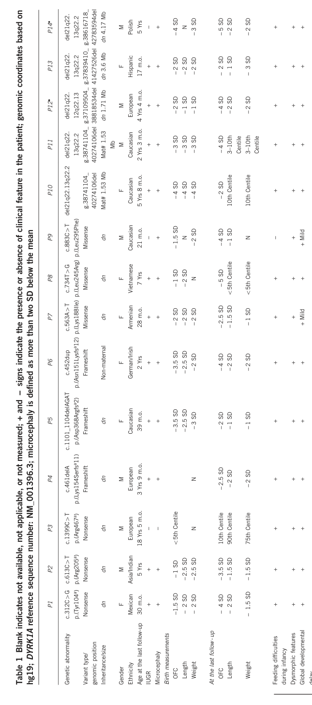

## Question

# Disease Characteristics Research Template

## Target Disease
- **Disease Name:** DYRK1A-related intellectual disability syndrome
- **MONDO ID:**  (if available)
- **Category:** Mendelian

## Research Objectives

Please provide a comprehensive research report on **DYRK1A-related intellectual disability syndrome** covering all of the
disease characteristics listed below. This report will be used to populate a disease knowledge
base entry. Be thorough and cite primary literature (PMID preferred) for all claims.

For each section, **suggested databases/resources** are listed. These are the first places
you should search for information on each topic.

---

### 1. Disease Information
> **Search first:** OMIM, Orphanet, ICD-10/ICD-11, MeSH, PubMed

- What is the disease? Provide a concise overview.
- What are the key identifiers? (OMIM, Orphanet, ICD-10/ICD-11, MeSH, Mondo)
- What are the common synonyms and alternative names?
- Is the information derived from individual patients (e.g., EHR) or aggregated disease-level resources?

### 2. Etiology

- **Disease Causal Factors**: What are the primary causes? (genetic, environmental, infectious, mechanistic)
- **Risk Factors**:
  > **Search first:** PubMed, Cochrane Library, UpToDate, clinical guidelines, ClinVar, ClinGen, GWAS Catalog, PheGenI, CTD, CDC, WHO, epidemiological databases
  - Genetic risk factors (causal variants, susceptibility loci, modifier genes)
  - Environmental risk factors (toxins, lifestyle, occupational exposures, age, sex, family history)
- **Protective Factors**:
  > **Search first:** PubMed, Cochrane Library, clinical trial databases, GWAS Catalog, gnomAD, WHO, CDC, nutrition databases
  - Genetic protective factors (protective variants, modifier alleles)
  - Environmental protective factors (diet, lifestyle, exposures that reduce risk)
- **Gene-Environment Interactions**: How do genetic and environmental factors interact to influence disease?
  > **Search first:** CTD, PubMed, PheGenI, GxE databases

### 3. Phenotypes
> **Search first:** HPO (Human Phenotype Ontology), OMIM, Orphanet, PubMed, clinicaltrials.gov, MedDRA, SNOMED CT, DECIPHER, LOINC

For each phenotype, provide:
- **Phenotype type**: symptoms, clinical signs, physical manifestations, behavioral changes, or laboratory abnormalities
  > For symptoms/signs: HPO, OMIM, Orphanet, PubMed
  > For behavioral changes: HPO, DSM, RDoC (Research Domain Criteria), PubMed
  > For laboratory abnormalities: LOINC, SNOMED CT, LabTests Online, PubMed
- **Phenotype characteristics**:
  > **Search first:** OMIM, Orphanet, HPO, PubMed
  - Age of symptom onset (neonatal, childhood, adult-onset, late-onset)
  - Symptom severity (mild, moderate, severe, variable)
  - Symptom progression (stable, progressive, episodic, fluctuating)
  - Frequency among affected individuals (percentage or qualitative)
- **Quality of life impact**: Effects on daily functioning and well-being (per-phenotype when possible)
  > **Search first:** EQ-5D database, SF-36, WHO QOL databases, PubMed
- Suggest HPO (Human Phenotype Ontology) terms for each phenotype

### 4. Genetic/Molecular Information

- **Causal Genes**: Gene mutations or chromosomal abnormalities responsible for disease (gene symbols, OMIM IDs)
  > **Search first:** OMIM, ClinVar, HGMD, Ensembl, NCBI Gene
- **Pathogenic Variants**:
  - Affected genes (gene symbols, HGNC IDs)
    > **Search first:** OMIM, NCBI Gene, Ensembl, HGNC, UniProt, GeneCards
  - Variant classification (pathogenic, likely pathogenic, VUS per ACMG/AMP guidelines)
    > **Search first:** ClinVar, ClinGen, ACMG/AMP guidelines, VarSome
  - Variant type/class (missense, frameshift, nonsense, splice-site, structural)
  - Allele frequency in population databases
    > **Search first:** gnomAD, 1000 Genomes, ExAC, TOPMed, dbSNP
  - Somatic vs germline origin
    > **Search first:** COSMIC (somatic), ClinVar, ICGC, TCGA
  - Functional consequences (loss of function, gain of function, dominant negative)
- **Modifier Genes**: Genes that modify disease severity or expression
- **Epigenetic Information**: DNA methylation, histone modifications, chromatin changes affecting disease
  > **Search first:** ENCODE, Roadmap Epigenomics, MethBase, DiseaseMeth
- **Chromosomal Abnormalities**: Large-scale genetic changes (aneuploidy, translocations, inversions)
  > **Search first:** DECIPHER, ClinVar, ECARUCA, UCSC Genome Browser

### 5. Environmental Information

- **Environmental Factors**: Non-genetic contributing factors (toxins, radiation, pollution, occupational exposure)
  > **Search first:** CTD (Comparative Toxicogenomics Database), TOXNET, PubMed, EPA databases
- **Lifestyle Factors**: Behavioral factors (smoking, diet, exercise, alcohol consumption)
  > **Search first:** CDC databases, WHO, PubMed, NHANES
- **Infectious Agents**: If applicable, pathogens causing or triggering disease (bacteria, viruses, fungi, parasites)
  > **Search first:** NCBI Taxonomy, ViPR, BV-BRC, MicrobeDB, GIDEON

### 6. Mechanism / Pathophysiology

- **Molecular Pathways**: Specific signaling cascades or biochemical pathways involved (Wnt, MAPK, mTOR, PI3K-AKT, etc.)
  > **Search first:** KEGG, Reactome, WikiPathways, PathBank, BioCyc
- **Cellular Processes**: Cell-level mechanisms (apoptosis, autophagy, cell cycle dysregulation, inflammation, etc.)
  > **Search first:** Gene Ontology (GO), Reactome, KEGG, PubMed
- **Protein Dysfunction**: How protein structure or function is altered (misfolding, aggregation, loss of function, gain of function)
  > **Search first:** UniProt, PDB (Protein Data Bank), InterPro, Pfam, AlphaFold
- **Metabolic Changes**: Alterations in metabolic processes (energy metabolism, lipid metabolism, amino acid metabolism)
  > **Search first:** KEGG, BioCyc, HMDB (Human Metabolome Database), BRENDA
- **Immune System Involvement**: Role of immune response (autoimmunity, immunodeficiency, chronic inflammation)
  > **Search first:** ImmPort, Immunome Database, IEDB, Gene Ontology
- **Tissue Damage Mechanisms**: How tissues/ are injured (oxidative stress, ischemia, fibrosis, necrosis)
  > **Search first:** PubMed, Gene Ontology, Reactome
- **Biochemical Abnormalities**: Specific molecular defects (enzyme deficiencies, receptor dysfunction, ion channel defects)
  > **Search first:** BRENDA, UniProt, KEGG, OMIM, PubMed
- **Epigenetic Changes**: DNA methylation, histone modifications affecting gene expression in disease
  > **Search first:** ENCODE, Roadmap Epigenomics, MethBase, DiseaseMeth
- **Molecular Profiling** (if available):
  - Transcriptomics/gene expression changes
    > **Search first:** GEO (Gene Expression Omnibus), ArrayExpress, GTEx, Human Cell Atlas, SRA
  - Proteomics findings
    > **Search first:** PRIDE, ProteomeXchange, Human Protein Atlas, STRING, BioGRID
  - Metabolomics signatures
    > **Search first:** MetaboLights, Metabolomics Workbench, HMDB, METLIN
  - Lipidomics alterations
    > **Search first:** LIPID MAPS, SwissLipids, LipidHome, Metabolomics Workbench
  - Genomic structural features
    > **Search first:** UCSC Genome Browser, Ensembl, NCBI, dbVar, DGV
- **Advanced Technologies** (if applicable):
  - Single-cell analysis findings (cell-type specific mechanisms, cellular heterogeneity)
    > **Search first:** Human Cell Atlas, Single Cell Portal, GEO, CELLxGENE
  - Spatial transcriptomics findings
    > **Search first:** GEO, Spatial Research, Vizgen, 10x Genomics data
  - Multi-omics integration results
    > **Search first:** TCGA, ICGC, cBioPortal, LinkedOmics, PubMed
  - Functional genomics screens (CRISPR, RNAi)
    > **Search first:** DepMap, GenomeRNAi, PubMed, BioGRID ORCS

For each mechanism, describe:
- The causal chain from initial trigger to clinical manifestation
- Which mechanisms are upstream vs downstream
- What cell types and biological processes are involved
- Suggest GO terms for biological processes and CL terms for cell types

### 7. Anatomical Structures Affected

- **Organ Level**:
  - Primary organs directly affected
  - Secondary organ involvement (complications, secondary effects)
  - Body systems involved (cardiovascular, nervous, digestive, respiratory, endocrine, etc.)
  > **Search first:** Uberon, FMA (Foundational Model of Anatomy), OMIM, HPO, ICD-11, MeSH, SNOMED CT
- **Tissue and Cell Level**:
  - Specific tissue types affected (epithelial, connective, muscle, nervous)
  - Specific cell populations targeted (with Cell Ontology terms)
  > **Search first:** Uberon, Human Protein Atlas, Cell Ontology, Human Cell Atlas, CellMarker, PanglaoDB
- **Subcellular Level**:
  - Cellular compartments involved (mitochondria, nucleus, ER, lysosomes) (with GO Cellular Component terms)
  > **Search first:** Gene Ontology (Cellular Component), UniProt, Human Protein Atlas
- **Localization**:
  - Specific anatomical sites (with UBERON terms)
    > **Search first:** FMA, Uberon, NeuroNames (for brain), SNOMED CT
  - Lateralization (unilateral, bilateral, asymmetric)
    > **Search first:** HPO, clinical literature, imaging databases

### 8. Temporal Development

- **Onset**:
  - Typical age of onset (congenital, pediatric, adult, geriatric)
  - Onset pattern (acute, subacute, chronic, insidious)
  > **Search first:** OMIM, Orphanet, HPO, PubMed
- **Progression**:
  - Disease stages (early, intermediate, advanced, end-stage)
    > **Search first:** Cancer Staging Manual (AJCC), WHO classifications, PubMed
  - Progression rate (rapid, slow, variable)
  - Disease course pattern (episodic, relapsing-remitting, progressive, stable)
  - Disease duration (self-limited, chronic lifelong)
  > **Search first:** Disease registries, longitudinal cohort databases, natural history studies, PubMed, Orphanet, OMIM
- **Patterns**:
  - Remission patterns (spontaneous, treatment-induced)
    > **Search first:** Clinical trial databases, disease registries, PubMed
  - Critical periods (time windows of vulnerability or opportunity for intervention)
    > **Search first:** PubMed, developmental biology databases, clinical guidelines

### 9. Inheritance and Population

- **Epidemiology**:
  - Prevalence (cases per 100,000 at given time)
  - Incidence (new cases per 100,000 per year)
  > **Search first:** Orphanet, CDC, WHO, GBD (Global Burden of Disease), national registries, SEER, disease registries
- **For Genetic Etiology**:
  - Inheritance pattern (AD, AR, X-linked, mitochondrial, multifactorial, polygenic)
    > **Search first:** OMIM, Orphanet, ClinVar, GTR (Genetic Testing Registry)
  - Penetrance (complete, incomplete, age-dependent)
    > **Search first:** ClinVar, OMIM, PubMed, ClinGen
  - Expressivity (variable, consistent)
    > **Search first:** OMIM, ClinVar, PubMed
  - Genetic anticipation (increasing severity in successive generations)
    > **Search first:** OMIM, PubMed (especially for repeat expansion disorders)
  - Germline mosaicism
    > **Search first:** ClinVar, OMIM, genetic counseling literature, PubMed
  - Founder effects (population-specific mutations)
    > **Search first:** gnomAD, population genetics databases, PubMed
  - Consanguinity role
    > **Search first:** OMIM, population studies, genetic counseling resources
  - Carrier frequency
    > **Search first:** gnomAD, carrier screening databases, GeneReviews, GTR
- **Population Demographics**:
  - Affected populations (ethnic or demographic groups with higher prevalence)
    > **Search first:** gnomAD, 1000 Genomes, PAGE Study, PubMed, population registries
  - Geographic distribution (endemic areas, regional variation)
    > **Search first:** WHO, CDC, GBD, Orphanet, geographic epidemiology databases
  - Geographic distribution of specific variants
  - Sex ratio (male:female)
    > **Search first:** Disease registries, OMIM, PubMed, epidemiological databases
  - Age distribution of affected individuals
    > **Search first:** CDC, disease registries, SEER, Orphanet

### 10. Diagnostics

- **Clinical Tests**:
  - Laboratory tests (blood, urine, tissue chemistry, specific enzyme assays)
    > **Search first:** LOINC, LabTests Online, PubMed
  - Biomarkers (proteins, metabolites, genetic markers, circulating biomarkers)
    > **Search first:** FDA Biomarker List, BEST (Biomarkers, EndpointS, and other Tools), PubMed
  - Imaging studies (X-ray, CT, MRI, PET, ultrasound)
    > **Search first:** RadLex, DICOM, Radiopaedia, imaging databases
  - Functional tests (pulmonary function, cardiac stress tests)
    > **Search first:** LOINC, clinical guidelines, PubMed
  - Electrophysiology (EEG, EMG, ECG, nerve conduction studies)
    > **Search first:** LOINC, clinical neurophysiology databases, PubMed
  - Biopsy findings (histopathology, immunohistochemistry)
    > **Search first:** SNOMED CT, College of American Pathologists resources, PubMed
  - Pathology findings (microscopic examination)
    > **Search first:** SNOMED CT, Digital Pathology databases, PubMed
- **Genetic Testing**:
  > **Search first:** GTR (Genetic Testing Registry), GeneReviews, ClinGen
  - Overview of recommended genetic testing approach
  - Whole genome sequencing (WGS) utility
    > **Search first:** GTR, ClinVar, GEL (Genomics England), gnomAD
  - Whole exome sequencing (WES) utility
    > **Search first:** GTR, ClinVar, OMIM, GeneMatcher
  - Gene panels (which panels, which genes)
    > **Search first:** GTR, ClinVar, laboratory-specific databases
  - Single gene testing
    > **Search first:** GTR, ClinVar, OMIM, GeneReviews
  - Chromosomal microarray (CMA)
    > **Search first:** DECIPHER, ClinVar, dbVar, ECARUCA
  - Karyotyping
    > **Search first:** Chromosome Abnormality Database, ClinVar, cytogenetics resources
  - FISH
    > **Search first:** ClinVar, cytogenetics databases, PubMed
  - Mitochondrial DNA testing
    > **Search first:** MITOMAP, MSeqDR, ClinVar, GTR
  - Repeat expansion testing
    > **Search first:** GTR, ClinVar, repeat expansion databases, PubMed
- **Omics-Based Diagnostics** (if applicable):
  - RNA sequencing / transcriptomics
    > **Search first:** GEO, ArrayExpress, GTEx, RNA-seq databases
  - Proteomics
    > **Search first:** PRIDE, ProteomeXchange, FDA Biomarker database
  - Metabolomics
    > **Search first:** MetaboLights, Metabolomics Workbench, HMDB
  - Epigenomics
    > **Search first:** GEO, ENCODE, Roadmap Epigenomics, MethBase
  - Liquid biopsy
    > **Search first:** COSMIC, ClinVar, liquid biopsy databases, PubMed
- **Clinical Criteria**:
  - Standardized diagnostic criteria (DSM, ICD, society guidelines)
    > **Search first:** DSM-5, ICD-11, clinical society guidelines, UpToDate
  - Differential diagnosis (other conditions to rule out, with distinguishing features)
    > **Search first:** DynaMed, UpToDate, clinical decision support systems
- **Screening**:
  - Screening methods for asymptomatic individuals (newborn screening, carrier screening, cascade screening)
    > **Search first:** ACMG recommendations, CDC newborn screening, GTR

### 11. Outcome/Prognosis

- **Survival and Mortality**:
  - Survival rate (5-year, 10-year, overall)
    > **Search first:** SEER, cancer registries, disease-specific registries, PubMed
  - Life expectancy (with and without treatment if applicable)
    > **Search first:** Orphanet, disease registries, actuarial databases, PubMed
  - Mortality rate
    > **Search first:** CDC, WHO, GBD, national mortality databases
  - Disease-specific mortality (deaths directly attributable to disease)
    > **Search first:** Disease registries, CDC Wonder, GBD, PubMed
- **Morbidity and Function**:
  - Morbidity (disease-related disability and health impacts)
    > **Search first:** GBD, WHO, disability databases, PubMed
  - Disability outcomes (long-term functional impairments)
    > **Search first:** ICF (International Classification of Functioning), disability registries
  - Quality of life measures (EQ-5D, SF-36, PROMIS, disease-specific tools)
    > **Search first:** EQ-5D database, SF-36, PROMIS, PubMed
- **Disease Course**:
  - Complications (secondary problems: infections, organ failure, etc.)
    > **Search first:** ICD codes, disease registries, clinical databases, PubMed
  - Recovery potential (likelihood and extent of recovery, with vs without treatment)
    > **Search first:** Natural history studies, rehabilitation databases, PubMed
- **Prediction**:
  - Prognostic factors (age, disease severity, biomarkers, treatment response)
    > **Search first:** Prognostic models databases, clinical calculators, PubMed
  - Prognostic biomarkers (molecular markers predicting disease course)
    > **Search first:** FDA Biomarker database, PubMed, cancer prognostic databases

### 12. Treatment

- **Pharmacotherapy**:
  - Pharmacological treatments (drug names, drug classes, mechanisms of action)
    > **Search first:** DrugBank, RxNorm, ATC classification, DailyMed, FDA databases
  - Pharmacogenomics (how genetic variants affect drug metabolism, efficacy, toxicity)
    > **Search first:** PharmGKB, CPIC (Clinical Pharmacogenetics), FDA Table of PGx Biomarkers
- **Advanced Therapeutics**:
  - Gene therapy (viral vectors, CRISPR, gene replacement, gene editing)
    > **Search first:** ClinicalTrials.gov, FDA gene therapy database, ASGCT resources
  - Cell therapy (stem cell transplant, CAR-T, cellular therapeutics)
    > **Search first:** ClinicalTrials.gov, FDA cell therapy database, FACT standards
  - RNA-based therapies (ASOs, siRNA, mRNA therapies)
    > **Search first:** ClinicalTrials.gov, FDA approvals, PubMed
  - Targeted therapies (treatments directed at specific molecular targets)
    > **Search first:** My Cancer Genome, OncoKB, ClinicalTrials.gov, FDA approvals
  - Immunotherapies (checkpoint inhibitors, monoclonal antibodies)
    > **Search first:** Cancer Immunotherapy Database, FDA approvals, ClinicalTrials.gov
- **Surgical and Interventional**:
  - Surgical interventions (types of surgery, timing, outcomes)
    > **Search first:** CPT codes, surgical registries, clinical guidelines, PubMed
- **Supportive and Rehabilitative**:
  - Supportive care (symptom management, pain control, nutrition)
    > **Search first:** Clinical guidelines, Cochrane Library, PubMed
  - Rehabilitation (physical therapy, occupational therapy, speech therapy)
    > **Search first:** Rehabilitation medicine databases, clinical guidelines, PubMed
- **Experimental**:
  - Experimental treatments in clinical trials (with NCT identifiers if available)
    > **Search first:** ClinicalTrials.gov, EU Clinical Trials Register, WHO ICTRP
- **Treatment Outcomes**:
  - Treatment response rates
    > **Search first:** Clinical trial databases, FDA reviews, systematic reviews, PubMed
  - Side effects and adverse events
    > **Search first:** FDA Adverse Event Reporting System (FAERS), MedWatch, PubMed
- **Treatment Strategy**:
  - Treatment algorithms (clinical pathways, decision trees)
    > **Search first:** Clinical practice guidelines, NCCN Guidelines, UpToDate
  - Combination therapies
    > **Search first:** ClinicalTrials.gov, treatment guidelines, PubMed
  - Personalized medicine approaches (genotype-guided treatment)
    > **Search first:** My Cancer Genome, CIViC, PharmGKB, precision medicine databases

For each treatment, suggest MAXO (Medical Action Ontology) terms where applicable.

### 13. Prevention

- **Prevention Levels**:
  - Primary prevention (preventing disease occurrence: vaccination, risk factor modification)
    > **Search first:** CDC, WHO, USPSTF recommendations, Cochrane Library
  - Secondary prevention (early detection and treatment: screening programs, early intervention)
    > **Search first:** USPSTF, CDC screening guidelines, WHO
  - Tertiary prevention (preventing complications in those with disease)
    > **Search first:** Clinical guidelines, disease management protocols, PubMed
- **Immunization**: Vaccine strategies (if applicable)
  > **Search first:** CDC vaccine schedules, WHO immunization, FDA vaccine database
- **Screening and Early Detection**:
  - Screening programs (population-based: newborn screening, cancer screening)
    > **Search first:** CDC screening programs, USPSTF, cancer screening databases
  - Genetic screening (carrier screening, preimplantation genetic diagnosis, prenatal testing)
    > **Search first:** ACMG recommendations, ACOG guidelines, GTR
  - Risk stratification (identifying high-risk individuals for targeted prevention)
    > **Search first:** Risk prediction models, clinical calculators, PubMed
- **Behavioral Interventions**: Lifestyle modifications to reduce risk
  > **Search first:** CDC, WHO, behavioral intervention databases, Cochrane Library
- **Counseling**: Genetic counseling (risk assessment, family planning guidance)
  > **Search first:** NSGC resources, ACMG guidelines, GeneReviews
- **Public Health**:
  - Public health interventions (sanitation, vector control, health education)
    > **Search first:** CDC, WHO, public health databases, PubMed
  - Environmental interventions (reducing environmental risk factors)
    > **Search first:** EPA databases, WHO environmental health, PubMed
- **Prophylaxis**: Preventive medications or procedures
  > **Search first:** Clinical guidelines, FDA approvals, PubMed

### 14. Other Species / Natural Disease

- **Taxonomy**: Species affected (with NCBI Taxon identifiers)
  > **Search first:** NCBI Taxonomy
- **Breed**: Specific breeds affected (with VBO identifiers if applicable)
  > **Search first:** VBO (Vertebrate Breed Ontology)
- **Gene**: Orthologous genes in other species (with NCBI Gene IDs)
  > **Search first:** NCBI Gene
- **Natural Disease**:
  - Naturally occurring disease in other species (companion animals, wildlife)
    > **Search first:** OMIA (Online Mendelian Inheritance in Animals), VetCompass, PubMed
  - Veterinary relevance and importance in animal health
    > **Search first:** OMIA, veterinary databases, PubMed
- **Comparative Biology**:
  - Comparative pathology (similarities and differences across species)
    > **Search first:** OMIA, comparative pathology databases, PubMed
  - Evolutionary conservation of disease mechanisms
    > **Search first:** HomoloGene, OrthoMCL, Alliance of Genome Resources
- **Transmission** (if applicable):
  - Zoonotic potential
    > **Search first:** CDC zoonotic diseases, WHO zoonoses, GIDEON
  - Cross-species susceptibility
    > **Search first:** NCBI Taxonomy, veterinary databases, PubMed

### 15. Model Organisms

- **Model Types**:
  - Model organism type (mammalian, invertebrate, cellular, in vitro)
    > **Search first:** Alliance of Genome Resources, model organism databases
  - Specific model systems (mouse, rat, zebrafish, Drosophila, C. elegans, yeast, cell lines, organoids, iPSCs)
    > **Search first:** MGI, RGD, ZFIN, FlyBase, WormBase, SGD, ATCC, Cellosaurus
  - Induced models (drug treatment, surgical intervention, environmental manipulation)
    > **Search first:** MGI, model organism databases, PubMed
- **Genetic Models**:
  - Types available (knockout, knock-in, transgenic, conditional, humanized)
    > **Search first:** MGI, IMPC, KOMP, EuMMCR, IMSR
- **Model Characteristics**:
  - Phenotype recapitulation (how well model reproduces human disease features)
    > **Search first:** Model organism databases, comparative studies, PubMed
  - Model limitations (aspects of human disease not captured)
    > **Search first:** Model organism databases, PubMed, review articles
- **Applications**:
  - Research applications (what aspects of disease can be studied)
    > **Search first:** Model organism databases, PubMed
- **Resources**:
  - Model databases
    > **Search first:** MGI, RGD, ZFIN, FlyBase, WormBase, IMSR, EMMA, MMRRC

---

## Citation Requirements

- Cite primary literature (PMID preferred) for all mechanistic and clinical claims
- Prioritize recent reviews and landmark papers
- Include direct quotes from abstracts where possible to support key statements
- Distinguish evidence source types: human clinical, model organism, in vitro, computational

## Output Format

Structure your response as a comprehensive narrative organized by the sections above.
For each section, provide:
- Factual content with specific details (numbers, percentages, gene names, variant nomenclature)
- Ontology term suggestions (HPO, GO, CL, UBERON, CHEBI, MAXO, MONDO) where applicable
- Evidence citations with PMIDs
- Direct quotes from abstracts to support key claims
- Clear indication when information is not available or not applicable for this disease

This report will be used to populate a disease knowledge base entry with:
- Pathophysiology descriptions with causal chains
- Gene/protein annotations (HGNC, GO terms)
- Phenotype associations (HP terms) with frequencies
- Cell type involvement (CL terms)
- Anatomical locations (UBERON terms)
- Chemical entities (CHEBI terms)
- Treatment annotations (MAXO terms)
- Evidence items with PMIDs and exact abstract quotes
- Epidemiology, prognosis, diagnostic, and prevention information
- Animal model descriptions with phenotype recapitulation details

## Output

Question: You are an expert researcher providing comprehensive, well-cited information.

Provide detailed information focusing on:
1. Key concepts and definitions with current understanding
2. Recent developments and latest research (prioritize 2023-2024 sources)
3. Current applications and real-world implementations
4. Expert opinions and analysis from authoritative sources
5. Relevant statistics and data from recent studies

Format as a comprehensive research report with proper citations. Include URLs and publication dates where available.
Always prioritize recent, authoritative sources and provide specific citations for all major claims.

# Disease Characteristics Research Template

## Target Disease
- **Disease Name:** DYRK1A-related intellectual disability syndrome
- **MONDO ID:**  (if available)
- **Category:** Mendelian

## Research Objectives

Please provide a comprehensive research report on **DYRK1A-related intellectual disability syndrome** covering all of the
disease characteristics listed below. This report will be used to populate a disease knowledge
base entry. Be thorough and cite primary literature (PMID preferred) for all claims.

For each section, **suggested databases/resources** are listed. These are the first places
you should search for information on each topic.

---

### 1. Disease Information
> **Search first:** OMIM, Orphanet, ICD-10/ICD-11, MeSH, PubMed

- What is the disease? Provide a concise overview.
- What are the key identifiers? (OMIM, Orphanet, ICD-10/ICD-11, MeSH, Mondo)
- What are the common synonyms and alternative names?
- Is the information derived from individual patients (e.g., EHR) or aggregated disease-level resources?

### 2. Etiology

- **Disease Causal Factors**: What are the primary causes? (genetic, environmental, infectious, mechanistic)
- **Risk Factors**:
  > **Search first:** PubMed, Cochrane Library, UpToDate, clinical guidelines, ClinVar, ClinGen, GWAS Catalog, PheGenI, CTD, CDC, WHO, epidemiological databases
  - Genetic risk factors (causal variants, susceptibility loci, modifier genes)
  - Environmental risk factors (toxins, lifestyle, occupational exposures, age, sex, family history)
- **Protective Factors**:
  > **Search first:** PubMed, Cochrane Library, clinical trial databases, GWAS Catalog, gnomAD, WHO, CDC, nutrition databases
  - Genetic protective factors (protective variants, modifier alleles)
  - Environmental protective factors (diet, lifestyle, exposures that reduce risk)
- **Gene-Environment Interactions**: How do genetic and environmental factors interact to influence disease?
  > **Search first:** CTD, PubMed, PheGenI, GxE databases

### 3. Phenotypes
> **Search first:** HPO (Human Phenotype Ontology), OMIM, Orphanet, PubMed, clinicaltrials.gov, MedDRA, SNOMED CT, DECIPHER, LOINC

For each phenotype, provide:
- **Phenotype type**: symptoms, clinical signs, physical manifestations, behavioral changes, or laboratory abnormalities
  > For symptoms/signs: HPO, OMIM, Orphanet, PubMed
  > For behavioral changes: HPO, DSM, RDoC (Research Domain Criteria), PubMed
  > For laboratory abnormalities: LOINC, SNOMED CT, LabTests Online, PubMed
- **Phenotype characteristics**:
  > **Search first:** OMIM, Orphanet, HPO, PubMed
  - Age of symptom onset (neonatal, childhood, adult-onset, late-onset)
  - Symptom severity (mild, moderate, severe, variable)
  - Symptom progression (stable, progressive, episodic, fluctuating)
  - Frequency among affected individuals (percentage or qualitative)
- **Quality of life impact**: Effects on daily functioning and well-being (per-phenotype when possible)
  > **Search first:** EQ-5D database, SF-36, WHO QOL databases, PubMed
- Suggest HPO (Human Phenotype Ontology) terms for each phenotype

### 4. Genetic/Molecular Information

- **Causal Genes**: Gene mutations or chromosomal abnormalities responsible for disease (gene symbols, OMIM IDs)
  > **Search first:** OMIM, ClinVar, HGMD, Ensembl, NCBI Gene
- **Pathogenic Variants**:
  - Affected genes (gene symbols, HGNC IDs)
    > **Search first:** OMIM, NCBI Gene, Ensembl, HGNC, UniProt, GeneCards
  - Variant classification (pathogenic, likely pathogenic, VUS per ACMG/AMP guidelines)
    > **Search first:** ClinVar, ClinGen, ACMG/AMP guidelines, VarSome
  - Variant type/class (missense, frameshift, nonsense, splice-site, structural)
  - Allele frequency in population databases
    > **Search first:** gnomAD, 1000 Genomes, ExAC, TOPMed, dbSNP
  - Somatic vs germline origin
    > **Search first:** COSMIC (somatic), ClinVar, ICGC, TCGA
  - Functional consequences (loss of function, gain of function, dominant negative)
- **Modifier Genes**: Genes that modify disease severity or expression
- **Epigenetic Information**: DNA methylation, histone modifications, chromatin changes affecting disease
  > **Search first:** ENCODE, Roadmap Epigenomics, MethBase, DiseaseMeth
- **Chromosomal Abnormalities**: Large-scale genetic changes (aneuploidy, translocations, inversions)
  > **Search first:** DECIPHER, ClinVar, ECARUCA, UCSC Genome Browser

### 5. Environmental Information

- **Environmental Factors**: Non-genetic contributing factors (toxins, radiation, pollution, occupational exposure)
  > **Search first:** CTD (Comparative Toxicogenomics Database), TOXNET, PubMed, EPA databases
- **Lifestyle Factors**: Behavioral factors (smoking, diet, exercise, alcohol consumption)
  > **Search first:** CDC databases, WHO, PubMed, NHANES
- **Infectious Agents**: If applicable, pathogens causing or triggering disease (bacteria, viruses, fungi, parasites)
  > **Search first:** NCBI Taxonomy, ViPR, BV-BRC, MicrobeDB, GIDEON

### 6. Mechanism / Pathophysiology

- **Molecular Pathways**: Specific signaling cascades or biochemical pathways involved (Wnt, MAPK, mTOR, PI3K-AKT, etc.)
  > **Search first:** KEGG, Reactome, WikiPathways, PathBank, BioCyc
- **Cellular Processes**: Cell-level mechanisms (apoptosis, autophagy, cell cycle dysregulation, inflammation, etc.)
  > **Search first:** Gene Ontology (GO), Reactome, KEGG, PubMed
- **Protein Dysfunction**: How protein structure or function is altered (misfolding, aggregation, loss of function, gain of function)
  > **Search first:** UniProt, PDB (Protein Data Bank), InterPro, Pfam, AlphaFold
- **Metabolic Changes**: Alterations in metabolic processes (energy metabolism, lipid metabolism, amino acid metabolism)
  > **Search first:** KEGG, BioCyc, HMDB (Human Metabolome Database), BRENDA
- **Immune System Involvement**: Role of immune response (autoimmunity, immunodeficiency, chronic inflammation)
  > **Search first:** ImmPort, Immunome Database, IEDB, Gene Ontology
- **Tissue Damage Mechanisms**: How tissues/ are injured (oxidative stress, ischemia, fibrosis, necrosis)
  > **Search first:** PubMed, Gene Ontology, Reactome
- **Biochemical Abnormalities**: Specific molecular defects (enzyme deficiencies, receptor dysfunction, ion channel defects)
  > **Search first:** BRENDA, UniProt, KEGG, OMIM, PubMed
- **Epigenetic Changes**: DNA methylation, histone modifications affecting gene expression in disease
  > **Search first:** ENCODE, Roadmap Epigenomics, MethBase, DiseaseMeth
- **Molecular Profiling** (if available):
  - Transcriptomics/gene expression changes
    > **Search first:** GEO (Gene Expression Omnibus), ArrayExpress, GTEx, Human Cell Atlas, SRA
  - Proteomics findings
    > **Search first:** PRIDE, ProteomeXchange, Human Protein Atlas, STRING, BioGRID
  - Metabolomics signatures
    > **Search first:** MetaboLights, Metabolomics Workbench, HMDB, METLIN
  - Lipidomics alterations
    > **Search first:** LIPID MAPS, SwissLipids, LipidHome, Metabolomics Workbench
  - Genomic structural features
    > **Search first:** UCSC Genome Browser, Ensembl, NCBI, dbVar, DGV
- **Advanced Technologies** (if applicable):
  - Single-cell analysis findings (cell-type specific mechanisms, cellular heterogeneity)
    > **Search first:** Human Cell Atlas, Single Cell Portal, GEO, CELLxGENE
  - Spatial transcriptomics findings
    > **Search first:** GEO, Spatial Research, Vizgen, 10x Genomics data
  - Multi-omics integration results
    > **Search first:** TCGA, ICGC, cBioPortal, LinkedOmics, PubMed
  - Functional genomics screens (CRISPR, RNAi)
    > **Search first:** DepMap, GenomeRNAi, PubMed, BioGRID ORCS

For each mechanism, describe:
- The causal chain from initial trigger to clinical manifestation
- Which mechanisms are upstream vs downstream
- What cell types and biological processes are involved
- Suggest GO terms for biological processes and CL terms for cell types

### 7. Anatomical Structures Affected

- **Organ Level**:
  - Primary organs directly affected
  - Secondary organ involvement (complications, secondary effects)
  - Body systems involved (cardiovascular, nervous, digestive, respiratory, endocrine, etc.)
  > **Search first:** Uberon, FMA (Foundational Model of Anatomy), OMIM, HPO, ICD-11, MeSH, SNOMED CT
- **Tissue and Cell Level**:
  - Specific tissue types affected (epithelial, connective, muscle, nervous)
  - Specific cell populations targeted (with Cell Ontology terms)
  > **Search first:** Uberon, Human Protein Atlas, Cell Ontology, Human Cell Atlas, CellMarker, PanglaoDB
- **Subcellular Level**:
  - Cellular compartments involved (mitochondria, nucleus, ER, lysosomes) (with GO Cellular Component terms)
  > **Search first:** Gene Ontology (Cellular Component), UniProt, Human Protein Atlas
- **Localization**:
  - Specific anatomical sites (with UBERON terms)
    > **Search first:** FMA, Uberon, NeuroNames (for brain), SNOMED CT
  - Lateralization (unilateral, bilateral, asymmetric)
    > **Search first:** HPO, clinical literature, imaging databases

### 8. Temporal Development

- **Onset**:
  - Typical age of onset (congenital, pediatric, adult, geriatric)
  - Onset pattern (acute, subacute, chronic, insidious)
  > **Search first:** OMIM, Orphanet, HPO, PubMed
- **Progression**:
  - Disease stages (early, intermediate, advanced, end-stage)
    > **Search first:** Cancer Staging Manual (AJCC), WHO classifications, PubMed
  - Progression rate (rapid, slow, variable)
  - Disease course pattern (episodic, relapsing-remitting, progressive, stable)
  - Disease duration (self-limited, chronic lifelong)
  > **Search first:** Disease registries, longitudinal cohort databases, natural history studies, PubMed, Orphanet, OMIM
- **Patterns**:
  - Remission patterns (spontaneous, treatment-induced)
    > **Search first:** Clinical trial databases, disease registries, PubMed
  - Critical periods (time windows of vulnerability or opportunity for intervention)
    > **Search first:** PubMed, developmental biology databases, clinical guidelines

### 9. Inheritance and Population

- **Epidemiology**:
  - Prevalence (cases per 100,000 at given time)
  - Incidence (new cases per 100,000 per year)
  > **Search first:** Orphanet, CDC, WHO, GBD (Global Burden of Disease), national registries, SEER, disease registries
- **For Genetic Etiology**:
  - Inheritance pattern (AD, AR, X-linked, mitochondrial, multifactorial, polygenic)
    > **Search first:** OMIM, Orphanet, ClinVar, GTR (Genetic Testing Registry)
  - Penetrance (complete, incomplete, age-dependent)
    > **Search first:** ClinVar, OMIM, PubMed, ClinGen
  - Expressivity (variable, consistent)
    > **Search first:** OMIM, ClinVar, PubMed
  - Genetic anticipation (increasing severity in successive generations)
    > **Search first:** OMIM, PubMed (especially for repeat expansion disorders)
  - Germline mosaicism
    > **Search first:** ClinVar, OMIM, genetic counseling literature, PubMed
  - Founder effects (population-specific mutations)
    > **Search first:** gnomAD, population genetics databases, PubMed
  - Consanguinity role
    > **Search first:** OMIM, population studies, genetic counseling resources
  - Carrier frequency
    > **Search first:** gnomAD, carrier screening databases, GeneReviews, GTR
- **Population Demographics**:
  - Affected populations (ethnic or demographic groups with higher prevalence)
    > **Search first:** gnomAD, 1000 Genomes, PAGE Study, PubMed, population registries
  - Geographic distribution (endemic areas, regional variation)
    > **Search first:** WHO, CDC, GBD, Orphanet, geographic epidemiology databases
  - Geographic distribution of specific variants
  - Sex ratio (male:female)
    > **Search first:** Disease registries, OMIM, PubMed, epidemiological databases
  - Age distribution of affected individuals
    > **Search first:** CDC, disease registries, SEER, Orphanet

### 10. Diagnostics

- **Clinical Tests**:
  - Laboratory tests (blood, urine, tissue chemistry, specific enzyme assays)
    > **Search first:** LOINC, LabTests Online, PubMed
  - Biomarkers (proteins, metabolites, genetic markers, circulating biomarkers)
    > **Search first:** FDA Biomarker List, BEST (Biomarkers, EndpointS, and other Tools), PubMed
  - Imaging studies (X-ray, CT, MRI, PET, ultrasound)
    > **Search first:** RadLex, DICOM, Radiopaedia, imaging databases
  - Functional tests (pulmonary function, cardiac stress tests)
    > **Search first:** LOINC, clinical guidelines, PubMed
  - Electrophysiology (EEG, EMG, ECG, nerve conduction studies)
    > **Search first:** LOINC, clinical neurophysiology databases, PubMed
  - Biopsy findings (histopathology, immunohistochemistry)
    > **Search first:** SNOMED CT, College of American Pathologists resources, PubMed
  - Pathology findings (microscopic examination)
    > **Search first:** SNOMED CT, Digital Pathology databases, PubMed
- **Genetic Testing**:
  > **Search first:** GTR (Genetic Testing Registry), GeneReviews, ClinGen
  - Overview of recommended genetic testing approach
  - Whole genome sequencing (WGS) utility
    > **Search first:** GTR, ClinVar, GEL (Genomics England), gnomAD
  - Whole exome sequencing (WES) utility
    > **Search first:** GTR, ClinVar, OMIM, GeneMatcher
  - Gene panels (which panels, which genes)
    > **Search first:** GTR, ClinVar, laboratory-specific databases
  - Single gene testing
    > **Search first:** GTR, ClinVar, OMIM, GeneReviews
  - Chromosomal microarray (CMA)
    > **Search first:** DECIPHER, ClinVar, dbVar, ECARUCA
  - Karyotyping
    > **Search first:** Chromosome Abnormality Database, ClinVar, cytogenetics resources
  - FISH
    > **Search first:** ClinVar, cytogenetics databases, PubMed
  - Mitochondrial DNA testing
    > **Search first:** MITOMAP, MSeqDR, ClinVar, GTR
  - Repeat expansion testing
    > **Search first:** GTR, ClinVar, repeat expansion databases, PubMed
- **Omics-Based Diagnostics** (if applicable):
  - RNA sequencing / transcriptomics
    > **Search first:** GEO, ArrayExpress, GTEx, RNA-seq databases
  - Proteomics
    > **Search first:** PRIDE, ProteomeXchange, FDA Biomarker database
  - Metabolomics
    > **Search first:** MetaboLights, Metabolomics Workbench, HMDB
  - Epigenomics
    > **Search first:** GEO, ENCODE, Roadmap Epigenomics, MethBase
  - Liquid biopsy
    > **Search first:** COSMIC, ClinVar, liquid biopsy databases, PubMed
- **Clinical Criteria**:
  - Standardized diagnostic criteria (DSM, ICD, society guidelines)
    > **Search first:** DSM-5, ICD-11, clinical society guidelines, UpToDate
  - Differential diagnosis (other conditions to rule out, with distinguishing features)
    > **Search first:** DynaMed, UpToDate, clinical decision support systems
- **Screening**:
  - Screening methods for asymptomatic individuals (newborn screening, carrier screening, cascade screening)
    > **Search first:** ACMG recommendations, CDC newborn screening, GTR

### 11. Outcome/Prognosis

- **Survival and Mortality**:
  - Survival rate (5-year, 10-year, overall)
    > **Search first:** SEER, cancer registries, disease-specific registries, PubMed
  - Life expectancy (with and without treatment if applicable)
    > **Search first:** Orphanet, disease registries, actuarial databases, PubMed
  - Mortality rate
    > **Search first:** CDC, WHO, GBD, national mortality databases
  - Disease-specific mortality (deaths directly attributable to disease)
    > **Search first:** Disease registries, CDC Wonder, GBD, PubMed
- **Morbidity and Function**:
  - Morbidity (disease-related disability and health impacts)
    > **Search first:** GBD, WHO, disability databases, PubMed
  - Disability outcomes (long-term functional impairments)
    > **Search first:** ICF (International Classification of Functioning), disability registries
  - Quality of life measures (EQ-5D, SF-36, PROMIS, disease-specific tools)
    > **Search first:** EQ-5D database, SF-36, PROMIS, PubMed
- **Disease Course**:
  - Complications (secondary problems: infections, organ failure, etc.)
    > **Search first:** ICD codes, disease registries, clinical databases, PubMed
  - Recovery potential (likelihood and extent of recovery, with vs without treatment)
    > **Search first:** Natural history studies, rehabilitation databases, PubMed
- **Prediction**:
  - Prognostic factors (age, disease severity, biomarkers, treatment response)
    > **Search first:** Prognostic models databases, clinical calculators, PubMed
  - Prognostic biomarkers (molecular markers predicting disease course)
    > **Search first:** FDA Biomarker database, PubMed, cancer prognostic databases

### 12. Treatment

- **Pharmacotherapy**:
  - Pharmacological treatments (drug names, drug classes, mechanisms of action)
    > **Search first:** DrugBank, RxNorm, ATC classification, DailyMed, FDA databases
  - Pharmacogenomics (how genetic variants affect drug metabolism, efficacy, toxicity)
    > **Search first:** PharmGKB, CPIC (Clinical Pharmacogenetics), FDA Table of PGx Biomarkers
- **Advanced Therapeutics**:
  - Gene therapy (viral vectors, CRISPR, gene replacement, gene editing)
    > **Search first:** ClinicalTrials.gov, FDA gene therapy database, ASGCT resources
  - Cell therapy (stem cell transplant, CAR-T, cellular therapeutics)
    > **Search first:** ClinicalTrials.gov, FDA cell therapy database, FACT standards
  - RNA-based therapies (ASOs, siRNA, mRNA therapies)
    > **Search first:** ClinicalTrials.gov, FDA approvals, PubMed
  - Targeted therapies (treatments directed at specific molecular targets)
    > **Search first:** My Cancer Genome, OncoKB, ClinicalTrials.gov, FDA approvals
  - Immunotherapies (checkpoint inhibitors, monoclonal antibodies)
    > **Search first:** Cancer Immunotherapy Database, FDA approvals, ClinicalTrials.gov
- **Surgical and Interventional**:
  - Surgical interventions (types of surgery, timing, outcomes)
    > **Search first:** CPT codes, surgical registries, clinical guidelines, PubMed
- **Supportive and Rehabilitative**:
  - Supportive care (symptom management, pain control, nutrition)
    > **Search first:** Clinical guidelines, Cochrane Library, PubMed
  - Rehabilitation (physical therapy, occupational therapy, speech therapy)
    > **Search first:** Rehabilitation medicine databases, clinical guidelines, PubMed
- **Experimental**:
  - Experimental treatments in clinical trials (with NCT identifiers if available)
    > **Search first:** ClinicalTrials.gov, EU Clinical Trials Register, WHO ICTRP
- **Treatment Outcomes**:
  - Treatment response rates
    > **Search first:** Clinical trial databases, FDA reviews, systematic reviews, PubMed
  - Side effects and adverse events
    > **Search first:** FDA Adverse Event Reporting System (FAERS), MedWatch, PubMed
- **Treatment Strategy**:
  - Treatment algorithms (clinical pathways, decision trees)
    > **Search first:** Clinical practice guidelines, NCCN Guidelines, UpToDate
  - Combination therapies
    > **Search first:** ClinicalTrials.gov, treatment guidelines, PubMed
  - Personalized medicine approaches (genotype-guided treatment)
    > **Search first:** My Cancer Genome, CIViC, PharmGKB, precision medicine databases

For each treatment, suggest MAXO (Medical Action Ontology) terms where applicable.

### 13. Prevention

- **Prevention Levels**:
  - Primary prevention (preventing disease occurrence: vaccination, risk factor modification)
    > **Search first:** CDC, WHO, USPSTF recommendations, Cochrane Library
  - Secondary prevention (early detection and treatment: screening programs, early intervention)
    > **Search first:** USPSTF, CDC screening guidelines, WHO
  - Tertiary prevention (preventing complications in those with disease)
    > **Search first:** Clinical guidelines, disease management protocols, PubMed
- **Immunization**: Vaccine strategies (if applicable)
  > **Search first:** CDC vaccine schedules, WHO immunization, FDA vaccine database
- **Screening and Early Detection**:
  - Screening programs (population-based: newborn screening, cancer screening)
    > **Search first:** CDC screening programs, USPSTF, cancer screening databases
  - Genetic screening (carrier screening, preimplantation genetic diagnosis, prenatal testing)
    > **Search first:** ACMG recommendations, ACOG guidelines, GTR
  - Risk stratification (identifying high-risk individuals for targeted prevention)
    > **Search first:** Risk prediction models, clinical calculators, PubMed
- **Behavioral Interventions**: Lifestyle modifications to reduce risk
  > **Search first:** CDC, WHO, behavioral intervention databases, Cochrane Library
- **Counseling**: Genetic counseling (risk assessment, family planning guidance)
  > **Search first:** NSGC resources, ACMG guidelines, GeneReviews
- **Public Health**:
  - Public health interventions (sanitation, vector control, health education)
    > **Search first:** CDC, WHO, public health databases, PubMed
  - Environmental interventions (reducing environmental risk factors)
    > **Search first:** EPA databases, WHO environmental health, PubMed
- **Prophylaxis**: Preventive medications or procedures
  > **Search first:** Clinical guidelines, FDA approvals, PubMed

### 14. Other Species / Natural Disease

- **Taxonomy**: Species affected (with NCBI Taxon identifiers)
  > **Search first:** NCBI Taxonomy
- **Breed**: Specific breeds affected (with VBO identifiers if applicable)
  > **Search first:** VBO (Vertebrate Breed Ontology)
- **Gene**: Orthologous genes in other species (with NCBI Gene IDs)
  > **Search first:** NCBI Gene
- **Natural Disease**:
  - Naturally occurring disease in other species (companion animals, wildlife)
    > **Search first:** OMIA (Online Mendelian Inheritance in Animals), VetCompass, PubMed
  - Veterinary relevance and importance in animal health
    > **Search first:** OMIA, veterinary databases, PubMed
- **Comparative Biology**:
  - Comparative pathology (similarities and differences across species)
    > **Search first:** OMIA, comparative pathology databases, PubMed
  - Evolutionary conservation of disease mechanisms
    > **Search first:** HomoloGene, OrthoMCL, Alliance of Genome Resources
- **Transmission** (if applicable):
  - Zoonotic potential
    > **Search first:** CDC zoonotic diseases, WHO zoonoses, GIDEON
  - Cross-species susceptibility
    > **Search first:** NCBI Taxonomy, veterinary databases, PubMed

### 15. Model Organisms

- **Model Types**:
  - Model organism type (mammalian, invertebrate, cellular, in vitro)
    > **Search first:** Alliance of Genome Resources, model organism databases
  - Specific model systems (mouse, rat, zebrafish, Drosophila, C. elegans, yeast, cell lines, organoids, iPSCs)
    > **Search first:** MGI, RGD, ZFIN, FlyBase, WormBase, SGD, ATCC, Cellosaurus
  - Induced models (drug treatment, surgical intervention, environmental manipulation)
    > **Search first:** MGI, model organism databases, PubMed
- **Genetic Models**:
  - Types available (knockout, knock-in, transgenic, conditional, humanized)
    > **Search first:** MGI, IMPC, KOMP, EuMMCR, IMSR
- **Model Characteristics**:
  - Phenotype recapitulation (how well model reproduces human disease features)
    > **Search first:** Model organism databases, comparative studies, PubMed
  - Model limitations (aspects of human disease not captured)
    > **Search first:** Model organism databases, PubMed, review articles
- **Applications**:
  - Research applications (what aspects of disease can be studied)
    > **Search first:** Model organism databases, PubMed
- **Resources**:
  - Model databases
    > **Search first:** MGI, RGD, ZFIN, FlyBase, WormBase, IMSR, EMMA, MMRRC

---

## Citation Requirements

- Cite primary literature (PMID preferred) for all mechanistic and clinical claims
- Prioritize recent reviews and landmark papers
- Include direct quotes from abstracts where possible to support key statements
- Distinguish evidence source types: human clinical, model organism, in vitro, computational

## Output Format

Structure your response as a comprehensive narrative organized by the sections above.
For each section, provide:
- Factual content with specific details (numbers, percentages, gene names, variant nomenclature)
- Ontology term suggestions (HPO, GO, CL, UBERON, CHEBI, MAXO, MONDO) where applicable
- Evidence citations with PMIDs
- Direct quotes from abstracts to support key claims
- Clear indication when information is not available or not applicable for this disease

This report will be used to populate a disease knowledge base entry with:
- Pathophysiology descriptions with causal chains
- Gene/protein annotations (HGNC, GO terms)
- Phenotype associations (HP terms) with frequencies
- Cell type involvement (CL terms)
- Anatomical locations (UBERON terms)
- Chemical entities (CHEBI terms)
- Treatment annotations (MAXO terms)
- Evidence items with PMIDs and exact abstract quotes
- Epidemiology, prognosis, diagnostic, and prevention information
- Animal model descriptions with phenotype recapitulation details

# DYRK1A-related intellectual disability syndrome (MRD7): Comprehensive disease characteristics report

## Executive summary
DYRK1A-related intellectual disability syndrome—also called **Intellectual developmental disorder, autosomal dominant 7 (MRD7; OMIM #614104)**—is a rare, typically *de novo* autosomal dominant neurodevelopmental disorder caused primarily by **heterozygous loss-of-function / haploinsufficiency of DYRK1A**. The most consistent clinical features across cohorts are **postnatal microcephaly**, **global developmental delay with prominent expressive language impairment**, **intellectual disability**, **autism spectrum disorder (ASD) or autistic features**, **feeding difficulties**, and **seizures/febrile seizures**, with **ocular abnormalities** being common and management-relevant. (bon2016disruptivedenovo pages 6-7, earl2017clinicalphenotypeof pages 1-2, oliveira2024ararecause pages 1-2, kurtz‐nelson2023characterizingtheautism pages 1-3, mejecase2021ocularphenotypeassociated pages 1-2)

A major recent diagnostic development is the clinical adoption of **DNA-methylation episignatures (EpiSign)** to resolve uncertain or negative genomic testing, including guiding follow-up **whole-genome sequencing** to detect cryptic structural variants affecting DYRK1A. (alyounis2026episignatureleadsto pages 1-2)

---

## 1. Disease information

### 1.1 Concise overview (definition)
DYRK1A-related intellectual disability syndrome is a **rare autosomal dominant** syndromic neurodevelopmental disorder characterized by **developmental delay/intellectual disability** with **speech/language impairment**, **microcephaly**, and a recognizable pattern of additional neurologic and systemic findings (feeding issues, seizures, behavioral/psychiatric features, and variable ocular/cardiac findings). (bon2016disruptivedenovo pages 6-7, oliveira2024ararecause pages 1-2, kurtz‐nelson2023characterizingtheautism pages 1-3)

### 1.2 Key identifiers and synonyms (with URLs)
* **OMIM:** Intellectual developmental disorder, autosomal dominant 7 (MRD7) **OMIM #614104** (explicitly cited in case literature). (alyounis2026episignatureleadsto pages 1-2, huang2023identificationoftwo pages 1-2)
* Common names used in the literature:
  * **DYRK1A syndrome** (huang2023identificationoftwo pages 1-2)
  * **DYRK1A-related intellectual disability syndrome** / **DYRK1A-related intellectual disability** (mejecase2021ocularphenotypeassociated pages 1-2)
  * Legacy term in clinical case reports: **“mental retardation, autosomal dominant 7”** (oliveira2024ararecause pages 1-2)

**Note on MONDO/Orphanet/ICD/MeSH:** These identifiers were *not directly retrievable* with the available tools in this run; OMIM and primary literature nomenclature were used. 

### 1.3 Source type of information
The characterization is derived predominantly from **aggregated disease-level resources in primary cohorts/case series and systematic reviews** (e.g., combined cohorts totaling 145 individuals for ocular phenotypes), rather than EHR-only datasets. (mejecase2021ocularphenotypeassociated pages 1-2, mejecase2021ocularphenotypeassociated pages 5-7)

---

## 2. Etiology

### 2.1 Disease causal factors
**Primary cause:** pathogenic variants affecting **DYRK1A** resulting in **haploinsufficiency / reduced gene dosage**, most frequently **truncating or other likely gene-disrupting variants** (nonsense, frameshift, splice), and also exon-level deletions or other structural variation. (bon2016disruptivedenovo pages 6-7, kurtz‐nelson2023characterizingtheautism pages 1-3)

**Abstract quote (genetic causality):** “Likely gene-disrupting (LGD) variants in DYRK1A are causative of DYRK1A syndrome and associated with autism spectrum disorder (ASD) and intellectual disability (ID).” (Kurtz-Nelson et al., *Autism Research*, 2023-07; https://doi.org/10.1002/aur.2995) (kurtz‐nelson2023characterizingtheautism pages 1-3)

### 2.2 Risk factors
For this Mendelian disorder, “risk factors” primarily reflect **genetic events** rather than environmental exposures.

* **Genetic risk factor:** a **heterozygous pathogenic DYRK1A variant**, most often **de novo** (simplex). (oliveira2024ararecause pages 1-2, huang2023identificationoftwo pages 1-2)
* **ASD cohort enrichment:** DYRK1A is “recurrently disrupted in **0.1–0.5% of the ASD population**” (Earl et al., *Molecular Autism*, 2017-10; https://doi.org/10.1186/s13229-017-0173-5). (earl2017clinicalphenotypeof pages 1-2)

### 2.3 Protective factors
No validated genetic or environmental protective factors specific to MRD7 were identified in the retrieved evidence.

### 2.4 Gene–environment interactions
No MRD7-specific gene–environment interactions were identified in the retrieved evidence.

---

## 3. Phenotypes

### 3.1 Core phenotypes and frequencies (human data)
A structured summary is provided in the table artifact below.

| Item type | Specific item | Quantitative data (with denominator) | Evidence type (human cohort/case series/review) | Key citation details (first author, journal, year, DOI URL) | Notes |
|---|---|---:|---|---|---|
| Identifier | Intellectual developmental disorder, autosomal dominant 7 / MRD7 / DYRK1A syndrome | OMIM **614104** | Human case report / review | Al-Younis, *Front Genet*, 2026, https://doi.org/10.3389/fgene.2026.1813300 (alyounis2026episignatureleadsto pages 1-2) | Also referred to as DYRK1A-related intellectual disability syndrome. |
| Synonym | DYRK1A-related intellectual disability syndrome | — | Human review | Meissner, *Mol Genet Genomic Med*, 2020, https://doi.org/10.1002/mgg3.1544 (oliveira2024ararecause pages 2-4) | Rare autosomal dominant condition due to heterozygous pathogenic variants or structural rearrangements involving **DYRK1A**. |
| Synonym | Mental retardation, autosomal dominant 7 | — | Human case report | Oliveira, *Cureus*, 2024, https://doi.org/10.7759/cureus.51451 (oliveira2024ararecause pages 2-4, oliveira2024ararecause pages 1-2) | Older nomenclature still used in case literature. |
| Inheritance | Autosomal dominant | Usually simplex/de novo heterozygous variants | Human cohort / case series | Ji, *Eur J Hum Genet*, 2015, https://doi.org/10.1038/ejhg.2015.71 (ji2015dyrk1ahaploinsufficiencycauses media 9015eeb7, ji2015dyrk1ahaploinsufficiencycauses media 4e11df52) | Most reported patients are de novo; prenatal diagnosis has been reported in families undergoing targeted testing. |
| Mechanism | **DYRK1A** haploinsufficiency / likely gene-disrupting loss-of-function | Predominantly truncating, frameshift, nonsense, splice, exon-level deletions | Human cohort / functional interpretation | Bon, *Mol Psychiatry*, 2016, https://doi.org/10.1038/mp.2015.5; Kurtz-Nelson, *Autism Res*, 2023, https://doi.org/10.1002/aur.2995 (bon2016disruptivedenovo pages 6-7, kurtz‐nelson2023characterizingtheautism pages 1-3) | Core disease mechanism is reduced DYRK1A dosage; many missense variants in catalytic domain are enzymatically inactive. |
| Mechanism | Epigenomic/episignature-supported diagnosis | Positive EpiSign MRD7 episignature in 1 unresolved case | Human case report | Al-Younis, *Front Genet*, 2026, https://doi.org/10.3389/fgene.2026.1813300 (alyounis2026episignatureleadsto pages 1-2) | EpiSign helped reclassify a cryptic exon 5 deletion after inconclusive exome testing; useful adjunct when standard testing is nondiagnostic. |
| Phenotype | Microcephaly | **13/14 (92.9%)** | Human case series | Ji, *Eur J Hum Genet*, 2015, https://doi.org/10.1038/ejhg.2015.71 (ji2015dyrk1ahaploinsufficiencycauses media 9015eeb7, ji2015dyrk1ahaploinsufficiencycauses media 4e11df52) | One of the most recognizable features; often postnatal and progressive. |
| Phenotype | Microcephaly | **15/15 (100%)** | Human case series | Bon, *Mol Psychiatry*, 2016, https://doi.org/10.1038/mp.2015.5 (bon2016disruptivedenovo pages 6-7) | In ASD-ascertained disruptive variant cohort. |
| Phenotype | Microcephaly | **>90% of cases** | Human review / case report | Oliveira, *Cureus*, 2024, https://doi.org/10.7759/cureus.51451 (oliveira2024ararecause pages 1-2) | Consistent with earlier syndrome delineation studies. |
| Phenotype | Intellectual disability (ID) | **12/15 moderate-severe (80%)**; **3/15 mild (20%)** | Human case series | Bon, *Mol Psychiatry*, 2016, https://doi.org/10.1038/mp.2015.5 (bon2016disruptivedenovo pages 6-7) | Typically accompanied by major speech/language impairment. |
| Phenotype | Intellectual disability (ID) | **89%** confirmed ID in DYRK1A cohort (**n=29**) | Human cohort | Kurtz-Nelson, *Autism Res*, 2023, https://doi.org/10.1002/aur.2995 (kurtz‐nelson2023characterizingtheautism pages 1-3) | LGD variant cohort focused on ASD phenotype characterization. |
| Phenotype | Autism spectrum disorder (ASD) | **88%** | Human case series | Bon, *Mol Psychiatry*, 2016, https://doi.org/10.1038/mp.2015.5 (bon2016disruptivedenovo pages 6-7) | ASD is common but syndrome has a distinctive behavioral profile. |
| Phenotype | Autism spectrum disorder (ASD) | **85%** confirmed ASD in DYRK1A cohort (**n=29**) | Human cohort | Kurtz-Nelson, *Autism Res*, 2023, https://doi.org/10.1002/aur.2995 (kurtz‐nelson2023characterizingtheautism pages 1-3) | Social reciprocity, nonverbal communication, and sensory-seeking features emphasized. |
| Phenotype | Seizures / febrile seizures | **9/14 (64.3%)** seizures | Human case series | Ji, *Eur J Hum Genet*, 2015, https://doi.org/10.1038/ejhg.2015.71 (ji2015dyrk1ahaploinsufficiencycauses media 9015eeb7, ji2015dyrk1ahaploinsufficiencycauses media 4e11df52) | Supports frequent but not universal epilepsy risk. |
| Phenotype | Febrile seizures | **77%** | Human case series | Bon, *Mol Psychiatry*, 2016, https://doi.org/10.1038/mp.2015.5 (bon2016disruptivedenovo pages 6-7) | Often early onset. |
| Phenotype | Epilepsy after febrile seizures | **5/15 (33.3%)** | Human case series | Bon, *Mol Psychiatry*, 2016, https://doi.org/10.1038/mp.2015.5 (bon2016disruptivedenovo pages 6-7) | EEG/neurology follow-up is reasonable in symptomatic patients. |
| Phenotype | Feeding difficulties | **14/14 (100%)** | Human case series | Ji, *Eur J Hum Genet*, 2015, https://doi.org/10.1038/ejhg.2015.71 (ji2015dyrk1ahaploinsufficiencycauses media 9015eeb7, ji2015dyrk1ahaploinsufficiencycauses media 4e11df52) | Very common in infancy; can contribute to growth issues. |
| Phenotype | Feeding difficulties | “Vast majority” | Human review / case report | Oliveira, *Cureus*, 2024, https://doi.org/10.7759/cureus.51451 (oliveira2024ararecause pages 1-2) | Early feeding/swallowing support often needed. |
| Phenotype | Ocular features, any | **90/145 (62.1%)** | Human pooled cohort / literature review | Méjécase, *Genes*, 2021, https://doi.org/10.3390/genes12020234 (mejecase2021ocularphenotypeassociated pages 1-2, mejecase2021ocularphenotypeassociated pages 5-7) | Ophthalmology referral recommended as part of management to reduce amblyopia/visual comorbidity. |
| Phenotype | Refractive error | **32/90 (35.6%)** among those with ocular findings | Human pooled cohort / literature review | Méjécase, *Genes*, 2021, https://doi.org/10.3390/genes12020234 (mejecase2021ocularphenotypeassociated pages 1-2, mejecase2021ocularphenotypeassociated pages 5-7) | Includes substantial burden of treatable visual morbidity. |
| Phenotype | Strabismus | **19/90 (21.1%)** among those with ocular findings | Human pooled cohort / literature review | Méjécase, *Genes*, 2021, https://doi.org/10.3390/genes12020234 (mejecase2021ocularphenotypeassociated pages 1-2, mejecase2021ocularphenotypeassociated pages 5-7) | In DSIA self-report cohort, strabismus was **14/14 (100%)**, but likely enriched/ascertainment-biased (mejecase2021ocularphenotypeassociated pages 2-4). |
| Phenotype | Optic nerve hypoplasia | **12/90 (13.3%)** among those with ocular findings | Human pooled cohort / literature review | Méjécase, *Genes*, 2021, https://doi.org/10.3390/genes12020234 (mejecase2021ocularphenotypeassociated pages 1-2, mejecase2021ocularphenotypeassociated pages 5-7) | Important cause of visual impairment; supports comprehensive eye exam. |
| Phenotype | Ophthalmologic anomalies, any | **27%** | Human case series | Bon, *Mol Psychiatry*, 2016, https://doi.org/10.1038/mp.2015.5 (bon2016disruptivedenovo pages 6-7) | Bon et al. recommended ophthalmologic evaluation for all affected individuals. |
| Phenotype | Cardiac anomalies | **18%** | Human case series | Bon, *Mol Psychiatry*, 2016, https://doi.org/10.1038/mp.2015.5 (bon2016disruptivedenovo pages 6-7) | Bon et al. recommended cardiac evaluation for all affected individuals. |
| Phenotype | Stereotypic behaviors | **91%** | Human case series | Bon, *Mol Psychiatry*, 2016, https://doi.org/10.1038/mp.2015.5 (bon2016disruptivedenovo pages 6-7) | Behavioral/psychiatric support often indicated. |
| Phenotype | Anxiety | **56%** | Human case series | Bon, *Mol Psychiatry*, 2016, https://doi.org/10.1038/mp.2015.5 (bon2016disruptivedenovo pages 6-7) | Mental health symptoms may emerge with age. |
| Phenotype | Sleep disturbance | ~**50%** | Human case series | Bon, *Mol Psychiatry*, 2016, https://doi.org/10.1038/mp.2015.5 (bon2016disruptivedenovo pages 6-7) | Sleep review can be useful in routine care. |
| Phenotype | Core symptom cluster in ASD-ascertained cases | **89%** had **≥5** key symptoms | Human cohort | Earl, *Mol Autism*, 2017, https://doi.org/10.1186/s13229-017-0173-5 (earl2017clinicalphenotypeof pages 1-2) | Key profile: ID, speech/motor difficulty, microcephaly, feeding difficulty, vision abnormalities. |
| Phenotype | Contribution to ASD population | **0.1–0.5%** of ASD population | Human cohort / review | Earl, *Mol Autism*, 2017, https://doi.org/10.1186/s13229-017-0173-5; Oliveira, *Cureus*, 2024, https://doi.org/10.7759/cureus.51451 (earl2017clinicalphenotypeof pages 1-2, oliveira2024ararecause pages 1-2) | Useful prevalence estimate within ASD cohorts rather than general population prevalence. |
| Phenotype | Disease incidence / prevalence rarity | **<1/1,000,000** | Human review / case report | Oliveira, *Cureus*, 2024, https://doi.org/10.7759/cureus.51451 (oliveira2024ararecause pages 1-2) | Very rare disorder; likely underdiagnosed before broad exome/genome testing. |
| Phenotype | Chinese familial/prenatal diagnosis series | **3 probands**, **1 fetus positive** by prenatal testing | Human case series | Huang, *Front Genet*, 2023, https://doi.org/10.3389/fgene.2023.1290949 (huang2023identificationoftwo pages 9-10, huang2023identificationoftwo pages 1-2) | Illustrates utility of trio-WES, confirmatory testing, prenatal diagnosis, and genetic counseling. |
| Mechanism/Diagnosis | Molecular diagnosis by exome/genome sequencing | WES/WGS identified causal SNV/CNV/deletion in reported cases | Human case reports / cohorts | Huang, *Front Genet*, 2023, https://doi.org/10.3389/fgene.2023.1290949; Al-Younis, *Front Genet*, 2026, https://doi.org/10.3389/fgene.2026.1813300 (alyounis2026episignatureleadsto pages 1-2, huang2023identificationoftwo pages 1-2) | Real-world workflow: trio-WES ± Sanger/qPCR; if negative or VUS, consider WGS and methylation episignature testing. |

*Table: This table consolidates key identifiers, nomenclature, inheritance/mechanism, and the most consistently reported phenotype frequencies for DYRK1A-related intellectual disability syndrome (MRD7). It highlights human cohort evidence and practical diagnostic/management notes useful for a disease knowledge base.*

Key quantitative phenotype points from landmark cohorts:

* **Microcephaly**
  * 13/14 (92.9%) in the foundational syndrome delineation case series (Ji et al., 2015). (ji2015dyrk1ahaploinsufficiencycauses media 9015eeb7, ji2015dyrk1ahaploinsufficiencycauses media 4e11df52)
  * 15/15 (100%) in a de novo truncating-variant cohort ascertained for syndromic ASD/ID (Bon et al., 2016). (bon2016disruptivedenovo pages 6-7)

* **Intellectual disability and language impairment**
  * Moderate–severe ID 12/15 (80%) and mild ID 3/15 (20%) (Bon et al., 2016). (bon2016disruptivedenovo pages 6-7)
  * ID confirmed in 89% of a 29-person LGD DYRK1A cohort (Kurtz-Nelson et al., 2023). (kurtz‐nelson2023characterizingtheautism pages 1-3)

* **Autism spectrum disorder (ASD)**
  * ASD reported in 88% (Bon et al., 2016). (bon2016disruptivedenovo pages 6-7)
  * ASD confirmed in 85% in a 29-person LGD DYRK1A cohort (Kurtz-Nelson et al., 2023). (kurtz‐nelson2023characterizingtheautism pages 1-3)

* **Seizures**
  * Seizures in 9/14 (64.3%) (Ji et al., 2015). (ji2015dyrk1ahaploinsufficiencycauses media 9015eeb7, ji2015dyrk1ahaploinsufficiencycauses media 4e11df52)
  * Febrile seizures 77% and later epilepsy 5/15 (33.3%) (Bon et al., 2016). (bon2016disruptivedenovo pages 6-7)

* **Feeding difficulties**
  * 14/14 (100%) in Ji et al. (2015). (ji2015dyrk1ahaploinsufficiencycauses media 9015eeb7, ji2015dyrk1ahaploinsufficiencycauses media 4e11df52)

* **Ocular features (high clinical relevance)**
  * In a combined cohort/literature analysis of **145 patients**, **62.1% (90/145)** had ocular manifestations (Méjécase et al., *Genes*, 2021-02; https://doi.org/10.3390/genes12020234). (mejecase2021ocularphenotypeassociated pages 1-2, mejecase2021ocularphenotypeassociated pages 5-7)
  * Among those with ocular findings (n=90): refractive error 35.6% (32/90), strabismus 21.1% (19/90), optic nerve hypoplasia 13% (12/90). (mejecase2021ocularphenotypeassociated pages 1-2, mejecase2021ocularphenotypeassociated pages 5-7)

### 3.2 Phenotype characteristics (onset, progression, severity)
* **Early onset:** Developmental delay is generally detected in infancy/early childhood; expressive language is often disproportionately impaired. (oliveira2024ararecause pages 1-2, bon2016disruptivedenovo pages 6-7)
* **Course:** Neurodevelopmental disability is typically lifelong; seizure phenotypes may present as febrile seizures in childhood with variable evolution to epilepsy. (bon2016disruptivedenovo pages 6-7)

### 3.3 Quality-of-life impact
Ocular abnormalities are emphasized as *actionable comorbidities* because visual impairment can compound learning/behavioral challenges; referral is recommended to reduce amblyopia/visual morbidity. (mejecase2021ocularphenotypeassociated pages 1-2)

### 3.4 Suggested HPO terms (non-exhaustive; for knowledge base use)
* Microcephaly — **HP:0000252**
* Global developmental delay — **HP:0001263**
* Intellectual disability — **HP:0001249**
* Speech delay / absent speech — **HP:0000750** / **HP:0001344**
* Autism — **HP:0000717**
* Seizures — **HP:0001250**; Febrile seizures — **HP:0002373**
* Feeding difficulties — **HP:0011968**
* Strabismus — **HP:0000486**; Refractive error — **HP:0000540**; Optic nerve hypoplasia — **HP:0000609**

---

## 4. Genetic / molecular information

### 4.1 Causal gene
* **Gene:** **DYRK1A** (dual-specificity tyrosine phosphorylation-regulated kinase 1A), dosage-sensitive kinase; heterozygous pathogenic variants cause MRD7. (huang2023identificationoftwo pages 1-2, kurtz‐nelson2023characterizingtheautism pages 1-3)

### 4.2 Pathogenic variant classes and functional consequence
* Predominant disease mechanism: **loss-of-function (LoF) leading to haploinsufficiency**, commonly via **nonsense, frameshift, splice site** and **exonic deletions**. (bon2016disruptivedenovo pages 6-7, huang2023identificationoftwo pages 1-2)
* Structural variants can be missed by exome sequencing; in one case, an MRD7 episignature prompted WGS and identification of a **de novo heterozygous exon 5 deletion**. (alyounis2026episignatureleadsto pages 1-2)

### 4.3 Modifier genes / background effects
Familial genetic background may contribute to variability in quantitative features (e.g., head circumference, IQ, ASD traits) in an ASD-ascertained cohort. (earl2017clinicalphenotypeof pages 1-2)

### 4.4 Epigenetic information
A clinically used MRD7-associated **DNA methylation episignature** (EpiSign) can support diagnosis and variant interpretation in unresolved neurodevelopmental disorder cases. (alyounis2026episignatureleadsto pages 1-2)

---

## 5. Environmental information
This is a **Mendelian** condition; no validated non-genetic exposures causing or preventing the syndrome were identified in the retrieved evidence.

---

## 6. Mechanism / pathophysiology

### 6.1 Current understanding: from gene dosage to neurodevelopmental phenotype
A convergent mechanistic picture from human genetics and model systems supports a causal chain:

1) **DYRK1A haploinsufficiency** → 2) disrupted **neural progenitor proliferation/cell-cycle control** and altered **developmental gene regulation** → 3) reduced neuronal output and/or altered excitatory/inhibitory (E/I) circuit composition → 4) downstream **synaptic and circuit dysfunction** → 5) clinical outcomes including **microcephaly, ID, ASD traits, and seizures**. (courraud2025dyrk1arolesin pages 1-2, arranz2019impaireddevelopmentof pages 1-2, shih2023aninhibitorycircuitbased pages 1-3)

### 6.2 Neural progenitor and proliferation mechanisms (human-cell evidence)
In human neural stem cells, DYRK1A depletion was studied using siRNA with proteomics and transcriptomics:
* A DYRK1A interactome of **35 protein partners** enriched in **cell cycle regulation and DNA repair** was identified. (Courraud et al., *Frontiers in Neuroscience*, 2025-03; https://doi.org/10.3389/fnins.2025.1533253) (courraud2025dyrk1arolesin pages 1-2)
* DYRK1A knockdown led to gene-expression changes and a **marked reduction in hNSC proliferation**, along with decreased ERK pathway activation and p21 protein changes, supporting a mechanistic link between DYRK1A dosage and neurogenesis/microcephaly risk. (courraud2025dyrk1arolesin pages 1-2)

### 6.3 Circuit and synaptic mechanisms (animal-model evidence)
* **Neocortical circuit development:** Dyrk1a+/− mice reportedly recapitulate social and seizure-related phenotypes and show altered excitatory vs inhibitory neuron/synapse proportions, implicating circuit-level E/I imbalance. (Arranz et al., *Neurobiology of Disease*, 2019-07; https://doi.org/10.1016/j.nbd.2019.02.022) (arranz2019impaireddevelopmentof pages 1-2)

* **Hippocampal inhibitory circuit mechanism (2023 landmark):** A synaptic/circuit mechanism for social recognition impairment in Dyrk1a+/− mice was mapped to a mossy fiber → parvalbumin interneuron feed-forward inhibition pathway; downregulating a DYRK1A synaptic substrate (ABLIM3) restored inhibition and rescued social recognition. (Shih et al., *Neuron*, 2023-10; https://doi.org/10.1016/j.neuron.2023.09.009) (shih2023aninhibitorycircuitbased pages 1-3)

### 6.4 Recent therapeutic proof-of-concept (preclinical)
* **Lithium rescue in a human-mutation knock-in model:** A DYRK1A patient mutation knock-in mouse (Dyrk1a-I48K) showed microcephaly, synaptic deficits, dendritic shrinkage, and altered phospho-proteomic patterns; **early chronic lithium treatment** rescued brain volume, behavioral, dendritic, synaptic, and pathway-level phospho-proteomic alterations into adulthood. (Roh et al., *Molecular Psychiatry*, publication month listed as 2025-12; DOI: https://doi.org/10.1038/s41380-024-02865-2) (roh2025lithiumnormalizesasdrelated pages 1-2, roh2025lithiumnormalizesasdrelated pages 10-11)

**Interpretation/expert-style synthesis:** Across these mechanistic studies, DYRK1A emerges as a dosage-sensitive regulator integrating (i) early neurogenesis/proliferation programs and (ii) later synaptic/circuit plasticity; this dual role provides a plausible explanation for the combination of microcephaly, persistent cognitive impairment, and ASD/seizure susceptibility. (courraud2025dyrk1arolesin pages 1-2, arranz2019impaireddevelopmentof pages 1-2, shih2023aninhibitorycircuitbased pages 1-3)

### 6.5 Suggested ontology terms
**GO biological process (examples):**
* regulation of cell cycle — GO:0051726
* neural progenitor cell proliferation — GO:0061351
* neuron differentiation — GO:0030182
* synaptic signaling — GO:0099536

**CL cell types (examples):**
* neural stem cell — CL:0000047 (supported by hNSC work) (courraud2025dyrk1arolesin pages 1-2)
* parvalbumin-positive interneuron — CL:0000125 (PV interneuron circuit work) (shih2023aninhibitorycircuitbased pages 1-3)

---

## 7. Anatomical structures affected

### 7.1 Organ/system level
* Primary: **central nervous system/brain** (microcephaly, ID, ASD features, seizures). (bon2016disruptivedenovo pages 6-7, arranz2019impaireddevelopmentof pages 1-2)
* Common comorbidity domain: **eye/visual system** (high frequency of ocular findings). (mejecase2021ocularphenotypeassociated pages 1-2)

### 7.2 Suggested UBERON terms
* brain — UBERON:0000955
* cerebral cortex — UBERON:0000956
* hippocampus — UBERON:0001954 (circuit-level mechanism work) (shih2023aninhibitorycircuitbased pages 1-3)
* eye — UBERON:0000970 (ocular phenotype review) (mejecase2021ocularphenotypeassociated pages 1-2)

---

## 8. Temporal development

### 8.1 Onset
Developmental delay is typically detected early in life (infancy/early childhood) with early feeding issues and emerging neurodevelopmental phenotype. (oliveira2024ararecause pages 1-2, ji2015dyrk1ahaploinsufficiencycauses media 9015eeb7)

### 8.2 Progression / course
* Neurodevelopmental impairments are generally persistent.
* Febrile seizures may occur in childhood with a subset progressing to epilepsy. (bon2016disruptivedenovo pages 6-7)

---

## 9. Inheritance and population

### 9.1 Inheritance pattern
Autosomal dominant, usually **de novo**. (huang2023identificationoftwo pages 1-2, oliveira2024ararecause pages 1-2)

### 9.2 Epidemiology (available statistics)
* Extremely rare overall: one recent case report states incidence **<1/1,000,000** (Oliveira et al., *Cureus*, 2024-01; https://doi.org/10.7759/cureus.51451). (oliveira2024ararecause pages 1-2)
* Within ASD cohorts: DYRK1A disruption reported in **0.1–0.5% of ASD** (Earl et al., 2017). (earl2017clinicalphenotypeof pages 1-2)

**Evidence gap:** robust population prevalence/incidence estimates from national registries were not available in retrieved evidence.

---

## 10. Diagnostics

### 10.1 Clinical recognition
A highly recognizable pattern in syndromic ASD/ID includes microcephaly plus multiple features (speech/motor issues, feeding difficulty, vision abnormalities). In one cohort, **89%** of DYRK1A cases had a constellation of **≥5** key symptoms. (earl2017clinicalphenotypeof pages 1-2)

### 10.2 Genetic testing (real-world implementation)
* **WES / trio-WES**: commonly used to identify likely pathogenic DYRK1A variants and establish diagnosis in case series. (oliveira2024ararecause pages 2-4, huang2023identificationoftwo pages 1-2)
* **WGS**: valuable when WES is inconclusive or when structural variants are suspected; an episignature-guided workflow identified a cryptic exon-level deletion by trio WGS. (alyounis2026episignatureleadsto pages 1-2)

### 10.3 Epigenomic (episignature) testing (recent development)
**Abstract quote (diagnostic utility):** “Episignature analysis, which detects disorder specific genome-wide DNA methylation patterns, has emerged as a functional tool to resolve diagnostic uncertainty.” (Al‑Younis et al., *Frontiers in Genetics*, 2026-05; https://doi.org/10.3389/fgene.2026.1813300) (alyounis2026episignatureleadsto pages 1-2)

In that case, “genome-wide DNA methylation analysis via EpiSign revealed a positive result for the episignature for Intellectual Developmental Disorder, Autosomal Dominant 7 (MRD7), associated with DYRK1A haploinsufficiency,” which then guided trio WGS to identify a *de novo* exon 5 deletion. (alyounis2026episignatureleadsto pages 1-2)

### 10.4 Differential diagnosis
MRD7 overlaps clinically with other syndromic neurodevelopmental disorders (e.g., Angelman syndrome, MECP2 disorders, Mowat–Wilson) per case-based discussion. (oliveira2024ararecause pages 1-2)

---

## 11. Outcome / prognosis

**Evidence gap:** The retrieved evidence does not provide robust survival/life expectancy estimates. Available data support substantial, persistent neurodevelopmental disability with variable epilepsy and treatable comorbidities (vision issues, feeding). (mejecase2021ocularphenotypeassociated pages 1-2, ji2015dyrk1ahaploinsufficiencycauses media 9015eeb7)

---

## 12. Treatment

### 12.1 Current clinical management (real-world)
No disease-modifying therapy is established for MRD7 in the retrieved clinical literature; care is supportive and multidisciplinary:
* **Early intervention therapies** (speech/OT/PT) and multidisciplinary follow-up are emphasized in case-based management discussions. (oliveira2024ararecause pages 2-4)

### 12.2 Surveillance / specialist evaluations
* **Ophthalmology referral** is recommended because ocular features are frequent and may be treatable; Méjécase et al. explicitly note referral to ophthalmology to prevent amblyopia and reduce visual comorbidity. (mejecase2021ocularphenotypeassociated pages 1-2)
* **Cardiac and ophthalmologic evaluation for all affected individuals** was recommended in a de novo truncating cohort, where cardiac anomalies were 18% and ophthalmologic anomalies 27%. (bon2016disruptivedenovo pages 6-7)

### 12.3 Experimental / emerging targeted approaches
While not yet clinical care for MRD7, preclinical work suggests potential therapeutic avenues:
* Circuit-level “downstream substrate” targeting (ABLIM3) and PV interneuron modulation rescued social recognition in Dyrk1a+/− mice (2023). (shih2023aninhibitorycircuitbased pages 1-3)
* Early lithium rescued multiple phenotypes in a DYRK1A patient-mutation knock-in mouse (2025). (roh2025lithiumnormalizesasdrelated pages 1-2)

### 12.4 DYRK1A-targeted clinical trials in humans (adjacent indication: Down syndrome)
DYRK1A is also targeted in Down syndrome (overexpression context). These trials do **not** enroll MRD7 patients, but they represent real-world implementation of DYRK1A pathway modulation in humans:

* **EGCG in Down syndrome (Phase 2; completed):**
  * NCT01394796 (submitted 2010): Phase 2, randomized double-masked; **n=31**, ages 14–29; EGCG ~9 mg/kg/day for 3 months; cognitive endpoints and DYRK1A-related biomarkers (homocysteine, etc.). (NCT01394796 chunk 1)
  * NCT01699711 (TESDAD; submitted 2012): Phase 2, randomized double-masked; **n=87**, ages 14–29; EGCG ~9 mg/kg/day for 12 months; cognitive battery plus biomarkers and imaging. (NCT01699711 chunk 1)

* **Pediatric EGCG safety (PERSEUS; completed):**
  * NCT03624556 (submitted 2018): children 6–12 years; total enrollment 76 across DS/Fragile X cohorts; safety/tolerability emphasis with planned biomarkers (Dyrk1A/homocysteine). (NCT03624556 chunk 1, NCT03624556 chunk 3)

**Expert interpretation:** These DS trials provide proof that DYRK1A modulation can be operationalized clinically (dosing, biomarker strategies), but MRD7 is a haploinsufficiency disorder; translating inhibitor strategies from DS to MRD7 would be mechanistically inappropriate without a distinct rationale (i.e., MRD7 would conceptually require restoring DYRK1A function or compensating downstream circuitry). (shih2023aninhibitorycircuitbased pages 1-3)

### 12.5 Suggested MAXO terms (examples)
* Speech therapy — MAXO:0000133
* Occupational therapy — MAXO:0000017
* Physical therapy — MAXO:0000019
* Genetic counseling — MAXO:0000077
* Ophthalmologic evaluation — MAXO: (term suggestion; map per MAXO version in your KB)

---

## 13. Prevention
Primary prevention is not generally applicable for a de novo Mendelian disorder, but **reproductive and prenatal options** are relevant:
* Trio-WES-based diagnosis enables **genetic counseling** and **prenatal molecular diagnosis** in families, as demonstrated in a three-family series with prenatal testing. (huang2023identificationoftwo pages 1-2)

---

## 14. Other species / natural disease
No naturally occurring veterinary syndrome directly analogous to human MRD7 was identified in the retrieved evidence.

---

## 15. Model organisms
Model systems strongly support causality and enable mechanism/therapeutic testing:

* **Mouse Dyrk1a haploinsufficiency**: recapitulates social/behavioral and seizure-related phenotypes and shows cortical circuit alterations consistent with neurodevelopmental mechanism hypotheses. (arranz2019impaireddevelopmentof pages 1-2)
* **Mouse knock-in of a human patient mutation (Dyrk1a-I48K)**: demonstrates synaptic and phospho-proteomic pathway dysregulation and lithium-responsive phenotypes, providing a translational platform. (roh2025lithiumnormalizesasdrelated pages 1-2, roh2025lithiumnormalizesasdrelated pages 10-11)

---

## Key evidence images
Phenotypic details per individual in the foundational 2015 syndrome delineation series are summarized in Table 1 (cropped from the original paper). (ji2015dyrk1ahaploinsufficiencycauses media 9015eeb7, ji2015dyrk1ahaploinsufficiencycauses media 4e11df52)

---

## Major evidence gaps (to prioritize for future KB updates)
* MONDO/Orphanet/MeSH/ICD cross-references were not obtainable with the current tool set.
* Limited tool-accessible data on: longitudinal natural history (adult outcomes), formal management guidelines, and population-based prevalence.
* Limited evidence in this run on: ClinVar/ClinGen variant-level aggregation (ACMG counts, variant frequencies in gnomAD), and systematic genotype–phenotype correlation beyond the cited cohorts.

References

1. (bon2016disruptivedenovo pages 6-7): B. Bon, B. Bon, Bradley P. Coe, R. Bernier, Cherie C Green, J. Gerdts, Kali T. Witherspoon, T. Kleefstra, M. Willemsen, Raman Kumar, P. Bosco, M. Fichera, Deana D. Li, David G. Amaral, F. Cristofoli, H. Peeters, E. Haan, C. Romano, H. Mefford, I. Scheffer, J. Gécz, B. Vries, and Evan E. Eichler. Disruptive de novo mutations of dyrk1a lead to a syndromic form of autism and id. Molecular Psychiatry, 21:126-132, Feb 2016. URL: https://doi.org/10.1038/mp.2015.5, doi:10.1038/mp.2015.5. This article has 220 citations and is from a highest quality peer-reviewed journal.

2. (earl2017clinicalphenotypeof pages 1-2): Rachel K. Earl, Tychele N. Turner, Heather C. Mefford, Caitlin M. Hudac, Jennifer Gerdts, Evan E. Eichler, and Raphael A. Bernier. Clinical phenotype of asd-associated dyrk1a haploinsufficiency. Molecular Autism, Oct 2017. URL: https://doi.org/10.1186/s13229-017-0173-5, doi:10.1186/s13229-017-0173-5. This article has 81 citations and is from a peer-reviewed journal.

3. (oliveira2024ararecause pages 1-2): Íris Oliveira, Andreia Fernandes, Mafalda Pereira, Márcia Rodrigues, Noémia Silva, and Carla Mendonça. A rare cause of intellectual disability. Cureus, Jan 2024. URL: https://doi.org/10.7759/cureus.51451, doi:10.7759/cureus.51451. This article has 2 citations.

4. (kurtz‐nelson2023characterizingtheautism pages 1-3): Evangeline C. Kurtz‐Nelson, Hannah M. Rea, Aiva C. Petriceks, Caitlin M. Hudac, Tianyun Wang, Rachel K. Earl, Raphael A. Bernier, Evan E. Eichler, and Emily Neuhaus. Characterizing the autism spectrum phenotype in dyrk1a‐related syndrome. Autism Research, 16:1488-1500, Jul 2023. URL: https://doi.org/10.1002/aur.2995, doi:10.1002/aur.2995. This article has 11 citations and is from a peer-reviewed journal.

5. (mejecase2021ocularphenotypeassociated pages 1-2): Cécile Méjécase, Christopher M. Way, Nicholas Owen, and Mariya Moosajee. Ocular phenotype associated with dyrk1a variants. Genes, 12:234, Feb 2021. URL: https://doi.org/10.3390/genes12020234, doi:10.3390/genes12020234. This article has 17 citations.

6. (alyounis2026episignatureleadsto pages 1-2): Inas Al-Younis, Laurence Basque, Nicolas Crapoulet, Sarah Dyack, Francisco del Caño-Ochoa, Santiago Ramón-Maiques, Sara B. MacKay, Jessica Rzasa, Bekim Sadikovic, Haley McConkey, and Mouna Ben Amor. Episignature leads to diagnosis and reclassification of dyrk1a variant in a child with syndromic neurodevelopmental disorder: a case report. Frontiers in Genetics, May 2026. URL: https://doi.org/10.3389/fgene.2026.1813300, doi:10.3389/fgene.2026.1813300. This article has 0 citations and is from a peer-reviewed journal.

7. (huang2023identificationoftwo pages 1-2): Cheng Huang, Haiyan Luo, Baitao Zeng, Chuanxin Feng, Jia Chen, Huizhen Yuan, Shuhui Huang, Bicheng Yang, Yongyi Zou, and Yanqiu Liu. Identification of two novel and one rare mutation in dyrk1a and prenatal diagnoses in three chinese families with intellectual disability-7. Frontiers in Genetics, Dec 2023. URL: https://doi.org/10.3389/fgene.2023.1290949, doi:10.3389/fgene.2023.1290949. This article has 4 citations and is from a peer-reviewed journal.

8. (mejecase2021ocularphenotypeassociated pages 5-7): Cécile Méjécase, Christopher M. Way, Nicholas Owen, and Mariya Moosajee. Ocular phenotype associated with dyrk1a variants. Genes, 12:234, Feb 2021. URL: https://doi.org/10.3390/genes12020234, doi:10.3390/genes12020234. This article has 17 citations.

9. (oliveira2024ararecause pages 2-4): Íris Oliveira, Andreia Fernandes, Mafalda Pereira, Márcia Rodrigues, Noémia Silva, and Carla Mendonça. A rare cause of intellectual disability. Cureus, Jan 2024. URL: https://doi.org/10.7759/cureus.51451, doi:10.7759/cureus.51451. This article has 2 citations.

10. (ji2015dyrk1ahaploinsufficiencycauses media 9015eeb7): Jianling Ji, Hane Lee, Bob Argiropoulos, Naghmeh Dorrani, John Mann, Julian A Martinez-Agosto, Natalia Gomez-Ospina, Natalie Gallant, Jonathan A Bernstein, Louanne Hudgins, Leah Slattery, Bertrand Isidor, Cédric Le Caignec, Albert David, Ewa Obersztyn, Barbara Wiśniowiecka-Kowalnik, Michelle Fox, Joshua L Deignan, Eric Vilain, Emily Hendricks, Margaret Horton Harr, Sarah E Noon, Jessi R Jackson, Alisha Wilkens, Ghayda Mirzaa, Noriko Salamon, Jeff Abramson, Elaine H Zackai, Ian Krantz, A Micheil Innes, Stanley F Nelson, Wayne W Grody, and Fabiola Quintero-Rivera. Dyrk1a haploinsufficiency causes a new recognizable syndrome with microcephaly, intellectual disability, speech impairment, and distinct facies. European Journal of Human Genetics, 23:1473-1481, May 2015. URL: https://doi.org/10.1038/ejhg.2015.71, doi:10.1038/ejhg.2015.71. This article has 167 citations and is from a domain leading peer-reviewed journal.

11. (ji2015dyrk1ahaploinsufficiencycauses media 4e11df52): Jianling Ji, Hane Lee, Bob Argiropoulos, Naghmeh Dorrani, John Mann, Julian A Martinez-Agosto, Natalia Gomez-Ospina, Natalie Gallant, Jonathan A Bernstein, Louanne Hudgins, Leah Slattery, Bertrand Isidor, Cédric Le Caignec, Albert David, Ewa Obersztyn, Barbara Wiśniowiecka-Kowalnik, Michelle Fox, Joshua L Deignan, Eric Vilain, Emily Hendricks, Margaret Horton Harr, Sarah E Noon, Jessi R Jackson, Alisha Wilkens, Ghayda Mirzaa, Noriko Salamon, Jeff Abramson, Elaine H Zackai, Ian Krantz, A Micheil Innes, Stanley F Nelson, Wayne W Grody, and Fabiola Quintero-Rivera. Dyrk1a haploinsufficiency causes a new recognizable syndrome with microcephaly, intellectual disability, speech impairment, and distinct facies. European Journal of Human Genetics, 23:1473-1481, May 2015. URL: https://doi.org/10.1038/ejhg.2015.71, doi:10.1038/ejhg.2015.71. This article has 167 citations and is from a domain leading peer-reviewed journal.

12. (mejecase2021ocularphenotypeassociated pages 2-4): Cécile Méjécase, Christopher M. Way, Nicholas Owen, and Mariya Moosajee. Ocular phenotype associated with dyrk1a variants. Genes, 12:234, Feb 2021. URL: https://doi.org/10.3390/genes12020234, doi:10.3390/genes12020234. This article has 17 citations.

13. (huang2023identificationoftwo pages 9-10): Cheng Huang, Haiyan Luo, Baitao Zeng, Chuanxin Feng, Jia Chen, Huizhen Yuan, Shuhui Huang, Bicheng Yang, Yongyi Zou, and Yanqiu Liu. Identification of two novel and one rare mutation in dyrk1a and prenatal diagnoses in three chinese families with intellectual disability-7. Frontiers in Genetics, Dec 2023. URL: https://doi.org/10.3389/fgene.2023.1290949, doi:10.3389/fgene.2023.1290949. This article has 4 citations and is from a peer-reviewed journal.

14. (courraud2025dyrk1arolesin pages 1-2): Jeremie Courraud, Angélique Quartier, Nathalie Drouot, Irene Zapata-Bodalo, Johan Gilet, Alexandra Benchoua, Jean-Louis Mandel, and Amélie Piton. Dyrk1a roles in human neural progenitors. Frontiers in Neuroscience, Mar 2025. URL: https://doi.org/10.3389/fnins.2025.1533253, doi:10.3389/fnins.2025.1533253. This article has 10 citations and is from a peer-reviewed journal.

15. (arranz2019impaireddevelopmentof pages 1-2): Juan Arranz, Elisa Balducci, Krisztina Arató, Gentzane Sánchez-Elexpuru, Sònia Najas, Alberto Parras, Elena Rebollo, Isabel Pijuan, Ionas Erb, Gaetano Verde, Ignasi Sahun, Maria J. Barallobre, José J. Lucas, Marina P. Sánchez, Susana de la Luna, and Maria L. Arbonés. Impaired development of neocortical circuits contributes to the neurological alterations in dyrk1a haploinsufficiency syndrome. Jul 2019. URL: https://doi.org/10.1016/j.nbd.2019.02.022, doi:10.1016/j.nbd.2019.02.022. This article has 40 citations and is from a domain leading peer-reviewed journal.

16. (shih2023aninhibitorycircuitbased pages 1-3): Yu-Tzu Shih, Jason Bondoc Alipio, and Amar Sahay. An inhibitory circuit-based enhancer of dyrk1a function reverses dyrk1a-associated impairment in social recognition. Neuron, 111:3084-3101.e5, Oct 2023. URL: https://doi.org/10.1016/j.neuron.2023.09.009, doi:10.1016/j.neuron.2023.09.009. This article has 22 citations and is from a highest quality peer-reviewed journal.

17. (roh2025lithiumnormalizesasdrelated pages 1-2): Junyeop Daniel Roh, Mihyun Bae, Hyosang Kim, Yeji Yang, Yeunkeum Lee, Yisul Cho, Suho Lee, Yan Li, Esther Yang, Hyunjee Jang, Hyeonji Kim, Hyun Kim, Hyojin Kang, Jacob Ellegood, Jason P. Lerch, Yong Chul Bae, Jin Young Kim, and Eunjoon Kim. Lithium normalizes asd-related neuronal, synaptic, and behavioral phenotypes in dyrk1a-knockin mice. Molecular Psychiatry, 30:2584-2596, Dec 2025. URL: https://doi.org/10.1038/s41380-024-02865-2, doi:10.1038/s41380-024-02865-2. This article has 5 citations and is from a highest quality peer-reviewed journal.

18. (roh2025lithiumnormalizesasdrelated pages 10-11): Junyeop Daniel Roh, Mihyun Bae, Hyosang Kim, Yeji Yang, Yeunkeum Lee, Yisul Cho, Suho Lee, Yan Li, Esther Yang, Hyunjee Jang, Hyeonji Kim, Hyun Kim, Hyojin Kang, Jacob Ellegood, Jason P. Lerch, Yong Chul Bae, Jin Young Kim, and Eunjoon Kim. Lithium normalizes asd-related neuronal, synaptic, and behavioral phenotypes in dyrk1a-knockin mice. Molecular Psychiatry, 30:2584-2596, Dec 2025. URL: https://doi.org/10.1038/s41380-024-02865-2, doi:10.1038/s41380-024-02865-2. This article has 5 citations and is from a highest quality peer-reviewed journal.

19. (NCT01394796 chunk 1):  Egcg, a dyrk1a Inhibitor as Therapeutic Tool for Reversing Cognitive Deficits in Down Syndrome Individuals.. Parc de Salut Mar. 2010. ClinicalTrials.gov Identifier: NCT01394796

20. (NCT01699711 chunk 1): Rafael de la Torre. Normalization of dyrk1A and APP Function as an Approach to Improve Cognitive Performance and Decelerate AD Progression in DS Subjects: Epigallocatechin Gallate as Therapeutic Tool. Parc de Salut Mar. 2012. ClinicalTrials.gov Identifier: NCT01699711

21. (NCT03624556 chunk 1): Rafael de la Torre. Pediatric Exploratory Research Study of EGCG Use and Safety (PERSEUS). Parc de Salut Mar. 2018. ClinicalTrials.gov Identifier: NCT03624556

22. (NCT03624556 chunk 3): Rafael de la Torre. Pediatric Exploratory Research Study of EGCG Use and Safety (PERSEUS). Parc de Salut Mar. 2018. ClinicalTrials.gov Identifier: NCT03624556

## Artifacts

- [Edison artifact artifact-00](DYRK1A_Syndrome-deep-research-falcon_artifacts/artifact-00.md)
